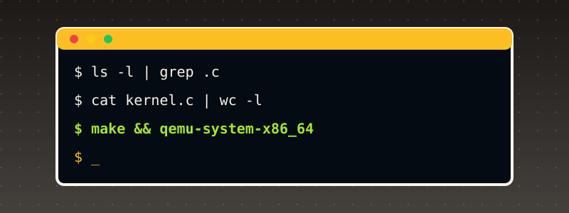

# Appendix B. Introduction to Unix

{ style="display:block;margin:0 auto;max-width:100%;height:auto;border-radius:6px" }

This book is called "Unix OS from Scratch," and almost every chapter builds some piece of what "Unix" actually means as a concrete, running system — processes, files, system calls, a shell-reachable filesystem — without ever pausing to lay out what Unix *is*, where it came from, or why its own ideas turned out to be worth rebuilding four decades later. This appendix is that pause.

## 1. Where Unix came from

Unix began in 1969 at Bell Labs, written by Ken Thompson and Dennis Ritchie (joined soon after by many others, including Brian Kernighan, Doug McIlroy, and Rob Pike), after Bell Labs withdrew from the much larger, more ambitious Multics project. Multics aimed to be an all-encompassing, feature-complete timesharing system; Unix, deliberately, was almost its opposite — a small team's own reaction against that complexity, built first in assembly on a spare PDP-7, then rewritten in 1973 in a new, still-young language, C, designed by Ritchie specifically to make that rewrite practical.

Rewriting the kernel itself in a high-level language was, at the time, a genuinely radical choice — operating systems were assumed to need assembly for both speed and direct hardware access. That choice is exactly why Unix could be *ported* at all: a C compiler targeting a new machine, plus a comparatively small amount of per-architecture assembly (boot code, interrupt handling, context switching — precisely the parts Appendix A covers, and precisely the parts of this book's own kernel still written in assembly), was enough to bring Unix to a new architecture, instead of rewriting the entire system by hand each time.

AT&T, under a 1956 antitrust consent decree, was barred from selling software commercially — so through the 1970s it licensed Unix's own source code to universities essentially at cost, most consequentially to the University of California, Berkeley, whose own Computer Systems Research Group built the Berkeley Software Distribution (BSD), adding (among much else) the real virtual memory and TCP/IP networking stack that became the template nearly every subsequent networked operating system — including, indirectly, this book's own ARP/IP/ICMP chapters' own conceptual model of what a network stack's job even is — would follow. That licensing arrangement, and the two resulting lineages (AT&T's own commercial System V, and the BSD line) is the root of Unix's own, famously fragmented family tree, and the direct reason "Unix" today names a *style of system design* far more than it names one specific codebase.

**POSIX** (Portable Operating System Interface), standardized by IEEE starting in 1988, is the real attempt to write down, formally, what every one of those divergent Unix-like systems actually had to agree on to call themselves compatible — the real specification for things like `fork()`, `open()`, `read()`/`write()`, and the exit-status conventions this book's own later chapters assume without ever stating as a formal requirement. **Linux** (Linus Torvalds, 1991) and the various BSDs are both Unix-like, POSIX-influenced systems that are not derived from AT&T's own original source code at all — clean, independent reimplementations of the same real ideas, the same relationship this book's own kernel has to the real Unix systems it draws its own design from.

## 2. The Unix philosophy

Doug McIlroy's own, often-quoted summary, from the Bell Labs internal memo introducing the Unix philosophy, captures the real design stance better than any longer explanation: "Write programs that do one thing and do it well. Write programs to work together. Write programs to handle text streams, because that is a universal interface."

Three real, concrete consequences of that stance, each one directly visible in what this book's own kernel actually builds:

- **"Everything is a file."** A real Unix kernel exposes an enormous range of genuinely different things — ordinary data, a directory, a terminal, a device, (on Linux) even kernel-internal state via `/proc` — through one single, small interface: `open()`, `read()`, `write()`, `close()`. A program doesn't need a different API for a disk file versus a keyboard versus a network socket; it needs one API, applied to many different real things behind it. This book's own kernel does not go that far (its own `fat16_read()`/`fat16_write()` are specific to one real filesystem, not a general VFS layer), but the *reason* its FAT16 work (Chapters 20-23) matters at all — giving a program a name-based, uniform way to reach data, rather than a raw LBA sector number — is the same real idea in miniature.
- **Small, composable tools over one large program.** A real Unix shell lets `cat file | grep pattern | sort` chain three genuinely separate, independently-written programs into one pipeline, each one doing a single, well-defined job and knowing nothing about the other two. This book's own kernel does not yet have pipes or multiple user-space programs cooperating this way (Chapter 18's own ELF loader runs exactly one), but the discipline behind each of this book's own individual chapters — one driver, one subsystem, one real, narrow job, building on what came before rather than growing one monolithic function — is the same real design instinct scaled down to source files instead of running programs.
- **Plain text as the default interchange format**, wherever a binary format isn't specifically required — which is exactly why so many of this book's own real-world protocols (ISO 8583's text-coded data elements, OFX, FIX, XML-based formats like ACORD and OTA) are text, not binary, despite the real performance cost: a human being can read, debug, and reason about them directly, the same real tradeoff Unix itself made deliberately, over and over, since 1969.

## 3. The kernel / user-space split

A Unix-like system draws one real, hardware-enforced line between two worlds: the **kernel**, which runs with full access to the machine (every instruction, every physical address, direct control of every device), and **user space**, where ordinary programs run with the hardware itself preventing them from touching anything the kernel hasn't explicitly allowed.

On x86, that line is **privilege rings** (Chapter 15's own real subject): ring 0 for the kernel, ring 3 for user programs (rings 1-2 exist in the architecture but essentially no real OS uses them). The CPU itself — not a software convention, not a gentleman's agreement — refuses to execute certain instructions (`cli`, `hlt`, writing to certain control registers) and refuses certain memory accesses at all, the instant code running in ring 3 attempts them. This is not a performance optimization; it is the entire real reason a buggy or malicious user program cannot simply crash or compromise the whole machine.

A user-space program that needs the kernel to do something on its behalf — read a file, allocate memory, write to the screen — cannot just call a kernel function directly; ring 3 code cannot even see where the kernel's own functions live in memory in general, let alone call into ring 0 safely. It issues a **system call**: a deliberate, controlled transition from ring 3 to ring 0, through exactly one narrow, kernel-defined door, at exactly one kernel-defined address, with the kernel retaining full control over what happens on the other side of that door. This book's own Chapter 15 is precisely that: `int 0x80` as the controlled door, a fixed calling convention (syscall number in `eax`, up to two arguments in `ebx`/`ecx`, cited directly from the real Linux i386 convention) as the agreed shape of a request, and the CPU's own real DPL=3 gate-privilege check (Appendix A, Section 9) as what makes ring 3 code allowed to knock on this one specific door at all, while every other door in the IDT stays firmly ring-0-only.

## 4. Processes

A **process** is a running instance of a program — its own private (or privately-mapped) memory, its own register state, its own sense of what it's currently doing — as distinct from the program's own file on disk, which is just static bytes until something runs it. Real Unix systems create new processes with `fork()` (clone the calling process, nearly identically, into a second, independent one) and `exec()` (replace a process's own running program with a different one entirely, in place) — two separate, composable real operations, rather than one combined "spawn a new program" call, specifically so a shell can `fork()` to get a new process, then do setup work (redirecting its own stdin/stdout) *before* `exec()`-ing the actual command, all without the original shell process itself ever being replaced.

This book's kernel does not implement `fork()`/`exec()` at all — Chapter 18's own ELF loader (`elf_load()`) is closer, conceptually, to `exec()` alone: parsing a real ELF binary's own program headers and mapping its `PT_LOAD` segments into a fresh address space. What this book's kernel *does* build, in real, working form, is the layer underneath process management: Chapter 11's own cooperative task switching (each task voluntarily yielding), Chapter 12's own preemptive scheduling (the PIT timer forcibly interrupting a task whether it wants to yield or not, the real mechanism that stops one runaway process from starving every other process on a real multi-user system), and Chapter 17's own per-process address spaces (one page directory per task, so one task's own memory corruption cannot reach into another's) — the real, concrete machinery "a process" is built out of, well below the `fork()`/`exec()` API that would eventually sit on top of it.

## 5. Files, inodes, and the filesystem tree

A real Unix filesystem presents every file and directory as nodes in one single tree, rooted at `/` — unlike, say, Windows' own per-drive letter scheme (`C:\`, `D:\`), a Unix system mounts additional storage *into* that one tree at an arbitrary directory, so `/home`, `/mnt/usb`, and the root filesystem itself can be three entirely separate physical devices while still looking, to any program, like one seamless namespace.

Internally, a real Unix filesystem separates a file's own *name* from its own *data and metadata*: an **inode** holds the real file size, permissions, owner, timestamps, and the real on-disk block pointers, identified only by a number — a directory, underneath, is nothing more than a list of (name, inode number) pairs. This is exactly why a real Unix **hard link** can make the same file appear under two different names in two different directories at once (two directory entries, one shared inode) in a way that is genuinely structurally impossible on filesystems that don't separate the two concepts.

This book's own FAT16 work (Chapters 20-23) implements a meaningfully simpler, older, real design: FAT16 has no inode-like separate metadata structure at all — a directory entry *is* the file's own name, size, and starting cluster, all in one place, which is exactly why FAT16 has no concept of a hard link, and why this book's own `fat16_rmdir()` (Chapter 22) has to enforce "a directory must be empty before it can be removed" as an explicit rule its own code checks, rather than inheriting that guarantee from a more general structure underneath. Building FAT16 first, rather than something inode-based, is itself a real, deliberate pedagogical choice this book made: FAT16's own directory-entry-as-metadata design is simple enough to implement convincingly in a few chapters, while still teaching the same real core lesson — a filesystem's whole job is translating a human-meaningful name into the raw sectors that actually hold the data, exactly the lesson Chapter 20's own page states directly: "files addressed by name instead of by raw LBA."

## 6. Permissions and the multi-user model

Real Unix systems were built, from the start, to be genuinely multi-user: several different people, each with their own account, sharing one physical machine, each one needing to be protected from the others' own mistakes or malice. The real permission model built for that: every file has an owner (a user) and a group, plus three independent permission bits — read, write, execute — for each of three audiences (the owner, the owning group, everyone else) — the familiar `rwxr-xr-x` a real `ls -l` prints.

**`root`** (user ID 0) is the one real account exempt from nearly every one of those checks — the real, deliberate "someone has to actually be able to fix things" escape hatch every real multi-user system needs, and exactly why real Unix security practice treats logging in *as* root, for day-to-day work, as a serious mistake: every one of the system's own real protections is specifically the thing root doesn't get.

This book's own kernel has no concept of a user account at all, and ring 3 (Chapter 15) is this book's own entire real security boundary — every piece of user-space code this book ever runs is implicitly "the same user," with the kernel/user-space split itself doing the real protective work a multi-user permission system would otherwise need to layer on top. A reader who goes on to add real multi-user support to a kernel like this one's would be building exactly the layer real Unix adds on top of the ring-based split this book already has working: per-file ownership metadata, and a permission check consulted on every real `open()`.

## 7. The shell

A real Unix **shell** is, itself, just an ordinary user-space program — not a privileged part of the kernel at all — whose entire job is reading a line of text, interpreting it as a command (plus arguments, plus any real redirection or pipe syntax), and using exactly the same real process-creation primitives (`fork()`/`exec()`) any other program could use, to actually run it. That a shell is "just a program" is itself a real, significant design statement: anyone can write a different one (and many real shells — `sh`, `csh`, `bash`, `zsh`, `fish` — genuinely coexist on real systems today), because the shell holds no privilege an ordinary program lacks; it is a convenience layered on top of real, already-general kernel facilities, not a special case the kernel has to know about.

This book's kernel has no shell of its own (yet) — Chapter 18's own ELF loader runs exactly one fixed user-space program, `046_user_program.c`'s own real descendants, directly from `kmain()`, rather than through an interactive command line a human types into. Building a real shell on top of what this book's kernel already has working is, largely, an exercise in exactly the pieces already covered above: `fork()`/`exec()`-equivalent process creation (this book has the scheduling and address-space machinery `fork()` would need, but not `fork()` itself), a way to read a line of real keyboard input (Chapter 5, already built), and a way to look a typed name up in the filesystem and run it (Chapters 18 and 20-23, already built) — a genuine, concrete "what's left" for anyone extending this book's own kernel toward something closer to a complete, interactive Unix.

## 8. Common commands

Everything above explains what a real Unix system *is*, underneath — this section is the much more concrete, practical complement: what you'd actually type at a real shell prompt on a real Unix-like system (Linux, macOS's own Terminal, BSD, WSL), and which of the real concepts above each command is a thin, direct wrapper around. This book's own kernel does not implement a shell (Section 7) or any of these commands itself — every one of them below is a *real, external, user-space program*, not a kernel feature — but understanding them is what makes the rest of this appendix, and the rest of this book, usable in practice rather than purely theoretical.

**Finding out where you are, and moving around:**

| Command | What it does |
|---|---|
| `pwd` | "print working directory" — the one, real, absolute path of the directory your shell is currently "in." |
| `cd <dir>` | "change directory" — moves your shell's own working directory. `cd ..` moves up one level; `cd` alone (no argument) goes to your real home directory; `cd -` goes back to wherever you just were. |
| `ls` | "list" — the contents of a directory. `ls -l` gives the real long format (permissions, owner, size, modification time — exactly the fields Section 6's own permission model describes); `ls -a` includes real "hidden" entries (any name starting with `.`, a plain convention, not a real separate permission); `ls -la` combines both. |

**Looking at, and making, files and directories:**

| Command | What it does |
|---|---|
| `cat <file>` | "concatenate" — prints a file's own entire real contents to the screen. `cat file1 file2` prints both, one after the other — the real origin of the name: it's for joining files, printing being the degenerate one-file case. |
| `less <file>` | shows a file one screen at a time, scrollable — the real, practical choice over `cat` for anything longer than a screen. (`more` is `less`'s own real, older, more limited ancestor; `less` was later written as a genuine improvement, named as the joke "less is more.") |
| `head <file>` / `tail <file>` | print only the first, or last, 10 lines by default (`-n 20` for a different count). `tail -f <file>` keeps the file open and prints new lines as they're appended — the real, standard way to watch a live log file. |
| `touch <file>` | creates an empty file if it doesn't exist, or, if it already does, updates its own real modification timestamp without touching its contents at all. |
| `mkdir <dir>` | makes a new, empty directory. `mkdir -p a/b/c` creates every real intermediate directory needed, rather than refusing if `a` or `a/b` doesn't already exist. |
| `cp <src> <dst>` | copies a file. `cp -r <src> <dst>` copies an entire directory, recursively. |
| `mv <src> <dst>` | moves (or renames — the same real operation, on the same real filesystem) a file or directory. |
| `rm <file>` | removes a file — real, immediate, and, on most real systems, with no recycle bin at all: this is the one command every real Unix tutorial warns you about first, for good reason. `rm -r <dir>` removes a directory and everything in it, recursively; `rmdir <dir>` (no `-r`) removes a directory only if it's already empty — the real, direct command-line equivalent of the "a directory must be empty before it can be removed" rule this book's own `fat16_rmdir()` (Chapter 22) enforces in code. |

**Permissions (the real bits Section 6 describes, from the command line):**

| Command | What it does |
|---|---|
| `chmod <mode> <file>` | changes a file's own real permission bits. `chmod 755 file` sets them directly as three real octal digits (owner/group/other, each digit summing read=4 + write=2 + execute=1 — `7` = all three, `5` = read+execute, no write); `chmod +x file` instead adds the execute bit symbolically, leaving everything else alone. |
| `chown <user> <file>` | changes a file's own real owner — on most real systems, something only `root` can do to a file it doesn't already own, the real practical edge of Section 6's own root-is-exempt rule. |

**Searching and text processing — the real "small, composable tools" Section 2 describes, in their native habitat:**

| Command | What it does |
|---|---|
| `grep <pattern> <file>` | prints every line of `file` that matches `pattern` (a real regular expression, by default). `grep -r <pattern> <dir>` searches every file in a directory, recursively; `grep -i` ignores case. |
| `find <dir> -name <pattern>` | searches a real directory tree for files/directories by name (or by other real criteria: `-type f` for files only, `-mtime` for modification age, and others) — genuinely distinct from `grep`, which searches file *contents*, not file *names*. |
| `sort` | sorts its own input, line by line, alphabetically by default (`-n` for numeric order, `-r` to reverse). |
| `wc <file>` | "word count" — prints the real line, word, and byte counts; `wc -l` alone for just the line count, the single most common real use. |
| `sed` / `awk` | two real, much older and more powerful text-processing languages in their own right — `sed 's/old/new/' file` does a real find-and-replace per line; `awk '{print $1}' file` prints just the first whitespace-separated field of every line. Both are genuinely deep tools; this table only names them as the real next step past `grep`/`sort`/`wc`, not a complete treatment. |

**Pipes and redirection — the real mechanism behind Section 2's own "work together" principle:**

| Syntax | What it does |
|---|---|
| `cmd1 \| cmd2` | a **pipe**: `cmd1`'s own real standard output becomes `cmd2`'s own real standard input, directly, with no temporary file ever written to disk. `cat file \| grep pattern \| sort` is the real, canonical three-stage example. |
| `cmd > file` | redirects `cmd`'s own real standard output into `file`, overwriting whatever was there. `cmd >> file` does the same but *appends*, instead of overwriting. |
| `cmd < file` | redirects `file`'s own contents into `cmd`'s own real standard input, instead of whatever `cmd` would otherwise read (often the keyboard). |

**Processes — the real, command-line-visible face of Section 4's own process model:**

| Command | What it does |
|---|---|
| `ps` | lists real, currently-running processes (`ps aux` for essentially every process on the system, not just ones attached to your own terminal) — each row is one real process, with its own real process ID (PID), the same real identifier `kill` below targets. |
| `kill <pid>` | sends a real signal to a process by its own PID — by default, `SIGTERM`, a real, polite "please exit" request a well-behaved program can catch and act on; `kill -9 <pid>` sends `SIGKILL`, which a process cannot catch, ignore, or clean up after at all — the real, final, no-appeal version. |
| `cmd &` | runs `cmd` in the **background** — your own shell gets its prompt back immediately, rather than waiting for `cmd` to finish, while `cmd` itself keeps running. `jobs` lists what's currently running in the background of your own shell session; `fg`/`bg` move a job back to the foreground or background. |

**A few more, genuinely common enough to name:**

- `man <command>` — the real, on-system manual page for any of the commands above (and thousands more) — the single most useful command on this entire list to actually remember, since it makes every other one self-documenting.
- `echo <text>` — prints `text` back out, verbatim — trivial on its own, but the real, standard way to test redirection/pipes (`echo hello > file`) or to print the real, current value of a shell variable (`echo $HOME`).
- `which <command>` — prints the real, full path to whichever program your shell would actually run if you typed that command's own name — useful the moment two different real programs with the same name exist on one system, and you need to know which one you'd actually get.

Every single one of these, underneath, is built from the real, general facilities Sections 3-6 already described: `ls` and `cat` are thin wrappers around the real `open()`/`read()` system calls Section 3 names; `chmod`/`chown` directly manipulate the real inode-level metadata Section 5 describes; `ps`/`kill` operate on the real process table Section 4's own scheduler maintains; a pipe (`|`) is, underneath, a real kernel-provided buffer connecting two real processes' own file descriptors, the same real "everything is a file" idea Section 2 opens with, applied to inter-process communication itself.

## 9. What "Unix-like" means for this book specifically

This book never claims POSIX compliance, and is not attempting to be a complete, usable Unix — stated as plainly here as every individual chapter's own "Deliberately out of scope" section states its own narrower limits. What makes "Unix OS from Scratch" an honest title is that every major piece this book *does* build is a real, working, from-scratch implementation of a genuine Unix concept, not a simulation or a stand-in: a real kernel/user-space privilege split enforced by actual CPU rings (not a software convention); a real system call mechanism, not a function call dressed up to look like one; real preemptive, multi-task scheduling; real per-process virtual address spaces; a real, working filesystem that resolves human-readable names to on-disk data; and, in this book's own later chapters, real network protocols (ARP, IPv4, ICMP) implemented against their own real specifications rather than invented from scratch.

What's missing, relative to a complete Unix, is mostly *breadth*, not a different *kind* of system: no `fork()`/`exec()` (only the lower-level scheduling and address-space primitives they'd be built from), no multi-user permission model, no shell, no general virtual filesystem layer across multiple real filesystem types, no complete POSIX API surface. Every one of those is a real, substantial additional project — and, not coincidentally, every one of them is buildable, incrementally, on exactly the foundation this book already finished laying.

## 10. Five complete, worked examples

Every one of the five programs below was actually run, on a real Unix-like host (Linux), to confirm the real output shown is genuinely what it produces.

### Example 1: `fork()` and `exec()`, the real two-step process-creation Section 4 describes

```c
#include <stdio.h>
#include <unistd.h>
#include <sys/wait.h>

int main(void) {
    printf("parent: about to fork, pid=%d\n", getpid());
    fflush(stdout);

    pid_t pid = fork();

    if (pid < 0) {
        perror("fork");
        return 1;
    }

    if (pid == 0) {
        /* the child: fork() returned 0 here */
        printf("child: running, pid=%d, about to exec\n", getpid());
        fflush(stdout);
        execlp("echo", "echo", "hello from the real echo program", NULL);
        /* execlp only returns if it failed -- if it succeeded, this
         * process's own image was already replaced and nothing below
         * this line ever runs */
        perror("execlp");
        return 1;
    }

    /* the parent: fork() returned the child's own real PID here */
    printf("parent: child pid is %d, waiting for it to finish\n", pid);
    fflush(stdout);
    int status;
    waitpid(pid, &status, 0);
    printf("parent: child exited with status %d\n", WEXITSTATUS(status));
    return 0;
}
```

```
gcc -Wall -Wextra -o forkexec forkexec.c
./forkexec
```

**Real captured output:**
```text
parent: about to fork, pid=1861
parent: child pid is 1862, waiting for it to finish
child: running, pid=1862, about to exec
hello from the real echo program
parent: child exited with status 0
```

`fork()` runs once, but returns twice — `0` in the newly-created child, the real child's own PID in the parent — which is exactly why the `if (pid == 0)` branch is what separates "code that only the child runs" from "code that only the parent runs," both compiled from the same one source file. Note that the parent's "child pid is..." line lands *before* the child's "running..." line above: after `fork()`, both processes are genuinely running concurrently, and which one the real scheduler lets run next is not guaranteed — this is real, observed nondeterminism, not a bug, and running this exact program again could interleave the two differently. `execlp()` is the real second half: it replaces the *calling* process's own program, in place (same PID, same open files, same everything except the code now running) — which is why nothing after a successful `execlp()` call ever executes; there is no "successful exec" return to come back to.

### Example 2: a real Unix pipeline, five small tools, one job

```sh
#!/bin/sh
# Counts how many times each word appears in a real text file, most
# frequent first -- a real, classic pipeline: five small, separate
# programs, each doing one job, chained entirely through real pipes.
cat sample.txt |
    tr '[:upper:]' '[:lower:]' |   # fold case so "The" and "the" count together
    tr -cs 'a-z' '\n'       |      # one word per line, punctuation stripped
    sort                     |      # group identical words together
    uniq -c                   |      # collapse each group to "<count> <word>"
    sort -rn                        # highest count first
```

```
printf "The quick brown fox.\nThe fox jumps. The quick fox runs.\n" > sample.txt
chmod +x wordcount.sh
./wordcount.sh
```

**Real captured output:**
```text
      3 the
      3 fox
      2 quick
      1 runs
      1 jumps
      1 brown
```

Not one of `cat`, `tr`, `sort`, or `uniq` knows anything about word-frequency counting as a concept — each one does its own single, narrow, real job (concatenate, translate characters, sort lines, collapse adjacent duplicates with a count), and the real `|` pipe operator is what composes five genuinely independent programs into one, without any of them being written with the other four in mind. This is Section 2's own "do one thing well" principle, running for real, not as an abstract claim.

### Example 3: real permission bits, checked by the real kernel, not by convention

```sh
#!/bin/sh
# Demonstrates real Unix permission bits by trying to execute a script
# both without and with the execute bit set.
cat > greet.sh <<'INNER'
#!/bin/sh
echo "hello from a real, executable script"
INNER

echo "Permissions right after creation:"
ls -l greet.sh

echo
echo "Trying to run it before chmod +x:"
./greet.sh
echo "exit status: $?"

chmod +x greet.sh
echo
echo "Permissions after chmod +x:"
ls -l greet.sh

echo
echo "Trying to run it now:"
./greet.sh
echo "exit status: $?"
```

```
chmod +x perms_demo.sh
./perms_demo.sh
```

**Real captured output:**
```text
Permissions right after creation:
-rw-r--r-- 1 root root 54 Oct  1 14:54 greet.sh

Trying to run it before chmod +x:
./perms_demo.sh: 14: ./greet.sh: Permission denied
exit status: 126

Permissions after chmod +x:
-rwxr-xr-x 1 root root 54 Oct  1 14:54 greet.sh

Trying to run it now:
hello from a real, executable script
exit status: 0
```

Nothing about `greet.sh`'s own *contents* changed between the two attempts — the exact same bytes that produced "Permission denied" moments earlier ran successfully right after `chmod +x`. This is the real, concrete version of Section 6's own permission model: the kernel itself checks the real execute bit before it will even attempt to run a file, regardless of what that file actually contains.

### Example 4: a real named pipe — "everything is a file," demonstrated, not just claimed

```sh
#!/bin/sh
# A real named pipe (FIFO) -- a genuinely different kind of real thing
# than an ordinary file (no data is ever stored on disk; the kernel
# just connects one process's writes directly to another's reads), but
# reached through the exact same real open/read/write interface, with
# no special-case API, exactly Section 2's own "everything is a file"
# point made concrete.
rm -f demo_pipe
mkfifo demo_pipe
ls -l demo_pipe

( echo "a message sent through a real FIFO" > demo_pipe ) &
cat demo_pipe

wait
rm -f demo_pipe
```

```
chmod +x fifo_demo.sh
./fifo_demo.sh
```

**Real captured output:**
```text
prw-r--r-- 1 root root 0 Oct  1 14:54 demo_pipe
a message sent through a real FIFO
```

The leading `p` in `ls -l`'s own output (where an ordinary file shows `-`) is the real, visible proof this is genuinely a different *kind* of thing — yet the subshell on the line above writes to it with a plain `>` redirect, and `cat` reads it with no special flag or different command at all, the exact same two tools Example 2 already used on an ordinary file. The real size shown, `0`, is itself telling: unlike a regular file, a FIFO never actually stores the bytes passing through it anywhere — it is a pure, real, in-kernel handoff between two processes, elevated to the file interface rather than invented as a separate concept.

### Example 5: real processes, real signals, from the command line

```sh
#!/bin/sh
# Starts a real background process, inspects it with ps while it's
# still running, then stops it early with a real signal via kill --
# the command-line face of Section 4's own process model.
sleep 30 &
child_pid=$!
echo "started a real background 'sleep 30', pid=$child_pid"

sleep 1
echo "ps shows it still running:"
ps -p "$child_pid" -o pid,ppid,stat,cmd

kill "$child_pid"
sleep 1
if kill -0 "$child_pid" 2>/dev/null; then
    echo "still running (unexpected)"
else
    echo "confirmed: pid $child_pid is gone, real SIGTERM worked"
fi
```

```
chmod +x jobs_demo.sh
./jobs_demo.sh
```

**Real captured output:**
```text
started a real background 'sleep 30', pid=1950
ps shows it still running:
  PID  PPID STAT CMD
 1950  1949 S    sleep 30
confirmed: pid 1950 is gone, real SIGTERM worked
```

`$!` is the real shell's own variable holding the PID of whatever it most recently started in the background (`&`) — the same real PID `ps` and `kill` both operate on. `kill` (despite the name) just *sends a real signal*; by default that signal is `SIGTERM`, a real, polite request a process can act on — here, `sleep` simply has no handler installed for it and exits, exactly the real, ordinary case Section 8 describes. `kill -0`, a real, deliberate idiom, sends no actual signal at all (signal `0`) and is used purely for its own real side effect: it fails if the target PID no longer exists, which is exactly how this script confirms the process is genuinely gone, not just assumed to be.

## Further reading

- **Ritchie & Thompson, "The UNIX Time-Sharing System"** (1974, *Communications of the ACM*) — the real, original paper describing Unix's own early design, written by its own two primary creators.
- **Kernighan & Pike, *The Unix Programming Environment*** (1984) — the real, classic explanation of the Unix philosophy in practice, from two Bell Labs Unix veterans.
- **W. Richard Stevens, *Advanced Programming in the UNIX Environment*** — the real, standard reference for the actual POSIX system call API this appendix only sketches the shape of.
- **The POSIX.1 standard itself** (IEEE Std 1003.1), and the **Linux man-pages project** (man7.org), as the real, living documentation of the exact system call contracts a complete Unix-like kernel has to honor.
