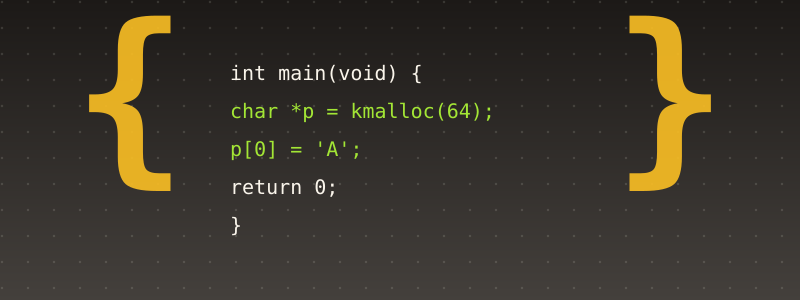

# Appendix C. Introduction to C

{ style="display:block;margin:0 auto;max-width:100%;height:auto;border-radius:6px" }

Nearly every line of this book's own kernel — everything except the small handful of files Appendix A already covered — is C. This appendix is a comprehensive, standalone introduction to the language itself, and, in its final sections, to the specific, narrower dialect of C a **freestanding** kernel like this one's actually gets to use: no standard library, no heap until the kernel builds its own (Chapter 9), no operating system underneath to lean on, because this code *is* the operating system.

## 1. What C is, and isn't

C is a small, statically-typed, compiled language, designed by Dennis Ritchie at Bell Labs in the early 1970s specifically to make rewriting Unix itself practical (Appendix B, Section 1) — a language with almost no runtime machinery of its own, deliberately close to what the underlying hardware actually does, while still being portable across genuinely different real architectures.

"Close to the hardware" is the single most important thing to understand about C before anything else: a C `int` is not an infinite-precision mathematical integer, it is a fixed number of bits that can genuinely overflow; a C pointer is not a safe, checked reference, it is a real memory address that the language will happily let you corrupt; C performs essentially no automatic bounds checking, no automatic memory management, and very little automatic anything. This is not a design flaw to be worked around — it is the entire reason a kernel can be written in C at all, since a kernel's whole job is manipulating real memory addresses and real hardware registers directly, which a more "protective" language would actively get in the way of.

## 2. Compilation: from text to machine code

A C **compiler** (GCC, in this book's own case) translates a `.c` source file into real machine code (Appendix A, Section 1) in several real, distinct stages: **preprocessing** (textual substitution — expanding `#include` and `#define`, Section 10 below), **compilation proper** (parsing the C into an internal representation, then generating assembly), **assembly** (NASM-equivalent translation of that generated assembly into real machine code, an object file), and **linking** (combining multiple object files — and resolving every `extern` reference between them — into one final executable, the real job this book's own `001_linker.ld` and every later chapter's own linker script controls).

This book's own `build.sh` runs exactly this pipeline: `gcc -m32 -ffreestanding ... -c file.c -o build/file.o` for each C file (stopping after the "assembly" stage, `-c`, to produce an object file rather than a complete program), then one final `ld` invocation linking every object file — C and NASM-assembled alike — into one `kernel.bin`.

`-ffreestanding` is not a minor flag — it is what tells GCC this code will never have a real C standard library, a real `main()` with the usual hosted-environment guarantees, or a real C runtime doing setup work before any of this book's own code runs (Section 11 covers exactly what that means in practice).

## 3. Types: what a variable actually is

Every C variable has a fixed, compile-time-known **type**, which determines both how many bytes it occupies and how the bits in those bytes are supposed to be interpreted.

```c
char  c;   // typically 1 byte
short s;   // typically 2 bytes
int   i;   // typically 4 bytes (on every target this book builds for)
long  l;   // 4 or 8 bytes, architecture-dependent -- genuinely ambiguous, which is
           // exactly why this book never uses it for anything size-sensitive
```

The real, standard-mandated sizes of these "built-in" types are deliberately *not* fixed across every C implementation — only minimum ranges are guaranteed. This is exactly the real problem `<stdint.h>`'s own fixed-width types solve, and exactly why every single struct in this book's own code that has to match a real, external byte layout (an IDT entry, an Ethernet frame header, an IPv4 header) uses them instead of the built-in types:

```c
uint8_t   // exactly 8 bits, unsigned
int8_t    // exactly 8 bits, signed
uint16_t  // exactly 16 bits, unsigned
uint32_t  // exactly 32 bits, unsigned
int32_t   // exactly 32 bits, signed
```

`unsigned` versus signed matters beyond just the sign bit: an `unsigned` value wraps around on overflow (defined, predictable behavior — `0xFFFFFFFFu + 1` is exactly `0`), while a signed integer overflowing is, by the C standard, **undefined behavior** — not merely "implementation-defined," genuinely *unspecified*, meaning the compiler is allowed to assume it never happens and optimize accordingly, which can produce real, surprising results far stranger than a simple wraparound. This is exactly why this book's own checksum and bit-manipulation code (`045_ip.c`'s own `ip4_checksum()`, for one real example) is careful to work in `uint32_t` throughout, not `int`.

## 4. Pointers

A pointer is a variable whose own value is a memory address — nothing more mysterious than that, though the notation takes some getting used to:

```c
int x = 42;
int *p = &x;     // p now holds the ADDRESS of x ("&" = "address of")
int y = *p;       // y = 42        ("*" here = "the value AT this address" --
                   // this specific use is called "dereferencing")
*p = 100;          // x is now 100 -- writing THROUGH the pointer
```

The type a pointer is declared with (`int *`, as opposed to a bare, untyped address) tells the compiler how many bytes to read or write when you dereference it, and — critically for the next idiom — how far to move for pointer *arithmetic*:

```c
int arr[5] = {10, 20, 30, 40, 50};
int *p = arr;        // arrays decay to a pointer to their first element
int second = *(p + 1); // = 20 -- "p + 1" advances by sizeof(int) BYTES, not 1 byte,
                        // because p's own type is "pointer to int"
int same = p[1];        // identical to *(p + 1) -- array indexing IS pointer
                        // arithmetic, by definition, in C
```

**`NULL`** (conventionally the address `0`) is C's own real convention for "this pointer does not currently point at anything valid." Dereferencing a null pointer is undefined behavior — on this book's own freestanding kernel, with paging enabled (Chapter 8) and address 0 never mapped, it is specifically a real page fault, caught by Chapter 10's own `isr14` handler, rather than silent corruption.

A pointer's own real power — and real danger — is that nothing in the language itself stops you from computing an address that doesn't actually correspond to anything valid, or from reading past the end of a real buffer. This book's own established discipline, since early in its own recent work, of running native tests under AddressSanitizer and UndefinedBehaviorSanitizer *before* ever booting a chapter's own code exists specifically because this exact class of error — a real buffer overread, a real use of uninitialized memory — is not something the C compiler itself catches, and several of this book's own real, documented bugs (Chapter 41's own `ota_parse_response()` comparing uninitialized trailing bytes, among others) were exactly this.

## 5. Arrays

```c
uint8_t buffer[64];          // 64 bytes, contiguous, on the stack (if local)
uint8_t matrix[4][4];         // 16 bytes total, laid out row-major --
                              // matrix[r][c] is at offset (r*4 + c)
```

An array's own size is fixed at compile time (or, for a local array, computed once at the point it's declared) and is part of its own type — `uint8_t[64]` and `uint8_t[32]` are genuinely different types, which is exactly why this book's own function signatures are so consistent about always passing an explicit length alongside any buffer pointer (`veh_build_avail_request(const veh_avail_request_t *req, uint8_t *out, uint32_t out_size)`, one real example among dozens): once an array "decays" to a bare pointer at a function boundary, its own compile-time size information is gone, and the only way the called function can know how much space it actually has to work with is if the caller tells it explicitly.

C performs **no bounds checking** on array access, at all, ever — `buffer[1000]` on a 64-byte array compiles and runs without complaint, reading or writing whatever real memory happens to sit past the buffer's own end. This is, again, not a defect to be apologized for; it is the direct, unavoidable consequence of arrays in C being nothing more than "a pointer, plus compiler-enforced arithmetic" — and it is exactly why every one of this book's own wire-format parsers checks lengths explicitly, by hand, before ever indexing into a buffer with an offset that came from untrusted input.

## 6. Structs: grouping related data

A `struct` groups several named fields, of possibly different types, into one single composite type — the real, direct C tool for modeling anything that is naturally "several pieces of related data, together":

```c
struct point {
    int x;
    int y;
};

struct point p;
p.x = 3;
p.y = 4;

struct point *pp = &p;
pp->x = 5;     // "pp->x" is shorthand for "(*pp).x" -- the real, idiomatic way
               // to access a struct field through a pointer to it
```

**Which one came first, historically:** `(*pp).x` is the logically prior form, and it's worth understanding *why* it has to be written with those parentheses before `->` is introduced at all. `.` binds tighter than (is evaluated before) unary `*`, so `*pp.x` — no parentheses — would parse as `*(pp.x)`: "dereference whatever `pp.x` is," which is nonsense here, since `pp` is a pointer, not a struct, and has no field named `x` to begin with. The parentheses in `(*pp).x` are there to force the real, intended order: dereference `pp` *first* (producing the actual `struct point`), *then* access its `.x` field. `->` was added directly to the language specifically to remove that awkward, error-prone parenthesization for what is, in real C code, an extremely common operation — accessing a field through a pointer is closer to the *normal* case than the exception, once code is built out of functions that take pointers to structs rather than whole structs by value (passing a whole struct by value means copying every one of its own bytes onto the stack on every single call; passing a pointer copies only one address, regardless of how large the struct itself is — exactly why this book's own functions, like every real C function working with structs, almost always take a pointer). `pp->x` is not a different, newer *feature* so much as real, deliberate syntactic relief for the single most common real use of `(*pp).x` — and both forms still compile to the exact same real machine code today; `->` buys nothing at runtime, only at the keyboard.

This equivalence holds exactly the same way through an array of structs, tying this section directly back to Section 5's own pointer arithmetic:

```c
struct point pts[3] = { {1, 2}, {3, 4}, {5, 6} };
struct point *pp = pts;   // arrays decay to a pointer here too (Section 5)

printf("%d\n", (*pp).x);        // 1
printf("%d\n", pp->x);           // 1 -- identical
printf("%d\n", pts[0].x);         // 1 -- also identical: pts[0] IS *(pts + 0)

printf("%d\n", (*(pp + 1)).y);    // 4
printf("%d\n", (pp + 1)->y);       // 4 -- identical (note: "pp + 1 -> y" with no
                                   // parentheses would be a real syntax error --
                                   // -> binds to its own immediate left operand,
                                   // not to the whole "pp + 1" expression)
printf("%d\n", pts[1].y);          // 4 -- also identical
```

Every one of those six lines reads the exact same real bytes — `pts[1]`'s own real address is computed identically whether you write it as array indexing, as pointer-arithmetic-plus-dereference, or (via `->`) as pointer-arithmetic-plus-member-access; they are not three competing features, but three different surface spellings of the one real underlying mechanism Section 5 already described.

Every struct field is laid out in memory in declaration order, though the compiler is free to insert **padding** bytes between fields to satisfy each field's own natural alignment requirement (a 4-byte `uint32_t` field, for instance, is conventionally placed at an address that is itself a multiple of 4) — which matters enormously the moment a struct's own byte layout has to match something real and external, like a network header or an IDT entry, rather than only being used internally. This book's own code handles that with GCC's `__attribute__((packed))`, which tells the compiler "lay this struct out with *no* padding at all, fields exactly adjacent, exactly in declaration order" — visible directly in `046_idt.c`'s own real IDT entry struct:

```c
struct idt_entry {
    uint16_t offset_low;
    uint16_t selector;
    uint8_t  zero;
    uint8_t  type_attributes;
    uint16_t offset_high;
} __attribute__((packed));
```

Without `packed`, the compiler would be free to insert padding that makes this struct's own in-memory layout disagree with the real 8-byte IDT entry format the CPU itself expects — a real, serious bug class this book's own low-level structs avoid entirely by being explicit about it, every single time a struct's own layout has to match something outside this book's own code's control.

## 7. `typedef`: naming a type

`typedef` gives an existing type a new name — purely a readability and convenience tool; it creates no new, distinct type the way a `struct` declaration does:

```c
typedef unsigned int uint32_t;   // (this is, in fact, essentially how <stdint.h>
                                 // itself defines uint32_t under the hood)

typedef struct {
    uint32_t pickup_location[4];
    uint32_t return_location[4];
} veh_rental_core_t;             // the struct itself is anonymous; "veh_rental_core_t"
                                 // is now a real, usable type name for it

veh_rental_core_t core;          // no "struct" keyword needed, unlike a plain
                                 // "struct point p;" declaration above
```

This exact `typedef struct { ... } some_name_t;` pattern — an anonymous struct, immediately given a name via `typedef` — is used relentlessly throughout this book's own code (every `_t`-suffixed type name in every `.h` file you've read is built this way) specifically because it lets every later piece of code refer to the type by one short, clean name, without ever needing to write out `struct veh_rental_core` (note: no `_t`) every time.

## 8. Functions, and the difference between a declaration and a definition

```c
// declaration (a "prototype") -- in a .h file, tells OTHER files this
// function exists, what it takes, and what it returns, without providing
// its actual body
uint32_t ip4_checksum(const uint8_t *data, uint32_t len);

// definition -- in a .c file, the actual real implementation
uint32_t ip4_checksum(const uint8_t *data, uint32_t len) {
    uint32_t acc = 0;
    // ... real work ...
    return (uint16_t) ~((uint16_t) acc);
}
```

This book's own two-file-per-module convention (`045_ip.h` + `045_ip.c`, and so on throughout) is exactly this split, applied consistently: the header declares the real public interface other files are allowed to depend on; the `.c` file holds the real implementation, including any `static` helper functions (Section 9) meant to stay private to that one file.

`const` on a parameter (`const uint8_t *data`) is a real, compiler-enforced promise: this function will not modify what `data` points to. It costs nothing at runtime — it is purely a compile-time check — and it documents, directly in the function's own signature, exactly which of this book's own build/parse function pairs *read* a buffer versus which ones *write* into one, a distinction every single codec chapter in this book relies on being unambiguous.

## 9. `static`: two genuinely different meanings

C overloads the keyword `static` for two real, unrelated purposes, both used constantly throughout this book:

**At file scope** (a function or a global variable declared `static` outside any function), it means "this name is private to this translation unit" — invisible to, and un-linkable from, any other `.c` file, even if another file declares a function with the exact same name. This is exactly how every one of this book's own internal helper functions (`append_bytes()`, `match_literal()`, `cstr_bytes_len()`, and dozens more, repeated with the *same* name across many different chapter's own codec files without ever colliding) stays private to its own one file: `static` is what makes that safe.

**Inside a function**, `static` on a local variable means something entirely different: that variable is allocated once, for the entire lifetime of the program (not freshly created on every call, the way an ordinary local variable is), and retains its own value between calls. This book's own `045_rtl8139.c` uses exactly this for `static volatile uint32_t irq_count`, and Chapter 46's own demo uses it for `g_dynisr_count` — both need a single, persistent counter that survives across many separate function calls (many separate real interrupts), which an ordinary stack-allocated local could never do.

## 10. The preprocessor: `#include`, `#define`, and `#ifndef`

The preprocessor runs *before* real C compilation and performs purely textual substitution — it has no understanding of C's own grammar at all, which is both its own power and the real source of several classic C pitfalls.

```c
#include "045_ip.h"      // textually pastes the entire contents of 045_ip.h
                         // right here, as if you had typed it in by hand

#define IP4_HEADER_LEN 20u   // every later occurrence of IP4_HEADER_LEN in this
                             // file is replaced, textually, with "20u" -- there is
                             // no real "variable" here at all, just find-and-replace
```

Every single header in this book opens with an **include guard**:

```c
#ifndef UNIX_OS_045_IP_H
#define UNIX_OS_045_IP_H
// ... the entire real header content ...
#endif
```

A header file can easily end up `#include`d more than once in the same real translation unit (directly, and indirectly, through some other header that itself includes it) — without a guard, every struct and function prototype inside would be defined twice, a real compile error. `#ifndef UNIX_OS_045_IP_H` / `#define UNIX_OS_045_IP_H` makes the *second* inclusion a no-op: the symbol is already defined, so the preprocessor skips straight to the matching `#endif`, emitting nothing the second time.

## 11. Freestanding C: what a kernel doesn't get for free

An ordinary ("hosted") C program takes an enormous amount of real infrastructure for granted: a C runtime that runs before `main()` and sets up a real stack and a real heap; a standard library providing `malloc()`/`free()`, `printf()`, `memcpy()`, and hundreds of other real functions; an operating system underneath handling every real system call those library functions eventually make. This book's own kernel has none of that, by definition — it *is* the thing that would otherwise provide it — and `-ffreestanding` is GCC's own acknowledgment of exactly that fact.

Concretely, this book's own code:

- **Writes its own `kprintf()`** (`046_printf.c`, grounded since very early in the book) rather than using the real C standard library's own `printf()` — the kernel has no libc linked in at all, so no standard `printf()` exists to call, and the one this book writes deliberately supports only a small, fixed subset of real format specifiers (`%d`, `%u`, `%x`, `%c`, `%s`, and one two-character extension) — a real, documented limitation that directly caused at least one real bug in this book's own history (Chapter 42's own `%.*s` precision-specifier bug) when code assumed libc-level format-string support this kernel's own `kprintf()` was never written to provide.
- **Builds its own heap** (Chapter 9's own `kmalloc()`/`kfree()`) on top of Chapter 7's own physical frame allocator — there is no real `malloc()` to call, because `malloc()` itself would need to be implemented in terms of something, and in a freestanding kernel, that "something" has to be this book's own code, all the way down.
- **Never calls any real OS-provided function** — no `open()`, no `read()`, no `fork()` — since this kernel sits exactly where an OS *providing* those functions to other programs would sit; the few functions that sound like real libc functions (`zero_bytes()`, `bytes_eq()`, `cstr_bytes_len()`, scattered across nearly every chapter's own kmain.c) are this book's own small, local reimplementations of real, standard ideas (`memset`, `memcmp`, `strlen`), written from scratch because no standard library is linked in to provide the real ones.
- **Relies on GCC's own built-in support for `<stdint.h>`** specifically, even in freestanding mode — unlike the rest of the standard library, the fixed-width integer types are considered part of the compiler's own "freestanding" guarantee (they describe real properties of the target architecture itself, not library behavior), which is exactly why this book's own code can `#include <stdint.h>` freely in every single file without that one include ever being a real libc dependency in disguise.

## 12. Reading this book's own code with everything above in hand

Put every section together against one more complete, real, short example — the actual `veh_offer_t` validation logic from Chapter 44's own `044_rental.c`:

```c
static int lit_eq(const uint8_t *s, uint32_t len, const char *lit) {
    uint32_t i = 0;
    while (lit[i] != '\0') {
        if (i >= len || s[i] != (uint8_t) lit[i]) {
            return 0;
        }
        i++;
    }
    return i == len;
}
```

`static` (Section 9): private to this one `.c` file. `const uint8_t *s` and `const char *lit` (Sections 4, 8): two pointer parameters, both promised not to be modified. `uint32_t len` (Section 3): an explicit length accompanying the pointer `s`, exactly because `s`'s own compile-time size information is long gone by the time it reached this function as a bare pointer (Section 5). `lit[i] != '\0'`: walking a real, null-terminated C string one byte at a time — the conventional C idiom for "where does this string end," since a bare `char *` carries no length of its own at all. `i >= len`: the real, explicit bounds check this function performs by hand, because nothing in the language would stop `s[i]` from reading past the real end of `s` if this check were ever left out. `(uint8_t) lit[i]`: an explicit cast, converting `lit[i]` (a `char`, whose own signedness is implementation-defined) to `uint8_t` before comparing it against `s[i]` (already `uint8_t`) — removing any ambiguity about whether the comparison is signed or unsigned, the same real discipline Section 3 discussed.

Every one of this book's own functions, across every one of its 46 chapters, is built from exactly these same real, small pieces — the only thing that changes, chapter to chapter, is which real problem they're assembled to solve.

## 13. Five complete, worked examples

Every one of the five programs below was actually compiled and run — the first four under both AddressSanitizer and UndefinedBehaviorSanitizer, the same proactive discipline this book's own native tests have used since Chapter 41 — to confirm the real output shown is genuinely what each one produces.

### Example 1: pointers and arrays, together

```c
#include <stdio.h>

static void swap(int *a, int *b) {
    int tmp = *a;
    *a = *b;
    *b = tmp;
}

static int sum_array(const int *arr, int len) {
    int total = 0;
    for (int i = 0; i < len; i++) {
        total += arr[i];      /* arr[i] is exactly *(arr + i) */
    }
    return total;
}

int main(void) {
    int numbers[5] = {10, 20, 30, 40, 50};
    int *p = numbers;   /* arrays decay to a pointer to their first element */

    printf("numbers[2] = %d, *(p + 2) = %d  (same real address)\n",
           numbers[2], *(p + 2));

    printf("sizeof(numbers) = %zu bytes, sizeof(p) = %zu bytes "
           "(the array still knows its size here; the pointer never did)\n",
           sizeof(numbers), sizeof(p));

    printf("before swap: numbers[0]=%d, numbers[4]=%d\n", numbers[0], numbers[4]);
    swap(&numbers[0], &numbers[4]);
    printf("after swap:  numbers[0]=%d, numbers[4]=%d\n", numbers[0], numbers[4]);

    printf("sum = %d\n", sum_array(numbers, 5));

    return 0;
}
```

```
gcc -Wall -Wextra -fsanitize=address,undefined -o pointers_arrays pointers_arrays.c
./pointers_arrays
```

**Real captured output** (on this real, 64-bit host -- this book's own kernel, targeting 32-bit, would show `sizeof(p) = 4 bytes` instead, the one real, environment-dependent number in this output):
```text
numbers[2] = 30, *(p + 2) = 30  (same real address)
sizeof(numbers) = 20 bytes, sizeof(p) = 8 bytes (the array still knows its size here; the pointer never did)
before swap: numbers[0]=10, numbers[4]=50
after swap:  numbers[0]=50, numbers[4]=10
sum = 150
```

`swap()` genuinely modifies the caller's own variables because it receives their *addresses*, not copies of their values — the real, direct reason C passes "by value" for everything, with pointers as the one real, explicit tool for anything that needs to act otherwise. `sizeof(numbers)` and `sizeof(p)` diverging is Section 5's own real point made visible: the array itself still knows it holds 5 `int`s; the pointer, once assigned, never carried that information at all.

### Example 2: a struct holding a pointer to its own type

```c
#include <stdio.h>
#include <stdlib.h>

typedef struct node {
    int value;
    struct node *next;   /* a struct may hold a pointer to its own type --
                          * this is exactly what makes a linked list possible */
} node_t;

static node_t *push_front(node_t *head, int value) {
    node_t *n = malloc(sizeof(node_t));
    if (n == NULL) {
        fprintf(stderr, "out of memory\n");
        exit(1);
    }
    n->value = value;
    n->next = head;
    return n;
}

static void print_list(const node_t *head) {
    for (const node_t *n = head; n != NULL; n = n->next) {
        printf("%d", n->value);
        if (n->next != NULL) {
            printf(" -> ");
        }
    }
    printf("\n");
}

static void free_list(node_t *head) {
    while (head != NULL) {
        node_t *next = head->next;
        free(head);
        head = next;
    }
}

int main(void) {
    node_t *list = NULL;
    for (int i = 1; i <= 5; i++) {
        list = push_front(list, i);
    }
    print_list(list);
    free_list(list);
    return 0;
}
```

```
gcc -Wall -Wextra -fsanitize=address,undefined -o linked_list linked_list.c
./linked_list
```

**Real captured output:**
```text
5 -> 4 -> 3 -> 2 -> 1
```

`struct node { ...; struct node *next; }` is legal specifically because `next` is only a *pointer* to another `node` — a struct containing an actual, embedded copy of itself would need infinite memory, but a pointer is always a fixed, small size regardless of what it points to. This book's own kernel never uses `malloc()`/`free()` (Section 11 — this example deliberately runs hosted, with a real libc, to isolate the struct/pointer idea from Appendix C's own later freestanding concerns), but every other real idea here — the typedef'd struct, the `->` operator, walking a chain of pointers until `NULL` — is identical to how this book's own ARP cache (Chapter 29) and scheduler (Chapters 11-12) link their own records together.

### Example 3: a real, two-file project — the header/implementation split this book uses throughout

`stack.h`:
```c
#ifndef STACK_H
#define STACK_H

#define STACK_MAX 8

typedef struct {
    int items[STACK_MAX];
    int count;
} stack_t;

void stack_init(stack_t *s);
int stack_push(stack_t *s, int value);   /* returns 1 on success, 0 if full */
int stack_pop(stack_t *s, int *out_value); /* returns 1 on success, 0 if empty */

#endif
```

`stack.c`:
```c
#include "stack.h"

void stack_init(stack_t *s) {
    s->count = 0;
}

int stack_push(stack_t *s, int value) {
    if (s->count >= STACK_MAX) {
        return 0;
    }
    s->items[s->count] = value;
    s->count++;
    return 1;
}

int stack_pop(stack_t *s, int *out_value) {
    if (s->count == 0) {
        return 0;
    }
    s->count--;
    *out_value = s->items[s->count];
    return 1;
}
```

`main.c`:
```c
#include <stdio.h>
#include "stack.h"

int main(void) {
    stack_t s;
    stack_init(&s);

    for (int i = 1; i <= 5; i++) {
        int ok = stack_push(&s, i * 10);
        printf("push(%d): %s\n", i * 10, ok ? "OK" : "FULL");
    }

    int value;
    while (stack_pop(&s, &value)) {
        printf("pop() -> %d\n", value);
    }
    printf("pop() on empty stack: %s\n", stack_pop(&s, &value) ? "OK" : "EMPTY, as expected");

    return 0;
}
```

```
gcc -Wall -Wextra -fsanitize=address,undefined -c stack.c -o stack.o
gcc -Wall -Wextra -fsanitize=address,undefined -c main.c -o main.o
gcc -fsanitize=address,undefined -o stack_demo stack.o main.o
./stack_demo
```

**Real captured output:**
```text
push(10): OK
push(20): OK
push(30): OK
push(40): OK
push(50): OK
pop() -> 50
pop() -> 40
pop() -> 30
pop() -> 20
pop() -> 10
pop() on empty stack: EMPTY, as expected
```

`stack.h`'s own include guard (Section 10) means this header is safe to `#include` from both `stack.c` and `main.c` in the same real build without a redefinition error. `stack.c` never includes `<stdio.h>` and never calls `printf` — it has exactly one job, the real data structure's own logic — while `main.c` owns every bit of this program's own user-facing output, the same real separation of concerns this book's own `.h`/`.c` pairs maintain in every single chapter.

### Example 4: a real bug, caught by AddressSanitizer, exactly the way this book catches its own

```c
#include <stdio.h>
#include <stdint.h>

/* Copies at most `max` bytes of a NUL-terminated string into `out`,
 * mirroring this book's own established style of hand-written,
 * restricted-subset string helpers (e.g. 044_veh.c's own
 * cstr_bytes_len()) rather than calling a real libc string function. */
static uint32_t copy_bounded(const char *src, uint8_t *out, uint32_t max) {
    uint32_t i = 0;
    /* BUG: this loop condition allows i == max, one past the real end
     * of a max-byte buffer. */
    while (src[i] != '\0' && i <= max) {
        out[i] = (uint8_t) src[i];
        i++;
    }
    return i;
}

int main(void) {
    uint8_t buf[8];
    uint32_t n = copy_bounded("ABCDEFGHI", buf, sizeof(buf));
    printf("copied %u bytes\n", n);
    return 0;
}
```

```
gcc -Wall -Wextra -fsanitize=address,undefined -g -o buggy_copy buggy_copy.c
./buggy_copy
```

**Real captured output** (abridged -- AddressSanitizer's own real report is considerably longer):
```text
==2235==ERROR: AddressSanitizer: stack-buffer-overflow on address 0x7f2813f00028 at pc 0x55559bd103ab bp 0x7ffddc690de0 sp 0x7ffddc690dd0
WRITE of size 1 at 0x7f2813f00028 thread T0
    #0 0x55559bd103aa in copy_bounded buggy_copy.c:14
    #1 0x55559bd104ec in main buggy_copy.c:22
...
SUMMARY: AddressSanitizer: stack-buffer-overflow buggy_copy.c:14 in copy_bounded
```

A nine-character input against an 8-byte buffer is exactly what makes `i <= max` reach `i == 8` with `src[8]` still non-NUL (`'I'`), writing `out[8]` — one byte past the real end of `buf`. The real compiler issued no warning at all for this; `-Wall -Wextra` catch many real mistakes, but not this one, because `i <= max` is syntactically ordinary, unremarkable C. Only AddressSanitizer's own real, instrumented bounds checking caught it, immediately, pinpointing the exact line — the identical real tool and discipline this book's own Chapter 41 onward native tests rely on, for exactly this class of bug. The one-character fix:

```c
    while (src[i] != '\0' && i < max) {   /* FIXED: i < max, never i == max */
```

```
./buggy_copy
```

**Real captured output, after the fix:**
```text
copied 8 bytes
```

### Example 5: `static`'s two, genuinely different meanings, both demonstrated

```c
#include <stdio.h>

/* "static" at file scope: private to this one translation unit.
 * A second file could define its own, unrelated "helper()" with no
 * collision at all, the same way this book's own append_bytes(),
 * repeated across many different chapters' own codec files, never
 * collides at link time. */
static int helper(int x) {
    return x * 2;
}

/* "static" on a LOCAL variable: a completely different real meaning
 * -- allocated once, for the entire life of the program, retaining
 * its value between calls, rather than being freshly created (and
 * losing its value) every time the function returns -- exactly how
 * this book's own 046_rtl8139.c's own "static volatile uint32_t
 * irq_count" survives across many separate real interrupts. */
static int call_counter(void) {
    static int count = 0;
    count++;
    return count;
}

int main(void) {
    printf("helper(21) = %d\n", helper(21));

    for (int i = 0; i < 4; i++) {
        printf("call_counter() = %d\n", call_counter());
    }

    return 0;
}
```

```
gcc -Wall -Wextra -fsanitize=address,undefined -o static_demo static_demo.c
./static_demo
```

**Real captured output:**
```text
helper(21) = 42
call_counter() = 1
call_counter() = 2
call_counter() = 3
call_counter() = 4
```

`helper()`'s own `static` would matter only if a second `.c` file in the same real program also defined a function named `helper` — this one-file example can't show the collision it prevents directly, but Section 9's own real point stands: nothing here exports `helper` for any other file to even see. `call_counter()`'s own `count`, by contrast, visibly keeps counting across four separate calls — an ordinary (non-`static`) local would reset to `0` on every single call, and this function would print `1` four times in a row instead.

## Further reading

- **Kernighan & Ritchie, *The C Programming Language*, 2nd edition** — the real, canonical reference, written by the language's own co-designer, still the standard starting point four decades later.
- **The C11 standard itself** (ISO/IEC 9899:2011), and the real, freely-available C99/C11 rationale documents — for exactly what the language does and does not guarantee, in its own precise, authoritative words.
- **"Undefined Behavior" writeups** from the LLVM and GCC project blogs — real, practical explanations of why undefined behavior is not merely "unspecified" but actively exploited by real optimizing compilers, directly relevant to this book's own discipline of testing under UndefinedBehaviorSanitizer before ever booting new code.
- **OSDev Wiki's own "Bare Bones" and "Meaty Skeleton" tutorials** (wiki.osdev.org) — the real, practical starting point this book's own earliest chapters are built in the same spirit as, for exactly what "freestanding C" means in the specific context of writing a kernel.
