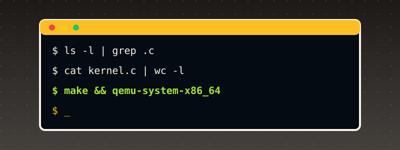

# Getting Started

{ style="display:block;margin:0 auto;max-width:100%;height:auto;border-radius:6px" }

This book builds a bare-metal, x86-64-targeted, Unix-family-inspired kernel in C, assembled and linked with an ordinary freestanding toolchain -- no separate cross-compiler is needed, since this book's own kernel targets the same architecture (x86-64/i386-compatible) its cloud authoring machine already runs on. Booting is real: every kernel this book builds is packed into a bootable ISO with GRUB and genuinely booted in QEMU, a real, complete x86 hardware emulator -- not a simulator that approximates behavior, an emulator that actually executes the compiled machine code.

## Before you start: what machine do you need?

Every kernel in this book is 32-bit x86 code, compiled by your own `gcc` with `-m32`, and then booted in QEMU. That has one hard consequence: **your computer's `gcc` must be able to emit x86 machine code.** Here is what that means for each kind of computer:

| Your computer | Works? | What to do |
|---|---|---|
| Linux on an Intel or AMD (x86-64) PC, a cloud VM, or a Linux virtual machine on an Intel/AMD host | **Yes. This is the setup the book was written and tested on.** | Follow Steps 1-8 below. |
| Windows 10/11 | Yes, through WSL2 (Ubuntu inside Windows) | Step 0A, then Steps 1-8 inside the Ubuntu window. |
| Mac with an Intel chip | Yes, through a Linux virtual machine | Step 0B, then Steps 1-8 inside the VM. |
| Mac with Apple Silicon (M1/M2/M3...), or any ARM Linux machine (Raspberry Pi, ARM cloud VM) | **Not natively.** Its `gcc` builds ARM code and rejects `-m32` (`gcc: error: unrecognized command-line option '-m32'`, confirmed on this book's own ARM test machine). Installing a package cannot fix that. | Rent a small x86-64 Linux cloud VM (any provider's cheapest "x86_64 / amd64" Ubuntu instance is enough), or use an x86-64 Linux machine. Running an amd64 virtual machine on an ARM Mac does work in principle, but it is emulated and slow, and this book did not test it. |

You do not need a graphical desktop, a special CPU feature, KVM, or root access to the *machine*. You do need to be able to install packages (`sudo`) once.

**Disk and time.** The toolchain is about 300-500 MB of packages. Building one chapter takes seconds. Booting one chapter's kernel in QEMU takes a few seconds, apart from the final chapters, whose demos run longer (Chapter 47's network-and-disk marketplace demo takes over a minute).

!!! note "What was tested, and what was not"
    The Ubuntu/Debian steps, the Chapter 1 build and the boot output shown below were run for real, on Ubuntu 24.04 (x86-64) with QEMU 8.2.2, NASM 2.16.01, GCC 13.3.0 and GRUB 2.12. The Windows/WSL2, Fedora, Arch and Intel-Mac instructions follow those platforms' standard package names and procedures but were **not** run by this book's author. If one of them differs on your machine, the troubleshooting table at the end of this section covers the common causes.

## Step 0A (Windows only): get an Ubuntu command line with WSL2

1. Open **PowerShell as Administrator** (right-click the Start button, choose "Terminal (Admin)" or "Windows PowerShell (Admin)").
2. Run `wsl --install -d Ubuntu`. If WSL is already installed, `wsl -l -v` lists your distributions; you need one whose VERSION column says `2`.
3. Restart Windows if it asks you to. Open "Ubuntu" from the Start menu, and choose a username and password when it asks. You now have a Linux command line. **Do everything below in that Ubuntu window, not in PowerShell.**
4. Keep your work inside the Linux file system (your home directory, `~`), not under `/mnt/c/...`. Builds are much faster there and file permissions behave.

## Step 0B (Intel Mac only): get a Linux command line

Install a virtual-machine program (UTM, VirtualBox or VMware Fusion), create an **x86-64** Ubuntu 24.04 Server VM with at least 2 GB of RAM and 20 GB of disk, install it from the Ubuntu installer ISO, and log in. Then continue with Step 1 inside the VM.

## Step 1: install the toolchain

The book needs five programs: an assembler (NASM), a C compiler (GCC), a linker (`ld`), an ISO builder (`grub-mkrescue`, which also needs `xorriso` and `mtools`) and the emulator (QEMU). Open a terminal on the Linux machine and run:

**Debian / Ubuntu (tested):**

```bash
sudo apt-get update
sudo apt-get install -y nasm build-essential qemu-system-x86 grub-pc-bin grub-common xorriso mtools git
```

What each package is for:

| Package | Why the book needs it |
|---|---|
| `nasm` | assembles the `.asm` files (the boot code, interrupt stubs) |
| `build-essential` | `gcc`, `ld` (from `binutils`) and `make` |
| `qemu-system-x86` | `qemu-system-x86_64`, the emulator that boots the kernel |
| `grub-pc-bin`, `grub-common` | GRUB itself, including the 32-bit BIOS boot files `grub-mkrescue` copies into the ISO |
| `xorriso` | the program `grub-mkrescue` calls to write the ISO file |
| `mtools` | `grub-mkrescue` calls it (`mformat`) to build the embedded boot image |
| `git` | to download this book's source files |

**Fedora (not tested here):** `sudo dnf install -y nasm gcc binutils qemu-system-x86 grub2-tools-extra grub2-pc-modules xorriso mtools git`. On Fedora the ISO builder is called `grub2-mkrescue`; either create an alias (`alias grub-mkrescue=grub2-mkrescue`) or type the longer name wherever the book says `grub-mkrescue`.

**Arch (not tested here):** `sudo pacman -S --needed nasm gcc binutils qemu-system-x86 grub libisoburn mtools git`.

You do **not** need `gcc-multilib` or a 32-bit C library. The kernel is "freestanding": it uses no C library, so `gcc -m32 -ffreestanding -c` works with the ordinary 64-bit `gcc`, and the linker `ld -m elf_i386` links the result.

## Step 2: check that each tool is installed

Run these five commands. Each one should print a version number, not "command not found":

```bash
nasm -v
gcc --version
ld --version
grub-mkrescue --version
qemu-system-x86_64 --version
```

On the book's test machine they print (your numbers may be newer, which is fine):

```text
NASM version 2.16.01
gcc (Ubuntu 13.3.0-6ubuntu2~24.04.1) 13.3.0
GNU ld (GNU Binutils for Ubuntu) 2.42
grub-mkrescue (GRUB) 2.12-1ubuntu7.3
QEMU emulator version 8.2.2 (Debian 1:8.2.2+ds-0ubuntu1.18)
```

One more check, to make sure your `gcc` can really produce 32-bit x86 code:

```bash
echo 'int main(void){return 0;}' > /tmp/t.c
gcc -m32 -ffreestanding -c /tmp/t.c -o /tmp/t.o && echo "gcc -m32 works"
```

If that prints `gcc -m32 works`, your machine is ready. If it prints `unrecognized command-line option '-m32'`, your computer is an ARM machine (see the table above).

## Step 3: download the book's source code

Every code listing in the book is also a file in the book's repository, in `docs/partN/code/` (Chapter 1 is in `docs/part1/code/`, Chapter 47 in `docs/part47/code/`). The files are named with the chapter number: `001_boot.asm`, `001_kmain.c`, `001_linker.ld`.

```bash
git clone https://github.com/MaximumBeings/unix_os_from_scratch.git
cd unix_os_from_scratch
ls docs/part1/code
```

You should see the three Chapter 1 files:

```text
001_boot.asm  001_kmain.c  001_linker.ld
```

(The newest chapters live on the branch the book is currently being written on. If a chapter's folder is missing after the clone, run `git branch -a` and `git checkout <branch name>` for the branch you were pointed to.)

## Step 4: build your first kernel (Chapter 1), one command at a time

Make a scratch directory so the build files do not mix with the book's sources, and copy Chapter 1's three files into it:

```bash
mkdir -p ~/os-build && cp docs/part1/code/001_* ~/os-build/ && cd ~/os-build
```

**4a. Assemble the boot code** (the file GRUB jumps into first):

```bash
nasm -f elf32 001_boot.asm -o 001_boot.o
```

`-f elf32` asks for a 32-bit ELF object file. No output means success.

**4b. Compile the C code.** The flags matter: `-m32` produces 32-bit code, `-ffreestanding` tells GCC there is no operating system or C library underneath, `-fno-stack-protector` and `-fno-pic` remove two Linux-specific features a bare kernel cannot support:

```bash
gcc -m32 -ffreestanding -fno-stack-protector -fno-pic -Wall -Wextra -c 001_kmain.c -o 001_kmain.o
```

Again, no output means success. Any warning printed here is worth reading.

**4c. Link them** into one kernel file, using the chapter's linker script, which says where in memory each part goes:

```bash
ld -m elf_i386 -T 001_linker.ld -o kernel.bin 001_boot.o 001_kmain.o
```

Expected output, which is **two warnings and not an error**:

```text
ld: warning: 001_boot.o: missing .note.GNU-stack section implies executable stack
ld: NOTE: This behaviour is deprecated and will be removed in a future version of the linker
ld: warning: kernel.bin has a LOAD segment with RWX permissions
```

(Chapter 1 explains why they appear and why they are harmless here. If your `ld` prints nothing, that is fine too.)

**4d. Check that the file is a valid Multiboot2 kernel**, the format GRUB requires:

```bash
grub-file --is-x86-multiboot2 kernel.bin && echo MULTIBOOT_OK
```

You must see `MULTIBOOT_OK`. If you see nothing, the header is missing or in the wrong place; re-check Step 4a-4c for typos in the file names.

**4e. Pack the kernel into a bootable ISO.** GRUB reads a small config file to know what to boot:

```bash
mkdir -p isodir/boot/grub
cp kernel.bin isodir/boot/kernel.bin
printf 'set timeout=0\nset default=0\n\nmenuentry "Unix OS from Scratch" {\n    multiboot2 /boot/kernel.bin\n    boot\n}\n' > isodir/boot/grub/grub.cfg
grub-mkrescue -o kernel.iso isodir
```

The last line prints a few progress lines and ends with:

```text
Writing to 'stdio:kernel.iso' completed successfully.
```

## Step 5: boot it

```bash
qemu-system-x86_64 -cdrom kernel.iso -serial stdio -display none -no-reboot -m 256M \
    -device isa-debug-exit,iobase=0xf4,iosize=0x04
```

What the flags mean: `-cdrom kernel.iso` boots from your ISO; `-serial stdio` connects the kernel's serial port to your terminal, which is how the kernel "prints" to you; `-display none` opens no window; `-no-reboot` makes QEMU stop instead of rebooting if the kernel crashes; `-m 256M` gives the virtual machine 256 MB of RAM; the `isa-debug-exit` device lets the kernel tell QEMU to quit.

**Success looks like this** (after a second or two, and then your prompt returns by itself):

```text
Unix OS from Scratch -- Chapter 1: kernel entry reached
multiboot2 + nasm + freestanding gcc + ld + qemu pipeline: OK
```

Those lines were printed by code you assembled, compiled and linked yourself, running on an emulated x86 CPU. Now run `echo $?`. It prints **`1`**. That is correct: the kernel writes a value to the debug-exit device, and QEMU turns that into the exit status `(value << 1) | 1`. An exit status of 1 means "the kernel finished normally", not "an error". Later chapters use other values for pass and fail, and each chapter says which is which.

**If it does not return to the prompt**, press `Ctrl+C` to stop QEMU. To avoid a hang, you can put `timeout 30` in front of the command (`timeout 30 qemu-system-x86_64 ...`).

**To see the emulated screen** (VGA text mode, used from Chapter 2 on), remove `-display none`. A window opens on a machine with a desktop; on a server or WSL2 without a display, keep `-display none` and read the serial output in your terminal instead. Every chapter prints the same information to serial for that reason.

## Step 6: build and run the later chapters

From the later chapters on, the kernel is made of many files and each chapter's page shows the exact commands for that chapter. The pattern never changes:

1. **Assemble** every `.asm` file with `nasm -f elf32`.
2. **Compile** every `.c` file with `gcc -m32 -ffreestanding -fno-stack-protector -fno-pic -Wall -Wextra -c`.
3. **Link** all the objects with `ld -m elf_i386 -T NNN_linker.ld -o kernel.bin ...`.
4. **Pack** with `grub-mkrescue` and **boot** with `qemu-system-x86_64` as in Steps 4e and 5.

Chapters 47 and 48 ship these steps as scripts in their `code` directory (earlier chapters show their commands on the page). Using Chapter 47 as the example:

```bash
cd docs/part47/code
./build.sh 047        # assembles, compiles, links, checks Multiboot2, writes build/os.iso
./run.sh              # boots build/os.iso with a fresh 8 MiB disk and a network card; Ctrl+C to stop
```

`./capture.sh` does the same boot, saves the serial output to `build/serial.txt`, waits for the chapter's "demo complete" line, and keeps the disk image for the chapter's verification scripts. Run scripts from inside the chapter's `code` directory (they use relative paths). If a script says "Permission denied", run `chmod +x build.sh run.sh capture.sh` once.

## Step 7: read the book's website locally (optional)

The website is built with MkDocs. If you want to read or edit it offline:

```bash
sudo apt-get install -y python3-pip python3-venv
python3 -m venv ~/mkdocs-venv && . ~/mkdocs-venv/bin/activate
pip install mkdocs-material
cd unix_os_from_scratch
mkdocs serve          # then open http://127.0.0.1:8000 in a browser
```

`mkdocs build --strict` builds the whole site and fails on any broken link or missing file, which is how the book checks itself before publishing.

## Step 8: a quick health check you can run any time

If something stops working later, this single sequence re-tests the whole chain on Chapter 1 and tells you which link in the chain broke (it assumes you completed Step 4 once, so `isodir/boot/grub/grub.cfg` already exists):

```bash
cd ~/os-build && rm -f *.o kernel.bin kernel.iso
nasm -f elf32 001_boot.asm -o 001_boot.o         && echo "1 assemble ok"
gcc -m32 -ffreestanding -fno-stack-protector -fno-pic -c 001_kmain.c -o 001_kmain.o && echo "2 compile ok"
ld -m elf_i386 -T 001_linker.ld -o kernel.bin 001_boot.o 001_kmain.o 2>/dev/null   && echo "3 link ok"
grub-file --is-x86-multiboot2 kernel.bin         && echo "4 multiboot2 ok"
cp kernel.bin isodir/boot/kernel.bin && grub-mkrescue -o kernel.iso isodir >/dev/null 2>&1 && echo "5 iso ok"
timeout 30 qemu-system-x86_64 -cdrom kernel.iso -serial stdio -display none -no-reboot -m 256M -device isa-debug-exit,iobase=0xf4,iosize=0x04 | grep -q "kernel entry reached" && echo "6 boot ok"
```

Six "ok" lines mean everything works.

## Troubleshooting

| What you see | Cause | Fix |
|---|---|---|
| `nasm: command not found` (or any of the five tools) | package not installed | re-run the `apt-get install` line in Step 1, then Step 2 |
| `gcc: error: unrecognized command-line option '-m32'` | the machine is ARM (aarch64) | use an x86-64 machine (table at the top of this section) |
| `ld: unrecognized emulation mode: elf_i386` | ARM `binutils`, same cause | same |
| `grub-mkrescue: error: xorriso not found.` | `xorriso` missing | `sudo apt-get install xorriso` |
| `mformat: command not found` or `grub-mkrescue: error: mformat invocation failed` | `mtools` missing | `sudo apt-get install mtools` |
| `grub-mkrescue: error: ... /usr/lib/grub/i386-pc ... not found` or a similar "file not found" naming `i386-pc` | the 32-bit BIOS GRUB files are missing | `sudo apt-get install grub-pc-bin` |
| `grub-file ... --is-x86-multiboot2` prints nothing | the link step failed or used the wrong files | re-run Step 4c and read its output; make sure you linked `001_boot.o` **first** |
| QEMU window shows "No bootable device" or loops on a GRUB prompt | `grub.cfg` is missing or has a typo | recreate `isodir/boot/grub/grub.cfg` exactly as in Step 4e and rebuild the ISO |
| QEMU prints `Could not access KVM kernel module` | you added `-enable-kvm` | remove it; the book never needs KVM |
| QEMU prints `gtk initialization failed` or `Could not initialize SDL` | no desktop display | add `-display none` (the book's serial output needs no window) |
| QEMU starts but nothing is printed | missing `-serial stdio`, or the wrong ISO | copy the Step 5 command exactly |
| The prompt never comes back | the kernel is idle by design, or a chapter's demo is still running | `Ctrl+C`; prefix the command with `timeout 30` (or longer for Chapters 46-48, whose demos run longer) |
| `Permission denied` running `./build.sh` | script not marked executable | `chmod +x build.sh run.sh capture.sh` |
| A chapter's output differs from the page in a number such as an address or a timestamp | those values legitimately change between runs and tool versions | compare the *structure*: the same lines in the same order, and the chapter's own pass/fail markers |
| Something else | | run the Step 8 health check; the first line that does not print "ok" is where to look |

## The honesty discipline this book follows

This book's own two authoring machines, confirmed directly rather than assumed: a cloud sandbox (x86_64, with a real, working `nasm`/`gcc`/`ld`/`grub-mkrescue`/`qemu-system-x86_64` toolchain, all version-checked in Chapter 1) and a connected device (an aarch64 macOS-hosted Linux VM, with `gcc` and `grub-mkrescue` but **no** `nasm` and **no** `qemu-system-x86_64` at all -- and no root access to install either, checked directly with `which`/`sudo -n true`, not assumed). The gap runs deeper than those two missing tools: the device's own `gcc` targets aarch64 and genuinely rejects `-m32` outright (`gcc: error: unrecognized command-line option '-m32'`, confirmed directly), so even this book's freestanding **C compile step** cannot run there, not only the assembly and boot steps -- an architecture-target mismatch, not a missing-package one, and not fixable by installing anything. That means, unlike a book whose real hardware-facing work can be cross-verified on two different real machines, every real build-and-boot step in this book happens on the cloud sandbox only:

- **Assembly, compilation, and linking** (NASM, `gcc -ffreestanding`, `ld`) happen for real, and their exact real output -- including real linker warnings, when `ld` produces them -- is captured and locked into the page unedited.
- **Booting** happens for real, in QEMU, a genuine x86 hardware emulator that executes the compiled machine code rather than approximating it; this book's kernels talk to real (emulated) hardware devices -- the serial UART first, more later -- through the same I/O-port instructions a real physical machine would use.
- **Cross-machine verification**, this book's sibling series' own standing discipline, still applies wherever it can: every source file this book commits is still sent to the connected device and verified byte-identical via md5sum, the same as every sibling book. What differs is that the device is not the machine doing the booting, a toolchain-availability limit confirmed directly (not assumed) the same way this author's Hammer compiler book found for its own Appendix C/D.
- **Real facts this book states about x86 architecture, the Multiboot2 standard, or any other real specification** are cited to that specification's own real, current documentation, quoted directly rather than paraphrased from memory wherever a direct quote is practical.

Every chapter states which of the above applies to its own code, so nothing is left for a reader to guess about how a claim in this book was actually established.

## Compile-line conventions

- Assembly (`.asm`, NASM syntax): `nasm -f elf32 file.asm -o file.o` (32-bit protected-mode object files, this book's own convention until a later chapter moves to 64-bit long mode)
- Freestanding C (`.c`): `gcc -m32 -ffreestanding -fno-stack-protector -fno-pic -Wall -Wextra -c file.c -o file.o`
- Linking: `ld -m elf_i386 -T linker.ld -o kernel.bin *.o`, with each chapter's own linker script shown in full where it is introduced
- Packing and booting: each chapter shows its own exact `grub-mkrescue`/`qemu-system-x86_64` invocation, including every flag, inline where the kernel it applies to is introduced

## Prerequisites

This book assumes working knowledge of C (functions, pointers, `struct`s, the `static` keyword) and enough x86 assembly to read a short, heavily-commented file -- no prior assembly-writing experience is assumed, and every instruction this book uses is explained the first time it appears. No prior operating-systems or bare-metal development experience is assumed either; Chapter 1 builds the real boot chain (firmware, bootloader, kernel entry) from nothing before any kernel code is written.
