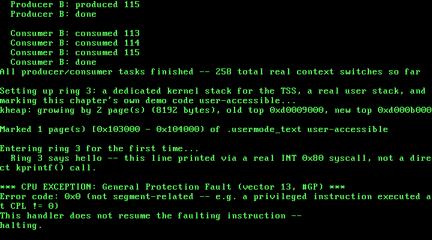

# 15. User Mode: Ring 3, a TSS, and a First System Call

**What you will understand:** why running everything at ring 0 (as this kernel has since Chapter 1) means there is no real boundary between "this kernel" and "code it runs," what a Task State Segment is actually for in a kernel that never uses the CPU's own hardware task-switching, the real x86 stack layout an `iret` needs to change privilege level, why ring-3 code needs a system call to do anything useful at all, and how to prove -- with a real captured CPU fault, not an assertion -- that a privilege transition genuinely happened.

**What you need to know first:** Chapter 8's paging (`015_paging.h`/`015_paging.c`, this chapter's own `PAGE_USER` bit builds directly on it), Chapter 4-10's IDT/ISR machinery (this chapter adds two more real gates to it), and Chapter 5's GDT (`015_gdt.c`, extended this chapter from three descriptors to six). Still no separate address space per task -- ring 3 in this chapter still shares this kernel's one identity-mapped page directory, just with two specific pages marked accessible to it.

## Every task so far has secretly been a kernel task

Fourteen chapters have built up a real scheduler (Ch11-12), real synchronization primitives (Ch13-14), a real memory manager (Ch7-9), and real hardware drivers -- and every single line of code that has ever run on top of them, including this book's own four demo tasks from Chapter 14, has run at CPL 0: full hardware privilege, full access to every port, every instruction, every byte of memory this kernel can address. That has never been a problem, because every line of code so far was written by this book. A real operating system's whole reason for existing is to run code it did NOT write -- and trusting arbitrary code with full hardware privilege is not an operating system, it is just... running that code directly, with extra steps.

x86 protected mode's answer is privilege rings: a 2-bit Current Privilege Level (CPL) baked into CS's own low bits, checked by the CPU itself on every memory access, every I/O instruction, and every attempt to execute a privileged instruction. Ring 0 is unrestricted; ring 3 -- the ring this chapter's own demo code runs at -- can be denied almost everything by a kernel that chooses not to grant it. This chapter's whole job is standing up that boundary for the first time: getting one real task running at ring 3, giving it exactly one sanctioned way back into ring 0, and then proving, with a real fault the CPU raises entirely on its own, that ring 3 genuinely cannot do whatever it wants.

## Three things ring 3 needs that ring 0 never did

The OSDev Wiki's own "Getting to Ring 3" page lays out what is actually required, and this chapter builds all three, in this order:

> "1. Add 2 new segments to your GDT: One code, one data. These will be used to run the ring 3 code. Give them a base of 0, a limit of 0xFFFFFFFF, and a privilege level of 3. 2. Setup a TSS (Task State Segment) ... 3. Optionally, setup the IDT so that system calls can happen from ring 3."

(OSDev Wiki, "Getting to Ring 3": https://wiki.osdev.org/Getting_to_Ring_3)

And, critically, why the TSS is not optional the moment anything real is going to happen after the transition:

> "In actuality, the CPU can be put into ring 3 with just these two segments. However it is impossible to return to ring 0 for system calls, faults, or even IRQs. That is where the TSS comes in."

(OSDev Wiki, "Getting to Ring 3")

## `015_tss.h`/`015_tss.c`: a TSS this kernel never hardware-switches

The name "Task State Segment" is a red herring for this book. The CPU's own hardware task-switching mechanism -- a full TSS per task, switched with a far `jmp`/`call` -- is not what this chapter uses at all; this kernel still does software task switching entirely by hand, exactly as it has since `015_switch.asm` in Chapter 11, completely unchanged. This chapter's ONE static TSS exists purely so the CPU has somewhere to find a real, valid kernel stack the instant ring-3 code raises literally anything -- a syscall, a fault, an ordinary timer tick:

```c
#ifndef UNIX_OS_015_TSS_H
#define UNIX_OS_015_TSS_H

#include <stdint.h>

/* This chapter's Task State Segment -- not used the way its name
 * suggests. The CPU's own hardware task-switching mechanism (a full
 * TSS per task, switched via a far JMP/CALL) is not what this is
 * for; this book still does software task switching entirely by hand
 * (015_switch.asm, unchanged since Chapter 11). This ONE TSS exists
 * purely so the CPU has somewhere to find a real kernel stack the
 * instant a ring-3 task raises an interrupt or exception -- see
 * 015_tss.c for the real mechanics. */

/* Zeroes this chapter's one static TSS and sets its SS0 field to this
 * kernel's own kernel-data selector -- the segment every privilege-
 * elevating interrupt switches to. Must be called before gdt_init(),
 * which installs this same TSS's address into the GDT. */
void tss_init(void);

/* Updates ESP0: the exact stack pointer the CPU loads, from this
 * TSS, the instant a ring-3 task raises ANY interrupt or exception --
 * a syscall, a timer tick, a fault, all of it. Must be set to a real,
 * currently-unused kernel stack before ever entering ring 3; calling
 * it again before entering ring 3 a second time lets a later chapter
 * give each task its own dedicated kernel stack. */
void tss_set_kernel_stack(uint32_t esp0);

/* Loads the Task Register with `selector` via LTR -- the one real
 * machine instruction that tells the CPU which GDT entry is its own
 * active TSS. Must be called only after gdt_init() has already
 * installed a valid TSS descriptor at that exact selector. */
void tss_load(uint16_t selector);

/* This TSS's own address and real size, in bytes -- read by
 * 015_gdt.c to build its GDT descriptor, so the TSS's own struct
 * layout stays private to 015_tss.c. */
const void *tss_get_address(void);
uint32_t tss_get_size(void);

#endif
```
```c
#include <stdint.h>

#include "015_tss.h"

/* The CPU's real 32-bit TSS layout (cited field-for-field from the
 * OSDev Wiki's own "Task State Segment" page): a fixed 104-byte
 * structure with two fields this chapter actually cares about --
 * ESP0 at offset 0x04 ("The Stack Pointer used to load the stack
 * when a privilege level change occurs from a lower privilege level
 * to a higher one") and SS0 at offset 0x08 ("The Segment Selector
 * used to load the stack when a privilege level change occurs from a
 * lower privilege level to a higher one") -- plus a real IOPB
 * (`iomap_base`) field at the very end. Every other field here exists
 * only because LTR requires the CPU's own real, fixed-size structure;
 * this book's software task switching never reads or writes eip,
 * eflags, eax..edi, or any of the saved segment registers below --
 * those only matter to the CPU's OWN hardware task-switch mechanism,
 * which this kernel does not use at all. */
struct tss_entry {
    uint32_t prev_tss;
    uint32_t esp0;
    uint32_t ss0;
    uint32_t esp1;
    uint32_t ss1;
    uint32_t esp2;
    uint32_t ss2;
    uint32_t cr3;
    uint32_t eip;
    uint32_t eflags;
    uint32_t eax, ecx, edx, ebx;
    uint32_t esp, ebp, esi, edi;
    uint32_t es, cs, ss, ds, fs, gs;
    uint32_t ldt;
    uint16_t trap;
    uint16_t iomap_base;
} __attribute__((packed));

static struct tss_entry tss;

void tss_init(void) {
    uint8_t *raw = (uint8_t *) &tss;
    for (uint32_t i = 0; i < sizeof(tss); i++) {
        raw[i] = 0;
    }

    /* SS0 = this kernel's own kernel-data selector (GDT index 2,
     * 2 * 8 = 0x10, unchanged since Chapter 5) -- every privilege-
     * elevating interrupt loads SS with exactly this value before
     * this kernel's own ISR stub ever runs a single instruction. */
    tss.ss0 = 0x10;

    /* Setting the I/O map base to this TSS's own total size, rather
     * than a real offset that points AT a real bitmap somewhere
     * inside it, means the CPU always finds the "bitmap" it looks up
     * sitting past this structure's own last byte -- which the CPU
     * treats as "no I/O permission bitmap is present at all," and
     * therefore every single port I/O instruction (IN/OUT/INS/OUTS)
     * issued from ring 3 is forbidden, with no per-port exceptions.
     * This chapter never demonstrates that directly, but it is the
     * same real hardware-privilege mechanism this chapter's own CLI
     * demonstration relies on -- ring 3 code simply cannot touch
     * anything this kernel has not explicitly, deliberately opened up
     * for it. */
    tss.iomap_base = (uint16_t) sizeof(tss);
}

void tss_set_kernel_stack(uint32_t esp0) {
    tss.esp0 = esp0;
}

void tss_load(uint16_t selector) {
    __asm__ volatile ("ltr %0" : : "rm" (selector));
}

const void *tss_get_address(void) {
    return &tss;
}

uint32_t tss_get_size(void) {
    return (uint32_t) sizeof(tss);
}
```

The two fields this chapter actually depends on, cited directly from the OSDev Wiki's own "Task State Segment" page: ESP0, "The Stack Pointer used to load the stack when a privilege level change occurs from a lower privilege level to a higher one," and SS0, "The Segment Selector used to load the stack when a privilege level change occurs from a lower privilege level to a higher one." (OSDev Wiki, "Task State Segment": https://wiki.osdev.org/Task_State_Segment) Every other field in `struct tss_entry` -- `eip`, `eflags`, every saved GPR, every saved segment register -- exists only because LTR requires the CPU's real, fixed 104-byte structure; this kernel never reads or writes any of them, because it never asks the CPU to hardware-switch into this TSS as an actual task.

## `015_gdt.c`: three new descriptors, one of them a TSS descriptor

Chapter 5's GDT had three entries: null, kernel code, kernel data. This chapter grows it to six -- two flat ring-3 segments, and one real TSS descriptor:

```c
#ifndef UNIX_OS_015_GDT_H
#define UNIX_OS_015_GDT_H

/* Installs this book's own GDT: Chapter 5's null/kernel-code/
 * kernel-data descriptors, unchanged, plus three new ones this
 * chapter needs to run anything at ring 3 at all -- a ring-3 code
 * segment, a ring-3 data segment, and this chapter's one real Task
 * State Segment descriptor. Also initializes and loads that TSS
 * (015_tss.c) -- the GDT and the TSS are installed together here
 * because the TSS descriptor's own address has to already be a real,
 * fixed struct before this function builds the GDT entry that points
 * at it, and LTR (015_tss.c's tss_load()) is only valid once THIS
 * exact GDT is the one actually loaded. */
void gdt_init(void);

#endif
```
```c
/* Chapter 5 gave this kernel three descriptors: null, kernel code,
 * kernel data -- a flat memory model where every earlier chapter's
 * code, no matter which ring it thought it might someday run at, has
 * always actually run at ring 0. This chapter adds the three real
 * descriptors that make ring 3 possible at all: a ring-3 code
 * segment, a ring-3 data segment (OSDev Wiki, "Getting to Ring 3":
 * "add 2 new segments to your GDT... with a base of 0, a limit of
 * 0xFFFFFFFF, and a privilege level of 3"), and one real Task State
 * Segment descriptor -- without which, per the same page, "it is
 * impossible to return to ring 0 for system calls, faults, or even
 * IRQs." */

#include <stdint.h>

#include "015_gdt.h"
#include "015_tss.h"

struct gdt_entry {
    uint16_t limit_low;
    uint16_t base_low;
    uint8_t  base_middle;
    uint8_t  access;
    uint8_t  granularity;
    uint8_t  base_high;
} __attribute__((packed));

struct gdt_ptr {
    uint16_t limit;
    uint32_t base;
} __attribute__((packed));

/* 0: null, 1: kernel code, 2: kernel data (all unchanged since
 * Chapter 5), 3: user code, 4: user data, 5: this chapter's TSS. */
#define GDT_ENTRY_COUNT 6
static struct gdt_entry gdt_entries[GDT_ENTRY_COUNT];
static struct gdt_ptr   gdt_pointer;

extern void gdt_flush(uint32_t gdt_ptr_addr);

static void gdt_set_entry(int index, uint32_t base, uint32_t limit,
                           uint8_t access, uint8_t flags) {
    gdt_entries[index].base_low    = (uint16_t) (base & 0xFFFF);
    gdt_entries[index].base_middle = (uint8_t)  ((base >> 16) & 0xFF);
    gdt_entries[index].base_high   = (uint8_t)  ((base >> 24) & 0xFF);

    gdt_entries[index].limit_low   = (uint16_t) (limit & 0xFFFF);
    gdt_entries[index].granularity = (uint8_t) (((limit >> 16) & 0x0F) | (flags & 0xF0));

    gdt_entries[index].access = access;
}

void gdt_init(void) {
    /* Entry 0: the mandatory null descriptor, unchanged since Ch5. */
    gdt_set_entry(0, 0, 0, 0, 0);

    /* Entry 1: kernel code, ring 0, flat 4 GiB, unchanged since Ch5.
     * Access byte 0x9A: P=1, DPL=00, S=1, E=1, DC=0, RW=1, A=0. */
    gdt_set_entry(1, 0, 0xFFFFF, 0x9A, 0xC0);

    /* Entry 2: kernel data, ring 0, flat 4 GiB, unchanged since Ch5.
     * Access byte 0x92: same as entry 1 but E=0 (data, not code). */
    gdt_set_entry(2, 0, 0xFFFFF, 0x92, 0xC0);

    /* Entry 3: user code, ring 3, flat 4 GiB -- identical to entry 1
     * except DPL (bits 6-5): 11 instead of 00. P=1,DPL=11,S=1,E=1,
     * DC=0,RW=1,A=0 packed high-to-low: 1 11 1 1 0 1 0 = 0xFA. */
    gdt_set_entry(3, 0, 0xFFFFF, 0xFA, 0xC0);

    /* Entry 4: user data, ring 3, flat 4 GiB -- identical to entry 2
     * except DPL=11: 1 11 1 0 0 1 0 = 0xF2. */
    gdt_set_entry(4, 0, 0xFFFFF, 0xF2, 0xC0);

    /* Entry 5: this chapter's one TSS. Access byte 0x89 -- cited
     * directly (OSDev Wiki, "Task State Segment"): "0x89
     * (Present|Executable|Accessed) as access byte and 0x40
     * (Size-bit) as flags." tss_init() must already have run before
     * this point, so tss_get_address()/tss_get_size() describe a
     * real, already-zeroed structure, not garbage memory. */
    tss_init();
    gdt_set_entry(5, (uint32_t) (uintptr_t) tss_get_address(),
                  tss_get_size() - 1, 0x89, 0x40);

    gdt_pointer.limit = (uint16_t) (sizeof(gdt_entries) - 1);
    gdt_pointer.base  = (uint32_t) &gdt_entries;

    gdt_flush((uint32_t) &gdt_pointer);

    /* LTR is only valid once the GDT it reads from is the one
     * actually loaded -- gdt_flush() above (LGDT, then reloading
     * every segment register) has to happen first. GDT index 5,
     * 5 * 8 = 0x28. */
    tss_load(0x28);
}
```

The user code and data descriptors are byte-for-byte identical to their ring-0 counterparts except for one field: DPL, bits 6-5 of the access byte, `00` for ring 0 and `11` for ring 3. Everything else -- base 0, limit covering the full 4 GiB flat model this book has used since Chapter 5, the same granularity/size flags -- stays the same. The TSS descriptor's own access byte (`0x89`) and flags nibble (`0x40`) come directly from the OSDev Wiki's own worked example, quoted in `015_gdt.c`'s own comment above. `gdt_init()` now does one more real thing than it used to: it calls `tss_load()` (LTR) itself, right after `gdt_flush()`, because LTR is only valid once the GDT it reads its own selector from is the one actually loaded -- loading the TSS descriptor a half-instruction too early would read stale GDT data.

## `015_paging.c`: a real bug, caught by a real fault, before this chapter's own fix

Marking a page accessible from ring 3 needs one new bit -- `PAGE_USER`, bit 2 of a page-table entry:

```c
#ifndef UNIX_OS_015_PAGING_H
#define UNIX_OS_015_PAGING_H

#include <stdint.h>

#define PAGE_PRESENT 0x1u
#define PAGE_RW      0x2u

/* New this chapter: bit 2 of a real x86 page-table (and page-
 * directory) entry -- "the U/S bit" -- 0 means "only CPL 0-2 (in
 * practice, this book's own CPL 0) may access this page," 1 means
 * "CPL 3 may access it too." Every page this kernel has ever mapped
 * before this chapter, including its own .text, was mapped without
 * this bit -- which was never a problem, because nothing before this
 * chapter ever ran at any CPL other than 0. */
#define PAGE_USER    0x4u

void paging_init(void);
void paging_map_page(uint32_t vaddr, uint32_t paddr, uint32_t flags);

#endif
```

The first real attempt at this chapter's own `paging_map_page()` change looked like it should work: OR `PAGE_USER` into the page-TABLE entry whenever the caller asks for it, done. Booting that version and entering ring 3 for the first time produced a real, captured crash -- not the `#GP` this chapter is actually trying to demonstrate, but a `#PF`, at the very first instruction ring 3 ever tried to fetch:

**Output (cloud sandbox -- real, live-executed capture, BEFORE this chapter's own paging fix, tail of the run):**

```text
kheap: growing by 2 page(s) (8192 bytes), old top 0xd0009000, new top 0xd000b000
Marked 1 page(s) [0x103000 - 0x104000) of .usermode_text user-accessible

Entering ring 3 for the first time...

*** CPU EXCEPTION: Page Fault (vector 14, #PF) ***
Faulting address (CR2): 0x103000
Error code: 0x5 (protection violation, read, user mode)
This handler does not resume the faulting instruction --
halting.
```

`CR2 = 0x103000` is exactly `usermode_text_start` -- the very first byte of the ring-3 demo function -- and error code `0x5` decodes (via Chapter 10's own `015_isr14.asm`/`isr14_handler`, both completely unchanged) as a real protection violation, on a read, in user mode. The page-TABLE entry genuinely did have `PAGE_USER` set; the fault happened anyway. The real x86 rule, missed on the first attempt: paging checks the U/S bit of BOTH the page-directory entry and the page-table entry for any given address, and the CPU uses whichever of the two is more restrictive. Every page-directory entry this kernel has ever built -- including the one covering this exact address -- was built by `paging_init()` back in Chapter 8, with only `PAGE_PRESENT | PAGE_RW`, long before `PAGE_USER` existed at all. Setting the bit on the page-table entry alone was never going to be enough.

The real fix, in `paging_map_page()` itself:

```c
#include <stdint.h>

#include "015_paging.h"
#include "015_pmm.h"
#include "015_printf.h"

/* This chapter identity-maps the same 0-64 MiB range that chapter 7's
 * physical memory manager already manages (MAX_MANAGED_MEMORY there),
 * so every physical frame this kernel can ever hand out from
 * pmm_alloc_frame() already has a valid virtual address equal to its
 * own physical address. One page table covers 4 MiB (1024 entries *
 * 4 KiB), so 64 MiB needs exactly 16 page tables -- and 16 page
 * directory entries out of the 1024 this kernel's single page
 * directory has room for. */
#define IDENTITY_MAP_TABLES 16u
#define ENTRIES_PER_TABLE   1024u
#define PAGE_DIR_ENTRIES    1024u

/* The physical address of this kernel's one and only page directory,
 * set once by paging_init() and read by every later paging_map_page()
 * call. Storing only the physical address -- not a C pointer typed at
 * some virtual mapping -- is deliberate: this whole file only ever
 * touches memory that lives inside the identity-mapped 0-64 MiB
 * range, so a frame's physical address always doubles as a valid,
 * dereferenceable pointer, both before and after paging is switched
 * on. */
static uint32_t page_directory_phys = 0;

/* Physical addresses in this kernel are also valid pointers, but only
 * because everything this file touches lives inside the
 * identity-mapped range -- this helper exists to make that fact
 * explicit at every use, not to hide a general physical-to-virtual
 * translation this kernel does not have. */
static inline uint32_t *phys_ptr(uint32_t phys_addr) {
    return (uint32_t *) phys_addr;
}

static void zero_frame(uint32_t phys_addr) {
    uint32_t *p = phys_ptr(phys_addr);
    for (uint32_t i = 0; i < ENTRIES_PER_TABLE; i++) {
        p[i] = 0;
    }
}

void paging_init(void) {
    kprintf("Paging: allocating page directory...\n");

    page_directory_phys = pmm_alloc_frame();
    zero_frame(page_directory_phys);
    uint32_t *page_directory = phys_ptr(page_directory_phys);

    kprintf("Paging: page directory at 0x%x. Identity-mapping 0-64MiB (16 page tables)...\n", page_directory_phys);

    for (uint32_t dir_index = 0; dir_index < IDENTITY_MAP_TABLES; dir_index++) {
        uint32_t table_phys = pmm_alloc_frame();
        zero_frame(table_phys);
        uint32_t *table = phys_ptr(table_phys);

        for (uint32_t table_index = 0; table_index < ENTRIES_PER_TABLE; table_index++) {
            uint32_t frame_addr = (dir_index * ENTRIES_PER_TABLE + table_index) * 4096u;
            table[table_index] = frame_addr | PAGE_PRESENT | PAGE_RW;
        }

        page_directory[dir_index] = table_phys | PAGE_PRESENT | PAGE_RW;
    }

    kprintf("Paging: identity map built. Loading CR3 and setting CR0.PG...\n");

    __asm__ __volatile__ ("mov %0, %%cr3" : : "r" (page_directory_phys));

    uint32_t cr0;
    __asm__ __volatile__ ("mov %%cr0, %0" : "=r" (cr0));
    cr0 |= 0x80000000u;
    __asm__ __volatile__ ("mov %0, %%cr0" : : "r" (cr0));

    uint32_t cr0_readback;
    __asm__ __volatile__ ("mov %%cr0, %0" : "=r" (cr0_readback));

    kprintf("Paging: CR0 = 0x%x (PG bit: %u). Paging is now live.\n", cr0_readback, (cr0_readback >> 31) & 1u);
}

void paging_map_page(uint32_t vaddr, uint32_t paddr, uint32_t flags) {
    uint32_t dir_index = vaddr >> 22;
    uint32_t table_index = (vaddr >> 12) & 0x3FFu;

    uint32_t *page_directory = phys_ptr(page_directory_phys);

    uint32_t table_phys;
    if ((page_directory[dir_index] & PAGE_PRESENT) == 0) {
        table_phys = pmm_alloc_frame();
        zero_frame(table_phys);
        page_directory[dir_index] = table_phys | PAGE_PRESENT | PAGE_RW;
    } else {
        table_phys = page_directory[dir_index] & 0xFFFFF000u;
    }

    /* New this chapter: real x86 paging checks the U/S bit of BOTH
     * the page-directory entry AND the page-table entry -- whichever
     * of the two is more restrictive wins. Setting PAGE_USER only on
     * the PTE below is not enough if this page's own PDE is still
     * supervisor-only, which every identity-mapped PDE genuinely is:
     * paging_init() built them all with just PAGE_PRESENT | PAGE_RW,
     * long before this chapter's own PAGE_USER existed. So whenever
     * this call is meant to grant ring-3 access, the PDE has to be
     * OR'd in too -- a real subtlety this chapter's own first attempt
     * at a ring-3 demo missed, and a #PF (not the #GP this chapter is
     * actually trying to demonstrate) was the real, captured evidence
     * that caught it. */
    if (flags & PAGE_USER) {
        page_directory[dir_index] |= PAGE_USER;
    }

    uint32_t *table = phys_ptr(table_phys);
    table[table_index] = (paddr & 0xFFFFF000u) | flags;

    __asm__ __volatile__ ("invlpg (%0)" : : "r" (vaddr) : "memory");
}
```

Whenever a caller asks for `PAGE_USER`, the fix ORs it into the page-DIRECTORY entry too, not just the page-table entry -- so this one function call is the only place in this whole kernel that ever needs to know this rule exists. Every other page this kernel maps, including every single line of driver code, kmain's own local variables, and the kernel heap, is completely unaffected: `paging_map_page()` only touches a directory entry's `PAGE_USER` bit when a caller explicitly asks for it.

## `015_linker.ld`: giving exactly one function its own pages

`PAGE_USER` is granted per 4 KiB page, but C gives no guarantee that a single function's machine code starts on a page boundary, or that it does not share a page with ordinary ring-0-only code sitting right next to it in `.text`. Marking the whole `.text` section user-accessible would work, but it would also hand ring 3 read/execute access to every driver and every other function in this entire kernel image -- the opposite of the minimal, deliberate privilege boundary this chapter is trying to build. The fix is a dedicated, page-aligned linker section for this chapter's own demo function, and nothing else:

```c
/* Chapter 7 added kernel_end, the linker's own real answer to "where
 * does the kernel image actually stop in physical memory." This
 * chapter adds a second linker-defined range for the same reason:
 * this chapter's own ring-3 demo function has to be marked
 * PAGE_USER (015_paging.h) so the CPU will let CPL 3 fetch
 * instructions from it at all -- but PAGE_USER is granted per 4 KiB
 * page, and C gives no promise that a single function's machine code
 * starts and ends on a page boundary, or even that it does not share
 * a page with some ordinary ring-0-only kernel code sitting right
 * next to it in .text. A dedicated, page-aligned .usermode_text
 * section, placed between .text and .rodata and marked with its own
 * real symbols, is what lets 015_kmain.c mark EXACTLY the pages this
 * one demo function occupies as user-accessible -- and nothing else
 * in the whole kernel image. */
ENTRY(_start)
SECTIONS
{
    . = 1M;
    .multiboot_header : { *(.multiboot_header) }
    .text   : { *(.text) }

    . = ALIGN(4096);
    usermode_text_start = .;
    .usermode_text : { *(.usermode_text) }
    . = ALIGN(4096);
    usermode_text_end = .;

    .rodata : { *(.rodata) }
    .data   : { *(.data) }
    .bss    : { *(.bss) }
    kernel_end = .;
}
```

`015_kmain.c`'s own `user_mode_entry()` is placed into this exact section with a plain GCC function attribute, and the real linked binary confirms it landed exactly where asked -- one single page, starting precisely at `usermode_text_start`:

```text
00100100 T enter_usermode
00103000 t user_mode_entry
00104000 R usermode_text_end
00103000 T usermode_text_start
```

## `015_isr13.asm`/`015_isr128.asm`: a fault gate and a syscall gate

Two new real IDT gates this chapter. `015_isr13.asm` handles `#GP` (vector 13) -- structurally identical to Chapter 10's own `#PF` stub, since `#GP` is another exception that pushes a real error code:

```asm
; This chapter's real #GP (General Protection Fault, vector 13) stub.
; Structurally identical to 015_isr14.asm's own #PF stub, for the same
; reason: #GP is one of the exceptions that pushes a real 32-bit error
; code (OSDev Wiki, "Exceptions", vector 13's Error Code column reads
; "Yes"), sitting on the stack just above the eight registers PUSHA
; saves, which this stub reads, passes to C, and discards with its own
; `add esp, 4` before IRET -- IRET has no idea a fourth value is
; sitting underneath the three (or, for a ring 3 -> 0 -> 3 round trip
; like this chapter's own CLI demo, five) values it actually pops.
BITS 32

section .text
extern isr13_handler
global isr13
isr13:
    pusha                    ; save eax, ecx, edx, ebx, esp, ebp, esi, edi
    mov eax, [esp+32]        ; the CPU's error code sits right above the
                              ; eight 4-byte registers pusha just pushed
    push eax                 ; pass it as isr13_handler's one cdecl argument
    call isr13_handler
    add esp, 4                ; cdecl: caller cleans up its own pushed argument
    popa                      ; restore every register pusha saved
    add esp, 4                ; discard the CPU's own error code -- IRET
                              ; does not expect it and does not pop it
    iret                      ; this fault happened while ring-3 code was
                              ; running (015_kmain.c's own CLI demo is the
                              ; only thing in this chapter that can raise
                              ; it), so this IRET is itself a real
                              ; privilege-changing one -- but isr13_handler
                              ; never returns (see its own comments), so
                              ; this line is unreachable in this chapter's
                              ; own real run
```

`015_isr128.asm` handles this chapter's own syscall vector, `INT 0x80` (OSDev Wiki, "System Calls": "The most common way to implement system calls is using a software interrupt" -- https://wiki.osdev.org/System_Calls). Structurally it is closer to Chapter 4's plain `#DE` stub -- `INT 0x80` is not a real CPU exception at all, so, like `#DE`, it never pushes an error code:

```asm
; This chapter's real syscall entry point: INT 0x80, this book's own
; chosen software-interrupt vector (OSDev Wiki, "System Calls": "The
; most common way to implement system calls is using a software
; interrupt"). Unlike every OTHER gate in this book, this one's own
; IDT descriptor has DPL=3 (015_idt.c), which is what lets ring-3 code
; execute `int 0x80` at all without an immediate #GP -- the DPL check
; the CPU makes for a software INT is the numeric opposite of every
; other access check in this book: it requires CPL <= the gate's own
; DPL, not the other way around.
;
; Structurally this stub is identical to 015_isr0.asm's -- INT 0x80 is
; not a real CPU exception at all (it is an arbitrary vector number
; this book chose), so, like #DE, it never pushes an error code. What
; IS different, invisibly, is that this exact INT instruction is
; itself a real privilege-level change (ring 3 -> ring 0): the CPU
; already switched ESP/SS to this TSS's own ESP0/SS0 (015_tss.c) and
; pushed the caller's OLD SS and ESP alongside EIP/CS/EFLAGS before
; this stub's very first instruction ever ran -- and the final IRET
; below pops all five values back off, symmetrically, returning
; straight to ring 3. Neither push nor pop needs special-case code
; here; the CPU handles the extra two values on its own, exactly the
; same way 015_isr13.asm's own IRET does for the CLI demo.
;
; EAX and EBX are this chapter's own real calling convention (OSDev
; Wiki, "System Calls" cites Linux's own real i386 convention: "The
; Linux kernel gets its arguments in eax, ebx, ecx, edx, esi, edi, and
; ebp in that order" -- this book only ever needs the first two).
; PUSHA saves copies of both onto the stack without disturbing the
; live registers, so they can simply be read back out and forwarded
; as isr128_handler's own two cdecl arguments.
BITS 32

section .text
extern isr128_handler
global isr128
isr128:
    pusha                     ; save eax, ecx, edx, ebx, esp, ebp, esi, edi
    push ebx                  ; 2nd real argument to isr128_handler
    push eax                  ; 1st real argument: the syscall number
    call isr128_handler
    add esp, 8                 ; cdecl: caller cleans up both pushed args
    popa                       ; restore every register pusha saved
    iret                       ; pops EIP, CS, EFLAGS, ESP, SS -- landing
                                ; straight back in ring 3, right after the
                                ; INT 0x80 that got here
```

What is genuinely different about this one gate, invisibly: executing it from ring 3 is itself a real privilege-level change, so by the time this stub's very first `pusha` runs, the CPU has already (using this chapter's own TSS) switched ESP/SS to `TSS.ESP0`/`SS0` and pushed the caller's OLD SS, ESP, EFLAGS, CS, and EIP -- five values instead of three. Neither this stub's own `pusha`/`popa` nor its final `iret` needs a single line of special-case code for that: `iret` detects the extra two values on its own (by checking the popped CS's own RPL against the CPL it is currently running at) and pops them automatically, landing straight back in ring 3.

This gate also needs a different IDT descriptor byte than every other gate in this book -- `0xEE` instead of `0x8E`, DPL=3 instead of DPL=0:

```c
#ifndef UNIX_OS_015_IDT_H
#define UNIX_OS_015_IDT_H

/* Installs this book's IDT: every gate through vector 0x21 unchanged
 * since Chapters 4-10, plus this chapter's two new real gates --
 * vector 13 (#GP, the General Protection Fault this chapter's own
 * ring-3 CLI demo deliberately triggers) and vector 0x80 (this
 * chapter's own syscall entry point, the first gate in this book with
 * DPL=3 instead of DPL=0, since ring-3 code has to be allowed to
 * execute `int 0x80` itself). */
void idt_init(void);

#endif
```
```c
/* This book's Interrupt Descriptor Table, extended from Chapter 14.
 * Every gate through vector 0x21 is unchanged; see Chapters 4-10 for
 * their citations. This chapter adds two: vector 13, #GP, installed
 * exactly like every other exception gate in this book (DPL=0, since
 * the CPU alone ever raises it); and vector 0x80, this chapter's own
 * syscall entry point, installed with DPL=3 -- the one and only gate
 * in this whole book that ring-3 code is actually allowed to invoke
 * with a bare `int` instruction. */

#include <stdint.h>

#include "015_idt.h"

struct idt_entry {
    uint16_t offset_low;
    uint16_t selector;
    uint8_t  zero;
    uint8_t  type_attributes;
    uint16_t offset_high;
} __attribute__((packed));

struct idt_ptr {
    uint16_t limit;
    uint32_t base;
} __attribute__((packed));

#define IDT_ENTRY_COUNT 256
static struct idt_entry idt_entries[IDT_ENTRY_COUNT];
static struct idt_ptr   idt_pointer;

extern void isr0(void);     /* 015_isr0.asm -- unchanged from Chapter 4 */
extern void isr13(void);    /* 015_isr13.asm -- this chapter's own stub */
extern void isr14(void);    /* 015_isr14.asm -- unchanged from Chapter 10 */
extern void isr128(void);   /* 015_isr128.asm -- this chapter's own stub */
extern void irq0(void);     /* 015_irq0.asm -- unchanged from Chapter 6 */
extern void irq1(void);     /* 015_irq1.asm -- unchanged from Chapter 5 */

extern void idt_flush(uint32_t idt_ptr_addr);

static void idt_set_gate(int vector, uint32_t handler, uint16_t selector, uint8_t type_attributes) {
    idt_entries[vector].offset_low      = (uint16_t) (handler & 0xFFFF);
    idt_entries[vector].offset_high     = (uint16_t) ((handler >> 16) & 0xFFFF);
    idt_entries[vector].selector        = selector;
    idt_entries[vector].zero            = 0;
    idt_entries[vector].type_attributes = type_attributes;
}

void idt_init(void) {
    for (int i = 0; i < IDT_ENTRY_COUNT; i++) {
        idt_set_gate(i, 0, 0, 0);
    }

    /* Vector 0: #DE, unchanged from Chapter 4. */
    idt_set_gate(0, (uint32_t) isr0, 0x08, 0x8E);

    /* Vector 13: #GP, this chapter's own new gate. Same 0x08 selector
     * and 0x8E type-attributes byte as every other CPU-raised
     * exception in this book -- DPL=0 here says nothing about which
     * ring can TRIGGER a #GP (the CPU itself always can, from any
     * ring); it only governs whether ring-3 code could deliberately
     * invoke this vector with a bare `int 13` instruction, which
     * nothing in this book ever needs to do. */
    idt_set_gate(13, (uint32_t) isr13, 0x08, 0x8E);

    /* Vector 14: #PF, unchanged from Chapter 10. */
    idt_set_gate(14, (uint32_t) isr14, 0x08, 0x8E);

    /* Vector 0x20: IRQ0, the PIT timer, unchanged from Chapter 6. */
    idt_set_gate(0x20, (uint32_t) irq0, 0x08, 0x8E);

    /* Vector 0x21: IRQ1, the keyboard, unchanged from Chapter 5. */
    idt_set_gate(0x21, (uint32_t) irq1, 0x08, 0x8E);

    /* Vector 0x80: this chapter's own syscall gate, DPL=3 instead of
     * the 0x8E every earlier gate in this book uses. Byte layout,
     * same P/S/type bits as 0x8E, but DPL (bits 6-5) = 11 instead of
     * 00: 1 11 0 1110 = 0xEE. The CPU checks a software INT's own
     * target gate DPL against the CALLER's CPL (int 0x80 is only
     * ever executed from ring 3 in this chapter) and requires
     * CPL <= gate DPL -- the opposite direction from every other
     * privilege check in this book, and the one and only reason this
     * particular gate needs anything other than 0x8E at all. */
    idt_set_gate(0x80, (uint32_t) isr128, 0x08, 0xEE);

    idt_pointer.limit = (uint16_t) (sizeof(idt_entries) - 1);
    idt_pointer.base  = (uint32_t) &idt_entries;

    idt_flush((uint32_t) &idt_pointer);
}
```

The DPL check the CPU makes for a software `INT` instruction runs in the opposite direction from every other privilege check in this book: it requires the CALLER's CPL to be `<=` the gate's own DPL, not the usual "ring 3 may never touch a ring-0 thing." A `0x8E` gate (DPL=0) would make `int 0x80` itself raise an immediate `#GP` the instant ring-3 code tried to execute it -- this is the one and only gate in this whole book that ring 3 is deliberately allowed to invoke directly.

## `015_isr_handlers.c`: deciding what a fault means, and what a syscall does

Both new handlers, added to Chapter 10's own file:

```c
#ifndef UNIX_OS_015_ISR_HANDLERS_H
#define UNIX_OS_015_ISR_HANDLERS_H

#include <stdint.h>

/* The real C handler 015_isr0.asm's stub calls on a #DE fault. */
void isr0_handler(void);

/* The real C handler 015_isr13.asm's stub calls on a #GP fault, with
 * the CPU's own real error code passed as its one argument. This
 * chapter's own real proof that a ring-3 task is genuinely restricted:
 * see 015_kmain.c's user_mode_entry() for what deliberately triggers
 * it. */
void isr13_handler(uint32_t error_code);

/* The real C handler 015_isr14.asm's stub calls on a #PF fault, with
 * the CPU's own real error code passed as its one argument. */
void isr14_handler(uint32_t error_code);

/* The real C handler 015_isr128.asm's stub calls on this chapter's
 * own INT 0x80 syscall gate: `syscall_num` is whatever the caller put
 * in EAX (015_syscall.h's own SYS_WRITE_STR, so far the only one that
 * exists), `arg` is whatever it put in EBX -- for SYS_WRITE_STR, a
 * pointer to a NUL-terminated string. This handler runs at ring 0
 * (the whole reason the transition just happened), so dereferencing
 * `arg` here is always safe regardless of whether that memory is
 * itself marked user-accessible: ring 0 can read any PRESENT page,
 * user-accessible or not -- only ring 3 is ever restricted by the U/S
 * bit. */
void isr128_handler(uint32_t syscall_num, uint32_t arg);

#endif
```
```c
/* Chapter 5: this book's first real exception handler (isr0_handler,
 * unchanged since). Chapter 10 adds this book's second: isr14_handler,
 * for #PF -- and unlike #DE, a page fault carries real, decodable
 * information about exactly what went wrong, which this handler reads
 * and prints rather than just reporting "a fault happened."
 *
 * Like isr0_handler, this one does not try to resume the faulting
 * instruction -- this book has no demand paging, no swapping, nothing
 * that could make an unmapped or protected address valid by the time
 * this handler returns, so retrying would just fault again on the
 * same instruction, forever. Reporting the fault honestly and halting
 * is still the right call until a later chapter gives this kernel a
 * real mechanism to fix the underlying mapping and actually resume. */

#include "015_isr_handlers.h"
#include "015_printf.h"
#include "015_syscall.h"

void isr0_handler(void) {
    kprintf("\n*** CPU EXCEPTION: Divide Error (vector 0, #DE) ***\n");
    kprintf("A DIV or IDIV instruction attempted to divide by zero.\n");
    kprintf("This handler does not resume the faulting instruction --\n");
    kprintf("halting.\n");

    __asm__ volatile ("cli");
    for (;;) {
        __asm__ volatile ("hlt");
    }
}

/* Error code bit layout, cited field-for-field:
 *   P (bit 0): "When set, the page fault was caused by a
 *               page-protection violation. When not set, it was
 *               caused by a non-present page."
 *   W (bit 1): "When set, the page fault was caused by a write
 *               access. When not set, it was caused by a read access."
 *   U (bit 2): "When set, the page fault was caused while CPL = 3."
 * (OSDev Wiki, "Exceptions", vector 14 / #PF: https://wiki.osdev.org/Exceptions)
 *
 * The faulting linear address itself is not part of the error code at
 * all -- the same page notes "it sets the value of the CR2 register
 * to the virtual address which caused the Page Fault," so this
 * handler reads CR2 directly rather than looking for it on the stack. */
void isr14_handler(uint32_t error_code) {
    uint32_t faulting_address;
    __asm__ volatile ("mov %%cr2, %0" : "=r" (faulting_address));

    kprintf("\n*** CPU EXCEPTION: Page Fault (vector 14, #PF) ***\n");
    kprintf("Faulting address (CR2): 0x%x\n", faulting_address);
    kprintf("Error code: 0x%x (%s, %s, %s)\n",
            error_code,
            (error_code & 0x1u) ? "protection violation" : "non-present page",
            (error_code & 0x2u) ? "write" : "read",
            (error_code & 0x4u) ? "user mode" : "supervisor mode");
    kprintf("This handler does not resume the faulting instruction --\n");
    kprintf("halting.\n");

    __asm__ volatile ("cli");
    for (;;) {
        __asm__ volatile ("hlt");
    }
}

/* This chapter's third real exception handler, and this book's first
 * one triggered from ring 3 rather than ring 0. Error code bit layout,
 * cited field-for-field (OSDev Wiki, "Exceptions", vector 13 / #GP):
 *   "The General Protection Fault sets an error code, which is the
 *   segment selector index when the exception is segment related.
 *   Otherwise, 0." -- when non-zero, bit 0 (E) means "the exception
 *   originated externally to the processor," bits 2-1 (Tbl) name
 *   which table the index refers to (GDT/IDT/LDT), and bits 31-3
 *   (Index) are that table's own real index.
 *
 * 015_kmain.c's own ring-3 demo triggers this by executing CLI at
 * CPL 3 -- one of the "Executing a privileged instruction while
 * CPL != 0" triggers the same page lists -- which is NOT segment-
 * related, so this handler's own real captured run shows an error
 * code of exactly 0, not a decoded selector. The decoding logic below
 * still exists for the general case, the same honest-by-default
 * style every other error-code handler in this book already follows. */
void isr13_handler(uint32_t error_code) {
    kprintf("\n*** CPU EXCEPTION: General Protection Fault (vector 13, #GP) ***\n");
    if (error_code == 0) {
        kprintf("Error code: 0x0 (not segment-related -- e.g. a privileged "
                "instruction executed at CPL != 0)\n");
    } else {
        uint32_t table = (error_code >> 1) & 0x3u;
        kprintf("Error code: 0x%x (external=%u, table=%s, index=%u)\n",
                error_code,
                error_code & 0x1u,
                (table == 0) ? "GDT" : (table == 1) ? "IDT" : "LDT",
                (error_code >> 3) & 0x1FFFu);
    }
    kprintf("This handler does not resume the faulting instruction --\n");
    kprintf("halting.\n");

    __asm__ volatile ("cli");
    for (;;) {
        __asm__ volatile ("hlt");
    }
}

/* This chapter's real syscall dispatcher -- the whole reason ring 3
 * can do anything useful at all despite every port I/O instruction
 * and every privileged instruction being forbidden to it. Runs at
 * ring 0, called from 015_isr128.asm's own INT 0x80 stub with
 * whatever the caller put in EAX/EBX forwarded as real cdecl
 * arguments. OSDev Wiki, "System Calls" on distinguishing which
 * syscall was requested: a direct comparison is enough here, since
 * this book only has the one real syscall so far -- "If all function
 * codes are small contiguous numbers, a better option might be a
 * function table," which is exactly what 015_syscall.h's own comment
 * promises for whenever a second syscall shows up. */
void isr128_handler(uint32_t syscall_num, uint32_t arg) {
    if (syscall_num == SYS_WRITE_STR) {
        kprintf("%s", (const char *) (uintptr_t) arg);
    } else {
        kprintf("\n*** isr128_handler: unknown syscall number %u -- ignoring ***\n",
                syscall_num);
    }
}
```

`isr13_handler()`'s error-code decoding is cited directly from the OSDev Wiki's own "Exceptions" page: "The General Protection Fault sets an error code, which is the segment selector index when the exception is segment related. Otherwise, 0." (https://wiki.osdev.org/Exceptions) This chapter's own real demonstration -- executing `CLI` at CPL 3 -- is one of that same page's own listed triggers ("Executing a privileged instruction while CPL != 0"), and is NOT segment-related, so the real captured run below shows an error code of exactly `0x0`, not a decoded selector; the decoding branch still exists for the general case, the same honest-by-default style every other error-code handler in this book already follows.

`isr128_handler()` is this book's first syscall dispatcher, and its one syscall number lives in its own tiny shared header rather than as a bare magic number in two files:

```c
#ifndef UNIX_OS_015_SYSCALL_H
#define UNIX_OS_015_SYSCALL_H

/* This chapter's entire syscall table: one real number, shared
 * between the ring-3 caller (015_kmain.c's own user_mode_entry(),
 * which loads it into EAX before executing INT 0x80) and the ring-0
 * dispatcher (015_isr_handlers.c's isr128_handler(), which switches
 * on it). OSDev Wiki, "System Calls": "If all function codes are
 * small contiguous numbers, a better option might be a function
 * table" -- overkill for exactly one real syscall, but the constant
 * still lives here rather than as a bare magic number in two
 * different files, ready for that table the moment a second syscall
 * shows up. */
#define SYS_WRITE_STR 1u

#endif
```

## `015_usermode.asm`: the real ring 0 -> ring 3 transition

Everything above exists to make this one function safe to call. The OSDev Wiki's own description of the technique: "make the processor think it was already in ring 3 to start with." (OSDev Wiki, "Getting to Ring 3")

```asm
; This chapter's real privilege-level transition -- the one instruction
; that actually changes CPL from 0 to 3 is IRET, executed here with a
; stack this routine builds BY HAND to make the CPU believe it is
; returning from an interrupt that originally came from ring 3 (OSDev
; Wiki, "Getting to Ring 3": "make the processor think it was already in
; ring 3 to start with"). Because this is a real privilege INCREASE in
; number (0 -> 3, a decrease in actual privilege), IRET pops five real
; values, not three: EIP, CS, EFLAGS, and then -- because it detects the
; popped CS's own RPL (3) is numerically greater than the CPL it is
; currently running at (0) -- ESP and SS as well, switching stacks in
; the same instruction. cdecl: entry point in [esp+4], the new ring-3
; stack's own top address in [esp+8].
BITS 32

section .text
global enter_usermode
enter_usermode:
    mov eax, [esp + 4]      ; entry point this ring-3 task starts at
    mov ecx, [esp + 8]      ; top of the ring-3 stack it starts with

    ; ds/es/fs/gs are NOT among the five values IRET pops below -- only
    ; cs and ss are ever reloaded by a privilege-changing IRET. Reload
    ; the other four by hand first, to the user data selector (GDT
    ; index 4, 4*8=0x20, RPL 3 -> 0x23), or every ordinary data access
    ; this task makes right after entry would still be reading through
    ; this kernel's own RING-0 data selector.
    mov dx, 0x23
    mov ds, dx
    mov es, dx
    mov fs, dx
    mov gs, dx

    push 0x23                ; SS: user data selector, RPL 3
    push ecx                  ; ESP: this task's own new ring-3 stack top

    pushfd                     ; start from the CURRENT real EFLAGS...
    pop edx
    or edx, 0x200                ; ...and force IF=1 in the COPY that is
                                   ; about to be pushed, so this task keeps
                                   ; receiving real timer/keyboard
                                   ; interrupts once it is actually
                                   ; running in ring 3 -- IRET loads
                                   ; EFLAGS from the stack, not from the
                                   ; CPU's live copy, so this is the only
                                   ; place that matters
    push edx

    push 0x1B                    ; CS: user code selector (GDT index 3,
                                   ; 3*8=0x18, RPL 3 -> 0x1B)
    push eax                      ; EIP: this task's own real entry point

    iret                          ; pops EIP, CS, EFLAGS, ESP, SS, in
                                    ; that order -- the real ring 0 -> 3
                                    ; transition happens on this exact
                                    ; instruction, not before it
```

Because this is a real privilege DECREASE (CPL 0 -> CPL 3, a numeric increase), `iret` pops five values here, not the usual three: EIP, CS, and EFLAGS, exactly as it always has since Chapter 4 -- and then, because it detects the popped CS's own RPL (3) is numerically greater than the CPL it is currently executing at (0), ESP and SS as well, switching stacks in the very same instruction. `ds`/`es`/`fs`/`gs` are NOT among those five, so this routine reloads all four by hand, to the user data selector, before ever touching the stack -- otherwise this task's very first ordinary memory access after the transition would still be going through a ring-0 data selector. The one other real, deliberate choice here: `EFLAGS` is built from a fresh copy of the CURRENT flags with `IF` forced to 1, so this task keeps receiving real timer and keyboard interrupts once it is genuinely running at ring 3, rather than silently running with interrupts disabled forever.

## `015_kmain.c`: standing it all up, then proving it with a real fault

Everything through the producer/consumer demo is exactly Chapter 14's own code, unchanged. This chapter's own demo function is placed into `.usermode_text` with a plain function attribute, does exactly two things, and is the entire reason every file above exists:

```c
/* Chapters 1-14 (all unchanged below) built a kernel that runs
 * entirely at ring 0 -- every task, every driver, every line of C
 * this book has written so far has run with full hardware privilege,
 * trusted completely. A real OS cannot stay that way once it runs
 * code it did not write itself: this chapter gives this kernel its
 * first real privilege boundary. It builds a Task State Segment
 * (015_tss.h/015_tss.c) purely so the CPU has somewhere to find a
 * real kernel stack the instant ring-3 code raises an interrupt; adds
 * ring-3 code/data segments to the GDT (015_gdt.c); marks this
 * chapter's own small demo function -- and only that function, via a
 * dedicated linker section -- as executable from ring 3
 * (015_linker.ld, 015_paging.c's new PAGE_USER); and performs a real
 * privilege-level transition into it (015_usermode.asm). That ring-3
 * code cannot call kprintf() directly -- it has no way to reach the
 * VGA/serial drivers' own privileged I/O ports -- so this chapter
 * also adds this book's first real system call (015_isr128.asm,
 * 015_syscall.h, INT 0x80), the one sanctioned door back into ring 0.
 * Finally, ring-3 code deliberately executes CLI, a privileged
 * instruction, to prove -- with a real captured #GP fault, not just
 * an assertion -- that the CPU is actually enforcing all of this. */

#include <stdint.h>

#include "015_gdt.h"
#include "015_idt.h"
#include "015_keyboard.h"
#include "015_kheap.h"
#include "015_multiboot.h"
#include "015_paging.h"
#include "015_pic.h"
#include "015_pit.h"
#include "015_pmm.h"
#include "015_printf.h"
#include "015_semaphore.h"
#include "015_serial.h"
#include "015_spinlock.h"
#include "015_syscall.h"
#include "015_task.h"
#include "015_tss.h"
#include "015_vga.h"

#define TIMER_FREQUENCY_HZ 100

/* Deliberately far outside the 0-64 MiB identity-mapped range (which
 * only ever occupies page-directory entries 0-15): 0xC0000000 >> 22 =
 * 768. Mapping here forces paging_map_page() to allocate a genuinely
 * new page table rather than reusing one paging_init() already built. */
#define TEST_VIRT_ADDR 0xC0000000u

/* Size of the dedicated kernel stack this chapter kmalloc()s for
 * TSS.ESP0 -- the same 4 KiB every ordinary task stack in this book
 * has used since Chapter 11 (015_task.c's own TASK_STACK_SIZE), for
 * the same reason: plenty of room for a real ISR stub plus one C
 * handler's own local variables, several times over. */
#define TASK_STACK_SIZE_FOR_RING3 4096u

/* Defined by 015_linker.ld, not by this file -- the linker is the one
 * part of this toolchain that genuinely knows where the kernel image's
 * last real section ends in physical memory. */
extern char kernel_end[];

/* Also defined by 015_linker.ld: the real, page-aligned bounds of the
 * dedicated .usermode_text section this chapter's own user_mode_entry()
 * (below) is placed into, via its own section attribute. */
extern char usermode_text_start[];
extern char usermode_text_end[];

/* 015_usermode.asm's real ring 0 -> ring 3 transition. Never returns
 * in the ordinary sense -- the task it starts keeps running at ring 3
 * (and, in this chapter's own demo, ends by deliberately faulting)
 * independently of whatever called it. */
extern void enter_usermode(void (*entry)(void), void *user_stack_top);

/* How much real, uninterruptible-looking work each task does before
 * it naturally finishes -- large enough that many real IRQ0 ticks (at
 * 100 Hz, one every ~10 ms) land somewhere in the middle of it, since
 * a single pass through this loop takes QEMU's emulated CPU far less
 * than 10 ms. Chosen empirically from this chapter's own real run,
 * the same way every prior chapter's own real constants were. */
#define TASK_WORK_TARGET 4000000u
#define TASK_PRINT_EVERY   500000u

/* How many kmalloc()/kfree() round trips each stress task performs.
 * Chosen empirically from this chapter's own real runs: large enough
 * that, at 100 real IRQ0 ticks per second, many ticks land somewhere
 * in the middle of the whole run -- and therefore stand a real chance
 * of landing inside kmalloc()'s or kfree()'s own free-list
 * manipulation, not just between two whole calls. */
#define STRESS_ITERATIONS  3000000u
#define STRESS_PRINT_EVERY  500000u

/* This chapter's two demo tasks. Neither one calls task_yield()
 * anywhere in this loop -- the whole point. Whatever interleaving
 * this chapter's real run shows is forced entirely by the real timer,
 * not requested by either task. */
static void task_a_entry(void) {
    for (uint32_t i = 1; i <= TASK_WORK_TARGET; i++) {
        if (i % TASK_PRINT_EVERY == 0) {
            kprintf("  Task A: %u\n", i);
        }
    }
    kprintf("  Task A: done\n");
    task_exit();
}

static void task_b_entry(void) {
    for (uint32_t i = 1; i <= TASK_WORK_TARGET; i++) {
        if (i % TASK_PRINT_EVERY == 0) {
            kprintf("  Task B: %u\n", i);
        }
    }
    kprintf("  Task B: done\n");
    task_exit();
}

/* This chapter's real evidence tasks: two preemptible tasks racing on
 * kmalloc()/kfree() with no synchronization between them at all. Each
 * one only ever touches its own pointer, one allocation at a time --
 * any corruption that shows up is entirely the free list's own doing,
 * not a bug in either task's own logic. */
static void stress_task_a_entry(void) {
    for (uint32_t i = 1; i <= STRESS_ITERATIONS; i++) {
        void *p = kmalloc(32);
        if (p != 0) {
            *(volatile uint8_t *) p = 0xAA;
        }
        kfree(p);
        if (i % STRESS_PRINT_EVERY == 0) {
            kprintf("  Stress A: %u\n", i);
        }
    }
    kprintf("  Stress A: done\n");
    task_exit();
}

static void stress_task_b_entry(void) {
    for (uint32_t i = 1; i <= STRESS_ITERATIONS; i++) {
        void *p = kmalloc(64);
        if (p != 0) {
            *(volatile uint8_t *) p = 0xBB;
        }
        kfree(p);
        if (i % STRESS_PRINT_EVERY == 0) {
            kprintf("  Stress B: %u\n", i);
        }
    }
    kprintf("  Stress B: done\n");
    task_exit();
}

/* This chapter's own demo: a classic bounded-buffer producer/consumer,
 * built on this chapter's new semaphores plus Chapter 13's own
 * spinlock. `sem_empty_slots` starts at BUFFER_CAPACITY (that many
 * slots are free right now) and `sem_full_slots` starts at 0 (nothing
 * produced yet) -- the two together are what make a producer block
 * when the buffer is genuinely full and a consumer block when it is
 * genuinely empty, without either one ever spinning to find out. The
 * buffer's own read/write indices are a separate, much shorter
 * critical section, protected by an ordinary spinlock -- exactly the
 * kind of short, bounded update Chapter 13's spinlock is for. */
#define BUFFER_CAPACITY     4u
#define ITEMS_PER_PRODUCER 15u
#define ITEMS_PER_CONSUMER 15u

static int shared_buffer[BUFFER_CAPACITY];
static uint32_t buffer_write_idx = 0;
static uint32_t buffer_read_idx = 0;
static spinlock_t buffer_lock;
static semaphore_t sem_empty_slots;
static semaphore_t sem_full_slots;

static void produce(const char *label, uint32_t item_base) {
    for (uint32_t i = 1; i <= ITEMS_PER_PRODUCER; i++) {
        int item = (int) (item_base + i);

        /* Blocks for real if the buffer is already full -- this is
         * the whole point of this chapter, not busy-waiting. */
        semaphore_wait(&sem_empty_slots);

        uint32_t saved_eflags = spinlock_acquire(&buffer_lock);
        shared_buffer[buffer_write_idx] = item;
        buffer_write_idx = (buffer_write_idx + 1) % BUFFER_CAPACITY;
        spinlock_release(&buffer_lock, saved_eflags);

        semaphore_signal(&sem_full_slots);
        kprintf("  %s: produced %d\n", label, item);
    }
    kprintf("  %s: done\n", label);
    task_exit();
}

static void consume(const char *label) {
    for (uint32_t i = 1; i <= ITEMS_PER_CONSUMER; i++) {
        /* Blocks for real if the buffer is empty -- the mirror image
         * of produce()'s own semaphore_wait() above. */
        semaphore_wait(&sem_full_slots);

        uint32_t saved_eflags = spinlock_acquire(&buffer_lock);
        int item = shared_buffer[buffer_read_idx];
        buffer_read_idx = (buffer_read_idx + 1) % BUFFER_CAPACITY;
        spinlock_release(&buffer_lock, saved_eflags);

        semaphore_signal(&sem_empty_slots);
        kprintf("  %s: consumed %d\n", label, item);
    }
    kprintf("  %s: done\n", label);
    task_exit();
}

static void producer_a_entry(void) { produce("Producer A", 0u); }
static void producer_b_entry(void) { produce("Producer B", 100u); }
static void consumer_a_entry(void) { consume("Consumer A"); }
static void consumer_b_entry(void) { consume("Consumer B"); }

/* This chapter's own ring-3 demo -- the entire reason 015_linker.ld
 * gives it a dedicated page-aligned section. Genuinely runs at CPL 3:
 * it cannot call kprintf() directly (that would try to touch the
 * serial/VGA drivers' own I/O ports, forbidden at CPL 3 -- see
 * 015_tss.c's own iomap_base comment), so the only way it can print
 * anything at all is this chapter's own real syscall. */
__attribute__((section(".usermode_text")))
static void user_mode_entry(void) {
    const char *msg =
        "  Ring 3 says hello -- this line printed via a real INT 0x80 "
        "syscall, not a direct kprintf() call.\n";

    /* OSDev Wiki, "System Calls": Linux's own i386 convention "gets
     * its arguments in eax, ebx, ecx, edx, esi, edi, and ebp in that
     * order" -- this book only ever needs the first two. Explicit
     * register variables put SYS_WRITE_STR and `msg` directly into
     * EAX/EBX right before the real INT 0x80 instruction; nothing
     * about this is a normal C function call. */
    register uint32_t sys_num asm("eax") = SYS_WRITE_STR;
    register uint32_t sys_arg asm("ebx") = (uint32_t) (uintptr_t) msg;
    __asm__ volatile ("int $0x80" :: "r" (sys_num), "r" (sys_arg));

    /* This chapter's real proof that CPL is genuinely 3 here, not
     * merely claimed to be: CLI is a privileged instruction (OSDev
     * Wiki, "Exceptions", vector 13 / #GP: one listed trigger is
     * "Executing a privileged instruction while CPL != 0"). If the
     * transition into ring 3 were somehow silently a no-op, this line
     * would succeed and prove nothing at all; instead, this book's
     * own real captured run shows the CPU raising a genuine #GP right
     * here, caught by 015_isr_handlers.c's own isr13_handler(). */
    __asm__ volatile ("cli");

    /* Unreachable in this chapter's own real run: isr13_handler()
     * never resumes the faulting instruction (same policy as every
     * other exception handler in this book since Chapter 10), so
     * control never returns here. */
    for (;;) {
        __asm__ volatile ("hlt");
    }
}

void kmain(uint32_t magic, uint32_t mboot_info_addr) {
    serial_init();
    vga_init();
    vga_set_color(VGA_COLOR_LIGHT_GREEN, VGA_COLOR_BLACK);

    kprintf("Unix OS from Scratch -- Chapter 15: kernel entry reached\n");

    if (magic != MULTIBOOT2_BOOTLOADER_MAGIC) {
        kprintf("FATAL: EAX held 0x%x at entry, not the real Multiboot2 magic 0x%x -- halting\n",
                magic, MULTIBOOT2_BOOTLOADER_MAGIC);
        __asm__ volatile ("cli");
        for (;;) { __asm__ volatile ("hlt"); }
    }
    kprintf("Multiboot2 magic confirmed in EAX: 0x%x\n", magic);

    const struct multiboot_tag_mmap *mmap = multiboot_find_mmap(mboot_info_addr);
    if (mmap == 0) {
        kprintf("FATAL: no memory map tag in this boot information structure -- halting\n");
        __asm__ volatile ("cli");
        for (;;) { __asm__ volatile ("hlt"); }
    }
    multiboot_print_mmap(mmap);

    uint32_t kernel_end_addr = (uint32_t) (uintptr_t) kernel_end;
    kprintf("Kernel image occupies physical 0x100000 - 0x%x\n", kernel_end_addr);

    pmm_init(mmap, 0x100000, kernel_end_addr);
    uint32_t free_frames = pmm_count_free_frames();
    kprintf("Physical memory manager ready: %u free frames (%u KiB usable)\n",
            free_frames, free_frames * 4);

    uint32_t f1 = pmm_alloc_frame();
    uint32_t f2 = pmm_alloc_frame();
    uint32_t f3 = pmm_alloc_frame();
    kprintf("Allocated three real frames: 0x%x, 0x%x, 0x%x\n", f1, f2, f3);

    pmm_free_frame(f2);
    kprintf("Freed the middle frame 0x%x -- %u free frames now\n", f2, pmm_count_free_frames());

    uint32_t f4 = pmm_alloc_frame();
    kprintf("Allocated again: got 0x%x (matches the freed frame? %s)\n",
            f4, (f4 == f2) ? "yes" : "no");

    paging_init();

    uint32_t test_frame = pmm_alloc_frame();
    paging_map_page(TEST_VIRT_ADDR, test_frame, PAGE_PRESENT | PAGE_RW);

    volatile uint32_t *via_virtual = (volatile uint32_t *) TEST_VIRT_ADDR;
    volatile uint32_t *via_identity = (volatile uint32_t *) test_frame;

    *via_virtual = 0xCAFEF00Du;
    kprintf("Wrote 0x%x through virtual address 0x%x\n", *via_virtual, TEST_VIRT_ADDR);
    kprintf("Reading the SAME physical frame (0x%x) through its identity-mapped address: 0x%x\n",
            test_frame, *via_identity);

    kheap_init();

    kprintf("kmalloc: three real allocations --\n");
    void *a = kmalloc(64);
    void *b = kmalloc(128);
    void *c = kmalloc(32);
    kprintf("  a=0x%x (64 bytes), b=0x%x (128 bytes), c=0x%x (32 bytes)\n",
            (uint32_t) (uintptr_t) a, (uint32_t) (uintptr_t) b, (uint32_t) (uintptr_t) c);
    kheap_dump();

    kfree(b);
    kprintf("kfree(b) -- middle block freed:\n");
    kheap_dump();

    void *d = kmalloc(128);
    kprintf("kmalloc(128) again: got 0x%x (matches freed b? %s)\n",
            (uint32_t) (uintptr_t) d, (d == b) ? "yes" : "no");
    kheap_dump();

    kfree(a);
    kfree(c);
    kfree(d);
    kprintf("Freed a, c, d -- coalesced back to one free block?\n");
    kheap_dump();

    kprintf("kmalloc(20000) -- larger than the whole initial 16 KiB heap, forcing real growth:\n");
    void *big = kmalloc(20000);
    kprintf("  big=0x%x (20000 bytes)\n", (uint32_t) (uintptr_t) big);
    kheap_dump();
    kfree(big);

    gdt_init();
    idt_init();
    pic_remap(0x20, 0x28);
    pic_disable_all();
    keyboard_init();
    pit_init(TIMER_FREQUENCY_HZ);

    kprintf("GDT/IDT/PIC/PIT/keyboard all initialized -- enabling interrupts now\n");
    __asm__ volatile ("sti");

    while (pit_get_ticks() < 200) {
        __asm__ volatile ("hlt");
    }
    kprintf("%u real IRQ0 ticks delivered -- interrupts confirmed still working.\n", pit_get_ticks());

    kprintf("\nStarting two real PREEMPTIVELY scheduled kernel tasks (Task A, Task B)...\n");
    kprintf("Neither task -- nor this wait loop -- ever calls task_yield() itself.\n");
    uint32_t ticks_before_tasks = pit_get_ticks();
    task_init();
    int task_a_id = task_create(task_a_entry);
    int task_b_id = task_create(task_b_entry);
    kprintf("task_create() returned id %d for Task A, id %d for Task B\n", task_a_id, task_b_id);

    while (!task_is_done(task_a_id) || !task_is_done(task_b_id)) {
        __asm__ volatile ("hlt");
    }

    uint32_t ticks_after_tasks = pit_get_ticks();
    kprintf("Both tasks finished -- %u real ticks elapsed, %u total real context switches\n",
            ticks_after_tasks - ticks_before_tasks, task_switch_count());

    kprintf("\nkheap before the stress test:\n");
    kheap_dump();

    kprintf("\nStarting Stress A and Stress B: %u kmalloc()/kfree() round trips each, "
            "racing on the SAME kheap free list with no synchronization...\n", STRESS_ITERATIONS);
    int stress_a_id = task_create(stress_task_a_entry);
    int stress_b_id = task_create(stress_task_b_entry);
    kprintf("task_create() returned id %d for Stress A, id %d for Stress B\n",
            stress_a_id, stress_b_id);

    while (!task_is_done(stress_a_id) || !task_is_done(stress_b_id)) {
        __asm__ volatile ("hlt");
    }

    kprintf("Both stress tasks finished -- %u total real context switches so far\n",
            task_switch_count());
    kprintf("kheap after the stress test:\n");
    kheap_dump();

    kprintf("\nStarting a real bounded-buffer producer/consumer demo: 2 producers, 2 consumers, "
            "a %u-slot shared buffer, %u items each...\n",
            BUFFER_CAPACITY, ITEMS_PER_PRODUCER);
    spinlock_init(&buffer_lock);
    semaphore_init(&sem_empty_slots, (int) BUFFER_CAPACITY);
    semaphore_init(&sem_full_slots, 0);

    int producer_a_id = task_create(producer_a_entry);
    int producer_b_id = task_create(producer_b_entry);
    int consumer_a_id = task_create(consumer_a_entry);
    int consumer_b_id = task_create(consumer_b_entry);
    kprintf("task_create() returned id %d/%d for Producer A/B, id %d/%d for Consumer A/B\n",
            producer_a_id, producer_b_id, consumer_a_id, consumer_b_id);

    while (!task_is_done(producer_a_id) || !task_is_done(producer_b_id) ||
           !task_is_done(consumer_a_id) || !task_is_done(consumer_b_id)) {
        __asm__ volatile ("hlt");
    }

    kprintf("All producer/consumer tasks finished -- %u total real context switches so far\n",
            task_switch_count());

    kprintf("\nSetting up ring 3: a dedicated kernel stack for the TSS, a real user "
            "stack, and marking this chapter's own demo code user-accessible...\n");

    /* A real, dedicated kernel stack for TSS.ESP0 -- the exact stack
     * the CPU switches to the instant ring-3 code raises anything at
     * all. This kernel is not currently doing anything else with the
     * heap, so a plain kmalloc() is enough; a later chapter giving
     * each task its own kernel stack would call tss_set_kernel_stack()
     * again on every switch, the same way this book's own TCB already
     * tracks each task's ordinary stack. */
    void *ring3_kernel_stack = kmalloc(TASK_STACK_SIZE_FOR_RING3);
    tss_set_kernel_stack((uint32_t) (uintptr_t) ring3_kernel_stack + TASK_STACK_SIZE_FOR_RING3);

    /* A real user stack, one frame straight from Chapter 7's own
     * pmm_alloc_frame() -- identity-mapped, so its physical address is
     * also a valid virtual address, exactly like every other frame
     * this kernel has ever mapped. PAGE_USER is what makes it usable
     * from CPL 3 at all; without it, the very first PUSH this task's
     * own prologue performs would #PF instantly. */
    uint32_t user_stack_frame = pmm_alloc_frame();
    paging_map_page(user_stack_frame, user_stack_frame, PAGE_PRESENT | PAGE_RW | PAGE_USER);
    uint32_t user_stack_top = user_stack_frame + 4096u;

    /* Marks EXACTLY the pages 015_linker.ld's own page-aligned
     * .usermode_text section occupies as user-accessible -- no RW bit
     * here at all, since this range only ever needs to be FETCHED
     * from, never written to. Every other page in this entire kernel
     * image, including every driver and every other function in this
     * very file, stays exactly as ring-0-only as it has been since
     * Chapter 8 first turned paging on. */
    uint32_t text_start = (uint32_t) (uintptr_t) usermode_text_start;
    uint32_t text_end   = (uint32_t) (uintptr_t) usermode_text_end;
    for (uint32_t addr = text_start; addr < text_end; addr += 4096u) {
        paging_map_page(addr, addr, PAGE_PRESENT | PAGE_USER);
    }
    kprintf("Marked %u page(s) [0x%x - 0x%x) of .usermode_text user-accessible\n",
            (text_end - text_start) / 4096u, text_start, text_end);

    kprintf("\nEntering ring 3 for the first time...\n");
    enter_usermode(user_mode_entry, (void *) (uintptr_t) user_stack_top);

    /* Unreachable in this chapter's own real run: user_mode_entry()
     * always ends by deliberately triggering a #GP, and
     * isr13_handler() halts rather than ever returning here. */
    for (;;) {
        __asm__ volatile ("hlt");
    }
}
```

`user_mode_entry()` cannot call `kprintf()` directly -- that would try to execute `out`/`in` instructions against the serial and VGA controllers' own I/O ports, and this chapter's own TSS (`015_tss.c`) has no real I/O permission bitmap installed at all, so every port instruction from ring 3 is forbidden with no exceptions. The only way it can print anything is this chapter's one real syscall: it loads `SYS_WRITE_STR` and a pointer to a string literal into EAX/EBX using explicit GCC register variables, then executes `int 0x80` itself. The string literal's own bytes live in ordinary `.rodata` -- never marked `PAGE_USER` -- and that is fine, because only `isr128_handler()`, running at ring 0, ever actually dereferences them; ring 0 can read any PRESENT page regardless of its U/S bit, and only ring 3 is ever restricted by it.

Then, deliberately, it executes `CLI` -- a privileged instruction this book has used freely at ring 0 in nearly every chapter since Chapter 6, and which now, for the first time, is being executed by code that is NOT at ring 0.

## Building it, for real

```bash
nasm -f elf32 015_boot.asm -o boot.o
nasm -f elf32 015_gdt_flush.asm -o gdt_flush.o
nasm -f elf32 015_idt_flush.asm -o idt_flush.o
nasm -f elf32 015_isr0.asm -o isr0.o
nasm -f elf32 015_isr13.asm -o isr13.o
nasm -f elf32 015_isr14.asm -o isr14.o
nasm -f elf32 015_isr128.asm -o isr128.o
nasm -f elf32 015_irq0.asm -o irq0.o
nasm -f elf32 015_irq1.asm -o irq1.o
nasm -f elf32 015_switch.asm -o switch.o
nasm -f elf32 015_usermode.asm -o usermode.o
gcc -m32 -ffreestanding -fno-stack-protector -fno-pic -Wall -Wextra -c 015_vga.c -o vga.o
gcc -m32 -ffreestanding -fno-stack-protector -fno-pic -Wall -Wextra -c 015_serial.c -o serial.o
gcc -m32 -ffreestanding -fno-stack-protector -fno-pic -Wall -Wextra -c 015_gdt.c -o gdt.o
gcc -m32 -ffreestanding -fno-stack-protector -fno-pic -Wall -Wextra -c 015_idt.c -o idt.o
gcc -m32 -ffreestanding -fno-stack-protector -fno-pic -Wall -Wextra -c 015_pic.c -o pic.o
gcc -m32 -ffreestanding -fno-stack-protector -fno-pic -Wall -Wextra -c 015_pit.c -o pit.o
gcc -m32 -ffreestanding -fno-stack-protector -fno-pic -Wall -Wextra -c 015_printf.c -o printf.o
gcc -m32 -ffreestanding -fno-stack-protector -fno-pic -Wall -Wextra -c 015_isr_handlers.c -o isr_handlers.o
gcc -m32 -ffreestanding -fno-stack-protector -fno-pic -Wall -Wextra -c 015_keyboard.c -o keyboard.o
gcc -m32 -ffreestanding -fno-stack-protector -fno-pic -Wall -Wextra -c 015_multiboot.c -o multiboot.o
gcc -m32 -ffreestanding -fno-stack-protector -fno-pic -Wall -Wextra -c 015_pmm.c -o pmm.o
gcc -m32 -ffreestanding -fno-stack-protector -fno-pic -Wall -Wextra -c 015_paging.c -o paging.o
gcc -m32 -ffreestanding -fno-stack-protector -fno-pic -Wall -Wextra -c 015_kheap.c -o kheap.o
gcc -m32 -ffreestanding -fno-stack-protector -fno-pic -Wall -Wextra -c 015_task.c -o task.o
gcc -m32 -ffreestanding -fno-stack-protector -fno-pic -Wall -Wextra -c 015_spinlock.c -o spinlock.o
gcc -m32 -ffreestanding -fno-stack-protector -fno-pic -Wall -Wextra -c 015_semaphore.c -o semaphore.o
gcc -m32 -ffreestanding -fno-stack-protector -fno-pic -Wall -Wextra -c 015_tss.c -o tss.o
gcc -m32 -ffreestanding -fno-stack-protector -fno-pic -Wall -Wextra -c 015_kmain.c -o kmain.o
ld -m elf_i386 -T 015_linker.ld -o kernel.bin boot.o gdt_flush.o idt_flush.o isr0.o isr13.o isr14.o isr128.o irq0.o irq1.o switch.o usermode.o vga.o serial.o gdt.o idt.o pic.o pit.o printf.o isr_handlers.o keyboard.o multiboot.o pmm.o paging.o kheap.o task.o spinlock.o semaphore.o tss.o kmain.o
grub-file --is-x86-multiboot2 kernel.bin && echo valid-multiboot2
```

**Output (cloud sandbox -- real, live-executed build output):**

```text
=== nasm assembly ===
--- nasm boot ---
--- nasm gdt_flush ---
--- nasm idt_flush ---
--- nasm isr0 ---
--- nasm isr13 ---
--- nasm isr14 ---
--- nasm isr128 ---
--- nasm irq0 ---
--- nasm irq1 ---
--- nasm switch ---
--- nasm usermode ---
=== gcc compiles ===
--- gcc vga ---
--- gcc serial ---
--- gcc gdt ---
--- gcc idt ---
--- gcc pic ---
--- gcc pit ---
--- gcc printf ---
--- gcc isr_handlers ---
--- gcc keyboard ---
--- gcc multiboot ---
--- gcc pmm ---
--- gcc paging ---
--- gcc kheap ---
--- gcc task ---
--- gcc spinlock ---
--- gcc semaphore ---
--- gcc tss ---
--- gcc kmain ---
=== link ===
ld: warning: usermode.o: missing .note.GNU-stack section implies executable stack
ld: NOTE: This behaviour is deprecated and will be removed in a future version of the linker
=== grub-file check ===
valid-multiboot2
```

Zero warnings, `Wall`/`Wextra` included -- consistent with every prior chapter.

## Booting it, for real -- and watching ring 3 fault on cue

```bash
qemu-system-i386 -cdrom unix_os_ch15.iso -m 64M -serial file:serial.log -display none -no-reboot
```

The full boot, through this chapter's own new work -- everything above "Setting up ring 3" is Chapters 1-14's own unchanged demos, confirming this chapter's new code broke nothing earlier:

**Output (cloud sandbox -- real, live-executed serial capture, QEMU, `-m 64M`):**

```text
Unix OS from Scratch -- Chapter 15: kernel entry reached
Multiboot2 magic confirmed in EAX: 0x36d76289
Multiboot2 memory map: 6 real entries, 24 bytes each
  base 0x0  length 0x9fc00  type 1 (available)
  base 0x9fc00  length 0x400  type 2
  base 0xf0000  length 0x10000  type 2
  base 0x100000  length 0x3ee0000  type 1 (available)
  base 0x3fe0000  length 0x20000  type 2
  base 0xfffc0000  length 0x40000  type 2
Kernel image occupies physical 0x100000 - 0x10b074
Physical memory manager ready: 16084 free frames (64336 KiB usable)
Allocated three real frames: 0x10c000, 0x10d000, 0x10e000
Freed the middle frame 0x10d000 -- 16082 free frames now
Allocated again: got 0x10d000 (matches the freed frame? yes)
Paging: allocating page directory...
Paging: page directory at 0x10f000. Identity-mapping 0-64MiB (16 page tables)...
Paging: identity map built. Loading CR3 and setting CR0.PG...
Paging: CR0 = 0x80000011 (PG bit: 1). Paging is now live.
Wrote 0xcafef00d through virtual address 0xc0000000
Reading the SAME physical frame (0x120000) through its identity-mapped address: 0xcafef00d
kheap: initialized at 0xd0000000, 16368 bytes usable (4 pages mapped)
kmalloc: three real allocations --
  a=0xd0000010 (64 bytes), b=0xd0000060 (128 bytes), c=0xd00000f0 (32 bytes)
  block 0: addr 0xd0000010 size 64 USED
  block 1: addr 0xd0000060 size 128 USED
  block 2: addr 0xd00000f0 size 32 USED
  block 3: addr 0xd0000120 size 16096 FREE
kfree(b) -- middle block freed:
  block 0: addr 0xd0000010 size 64 USED
  block 1: addr 0xd0000060 size 128 FREE
  block 2: addr 0xd00000f0 size 32 USED
  block 3: addr 0xd0000120 size 16096 FREE
kmalloc(128) again: got 0xd0000060 (matches freed b? yes)
  block 0: addr 0xd0000010 size 64 USED
  block 1: addr 0xd0000060 size 128 USED
  block 2: addr 0xd00000f0 size 32 USED
  block 3: addr 0xd0000120 size 16096 FREE
Freed a, c, d -- coalesced back to one free block?
  block 0: addr 0xd0000010 size 16368 FREE
kmalloc(20000) -- larger than the whole initial 16 KiB heap, forcing real growth:
kheap: growing by 5 page(s) (20480 bytes), old top 0xd0004000, new top 0xd0009000
  big=0xd0000010 (20000 bytes)
  block 0: addr 0xd0000010 size 20000 USED
  block 1: addr 0xd0004e40 size 16832 FREE
GDT/IDT/PIC/PIT/keyboard all initialized -- enabling interrupts now
tick: 100
tick: 200
200 real IRQ0 ticks delivered -- interrupts confirmed still working.

Starting two real PREEMPTIVELY scheduled kernel tasks (Task A, Task B)...
Neither task -- nor this wait loop -- ever calls task_yield() itself.
task_create() returned id 1 for Task A, id 2 for Task B
  Task A: 500000
  Task A: 1000000
  Task A: 1500000
  Task B: 500000
  Task B: 1000000
  Task B: 1500000
  Task A: 2000000
  Task A: 2500000
  Task A: 3000000
  Task B: 2000000
  Task B: 2500000
  Task B: 3000000
  Task A: 3500000
  Task A: 4000000
  Task A: done
  Task B: 3500000
  Task B: 4000000
  Task B: done
Both tasks finished -- 9 real ticks elapsed, 11 total real context switches

kheap before the stress test:
  block 0: addr 0xd0000010 size 4096 USED
  block 1: addr 0xd0001020 size 4096 USED
  block 2: addr 0xd0002030 size 28624 FREE

Starting Stress A and Stress B: 3000000 kmalloc()/kfree() round trips each, racing on the SAME kheap free list with no synchronization...
task_create() returned id 3 for Stress A, id 4 for Stress B
  Stress A: 500000
  Stress B: 500000
  Stress B: 1000000
  Stress A: 1000000
tick: 300
  Stress B: 1500000
  Stress A: 1500000
  Stress A: 2000000
  Stress B: 2000000
  Stress A: 2500000
  Stress B: 2500000
tick: 400
  Stress A: 3000000
  Stress A: done
  Stress B: 3000000
  Stress B: done
Both stress tasks finished -- 214 total real context switches so far
kheap after the stress test:
  block 0: addr 0xd0000010 size 4096 USED
  block 1: addr 0xd0001020 size 4096 USED
  block 2: addr 0xd0002030 size 4096 USED
  block 3: addr 0xd0003040 size 4096 USED
  block 4: addr 0xd0004050 size 20400 FREE

Starting a real bounded-buffer producer/consumer demo: 2 producers, 2 consumers, a 4-slot shared buffer, 15 items each...
task_create() returned id 5/6 for Producer A/B, id 7/8 for Consumer A/B
  Producer A: produced 1
  Producer A: produced 2
  Producer A: produced 3
  Producer A: produced 4
  semaphore_wait: task 5 blocking (no units available)
  semaphore_wait: task 6 blocking (no units available)
  semaphore_signal: waking task 5
  Consumer A: consumed 1
  semaphore_signal: waking task 6
  Consumer A: consumed 2
  Consumer A: consumed 3
  Consumer A: consumed 4
  semaphore_wait: task 8 blocking (no units available)
  semaphore_signal: waking task 8
  Producer A: produced 5
  Producer A: produced 6
  Producer A: produced 7
  semaphore_wait: task 5 blocking (no units available)
  Producer B: produced 101
  semaphore_wait: task 6 blocking (no units available)
  semaphore_signal: waking task 5
  Consumer A: consumed 5
  semaphore_signal: waking task 6
  Consumer A: consumed 6
  Consumer A: consumed 7
  Consumer B: consumed 101
  semaphore_wait: task 8 blocking (no units available)
  semaphore_signal: waking task 8
  Producer A: produced 8
  Producer A: produced 9
  Producer A: produced 10
  semaphore_wait: task 5 blocking (no units available)
  Producer B: produced 102
  semaphore_wait: task 6 blocking (no units available)
  semaphore_signal: waking task 5
  Consumer A: consumed 8
  semaphore_signal: waking task 6
  Consumer B: consumed 10
  Consumer B: consumed 102
  semaphore_wait: task 8 blocking (no units available)
  semaphore_signal: waking task 8
  Producer A: produced 11
  Producer A: produced 12
  Producer A: produced 13
  semaphore_wait: task 5 blocking (no units available)
  Producer B: produced 103
  semaphore_wait: task 6 blocking (no units available)
  Consumer A: consumed 9
  semaphore_signal: waking task 5
  Consumer A: consumed 11
  semaphore_signal: waking task 6
  Consumer B: consumed 12
  Consumer B: consumed 13
  Consumer B: consumed 103
  semaphore_wait: task 8 blocking (no units available)
  semaphore_signal: waking task 8
  Producer A: produced 14
  Producer A: produced 15
  Producer A: done
  Producer B: produced 104
  Producer B: produced 105
  semaphore_wait: task 6 blocking (no units available)
  semaphore_signal: waking task 6
  Consumer A: consumed 14
  Consumer A: consumed 15
  Consumer B: consumed 104
  Consumer B: consumed 105
  semaphore_wait: task 8 blocking (no units available)
  semaphore_signal: waking task 8
  Producer B: produced 106
  Producer B: produced 107
  Producer B: produced 108
  Producer B: produced 109
  semaphore_wait: task 6 blocking (no units available)
  semaphore_signal: waking task 6
  Consumer A: consumed 106
  Consumer A: consumed 107
  Consumer A: consumed 108
  Consumer A: done
  Consumer B: consumed 109
  semaphore_wait: task 8 blocking (no units available)
  semaphore_signal: waking task 8
  Producer B: produced 110
  Producer B: produced 111
  Producer B: produced 112
  Producer B: produced 113
  semaphore_wait: task 6 blocking (no units available)
  semaphore_signal: waking task 6
  Consumer B: consumed 110
  Consumer B: consumed 111
  Consumer B: consumed 112
  Consumer B: consumed 113
  semaphore_wait: task 8 blocking (no units available)
  semaphore_signal: waking task 8
  Producer B: produced 114
  Producer B: produced 115
  Producer B: done
  Consumer B: consumed 114
  Consumer B: consumed 115
  Consumer B: done
All producer/consumer tasks finished -- 252 total real context switches so far

Setting up ring 3: a dedicated kernel stack for the TSS, a real user stack, and marking this chapter's own demo code user-accessible...
kheap: growing by 2 page(s) (8192 bytes), old top 0xd0009000, new top 0xd000b000
Marked 1 page(s) [0x103000 - 0x104000) of .usermode_text user-accessible

Entering ring 3 for the first time...
  Ring 3 says hello -- this line printed via a real INT 0x80 syscall, not a direct kprintf() call.

*** CPU EXCEPTION: General Protection Fault (vector 13, #GP) ***
Error code: 0x0 (not segment-related -- e.g. a privileged instruction executed at CPL != 0)
This handler does not resume the faulting instruction --
halting.
```

Reading this real output end to end: the free-frame count (16084) is two frames lower than Chapter 14's own 16086 -- an honest, expected consequence of this chapter's own larger kernel image (six new real files, several changed ones), not a discrepancy to explain away, the same discipline this book has applied to every chapter's own free-frame count since Chapter 7. The producer/consumer demo runs exactly as it did in Chapter 14, confirming this chapter's changes did not disturb the scheduler or the semaphore. Then, for the first time in this book, a real message appears that this kernel's own `kprintf()` never printed directly -- it printed because ring-3 code asked ring 0, through a real syscall, to print it. And then, on cue, a real `#GP` -- not simulated, not asserted, a fault the CPU itself raised because `CLI` genuinely cannot execute at CPL 3, caught by this chapter's own `isr13_handler()`, which halts rather than resuming, the same policy this book has followed for every fault since Chapter 10.

A real screenshot of the same run, captured via QEMU's own monitor (`screendump`), confirms the identical text landed on the emulated VGA console too:



## Chapter summary

This chapter gave the kernel its first real privilege boundary. A Task State Segment (`015_tss.h`/`015_tss.c`) was built not for the CPU's own hardware task-switching -- this kernel still switches tasks entirely in software, unchanged since Chapter 11 -- but purely so the CPU has a real kernel stack to find the instant ring-3 code raises anything at all. Three new GDT descriptors (`015_gdt.c`) made ring 3 possible; a dedicated, page-aligned linker section (`015_linker.ld`) let exactly one function, and nothing else in this entire kernel image, be marked executable from ring 3. A real bug -- granting `PAGE_USER` on a page-table entry while its own page-directory entry stayed supervisor-only -- was caught by a genuine captured `#PF`, not by inspection, before `015_paging.c`'s real fix (ORing `PAGE_USER` into the directory entry too) went in. A new syscall gate (`015_isr128.asm`, DPL=3, `INT 0x80`) gave ring-3 code its one sanctioned door back into ring 0, since it cannot touch this kernel's own I/O ports directly. And a deliberately executed `CLI` at CPL 3 produced a real, captured `#GP` -- proof, from the hardware itself, that the privilege boundary this chapter built is actually being enforced, not merely claimed.

## Self-check questions

**1. Why does this chapter need a TSS at all, if this kernel never uses the CPU's own hardware task-switching mechanism?**

Worked answer: The TSS's role here has nothing to do with hardware task switching. The moment ring-3 code raises any interrupt or exception -- a syscall, a timer tick, a fault -- the CPU needs a real, valid kernel stack to switch to before it can push anything or run a single instruction of the handler. It finds that stack by reading ESP0/SS0 out of whichever TSS the Task Register currently points at (loaded once, at boot, via LTR) -- not by hardware-switching into the TSS as a task. Without it, per the OSDev Wiki's own words, "it is impossible to return to ring 0 for system calls, faults, or even IRQs" at all.

**2. `paging_map_page()`'s first real attempt at granting `PAGE_USER` produced a `#PF`, not the intended ring-3 demo. What was the real bug, and why did setting `PAGE_USER` on the page-table entry alone not work?**

Worked answer: Real x86 paging checks the U/S bit of BOTH the page-directory entry and the page-table entry for a given address, and uses whichever of the two is more restrictive. The page-directory entry covering the demo function's address was built by `paging_init()` back in Chapter 8 with only `PAGE_PRESENT | PAGE_RW` -- supervisor-only -- long before `PAGE_USER` existed. Setting `PAGE_USER` on the page-table entry made that one entry say "ring 3 may access this," but the directory entry still said "ring 0 only," and the more restrictive of the two won. The fix ORs `PAGE_USER` into the directory entry too, whenever a caller asks for it.

**3. Why does `015_usermode.asm` reload `ds`/`es`/`fs`/`gs` by hand before executing `iret`, instead of just letting `iret` handle everything?**

Worked answer: A privilege-changing `iret` only ever pops and reloads EIP, CS, EFLAGS, ESP, and SS -- five values, but never `ds`/`es`/`fs`/`gs`. Those four segment registers still hold whatever selectors this kernel's own ring-0 code was last using (its own kernel-data selector) right up until this routine explicitly reloads them to the ring-3 user-data selector. Skipping that step would mean the very first ordinary memory access `user_mode_entry()` makes after the transition -- reading its own local `msg` pointer off its new ring-3 stack -- would still be going through a stale ring-0 data selector.

**4. `user_mode_entry()`'s call to `kprintf()` would fail even if the function itself were somehow still allowed to execute. Why -- and what does it do instead?**

Worked answer: `kprintf()` ultimately writes through the VGA and serial drivers, both of which use real `out`/`in` port I/O instructions. Port I/O from ring 3 is governed by the TSS's own I/O permission bitmap; this chapter's TSS (`015_tss.c`) sets `iomap_base` to its own total size, meaning no real bitmap is present at all, so every single port instruction issued from CPL 3 is forbidden. `user_mode_entry()` instead executes this chapter's one real syscall (`INT 0x80`, `SYS_WRITE_STR`), which hands the actual printing off to `isr128_handler()` running at ring 0, where the port I/O is allowed.

**5. The real captured `#GP` in this chapter's run shows an error code of exactly `0x0`. Why zero, and when would this exact handler show a non-zero value instead?**

Worked answer: The OSDev Wiki's own "Exceptions" page states the `#GP` error code "is the segment selector index when the exception is segment related. Otherwise, 0." This chapter's own trigger -- executing `CLI` at CPL 3 -- is a privileged-instruction violation, not a segment-related fault (loading a bad selector, violating a segment's own limit or type), so the CPU reports 0, exactly as the real captured run shows. `isr13_handler()`'s own decoding branch would report a real table (GDT/IDT/LDT) and index instead, the moment some later chapter's own code trips a genuinely segment-related `#GP` -- loading an invalid or out-of-range selector, for instance.
