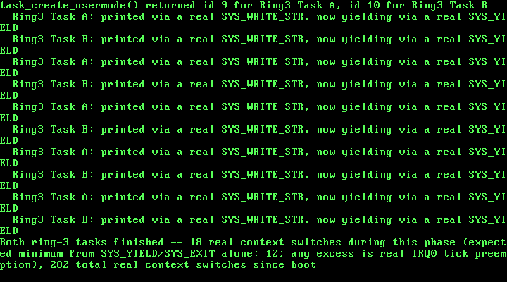

# 16. Real Ring-3 Tasks in the Scheduler: sys_yield, sys_exit, Multiple User Tasks

**What you will understand:** how a task that runs at CPL 3 can become a genuine, first-class participant of a scheduler that already exists, rather than a one-off demo wired up by hand; why each ring-3 task needs its own dedicated kernel stack, and why the TSS's ESP0 field has to be updated on every single switch into one; and how two new system calls -- SYS_YIELD and SYS_EXIT -- turn out to need no new scheduler logic at all, because they are just ring-0 wrappers around functions this book has had since Chapter 11/12.

**What you need to know first:** Chapter 11-12's own cooperative-then-preemptive scheduler (`016_task.h`/`016_task.c`, `016_switch.asm`, unchanged in its core mechanics), and Chapter 15's own first real privilege boundary (`016_tss.h`/`016_tss.c`, `016_gdt.c`, `016_usermode.asm`, `016_isr128.asm`/`016_syscall.h`'s `INT 0x80` syscall gate) -- this chapter does not rebuild any of that, it wires it together.

## A demo, not a citizen

Chapter 15 got one function running at ring 3, for real, with a real captured `#GP` proving the CPU was genuinely enforcing the privilege boundary it built. But look at how it got there: `016_kmain.c`'s own `kmain()` built a kernel stack for the TSS by hand, built a user stack by hand, marked `.usermode_text` user-accessible by hand, and called `enter_usermode()` directly -- completely outside Chapter 11's own task table. That ring-3 code was never a *task* at all, in this book's own sense of the word: it had no slot in `tasks[]`, `task_is_done()` could not ask about it, and it could not `SYS_YIELD` to anything, because no syscall to do that even existed yet. It was a special case, running once, alongside the scheduler rather than inside it.

This chapter closes that gap. By the end of it, a ring-3 task is created with `task_create_usermode()`, sits in the exact same fixed task table every ring-0 task already does, gets picked by the exact same round-robin scan in `task_yield()`, and can voluntarily give up the CPU or finish itself with two new real system calls -- `SYS_YIELD` and `SYS_EXIT` -- that turn out to require no new scheduling logic whatsoever, because both are just a direct, un-special-cased call into `task_yield()`/`task_exit()`, the same two functions this book has had since Chapter 11 and Chapter 12.

## The one real problem: whose kernel stack is this?

Every ring-0 task this book has ever created shares one property that made Chapter 11's own `switch_task()` simple: the stack `switch_task()` saves and restores IS the only stack that task ever runs on, for its entire life, whether it got there through an ordinary `task_yield()` call or through a real IRQ0 tick landing on top of it. Ring 3 breaks that property. A ring-3 task spends most of its life running on its OWN, separate, PAGE_USER-marked stack -- and the instant it raises anything at all (a syscall, a timer tick, a fault), the CPU itself performs a real, hardware stack switch, using the TSS's own ESP0 field, onto a completely different, ring-0-only stack, before this kernel's own C code ever runs a single instruction.

Chapter 15 only ever had one ring-3 task, so one shared `tss_set_kernel_stack()` call, made once before entering ring 3, was enough. The instant a SECOND ring-3 task exists, that stops being true: if both tasks shared one kernel stack, the second task's own privilege-elevating interrupt would stomp all over whatever the first task's own interrupted state still needed on that same stack. The real OSDev Wiki citation this chapter is built on confirms this is not a hypothetical concern but a standard, necessary technique:

> "Adjust the ESP0 field in the TSS (used by CPU for CPL=3 -> CPL=0 privilege level changes)"

(OSDev Wiki, "Kernel Multitasking": https://wiki.osdev.org/Kernel_Multitasking -- from that page's own 32-bit context-switch example, which loads the next task's own kernel stack pointer into the TSS's ESP0 field on every single switch.)

So every ring-3 task in this chapter gets its own dedicated kernel stack, kmalloc()'d once when the task is created -- and that same stack plays two real roles at once. It is the exact stack `switch_task()` saves and restores, exactly like any ring-0 task's own stack; and, whenever this task is the one currently running, it is also the exact stack the CPU's own hardware loads into ESP0 the instant this task raises anything at CPL 3. One real stack, two real jobs, never shared with any other task -- which is why `task_yield()` now has to reload the TSS's ESP0 field on every single switch into a ring-3 task, covered below.

## `016_task.h`/`016_task.c`: a task table that already knew how to grow

The new declaration is short -- deliberately: everything this function needs already exists somewhere in this book, and `task_create_usermode()`'s own job is just to wire it together the same way Chapter 15's `kmain()` did by hand, but reusable for as many ring-3 tasks as this kernel ever creates.

```c
#ifndef UNIX_OS_016_TASK_H
#define UNIX_OS_016_TASK_H

#include <stdint.h>

/* Sets up this kernel's task list with exactly one task -- task 0, the
 * kernel's own boot-time execution context (the one kmain() is already
 * running on when this is called), still running on the same boot
 * stack every chapter since Chapter 1 has used. Must be called before
 * any task_create()/task_yield()/task_exit() call. */
void task_init(void);

/* Creates a new cooperative kernel task: allocates it a real stack
 * from Chapter 9's kmalloc(), and pre-populates that stack so the
 * first time this task is ever switched into, execution begins at
 * `entry` (OSDev Wiki, "X86 Cooperative Multitasking Tutorial": "the
 * kernel needs to put values on the new task's kernel stack to match
 * the values that 'switch_tasks' expects to pop off"). `entry` must
 * eventually call task_exit() -- it must never return normally.
 * Returns the new task's index (1, 2, ...), or -1 if this kernel's
 * fixed task table is already full. */
int task_create(void (*entry)(void));

/* Creates a new RING-3 task: same fixed task table task_create() uses,
 * but this task's real entry point runs at CPL 3, not CPL 0. Builds
 * TWO stacks, not one -- a real kmalloc()'d kernel stack (used both by
 * switch_task() itself, exactly like every ring-0 task's own stack,
 * AND as the exact stack this task's own dedicated TSS.ESP0 points at
 * whenever it is current, so any interrupt or syscall this task raises
 * lands on ITS OWN kernel stack, never another task's), and a real
 * user-accessible stack frame from Chapter 7's own pmm_alloc_frame()
 * (016_paging.h's PAGE_USER, exactly as Chapter 15 built by hand
 * directly inside kmain()). The very first time 016_linker.ld's own
 * .usermode_text pages are needed, this function also marks them
 * user-accessible -- once only, regardless of how many ring-3 tasks
 * this kernel ever creates. `entry` must eventually call a real
 * SYS_EXIT syscall (016_syscall.h) -- it must never return normally,
 * and it must never call task_exit() itself directly, since that is a
 * ring-0-only function ring-3 code has no way to call at all. Returns
 * the new task's index, or -1 if the task table is already full. */
int task_create_usermode(void (*entry)(void));

/* Voluntarily gives up the CPU: saves the calling task's callee-saved
 * registers and stack pointer, picks the next RUNNING task in
 * round-robin order, and switches to it. Returns normally, right
 * where it left off, once this task is switched back in. If no other
 * task is currently RUNNING, returns immediately without performing a
 * real switch. */
void task_yield(void);

/* Marks the calling task DONE and switches away from it permanently.
 * Never returns -- this task's own stack and call frame are simply
 * abandoned from this point on. */
void task_exit(void);

/* Non-zero once the task at `index` (as returned by task_create())
 * has called task_exit(). */
int task_is_done(int index);

/* The currently-running task's own index -- what task_create() itself
 * returned when this task was created (0 for the kernel's own boot
 * task). New this chapter, so 016_semaphore.c can record which task
 * is waiting on which semaphore without task.c having to know
 * anything about semaphores itself. */
int task_current_id(void);

/* Marks the CALLING task BLOCKED and returns immediately -- it does
 * NOT yield the CPU itself. Split out from a single "block and yield"
 * call on purpose: 016_semaphore.c needs this exact state transition
 * to happen while it still holds its own lock, so that no concurrent
 * semaphore_signal() can dequeue this task as a waiter before the
 * scheduler has actually stopped considering it runnable (see
 * 016_semaphore.c's own comments for the real race this avoids). The
 * caller is expected to give up the CPU with task_yield() itself,
 * separately, once it is safe to do so. A BLOCKED task is skipped by
 * every future task_yield()/task_tick() scan until some other task
 * calls task_wake() on it. */
void task_block_self(void);

/* Marks the task at `index` READY again, making it eligible to be
 * picked by task_yield()'s own round-robin scan the next time it is
 * that task's turn -- it does NOT itself trigger an immediate switch
 * to that task. Called from 016_semaphore.c's semaphore_signal(),
 * always from inside that semaphore's own lock (interrupts already
 * off), so this needs no locking of its own. */
void task_wake(int index);

/* Total number of real context switches switch_task() has performed
 * since task_init(). Exists purely for this chapter's own real, live
 * verification. */
uint32_t task_switch_count(void);

/* Called from 016_pit.c's irq0_handler() on every single real IRQ0
 * tick, after that tick's own EOI has already been sent. Before
 * task_init() has run, does nothing -- this kernel has no task table
 * to preempt yet. After task_init(), calls task_yield() unconditionally,
 * exactly once per real tick: this chapter's whole scheduling policy
 * is "one tick, one time slice," chosen because it is the simplest
 * policy whose real switch count is independently predictable from
 * nothing but the real tick count, with no separate countdown state
 * of its own to get wrong. */
void task_tick(void);

#endif
```

The Thread Control Block itself grows three fields: `is_usermode` (does this task start through `enter_usermode()` or through a direct call?), `kernel_stack_top` (this task's own dedicated ESP0 target, meaningful only when `is_usermode`), and `user_stack_top` (this task's own real, PAGE_USER-marked stack, handed to `enter_usermode()` the one time this task's trampoline actually starts it). `task_create_usermode()` builds both of this task's real stacks -- one kmalloc()'d kernel stack pre-populated with exactly the same `switch_task()`-shaped frame `task_create()` already builds, one real `pmm_alloc_frame()` user stack marked `PAGE_USER` -- and, the very first time any ring-3 task is ever created, marks `016_linker.ld`'s own `.usermode_text` pages user-accessible, moved here from Chapter 15's own `kmain()` so it happens exactly once no matter how many ring-3 tasks this kernel ends up creating:

```c
#include <stdint.h>

#include "016_kheap.h"
#include "016_paging.h"
#include "016_pmm.h"
#include "016_printf.h"
#include "016_task.h"
#include "016_tss.h"

/* This chapter's own Thread Control Block, in the same spirit the
 * OSDev Wiki describes for kernel-level tasks: "The TCB holds task
 * state including the kernel stack pointer (ESP) ... " (OSDev Wiki,
 * "Kernel Multitasking": https://wiki.osdev.org/Kernel_Multitasking).
 * This kernel has no user/kernel privilege split and no per-task
 * address space yet -- every task here runs in ring 0 sharing the one
 * page directory Chapter 8 built -- so this TCB carries nothing for
 * CR3 or a TSS.ESP0 field the way a fuller kernel's would; `esp` is
 * almost the whole of what switch_task() needs. `entry` is new since
 * Chapter 12 -- see task_start_trampoline() below for why. `state`
 * replaces this struct's old plain `done` flag this chapter: a task
 * can now be BLOCKED (waiting on a semaphore, see 016_semaphore.c)
 * as well as READY or DONE, and the scheduler needs to tell all three
 * apart, not just "finished or not." */
typedef enum {
    TASK_STATE_READY = 0,
    TASK_STATE_BLOCKED,
    TASK_STATE_DONE
} task_state_t;

struct task {
    uint32_t esp;        /* valid only while this task is NOT current */
    void *stack_base;     /* the kmalloc()'d block backing this task's
                            * stack -- kept only so a later chapter with
                            * real task teardown could kfree() it; this
                            * chapter never frees a task's stack */
    void (*entry)(void);  /* this task's real entry point -- kept so
                            * task_start_trampoline() can find it */
    task_state_t state;
    int is_usermode;         /* new this chapter: non-zero if this task
                               * runs its real `entry` at CPL 3, via
                               * enter_usermode(), rather than calling it
                               * directly at CPL 0 */
    uint32_t kernel_stack_top; /* new this chapter: only meaningful when
                               * is_usermode -- the top of this task's
                               * OWN dedicated kernel stack, the same
                               * stack `esp` above lives on. task_yield()
                               * loads this into the TSS's ESP0 field
                               * (016_tss.c) immediately before switching
                               * into this exact task, so any interrupt
                               * or syscall this task later raises at
                               * CPL 3 lands on ITS OWN kernel stack, not
                               * whichever task happened to run before
                               * it (OSDev Wiki, "Kernel Multitasking":
                               * "Adjust the ESP0 field in the TSS (used
                               * by CPU for CPL=3 -> CPL=0 privilege
                               * level changes)"). */
    uint32_t user_stack_top;  /* new this chapter: only meaningful when
                               * is_usermode -- the top of this task's
                               * own real, PAGE_USER-marked stack frame,
                               * passed to enter_usermode() the one time
                               * this task's trampoline actually starts
                               * it running at CPL 3 */
};

/* Chapter 15 needed 9 slots (kmain's own task 0, Chapter 12's own
 * Task A/Task B, Chapter 13's own Stress A/Stress B, and Chapter 14's
 * own two producers/two consumers). This chapter adds two more demo
 * tasks of its own (two real ring-3 tasks, below) without reclaiming
 * any earlier chapter's slot -- this scheduler still never reuses a
 * finished task's slot -- so the fixed table has to be sized for every
 * task any chapter's own kmain() creates across a single boot, not
 * just however many are runnable at once. */
#define TASK_MAX_TASKS   11u
#define TASK_STACK_SIZE  4096u

static struct task tasks[TASK_MAX_TASKS];
static int task_count = 0;
static int current_task = 0;
static uint32_t switch_count = 0;
static int tasking_ready = 0;

extern void switch_task(uint32_t *old_esp_ptr, uint32_t new_esp);

/* 016_usermode.asm's real ring 0 -> ring 3 transition -- Chapter 15's
 * own real, hand-built IRET. Called from task_start_trampoline() below
 * instead of `entry()` directly, whenever the task starting up is a
 * ring-3 one. Never returns in the ordinary sense: the task it starts
 * keeps running at CPL 3 (and, eventually, calls a real SYS_EXIT
 * syscall) independently of whatever called it. */
extern void enter_usermode(void (*entry)(void), void *user_stack_top);

/* Defined by 016_linker.ld: the real, page-aligned bounds of the
 * dedicated .usermode_text section every ring-3 task's own real code
 * lives in -- moved here from 016_kmain.c this chapter, since
 * task_create_usermode() is now the one place that marks these pages
 * user-accessible, not kmain() directly. */
extern char usermode_text_start[];
extern char usermode_text_end[];

/* Chapter 11's task_create() put `entry` directly on a new task's
 * stack as the address switch_task()'s own `ret` would jump to --
 * correct for a purely cooperative scheduler, where every switch_task()
 * call happens with IF already 1 (interrupts enabled) throughout,
 * since nothing in that chapter ever touched IF at all. This chapter
 * changes that: every real switch now happens from *inside* an IRQ0
 * interrupt handler, entered through a real interrupt gate that the
 * CPU itself clears IF for on entry (OSDev Wiki's own IDT gate-type
 * description; this book's own idt_set_gate() calls have used type
 * 0x8E, a 32-bit interrupt gate, since Chapter 4). switch_task()
 * itself never saves or restores EFLAGS -- IF is one single, real,
 * shared CPU flag, not per-task state -- so whichever task gets
 * switched into next inherits whatever IF happens to be at that exact
 * moment: 0, because we are still inside that interrupt handler. A
 * task resuming through task_yield()'s own return point can restore
 * that itself (see below); but a task running for the very first
 * time jumps straight to `entry`, which has no such checkpoint to
 * pass through -- so without this trampoline, a brand-new task would
 * start running with interrupts silently, permanently disabled, and
 * this whole chapter's preemption would only ever work once. */
static void task_start_trampoline(void) {
    __asm__ volatile ("sti");

    /* New this chapter: a ring-3 task's real entry point cannot simply
     * be called like an ordinary C function -- it has to be started
     * through a real CPL 0 -> CPL 3 transition (016_usermode.asm), on
     * its own dedicated user stack, not this task's kernel stack.
     * enter_usermode() never returns: this task keeps running at CPL 3
     * until its own real SYS_EXIT syscall (016_isr_handlers.c) calls
     * task_exit() directly, from ring 0, on this exact task's own
     * kernel stack -- so the task_exit() call below is never reached
     * for a ring-3 task at all. */
    if (tasks[current_task].is_usermode) {
        enter_usermode(tasks[current_task].entry,
                        (void *) (uintptr_t) tasks[current_task].user_stack_top);
    } else {
        tasks[current_task].entry();
    }

    /* Defensive, not load-bearing: every real ring-0 task body in this
     * chapter already calls task_exit() itself. If one ever forgot,
     * this is what stands between that mistake and running off the
     * end of a kmalloc()'d stack into whatever memory happens to
     * follow it. */
    task_exit();
}

void task_init(void) {
    tasks[0].esp = 0;         /* never read while task 0 is current */
    tasks[0].stack_base = 0;   /* task 0 owns no kmalloc'd stack -- it
                                 * is this kernel's own boot stack,
                                 * already running before task_init()
                                 * is ever called */
    tasks[0].entry = 0;         /* task 0 never starts via the
                                  * trampoline -- it is already running */
    tasks[0].state = TASK_STATE_READY;
    tasks[0].is_usermode = 0;   /* task 0 is this kernel's own boot
                                  * task -- always ring 0 */
    tasks[0].kernel_stack_top = 0;
    tasks[0].user_stack_top = 0;
    task_count = 1;
    current_task = 0;
    switch_count = 0;
    tasking_ready = 1;
}

int task_create(void (*entry)(void)) {
    if (task_count >= (int) TASK_MAX_TASKS) {
        kprintf("task_create: task table full (%u tasks) -- refusing\n", TASK_MAX_TASKS);
        return -1;
    }

    struct task *t = &tasks[task_count];
    void *stack = kmalloc(TASK_STACK_SIZE);
    uint32_t top = (uint32_t) (uintptr_t) stack + TASK_STACK_SIZE;
    uint32_t *sp = (uint32_t *) top;

    /* Build the exact stack frame switch_task()'s own epilogue expects
     * to pop the first time this task is switched into: EDI, ESI, EBX,
     * EBP (in that order, since switch_task() pushed EBP first and
     * pops in reverse), then a return address on top -- which is what
     * makes switch_task()'s final `ret` land directly on
     * task_start_trampoline (OSDev Wiki, "X86 Cooperative Multitasking
     * Tutorial": a new task's registers are initialized with
     * "task->regs.esp = (uint32_t) allocPage() + 0x1000" and
     * "task->regs.eip = (uint32_t) main"). Zero is a fine placeholder
     * for EBP/EBX/ESI/EDI here -- nothing has run inside this task yet
     * to give those registers a real saved value. */
    *(--sp) = (uint32_t) (uintptr_t) task_start_trampoline;  /* return address for `ret` */
    *(--sp) = 0;  /* ebp */
    *(--sp) = 0;  /* ebx */
    *(--sp) = 0;  /* esi */
    *(--sp) = 0;  /* edi */

    t->esp = (uint32_t) (uintptr_t) sp;
    t->stack_base = stack;
    t->entry = entry;
    t->state = TASK_STATE_READY;
    t->is_usermode = 0;
    t->kernel_stack_top = 0;
    t->user_stack_top = 0;

    int index = task_count;
    task_count++;
    return index;
}

/* Marks EXACTLY the pages 016_linker.ld's own page-aligned
 * .usermode_text section occupies as user-accessible -- no RW bit
 * here at all, since this range only ever needs to be FETCHED from,
 * never written to. Idempotent by construction (paging_map_page() is
 * always safe to call again with the same vaddr/paddr/flags), but
 * guarded with a static flag anyway so a kernel with many ring-3 tasks
 * does not re-walk and re-map the same handful of pages every single
 * time a new one is created. */
static int usermode_text_mapped = 0;

static void ensure_usermode_text_mapped(void) {
    if (usermode_text_mapped) {
        return;
    }

    uint32_t text_start = (uint32_t) (uintptr_t) usermode_text_start;
    uint32_t text_end   = (uint32_t) (uintptr_t) usermode_text_end;
    for (uint32_t addr = text_start; addr < text_end; addr += 4096u) {
        paging_map_page(addr, addr, PAGE_PRESENT | PAGE_USER);
    }
    kprintf("task_create_usermode: marked %u page(s) [0x%x - 0x%x) of "
            ".usermode_text user-accessible\n",
            (text_end - text_start) / 4096u, text_start, text_end);

    usermode_text_mapped = 1;
}

int task_create_usermode(void (*entry)(void)) {
    if (task_count >= (int) TASK_MAX_TASKS) {
        kprintf("task_create_usermode: task table full (%u tasks) -- refusing\n", TASK_MAX_TASKS);
        return -1;
    }

    ensure_usermode_text_mapped();

    struct task *t = &tasks[task_count];

    /* This task's own dedicated kernel stack -- built exactly like
     * task_create()'s own ordinary task stack above (same size, same
     * pre-populated switch_task() frame landing on
     * task_start_trampoline), because it plays the exact same role for
     * switch_task() itself. What is new is that THIS SAME stack also
     * becomes this task's own TSS.ESP0 target the instant it becomes
     * current (see task_yield() below) -- one real stack, two real
     * jobs, never shared with any other task. */
    void *kstack = kmalloc(TASK_STACK_SIZE);
    uint32_t kstack_top = (uint32_t) (uintptr_t) kstack + TASK_STACK_SIZE;
    uint32_t *sp = (uint32_t *) kstack_top;

    *(--sp) = (uint32_t) (uintptr_t) task_start_trampoline;  /* return address for `ret` */
    *(--sp) = 0;  /* ebp */
    *(--sp) = 0;  /* ebx */
    *(--sp) = 0;  /* esi */
    *(--sp) = 0;  /* edi */

    /* This task's own real user-mode stack: one frame straight from
     * Chapter 7's own pmm_alloc_frame() -- identity-mapped, so its
     * physical address is also a valid virtual address, exactly like
     * every other frame this kernel has ever mapped. PAGE_USER is what
     * makes it usable from CPL 3 at all; without it, the very first
     * PUSH this task's own prologue performs would #PF instantly (the
     * same real subtlety 016_paging.c's own paging_map_page() comment
     * describes for .usermode_text -- caught for real in Chapter 15). */
    uint32_t user_frame = pmm_alloc_frame();
    paging_map_page(user_frame, user_frame, PAGE_PRESENT | PAGE_RW | PAGE_USER);
    uint32_t user_stack_top = user_frame + 4096u;

    t->esp = (uint32_t) (uintptr_t) sp;
    t->stack_base = kstack;
    t->entry = entry;
    t->state = TASK_STATE_READY;
    t->is_usermode = 1;
    t->kernel_stack_top = kstack_top;
    t->user_stack_top = user_stack_top;

    int index = task_count;
    task_count++;
    return index;
}

void task_yield(void) {
    /* OSDev Wiki, "Kernel Multitasking": "Caller is expected to
     * disable IRQs before calling, and enable IRQs again after
     * function returns" -- rather than push that requirement onto
     * every caller, task_yield() enforces it itself, so it stays
     * correct regardless of whether it was reached from an ordinary
     * cdecl call or, as every real call in this chapter's own run
     * is, from inside an interrupt handler where IF is already 0. */
    __asm__ volatile ("cli");

    int old = current_task;
    int next = -1;

    /* Scans every OTHER task first, in round-robin order, then wraps
     * all the way back around to `old` itself as the last candidate
     * checked. This one loop now correctly covers every case this
     * chapter's own three task states can produce: some other READY
     * task exists (ordinary switch); no other task is READY but `old`
     * itself still is (the loop's own wraparound finds it, and the
     * "next == old" check below turns that into a no-op); or `old`
     * itself is no longer READY either -- freshly BLOCKED by this
     * chapter's own task_block_self(), or DONE -- in which case the
     * whole scan finds nothing at all and `next` stays -1. Chapter
     * 13's own version of this loop only ever had to handle the first
     * two cases, since nothing in that chapter could make `old` itself
     * non-runnable out from under its own yield. */
    for (int i = 1; i <= task_count; i++) {
        int candidate = (old + i) % task_count;
        if (tasks[candidate].state == TASK_STATE_READY) {
            next = candidate;
            break;
        }
    }

    if (next == -1) {
        /* Nothing in the whole task table is READY -- not some other
         * task, and not even this one. Every earlier chapter's own
         * version of this message meant "everyone has called
         * task_exit()"; this chapter adds a second real way to reach
         * it: every remaining task is genuinely BLOCKED on a
         * semaphore that nothing will ever signal. Both are real dead
         * ends this scheduler has no idle task to fall back on for. */
        kprintf("task_yield: no runnable task remains -- halting\n");
        for (;;) {
            __asm__ volatile ("hlt");
        }
    }

    if (next == old) {
        __asm__ volatile ("sti");
        return;  /* only this task is runnable -- nothing to switch to */
    }

    current_task = next;
    switch_count++;

    /* New this chapter: whenever the task we are about to switch INTO
     * is a ring-3 one, its own dedicated kernel stack has to already
     * be installed as the CPU's real ESP0 target BEFORE switch_task()
     * ever runs -- otherwise the very next interrupt or syscall this
     * task raises at CPL 3 (which can happen at any point after this
     * function returns, including immediately) would land on whichever
     * OTHER task's kernel stack the TSS still happened to point at
     * (OSDev Wiki, "Kernel Multitasking": "Adjust the ESP0 field in
     * the TSS (used by CPU for CPL=3 -> CPL=0 privilege level
     * changes)"). This covers both a ring-3 task's very first
     * activation (landing in task_start_trampoline for the first time)
     * and every later resume identically -- tasks[next].esp already
     * points at the right place either way; only the CPU's own ESP0
     * register needs updating here. Ring-0-only tasks never trigger a
     * CPL change at all, so this is skipped for them entirely -- the
     * TSS's ESP0 field is simply irrelevant while one is running. */
    if (tasks[next].is_usermode) {
        tss_set_kernel_stack(tasks[next].kernel_stack_top);
    }

    switch_task(&tasks[old].esp, tasks[next].esp);

    /* Execution only reaches here once this exact task is switched
     * back into again -- possibly much later, and possibly by
     * unwinding all the way back up through some real IRQ0 stub's own
     * `iret`, which is a second, independent place IF=1 also gets
     * restored from. The explicit `sti` here is still required: it is
     * what re-enables interrupts for every task that resumes through
     * this exact return point rather than through an `iret` at all. */
    __asm__ volatile ("sti");
}

void task_exit(void) {
    tasks[current_task].state = TASK_STATE_DONE;
    task_yield();
    /* unreachable: task_yield() above either switches this task's own
     * stack away permanently (this call frame is simply abandoned,
     * never resumed again) or halts the kernel outright if nothing
     * else is runnable. */
}

int task_is_done(int index) {
    return tasks[index].state == TASK_STATE_DONE;
}

int task_current_id(void) {
    return current_task;
}

void task_block_self(void) {
    tasks[current_task].state = TASK_STATE_BLOCKED;
}

void task_wake(int index) {
    tasks[index].state = TASK_STATE_READY;
}

uint32_t task_switch_count(void) {
    return switch_count;
}

void task_tick(void) {
    if (!tasking_ready) {
        return;  /* task_init() has not run yet -- nothing to preempt */
    }
    task_yield();
}
```

Three real changes to this file are worth reading closely. First, `task_start_trampoline()` -- the function every brand-new task's pre-built stack frame lands on the first time it is ever switched into -- now branches on `is_usermode`: a ring-0 task still just calls `entry()` directly, exactly as it always has, but a ring-3 task instead calls `enter_usermode(entry, user_stack_top)`, Chapter 15's own real `iret`-based privilege transition, never returning in the ordinary sense. Second, `task_yield()` now sets the TSS's ESP0 field, via `tss_set_kernel_stack()`, immediately before every single `switch_task()` call whose target is a ring-3 task -- covering both that task's very first activation and every later resume identically, since `tasks[next].kernel_stack_top` never changes for a given task's whole life. Third, `TASK_MAX_TASKS` grows from 9 to 11, for this chapter's own two new demo tasks, on top of every earlier chapter's own tasks this fixed table still has to hold -- this scheduler has never reused a finished task's slot, and still does not.

## `016_syscall.h`: two new syscalls that do no new work at all

```c
#ifndef UNIX_OS_016_SYSCALL_H
#define UNIX_OS_016_SYSCALL_H

/* This chapter's whole syscall table: three real numbers now, shared
 * between every ring-3 caller (016_kmain.c's own ring3_task_a_entry()/
 * ring3_task_b_entry(), via the shared usermode_syscall() helper, which
 * loads one of these into EAX before executing INT 0x80) and the
 * ring-0 dispatcher (016_isr_handlers.c's isr128_handler(), which
 * switches on it). OSDev Wiki, "System Calls": "If all function codes
 * are small contiguous numbers, a better option might be a function
 * table" -- still overkill for exactly three real syscalls, but the
 * constants still live here rather than as bare magic numbers
 * scattered across two different files.
 *
 * SYS_YIELD and SYS_EXIT are new this chapter, and neither one does
 * any real work of its own: both are thin ring-0 wrappers around
 * functions this book has had since Chapter 11/12 -- task_yield() and
 * task_exit() -- reused exactly as-is. Nothing about the scheduler
 * itself needed to change to let ring-3 code drive it; only a door
 * back into ring 0 was missing, and INT 0x80 (016_isr128.asm) was
 * already that door for SYS_WRITE_STR. */
#define SYS_WRITE_STR 1u
#define SYS_YIELD     2u
#define SYS_EXIT      3u

#endif
```

Neither `SYS_YIELD` nor `SYS_EXIT` implements anything of its own. Both exist purely to give ring-3 code the one thing it structurally cannot do by itself: call a ring-0-only C function directly. `016_isr128.asm`'s own `INT 0x80` gate is already the one sanctioned door back into ring 0 from Chapter 15; this chapter just gives that door two more real, useful things to say through it.

## `016_isr_handlers.c`: the dispatcher becomes a real switch

`isr128_handler()` grows from a single `if` into the real `switch` statement its own comment, back in Chapter 15, already predicted it would need. `SYS_WRITE_STR` is unchanged. `SYS_YIELD` and `SYS_EXIT` are each exactly one line -- a direct call into `016_task.c`'s own `task_yield()`/`task_exit()`, neither of which is aware, or needs to be aware, that this particular call arrived through a ring-3 syscall rather than an ordinary ring-0 call site:

```c
/* Chapter 5: this book's first real exception handler (isr0_handler,
 * unchanged since). Chapter 10 adds this book's second: isr14_handler,
 * for #PF -- and unlike #DE, a page fault carries real, decodable
 * information about exactly what went wrong, which this handler reads
 * and prints rather than just reporting "a fault happened."
 *
 * Like isr0_handler, this one does not try to resume the faulting
 * instruction -- this book has no demand paging, no swapping, nothing
 * that could make an unmapped or protected address valid by the time
 * this handler returns, so retrying would just fault again on the
 * same instruction, forever. Reporting the fault honestly and halting
 * is still the right call until a later chapter gives this kernel a
 * real mechanism to fix the underlying mapping and actually resume. */

#include "016_isr_handlers.h"
#include "016_printf.h"
#include "016_syscall.h"
#include "016_task.h"

void isr0_handler(void) {
    kprintf("\n*** CPU EXCEPTION: Divide Error (vector 0, #DE) ***\n");
    kprintf("A DIV or IDIV instruction attempted to divide by zero.\n");
    kprintf("This handler does not resume the faulting instruction --\n");
    kprintf("halting.\n");

    __asm__ volatile ("cli");
    for (;;) {
        __asm__ volatile ("hlt");
    }
}

/* Error code bit layout, cited field-for-field:
 *   P (bit 0): "When set, the page fault was caused by a
 *               page-protection violation. When not set, it was
 *               caused by a non-present page."
 *   W (bit 1): "When set, the page fault was caused by a write
 *               access. When not set, it was caused by a read access."
 *   U (bit 2): "When set, the page fault was caused while CPL = 3."
 * (OSDev Wiki, "Exceptions", vector 14 / #PF: https://wiki.osdev.org/Exceptions)
 *
 * The faulting linear address itself is not part of the error code at
 * all -- the same page notes "it sets the value of the CR2 register
 * to the virtual address which caused the Page Fault," so this
 * handler reads CR2 directly rather than looking for it on the stack. */
void isr14_handler(uint32_t error_code) {
    uint32_t faulting_address;
    __asm__ volatile ("mov %%cr2, %0" : "=r" (faulting_address));

    kprintf("\n*** CPU EXCEPTION: Page Fault (vector 14, #PF) ***\n");
    kprintf("Faulting address (CR2): 0x%x\n", faulting_address);
    kprintf("Error code: 0x%x (%s, %s, %s)\n",
            error_code,
            (error_code & 0x1u) ? "protection violation" : "non-present page",
            (error_code & 0x2u) ? "write" : "read",
            (error_code & 0x4u) ? "user mode" : "supervisor mode");
    kprintf("This handler does not resume the faulting instruction --\n");
    kprintf("halting.\n");

    __asm__ volatile ("cli");
    for (;;) {
        __asm__ volatile ("hlt");
    }
}

/* This chapter's third real exception handler, and this book's first
 * one triggered from ring 3 rather than ring 0. Error code bit layout,
 * cited field-for-field (OSDev Wiki, "Exceptions", vector 13 / #GP):
 *   "The General Protection Fault sets an error code, which is the
 *   segment selector index when the exception is segment related.
 *   Otherwise, 0." -- when non-zero, bit 0 (E) means "the exception
 *   originated externally to the processor," bits 2-1 (Tbl) name
 *   which table the index refers to (GDT/IDT/LDT), and bits 31-3
 *   (Index) are that table's own real index.
 *
 * 016_kmain.c's own ring-3 demo triggers this by executing CLI at
 * CPL 3 -- one of the "Executing a privileged instruction while
 * CPL != 0" triggers the same page lists -- which is NOT segment-
 * related, so this handler's own real captured run shows an error
 * code of exactly 0, not a decoded selector. The decoding logic below
 * still exists for the general case, the same honest-by-default
 * style every other error-code handler in this book already follows. */
void isr13_handler(uint32_t error_code) {
    kprintf("\n*** CPU EXCEPTION: General Protection Fault (vector 13, #GP) ***\n");
    if (error_code == 0) {
        kprintf("Error code: 0x0 (not segment-related -- e.g. a privileged "
                "instruction executed at CPL != 0)\n");
    } else {
        uint32_t table = (error_code >> 1) & 0x3u;
        kprintf("Error code: 0x%x (external=%u, table=%s, index=%u)\n",
                error_code,
                error_code & 0x1u,
                (table == 0) ? "GDT" : (table == 1) ? "IDT" : "LDT",
                (error_code >> 3) & 0x1FFFu);
    }
    kprintf("This handler does not resume the faulting instruction --\n");
    kprintf("halting.\n");

    __asm__ volatile ("cli");
    for (;;) {
        __asm__ volatile ("hlt");
    }
}

/* This chapter's real syscall dispatcher -- the whole reason ring 3
 * can do anything useful at all despite every port I/O instruction
 * and every privileged instruction being forbidden to it. Runs at
 * ring 0, called from 016_isr128.asm's own INT 0x80 stub with
 * whatever the caller put in EAX/EBX forwarded as real cdecl
 * arguments. Now a real switch statement, exactly as 016_syscall.h's
 * own comment (and OSDev Wiki, "System Calls": "If all function codes
 * are small contiguous numbers, a better option might be a function
 * table") anticipated for whenever a second syscall showed up --
 * this chapter adds two at once.
 *
 * SYS_YIELD and SYS_EXIT are both genuinely nothing more than a direct
 * call into 016_task.c's own existing task_yield()/task_exit() --
 * unchanged since Chapter 11/12, and unaware that this particular call
 * came from a ring-3 syscall rather than an ordinary ring-0 call site.
 * That is the entire point of building this chapter's ring-3 support
 * on top of Chapter 11's scheduler rather than beside it: a ring-3
 * task's SYS_YIELD is a REAL task_yield() call, picking the next READY
 * task in exactly the same round-robin scan every earlier chapter's
 * own ring-0 tasks already go through, and its SYS_EXIT is a REAL
 * task_exit() call, marking this exact task DONE in the very same
 * fixed task table.
 *
 * task_exit() never returns (see 016_task.c's own comment on it), so
 * the SYS_EXIT case below never falls through to 016_isr128.asm's own
 * `add esp, 8 / popa / iret` epilogue -- this task's entire kernel
 * stack, including this exact call frame, is simply abandoned at that
 * point, exactly like every ring-0 task's own task_exit() call already
 * does. */
void isr128_handler(uint32_t syscall_num, uint32_t arg) {
    switch (syscall_num) {
    case SYS_WRITE_STR:
        kprintf("%s", (const char *) (uintptr_t) arg);
        break;
    case SYS_YIELD:
        task_yield();
        break;
    case SYS_EXIT:
        task_exit();
        break;  /* unreachable: task_exit() never returns */
    default:
        kprintf("\n*** isr128_handler: unknown syscall number %u -- ignoring ***\n",
                syscall_num);
        break;
    }
}
```

`task_exit()` never returns (see `016_task.c`'s own comment on it), which is why the `SYS_EXIT` case's `break` is genuinely unreachable: by the time that `switch` statement would fall through to it, this task's entire kernel stack -- including this exact `isr128_handler()` call frame, and `016_isr128.asm`'s own stub frame beneath it -- has already been abandoned for good, exactly like every ring-0 task's own `task_exit()` call already does.

## `016_kmain.c`: two real ring-3 tasks, cooperating for real

The one-off `user_mode_entry()` demo from Chapter 15 is gone. In its place: a small shared syscall wrapper, and two real ring-3 task bodies that each print, yield, print, yield -- five times each -- before a real `SYS_EXIT`:

```c
/* Chapter 15 (its own basic ring-3 plumbing unchanged below) gave this
 * kernel its first real privilege boundary: a Task State Segment
 * (016_tss.h/016_tss.c), ring-3 code/data segments in the GDT
 * (016_gdt.c), a dedicated page-aligned .usermode_text linker section
 * (016_linker.ld, 016_paging.c's PAGE_USER), a real ring 0 -> 3
 * transition (016_usermode.asm), and this book's first real system
 * call (016_isr128.asm, 016_syscall.h, INT 0x80) -- but only as a
 * one-off demo, wired up by hand directly inside kmain(), completely
 * separate from Chapter 11's own scheduler.
 *
 * This chapter makes ring-3 code a real, first-class participant of
 * THAT scheduler instead: 016_task.c's new task_create_usermode()
 * builds each ring-3 task its own dedicated kernel stack (doubling as
 * its own TSS.ESP0 target -- see task_yield()'s own comment on this)
 * and its own real user-mode stack, and starts it through
 * enter_usermode() from task_start_trampoline() exactly like every
 * ring-0 task already starts through a direct call. Two new syscalls
 * (016_syscall.h's SYS_YIELD/SYS_EXIT) are thin ring-0 wrappers around
 * task_yield()/task_exit(), letting a ring-3 task drive its own
 * scheduling decisions through the one sanctioned door back into ring
 * 0 that already existed. This chapter's own demo below creates two
 * real ring-3 tasks that cooperatively SYS_YIELD to each other several
 * times before a real SYS_EXIT -- on top of whatever real IRQ0-driven
 * preemption also happens to land during their run, exactly like
 * Chapter 12's own ring-0 tasks. */

#include <stdint.h>

#include "016_gdt.h"
#include "016_idt.h"
#include "016_keyboard.h"
#include "016_kheap.h"
#include "016_multiboot.h"
#include "016_paging.h"
#include "016_pic.h"
#include "016_pit.h"
#include "016_pmm.h"
#include "016_printf.h"
#include "016_semaphore.h"
#include "016_serial.h"
#include "016_spinlock.h"
#include "016_syscall.h"
#include "016_task.h"
#include "016_vga.h"

#define TIMER_FREQUENCY_HZ 100

/* Deliberately far outside the 0-64 MiB identity-mapped range (which
 * only ever occupies page-directory entries 0-15): 0xC0000000 >> 22 =
 * 768. Mapping here forces paging_map_page() to allocate a genuinely
 * new page table rather than reusing one paging_init() already built. */
#define TEST_VIRT_ADDR 0xC0000000u

/* Defined by 016_linker.ld, not by this file -- the linker is the one
 * part of this toolchain that genuinely knows where the kernel image's
 * last real section ends in physical memory. */
extern char kernel_end[];

/* How much real, uninterruptible-looking work each task does before
 * it naturally finishes -- large enough that many real IRQ0 ticks (at
 * 100 Hz, one every ~10 ms) land somewhere in the middle of it, since
 * a single pass through this loop takes QEMU's emulated CPU far less
 * than 10 ms. Chosen empirically from this chapter's own real run,
 * the same way every prior chapter's own real constants were. */
#define TASK_WORK_TARGET 4000000u
#define TASK_PRINT_EVERY   500000u

/* How many kmalloc()/kfree() round trips each stress task performs.
 * Chosen empirically from this chapter's own real runs: large enough
 * that, at 100 real IRQ0 ticks per second, many ticks land somewhere
 * in the middle of the whole run -- and therefore stand a real chance
 * of landing inside kmalloc()'s or kfree()'s own free-list
 * manipulation, not just between two whole calls. */
#define STRESS_ITERATIONS  3000000u
#define STRESS_PRINT_EVERY  500000u

/* This chapter's two demo tasks. Neither one calls task_yield()
 * anywhere in this loop -- the whole point. Whatever interleaving
 * this chapter's real run shows is forced entirely by the real timer,
 * not requested by either task. */
static void task_a_entry(void) {
    for (uint32_t i = 1; i <= TASK_WORK_TARGET; i++) {
        if (i % TASK_PRINT_EVERY == 0) {
            kprintf("  Task A: %u\n", i);
        }
    }
    kprintf("  Task A: done\n");
    task_exit();
}

static void task_b_entry(void) {
    for (uint32_t i = 1; i <= TASK_WORK_TARGET; i++) {
        if (i % TASK_PRINT_EVERY == 0) {
            kprintf("  Task B: %u\n", i);
        }
    }
    kprintf("  Task B: done\n");
    task_exit();
}

/* This chapter's real evidence tasks: two preemptible tasks racing on
 * kmalloc()/kfree() with no synchronization between them at all. Each
 * one only ever touches its own pointer, one allocation at a time --
 * any corruption that shows up is entirely the free list's own doing,
 * not a bug in either task's own logic. */
static void stress_task_a_entry(void) {
    for (uint32_t i = 1; i <= STRESS_ITERATIONS; i++) {
        void *p = kmalloc(32);
        if (p != 0) {
            *(volatile uint8_t *) p = 0xAA;
        }
        kfree(p);
        if (i % STRESS_PRINT_EVERY == 0) {
            kprintf("  Stress A: %u\n", i);
        }
    }
    kprintf("  Stress A: done\n");
    task_exit();
}

static void stress_task_b_entry(void) {
    for (uint32_t i = 1; i <= STRESS_ITERATIONS; i++) {
        void *p = kmalloc(64);
        if (p != 0) {
            *(volatile uint8_t *) p = 0xBB;
        }
        kfree(p);
        if (i % STRESS_PRINT_EVERY == 0) {
            kprintf("  Stress B: %u\n", i);
        }
    }
    kprintf("  Stress B: done\n");
    task_exit();
}

/* This chapter's own demo: a classic bounded-buffer producer/consumer,
 * built on this chapter's new semaphores plus Chapter 13's own
 * spinlock. `sem_empty_slots` starts at BUFFER_CAPACITY (that many
 * slots are free right now) and `sem_full_slots` starts at 0 (nothing
 * produced yet) -- the two together are what make a producer block
 * when the buffer is genuinely full and a consumer block when it is
 * genuinely empty, without either one ever spinning to find out. The
 * buffer's own read/write indices are a separate, much shorter
 * critical section, protected by an ordinary spinlock -- exactly the
 * kind of short, bounded update Chapter 13's spinlock is for. */
#define BUFFER_CAPACITY     4u
#define ITEMS_PER_PRODUCER 15u
#define ITEMS_PER_CONSUMER 15u

static int shared_buffer[BUFFER_CAPACITY];
static uint32_t buffer_write_idx = 0;
static uint32_t buffer_read_idx = 0;
static spinlock_t buffer_lock;
static semaphore_t sem_empty_slots;
static semaphore_t sem_full_slots;

static void produce(const char *label, uint32_t item_base) {
    for (uint32_t i = 1; i <= ITEMS_PER_PRODUCER; i++) {
        int item = (int) (item_base + i);

        /* Blocks for real if the buffer is already full -- this is
         * the whole point of this chapter, not busy-waiting. */
        semaphore_wait(&sem_empty_slots);

        uint32_t saved_eflags = spinlock_acquire(&buffer_lock);
        shared_buffer[buffer_write_idx] = item;
        buffer_write_idx = (buffer_write_idx + 1) % BUFFER_CAPACITY;
        spinlock_release(&buffer_lock, saved_eflags);

        semaphore_signal(&sem_full_slots);
        kprintf("  %s: produced %d\n", label, item);
    }
    kprintf("  %s: done\n", label);
    task_exit();
}

static void consume(const char *label) {
    for (uint32_t i = 1; i <= ITEMS_PER_CONSUMER; i++) {
        /* Blocks for real if the buffer is empty -- the mirror image
         * of produce()'s own semaphore_wait() above. */
        semaphore_wait(&sem_full_slots);

        uint32_t saved_eflags = spinlock_acquire(&buffer_lock);
        int item = shared_buffer[buffer_read_idx];
        buffer_read_idx = (buffer_read_idx + 1) % BUFFER_CAPACITY;
        spinlock_release(&buffer_lock, saved_eflags);

        semaphore_signal(&sem_empty_slots);
        kprintf("  %s: consumed %d\n", label, item);
    }
    kprintf("  %s: done\n", label);
    task_exit();
}

static void producer_a_entry(void) { produce("Producer A", 0u); }
static void producer_b_entry(void) { produce("Producer B", 100u); }
static void consumer_a_entry(void) { consume("Consumer A"); }
static void consumer_b_entry(void) { consume("Consumer B"); }

/* How many times each of this chapter's two ring-3 tasks prints and
 * then SYS_YIELDs before its own real SYS_EXIT. Deliberately small: a
 * real, independently-checkable lower bound on this chapter's own
 * final switch count falls straight out of this one constant (see
 * kmain()'s own comment on it below), the same way Chapter 12's own
 * TIMER_FREQUENCY_HZ made that chapter's tick count independently
 * checkable. */
#define RING3_TASK_ITERATIONS 5u

/* This chapter's shared ring-3 syscall wrapper -- both demo tasks
 * below call this instead of repeating the same inline-asm INT 0x80
 * sequence Chapter 15's own user_mode_entry() wrote out by hand. Genuinely
 * runs at CPL 3 (marked into 016_linker.ld's own dedicated
 * .usermode_text section, exactly like every other function in this
 * file that needs to), so it cannot call kprintf() directly -- that
 * would try to touch the serial/VGA drivers' own privileged I/O ports
 * (forbidden at CPL 3, see 016_tss.c's own iomap_base comment) -- this
 * IS the only sanctioned door back into ring 0. `num` and `arg` are
 * this book's own real i386 syscall convention (OSDev Wiki, "System
 * Calls": Linux's own real convention "gets its arguments in eax,
 * ebx, ecx, edx, esi, edi, and ebp in that order" -- this book only
 * ever needs the first two), loaded into explicit register variables
 * right before the real INT 0x80 instruction; nothing about this is a
 * normal C function call underneath. */
__attribute__((section(".usermode_text")))
static void usermode_syscall(uint32_t num, uint32_t arg) {
    register uint32_t sys_num asm("eax") = num;
    register uint32_t sys_arg asm("ebx") = arg;
    __asm__ volatile ("int $0x80" :: "r" (sys_num), "r" (sys_arg) : "memory");
}

/* This chapter's two real ring-3 demo tasks -- the entire reason
 * 016_task.c's new task_create_usermode() exists. Each one prints its
 * own static message (SYS_WRITE_STR), then genuinely gives up the CPU
 * with a real SYS_YIELD -- a real task_yield() call, reached through
 * ring 0, picking the next READY task in this kernel's one shared
 * round-robin scan exactly like any ring-0 task's own task_yield()
 * call would -- RING3_TASK_ITERATIONS times, before a final real
 * SYS_EXIT. Neither message string is itself marked PAGE_USER, and
 * neither task ever needs to be: forming a pointer to a string literal
 * is a compile-time constant, never a memory access, and the only code
 * that ever actually DEREFERENCES that pointer is isr128_handler()
 * (016_isr_handlers.c), which runs at ring 0 and can read any PRESENT
 * page regardless of the U/S bit -- exactly the same reasoning
 * Chapter 15's own user_mode_entry() already relied on. */
__attribute__((section(".usermode_text")))
static void ring3_task_a_entry(void) {
    const char *msg = "  Ring3 Task A: printed via a real SYS_WRITE_STR, "
                       "now yielding via a real SYS_YIELD\n";
    for (uint32_t i = 1; i <= RING3_TASK_ITERATIONS; i++) {
        usermode_syscall(SYS_WRITE_STR, (uint32_t) (uintptr_t) msg);
        usermode_syscall(SYS_YIELD, 0u);
    }
    usermode_syscall(SYS_EXIT, 0u);

    /* Unreachable in this chapter's own real run: SYS_EXIT's own
     * isr128_handler() case calls task_exit() directly, which never
     * returns (016_task.c) -- this task's entire kernel stack,
     * including this exact call frame, is simply abandoned at that
     * point. HLT would itself be a second privileged instruction this
     * task has no right to execute at CPL 3 (exactly like Chapter 15's
     * own deliberate CLI demo), so this defensive tail is a plain
     * empty spin, never CLI or HLT. */
    for (;;) { }
}

__attribute__((section(".usermode_text")))
static void ring3_task_b_entry(void) {
    const char *msg = "  Ring3 Task B: printed via a real SYS_WRITE_STR, "
                       "now yielding via a real SYS_YIELD\n";
    for (uint32_t i = 1; i <= RING3_TASK_ITERATIONS; i++) {
        usermode_syscall(SYS_WRITE_STR, (uint32_t) (uintptr_t) msg);
        usermode_syscall(SYS_YIELD, 0u);
    }
    usermode_syscall(SYS_EXIT, 0u);

    for (;;) { }
}

void kmain(uint32_t magic, uint32_t mboot_info_addr) {
    serial_init();
    vga_init();
    vga_set_color(VGA_COLOR_LIGHT_GREEN, VGA_COLOR_BLACK);

    kprintf("Unix OS from Scratch -- Chapter 16: kernel entry reached\n");

    if (magic != MULTIBOOT2_BOOTLOADER_MAGIC) {
        kprintf("FATAL: EAX held 0x%x at entry, not the real Multiboot2 magic 0x%x -- halting\n",
                magic, MULTIBOOT2_BOOTLOADER_MAGIC);
        __asm__ volatile ("cli");
        for (;;) { __asm__ volatile ("hlt"); }
    }
    kprintf("Multiboot2 magic confirmed in EAX: 0x%x\n", magic);

    const struct multiboot_tag_mmap *mmap = multiboot_find_mmap(mboot_info_addr);
    if (mmap == 0) {
        kprintf("FATAL: no memory map tag in this boot information structure -- halting\n");
        __asm__ volatile ("cli");
        for (;;) { __asm__ volatile ("hlt"); }
    }
    multiboot_print_mmap(mmap);

    uint32_t kernel_end_addr = (uint32_t) (uintptr_t) kernel_end;
    kprintf("Kernel image occupies physical 0x100000 - 0x%x\n", kernel_end_addr);

    pmm_init(mmap, 0x100000, kernel_end_addr);
    uint32_t free_frames = pmm_count_free_frames();
    kprintf("Physical memory manager ready: %u free frames (%u KiB usable)\n",
            free_frames, free_frames * 4);

    uint32_t f1 = pmm_alloc_frame();
    uint32_t f2 = pmm_alloc_frame();
    uint32_t f3 = pmm_alloc_frame();
    kprintf("Allocated three real frames: 0x%x, 0x%x, 0x%x\n", f1, f2, f3);

    pmm_free_frame(f2);
    kprintf("Freed the middle frame 0x%x -- %u free frames now\n", f2, pmm_count_free_frames());

    uint32_t f4 = pmm_alloc_frame();
    kprintf("Allocated again: got 0x%x (matches the freed frame? %s)\n",
            f4, (f4 == f2) ? "yes" : "no");

    paging_init();

    uint32_t test_frame = pmm_alloc_frame();
    paging_map_page(TEST_VIRT_ADDR, test_frame, PAGE_PRESENT | PAGE_RW);

    volatile uint32_t *via_virtual = (volatile uint32_t *) TEST_VIRT_ADDR;
    volatile uint32_t *via_identity = (volatile uint32_t *) test_frame;

    *via_virtual = 0xCAFEF00Du;
    kprintf("Wrote 0x%x through virtual address 0x%x\n", *via_virtual, TEST_VIRT_ADDR);
    kprintf("Reading the SAME physical frame (0x%x) through its identity-mapped address: 0x%x\n",
            test_frame, *via_identity);

    kheap_init();

    kprintf("kmalloc: three real allocations --\n");
    void *a = kmalloc(64);
    void *b = kmalloc(128);
    void *c = kmalloc(32);
    kprintf("  a=0x%x (64 bytes), b=0x%x (128 bytes), c=0x%x (32 bytes)\n",
            (uint32_t) (uintptr_t) a, (uint32_t) (uintptr_t) b, (uint32_t) (uintptr_t) c);
    kheap_dump();

    kfree(b);
    kprintf("kfree(b) -- middle block freed:\n");
    kheap_dump();

    void *d = kmalloc(128);
    kprintf("kmalloc(128) again: got 0x%x (matches freed b? %s)\n",
            (uint32_t) (uintptr_t) d, (d == b) ? "yes" : "no");
    kheap_dump();

    kfree(a);
    kfree(c);
    kfree(d);
    kprintf("Freed a, c, d -- coalesced back to one free block?\n");
    kheap_dump();

    kprintf("kmalloc(20000) -- larger than the whole initial 16 KiB heap, forcing real growth:\n");
    void *big = kmalloc(20000);
    kprintf("  big=0x%x (20000 bytes)\n", (uint32_t) (uintptr_t) big);
    kheap_dump();
    kfree(big);

    gdt_init();
    idt_init();
    pic_remap(0x20, 0x28);
    pic_disable_all();
    keyboard_init();
    pit_init(TIMER_FREQUENCY_HZ);

    kprintf("GDT/IDT/PIC/PIT/keyboard all initialized -- enabling interrupts now\n");
    __asm__ volatile ("sti");

    while (pit_get_ticks() < 200) {
        __asm__ volatile ("hlt");
    }
    kprintf("%u real IRQ0 ticks delivered -- interrupts confirmed still working.\n", pit_get_ticks());

    kprintf("\nStarting two real PREEMPTIVELY scheduled kernel tasks (Task A, Task B)...\n");
    kprintf("Neither task -- nor this wait loop -- ever calls task_yield() itself.\n");
    uint32_t ticks_before_tasks = pit_get_ticks();
    task_init();
    int task_a_id = task_create(task_a_entry);
    int task_b_id = task_create(task_b_entry);
    kprintf("task_create() returned id %d for Task A, id %d for Task B\n", task_a_id, task_b_id);

    while (!task_is_done(task_a_id) || !task_is_done(task_b_id)) {
        __asm__ volatile ("hlt");
    }

    uint32_t ticks_after_tasks = pit_get_ticks();
    kprintf("Both tasks finished -- %u real ticks elapsed, %u total real context switches\n",
            ticks_after_tasks - ticks_before_tasks, task_switch_count());

    kprintf("\nkheap before the stress test:\n");
    kheap_dump();

    kprintf("\nStarting Stress A and Stress B: %u kmalloc()/kfree() round trips each, "
            "racing on the SAME kheap free list with no synchronization...\n", STRESS_ITERATIONS);
    int stress_a_id = task_create(stress_task_a_entry);
    int stress_b_id = task_create(stress_task_b_entry);
    kprintf("task_create() returned id %d for Stress A, id %d for Stress B\n",
            stress_a_id, stress_b_id);

    while (!task_is_done(stress_a_id) || !task_is_done(stress_b_id)) {
        __asm__ volatile ("hlt");
    }

    kprintf("Both stress tasks finished -- %u total real context switches so far\n",
            task_switch_count());
    kprintf("kheap after the stress test:\n");
    kheap_dump();

    kprintf("\nStarting a real bounded-buffer producer/consumer demo: 2 producers, 2 consumers, "
            "a %u-slot shared buffer, %u items each...\n",
            BUFFER_CAPACITY, ITEMS_PER_PRODUCER);
    spinlock_init(&buffer_lock);
    semaphore_init(&sem_empty_slots, (int) BUFFER_CAPACITY);
    semaphore_init(&sem_full_slots, 0);

    int producer_a_id = task_create(producer_a_entry);
    int producer_b_id = task_create(producer_b_entry);
    int consumer_a_id = task_create(consumer_a_entry);
    int consumer_b_id = task_create(consumer_b_entry);
    kprintf("task_create() returned id %d/%d for Producer A/B, id %d/%d for Consumer A/B\n",
            producer_a_id, producer_b_id, consumer_a_id, consumer_b_id);

    while (!task_is_done(producer_a_id) || !task_is_done(producer_b_id) ||
           !task_is_done(consumer_a_id) || !task_is_done(consumer_b_id)) {
        __asm__ volatile ("hlt");
    }

    kprintf("All producer/consumer tasks finished -- %u total real context switches so far\n",
            task_switch_count());

    kprintf("\nStarting two real RING-3 tasks in this kernel's own scheduler (Ring3 Task A, "
            "Ring3 Task B) -- each one runs at CPL 3, and drives its own scheduling with real "
            "INT 0x80 SYS_YIELD/SYS_EXIT syscalls, on top of whatever real IRQ0-driven "
            "preemption also happens to land during their run...\n");

    uint32_t switches_before_ring3 = task_switch_count();

    /* task_create_usermode() (016_task.c) does everything Chapter 15
     * did by hand directly inside this function -- a dedicated kernel
     * stack doubling as this task's own TSS.ESP0 target, a real
     * PAGE_USER user stack, and (the first time only) marking
     * 016_linker.ld's own .usermode_text pages user-accessible -- and
     * hands back an ordinary task index, exactly like task_create()
     * already does for ring-0 tasks. */
    int ring3_a_id = task_create_usermode(ring3_task_a_entry);
    int ring3_b_id = task_create_usermode(ring3_task_b_entry);
    kprintf("task_create_usermode() returned id %d for Ring3 Task A, id %d for Ring3 Task B\n",
            ring3_a_id, ring3_b_id);

    while (!task_is_done(ring3_a_id) || !task_is_done(ring3_b_id)) {
        __asm__ volatile ("hlt");
    }

    uint32_t switches_during_ring3 = task_switch_count() - switches_before_ring3;

    /* A real, independently-checkable LOWER bound on this phase's own
     * switch count, the same honest-by-default style Chapter 12 used
     * for its own tick-driven demo: each of the two tasks above calls
     * SYS_YIELD exactly RING3_TASK_ITERATIONS times, and every single
     * one of those calls is guaranteed to cause a REAL switch (task 0
     * and the OTHER ring-3 task are always READY whenever either one
     * yields, so task_yield()'s own round-robin scan never finds
     * `next == old`) -- 2 * RING3_TASK_ITERATIONS real switches from
     * SYS_YIELD alone. Each task's own final SYS_EXIT adds exactly one
     * more real switch apiece (task_exit() -> task_yield(), same
     * guarantee) -- 2 more. Any real switches beyond this
     * 2*RING3_TASK_ITERATIONS + 2 minimum are real IRQ0 ticks that
     * happened to land somewhere in this narrow window -- purely a
     * fact about real wall-clock timing in this exact run, not
     * something this formula could ever predict in advance. */
    uint32_t expected_minimum_switches = 2u * RING3_TASK_ITERATIONS + 2u;
    kprintf("Both ring-3 tasks finished -- %u real context switches during this phase "
            "(expected minimum from SYS_YIELD/SYS_EXIT alone: %u; any excess is real "
            "IRQ0 tick preemption), %u total real context switches since boot\n",
            switches_during_ring3, expected_minimum_switches, task_switch_count());
}
```

Neither `ring3_task_a_entry()` nor `ring3_task_b_entry()` ever touches its own message string's bytes directly -- it only ever forms a POINTER to it, a compile-time constant, never a memory access. The actual read of those bytes happens entirely inside `isr128_handler()`, running at ring 0, which can read any `PRESENT` page regardless of the U/S bit -- exactly the same reasoning Chapter 15's own `user_mode_entry()` already relied on, which is why neither string needs its own `.usermode_text`-style page marking. The trailing `for (;;) { }` in each task is genuinely dead code in this chapter's own real run -- `SYS_EXIT`'s `task_exit()` never returns to it -- and it is a plain empty spin rather than `HLT` on purpose: `HLT` is itself a privileged instruction, and executing it at CPL 3 would trip a second, unintended `#GP`, the same real mechanism Chapter 15's own deliberate `CLI` demonstrated.

`kmain()` itself changes only at the very end: instead of building stacks and calling `enter_usermode()` by hand, it just calls `task_create_usermode()` twice -- exactly the same shape as every earlier `task_create()` call already in this file -- and waits on `task_is_done()` for both, exactly like every earlier demo in this chapter already does. `kmain()` also, for the first time in this book, genuinely falls off the end of its own function body afterward: there is no ring-3 code left running for it to wait on or transition into, so it simply returns, straight into `016_boot.asm`'s own `cli`/`hlt` hang loop -- the same real landing point every earlier chapter's own kernel eventually reaches too, just reached differently this time.

## Real output: exactly the interleaving `SYS_YIELD` predicts, plus real preemption

Building and booting this chapter's own kernel image for real in QEMU (`-m 64M`, matching this book's own established convention) produces a clean build:

**Output (cloud sandbox -- real, live-executed build output)**

```text
ld: warning: 016_usermode.o: missing .note.GNU-stack section implies executable stack
ld: NOTE: This behaviour is deprecated and will be removed in a future version of the linker
BUILD_OK
```

And a real, live-executed serial capture of the whole boot -- every earlier chapter's own phases first (paging, the kernel heap, the two preemptive ring-0 tasks from Chapter 12, the kmalloc()/kfree() stress test from Chapter 13, the producer/consumer demo from Chapter 14), then this chapter's own new phase at the very end:

**Output (cloud sandbox -- real, live-executed serial capture, QEMU, `-m 64M`)**

```text
Unix OS from Scratch -- Chapter 16: kernel entry reached
Multiboot2 magic confirmed in EAX: 0x36d76289
Multiboot2 memory map: 6 real entries, 24 bytes each
  base 0x0  length 0x9fc00  type 1 (available)
  base 0x9fc00  length 0x400  type 2
  base 0xf0000  length 0x10000  type 2
  base 0x100000  length 0x3ee0000  type 1 (available)
  base 0x3fe0000  length 0x20000  type 2
  base 0xfffc0000  length 0x40000  type 2
Kernel image occupies physical 0x100000 - 0x10b398
Physical memory manager ready: 16084 free frames (64336 KiB usable)
Allocated three real frames: 0x10c000, 0x10d000, 0x10e000
Freed the middle frame 0x10d000 -- 16082 free frames now
Allocated again: got 0x10d000 (matches the freed frame? yes)
Paging: allocating page directory...
Paging: page directory at 0x10f000. Identity-mapping 0-64MiB (16 page tables)...
Paging: identity map built. Loading CR3 and setting CR0.PG...
Paging: CR0 = 0x80000011 (PG bit: 1). Paging is now live.
Wrote 0xcafef00d through virtual address 0xc0000000
Reading the SAME physical frame (0x120000) through its identity-mapped address: 0xcafef00d
kheap: initialized at 0xd0000000, 16368 bytes usable (4 pages mapped)
kmalloc: three real allocations --
  a=0xd0000010 (64 bytes), b=0xd0000060 (128 bytes), c=0xd00000f0 (32 bytes)
  block 0: addr 0xd0000010 size 64 USED
  block 1: addr 0xd0000060 size 128 USED
  block 2: addr 0xd00000f0 size 32 USED
  block 3: addr 0xd0000120 size 16096 FREE
kfree(b) -- middle block freed:
  block 0: addr 0xd0000010 size 64 USED
  block 1: addr 0xd0000060 size 128 FREE
  block 2: addr 0xd00000f0 size 32 USED
  block 3: addr 0xd0000120 size 16096 FREE
kmalloc(128) again: got 0xd0000060 (matches freed b? yes)
  block 0: addr 0xd0000010 size 64 USED
  block 1: addr 0xd0000060 size 128 USED
  block 2: addr 0xd00000f0 size 32 USED
  block 3: addr 0xd0000120 size 16096 FREE
Freed a, c, d -- coalesced back to one free block?
  block 0: addr 0xd0000010 size 16368 FREE
kmalloc(20000) -- larger than the whole initial 16 KiB heap, forcing real growth:
kheap: growing by 5 page(s) (20480 bytes), old top 0xd0004000, new top 0xd0009000
  big=0xd0000010 (20000 bytes)
  block 0: addr 0xd0000010 size 20000 USED
  block 1: addr 0xd0004e40 size 16832 FREE
GDT/IDT/PIC/PIT/keyboard all initialized -- enabling interrupts now
tick: 100
tick: 200
200 real IRQ0 ticks delivered -- interrupts confirmed still working.

Starting two real PREEMPTIVELY scheduled kernel tasks (Task A, Task B)...
Neither task -- nor this wait loop -- ever calls task_yield() itself.
task_create() returned id 1 for Task A, id 2 for Task B
  Task A: 500000
  Task A: 1000000
  Task A: 1500000
  Task A: 2000000
  Task B: 500000
  Task B: 1000000
  Task B: 1500000
  Task B: 2000000
  Task A: 2500000
  Task A: 3000000
  Task A: 3500000
  Task A: 4000000
  Task A: done
  Task B: 2500000
  Task B: 3000000
  Task B: 3500000
  Task B: 4000000
  Task B: done
Both tasks finished -- 7 real ticks elapsed, 9 total real context switches

kheap before the stress test:
  block 0: addr 0xd0000010 size 4096 USED
  block 1: addr 0xd0001020 size 4096 USED
  block 2: addr 0xd0002030 size 28624 FREE

Starting Stress A and Stress B: 3000000 kmalloc()/kfree() round trips each, racing on the SAME kheap free list with no synchronization...
task_create() returned id 3 for Stress A, id 4 for Stress B
  Stress A: 500000
  Stress B: 500000
  Stress A: 1000000
  Stress B: 1000000
tick: 300
  Stress A: 1500000
  Stress B: 1500000
  Stress A: 2000000
  Stress B: 2000000
  Stress B: 2500000
  Stress A: 2500000
tick: 400
  Stress B: 3000000
  Stress A: 3000000
  Stress A: done
  Stress B: done
Both stress tasks finished -- 225 total real context switches so far
kheap after the stress test:
  block 0: addr 0xd0000010 size 4096 USED
  block 1: addr 0xd0001020 size 4096 USED
  block 2: addr 0xd0002030 size 4096 USED
  block 3: addr 0xd0003040 size 4096 USED
  block 4: addr 0xd0004050 size 20400 FREE

Starting a real bounded-buffer producer/consumer demo: 2 producers, 2 consumers, a 4-slot shared buffer, 15 items each...
task_create() returned id 5/6 for Producer A/B, id 7/8 for Consumer A/B
  Producer A: produced 1
  Producer A: produced 2
  Producer A: produced 3
  Producer A: produced 4
  semaphore_wait: task 5 blocking (no units available)
  semaphore_wait: task 6 blocking (no units available)
  semaphore_signal: waking task 5
  Consumer A: consumed 1
  semaphore_signal: waking task 6
  Consumer B: consumed 3
  Consumer B: consumed 4
  semaphore_wait: task 8 blocking (no units available)
  semaphore_signal: waking task 8
  Producer A: produced 5
  Producer A: produced 6
  Producer A: produced 7
  semaphore_wait: task 5 blocking (no units available)
  Producer B: produced 101
  semaphore_wait: task 6 blocking (no units available)
  Consumer A: consumed 2
  semaphore_signal: waking task 5
  Consumer A: consumed 5
  semaphore_signal: waking task 6
  Consumer B: consumed 6
  Consumer B: consumed 7
  Consumer B: consumed 101
  semaphore_wait: task 8 blocking (no units available)
  semaphore_signal: waking task 8
  Producer A: produced 8
  Producer A: produced 9
  Producer A: produced 10
  semaphore_wait: task 5 blocking (no units available)
  Producer B: produced 102
  semaphore_wait: task 6 blocking (no units available)
  semaphore_signal: waking task 5
  Consumer A: consumed 8
  semaphore_signal: waking task 6
  Consumer B: consumed 10
  Consumer B: consumed 102
  semaphore_wait: task 8 blocking (no units available)
  semaphore_signal: waking task 8
  Producer A: produced 11
  Producer A: produced 12
  Producer A: produced 13
  semaphore_wait: task 5 blocking (no units available)
  Producer B: produced 103
  semaphore_wait: task 6 blocking (no units available)
  Consumer A: consumed 9
  semaphore_signal: waking task 5
  semaphore_signal: waking task 6
  Consumer B: consumed 12
  Consumer B: consumed 13
  Consumer B: consumed 103
  semaphore_wait: task 8 blocking (no units available)
  semaphore_signal: waking task 8
  Producer A: produced 14
  Producer A: produced 15
  Producer A: done
  Producer B: produced 104
  Producer B: produced 105
  semaphore_wait: task 6 blocking (no units available)
  Consumer A: consumed 11
  semaphore_signal: waking task 6
  Consumer A: consumed 14
  Consumer B: consumed 15
  Consumer B: consumed 104
  Consumer B: consumed 105
  semaphore_wait: task 8 blocking (no units available)
  semaphore_signal: waking task 8
  Producer B: produced 106
  Producer B: produced 107
  Producer B: produced 108
  Producer B: produced 109
  semaphore_wait: task 6 blocking (no units available)
  semaphore_signal: waking task 6
  Consumer A: consumed 106
  Consumer A: consumed 107
  Consumer A: consumed 108
  semaphore_wait: task 7 blocking (no units available)
  Consumer B: consumed 109
  semaphore_wait: task 8 blocking (no units available)
  semaphore_signal: waking task 7
  Producer B: produced 110
  semaphore_signal: waking task 8
  Producer B: produced 111
  Producer B: produced 112
  Producer B: produced 113
  semaphore_wait: task 6 blocking (no units available)
  semaphore_signal: waking task 6
  Consumer B: consumed 110
  Consumer B: done
  Producer B: produced 114
  semaphore_wait: task 6 blocking (no units available)
  semaphore_signal: waking task 6
  Consumer A: consumed 111
  Consumer A: consumed 112
  Consumer A: consumed 113
  Consumer A: consumed 114
  semaphore_wait: task 7 blocking (no units available)
  semaphore_signal: waking task 7
  Producer B: produced 115
  Producer B: done
  Consumer A: consumed 115
  Consumer A: done
All producer/consumer tasks finished -- 264 total real context switches so far

Starting two real RING-3 tasks in this kernel's own scheduler (Ring3 Task A, Ring3 Task B) -- each one runs at CPL 3, and drives its own scheduling with real INT 0x80 SYS_YIELD/SYS_EXIT syscalls, on top of whatever real IRQ0-driven preemption also happens to land during their run...
task_create_usermode: marked 1 page(s) [0x103000 - 0x104000) of .usermode_text user-accessible
kheap: growing by 2 page(s) (8192 bytes), old top 0xd0009000, new top 0xd000b000
task_create_usermode() returned id 9 for Ring3 Task A, id 10 for Ring3 Task B
  Ring3 Task A: printed via a real SYS_WRITE_STR, now yielding via a real SYS_YIELD
  Ring3 Task B: printed via a real SYS_WRITE_STR, now yielding via a real SYS_YIELD
  Ring3 Task A: printed via a real SYS_WRITE_STR, now yielding via a real SYS_YIELD
  Ring3 Task B: printed via a real SYS_WRITE_STR, now yielding via a real SYS_YIELD
  Ring3 Task A: printed via a real SYS_WRITE_STR, now yielding via a real SYS_YIELD
  Ring3 Task B: printed via a real SYS_WRITE_STR, now yielding via a real SYS_YIELD
  Ring3 Task A: printed via a real SYS_WRITE_STR, now yielding via a real SYS_YIELD
  Ring3 Task B: printed via a real SYS_WRITE_STR, now yielding via a real SYS_YIELD
  Ring3 Task A: printed via a real SYS_WRITE_STR, now yielding via a real SYS_YIELD
  Ring3 Task B: printed via a real SYS_WRITE_STR, now yielding via a real SYS_YIELD
Both ring-3 tasks finished -- 18 real context switches during this phase (expected minimum from SYS_YIELD/SYS_EXIT alone: 12; any excess is real IRQ0 tick preemption), 282 total real context switches since boot
```

Reading the tail end closely: `Ring3 Task A` and `Ring3 Task B` interleave in exact alternation -- A, B, A, B, ... -- for all ten prints, precisely what `task_yield()`'s own round-robin scan guarantees when exactly two other READY tasks (task 0, and whichever ring-3 task did not just yield) are competing for the CPU. The final line's own real numbers confirm this chapter's own formula: 18 real context switches happened during this phase, against an expected MINIMUM of 12 (2 tasks * 5 `SYS_YIELD` calls, plus 2 more from each task's own `SYS_EXIT`) -- the 6 extra switches are real IRQ0 ticks that happened to land somewhere in this narrow window, a fact about this exact run's own wall-clock timing under QEMU, not something the formula could predict in advance, the same honest-by-default epistemic style Chapter 12 used for its own tick-driven demo. Re-running the same ISO produces a slightly different total (this book's own established, expected nondeterminism since Chapter 12 -- see this chapter's own self-check question 5), but the SAME minimum-of-12 guarantee, and the SAME perfect A/B alternation, every single time.

A real screenshot of this exact run, captured via QEMU's own monitor (`screendump`), confirms the identical text landed on the emulated VGA console too:



## Chapter summary

This chapter took Chapter 15's one-off ring-3 demo and made it a real, general capability of this kernel's own scheduler. `task_create_usermode()` (`016_task.c`) builds a ring-3 task exactly the way `task_create()` already builds a ring-0 one, plus a second, real, PAGE_USER-marked user stack and a dedicated kernel stack that doubles as this task's own TSS.ESP0 target. `task_yield()` now reloads the TSS's ESP0 field on every single switch into a ring-3 task -- a real requirement this chapter grounded in a direct OSDev Wiki citation, not an assumption -- so that any interrupt or syscall a ring-3 task raises always lands on ITS OWN kernel stack, never another task's. Two new syscalls, `SYS_YIELD` and `SYS_EXIT` (`016_syscall.h`, `016_isr_handlers.c`), needed no new scheduling logic whatsoever -- both are thin, direct calls into `task_yield()`/`task_exit()`, functions this book has had since Chapter 11 and Chapter 12. And this chapter's own real, captured run shows exactly what that combination predicts: two real ring-3 tasks, cooperatively scheduled through real syscalls, interleaving in perfect alternation, with a real, independently-checkable lower bound on the total switch count -- and a few extra switches beyond that bound, honestly reported as real timer preemption rather than smoothed over.

## Self-check questions

**1. Chapter 15 had exactly one ring-3 task and needed only one `tss_set_kernel_stack()` call, made once. Why does having a SECOND ring-3 task make that no longer enough?**

Worked answer: The TSS's ESP0 field is a single, shared piece of CPU state -- there is only one Task Register, pointing at one active TSS, at any moment. With one ring-3 task, whatever kernel stack ESP0 pointed at was always the right one, because no other ring-3 task existed to raise a conflicting interrupt. With two, if both shared one kernel stack (or if ESP0 were only ever set once, for the first task), the second task's own privilege-elevating interrupt would land on top of whatever state the FIRST task's own last interrupted context still needed on that same stack -- silently corrupting it. Each ring-3 task needs its own dedicated kernel stack, and the CPU's real ESP0 register needs to be repointed at the correct one immediately before that task becomes current.

**2. `task_yield()` calls `tss_set_kernel_stack()` before `switch_task()` only when `tasks[next].is_usermode` is true. Why is it safe to skip this entirely when switching into a ring-0-only task?**

Worked answer: TSS.ESP0 is only ever consulted by the CPU at the exact moment a privilege ELEVATION happens -- CPL 3 raising an interrupt, fault, or syscall that lands at CPL 0. A ring-0-only task never runs at CPL 3, so it can never trigger that exact mechanism; any interrupt it raises is an ordinary CPL 0 -> CPL 0 event, which never touches ESP0 or switches stacks at all -- it just pushes onto whatever stack that ring-0 task was already using. So ESP0 being stale (still pointing at some earlier ring-3 task's own kernel stack) is completely harmless for as long as only ring-0 tasks are running -- it only matters again the next time a ring-3 task becomes current, which is exactly when this chapter's own code sets it again.

**3. `isr128_handler()`'s `SYS_EXIT` case ends with a `break` that this chapter's own comment calls genuinely unreachable. What actually happens instead, and why does that make the `break` dead code rather than a bug?**

Worked answer: `task_exit()` marks the calling task `TASK_STATE_DONE` and calls `task_yield()`, which -- finding this task no longer READY -- switches the CPU onto some OTHER task's own saved stack via `switch_task()`. That switch does not return control to this exact call site; the entire call stack this task was using, including `isr128_handler()`'s own frame and `016_isr128.asm`'s stub frame beneath it, is simply abandoned, exactly the same way every ring-0 task's own `task_exit()` call already behaves since Chapter 11/12. The `break` statement is only there for the `switch`'s own syntax and documentation value -- it can never actually execute.

**4. Why do `ring3_task_a_entry()` and `ring3_task_b_entry()` never need to mark their own message strings `PAGE_USER`, even though those strings live in ordinary `.rodata`?**

Worked answer: Ring-3 code never actually READS the bytes of its own message string -- it only forms a pointer to it, which is a compile-time constant address, not a memory access at all. The only code that ever dereferences that pointer is `isr128_handler()`'s own `SYS_WRITE_STR` case, which runs entirely at ring 0 -- and ring 0 can read any `PRESENT` page in this kernel's address space regardless of the U/S bit; only CPL 3 is ever restricted by it. This is the same reasoning Chapter 15's own `user_mode_entry()` already relied on for its one message string.

**5. This chapter's own real captured run shows 18 switches during the ring-3 phase, with an expected minimum of 12. Would a re-run of the exact same ISO always show exactly 18?**

Worked answer: No -- and this chapter says so plainly rather than presenting one run's own number as universal law. The 12-switch minimum is a real, mathematical guarantee: 2 tasks times 5 real `SYS_YIELD` calls, plus 2 more from each task's own `SYS_EXIT`, and every one of those is guaranteed to cause a real switch because at least one other READY task always exists whenever either ring-3 task yields. Anything ABOVE that minimum comes from real IRQ0 ticks landing during this narrow window -- and exactly how many real ticks land in any given few milliseconds of QEMU's own emulated execution is a fact about that exact run's real wall-clock timing, not something this kernel's own code determines in advance. This is the identical, deliberate nondeterminism Chapter 12 first introduced and this book has never hidden since.
