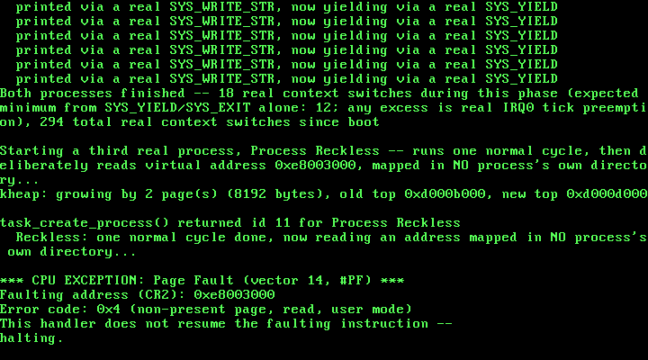

# 17. Per-Process Address Spaces: One Page Directory Per Task

**What you will understand:** why sharing one page directory across every ring-3 task, as Chapter 16 did, is not yet real process isolation, even though the CPU genuinely enforces CPL 3; how to give each task its own private page directory that still shares the kernel's own mappings, without re-copying anything the kernel already owns; why a function has to be physically copied, not merely mapped, before it can safely run at a different virtual address than the one it was compiled for; and how to prove, from ring 0, that two different processes' identical virtual addresses really do resolve to different physical memory.

**What you need to know first:** Chapter 16's own scheduler (`017_task.h`/`017_task.c`, unchanged in its core round-robin mechanics) and its real ring-3 task support (TSS.ESP0 reloading on every switch, `017_syscall.h`'s `SYS_YIELD`/`SYS_EXIT`); Chapter 8's own paging code (`017_paging.h`/`017_paging.c`), which until this chapter built and used exactly one page directory for the entire life of this kernel.

## One shared directory, many tasks

Chapter 16 made ring-3 code a real, first-class participant of this kernel's own scheduler -- `task_create_usermode()` gave every ring-3 task its own dedicated kernel stack and its own TSS.ESP0 target, and `task_yield()` learned to reload that field on every single switch into one. Genuinely running at CPL 3 kept a ring-3 task from ever executing a privileged instruction -- Chapter 15's own real captured `#GP` already proved that much. But look at what Chapter 16's own two ring-3 tasks still had in common with each other: `paging_init()`'s one page directory, loaded into CR3 once at boot and never touched again. Every mapping either task could reach -- its own code, its own stack, the kernel's heap, everything -- lived in that same one shared directory. Nothing about the hardware kept Ring3 Task A from reaching straight into Ring3 Task B's own memory, if it simply knew the address; isolation was a matter of neither task happening to try, never of the CPU refusing it.

This chapter closes that gap. Giving each task its own page directory is what this book, from here on, calls a real *process* -- a genuinely separate address space, not merely a separately scheduled flow of control at CPL 3. Two processes this chapter creates run the exact same compiled function, at the exact same fixed virtual address, and this chapter proves -- from ring 0, before either process ever runs -- that address resolves to two different real physical frames.

## `017_paging.h`/`017_paging.c`: three primitives for more than one directory

Every real function this chapter's own address-space work needs builds directly on Chapter 8's own physical-equals-virtual invariant: because this kernel's whole 0-64 MiB identity map means a physical address always doubles as a valid, dereferenceable pointer, editing a page directory that is NOT the one currently loaded into CR3 needs no special trick at all -- no "recursive mapping," no temporary remap-and-restore. `017_paging.h` grows three new declarations:

```c
#ifndef UNIX_OS_017_PAGING_H
#define UNIX_OS_017_PAGING_H

#include <stdint.h>

#define PAGE_PRESENT 0x1u
#define PAGE_RW      0x2u

/* New this chapter: bit 2 of a real x86 page-table (and page-
 * directory) entry -- "the U/S bit" -- 0 means "only CPL 0-2 (in
 * practice, this book's own CPL 0) may access this page," 1 means
 * "CPL 3 may access it too." Every page this kernel has ever mapped
 * before this chapter, including its own .text, was mapped without
 * this bit -- which was never a problem, because nothing before this
 * chapter ever ran at any CPL other than 0. */
#define PAGE_USER    0x4u

void paging_init(void);
void paging_map_page(uint32_t vaddr, uint32_t paddr, uint32_t flags);

/* New this chapter: three real address-space primitives, needed the
 * moment more than one page directory exists at once.
 *
 * paging_new_address_space() allocates a fresh page directory and
 * copies every one of the kernel's own 1024 real page-directory
 * entries into it -- not just the 16 built by paging_init(), but
 * whatever the kernel's own directory holds at the exact moment this
 * is called, kheap growth and all. Copying the ENTRY (a physical page-
 * table address), rather than cloning the table it points at, means
 * the new address space shares the very same underlying page tables
 * for every kernel-space mapping: a byte written into the kheap
 * through the kernel's own directory is visible through the new one
 * too, automatically, with no re-copying ever needed for an EXISTING
 * table. Returns the new directory's own physical address.
 *
 * paging_map_page_in() is paging_map_page() generalized to operate on
 * any directory, not only the one currently loaded into CR3 -- needed
 * to build a brand-new process's own private mappings before that
 * process's directory is ever made active at all. paging_map_page()
 * itself is now defined in terms of this one, always passing the
 * kernel's own directory.
 *
 * paging_translate_in() walks a given directory read-only and returns
 * the real physical address `vaddr` resolves to inside it, or 0 if
 * unmapped -- this chapter's own way of PROVING, from ring 0, that
 * the identical virtual address means something different in two
 * different processes' own directories. */
uint32_t paging_new_address_space(void);
void paging_map_page_in(uint32_t dir_phys, uint32_t vaddr, uint32_t paddr, uint32_t flags);
uint32_t paging_translate_in(uint32_t dir_phys, uint32_t vaddr);

#endif
```

`paging_map_page_in()` is Chapter 8's own `paging_map_page()` generalized to take a directory's physical address explicitly, rather than always operating on whichever directory `paging_init()` built; `paging_map_page()` itself becomes a one-line wrapper around it, always passing the kernel's own directory, so every earlier chapter's own call site needs no changes at all. `paging_new_address_space()` is the one new function this chapter's whole design rests on: it allocates a fresh page directory and copies the kernel's own real page-directory entries into it -- not the 16 built at boot by `paging_init()`, but every one of the full 1024 entries the kernel's own directory holds at the exact moment this function is called. `paging_translate_in()` is a read-only directory walk, new this chapter purely so `017_kmain.c` can prove, from ring 0, exactly what physical frame a given virtual address resolves to inside one specific process's own directory:

```c
#include <stdint.h>

#include "017_paging.h"
#include "017_pmm.h"
#include "017_printf.h"

/* This chapter identity-maps the same 0-64 MiB range that chapter 7's
 * physical memory manager already manages (MAX_MANAGED_MEMORY there),
 * so every physical frame this kernel can ever hand out from
 * pmm_alloc_frame() already has a valid virtual address equal to its
 * own physical address. One page table covers 4 MiB (1024 entries *
 * 4 KiB), so 64 MiB needs exactly 16 page tables -- and 16 page
 * directory entries out of the 1024 this kernel's single page
 * directory has room for. */
#define IDENTITY_MAP_TABLES 16u
#define ENTRIES_PER_TABLE   1024u
#define PAGE_DIR_ENTRIES    1024u

/* The physical address of this kernel's one and only page directory,
 * set once by paging_init() and read by every later paging_map_page()
 * call. Storing only the physical address -- not a C pointer typed at
 * some virtual mapping -- is deliberate: this whole file only ever
 * touches memory that lives inside the identity-mapped 0-64 MiB
 * range, so a frame's physical address always doubles as a valid,
 * dereferenceable pointer, both before and after paging is switched
 * on. */
static uint32_t page_directory_phys = 0;

/* Physical addresses in this kernel are also valid pointers, but only
 * because everything this file touches lives inside the
 * identity-mapped range -- this helper exists to make that fact
 * explicit at every use, not to hide a general physical-to-virtual
 * translation this kernel does not have. */
static inline uint32_t *phys_ptr(uint32_t phys_addr) {
    return (uint32_t *) phys_addr;
}

static void zero_frame(uint32_t phys_addr) {
    uint32_t *p = phys_ptr(phys_addr);
    for (uint32_t i = 0; i < ENTRIES_PER_TABLE; i++) {
        p[i] = 0;
    }
}

void paging_init(void) {
    kprintf("Paging: allocating page directory...\n");

    page_directory_phys = pmm_alloc_frame();
    zero_frame(page_directory_phys);
    uint32_t *page_directory = phys_ptr(page_directory_phys);

    kprintf("Paging: page directory at 0x%x. Identity-mapping 0-64MiB (16 page tables)...\n", page_directory_phys);

    for (uint32_t dir_index = 0; dir_index < IDENTITY_MAP_TABLES; dir_index++) {
        uint32_t table_phys = pmm_alloc_frame();
        zero_frame(table_phys);
        uint32_t *table = phys_ptr(table_phys);

        for (uint32_t table_index = 0; table_index < ENTRIES_PER_TABLE; table_index++) {
            uint32_t frame_addr = (dir_index * ENTRIES_PER_TABLE + table_index) * 4096u;
            table[table_index] = frame_addr | PAGE_PRESENT | PAGE_RW;
        }

        page_directory[dir_index] = table_phys | PAGE_PRESENT | PAGE_RW;
    }

    kprintf("Paging: identity map built. Loading CR3 and setting CR0.PG...\n");

    __asm__ __volatile__ ("mov %0, %%cr3" : : "r" (page_directory_phys));

    uint32_t cr0;
    __asm__ __volatile__ ("mov %%cr0, %0" : "=r" (cr0));
    cr0 |= 0x80000000u;
    __asm__ __volatile__ ("mov %0, %%cr0" : : "r" (cr0));

    uint32_t cr0_readback;
    __asm__ __volatile__ ("mov %%cr0, %0" : "=r" (cr0_readback));

    kprintf("Paging: CR0 = 0x%x (PG bit: %u). Paging is now live.\n", cr0_readback, (cr0_readback >> 31) & 1u);
}

/* Generalizes what earlier chapters' own paging_map_page() did to any
 * directory, not only whichever one CR3 currently holds. Everything
 * this function touches -- the directory itself, and every page table
 * it walks or allocates -- is reached through phys_ptr(), a plain
 * physical-address dereference, never through the vaddr being mapped
 * or through whatever CR3 happens to be active right now. That is
 * what makes it safe to build a brand-new process's own page tables
 * here, completely by hand, before that process's own directory is
 * ever loaded into CR3 at all -- this book's kernel never needed a
 * "recursive mapping" trick or similar to edit an inactive directory,
 * because its own physical-equals-virtual invariant already gives it
 * one for free. */
void paging_map_page_in(uint32_t dir_phys, uint32_t vaddr, uint32_t paddr, uint32_t flags) {
    uint32_t dir_index = vaddr >> 22;
    uint32_t table_index = (vaddr >> 12) & 0x3FFu;

    uint32_t *page_directory = phys_ptr(dir_phys);

    uint32_t table_phys;
    if ((page_directory[dir_index] & PAGE_PRESENT) == 0) {
        table_phys = pmm_alloc_frame();
        zero_frame(table_phys);
        page_directory[dir_index] = table_phys | PAGE_PRESENT | PAGE_RW;
    } else {
        table_phys = page_directory[dir_index] & 0xFFFFF000u;
    }

    /* Real x86 paging checks the U/S bit of BOTH the page-directory
     * entry AND the page-table entry -- whichever of the two is more
     * restrictive wins. Setting PAGE_USER only on the PTE below is
     * not enough if this page's own PDE is still supervisor-only,
     * which every identity-mapped PDE genuinely is: paging_init()
     * built them all with just PAGE_PRESENT | PAGE_RW, long before
     * PAGE_USER existed. So whenever this call is meant to grant
     * ring-3 access, the PDE has to be OR'd in too -- Chapter 15's
     * own real captured #PF, caught before this exact fix went in. */
    if (flags & PAGE_USER) {
        page_directory[dir_index] |= PAGE_USER;
    }

    uint32_t *table = phys_ptr(table_phys);
    table[table_index] = (paddr & 0xFFFFF000u) | flags;

    /* Harmless, not merely safe, when `dir_phys` is not the currently
     * active directory: invlpg only ever discards a stale TLB entry
     * for this exact virtual address in the CURRENTLY active address
     * space, which either does not have one yet (a genuine no-op) or,
     * on the rare chance it does, is stale anyway and due for eviction
     * regardless of which directory this call is really building. */
    __asm__ __volatile__ ("invlpg (%0)" : : "r" (vaddr) : "memory");
}

void paging_map_page(uint32_t vaddr, uint32_t paddr, uint32_t flags) {
    paging_map_page_in(page_directory_phys, vaddr, paddr, flags);
}

uint32_t paging_new_address_space(void) {
    uint32_t new_dir_phys = pmm_alloc_frame();
    zero_frame(new_dir_phys);

    uint32_t *new_dir = phys_ptr(new_dir_phys);
    uint32_t *kernel_dir = phys_ptr(page_directory_phys);

    /* Copies all 1024 real page-directory entries, not just the 16
     * paging_init() itself builds -- by the time this function is
     * ever called (Chapter 17's own task_create_process(), after this
     * task's kernel stack has already been kmalloc()'d), the kernel's
     * own directory may already hold real entries paging_init() never
     * built: 017_kmain.c's own 0xC0000000 demo mapping, and however
     * far the kheap (017_kheap.c) has grown by this point. Each entry
     * copied here is a physical page-table ADDRESS, not the table's
     * own contents -- so this new directory shares the exact same
     * underlying page tables as the kernel's own for every one of
     * those entries, and stays correct even if the kheap grows again
     * later, as long as that growth lands inside an ALREADY-shared
     * table rather than requiring a brand-new one. A future chapter
     * that needed the kheap to grow into an entirely fresh directory
     * entry after processes already existed would need to revisit
     * this -- an honest, real limit of this chapter's own design, not
     * one this book's own real run below ever actually hits. */
    for (uint32_t i = 0; i < PAGE_DIR_ENTRIES; i++) {
        new_dir[i] = kernel_dir[i];
    }

    return new_dir_phys;
}

uint32_t paging_translate_in(uint32_t dir_phys, uint32_t vaddr) {
    uint32_t dir_index = vaddr >> 22;
    uint32_t table_index = (vaddr >> 12) & 0x3FFu;

    uint32_t *page_directory = phys_ptr(dir_phys);
    if ((page_directory[dir_index] & PAGE_PRESENT) == 0) {
        return 0;
    }

    uint32_t table_phys = page_directory[dir_index] & 0xFFFFF000u;
    uint32_t *table = phys_ptr(table_phys);
    if ((table[table_index] & PAGE_PRESENT) == 0) {
        return 0;
    }

    return (table[table_index] & 0xFFFFF000u) | (vaddr & 0xFFFu);
}
```

The comment on `paging_new_address_space()` is deliberately explicit about a real, honest limitation of copying entries rather than cloning tables: a new process's directory shares the kernel's own underlying page tables for every kernel-space mapping, so growth INSIDE an already-shared table (the kernel heap growing by more pages within a table it already owns, for instance) stays automatically visible to every process with no re-copying needed. Growth that required an entirely NEW top-level directory entry, after processes already existed, would not propagate to them -- a real constraint of this chapter's own design, not one this chapter's own actual run ever hits, since `017_task.c`'s own `task_create_process()` deliberately captures any such growth before it ever calls `paging_new_address_space()` at all (see below).

## `017_task.h`/`017_task.c`: `task_create_process()`

Every process this kernel creates uses the exact same two fixed virtual addresses for its own code and its own stack -- new macros in `017_task.h`, chosen well outside every earlier chapter's own special virtual addresses:

```c
#ifndef UNIX_OS_017_TASK_H
#define UNIX_OS_017_TASK_H

#include <stdint.h>

/* The one fixed virtual address every process's own code lives at,
 * and the one fixed virtual address every process's own stack lives
 * at -- the SAME two numbers for every process this kernel ever
 * creates, each one backed by a different, private physical frame per
 * process (017_task.c's own task_create_process()). Chosen well
 * outside every earlier chapter's own special virtual addresses
 * (0xC0000000 -- Chapter 8's own demo mapping; the old, since-removed
 * Chapter 10 fault-trigger address 0xE0000000) so nothing about this
 * chapter's own real captured evidence could be mistaken for reusing
 * either. PROCESS_STACK_VADDR's own top -- what actually gets handed
 * to enter_usermode() -- is PROCESS_STACK_VADDR + 4096. */
#define PROCESS_CODE_VADDR  0xE8000000u
#define PROCESS_STACK_VADDR 0xE8001000u

/* Sets up this kernel's task list with exactly one task -- task 0, the
 * kernel's own boot-time execution context (the one kmain() is already
 * running on when this is called), still running on the same boot
 * stack every chapter since Chapter 1 has used. Must be called before
 * any task_create()/task_yield()/task_exit() call. */
void task_init(void);

/* Creates a new cooperative kernel task: allocates it a real stack
 * from Chapter 9's kmalloc(), and pre-populates that stack so the
 * first time this task is ever switched into, execution begins at
 * `entry` (OSDev Wiki, "X86 Cooperative Multitasking Tutorial": "the
 * kernel needs to put values on the new task's kernel stack to match
 * the values that 'switch_tasks' expects to pop off"). `entry` must
 * eventually call task_exit() -- it must never return normally.
 * Returns the new task's index (1, 2, ...), or -1 if this kernel's
 * fixed task table is already full. */
int task_create(void (*entry)(void));

/* Creates a new RING-3 task with its own REAL, PRIVATE address space
 * -- new this chapter, and the reason "usermode" from Chapter 15-16
 * has become "process" here. Every earlier ring-3 task, including
 * Chapter 16's own two, shared this kernel's ONE page directory --
 * genuinely running at CPL 3, but still able, in principle, to reach
 * any other ring-3 task's own memory just by knowing its address,
 * since every ring-3 mapping lived in the same one shared directory.
 * task_create_process() instead calls paging_new_address_space() to
 * give this task a page directory nothing else in this kernel shares,
 * physically COPIES `template_size` bytes starting at `template_start`
 * (a whole, page-aligned, self-contained function -- see
 * 017_kmain.c's own process_template_normal()/process_template_
 * reckless() for why it must make no calls to anything outside
 * itself) into a brand-new, private physical frame, and maps that
 * COPY into this task's own new directory at the fixed virtual
 * address PROCESS_CODE_VADDR -- the same fixed address every process
 * this kernel ever creates uses for its own code, each one backed by
 * its own real, separate physical frame. A second private frame,
 * mapped at the fixed virtual address PROCESS_STACK_VADDR, is this
 * task's own real user stack. Builds the same dedicated kernel stack
 * every ring-3 task has needed since Chapter 16 (switch_task()'s own
 * stack, and this task's own TSS.ESP0 target). Returns the new task's
 * index, or -1 if the task table is already full. */
int task_create_process(const void *template_start, uint32_t template_size);

/* The physical address of the page directory task_create_process()
 * built for the process at `index` -- new this chapter, purely so
 * 017_kmain.c's own kmain() can call paging_translate_in() itself
 * and prove, from ring 0, that PROCESS_CODE_VADDR resolves to a
 * different real physical frame in two different processes' own
 * directories, before either process ever actually runs. Returns 0
 * for any task that is not a process (task_create()'s own tasks, and
 * task 0) -- the same "0 means the kernel's own default directory"
 * convention struct task itself uses internally. */
uint32_t task_page_directory_phys(int index);

/* Voluntarily gives up the CPU: saves the calling task's callee-saved
 * registers and stack pointer, picks the next RUNNING task in
 * round-robin order, and switches to it. Returns normally, right
 * where it left off, once this task is switched back in. If no other
 * task is currently RUNNING, returns immediately without performing a
 * real switch. */
void task_yield(void);

/* Marks the calling task DONE and switches away from it permanently.
 * Never returns -- this task's own stack and call frame are simply
 * abandoned from this point on. */
void task_exit(void);

/* Non-zero once the task at `index` (as returned by task_create())
 * has called task_exit(). */
int task_is_done(int index);

/* The currently-running task's own index -- what task_create() itself
 * returned when this task was created (0 for the kernel's own boot
 * task). New this chapter, so 017_semaphore.c can record which task
 * is waiting on which semaphore without task.c having to know
 * anything about semaphores itself. */
int task_current_id(void);

/* Marks the CALLING task BLOCKED and returns immediately -- it does
 * NOT yield the CPU itself. Split out from a single "block and yield"
 * call on purpose: 017_semaphore.c needs this exact state transition
 * to happen while it still holds its own lock, so that no concurrent
 * semaphore_signal() can dequeue this task as a waiter before the
 * scheduler has actually stopped considering it runnable (see
 * 017_semaphore.c's own comments for the real race this avoids). The
 * caller is expected to give up the CPU with task_yield() itself,
 * separately, once it is safe to do so. A BLOCKED task is skipped by
 * every future task_yield()/task_tick() scan until some other task
 * calls task_wake() on it. */
void task_block_self(void);

/* Marks the task at `index` READY again, making it eligible to be
 * picked by task_yield()'s own round-robin scan the next time it is
 * that task's turn -- it does NOT itself trigger an immediate switch
 * to that task. Called from 017_semaphore.c's semaphore_signal(),
 * always from inside that semaphore's own lock (interrupts already
 * off), so this needs no locking of its own. */
void task_wake(int index);

/* Total number of real context switches switch_task() has performed
 * since task_init(). Exists purely for this chapter's own real, live
 * verification. */
uint32_t task_switch_count(void);

/* Called from 017_pit.c's irq0_handler() on every single real IRQ0
 * tick, after that tick's own EOI has already been sent. Before
 * task_init() has run, does nothing -- this kernel has no task table
 * to preempt yet. After task_init(), calls task_yield() unconditionally,
 * exactly once per real tick: this chapter's whole scheduling policy
 * is "one tick, one time slice," chosen because it is the simplest
 * policy whose real switch count is independently predictable from
 * nothing but the real tick count, with no separate countdown state
 * of its own to get wrong. */
void task_tick(void);

#endif
```

The Thread Control Block gains one new field, `page_directory_phys` -- 0 for task 0 and for every plain `task_create()` task, meaning "whatever this kernel's own default directory currently is," and the physical address of a real, private directory for anything built by the new `task_create_process()`. `task_init()` now reads back whatever CR3 already holds (set once, at boot, by `paging_init()`) into a new `kernel_page_directory_phys` global, and `task_yield()` compares that against a task's own `page_directory_phys` on every single switch, reloading CR3 only when the two differ -- directly citing the same OSDev Wiki example Chapter 16 already used for TSS.ESP0:

```c
#include <stdint.h>

#include "017_kheap.h"
#include "017_paging.h"
#include "017_pmm.h"
#include "017_printf.h"
#include "017_task.h"
#include "017_tss.h"

/* This chapter's own Thread Control Block, in the same spirit the
 * OSDev Wiki describes for kernel-level tasks: "The TCB holds task
 * state including the kernel stack pointer (ESP) ... " (OSDev Wiki,
 * "Kernel Multitasking": https://wiki.osdev.org/Kernel_Multitasking).
 * This kernel has no user/kernel privilege split and no per-task
 * address space yet -- every task here runs in ring 0 sharing the one
 * page directory Chapter 8 built -- so this TCB carries nothing for
 * CR3 or a TSS.ESP0 field the way a fuller kernel's would; `esp` is
 * almost the whole of what switch_task() needs. `entry` is new since
 * Chapter 12 -- see task_start_trampoline() below for why. `state`
 * replaces this struct's old plain `done` flag this chapter: a task
 * can now be BLOCKED (waiting on a semaphore, see 017_semaphore.c)
 * as well as READY or DONE, and the scheduler needs to tell all three
 * apart, not just "finished or not." */
typedef enum {
    TASK_STATE_READY = 0,
    TASK_STATE_BLOCKED,
    TASK_STATE_DONE
} task_state_t;

struct task {
    uint32_t esp;        /* valid only while this task is NOT current */
    void *stack_base;     /* the kmalloc()'d block backing this task's
                            * stack -- kept only so a later chapter with
                            * real task teardown could kfree() it; this
                            * chapter never frees a task's stack */
    void (*entry)(void);  /* this task's real entry point -- kept so
                            * task_start_trampoline() can find it */
    task_state_t state;
    int is_usermode;         /* new this chapter: non-zero if this task
                               * runs its real `entry` at CPL 3, via
                               * enter_usermode(), rather than calling it
                               * directly at CPL 0 */
    uint32_t kernel_stack_top; /* new this chapter: only meaningful when
                               * is_usermode -- the top of this task's
                               * OWN dedicated kernel stack, the same
                               * stack `esp` above lives on. task_yield()
                               * loads this into the TSS's ESP0 field
                               * (017_tss.c) immediately before switching
                               * into this exact task, so any interrupt
                               * or syscall this task later raises at
                               * CPL 3 lands on ITS OWN kernel stack, not
                               * whichever task happened to run before
                               * it (OSDev Wiki, "Kernel Multitasking":
                               * "Adjust the ESP0 field in the TSS (used
                               * by CPU for CPL=3 -> CPL=0 privilege
                               * level changes)"). */
    uint32_t user_stack_top;  /* only meaningful when is_usermode -- the
                               * top of this task's own real,
                               * PAGE_USER-marked stack frame, passed to
                               * enter_usermode() the one time this
                               * task's trampoline actually starts it
                               * running at CPL 3. Since Chapter 17, this
                               * is always PROCESS_STACK_VADDR + 4096 --
                               * the same fixed virtual number for every
                               * process, backed by a different physical
                               * frame each time (see page_directory_phys
                               * below) -- kept as its own field anyway
                               * so task_start_trampoline() does not need
                               * to know that fact itself. */
    uint32_t page_directory_phys; /* new this chapter: 0 for every
                               * ring-0-only task (task_create()) and
                               * for task 0 -- meaning "whatever this
                               * kernel's own default/kernel directory
                               * currently is." Non-zero for a process
                               * (task_create_process()): the physical
                               * address of a page directory that exists
                               * nowhere else, built by
                               * paging_new_address_space() and populated
                               * only with this ONE process's own private
                               * code/stack mappings on top of the
                               * kernel's own shared ones. task_yield()
                               * reloads CR3 to this value immediately
                               * before switching into this task, exactly
                               * mirroring how it already reloads
                               * TSS.ESP0 for a ring-3 task since Chapter
                               * 16 -- see task_yield() below. */
};

/* Chapter 16 needed 11 slots (kmain's own task 0, Chapter 12's own
 * Task A/Task B, Chapter 13's own Stress A/Stress B, Chapter 14's own
 * two producers/two consumers, and Chapter 16's own two ring-3 tasks).
 * This chapter's own three new demo processes (Process A, Process B,
 * and Process Reckless, below) replace Chapter 16's own two ring-3
 * tasks in 017_kmain.c -- task_create_process() is a real superset of
 * what task_create_usermode() did, so nothing is lost -- for a net of
 * one more slot than Chapter 16 needed. This scheduler still never
 * reuses a finished task's slot, so the fixed table has to be sized
 * for every task any chapter's own kmain() creates across a single
 * boot, not just however many are runnable at once. */
#define TASK_MAX_TASKS   12u
#define TASK_STACK_SIZE  4096u

static struct task tasks[TASK_MAX_TASKS];
static int task_count = 0;
static int current_task = 0;
static uint32_t switch_count = 0;
static int tasking_ready = 0;

/* New this chapter: the two page directories task_yield() has to
 * choose between on every single switch. kernel_page_directory_phys
 * is set once, in task_init(), by reading back whatever paging_init()
 * (Chapter 8) already loaded into CR3 -- this kernel's own default
 * directory, shared by task 0 and every ring-0-only task.
 * current_page_directory_phys tracks whichever directory CR3 ACTUALLY
 * holds right now, so task_yield() can skip a reload -- and the real
 * TLB flush a CR3 write causes -- whenever the task being switched
 * into already shares the address space that is already active,
 * exactly the same real optimization Chapter 16's own cited OSDev
 * source already applies to TSS.ESP0's own sibling field. */
static uint32_t kernel_page_directory_phys = 0;
static uint32_t current_page_directory_phys = 0;

extern void switch_task(uint32_t *old_esp_ptr, uint32_t new_esp);

/* 017_usermode.asm's real ring 0 -> ring 3 transition -- Chapter 15's
 * own real, hand-built IRET. Called from task_start_trampoline() below
 * instead of `entry()` directly, whenever the task starting up is a
 * ring-3 one. Never returns in the ordinary sense: the task it starts
 * keeps running at CPL 3 (and, eventually, calls a real SYS_EXIT
 * syscall) independently of whatever called it. */
extern void enter_usermode(void (*entry)(void), void *user_stack_top);

/* Chapter 11's task_create() put `entry` directly on a new task's
 * stack as the address switch_task()'s own `ret` would jump to --
 * correct for a purely cooperative scheduler, where every switch_task()
 * call happens with IF already 1 (interrupts enabled) throughout,
 * since nothing in that chapter ever touched IF at all. This chapter
 * changes that: every real switch now happens from *inside* an IRQ0
 * interrupt handler, entered through a real interrupt gate that the
 * CPU itself clears IF for on entry (OSDev Wiki's own IDT gate-type
 * description; this book's own idt_set_gate() calls have used type
 * 0x8E, a 32-bit interrupt gate, since Chapter 4). switch_task()
 * itself never saves or restores EFLAGS -- IF is one single, real,
 * shared CPU flag, not per-task state -- so whichever task gets
 * switched into next inherits whatever IF happens to be at that exact
 * moment: 0, because we are still inside that interrupt handler. A
 * task resuming through task_yield()'s own return point can restore
 * that itself (see below); but a task running for the very first
 * time jumps straight to `entry`, which has no such checkpoint to
 * pass through -- so without this trampoline, a brand-new task would
 * start running with interrupts silently, permanently disabled, and
 * this whole chapter's preemption would only ever work once. */
static void task_start_trampoline(void) {
    __asm__ volatile ("sti");

    /* New this chapter: a ring-3 task's real entry point cannot simply
     * be called like an ordinary C function -- it has to be started
     * through a real CPL 0 -> CPL 3 transition (017_usermode.asm), on
     * its own dedicated user stack, not this task's kernel stack.
     * enter_usermode() never returns: this task keeps running at CPL 3
     * until its own real SYS_EXIT syscall (017_isr_handlers.c) calls
     * task_exit() directly, from ring 0, on this exact task's own
     * kernel stack -- so the task_exit() call below is never reached
     * for a ring-3 task at all. */
    if (tasks[current_task].is_usermode) {
        enter_usermode(tasks[current_task].entry,
                        (void *) (uintptr_t) tasks[current_task].user_stack_top);
    } else {
        tasks[current_task].entry();
    }

    /* Defensive, not load-bearing: every real ring-0 task body in this
     * chapter already calls task_exit() itself. If one ever forgot,
     * this is what stands between that mistake and running off the
     * end of a kmalloc()'d stack into whatever memory happens to
     * follow it. */
    task_exit();
}

void task_init(void) {
    tasks[0].esp = 0;         /* never read while task 0 is current */
    tasks[0].stack_base = 0;   /* task 0 owns no kmalloc'd stack -- it
                                 * is this kernel's own boot stack,
                                 * already running before task_init()
                                 * is ever called */
    tasks[0].entry = 0;         /* task 0 never starts via the
                                  * trampoline -- it is already running */
    tasks[0].state = TASK_STATE_READY;
    tasks[0].is_usermode = 0;   /* task 0 is this kernel's own boot
                                  * task -- always ring 0 */
    tasks[0].kernel_stack_top = 0;
    tasks[0].user_stack_top = 0;
    tasks[0].page_directory_phys = 0;  /* runs in the kernel's own
                                         * default directory, like
                                         * every ring-0-only task */
    task_count = 1;
    current_task = 0;
    switch_count = 0;
    tasking_ready = 1;

    /* This kernel's own default page directory is simply whatever CR3
     * already holds the moment task_init() runs -- paging_init() (Ch8)
     * always loads it well before this point in kmain(), so reading it
     * back here, once, is enough to remember it for the rest of this
     * kernel's life. task_yield() reloads CR3 to this exact value
     * whenever switching INTO a task whose own page_directory_phys is
     * 0 -- the counterpart of reloading it to a process's own directory
     * when switching into one of those instead (see task_yield()). */
    __asm__ volatile ("mov %%cr3, %0" : "=r" (kernel_page_directory_phys));
    current_page_directory_phys = kernel_page_directory_phys;
}

int task_create(void (*entry)(void)) {
    if (task_count >= (int) TASK_MAX_TASKS) {
        kprintf("task_create: task table full (%u tasks) -- refusing\n", TASK_MAX_TASKS);
        return -1;
    }

    struct task *t = &tasks[task_count];
    void *stack = kmalloc(TASK_STACK_SIZE);
    uint32_t top = (uint32_t) (uintptr_t) stack + TASK_STACK_SIZE;
    uint32_t *sp = (uint32_t *) top;

    /* Build the exact stack frame switch_task()'s own epilogue expects
     * to pop the first time this task is switched into: EDI, ESI, EBX,
     * EBP (in that order, since switch_task() pushed EBP first and
     * pops in reverse), then a return address on top -- which is what
     * makes switch_task()'s final `ret` land directly on
     * task_start_trampoline (OSDev Wiki, "X86 Cooperative Multitasking
     * Tutorial": a new task's registers are initialized with
     * "task->regs.esp = (uint32_t) allocPage() + 0x1000" and
     * "task->regs.eip = (uint32_t) main"). Zero is a fine placeholder
     * for EBP/EBX/ESI/EDI here -- nothing has run inside this task yet
     * to give those registers a real saved value. */
    *(--sp) = (uint32_t) (uintptr_t) task_start_trampoline;  /* return address for `ret` */
    *(--sp) = 0;  /* ebp */
    *(--sp) = 0;  /* ebx */
    *(--sp) = 0;  /* esi */
    *(--sp) = 0;  /* edi */

    t->esp = (uint32_t) (uintptr_t) sp;
    t->stack_base = stack;
    t->entry = entry;
    t->state = TASK_STATE_READY;
    t->is_usermode = 0;
    t->kernel_stack_top = 0;
    t->user_stack_top = 0;
    t->page_directory_phys = 0;  /* runs in the kernel's own default
                                   * directory */

    int index = task_count;
    task_count++;
    return index;
}

int task_create_process(const void *template_start, uint32_t template_size) {
    if (task_count >= (int) TASK_MAX_TASKS) {
        kprintf("task_create_process: task table full (%u tasks) -- refusing\n", TASK_MAX_TASKS);
        return -1;
    }
    if (template_size > 4096u) {
        /* This chapter's own real templates are each well under one
         * page; refusing rather than silently truncating a future,
         * larger one is the same honest-by-default choice this book
         * has made everywhere else a real size limit exists. */
        kprintf("task_create_process: template is %u bytes, larger than one page -- refusing\n",
                template_size);
        return -1;
    }

    struct task *t = &tasks[task_count];

    /* This task's own dedicated kernel stack -- built exactly like
     * task_create()'s own ordinary task stack above (same size, same
     * pre-populated switch_task() frame landing on
     * task_start_trampoline), because it plays the exact same role for
     * switch_task() itself, AND is this task's own TSS.ESP0 target the
     * instant it becomes current (see task_yield() below) -- one real
     * stack, two real jobs, never shared with any other task. Built
     * BEFORE this task's own new address space, deliberately: this
     * kmalloc() call may itself grow the kheap (017_kheap.c), and
     * paging_new_address_space() below needs to copy the kernel's own
     * directory AFTER any such growth has already happened, or this
     * task's own copy would be missing it. */
    void *kstack = kmalloc(TASK_STACK_SIZE);
    uint32_t kstack_top = (uint32_t) (uintptr_t) kstack + TASK_STACK_SIZE;
    uint32_t *sp = (uint32_t *) kstack_top;

    *(--sp) = (uint32_t) (uintptr_t) task_start_trampoline;  /* return address for `ret` */
    *(--sp) = 0;  /* ebp */
    *(--sp) = 0;  /* ebx */
    *(--sp) = 0;  /* esi */
    *(--sp) = 0;  /* edi */

    /* This task's own real, private address space -- the whole reason
     * this function exists. Every process gets a genuinely separate
     * page directory, sharing the kernel's own mappings (see
     * paging_new_address_space()'s own comment) but with room for
     * this ONE process's own private code and stack that no other
     * process's directory will ever contain. */
    uint32_t dir_phys = paging_new_address_space();

    /* This process's own private copy of its code: a fresh physical
     * frame, with `template_size` real bytes copied into it from the
     * kernel image's own template function -- and ONLY then mapped
     * into this task's OWN new directory at the fixed virtual address
     * every process uses for its code. Two different processes'
     * PROCESS_CODE_VADDR therefore resolve to two different real
     * physical frames -- 017_kmain.c's own kmain() proves this
     * directly, with paging_translate_in(), before either process
     * ever runs. No RW bit: this range is only ever fetched from. */
    uint32_t code_frame = pmm_alloc_frame();
    const uint8_t *src = (const uint8_t *) template_start;
    uint8_t *dst = (uint8_t *) (uintptr_t) code_frame;
    for (uint32_t i = 0; i < template_size; i++) {
        dst[i] = src[i];
    }
    paging_map_page_in(dir_phys, PROCESS_CODE_VADDR, code_frame, PAGE_PRESENT | PAGE_USER);

    /* This process's own private user stack: one fresh frame, mapped
     * only into this task's own directory, at the fixed virtual
     * address every process uses for its stack. */
    uint32_t stack_frame = pmm_alloc_frame();
    paging_map_page_in(dir_phys, PROCESS_STACK_VADDR, stack_frame, PAGE_PRESENT | PAGE_RW | PAGE_USER);

    t->esp = (uint32_t) (uintptr_t) sp;
    t->stack_base = kstack;
    t->entry = (void (*)(void)) (uintptr_t) PROCESS_CODE_VADDR;
    t->state = TASK_STATE_READY;
    t->is_usermode = 1;
    t->kernel_stack_top = kstack_top;
    t->user_stack_top = PROCESS_STACK_VADDR + 4096u;
    t->page_directory_phys = dir_phys;

    int index = task_count;
    task_count++;
    return index;
}

uint32_t task_page_directory_phys(int index) {
    return tasks[index].page_directory_phys;
}

void task_yield(void) {
    /* OSDev Wiki, "Kernel Multitasking": "Caller is expected to
     * disable IRQs before calling, and enable IRQs again after
     * function returns" -- rather than push that requirement onto
     * every caller, task_yield() enforces it itself, so it stays
     * correct regardless of whether it was reached from an ordinary
     * cdecl call or, as every real call in this chapter's own run
     * is, from inside an interrupt handler where IF is already 0. */
    __asm__ volatile ("cli");

    int old = current_task;
    int next = -1;

    /* Scans every OTHER task first, in round-robin order, then wraps
     * all the way back around to `old` itself as the last candidate
     * checked. This one loop now correctly covers every case this
     * chapter's own three task states can produce: some other READY
     * task exists (ordinary switch); no other task is READY but `old`
     * itself still is (the loop's own wraparound finds it, and the
     * "next == old" check below turns that into a no-op); or `old`
     * itself is no longer READY either -- freshly BLOCKED by this
     * chapter's own task_block_self(), or DONE -- in which case the
     * whole scan finds nothing at all and `next` stays -1. Chapter
     * 13's own version of this loop only ever had to handle the first
     * two cases, since nothing in that chapter could make `old` itself
     * non-runnable out from under its own yield. */
    for (int i = 1; i <= task_count; i++) {
        int candidate = (old + i) % task_count;
        if (tasks[candidate].state == TASK_STATE_READY) {
            next = candidate;
            break;
        }
    }

    if (next == -1) {
        /* Nothing in the whole task table is READY -- not some other
         * task, and not even this one. Every earlier chapter's own
         * version of this message meant "everyone has called
         * task_exit()"; this chapter adds a second real way to reach
         * it: every remaining task is genuinely BLOCKED on a
         * semaphore that nothing will ever signal. Both are real dead
         * ends this scheduler has no idle task to fall back on for. */
        kprintf("task_yield: no runnable task remains -- halting\n");
        for (;;) {
            __asm__ volatile ("hlt");
        }
    }

    if (next == old) {
        __asm__ volatile ("sti");
        return;  /* only this task is runnable -- nothing to switch to */
    }

    current_task = next;
    switch_count++;

    /* New this chapter: whenever the task we are about to switch INTO
     * is a ring-3 one, its own dedicated kernel stack has to already
     * be installed as the CPU's real ESP0 target BEFORE switch_task()
     * ever runs -- otherwise the very next interrupt or syscall this
     * task raises at CPL 3 (which can happen at any point after this
     * function returns, including immediately) would land on whichever
     * OTHER task's kernel stack the TSS still happened to point at
     * (OSDev Wiki, "Kernel Multitasking": "Adjust the ESP0 field in
     * the TSS (used by CPU for CPL=3 -> CPL=0 privilege level
     * changes)"). This covers both a ring-3 task's very first
     * activation (landing in task_start_trampoline for the first time)
     * and every later resume identically -- tasks[next].esp already
     * points at the right place either way; only the CPU's own ESP0
     * register needs updating here. Ring-0-only tasks never trigger a
     * CPL change at all, so this is skipped for them entirely -- the
     * TSS's ESP0 field is simply irrelevant while one is running. */
    if (tasks[next].is_usermode) {
        tss_set_kernel_stack(tasks[next].kernel_stack_top);
    }

    /* New this chapter: reload CR3 whenever the task being switched
     * INTO belongs to a different address space than the one already
     * active -- cited directly from the very same OSDev Wiki example
     * Chapter 16 already used for ESP0 above: "cmp eax,ecx ; Does the
     * virtual address space need to being changed? je .doneVAS ; no,
     * ... so don't reload it and cause TLB flushes ; mov cr3,eax ;
     * yes, load the next task's virtual address space" (OSDev Wiki,
     * "Kernel Multitasking"). `target_dir` is that task's own private
     * directory for a process, or the kernel's own default directory
     * for every ring-0-only task (page_directory_phys == 0) -- so a
     * switch between two ordinary ring-0 tasks, or into task 0, always
     * resolves to the SAME kernel_page_directory_phys value and
     * correctly skips the reload, exactly like every chapter before
     * this one already did implicitly, by never touching CR3 at all. */
    uint32_t target_dir = (tasks[next].page_directory_phys != 0)
                               ? tasks[next].page_directory_phys
                               : kernel_page_directory_phys;
    if (target_dir != current_page_directory_phys) {
        __asm__ volatile ("mov %0, %%cr3" : : "r" (target_dir) : "memory");
        current_page_directory_phys = target_dir;
    }

    switch_task(&tasks[old].esp, tasks[next].esp);

    /* Execution only reaches here once this exact task is switched
     * back into again -- possibly much later, and possibly by
     * unwinding all the way back up through some real IRQ0 stub's own
     * `iret`, which is a second, independent place IF=1 also gets
     * restored from. The explicit `sti` here is still required: it is
     * what re-enables interrupts for every task that resumes through
     * this exact return point rather than through an `iret` at all. */
    __asm__ volatile ("sti");
}

void task_exit(void) {
    tasks[current_task].state = TASK_STATE_DONE;
    task_yield();
    /* unreachable: task_yield() above either switches this task's own
     * stack away permanently (this call frame is simply abandoned,
     * never resumed again) or halts the kernel outright if nothing
     * else is runnable. */
}

int task_is_done(int index) {
    return tasks[index].state == TASK_STATE_DONE;
}

int task_current_id(void) {
    return current_task;
}

void task_block_self(void) {
    tasks[current_task].state = TASK_STATE_BLOCKED;
}

void task_wake(int index) {
    tasks[index].state = TASK_STATE_READY;
}

uint32_t task_switch_count(void) {
    return switch_count;
}

void task_tick(void) {
    if (!tasking_ready) {
        return;  /* task_init() has not run yet -- nothing to preempt */
    }
    task_yield();
}
```

`task_create_process()` builds a process in a deliberate order: first its dedicated kernel stack (a `kmalloc()` call that can itself grow the kernel heap), and only THEN its new address space, so `paging_new_address_space()`'s own full 1024-entry copy captures any growth that kernel-stack allocation just caused. Its own code comes from physically copying a whole, page-aligned, self-contained template function -- byte for byte, out of the kernel image and into a brand-new physical frame -- and mapping that COPY, not the original, at the fixed virtual address `PROCESS_CODE_VADDR` in this process's own new directory alone. Two different processes' own `PROCESS_CODE_VADDR` therefore resolve to two different real physical frames, backed by two different physical copies of the identical compiled bytes -- proven directly with `paging_translate_in()` in `017_kmain.c`, before either process ever actually runs.

## `017_linker.ld`: two private templates, not one shared section

Chapter 16's ring-3 tasks executed straight out of the kernel image itself, out of a dedicated `.usermode_text` section shared by every ring-3 task that ever existed. This chapter's own design makes that impossible on purpose: a process's code has to live in ITS OWN physical frame, private to that one process's own directory, which means `017_kmain.c` needs a clean, page-aligned, exactly-one-page range to copy FROM for each of its two template functions, not a range to execute directly:

```text
/* Chapter 7 added kernel_end, the linker's own real answer to "where
 * does the kernel image actually stop in physical memory." Chapter
 * 16 added a second linker-defined range for the same underlying
 * reason -- PAGE_USER (017_paging.h) is granted per 4 KiB page, and C
 * gives no promise that a function's machine code starts and ends on
 * a page boundary -- but this chapter's own design (every process
 * gets its own PRIVATE address space, see 017_paging.c's
 * paging_new_address_space()) no longer runs any ring-3 code directly
 * out of the kernel image at all: task_create_process()
 * (017_task.c) instead physically COPIES one whole template function
 * into a brand-new physical frame per process, and maps only THAT
 * copy as PAGE_USER. What this linker script owes each template is
 * not "mark these kernel-image pages user-accessible" but "give me a
 * clean, page-aligned, exactly-one-page range to copy FROM" -- one
 * dedicated section per template, so 017_kmain.c's own
 * process_template_normal() and process_template_reckless() can never
 * accidentally share a page with each other or with ordinary .text,
 * and task_create_process() can compute exactly how many bytes to
 * copy from each one's own real linker-defined start/end symbols. */
ENTRY(_start)
SECTIONS
{
    . = 1M;
    .multiboot_header : { *(.multiboot_header) }
    .text   : { *(.text) }

    . = ALIGN(4096);
    process_template_normal_start = .;
    .process_template_normal : { *(.process_template_normal) }
    . = ALIGN(4096);
    process_template_normal_end = .;

    . = ALIGN(4096);
    process_template_reckless_start = .;
    .process_template_reckless : { *(.process_template_reckless) }
    . = ALIGN(4096);
    process_template_reckless_end = .;

    .rodata : { *(.rodata) }
    .data   : { *(.data) }
    .bss    : { *(.bss) }
    kernel_end = .;
}
```

## `017_kmain.c`: two processes, one invisible boundary, and a third that crosses it

A per-process template function cannot simply be a normal C function copied verbatim -- it has to be entirely self-contained. `task_create_process()` copies its raw compiled bytes into a physical frame and maps that frame at `PROCESS_CODE_VADDR`, a virtual address different from wherever the compiler actually placed the original in the kernel image. A `CALL` or `JMP` to code that did NOT get copied alongside would still carry the PC-relative displacement the compiler computed for the ORIGINAL address -- simply wrong once the copy runs somewhere else. Internal control flow (a loop, a branch within the same function) stays correct, because x86 near jumps and branches are PC-relative to begin with; and a reference to kernel-resident data, like a string literal in `.rodata`, stays correct too, because only the CODE moved -- the referenced data's mapping is one of the entries every process's own directory shares with the kernel's, copied wholesale by `paging_new_address_space()`. So neither template below calls a shared syscall-wrapper helper the way Chapter 16's tasks did; each one inlines its own `int $0x80` sequence directly:

```c
/* How many times Process A and Process B each print and then
 * SYS_YIELD before their own real SYS_EXIT. Deliberately small: a
 * real, independently-checkable lower bound on this chapter's own
 * final switch count falls straight out of this one constant (see
 * kmain()'s own comment on it below), the same way Chapter 12's own
 * TIMER_FREQUENCY_HZ made that chapter's tick count independently
 * checkable. */
#define PROCESS_TASK_ITERATIONS 5u

/* The one virtual address Process Reckless deliberately reads that is
 * mapped in NO process's own directory -- not the kernel's shared
 * range, and not either PROCESS_CODE_VADDR/PROCESS_STACK_VADDR
 * mapping either, since those are private per process and Process
 * Reckless has its own. Chosen inside the same 0xE8xxxxxx neighborhood
 * as 017_task.h's own two process addresses purely so a reader
 * scanning this file sees at a glance that all three belong to this
 * chapter's one new address range, well clear of every earlier
 * chapter's own special addresses. */
#define UNMAPPED_PROBE_VADDR 0xE8003000u

/* This chapter's two per-process template functions -- the entire
 * reason 017_task.c's new task_create_process() exists, and the
 * reason this file no longer has a shared usermode_syscall() helper
 * the way Chapter 16 did. task_create_process() does not run this
 * code in place: it physically COPIES the whole compiled function,
 * byte for byte, out of its own dedicated page-aligned linker section
 * (017_linker.ld) into a brand-new physical frame, and maps that COPY
 * at the fixed virtual address PROCESS_CODE_VADDR -- a different
 * address than wherever the compiler actually placed this function in
 * the kernel image. A CALL or JMP to code that did NOT get copied
 * alongside would still carry the PC-relative displacement the
 * compiler computed for the ORIGINAL address, which is simply wrong
 * once the copy runs somewhere else -- so every syscall here is an
 * inlined `int $0x80` sequence, not a call to a shared helper.
 * Internal control flow (this function's own loop) stays correct
 * because x86 near jumps and branches are PC-relative to begin with,
 * and the string literal each one prints stays correct too: only the
 * CODE moved, never the kernel's own .rodata that holds the string,
 * and every process's directory shares that mapping (paging_new_
 * address_space() copies all 1024 real page-directory entries, .rodata
 * included) -- exactly the same reasoning Chapter 16's own ring-3
 * tasks already relied on for their message strings. Each function
 * must fit in the one page its own linker section reserves. */
/* `used` alongside `section`: nothing in this translation unit ever
 * calls this function through an ordinary C call -- only through the
 * linker-defined process_template_normal_start symbol, copied byte for
 * byte by task_create_process() -- so without it, GCC's own dead-code
 * warning would flag a real, live piece of this kernel as unused. */
__attribute__((section(".process_template_normal"), used))
static void process_template_normal(void) {
    const char *msg = "  printed via a real SYS_WRITE_STR, now yielding via a real SYS_YIELD\n";
    for (uint32_t i = 1; i <= PROCESS_TASK_ITERATIONS; i++) {
        register uint32_t sys_num asm("eax") = SYS_WRITE_STR;
        register uint32_t sys_arg asm("ebx") = (uint32_t) (uintptr_t) msg;
        __asm__ volatile ("int $0x80" :: "r" (sys_num), "r" (sys_arg) : "memory");

        register uint32_t yield_num asm("eax") = SYS_YIELD;
        register uint32_t yield_arg asm("ebx") = 0u;
        __asm__ volatile ("int $0x80" :: "r" (yield_num), "r" (yield_arg) : "memory");
    }

    register uint32_t exit_num asm("eax") = SYS_EXIT;
    register uint32_t exit_arg asm("ebx") = 0u;
    __asm__ volatile ("int $0x80" :: "r" (exit_num), "r" (exit_arg) : "memory");

    /* Unreachable in this chapter's own real run: SYS_EXIT's own
     * isr128_handler() case calls task_exit() directly, which never
     * returns (017_task.c) -- this process's entire kernel stack,
     * including this exact call frame, is simply abandoned at that
     * point. HLT would itself be a second privileged instruction this
     * process has no right to execute at CPL 3 (exactly like Chapter
     * 15's own deliberate CLI demo), so this defensive tail is a
     * plain empty spin, never CLI or HLT. */
    for (;;) { }
}

/* Process Reckless: one normal print-and-yield cycle, identical to
 * process_template_normal()'s own first iteration, then a single,
 * deliberate read of UNMAPPED_PROBE_VADDR -- an address this process's
 * own directory (like every other process's own directory) has never
 * mapped at all. 017_paging.c's page-fault handler (017_isr_handlers.c,
 * carried forward unchanged from Chapter 15) reads CR2 and the real
 * hardware error code to report exactly which flavor of fault this
 * is; OSDev Wiki, "Paging": bit 0 of that error code is 0 for "the
 * fault was caused by a non-present page" and 1 for "the fault was
 * caused by a page-protection violation." This chapter's own real
 * captured run is the first in this book to show bit 0 clear (a
 * genuinely UNMAPPED address) together with bit 2 set (a USER-mode
 * access) -- Chapter 10's own #PF was non-present but from
 * supervisor code (017_kmain.c's TEST_VIRT_ADDR probe before it was
 * mapped), and Chapter 15's own #PF was user-mode but a real
 * protection violation (writing a read-only page), never both
 * "genuinely unmapped" and "from ring 3" at once until now. */
__attribute__((section(".process_template_reckless"), used))
static void process_template_reckless(void) {
    const char *msg = "  Reckless: one normal cycle done, now reading an address "
                       "mapped in NO process's own directory...\n";
    register uint32_t sys_num asm("eax") = SYS_WRITE_STR;
    register uint32_t sys_arg asm("ebx") = (uint32_t) (uintptr_t) msg;
    __asm__ volatile ("int $0x80" :: "r" (sys_num), "r" (sys_arg) : "memory");

    register uint32_t yield_num asm("eax") = SYS_YIELD;
    register uint32_t yield_arg asm("ebx") = 0u;
    __asm__ volatile ("int $0x80" :: "r" (yield_num), "r" (yield_arg) : "memory");

    volatile uint8_t *probe = (volatile uint8_t *) UNMAPPED_PROBE_VADDR;
    volatile uint8_t value = *probe;
    (void) value;

    /* Unreachable in this chapter's own real run -- the read above
     * faults for real before execution ever reaches here. */
    for (;;) { }
}
```

`process_template_reckless()` is this book's own newest flavor of real captured page fault. Chapter 10's own `#PF` was a supervisor write to a genuinely non-present page (error code `0x2`); Chapter 15's own was a user-mode write to a page that WAS present but read-only, a genuine protection violation (error code `0x5`). Neither of those is what happens when a process reads an address that was simply never given to it at all -- this chapter's own real run below captures exactly that: error code `0x4`, non-present page, read, user mode.

`kmain()` itself changes only at its very end. Two calls to `task_create_process()` build Process A and Process B from the same template; `task_page_directory_phys()` (a small new accessor, `017_task.h`/`017_task.c`) hands their own directories back to `kmain()`, which calls `paging_translate_in()` on each one directly -- the real proof, from ring 0, that `PROCESS_CODE_VADDR` means something different in each process's own address space, checked before either process ever runs at all. A wait loop, a switch-count report against the same kind of independently-checkable lower bound Chapter 16 established, and then a third process -- Process Reckless -- created from the second template, whose own wait loop is documented here as never returning: its deliberate read faults for real, and `017_isr_handlers.c`'s own page-fault handler (unchanged since Chapter 15) halts the ENTIRE machine, not just that one task, exactly the same honest ending Chapter 15's own one-off ring-3 demo had:

```c
    extern char process_template_normal_start[];
    extern char process_template_normal_end[];
    extern char process_template_reckless_start[];
    extern char process_template_reckless_end[];

    uint32_t normal_template_size = (uint32_t) (uintptr_t) process_template_normal_end -
                                     (uint32_t) (uintptr_t) process_template_normal_start;
    uint32_t reckless_template_size = (uint32_t) (uintptr_t) process_template_reckless_end -
                                       (uint32_t) (uintptr_t) process_template_reckless_start;

    kprintf("\nStarting two real PROCESSES (Process A, Process B), each with its own PRIVATE "
            "page directory -- both run the identical template function, at the identical "
            "fixed virtual address 0x%x, each backed by a DIFFERENT real physical frame...\n",
            PROCESS_CODE_VADDR);

    uint32_t switches_before_processes = task_switch_count();

    /* task_create_process() (017_task.c) builds each process's own
     * private page directory, copies this same template's own compiled
     * machine code into a brand-new physical frame per process, and
     * maps that copy at PROCESS_CODE_VADDR in that process's own
     * directory alone. */
    int process_a_id = task_create_process(process_template_normal_start, normal_template_size);
    int process_b_id = task_create_process(process_template_normal_start, normal_template_size);
    kprintf("task_create_process() returned id %d for Process A, id %d for Process B\n",
            process_a_id, process_b_id);

    /* This chapter's own real ring-0 proof, before either process ever
     * actually runs: walk each process's own page directory by hand,
     * read-only, with paging_translate_in(), and show that the SAME
     * virtual address PROCESS_CODE_VADDR resolves to two DIFFERENT
     * real physical frames -- the whole point of giving each process
     * its own directory in the first place. */
    uint32_t process_a_dir = task_page_directory_phys(process_a_id);
    uint32_t process_b_dir = task_page_directory_phys(process_b_id);
    uint32_t process_a_code_phys = paging_translate_in(process_a_dir, PROCESS_CODE_VADDR);
    uint32_t process_b_code_phys = paging_translate_in(process_b_dir, PROCESS_CODE_VADDR);
    kprintf("Virtual address 0x%x resolves to physical 0x%x in Process A's own directory, "
            "physical 0x%x in Process B's own directory (different frames? %s)\n",
            PROCESS_CODE_VADDR, process_a_code_phys, process_b_code_phys,
            (process_a_code_phys != process_b_code_phys) ? "yes" : "no");

    while (!task_is_done(process_a_id) || !task_is_done(process_b_id)) {
        __asm__ volatile ("hlt");
    }

    uint32_t switches_during_processes = task_switch_count() - switches_before_processes;

    /* A real, independently-checkable LOWER bound on this phase's own
     * switch count, the same honest-by-default style Chapter 16 used
     * for its own ring-3 demo: each of the two processes above calls
     * SYS_YIELD exactly PROCESS_TASK_ITERATIONS times, and every single
     * one of those calls is guaranteed to cause a REAL switch (task 0
     * and the OTHER process are always READY whenever either one
     * yields, so task_yield()'s own round-robin scan never finds
     * `next == old`) -- 2 * PROCESS_TASK_ITERATIONS real switches from
     * SYS_YIELD alone. Each process's own final SYS_EXIT adds exactly
     * one more real switch apiece (task_exit() -> task_yield(), same
     * guarantee) -- 2 more. Any real switches beyond this
     * 2*PROCESS_TASK_ITERATIONS + 2 minimum are real IRQ0 ticks that
     * happened to land somewhere in this narrow window -- purely a
     * fact about real wall-clock timing in this exact run, not
     * something this formula could ever predict in advance. */
    uint32_t expected_minimum_switches = 2u * PROCESS_TASK_ITERATIONS + 2u;
    kprintf("Both processes finished -- %u real context switches during this phase (expected "
            "minimum from SYS_YIELD/SYS_EXIT alone: %u; any excess is real IRQ0 tick "
            "preemption), %u total real context switches since boot\n",
            switches_during_processes, expected_minimum_switches, task_switch_count());

    kprintf("\nStarting a third real process, Process Reckless -- runs one normal cycle, then "
            "deliberately reads virtual address 0x%x, mapped in NO process's own directory...\n",
            UNMAPPED_PROBE_VADDR);

    int reckless_id = task_create_process(process_template_reckless_start, reckless_template_size);
    kprintf("task_create_process() returned id %d for Process Reckless\n", reckless_id);

    /* Expected, and documented here rather than swept under the rug:
     * this wait loop never returns. Process Reckless's own deliberate
     * read faults for real; 017_isr_handlers.c's own page-fault handler
     * (unchanged since Chapter 15) reports it and then halts the ENTIRE
     * machine with `cli; for (;;) hlt;` -- not just Process Reckless's
     * own task -- so this is this chapter's own real run's last line of
     * output, exactly the same honest ending Chapter 15's own one-off
     * ring-3 demo had. */
    while (!task_is_done(reckless_id)) {
        __asm__ volatile ("hlt");
    }

    kprintf("Process Reckless finished (unreachable in this chapter's own real run)\n");
}
```

## Real output: two identical addresses, two different physical frames, one real fault

Building and booting this chapter's own kernel image for real in QEMU (`-m 64M`, matching this book's own established convention) produces a clean build:

**Output (cloud sandbox -- real, live-executed build output)**

```text
ld: warning: 017_usermode.o: missing .note.GNU-stack section implies executable stack
ld: NOTE: This behaviour is deprecated and will be removed in a future version of the linker
BUILD_OK
```

And a real, live-executed serial capture of the whole boot -- every earlier chapter's own phases first, then this chapter's own new phases at the very end:

**Output (cloud sandbox -- real, live-executed serial capture, QEMU, `-m 64M`)**

```text
Unix OS from Scratch -- Chapter 17: kernel entry reached
Multiboot2 magic confirmed in EAX: 0x36d76289
Multiboot2 memory map: 6 real entries, 24 bytes each
  base 0x0  length 0x9fc00  type 1 (available)
  base 0x9fc00  length 0x400  type 2
  base 0xf0000  length 0x10000  type 2
  base 0x100000  length 0x3ee0000  type 1 (available)
  base 0x3fe0000  length 0x20000  type 2
  base 0xfffc0000  length 0x40000  type 2
Kernel image occupies physical 0x100000 - 0x10d578
Physical memory manager ready: 16082 free frames (64328 KiB usable)
Allocated three real frames: 0x10e000, 0x10f000, 0x110000
Freed the middle frame 0x10f000 -- 16080 free frames now
Allocated again: got 0x10f000 (matches the freed frame? yes)
Paging: allocating page directory...
Paging: page directory at 0x111000. Identity-mapping 0-64MiB (16 page tables)...
Paging: identity map built. Loading CR3 and setting CR0.PG...
Paging: CR0 = 0x80000011 (PG bit: 1). Paging is now live.
Wrote 0xcafef00d through virtual address 0xc0000000
Reading the SAME physical frame (0x122000) through its identity-mapped address: 0xcafef00d
kheap: initialized at 0xd0000000, 16368 bytes usable (4 pages mapped)
kmalloc: three real allocations --
  a=0xd0000010 (64 bytes), b=0xd0000060 (128 bytes), c=0xd00000f0 (32 bytes)
  block 0: addr 0xd0000010 size 64 USED
  block 1: addr 0xd0000060 size 128 USED
  block 2: addr 0xd00000f0 size 32 USED
  block 3: addr 0xd0000120 size 16096 FREE
kfree(b) -- middle block freed:
  block 0: addr 0xd0000010 size 64 USED
  block 1: addr 0xd0000060 size 128 FREE
  block 2: addr 0xd00000f0 size 32 USED
  block 3: addr 0xd0000120 size 16096 FREE
kmalloc(128) again: got 0xd0000060 (matches freed b? yes)
  block 0: addr 0xd0000010 size 64 USED
  block 1: addr 0xd0000060 size 128 USED
  block 2: addr 0xd00000f0 size 32 USED
  block 3: addr 0xd0000120 size 16096 FREE
Freed a, c, d -- coalesced back to one free block?
  block 0: addr 0xd0000010 size 16368 FREE
kmalloc(20000) -- larger than the whole initial 16 KiB heap, forcing real growth:
kheap: growing by 5 page(s) (20480 bytes), old top 0xd0004000, new top 0xd0009000
  big=0xd0000010 (20000 bytes)
  block 0: addr 0xd0000010 size 20000 USED
  block 1: addr 0xd0004e40 size 16832 FREE
GDT/IDT/PIC/PIT/keyboard all initialized -- enabling interrupts now
tick: 100
tick: 200
200 real IRQ0 ticks delivered -- interrupts confirmed still working.

Starting two real PREEMPTIVELY scheduled kernel tasks (Task A, Task B)...
Neither task -- nor this wait loop -- ever calls task_yield() itself.
task_create() returned id 1 for Task A, id 2 for Task B
  Task A: 500000
  Task A: 1000000
  Task A: 1500000
  Task B: 500000
  Task B: 1000000
  Task B: 1500000
  Task A: 2000000
  Task A: 2500000
  Task A: 3000000
  Task B: 2000000
  Task B: 2500000
  Task B: 3000000
  Task B: 3500000
  Task A: 3500000
  Task A: 4000000
  Task A: done
  Task B: 4000000
  Task B: done
Both tasks finished -- 9 real ticks elapsed, 11 total real context switches

kheap before the stress test:
  block 0: addr 0xd0000010 size 4096 USED
  block 1: addr 0xd0001020 size 4096 USED
  block 2: addr 0xd0002030 size 28624 FREE

Starting Stress A and Stress B: 3000000 kmalloc()/kfree() round trips each, racing on the SAME kheap free list with no synchronization...
task_create() returned id 3 for Stress A, id 4 for Stress B
  Stress A: 500000
  Stress B: 500000
  Stress B: 1000000
  Stress A: 1000000
tick: 300
  Stress B: 1500000
  Stress A: 1500000
  Stress A: 2000000
  Stress B: 2000000
  Stress A: 2500000
  Stress B: 2500000
tick: 400
  Stress A: 3000000
  Stress A: done
  Stress B: 3000000
  Stress B: done
Both stress tasks finished -- 224 total real context switches so far
kheap after the stress test:
  block 0: addr 0xd0000010 size 4096 USED
  block 1: addr 0xd0001020 size 4096 USED
  block 2: addr 0xd0002030 size 4096 USED
  block 3: addr 0xd0003040 size 4096 USED
  block 4: addr 0xd0004050 size 20400 FREE

Starting a real bounded-buffer producer/consumer demo: 2 producers, 2 consumers, a 4-slot shared buffer, 15 items each...
task_create() returned id 5/6 for Producer A/B, id 7/8 for Consumer A/B
  Producer A: produced 1
  Producer A: produced 2
  Producer A: produced 3
  Producer A: produced 4
  semaphore_wait: task 5 blocking (no units available)
  semaphore_wait: task 6 blocking (no units available)
  semaphore_signal: waking task 5
  Consumer A: consumed 1
  semaphore_signal: waking task 6
  Consumer A: consumed 2
  Consumer A: consumed 3
  Consumer B: consumed 4
  semaphore_wait: task 8 blocking (no units available)
  semaphore_signal: waking task 8
  Producer A: produced 5
  Producer A: produced 6
  Producer A: produced 7
  semaphore_wait: task 5 blocking (no units available)
  Producer B: produced 101
  semaphore_wait: task 6 blocking (no units available)
  semaphore_signal: waking task 5
  Consumer A: consumed 5
  semaphore_signal: waking task 6
  Consumer B: consumed 7
  Consumer B: consumed 101
  semaphore_wait: task 8 blocking (no units available)
  semaphore_signal: waking task 8
  Producer A: produced 8
  Producer A: produced 9
  Producer A: produced 10
  semaphore_wait: task 5 blocking (no units available)
  Producer B: produced 102
  semaphore_wait: task 6 blocking (no units available)
  semaphore_signal: waking task 5
  Consumer B: consumed 8
  semaphore_signal: waking task 6
  Consumer B: consumed 9
  Consumer B: consumed 10
  Consumer B: consumed 102
  semaphore_wait: task 8 blocking (no units available)
  semaphore_signal: waking task 8
  Producer A: produced 11
  Producer A: produced 12
  Producer A: produced 13
  semaphore_wait: task 5 blocking (no units available)
  Producer B: produced 103
  semaphore_wait: task 6 blocking (no units available)
  Consumer A: consumed 6
  semaphore_signal: waking task 5
  Consumer B: consumed 11
  semaphore_signal: waking task 6
  Consumer B: consumed 12
  Consumer B: consumed 13
  Consumer B: consumed 103
  semaphore_wait: task 8 blocking (no units available)
  semaphore_signal: waking task 8
  Producer A: produced 14
  Producer A: produced 15
  Producer A: done
  Producer B: produced 104
  Producer B: produced 105
  semaphore_wait: task 6 blocking (no units available)
  semaphore_signal: waking task 6
  Consumer A: consumed 14
  Consumer A: consumed 15
  Consumer A: consumed 104
  semaphore_wait: task 7 blocking (no units available)
  Consumer B: consumed 105
  semaphore_wait: task 8 blocking (no units available)
  semaphore_signal: waking task 7
  Producer B: produced 106
  semaphore_signal: waking task 8
  Producer B: produced 107
  Producer B: produced 108
  Producer B: produced 109
  semaphore_wait: task 6 blocking (no units available)
  semaphore_signal: waking task 6
  Producer B: produced 110
  semaphore_wait: task 6 blocking (no units available)
  Consumer A: consumed 106
  semaphore_signal: waking task 6
  Consumer A: consumed 107
  Consumer B: consumed 108
  Consumer B: consumed 109
  Consumer B: consumed 110
  Consumer B: done
  Producer B: produced 111
  Producer B: produced 112
  Producer B: produced 113
  Producer B: produced 114
  semaphore_wait: task 6 blocking (no units available)
  semaphore_signal: waking task 6
  Consumer A: consumed 111
  Consumer A: consumed 112
  Consumer A: consumed 113
  Consumer A: consumed 114
  semaphore_wait: task 7 blocking (no units available)
  semaphore_signal: waking task 7
  Producer B: produced 115
  Producer B: done
  Consumer A: consumed 115
  Consumer A: done
All producer/consumer tasks finished -- 268 total real context switches so far

Starting two real PROCESSES (Process A, Process B), each with its own PRIVATE page directory -- both run the identical template function, at the identical fixed virtual address 0xe8000000, each backed by a DIFFERENT real physical frame...
kheap: growing by 2 page(s) (8192 bytes), old top 0xd0009000, new top 0xd000b000
task_create_process() returned id 9 for Process A, id 10 for Process B
Virtual address 0xe8000000 resolves to physical 0x131000 in Process A's own directory, physical 0x135000 in Process B's own directory (different frames? yes)
  printed via a real SYS_WRITE_STR, now yielding via a real SYS_YIELD
  printed via a real SYS_WRITE_STR, now yielding via a real SYS_YIELD
  printed via a real SYS_WRITE_STR, now yielding via a real SYS_YIELD
  printed via a real SYS_WRITE_STR, now yielding via a real SYS_YIELD
  printed via a real SYS_WRITE_STR, now yielding via a real SYS_YIELD
  printed via a real SYS_WRITE_STR, now yielding via a real SYS_YIELD
  printed via a real SYS_WRITE_STR, now yielding via a real SYS_YIELD
  printed via a real SYS_WRITE_STR, now yielding via a real SYS_YIELD
  printed via a real SYS_WRITE_STR, now yielding via a real SYS_YIELD
  printed via a real SYS_WRITE_STR, now yielding via a real SYS_YIELD
Both processes finished -- 18 real context switches during this phase (expected minimum from SYS_YIELD/SYS_EXIT alone: 12; any excess is real IRQ0 tick preemption), 286 total real context switches since boot

Starting a third real process, Process Reckless -- runs one normal cycle, then deliberately reads virtual address 0xe8003000, mapped in NO process's own directory...
kheap: growing by 2 page(s) (8192 bytes), old top 0xd000b000, new top 0xd000d000
task_create_process() returned id 11 for Process Reckless
  Reckless: one normal cycle done, now reading an address mapped in NO process's own directory...

*** CPU EXCEPTION: Page Fault (vector 14, #PF) ***
Faulting address (CR2): 0xe8003000
Error code: 0x4 (non-present page, read, user mode)
This handler does not resume the faulting instruction --
halting.
```

The proof line settles the whole chapter's own claim directly: `PROCESS_CODE_VADDR` (`0xe8000000`) resolves to physical `0x131000` inside Process A's own directory and physical `0x135000` inside Process B's own directory -- the identical virtual address, two genuinely different real physical frames, confirmed from ring 0 before either process runs a single instruction. Both processes then interleave in perfect alternation across all ten prints, exactly what `task_yield()`'s own round-robin scan guarantees with exactly two other READY tasks competing; the real switch count (18, against an independently-checkable minimum of 12) is the same honestly-reported real IRQ0 tick preemption this book has shown since Chapter 12, never hidden or rounded away. Process Reckless then runs one normal cycle, deliberately reads `0xe8003000`, and the real hardware responds exactly as this chapter's own design predicted: `CR2 = 0xe8003000`, error code `0x4` -- non-present page, read, user mode -- the first time this book has captured that specific combination, and the machine halts for good.

A real screenshot of this exact run, captured via QEMU's own monitor (`screendump`), confirms the identical text landed on the emulated VGA console too:



## Chapter summary

This chapter gave every ring-3 task in this kernel's scheduler a real, private page directory, turning Chapter 16's ring-3 TASKS into genuine PROCESSES. `paging_new_address_space()` (`017_paging.c`) builds a new directory by copying the kernel's own real 1024 page-directory entries, so every process still shares the kernel's own code, heap, and drivers automatically, with room for private mappings no other process's directory will ever contain. `task_create_process()` (`017_task.c`) uses it to give every process the exact same two fixed virtual addresses for its own code and stack, each backed by a different physical frame per process -- and `task_yield()` now reloads CR3 on every switch into a process, directly citing the same OSDev source Chapter 16 already used for TSS.ESP0. Physically copying each process's own template function, rather than mapping it in place, surfaced a real, rarely-discussed subtlety of running compiled code at a different address than it was compiled for: internal control flow and references to kernel data stay correct, but a call to anything not copied alongside would not. And this chapter's own real captured run proves its central claim directly from ring 0 -- the identical virtual address resolving to two different physical frames -- before demonstrating, with a genuinely new flavor of real page fault, exactly what happens when a process reaches for memory nobody ever gave it.

## Self-check questions

**1. `paging_new_address_space()` copies all 1024 real page-directory entries, not just the 16 `paging_init()` itself builds. Why would copying only those original 16 be a real bug, not just an incomplete optimization?**

Worked answer: By the time `task_create_process()` is ever called, the kernel's own directory may already hold real entries `paging_init()` never built -- `017_kmain.c`'s own `0xC0000000` demo mapping from Chapter 8, and however far the kernel heap (`017_kheap.c`) has grown by that point, each occupying its own real page-directory entry. A process whose own directory were missing those entries would page-fault the instant any of its own code, or any ISR/syscall handler running on its behalf, touched `kmalloc()`/`kfree()` or that `0xC0000000` mapping -- a real, immediate crash, not a missed optimization.

**2. `task_create_process()` builds this task's own kernel stack BEFORE calling `paging_new_address_space()`, even though the stack itself has nothing to do with paging. Why does that ordering matter?**

Worked answer: Building the kernel stack means calling `kmalloc()`, which can itself grow the kernel heap (`017_kheap.c`'s own `kheap_expand()`) if the free list has no large-enough block available -- and heap growth means a brand-new page-directory entry in the kernel's own directory. `paging_new_address_space()` only ever copies whatever the kernel's own directory holds at the EXACT moment it is called. Calling it before the kernel stack is built would risk copying a directory that is missing an entry this exact `task_create_process()` call itself is about to create -- so the kernel stack is deliberately built first, guaranteeing any such growth is already reflected in the directory this function copies from.

**3. Why does `process_template_reckless()` need its own dedicated linker section, separate from `process_template_normal()`'s, rather than sharing one `.process_template` section with it?**

Worked answer: `task_create_process()` copies exactly `template_size` bytes, computed from one template's own linker-defined start/end symbols, into a fresh physical frame. If both templates shared one section, the linker would place them back-to-back inside it with no guaranteed boundary between them, and there would be no way to compute where one template's own bytes end and the other's begin -- risking copying part of the wrong function, or leaving part of the intended one behind. A separate, page-aligned section per template, each with its own real start/end symbols, is what lets `task_create_process()` copy EXACTLY one template's own compiled bytes, nothing more and nothing less.

**4. Process A and Process B both run the identical compiled template function. Why does neither one need `PAGE_RW` on its own code mapping, even though `task_create_process()` had to WRITE that code into the frame first, from ring 0?**

Worked answer: `task_create_process()` writes the template's bytes into the new frame through its real, identity-mapped physical address (`dst[i] = src[i]`, using `code_frame` directly, exactly the same physical-address-doubles-as-a-pointer reasoning every other paging primitive in this book relies on) -- entirely BEFORE that frame is ever mapped into the process's own directory at `PROCESS_CODE_VADDR` at all. Once mapped, the only access this frame ever needs, from the process's own ring-3 perspective, is having its instructions FETCHED -- never written to again. Marking it read-only at that virtual address costs nothing and catches a real, if unlikely, category of future bug: a process accidentally writing into its own code.

**5. This chapter's own real run shows Process A's own `PROCESS_CODE_VADDR` resolving to physical `0x131000`, and Process B's to `0x135000` -- both comfortably inside the 0-64 MiB identity-mapped range this kernel has managed since Chapter 7/8. Is that a coincidence, or does it have to be true?**

Worked answer: It has to be true, for this exact kernel. `task_create_process()` gets its process's own code frame from `pmm_alloc_frame()` -- the same Chapter 7 physical frame allocator every other real allocation in this book already draws from, which has only ever managed frames inside the 0-64 MiB range this kernel's own identity map and `paging_init()` were built to cover. Every frame `pmm_alloc_frame()` can ever hand back therefore already has a valid identity-mapped address of its own, which is exactly what let `task_create_process()` copy the template's bytes into it directly through that physical address in the first place, before it was ever mapped into the process's own directory at all.
