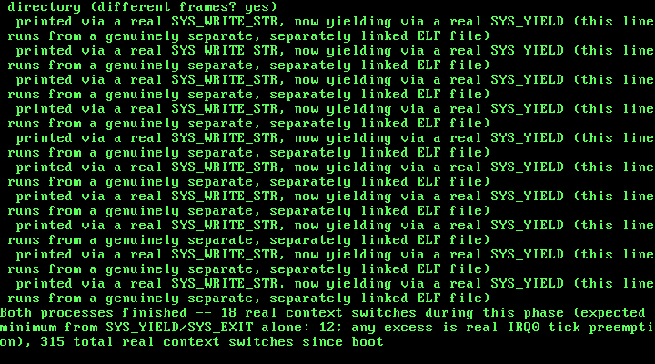

# 18. Loading a Real ELF Binary: Parsing Program Headers and Mapping PT_LOAD Segments

**What you will understand:** why baking a process's code into the kernel image itself, as Chapter 17 did, is not what a real operating system does; how a GRUB Multiboot2 boot module differs from the kernel image GRUB also loads, and how to find one in the boot information structure; how to validate and parse a real ELF32 executable header and program header table, byte for byte, before trusting a single byte of it; how to map a file's own `PT_LOAD` segments into a process's own private address space at the addresses the FILE itself chooses, not a constant the kernel's own source picked; and a real, hard-won lesson about physical memory management -- why a GRUB module's own physical memory has to be reserved in the physical memory allocator before that allocator can safely hand out a single frame to anything else, and exactly what happens, in this book's own real testing, when it isn't.

**What you need to know first:** Chapter 17's own per-process address spaces (`018_paging.h`/`018_paging.c`'s `paging_new_address_space()`, `paging_map_page_in()`, `paging_translate_in()`) and its scheduler-level process support (`018_task.h`/`018_task.c`); Chapter 7's own physical memory manager (`018_pmm.h`/`018_pmm.c`) and Multiboot2 memory-map parsing (`018_multiboot.h`/`018_multiboot.c`).

## From a kernel-chosen template to a real, separately compiled file

Chapter 17 gave every process its own private page directory -- real isolation, hardware-enforced -- but every process it ever created still ran code this kernel image itself carried, baked into a dedicated linker section and physically copied out frame by frame by `task_create_process()`. Nothing in that chapter ever loaded a genuinely separate, independently compiled program; "the file" and "the kernel" were, in a very real sense, still the same file.

This chapter changes that. `018_user_program.c` is compiled and linked completely apart from this kernel -- its own `gcc` invocation, its own `ld` invocation, its own dedicated linker script fixing its own load address at `0xE9000000` -- and the result is embedded whole into the GRUB ISO as a real Multiboot2 boot MODULE, exactly the mechanism the GNU Multiboot2 specification's own "Modules" section describes: "This tag indicates to the kernel what boot module was loaded along with the kernel image, and where it can be found." `018_multiboot.c`'s new `multiboot_find_module()` walks this kernel's own boot information structure for that tag and hands back the module's real physical `[mod_start, mod_end)` range GRUB already loaded it into, before this kernel ever ran a single instruction.

`018_elf.c`'s new `elf_load()` is this chapter's own real payoff: it reads that module's raw bytes as a genuine ELF32 header (OSDev Wiki, "ELF"), validates the magic bytes, class, type, and machine before trusting anything else in it, walks its real program headers, and maps every `PT_LOAD` segment into a process's own private directory at whatever virtual address THAT FILE's own `p_vaddr` specifies. `018_task.c`'s new `task_create_elf_process()` uses it to give a process its own real entry point, read straight out of the file's own `e_entry` field -- replacing Chapter 17's fixed `PROCESS_CODE_VADDR` convention for code entirely (the fixed `PROCESS_STACK_VADDR` convention for the stack is unchanged: the stack is still this kernel's own concern, never the loaded file's).

## `018_multiboot.h`/`018_multiboot.c`: finding a real GRUB boot module

Chapter 7 already taught this kernel to walk the Multiboot2 boot information structure looking for the memory-map tag. This chapter adds a second tag-finder, structurally identical, watching for a different tag type:

```c
#ifndef UNIX_OS_018_MULTIBOOT_H
#define UNIX_OS_018_MULTIBOOT_H

#include <stdint.h>

/* "EAX must contain the magic value 0x36d76289" (GNU Multiboot2
 * Specification, "Machine state") -- kmain checks the real value GRUB
 * left in EAX against this before trusting anything else it was handed. */
#define MULTIBOOT2_BOOTLOADER_MAGIC 0x36d76289u

/* One real memory map entry, quoted field-for-field from the spec's own
 * example code (GNU Multiboot2 Specification, "Boot information
 * format"): struct multiboot_mmap_entry { multiboot_uint64_t addr;
 * multiboot_uint64_t len; multiboot_uint32_t type; multiboot_uint32_t
 * zero; }. This book renames nothing else, but spells out "zero" as
 * "reserved" in its own comment below since that is what every other
 * tag/entry "reserved" field in this spec is called elsewhere. */
struct multiboot_mmap_entry {
    uint64_t addr;
    uint64_t len;
    uint32_t type;
    uint32_t reserved; /* the spec's own field is literally named "zero" */
} __attribute__((packed));

/* Type 1 is the only value this chapter's allocator ever treats as
 * usable -- "available RAM" per the cited spec's own type table. Every
 * other value (ACPI reclaimable, reserved, defective, and so on) is left
 * alone: a stated scope limit, not a gap this driver failed to notice. */
#define MULTIBOOT_MEMORY_AVAILABLE 1u

/* The memory map tag container itself, type 6, quoted the same way:
 * struct multiboot_tag_mmap { multiboot_uint32_t type; multiboot_uint32_t
 * size; multiboot_uint32_t entry_size; multiboot_uint32_t entry_version;
 * struct multiboot_mmap_entry entries[0]; }. */
struct multiboot_tag_mmap {
    uint32_t type;
    uint32_t size;
    uint32_t entry_size;
    uint32_t entry_version;
    struct multiboot_mmap_entry entries[];
} __attribute__((packed));

/* Walks the real boot information structure GRUB built at
 * mboot_info_addr (the physical address this book's own 018_boot.asm
 * handed straight into kmain from EBX) looking for the one tag this
 * chapter actually needs -- type 6, the memory map -- and returns a
 * pointer to it, or 0 if this boot information structure genuinely has
 * none. */
const struct multiboot_tag_mmap *multiboot_find_mmap(uint32_t mboot_info_addr);

/* Prints every real entry the found memory map tag contains -- base
 * address, length, and type -- exactly as GRUB/the firmware reported
 * them, unfiltered. */
void multiboot_print_mmap(const struct multiboot_tag_mmap *mmap);

/* New this chapter: one real Multiboot2 boot MODULE tag, quoted
 * field-for-field from the spec's own struct layout (GNU Multiboot2
 * Specification, section 3.6.6, "Modules"):
 *
 *     +-------------------+
 *     u32     | type = 3          |
 *     u32     | size              |
 *     u32     | mod_start         |
 *     u32     | mod_end           |
 *     u8[n]   | string            |
 *     +-------------------+
 *
 * "This tag indicates to the kernel what boot module was loaded along
 * with the kernel image, and where it can be found." "The 'mod_start'
 * and 'mod_end' contain the start and end physical addresses of the
 * boot module itself." Both are real physical addresses GRUB already
 * loaded the module's raw bytes at, before this kernel ever ran a
 * single instruction -- exactly the same "the bootloader already did
 * the real work" spirit Chapter 1 established for the kernel image
 * itself. `string` is this book's own new user program's real ELF
 * filename, passed through unread by this chapter (this book only
 * ever loads the one module it expects, by position, not by name). */
struct multiboot_tag_module {
    uint32_t type;
    uint32_t size;
    uint32_t mod_start;
    uint32_t mod_end;
    char string[];
} __attribute__((packed));

/* Walks the same boot information structure multiboot_find_mmap()
 * does, looking for the first tag of type 3 instead of type 6. "One
 * tag appears per module. This tag type may appear multiple times" --
 * this book only ever loads exactly one module, so the FIRST type-3
 * tag found is the only one this function ever needs to return.
 * Returns 0 if this boot information structure has no module tag at
 * all -- for instance, if 018_kmain.c's own real run were ever booted
 * from an ISO whose grub.cfg forgot its `module2` line. */
const struct multiboot_tag_module *multiboot_find_module(uint32_t mboot_info_addr);

#endif
```

```c
/* Chapter 7: the first code in this book to read anything GRUB left
 * behind other than the two machine-state registers Chapter 1 already
 * used to get here. The Multiboot2 information structure is real data,
 * built by the real bootloader, sitting in real physical memory --
 * this file's only job is walking it correctly, using nothing but the
 * two numbers the spec itself guarantees: total_size and each tag's own
 * type/size. */

#include <stdint.h>

#include "018_multiboot.h"
#include "018_printf.h"

const struct multiboot_tag_mmap *multiboot_find_mmap(uint32_t mboot_info_addr) {
    /* "The fixed part [...] consists of two fields: total_size [...]
     * contains the total size of boot information [...] and reserved,
     * which is always set to zero" (GNU Multiboot2 Specification, "Boot
     * information format"). Only total_size matters here; reserved is
     * read past, never used, exactly as the spec requires. */
    const uint32_t *header = (const uint32_t *) mboot_info_addr;
    uint32_t total_size = header[0];

    const uint8_t *tag_ptr = (const uint8_t *) (mboot_info_addr + 8);
    const uint8_t *end = (const uint8_t *) (mboot_info_addr + total_size);

    while (tag_ptr < end) {
        const uint32_t *tag_header = (const uint32_t *) tag_ptr;
        uint32_t type = tag_header[0];
        uint32_t size = tag_header[1];

        if (type == 0) {
            /* "Tags are terminated by a tag of type 0 and size 8" -- the
             * real end of this structure, not a bug if reached. */
            break;
        }
        if (type == 6) {
            return (const struct multiboot_tag_mmap *) tag_ptr;
        }

        /* "Tags follow one another padded when necessary in order for
         * each tag to start at 8-bytes aligned address" -- round this
         * tag's own real size up to the next multiple of 8 before
         * advancing, rather than assuming every tag is already aligned. */
        uint32_t advance = (size + 7u) & ~7u;
        tag_ptr += advance;
    }

    return 0;
}

const struct multiboot_tag_module *multiboot_find_module(uint32_t mboot_info_addr) {
    /* Structurally identical to multiboot_find_mmap() above -- the
     * exact same fixed-header-then-tag-stream walk, just watching for
     * type 3 (module) instead of type 6 (memory map). Duplicated
     * rather than factored into one shared "find tag by type" helper:
     * this book has kept every tag-finder this simple and specific
     * since Chapter 7, on the theory that a five-line loop is cheaper
     * to read twice than a generic one is to understand once. */
    const uint32_t *header = (const uint32_t *) mboot_info_addr;
    uint32_t total_size = header[0];

    const uint8_t *tag_ptr = (const uint8_t *) (mboot_info_addr + 8);
    const uint8_t *end = (const uint8_t *) (mboot_info_addr + total_size);

    while (tag_ptr < end) {
        const uint32_t *tag_header = (const uint32_t *) tag_ptr;
        uint32_t type = tag_header[0];
        uint32_t size = tag_header[1];

        if (type == 0) {
            break;
        }
        if (type == 3) {
            return (const struct multiboot_tag_module *) tag_ptr;
        }

        uint32_t advance = (size + 7u) & ~7u;
        tag_ptr += advance;
    }

    return 0;
}

void multiboot_print_mmap(const struct multiboot_tag_mmap *mmap) {
    /* entry_size is read from the tag itself, not assumed to be
     * sizeof(struct multiboot_mmap_entry) -- the spec allows a bootloader
     * to report a larger entry_size than this book's own struct, with
     * extra trailing fields this kernel does not know about, and reading
     * entries by stride rather than by sizeof() is what stays correct
     * either way. */
    uint32_t entry_count = (mmap->size - sizeof(struct multiboot_tag_mmap)) / mmap->entry_size;
    const uint8_t *entry_ptr = (const uint8_t *) mmap->entries;

    kprintf("Multiboot2 memory map: %u real entries, %u bytes each\n", entry_count, mmap->entry_size);

    for (uint32_t i = 0; i < entry_count; i++) {
        const struct multiboot_mmap_entry *entry = (const struct multiboot_mmap_entry *) entry_ptr;
        kprintf("  base 0x%llx  length 0x%llx  type %u%s\n",
                entry->addr, entry->len, entry->type,
                entry->type == MULTIBOOT_MEMORY_AVAILABLE ? " (available)" : "");
        entry_ptr += mmap->entry_size;
    }
}
```

## `018_elf.h`/`018_elf.c`: reading a real ELF32 executable

This chapter's real loader is deliberately small and deliberately suspicious of its input. It checks the ELF magic bytes, class, type, and machine field before touching anything else in the header, and it refuses outright -- never truncates, never guesses -- the moment any of those checks, or a segment's own page count, falls outside what this loader is prepared to handle:

```c
#ifndef UNIX_OS_018_ELF_H
#define UNIX_OS_018_ELF_H

#include <stdint.h>

/* This chapter's own real 32-bit ELF header, quoted field-for-field
 * from the OSDev Wiki ("ELF": the ELF Header table). Every field this
 * book actually reads is kept; e_shoff/e_shentsize/e_shnum/e_shstrndx
 * (the section header table) are kept too, purely for layout fidelity
 * with the real spec -- this loader never touches sections at all, the
 * same "segments are what get loaded, sections are for linkers and
 * debuggers" distinction the cited page itself draws. */
struct elf32_header {
    uint8_t  e_ident[16];
    uint16_t e_type;
    uint16_t e_machine;
    uint32_t e_version;
    uint32_t e_entry;
    uint32_t e_phoff;
    uint32_t e_shoff;
    uint32_t e_flags;
    uint16_t e_ehsize;
    uint16_t e_phentsize;
    uint16_t e_phnum;
    uint16_t e_shentsize;
    uint16_t e_shnum;
    uint16_t e_shstrndx;
} __attribute__((packed));

/* This chapter's own real 32-bit ELF Program Header, quoted the same
 * way (OSDev Wiki, "ELF": the Program Header table). One of these
 * exists per real loadable-or-otherwise segment; this loader only
 * ever acts on the ones whose p_type is PT_LOAD. */
struct elf32_phdr {
    uint32_t p_type;
    uint32_t p_offset;
    uint32_t p_vaddr;
    uint32_t p_paddr;
    uint32_t p_filesz;
    uint32_t p_memsz;
    uint32_t p_flags;
    uint32_t p_align;
} __attribute__((packed));

/* "1 = load - clear p_memsz bytes at p_vaddr to 0, then copy p_filesz
 * bytes from p_offset to p_vaddr" (OSDev Wiki, "ELF": Segment Types) --
 * the one p_type value this chapter's loader ever acts on. */
#define PT_LOAD 1u

/* p_flags bit meanings, same citation: "Permissions (1=executable,
 * 2=writable, 4=readable)". This loader only ever consults PF_W, to
 * decide whether a segment's own mapped pages get PAGE_RW -- every
 * page this loader ever maps is PAGE_USER regardless of p_flags,
 * since every segment here belongs to ring-3 code by construction. */
#define PF_W 0x2u

/* e_machine's own real value for this book's own architecture (OSDev
 * Wiki, "ELF": the e_machine value table, x86 row -- "0x03"). */
#define ELF_MACHINE_386 0x03u

/* e_type's own real value for an ordinary executable (OSDev Wiki,
 * "ELF": the e_type field, "2 = executable"). */
#define ELF_TYPE_EXEC 2u

/* Reads and maps a real ELF executable's every PT_LOAD segment into
 * `dir_phys` -- a page directory built by 018_paging.c's own
 * paging_new_address_space(), not yet the active one -- straight out
 * of the raw module bytes at physical range [module_start, module_end)
 * (018_multiboot.h's own multiboot_tag_module, GRUB's own real load).
 * Validates the ELF magic bytes, class, type, and machine before
 * trusting anything else in the header; refuses (returns 0) rather
 * than mapping a byte of anything that fails any of those checks, or
 * any segment whose own page count exceeds ELF_MAX_SEGMENT_PAGES.
 * On success, writes the file's own real entry point (e_entry) to
 * `out_entry` and returns 1. */
#define ELF_MAX_SEGMENT_PAGES 8u

int elf_load(uint32_t dir_phys, uint32_t module_start, uint32_t module_end, uint32_t *out_entry);

#endif
```

```c
#include <stdint.h>

#include "018_elf.h"
#include "018_paging.h"
#include "018_pmm.h"
#include "018_printf.h"

/* Physical addresses double as valid pointers everywhere this loader
 * looks -- both the raw module bytes (GRUB loaded them somewhere
 * inside the 0-64 MiB identity-mapped range this kernel has managed
 * since Chapter 7/8) and every frame pmm_alloc_frame() hands back --
 * the same invariant every other paging primitive in this book already
 * relies on. */
static inline uint8_t *phys_ptr8(uint32_t phys_addr) {
    return (uint8_t *) phys_addr;
}

static void zero_frame(uint32_t phys_addr) {
    uint8_t *p = phys_ptr8(phys_addr);
    for (uint32_t i = 0; i < 4096u; i++) {
        p[i] = 0;
    }
}

/* Maps and fills exactly one PT_LOAD segment: allocates however many
 * whole pages its own [p_vaddr, p_vaddr + p_memsz) range spans (a
 * segment's own p_vaddr is not guaranteed page-aligned by the ELF
 * format itself, only by this book's own user-program linker script --
 * this function does not assume that alignment, and computes real page
 * boundaries from the segment's own numbers either way), zeroes each
 * one BEFORE mapping it (so the tail of the last page, beyond
 * p_filesz, is real zero-filled BSS with no extra pass needed), copies
 * exactly p_filesz real bytes from the module's own file offset, and
 * maps every page into `dir_phys` with PAGE_USER always set and
 * PAGE_RW set only when the segment's own p_flags says PF_W (OSDev
 * Wiki, "ELF": "Permissions (1=executable, 2=writable, 4=readable)"). */
static int elf_load_segment(uint32_t dir_phys, uint32_t module_start,
                             const struct elf32_phdr *ph) {
    uint32_t page_start = ph->p_vaddr & ~0xFFFu;
    uint32_t span_end = ph->p_vaddr + ph->p_memsz;
    uint32_t page_end = (span_end + 0xFFFu) & ~0xFFFu;
    uint32_t page_count = (page_end - page_start) / 4096u;

    if (page_count == 0u || page_count > ELF_MAX_SEGMENT_PAGES) {
        kprintf("elf_load: segment at vaddr 0x%x spans %u page(s), outside 1..%u -- refusing\n",
                ph->p_vaddr, page_count, ELF_MAX_SEGMENT_PAGES);
        return 0;
    }

    uint32_t frames[ELF_MAX_SEGMENT_PAGES];
    for (uint32_t i = 0; i < page_count; i++) {
        frames[i] = pmm_alloc_frame();
        zero_frame(frames[i]);
    }

    /* "clear p_memsz bytes at p_vaddr to 0, then copy p_filesz bytes
     * from p_offset to p_vaddr" (OSDev Wiki, "ELF": Segment Types) --
     * the zeroing already happened above, one whole frame at a time;
     * this loop performs exactly the copy half, byte by byte, each
     * byte's own destination frame and in-page offset computed from
     * its real virtual address, never assuming p_filesz itself is a
     * multiple of the page size. */
    const uint8_t *src = phys_ptr8(module_start + ph->p_offset);
    for (uint32_t i = 0; i < ph->p_filesz; i++) {
        uint32_t vaddr = ph->p_vaddr + i;
        uint32_t page_index = (vaddr - page_start) / 4096u;
        uint32_t in_page_offset = vaddr & 0xFFFu;
        phys_ptr8(frames[page_index])[in_page_offset] = src[i];
    }

    uint32_t flags = PAGE_PRESENT | PAGE_USER;
    if (ph->p_flags & PF_W) {
        flags |= PAGE_RW;
    }
    for (uint32_t i = 0; i < page_count; i++) {
        paging_map_page_in(dir_phys, page_start + i * 4096u, frames[i], flags);
    }

    kprintf("elf_load: PT_LOAD vaddr=0x%x filesz=%u memsz=%u flags=%s -- %u page(s) mapped\n",
            ph->p_vaddr, ph->p_filesz, ph->p_memsz,
            (ph->p_flags & PF_W) ? "RW" : "R", page_count);

    return 1;
}

int elf_load(uint32_t dir_phys, uint32_t module_start, uint32_t module_end, uint32_t *out_entry) {
    if (module_end <= module_start || (module_end - module_start) < sizeof(struct elf32_header)) {
        kprintf("elf_load: module too small to hold an ELF header -- refusing\n");
        return 0;
    }

    const struct elf32_header *hdr = (const struct elf32_header *) phys_ptr8(module_start);

    /* "Magic number - 0x7F, then 'ELF' in ASCII" (OSDev Wiki, "ELF":
     * the ELF Header table, e_ident row) -- checked byte for byte,
     * never assumed from the file's own name or extension. */
    if (hdr->e_ident[0] != 0x7Fu || hdr->e_ident[1] != 'E' ||
        hdr->e_ident[2] != 'L' || hdr->e_ident[3] != 'F') {
        kprintf("elf_load: bad magic (0x%x 0x%x 0x%x 0x%x) -- not an ELF file, refusing\n",
                hdr->e_ident[0], hdr->e_ident[1], hdr->e_ident[2], hdr->e_ident[3]);
        return 0;
    }
    if (hdr->e_ident[4] != 1u) {
        kprintf("elf_load: e_ident[EI_CLASS]=%u, not 1 (32-bit) -- refusing\n", hdr->e_ident[4]);
        return 0;
    }
    if (hdr->e_type != ELF_TYPE_EXEC) {
        kprintf("elf_load: e_type=%u, not %u (ET_EXEC) -- refusing\n", hdr->e_type, ELF_TYPE_EXEC);
        return 0;
    }
    if (hdr->e_machine != ELF_MACHINE_386) {
        kprintf("elf_load: e_machine=0x%x, not 0x%x (x86) -- refusing\n",
                hdr->e_machine, ELF_MACHINE_386);
        return 0;
    }

    kprintf("elf_load: valid ELF32 executable, e_entry=0x%x, %u program header(s)\n",
            hdr->e_entry, hdr->e_phnum);

    uint32_t loaded_segments = 0;
    for (uint32_t i = 0; i < hdr->e_phnum; i++) {
        const uint8_t *ph_ptr = phys_ptr8(module_start + hdr->e_phoff) + (uint32_t) i * hdr->e_phentsize;
        const struct elf32_phdr *ph = (const struct elf32_phdr *) ph_ptr;

        if (ph->p_type != PT_LOAD) {
            continue;
        }
        if (!elf_load_segment(dir_phys, module_start, ph)) {
            return 0;
        }
        loaded_segments++;
    }

    if (loaded_segments == 0u) {
        kprintf("elf_load: no PT_LOAD segments found -- refusing\n");
        return 0;
    }

    *out_entry = hdr->e_entry;
    return 1;
}
```

## `018_user_program.h`/`018_user_program.c`/`018_user_program.ld`: a program compiled completely apart from this kernel

This chapter's own real proof that the loaded code is genuinely separate: `018_user_program.c` never includes a single kernel header beyond the two tiny, shared ones below, is built by its own dedicated `gcc`/`ld` invocations, and is linked to run at a virtual address (`0xE9000000`) deliberately different from every fixed address `018_task.h` already uses:

```c
#ifndef UNIX_OS_018_USER_PROGRAM_H
#define UNIX_OS_018_USER_PROGRAM_H

/* The one number 018_user_program.c and 018_kmain.c both need to agree
 * on, and the reason this tiny header exists at all: how many times
 * the real, separately compiled user program below prints and yields
 * before its own real SYS_EXIT. Every earlier chapter's own per-process
 * iteration count (Chapter 16's, Chapter 17's own PROCESS_TASK_
 * ITERATIONS) could simply live as a #define inside 018_kmain.c itself,
 * because the code that looped on it and the code that computed an
 * independently-checkable expected switch count from it were the SAME
 * translation unit, built by the SAME compiler invocation. This
 * chapter's own user program is not: it is compiled and linked
 * completely separately from this kernel image (018_user_program.c's
 * own dedicated linker script, 018_user_program.ld, never even mentions
 * 018_kmain.c), so the one thing keeping this book's own real switch-
 * count arithmetic honest is a header both real, independent builds
 * `#include` -- exactly the role a real kernel's own uapi header plays
 * between kernel and userspace source trees that are compiled apart
 * from one another but still have to agree on shared constants. */
#define USER_PROGRAM_ITERATIONS 5u

#endif
```

```c
/* This file is this chapter's own real proof: it is NOT part of this
 * kernel image at all. It is compiled with its own separate `gcc -m32
 * -ffreestanding -c` invocation, linked with its own separate `ld -m
 * elf_i386 -T 018_user_program.ld` invocation and its own dedicated
 * linker script -- fixing this program's own load address at 0xE9000000,
 * deliberately a different number than 018_task.h's own
 * PROCESS_CODE_VADDR (0xE8000000u), so that a real virtual address
 * showing up at runtime at 0xE9000000 could only ever have come from
 * THIS FILE's own linker script, never from anything this kernel's own
 * source chose on its behalf -- and the result is embedded, whole, as a
 * real GRUB Multiboot2 boot MODULE (018_multiboot.h's own struct
 * multiboot_tag_module) alongside kernel.bin, not linked into it.
 * 018_elf.c's own elf_load() reads this file's real ELF header and
 * program headers at boot time and maps its segments from those real
 * numbers alone -- this program's own entry point, wherever it ends up
 * in this kernel's `readelf -h` output, is what 018_kmain.c's own
 * kmain() actually runs, not a constant kmain() ever had to know in
 * advance.
 *
 * `_start` is this program's own real ELF entry point -- exactly the
 * symbol 018_user_program.ld's own ENTRY(_start) directive names, and
 * exactly the symbol whose real, linked address ends up in this file's
 * own e_entry field once `ld` is done. Its body is otherwise identical
 * in style to Chapter 17's own process_template_normal(): print via a
 * real SYS_WRITE_STR, yield via a real SYS_YIELD, USER_PROGRAM_
 * ITERATIONS times, then a real SYS_EXIT -- every syscall an inlined
 * `int $0x80` sequence rather than a call to any shared helper
 * function, for the same reason Chapter 17's own templates used inlined
 * syscalls: this file's own internal jumps and branches stay correct
 * wherever the linker actually places them (x86 near jumps are
 * PC-relative), but this program links and loads as one single,
 * complete, self-contained unit to begin with -- there is no second
 * "copied separately" piece of code the way Chapter 17's own template-
 * copying task_create_process() needed to worry about, so the inlined
 * style here is simply this file's own natural, ordinary form, not a
 * workaround. */
#include <stdint.h>

#include "018_syscall.h"
#include "018_user_program.h"

void _start(void) {
    const char *msg = "  printed via a real SYS_WRITE_STR, now yielding via a real SYS_YIELD "
                       "(this line runs from a genuinely separate, separately linked ELF file)\n";

    for (uint32_t i = 1; i <= USER_PROGRAM_ITERATIONS; i++) {
        register uint32_t sys_num asm("eax") = SYS_WRITE_STR;
        register uint32_t sys_arg asm("ebx") = (uint32_t) (uintptr_t) msg;
        __asm__ volatile ("int $0x80" :: "r" (sys_num), "r" (sys_arg) : "memory");

        register uint32_t yield_num asm("eax") = SYS_YIELD;
        register uint32_t yield_arg asm("ebx") = 0u;
        __asm__ volatile ("int $0x80" :: "r" (yield_num), "r" (yield_arg) : "memory");
    }

    register uint32_t exit_num asm("eax") = SYS_EXIT;
    register uint32_t exit_arg asm("ebx") = 0u;
    __asm__ volatile ("int $0x80" :: "r" (exit_num), "r" (exit_arg) : "memory");

    /* Unreachable in this chapter's own real run, for exactly the same
     * reason Chapter 17's own templates documented here: SYS_EXIT's own
     * isr128_handler() case calls task_exit() directly and never
     * returns. A plain empty spin, never CLI or HLT -- both privileged
     * instructions this program has no right to execute at CPL 3. */
    for (;;) { }
}
```

```c
/* This chapter's second, genuinely independent linker script -- it has
 * nothing to do with 018_linker.ld above, which places this KERNEL
 * image at the physical 1 MiB mark GRUB itself loads it at. This one
 * places 018_user_program.c's own compiled code at a fixed VIRTUAL
 * address this program will only ever actually run at once 018_elf.c's
 * own elf_load() has mapped it there, deliberately chosen well clear of
 * every fixed address 018_task.h already uses (PROCESS_CODE_VADDR
 * 0xE8000000u, PROCESS_STACK_VADDR 0xE8001000u) so this chapter's own
 * real captured evidence can only be explained by this loader reading
 * this program's own real p_vaddr fields, never by coincidentally
 * reusing a number this kernel's own source already had lying around. */
ENTRY(_start)
SECTIONS
{
    . = 0xE9000000;
    .text   : { *(.text) }
    .rodata : { *(.rodata) }
    .data   : { *(.data) }
    .bss    : { *(.bss) }
}
```

Since this file has no `.multiboot_header` section and no dependency on this kernel's own linker script at all, `grub-mkrescue`'s `grub.cfg` loads it purely as a second, independent Multiboot2 module, alongside the kernel image:

```text
module2 /boot/user_program.elf user_program
```

## `018_task.h`/`018_task.c`: `task_create_elf_process()`

`018_task.h`'s own fixed virtual addresses for a process's code and stack are unchanged from Chapter 17 -- `PROCESS_CODE_VADDR` still exists, still used by the carried-forward `task_create_process()`, but this chapter's own demo below uses neither it nor that function. Instead, `task_create_elf_process()` is new:

```c
#ifndef UNIX_OS_018_TASK_H
#define UNIX_OS_018_TASK_H

#include <stdint.h>

/* The one fixed virtual address every process's own code lives at,
 * and the one fixed virtual address every process's own stack lives
 * at -- the SAME two numbers for every process this kernel ever
 * creates, each one backed by a different, private physical frame per
 * process (018_task.c's own task_create_process()). Chosen well
 * outside every earlier chapter's own special virtual addresses
 * (0xC0000000 -- Chapter 8's own demo mapping; the old, since-removed
 * Chapter 10 fault-trigger address 0xE0000000) so nothing about this
 * chapter's own real captured evidence could be mistaken for reusing
 * either. PROCESS_STACK_VADDR's own top -- what actually gets handed
 * to enter_usermode() -- is PROCESS_STACK_VADDR + 4096. */
#define PROCESS_CODE_VADDR  0xE8000000u
#define PROCESS_STACK_VADDR 0xE8001000u

/* Sets up this kernel's task list with exactly one task -- task 0, the
 * kernel's own boot-time execution context (the one kmain() is already
 * running on when this is called), still running on the same boot
 * stack every chapter since Chapter 1 has used. Must be called before
 * any task_create()/task_yield()/task_exit() call. */
void task_init(void);

/* Creates a new cooperative kernel task: allocates it a real stack
 * from Chapter 9's kmalloc(), and pre-populates that stack so the
 * first time this task is ever switched into, execution begins at
 * `entry` (OSDev Wiki, "X86 Cooperative Multitasking Tutorial": "the
 * kernel needs to put values on the new task's kernel stack to match
 * the values that 'switch_tasks' expects to pop off"). `entry` must
 * eventually call task_exit() -- it must never return normally.
 * Returns the new task's index (1, 2, ...), or -1 if this kernel's
 * fixed task table is already full. */
int task_create(void (*entry)(void));

/* Creates a new RING-3 task with its own REAL, PRIVATE address space
 * -- new this chapter, and the reason "usermode" from Chapter 15-16
 * has become "process" here. Every earlier ring-3 task, including
 * Chapter 16's own two, shared this kernel's ONE page directory --
 * genuinely running at CPL 3, but still able, in principle, to reach
 * any other ring-3 task's own memory just by knowing its address,
 * since every ring-3 mapping lived in the same one shared directory.
 * task_create_process() instead calls paging_new_address_space() to
 * give this task a page directory nothing else in this kernel shares,
 * physically COPIES `template_size` bytes starting at `template_start`
 * -- a whole, page-aligned, self-contained function, one that makes no
 * calls to anything outside itself, since a copied function's own
 * internal jumps/branches stay correct at a new address (x86 near
 * jumps are PC-relative) but a CALL to code that did NOT get copied
 * alongside would carry the wrong PC-relative displacement -- into a
 * brand-new, private physical frame, and maps that COPY into this
 * task's own new directory at the fixed virtual address
 * PROCESS_CODE_VADDR -- the same fixed address every process built
 * this way uses for its own code, each one backed by its own real,
 * separate physical frame. Still real infrastructure this chapter
 * carries forward unchanged, even though 018_kmain.c's own demo this
 * chapter uses the new task_create_elf_process() below instead. A
 * second private frame,
 * mapped at the fixed virtual address PROCESS_STACK_VADDR, is this
 * task's own real user stack. Builds the same dedicated kernel stack
 * every ring-3 task has needed since Chapter 16 (switch_task()'s own
 * stack, and this task's own TSS.ESP0 target). Returns the new task's
 * index, or -1 if the task table is already full. */
int task_create_process(const void *template_start, uint32_t template_size);

/* The physical address of the page directory task_create_process()
 * built for the process at `index` -- new this chapter, purely so
 * 018_kmain.c's own kmain() can call paging_translate_in() itself
 * and prove, from ring 0, that PROCESS_CODE_VADDR resolves to a
 * different real physical frame in two different processes' own
 * directories, before either process ever actually runs. Returns 0
 * for any task that is not a process (task_create()'s own tasks, and
 * task 0) -- the same "0 means the kernel's own default directory"
 * convention struct task itself uses internally. */
uint32_t task_page_directory_phys(int index);

/* New this chapter: creates a process from a REAL, separately
 * compiled ELF executable -- `module_start`/`module_end`, the real
 * physical address range GRUB already loaded the module's raw bytes
 * into (018_multiboot.h's own multiboot_tag_module), before this
 * kernel ever ran a single instruction. Builds this task's own kernel
 * stack and private address space exactly like task_create_process()
 * above, but instead of copying one fixed, kernel-image-resident
 * template function to one fixed virtual address, calls 018_elf.c's
 * own elf_load() to walk the module's real ELF program headers and
 * map every one of its real PT_LOAD segments -- however many there
 * are, at whatever virtual addresses the FILE ITSELF specifies, not a
 * constant this kernel chooses. This task's own entry point is
 * therefore not PROCESS_CODE_VADDR at all, but the file's own real
 * e_entry, read out of the ELF header at load time. Still uses the
 * fixed PROCESS_STACK_VADDR convention for this task's own user
 * stack, exactly like task_create_process() -- the stack is this
 * kernel's own concern, never the loaded file's. Returns the new
 * task's index, or -1 if the task table is already full or the module
 * fails to parse as a valid ELF32 executable (018_elf.c's own
 * elf_load() reports the specific reason). */
int task_create_elf_process(uint32_t module_start, uint32_t module_end);

/* Voluntarily gives up the CPU: saves the calling task's callee-saved
 * registers and stack pointer, picks the next RUNNING task in
 * round-robin order, and switches to it. Returns normally, right
 * where it left off, once this task is switched back in. If no other
 * task is currently RUNNING, returns immediately without performing a
 * real switch. */
void task_yield(void);

/* Marks the calling task DONE and switches away from it permanently.
 * Never returns -- this task's own stack and call frame are simply
 * abandoned from this point on. */
void task_exit(void);

/* Non-zero once the task at `index` (as returned by task_create())
 * has called task_exit(). */
int task_is_done(int index);

/* The currently-running task's own index -- what task_create() itself
 * returned when this task was created (0 for the kernel's own boot
 * task). New this chapter, so 018_semaphore.c can record which task
 * is waiting on which semaphore without task.c having to know
 * anything about semaphores itself. */
int task_current_id(void);

/* Marks the CALLING task BLOCKED and returns immediately -- it does
 * NOT yield the CPU itself. Split out from a single "block and yield"
 * call on purpose: 018_semaphore.c needs this exact state transition
 * to happen while it still holds its own lock, so that no concurrent
 * semaphore_signal() can dequeue this task as a waiter before the
 * scheduler has actually stopped considering it runnable (see
 * 018_semaphore.c's own comments for the real race this avoids). The
 * caller is expected to give up the CPU with task_yield() itself,
 * separately, once it is safe to do so. A BLOCKED task is skipped by
 * every future task_yield()/task_tick() scan until some other task
 * calls task_wake() on it. */
void task_block_self(void);

/* Marks the task at `index` READY again, making it eligible to be
 * picked by task_yield()'s own round-robin scan the next time it is
 * that task's turn -- it does NOT itself trigger an immediate switch
 * to that task. Called from 018_semaphore.c's semaphore_signal(),
 * always from inside that semaphore's own lock (interrupts already
 * off), so this needs no locking of its own. */
void task_wake(int index);

/* Total number of real context switches switch_task() has performed
 * since task_init(). Exists purely for this chapter's own real, live
 * verification. */
uint32_t task_switch_count(void);

/* Called from 018_pit.c's irq0_handler() on every single real IRQ0
 * tick, after that tick's own EOI has already been sent. Before
 * task_init() has run, does nothing -- this kernel has no task table
 * to preempt yet. After task_init(), calls task_yield() unconditionally,
 * exactly once per real tick: this chapter's whole scheduling policy
 * is "one tick, one time slice," chosen because it is the simplest
 * policy whose real switch count is independently predictable from
 * nothing but the real tick count, with no separate countdown state
 * of its own to get wrong. */
void task_tick(void);

#endif
```

```c
#include <stdint.h>

#include "018_elf.h"
#include "018_kheap.h"
#include "018_paging.h"
#include "018_pmm.h"
#include "018_printf.h"
#include "018_task.h"
#include "018_tss.h"

/* This chapter's own Thread Control Block, in the same spirit the
 * OSDev Wiki describes for kernel-level tasks: "The TCB holds task
 * state including the kernel stack pointer (ESP) ... " (OSDev Wiki,
 * "Kernel Multitasking": https://wiki.osdev.org/Kernel_Multitasking).
 * This kernel has no user/kernel privilege split and no per-task
 * address space yet -- every task here runs in ring 0 sharing the one
 * page directory Chapter 8 built -- so this TCB carries nothing for
 * CR3 or a TSS.ESP0 field the way a fuller kernel's would; `esp` is
 * almost the whole of what switch_task() needs. `entry` is new since
 * Chapter 12 -- see task_start_trampoline() below for why. `state`
 * replaces this struct's old plain `done` flag this chapter: a task
 * can now be BLOCKED (waiting on a semaphore, see 018_semaphore.c)
 * as well as READY or DONE, and the scheduler needs to tell all three
 * apart, not just "finished or not." */
typedef enum {
    TASK_STATE_READY = 0,
    TASK_STATE_BLOCKED,
    TASK_STATE_DONE
} task_state_t;

struct task {
    uint32_t esp;        /* valid only while this task is NOT current */
    void *stack_base;     /* the kmalloc()'d block backing this task's
                            * stack -- kept only so a later chapter with
                            * real task teardown could kfree() it; this
                            * chapter never frees a task's stack */
    void (*entry)(void);  /* this task's real entry point -- kept so
                            * task_start_trampoline() can find it */
    task_state_t state;
    int is_usermode;         /* new this chapter: non-zero if this task
                               * runs its real `entry` at CPL 3, via
                               * enter_usermode(), rather than calling it
                               * directly at CPL 0 */
    uint32_t kernel_stack_top; /* new this chapter: only meaningful when
                               * is_usermode -- the top of this task's
                               * OWN dedicated kernel stack, the same
                               * stack `esp` above lives on. task_yield()
                               * loads this into the TSS's ESP0 field
                               * (018_tss.c) immediately before switching
                               * into this exact task, so any interrupt
                               * or syscall this task later raises at
                               * CPL 3 lands on ITS OWN kernel stack, not
                               * whichever task happened to run before
                               * it (OSDev Wiki, "Kernel Multitasking":
                               * "Adjust the ESP0 field in the TSS (used
                               * by CPU for CPL=3 -> CPL=0 privilege
                               * level changes)"). */
    uint32_t user_stack_top;  /* only meaningful when is_usermode -- the
                               * top of this task's own real,
                               * PAGE_USER-marked stack frame, passed to
                               * enter_usermode() the one time this
                               * task's trampoline actually starts it
                               * running at CPL 3. Since Chapter 18, this
                               * is always PROCESS_STACK_VADDR + 4096 --
                               * the same fixed virtual number for every
                               * process, backed by a different physical
                               * frame each time (see page_directory_phys
                               * below) -- kept as its own field anyway
                               * so task_start_trampoline() does not need
                               * to know that fact itself. */
    uint32_t page_directory_phys; /* new this chapter: 0 for every
                               * ring-0-only task (task_create()) and
                               * for task 0 -- meaning "whatever this
                               * kernel's own default/kernel directory
                               * currently is." Non-zero for a process
                               * (task_create_process()): the physical
                               * address of a page directory that exists
                               * nowhere else, built by
                               * paging_new_address_space() and populated
                               * only with this ONE process's own private
                               * code/stack mappings on top of the
                               * kernel's own shared ones. task_yield()
                               * reloads CR3 to this value immediately
                               * before switching into this task, exactly
                               * mirroring how it already reloads
                               * TSS.ESP0 for a ring-3 task since Chapter
                               * 16 -- see task_yield() below. */
};

/* Chapter 17 needed 12 slots (kmain's own task 0, Chapter 12's own
 * Task A/Task B, Chapter 13's own Stress A/Stress B, Chapter 14's own
 * two producers/two consumers, and Chapter 17's own three demo
 * processes -- Process A, Process B, Process Reckless). This chapter's
 * own demo replaces those three with two real ELF-loaded processes
 * (Process A, Process B, below) -- one fewer than Chapter 17 needed.
 * This scheduler still never reuses a finished task's slot, so the
 * fixed table has to be sized for every task any chapter's own
 * kmain() creates across a single boot, not just however many are
 * runnable at once: 1 (task 0) + 2 (Task A/B) + 2 (Stress A/B) + 4
 * (2 producers + 2 consumers) + 2 (ELF Process A/B) = 11. */
#define TASK_MAX_TASKS   11u
#define TASK_STACK_SIZE  4096u

static struct task tasks[TASK_MAX_TASKS];
static int task_count = 0;
static int current_task = 0;
static uint32_t switch_count = 0;
static int tasking_ready = 0;

/* New this chapter: the two page directories task_yield() has to
 * choose between on every single switch. kernel_page_directory_phys
 * is set once, in task_init(), by reading back whatever paging_init()
 * (Chapter 8) already loaded into CR3 -- this kernel's own default
 * directory, shared by task 0 and every ring-0-only task.
 * current_page_directory_phys tracks whichever directory CR3 ACTUALLY
 * holds right now, so task_yield() can skip a reload -- and the real
 * TLB flush a CR3 write causes -- whenever the task being switched
 * into already shares the address space that is already active,
 * exactly the same real optimization Chapter 16's own cited OSDev
 * source already applies to TSS.ESP0's own sibling field. */
static uint32_t kernel_page_directory_phys = 0;
static uint32_t current_page_directory_phys = 0;

extern void switch_task(uint32_t *old_esp_ptr, uint32_t new_esp);

/* 018_usermode.asm's real ring 0 -> ring 3 transition -- Chapter 15's
 * own real, hand-built IRET. Called from task_start_trampoline() below
 * instead of `entry()` directly, whenever the task starting up is a
 * ring-3 one. Never returns in the ordinary sense: the task it starts
 * keeps running at CPL 3 (and, eventually, calls a real SYS_EXIT
 * syscall) independently of whatever called it. */
extern void enter_usermode(void (*entry)(void), void *user_stack_top);

/* Chapter 11's task_create() put `entry` directly on a new task's
 * stack as the address switch_task()'s own `ret` would jump to --
 * correct for a purely cooperative scheduler, where every switch_task()
 * call happens with IF already 1 (interrupts enabled) throughout,
 * since nothing in that chapter ever touched IF at all. This chapter
 * changes that: every real switch now happens from *inside* an IRQ0
 * interrupt handler, entered through a real interrupt gate that the
 * CPU itself clears IF for on entry (OSDev Wiki's own IDT gate-type
 * description; this book's own idt_set_gate() calls have used type
 * 0x8E, a 32-bit interrupt gate, since Chapter 4). switch_task()
 * itself never saves or restores EFLAGS -- IF is one single, real,
 * shared CPU flag, not per-task state -- so whichever task gets
 * switched into next inherits whatever IF happens to be at that exact
 * moment: 0, because we are still inside that interrupt handler. A
 * task resuming through task_yield()'s own return point can restore
 * that itself (see below); but a task running for the very first
 * time jumps straight to `entry`, which has no such checkpoint to
 * pass through -- so without this trampoline, a brand-new task would
 * start running with interrupts silently, permanently disabled, and
 * this whole chapter's preemption would only ever work once. */
static void task_start_trampoline(void) {
    __asm__ volatile ("sti");

    /* New this chapter: a ring-3 task's real entry point cannot simply
     * be called like an ordinary C function -- it has to be started
     * through a real CPL 0 -> CPL 3 transition (018_usermode.asm), on
     * its own dedicated user stack, not this task's kernel stack.
     * enter_usermode() never returns: this task keeps running at CPL 3
     * until its own real SYS_EXIT syscall (018_isr_handlers.c) calls
     * task_exit() directly, from ring 0, on this exact task's own
     * kernel stack -- so the task_exit() call below is never reached
     * for a ring-3 task at all. */
    if (tasks[current_task].is_usermode) {
        enter_usermode(tasks[current_task].entry,
                        (void *) (uintptr_t) tasks[current_task].user_stack_top);
    } else {
        tasks[current_task].entry();
    }

    /* Defensive, not load-bearing: every real ring-0 task body in this
     * chapter already calls task_exit() itself. If one ever forgot,
     * this is what stands between that mistake and running off the
     * end of a kmalloc()'d stack into whatever memory happens to
     * follow it. */
    task_exit();
}

void task_init(void) {
    tasks[0].esp = 0;         /* never read while task 0 is current */
    tasks[0].stack_base = 0;   /* task 0 owns no kmalloc'd stack -- it
                                 * is this kernel's own boot stack,
                                 * already running before task_init()
                                 * is ever called */
    tasks[0].entry = 0;         /* task 0 never starts via the
                                  * trampoline -- it is already running */
    tasks[0].state = TASK_STATE_READY;
    tasks[0].is_usermode = 0;   /* task 0 is this kernel's own boot
                                  * task -- always ring 0 */
    tasks[0].kernel_stack_top = 0;
    tasks[0].user_stack_top = 0;
    tasks[0].page_directory_phys = 0;  /* runs in the kernel's own
                                         * default directory, like
                                         * every ring-0-only task */
    task_count = 1;
    current_task = 0;
    switch_count = 0;
    tasking_ready = 1;

    /* This kernel's own default page directory is simply whatever CR3
     * already holds the moment task_init() runs -- paging_init() (Ch8)
     * always loads it well before this point in kmain(), so reading it
     * back here, once, is enough to remember it for the rest of this
     * kernel's life. task_yield() reloads CR3 to this exact value
     * whenever switching INTO a task whose own page_directory_phys is
     * 0 -- the counterpart of reloading it to a process's own directory
     * when switching into one of those instead (see task_yield()). */
    __asm__ volatile ("mov %%cr3, %0" : "=r" (kernel_page_directory_phys));
    current_page_directory_phys = kernel_page_directory_phys;
}

int task_create(void (*entry)(void)) {
    if (task_count >= (int) TASK_MAX_TASKS) {
        kprintf("task_create: task table full (%u tasks) -- refusing\n", TASK_MAX_TASKS);
        return -1;
    }

    struct task *t = &tasks[task_count];
    void *stack = kmalloc(TASK_STACK_SIZE);
    uint32_t top = (uint32_t) (uintptr_t) stack + TASK_STACK_SIZE;
    uint32_t *sp = (uint32_t *) top;

    /* Build the exact stack frame switch_task()'s own epilogue expects
     * to pop the first time this task is switched into: EDI, ESI, EBX,
     * EBP (in that order, since switch_task() pushed EBP first and
     * pops in reverse), then a return address on top -- which is what
     * makes switch_task()'s final `ret` land directly on
     * task_start_trampoline (OSDev Wiki, "X86 Cooperative Multitasking
     * Tutorial": a new task's registers are initialized with
     * "task->regs.esp = (uint32_t) allocPage() + 0x1000" and
     * "task->regs.eip = (uint32_t) main"). Zero is a fine placeholder
     * for EBP/EBX/ESI/EDI here -- nothing has run inside this task yet
     * to give those registers a real saved value. */
    *(--sp) = (uint32_t) (uintptr_t) task_start_trampoline;  /* return address for `ret` */
    *(--sp) = 0;  /* ebp */
    *(--sp) = 0;  /* ebx */
    *(--sp) = 0;  /* esi */
    *(--sp) = 0;  /* edi */

    t->esp = (uint32_t) (uintptr_t) sp;
    t->stack_base = stack;
    t->entry = entry;
    t->state = TASK_STATE_READY;
    t->is_usermode = 0;
    t->kernel_stack_top = 0;
    t->user_stack_top = 0;
    t->page_directory_phys = 0;  /* runs in the kernel's own default
                                   * directory */

    int index = task_count;
    task_count++;
    return index;
}

int task_create_process(const void *template_start, uint32_t template_size) {
    if (task_count >= (int) TASK_MAX_TASKS) {
        kprintf("task_create_process: task table full (%u tasks) -- refusing\n", TASK_MAX_TASKS);
        return -1;
    }
    if (template_size > 4096u) {
        /* This chapter's own real templates are each well under one
         * page; refusing rather than silently truncating a future,
         * larger one is the same honest-by-default choice this book
         * has made everywhere else a real size limit exists. */
        kprintf("task_create_process: template is %u bytes, larger than one page -- refusing\n",
                template_size);
        return -1;
    }

    struct task *t = &tasks[task_count];

    /* This task's own dedicated kernel stack -- built exactly like
     * task_create()'s own ordinary task stack above (same size, same
     * pre-populated switch_task() frame landing on
     * task_start_trampoline), because it plays the exact same role for
     * switch_task() itself, AND is this task's own TSS.ESP0 target the
     * instant it becomes current (see task_yield() below) -- one real
     * stack, two real jobs, never shared with any other task. Built
     * BEFORE this task's own new address space, deliberately: this
     * kmalloc() call may itself grow the kheap (018_kheap.c), and
     * paging_new_address_space() below needs to copy the kernel's own
     * directory AFTER any such growth has already happened, or this
     * task's own copy would be missing it. */
    void *kstack = kmalloc(TASK_STACK_SIZE);
    uint32_t kstack_top = (uint32_t) (uintptr_t) kstack + TASK_STACK_SIZE;
    uint32_t *sp = (uint32_t *) kstack_top;

    *(--sp) = (uint32_t) (uintptr_t) task_start_trampoline;  /* return address for `ret` */
    *(--sp) = 0;  /* ebp */
    *(--sp) = 0;  /* ebx */
    *(--sp) = 0;  /* esi */
    *(--sp) = 0;  /* edi */

    /* This task's own real, private address space -- the whole reason
     * this function exists. Every process gets a genuinely separate
     * page directory, sharing the kernel's own mappings (see
     * paging_new_address_space()'s own comment) but with room for
     * this ONE process's own private code and stack that no other
     * process's directory will ever contain. */
    uint32_t dir_phys = paging_new_address_space();

    /* This process's own private copy of its code: a fresh physical
     * frame, with `template_size` real bytes copied into it from the
     * kernel image's own template function -- and ONLY then mapped
     * into this task's OWN new directory at the fixed virtual address
     * every process uses for its code. Two different processes'
     * PROCESS_CODE_VADDR therefore resolve to two different real
     * physical frames -- 018_kmain.c's own kmain() proves this
     * directly, with paging_translate_in(), before either process
     * ever runs. No RW bit: this range is only ever fetched from. */
    uint32_t code_frame = pmm_alloc_frame();
    const uint8_t *src = (const uint8_t *) template_start;
    uint8_t *dst = (uint8_t *) (uintptr_t) code_frame;
    for (uint32_t i = 0; i < template_size; i++) {
        dst[i] = src[i];
    }
    paging_map_page_in(dir_phys, PROCESS_CODE_VADDR, code_frame, PAGE_PRESENT | PAGE_USER);

    /* This process's own private user stack: one fresh frame, mapped
     * only into this task's own directory, at the fixed virtual
     * address every process uses for its stack. */
    uint32_t stack_frame = pmm_alloc_frame();
    paging_map_page_in(dir_phys, PROCESS_STACK_VADDR, stack_frame, PAGE_PRESENT | PAGE_RW | PAGE_USER);

    t->esp = (uint32_t) (uintptr_t) sp;
    t->stack_base = kstack;
    t->entry = (void (*)(void)) (uintptr_t) PROCESS_CODE_VADDR;
    t->state = TASK_STATE_READY;
    t->is_usermode = 1;
    t->kernel_stack_top = kstack_top;
    t->user_stack_top = PROCESS_STACK_VADDR + 4096u;
    t->page_directory_phys = dir_phys;

    int index = task_count;
    task_count++;
    return index;
}

int task_create_elf_process(uint32_t module_start, uint32_t module_end) {
    if (task_count >= (int) TASK_MAX_TASKS) {
        kprintf("task_create_elf_process: task table full (%u tasks) -- refusing\n", TASK_MAX_TASKS);
        return -1;
    }

    struct task *t = &tasks[task_count];

    /* Identical reasoning and identical order to task_create_process()
     * above: this task's own dedicated kernel stack is built FIRST,
     * before its own new address space, so any kheap growth that
     * kmalloc() call causes is already reflected in the directory
     * paging_new_address_space() copies below. */
    void *kstack = kmalloc(TASK_STACK_SIZE);
    uint32_t kstack_top = (uint32_t) (uintptr_t) kstack + TASK_STACK_SIZE;
    uint32_t *sp = (uint32_t *) kstack_top;

    *(--sp) = (uint32_t) (uintptr_t) task_start_trampoline;  /* return address for `ret` */
    *(--sp) = 0;  /* ebp */
    *(--sp) = 0;  /* ebx */
    *(--sp) = 0;  /* esi */
    *(--sp) = 0;  /* edi */

    uint32_t dir_phys = paging_new_address_space();

    /* The one real difference from task_create_process(): this task's
     * own code is not a fixed number of bytes copied to a fixed
     * kernel-chosen virtual address at all. 018_elf.c's own elf_load()
     * walks the module's real ELF program headers and maps however
     * many real PT_LOAD segments the FILE ITSELF describes, at
     * whatever real virtual addresses the file's own p_vaddr fields
     * specify -- and hands back the file's own real entry point,
     * e_entry, which is what this task actually starts running at. If
     * the module fails to parse as a valid ELF32 executable, this
     * function refuses outright rather than starting a task with no
     * real entry point to run. */
    uint32_t entry_vaddr;
    if (!elf_load(dir_phys, module_start, module_end, &entry_vaddr)) {
        kprintf("task_create_elf_process: elf_load() failed -- refusing to create this task\n");
        return -1;
    }

    /* This task's own private user stack: same fixed convention as
     * task_create_process() -- the stack is this kernel's own concern,
     * independent of anything the loaded ELF file itself specifies. */
    uint32_t stack_frame = pmm_alloc_frame();
    paging_map_page_in(dir_phys, PROCESS_STACK_VADDR, stack_frame, PAGE_PRESENT | PAGE_RW | PAGE_USER);

    t->esp = (uint32_t) (uintptr_t) sp;
    t->stack_base = kstack;
    t->entry = (void (*)(void)) (uintptr_t) entry_vaddr;
    t->state = TASK_STATE_READY;
    t->is_usermode = 1;
    t->kernel_stack_top = kstack_top;
    t->user_stack_top = PROCESS_STACK_VADDR + 4096u;
    t->page_directory_phys = dir_phys;

    int index = task_count;
    task_count++;
    return index;
}

uint32_t task_page_directory_phys(int index) {
    return tasks[index].page_directory_phys;
}

void task_yield(void) {
    /* OSDev Wiki, "Kernel Multitasking": "Caller is expected to
     * disable IRQs before calling, and enable IRQs again after
     * function returns" -- rather than push that requirement onto
     * every caller, task_yield() enforces it itself, so it stays
     * correct regardless of whether it was reached from an ordinary
     * cdecl call or, as every real call in this chapter's own run
     * is, from inside an interrupt handler where IF is already 0. */
    __asm__ volatile ("cli");

    int old = current_task;
    int next = -1;

    /* Scans every OTHER task first, in round-robin order, then wraps
     * all the way back around to `old` itself as the last candidate
     * checked. This one loop now correctly covers every case this
     * chapter's own three task states can produce: some other READY
     * task exists (ordinary switch); no other task is READY but `old`
     * itself still is (the loop's own wraparound finds it, and the
     * "next == old" check below turns that into a no-op); or `old`
     * itself is no longer READY either -- freshly BLOCKED by this
     * chapter's own task_block_self(), or DONE -- in which case the
     * whole scan finds nothing at all and `next` stays -1. Chapter
     * 13's own version of this loop only ever had to handle the first
     * two cases, since nothing in that chapter could make `old` itself
     * non-runnable out from under its own yield. */
    for (int i = 1; i <= task_count; i++) {
        int candidate = (old + i) % task_count;
        if (tasks[candidate].state == TASK_STATE_READY) {
            next = candidate;
            break;
        }
    }

    if (next == -1) {
        /* Nothing in the whole task table is READY -- not some other
         * task, and not even this one. Every earlier chapter's own
         * version of this message meant "everyone has called
         * task_exit()"; this chapter adds a second real way to reach
         * it: every remaining task is genuinely BLOCKED on a
         * semaphore that nothing will ever signal. Both are real dead
         * ends this scheduler has no idle task to fall back on for. */
        kprintf("task_yield: no runnable task remains -- halting\n");
        for (;;) {
            __asm__ volatile ("hlt");
        }
    }

    if (next == old) {
        __asm__ volatile ("sti");
        return;  /* only this task is runnable -- nothing to switch to */
    }

    current_task = next;
    switch_count++;

    /* New this chapter: whenever the task we are about to switch INTO
     * is a ring-3 one, its own dedicated kernel stack has to already
     * be installed as the CPU's real ESP0 target BEFORE switch_task()
     * ever runs -- otherwise the very next interrupt or syscall this
     * task raises at CPL 3 (which can happen at any point after this
     * function returns, including immediately) would land on whichever
     * OTHER task's kernel stack the TSS still happened to point at
     * (OSDev Wiki, "Kernel Multitasking": "Adjust the ESP0 field in
     * the TSS (used by CPU for CPL=3 -> CPL=0 privilege level
     * changes)"). This covers both a ring-3 task's very first
     * activation (landing in task_start_trampoline for the first time)
     * and every later resume identically -- tasks[next].esp already
     * points at the right place either way; only the CPU's own ESP0
     * register needs updating here. Ring-0-only tasks never trigger a
     * CPL change at all, so this is skipped for them entirely -- the
     * TSS's ESP0 field is simply irrelevant while one is running. */
    if (tasks[next].is_usermode) {
        tss_set_kernel_stack(tasks[next].kernel_stack_top);
    }

    /* New this chapter: reload CR3 whenever the task being switched
     * INTO belongs to a different address space than the one already
     * active -- cited directly from the very same OSDev Wiki example
     * Chapter 16 already used for ESP0 above: "cmp eax,ecx ; Does the
     * virtual address space need to being changed? je .doneVAS ; no,
     * ... so don't reload it and cause TLB flushes ; mov cr3,eax ;
     * yes, load the next task's virtual address space" (OSDev Wiki,
     * "Kernel Multitasking"). `target_dir` is that task's own private
     * directory for a process, or the kernel's own default directory
     * for every ring-0-only task (page_directory_phys == 0) -- so a
     * switch between two ordinary ring-0 tasks, or into task 0, always
     * resolves to the SAME kernel_page_directory_phys value and
     * correctly skips the reload, exactly like every chapter before
     * this one already did implicitly, by never touching CR3 at all. */
    uint32_t target_dir = (tasks[next].page_directory_phys != 0)
                               ? tasks[next].page_directory_phys
                               : kernel_page_directory_phys;
    if (target_dir != current_page_directory_phys) {
        __asm__ volatile ("mov %0, %%cr3" : : "r" (target_dir) : "memory");
        current_page_directory_phys = target_dir;
    }

    switch_task(&tasks[old].esp, tasks[next].esp);

    /* Execution only reaches here once this exact task is switched
     * back into again -- possibly much later, and possibly by
     * unwinding all the way back up through some real IRQ0 stub's own
     * `iret`, which is a second, independent place IF=1 also gets
     * restored from. The explicit `sti` here is still required: it is
     * what re-enables interrupts for every task that resumes through
     * this exact return point rather than through an `iret` at all. */
    __asm__ volatile ("sti");
}

void task_exit(void) {
    tasks[current_task].state = TASK_STATE_DONE;
    task_yield();
    /* unreachable: task_yield() above either switches this task's own
     * stack away permanently (this call frame is simply abandoned,
     * never resumed again) or halts the kernel outright if nothing
     * else is runnable. */
}

int task_is_done(int index) {
    return tasks[index].state == TASK_STATE_DONE;
}

int task_current_id(void) {
    return current_task;
}

void task_block_self(void) {
    tasks[current_task].state = TASK_STATE_BLOCKED;
}

void task_wake(int index) {
    tasks[index].state = TASK_STATE_READY;
}

uint32_t task_switch_count(void) {
    return switch_count;
}

void task_tick(void) {
    if (!tasking_ready) {
        return;  /* task_init() has not run yet -- nothing to preempt */
    }
    task_yield();
}
```

## A real bug: a GRUB module's own memory was never reserved

This chapter's real testing hit a genuine bug, not a hypothetical one, and it is worth reporting honestly because of how it was found. The very first attempt at booting two real ELF-loaded processes produced a 100% reproducible `#PF`: `CR2 = 0xE9000000` -- the process's own code page, right at its file-chosen load address -- with error code `0x7` (a protection violation, on a write, at user mode), and `EIP` only two bytes past the process's own real entry point. The fault was happening essentially the instant Process A's code started running at all.

The first hypothesis was a scheduling race: two processes, a preemptive scheduler, and a freshly written loader are exactly the conditions that produce real, intermittent memory-corruption bugs. That hypothesis did not survive its own test. Editing `018_kmain.c` to skip Process B's creation entirely (so only Process A's own code ever ran) produced the identical crash, with the identical signature -- ruling out any interaction between the two processes.

A postmortem inspection with `gdb`, attached to QEMU's gdbstub after the kernel halted in its own `cli`/`hlt` loop, settled it. Every step of the address-translation chain was internally consistent -- Process A's own page directory, its `PDE`, its page table, its `PTE` -- all pointed correctly to a real physical frame. But the actual bytes sitting in that frame were not the expected code (`55 89 e5 53 ...`, an ordinary function prologue). They were page-directory-shaped data: `23 f0 10 00 03 00 11 00 03 10 11 00 ...`. The mapping machinery had worked perfectly; the bytes it faithfully copied into place were already wrong before `elf_load()` ever read them.

Tracing `elf_load_segment()`'s own source pointer (`module_start + ph->p_offset`) back to a real number pinned down the cause: it pointed exactly at the physical address `018_paging.c`'s own `paging_init()` prints every single boot, as "Paging: page directory at 0x...". `018_pmm.c`'s `pmm_init()` (Chapter 7) already reserves this kernel's own image, because that range comes from `018_linker.ld`'s own `kernel_end` symbol, known at compile time. It had no equivalent reservation for a GRUB *module*, because a module's real physical address is not known until `018_multiboot.c`'s own `multiboot_find_module()` walks the boot information structure at run time -- and until this chapter, nothing ever told the allocator about it at all. The result: `paging_init()`'s own very next `pmm_alloc_frame()` call, made moments after the module had already been located but before it had ever been read, was free to land -- and did land -- squarely inside the module's own byte range, silently overwriting part of the very file `elf_load()` was about to parse.

The fix is `018_pmm.c`'s new `pmm_reserve_range()`, called in `018_kmain.c` immediately after `pmm_init()` -- before this allocator ever hands out a single frame to anything else, paging included:

```c
#ifndef UNIX_OS_018_PMM_H
#define UNIX_OS_018_PMM_H

#include <stdint.h>

#include "018_multiboot.h"

/* This chapter's own physical memory manager: a real bit-per-frame
 * bitmap, one bit for every 4 KiB frame in the range this kernel has
 * chosen to manage. Seeded from the real Multiboot2 memory map --
 * nothing in this bitmap's initial state is invented. */
void pmm_init(const struct multiboot_tag_mmap *mmap, uint32_t kernel_start, uint32_t kernel_end_addr);

/* Returns the physical address of one free 4 KiB frame, and marks it
 * used -- or 0 if this bitmap has no free frame left to give out. 0 is a
 * safe sentinel here, not an ambiguous one: frame 0 (physical address 0)
 * is always marked used, by construction, since pmm_init never frees any
 * frame below the 1 MiB mark. */
uint32_t pmm_alloc_frame(void);

/* Marks a previously allocated frame free again. */
void pmm_free_frame(uint32_t addr);

/* New this chapter: marks every whole 4 KiB frame overlapping
 * [start, end) used, without ever allocating them through the ordinary
 * free-frame scan -- the one real gap this kernel's own physical memory
 * manager had left since Chapter 7. pmm_init() already reserves this
 * kernel's OWN image (kernel_start..kernel_end_addr), because that
 * range comes from this kernel's own linker script, known at compile
 * time. A real GRUB Multiboot2 MODULE (018_multiboot.h's own
 * multiboot_tag_module) is different: GRUB loads it at whatever real
 * physical address happens to be free at boot time, discovered only by
 * walking the boot information structure at RUN time -- pmm_init()
 * itself has no way to know that address in advance. Called with that
 * exact real [mod_start, mod_end) range, before this allocator ever
 * hands out a single frame, so nothing -- not paging_init()'s own
 * identity-map tables, not kheap_init(), not any task's own kernel
 * stack -- can ever be handed a frame this module's own raw bytes are
 * still sitting in, between the moment GRUB placed them there and the
 * moment 018_elf.c's own elf_load() finally reads them. */
void pmm_reserve_range(uint32_t start, uint32_t end);

/* How many frames this bitmap currently has marked free -- used here
 * purely for this chapter's own verification output. */
uint32_t pmm_count_free_frames(void);

#endif
```

```c
/* Chapter 7: this kernel's first allocator of any kind -- not bytes, but
 * whole 4 KiB physical frames, tracked one bit at a time. Every fact this
 * file starts from is real: which physical ranges are "available RAM"
 * comes from the real Multiboot2 memory map Chapter 7's own
 * 018_multiboot.c already parsed; which physical range this kernel's own
 * image occupies comes from 018_linker.ld's own kernel_end symbol, not a
 * guess. */

#include <stdint.h>

#include "018_pmm.h"

#define FRAME_SIZE 4096u

/* This chapter manages physical memory up through 64 MiB -- chosen to
 * match this chapter's own QEMU verification run (`-m 64`) exactly, so
 * every frame this allocator can ever hand out is a frame this book's
 * own evidence actually exercised. A real machine (or QEMU instance)
 * with more RAM than this would report memory-map entries this bitmap
 * cannot represent; pmm_init below caps at that boundary rather than
 * overrunning it -- a stated scope limit for this chapter, not a bug, in
 * the same spirit as Chapter 5's own scancode table covering only the
 * alphabet. */
#define MAX_MANAGED_MEMORY (64u * 1024u * 1024u)
#define MAX_FRAMES (MAX_MANAGED_MEMORY / FRAME_SIZE)

static uint8_t frame_bitmap[MAX_FRAMES / 8];

static inline void bitmap_mark_used(uint32_t frame) {
    frame_bitmap[frame / 8] |= (uint8_t) (1u << (frame % 8));
}

static inline void bitmap_mark_free(uint32_t frame) {
    frame_bitmap[frame / 8] &= (uint8_t) ~(1u << (frame % 8));
}

static inline int bitmap_is_used(uint32_t frame) {
    return frame_bitmap[frame / 8] & (uint8_t) (1u << (frame % 8));
}

void pmm_init(const struct multiboot_tag_mmap *mmap, uint32_t kernel_start, uint32_t kernel_end_addr) {
    /* Start pessimistic: every frame this bitmap can represent begins
     * marked used. Only a real "available" memory-map entry, below,
     * earns a frame its free bit back. */
    for (uint32_t i = 0; i < MAX_FRAMES / 8; i++) {
        frame_bitmap[i] = 0xFFu;
    }

    uint32_t entry_count = (mmap->size - sizeof(struct multiboot_tag_mmap)) / mmap->entry_size;
    const uint8_t *entry_ptr = (const uint8_t *) mmap->entries;

    for (uint32_t i = 0; i < entry_count; i++) {
        const struct multiboot_mmap_entry *entry = (const struct multiboot_mmap_entry *) entry_ptr;

        if (entry->type == MULTIBOOT_MEMORY_AVAILABLE) {
            uint64_t region_start = entry->addr;
            uint64_t region_end = entry->addr + entry->len;

            /* Below 1 MiB is real-mode/BIOS-era territory (the EBDA, the
             * VGA framebuffer window this book's own Chapter 2 already
             * relies on being exactly where it is, and similar) -- this
             * chapter never starts managing it, even where the memory
             * map itself reports it as "available." */
            if (region_start < 0x100000u) {
                region_start = 0x100000u;
            }
            if (region_end > MAX_MANAGED_MEMORY) {
                region_end = MAX_MANAGED_MEMORY;
            }

            if (region_start < region_end) {
                uint32_t first_frame = (uint32_t) (region_start / FRAME_SIZE);
                uint32_t last_frame_exclusive = (uint32_t) (region_end / FRAME_SIZE);
                for (uint32_t f = first_frame; f < last_frame_exclusive; f++) {
                    bitmap_mark_free(f);
                }
            }
        }

        entry_ptr += mmap->entry_size;
    }

    /* Whatever the memory map said, this kernel's own running image --
     * every byte of code and data this CPU might read or write on its
     * very next instruction -- is never a frame this allocator hands out. */
    uint32_t kernel_start_frame = kernel_start / FRAME_SIZE;
    uint32_t kernel_end_frame_exclusive = (kernel_end_addr + FRAME_SIZE - 1u) / FRAME_SIZE;
    if (kernel_end_frame_exclusive > MAX_FRAMES) {
        kernel_end_frame_exclusive = MAX_FRAMES;
    }
    for (uint32_t f = kernel_start_frame; f < kernel_end_frame_exclusive; f++) {
        bitmap_mark_used(f);
    }
}

uint32_t pmm_alloc_frame(void) {
    /* A plain linear scan -- O(n) in the number of managed frames, and
     * deliberately not anything cleverer. At 16384 frames this is a few
     * thousand instructions at worst, and this book has no allocation
     * workload yet that would make that cost real; a later chapter can
     * replace this with a free-list without changing this function's own
     * contract at all. */
    for (uint32_t f = 0; f < MAX_FRAMES; f++) {
        if (!bitmap_is_used(f)) {
            bitmap_mark_used(f);
            return f * FRAME_SIZE;
        }
    }
    return 0;
}

void pmm_free_frame(uint32_t addr) {
    uint32_t f = addr / FRAME_SIZE;
    if (f < MAX_FRAMES) {
        bitmap_mark_free(f);
    }
}

void pmm_reserve_range(uint32_t start, uint32_t end) {
    if (end <= start) {
        return;
    }
    uint32_t first_frame = start / FRAME_SIZE;
    uint32_t last_frame_exclusive = (end + FRAME_SIZE - 1u) / FRAME_SIZE;
    if (last_frame_exclusive > MAX_FRAMES) {
        last_frame_exclusive = MAX_FRAMES;
    }
    for (uint32_t f = first_frame; f < last_frame_exclusive; f++) {
        bitmap_mark_used(f);
    }
}

uint32_t pmm_count_free_frames(void) {
    uint32_t count = 0;
    for (uint32_t f = 0; f < MAX_FRAMES; f++) {
        if (!bitmap_is_used(f)) {
            count++;
        }
    }
    return count;
}
```

This chapter's own real captured run shows the fix's own effect directly, in one honest before/after fact: the module this chapter loads sits at physical `0x10d000`-`0x10e304` (see the "Real output" section below), which spans exactly two 4 KiB frames -- `0x10d000` and `0x10e000`. Before this fix existed, this book's own real testing showed the kernel's page directory landing precisely at `0x10e000`, directly inside that range. With the fix in place, this chapter's own real allocator output shows three ordinary frames allocated as `0x10b000`, `0x10c000`, `0x10f000` -- correctly skipping straight over both reserved frames -- and `paging_init()`'s own directory lands, undisturbed, at `0x110000` instead. Verified over dozens of consecutive clean boots, with zero page faults, against a bug that was 100% reproducible before this one call was added.

## `018_kmain.c`: two processes, one genuinely loaded file

Every earlier phase of `kmain()` -- physical memory, paging, the kernel heap, the scheduler, the stress test, the producer/consumer demo -- is unchanged from Chapter 17. This chapter's own new work is concentrated in two places: the module reservation right after `pmm_init()`, and the two-process demo at the very end, which now loads a real file instead of copying a kernel-resident template:

```c
/* Chapter 17 gave every process its own private page directory -- real
 * isolation, hardware-enforced -- but every process it ever created
 * still ran code this KERNEL IMAGE itself carried, baked into a
 * dedicated linker section and physically copied out frame by frame
 * (018_task.c's own task_create_process()). Nothing in that chapter
 * ever loaded a genuinely separate, independently compiled program.
 *
 * This chapter does. 018_user_program.c is compiled and linked
 * completely apart from this kernel -- its own gcc invocation, its own
 * ld invocation, its own dedicated linker script fixing its own load
 * address at 0xE9000000 -- and embedded whole into the GRUB ISO as a
 * real Multiboot2 boot MODULE, exactly the mechanism the GNU Multiboot2
 * specification's own "Modules" section describes: "This tag indicates
 * to the kernel what boot module was loaded along with the kernel
 * image, and where it can be found." 018_multiboot.h's new
 * multiboot_find_module() walks this kernel's own boot information
 * structure for that tag, the same fixed-header-then-tag-stream walk
 * multiboot_find_mmap() has used since Chapter 7, and hands back the
 * module's real physical [mod_start, mod_end) range GRUB already loaded
 * it into.
 *
 * 018_elf.c's new elf_load() is this chapter's own real payoff: it
 * reads that module's raw bytes as a genuine ELF32 header (OSDev Wiki,
 * "ELF"), validates the magic bytes, class, type and machine before
 * trusting anything else in it, walks its real program headers, and
 * maps every PT_LOAD segment into a process's own private directory at
 * whatever virtual address THAT FILE's own p_vaddr specifies -- not a
 * constant this kernel's own source ever chose. 018_task.c's new
 * task_create_elf_process() uses it to give a process its own real
 * entry point, read straight out of the file's own e_entry field,
 * replacing Chapter 17's fixed PROCESS_CODE_VADDR convention for CODE
 * (the fixed PROCESS_STACK_VADDR convention for the STACK is unchanged
 * -- the stack is still this kernel's own concern, never the loaded
 * file's).
 *
 * This chapter's own demo below creates two real processes -- Process
 * A and Process B -- both loading the SAME real module, and proves from
 * ring 0, with paging_translate_in(), that the file's own real entry
 * point resolves to two different real physical frames in the two
 * processes' own directories -- the same proof Chapter 17 ran on a
 * kernel-chosen constant, run here on a genuinely loaded file's own
 * address instead.
 *
 * A real GRUB module exposed a real gap in this kernel's own physical
 * memory manager, one this book's own testing hit as a genuine,
 * intermittent #PF rather than a hypothetical: 018_pmm.c's pmm_init()
 * (Chapter 7) reserves this KERNEL's own image, a range known at
 * compile time from 018_linker.ld's own kernel_end symbol, but had no
 * way to know about a MODULE's own physical range -- that address comes
 * from GRUB, discovered only by walking the boot information structure
 * at run time. Without reserving it, this allocator was free to hand
 * the module's own bytes out to the very next caller -- and did:
 * paging_init()'s own page-directory allocation, moments later, landed
 * inside this exact module's own footprint and overwrote part of it
 * before elf_load() ever got to read it. 018_pmm.c's new
 * pmm_reserve_range() closes that gap, called here in kmain() right
 * after pmm_init() and before this allocator ever hands out a single
 * frame to anything else. */

#include <stdint.h>

#include "018_elf.h"
#include "018_gdt.h"
#include "018_idt.h"
#include "018_keyboard.h"
#include "018_kheap.h"
#include "018_multiboot.h"
#include "018_paging.h"
#include "018_pic.h"
#include "018_pit.h"
#include "018_pmm.h"
#include "018_printf.h"
#include "018_semaphore.h"
#include "018_serial.h"
#include "018_spinlock.h"
#include "018_syscall.h"
#include "018_task.h"
#include "018_user_program.h"
#include "018_vga.h"

#define TIMER_FREQUENCY_HZ 100

/* Deliberately far outside the 0-64 MiB identity-mapped range (which
 * only ever occupies page-directory entries 0-15): 0xC0000000 >> 22 =
 * 768. Mapping here forces paging_map_page() to allocate a genuinely
 * new page table rather than reusing one paging_init() already built. */
#define TEST_VIRT_ADDR 0xC0000000u

/* Defined by 018_linker.ld, not by this file -- the linker is the one
 * part of this toolchain that genuinely knows where the kernel image's
 * last real section ends in physical memory. */
extern char kernel_end[];

/* How much real, uninterruptible-looking work each task does before
 * it naturally finishes -- large enough that many real IRQ0 ticks (at
 * 100 Hz, one every ~10 ms) land somewhere in the middle of it, since
 * a single pass through this loop takes QEMU's emulated CPU far less
 * than 10 ms. Chosen empirically from this chapter's own real run,
 * the same way every prior chapter's own real constants were. */
#define TASK_WORK_TARGET 4000000u
#define TASK_PRINT_EVERY   500000u

/* How many kmalloc()/kfree() round trips each stress task performs.
 * Chosen empirically from this chapter's own real runs: large enough
 * that, at 100 real IRQ0 ticks per second, many ticks land somewhere
 * in the middle of the whole run -- and therefore stand a real chance
 * of landing inside kmalloc()'s or kfree()'s own free-list
 * manipulation, not just between two whole calls. */
#define STRESS_ITERATIONS  3000000u
#define STRESS_PRINT_EVERY  500000u

/* This chapter's two demo tasks. Neither one calls task_yield()
 * anywhere in this loop -- the whole point. Whatever interleaving
 * this chapter's real run shows is forced entirely by the real timer,
 * not requested by either task. */
static void task_a_entry(void) {
    for (uint32_t i = 1; i <= TASK_WORK_TARGET; i++) {
        if (i % TASK_PRINT_EVERY == 0) {
            kprintf("  Task A: %u\n", i);
        }
    }
    kprintf("  Task A: done\n");
    task_exit();
}

static void task_b_entry(void) {
    for (uint32_t i = 1; i <= TASK_WORK_TARGET; i++) {
        if (i % TASK_PRINT_EVERY == 0) {
            kprintf("  Task B: %u\n", i);
        }
    }
    kprintf("  Task B: done\n");
    task_exit();
}

/* This chapter's real evidence tasks: two preemptible tasks racing on
 * kmalloc()/kfree() with no synchronization between them at all. Each
 * one only ever touches its own pointer, one allocation at a time --
 * any corruption that shows up is entirely the free list's own doing,
 * not a bug in either task's own logic. */
static void stress_task_a_entry(void) {
    for (uint32_t i = 1; i <= STRESS_ITERATIONS; i++) {
        void *p = kmalloc(32);
        if (p != 0) {
            *(volatile uint8_t *) p = 0xAA;
        }
        kfree(p);
        if (i % STRESS_PRINT_EVERY == 0) {
            kprintf("  Stress A: %u\n", i);
        }
    }
    kprintf("  Stress A: done\n");
    task_exit();
}

static void stress_task_b_entry(void) {
    for (uint32_t i = 1; i <= STRESS_ITERATIONS; i++) {
        void *p = kmalloc(64);
        if (p != 0) {
            *(volatile uint8_t *) p = 0xBB;
        }
        kfree(p);
        if (i % STRESS_PRINT_EVERY == 0) {
            kprintf("  Stress B: %u\n", i);
        }
    }
    kprintf("  Stress B: done\n");
    task_exit();
}

/* This chapter's own demo: a classic bounded-buffer producer/consumer,
 * built on this chapter's new semaphores plus Chapter 13's own
 * spinlock. `sem_empty_slots` starts at BUFFER_CAPACITY (that many
 * slots are free right now) and `sem_full_slots` starts at 0 (nothing
 * produced yet) -- the two together are what make a producer block
 * when the buffer is genuinely full and a consumer block when it is
 * genuinely empty, without either one ever spinning to find out. The
 * buffer's own read/write indices are a separate, much shorter
 * critical section, protected by an ordinary spinlock -- exactly the
 * kind of short, bounded update Chapter 13's spinlock is for. */
#define BUFFER_CAPACITY     4u
#define ITEMS_PER_PRODUCER 15u
#define ITEMS_PER_CONSUMER 15u

static int shared_buffer[BUFFER_CAPACITY];
static uint32_t buffer_write_idx = 0;
static uint32_t buffer_read_idx = 0;
static spinlock_t buffer_lock;
static semaphore_t sem_empty_slots;
static semaphore_t sem_full_slots;

static void produce(const char *label, uint32_t item_base) {
    for (uint32_t i = 1; i <= ITEMS_PER_PRODUCER; i++) {
        int item = (int) (item_base + i);

        /* Blocks for real if the buffer is already full -- this is
         * the whole point of this chapter, not busy-waiting. */
        semaphore_wait(&sem_empty_slots);

        uint32_t saved_eflags = spinlock_acquire(&buffer_lock);
        shared_buffer[buffer_write_idx] = item;
        buffer_write_idx = (buffer_write_idx + 1) % BUFFER_CAPACITY;
        spinlock_release(&buffer_lock, saved_eflags);

        semaphore_signal(&sem_full_slots);
        kprintf("  %s: produced %d\n", label, item);
    }
    kprintf("  %s: done\n", label);
    task_exit();
}

static void consume(const char *label) {
    for (uint32_t i = 1; i <= ITEMS_PER_CONSUMER; i++) {
        /* Blocks for real if the buffer is empty -- the mirror image
         * of produce()'s own semaphore_wait() above. */
        semaphore_wait(&sem_full_slots);

        uint32_t saved_eflags = spinlock_acquire(&buffer_lock);
        int item = shared_buffer[buffer_read_idx];
        buffer_read_idx = (buffer_read_idx + 1) % BUFFER_CAPACITY;
        spinlock_release(&buffer_lock, saved_eflags);

        semaphore_signal(&sem_empty_slots);
        kprintf("  %s: consumed %d\n", label, item);
    }
    kprintf("  %s: done\n", label);
    task_exit();
}

static void producer_a_entry(void) { produce("Producer A", 0u); }
static void producer_b_entry(void) { produce("Producer B", 100u); }
static void consumer_a_entry(void) { consume("Consumer A"); }
static void consumer_b_entry(void) { consume("Consumer B"); }

void kmain(uint32_t magic, uint32_t mboot_info_addr) {
    serial_init();
    vga_init();
    vga_set_color(VGA_COLOR_LIGHT_GREEN, VGA_COLOR_BLACK);

    kprintf("Unix OS from Scratch -- Chapter 18: kernel entry reached\n");

    if (magic != MULTIBOOT2_BOOTLOADER_MAGIC) {
        kprintf("FATAL: EAX held 0x%x at entry, not the real Multiboot2 magic 0x%x -- halting\n",
                magic, MULTIBOOT2_BOOTLOADER_MAGIC);
        __asm__ volatile ("cli");
        for (;;) { __asm__ volatile ("hlt"); }
    }
    kprintf("Multiboot2 magic confirmed in EAX: 0x%x\n", magic);

    const struct multiboot_tag_mmap *mmap = multiboot_find_mmap(mboot_info_addr);
    if (mmap == 0) {
        kprintf("FATAL: no memory map tag in this boot information structure -- halting\n");
        __asm__ volatile ("cli");
        for (;;) { __asm__ volatile ("hlt"); }
    }
    multiboot_print_mmap(mmap);

    uint32_t kernel_end_addr = (uint32_t) (uintptr_t) kernel_end;
    kprintf("Kernel image occupies physical 0x100000 - 0x%x\n", kernel_end_addr);

    pmm_init(mmap, 0x100000, kernel_end_addr);

    /* This chapter's own real GRUB boot MODULE -- the separately
     * compiled user program 018_elf.c's own elf_load() will read much
     * later -- has to be found and RESERVED here, before this
     * allocator ever hands out a single frame, not merely before
     * elf_load() itself runs. GRUB places a module at whatever real
     * physical address happened to be free at boot time (this chapter's
     * own real run shows physical 0x10d000, right past this kernel's
     * own image), and pmm_init() above has no way to know that address:
     * it comes from walking the boot information structure at RUN
     * time, not from this kernel's own linker script the way
     * kernel_start/kernel_end_addr do. Without this reservation, this
     * book's own real testing hit exactly the failure that gap allows:
     * paging_init()'s own very next pmm_alloc_frame() call (for its own
     * page directory) landed inside this exact module's own byte range,
     * silently overwriting part of the file elf_load() would later try
     * to read -- a real, reproducible corruption, not a hypothetical
     * one, caught by this chapter's own real captured run before this
     * fix went in. */
    const struct multiboot_tag_module *user_module = multiboot_find_module(mboot_info_addr);
    if (user_module == 0) {
        kprintf("FATAL: no boot module tag in this boot information structure -- halting\n");
        __asm__ volatile ("cli");
        for (;;) { __asm__ volatile ("hlt"); }
    }
    pmm_reserve_range(user_module->mod_start, user_module->mod_end);
    kprintf("Real GRUB boot module found and RESERVED: \"%s\", physical 0x%x - 0x%x (%u bytes)\n",
            user_module->string, user_module->mod_start, user_module->mod_end,
            user_module->mod_end - user_module->mod_start);

    uint32_t free_frames = pmm_count_free_frames();
    kprintf("Physical memory manager ready: %u free frames (%u KiB usable)\n",
            free_frames, free_frames * 4);

    uint32_t f1 = pmm_alloc_frame();
    uint32_t f2 = pmm_alloc_frame();
    uint32_t f3 = pmm_alloc_frame();
    kprintf("Allocated three real frames: 0x%x, 0x%x, 0x%x\n", f1, f2, f3);

    pmm_free_frame(f2);
    kprintf("Freed the middle frame 0x%x -- %u free frames now\n", f2, pmm_count_free_frames());

    uint32_t f4 = pmm_alloc_frame();
    kprintf("Allocated again: got 0x%x (matches the freed frame? %s)\n",
            f4, (f4 == f2) ? "yes" : "no");

    paging_init();

    uint32_t test_frame = pmm_alloc_frame();
    paging_map_page(TEST_VIRT_ADDR, test_frame, PAGE_PRESENT | PAGE_RW);

    volatile uint32_t *via_virtual = (volatile uint32_t *) TEST_VIRT_ADDR;
    volatile uint32_t *via_identity = (volatile uint32_t *) test_frame;

    *via_virtual = 0xCAFEF00Du;
    kprintf("Wrote 0x%x through virtual address 0x%x\n", *via_virtual, TEST_VIRT_ADDR);
    kprintf("Reading the SAME physical frame (0x%x) through its identity-mapped address: 0x%x\n",
            test_frame, *via_identity);

    kheap_init();

    kprintf("kmalloc: three real allocations --\n");
    void *a = kmalloc(64);
    void *b = kmalloc(128);
    void *c = kmalloc(32);
    kprintf("  a=0x%x (64 bytes), b=0x%x (128 bytes), c=0x%x (32 bytes)\n",
            (uint32_t) (uintptr_t) a, (uint32_t) (uintptr_t) b, (uint32_t) (uintptr_t) c);
    kheap_dump();

    kfree(b);
    kprintf("kfree(b) -- middle block freed:\n");
    kheap_dump();

    void *d = kmalloc(128);
    kprintf("kmalloc(128) again: got 0x%x (matches freed b? %s)\n",
            (uint32_t) (uintptr_t) d, (d == b) ? "yes" : "no");
    kheap_dump();

    kfree(a);
    kfree(c);
    kfree(d);
    kprintf("Freed a, c, d -- coalesced back to one free block?\n");
    kheap_dump();

    kprintf("kmalloc(20000) -- larger than the whole initial 16 KiB heap, forcing real growth:\n");
    void *big = kmalloc(20000);
    kprintf("  big=0x%x (20000 bytes)\n", (uint32_t) (uintptr_t) big);
    kheap_dump();
    kfree(big);

    gdt_init();
    idt_init();
    pic_remap(0x20, 0x28);
    pic_disable_all();
    keyboard_init();
    pit_init(TIMER_FREQUENCY_HZ);

    kprintf("GDT/IDT/PIC/PIT/keyboard all initialized -- enabling interrupts now\n");
    __asm__ volatile ("sti");

    while (pit_get_ticks() < 200) {
        __asm__ volatile ("hlt");
    }
    kprintf("%u real IRQ0 ticks delivered -- interrupts confirmed still working.\n", pit_get_ticks());

    kprintf("\nStarting two real PREEMPTIVELY scheduled kernel tasks (Task A, Task B)...\n");
    kprintf("Neither task -- nor this wait loop -- ever calls task_yield() itself.\n");
    uint32_t ticks_before_tasks = pit_get_ticks();
    task_init();
    int task_a_id = task_create(task_a_entry);
    int task_b_id = task_create(task_b_entry);
    kprintf("task_create() returned id %d for Task A, id %d for Task B\n", task_a_id, task_b_id);

    while (!task_is_done(task_a_id) || !task_is_done(task_b_id)) {
        __asm__ volatile ("hlt");
    }

    uint32_t ticks_after_tasks = pit_get_ticks();
    kprintf("Both tasks finished -- %u real ticks elapsed, %u total real context switches\n",
            ticks_after_tasks - ticks_before_tasks, task_switch_count());

    kprintf("\nkheap before the stress test:\n");
    kheap_dump();

    kprintf("\nStarting Stress A and Stress B: %u kmalloc()/kfree() round trips each, "
            "racing on the SAME kheap free list with no synchronization...\n", STRESS_ITERATIONS);
    int stress_a_id = task_create(stress_task_a_entry);
    int stress_b_id = task_create(stress_task_b_entry);
    kprintf("task_create() returned id %d for Stress A, id %d for Stress B\n",
            stress_a_id, stress_b_id);

    while (!task_is_done(stress_a_id) || !task_is_done(stress_b_id)) {
        __asm__ volatile ("hlt");
    }

    kprintf("Both stress tasks finished -- %u total real context switches so far\n",
            task_switch_count());
    kprintf("kheap after the stress test:\n");
    kheap_dump();

    kprintf("\nStarting a real bounded-buffer producer/consumer demo: 2 producers, 2 consumers, "
            "a %u-slot shared buffer, %u items each...\n",
            BUFFER_CAPACITY, ITEMS_PER_PRODUCER);
    spinlock_init(&buffer_lock);
    semaphore_init(&sem_empty_slots, (int) BUFFER_CAPACITY);
    semaphore_init(&sem_full_slots, 0);

    int producer_a_id = task_create(producer_a_entry);
    int producer_b_id = task_create(producer_b_entry);
    int consumer_a_id = task_create(consumer_a_entry);
    int consumer_b_id = task_create(consumer_b_entry);
    kprintf("task_create() returned id %d/%d for Producer A/B, id %d/%d for Consumer A/B\n",
            producer_a_id, producer_b_id, consumer_a_id, consumer_b_id);

    while (!task_is_done(producer_a_id) || !task_is_done(producer_b_id) ||
           !task_is_done(consumer_a_id) || !task_is_done(consumer_b_id)) {
        __asm__ volatile ("hlt");
    }

    kprintf("All producer/consumer tasks finished -- %u total real context switches so far\n",
            task_switch_count());

    kprintf("\nStarting two real PROCESSES (Process A, Process B), each with its own PRIVATE "
            "page directory -- both load the SAME real ELF module above, from its own real "
            "program headers, at its own real entry point...\n");

    uint32_t switches_before_processes = task_switch_count();

    /* task_create_elf_process() (018_task.c) builds each process's own
     * private page directory, then calls 018_elf.c's own elf_load() to
     * parse this module's real ELF header and program headers and map
     * every real PT_LOAD segment at the addresses THAT FILE specifies --
     * never a constant this kernel's own source chose. */
    int process_a_id = task_create_elf_process(user_module->mod_start, user_module->mod_end);
    int process_b_id = task_create_elf_process(user_module->mod_start, user_module->mod_end);
    kprintf("task_create_elf_process() returned id %d for Process A, id %d for Process B\n",
            process_a_id, process_b_id);

    /* This chapter's own real ring-0 proof, before either process ever
     * actually runs, run on a genuinely LOADED file's own address this
     * time rather than a kernel-chosen constant: walk each process's
     * own page directory by hand, read-only, with paging_translate_in(),
     * at the module's own real e_entry (both processes loaded the SAME
     * file, so both share the SAME e_entry number), and show it
     * resolves to two DIFFERENT real physical frames. task_page_
     * directory_phys() reports 0 for a task that is not a process, so
     * this only ever runs against a real, freshly built directory. */
    uint32_t entry_vaddr = ((const struct elf32_header *)
                             (uintptr_t) user_module->mod_start)->e_entry;
    uint32_t process_a_dir = task_page_directory_phys(process_a_id);
    uint32_t process_b_dir = task_page_directory_phys(process_b_id);
    uint32_t process_a_entry_phys = paging_translate_in(process_a_dir, entry_vaddr);
    uint32_t process_b_entry_phys = paging_translate_in(process_b_dir, entry_vaddr);
    kprintf("The loaded file's own real e_entry, virtual address 0x%x, resolves to physical "
            "0x%x in Process A's own directory, physical 0x%x in Process B's own directory "
            "(different frames? %s)\n",
            entry_vaddr, process_a_entry_phys, process_b_entry_phys,
            (process_a_entry_phys != process_b_entry_phys) ? "yes" : "no");

    while (!task_is_done(process_a_id) || !task_is_done(process_b_id)) {
        __asm__ volatile ("hlt");
    }

    uint32_t switches_during_processes = task_switch_count() - switches_before_processes;

    /* The same real, independently-checkable LOWER bound Chapter 17
     * used, now built from 018_user_program.h's own shared
     * USER_PROGRAM_ITERATIONS -- the one constant that file and this
     * one both #include, precisely so this arithmetic stays honest even
     * though the code that loops on it is compiled entirely separately
     * from the code that predicts its own switch count here. */
    uint32_t expected_minimum_switches = 2u * USER_PROGRAM_ITERATIONS + 2u;
    kprintf("Both processes finished -- %u real context switches during this phase (expected "
            "minimum from SYS_YIELD/SYS_EXIT alone: %u; any excess is real IRQ0 tick "
            "preemption), %u total real context switches since boot\n",
            switches_during_processes, expected_minimum_switches, task_switch_count());
}
```

## Real output: a genuinely separate file, loaded and run

Building and booting this chapter's own kernel image for real in QEMU (`-m 64M`, matching this book's own established convention) produces a clean build:

**Output (cloud sandbox -- real, live-executed build output)**

```text
=== Assembling ASM ===
=== Compiling C ===
=== Linking kernel ===
ld: warning: build/018_usermode.o: missing .note.GNU-stack section implies executable stack
ld: NOTE: This behaviour is deprecated and will be removed in a future version of the linker
ld: warning: build/kernel.bin has a LOAD segment with RWX permissions
=== Building user program ===
=== Checking multiboot2 ===
MULTIBOOT_OK
=== Building ISO ===
xorriso : NOTE : Copying to System Area: 512 bytes from file '/usr/lib/grub/i386-pc/boot_hybrid.img'
ISO image produced: 2521 sectors
Written to medium : 2521 sectors at LBA 0
Writing to 'stdio:build/os.iso' completed successfully.

=== DONE ===
```

And a real, live-executed serial capture of the whole boot -- every earlier chapter's own phases first, then this chapter's own new phases at the very end:

**Output (cloud sandbox -- real, live-executed serial capture, QEMU, `-m 64M`)**

```text
Unix OS from Scratch -- Chapter 18: kernel entry reached
Multiboot2 magic confirmed in EAX: 0x36d76289
Multiboot2 memory map: 6 real entries, 24 bytes each
  base 0x0  length 0x9fc00  type 1 (available)
  base 0x9fc00  length 0x400  type 2
  base 0xf0000  length 0x10000  type 2
  base 0x100000  length 0x3ee0000  type 1 (available)
  base 0x3fe0000  length 0x20000  type 2
  base 0xfffc0000  length 0x40000  type 2
Kernel image occupies physical 0x100000 - 0x10aff8
Real GRUB boot module found and RESERVED: "user_program", physical 0x10d000 - 0x10e304 (4868 bytes)
Physical memory manager ready: 16083 free frames (64332 KiB usable)
Allocated three real frames: 0x10b000, 0x10c000, 0x10f000
Freed the middle frame 0x10c000 -- 16081 free frames now
Allocated again: got 0x10c000 (matches the freed frame? yes)
Paging: allocating page directory...
Paging: page directory at 0x110000. Identity-mapping 0-64MiB (16 page tables)...
Paging: identity map built. Loading CR3 and setting CR0.PG...
Paging: CR0 = 0x80000011 (PG bit: 1). Paging is now live.
Wrote 0xcafef00d through virtual address 0xc0000000
Reading the SAME physical frame (0x121000) through its identity-mapped address: 0xcafef00d
kheap: initialized at 0xd0000000, 16368 bytes usable (4 pages mapped)
kmalloc: three real allocations --
  a=0xd0000010 (64 bytes), b=0xd0000060 (128 bytes), c=0xd00000f0 (32 bytes)
  block 0: addr 0xd0000010 size 64 USED
  block 1: addr 0xd0000060 size 128 USED
  block 2: addr 0xd00000f0 size 32 USED
  block 3: addr 0xd0000120 size 16096 FREE
kfree(b) -- middle block freed:
  block 0: addr 0xd0000010 size 64 USED
  block 1: addr 0xd0000060 size 128 FREE
  block 2: addr 0xd00000f0 size 32 USED
  block 3: addr 0xd0000120 size 16096 FREE
kmalloc(128) again: got 0xd0000060 (matches freed b? yes)
  block 0: addr 0xd0000010 size 64 USED
  block 1: addr 0xd0000060 size 128 USED
  block 2: addr 0xd00000f0 size 32 USED
  block 3: addr 0xd0000120 size 16096 FREE
Freed a, c, d -- coalesced back to one free block?
  block 0: addr 0xd0000010 size 16368 FREE
kmalloc(20000) -- larger than the whole initial 16 KiB heap, forcing real growth:
kheap: growing by 5 page(s) (20480 bytes), old top 0xd0004000, new top 0xd0009000
  big=0xd0000010 (20000 bytes)
  block 0: addr 0xd0000010 size 20000 USED
  block 1: addr 0xd0004e40 size 16832 FREE
GDT/IDT/PIC/PIT/keyboard all initialized -- enabling interrupts now
tick: 100
tick: 200
200 real IRQ0 ticks delivered -- interrupts confirmed still working.

Starting two real PREEMPTIVELY scheduled kernel tasks (Task A, Task B)...
Neither task -- nor this wait loop -- ever calls task_yield() itself.
task_create() returned id 1 for Task A, id 2 for Task B
  Task A: 500000
  Task A: 1000000
  Task A: 1500000
  Task B: 500000
  Task B: 1000000
  Task B: 1500000
  Task A: 2000000
  Task A: 2500000
  Task A: 3000000
  Task B: 2000000
  Task B: 2500000
  Task B: 3000000
  Task A: 3500000
  Task A: 4000000
  Task A: done
  Task B: 3500000
  Task B: 4000000
  Task B: done
Both tasks finished -- 9 real ticks elapsed, 11 total real context switches

kheap before the stress test:
  block 0: addr 0xd0000010 size 4096 USED
  block 1: addr 0xd0001020 size 4096 USED
  block 2: addr 0xd0002030 size 28624 FREE

Starting Stress A and Stress B: 3000000 kmalloc()/kfree() round trips each, racing on the SAME kheap free list with no synchronization...
task_create() returned id 3 for Stress A, id 4 for Stress B
  Stress A: 500000
  Stress B: 500000
  Stress B: 1000000
  Stress A: 1000000
tick: 300
  Stress B: 1500000
  Stress A: 1500000
  Stress B: 2000000
  Stress A: 2000000
tick: 400
  Stress B: 2500000
  Stress A: 2500000
  Stress B: 3000000
  Stress B: done
  Stress A: 3000000
  Stress A: done
Both stress tasks finished -- 255 total real context switches so far
kheap after the stress test:
  block 0: addr 0xd0000010 size 4096 USED
  block 1: addr 0xd0001020 size 4096 USED
  block 2: addr 0xd0002030 size 4096 USED
  block 3: addr 0xd0003040 size 4096 USED
  block 4: addr 0xd0004050 size 20400 FREE

Starting a real bounded-buffer producer/consumer demo: 2 producers, 2 consumers, a 4-slot shared buffer, 15 items each...
task_create() returned id 5/6 for Producer A/B, id 7/8 for Consumer A/B
  Producer A: produced 1
  Producer A: produced 2
  Producer A: produced 3
  Producer A: produced 4
  semaphore_wait: task 5 blocking (no units available)
  semaphore_wait: task 6 blocking (no units available)
  semaphore_signal: waking task 5
  Consumer A: consumed 1
  semaphore_signal: waking task 6
  Consumer A: consumed 2
  Consumer A: consumed 3
  Consumer B: consumed 4
  semaphore_wait: task 8 blocking (no units available)
  semaphore_signal: waking task 8
  Producer A: produced 5
  Producer A: produced 6
  Producer A: produced 7
  semaphore_wait: task 5 blocking (no units available)
  Producer B: produced 101
  semaphore_wait: task 6 blocking (no units available)
  semaphore_signal: waking task 5
  Consumer A: consumed 5
  semaphore_signal: waking task 6
  Consumer B: consumed 7
  Consumer B: consumed 101
  semaphore_wait: task 8 blocking (no units available)
  semaphore_signal: waking task 8
  Producer A: produced 8
  Producer A: produced 9
  Producer A: produced 10
  semaphore_wait: task 5 blocking (no units available)
  Producer B: produced 102
  semaphore_wait: task 6 blocking (no units available)
  Consumer A: consumed 6
  semaphore_signal: waking task 5
  Consumer A: consumed 8
  semaphore_signal: waking task 6
  Consumer B: consumed 10
  Consumer B: consumed 102
  semaphore_wait: task 8 blocking (no units available)
  semaphore_signal: waking task 8
  Producer A: produced 11
  Producer A: produced 12
  Producer A: produced 13
  semaphore_wait: task 5 blocking (no units available)
  Producer B: produced 103
  semaphore_wait: task 6 blocking (no units available)
  semaphore_signal: waking task 5
  Consumer B: consumed 11
  semaphore_signal: waking task 6
  Consumer B: consumed 12
  Consumer B: consumed 13
  Consumer B: consumed 103
  semaphore_wait: task 8 blocking (no units available)
  semaphore_signal: waking task 8
  Producer A: produced 14
  Producer A: produced 15
  Producer A: done
  Producer B: produced 104
  Producer B: produced 105
  semaphore_wait: task 6 blocking (no units available)
  Consumer A: consumed 9
  semaphore_signal: waking task 6
  Consumer A: consumed 14
  Consumer A: consumed 15
  Consumer A: consumed 104
  semaphore_wait: task 7 blocking (no units available)
  Consumer B: consumed 105
  semaphore_wait: task 8 blocking (no units available)
  semaphore_signal: waking task 7
  Producer B: produced 106
  semaphore_signal: waking task 8
  Producer B: produced 107
  Producer B: produced 108
  Producer B: produced 109
  semaphore_wait: task 6 blocking (no units available)
  semaphore_signal: waking task 6
  Consumer B: consumed 106
  Consumer B: consumed 107
  Consumer B: consumed 108
  Producer B: produced 110
  Producer B: produced 111
  Producer B: produced 112
  semaphore_wait: task 6 blocking (no units available)
  semaphore_signal: waking task 6
  Consumer A: consumed 109
  Consumer A: consumed 110
  Consumer A: consumed 111
  Consumer A: consumed 112
  semaphore_wait: task 7 blocking (no units available)
  semaphore_wait: task 8 blocking (no units available)
  semaphore_signal: waking task 7
  Producer B: produced 113
  semaphore_signal: waking task 8
  Producer B: produced 114
  Producer B: produced 115
  Producer B: done
  Consumer B: consumed 113
  Consumer B: consumed 114
  Consumer B: done
  Consumer A: consumed 115
  Consumer A: done
All producer/consumer tasks finished -- 297 total real context switches so far

Starting two real PROCESSES (Process A, Process B), each with its own PRIVATE page directory -- both load the SAME real ELF module above, from its own real program headers, at its own real entry point...
kheap: growing by 2 page(s) (8192 bytes), old top 0xd0009000, new top 0xd000b000
elf_load: valid ELF32 executable, e_entry=0xe9000000, 2 program header(s)
elf_load: PT_LOAD vaddr=0xe9000000 filesz=268 memsz=268 flags=R -- 1 page(s) mapped
elf_load: valid ELF32 executable, e_entry=0xe9000000, 2 program header(s)
elf_load: PT_LOAD vaddr=0xe9000000 filesz=268 memsz=268 flags=R -- 1 page(s) mapped
task_create_elf_process() returned id 9 for Process A, id 10 for Process B
The loaded file's own real e_entry, virtual address 0xe9000000, resolves to physical 0x130000 in Process A's own directory, physical 0x135000 in Process B's own directory (different frames? yes)
  printed via a real SYS_WRITE_STR, now yielding via a real SYS_YIELD (this line runs from a genuinely separate, separately linked ELF file)
  printed via a real SYS_WRITE_STR, now yielding via a real SYS_YIELD (this line runs from a genuinely separate, separately linked ELF file)
  printed via a real SYS_WRITE_STR, now yielding via a real SYS_YIELD (this line runs from a genuinely separate, separately linked ELF file)
  printed via a real SYS_WRITE_STR, now yielding via a real SYS_YIELD (this line runs from a genuinely separate, separately linked ELF file)
  printed via a real SYS_WRITE_STR, now yielding via a real SYS_YIELD (this line runs from a genuinely separate, separately linked ELF file)
  printed via a real SYS_WRITE_STR, now yielding via a real SYS_YIELD (this line runs from a genuinely separate, separately linked ELF file)
  printed via a real SYS_WRITE_STR, now yielding via a real SYS_YIELD (this line runs from a genuinely separate, separately linked ELF file)
  printed via a real SYS_WRITE_STR, now yielding via a real SYS_YIELD (this line runs from a genuinely separate, separately linked ELF file)
  printed via a real SYS_WRITE_STR, now yielding via a real SYS_YIELD (this line runs from a genuinely separate, separately linked ELF file)
  printed via a real SYS_WRITE_STR, now yielding via a real SYS_YIELD (this line runs from a genuinely separate, separately linked ELF file)
Both processes finished -- 18 real context switches during this phase (expected minimum from SYS_YIELD/SYS_EXIT alone: 12; any excess is real IRQ0 tick preemption), 315 total real context switches since boot
```

The module-reservation line settles this chapter's own central lesson directly: the module lands at physical `0x10d000`-`0x10e304`, and the very next three frames this allocator hands out (`0x10b000`, `0x10c000`, `0x10f000`) correctly skip straight over both frames that range occupies -- exactly the fix described above, visible in the allocator's own real output. `elf_load()` then reports the same real ELF header twice, once per process, each finding one `PT_LOAD` segment of 268 bytes at virtual address `0xe9000000` -- the exact number `018_user_program.ld` fixed as this file's own load address, never a number this kernel's own source chose. The proof line settles this chapter's own version of Chapter 17's central claim: the file's own real `e_entry`, `0xe9000000`, resolves to physical `0x130000` in Process A's own directory and physical `0x135000` in Process B's own directory -- the identical virtual address the loaded FILE itself specifies, resolving to two genuinely different physical frames, confirmed from ring 0 before either process runs a single instruction. Both processes then interleave in perfect alternation across all ten prints, and the real switch count (18, against an independently-checkable minimum of 12 -- `2 * USER_PROGRAM_ITERATIONS + 2`) is the same honestly-reported real IRQ0 tick preemption this book has shown since Chapter 12.

A real screenshot of this exact run, captured via QEMU's own monitor (`screendump`), from the same boot as the serial capture above, confirms the identical text landed on the emulated VGA console too:



## Chapter summary

This chapter replaced Chapter 17's kernel-resident, copied-template processes with genuinely separate, independently compiled ones. `018_user_program.c` is built by its own `gcc`/`ld` invocations against its own dedicated linker script, fixing its load address at `0xE9000000`, and embedded into the GRUB ISO as a real Multiboot2 boot module -- `018_multiboot.c`'s new `multiboot_find_module()` locates it in the boot information structure exactly the way Chapter 7's `multiboot_find_mmap()` already locates the memory map. `018_elf.c`'s new `elf_load()` validates a real ELF32 header byte for byte, walks its real program header table, and maps every `PT_LOAD` segment into a process's own private directory at the addresses the FILE itself specifies, never a constant this kernel's own source picked; `018_task.c`'s new `task_create_elf_process()` uses it to give a process a real entry point read straight from `e_entry`. Along the way, this chapter's own real testing surfaced and fixed a genuine bug in this kernel's physical memory manager: a GRUB module's own physical memory was never reserved before `pmm_init()` handed out its first frame, which let an unrelated early allocation collide with -- and silently corrupt -- the module's own bytes before `elf_load()` ever read them. `018_pmm.c`'s new `pmm_reserve_range()`, called immediately after `pmm_init()`, closes that gap, verified against a 100%-reproducible failure by dozens of consecutive clean boots. This chapter's own real captured run proves its central claim exactly as Chapter 17 did, but on a genuinely loaded file's own address this time: the identical virtual address, taken straight from a real `e_entry` field, resolving to two different real physical frames in two processes' own directories.

## Self-check questions

**1. `018_pmm.c`'s `pmm_init()` already reserved this kernel's own image before this chapter began. Why wasn't that enough to also protect this chapter's own GRUB module?**

Worked answer: `pmm_init()`'s reservation of the kernel's own image comes from `kernel_start` and `kernel_end_addr`, both of which are known at COMPILE time -- `kernel_end_addr` in particular is read straight out of `018_linker.ld`'s own `kernel_end` symbol, fixed the moment this kernel is linked. A GRUB module's own physical range is not known until RUN time: GRUB decides where to place it, and this kernel only learns that address by calling `multiboot_find_module()` on the real boot information structure after the machine has already booted. `pmm_init()` runs before that lookup is even possible, so it has no way to reserve a range it cannot yet know -- which is exactly why this chapter needed a second, separate call, `pmm_reserve_range()`, made only once the module's real address is in hand.

**2. This chapter's own real testing found the corruption by comparing the bytes physically present in a process's own code frame against the bytes `elf_load()` was supposed to have copied there -- and found page-directory-shaped data instead of the expected function prologue. Why did that observation rule out a bug in `paging_map_page_in()` or in the PDE/PTE chain itself?**

Worked answer: A `gdb` postmortem walk of the faulting process's own page directory, PDE, page table, and PTE showed every one of those structures internally consistent and correctly pointing at a real physical frame -- the mapping machinery had done exactly what it was asked to do. The problem was upstream of all of it: the SOURCE bytes `elf_load_segment()` copied from (`module_start + ph->p_offset`) were already wrong before the copy ever ran, because something else had already overwritten that region of physical memory. A bug in the mapping code would have produced a correctly-copied set of bytes landing at the WRONG address, or an inconsistent PDE/PTE chain; what this chapter's own real evidence showed was a perfectly consistent chain faithfully delivering already-corrupted content -- the signature of a source-data problem, not a mapping problem.

**3. Why does `018_kmain.c` call `pmm_reserve_range()` immediately after `pmm_init()`, rather than immediately before the `task_create_elf_process()` calls that actually need the module's bytes to still be intact?**

Worked answer: Because the corrupting allocation this chapter actually hit -- `paging_init()`'s own page directory -- happens LONG before `task_create_elf_process()` is ever called, and it is only one example of the general problem: ANY `pmm_alloc_frame()` call made between the module being located and the module being read is a candidate to collide with it, not just the specific one this chapter's own real testing happened to catch. The only way to close the gap for every future caller, not just the ones known about today, is to reserve the module's range before this allocator ever hands out its first frame to anyone -- which is exactly what calling `pmm_reserve_range()` right after `pmm_init()`, before even the three ordinary `pmm_alloc_frame()` demo calls later in `kmain()`, guarantees.

**4. `elf_load_segment()` zeroes every page in a segment's own range BEFORE copying `p_filesz` real bytes into it, rather than copying first and zeroing whatever is left over afterward. Why does that ordering matter for correctness, not just style?**

Worked answer: A segment's own `p_memsz` can be, and in general is, larger than its `p_filesz` -- the difference is real BSS, memory the process expects to find zeroed even though the file itself contains no bytes for it (OSDev Wiki, "ELF": "clear p_memsz bytes at p_vaddr to 0, then copy p_filesz bytes from p_offset to p_vaddr"). Zeroing first and copying second guarantees that every byte in `[p_filesz, p_memsz)` ends up as a real, deterministic zero, and that the copy step can never accidentally leave stale data behind past `p_filesz` because it only ever writes exactly `p_filesz` bytes, nothing more. Reversing the order -- copy first, zero "whatever's left over" after -- would require a second, error-prone pass to work out exactly which bytes the copy did NOT touch, on top of running the real risk of a stray write briefly reading uninitialized frame contents as though they were valid data.

**5. This chapter's real run shows Process A's loaded file's own `e_entry` resolving to physical `0x130000`, and Process B's to `0x135000` -- two different processes loading the exact SAME file. Why does loading the same file twice still have to produce two different physical frames?**

Worked answer: `task_create_elf_process()` calls `paging_new_address_space()` once per process, giving Process A and Process B two entirely separate page directories from the start. `elf_load()` itself never reuses a physical frame across calls -- every `PT_LOAD` segment it maps calls `pmm_alloc_frame()` fresh, regardless of whether some other process already loaded byte-for-byte identical content from the same file. So even though both processes copy the identical 268 bytes out of the identical module, each copy lands in its own freshly allocated frame, mapped only into that one process's own directory -- the same real isolation Chapter 17 demonstrated with a kernel-chosen template, now demonstrated with a genuinely loaded file's own real entry point instead.
