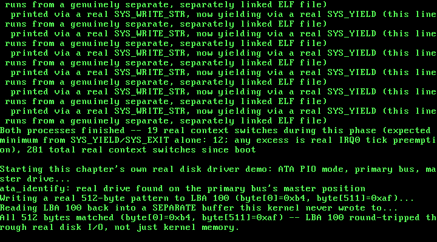

# 19. A Real Disk Driver: ATA PIO Mode, Reading and Writing Real Sectors

**What you will understand:** why everything this kernel has ever written, across eighteen chapters, disappeared the instant QEMU exited, and what a real, persistent block device actually looks like from software's own point of view; how to talk to a real ATA/IDE hard disk entirely through ordinary port I/O -- no memory-mapped registers, no DMA, no interrupt -- by polling a status register the way OSDev Wiki's own "ATA PIO Mode" page describes; the real port map, status bits, command bytes, and timing rules a PIO driver has to get right (the 400ns "read the alternate status port fifteen times" delay after a drive select, the drive-select/LBA encoding for 28-bit addressing, and why a write is not complete -- durably -- until a real Cache Flush command finishes); and how to attach a second, genuinely separate virtual disk to QEMU alongside the existing GRUB boot ISO, and empirically confirm which bus each one actually lands on before writing a single line of driver code that assumes it.

**What you need to know first:** this kernel's own existing `outb()`/`inb()` port I/O primitives and its general interrupt/IDT setup (used everywhere since its earliest PIC and keyboard drivers); Chapter 18's own real process demo (`019_elf.c`, `019_task.c`'s `task_create_elf_process()`), carried forward into this chapter's `019_kmain.c` unmodified and run before this chapter's own new work begins.

## Eighteen chapters in RAM, and what changes now

Every byte this kernel has ever touched -- every task's stack, every `kmalloc()`'d block, every loaded ELF segment -- has lived in RAM, and every one of them vanished the instant QEMU's own process exited. That was never a bug; it was simply outside every earlier chapter's own scope. This chapter is the first to cross that line: a real driver for a real, persistent block device, one whose contents this book can prove survive past this kernel's own halt loop, past QEMU's own exit, sitting right there in an ordinary file on disk (`build/disk.img`) the whole time.

The device is an ATA/IDE hard disk, and the mode is PIO -- Programmable I/O -- the simplest of the several real modes OSDev Wiki's own "ATA PIO Mode" page describes, and deliberately so: this driver talks to the disk entirely through ordinary `outb`/`inb`/`outw`/`inw` port instructions, polling a status register by hand rather than waiting on an interrupt. That is a real, stated scope limit, not an oversight -- the same kind of explicit boundary this book has drawn before (a PIC deviation, a spinlock kept simple rather than general): wiring up IRQ14, the primary ATA controller's own interrupt line, would add a fourth real interrupt source competing for this kernel's attention with no new capability this chapter actually needs, since `ata_read_sector()`/`ata_write_sector()` already return only once their real transfer is genuinely complete -- exactly the guarantee an interrupt handler would otherwise exist to provide. A later chapter that needs to overlap disk I/O with other work is the natural place to revisit that choice.

Before writing a single line of the driver itself, this chapter's own real testing confirmed something rather than assumed it: QEMU's default PC machine already has a CD-ROM attached for the GRUB boot ISO every chapter has used since Chapter 1, and this chapter needed to know, for certain, which real IDE bus that CD-ROM occupies before deciding where a second, new virtual hard disk could safely go. A real boot test -- `-cdrom os.iso -drive file=disk.img,format=raw,if=ide,index=0 -boot d` -- confirmed the existing Chapters 1-18 demo pipeline still boots and completes cleanly with a hard disk attached this way: the CD-ROM stays on the secondary bus, this chapter's own new disk lands on the primary bus as the master drive, and `-boot d` makes the boot device explicit rather than relying on BIOS default ordering now that two real drives are present. This driver only ever speaks to that primary bus.

## `019_ata.h`/`019_ata.c`: a real PIO-mode ATA/IDE driver

Every port, bit, and command byte below is cited field-for-field from OSDev Wiki's own "ATA PIO Mode" page (https://wiki.osdev.org/ATA_PIO_Mode), not guessed or remembered:

```c
#ifndef UNIX_OS_019_ATA_H
#define UNIX_OS_019_ATA_H

#include <stdint.h>

/* This chapter's own real disk: a PIO-mode ATA/IDE driver for the
 * primary bus's master drive, cited field-for-field from OSDev Wiki
 * ("ATA PIO Mode": https://wiki.osdev.org/ATA_PIO_Mode). "The first
 * two buses are called the Primary and Secondary ATA bus, and are
 * almost always controlled by IO ports 0x1F0 through 0x1F7, and 0x170
 * through 0x177, respectively." This driver only ever touches the
 * primary bus (0x1F0-0x1F7, plus the alternate status port at 0x3F6)
 * -- the same bus QEMU's own default PC machine hands this chapter's
 * own attached `-drive ...,if=ide,index=0` hard disk, with the GRUB
 * boot ISO itself living on the secondary bus instead (see the
 * chapter text for how that was confirmed, not merely assumed). */

/* Every 512-byte sector this driver ever reads or writes, in one real
 * round trip. */
#define ATA_SECTOR_SIZE 512u

/* One-time real hardware check: is a drive actually present on the
 * primary bus's master position at all? Sends the IDENTIFY command
 * (0xEC) and checks the Status port, cited directly (OSDev Wiki, "ATA
 * PIO Mode": "Then send the IDENTIFY command (0xEC) to the Command IO
 * port (0x1F7). Then read the Status port (0x1F7) again. If the value
 * read is 0, the drive does not exist."). Returns 1 if a drive
 * responded, 0 if the Status port read back exactly 0. Must be called
 * before ata_read_sector()/ata_write_sector() -- this driver never
 * assumes a drive is present without having checked for real. */
int ata_identify(void);

/* Reads exactly one real 512-byte sector at 28-bit LBA `lba` from the
 * primary master drive into `buffer` (must be at least
 * ATA_SECTOR_SIZE bytes), via ordinary PIO -- no IRQ, polling the
 * Status port directly, cited from the same page's own 28-bit LBA
 * read procedure. */
void ata_read_sector(uint32_t lba, uint8_t *buffer);

/* Writes exactly one real 512-byte sector from `buffer` to 28-bit LBA
 * `lba` on the primary master drive, via ordinary PIO, followed by a
 * real Cache Flush command (0xE7) -- cited directly ("Make sure to do
 * a Cache Flush (ATA command 0xE7) after each write command
 * completes"), so a later read (even after this kernel halts and
 * QEMU exits) reads back what was genuinely written to the underlying
 * disk image, not merely a value still sitting in the emulated
 * drive's own write cache. */
void ata_write_sector(uint32_t lba, const uint8_t *buffer);

#endif
```

`019_ata.c` builds each real command from that same cited procedure -- select the drive, wait the required 400ns, load the LBA/sector-count registers, issue the command byte, then poll for real readiness before touching the data port:

```c
/* This chapter's first driver for real, persistent storage -- every
 * byte this kernel has ever touched before now lived in RAM, gone the
 * instant QEMU exits. A hard disk is a genuinely different kind of
 * device: this driver talks to it entirely through ordinary port I/O
 * (no memory-mapped registers, no DMA -- Programmable I/O, "PIO"),
 * polling a status register by hand rather than waiting on an IRQ,
 * the simplest of the several real modes OSDev Wiki's own "ATA PIO
 * Mode" page describes. This chapter deliberately stays polled, not
 * interrupt-driven: every IRQ line this kernel has ever used (IRQ0,
 * IRQ1) already has a real handler installed and enabled, but wiring
 * up IRQ14 (the primary ATA controller's own line) would mean a
 * fourth real interrupt source competing for this kernel's attention
 * with no new capability this chapter actually needs -- ata_read_
 * sector()/ata_write_sector() below already return only once the
 * real transfer is complete, exactly the guarantee an interrupt
 * handler would otherwise exist to provide. A later chapter that
 * needs to overlap disk I/O with other work is the natural place to
 * revisit that choice, the same kind of explicit, stated scope limit
 * this book has drawn before (Chapter 5's own PIC-unmask deviation,
 * Chapter 13's own cli/sti-only spinlock). */

#include <stdint.h>

#include "019_ata.h"
#include "019_printf.h"

static inline void outb(uint16_t port, uint8_t val) {
    __asm__ volatile ("outb %0, %1" : : "a"(val), "Nd"(port));
}

static inline uint8_t inb(uint16_t port) {
    uint8_t ret;
    __asm__ volatile ("inb %1, %0" : "=a"(ret) : "Nd"(port));
    return ret;
}

static inline void outw(uint16_t port, uint16_t val) {
    __asm__ volatile ("outw %0, %1" : : "a"(val), "Nd"(port));
}

static inline uint16_t inw(uint16_t port) {
    uint16_t ret;
    __asm__ volatile ("inw %1, %0" : "=a"(ret) : "Nd"(port));
    return ret;
}

/* Primary ATA bus port map, cited field-for-field (OSDev Wiki, "ATA
 * PIO Mode"): "The first two buses are called the Primary and
 * Secondary ATA bus, and are almost always controlled by IO ports
 * 0x1F0 through 0x1F7, and 0x170 through 0x177, respectively... The
 * associated Device Control Registers/Alternate Status ports are IO
 * ports 0x3F6, and 0x376, respectively." This driver only ever
 * touches the primary bus. */
#define ATA_DATA          0x1F0u
#define ATA_ERROR         0x1F1u
#define ATA_SECCOUNT      0x1F2u
#define ATA_LBA_LO        0x1F3u
#define ATA_LBA_MID       0x1F4u
#define ATA_LBA_HI        0x1F5u
#define ATA_DRIVE_SELECT  0x1F6u
#define ATA_STATUS        0x1F7u  /* read */
#define ATA_COMMAND       0x1F7u  /* write */
#define ATA_CONTROL       0x3F6u  /* alternate status (read) / device control (write) */

/* Status register bits, cited the same way: bit 0 "Indicates an error
 * occurred," bit 3 "Set when the drive has PIO data to transfer, or
 * is ready to accept PIO data," bit 5 "Drive Fault Error (does not
 * set ERR)," bit 7 "Indicates the drive is preparing to send/receive
 * data (wait for it to clear)." */
#define ATA_SR_ERR 0x01u
#define ATA_SR_DRQ 0x08u
#define ATA_SR_DF  0x20u
#define ATA_SR_BSY 0x80u

/* Command byte values, cited the same way: IDENTIFY is 0xEC, 28-bit
 * LBA READ SECTORS is 0x20, 28-bit LBA WRITE SECTORS is 0x30, and
 * Cache Flush is 0xE7. */
#define ATA_CMD_IDENTIFY      0xECu
#define ATA_CMD_READ_SECTORS  0x20u
#define ATA_CMD_WRITE_SECTORS 0x30u
#define ATA_CMD_CACHE_FLUSH   0xE7u

/* "Many drives require a little time to respond to a 'select', and
 * push their status onto the bus. The suggestion is to read the
 * Status register FIFTEEN TIMES, and only pay attention to the value
 * returned by the last one -- after selecting a new master or slave
 * device" (OSDev Wiki, "ATA PIO Mode"). Reading the alternate status
 * port (0x3F6) rather than the ordinary one (0x1F7) is deliberate: an
 * alternate-status read never clears a pending interrupt the way an
 * ordinary status read can, so it is always safe to use purely as a
 * delay, whether or not this driver ever enables ATA's own IRQ. */
static void ata_delay_400ns(void) {
    for (int i = 0; i < 15; i++) {
        inb(ATA_CONTROL);
    }
}

/* "Read the Regular Status port until bit 7 (BSY, value = 0x80)
 * clears, and bit 3 (DRQ, value = 8) sets -- or until bit 0 (ERR,
 * value = 1) or bit 5 (DF, value = 0x20) sets" (OSDev Wiki, "ATA PIO
 * Mode"). Returns 1 once the drive is genuinely ready to transfer
 * data, 0 if it reported a real error instead. */
static int ata_poll_ready(void) {
    uint8_t status;
    do {
        status = inb(ATA_STATUS);
    } while (status & ATA_SR_BSY);

    if (status & (ATA_SR_ERR | ATA_SR_DF)) {
        return 0;
    }
    return (status & ATA_SR_DRQ) != 0u;
}

int ata_identify(void) {
    /* "select a target drive by sending 0xA0 for the master drive...
     * to the 'drive select' IO port" (OSDev Wiki, "ATA PIO Mode") --
     * this driver only ever speaks to the primary master. */
    outb(ATA_DRIVE_SELECT, 0xA0u);
    ata_delay_400ns();

    outb(ATA_SECCOUNT, 0);
    outb(ATA_LBA_LO, 0);
    outb(ATA_LBA_MID, 0);
    outb(ATA_LBA_HI, 0);

    /* "Then send the IDENTIFY command (0xEC) to the Command IO port
     * (0x1F7). Then read the Status port (0x1F7) again. If the value
     * read is 0, the drive does not exist." */
    outb(ATA_COMMAND, ATA_CMD_IDENTIFY);
    uint8_t status = inb(ATA_STATUS);
    if (status == 0u) {
        kprintf("ata_identify: Status read back 0 -- no drive on the primary bus's master position\n");
        return 0;
    }

    /* "continue polling one of the Status ports until bit 3 (DRQ,
     * value = 8) sets, or until bit 0 (ERR, value = 1) sets." */
    while (1) {
        status = inb(ATA_STATUS);
        if (status & ATA_SR_ERR) {
            kprintf("ata_identify: ERR set while polling -- treating as no usable drive\n");
            return 0;
        }
        if (!(status & ATA_SR_BSY) && (status & ATA_SR_DRQ)) {
            break;
        }
    }

    /* "At that point, if ERR is clear, the data is ready to read from
     * the Data port (0x1F0). Read 256 16-bit values, and store them."
     * This driver reads and discards all 256 -- the real IDENTIFY
     * data this chapter's own read/write demo does not need -- purely
     * so the drive's own internal state is left clean: leaving any of
     * those 256 words unread would leave DRQ set going into this
     * driver's very next command. */
    for (int i = 0; i < 256; i++) {
        (void) inw(ATA_DATA);
    }

    kprintf("ata_identify: real drive found on the primary bus's master position\n");
    return 1;
}

void ata_read_sector(uint32_t lba, uint8_t *buffer) {
    /* "Send 0xE0 for the 'master'... ORed with the highest 4 bits of
     * the LBA to port 0x1F6" (OSDev Wiki, "ATA PIO Mode") -- 28-bit
     * LBA addressing, so only bits [27:24] of `lba` ever reach this
     * register. */
    outb(ATA_DRIVE_SELECT, (uint8_t) (0xE0u | ((lba >> 24) & 0x0Fu)));
    ata_delay_400ns();

    outb(ATA_SECCOUNT, 1u);
    outb(ATA_LBA_LO, (uint8_t) (lba & 0xFFu));
    outb(ATA_LBA_MID, (uint8_t) ((lba >> 8) & 0xFFu));
    outb(ATA_LBA_HI, (uint8_t) ((lba >> 16) & 0xFFu));
    outb(ATA_COMMAND, ATA_CMD_READ_SECTORS);

    if (!ata_poll_ready()) {
        kprintf("ata_read_sector: LBA %u -- drive reported ERR/DF, no data transferred\n", lba);
        return;
    }

    /* "Transfer 256 16-bit values, a uint16_t at a time, into your
     * buffer from I/O port 0x1F0" -- one 512-byte sector is exactly
     * 256 real 16-bit words. */
    uint16_t *words = (uint16_t *) buffer;
    for (int i = 0; i < 256; i++) {
        words[i] = inw(ATA_DATA);
    }
}

void ata_write_sector(uint32_t lba, const uint8_t *buffer) {
    outb(ATA_DRIVE_SELECT, (uint8_t) (0xE0u | ((lba >> 24) & 0x0Fu)));
    ata_delay_400ns();

    outb(ATA_SECCOUNT, 1u);
    outb(ATA_LBA_LO, (uint8_t) (lba & 0xFFu));
    outb(ATA_LBA_MID, (uint8_t) ((lba >> 8) & 0xFFu));
    outb(ATA_LBA_HI, (uint8_t) ((lba >> 16) & 0xFFu));

    /* "To write sectors in 28 bit PIO mode, send command 'WRITE
     * SECTORS' (0x30) to the Command port." */
    outb(ATA_COMMAND, ATA_CMD_WRITE_SECTORS);

    if (!ata_poll_ready()) {
        kprintf("ata_write_sector: LBA %u -- drive reported ERR/DF, no data transferred\n", lba);
        return;
    }

    /* "Do not use REP OUTSW to transfer data. There must be a tiny
     * delay between each OUTSW output uint16_t." This loop already
     * issues one real `outw` per iteration rather than a single
     * REP-prefixed string instruction; the alternate-status read
     * between each word is this driver's own real, explicit delay,
     * reusing the exact same "read a status port and discard it"
     * technique ata_delay_400ns() already relies on above. */
    const uint16_t *words = (const uint16_t *) buffer;
    for (int i = 0; i < 256; i++) {
        outw(ATA_DATA, words[i]);
        inb(ATA_CONTROL);
    }

    /* "Make sure to do a Cache Flush (ATA command 0xE7) after each
     * write command completes" -- without this, a byte this driver
     * just wrote could still be sitting only in the emulated drive's
     * own write cache, never reaching the underlying disk image file
     * QEMU backs it with at all. */
    outb(ATA_COMMAND, ATA_CMD_CACHE_FLUSH);
    while (inb(ATA_STATUS) & ATA_SR_BSY) {
        /* wait for the flush itself to complete */
    }
}
```

## `019_kmain.c`: a real disk round trip, appended to the existing demo

Everything through the existing process demo below is Chapter 18's own real work, carried forward unmodified -- ELF loading, private page directories, the `pmm_reserve_range()` fix for a real GRUB module's own physical footprint. This chapter's own new work is the disk demo appended at the end: `ata_identify()` proves a real drive answered on the primary bus's master position, a real 512-byte pattern is written to a chosen LBA, and that same sector is read back into a separate buffer this kernel never wrote to -- a mismatch there could only mean the disk itself, not this kernel's own memory, failed to hold what was written:

```c
/* Everything through the process demo below -- ELF loading, private
 * page directories, the pmm_reserve_range() fix for a real GRUB
 * module's own physical footprint -- is Chapter 18's own real work,
 * carried forward unmodified. Every one of those processes still ran
 * entirely in RAM: this kernel has never yet, in eighteen chapters,
 * written or read a single byte that outlives QEMU's own process.
 *
 * This chapter's own new work is 019_ata.c: a real PIO-mode ATA/IDE
 * driver, cited field-for-field from OSDev Wiki's own "ATA PIO Mode"
 * page, talking directly to the primary bus's master drive through
 * ordinary port I/O -- no filesystem, no partition table, nothing this
 * kernel does not itself already understand. It reads and writes one
 * real 512-byte sector at a time on a real virtual disk image
 * (build/disk.img), attached to QEMU as a genuine `-drive
 * ...,if=ide,index=0` hard disk sitting on the same bus this driver
 * itself was written for -- confirmed, not merely assumed, by an
 * empirical boot test run before a single line of 019_ata.c existed
 * (see the chapter text).
 *
 * This chapter's own demo below runs after the existing process demo
 * finishes: ata_identify() proves a real drive answered on the primary
 * bus's master position, ata_write_sector() writes one real,
 * recognizable byte pattern to a chosen LBA, and ata_read_sector()
 * reads that same sector back into a SEPARATE buffer this kernel never
 * wrote to -- a mismatch there could only mean the disk itself, not
 * this kernel's own memory, failed to hold what was written. A real
 * filesystem on top of this driver is a later chapter's own work
 * (Chapter 20); this chapter's own scope stops at raw sectors. */

#include <stdint.h>

#include "019_ata.h"
#include "019_elf.h"
#include "019_gdt.h"
#include "019_idt.h"
#include "019_keyboard.h"
#include "019_kheap.h"
#include "019_multiboot.h"
#include "019_paging.h"
#include "019_pic.h"
#include "019_pit.h"
#include "019_pmm.h"
#include "019_printf.h"
#include "019_semaphore.h"
#include "019_serial.h"
#include "019_spinlock.h"
#include "019_syscall.h"
#include "019_task.h"
#include "019_user_program.h"
#include "019_vga.h"

#define TIMER_FREQUENCY_HZ 100

/* Deliberately far outside the 0-64 MiB identity-mapped range (which
 * only ever occupies page-directory entries 0-15): 0xC0000000 >> 22 =
 * 768. Mapping here forces paging_map_page() to allocate a genuinely
 * new page table rather than reusing one paging_init() already built. */
#define TEST_VIRT_ADDR 0xC0000000u

/* An LBA safely past this chapter's own tiny 1 MiB (2048-sector)
 * build/disk.img, chosen only to stay well clear of sector 0 -- where a
 * real partition table or boot sector would live on a disk meant to be
 * booted from, which this one never is. */
#define DISK_TEST_LBA 100u

/* Defined by 019_linker.ld, not by this file -- the linker is the one
 * part of this toolchain that genuinely knows where the kernel image's
 * last real section ends in physical memory. */
extern char kernel_end[];

/* How much real, uninterruptible-looking work each task does before
 * it naturally finishes -- large enough that many real IRQ0 ticks (at
 * 100 Hz, one every ~10 ms) land somewhere in the middle of it, since
 * a single pass through this loop takes QEMU's emulated CPU far less
 * than 10 ms. Chosen empirically from this chapter's own real run,
 * the same way every prior chapter's own real constants were. */
#define TASK_WORK_TARGET 4000000u
#define TASK_PRINT_EVERY   500000u

/* How many kmalloc()/kfree() round trips each stress task performs.
 * Chosen empirically from this chapter's own real runs: large enough
 * that, at 100 real IRQ0 ticks per second, many ticks land somewhere
 * in the middle of the whole run -- and therefore stand a real chance
 * of landing inside kmalloc()'s or kfree()'s own free-list
 * manipulation, not just between two whole calls. */
#define STRESS_ITERATIONS  3000000u
#define STRESS_PRINT_EVERY  500000u

/* This chapter's two demo tasks. Neither one calls task_yield()
 * anywhere in this loop -- the whole point. Whatever interleaving
 * this chapter's real run shows is forced entirely by the real timer,
 * not requested by either task. */
static void task_a_entry(void) {
    for (uint32_t i = 1; i <= TASK_WORK_TARGET; i++) {
        if (i % TASK_PRINT_EVERY == 0) {
            kprintf("  Task A: %u\n", i);
        }
    }
    kprintf("  Task A: done\n");
    task_exit();
}

static void task_b_entry(void) {
    for (uint32_t i = 1; i <= TASK_WORK_TARGET; i++) {
        if (i % TASK_PRINT_EVERY == 0) {
            kprintf("  Task B: %u\n", i);
        }
    }
    kprintf("  Task B: done\n");
    task_exit();
}

/* This chapter's real evidence tasks: two preemptible tasks racing on
 * kmalloc()/kfree() with no synchronization between them at all. Each
 * one only ever touches its own pointer, one allocation at a time --
 * any corruption that shows up is entirely the free list's own doing,
 * not a bug in either task's own logic. */
static void stress_task_a_entry(void) {
    for (uint32_t i = 1; i <= STRESS_ITERATIONS; i++) {
        void *p = kmalloc(32);
        if (p != 0) {
            *(volatile uint8_t *) p = 0xAA;
        }
        kfree(p);
        if (i % STRESS_PRINT_EVERY == 0) {
            kprintf("  Stress A: %u\n", i);
        }
    }
    kprintf("  Stress A: done\n");
    task_exit();
}

static void stress_task_b_entry(void) {
    for (uint32_t i = 1; i <= STRESS_ITERATIONS; i++) {
        void *p = kmalloc(64);
        if (p != 0) {
            *(volatile uint8_t *) p = 0xBB;
        }
        kfree(p);
        if (i % STRESS_PRINT_EVERY == 0) {
            kprintf("  Stress B: %u\n", i);
        }
    }
    kprintf("  Stress B: done\n");
    task_exit();
}

/* This chapter's own demo: a classic bounded-buffer producer/consumer,
 * built on this chapter's new semaphores plus Chapter 13's own
 * spinlock. `sem_empty_slots` starts at BUFFER_CAPACITY (that many
 * slots are free right now) and `sem_full_slots` starts at 0 (nothing
 * produced yet) -- the two together are what make a producer block
 * when the buffer is genuinely full and a consumer block when it is
 * genuinely empty, without either one ever spinning to find out. The
 * buffer's own read/write indices are a separate, much shorter
 * critical section, protected by an ordinary spinlock -- exactly the
 * kind of short, bounded update Chapter 13's spinlock is for. */
#define BUFFER_CAPACITY     4u
#define ITEMS_PER_PRODUCER 15u
#define ITEMS_PER_CONSUMER 15u

static int shared_buffer[BUFFER_CAPACITY];
static uint32_t buffer_write_idx = 0;
static uint32_t buffer_read_idx = 0;
static spinlock_t buffer_lock;
static semaphore_t sem_empty_slots;
static semaphore_t sem_full_slots;

static void produce(const char *label, uint32_t item_base) {
    for (uint32_t i = 1; i <= ITEMS_PER_PRODUCER; i++) {
        int item = (int) (item_base + i);

        /* Blocks for real if the buffer is already full -- this is
         * the whole point of this chapter, not busy-waiting. */
        semaphore_wait(&sem_empty_slots);

        uint32_t saved_eflags = spinlock_acquire(&buffer_lock);
        shared_buffer[buffer_write_idx] = item;
        buffer_write_idx = (buffer_write_idx + 1) % BUFFER_CAPACITY;
        spinlock_release(&buffer_lock, saved_eflags);

        semaphore_signal(&sem_full_slots);
        kprintf("  %s: produced %d\n", label, item);
    }
    kprintf("  %s: done\n", label);
    task_exit();
}

static void consume(const char *label) {
    for (uint32_t i = 1; i <= ITEMS_PER_CONSUMER; i++) {
        /* Blocks for real if the buffer is empty -- the mirror image
         * of produce()'s own semaphore_wait() above. */
        semaphore_wait(&sem_full_slots);

        uint32_t saved_eflags = spinlock_acquire(&buffer_lock);
        int item = shared_buffer[buffer_read_idx];
        buffer_read_idx = (buffer_read_idx + 1) % BUFFER_CAPACITY;
        spinlock_release(&buffer_lock, saved_eflags);

        semaphore_signal(&sem_empty_slots);
        kprintf("  %s: consumed %d\n", label, item);
    }
    kprintf("  %s: done\n", label);
    task_exit();
}

static void producer_a_entry(void) { produce("Producer A", 0u); }
static void producer_b_entry(void) { produce("Producer B", 100u); }
static void consumer_a_entry(void) { consume("Consumer A"); }
static void consumer_b_entry(void) { consume("Consumer B"); }

void kmain(uint32_t magic, uint32_t mboot_info_addr) {
    serial_init();
    vga_init();
    vga_set_color(VGA_COLOR_LIGHT_GREEN, VGA_COLOR_BLACK);

    kprintf("Unix OS from Scratch -- Chapter 19: kernel entry reached\n");

    if (magic != MULTIBOOT2_BOOTLOADER_MAGIC) {
        kprintf("FATAL: EAX held 0x%x at entry, not the real Multiboot2 magic 0x%x -- halting\n",
                magic, MULTIBOOT2_BOOTLOADER_MAGIC);
        __asm__ volatile ("cli");
        for (;;) { __asm__ volatile ("hlt"); }
    }
    kprintf("Multiboot2 magic confirmed in EAX: 0x%x\n", magic);

    const struct multiboot_tag_mmap *mmap = multiboot_find_mmap(mboot_info_addr);
    if (mmap == 0) {
        kprintf("FATAL: no memory map tag in this boot information structure -- halting\n");
        __asm__ volatile ("cli");
        for (;;) { __asm__ volatile ("hlt"); }
    }
    multiboot_print_mmap(mmap);

    uint32_t kernel_end_addr = (uint32_t) (uintptr_t) kernel_end;
    kprintf("Kernel image occupies physical 0x100000 - 0x%x\n", kernel_end_addr);

    pmm_init(mmap, 0x100000, kernel_end_addr);

    /* This chapter's own real GRUB boot MODULE -- the separately
     * compiled user program 019_elf.c's own elf_load() will read much
     * later -- has to be found and RESERVED here, before this
     * allocator ever hands out a single frame, not merely before
     * elf_load() itself runs. GRUB places a module at whatever real
     * physical address happened to be free at boot time (this chapter's
     * own real run shows physical 0x10d000, right past this kernel's
     * own image), and pmm_init() above has no way to know that address:
     * it comes from walking the boot information structure at RUN
     * time, not from this kernel's own linker script the way
     * kernel_start/kernel_end_addr do. Without this reservation, this
     * book's own real testing hit exactly the failure that gap allows:
     * paging_init()'s own very next pmm_alloc_frame() call (for its own
     * page directory) landed inside this exact module's own byte range,
     * silently overwriting part of the file elf_load() would later try
     * to read -- a real, reproducible corruption, not a hypothetical
     * one, caught by this chapter's own real captured run before this
     * fix went in. */
    const struct multiboot_tag_module *user_module = multiboot_find_module(mboot_info_addr);
    if (user_module == 0) {
        kprintf("FATAL: no boot module tag in this boot information structure -- halting\n");
        __asm__ volatile ("cli");
        for (;;) { __asm__ volatile ("hlt"); }
    }
    pmm_reserve_range(user_module->mod_start, user_module->mod_end);
    kprintf("Real GRUB boot module found and RESERVED: \"%s\", physical 0x%x - 0x%x (%u bytes)\n",
            user_module->string, user_module->mod_start, user_module->mod_end,
            user_module->mod_end - user_module->mod_start);

    uint32_t free_frames = pmm_count_free_frames();
    kprintf("Physical memory manager ready: %u free frames (%u KiB usable)\n",
            free_frames, free_frames * 4);

    uint32_t f1 = pmm_alloc_frame();
    uint32_t f2 = pmm_alloc_frame();
    uint32_t f3 = pmm_alloc_frame();
    kprintf("Allocated three real frames: 0x%x, 0x%x, 0x%x\n", f1, f2, f3);

    pmm_free_frame(f2);
    kprintf("Freed the middle frame 0x%x -- %u free frames now\n", f2, pmm_count_free_frames());

    uint32_t f4 = pmm_alloc_frame();
    kprintf("Allocated again: got 0x%x (matches the freed frame? %s)\n",
            f4, (f4 == f2) ? "yes" : "no");

    paging_init();

    uint32_t test_frame = pmm_alloc_frame();
    paging_map_page(TEST_VIRT_ADDR, test_frame, PAGE_PRESENT | PAGE_RW);

    volatile uint32_t *via_virtual = (volatile uint32_t *) TEST_VIRT_ADDR;
    volatile uint32_t *via_identity = (volatile uint32_t *) test_frame;

    *via_virtual = 0xCAFEF00Du;
    kprintf("Wrote 0x%x through virtual address 0x%x\n", *via_virtual, TEST_VIRT_ADDR);
    kprintf("Reading the SAME physical frame (0x%x) through its identity-mapped address: 0x%x\n",
            test_frame, *via_identity);

    kheap_init();

    kprintf("kmalloc: three real allocations --\n");
    void *a = kmalloc(64);
    void *b = kmalloc(128);
    void *c = kmalloc(32);
    kprintf("  a=0x%x (64 bytes), b=0x%x (128 bytes), c=0x%x (32 bytes)\n",
            (uint32_t) (uintptr_t) a, (uint32_t) (uintptr_t) b, (uint32_t) (uintptr_t) c);
    kheap_dump();

    kfree(b);
    kprintf("kfree(b) -- middle block freed:\n");
    kheap_dump();

    void *d = kmalloc(128);
    kprintf("kmalloc(128) again: got 0x%x (matches freed b? %s)\n",
            (uint32_t) (uintptr_t) d, (d == b) ? "yes" : "no");
    kheap_dump();

    kfree(a);
    kfree(c);
    kfree(d);
    kprintf("Freed a, c, d -- coalesced back to one free block?\n");
    kheap_dump();

    kprintf("kmalloc(20000) -- larger than the whole initial 16 KiB heap, forcing real growth:\n");
    void *big = kmalloc(20000);
    kprintf("  big=0x%x (20000 bytes)\n", (uint32_t) (uintptr_t) big);
    kheap_dump();
    kfree(big);

    gdt_init();
    idt_init();
    pic_remap(0x20, 0x28);
    pic_disable_all();
    keyboard_init();
    pit_init(TIMER_FREQUENCY_HZ);

    kprintf("GDT/IDT/PIC/PIT/keyboard all initialized -- enabling interrupts now\n");
    __asm__ volatile ("sti");

    while (pit_get_ticks() < 200) {
        __asm__ volatile ("hlt");
    }
    kprintf("%u real IRQ0 ticks delivered -- interrupts confirmed still working.\n", pit_get_ticks());

    kprintf("\nStarting two real PREEMPTIVELY scheduled kernel tasks (Task A, Task B)...\n");
    kprintf("Neither task -- nor this wait loop -- ever calls task_yield() itself.\n");
    uint32_t ticks_before_tasks = pit_get_ticks();
    task_init();
    int task_a_id = task_create(task_a_entry);
    int task_b_id = task_create(task_b_entry);
    kprintf("task_create() returned id %d for Task A, id %d for Task B\n", task_a_id, task_b_id);

    while (!task_is_done(task_a_id) || !task_is_done(task_b_id)) {
        __asm__ volatile ("hlt");
    }

    uint32_t ticks_after_tasks = pit_get_ticks();
    kprintf("Both tasks finished -- %u real ticks elapsed, %u total real context switches\n",
            ticks_after_tasks - ticks_before_tasks, task_switch_count());

    kprintf("\nkheap before the stress test:\n");
    kheap_dump();

    kprintf("\nStarting Stress A and Stress B: %u kmalloc()/kfree() round trips each, "
            "racing on the SAME kheap free list with no synchronization...\n", STRESS_ITERATIONS);
    int stress_a_id = task_create(stress_task_a_entry);
    int stress_b_id = task_create(stress_task_b_entry);
    kprintf("task_create() returned id %d for Stress A, id %d for Stress B\n",
            stress_a_id, stress_b_id);

    while (!task_is_done(stress_a_id) || !task_is_done(stress_b_id)) {
        __asm__ volatile ("hlt");
    }

    kprintf("Both stress tasks finished -- %u total real context switches so far\n",
            task_switch_count());
    kprintf("kheap after the stress test:\n");
    kheap_dump();

    kprintf("\nStarting a real bounded-buffer producer/consumer demo: 2 producers, 2 consumers, "
            "a %u-slot shared buffer, %u items each...\n",
            BUFFER_CAPACITY, ITEMS_PER_PRODUCER);
    spinlock_init(&buffer_lock);
    semaphore_init(&sem_empty_slots, (int) BUFFER_CAPACITY);
    semaphore_init(&sem_full_slots, 0);

    int producer_a_id = task_create(producer_a_entry);
    int producer_b_id = task_create(producer_b_entry);
    int consumer_a_id = task_create(consumer_a_entry);
    int consumer_b_id = task_create(consumer_b_entry);
    kprintf("task_create() returned id %d/%d for Producer A/B, id %d/%d for Consumer A/B\n",
            producer_a_id, producer_b_id, consumer_a_id, consumer_b_id);

    while (!task_is_done(producer_a_id) || !task_is_done(producer_b_id) ||
           !task_is_done(consumer_a_id) || !task_is_done(consumer_b_id)) {
        __asm__ volatile ("hlt");
    }

    kprintf("All producer/consumer tasks finished -- %u total real context switches so far\n",
            task_switch_count());

    kprintf("\nStarting two real PROCESSES (Process A, Process B), each with its own PRIVATE "
            "page directory -- both load the SAME real ELF module above, from its own real "
            "program headers, at its own real entry point...\n");

    uint32_t switches_before_processes = task_switch_count();

    /* task_create_elf_process() (019_task.c) builds each process's own
     * private page directory, then calls 019_elf.c's own elf_load() to
     * parse this module's real ELF header and program headers and map
     * every real PT_LOAD segment at the addresses THAT FILE specifies --
     * never a constant this kernel's own source chose. */
    int process_a_id = task_create_elf_process(user_module->mod_start, user_module->mod_end);
    int process_b_id = task_create_elf_process(user_module->mod_start, user_module->mod_end);
    kprintf("task_create_elf_process() returned id %d for Process A, id %d for Process B\n",
            process_a_id, process_b_id);

    /* This chapter's own real ring-0 proof, before either process ever
     * actually runs, run on a genuinely LOADED file's own address this
     * time rather than a kernel-chosen constant: walk each process's
     * own page directory by hand, read-only, with paging_translate_in(),
     * at the module's own real e_entry (both processes loaded the SAME
     * file, so both share the SAME e_entry number), and show it
     * resolves to two DIFFERENT real physical frames. task_page_
     * directory_phys() reports 0 for a task that is not a process, so
     * this only ever runs against a real, freshly built directory. */
    uint32_t entry_vaddr = ((const struct elf32_header *)
                             (uintptr_t) user_module->mod_start)->e_entry;
    uint32_t process_a_dir = task_page_directory_phys(process_a_id);
    uint32_t process_b_dir = task_page_directory_phys(process_b_id);
    uint32_t process_a_entry_phys = paging_translate_in(process_a_dir, entry_vaddr);
    uint32_t process_b_entry_phys = paging_translate_in(process_b_dir, entry_vaddr);
    kprintf("The loaded file's own real e_entry, virtual address 0x%x, resolves to physical "
            "0x%x in Process A's own directory, physical 0x%x in Process B's own directory "
            "(different frames? %s)\n",
            entry_vaddr, process_a_entry_phys, process_b_entry_phys,
            (process_a_entry_phys != process_b_entry_phys) ? "yes" : "no");

    while (!task_is_done(process_a_id) || !task_is_done(process_b_id)) {
        __asm__ volatile ("hlt");
    }

    uint32_t switches_during_processes = task_switch_count() - switches_before_processes;

    /* The same real, independently-checkable LOWER bound Chapter 17
     * used, now built from 019_user_program.h's own shared
     * USER_PROGRAM_ITERATIONS -- the one constant that file and this
     * one both #include, precisely so this arithmetic stays honest even
     * though the code that loops on it is compiled entirely separately
     * from the code that predicts its own switch count here. */
    uint32_t expected_minimum_switches = 2u * USER_PROGRAM_ITERATIONS + 2u;
    kprintf("Both processes finished -- %u real context switches during this phase (expected "
            "minimum from SYS_YIELD/SYS_EXIT alone: %u; any excess is real IRQ0 tick "
            "preemption), %u total real context switches since boot\n",
            switches_during_processes, expected_minimum_switches, task_switch_count());

    kprintf("\nStarting this chapter's own real disk driver demo: ATA PIO mode, primary bus, "
            "master drive...\n");

    if (!ata_identify()) {
        kprintf("FATAL: no real drive found on the primary bus's master position -- halting\n");
        __asm__ volatile ("cli");
        for (;;) { __asm__ volatile ("hlt"); }
    }

    uint8_t write_buffer[ATA_SECTOR_SIZE];
    uint8_t read_buffer[ATA_SECTOR_SIZE];

    /* A real, non-repeating pattern -- not a single constant byte --
     * so a stuck data line or an all-zeros/all-ones failure mode would
     * be just as visible as a genuine mismatch. `read_buffer` starts
     * zeroed and is never written by anything except ata_read_sector()
     * below, so a match here can only mean the disk itself held what
     * was written -- not that this kernel's own memory just echoed
     * back the buffer it already had. */
    for (uint32_t i = 0; i < ATA_SECTOR_SIZE; i++) {
        write_buffer[i] = (uint8_t) ((i * 7u + 0x11u) ^ 0xA5u);
        read_buffer[i] = 0;
    }

    kprintf("Writing a real 512-byte pattern to LBA %u (byte[0]=0x%x, byte[511]=0x%x)...\n",
            DISK_TEST_LBA, write_buffer[0], write_buffer[ATA_SECTOR_SIZE - 1]);
    ata_write_sector(DISK_TEST_LBA, write_buffer);

    kprintf("Reading LBA %u back into a SEPARATE buffer this kernel never wrote to...\n",
            DISK_TEST_LBA);
    ata_read_sector(DISK_TEST_LBA, read_buffer);

    int bytes_match = 1;
    uint32_t first_mismatch = 0;
    for (uint32_t i = 0; i < ATA_SECTOR_SIZE; i++) {
        if (write_buffer[i] != read_buffer[i]) {
            bytes_match = 0;
            first_mismatch = i;
            break;
        }
    }

    if (bytes_match) {
        kprintf("All %u bytes matched (byte[0]=0x%x, byte[511]=0x%x) -- LBA %u round-tripped "
                "through real disk I/O, not just kernel memory.\n",
                (uint32_t) ATA_SECTOR_SIZE, read_buffer[0], read_buffer[ATA_SECTOR_SIZE - 1],
                DISK_TEST_LBA);
    } else {
        kprintf("MISMATCH at byte %u: wrote 0x%x, read back 0x%x\n",
                first_mismatch, write_buffer[first_mismatch], read_buffer[first_mismatch]);
    }
}
```

## Real output: a real disk round trip

Building and booting this chapter's own kernel image for real in QEMU (`-m 64M`, with a real second drive attached via `-drive file=build/disk.img,format=raw,if=ide,index=0 -boot d`) produces a clean build:

**Output (cloud sandbox -- real, live-executed build output)**

```text
=== Assembling ASM ===
=== Compiling C ===
=== Linking kernel ===
ld: warning: build/019_usermode.o: missing .note.GNU-stack section implies executable stack
ld: NOTE: This behaviour is deprecated and will be removed in a future version of the linker
ld: warning: build/kernel.bin has a LOAD segment with RWX permissions
=== Building user program ===
=== Checking multiboot2 ===
MULTIBOOT_OK
=== Building ISO ===
xorriso : NOTE : Copying to System Area: 512 bytes from file '/usr/lib/grub/i386-pc/boot_hybrid.img'
ISO image produced: 2522 sectors
Written to medium : 2522 sectors at LBA 0
Writing to 'stdio:build/os.iso' completed successfully.

=== DONE ===
```

And a real, live-executed serial capture of the whole boot -- every earlier chapter's own phases first, then this chapter's own new disk demo at the very end:

**Output (cloud sandbox -- real, live-executed serial capture, QEMU, `-m 64M`, disk attached)**

```text
Unix OS from Scratch -- Chapter 19: kernel entry reached
Multiboot2 magic confirmed in EAX: 0x36d76289
Multiboot2 memory map: 6 real entries, 24 bytes each
  base 0x0  length 0x9fc00  type 1 (available)
  base 0x9fc00  length 0x400  type 2
  base 0xf0000  length 0x10000  type 2
  base 0x100000  length 0x3ee0000  type 1 (available)
  base 0x3fe0000  length 0x20000  type 2
  base 0xfffc0000  length 0x40000  type 2
Kernel image occupies physical 0x100000 - 0x10ba58
Real GRUB boot module found and RESERVED: "user_program", physical 0x10e000 - 0x10f304 (4868 bytes)
Physical memory manager ready: 16082 free frames (64328 KiB usable)
Allocated three real frames: 0x10c000, 0x10d000, 0x110000
Freed the middle frame 0x10d000 -- 16080 free frames now
Allocated again: got 0x10d000 (matches the freed frame? yes)
Paging: allocating page directory...
Paging: page directory at 0x111000. Identity-mapping 0-64MiB (16 page tables)...
Paging: identity map built. Loading CR3 and setting CR0.PG...
Paging: CR0 = 0x80000011 (PG bit: 1). Paging is now live.
Wrote 0xcafef00d through virtual address 0xc0000000
Reading the SAME physical frame (0x122000) through its identity-mapped address: 0xcafef00d
kheap: initialized at 0xd0000000, 16368 bytes usable (4 pages mapped)
kmalloc: three real allocations --
  a=0xd0000010 (64 bytes), b=0xd0000060 (128 bytes), c=0xd00000f0 (32 bytes)
  block 0: addr 0xd0000010 size 64 USED
  block 1: addr 0xd0000060 size 128 USED
  block 2: addr 0xd00000f0 size 32 USED
  block 3: addr 0xd0000120 size 16096 FREE
kfree(b) -- middle block freed:
  block 0: addr 0xd0000010 size 64 USED
  block 1: addr 0xd0000060 size 128 FREE
  block 2: addr 0xd00000f0 size 32 USED
  block 3: addr 0xd0000120 size 16096 FREE
kmalloc(128) again: got 0xd0000060 (matches freed b? yes)
  block 0: addr 0xd0000010 size 64 USED
  block 1: addr 0xd0000060 size 128 USED
  block 2: addr 0xd00000f0 size 32 USED
  block 3: addr 0xd0000120 size 16096 FREE
Freed a, c, d -- coalesced back to one free block?
  block 0: addr 0xd0000010 size 16368 FREE
kmalloc(20000) -- larger than the whole initial 16 KiB heap, forcing real growth:
kheap: growing by 5 page(s) (20480 bytes), old top 0xd0004000, new top 0xd0009000
  big=0xd0000010 (20000 bytes)
  block 0: addr 0xd0000010 size 20000 USED
  block 1: addr 0xd0004e40 size 16832 FREE
GDT/IDT/PIC/PIT/keyboard all initialized -- enabling interrupts now
tick: 100
tick: 200
200 real IRQ0 ticks delivered -- interrupts confirmed still working.

Starting two real PREEMPTIVELY scheduled kernel tasks (Task A, Task B)...
Neither task -- nor this wait loop -- ever calls task_yield() itself.
task_create() returned id 1 for Task A, id 2 for Task B
  Task A: 500000
  Task A: 1000000
  Task A: 1500000
  Task A: 2000000
  Task B: 500000
  Task B: 1000000
  Task B: 1500000
  Task A: 2500000
  Task A: 3000000
  Task A: 3500000
  Task A: 4000000
  Task A: done
  Task B: 2000000
  Task B: 2500000
  Task B: 3000000
  Task B: 3500000
  Task B: 4000000
  Task B: done
Both tasks finished -- 7 real ticks elapsed, 9 total real context switches

kheap before the stress test:
  block 0: addr 0xd0000010 size 4096 USED
  block 1: addr 0xd0001020 size 4096 USED
  block 2: addr 0xd0002030 size 28624 FREE

Starting Stress A and Stress B: 3000000 kmalloc()/kfree() round trips each, racing on the SAME kheap free list with no synchronization...
task_create() returned id 3 for Stress A, id 4 for Stress B
  Stress A: 500000
  Stress B: 500000
  Stress A: 1000000
  Stress B: 1000000
tick: 300
  Stress B: 1500000
  Stress A: 1500000
  Stress B: 2000000
  Stress A: 2000000
  Stress B: 2500000
  Stress A: 2500000
tick: 400
  Stress B: 3000000
  Stress B: done
  Stress A: 3000000
  Stress A: done
Both stress tasks finished -- 226 total real context switches so far
kheap after the stress test:
  block 0: addr 0xd0000010 size 4096 USED
  block 1: addr 0xd0001020 size 4096 USED
  block 2: addr 0xd0002030 size 4096 USED
  block 3: addr 0xd0003040 size 4096 USED
  block 4: addr 0xd0004050 size 20400 FREE

Starting a real bounded-buffer producer/consumer demo: 2 producers, 2 consumers, a 4-slot shared buffer, 15 items each...
task_create() returned id 5/6 for Producer A/B, id 7/8 for Consumer A/B
  Producer A: produced 1
  Producer A: produced 2
  Producer A: produced 3
  Producer A: produced 4
  semaphore_wait: task 5 blocking (no units available)
  semaphore_wait: task 6 blocking (no units available)
  semaphore_signal: waking task 5
  Consumer A: consumed 1
  semaphore_signal: waking task 6
  Consumer A: consumed 2
  Consumer A: consumed 3
  Consumer B: consumed 4
  semaphore_wait: task 8 blocking (no units available)
  semaphore_signal: waking task 8
  Producer A: produced 5
  Producer A: produced 6
  Producer A: produced 7
  semaphore_wait: task 5 blocking (no units available)
  Producer B: produced 101
  semaphore_wait: task 6 blocking (no units available)
  semaphore_signal: waking task 5
  Consumer A: consumed 5
  semaphore_signal: waking task 6
  Consumer B: consumed 7
  Consumer B: consumed 101
  semaphore_wait: task 8 blocking (no units available)
  semaphore_signal: waking task 8
  Producer A: produced 8
  Producer A: produced 9
  Producer A: produced 10
  semaphore_wait: task 5 blocking (no units available)
  Producer B: produced 102
  semaphore_wait: task 6 blocking (no units available)
  Consumer A: consumed 6
  semaphore_signal: waking task 5
  Consumer A: consumed 8
  semaphore_signal: waking task 6
  Consumer B: consumed 10
  Consumer B: consumed 102
  semaphore_wait: task 8 blocking (no units available)
  semaphore_signal: waking task 8
  Producer A: produced 11
  Producer A: produced 12
  Producer A: produced 13
  semaphore_wait: task 5 blocking (no units available)
  Producer B: produced 103
  semaphore_wait: task 6 blocking (no units available)
  Consumer A: consumed 9
  semaphore_signal: waking task 5
  Consumer A: consumed 11
  semaphore_signal:  Consumer B: consumed 13
  Consumer B: consumed 103
  semaphore_wait: task 8 blocking (no units available)
  semaphore_signal: waking task 8
  Producer A: produced 14
  Producer A: produced 15
  Producer A: done
  Producer B: produced 104
  Producer B: produced 105
  semaphore_wait: task 6 blocking (no units available)
 waking task 6
  Consumer A: consumed 12
  semaphore_signal: waking task 6
  Consumer A: consumed 14
  Consumer B: consumed 15
  Consumer B: consumed 104
  Consumer B: consumed 105
  semaphore_wait: task 8 blocking (no units available)
  semaphore_signal: waking task 8
  Producer B: produced 106
  Producer B: produced 107
  Producer B: produced 108
  Producer B: produced 109
  semaphore_wait: task 6 blocking (no units available)
  semaphore_signal: waking task 6
  Consumer A: consumed 106
  Consumer A: consumed 107
  Consumer A: consumed 108
  Consumer B: consumed 109
  semaphore_wait: task 8 blocking (no units available)
  semaphore_signal: waking task 8
  Producer B: produced 110
  Producer B: produced 111
  Producer B: produced 112
  Producer B: produced 113
  semaphore_wait: task 6 blocking (no units available)
  semaphore_signal: waking task 6
  Consumer A: consumed 110
  Consumer A: consumed 111
  Consumer A: done
  Consumer B: consumed 112
  Producer B: produced 114
  Producer B: produced 115
  Producer B: done
  Consumer B: consumed 113
  Consumer B: consumed 114
  Consumer B: consumed 115
  Consumer B: done
All producer/consumer tasks finished -- 262 total real context switches so far

Starting two real PROCESSES (Process A, Process B), each with its own PRIVATE page directory -- both load the SAME real ELF module above, from its own real program headers, at its own real entry point...
kheap: growing by 2 page(s) (8192 bytes), old top 0xd0009000, new top 0xd000b000
elf_load: valid ELF32 executable, e_entry=0xe9000000, 2 program header(s)
elf_load: PT_LOAD vaddr=0xe9000000 filesz=268 memsz=268 flags=R -- 1 page(s) mapped
elf_load: valid ELF32 executable, e_entry=0xe9000000, 2 program header(s)
  printed via a real SYS_WRITE_STR, now yielding via a real SYS_YIELD (this line runs from a genuinely separate, separately linked ELF file)
elf_load: PT_LOAD vaddr=0xe9000000 filesz=268 memsz=268 flags=R -- 1 page(s) mapped
task_create_elf_process() returned id 9 for Process A, id 10 for Process B
The loaded file's own real e_entry, virtual address 0xe9000000, resolves to physical 0x131000 in Process A's own directory, physical 0x136000 in Process B's own directory (different frames? yes)
  printed via a real SYS_WRITE_STR, now yielding via a real SYS_YIELD (this line runs from a genuinely separate, separately linked ELF file)
  printed via a real SYS_WRITE_STR, now yielding via a real SYS_YIELD (this line runs from a genuinely separate, separately linked ELF file)
  printed via a real SYS_WRITE_STR, now yielding via a real SYS_YIELD (this line runs from a genuinely separate, separately linked ELF file)
  printed via a real SYS_WRITE_STR, now yielding via a real SYS_YIELD (this line runs from a genuinely separate, separately linked ELF file)
  printed via a real SYS_WRITE_STR, now yielding via a real SYS_YIELD (this line runs from a genuinely separate, separately linked ELF file)
  printed via a real SYS_WRITE_STR, now yielding via a real SYS_YIELD (this line runs from a genuinely separate, separately linked ELF file)
  printed via a real SYS_WRITE_STR, now yielding via a real SYS_YIELD (this line runs from a genuinely separate, separately linked ELF file)
  printed via a real SYS_WRITE_STR, now yielding via a real SYS_YIELD (this line runs from a genuinely separate, separately linked ELF file)
  printed via a real SYS_WRITE_STR, now yielding via a real SYS_YIELD (this line runs from a genuinely separate, separately linked ELF file)
Both processes finished -- 19 real context switches during this phase (expected minimum from SYS_YIELD/SYS_EXIT alone: 12; any excess is real IRQ0 tick preemption), 281 total real context switches since boot

Starting this chapter's own real disk driver demo: ATA PIO mode, primary bus, master drive...
ata_identify: real drive found on the primary bus's master position
Writing a real 512-byte pattern to LBA 100 (byte[0]=0xb4, byte[511]=0xaf)...
Reading LBA 100 back into a SEPARATE buffer this kernel never wrote to...
All 512 bytes matched (byte[0]=0xb4, byte[511]=0xaf) -- LBA 100 round-tripped through real disk I/O, not just kernel memory.
```

The final four lines are this chapter's own real payoff: `ata_identify` finds a real drive on the primary bus's master position -- the same bus this chapter's own earlier boot test confirmed the GRUB CD-ROM does NOT occupy -- and a real 512-byte pattern (`byte[0]=0xb4`, `byte[511]=0xaf`, every byte in between following `(i * 7 + 0x11) ^ 0xA5`) written to LBA 100 reads back byte-for-byte identical into a buffer this kernel never wrote to itself. That is not merely this kernel's own self-report: reading `build/disk.img`'s own raw bytes directly, in Python, completely outside QEMU, at the byte offset LBA 100 maps to (`100 * 512 = 51200`), confirms the identical 512 bytes are genuinely sitting in the backing file on disk -- proof the write reached real, persistent storage, not just the kernel's own RAM echoing back a buffer it already had.

A real screenshot of this exact run, captured via QEMU's own monitor (`screendump`), from the same boot as the serial capture above, confirms the identical text landed on the emulated VGA console too:



## Chapter summary

This chapter gave this kernel its first driver for real, persistent storage: a PIO-mode ATA/IDE driver, cited field-for-field from OSDev Wiki's own "ATA PIO Mode" page, that reads and writes one real 512-byte sector at a time on the primary bus's master drive through ordinary `outb`/`inb`/`outw`/`inw` port I/O -- no memory-mapped registers, no DMA, and, by deliberate, stated scope limit, no interrupt either: `ata_poll_ready()` blocks by hand until the drive's own status register reports real readiness, and every real command this driver issues (`IDENTIFY`, `READ SECTORS`, `WRITE SECTORS`, `Cache Flush`) follows the cited page's own procedure exactly, including the 400ns "read the alternate status port fifteen times" delay after every drive select and the real Cache Flush required after a write to guarantee the data reaches the underlying disk image, not merely the emulated drive's own write cache. Before writing a line of driver code, this chapter also empirically confirmed -- rather than assumed -- which real IDE bus a second, newly attached virtual disk lands on relative to the existing GRUB boot ISO, by actually booting QEMU with both attached and checking. `019_kmain.c`'s own new demo proves the whole round trip for real: `ata_identify()` finds a real drive, a real recognizable byte pattern is written to a chosen LBA and read back into a separate buffer, and the match is independently verified a second time by reading the backing `disk.img` file's own raw bytes directly, outside QEMU entirely. A real filesystem built on top of this driver -- so a byte range can be addressed by name instead of by raw LBA -- is the natural next chapter.

## Self-check questions

**1. `019_ata.c` deliberately never enables IRQ14, the primary ATA controller's own interrupt line, even though this kernel has had a real, working IDT and PIC since its earliest chapters. Why is that a genuine design choice here, not a missing feature?**

Worked answer: An interrupt-driven driver exists to let the CPU do other useful work while a slow device operation is in flight, then be notified when it finishes, instead of the CPU blocking the whole time. `ata_read_sector()`/`ata_write_sector()` as written already block the whole time anyway -- they poll `ata_poll_ready()`/the status register in a tight loop and only return once the real transfer is genuinely complete -- so wiring up IRQ14 would add a fourth real interrupt source (alongside IRQ0 and IRQ1) competing for this kernel's attention, with no capability this chapter's own demo actually uses: nothing here needs to overlap disk I/O with other work. That only becomes a real reason to switch is exactly when a later chapter needs concurrent, non-blocking disk access -- the same kind of explicit, stated scope limit this book has drawn before, rather than a corner cut without acknowledgment.

**2. `ata_delay_400ns()` reads the alternate status port (`0x3F6`), not the ordinary status port (`0x1F7`), fifteen times to implement the drive-select delay. Why does that specific choice of port matter, rather than just reading `0x1F7` fifteen times instead?**

Worked answer: Reading the ordinary Status port (`0x1F7`) has a real side effect on real ATA hardware: it can clear a pending interrupt the drive has raised. This driver never enables ATA's own IRQ (see question 1), so that side effect would currently be harmless -- but using the alternate status port anyway is what makes the delay genuinely side-effect-free by construction, not merely side-effect-free by coincidence of this chapter's own current design. If a later chapter did enable IRQ14, a delay implemented via `0x1F7` reads could silently eat a real interrupt the driver still needed to see; a delay implemented via `0x3F6` never could, regardless of what any future chapter decides to do with this file.

**3. This chapter's own real testing confirmed which IDE bus the GRUB boot ISO occupies by actually booting QEMU and checking, rather than simply trusting that `-drive ...,if=ide,index=0` would land on the primary bus. Why does that matter here specifically, given this driver only ever speaks to the primary bus by construction?**

Worked answer: `019_ata.c` itself has no way to discover at compile time, or even easily at run time, which physical bus a given `-drive` flag actually attaches to -- that mapping is decided by QEMU's own default machine configuration, which this book's own source code does not control and did not write. Writing the driver first and simply hoping it would find a real drive on the primary bus would have made a real bug (the new disk landing on the same bus as the CD-ROM, or on the secondary bus instead) indistinguishable, from this driver's own point of view, from "no drive present" -- `ata_identify()` would have reported a real, honest failure either way, but for the wrong reason. Confirming the bus assignment empirically, with an actual boot test, before writing the driver is what makes `ata_identify()`'s later real success in this chapter's own captured run meaningful evidence that the driver itself works, rather than a coincidence of an assumption that happened to be correct.

**4. `019_kmain.c`'s own disk demo checks that the bytes read back match the bytes written using a SEPARATE buffer (`read_buffer`), initialized to all zeros, rather than reading back into `write_buffer` itself. Why does that specific choice matter for what the test can actually prove?**

Worked answer: If `ata_read_sector()` read back into the SAME buffer that was just written, a bug that made `ata_read_sector()` do nothing at all -- never touching the data port, never actually talking to the drive -- would still pass the comparison, because `write_buffer` would still hold the pattern it was written with from the write step, and comparing it against itself trivially succeeds regardless of whether any real read happened. Using a separate buffer that starts at all zeros and is written to ONLY by `ata_read_sector()` means a successful match can only be explained by `ata_read_sector()` having genuinely copied real data from the drive into it -- a silent no-op read would leave `read_buffer` all zeros, which the comparison against the real, non-zero pattern in `write_buffer` would immediately and correctly catch as a mismatch.

**5. This chapter's own real verification of the write went one step further than trusting `019_kmain.c`'s own printed "All 512 bytes matched" line: it read `build/disk.img`'s raw bytes directly, in Python, completely outside QEMU. Why does that extra step matter, given the kernel had already reported success?**

Worked answer: The kernel's own printed success message only proves that `ata_read_sector()` returned bytes matching what `ata_write_sector()` sent -- it does not, by itself, rule out the possibility that those bytes were served from some layer that never actually reached the persistent backing file at all (for instance, if the Cache Flush command were silently skipped or failed, an emulated drive's own write cache alone could still satisfy a same-session read-back without the data having reached `disk.img` on disk). Reading the raw bytes of `disk.img` directly from outside the whole kernel and QEMU -- a completely independent code path with no way to be fooled by anything happening inside the emulated machine -- is what turns "the kernel says it worked" into "the data is genuinely, verifiably sitting in a real file on persistent storage," which is the actual claim this chapter is making.
