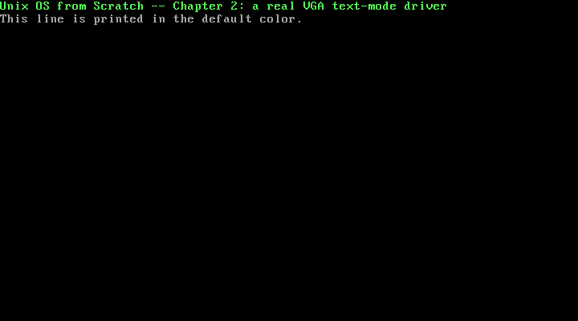

# 2. VGA Text-Mode Output: A Real Screen Driver

**What you will understand:** how to draw text directly onto a real (emulated) monitor with no BIOS and no OS underneath -- the VGA text-mode framebuffer at physical address `0xB8000`, its 2-byte-per-cell layout, and the one piece of VGA hardware that still needs real port I/O even though the screen itself does not: the blinking cursor. You will also see why this chapter's own kernel deliberately never exits, and how a real QEMU monitor session -- connected from outside the running machine -- is used to inspect that machine's memory and take a real screenshot while it is still alive.

**What you need to know first:** Chapter 1's boot chain and `kmain` (this chapter reuses both, unchanged in shape). No new x86 assembly is introduced here; everything new in this chapter is C and one memory-mapped hardware device.

## Why this is a new Part

Chapter 1 was about getting *from* power-on *to* the first line of C this book wrote -- BIOS, GRUB, the Multiboot2 handoff, a stack. None of that is specific to any particular piece of hardware the kernel might later talk to; it is just how any x86 kernel gets to run at all. This chapter is the opposite: booting is done, `kmain` is already running, and the question becomes what a kernel with no operating system underneath it can actually *do*. The answer starts with talking to hardware devices directly, one at a time, and VGA text mode is the first: unlike Chapter 1's COM1 UART, which needed a whole 8250/16550 initialization sequence before it would do anything, the VGA text-mode framebuffer is just memory -- ordinary loads and stores at a fixed physical address draw characters onto the real (emulated) screen.

## The VGA text-mode framebuffer: a screen that is just memory

In text mode, physical address `0xB8000` **is** the screen. The OSDev Wiki states this plainly:

> "In VGA mode 3, the linear text buffer is located in physical at 0xB8000."

(OSDev Wiki, "Text mode": https://wiki.osdev.org/Text_mode)

No paging exists yet in this book's kernel (that is a later chapter), so physical and linear addresses are still the same thing -- `(uint16_t *) 0xB8000` is a pointer this chapter's `002_vga.c` can dereference exactly like any other memory it already owns. The screen is an 80-column by 25-row grid, and each of those 2000 cells is exactly 2 bytes: one character byte and one attribute (colour) byte, packed into a 16-bit value.

The attribute byte's own bit layout is real, spec-shaped hardware, quoted directly from the OSDev Wiki rather than re-derived from guesswork:

```text
Bit  7 6 5 4 3 2 1 0
     | | | | | | | |
     | | | | +-+-+-+-- foreground colour (0-15, but only 0-7 without bit 3)
     | | | +---------- foreground "bright" bit
     +-+-+------------- background colour (0-7)
     +----------------- background bright bit, OR enables blinking text
```

(paraphrased layout; bit positions per OSDev Wiki, "Text mode": https://wiki.osdev.org/Text_mode)

In other words: the low nibble (bits 0-3) is the foreground colour, one of 16 values (colour 0-7 plus a "bright" bit); the next 3 bits (4-6) are the background colour, one of 8 values; bit 7 either brightens the background or enables blinking text, depending on a separate VGA mode register this book does not touch. `002_vga.c`'s own `vga_entry_color` builds exactly this byte:

```c
return (uint8_t) fg | (uint8_t) (bg << 4);
```

-- the foreground occupies the low nibble untouched, and the background is shifted up 4 bits into the high nibble, exactly matching the layout above.

## Byte order: character first, or attribute first?

The one thing the bit-layout citation above does not settle on its own is *which* of the two bytes in a cell -- character or attribute -- sits at the lower memory address. Rather than guess, or trust a possibly-garbled paraphrase, this chapter answers that question the same way this book answers every real hardware question it can: by checking, directly, against a real running machine. The "Verifying it against real hardware" section below does exactly that, with a live QEMU memory dump. The short answer, confirmed there: the character byte is the low byte, the attribute byte is the high byte -- exactly what `002_vga.c`'s own `vga_entry` builds:

```c
return (uint16_t) c | (uint16_t) color << 8;
```

## `002_vga.h`: this book's first header file

Every source file up to this point has been a single, self-contained `.c`/`.asm` file. This chapter introduces this book's first header, because `002_kmain.c` needs to call into the VGA driver without knowing how it works internally:

```c
/* Chapter 2: the VGA text-mode driver's own public interface -- this
 * book's first header file, so kmain.c can call into this driver
 * without redeclaring its enum or function signatures by hand. */
#ifndef UNIX_OS_002_VGA_H
#define UNIX_OS_002_VGA_H

enum vga_color {
    VGA_COLOR_BLACK = 0,
    VGA_COLOR_BLUE = 1,
    VGA_COLOR_GREEN = 2,
    VGA_COLOR_CYAN = 3,
    VGA_COLOR_RED = 4,
    VGA_COLOR_MAGENTA = 5,
    VGA_COLOR_BROWN = 6,
    VGA_COLOR_LIGHT_GREY = 7,
    VGA_COLOR_DARK_GREY = 8,
    VGA_COLOR_LIGHT_BLUE = 9,
    VGA_COLOR_LIGHT_GREEN = 10,
    VGA_COLOR_LIGHT_CYAN = 11,
    VGA_COLOR_LIGHT_RED = 12,
    VGA_COLOR_LIGHT_MAGENTA = 13,
    VGA_COLOR_LIGHT_BROWN = 14,
    VGA_COLOR_WHITE = 15,
};

void vga_init(void);
void vga_set_color(enum vga_color fg, enum vga_color bg);
void vga_putc(char c);
void vga_puts(const char *s);

#endif
```

The 16 named colours are VGA text mode's own real palette -- not an arbitrary choice this book made, but the fixed set of values the attribute byte's 4-bit colour nibbles can actually represent. `vga_init`, `vga_set_color`, `vga_putc`, and `vga_puts` are the driver's entire public surface; everything else in `002_vga.c` (the CRTC ports, the row/column bookkeeping, the scroll logic) stays behind this header, private to the driver.

## `002_vga.c`: the driver itself

```c
/* Chapter 2: a real VGA text-mode driver. Unlike Chapter 1's COM1 UART,
 * this hardware needs no port I/O to draw a character -- physical address
 * 0xB8000 IS the screen, an 80x25 grid of 2-byte cells (a character byte
 * and a colour attribute byte), writable exactly like any other memory
 * this kernel can already reach directly (no paging exists yet, so
 * physical and linear addresses are still the same thing). Moving the
 * blinking hardware cursor is the one part of this driver that still
 * needs real port I/O, through the VGA CRT controller's own index/data
 * port pair. */

#include <stddef.h>
#include <stdint.h>

#include "002_vga.h"

static inline void outb(unsigned short port, unsigned char val) {
    __asm__ volatile ("outb %0, %1" : : "a"(val), "Nd"(port));
}

#define VGA_WIDTH  80
#define VGA_HEIGHT 25
#define VGA_MEMORY ((uint16_t *) 0xB8000)

/* Real, cited CRTC register ports (OSDev Wiki, "Text Mode Cursor"). */
#define VGA_CRTC_INDEX_PORT  0x3D4
#define VGA_CRTC_DATA_PORT   0x3D5
#define VGA_CRTC_CURSOR_HIGH 0x0E
#define VGA_CRTC_CURSOR_LOW  0x0F

/* Real, cited attribute-byte layout (OSDev Wiki, "Text mode"): bits 0-2
 * are the foreground colour, bit 3 is the foreground "bright" bit, bits
 * 4-6 are the background colour, bit 7 enables blink (mode-dependent) --
 * i.e. the full 4-bit background nibble shifted up four bits, OR'd with
 * the full 4-bit foreground nibble. */
static inline uint8_t vga_entry_color(enum vga_color fg, enum vga_color bg) {
    return (uint8_t) fg | (uint8_t) (bg << 4);
}

/* One VGA text-mode cell packed into 16 bits. Whether the character or
 * the colour byte lands at the LOWER of the two memory addresses is
 * exactly what this chapter's own worked example verifies directly
 * against a real QEMU memory dump, rather than assuming it. */
static inline uint16_t vga_entry(unsigned char c, uint8_t color) {
    return (uint16_t) c | (uint16_t) color << 8;
}

static size_t vga_row;
static size_t vga_col;
static uint8_t vga_color_attr;
/* volatile: 0xB8000 is memory-mapped hardware, not ordinary RAM. Without
 * this, an optimizing compiler is free to treat writes to vga_buffer[i]
 * as dead stores whenever a later write to the same index looks
 * redundant from its own point of view (e.g. two vga_init() calls back
 * to back, or a scroll immediately followed by more writes at the same
 * cell) -- perfectly legal for ordinary memory, silently wrong for a
 * framebuffer the screen itself reads from continuously. */
static volatile uint16_t *vga_buffer;

static void vga_set_cursor(size_t x, size_t y) {
    uint16_t pos = (uint16_t) (y * VGA_WIDTH + x);
    outb(VGA_CRTC_INDEX_PORT, VGA_CRTC_CURSOR_LOW);
    outb(VGA_CRTC_DATA_PORT, (uint8_t) (pos & 0xFF));
    outb(VGA_CRTC_INDEX_PORT, VGA_CRTC_CURSOR_HIGH);
    outb(VGA_CRTC_DATA_PORT, (uint8_t) ((pos >> 8) & 0xFF));
}

static void vga_scroll(void) {
    for (size_t y = 1; y < VGA_HEIGHT; y++) {
        for (size_t x = 0; x < VGA_WIDTH; x++) {
            vga_buffer[(y - 1) * VGA_WIDTH + x] = vga_buffer[y * VGA_WIDTH + x];
        }
    }
    for (size_t x = 0; x < VGA_WIDTH; x++) {
        vga_buffer[(VGA_HEIGHT - 1) * VGA_WIDTH + x] = vga_entry(' ', vga_color_attr);
    }
    vga_row = VGA_HEIGHT - 1;
}

void vga_init(void) {
    vga_buffer = VGA_MEMORY;
    vga_color_attr = vga_entry_color(VGA_COLOR_LIGHT_GREY, VGA_COLOR_BLACK);
    for (size_t y = 0; y < VGA_HEIGHT; y++) {
        for (size_t x = 0; x < VGA_WIDTH; x++) {
            vga_buffer[y * VGA_WIDTH + x] = vga_entry(' ', vga_color_attr);
        }
    }
    vga_row = 0;
    vga_col = 0;
    vga_set_cursor(vga_col, vga_row);
}

void vga_set_color(enum vga_color fg, enum vga_color bg) {
    vga_color_attr = vga_entry_color(fg, bg);
}

void vga_putc(char c) {
    if (c == '\n') {
        vga_col = 0;
        vga_row++;
    } else {
        vga_buffer[vga_row * VGA_WIDTH + vga_col] = vga_entry((unsigned char) c, vga_color_attr);
        vga_col++;
        if (vga_col == VGA_WIDTH) {
            vga_col = 0;
            vga_row++;
        }
    }
    if (vga_row == VGA_HEIGHT) {
        vga_scroll();
    }
    vga_set_cursor(vga_col, vga_row);
}

void vga_puts(const char *s) {
    for (; *s; s++) vga_putc(*s);
}
```

A few things worth walking through in order:

**The framebuffer pointer is `volatile`.** `0xB8000` is memory-mapped hardware, not ordinary RAM -- the real monitor (real, emulated) reads from it continuously, on its own schedule, completely outside the CPU's own instruction stream. An optimizing compiler has no way to know that; without `volatile`, it is free to treat a write to `vga_buffer[i]` as a dead store whenever a *later* write to that same index looks redundant from its own point of view -- two `vga_init()` calls back to back, for instance, or a scroll immediately followed by more writes at the same cell. That is a completely legal optimization for ordinary memory and a silently wrong one for a framebuffer, so `vga_buffer` is declared `static volatile uint16_t *`. This exact bug is this chapter's own `[COMMON TRAP]`, below -- caught and fixed before this page was written, not left in as a known issue.

**Moving the cursor still needs real port I/O.** Drawing a character is pure memory access, but the blinking cursor block the user actually sees is a separate piece of VGA hardware, controlled through the CRT Controller's index/data port pair -- and the OSDev Wiki gives both the ports and the register indices directly:

> "Without BIOS access, manipulating the cursor requires sending data directly to the hardware." -- using port `0x3D4` (the index register) and port `0x3D5` (the data register), through registers `0x0F` (cursor location low) and `0x0E` (cursor location high).

(OSDev Wiki, "Text Mode Cursor": https://wiki.osdev.org/Text_Mode_Cursor)

The wiki's own example code moves the cursor with exactly the sequence `vga_set_cursor` uses -- write `0x0F` to the index port, then the low byte of the position to the data port; write `0x0E` to the index port, then the high byte:

```c
void update_cursor(int x, int y)
{
	uint16_t pos = y * VGA_WIDTH + x;

	outb(0x3D4, 0x0F);
	outb(0x3D5, (uint8_t) (pos & 0xFF));
	outb(0x3D4, 0x0E);
	outb(0x3D5, (uint8_t) ((pos >> 8) & 0xFF));
}
```

(OSDev Wiki, "Text Mode Cursor": https://wiki.osdev.org/Text_Mode_Cursor)

**Newlines and wraparound are handled by hand.** There is no terminal driver underneath this code -- `vga_putc` itself decides that `'\n'` resets the column and advances the row, and that reaching column 80 does the same. `vga_scroll` handles the one case neither of those cover: running out of rows. It copies every row up by one (row `y`'s contents move to row `y-1`) and blanks the last row, exactly what a terminal scrolling up one line looks like -- real work this driver does itself, with no OS service to ask for it.

## `002_kmain.c`: two real output devices, one kernel

This chapter's `kmain` keeps Chapter 1's COM1 serial code, unchanged, alongside the new VGA driver:

```c
/* Chapter 2: kmain now drives two real, independent output devices -- the
 * COM1 UART from Chapter 1 (kept so this chapter's own locked output
 * stays exact, capturable text) and the VGA text-mode framebuffer this
 * chapter adds. Unlike Chapter 1, this kmain does not use QEMU's
 * isa-debug-exit device: it deliberately halts forever (falling through
 * to 002_boot.asm's own cli/hlt/jmp .hang loop) so this chapter's own
 * verification -- a real QEMU monitor session, connected from OUTSIDE
 * the machine while it is still running -- has time to examine the VGA
 * framebuffer's actual memory contents before the monitor's own "quit"
 * command ends the machine itself. */

#include "002_vga.h"

static inline void outb(unsigned short port, unsigned char val) {
    __asm__ volatile ("outb %0, %1" : : "a"(val), "Nd"(port));
}

static inline unsigned char inb(unsigned short port) {
    unsigned char ret;
    __asm__ volatile ("inb %1, %0" : "=a"(ret) : "Nd"(port));
    return ret;
}

#define COM1 0x3F8

static void serial_init(void) {
    outb(COM1 + 1, 0x00);
    outb(COM1 + 3, 0x80);
    outb(COM1 + 0, 0x03);
    outb(COM1 + 1, 0x00);
    outb(COM1 + 3, 0x03);
    outb(COM1 + 2, 0xC7);
    outb(COM1 + 4, 0x0B);
}

static int serial_transmit_empty(void) {
    return inb(COM1 + 5) & 0x20;
}

static void serial_putc(char c) {
    while (!serial_transmit_empty()) { }
    outb(COM1, (unsigned char)c);
}

static void serial_puts(const char *s) {
    for (; *s; s++) serial_putc(*s);
}

void kmain(void) {
    serial_init();
    serial_puts("Unix OS from Scratch -- Chapter 2: kernel entry reached\n");

    vga_init();
    vga_set_color(VGA_COLOR_LIGHT_GREEN, VGA_COLOR_BLACK);
    vga_puts("Unix OS from Scratch -- Chapter 2: a real VGA text-mode driver\n");
    vga_set_color(VGA_COLOR_LIGHT_GREY, VGA_COLOR_BLACK);
    vga_puts("This line is printed in the default color.\n");

    serial_puts("VGA driver ran; halting now for external memory inspection\n");
}
```

Two things are different from Chapter 1's `kmain`, both deliberate. First, the serial code is duplicated here rather than shared through a header -- Chapter 1's `kmain` and this chapter's `kmain` are two different translation units, and this book has not yet introduced a shared low-level utilities header; that refactor is left for whenever this book actually needs `serial_puts` from more than one place at once, rather than done speculatively now. Second, and more importantly: this `kmain` never calls `qemu_exit`. Chapter 1 called it deliberately, so its own locked output would end the instant the kernel finished. This chapter's real evidence is not a stream of text -- it is the *state of the screen* -- and that state has to still exist, in a still-running machine, for something outside the kernel to look at it. So `kmain` simply returns, falling through to `002_boot.asm`'s own `cli`/`hlt`/`jmp .hang` loop (unchanged from Chapter 1), and the machine halts forever, giving a QEMU monitor session connected from outside as much time as it needs to inspect memory and take a screenshot before anything shuts it down.

## Building it, for real

```bash
nasm -f elf32 002_boot.asm -o boot.o
gcc -m32 -ffreestanding -fno-stack-protector -fno-pic -Wall -Wextra -c 002_vga.c -o vga.o
gcc -m32 -ffreestanding -fno-stack-protector -fno-pic -Wall -Wextra -c 002_kmain.c -o kmain.o
ld -m elf_i386 -T 002_linker.ld -o kernel.bin boot.o vga.o kmain.o
grub-file --is-x86-multiboot2 kernel.bin
```

**Output (cloud sandbox -- real, live-executed build output):**

```text
=== nasm -f elf32 002_boot.asm -o boot.o ===
(no output = clean assemble)

=== gcc -m32 -ffreestanding -fno-stack-protector -fno-pic -Wall -Wextra -c 002_vga.c -o vga.o ===
(no output = clean compile, zero warnings)

=== gcc -m32 -ffreestanding -fno-stack-protector -fno-pic -Wall -Wextra -c 002_kmain.c -o kmain.o ===
(no output = clean compile, zero warnings)

=== ld -m elf_i386 -T 002_linker.ld -o kernel.bin boot.o vga.o kmain.o ===
ld: warning: boot.o: missing .note.GNU-stack section implies executable stack
ld: NOTE: This behaviour is deprecated and will be removed in a future version of the linker
ld: warning: kernel.bin has a LOAD segment with RWX permissions

=== grub-file --is-x86-multiboot2 kernel.bin ===
kernel.bin: VALID Multiboot2 image
```

The same two `ld` warnings from Chapter 1 -- `missing .note.GNU-stack section implies executable stack` and `kernel.bin has a LOAD segment with RWX permissions` -- appear again here, unchanged in cause: this kernel still has no paging, so there is still no MMU-enforced permission system for those ELF-level flags to actually control. Chapter 1's own `[COMMON TRAP]` already covers why that is correct and not yet fixable; it is not repeated in full here.

**[COMMON TRAP]** The `002_vga.c` shown above already has its `volatile` fix applied -- but it was not written that way the first time. The first version of this driver declared `vga_buffer` as a plain `static uint16_t *vga_buffer;`, which compiled cleanly, produced zero warnings even with `-Wall -Wextra`, and *booted correctly* in this exact QEMU build, at this exact optimization level (no `-O` flag is passed anywhere in the compile lines above, which means no optimization). That is precisely what makes this bug dangerous rather than obviously broken: a missing `volatile` on a memory-mapped I/O pointer is a *license* for the compiler to reorder or eliminate writes, not a guarantee that it will -- at `-O0`, GCC has little reason to exercise that license, so the bug stayed completely silent through every build and boot this chapter ran before it was caught. It was found and fixed by inspection, not by a crash or a wrong screenshot, and this page's own locked evidence below is the *post-fix* rebuild, re-verified for real rather than assumed unchanged.

## Packing and booting it, for real

```text
set timeout=0
set default=0

menuentry "Unix OS from Scratch -- Chapter 2" {
    multiboot2 /boot/kernel.bin
    boot
}
```

```bash
mkdir -p isodir/boot/grub
cp kernel.bin isodir/boot/kernel.bin
cp grub.cfg isodir/boot/grub/grub.cfg
grub-mkrescue -o kernel.iso isodir
qemu-system-x86_64 -cdrom kernel.iso -serial file:serial_out.log -display none -no-reboot \
    -monitor unix:/tmp/qemu_monitor.sock,server,nowait &
```

This chapter's `qemu-system-x86_64` invocation is deliberately different from Chapter 1's: no `-serial stdio` (the serial log is redirected to a file instead, since nothing needs to watch it live), no `isa-debug-exit` device (this kernel never asks to exit), and a new flag -- `-monitor unix:...,server,nowait` -- that opens QEMU's own control interface, the **monitor**, as a Unix domain socket a separate process can connect to while the machine is running.

## Verifying it against real hardware: a live QEMU monitor session

With the kernel halted (by design) inside a still-running QEMU process, a second process connects to that monitor socket and issues real monitor commands -- not simulated, not a fixture, an actual control-plane connection into an actual running (emulated) machine:

- `xp /64xb 0xb8000` -- **examine physical memory**: dump 64 bytes, as hex bytes, starting at physical address `0xB8000`, the exact address this chapter's own `002_vga.c` writes to.
- `screendump <path>` -- capture the actual VGA output as a real image file (QEMU renders its own framebuffer to a `.ppm`, the same pixels a real monitor would show).
- `quit` -- shut the machine down cleanly once both are captured.

**Output (cloud sandbox -- real, live-executed QEMU monitor session, QEMU 8.2.2):**

```text
(qemu)
=== xp /64xb 0xb8000 ===
00000000000b8000: 0x55 0x0a 0x6e 0x0a 0x69 0x0a 0x78 0x0a
00000000000b8008: 0x20 0x0a 0x4f 0x0a 0x53 0x0a 0x20 0x0a
00000000000b8010: 0x66 0x0a 0x72 0x0a 0x6f 0x0a 0x6d 0x0a
00000000000b8018: 0x20 0x0a 0x53 0x0a 0x63 0x0a 0x72 0x0a
00000000000b8020: 0x61 0x0a 0x74 0x0a 0x63 0x0a 0x68 0x0a
00000000000b8028: 0x20 0x0a 0x2d 0x0a 0x2d 0x0a 0x20 0x0a
00000000000b8030: 0x43 0x0a 0x68 0x0a 0x61 0x0a 0x70 0x0a
00000000000b8038: 0x74 0x0a 0x65 0x0a 0x72 0x0a 0x20 0x0a
(qemu)
=== screendump /tmp/unix_os_ch2/locked/002_vga_screendump.ppm ===
(qemu)
=== quit ===
```

That hex dump is this chapter's own real evidence for the byte-order question raised earlier. Decoding it programmatically -- taking every even-indexed byte as a character and every odd-indexed byte as an attribute -- produces:

```text
decoded characters : "Unix OS from Scratch -- Chapter "
decoded attributes  : 0x0a, every single byte
```

`"Unix OS from Scratch -- Chapter "` is an exact, unbroken match for the start of this chapter's own `vga_puts("Unix OS from Scratch -- Chapter 2: a real VGA text-mode driver\n")` call -- confirming the character byte sits at the **lower** address of each cell, not the attribute byte. And `0x0a` is exactly `vga_entry_color(VGA_COLOR_LIGHT_GREEN, VGA_COLOR_BLACK)`: `VGA_COLOR_LIGHT_GREEN` is `10` (`0xA`) in this book's own `002_vga.h` enum, `VGA_COLOR_BLACK` is `0`, and `vga_entry_color` returns `fg | (bg << 4)` -- `0xA | (0x0 << 4) = 0x0A`. Both the byte order this chapter assumed and the specific colour this chapter's own `kmain` asked for are now confirmed against a real running machine, not merely asserted.

The `screendump` command's own output is a real Netpbm (`.ppm`) image of the actual VGA framebuffer, converted here to PNG for this page:



Light green for the first line and light grey for the second are exactly what `002_kmain.c` asked for (`vga_set_color(VGA_COLOR_LIGHT_GREEN, VGA_COLOR_BLACK)`, then `vga_set_color(VGA_COLOR_LIGHT_GREY, VGA_COLOR_BLACK)`), on a screen this chapter's own kernel drew with no BIOS text routines, no OS, and no library involved -- 2000 sixteen-bit writes to a fixed physical address, and one small sequence of `outb`s to place the cursor.

## Chapter summary

VGA text mode turns drawing to the screen into ordinary memory writes: physical address `0xB8000` is an 80x25 grid of 2-byte cells, one character byte and one attribute byte per cell, with the attribute byte's bit layout (foreground colour, a bright bit, background colour, a blink/bright-background bit) confirmed directly from the OSDev Wiki. This chapter's own worked example settled the one question the citation alone could not -- which byte comes first in memory -- empirically, against a real QEMU memory dump, rather than by assumption. Moving the cursor is the one part of this driver that still needs real port I/O, through the VGA CRT Controller's index/data port pair (`0x3D4`/`0x3D5`), confirmed against the OSDev Wiki's own example code. This chapter also introduced this book's first header file, its first genuinely new verification technique (a live QEMU monitor session, connected from outside a still-running machine, used to examine memory and capture a real screenshot), and its first embedded image -- and caught a real, honestly-reported `volatile` bug before publishing this page, rather than after.

## Self-check questions

1. Why does moving text onto the screen in VGA text mode require no port I/O at all, while moving the *cursor* still does?
2. What does the attribute byte's bit layout actually encode, and which part of it does `vga_entry_color` build with a plain bitwise OR versus a left shift?
3. This chapter needed a real QEMU memory dump to answer a question the OSDev Wiki citation alone did not settle. What was that question, and what did the dump prove?
4. Why does this chapter's `kmain` never call `qemu_exit`, unlike Chapter 1's?
5. The missing-`volatile` bug in this chapter's first draft of `002_vga.c` produced zero compiler warnings and booted correctly. Why didn't it show up immediately, and why is that exactly what makes it dangerous?

**Worked answers**

1. In VGA mode 3, the text buffer at `0xB8000` is memory-mapped -- writing a character-and-attribute pair to the right offset is an ordinary store instruction, and the VGA hardware itself is responsible for reading that memory and rendering it to the screen continuously. The blinking cursor, though, is a separate piece of hardware state inside the CRT Controller, not a pixel this driver draws -- there is no memory address that means "the cursor is here," so moving it has to go through the CRTC's own index/data port pair (`0x3D4`/`0x3D5`) instead.
2. The attribute byte packs two 4-bit colour values and one extra bit: bits 0-3 are the foreground colour, bits 4-6 are the background colour, and bit 7 either brightens the background or enables blinking text. `vga_entry_color` builds the foreground with a plain OR (`(uint8_t) fg`, already in the low nibble) and the background with a left shift (`(uint8_t) (bg << 4)`, moved into the high nibble) before OR-ing the two together.
3. The citation's bit-layout diagram says what each bit inside the attribute byte means, but not which of the *two bytes* in a 16-bit cell -- character or attribute -- sits at the lower memory address. The live `xp /64xb 0xb8000` dump, decoded programmatically, showed the even-indexed bytes spelling out `"Unix OS from Scratch -- Chapter "` and the odd-indexed bytes all reading `0x0a` -- proving the character byte is the low byte and the attribute byte is the high byte, exactly matching `vga_entry`'s own `c | (color << 8)`.
4. Chapter 1's evidence was a finite stream of serial text, so calling `qemu_exit` to end the process the instant that text was fully written made the run deterministic and easy to capture. This chapter's evidence is the *state of the screen*, which has to still exist in a still-running machine for an external QEMU monitor session to examine it -- so `kmain` falls through to `002_boot.asm`'s halt loop instead, keeping the machine alive (but idle) until the monitor session's own `quit` command ends it.
5. A missing `volatile` on a memory-mapped pointer does not itself corrupt anything -- it only permits the compiler to reorder or drop writes it believes are redundant, and whether the compiler actually does that depends on its own optimization level and the exact code shape around each write. With no `-O` flag passed anywhere in this chapter's compile lines (equivalent to `-O0`), GCC had little incentive to eliminate anything, so the bug produced correct output on every build and boot this chapter ran. That silence is exactly the danger: a`-O2` rebuild, or a future chapter's differently-shaped VGA code, could trigger the same license to reorder or drop writes with no warning at all -- which is why this chapter fixes it on sight rather than leaving it as a "works for now" known issue.
