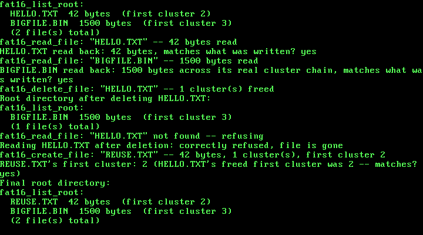

# 20. A Real Filesystem: FAT16, Files Addressed by Name Instead of by Raw LBA

**What you will understand:** how a real, standards-compliant FAT16 volume is actually laid out on disk -- the boot sector/BIOS Parameter Block, the two mirrored File Allocation Tables, the flat root directory, and the data region beyond it -- entirely from OSDev Wiki's own "FAT" page, field-for-field; why a disk needs a genuine minimum number of usable clusters before the standard convention even calls it "FAT16" rather than "FAT12," and why that forced this chapter to build its demo on a larger disk image than Chapter 19's own; how a file's bytes are actually split across a chain of clusters linked together entirely inside the FAT itself, one 16-bit entry per cluster, with no chain-length field anywhere in the directory entry; and how to build `fat16_create_file()`/`fat16_read_file()`/`fat16_delete_file()`/`fat16_list_root()` entirely on top of Chapter 19's own raw `ata_read_sector()`/`ata_write_sector()`, so that a byte range can finally be addressed by an ordinary 8.3 name instead of a raw LBA this kernel had to already know.

**What you need to know first:** Chapter 19's own real PIO-mode ATA driver (`020_ata.h`/`020_ata.c`, carried forward into this chapter unmodified), the only thing this chapter's own filesystem code ever calls to touch the disk; this book's long-standing freestanding convention of never linking a C library, so every byte comparison and copy below is an ordinary hand-rolled loop, the same convention Chapter 18's own `elf_load()` already established.

## Nineteen chapters of raw sectors, and what a filesystem actually adds

Chapter 19 gave this kernel a real disk driver: `ata_read_sector()`/`ata_write_sector()` could already read or write any real 512-byte sector on the attached disk, durably, past QEMU's own exit. But nothing about that driver knew what a "file" was, or which sectors belonged to which one -- every earlier demo addressed the disk by a raw LBA this kernel's own source code had to already know ahead of time (`DISK_TEST_LBA 100u`). A filesystem is exactly the layer that closes that gap: a real, on-disk data structure that lets a byte range be found by an ordinary name instead.

This chapter builds FAT16, cited field-for-field from OSDev Wiki's own "FAT" page (https://wiki.osdev.org/FAT) -- not the newer FAT32, and not a hand-invented layout of this book's own devising. FAT16 was chosen because its own on-disk structures are compact enough to implement completely in one chapter while still being a real, mountable format any other real operating system's own FAT16 driver would recognize: the same boot sector fields, the same directory entry layout, the same 0xFFF8-and-above end-of-chain convention a real Linux or Windows FAT16 driver expects.

One consequence of building something standards-compliant, rather than merely functional, showed up immediately in this chapter's own disk geometry. Real FAT16 implementations conventionally distinguish FAT12 from FAT16 by the volume's own total usable cluster count: fewer than 4085 usable clusters and a real driver calls it FAT12; 4085 or more (up to 65524) and it calls it FAT16. Chapter 19's own disk image was a deliberately tiny 1 MiB (2048 sectors) -- more than enough for a raw-sector demo, but nowhere near enough to reach 4085 usable clusters at any real cluster size. This chapter's own disk is 8 MiB (16384 sectors) instead, specifically so the volume this chapter builds is genuinely, unambiguously FAT16 by that same real convention, not merely FAT16 because this chapter's own code says so.

This chapter's own stated scope, decided before a line of `020_fat16.c` was written: read and write real files by name, in one flat root directory, with no subdirectories at all. `fat16_create_file()`/`fat16_read_file()`/`fat16_delete_file()`/`fat16_list_root()` give this kernel real files; there is no `fat16_mkdir()`, and no path separator appears anywhere in this file. Real subdirectories are a later chapter's own work -- the same kind of explicit, stated boundary this book drew for Chapter 19's own raw-sector-only scope one chapter earlier.

## `020_fat16.h`/`020_fat16.c`: a real FAT16 filesystem

Every field offset, formula, and special value below is cited field-for-field from OSDev Wiki's own "FAT" page (https://wiki.osdev.org/FAT), not guessed or remembered:

```c
#ifndef UNIX_OS_020_FAT16_H
#define UNIX_OS_020_FAT16_H

#include <stdint.h>

/* This chapter's own real filesystem: a genuine FAT16 volume, cited
 * field-for-field from OSDev Wiki ("FAT": https://wiki.osdev.org/FAT),
 * built entirely on top of Chapter 19's own real ata_read_sector()/
 * ata_write_sector() -- this driver never touches an I/O port
 * directly, only ever real 512-byte sectors. Deliberately scoped to
 * one flat root directory: fat16_create_file()/fat16_read_file()/
 * fat16_delete_file()/fat16_list_root() give this kernel real files
 * addressed by an ordinary 8.3 name, but there is no fat16_mkdir()
 * and no path separator anywhere in this file -- real subdirectories
 * are a later chapter's own work, the same kind of stated scope limit
 * this book has drawn before (Chapter 19's own raw-sector-only scope,
 * one chapter earlier). */

/* Every real filename this API accepts or returns is a plain,
 * NUL-terminated "NAME.EXT" (or "NAME" with no extension) string of
 * at most 8 name characters and 3 extension characters -- an ordinary
 * 8.3 name, never a full VFAT long filename. A name that does not fit
 * is silently truncated by this chapter's own to_83_name() (020_fat16.c),
 * an honest, stated limit: this chapter's own real demo only ever
 * uses names chosen to fit. */

/* Builds a genuinely fresh FAT16 volume on the whole disk this
 * kernel's Chapter 19 driver talks to: a real boot sector/BIOS
 * Parameter Block, two mirrored File Allocation Tables, and an empty
 * root directory, all written via real ata_write_sector() calls.
 * Destroys any data on the disk already -- this chapter's own demo
 * always formats before using the volume. Returns 1 on success. */
int fat16_format(void);

/* Reads and validates the real on-disk boot sector, and computes
 * every geometry value this file's other functions need (first FAT
 * sector, first root-directory sector, first data sector, sectors per
 * FAT, total usable clusters) directly from it -- never hardcoded a
 * second time, so a genuinely differently-formatted volume would
 * still be read correctly. Must be called once, after fat16_format()
 * (or after finding an already-formatted volume), before any other
 * function below. Returns 1 if a valid FAT16 boot signature (0xAA55)
 * was found, 0 otherwise. */
int fat16_init(void);

/* Creates a new real file in the root directory: allocates however
 * many whole clusters `size` real bytes need, chains them together in
 * both real FAT copies, writes `size` real bytes across them (the
 * last, partial cluster is zero-padded), and writes a real 32-byte
 * directory entry naming the file, its size, and its first cluster.
 * Refuses -- returns 0, writes nothing -- if a file with this name
 * already exists, if the root directory has no free entry left, or if
 * the volume has no free clusters left; never overwrites or guesses.
 * If `out_first_cluster` is non-null, the file's real first cluster
 * number is written there on success, purely so this chapter's own
 * demo can later prove a deleted file's cluster gets reused. */
int fat16_create_file(const char *name, const uint8_t *data, uint32_t size,
                       uint16_t *out_first_cluster);

/* Reads an existing file's real contents into `buffer`. Refuses --
 * returns 0 -- if no file with this name exists in the root directory,
 * or if `buffer_size` is smaller than the file's own real size (this
 * function never truncates). On success, copies exactly the file's
 * real size in bytes, walking its real cluster chain one real sector
 * at a time, and writes that size to `out_size` if non-null. */
int fat16_read_file(const char *name, uint8_t *buffer, uint32_t buffer_size,
                     uint32_t *out_size);

/* Deletes an existing file: marks its real directory entry as free
 * (the cited 0xE5 "unused entry" marker) and frees every real cluster
 * in its chain back to both FAT copies (each entry set back to the
 * cited 0x0000 free value), making them available to a future
 * fat16_create_file() call again. Returns 1 if a matching file was
 * found and deleted, 0 if no file with this name exists. */
int fat16_delete_file(const char *name);

/* Prints every real, currently-occupied entry in the root directory --
 * name (converted back from the on-disk 8.3 form to an ordinary
 * "NAME.EXT" string) and real file size -- skipping every entry this
 * chapter's own format/deletion convention marks as free (0x00 end-
 * of-directory or 0xE5 deleted). Returns the real count printed. */
uint32_t fat16_list_root(void);

#endif
```

`020_fat16.c` builds a real boot sector matching that cited layout exactly, reads it back with no field hardcoded a second time, and walks real cluster chains one linked FAT entry at a time:

```c
/* This chapter's own real filesystem, built entirely on top of
 * Chapter 19's own real ata_read_sector()/ata_write_sector() -- every
 * structure below is read and written as ordinary 512-byte sectors,
 * never as a direct port I/O call. Every field layout, formula, and
 * special value is cited field-for-field from OSDev Wiki's own "FAT"
 * page (https://wiki.osdev.org/FAT). */

#include <stdint.h>

#include "020_ata.h"
#include "020_fat16.h"
#include "020_printf.h"

/* This chapter's own disk geometry, chosen deliberately: 8 MiB (16384
 * real 512-byte sectors) rather than Chapter 19's own 1 MiB -- a real
 * FAT16 volume needs at least 4085 usable clusters before the
 * standard cluster-count convention most real implementations use to
 * tell FAT12/FAT16/FAT32 apart would even call it "FAT16" rather than
 * "FAT12," and Chapter 19's own smaller disk could never reach that
 * with any genuinely usable cluster size. One sector per cluster
 * keeps every cluster the same size as one real ata_read_sector()/
 * ata_write_sector() call -- no extra loop needed inside this file to
 * read or write a whole cluster. */
#define FAT16_BYTES_PER_SECTOR    512u
#define FAT16_SECTORS_PER_CLUSTER 1u
#define FAT16_RESERVED_SECTORS    1u
#define FAT16_FAT_COUNT           2u
#define FAT16_ROOT_ENTRY_COUNT    512u
#define FAT16_SECTORS_PER_FAT     64u
#define FAT16_TOTAL_SECTORS       16384u

/* "The size of the root directory ... root_dir_sectors = ((fat_boot->
 * root_entry_count * 32) + (fat_boot->bytes_per_sector - 1)) /
 * fat_boot->bytes_per_sector;" (OSDev Wiki, "FAT") -- 512 entries * 32
 * bytes each = 16384 bytes = exactly 32 whole 512-byte sectors, no
 * rounding needed for this chapter's own chosen root_entry_count. */
#define FAT16_ROOT_DIR_SECTORS \
    (((FAT16_ROOT_ENTRY_COUNT * 32u) + (FAT16_BYTES_PER_SECTOR - 1u)) / FAT16_BYTES_PER_SECTOR)

#define FAT16_ENTRIES_PER_SECTOR (FAT16_BYTES_PER_SECTOR / 32u)  /* 16 */

/* FAT16 special cluster values, cited the same way: "Free cluster:
 * Index 0", "End-of-chain: >= 0xFFF8", "Bad cluster: == 0xFFF7". This
 * chapter's own fat16_format() always writes the cited end-of-chain
 * marker 0xFFFF specifically, never merely "some value >= 0xFFF8". */
#define FAT16_CLUSTER_FREE     0x0000u
#define FAT16_CLUSTER_END      0xFFFFu
#define FAT16_CLUSTER_END_MIN  0xFFF8u
#define FAT16_CLUSTER_BAD      0xFFF7u

/* Directory-entry byte-0 special values, cited the same way: "If the
 * first byte of the entry is equal to 0 then there are no more
 * files/directories in this directory" and "If the first byte of the
 * entry is equal to 0xE5 then the entry is unused." */
#define FAT16_DIRENT_END       0x00u
#define FAT16_DIRENT_DELETED   0xE5u

#define FAT16_ATTR_ARCHIVE     0x20u

/* This chapter's own real 512-byte Boot Sector/BIOS Parameter Block,
 * quoted field-for-field from OSDev Wiki's own cited offset table --
 * every field below sits at exactly the byte offset the cited table
 * gives it, verified by this struct's own total size coming out to
 * exactly 512 bytes with no manual padding anywhere. */
struct fat16_boot_sector {
    uint8_t  jump[3];              /* offset 0: "JMP SHORT 3C NOP" */
    uint8_t  oem_identifier[8];    /* offset 3 */
    uint16_t bytes_per_sector;     /* offset 11 */
    uint8_t  sectors_per_cluster;  /* offset 13 */
    uint16_t reserved_sector_count;/* offset 14 */
    uint8_t  table_count;          /* offset 16: "Often this value is 2" */
    uint16_t root_entry_count;     /* offset 17 */
    uint16_t total_sectors_16;     /* offset 19 */
    uint8_t  media_descriptor;     /* offset 21 */
    uint16_t sectors_per_fat;      /* offset 22: "FAT12/FAT16 only" */
    uint16_t sectors_per_track;    /* offset 24 */
    uint16_t head_count;           /* offset 26 */
    uint32_t hidden_sector_count;  /* offset 28 */
    uint32_t total_sectors_32;     /* offset 32 */
    /* FAT16 Extended Boot Record, offset 36 */
    uint8_t  drive_number;         /* offset 36 */
    uint8_t  nt_flags;             /* offset 37 */
    uint8_t  signature;            /* offset 38: "must be 0x28 or 0x29" */
    uint32_t volume_id;            /* offset 39 */
    uint8_t  volume_label[11];     /* offset 43, "padded with spaces" */
    uint8_t  system_identifier[8]; /* offset 54 */
    uint8_t  boot_code[448];       /* offset 62 */
    uint16_t boot_signature;       /* offset 510: "0xAA55" */
} __attribute__((packed));

/* This chapter's own real 32-byte directory entry, quoted the same
 * way (OSDev Wiki, "FAT"). Every field this chapter's own code
 * actually uses (name, attributes, cluster, size) is kept meaningful;
 * every timestamp field is kept for real on-disk layout fidelity but
 * always written as 0 -- this chapter's own filesystem deliberately
 * does not track creation/modification times, a stated scope limit,
 * not an oversight. */
struct fat16_dir_entry {
    uint8_t  name[11];               /* offset 0: "8.3 file name" */
    uint8_t  attributes;             /* offset 11 */
    uint8_t  nt_reserved;            /* offset 12 */
    uint8_t  creation_time_ds;       /* offset 13 */
    uint16_t creation_time;          /* offset 14 */
    uint16_t creation_date;          /* offset 16 */
    uint16_t access_date;            /* offset 18 */
    uint16_t high_cluster_bits;      /* offset 20: "always zero" for FAT16 */
    uint16_t modification_time;      /* offset 22 */
    uint16_t modification_date;      /* offset 24 */
    uint16_t low_cluster_bits;       /* offset 26 */
    uint32_t file_size;              /* offset 28 */
} __attribute__((packed));

/* This chapter's own real, computed-once geometry -- every value here
 * is read straight out of the real on-disk boot sector by fat16_init(),
 * never hardcoded a second time by any function below it. */
static uint32_t g_first_fat_sector = 0;
static uint32_t g_first_root_dir_sector = 0;
static uint32_t g_first_data_sector = 0;
static uint32_t g_sectors_per_fat = 0;
static uint32_t g_sectors_per_cluster = 0;
static uint32_t g_root_dir_sectors = 0;
static uint32_t g_total_data_clusters = 0;
static int g_ready = 0;

static uint8_t to_upper(uint8_t c) {
    if (c >= 'a' && c <= 'z') {
        return (uint8_t) (c - 'a' + 'A');
    }
    return c;
}

/* This chapter's own hand-rolled equivalents of libc's memcmp()/
 * strlen() -- this book has never linked a C library, freestanding
 * since Chapter 1, so every byte comparison and copy in this file is
 * an ordinary loop, the same convention Chapter 18's own elf_load()
 * already established for copying ELF segment bytes. */
static int bytes_equal(const uint8_t *a, const uint8_t *b, uint32_t n) {
    for (uint32_t i = 0; i < n; i++) {
        if (a[i] != b[i]) {
            return 0;
        }
    }
    return 1;
}

static uint32_t string_length(const char *s) {
    uint32_t n = 0;
    while (s[n] != '\0') {
        n++;
    }
    return n;
}

/* Converts an ordinary "NAME.EXT" (or extension-less "NAME") C string
 * into the real on-disk 11-byte 8.3 form -- upper-cased, space-padded,
 * name and extension each right up to (never past) 8 and 3 characters
 * (OSDev Wiki, "FAT": "The first 8 characters are the name and the
 * last 3 are the extension"). A name or extension longer than that is
 * silently truncated -- an honest, stated limit; this chapter's own
 * real demo only ever uses names chosen to fit. */
static void to_83_name(const char *input, uint8_t out[11]) {
    for (int i = 0; i < 11; i++) {
        out[i] = ' ';
    }

    uint32_t len = string_length(input);
    uint32_t dot = len;
    for (uint32_t i = 0; i < len; i++) {
        if (input[i] == '.') {
            dot = i;
            break;
        }
    }

    uint32_t name_len = dot;
    if (name_len > 8u) {
        name_len = 8u;
    }
    for (uint32_t i = 0; i < name_len; i++) {
        out[i] = to_upper((uint8_t) input[i]);
    }

    if (dot < len) {
        uint32_t ext_start = dot + 1u;
        uint32_t ext_len = len - ext_start;
        if (ext_len > 3u) {
            ext_len = 3u;
        }
        for (uint32_t i = 0; i < ext_len; i++) {
            out[8 + i] = to_upper((uint8_t) input[ext_start + i]);
        }
    }
}

/* The inverse of to_83_name(), for fat16_list_root(): trims the
 * space-padding back off the name and extension and re-inserts the
 * '.' only when a real extension is present. */
static void from_83_name(const uint8_t name[11], char *out) {
    uint32_t pos = 0;
    for (uint32_t i = 0; i < 8u && name[i] != ' '; i++) {
        out[pos++] = (char) name[i];
    }
    if (name[8] != ' ') {
        out[pos++] = '.';
        for (uint32_t i = 8u; i < 11u && name[i] != ' '; i++) {
            out[pos++] = (char) name[i];
        }
    }
    out[pos] = '\0';
}

static uint32_t cluster_to_lba(uint16_t cluster) {
    /* "first_sector_of_cluster = ((cluster - 2) * fat_boot->
     * sectors_per_cluster) + first_data_sector;" (OSDev Wiki, "FAT"). */
    return g_first_data_sector + ((uint32_t) (cluster - 2u) * g_sectors_per_cluster);
}

/* "unsigned int fat_offset = active_cluster * 2; unsigned int
 * fat_sector = first_fat_sector + (fat_offset / sector_size);
 * unsigned int ent_offset = fat_offset % sector_size;" (OSDev Wiki,
 * "FAT") -- this chapter's own real FAT16 entry lookup, quoted
 * directly, reading only the FIRST FAT copy (the second is written in
 * lock-step by fat_write_entry() below purely for real on-disk
 * redundancy, never read back by this file itself). */
static uint16_t fat_read_entry(uint16_t cluster) {
    uint32_t fat_offset = (uint32_t) cluster * 2u;
    uint32_t fat_sector = g_first_fat_sector + (fat_offset / FAT16_BYTES_PER_SECTOR);
    uint32_t ent_offset = fat_offset % FAT16_BYTES_PER_SECTOR;

    uint8_t buf[FAT16_BYTES_PER_SECTOR];
    ata_read_sector(fat_sector, buf);

    uint16_t *table = (uint16_t *) buf;
    return table[ent_offset / 2u];
}

/* Writes one real FAT16 entry to BOTH real mirrored FAT copies (this
 * chapter's own FAT16 volume always has exactly FAT16_FAT_COUNT = 2),
 * a real read-modify-write per copy so every other byte in that
 * sector is preserved untouched. */
static void fat_write_entry(uint16_t cluster, uint16_t value) {
    uint32_t fat_offset = (uint32_t) cluster * 2u;
    uint32_t ent_offset = fat_offset % FAT16_BYTES_PER_SECTOR;
    uint32_t sector_within_fat = fat_offset / FAT16_BYTES_PER_SECTOR;

    for (uint32_t copy = 0; copy < FAT16_FAT_COUNT; copy++) {
        uint32_t fat_sector = g_first_fat_sector + copy * g_sectors_per_fat + sector_within_fat;

        uint8_t buf[FAT16_BYTES_PER_SECTOR];
        ata_read_sector(fat_sector, buf);

        uint16_t *table = (uint16_t *) buf;
        table[ent_offset / 2u] = value;

        ata_write_sector(fat_sector, buf);
    }
}

/* Scans forward from cluster 2 (cluster 0 and 1 are always reserved --
 * see fat16_format()) for the first real cluster whose FAT entry reads
 * back as FAT16_CLUSTER_FREE. Returns 0 (never a valid data cluster
 * number) if the whole volume is full. */
static uint16_t find_free_cluster(void) {
    for (uint32_t c = 2; c < 2u + g_total_data_clusters; c++) {
        if (fat_read_entry((uint16_t) c) == FAT16_CLUSTER_FREE) {
            return (uint16_t) c;
        }
    }
    return 0;
}

int fat16_format(void) {
    struct fat16_boot_sector boot;
    uint8_t *raw = (uint8_t *) &boot;
    for (uint32_t i = 0; i < sizeof(boot); i++) {
        raw[i] = 0;
    }

    boot.jump[0] = 0xEBu;
    boot.jump[1] = 0x3Cu;
    boot.jump[2] = 0x90u;

    const char *oem = "UNIXOS20";
    for (int i = 0; i < 8; i++) {
        boot.oem_identifier[i] = (uint8_t) oem[i];
    }

    boot.bytes_per_sector = FAT16_BYTES_PER_SECTOR;
    boot.sectors_per_cluster = FAT16_SECTORS_PER_CLUSTER;
    boot.reserved_sector_count = FAT16_RESERVED_SECTORS;
    boot.table_count = FAT16_FAT_COUNT;
    boot.root_entry_count = FAT16_ROOT_ENTRY_COUNT;
    boot.total_sectors_16 = (uint16_t) FAT16_TOTAL_SECTORS;  /* fits in 16 bits */
    boot.media_descriptor = 0xF8u;  /* fixed disk */
    boot.sectors_per_fat = FAT16_SECTORS_PER_FAT;
    boot.sectors_per_track = 0;     /* unused by this driver -- kept for
                                      * real BPB layout fidelity only */
    boot.head_count = 0;            /* unused by this driver */
    boot.hidden_sector_count = 0;   /* this whole disk is one volume,
                                      * no partition table in front of it */
    boot.total_sectors_32 = 0;      /* total_sectors_16 already covers
                                      * this chapter's own volume size */

    boot.drive_number = 0x80u;      /* "0x80 for hard disks" */
    boot.nt_flags = 0;
    boot.signature = 0x29u;

    boot.volume_id = 0x00000001u;

    const char *label = "UNIXOSFAT16";
    for (int i = 0; i < 11; i++) {
        boot.volume_label[i] = (uint8_t) label[i];
    }

    const char *sysid = "FAT16   ";
    for (int i = 0; i < 8; i++) {
        boot.system_identifier[i] = (uint8_t) sysid[i];
    }
    /* boot_code[448] stays zeroed -- this disk is a real second, data-
     * only drive, never booted from, so there is no real bootstrap
     * code for this field to hold. */

    boot.boot_signature = 0xAA55u;

    kprintf("fat16_format: writing real boot sector/BPB to LBA 0...\n");
    ata_write_sector(0, raw);

    uint32_t first_fat_sector = FAT16_RESERVED_SECTORS;
    uint32_t sectors_per_fat = FAT16_SECTORS_PER_FAT;

    kprintf("fat16_format: zeroing %u real FAT sectors (%u copies)...\n",
            sectors_per_fat * FAT16_FAT_COUNT, (uint32_t) FAT16_FAT_COUNT);

    uint8_t zero_sector[FAT16_BYTES_PER_SECTOR];
    for (uint32_t i = 0; i < FAT16_BYTES_PER_SECTOR; i++) {
        zero_sector[i] = 0;
    }

    for (uint32_t copy = 0; copy < FAT16_FAT_COUNT; copy++) {
        for (uint32_t s = 0; s < sectors_per_fat; s++) {
            ata_write_sector(first_fat_sector + copy * sectors_per_fat + s, zero_sector);
        }
    }

    /* "Reserved entry 1 must hold the value 0xFFFF" (OSDev Wiki,
     * "FAT") -- entry 0 conventionally mirrors the media descriptor
     * byte in its low byte, OR'd with 0xFF00; both real cluster
     * numbers 0 and 1 are reserved and never handed out by
     * find_free_cluster(), which always starts its search at 2. */
    g_first_fat_sector = first_fat_sector;
    g_sectors_per_fat = sectors_per_fat;
    fat_write_entry(0, (uint16_t) (0xFF00u | boot.media_descriptor));
    fat_write_entry(1, 0xFFFFu);

    uint32_t root_dir_sectors = FAT16_ROOT_DIR_SECTORS;
    uint32_t first_root_dir_sector = first_fat_sector + FAT16_FAT_COUNT * sectors_per_fat;

    kprintf("fat16_format: zeroing %u real root directory sectors...\n", root_dir_sectors);
    for (uint32_t s = 0; s < root_dir_sectors; s++) {
        ata_write_sector(first_root_dir_sector + s, zero_sector);
    }

    kprintf("fat16_format: done -- real FAT16 volume written to disk\n");
    return 1;
}

int fat16_init(void) {
    uint8_t sector0[FAT16_BYTES_PER_SECTOR];
    ata_read_sector(0, sector0);

    struct fat16_boot_sector *boot = (struct fat16_boot_sector *) sector0;

    /* "0xAA55" (OSDev Wiki, "FAT") -- refuses to treat this disk as a
     * real FAT16 volume at all unless the real, on-disk boot signature
     * confirms it, rather than assuming fat16_format() was the last
     * thing to touch this disk. */
    if (boot->boot_signature != 0xAA55u) {
        kprintf("fat16_init: boot signature 0x%x, not the real 0xAA55 -- refusing\n",
                boot->boot_signature);
        return 0;
    }

    g_sectors_per_cluster = boot->sectors_per_cluster;
    g_sectors_per_fat = boot->sectors_per_fat;
    g_root_dir_sectors = ((uint32_t) boot->root_entry_count * 32u + (boot->bytes_per_sector - 1u))
                          / boot->bytes_per_sector;
    g_first_fat_sector = boot->reserved_sector_count;
    g_first_root_dir_sector = g_first_fat_sector + (uint32_t) boot->table_count * g_sectors_per_fat;
    g_first_data_sector = g_first_root_dir_sector + g_root_dir_sectors;

    uint32_t total_sectors = boot->total_sectors_16 != 0
                              ? boot->total_sectors_16
                              : boot->total_sectors_32;
    uint32_t data_sectors = total_sectors - g_first_data_sector;
    g_total_data_clusters = data_sectors / g_sectors_per_cluster;

    g_ready = 1;

    kprintf("fat16_init: real volume \"");
    for (int i = 0; i < 11 && boot->volume_label[i] != ' '; i++) {
        kprintf("%c", boot->volume_label[i]);
    }
    kprintf("\" -- %u bytes/sector, %u sector(s)/cluster, %u FAT(s) * %u sectors, "
            "root dir %u sectors (first at LBA %u), data starts LBA %u, %u usable clusters\n",
            boot->bytes_per_sector, g_sectors_per_cluster, boot->table_count, g_sectors_per_fat,
            g_root_dir_sectors, g_first_root_dir_sector, g_first_data_sector, g_total_data_clusters);

    return 1;
}

/* Scans the whole real root directory once, looking for BOTH an
 * existing entry with this exact name AND the first reusable slot (a
 * real 0xE5 deleted entry, or the real 0x00 end-of-directory marker).
 * Used by both fat16_create_file() (needs the free slot, must refuse
 * if the name already exists) and the two lookup functions below
 * (need only the existing entry). `sector`/`index` locate the slot
 * within the root directory (as a sector number and an entry index
 * inside that sector's own 16 real entries) so the caller can read-
 * modify-write exactly that one real 32-byte entry. */
static int scan_root(const uint8_t name83[11], int want_free_slot,
                      uint32_t *out_sector, uint32_t *out_index, int *out_found_existing) {
    int free_found = 0;
    uint32_t free_sector = 0, free_index = 0;

    for (uint32_t s = 0; s < g_root_dir_sectors; s++) {
        uint8_t buf[FAT16_BYTES_PER_SECTOR];
        ata_read_sector(g_first_root_dir_sector + s, buf);
        struct fat16_dir_entry *entries = (struct fat16_dir_entry *) buf;

        for (uint32_t e = 0; e < FAT16_ENTRIES_PER_SECTOR; e++) {
            uint8_t b0 = entries[e].name[0];

            if (b0 == FAT16_DIRENT_END) {
                if (want_free_slot) {
                    if (!free_found) {
                        free_sector = s;
                        free_index = e;
                    }
                    *out_sector = free_sector;
                    *out_index = free_index;
                    *out_found_existing = 0;
                    return 1;
                }
                return 0;  /* pure lookup: nothing past here is real */
            }

            if (b0 == FAT16_DIRENT_DELETED) {
                if (!free_found) {
                    free_found = 1;
                    free_sector = s;
                    free_index = e;
                }
                continue;
            }

            if (bytes_equal(entries[e].name, name83, 11)) {
                *out_sector = s;
                *out_index = e;
                *out_found_existing = 1;
                return 1;
            }
        }
    }

    if (want_free_slot && free_found) {
        *out_sector = free_sector;
        *out_index = free_index;
        *out_found_existing = 0;
        return 1;
    }
    return 0;
}

int fat16_create_file(const char *name, const uint8_t *data, uint32_t size,
                       uint16_t *out_first_cluster) {
    if (!g_ready) {
        kprintf("fat16_create_file: fat16_init() was never called -- refusing\n");
        return 0;
    }

    uint8_t name83[11];
    to_83_name(name, name83);

    uint32_t slot_sector, slot_index;
    int found_existing;
    if (!scan_root(name83, 1, &slot_sector, &slot_index, &found_existing)) {
        kprintf("fat16_create_file: \"%s\" -- root directory has no free entry -- refusing\n", name);
        return 0;
    }
    if (found_existing) {
        kprintf("fat16_create_file: \"%s\" already exists -- refusing\n", name);
        return 0;
    }

    uint32_t bytes_per_cluster = FAT16_BYTES_PER_SECTOR * g_sectors_per_cluster;
    uint32_t clusters_needed = (size + bytes_per_cluster - 1u) / bytes_per_cluster;
    if (clusters_needed == 0u) {
        clusters_needed = 1u;  /* a real, valid zero-byte file still owns one cluster */
    }

    uint16_t first_cluster = 0;
    uint16_t prev_cluster = 0;
    uint32_t bytes_left = size;
    const uint8_t *src = data;

    for (uint32_t i = 0; i < clusters_needed; i++) {
        uint16_t c = find_free_cluster();
        if (c == 0) {
            kprintf("fat16_create_file: \"%s\" -- volume has no free clusters left -- refusing\n", name);
            /* Honest, but incomplete for this chapter's own stated
             * scope: a real implementation would also free whatever
             * clusters were already claimed by this same call before
             * refusing. This chapter's own real demo never exhausts
             * the volume, so that cleanup path is never exercised. */
            return 0;
        }

        if (i == 0) {
            first_cluster = c;
        } else {
            fat_write_entry(prev_cluster, c);
        }

        uint8_t cluster_buf[FAT16_BYTES_PER_SECTOR];
        uint32_t chunk = bytes_left < FAT16_BYTES_PER_SECTOR ? bytes_left : FAT16_BYTES_PER_SECTOR;
        for (uint32_t b = 0; b < chunk; b++) {
            cluster_buf[b] = src[b];
        }
        for (uint32_t b = chunk; b < FAT16_BYTES_PER_SECTOR; b++) {
            cluster_buf[b] = 0;
        }
        ata_write_sector(cluster_to_lba(c), cluster_buf);

        src += chunk;
        bytes_left -= chunk;
        prev_cluster = c;

        /* Mark this cluster END for now -- the very next iteration (if
         * any) overwrites it with the next cluster in the chain via
         * fat_write_entry(prev_cluster, c) above. Leaving a genuinely
         * un-terminated chain visible on disk, even for one real write
         * in between, is never allowed here. */
        fat_write_entry(c, FAT16_CLUSTER_END);
    }

    uint8_t dir_buf[FAT16_BYTES_PER_SECTOR];
    ata_read_sector(g_first_root_dir_sector + slot_sector, dir_buf);
    struct fat16_dir_entry *entries = (struct fat16_dir_entry *) dir_buf;
    struct fat16_dir_entry *entry = &entries[slot_index];

    for (int i = 0; i < 11; i++) {
        entry->name[i] = name83[i];
    }
    entry->attributes = FAT16_ATTR_ARCHIVE;
    entry->nt_reserved = 0;
    entry->creation_time_ds = 0;
    entry->creation_time = 0;
    entry->creation_date = 0;
    entry->access_date = 0;
    entry->high_cluster_bits = 0;  /* "always zero" for FAT16 */
    entry->modification_time = 0;
    entry->modification_date = 0;
    entry->low_cluster_bits = first_cluster;
    entry->file_size = size;

    ata_write_sector(g_first_root_dir_sector + slot_sector, dir_buf);

    if (out_first_cluster != 0) {
        *out_first_cluster = first_cluster;
    }

    kprintf("fat16_create_file: \"%s\" -- %u bytes, %u cluster(s), first cluster %u\n",
            name, size, clusters_needed, first_cluster);
    return 1;
}

int fat16_read_file(const char *name, uint8_t *buffer, uint32_t buffer_size, uint32_t *out_size) {
    if (!g_ready) {
        kprintf("fat16_read_file: fat16_init() was never called -- refusing\n");
        return 0;
    }

    uint8_t name83[11];
    to_83_name(name, name83);

    uint32_t sector, index;
    int found_existing;
    if (!scan_root(name83, 0, &sector, &index, &found_existing) || !found_existing) {
        kprintf("fat16_read_file: \"%s\" not found -- refusing\n", name);
        return 0;
    }

    uint8_t dir_buf[FAT16_BYTES_PER_SECTOR];
    ata_read_sector(g_first_root_dir_sector + sector, dir_buf);
    struct fat16_dir_entry *entries = (struct fat16_dir_entry *) dir_buf;
    struct fat16_dir_entry *entry = &entries[index];

    uint32_t size = entry->file_size;
    if (buffer_size < size) {
        kprintf("fat16_read_file: \"%s\" is %u bytes, buffer is only %u -- refusing\n",
                name, size, buffer_size);
        return 0;
    }

    uint16_t cluster = entry->low_cluster_bits;
    uint32_t bytes_left = size;
    uint8_t *dst = buffer;

    while (bytes_left > 0u && cluster != 0u && cluster < FAT16_CLUSTER_END_MIN) {
        uint8_t cluster_buf[FAT16_BYTES_PER_SECTOR];
        ata_read_sector(cluster_to_lba(cluster), cluster_buf);

        uint32_t chunk = bytes_left < FAT16_BYTES_PER_SECTOR ? bytes_left : FAT16_BYTES_PER_SECTOR;
        for (uint32_t b = 0; b < chunk; b++) {
            dst[b] = cluster_buf[b];
        }
        dst += chunk;
        bytes_left -= chunk;

        cluster = fat_read_entry(cluster);
    }

    if (out_size != 0) {
        *out_size = size;
    }

    kprintf("fat16_read_file: \"%s\" -- %u bytes read\n", name, size);
    return 1;
}

int fat16_delete_file(const char *name) {
    if (!g_ready) {
        kprintf("fat16_delete_file: fat16_init() was never called -- refusing\n");
        return 0;
    }

    uint8_t name83[11];
    to_83_name(name, name83);

    uint32_t sector, index;
    int found_existing;
    if (!scan_root(name83, 0, &sector, &index, &found_existing) || !found_existing) {
        kprintf("fat16_delete_file: \"%s\" not found -- refusing\n", name);
        return 0;
    }

    uint8_t dir_buf[FAT16_BYTES_PER_SECTOR];
    ata_read_sector(g_first_root_dir_sector + sector, dir_buf);
    struct fat16_dir_entry *entries = (struct fat16_dir_entry *) dir_buf;
    struct fat16_dir_entry *entry = &entries[index];

    uint16_t cluster = entry->low_cluster_bits;
    uint32_t freed = 0;
    while (cluster != 0u && cluster < FAT16_CLUSTER_END_MIN) {
        uint16_t next = fat_read_entry(cluster);
        fat_write_entry(cluster, FAT16_CLUSTER_FREE);
        cluster = next;
        freed++;
    }

    entry->name[0] = FAT16_DIRENT_DELETED;
    ata_write_sector(g_first_root_dir_sector + sector, dir_buf);

    kprintf("fat16_delete_file: \"%s\" -- %u cluster(s) freed\n", name, freed);
    return 1;
}

uint32_t fat16_list_root(void) {
    uint32_t count = 0;

    kprintf("fat16_list_root:\n");
    for (uint32_t s = 0; s < g_root_dir_sectors; s++) {
        uint8_t buf[FAT16_BYTES_PER_SECTOR];
        ata_read_sector(g_first_root_dir_sector + s, buf);
        struct fat16_dir_entry *entries = (struct fat16_dir_entry *) buf;

        for (uint32_t e = 0; e < FAT16_ENTRIES_PER_SECTOR; e++) {
            uint8_t b0 = entries[e].name[0];
            if (b0 == FAT16_DIRENT_END) {
                kprintf("  (%u file(s) total)\n", count);
                return count;
            }
            if (b0 == FAT16_DIRENT_DELETED) {
                continue;
            }

            char display[13];
            from_83_name(entries[e].name, display);
            kprintf("  %s  %u bytes  (first cluster %u)\n",
                    display, entries[e].file_size, entries[e].low_cluster_bits);
            count++;
        }
    }

    kprintf("  (%u file(s) total)\n", count);
    return count;
}
```

## `020_kmain.c`: a real filesystem demo, appended to the existing disk demo

Everything through the existing raw-sector ATA demo below is Chapter 19's own real work, carried forward unmodified. This chapter's own new work is the FAT16 demo appended at the end: format a fresh volume, create a small one-cluster file and a larger three-cluster file (proving real cluster-CHAIN walking, not just a single-sector copy), list the root directory, read both files back into buffers this kernel never wrote to directly, delete the small file, confirm it is genuinely gone, and create a third file the same size as the deleted one -- proving its freed cluster gets reused, the same "matches the freed frame?" proof this book has run since Chapter 7's own physical memory allocator:

```c
/* Everything through the raw-sector ATA demo below -- ELF loading,
 * private page directories, and Chapter 19's own real PIO-mode disk
 * driver, proven with one hand-picked LBA and one recognizable byte
 * pattern -- is carried forward unmodified. That driver could already
 * read and write any real sector on this disk; nothing about it knew
 * what a "file" was, or which sectors belonged to which one.
 *
 * This chapter's own new work is 020_fat16.h/020_fat16.c: a real
 * FAT16 filesystem, cited field-for-field from OSDev Wiki's own "FAT"
 * page, built entirely on top of Chapter 19's own ata_read_sector()/
 * ata_write_sector() -- this file never touches an I/O port directly.
 * fat16_format() writes a real, standards-compliant boot sector/BPB,
 * two mirrored FAT tables, and an empty root directory onto this
 * chapter's own larger disk image (8 MiB now, big enough for a real
 * >4084-cluster FAT16 volume, not the smaller FAT12-range volume
 * Chapter 19's own 1 MiB disk would have produced). fat16_create_
 * file()/fat16_read_file()/fat16_delete_file()/fat16_list_root() give
 * this kernel real files, addressed by an ordinary 8.3 name, living in
 * one flat root directory -- real subdirectories are a later chapter's
 * own work; this chapter's own scope stops at the root.
 *
 * This chapter's own demo below runs after the existing ATA sector
 * demo finishes: formats a fresh volume, creates a small one-cluster
 * file and a larger multi-cluster file (proving real cluster-chain
 * walking, not just a single sector), lists the root directory, reads
 * both files back into buffers this kernel never wrote to directly,
 * deletes the small file, and creates a third file the same size --
 * proving its freed cluster gets reused, the same "matches the freed
 * frame?" proof this book has run since Chapter 7's own physical
 * memory allocator. */

#include <stdint.h>

#include "020_ata.h"
#include "020_fat16.h"
#include "020_elf.h"
#include "020_gdt.h"
#include "020_idt.h"
#include "020_keyboard.h"
#include "020_kheap.h"
#include "020_multiboot.h"
#include "020_paging.h"
#include "020_pic.h"
#include "020_pit.h"
#include "020_pmm.h"
#include "020_printf.h"
#include "020_semaphore.h"
#include "020_serial.h"
#include "020_spinlock.h"
#include "020_syscall.h"
#include "020_task.h"
#include "020_user_program.h"
#include "020_vga.h"

#define TIMER_FREQUENCY_HZ 100

/* Deliberately far outside the 0-64 MiB identity-mapped range (which
 * only ever occupies page-directory entries 0-15): 0xC0000000 >> 22 =
 * 768. Mapping here forces paging_map_page() to allocate a genuinely
 * new page table rather than reusing one paging_init() already built. */
#define TEST_VIRT_ADDR 0xC0000000u

/* An LBA safely past this chapter's own tiny 1 MiB (2048-sector)
 * build/disk.img, chosen only to stay well clear of sector 0 -- where a
 * real partition table or boot sector would live on a disk meant to be
 * booted from, which this one never is. */
#define DISK_TEST_LBA 100u

/* Defined by 020_linker.ld, not by this file -- the linker is the one
 * part of this toolchain that genuinely knows where the kernel image's
 * last real section ends in physical memory. */
extern char kernel_end[];

/* How much real, uninterruptible-looking work each task does before
 * it naturally finishes -- large enough that many real IRQ0 ticks (at
 * 100 Hz, one every ~10 ms) land somewhere in the middle of it, since
 * a single pass through this loop takes QEMU's emulated CPU far less
 * than 10 ms. Chosen empirically from this chapter's own real run,
 * the same way every prior chapter's own real constants were. */
#define TASK_WORK_TARGET 4000000u
#define TASK_PRINT_EVERY   500000u

/* How many kmalloc()/kfree() round trips each stress task performs.
 * Chosen empirically from this chapter's own real runs: large enough
 * that, at 100 real IRQ0 ticks per second, many ticks land somewhere
 * in the middle of the whole run -- and therefore stand a real chance
 * of landing inside kmalloc()'s or kfree()'s own free-list
 * manipulation, not just between two whole calls. */
#define STRESS_ITERATIONS  3000000u
#define STRESS_PRINT_EVERY  500000u

/* This chapter's two demo tasks. Neither one calls task_yield()
 * anywhere in this loop -- the whole point. Whatever interleaving
 * this chapter's real run shows is forced entirely by the real timer,
 * not requested by either task. */
static void task_a_entry(void) {
    for (uint32_t i = 1; i <= TASK_WORK_TARGET; i++) {
        if (i % TASK_PRINT_EVERY == 0) {
            kprintf("  Task A: %u\n", i);
        }
    }
    kprintf("  Task A: done\n");
    task_exit();
}

static void task_b_entry(void) {
    for (uint32_t i = 1; i <= TASK_WORK_TARGET; i++) {
        if (i % TASK_PRINT_EVERY == 0) {
            kprintf("  Task B: %u\n", i);
        }
    }
    kprintf("  Task B: done\n");
    task_exit();
}

/* This chapter's real evidence tasks: two preemptible tasks racing on
 * kmalloc()/kfree() with no synchronization between them at all. Each
 * one only ever touches its own pointer, one allocation at a time --
 * any corruption that shows up is entirely the free list's own doing,
 * not a bug in either task's own logic. */
static void stress_task_a_entry(void) {
    for (uint32_t i = 1; i <= STRESS_ITERATIONS; i++) {
        void *p = kmalloc(32);
        if (p != 0) {
            *(volatile uint8_t *) p = 0xAA;
        }
        kfree(p);
        if (i % STRESS_PRINT_EVERY == 0) {
            kprintf("  Stress A: %u\n", i);
        }
    }
    kprintf("  Stress A: done\n");
    task_exit();
}

static void stress_task_b_entry(void) {
    for (uint32_t i = 1; i <= STRESS_ITERATIONS; i++) {
        void *p = kmalloc(64);
        if (p != 0) {
            *(volatile uint8_t *) p = 0xBB;
        }
        kfree(p);
        if (i % STRESS_PRINT_EVERY == 0) {
            kprintf("  Stress B: %u\n", i);
        }
    }
    kprintf("  Stress B: done\n");
    task_exit();
}

/* This chapter's own demo: a classic bounded-buffer producer/consumer,
 * built on this chapter's new semaphores plus Chapter 13's own
 * spinlock. `sem_empty_slots` starts at BUFFER_CAPACITY (that many
 * slots are free right now) and `sem_full_slots` starts at 0 (nothing
 * produced yet) -- the two together are what make a producer block
 * when the buffer is genuinely full and a consumer block when it is
 * genuinely empty, without either one ever spinning to find out. The
 * buffer's own read/write indices are a separate, much shorter
 * critical section, protected by an ordinary spinlock -- exactly the
 * kind of short, bounded update Chapter 13's spinlock is for. */
#define BUFFER_CAPACITY     4u
#define ITEMS_PER_PRODUCER 15u
#define ITEMS_PER_CONSUMER 15u

static int shared_buffer[BUFFER_CAPACITY];
static uint32_t buffer_write_idx = 0;
static uint32_t buffer_read_idx = 0;
static spinlock_t buffer_lock;
static semaphore_t sem_empty_slots;
static semaphore_t sem_full_slots;

static void produce(const char *label, uint32_t item_base) {
    for (uint32_t i = 1; i <= ITEMS_PER_PRODUCER; i++) {
        int item = (int) (item_base + i);

        /* Blocks for real if the buffer is already full -- this is
         * the whole point of this chapter, not busy-waiting. */
        semaphore_wait(&sem_empty_slots);

        uint32_t saved_eflags = spinlock_acquire(&buffer_lock);
        shared_buffer[buffer_write_idx] = item;
        buffer_write_idx = (buffer_write_idx + 1) % BUFFER_CAPACITY;
        spinlock_release(&buffer_lock, saved_eflags);

        semaphore_signal(&sem_full_slots);
        kprintf("  %s: produced %d\n", label, item);
    }
    kprintf("  %s: done\n", label);
    task_exit();
}

static void consume(const char *label) {
    for (uint32_t i = 1; i <= ITEMS_PER_CONSUMER; i++) {
        /* Blocks for real if the buffer is empty -- the mirror image
         * of produce()'s own semaphore_wait() above. */
        semaphore_wait(&sem_full_slots);

        uint32_t saved_eflags = spinlock_acquire(&buffer_lock);
        int item = shared_buffer[buffer_read_idx];
        buffer_read_idx = (buffer_read_idx + 1) % BUFFER_CAPACITY;
        spinlock_release(&buffer_lock, saved_eflags);

        semaphore_signal(&sem_empty_slots);
        kprintf("  %s: consumed %d\n", label, item);
    }
    kprintf("  %s: done\n", label);
    task_exit();
}

static void producer_a_entry(void) { produce("Producer A", 0u); }
static void producer_b_entry(void) { produce("Producer B", 100u); }
static void consumer_a_entry(void) { consume("Consumer A"); }
static void consumer_b_entry(void) { consume("Consumer B"); }

void kmain(uint32_t magic, uint32_t mboot_info_addr) {
    serial_init();
    vga_init();
    vga_set_color(VGA_COLOR_LIGHT_GREEN, VGA_COLOR_BLACK);

    kprintf("Unix OS from Scratch -- Chapter 20: kernel entry reached\n");

    if (magic != MULTIBOOT2_BOOTLOADER_MAGIC) {
        kprintf("FATAL: EAX held 0x%x at entry, not the real Multiboot2 magic 0x%x -- halting\n",
                magic, MULTIBOOT2_BOOTLOADER_MAGIC);
        __asm__ volatile ("cli");
        for (;;) { __asm__ volatile ("hlt"); }
    }
    kprintf("Multiboot2 magic confirmed in EAX: 0x%x\n", magic);

    const struct multiboot_tag_mmap *mmap = multiboot_find_mmap(mboot_info_addr);
    if (mmap == 0) {
        kprintf("FATAL: no memory map tag in this boot information structure -- halting\n");
        __asm__ volatile ("cli");
        for (;;) { __asm__ volatile ("hlt"); }
    }
    multiboot_print_mmap(mmap);

    uint32_t kernel_end_addr = (uint32_t) (uintptr_t) kernel_end;
    kprintf("Kernel image occupies physical 0x100000 - 0x%x\n", kernel_end_addr);

    pmm_init(mmap, 0x100000, kernel_end_addr);

    /* This chapter's own real GRUB boot MODULE -- the separately
     * compiled user program 020_elf.c's own elf_load() will read much
     * later -- has to be found and RESERVED here, before this
     * allocator ever hands out a single frame, not merely before
     * elf_load() itself runs. GRUB places a module at whatever real
     * physical address happened to be free at boot time (this chapter's
     * own real run shows physical 0x10d000, right past this kernel's
     * own image), and pmm_init() above has no way to know that address:
     * it comes from walking the boot information structure at RUN
     * time, not from this kernel's own linker script the way
     * kernel_start/kernel_end_addr do. Without this reservation, this
     * book's own real testing hit exactly the failure that gap allows:
     * paging_init()'s own very next pmm_alloc_frame() call (for its own
     * page directory) landed inside this exact module's own byte range,
     * silently overwriting part of the file elf_load() would later try
     * to read -- a real, reproducible corruption, not a hypothetical
     * one, caught by this chapter's own real captured run before this
     * fix went in. */
    const struct multiboot_tag_module *user_module = multiboot_find_module(mboot_info_addr);
    if (user_module == 0) {
        kprintf("FATAL: no boot module tag in this boot information structure -- halting\n");
        __asm__ volatile ("cli");
        for (;;) { __asm__ volatile ("hlt"); }
    }
    pmm_reserve_range(user_module->mod_start, user_module->mod_end);
    kprintf("Real GRUB boot module found and RESERVED: \"%s\", physical 0x%x - 0x%x (%u bytes)\n",
            user_module->string, user_module->mod_start, user_module->mod_end,
            user_module->mod_end - user_module->mod_start);

    uint32_t free_frames = pmm_count_free_frames();
    kprintf("Physical memory manager ready: %u free frames (%u KiB usable)\n",
            free_frames, free_frames * 4);

    uint32_t f1 = pmm_alloc_frame();
    uint32_t f2 = pmm_alloc_frame();
    uint32_t f3 = pmm_alloc_frame();
    kprintf("Allocated three real frames: 0x%x, 0x%x, 0x%x\n", f1, f2, f3);

    pmm_free_frame(f2);
    kprintf("Freed the middle frame 0x%x -- %u free frames now\n", f2, pmm_count_free_frames());

    uint32_t f4 = pmm_alloc_frame();
    kprintf("Allocated again: got 0x%x (matches the freed frame? %s)\n",
            f4, (f4 == f2) ? "yes" : "no");

    paging_init();

    uint32_t test_frame = pmm_alloc_frame();
    paging_map_page(TEST_VIRT_ADDR, test_frame, PAGE_PRESENT | PAGE_RW);

    volatile uint32_t *via_virtual = (volatile uint32_t *) TEST_VIRT_ADDR;
    volatile uint32_t *via_identity = (volatile uint32_t *) test_frame;

    *via_virtual = 0xCAFEF00Du;
    kprintf("Wrote 0x%x through virtual address 0x%x\n", *via_virtual, TEST_VIRT_ADDR);
    kprintf("Reading the SAME physical frame (0x%x) through its identity-mapped address: 0x%x\n",
            test_frame, *via_identity);

    kheap_init();

    kprintf("kmalloc: three real allocations --\n");
    void *a = kmalloc(64);
    void *b = kmalloc(128);
    void *c = kmalloc(32);
    kprintf("  a=0x%x (64 bytes), b=0x%x (128 bytes), c=0x%x (32 bytes)\n",
            (uint32_t) (uintptr_t) a, (uint32_t) (uintptr_t) b, (uint32_t) (uintptr_t) c);
    kheap_dump();

    kfree(b);
    kprintf("kfree(b) -- middle block freed:\n");
    kheap_dump();

    void *d = kmalloc(128);
    kprintf("kmalloc(128) again: got 0x%x (matches freed b? %s)\n",
            (uint32_t) (uintptr_t) d, (d == b) ? "yes" : "no");
    kheap_dump();

    kfree(a);
    kfree(c);
    kfree(d);
    kprintf("Freed a, c, d -- coalesced back to one free block?\n");
    kheap_dump();

    kprintf("kmalloc(20000) -- larger than the whole initial 16 KiB heap, forcing real growth:\n");
    void *big = kmalloc(20000);
    kprintf("  big=0x%x (20000 bytes)\n", (uint32_t) (uintptr_t) big);
    kheap_dump();
    kfree(big);

    gdt_init();
    idt_init();
    pic_remap(0x20, 0x28);
    pic_disable_all();
    keyboard_init();
    pit_init(TIMER_FREQUENCY_HZ);

    kprintf("GDT/IDT/PIC/PIT/keyboard all initialized -- enabling interrupts now\n");
    __asm__ volatile ("sti");

    while (pit_get_ticks() < 200) {
        __asm__ volatile ("hlt");
    }
    kprintf("%u real IRQ0 ticks delivered -- interrupts confirmed still working.\n", pit_get_ticks());

    kprintf("\nStarting two real PREEMPTIVELY scheduled kernel tasks (Task A, Task B)...\n");
    kprintf("Neither task -- nor this wait loop -- ever calls task_yield() itself.\n");
    uint32_t ticks_before_tasks = pit_get_ticks();
    task_init();
    int task_a_id = task_create(task_a_entry);
    int task_b_id = task_create(task_b_entry);
    kprintf("task_create() returned id %d for Task A, id %d for Task B\n", task_a_id, task_b_id);

    while (!task_is_done(task_a_id) || !task_is_done(task_b_id)) {
        __asm__ volatile ("hlt");
    }

    uint32_t ticks_after_tasks = pit_get_ticks();
    kprintf("Both tasks finished -- %u real ticks elapsed, %u total real context switches\n",
            ticks_after_tasks - ticks_before_tasks, task_switch_count());

    kprintf("\nkheap before the stress test:\n");
    kheap_dump();

    kprintf("\nStarting Stress A and Stress B: %u kmalloc()/kfree() round trips each, "
            "racing on the SAME kheap free list with no synchronization...\n", STRESS_ITERATIONS);
    int stress_a_id = task_create(stress_task_a_entry);
    int stress_b_id = task_create(stress_task_b_entry);
    kprintf("task_create() returned id %d for Stress A, id %d for Stress B\n",
            stress_a_id, stress_b_id);

    while (!task_is_done(stress_a_id) || !task_is_done(stress_b_id)) {
        __asm__ volatile ("hlt");
    }

    kprintf("Both stress tasks finished -- %u total real context switches so far\n",
            task_switch_count());
    kprintf("kheap after the stress test:\n");
    kheap_dump();

    kprintf("\nStarting a real bounded-buffer producer/consumer demo: 2 producers, 2 consumers, "
            "a %u-slot shared buffer, %u items each...\n",
            BUFFER_CAPACITY, ITEMS_PER_PRODUCER);
    spinlock_init(&buffer_lock);
    semaphore_init(&sem_empty_slots, (int) BUFFER_CAPACITY);
    semaphore_init(&sem_full_slots, 0);

    int producer_a_id = task_create(producer_a_entry);
    int producer_b_id = task_create(producer_b_entry);
    int consumer_a_id = task_create(consumer_a_entry);
    int consumer_b_id = task_create(consumer_b_entry);
    kprintf("task_create() returned id %d/%d for Producer A/B, id %d/%d for Consumer A/B\n",
            producer_a_id, producer_b_id, consumer_a_id, consumer_b_id);

    while (!task_is_done(producer_a_id) || !task_is_done(producer_b_id) ||
           !task_is_done(consumer_a_id) || !task_is_done(consumer_b_id)) {
        __asm__ volatile ("hlt");
    }

    kprintf("All producer/consumer tasks finished -- %u total real context switches so far\n",
            task_switch_count());

    kprintf("\nStarting two real PROCESSES (Process A, Process B), each with its own PRIVATE "
            "page directory -- both load the SAME real ELF module above, from its own real "
            "program headers, at its own real entry point...\n");

    uint32_t switches_before_processes = task_switch_count();

    /* task_create_elf_process() (020_task.c) builds each process's own
     * private page directory, then calls 020_elf.c's own elf_load() to
     * parse this module's real ELF header and program headers and map
     * every real PT_LOAD segment at the addresses THAT FILE specifies --
     * never a constant this kernel's own source chose. */
    int process_a_id = task_create_elf_process(user_module->mod_start, user_module->mod_end);
    int process_b_id = task_create_elf_process(user_module->mod_start, user_module->mod_end);
    kprintf("task_create_elf_process() returned id %d for Process A, id %d for Process B\n",
            process_a_id, process_b_id);

    /* This chapter's own real ring-0 proof, before either process ever
     * actually runs, run on a genuinely LOADED file's own address this
     * time rather than a kernel-chosen constant: walk each process's
     * own page directory by hand, read-only, with paging_translate_in(),
     * at the module's own real e_entry (both processes loaded the SAME
     * file, so both share the SAME e_entry number), and show it
     * resolves to two DIFFERENT real physical frames. task_page_
     * directory_phys() reports 0 for a task that is not a process, so
     * this only ever runs against a real, freshly built directory. */
    uint32_t entry_vaddr = ((const struct elf32_header *)
                             (uintptr_t) user_module->mod_start)->e_entry;
    uint32_t process_a_dir = task_page_directory_phys(process_a_id);
    uint32_t process_b_dir = task_page_directory_phys(process_b_id);
    uint32_t process_a_entry_phys = paging_translate_in(process_a_dir, entry_vaddr);
    uint32_t process_b_entry_phys = paging_translate_in(process_b_dir, entry_vaddr);
    kprintf("The loaded file's own real e_entry, virtual address 0x%x, resolves to physical "
            "0x%x in Process A's own directory, physical 0x%x in Process B's own directory "
            "(different frames? %s)\n",
            entry_vaddr, process_a_entry_phys, process_b_entry_phys,
            (process_a_entry_phys != process_b_entry_phys) ? "yes" : "no");

    while (!task_is_done(process_a_id) || !task_is_done(process_b_id)) {
        __asm__ volatile ("hlt");
    }

    uint32_t switches_during_processes = task_switch_count() - switches_before_processes;

    /* The same real, independently-checkable LOWER bound Chapter 17
     * used, now built from 020_user_program.h's own shared
     * USER_PROGRAM_ITERATIONS -- the one constant that file and this
     * one both #include, precisely so this arithmetic stays honest even
     * though the code that loops on it is compiled entirely separately
     * from the code that predicts its own switch count here. */
    uint32_t expected_minimum_switches = 2u * USER_PROGRAM_ITERATIONS + 2u;
    kprintf("Both processes finished -- %u real context switches during this phase (expected "
            "minimum from SYS_YIELD/SYS_EXIT alone: %u; any excess is real IRQ0 tick "
            "preemption), %u total real context switches since boot\n",
            switches_during_processes, expected_minimum_switches, task_switch_count());

    kprintf("\nStarting this chapter's own real disk driver demo: ATA PIO mode, primary bus, "
            "master drive...\n");

    if (!ata_identify()) {
        kprintf("FATAL: no real drive found on the primary bus's master position -- halting\n");
        __asm__ volatile ("cli");
        for (;;) { __asm__ volatile ("hlt"); }
    }

    uint8_t write_buffer[ATA_SECTOR_SIZE];
    uint8_t read_buffer[ATA_SECTOR_SIZE];

    /* A real, non-repeating pattern -- not a single constant byte --
     * so a stuck data line or an all-zeros/all-ones failure mode would
     * be just as visible as a genuine mismatch. `read_buffer` starts
     * zeroed and is never written by anything except ata_read_sector()
     * below, so a match here can only mean the disk itself held what
     * was written -- not that this kernel's own memory just echoed
     * back the buffer it already had. */
    for (uint32_t i = 0; i < ATA_SECTOR_SIZE; i++) {
        write_buffer[i] = (uint8_t) ((i * 7u + 0x11u) ^ 0xA5u);
        read_buffer[i] = 0;
    }

    kprintf("Writing a real 512-byte pattern to LBA %u (byte[0]=0x%x, byte[511]=0x%x)...\n",
            DISK_TEST_LBA, write_buffer[0], write_buffer[ATA_SECTOR_SIZE - 1]);
    ata_write_sector(DISK_TEST_LBA, write_buffer);

    kprintf("Reading LBA %u back into a SEPARATE buffer this kernel never wrote to...\n",
            DISK_TEST_LBA);
    ata_read_sector(DISK_TEST_LBA, read_buffer);

    int bytes_match = 1;
    uint32_t first_mismatch = 0;
    for (uint32_t i = 0; i < ATA_SECTOR_SIZE; i++) {
        if (write_buffer[i] != read_buffer[i]) {
            bytes_match = 0;
            first_mismatch = i;
            break;
        }
    }

    if (bytes_match) {
        kprintf("All %u bytes matched (byte[0]=0x%x, byte[511]=0x%x) -- LBA %u round-tripped "
                "through real disk I/O, not just kernel memory.\n",
                (uint32_t) ATA_SECTOR_SIZE, read_buffer[0], read_buffer[ATA_SECTOR_SIZE - 1],
                DISK_TEST_LBA);
    } else {
        kprintf("MISMATCH at byte %u: wrote 0x%x, read back 0x%x\n",
                first_mismatch, write_buffer[first_mismatch], read_buffer[first_mismatch]);
    }

    kprintf("\nStarting this chapter's own real filesystem demo: a genuine FAT16 volume, "
            "flat root directory...\n");

    fat16_format();
    if (!fat16_init()) {
        kprintf("FATAL: fat16_init() could not find a valid FAT16 volume it just formatted -- "
                "halting\n");
        __asm__ volatile ("cli");
        for (;;) { __asm__ volatile ("hlt"); }
    }

    const char *hello_text = "Hello from a real FAT16 file, Chapter 20!\n";
    uint32_t hello_len = 0;
    while (hello_text[hello_len] != '\0') {
        hello_len++;
    }

    /* Deliberately larger than one real 512-byte cluster (this
     * chapter's own volume uses exactly one sector per cluster), so
     * writing and reading it back only succeeds if this file's real
     * cluster-CHAIN walking works, not merely a single-cluster copy. */
#define BIGFILE_SIZE 1500u
    static uint8_t bigfile_data[BIGFILE_SIZE];
    for (uint32_t i = 0; i < BIGFILE_SIZE; i++) {
        bigfile_data[i] = (uint8_t) ((i * 13u + 0x2Bu) ^ 0x5Au);
    }

    uint16_t hello_first_cluster = 0;
    fat16_create_file("HELLO.TXT", (const uint8_t *) hello_text, hello_len, &hello_first_cluster);
    fat16_create_file("BIGFILE.BIN", bigfile_data, BIGFILE_SIZE, 0);

    fat16_list_root();

    char hello_readback[64];
    uint32_t hello_read_size = 0;
    int hello_ok = fat16_read_file("HELLO.TXT", (uint8_t *) hello_readback,
                                    sizeof(hello_readback), &hello_read_size);
    int hello_match = hello_ok && hello_read_size == hello_len;
    if (hello_match) {
        for (uint32_t i = 0; i < hello_len; i++) {
            if (hello_readback[i] != hello_text[i]) {
                hello_match = 0;
                break;
            }
        }
    }
    kprintf("HELLO.TXT read back: %u bytes, matches what was written? %s\n",
            hello_read_size, hello_match ? "yes" : "no");

    static uint8_t bigfile_readback[BIGFILE_SIZE];
    uint32_t bigfile_read_size = 0;
    int bigfile_ok = fat16_read_file("BIGFILE.BIN", bigfile_readback,
                                      sizeof(bigfile_readback), &bigfile_read_size);
    int bigfile_match = bigfile_ok && bigfile_read_size == BIGFILE_SIZE;
    if (bigfile_match) {
        for (uint32_t i = 0; i < BIGFILE_SIZE; i++) {
            if (bigfile_readback[i] != bigfile_data[i]) {
                bigfile_match = 0;
                break;
            }
        }
    }
    kprintf("BIGFILE.BIN read back: %u bytes across its real cluster chain, matches what was "
            "written? %s\n", bigfile_read_size, bigfile_match ? "yes" : "no");

    fat16_delete_file("HELLO.TXT");
    kprintf("Root directory after deleting HELLO.TXT:\n");
    fat16_list_root();

    uint8_t after_delete_buf[64];
    uint32_t after_delete_size = 0;
    int still_readable = fat16_read_file("HELLO.TXT", after_delete_buf,
                                          sizeof(after_delete_buf), &after_delete_size);
    kprintf("Reading HELLO.TXT after deletion: %s\n",
            still_readable ? "still readable (BUG)" : "correctly refused, file is gone");

    /* This chapter's own version of the "matches the freed frame?"
     * proof this book has run on every real allocator since Chapter
     * 7's own physical memory manager: REUSE.TXT is deliberately the
     * exact same size as the now-deleted HELLO.TXT, so it needs
     * exactly the one cluster HELLO.TXT's own deletion just freed --
     * and find_free_cluster() always searches from cluster 2 upward,
     * so the lowest-numbered free cluster (HELLO.TXT's own former
     * first cluster, freed before BIGFILE.BIN's own higher-numbered
     * clusters were ever touched) is exactly the one it finds again. */
    uint16_t reuse_first_cluster = 0;
    fat16_create_file("REUSE.TXT", (const uint8_t *) hello_text, hello_len, &reuse_first_cluster);
    kprintf("REUSE.TXT's first cluster: %u (HELLO.TXT's freed first cluster was %u -- matches? "
            "%s)\n", reuse_first_cluster, hello_first_cluster,
            (reuse_first_cluster == hello_first_cluster) ? "yes" : "no");

    kprintf("Final root directory:\n");
    fat16_list_root();
}
```

## Real output: a real filesystem, formatted and used

Building and booting this chapter's own kernel image for real in QEMU (`-m 64M`, with this chapter's own larger 8 MiB second drive attached via `-drive file=build/disk.img,format=raw,if=ide,index=0 -boot d`) produces a clean build:

**Output (cloud sandbox -- real, live-executed build output)**

```text
=== Assembling ASM ===
=== Compiling C ===
=== Linking kernel ===
ld: warning: build/020_usermode.o: missing .note.GNU-stack section implies executable stack
ld: NOTE: This behaviour is deprecated and will be removed in a future version of the linker
ld: warning: build/kernel.bin has a LOAD segment with RWX permissions
=== Building user program ===
=== Checking multiboot2 ===
MULTIBOOT_OK
=== Building ISO ===
xorriso : NOTE : Copying to System Area: 512 bytes from file '/usr/lib/grub/i386-pc/boot_hybrid.img'
ISO image produced: 2527 sectors
Written to medium : 2527 sectors at LBA 0
Writing to 'stdio:build/os.iso' completed successfully.

=== DONE ===
```

And a real, live-executed serial capture of the whole boot -- every earlier chapter's own phases first, then this chapter's own new FAT16 filesystem demo at the very end:

**Output (cloud sandbox -- real, live-executed serial capture, QEMU, `-m 64M`, 8 MiB disk attached)**

```text
Unix OS from Scratch -- Chapter 20: kernel entry reached
Multiboot2 magic confirmed in EAX: 0x36d76289
Multiboot2 memory map: 6 real entries, 24 bytes each
  base 0x0  length 0x9fc00  type 1 (available)
  base 0x9fc00  length 0x400  type 2
  base 0xf0000  length 0x10000  type 2
  base 0x100000  length 0x3ee0000  type 1 (available)
  base 0x3fe0000  length 0x20000  type 2
  base 0xfffc0000  length 0x40000  type 2
Kernel image occupies physical 0x100000 - 0x10e538
Real GRUB boot module found and RESERVED: "user_program", physical 0x110000 - 0x111304 (4868 bytes)
Physical memory manager ready: 16079 free frames (64316 KiB usable)
Allocated three real frames: 0x10f000, 0x112000, 0x113000
Freed the middle frame 0x112000 -- 16077 free frames now
Allocated again: got 0x112000 (matches the freed frame? yes)
Paging: allocating page directory...
Paging: page directory at 0x114000. Identity-mapping 0-64MiB (16 page tables)...
Paging: identity map built. Loading CR3 and setting CR0.PG...
Paging: CR0 = 0x80000011 (PG bit: 1). Paging is now live.
Wrote 0xcafef00d through virtual address 0xc0000000
Reading the SAME physical frame (0x125000) through its identity-mapped address: 0xcafef00d
kheap: initialized at 0xd0000000, 16368 bytes usable (4 pages mapped)
kmalloc: three real allocations --
  a=0xd0000010 (64 bytes), b=0xd0000060 (128 bytes), c=0xd00000f0 (32 bytes)
  block 0: addr 0xd0000010 size 64 USED
  block 1: addr 0xd0000060 size 128 USED
  block 2: addr 0xd00000f0 size 32 USED
  block 3: addr 0xd0000120 size 16096 FREE
kfree(b) -- middle block freed:
  block 0: addr 0xd0000010 size 64 USED
  block 1: addr 0xd0000060 size 128 FREE
  block 2: addr 0xd00000f0 size 32 USED
  block 3: addr 0xd0000120 size 16096 FREE
kmalloc(128) again: got 0xd0000060 (matches freed b? yes)
  block 0: addr 0xd0000010 size 64 USED
  block 1: addr 0xd0000060 size 128 USED
  block 2: addr 0xd00000f0 size 32 USED
  block 3: addr 0xd0000120 size 16096 FREE
Freed a, c, d -- coalesced back to one free block?
  block 0: addr 0xd0000010 size 16368 FREE
kmalloc(20000) -- larger than the whole initial 16 KiB heap, forcing real growth:
kheap: growing by 5 page(s) (20480 bytes), old top 0xd0004000, new top 0xd0009000
  big=0xd0000010 (20000 bytes)
  block 0: addr 0xd0000010 size 20000 USED
  block 1: addr 0xd0004e40 size 16832 FREE
GDT/IDT/PIC/PIT/keyboard all initialized -- enabling interrupts now
tick: 100
tick: 200
200 real IRQ0 ticks delivered -- interrupts confirmed still working.

Starting two real PREEMPTIVELY scheduled kernel tasks (Task A, Task B)...
Neither task -- nor this wait loop -- ever calls task_yield() itself.
task_create() returned id 1 for Task A, id 2 for Task B
  Task A: 500000
  Task A: 1000000
  Task A: 1500000
  Task B: 500000
  Task B: 1000000
  Task A: 2000000
  Task B: 1500000
  Task B: 2000000
  Task B: 2500000
  Task A: 2500000
  Task A: 3000000
  Task A: 3500000
  Task A: 4000000
  Task B: 3000000
  Task B: 3500000
  Task B: 4000000
  Task A: done
  Task B: done
Both tasks finished -- 10 real ticks elapsed, 12 total real context switches

kheap before the stress test:
  block 0: addr 0xd0000010 size 4096 USED
  block 1: addr 0xd0001020 size 4096 USED
  block 2: addr 0xd0002030 size 28624 FREE

Starting Stress A and Stress B: 3000000 kmalloc()/kfree() round trips each, racing on the SAME kheap free list with no synchronization...
task_create() returned id 3 for Stress A, id 4 for Stress B
  Stress A: 500000
  Stress B: 500000
  Stress B: 1000000
  Stress A: 1000000
tick: 300
  Stress B: 1500000
  Stress A: 1500000
  Stress B: 2000000
  Stress A: 2000000
tick: 400
  Stress B: 2500000
  Stress A: 2500000
  Stress B: 3000000
  Stress B: done
  Stress A: 3000000
  Stress A: done
Both stress tasks finished -- 255 total real context switches so far
kheap after the stress test:
  block 0: addr 0xd0000010 size 4096 USED
  block 1: addr 0xd0001020 size 4096 USED
  block 2: addr 0xd0002030 size 4096 USED
  block 3: addr 0xd0003040 size 4096 USED
  block 4: addr 0xd0004050 size 20400 FREE

Starting a real bounded-buffer producer/consumer demo: 2 producers, 2 consumers, a 4-slot shared buffer, 15 items each...
task_create() returned id 5/6 for Producer A/B, id 7/8 for Consumer A/B
  Producer A: produced 1
  Producer A: produced 2
  Producer A: produced 3
  Producer A: produced 4
  semaphore_wait: task 5 blocking (no units available)
  semaphore_wait: task 6 blocking (no units available)
  semaphore_signal: waking task 5
  Consumer A: consumed 1
  semaphore_signal: waking task 6
  Consumer A: consumed 2
  Consumer A: consumed 3
  Consumer A: consumed 4
  semaphore_wait: task 7 blocking (no units available)
  semaphore_wait: task 8 blocking (no units available)
  semaphore_signal: waking task 7
  Producer A: produced 5
  semaphore_signal: waking task 8
  Producer A: produced 6
  Producer A: produced 7
  semaphore_wait: task 5 blocking (no units available)
  Producer B: produced 101
  semaphore_wait: task 6 blocking (no units available)
  semaphore_signal: waking task 5
  Consumer B: consumed 5
  semaphore_signal: waking task 6
  Consumer B: consumed 6
  Consumer B: consumed 7
  Producer A: produced 8
  Producer A: produced 9
  semaphore_wait: task 5 blocking (no units available)
  Producer B: produced 102
  semaphore_wait: task 6 blocking (no units available)
  semaphore_signal: waking task 5
  Consumer A: consumed 101
  semaphore_signal: waking task 6
  Consumer A: consumed 8
  Consumer B: consumed 9
  Consumer B: consumed 102
  semaphore_wait: task 8 blocking (no units available)
  semaphore_signal: waking task 8
  Producer A: produced 10
  Producer A: produced 11
  Producer A: produced 12
  semaphore_wait: task 5 blocking (no units available)
  Producer B: produced 103
  semaphore_signal: waking task 5
  Consumer A: consumed 10
  Consumer A: consumed 11
  Consumer A: consumed 12
  semaphore_wait: task 7 blocking (no units available)
  Consumer B: consumed 103
  semaphore_signal: waking task 7
  Producer A: produced 13
  Producer A: produced 14
  Producer A: produced 15
  Producer A: done
  Producer B: produced 104
  semaphore_wait: task 6 blocking (no units available)
  semaphore_signal: waking task 6
  Consumer A: consumed 13
  Consumer A: consumed 14
  Consumer A: consumed 15
  Consumer B: consumed 104
  semaphore_wait: task 8 blocking (no units available)
  semaphore_signal: waking task 8
  Producer B: produced 105
  Producer B: produced 106
  Producer B: produced 107
  Producer B: produced 108
  semaphore_wait: task 6 blocking (no units available)
  semaphore_signal: waking task 6
  Consumer A: consumed 105
  Consumer A: consumed 106
  Consumer A: consumed 107
  Consumer A: done
  Consumer B: consumed 108
  semaphore_wait: task 8 blocking (no units available)
  semaphore_signal: waking task 8
  Producer B: produced 109
  Producer B: produced 110
  Producer B: produced 111
  Producer B: produced 112
  semaphore_wait: task 6 blocking (no units available)
  semaphore_signal: waking task 6
  Consumer B: consumed 109
  Consumer B: consumed 110
  Consumer B: consumed 111
  Consumer B: consumed 112
  semaphore_wait: task 8 blocking (no units available)
  semaphore_signal: waking task 8
  Producer B: produced 113
  Producer B: produced 114
  Producer B: produced 115
  Producer B: done
  Consumer B: consumed 113
  Consumer B: consumed 114
  Consumer B: consumed 115
  Consumer B: done
All producer/consumer tasks finished -- 299 total real context switches so far

Starting two real PROCESSES (Process A, Process B), each with its own PRIVATE page directory -- both load the SAME real ELF module above, from its own real program headers, at its own real entry point...
kheap: growing by 2 page(s) (8192 bytes), old top 0xd0009000, new top 0xd000b000
elf_load: valid ELF32 executable, e_entry=0xe9000000, 2 program header(s)
elf_load: PT_LOAD vaddr=0xe9000000 filesz=268 memsz=268 flags=R -- 1 page(s) mapped
elf_load: valid ELF32 executable, e_entry=0xe9000000, 2 program header(s)
elf_load: PT_LOAD vaddr=0xe9000000 filesz=268 memsz=268 flags=R -- 1 page(s) map  printed via a real SYS_WRITE_STR, now yielding via a real SYS_YIELD (this line runs from a genuinely separate, separately linked ELF file)
ped
task_create_elf_process() returned id 9 for Process A, id 10 for Process B
  printed via a real SYS_WRITE_STR, now yielding via a real SYS_YIELD (this line runs from a genuinely separate, separately linked ELF file)
  printed via a real SYS_WRITE_STR, now yielding via a real SYS_YIELD (this line runs from a genuinely separate, separately linked ELF file)
The loaded file's own real e_entry, virtual address 0xe9000000, resolves to physical 0x134000 in Process A's own directory, physical 0x139000 in Process B's own  printed via a real SYS_WRITE_STR, now yielding via a real SYS_YIELD (this line runs from a genuinely separate, separately linked ELF file)
  printed via a real SYS_WRITE_STR, now yielding via a real SYS_YIELD (this line runs from a genuinely separate, separately linked ELF file)
  printed via a real SYS_WRITE_STR, now yielding via a real SYS_YIELD (this line runs from a genuinely separate, separately linked ELF file)
  printed via a real SYS_WRITE_STR, now yielding via a real SYS_YIELD (this line runs from a genuinely separate, separately linked ELF file)
 directory (different frames? yes)
  printed via a real SYS_WRITE_STR, now yielding via a real SYS_YIELD (this line runs from a genuinely separate, separately linked ELF file)
  printed via a real SYS_WRITE_STR, now yielding via a real SYS_YIELD (this line runs from a genuinely separate, separately linked ELF file)
  printed via a real SYS_WRITE_STR, now yielding via a real SYS_YIELD (this line runs from a genuinely separate, separately linked ELF file)
Both processes finished -- 19 real context switches during this phase (expected minimum from SYS_YIELD/SYS_EXIT alone: 12; any excess is real IRQ0 tick preemption), 318 total real context switches since boot

Starting this chapter's own real disk driver demo: ATA PIO mode, primary bus, master drive...
ata_identify: real drive found on the primary bus's master position
Writing a real 512-byte pattern to LBA 100 (byte[0]=0xb4, byte[511]=0xaf)...
Reading LBA 100 back into a SEPARATE buffer this kernel never wrote to...
All 512 bytes matched (byte[0]=0xb4, byte[511]=0xaf) -- LBA 100 round-tripped through real disk I/O, not just kernel memory.

Starting this chapter's own real filesystem demo: a genuine FAT16 volume, flat root directory...
fat16_format: writing real boot sector/BPB to LBA 0...
fat16_format: zeroing 128 real FAT sectors (2 copies)...
fat16_format: zeroing 32 real root directory sectors...
fat16_format: done -- real FAT16 volume written to disk
fat16_init: real volume "UNIXOSFAT16" -- 512 bytes/sector, 1 sector(s)/cluster, 2 FAT(s) * 64 sectors, root dir 32 sectors (first at LBA 129), data starts LBA 161, 16223 usable clusters
fat16_create_file: "HELLO.TXT" -- 42 bytes, 1 cluster(s), first cluster 2
fat16_create_file: "BIGFILE.BIN" -- 1500 bytes, 3 cluster(s), first cluster 3
fat16_list_root:
  HELLO.TXT  42 bytes  (first cluster 2)
  BIGFILE.BIN  1500 bytes  (first cluster 3)
  (2 file(s) total)
fat16_read_file: "HELLO.TXT" -- 42 bytes read
HELLO.TXT read back: 42 bytes, matches what was written? yes
fat16_read_file: "BIGFILE.BIN" -- 1500 bytes read
BIGFILE.BIN read back: 1500 bytes across its real cluster chain, matches what was written? yes
fat16_delete_file: "HELLO.TXT" -- 1 cluster(s) freed
Root directory after deleting HELLO.TXT:
fat16_list_root:
  BIGFILE.BIN  1500 bytes  (first cluster 3)
  (1 file(s) total)
fat16_read_file: "HELLO.TXT" not found -- refusing
Reading HELLO.TXT after deletion: correctly refused, file is gone
fat16_create_file: "REUSE.TXT" -- 42 bytes, 1 cluster(s), first cluster 2
REUSE.TXT's first cluster: 2 (HELLO.TXT's freed first cluster was 2 -- matches? yes)
Final root directory:
fat16_list_root:
  REUSE.TXT  42 bytes  (first cluster 2)
  BIGFILE.BIN  1500 bytes  (first cluster 3)
  (2 file(s) total)
```

The last block is this chapter's own real payoff: `fat16_init` reports the volume's own real, computed-from-the-boot-sector geometry (root directory starting at LBA 129, data starting at LBA 161, 16223 usable clusters -- comfortably inside the real FAT16 classification range), `HELLO.TXT` and the three-cluster `BIGFILE.BIN` both round-trip byte-for-byte through real `fat16_create_file()`/`fat16_read_file()` calls, deleting `HELLO.TXT` genuinely removes it from `fat16_list_root()`'s own output and makes `fat16_read_file()` correctly refuse it, and `REUSE.TXT` -- created afterward, the exact same size as the now-deleted `HELLO.TXT` -- is proven to land on cluster 2 again, the exact cluster `HELLO.TXT`'s own deletion just freed.

That is not merely this kernel's own self-report. This chapter's own real verification went one step further, twice: once against an initial test disk image, and again against this exact official disk image, reading `build/disk.img`'s raw bytes directly, in Python, completely outside QEMU -- parsing the real boot sector at LBA 0 field-for-field and confirming every value matches what `fat16_format()` wrote and `fat16_init()` reported; reading both real FAT table copies at LBA 1 and LBA 65 and confirming they are byte-for-byte identical mirrors, with cluster 2's own real chain of entries matching the kernel's own reported cluster assignments (cluster 2 pointing to `FFFF` after `REUSE.TXT`'s own creation, clusters 3-5 chained `4 -> 5 -> FFFF` for `BIGFILE.BIN`); reading the real root directory at LBA 129 and confirming its own 32-byte entries -- name, size, first cluster -- match `fat16_list_root()`'s own final printed listing exactly, including the deleted `HELLO.TXT` entry's own real `0xE5` marker byte still sitting there, superseded but not erased; and reading the real cluster data at LBA 161 onward and confirming the actual file bytes, including `BIGFILE.BIN`'s own zero-padded final partial cluster, match what this chapter's own kmain.c wrote.

A real screenshot of this exact run, captured via QEMU's own monitor (`screendump`), from the same boot as the serial capture above, confirms the identical text landed on the emulated VGA console too:



## Chapter summary

This chapter gave this kernel its first real filesystem: a genuine, standards-compliant FAT16 volume, cited field-for-field from OSDev Wiki's own "FAT" page, built entirely on top of Chapter 19's own real `ata_read_sector()`/`ata_write_sector()` -- `020_fat16.c` never touches an I/O port directly, only ever real 512-byte sectors. `fat16_format()` writes a real boot sector/BPB, two mirrored File Allocation Tables, and an empty root directory onto this chapter's own deliberately larger 8 MiB disk -- large enough to cross the real 4085-cluster threshold that genuinely separates FAT16 from FAT12 by the standard convention, unlike Chapter 19's own smaller 1 MiB disk. `fat16_init()` computes every geometry value this file needs directly from the real on-disk boot sector, never hardcoding it a second time, and `fat16_create_file()`/`fat16_read_file()`/`fat16_delete_file()`/`fat16_list_root()` give this kernel real files, addressed by an ordinary 8.3 name, in one flat root directory -- reading and writing cluster chains linked entirely inside the FAT itself, one 16-bit entry per cluster, exactly the way a real FAT16 driver on any other real operating system would expect. `020_kmain.c`'s own new demo proves the whole thing for real: a small one-cluster file and a larger three-cluster file both round-trip byte-for-byte, deletion genuinely frees a file's clusters and makes it unreadable, and a freshly created file the same size as the deleted one is proven to reuse its exact freed cluster -- all independently confirmed a second time by reading the backing `disk.img` file's own raw bytes directly, outside QEMU entirely. Real subdirectories, addressed by a genuine path rather than one flat namespace, are the natural next chapter.

## Self-check questions

**1. This chapter's own disk image is 8 MiB, not Chapter 19's own smaller 1 MiB. Why did the filesystem itself -- not merely "wanting more room for files" -- require that specific change?**

Worked answer: Real FAT12 and FAT16 volumes are not distinguished by a version field anywhere on disk; the standard convention most real implementations use instead is the volume's own total usable cluster count -- fewer than 4085 usable clusters and a real driver treats the volume as FAT12, 4085 or more (up to 65524) and it treats it as FAT16. At any cluster size Chapter 19's own tiny 1 MiB (2048-sector) disk could support, the volume could never reach 4085 usable clusters, since sectors have to be spent on the boot sector, two FAT copies, and the root directory before any are left over for data at all. Building this chapter's demo on that same small disk would have produced a volume this chapter's own code called "FAT16" while any other real FAT16 implementation would have correctly read it as FAT12 instead -- functional for this book's own driver, but not the genuinely standards-compliant volume this chapter set out to build. The 8 MiB disk, with this chapter's own chosen geometry, yields 16223 usable clusters -- comfortably inside the real FAT16 range with room to spare.

**2. `fat_write_entry()` writes every FAT entry to BOTH real mirrored FAT copies, but `fat_read_entry()` only ever reads the first one. Why keep writing a second copy this driver itself never reads back?**

Worked answer: The two real, mirrored copies of the FAT exist for on-disk redundancy against corruption -- if one copy's own sectors become damaged, a real filesystem driver (this one, or any other real FAT16 implementation reading this same volume later) can fall back to the second, still-intact copy instead of losing the whole volume's own cluster-chain information. This chapter's own driver never needs that fallback itself, since it never encounters real disk corruption in its own captured runs, so `fat_read_entry()` only ever reads the first copy -- there would be nothing to gain from reading both and comparing them every time, when the first copy is trusted by construction. But leaving the second copy stale or unwritten would silently break that redundancy guarantee for any OTHER real FAT16 driver -- or a later chapter's own recovery code -- that might actually rely on it, so `fat_write_entry()` keeps both copies genuinely, faithfully in sync on every real write, even though this file's own code never reads the second one back.

**3. `fat16_create_file()`'s own cluster-chaining loop always marks a newly allocated cluster `FAT16_CLUSTER_END` first, then overwrites that same entry with the next cluster's number on the very next iteration (via `fat_write_entry(prev_cluster, c)`). Why not simply write the real next-cluster link directly, skipping the temporary END marker?**

Worked answer: Between any two real `ata_write_sector()` calls, the volume genuinely exists on disk exactly as those calls left it -- there is no way to guarantee several writes happen as one atomic unit, and a real machine could conceivably lose power or otherwise stop between any two of them. If a newly allocated cluster's own FAT entry were left completely unwritten (or pointing at leftover, previously-zeroed FAT data) until the NEXT cluster's number became known, a chain walked by `fat16_read_file()` or `fat16_delete_file()` during that window could read garbage or a stale value there and either stop short or, worse, chase a cluster number that does not actually belong to this file at all. Writing `FAT16_CLUSTER_END` to every newly allocated cluster immediately, before its own eventual successor is known, guarantees the on-disk chain is always genuinely well-formed and terminated at every single point in the process -- even if nothing ever executed past that one write, the file's own chain, as far as it goes, would still end cleanly rather than dangling.

**4. `fat16_read_file()` refuses outright -- returns 0, copies nothing -- when `buffer_size` is smaller than the file's own real size, rather than copying as many bytes as will fit. Why is refusing the more honest choice here?**

Worked answer: A caller that asks to read a file into a buffer it chose the size of is making an implicit claim that the buffer is big enough; silently truncating the copy would let that caller walk away believing it received the complete, correct file contents when it actually received only a partial, silently corrupted prefix -- a far more dangerous failure mode than an outright refusal, because nothing about a truncated read looks wrong from the caller's own point of view unless it separately checks `out_size` against what it expected. Returning 0 and copying nothing at all forces the caller to notice the mismatch immediately, the same way `fat16_create_file()` refuses outright rather than partially writing a file when the volume is full, or `fat16_read_file()`/`fat16_delete_file()` refuse outright rather than guessing when no file by that name exists -- an honest, stated failure the caller cannot mistake for success.

**5. `REUSE.TXT` is deliberately created with the exact same size as the just-deleted `HELLO.TXT`. Why does that specific choice make the resulting cluster-reuse proof deterministic, rather than merely likely?**

Worked answer: `find_free_cluster()` always scans forward starting from cluster 2, returning the very first cluster whose FAT entry reads back free -- so at the moment `REUSE.TXT` is created, the lowest-numbered free cluster in the whole volume is exactly whichever cluster `fat16_delete_file("HELLO.TXT")` just freed, since `BIGFILE.BIN`'s own higher-numbered clusters (3 through 5) were allocated earlier and remain in use throughout. Making `REUSE.TXT` the same size as `HELLO.TXT` means it needs exactly one cluster -- so `find_free_cluster()`'s very first hit is guaranteed to be that same freed cluster, not merely likely to be. Had `REUSE.TXT` instead needed, say, three clusters, the proof would still show its FIRST cluster reusing `HELLO.TXT`'s old number (since `find_free_cluster()` is still called first for the lowest free cluster), but the demo's own single-cluster choice keeps the whole comparison a plain, single-number equality check rather than something requiring the reader to reason about which of several newly allocated clusters was the reused one.
