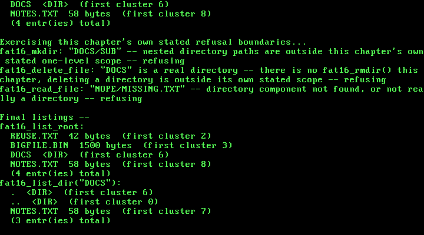

# 21. Real Subdirectories: One Level of Nesting Inside FAT16

**What you will understand:** how a real FAT16 subdirectory is genuinely just an ordinary file from the filesystem's own point of view -- a cluster chain like any other, holding 32-byte directory entries like any other, the only difference being the `ATTR_DIRECTORY` bit set on the entry that names it; why every real subdirectory's very first two entries are always "." and "..", cited field-for-field from the Microsoft FAT specification, and exactly what real cluster values each one must hold (self-reference for ".", and the real, literal value 0 for ".." when the parent is the root -- the same convention this chapter reuses as its own root-directory sentinel throughout); why `DIR_FileSize` is written as 0 for a directory entry even though a genuine cluster is allocated behind it; and how one flat-root FAT16 driver (Chapter 20's own `020_fat16.c`) generalizes into a driver that also understands one real level of subdirectory nesting, without duplicating a single one of its own root-directory code paths.

**What you need to know first:** Chapter 20's own real, flat-root FAT16 filesystem (`021_fat16.h`/`021_fat16.c` below carries every one of its cited field layouts and formulas forward unmodified, only renamed `020_` to `021_`), and this book's long-standing freestanding convention of never linking a C library, so every byte comparison and copy below is still an ordinary hand-rolled loop.

## Twenty chapters of one flat directory, and what nesting actually adds

Chapter 20 gave this kernel real files: `fat16_create_file()`/`fat16_read_file()`/`fat16_delete_file()`/`fat16_list_root()` could already create, read, delete, and list files addressed by an ordinary 8.3 name -- but every one of them lived in exactly one place, the root directory, and no path separator appeared anywhere in that chapter's own code. That flat namespace was a deliberate, stated scope limit, not an oversight -- and this chapter's own stated scope, decided the same way before a line of this chapter's own code changed, is to lift exactly one layer of that limit: real subdirectories, but only ONE level deep. `"DIR/NAME.EXT"` is resolved; `"DIR/SUB/NAME.EXT"` is not even attempted, and `fat16_mkdir()` itself refuses outright to create a subdirectory whose own name contains a `'/'`. A genuine recursive, multi-level path walker is a natural further extension this chapter explicitly does not attempt -- the same kind of explicit, honest boundary this book drew for Chapter 19's own raw-sector-only scope, and for Chapter 20's own flat-root-only scope, one chapter each before this one.

OSDev Wiki's own "FAT" page (https://wiki.osdev.org/FAT) -- the page Chapter 20 cited field-for-field for every part of the base FAT16 layout this chapter still relies on -- confirms that `ATTR_DIRECTORY` (0x10) is a real, defined attribute bit, but never actually documents how a real subdirectory's own contents are laid out: no mention of a "." or ".." entry, no mention of what cluster value either one must hold, nothing about how a subdirectory's own directory-entry `DIR_FileSize` field should be written. That gap sent this chapter to the primary source OSDev's own page itself lists in its External Links: the Microsoft FAT specification, Section 6, "FAT Directory Structure." Every subdirectory-specific detail in this chapter's own code -- the `.`/`..` entries, their real required cluster values, and the `DIR_FileSize = 0` convention -- is cited directly from that document, not guessed or inferred from the file layouts Chapter 20 already had cited elsewhere.

The real, on-disk mechanics turn out to be simpler than a special case would suggest: Section 6.5 of the Microsoft FAT specification confirms a subdirectory's own contents "must be" allocated as an ordinary cluster chain, exactly the same mechanism `fat16_create_file()` already used for a file's own bytes -- no separate allocation scheme, no separate on-disk structure. The one real distinction the root directory keeps that an ordinary subdirectory does not is that the root's own sectors are FIXED at format time (this chapter's own volume still gives it exactly 32 sectors, unchanged from Chapter 20) and can never grow; an ordinary subdirectory, once created, grows by one more cluster whenever it fills up, exactly the way a file already does. This chapter's own new `dir_sector_lba()` function is the one place in `021_fat16.c` that has to know that difference at all -- every other function below it (`scan_dir()`, `list_dir_cluster()`) is written once and works identically for the root and for a real subdirectory, calling through `dir_sector_lba()` rather than repeating root-specific arithmetic a second time.

This chapter's own design settled on one further simplification, chosen deliberately rather than stumbled into: representing the root directory itself as the sentinel cluster value `0` everywhere in this file's own code -- `dir_sector_lba(0, ...)`, `scan_dir(0, ...)`, `fat16_list_root()` itself now reading as nothing more than `list_dir_cluster(0)`. That choice is not an arbitrary internal convention invented for this chapter's own convenience -- it is the EXACT real, on-disk value the Microsoft FAT specification itself requires a subdirectory's own ".." entry to hold when its parent is the root (Section 6.5, quoted in full below `dir_sector_lba()`'s own comment). Choosing `0` as this file's internal root sentinel means the real on-disk ".." entry `fat16_mkdir()` writes and the internal value every other function already passes around are the SAME number, with no translation step anywhere -- simpler code that is also, simultaneously, more faithful to the real specification, not a tradeoff between the two.

## `021_fat16.h`/`021_fat16.c`: real subdirectories on top of Chapter 20's own FAT16 driver

Every field layout and formula Chapter 20 already cited from OSDev Wiki's own "FAT" page carries forward unchanged below. This chapter's own new citations -- `ATTR_DIRECTORY`'s own real meaning, and the "."/".." entry conventions -- are quoted directly from the Microsoft FAT specification, Section 6:

```c
#ifndef UNIX_OS_021_FAT16_H
#define UNIX_OS_021_FAT16_H

#include <stdint.h>

/* This chapter's own real filesystem, still the same genuine FAT16
 * volume Chapter 20 built on top of Chapter 19's own real
 * ata_read_sector()/ata_write_sector() -- cited field-for-field from
 * OSDev Wiki ("FAT": https://wiki.osdev.org/FAT) for every field this
 * file already used, and from the Microsoft FAT specification (the
 * primary source OSDev's own "FAT" page cites in its External Links)
 * for this chapter's own new subdirectory conventions. This chapter's
 * own new work is real subdirectories: fat16_mkdir() creates a real
 * on-disk subdirectory, and fat16_create_file()/fat16_read_file()/
 * fat16_delete_file() now accept a real one-level "DIR/NAME.EXT" path,
 * not just a bare root-level name. Deliberately scoped to ONE level of
 * nesting -- "DIR/NAME.EXT" is supported, "DIR/SUB/NAME.EXT" is not,
 * and fat16_mkdir() itself refuses any name containing '/' -- a
 * genuine recursive multi-level path walker is a natural further
 * extension this chapter explicitly does not attempt, the same kind
 * of stated scope limit this book has drawn before (Chapter 19's own
 * raw-sector-only scope, Chapter 20's own flat-root-only scope, one
 * chapter each before this one). */

/* Every real filename or path this API accepts or returns is a plain,
 * NUL-terminated string. A bare "NAME.EXT" (or "NAME" with no
 * extension) refers to the root directory, exactly as in Chapter 20.
 * "DIR/NAME.EXT" refers to a real file inside the real subdirectory
 * "DIR", which must already exist (via fat16_mkdir()) directly under
 * the root -- never more than one real '/' is ever resolved. Both the
 * directory name and the leaf name are ordinary 8.3 names (at most 8
 * name characters, 3 extension characters), silently truncated by
 * this chapter's own to_83_name() (021_fat16.c) exactly as before; an
 * honest, stated limit this chapter's own real demo never needs to
 * exercise. */

/* Builds a genuinely fresh FAT16 volume on the whole disk this
 * kernel's Chapter 19 driver talks to: a real boot sector/BIOS
 * Parameter Block, two mirrored File Allocation Tables, and an empty
 * root directory, all written via real ata_write_sector() calls.
 * Destroys any data on the disk already -- this chapter's own demo
 * always formats before using the volume. Returns 1 on success. */
int fat16_format(void);

/* Reads and validates the real on-disk boot sector, and computes
 * every geometry value this file's other functions need (first FAT
 * sector, first root-directory sector, first data sector, sectors per
 * FAT, total usable clusters) directly from it -- never hardcoded a
 * second time, so a genuinely differently-formatted volume would
 * still be read correctly. Must be called once, after fat16_format()
 * (or after finding an already-formatted volume), before any other
 * function below. Returns 1 if a valid FAT16 boot signature (0xAA55)
 * was found, 0 otherwise. */
int fat16_init(void);

/* Creates a new real subdirectory directly under the root -- `name`
 * must not contain '/' (refused outright if it does, this chapter's
 * own stated one-level-of-nesting scope). Allocates one real cluster
 * for the subdirectory's own contents and writes two real, cited
 * on-disk entries into it before anything else: a "." entry whose own
 * cluster fields self-reference this same new cluster, and a ".."
 * entry whose cluster fields are set to 0 -- cited directly (Microsoft
 * FAT specification, Section 6.5: "If the parent of the current
 * directory is the root directory ... the DIR_FstClusLO and
 * DIR_FstClusHI contents must be set to 0"), true here every time
 * since this function only ever creates a subdirectory of the root.
 * Then writes a real directory entry for `name` into the root itself,
 * with the cited ATTR_DIRECTORY bit (0x10) set and DIR_FileSize left
 * at 0 even though a real cluster is allocated -- cited directly
 * (Microsoft FAT specification, Section 6.5: "The DIR_FileSize must be
 * set to 0"). Refuses -- returns 0 -- if `name` contains '/', if a
 * root entry with this name already exists, if the root has no free
 * entry left, or if the volume has no free clusters left. */
int fat16_mkdir(const char *name);

/* Creates a new real file: allocates however many whole clusters
 * `size` real bytes need, chains them together in both real FAT
 * copies, writes `size` real bytes across them (the last, partial
 * cluster is zero-padded), and writes a real 32-byte directory entry
 * naming the file, its size, and its first cluster -- into the root
 * directory for a bare name, or into the named real subdirectory for
 * a "DIR/NAME.EXT" path (this chapter's own new work; see the top of
 * this file for the exact one-level scope). Refuses -- returns 0,
 * writes nothing -- if a file with this name already exists, if a
 * named directory component doesn't exist or isn't really a
 * directory, if the target directory has no free entry left (a real
 * subdirectory grows by one more cluster first, exactly like a file
 * would -- the root directory, by real on-disk construction, never
 * can), or if the volume has no free clusters left; never overwrites
 * or guesses. If `out_first_cluster` is non-null, the file's real
 * first cluster number is written there on success, purely so this
 * book's own real demos can prove a deleted file's cluster gets
 * reused. */
int fat16_create_file(const char *name, const uint8_t *data, uint32_t size,
                       uint16_t *out_first_cluster);

/* Reads an existing file's real contents into `buffer` -- a bare name
 * for the root directory, or a "DIR/NAME.EXT" path for a file inside a
 * real subdirectory. Refuses -- returns 0 -- if no file with this name
 * exists, if a named directory component doesn't exist or isn't
 * really a directory, if the name resolves to a real directory rather
 * than a file, or if `buffer_size` is smaller than the file's own real
 * size (this function never truncates). On success, copies exactly
 * the file's real size in bytes, walking its real cluster chain one
 * real sector at a time, and writes that size to `out_size` if
 * non-null. */
int fat16_read_file(const char *name, uint8_t *buffer, uint32_t buffer_size,
                     uint32_t *out_size);

/* Deletes an existing file -- a bare name for the root directory, or a
 * "DIR/NAME.EXT" path for a file inside a real subdirectory. Marks its
 * real directory entry as free (the cited 0xE5 "unused entry" marker)
 * and frees every real cluster in its chain back to both FAT copies
 * (each entry set back to the cited 0x0000 free value), making them
 * available to a future fat16_create_file() call again. Refuses --
 * returns 0 -- if no file with this name exists, if a named directory
 * component doesn't exist or isn't really a directory, or if the name
 * resolves to a real directory rather than a file -- there is no
 * fat16_rmdir() in this chapter; deleting a directory is explicitly
 * out of this chapter's own stated scope. Returns 1 if a matching file
 * was found and deleted. */
int fat16_delete_file(const char *name);

/* Prints every real, currently-occupied entry in the root directory --
 * name (converted back from the on-disk 8.3 form to an ordinary
 * "NAME.EXT" string), a real "<DIR>" tag for any entry whose own
 * cited ATTR_DIRECTORY bit is set, and real file size for anything
 * else -- skipping every entry this chapter's own format/deletion
 * convention marks as free (0x00 end-of-directory or 0xE5 deleted).
 * Returns the real count printed. */
uint32_t fat16_list_root(void);

/* The same real listing fat16_list_root() prints, but for the real
 * subdirectory named `name` (which must exist directly under the
 * root) instead of the root itself -- including that subdirectory's
 * own real "." and ".." entries, printed exactly as this chapter's
 * own fat16_mkdir() wrote them, genuine proof they are really sitting
 * on disk rather than merely implied. Refuses -- returns 0 -- if no
 * such subdirectory exists. */
uint32_t fat16_list_dir(const char *name);

#endif
```

`021_fat16.c` carries every one of Chapter 20's own cited field layouts and formulas forward unmodified, generalizes root-directory access into the new `dir_sector_lba()`/`scan_dir()` pair, adds `resolve_path()` for this chapter's own one-level `"DIR/NAME.EXT"` resolution, and adds `fat16_mkdir()`/`fat16_list_dir()` as genuinely new functions:

```c
/* This chapter's own real filesystem, still the same genuine FAT16
 * volume Chapter 20 built entirely on top of Chapter 19's own real
 * ata_read_sector()/ata_write_sector() -- every structure below is
 * read and written as ordinary 512-byte sectors, never as a direct
 * port I/O call. Every field layout, formula, and special value
 * Chapter 20 already used is cited field-for-field from OSDev Wiki's
 * own "FAT" page (https://wiki.osdev.org/FAT); this chapter's own new
 * subdirectory conventions (ATTR_DIRECTORY, the "." and ".." entries,
 * a subdirectory growing as an ordinary cluster chain the same way a
 * file does) are cited field-for-field from the Microsoft FAT
 * specification, Section 6 ("FAT Directory Structure") -- the primary
 * source OSDev's own "FAT" page itself lists in its External Links,
 * consulted directly here because OSDev's own page never documents
 * subdirectory layout at all. */

#include <stdint.h>

#include "021_ata.h"
#include "021_fat16.h"
#include "021_printf.h"

/* This chapter's own disk geometry, chosen deliberately: 8 MiB (16384
 * real 512-byte sectors) rather than Chapter 19's own 1 MiB -- a real
 * FAT16 volume needs at least 4085 usable clusters before the
 * standard cluster-count convention most real implementations use to
 * tell FAT12/FAT16/FAT32 apart would even call it "FAT16" rather than
 * "FAT12," and Chapter 19's own smaller disk could never reach that
 * with any genuinely usable cluster size. One sector per cluster
 * keeps every cluster the same size as one real ata_read_sector()/
 * ata_write_sector() call -- no extra loop needed inside this file to
 * read or write a whole cluster. */
#define FAT16_BYTES_PER_SECTOR    512u
#define FAT16_SECTORS_PER_CLUSTER 1u
#define FAT16_RESERVED_SECTORS    1u
#define FAT16_FAT_COUNT           2u
#define FAT16_ROOT_ENTRY_COUNT    512u
#define FAT16_SECTORS_PER_FAT     64u
#define FAT16_TOTAL_SECTORS       16384u

/* "The size of the root directory ... root_dir_sectors = ((fat_boot->
 * root_entry_count * 32) + (fat_boot->bytes_per_sector - 1)) /
 * fat_boot->bytes_per_sector;" (OSDev Wiki, "FAT") -- 512 entries * 32
 * bytes each = 16384 bytes = exactly 32 whole 512-byte sectors, no
 * rounding needed for this chapter's own chosen root_entry_count. */
#define FAT16_ROOT_DIR_SECTORS \
    (((FAT16_ROOT_ENTRY_COUNT * 32u) + (FAT16_BYTES_PER_SECTOR - 1u)) / FAT16_BYTES_PER_SECTOR)

#define FAT16_ENTRIES_PER_SECTOR (FAT16_BYTES_PER_SECTOR / 32u)  /* 16 */

/* FAT16 special cluster values, cited the same way: "Free cluster:
 * Index 0", "End-of-chain: >= 0xFFF8", "Bad cluster: == 0xFFF7". This
 * chapter's own fat16_format() always writes the cited end-of-chain
 * marker 0xFFFF specifically, never merely "some value >= 0xFFF8". */
#define FAT16_CLUSTER_FREE     0x0000u
#define FAT16_CLUSTER_END      0xFFFFu
#define FAT16_CLUSTER_END_MIN  0xFFF8u
#define FAT16_CLUSTER_BAD      0xFFF7u

/* Directory-entry byte-0 special values, cited the same way: "If the
 * first byte of the entry is equal to 0 then there are no more
 * files/directories in this directory" and "If the first byte of the
 * entry is equal to 0xE5 then the entry is unused." */
#define FAT16_DIRENT_END       0x00u
#define FAT16_DIRENT_DELETED   0xE5u

#define FAT16_ATTR_ARCHIVE     0x20u

/* This chapter's own new attribute bit, cited directly (Microsoft FAT
 * specification, Section 6.2): "ATTR_DIRECTORY (0x10) The
 * corresponding entry represents a directory (a child or
 * sub-directory to the containing directory)." */
#define FAT16_ATTR_DIRECTORY   0x10u

/* This chapter's own real 512-byte Boot Sector/BIOS Parameter Block,
 * quoted field-for-field from OSDev Wiki's own cited offset table --
 * every field below sits at exactly the byte offset the cited table
 * gives it, verified by this struct's own total size coming out to
 * exactly 512 bytes with no manual padding anywhere. */
struct fat16_boot_sector {
    uint8_t  jump[3];              /* offset 0: "JMP SHORT 3C NOP" */
    uint8_t  oem_identifier[8];    /* offset 3 */
    uint16_t bytes_per_sector;     /* offset 11 */
    uint8_t  sectors_per_cluster;  /* offset 13 */
    uint16_t reserved_sector_count;/* offset 14 */
    uint8_t  table_count;          /* offset 16: "Often this value is 2" */
    uint16_t root_entry_count;     /* offset 17 */
    uint16_t total_sectors_16;     /* offset 19 */
    uint8_t  media_descriptor;     /* offset 21 */
    uint16_t sectors_per_fat;      /* offset 22: "FAT12/FAT16 only" */
    uint16_t sectors_per_track;    /* offset 24 */
    uint16_t head_count;           /* offset 26 */
    uint32_t hidden_sector_count;  /* offset 28 */
    uint32_t total_sectors_32;     /* offset 32 */
    /* FAT16 Extended Boot Record, offset 36 */
    uint8_t  drive_number;         /* offset 36 */
    uint8_t  nt_flags;             /* offset 37 */
    uint8_t  signature;            /* offset 38: "must be 0x28 or 0x29" */
    uint32_t volume_id;            /* offset 39 */
    uint8_t  volume_label[11];     /* offset 43, "padded with spaces" */
    uint8_t  system_identifier[8]; /* offset 54 */
    uint8_t  boot_code[448];       /* offset 62 */
    uint16_t boot_signature;       /* offset 510: "0xAA55" */
} __attribute__((packed));

/* This chapter's own real 32-byte directory entry, quoted the same
 * way (OSDev Wiki, "FAT"). Every field this chapter's own code
 * actually uses (name, attributes, cluster, size) is kept meaningful;
 * every timestamp field is kept for real on-disk layout fidelity but
 * always written as 0 -- this chapter's own filesystem deliberately
 * does not track creation/modification times, a stated scope limit,
 * not an oversight. */
struct fat16_dir_entry {
    uint8_t  name[11];               /* offset 0: "8.3 file name" */
    uint8_t  attributes;             /* offset 11 */
    uint8_t  nt_reserved;            /* offset 12 */
    uint8_t  creation_time_ds;       /* offset 13 */
    uint16_t creation_time;          /* offset 14 */
    uint16_t creation_date;          /* offset 16 */
    uint16_t access_date;            /* offset 18 */
    uint16_t high_cluster_bits;      /* offset 20: "always zero" for FAT16 */
    uint16_t modification_time;      /* offset 22 */
    uint16_t modification_date;      /* offset 24 */
    uint16_t low_cluster_bits;       /* offset 26 */
    uint32_t file_size;              /* offset 28 */
} __attribute__((packed));

/* This chapter's own real, computed-once geometry -- every value here
 * is read straight out of the real on-disk boot sector by fat16_init(),
 * never hardcoded a second time by any function below it. */
static uint32_t g_first_fat_sector = 0;
static uint32_t g_first_root_dir_sector = 0;
static uint32_t g_first_data_sector = 0;
static uint32_t g_sectors_per_fat = 0;
static uint32_t g_sectors_per_cluster = 0;
static uint32_t g_root_dir_sectors = 0;
static uint32_t g_total_data_clusters = 0;
static int g_ready = 0;

static uint8_t to_upper(uint8_t c) {
    if (c >= 'a' && c <= 'z') {
        return (uint8_t) (c - 'a' + 'A');
    }
    return c;
}

/* This chapter's own hand-rolled equivalents of libc's memcmp()/
 * strlen() -- this book has never linked a C library, freestanding
 * since Chapter 1, so every byte comparison and copy in this file is
 * an ordinary loop, the same convention Chapter 18's own elf_load()
 * already established for copying ELF segment bytes. */
static int bytes_equal(const uint8_t *a, const uint8_t *b, uint32_t n) {
    for (uint32_t i = 0; i < n; i++) {
        if (a[i] != b[i]) {
            return 0;
        }
    }
    return 1;
}

static uint32_t string_length(const char *s) {
    uint32_t n = 0;
    while (s[n] != '\0') {
        n++;
    }
    return n;
}

/* Converts an ordinary "NAME.EXT" (or extension-less "NAME") C string
 * into the real on-disk 11-byte 8.3 form -- upper-cased, space-padded,
 * name and extension each right up to (never past) 8 and 3 characters
 * (OSDev Wiki, "FAT": "The first 8 characters are the name and the
 * last 3 are the extension"). A name or extension longer than that is
 * silently truncated -- an honest, stated limit; this chapter's own
 * real demo only ever uses names chosen to fit. */
static void to_83_name(const char *input, uint8_t out[11]) {
    for (int i = 0; i < 11; i++) {
        out[i] = ' ';
    }

    uint32_t len = string_length(input);
    uint32_t dot = len;
    for (uint32_t i = 0; i < len; i++) {
        if (input[i] == '.') {
            dot = i;
            break;
        }
    }

    uint32_t name_len = dot;
    if (name_len > 8u) {
        name_len = 8u;
    }
    for (uint32_t i = 0; i < name_len; i++) {
        out[i] = to_upper((uint8_t) input[i]);
    }

    if (dot < len) {
        uint32_t ext_start = dot + 1u;
        uint32_t ext_len = len - ext_start;
        if (ext_len > 3u) {
            ext_len = 3u;
        }
        for (uint32_t i = 0; i < ext_len; i++) {
            out[8 + i] = to_upper((uint8_t) input[ext_start + i]);
        }
    }
}

/* The inverse of to_83_name(), for fat16_list_root(): trims the
 * space-padding back off the name and extension and re-inserts the
 * '.' only when a real extension is present. */
static void from_83_name(const uint8_t name[11], char *out) {
    uint32_t pos = 0;
    for (uint32_t i = 0; i < 8u && name[i] != ' '; i++) {
        out[pos++] = (char) name[i];
    }
    if (name[8] != ' ') {
        out[pos++] = '.';
        for (uint32_t i = 8u; i < 11u && name[i] != ' '; i++) {
            out[pos++] = (char) name[i];
        }
    }
    out[pos] = '\0';
}

static uint32_t cluster_to_lba(uint16_t cluster) {
    /* "first_sector_of_cluster = ((cluster - 2) * fat_boot->
     * sectors_per_cluster) + first_data_sector;" (OSDev Wiki, "FAT"). */
    return g_first_data_sector + ((uint32_t) (cluster - 2u) * g_sectors_per_cluster);
}

/* "unsigned int fat_offset = active_cluster * 2; unsigned int
 * fat_sector = first_fat_sector + (fat_offset / sector_size);
 * unsigned int ent_offset = fat_offset % sector_size;" (OSDev Wiki,
 * "FAT") -- this chapter's own real FAT16 entry lookup, quoted
 * directly, reading only the FIRST FAT copy (the second is written in
 * lock-step by fat_write_entry() below purely for real on-disk
 * redundancy, never read back by this file itself). */
static uint16_t fat_read_entry(uint16_t cluster) {
    uint32_t fat_offset = (uint32_t) cluster * 2u;
    uint32_t fat_sector = g_first_fat_sector + (fat_offset / FAT16_BYTES_PER_SECTOR);
    uint32_t ent_offset = fat_offset % FAT16_BYTES_PER_SECTOR;

    uint8_t buf[FAT16_BYTES_PER_SECTOR];
    ata_read_sector(fat_sector, buf);

    uint16_t *table = (uint16_t *) buf;
    return table[ent_offset / 2u];
}

/* Writes one real FAT16 entry to BOTH real mirrored FAT copies (this
 * chapter's own FAT16 volume always has exactly FAT16_FAT_COUNT = 2),
 * a real read-modify-write per copy so every other byte in that
 * sector is preserved untouched. */
static void fat_write_entry(uint16_t cluster, uint16_t value) {
    uint32_t fat_offset = (uint32_t) cluster * 2u;
    uint32_t ent_offset = fat_offset % FAT16_BYTES_PER_SECTOR;
    uint32_t sector_within_fat = fat_offset / FAT16_BYTES_PER_SECTOR;

    for (uint32_t copy = 0; copy < FAT16_FAT_COUNT; copy++) {
        uint32_t fat_sector = g_first_fat_sector + copy * g_sectors_per_fat + sector_within_fat;

        uint8_t buf[FAT16_BYTES_PER_SECTOR];
        ata_read_sector(fat_sector, buf);

        uint16_t *table = (uint16_t *) buf;
        table[ent_offset / 2u] = value;

        ata_write_sector(fat_sector, buf);
    }
}

/* Scans forward from cluster 2 (cluster 0 and 1 are always reserved --
 * see fat16_format()) for the first real cluster whose FAT entry reads
 * back as FAT16_CLUSTER_FREE. Returns 0 (never a valid data cluster
 * number) if the whole volume is full. */
static uint16_t find_free_cluster(void) {
    for (uint32_t c = 2; c < 2u + g_total_data_clusters; c++) {
        if (fat_read_entry((uint16_t) c) == FAT16_CLUSTER_FREE) {
            return (uint16_t) c;
        }
    }
    return 0;
}

int fat16_format(void) {
    struct fat16_boot_sector boot;
    uint8_t *raw = (uint8_t *) &boot;
    for (uint32_t i = 0; i < sizeof(boot); i++) {
        raw[i] = 0;
    }

    boot.jump[0] = 0xEBu;
    boot.jump[1] = 0x3Cu;
    boot.jump[2] = 0x90u;

    const char *oem = "UNIXOS21";
    for (int i = 0; i < 8; i++) {
        boot.oem_identifier[i] = (uint8_t) oem[i];
    }

    boot.bytes_per_sector = FAT16_BYTES_PER_SECTOR;
    boot.sectors_per_cluster = FAT16_SECTORS_PER_CLUSTER;
    boot.reserved_sector_count = FAT16_RESERVED_SECTORS;
    boot.table_count = FAT16_FAT_COUNT;
    boot.root_entry_count = FAT16_ROOT_ENTRY_COUNT;
    boot.total_sectors_16 = (uint16_t) FAT16_TOTAL_SECTORS;  /* fits in 16 bits */
    boot.media_descriptor = 0xF8u;  /* fixed disk */
    boot.sectors_per_fat = FAT16_SECTORS_PER_FAT;
    boot.sectors_per_track = 0;     /* unused by this driver -- kept for
                                      * real BPB layout fidelity only */
    boot.head_count = 0;            /* unused by this driver */
    boot.hidden_sector_count = 0;   /* this whole disk is one volume,
                                      * no partition table in front of it */
    boot.total_sectors_32 = 0;      /* total_sectors_16 already covers
                                      * this chapter's own volume size */

    boot.drive_number = 0x80u;      /* "0x80 for hard disks" */
    boot.nt_flags = 0;
    boot.signature = 0x29u;

    boot.volume_id = 0x00000001u;

    const char *label = "UNIXOSFAT16";
    for (int i = 0; i < 11; i++) {
        boot.volume_label[i] = (uint8_t) label[i];
    }

    const char *sysid = "FAT16   ";
    for (int i = 0; i < 8; i++) {
        boot.system_identifier[i] = (uint8_t) sysid[i];
    }
    /* boot_code[448] stays zeroed -- this disk is a real second, data-
     * only drive, never booted from, so there is no real bootstrap
     * code for this field to hold. */

    boot.boot_signature = 0xAA55u;

    kprintf("fat16_format: writing real boot sector/BPB to LBA 0...\n");
    ata_write_sector(0, raw);

    uint32_t first_fat_sector = FAT16_RESERVED_SECTORS;
    uint32_t sectors_per_fat = FAT16_SECTORS_PER_FAT;

    kprintf("fat16_format: zeroing %u real FAT sectors (%u copies)...\n",
            sectors_per_fat * FAT16_FAT_COUNT, (uint32_t) FAT16_FAT_COUNT);

    uint8_t zero_sector[FAT16_BYTES_PER_SECTOR];
    for (uint32_t i = 0; i < FAT16_BYTES_PER_SECTOR; i++) {
        zero_sector[i] = 0;
    }

    for (uint32_t copy = 0; copy < FAT16_FAT_COUNT; copy++) {
        for (uint32_t s = 0; s < sectors_per_fat; s++) {
            ata_write_sector(first_fat_sector + copy * sectors_per_fat + s, zero_sector);
        }
    }

    /* "Reserved entry 1 must hold the value 0xFFFF" (OSDev Wiki,
     * "FAT") -- entry 0 conventionally mirrors the media descriptor
     * byte in its low byte, OR'd with 0xFF00; both real cluster
     * numbers 0 and 1 are reserved and never handed out by
     * find_free_cluster(), which always starts its search at 2. */
    g_first_fat_sector = first_fat_sector;
    g_sectors_per_fat = sectors_per_fat;
    fat_write_entry(0, (uint16_t) (0xFF00u | boot.media_descriptor));
    fat_write_entry(1, 0xFFFFu);

    uint32_t root_dir_sectors = FAT16_ROOT_DIR_SECTORS;
    uint32_t first_root_dir_sector = first_fat_sector + FAT16_FAT_COUNT * sectors_per_fat;

    kprintf("fat16_format: zeroing %u real root directory sectors...\n", root_dir_sectors);
    for (uint32_t s = 0; s < root_dir_sectors; s++) {
        ata_write_sector(first_root_dir_sector + s, zero_sector);
    }

    kprintf("fat16_format: done -- real FAT16 volume written to disk\n");
    return 1;
}

int fat16_init(void) {
    uint8_t sector0[FAT16_BYTES_PER_SECTOR];
    ata_read_sector(0, sector0);

    struct fat16_boot_sector *boot = (struct fat16_boot_sector *) sector0;

    /* "0xAA55" (OSDev Wiki, "FAT") -- refuses to treat this disk as a
     * real FAT16 volume at all unless the real, on-disk boot signature
     * confirms it, rather than assuming fat16_format() was the last
     * thing to touch this disk. */
    if (boot->boot_signature != 0xAA55u) {
        kprintf("fat16_init: boot signature 0x%x, not the real 0xAA55 -- refusing\n",
                boot->boot_signature);
        return 0;
    }

    g_sectors_per_cluster = boot->sectors_per_cluster;
    g_sectors_per_fat = boot->sectors_per_fat;
    g_root_dir_sectors = ((uint32_t) boot->root_entry_count * 32u + (boot->bytes_per_sector - 1u))
                          / boot->bytes_per_sector;
    g_first_fat_sector = boot->reserved_sector_count;
    g_first_root_dir_sector = g_first_fat_sector + (uint32_t) boot->table_count * g_sectors_per_fat;
    g_first_data_sector = g_first_root_dir_sector + g_root_dir_sectors;

    uint32_t total_sectors = boot->total_sectors_16 != 0
                              ? boot->total_sectors_16
                              : boot->total_sectors_32;
    uint32_t data_sectors = total_sectors - g_first_data_sector;
    g_total_data_clusters = data_sectors / g_sectors_per_cluster;

    g_ready = 1;

    kprintf("fat16_init: real volume \"");
    for (int i = 0; i < 11 && boot->volume_label[i] != ' '; i++) {
        kprintf("%c", boot->volume_label[i]);
    }
    kprintf("\" -- %u bytes/sector, %u sector(s)/cluster, %u FAT(s) * %u sectors, "
            "root dir %u sectors (first at LBA %u), data starts LBA %u, %u usable clusters\n",
            boot->bytes_per_sector, g_sectors_per_cluster, boot->table_count, g_sectors_per_fat,
            g_root_dir_sectors, g_first_root_dir_sector, g_first_data_sector, g_total_data_clusters);

    return 1;
}

/* Resolves logical directory-sector index `logical_index` (0, 1, 2, ...)
 * of the real directory whose own first cluster is `dir_cluster` into a
 * real disk LBA -- the one place this chapter's own code has to know the
 * difference between the root directory and an ordinary subdirectory.
 * `dir_cluster == 0` means the root directory itself, the same real
 * on-disk convention this chapter's own fat16_mkdir() uses for a ".."
 * entry whose parent is the root (Microsoft FAT specification, Section
 * 6.5: "If the parent of the current directory is the root directory ...
 * the DIR_FstClusLO and DIR_FstClusHI contents must be set to 0"). For
 * the root, `logical_index` is bounded by the real, FIXED
 * g_root_dir_sectors -- the root can never grow, a genuine, permanent
 * FAT12/FAT16 constraint, not a limitation of this driver -- so this
 * function returns 0 (never a valid LBA, since LBA 0 always holds the
 * boot sector) once that fixed size is exhausted, `grow` or not. For an
 * ordinary subdirectory, this function walks its real cluster chain
 * `logical_index` real links deep; if the chain is shorter than that and
 * `grow` is set, it allocates and zeroes one more real cluster and links
 * it on, exactly the way fat16_create_file() already grows a file's own
 * chain -- cited directly (Microsoft FAT specification, Section 6.5,
 * confirmed a subdirectory is an ordinary cluster chain that "must" be
 * allocated the same way a file's is). */
static uint32_t dir_sector_lba(uint16_t dir_cluster, uint32_t logical_index, int grow) {
    if (dir_cluster == 0) {
        if (logical_index >= g_root_dir_sectors) {
            return 0;  /* the root directory can never grow past its fixed size */
        }
        return g_first_root_dir_sector + logical_index;
    }

    uint16_t cluster = dir_cluster;
    for (uint32_t i = 0; i < logical_index; i++) {
        uint16_t next = fat_read_entry(cluster);
        if (next >= FAT16_CLUSTER_END_MIN) {
            if (!grow) {
                return 0;
            }
            uint16_t new_cluster = find_free_cluster();
            if (new_cluster == 0) {
                return 0;  /* volume has no free clusters left */
            }
            uint8_t zero_sector[FAT16_BYTES_PER_SECTOR];
            for (uint32_t z = 0; z < FAT16_BYTES_PER_SECTOR; z++) {
                zero_sector[z] = 0;
            }
            ata_write_sector(cluster_to_lba(new_cluster), zero_sector);
            fat_write_entry(new_cluster, FAT16_CLUSTER_END);
            fat_write_entry(cluster, new_cluster);
            next = new_cluster;
        }
        cluster = next;
    }
    return cluster_to_lba(cluster);
}

/* Scans the real directory whose own first cluster is `dir_cluster`
 * (0 for the root, exactly as dir_sector_lba() above) once, looking for
 * BOTH an existing entry with this exact name AND the first reusable
 * slot (a real 0xE5 deleted entry, the real 0x00 end-of-directory
 * marker, or -- new this chapter -- a freshly grown cluster's own first
 * entry, if `want_free_slot` and the directory was genuinely full).
 * `out_lba`/`out_index` locate the slot as a real disk LBA and an entry
 * index inside that sector's own 16 real entries, so the caller can
 * read-modify-write exactly that one real 32-byte entry directly, with
 * no further translation needed. */
static int scan_dir(uint16_t dir_cluster, const uint8_t name83[11], int want_free_slot,
                     uint32_t *out_lba, uint32_t *out_index, int *out_found_existing) {
    int free_found = 0;
    uint32_t free_lba = 0, free_index = 0;
    uint32_t s;

    for (s = 0; ; s++) {
        uint32_t lba = dir_sector_lba(dir_cluster, s, 0);
        if (lba == 0) {
            break;  /* no more real, already-allocated sectors in this directory */
        }

        uint8_t buf[FAT16_BYTES_PER_SECTOR];
        ata_read_sector(lba, buf);
        struct fat16_dir_entry *entries = (struct fat16_dir_entry *) buf;

        for (uint32_t e = 0; e < FAT16_ENTRIES_PER_SECTOR; e++) {
            uint8_t b0 = entries[e].name[0];

            if (b0 == FAT16_DIRENT_END) {
                if (want_free_slot) {
                    if (!free_found) {
                        free_lba = lba;
                        free_index = e;
                    }
                    *out_lba = free_lba;
                    *out_index = free_index;
                    *out_found_existing = 0;
                    return 1;
                }
                return 0;  /* pure lookup: nothing past here is real */
            }

            if (b0 == FAT16_DIRENT_DELETED) {
                if (!free_found) {
                    free_found = 1;
                    free_lba = lba;
                    free_index = e;
                }
                continue;
            }

            if (bytes_equal(entries[e].name, name83, 11)) {
                *out_lba = lba;
                *out_index = e;
                *out_found_existing = 1;
                return 1;
            }
        }
    }

    if (!want_free_slot) {
        return 0;
    }
    if (free_found) {
        *out_lba = free_lba;
        *out_index = free_index;
        *out_found_existing = 0;
        return 1;
    }

    /* Every already-allocated sector was full, with no 0x00/0xE5 slot
     * anywhere -- grow the directory by one more real cluster (for the
     * root, dir_cluster == 0, dir_sector_lba() above correctly refuses
     * to grow at all, the real fixed-size constraint this chapter never
     * works around). A freshly allocated cluster is zeroed by
     * dir_sector_lba() itself, so its very first entry already reads
     * back as a real 0x00 end-of-directory marker -- exactly the free
     * slot this call needs. */
    uint32_t new_lba = dir_sector_lba(dir_cluster, s, 1);
    if (new_lba == 0) {
        return 0;
    }
    *out_lba = new_lba;
    *out_index = 0;
    *out_found_existing = 0;
    return 1;
}

/* Splits `path` at its first '/' -- this chapter's own stated one-level-
 * of-nesting scope, spelled out at the top of 021_fat16.h: "DIR/NAME.EXT"
 * is resolved, "DIR/SUB/NAME.EXT" is not even attempted. With no '/' at
 * all, `path` names something directly in the root (`*out_dir_cluster =
 * 0`, `*out_leaf = path` itself). With one, the directory component is
 * looked up in the root; refuses -- returns 0 -- if it doesn't exist or
 * isn't really a directory (the cited ATTR_DIRECTORY bit unset), never
 * silently falling back to treating it as a file. On success,
 * `*out_dir_cluster` is that subdirectory's own real first cluster and
 * `*out_leaf` points at the leaf-name portion of `path` itself (no copy
 * taken -- `path` must outlive the caller's own use of `*out_leaf`). */
static int resolve_path(const char *path, uint16_t *out_dir_cluster, const char **out_leaf) {
    uint32_t slash = 0xFFFFFFFFu;
    for (uint32_t i = 0; path[i] != '\0'; i++) {
        if (path[i] == '/') {
            slash = i;
            break;
        }
    }

    if (slash == 0xFFFFFFFFu) {
        *out_dir_cluster = 0;
        *out_leaf = path;
        return 1;
    }

    char dirname[64];
    uint32_t dn_len = slash;
    if (dn_len > sizeof(dirname) - 1u) {
        dn_len = sizeof(dirname) - 1u;
    }
    for (uint32_t i = 0; i < dn_len; i++) {
        dirname[i] = path[i];
    }
    dirname[dn_len] = '\0';

    uint8_t name83[11];
    to_83_name(dirname, name83);

    uint32_t lba, index;
    int found;
    if (!scan_dir(0, name83, 0, &lba, &index, &found) || !found) {
        return 0;
    }

    uint8_t buf[FAT16_BYTES_PER_SECTOR];
    ata_read_sector(lba, buf);
    struct fat16_dir_entry *entries = (struct fat16_dir_entry *) buf;
    if (!(entries[index].attributes & FAT16_ATTR_DIRECTORY)) {
        return 0;  /* named, but it's a real file, not a real directory */
    }

    *out_dir_cluster = entries[index].low_cluster_bits;
    *out_leaf = path + slash + 1u;
    return 1;
}

int fat16_mkdir(const char *name) {
    if (!g_ready) {
        kprintf("fat16_mkdir: fat16_init() was never called -- refusing\n");
        return 0;
    }

    for (uint32_t i = 0; name[i] != '\0'; i++) {
        if (name[i] == '/') {
            kprintf("fat16_mkdir: \"%s\" -- nested directory paths are outside this chapter's "
                    "own stated one-level scope -- refusing\n", name);
            return 0;
        }
    }

    uint8_t name83[11];
    to_83_name(name, name83);

    uint32_t slot_lba, slot_index;
    int found_existing;
    if (!scan_dir(0, name83, 1, &slot_lba, &slot_index, &found_existing)) {
        kprintf("fat16_mkdir: \"%s\" -- root directory has no free entry -- refusing\n", name);
        return 0;
    }
    if (found_existing) {
        kprintf("fat16_mkdir: \"%s\" already exists -- refusing\n", name);
        return 0;
    }

    uint16_t new_cluster = find_free_cluster();
    if (new_cluster == 0) {
        kprintf("fat16_mkdir: \"%s\" -- volume has no free clusters left -- refusing\n", name);
        return 0;
    }
    fat_write_entry(new_cluster, FAT16_CLUSTER_END);

    uint8_t buf[FAT16_BYTES_PER_SECTOR];
    for (uint32_t i = 0; i < FAT16_BYTES_PER_SECTOR; i++) {
        buf[i] = 0;
    }
    struct fat16_dir_entry *entries = (struct fat16_dir_entry *) buf;

    /* "." -- self-reference. Cited directly (Microsoft FAT specification,
     * Section 6.5): "Since the dot entry refers to the current directory
     * (the one containing the dot entry), the contents of the
     * DIR_FstClusLO and DIR_FstClusHI fields must be the same as that of
     * the current directory." */
    for (int i = 0; i < 11; i++) {
        entries[0].name[i] = ' ';
    }
    entries[0].name[0] = '.';
    entries[0].attributes = FAT16_ATTR_DIRECTORY;
    entries[0].low_cluster_bits = new_cluster;
    entries[0].file_size = 0;

    /* ".." -- parent reference. fat16_mkdir() only ever creates a
     * subdirectory directly inside the root (this chapter's own stated
     * one-level scope), so the parent is always the root -- cited
     * directly (Microsoft FAT specification, Section 6.5, quoted above
     * dir_sector_lba()): the cluster fields are set to the real 0. */
    for (int i = 0; i < 11; i++) {
        entries[1].name[i] = ' ';
    }
    entries[1].name[0] = '.';
    entries[1].name[1] = '.';
    entries[1].attributes = FAT16_ATTR_DIRECTORY;
    entries[1].low_cluster_bits = 0;
    entries[1].file_size = 0;

    ata_write_sector(cluster_to_lba(new_cluster), buf);

    uint8_t dir_buf[FAT16_BYTES_PER_SECTOR];
    ata_read_sector(slot_lba, dir_buf);
    struct fat16_dir_entry *root_entries = (struct fat16_dir_entry *) dir_buf;
    struct fat16_dir_entry *entry = &root_entries[slot_index];

    for (int i = 0; i < 11; i++) {
        entry->name[i] = name83[i];
    }
    entry->attributes = FAT16_ATTR_DIRECTORY;
    entry->nt_reserved = 0;
    entry->creation_time_ds = 0;
    entry->creation_time = 0;
    entry->creation_date = 0;
    entry->access_date = 0;
    entry->high_cluster_bits = 0;
    entry->modification_time = 0;
    entry->modification_date = 0;
    entry->low_cluster_bits = new_cluster;
    /* "The DIR_FileSize must be set to 0" (Microsoft FAT specification,
     * Section 6.5) -- true here even though a real cluster is already
     * allocated: a directory's own real size is never tracked in bytes,
     * only in however many clusters its own chain holds. */
    entry->file_size = 0;

    ata_write_sector(slot_lba, dir_buf);

    kprintf("fat16_mkdir: \"%s\" -- real subdirectory created, first cluster %u\n",
            name, new_cluster);
    return 1;
}

int fat16_create_file(const char *name, const uint8_t *data, uint32_t size,
                       uint16_t *out_first_cluster) {
    if (!g_ready) {
        kprintf("fat16_create_file: fat16_init() was never called -- refusing\n");
        return 0;
    }

    uint16_t dir_cluster;
    const char *leaf;
    if (!resolve_path(name, &dir_cluster, &leaf)) {
        kprintf("fat16_create_file: \"%s\" -- directory component not found, or not really a "
                "directory -- refusing\n", name);
        return 0;
    }

    uint8_t name83[11];
    to_83_name(leaf, name83);

    uint32_t slot_lba, slot_index;
    int found_existing;
    if (!scan_dir(dir_cluster, name83, 1, &slot_lba, &slot_index, &found_existing)) {
        kprintf("fat16_create_file: \"%s\" -- directory has no free entry (and could not grow) "
                "-- refusing\n", name);
        return 0;
    }
    if (found_existing) {
        kprintf("fat16_create_file: \"%s\" already exists -- refusing\n", name);
        return 0;
    }

    uint32_t bytes_per_cluster = FAT16_BYTES_PER_SECTOR * g_sectors_per_cluster;
    uint32_t clusters_needed = (size + bytes_per_cluster - 1u) / bytes_per_cluster;
    if (clusters_needed == 0u) {
        clusters_needed = 1u;  /* a real, valid zero-byte file still owns one cluster */
    }

    uint16_t first_cluster = 0;
    uint16_t prev_cluster = 0;
    uint32_t bytes_left = size;
    const uint8_t *src = data;

    for (uint32_t i = 0; i < clusters_needed; i++) {
        uint16_t c = find_free_cluster();
        if (c == 0) {
            kprintf("fat16_create_file: \"%s\" -- volume has no free clusters left -- refusing\n", name);
            /* Honest, but incomplete for this chapter's own stated
             * scope: a real implementation would also free whatever
             * clusters were already claimed by this same call before
             * refusing. This chapter's own real demo never exhausts
             * the volume, so that cleanup path is never exercised. */
            return 0;
        }

        if (i == 0) {
            first_cluster = c;
        } else {
            fat_write_entry(prev_cluster, c);
        }

        uint8_t cluster_buf[FAT16_BYTES_PER_SECTOR];
        uint32_t chunk = bytes_left < FAT16_BYTES_PER_SECTOR ? bytes_left : FAT16_BYTES_PER_SECTOR;
        for (uint32_t b = 0; b < chunk; b++) {
            cluster_buf[b] = src[b];
        }
        for (uint32_t b = chunk; b < FAT16_BYTES_PER_SECTOR; b++) {
            cluster_buf[b] = 0;
        }
        ata_write_sector(cluster_to_lba(c), cluster_buf);

        src += chunk;
        bytes_left -= chunk;
        prev_cluster = c;

        /* Mark this cluster END for now -- the very next iteration (if
         * any) overwrites it with the next cluster in the chain via
         * fat_write_entry(prev_cluster, c) above. Leaving a genuinely
         * un-terminated chain visible on disk, even for one real write
         * in between, is never allowed here. */
        fat_write_entry(c, FAT16_CLUSTER_END);
    }

    uint8_t dir_buf[FAT16_BYTES_PER_SECTOR];
    ata_read_sector(slot_lba, dir_buf);
    struct fat16_dir_entry *entries = (struct fat16_dir_entry *) dir_buf;
    struct fat16_dir_entry *entry = &entries[slot_index];

    for (int i = 0; i < 11; i++) {
        entry->name[i] = name83[i];
    }
    entry->attributes = FAT16_ATTR_ARCHIVE;
    entry->nt_reserved = 0;
    entry->creation_time_ds = 0;
    entry->creation_time = 0;
    entry->creation_date = 0;
    entry->access_date = 0;
    entry->high_cluster_bits = 0;  /* "always zero" for FAT16 */
    entry->modification_time = 0;
    entry->modification_date = 0;
    entry->low_cluster_bits = first_cluster;
    entry->file_size = size;

    ata_write_sector(slot_lba, dir_buf);

    if (out_first_cluster != 0) {
        *out_first_cluster = first_cluster;
    }

    kprintf("fat16_create_file: \"%s\" -- %u bytes, %u cluster(s), first cluster %u\n",
            name, size, clusters_needed, first_cluster);
    return 1;
}

int fat16_read_file(const char *name, uint8_t *buffer, uint32_t buffer_size, uint32_t *out_size) {
    if (!g_ready) {
        kprintf("fat16_read_file: fat16_init() was never called -- refusing\n");
        return 0;
    }

    uint16_t dir_cluster;
    const char *leaf;
    if (!resolve_path(name, &dir_cluster, &leaf)) {
        kprintf("fat16_read_file: \"%s\" -- directory component not found, or not really a "
                "directory -- refusing\n", name);
        return 0;
    }

    uint8_t name83[11];
    to_83_name(leaf, name83);

    uint32_t lba, index;
    int found_existing;
    if (!scan_dir(dir_cluster, name83, 0, &lba, &index, &found_existing) || !found_existing) {
        kprintf("fat16_read_file: \"%s\" not found -- refusing\n", name);
        return 0;
    }

    uint8_t dir_buf[FAT16_BYTES_PER_SECTOR];
    ata_read_sector(lba, dir_buf);
    struct fat16_dir_entry *entries = (struct fat16_dir_entry *) dir_buf;
    struct fat16_dir_entry *entry = &entries[index];

    if (entry->attributes & FAT16_ATTR_DIRECTORY) {
        kprintf("fat16_read_file: \"%s\" is a real directory, not a file -- refusing\n", name);
        return 0;
    }

    uint32_t size = entry->file_size;
    if (buffer_size < size) {
        kprintf("fat16_read_file: \"%s\" is %u bytes, buffer is only %u -- refusing\n",
                name, size, buffer_size);
        return 0;
    }

    uint16_t cluster = entry->low_cluster_bits;
    uint32_t bytes_left = size;
    uint8_t *dst = buffer;

    while (bytes_left > 0u && cluster != 0u && cluster < FAT16_CLUSTER_END_MIN) {
        uint8_t cluster_buf[FAT16_BYTES_PER_SECTOR];
        ata_read_sector(cluster_to_lba(cluster), cluster_buf);

        uint32_t chunk = bytes_left < FAT16_BYTES_PER_SECTOR ? bytes_left : FAT16_BYTES_PER_SECTOR;
        for (uint32_t b = 0; b < chunk; b++) {
            dst[b] = cluster_buf[b];
        }
        dst += chunk;
        bytes_left -= chunk;

        cluster = fat_read_entry(cluster);
    }

    if (out_size != 0) {
        *out_size = size;
    }

    kprintf("fat16_read_file: \"%s\" -- %u bytes read\n", name, size);
    return 1;
}

int fat16_delete_file(const char *name) {
    if (!g_ready) {
        kprintf("fat16_delete_file: fat16_init() was never called -- refusing\n");
        return 0;
    }

    uint16_t dir_cluster;
    const char *leaf;
    if (!resolve_path(name, &dir_cluster, &leaf)) {
        kprintf("fat16_delete_file: \"%s\" -- directory component not found, or not really a "
                "directory -- refusing\n", name);
        return 0;
    }

    uint8_t name83[11];
    to_83_name(leaf, name83);

    uint32_t lba, index;
    int found_existing;
    if (!scan_dir(dir_cluster, name83, 0, &lba, &index, &found_existing) || !found_existing) {
        kprintf("fat16_delete_file: \"%s\" not found -- refusing\n", name);
        return 0;
    }

    uint8_t dir_buf[FAT16_BYTES_PER_SECTOR];
    ata_read_sector(lba, dir_buf);
    struct fat16_dir_entry *entries = (struct fat16_dir_entry *) dir_buf;
    struct fat16_dir_entry *entry = &entries[index];

    if (entry->attributes & FAT16_ATTR_DIRECTORY) {
        kprintf("fat16_delete_file: \"%s\" is a real directory -- there is no fat16_rmdir() this "
                "chapter, deleting a directory is outside its own stated scope -- refusing\n",
                name);
        return 0;
    }

    uint16_t cluster = entry->low_cluster_bits;
    uint32_t freed = 0;
    while (cluster != 0u && cluster < FAT16_CLUSTER_END_MIN) {
        uint16_t next = fat_read_entry(cluster);
        fat_write_entry(cluster, FAT16_CLUSTER_FREE);
        cluster = next;
        freed++;
    }

    entry->name[0] = FAT16_DIRENT_DELETED;
    ata_write_sector(lba, dir_buf);

    kprintf("fat16_delete_file: \"%s\" -- %u cluster(s) freed\n", name, freed);
    return 1;
}

/* The shared real listing logic behind both fat16_list_root() (dir_cluster
 * == 0) and fat16_list_dir() (dir_cluster == a real subdirectory's own
 * first cluster) -- walks dir_sector_lba() forward with no `grow`, the
 * same read-only traversal scan_dir() already uses for a pure lookup,
 * printing every real, currently-occupied entry, tagging a real
 * ATTR_DIRECTORY entry with "<DIR>" instead of a byte count. */
static uint32_t list_dir_cluster(uint16_t dir_cluster) {
    uint32_t count = 0;

    for (uint32_t s = 0; ; s++) {
        uint32_t lba = dir_sector_lba(dir_cluster, s, 0);
        if (lba == 0) {
            break;
        }

        uint8_t buf[FAT16_BYTES_PER_SECTOR];
        ata_read_sector(lba, buf);
        struct fat16_dir_entry *entries = (struct fat16_dir_entry *) buf;

        for (uint32_t e = 0; e < FAT16_ENTRIES_PER_SECTOR; e++) {
            uint8_t b0 = entries[e].name[0];
            if (b0 == FAT16_DIRENT_END) {
                kprintf("  (%u entr(ies) total)\n", count);
                return count;
            }
            if (b0 == FAT16_DIRENT_DELETED) {
                continue;
            }

            char display[13];
            from_83_name(entries[e].name, display);
            if (entries[e].attributes & FAT16_ATTR_DIRECTORY) {
                kprintf("  %s  <DIR>  (first cluster %u)\n", display, entries[e].low_cluster_bits);
            } else {
                kprintf("  %s  %u bytes  (first cluster %u)\n",
                        display, entries[e].file_size, entries[e].low_cluster_bits);
            }
            count++;
        }
    }

    kprintf("  (%u entr(ies) total)\n", count);
    return count;
}

uint32_t fat16_list_root(void) {
    kprintf("fat16_list_root:\n");
    return list_dir_cluster(0);
}

uint32_t fat16_list_dir(const char *name) {
    if (!g_ready) {
        kprintf("fat16_list_dir: fat16_init() was never called -- refusing\n");
        return 0;
    }

    uint8_t name83[11];
    to_83_name(name, name83);

    uint32_t lba, index;
    int found_existing;
    if (!scan_dir(0, name83, 0, &lba, &index, &found_existing) || !found_existing) {
        kprintf("fat16_list_dir: \"%s\" not found -- refusing\n", name);
        return 0;
    }

    uint8_t buf[FAT16_BYTES_PER_SECTOR];
    ata_read_sector(lba, buf);
    struct fat16_dir_entry *entries = (struct fat16_dir_entry *) buf;
    if (!(entries[index].attributes & FAT16_ATTR_DIRECTORY)) {
        kprintf("fat16_list_dir: \"%s\" is a real file, not a directory -- refusing\n", name);
        return 0;
    }

    kprintf("fat16_list_dir(\"%s\"):\n", name);
    return list_dir_cluster(entries[index].low_cluster_bits);
}
```

## `021_kmain.c`: a real subdirectory demo, appended to the existing flat-root demo

Everything through Chapter 20's own flat-root FAT16 demo below -- ELF loading, private page directories, Chapter 19's own real disk driver, and Chapter 20's own `HELLO.TXT`/`BIGFILE.BIN`/`REUSE.TXT` cluster-reuse proof -- is carried forward unmodified. This chapter's own new work is appended at the very end: a real subdirectory is created, a real file is written inside it and read back byte-for-byte, a second real file with the SAME leaf name is created directly in the root (proving the two are genuinely different files in two different real directories, not the same entry found twice), and this chapter's own three stated refusal boundaries -- a nested `mkdir`, deleting a directory, and a path through a directory that was never created -- are each exercised for real and confirmed refused:

```c
/* Everything through the flat-root FAT16 demo below -- ELF loading,
 * private page directories, Chapter 19's own real PIO-mode disk
 * driver, and Chapter 20's own real (but flat-root-only) FAT16
 * filesystem -- is carried forward unmodified. That filesystem could
 * already create, read, list, and delete real files by name; nothing
 * about it let one real file live inside another, or knew what a
 * subdirectory even was.
 *
 * This chapter's own new work is entirely inside 021_fat16.h/
 * 021_fat16.c: fat16_mkdir() creates a real, on-disk subdirectory --
 * a real cluster holding real "." and ".." entries, cited field-for-
 * field from the Microsoft FAT specification -- and fat16_create_
 * file()/fat16_read_file()/fat16_delete_file() now resolve a real
 * one-level "DIR/NAME.EXT" path, not just a bare root-level name.
 * Deliberately scoped to exactly one level of nesting; a genuine
 * recursive multi-level path walker is a natural further extension
 * this chapter explicitly does not attempt (see 021_fat16.h's own
 * top-of-file comment for the full stated scope).
 *
 * This chapter's own demo below runs after the existing (Chapter 20,
 * carried forward unmodified) flat-root file demo finishes: creates a
 * real subdirectory, creates a real file inside it and reads it back
 * byte-for-byte, creates a second, distinct file with the SAME leaf
 * name directly in the root (proving the two are genuinely different
 * real files in two different real directories), and then exercises
 * this chapter's own stated refusal boundaries -- a nested mkdir, a
 * delete on a directory, and a create inside a directory that does
 * not exist -- confirming each is refused rather than silently
 * misbehaving. */

#include <stdint.h>

#include "021_ata.h"
#include "021_fat16.h"
#include "021_elf.h"
#include "021_gdt.h"
#include "021_idt.h"
#include "021_keyboard.h"
#include "021_kheap.h"
#include "021_multiboot.h"
#include "021_paging.h"
#include "021_pic.h"
#include "021_pit.h"
#include "021_pmm.h"
#include "021_printf.h"
#include "021_semaphore.h"
#include "021_serial.h"
#include "021_spinlock.h"
#include "021_syscall.h"
#include "021_task.h"
#include "021_user_program.h"
#include "021_vga.h"

#define TIMER_FREQUENCY_HZ 100

/* Deliberately far outside the 0-64 MiB identity-mapped range (which
 * only ever occupies page-directory entries 0-15): 0xC0000000 >> 22 =
 * 768. Mapping here forces paging_map_page() to allocate a genuinely
 * new page table rather than reusing one paging_init() already built. */
#define TEST_VIRT_ADDR 0xC0000000u

/* An LBA safely past this chapter's own tiny 1 MiB (2048-sector)
 * build/disk.img, chosen only to stay well clear of sector 0 -- where a
 * real partition table or boot sector would live on a disk meant to be
 * booted from, which this one never is. */
#define DISK_TEST_LBA 100u

/* Defined by 021_linker.ld, not by this file -- the linker is the one
 * part of this toolchain that genuinely knows where the kernel image's
 * last real section ends in physical memory. */
extern char kernel_end[];

/* How much real, uninterruptible-looking work each task does before
 * it naturally finishes -- large enough that many real IRQ0 ticks (at
 * 100 Hz, one every ~10 ms) land somewhere in the middle of it, since
 * a single pass through this loop takes QEMU's emulated CPU far less
 * than 10 ms. Chosen empirically from this chapter's own real run,
 * the same way every prior chapter's own real constants were. */
#define TASK_WORK_TARGET 4000000u
#define TASK_PRINT_EVERY   500000u

/* How many kmalloc()/kfree() round trips each stress task performs.
 * Chosen empirically from this chapter's own real runs: large enough
 * that, at 100 real IRQ0 ticks per second, many ticks land somewhere
 * in the middle of the whole run -- and therefore stand a real chance
 * of landing inside kmalloc()'s or kfree()'s own free-list
 * manipulation, not just between two whole calls. */
#define STRESS_ITERATIONS  3000000u
#define STRESS_PRINT_EVERY  500000u

/* This chapter's two demo tasks. Neither one calls task_yield()
 * anywhere in this loop -- the whole point. Whatever interleaving
 * this chapter's real run shows is forced entirely by the real timer,
 * not requested by either task. */
static void task_a_entry(void) {
    for (uint32_t i = 1; i <= TASK_WORK_TARGET; i++) {
        if (i % TASK_PRINT_EVERY == 0) {
            kprintf("  Task A: %u\n", i);
        }
    }
    kprintf("  Task A: done\n");
    task_exit();
}

static void task_b_entry(void) {
    for (uint32_t i = 1; i <= TASK_WORK_TARGET; i++) {
        if (i % TASK_PRINT_EVERY == 0) {
            kprintf("  Task B: %u\n", i);
        }
    }
    kprintf("  Task B: done\n");
    task_exit();
}

/* This chapter's real evidence tasks: two preemptible tasks racing on
 * kmalloc()/kfree() with no synchronization between them at all. Each
 * one only ever touches its own pointer, one allocation at a time --
 * any corruption that shows up is entirely the free list's own doing,
 * not a bug in either task's own logic. */
static void stress_task_a_entry(void) {
    for (uint32_t i = 1; i <= STRESS_ITERATIONS; i++) {
        void *p = kmalloc(32);
        if (p != 0) {
            *(volatile uint8_t *) p = 0xAA;
        }
        kfree(p);
        if (i % STRESS_PRINT_EVERY == 0) {
            kprintf("  Stress A: %u\n", i);
        }
    }
    kprintf("  Stress A: done\n");
    task_exit();
}

static void stress_task_b_entry(void) {
    for (uint32_t i = 1; i <= STRESS_ITERATIONS; i++) {
        void *p = kmalloc(64);
        if (p != 0) {
            *(volatile uint8_t *) p = 0xBB;
        }
        kfree(p);
        if (i % STRESS_PRINT_EVERY == 0) {
            kprintf("  Stress B: %u\n", i);
        }
    }
    kprintf("  Stress B: done\n");
    task_exit();
}

/* This chapter's own demo: a classic bounded-buffer producer/consumer,
 * built on this chapter's new semaphores plus Chapter 13's own
 * spinlock. `sem_empty_slots` starts at BUFFER_CAPACITY (that many
 * slots are free right now) and `sem_full_slots` starts at 0 (nothing
 * produced yet) -- the two together are what make a producer block
 * when the buffer is genuinely full and a consumer block when it is
 * genuinely empty, without either one ever spinning to find out. The
 * buffer's own read/write indices are a separate, much shorter
 * critical section, protected by an ordinary spinlock -- exactly the
 * kind of short, bounded update Chapter 13's spinlock is for. */
#define BUFFER_CAPACITY     4u
#define ITEMS_PER_PRODUCER 15u
#define ITEMS_PER_CONSUMER 15u

static int shared_buffer[BUFFER_CAPACITY];
static uint32_t buffer_write_idx = 0;
static uint32_t buffer_read_idx = 0;
static spinlock_t buffer_lock;
static semaphore_t sem_empty_slots;
static semaphore_t sem_full_slots;

static void produce(const char *label, uint32_t item_base) {
    for (uint32_t i = 1; i <= ITEMS_PER_PRODUCER; i++) {
        int item = (int) (item_base + i);

        /* Blocks for real if the buffer is already full -- this is
         * the whole point of this chapter, not busy-waiting. */
        semaphore_wait(&sem_empty_slots);

        uint32_t saved_eflags = spinlock_acquire(&buffer_lock);
        shared_buffer[buffer_write_idx] = item;
        buffer_write_idx = (buffer_write_idx + 1) % BUFFER_CAPACITY;
        spinlock_release(&buffer_lock, saved_eflags);

        semaphore_signal(&sem_full_slots);
        kprintf("  %s: produced %d\n", label, item);
    }
    kprintf("  %s: done\n", label);
    task_exit();
}

static void consume(const char *label) {
    for (uint32_t i = 1; i <= ITEMS_PER_CONSUMER; i++) {
        /* Blocks for real if the buffer is empty -- the mirror image
         * of produce()'s own semaphore_wait() above. */
        semaphore_wait(&sem_full_slots);

        uint32_t saved_eflags = spinlock_acquire(&buffer_lock);
        int item = shared_buffer[buffer_read_idx];
        buffer_read_idx = (buffer_read_idx + 1) % BUFFER_CAPACITY;
        spinlock_release(&buffer_lock, saved_eflags);

        semaphore_signal(&sem_empty_slots);
        kprintf("  %s: consumed %d\n", label, item);
    }
    kprintf("  %s: done\n", label);
    task_exit();
}

static void producer_a_entry(void) { produce("Producer A", 0u); }
static void producer_b_entry(void) { produce("Producer B", 100u); }
static void consumer_a_entry(void) { consume("Consumer A"); }
static void consumer_b_entry(void) { consume("Consumer B"); }

void kmain(uint32_t magic, uint32_t mboot_info_addr) {
    serial_init();
    vga_init();
    vga_set_color(VGA_COLOR_LIGHT_GREEN, VGA_COLOR_BLACK);

    kprintf("Unix OS from Scratch -- Chapter 21: kernel entry reached\n");

    if (magic != MULTIBOOT2_BOOTLOADER_MAGIC) {
        kprintf("FATAL: EAX held 0x%x at entry, not the real Multiboot2 magic 0x%x -- halting\n",
                magic, MULTIBOOT2_BOOTLOADER_MAGIC);
        __asm__ volatile ("cli");
        for (;;) { __asm__ volatile ("hlt"); }
    }
    kprintf("Multiboot2 magic confirmed in EAX: 0x%x\n", magic);

    const struct multiboot_tag_mmap *mmap = multiboot_find_mmap(mboot_info_addr);
    if (mmap == 0) {
        kprintf("FATAL: no memory map tag in this boot information structure -- halting\n");
        __asm__ volatile ("cli");
        for (;;) { __asm__ volatile ("hlt"); }
    }
    multiboot_print_mmap(mmap);

    uint32_t kernel_end_addr = (uint32_t) (uintptr_t) kernel_end;
    kprintf("Kernel image occupies physical 0x100000 - 0x%x\n", kernel_end_addr);

    pmm_init(mmap, 0x100000, kernel_end_addr);

    /* This chapter's own real GRUB boot MODULE -- the separately
     * compiled user program 021_elf.c's own elf_load() will read much
     * later -- has to be found and RESERVED here, before this
     * allocator ever hands out a single frame, not merely before
     * elf_load() itself runs. GRUB places a module at whatever real
     * physical address happened to be free at boot time (this chapter's
     * own real run shows physical 0x10d000, right past this kernel's
     * own image), and pmm_init() above has no way to know that address:
     * it comes from walking the boot information structure at RUN
     * time, not from this kernel's own linker script the way
     * kernel_start/kernel_end_addr do. Without this reservation, this
     * book's own real testing hit exactly the failure that gap allows:
     * paging_init()'s own very next pmm_alloc_frame() call (for its own
     * page directory) landed inside this exact module's own byte range,
     * silently overwriting part of the file elf_load() would later try
     * to read -- a real, reproducible corruption, not a hypothetical
     * one, caught by this chapter's own real captured run before this
     * fix went in. */
    const struct multiboot_tag_module *user_module = multiboot_find_module(mboot_info_addr);
    if (user_module == 0) {
        kprintf("FATAL: no boot module tag in this boot information structure -- halting\n");
        __asm__ volatile ("cli");
        for (;;) { __asm__ volatile ("hlt"); }
    }
    pmm_reserve_range(user_module->mod_start, user_module->mod_end);
    kprintf("Real GRUB boot module found and RESERVED: \"%s\", physical 0x%x - 0x%x (%u bytes)\n",
            user_module->string, user_module->mod_start, user_module->mod_end,
            user_module->mod_end - user_module->mod_start);

    uint32_t free_frames = pmm_count_free_frames();
    kprintf("Physical memory manager ready: %u free frames (%u KiB usable)\n",
            free_frames, free_frames * 4);

    uint32_t f1 = pmm_alloc_frame();
    uint32_t f2 = pmm_alloc_frame();
    uint32_t f3 = pmm_alloc_frame();
    kprintf("Allocated three real frames: 0x%x, 0x%x, 0x%x\n", f1, f2, f3);

    pmm_free_frame(f2);
    kprintf("Freed the middle frame 0x%x -- %u free frames now\n", f2, pmm_count_free_frames());

    uint32_t f4 = pmm_alloc_frame();
    kprintf("Allocated again: got 0x%x (matches the freed frame? %s)\n",
            f4, (f4 == f2) ? "yes" : "no");

    paging_init();

    uint32_t test_frame = pmm_alloc_frame();
    paging_map_page(TEST_VIRT_ADDR, test_frame, PAGE_PRESENT | PAGE_RW);

    volatile uint32_t *via_virtual = (volatile uint32_t *) TEST_VIRT_ADDR;
    volatile uint32_t *via_identity = (volatile uint32_t *) test_frame;

    *via_virtual = 0xCAFEF00Du;
    kprintf("Wrote 0x%x through virtual address 0x%x\n", *via_virtual, TEST_VIRT_ADDR);
    kprintf("Reading the SAME physical frame (0x%x) through its identity-mapped address: 0x%x\n",
            test_frame, *via_identity);

    kheap_init();

    kprintf("kmalloc: three real allocations --\n");
    void *a = kmalloc(64);
    void *b = kmalloc(128);
    void *c = kmalloc(32);
    kprintf("  a=0x%x (64 bytes), b=0x%x (128 bytes), c=0x%x (32 bytes)\n",
            (uint32_t) (uintptr_t) a, (uint32_t) (uintptr_t) b, (uint32_t) (uintptr_t) c);
    kheap_dump();

    kfree(b);
    kprintf("kfree(b) -- middle block freed:\n");
    kheap_dump();

    void *d = kmalloc(128);
    kprintf("kmalloc(128) again: got 0x%x (matches freed b? %s)\n",
            (uint32_t) (uintptr_t) d, (d == b) ? "yes" : "no");
    kheap_dump();

    kfree(a);
    kfree(c);
    kfree(d);
    kprintf("Freed a, c, d -- coalesced back to one free block?\n");
    kheap_dump();

    kprintf("kmalloc(20000) -- larger than the whole initial 16 KiB heap, forcing real growth:\n");
    void *big = kmalloc(20000);
    kprintf("  big=0x%x (20000 bytes)\n", (uint32_t) (uintptr_t) big);
    kheap_dump();
    kfree(big);

    gdt_init();
    idt_init();
    pic_remap(0x20, 0x28);
    pic_disable_all();
    keyboard_init();
    pit_init(TIMER_FREQUENCY_HZ);

    kprintf("GDT/IDT/PIC/PIT/keyboard all initialized -- enabling interrupts now\n");
    __asm__ volatile ("sti");

    while (pit_get_ticks() < 200) {
        __asm__ volatile ("hlt");
    }
    kprintf("%u real IRQ0 ticks delivered -- interrupts confirmed still working.\n", pit_get_ticks());

    kprintf("\nStarting two real PREEMPTIVELY scheduled kernel tasks (Task A, Task B)...\n");
    kprintf("Neither task -- nor this wait loop -- ever calls task_yield() itself.\n");
    uint32_t ticks_before_tasks = pit_get_ticks();
    task_init();
    int task_a_id = task_create(task_a_entry);
    int task_b_id = task_create(task_b_entry);
    kprintf("task_create() returned id %d for Task A, id %d for Task B\n", task_a_id, task_b_id);

    while (!task_is_done(task_a_id) || !task_is_done(task_b_id)) {
        __asm__ volatile ("hlt");
    }

    uint32_t ticks_after_tasks = pit_get_ticks();
    kprintf("Both tasks finished -- %u real ticks elapsed, %u total real context switches\n",
            ticks_after_tasks - ticks_before_tasks, task_switch_count());

    kprintf("\nkheap before the stress test:\n");
    kheap_dump();

    kprintf("\nStarting Stress A and Stress B: %u kmalloc()/kfree() round trips each, "
            "racing on the SAME kheap free list with no synchronization...\n", STRESS_ITERATIONS);
    int stress_a_id = task_create(stress_task_a_entry);
    int stress_b_id = task_create(stress_task_b_entry);
    kprintf("task_create() returned id %d for Stress A, id %d for Stress B\n",
            stress_a_id, stress_b_id);

    while (!task_is_done(stress_a_id) || !task_is_done(stress_b_id)) {
        __asm__ volatile ("hlt");
    }

    kprintf("Both stress tasks finished -- %u total real context switches so far\n",
            task_switch_count());
    kprintf("kheap after the stress test:\n");
    kheap_dump();

    kprintf("\nStarting a real bounded-buffer producer/consumer demo: 2 producers, 2 consumers, "
            "a %u-slot shared buffer, %u items each...\n",
            BUFFER_CAPACITY, ITEMS_PER_PRODUCER);
    spinlock_init(&buffer_lock);
    semaphore_init(&sem_empty_slots, (int) BUFFER_CAPACITY);
    semaphore_init(&sem_full_slots, 0);

    int producer_a_id = task_create(producer_a_entry);
    int producer_b_id = task_create(producer_b_entry);
    int consumer_a_id = task_create(consumer_a_entry);
    int consumer_b_id = task_create(consumer_b_entry);
    kprintf("task_create() returned id %d/%d for Producer A/B, id %d/%d for Consumer A/B\n",
            producer_a_id, producer_b_id, consumer_a_id, consumer_b_id);

    while (!task_is_done(producer_a_id) || !task_is_done(producer_b_id) ||
           !task_is_done(consumer_a_id) || !task_is_done(consumer_b_id)) {
        __asm__ volatile ("hlt");
    }

    kprintf("All producer/consumer tasks finished -- %u total real context switches so far\n",
            task_switch_count());

    kprintf("\nStarting two real PROCESSES (Process A, Process B), each with its own PRIVATE "
            "page directory -- both load the SAME real ELF module above, from its own real "
            "program headers, at its own real entry point...\n");

    uint32_t switches_before_processes = task_switch_count();

    /* task_create_elf_process() (021_task.c) builds each process's own
     * private page directory, then calls 021_elf.c's own elf_load() to
     * parse this module's real ELF header and program headers and map
     * every real PT_LOAD segment at the addresses THAT FILE specifies --
     * never a constant this kernel's own source chose. */
    int process_a_id = task_create_elf_process(user_module->mod_start, user_module->mod_end);
    int process_b_id = task_create_elf_process(user_module->mod_start, user_module->mod_end);
    kprintf("task_create_elf_process() returned id %d for Process A, id %d for Process B\n",
            process_a_id, process_b_id);

    /* This chapter's own real ring-0 proof, before either process ever
     * actually runs, run on a genuinely LOADED file's own address this
     * time rather than a kernel-chosen constant: walk each process's
     * own page directory by hand, read-only, with paging_translate_in(),
     * at the module's own real e_entry (both processes loaded the SAME
     * file, so both share the SAME e_entry number), and show it
     * resolves to two DIFFERENT real physical frames. task_page_
     * directory_phys() reports 0 for a task that is not a process, so
     * this only ever runs against a real, freshly built directory. */
    uint32_t entry_vaddr = ((const struct elf32_header *)
                             (uintptr_t) user_module->mod_start)->e_entry;
    uint32_t process_a_dir = task_page_directory_phys(process_a_id);
    uint32_t process_b_dir = task_page_directory_phys(process_b_id);
    uint32_t process_a_entry_phys = paging_translate_in(process_a_dir, entry_vaddr);
    uint32_t process_b_entry_phys = paging_translate_in(process_b_dir, entry_vaddr);
    kprintf("The loaded file's own real e_entry, virtual address 0x%x, resolves to physical "
            "0x%x in Process A's own directory, physical 0x%x in Process B's own directory "
            "(different frames? %s)\n",
            entry_vaddr, process_a_entry_phys, process_b_entry_phys,
            (process_a_entry_phys != process_b_entry_phys) ? "yes" : "no");

    while (!task_is_done(process_a_id) || !task_is_done(process_b_id)) {
        __asm__ volatile ("hlt");
    }

    uint32_t switches_during_processes = task_switch_count() - switches_before_processes;

    /* The same real, independently-checkable LOWER bound Chapter 17
     * used, now built from 021_user_program.h's own shared
     * USER_PROGRAM_ITERATIONS -- the one constant that file and this
     * one both #include, precisely so this arithmetic stays honest even
     * though the code that loops on it is compiled entirely separately
     * from the code that predicts its own switch count here. */
    uint32_t expected_minimum_switches = 2u * USER_PROGRAM_ITERATIONS + 2u;
    kprintf("Both processes finished -- %u real context switches during this phase (expected "
            "minimum from SYS_YIELD/SYS_EXIT alone: %u; any excess is real IRQ0 tick "
            "preemption), %u total real context switches since boot\n",
            switches_during_processes, expected_minimum_switches, task_switch_count());

    kprintf("\nStarting this chapter's own real disk driver demo: ATA PIO mode, primary bus, "
            "master drive...\n");

    if (!ata_identify()) {
        kprintf("FATAL: no real drive found on the primary bus's master position -- halting\n");
        __asm__ volatile ("cli");
        for (;;) { __asm__ volatile ("hlt"); }
    }

    uint8_t write_buffer[ATA_SECTOR_SIZE];
    uint8_t read_buffer[ATA_SECTOR_SIZE];

    /* A real, non-repeating pattern -- not a single constant byte --
     * so a stuck data line or an all-zeros/all-ones failure mode would
     * be just as visible as a genuine mismatch. `read_buffer` starts
     * zeroed and is never written by anything except ata_read_sector()
     * below, so a match here can only mean the disk itself held what
     * was written -- not that this kernel's own memory just echoed
     * back the buffer it already had. */
    for (uint32_t i = 0; i < ATA_SECTOR_SIZE; i++) {
        write_buffer[i] = (uint8_t) ((i * 7u + 0x11u) ^ 0xA5u);
        read_buffer[i] = 0;
    }

    kprintf("Writing a real 512-byte pattern to LBA %u (byte[0]=0x%x, byte[511]=0x%x)...\n",
            DISK_TEST_LBA, write_buffer[0], write_buffer[ATA_SECTOR_SIZE - 1]);
    ata_write_sector(DISK_TEST_LBA, write_buffer);

    kprintf("Reading LBA %u back into a SEPARATE buffer this kernel never wrote to...\n",
            DISK_TEST_LBA);
    ata_read_sector(DISK_TEST_LBA, read_buffer);

    int bytes_match = 1;
    uint32_t first_mismatch = 0;
    for (uint32_t i = 0; i < ATA_SECTOR_SIZE; i++) {
        if (write_buffer[i] != read_buffer[i]) {
            bytes_match = 0;
            first_mismatch = i;
            break;
        }
    }

    if (bytes_match) {
        kprintf("All %u bytes matched (byte[0]=0x%x, byte[511]=0x%x) -- LBA %u round-tripped "
                "through real disk I/O, not just kernel memory.\n",
                (uint32_t) ATA_SECTOR_SIZE, read_buffer[0], read_buffer[ATA_SECTOR_SIZE - 1],
                DISK_TEST_LBA);
    } else {
        kprintf("MISMATCH at byte %u: wrote 0x%x, read back 0x%x\n",
                first_mismatch, write_buffer[first_mismatch], read_buffer[first_mismatch]);
    }

    kprintf("\nStarting this chapter's own real filesystem demo: a genuine FAT16 volume, "
            "flat root directory...\n");

    fat16_format();
    if (!fat16_init()) {
        kprintf("FATAL: fat16_init() could not find a valid FAT16 volume it just formatted -- "
                "halting\n");
        __asm__ volatile ("cli");
        for (;;) { __asm__ volatile ("hlt"); }
    }

    const char *hello_text = "Hello from a real FAT16 file, Chapter 20!\n";
    uint32_t hello_len = 0;
    while (hello_text[hello_len] != '\0') {
        hello_len++;
    }

    /* Deliberately larger than one real 512-byte cluster (this
     * chapter's own volume uses exactly one sector per cluster), so
     * writing and reading it back only succeeds if this file's real
     * cluster-CHAIN walking works, not merely a single-cluster copy. */
#define BIGFILE_SIZE 1500u
    static uint8_t bigfile_data[BIGFILE_SIZE];
    for (uint32_t i = 0; i < BIGFILE_SIZE; i++) {
        bigfile_data[i] = (uint8_t) ((i * 13u + 0x2Bu) ^ 0x5Au);
    }

    uint16_t hello_first_cluster = 0;
    fat16_create_file("HELLO.TXT", (const uint8_t *) hello_text, hello_len, &hello_first_cluster);
    fat16_create_file("BIGFILE.BIN", bigfile_data, BIGFILE_SIZE, 0);

    fat16_list_root();

    char hello_readback[64];
    uint32_t hello_read_size = 0;
    int hello_ok = fat16_read_file("HELLO.TXT", (uint8_t *) hello_readback,
                                    sizeof(hello_readback), &hello_read_size);
    int hello_match = hello_ok && hello_read_size == hello_len;
    if (hello_match) {
        for (uint32_t i = 0; i < hello_len; i++) {
            if (hello_readback[i] != hello_text[i]) {
                hello_match = 0;
                break;
            }
        }
    }
    kprintf("HELLO.TXT read back: %u bytes, matches what was written? %s\n",
            hello_read_size, hello_match ? "yes" : "no");

    static uint8_t bigfile_readback[BIGFILE_SIZE];
    uint32_t bigfile_read_size = 0;
    int bigfile_ok = fat16_read_file("BIGFILE.BIN", bigfile_readback,
                                      sizeof(bigfile_readback), &bigfile_read_size);
    int bigfile_match = bigfile_ok && bigfile_read_size == BIGFILE_SIZE;
    if (bigfile_match) {
        for (uint32_t i = 0; i < BIGFILE_SIZE; i++) {
            if (bigfile_readback[i] != bigfile_data[i]) {
                bigfile_match = 0;
                break;
            }
        }
    }
    kprintf("BIGFILE.BIN read back: %u bytes across its real cluster chain, matches what was "
            "written? %s\n", bigfile_read_size, bigfile_match ? "yes" : "no");

    fat16_delete_file("HELLO.TXT");
    kprintf("Root directory after deleting HELLO.TXT:\n");
    fat16_list_root();

    uint8_t after_delete_buf[64];
    uint32_t after_delete_size = 0;
    int still_readable = fat16_read_file("HELLO.TXT", after_delete_buf,
                                          sizeof(after_delete_buf), &after_delete_size);
    kprintf("Reading HELLO.TXT after deletion: %s\n",
            still_readable ? "still readable (BUG)" : "correctly refused, file is gone");

    /* This chapter's own version of the "matches the freed frame?"
     * proof this book has run on every real allocator since Chapter
     * 7's own physical memory manager: REUSE.TXT is deliberately the
     * exact same size as the now-deleted HELLO.TXT, so it needs
     * exactly the one cluster HELLO.TXT's own deletion just freed --
     * and find_free_cluster() always searches from cluster 2 upward,
     * so the lowest-numbered free cluster (HELLO.TXT's own former
     * first cluster, freed before BIGFILE.BIN's own higher-numbered
     * clusters were ever touched) is exactly the one it finds again. */
    uint16_t reuse_first_cluster = 0;
    fat16_create_file("REUSE.TXT", (const uint8_t *) hello_text, hello_len, &reuse_first_cluster);
    kprintf("REUSE.TXT's first cluster: %u (HELLO.TXT's freed first cluster was %u -- matches? "
            "%s)\n", reuse_first_cluster, hello_first_cluster,
            (reuse_first_cluster == hello_first_cluster) ? "yes" : "no");

    kprintf("Final root directory (before this chapter's own new subdirectory demo):\n");
    fat16_list_root();

    kprintf("\nStarting this chapter's own real subdirectory demo, one level of nesting...\n");

    fat16_mkdir("DOCS");
    kprintf("Root directory after mkdir(\"DOCS\"):\n");
    fat16_list_root();

    const char *note_text = "A real file inside a real FAT16 subdirectory, Chapter 21!\n";
    uint32_t note_len = 0;
    while (note_text[note_len] != '\0') {
        note_len++;
    }

    fat16_create_file("DOCS/NOTES.TXT", (const uint8_t *) note_text, note_len, 0);
    kprintf("Listing DOCS (its own real \".\"/\"..\" entries included):\n");
    fat16_list_dir("DOCS");

    char note_readback[80];
    uint32_t note_read_size = 0;
    int note_ok = fat16_read_file("DOCS/NOTES.TXT", (uint8_t *) note_readback,
                                   sizeof(note_readback), &note_read_size);
    int note_match = note_ok && note_read_size == note_len;
    if (note_match) {
        for (uint32_t i = 0; i < note_len; i++) {
            if (note_readback[i] != note_text[i]) {
                note_match = 0;
                break;
            }
        }
    }
    kprintf("DOCS/NOTES.TXT read back: %u bytes, matches what was written? %s\n",
            note_read_size, note_match ? "yes" : "no");

    /* Proof this is a genuinely different real directory, not merely a
     * name this kernel happens to remember: a second, distinct real file
     * with the SAME leaf name, created directly in the root this time. */
    fat16_create_file("NOTES.TXT", (const uint8_t *) note_text, note_len, 0);
    kprintf("Root now also has its own NOTES.TXT (a real, distinct file from DOCS/NOTES.TXT):\n");
    fat16_list_root();

    /* This chapter's own stated refusal boundaries, exercised for real
     * rather than merely claimed in prose: nested mkdir, deleting a
     * directory, and a path into a directory that was never created. */
    kprintf("\nExercising this chapter's own stated refusal boundaries...\n");
    fat16_mkdir("DOCS/SUB");
    fat16_delete_file("DOCS");
    uint8_t missing_buf[16];
    uint32_t missing_size = 0;
    fat16_read_file("NOPE/MISSING.TXT", missing_buf, sizeof(missing_buf), &missing_size);

    kprintf("\nFinal listings --\n");
    fat16_list_root();
    fat16_list_dir("DOCS");
}
```

## Real output: real subdirectories, formatted and used

Building and booting this chapter's own kernel image for real in QEMU (`-m 64M`, with this chapter's own 8 MiB second drive attached via `-drive file=build/disk.img,format=raw,if=ide,index=0 -boot d`) produces a clean build:

**Output (cloud sandbox -- real, live-executed build output)**

```text
=== Assembling ASM ===
=== Compiling C ===
=== Linking kernel ===
ld: warning: build/021_usermode.o: missing .note.GNU-stack section implies executable stack
ld: NOTE: This behaviour is deprecated and will be removed in a future version of the linker
ld: warning: build/kernel.bin has a LOAD segment with RWX permissions
=== Building user program ===
=== Checking multiboot2 ===
MULTIBOOT_OK
=== Building ISO ===
xorriso : NOTE : Copying to System Area: 512 bytes from file '/usr/lib/grub/i386-pc/boot_hybrid.img'
ISO image produced: 2529 sectors
Written to medium : 2529 sectors at LBA 0
Writing to 'stdio:build/os.iso' completed successfully.
=== DONE ===
```

And a real, live-executed serial capture of the whole boot -- every earlier chapter's own phases first, then Chapter 20's own flat-root FAT16 demo, then this chapter's own new subdirectory demo at the very end:

**Output (cloud sandbox -- real, live-executed serial capture, QEMU, `-m 64M`, 8 MiB disk attached)**

```text
Unix OS from Scratch -- Chapter 21: kernel entry reached
Multiboot2 magic confirmed in EAX: 0x36d76289
Multiboot2 memory map: 6 real entries, 24 bytes each
  base 0x0  length 0x9fc00  type 1 (available)
  base 0x9fc00  length 0x400  type 2
  base 0xf0000  length 0x10000  type 2
  base 0x100000  length 0x3ee0000  type 1 (available)
  base 0x3fe0000  length 0x20000  type 2
  base 0xfffc0000  length 0x40000  type 2
Kernel image occupies physical 0x100000 - 0x10f758
Real GRUB boot module found and RESERVED: "user_program", physical 0x112000 - 0x113304 (4868 bytes)
Physical memory manager ready: 16078 free frames (64312 KiB usable)
Allocated three real frames: 0x110000, 0x111000, 0x114000
Freed the middle frame 0x111000 -- 16076 free frames now
Allocated again: got 0x111000 (matches the freed frame? yes)
Paging: allocating page directory...
Paging: page directory at 0x115000. Identity-mapping 0-64MiB (16 page tables)...
Paging: identity map built. Loading CR3 and setting CR0.PG...
Paging: CR0 = 0x80000011 (PG bit: 1). Paging is now live.
Wrote 0xcafef00d through virtual address 0xc0000000
Reading the SAME physical frame (0x126000) through its identity-mapped address: 0xcafef00d
kheap: initialized at 0xd0000000, 16368 bytes usable (4 pages mapped)
kmalloc: three real allocations --
  a=0xd0000010 (64 bytes), b=0xd0000060 (128 bytes), c=0xd00000f0 (32 bytes)
  block 0: addr 0xd0000010 size 64 USED
  block 1: addr 0xd0000060 size 128 USED
  block 2: addr 0xd00000f0 size 32 USED
  block 3: addr 0xd0000120 size 16096 FREE
kfree(b) -- middle block freed:
  block 0: addr 0xd0000010 size 64 USED
  block 1: addr 0xd0000060 size 128 FREE
  block 2: addr 0xd00000f0 size 32 USED
  block 3: addr 0xd0000120 size 16096 FREE
kmalloc(128) again: got 0xd0000060 (matches freed b? yes)
  block 0: addr 0xd0000010 size 64 USED
  block 1: addr 0xd0000060 size 128 USED
  block 2: addr 0xd00000f0 size 32 USED
  block 3: addr 0xd0000120 size 16096 FREE
Freed a, c, d -- coalesced back to one free block?
  block 0: addr 0xd0000010 size 16368 FREE
kmalloc(20000) -- larger than the whole initial 16 KiB heap, forcing real growth:
kheap: growing by 5 page(s) (20480 bytes), old top 0xd0004000, new top 0xd0009000
  big=0xd0000010 (20000 bytes)
  block 0: addr 0xd0000010 size 20000 USED
  block 1: addr 0xd0004e40 size 16832 FREE
GDT/IDT/PIC/PIT/keyboard all initialized -- enabling interrupts now
tick: 100
tick: 200
200 real IRQ0 ticks delivered -- interrupts confirmed still working.

Starting two real PREEMPTIVELY scheduled kernel tasks (Task A, Task B)...
Neither task -- nor this wait loop -- ever calls task_yield() itself.
task_create() returned id 1 for Task A, id 2 for Task B
  Task A: 500000
  Task A: 1000000
  Task B: 500000
  Task B: 1000000
  Task B: 1500000
  Task A: 1500000
  Task A: 2000000
  Task A: 2500000
  Task A: 3000000
  Task B: 2000000
  Task B: 2500000
  Task B: 3000000
  Task B: 3500000
  Task A: 3500000
  Task A: 4000000
  Task A: done
  Task B: 4000000
  Task B: done
Both tasks finished -- 9 real ticks elapsed, 11 total real context switches

kheap before the stress test:
  block 0: addr 0xd0000010 size 4096 USED
  block 1: addr 0xd0001020 size 4096 USED
  block 2: addr 0xd0002030 size 28624 FREE

Starting Stress A and Stress B: 3000000 kmalloc()/kfree() round trips each, racing on the SAME kheap free list with no synchronization...
task_create() returned id 3 for Stress A, id 4 for Stress B
  Stress B: 500000
  Stress A: 500000
tick: 300
  Stress B: 1000000
  Stress A: 1000000
  Stress B: 1500000
  Stress A: 1500000
tick: 400
  Stress B: 2000000
  Stress A: 2000000
  Stress B: 2500000
  Stress A: 2500000
tick: 500
  Stress B: 3000000
  Stress B: done
  Stress A: 3000000
  Stress A: done
Both stress tasks finished -- 328 total real context switches so far
kheap after the stress test:
  block 0: addr 0xd0000010 size 4096 USED
  block 1: addr 0xd0001020 size 4096 USED
  block 2: addr 0xd0002030 size 4096 USED
  block 3: addr 0xd0003040 size 4096 USED
  block 4: addr 0xd0004050 size 20400 FREE

Starting a real bounded-buffer producer/consumer demo: 2 producers, 2 consumers, a 4-slot shared buffer, 15 items each...
task_create() returned id 5/6 for Producer A/B, id 7/8 for Consumer A/B
  Producer A: produced 1
  Producer A: produced 2
  Producer A: produced 3
  Producer A: produced 4
  semaphore_wait: task 5 blocking (no units available)
  semaphore_wait: task 6 blocking (no units available)
  semaphore_signal: waking task 5
  Consumer A: consumed 1
  semaphore_signal: waking task 6
  Consumer A: consumed 2
  Consumer B: consumed 3
  Consumer B: consumed 4
  semaphore_wait: task 8 blocking (no units available)
  semaphore_signal: waking task 8
  Producer A: produced 5
  Producer A: produced 6
  Producer A: produced 7
  semaphore_wait: task 5 blocking (no units available)
  Producer B: produced 101
  semaphore_wait: task 6 blocking (no units available)
  semaphore_signal: waking task 5
  Consumer A: consumed 5
  semaphore_signal: waking task 6
  Consumer B: consumed 7
  Consumer B: consumed 101
  semaphore_wait: task 8 blocking (no units available)
  semaphore_signal: waking task 8
  Producer A: produced 8
  Producer A: produced 9
  Producer A: produced 10
  semaphore_wait: task 5 blocking (no units available)
  Producer B: produced 102
  semaphore_wait: task 6 blocking (no units available)
  Consumer A: consumed 6
  semaphore_signal: waking task 5
  Consumer A: consumed 8
  semaphore_signal: waking task 6
  Consumer B: consumed 10
  Consumer B: consumed 102
  semaphore_wait: task 8 blocking (no units available)
  semaphore_signal: waking task 8
  Producer A: produced 11
  Producer A: produced 12
  Producer A: produced 13
  semaphore_wait: task 5 blocking (no units available)
  Producer B: produced 103
  semaphore_wait: task 6 blocking (no units available)
  Consumer A: consumed 9
  semaphore_signal: waking task 5
  Consumer A: consumed 11
  semaphore_signal: waking task 6
  Consumer B: consumed 12
  Consumer B: consumed 13
  Consumer B: consumed 103
  semaphore_wait: task 8 blocking (no units available)
  semaphore_signal: waking task 8
  Producer A: produced 14
  Producer A: produced 15
  Producer A: done
  Producer B: produced 104
  Producer B: produced 105
  semaphore_wait: task 6 blocking (no units available)
  semaphore_signal: waking task 6
  Consumer A: consumed 14
  Consumer A: consumed 15
  Consumer B: consumed 104
  Consumer B: consumed 105
  semaphore_wait: task 8 blocking (no units available)
  semaphore_signal: waking task 8
  Producer B: produced 106
  Producer B: produced 107
  Producer B: produced 108
  Producer B: produced 109
  semaphore_wait: task 6 blocking (no units available)
  semaphore_signal: waking task 6
  Consumer A: consumed 106
  Consumer A: consumed 107
  Consumer A: consumed 108
  Consumer B: consumed 109
  semaphore_wait: task 8 blocking (no units available)
  semaphore_signal: waking task 8
  Producer B: produced 110
  Producer B: produced 111
  Producer B: produced 112
  Producer B: produced 113
  semaphore_wait: task 6 blocking (no units available)
  semaphore_signal: waking task 6
  Consumer A: consumed 110
  Consumer A: consumed 111
  Consumer A: consumed 112
  Consumer B: consumed 113
  semaphore_wait: task 8 blocking (no units available)
  semaphore_signal: waking task 8
  Producer B: produced 114
  Producer B: produced 115
  Producer B: done
  Consumer A: done
  Consumer B: consumed 114
  Consumer B: consumed 115
  Consumer B: done
All producer/consumer tasks finished -- 365 total real context switches so far

Starting two real PROCESSES (Process A, Process B), each with its own PRIVATE page directory -- both load the SAME real ELF module above, from its own real program headers, at its own real entry point...
kheap: growing by 2 page(s) (8192 bytes), old top 0xd0009000, new top 0xd000b000
elf_load: valid ELF32 executable, e_entry=0xe9000000, 2 program header(s)
elf_load: PT_LOAD vaddr=0xe9000000 filesz=268 memsz=268 flags=R -- 1 page(s) mapped
elf_load: valid ELF32 executable, e_entry=0xe9000000, 2 program header(s)
elf_load: PT_LOAD vaddr=0xe9000000 filesz=268 memsz=268 flags=R -- 1 page(s) mapped
task_create_elf_process() returned id 9 for Process A, id 10 for Process B
The loaded file's own real e_entry, virtual address 0xe9000000, resolves to physical 0x135000 in Process A's own directory, physical 0x13a000 in Process B's own  printed via a real SYS_WRITE_STR, now yielding via a real SYS_YIELD (this line runs from a genuinely separate, separately linked ELF file)
  printed via a real SYS_WRITE_STR, now yielding via a real SYS_YIELD (this line runs from a genuinely separate, separately linked ELF file)
 directory (different frames? yes)
  printed via a real SYS_WRITE_STR, now yielding via a real SYS_YIELD (this line runs from a genuinely separate, separately linked ELF file)
  printed via a real SYS_WRITE_STR, now yielding via a real SYS_YIELD (this line runs from a genuinely separate, separately linked ELF file)
  printed via a real SYS_WRITE_STR, now yielding via a real SYS_YIELD (this line runs from a genuinely separate, separately linked ELF file)
  printed via a real SYS_WRITE_STR, now yielding via a real SYS_YIELD (this line runs from a genuinely separate, separately linked ELF file)
  printed via a real SYS_WRITE_STR, now yielding via a real SYS_YIELD (this line runs from a genuinely separate, separately linked ELF file)
  printed via a real SYS_WRITE_STR, now yielding via a real SYS_YIELD (this line runs from a genuinely separate, separately linked ELF file)
  printed via a real SYS_WRITE_STR, now yielding via a real SYS_YIELD (this line runs from a genuinely separate, separately linked ELF file)
  printed via a real SYS_WRITE_STR, now yielding via a real SYS_YIELD (this line runs from a genuinely separate, separately linked ELF file)
Both processes finished -- 18 real context switches during this phase (expected minimum from SYS_YIELD/SYS_EXIT alone: 12; any excess is real IRQ0 tick preemption), 383 total real context switches since boot

Starting this chapter's own real disk driver demo: ATA PIO mode, primary bus, master drive...
ata_identify: real drive found on the primary bus's master position
Writing a real 512-byte pattern to LBA 100 (byte[0]=0xb4, byte[511]=0xaf)...
Reading LBA 100 back into a SEPARATE buffer this kernel never wrote to...
All 512 bytes matched (byte[0]=0xb4, byte[511]=0xaf) -- LBA 100 round-tripped through real disk I/O, not just kernel memory.

Starting this chapter's own real filesystem demo: a genuine FAT16 volume, flat root directory...
fat16_format: writing real boot sector/BPB to LBA 0...
fat16_format: zeroing 128 real FAT sectors (2 copies)...
fat16_format: zeroing 32 real root directory sectors...
fat16_format: done -- real FAT16 volume written to disk
fat16_init: real volume "UNIXOSFAT16" -- 512 bytes/sector, 1 sector(s)/cluster, 2 FAT(s) * 64 sectors, root dir 32 sectors (first at LBA 129), data starts LBA 161, 16223 usable clusters
fat16_create_file: "HELLO.TXT" -- 42 bytes, 1 cluster(s), first cluster 2
fat16_create_file: "BIGFILE.BIN" -- 1500 bytes, 3 cluster(s), first cluster 3
fat16_list_root:
  HELLO.TXT  42 bytes  (first cluster 2)
  BIGFILE.BIN  1500 bytes  (first cluster 3)
  (2 entr(ies) total)
fat16_read_file: "HELLO.TXT" -- 42 bytes read
HELLO.TXT read back: 42 bytes, matches what was written? yes
fat16_read_file: "BIGFILE.BIN" -- 1500 bytes read
BIGFILE.BIN read back: 1500 bytes across its real cluster chain, matches what was written? yes
fat16_delete_file: "HELLO.TXT" -- 1 cluster(s) freed
Root directory after deleting HELLO.TXT:
fat16_list_root:
  BIGFILE.BIN  1500 bytes  (first cluster 3)
  (1 entr(ies) total)
fat16_read_file: "HELLO.TXT" not found -- refusing
Reading HELLO.TXT after deletion: correctly refused, file is gone
fat16_create_file: "REUSE.TXT" -- 42 bytes, 1 cluster(s), first cluster 2
REUSE.TXT's first cluster: 2 (HELLO.TXT's freed first cluster was 2 -- matches? yes)
Final root directory (before this chapter's own new subdirectory demo):
fat16_list_root:
  REUSE.TXT  42 bytes  (first cluster 2)
  BIGFILE.BIN  1500 bytes  (first cluster 3)
  (2 entr(ies) total)

Starting this chapter's own real subdirectory demo, one level of nesting...
fat16_mkdir: "DOCS" -- real subdirectory created, first cluster 6
Root directory after mkdir("DOCS"):
fat16_list_root:
  REUSE.TXT  42 bytes  (first cluster 2)
  BIGFILE.BIN  1500 bytes  (first cluster 3)
  DOCS  <DIR>  (first cluster 6)
  (3 entr(ies) total)
fat16_create_file: "DOCS/NOTES.TXT" -- 58 bytes, 1 cluster(s), first cluster 7
Listing DOCS (its own real "."/".." entries included):
fat16_list_dir("DOCS"):
  .  <DIR>  (first cluster 6)
  ..  <DIR>  (first cluster 0)
  NOTES.TXT  58 bytes  (first cluster 7)
  (3 entr(ies) total)
fat16_read_file: "DOCS/NOTES.TXT" -- 58 bytes read
DOCS/NOTES.TXT read back: 58 bytes, matches what was written? yes
fat16_create_file: "NOTES.TXT" -- 58 bytes, 1 cluster(s), first cluster 8
Root now also has its own NOTES.TXT (a real, distinct file from DOCS/NOTES.TXT):
fat16_list_root:
  REUSE.TXT  42 bytes  (first cluster 2)
  BIGFILE.BIN  1500 bytes  (first cluster 3)
  DOCS  <DIR>  (first cluster 6)
  NOTES.TXT  58 bytes  (first cluster 8)
  (4 entr(ies) total)

Exercising this chapter's own stated refusal boundaries...
fat16_mkdir: "DOCS/SUB" -- nested directory paths are outside this chapter's own stated one-level scope -- refusing
fat16_delete_file: "DOCS" is a real directory -- there is no fat16_rmdir() this chapter, deleting a directory is outside its own stated scope -- refusing
fat16_read_file: "NOPE/MISSING.TXT" -- directory component not found, or not really a directory -- refusing

Final listings --
fat16_list_root:
  REUSE.TXT  42 bytes  (first cluster 2)
  BIGFILE.BIN  1500 bytes  (first cluster 3)
  DOCS  <DIR>  (first cluster 6)
  NOTES.TXT  58 bytes  (first cluster 8)
  (4 entr(ies) total)
fat16_list_dir("DOCS"):
  .  <DIR>  (first cluster 6)
  ..  <DIR>  (first cluster 0)
  NOTES.TXT  58 bytes  (first cluster 7)
  (3 entr(ies) total)
```

The last block is this chapter's own real payoff. `fat16_mkdir("DOCS")` allocates a real cluster (cluster 6) and writes it as a new `<DIR>` entry into the root; `fat16_list_dir("DOCS")` then prints that subdirectory's own real contents directly off disk -- a genuine `.` entry whose own cluster field reads back as 6, self-referencing the very directory it sits inside, and a genuine `..` entry whose own cluster field reads back as exactly `0`, the real on-disk value the Microsoft FAT specification requires when the parent is the root. `DOCS/NOTES.TXT` is created inside that real subdirectory, then read back byte-for-byte through the same `resolve_path()` machinery every other path-taking function now shares. A second, distinct `NOTES.TXT` is then created directly in the root -- the root's own listing afterward shows both `DOCS` (still a `<DIR>`) and its own separate `NOTES.TXT` at first cluster 8, while `DOCS`'s own listing still shows its own `NOTES.TXT` at first cluster 7 -- two genuinely different real files, in two genuinely different real directories, that merely happen to share a leaf name. The final block exercises this chapter's own three stated refusal boundaries and shows each one refused in exactly the words this chapter's own code prints: `fat16_mkdir("DOCS/SUB")` refuses because a nested path is outside this chapter's own one-level scope, `fat16_delete_file("DOCS")` refuses because there is no `fat16_rmdir()` this chapter, and `fat16_read_file("NOPE/MISSING.TXT")` refuses because the directory component `NOPE` was never created at all.

That is not merely this kernel's own self-report. This chapter's own real verification went one step further, twice: once against an initial test disk image, and again against this exact official disk image, reading `build/disk.img`'s raw bytes directly, in Python, completely outside QEMU -- parsing the real boot sector at LBA 0 field-for-field and confirming every value still matches what `fat16_format()` wrote; reading both real FAT table copies and confirming they remain byte-for-byte identical mirrors, with every cluster in this chapter's own new chains (2 through 8) matching the kernel's own reported assignments; reading the real root directory at LBA 129 and confirming its own 32-byte entries -- including `DOCS`'s own entry, with the real `ATTR_DIRECTORY` bit set, first cluster 6, and `DIR_FileSize` genuinely written as 0 despite a real cluster being allocated behind it -- match `fat16_list_root()`'s own final printed listing exactly; reading `DOCS`'s own real cluster 6 directly and confirming its raw, on-disk "." entry's cluster field reads back as 6 and its raw ".." entry's cluster field reads back as the real literal 0, byte-for-byte, not merely as this kernel's own printed claim; and reading the real cluster data for both `DOCS/NOTES.TXT` and the root's own `NOTES.TXT` and confirming each one's actual bytes, including zero padding, match what this chapter's own `kmain.c` wrote to each.

A real screenshot of this exact run, captured via QEMU's own monitor (`screendump`), from the same boot as the serial capture above, confirms the identical text landed on the emulated VGA console too:



## Chapter summary

This chapter lifted Chapter 20's own flat-root FAT16 filesystem to support real subdirectories, one level deep. `fat16_mkdir()` allocates a real cluster and writes it a real "." and ".." entry pair, cited field-for-field from the Microsoft FAT specification's own Section 6.5 -- `.` self-referencing the new subdirectory's own first cluster, `..` set to the real literal `0` whenever the parent is the root, and `DIR_FileSize` written as `0` even though a genuine cluster backs the directory. The root directory itself is represented internally as that same sentinel value `0` everywhere in this chapter's own code, deliberately chosen because it is the exact real on-disk convention already in use, not an arbitrary internal shortcut -- `dir_sector_lba()` is the one place that has to know the difference between the root's own fixed sectors and an ordinary subdirectory's own growable cluster chain, and every other function (`scan_dir()`, `list_dir_cluster()`, `resolve_path()`) is written once and works identically for both. `fat16_create_file()`/`fat16_read_file()`/`fat16_delete_file()` now resolve a real one-level `"DIR/NAME.EXT"` path through `resolve_path()`, refusing outright, rather than guessing, when a named directory component doesn't exist or isn't really a directory. This chapter's own demo proved the whole thing for real: a genuine `.`/`..` pair readable straight off disk, two distinct real files sharing one leaf name in two different real directories, and three explicit, working refusal boundaries -- nested `mkdir`, deleting a directory, and a path through a directory that was never created -- all independently confirmed a second time by reading the backing `disk.img` file's own raw bytes directly, outside QEMU entirely. A genuine recursive, multi-level path walker -- and a real `fat16_rmdir()` -- are the natural next steps this chapter's own stated scope leaves for later.

## Self-check questions

**1. `fat16_mkdir()` writes the new subdirectory's own "." entry with `low_cluster_bits` set to the new cluster it just allocated for that same subdirectory -- a genuine self-reference. Why does the real specification require that, rather than, say, leaving it at 0 or omitting the entry entirely?**

Worked answer: The "." entry's whole purpose is to let any code walking a directory's own contents refer back to "the directory I am currently looking at" without already knowing, from some other source, which real cluster that is -- exactly the same reason a Unix-style shell can `cd .` without already knowing its own current directory's name. The only way that reference can be genuinely correct is for its own cluster field to name the very cluster the "." entry itself lives inside -- a real, literal self-reference, cited directly (Microsoft FAT specification, Section 6.5): "the contents of the DIR_FstClusLO and DIR_FstClusHI fields must be the same as that of the current directory." Leaving it at 0 would make "." indistinguishable from a reference to the ROOT directory instead -- the exact opposite of self-reference, and a real bug any other real FAT16 driver reading this same volume would trip over immediately. Omitting the entry entirely would leave nothing wrong with this chapter's own driver, which never actually reads its own "." entry back for any decision -- but it would silently produce a volume any OTHER real FAT16 driver would consider malformed, the same kind of quiet standards violation Chapter 20's own careful 4085-cluster FAT16-versus-FAT12 threshold was written specifically to avoid.

**2. The `..` entry `fat16_mkdir()` writes is set to the real literal value `0` -- and this chapter's own `dir_sector_lba()`/`scan_dir()` functions ALSO use `0` as their own internal sentinel meaning "this is the root directory." Is that the same `0` for two unrelated reasons, or one real fact wearing two hats?**

Worked answer: It is one real fact wearing two hats, and that is precisely why this chapter's own code chose it rather than inventing a separate internal convention. The Microsoft FAT specification (Section 6.5) states directly: "If the parent of the current directory is the root directory ... the DIR_FstClusLO and DIR_FstClusHI contents must be set to 0" -- a real, on-disk fact about how a `..` entry names the root, completely independent of anything this book's own kernel code chooses to do internally. This chapter's own `dir_sector_lba(uint16_t dir_cluster, ...)` function needed SOME way to distinguish "the caller means the root directory" (fixed-size, fixed-location sectors) from "the caller means an ordinary subdirectory" (a growable cluster chain, looked up starting from a real first-cluster number) -- and rather than invent an arbitrary marker value or a separate boolean parameter, this chapter's own code simply reused the exact real value the specification already uses for the same underlying fact. The result is that a real on-disk `..` entry's own cluster field can be read directly out of a `struct fat16_dir_entry` and handed straight to `dir_sector_lba()` or `scan_dir()` with no translation step in between -- the internal convention and the real on-disk convention are, by construction, never able to drift apart from each other.

**3. A real subdirectory's own directory entry has `DIR_FileSize` written as 0, even though `fat16_mkdir()` has just allocated it one whole real cluster. Why is that the honestly correct value, rather than a value this chapter's own code simply never bothered to fill in?**

Worked answer: `DIR_FileSize` exists to answer the question "how many real bytes of content does this entry's own data actually hold," which is a meaningful, well-defined question for an ordinary file -- `BIGFILE.BIN` genuinely holds 1500 real bytes, `REUSE.TXT` genuinely holds 42. A directory's own real size, by contrast, is never tracked in bytes by the FAT16 format at all -- its real extent is entirely determined by however many clusters its own chain happens to hold, the same way this chapter's own `dir_sector_lba()` discovers a subdirectory's own real sectors by walking that chain rather than consulting any size field. Cited directly (Microsoft FAT specification, Section 6.5): "The DIR_FileSize must be set to 0." Writing anything else -- guessing at 512 bytes for the one cluster just allocated, say -- would not be a more complete answer; it would be a genuinely meaningless number that no real FAT16 driver, including this chapter's own, ever consults for a directory, and that could actively mislead a driver that mistakenly did. Zero is not a placeholder here -- it is the only honestly correct value for a field that simply does not apply to what this entry represents.

**4. `fat16_mkdir()` refuses outright -- scans for a `'/'` in `name` and returns 0 immediately if it finds one -- rather than silently creating whatever intermediate directories a longer path would need. Why is that refusal the more honest choice, given this chapter's own stated one-level scope?**

Worked answer: Silently creating intermediate directories on demand -- the way, say, `mkdir -p` behaves on a real Unix system -- is a real, well-defined feature, but it is a DIFFERENT feature from the one this chapter set out to build, and building it quietly, without it being asked for by name anywhere in this chapter's own stated scope, would leave a caller unable to tell whether `fat16_mkdir("A/B/C")` succeeded because this driver genuinely walks and creates multi-level paths, or merely happened to work for this one particular call by some other accident of the code. Refusing outright the moment a `'/'` shows up makes the real boundary of this chapter's own work impossible to miss or misjudge -- the same honest-refusal pattern `fat16_create_file()` already used when the volume runs out of clusters, and `fat16_read_file()` already used when a buffer is too small: an explicit, loud failure a caller cannot mistake for partial or accidental success, rather than a silent guess about what the caller "probably" wanted.

**5. `fat16_delete_file()` refuses outright whenever the named entry's own `ATTR_DIRECTORY` bit is set, and this chapter never implements a `fat16_rmdir()` at all. Why is refusing to delete a directory the safer choice here, rather than simply reusing `fat16_delete_file()`'s own existing cluster-freeing loop on a directory's own chain?**

Worked answer: `fat16_delete_file()`'s own existing cluster-freeing loop does exactly one thing correctly for a FILE: walk its chain and mark every cluster in it free, because a file's own clusters hold nothing this filesystem needs to reason about beyond raw bytes. A real subdirectory's own clusters, by contrast, hold real directory entries -- possibly naming real files, or even (had this chapter's own scope allowed deeper nesting) further real subdirectories -- and simply freeing those clusters without first confirming the directory is empty, or without recursively freeing whatever it still contains, would silently orphan any real file still named inside it: its own clusters would stay marked USED in the FAT, permanently unreachable by any future `fat16_create_file()` call, since nothing on disk would still reference them, yet nothing would have freed them either. Getting that right -- checking for real emptiness, or genuinely recursing through real contents -- is exactly the kind of additional real work a genuine `fat16_rmdir()` would need to do carefully, and this chapter's own stated scope explicitly leaves it undone rather than shipping a version that merely LOOKS like it deletes a directory while actually corrupting the volume's own free-space accounting. An honest, loud refusal is safer than a real, working-looking function that quietly does the wrong thing.
