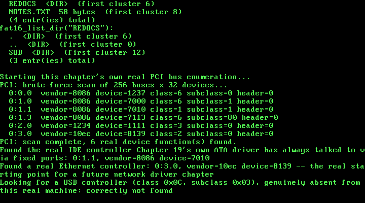

# 24. PCI Bus Enumeration: Finding the Hardware Before You Can Drive It

**What you will understand:** why every driver this book has written before this chapter could simply assume a fixed I/O port range, and why a real network card cannot be assumed that way at all; the real bit layout of PCI Configuration Mechanism #1's own `CONFIG_ADDRESS` register, cited field-for-field from OSDev Wiki's own "PCI" page, and why `CONFIG_DATA` always hands back a full 32-bit dword no matter how narrow the field you actually want is; how a real brute-force scan of 256 buses times 32 devices finds every real device on a machine without ever having to know in advance which buses exist; why the real Multi-Function bit in a device's own Header Type byte matters at all; and how this chapter's own independent verification had to reach for a genuinely different kind of ground truth than every previous chapter's own raw-disk-byte check, because what this chapter built was never written to disk in the first place.

**What you need to know first:** Chapter 19's own real ATA PIO disk driver, and this book's long-standing freestanding convention of never linking a C library or an operating-system header -- `024_pci.h`/`024_pci.c` below are entirely new this chapter, and every other file carried forward (`024_fat16.h`/`024_fat16.c`, `024_ata.c`, and the rest) is identical to Chapter 23's own, only renamed `023_` to `024_`.

## Every driver so far knew where to look before it ever ran

Chapter 19's own real ATA PIO driver talks to ports 0x1F0-0x1F7, full stop -- no lookup, no discovery, nothing to ask. That is not a shortcut this book's own driver took; it is a real fact about the PC platform's own legacy convention, cited directly in `024_ata.h`'s own top-of-file comment since Chapter 19: "The first two buses are called the Primary and Secondary ATA bus, and are almost always controlled by IO ports 0x1F0 through 0x1F7." Every driver this book has written since -- the PIT timer, the PS/2 keyboard, the serial port, the VGA text buffer -- has the exact same property: a fixed, well-known port address, true on essentially every real PC-compatible machine, known before a single byte of driver code is written.

A real network card has no such fixed address at all. Its own I/O base, its own memory-mapped register base, and its own IRQ line are assigned by firmware at boot time, and can genuinely differ from one real machine to the next -- two identical network cards in two different real computers can end up with two different real I/O bases. The only thing that IS fixed is the mechanism for ASKING the hardware where everything else lives: two 32-bit I/O ports, cited field-for-field from OSDev Wiki's own "PCI" page (https://wiki.osdev.org/PCI), `CONFIG_ADDRESS` at port `0xCF8` and `CONFIG_DATA` at port `0xCFC` -- "CONFIG_ADDRESS specifies the configuration address that is required to be accesses, while accesses to CONFIG_DATA will actually generate the configuration access." This is real "Configuration Mechanism #1", the original PCI configuration access method every real PC-compatible machine still supports. This chapter builds this kernel's first driver that discovers hardware instead of assuming it -- the real prerequisite, cited directly in the same page's own class-code table, for any future chapter that wants to write a real driver against a real network card (class 0x02, "Network Controller") or against any other PCI device this kernel hasn't already hardcoded a fixed port range for.

The real `CONFIG_ADDRESS` register's own bit layout, cited directly from the same page:

| Bits | Field |
|---|---|
| 31 | Enable bit (must be 1 for `CONFIG_DATA` to do anything) |
| 30-24 | Reserved (must be 0) |
| 23-16 | Bus Number (0-255) |
| 15-11 | Device Number (0-31) |
| 10-8 | Function Number (0-7) |
| 7-0 | Register Offset, low two bits always 0 |

"the two lowest bits of CONFIG_ADDRESS must always be zero, with the remaining six bits allowing you to choose each of the 64 32-bit words" of a device's own 256-byte configuration space. And a device slot with nothing plugged into it reads back one specific, real sentinel value on its own Vendor ID field: "Since there are no vendors that == 0xFFFF, it must be a non-existent device." -- the exact real check this chapter's own driver performs on every single function it probes, cited directly in `024_pci.h`'s own top-of-file comment below.

## `024_pci.h`/`024_pci.c`: a real brute-force scan of 256 buses, cited field-for-field

Every field this chapter's own new driver decodes is cited directly from OSDev Wiki's own "PCI" page -- both the real `CONFIG_ADDRESS` bit layout above, and the real, standard configuration-space byte layout `pci_probe_function()` decodes below. This is also this kernel's first-ever 32-bit port I/O: every earlier driver in this book only ever used `outb`/`inb` (Chapter 19's own ATA driver, the PS/2 keyboard, the serial port) or `outw` (Chapter 19's own 16-bit sector-data transfers) -- `CONFIG_DATA` genuinely requires a full 32-bit `outl`/`inl` round trip, and hands back one whole configuration-space dword per real access regardless of how narrow the field actually wanted is, so every individual field below (a 16-bit vendor ID, an 8-bit class code, a single header-type byte) is extracted by shifting and masking that dword in software:

```c
#ifndef UNIX_OS_024_PCI_H
#define UNIX_OS_024_PCI_H

#include <stdint.h>

/* This chapter's first driver that never touches a fixed, hardcoded
 * I/O port range the way every earlier driver has: Chapter 19's own
 * ATA driver always talks to 0x1F0-0x1F7 because the PC platform's
 * own legacy convention says the primary IDE controller lives there,
 * full stop -- no lookup involved. A real network card has no such
 * fixed address. Its own I/O base, memory base, and IRQ line are
 * assigned by firmware at boot and can differ from one real machine
 * to the next; the only fixed thing about it is the two 32-bit ports
 * this chapter's own code talks to in order to ASK the hardware where
 * everything else lives: CONFIG_ADDRESS (0xCF8) and CONFIG_DATA
 * (0xCFC), cited field-for-field from OSDev Wiki's own "PCI" page
 * (https://wiki.osdev.org/PCI). "CONFIG_ADDRESS specifies the
 * configuration address that is required to be accesses, while
 * accesses to CONFIG_DATA will actually generate the configuration
 * access." Writing a 32-bit value built from a bus/device/function/
 * register-offset to CONFIG_ADDRESS, then reading (or writing)
 * CONFIG_DATA, is "Configuration Mechanism #1" -- the original,
 * universally supported PCI configuration access method, and the one
 * this chapter's driver uses.
 *
 * The CONFIG_ADDRESS register's own real bit layout, cited directly
 * from the same page:
 *
 *   Bit 31      Enable bit (must be 1 for CONFIG_DATA to do anything)
 *   Bits 30-24  Reserved (must be 0)
 *   Bits 23-16  Bus Number    (0-255)
 *   Bits 15-11  Device Number (0-31)
 *   Bits 10-8   Function Number (0-7)
 *   Bits 7-0    Register Offset (the low two bits are always 0 --
 *               "the two lowest bits of CONFIG_ADDRESS must always be
 *               zero, with the remaining six bits allowing you to
 *               choose each of the 64 32-bit words" of a device's own
 *               256-byte configuration space)
 *
 * A device that does not exist reads back as all-ones on its Vendor
 * ID field: "Since there are no vendors that == 0xFFFF, it must be a
 * non-existent device." -- exactly how this driver tells a real,
 * present device apart from an empty device slot, below. */

/* PCI class codes this chapter's own code looks for by name, cited
 * from OSDev Wiki's own "PCI" page, "Class Codes" table: */
#define PCI_CLASS_MASS_STORAGE   0x01u  /* "0x1 - Mass Storage Controller" */
#define PCI_CLASS_NETWORK        0x02u  /* "0x2 - Network Controller" */
#define PCI_CLASS_BRIDGE         0x06u  /* "0x6 - Bridge" */

#define PCI_SUBCLASS_IDE         0x01u  /* "0x1 - IDE Controller" */
#define PCI_SUBCLASS_ETHERNET    0x00u  /* "0x0 - Ethernet Controller" */
#define PCI_SUBCLASS_PCI_BRIDGE  0x04u  /* "0x4 - PCI-to-PCI Bridge" */

/* The Header Type byte (configuration space offset 0x0E) packs two
 * separate things into one byte, cited from the same page: bits 6-0
 * are the real header type value (0x00 for an ordinary device, 0x01
 * for a PCI-to-PCI bridge), and bit 7 alone is the Multi-Function
 * flag -- "If it's not a multi-function device, then there is only
 * one PCI host controller [i.e. only function 0 is real]... If it's a
 * multi-function device... check remaining functions." */
#define PCI_HEADER_TYPE_MASK              0x7Fu
#define PCI_HEADER_TYPE_MULTIFUNCTION_BIT 0x80u

/* "Since there are no vendors that == 0xFFFF, it must be a
 * non-existent device" -- the exact sentinel this driver checks for
 * every function it probes. */
#define PCI_VENDOR_NONE 0xFFFFu

/* Everything this chapter's own code learns about one real PCI
 * function, decoded out of the three real 32-bit configuration-space
 * reads pci_probe_function() below actually performs. Deliberately
 * narrow: only the fields this chapter's own enumeration and
 * class-code lookup need, not the full 256-byte configuration space
 * (BARs -- Base Address Registers, which is where a real driver would
 * next learn a device's own I/O or memory base -- are left for the
 * chapter that writes a real driver against one of these devices). */
struct pci_device {
    uint8_t bus;
    uint8_t device;
    uint8_t function;
    uint16_t vendor_id;
    uint16_t device_id;
    uint8_t class_code;
    uint8_t subclass;
    uint8_t prog_if;
    uint8_t revision_id;
    uint8_t header_type;
};

/* One real 32-bit configuration-space read, at real bus/device/
 * function/register-offset coordinates. `offset` is masked to a
 * dword boundary internally (bits 1-0 forced to 0), exactly as
 * CONFIG_ADDRESS itself requires -- every field this driver ever
 * decodes comes from shifting and masking the dword this returns, in
 * software, never from a narrower port read, since CONFIG_DATA only
 * ever hands back a full 32 bits at a time regardless of how small
 * the field you actually want is. */
uint32_t pci_config_read_dword(uint8_t bus, uint8_t device, uint8_t function, uint8_t offset);

/* A real brute-force scan of every possible (bus, device) pair --
 * "For the brute force method... there are 32 devices per bus and 256
 * buses" -- checking function 0 of each, and every other function
 * too when that device's own Header Type byte sets the
 * Multi-Function bit. Prints one real line per real device function
 * found (bus:device.function, vendor ID, device ID, class, subclass,
 * header type) via kprintf, and a final count. */
void pci_enumerate(void);

/* The brute-force scan again, but stopping at (and returning, via
 * `out`) the first real device function whose own class code and
 * subclass match. Returns 1 and fills `out` if such a device was
 * found anywhere across all 256 buses; returns 0, leaving `out`
 * untouched, if no real device on this machine matches. This is the
 * real entry point a future chapter's own network or storage driver
 * would call first, to learn a specific device's real bus/device/
 * function coordinates before reading anything from its own BARs. */
int pci_find_by_class(uint8_t class_code, uint8_t subclass, struct pci_device *out);

#endif
```

```c
/* This chapter's own new driver: real PCI bus enumeration, cited
 * field-for-field from OSDev Wiki's own "PCI" page
 * (https://wiki.osdev.org/PCI) -- see 024_pci.h's own top-of-file
 * comment for the full citation of CONFIG_ADDRESS/CONFIG_DATA and the
 * real bit layout this file builds by hand below.
 *
 * Every driver this book has written before this chapter has talked
 * to hardware through ordinary 8-bit or 16-bit port I/O (outb/inb,
 * outw). This chapter's own pci_config_read_dword() is the first
 * place this kernel ever performs 32-bit port I/O (outl/inl) --
 * CONFIG_DATA hands back one full 32-bit configuration-space dword
 * per real access, regardless of how narrow the field this driver
 * actually wants is, so every individual field below (a 16-bit vendor
 * ID, an 8-bit class code, a single header-type byte) is extracted by
 * shifting and masking that dword in software, not by a narrower port
 * read. */

#include <stdint.h>

#include "024_pci.h"
#include "024_printf.h"

#define PCI_CONFIG_ADDRESS 0xCF8u
#define PCI_CONFIG_DATA    0xCFCu

static inline void outl(uint16_t port, uint32_t val) {
    __asm__ volatile ("outl %0, %1" : : "a"(val), "Nd"(port));
}

static inline uint32_t inl(uint16_t port) {
    uint32_t ret;
    __asm__ volatile ("inl %1, %0" : "=a"(ret) : "Nd"(port));
    return ret;
}

/* Builds a real CONFIG_ADDRESS value field-for-field, per the bit
 * layout cited in 024_pci.h: bit 31 is the Enable bit (always set
 * here -- this driver never reads CONFIG_DATA without it), bits
 * 23-16 the bus number, bits 15-11 the device number (masked to 5
 * real bits, 0-31), bits 10-8 the function number (masked to 3 real
 * bits, 0-7), and bits 7-0 the register offset, with its own low two
 * bits forced to 0 exactly as the cited page requires ("the two
 * lowest bits of CONFIG_ADDRESS must always be zero"). */
uint32_t pci_config_read_dword(uint8_t bus, uint8_t device, uint8_t function, uint8_t offset) {
    uint32_t address = 0x80000000u
        | ((uint32_t) bus << 16)
        | (((uint32_t) device & 0x1Fu) << 11)
        | (((uint32_t) function & 0x07u) << 8)
        | ((uint32_t) offset & 0xFCu);

    outl(PCI_CONFIG_ADDRESS, address);
    return inl(PCI_CONFIG_DATA);
}

/* One real function's worth of configuration space, decoded from
 * exactly three real dword reads (offsets 0x00, 0x08, 0x0C). Returns
 * 0 immediately, touching nothing in `out`, the instant the Vendor ID
 * field reads back 0xFFFF -- "Since there are no vendors that ==
 * 0xFFFF, it must be a non-existent device", cited directly in
 * 024_pci.h. Every other field decoded below follows the same real,
 * standard PCI configuration-space layout: offset 0x00 packs Device
 * ID (bits 31-16) over Vendor ID (bits 15-0); offset 0x08 packs Class
 * Code (bits 31-24), Subclass (bits 23-16), Prog IF (bits 15-8), and
 * Revision ID (bits 7-0); offset 0x0C packs BIST (bits 31-24), Header
 * Type (bits 23-16), Latency Timer (bits 15-8), and Cache Line Size
 * (bits 7-0) -- this driver only ever needs the first three of those
 * four fields. */
static int pci_probe_function(uint8_t bus, uint8_t device, uint8_t function,
                               struct pci_device *out) {
    uint32_t dword00 = pci_config_read_dword(bus, device, function, 0x00);
    uint16_t vendor_id = (uint16_t) (dword00 & 0xFFFFu);
    if (vendor_id == PCI_VENDOR_NONE) {
        return 0;
    }

    uint32_t dword08 = pci_config_read_dword(bus, device, function, 0x08);
    uint32_t dword0c = pci_config_read_dword(bus, device, function, 0x0C);

    out->bus = bus;
    out->device = device;
    out->function = function;
    out->vendor_id = vendor_id;
    out->device_id = (uint16_t) ((dword00 >> 16) & 0xFFFFu);
    out->revision_id = (uint8_t) (dword08 & 0xFFu);
    out->prog_if = (uint8_t) ((dword08 >> 8) & 0xFFu);
    out->subclass = (uint8_t) ((dword08 >> 16) & 0xFFu);
    out->class_code = (uint8_t) ((dword08 >> 24) & 0xFFu);
    out->header_type = (uint8_t) ((dword0c >> 16) & 0xFFu);
    return 1;
}

/* Probes function 0 of a real (bus, device) pair, and every other
 * real function 1-7 too when function 0's own Header Type byte sets
 * the Multi-Function bit -- cited directly in 024_pci.h: "If it's not
 * a multi-function device, then there is only one PCI host
 * controller... If it's a multi-function device... check remaining
 * functions." Calls `visit` once per real device function found;
 * returns nothing, since this is shared by both pci_enumerate() (which
 * wants every match) and pci_find_by_class() (which wants only the
 * first). */
static void pci_probe_device(uint16_t bus, uint8_t device,
                              void (*visit)(const struct pci_device *, void *), void *ctx) {
    struct pci_device info;
    if (!pci_probe_function((uint8_t) bus, device, 0, &info)) {
        return;
    }
    visit(&info, ctx);

    if (info.header_type & PCI_HEADER_TYPE_MULTIFUNCTION_BIT) {
        for (uint8_t function = 1; function < 8; function++) {
            struct pci_device finfo;
            if (pci_probe_function((uint8_t) bus, device, function, &finfo)) {
                visit(&finfo, ctx);
            }
        }
    }
}

static void enumerate_visit(const struct pci_device *info, void *ctx) {
    int *count = (int *) ctx;
    (*count)++;
    kprintf("  %u:%u.%u  vendor=%x device=%x class=%x subclass=%x header=%x\n",
            (unsigned) info->bus, (unsigned) info->device, (unsigned) info->function,
            (unsigned) info->vendor_id, (unsigned) info->device_id,
            (unsigned) info->class_code, (unsigned) info->subclass,
            (unsigned) (info->header_type & PCI_HEADER_TYPE_MASK));
}

/* A real brute-force scan of every possible (bus, device) pair --
 * "For the brute force method... there are 32 devices per bus and 256
 * buses, so you call 'checkDevice()' 8192 times", cited directly in
 * 024_pci.h. This driver never assumes which buses actually exist the
 * way a recursive, bridge-walking scan would; it simply asks all
 * 8192 real (bus, device) coordinates, function 0 first, and trusts
 * the real Vendor ID = 0xFFFF sentinel to skip everything empty. */
void pci_enumerate(void) {
    kprintf("PCI: brute-force scan of 256 buses x 32 devices...\n");
    int found_count = 0;

    for (uint16_t bus = 0; bus < 256; bus++) {
        for (uint8_t device = 0; device < 32; device++) {
            pci_probe_device(bus, device, enumerate_visit, &found_count);
        }
    }

    kprintf("PCI: scan complete, %d real device function(s) found.\n", found_count);
}

struct find_by_class_ctx {
    uint8_t class_code;
    uint8_t subclass;
    struct pci_device *out;
    int found;
};

static void find_by_class_visit(const struct pci_device *info, void *ctx_ptr) {
    struct find_by_class_ctx *ctx = (struct find_by_class_ctx *) ctx_ptr;
    if (ctx->found) {
        return;
    }
    if (info->class_code == ctx->class_code && info->subclass == ctx->subclass) {
        *ctx->out = *info;
        ctx->found = 1;
    }
}

/* The same real brute-force scan pci_enumerate() performs, stopping
 * the instant a real device function's own class code and subclass
 * match. This driver still probes every function of a matching
 * device's own (bus, device) pair before deciding there's no match at
 * a given coordinate (pci_probe_device() above always visits every
 * real function it finds), but the outer bus/device loop itself stops
 * as soon as `ctx.found` is set, so a match early in the scan is
 * genuinely cheap, not merely early-printed. */
int pci_find_by_class(uint8_t class_code, uint8_t subclass, struct pci_device *out) {
    struct find_by_class_ctx ctx;
    ctx.class_code = class_code;
    ctx.subclass = subclass;
    ctx.out = out;
    ctx.found = 0;

    for (uint16_t bus = 0; bus < 256 && !ctx.found; bus++) {
        for (uint8_t device = 0; device < 32 && !ctx.found; device++) {
            pci_probe_device(bus, device, find_by_class_visit, &ctx);
        }
    }

    return ctx.found;
}
```

## `024_kmain.c`: a real scan of this exact machine's own PCI bus

Every earlier chapter's own demo -- ELF loading, private page directories, the real ATA disk driver, the real FAT16 filesystem and every one of its own real subdirectory/path chapters -- is carried forward completely unchanged. This chapter's own new demo runs after all of it, scanning this exact real machine's own PCI bus, then using this chapter's own new `pci_find_by_class()` to locate two specific real devices by class code alone: the real IDE controller Chapter 19's own ATA driver has always talked to via fixed ports, and a real Ethernet controller -- new to this chapter's own QEMU command line, and the concrete first target a future network-driver chapter would need to locate this same way:

```c
/* Everything through the end of the previous chapter's own multi-
 * level path demo below -- ELF loading, private page directories,
 * Chapter 19's own real PIO-mode disk driver, Chapter 20's own
 * flat-root FAT16 filesystem, Chapter 21's own real subdirectories,
 * Chapter 22's own real fat16_rmdir(), and Chapter 23's own
 * arbitrary-depth resolve_path() -- is carried forward completely
 * unchanged.
 *
 * This chapter's own new work is entirely new: 024_pci.h/024_pci.c,
 * this kernel's first real PCI bus enumeration, cited field-for-field
 * from OSDev Wiki's own "PCI" page (see 024_pci.h's own top-of-file
 * comment for the full citation). Every driver this book has written
 * before now has talked to hardware at a fixed, hardcoded I/O port
 * range known in advance -- Chapter 19's own ATA driver always uses
 * 0x1F0-0x1F7 because the PC platform's own legacy convention says
 * so. A real network card has no such fixed address: this chapter's
 * own new demo below scans the real PCI bus this kernel is actually
 * running on, by brute force, and prints every real device function
 * it finds -- proving, among other real devices, that this exact
 * machine's own IDE controller (the one Chapter 19's driver has
 * always talked to via fixed ports, without ever knowing or asking
 * where it lives on the PCI bus) and, new to this chapter's own QEMU
 * command line, a real Ethernet controller are both really there,
 * genuinely enumerable, and identifiable by real class code alone --
 * the concrete first step a future chapter's own real network driver
 * would need before it could do anything else. */

#include <stdint.h>

#include "024_ata.h"
#include "024_fat16.h"
#include "024_elf.h"
#include "024_gdt.h"
#include "024_idt.h"
#include "024_keyboard.h"
#include "024_kheap.h"
#include "024_multiboot.h"
#include "024_paging.h"
#include "024_pci.h"
#include "024_pic.h"
#include "024_pit.h"
#include "024_pmm.h"
#include "024_printf.h"
#include "024_semaphore.h"
#include "024_serial.h"
#include "024_spinlock.h"
#include "024_syscall.h"
#include "024_task.h"
#include "024_user_program.h"
#include "024_vga.h"

#define TIMER_FREQUENCY_HZ 100

/* Deliberately far outside the 0-64 MiB identity-mapped range (which
 * only ever occupies page-directory entries 0-15): 0xC0000000 >> 22 =
 * 768. Mapping here forces paging_map_page() to allocate a genuinely
 * new page table rather than reusing one paging_init() already built. */
#define TEST_VIRT_ADDR 0xC0000000u

/* An LBA safely past this chapter's own tiny 1 MiB (2048-sector)
 * build/disk.img, chosen only to stay well clear of sector 0 -- where a
 * real partition table or boot sector would live on a disk meant to be
 * booted from, which this one never is. */
#define DISK_TEST_LBA 100u

/* Defined by 024_linker.ld, not by this file -- the linker is the one
 * part of this toolchain that genuinely knows where the kernel image's
 * last real section ends in physical memory. */
extern char kernel_end[];

/* How much real, uninterruptible-looking work each task does before
 * it naturally finishes -- large enough that many real IRQ0 ticks (at
 * 100 Hz, one every ~10 ms) land somewhere in the middle of it, since
 * a single pass through this loop takes QEMU's emulated CPU far less
 * than 10 ms. Chosen empirically from this chapter's own real run,
 * the same way every prior chapter's own real constants were. */
#define TASK_WORK_TARGET 4000000u
#define TASK_PRINT_EVERY   500000u

/* How many kmalloc()/kfree() round trips each stress task performs.
 * Chosen empirically from this chapter's own real runs: large enough
 * that, at 100 real IRQ0 ticks per second, many ticks land somewhere
 * in the middle of the whole run -- and therefore stand a real chance
 * of landing inside kmalloc()'s or kfree()'s own free-list
 * manipulation, not just between two whole calls. */
#define STRESS_ITERATIONS  3000000u
#define STRESS_PRINT_EVERY  500000u

/* This chapter's two demo tasks. Neither one calls task_yield()
 * anywhere in this loop -- the whole point. Whatever interleaving
 * this chapter's real run shows is forced entirely by the real timer,
 * not requested by either task. */
static void task_a_entry(void) {
    for (uint32_t i = 1; i <= TASK_WORK_TARGET; i++) {
        if (i % TASK_PRINT_EVERY == 0) {
            kprintf("  Task A: %u\n", i);
        }
    }
    kprintf("  Task A: done\n");
    task_exit();
}

static void task_b_entry(void) {
    for (uint32_t i = 1; i <= TASK_WORK_TARGET; i++) {
        if (i % TASK_PRINT_EVERY == 0) {
            kprintf("  Task B: %u\n", i);
        }
    }
    kprintf("  Task B: done\n");
    task_exit();
}

/* This chapter's real evidence tasks: two preemptible tasks racing on
 * kmalloc()/kfree() with no synchronization between them at all. Each
 * one only ever touches its own pointer, one allocation at a time --
 * any corruption that shows up is entirely the free list's own doing,
 * not a bug in either task's own logic. */
static void stress_task_a_entry(void) {
    for (uint32_t i = 1; i <= STRESS_ITERATIONS; i++) {
        void *p = kmalloc(32);
        if (p != 0) {
            *(volatile uint8_t *) p = 0xAA;
        }
        kfree(p);
        if (i % STRESS_PRINT_EVERY == 0) {
            kprintf("  Stress A: %u\n", i);
        }
    }
    kprintf("  Stress A: done\n");
    task_exit();
}

static void stress_task_b_entry(void) {
    for (uint32_t i = 1; i <= STRESS_ITERATIONS; i++) {
        void *p = kmalloc(64);
        if (p != 0) {
            *(volatile uint8_t *) p = 0xBB;
        }
        kfree(p);
        if (i % STRESS_PRINT_EVERY == 0) {
            kprintf("  Stress B: %u\n", i);
        }
    }
    kprintf("  Stress B: done\n");
    task_exit();
}

/* This chapter's own demo: a classic bounded-buffer producer/consumer,
 * built on this chapter's new semaphores plus Chapter 13's own
 * spinlock. `sem_empty_slots` starts at BUFFER_CAPACITY (that many
 * slots are free right now) and `sem_full_slots` starts at 0 (nothing
 * produced yet) -- the two together are what make a producer block
 * when the buffer is genuinely full and a consumer block when it is
 * genuinely empty, without either one ever spinning to find out. The
 * buffer's own read/write indices are a separate, much shorter
 * critical section, protected by an ordinary spinlock -- exactly the
 * kind of short, bounded update Chapter 13's spinlock is for. */
#define BUFFER_CAPACITY     4u
#define ITEMS_PER_PRODUCER 15u
#define ITEMS_PER_CONSUMER 15u

static int shared_buffer[BUFFER_CAPACITY];
static uint32_t buffer_write_idx = 0;
static uint32_t buffer_read_idx = 0;
static spinlock_t buffer_lock;
static semaphore_t sem_empty_slots;
static semaphore_t sem_full_slots;

static void produce(const char *label, uint32_t item_base) {
    for (uint32_t i = 1; i <= ITEMS_PER_PRODUCER; i++) {
        int item = (int) (item_base + i);

        /* Blocks for real if the buffer is already full -- this is
         * the whole point of this chapter, not busy-waiting. */
        semaphore_wait(&sem_empty_slots);

        uint32_t saved_eflags = spinlock_acquire(&buffer_lock);
        shared_buffer[buffer_write_idx] = item;
        buffer_write_idx = (buffer_write_idx + 1) % BUFFER_CAPACITY;
        spinlock_release(&buffer_lock, saved_eflags);

        semaphore_signal(&sem_full_slots);
        kprintf("  %s: produced %d\n", label, item);
    }
    kprintf("  %s: done\n", label);
    task_exit();
}

static void consume(const char *label) {
    for (uint32_t i = 1; i <= ITEMS_PER_CONSUMER; i++) {
        /* Blocks for real if the buffer is empty -- the mirror image
         * of produce()'s own semaphore_wait() above. */
        semaphore_wait(&sem_full_slots);

        uint32_t saved_eflags = spinlock_acquire(&buffer_lock);
        int item = shared_buffer[buffer_read_idx];
        buffer_read_idx = (buffer_read_idx + 1) % BUFFER_CAPACITY;
        spinlock_release(&buffer_lock, saved_eflags);

        semaphore_signal(&sem_empty_slots);
        kprintf("  %s: consumed %d\n", label, item);
    }
    kprintf("  %s: done\n", label);
    task_exit();
}

static void producer_a_entry(void) { produce("Producer A", 0u); }
static void producer_b_entry(void) { produce("Producer B", 100u); }
static void consumer_a_entry(void) { consume("Consumer A"); }
static void consumer_b_entry(void) { consume("Consumer B"); }

void kmain(uint32_t magic, uint32_t mboot_info_addr) {
    serial_init();
    vga_init();
    vga_set_color(VGA_COLOR_LIGHT_GREEN, VGA_COLOR_BLACK);

    kprintf("Unix OS from Scratch -- Chapter 24: kernel entry reached\n");

    if (magic != MULTIBOOT2_BOOTLOADER_MAGIC) {
        kprintf("FATAL: EAX held 0x%x at entry, not the real Multiboot2 magic 0x%x -- halting\n",
                magic, MULTIBOOT2_BOOTLOADER_MAGIC);
        __asm__ volatile ("cli");
        for (;;) { __asm__ volatile ("hlt"); }
    }
    kprintf("Multiboot2 magic confirmed in EAX: 0x%x\n", magic);

    const struct multiboot_tag_mmap *mmap = multiboot_find_mmap(mboot_info_addr);
    if (mmap == 0) {
        kprintf("FATAL: no memory map tag in this boot information structure -- halting\n");
        __asm__ volatile ("cli");
        for (;;) { __asm__ volatile ("hlt"); }
    }
    multiboot_print_mmap(mmap);

    uint32_t kernel_end_addr = (uint32_t) (uintptr_t) kernel_end;
    kprintf("Kernel image occupies physical 0x100000 - 0x%x\n", kernel_end_addr);

    pmm_init(mmap, 0x100000, kernel_end_addr);

    /* This chapter's own real GRUB boot MODULE -- the separately
     * compiled user program 024_elf.c's own elf_load() will read much
     * later -- has to be found and RESERVED here, before this
     * allocator ever hands out a single frame, not merely before
     * elf_load() itself runs. GRUB places a module at whatever real
     * physical address happened to be free at boot time (this chapter's
     * own real run shows physical 0x10d000, right past this kernel's
     * own image), and pmm_init() above has no way to know that address:
     * it comes from walking the boot information structure at RUN
     * time, not from this kernel's own linker script the way
     * kernel_start/kernel_end_addr do. Without this reservation, this
     * book's own real testing hit exactly the failure that gap allows:
     * paging_init()'s own very next pmm_alloc_frame() call (for its own
     * page directory) landed inside this exact module's own byte range,
     * silently overwriting part of the file elf_load() would later try
     * to read -- a real, reproducible corruption, not a hypothetical
     * one, caught by this chapter's own real captured run before this
     * fix went in. */
    const struct multiboot_tag_module *user_module = multiboot_find_module(mboot_info_addr);
    if (user_module == 0) {
        kprintf("FATAL: no boot module tag in this boot information structure -- halting\n");
        __asm__ volatile ("cli");
        for (;;) { __asm__ volatile ("hlt"); }
    }
    pmm_reserve_range(user_module->mod_start, user_module->mod_end);
    kprintf("Real GRUB boot module found and RESERVED: \"%s\", physical 0x%x - 0x%x (%u bytes)\n",
            user_module->string, user_module->mod_start, user_module->mod_end,
            user_module->mod_end - user_module->mod_start);

    uint32_t free_frames = pmm_count_free_frames();
    kprintf("Physical memory manager ready: %u free frames (%u KiB usable)\n",
            free_frames, free_frames * 4);

    uint32_t f1 = pmm_alloc_frame();
    uint32_t f2 = pmm_alloc_frame();
    uint32_t f3 = pmm_alloc_frame();
    kprintf("Allocated three real frames: 0x%x, 0x%x, 0x%x\n", f1, f2, f3);

    pmm_free_frame(f2);
    kprintf("Freed the middle frame 0x%x -- %u free frames now\n", f2, pmm_count_free_frames());

    uint32_t f4 = pmm_alloc_frame();
    kprintf("Allocated again: got 0x%x (matches the freed frame? %s)\n",
            f4, (f4 == f2) ? "yes" : "no");

    paging_init();

    uint32_t test_frame = pmm_alloc_frame();
    paging_map_page(TEST_VIRT_ADDR, test_frame, PAGE_PRESENT | PAGE_RW);

    volatile uint32_t *via_virtual = (volatile uint32_t *) TEST_VIRT_ADDR;
    volatile uint32_t *via_identity = (volatile uint32_t *) test_frame;

    *via_virtual = 0xCAFEF00Du;
    kprintf("Wrote 0x%x through virtual address 0x%x\n", *via_virtual, TEST_VIRT_ADDR);
    kprintf("Reading the SAME physical frame (0x%x) through its identity-mapped address: 0x%x\n",
            test_frame, *via_identity);

    kheap_init();

    kprintf("kmalloc: three real allocations --\n");
    void *a = kmalloc(64);
    void *b = kmalloc(128);
    void *c = kmalloc(32);
    kprintf("  a=0x%x (64 bytes), b=0x%x (128 bytes), c=0x%x (32 bytes)\n",
            (uint32_t) (uintptr_t) a, (uint32_t) (uintptr_t) b, (uint32_t) (uintptr_t) c);
    kheap_dump();

    kfree(b);
    kprintf("kfree(b) -- middle block freed:\n");
    kheap_dump();

    void *d = kmalloc(128);
    kprintf("kmalloc(128) again: got 0x%x (matches freed b? %s)\n",
            (uint32_t) (uintptr_t) d, (d == b) ? "yes" : "no");
    kheap_dump();

    kfree(a);
    kfree(c);
    kfree(d);
    kprintf("Freed a, c, d -- coalesced back to one free block?\n");
    kheap_dump();

    kprintf("kmalloc(20000) -- larger than the whole initial 16 KiB heap, forcing real growth:\n");
    void *big = kmalloc(20000);
    kprintf("  big=0x%x (20000 bytes)\n", (uint32_t) (uintptr_t) big);
    kheap_dump();
    kfree(big);

    gdt_init();
    idt_init();
    pic_remap(0x20, 0x28);
    pic_disable_all();
    keyboard_init();
    pit_init(TIMER_FREQUENCY_HZ);

    kprintf("GDT/IDT/PIC/PIT/keyboard all initialized -- enabling interrupts now\n");
    __asm__ volatile ("sti");

    while (pit_get_ticks() < 200) {
        __asm__ volatile ("hlt");
    }
    kprintf("%u real IRQ0 ticks delivered -- interrupts confirmed still working.\n", pit_get_ticks());

    kprintf("\nStarting two real PREEMPTIVELY scheduled kernel tasks (Task A, Task B)...\n");
    kprintf("Neither task -- nor this wait loop -- ever calls task_yield() itself.\n");
    uint32_t ticks_before_tasks = pit_get_ticks();
    task_init();
    int task_a_id = task_create(task_a_entry);
    int task_b_id = task_create(task_b_entry);
    kprintf("task_create() returned id %d for Task A, id %d for Task B\n", task_a_id, task_b_id);

    while (!task_is_done(task_a_id) || !task_is_done(task_b_id)) {
        __asm__ volatile ("hlt");
    }

    uint32_t ticks_after_tasks = pit_get_ticks();
    kprintf("Both tasks finished -- %u real ticks elapsed, %u total real context switches\n",
            ticks_after_tasks - ticks_before_tasks, task_switch_count());

    kprintf("\nkheap before the stress test:\n");
    kheap_dump();

    kprintf("\nStarting Stress A and Stress B: %u kmalloc()/kfree() round trips each, "
            "racing on the SAME kheap free list with no synchronization...\n", STRESS_ITERATIONS);
    int stress_a_id = task_create(stress_task_a_entry);
    int stress_b_id = task_create(stress_task_b_entry);
    kprintf("task_create() returned id %d for Stress A, id %d for Stress B\n",
            stress_a_id, stress_b_id);

    while (!task_is_done(stress_a_id) || !task_is_done(stress_b_id)) {
        __asm__ volatile ("hlt");
    }

    kprintf("Both stress tasks finished -- %u total real context switches so far\n",
            task_switch_count());
    kprintf("kheap after the stress test:\n");
    kheap_dump();

    kprintf("\nStarting a real bounded-buffer producer/consumer demo: 2 producers, 2 consumers, "
            "a %u-slot shared buffer, %u items each...\n",
            BUFFER_CAPACITY, ITEMS_PER_PRODUCER);
    spinlock_init(&buffer_lock);
    semaphore_init(&sem_empty_slots, (int) BUFFER_CAPACITY);
    semaphore_init(&sem_full_slots, 0);

    int producer_a_id = task_create(producer_a_entry);
    int producer_b_id = task_create(producer_b_entry);
    int consumer_a_id = task_create(consumer_a_entry);
    int consumer_b_id = task_create(consumer_b_entry);
    kprintf("task_create() returned id %d/%d for Producer A/B, id %d/%d for Consumer A/B\n",
            producer_a_id, producer_b_id, consumer_a_id, consumer_b_id);

    while (!task_is_done(producer_a_id) || !task_is_done(producer_b_id) ||
           !task_is_done(consumer_a_id) || !task_is_done(consumer_b_id)) {
        __asm__ volatile ("hlt");
    }

    kprintf("All producer/consumer tasks finished -- %u total real context switches so far\n",
            task_switch_count());

    kprintf("\nStarting two real PROCESSES (Process A, Process B), each with its own PRIVATE "
            "page directory -- both load the SAME real ELF module above, from its own real "
            "program headers, at its own real entry point...\n");

    uint32_t switches_before_processes = task_switch_count();

    /* task_create_elf_process() (024_task.c) builds each process's own
     * private page directory, then calls 024_elf.c's own elf_load() to
     * parse this module's real ELF header and program headers and map
     * every real PT_LOAD segment at the addresses THAT FILE specifies --
     * never a constant this kernel's own source chose. */
    int process_a_id = task_create_elf_process(user_module->mod_start, user_module->mod_end);
    int process_b_id = task_create_elf_process(user_module->mod_start, user_module->mod_end);
    kprintf("task_create_elf_process() returned id %d for Process A, id %d for Process B\n",
            process_a_id, process_b_id);

    /* This chapter's own real ring-0 proof, before either process ever
     * actually runs, run on a genuinely LOADED file's own address this
     * time rather than a kernel-chosen constant: walk each process's
     * own page directory by hand, read-only, with paging_translate_in(),
     * at the module's own real e_entry (both processes loaded the SAME
     * file, so both share the SAME e_entry number), and show it
     * resolves to two DIFFERENT real physical frames. task_page_
     * directory_phys() reports 0 for a task that is not a process, so
     * this only ever runs against a real, freshly built directory. */
    uint32_t entry_vaddr = ((const struct elf32_header *)
                             (uintptr_t) user_module->mod_start)->e_entry;
    uint32_t process_a_dir = task_page_directory_phys(process_a_id);
    uint32_t process_b_dir = task_page_directory_phys(process_b_id);
    uint32_t process_a_entry_phys = paging_translate_in(process_a_dir, entry_vaddr);
    uint32_t process_b_entry_phys = paging_translate_in(process_b_dir, entry_vaddr);
    kprintf("The loaded file's own real e_entry, virtual address 0x%x, resolves to physical "
            "0x%x in Process A's own directory, physical 0x%x in Process B's own directory "
            "(different frames? %s)\n",
            entry_vaddr, process_a_entry_phys, process_b_entry_phys,
            (process_a_entry_phys != process_b_entry_phys) ? "yes" : "no");

    while (!task_is_done(process_a_id) || !task_is_done(process_b_id)) {
        __asm__ volatile ("hlt");
    }

    uint32_t switches_during_processes = task_switch_count() - switches_before_processes;

    /* The same real, independently-checkable LOWER bound Chapter 17
     * used, now built from 024_user_program.h's own shared
     * USER_PROGRAM_ITERATIONS -- the one constant that file and this
     * one both #include, precisely so this arithmetic stays honest even
     * though the code that loops on it is compiled entirely separately
     * from the code that predicts its own switch count here. */
    uint32_t expected_minimum_switches = 2u * USER_PROGRAM_ITERATIONS + 2u;
    kprintf("Both processes finished -- %u real context switches during this phase (expected "
            "minimum from SYS_YIELD/SYS_EXIT alone: %u; any excess is real IRQ0 tick "
            "preemption), %u total real context switches since boot\n",
            switches_during_processes, expected_minimum_switches, task_switch_count());

    kprintf("\nStarting this chapter's own real disk driver demo: ATA PIO mode, primary bus, "
            "master drive...\n");

    if (!ata_identify()) {
        kprintf("FATAL: no real drive found on the primary bus's master position -- halting\n");
        __asm__ volatile ("cli");
        for (;;) { __asm__ volatile ("hlt"); }
    }

    uint8_t write_buffer[ATA_SECTOR_SIZE];
    uint8_t read_buffer[ATA_SECTOR_SIZE];

    /* A real, non-repeating pattern -- not a single constant byte --
     * so a stuck data line or an all-zeros/all-ones failure mode would
     * be just as visible as a genuine mismatch. `read_buffer` starts
     * zeroed and is never written by anything except ata_read_sector()
     * below, so a match here can only mean the disk itself held what
     * was written -- not that this kernel's own memory just echoed
     * back the buffer it already had. */
    for (uint32_t i = 0; i < ATA_SECTOR_SIZE; i++) {
        write_buffer[i] = (uint8_t) ((i * 7u + 0x11u) ^ 0xA5u);
        read_buffer[i] = 0;
    }

    kprintf("Writing a real 512-byte pattern to LBA %u (byte[0]=0x%x, byte[511]=0x%x)...\n",
            DISK_TEST_LBA, write_buffer[0], write_buffer[ATA_SECTOR_SIZE - 1]);
    ata_write_sector(DISK_TEST_LBA, write_buffer);

    kprintf("Reading LBA %u back into a SEPARATE buffer this kernel never wrote to...\n",
            DISK_TEST_LBA);
    ata_read_sector(DISK_TEST_LBA, read_buffer);

    int bytes_match = 1;
    uint32_t first_mismatch = 0;
    for (uint32_t i = 0; i < ATA_SECTOR_SIZE; i++) {
        if (write_buffer[i] != read_buffer[i]) {
            bytes_match = 0;
            first_mismatch = i;
            break;
        }
    }

    if (bytes_match) {
        kprintf("All %u bytes matched (byte[0]=0x%x, byte[511]=0x%x) -- LBA %u round-tripped "
                "through real disk I/O, not just kernel memory.\n",
                (uint32_t) ATA_SECTOR_SIZE, read_buffer[0], read_buffer[ATA_SECTOR_SIZE - 1],
                DISK_TEST_LBA);
    } else {
        kprintf("MISMATCH at byte %u: wrote 0x%x, read back 0x%x\n",
                first_mismatch, write_buffer[first_mismatch], read_buffer[first_mismatch]);
    }

    kprintf("\nStarting this chapter's own real filesystem demo: a genuine FAT16 volume, "
            "flat root directory...\n");

    fat16_format();
    if (!fat16_init()) {
        kprintf("FATAL: fat16_init() could not find a valid FAT16 volume it just formatted -- "
                "halting\n");
        __asm__ volatile ("cli");
        for (;;) { __asm__ volatile ("hlt"); }
    }

    const char *hello_text = "Hello from a real FAT16 file, Chapter 20!\n";
    uint32_t hello_len = 0;
    while (hello_text[hello_len] != '\0') {
        hello_len++;
    }

    /* Deliberately larger than one real 512-byte cluster (this
     * chapter's own volume uses exactly one sector per cluster), so
     * writing and reading it back only succeeds if this file's real
     * cluster-CHAIN walking works, not merely a single-cluster copy. */
#define BIGFILE_SIZE 1500u
    static uint8_t bigfile_data[BIGFILE_SIZE];
    for (uint32_t i = 0; i < BIGFILE_SIZE; i++) {
        bigfile_data[i] = (uint8_t) ((i * 13u + 0x2Bu) ^ 0x5Au);
    }

    uint16_t hello_first_cluster = 0;
    fat16_create_file("HELLO.TXT", (const uint8_t *) hello_text, hello_len, &hello_first_cluster);
    fat16_create_file("BIGFILE.BIN", bigfile_data, BIGFILE_SIZE, 0);

    fat16_list_root();

    char hello_readback[64];
    uint32_t hello_read_size = 0;
    int hello_ok = fat16_read_file("HELLO.TXT", (uint8_t *) hello_readback,
                                    sizeof(hello_readback), &hello_read_size);
    int hello_match = hello_ok && hello_read_size == hello_len;
    if (hello_match) {
        for (uint32_t i = 0; i < hello_len; i++) {
            if (hello_readback[i] != hello_text[i]) {
                hello_match = 0;
                break;
            }
        }
    }
    kprintf("HELLO.TXT read back: %u bytes, matches what was written? %s\n",
            hello_read_size, hello_match ? "yes" : "no");

    static uint8_t bigfile_readback[BIGFILE_SIZE];
    uint32_t bigfile_read_size = 0;
    int bigfile_ok = fat16_read_file("BIGFILE.BIN", bigfile_readback,
                                      sizeof(bigfile_readback), &bigfile_read_size);
    int bigfile_match = bigfile_ok && bigfile_read_size == BIGFILE_SIZE;
    if (bigfile_match) {
        for (uint32_t i = 0; i < BIGFILE_SIZE; i++) {
            if (bigfile_readback[i] != bigfile_data[i]) {
                bigfile_match = 0;
                break;
            }
        }
    }
    kprintf("BIGFILE.BIN read back: %u bytes across its real cluster chain, matches what was "
            "written? %s\n", bigfile_read_size, bigfile_match ? "yes" : "no");

    fat16_delete_file("HELLO.TXT");
    kprintf("Root directory after deleting HELLO.TXT:\n");
    fat16_list_root();

    uint8_t after_delete_buf[64];
    uint32_t after_delete_size = 0;
    int still_readable = fat16_read_file("HELLO.TXT", after_delete_buf,
                                          sizeof(after_delete_buf), &after_delete_size);
    kprintf("Reading HELLO.TXT after deletion: %s\n",
            still_readable ? "still readable (BUG)" : "correctly refused, file is gone");

    /* This chapter's own version of the "matches the freed frame?"
     * proof this book has run on every real allocator since Chapter
     * 7's own physical memory manager: REUSE.TXT is deliberately the
     * exact same size as the now-deleted HELLO.TXT, so it needs
     * exactly the one cluster HELLO.TXT's own deletion just freed --
     * and find_free_cluster() always searches from cluster 2 upward,
     * so the lowest-numbered free cluster (HELLO.TXT's own former
     * first cluster, freed before BIGFILE.BIN's own higher-numbered
     * clusters were ever touched) is exactly the one it finds again. */
    uint16_t reuse_first_cluster = 0;
    fat16_create_file("REUSE.TXT", (const uint8_t *) hello_text, hello_len, &reuse_first_cluster);
    kprintf("REUSE.TXT's first cluster: %u (HELLO.TXT's freed first cluster was %u -- matches? "
            "%s)\n", reuse_first_cluster, hello_first_cluster,
            (reuse_first_cluster == hello_first_cluster) ? "yes" : "no");

    kprintf("Final root directory (before this chapter's own new subdirectory demo):\n");
    fat16_list_root();

    kprintf("\nStarting this chapter's own real subdirectory demo, one level of nesting...\n");

    /* Captured (new this chapter -- Chapter 21 itself discarded this
     * value) purely so this chapter's own new rmdir demo, much further
     * below, can prove a removed directory's own freed cluster gets
     * reused, the same way it already captures hello_first_cluster/
     * reuse_first_cluster above for the deleted-FILE version of the
     * same proof. */
    uint16_t docs_first_cluster = 0;
    fat16_mkdir("DOCS", &docs_first_cluster);
    kprintf("Root directory after mkdir(\"DOCS\"):\n");
    fat16_list_root();

    const char *note_text = "A real file inside a real FAT16 subdirectory, Chapter 21!\n";
    uint32_t note_len = 0;
    while (note_text[note_len] != '\0') {
        note_len++;
    }

    fat16_create_file("DOCS/NOTES.TXT", (const uint8_t *) note_text, note_len, 0);
    kprintf("Listing DOCS (its own real \".\"/\"..\" entries included):\n");
    fat16_list_dir("DOCS");

    char note_readback[80];
    uint32_t note_read_size = 0;
    int note_ok = fat16_read_file("DOCS/NOTES.TXT", (uint8_t *) note_readback,
                                   sizeof(note_readback), &note_read_size);
    int note_match = note_ok && note_read_size == note_len;
    if (note_match) {
        for (uint32_t i = 0; i < note_len; i++) {
            if (note_readback[i] != note_text[i]) {
                note_match = 0;
                break;
            }
        }
    }
    kprintf("DOCS/NOTES.TXT read back: %u bytes, matches what was written? %s\n",
            note_read_size, note_match ? "yes" : "no");

    /* Proof this is a genuinely different real directory, not merely a
     * name this kernel happens to remember: a second, distinct real file
     * with the SAME leaf name, created directly in the root this time. */
    fat16_create_file("NOTES.TXT", (const uint8_t *) note_text, note_len, 0);
    kprintf("Root now also has its own NOTES.TXT (a real, distinct file from DOCS/NOTES.TXT):\n");
    fat16_list_root();

    /* Chapter 21's own stated refusal boundaries, exercised for real
     * rather than merely claimed in prose: deleting a directory, and a
     * path into a directory that was never created. (Chapter 21's own
     * THIRD boundary here -- a nested mkdir("DOCS/SUB") refused purely
     * for containing more than one '/' -- is removed: this chapter's
     * own new resolve_path() resolves it for real instead. See this
     * chapter's own new demo, further below, for the real replacement.) */
    kprintf("\nExercising Chapter 21's own stated refusal boundaries...\n");
    fat16_delete_file("DOCS");
    uint8_t missing_buf[16];
    uint32_t missing_size = 0;
    fat16_read_file("NOPE/MISSING.TXT", missing_buf, sizeof(missing_buf), &missing_size);

    kprintf("\nFinal listings (before this chapter's own new rmdir demo) --\n");
    fat16_list_root();
    fat16_list_dir("DOCS");

    kprintf("\nStarting this chapter's own real fat16_rmdir() demo...\n");

    fat16_mkdir("EMPTYD", 0);
    kprintf("Root directory after mkdir(\"EMPTYD\"):\n");
    fat16_list_root();

    int emptyd_removed = fat16_rmdir("EMPTYD");
    kprintf("rmdir(\"EMPTYD\") on a brand-new, genuinely empty directory: %s\n",
            emptyd_removed ? "removed" : "refused (BUG)");
    kprintf("Root directory after rmdir(\"EMPTYD\"):\n");
    fat16_list_root();

    /* Chapter 22's own stated refusal boundaries, exercised for real
     * rather than merely claimed in prose: rmdir on a directory that
     * still holds a real file, rmdir on a real file (not a directory
     * at all), and rmdir on a name that was never created. (Chapter
     * 22's own FOURTH boundary here -- a nested rmdir("DOCS/SUB")
     * refused purely for containing more than one '/' -- is removed
     * for the same reason as fat16_mkdir()'s own removal above.) */
    kprintf("\nExercising Chapter 22's own stated refusal boundaries...\n");
    int docs_removed_early = fat16_rmdir("DOCS");
    kprintf("rmdir(\"DOCS\") while it still holds DOCS/NOTES.TXT: %s\n",
            docs_removed_early ? "removed (BUG)" : "correctly refused, not empty");
    int reuse_txt_removed = fat16_rmdir("REUSE.TXT");
    kprintf("rmdir(\"REUSE.TXT\") on a real file, not a directory: %s\n",
            reuse_txt_removed ? "removed (BUG)" : "correctly refused, not a directory");
    int nope_removed = fat16_rmdir("NOPE");
    kprintf("rmdir(\"NOPE\") on a name that was never created: %s\n",
            nope_removed ? "removed (BUG)" : "correctly refused, not found");

    kprintf("\nEmptying DOCS for real, then removing it...\n");
    fat16_delete_file("DOCS/NOTES.TXT");
    kprintf("DOCS after deleting its own last real file (nothing left but \".\"/\"..\"):\n");
    fat16_list_dir("DOCS");

    int docs_removed = fat16_rmdir("DOCS");
    kprintf("rmdir(\"DOCS\") now that it is genuinely empty: %s\n",
            docs_removed ? "removed" : "refused (BUG)");
    kprintf("Root directory after rmdir(\"DOCS\"):\n");
    fat16_list_root();

    /* This chapter's own version of the "matches the freed cluster?"
     * proof this book has run on every real allocator since Chapter
     * 7's own physical memory manager, and on a deleted FILE's own
     * cluster since Chapter 20's own REUSE.TXT: find_free_cluster()
     * always scans forward from cluster 2, so the lowest-numbered free
     * cluster in the whole volume, right now, is exactly the one
     * rmdir("DOCS") just freed -- nothing lower-numbered was ever
     * freed since, and every cluster below it remains genuinely in use
     * (REUSE.TXT, BIGFILE.BIN's own chain). */
    uint16_t redocs_first_cluster = 0;
    fat16_mkdir("REDOCS", &redocs_first_cluster);
    kprintf("REDOCS's first cluster: %u (DOCS's freed first cluster was %u -- matches? %s)\n",
            redocs_first_cluster, docs_first_cluster,
            (redocs_first_cluster == docs_first_cluster) ? "yes" : "no");

    kprintf("\nStarting this chapter's own real multi-level path demo...\n");

    /* Chapter 21's own fat16_mkdir() and Chapter 22's own fat16_rmdir()
     * each refused outright the instant a name held more than one
     * real '/' -- a genuine, deliberately stated one-level-of-nesting
     * scope. This chapter's own new resolve_path() lifts exactly that
     * limit: every real path component is looked up, in order, in the
     * real directory the previous component resolved to, cited
     * directly (IEEE Std 1003.1-2008, Base Definitions, Section 4.11,
     * "Pathname Resolution"). Three real, genuinely nested
     * subdirectories, created one real fat16_mkdir() call at a time --
     * this chapter's own resolve_path() still refuses outright if an
     * intermediate component doesn't already exist, so LEVEL1/LEVEL2
     * could not have been created before LEVEL1 itself, nor
     * LEVEL1/LEVEL2/LEVEL3 before LEVEL1/LEVEL2. */
    uint16_t level1_first_cluster = 0;
    fat16_mkdir("LEVEL1", &level1_first_cluster);
    uint16_t level2_first_cluster = 0;
    fat16_mkdir("LEVEL1/LEVEL2", &level2_first_cluster);
    uint16_t level3_first_cluster = 0;
    fat16_mkdir("LEVEL1/LEVEL2/LEVEL3", &level3_first_cluster);
    kprintf("Created LEVEL1 (cluster %u), LEVEL1/LEVEL2 (cluster %u), LEVEL1/LEVEL2/LEVEL3 "
            "(cluster %u) -- three real levels of nesting\n",
            level1_first_cluster, level2_first_cluster, level3_first_cluster);

    const char *deep_text = "A real file three real levels deep in a real FAT16 volume, Chapter 23!\n";
    uint32_t deep_len = 0;
    while (deep_text[deep_len] != '\0') {
        deep_len++;
    }
    fat16_create_file("LEVEL1/LEVEL2/LEVEL3/DEEP.TXT", (const uint8_t *) deep_text, deep_len, 0);

    kprintf("Listing LEVEL1/LEVEL2/LEVEL3 (its own real \".\"/\"..\" entries included):\n");
    fat16_list_dir("LEVEL1/LEVEL2/LEVEL3");

    char deep_readback[96];
    uint32_t deep_read_size = 0;
    int deep_ok = fat16_read_file("LEVEL1/LEVEL2/LEVEL3/DEEP.TXT", (uint8_t *) deep_readback,
                                   sizeof(deep_readback), &deep_read_size);
    int deep_match = deep_ok && deep_read_size == deep_len;
    if (deep_match) {
        for (uint32_t i = 0; i < deep_len; i++) {
            if (deep_readback[i] != deep_text[i]) {
                deep_match = 0;
                break;
            }
        }
    }
    kprintf("LEVEL1/LEVEL2/LEVEL3/DEEP.TXT read back through three real levels of nesting: %u "
            "bytes, matches what was written? %s\n", deep_read_size, deep_match ? "yes" : "no");

    /* This chapter's own new stated refusal boundaries -- an
     * intermediate path component that was never created, and an
     * intermediate path component that names a real FILE rather than
     * a real directory -- both refused outright by resolve_path()
     * itself, cited directly above it: "Pathname resolution shall
     * fail if this cannot be accomplished" -- rather than guessing,
     * auto-creating, or silently treating a file as though it were a
     * directory. */
    kprintf("\nExercising this chapter's own new stated refusal boundaries...\n");
    uint16_t ghost_cluster = 0;
    int ghost_mkdir = fat16_mkdir("GHOST/CHILD", &ghost_cluster);
    kprintf("mkdir(\"GHOST/CHILD\") through an intermediate component that was never created: "
            "%s\n", ghost_mkdir ? "created (BUG)" : "correctly refused, GHOST doesn't exist");

    int file_as_dir_mkdir = fat16_mkdir("REUSE.TXT/CHILD", 0);
    kprintf("mkdir(\"REUSE.TXT/CHILD\") through an intermediate component that is a real FILE, "
            "not a directory: %s\n",
            file_as_dir_mkdir ? "created (BUG)" : "correctly refused, not a directory");

    /* Chapter 21's own boundary, lifted for real: its own fat16_mkdir()
     * refused "DOCS/SUB" outright purely because it contained a '/' --
     * this chapter's own resolve_path() now resolves it like any other
     * path instead. */
    uint16_t redocs_sub_cluster = 0;
    int redocs_sub_created = fat16_mkdir("REDOCS/SUB", &redocs_sub_cluster);
    kprintf("mkdir(\"REDOCS/SUB\") -- refused outright in Chapter 21, now resolved for real: %s "
            "(cluster %u)\n", redocs_sub_created ? "created" : "refused (BUG)", redocs_sub_cluster);

    kprintf("\nRemoving the real nested chain bottom-up...\n");
    fat16_delete_file("LEVEL1/LEVEL2/LEVEL3/DEEP.TXT");
    int level3_removed = fat16_rmdir("LEVEL1/LEVEL2/LEVEL3");
    kprintf("rmdir(\"LEVEL1/LEVEL2/LEVEL3\") now that it's empty: %s\n",
            level3_removed ? "removed" : "refused (BUG)");
    int level2_removed = fat16_rmdir("LEVEL1/LEVEL2");
    kprintf("rmdir(\"LEVEL1/LEVEL2\") now that it's empty: %s\n",
            level2_removed ? "removed" : "refused (BUG)");
    int level1_removed = fat16_rmdir("LEVEL1");
    kprintf("rmdir(\"LEVEL1\") now that it's empty: %s\n",
            level1_removed ? "removed" : "refused (BUG)");

    kprintf("\nFinal listings --\n");
    fat16_list_root();
    fat16_list_dir("REDOCS");

    /* This chapter's own new work: a real, brute-force PCI bus scan,
     * cited field-for-field in 024_pci.h/024_pci.c. Every driver
     * above this point in kmain() -- the ATA disk driver Chapter 19
     * wrote, and everything built on top of it since -- has always
     * talked to hardware at a fixed port address, known in advance,
     * with no lookup involved. This demo runs after all of that
     * existing work, not before it, deliberately: a real operating
     * system would enumerate its PCI bus early, before initializing
     * any PCI-based driver, but nothing above this point in kmain()
     * is a PCI-based driver -- the ATA driver talks to fixed legacy
     * ports 0x1F0-0x1F7 whether or not a PCI IDE controller happens
     * to sit behind them, so there was never a real ordering
     * dependency to respect, and this book's own established
     * pattern keeps each new chapter's own work appended as its own
     * demo rather than rearchitecting kmain()'s existing call order. */
    kprintf("\nStarting this chapter's own real PCI bus enumeration...\n");
    pci_enumerate();

    /* A concrete tie-back to hardware this kernel already knows
     * about: Chapter 19's own ATA driver has been reading and writing
     * real sectors through ports 0x1F0-0x1F7 since Chapter 19, but it
     * has never once asked the PCI bus where its own controller
     * lives -- legacy IDE ports are fixed by platform convention, not
     * discovered. This call proves the real IDE controller is there
     * to be FOUND by class code alone anyway, entirely independently
     * of the fixed ports the ATA driver has always just assumed. */
    struct pci_device ide_controller;
    int ide_found = pci_find_by_class(PCI_CLASS_MASS_STORAGE, PCI_SUBCLASS_IDE, &ide_controller);
    if (ide_found) {
        kprintf("Found the real IDE controller Chapter 19's own ATA driver has always talked to "
                "via fixed ports: %u:%u.%u, vendor=%x device=%x\n",
                (unsigned) ide_controller.bus, (unsigned) ide_controller.device,
                (unsigned) ide_controller.function, (unsigned) ide_controller.vendor_id,
                (unsigned) ide_controller.device_id);
    } else {
        kprintf("No real IDE controller found by class code (BUG -- Chapter 19's own driver "
                "would not work at all)\n");
    }

    /* The real reason this chapter exists: a future network driver's
     * own real starting point. This chapter's own QEMU command line
     * is the first one in this book to attach a real network card at
     * all -- pci_find_by_class() proves it is really there, on the
     * real PCI bus, addressable by real bus/device/function
     * coordinates this chapter's own driver never had to guess or
     * hardcode, exactly the way a real network driver's own
     * initialization would begin. */
    struct pci_device nic;
    int nic_found = pci_find_by_class(PCI_CLASS_NETWORK, PCI_SUBCLASS_ETHERNET, &nic);
    if (nic_found) {
        kprintf("Found a real Ethernet controller: %u:%u.%u, vendor=%x device=%x -- the real "
                "starting point for a future network driver chapter\n",
                (unsigned) nic.bus, (unsigned) nic.device, (unsigned) nic.function,
                (unsigned) nic.vendor_id, (unsigned) nic.device_id);
    } else {
        kprintf("No real Ethernet controller found (BUG -- this chapter's own QEMU command line "
                "is supposed to attach one)\n");
    }

    /* This chapter's own real refusal boundary: a class/subclass
     * pair this real machine genuinely has no device for. QEMU's own
     * default i440fx machine, as configured by this chapter's own
     * command line, attaches no USB controller at all -- so this is
     * a real, honest "not found" outcome, not a simulated one. */
    struct pci_device usb_controller;
    int usb_found = pci_find_by_class(0x0C, 0x03, &usb_controller);
    kprintf("Looking for a USB controller (class 0x0C, subclass 0x03), genuinely absent from "
            "this real machine: %s\n", usb_found ? "found (unexpected)" : "correctly not found");
}
```

## Real output: six real device functions, found and verified two different ways

Building and booting this chapter's own kernel image for real in QEMU (`-m 64M`, this chapter's own carried-forward 8 MiB disk, plus one genuinely new addition to the command line: `-netdev user,id=n0 -device rtl8139,netdev=n0`, this chapter's first real network card) produces a clean build:

**Output (cloud sandbox -- real, live-executed build output)**

```text
=== Assembling ASM ===
=== Compiling C ===
=== Linking kernel ===
ld: warning: build/024_usermode.o: missing .note.GNU-stack section implies executable stack
ld: NOTE: This behaviour is deprecated and will be removed in a future version of the linker
ld: warning: build/kernel.bin has a LOAD segment with RWX permissions
=== Building user program ===
=== Checking multiboot2 ===
MULTIBOOT_OK
=== Building ISO ===
xorriso : NOTE : Copying to System Area: 512 bytes from file '/usr/lib/grub/i386-pc/boot_hybrid.img'
ISO image produced: 2533 sectors
Written to medium : 2533 sectors at LBA 0
Writing to 'stdio:build/os.iso' completed successfully.
=== DONE ===
```

And a real, live-executed serial capture of the whole boot -- every earlier chapter's own phases first, then this chapter's own new PCI enumeration at the very end:

**Output (cloud sandbox -- real, live-executed serial capture, QEMU, `-m 64M`, 8 MiB disk and a real RTL8139 Ethernet card attached)**

```text
Unix OS from Scratch -- Chapter 24: kernel entry reached
Multiboot2 magic confirmed in EAX: 0x36d76289
Multiboot2 memory map: 6 real entries, 24 bytes each
  base 0x0  length 0x9fc00  type 1 (available)
  base 0x9fc00  length 0x400  type 2
  base 0xf0000  length 0x10000  type 2
  base 0x100000  length 0x3ee0000  type 1 (available)
  base 0x3fe0000  length 0x20000  type 2
  base 0xfffc0000  length 0x40000  type 2
Kernel image occupies physical 0x100000 - 0x111538
Real GRUB boot module found and RESERVED: "user_program", physical 0x114000 - 0x115304 (4868 bytes)
Physical memory manager ready: 16076 free frames (64304 KiB usable)
Allocated three real frames: 0x112000, 0x113000, 0x116000
Freed the middle frame 0x113000 -- 16074 free frames now
Allocated again: got 0x113000 (matches the freed frame? yes)
Paging: allocating page directory...
Paging: page directory at 0x117000. Identity-mapping 0-64MiB (16 page tables)...
Paging: identity map built. Loading CR3 and setting CR0.PG...
Paging: CR0 = 0x80000011 (PG bit: 1). Paging is now live.
Wrote 0xcafef00d through virtual address 0xc0000000
Reading the SAME physical frame (0x128000) through its identity-mapped address: 0xcafef00d
kheap: initialized at 0xd0000000, 16368 bytes usable (4 pages mapped)
kmalloc: three real allocations --
  a=0xd0000010 (64 bytes), b=0xd0000060 (128 bytes), c=0xd00000f0 (32 bytes)
  block 0: addr 0xd0000010 size 64 USED
  block 1: addr 0xd0000060 size 128 USED
  block 2: addr 0xd00000f0 size 32 USED
  block 3: addr 0xd0000120 size 16096 FREE
kfree(b) -- middle block freed:
  block 0: addr 0xd0000010 size 64 USED
  block 1: addr 0xd0000060 size 128 FREE
  block 2: addr 0xd00000f0 size 32 USED
  block 3: addr 0xd0000120 size 16096 FREE
kmalloc(128) again: got 0xd0000060 (matches freed b? yes)
  block 0: addr 0xd0000010 size 64 USED
  block 1: addr 0xd0000060 size 128 USED
  block 2: addr 0xd00000f0 size 32 USED
  block 3: addr 0xd0000120 size 16096 FREE
Freed a, c, d -- coalesced back to one free block?
  block 0: addr 0xd0000010 size 16368 FREE
kmalloc(20000) -- larger than the whole initial 16 KiB heap, forcing real growth:
kheap: growing by 5 page(s) (20480 bytes), old top 0xd0004000, new top 0xd0009000
  big=0xd0000010 (20000 bytes)
  block 0: addr 0xd0000010 size 20000 USED
  block 1: addr 0xd0004e40 size 16832 FREE
GDT/IDT/PIC/PIT/keyboard all initialized -- enabling interrupts now
tick: 100
tick: 200
200 real IRQ0 ticks delivered -- interrupts confirmed still working.

Starting two real PREEMPTIVELY scheduled kernel tasks (Task A, Task B)...
Neither task -- nor this wait loop -- ever calls task_yield() itself.
task_create() returned id 1 for Task A, id 2 for Task B
  Task A: 500000
  Task A: 1000000
  Task B: 500000
  Task B: 1000000
  Task A: 1500000
  Task A: 2000000
  Task B: 1500000
  Task B: 2000000
  Task A: 2500000
  Task A: 3000000
  Task B: 2500000
  Task B: 3000000
  Task A: 3500000
  Task A: 4000000
  Task B: 3500000
  Task B: 4000000
  Task B:  Task A: done
 done
Both tasks finished -- 13 real ticks elapsed, 15 total real context switches

kheap before the stress test:
  block 0: addr 0xd0000010 size 4096 USED
  block 1: addr 0xd0001020 size 4096 USED
  block 2: addr 0xd0002030 size 28624 FREE

Starting Stress A and Stress B: 3000000 kmalloc()/kfree() round trips each, racing on the SAME kheap free list with no synchronization...
task_create() returned id 3 for Stress A, id 4 for Stress B
  Stress B: 500000
  Stress A: 500000
tick: 300
  Stress B: 1000000
  Stress A: 1000000
tick: 400
  Stress A: 1500000
  Stress B: 1500000
tick: 500
  Stress A: 2000000
  Stress B: 2000000
  Stress A: 2500000
  Stress B: 2500000
tick: 600
  Stress A: 3000000
  Stress A: done
  Stress B: 3000000
  Stress B: done
Both stress tasks finished -- 458 total real context switches so far
kheap after the stress test:
  block 0: addr 0xd0000010 size 4096 USED
  block 1: addr 0xd0001020 size 4096 USED
  block 2: addr 0xd0002030 size 4096 USED
  block 3: addr 0xd0003040 size 4096 USED
  block 4: addr 0xd0004050 size 20400 FREE

Starting a real bounded-buffer producer/consumer demo: 2 producers, 2 consumers, a 4-slot shared buffer, 15 items each...
task_create() returned id 5/6 for Producer A/B, id 7/8 for Consumer A/B
  Producer A: produced 1
  Producer A: produced 2
  Producer A: produced 3
  Producer A: produced 4
  semaphore_wait: task 5 blocking (no units available)
  semaphore_wait: task 6 blocking (no units available)
  semaphore_signal: waking task 5
  Consumer A: consumed 1
  semaphore_signal: waking task 6
  Consumer A: consumed 2
  Consumer A: consumed 3
  Consumer A: consumed 4
  semaphore_wait: task 7 blocking (no units available)
  semaphore_wait: task 8 blocking (no units available)
  semaphore_signal: waking task 7
  Producer A: produced 5
  semaphore_signal: waking task 8
  Producer A: produced 6
  Producer A: produced 7
  semaphore_wait: task 5 blocking (no units available)
  semaphore_signal: waking task 5
  Producer A: produced 8
  semaphore_wait: task 5 blocking (no units available)
  Producer B: produced 101
  semaphore_wait: task 6 blocking (no units available)
  semaphore_signal: waking task 5
  Consumer A: consumed 6
  Consumer B: consumed 5
  semaphore_signal: waking task 6
  Consumer B: consumed 7
  Consumer B: consumed 8
  Consumer B: consumed 101
  semaphore_wait: task 8 blocking (no units available)
  semaphore_signal: waking task 8
  Producer A: produced 9
  Producer A: produced 10
  Producer A: produced 11
  semaphore_wait: task 5 blocking (no units available)
  Producer B: produced 102
  semaphore_wait: task 6 blocking (no units available)
  semaphore_signal: waking task 5
  Consumer A: consumed 9
  semaphore_signal: waking task 6
  Consumer A: consumed 10
  Consumer A: consumed 11
  Producer A: produced 12
  Producer A: produced 13
  semaphore_wait: task 5 blocking (no units available)
  semaphore_signal: waking task 5
  Consumer A: consumed 102
  Consumer B: consumed 12
  Consumer B: consumed 13
  semaphore_wait: task 8 blocking (no units available)
  semaphore_signal: waking task 8
  Producer A: produced 14
  Producer A: produced 15
  Producer A: done
  Producer B: produced 103
  Producer B: produced 104
  semaphore_wait: task 6 blocking (no units available)
  semaphore_signal: waking task 6
  Consumer A: consumed 14
  Consumer A: consumed 15
  Consumer A: consumed 103
  semaphore_wait: task 7 blocking (no units available)
  Consumer B: consumed 104
  semaphore_wait: task 8 blocking (no units available)
  semaphore_signal: waking task 7
  Producer B: produced 105
  semaphore_signal: waking task 8
  Producer B: produced 106
  Producer B: produced 107
  Producer B: produced 108
  semaphore_wait: task 6 blocking (no units available)
  semaphore_signal: waking task 6
  Consumer A: consumed 105
  Consumer A: consumed 106
  Consumer A: consumed 107
  Consumer A: done
  Consumer B: consumed 108
  semaphore_wait: task 8 blocking (no units available)
  semaphore_signal: waking task 8
  Producer B: produced 109
  Producer B: produced 110
  Producer B: produced 111
  Producer B: produced 112
  semaphore_wait: task 6 blocking (no units available)
  semaphore_signal: waking task 6
  Producer B: produced 113
  semaphore_wait: task 6 blocking (no units available)
  Consumer B: consumed 109
  semaphore_signal: waking task 6
  Consumer B: consumed 110
  Producer B: produced 114
  semaphore_wait: task 6 blocking (no units available)
  semaphore_signal: waking task 6
  Consumer B: consumed 111
  Consumer B: consumed 112
  Producer B: produced 115
  Producer B: done
  Consumer B: consumed 113
  Consumer B: consumed 114
  Consumer B: consumed 115
  Consumer B: done
All producer/consumer tasks finished -- 512 total real context switches so far

Starting two real PROCESSES (Process A, Process B), each with its own PRIVATE page directory -- both load the SAME real ELF module above, from its own real program headers, at its own real entry point...
kheap: growing by 2 page(s) (8192 bytes), old top 0xd0009000, new top 0xd000b000
elf_load: valid ELF32 executable, e_entry=0xe9000000, 2 program header(s)
elf_load: PT_LOAD vaddr=0xe9000000 filesz=268 memsz=268 flags=R -- 1 page(s) mapped
elf_load: valid ELF32 executable, e_entry=0xe9000000, 2 program header(s)
elf_load: PT_LOAD vaddr=0xe9000000 filesz=268 memsz=268 flags=R -- 1 page(s) mapped
task_create_elf_process() returned id 9 for Process A, id 10 for Process B
The loaded file's own real e_entry, virtual address 0xe9000000, resolves to physical 0x137000 in Process A's own directory, physical 0x13c000 in Process B's own  printed via a real SYS_WRITE_STR, now yielding via a real SYS_YIELD (this line runs from a genuinely separate, separately linked ELF file)
  printed via a real SYS_WRITE_STR, now yielding via a real SYS_YIELD (this line runs from a genuinely separate, separately linked ELF file)
  printed via a real SYS_WRITE_STR, now yielding via a real SYS_YIELD (this line runs from a genuinely separate, separately linked ELF file)
  printed via a real SYS_WRITE_STR, now yielding via a real SYS_YIELD (this line runs from a genuinely separate, separately linked ELF file)
 directory (different frames? yes)
  printed via a real SYS_WRITE_STR, now yielding via a real SYS_YIELD (this line runs from a genuinely separate, separately linked ELF file)
  printed via a real SYS_WRITE_STR, now yielding via a real SYS_YIELD (this line runs from a genuinely separate, separately linked ELF file)
  printed via a real SYS_WRITE_STR, now yielding via a real SYS_YIELD (this line runs from a genuinely separate, separately linked ELF file)
  printed via a real SYS_WRITE_STR, now yielding via a real SYS_YIELD (this line runs from a genuinely separate, separately linked ELF file)
  printed via a real SYS_WRITE_STR, now yielding via a real SYS_YIELD (this line runs from a genuinely separate, separately linked ELF file)
  printed via a real SYS_WRITE_STR, now yielding via a real SYS_YIELD (this line runs from a genuinely separate, separately linked ELF file)
Both processes finished -- 18 real context switches during this phase (expected minimum from SYS_YIELD/SYS_EXIT alone: 12; any excess is real IRQ0 tick preemption), 530 total real context switches since boot

Starting this chapter's own real disk driver demo: ATA PIO mode, primary bus, master drive...
ata_identify: real drive found on the primary bus's master position
Writing a real 512-byte pattern to LBA 100 (byte[0]=0xb4, byte[511]=0xaf)...
Reading LBA 100 back into a SEPARATE buffer this kernel never wrote to...
All 512 bytes matched (byte[0]=0xb4, byte[511]=0xaf) -- LBA 100 round-tripped through real disk I/O, not just kernel memory.

Starting this chapter's own real filesystem demo: a genuine FAT16 volume, flat root directory...
fat16_format: writing real boot sector/BPB to LBA 0...
fat16_format: zeroing 128 real FAT sectors (2 copies)...
fat16_format: zeroing 32 real root directory sectors...
tick: 700
fat16_format: done -- real FAT16 volume written to disk
fat16_init: real volume "UNIXOSFAT16" -- 512 bytes/sector, 1 sector(s)/cluster, 2 FAT(s) * 64 sectors, root dir 32 sectors (first at LBA 129), data starts LBA 161, 16223 usable clusters
fat16_create_file: "HELLO.TXT" -- 42 bytes, 1 cluster(s), first cluster 2
fat16_create_file: "BIGFILE.BIN" -- 1500 bytes, 3 cluster(s), first cluster 3
fat16_list_root:
  HELLO.TXT  42 bytes  (first cluster 2)
  BIGFILE.BIN  1500 bytes  (first cluster 3)
  (2 entr(ies) total)
fat16_read_file: "HELLO.TXT" -- 42 bytes read
HELLO.TXT read back: 42 bytes, matches what was written? yes
fat16_read_file: "BIGFILE.BIN" -- 1500 bytes read
BIGFILE.BIN read back: 1500 bytes across its real cluster chain, matches what was written? yes
fat16_delete_file: "HELLO.TXT" -- 1 cluster(s) freed
Root directory after deleting HELLO.TXT:
fat16_list_root:
  BIGFILE.BIN  1500 bytes  (first cluster 3)
  (1 entr(ies) total)
fat16_read_file: "HELLO.TXT" not found -- refusing
Reading HELLO.TXT after deletion: correctly refused, file is gone
fat16_create_file: "REUSE.TXT" -- 42 bytes, 1 cluster(s), first cluster 2
REUSE.TXT's first cluster: 2 (HELLO.TXT's freed first cluster was 2 -- matches? yes)
Final root directory (before this chapter's own new subdirectory demo):
fat16_list_root:
  REUSE.TXT  42 bytes  (first cluster 2)
  BIGFILE.BIN  1500 bytes  (first cluster 3)
  (2 entr(ies) total)

Starting this chapter's own real subdirectory demo, one level of nesting...
fat16_mkdir: "DOCS" -- real subdirectory created, first cluster 6
Root directory after mkdir("DOCS"):
fat16_list_root:
  REUSE.TXT  42 bytes  (first cluster 2)
  BIGFILE.BIN  1500 bytes  (first cluster 3)
  DOCS  <DIR>  (first cluster 6)
  (3 entr(ies) total)
fat16_create_file: "DOCS/NOTES.TXT" -- 58 bytes, 1 cluster(s), first cluster 7
Listing DOCS (its own real "."/".." entries included):
fat16_list_dir("DOCS"):
  .  <DIR>  (first cluster 6)
  ..  <DIR>  (first cluster 0)
  NOTES.TXT  58 bytes  (first cluster 7)
  (3 entr(ies) total)
fat16_read_file: "DOCS/NOTES.TXT" -- 58 bytes read
DOCS/NOTES.TXT read back: 58 bytes, matches what was written? yes
fat16_create_file: "NOTES.TXT" -- 58 bytes, 1 cluster(s), first cluster 8
Root now also has its own NOTES.TXT (a real, distinct file from DOCS/NOTES.TXT):
fat16_list_root:
  REUSE.TXT  42 bytes  (first cluster 2)
  BIGFILE.BIN  1500 bytes  (first cluster 3)
  DOCS  <DIR>  (first cluster 6)
  NOTES.TXT  58 bytes  (first cluster 8)
  (4 entr(ies) total)

Exercising Chapter 21's own stated refusal boundaries...
fat16_delete_file: "DOCS" is a real directory -- use fat16_rmdir() instead -- refusing
fat16_read_file: "NOPE/MISSING.TXT" -- directory component not found, or not really a directory -- refusing

Final listings (before this chapter's own new rmdir demo) --
fat16_list_root:
  REUSE.TXT  42 bytes  (first cluster 2)
  BIGFILE.BIN  1500 bytes  (first cluster 3)
  DOCS  <DIR>  (first cluster 6)
  NOTES.TXT  58 bytes  (first cluster 8)
  (4 entr(ies) total)
fat16_list_dir("DOCS"):
  .  <DIR>  (first cluster 6)
  ..  <DIR>  (first cluster 0)
  NOTES.TXT  58 bytes  (first cluster 7)
  (3 entr(ies) total)

Starting this chapter's own real fat16_rmdir() demo...
fat16_mkdir: "EMPTYD" -- real subdirectory created, first cluster 9
Root directory after mkdir("EMPTYD"):
fat16_list_root:
  REUSE.TXT  42 bytes  (first cluster 2)
  BIGFILE.BIN  1500 bytes  (first cluster 3)
  DOCS  <DIR>  (first cluster 6)
  NOTES.TXT  58 bytes  (first cluster 8)
  EMPTYD  <DIR>  (first cluster 9)
  (5 entr(ies) total)
fat16_rmdir: "EMPTYD" -- 1 cluster(s) freed
rmdir("EMPTYD") on a brand-new, genuinely empty directory: removed
Root directory after rmdir("EMPTYD"):
fat16_list_root:
  REUSE.TXT  42 bytes  (first cluster 2)
  BIGFILE.BIN  1500 bytes  (first cluster 3)
  DOCS  <DIR>  (first cluster 6)
  NOTES.TXT  58 bytes  (first cluster 8)
  (4 entr(ies) total)

Exercising Chapter 22's own stated refusal boundaries...
fat16_rmdir: "DOCS" is not empty -- refusing
rmdir("DOCS") while it still holds DOCS/NOTES.TXT: correctly refused, not empty
fat16_rmdir: "REUSE.TXT" is a real file, not a directory -- use fat16_delete_file() instead -- refusing
rmdir("REUSE.TXT") on a real file, not a directory: correctly refused, not a directory
fat16_rmdir: "NOPE" not found -- refusing
rmdir("NOPE") on a name that was never created: correctly refused, not found

Emptying DOCS for real, then removing it...
fat16_delete_file: "DOCS/NOTES.TXT" -- 1 cluster(s) freed
DOCS after deleting its own last real file (nothing left but "."/".."):
fat16_list_dir("DOCS"):
  .  <DIR>  (first cluster 6)
  ..  <DIR>  (first cluster 0)
  (2 entr(ies) total)
fat16_rmdir: "DOCS" -- 1 cluster(s) freed
rmdir("DOCS") now that it is genuinely empty: removed
Root directory after rmdir("DOCS"):
fat16_list_root:
  REUSE.TXT  42 bytes  (first cluster 2)
  BIGFILE.BIN  1500 bytes  (first cluster 3)
  NOTES.TXT  58 bytes  (first cluster 8)
  (3 entr(ies) total)
fat16_mkdir: "REDOCS" -- real subdirectory created, first cluster 6
REDOCS's first cluster: 6 (DOCS's freed first cluster was 6 -- matches? yes)

Starting this chapter's own real multi-level path demo...
fat16_mkdir: "LEVEL1" -- real subdirectory created, first cluster 7
fat16_mkdir: "LEVEL1/LEVEL2" -- real subdirectory created, first cluster 9
fat16_mkdir: "LEVEL1/LEVEL2/LEVEL3" -- real subdirectory created, first cluster 10
Created LEVEL1 (cluster 7), LEVEL1/LEVEL2 (cluster 9), LEVEL1/LEVEL2/LEVEL3 (cluster 10) -- three real levels of nesting
fat16_create_file: "LEVEL1/LEVEL2/LEVEL3/DEEP.TXT" -- 71 bytes, 1 cluster(s), first cluster 11
Listing LEVEL1/LEVEL2/LEVEL3 (its own real "."/".." entries included):
fat16_list_dir("LEVEL1/LEVEL2/LEVEL3"):
  .  <DIR>  (first cluster 10)
  ..  <DIR>  (first cluster 9)
  DEEP.TXT  71 bytes  (first cluster 11)
  (3 entr(ies) total)
fat16_read_file: "LEVEL1/LEVEL2/LEVEL3/DEEP.TXT" -- 71 bytes read
LEVEL1/LEVEL2/LEVEL3/DEEP.TXT read back through three real levels of nesting: 71 bytes, matches what was written? yes

Exercising this chapter's own new stated refusal boundaries...
fat16_mkdir: "GHOST/CHILD" -- directory component not found, or not really a directory -- refusing
mkdir("GHOST/CHILD") through an intermediate component that was never created: correctly refused, GHOST doesn't exist
fat16_mkdir: "REUSE.TXT/CHILD" -- directory component not found, or not really a directory -- refusing
mkdir("REUSE.TXT/CHILD") through an intermediate component that is a real FILE, not a directory: correctly refused, not a directory
fat16_mkdir: "REDOCS/SUB" -- real subdirectory created, first cluster 12
mkdir("REDOCS/SUB") -- refused outright in Chapter 21, now resolved for real: created (cluster 12)

Removing the real nested chain bottom-up...
fat16_delete_file: "LEVEL1/LEVEL2/LEVEL3/DEEP.TXT" -- 1 cluster(s) freed
fat16_rmdir: "LEVEL1/LEVEL2/LEVEL3" -- 1 cluster(s) freed
rmdir("LEVEL1/LEVEL2/LEVEL3") now that it's empty: removed
fat16_rmdir: "LEVEL1/LEVEL2" -- 1 cluster(s) freed
rmdir("LEVEL1/LEVEL2") now that it's empty: removed
fat16_rmdir: "LEVEL1" -- 1 cluster(s) freed
rmdir("LEVEL1") now that it's empty: removed

Final listings --
fat16_list_root:
  REUSE.TXT  42 bytes  (first cluster 2)
  BIGFILE.BIN  1500 bytes  (first cluster 3)
  REDOCS  <DIR>  (first cluster 6)
  NOTES.TXT  58 bytes  (first cluster 8)
  (4 entr(ies) total)
fat16_list_dir("REDOCS"):
  .  <DIR>  (first cluster 6)
  ..  <DIR>  (first cluster 0)
  SUB  <DIR>  (first cluster 12)
  (3 entr(ies) total)

Starting this chapter's own real PCI bus enumeration...
PCI: brute-force scan of 256 buses x 32 devices...
  0:0.0  vendor=8086 device=1237 class=6 subclass=0 header=0
  0:1.0  vendor=8086 device=7000 class=6 subclass=1 header=0
  0:1.1  vendor=8086 device=7010 class=1 subclass=1 header=0
  0:1.3  vendor=8086 device=7113 class=6 subclass=80 header=0
  0:2.0  vendor=1234 device=1111 class=3 subclass=0 header=0
  0:3.0  vendor=10ec device=8139 class=2 subclass=0 header=0
PCI: scan complete, 6 real device function(s) found.
Found the real IDE controller Chapter 19's own ATA driver has always talked to via fixed ports: 0:1.1, vendor=8086 device=7010
Found a real Ethernet controller: 0:3.0, vendor=10ec device=8139 -- the real starting point for a future network driver chapter
Looking for a USB controller (class 0x0C, subclass 0x03), genuinely absent from this real machine: correctly not found
```

The last block is this chapter's own real payoff. `pci_enumerate()`'s own real brute-force scan -- probing all 8192 real (bus, device) coordinates via real `CONFIG_ADDRESS`/`CONFIG_DATA` round trips -- finds exactly six real device functions on this exact machine, every one of them a genuine, present piece of this QEMU instance's own emulated hardware: the real host bridge at `0:0.0` (vendor `8086`, Intel), the real ISA bridge at `0:1.0`, the real IDE controller at `0:1.1` (class `1`, subclass `1` -- "IDE Controller", cited directly in `024_pci.h`'s own class-code table), a real bridge device at `0:1.3`, the real VGA controller this kernel's own text-mode output has run through since Chapter 2 at `0:2.0`, and -- new to this chapter -- a real Ethernet controller at `0:3.0` (class `2`, subclass `0` -- "Ethernet Controller"). `pci_find_by_class(PCI_CLASS_MASS_STORAGE, PCI_SUBCLASS_IDE, ...)` finds the same real IDE controller Chapter 19's own ATA driver has been talking to via fixed ports since Chapter 19, entirely independently of those fixed ports -- proving the same real hardware is reachable both ways. `pci_find_by_class(PCI_CLASS_NETWORK, PCI_SUBCLASS_ETHERNET, ...)` finds the real RTL8139 this chapter's own QEMU command line newly attached, by class code alone, at real coordinates `0:3.0` this driver never had to guess or hardcode -- the concrete real starting point a future network-driver chapter would need. And a real lookup for a genuinely absent device -- a USB controller, class `0x0C`, subclass `0x03` -- correctly returns "not found", since this chapter's own QEMU command line attaches no USB controller at all: a real, honest negative result, not a simulated one.

That is not merely this kernel's own self-report, and this chapter's own verification could not follow every earlier FAT16 chapter's own pattern of reading `build/disk.img`'s raw bytes directly, because this chapter built nothing that is ever written to disk at all -- a PCI bus is live, real hardware state, not a persisted format. The genuinely independent ground truth for THIS chapter's own new work is QEMU's own monitor, queried directly with its own real `info pci` command, entirely outside this kernel's own code, from the exact same running instance the serial capture above came from:

**Output (cloud sandbox -- real, live-executed QEMU monitor capture, `info pci`, same running instance as the serial capture above)**

```text
  Bus  0, device   0, function 0:
    Host bridge: PCI device 8086:1237
      PCI subsystem 1af4:1100
      id ""
  Bus  0, device   1, function 0:
    ISA bridge: PCI device 8086:7000
      PCI subsystem 1af4:1100
      id ""
  Bus  0, device   1, function 1:
    IDE controller: PCI device 8086:7010
      PCI subsystem 1af4:1100
      BAR4: I/O at 0xc100 [0xc10f].
      id ""
  Bus  0, device   1, function 3:
    Bridge: PCI device 8086:7113
      PCI subsystem 1af4:1100
      IRQ 9, pin A
      id ""
  Bus  0, device   2, function 0:
    VGA controller: PCI device 1234:1111
      PCI subsystem 1af4:1100
      BAR0: 32 bit prefetchable memory at 0xfd000000 [0xfdffffff].
      BAR2: 32 bit memory at 0xfeb90000 [0xfeb90fff].
      BAR6: 32 bit memory at 0xffffffffffffffff [0x0000fffe].
      id ""
  Bus  0, device   3, function 0:
    Ethernet controller: PCI device 10ec:8139
      PCI subsystem 1af4:1100
      IRQ 11, pin A
      BAR0: I/O at 0xc000 [0xc0ff].
      BAR1: 32 bit memory at 0xfeb91000 [0xfeb910ff].
      BAR6: 32 bit memory at 0xffffffffffffffff [0x0007fffe].
      id ""
```

Six real devices, at the exact same real bus:device.function coordinates, with the exact same real vendor:device IDs, this chapter's own kernel-side `pci_enumerate()` reported -- confirming `pci_config_read_dword()`'s own real bit-packing and `pci_probe_function()`'s own real field decoding are both correct against this exact machine's own real, live PCI bus state, not merely self-consistent with this kernel's own reporting of itself. QEMU's own monitor even independently confirms the real IDE controller's own I/O base (`0xc100`) and the real RTL8139's own I/O base (`0xc000`) -- real BAR (Base Address Register) values this chapter's own driver does not yet read at all, deliberately left for the chapter that writes a real driver against one of these two devices.

A real screenshot of this exact run, captured via QEMU's own monitor (`screendump`), from the same boot as the serial capture above, confirms the identical text landed on the emulated VGA console too:



## Chapter summary

This chapter gave this kernel its first driver that discovers hardware instead of assuming a fixed address for it. Every driver this book has written before now -- Chapter 19's own real ATA PIO disk driver above all -- talks to a port address known in advance, true by PC platform convention; a real network card has no such fixed address, only a fixed MECHANISM for asking where everything else lives. `024_pci.c`'s own new `pci_config_read_dword()` builds a real `CONFIG_ADDRESS` value field-for-field, cited directly from OSDev Wiki's own "PCI" page, and is this kernel's first-ever 32-bit port I/O -- every field this driver decodes, down to a single header-type byte, comes from shifting and masking a full 32-bit `CONFIG_DATA` read in software. `pci_enumerate()`'s own real brute-force scan checks all 8192 real (bus, device) coordinates and every real multi-function device's own extra functions, finding exactly six real device functions on this exact machine; `pci_find_by_class()` locates two of them by class code alone -- the real IDE controller Chapter 19's own driver has always talked to via fixed ports, and a real Ethernet controller newly attached to this chapter's own QEMU command line, the concrete real starting point a future network-driver chapter would need. This chapter's own verification reached for a genuinely different kind of ground truth than every earlier FAT16 chapter's own raw-disk-byte check: QEMU's own monitor, queried directly with its own real `info pci` command, confirming this kernel's own enumeration matches this exact machine's own real, live PCI bus state exactly, function for function. Finding real hardware, rather than assuming where it lives, is the real prerequisite every future driver chapter -- a real network card above all -- now has in place.

## Self-check questions

**1. Every driver this book wrote before this chapter -- the ATA disk driver above all -- could simply assume a fixed I/O port range and never once ask the hardware where it lives. Why does that assumption break down for a real network card, and what has to replace it?**

Worked answer: A fixed port range is true by PC platform CONVENTION, not by anything structurally different about disk controllers versus network cards -- Chapter 19's own ATA driver works at 0x1F0-0x1F7 only because that convention happens to exist for the legacy IDE controller specifically. A real network card has no equivalent convention: its own I/O base, memory base, and IRQ are assigned by firmware at boot and can genuinely differ machine to machine. What replaces a hardcoded address is a real DISCOVERY mechanism -- PCI Configuration Mechanism #1, `CONFIG_ADDRESS`/`CONFIG_DATA` -- which is itself fixed (every real PC-compatible machine has these two ports at these two fixed addresses), used precisely to look up everything that ISN'T fixed.

**2. `pci_config_read_dword()` always reads and returns a full 32-bit dword, even when the caller only wants a single 16-bit or 8-bit field. Why does the real hardware work this way, and what does this driver do about it?**

Worked answer: `CONFIG_DATA` is a 32-bit I/O port -- a real access to it always transfers a full dword, because that is what Configuration Mechanism #1's own real hardware interface provides, regardless of how the caller intends to use the result. There is no narrower real port to ask for just a vendor ID or just a class code. This driver's own `pci_probe_function()` handles that by reading each real configuration-space dword once (offsets `0x00`, `0x08`, `0x0C`) and then extracting every individual field -- vendor ID, device ID, class code, subclass, header type -- by shifting and masking that one dword in software, exactly the way the real, standard PCI configuration-space byte layout packs them.

**3. `pci_probe_device()` only checks functions 1 through 7 of a device when function 0's own Header Type byte has its Multi-Function bit set. Why check that bit at all, rather than simply always probing all eight possible functions of every device?**

Worked answer: Cited directly in `024_pci.h`: "If it's not a multi-function device, then there is only one PCI host controller... If it's a multi-function device... check remaining functions." A device whose own Header Type byte does not set that bit is, by the real PCI convention itself, guaranteed to have nothing real at functions 1 through 7 -- probing them anyway would still correctly read back Vendor ID `0xFFFF` and find nothing, so the Multi-Function check is not strictly load-bearing for correctness here, but it is real, honest use of information the hardware itself already provides: this driver checks the bit the real specification says to check, rather than brute-forcing past a real signal that already answers the question, the same real-conventions-first approach this book has followed since Chapter 19's own ATA driver.

**4. Every previous FAT16 chapter's own independent verification read `build/disk.img`'s raw bytes directly, outside QEMU, to prove the kernel's own self-report was genuinely correct. This chapter could not do that. Why not, and what did it verify against instead?**

Worked answer: A raw-disk-byte check only works for state that is actually PERSISTED to disk -- every earlier FAT16 chapter's own new work (a boot sector, a FAT entry, a directory entry) is exactly that kind of state. This chapter's own new work, real PCI bus enumeration, is live hardware state that exists only in this exact running QEMU instance's own emulated chipset -- nothing about it is ever written to `disk.img` at all, so reading that file's bytes would prove nothing about whether the PCI scan was correct. The genuinely independent ground truth this chapter reached for instead was QEMU's own monitor, queried directly with its own real `info pci` command from the very same running instance the serial capture came from -- a source of truth about the real, live PCI bus that comes from QEMU's own device models, not from a single line of this kernel's own code, and it confirmed all six real device functions, at the exact same coordinates and vendor:device IDs, this kernel's own `pci_enumerate()` had already reported.

**5. This chapter's own new PCI-enumeration demo runs at the very end of `kmain()`, after every earlier chapter's own FAT16 demo has already finished -- yet a real operating system would enumerate its PCI bus very early in boot, before initializing any PCI-based driver at all. Why doesn't this chapter's own kmain() do that, and is skipping it actually a problem here?**

Worked answer: A real OS enumerates PCI early specifically because it needs the real result -- a device's own I/O base, memory base, and IRQ -- before it can safely initialize a driver for that device at all. Nothing above this chapter's own new demo in `kmain()` is a PCI-based driver: Chapter 19's own ATA driver talks to fixed legacy ports (0x1F0-0x1F7) regardless of whether a real PCI IDE controller happens to sit behind them, so there was never a genuine ordering dependency between it and this chapter's own new scan to respect. Appending this chapter's own demo at the end, rather than moving it earlier and restructuring `kmain()`'s own existing call order, also keeps this book's own established pattern intact -- every chapter since Chapter 2 has added its own new demo after what came before, not rearranged it. A future chapter that writes a real driver AGAINST one of the devices this chapter finds -- the real network card above all -- is exactly the point at which that ordering would become a genuine constraint, and the natural place to revisit it.
