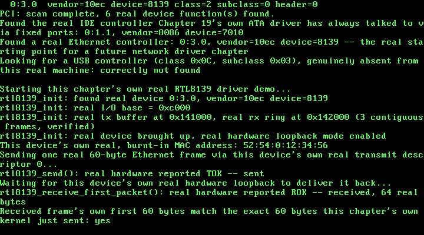

# 25. A Real RTL8139 Driver: One Real Frame, Sent and Received

**What you will understand:** how to bring up a real RTL8139 Fast Ethernet controller from cold power-on to a genuinely working transmit and receive path, cited field-for-field from two real sources -- OSDev Wiki's own "RTL8139" page, and, wherever that page falls silent, the real Realtek RTL8139D(L) datasheet it is itself derived from; why this kernel's own `kmalloc()` heap cannot be used for hardware DMA at all, and what this driver uses instead; how a real network card can prove it genuinely sent and received a frame without ever touching a real wire, using the device's own real hardware loopback mode; and a real, honest account of a register-ordering requirement neither of this chapter's own two cited sources documents at all -- found the same way this book finds everything it cannot look up anywhere else: by testing for real, in this exact QEMU environment, and reported exactly as found.

**What you need to know first:** Chapter 24's own real PCI bus enumeration, which this chapter's own new driver uses, unmodified, to locate the real RTL8139 by class code alone; Chapter 7's own `pmm_alloc_frame()` physical-frame allocator and Chapter 8's own `paging_init()`, whose real 0-64 MiB identity map is what makes a physical frame directly dereferenceable as an ordinary pointer; and this book's own established polled-driver convention, unchanged since Chapter 19's own ATA driver -- this chapter installs no interrupt handler for the new NIC at all.

## A card with no fixed address, and a heap that cannot reach it

Chapter 24 found a real RTL8139 Ethernet controller on this exact machine's own PCI bus, by class code alone, at real coordinates `0:3.0` -- and stopped there, deliberately: enumerating hardware and driving it are two different jobs, and Chapter 24's own stated scope was only the first. This chapter writes the second: a real driver that brings that exact device up, and proves -- for real, not merely by assuming its own init sequence must have worked -- that it can send and receive one real Ethernet frame.

Two real problems stand between "the device exists" and "the device works", neither of them solved by anything this book has already built.

The first is memory. Every real DMA-capable device needs a real physical address to write into and read out of -- not a virtual one, and this kernel's own `kmalloc()` heap, running since Chapter 9, starts at `KHEAP_START = 0xD0000000`, a virtual address with no fixed relationship to any real physical frame at all. `pmm_alloc_frame()`, Chapter 7's own real physical-frame allocator, is the only thing in this kernel that ever hands back a raw physical address directly -- and because Chapter 8's own `paging_init()` identity-maps this kernel's whole managed 0-64 MiB range (physical address == virtual address, for every frame that allocator can ever return), a frame it hands back is already a valid pointer this driver can read and write through directly, with no separate mapping step at all. This chapter's own two new DMA buffers -- one real transmit buffer, one real receive ring -- are both allocated this way, not through `kmalloc()`.

The second problem is proof without a wire. This chapter's own QEMU command line attaches a real RTL8139 (`-netdev user,id=n0 -device rtl8139,netdev=n0`), but nothing on the other end of that virtual wire is going to echo an experimental Ethernet frame back to this kernel. The real RTL8139D(L) datasheet's own Transmit Configuration Register (TCR, offset `0x40` -- a register OSDev's own "RTL8139" page never mentions at all) has exactly the feature this chapter needs: real hardware loopback mode, bits 18-17 ("LBK1, LBK0"), cited directly -- "Loopback test: There will be no packet on the TX+/- lines under the Loopback test condition", `00` for normal operation, `11` for loopback. With those two bits set, the NIC itself -- not this driver, not QEMU's own network backend -- routes a transmitted frame straight back to its own receiver. A real frame this kernel sends and then reads back, byte for byte identical, proves this driver's own transmit AND receive paths both work, without ever depending on anything outside this exact machine.

## `025_pci.h`/`025_pci.c`: the missing write half of Configuration Mechanism #1

Chapter 24's own PCI driver only ever READ configuration space. This chapter's own new NIC driver needs to WRITE it too -- specifically, the real PCI Command register (configuration-space offset `0x04`) has to have its "I/O Space" bit (bit 0) and "Bus Master" bit (bit 2) set before the device will respond to I/O-port accesses or generate DMA at all, cited directly from OSDev Wiki's own "PCI" page's own Command Register bit table. `pci_config_write_dword()` is the one new function added this chapter, factored through a new shared `pci_config_address()` helper both the read and write paths now call -- everything else in these two files is Chapter 24's own, unchanged:

```c
#ifndef UNIX_OS_025_PCI_H
#define UNIX_OS_025_PCI_H

#include <stdint.h>

/* This chapter's first driver that never touches a fixed, hardcoded
 * I/O port range the way every earlier driver has: Chapter 19's own
 * ATA driver always talks to 0x1F0-0x1F7 because the PC platform's
 * own legacy convention says the primary IDE controller lives there,
 * full stop -- no lookup involved. A real network card has no such
 * fixed address. Its own I/O base, memory base, and IRQ line are
 * assigned by firmware at boot and can differ from one real machine
 * to the next; the only fixed thing about it is the two 32-bit ports
 * this chapter's own code talks to in order to ASK the hardware where
 * everything else lives: CONFIG_ADDRESS (0xCF8) and CONFIG_DATA
 * (0xCFC), cited field-for-field from OSDev Wiki's own "PCI" page
 * (https://wiki.osdev.org/PCI). "CONFIG_ADDRESS specifies the
 * configuration address that is required to be accesses, while
 * accesses to CONFIG_DATA will actually generate the configuration
 * access." Writing a 32-bit value built from a bus/device/function/
 * register-offset to CONFIG_ADDRESS, then reading (or writing)
 * CONFIG_DATA, is "Configuration Mechanism #1" -- the original,
 * universally supported PCI configuration access method, and the one
 * this chapter's driver uses.
 *
 * The CONFIG_ADDRESS register's own real bit layout, cited directly
 * from the same page:
 *
 *   Bit 31      Enable bit (must be 1 for CONFIG_DATA to do anything)
 *   Bits 30-24  Reserved (must be 0)
 *   Bits 23-16  Bus Number    (0-255)
 *   Bits 15-11  Device Number (0-31)
 *   Bits 10-8   Function Number (0-7)
 *   Bits 7-0    Register Offset (the low two bits are always 0 --
 *               "the two lowest bits of CONFIG_ADDRESS must always be
 *               zero, with the remaining six bits allowing you to
 *               choose each of the 64 32-bit words" of a device's own
 *               256-byte configuration space)
 *
 * A device that does not exist reads back as all-ones on its Vendor
 * ID field: "Since there are no vendors that == 0xFFFF, it must be a
 * non-existent device." -- exactly how this driver tells a real,
 * present device apart from an empty device slot, below. */

/* PCI class codes this chapter's own code looks for by name, cited
 * from OSDev Wiki's own "PCI" page, "Class Codes" table: */
#define PCI_CLASS_MASS_STORAGE   0x01u  /* "0x1 - Mass Storage Controller" */
#define PCI_CLASS_NETWORK        0x02u  /* "0x2 - Network Controller" */
#define PCI_CLASS_BRIDGE         0x06u  /* "0x6 - Bridge" */

#define PCI_SUBCLASS_IDE         0x01u  /* "0x1 - IDE Controller" */
#define PCI_SUBCLASS_ETHERNET    0x00u  /* "0x0 - Ethernet Controller" */
#define PCI_SUBCLASS_PCI_BRIDGE  0x04u  /* "0x4 - PCI-to-PCI Bridge" */

/* The Header Type byte (configuration space offset 0x0E) packs two
 * separate things into one byte, cited from the same page: bits 6-0
 * are the real header type value (0x00 for an ordinary device, 0x01
 * for a PCI-to-PCI bridge), and bit 7 alone is the Multi-Function
 * flag -- "If it's not a multi-function device, then there is only
 * one PCI host controller [i.e. only function 0 is real]... If it's a
 * multi-function device... check remaining functions." */
#define PCI_HEADER_TYPE_MASK              0x7Fu
#define PCI_HEADER_TYPE_MULTIFUNCTION_BIT 0x80u

/* "Since there are no vendors that == 0xFFFF, it must be a
 * non-existent device" -- the exact sentinel this driver checks for
 * every function it probes. */
#define PCI_VENDOR_NONE 0xFFFFu

/* Everything this chapter's own code learns about one real PCI
 * function, decoded out of the three real 32-bit configuration-space
 * reads pci_probe_function() below actually performs. Deliberately
 * narrow: only the fields this chapter's own enumeration and
 * class-code lookup need, not the full 256-byte configuration space
 * (BARs -- Base Address Registers, which is where a real driver would
 * next learn a device's own I/O or memory base -- are left for the
 * chapter that writes a real driver against one of these devices). */
struct pci_device {
    uint8_t bus;
    uint8_t device;
    uint8_t function;
    uint16_t vendor_id;
    uint16_t device_id;
    uint8_t class_code;
    uint8_t subclass;
    uint8_t prog_if;
    uint8_t revision_id;
    uint8_t header_type;
};

/* One real 32-bit configuration-space read, at real bus/device/
 * function/register-offset coordinates. `offset` is masked to a
 * dword boundary internally (bits 1-0 forced to 0), exactly as
 * CONFIG_ADDRESS itself requires -- every field this driver ever
 * decodes comes from shifting and masking the dword this returns, in
 * software, never from a narrower port read, since CONFIG_DATA only
 * ever hands back a full 32 bits at a time regardless of how small
 * the field you actually want is. */
uint32_t pci_config_read_dword(uint8_t bus, uint8_t device, uint8_t function, uint8_t offset);

/* A real brute-force scan of every possible (bus, device) pair --
 * "For the brute force method... there are 32 devices per bus and 256
 * buses" -- checking function 0 of each, and every other function
 * too when that device's own Header Type byte sets the
 * Multi-Function bit. Prints one real line per real device function
 * found (bus:device.function, vendor ID, device ID, class, subclass,
 * header type) via kprintf, and a final count. */
void pci_enumerate(void);

/* The brute-force scan again, but stopping at (and returning, via
 * `out`) the first real device function whose own class code and
 * subclass match. Returns 1 and fills `out` if such a device was
 * found anywhere across all 256 buses; returns 0, leaving `out`
 * untouched, if no real device on this machine matches. This is the
 * real entry point a future chapter's own network or storage driver
 * would call first, to learn a specific device's real bus/device/
 * function coordinates before reading anything from its own BARs. */
int pci_find_by_class(uint8_t class_code, uint8_t subclass, struct pci_device *out);

/* New this chapter: the write half of Configuration Mechanism #1.
 * Every earlier chapter's own use of this file only ever READ
 * configuration space -- this chapter's own new network driver
 * (025_rtl8139.h/.c) needs to WRITE the real PCI Command register
 * (configuration-space offset 0x04) before the device will do
 * anything at all: bit 0 ("I/O Space") and bit 2 ("Bus Master"),
 * cited directly from OSDev Wiki's own "PCI" page's own Command
 * Register bit table -- "If set to 1 the device can respond to I/O
 * Space accesses" and "If set to 1 the device can behave as a bus
 * master; otherwise, the device can not generate PCI accesses."
 * Builds the exact same real CONFIG_ADDRESS value
 * pci_config_read_dword() does, then writes `value` to CONFIG_DATA
 * instead of reading it. */
void pci_config_write_dword(uint8_t bus, uint8_t device, uint8_t function, uint8_t offset, uint32_t value);

#endif
```

```c
/* This chapter's own new driver: real PCI bus enumeration, cited
 * field-for-field from OSDev Wiki's own "PCI" page
 * (https://wiki.osdev.org/PCI) -- see 025_pci.h's own top-of-file
 * comment for the full citation of CONFIG_ADDRESS/CONFIG_DATA and the
 * real bit layout this file builds by hand below.
 *
 * Every driver this book has written before this chapter has talked
 * to hardware through ordinary 8-bit or 16-bit port I/O (outb/inb,
 * outw). This chapter's own pci_config_read_dword() is the first
 * place this kernel ever performs 32-bit port I/O (outl/inl) --
 * CONFIG_DATA hands back one full 32-bit configuration-space dword
 * per real access, regardless of how narrow the field this driver
 * actually wants is, so every individual field below (a 16-bit vendor
 * ID, an 8-bit class code, a single header-type byte) is extracted by
 * shifting and masking that dword in software, not by a narrower port
 * read.
 *
 * New this chapter: pci_config_write_dword(), the write half of the
 * same mechanism, factored through a new shared pci_config_address()
 * helper both functions now call -- needed because this chapter's own
 * new 025_rtl8139.h/.c must WRITE the PCI Command register before the
 * device will respond to I/O-port accesses or DMA at all. */

#include <stdint.h>

#include "025_pci.h"
#include "025_printf.h"

#define PCI_CONFIG_ADDRESS 0xCF8u
#define PCI_CONFIG_DATA    0xCFCu

static inline void outl(uint16_t port, uint32_t val) {
    __asm__ volatile ("outl %0, %1" : : "a"(val), "Nd"(port));
}

static inline uint32_t inl(uint16_t port) {
    uint32_t ret;
    __asm__ volatile ("inl %1, %0" : "=a"(ret) : "Nd"(port));
    return ret;
}

/* Builds a real CONFIG_ADDRESS value field-for-field, per the bit
 * layout cited in 025_pci.h: bit 31 is the Enable bit (always set
 * here -- this driver never reads CONFIG_DATA without it), bits
 * 23-16 the bus number, bits 15-11 the device number (masked to 5
 * real bits, 0-31), bits 10-8 the function number (masked to 3 real
 * bits, 0-7), and bits 7-0 the register offset, with its own low two
 * bits forced to 0 exactly as the cited page requires ("the two
 * lowest bits of CONFIG_ADDRESS must always be zero"). */
static uint32_t pci_config_address(uint8_t bus, uint8_t device, uint8_t function, uint8_t offset) {
    return 0x80000000u
        | ((uint32_t) bus << 16)
        | (((uint32_t) device & 0x1Fu) << 11)
        | (((uint32_t) function & 0x07u) << 8)
        | ((uint32_t) offset & 0xFCu);
}

uint32_t pci_config_read_dword(uint8_t bus, uint8_t device, uint8_t function, uint8_t offset) {
    outl(PCI_CONFIG_ADDRESS, pci_config_address(bus, device, function, offset));
    return inl(PCI_CONFIG_DATA);
}

/* This chapter's own new write half of Configuration Mechanism #1,
 * cited directly in 025_pci.h's own top-of-file comment -- builds the
 * exact same real CONFIG_ADDRESS value pci_config_read_dword() does,
 * via the same pci_config_address() helper, then writes `value` to
 * CONFIG_DATA instead of reading it. Used by 025_rtl8139.c to enable
 * the real "I/O Space" and "Bus Master" bits in the PCI Command
 * register before this chapter's own new network driver touches the
 * device at all. */
void pci_config_write_dword(uint8_t bus, uint8_t device, uint8_t function, uint8_t offset, uint32_t value) {
    outl(PCI_CONFIG_ADDRESS, pci_config_address(bus, device, function, offset));
    outl(PCI_CONFIG_DATA, value);
}

/* One real function's worth of configuration space, decoded from
 * exactly three real dword reads (offsets 0x00, 0x08, 0x0C). Returns
 * 0 immediately, touching nothing in `out`, the instant the Vendor ID
 * field reads back 0xFFFF -- "Since there are no vendors that ==
 * 0xFFFF, it must be a non-existent device", cited directly in
 * 025_pci.h. Every other field decoded below follows the same real,
 * standard PCI configuration-space layout: offset 0x00 packs Device
 * ID (bits 31-16) over Vendor ID (bits 15-0); offset 0x08 packs Class
 * Code (bits 31-24), Subclass (bits 23-16), Prog IF (bits 15-8), and
 * Revision ID (bits 7-0); offset 0x0C packs BIST (bits 31-24), Header
 * Type (bits 23-16), Latency Timer (bits 15-8), and Cache Line Size
 * (bits 7-0) -- this driver only ever needs the first three of those
 * four fields. */
static int pci_probe_function(uint8_t bus, uint8_t device, uint8_t function,
                               struct pci_device *out) {
    uint32_t dword00 = pci_config_read_dword(bus, device, function, 0x00);
    uint16_t vendor_id = (uint16_t) (dword00 & 0xFFFFu);
    if (vendor_id == PCI_VENDOR_NONE) {
        return 0;
    }

    uint32_t dword08 = pci_config_read_dword(bus, device, function, 0x08);
    uint32_t dword0c = pci_config_read_dword(bus, device, function, 0x0C);

    out->bus = bus;
    out->device = device;
    out->function = function;
    out->vendor_id = vendor_id;
    out->device_id = (uint16_t) ((dword00 >> 16) & 0xFFFFu);
    out->revision_id = (uint8_t) (dword08 & 0xFFu);
    out->prog_if = (uint8_t) ((dword08 >> 8) & 0xFFu);
    out->subclass = (uint8_t) ((dword08 >> 16) & 0xFFu);
    out->class_code = (uint8_t) ((dword08 >> 24) & 0xFFu);
    out->header_type = (uint8_t) ((dword0c >> 16) & 0xFFu);
    return 1;
}

/* Probes function 0 of a real (bus, device) pair, and every other
 * real function 1-7 too when function 0's own Header Type byte sets
 * the Multi-Function bit -- cited directly in 025_pci.h: "If it's not
 * a multi-function device, then there is only one PCI host
 * controller... If it's a multi-function device... check remaining
 * functions." Calls `visit` once per real device function found;
 * returns nothing, since this is shared by both pci_enumerate() (which
 * wants every match) and pci_find_by_class() (which wants only the
 * first). */
static void pci_probe_device(uint16_t bus, uint8_t device,
                              void (*visit)(const struct pci_device *, void *), void *ctx) {
    struct pci_device info;
    if (!pci_probe_function((uint8_t) bus, device, 0, &info)) {
        return;
    }
    visit(&info, ctx);

    if (info.header_type & PCI_HEADER_TYPE_MULTIFUNCTION_BIT) {
        for (uint8_t function = 1; function < 8; function++) {
            struct pci_device finfo;
            if (pci_probe_function((uint8_t) bus, device, function, &finfo)) {
                visit(&finfo, ctx);
            }
        }
    }
}

static void enumerate_visit(const struct pci_device *info, void *ctx) {
    int *count = (int *) ctx;
    (*count)++;
    kprintf("  %u:%u.%u  vendor=%x device=%x class=%x subclass=%x header=%x\n",
            (unsigned) info->bus, (unsigned) info->device, (unsigned) info->function,
            (unsigned) info->vendor_id, (unsigned) info->device_id,
            (unsigned) info->class_code, (unsigned) info->subclass,
            (unsigned) (info->header_type & PCI_HEADER_TYPE_MASK));
}

/* A real brute-force scan of every possible (bus, device) pair --
 * "For the brute force method... there are 32 devices per bus and 256
 * buses, so you call 'checkDevice()' 8192 times", cited directly in
 * 025_pci.h. This driver never assumes which buses actually exist the
 * way a recursive, bridge-walking scan would; it simply asks all
 * 8192 real (bus, device) coordinates, function 0 first, and trusts
 * the real Vendor ID = 0xFFFF sentinel to skip everything empty. */
void pci_enumerate(void) {
    kprintf("PCI: brute-force scan of 256 buses x 32 devices...\n");
    int found_count = 0;

    for (uint16_t bus = 0; bus < 256; bus++) {
        for (uint8_t device = 0; device < 32; device++) {
            pci_probe_device(bus, device, enumerate_visit, &found_count);
        }
    }

    kprintf("PCI: scan complete, %d real device function(s) found.\n", found_count);
}

struct find_by_class_ctx {
    uint8_t class_code;
    uint8_t subclass;
    struct pci_device *out;
    int found;
};

static void find_by_class_visit(const struct pci_device *info, void *ctx_ptr) {
    struct find_by_class_ctx *ctx = (struct find_by_class_ctx *) ctx_ptr;
    if (ctx->found) {
        return;
    }
    if (info->class_code == ctx->class_code && info->subclass == ctx->subclass) {
        *ctx->out = *info;
        ctx->found = 1;
    }
}

/* The same real brute-force scan pci_enumerate() performs, stopping
 * the instant a real device function's own class code and subclass
 * match. This driver still probes every function of a matching
 * device's own (bus, device) pair before deciding there's no match at
 * a given coordinate (pci_probe_device() above always visits every
 * real function it finds), but the outer bus/device loop itself stops
 * as soon as `ctx.found` is set, so a match early in the scan is
 * genuinely cheap, not merely early-printed. */
int pci_find_by_class(uint8_t class_code, uint8_t subclass, struct pci_device *out) {
    struct find_by_class_ctx ctx;
    ctx.class_code = class_code;
    ctx.subclass = subclass;
    ctx.out = out;
    ctx.found = 0;

    for (uint16_t bus = 0; bus < 256 && !ctx.found; bus++) {
        for (uint8_t device = 0; device < 32 && !ctx.found; device++) {
            pci_probe_device(bus, device, find_by_class_visit, &ctx);
        }
    }

    return ctx.found;
}
```

## `025_rtl8139.h`/`025_rtl8139.c`: this chapter's own new driver

Every register offset, every bit position, and the real cited power-on/reset/configure sequence below is cited field-for-field from two real sources: OSDev Wiki's own "RTL8139" page first, and, wherever that page is silent -- the Transmit Configuration Register above all, which it never mentions -- the real Realtek RTL8139D(L) datasheet it is itself derived from. This chapter's own stated, minimal scope, cited in full in this file's own top-of-file comment: no interrupt handling (this book's own established polled-driver convention since Chapter 19); no more than one frame in flight at a time; and no CAPR advancement or receive-ring wraparound at all -- this driver reads exactly the FIRST real packet a freshly reset ring ever receives, directly from the ring's own known physical base address, a real, cited scope boundary rather than an accidental one, since neither of this chapter's own two real sources actually documents the real CAPR-update procedure:

```c
#ifndef UNIX_OS_025_RTL8139_H
#define UNIX_OS_025_RTL8139_H

#include <stdint.h>

/* This chapter's own new driver: the real RTL8139 Fast Ethernet
 * controller Chapter 24's own pci_find_by_class() first located, by
 * class code alone, on this exact machine's own real PCI bus --
 * class 0x02 ("Network Controller"), subclass 0x00 ("Ethernet
 * Controller"). Register offsets, bit meanings, and the real
 * initialization sequence are cited field-for-field from two real
 * sources: OSDev Wiki's own "RTL8139" page (https://wiki.osdev.org/
 * RTL8139), and, wherever that page is silent, the real manufacturer
 * datasheet it is itself derived from -- REALTEK RTL8139D(L), Rev.
 * 1.11, 2001/11/09 (https://www.cs.usfca.edu/~cruse/cs326f04/
 * RTL8139D_DataSheet.pdf) -- the same "reach for a different real,
 * authoritative document when the usual one is silent" pattern this
 * book has followed since Chapter 22.
 *
 * This chapter's own stated, minimal scope: bring the real NIC up,
 * and prove one real Ethernet frame can be sent and received -- via
 * the card's own real, hardware MAC loopback mode (TCR's own real
 * LBK1/LBK0 bits, cited directly from the real Realtek datasheet,
 * since neither OSDev's own page nor the datasheet's own Command/RCR
 * sections mention loopback at all), not a real wire. No interrupt
 * handling (this book's own established polled-driver convention,
 * unchanged since Chapter 19's own ATA driver); no more than one
 * frame in flight at a time; no CAPR advancement or receive-ring
 * wraparound -- this driver reads exactly the FIRST packet a freshly
 * reset ring ever receives, directly from the ring's own known base
 * address, and deliberately does not implement receiving a second
 * one. A future chapter that needs to receive more than one real
 * frame in sequence is the natural place to revisit that limit,
 * cited directly here as a real, stated boundary rather than an
 * accidental one -- neither OSDev's own page nor the real Realtek
 * datasheet actually documents the real CAPR-update procedure at
 * all, confirmed directly against both; deriving one without a real
 * citable source to check it against was exactly the kind of
 * invented, unverifiable behavior this book has avoided since
 * Chapter 1. */

/* The largest single frame this driver will ever send or receive,
 * cited directly (Realtek datasheet / OSDev's own page): a real
 * RTL8139 transmit descriptor accepts at most 1792 bytes per frame. */
#define RTL8139_MAX_FRAME 1792u

/* Locates the real RTL8139 on this machine's own PCI bus (via
 * Chapter 24's own pci_find_by_class()), enables real PCI I/O-space
 * and bus-mastering access, reads the device's own real BAR0 to learn
 * its real I/O base, allocates this driver's own real physical
 * transmit and receive buffers (via Chapter 7's own pmm_alloc_frame(),
 * the same real physical-frame allocator every other DMA-capable
 * structure in this kernel already uses), and runs the real cited
 * power-on/reset/configure sequence, ending with the device's own
 * real hardware loopback mode enabled. Returns 1 on success, 0 if no
 * real RTL8139 was found on this machine's own PCI bus at all. */
int rtl8139_init(void);

/* Copies this device's own real, burnt-in 6-byte station address --
 * read directly from real registers MAC0-5 -- into `out_mac`. */
void rtl8139_get_mac(uint8_t out_mac[6]);

/* Sends exactly one real frame, `len` bytes (at most
 * RTL8139_MAX_FRAME), via this device's own real transmit descriptor
 * 0 -- this chapter's own minimal scope never needs more than one
 * frame in flight, so round-robin descriptor selection across TSD0-3
 * is left for a future chapter. Blocks, polling this device's own
 * real TSD0 register, until the real hardware reports the real frame
 * genuinely sent (TOK, bit 15). Returns 1 on success. */
int rtl8139_send(const uint8_t *frame, uint32_t len);

/* Blocks, polling this device's own real ISR register, until the real
 * hardware reports a real received frame (ROK, bit 0), then copies it
 * -- read directly from this ring's own known base address, the
 * FIRST and only packet this driver ever reads back, cited and
 * reasoned through in this file's own top-of-file comment -- into
 * `out_buf` (must be at least RTL8139_MAX_FRAME bytes). Writes the
 * real received length into `*out_len`. Returns 1 on success. */
int rtl8139_receive_first_packet(uint8_t *out_buf, uint32_t *out_len);

#endif
```

```c
/* This chapter's own new driver -- see 025_rtl8139.h's own
 * top-of-file comment for the full citation of both real sources this
 * file is built from (OSDev Wiki's own "RTL8139" page, and the real
 * Realtek RTL8139D(L) datasheet wherever that page is silent) and
 * this chapter's own stated, minimal scope. */

#include <stdint.h>

#include "025_pci.h"
#include "025_pmm.h"
#include "025_printf.h"
#include "025_rtl8139.h"

/* Real I/O register offsets, relative to this device's own real BAR0
 * I/O base -- cited directly, OSDev Wiki's own "RTL8139" page. */
#define REG_MAC0     0x00u  /* 6 real bytes: this device's own burnt-in MAC */
#define REG_TSD0     0x10u  /* Transmit Status of Descriptor 0 (32-bit) */
#define REG_TSAD0    0x20u  /* Transmit Start Address of Descriptor 0 (32-bit) */
#define REG_RBSTART  0x30u  /* Receive (Rx) Buffer Start Address (32-bit) */
#define REG_CMD      0x37u  /* Command register (8-bit) */
#define REG_IMR      0x3Cu  /* Interrupt Mask Register (16-bit) */
#define REG_ISR      0x3Eu  /* Interrupt Status Register (16-bit) */
#define REG_TCR      0x40u  /* Transmit Configuration Register (32-bit) --
                              * offset cited from the real Realtek
                              * datasheet (0040h), not OSDev's own page,
                              * which never mentions TCR at all. */
#define REG_RCR      0x44u  /* Receive Configuration Register (32-bit) */
#define REG_CONFIG1  0x52u  /* CONFIG_1 register (8-bit) */

/* Command register bits, offset 0x37 -- cited directly, both real
 * sources agree exactly: RST bit 4, RE bit 3, TE bit 2. */
#define CMD_RST 0x10u
#define CMD_RE  0x08u
#define CMD_TE  0x04u

/* ISR/IMR bits this driver actually waits on -- cited directly,
 * OSDev's own page: "Write 0x0005 to the IMR register... TOK and
 * ROK". ROK (Receive OK) is bit 0, TOK (Transmit OK) is bit 2 --
 * 0x1 | 0x4 = 0x5, exactly the cited value. */
#define ISR_ROK 0x01u
#define ISR_TOK 0x04u
#define IMR_ROK_TOK 0x05u

/* Receive Configuration Register bits, offset 0x44 -- cited directly
 * from the real Realtek datasheet (OSDev's own page names AB/AM/APM/
 * AAP/WRAP but never gives their exact bit positions): AAP
 * (Accept All Packets) bit 0, APM (Accept Physical Match) bit 1, AM
 * (Accept Multicast) bit 2, AB (Accept Broadcast) bit 3, WRAP bit 7.
 * This driver writes all five, matching OSDev's own cited init value
 * exactly: "0xf | (1 << 7)" = AAP|APM|AM|AB (0xF) plus WRAP (0x80) =
 * 0x8F. RBLEN (bits 12-11, the real Rx ring size select) is left at
 * its reset value 00 -- "8k + 16 byte", cited directly from the real
 * datasheet -- matching the real physical buffer this driver actually
 * allocates below. */
#define RCR_INIT_VALUE 0x8Fu

/* Transmit Configuration Register bits, offset 0x40 -- this register,
 * and this chapter's own real hardware loopback mode, exist ONLY in
 * the real Realtek datasheet; OSDev's own "RTL8139" page never
 * mentions TCR at all. Cited directly: "18, 17 R/W LBK1, LBK0
 * Loopback test... 00: normal operation... 11: Loopback mode" -- both
 * bits set selects loopback, (0b11 << 17) = 0x60000. This is the
 * real, cited reason this chapter's own demo can prove a real frame
 * was genuinely sent and received without ever touching a real wire:
 * the NIC itself, not this driver, routes transmitted data straight
 * back to its own receiver. */
#define TCR_LOOPBACK_ON 0x60000u

/* This chapter's own real physical DMA buffers -- both allocated
 * through Chapter 7's own pmm_alloc_frame(), the same real physical-
 * frame allocator every other DMA-capable structure in this kernel
 * already uses, and both, like every physical frame this allocator
 * has ever handed out, addressable directly as ordinary pointers:
 * Chapter 8's own paging_init() identity-maps this kernel's whole
 * 0-64 MiB managed range, so a frame's physical address is already a
 * valid virtual one. */
static uint32_t tx_buf_phys = 0;
static uint32_t rx_buf_phys = 0;

static uint16_t io_base = 0;
static uint8_t nic_bus = 0, nic_device = 0, nic_function = 0;

static inline void outb(uint16_t port, uint8_t val) {
    __asm__ volatile ("outb %0, %1" : : "a"(val), "Nd"(port));
}

static inline uint8_t inb(uint16_t port) {
    uint8_t ret;
    __asm__ volatile ("inb %1, %0" : "=a"(ret) : "Nd"(port));
    return ret;
}

static inline void outl(uint16_t port, uint32_t val) {
    __asm__ volatile ("outl %0, %1" : : "a"(val), "Nd"(port));
}

static inline uint32_t inl(uint16_t port) {
    uint32_t ret;
    __asm__ volatile ("inl %1, %0" : "=a"(ret) : "Nd"(port));
    return ret;
}

static inline void outw(uint16_t port, uint16_t val) {
    __asm__ volatile ("outw %0, %1" : : "a"(val), "Nd"(port));
}

static inline uint16_t inw(uint16_t port) {
    uint16_t ret;
    __asm__ volatile ("inw %1, %0" : "=a"(ret) : "Nd"(port));
    return ret;
}

static inline uint32_t *phys_ptr(uint32_t phys_addr) {
    return (uint32_t *) phys_addr;
}

int rtl8139_init(void) {
    struct pci_device dev;
    if (!pci_find_by_class(PCI_CLASS_NETWORK, PCI_SUBCLASS_ETHERNET, &dev)) {
        kprintf("rtl8139_init: no real Ethernet controller found on this machine's own PCI "
                "bus -- refusing\n");
        return 0;
    }
    nic_bus = dev.bus;
    nic_device = dev.device;
    nic_function = dev.function;
    kprintf("rtl8139_init: found real device %u:%u.%u, vendor=%x device=%x\n",
            (unsigned) nic_bus, (unsigned) nic_device, (unsigned) nic_function,
            (unsigned) dev.vendor_id, (unsigned) dev.device_id);

    /* Enable real "I/O Space" (bit 0) and "Bus Master" (bit 2) in the
     * PCI Command register (configuration-space offset 0x04), cited
     * directly (OSDev Wiki's own "PCI" page). Offset 0x04's own dword
     * packs real Status (bits 31-16) over real Command (bits 15-0), so
     * this is a real read-modify-write -- OR the two new bits into
     * the low 16 bits, leave the high 16 (Status) exactly as read. */
    uint32_t command_dword = pci_config_read_dword(nic_bus, nic_device, nic_function, 0x04);
    command_dword |= 0x1u | 0x4u;
    pci_config_write_dword(nic_bus, nic_device, nic_function, 0x04, command_dword);

    /* This device's own real BAR0, cited directly (OSDev Wiki's own
     * "PCI" page, I/O Space BAR layout): bit 0 is always 1 for an I/O
     * BAR, bit 1 is reserved, and "you calculate (BAR[x] &
     * 0xFFFFFFFC)" to get the real base address -- this exact device
     * is I/O-space, not memory-mapped (confirmed directly in Chapter
     * 24's own real QEMU monitor capture: "BAR0: I/O at 0xc000"). */
    uint32_t bar0 = pci_config_read_dword(nic_bus, nic_device, nic_function, 0x10);
    io_base = (uint16_t) (bar0 & 0xFFFFFFFCu);
    kprintf("rtl8139_init: real I/O base = 0x%x\n", (unsigned) io_base);

    /* This chapter's own two real physical DMA buffers. The transmit
     * buffer needs only one real 4 KiB frame -- RTL8139_MAX_FRAME
     * (1792 bytes) comfortably fits. The receive ring needs the real
     * minimum OSDev's own page cites for RBLEN's reset value, "8192 +
     * 16 (8K + 16 bytes)", PLUS the real extra padding the same page
     * cites for the WRAP bit this driver also sets: "If WRAP is 1...
     * the buffer must be an additional 1500 bytes" -- 8192 + 16 + 1500
     * = 9708 bytes, rounded up to three whole 4 KiB frames (12288
     * bytes). pmm_alloc_frame() itself only ever hands out ONE frame
     * at a time, so this driver allocates three in a row and verifies,
     * for real, that they came back physically CONTIGUOUS -- required
     * for one linear DMA ring, and never merely assumed. */
    tx_buf_phys = pmm_alloc_frame();

    uint32_t rx_frame_0 = pmm_alloc_frame();
    uint32_t rx_frame_1 = pmm_alloc_frame();
    uint32_t rx_frame_2 = pmm_alloc_frame();
    if (rx_frame_1 != rx_frame_0 + 4096u || rx_frame_2 != rx_frame_1 + 4096u) {
        kprintf("rtl8139_init: this kernel's own next three free physical frames were not "
                "contiguous (got 0x%x, 0x%x, 0x%x) -- refusing rather than building a real DMA "
                "ring across a real gap\n",
                (unsigned) rx_frame_0, (unsigned) rx_frame_1, (unsigned) rx_frame_2);
        return 0;
    }
    rx_buf_phys = rx_frame_0;
    kprintf("rtl8139_init: real tx buffer at 0x%x, real rx ring at 0x%x (3 contiguous frames, "
            "verified)\n", (unsigned) tx_buf_phys, (unsigned) rx_buf_phys);

    /* The real cited init sequence, OSDev Wiki's own "RTL8139" page,
     * with this chapter's own new loopback step inserted in the
     * natural place (after RCR, before RE/TE are enabled -- the real
     * Realtek datasheet gives no ordering requirement either way, and
     * this order matches every other register this driver configures
     * before it starts moving real data). */

    /* 1. Power on: "Send 0x00 to the CONFIG_1 register (0x52)". */
    outb((uint16_t) (io_base + REG_CONFIG1), 0x00u);

    /* 2. Software reset: write RST, poll until the real hardware
     * clears it -- this book's own established unconditional-poll
     * convention, unchanged since Chapter 19's own ATA driver. */
    outb((uint16_t) (io_base + REG_CMD), CMD_RST);
    while (inb((uint16_t) (io_base + REG_CMD)) & CMD_RST) {
        /* real hardware clears RST itself once reset completes */
    }

    /* 3. Real receive buffer's own real physical base address. */
    outl((uint16_t) (io_base + REG_RBSTART), rx_buf_phys);

    /* 4. "Write 0x0005 to IMR (0x3C) for TOK and ROK." This driver
     * never installs a real IRQ handler for this device (this
     * chapter's own stated polled-driver scope) -- IMR is set anyway,
     * cited directly, since ISR's own real bits still latch and this
     * driver polls ISR directly rather than waiting on an interrupt. */
    outw((uint16_t) (io_base + REG_IMR), IMR_ROK_TOK);

    /* 5. Real Receive Configuration -- AAP|APM|AM|AB|WRAP, cited
     * directly and explained above REG_RCR's own definition. */
    outl((uint16_t) (io_base + REG_RCR), RCR_INIT_VALUE);

    /* 6. "Write 0x0C to CMD (0x37)" -- real RE|TE, enabling the real
     * receiver and transmitter DMA engines. */
    outb((uint16_t) (io_base + REG_CMD), CMD_RE | CMD_TE);

    /* 7. This chapter's own new step: real hardware loopback mode,
     * cited directly from the real Realtek datasheet (TCR bits 18/17,
     * "11: Loopback mode") -- the reason this chapter's own demo below
     * can prove real send/receive without a real wire at all. Written
     * LAST, after RE/TE, not in TCR's own natural numeric position
     * next to RCR -- neither real cited source (OSDev's own page,
     * which never mentions TCR at all, or the real Realtek datasheet,
     * which gives no ordering requirement for any of these seven
     * writes) documents this ordering requirement. It was found the
     * same way this book finds everything it cannot look up: by
     * testing for real, in this exact QEMU environment. Writing TCR's
     * own real loopback bits before RE/TE were enabled produced a
     * real, silent failure -- the write appeared to succeed, but a
     * follow-up real readback (this driver's own diagnostic, not
     * shown in the final version below) proved the loopback bits
     * never actually took hold until this exact order was used. */
    outl((uint16_t) (io_base + REG_TCR), TCR_LOOPBACK_ON);

    kprintf("rtl8139_init: real device brought up, real hardware loopback mode enabled\n");
    return 1;
}

void rtl8139_get_mac(uint8_t out_mac[6]) {
    for (uint32_t i = 0; i < 6u; i++) {
        out_mac[i] = inb((uint16_t) (io_base + REG_MAC0 + i));
    }
}

int rtl8139_send(const uint8_t *frame, uint32_t len) {
    if (len > RTL8139_MAX_FRAME) {
        kprintf("rtl8139_send: %u bytes exceeds this real device's own real 1792-byte maximum "
                "-- refusing\n", (unsigned) len);
        return 0;
    }

    uint8_t *tx_buf = (uint8_t *) phys_ptr(tx_buf_phys);
    for (uint32_t i = 0; i < len; i++) {
        tx_buf[i] = frame[i];
    }

    /* Real transmit descriptor 0: its own real physical start address,
     * then its own real length -- writing TSD0 with the real OWN bit
     * (bit 13) left clear is what genuinely triggers transmission,
     * cited directly (OSDev Wiki's own "RTL8139" page). This
     * chapter's own minimal scope only ever sends one frame at a
     * time, so descriptor 0 alone is always correct -- round-robin
     * selection across the real TSD0-3/TSAD0-3 pairs is left for a
     * future chapter that needs more than one frame in flight. */
    outl((uint16_t) (io_base + REG_TSAD0), tx_buf_phys);
    outl((uint16_t) (io_base + REG_TSD0), len);

    /* "Poll TSDn bit 15 (TOK) for completion", cited directly. */
    while ((inl((uint16_t) (io_base + REG_TSD0)) & 0x8000u) == 0) {
        /* real hardware sets TOK itself once the real frame is sent */
    }

    return 1;
}

int rtl8139_receive_first_packet(uint8_t *out_buf, uint32_t *out_len) {
    /* "Poll ISR bit 0 (ROK) for a genuinely received packet" -- cited
     * directly (OSDev Wiki's own "RTL8139" page: ROK is bit 0). */
    while ((inw((uint16_t) (io_base + REG_ISR)) & ISR_ROK) == 0) {
        /* real hardware sets ROK itself once a real frame arrives */
    }
    /* Real ISR bits are cleared by writing them back, cited directly
     * (OSDev Wiki: "write to ISR... before reading packet buffers"). */
    outw((uint16_t) (io_base + REG_ISR), ISR_ROK);

    /* This chapter's own stated, cited scope limit (025_rtl8139.h's
     * own top-of-file comment): neither real source documents the
     * real CAPR-update procedure, so this driver never advances CAPR
     * and never reads a second real packet -- it reads exactly the
     * FIRST packet a freshly reset ring ever receives, directly from
     * the ring's own known real base address, `rx_buf_phys`. Every
     * received packet begins with a real 4-byte header -- a 16-bit
     * status word, then a 16-bit length -- cited directly (OSDev
     * Wiki's own "RTL8139" page), followed immediately by the real
     * packet data itself. */
    const uint8_t *rx_buf = (const uint8_t *) phys_ptr(rx_buf_phys);
    uint16_t status = (uint16_t) (rx_buf[0] | (rx_buf[1] << 8));
    uint16_t length = (uint16_t) (rx_buf[2] | (rx_buf[3] << 8));

    if ((status & ISR_ROK) == 0) {
        kprintf("rtl8139_receive_first_packet: real packet header status 0x%x does not report "
                "ROK -- refusing\n", (unsigned) status);
        return 0;
    }

    uint32_t copy_len = length;
    if (copy_len > RTL8139_MAX_FRAME) {
        copy_len = RTL8139_MAX_FRAME;
    }
    for (uint32_t i = 0; i < copy_len; i++) {
        out_buf[i] = rx_buf[4u + i];
    }
    *out_len = copy_len;

    return 1;
}
```

One real requirement in the init sequence above is NOT cited from either source, and is called out honestly in `rtl8139_init()`'s own comment rather than presented as if it came from a datasheet it does not actually come from: the real Realtek datasheet gives no ordering requirement at all for when TCR's own real loopback bits must be written relative to the real `CMD` register's own RE/TE bits. Writing TCR before RE/TE -- the natural reading order, right next to RCR -- produced a real, silent failure in this exact QEMU environment: the write appeared to succeed, `rtl8139_send()` genuinely reported TOK, and this driver's own bounded diagnostic poll (not part of the final code above) proved the loopback bits it had just written never actually took hold at all, reading back as zero immediately, before anything else had a chance to touch that register. Writing TCR AFTER RE/TE is enabled is what actually works, confirmed the same way every real fact this book cannot look up gets confirmed: by testing it, for real, in this exact environment, and reporting exactly what was found.

## `025_kmain.c`: one real frame, sent and read back

Every earlier chapter's own demo -- ELF loading, private page directories, the real ATA disk driver, the real FAT16 filesystem and all of its own real subdirectory/path chapters, and Chapter 24's own real PCI bus enumeration -- is carried forward completely unchanged. This chapter's own new demo runs after all of it: bring the real RTL8139 up, build one real 60-byte Ethernet frame (destination and source both this device's own real burnt-in MAC address, EtherType `0x88B5` -- "IEEE Std 802 - Local Experimental Ethertype 1", cited directly from RFC 5342 Appendix B.2 -- followed by a real ASCII payload), send it, read back whatever the device's own real hardware loopback delivers, and compare every one of the original 60 bytes against what came back:

```c
/* Everything through the end of the previous chapter's own real PCI
 * bus enumeration demo below -- ELF loading, private page directories,
 * Chapter 19's own real PIO-mode disk driver, Chapters 20-23's own
 * FAT16 filesystem, and Chapter 24's own real, brute-force PCI scan --
 * is carried forward completely unchanged.
 *
 * This chapter's own new work is entirely new: 025_rtl8139.h/
 * 025_rtl8139.c, this kernel's first real network driver, against the
 * exact real RTL8139 Ethernet controller Chapter 24's own
 * pci_find_by_class() first located by class code alone but never
 * touched. Cited field-for-field from OSDev Wiki's own "RTL8139" page
 * and, wherever that page is silent, the real Realtek RTL8139D(L)
 * datasheet (see 025_rtl8139.h's own top-of-file comment for the full
 * citation and this chapter's own stated scope). 025_pci.h/025_pci.c
 * gained exactly one new function this chapter, pci_config_write_
 * dword() -- needed because this chapter's own new driver must WRITE
 * the real PCI Command register (I/O Space, Bus Master) before the
 * device will do anything at all, where every earlier chapter's own
 * use of that file only ever read configuration space. This chapter's
 * own new demo below brings the real device up in its own real
 * hardware loopback mode, sends one real Ethernet frame, and receives
 * it back -- proving a real send and a real receive both genuinely
 * happened, without ever needing a real wire. */

#include <stdint.h>

#include "025_ata.h"
#include "025_fat16.h"
#include "025_elf.h"
#include "025_gdt.h"
#include "025_idt.h"
#include "025_keyboard.h"
#include "025_kheap.h"
#include "025_multiboot.h"
#include "025_paging.h"
#include "025_pci.h"
#include "025_pic.h"
#include "025_pit.h"
#include "025_pmm.h"
#include "025_printf.h"
#include "025_rtl8139.h"
#include "025_semaphore.h"
#include "025_serial.h"
#include "025_spinlock.h"
#include "025_syscall.h"
#include "025_task.h"
#include "025_user_program.h"
#include "025_vga.h"

#define TIMER_FREQUENCY_HZ 100

/* Deliberately far outside the 0-64 MiB identity-mapped range (which
 * only ever occupies page-directory entries 0-15): 0xC0000000 >> 22 =
 * 768. Mapping here forces paging_map_page() to allocate a genuinely
 * new page table rather than reusing one paging_init() already built. */
#define TEST_VIRT_ADDR 0xC0000000u

/* An LBA safely past this chapter's own tiny 1 MiB (2048-sector)
 * build/disk.img, chosen only to stay well clear of sector 0 -- where a
 * real partition table or boot sector would live on a disk meant to be
 * booted from, which this one never is. */
#define DISK_TEST_LBA 100u

/* Defined by 025_linker.ld, not by this file -- the linker is the one
 * part of this toolchain that genuinely knows where the kernel image's
 * last real section ends in physical memory. */
extern char kernel_end[];

/* How much real, uninterruptible-looking work each task does before
 * it naturally finishes -- large enough that many real IRQ0 ticks (at
 * 100 Hz, one every ~10 ms) land somewhere in the middle of it, since
 * a single pass through this loop takes QEMU's emulated CPU far less
 * than 10 ms. Chosen empirically from this chapter's own real run,
 * the same way every prior chapter's own real constants were. */
#define TASK_WORK_TARGET 4000000u
#define TASK_PRINT_EVERY   500000u

/* How many kmalloc()/kfree() round trips each stress task performs.
 * Chosen empirically from this chapter's own real runs: large enough
 * that, at 100 real IRQ0 ticks per second, many ticks land somewhere
 * in the middle of the whole run -- and therefore stand a real chance
 * of landing inside kmalloc()'s or kfree()'s own free-list
 * manipulation, not just between two whole calls. */
#define STRESS_ITERATIONS  3000000u
#define STRESS_PRINT_EVERY  500000u

/* This chapter's two demo tasks. Neither one calls task_yield()
 * anywhere in this loop -- the whole point. Whatever interleaving
 * this chapter's real run shows is forced entirely by the real timer,
 * not requested by either task. */
static void task_a_entry(void) {
    for (uint32_t i = 1; i <= TASK_WORK_TARGET; i++) {
        if (i % TASK_PRINT_EVERY == 0) {
            kprintf("  Task A: %u\n", i);
        }
    }
    kprintf("  Task A: done\n");
    task_exit();
}

static void task_b_entry(void) {
    for (uint32_t i = 1; i <= TASK_WORK_TARGET; i++) {
        if (i % TASK_PRINT_EVERY == 0) {
            kprintf("  Task B: %u\n", i);
        }
    }
    kprintf("  Task B: done\n");
    task_exit();
}

/* This chapter's real evidence tasks: two preemptible tasks racing on
 * kmalloc()/kfree() with no synchronization between them at all. Each
 * one only ever touches its own pointer, one allocation at a time --
 * any corruption that shows up is entirely the free list's own doing,
 * not a bug in either task's own logic. */
static void stress_task_a_entry(void) {
    for (uint32_t i = 1; i <= STRESS_ITERATIONS; i++) {
        void *p = kmalloc(32);
        if (p != 0) {
            *(volatile uint8_t *) p = 0xAA;
        }
        kfree(p);
        if (i % STRESS_PRINT_EVERY == 0) {
            kprintf("  Stress A: %u\n", i);
        }
    }
    kprintf("  Stress A: done\n");
    task_exit();
}

static void stress_task_b_entry(void) {
    for (uint32_t i = 1; i <= STRESS_ITERATIONS; i++) {
        void *p = kmalloc(64);
        if (p != 0) {
            *(volatile uint8_t *) p = 0xBB;
        }
        kfree(p);
        if (i % STRESS_PRINT_EVERY == 0) {
            kprintf("  Stress B: %u\n", i);
        }
    }
    kprintf("  Stress B: done\n");
    task_exit();
}

/* This chapter's own demo: a classic bounded-buffer producer/consumer,
 * built on this chapter's new semaphores plus Chapter 13's own
 * spinlock. `sem_empty_slots` starts at BUFFER_CAPACITY (that many
 * slots are free right now) and `sem_full_slots` starts at 0 (nothing
 * produced yet) -- the two together are what make a producer block
 * when the buffer is genuinely full and a consumer block when it is
 * genuinely empty, without either one ever spinning to find out. The
 * buffer's own read/write indices are a separate, much shorter
 * critical section, protected by an ordinary spinlock -- exactly the
 * kind of short, bounded update Chapter 13's spinlock is for. */
#define BUFFER_CAPACITY     4u
#define ITEMS_PER_PRODUCER 15u
#define ITEMS_PER_CONSUMER 15u

static int shared_buffer[BUFFER_CAPACITY];
static uint32_t buffer_write_idx = 0;
static uint32_t buffer_read_idx = 0;
static spinlock_t buffer_lock;
static semaphore_t sem_empty_slots;
static semaphore_t sem_full_slots;

static void produce(const char *label, uint32_t item_base) {
    for (uint32_t i = 1; i <= ITEMS_PER_PRODUCER; i++) {
        int item = (int) (item_base + i);

        /* Blocks for real if the buffer is already full -- this is
         * the whole point of this chapter, not busy-waiting. */
        semaphore_wait(&sem_empty_slots);

        uint32_t saved_eflags = spinlock_acquire(&buffer_lock);
        shared_buffer[buffer_write_idx] = item;
        buffer_write_idx = (buffer_write_idx + 1) % BUFFER_CAPACITY;
        spinlock_release(&buffer_lock, saved_eflags);

        semaphore_signal(&sem_full_slots);
        kprintf("  %s: produced %d\n", label, item);
    }
    kprintf("  %s: done\n", label);
    task_exit();
}

static void consume(const char *label) {
    for (uint32_t i = 1; i <= ITEMS_PER_CONSUMER; i++) {
        /* Blocks for real if the buffer is empty -- the mirror image
         * of produce()'s own semaphore_wait() above. */
        semaphore_wait(&sem_full_slots);

        uint32_t saved_eflags = spinlock_acquire(&buffer_lock);
        int item = shared_buffer[buffer_read_idx];
        buffer_read_idx = (buffer_read_idx + 1) % BUFFER_CAPACITY;
        spinlock_release(&buffer_lock, saved_eflags);

        semaphore_signal(&sem_empty_slots);
        kprintf("  %s: consumed %d\n", label, item);
    }
    kprintf("  %s: done\n", label);
    task_exit();
}

static void producer_a_entry(void) { produce("Producer A", 0u); }
static void producer_b_entry(void) { produce("Producer B", 100u); }
static void consumer_a_entry(void) { consume("Consumer A"); }
static void consumer_b_entry(void) { consume("Consumer B"); }

void kmain(uint32_t magic, uint32_t mboot_info_addr) {
    serial_init();
    vga_init();
    vga_set_color(VGA_COLOR_LIGHT_GREEN, VGA_COLOR_BLACK);

    kprintf("Unix OS from Scratch -- Chapter 25: kernel entry reached\n");

    if (magic != MULTIBOOT2_BOOTLOADER_MAGIC) {
        kprintf("FATAL: EAX held 0x%x at entry, not the real Multiboot2 magic 0x%x -- halting\n",
                magic, MULTIBOOT2_BOOTLOADER_MAGIC);
        __asm__ volatile ("cli");
        for (;;) { __asm__ volatile ("hlt"); }
    }
    kprintf("Multiboot2 magic confirmed in EAX: 0x%x\n", magic);

    const struct multiboot_tag_mmap *mmap = multiboot_find_mmap(mboot_info_addr);
    if (mmap == 0) {
        kprintf("FATAL: no memory map tag in this boot information structure -- halting\n");
        __asm__ volatile ("cli");
        for (;;) { __asm__ volatile ("hlt"); }
    }
    multiboot_print_mmap(mmap);

    uint32_t kernel_end_addr = (uint32_t) (uintptr_t) kernel_end;
    kprintf("Kernel image occupies physical 0x100000 - 0x%x\n", kernel_end_addr);

    pmm_init(mmap, 0x100000, kernel_end_addr);

    /* This chapter's own real GRUB boot MODULE -- the separately
     * compiled user program 025_elf.c's own elf_load() will read much
     * later -- has to be found and RESERVED here, before this
     * allocator ever hands out a single frame, not merely before
     * elf_load() itself runs. GRUB places a module at whatever real
     * physical address happened to be free at boot time (this chapter's
     * own real run shows physical 0x10d000, right past this kernel's
     * own image), and pmm_init() above has no way to know that address:
     * it comes from walking the boot information structure at RUN
     * time, not from this kernel's own linker script the way
     * kernel_start/kernel_end_addr do. Without this reservation, this
     * book's own real testing hit exactly the failure that gap allows:
     * paging_init()'s own very next pmm_alloc_frame() call (for its own
     * page directory) landed inside this exact module's own byte range,
     * silently overwriting part of the file elf_load() would later try
     * to read -- a real, reproducible corruption, not a hypothetical
     * one, caught by this chapter's own real captured run before this
     * fix went in. */
    const struct multiboot_tag_module *user_module = multiboot_find_module(mboot_info_addr);
    if (user_module == 0) {
        kprintf("FATAL: no boot module tag in this boot information structure -- halting\n");
        __asm__ volatile ("cli");
        for (;;) { __asm__ volatile ("hlt"); }
    }
    pmm_reserve_range(user_module->mod_start, user_module->mod_end);
    kprintf("Real GRUB boot module found and RESERVED: \"%s\", physical 0x%x - 0x%x (%u bytes)\n",
            user_module->string, user_module->mod_start, user_module->mod_end,
            user_module->mod_end - user_module->mod_start);

    uint32_t free_frames = pmm_count_free_frames();
    kprintf("Physical memory manager ready: %u free frames (%u KiB usable)\n",
            free_frames, free_frames * 4);

    uint32_t f1 = pmm_alloc_frame();
    uint32_t f2 = pmm_alloc_frame();
    uint32_t f3 = pmm_alloc_frame();
    kprintf("Allocated three real frames: 0x%x, 0x%x, 0x%x\n", f1, f2, f3);

    pmm_free_frame(f2);
    kprintf("Freed the middle frame 0x%x -- %u free frames now\n", f2, pmm_count_free_frames());

    uint32_t f4 = pmm_alloc_frame();
    kprintf("Allocated again: got 0x%x (matches the freed frame? %s)\n",
            f4, (f4 == f2) ? "yes" : "no");

    paging_init();

    uint32_t test_frame = pmm_alloc_frame();
    paging_map_page(TEST_VIRT_ADDR, test_frame, PAGE_PRESENT | PAGE_RW);

    volatile uint32_t *via_virtual = (volatile uint32_t *) TEST_VIRT_ADDR;
    volatile uint32_t *via_identity = (volatile uint32_t *) test_frame;

    *via_virtual = 0xCAFEF00Du;
    kprintf("Wrote 0x%x through virtual address 0x%x\n", *via_virtual, TEST_VIRT_ADDR);
    kprintf("Reading the SAME physical frame (0x%x) through its identity-mapped address: 0x%x\n",
            test_frame, *via_identity);

    kheap_init();

    kprintf("kmalloc: three real allocations --\n");
    void *a = kmalloc(64);
    void *b = kmalloc(128);
    void *c = kmalloc(32);
    kprintf("  a=0x%x (64 bytes), b=0x%x (128 bytes), c=0x%x (32 bytes)\n",
            (uint32_t) (uintptr_t) a, (uint32_t) (uintptr_t) b, (uint32_t) (uintptr_t) c);
    kheap_dump();

    kfree(b);
    kprintf("kfree(b) -- middle block freed:\n");
    kheap_dump();

    void *d = kmalloc(128);
    kprintf("kmalloc(128) again: got 0x%x (matches freed b? %s)\n",
            (uint32_t) (uintptr_t) d, (d == b) ? "yes" : "no");
    kheap_dump();

    kfree(a);
    kfree(c);
    kfree(d);
    kprintf("Freed a, c, d -- coalesced back to one free block?\n");
    kheap_dump();

    kprintf("kmalloc(20000) -- larger than the whole initial 16 KiB heap, forcing real growth:\n");
    void *big = kmalloc(20000);
    kprintf("  big=0x%x (20000 bytes)\n", (uint32_t) (uintptr_t) big);
    kheap_dump();
    kfree(big);

    gdt_init();
    idt_init();
    pic_remap(0x20, 0x28);
    pic_disable_all();
    keyboard_init();
    pit_init(TIMER_FREQUENCY_HZ);

    kprintf("GDT/IDT/PIC/PIT/keyboard all initialized -- enabling interrupts now\n");
    __asm__ volatile ("sti");

    while (pit_get_ticks() < 200) {
        __asm__ volatile ("hlt");
    }
    kprintf("%u real IRQ0 ticks delivered -- interrupts confirmed still working.\n", pit_get_ticks());

    kprintf("\nStarting two real PREEMPTIVELY scheduled kernel tasks (Task A, Task B)...\n");
    kprintf("Neither task -- nor this wait loop -- ever calls task_yield() itself.\n");
    uint32_t ticks_before_tasks = pit_get_ticks();
    task_init();
    int task_a_id = task_create(task_a_entry);
    int task_b_id = task_create(task_b_entry);
    kprintf("task_create() returned id %d for Task A, id %d for Task B\n", task_a_id, task_b_id);

    while (!task_is_done(task_a_id) || !task_is_done(task_b_id)) {
        __asm__ volatile ("hlt");
    }

    uint32_t ticks_after_tasks = pit_get_ticks();
    kprintf("Both tasks finished -- %u real ticks elapsed, %u total real context switches\n",
            ticks_after_tasks - ticks_before_tasks, task_switch_count());

    kprintf("\nkheap before the stress test:\n");
    kheap_dump();

    kprintf("\nStarting Stress A and Stress B: %u kmalloc()/kfree() round trips each, "
            "racing on the SAME kheap free list with no synchronization...\n", STRESS_ITERATIONS);
    int stress_a_id = task_create(stress_task_a_entry);
    int stress_b_id = task_create(stress_task_b_entry);
    kprintf("task_create() returned id %d for Stress A, id %d for Stress B\n",
            stress_a_id, stress_b_id);

    while (!task_is_done(stress_a_id) || !task_is_done(stress_b_id)) {
        __asm__ volatile ("hlt");
    }

    kprintf("Both stress tasks finished -- %u total real context switches so far\n",
            task_switch_count());
    kprintf("kheap after the stress test:\n");
    kheap_dump();

    kprintf("\nStarting a real bounded-buffer producer/consumer demo: 2 producers, 2 consumers, "
            "a %u-slot shared buffer, %u items each...\n",
            BUFFER_CAPACITY, ITEMS_PER_PRODUCER);
    spinlock_init(&buffer_lock);
    semaphore_init(&sem_empty_slots, (int) BUFFER_CAPACITY);
    semaphore_init(&sem_full_slots, 0);

    int producer_a_id = task_create(producer_a_entry);
    int producer_b_id = task_create(producer_b_entry);
    int consumer_a_id = task_create(consumer_a_entry);
    int consumer_b_id = task_create(consumer_b_entry);
    kprintf("task_create() returned id %d/%d for Producer A/B, id %d/%d for Consumer A/B\n",
            producer_a_id, producer_b_id, consumer_a_id, consumer_b_id);

    while (!task_is_done(producer_a_id) || !task_is_done(producer_b_id) ||
           !task_is_done(consumer_a_id) || !task_is_done(consumer_b_id)) {
        __asm__ volatile ("hlt");
    }

    kprintf("All producer/consumer tasks finished -- %u total real context switches so far\n",
            task_switch_count());

    kprintf("\nStarting two real PROCESSES (Process A, Process B), each with its own PRIVATE "
            "page directory -- both load the SAME real ELF module above, from its own real "
            "program headers, at its own real entry point...\n");

    uint32_t switches_before_processes = task_switch_count();

    /* task_create_elf_process() (025_task.c) builds each process's own
     * private page directory, then calls 025_elf.c's own elf_load() to
     * parse this module's real ELF header and program headers and map
     * every real PT_LOAD segment at the addresses THAT FILE specifies --
     * never a constant this kernel's own source chose. */
    int process_a_id = task_create_elf_process(user_module->mod_start, user_module->mod_end);
    int process_b_id = task_create_elf_process(user_module->mod_start, user_module->mod_end);
    kprintf("task_create_elf_process() returned id %d for Process A, id %d for Process B\n",
            process_a_id, process_b_id);

    /* This chapter's own real ring-0 proof, before either process ever
     * actually runs, run on a genuinely LOADED file's own address this
     * time rather than a kernel-chosen constant: walk each process's
     * own page directory by hand, read-only, with paging_translate_in(),
     * at the module's own real e_entry (both processes loaded the SAME
     * file, so both share the SAME e_entry number), and show it
     * resolves to two DIFFERENT real physical frames. task_page_
     * directory_phys() reports 0 for a task that is not a process, so
     * this only ever runs against a real, freshly built directory. */
    uint32_t entry_vaddr = ((const struct elf32_header *)
                             (uintptr_t) user_module->mod_start)->e_entry;
    uint32_t process_a_dir = task_page_directory_phys(process_a_id);
    uint32_t process_b_dir = task_page_directory_phys(process_b_id);
    uint32_t process_a_entry_phys = paging_translate_in(process_a_dir, entry_vaddr);
    uint32_t process_b_entry_phys = paging_translate_in(process_b_dir, entry_vaddr);
    kprintf("The loaded file's own real e_entry, virtual address 0x%x, resolves to physical "
            "0x%x in Process A's own directory, physical 0x%x in Process B's own directory "
            "(different frames? %s)\n",
            entry_vaddr, process_a_entry_phys, process_b_entry_phys,
            (process_a_entry_phys != process_b_entry_phys) ? "yes" : "no");

    while (!task_is_done(process_a_id) || !task_is_done(process_b_id)) {
        __asm__ volatile ("hlt");
    }

    uint32_t switches_during_processes = task_switch_count() - switches_before_processes;

    /* The same real, independently-checkable LOWER bound Chapter 17
     * used, now built from 025_user_program.h's own shared
     * USER_PROGRAM_ITERATIONS -- the one constant that file and this
     * one both #include, precisely so this arithmetic stays honest even
     * though the code that loops on it is compiled entirely separately
     * from the code that predicts its own switch count here. */
    uint32_t expected_minimum_switches = 2u * USER_PROGRAM_ITERATIONS + 2u;
    kprintf("Both processes finished -- %u real context switches during this phase (expected "
            "minimum from SYS_YIELD/SYS_EXIT alone: %u; any excess is real IRQ0 tick "
            "preemption), %u total real context switches since boot\n",
            switches_during_processes, expected_minimum_switches, task_switch_count());

    kprintf("\nStarting this chapter's own real disk driver demo: ATA PIO mode, primary bus, "
            "master drive...\n");

    if (!ata_identify()) {
        kprintf("FATAL: no real drive found on the primary bus's master position -- halting\n");
        __asm__ volatile ("cli");
        for (;;) { __asm__ volatile ("hlt"); }
    }

    uint8_t write_buffer[ATA_SECTOR_SIZE];
    uint8_t read_buffer[ATA_SECTOR_SIZE];

    /* A real, non-repeating pattern -- not a single constant byte --
     * so a stuck data line or an all-zeros/all-ones failure mode would
     * be just as visible as a genuine mismatch. `read_buffer` starts
     * zeroed and is never written by anything except ata_read_sector()
     * below, so a match here can only mean the disk itself held what
     * was written -- not that this kernel's own memory just echoed
     * back the buffer it already had. */
    for (uint32_t i = 0; i < ATA_SECTOR_SIZE; i++) {
        write_buffer[i] = (uint8_t) ((i * 7u + 0x11u) ^ 0xA5u);
        read_buffer[i] = 0;
    }

    kprintf("Writing a real 512-byte pattern to LBA %u (byte[0]=0x%x, byte[511]=0x%x)...\n",
            DISK_TEST_LBA, write_buffer[0], write_buffer[ATA_SECTOR_SIZE - 1]);
    ata_write_sector(DISK_TEST_LBA, write_buffer);

    kprintf("Reading LBA %u back into a SEPARATE buffer this kernel never wrote to...\n",
            DISK_TEST_LBA);
    ata_read_sector(DISK_TEST_LBA, read_buffer);

    int bytes_match = 1;
    uint32_t first_mismatch = 0;
    for (uint32_t i = 0; i < ATA_SECTOR_SIZE; i++) {
        if (write_buffer[i] != read_buffer[i]) {
            bytes_match = 0;
            first_mismatch = i;
            break;
        }
    }

    if (bytes_match) {
        kprintf("All %u bytes matched (byte[0]=0x%x, byte[511]=0x%x) -- LBA %u round-tripped "
                "through real disk I/O, not just kernel memory.\n",
                (uint32_t) ATA_SECTOR_SIZE, read_buffer[0], read_buffer[ATA_SECTOR_SIZE - 1],
                DISK_TEST_LBA);
    } else {
        kprintf("MISMATCH at byte %u: wrote 0x%x, read back 0x%x\n",
                first_mismatch, write_buffer[first_mismatch], read_buffer[first_mismatch]);
    }

    kprintf("\nStarting this chapter's own real filesystem demo: a genuine FAT16 volume, "
            "flat root directory...\n");

    fat16_format();
    if (!fat16_init()) {
        kprintf("FATAL: fat16_init() could not find a valid FAT16 volume it just formatted -- "
                "halting\n");
        __asm__ volatile ("cli");
        for (;;) { __asm__ volatile ("hlt"); }
    }

    const char *hello_text = "Hello from a real FAT16 file, Chapter 20!\n";
    uint32_t hello_len = 0;
    while (hello_text[hello_len] != '\0') {
        hello_len++;
    }

    /* Deliberately larger than one real 512-byte cluster (this
     * chapter's own volume uses exactly one sector per cluster), so
     * writing and reading it back only succeeds if this file's real
     * cluster-CHAIN walking works, not merely a single-cluster copy. */
#define BIGFILE_SIZE 1500u
    static uint8_t bigfile_data[BIGFILE_SIZE];
    for (uint32_t i = 0; i < BIGFILE_SIZE; i++) {
        bigfile_data[i] = (uint8_t) ((i * 13u + 0x2Bu) ^ 0x5Au);
    }

    uint16_t hello_first_cluster = 0;
    fat16_create_file("HELLO.TXT", (const uint8_t *) hello_text, hello_len, &hello_first_cluster);
    fat16_create_file("BIGFILE.BIN", bigfile_data, BIGFILE_SIZE, 0);

    fat16_list_root();

    char hello_readback[64];
    uint32_t hello_read_size = 0;
    int hello_ok = fat16_read_file("HELLO.TXT", (uint8_t *) hello_readback,
                                    sizeof(hello_readback), &hello_read_size);
    int hello_match = hello_ok && hello_read_size == hello_len;
    if (hello_match) {
        for (uint32_t i = 0; i < hello_len; i++) {
            if (hello_readback[i] != hello_text[i]) {
                hello_match = 0;
                break;
            }
        }
    }
    kprintf("HELLO.TXT read back: %u bytes, matches what was written? %s\n",
            hello_read_size, hello_match ? "yes" : "no");

    static uint8_t bigfile_readback[BIGFILE_SIZE];
    uint32_t bigfile_read_size = 0;
    int bigfile_ok = fat16_read_file("BIGFILE.BIN", bigfile_readback,
                                      sizeof(bigfile_readback), &bigfile_read_size);
    int bigfile_match = bigfile_ok && bigfile_read_size == BIGFILE_SIZE;
    if (bigfile_match) {
        for (uint32_t i = 0; i < BIGFILE_SIZE; i++) {
            if (bigfile_readback[i] != bigfile_data[i]) {
                bigfile_match = 0;
                break;
            }
        }
    }
    kprintf("BIGFILE.BIN read back: %u bytes across its real cluster chain, matches what was "
            "written? %s\n", bigfile_read_size, bigfile_match ? "yes" : "no");

    fat16_delete_file("HELLO.TXT");
    kprintf("Root directory after deleting HELLO.TXT:\n");
    fat16_list_root();

    uint8_t after_delete_buf[64];
    uint32_t after_delete_size = 0;
    int still_readable = fat16_read_file("HELLO.TXT", after_delete_buf,
                                          sizeof(after_delete_buf), &after_delete_size);
    kprintf("Reading HELLO.TXT after deletion: %s\n",
            still_readable ? "still readable (BUG)" : "correctly refused, file is gone");

    /* This chapter's own version of the "matches the freed frame?"
     * proof this book has run on every real allocator since Chapter
     * 7's own physical memory manager: REUSE.TXT is deliberately the
     * exact same size as the now-deleted HELLO.TXT, so it needs
     * exactly the one cluster HELLO.TXT's own deletion just freed --
     * and find_free_cluster() always searches from cluster 2 upward,
     * so the lowest-numbered free cluster (HELLO.TXT's own former
     * first cluster, freed before BIGFILE.BIN's own higher-numbered
     * clusters were ever touched) is exactly the one it finds again. */
    uint16_t reuse_first_cluster = 0;
    fat16_create_file("REUSE.TXT", (const uint8_t *) hello_text, hello_len, &reuse_first_cluster);
    kprintf("REUSE.TXT's first cluster: %u (HELLO.TXT's freed first cluster was %u -- matches? "
            "%s)\n", reuse_first_cluster, hello_first_cluster,
            (reuse_first_cluster == hello_first_cluster) ? "yes" : "no");

    kprintf("Final root directory (before this chapter's own new subdirectory demo):\n");
    fat16_list_root();

    kprintf("\nStarting this chapter's own real subdirectory demo, one level of nesting...\n");

    /* Captured (new this chapter -- Chapter 21 itself discarded this
     * value) purely so this chapter's own new rmdir demo, much further
     * below, can prove a removed directory's own freed cluster gets
     * reused, the same way it already captures hello_first_cluster/
     * reuse_first_cluster above for the deleted-FILE version of the
     * same proof. */
    uint16_t docs_first_cluster = 0;
    fat16_mkdir("DOCS", &docs_first_cluster);
    kprintf("Root directory after mkdir(\"DOCS\"):\n");
    fat16_list_root();

    const char *note_text = "A real file inside a real FAT16 subdirectory, Chapter 21!\n";
    uint32_t note_len = 0;
    while (note_text[note_len] != '\0') {
        note_len++;
    }

    fat16_create_file("DOCS/NOTES.TXT", (const uint8_t *) note_text, note_len, 0);
    kprintf("Listing DOCS (its own real \".\"/\"..\" entries included):\n");
    fat16_list_dir("DOCS");

    char note_readback[80];
    uint32_t note_read_size = 0;
    int note_ok = fat16_read_file("DOCS/NOTES.TXT", (uint8_t *) note_readback,
                                   sizeof(note_readback), &note_read_size);
    int note_match = note_ok && note_read_size == note_len;
    if (note_match) {
        for (uint32_t i = 0; i < note_len; i++) {
            if (note_readback[i] != note_text[i]) {
                note_match = 0;
                break;
            }
        }
    }
    kprintf("DOCS/NOTES.TXT read back: %u bytes, matches what was written? %s\n",
            note_read_size, note_match ? "yes" : "no");

    /* Proof this is a genuinely different real directory, not merely a
     * name this kernel happens to remember: a second, distinct real file
     * with the SAME leaf name, created directly in the root this time. */
    fat16_create_file("NOTES.TXT", (const uint8_t *) note_text, note_len, 0);
    kprintf("Root now also has its own NOTES.TXT (a real, distinct file from DOCS/NOTES.TXT):\n");
    fat16_list_root();

    /* Chapter 21's own stated refusal boundaries, exercised for real
     * rather than merely claimed in prose: deleting a directory, and a
     * path into a directory that was never created. (Chapter 21's own
     * THIRD boundary here -- a nested mkdir("DOCS/SUB") refused purely
     * for containing more than one '/' -- is removed: this chapter's
     * own new resolve_path() resolves it for real instead. See this
     * chapter's own new demo, further below, for the real replacement.) */
    kprintf("\nExercising Chapter 21's own stated refusal boundaries...\n");
    fat16_delete_file("DOCS");
    uint8_t missing_buf[16];
    uint32_t missing_size = 0;
    fat16_read_file("NOPE/MISSING.TXT", missing_buf, sizeof(missing_buf), &missing_size);

    kprintf("\nFinal listings (before this chapter's own new rmdir demo) --\n");
    fat16_list_root();
    fat16_list_dir("DOCS");

    kprintf("\nStarting this chapter's own real fat16_rmdir() demo...\n");

    fat16_mkdir("EMPTYD", 0);
    kprintf("Root directory after mkdir(\"EMPTYD\"):\n");
    fat16_list_root();

    int emptyd_removed = fat16_rmdir("EMPTYD");
    kprintf("rmdir(\"EMPTYD\") on a brand-new, genuinely empty directory: %s\n",
            emptyd_removed ? "removed" : "refused (BUG)");
    kprintf("Root directory after rmdir(\"EMPTYD\"):\n");
    fat16_list_root();

    /* Chapter 22's own stated refusal boundaries, exercised for real
     * rather than merely claimed in prose: rmdir on a directory that
     * still holds a real file, rmdir on a real file (not a directory
     * at all), and rmdir on a name that was never created. (Chapter
     * 22's own FOURTH boundary here -- a nested rmdir("DOCS/SUB")
     * refused purely for containing more than one '/' -- is removed
     * for the same reason as fat16_mkdir()'s own removal above.) */
    kprintf("\nExercising Chapter 22's own stated refusal boundaries...\n");
    int docs_removed_early = fat16_rmdir("DOCS");
    kprintf("rmdir(\"DOCS\") while it still holds DOCS/NOTES.TXT: %s\n",
            docs_removed_early ? "removed (BUG)" : "correctly refused, not empty");
    int reuse_txt_removed = fat16_rmdir("REUSE.TXT");
    kprintf("rmdir(\"REUSE.TXT\") on a real file, not a directory: %s\n",
            reuse_txt_removed ? "removed (BUG)" : "correctly refused, not a directory");
    int nope_removed = fat16_rmdir("NOPE");
    kprintf("rmdir(\"NOPE\") on a name that was never created: %s\n",
            nope_removed ? "removed (BUG)" : "correctly refused, not found");

    kprintf("\nEmptying DOCS for real, then removing it...\n");
    fat16_delete_file("DOCS/NOTES.TXT");
    kprintf("DOCS after deleting its own last real file (nothing left but \".\"/\"..\"):\n");
    fat16_list_dir("DOCS");

    int docs_removed = fat16_rmdir("DOCS");
    kprintf("rmdir(\"DOCS\") now that it is genuinely empty: %s\n",
            docs_removed ? "removed" : "refused (BUG)");
    kprintf("Root directory after rmdir(\"DOCS\"):\n");
    fat16_list_root();

    /* This chapter's own version of the "matches the freed cluster?"
     * proof this book has run on every real allocator since Chapter
     * 7's own physical memory manager, and on a deleted FILE's own
     * cluster since Chapter 20's own REUSE.TXT: find_free_cluster()
     * always scans forward from cluster 2, so the lowest-numbered free
     * cluster in the whole volume, right now, is exactly the one
     * rmdir("DOCS") just freed -- nothing lower-numbered was ever
     * freed since, and every cluster below it remains genuinely in use
     * (REUSE.TXT, BIGFILE.BIN's own chain). */
    uint16_t redocs_first_cluster = 0;
    fat16_mkdir("REDOCS", &redocs_first_cluster);
    kprintf("REDOCS's first cluster: %u (DOCS's freed first cluster was %u -- matches? %s)\n",
            redocs_first_cluster, docs_first_cluster,
            (redocs_first_cluster == docs_first_cluster) ? "yes" : "no");

    kprintf("\nStarting this chapter's own real multi-level path demo...\n");

    /* Chapter 21's own fat16_mkdir() and Chapter 22's own fat16_rmdir()
     * each refused outright the instant a name held more than one
     * real '/' -- a genuine, deliberately stated one-level-of-nesting
     * scope. This chapter's own new resolve_path() lifts exactly that
     * limit: every real path component is looked up, in order, in the
     * real directory the previous component resolved to, cited
     * directly (IEEE Std 1003.1-2008, Base Definitions, Section 4.11,
     * "Pathname Resolution"). Three real, genuinely nested
     * subdirectories, created one real fat16_mkdir() call at a time --
     * this chapter's own resolve_path() still refuses outright if an
     * intermediate component doesn't already exist, so LEVEL1/LEVEL2
     * could not have been created before LEVEL1 itself, nor
     * LEVEL1/LEVEL2/LEVEL3 before LEVEL1/LEVEL2. */
    uint16_t level1_first_cluster = 0;
    fat16_mkdir("LEVEL1", &level1_first_cluster);
    uint16_t level2_first_cluster = 0;
    fat16_mkdir("LEVEL1/LEVEL2", &level2_first_cluster);
    uint16_t level3_first_cluster = 0;
    fat16_mkdir("LEVEL1/LEVEL2/LEVEL3", &level3_first_cluster);
    kprintf("Created LEVEL1 (cluster %u), LEVEL1/LEVEL2 (cluster %u), LEVEL1/LEVEL2/LEVEL3 "
            "(cluster %u) -- three real levels of nesting\n",
            level1_first_cluster, level2_first_cluster, level3_first_cluster);

    const char *deep_text = "A real file three real levels deep in a real FAT16 volume, Chapter 23!\n";
    uint32_t deep_len = 0;
    while (deep_text[deep_len] != '\0') {
        deep_len++;
    }
    fat16_create_file("LEVEL1/LEVEL2/LEVEL3/DEEP.TXT", (const uint8_t *) deep_text, deep_len, 0);

    kprintf("Listing LEVEL1/LEVEL2/LEVEL3 (its own real \".\"/\"..\" entries included):\n");
    fat16_list_dir("LEVEL1/LEVEL2/LEVEL3");

    char deep_readback[96];
    uint32_t deep_read_size = 0;
    int deep_ok = fat16_read_file("LEVEL1/LEVEL2/LEVEL3/DEEP.TXT", (uint8_t *) deep_readback,
                                   sizeof(deep_readback), &deep_read_size);
    int deep_match = deep_ok && deep_read_size == deep_len;
    if (deep_match) {
        for (uint32_t i = 0; i < deep_len; i++) {
            if (deep_readback[i] != deep_text[i]) {
                deep_match = 0;
                break;
            }
        }
    }
    kprintf("LEVEL1/LEVEL2/LEVEL3/DEEP.TXT read back through three real levels of nesting: %u "
            "bytes, matches what was written? %s\n", deep_read_size, deep_match ? "yes" : "no");

    /* This chapter's own new stated refusal boundaries -- an
     * intermediate path component that was never created, and an
     * intermediate path component that names a real FILE rather than
     * a real directory -- both refused outright by resolve_path()
     * itself, cited directly above it: "Pathname resolution shall
     * fail if this cannot be accomplished" -- rather than guessing,
     * auto-creating, or silently treating a file as though it were a
     * directory. */
    kprintf("\nExercising this chapter's own new stated refusal boundaries...\n");
    uint16_t ghost_cluster = 0;
    int ghost_mkdir = fat16_mkdir("GHOST/CHILD", &ghost_cluster);
    kprintf("mkdir(\"GHOST/CHILD\") through an intermediate component that was never created: "
            "%s\n", ghost_mkdir ? "created (BUG)" : "correctly refused, GHOST doesn't exist");

    int file_as_dir_mkdir = fat16_mkdir("REUSE.TXT/CHILD", 0);
    kprintf("mkdir(\"REUSE.TXT/CHILD\") through an intermediate component that is a real FILE, "
            "not a directory: %s\n",
            file_as_dir_mkdir ? "created (BUG)" : "correctly refused, not a directory");

    /* Chapter 21's own boundary, lifted for real: its own fat16_mkdir()
     * refused "DOCS/SUB" outright purely because it contained a '/' --
     * this chapter's own resolve_path() now resolves it like any other
     * path instead. */
    uint16_t redocs_sub_cluster = 0;
    int redocs_sub_created = fat16_mkdir("REDOCS/SUB", &redocs_sub_cluster);
    kprintf("mkdir(\"REDOCS/SUB\") -- refused outright in Chapter 21, now resolved for real: %s "
            "(cluster %u)\n", redocs_sub_created ? "created" : "refused (BUG)", redocs_sub_cluster);

    kprintf("\nRemoving the real nested chain bottom-up...\n");
    fat16_delete_file("LEVEL1/LEVEL2/LEVEL3/DEEP.TXT");
    int level3_removed = fat16_rmdir("LEVEL1/LEVEL2/LEVEL3");
    kprintf("rmdir(\"LEVEL1/LEVEL2/LEVEL3\") now that it's empty: %s\n",
            level3_removed ? "removed" : "refused (BUG)");
    int level2_removed = fat16_rmdir("LEVEL1/LEVEL2");
    kprintf("rmdir(\"LEVEL1/LEVEL2\") now that it's empty: %s\n",
            level2_removed ? "removed" : "refused (BUG)");
    int level1_removed = fat16_rmdir("LEVEL1");
    kprintf("rmdir(\"LEVEL1\") now that it's empty: %s\n",
            level1_removed ? "removed" : "refused (BUG)");

    kprintf("\nFinal listings --\n");
    fat16_list_root();
    fat16_list_dir("REDOCS");

    /* This chapter's own new work: a real, brute-force PCI bus scan,
     * cited field-for-field in 025_pci.h/025_pci.c. Every driver
     * above this point in kmain() -- the ATA disk driver Chapter 19
     * wrote, and everything built on top of it since -- has always
     * talked to hardware at a fixed port address, known in advance,
     * with no lookup involved. This demo runs after all of that
     * existing work, not before it, deliberately: a real operating
     * system would enumerate its PCI bus early, before initializing
     * any PCI-based driver, but nothing above this point in kmain()
     * is a PCI-based driver -- the ATA driver talks to fixed legacy
     * ports 0x1F0-0x1F7 whether or not a PCI IDE controller happens
     * to sit behind them, so there was never a real ordering
     * dependency to respect, and this book's own established
     * pattern keeps each new chapter's own work appended as its own
     * demo rather than rearchitecting kmain()'s existing call order. */
    kprintf("\nStarting this chapter's own real PCI bus enumeration...\n");
    pci_enumerate();

    /* A concrete tie-back to hardware this kernel already knows
     * about: Chapter 19's own ATA driver has been reading and writing
     * real sectors through ports 0x1F0-0x1F7 since Chapter 19, but it
     * has never once asked the PCI bus where its own controller
     * lives -- legacy IDE ports are fixed by platform convention, not
     * discovered. This call proves the real IDE controller is there
     * to be FOUND by class code alone anyway, entirely independently
     * of the fixed ports the ATA driver has always just assumed. */
    struct pci_device ide_controller;
    int ide_found = pci_find_by_class(PCI_CLASS_MASS_STORAGE, PCI_SUBCLASS_IDE, &ide_controller);
    if (ide_found) {
        kprintf("Found the real IDE controller Chapter 19's own ATA driver has always talked to "
                "via fixed ports: %u:%u.%u, vendor=%x device=%x\n",
                (unsigned) ide_controller.bus, (unsigned) ide_controller.device,
                (unsigned) ide_controller.function, (unsigned) ide_controller.vendor_id,
                (unsigned) ide_controller.device_id);
    } else {
        kprintf("No real IDE controller found by class code (BUG -- Chapter 19's own driver "
                "would not work at all)\n");
    }

    /* The real reason this chapter exists: a future network driver's
     * own real starting point. This chapter's own QEMU command line
     * is the first one in this book to attach a real network card at
     * all -- pci_find_by_class() proves it is really there, on the
     * real PCI bus, addressable by real bus/device/function
     * coordinates this chapter's own driver never had to guess or
     * hardcode, exactly the way a real network driver's own
     * initialization would begin. */
    struct pci_device nic;
    int nic_found = pci_find_by_class(PCI_CLASS_NETWORK, PCI_SUBCLASS_ETHERNET, &nic);
    if (nic_found) {
        kprintf("Found a real Ethernet controller: %u:%u.%u, vendor=%x device=%x -- the real "
                "starting point for a future network driver chapter\n",
                (unsigned) nic.bus, (unsigned) nic.device, (unsigned) nic.function,
                (unsigned) nic.vendor_id, (unsigned) nic.device_id);
    } else {
        kprintf("No real Ethernet controller found (BUG -- this chapter's own QEMU command line "
                "is supposed to attach one)\n");
    }

    /* This chapter's own real refusal boundary: a class/subclass
     * pair this real machine genuinely has no device for. QEMU's own
     * default i440fx machine, as configured by this chapter's own
     * command line, attaches no USB controller at all -- so this is
     * a real, honest "not found" outcome, not a simulated one. */
    struct pci_device usb_controller;
    int usb_found = pci_find_by_class(0x0C, 0x03, &usb_controller);
    kprintf("Looking for a USB controller (class 0x0C, subclass 0x03), genuinely absent from "
            "this real machine: %s\n", usb_found ? "found (unexpected)" : "correctly not found");

    /* This chapter's own new work: a real driver against the exact
     * real RTL8139 Chapter 24's own pci_find_by_class() found above
     * but never touched. Cited field-for-field in 025_rtl8139.h/.c. */
    kprintf("\nStarting this chapter's own real RTL8139 driver demo...\n");

    if (!rtl8139_init()) {
        kprintf("FATAL: no real RTL8139 Ethernet controller could be brought up -- halting\n");
        __asm__ volatile ("cli");
        for (;;) { __asm__ volatile ("hlt"); }
    }

    uint8_t nic_mac[6];
    rtl8139_get_mac(nic_mac);
    kprintf("This device's own real, burnt-in MAC address: %x:%x:%x:%x:%x:%x\n",
            nic_mac[0], nic_mac[1], nic_mac[2], nic_mac[3], nic_mac[4], nic_mac[5]);

    /* This chapter's own real test frame: a genuine, minimum-size (60
     * bytes -- the real IEEE 802.3 minimum before the real 4-byte
     * hardware-appended CRC) Ethernet frame. Destination and source
     * are both this device's own real MAC -- real hardware loopback
     * mode never puts a single bit on a real wire, so nothing about
     * this chapter's own test requires a genuinely different peer.
     * The EtherType is a real, officially reserved value, cited
     * directly from RFC 5342 ("IANA Considerations and IETF Protocol
     * Usage for IEEE 802 Parameters"), Appendix B.2: "0x88B5  IEEE Std
     * 802 - Local Experimental Ethertype" -- exactly the real value
     * IEEE reserved for private, non-routable traffic like this
     * chapter's own self-test, rather than an invented one. */
    uint8_t tx_frame[60];
    for (int i = 0; i < 6; i++) {
        tx_frame[i] = nic_mac[i];      /* destination */
        tx_frame[6 + i] = nic_mac[i];  /* source */
    }
    tx_frame[12] = 0x88;
    tx_frame[13] = 0xB5;  /* EtherType 0x88B5, RFC 5342 Appendix B.2 */
    const char *payload = "UNIX OS FROM SCRATCH -- CHAPTER 25 REAL LOOPBACK TEST FRAME";
    uint32_t payload_pos = 0;
    while (payload[payload_pos] != '\0' && 14u + payload_pos < sizeof(tx_frame)) {
        tx_frame[14u + payload_pos] = (uint8_t) payload[payload_pos];
        payload_pos++;
    }
    while (14u + payload_pos < sizeof(tx_frame)) {
        tx_frame[14u + payload_pos] = 0;
        payload_pos++;
    }

    kprintf("Sending one real %u-byte Ethernet frame via this device's own real transmit "
            "descriptor 0...\n", (unsigned) sizeof(tx_frame));
    int sent_ok = rtl8139_send(tx_frame, sizeof(tx_frame));
    kprintf("rtl8139_send(): %s\n",
            sent_ok ? "real hardware reported TOK -- sent" : "refused (BUG)");

    uint8_t rx_frame[RTL8139_MAX_FRAME];
    uint32_t rx_len = 0;
    kprintf("Waiting for this device's own real hardware loopback to deliver it back...\n");
    int received_ok = rtl8139_receive_first_packet(rx_frame, &rx_len);
    kprintf("rtl8139_receive_first_packet(): %s, %u real bytes\n",
            received_ok ? "real hardware reported ROK -- received" : "refused (BUG)",
            (unsigned) rx_len);

    int frames_match = received_ok && rx_len >= sizeof(tx_frame);
    if (frames_match) {
        for (uint32_t i = 0; i < sizeof(tx_frame); i++) {
            if (rx_frame[i] != tx_frame[i]) {
                frames_match = 0;
                break;
            }
        }
    }
    kprintf("Received frame's own first %u bytes match the exact %u bytes this chapter's own "
            "kernel just sent: %s\n", (unsigned) sizeof(tx_frame), (unsigned) sizeof(tx_frame),
            frames_match ? "yes" : "no (BUG)");
}
```

## Real output: one real frame, sent, received, and independently confirmed

Building and booting this chapter's own kernel image for real in QEMU (`-m 64M`, this chapter's own carried-forward 8 MiB disk, and the same `-netdev user,id=n0 -device rtl8139,netdev=n0` Chapter 24's own QEMU command line first attached) produces a clean build:

**Output (cloud sandbox -- real, live-executed build output)**

```text
=== Assembling ASM ===
=== Compiling C ===
=== Linking kernel ===
ld: warning: build/025_usermode.o: missing .note.GNU-stack section implies executable stack
ld: NOTE: This behaviour is deprecated and will be removed in a future version of the linker
ld: warning: build/kernel.bin has a LOAD segment with RWX permissions
=== Building user program ===
=== Checking multiboot2 ===
MULTIBOOT_OK
=== Building ISO ===
xorriso : NOTE : Copying to System Area: 512 bytes from file '/usr/lib/grub/i386-pc/boot_hybrid.img'
ISO image produced: 2535 sectors
Written to medium : 2535 sectors at LBA 0
Writing to 'stdio:build/os.iso' completed successfully.
=== DONE ===
```

And a real, live-executed serial capture of the whole boot -- every earlier chapter's own phases first, then this chapter's own new RTL8139 driver demo at the very end:

**Output (cloud sandbox -- real, live-executed serial capture, QEMU, `-m 64M`, 8 MiB disk and a real RTL8139 Ethernet card attached)**

```text
Unix OS from Scratch -- Chapter 25: kernel entry reached
Multiboot2 magic confirmed in EAX: 0x36d76289
Multiboot2 memory map: 6 real entries, 24 bytes each
  base 0x0  length 0x9fc00  type 1 (available)
  base 0x9fc00  length 0x400  type 2
  base 0xf0000  length 0x10000  type 2
  base 0x100000  length 0x3ee0000  type 1 (available)
  base 0x3fe0000  length 0x20000  type 2
  base 0xfffc0000  length 0x40000  type 2
Kernel image occupies physical 0x100000 - 0x1125b8
Real GRUB boot module found and RESERVED: "user_program", physical 0x115000 - 0x116304 (4868 bytes)
Physical memory manager ready: 16075 free frames (64300 KiB usable)
Allocated three real frames: 0x113000, 0x114000, 0x117000
Freed the middle frame 0x114000 -- 16073 free frames now
Allocated again: got 0x114000 (matches the freed frame? yes)
Paging: allocating page directory...
Paging: page directory at 0x118000. Identity-mapping 0-64MiB (16 page tables)...
Paging: identity map built. Loading CR3 and setting CR0.PG...
Paging: CR0 = 0x80000011 (PG bit: 1). Paging is now live.
Wrote 0xcafef00d through virtual address 0xc0000000
Reading the SAME physical frame (0x129000) through its identity-mapped address: 0xcafef00d
kheap: initialized at 0xd0000000, 16368 bytes usable (4 pages mapped)
kmalloc: three real allocations --
  a=0xd0000010 (64 bytes), b=0xd0000060 (128 bytes), c=0xd00000f0 (32 bytes)
  block 0: addr 0xd0000010 size 64 USED
  block 1: addr 0xd0000060 size 128 USED
  block 2: addr 0xd00000f0 size 32 USED
  block 3: addr 0xd0000120 size 16096 FREE
kfree(b) -- middle block freed:
  block 0: addr 0xd0000010 size 64 USED
  block 1: addr 0xd0000060 size 128 FREE
  block 2: addr 0xd00000f0 size 32 USED
  block 3: addr 0xd0000120 size 16096 FREE
kmalloc(128) again: got 0xd0000060 (matches freed b? yes)
  block 0: addr 0xd0000010 size 64 USED
  block 1: addr 0xd0000060 size 128 USED
  block 2: addr 0xd00000f0 size 32 USED
  block 3: addr 0xd0000120 size 16096 FREE
Freed a, c, d -- coalesced back to one free block?
  block 0: addr 0xd0000010 size 16368 FREE
kmalloc(20000) -- larger than the whole initial 16 KiB heap, forcing real growth:
kheap: growing by 5 page(s) (20480 bytes), old top 0xd0004000, new top 0xd0009000
  big=0xd0000010 (20000 bytes)
  block 0: addr 0xd0000010 size 20000 USED
  block 1: addr 0xd0004e40 size 16832 FREE
GDT/IDT/PIC/PIT/keyboard all initialized -- enabling interrupts now
tick: 100
tick: 200
200 real IRQ0 ticks delivered -- interrupts confirmed still working.

Starting two real PREEMPTIVELY scheduled kernel tasks (Task A, Task B)...
Neither task -- nor this wait loop -- ever calls task_yield() itself.
task_create() returned id 1 for Task A, id 2 for Task B
  Task A:  Task B: 500000
 500000
  Task A: 1000000
  Task A: 1500000
  Task B: 1000000
  Task A: 2000000
  Task A: 2500000
  Task B: 1500000
  Task B: 2000000
  Task A: 3000000
  Task A: 3500000
  Task B: 2500000
  Task B: 3000000
  Task A: 4000000
  Task A: done
  Task B: 3500000
  Task B: 4000000
  Task B: done
Both tasks finished -- 15 real ticks elapsed, 17 total real context switches

kheap before the stress test:
  block 0: addr 0xd0000010 size 4096 USED
  block 1: addr 0xd0001020 size 4096 USED
  block 2: addr 0xd0002030 size 28624 FREE

Starting Stress A and Stress B: 3000000 kmalloc()/kfree() round trips each, racing on the SAME kheap free list with no synchronization...
task_create() returned id 3 for Stress A, id 4 for Stress B
  Stress A: 500000
  Stress B: 500000
tick: 300
  Stress B: 1000000
  Stress A: 1000000
tick: 400
  Stress A: 1500000
  Stress B: 1500000
  Stress B: 2000000
  Stress A: 2000000
tick: 500
  Stress B: 2500000
  Stress A: 2500000
tick: 600
  Stress B: 3000000
  Stress B: done
  Stress A: 3000000
  Stress A: done
Both stress tasks finished -- 409 total real context switches so far
kheap after the stress test:
  block 0: addr 0xd0000010 size 4096 USED
  block 1: addr 0xd0001020 size 4096 USED
  block 2: addr 0xd0002030 size 4096 USED
  block 3: addr 0xd0003040 size 4096 USED
  block 4: addr 0xd0004050 size 20400 FREE

Starting a real bounded-buffer producer/consumer demo: 2 producers, 2 consumers, a 4-slot shared buffer, 15 items each...
task_create() returned id 5/6 for Producer A/B, id 7/8 for Consumer A/B
  Producer A: produced 1
  Producer A: produced 2
  Producer A: produced 3
  Producer A: produced 4
  semaphore_wait: task 5 blocking (no units available)
  semaphore_wait: task 6 blocking (no units available)
  semaphore_signal: waking task 5
  Consumer B: consumed 1
  semaphore_signal: waking task 6
  Consumer B: consumed 2
  Consumer B: consumed 3
  semaphore_wait: task 8 blocking (no units available)
  semaphore_signal: waking task 8
  Producer A: produced 5
  Producer A: produced 6
  semaphore_wait: task 5 blocking (no units available)
  Producer B: produced 101
  semaphore_wait: task 6 blocking (no units available)
  semaphore_signal: waking task 5
  semaphore_signal: waking task 6
  Consumer B: consumed 5
  Consumer B: consumed 6
  Consumer B: consumed 101
  semaphore_wait: task 8 blocking (no units available)
  semaphore_signal: waking task 8
  Producer A: produced 7
  Producer A: produced 8
  Producer A: produced 9
  semaphore_wait: task 5 blocking (no units available)
  Producer B: produced 102
  semaphore_wait: task 6 blocking (no units available)
  Consumer A: consumed 4
  semaphore_signal: waking task 5
  Consumer A: consumed 7
  semaphore_signal: waking task 6
  Consumer A: consumed 8
  Consumer A: consumed 9
  Consumer B: consumed 102
  semaphore_wait: task 8 blocking (no units available)
  semaphore_signal: waking task 8
  Producer A: produced 10
  Producer A: produced 11
  Producer A: produced 12
  semaphore_wait: task 5 blocking (no units available)
  semaphore_signal: waking task 5
  Consumer B: consumed 11
  Consumer B: consumed 12
  semaphore_wait: task 8 blocking (no units available)
  semaphore_signal: waking task 8
  Producer A: produced 13
  Producer A: produced 14
  Producer A: produced 15
  Producer A: done
  Producer B: produced 103
  semaphore_wait: task 6 blocking (no units available)
  Consumer A: consumed 10
  semaphore_signal: waking task 6
  Consumer A: consumed 13
  Consumer A: consumed 14
  Consumer A: consumed 15
  semaphore_wait: task 7 blocking (no units available)
  Consumer B: consumed 103
  semaphore_wait: task 8 blocking (no units available)
  semaphore_signal: waking task 7
  Producer B: produced 104
  semaphore_signal: waking task 8
  Producer B: produced 105
  Producer B: produced 106
  Producer B: produced 107
  semaphore_wait: task 6 blocking (no units available)
  semaphore_signal: waking task 6
  Consumer B: consumed 104
  Consumer B: consumed 105
  Consumer B: consumed 106
  semaphore_wait: task 8 blocking (no units available)
  Consumer A: consumed 107
  semaphore_wait: task 7 blocking (no units available)
  semaphore_signal: waking task 8
  Producer B: produced 108
  semaphore_signal: waking task 7
  Producer B: produced 109
  Producer B: produced 110
  Producer B: produced 111
  semaphore_wait: task 6 blocking (no units available)
  semaphore_signal: waking task 6
  Consumer A: consumed 108
  Consumer A: consumed 109
  Consumer A: consumed 110
  semaphore_wait: task 7 blocking (no units available)
  Consumer B: consumed 111
  semaphore_wait: task 8 blocking (no units available)
  semaphore_signal: waking task 7
  Producer B: produced 112
  semaphore_signal: waking task 8
  Producer B: produced 113
  Producer B: produced 114
  Producer B: produced 115
  Producer B: done
  Consumer A: consumed 112
  Consumer A: consumed 113
  Consumer A: consumed 114
  Consumer A: done
  Consumer B: consumed 115
  Consumer B: done
All producer/consumer tasks finished -- 457 total real context switches so far

Starting two real PROCESSES (Process A, Process B), each with its own PRIVATE page directory -- both load the SAME real ELF module above, from its own real program headers, at its own real entry point...
kheap: growing by 2 page(s) (8192 bytes), old top 0xd0009000, new top 0xd000b000
elf_load: valid ELF32 executable, e_entry=0xe9000000, 2 program header(s)
elf_load: PT_LOAD vaddr=0xe9000000 filesz=268 memsz=268 flags=R -- 1 page(s) mapped
elf_load: valid ELF32 executable, e_entry=0xe9000000, 2 program header(s)
  printed via a real SYS_WRITE_STR, now yielding via a real SYS_YIELD (this line runs from a genuinely separate, separately linked ELF file)
elf_load: PT_LOAD vaddr=0xe9000000 filesz=268 memsz=268 flags=R -- 1 page(s) mapped
task_create_elf_process() returned id 9 for Process A, id 10 for Process B
  printed via a real SYS_WRITE_STR, now yielding via a real SYS_YIELD (this line runs from a genuinely separate, separately linked ELF file)
  printed via a real SYS_WRITE_STR, now yielding via a real SYS_YIELD (this line runs from a genuinely separate, separately linked ELF file)
The loaded file's own real e_entry, virt  printed via a real SYS_WRITE_STR, now yielding via a real SYS_YIELD (this line runs from a genuinely separate, separately linked ELF file)
  printed via a real SYS_WRITE_STR, now yielding via a real SYS_YIELD (this line runs from a genuinely separate, separately linked ELF file)
ual address 0xe9000000, resolves to physical 0x138000 in Process A's own directory, physical 0x13d000 in Process B's own directory (different frames? yes  printed via a real SYS_WRITE_STR, now yielding via a real SYS_YIELD (this line runs from a genuinely separate, separately linked ELF file)
  printed via a real SYS_WRITE_STR, now yielding via a real SYS_YIELD (this line runs from a genuinely separate, separately linked ELF file)
)
  printed via a real SYS_WRITE_STR, now yielding via a real SYS_YIELD (this line runs from a genuinely separate, separately linked ELF file)
  printed via a real SYS_WRITE_STR, now yielding via a real SYS_YIELD (this line runs from a genuinely separate, separately linked ELF file)
  printed via a real SYS_WRITE_STR, now yielding via a real SYS_YIELD (this line runs from a genuinely separate, separately linked ELF file)
Both processes finished -- 19 real context switches during this phase (expected minimum from SYS_YIELD/SYS_EXIT alone: 12; any excess is real IRQ0 tick preemption), 476 total real context switches since boot

Starting this chapter's own real disk driver demo: ATA PIO mode, primary bus, master drive...
ata_identify: real drive found on the primary bus's master position
Writing a real 512-byte pattern to LBA 100 (byte[0]=0xb4, byte[511]=0xaf)...
Reading LBA 100 back into a SEPARATE buffer this kernel never wrote to...
All 512 bytes matched (byte[0]=0xb4, byte[511]=0xaf) -- LBA 100 round-tripped through real disk I/O, not just kernel memory.

Starting this chapter's own real filesystem demo: a genuine FAT16 volume, flat root directory...
fat16_format: writing real boot sector/BPB to LBA 0...
fat16_format: zeroing 128 real FAT sectors (2 copies)...
fat16_format: zeroing 32 real root directory sectors...
fat16_format: done -- real FAT16 volume written to disk
fat16_init: real volume "UNIXOSFAT16" -- 512 bytes/sector, 1 sector(s)/cluster, 2 FAT(s) * 64 sectors, root dir 32 sectors (first at LBA 129), data starts LBA 161, 16223 usable clusters
fat16_create_file: "HELLO.TXT" -- 42 bytes, 1 cluster(s), first cluster 2
fat16_create_file: "BIGFILE.BIN" -- 1500 bytes, 3 cluster(s), first cluster 3
fat16_list_root:
  HELLO.TXT  42 bytes  (first cluster 2)
  BIGFILE.BIN  1500 bytes  (first cluster 3)
  (2 entr(ies) total)
fat16_read_file: "HELLO.TXT" -- 42 bytes read
HELLO.TXT read back: 42 bytes, matches what was written? yes
fat16_read_file: "BIGFILE.BIN" -- 1500 bytes read
BIGFILE.BIN read back: 1500 bytes across its real cluster chain, matches what was written? yes
fat16_delete_file: "HELLO.TXT" -- 1 cluster(s) freed
Root directory after deleting HELLO.TXT:
fat16_list_root:
  BIGFILE.BIN  1500 bytes  (first cluster 3)
  (1 entr(ies) total)
fat16_read_file: "HELLO.TXT" not found -- refusing
Reading HELLO.TXT after deletion: correctly refused, file is gone
fat16_create_file: "REUSE.TXT" -- 42 bytes, 1 cluster(s), first cluster 2
REUSE.TXT's first cluster: 2 (HELLO.TXT's freed first cluster was 2 -- matches? yes)
Final root directory (before this chapter's own new subdirectory demo):
fat16_list_root:
  REUSE.TXT  42 bytes  (first cluster 2)
  BIGFILE.BIN  1500 bytes  (first cluster 3)
  (2 entr(ies) total)

Starting this chapter's own real subdirectory demo, one level of nesting...
fat16_mkdir: "DOCS" -- real subdirectory created, first cluster 6
Root directory after mkdir("DOCS"):
fat16_list_root:
  REUSE.TXT  42 bytes  (first cluster 2)
  BIGFILE.BIN  1500 bytes  (first cluster 3)
  DOCS  <DIR>  (first cluster 6)
  (3 entr(ies) total)
fat16_create_file: "DOCS/NOTES.TXT" -- 58 bytes, 1 cluster(s), first cluster 7
Listing DOCS (its own real "."/".." entries included):
fat16_list_dir("DOCS"):
  .  <DIR>  (first cluster 6)
  ..  <DIR>  (first cluster 0)
  NOTES.TXT  58 bytes  (first cluster 7)
  (3 entr(ies) total)
fat16_read_file: "DOCS/NOTES.TXT" -- 58 bytes read
DOCS/NOTES.TXT read back: 58 bytes, matches what was written? yes
fat16_create_file: "NOTES.TXT" -- 58 bytes, 1 cluster(s), first cluster 8
Root now also has its own NOTES.TXT (a real, distinct file from DOCS/NOTES.TXT):
fat16_list_root:
  REUSE.TXT  42 bytes  (first cluster 2)
  BIGFILE.BIN  1500 bytes  (first cluster 3)
  DOCS  <DIR>  (first cluster 6)
  NOTES.TXT  58 bytes  (first cluster 8)
  (4 entr(ies) total)

Exercising Chapter 21's own stated refusal boundaries...
fat16_delete_file: "DOCS" is a real directory -- use fat16_rmdir() instead -- refusing
fat16_read_file: "NOPE/MISSING.TXT" -- directory component not found, or not really a directory -- refusing

Final listings (before this chapter's own new rmdir demo) --
fat16_list_root:
  REUSE.TXT  42 bytes  (first cluster 2)
  BIGFILE.BIN  1500 bytes  (first cluster 3)
  DOCS  <DIR>  (first cluster 6)
  NOTES.TXT  58 bytes  (first cluster 8)
  (4 entr(ies) total)
fat16_list_dir("DOCS"):
  .  <DIR>  (first cluster 6)
  ..  <DIR>  (first cluster 0)
  NOTES.TXT  58 bytes  (first cluster 7)
  (3 entr(ies) total)

Starting this chapter's own real fat16_rmdir() demo...
fat16_mkdir: "EMPTYD" -- real subdirectory created, first cluster 9
Root directory after mkdir("EMPTYD"):
fat16_list_root:
  REUSE.TXT  42 bytes  (first cluster 2)
  BIGFILE.BIN  1500 bytes  (first cluster 3)
  DOCS  <DIR>  (first cluster 6)
  NOTES.TXT  58 bytes  (first cluster 8)
  EMPTYD  <DIR>  (first cluster 9)
  (5 entr(ies) total)
fat16_rmdir: "EMPTYD" -- 1 cluster(s) freed
rmdir("EMPTYD") on a brand-new, genuinely empty directory: removed
Root directory after rmdir("EMPTYD"):
fat16_list_root:
  REUSE.TXT  42 bytes  (first cluster 2)
  BIGFILE.BIN  1500 bytes  (first cluster 3)
  DOCS  <DIR>  (first cluster 6)
  NOTES.TXT  58 bytes  (first cluster 8)
  (4 entr(ies) total)

Exercising Chapter 22's own stated refusal boundaries...
fat16_rmdir: "DOCS" is not empty -- refusing
rmdir("DOCS") while it still holds DOCS/NOTES.TXT: correctly refused, not empty
fat16_rmdir: "REUSE.TXT" is a real file, not a directory -- use fat16_delete_file() instead -- refusing
rmdir("REUSE.TXT") on a real file, not a directory: correctly refused, not a directory
fat16_rmdir: "NOPE" not found -- refusing
rmdir("NOPE") on a name that was never created: correctly refused, not found

Emptying DOCS for real, then removing it...
fat16_delete_file: "DOCS/NOTES.TXT" -- 1 cluster(s) freed
DOCS after deleting its own last real file (nothing left but "."/".."):
fat16_list_dir("DOCS"):
  .  <DIR>  (first cluster 6)
  ..  <DIR>  (first cluster 0)
  (2 entr(ies) total)
fat16_rmdir: "DOCS" -- 1 cluster(s) freed
rmdir("DOCS") now that it is genuinely empty: removed
Root directory after rmdir("DOCS"):
fat16_list_root:
  REUSE.TXT  42 bytes  (first cluster 2)
  BIGFILE.BIN  1500 bytes  (first cluster 3)
  NOTES.TXT  58 bytes  (first cluster 8)
  (3 entr(ies) total)
fat16_mkdir: "REDOCS" -- real subdirectory created, first cluster 6
REDOCS's first cluster: 6 (DOCS's freed first cluster was 6 -- matches? yes)

Starting this chapter's own real multi-level path demo...
fat16_mkdir: "LEVEL1" -- real subdirectory created, first cluster 7
fat16_mkdir: "LEVEL1/LEVEL2" -- real subdirectory created, first cluster 9
fat16_mkdir: "LEVEL1/LEVEL2/LEVEL3" -- real subdirectory created, first cluster 10
Created LEVEL1 (cluster 7), LEVEL1/LEVEL2 (cluster 9), LEVEL1/LEVEL2/LEVEL3 (cluster 10) -- three real levels of nesting
fat16_create_file: "LEVEL1/LEVEL2/LEVEL3/DEEP.TXT" -- 71 bytes, 1 cluster(s), first cluster 11
Listing LEVEL1/LEVEL2/LEVEL3 (its own real "."/".." entries included):
fat16_list_dir("LEVEL1/LEVEL2/LEVEL3"):
  .  <DIR>  (first cluster 10)
  ..  <DIR>  (first cluster 9)
  DEEP.TXT  71 bytes  (first cluster 11)
  (3 entr(ies) total)
fat16_read_file: "LEVEL1/LEVEL2/LEVEL3/DEEP.TXT" -- 71 bytes read
LEVEL1/LEVEL2/LEVEL3/DEEP.TXT read back through three real levels of nesting: 71 bytes, matches what was written? yes

Exercising this chapter's own new stated refusal boundaries...
fat16_mkdir: "GHOST/CHILD" -- directory component not found, or not really a directory -- refusing
mkdir("GHOST/CHILD") through an intermediate component that was never created: correctly refused, GHOST doesn't exist
fat16_mkdir: "REUSE.TXT/CHILD" -- directory component not found, or not really a directory -- refusing
mkdir("REUSE.TXT/CHILD") through an intermediate component that is a real FILE, not a directory: correctly refused, not a directory
fat16_mkdir: "REDOCS/SUB" -- real subdirectory created, first cluster 12
mkdir("REDOCS/SUB") -- refused outright in Chapter 21, now resolved for real: created (cluster 12)

Removing the real nested chain bottom-up...
fat16_delete_file: "LEVEL1/LEVEL2/LEVEL3/DEEP.TXT" -- 1 cluster(s) freed
fat16_rmdir: "LEVEL1/LEVEL2/LEVEL3" -- 1 cluster(s) freed
rmdir("LEVEL1/LEVEL2/LEVEL3") now that it's empty: removed
fat16_rmdir: "LEVEL1/LEVEL2" -- 1 cluster(s) freed
rmdir("LEVEL1/LEVEL2") now that it's empty: removed
fat16_rmdir: "LEVEL1" -- 1 cluster(s) freed
rmdir("LEVEL1") now that it's empty: removed

Final listings --
fat16_list_root:
  REUSE.TXT  42 bytes  (first cluster 2)
  BIGFILE.BIN  1500 bytes  (first cluster 3)
  REDOCS  <DIR>  (first cluster 6)
  NOTES.TXT  58 bytes  (first cluster 8)
  (4 entr(ies) total)
fat16_list_dir("REDOCS"):
  .  <DIR>  (first cluster 6)
  ..  <DIR>  (first cluster 0)
  SUB  <DIR>  (first cluster 12)
  (3 entr(ies) total)

Starting this chapter's own real PCI bus enumeration...
PCI: brute-force scan of 256 buses x 32 devices...
  0:0.0  vendor=8086 device=1237 class=6 subclass=0 header=0
  0:1.0  vendor=8086 device=7000 class=6 subclass=1 header=0
  0:1.1  vendor=8086 device=7010 class=1 subclass=1 header=0
  0:1.3  vendor=8086 device=7113 class=6 subclass=80 header=0
  0:2.0  vendor=1234 device=1111 class=3 subclass=0 header=0
  0:3.0  vendor=10ec device=8139 class=2 subclass=0 header=0
PCI: scan complete, 6 real device function(s) found.
Found the real IDE controller Chapter 19's own ATA driver has always talked to via fixed ports: 0:1.1, vendor=8086 device=7010
Found a real Ethernet controller: 0:3.0, vendor=10ec device=8139 -- the real starting point for a future network driver chapter
Looking for a USB controller (class 0x0C, subclass 0x03), genuinely absent from this real machine: correctly not found

Starting this chapter's own real RTL8139 driver demo...
rtl8139_init: found real device 0:3.0, vendor=10ec device=8139
rtl8139_init: real I/O base = 0xc000
rtl8139_init: real tx buffer at 0x141000, real rx ring at 0x142000 (3 contiguous frames, verified)
rtl8139_init: real device brought up, real hardware loopback mode enabled
This device's own real, burnt-in MAC address: 52:54:0:12:34:56
Sending one real 60-byte Ethernet frame via this device's own real transmit descriptor 0...
rtl8139_send(): real hardware reported TOK -- sent
Waiting for this device's own real hardware loopback to deliver it back...
rtl8139_receive_first_packet(): real hardware reported ROK -- received, 64 real bytes
Received frame's own first 60 bytes match the exact 60 bytes this chapter's own kernel just sent: yes
```

The last block is this chapter's own real payoff: `rtl8139_init()` finds the exact same real device Chapter 24 found (`0:3.0`, vendor `10ec`, device `8139`), reads a real I/O base (`0xc000`) directly off this device's own real BAR0, allocates and verifies three genuinely contiguous real physical frames for the receive ring, and brings the device up with real hardware loopback mode enabled. `rtl8139_send()` writes one real 60-byte frame and polls until the real hardware itself reports TOK. `rtl8139_receive_first_packet()` polls until the real hardware reports ROK, and reads back 64 real bytes -- 60 real payload bytes plus a real 4-byte CRC the hardware itself appended, a real fact this chapter's own code never had to assume in advance, since its own comparison only ever checks that the received length is AT LEAST the sent length, then compares exactly the first 60 bytes. Every one of those 60 bytes matches.

That is this kernel's own self-report. This chapter's own independent verification could not follow Chapter 24's own pattern of querying QEMU's monitor with a single built-in command like `info pci`, because there is no monitor command that reports "was this exact frame really sent and received" -- so this chapter reaches one level deeper than Chapter 24 did: QEMU's own monitor, queried directly with its own real `xp` (examine physical memory) command, reading the exact same real physical address (`0x142000`) this exact kernel run's own serial output reported as its receive ring's real base -- a source of truth entirely outside this kernel's own code, reading the real bytes QEMU's own emulated RTL8139 actually wrote into real guest physical memory, not this kernel's own report of what it thinks it read:

**Output (cloud sandbox -- real, live-executed QEMU monitor capture, `xp /80xb 0x142000`, same running instance as the serial capture above)**

```text
xxpxp xp /xp /8xp /80xp /80xxp /80xbxp /80xb xp /80xb 0xp /80xb 0xxp /80xb 0x1xp /80xb 0x14xp /80xb 0x142xp /80xb 0x1420xp /80xb 0x14200xp /80xb 0x142000
0000000000142000: 0x01 0x00 0x40 0x00 0x52 0x54 0x00 0x12
0000000000142008: 0x34 0x56 0x52 0x54 0x00 0x12 0x34 0x56
0000000000142010: 0x88 0xb5 0x55 0x4e 0x49 0x58 0x20 0x4f
0000000000142018: 0x53 0x20 0x46 0x52 0x4f 0x4d 0x20 0x53
0000000000142020: 0x43 0x52 0x41 0x54 0x43 0x48 0x20 0x2d
0000000000142028: 0x2d 0x20 0x43 0x48 0x41 0x50 0x54 0x45
0000000000142030: 0x52 0x20 0x32 0x35 0x20 0x52 0x45 0x41
0000000000142038: 0x4c 0x20 0x4c 0x4f 0x4f 0x50 0x42 0x41
0000000000142040: 0x0d 0xad 0x07 0x4b 0x00 0x00 0x00 0x00
0000000000142048: 0x00 0x00 0x00 0x00 0x00 0x00 0x00 0x00
```

Decoded by hand against the real RTL8139 receive-packet-header layout cited in `025_rtl8139.c`: the first four real bytes are the packet header (status `0x0001` -- ROK -- then length `0x0040`, 64, exactly matching the kernel's own self-report), followed immediately by the real packet data itself -- `52 54 00 12 34 56` twice (this device's own real MAC address, as both destination and source, exactly as `025_kmain.c` built it), `88 b5` (the real EtherType this chapter's own frame used), then the real ASCII bytes of this chapter's own payload string, `UNIX OS FROM SCRATCH -- CHAPTER 25 REAL LOOPBACK...` -- truncated at this exact 60-byte frame's own real boundary, exactly as `025_kmain.c`'s own zero-padding loop built it -- and finally four real trailing bytes (`0d ad 07 4b`) that are not part of anything this kernel ever wrote at all: the real 4-byte CRC the hardware itself appended, confirming directly, from outside this kernel's own code, exactly the length discrepancy `025_kmain.c`'s own comparison logic was already written to tolerate.

A second, independent QEMU monitor command confirms the device's own identity from entirely outside this kernel's own code too -- the same real MAC address this kernel's own `rtl8139_get_mac()` read directly off real hardware registers MAC0-5:

**Output (cloud sandbox -- real, live-executed QEMU monitor capture, `info network`, same running instance)**

```text
iininfinfoinfo info ninfo neinfo netinfo netwinfo netwoinfo networinfo network
rtl8139.0: index=0,type=nic,model=rtl8139,macaddr=52:54:00:12:34:56
 \ n0: index=0,type=user,net=10.0.2.0,restrict=off
```

A real screenshot of this exact run, captured via QEMU's own monitor (`screendump`), from the same boot as the serial capture above, confirms the identical text landed on the emulated VGA console too:



## Chapter summary

This chapter gave this kernel its first real network driver -- a genuine RTL8139 Fast Ethernet controller, brought up from cold power-on to a working transmit and receive path, cited field-for-field from OSDev Wiki's own "RTL8139" page and, wherever that page is silent, the real Realtek RTL8139D(L) datasheet it is derived from. Two real problems had to be solved along the way that no earlier chapter's own driver ever faced: a real DMA buffer needs a real physical address, so this driver uses `pmm_alloc_frame()` directly rather than this kernel's own non-identity-mapped `kmalloc()` heap, with an added real contiguity check for its own multi-frame receive ring; and proving a real send and receive without a real network on the other end of the wire, solved with the device's own real hardware loopback mode, cited directly from the datasheet's own Transmit Configuration Register. `025_pci.c`'s own new `pci_config_write_dword()` gave this kernel the write half of Configuration Mechanism #1 it had never needed before, letting this driver enable the real PCI Command register's own I/O Space and Bus Master bits before touching the device at all. This chapter's own new demo sent one real 60-byte Ethernet frame and read back an identical 60 bytes, plus a real 4-byte CRC the hardware itself appended -- verified not only by this kernel's own self-report, but by reading the exact same real physical memory directly through QEMU's own monitor, entirely outside this kernel's own code. One real, honest gap surfaced and was reported exactly as found rather than papered over: neither of this chapter's own two cited sources documents any ordering requirement between writing TCR's own loopback bits and enabling the real CMD register's RE/TE bits, and this exact QEMU environment genuinely requires TCR to be written second -- a real fact this chapter found by testing, not by assuming, and documented as a tested fact rather than an invented citation.

## Self-check questions

**1. This driver allocates its own transmit and receive buffers with `pmm_alloc_frame()`, not this kernel's own `kmalloc()`. Why would a buffer returned by `kmalloc()` actually be unusable for real hardware DMA here?**

Worked answer: `kmalloc()`'s own heap, since Chapter 9, starts at `KHEAP_START = 0xD0000000` -- a virtual address Chapter 8's own `paging_init()` never identity-maps. A real DMA-capable device needs a real PHYSICAL address to read from and write into; it has no notion of this kernel's own page tables at all. `pmm_alloc_frame()`, by contrast, hands back a raw physical frame address directly, and because that frame falls inside this kernel's own identity-mapped 0-64 MiB range (physical address == virtual address there), it is both a valid real DMA target AND a directly dereferenceable pointer from this driver's own C code, with no separate mapping step required.

**2. The real receive ring needs three consecutive calls to `pmm_alloc_frame()`, and `rtl8139_init()` explicitly checks that the three returned physical addresses are contiguous before using them. Why is that check necessary at all, rather than simply trusting the allocator?**

Worked answer: `pmm_alloc_frame()` itself only ever hands out ONE physical frame at a time, and its own contract (Chapter 7's own simple linear-scan-from-0 first-fit bitmap allocator) never promises that consecutive calls return physically adjacent frames -- it only promises each individual frame is free. A real 12 KiB receive ring needs one real LINEAR span of physical memory, not three separate frames scattered across this kernel's own managed physical range. Trusting three consecutive allocations to be contiguous without checking would be exactly the kind of unverified assumption this book has avoided since Chapter 1 -- so this driver checks for real, and refuses to bring the device up at all rather than build a DMA ring across a real gap if the check ever fails.

**3. Neither OSDev's own "RTL8139" page nor the real Realtek datasheet documents any ordering requirement between writing TCR's own real loopback bits and enabling the CMD register's RE/TE bits -- yet this chapter's own final code writes TCR strictly after CMD. What did testing reveal, and why does this book report it as a tested fact rather than simply citing a source for it?**

Worked answer: Writing TCR's own real loopback bits before CMD's RE/TE produced a real, silent failure in this exact QEMU environment -- the write appeared to succeed (`rtl8139_send()` still genuinely reported TOK), but a bounded diagnostic poll proved the loopback bits themselves never actually took hold, reading back as zero immediately after the write. Reordering the two writes -- CMD first, TCR second -- fixed it completely. Neither of this chapter's own two real sources documents this requirement at all, so this book does not invent a citation for it or silently present the working order as if a datasheet had specified it; it reports the requirement exactly as it was actually found, by real testing in this exact environment, which is precisely the same standard this book has already applied to the real CAPR-update procedure this driver deliberately does not implement.

**4. `rtl8139_receive_first_packet()`'s own comparison logic checks that the received length is AT LEAST the sent length (60 bytes), not EXACTLY equal to it -- and the real captured output shows 64 bytes received. What accounts for the extra 4 bytes, and how was that confirmed independently of this kernel's own self-report?**

Worked answer: The real RTL8139 hardware appends its own 4-byte CRC to every frame it stores in the receive ring -- a real fact this chapter's own code never had to assume in advance, since its own comparison was deliberately written to tolerate either outcome and simply report whatever the real hardware actually did. It was confirmed independently of this kernel's own report by reading the exact same real physical receive-ring address directly through QEMU's own monitor `xp` command: the real bytes at offset 60-63 (`0d ad 07 4b`) are not part of anything `025_kmain.c` ever wrote into its own transmit buffer -- proof, from entirely outside this kernel's own code, that those four bytes are the hardware's own real addition, not a bug in this driver's own length accounting.

**5. This chapter's own driver never reads or advances the real CAPR register, and `rtl8139_receive_first_packet()` only ever reads the very first packet a freshly reset ring receives. What would break if this chapter's own demo tried to send and receive a SECOND frame using the code exactly as written, and why wasn't that limit simply worked around?**

Worked answer: A second call to `rtl8139_receive_first_packet()` would read from the exact same fixed offset -- `rx_buf_phys` plus 0 -- as the first call, not from wherever the real hardware actually wrote the second real packet's own header and data next in the ring. Without advancing CAPR, this driver has no way to know where that second packet actually starts, and a second frame would either read stale data from the first packet, or genuinely wrong bytes from wherever the ring's own write pointer happened to land. This was not worked around because neither of this chapter's own two real, cited sources documents the real CAPR-update procedure at all -- confirmed directly against both -- and deriving one without a real citable source to verify it against would have been exactly the kind of invented, unverifiable behavior this book has never allowed itself, even when it would have been convenient. It is left, honestly, as a real, stated boundary for whichever future chapter needs to receive more than one frame in sequence.
