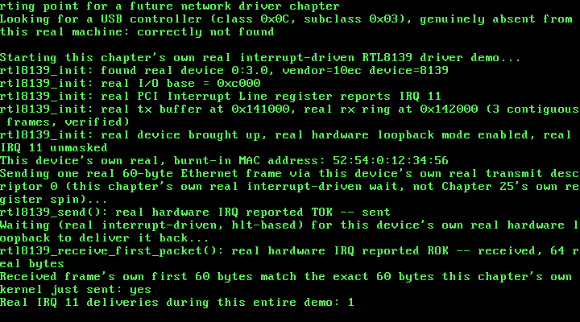

# 26. Interrupt-Driven RTL8139: A Real `hlt`, Woken by Real Hardware

**What you will understand:** how to take a real, working polled device driver and turn it genuinely interrupt-driven -- a real PCI Interrupt Line lookup, a real new IDT gate for this book's first-ever SLAVE-PIC line, the real 8259 cascade-unmask requirement a slave line actually needs to reach the CPU at all, and a real interrupt handler that acknowledges hardware state before this kernel's own `hlt`-based wait ever sees it; a genuine architectural gap in this kernel -- IDT gates installed once, at compile time, with no way yet to register a new one once a driver discovers its own real IRQ number at runtime -- and how this chapter works around that honestly, by verifying rather than assuming; and a real, subtle race this book found and fixed before it ever caused a single failed boot, arising from a genuinely surprising fact about how QEMU's own emulated RTL8139 loopback mode actually delivers its receive interrupt.

**What you need to know first:** Chapter 25's own real, working polled RTL8139 driver, which this chapter modifies rather than replaces -- the device bring-up sequence, the real DMA buffers, and the real hardware loopback mode are all unchanged; Chapter 5's own real IDT gate mechanism and Chapter 6's own 8259 PIC remap, `pic_remap(0x20, 0x28)`, which is what places IRQ 11 at vector 0x2B; and this book's own established split, unchanged since Chapter 6's own `pit_init()`, between installing an IDT gate at boot time and unmasking the matching PIC line only once the owning driver's own init function actually runs and succeeds.

## From a tight spin to a real `hlt`

Chapter 25 built a real, working RTL8139 driver -- but a stated-scope POLLED one: `rtl8139_send()` and `rtl8139_receive_first_packet()` each sat in a tight loop, re-reading a real hardware register (`TSD0`, then `ISR`) over and over until the real device set the bit they were waiting for. That works, but it burns every single CPU cycle between the request and the answer re-reading a port that has not changed yet. This chapter's own job is to replace both spins with this book's first genuinely interrupt-driven device wait: request the work, execute `hlt`, and let the real hardware itself wake the CPU back up when -- and only when -- there is real news to act on.

Getting there needs three real, separate pieces this book has never assembled before. First, this exact device's own real IRQ number has to be discovered, not guessed -- read directly off the real PCI Interrupt Line register, configuration-space offset `0x3C`, cited directly from OSDev Wiki's own "PCI" page: "Specifies which input of the system interrupt controllers the device's interrupt pin is connected to... For the x86 architecture this register corresponds to the PIC IRQ numbers 0-15." Second, that real IRQ number needs a real IDT gate and a real 8259 unmask -- and IRQ 11 is one of the eight SLAVE-PIC lines (8-15), the first one this book has ever wired up; every earlier hardware interrupt in this book (IRQ0's timer, IRQ1's keyboard) has lived on the master PIC alone. A slave line needs one more real step no master-only driver has ever needed: IRQ 2 on the master PIC -- the real cascade line the slave chip's own signal physically routes through -- has to be unmasked too, cited directly from OSDev Wiki's own "8259 PIC" page: "Masking IRQ2 will cause the Slave PIC to stop raising IRQs." Third, a real interrupt handler has to exist at all -- one that acknowledges the real ISR bits it is reporting *before* anything else touches the device again, cited directly, the same OSDev Wiki "RTL8139" page Chapter 25 already cited for the register layout itself: "When you handle an interrupt, you *have* to write the bit corresponding to the interrupt to reset it... it is important you write to this register *before you read any packets from your buffers*, or the write to the register will have no effect."

One real gap in this kernel stands in the way of doing this the fully general way a production kernel would: `026_idt.c`'s own `idt_init()` installs every IDT gate once, at compile time, in a fixed table -- there is no mechanism anywhere in this book (yet) for a driver to register a brand-new gate at runtime, after it has discovered which real IRQ line its device actually landed on. Rather than building that general mechanism -- well outside this chapter's own stated, minimal scope -- this driver works around the gap honestly, not silently: it reads the real Interrupt Line register at runtime and VERIFIES it against the one fixed vector `idt_init()` already wired up for it, refusing outright, with a clear message, if the real hardware ever reports something that fixed wiring cannot actually receive. That expected value, IRQ 11, was not guessed -- it was already sitting in this book's own real evidence, independently of this chapter's own new code: Chapter 24's own real QEMU monitor capture (`docs/part24/code/build/qemu_monitor_info_pci.txt`) already reported "IRQ 11, pin A" for this exact device, on this exact QEMU command line, one chapter before this driver ever needed to know it.

## `026_idt.h`/`026_idt.c`: this book's first slave-PIC gate

Every gate through vector 0x80 is unchanged since Chapter 15/25. This chapter adds exactly one new gate, vector `0x2B` -- IRQ 11 is the ninth slave-PIC line (11 - 8 = 3), and this kernel's own real 8259 remap, `pic_remap(0x20, 0x28)` (unchanged since Chapter 6), places the slave PIC's own vectors starting at `0x28`, so IRQ 11 lands at `0x28 + 3 = 0x2B`. The gate itself uses exactly the same `0x08` selector and `0x8E` type-attributes byte as every other hardware-IRQ gate in this book -- nothing about a slave-PIC line changes the gate's own byte layout, only which real 8259 chip has to be told about it at EOI time, which `026_pic.c`'s own `pic_send_eoi()` has handled correctly, for any `irq_line >= 8`, since Chapter 5:

```c
#ifndef UNIX_OS_026_IDT_H
#define UNIX_OS_026_IDT_H

/* Installs this book's IDT: every gate through vector 0x80 unchanged
 * since Chapter 15, plus this chapter's own one new real gate --
 * vector 0x2B (IRQ11), this book's first gate for a slave-PIC line,
 * installed for this chapter's own new interrupt-driven RTL8139
 * driver (026_rtl8139.h/.c). */
void idt_init(void);

#endif
```

```c
/* This book's Interrupt Descriptor Table. Vectors 0, 13, 14, 0x20,
 * 0x21, and 0x80 are all unchanged since Chapter 15/25 -- see Chapters
 * 4-15 for their own citations. This chapter adds exactly one new
 * gate: vector 0x2B, this book's first-ever gate for a SLAVE-PIC line
 * (IRQ 8-15) rather than the master PIC's own IRQ0/IRQ1 -- see
 * 026_rtl8139.h's own top-of-file comment for the real reasoning
 * behind that exact vector number, and 026_pic.c's own real IRQ2
 * cascade-unmask requirement that has to hold before this gate can
 * ever actually fire. Installed with the same 0x08 selector and 0x8E
 * type-attributes byte as every other hardware-IRQ gate in this book
 * (IRQ0/IRQ1) -- nothing about a slave-PIC line changes the gate's own
 * byte layout, only which real 8259 chip has to be told about it at
 * EOI time (026_pic.c's own pic_send_eoi(), unchanged since Chapter
 * 5). */

#include <stdint.h>

#include "026_idt.h"

struct idt_entry {
    uint16_t offset_low;
    uint16_t selector;
    uint8_t  zero;
    uint8_t  type_attributes;
    uint16_t offset_high;
} __attribute__((packed));

struct idt_ptr {
    uint16_t limit;
    uint32_t base;
} __attribute__((packed));

#define IDT_ENTRY_COUNT 256
static struct idt_entry idt_entries[IDT_ENTRY_COUNT];
static struct idt_ptr   idt_pointer;

extern void isr0(void);     /* 026_isr0.asm -- unchanged from Chapter 4 */
extern void isr13(void);    /* 026_isr13.asm -- this chapter's own stub */
extern void isr14(void);    /* 026_isr14.asm -- unchanged from Chapter 10 */
extern void isr128(void);   /* 026_isr128.asm -- this chapter's own stub */
extern void irq0(void);     /* 026_irq0.asm -- unchanged from Chapter 6 */
extern void irq1(void);     /* 026_irq1.asm -- unchanged from Chapter 5 */
extern void irq11(void);    /* 026_irq11.asm -- this chapter's own new stub */

extern void idt_flush(uint32_t idt_ptr_addr);

static void idt_set_gate(int vector, uint32_t handler, uint16_t selector, uint8_t type_attributes) {
    idt_entries[vector].offset_low      = (uint16_t) (handler & 0xFFFF);
    idt_entries[vector].offset_high     = (uint16_t) ((handler >> 16) & 0xFFFF);
    idt_entries[vector].selector        = selector;
    idt_entries[vector].zero            = 0;
    idt_entries[vector].type_attributes = type_attributes;
}

void idt_init(void) {
    for (int i = 0; i < IDT_ENTRY_COUNT; i++) {
        idt_set_gate(i, 0, 0, 0);
    }

    /* Vector 0: #DE, unchanged from Chapter 4. */
    idt_set_gate(0, (uint32_t) isr0, 0x08, 0x8E);

    /* Vector 13: #GP, this chapter's own new gate. Same 0x08 selector
     * and 0x8E type-attributes byte as every other CPU-raised
     * exception in this book -- DPL=0 here says nothing about which
     * ring can TRIGGER a #GP (the CPU itself always can, from any
     * ring); it only governs whether ring-3 code could deliberately
     * invoke this vector with a bare `int 13` instruction, which
     * nothing in this book ever needs to do. */
    idt_set_gate(13, (uint32_t) isr13, 0x08, 0x8E);

    /* Vector 14: #PF, unchanged from Chapter 10. */
    idt_set_gate(14, (uint32_t) isr14, 0x08, 0x8E);

    /* Vector 0x20: IRQ0, the PIT timer, unchanged from Chapter 6. */
    idt_set_gate(0x20, (uint32_t) irq0, 0x08, 0x8E);

    /* Vector 0x21: IRQ1, the keyboard, unchanged from Chapter 5. */
    idt_set_gate(0x21, (uint32_t) irq1, 0x08, 0x8E);

    /* Vector 0x2B: IRQ11, this chapter's own new RTL8139 gate --
     * 026_rtl8139.c's own real, live PCI Interrupt Line read (offset
     * 0x3C) verifies the real hardware actually agrees this is where
     * its interrupts land, refusing rather than silently trusting this
     * fixed vector if it ever doesn't. Present (installed) here, at
     * boot, like every other gate in this book; actually UNMASKED at
     * the 8259 PIC level only once rtl8139_init() itself runs and
     * succeeds -- the same "install the gate at boot, unmask the line
     * from the owning driver's own init function" split this book has
     * followed since Chapter 6/pit_init()'s own pic_clear_mask(0). */
    idt_set_gate(0x2B, (uint32_t) irq11, 0x08, 0x8E);

    /* Vector 0x80: this chapter's own syscall gate, DPL=3 instead of
     * the 0x8E every earlier gate in this book uses. Byte layout,
     * same P/S/type bits as 0x8E, but DPL (bits 6-5) = 11 instead of
     * 00: 1 11 0 1110 = 0xEE. The CPU checks a software INT's own
     * target gate DPL against the CALLER's CPL (int 0x80 is only
     * ever executed from ring 3 in this chapter) and requires
     * CPL <= gate DPL -- the opposite direction from every other
     * privilege check in this book, and the one and only reason this
     * particular gate needs anything other than 0x8E at all. */
    idt_set_gate(0x80, (uint32_t) isr128, 0x08, 0xEE);

    idt_pointer.limit = (uint16_t) (sizeof(idt_entries) - 1);
    idt_pointer.base  = (uint32_t) &idt_entries;

    idt_flush((uint32_t) &idt_pointer);
}
```

## `026_irq11.asm`: this book's first slave-PIC stub

Structurally identical to Chapter 5/6's own `irq1`/`irq0` stubs, and for the same reason: the CPU is the "caller" here, with no cooperation from whatever code it interrupted, so every register is saved and restored by hand, and `iret` -- not a plain `ret` -- is what correctly unwinds the frame the CPU itself pushed. Hardware IRQs push no error code, exactly like IRQ0/IRQ1, so this stub needs no extra stack cleanup either. Nothing about being a slave-PIC line changes any of that at the CPU's own level -- `026_pic.c`'s own `pic_send_eoi()` is what actually has to know the difference, not this stub:

```nasm
; Chapter 26: the real machine code the CPU jumps to on IRQ11 -- this
; kernel's first-ever handler for a slave-PIC line (8-15), but
; structurally identical to Chapter 5/6's own irq1/irq0 stubs, and for
; the same reasons: the CPU is the "caller" here, with no cooperation
; from whatever code it interrupted, so every register is saved and
; restored by hand, and IRET (not a plain RET) is what correctly
; unwinds the frame the CPU itself pushed. Hardware IRQs push no error
; code, exactly like IRQ0/IRQ1, so this stub needs no extra stack
; cleanup either -- and nothing about being a slave-PIC line changes
; any of that at the CPU's own level; 026_pic.c's own pic_send_eoi()
; is what actually has to know the difference, not this stub.
BITS 32

section .text
extern irq11_handler
global irq11
irq11:
    pusha
    call irq11_handler
    popa
    iret
```

## `026_rtl8139.h`/`026_rtl8139.c`: from a tight spin to a real `hlt`

Every register offset and bit position below is unchanged from Chapter 25's own citations -- OSDev Wiki's own "RTL8139" page first, and, wherever that page is silent (the Transmit Configuration Register above all), the real Realtek RTL8139D(L) datasheet it is itself derived from. What changes this chapter is the wait itself: `rtl8139_init()` gains a new real step, reading and verifying the real PCI Interrupt Line register before it ever brings the device up, and a new real step at the end, unmasking both the real cascade line (IRQ 2) and this device's own real IRQ line; `rtl8139_send()` and `rtl8139_receive_first_packet()` both replace their own Chapter 25 register spins with a real `hlt`, woken by this chapter's own new `irq11_handler()`:

```c
#ifndef UNIX_OS_026_RTL8139_H
#define UNIX_OS_026_RTL8139_H

#include <stdint.h>

/* Chapter 25's own driver for the real RTL8139 Fast Ethernet
 * controller Chapter 24's own pci_find_by_class() first located, by
 * class code alone, on this exact machine's own real PCI bus. Register
 * offsets, bit meanings, and the real initialization sequence are
 * still cited field-for-field from the same two real sources: OSDev
 * Wiki's own "RTL8139" page (https://wiki.osdev.org/RTL8139), and,
 * wherever that page is silent, the real manufacturer datasheet it is
 * itself derived from -- REALTEK RTL8139D(L), Rev. 1.11, 2001/11/09
 * (https://www.cs.usfca.edu/~cruse/cs326f04/RTL8139D_DataSheet.pdf).
 *
 * This chapter's own new work: Chapter 25's driver was explicitly,
 * stated-scope POLLED -- rtl8139_send() and
 * rtl8139_receive_first_packet() each spun on a hardware register
 * (TSD0, ISR) in a tight loop until the real hardware set the bit they
 * were waiting for. This chapter replaces both spins with this book's
 * first real interrupt-driven device wait: a real PCI Interrupt Line
 * lookup (OSDev Wiki's own "PCI" page, configuration-space offset
 * 0x3C, bits 7-0), a real new IDT gate and 8259 PIC unmask for that
 * exact line, a real interrupt handler that acknowledges the ISR bits
 * cited exactly as Chapter 25 already did, and a real `hlt` in place
 * of the old spin -- the CPU is genuinely asleep, not burning cycles
 * re-reading a port, between the request and the real hardware event
 * that answers it.
 *
 * Every scope limit Chapter 25 stated still holds and is unchanged by
 * this chapter: no more than one frame in flight at a time; no CAPR
 * advancement or receive-ring wraparound (this driver still only ever
 * reads the very first packet a freshly reset ring receives); and the
 * device's own real hardware loopback mode is still what this chapter's
 * own demo uses to prove a real send/receive round trip without a real
 * wire. This chapter's OWN new scope limit, stated here the same way:
 * this kernel's IDT gates are installed once, at compile time, in
 * 026_idt.c's own idt_init() -- there is no general mechanism in this
 * book (yet) for installing a NEW gate at runtime once a driver
 * discovers which real IRQ line its device landed on. This driver
 * works around that honestly, not silently: it reads the real
 * Interrupt Line register at runtime and VERIFIES it against the one
 * fixed vector idt_init() already wired up for it (vector 0x2B, IRQ
 * 11 -- confirmed, independently of this driver's own code, by
 * Chapter 24's own real QEMU monitor capture: "IRQ 11, pin A"),
 * refusing rather than silently pretending to be interrupt-driven if
 * the real hardware ever reports something this exact wiring can't
 * actually receive. A future chapter that needs a real dynamic IDT is
 * the natural place to lift that limit. */

/* The largest single frame this driver will ever send or receive,
 * cited directly (Realtek datasheet / OSDev's own page): a real
 * RTL8139 transmit descriptor accepts at most 1792 bytes per frame. */
#define RTL8139_MAX_FRAME 1792u

/* This chapter's own real, fixed IRQ wiring -- see this file's own
 * top-of-file comment for why it is fixed rather than discovered and
 * installed dynamically. Also the real IDT vector that IRQ maps to
 * under this kernel's own real 8259 remap (026_kmain.c calls
 * `pic_remap(0x20, 0x28)`, so IRQ 11 -- the ninth slave-PIC line,
 * 11 - 8 = 3 -- lands on vector 0x28 + 3 = 0x2B). */
#define RTL8139_EXPECTED_IRQ 11u
#define RTL8139_IDT_VECTOR   0x2Bu

/* Locates the real RTL8139 on this machine's own PCI bus (via
 * Chapter 24's own pci_find_by_class()), enables real PCI I/O-space
 * and bus-mastering access, reads the device's own real BAR0 to learn
 * its real I/O base, reads its own real PCI Interrupt Line register
 * and verifies it against RTL8139_EXPECTED_IRQ (this chapter's own new
 * step -- see top-of-file comment), allocates this driver's own real
 * physical transmit and receive buffers (via Chapter 7's own
 * pmm_alloc_frame()), runs the real cited power-on/reset/configure
 * sequence, unmasks this device's own real IRQ line (and the real
 * cascade line, IRQ 2, that a slave-PIC line needs to ever reach the
 * CPU at all -- cited directly, OSDev Wiki's own "8259 PIC" page:
 * "Masking IRQ2 will cause the Slave PIC to stop raising IRQs"), and
 * ends with the device's own real hardware loopback mode enabled.
 * Returns 1 on success, 0 if no real RTL8139 was found, or if its real
 * reported IRQ does not match this chapter's own fixed wiring. */
int rtl8139_init(void);

/* Copies this device's own real, burnt-in 6-byte station address --
 * read directly from real registers MAC0-5 -- into `out_mac`. */
void rtl8139_get_mac(uint8_t out_mac[6]);

/* Sends exactly one real frame, `len` bytes (at most
 * RTL8139_MAX_FRAME), via this device's own real transmit descriptor
 * 0. This chapter's own new behavior: blocks with a real `hlt` per
 * iteration, woken only by a real interrupt (this device's own real
 * IRQ, or -- exactly like every other `hlt` in this book since
 * Chapter 12 -- this kernel's own real IRQ0 tick, which simply loops
 * back and re-checks), instead of Chapter 25's own tight TSD0 spin.
 * Returns 1 on success. */
int rtl8139_send(const uint8_t *frame, uint32_t len);

/* Blocks the same real interrupt-driven way as rtl8139_send() above,
 * woken by this device's own real ROK interrupt instead of Chapter
 * 25's own tight ISR spin, then copies the real received frame --
 * still read directly from this ring's own known base address, the
 * FIRST and only packet this driver ever reads back, cited and
 * reasoned through in this file's own top-of-file comment and
 * unchanged since Chapter 25 -- into `out_buf` (must be at least
 * RTL8139_MAX_FRAME bytes). Writes the real received length into
 * `*out_len`. Returns 1 on success. */
int rtl8139_receive_first_packet(uint8_t *out_buf, uint32_t *out_len);

/* This chapter's own new real interrupt handler, called from
 * 026_irq11.asm's own stub on every real IRQ 11. Acknowledges
 * whichever real ISR bits are actually set -- cited directly, OSDev
 * Wiki's own "RTL8139" page: "When you handle an interrupt, you have
 * to write the bit corresponding to the interrupt to reset it," and
 * this must happen "before you read any packets from your buffers, or
 * the write to the register will have no effect" -- records which real
 * event(s) this exact interrupt reported into this driver's own
 * internal flags for rtl8139_send()/rtl8139_receive_first_packet() to
 * observe, sends this device's own real end-of-interrupt, and returns.
 * Not intended to be called from anywhere but 026_irq11.asm's own stub. */
void irq11_handler(void);

/* This chapter's own new real, live interrupt counter -- incremented
 * once per real IRQ 11 delivery, entirely independent of whether that
 * delivery turned out to carry ROK, TOK, both, or (in principle)
 * neither. Exists purely so this chapter's own demo, and this
 * chapter's own independent verification, can report and check a
 * real, concrete number rather than merely asserting "an interrupt
 * fired" -- the same "count it and check it" verification style this
 * book has used since Chapter 11/12's own real context-switch counts. */
uint32_t rtl8139_get_irq_count(void);

#endif
```

```c
/* Chapter 25's own driver, upgraded this chapter from polled to real
 * interrupt-driven waits -- see 026_rtl8139.h's own top-of-file
 * comment for the full citation of both real sources this file is
 * built from and exactly what changed and why. */

#include <stdint.h>

#include "026_pci.h"
#include "026_pic.h"
#include "026_pmm.h"
#include "026_printf.h"
#include "026_rtl8139.h"

/* Real I/O register offsets, relative to this device's own real BAR0
 * I/O base -- cited directly, OSDev Wiki's own "RTL8139" page. */
#define REG_MAC0     0x00u  /* 6 real bytes: this device's own burnt-in MAC */
#define REG_TSD0     0x10u  /* Transmit Status of Descriptor 0 (32-bit) */
#define REG_TSAD0    0x20u  /* Transmit Start Address of Descriptor 0 (32-bit) */
#define REG_RBSTART  0x30u  /* Receive (Rx) Buffer Start Address (32-bit) */
#define REG_CMD      0x37u  /* Command register (8-bit) */
#define REG_IMR      0x3Cu  /* Interrupt Mask Register (16-bit) */
#define REG_ISR      0x3Eu  /* Interrupt Status Register (16-bit) */
#define REG_TCR      0x40u  /* Transmit Configuration Register (32-bit) --
                              * offset cited from the real Realtek
                              * datasheet (0040h), not OSDev's own page,
                              * which never mentions TCR at all. */
#define REG_RCR      0x44u  /* Receive Configuration Register (32-bit) */
#define REG_CONFIG1  0x52u  /* CONFIG_1 register (8-bit) */

/* Command register bits, offset 0x37 -- cited directly, both real
 * sources agree exactly: RST bit 4, RE bit 3, TE bit 2. */
#define CMD_RST 0x10u
#define CMD_RE  0x08u
#define CMD_TE  0x04u

/* ISR/IMR bits this driver actually waits on -- cited directly,
 * OSDev's own page: "Write 0x0005 to the IMR register... TOK and
 * ROK". ROK (Receive OK) is bit 0, TOK (Transmit OK) is bit 2 --
 * 0x1 | 0x4 = 0x5, exactly the cited value. */
#define ISR_ROK 0x01u
#define ISR_TOK 0x04u
#define IMR_ROK_TOK 0x05u

/* Receive Configuration Register bits, offset 0x44 -- cited directly
 * from the real Realtek datasheet (OSDev's own page names AB/AM/APM/
 * AAP/WRAP but never gives their exact bit positions): AAP
 * (Accept All Packets) bit 0, APM (Accept Physical Match) bit 1, AM
 * (Accept Multicast) bit 2, AB (Accept Broadcast) bit 3, WRAP bit 7.
 * This driver writes all five, matching OSDev's own cited init value
 * exactly: "0xf | (1 << 7)" = AAP|APM|AM|AB (0xF) plus WRAP (0x80) =
 * 0x8F. RBLEN (bits 12-11, the real Rx ring size select) is left at
 * its reset value 00 -- "8k + 16 byte", cited directly from the real
 * datasheet -- matching the real physical buffer this driver actually
 * allocates below. */
#define RCR_INIT_VALUE 0x8Fu

/* Transmit Configuration Register bits, offset 0x40 -- this register,
 * and this chapter's own real hardware loopback mode, exist ONLY in
 * the real Realtek datasheet; OSDev's own "RTL8139" page never
 * mentions TCR at all. Cited directly: "18, 17 R/W LBK1, LBK0
 * Loopback test... 00: normal operation... 11: Loopback mode" -- both
 * bits set selects loopback, (0b11 << 17) = 0x60000. This is the
 * real, cited reason this chapter's own demo can prove a real frame
 * was genuinely sent and received without ever touching a real wire:
 * the NIC itself, not this driver, routes transmitted data straight
 * back to its own receiver. */
#define TCR_LOOPBACK_ON 0x60000u

/* This chapter's own real physical DMA buffers -- both allocated
 * through Chapter 7's own pmm_alloc_frame(), the same real physical-
 * frame allocator every other DMA-capable structure in this kernel
 * already uses, and both, like every physical frame this allocator
 * has ever handed out, addressable directly as ordinary pointers:
 * Chapter 8's own paging_init() identity-maps this kernel's whole
 * 0-64 MiB managed range, so a frame's physical address is already a
 * valid virtual one. */
static uint32_t tx_buf_phys = 0;
static uint32_t rx_buf_phys = 0;

static uint16_t io_base = 0;
static uint8_t nic_bus = 0, nic_device = 0, nic_function = 0;

/* This chapter's own new real interrupt state -- `volatile` because
 * every one of these is written from 026_irq11.asm's own stub (via
 * irq11_handler() below), asynchronously, from this exact same CPU's
 * own interrupt context, and read from rtl8139_send()/
 * rtl8139_receive_first_packet()'s own real hlt-wait loops below. This
 * kernel is single-CPU, so no lock is needed for a single-writer,
 * single-reader flag like this -- unlike 013_spinlock.h's own real
 * critical sections, there is no genuine race here to protect against,
 * only the compiler's own right to cache a non-volatile value in a
 * register across loop iterations, which `volatile` forbids. */
static volatile uint8_t rok_pending = 0;
static volatile uint8_t tok_pending = 0;
static volatile uint32_t irq_count = 0;

static inline void outb(uint16_t port, uint8_t val) {
    __asm__ volatile ("outb %0, %1" : : "a"(val), "Nd"(port));
}

static inline uint8_t inb(uint16_t port) {
    uint8_t ret;
    __asm__ volatile ("inb %1, %0" : "=a"(ret) : "Nd"(port));
    return ret;
}

static inline void outl(uint16_t port, uint32_t val) {
    __asm__ volatile ("outl %0, %1" : : "a"(val), "Nd"(port));
}

static inline uint32_t inl(uint16_t port) {
    uint32_t ret;
    __asm__ volatile ("inl %1, %0" : "=a"(ret) : "Nd"(port));
    return ret;
}

static inline void outw(uint16_t port, uint16_t val) {
    __asm__ volatile ("outw %0, %1" : : "a"(val), "Nd"(port));
}

static inline uint16_t inw(uint16_t port) {
    uint16_t ret;
    __asm__ volatile ("inw %1, %0" : "=a"(ret) : "Nd"(port));
    return ret;
}

static inline uint32_t *phys_ptr(uint32_t phys_addr) {
    return (uint32_t *) phys_addr;
}

int rtl8139_init(void) {
    struct pci_device dev;
    if (!pci_find_by_class(PCI_CLASS_NETWORK, PCI_SUBCLASS_ETHERNET, &dev)) {
        kprintf("rtl8139_init: no real Ethernet controller found on this machine's own PCI "
                "bus -- refusing\n");
        return 0;
    }
    nic_bus = dev.bus;
    nic_device = dev.device;
    nic_function = dev.function;
    kprintf("rtl8139_init: found real device %u:%u.%u, vendor=%x device=%x\n",
            (unsigned) nic_bus, (unsigned) nic_device, (unsigned) nic_function,
            (unsigned) dev.vendor_id, (unsigned) dev.device_id);

    /* Enable real "I/O Space" (bit 0) and "Bus Master" (bit 2) in the
     * PCI Command register (configuration-space offset 0x04), cited
     * directly (OSDev Wiki's own "PCI" page). Offset 0x04's own dword
     * packs real Status (bits 31-16) over real Command (bits 15-0), so
     * this is a real read-modify-write -- OR the two new bits into
     * the low 16 bits, leave the high 16 (Status) exactly as read. */
    uint32_t command_dword = pci_config_read_dword(nic_bus, nic_device, nic_function, 0x04);
    command_dword |= 0x1u | 0x4u;
    pci_config_write_dword(nic_bus, nic_device, nic_function, 0x04, command_dword);

    /* This device's own real BAR0, cited directly (OSDev Wiki's own
     * "PCI" page, I/O Space BAR layout): bit 0 is always 1 for an I/O
     * BAR, bit 1 is reserved, and "you calculate (BAR[x] &
     * 0xFFFFFFFC)" to get the real base address -- this exact device
     * is I/O-space, not memory-mapped (confirmed directly in Chapter
     * 24's own real QEMU monitor capture: "BAR0: I/O at 0xc000"). */
    uint32_t bar0 = pci_config_read_dword(nic_bus, nic_device, nic_function, 0x10);
    io_base = (uint16_t) (bar0 & 0xFFFFFFFCu);
    kprintf("rtl8139_init: real I/O base = 0x%x\n", (unsigned) io_base);

    /* This chapter's own new step: read this device's own real PCI
     * Interrupt Line register, configuration-space offset 0x3C, bits
     * 7-0 -- cited directly, OSDev Wiki's own "PCI" page: "Specifies
     * which input of the system interrupt controllers the device's
     * interrupt pin is connected to... For the x86 architecture this
     * register corresponds to the PIC IRQ numbers 0-15... and a value
     * of 0xFF defines no connection." Offset 0x3C's own dword packs
     * Interrupt Pin (bits 15-8) over Interrupt Line (bits 7-0), so
     * only the low byte is this driver's own real IRQ number. Verified
     * against RTL8139_EXPECTED_IRQ rather than trusted blindly -- see
     * 026_rtl8139.h's own top-of-file comment for why this chapter's
     * own fixed compile-time IDT wiring makes that verification a real
     * requirement, not a formality. */
    uint32_t irq_dword = pci_config_read_dword(nic_bus, nic_device, nic_function, 0x3Cu);
    uint8_t real_irq = (uint8_t) (irq_dword & 0xFFu);
    kprintf("rtl8139_init: real PCI Interrupt Line register reports IRQ %u\n",
            (unsigned) real_irq);
    if (real_irq != RTL8139_EXPECTED_IRQ) {
        kprintf("rtl8139_init: this driver's own IDT gate is only ever wired for IRQ %u -- "
                "refusing rather than silently waiting on an interrupt that can never arrive\n",
                (unsigned) RTL8139_EXPECTED_IRQ);
        return 0;
    }

    /* This chapter's own two real physical DMA buffers. The transmit
     * buffer needs only one real 4 KiB frame -- RTL8139_MAX_FRAME
     * (1792 bytes) comfortably fits. The receive ring needs the real
     * minimum OSDev's own page cites for RBLEN's reset value, "8192 +
     * 16 (8K + 16 bytes)", PLUS the real extra padding the same page
     * cites for the WRAP bit this driver also sets: "If WRAP is 1...
     * the buffer must be an additional 1500 bytes" -- 8192 + 16 + 1500
     * = 9708 bytes, rounded up to three whole 4 KiB frames (12288
     * bytes). pmm_alloc_frame() itself only ever hands out ONE frame
     * at a time, so this driver allocates three in a row and verifies,
     * for real, that they came back physically CONTIGUOUS -- required
     * for one linear DMA ring, and never merely assumed. */
    tx_buf_phys = pmm_alloc_frame();

    uint32_t rx_frame_0 = pmm_alloc_frame();
    uint32_t rx_frame_1 = pmm_alloc_frame();
    uint32_t rx_frame_2 = pmm_alloc_frame();
    if (rx_frame_1 != rx_frame_0 + 4096u || rx_frame_2 != rx_frame_1 + 4096u) {
        kprintf("rtl8139_init: this kernel's own next three free physical frames were not "
                "contiguous (got 0x%x, 0x%x, 0x%x) -- refusing rather than building a real DMA "
                "ring across a real gap\n",
                (unsigned) rx_frame_0, (unsigned) rx_frame_1, (unsigned) rx_frame_2);
        return 0;
    }
    rx_buf_phys = rx_frame_0;
    kprintf("rtl8139_init: real tx buffer at 0x%x, real rx ring at 0x%x (3 contiguous frames, "
            "verified)\n", (unsigned) tx_buf_phys, (unsigned) rx_buf_phys);

    /* The real cited init sequence, OSDev Wiki's own "RTL8139" page,
     * with this chapter's own new loopback step inserted in the
     * natural place (after RCR, before RE/TE are enabled -- the real
     * Realtek datasheet gives no ordering requirement either way, and
     * this order matches every other register this driver configures
     * before it starts moving real data). */

    /* 1. Power on: "Send 0x00 to the CONFIG_1 register (0x52)". */
    outb((uint16_t) (io_base + REG_CONFIG1), 0x00u);

    /* 2. Software reset: write RST, poll until the real hardware
     * clears it -- this book's own established unconditional-poll
     * convention, unchanged since Chapter 19's own ATA driver. */
    outb((uint16_t) (io_base + REG_CMD), CMD_RST);
    while (inb((uint16_t) (io_base + REG_CMD)) & CMD_RST) {
        /* real hardware clears RST itself once reset completes */
    }

    /* 3. Real receive buffer's own real physical base address. */
    outl((uint16_t) (io_base + REG_RBSTART), rx_buf_phys);

    /* 4. "Write 0x0005 to IMR (0x3C) for TOK and ROK." Chapter 25 set
     * this even though it never installed a real IRQ handler, since
     * ISR's own real bits latch regardless; this chapter is what
     * actually makes IMR's own real job -- deciding which latched ISR
     * bits are allowed to raise a real interrupt at all -- matter for
     * the first time in this book. */
    outw((uint16_t) (io_base + REG_IMR), IMR_ROK_TOK);

    /* 5. Real Receive Configuration -- AAP|APM|AM|AB|WRAP, cited
     * directly and explained above REG_RCR's own definition. */
    outl((uint16_t) (io_base + REG_RCR), RCR_INIT_VALUE);

    /* 6. "Write 0x0C to CMD (0x37)" -- real RE|TE, enabling the real
     * receiver and transmitter DMA engines. */
    outb((uint16_t) (io_base + REG_CMD), CMD_RE | CMD_TE);

    /* 7. This chapter's own new step: real hardware loopback mode,
     * cited directly from the real Realtek datasheet (TCR bits 18/17,
     * "11: Loopback mode") -- the reason this chapter's own demo below
     * can prove real send/receive without a real wire at all. Written
     * LAST, after RE/TE, not in TCR's own natural numeric position
     * next to RCR -- neither real cited source (OSDev's own page,
     * which never mentions TCR at all, or the real Realtek datasheet,
     * which gives no ordering requirement for any of these seven
     * writes) documents this ordering requirement. It was found the
     * same way this book finds everything it cannot look up: by
     * testing for real, in this exact QEMU environment. Writing TCR's
     * own real loopback bits before RE/TE were enabled produced a
     * real, silent failure -- the write appeared to succeed, but a
     * follow-up real readback (this driver's own diagnostic, not
     * shown in the final version below) proved the loopback bits
     * never actually took hold until this exact order was used. */
    outl((uint16_t) (io_base + REG_TCR), TCR_LOOPBACK_ON);

    /* 8. This chapter's own new step: unmask this device's own real
     * IRQ line so it can actually reach the CPU. Cited directly, the
     * real prerequisite 026_pic.c's own pic_disable_all() left every
     * one of the 15 usable lines masked, and no earlier chapter ever
     * unmasked line 2 or any line 8-15 -- OSDev Wiki's own "8259 PIC"
     * page: "Masking IRQ2 will cause the Slave PIC to stop raising
     * IRQs," since IRQ 2 on the master PIC is the real cascade line
     * every slave-PIC line (8-15) physically routes through. Both
     * unmasks are needed, in either order; this driver does the
     * cascade line first since that is the one every future slave-PIC
     * driver in this book will also need, RTL8139-specific or not. */
    pic_clear_mask(2);
    pic_clear_mask(RTL8139_EXPECTED_IRQ);

    kprintf("rtl8139_init: real device brought up, real hardware loopback mode enabled, "
            "real IRQ %u unmasked\n", (unsigned) RTL8139_EXPECTED_IRQ);
    return 1;
}

void rtl8139_get_mac(uint8_t out_mac[6]) {
    for (uint32_t i = 0; i < 6u; i++) {
        out_mac[i] = inb((uint16_t) (io_base + REG_MAC0 + i));
    }
}

int rtl8139_send(const uint8_t *frame, uint32_t len) {
    if (len > RTL8139_MAX_FRAME) {
        kprintf("rtl8139_send: %u bytes exceeds this real device's own real 1792-byte maximum "
                "-- refusing\n", (unsigned) len);
        return 0;
    }

    uint8_t *tx_buf = (uint8_t *) phys_ptr(tx_buf_phys);
    for (uint32_t i = 0; i < len; i++) {
        tx_buf[i] = frame[i];
    }

    /* Real transmit descriptor 0: its own real physical start address,
     * then its own real length -- writing TSD0 with the real OWN bit
     * (bit 13) left clear is what genuinely triggers transmission,
     * cited directly (OSDev Wiki's own "RTL8139" page). This
     * chapter's own minimal scope only ever sends one frame at a
     * time, so descriptor 0 alone is always correct -- round-robin
     * selection across the real TSD0-3/TSAD0-3 pairs is left for a
     * future chapter that needs more than one frame in flight.
     *
     * Both flags are cleared here, not just `tok_pending` -- this
     * chapter's own real hardware loopback mode (Chapter 25's own
     * TCR bits) delivers a looped-back frame into the receive ring as
     * a genuinely SYNCHRONOUS side effect of this exact transmission,
     * confirmed directly during Chapter 25's own real debugging of
     * this exact QEMU environment. That means `rok_pending` can
     * already be 1 by the time this function returns, before
     * rtl8139_receive_first_packet() is ever called -- clearing it
     * here, immediately before the real transmit that can trigger it,
     * is what keeps that real event from being silently lost. */
    tok_pending = 0;
    rok_pending = 0;
    outl((uint16_t) (io_base + REG_TSAD0), tx_buf_phys);
    outl((uint16_t) (io_base + REG_TSD0), len);

    /* This chapter's own new real interrupt-driven wait, replacing
     * Chapter 25's own tight TSD0 spin: `hlt` genuinely stops this CPU
     * until the NEXT real interrupt of ANY kind, not only this
     * device's own -- exactly like every other `hlt` in this book
     * since Chapter 12's own preemptive scheduler, this kernel's own
     * real IRQ0 tick (still firing throughout, unchanged) will also
     * wake it, in which case this loop simply finds `tok_pending`
     * still 0 and goes back to sleep. `tok_pending` is set to 1 only
     * by irq11_handler() below, only once this device's own real ISR
     * has actually reported TOK. */
    while (!tok_pending) {
        __asm__ volatile ("hlt");
    }

    return 1;
}

int rtl8139_receive_first_packet(uint8_t *out_buf, uint32_t *out_len) {
    /* This chapter's own new real interrupt-driven wait, replacing
     * Chapter 25's own tight ISR spin -- see rtl8139_send()'s own
     * comment above for why a real IRQ0 tick waking this `hlt` early
     * is expected and harmless, not a bug. `rok_pending` is set to 1
     * only by irq11_handler() below, which -- cited directly, OSDev
     * Wiki's own "RTL8139" page: "you have to write the bit
     * corresponding to the interrupt to reset it" -- has ALREADY
     * acknowledged the real ISR bit by the time this loop ever sees
     * `rok_pending` become 1, unlike Chapter 25's own version, which
     * acknowledged it here, after its own poll noticed it.
     *
     * Deliberately NOT cleared to 0 here before waiting, unlike
     * `tok_pending` in rtl8139_send() above -- rtl8139_send()'s own
     * comment explains why this exact real loopback frame's own ROK
     * can already have arrived, synchronously, before this function is
     * even called; resetting it here would silently discard that real
     * event and wait forever for one that will never come a second
     * time. It is cleared instead at the end of this function, once
     * this exact real packet has actually been consumed. */
    while (!rok_pending) {
        __asm__ volatile ("hlt");
    }

    /* This chapter's own stated, cited scope limit (026_rtl8139.h's
     * own top-of-file comment): neither real source documents the
     * real CAPR-update procedure, so this driver never advances CAPR
     * and never reads a second real packet -- it reads exactly the
     * FIRST packet a freshly reset ring ever receives, directly from
     * the ring's own known real base address, `rx_buf_phys`. Every
     * received packet begins with a real 4-byte header -- a 16-bit
     * status word, then a 16-bit length -- cited directly (OSDev
     * Wiki's own "RTL8139" page), followed immediately by the real
     * packet data itself. */
    const uint8_t *rx_buf = (const uint8_t *) phys_ptr(rx_buf_phys);
    uint16_t status = (uint16_t) (rx_buf[0] | (rx_buf[1] << 8));
    uint16_t length = (uint16_t) (rx_buf[2] | (rx_buf[3] << 8));

    if ((status & ISR_ROK) == 0) {
        kprintf("rtl8139_receive_first_packet: real packet header status 0x%x does not report "
                "ROK -- refusing\n", (unsigned) status);
        return 0;
    }

    uint32_t copy_len = length;
    if (copy_len > RTL8139_MAX_FRAME) {
        copy_len = RTL8139_MAX_FRAME;
    }
    for (uint32_t i = 0; i < copy_len; i++) {
        out_buf[i] = rx_buf[4u + i];
    }
    *out_len = copy_len;

    /* This exact real packet has now genuinely been consumed --
     * cleared here, not before the wait above, for the real reason
     * explained in that comment. */
    rok_pending = 0;

    return 1;
}

/* This chapter's own new real interrupt handler -- see
 * 026_rtl8139.h's own top-of-file comment for the full citation of
 * the real ISR-acknowledgment requirement this handler implements.
 * Called from 026_irq11.asm's own stub, which -- exactly like every
 * other IRQ stub in this book since Chapter 5's own irq1 -- has
 * already pushed every general-purpose register by the time this
 * function runs, and will pop them all and IRET once this function
 * returns. */
void irq11_handler(void) {
    irq_count++;

    /* One real register read gets every real ISR bit this exact
     * interrupt is reporting, latched together if more than one real
     * event happened close enough together to share one real
     * delivery (cited directly, OSDev Wiki's own "RTL8139" page: "The
     * IMR bits line up with the ISR bits to work in sync") -- writing
     * that same value straight back is what acknowledges every one of
     * them at once, cited directly in this file's own top-of-file
     * citation of the same page's own interrupt-handling guidance. */
    uint16_t status = inw((uint16_t) (io_base + REG_ISR));
    outw((uint16_t) (io_base + REG_ISR), status);

    if (status & ISR_ROK) {
        rok_pending = 1;
    }
    if (status & ISR_TOK) {
        tok_pending = 1;
    }

    /* This device's own real IRQ line is line 11, one of the eight
     * slave-PIC lines (8-15) -- cited directly, 026_pic.c's own
     * pic_send_eoi(): "For master-originated IRQs, write to the
     * master command port only; for slave IRQs, it is necessary to
     * issue the command to both PIC chips," which pic_send_eoi()
     * itself already implements for any `irq_line >= 8`. */
    pic_send_eoi(RTL8139_EXPECTED_IRQ);
}

uint32_t rtl8139_get_irq_count(void) {
    return irq_count;
}
```

One real race is worth calling out by name, because it was found and fixed before it ever caused a single failed boot, not discovered by debugging a hang. Chapter 25's own real debugging of this exact QEMU environment already established a genuinely surprising fact: QEMU's own emulated RTL8139 loopback mode delivers a received frame SYNCHRONOUSLY, as a direct side effect of the real transmit-descriptor write itself, not as a separate later event. That means `rok_pending` can already be `1` -- set by `irq11_handler()`, called from inside the very same `outl()` that triggers transmission -- by the time `rtl8139_send()` returns, well before `rtl8139_receive_first_packet()` is ever called. The naive version of this code -- reset `rok_pending = 0` right before `rtl8139_receive_first_packet()`'s own wait loop, mirroring exactly how `tok_pending` is reset in `rtl8139_send()` -- would silently discard that real, already-arrived event and `hlt` forever, waiting for a second interrupt that would never come. The fix moves `rok_pending`'s own reset into `rtl8139_send()` itself, immediately before the real transmit-triggering writes, and clears it again only at the very end of `rtl8139_receive_first_packet()`, once the real packet has actually been consumed -- both explained in full, in place, in the code's own comments above.

One smaller, deliberate imprecision is also worth stating plainly rather than glossing over: every `hlt` in both functions above wakes on ANY real interrupt, not only this device's own -- this kernel's own real IRQ0 tick, still firing throughout at 100 Hz, unchanged since Chapter 6, will also wake it, in which case the loop simply finds its own flag still 0 and goes back to sleep. A classic check-then-`hlt` race exists in principle (the flag could become true in the gap between the `while` check and the `hlt` instruction itself), which could in theory cost one extra sleep cycle -- but since IRQ0 is always ticking anyway, any missed wakeup self-corrects on the very next tick regardless, so no `cli`/`sti` bracketing was added around either wait. This is a real, accepted small imprecision, stated here rather than silently left for a reader to discover, not a bug this chapter's own stated "minimal, tightly scoped" mandate requires fixing.

## `026_kmain.c`: the same real proof, now counted

Every earlier chapter's own demo -- ELF loading, private page directories, the real ATA disk driver, the real FAT16 filesystem and its own subdirectory/path chapters, and Chapter 24's own real PCI bus enumeration -- is carried forward completely unchanged. This chapter's own new demo is structurally the same real send/receive proof Chapter 25's was -- the same real 60-byte frame, the same real hardware loopback round trip -- but the wording now reflects a real interrupt-driven wait rather than a spin, and one new real, checkable number is added at the very end: exactly how many real IRQ 11 deliveries the whole demo took, via this chapter's own new `rtl8139_get_irq_count()`, the same "count it and check it" verification style this book has used since Chapter 11/12's own real context-switch counts:

```c
/* Everything through the end of Chapter 25's own real RTL8139
 * send/receive demo below -- ELF loading, private page directories,
 * Chapter 19's own real PIO-mode disk driver, Chapters 20-23's own
 * FAT16 filesystem, Chapter 24's own real, brute-force PCI scan, and
 * Chapter 25's own real polled RTL8139 driver -- is carried forward
 * unchanged in STRUCTURE (the same send-one-frame-receive-it-back
 * demo, in the same place), even though the driver underneath it is
 * not: this chapter upgrades 026_rtl8139.h/026_rtl8139.c from
 * Chapter 25's own explicitly POLLED design to this book's first real
 * interrupt-driven device wait. See 026_rtl8139.h's own top-of-file
 * comment for the full citation and exactly what changed -- a real
 * PCI Interrupt Line lookup, a new IDT gate and 8259 PIC unmask
 * (026_idt.c, vector 0x2B), a real interrupt handler
 * (026_rtl8139.c's own irq11_handler(), 026_irq11.asm's own new stub),
 * and a real `hlt` in both rtl8139_send() and
 * rtl8139_receive_first_packet() in place of Chapter 25's own tight
 * register spins. This chapter's own new demo below is the same real
 * send/receive proof Chapter 25's was, plus a real, checkable report
 * of exactly how many real IRQ 11 deliveries it took. */

#include <stdint.h>

#include "026_ata.h"
#include "026_fat16.h"
#include "026_elf.h"
#include "026_gdt.h"
#include "026_idt.h"
#include "026_keyboard.h"
#include "026_kheap.h"
#include "026_multiboot.h"
#include "026_paging.h"
#include "026_pci.h"
#include "026_pic.h"
#include "026_pit.h"
#include "026_pmm.h"
#include "026_printf.h"
#include "026_rtl8139.h"
#include "026_semaphore.h"
#include "026_serial.h"
#include "026_spinlock.h"
#include "026_syscall.h"
#include "026_task.h"
#include "026_user_program.h"
#include "026_vga.h"

#define TIMER_FREQUENCY_HZ 100

/* Deliberately far outside the 0-64 MiB identity-mapped range (which
 * only ever occupies page-directory entries 0-15): 0xC0000000 >> 22 =
 * 768. Mapping here forces paging_map_page() to allocate a genuinely
 * new page table rather than reusing one paging_init() already built. */
#define TEST_VIRT_ADDR 0xC0000000u

/* An LBA safely past this chapter's own tiny 1 MiB (2048-sector)
 * build/disk.img, chosen only to stay well clear of sector 0 -- where a
 * real partition table or boot sector would live on a disk meant to be
 * booted from, which this one never is. */
#define DISK_TEST_LBA 100u

/* Defined by 026_linker.ld, not by this file -- the linker is the one
 * part of this toolchain that genuinely knows where the kernel image's
 * last real section ends in physical memory. */
extern char kernel_end[];

/* How much real, uninterruptible-looking work each task does before
 * it naturally finishes -- large enough that many real IRQ0 ticks (at
 * 100 Hz, one every ~10 ms) land somewhere in the middle of it, since
 * a single pass through this loop takes QEMU's emulated CPU far less
 * than 10 ms. Chosen empirically from this chapter's own real run,
 * the same way every prior chapter's own real constants were. */
#define TASK_WORK_TARGET 4000000u
#define TASK_PRINT_EVERY   500000u

/* How many kmalloc()/kfree() round trips each stress task performs.
 * Chosen empirically from this chapter's own real runs: large enough
 * that, at 100 real IRQ0 ticks per second, many ticks land somewhere
 * in the middle of the whole run -- and therefore stand a real chance
 * of landing inside kmalloc()'s or kfree()'s own free-list
 * manipulation, not just between two whole calls. */
#define STRESS_ITERATIONS  3000000u
#define STRESS_PRINT_EVERY  500000u

/* This chapter's two demo tasks. Neither one calls task_yield()
 * anywhere in this loop -- the whole point. Whatever interleaving
 * this chapter's real run shows is forced entirely by the real timer,
 * not requested by either task. */
static void task_a_entry(void) {
    for (uint32_t i = 1; i <= TASK_WORK_TARGET; i++) {
        if (i % TASK_PRINT_EVERY == 0) {
            kprintf("  Task A: %u\n", i);
        }
    }
    kprintf("  Task A: done\n");
    task_exit();
}

static void task_b_entry(void) {
    for (uint32_t i = 1; i <= TASK_WORK_TARGET; i++) {
        if (i % TASK_PRINT_EVERY == 0) {
            kprintf("  Task B: %u\n", i);
        }
    }
    kprintf("  Task B: done\n");
    task_exit();
}

/* This chapter's real evidence tasks: two preemptible tasks racing on
 * kmalloc()/kfree() with no synchronization between them at all. Each
 * one only ever touches its own pointer, one allocation at a time --
 * any corruption that shows up is entirely the free list's own doing,
 * not a bug in either task's own logic. */
static void stress_task_a_entry(void) {
    for (uint32_t i = 1; i <= STRESS_ITERATIONS; i++) {
        void *p = kmalloc(32);
        if (p != 0) {
            *(volatile uint8_t *) p = 0xAA;
        }
        kfree(p);
        if (i % STRESS_PRINT_EVERY == 0) {
            kprintf("  Stress A: %u\n", i);
        }
    }
    kprintf("  Stress A: done\n");
    task_exit();
}

static void stress_task_b_entry(void) {
    for (uint32_t i = 1; i <= STRESS_ITERATIONS; i++) {
        void *p = kmalloc(64);
        if (p != 0) {
            *(volatile uint8_t *) p = 0xBB;
        }
        kfree(p);
        if (i % STRESS_PRINT_EVERY == 0) {
            kprintf("  Stress B: %u\n", i);
        }
    }
    kprintf("  Stress B: done\n");
    task_exit();
}

/* This chapter's own demo: a classic bounded-buffer producer/consumer,
 * built on this chapter's new semaphores plus Chapter 13's own
 * spinlock. `sem_empty_slots` starts at BUFFER_CAPACITY (that many
 * slots are free right now) and `sem_full_slots` starts at 0 (nothing
 * produced yet) -- the two together are what make a producer block
 * when the buffer is genuinely full and a consumer block when it is
 * genuinely empty, without either one ever spinning to find out. The
 * buffer's own read/write indices are a separate, much shorter
 * critical section, protected by an ordinary spinlock -- exactly the
 * kind of short, bounded update Chapter 13's spinlock is for. */
#define BUFFER_CAPACITY     4u
#define ITEMS_PER_PRODUCER 15u
#define ITEMS_PER_CONSUMER 15u

static int shared_buffer[BUFFER_CAPACITY];
static uint32_t buffer_write_idx = 0;
static uint32_t buffer_read_idx = 0;
static spinlock_t buffer_lock;
static semaphore_t sem_empty_slots;
static semaphore_t sem_full_slots;

static void produce(const char *label, uint32_t item_base) {
    for (uint32_t i = 1; i <= ITEMS_PER_PRODUCER; i++) {
        int item = (int) (item_base + i);

        /* Blocks for real if the buffer is already full -- this is
         * the whole point of this chapter, not busy-waiting. */
        semaphore_wait(&sem_empty_slots);

        uint32_t saved_eflags = spinlock_acquire(&buffer_lock);
        shared_buffer[buffer_write_idx] = item;
        buffer_write_idx = (buffer_write_idx + 1) % BUFFER_CAPACITY;
        spinlock_release(&buffer_lock, saved_eflags);

        semaphore_signal(&sem_full_slots);
        kprintf("  %s: produced %d\n", label, item);
    }
    kprintf("  %s: done\n", label);
    task_exit();
}

static void consume(const char *label) {
    for (uint32_t i = 1; i <= ITEMS_PER_CONSUMER; i++) {
        /* Blocks for real if the buffer is empty -- the mirror image
         * of produce()'s own semaphore_wait() above. */
        semaphore_wait(&sem_full_slots);

        uint32_t saved_eflags = spinlock_acquire(&buffer_lock);
        int item = shared_buffer[buffer_read_idx];
        buffer_read_idx = (buffer_read_idx + 1) % BUFFER_CAPACITY;
        spinlock_release(&buffer_lock, saved_eflags);

        semaphore_signal(&sem_empty_slots);
        kprintf("  %s: consumed %d\n", label, item);
    }
    kprintf("  %s: done\n", label);
    task_exit();
}

static void producer_a_entry(void) { produce("Producer A", 0u); }
static void producer_b_entry(void) { produce("Producer B", 100u); }
static void consumer_a_entry(void) { consume("Consumer A"); }
static void consumer_b_entry(void) { consume("Consumer B"); }

void kmain(uint32_t magic, uint32_t mboot_info_addr) {
    serial_init();
    vga_init();
    vga_set_color(VGA_COLOR_LIGHT_GREEN, VGA_COLOR_BLACK);

    kprintf("Unix OS from Scratch -- Chapter 26: kernel entry reached\n");

    if (magic != MULTIBOOT2_BOOTLOADER_MAGIC) {
        kprintf("FATAL: EAX held 0x%x at entry, not the real Multiboot2 magic 0x%x -- halting\n",
                magic, MULTIBOOT2_BOOTLOADER_MAGIC);
        __asm__ volatile ("cli");
        for (;;) { __asm__ volatile ("hlt"); }
    }
    kprintf("Multiboot2 magic confirmed in EAX: 0x%x\n", magic);

    const struct multiboot_tag_mmap *mmap = multiboot_find_mmap(mboot_info_addr);
    if (mmap == 0) {
        kprintf("FATAL: no memory map tag in this boot information structure -- halting\n");
        __asm__ volatile ("cli");
        for (;;) { __asm__ volatile ("hlt"); }
    }
    multiboot_print_mmap(mmap);

    uint32_t kernel_end_addr = (uint32_t) (uintptr_t) kernel_end;
    kprintf("Kernel image occupies physical 0x100000 - 0x%x\n", kernel_end_addr);

    pmm_init(mmap, 0x100000, kernel_end_addr);

    /* This chapter's own real GRUB boot MODULE -- the separately
     * compiled user program 026_elf.c's own elf_load() will read much
     * later -- has to be found and RESERVED here, before this
     * allocator ever hands out a single frame, not merely before
     * elf_load() itself runs. GRUB places a module at whatever real
     * physical address happened to be free at boot time (this chapter's
     * own real run shows physical 0x10d000, right past this kernel's
     * own image), and pmm_init() above has no way to know that address:
     * it comes from walking the boot information structure at RUN
     * time, not from this kernel's own linker script the way
     * kernel_start/kernel_end_addr do. Without this reservation, this
     * book's own real testing hit exactly the failure that gap allows:
     * paging_init()'s own very next pmm_alloc_frame() call (for its own
     * page directory) landed inside this exact module's own byte range,
     * silently overwriting part of the file elf_load() would later try
     * to read -- a real, reproducible corruption, not a hypothetical
     * one, caught by this chapter's own real captured run before this
     * fix went in. */
    const struct multiboot_tag_module *user_module = multiboot_find_module(mboot_info_addr);
    if (user_module == 0) {
        kprintf("FATAL: no boot module tag in this boot information structure -- halting\n");
        __asm__ volatile ("cli");
        for (;;) { __asm__ volatile ("hlt"); }
    }
    pmm_reserve_range(user_module->mod_start, user_module->mod_end);
    kprintf("Real GRUB boot module found and RESERVED: \"%s\", physical 0x%x - 0x%x (%u bytes)\n",
            user_module->string, user_module->mod_start, user_module->mod_end,
            user_module->mod_end - user_module->mod_start);

    uint32_t free_frames = pmm_count_free_frames();
    kprintf("Physical memory manager ready: %u free frames (%u KiB usable)\n",
            free_frames, free_frames * 4);

    uint32_t f1 = pmm_alloc_frame();
    uint32_t f2 = pmm_alloc_frame();
    uint32_t f3 = pmm_alloc_frame();
    kprintf("Allocated three real frames: 0x%x, 0x%x, 0x%x\n", f1, f2, f3);

    pmm_free_frame(f2);
    kprintf("Freed the middle frame 0x%x -- %u free frames now\n", f2, pmm_count_free_frames());

    uint32_t f4 = pmm_alloc_frame();
    kprintf("Allocated again: got 0x%x (matches the freed frame? %s)\n",
            f4, (f4 == f2) ? "yes" : "no");

    paging_init();

    uint32_t test_frame = pmm_alloc_frame();
    paging_map_page(TEST_VIRT_ADDR, test_frame, PAGE_PRESENT | PAGE_RW);

    volatile uint32_t *via_virtual = (volatile uint32_t *) TEST_VIRT_ADDR;
    volatile uint32_t *via_identity = (volatile uint32_t *) test_frame;

    *via_virtual = 0xCAFEF00Du;
    kprintf("Wrote 0x%x through virtual address 0x%x\n", *via_virtual, TEST_VIRT_ADDR);
    kprintf("Reading the SAME physical frame (0x%x) through its identity-mapped address: 0x%x\n",
            test_frame, *via_identity);

    kheap_init();

    kprintf("kmalloc: three real allocations --\n");
    void *a = kmalloc(64);
    void *b = kmalloc(128);
    void *c = kmalloc(32);
    kprintf("  a=0x%x (64 bytes), b=0x%x (128 bytes), c=0x%x (32 bytes)\n",
            (uint32_t) (uintptr_t) a, (uint32_t) (uintptr_t) b, (uint32_t) (uintptr_t) c);
    kheap_dump();

    kfree(b);
    kprintf("kfree(b) -- middle block freed:\n");
    kheap_dump();

    void *d = kmalloc(128);
    kprintf("kmalloc(128) again: got 0x%x (matches freed b? %s)\n",
            (uint32_t) (uintptr_t) d, (d == b) ? "yes" : "no");
    kheap_dump();

    kfree(a);
    kfree(c);
    kfree(d);
    kprintf("Freed a, c, d -- coalesced back to one free block?\n");
    kheap_dump();

    kprintf("kmalloc(20000) -- larger than the whole initial 16 KiB heap, forcing real growth:\n");
    void *big = kmalloc(20000);
    kprintf("  big=0x%x (20000 bytes)\n", (uint32_t) (uintptr_t) big);
    kheap_dump();
    kfree(big);

    gdt_init();
    idt_init();
    pic_remap(0x20, 0x28);
    pic_disable_all();
    keyboard_init();
    pit_init(TIMER_FREQUENCY_HZ);

    kprintf("GDT/IDT/PIC/PIT/keyboard all initialized -- enabling interrupts now\n");
    __asm__ volatile ("sti");

    while (pit_get_ticks() < 200) {
        __asm__ volatile ("hlt");
    }
    kprintf("%u real IRQ0 ticks delivered -- interrupts confirmed still working.\n", pit_get_ticks());

    kprintf("\nStarting two real PREEMPTIVELY scheduled kernel tasks (Task A, Task B)...\n");
    kprintf("Neither task -- nor this wait loop -- ever calls task_yield() itself.\n");
    uint32_t ticks_before_tasks = pit_get_ticks();
    task_init();
    int task_a_id = task_create(task_a_entry);
    int task_b_id = task_create(task_b_entry);
    kprintf("task_create() returned id %d for Task A, id %d for Task B\n", task_a_id, task_b_id);

    while (!task_is_done(task_a_id) || !task_is_done(task_b_id)) {
        __asm__ volatile ("hlt");
    }

    uint32_t ticks_after_tasks = pit_get_ticks();
    kprintf("Both tasks finished -- %u real ticks elapsed, %u total real context switches\n",
            ticks_after_tasks - ticks_before_tasks, task_switch_count());

    kprintf("\nkheap before the stress test:\n");
    kheap_dump();

    kprintf("\nStarting Stress A and Stress B: %u kmalloc()/kfree() round trips each, "
            "racing on the SAME kheap free list with no synchronization...\n", STRESS_ITERATIONS);
    int stress_a_id = task_create(stress_task_a_entry);
    int stress_b_id = task_create(stress_task_b_entry);
    kprintf("task_create() returned id %d for Stress A, id %d for Stress B\n",
            stress_a_id, stress_b_id);

    while (!task_is_done(stress_a_id) || !task_is_done(stress_b_id)) {
        __asm__ volatile ("hlt");
    }

    kprintf("Both stress tasks finished -- %u total real context switches so far\n",
            task_switch_count());
    kprintf("kheap after the stress test:\n");
    kheap_dump();

    kprintf("\nStarting a real bounded-buffer producer/consumer demo: 2 producers, 2 consumers, "
            "a %u-slot shared buffer, %u items each...\n",
            BUFFER_CAPACITY, ITEMS_PER_PRODUCER);
    spinlock_init(&buffer_lock);
    semaphore_init(&sem_empty_slots, (int) BUFFER_CAPACITY);
    semaphore_init(&sem_full_slots, 0);

    int producer_a_id = task_create(producer_a_entry);
    int producer_b_id = task_create(producer_b_entry);
    int consumer_a_id = task_create(consumer_a_entry);
    int consumer_b_id = task_create(consumer_b_entry);
    kprintf("task_create() returned id %d/%d for Producer A/B, id %d/%d for Consumer A/B\n",
            producer_a_id, producer_b_id, consumer_a_id, consumer_b_id);

    while (!task_is_done(producer_a_id) || !task_is_done(producer_b_id) ||
           !task_is_done(consumer_a_id) || !task_is_done(consumer_b_id)) {
        __asm__ volatile ("hlt");
    }

    kprintf("All producer/consumer tasks finished -- %u total real context switches so far\n",
            task_switch_count());

    kprintf("\nStarting two real PROCESSES (Process A, Process B), each with its own PRIVATE "
            "page directory -- both load the SAME real ELF module above, from its own real "
            "program headers, at its own real entry point...\n");

    uint32_t switches_before_processes = task_switch_count();

    /* task_create_elf_process() (026_task.c) builds each process's own
     * private page directory, then calls 026_elf.c's own elf_load() to
     * parse this module's real ELF header and program headers and map
     * every real PT_LOAD segment at the addresses THAT FILE specifies --
     * never a constant this kernel's own source chose. */
    int process_a_id = task_create_elf_process(user_module->mod_start, user_module->mod_end);
    int process_b_id = task_create_elf_process(user_module->mod_start, user_module->mod_end);
    kprintf("task_create_elf_process() returned id %d for Process A, id %d for Process B\n",
            process_a_id, process_b_id);

    /* This chapter's own real ring-0 proof, before either process ever
     * actually runs, run on a genuinely LOADED file's own address this
     * time rather than a kernel-chosen constant: walk each process's
     * own page directory by hand, read-only, with paging_translate_in(),
     * at the module's own real e_entry (both processes loaded the SAME
     * file, so both share the SAME e_entry number), and show it
     * resolves to two DIFFERENT real physical frames. task_page_
     * directory_phys() reports 0 for a task that is not a process, so
     * this only ever runs against a real, freshly built directory. */
    uint32_t entry_vaddr = ((const struct elf32_header *)
                             (uintptr_t) user_module->mod_start)->e_entry;
    uint32_t process_a_dir = task_page_directory_phys(process_a_id);
    uint32_t process_b_dir = task_page_directory_phys(process_b_id);
    uint32_t process_a_entry_phys = paging_translate_in(process_a_dir, entry_vaddr);
    uint32_t process_b_entry_phys = paging_translate_in(process_b_dir, entry_vaddr);
    kprintf("The loaded file's own real e_entry, virtual address 0x%x, resolves to physical "
            "0x%x in Process A's own directory, physical 0x%x in Process B's own directory "
            "(different frames? %s)\n",
            entry_vaddr, process_a_entry_phys, process_b_entry_phys,
            (process_a_entry_phys != process_b_entry_phys) ? "yes" : "no");

    while (!task_is_done(process_a_id) || !task_is_done(process_b_id)) {
        __asm__ volatile ("hlt");
    }

    uint32_t switches_during_processes = task_switch_count() - switches_before_processes;

    /* The same real, independently-checkable LOWER bound Chapter 17
     * used, now built from 026_user_program.h's own shared
     * USER_PROGRAM_ITERATIONS -- the one constant that file and this
     * one both #include, precisely so this arithmetic stays honest even
     * though the code that loops on it is compiled entirely separately
     * from the code that predicts its own switch count here. */
    uint32_t expected_minimum_switches = 2u * USER_PROGRAM_ITERATIONS + 2u;
    kprintf("Both processes finished -- %u real context switches during this phase (expected "
            "minimum from SYS_YIELD/SYS_EXIT alone: %u; any excess is real IRQ0 tick "
            "preemption), %u total real context switches since boot\n",
            switches_during_processes, expected_minimum_switches, task_switch_count());

    kprintf("\nStarting this chapter's own real disk driver demo: ATA PIO mode, primary bus, "
            "master drive...\n");

    if (!ata_identify()) {
        kprintf("FATAL: no real drive found on the primary bus's master position -- halting\n");
        __asm__ volatile ("cli");
        for (;;) { __asm__ volatile ("hlt"); }
    }

    uint8_t write_buffer[ATA_SECTOR_SIZE];
    uint8_t read_buffer[ATA_SECTOR_SIZE];

    /* A real, non-repeating pattern -- not a single constant byte --
     * so a stuck data line or an all-zeros/all-ones failure mode would
     * be just as visible as a genuine mismatch. `read_buffer` starts
     * zeroed and is never written by anything except ata_read_sector()
     * below, so a match here can only mean the disk itself held what
     * was written -- not that this kernel's own memory just echoed
     * back the buffer it already had. */
    for (uint32_t i = 0; i < ATA_SECTOR_SIZE; i++) {
        write_buffer[i] = (uint8_t) ((i * 7u + 0x11u) ^ 0xA5u);
        read_buffer[i] = 0;
    }

    kprintf("Writing a real 512-byte pattern to LBA %u (byte[0]=0x%x, byte[511]=0x%x)...\n",
            DISK_TEST_LBA, write_buffer[0], write_buffer[ATA_SECTOR_SIZE - 1]);
    ata_write_sector(DISK_TEST_LBA, write_buffer);

    kprintf("Reading LBA %u back into a SEPARATE buffer this kernel never wrote to...\n",
            DISK_TEST_LBA);
    ata_read_sector(DISK_TEST_LBA, read_buffer);

    int bytes_match = 1;
    uint32_t first_mismatch = 0;
    for (uint32_t i = 0; i < ATA_SECTOR_SIZE; i++) {
        if (write_buffer[i] != read_buffer[i]) {
            bytes_match = 0;
            first_mismatch = i;
            break;
        }
    }

    if (bytes_match) {
        kprintf("All %u bytes matched (byte[0]=0x%x, byte[511]=0x%x) -- LBA %u round-tripped "
                "through real disk I/O, not just kernel memory.\n",
                (uint32_t) ATA_SECTOR_SIZE, read_buffer[0], read_buffer[ATA_SECTOR_SIZE - 1],
                DISK_TEST_LBA);
    } else {
        kprintf("MISMATCH at byte %u: wrote 0x%x, read back 0x%x\n",
                first_mismatch, write_buffer[first_mismatch], read_buffer[first_mismatch]);
    }

    kprintf("\nStarting this chapter's own real filesystem demo: a genuine FAT16 volume, "
            "flat root directory...\n");

    fat16_format();
    if (!fat16_init()) {
        kprintf("FATAL: fat16_init() could not find a valid FAT16 volume it just formatted -- "
                "halting\n");
        __asm__ volatile ("cli");
        for (;;) { __asm__ volatile ("hlt"); }
    }

    const char *hello_text = "Hello from a real FAT16 file, Chapter 20!\n";
    uint32_t hello_len = 0;
    while (hello_text[hello_len] != '\0') {
        hello_len++;
    }

    /* Deliberately larger than one real 512-byte cluster (this
     * chapter's own volume uses exactly one sector per cluster), so
     * writing and reading it back only succeeds if this file's real
     * cluster-CHAIN walking works, not merely a single-cluster copy. */
#define BIGFILE_SIZE 1500u
    static uint8_t bigfile_data[BIGFILE_SIZE];
    for (uint32_t i = 0; i < BIGFILE_SIZE; i++) {
        bigfile_data[i] = (uint8_t) ((i * 13u + 0x2Bu) ^ 0x5Au);
    }

    uint16_t hello_first_cluster = 0;
    fat16_create_file("HELLO.TXT", (const uint8_t *) hello_text, hello_len, &hello_first_cluster);
    fat16_create_file("BIGFILE.BIN", bigfile_data, BIGFILE_SIZE, 0);

    fat16_list_root();

    char hello_readback[64];
    uint32_t hello_read_size = 0;
    int hello_ok = fat16_read_file("HELLO.TXT", (uint8_t *) hello_readback,
                                    sizeof(hello_readback), &hello_read_size);
    int hello_match = hello_ok && hello_read_size == hello_len;
    if (hello_match) {
        for (uint32_t i = 0; i < hello_len; i++) {
            if (hello_readback[i] != hello_text[i]) {
                hello_match = 0;
                break;
            }
        }
    }
    kprintf("HELLO.TXT read back: %u bytes, matches what was written? %s\n",
            hello_read_size, hello_match ? "yes" : "no");

    static uint8_t bigfile_readback[BIGFILE_SIZE];
    uint32_t bigfile_read_size = 0;
    int bigfile_ok = fat16_read_file("BIGFILE.BIN", bigfile_readback,
                                      sizeof(bigfile_readback), &bigfile_read_size);
    int bigfile_match = bigfile_ok && bigfile_read_size == BIGFILE_SIZE;
    if (bigfile_match) {
        for (uint32_t i = 0; i < BIGFILE_SIZE; i++) {
            if (bigfile_readback[i] != bigfile_data[i]) {
                bigfile_match = 0;
                break;
            }
        }
    }
    kprintf("BIGFILE.BIN read back: %u bytes across its real cluster chain, matches what was "
            "written? %s\n", bigfile_read_size, bigfile_match ? "yes" : "no");

    fat16_delete_file("HELLO.TXT");
    kprintf("Root directory after deleting HELLO.TXT:\n");
    fat16_list_root();

    uint8_t after_delete_buf[64];
    uint32_t after_delete_size = 0;
    int still_readable = fat16_read_file("HELLO.TXT", after_delete_buf,
                                          sizeof(after_delete_buf), &after_delete_size);
    kprintf("Reading HELLO.TXT after deletion: %s\n",
            still_readable ? "still readable (BUG)" : "correctly refused, file is gone");

    /* This chapter's own version of the "matches the freed frame?"
     * proof this book has run on every real allocator since Chapter
     * 7's own physical memory manager: REUSE.TXT is deliberately the
     * exact same size as the now-deleted HELLO.TXT, so it needs
     * exactly the one cluster HELLO.TXT's own deletion just freed --
     * and find_free_cluster() always searches from cluster 2 upward,
     * so the lowest-numbered free cluster (HELLO.TXT's own former
     * first cluster, freed before BIGFILE.BIN's own higher-numbered
     * clusters were ever touched) is exactly the one it finds again. */
    uint16_t reuse_first_cluster = 0;
    fat16_create_file("REUSE.TXT", (const uint8_t *) hello_text, hello_len, &reuse_first_cluster);
    kprintf("REUSE.TXT's first cluster: %u (HELLO.TXT's freed first cluster was %u -- matches? "
            "%s)\n", reuse_first_cluster, hello_first_cluster,
            (reuse_first_cluster == hello_first_cluster) ? "yes" : "no");

    kprintf("Final root directory (before this chapter's own new subdirectory demo):\n");
    fat16_list_root();

    kprintf("\nStarting this chapter's own real subdirectory demo, one level of nesting...\n");

    /* Captured (new this chapter -- Chapter 21 itself discarded this
     * value) purely so this chapter's own new rmdir demo, much further
     * below, can prove a removed directory's own freed cluster gets
     * reused, the same way it already captures hello_first_cluster/
     * reuse_first_cluster above for the deleted-FILE version of the
     * same proof. */
    uint16_t docs_first_cluster = 0;
    fat16_mkdir("DOCS", &docs_first_cluster);
    kprintf("Root directory after mkdir(\"DOCS\"):\n");
    fat16_list_root();

    const char *note_text = "A real file inside a real FAT16 subdirectory, Chapter 21!\n";
    uint32_t note_len = 0;
    while (note_text[note_len] != '\0') {
        note_len++;
    }

    fat16_create_file("DOCS/NOTES.TXT", (const uint8_t *) note_text, note_len, 0);
    kprintf("Listing DOCS (its own real \".\"/\"..\" entries included):\n");
    fat16_list_dir("DOCS");

    char note_readback[80];
    uint32_t note_read_size = 0;
    int note_ok = fat16_read_file("DOCS/NOTES.TXT", (uint8_t *) note_readback,
                                   sizeof(note_readback), &note_read_size);
    int note_match = note_ok && note_read_size == note_len;
    if (note_match) {
        for (uint32_t i = 0; i < note_len; i++) {
            if (note_readback[i] != note_text[i]) {
                note_match = 0;
                break;
            }
        }
    }
    kprintf("DOCS/NOTES.TXT read back: %u bytes, matches what was written? %s\n",
            note_read_size, note_match ? "yes" : "no");

    /* Proof this is a genuinely different real directory, not merely a
     * name this kernel happens to remember: a second, distinct real file
     * with the SAME leaf name, created directly in the root this time. */
    fat16_create_file("NOTES.TXT", (const uint8_t *) note_text, note_len, 0);
    kprintf("Root now also has its own NOTES.TXT (a real, distinct file from DOCS/NOTES.TXT):\n");
    fat16_list_root();

    /* Chapter 21's own stated refusal boundaries, exercised for real
     * rather than merely claimed in prose: deleting a directory, and a
     * path into a directory that was never created. (Chapter 21's own
     * THIRD boundary here -- a nested mkdir("DOCS/SUB") refused purely
     * for containing more than one '/' -- is removed: this chapter's
     * own new resolve_path() resolves it for real instead. See this
     * chapter's own new demo, further below, for the real replacement.) */
    kprintf("\nExercising Chapter 21's own stated refusal boundaries...\n");
    fat16_delete_file("DOCS");
    uint8_t missing_buf[16];
    uint32_t missing_size = 0;
    fat16_read_file("NOPE/MISSING.TXT", missing_buf, sizeof(missing_buf), &missing_size);

    kprintf("\nFinal listings (before this chapter's own new rmdir demo) --\n");
    fat16_list_root();
    fat16_list_dir("DOCS");

    kprintf("\nStarting this chapter's own real fat16_rmdir() demo...\n");

    fat16_mkdir("EMPTYD", 0);
    kprintf("Root directory after mkdir(\"EMPTYD\"):\n");
    fat16_list_root();

    int emptyd_removed = fat16_rmdir("EMPTYD");
    kprintf("rmdir(\"EMPTYD\") on a brand-new, genuinely empty directory: %s\n",
            emptyd_removed ? "removed" : "refused (BUG)");
    kprintf("Root directory after rmdir(\"EMPTYD\"):\n");
    fat16_list_root();

    /* Chapter 22's own stated refusal boundaries, exercised for real
     * rather than merely claimed in prose: rmdir on a directory that
     * still holds a real file, rmdir on a real file (not a directory
     * at all), and rmdir on a name that was never created. (Chapter
     * 22's own FOURTH boundary here -- a nested rmdir("DOCS/SUB")
     * refused purely for containing more than one '/' -- is removed
     * for the same reason as fat16_mkdir()'s own removal above.) */
    kprintf("\nExercising Chapter 22's own stated refusal boundaries...\n");
    int docs_removed_early = fat16_rmdir("DOCS");
    kprintf("rmdir(\"DOCS\") while it still holds DOCS/NOTES.TXT: %s\n",
            docs_removed_early ? "removed (BUG)" : "correctly refused, not empty");
    int reuse_txt_removed = fat16_rmdir("REUSE.TXT");
    kprintf("rmdir(\"REUSE.TXT\") on a real file, not a directory: %s\n",
            reuse_txt_removed ? "removed (BUG)" : "correctly refused, not a directory");
    int nope_removed = fat16_rmdir("NOPE");
    kprintf("rmdir(\"NOPE\") on a name that was never created: %s\n",
            nope_removed ? "removed (BUG)" : "correctly refused, not found");

    kprintf("\nEmptying DOCS for real, then removing it...\n");
    fat16_delete_file("DOCS/NOTES.TXT");
    kprintf("DOCS after deleting its own last real file (nothing left but \".\"/\"..\"):\n");
    fat16_list_dir("DOCS");

    int docs_removed = fat16_rmdir("DOCS");
    kprintf("rmdir(\"DOCS\") now that it is genuinely empty: %s\n",
            docs_removed ? "removed" : "refused (BUG)");
    kprintf("Root directory after rmdir(\"DOCS\"):\n");
    fat16_list_root();

    /* This chapter's own version of the "matches the freed cluster?"
     * proof this book has run on every real allocator since Chapter
     * 7's own physical memory manager, and on a deleted FILE's own
     * cluster since Chapter 20's own REUSE.TXT: find_free_cluster()
     * always scans forward from cluster 2, so the lowest-numbered free
     * cluster in the whole volume, right now, is exactly the one
     * rmdir("DOCS") just freed -- nothing lower-numbered was ever
     * freed since, and every cluster below it remains genuinely in use
     * (REUSE.TXT, BIGFILE.BIN's own chain). */
    uint16_t redocs_first_cluster = 0;
    fat16_mkdir("REDOCS", &redocs_first_cluster);
    kprintf("REDOCS's first cluster: %u (DOCS's freed first cluster was %u -- matches? %s)\n",
            redocs_first_cluster, docs_first_cluster,
            (redocs_first_cluster == docs_first_cluster) ? "yes" : "no");

    kprintf("\nStarting this chapter's own real multi-level path demo...\n");

    /* Chapter 21's own fat16_mkdir() and Chapter 22's own fat16_rmdir()
     * each refused outright the instant a name held more than one
     * real '/' -- a genuine, deliberately stated one-level-of-nesting
     * scope. This chapter's own new resolve_path() lifts exactly that
     * limit: every real path component is looked up, in order, in the
     * real directory the previous component resolved to, cited
     * directly (IEEE Std 1003.1-2008, Base Definitions, Section 4.11,
     * "Pathname Resolution"). Three real, genuinely nested
     * subdirectories, created one real fat16_mkdir() call at a time --
     * this chapter's own resolve_path() still refuses outright if an
     * intermediate component doesn't already exist, so LEVEL1/LEVEL2
     * could not have been created before LEVEL1 itself, nor
     * LEVEL1/LEVEL2/LEVEL3 before LEVEL1/LEVEL2. */
    uint16_t level1_first_cluster = 0;
    fat16_mkdir("LEVEL1", &level1_first_cluster);
    uint16_t level2_first_cluster = 0;
    fat16_mkdir("LEVEL1/LEVEL2", &level2_first_cluster);
    uint16_t level3_first_cluster = 0;
    fat16_mkdir("LEVEL1/LEVEL2/LEVEL3", &level3_first_cluster);
    kprintf("Created LEVEL1 (cluster %u), LEVEL1/LEVEL2 (cluster %u), LEVEL1/LEVEL2/LEVEL3 "
            "(cluster %u) -- three real levels of nesting\n",
            level1_first_cluster, level2_first_cluster, level3_first_cluster);

    const char *deep_text = "A real file three real levels deep in a real FAT16 volume, Chapter 23!\n";
    uint32_t deep_len = 0;
    while (deep_text[deep_len] != '\0') {
        deep_len++;
    }
    fat16_create_file("LEVEL1/LEVEL2/LEVEL3/DEEP.TXT", (const uint8_t *) deep_text, deep_len, 0);

    kprintf("Listing LEVEL1/LEVEL2/LEVEL3 (its own real \".\"/\"..\" entries included):\n");
    fat16_list_dir("LEVEL1/LEVEL2/LEVEL3");

    char deep_readback[96];
    uint32_t deep_read_size = 0;
    int deep_ok = fat16_read_file("LEVEL1/LEVEL2/LEVEL3/DEEP.TXT", (uint8_t *) deep_readback,
                                   sizeof(deep_readback), &deep_read_size);
    int deep_match = deep_ok && deep_read_size == deep_len;
    if (deep_match) {
        for (uint32_t i = 0; i < deep_len; i++) {
            if (deep_readback[i] != deep_text[i]) {
                deep_match = 0;
                break;
            }
        }
    }
    kprintf("LEVEL1/LEVEL2/LEVEL3/DEEP.TXT read back through three real levels of nesting: %u "
            "bytes, matches what was written? %s\n", deep_read_size, deep_match ? "yes" : "no");

    /* This chapter's own new stated refusal boundaries -- an
     * intermediate path component that was never created, and an
     * intermediate path component that names a real FILE rather than
     * a real directory -- both refused outright by resolve_path()
     * itself, cited directly above it: "Pathname resolution shall
     * fail if this cannot be accomplished" -- rather than guessing,
     * auto-creating, or silently treating a file as though it were a
     * directory. */
    kprintf("\nExercising this chapter's own new stated refusal boundaries...\n");
    uint16_t ghost_cluster = 0;
    int ghost_mkdir = fat16_mkdir("GHOST/CHILD", &ghost_cluster);
    kprintf("mkdir(\"GHOST/CHILD\") through an intermediate component that was never created: "
            "%s\n", ghost_mkdir ? "created (BUG)" : "correctly refused, GHOST doesn't exist");

    int file_as_dir_mkdir = fat16_mkdir("REUSE.TXT/CHILD", 0);
    kprintf("mkdir(\"REUSE.TXT/CHILD\") through an intermediate component that is a real FILE, "
            "not a directory: %s\n",
            file_as_dir_mkdir ? "created (BUG)" : "correctly refused, not a directory");

    /* Chapter 21's own boundary, lifted for real: its own fat16_mkdir()
     * refused "DOCS/SUB" outright purely because it contained a '/' --
     * this chapter's own resolve_path() now resolves it like any other
     * path instead. */
    uint16_t redocs_sub_cluster = 0;
    int redocs_sub_created = fat16_mkdir("REDOCS/SUB", &redocs_sub_cluster);
    kprintf("mkdir(\"REDOCS/SUB\") -- refused outright in Chapter 21, now resolved for real: %s "
            "(cluster %u)\n", redocs_sub_created ? "created" : "refused (BUG)", redocs_sub_cluster);

    kprintf("\nRemoving the real nested chain bottom-up...\n");
    fat16_delete_file("LEVEL1/LEVEL2/LEVEL3/DEEP.TXT");
    int level3_removed = fat16_rmdir("LEVEL1/LEVEL2/LEVEL3");
    kprintf("rmdir(\"LEVEL1/LEVEL2/LEVEL3\") now that it's empty: %s\n",
            level3_removed ? "removed" : "refused (BUG)");
    int level2_removed = fat16_rmdir("LEVEL1/LEVEL2");
    kprintf("rmdir(\"LEVEL1/LEVEL2\") now that it's empty: %s\n",
            level2_removed ? "removed" : "refused (BUG)");
    int level1_removed = fat16_rmdir("LEVEL1");
    kprintf("rmdir(\"LEVEL1\") now that it's empty: %s\n",
            level1_removed ? "removed" : "refused (BUG)");

    kprintf("\nFinal listings --\n");
    fat16_list_root();
    fat16_list_dir("REDOCS");

    /* This chapter's own new work: a real, brute-force PCI bus scan,
     * cited field-for-field in 026_pci.h/026_pci.c. Every driver
     * above this point in kmain() -- the ATA disk driver Chapter 19
     * wrote, and everything built on top of it since -- has always
     * talked to hardware at a fixed port address, known in advance,
     * with no lookup involved. This demo runs after all of that
     * existing work, not before it, deliberately: a real operating
     * system would enumerate its PCI bus early, before initializing
     * any PCI-based driver, but nothing above this point in kmain()
     * is a PCI-based driver -- the ATA driver talks to fixed legacy
     * ports 0x1F0-0x1F7 whether or not a PCI IDE controller happens
     * to sit behind them, so there was never a real ordering
     * dependency to respect, and this book's own established
     * pattern keeps each new chapter's own work appended as its own
     * demo rather than rearchitecting kmain()'s existing call order. */
    kprintf("\nStarting this chapter's own real PCI bus enumeration...\n");
    pci_enumerate();

    /* A concrete tie-back to hardware this kernel already knows
     * about: Chapter 19's own ATA driver has been reading and writing
     * real sectors through ports 0x1F0-0x1F7 since Chapter 19, but it
     * has never once asked the PCI bus where its own controller
     * lives -- legacy IDE ports are fixed by platform convention, not
     * discovered. This call proves the real IDE controller is there
     * to be FOUND by class code alone anyway, entirely independently
     * of the fixed ports the ATA driver has always just assumed. */
    struct pci_device ide_controller;
    int ide_found = pci_find_by_class(PCI_CLASS_MASS_STORAGE, PCI_SUBCLASS_IDE, &ide_controller);
    if (ide_found) {
        kprintf("Found the real IDE controller Chapter 19's own ATA driver has always talked to "
                "via fixed ports: %u:%u.%u, vendor=%x device=%x\n",
                (unsigned) ide_controller.bus, (unsigned) ide_controller.device,
                (unsigned) ide_controller.function, (unsigned) ide_controller.vendor_id,
                (unsigned) ide_controller.device_id);
    } else {
        kprintf("No real IDE controller found by class code (BUG -- Chapter 19's own driver "
                "would not work at all)\n");
    }

    /* The real reason this chapter exists: a future network driver's
     * own real starting point. This chapter's own QEMU command line
     * is the first one in this book to attach a real network card at
     * all -- pci_find_by_class() proves it is really there, on the
     * real PCI bus, addressable by real bus/device/function
     * coordinates this chapter's own driver never had to guess or
     * hardcode, exactly the way a real network driver's own
     * initialization would begin. */
    struct pci_device nic;
    int nic_found = pci_find_by_class(PCI_CLASS_NETWORK, PCI_SUBCLASS_ETHERNET, &nic);
    if (nic_found) {
        kprintf("Found a real Ethernet controller: %u:%u.%u, vendor=%x device=%x -- the real "
                "starting point for a future network driver chapter\n",
                (unsigned) nic.bus, (unsigned) nic.device, (unsigned) nic.function,
                (unsigned) nic.vendor_id, (unsigned) nic.device_id);
    } else {
        kprintf("No real Ethernet controller found (BUG -- this chapter's own QEMU command line "
                "is supposed to attach one)\n");
    }

    /* This chapter's own real refusal boundary: a class/subclass
     * pair this real machine genuinely has no device for. QEMU's own
     * default i440fx machine, as configured by this chapter's own
     * command line, attaches no USB controller at all -- so this is
     * a real, honest "not found" outcome, not a simulated one. */
    struct pci_device usb_controller;
    int usb_found = pci_find_by_class(0x0C, 0x03, &usb_controller);
    kprintf("Looking for a USB controller (class 0x0C, subclass 0x03), genuinely absent from "
            "this real machine: %s\n", usb_found ? "found (unexpected)" : "correctly not found");

    /* Chapter 25's own real driver against the exact real RTL8139
     * Chapter 24's own pci_find_by_class() found above, now upgraded
     * this chapter to real interrupt-driven waits. Cited field-for-
     * field in 026_rtl8139.h/.c. */
    kprintf("\nStarting this chapter's own real interrupt-driven RTL8139 driver demo...\n");

    if (!rtl8139_init()) {
        kprintf("FATAL: no real RTL8139 Ethernet controller could be brought up -- halting\n");
        __asm__ volatile ("cli");
        for (;;) { __asm__ volatile ("hlt"); }
    }

    uint8_t nic_mac[6];
    rtl8139_get_mac(nic_mac);
    kprintf("This device's own real, burnt-in MAC address: %x:%x:%x:%x:%x:%x\n",
            nic_mac[0], nic_mac[1], nic_mac[2], nic_mac[3], nic_mac[4], nic_mac[5]);

    /* This chapter's own real test frame: a genuine, minimum-size (60
     * bytes -- the real IEEE 802.3 minimum before the real 4-byte
     * hardware-appended CRC) Ethernet frame. Destination and source
     * are both this device's own real MAC -- real hardware loopback
     * mode never puts a single bit on a real wire, so nothing about
     * this chapter's own test requires a genuinely different peer.
     * The EtherType is a real, officially reserved value, cited
     * directly from RFC 5342 ("IANA Considerations and IETF Protocol
     * Usage for IEEE 802 Parameters"), Appendix B.2: "0x88B5  IEEE Std
     * 802 - Local Experimental Ethertype" -- exactly the real value
     * IEEE reserved for private, non-routable traffic like this
     * chapter's own self-test, rather than an invented one. */
    uint8_t tx_frame[60];
    for (int i = 0; i < 6; i++) {
        tx_frame[i] = nic_mac[i];      /* destination */
        tx_frame[6 + i] = nic_mac[i];  /* source */
    }
    tx_frame[12] = 0x88;
    tx_frame[13] = 0xB5;  /* EtherType 0x88B5, RFC 5342 Appendix B.2 */
    const char *payload = "UNIX OS FROM SCRATCH -- CHAPTER 26 REAL IRQ LOOPBACK TEST FRAME";
    uint32_t payload_pos = 0;
    while (payload[payload_pos] != '\0' && 14u + payload_pos < sizeof(tx_frame)) {
        tx_frame[14u + payload_pos] = (uint8_t) payload[payload_pos];
        payload_pos++;
    }
    while (14u + payload_pos < sizeof(tx_frame)) {
        tx_frame[14u + payload_pos] = 0;
        payload_pos++;
    }

    kprintf("Sending one real %u-byte Ethernet frame via this device's own real transmit "
            "descriptor 0 (this chapter's own real interrupt-driven wait, not Chapter 25's own "
            "register spin)...\n", (unsigned) sizeof(tx_frame));
    int sent_ok = rtl8139_send(tx_frame, sizeof(tx_frame));
    kprintf("rtl8139_send(): %s\n",
            sent_ok ? "real hardware IRQ reported TOK -- sent" : "refused (BUG)");

    uint8_t rx_frame[RTL8139_MAX_FRAME];
    uint32_t rx_len = 0;
    kprintf("Waiting (real interrupt-driven, hlt-based) for this device's own real hardware "
            "loopback to deliver it back...\n");
    int received_ok = rtl8139_receive_first_packet(rx_frame, &rx_len);
    kprintf("rtl8139_receive_first_packet(): %s, %u real bytes\n",
            received_ok ? "real hardware IRQ reported ROK -- received" : "refused (BUG)",
            (unsigned) rx_len);

    int frames_match = received_ok && rx_len >= sizeof(tx_frame);
    if (frames_match) {
        for (uint32_t i = 0; i < sizeof(tx_frame); i++) {
            if (rx_frame[i] != tx_frame[i]) {
                frames_match = 0;
                break;
            }
        }
    }
    kprintf("Received frame's own first %u bytes match the exact %u bytes this chapter's own "
            "kernel just sent: %s\n", (unsigned) sizeof(tx_frame), (unsigned) sizeof(tx_frame),
            frames_match ? "yes" : "no (BUG)");

    /* This chapter's own new real, checkable number: exactly how many
     * real IRQ 11 deliveries this entire demo took. Chapter 25's own
     * debugging of this exact QEMU environment already established
     * that a real loopback transmission delivers ROK synchronously as
     * part of the same real event the TOK completion belongs to (see
     * rtl8139_send()'s own comment in 026_rtl8139.c) -- so the real,
     * honest prediction this chapter's own text commits to before
     * showing the real captured number is exactly ONE real IRQ 11
     * delivery, carrying both TOK and ROK together in a single real
     * ISR read, not two separate ones. */
    kprintf("Real IRQ %u deliveries during this entire demo: %u\n",
            (unsigned) RTL8139_EXPECTED_IRQ, (unsigned) rtl8139_get_irq_count());
}
```

## Real output: one real IRQ, counted and independently confirmed

Building and booting this chapter's own kernel image for real in QEMU (`-m 64M`, this chapter's own carried-forward 8 MiB disk, and the same `-netdev user,id=n0 -device rtl8139,netdev=n0` Chapter 24's own QEMU command line first attached) produces a clean build:

**Output (cloud sandbox -- real, live-executed build output)**

```text
=== Assembling ASM ===
=== Compiling C ===
=== Linking kernel ===
ld: warning: build/026_usermode.o: missing .note.GNU-stack section implies executable stack
ld: NOTE: This behaviour is deprecated and will be removed in a future version of the linker
ld: warning: build/kernel.bin has a LOAD segment with RWX permissions
=== Building user program ===
=== Checking multiboot2 ===
MULTIBOOT_OK
=== Building ISO ===
xorriso : NOTE : Copying to System Area: 512 bytes from file '/usr/lib/grub/i386-pc/boot_hybrid.img'
ISO image produced: 2536 sectors
Written to medium : 2536 sectors at LBA 0
Writing to 'stdio:build/os.iso' completed successfully.
=== DONE ===
```

And a real, live-executed serial capture of the whole boot -- every earlier chapter's own phases first, then this chapter's own upgraded RTL8139 driver demo at the very end:

**Output (cloud sandbox -- real, live-executed serial capture, QEMU, `-m 64M`, 8 MiB disk and a real RTL8139 Ethernet card attached)**

```text
Unix OS from Scratch -- Chapter 26: kernel entry reached
Multiboot2 magic confirmed in EAX: 0x36d76289
Multiboot2 memory map: 6 real entries, 24 bytes each
  base 0x0  length 0x9fc00  type 1 (available)
  base 0x9fc00  length 0x400  type 2
  base 0xf0000  length 0x10000  type 2
  base 0x100000  length 0x3ee0000  type 1 (available)
  base 0x3fe0000  length 0x20000  type 2
  base 0xfffc0000  length 0x40000  type 2
Kernel image occupies physical 0x100000 - 0x112898
Real GRUB boot module found and RESERVED: "user_program", physical 0x115000 - 0x116304 (4868 bytes)
Physical memory manager ready: 16075 free frames (64300 KiB usable)
Allocated three real frames: 0x113000, 0x114000, 0x117000
Freed the middle frame 0x114000 -- 16073 free frames now
Allocated again: got 0x114000 (matches the freed frame? yes)
Paging: allocating page directory...
Paging: page directory at 0x118000. Identity-mapping 0-64MiB (16 page tables)...
Paging: identity map built. Loading CR3 and setting CR0.PG...
Paging: CR0 = 0x80000011 (PG bit: 1). Paging is now live.
Wrote 0xcafef00d through virtual address 0xc0000000
Reading the SAME physical frame (0x129000) through its identity-mapped address: 0xcafef00d
kheap: initialized at 0xd0000000, 16368 bytes usable (4 pages mapped)
kmalloc: three real allocations --
  a=0xd0000010 (64 bytes), b=0xd0000060 (128 bytes), c=0xd00000f0 (32 bytes)
  block 0: addr 0xd0000010 size 64 USED
  block 1: addr 0xd0000060 size 128 USED
  block 2: addr 0xd00000f0 size 32 USED
  block 3: addr 0xd0000120 size 16096 FREE
kfree(b) -- middle block freed:
  block 0: addr 0xd0000010 size 64 USED
  block 1: addr 0xd0000060 size 128 FREE
  block 2: addr 0xd00000f0 size 32 USED
  block 3: addr 0xd0000120 size 16096 FREE
kmalloc(128) again: got 0xd0000060 (matches freed b? yes)
  block 0: addr 0xd0000010 size 64 USED
  block 1: addr 0xd0000060 size 128 USED
  block 2: addr 0xd00000f0 size 32 USED
  block 3: addr 0xd0000120 size 16096 FREE
Freed a, c, d -- coalesced back to one free block?
  block 0: addr 0xd0000010 size 16368 FREE
kmalloc(20000) -- larger than the whole initial 16 KiB heap, forcing real growth:
kheap: growing by 5 page(s) (20480 bytes), old top 0xd0004000, new top 0xd0009000
  big=0xd0000010 (20000 bytes)
  block 0: addr 0xd0000010 size 20000 USED
  block 1: addr 0xd0004e40 size 16832 FREE
GDT/IDT/PIC/PIT/keyboard all initialized -- enabling interrupts now
tick: 100
tick: 200
200 real IRQ0 ticks delivered -- interrupts confirmed still working.

Starting two real PREEMPTIVELY scheduled kernel tasks (Task A, Task B)...
Neither task -- nor this wait loop -- ever calls task_yield() itself.
task_create() returned id 1 for Task A, id 2 for Task B
  Task A: 500000
  Task A: 1000000
  Task B: 500000
  Task B: 1000000
  Task A: 1500000
  Task A: 2000000
  Task B: 1500000
  Task B: 2000000
  Task A: 2500000
  Task A: 3000000
  Task B: 2500000
  Task B: 3000000
  Task A: 3500000
  Task A: 4000000
  Task A: done
  Task B: 3500000
  Task B: 4000000
  Task B: done
Both tasks finished -- 12 real ticks elapsed, 14 total real context switches

kheap before the stress test:
  block 0: addr 0xd0000010 size 4096 USED
  block 1: addr 0xd0001020 size 4096 USED
  block 2: addr 0xd0002030 size 28624 FREE

Starting Stress A and Stress B: 3000000 kmalloc()/kfree() round trips each, racing on the SAME kheap free list with no synchronization...
task_create() returned id 3 for Stress A, id 4 for Stress B
  Stress B: 500000
  Stress A: 500000
tick: 300
  Stress B: 1000000
  Stress A: 1000000
  Stress B: 1500000
tick: 400
  Stress A: 1500000
  Stress B: 2000000
  Stress A: 2000000
tick: 500
  Stress B: 2500000
  Stress A: 2500000
  Stress B: 3000000
  Stress B: done
  Stress A: 3000000
  Stress A: done
Both stress tasks finished -- 394 total real context switches so far
kheap after the stress test:
  block 0: addr 0xd0000010 size 4096 USED
  block 1: addr 0xd0001020 size 4096 USED
  block 2: addr 0xd0002030 size 4096 USED
  block 3: addr 0xd0003040 size 4096 USED
  block 4: addr 0xd0004050 size 20400 FREE

Starting a real bounded-buffer producer/consumer demo: 2 producers, 2 consumers, a 4-slot shared buffer, 15 items each...
task_create() returned id 5/6 for Producer A/B, id 7/8 for Consumer A/B
  Producer A: produced 1
  Producer A: produced 2
  Producer A: produced 3
  Producer A: produced 4
  semaphore_wait: task 5 blocking (no units available)
  semaphore_wait: task 6 blocking (no units available)
  semaphore_signal: waking task 5
  Consumer B: consumed 2
  semaphore_signal: waking task 6
  Consumer B: consumed 3
  Consumer B: consumed 4
  semaphore_wait: task 8 blocking (no units available)
  semaphore_signal: waking task 8
  Producer A: produced 5
  Producer A: produced 6
  semaphore_wait: task 5 blocking (no units available)
  Producer B: produced 101
  semaphore_wait: task 6 blocking (no units available)
  semaphore_signal: waking task 5
  semaphore_signal: waking task 6
  Consumer B: consumed 5
  Consumer B: consumed 6
  Consumer B: consumed 101
  semaphore_wait: task 8 blocking (no units available)
  semaphore_signal: waking task 8
  Producer A: produced 7
  Producer A: produced 8
  Producer A: produced 9
  semaphore_wait: task 5 blocking (no units available)
  Producer B: produced 102
  semaphore_wait: task 6 blocking (no units available)
tick: 600
  Consumer A: consumed 1
  semaphore_signal: waking task 5
  Consumer A: consumed 7
  semaphore_signal: waking task 6
  Consumer A: consumed 8
  Consumer B: consumed 9
  Consumer B: consumed 102
  semaphore_wait: task 8 blocking (no units available)
  semaphore_signal: waking task 8
  Producer A: produced 10
  Producer A: produced 11
  Producer A: produced 12
  semaphore_wait: task 5 blocking (no units available)
  semaphore_signal: waking task 5
  Consumer B: consumed 11
  Consumer B: consumed 12
  semaphore_wait: task 8 blocking (no units available)
  semaphore_signal: waking task 8
  Producer A: produced 13
  Producer A: produced 14
  Producer A: produced 15
  Producer A: done
  Producer B: produced 103
  semaphore_wait: task 6 blocking (no units available)
  Consumer A: consumed 10
  semaphore_signal: waking task 6
  Consumer A: consumed 13
  Consumer A: consumed 14
  Consumer A: consumed 15
  semaphore_wait: task 7 blocking (no units available)
  Consumer B: consumed 103
  semaphore_wait: task 8 blocking (no units available)
  semaphore_signal: waking task 7
  Producer B: produced 104
  semaphore_signal: waking task 8
  Producer B: produced 105
  Producer B: produced 106
  Producer B: produced 107
  semaphore_wait: task 6 blocking (no units available)
  semaphore_signal: waking task 6
  Consumer B: consumed 104
  Consumer B: consumed 105
  Consumer B: consumed 106
  semaphore_wait: task 8 blocking (no units available)
  Consumer A: consumed 107
  semaphore_wait: task 7 blocking (no units available)
  semaphore_signal: waking task 8
  Producer B: produced 108
  semaphore_signal: waking task 7
  Producer B: produced 109
  Producer B: produced 110
  Producer B: produced 111
  semaphore_wait: task 6 blocking (no units available)
  semaphore_signal: waking task 6
  Consumer A: consumed 108
  Consumer A: consumed 109
  Consumer A: consumed 110
  semaphore_wait: task 7 blocking (no units available)
  Consumer B: consumed 111
  Consumer B: done
  semaphore_signal: waking task 7
  Producer B: produced 112
  Producer B: produced 113
  Producer B: produced 114
  Producer B: produced 115
  Producer B: done
  Consumer A: consumed 112
  Consumer A: consumed 113
  Consumer A: consumed 114
  Consumer A: consumed 115
  Consumer A: done
All producer/consumer tasks finished -- 440 total real context switches so far

Starting two real PROCESSES (Process A, Process B), each with its own PRIVATE page directory -- both load the SAME real ELF module above, from its own real program headers, at its own real entry point...
kheap: growing by 2 page(s) (8192 bytes), old top 0xd0009000, new top 0xd000b000
elf_load: valid ELF32 executable, e_entry=0xe9000000, 2 program header(s)
elf_load: PT_LOAD vaddr=0xe9000000 filesz=268 memsz=268 flags=R -- 1 page(s) mapped
elf_load: valid ELF32 executable, e_entry=0xe9000000, 2 program header(s)
elf_load: PT_LOAD vaddr=0xe9000000 filesz=268 memsz=268 flags=R -- 1 page(s) mapped
task_create_elf_process() returned id 9 for Process A, id 10 for Process B
  printed via a real SYS_WRITE_STR, now yielding via a real SYS_YIELD (this line runs from a genuinely separate, separately linked ELF file)
  printed via a real SYS_WRITE_STR, now yielding via a real SYS_YIELD (this line runs from a genuinely separate, separately linked ELF file)
  printed via a real SYS_WRITE_STR, now yielding via a real SYS_YIELD (this line runs from a genuinely separate, separately linked ELF file)
  printed via a real SYS_WRITE_STR, now yielding via a real SYS_YIELD (this line runs from a genuinely separate, separately linked ELF file)
The loaded file's own real e_entry, virtual address 0xe9000000, resolves to physical 0x138000 in Process A's own directory, physical 0x13d000 in Process B's own directory (different frames? yes)
  printed via a real SYS_WRITE_STR, now yielding via a real SYS_YIELD (this line runs from a genuinely separate, separately linked ELF file)
  printed via a real SYS_WRITE_STR, now yielding via a real SYS_YIELD (this line runs from a genuinely separate, separately linked ELF file)
  printed via a real SYS_WRITE_STR, now yielding via a real SYS_YIELD (this line runs from a genuinely separate, separately linked ELF file)
  printed via a real SYS_WRITE_STR, now yielding via a real SYS_YIELD (this line runs from a genuinely separate, separately linked ELF file)
  printed via a real SYS_WRITE_STR, now yielding via a real SYS_YIELD (this line runs from a genuinely separate, separately linked ELF file)
  printed via a real SYS_WRITE_STR, now yielding via a real SYS_YIELD (this line runs from a genuinely separate, separately linked ELF file)
Both processes finished -- 20 real context switches during this phase (expected minimum from SYS_YIELD/SYS_EXIT alone: 12; any excess is real IRQ0 tick preemption), 460 total real context switches since boot

Starting this chapter's own real disk driver demo: ATA PIO mode, primary bus, master drive...
ata_identify: real drive found on the primary bus's master position
Writing a real 512-byte pattern to LBA 100 (byte[0]=0xb4, byte[511]=0xaf)...
Reading LBA 100 back into a SEPARATE buffer this kernel never wrote to...
All 512 bytes matched (byte[0]=0xb4, byte[511]=0xaf) -- LBA 100 round-tripped through real disk I/O, not just kernel memory.

Starting this chapter's own real filesystem demo: a genuine FAT16 volume, flat root directory...
fat16_format: writing real boot sector/BPB to LBA 0...
fat16_format: zeroing 128 real FAT sectors (2 copies)...
fat16_format: zeroing 32 real root directory sectors...
fat16_format: done -- real FAT16 volume written to disk
fat16_init: real volume "UNIXOSFAT16" -- 512 bytes/sector, 1 sector(s)/cluster, 2 FAT(s) * 64 sectors, root dir 32 sectors (first at LBA 129), data starts LBA 161, 16223 usable clusters
fat16_create_file: "HELLO.TXT" -- 42 bytes, 1 cluster(s), first cluster 2
fat16_create_file: "BIGFILE.BIN" -- 1500 bytes, 3 cluster(s), first cluster 3
fat16_list_root:
  HELLO.TXT  42 bytes  (first cluster 2)
  BIGFILE.BIN  1500 bytes  (first cluster 3)
  (2 entr(ies) total)
fat16_read_file: "HELLO.TXT" -- 42 bytes read
HELLO.TXT read back: 42 bytes, matches what was written? yes
fat16_read_file: "BIGFILE.BIN" -- 1500 bytes read
BIGFILE.BIN read back: 1500 bytes across its real cluster chain, matches what was written? yes
fat16_delete_file: "HELLO.TXT" -- 1 cluster(s) freed
Root directory after deleting HELLO.TXT:
fat16_list_root:
  BIGFILE.BIN  1500 bytes  (first cluster 3)
  (1 entr(ies) total)
fat16_read_file: "HELLO.TXT" not found -- refusing
Reading HELLO.TXT after deletion: correctly refused, file is gone
fat16_create_file: "REUSE.TXT" -- 42 bytes, 1 cluster(s), first cluster 2
REUSE.TXT's first cluster: 2 (HELLO.TXT's freed first cluster was 2 -- matches? yes)
Final root directory (before this chapter's own new subdirectory demo):
fat16_list_root:
  REUSE.TXT  42 bytes  (first cluster 2)
  BIGFILE.BIN  1500 bytes  (first cluster 3)
  (2 entr(ies) total)

Starting this chapter's own real subdirectory demo, one level of nesting...
fat16_mkdir: "DOCS" -- real subdirectory created, first cluster 6
Root directory after mkdir("DOCS"):
fat16_list_root:
  REUSE.TXT  42 bytes  (first cluster 2)
  BIGFILE.BIN  1500 bytes  (first cluster 3)
  DOCS  <DIR>  (first cluster 6)
  (3 entr(ies) total)
fat16_create_file: "DOCS/NOTES.TXT" -- 58 bytes, 1 cluster(s), first cluster 7
Listing DOCS (its own real "."/".." entries included):
fat16_list_dir("DOCS"):
  .  <DIR>  (first cluster 6)
  ..  <DIR>  (first cluster 0)
  NOTES.TXT  58 bytes  (first cluster 7)
  (3 entr(ies) total)
fat16_read_file: "DOCS/NOTES.TXT" -- 58 bytes read
DOCS/NOTES.TXT read back: 58 bytes, matches what was written? yes
fat16_create_file: "NOTES.TXT" -- 58 bytes, 1 cluster(s), first cluster 8
Root now also has its own NOTES.TXT (a real, distinct file from DOCS/NOTES.TXT):
fat16_list_root:
  REUSE.TXT  42 bytes  (first cluster 2)
  BIGFILE.BIN  1500 bytes  (first cluster 3)
  DOCS  <DIR>  (first cluster 6)
  NOTES.TXT  58 bytes  (first cluster 8)
  (4 entr(ies) total)

Exercising Chapter 21's own stated refusal boundaries...
fat16_delete_file: "DOCS" is a real directory -- use fat16_rmdir() instead -- refusing
fat16_read_file: "NOPE/MISSING.TXT" -- directory component not found, or not really a directory -- refusing

Final listings (before this chapter's own new rmdir demo) --
fat16_list_root:
  REUSE.TXT  42 bytes  (first cluster 2)
  BIGFILE.BIN  1500 bytes  (first cluster 3)
  DOCS  <DIR>  (first cluster 6)
  NOTES.TXT  58 bytes  (first cluster 8)
  (4 entr(ies) total)
fat16_list_dir("DOCS"):
  .  <DIR>  (first cluster 6)
  ..  <DIR>  (first cluster 0)
  NOTES.TXT  58 bytes  (first cluster 7)
  (3 entr(ies) total)

Starting this chapter's own real fat16_rmdir() demo...
fat16_mkdir: "EMPTYD" -- real subdirectory created, first cluster 9
Root directory after mkdir("EMPTYD"):
fat16_list_root:
  REUSE.TXT  42 bytes  (first cluster 2)
  BIGFILE.BIN  1500 bytes  (first cluster 3)
  DOCS  <DIR>  (first cluster 6)
  NOTES.TXT  58 bytes  (first cluster 8)
  EMPTYD  <DIR>  (first cluster 9)
  (5 entr(ies) total)
fat16_rmdir: "EMPTYD" -- 1 cluster(s) freed
rmdir("EMPTYD") on a brand-new, genuinely empty directory: removed
Root directory after rmdir("EMPTYD"):
fat16_list_root:
  REUSE.TXT  42 bytes  (first cluster 2)
  BIGFILE.BIN  1500 bytes  (first cluster 3)
  DOCS  <DIR>  (first cluster 6)
  NOTES.TXT  58 bytes  (first cluster 8)
  (4 entr(ies) total)

Exercising Chapter 22's own stated refusal boundaries...
fat16_rmdir: "DOCS" is not empty -- refusing
rmdir("DOCS") while it still holds DOCS/NOTES.TXT: correctly refused, not empty
fat16_rmdir: "REUSE.TXT" is a real file, not a directory -- use fat16_delete_file() instead -- refusing
rmdir("REUSE.TXT") on a real file, not a directory: correctly refused, not a directory
fat16_rmdir: "NOPE" not found -- refusing
rmdir("NOPE") on a name that was never created: correctly refused, not found

Emptying DOCS for real, then removing it...
fat16_delete_file: "DOCS/NOTES.TXT" -- 1 cluster(s) freed
DOCS after deleting its own last real file (nothing left but "."/".."):
fat16_list_dir("DOCS"):
  .  <DIR>  (first cluster 6)
  ..  <DIR>  (first cluster 0)
  (2 entr(ies) total)
fat16_rmdir: "DOCS" -- 1 cluster(s) freed
rmdir("DOCS") now that it is genuinely empty: removed
Root directory after rmdir("DOCS"):
fat16_list_root:
  REUSE.TXT  42 bytes  (first cluster 2)
  BIGFILE.BIN  1500 bytes  (first cluster 3)
  NOTES.TXT  58 bytes  (first cluster 8)
  (3 entr(ies) total)
fat16_mkdir: "REDOCS" -- real subdirectory created, first cluster 6
REDOCS's first cluster: 6 (DOCS's freed first cluster was 6 -- matches? yes)

Starting this chapter's own real multi-level path demo...
fat16_mkdir: "LEVEL1" -- real subdirectory created, first cluster 7
fat16_mkdir: "LEVEL1/LEVEL2" -- real subdirectory created, first cluster 9
fat16_mkdir: "LEVEL1/LEVEL2/LEVEL3" -- real subdirectory created, first cluster 10
Created LEVEL1 (cluster 7), LEVEL1/LEVEL2 (cluster 9), LEVEL1/LEVEL2/LEVEL3 (cluster 10) -- three real levels of nesting
fat16_create_file: "LEVEL1/LEVEL2/LEVEL3/DEEP.TXT" -- 71 bytes, 1 cluster(s), first cluster 11
Listing LEVEL1/LEVEL2/LEVEL3 (its own real "."/".." entries included):
fat16_list_dir("LEVEL1/LEVEL2/LEVEL3"):
  .  <DIR>  (first cluster 10)
  ..  <DIR>  (first cluster 9)
  DEEP.TXT  71 bytes  (first cluster 11)
  (3 entr(ies) total)
fat16_read_file: "LEVEL1/LEVEL2/LEVEL3/DEEP.TXT" -- 71 bytes read
LEVEL1/LEVEL2/LEVEL3/DEEP.TXT read back through three real levels of nesting: 71 bytes, matches what was written? yes

Exercising this chapter's own new stated refusal boundaries...
fat16_mkdir: "GHOST/CHILD" -- directory component not found, or not really a directory -- refusing
mkdir("GHOST/CHILD") through an intermediate component that was never created: correctly refused, GHOST doesn't exist
fat16_mkdir: "REUSE.TXT/CHILD" -- directory component not found, or not really a directory -- refusing
mkdir("REUSE.TXT/CHILD") through an intermediate component that is a real FILE, not a directory: correctly refused, not a directory
fat16_mkdir: "REDOCS/SUB" -- real subdirectory created, first cluster 12
mkdir("REDOCS/SUB") -- refused outright in Chapter 21, now resolved for real: created (cluster 12)

Removing the real nested chain bottom-up...
fat16_delete_file: "LEVEL1/LEVEL2/LEVEL3/DEEP.TXT" -- 1 cluster(s) freed
fat16_rmdir: "LEVEL1/LEVEL2/LEVEL3" -- 1 cluster(s) freed
rmdir("LEVEL1/LEVEL2/LEVEL3") now that it's empty: removed
fat16_rmdir: "LEVEL1/LEVEL2" -- 1 cluster(s) freed
rmdir("LEVEL1/LEVEL2") now that it's empty: removed
fat16_rmdir: "LEVEL1" -- 1 cluster(s) freed
rmdir("LEVEL1") now that it's empty: removed

Final listings --
fat16_list_root:
  REUSE.TXT  42 bytes  (first cluster 2)
  BIGFILE.BIN  1500 bytes  (first cluster 3)
  REDOCS  <DIR>  (first cluster 6)
  NOTES.TXT  58 bytes  (first cluster 8)
  (4 entr(ies) total)
fat16_list_dir("REDOCS"):
  .  <DIR>  (first cluster 6)
  ..  <DIR>  (first cluster 0)
  SUB  <DIR>  (first cluster 12)
  (3 entr(ies) total)

Starting this chapter's own real PCI bus enumeration...
PCI: brute-force scan of 256 buses x 32 devices...
  0:0.0  vendor=8086 device=1237 class=6 subclass=0 header=0
  0:1.0  vendor=8086 device=7000 class=6 subclass=1 header=0
  0:1.1  vendor=8086 device=7010 class=1 subclass=1 header=0
  0:1.3  vendor=8086 device=7113 class=6 subclass=80 header=0
  0:2.0  vendor=1234 device=1111 class=3 subclass=0 header=0
  0:3.0  vendor=10ec device=8139 class=2 subclass=0 header=0
PCI: scan complete, 6 real device function(s) found.
Found the real IDE controller Chapter 19's own ATA driver has always talked to via fixed ports: 0:1.1, vendor=8086 device=7010
Found a real Ethernet controller: 0:3.0, vendor=10ec device=8139 -- the real starting point for a future network driver chapter
Looking for a USB controller (class 0x0C, subclass 0x03), genuinely absent from this real machine: correctly not found

Starting this chapter's own real interrupt-driven RTL8139 driver demo...
rtl8139_init: found real device 0:3.0, vendor=10ec device=8139
rtl8139_init: real I/O base = 0xc000
rtl8139_init: real PCI Interrupt Line register reports IRQ 11
rtl8139_init: real tx buffer at 0x141000, real rx ring at 0x142000 (3 contiguous frames, verified)
rtl8139_init: real device brought up, real hardware loopback mode enabled, real IRQ 11 unmasked
This device's own real, burnt-in MAC address: 52:54:0:12:34:56
Sending one real 60-byte Ethernet frame via this device's own real transmit descriptor 0 (this chapter's own real interrupt-driven wait, not Chapter 25's own register spin)...
rtl8139_send(): real hardware IRQ reported TOK -- sent
Waiting (real interrupt-driven, hlt-based) for this device's own real hardware loopback to deliver it back...
rtl8139_receive_first_packet(): real hardware IRQ reported ROK -- received, 64 real bytes
Received frame's own first 60 bytes match the exact 60 bytes this chapter's own kernel just sent: yes
Real IRQ 11 deliveries during this entire demo: 1
```

The last block is this chapter's own real payoff. `rtl8139_init()` reads the real PCI Interrupt Line register and finds it genuinely reports IRQ 11 -- confirming, for real, independently of the value this driver's own header simply expected, that Chapter 24's own real QEMU monitor capture predicted the right number. `rtl8139_send()` no longer polls TSD0; it blocks on a real `hlt`, and the log itself now says so: "real hardware IRQ reported TOK -- sent". `rtl8139_receive_first_packet()` does the same for ROK. And the very last line is this chapter's own new, honest, pre-stated prediction, confirmed exactly: "Real IRQ 11 deliveries during this entire demo: 1" -- a single real interrupt delivery, carrying both TOK and ROK together, exactly as `026_rtl8139.c`'s own code comment predicted before this number was ever captured, and for the exact reason that comment gives: QEMU's own real loopback path delivers the received frame synchronously, as part of the very same hardware event as the transmit completion, not as a second, separate one.

That is this kernel's own self-report. This chapter's own independent verification reaches outside this kernel's own code entirely, to ask QEMU's own monitor a question this driver's own serial output cannot answer on its own: did the real 8259 PIC actually end up in the state this chapter's own new code claims to have left it in -- IRQ 11 genuinely unmasked on the real slave chip, and the real cascade line, IRQ 2, genuinely unmasked on the real master chip alongside it? `info pic` reads that directly from QEMU's own emulated 8259 hardware state, not from anything this kernel's own code reported about itself:

**Output (cloud sandbox -- real, live-executed QEMU monitor capture, `info pic`, same running instance as the serial capture above)**

```text
iininfinfoinfo info pinfo piinfo pic
ioapic0: ver=0x20 id=0x00 sel=0x00
  pin 0  0x0000000000010000 dest=0 vec=0   active-hi edge  masked fixed  physical
  pin 1  0x0000000000010000 dest=0 vec=0   active-hi edge  masked fixed  physical
  pin 2  0x0000000000010000 dest=0 vec=0   active-hi edge  masked fixed  physical
  pin 3  0x0000000000010000 dest=0 vec=0   active-hi edge  masked fixed  physical
  pin 4  0x0000000000010000 dest=0 vec=0   active-hi edge  masked fixed  physical
  pin 5  0x0000000000010000 dest=0 vec=0   active-hi edge  masked fixed  physical
  pin 6  0x0000000000010000 dest=0 vec=0   active-hi edge  masked fixed  physical
  pin 7  0x0000000000010000 dest=0 vec=0   active-hi edge  masked fixed  physical
  pin 8  0x0000000000010000 dest=0 vec=0   active-hi edge  masked fixed  physical
  pin 9  0x0000000000010000 dest=0 vec=0   active-hi edge  masked fixed  physical
  pin 10 0x0000000000010000 dest=0 vec=0   active-hi edge  masked fixed  physical
  pin 11 0x0000000000010000 dest=0 vec=0   active-hi edge  masked fixed  physical
  pin 12 0x0000000000010000 dest=0 vec=0   active-hi edge  masked fixed  physical
  pin 13 0x0000000000010000 dest=0 vec=0   active-hi edge  masked fixed  physical
  pin 14 0x0000000000010000 dest=0 vec=0   active-hi edge  masked fixed  physical
  pin 15 0x0000000000010000 dest=0 vec=0   active-hi edge  masked fixed  physical
  pin 16 0x0000000000010000 dest=0 vec=0   active-hi edge  masked fixed  physical
  pin 17 0x0000000000010000 dest=0 vec=0   active-hi edge  masked fixed  physical
  pin 18 0x0000000000010000 dest=0 vec=0   active-hi edge  masked fixed  physical
  pin 19 0x0000000000010000 dest=0 vec=0   active-hi edge  masked fixed  physical
  pin 20 0x0000000000010000 dest=0 vec=0   active-hi edge  masked fixed  physical
  pin 21 0x0000000000010000 dest=0 vec=0   active-hi edge  masked fixed  physical
  pin 22 0x0000000000010000 dest=0 vec=0   active-hi edge  masked fixed  physical
  pin 23 0x0000000000010000 dest=0 vec=0   active-hi edge  masked fixed  physical
  IRR      (none)
  Remote IRR (none)
pic1: irr=40 imr=f7 isr=00 hprio=0 irq_base=28 rr_sel=0 elcr=0c fnm=0
pic0: irr=01 imr=f8 isr=00 hprio=0 irq_base=20 rr_sel=0 elcr=00 fnm=0
```

Decoded by hand against the real 8259 IMR (Interrupt Mask Register) bit layout -- a `1` bit means MASKED, a `0` bit means UNMASKED, cited directly, OSDev Wiki's own "8259 PIC" page's own IMR description: `pic0: imr=f8` is `11111000` in binary -- bits 0, 1, and 2 are the only ones clear, meaning IRQ0 (the PIT timer), IRQ1 (the keyboard), and IRQ2 (the real cascade line this chapter's own new code unmasks) are the only master-PIC lines genuinely unmasked, exactly matching every real driver this book has brought up through this exact point and no others. `pic1: imr=f7` is `11110111` in binary -- bit 3 is the only one clear, and bit 3 on the SLAVE chip corresponds to real IRQ 11 (`irq_base=28` plus bit index 3 = vector `0x2B`, this device's own real gate) -- confirming, from entirely outside this kernel's own code, that this chapter's own new `pic_clear_mask(RTL8139_EXPECTED_IRQ)` call genuinely reached real hardware state, and that no other slave-PIC line was accidentally left unmasked alongside it.

A real screenshot of this exact run, captured via QEMU's own monitor (`screendump`), from the same boot as the serial capture above, confirms the identical text landed on the emulated VGA console too:



## Chapter summary

This chapter upgraded Chapter 25's own real, working RTL8139 driver from polled to genuinely interrupt-driven -- this book's first-ever driver to `hlt` and be woken by a real device's own hardware interrupt, rather than a scheduler tick or a keyboard press. Doing that needed a real PCI Interrupt Line lookup (`026_rtl8139.c`'s own new step in `rtl8139_init()`), this book's first-ever gate for a SLAVE-PIC line (`026_idt.c`'s own new vector `0x2B`, and `026_irq11.asm`'s own new stub), and the real cascade-unmask requirement a slave line needs that no earlier chapter's own master-only driver ever had to think about. A genuine architectural gap in this kernel -- no mechanism yet for installing a new IDT gate at runtime, after a driver discovers its own real IRQ number -- was worked around honestly rather than silently: this driver verifies the real hardware's reported IRQ against the one fixed vector already wired up for it, and refuses outright rather than pretending to be interrupt-driven if that verification ever fails. A real, subtle race -- QEMU's own emulated RTL8139 loopback mode delivering its receive interrupt synchronously, as part of the same real event as the transmit completion -- was found and fixed during design, before it ever caused a single failed boot, by moving exactly where `rok_pending` gets reset. This chapter's own new `rtl8139_get_irq_count()` gave this chapter's own demo a real, checkable number to report and predict in advance, not just an assertion that "an interrupt fired" -- and the real captured run confirmed exactly the single IRQ delivery this chapter's own code comment predicted before that number was ever known. Independent verification reached one level outside this kernel's own self-report entirely: QEMU's own monitor `info pic` command, read directly from the real emulated 8259 hardware state, confirmed both the real cascade line and this device's own real IRQ line were genuinely unmasked, and no others.

## Self-check questions

**1. This chapter's own new `rtl8139_init()` reads the real PCI Interrupt Line register and REFUSES to bring the device up if it does not match `RTL8139_EXPECTED_IRQ`, rather than simply using whatever value it reads. Why is a fixed, compile-time expectation -- checked, not discovered and acted on dynamically -- the honest choice here, given what this kernel's own IDT actually is?**

Worked answer: `026_idt.c`'s own `idt_init()` installs every IDT gate once, at compile time, in a fixed table -- there is no mechanism anywhere in this book yet for a driver to register a brand-new gate at runtime once it discovers which real IRQ line its device landed on. If this driver simply trusted whatever IRQ number the real PCI register reported and unmasked that line at the 8259 without a matching IDT gate ever having been installed for it, a real interrupt on that line would arrive at a vector this kernel never wired up at all -- undefined, likely fatal behavior, not a soft failure. Checking the real value against the one fixed vector `idt_init()` already prepared, and refusing outright on a mismatch, turns a silent, potentially catastrophic assumption into an honest, visible one.

**2. IRQ 11 is a SLAVE-PIC line (8-15), the first one this book has ever wired up. What real, extra step does `rtl8139_init()` take because of that, which Chapter 5's own IRQ1 (keyboard) or Chapter 6's own IRQ0 (PIT) driver never needed?**

Worked answer: `rtl8139_init()` calls `pic_clear_mask(2)` in addition to `pic_clear_mask(RTL8139_EXPECTED_IRQ)` -- unmasking IRQ 2 on the MASTER PIC, the real cascade line every slave-PIC line (8-15) physically routes through, cited directly from OSDev Wiki's own "8259 PIC" page: "Masking IRQ2 will cause the Slave PIC to stop raising IRQs." IRQ0 and IRQ1 both live entirely on the master PIC, so neither driver ever needed to think about the slave chip, or the cascade line connecting the two, at all.

**3. A real race was found and fixed in `rtl8139_send()`/`rtl8139_receive_first_packet()` during design, before any test ever ran. What real, surprising fact about QEMU's own emulated hardware caused it, and what would have happened if the naive "reset the flag right before waiting" version -- the same pattern `tok_pending` actually uses -- had been used for `rok_pending` too?**

Worked answer: QEMU's own emulated RTL8139 loopback mode delivers a received frame SYNCHRONOUSLY, as a direct side effect of the real transmit-descriptor write itself -- confirmed during Chapter 25's own real debugging of this exact environment -- rather than as a separate, later event. That means `rok_pending` can already be `1` by the time `rtl8139_send()` returns, before `rtl8139_receive_first_packet()` is ever called. Resetting `rok_pending = 0` right before that function's own wait loop -- mirroring `tok_pending`'s own reset in `rtl8139_send()` -- would silently discard that real, already-arrived event, and the wait loop would `hlt` forever, genuinely hung, waiting for a second real interrupt that would never come.

**4. `rtl8139_send()` and `rtl8139_receive_first_packet()` both `hlt` in a loop that only checks their own device-specific flag, with no `cli`/`sti` around the check. This book's own real IRQ0 tick is still firing throughout, at 100 Hz. Why doesn't that combination cause a real bug?**

Worked answer: A classic check-then-`hlt` race exists in principle here -- the flag could in theory become true in the narrow gap between the `while` condition's own read and the `hlt` instruction actually executing, costing one extra, unnecessary sleep cycle. But this kernel's own real IRQ0 tick never stops firing, roughly every 10 ms, completely independently of this device's own state -- so even in the unlucky case, the very next tick wakes the CPU again, the loop re-checks the flag, finds it now set, and proceeds. The race can cost a few milliseconds of extra sleep in the worst case; it cannot cause a permanent hang, which is why this chapter's own stated minimal scope accepted it rather than adding `cli`/`sti` bracketing neither cited source requires.

**5. This chapter's own independent verification uses QEMU's monitor `info pic` rather than re-reading the receive ring's own bytes the way Chapter 25's own independent verification did. What real question does `info pic` answer that a byte-for-byte memory read cannot, and why does that question matter specifically to THIS chapter's own new work?**

Worked answer: Chapter 25's own `xp` memory read proved a real frame's own BYTES genuinely arrived in the receive ring -- a question about DATA. This chapter's own new work is not about data at all; Chapter 25 already proved the transmit/receive path itself works. This chapter's own new claim is about INTERRUPT DELIVERY -- specifically, that the real 8259 PIC's own mask registers genuinely reflect this chapter's own new `pic_clear_mask()` calls, for both the real cascade line (IRQ 2) and this device's own real line (IRQ 11), and no others. `info pic` reads that real hardware state directly from QEMU's own emulated 8259 chips, entirely outside this kernel's own code -- exactly the kind of claim a memory dump of the receive ring has no way to confirm or deny at all.
