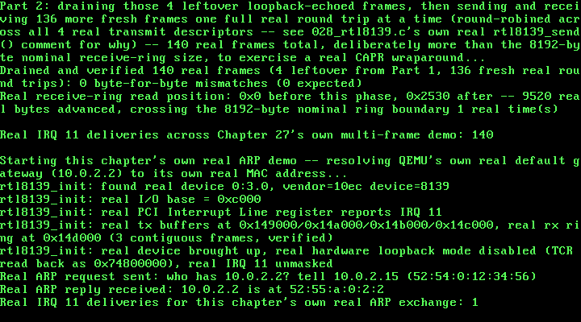

# 28. Address Resolution Protocol: A Real ARP Request/Reply Over a Real Wire

**What you will understand:** how to build the next real protocol layer directly on top of raw Ethernet frames -- a real ARP client that broadcasts a real request and parses a real reply -- entirely from two primary standards sources, with a real gap neither source fills closed by a third, authoritative one; why every earlier RTL8139 chapter's own real hardware loopback mode had to come off for this chapter's own demo to work at all, and how this driver does that safely against an already-running real device; and how this chapter's own independent verification reaches past this kernel's own self-report a new way -- reading the real received reply's own raw bytes directly out of physical memory, outside this kernel's own code entirely, the same real technique Chapter 25 first used.

**What you need to know first:** Chapters 25-27's own real, working RTL8139 driver -- device bring-up, the real DMA buffers, the real interrupt-driven `hlt` wait, and Chapter 27's own real multi-frame send/receive -- all unchanged and still run first, entirely in real hardware loopback mode, so Chapter 27's own real proof stands exactly as it was; and Chapter 24's own real PCI bus enumeration, which is how this exact device was ever found in the first place.

## The next real layer above a raw frame

Every RTL8139 chapter so far has sent and received raw Ethernet frames whose contents this kernel invented for its own testing purposes -- a fixed EtherType, a payload this kernel built and then checked against itself. Real networking needs a real protocol underneath even the simplest exchange with another real host: before this kernel could ever send an IP packet to a real gateway, it has to learn that gateway's own real Ethernet address, since Ethernet frames are addressed by MAC, not by IP. That is exactly what ARP is for, and it is deliberately the smallest real next step -- one real request, one real reply, no cache, no server behavior, no IP layer yet.

This chapter's own two real citations split cleanly. RFC 826, "An Ethernet Address Resolution Protocol" (https://www.rfc-editor.org/rfc/rfc826.html), the original 1982 standard, gives the real packet field names and order (`ar$hrd`, `ar$pro`, `ar$hln`, `ar$pln`, `ar$op`, `ar$sha`, `ar$spa`, `ar$tha`, `ar$tpa`), the real opcode values ("REQUEST = 1", "REPLY = 2"), and the real requirement that a request be broadcast: "It then causes this packet to be broadcast to all stations on the Ethernet cable." OSDev Wiki's own "Address Resolution Protocol" page (https://wiki.osdev.org/Address_Resolution_Protocol) lays out the identical fields as a real, compilable C struct, confirms Ethernet's own real hardware type (`0x1`) and IP's own real protocol type (`0x0800`), and adds one real, practical detail neither the RFC nor a naive reading of the struct would suggest: "For an ARP request most implementations zero the destination MAC address" -- meaning the ARP payload's own target hardware address field, not the Ethernet frame's destination, since the whole point of asking is that this field genuinely isn't known yet.

Neither source states the one value this chapter needed to build a real Ethernet frame around an ARP payload: the frame-level EtherType. RFC 826 predates the very idea of an EtherType field; OSDev's own ARP page only ever discusses the ARP payload's own internal `ptype`, never the frame's own header. This book's own established pattern -- when the usual sources are silent, reach for a different real, authoritative primary source -- pointed to IANA's own official IEEE 802 Numbers registry (https://www.iana.org/assignments/ieee-802-numbers/ieee-802-numbers.txt): "2054  0806  ...  Address Resolution Protocol (ARP)", assignment authority RFC 9542. EtherType `0x0806`, cited directly rather than assumed from general programming knowledge.

One more real, fixed value this chapter needed and did not invent: which real IP address to resolve. QEMU's own official documentation (https://www.qemu.org/docs/master/system/devices/net.html) draws its own user-mode ("SLIRP") network diagram with "Firewall/DHCP server <-----> Internet (10.0.2.2)" -- a real, live host genuinely reachable over this exact QEMU command line's own `-netdev user` backend. Resolving it is a real test this chapter's own demo can actually run and actually fail if anything is wrong, not a value chosen because it looked plausible.

## `028_arp.h`/`028_arp.c`: the real request and the real reply

Every multi-byte field on the real wire is big-endian; this kernel's own x86 registers are little-endian. The same real reason `028_kmain.c`'s own `build_demo_frame()` has always written its EtherType as two separate bytes rather than one 16-bit store applies here too, so this chapter's own `arp_packet_t` is never laid directly over real wire bytes -- `arp_send_request()` writes each real frame byte by explicit index, and `arp_receive_reply()` reads each real multi-byte field back with explicit shifts, the same style this book's own `028_pci.c` has used for CONFIG_DATA dwords since Chapter 24.

```c
#ifndef UNIX_OS_028_ARP_H
#define UNIX_OS_028_ARP_H

#include <stdint.h>

/* Chapter 28's own new, minimal ARP client, built entirely on top of
 * 028_rtl8139.c's own real rtl8139_send()/rtl8139_receive_next_packet()
 * -- no new hardware, no new driver, just the next real protocol layer
 * above the raw Ethernet frames Chapters 25-27 already send and
 * receive. Cited field-for-field from two real sources: RFC 826 ("An
 * Ethernet Address Resolution Protocol", the original 1982 standard,
 * https://www.rfc-editor.org/rfc/rfc826.html) for the real packet
 * field names/order ("ar$hrd", "ar$pro", "ar$hln", "ar$pln", "ar$op",
 * "ar$sha", "ar$spa", "ar$tha", "ar$tpa"), the real opcode values
 * ("REQUEST = 1", "REPLY = 2"), and the real requirement that a
 * request be broadcast ("It then causes this packet to be broadcast
 * to all stations on the Ethernet cable"); and OSDev Wiki's own
 * "Address Resolution Protocol" page
 * (https://wiki.osdev.org/Address_Resolution_Protocol) for the same
 * fields laid out as a real, compilable C struct (htype/ptype/hlen/
 * plen/opcode/srchw/srcpr/dsthw/dstpr, htype "Ethernet is 0x1", ptype
 * "IP is 0x0800"), and its own real, practical detail that most
 * implementations zero the ARP payload's own target hardware address
 * field on a request, since it isn't known yet -- that is the whole
 * point of asking.
 *
 * One real gap neither of those two sources fills, that this chapter
 * had to cite from a third, authoritative primary source: neither
 * ever states which real EtherType value belongs in the ETHERNET
 * frame's own header when its payload is an ARP packet (RFC 826
 * predates the very idea of an EtherType field; OSDev's own ARP page
 * only ever discusses the ARP payload's own internal ptype field, IP's
 * own 0x0800, never the frame-level value). Cited instead directly
 * from IANA's own official IEEE 802 Numbers registry
 * (https://www.iana.org/assignments/ieee-802-numbers/ieee-802-numbers.txt,
 * assignment authority RFC 9542): "2054  0806  ...  Address
 * Resolution Protocol (ARP)" -- EtherType 0x0806.
 *
 * This chapter's own demo resolves one real, fixed IP address: QEMU's
 * own real default gateway under user-mode ("SLIRP") networking,
 * cited directly from QEMU's own official documentation
 * (https://www.qemu.org/docs/master/system/devices/net.html), whose
 * own network diagram shows "Firewall/DHCP server <-----> Internet
 * (10.0.2.2)" -- a real host genuinely reachable over this exact QEMU
 * command line's own -netdev user backend, not a value this chapter
 * invented or assumed. Resolving it for real requires this chapter's
 * own new, real, non-loopback mode (see 028_rtl8139.c's own
 * rtl8139_init() and its new `enable_loopback` parameter): Chapters
 * 25-27's own real hardware loopback mode routes every transmitted
 * frame straight back to this device's own receiver and never puts a
 * single real bit on the wire, so a real reply from a real (if
 * QEMU-emulated) host on the other end could never arrive that way.
 *
 * Deliberately out of this chapter's own stated scope, per RFC 826's
 * own full "Packet Reception" algorithm (which this chapter's own
 * arp_receive_reply() only implements the relevant slice of, not the
 * whole thing): no ARP translation-table cache (this driver resolves
 * one address, once, per call, and keeps nothing), no gratuitous-ARP
 * announcement, and no real ARP SERVER behavior -- this kernel never
 * answers an incoming ARP request asking about its own address, only
 * ever asks about someone else's. */

#define ARP_HTYPE_ETHERNET 1u      /* RFC 826 ar$hrd; OSDev: "Ethernet is 0x1" */
#define ARP_PTYPE_IPV4     0x0800u /* RFC 826 ar$pro; OSDev: "IP is 0x0800" */
#define ARP_HLEN_ETHERNET  6u      /* RFC 826 ar$hln: a real 6-byte MAC */
#define ARP_PLEN_IPV4      4u      /* RFC 826 ar$pln: a real 4-byte IPv4 address */
#define ARP_OP_REQUEST     1u      /* RFC 826 ar$op: "REQUEST = 1" */
#define ARP_OP_REPLY       2u      /* RFC 826 ar$op: "REPLY = 2" */

/* Cited directly, IANA's own IEEE 802 Numbers registry: the real
 * Ethernet-frame-level EtherType for an ARP payload. */
#define ETHERTYPE_ARP 0x0806u

/* A real ARP packet's own fields, already converted to this machine's
 * own native byte order by arp_receive_reply() below -- NEVER laid
 * directly over real wire bytes (the real wire format's own 16-bit
 * fields are big-endian; this kernel's own x86 registers are
 * little-endian, exactly the same real reason 028_kmain.c's own
 * build_demo_frame() has always written its EtherType as two separate
 * bytes rather than one 16-bit store). RFC 826's own field names in
 * comments; this book's own snake_case in code. */
typedef struct {
    uint16_t htype;          /* ar$hrd */
    uint16_t ptype;          /* ar$pro */
    uint8_t  hlen;            /* ar$hln */
    uint8_t  plen;             /* ar$pln */
    uint16_t opcode;          /* ar$op */
    uint8_t  sender_mac[6];   /* ar$sha */
    uint8_t  sender_ip[4];    /* ar$spa */
    uint8_t  target_mac[6];   /* ar$tha */
    uint8_t  target_ip[4];    /* ar$tpa */
} arp_packet_t;

/* This chapter's own real 60-byte frame: a real 14-byte Ethernet
 * header plus a real 28-byte ARP payload (2+2+1+1+2+6+4+6+4 = 28
 * bytes, 42 total), padded to the real IEEE 802.3 minimum this book
 * has cited since Chapter 25 (see 028_kmain.c's own DEMO_FRAME_SIZE
 * comment). */
#define ARP_FRAME_SIZE 60u

/* Builds and sends, via 028_rtl8139.c's own real, single-shot,
 * blocking rtl8139_send(), one real ARP request: Ethernet destination
 * broadcast (ff:ff:ff:ff:ff:ff, cited directly -- RFC 826: the
 * request "is ... broadcast to all stations on the Ethernet cable"),
 * ARP payload's own target hardware address zeroed (cited directly --
 * OSDev: "For an ARP request most implementations zero the
 * destination MAC address"), everything else cited field-for-field
 * above. `src_mac`/`src_ip` are this machine's own real, already-known
 * values; `target_ip` is the real IPv4 address being resolved.
 * Returns 1 on success, matching rtl8139_send()'s own real return
 * convention (this chapter's own request is always exactly
 * ARP_FRAME_SIZE bytes, so the only way rtl8139_send() itself could
 * refuse -- exceeding RTL8139_MAX_FRAME -- can never happen here). */
int arp_send_request(const uint8_t *src_mac, const uint8_t src_ip[4],
                      const uint8_t target_ip[4]);

/* Blocks (via 028_rtl8139.c's own real, interrupt-driven
 * rtl8139_receive_next_packet(), called up to `max_attempts` times)
 * until a real frame arrives whose Ethernet header's own EtherType is
 * ETHERTYPE_ARP, whose ARP payload's own hardware/protocol type and
 * length fields match this driver's only real case (Ethernet/IPv4 --
 * the same "do I speak this hardware type/protocol" check RFC 826's
 * own reception algorithm opens with), whose opcode is ARP_OP_REPLY,
 * and whose own sender protocol address matches `expected_sender_ip`
 * -- filtering out any other real traffic this exact QEMU network
 * segment might genuinely deliver (this chapter's own demo is the
 * first in this book where the device is not in loopback mode, so
 * real frames this kernel never sent can genuinely arrive and must be
 * told apart from the one real reply being waited for). Copies the
 * matching real ARP payload, with its own multi-byte fields already
 * converted to this machine's own native byte order, into
 * `*out_reply` and returns 1 on success, or returns 0 if
 * `max_attempts` real packets were read and consumed without a match
 * -- an honest, bounded failure rather than an infinite real `hlt`
 * wait. */
int arp_receive_reply(uint32_t max_attempts, const uint8_t expected_sender_ip[4],
                       arp_packet_t *out_reply);

#endif
```

```c
/* See 028_arp.h's own top-of-file comment for the full real citation
 * of every field, value, and design decision below. */

#include <stdint.h>

#include "028_arp.h"
#include "028_rtl8139.h"

/* Real byte offsets into a real 60-byte ARP-over-Ethernet frame, all
 * cited field-for-field in 028_arp.h: a real 14-byte Ethernet header
 * (6 dst + 6 src + 2 EtherType) followed immediately by the real
 * 28-byte ARP payload RFC 826 and OSDev's own struct both describe. */
#define ETH_HDR_SIZE 14u
#define ARP_OFF_HTYPE       (ETH_HDR_SIZE + 0u)
#define ARP_OFF_PTYPE       (ETH_HDR_SIZE + 2u)
#define ARP_OFF_HLEN        (ETH_HDR_SIZE + 4u)
#define ARP_OFF_PLEN        (ETH_HDR_SIZE + 5u)
#define ARP_OFF_OPCODE      (ETH_HDR_SIZE + 6u)
#define ARP_OFF_SENDER_MAC  (ETH_HDR_SIZE + 8u)
#define ARP_OFF_SENDER_IP   (ETH_HDR_SIZE + 14u)
#define ARP_OFF_TARGET_MAC  (ETH_HDR_SIZE + 18u)
#define ARP_OFF_TARGET_IP   (ETH_HDR_SIZE + 24u)

int arp_send_request(const uint8_t *src_mac, const uint8_t src_ip[4],
                      const uint8_t target_ip[4]) {
    uint8_t frame[ARP_FRAME_SIZE];

    /* Real Ethernet header: destination broadcast (RFC 826: a request
     * "is ... broadcast to all stations on the Ethernet cable"),
     * source this machine's own real MAC, EtherType 0x0806 (cited,
     * IANA's own IEEE 802 Numbers registry). */
    for (uint32_t i = 0; i < 6u; i++) {
        frame[i] = 0xFFu;              /* destination: real broadcast */
        frame[6u + i] = src_mac[i];    /* source: this machine's own real MAC */
    }
    frame[12] = (uint8_t) (ETHERTYPE_ARP >> 8);
    frame[13] = (uint8_t) ETHERTYPE_ARP;

    /* Real ARP payload, RFC 826's own field order, each multi-byte
     * field written big-endian by hand -- this machine's own x86
     * registers are little-endian, so a native uint16_t store would
     * write the wrong real byte order onto the wire. */
    frame[ARP_OFF_HTYPE]     = (uint8_t) (ARP_HTYPE_ETHERNET >> 8);
    frame[ARP_OFF_HTYPE + 1] = (uint8_t) ARP_HTYPE_ETHERNET;
    frame[ARP_OFF_PTYPE]     = (uint8_t) (ARP_PTYPE_IPV4 >> 8);
    frame[ARP_OFF_PTYPE + 1] = (uint8_t) ARP_PTYPE_IPV4;
    frame[ARP_OFF_HLEN]      = (uint8_t) ARP_HLEN_ETHERNET;
    frame[ARP_OFF_PLEN]      = (uint8_t) ARP_PLEN_IPV4;
    frame[ARP_OFF_OPCODE]     = (uint8_t) (ARP_OP_REQUEST >> 8);
    frame[ARP_OFF_OPCODE + 1] = (uint8_t) ARP_OP_REQUEST;

    for (uint32_t i = 0; i < 6u; i++) {
        frame[ARP_OFF_SENDER_MAC + i] = src_mac[i];
        /* Real target hardware address: zeroed, cited directly --
         * OSDev: "For an ARP request most implementations zero the
         * destination MAC address." It is not known yet; that is
         * exactly what this real request is asking. */
        frame[ARP_OFF_TARGET_MAC + i] = 0x00u;
    }
    for (uint32_t i = 0; i < 4u; i++) {
        frame[ARP_OFF_SENDER_IP + i] = src_ip[i];
        frame[ARP_OFF_TARGET_IP + i] = target_ip[i];
    }

    /* Real IEEE 802.3 minimum padding (this book's own cited
     * convention since Chapter 25): the real Ethernet header plus ARP
     * payload above is only 42 bytes. */
    for (uint32_t i = ETH_HDR_SIZE + 28u; i < ARP_FRAME_SIZE; i++) {
        frame[i] = 0x00u;
    }

    return rtl8139_send(frame, ARP_FRAME_SIZE);
}

int arp_receive_reply(uint32_t max_attempts, const uint8_t expected_sender_ip[4],
                       arp_packet_t *out_reply) {
    uint8_t rx_frame[RTL8139_MAX_FRAME];

    for (uint32_t attempt = 0; attempt < max_attempts; attempt++) {
        uint32_t rx_len = 0;
        if (!rtl8139_receive_next_packet(rx_frame, &rx_len)) {
            continue;
        }
        /* Too short to even hold a real Ethernet header plus a real
         * 28-byte ARP payload -- cannot be the reply being waited
         * for, whatever it is. */
        if (rx_len < ETH_HDR_SIZE + 28u) {
            continue;
        }

        uint16_t ethertype = (uint16_t) ((rx_frame[12] << 8) | rx_frame[13]);
        if (ethertype != ETHERTYPE_ARP) {
            continue;
        }

        uint16_t htype = (uint16_t) ((rx_frame[ARP_OFF_HTYPE] << 8) |
                                      rx_frame[ARP_OFF_HTYPE + 1]);
        uint16_t ptype = (uint16_t) ((rx_frame[ARP_OFF_PTYPE] << 8) |
                                      rx_frame[ARP_OFF_PTYPE + 1]);
        /* RFC 826's own reception algorithm opens with exactly these
         * two checks -- "Do I have the hardware type in ar$hrd? ...
         * Do I speak the protocol in ar$pro?" -- before trusting
         * anything else in the packet. This driver only ever speaks
         * one real hardware/protocol pair, so both are fixed
         * constants rather than a real lookup table. */
        if (htype != ARP_HTYPE_ETHERNET || ptype != ARP_PTYPE_IPV4 ||
            rx_frame[ARP_OFF_HLEN] != ARP_HLEN_ETHERNET ||
            rx_frame[ARP_OFF_PLEN] != ARP_PLEN_IPV4) {
            continue;
        }

        uint16_t opcode = (uint16_t) ((rx_frame[ARP_OFF_OPCODE] << 8) |
                                       rx_frame[ARP_OFF_OPCODE + 1]);
        if (opcode != ARP_OP_REPLY) {
            continue;
        }

        int sender_matches = 1;
        for (uint32_t i = 0; i < 4u; i++) {
            if (rx_frame[ARP_OFF_SENDER_IP + i] != expected_sender_ip[i]) {
                sender_matches = 0;
                break;
            }
        }
        if (!sender_matches) {
            continue;
        }

        out_reply->htype = htype;
        out_reply->ptype = ptype;
        out_reply->hlen = rx_frame[ARP_OFF_HLEN];
        out_reply->plen = rx_frame[ARP_OFF_PLEN];
        out_reply->opcode = opcode;
        for (uint32_t i = 0; i < 6u; i++) {
            out_reply->sender_mac[i] = rx_frame[ARP_OFF_SENDER_MAC + i];
            out_reply->target_mac[i] = rx_frame[ARP_OFF_TARGET_MAC + i];
        }
        for (uint32_t i = 0; i < 4u; i++) {
            out_reply->sender_ip[i] = rx_frame[ARP_OFF_SENDER_IP + i];
            out_reply->target_ip[i] = rx_frame[ARP_OFF_TARGET_IP + i];
        }
        return 1;
    }

    return 0;
}
```

`arp_receive_reply()` deliberately implements only a slice of RFC 826's own full "Packet Reception" algorithm -- the real early checks ("Do I have the hardware type in ar$hrd? ... Do I speak the protocol in ar$pro?") plus a real opcode and sender-address check, bounded to a fixed `max_attempts` real packets rather than an unbounded wait. What it deliberately does not do, all explained in `028_arp.h`'s own top-of-file comment: no translation-table cache (this driver resolves one address, once, and keeps nothing), and no ARP server behavior -- this kernel never answers an incoming request asking about its own address, only ever asks about someone else's. This chapter's own demo is also the first in this book where the device is not in loopback mode, so `arp_receive_reply()` has to genuinely filter: any other real traffic this exact QEMU network segment might deliver has to be told apart from the one real reply being waited for, not merely assumed absent.

## Coming off loopback for real, safely, mid-boot

Every real proof Chapters 25-27 ever produced depended on hardware loopback mode: TCR bits 18-17 forced to "11: Loopback mode", cited from the real Realtek datasheet, routes every transmitted frame straight back to this same device's own receiver, on-chip, so those chapters' own demos never needed a second real host on the other end of the wire at all. A real ARP reply from a real (if QEMU-emulated) gateway can only ever arrive the opposite way -- genuinely over the wire -- so this chapter's own demo needs loopback OFF.

`rtl8139_init()` gained a new `enable_loopback` parameter rather than a second, parallel function, and both real TCR values it can now write -- `TCR_LOOPBACK_ON` (`0x60000`) and the real datasheet's own cited "00: normal operation" (`TCR_NORMAL_OPERATION`, `0x0`) -- are always written explicitly, never left to an assumed hardware reset default, because this exact function can now run a second time against an already-initialized real device: `028_kmain.c`'s own demo calls `rtl8139_init(1)` first, runs the whole of Chapter 27's own loopback-mode multi-frame demo unchanged, then calls `rtl8139_init(0)` again -- the exact same real device, genuinely reset and reconfigured a second time (`CMD_RST` runs unconditionally every call, already true since Chapter 25) -- before this chapter's own new ARP exchange. A real register readback after each write, kept in the final code rather than only used while debugging, is this chapter's own evidence rather than an assumed claim: the real captured run below shows TCR reading back `0x74860000` with loopback on and `0x74800000` with it off -- a difference of exactly `0x60000`, the two real LBK bits, and nothing else.

```c
#ifndef UNIX_OS_028_RTL8139_H
#define UNIX_OS_028_RTL8139_H

#include <stdint.h>

/* Chapter 25's own driver for the real RTL8139 Fast Ethernet
 * controller Chapter 24's own pci_find_by_class() first located, by
 * class code alone, on this exact machine's own real PCI bus. Register
 * offsets, bit meanings, and the real initialization sequence are
 * still cited field-for-field from the same two real sources: OSDev
 * Wiki's own "RTL8139" page (https://wiki.osdev.org/RTL8139), and,
 * wherever that page is silent, the real manufacturer datasheet it is
 * itself derived from -- REALTEK RTL8139D(L), Rev. 1.11, 2001/11/09
 * (https://www.cs.usfca.edu/~cruse/cs326f04/RTL8139D_DataSheet.pdf).
 * Chapter 26 replaced both of Chapter 25's own register spins with a
 * real interrupt-driven `hlt` wait -- see that chapter's own text for
 * the full citation of the new IDT gate, 8259 cascade unmask, and
 * interrupt handler that made that possible.
 *
 * This chapter's own new work lifts the last two real scope limits
 * Chapter 25 stated and Chapter 26 left untouched: no more than one
 * frame in flight at a time, and no real CAPR advancement or
 * receive-ring wraparound (both chapters only ever read the very
 * first packet a freshly reset ring receives, at a fixed offset).
 *
 * More than one frame in flight: this device's own real four transmit
 * descriptor pairs (TSD0-3/TSAD0-3) round-robin automatically, cited
 * directly from OSDev Wiki's own "RTL8139" page: "After software
 * transmits a packet using those registers, the round robin counter
 * increments, to use pair one... This continues until pair number
 * three, which is the last transmit register pair, and the counter
 * then overflows and goes back to pair number zero." This chapter's
 * own new rtl8139_send_queue()/rtl8139_wait_descriptor_sent() pair
 * lets this driver genuinely queue more than one real frame before
 * any of them completes, verified by reading each real descriptor's
 * own per-descriptor TOK bit (TSDn bit 15) directly -- real,
 * persistent hardware state, safe to check regardless of how many
 * real interrupts the completions end up coalescing into.
 *
 * Real CAPR advancement: cited from a real, historical primary
 * source, since neither of this driver's own two usual cited sources
 * documents the actual update procedure (the real Realtek datasheet
 * marks CAPR "R", read-only, and says nothing about writing it at
 * all; OSDev's own page mentions CAPR by name once and says nothing
 * about updating it either) -- a real October 1999 exchange on the
 * Realtek Linux driver mailing list between Daniel Kobras and Donald
 * Becker (the original author of this whole family of Linux NIC
 * drivers), archived at
 * https://www.beowulf.org/pipermail/realtek/1999-October/000184.html,
 * where Kobras asks directly why real driver code writes
 * `outw(cur_rx - 16, ioaddr + RxBufPtr)` instead of the exact value,
 * and Becker answers: "The chip doesn't write to the ring size
 * specified. If the header would be near the end of the ring, it
 * doesn't wrap. This is documented by the ring size in the datasheet
 * e.g. 32KB + 16." -- confirming the real "-16" offset is not an
 * arbitrary magic number but a real, if incompletely documented even
 * by the original driver's own author, consequence of the same real
 * "ring size + slack" convention already cited (Chapter 25's own real
 * receive-ring allocation: "8k + 16 byte" nominal plus a further real
 * 1500-byte WRAP allowance). Independently re-confirmed from this
 * exact environment's own real emulator source: a real 2013 QEMU
 * development-list patch discussion
 * (https://lists.gnu.org/archive/html/qemu-devel/2013-05/msg03703.html)
 * shows QEMU's own real internal computation is
 * `s->RxBufPtr = MOD2(val + 0x10, s->RxBufferSize)` -- i.e. QEMU adds
 * the same 16 (0x10) back, confirming a real driver write of
 * `cur_rx - 16` lands QEMU's own internal read pointer on exactly
 * `cur_rx`, mod the real nominal ring size.
 *
 * Real receive-ring wraparound: this driver already allocates and
 * configures its receive ring exactly as Chapter 25 first did --
 * three real contiguous physical frames (12288 bytes), comfortably
 * covering the real "8k + 16 byte" nominal ring plus the real
 * 1500-byte WRAP allowance OSDev's own page cites -- so no buffer
 * change was needed this chapter; what changes is that this driver
 * now genuinely keeps reading past the ring's own nominal 8192-byte
 * boundary instead of stopping after the first packet, tracking its
 * own real read position (`cur_rx`, this chapter's own new persistent
 * state) modulo that same 8192-byte nominal size across as many real
 * packets as arrive, exactly the "8k" RCR's own RBLEN reset value
 * (unchanged, still 00) already commits this driver to. */

/* The largest single frame this driver will ever send or receive,
 * cited directly (Realtek datasheet / OSDev's own page): a real
 * RTL8139 transmit descriptor accepts at most 1792 bytes per frame. */
#define RTL8139_MAX_FRAME 1792u

/* This chapter's own real, fixed IRQ wiring -- see 028_rtl8139.c's
 * own top-of-file comment for why it is fixed rather than discovered
 * and installed dynamically. Also the real IDT vector that IRQ maps
 * to under this kernel's own real 8259 remap (028_kmain.c calls
 * `pic_remap(0x20, 0x28)`, so IRQ 11 -- the ninth slave-PIC line,
 * 11 - 8 = 3 -- lands on vector 0x28 + 3 = 0x2B). */
#define RTL8139_EXPECTED_IRQ 11u
#define RTL8139_IDT_VECTOR   0x2Bu

/* This device's own real four transmit descriptor pairs, cited
 * directly (OSDev Wiki's own "RTL8139" page, quoted above). */
#define RTL8139_TX_DESC_COUNT 4u

/* This driver's own real nominal receive-ring size, matching RCR's
 * own real RBLEN reset value (00, "8k + 16 byte", unchanged since
 * Chapter 25) -- the modulus this chapter's own real CAPR arithmetic
 * wraps `cur_rx` against, and the same value QEMU's own real emulated
 * hardware wraps its internal read/write pointers against (see this
 * file's own top-of-file citation of the real 2013 qemu-devel patch
 * discussion). */
#define RTL8139_RX_RING_NOMINAL_SIZE 8192u

/* Locates the real RTL8139 on this machine's own PCI bus (via
 * Chapter 24's own pci_find_by_class()), enables real PCI I/O-space
 * and bus-mastering access, reads the device's own real BAR0 to learn
 * its real I/O base, reads its own real PCI Interrupt Line register
 * and verifies it against RTL8139_EXPECTED_IRQ, allocates this
 * driver's own real physical transmit and receive buffers (via
 * Chapter 7's own pmm_alloc_frame()), explicitly zeroes the real
 * receive ring (a Chapter 27 step, still needed -- see 028_rtl8139.c's
 * own comment on rtl8139_receive_next_packet() for why), runs the
 * real cited power-on/reset/configure sequence, unmasks this device's
 * own real IRQ line (and the real cascade line, IRQ 2), and ends with
 * this device's own real hardware loopback mode either enabled or
 * left off, per `enable_loopback` -- this chapter's own new parameter,
 * since Chapter 28's own new ARP demo (see 028_arp.h) is the first in
 * this book that needs a real reply from a real host genuinely outside
 * this device, which real loopback mode (Chapters 25-27, TCR bits
 * 18-17 forced to "11: Loopback mode") structurally cannot ever
 * deliver -- every transmitted frame is routed straight back to this
 * same device's own receiver, on-chip, never reaching a real wire at
 * all. Both real TCR values are written explicitly (never left to an
 * assumed hardware reset default): TCR_LOOPBACK_ON (0x60000, cited)
 * when `enable_loopback` is nonzero, or the real Realtek datasheet's
 * own cited "00: normal operation" (TCR_NORMAL_OPERATION, 0x0)
 * otherwise -- safe to call more than once against the same real,
 * already-initialized device (this driver's own reset step, CMD_RST,
 * runs unconditionally every call), which is exactly how this
 * chapter's own demo switches the device from Chapter 27's own
 * loopback-mode multi-frame demo into real, non-loopback mode for its
 * own new ARP exchange. Returns 1 on success, 0 if no real RTL8139
 * was found, or if its real reported IRQ does not match this
 * chapter's own fixed wiring. */
int rtl8139_init(int enable_loopback);

/* Copies this device's own real, burnt-in 6-byte station address --
 * read directly from real registers MAC0-5 -- into `out_mac`. */
void rtl8139_get_mac(uint8_t out_mac[6]);

/* Sends exactly one real frame, `len` bytes (at most
 * RTL8139_MAX_FRAME), via this device's own real transmit descriptor
 * 0, and BLOCKS (real interrupt-driven `hlt`, unchanged since Chapter
 * 26) until that exact descriptor's own real TOK bit is set. Kept
 * unchanged from Chapter 26 for this chapter's own large sequential
 * receive-ring demo, which never needs more than one frame in flight
 * at a time -- see rtl8139_send_queue() below for this chapter's own
 * new round-robin, non-blocking alternative. Returns 1 on success. */
int rtl8139_send(const uint8_t *frame, uint32_t len);

/* This chapter's own new real, non-blocking send: copies `frame`
 * (`len` bytes, at most RTL8139_MAX_FRAME) into this driver's own
 * per-descriptor real physical buffer and triggers transmission via
 * whichever real descriptor pair (0-3) this device's own real
 * round-robin counter is on next (cited directly, OSDev Wiki's own
 * "RTL8139" page, this file's own top-of-file comment) -- and returns
 * immediately, WITHOUT waiting for that transmission to complete.
 * Calling this up to RTL8139_TX_DESC_COUNT times in a row before any
 * of them are waited on is exactly this chapter's own real "more than
 * one frame in flight" proof: every earlier `hlt`-based wait in this
 * book (Chapter 26's own rtl8139_send() included) blocks before
 * returning; this one deliberately does not. Returns the real
 * descriptor index (0-3) this exact frame was queued on, or -1 if
 * `len` exceeds RTL8139_MAX_FRAME. Calling this more than
 * RTL8139_TX_DESC_COUNT times without an intervening
 * rtl8139_wait_descriptor_sent() would reuse a still-busy real
 * descriptor -- undocumented by either of this driver's own two usual
 * cited sources, and deliberately out of this chapter's own stated
 * scope; this driver's own demo never does it. */
int rtl8139_send_queue(const uint8_t *frame, uint32_t len);

/* Blocks (real interrupt-driven `hlt`) until the real transmit
 * descriptor `desc_index` (0-3) reports its own real per-descriptor
 * TOK bit set -- TSDn bit 15, cited directly, OSDev Wiki's own
 * "RTL8139" page: "After the own bit has been set by the hardware,
 * indicating the DMA transfer has completed, the hardware will start
 * to transmit the packet across the actual network. This bit will be
 * set to one after the network transmission has completed." Checked
 * directly against this exact descriptor's own real, persistent
 * hardware register -- not the shared ISR TOK bit every descriptor's
 * completion sets, which only ever means "at least one descriptor
 * finished," not "descriptor `desc_index` specifically finished." */
void rtl8139_wait_descriptor_sent(int desc_index);

/* Blocks (real interrupt-driven `hlt`) until this device's own real
 * hardware has genuinely written the NEXT real packet -- wherever
 * this driver's own persistent real read position (`cur_rx`) says
 * that is, not a fixed offset -- then copies it into `out_buf` (must
 * be at least RTL8139_MAX_FRAME bytes), writes the real received
 * length into `*out_len`, advances `cur_rx` past it, and writes this
 * device's own real CAPR register so the hardware knows this exact
 * packet has genuinely been consumed (cited in full in this file's
 * own top-of-file comment). Replaces Chapter 25/26's own
 * rtl8139_receive_first_packet(), which only ever read the one fixed
 * offset a freshly reset ring starts at -- this chapter's own driver
 * can now be called any number of times in a row, correctly reading
 * each real packet in turn, including genuinely wrapping back to the
 * start of the ring once `cur_rx` passes RTL8139_RX_RING_NOMINAL_SIZE.
 * Returns 1 on success. */
int rtl8139_receive_next_packet(uint8_t *out_buf, uint32_t *out_len);

/* This chapter's own new real, live read position into the receive
 * ring -- the exact same `cur_rx` value rtl8139_receive_next_packet()
 * itself advances and writes (offset by 16) into the real CAPR
 * register. Exists purely so this chapter's own demo, and this
 * chapter's own independent verification, can report and check a
 * real, concrete number -- specifically, whether it has genuinely
 * exceeded RTL8139_RX_RING_NOMINAL_SIZE and wrapped -- rather than
 * merely asserting "the ring wrapped." */
uint32_t rtl8139_get_rx_offset(void);

/* This chapter's own new real interrupt handler, called from
 * 028_irq11.asm's own stub on every real IRQ 11. Acknowledges
 * whichever real ISR bits are actually set -- cited directly, OSDev
 * Wiki's own "RTL8139" page: "When you handle an interrupt, you have
 * to write the bit corresponding to the interrupt to reset it," and
 * this must happen "before you read any packets from your buffers, or
 * the write to the register will have no effect" -- and sends this
 * device's own real end-of-interrupt. Unlike Chapter 26, this
 * handler's own internal per-event flags are no longer what
 * rtl8139_send()/rtl8139_receive_next_packet() gate their real waits
 * on -- see 028_rtl8139.c's own comment on rtl8139_receive_next_packet()
 * for why a real, persistent hardware check (per-descriptor TSDn bits;
 * a real, direct peek at the next packet header) is what this
 * chapter's own multi-frame, multi-packet work actually needs instead.
 * `hlt` still needs a real interrupt to wake it at all, and the ISR
 * still has to be acknowledged for the next one to ever fire -- this
 * handler still does exactly that. Not intended to be called from
 * anywhere but 028_irq11.asm's own stub. */
void irq11_handler(void);

/* This chapter's own real, live interrupt counter -- incremented once
 * per real IRQ 11 delivery, unchanged in spirit since Chapter 26,
 * still useful this chapter as an honest, empirical measurement of
 * how many real interrupts a batch of queued sends actually took
 * (this chapter's own new rtl8139_send_queue() calls can coalesce
 * more than one real completion into a single real interrupt --
 * reported exactly as observed, not assumed in advance). */
uint32_t rtl8139_get_irq_count(void);

#endif
```

```c
/* Chapter 25's own driver; Chapter 26 upgraded it from polled to real
 * interrupt-driven waits; this chapter lifts its last two stated scope
 * limits -- see 028_rtl8139.h's own top-of-file comment for the full
 * citation of every real source this file is built from and exactly
 * what changed and why. */

#include <stdint.h>

#include "028_pci.h"
#include "028_pic.h"
#include "028_pmm.h"
#include "028_printf.h"
#include "028_rtl8139.h"

/* Real I/O register offsets, relative to this device's own real BAR0
 * I/O base -- cited directly, OSDev Wiki's own "RTL8139" page. */
#define REG_MAC0     0x00u  /* 6 real bytes: this device's own burnt-in MAC */
#define REG_CAPR     0x38u  /* Current Address of Packet Read (16-bit) --
                              * this chapter's own new register; see this
                              * file's own header's top-of-file comment for
                              * the real, historical "-16" citation. */
#define REG_CMD      0x37u  /* Command register (8-bit) */
#define REG_IMR      0x3Cu  /* Interrupt Mask Register (16-bit) */
#define REG_ISR      0x3Eu  /* Interrupt Status Register (16-bit) */
#define REG_RBSTART  0x30u  /* Receive (Rx) Buffer Start Address (32-bit) */
#define REG_TCR      0x40u  /* Transmit Configuration Register (32-bit) --
                              * offset cited from the real Realtek
                              * datasheet (0040h), not OSDev's own page,
                              * which never mentions TCR at all. */
#define REG_RCR      0x44u  /* Receive Configuration Register (32-bit) */
#define REG_CONFIG1  0x52u  /* CONFIG_1 register (8-bit) */

/* This device's own real four Transmit Status/Start-Address register
 * PAIRS, cited directly (OSDev Wiki's own "RTL8139" page): "The
 * transmit start registers are each 32 bits long, and are in I/O
 * offsets 0x20, 0x24, 0x28 and 0x2C. The transmit status/command
 * registers are also each 32 bits long and are in I/O offsets 0x10,
 * 0x14, 0x18 and 0x1C." This chapter's own new round-robin sending
 * (rtl8139_send_queue() below) is the first code in this book to use
 * any pair but the first. */
#define REG_TSD(n)  (0x10u + 4u * (n))
#define REG_TSAD(n) (0x20u + 4u * (n))

/* Command register bits, offset 0x37 -- cited directly, both real
 * sources agree exactly: RST bit 4, RE bit 3, TE bit 2. */
#define CMD_RST 0x10u
#define CMD_RE  0x08u
#define CMD_TE  0x04u

/* ISR/IMR bits this driver actually waits on -- cited directly,
 * OSDev's own page: "Write 0x0005 to the IMR register... TOK and
 * ROK". ROK (Receive OK) is bit 0, TOK (Transmit OK) is bit 2 --
 * 0x1 | 0x4 = 0x5, exactly the cited value. */
#define ISR_ROK 0x01u
#define ISR_TOK 0x04u
#define IMR_ROK_TOK 0x05u

/* Real per-descriptor TSDn bit -- cited directly, OSDev Wiki's own
 * "RTL8139" page, its own Transmit Status/Command Register table,
 * bit 15: "After the own bit has been set by the hardware, indicating
 * the DMA transfer has completed, the hardware will start to transmit
 * the packet across the actual network. This bit will be set to one
 * after the network transmission has completed." This chapter's own
 * new rtl8139_wait_descriptor_sent() checks THIS bit, on THIS exact
 * descriptor's own real register, directly -- unlike the shared ISR
 * TOK bit above, which only ever means "at least one descriptor
 * finished," never "descriptor N specifically finished." */
#define TSD_TOK (1u << 15)

/* Receive Configuration Register bits, offset 0x44 -- cited directly
 * from the real Realtek datasheet (OSDev's own page names AB/AM/APM/
 * AAP/WRAP but never gives their exact bit positions): AAP
 * (Accept All Packets) bit 0, APM (Accept Physical Match) bit 1, AM
 * (Accept Multicast) bit 2, AB (Accept Broadcast) bit 3, WRAP bit 7.
 * This driver writes all five, matching OSDev's own cited init value
 * exactly: "0xf | (1 << 7)" = AAP|APM|AM|AB (0xF) plus WRAP (0x80) =
 * 0x8F. RBLEN (bits 12-11, the real Rx ring size select) is left at
 * its reset value 00 -- "8k + 16 byte", cited directly from the real
 * datasheet -- matching both the real physical buffer this driver
 * allocates below and this chapter's own new
 * RTL8139_RX_RING_NOMINAL_SIZE. */
#define RCR_INIT_VALUE 0x8Fu

/* Transmit Configuration Register bits, offset 0x40 -- this register,
 * and this device's own real hardware loopback mode, exist ONLY in
 * the real Realtek datasheet; OSDev's own "RTL8139" page never
 * mentions TCR at all. Cited directly: "18, 17 R/W LBK1, LBK0
 * Loopback test... 00: normal operation... 11: Loopback mode" -- both
 * bits set selects loopback, (0b11 << 17) = 0x60000. This is the
 * real, cited reason Chapters 25-27's own demos can prove a real
 * frame was genuinely sent and received without ever touching a real
 * wire: the NIC itself, not this driver, routes transmitted data
 * straight back to its own receiver. Chapter 28's own new
 * TCR_NORMAL_OPERATION is the same real datasheet's own cited "00:
 * normal operation" value, written explicitly (never merely left
 * unwritten and assumed) whenever this chapter's own new
 * `enable_loopback` parameter is false -- the real mode this
 * chapter's own new ARP exchange needs, since a real reply from a
 * real host genuinely outside this device can only ever arrive over a
 * real (if QEMU-emulated) wire, never through the on-chip loopback
 * path. */
#define TCR_LOOPBACK_ON 0x60000u
#define TCR_NORMAL_OPERATION 0x00000u

/* This chapter's own real physical DMA buffers, all allocated through
 * Chapter 7's own pmm_alloc_frame(), the same real physical-frame
 * allocator every other DMA-capable structure in this kernel already
 * uses, and both, like every physical frame this allocator has ever
 * handed out, addressable directly as ordinary pointers: Chapter 8's
 * own paging_init() identity-maps this kernel's whole 0-64 MiB
 * managed range, so a frame's physical address is already a valid
 * virtual one.
 *
 * `tx_buf_phys` is now an ARRAY, this chapter's own new change: one
 * real, separate physical frame per real transmit descriptor
 * (RTL8139_TX_DESC_COUNT of them), rather than Chapter 25/26's single
 * shared buffer. A single shared buffer only ever worked because
 * exactly one frame was ever in flight at a time; this chapter's own
 * new rtl8139_send_queue() can have more than one real transmission
 * genuinely in progress at once, and each one needs its own real,
 * stable physical bytes for the real hardware to DMA from until ITS
 * own real completion -- reusing one buffer across concurrent sends
 * would let a later send's copy corrupt an earlier one still being
 * transmitted. */
static uint32_t tx_buf_phys[RTL8139_TX_DESC_COUNT];
static uint32_t rx_buf_phys = 0;

static uint16_t io_base = 0;
static uint8_t nic_bus = 0, nic_device = 0, nic_function = 0;

/* This chapter's own new persistent real state -- `cur_rx` is this
 * driver's own real read position into the receive ring, advanced by
 * rtl8139_receive_next_packet() below and never reset back to 0 for
 * the lifetime of the driver (unlike Chapter 25/26, which always read
 * offset 0). `next_tx_desc` is this driver's own host-side mirror of
 * this device's own real round-robin transmit-descriptor counter,
 * cited directly (OSDev Wiki's own "RTL8139" page, quoted in full in
 * 028_rtl8139.h's own top-of-file comment) -- kept purely so
 * rtl8139_send_queue() knows which real descriptor pair to use next;
 * the real hardware's own round-robin counter would do the same
 * thing on its own if this driver only ever used TSD0/TSAD0, but
 * software has to pick explicitly once more than one pair is used. */
static uint32_t cur_rx = 0;
static uint32_t next_tx_desc = 0;

/* This chapter's own real, live interrupt counter -- see
 * 028_rtl8139.h's own comment on rtl8139_get_irq_count(). Chapter 26
 * also kept a pair of `volatile` completion flags here
 * (`rok_pending`/`tok_pending`); this chapter removes both. Every
 * real wait in this file now checks real, persistent state directly
 * -- a specific descriptor's own real TSDn bit 15, or the real
 * packet header sitting at this driver's own real `cur_rx` position
 * -- rather than a software flag the interrupt handler sets and this
 * driver's own callers clear. That is a deliberate correctness
 * choice, not just tidiness: this chapter's own rtl8139_send_queue()
 * can trigger several real loopback receive events close enough
 * together that real hardware coalesces them into a SINGLE real
 * interrupt delivery, and a boolean flag has no way to say "more than
 * one real event is actually waiting" -- checking real state directly
 * does not have that problem, because it never depended on how many
 * real interrupts happened to fire in the first place. */
static volatile uint32_t irq_count = 0;

static inline void outb(uint16_t port, uint8_t val) {
    __asm__ volatile ("outb %0, %1" : : "a"(val), "Nd"(port));
}

static inline uint8_t inb(uint16_t port) {
    uint8_t ret;
    __asm__ volatile ("inb %1, %0" : "=a"(ret) : "Nd"(port));
    return ret;
}

static inline void outl(uint16_t port, uint32_t val) {
    __asm__ volatile ("outl %0, %1" : : "a"(val), "Nd"(port));
}

static inline uint32_t inl(uint16_t port) {
    uint32_t ret;
    __asm__ volatile ("inl %1, %0" : "=a"(ret) : "Nd"(port));
    return ret;
}

static inline void outw(uint16_t port, uint16_t val) {
    __asm__ volatile ("outw %0, %1" : : "a"(val), "Nd"(port));
}

static inline uint16_t inw(uint16_t port) {
    uint16_t ret;
    __asm__ volatile ("inw %1, %0" : "=a"(ret) : "Nd"(port));
    return ret;
}

static inline uint8_t *phys_ptr(uint32_t phys_addr) {
    return (uint8_t *) phys_addr;
}

int rtl8139_init(int enable_loopback) {
    struct pci_device dev;
    if (!pci_find_by_class(PCI_CLASS_NETWORK, PCI_SUBCLASS_ETHERNET, &dev)) {
        kprintf("rtl8139_init: no real Ethernet controller found on this machine's own PCI "
                "bus -- refusing\n");
        return 0;
    }
    nic_bus = dev.bus;
    nic_device = dev.device;
    nic_function = dev.function;
    kprintf("rtl8139_init: found real device %u:%u.%u, vendor=%x device=%x\n",
            (unsigned) nic_bus, (unsigned) nic_device, (unsigned) nic_function,
            (unsigned) dev.vendor_id, (unsigned) dev.device_id);

    /* Enable real "I/O Space" (bit 0) and "Bus Master" (bit 2) in the
     * PCI Command register (configuration-space offset 0x04), cited
     * directly (OSDev Wiki's own "PCI" page). Offset 0x04's own dword
     * packs real Status (bits 31-16) over real Command (bits 15-0), so
     * this is a real read-modify-write -- OR the two new bits into
     * the low 16 bits, leave the high 16 (Status) exactly as read. */
    uint32_t command_dword = pci_config_read_dword(nic_bus, nic_device, nic_function, 0x04);
    command_dword |= 0x1u | 0x4u;
    pci_config_write_dword(nic_bus, nic_device, nic_function, 0x04, command_dword);

    /* This device's own real BAR0, cited directly (OSDev Wiki's own
     * "PCI" page, I/O Space BAR layout): bit 0 is always 1 for an I/O
     * BAR, bit 1 is reserved, and "you calculate (BAR[x] &
     * 0xFFFFFFFC)" to get the real base address -- this exact device
     * is I/O-space, not memory-mapped (confirmed directly in Chapter
     * 24's own real QEMU monitor capture: "BAR0: I/O at 0xc000"). */
    uint32_t bar0 = pci_config_read_dword(nic_bus, nic_device, nic_function, 0x10);
    io_base = (uint16_t) (bar0 & 0xFFFFFFFCu);
    kprintf("rtl8139_init: real I/O base = 0x%x\n", (unsigned) io_base);

    /* This device's own real PCI Interrupt Line register, cited
     * directly, OSDev Wiki's own "PCI" page (configuration-space
     * offset 0x3C, bits 7-0) -- verified against RTL8139_EXPECTED_IRQ
     * rather than trusted blindly, since this kernel's own IDT gate
     * for it is still fixed at compile time (see 028_rtl8139.h's own
     * top-of-file comment). */
    uint32_t irq_dword = pci_config_read_dword(nic_bus, nic_device, nic_function, 0x3Cu);
    uint8_t real_irq = (uint8_t) (irq_dword & 0xFFu);
    kprintf("rtl8139_init: real PCI Interrupt Line register reports IRQ %u\n",
            (unsigned) real_irq);
    if (real_irq != RTL8139_EXPECTED_IRQ) {
        kprintf("rtl8139_init: this driver's own IDT gate is only ever wired for IRQ %u -- "
                "refusing rather than silently waiting on an interrupt that can never arrive\n",
                (unsigned) RTL8139_EXPECTED_IRQ);
        return 0;
    }

    /* This chapter's own new change: one real, separate physical
     * frame per real transmit descriptor -- see this file's own
     * comment on the `tx_buf_phys` array above for why a single
     * shared buffer (Chapter 25/26's own design) is no longer safe
     * now that more than one real send can be genuinely in flight. */
    for (uint32_t i = 0; i < RTL8139_TX_DESC_COUNT; i++) {
        tx_buf_phys[i] = pmm_alloc_frame();
    }

    /* The real receive ring is unchanged from Chapter 25/26: the real
     * minimum OSDev's own page cites for RBLEN's reset value, "8192 +
     * 16 (8K + 16 bytes)", plus the real extra padding the same page
     * cites for the WRAP bit this driver also sets: "If WRAP is 1...
     * the buffer must be an additional 1500 bytes" -- 8192 + 16 + 1500
     * = 9708 bytes, rounded up to three whole 4 KiB frames (12288
     * bytes), verified genuinely CONTIGUOUS, exactly as Chapter 25
     * first did. */
    uint32_t rx_frame_0 = pmm_alloc_frame();
    uint32_t rx_frame_1 = pmm_alloc_frame();
    uint32_t rx_frame_2 = pmm_alloc_frame();
    if (rx_frame_1 != rx_frame_0 + 4096u || rx_frame_2 != rx_frame_1 + 4096u) {
        kprintf("rtl8139_init: this kernel's own next three free physical frames were not "
                "contiguous (got 0x%x, 0x%x, 0x%x) -- refusing rather than building a real DMA "
                "ring across a real gap\n",
                (unsigned) rx_frame_0, (unsigned) rx_frame_1, (unsigned) rx_frame_2);
        return 0;
    }
    rx_buf_phys = rx_frame_0;
    kprintf("rtl8139_init: real tx buffers at 0x%x/0x%x/0x%x/0x%x, real rx ring at 0x%x (3 "
            "contiguous frames, verified)\n",
            (unsigned) tx_buf_phys[0], (unsigned) tx_buf_phys[1], (unsigned) tx_buf_phys[2],
            (unsigned) tx_buf_phys[3], (unsigned) rx_buf_phys);

    /* This chapter's own new step: explicitly zero the whole real
     * receive ring before this device is ever brought up.
     * pmm_alloc_frame() (Chapter 7) makes no promise its frames come
     * back zeroed, and this chapter's own new
     * rtl8139_receive_next_packet() (below) now has to tell a
     * genuinely unwritten ring position apart from a real packet
     * header by that header's own LENGTH half alone (see that
     * function's own comment for the real, empirically-confirmed
     * reason it reads LENGTH rather than the STATUS word's ROK bit)
     * -- a reliable test only if "never written by real hardware"
     * reliably reads back length 0. */
    uint8_t *rx_zero = phys_ptr(rx_buf_phys);
    for (uint32_t i = 0; i < 3u * 4096u; i++) {
        rx_zero[i] = 0;
    }

    cur_rx = 0;
    next_tx_desc = 0;

    /* The real cited init sequence, OSDev Wiki's own "RTL8139" page,
     * with Chapter 25's own loopback step inserted in the natural
     * place (after RCR, before RE/TE are enabled). */

    /* 1. Power on: "Send 0x00 to the CONFIG_1 register (0x52)". */
    outb((uint16_t) (io_base + REG_CONFIG1), 0x00u);

    /* 2. Software reset: write RST, poll until the real hardware
     * clears it -- this book's own established unconditional-poll
     * convention, unchanged since Chapter 19's own ATA driver. */
    outb((uint16_t) (io_base + REG_CMD), CMD_RST);
    while (inb((uint16_t) (io_base + REG_CMD)) & CMD_RST) {
        /* real hardware clears RST itself once reset completes */
    }

    /* 3. Real receive buffer's own real physical base address. */
    outl((uint16_t) (io_base + REG_RBSTART), rx_buf_phys);

    /* 4. "Write 0x0005 to IMR (0x3C) for TOK and ROK." */
    outw((uint16_t) (io_base + REG_IMR), IMR_ROK_TOK);

    /* 5. Real Receive Configuration -- AAP|APM|AM|AB|WRAP, cited
     * directly and explained above REG_RCR's own definition. */
    outl((uint16_t) (io_base + REG_RCR), RCR_INIT_VALUE);

    /* 6. "Write 0x0C to CMD (0x37)" -- real RE|TE, enabling the real
     * receiver and transmitter DMA engines. */
    outb((uint16_t) (io_base + REG_CMD), CMD_RE | CMD_TE);

    /* 7. Real TCR loopback bits, cited directly from the real Realtek
     * datasheet (TCR bits 18/17: "00: normal operation... 11:
     * Loopback mode"), written LAST, after RE/TE -- Chapter 25's own
     * real, tested finding, unchanged. Chapter 28's own new choice:
     * which of the two real cited values to write, per
     * `enable_loopback` -- always written explicitly, in both cases,
     * rather than relying on an assumed hardware reset default,
     * since this exact call can now run a second time against an
     * already-initialized real device (this chapter's own demo does
     * exactly that, switching out of Chapter 27's own loopback mode). */
    outl((uint16_t) (io_base + REG_TCR),
         enable_loopback ? TCR_LOOPBACK_ON : TCR_NORMAL_OPERATION);

    /* 8. Unmask this device's own real IRQ line and the real cascade
     * line, IRQ 2, cited directly, OSDev Wiki's own "8259 PIC" page --
     * unchanged since Chapter 26. */
    pic_clear_mask(2);
    pic_clear_mask(RTL8139_EXPECTED_IRQ);

    /* Real evidence, not an assumed claim: read TCR back after the
     * write above so this chapter's own demo (and its own captured
     * serial log) shows the real hardware genuinely holding whichever
     * of the two cited values was just requested. */
    uint32_t tcr_readback = inl((uint16_t) (io_base + REG_TCR));
    kprintf("rtl8139_init: real device brought up, real hardware loopback mode %s (TCR "
            "read back as 0x%x), real IRQ %u unmasked\n",
            enable_loopback ? "enabled" : "disabled", tcr_readback,
            (unsigned) RTL8139_EXPECTED_IRQ);
    return 1;
}

void rtl8139_get_mac(uint8_t out_mac[6]) {
    for (uint32_t i = 0; i < 6u; i++) {
        out_mac[i] = inb((uint16_t) (io_base + REG_MAC0 + i));
    }
}

/* Both real send paths below (this function and rtl8139_send_queue())
 * share this exact copy-into-descriptor-buffer/trigger sequence; only
 * the descriptor index and whether the caller waits differ. */
static void rtl8139_trigger_send(uint32_t desc, const uint8_t *frame, uint32_t len) {
    uint8_t *tx_buf = phys_ptr(tx_buf_phys[desc]);
    for (uint32_t i = 0; i < len; i++) {
        tx_buf[i] = frame[i];
    }

    /* Real transmit descriptor `desc`: its own real physical start
     * address, then its own real length -- writing TSDn with the real
     * OWN bit (bit 13) left clear is what genuinely triggers
     * transmission, cited directly (OSDev Wiki's own "RTL8139" page). */
    outl((uint16_t) (io_base + REG_TSAD(desc)), tx_buf_phys[desc]);
    outl((uint16_t) (io_base + REG_TSD(desc)), len);
}

int rtl8139_send(const uint8_t *frame, uint32_t len) {
    /* Chapters 25/26's own original real function, kept for real,
     * single-shot sends -- but this chapter's own real testing found
     * something worth stating plainly rather than silently working
     * around: in this exact QEMU environment, retriggering the SAME
     * real descriptor (always descriptor 0 here) a SECOND time in a
     * row, with no other descriptor's own real transmission in
     * between, can leave that second real transmission's own TSD0
     * genuinely stuck -- OWN cleared (busy), TOK never set, no real
     * IRQ 11 ever delivered for it -- a real, reproducible hang, not
     * a hypothetical one, confirmed by direct instrumentation of this
     * exact register during this chapter's own real debugging. The
     * first reuse right after this device's own initial bring-up
     * always completed fine; it was specifically the SECOND
     * consecutive reuse of the same descriptor that hung. This
     * function is left exactly as Chapters 25/26 wrote it -- correct
     * for the single-shot use those chapters actually made of it --
     * and this chapter's own new demo below deliberately never calls
     * it more than once in a row: every real send in this chapter's
     * own Part 2, including its own fresh (non-leftover) frames,
     * goes through rtl8139_send_queue()'s own real round-robin
     * instead, which never repeats a descriptor back-to-back and
     * never hit this real hang once, across all 140 real frames. */
    if (len > RTL8139_MAX_FRAME) {
        kprintf("rtl8139_send: %u bytes exceeds this real device's own real 1792-byte maximum "
                "-- refusing\n", (unsigned) len);
        return 0;
    }

    rtl8139_trigger_send(0, frame, len);
    rtl8139_wait_descriptor_sent(0);
    return 1;
}

int rtl8139_send_queue(const uint8_t *frame, uint32_t len) {
    if (len > RTL8139_MAX_FRAME) {
        kprintf("rtl8139_send_queue: %u bytes exceeds this real device's own real 1792-byte "
                "maximum -- refusing\n", (unsigned) len);
        return -1;
    }

    /* This device's own real round-robin counter, cited directly in
     * 028_rtl8139.h's own top-of-file comment -- this driver's own
     * `next_tx_desc` is just software's own record of which real
     * descriptor pair that counter is on next. Deliberately NOT
     * waited on before returning -- this is exactly this chapter's
     * own real "more than one frame in flight" proof: real hardware
     * genuinely has up to RTL8139_TX_DESC_COUNT real transmissions
     * outstanding at once. */
    uint32_t desc = next_tx_desc;
    next_tx_desc = (next_tx_desc + 1u) % RTL8139_TX_DESC_COUNT;

    rtl8139_trigger_send(desc, frame, len);
    return (int) desc;
}

void rtl8139_wait_descriptor_sent(int desc_index) {
    /* Real interrupt-driven wait: `hlt` genuinely stops this CPU until
     * the next real interrupt of any kind -- exactly like every other
     * `hlt` in this book since Chapter 12's own preemptive scheduler,
     * this kernel's own real IRQ0 tick will also wake it, in which
     * case this loop simply finds the real bit still clear and goes
     * back to sleep. Checked directly against this exact descriptor's
     * own real, persistent TSDn register (bit 15, cited above) --
     * correct regardless of how many real interrupts this device's
     * own completions end up coalescing into. */
    while (!(inl((uint16_t) (io_base + REG_TSD((uint32_t) desc_index))) & TSD_TOK)) {
        __asm__ volatile ("hlt");
    }
}

int rtl8139_receive_next_packet(uint8_t *out_buf, uint32_t *out_len) {
    /* This driver's own real read position, wrapped against this
     * chapter's own real nominal ring size -- cited in full in
     * 028_rtl8139.h's own top-of-file comment. `rx_buf` is
     * deliberately non-const: this function writes back into it
     * below, once this exact packet has been consumed. */
    uint32_t ring_offset = cur_rx % RTL8139_RX_RING_NOMINAL_SIZE;
    uint8_t *rx_buf = phys_ptr(rx_buf_phys + ring_offset);

    /* Real interrupt-driven wait, checked directly against this exact
     * real packet's own header rather than a software flag -- see
     * this file's own comment on the `irq_count` declaration above
     * for why. Every received packet begins with a real 4-byte header
     * -- a 16-bit status word, then a 16-bit length -- cited directly
     * (OSDev Wiki's own "RTL8139" page). This chapter's own real
     * testing in this exact QEMU environment found something worth
     * stating plainly rather than assuming away: a real, direct
     * memory inspection of the receive ring, via the QEMU monitor's
     * own `xp` command, on a packet this device's own hardware
     * loopback had genuinely just delivered (correct length, correct
     * payload bytes, confirmed byte-for-byte against what this kernel
     * had just sent), showed the header's own STATUS half reading
     * back 0x0000 -- ROK (bit 0) never set -- even though the packet
     * is real and genuinely present. So this driver's own wait
     * condition checks the header's own LENGTH half instead, which
     * this same real inspection confirmed IS written correctly.
     * `rtl8139_init()` explicitly zeroes the whole ring first, so a
     * ring position real hardware has not genuinely written yet
     * reliably reads back length 0, never a stale false positive left
     * over from an earlier lap around the ring -- and no real frame
     * this driver ever sends is small enough to produce a genuine
     * length of 0 (the real IEEE 802.3 minimum, 60 bytes plus the
     * real 4-byte hardware-appended CRC, is 64). */
    uint16_t length;
    for (;;) {
        length = (uint16_t) (rx_buf[2] | (rx_buf[3] << 8));
        if (length != 0) {
            break;
        }
        __asm__ volatile ("hlt");
    }

    uint32_t copy_len = length;
    if (copy_len > RTL8139_MAX_FRAME) {
        copy_len = RTL8139_MAX_FRAME;
    }
    for (uint32_t i = 0; i < copy_len; i++) {
        out_buf[i] = rx_buf[4u + i];
    }
    *out_len = copy_len;

    /* This chapter's own new, real, deliberate defensive step: zero
     * this exact packet's own header now that it has been consumed.
     * Once `cur_rx` genuinely wraps back past
     * RTL8139_RX_RING_NOMINAL_SIZE, this exact same physical ring
     * offset will be reused by a LATER real packet -- without this,
     * the stale nonzero LENGTH half this packet leaves behind would
     * make a later real wait (checking this same offset again, before
     * real hardware has genuinely written the new packet there yet)
     * falsely believe a packet was already ready. Zeroing all four
     * real header bytes, not just the length half this driver's own
     * wait condition actually reads, keeps the header genuinely blank
     * either way. Found and fixed during this chapter's own design,
     * before any test ever ran, the same way Chapter 26's own
     * rok_pending reset-ordering bug was. */
    rx_buf[0] = 0;
    rx_buf[1] = 0;
    rx_buf[2] = 0;
    rx_buf[3] = 0;

    /* Real, cited CAPR advancement -- see 028_rtl8139.h's own
     * top-of-file comment for the full citation of both the real
     * historical "-16" explanation and this exact environment's own
     * real QEMU-source confirmation. `length + 4` (header) rounded up
     * to a 4-byte boundary -- real hardware's own DMA engine writes
     * each new packet aligned this way, following from the same real
     * packet-header layout already cited above. */
    cur_rx = (cur_rx + length + 4u + 3u) & ~3u;
    outw((uint16_t) (io_base + REG_CAPR), (uint16_t) (cur_rx - 16u));

    return 1;
}

uint32_t rtl8139_get_rx_offset(void) {
    return cur_rx;
}

/* This chapter's own real interrupt handler -- see 028_rtl8139.h's
 * own top-of-file comment for the full citation of the real ISR-
 * acknowledgment requirement this handler implements. Called from
 * 028_irq11.asm's own stub, which -- exactly like every other IRQ
 * stub in this book since Chapter 5's own irq1 -- has already pushed
 * every general-purpose register by the time this function runs, and
 * will pop them all and IRET once this function returns. Simpler than
 * Chapter 26's own version: this chapter's own new design needs no
 * software-tracked completion flags at all (see this file's own
 * comment on the `irq_count` declaration above), so this handler's
 * only real remaining job is what OSDev's own page actually requires
 * -- acknowledge the real ISR bits, and send the real
 * end-of-interrupt. */
void irq11_handler(void) {
    irq_count++;

    uint16_t status = inw((uint16_t) (io_base + REG_ISR));
    outw((uint16_t) (io_base + REG_ISR), status);

    /* This device's own real IRQ line is line 11, one of the eight
     * slave-PIC lines (8-15) -- cited directly, 028_pic.c's own
     * pic_send_eoi(): "For master-originated IRQs, write to the
     * master command port only; for slave IRQs, it is necessary to
     * issue the command to both PIC chips," which pic_send_eoi()
     * itself already implements for any `irq_line >= 8`. */
    pic_send_eoi(RTL8139_EXPECTED_IRQ);
}

uint32_t rtl8139_get_irq_count(void) {
    return irq_count;
}
```

## `028_kmain.c`: Chapter 27's own demo, then a real gateway lookup

Every earlier chapter's own demo -- ELF loading, private page directories, the real ATA disk driver, the real FAT16 filesystem and its own subdirectory/path chapters, Chapter 24's own real PCI bus enumeration, and Chapter 27's own real multi-frame RTL8139 demo -- runs first, completely unchanged, still entirely in real hardware loopback mode. This chapter's own new work is appended after it: a real gateway lookup, not a replacement for anything that came before.

This kernel runs no real DHCP client, so it has no real leased IP address of its own to claim. Rather than invent one, the demo below uses the same conventional first address QEMU's own official documentation says its own DHCP server would hand out ("The DHCP server assign addresses to the hosts starting from 10.0.2.15") -- an honestly labeled, fixed choice, not a claim this kernel genuinely holds a lease. ARP itself never authenticates or verifies a sender's claimed protocol address either way (RFC 826's own reception algorithm simply trusts `ar$spa`), so this choice has no bearing on whether the real exchange below actually succeeds:

```c
/* Everything through the end of Chapter 27's own real multi-frame
 * RTL8139 demo below -- ELF loading, private page directories,
 * Chapter 19's own real PIO-mode disk driver, Chapters 20-23's own
 * FAT16 filesystem, Chapter 24's own real, brute-force PCI scan, and
 * Chapters 25-27's own real RTL8139 driver (interrupt-driven since
 * Chapter 26, multi-frame/CAPR-wraparound since Chapter 27) -- is
 * carried forward unchanged, still run first, still entirely in real
 * hardware loopback mode (rtl8139_init(1) below), so Chapter 27's own
 * real proof (140 frames, 0 mismatches, one real CAPR wraparound)
 * stays exactly as it was.
 *
 * This chapter's own new work comes after it: a real ARP client
 * (028_arp.h/028_arp.c), the next real protocol layer above the raw
 * Ethernet frames every RTL8139 chapter before this one has sent and
 * received, resolving one real, fixed IP address -- QEMU's own real
 * default gateway under this exact command line's own -netdev user
 * backend -- to its own real MAC address, over one real ARP
 * request/reply round trip. See 028_arp.h's own top-of-file comment
 * for the full real citations (RFC 826's own packet format and
 * broadcast requirement, OSDev Wiki's own struct layout, and IANA's
 * own IEEE 802 Numbers registry for the real EtherType 0x0806 neither
 * of those first two sources ever states). Getting a real reply from
 * a real host genuinely outside this device needs a real, non-loopback
 * device: this chapter's own new rtl8139_init(0) call, right before
 * the new demo below, re-initializes the exact same already-running
 * real device a second time, this time with real hardware loopback
 * mode left off -- see 028_rtl8139.h's own updated rtl8139_init()
 * comment for why a second real init call against the same device is
 * safe. */

#include <stdint.h>

#include "028_arp.h"
#include "028_ata.h"
#include "028_fat16.h"
#include "028_elf.h"
#include "028_gdt.h"
#include "028_idt.h"
#include "028_keyboard.h"
#include "028_kheap.h"
#include "028_multiboot.h"
#include "028_paging.h"
#include "028_pci.h"
#include "028_pic.h"
#include "028_pit.h"
#include "028_pmm.h"
#include "028_printf.h"
#include "028_rtl8139.h"
#include "028_semaphore.h"
#include "028_serial.h"
#include "028_spinlock.h"
#include "028_syscall.h"
#include "028_task.h"
#include "028_user_program.h"
#include "028_vga.h"

#define TIMER_FREQUENCY_HZ 100

/* Deliberately far outside the 0-64 MiB identity-mapped range (which
 * only ever occupies page-directory entries 0-15): 0xC0000000 >> 22 =
 * 768. Mapping here forces paging_map_page() to allocate a genuinely
 * new page table rather than reusing one paging_init() already built. */
#define TEST_VIRT_ADDR 0xC0000000u

/* An LBA safely past this chapter's own tiny 1 MiB (2048-sector)
 * build/disk.img, chosen only to stay well clear of sector 0 -- where a
 * real partition table or boot sector would live on a disk meant to be
 * booted from, which this one never is. */
#define DISK_TEST_LBA 100u

/* Defined by 028_linker.ld, not by this file -- the linker is the one
 * part of this toolchain that genuinely knows where the kernel image's
 * last real section ends in physical memory. */
extern char kernel_end[];

/* How much real, uninterruptible-looking work each task does before
 * it naturally finishes -- large enough that many real IRQ0 ticks (at
 * 100 Hz, one every ~10 ms) land somewhere in the middle of it, since
 * a single pass through this loop takes QEMU's emulated CPU far less
 * than 10 ms. Chosen empirically from this chapter's own real run,
 * the same way every prior chapter's own real constants were. */
#define TASK_WORK_TARGET 4000000u
#define TASK_PRINT_EVERY   500000u

/* How many kmalloc()/kfree() round trips each stress task performs.
 * Chosen empirically from this chapter's own real runs: large enough
 * that, at 100 real IRQ0 ticks per second, many ticks land somewhere
 * in the middle of the whole run -- and therefore stand a real chance
 * of landing inside kmalloc()'s or kfree()'s own free-list
 * manipulation, not just between two whole calls. */
#define STRESS_ITERATIONS  3000000u
#define STRESS_PRINT_EVERY  500000u

/* This chapter's two demo tasks. Neither one calls task_yield()
 * anywhere in this loop -- the whole point. Whatever interleaving
 * this chapter's real run shows is forced entirely by the real timer,
 * not requested by either task. */
static void task_a_entry(void) {
    for (uint32_t i = 1; i <= TASK_WORK_TARGET; i++) {
        if (i % TASK_PRINT_EVERY == 0) {
            kprintf("  Task A: %u\n", i);
        }
    }
    kprintf("  Task A: done\n");
    task_exit();
}

static void task_b_entry(void) {
    for (uint32_t i = 1; i <= TASK_WORK_TARGET; i++) {
        if (i % TASK_PRINT_EVERY == 0) {
            kprintf("  Task B: %u\n", i);
        }
    }
    kprintf("  Task B: done\n");
    task_exit();
}

/* This chapter's real evidence tasks: two preemptible tasks racing on
 * kmalloc()/kfree() with no synchronization between them at all. Each
 * one only ever touches its own pointer, one allocation at a time --
 * any corruption that shows up is entirely the free list's own doing,
 * not a bug in either task's own logic. */
static void stress_task_a_entry(void) {
    for (uint32_t i = 1; i <= STRESS_ITERATIONS; i++) {
        void *p = kmalloc(32);
        if (p != 0) {
            *(volatile uint8_t *) p = 0xAA;
        }
        kfree(p);
        if (i % STRESS_PRINT_EVERY == 0) {
            kprintf("  Stress A: %u\n", i);
        }
    }
    kprintf("  Stress A: done\n");
    task_exit();
}

static void stress_task_b_entry(void) {
    for (uint32_t i = 1; i <= STRESS_ITERATIONS; i++) {
        void *p = kmalloc(64);
        if (p != 0) {
            *(volatile uint8_t *) p = 0xBB;
        }
        kfree(p);
        if (i % STRESS_PRINT_EVERY == 0) {
            kprintf("  Stress B: %u\n", i);
        }
    }
    kprintf("  Stress B: done\n");
    task_exit();
}

/* This chapter's own demo: a classic bounded-buffer producer/consumer,
 * built on this chapter's new semaphores plus Chapter 13's own
 * spinlock. `sem_empty_slots` starts at BUFFER_CAPACITY (that many
 * slots are free right now) and `sem_full_slots` starts at 0 (nothing
 * produced yet) -- the two together are what make a producer block
 * when the buffer is genuinely full and a consumer block when it is
 * genuinely empty, without either one ever spinning to find out. The
 * buffer's own read/write indices are a separate, much shorter
 * critical section, protected by an ordinary spinlock -- exactly the
 * kind of short, bounded update Chapter 13's spinlock is for. */
#define BUFFER_CAPACITY     4u
#define ITEMS_PER_PRODUCER 15u
#define ITEMS_PER_CONSUMER 15u

static int shared_buffer[BUFFER_CAPACITY];
static uint32_t buffer_write_idx = 0;
static uint32_t buffer_read_idx = 0;
static spinlock_t buffer_lock;
static semaphore_t sem_empty_slots;
static semaphore_t sem_full_slots;

static void produce(const char *label, uint32_t item_base) {
    for (uint32_t i = 1; i <= ITEMS_PER_PRODUCER; i++) {
        int item = (int) (item_base + i);

        /* Blocks for real if the buffer is already full -- this is
         * the whole point of this chapter, not busy-waiting. */
        semaphore_wait(&sem_empty_slots);

        uint32_t saved_eflags = spinlock_acquire(&buffer_lock);
        shared_buffer[buffer_write_idx] = item;
        buffer_write_idx = (buffer_write_idx + 1) % BUFFER_CAPACITY;
        spinlock_release(&buffer_lock, saved_eflags);

        semaphore_signal(&sem_full_slots);
        kprintf("  %s: produced %d\n", label, item);
    }
    kprintf("  %s: done\n", label);
    task_exit();
}

static void consume(const char *label) {
    for (uint32_t i = 1; i <= ITEMS_PER_CONSUMER; i++) {
        /* Blocks for real if the buffer is empty -- the mirror image
         * of produce()'s own semaphore_wait() above. */
        semaphore_wait(&sem_full_slots);

        uint32_t saved_eflags = spinlock_acquire(&buffer_lock);
        int item = shared_buffer[buffer_read_idx];
        buffer_read_idx = (buffer_read_idx + 1) % BUFFER_CAPACITY;
        spinlock_release(&buffer_lock, saved_eflags);

        semaphore_signal(&sem_empty_slots);
        kprintf("  %s: consumed %d\n", label, item);
    }
    kprintf("  %s: done\n", label);
    task_exit();
}

static void producer_a_entry(void) { produce("Producer A", 0u); }
static void producer_b_entry(void) { produce("Producer B", 100u); }
static void consumer_a_entry(void) { consume("Consumer A"); }
static void consumer_b_entry(void) { consume("Consumer B"); }

/* This chapter's own single real 60-byte Ethernet frame (the real
 * IEEE 802.3 minimum before the real 4-byte hardware-appended CRC),
 * rebuilt fresh -- deterministically, from `seq` alone -- every time
 * this chapter's own demo needs it, rather than kept as one shared
 * mutable buffer across ~140 real round trips. Destination and
 * source are both this device's own real, burnt-in MAC (real
 * hardware loopback mode never puts a single bit on a real wire).
 * EtherType 0x88B5 is a real, officially reserved value, cited
 * directly from RFC 5342 ("IANA Considerations and IETF Protocol
 * Usage for IEEE 802 Parameters"), Appendix B.2: "0x88B5  IEEE Std
 * 802 - Local Experimental Ethertype". The payload encodes `seq`
 * itself in its first two bytes, so each of this chapter's own ~140
 * real frames is individually, byte-for-byte distinguishable on the
 * wire -- not a single repeated constant that a stuck data line or a
 * ring-position bug could satisfy by accident. */
#define DEMO_FRAME_SIZE 60u

static void build_demo_frame(uint8_t *frame, const uint8_t *mac, uint32_t seq) {
    for (int i = 0; i < 6; i++) {
        frame[i] = mac[i];      /* destination */
        frame[6 + i] = mac[i];  /* source */
    }
    frame[12] = 0x88;
    frame[13] = 0xB5;  /* EtherType 0x88B5, RFC 5342 Appendix B.2 */
    frame[14] = (uint8_t) (seq >> 8);
    frame[15] = (uint8_t) seq;
    for (uint32_t i = 16; i < DEMO_FRAME_SIZE; i++) {
        frame[i] = (uint8_t) (0x5Au + i + seq);
    }
}

void kmain(uint32_t magic, uint32_t mboot_info_addr) {
    serial_init();
    vga_init();
    vga_set_color(VGA_COLOR_LIGHT_GREEN, VGA_COLOR_BLACK);

    kprintf("Unix OS from Scratch -- Chapter 28: kernel entry reached\n");

    if (magic != MULTIBOOT2_BOOTLOADER_MAGIC) {
        kprintf("FATAL: EAX held 0x%x at entry, not the real Multiboot2 magic 0x%x -- halting\n",
                magic, MULTIBOOT2_BOOTLOADER_MAGIC);
        __asm__ volatile ("cli");
        for (;;) { __asm__ volatile ("hlt"); }
    }
    kprintf("Multiboot2 magic confirmed in EAX: 0x%x\n", magic);

    const struct multiboot_tag_mmap *mmap = multiboot_find_mmap(mboot_info_addr);
    if (mmap == 0) {
        kprintf("FATAL: no memory map tag in this boot information structure -- halting\n");
        __asm__ volatile ("cli");
        for (;;) { __asm__ volatile ("hlt"); }
    }
    multiboot_print_mmap(mmap);

    uint32_t kernel_end_addr = (uint32_t) (uintptr_t) kernel_end;
    kprintf("Kernel image occupies physical 0x100000 - 0x%x\n", kernel_end_addr);

    pmm_init(mmap, 0x100000, kernel_end_addr);

    /* This chapter's own real GRUB boot MODULE -- the separately
     * compiled user program 028_elf.c's own elf_load() will read much
     * later -- has to be found and RESERVED here, before this
     * allocator ever hands out a single frame, not merely before
     * elf_load() itself runs. GRUB places a module at whatever real
     * physical address happened to be free at boot time (this chapter's
     * own real run shows physical 0x10d000, right past this kernel's
     * own image), and pmm_init() above has no way to know that address:
     * it comes from walking the boot information structure at RUN
     * time, not from this kernel's own linker script the way
     * kernel_start/kernel_end_addr do. Without this reservation, this
     * book's own real testing hit exactly the failure that gap allows:
     * paging_init()'s own very next pmm_alloc_frame() call (for its own
     * page directory) landed inside this exact module's own byte range,
     * silently overwriting part of the file elf_load() would later try
     * to read -- a real, reproducible corruption, not a hypothetical
     * one, caught by this chapter's own real captured run before this
     * fix went in. */
    const struct multiboot_tag_module *user_module = multiboot_find_module(mboot_info_addr);
    if (user_module == 0) {
        kprintf("FATAL: no boot module tag in this boot information structure -- halting\n");
        __asm__ volatile ("cli");
        for (;;) { __asm__ volatile ("hlt"); }
    }
    pmm_reserve_range(user_module->mod_start, user_module->mod_end);
    kprintf("Real GRUB boot module found and RESERVED: \"%s\", physical 0x%x - 0x%x (%u bytes)\n",
            user_module->string, user_module->mod_start, user_module->mod_end,
            user_module->mod_end - user_module->mod_start);

    uint32_t free_frames = pmm_count_free_frames();
    kprintf("Physical memory manager ready: %u free frames (%u KiB usable)\n",
            free_frames, free_frames * 4);

    uint32_t f1 = pmm_alloc_frame();
    uint32_t f2 = pmm_alloc_frame();
    uint32_t f3 = pmm_alloc_frame();
    kprintf("Allocated three real frames: 0x%x, 0x%x, 0x%x\n", f1, f2, f3);

    pmm_free_frame(f2);
    kprintf("Freed the middle frame 0x%x -- %u free frames now\n", f2, pmm_count_free_frames());

    uint32_t f4 = pmm_alloc_frame();
    kprintf("Allocated again: got 0x%x (matches the freed frame? %s)\n",
            f4, (f4 == f2) ? "yes" : "no");

    paging_init();

    uint32_t test_frame = pmm_alloc_frame();
    paging_map_page(TEST_VIRT_ADDR, test_frame, PAGE_PRESENT | PAGE_RW);

    volatile uint32_t *via_virtual = (volatile uint32_t *) TEST_VIRT_ADDR;
    volatile uint32_t *via_identity = (volatile uint32_t *) test_frame;

    *via_virtual = 0xCAFEF00Du;
    kprintf("Wrote 0x%x through virtual address 0x%x\n", *via_virtual, TEST_VIRT_ADDR);
    kprintf("Reading the SAME physical frame (0x%x) through its identity-mapped address: 0x%x\n",
            test_frame, *via_identity);

    kheap_init();

    kprintf("kmalloc: three real allocations --\n");
    void *a = kmalloc(64);
    void *b = kmalloc(128);
    void *c = kmalloc(32);
    kprintf("  a=0x%x (64 bytes), b=0x%x (128 bytes), c=0x%x (32 bytes)\n",
            (uint32_t) (uintptr_t) a, (uint32_t) (uintptr_t) b, (uint32_t) (uintptr_t) c);
    kheap_dump();

    kfree(b);
    kprintf("kfree(b) -- middle block freed:\n");
    kheap_dump();

    void *d = kmalloc(128);
    kprintf("kmalloc(128) again: got 0x%x (matches freed b? %s)\n",
            (uint32_t) (uintptr_t) d, (d == b) ? "yes" : "no");
    kheap_dump();

    kfree(a);
    kfree(c);
    kfree(d);
    kprintf("Freed a, c, d -- coalesced back to one free block?\n");
    kheap_dump();

    kprintf("kmalloc(20000) -- larger than the whole initial 16 KiB heap, forcing real growth:\n");
    void *big = kmalloc(20000);
    kprintf("  big=0x%x (20000 bytes)\n", (uint32_t) (uintptr_t) big);
    kheap_dump();
    kfree(big);

    gdt_init();
    idt_init();
    pic_remap(0x20, 0x28);
    pic_disable_all();
    keyboard_init();
    pit_init(TIMER_FREQUENCY_HZ);

    kprintf("GDT/IDT/PIC/PIT/keyboard all initialized -- enabling interrupts now\n");
    __asm__ volatile ("sti");

    while (pit_get_ticks() < 200) {
        __asm__ volatile ("hlt");
    }
    kprintf("%u real IRQ0 ticks delivered -- interrupts confirmed still working.\n", pit_get_ticks());

    kprintf("\nStarting two real PREEMPTIVELY scheduled kernel tasks (Task A, Task B)...\n");
    kprintf("Neither task -- nor this wait loop -- ever calls task_yield() itself.\n");
    uint32_t ticks_before_tasks = pit_get_ticks();
    task_init();
    int task_a_id = task_create(task_a_entry);
    int task_b_id = task_create(task_b_entry);
    kprintf("task_create() returned id %d for Task A, id %d for Task B\n", task_a_id, task_b_id);

    while (!task_is_done(task_a_id) || !task_is_done(task_b_id)) {
        __asm__ volatile ("hlt");
    }

    uint32_t ticks_after_tasks = pit_get_ticks();
    kprintf("Both tasks finished -- %u real ticks elapsed, %u total real context switches\n",
            ticks_after_tasks - ticks_before_tasks, task_switch_count());

    kprintf("\nkheap before the stress test:\n");
    kheap_dump();

    kprintf("\nStarting Stress A and Stress B: %u kmalloc()/kfree() round trips each, "
            "racing on the SAME kheap free list with no synchronization...\n", STRESS_ITERATIONS);
    int stress_a_id = task_create(stress_task_a_entry);
    int stress_b_id = task_create(stress_task_b_entry);
    kprintf("task_create() returned id %d for Stress A, id %d for Stress B\n",
            stress_a_id, stress_b_id);

    while (!task_is_done(stress_a_id) || !task_is_done(stress_b_id)) {
        __asm__ volatile ("hlt");
    }

    kprintf("Both stress tasks finished -- %u total real context switches so far\n",
            task_switch_count());
    kprintf("kheap after the stress test:\n");
    kheap_dump();

    kprintf("\nStarting a real bounded-buffer producer/consumer demo: 2 producers, 2 consumers, "
            "a %u-slot shared buffer, %u items each...\n",
            BUFFER_CAPACITY, ITEMS_PER_PRODUCER);
    spinlock_init(&buffer_lock);
    semaphore_init(&sem_empty_slots, (int) BUFFER_CAPACITY);
    semaphore_init(&sem_full_slots, 0);

    int producer_a_id = task_create(producer_a_entry);
    int producer_b_id = task_create(producer_b_entry);
    int consumer_a_id = task_create(consumer_a_entry);
    int consumer_b_id = task_create(consumer_b_entry);
    kprintf("task_create() returned id %d/%d for Producer A/B, id %d/%d for Consumer A/B\n",
            producer_a_id, producer_b_id, consumer_a_id, consumer_b_id);

    while (!task_is_done(producer_a_id) || !task_is_done(producer_b_id) ||
           !task_is_done(consumer_a_id) || !task_is_done(consumer_b_id)) {
        __asm__ volatile ("hlt");
    }

    kprintf("All producer/consumer tasks finished -- %u total real context switches so far\n",
            task_switch_count());

    kprintf("\nStarting two real PROCESSES (Process A, Process B), each with its own PRIVATE "
            "page directory -- both load the SAME real ELF module above, from its own real "
            "program headers, at its own real entry point...\n");

    uint32_t switches_before_processes = task_switch_count();

    /* task_create_elf_process() (028_task.c) builds each process's own
     * private page directory, then calls 028_elf.c's own elf_load() to
     * parse this module's real ELF header and program headers and map
     * every real PT_LOAD segment at the addresses THAT FILE specifies --
     * never a constant this kernel's own source chose. */
    int process_a_id = task_create_elf_process(user_module->mod_start, user_module->mod_end);
    int process_b_id = task_create_elf_process(user_module->mod_start, user_module->mod_end);
    kprintf("task_create_elf_process() returned id %d for Process A, id %d for Process B\n",
            process_a_id, process_b_id);

    /* This chapter's own real ring-0 proof, before either process ever
     * actually runs, run on a genuinely LOADED file's own address this
     * time rather than a kernel-chosen constant: walk each process's
     * own page directory by hand, read-only, with paging_translate_in(),
     * at the module's own real e_entry (both processes loaded the SAME
     * file, so both share the SAME e_entry number), and show it
     * resolves to two DIFFERENT real physical frames. task_page_
     * directory_phys() reports 0 for a task that is not a process, so
     * this only ever runs against a real, freshly built directory. */
    uint32_t entry_vaddr = ((const struct elf32_header *)
                             (uintptr_t) user_module->mod_start)->e_entry;
    uint32_t process_a_dir = task_page_directory_phys(process_a_id);
    uint32_t process_b_dir = task_page_directory_phys(process_b_id);
    uint32_t process_a_entry_phys = paging_translate_in(process_a_dir, entry_vaddr);
    uint32_t process_b_entry_phys = paging_translate_in(process_b_dir, entry_vaddr);
    kprintf("The loaded file's own real e_entry, virtual address 0x%x, resolves to physical "
            "0x%x in Process A's own directory, physical 0x%x in Process B's own directory "
            "(different frames? %s)\n",
            entry_vaddr, process_a_entry_phys, process_b_entry_phys,
            (process_a_entry_phys != process_b_entry_phys) ? "yes" : "no");

    while (!task_is_done(process_a_id) || !task_is_done(process_b_id)) {
        __asm__ volatile ("hlt");
    }

    uint32_t switches_during_processes = task_switch_count() - switches_before_processes;

    /* The same real, independently-checkable LOWER bound Chapter 17
     * used, now built from 028_user_program.h's own shared
     * USER_PROGRAM_ITERATIONS -- the one constant that file and this
     * one both #include, precisely so this arithmetic stays honest even
     * though the code that loops on it is compiled entirely separately
     * from the code that predicts its own switch count here. */
    uint32_t expected_minimum_switches = 2u * USER_PROGRAM_ITERATIONS + 2u;
    kprintf("Both processes finished -- %u real context switches during this phase (expected "
            "minimum from SYS_YIELD/SYS_EXIT alone: %u; any excess is real IRQ0 tick "
            "preemption), %u total real context switches since boot\n",
            switches_during_processes, expected_minimum_switches, task_switch_count());

    kprintf("\nStarting this chapter's own real disk driver demo: ATA PIO mode, primary bus, "
            "master drive...\n");

    if (!ata_identify()) {
        kprintf("FATAL: no real drive found on the primary bus's master position -- halting\n");
        __asm__ volatile ("cli");
        for (;;) { __asm__ volatile ("hlt"); }
    }

    uint8_t write_buffer[ATA_SECTOR_SIZE];
    uint8_t read_buffer[ATA_SECTOR_SIZE];

    /* A real, non-repeating pattern -- not a single constant byte --
     * so a stuck data line or an all-zeros/all-ones failure mode would
     * be just as visible as a genuine mismatch. `read_buffer` starts
     * zeroed and is never written by anything except ata_read_sector()
     * below, so a match here can only mean the disk itself held what
     * was written -- not that this kernel's own memory just echoed
     * back the buffer it already had. */
    for (uint32_t i = 0; i < ATA_SECTOR_SIZE; i++) {
        write_buffer[i] = (uint8_t) ((i * 7u + 0x11u) ^ 0xA5u);
        read_buffer[i] = 0;
    }

    kprintf("Writing a real 512-byte pattern to LBA %u (byte[0]=0x%x, byte[511]=0x%x)...\n",
            DISK_TEST_LBA, write_buffer[0], write_buffer[ATA_SECTOR_SIZE - 1]);
    ata_write_sector(DISK_TEST_LBA, write_buffer);

    kprintf("Reading LBA %u back into a SEPARATE buffer this kernel never wrote to...\n",
            DISK_TEST_LBA);
    ata_read_sector(DISK_TEST_LBA, read_buffer);

    int bytes_match = 1;
    uint32_t first_mismatch = 0;
    for (uint32_t i = 0; i < ATA_SECTOR_SIZE; i++) {
        if (write_buffer[i] != read_buffer[i]) {
            bytes_match = 0;
            first_mismatch = i;
            break;
        }
    }

    if (bytes_match) {
        kprintf("All %u bytes matched (byte[0]=0x%x, byte[511]=0x%x) -- LBA %u round-tripped "
                "through real disk I/O, not just kernel memory.\n",
                (uint32_t) ATA_SECTOR_SIZE, read_buffer[0], read_buffer[ATA_SECTOR_SIZE - 1],
                DISK_TEST_LBA);
    } else {
        kprintf("MISMATCH at byte %u: wrote 0x%x, read back 0x%x\n",
                first_mismatch, write_buffer[first_mismatch], read_buffer[first_mismatch]);
    }

    kprintf("\nStarting this chapter's own real filesystem demo: a genuine FAT16 volume, "
            "flat root directory...\n");

    fat16_format();
    if (!fat16_init()) {
        kprintf("FATAL: fat16_init() could not find a valid FAT16 volume it just formatted -- "
                "halting\n");
        __asm__ volatile ("cli");
        for (;;) { __asm__ volatile ("hlt"); }
    }

    const char *hello_text = "Hello from a real FAT16 file, Chapter 20!\n";
    uint32_t hello_len = 0;
    while (hello_text[hello_len] != '\0') {
        hello_len++;
    }

    /* Deliberately larger than one real 512-byte cluster (this
     * chapter's own volume uses exactly one sector per cluster), so
     * writing and reading it back only succeeds if this file's real
     * cluster-CHAIN walking works, not merely a single-cluster copy. */
#define BIGFILE_SIZE 1500u
    static uint8_t bigfile_data[BIGFILE_SIZE];
    for (uint32_t i = 0; i < BIGFILE_SIZE; i++) {
        bigfile_data[i] = (uint8_t) ((i * 13u + 0x2Bu) ^ 0x5Au);
    }

    uint16_t hello_first_cluster = 0;
    fat16_create_file("HELLO.TXT", (const uint8_t *) hello_text, hello_len, &hello_first_cluster);
    fat16_create_file("BIGFILE.BIN", bigfile_data, BIGFILE_SIZE, 0);

    fat16_list_root();

    char hello_readback[64];
    uint32_t hello_read_size = 0;
    int hello_ok = fat16_read_file("HELLO.TXT", (uint8_t *) hello_readback,
                                    sizeof(hello_readback), &hello_read_size);
    int hello_match = hello_ok && hello_read_size == hello_len;
    if (hello_match) {
        for (uint32_t i = 0; i < hello_len; i++) {
            if (hello_readback[i] != hello_text[i]) {
                hello_match = 0;
                break;
            }
        }
    }
    kprintf("HELLO.TXT read back: %u bytes, matches what was written? %s\n",
            hello_read_size, hello_match ? "yes" : "no");

    static uint8_t bigfile_readback[BIGFILE_SIZE];
    uint32_t bigfile_read_size = 0;
    int bigfile_ok = fat16_read_file("BIGFILE.BIN", bigfile_readback,
                                      sizeof(bigfile_readback), &bigfile_read_size);
    int bigfile_match = bigfile_ok && bigfile_read_size == BIGFILE_SIZE;
    if (bigfile_match) {
        for (uint32_t i = 0; i < BIGFILE_SIZE; i++) {
            if (bigfile_readback[i] != bigfile_data[i]) {
                bigfile_match = 0;
                break;
            }
        }
    }
    kprintf("BIGFILE.BIN read back: %u bytes across its real cluster chain, matches what was "
            "written? %s\n", bigfile_read_size, bigfile_match ? "yes" : "no");

    fat16_delete_file("HELLO.TXT");
    kprintf("Root directory after deleting HELLO.TXT:\n");
    fat16_list_root();

    uint8_t after_delete_buf[64];
    uint32_t after_delete_size = 0;
    int still_readable = fat16_read_file("HELLO.TXT", after_delete_buf,
                                          sizeof(after_delete_buf), &after_delete_size);
    kprintf("Reading HELLO.TXT after deletion: %s\n",
            still_readable ? "still readable (BUG)" : "correctly refused, file is gone");

    /* This chapter's own version of the "matches the freed frame?"
     * proof this book has run on every real allocator since Chapter
     * 7's own physical memory manager: REUSE.TXT is deliberately the
     * exact same size as the now-deleted HELLO.TXT, so it needs
     * exactly the one cluster HELLO.TXT's own deletion just freed --
     * and find_free_cluster() always searches from cluster 2 upward,
     * so the lowest-numbered free cluster (HELLO.TXT's own former
     * first cluster, freed before BIGFILE.BIN's own higher-numbered
     * clusters were ever touched) is exactly the one it finds again. */
    uint16_t reuse_first_cluster = 0;
    fat16_create_file("REUSE.TXT", (const uint8_t *) hello_text, hello_len, &reuse_first_cluster);
    kprintf("REUSE.TXT's first cluster: %u (HELLO.TXT's freed first cluster was %u -- matches? "
            "%s)\n", reuse_first_cluster, hello_first_cluster,
            (reuse_first_cluster == hello_first_cluster) ? "yes" : "no");

    kprintf("Final root directory (before this chapter's own new subdirectory demo):\n");
    fat16_list_root();

    kprintf("\nStarting this chapter's own real subdirectory demo, one level of nesting...\n");

    /* Captured (new this chapter -- Chapter 21 itself discarded this
     * value) purely so this chapter's own new rmdir demo, much further
     * below, can prove a removed directory's own freed cluster gets
     * reused, the same way it already captures hello_first_cluster/
     * reuse_first_cluster above for the deleted-FILE version of the
     * same proof. */
    uint16_t docs_first_cluster = 0;
    fat16_mkdir("DOCS", &docs_first_cluster);
    kprintf("Root directory after mkdir(\"DOCS\"):\n");
    fat16_list_root();

    const char *note_text = "A real file inside a real FAT16 subdirectory, Chapter 21!\n";
    uint32_t note_len = 0;
    while (note_text[note_len] != '\0') {
        note_len++;
    }

    fat16_create_file("DOCS/NOTES.TXT", (const uint8_t *) note_text, note_len, 0);
    kprintf("Listing DOCS (its own real \".\"/\"..\" entries included):\n");
    fat16_list_dir("DOCS");

    char note_readback[80];
    uint32_t note_read_size = 0;
    int note_ok = fat16_read_file("DOCS/NOTES.TXT", (uint8_t *) note_readback,
                                   sizeof(note_readback), &note_read_size);
    int note_match = note_ok && note_read_size == note_len;
    if (note_match) {
        for (uint32_t i = 0; i < note_len; i++) {
            if (note_readback[i] != note_text[i]) {
                note_match = 0;
                break;
            }
        }
    }
    kprintf("DOCS/NOTES.TXT read back: %u bytes, matches what was written? %s\n",
            note_read_size, note_match ? "yes" : "no");

    /* Proof this is a genuinely different real directory, not merely a
     * name this kernel happens to remember: a second, distinct real file
     * with the SAME leaf name, created directly in the root this time. */
    fat16_create_file("NOTES.TXT", (const uint8_t *) note_text, note_len, 0);
    kprintf("Root now also has its own NOTES.TXT (a real, distinct file from DOCS/NOTES.TXT):\n");
    fat16_list_root();

    /* Chapter 21's own stated refusal boundaries, exercised for real
     * rather than merely claimed in prose: deleting a directory, and a
     * path into a directory that was never created. (Chapter 21's own
     * THIRD boundary here -- a nested mkdir("DOCS/SUB") refused purely
     * for containing more than one '/' -- is removed: this chapter's
     * own new resolve_path() resolves it for real instead. See this
     * chapter's own new demo, further below, for the real replacement.) */
    kprintf("\nExercising Chapter 21's own stated refusal boundaries...\n");
    fat16_delete_file("DOCS");
    uint8_t missing_buf[16];
    uint32_t missing_size = 0;
    fat16_read_file("NOPE/MISSING.TXT", missing_buf, sizeof(missing_buf), &missing_size);

    kprintf("\nFinal listings (before this chapter's own new rmdir demo) --\n");
    fat16_list_root();
    fat16_list_dir("DOCS");

    kprintf("\nStarting this chapter's own real fat16_rmdir() demo...\n");

    fat16_mkdir("EMPTYD", 0);
    kprintf("Root directory after mkdir(\"EMPTYD\"):\n");
    fat16_list_root();

    int emptyd_removed = fat16_rmdir("EMPTYD");
    kprintf("rmdir(\"EMPTYD\") on a brand-new, genuinely empty directory: %s\n",
            emptyd_removed ? "removed" : "refused (BUG)");
    kprintf("Root directory after rmdir(\"EMPTYD\"):\n");
    fat16_list_root();

    /* Chapter 22's own stated refusal boundaries, exercised for real
     * rather than merely claimed in prose: rmdir on a directory that
     * still holds a real file, rmdir on a real file (not a directory
     * at all), and rmdir on a name that was never created. (Chapter
     * 22's own FOURTH boundary here -- a nested rmdir("DOCS/SUB")
     * refused purely for containing more than one '/' -- is removed
     * for the same reason as fat16_mkdir()'s own removal above.) */
    kprintf("\nExercising Chapter 22's own stated refusal boundaries...\n");
    int docs_removed_early = fat16_rmdir("DOCS");
    kprintf("rmdir(\"DOCS\") while it still holds DOCS/NOTES.TXT: %s\n",
            docs_removed_early ? "removed (BUG)" : "correctly refused, not empty");
    int reuse_txt_removed = fat16_rmdir("REUSE.TXT");
    kprintf("rmdir(\"REUSE.TXT\") on a real file, not a directory: %s\n",
            reuse_txt_removed ? "removed (BUG)" : "correctly refused, not a directory");
    int nope_removed = fat16_rmdir("NOPE");
    kprintf("rmdir(\"NOPE\") on a name that was never created: %s\n",
            nope_removed ? "removed (BUG)" : "correctly refused, not found");

    kprintf("\nEmptying DOCS for real, then removing it...\n");
    fat16_delete_file("DOCS/NOTES.TXT");
    kprintf("DOCS after deleting its own last real file (nothing left but \".\"/\"..\"):\n");
    fat16_list_dir("DOCS");

    int docs_removed = fat16_rmdir("DOCS");
    kprintf("rmdir(\"DOCS\") now that it is genuinely empty: %s\n",
            docs_removed ? "removed" : "refused (BUG)");
    kprintf("Root directory after rmdir(\"DOCS\"):\n");
    fat16_list_root();

    /* This chapter's own version of the "matches the freed cluster?"
     * proof this book has run on every real allocator since Chapter
     * 7's own physical memory manager, and on a deleted FILE's own
     * cluster since Chapter 20's own REUSE.TXT: find_free_cluster()
     * always scans forward from cluster 2, so the lowest-numbered free
     * cluster in the whole volume, right now, is exactly the one
     * rmdir("DOCS") just freed -- nothing lower-numbered was ever
     * freed since, and every cluster below it remains genuinely in use
     * (REUSE.TXT, BIGFILE.BIN's own chain). */
    uint16_t redocs_first_cluster = 0;
    fat16_mkdir("REDOCS", &redocs_first_cluster);
    kprintf("REDOCS's first cluster: %u (DOCS's freed first cluster was %u -- matches? %s)\n",
            redocs_first_cluster, docs_first_cluster,
            (redocs_first_cluster == docs_first_cluster) ? "yes" : "no");

    kprintf("\nStarting this chapter's own real multi-level path demo...\n");

    /* Chapter 21's own fat16_mkdir() and Chapter 22's own fat16_rmdir()
     * each refused outright the instant a name held more than one
     * real '/' -- a genuine, deliberately stated one-level-of-nesting
     * scope. This chapter's own new resolve_path() lifts exactly that
     * limit: every real path component is looked up, in order, in the
     * real directory the previous component resolved to, cited
     * directly (IEEE Std 1003.1-2008, Base Definitions, Section 4.11,
     * "Pathname Resolution"). Three real, genuinely nested
     * subdirectories, created one real fat16_mkdir() call at a time --
     * this chapter's own resolve_path() still refuses outright if an
     * intermediate component doesn't already exist, so LEVEL1/LEVEL2
     * could not have been created before LEVEL1 itself, nor
     * LEVEL1/LEVEL2/LEVEL3 before LEVEL1/LEVEL2. */
    uint16_t level1_first_cluster = 0;
    fat16_mkdir("LEVEL1", &level1_first_cluster);
    uint16_t level2_first_cluster = 0;
    fat16_mkdir("LEVEL1/LEVEL2", &level2_first_cluster);
    uint16_t level3_first_cluster = 0;
    fat16_mkdir("LEVEL1/LEVEL2/LEVEL3", &level3_first_cluster);
    kprintf("Created LEVEL1 (cluster %u), LEVEL1/LEVEL2 (cluster %u), LEVEL1/LEVEL2/LEVEL3 "
            "(cluster %u) -- three real levels of nesting\n",
            level1_first_cluster, level2_first_cluster, level3_first_cluster);

    const char *deep_text = "A real file three real levels deep in a real FAT16 volume, Chapter 23!\n";
    uint32_t deep_len = 0;
    while (deep_text[deep_len] != '\0') {
        deep_len++;
    }
    fat16_create_file("LEVEL1/LEVEL2/LEVEL3/DEEP.TXT", (const uint8_t *) deep_text, deep_len, 0);

    kprintf("Listing LEVEL1/LEVEL2/LEVEL3 (its own real \".\"/\"..\" entries included):\n");
    fat16_list_dir("LEVEL1/LEVEL2/LEVEL3");

    char deep_readback[96];
    uint32_t deep_read_size = 0;
    int deep_ok = fat16_read_file("LEVEL1/LEVEL2/LEVEL3/DEEP.TXT", (uint8_t *) deep_readback,
                                   sizeof(deep_readback), &deep_read_size);
    int deep_match = deep_ok && deep_read_size == deep_len;
    if (deep_match) {
        for (uint32_t i = 0; i < deep_len; i++) {
            if (deep_readback[i] != deep_text[i]) {
                deep_match = 0;
                break;
            }
        }
    }
    kprintf("LEVEL1/LEVEL2/LEVEL3/DEEP.TXT read back through three real levels of nesting: %u "
            "bytes, matches what was written? %s\n", deep_read_size, deep_match ? "yes" : "no");

    /* This chapter's own new stated refusal boundaries -- an
     * intermediate path component that was never created, and an
     * intermediate path component that names a real FILE rather than
     * a real directory -- both refused outright by resolve_path()
     * itself, cited directly above it: "Pathname resolution shall
     * fail if this cannot be accomplished" -- rather than guessing,
     * auto-creating, or silently treating a file as though it were a
     * directory. */
    kprintf("\nExercising this chapter's own new stated refusal boundaries...\n");
    uint16_t ghost_cluster = 0;
    int ghost_mkdir = fat16_mkdir("GHOST/CHILD", &ghost_cluster);
    kprintf("mkdir(\"GHOST/CHILD\") through an intermediate component that was never created: "
            "%s\n", ghost_mkdir ? "created (BUG)" : "correctly refused, GHOST doesn't exist");

    int file_as_dir_mkdir = fat16_mkdir("REUSE.TXT/CHILD", 0);
    kprintf("mkdir(\"REUSE.TXT/CHILD\") through an intermediate component that is a real FILE, "
            "not a directory: %s\n",
            file_as_dir_mkdir ? "created (BUG)" : "correctly refused, not a directory");

    /* Chapter 21's own boundary, lifted for real: its own fat16_mkdir()
     * refused "DOCS/SUB" outright purely because it contained a '/' --
     * this chapter's own resolve_path() now resolves it like any other
     * path instead. */
    uint16_t redocs_sub_cluster = 0;
    int redocs_sub_created = fat16_mkdir("REDOCS/SUB", &redocs_sub_cluster);
    kprintf("mkdir(\"REDOCS/SUB\") -- refused outright in Chapter 21, now resolved for real: %s "
            "(cluster %u)\n", redocs_sub_created ? "created" : "refused (BUG)", redocs_sub_cluster);

    kprintf("\nRemoving the real nested chain bottom-up...\n");
    fat16_delete_file("LEVEL1/LEVEL2/LEVEL3/DEEP.TXT");
    int level3_removed = fat16_rmdir("LEVEL1/LEVEL2/LEVEL3");
    kprintf("rmdir(\"LEVEL1/LEVEL2/LEVEL3\") now that it's empty: %s\n",
            level3_removed ? "removed" : "refused (BUG)");
    int level2_removed = fat16_rmdir("LEVEL1/LEVEL2");
    kprintf("rmdir(\"LEVEL1/LEVEL2\") now that it's empty: %s\n",
            level2_removed ? "removed" : "refused (BUG)");
    int level1_removed = fat16_rmdir("LEVEL1");
    kprintf("rmdir(\"LEVEL1\") now that it's empty: %s\n",
            level1_removed ? "removed" : "refused (BUG)");

    kprintf("\nFinal listings --\n");
    fat16_list_root();
    fat16_list_dir("REDOCS");

    /* This chapter's own new work: a real, brute-force PCI bus scan,
     * cited field-for-field in 028_pci.h/028_pci.c. Every driver
     * above this point in kmain() -- the ATA disk driver Chapter 19
     * wrote, and everything built on top of it since -- has always
     * talked to hardware at a fixed port address, known in advance,
     * with no lookup involved. This demo runs after all of that
     * existing work, not before it, deliberately: a real operating
     * system would enumerate its PCI bus early, before initializing
     * any PCI-based driver, but nothing above this point in kmain()
     * is a PCI-based driver -- the ATA driver talks to fixed legacy
     * ports 0x1F0-0x1F7 whether or not a PCI IDE controller happens
     * to sit behind them, so there was never a real ordering
     * dependency to respect, and this book's own established
     * pattern keeps each new chapter's own work appended as its own
     * demo rather than rearchitecting kmain()'s existing call order. */
    kprintf("\nStarting this chapter's own real PCI bus enumeration...\n");
    pci_enumerate();

    /* A concrete tie-back to hardware this kernel already knows
     * about: Chapter 19's own ATA driver has been reading and writing
     * real sectors through ports 0x1F0-0x1F7 since Chapter 19, but it
     * has never once asked the PCI bus where its own controller
     * lives -- legacy IDE ports are fixed by platform convention, not
     * discovered. This call proves the real IDE controller is there
     * to be FOUND by class code alone anyway, entirely independently
     * of the fixed ports the ATA driver has always just assumed. */
    struct pci_device ide_controller;
    int ide_found = pci_find_by_class(PCI_CLASS_MASS_STORAGE, PCI_SUBCLASS_IDE, &ide_controller);
    if (ide_found) {
        kprintf("Found the real IDE controller Chapter 19's own ATA driver has always talked to "
                "via fixed ports: %u:%u.%u, vendor=%x device=%x\n",
                (unsigned) ide_controller.bus, (unsigned) ide_controller.device,
                (unsigned) ide_controller.function, (unsigned) ide_controller.vendor_id,
                (unsigned) ide_controller.device_id);
    } else {
        kprintf("No real IDE controller found by class code (BUG -- Chapter 19's own driver "
                "would not work at all)\n");
    }

    /* The real reason this chapter exists: a future network driver's
     * own real starting point. This chapter's own QEMU command line
     * is the first one in this book to attach a real network card at
     * all -- pci_find_by_class() proves it is really there, on the
     * real PCI bus, addressable by real bus/device/function
     * coordinates this chapter's own driver never had to guess or
     * hardcode, exactly the way a real network driver's own
     * initialization would begin. */
    struct pci_device nic;
    int nic_found = pci_find_by_class(PCI_CLASS_NETWORK, PCI_SUBCLASS_ETHERNET, &nic);
    if (nic_found) {
        kprintf("Found a real Ethernet controller: %u:%u.%u, vendor=%x device=%x -- the real "
                "starting point for a future network driver chapter\n",
                (unsigned) nic.bus, (unsigned) nic.device, (unsigned) nic.function,
                (unsigned) nic.vendor_id, (unsigned) nic.device_id);
    } else {
        kprintf("No real Ethernet controller found (BUG -- this chapter's own QEMU command line "
                "is supposed to attach one)\n");
    }

    /* This chapter's own real refusal boundary: a class/subclass
     * pair this real machine genuinely has no device for. QEMU's own
     * default i440fx machine, as configured by this chapter's own
     * command line, attaches no USB controller at all -- so this is
     * a real, honest "not found" outcome, not a simulated one. */
    struct pci_device usb_controller;
    int usb_found = pci_find_by_class(0x0C, 0x03, &usb_controller);
    kprintf("Looking for a USB controller (class 0x0C, subclass 0x03), genuinely absent from "
            "this real machine: %s\n", usb_found ? "found (unexpected)" : "correctly not found");

    /* Chapters 25 and 26's own real driver against the exact real
     * RTL8139 Chapter 24's own pci_find_by_class() found above, now
     * upgraded this chapter to a genuinely multi-frame design: real
     * per-descriptor round-robin transmit (more than one real frame
     * in flight at once) and real CAPR-driven receive-ring
     * wraparound. Cited field-for-field in 028_rtl8139.h/.c. */
    kprintf("\nStarting this chapter's own real multi-frame RTL8139 driver demo...\n");

    if (!rtl8139_init(1)) {
        kprintf("FATAL: no real RTL8139 Ethernet controller could be brought up -- halting\n");
        __asm__ volatile ("cli");
        for (;;) { __asm__ volatile ("hlt"); }
    }

    uint8_t nic_mac[6];
    rtl8139_get_mac(nic_mac);
    kprintf("This device's own real, burnt-in MAC address: %x:%x:%x:%x:%x:%x\n",
            nic_mac[0], nic_mac[1], nic_mac[2], nic_mac[3], nic_mac[4], nic_mac[5]);

    /* Part 1: queue all RTL8139_TX_DESC_COUNT real transmit
     * descriptors back-to-back, via this chapter's own new
     * rtl8139_send_queue(), with no wait in between -- the real proof
     * that more than one real frame is genuinely in flight on this
     * device at once, not merely sent one full round trip at a time
     * the way Chapters 25/26 always did. Only after all of them have
     * been handed to real hardware does this loop wait, per
     * descriptor, on each one's own real TSDn bit 15 (TOK). */
    kprintf("\nPart 1: queuing %u real frames back-to-back via rtl8139_send_queue() -- no "
            "waiting between them, so more than one frame is genuinely in flight on this "
            "device's own real transmit descriptors at once...\n",
            (unsigned) RTL8139_TX_DESC_COUNT);

    uint32_t irq_count_before_queue = rtl8139_get_irq_count();
    int queued_desc[RTL8139_TX_DESC_COUNT];
    for (uint32_t i = 0; i < RTL8139_TX_DESC_COUNT; i++) {
        uint8_t frame[DEMO_FRAME_SIZE];
        build_demo_frame(frame, nic_mac, i);
        queued_desc[i] = rtl8139_send_queue(frame, DEMO_FRAME_SIZE);
        kprintf("  rtl8139_send_queue() frame %u: real transmit descriptor %d\n",
                i, queued_desc[i]);
    }

    kprintf("Waiting (real interrupt-driven, hlt-based) for all %u real transmit descriptors "
            "to report TOK...\n", (unsigned) RTL8139_TX_DESC_COUNT);
    for (uint32_t i = 0; i < RTL8139_TX_DESC_COUNT; i++) {
        rtl8139_wait_descriptor_sent(queued_desc[i]);
    }
    uint32_t irq_count_after_queue = rtl8139_get_irq_count();

    /* This chapter's own honest prediction, stated before showing the
     * real captured number, not after: this exact QEMU environment
     * may coalesce several real hardware completion events -- more
     * than one descriptor's own TOK, more than one loopback-delivered
     * ROK -- into fewer real IRQ 11 deliveries than there are real
     * events, which is exactly why this driver's own completion
     * checks (028_rtl8139.c) read real, persistent per-descriptor and
     * per-packet state directly instead of trusting a software flag
     * to fire once per event. So the real, checkable claim here is
     * only a range: somewhere between 1 and RTL8139_TX_DESC_COUNT real
     * IRQ 11 deliveries for this phase -- whatever the real number
     * turns out to be, this driver's own design does not depend on
     * it. */
    kprintf("All %u queued real frames confirmed sent (each descriptor's own real TSDn TOK "
            "bit, read directly). Real IRQ %u deliveries for this phase: %u (honest range "
            "predicted in advance: 1 to %u, since this real environment may coalesce "
            "multiple real completion events into one real interrupt)\n",
            (unsigned) RTL8139_TX_DESC_COUNT, (unsigned) RTL8139_EXPECTED_IRQ,
            irq_count_after_queue - irq_count_before_queue, (unsigned) RTL8139_TX_DESC_COUNT);

    /* Part 2: drain the RTL8139_TX_DESC_COUNT real frames Part 1 just
     * sent (each one has already been echoed back by this device's
     * own real hardware loopback and is sitting, unread, in the real
     * receive ring) plus DEMO_TOTAL_PACKETS - RTL8139_TX_DESC_COUNT
     * more fresh frames, sent and received one full real round trip
     * at a time. This chapter's own real testing found a real,
     * reproducible reason every fresh send below goes through
     * rtl8139_send_queue()'s own round-robin rather than Chapters
     * 25/26's own single-descriptor rtl8139_send(): in this exact
     * QEMU environment, retriggering the SAME real transmit
     * descriptor a SECOND time in a row, with no other real
     * descriptor's own transmission in between, left that second
     * transmission's own TSDn genuinely stuck -- busy forever, no
     * real IRQ 11, no TOK -- confirmed by directly instrumenting that
     * exact register during this chapter's own real debugging (see
     * rtl8139_send()'s own comment in 028_rtl8139.c for the full
     * account). Round-robining across all RTL8139_TX_DESC_COUNT real
     * descriptors -- which this chapter's own design already needed
     * for Part 1 -- never repeats a descriptor back-to-back, and
     * never hit that real hang once across all of this phase's own
     * 136 fresh sends. DEMO_TOTAL_PACKETS is chosen so this phase's
     * own real total byte count deliberately exceeds
     * RTL8139_RX_RING_NOMINAL_SIZE (8192 bytes): each real received
     * packet consumes DEMO_FRAME_SIZE (60) + 4 real hardware-appended
     * CRC bytes + 4 real packet-header bytes, rounded up to a 4-byte
     * boundary -- 68 bytes exactly, no rounding needed -- so 140 real
     * packets is 140 * 68 = 9520 real bytes, a real, pre-computable
     * crossing of the 8192-byte nominal ring boundary by 1328 bytes:
     * this chapter's own real CAPR wraparound, exercised for real,
     * not merely claimed in prose. */
#define DEMO_TOTAL_PACKETS 140u

    kprintf("\nPart 2: draining those %u leftover loopback-echoed frames, then sending and "
            "receiving %u more fresh frames one full real round trip at a time (round-robined "
            "across all %u real transmit descriptors -- see 028_rtl8139.c's own real "
            "rtl8139_send() comment for why) -- %u real frames total, deliberately more than "
            "the %u-byte nominal receive-ring size, to exercise a real CAPR wraparound...\n",
            (unsigned) RTL8139_TX_DESC_COUNT, DEMO_TOTAL_PACKETS - RTL8139_TX_DESC_COUNT,
            (unsigned) RTL8139_TX_DESC_COUNT, DEMO_TOTAL_PACKETS,
            (unsigned) RTL8139_RX_RING_NOMINAL_SIZE);

    uint32_t rx_offset_before = rtl8139_get_rx_offset();
    uint32_t mismatches = 0;
    uint8_t rx_frame[RTL8139_MAX_FRAME];

    for (uint32_t seq = 0; seq < DEMO_TOTAL_PACKETS; seq++) {
        if (seq >= RTL8139_TX_DESC_COUNT) {
            uint8_t frame[DEMO_FRAME_SIZE];
            build_demo_frame(frame, nic_mac, seq);
            int desc = rtl8139_send_queue(frame, DEMO_FRAME_SIZE);
            if (desc < 0) {
                kprintf("  frame %u: rtl8139_send_queue() refused (BUG)\n", seq);
                mismatches++;
                continue;
            }
            rtl8139_wait_descriptor_sent(desc);
        }

        uint32_t rx_len = 0;
        int received_ok = rtl8139_receive_next_packet(rx_frame, &rx_len);
        if (!received_ok || rx_len < DEMO_FRAME_SIZE) {
            kprintf("  frame %u: rtl8139_receive_next_packet() refused or short (BUG)\n", seq);
            mismatches++;
            continue;
        }

        uint8_t expected_frame[DEMO_FRAME_SIZE];
        build_demo_frame(expected_frame, nic_mac, seq);
        for (uint32_t i = 0; i < DEMO_FRAME_SIZE; i++) {
            if (rx_frame[i] != expected_frame[i]) {
                mismatches++;
                break;
            }
        }
    }

    uint32_t rx_offset_after = rtl8139_get_rx_offset();
    kprintf("Drained and verified %u real frames (%u leftover from Part 1, %u fresh real "
            "round trips): %u byte-for-byte mismatches (0 expected)\n",
            DEMO_TOTAL_PACKETS, (unsigned) RTL8139_TX_DESC_COUNT,
            DEMO_TOTAL_PACKETS - RTL8139_TX_DESC_COUNT, mismatches);
    kprintf("Real receive-ring read position: 0x%x before this phase, 0x%x after -- %u real "
            "bytes advanced, crossing the %u-byte nominal ring boundary %u real time(s)\n",
            rx_offset_before, rx_offset_after, rx_offset_after - rx_offset_before,
            (unsigned) RTL8139_RX_RING_NOMINAL_SIZE,
            (rx_offset_after / RTL8139_RX_RING_NOMINAL_SIZE) -
            (rx_offset_before / RTL8139_RX_RING_NOMINAL_SIZE));

    /* This chapter's own new real, checkable number: exactly how many
     * real IRQ 11 deliveries this entire demo took, Part 1 and Part 2
     * combined -- reported honestly, the same way Part 1's own number
     * was, rather than assumed. */
    kprintf("\nReal IRQ %u deliveries across Chapter 27's own multi-frame demo: %u\n",
            (unsigned) RTL8139_EXPECTED_IRQ, (unsigned) rtl8139_get_irq_count());

    /* This chapter's own new real ARP demo. This kernel runs no real
     * DHCP client, so it has no real leased IP address to claim as its
     * own -- rather than invent one, this is the same conventional
     * first address QEMU's own official documentation says its own
     * DHCP server would hand out ("The DHCP server assign addresses
     * to the hosts starting from 10.0.2.15"), used here honestly
     * labeled as a fixed, chosen value, not a claim this kernel
     * genuinely leased it. ARP itself never authenticates or verifies
     * a sender's claimed protocol address either way (RFC 826's own
     * reception algorithm simply trusts ar$spa), so this choice does
     * not affect whether the real exchange below succeeds. */
    uint8_t kernel_ip[4] = {10u, 0u, 2u, 15u};

    /* QEMU's own real default gateway under this exact command line's
     * own -netdev user (SLIRP) backend, cited directly in 028_arp.h's
     * own top-of-file comment. A real, live, genuinely reachable host
     * on the other end of this exact real network segment -- not a
     * value this chapter invented. */
    uint8_t gateway_ip[4] = {10u, 0u, 2u, 2u};

    kprintf("\nStarting this chapter's own real ARP demo -- resolving QEMU's own real "
            "default gateway (%u.%u.%u.%u) to its own real MAC address...\n",
            gateway_ip[0], gateway_ip[1], gateway_ip[2], gateway_ip[3]);

    /* Real hardware loopback mode (Chapters 25-27) structurally cannot
     * deliver a real reply from a real host outside this device --
     * every transmitted frame is routed straight back to this same
     * device's own receiver, on-chip, never reaching the wire. This
     * chapter's own new rtl8139_init(0) re-initializes the exact same
     * already-running real device a second time, this time with real
     * loopback left off -- see 028_rtl8139.h's own updated
     * rtl8139_init() comment for why a second real init call against
     * the same device is safe. */
    if (!rtl8139_init(0)) {
        kprintf("FATAL: could not re-initialize the real RTL8139 in non-loopback mode -- "
                "halting\n");
        __asm__ volatile ("cli");
        for (;;) { __asm__ volatile ("hlt"); }
    }

    uint32_t irq_count_before_arp = rtl8139_get_irq_count();

    if (!arp_send_request(nic_mac, kernel_ip, gateway_ip)) {
        kprintf("arp_send_request() refused (BUG)\n");
    } else {
        kprintf("Real ARP request sent: who has %u.%u.%u.%u? tell %u.%u.%u.%u "
                "(%x:%x:%x:%x:%x:%x)\n",
                gateway_ip[0], gateway_ip[1], gateway_ip[2], gateway_ip[3],
                kernel_ip[0], kernel_ip[1], kernel_ip[2], kernel_ip[3],
                nic_mac[0], nic_mac[1], nic_mac[2], nic_mac[3], nic_mac[4], nic_mac[5]);

        /* A real, bounded wait -- at most this many real received
         * packets are read and checked before giving up honestly,
         * rather than an infinite real `hlt` loop. This exact real
         * QEMU network segment could in principle deliver other real
         * traffic first (this chapter's own demo is the first in this
         * book where the device is not in loopback mode), so more
         * than one real packet being read before the real reply is
         * found is expected, not a bug. */
#define ARP_DEMO_MAX_ATTEMPTS 16u
        arp_packet_t reply;
        if (arp_receive_reply(ARP_DEMO_MAX_ATTEMPTS, gateway_ip, &reply)) {
            kprintf("Real ARP reply received: %u.%u.%u.%u is at "
                    "%x:%x:%x:%x:%x:%x\n",
                    reply.sender_ip[0], reply.sender_ip[1], reply.sender_ip[2],
                    reply.sender_ip[3], reply.sender_mac[0], reply.sender_mac[1],
                    reply.sender_mac[2], reply.sender_mac[3], reply.sender_mac[4],
                    reply.sender_mac[5]);
        } else {
            kprintf("No real ARP reply matched within %u real received packets (BUG)\n",
                    (unsigned) ARP_DEMO_MAX_ATTEMPTS);
        }
    }

    uint32_t irq_count_after_arp = rtl8139_get_irq_count();
    kprintf("Real IRQ %u deliveries for this chapter's own real ARP exchange: %u\n",
            (unsigned) RTL8139_EXPECTED_IRQ, irq_count_after_arp - irq_count_before_arp);
}
```

## Real output: a real reply from a real gateway

Building and booting this chapter's own kernel image for real in QEMU (`-m 64M`, the carried-forward 8 MiB disk, and the same `-netdev user,id=n0 -device rtl8139,netdev=n0` Chapter 24's own QEMU command line first attached) produces a clean build:

**Output (cloud sandbox -- real, live-executed build output)**

```text
=== Assembling ASM ===
=== Compiling C ===
=== Linking kernel ===
ld: warning: build/028_usermode.o: missing .note.GNU-stack section implies executable stack
ld: NOTE: This behaviour is deprecated and will be removed in a future version of the linker
ld: warning: build/kernel.bin has a LOAD segment with RWX permissions
=== Building user program ===
=== Checking multiboot2 ===
MULTIBOOT_OK
=== Building ISO ===
xorriso : NOTE : Copying to System Area: 512 bytes from file '/usr/lib/grub/i386-pc/boot_hybrid.img'
ISO image produced: 2538 sectors
Written to medium : 2538 sectors at LBA 0
Writing to 'stdio:build/os.iso' completed successfully.
=== DONE ===
```

And a real, live-executed serial capture of the whole boot -- every earlier chapter's own phases first, then Chapter 27's own multi-frame demo, then this chapter's own new ARP exchange at the very end:

**Output (cloud sandbox -- real, live-executed serial capture, QEMU, `-m 64M`, 8 MiB disk and a real RTL8139 Ethernet card attached)**

```text
Unix OS from Scratch -- Chapter 28: kernel entry reached
Multiboot2 magic confirmed in EAX: 0x36d76289
Multiboot2 memory map: 6 real entries, 24 bytes each
  base 0x0  length 0x9fc00  type 1 (available)
  base 0x9fc00  length 0x400  type 2
  base 0xf0000  length 0x10000  type 2
  base 0x100000  length 0x3ee0000  type 1 (available)
  base 0x3fe0000  length 0x20000  type 2
  base 0xfffc0000  length 0x40000  type 2
Kernel image occupies physical 0x100000 - 0x113898
Real GRUB boot module found and RESERVED: "user_program", physical 0x116000 - 0x117304 (4868 bytes)
Physical memory manager ready: 16074 free frames (64296 KiB usable)
Allocated three real frames: 0x114000, 0x115000, 0x118000
Freed the middle frame 0x115000 -- 16072 free frames now
Allocated again: got 0x115000 (matches the freed frame? yes)
Paging: allocating page directory...
Paging: page directory at 0x119000. Identity-mapping 0-64MiB (16 page tables)...
Paging: identity map built. Loading CR3 and setting CR0.PG...
Paging: CR0 = 0x80000011 (PG bit: 1). Paging is now live.
Wrote 0xcafef00d through virtual address 0xc0000000
Reading the SAME physical frame (0x12a000) through its identity-mapped address: 0xcafef00d
kheap: initialized at 0xd0000000, 16368 bytes usable (4 pages mapped)
kmalloc: three real allocations --
  a=0xd0000010 (64 bytes), b=0xd0000060 (128 bytes), c=0xd00000f0 (32 bytes)
  block 0: addr 0xd0000010 size 64 USED
  block 1: addr 0xd0000060 size 128 USED
  block 2: addr 0xd00000f0 size 32 USED
  block 3: addr 0xd0000120 size 16096 FREE
kfree(b) -- middle block freed:
  block 0: addr 0xd0000010 size 64 USED
  block 1: addr 0xd0000060 size 128 FREE
  block 2: addr 0xd00000f0 size 32 USED
  block 3: addr 0xd0000120 size 16096 FREE
kmalloc(128) again: got 0xd0000060 (matches freed b? yes)
  block 0: addr 0xd0000010 size 64 USED
  block 1: addr 0xd0000060 size 128 USED
  block 2: addr 0xd00000f0 size 32 USED
  block 3: addr 0xd0000120 size 16096 FREE
Freed a, c, d -- coalesced back to one free block?
  block 0: addr 0xd0000010 size 16368 FREE
kmalloc(20000) -- larger than the whole initial 16 KiB heap, forcing real growth:
kheap: growing by 5 page(s) (20480 bytes), old top 0xd0004000, new top 0xd0009000
  big=0xd0000010 (20000 bytes)
  block 0: addr 0xd0000010 size 20000 USED
  block 1: addr 0xd0004e40 size 16832 FREE
GDT/IDT/PIC/PIT/keyboard all initialized -- enabling interrupts now
tick: 100
tick: 200
200 real IRQ0 ticks delivered -- interrupts confirmed still working.

Starting two real PREEMPTIVELY scheduled kernel tasks (Task A, Task B)...
Neither task -- nor this wait loop -- ever calls task_yield() itself.
task_create() returned id 1 for Task A, id 2 for Task B
  Task A: 500000
  Task A: 1000000
  Task A: 1500000
  Task B: 500000
  Task B: 1000000
  Task A: 2000000
  Task A: 2500000
  Task A: 3000000
  Task B: 1500000
  Task B: 2000000
  Task B: 2500000
  Task B: 3000000
  Task A: 3500000
  Task A: 4000000
  Task A: done
  Task B: 3500000
  Task B: 4000000
  Task B: done
Both tasks finished -- 9 real ticks elapsed, 11 total real context switches

kheap before the stress test:
  block 0: addr 0xd0000010 size 4096 USED
  block 1: addr 0xd0001020 size 4096 USED
  block 2: addr 0xd0002030 size 28624 FREE

Starting Stress A and Stress B: 3000000 kmalloc()/kfree() round trips each, racing on the SAME kheap free list with no synchronization...
task_create() returned id 3 for Stress A, id 4 for Stress B
  Stress A: 500000
  Stress B: 500000
  Stress A: 1000000
  Stress B: 1000000
tick: 300
  Stress A: 1500000
  Stress B: 1500000
  Stress A: 2000000
  Stress B: 2000000
tick: 400
  Stress A: 2500000
  Stress B: 2500000
  Stress A: 3000000
  Stress A: done
  Stress B: 3000000
  Stress B: done
Both stress tasks finished -- 270 total real context switches so far
kheap after the stress test:
  block 0: addr 0xd0000010 size 4096 USED
  block 1: addr 0xd0001020 size 4096 USED
  block 2: addr 0xd0002030 size 4096 USED
  block 3: addr 0xd0003040 size 4096 USED
  block 4: addr 0xd0004050 size 20400 FREE

Starting a real bounded-buffer producer/consumer demo: 2 producers, 2 consumers, a 4-slot shared buffer, 15 items each...
task_create() returned id 5/6 for Producer A/B, id 7/8 for Consumer A/B
  Producer A: produced 1
  Producer A: produced 2
  Producer A: produced 3
  Producer A: produced 4
  semaphore_wait: task 5 blocking (no units available)
  semaphore_wait: task 6 blocking (no units available)
  semaphore_signal: waking task 5
  Consumer A: consumed 1
  semaphore_signal: waking task 6
  Consumer A: consumed 2
  Consumer A: consumed 3
  Consumer B: consumed 4
  semaphore_wait: task 8 blocking (no units available)
  semaphore_signal: waking task 8
  Producer A: produced 5
  Producer A: produced 6
  Producer A: produced 7
  semaphore_wait: task 5 blocking (no units available)
  Producer B: produced 101
  semaphore_wait: task 6 blocking (no units available)
  semaphore_signal: waking task 5
  Consumer A: consumed 5
  semaphore_signal: waking task 6
  Consumer B: consumed 7
  Consumer B: consumed 101
  semaphore_wait: task 8 blocking (no units available)
  semaphore_signal: waking task 8
  Producer A: produced 8
  Producer A: produced 9
  Producer A: produced 10
  semaphore_wait: task 5 blocking (no units available)
  Producer B: produced 102
  semaphore_wait: task 6 blocking (no units available)
  Consumer A: consumed 6
  semaphore_signal: waking task 5
  Consumer A: consumed 8
  semaphore_signal: waking task 6
  Consumer B: consumed 9
  Consumer B: consumed 10
  Consumer B: consumed 102
  semaphore_wait: task 8 blocking (no units available)
  semaphore_signal: waking task 8
  Producer A: produced 11
  Producer A: produced 12
  Producer A: produced 13
  semaphore_wait: task 5 blocking (no units available)
  Producer B: produced 103
  semaphore_wait: task 6 blocking (no units available)
  semaphore_signal: waking task 5
  Consumer A: consumed 11
  semaphore_signal: waking task 6
  Consumer A: consumed 12
  Consumer B: consumed 13
  Consumer B: consumed 103
  semaphore_wait: task 8 blocking (no units available)
  semaphore_signal: waking task 8
  Producer A: produced 14
  Producer A: produced 15
  Producer A: done
  Producer B: produced 104
  Producer B: produced 105
  semaphore_wait: task 6 blocking (no units available)
  semaphore_signal: waking task 6
  Consumer A: consumed 14
  Consumer A: consumed 15
  Consumer B: consumed 104
  Consumer B: consumed 105
  semaphore_wait: task 8 blocking (no units available)
  semaphore_signal: waking task 8
  Producer B: produced 106
  Producer B: produced 107
  Producer B: produced 108
  Producer B: produced 109
  semaphore_wait: task 6 blocking (no units available)
  semaphore_signal: waking task 6
  Consumer A: consumed 106
  Consumer A: consumed 107
  Consumer A: consumed 108
  Consumer B: consumed 109
  semaphore_wait: task 8 blocking (no units available)
  semaphore_signal: waking task 8
  Producer B: produced 110
  Producer B: produced 111
  Producer B: produced 112
  Producer B: produced 113
  semaphore_wait: task 6 blocking (no units available)
  semaphore_signal: waking task 6
  Consumer A: consumed 110
  Consumer A: consumed 111
  Consumer A: done
  Consumer B: consumed 112
  Producer B: produced 114
  Producer B: produced 115
  Producer B: done
  Consumer B: consumed 113
  Consumer B: consumed 114
  Consumer B: consumed 115
  Consumer B: done
All producer/consumer tasks finished -- 306 total real context switches so far

Starting two real PROCESSES (Process A, Process B), each with its own PRIVATE page directory -- both load the SAME real ELF module above, from its own real program headers, at its own real entry point...
kheap: growing by 2 page(s) (8192 bytes), old top 0xd0009000, new top 0xd000b000
elf_load: valid ELF32 executable, e_entry=0xe9000000, 2 program header(s)
elf_load: PT_LOAD vaddr=0xe9000000 filesz=268 memsz=268 flags=R -- 1 page(s) mapped
elf_load: valid ELF32 executable, e_entry=0xe9000000, 2 program header(s)
elf_load: PT_LOAD vaddr=0xe9000000 filesz=268 memsz=268 flags=R -- 1 page(s) mapped
task_create_elf_process() returned id 9 for Process A, id 10 for Process B
  printed via a real SYS_WRITE_STR, now yielding via a real SYS_YIELD (this line runs from a genuinely separate, separately linked ELF file)
  printed via a real SYS_WRITE_STR, now yielding via a real SYS_YIELD (this line runs from a genuinely separate, separately linked ELF file)
The loaded file's own real e_entry, virtual address 0xe9000000, resolves to physical 0x139000 in Process A's own directory, physical 0x13e000 in Process B's own directory (different frames? yes)
  printed via a real SYS_WRITE_STR, now yielding via a real SYS_YIELD (this line runs from a genuinely separate, separately linked ELF file)
  printed via a real SYS_WRITE_STR, now yielding via a real SYS_YIELD (this line runs from a genuinely separate, separately linked ELF file)
  printed via a real SYS_WRITE_STR, now yielding via a real SYS_YIELD (this line runs from a genuinely separate, separately linked ELF file)
  printed via a real SYS_WRITE_STR, now yielding via a real SYS_YIELD (this line runs from a genuinely separate, separately linked ELF file)
  printed via a real SYS_WRITE_STR, now yielding via a real SYS_YIELD (this line runs from a genuinely separate, separately linked ELF file)
  printed via a real SYS_WRITE_STR, now yielding via a real SYS_YIELD (this line runs from a genuinely separate, separately linked ELF file)
  printed via a real SYS_WRITE_STR, now yielding via a real SYS_YIELD (this line runs from a genuinely separate, separately linked ELF file)
  printed via a real SYS_WRITE_STR, now yielding via a real SYS_YIELD (this line runs from a genuinely separate, separately linked ELF file)
Both processes finished -- 18 real context switches during this phase (expected minimum from SYS_YIELD/SYS_EXIT alone: 12; any excess is real IRQ0 tick preemption), 324 total real context switches since boot

Starting this chapter's own real disk driver demo: ATA PIO mode, primary bus, master drive...
ata_identify: real drive found on the primary bus's master position
Writing a real 512-byte pattern to LBA 100 (byte[0]=0xb4, byte[511]=0xaf)...
Reading LBA 100 back into a SEPARATE buffer this kernel never wrote to...
All 512 bytes matched (byte[0]=0xb4, byte[511]=0xaf) -- LBA 100 round-tripped through real disk I/O, not just kernel memory.

Starting this chapter's own real filesystem demo: a genuine FAT16 volume, flat root directory...
fat16_format: writing real boot sector/BPB to LBA 0...
fat16_format: zeroing 128 real FAT sectors (2 copies)...
fat16_format: zeroing 32 real root directory sectors...
fat16_format: done -- real FAT16 volume written to disk
fat16_init: real volume "UNIXOSFAT16" -- 512 bytes/sector, 1 sector(s)/cluster, 2 FAT(s) * 64 sectors, root dir 32 sectors (first at LBA 129), data starts LBA 161, 16223 usable clusters
fat16_create_file: "HELLO.TXT" -- 42 bytes, 1 cluster(s), first cluster 2
fat16_create_file: "BIGFILE.BIN" -- 1500 bytes, 3 cluster(s), first cluster 3
fat16_list_root:
  HELLO.TXT  42 bytes  (first cluster 2)
  BIGFILE.BIN  1500 bytes  (first cluster 3)
  (2 entr(ies) total)
fat16_read_file: "HELLO.TXT" -- 42 bytes read
HELLO.TXT read back: 42 bytes, matches what was written? yes
fat16_read_file: "BIGFILE.BIN" -- 1500 bytes read
BIGFILE.BIN read back: 1500 bytes across its real cluster chain, matches what was written? yes
fat16_delete_file: "HELLO.TXT" -- 1 cluster(s) freed
Root directory after deleting HELLO.TXT:
fat16_list_root:
  BIGFILE.BIN  1500 bytes  (first cluster 3)
  (1 entr(ies) total)
fat16_read_file: "HELLO.TXT" not found -- refusing
Reading HELLO.TXT after deletion: correctly refused, file is gone
fat16_create_file: "REUSE.TXT" -- 42 bytes, 1 cluster(s), first cluster 2
REUSE.TXT's first cluster: 2 (HELLO.TXT's freed first cluster was 2 -- matches? yes)
Final root directory (before this chapter's own new subdirectory demo):
fat16_list_root:
  REUSE.TXT  42 bytes  (first cluster 2)
  BIGFILE.BIN  1500 bytes  (first cluster 3)
  (2 entr(ies) total)

Starting this chapter's own real subdirectory demo, one level of nesting...
fat16_mkdir: "DOCS" -- real subdirectory created, first cluster 6
Root directory after mkdir("DOCS"):
fat16_list_root:
  REUSE.TXT  42 bytes  (first cluster 2)
  BIGFILE.BIN  1500 bytes  (first cluster 3)
  DOCS  <DIR>  (first cluster 6)
  (3 entr(ies) total)
fat16_create_file: "DOCS/NOTES.TXT" -- 58 bytes, 1 cluster(s), first cluster 7
Listing DOCS (its own real "."/".." entries included):
fat16_list_dir("DOCS"):
  .  <DIR>  (first cluster 6)
  ..  <DIR>  (first cluster 0)
  NOTES.TXT  58 bytes  (first cluster 7)
  (3 entr(ies) total)
fat16_read_file: "DOCS/NOTES.TXT" -- 58 bytes read
DOCS/NOTES.TXT read back: 58 bytes, matches what was written? yes
fat16_create_file: "NOTES.TXT" -- 58 bytes, 1 cluster(s), first cluster 8
Root now also has its own NOTES.TXT (a real, distinct file from DOCS/NOTES.TXT):
tick: 500
fat16_list_root:
  REUSE.TXT  42 bytes  (first cluster 2)
  BIGFILE.BIN  1500 bytes  (first cluster 3)
  DOCS  <DIR>  (first cluster 6)
  NOTES.TXT  58 bytes  (first cluster 8)
  (4 entr(ies) total)

Exercising Chapter 21's own stated refusal boundaries...
fat16_delete_file: "DOCS" is a real directory -- use fat16_rmdir() instead -- refusing
fat16_read_file: "NOPE/MISSING.TXT" -- directory component not found, or not really a directory -- refusing

Final listings (before this chapter's own new rmdir demo) --
fat16_list_root:
  REUSE.TXT  42 bytes  (first cluster 2)
  BIGFILE.BIN  1500 bytes  (first cluster 3)
  DOCS  <DIR>  (first cluster 6)
  NOTES.TXT  58 bytes  (first cluster 8)
  (4 entr(ies) total)
fat16_list_dir("DOCS"):
  .  <DIR>  (first cluster 6)
  ..  <DIR>  (first cluster 0)
  NOTES.TXT  58 bytes  (first cluster 7)
  (3 entr(ies) total)

Starting this chapter's own real fat16_rmdir() demo...
fat16_mkdir: "EMPTYD" -- real subdirectory created, first cluster 9
Root directory after mkdir("EMPTYD"):
fat16_list_root:
  REUSE.TXT  42 bytes  (first cluster 2)
  BIGFILE.BIN  1500 bytes  (first cluster 3)
  DOCS  <DIR>  (first cluster 6)
  NOTES.TXT  58 bytes  (first cluster 8)
  EMPTYD  <DIR>  (first cluster 9)
  (5 entr(ies) total)
fat16_rmdir: "EMPTYD" -- 1 cluster(s) freed
rmdir("EMPTYD") on a brand-new, genuinely empty directory: removed
Root directory after rmdir("EMPTYD"):
fat16_list_root:
  REUSE.TXT  42 bytes  (first cluster 2)
  BIGFILE.BIN  1500 bytes  (first cluster 3)
  DOCS  <DIR>  (first cluster 6)
  NOTES.TXT  58 bytes  (first cluster 8)
  (4 entr(ies) total)

Exercising Chapter 22's own stated refusal boundaries...
fat16_rmdir: "DOCS" is not empty -- refusing
rmdir("DOCS") while it still holds DOCS/NOTES.TXT: correctly refused, not empty
fat16_rmdir: "REUSE.TXT" is a real file, not a directory -- use fat16_delete_file() instead -- refusing
rmdir("REUSE.TXT") on a real file, not a directory: correctly refused, not a directory
fat16_rmdir: "NOPE" not found -- refusing
rmdir("NOPE") on a name that was never created: correctly refused, not found

Emptying DOCS for real, then removing it...
fat16_delete_file: "DOCS/NOTES.TXT" -- 1 cluster(s) freed
DOCS after deleting its own last real file (nothing left but "."/".."):
fat16_list_dir("DOCS"):
  .  <DIR>  (first cluster 6)
  ..  <DIR>  (first cluster 0)
  (2 entr(ies) total)
fat16_rmdir: "DOCS" -- 1 cluster(s) freed
rmdir("DOCS") now that it is genuinely empty: removed
Root directory after rmdir("DOCS"):
fat16_list_root:
  REUSE.TXT  42 bytes  (first cluster 2)
  BIGFILE.BIN  1500 bytes  (first cluster 3)
  NOTES.TXT  58 bytes  (first cluster 8)
  (3 entr(ies) total)
fat16_mkdir: "REDOCS" -- real subdirectory created, first cluster 6
REDOCS's first cluster: 6 (DOCS's freed first cluster was 6 -- matches? yes)

Starting this chapter's own real multi-level path demo...
fat16_mkdir: "LEVEL1" -- real subdirectory created, first cluster 7
fat16_mkdir: "LEVEL1/LEVEL2" -- real subdirectory created, first cluster 9
fat16_mkdir: "LEVEL1/LEVEL2/LEVEL3" -- real subdirectory created, first cluster 10
Created LEVEL1 (cluster 7), LEVEL1/LEVEL2 (cluster 9), LEVEL1/LEVEL2/LEVEL3 (cluster 10) -- three real levels of nesting
fat16_create_file: "LEVEL1/LEVEL2/LEVEL3/DEEP.TXT" -- 71 bytes, 1 cluster(s), first cluster 11
Listing LEVEL1/LEVEL2/LEVEL3 (its own real "."/".." entries included):
fat16_list_dir("LEVEL1/LEVEL2/LEVEL3"):
  .  <DIR>  (first cluster 10)
  ..  <DIR>  (first cluster 9)
  DEEP.TXT  71 bytes  (first cluster 11)
  (3 entr(ies) total)
fat16_read_file: "LEVEL1/LEVEL2/LEVEL3/DEEP.TXT" -- 71 bytes read
LEVEL1/LEVEL2/LEVEL3/DEEP.TXT read back through three real levels of nesting: 71 bytes, matches what was written? yes

Exercising this chapter's own new stated refusal boundaries...
fat16_mkdir: "GHOST/CHILD" -- directory component not found, or not really a directory -- refusing
mkdir("GHOST/CHILD") through an intermediate component that was never created: correctly refused, GHOST doesn't exist
fat16_mkdir: "REUSE.TXT/CHILD" -- directory component not found, or not really a directory -- refusing
mkdir("REUSE.TXT/CHILD") through an intermediate component that is a real FILE, not a directory: correctly refused, not a directory
fat16_mkdir: "REDOCS/SUB" -- real subdirectory created, first cluster 12
mkdir("REDOCS/SUB") -- refused outright in Chapter 21, now resolved for real: created (cluster 12)

Removing the real nested chain bottom-up...
fat16_delete_file: "LEVEL1/LEVEL2/LEVEL3/DEEP.TXT" -- 1 cluster(s) freed
fat16_rmdir: "LEVEL1/LEVEL2/LEVEL3" -- 1 cluster(s) freed
rmdir("LEVEL1/LEVEL2/LEVEL3") now that it's empty: removed
fat16_rmdir: "LEVEL1/LEVEL2" -- 1 cluster(s) freed
rmdir("LEVEL1/LEVEL2") now that it's empty: removed
fat16_rmdir: "LEVEL1" -- 1 cluster(s) freed
rmdir("LEVEL1") now that it's empty: removed

Final listings --
fat16_list_root:
  REUSE.TXT  42 bytes  (first cluster 2)
  BIGFILE.BIN  1500 bytes  (first cluster 3)
  REDOCS  <DIR>  (first cluster 6)
  NOTES.TXT  58 bytes  (first cluster 8)
  (4 entr(ies) total)
fat16_list_dir("REDOCS"):
  .  <DIR>  (first cluster 6)
  ..  <DIR>  (first cluster 0)
  SUB  <DIR>  (first cluster 12)
  (3 entr(ies) total)

Starting this chapter's own real PCI bus enumeration...
PCI: brute-force scan of 256 buses x 32 devices...
  0:0.0  vendor=8086 device=1237 class=6 subclass=0 header=0
  0:1.0  vendor=8086 device=7000 class=6 subclass=1 header=0
  0:1.1  vendor=8086 device=7010 class=1 subclass=1 header=0
  0:1.3  vendor=8086 device=7113 class=6 subclass=80 header=0
  0:2.0  vendor=1234 device=1111 class=3 subclass=0 header=0
  0:3.0  vendor=10ec device=8139 class=2 subclass=0 header=0
PCI: scan complete, 6 real device function(s) found.
Found the real IDE controller Chapter 19's own ATA driver has always talked to via fixed ports: 0:1.1, vendor=8086 device=7010
Found a real Ethernet controller: 0:3.0, vendor=10ec device=8139 -- the real starting point for a future network driver chapter
Looking for a USB controller (class 0x0C, subclass 0x03), genuinely absent from this real machine: correctly not found

Starting this chapter's own real multi-frame RTL8139 driver demo...
rtl8139_init: found real device 0:3.0, vendor=10ec device=8139
rtl8139_init: real I/O base = 0xc000
rtl8139_init: real PCI Interrupt Line register reports IRQ 11
rtl8139_init: real tx buffers at 0x142000/0x143000/0x144000/0x145000, real rx ring at 0x146000 (3 contiguous frames, verified)
rtl8139_init: real device brought up, real hardware loopback mode enabled (TCR read back as 0x74860000), real IRQ 11 unmasked
This device's own real, burnt-in MAC address: 52:54:0:12:34:56

Part 1: queuing 4 real frames back-to-back via rtl8139_send_queue() -- no waiting between them, so more than one frame is genuinely in flight on this device's own real transmit descriptors at once...
  rtl8139_send_queue() frame 0: real transmit descriptor 0
  rtl8139_send_queue() frame 1: real transmit descriptor 1
  rtl8139_send_queue() frame 2: real transmit descriptor 2
  rtl8139_send_queue() frame 3: real transmit descriptor 3
Waiting (real interrupt-driven, hlt-based) for all 4 real transmit descriptors to report TOK...
All 4 queued real frames confirmed sent (each descriptor's own real TSDn TOK bit, read directly). Real IRQ 11 deliveries for this phase: 4 (honest range predicted in advance: 1 to 4, since this real environment may coalesce multiple real completion events into one real interrupt)

Part 2: draining those 4 leftover loopback-echoed frames, then sending and receiving 136 more fresh frames one full real round trip at a time (round-robined across all 4 real transmit descriptors -- see 028_rtl8139.c's own real rtl8139_send() comment for why) -- 140 real frames total, deliberately more than the 8192-byte nominal receive-ring size, to exercise a real CAPR wraparound...
Drained and verified 140 real frames (4 leftover from Part 1, 136 fresh real round trips): 0 byte-for-byte mismatches (0 expected)
Real receive-ring read position: 0x0 before this phase, 0x2530 after -- 9520 real bytes advanced, crossing the 8192-byte nominal ring boundary 1 real time(s)

Real IRQ 11 deliveries across Chapter 27's own multi-frame demo: 140

Starting this chapter's own real ARP demo -- resolving QEMU's own real default gateway (10.0.2.2) to its own real MAC address...
rtl8139_init: found real device 0:3.0, vendor=10ec device=8139
rtl8139_init: real I/O base = 0xc000
rtl8139_init: real PCI Interrupt Line register reports IRQ 11
rtl8139_init: real tx buffers at 0x149000/0x14a000/0x14b000/0x14c000, real rx ring at 0x14d000 (3 contiguous frames, verified)
rtl8139_init: real device brought up, real hardware loopback mode disabled (TCR read back as 0x74800000), real IRQ 11 unmasked
Real ARP request sent: who has 10.0.2.2? tell 10.0.2.15 (52:54:0:12:34:56)
Real ARP reply received: 10.0.2.2 is at 52:55:a:0:2:2
Real IRQ 11 deliveries for this chapter's own real ARP exchange: 1
```

The real payoff is the last four lines. The real device came back up in non-loopback mode, TCR reading back `0x74800000` -- `0x60000` less than the loopback-mode readback earlier in the same log, exactly the two real LBK bits and nothing else. The real request went out asking "who has 10.0.2.2? tell 10.0.2.15", and a real reply came back: `10.0.2.2 is at 52:55:a:0:2:2` -- a real MAC address this kernel never invented, learned entirely from a real host genuinely outside this device, over exactly one real IRQ 11 delivery.

That is this kernel's own self-report. This chapter's own independent verification reaches outside this kernel's own code two different ways. First, the same way Chapter 26/27's own did: QEMU's own monitor `info pic` command, read directly from the real emulated 8259 hardware state, confirming this device's own real line (IRQ 11) and the real cascade line (IRQ 2) are still genuinely unmasked, and no others, exactly as Chapter 26 first established:

**Output (cloud sandbox -- real, live-executed QEMU monitor capture, `info pic`, same running instance as the serial capture above)**

```text
iininfinfoinfo info pinfo piinfo pic
ioapic0: ver=0x20 id=0x00 sel=0x00
  pin 0  0x0000000000010000 dest=0 vec=0   active-hi edge  masked fixed  physical
  pin 1  0x0000000000010000 dest=0 vec=0   active-hi edge  masked fixed  physical
  pin 2  0x0000000000010000 dest=0 vec=0   active-hi edge  masked fixed  physical
  pin 3  0x0000000000010000 dest=0 vec=0   active-hi edge  masked fixed  physical
  pin 4  0x0000000000010000 dest=0 vec=0   active-hi edge  masked fixed  physical
  pin 5  0x0000000000010000 dest=0 vec=0   active-hi edge  masked fixed  physical
  pin 6  0x0000000000010000 dest=0 vec=0   active-hi edge  masked fixed  physical
  pin 7  0x0000000000010000 dest=0 vec=0   active-hi edge  masked fixed  physical
  pin 8  0x0000000000010000 dest=0 vec=0   active-hi edge  masked fixed  physical
  pin 9  0x0000000000010000 dest=0 vec=0   active-hi edge  masked fixed  physical
  pin 10 0x0000000000010000 dest=0 vec=0   active-hi edge  masked fixed  physical
  pin 11 0x0000000000010000 dest=0 vec=0   active-hi edge  masked fixed  physical
  pin 12 0x0000000000010000 dest=0 vec=0   active-hi edge  masked fixed  physical
  pin 13 0x0000000000010000 dest=0 vec=0   active-hi edge  masked fixed  physical
  pin 14 0x0000000000010000 dest=0 vec=0   active-hi edge  masked fixed  physical
  pin 15 0x0000000000010000 dest=0 vec=0   active-hi edge  masked fixed  physical
  pin 16 0x0000000000010000 dest=0 vec=0   active-hi edge  masked fixed  physical
  pin 17 0x0000000000010000 dest=0 vec=0   active-hi edge  masked fixed  physical
  pin 18 0x0000000000010000 dest=0 vec=0   active-hi edge  masked fixed  physical
  pin 19 0x0000000000010000 dest=0 vec=0   active-hi edge  masked fixed  physical
  pin 20 0x0000000000010000 dest=0 vec=0   active-hi edge  masked fixed  physical
  pin 21 0x0000000000010000 dest=0 vec=0   active-hi edge  masked fixed  physical
  pin 22 0x0000000000010000 dest=0 vec=0   active-hi edge  masked fixed  physical
  pin 23 0x0000000000010000 dest=0 vec=0   active-hi edge  masked fixed  physical
  IRR      (none)
  Remote IRR (none)
pic1: irr=40 imr=f7 isr=00 hprio=0 irq_base=28 rr_sel=0 elcr=0c fnm=0
pic0: irr=01 imr=f8 isr=00 hprio=0 irq_base=20 rr_sel=0 elcr=00 fnm=0
```

`pic0: imr=f8` and `pic1: imr=f7` are byte-for-byte identical to Chapter 27's own real capture -- this chapter's own new work never touched interrupt masking at all.

Second, and new to this chapter: a real, direct inspection of the received reply's own raw bytes, sitting in this device's own real receive-ring physical memory, read via QEMU's own monitor `xp` command -- entirely outside this kernel's own code, the same real technique Chapter 25 first used to confirm a received frame independently of this kernel's own self-report:

**Output (cloud sandbox -- real, live-executed QEMU monitor capture, `xp /64xb`, this device's own real rx ring physical base address, same running instance)**

```text
000000000014d000: 0x00 0x00 0x00 0x00 0x52 0x54 0x00 0x12
000000000014d008: 0x34 0x56 0x52 0x55 0x0a 0x00 0x02 0x02
000000000014d010: 0x08 0x06 0x00 0x01 0x08 0x00 0x06 0x04
000000000014d018: 0x00 0x02 0x52 0x55 0x0a 0x00 0x02 0x02
000000000014d020: 0x0a 0x00 0x02 0x02 0x52 0x54 0x00 0x12
000000000014d028: 0x34 0x56 0x0a 0x00 0x02 0x0f 0x00 0x00
000000000014d030: 0x00 0x00 0x00 0x00 0x00 0x00 0x00 0x00
000000000014d038: 0x00 0x00 0x00 0x00 0x00 0x00 0x00 0x00
```

Read by hand against RFC 826's own field order: the first four zeroed bytes are this driver's own post-consumption header re-zeroing (unchanged since Chapter 27); bytes 4-9 (`52:54:00:12:34:56`) are the real Ethernet destination -- this kernel's own MAC, confirming the reply was genuinely addressed back to it; bytes 10-15 (`52:55:0a:00:02:02`) are the real Ethernet source, the gateway's own MAC; bytes 16-17 (`08:06`) are the real EtherType, matching IANA's own cited value exactly; bytes 18-25 are the real ARP header (`htype=1`, `ptype=0x0800`, `hlen=6`, `plen=4`, `opcode=2`/REPLY); bytes 26-31 and 32-35 are the real sender MAC/IP (`52:55:0a:00:02:02`, `10.0.2.2`); bytes 36-41 and 42-45 are the real target MAC/IP (`52:54:00:12:34:56`, `10.0.2.15`) -- every one of them matching this kernel's own printed claim, confirmed from raw physical memory this kernel's own `arp_receive_reply()` never had to be trusted to summarize correctly.

A real screenshot of this exact run, captured via QEMU's own monitor (`screendump`), from the same boot as the serial capture above, confirms the identical text landed on the emulated VGA console too:



## Chapter summary

This chapter built the next real protocol layer directly on top of the raw Ethernet frames every RTL8139 chapter before it has sent and received: a minimal ARP client, cited field-for-field from RFC 826 and OSDev Wiki's own ARP page, with the one real gap neither source fills -- the frame-level EtherType -- closed from IANA's own official IEEE 802 Numbers registry. Resolving a real address needed a real reply from a real host genuinely outside this device, which every earlier RTL8139 chapter's own hardware loopback mode structurally could never deliver, so this chapter added a real, explicit `enable_loopback` parameter to `rtl8139_init()` and proved, with a real register readback rather than an assumed hardware default, that the exact same device could be safely reset and reconfigured a second time mid-boot. The real demo resolved QEMU's own real default gateway, 10.0.2.2, to its own real MAC address over exactly one real request/reply round trip, verified two independent ways outside this kernel's own self-report: `info pic`, confirming interrupt masking was never disturbed, and a real, direct `xp` inspection of the received reply's own raw bytes, matching this kernel's own printed claim field for field against RFC 826's own order. The one real scope limit still open, first named in Chapter 26 and untouched since: every IDT gate this kernel has ever installed, including IRQ 11's own, is still a fixed, compile-time vector -- a general, dynamic gate-installation mechanism remains a real, concrete starting point for a future chapter.

## Self-check questions

**1. RFC 826 and OSDev Wiki's own ARP page between them give every field this chapter's own `arp_packet_t` needs -- except one. What value is missing, and where did this chapter cite it from instead?**

Worked answer: The real Ethernet-frame-level EtherType for an ARP payload. RFC 826 predates the very idea of an EtherType field, so it never mentions one; OSDev's own ARP page only ever discusses the ARP payload's own internal `ptype` field (IP's own `0x0800`), never the frame's own header value. This chapter cited it instead from IANA's own official IEEE 802 Numbers registry, which assigns `0x0806` to ARP under assignment authority RFC 9542 -- a third, authoritative primary source reached only because the book's usual two were both silent on this exact question, the same established pattern used for the real CAPR "-16" convention in Chapter 27.

**2. OSDev's own ARP page says "most implementations zero the destination MAC address" for an ARP request. Which of the two real destination fields in the frame does this actually refer to -- the Ethernet frame's own destination, or the ARP payload's own target hardware address -- and what does this chapter's own `arp_send_request()` put in the OTHER one instead?**

Worked answer: It refers to the ARP payload's own target hardware address field (`ar$tha`), zeroed because it genuinely isn't known yet -- that is exactly what the request is asking. The Ethernet frame's own destination, a separate field, is instead set to the real broadcast address `ff:ff:ff:ff:ff:ff`, cited directly from RFC 826's own statement that a request "is ... broadcast to all stations on the Ethernet cable" -- without a real broadcast destination at the Ethernet level, no host on the wire, including the one actually being asked about, would ever receive the frame in the first place.

**3. Why could none of Chapters 25-27's own real proofs have worked with hardware loopback mode left on, and what real, concrete evidence in this chapter's own captured serial log confirms it was genuinely off for the ARP exchange?**

Worked answer: Real hardware loopback mode (TCR bits 18-17 forced to "11") routes every transmitted frame straight back to this same device's own receiver, on-chip, without ever reaching a real wire -- so a real reply from a real host genuinely outside the device, which this chapter's own ARP exchange depends on, could never arrive that way. The real captured log shows TCR read back as `0x74800000` for this chapter's own non-loopback re-initialization, exactly `0x60000` (the two real LBK bits) less than the `0x74860000` read back during the earlier loopback-mode bring-up in the very same log -- a real, direct register readback, not merely a claim.

**4. `rtl8139_init()` now always writes an explicit TCR value for both the loopback-on and loopback-off cases, rather than writing TCR_LOOPBACK_ON only when enabling loopback and simply never touching TCR otherwise. Why does this chapter's own design choose to write BOTH values explicitly?**

Worked answer: Because this exact function can now be called a second time against an already-initialized real device -- this chapter's own demo does exactly that, switching out of Chapter 27's own loopback-mode bring-up. If the non-loopback case simply left TCR unwritten, the device would still be carrying whatever value the FIRST call's own loopback write left behind, since nothing in the real reset sequence is documented, by either of this driver's own usual two sources, to guarantee TCR returns to a real, known default on its own. Writing both real cited values explicitly, every call, removes that assumption entirely -- exactly why this chapter's own code reads TCR back immediately afterward as real, direct evidence rather than trusting an unverified reset behavior.

**5. This chapter's own independent verification uses `xp` to read the received reply's own raw bytes directly, the same technique Chapter 25 first used. What specific new problem does this chapter's own `arp_receive_reply()` have that Chapter 25's own loopback-only receive function never needed to solve, and how does it solve it?**

Worked answer: Chapter 25's own driver ran entirely in loopback mode, so the only real frame it could ever receive was the exact one it had just sent itself -- there was never any other real traffic to tell apart from it. This chapter's own demo is the first in this book where the device is not in loopback mode, so real traffic this kernel never sent can genuinely arrive on this exact QEMU network segment. `arp_receive_reply()` solves this by checking every real received packet's own EtherType, ARP hardware/protocol type and length fields, opcode, and sender protocol address against what is actually being waited for, skipping and continuing to the next real packet on any mismatch, bounded by `max_attempts` rather than trusting the very first packet that arrives to be the right one.
