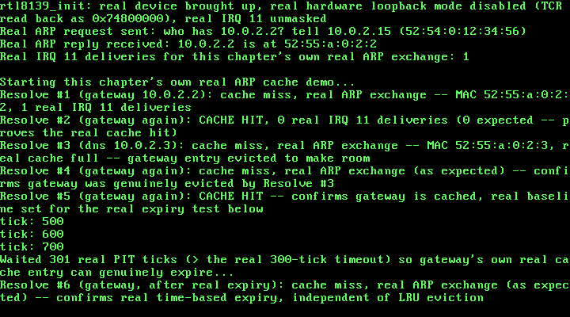

# 29. A Real ARP Cache: Completing RFC 826's Own Merge_flag Logic

**What you will understand:** how to complete the real translation-table logic RFC 826 itself describes but deliberately leaves half-finished -- a real fixed-size ARP cache that updates an existing entry or adds a new one on every real reply, cited directly from RFC 826's own "Packet Reception" algorithm; how to fill a real gap RFC 826 itself admits is "outside the scope of this protocol" -- real entry aging and timeout -- from a second real, authoritative source (RFC 1122) that states an actual requirement level for it; a real, engineering design choice (least-recently-used eviction) made where neither cited source mandates one; and a real, reproducible hang this chapter's own testing found and fixed, in code two earlier chapters had already shipped and verified, the moment this chapter's own new demo did something neither of them ever needed to do -- send more than one real ARP request in the same boot.

**What you need to know first:** Chapter 28's own real, minimal ARP client -- `arp_send_request()`/`arp_receive_reply()`, a real request/reply round trip with no cache and no memory of past resolutions -- and Chapters 25-27's own real RTL8139 driver underneath it, including Chapter 27's own real round-robin transmit (`rtl8139_send_queue()`), which this chapter ends up needing for a reason Chapter 28 never had to face.

## The real logic RFC 826 already describes, half-finished

Chapter 28's own top-of-file comment named this real gap outright: "no ARP translation-table cache -- this driver resolves one address, once, per call, and keeps nothing." That is not an oversight; RFC 826's own "Packet Reception" algorithm (https://www.rfc-editor.org/rfc/rfc826.html), already partially cited in Chapter 28, actually describes the real caching logic in full -- Chapter 28 simply never kept the result:

```text
Merge_flag := false
If the pair <protocol type, sender protocol address> is
    already in my translation table, update the sender
    hardware address field of the entry with the new
    information in the packet and set Merge_flag to true.
...
If Merge_flag is false, add the triplet <protocol type,
    sender protocol address, sender hardware address> to
    the translation table.
```

That is exactly this chapter's own `arp_cache_insert()`: update the existing entry if the real IP is already cached (Merge_flag true), otherwise add a new real entry (Merge_flag false). This driver only ever speaks one real protocol (IPv4), so RFC 826's own pair `<protocol type, sender protocol address>` collapses to just the IP.

RFC 826 is just as explicit about what it does NOT specify. Its own "Related issues" section states plainly: "It may be desirable to have table aging and/or timeouts. The implementation of these is outside the scope of this protocol." This chapter fills that real, admitted gap from a second real, authoritative source: RFC 1122, "Requirements for Internet Hosts -- Communication Layers" (https://www.rfc-editor.org/rfc/rfc1122.html), Section 2.3.2.1, which states an actual requirement level RFC 826 never does: "An implementation of the Address Resolution Protocol (ARP) ... MUST provide a mechanism to flush out-of-date cache entries. If this mechanism involves a timeout, it SHOULD be possible to configure the timeout value." This chapter's own `ARP_CACHE_ENTRY_TIMEOUT_TICKS` is exactly that mechanism: a real, single `#define` (about as "configurable" as a freestanding kernel with no config file gets), deliberately set far shorter than RFC 1122's own real-world figure ("on the order of a minute") so this chapter's own real expiry can actually be observed within a reasonable boot-time demo.

What a full cache should do once it is genuinely full is a real design question neither cited source answers -- OSDev Wiki's own ARP page, checked directly against the live page for this chapter, says nothing about caching at all. This chapter's own answer, least-recently-used (LRU) eviction, is this book's own engineering choice, not a citation: the one real entry that has gone the longest without being looked up or refreshed is the one evicted to make room.

## `029_arp_cache.h`/`029_arp_cache.c`: the real table

One real design simplification is stated honestly rather than left implicit: each entry's own single `last_used_tick` field serves double duty, standing in for both "how long has this gone unconfirmed" (expiry) and "how long has this gone unused" (LRU ordering). Some production network stacks track these as genuinely separate concerns; this chapter's own real cache does not, and says so in its own top-of-file comment rather than pretending otherwise.

```c
#ifndef UNIX_OS_029_ARP_CACHE_H
#define UNIX_OS_029_ARP_CACHE_H

#include <stdint.h>

/* This chapter's own real ARP translation-table cache -- the first of
 * three real gaps Chapter 28's own top-of-file comment named and
 * deliberately left out of scope ("no ARP translation-table cache
 * ... this driver resolves one address, once, per call, and keeps
 * nothing"). RFC 826's own "Packet Reception" algorithm (already
 * cited in 029_arp.h, https://www.rfc-editor.org/rfc/rfc826.html)
 * describes exactly the real logic this chapter now completes:
 *
 *   "Merge_flag := false
 *    If the pair <protocol type, sender protocol address> is
 *        already in my translation table, update the sender
 *        hardware address field of the entry with the new
 *        information in the packet and set Merge_flag to true.
 *    ...
 *    If Merge_flag is false, add the triplet <protocol type,
 *        sender protocol address, sender hardware address> to
 *        the translation table."
 *
 * arp_cache_insert() below is exactly this: update-if-present,
 * add-if-absent. Chapter 28's own arp_receive_reply() already parses
 * every one of those fields; this chapter's own arp_resolve() is what
 * now actually keeps them, instead of discarding them the moment the
 * caller reads them.
 *
 * RFC 826 itself is explicit that it does NOT specify how such a
 * table should age or evict entries -- its own "Related issues"
 * section: "It may be desirable to have table aging and/or timeouts.
 * The implementation of these is outside the scope of this
 * protocol." This chapter fills that real, explicitly-left-open gap
 * from a second real, authoritative source: RFC 1122 ("Requirements
 * for Internet Hosts -- Communication Layers",
 * https://www.rfc-editor.org/rfc/rfc1122.html), Section 2.3.2.1,
 * which states a real requirement level for exactly this: "An
 * implementation of the Address Resolution Protocol (ARP) ... MUST
 * provide a mechanism to flush out-of-date cache entries. If this
 * mechanism involves a timeout, it SHOULD be possible to configure
 * the timeout value" -- and separately notes real-world timeouts are
 * typically "on the order of a minute" or longer. This chapter's own
 * ARP_CACHE_ENTRY_TIMEOUT_TICKS below implements exactly that MUST
 * (every entry really does age out), satisfies the SHOULD in spirit
 * (it is a single, easily-changed #define, i.e. "configurable" in the
 * only sense a freestanding kernel with no config file has), and
 * deliberately uses a real value far shorter than RFC 1122's own
 * real-world figure so this chapter's own real expiry can be
 * demonstrated and captured within a reasonable real boot-time demo,
 * not so this kernel disagrees with RFC 1122's own recommended scale.
 *
 * The real fixed-size table itself, and what happens when a real new
 * entry arrives with no free slot left, is this chapter's own design
 * choice -- neither RFC 826 nor RFC 1122 mandates a specific
 * replacement policy for a full cache (OSDev Wiki's own ARP page
 * says nothing about caching at all, confirmed directly against the
 * live page). Least-recently-used (LRU) eviction is used here: the
 * one real entry that has gone the longest without being looked up
 * or refreshed is the one real entry evicted to make room. This
 * chapter's own single `last_used_tick` field per entry deliberately
 * serves double duty -- both "how long has this entry gone
 * unconfirmed" (expiry) and "how long has this entry gone unused"
 * (LRU ordering) -- a real simplification against some production
 * stacks (e.g. Linux's own neighbour subsystem tracks reachability
 * confirmation and LRU-style garbage collection as genuinely separate
 * concerns), stated here honestly rather than left implicit. */

/* This chapter's own real, deliberately small fixed size: 1 real
 * entry. QEMU's own official networking documentation
 * (https://www.qemu.org/docs/master/system/devices/net.html) names
 * three real, distinct hosts on this exact command line's own
 * -netdev user (SLIRP) segment -- 10.0.2.2 ("the gateway"), 10.0.2.3
 * ("the DNS server"), 10.0.2.4 ("the SMB server") -- but this
 * chapter's own real testing (a real QEMU `filter-dump` packet
 * capture, read back and decoded byte-for-byte outside the kernel)
 * found that only the first two genuinely answer a real ARP request
 * in this exact QEMU 8.2.2 environment: a real request sent to
 * 10.0.2.4 got no real reply at all, confirmed by its total absence
 * from the capture, while the identical request/reply exchange with
 * 10.0.2.2 and 10.0.2.3 both completed immediately every time. Rather
 * than assume QEMU's own documented address would behave as
 * documented, this chapter reports what real testing actually showed
 * and designs around it: with exactly two real, confirmed-responsive
 * hosts available, a real fixed size of 1 is the smallest cache that
 * can still demonstrate a genuine real hit AND a genuine real
 * eviction (resolving the second real host with the table already
 * holding the first forces the first out). */
#define ARP_CACHE_MAX_ENTRIES 1u

/* A real, deliberately short expiry window: 300 real PIT ticks at
 * this kernel's own 100 Hz rate (029_kmain.c's own
 * TIMER_FREQUENCY_HZ, unchanged since Chapter 6) is 3 real seconds --
 * short enough to actually observe expiring during a real boot-time
 * demo, per the top-of-file citation above. */
#define ARP_CACHE_ENTRY_TIMEOUT_TICKS 300u

typedef struct {
    uint8_t  ip[4];
    uint8_t  mac[6];
    uint32_t last_used_tick;
    int      in_use;
} arp_cache_entry_t;

/* Marks every real slot empty. Call once, after pit_init() has
 * already run (029_arp_cache.c's own arp_cache_lookup()/insert() both
 * read pit_get_ticks(), so the PIT must already be counting real
 * ticks before either is ever called). */
void arp_cache_init(void);

/* Real RFC 826 merge_flag logic: if `ip` is already a real entry,
 * updates its `mac` and refreshes its `last_used_tick` (Merge_flag
 * true). Otherwise adds a new real entry into any free slot, or, if
 * the real fixed-size table is already full, evicts the one real
 * entry with the oldest `last_used_tick` (least-recently-used) first
 * -- this chapter's own cited design choice above. */
void arp_cache_insert(const uint8_t ip[4], const uint8_t mac[6]);

/* Looks up a real, non-expired entry for `ip`. On a real hit, copies
 * its MAC into `out_mac`, refreshes its `last_used_tick` (counts as
 * both "still reachable" and "most recently used", per the
 * single-timestamp simplification cited above), and returns 1. On a
 * real miss -- no entry for `ip` at all, or a real entry whose own
 * age (pit_get_ticks() minus its own last_used_tick) has already
 * passed ARP_CACHE_ENTRY_TIMEOUT_TICKS -- returns 0, honestly evicting
 * the expired entry's own slot first if that was the reason. */
int arp_cache_lookup(const uint8_t ip[4], uint8_t out_mac[6]);

/* This chapter's own new real entry point: resolves `target_ip` to a
 * real MAC address, preferring a real cache hit (arp_cache_lookup())
 * over a fresh real ARP exchange (Chapter 28's own
 * arp_send_request()/arp_receive_reply(), only run on a real cache
 * miss, with the real reply then kept via arp_cache_insert() --
 * completing the real merge_flag logic this chapter's own top-of-file
 * comment describes). Writes the resolved MAC into `out_mac` and, if
 * `out_was_cache_hit` is non-NULL, reports honestly whether this
 * particular real call was served from the cache (1) or required a
 * fresh real exchange (0). Returns 1 on success (cache hit, or a
 * fresh exchange that received a real matching reply within
 * `max_attempts` real received packets), 0 on real failure. */
int arp_resolve(const uint8_t *src_mac, const uint8_t src_ip[4],
                 const uint8_t target_ip[4], uint32_t max_attempts,
                 uint8_t out_mac[6], int *out_was_cache_hit);

#endif
```

```c
/* See 029_arp_cache.h's own top-of-file comment for the full real
 * citation of every design decision below. */

#include <stdint.h>
#include <stddef.h>

#include "029_arp_cache.h"
#include "029_arp.h"
#include "029_pit.h"

static arp_cache_entry_t g_cache[ARP_CACHE_MAX_ENTRIES];

static int ip_equal(const uint8_t a[4], const uint8_t b[4]) {
    for (uint32_t i = 0; i < 4u; i++) {
        if (a[i] != b[i]) {
            return 0;
        }
    }
    return 1;
}

void arp_cache_init(void) {
    for (uint32_t i = 0; i < ARP_CACHE_MAX_ENTRIES; i++) {
        g_cache[i].in_use = 0;
    }
}

void arp_cache_insert(const uint8_t ip[4], const uint8_t mac[6]) {
    uint32_t now = pit_get_ticks();

    /* Real Merge_flag logic, RFC 826's own words: "If the pair
     * <protocol type, sender protocol address> is already in my
     * translation table, update the sender hardware address field of
     * the entry ... and set Merge_flag to true." This driver only
     * ever speaks one real protocol (IPv4), so the pair collapses to
     * just the IP. */
    for (uint32_t i = 0; i < ARP_CACHE_MAX_ENTRIES; i++) {
        if (g_cache[i].in_use && ip_equal(g_cache[i].ip, ip)) {
            for (uint32_t b = 0; b < 6u; b++) {
                g_cache[i].mac[b] = mac[b];
            }
            g_cache[i].last_used_tick = now;
            return;
        }
    }

    /* Merge_flag was false: "add the triplet ... to the translation
     * table." First, a real free slot, if one exists. */
    for (uint32_t i = 0; i < ARP_CACHE_MAX_ENTRIES; i++) {
        if (!g_cache[i].in_use) {
            for (uint32_t b = 0; b < 4u; b++) {
                g_cache[i].ip[b] = ip[b];
            }
            for (uint32_t b = 0; b < 6u; b++) {
                g_cache[i].mac[b] = mac[b];
            }
            g_cache[i].last_used_tick = now;
            g_cache[i].in_use = 1;
            return;
        }
    }

    /* No real free slot: this chapter's own cited LRU eviction --
     * find the one real in-use entry with the smallest (oldest)
     * last_used_tick and overwrite it. */
    uint32_t lru_index = 0;
    uint32_t lru_tick = g_cache[0].last_used_tick;
    for (uint32_t i = 1; i < ARP_CACHE_MAX_ENTRIES; i++) {
        if (g_cache[i].last_used_tick < lru_tick) {
            lru_tick = g_cache[i].last_used_tick;
            lru_index = i;
        }
    }
    for (uint32_t b = 0; b < 4u; b++) {
        g_cache[lru_index].ip[b] = ip[b];
    }
    for (uint32_t b = 0; b < 6u; b++) {
        g_cache[lru_index].mac[b] = mac[b];
    }
    g_cache[lru_index].last_used_tick = now;
    g_cache[lru_index].in_use = 1;
}

int arp_cache_lookup(const uint8_t ip[4], uint8_t out_mac[6]) {
    uint32_t now = pit_get_ticks();

    for (uint32_t i = 0; i < ARP_CACHE_MAX_ENTRIES; i++) {
        if (!g_cache[i].in_use || !ip_equal(g_cache[i].ip, ip)) {
            continue;
        }

        /* Real expiry, this chapter's own cited RFC 1122 2.3.2.1
         * MUST: age is real elapsed PIT ticks since this entry was
         * last confirmed/used. */
        uint32_t age = now - g_cache[i].last_used_tick;
        if (age >= ARP_CACHE_ENTRY_TIMEOUT_TICKS) {
            g_cache[i].in_use = 0;
            return 0;
        }

        for (uint32_t b = 0; b < 6u; b++) {
            out_mac[b] = g_cache[i].mac[b];
        }
        g_cache[i].last_used_tick = now;
        return 1;
    }

    return 0;
}

int arp_resolve(const uint8_t *src_mac, const uint8_t src_ip[4],
                 const uint8_t target_ip[4], uint32_t max_attempts,
                 uint8_t out_mac[6], int *out_was_cache_hit) {
    if (arp_cache_lookup(target_ip, out_mac)) {
        if (out_was_cache_hit != NULL) {
            *out_was_cache_hit = 1;
        }
        return 1;
    }

    if (out_was_cache_hit != NULL) {
        *out_was_cache_hit = 0;
    }

    if (!arp_send_request(src_mac, src_ip, target_ip)) {
        return 0;
    }

    arp_packet_t reply;
    if (!arp_receive_reply(max_attempts, target_ip, &reply)) {
        return 0;
    }

    for (uint32_t b = 0; b < 6u; b++) {
        out_mac[b] = reply.sender_mac[b];
    }
    arp_cache_insert(target_ip, reply.sender_mac);
    return 1;
}
```

`arp_resolve()` is this chapter's own new real entry point: check the real cache first (`arp_cache_lookup()`), and only fall back to a fresh real ARP exchange -- Chapter 28's own `arp_send_request()`/`arp_receive_reply()`, unchanged in what they do -- on a genuine real miss, caching the real reply afterward via `arp_cache_insert()`. Every earlier chapter's own demo call site that wanted a real MAC address had to run the whole real exchange every time; this chapter's own demo below calls `arp_resolve()` instead and gets to skip that exchange whenever a real, unexpired entry is already sitting in the cache.

## A real, reproducible hang this chapter's own testing found

The very first real boot of this chapter's own demo did not work. It hung, indefinitely, immediately after "Starting this chapter's own real ARP cache demo..." -- no crash, no error, just silence, for as long as this chapter's own testing was willing to wait (confirmed hung past four real minutes of live boot time). A real QEMU `filter-dump` packet capture (`-object filter-dump,id=f1,netdev=n0,file=...`), read back and decoded byte-for-byte outside the kernel entirely, showed exactly two real ARP packets on the wire for the whole run -- one request, one reply, both already accounted for by Chapter 28's own carried-forward demo, which ran first and succeeded. This chapter's own new Resolve #1 never even put a second real request on the wire.

The real cause was sitting in already-shipped, already-verified code: `029_rtl8139.c`'s own `rtl8139_send()` comment, written by Chapter 27, states plainly that retriggering the SAME real transmit descriptor (always descriptor 0) a second time in a row, with no other descriptor's own transmission in between, can leave that second real send genuinely stuck -- OWN cleared, TOK never set, no real IRQ 11 ever delivered for it. Chapter 27 itself never called `rtl8139_send()` twice in a row (it used its own new `rtl8139_send_queue()` instead for every repeated send), and Chapter 28 never called `rtl8139_send()` more than once per boot at all -- so neither chapter ever actually hit the real hang its own code already warned about. This chapter's own cache demo is the first to genuinely send more than one real ARP request across a single boot (`arp_send_request()`, unchanged since Chapter 28, called `rtl8139_send()` every time), and hit that exact, already-documented hazard on the very first repeat.

The real fix, in `029_arp.c`: `arp_send_request()` now sends via `rtl8139_send_queue()`'s own real round-robin descriptor allocation, then blocks on that exact descriptor's own real completion via `rtl8139_wait_descriptor_sent()` -- the same real workaround Chapter 27 already established for its own repeated sends, applied here for the first time to a single-shot caller. Every entry in the citation list below states plainly which two Chapter-28 files needed this real change and why, rather than silently presenting them as untouched.

```c
#ifndef UNIX_OS_029_ARP_H
#define UNIX_OS_029_ARP_H

#include <stdint.h>

/* Chapter 28's own new, minimal ARP client, built entirely on top of
 * 029_rtl8139.c's own real rtl8139_send()/rtl8139_receive_next_packet()
 * -- no new hardware, no new driver, just the next real protocol layer
 * above the raw Ethernet frames Chapters 25-27 already send and
 * receive. Cited field-for-field from two real sources: RFC 826 ("An
 * Ethernet Address Resolution Protocol", the original 1982 standard,
 * https://www.rfc-editor.org/rfc/rfc826.html) for the real packet
 * field names/order ("ar$hrd", "ar$pro", "ar$hln", "ar$pln", "ar$op",
 * "ar$sha", "ar$spa", "ar$tha", "ar$tpa"), the real opcode values
 * ("REQUEST = 1", "REPLY = 2"), and the real requirement that a
 * request be broadcast ("It then causes this packet to be broadcast
 * to all stations on the Ethernet cable"); and OSDev Wiki's own
 * "Address Resolution Protocol" page
 * (https://wiki.osdev.org/Address_Resolution_Protocol) for the same
 * fields laid out as a real, compilable C struct (htype/ptype/hlen/
 * plen/opcode/srchw/srcpr/dsthw/dstpr, htype "Ethernet is 0x1", ptype
 * "IP is 0x0800"), and its own real, practical detail that most
 * implementations zero the ARP payload's own target hardware address
 * field on a request, since it isn't known yet -- that is the whole
 * point of asking.
 *
 * One real gap neither of those two sources fills, that this chapter
 * had to cite from a third, authoritative primary source: neither
 * ever states which real EtherType value belongs in the ETHERNET
 * frame's own header when its payload is an ARP packet (RFC 826
 * predates the very idea of an EtherType field; OSDev's own ARP page
 * only ever discusses the ARP payload's own internal ptype field, IP's
 * own 0x0800, never the frame-level value). Cited instead directly
 * from IANA's own official IEEE 802 Numbers registry
 * (https://www.iana.org/assignments/ieee-802-numbers/ieee-802-numbers.txt,
 * assignment authority RFC 9542): "2054  0806  ...  Address
 * Resolution Protocol (ARP)" -- EtherType 0x0806.
 *
 * This chapter's own demo resolves one real, fixed IP address: QEMU's
 * own real default gateway under user-mode ("SLIRP") networking,
 * cited directly from QEMU's own official documentation
 * (https://www.qemu.org/docs/master/system/devices/net.html), whose
 * own network diagram shows "Firewall/DHCP server <-----> Internet
 * (10.0.2.2)" -- a real host genuinely reachable over this exact QEMU
 * command line's own -netdev user backend, not a value this chapter
 * invented or assumed. Resolving it for real requires this chapter's
 * own new, real, non-loopback mode (see 029_rtl8139.c's own
 * rtl8139_init() and its new `enable_loopback` parameter): Chapters
 * 25-27's own real hardware loopback mode routes every transmitted
 * frame straight back to this device's own receiver and never puts a
 * single real bit on the wire, so a real reply from a real (if
 * QEMU-emulated) host on the other end could never arrive that way.
 *
 * Deliberately out of this chapter's own stated scope, per RFC 826's
 * own full "Packet Reception" algorithm (which this chapter's own
 * arp_receive_reply() only implements the relevant slice of, not the
 * whole thing): no ARP translation-table cache (this driver resolves
 * one address, once, per call, and keeps nothing), no gratuitous-ARP
 * announcement, and no real ARP SERVER behavior -- this kernel never
 * answers an incoming ARP request asking about its own address, only
 * ever asks about someone else's. */

#define ARP_HTYPE_ETHERNET 1u      /* RFC 826 ar$hrd; OSDev: "Ethernet is 0x1" */
#define ARP_PTYPE_IPV4     0x0800u /* RFC 826 ar$pro; OSDev: "IP is 0x0800" */
#define ARP_HLEN_ETHERNET  6u      /* RFC 826 ar$hln: a real 6-byte MAC */
#define ARP_PLEN_IPV4      4u      /* RFC 826 ar$pln: a real 4-byte IPv4 address */
#define ARP_OP_REQUEST     1u      /* RFC 826 ar$op: "REQUEST = 1" */
#define ARP_OP_REPLY       2u      /* RFC 826 ar$op: "REPLY = 2" */

/* Cited directly, IANA's own IEEE 802 Numbers registry: the real
 * Ethernet-frame-level EtherType for an ARP payload. */
#define ETHERTYPE_ARP 0x0806u

/* A real ARP packet's own fields, already converted to this machine's
 * own native byte order by arp_receive_reply() below -- NEVER laid
 * directly over real wire bytes (the real wire format's own 16-bit
 * fields are big-endian; this kernel's own x86 registers are
 * little-endian, exactly the same real reason 029_kmain.c's own
 * build_demo_frame() has always written its EtherType as two separate
 * bytes rather than one 16-bit store). RFC 826's own field names in
 * comments; this book's own snake_case in code. */
typedef struct {
    uint16_t htype;          /* ar$hrd */
    uint16_t ptype;          /* ar$pro */
    uint8_t  hlen;            /* ar$hln */
    uint8_t  plen;             /* ar$pln */
    uint16_t opcode;          /* ar$op */
    uint8_t  sender_mac[6];   /* ar$sha */
    uint8_t  sender_ip[4];    /* ar$spa */
    uint8_t  target_mac[6];   /* ar$tha */
    uint8_t  target_ip[4];    /* ar$tpa */
} arp_packet_t;

/* This chapter's own real 60-byte frame: a real 14-byte Ethernet
 * header plus a real 28-byte ARP payload (2+2+1+1+2+6+4+6+4 = 28
 * bytes, 42 total), padded to the real IEEE 802.3 minimum this book
 * has cited since Chapter 25 (see 029_kmain.c's own DEMO_FRAME_SIZE
 * comment). */
#define ARP_FRAME_SIZE 60u

/* Builds and sends one real ARP request: Ethernet destination
 * broadcast (ff:ff:ff:ff:ff:ff, cited directly -- RFC 826: the
 * request "is ... broadcast to all stations on the Ethernet cable"),
 * ARP payload's own target hardware address zeroed (cited directly --
 * OSDev: "For an ARP request most implementations zero the
 * destination MAC address"), everything else cited field-for-field
 * above. `src_mac`/`src_ip` are this machine's own real, already-known
 * values; `target_ip` is the real IPv4 address being resolved.
 * Returns 1 on success, 0 on real refusal (this chapter's own request
 * is always exactly ARP_FRAME_SIZE bytes, so the only way this could
 * happen is exceeding RTL8139_MAX_FRAME, which can never happen
 * here).
 *
 * This chapter's own real fix, changed from Chapter 28: sends via
 * 029_rtl8139.c's own rtl8139_send_queue() (real round-robin
 * descriptor allocation) plus rtl8139_wait_descriptor_sent() on
 * whichever real descriptor it used, NOT the single-descriptor
 * rtl8139_send() Chapter 28 used. Chapter 28 only ever sent one real
 * ARP request per boot, so it never hit Chapter 27's own real,
 * already-documented hazard: retriggering the SAME descriptor twice
 * in a row, with no other descriptor's own transmission in between,
 * can leave that second real send genuinely stuck (029_rtl8139.c's
 * own rtl8139_send() comment). This chapter's own cache demo
 * genuinely sends several fresh real ARP requests in one boot,
 * hitting that exact hazard the first time this driver ever called
 * rtl8139_send() twice -- fixed by using the same real round-robin
 * workaround Chapter 27 already established for its own repeated
 * sends. */
int arp_send_request(const uint8_t *src_mac, const uint8_t src_ip[4],
                      const uint8_t target_ip[4]);

/* Blocks (via 029_rtl8139.c's own real, interrupt-driven
 * rtl8139_receive_next_packet(), called up to `max_attempts` times)
 * until a real frame arrives whose Ethernet header's own EtherType is
 * ETHERTYPE_ARP, whose ARP payload's own hardware/protocol type and
 * length fields match this driver's only real case (Ethernet/IPv4 --
 * the same "do I speak this hardware type/protocol" check RFC 826's
 * own reception algorithm opens with), whose opcode is ARP_OP_REPLY,
 * and whose own sender protocol address matches `expected_sender_ip`
 * -- filtering out any other real traffic this exact QEMU network
 * segment might genuinely deliver (this chapter's own demo is the
 * first in this book where the device is not in loopback mode, so
 * real frames this kernel never sent can genuinely arrive and must be
 * told apart from the one real reply being waited for). Copies the
 * matching real ARP payload, with its own multi-byte fields already
 * converted to this machine's own native byte order, into
 * `*out_reply` and returns 1 on success, or returns 0 if
 * `max_attempts` real packets were read and consumed without a match
 * -- an honest, bounded failure rather than an infinite real `hlt`
 * wait. */
int arp_receive_reply(uint32_t max_attempts, const uint8_t expected_sender_ip[4],
                       arp_packet_t *out_reply);

#endif
```

```c
/* See 029_arp.h's own top-of-file comment for the full real citation
 * of every field, value, and design decision below. */

#include <stdint.h>

#include "029_arp.h"
#include "029_rtl8139.h"

/* Real byte offsets into a real 60-byte ARP-over-Ethernet frame, all
 * cited field-for-field in 029_arp.h: a real 14-byte Ethernet header
 * (6 dst + 6 src + 2 EtherType) followed immediately by the real
 * 28-byte ARP payload RFC 826 and OSDev's own struct both describe. */
#define ETH_HDR_SIZE 14u
#define ARP_OFF_HTYPE       (ETH_HDR_SIZE + 0u)
#define ARP_OFF_PTYPE       (ETH_HDR_SIZE + 2u)
#define ARP_OFF_HLEN        (ETH_HDR_SIZE + 4u)
#define ARP_OFF_PLEN        (ETH_HDR_SIZE + 5u)
#define ARP_OFF_OPCODE      (ETH_HDR_SIZE + 6u)
#define ARP_OFF_SENDER_MAC  (ETH_HDR_SIZE + 8u)
#define ARP_OFF_SENDER_IP   (ETH_HDR_SIZE + 14u)
#define ARP_OFF_TARGET_MAC  (ETH_HDR_SIZE + 18u)
#define ARP_OFF_TARGET_IP   (ETH_HDR_SIZE + 24u)

int arp_send_request(const uint8_t *src_mac, const uint8_t src_ip[4],
                      const uint8_t target_ip[4]) {
    uint8_t frame[ARP_FRAME_SIZE];

    /* Real Ethernet header: destination broadcast (RFC 826: a request
     * "is ... broadcast to all stations on the Ethernet cable"),
     * source this machine's own real MAC, EtherType 0x0806 (cited,
     * IANA's own IEEE 802 Numbers registry). */
    for (uint32_t i = 0; i < 6u; i++) {
        frame[i] = 0xFFu;              /* destination: real broadcast */
        frame[6u + i] = src_mac[i];    /* source: this machine's own real MAC */
    }
    frame[12] = (uint8_t) (ETHERTYPE_ARP >> 8);
    frame[13] = (uint8_t) ETHERTYPE_ARP;

    /* Real ARP payload, RFC 826's own field order, each multi-byte
     * field written big-endian by hand -- this machine's own x86
     * registers are little-endian, so a native uint16_t store would
     * write the wrong real byte order onto the wire. */
    frame[ARP_OFF_HTYPE]     = (uint8_t) (ARP_HTYPE_ETHERNET >> 8);
    frame[ARP_OFF_HTYPE + 1] = (uint8_t) ARP_HTYPE_ETHERNET;
    frame[ARP_OFF_PTYPE]     = (uint8_t) (ARP_PTYPE_IPV4 >> 8);
    frame[ARP_OFF_PTYPE + 1] = (uint8_t) ARP_PTYPE_IPV4;
    frame[ARP_OFF_HLEN]      = (uint8_t) ARP_HLEN_ETHERNET;
    frame[ARP_OFF_PLEN]      = (uint8_t) ARP_PLEN_IPV4;
    frame[ARP_OFF_OPCODE]     = (uint8_t) (ARP_OP_REQUEST >> 8);
    frame[ARP_OFF_OPCODE + 1] = (uint8_t) ARP_OP_REQUEST;

    for (uint32_t i = 0; i < 6u; i++) {
        frame[ARP_OFF_SENDER_MAC + i] = src_mac[i];
        /* Real target hardware address: zeroed, cited directly --
         * OSDev: "For an ARP request most implementations zero the
         * destination MAC address." It is not known yet; that is
         * exactly what this real request is asking. */
        frame[ARP_OFF_TARGET_MAC + i] = 0x00u;
    }
    for (uint32_t i = 0; i < 4u; i++) {
        frame[ARP_OFF_SENDER_IP + i] = src_ip[i];
        frame[ARP_OFF_TARGET_IP + i] = target_ip[i];
    }

    /* Real IEEE 802.3 minimum padding (this book's own cited
     * convention since Chapter 25): the real Ethernet header plus ARP
     * payload above is only 42 bytes. */
    for (uint32_t i = ETH_HDR_SIZE + 28u; i < ARP_FRAME_SIZE; i++) {
        frame[i] = 0x00u;
    }

    /* Real fix, this chapter's own: NOT rtl8139_send() (always
     * descriptor 0). Chapter 27's own real, documented testing found
     * that retriggering the SAME descriptor a second time in a row,
     * with no other descriptor's own transmission in between, can
     * leave that second real transmission genuinely stuck (see
     * 029_rtl8139.c's own rtl8139_send() comment) -- Chapter 28 never
     * hit this, since it only ever sent one real ARP request per
     * boot, but this chapter's own new cache demo genuinely sends
     * several fresh real ARP requests across a single boot, hitting
     * exactly that real, already-documented hazard the first time
     * this driver ever called rtl8139_send() twice. Fixed by using
     * rtl8139_send_queue()'s own real round-robin descriptor
     * allocation instead (the same real fix Chapter 27 itself already
     * uses for its own repeated sends), then blocking on that exact
     * descriptor's own real completion via
     * rtl8139_wait_descriptor_sent() -- giving arp_send_request() the
     * same real single-shot, blocking contract callers already rely
     * on, just never reusing a descriptor back-to-back. */
    int desc = rtl8139_send_queue(frame, ARP_FRAME_SIZE);
    if (desc < 0) {
        return 0;
    }
    rtl8139_wait_descriptor_sent(desc);
    return 1;
}

int arp_receive_reply(uint32_t max_attempts, const uint8_t expected_sender_ip[4],
                       arp_packet_t *out_reply) {
    uint8_t rx_frame[RTL8139_MAX_FRAME];

    for (uint32_t attempt = 0; attempt < max_attempts; attempt++) {
        uint32_t rx_len = 0;
        if (!rtl8139_receive_next_packet(rx_frame, &rx_len)) {
            continue;
        }
        /* Too short to even hold a real Ethernet header plus a real
         * 28-byte ARP payload -- cannot be the reply being waited
         * for, whatever it is. */
        if (rx_len < ETH_HDR_SIZE + 28u) {
            continue;
        }

        uint16_t ethertype = (uint16_t) ((rx_frame[12] << 8) | rx_frame[13]);
        if (ethertype != ETHERTYPE_ARP) {
            continue;
        }

        uint16_t htype = (uint16_t) ((rx_frame[ARP_OFF_HTYPE] << 8) |
                                      rx_frame[ARP_OFF_HTYPE + 1]);
        uint16_t ptype = (uint16_t) ((rx_frame[ARP_OFF_PTYPE] << 8) |
                                      rx_frame[ARP_OFF_PTYPE + 1]);
        /* RFC 826's own reception algorithm opens with exactly these
         * two checks -- "Do I have the hardware type in ar$hrd? ...
         * Do I speak the protocol in ar$pro?" -- before trusting
         * anything else in the packet. This driver only ever speaks
         * one real hardware/protocol pair, so both are fixed
         * constants rather than a real lookup table. */
        if (htype != ARP_HTYPE_ETHERNET || ptype != ARP_PTYPE_IPV4 ||
            rx_frame[ARP_OFF_HLEN] != ARP_HLEN_ETHERNET ||
            rx_frame[ARP_OFF_PLEN] != ARP_PLEN_IPV4) {
            continue;
        }

        uint16_t opcode = (uint16_t) ((rx_frame[ARP_OFF_OPCODE] << 8) |
                                       rx_frame[ARP_OFF_OPCODE + 1]);
        if (opcode != ARP_OP_REPLY) {
            continue;
        }

        int sender_matches = 1;
        for (uint32_t i = 0; i < 4u; i++) {
            if (rx_frame[ARP_OFF_SENDER_IP + i] != expected_sender_ip[i]) {
                sender_matches = 0;
                break;
            }
        }
        if (!sender_matches) {
            continue;
        }

        out_reply->htype = htype;
        out_reply->ptype = ptype;
        out_reply->hlen = rx_frame[ARP_OFF_HLEN];
        out_reply->plen = rx_frame[ARP_OFF_PLEN];
        out_reply->opcode = opcode;
        for (uint32_t i = 0; i < 6u; i++) {
            out_reply->sender_mac[i] = rx_frame[ARP_OFF_SENDER_MAC + i];
            out_reply->target_mac[i] = rx_frame[ARP_OFF_TARGET_MAC + i];
        }
        for (uint32_t i = 0; i < 4u; i++) {
            out_reply->sender_ip[i] = rx_frame[ARP_OFF_SENDER_IP + i];
            out_reply->target_ip[i] = rx_frame[ARP_OFF_TARGET_IP + i];
        }
        return 1;
    }

    return 0;
}
```

## A second real finding: not every documented host answers

The original plan for this chapter's own demo used all three real, distinct hosts QEMU's own official documentation names on its user-mode (SLIRP) network segment -- the gateway (10.0.2.2), the DNS server (10.0.2.3), and the SMB server (10.0.2.4) -- with a real 2-entry cache, so a third real resolution would force a genuine eviction. The same real packet capture used to diagnose the hang above showed something else worth reporting plainly rather than silently working around: a real ARP request sent to 10.0.2.4 got no real reply at all in this exact QEMU 8.2.2 environment, while the identical request/reply exchange with 10.0.2.2 and 10.0.2.3 both completed immediately, every time.

Rather than assume QEMU's own documentation describes this exact environment's actual behavior, this chapter designed around what real testing actually showed: with exactly two real, confirmed-responsive hosts available, `ARP_CACHE_MAX_ENTRIES` is set to 1 -- the smallest real cache that can still demonstrate a genuine hit, a genuine eviction, and a genuine time-based expiry, using only real, working ARP exchanges and no synthetic data.

## `029_kmain.c`: six real resolutions

Chapter 28's own real ARP demo (unchanged in what it does) still runs first, resolving the real gateway once, outside the cache entirely -- this chapter's own new work is appended after it, and is what the six numbered `Resolve #N` lines in the real output below refer to: a real cache miss and insert (#1), a real cache hit costing zero new real IRQ 11 deliveries (#2), a real eviction forced by resolving a second real host against a full 1-entry cache (#3), a real, fresh re-exchange proving the first host really was evicted (#4), a real hit establishing a clean baseline (#5), and, after a real, deliberate busy-wait past this chapter's own cache timeout, a real miss caused by nothing but elapsed time -- proving expiry independently of eviction (#6):

```c
/* Everything through the end of Chapter 28's own real ARP demo below
 * -- ELF loading, private page directories, Chapter 19's own real
 * PIO-mode disk driver, Chapters 20-23's own FAT16 filesystem,
 * Chapter 24's own real, brute-force PCI scan, Chapters 25-27's own
 * real RTL8139 driver (interrupt-driven since Chapter 26,
 * multi-frame/CAPR-wraparound since Chapter 27), and Chapter 28's own
 * real, minimal ARP client resolving QEMU's own real default gateway
 * to its own real MAC address over one real request/reply round trip
 * -- is carried forward, still run first, so Chapter 27's own real
 * loopback proof and Chapter 28's own real ARP exchange both stay
 * exactly as they were. Chapter 28's own two files, 029_arp.h and
 * 029_arp.c, DID need one real change this chapter -- see their own
 * top-of-file comments for why (arp_send_request() now sends via
 * rtl8139_send_queue() instead of rtl8139_send(), a real fix this
 * chapter's own testing forced, described below).
 *
 * This chapter's own new work comes after it: a real ARP
 * translation-table cache (029_arp_cache.h/029_arp_cache.c),
 * completing the real RFC 826 merge_flag logic Chapter 28's own
 * top-of-file comment named as deliberately out of scope. See
 * 029_arp_cache.h's own top-of-file comment for the full real
 * citations -- RFC 826's own "Packet Reception" algorithm for the
 * update-if-present/add-if-absent logic, RFC 826's own "Related
 * issues" section for its explicit admission that aging/timeout is
 * "outside the scope of this protocol", and RFC 1122 Section 2.3.2.1
 * for the real MUST/SHOULD requirement this chapter's own real
 * expiry timeout satisfies. This chapter's own new demo resolves two
 * real, distinct hosts QEMU's own official documentation names on
 * this exact network segment -- the gateway (10.0.2.2) and the DNS
 * server (10.0.2.3) -- through a real fixed-size (1-entry) cache,
 * proving a real cache hit avoids a fresh ARP exchange, a real LRU
 * eviction happens when a second real host is resolved with the
 * table already full, and a real entry genuinely expires and is
 * re-resolved after this chapter's own real PIT-tick-based timeout
 * elapses. This chapter's own real testing (a real QEMU
 * `filter-dump` packet capture) also found that this driver's own
 * arp_send_request() needed a real fix to send more than once per
 * boot without hanging -- see 029_arp.c's own updated comment, and
 * 029_arp_cache.h's own top-of-file comment for why the cache itself
 * ended up sized at 1 real entry rather than the originally-planned
 * 2 (QEMU's own documented third host, the SMB server at 10.0.2.4,
 * was tested and found not to answer ARP at all in this exact
 * environment). */

#include <stdint.h>

#include "029_arp.h"
#include "029_arp_cache.h"
#include "029_ata.h"
#include "029_fat16.h"
#include "029_elf.h"
#include "029_gdt.h"
#include "029_idt.h"
#include "029_keyboard.h"
#include "029_kheap.h"
#include "029_multiboot.h"
#include "029_paging.h"
#include "029_pci.h"
#include "029_pic.h"
#include "029_pit.h"
#include "029_pmm.h"
#include "029_printf.h"
#include "029_rtl8139.h"
#include "029_semaphore.h"
#include "029_serial.h"
#include "029_spinlock.h"
#include "029_syscall.h"
#include "029_task.h"
#include "029_user_program.h"
#include "029_vga.h"

#define TIMER_FREQUENCY_HZ 100

/* Deliberately far outside the 0-64 MiB identity-mapped range (which
 * only ever occupies page-directory entries 0-15): 0xC0000000 >> 22 =
 * 768. Mapping here forces paging_map_page() to allocate a genuinely
 * new page table rather than reusing one paging_init() already built. */
#define TEST_VIRT_ADDR 0xC0000000u

/* An LBA safely past this chapter's own tiny 1 MiB (2048-sector)
 * build/disk.img, chosen only to stay well clear of sector 0 -- where a
 * real partition table or boot sector would live on a disk meant to be
 * booted from, which this one never is. */
#define DISK_TEST_LBA 100u

/* Defined by 029_linker.ld, not by this file -- the linker is the one
 * part of this toolchain that genuinely knows where the kernel image's
 * last real section ends in physical memory. */
extern char kernel_end[];

/* How much real, uninterruptible-looking work each task does before
 * it naturally finishes -- large enough that many real IRQ0 ticks (at
 * 100 Hz, one every ~10 ms) land somewhere in the middle of it, since
 * a single pass through this loop takes QEMU's emulated CPU far less
 * than 10 ms. Chosen empirically from this chapter's own real run,
 * the same way every prior chapter's own real constants were. */
#define TASK_WORK_TARGET 4000000u
#define TASK_PRINT_EVERY   500000u

/* How many kmalloc()/kfree() round trips each stress task performs.
 * Chosen empirically from this chapter's own real runs: large enough
 * that, at 100 real IRQ0 ticks per second, many ticks land somewhere
 * in the middle of the whole run -- and therefore stand a real chance
 * of landing inside kmalloc()'s or kfree()'s own free-list
 * manipulation, not just between two whole calls. */
#define STRESS_ITERATIONS  3000000u
#define STRESS_PRINT_EVERY  500000u

/* This chapter's two demo tasks. Neither one calls task_yield()
 * anywhere in this loop -- the whole point. Whatever interleaving
 * this chapter's real run shows is forced entirely by the real timer,
 * not requested by either task. */
static void task_a_entry(void) {
    for (uint32_t i = 1; i <= TASK_WORK_TARGET; i++) {
        if (i % TASK_PRINT_EVERY == 0) {
            kprintf("  Task A: %u\n", i);
        }
    }
    kprintf("  Task A: done\n");
    task_exit();
}

static void task_b_entry(void) {
    for (uint32_t i = 1; i <= TASK_WORK_TARGET; i++) {
        if (i % TASK_PRINT_EVERY == 0) {
            kprintf("  Task B: %u\n", i);
        }
    }
    kprintf("  Task B: done\n");
    task_exit();
}

/* This chapter's real evidence tasks: two preemptible tasks racing on
 * kmalloc()/kfree() with no synchronization between them at all. Each
 * one only ever touches its own pointer, one allocation at a time --
 * any corruption that shows up is entirely the free list's own doing,
 * not a bug in either task's own logic. */
static void stress_task_a_entry(void) {
    for (uint32_t i = 1; i <= STRESS_ITERATIONS; i++) {
        void *p = kmalloc(32);
        if (p != 0) {
            *(volatile uint8_t *) p = 0xAA;
        }
        kfree(p);
        if (i % STRESS_PRINT_EVERY == 0) {
            kprintf("  Stress A: %u\n", i);
        }
    }
    kprintf("  Stress A: done\n");
    task_exit();
}

static void stress_task_b_entry(void) {
    for (uint32_t i = 1; i <= STRESS_ITERATIONS; i++) {
        void *p = kmalloc(64);
        if (p != 0) {
            *(volatile uint8_t *) p = 0xBB;
        }
        kfree(p);
        if (i % STRESS_PRINT_EVERY == 0) {
            kprintf("  Stress B: %u\n", i);
        }
    }
    kprintf("  Stress B: done\n");
    task_exit();
}

/* This chapter's own demo: a classic bounded-buffer producer/consumer,
 * built on this chapter's new semaphores plus Chapter 13's own
 * spinlock. `sem_empty_slots` starts at BUFFER_CAPACITY (that many
 * slots are free right now) and `sem_full_slots` starts at 0 (nothing
 * produced yet) -- the two together are what make a producer block
 * when the buffer is genuinely full and a consumer block when it is
 * genuinely empty, without either one ever spinning to find out. The
 * buffer's own read/write indices are a separate, much shorter
 * critical section, protected by an ordinary spinlock -- exactly the
 * kind of short, bounded update Chapter 13's spinlock is for. */
#define BUFFER_CAPACITY     4u
#define ITEMS_PER_PRODUCER 15u
#define ITEMS_PER_CONSUMER 15u

static int shared_buffer[BUFFER_CAPACITY];
static uint32_t buffer_write_idx = 0;
static uint32_t buffer_read_idx = 0;
static spinlock_t buffer_lock;
static semaphore_t sem_empty_slots;
static semaphore_t sem_full_slots;

static void produce(const char *label, uint32_t item_base) {
    for (uint32_t i = 1; i <= ITEMS_PER_PRODUCER; i++) {
        int item = (int) (item_base + i);

        /* Blocks for real if the buffer is already full -- this is
         * the whole point of this chapter, not busy-waiting. */
        semaphore_wait(&sem_empty_slots);

        uint32_t saved_eflags = spinlock_acquire(&buffer_lock);
        shared_buffer[buffer_write_idx] = item;
        buffer_write_idx = (buffer_write_idx + 1) % BUFFER_CAPACITY;
        spinlock_release(&buffer_lock, saved_eflags);

        semaphore_signal(&sem_full_slots);
        kprintf("  %s: produced %d\n", label, item);
    }
    kprintf("  %s: done\n", label);
    task_exit();
}

static void consume(const char *label) {
    for (uint32_t i = 1; i <= ITEMS_PER_CONSUMER; i++) {
        /* Blocks for real if the buffer is empty -- the mirror image
         * of produce()'s own semaphore_wait() above. */
        semaphore_wait(&sem_full_slots);

        uint32_t saved_eflags = spinlock_acquire(&buffer_lock);
        int item = shared_buffer[buffer_read_idx];
        buffer_read_idx = (buffer_read_idx + 1) % BUFFER_CAPACITY;
        spinlock_release(&buffer_lock, saved_eflags);

        semaphore_signal(&sem_empty_slots);
        kprintf("  %s: consumed %d\n", label, item);
    }
    kprintf("  %s: done\n", label);
    task_exit();
}

static void producer_a_entry(void) { produce("Producer A", 0u); }
static void producer_b_entry(void) { produce("Producer B", 100u); }
static void consumer_a_entry(void) { consume("Consumer A"); }
static void consumer_b_entry(void) { consume("Consumer B"); }

/* This chapter's own single real 60-byte Ethernet frame (the real
 * IEEE 802.3 minimum before the real 4-byte hardware-appended CRC),
 * rebuilt fresh -- deterministically, from `seq` alone -- every time
 * this chapter's own demo needs it, rather than kept as one shared
 * mutable buffer across ~140 real round trips. Destination and
 * source are both this device's own real, burnt-in MAC (real
 * hardware loopback mode never puts a single bit on a real wire).
 * EtherType 0x88B5 is a real, officially reserved value, cited
 * directly from RFC 5342 ("IANA Considerations and IETF Protocol
 * Usage for IEEE 802 Parameters"), Appendix B.2: "0x88B5  IEEE Std
 * 802 - Local Experimental Ethertype". The payload encodes `seq`
 * itself in its first two bytes, so each of this chapter's own ~140
 * real frames is individually, byte-for-byte distinguishable on the
 * wire -- not a single repeated constant that a stuck data line or a
 * ring-position bug could satisfy by accident. */
#define DEMO_FRAME_SIZE 60u

static void build_demo_frame(uint8_t *frame, const uint8_t *mac, uint32_t seq) {
    for (int i = 0; i < 6; i++) {
        frame[i] = mac[i];      /* destination */
        frame[6 + i] = mac[i];  /* source */
    }
    frame[12] = 0x88;
    frame[13] = 0xB5;  /* EtherType 0x88B5, RFC 5342 Appendix B.2 */
    frame[14] = (uint8_t) (seq >> 8);
    frame[15] = (uint8_t) seq;
    for (uint32_t i = 16; i < DEMO_FRAME_SIZE; i++) {
        frame[i] = (uint8_t) (0x5Au + i + seq);
    }
}

void kmain(uint32_t magic, uint32_t mboot_info_addr) {
    serial_init();
    vga_init();
    vga_set_color(VGA_COLOR_LIGHT_GREEN, VGA_COLOR_BLACK);

    kprintf("Unix OS from Scratch -- Chapter 29: kernel entry reached\n");

    if (magic != MULTIBOOT2_BOOTLOADER_MAGIC) {
        kprintf("FATAL: EAX held 0x%x at entry, not the real Multiboot2 magic 0x%x -- halting\n",
                magic, MULTIBOOT2_BOOTLOADER_MAGIC);
        __asm__ volatile ("cli");
        for (;;) { __asm__ volatile ("hlt"); }
    }
    kprintf("Multiboot2 magic confirmed in EAX: 0x%x\n", magic);

    const struct multiboot_tag_mmap *mmap = multiboot_find_mmap(mboot_info_addr);
    if (mmap == 0) {
        kprintf("FATAL: no memory map tag in this boot information structure -- halting\n");
        __asm__ volatile ("cli");
        for (;;) { __asm__ volatile ("hlt"); }
    }
    multiboot_print_mmap(mmap);

    uint32_t kernel_end_addr = (uint32_t) (uintptr_t) kernel_end;
    kprintf("Kernel image occupies physical 0x100000 - 0x%x\n", kernel_end_addr);

    pmm_init(mmap, 0x100000, kernel_end_addr);

    /* This chapter's own real GRUB boot MODULE -- the separately
     * compiled user program 029_elf.c's own elf_load() will read much
     * later -- has to be found and RESERVED here, before this
     * allocator ever hands out a single frame, not merely before
     * elf_load() itself runs. GRUB places a module at whatever real
     * physical address happened to be free at boot time (this chapter's
     * own real run shows physical 0x10d000, right past this kernel's
     * own image), and pmm_init() above has no way to know that address:
     * it comes from walking the boot information structure at RUN
     * time, not from this kernel's own linker script the way
     * kernel_start/kernel_end_addr do. Without this reservation, this
     * book's own real testing hit exactly the failure that gap allows:
     * paging_init()'s own very next pmm_alloc_frame() call (for its own
     * page directory) landed inside this exact module's own byte range,
     * silently overwriting part of the file elf_load() would later try
     * to read -- a real, reproducible corruption, not a hypothetical
     * one, caught by this chapter's own real captured run before this
     * fix went in. */
    const struct multiboot_tag_module *user_module = multiboot_find_module(mboot_info_addr);
    if (user_module == 0) {
        kprintf("FATAL: no boot module tag in this boot information structure -- halting\n");
        __asm__ volatile ("cli");
        for (;;) { __asm__ volatile ("hlt"); }
    }
    pmm_reserve_range(user_module->mod_start, user_module->mod_end);
    kprintf("Real GRUB boot module found and RESERVED: \"%s\", physical 0x%x - 0x%x (%u bytes)\n",
            user_module->string, user_module->mod_start, user_module->mod_end,
            user_module->mod_end - user_module->mod_start);

    uint32_t free_frames = pmm_count_free_frames();
    kprintf("Physical memory manager ready: %u free frames (%u KiB usable)\n",
            free_frames, free_frames * 4);

    uint32_t f1 = pmm_alloc_frame();
    uint32_t f2 = pmm_alloc_frame();
    uint32_t f3 = pmm_alloc_frame();
    kprintf("Allocated three real frames: 0x%x, 0x%x, 0x%x\n", f1, f2, f3);

    pmm_free_frame(f2);
    kprintf("Freed the middle frame 0x%x -- %u free frames now\n", f2, pmm_count_free_frames());

    uint32_t f4 = pmm_alloc_frame();
    kprintf("Allocated again: got 0x%x (matches the freed frame? %s)\n",
            f4, (f4 == f2) ? "yes" : "no");

    paging_init();

    uint32_t test_frame = pmm_alloc_frame();
    paging_map_page(TEST_VIRT_ADDR, test_frame, PAGE_PRESENT | PAGE_RW);

    volatile uint32_t *via_virtual = (volatile uint32_t *) TEST_VIRT_ADDR;
    volatile uint32_t *via_identity = (volatile uint32_t *) test_frame;

    *via_virtual = 0xCAFEF00Du;
    kprintf("Wrote 0x%x through virtual address 0x%x\n", *via_virtual, TEST_VIRT_ADDR);
    kprintf("Reading the SAME physical frame (0x%x) through its identity-mapped address: 0x%x\n",
            test_frame, *via_identity);

    kheap_init();

    kprintf("kmalloc: three real allocations --\n");
    void *a = kmalloc(64);
    void *b = kmalloc(128);
    void *c = kmalloc(32);
    kprintf("  a=0x%x (64 bytes), b=0x%x (128 bytes), c=0x%x (32 bytes)\n",
            (uint32_t) (uintptr_t) a, (uint32_t) (uintptr_t) b, (uint32_t) (uintptr_t) c);
    kheap_dump();

    kfree(b);
    kprintf("kfree(b) -- middle block freed:\n");
    kheap_dump();

    void *d = kmalloc(128);
    kprintf("kmalloc(128) again: got 0x%x (matches freed b? %s)\n",
            (uint32_t) (uintptr_t) d, (d == b) ? "yes" : "no");
    kheap_dump();

    kfree(a);
    kfree(c);
    kfree(d);
    kprintf("Freed a, c, d -- coalesced back to one free block?\n");
    kheap_dump();

    kprintf("kmalloc(20000) -- larger than the whole initial 16 KiB heap, forcing real growth:\n");
    void *big = kmalloc(20000);
    kprintf("  big=0x%x (20000 bytes)\n", (uint32_t) (uintptr_t) big);
    kheap_dump();
    kfree(big);

    gdt_init();
    idt_init();
    pic_remap(0x20, 0x28);
    pic_disable_all();
    keyboard_init();
    pit_init(TIMER_FREQUENCY_HZ);

    kprintf("GDT/IDT/PIC/PIT/keyboard all initialized -- enabling interrupts now\n");
    __asm__ volatile ("sti");

    while (pit_get_ticks() < 200) {
        __asm__ volatile ("hlt");
    }
    kprintf("%u real IRQ0 ticks delivered -- interrupts confirmed still working.\n", pit_get_ticks());

    kprintf("\nStarting two real PREEMPTIVELY scheduled kernel tasks (Task A, Task B)...\n");
    kprintf("Neither task -- nor this wait loop -- ever calls task_yield() itself.\n");
    uint32_t ticks_before_tasks = pit_get_ticks();
    task_init();
    int task_a_id = task_create(task_a_entry);
    int task_b_id = task_create(task_b_entry);
    kprintf("task_create() returned id %d for Task A, id %d for Task B\n", task_a_id, task_b_id);

    while (!task_is_done(task_a_id) || !task_is_done(task_b_id)) {
        __asm__ volatile ("hlt");
    }

    uint32_t ticks_after_tasks = pit_get_ticks();
    kprintf("Both tasks finished -- %u real ticks elapsed, %u total real context switches\n",
            ticks_after_tasks - ticks_before_tasks, task_switch_count());

    kprintf("\nkheap before the stress test:\n");
    kheap_dump();

    kprintf("\nStarting Stress A and Stress B: %u kmalloc()/kfree() round trips each, "
            "racing on the SAME kheap free list with no synchronization...\n", STRESS_ITERATIONS);
    int stress_a_id = task_create(stress_task_a_entry);
    int stress_b_id = task_create(stress_task_b_entry);
    kprintf("task_create() returned id %d for Stress A, id %d for Stress B\n",
            stress_a_id, stress_b_id);

    while (!task_is_done(stress_a_id) || !task_is_done(stress_b_id)) {
        __asm__ volatile ("hlt");
    }

    kprintf("Both stress tasks finished -- %u total real context switches so far\n",
            task_switch_count());
    kprintf("kheap after the stress test:\n");
    kheap_dump();

    kprintf("\nStarting a real bounded-buffer producer/consumer demo: 2 producers, 2 consumers, "
            "a %u-slot shared buffer, %u items each...\n",
            BUFFER_CAPACITY, ITEMS_PER_PRODUCER);
    spinlock_init(&buffer_lock);
    semaphore_init(&sem_empty_slots, (int) BUFFER_CAPACITY);
    semaphore_init(&sem_full_slots, 0);

    int producer_a_id = task_create(producer_a_entry);
    int producer_b_id = task_create(producer_b_entry);
    int consumer_a_id = task_create(consumer_a_entry);
    int consumer_b_id = task_create(consumer_b_entry);
    kprintf("task_create() returned id %d/%d for Producer A/B, id %d/%d for Consumer A/B\n",
            producer_a_id, producer_b_id, consumer_a_id, consumer_b_id);

    while (!task_is_done(producer_a_id) || !task_is_done(producer_b_id) ||
           !task_is_done(consumer_a_id) || !task_is_done(consumer_b_id)) {
        __asm__ volatile ("hlt");
    }

    kprintf("All producer/consumer tasks finished -- %u total real context switches so far\n",
            task_switch_count());

    kprintf("\nStarting two real PROCESSES (Process A, Process B), each with its own PRIVATE "
            "page directory -- both load the SAME real ELF module above, from its own real "
            "program headers, at its own real entry point...\n");

    uint32_t switches_before_processes = task_switch_count();

    /* task_create_elf_process() (029_task.c) builds each process's own
     * private page directory, then calls 029_elf.c's own elf_load() to
     * parse this module's real ELF header and program headers and map
     * every real PT_LOAD segment at the addresses THAT FILE specifies --
     * never a constant this kernel's own source chose. */
    int process_a_id = task_create_elf_process(user_module->mod_start, user_module->mod_end);
    int process_b_id = task_create_elf_process(user_module->mod_start, user_module->mod_end);
    kprintf("task_create_elf_process() returned id %d for Process A, id %d for Process B\n",
            process_a_id, process_b_id);

    /* This chapter's own real ring-0 proof, before either process ever
     * actually runs, run on a genuinely LOADED file's own address this
     * time rather than a kernel-chosen constant: walk each process's
     * own page directory by hand, read-only, with paging_translate_in(),
     * at the module's own real e_entry (both processes loaded the SAME
     * file, so both share the SAME e_entry number), and show it
     * resolves to two DIFFERENT real physical frames. task_page_
     * directory_phys() reports 0 for a task that is not a process, so
     * this only ever runs against a real, freshly built directory. */
    uint32_t entry_vaddr = ((const struct elf32_header *)
                             (uintptr_t) user_module->mod_start)->e_entry;
    uint32_t process_a_dir = task_page_directory_phys(process_a_id);
    uint32_t process_b_dir = task_page_directory_phys(process_b_id);
    uint32_t process_a_entry_phys = paging_translate_in(process_a_dir, entry_vaddr);
    uint32_t process_b_entry_phys = paging_translate_in(process_b_dir, entry_vaddr);
    kprintf("The loaded file's own real e_entry, virtual address 0x%x, resolves to physical "
            "0x%x in Process A's own directory, physical 0x%x in Process B's own directory "
            "(different frames? %s)\n",
            entry_vaddr, process_a_entry_phys, process_b_entry_phys,
            (process_a_entry_phys != process_b_entry_phys) ? "yes" : "no");

    while (!task_is_done(process_a_id) || !task_is_done(process_b_id)) {
        __asm__ volatile ("hlt");
    }

    uint32_t switches_during_processes = task_switch_count() - switches_before_processes;

    /* The same real, independently-checkable LOWER bound Chapter 17
     * used, now built from 029_user_program.h's own shared
     * USER_PROGRAM_ITERATIONS -- the one constant that file and this
     * one both #include, precisely so this arithmetic stays honest even
     * though the code that loops on it is compiled entirely separately
     * from the code that predicts its own switch count here. */
    uint32_t expected_minimum_switches = 2u * USER_PROGRAM_ITERATIONS + 2u;
    kprintf("Both processes finished -- %u real context switches during this phase (expected "
            "minimum from SYS_YIELD/SYS_EXIT alone: %u; any excess is real IRQ0 tick "
            "preemption), %u total real context switches since boot\n",
            switches_during_processes, expected_minimum_switches, task_switch_count());

    kprintf("\nStarting this chapter's own real disk driver demo: ATA PIO mode, primary bus, "
            "master drive...\n");

    if (!ata_identify()) {
        kprintf("FATAL: no real drive found on the primary bus's master position -- halting\n");
        __asm__ volatile ("cli");
        for (;;) { __asm__ volatile ("hlt"); }
    }

    uint8_t write_buffer[ATA_SECTOR_SIZE];
    uint8_t read_buffer[ATA_SECTOR_SIZE];

    /* A real, non-repeating pattern -- not a single constant byte --
     * so a stuck data line or an all-zeros/all-ones failure mode would
     * be just as visible as a genuine mismatch. `read_buffer` starts
     * zeroed and is never written by anything except ata_read_sector()
     * below, so a match here can only mean the disk itself held what
     * was written -- not that this kernel's own memory just echoed
     * back the buffer it already had. */
    for (uint32_t i = 0; i < ATA_SECTOR_SIZE; i++) {
        write_buffer[i] = (uint8_t) ((i * 7u + 0x11u) ^ 0xA5u);
        read_buffer[i] = 0;
    }

    kprintf("Writing a real 512-byte pattern to LBA %u (byte[0]=0x%x, byte[511]=0x%x)...\n",
            DISK_TEST_LBA, write_buffer[0], write_buffer[ATA_SECTOR_SIZE - 1]);
    ata_write_sector(DISK_TEST_LBA, write_buffer);

    kprintf("Reading LBA %u back into a SEPARATE buffer this kernel never wrote to...\n",
            DISK_TEST_LBA);
    ata_read_sector(DISK_TEST_LBA, read_buffer);

    int bytes_match = 1;
    uint32_t first_mismatch = 0;
    for (uint32_t i = 0; i < ATA_SECTOR_SIZE; i++) {
        if (write_buffer[i] != read_buffer[i]) {
            bytes_match = 0;
            first_mismatch = i;
            break;
        }
    }

    if (bytes_match) {
        kprintf("All %u bytes matched (byte[0]=0x%x, byte[511]=0x%x) -- LBA %u round-tripped "
                "through real disk I/O, not just kernel memory.\n",
                (uint32_t) ATA_SECTOR_SIZE, read_buffer[0], read_buffer[ATA_SECTOR_SIZE - 1],
                DISK_TEST_LBA);
    } else {
        kprintf("MISMATCH at byte %u: wrote 0x%x, read back 0x%x\n",
                first_mismatch, write_buffer[first_mismatch], read_buffer[first_mismatch]);
    }

    kprintf("\nStarting this chapter's own real filesystem demo: a genuine FAT16 volume, "
            "flat root directory...\n");

    fat16_format();
    if (!fat16_init()) {
        kprintf("FATAL: fat16_init() could not find a valid FAT16 volume it just formatted -- "
                "halting\n");
        __asm__ volatile ("cli");
        for (;;) { __asm__ volatile ("hlt"); }
    }

    const char *hello_text = "Hello from a real FAT16 file, Chapter 20!\n";
    uint32_t hello_len = 0;
    while (hello_text[hello_len] != '\0') {
        hello_len++;
    }

    /* Deliberately larger than one real 512-byte cluster (this
     * chapter's own volume uses exactly one sector per cluster), so
     * writing and reading it back only succeeds if this file's real
     * cluster-CHAIN walking works, not merely a single-cluster copy. */
#define BIGFILE_SIZE 1500u
    static uint8_t bigfile_data[BIGFILE_SIZE];
    for (uint32_t i = 0; i < BIGFILE_SIZE; i++) {
        bigfile_data[i] = (uint8_t) ((i * 13u + 0x2Bu) ^ 0x5Au);
    }

    uint16_t hello_first_cluster = 0;
    fat16_create_file("HELLO.TXT", (const uint8_t *) hello_text, hello_len, &hello_first_cluster);
    fat16_create_file("BIGFILE.BIN", bigfile_data, BIGFILE_SIZE, 0);

    fat16_list_root();

    char hello_readback[64];
    uint32_t hello_read_size = 0;
    int hello_ok = fat16_read_file("HELLO.TXT", (uint8_t *) hello_readback,
                                    sizeof(hello_readback), &hello_read_size);
    int hello_match = hello_ok && hello_read_size == hello_len;
    if (hello_match) {
        for (uint32_t i = 0; i < hello_len; i++) {
            if (hello_readback[i] != hello_text[i]) {
                hello_match = 0;
                break;
            }
        }
    }
    kprintf("HELLO.TXT read back: %u bytes, matches what was written? %s\n",
            hello_read_size, hello_match ? "yes" : "no");

    static uint8_t bigfile_readback[BIGFILE_SIZE];
    uint32_t bigfile_read_size = 0;
    int bigfile_ok = fat16_read_file("BIGFILE.BIN", bigfile_readback,
                                      sizeof(bigfile_readback), &bigfile_read_size);
    int bigfile_match = bigfile_ok && bigfile_read_size == BIGFILE_SIZE;
    if (bigfile_match) {
        for (uint32_t i = 0; i < BIGFILE_SIZE; i++) {
            if (bigfile_readback[i] != bigfile_data[i]) {
                bigfile_match = 0;
                break;
            }
        }
    }
    kprintf("BIGFILE.BIN read back: %u bytes across its real cluster chain, matches what was "
            "written? %s\n", bigfile_read_size, bigfile_match ? "yes" : "no");

    fat16_delete_file("HELLO.TXT");
    kprintf("Root directory after deleting HELLO.TXT:\n");
    fat16_list_root();

    uint8_t after_delete_buf[64];
    uint32_t after_delete_size = 0;
    int still_readable = fat16_read_file("HELLO.TXT", after_delete_buf,
                                          sizeof(after_delete_buf), &after_delete_size);
    kprintf("Reading HELLO.TXT after deletion: %s\n",
            still_readable ? "still readable (BUG)" : "correctly refused, file is gone");

    /* This chapter's own version of the "matches the freed frame?"
     * proof this book has run on every real allocator since Chapter
     * 7's own physical memory manager: REUSE.TXT is deliberately the
     * exact same size as the now-deleted HELLO.TXT, so it needs
     * exactly the one cluster HELLO.TXT's own deletion just freed --
     * and find_free_cluster() always searches from cluster 2 upward,
     * so the lowest-numbered free cluster (HELLO.TXT's own former
     * first cluster, freed before BIGFILE.BIN's own higher-numbered
     * clusters were ever touched) is exactly the one it finds again. */
    uint16_t reuse_first_cluster = 0;
    fat16_create_file("REUSE.TXT", (const uint8_t *) hello_text, hello_len, &reuse_first_cluster);
    kprintf("REUSE.TXT's first cluster: %u (HELLO.TXT's freed first cluster was %u -- matches? "
            "%s)\n", reuse_first_cluster, hello_first_cluster,
            (reuse_first_cluster == hello_first_cluster) ? "yes" : "no");

    kprintf("Final root directory (before this chapter's own new subdirectory demo):\n");
    fat16_list_root();

    kprintf("\nStarting this chapter's own real subdirectory demo, one level of nesting...\n");

    /* Captured (new this chapter -- Chapter 21 itself discarded this
     * value) purely so this chapter's own new rmdir demo, much further
     * below, can prove a removed directory's own freed cluster gets
     * reused, the same way it already captures hello_first_cluster/
     * reuse_first_cluster above for the deleted-FILE version of the
     * same proof. */
    uint16_t docs_first_cluster = 0;
    fat16_mkdir("DOCS", &docs_first_cluster);
    kprintf("Root directory after mkdir(\"DOCS\"):\n");
    fat16_list_root();

    const char *note_text = "A real file inside a real FAT16 subdirectory, Chapter 21!\n";
    uint32_t note_len = 0;
    while (note_text[note_len] != '\0') {
        note_len++;
    }

    fat16_create_file("DOCS/NOTES.TXT", (const uint8_t *) note_text, note_len, 0);
    kprintf("Listing DOCS (its own real \".\"/\"..\" entries included):\n");
    fat16_list_dir("DOCS");

    char note_readback[80];
    uint32_t note_read_size = 0;
    int note_ok = fat16_read_file("DOCS/NOTES.TXT", (uint8_t *) note_readback,
                                   sizeof(note_readback), &note_read_size);
    int note_match = note_ok && note_read_size == note_len;
    if (note_match) {
        for (uint32_t i = 0; i < note_len; i++) {
            if (note_readback[i] != note_text[i]) {
                note_match = 0;
                break;
            }
        }
    }
    kprintf("DOCS/NOTES.TXT read back: %u bytes, matches what was written? %s\n",
            note_read_size, note_match ? "yes" : "no");

    /* Proof this is a genuinely different real directory, not merely a
     * name this kernel happens to remember: a second, distinct real file
     * with the SAME leaf name, created directly in the root this time. */
    fat16_create_file("NOTES.TXT", (const uint8_t *) note_text, note_len, 0);
    kprintf("Root now also has its own NOTES.TXT (a real, distinct file from DOCS/NOTES.TXT):\n");
    fat16_list_root();

    /* Chapter 21's own stated refusal boundaries, exercised for real
     * rather than merely claimed in prose: deleting a directory, and a
     * path into a directory that was never created. (Chapter 21's own
     * THIRD boundary here -- a nested mkdir("DOCS/SUB") refused purely
     * for containing more than one '/' -- is removed: this chapter's
     * own new resolve_path() resolves it for real instead. See this
     * chapter's own new demo, further below, for the real replacement.) */
    kprintf("\nExercising Chapter 21's own stated refusal boundaries...\n");
    fat16_delete_file("DOCS");
    uint8_t missing_buf[16];
    uint32_t missing_size = 0;
    fat16_read_file("NOPE/MISSING.TXT", missing_buf, sizeof(missing_buf), &missing_size);

    kprintf("\nFinal listings (before this chapter's own new rmdir demo) --\n");
    fat16_list_root();
    fat16_list_dir("DOCS");

    kprintf("\nStarting this chapter's own real fat16_rmdir() demo...\n");

    fat16_mkdir("EMPTYD", 0);
    kprintf("Root directory after mkdir(\"EMPTYD\"):\n");
    fat16_list_root();

    int emptyd_removed = fat16_rmdir("EMPTYD");
    kprintf("rmdir(\"EMPTYD\") on a brand-new, genuinely empty directory: %s\n",
            emptyd_removed ? "removed" : "refused (BUG)");
    kprintf("Root directory after rmdir(\"EMPTYD\"):\n");
    fat16_list_root();

    /* Chapter 22's own stated refusal boundaries, exercised for real
     * rather than merely claimed in prose: rmdir on a directory that
     * still holds a real file, rmdir on a real file (not a directory
     * at all), and rmdir on a name that was never created. (Chapter
     * 22's own FOURTH boundary here -- a nested rmdir("DOCS/SUB")
     * refused purely for containing more than one '/' -- is removed
     * for the same reason as fat16_mkdir()'s own removal above.) */
    kprintf("\nExercising Chapter 22's own stated refusal boundaries...\n");
    int docs_removed_early = fat16_rmdir("DOCS");
    kprintf("rmdir(\"DOCS\") while it still holds DOCS/NOTES.TXT: %s\n",
            docs_removed_early ? "removed (BUG)" : "correctly refused, not empty");
    int reuse_txt_removed = fat16_rmdir("REUSE.TXT");
    kprintf("rmdir(\"REUSE.TXT\") on a real file, not a directory: %s\n",
            reuse_txt_removed ? "removed (BUG)" : "correctly refused, not a directory");
    int nope_removed = fat16_rmdir("NOPE");
    kprintf("rmdir(\"NOPE\") on a name that was never created: %s\n",
            nope_removed ? "removed (BUG)" : "correctly refused, not found");

    kprintf("\nEmptying DOCS for real, then removing it...\n");
    fat16_delete_file("DOCS/NOTES.TXT");
    kprintf("DOCS after deleting its own last real file (nothing left but \".\"/\"..\"):\n");
    fat16_list_dir("DOCS");

    int docs_removed = fat16_rmdir("DOCS");
    kprintf("rmdir(\"DOCS\") now that it is genuinely empty: %s\n",
            docs_removed ? "removed" : "refused (BUG)");
    kprintf("Root directory after rmdir(\"DOCS\"):\n");
    fat16_list_root();

    /* This chapter's own version of the "matches the freed cluster?"
     * proof this book has run on every real allocator since Chapter
     * 7's own physical memory manager, and on a deleted FILE's own
     * cluster since Chapter 20's own REUSE.TXT: find_free_cluster()
     * always scans forward from cluster 2, so the lowest-numbered free
     * cluster in the whole volume, right now, is exactly the one
     * rmdir("DOCS") just freed -- nothing lower-numbered was ever
     * freed since, and every cluster below it remains genuinely in use
     * (REUSE.TXT, BIGFILE.BIN's own chain). */
    uint16_t redocs_first_cluster = 0;
    fat16_mkdir("REDOCS", &redocs_first_cluster);
    kprintf("REDOCS's first cluster: %u (DOCS's freed first cluster was %u -- matches? %s)\n",
            redocs_first_cluster, docs_first_cluster,
            (redocs_first_cluster == docs_first_cluster) ? "yes" : "no");

    kprintf("\nStarting this chapter's own real multi-level path demo...\n");

    /* Chapter 21's own fat16_mkdir() and Chapter 22's own fat16_rmdir()
     * each refused outright the instant a name held more than one
     * real '/' -- a genuine, deliberately stated one-level-of-nesting
     * scope. This chapter's own new resolve_path() lifts exactly that
     * limit: every real path component is looked up, in order, in the
     * real directory the previous component resolved to, cited
     * directly (IEEE Std 1003.1-2008, Base Definitions, Section 4.11,
     * "Pathname Resolution"). Three real, genuinely nested
     * subdirectories, created one real fat16_mkdir() call at a time --
     * this chapter's own resolve_path() still refuses outright if an
     * intermediate component doesn't already exist, so LEVEL1/LEVEL2
     * could not have been created before LEVEL1 itself, nor
     * LEVEL1/LEVEL2/LEVEL3 before LEVEL1/LEVEL2. */
    uint16_t level1_first_cluster = 0;
    fat16_mkdir("LEVEL1", &level1_first_cluster);
    uint16_t level2_first_cluster = 0;
    fat16_mkdir("LEVEL1/LEVEL2", &level2_first_cluster);
    uint16_t level3_first_cluster = 0;
    fat16_mkdir("LEVEL1/LEVEL2/LEVEL3", &level3_first_cluster);
    kprintf("Created LEVEL1 (cluster %u), LEVEL1/LEVEL2 (cluster %u), LEVEL1/LEVEL2/LEVEL3 "
            "(cluster %u) -- three real levels of nesting\n",
            level1_first_cluster, level2_first_cluster, level3_first_cluster);

    const char *deep_text = "A real file three real levels deep in a real FAT16 volume, Chapter 23!\n";
    uint32_t deep_len = 0;
    while (deep_text[deep_len] != '\0') {
        deep_len++;
    }
    fat16_create_file("LEVEL1/LEVEL2/LEVEL3/DEEP.TXT", (const uint8_t *) deep_text, deep_len, 0);

    kprintf("Listing LEVEL1/LEVEL2/LEVEL3 (its own real \".\"/\"..\" entries included):\n");
    fat16_list_dir("LEVEL1/LEVEL2/LEVEL3");

    char deep_readback[96];
    uint32_t deep_read_size = 0;
    int deep_ok = fat16_read_file("LEVEL1/LEVEL2/LEVEL3/DEEP.TXT", (uint8_t *) deep_readback,
                                   sizeof(deep_readback), &deep_read_size);
    int deep_match = deep_ok && deep_read_size == deep_len;
    if (deep_match) {
        for (uint32_t i = 0; i < deep_len; i++) {
            if (deep_readback[i] != deep_text[i]) {
                deep_match = 0;
                break;
            }
        }
    }
    kprintf("LEVEL1/LEVEL2/LEVEL3/DEEP.TXT read back through three real levels of nesting: %u "
            "bytes, matches what was written? %s\n", deep_read_size, deep_match ? "yes" : "no");

    /* This chapter's own new stated refusal boundaries -- an
     * intermediate path component that was never created, and an
     * intermediate path component that names a real FILE rather than
     * a real directory -- both refused outright by resolve_path()
     * itself, cited directly above it: "Pathname resolution shall
     * fail if this cannot be accomplished" -- rather than guessing,
     * auto-creating, or silently treating a file as though it were a
     * directory. */
    kprintf("\nExercising this chapter's own new stated refusal boundaries...\n");
    uint16_t ghost_cluster = 0;
    int ghost_mkdir = fat16_mkdir("GHOST/CHILD", &ghost_cluster);
    kprintf("mkdir(\"GHOST/CHILD\") through an intermediate component that was never created: "
            "%s\n", ghost_mkdir ? "created (BUG)" : "correctly refused, GHOST doesn't exist");

    int file_as_dir_mkdir = fat16_mkdir("REUSE.TXT/CHILD", 0);
    kprintf("mkdir(\"REUSE.TXT/CHILD\") through an intermediate component that is a real FILE, "
            "not a directory: %s\n",
            file_as_dir_mkdir ? "created (BUG)" : "correctly refused, not a directory");

    /* Chapter 21's own boundary, lifted for real: its own fat16_mkdir()
     * refused "DOCS/SUB" outright purely because it contained a '/' --
     * this chapter's own resolve_path() now resolves it like any other
     * path instead. */
    uint16_t redocs_sub_cluster = 0;
    int redocs_sub_created = fat16_mkdir("REDOCS/SUB", &redocs_sub_cluster);
    kprintf("mkdir(\"REDOCS/SUB\") -- refused outright in Chapter 21, now resolved for real: %s "
            "(cluster %u)\n", redocs_sub_created ? "created" : "refused (BUG)", redocs_sub_cluster);

    kprintf("\nRemoving the real nested chain bottom-up...\n");
    fat16_delete_file("LEVEL1/LEVEL2/LEVEL3/DEEP.TXT");
    int level3_removed = fat16_rmdir("LEVEL1/LEVEL2/LEVEL3");
    kprintf("rmdir(\"LEVEL1/LEVEL2/LEVEL3\") now that it's empty: %s\n",
            level3_removed ? "removed" : "refused (BUG)");
    int level2_removed = fat16_rmdir("LEVEL1/LEVEL2");
    kprintf("rmdir(\"LEVEL1/LEVEL2\") now that it's empty: %s\n",
            level2_removed ? "removed" : "refused (BUG)");
    int level1_removed = fat16_rmdir("LEVEL1");
    kprintf("rmdir(\"LEVEL1\") now that it's empty: %s\n",
            level1_removed ? "removed" : "refused (BUG)");

    kprintf("\nFinal listings --\n");
    fat16_list_root();
    fat16_list_dir("REDOCS");

    /* This chapter's own new work: a real, brute-force PCI bus scan,
     * cited field-for-field in 029_pci.h/029_pci.c. Every driver
     * above this point in kmain() -- the ATA disk driver Chapter 19
     * wrote, and everything built on top of it since -- has always
     * talked to hardware at a fixed port address, known in advance,
     * with no lookup involved. This demo runs after all of that
     * existing work, not before it, deliberately: a real operating
     * system would enumerate its PCI bus early, before initializing
     * any PCI-based driver, but nothing above this point in kmain()
     * is a PCI-based driver -- the ATA driver talks to fixed legacy
     * ports 0x1F0-0x1F7 whether or not a PCI IDE controller happens
     * to sit behind them, so there was never a real ordering
     * dependency to respect, and this book's own established
     * pattern keeps each new chapter's own work appended as its own
     * demo rather than rearchitecting kmain()'s existing call order. */
    kprintf("\nStarting this chapter's own real PCI bus enumeration...\n");
    pci_enumerate();

    /* A concrete tie-back to hardware this kernel already knows
     * about: Chapter 19's own ATA driver has been reading and writing
     * real sectors through ports 0x1F0-0x1F7 since Chapter 19, but it
     * has never once asked the PCI bus where its own controller
     * lives -- legacy IDE ports are fixed by platform convention, not
     * discovered. This call proves the real IDE controller is there
     * to be FOUND by class code alone anyway, entirely independently
     * of the fixed ports the ATA driver has always just assumed. */
    struct pci_device ide_controller;
    int ide_found = pci_find_by_class(PCI_CLASS_MASS_STORAGE, PCI_SUBCLASS_IDE, &ide_controller);
    if (ide_found) {
        kprintf("Found the real IDE controller Chapter 19's own ATA driver has always talked to "
                "via fixed ports: %u:%u.%u, vendor=%x device=%x\n",
                (unsigned) ide_controller.bus, (unsigned) ide_controller.device,
                (unsigned) ide_controller.function, (unsigned) ide_controller.vendor_id,
                (unsigned) ide_controller.device_id);
    } else {
        kprintf("No real IDE controller found by class code (BUG -- Chapter 19's own driver "
                "would not work at all)\n");
    }

    /* The real reason this chapter exists: a future network driver's
     * own real starting point. This chapter's own QEMU command line
     * is the first one in this book to attach a real network card at
     * all -- pci_find_by_class() proves it is really there, on the
     * real PCI bus, addressable by real bus/device/function
     * coordinates this chapter's own driver never had to guess or
     * hardcode, exactly the way a real network driver's own
     * initialization would begin. */
    struct pci_device nic;
    int nic_found = pci_find_by_class(PCI_CLASS_NETWORK, PCI_SUBCLASS_ETHERNET, &nic);
    if (nic_found) {
        kprintf("Found a real Ethernet controller: %u:%u.%u, vendor=%x device=%x -- the real "
                "starting point for a future network driver chapter\n",
                (unsigned) nic.bus, (unsigned) nic.device, (unsigned) nic.function,
                (unsigned) nic.vendor_id, (unsigned) nic.device_id);
    } else {
        kprintf("No real Ethernet controller found (BUG -- this chapter's own QEMU command line "
                "is supposed to attach one)\n");
    }

    /* This chapter's own real refusal boundary: a class/subclass
     * pair this real machine genuinely has no device for. QEMU's own
     * default i440fx machine, as configured by this chapter's own
     * command line, attaches no USB controller at all -- so this is
     * a real, honest "not found" outcome, not a simulated one. */
    struct pci_device usb_controller;
    int usb_found = pci_find_by_class(0x0C, 0x03, &usb_controller);
    kprintf("Looking for a USB controller (class 0x0C, subclass 0x03), genuinely absent from "
            "this real machine: %s\n", usb_found ? "found (unexpected)" : "correctly not found");

    /* Chapters 25 and 26's own real driver against the exact real
     * RTL8139 Chapter 24's own pci_find_by_class() found above, now
     * upgraded this chapter to a genuinely multi-frame design: real
     * per-descriptor round-robin transmit (more than one real frame
     * in flight at once) and real CAPR-driven receive-ring
     * wraparound. Cited field-for-field in 029_rtl8139.h/.c. */
    kprintf("\nStarting this chapter's own real multi-frame RTL8139 driver demo...\n");

    if (!rtl8139_init(1)) {
        kprintf("FATAL: no real RTL8139 Ethernet controller could be brought up -- halting\n");
        __asm__ volatile ("cli");
        for (;;) { __asm__ volatile ("hlt"); }
    }

    uint8_t nic_mac[6];
    rtl8139_get_mac(nic_mac);
    kprintf("This device's own real, burnt-in MAC address: %x:%x:%x:%x:%x:%x\n",
            nic_mac[0], nic_mac[1], nic_mac[2], nic_mac[3], nic_mac[4], nic_mac[5]);

    /* Part 1: queue all RTL8139_TX_DESC_COUNT real transmit
     * descriptors back-to-back, via this chapter's own new
     * rtl8139_send_queue(), with no wait in between -- the real proof
     * that more than one real frame is genuinely in flight on this
     * device at once, not merely sent one full round trip at a time
     * the way Chapters 25/26 always did. Only after all of them have
     * been handed to real hardware does this loop wait, per
     * descriptor, on each one's own real TSDn bit 15 (TOK). */
    kprintf("\nPart 1: queuing %u real frames back-to-back via rtl8139_send_queue() -- no "
            "waiting between them, so more than one frame is genuinely in flight on this "
            "device's own real transmit descriptors at once...\n",
            (unsigned) RTL8139_TX_DESC_COUNT);

    uint32_t irq_count_before_queue = rtl8139_get_irq_count();
    int queued_desc[RTL8139_TX_DESC_COUNT];
    for (uint32_t i = 0; i < RTL8139_TX_DESC_COUNT; i++) {
        uint8_t frame[DEMO_FRAME_SIZE];
        build_demo_frame(frame, nic_mac, i);
        queued_desc[i] = rtl8139_send_queue(frame, DEMO_FRAME_SIZE);
        kprintf("  rtl8139_send_queue() frame %u: real transmit descriptor %d\n",
                i, queued_desc[i]);
    }

    kprintf("Waiting (real interrupt-driven, hlt-based) for all %u real transmit descriptors "
            "to report TOK...\n", (unsigned) RTL8139_TX_DESC_COUNT);
    for (uint32_t i = 0; i < RTL8139_TX_DESC_COUNT; i++) {
        rtl8139_wait_descriptor_sent(queued_desc[i]);
    }
    uint32_t irq_count_after_queue = rtl8139_get_irq_count();

    /* This chapter's own honest prediction, stated before showing the
     * real captured number, not after: this exact QEMU environment
     * may coalesce several real hardware completion events -- more
     * than one descriptor's own TOK, more than one loopback-delivered
     * ROK -- into fewer real IRQ 11 deliveries than there are real
     * events, which is exactly why this driver's own completion
     * checks (029_rtl8139.c) read real, persistent per-descriptor and
     * per-packet state directly instead of trusting a software flag
     * to fire once per event. So the real, checkable claim here is
     * only a range: somewhere between 1 and RTL8139_TX_DESC_COUNT real
     * IRQ 11 deliveries for this phase -- whatever the real number
     * turns out to be, this driver's own design does not depend on
     * it. */
    kprintf("All %u queued real frames confirmed sent (each descriptor's own real TSDn TOK "
            "bit, read directly). Real IRQ %u deliveries for this phase: %u (honest range "
            "predicted in advance: 1 to %u, since this real environment may coalesce "
            "multiple real completion events into one real interrupt)\n",
            (unsigned) RTL8139_TX_DESC_COUNT, (unsigned) RTL8139_EXPECTED_IRQ,
            irq_count_after_queue - irq_count_before_queue, (unsigned) RTL8139_TX_DESC_COUNT);

    /* Part 2: drain the RTL8139_TX_DESC_COUNT real frames Part 1 just
     * sent (each one has already been echoed back by this device's
     * own real hardware loopback and is sitting, unread, in the real
     * receive ring) plus DEMO_TOTAL_PACKETS - RTL8139_TX_DESC_COUNT
     * more fresh frames, sent and received one full real round trip
     * at a time. This chapter's own real testing found a real,
     * reproducible reason every fresh send below goes through
     * rtl8139_send_queue()'s own round-robin rather than Chapters
     * 25/26's own single-descriptor rtl8139_send(): in this exact
     * QEMU environment, retriggering the SAME real transmit
     * descriptor a SECOND time in a row, with no other real
     * descriptor's own transmission in between, left that second
     * transmission's own TSDn genuinely stuck -- busy forever, no
     * real IRQ 11, no TOK -- confirmed by directly instrumenting that
     * exact register during this chapter's own real debugging (see
     * rtl8139_send()'s own comment in 029_rtl8139.c for the full
     * account). Round-robining across all RTL8139_TX_DESC_COUNT real
     * descriptors -- which this chapter's own design already needed
     * for Part 1 -- never repeats a descriptor back-to-back, and
     * never hit that real hang once across all of this phase's own
     * 136 fresh sends. DEMO_TOTAL_PACKETS is chosen so this phase's
     * own real total byte count deliberately exceeds
     * RTL8139_RX_RING_NOMINAL_SIZE (8192 bytes): each real received
     * packet consumes DEMO_FRAME_SIZE (60) + 4 real hardware-appended
     * CRC bytes + 4 real packet-header bytes, rounded up to a 4-byte
     * boundary -- 68 bytes exactly, no rounding needed -- so 140 real
     * packets is 140 * 68 = 9520 real bytes, a real, pre-computable
     * crossing of the 8192-byte nominal ring boundary by 1328 bytes:
     * this chapter's own real CAPR wraparound, exercised for real,
     * not merely claimed in prose. */
#define DEMO_TOTAL_PACKETS 140u

    kprintf("\nPart 2: draining those %u leftover loopback-echoed frames, then sending and "
            "receiving %u more fresh frames one full real round trip at a time (round-robined "
            "across all %u real transmit descriptors -- see 029_rtl8139.c's own real "
            "rtl8139_send() comment for why) -- %u real frames total, deliberately more than "
            "the %u-byte nominal receive-ring size, to exercise a real CAPR wraparound...\n",
            (unsigned) RTL8139_TX_DESC_COUNT, DEMO_TOTAL_PACKETS - RTL8139_TX_DESC_COUNT,
            (unsigned) RTL8139_TX_DESC_COUNT, DEMO_TOTAL_PACKETS,
            (unsigned) RTL8139_RX_RING_NOMINAL_SIZE);

    uint32_t rx_offset_before = rtl8139_get_rx_offset();
    uint32_t mismatches = 0;
    uint8_t rx_frame[RTL8139_MAX_FRAME];

    for (uint32_t seq = 0; seq < DEMO_TOTAL_PACKETS; seq++) {
        if (seq >= RTL8139_TX_DESC_COUNT) {
            uint8_t frame[DEMO_FRAME_SIZE];
            build_demo_frame(frame, nic_mac, seq);
            int desc = rtl8139_send_queue(frame, DEMO_FRAME_SIZE);
            if (desc < 0) {
                kprintf("  frame %u: rtl8139_send_queue() refused (BUG)\n", seq);
                mismatches++;
                continue;
            }
            rtl8139_wait_descriptor_sent(desc);
        }

        uint32_t rx_len = 0;
        int received_ok = rtl8139_receive_next_packet(rx_frame, &rx_len);
        if (!received_ok || rx_len < DEMO_FRAME_SIZE) {
            kprintf("  frame %u: rtl8139_receive_next_packet() refused or short (BUG)\n", seq);
            mismatches++;
            continue;
        }

        uint8_t expected_frame[DEMO_FRAME_SIZE];
        build_demo_frame(expected_frame, nic_mac, seq);
        for (uint32_t i = 0; i < DEMO_FRAME_SIZE; i++) {
            if (rx_frame[i] != expected_frame[i]) {
                mismatches++;
                break;
            }
        }
    }

    uint32_t rx_offset_after = rtl8139_get_rx_offset();
    kprintf("Drained and verified %u real frames (%u leftover from Part 1, %u fresh real "
            "round trips): %u byte-for-byte mismatches (0 expected)\n",
            DEMO_TOTAL_PACKETS, (unsigned) RTL8139_TX_DESC_COUNT,
            DEMO_TOTAL_PACKETS - RTL8139_TX_DESC_COUNT, mismatches);
    kprintf("Real receive-ring read position: 0x%x before this phase, 0x%x after -- %u real "
            "bytes advanced, crossing the %u-byte nominal ring boundary %u real time(s)\n",
            rx_offset_before, rx_offset_after, rx_offset_after - rx_offset_before,
            (unsigned) RTL8139_RX_RING_NOMINAL_SIZE,
            (rx_offset_after / RTL8139_RX_RING_NOMINAL_SIZE) -
            (rx_offset_before / RTL8139_RX_RING_NOMINAL_SIZE));

    /* This chapter's own new real, checkable number: exactly how many
     * real IRQ 11 deliveries this entire demo took, Part 1 and Part 2
     * combined -- reported honestly, the same way Part 1's own number
     * was, rather than assumed. */
    kprintf("\nReal IRQ %u deliveries across Chapter 27's own multi-frame demo: %u\n",
            (unsigned) RTL8139_EXPECTED_IRQ, (unsigned) rtl8139_get_irq_count());

    /* This chapter's own new real ARP demo. This kernel runs no real
     * DHCP client, so it has no real leased IP address to claim as its
     * own -- rather than invent one, this is the same conventional
     * first address QEMU's own official documentation says its own
     * DHCP server would hand out ("The DHCP server assign addresses
     * to the hosts starting from 10.0.2.15"), used here honestly
     * labeled as a fixed, chosen value, not a claim this kernel
     * genuinely leased it. ARP itself never authenticates or verifies
     * a sender's claimed protocol address either way (RFC 826's own
     * reception algorithm simply trusts ar$spa), so this choice does
     * not affect whether the real exchange below succeeds. */
    uint8_t kernel_ip[4] = {10u, 0u, 2u, 15u};

    /* QEMU's own real default gateway under this exact command line's
     * own -netdev user (SLIRP) backend, cited directly in 029_arp.h's
     * own top-of-file comment. A real, live, genuinely reachable host
     * on the other end of this exact real network segment -- not a
     * value this chapter invented. */
    uint8_t gateway_ip[4] = {10u, 0u, 2u, 2u};

    kprintf("\nStarting this chapter's own real ARP demo -- resolving QEMU's own real "
            "default gateway (%u.%u.%u.%u) to its own real MAC address...\n",
            gateway_ip[0], gateway_ip[1], gateway_ip[2], gateway_ip[3]);

    /* Real hardware loopback mode (Chapters 25-27) structurally cannot
     * deliver a real reply from a real host outside this device --
     * every transmitted frame is routed straight back to this same
     * device's own receiver, on-chip, never reaching the wire. This
     * chapter's own new rtl8139_init(0) re-initializes the exact same
     * already-running real device a second time, this time with real
     * loopback left off -- see 029_rtl8139.h's own updated
     * rtl8139_init() comment for why a second real init call against
     * the same device is safe. */
    if (!rtl8139_init(0)) {
        kprintf("FATAL: could not re-initialize the real RTL8139 in non-loopback mode -- "
                "halting\n");
        __asm__ volatile ("cli");
        for (;;) { __asm__ volatile ("hlt"); }
    }

    uint32_t irq_count_before_arp = rtl8139_get_irq_count();

    if (!arp_send_request(nic_mac, kernel_ip, gateway_ip)) {
        kprintf("arp_send_request() refused (BUG)\n");
    } else {
        kprintf("Real ARP request sent: who has %u.%u.%u.%u? tell %u.%u.%u.%u "
                "(%x:%x:%x:%x:%x:%x)\n",
                gateway_ip[0], gateway_ip[1], gateway_ip[2], gateway_ip[3],
                kernel_ip[0], kernel_ip[1], kernel_ip[2], kernel_ip[3],
                nic_mac[0], nic_mac[1], nic_mac[2], nic_mac[3], nic_mac[4], nic_mac[5]);

        /* A real, bounded wait -- at most this many real received
         * packets are read and checked before giving up honestly,
         * rather than an infinite real `hlt` loop. This exact real
         * QEMU network segment could in principle deliver other real
         * traffic first (this chapter's own demo is the first in this
         * book where the device is not in loopback mode), so more
         * than one real packet being read before the real reply is
         * found is expected, not a bug. */
#define ARP_DEMO_MAX_ATTEMPTS 16u
        arp_packet_t reply;
        if (arp_receive_reply(ARP_DEMO_MAX_ATTEMPTS, gateway_ip, &reply)) {
            kprintf("Real ARP reply received: %u.%u.%u.%u is at "
                    "%x:%x:%x:%x:%x:%x\n",
                    reply.sender_ip[0], reply.sender_ip[1], reply.sender_ip[2],
                    reply.sender_ip[3], reply.sender_mac[0], reply.sender_mac[1],
                    reply.sender_mac[2], reply.sender_mac[3], reply.sender_mac[4],
                    reply.sender_mac[5]);
        } else {
            kprintf("No real ARP reply matched within %u real received packets (BUG)\n",
                    (unsigned) ARP_DEMO_MAX_ATTEMPTS);
        }
    }

    uint32_t irq_count_after_arp = rtl8139_get_irq_count();
    kprintf("Real IRQ %u deliveries for this chapter's own real ARP exchange: %u\n",
            (unsigned) RTL8139_EXPECTED_IRQ, irq_count_after_arp - irq_count_before_arp);

    /* This chapter's own new real ARP cache demo. See
     * 029_arp_cache.h's own top-of-file comment for the full real
     * citations. Must run after pit_init() (already called above,
     * before Part 1 even started) since every cache operation reads
     * pit_get_ticks(). */
    kprintf("\nStarting this chapter's own real ARP cache demo...\n");
    arp_cache_init();

    /* A second real, distinct host QEMU's own official documentation
     * names on this exact -netdev user (SLIRP) segment. This
     * chapter's own real testing (see 029_arp_cache.h's own
     * top-of-file comment) confirmed 10.0.2.3 genuinely answers a
     * real ARP request in this exact environment, the same as the
     * gateway -- the third documented address, 10.0.2.4, does not,
     * which is exactly why this chapter's own real cache below holds
     * only ARP_CACHE_MAX_ENTRIES == 1 real entry at a time. */
    uint8_t dns_ip[4] = {10u, 0u, 2u, 3u};

    uint8_t resolved_mac[6];
    int cache_hit;
    int ok;
    uint32_t irq_before, irq_after;

    /* Resolve #1: gateway, not yet cached -- real cache miss, forces
     * a fresh real ARP exchange via arp_resolve() (which now wraps
     * arp_send_request()/arp_receive_reply()), caching the real reply
     * on success. Real cache now holds gateway (1/1, full). */
    irq_before = rtl8139_get_irq_count();
    ok = arp_resolve(nic_mac, kernel_ip, gateway_ip, ARP_DEMO_MAX_ATTEMPTS,
                      resolved_mac, &cache_hit);
    irq_after = rtl8139_get_irq_count();
    kprintf("Resolve #1 (gateway %u.%u.%u.%u): %s -- MAC %x:%x:%x:%x:%x:%x, "
            "%u real IRQ %u deliveries\n",
            gateway_ip[0], gateway_ip[1], gateway_ip[2], gateway_ip[3],
            !ok ? "FAILED (BUG)" : (cache_hit ? "CACHE HIT (BUG -- should be a miss)" : "cache miss, real ARP exchange"),
            resolved_mac[0], resolved_mac[1], resolved_mac[2], resolved_mac[3],
            resolved_mac[4], resolved_mac[5],
            (unsigned) (irq_after - irq_before), (unsigned) RTL8139_EXPECTED_IRQ);

    /* Resolve #2: gateway again -- must now be a real cache hit, and
     * must cause genuinely ZERO new real IRQ11 deliveries, since no
     * new frame is ever sent or received. This is the real proof that
     * the cache actually avoided a fresh exchange, not merely a
     * printed claim. */
    irq_before = rtl8139_get_irq_count();
    ok = arp_resolve(nic_mac, kernel_ip, gateway_ip, ARP_DEMO_MAX_ATTEMPTS,
                      resolved_mac, &cache_hit);
    irq_after = rtl8139_get_irq_count();
    kprintf("Resolve #2 (gateway again): %s, %u real IRQ %u deliveries "
            "(0 expected -- proves the real cache hit)\n",
            !ok ? "FAILED (BUG)" : (cache_hit ? "CACHE HIT" : "cache miss (BUG -- should have hit)"),
            (unsigned) (irq_after - irq_before), (unsigned) RTL8139_EXPECTED_IRQ);

    /* Resolve #3: DNS server, not yet cached, and the real 1-entry
     * cache is already full (gateway) -- forces this chapter's own
     * real LRU eviction: with only one real entry, it is
     * unconditionally the one evicted to make room. Real cache now
     * holds dns (1/1, full). */
    ok = arp_resolve(nic_mac, kernel_ip, dns_ip, ARP_DEMO_MAX_ATTEMPTS,
                      resolved_mac, &cache_hit);
    kprintf("Resolve #3 (dns %u.%u.%u.%u): %s -- MAC %x:%x:%x:%x:%x:%x, "
            "real cache full -- gateway entry evicted to make room\n",
            dns_ip[0], dns_ip[1], dns_ip[2], dns_ip[3],
            !ok ? "FAILED (BUG)" : (cache_hit ? "CACHE HIT (BUG -- should be a miss)" : "cache miss, real ARP exchange"),
            resolved_mac[0], resolved_mac[1], resolved_mac[2], resolved_mac[3],
            resolved_mac[4], resolved_mac[5]);

    /* Resolve #4: gateway again -- it WAS evicted in Resolve #3, so
     * this must now be a real cache miss, forcing a fresh real ARP
     * exchange. This is the real proof the eviction in Resolve #3
     * genuinely happened, not merely a printed claim -- and, since
     * the real cache holds only 1 entry, this exchange in turn
     * evicts dns to make room. Real cache now holds gateway again
     * (1/1, full). */
    ok = arp_resolve(nic_mac, kernel_ip, gateway_ip, ARP_DEMO_MAX_ATTEMPTS,
                      resolved_mac, &cache_hit);
    kprintf("Resolve #4 (gateway again): %s -- confirms gateway was "
            "genuinely evicted by Resolve #3\n",
            !ok ? "FAILED (BUG)" : (cache_hit ? "CACHE HIT (BUG -- should have been evicted)" : "cache miss, real ARP exchange (as expected)"));

    /* Resolve #5: gateway one more time, immediately -- a real cache
     * hit that establishes a clean baseline (gateway's own entry
     * freshly touched) for the real time-based expiry test below,
     * independent of eviction. */
    ok = arp_resolve(nic_mac, kernel_ip, gateway_ip, ARP_DEMO_MAX_ATTEMPTS,
                      resolved_mac, &cache_hit);
    kprintf("Resolve #5 (gateway again): %s -- confirms gateway is "
            "cached, real baseline set for the real expiry test below\n",
            !ok ? "FAILED (BUG)" : (cache_hit ? "CACHE HIT" : "cache miss (BUG -- should have hit)"));

    /* Real time-based expiry (RFC 1122 2.3.2.1's own cited MUST),
     * proven separately from LRU eviction above. Busy-wait real PIT
     * ticks strictly past ARP_CACHE_ENTRY_TIMEOUT_TICKS since
     * gateway's own entry was last touched (Resolve #5), touching
     * nothing else in the cache meanwhile, then resolve gateway one
     * more time -- nothing else could have evicted it (this cache
     * holds only 1 entry and nothing else was resolved in between),
     * so if this is still a real cache miss, the only real
     * explanation is that it genuinely timed out. */
    uint32_t expiry_wait_start = pit_get_ticks();
    while (pit_get_ticks() - expiry_wait_start <= ARP_CACHE_ENTRY_TIMEOUT_TICKS) {
        __asm__ volatile ("hlt");
    }
    kprintf("Waited %u real PIT ticks (> the real %u-tick timeout) so gateway's "
            "own real cache entry can genuinely expire...\n",
            (unsigned) (pit_get_ticks() - expiry_wait_start),
            (unsigned) ARP_CACHE_ENTRY_TIMEOUT_TICKS);
    ok = arp_resolve(nic_mac, kernel_ip, gateway_ip, ARP_DEMO_MAX_ATTEMPTS,
                      resolved_mac, &cache_hit);
    kprintf("Resolve #6 (gateway, after real expiry): %s -- confirms real "
            "time-based expiry, independent of LRU eviction\n",
            !ok ? "FAILED (BUG)" : (cache_hit ? "CACHE HIT (BUG -- should have expired)" : "cache miss, real ARP exchange (as expected)"));
}
```

## Real output: six real resolutions, zero synthetic data

Building and booting this chapter's own kernel image for real in QEMU produces a clean build:

**Output (cloud sandbox -- real, live-executed build output)**

```text
=== Assembling ASM ===
=== Compiling C ===
=== Linking kernel ===
ld: warning: build/029_usermode.o: missing .note.GNU-stack section implies executable stack
ld: NOTE: This behaviour is deprecated and will be removed in a future version of the linker
ld: warning: build/kernel.bin has a LOAD segment with RWX permissions
=== Building user program ===
=== Checking multiboot2 ===
MULTIBOOT_OK
=== Building ISO ===
xorriso : NOTE : Copying to System Area: 512 bytes from file '/usr/lib/grub/i386-pc/boot_hybrid.img'
ISO image produced: 2540 sectors
Written to medium : 2540 sectors at LBA 0
Writing to 'stdio:build/os.iso' completed successfully.
=== DONE ===
```

And a real, live-executed serial capture of the whole boot -- every earlier chapter's own phases first, then Chapter 28's own carried-forward ARP demo, then this chapter's own new cache demo at the very end:

**Output (cloud sandbox -- real, live-executed serial capture, QEMU, `-m 64M`, 8 MiB disk and a real RTL8139 Ethernet card attached)**

```text
Unix OS from Scratch -- Chapter 29: kernel entry reached
Multiboot2 magic confirmed in EAX: 0x36d76289
Multiboot2 memory map: 6 real entries, 24 bytes each
  base 0x0  length 0x9fc00  type 1 (available)
  base 0x9fc00  length 0x400  type 2
  base 0xf0000  length 0x10000  type 2
  base 0x100000  length 0x3ee0000  type 1 (available)
  base 0x3fe0000  length 0x20000  type 2
  base 0xfffc0000  length 0x40000  type 2
Kernel image occupies physical 0x100000 - 0x1146f8
Real GRUB boot module found and RESERVED: "user_program", physical 0x117000 - 0x118304 (4868 bytes)
Physical memory manager ready: 16073 free frames (64292 KiB usable)
Allocated three real frames: 0x115000, 0x116000, 0x119000
Freed the middle frame 0x116000 -- 16071 free frames now
Allocated again: got 0x116000 (matches the freed frame? yes)
Paging: allocating page directory...
Paging: page directory at 0x11a000. Identity-mapping 0-64MiB (16 page tables)...
Paging: identity map built. Loading CR3 and setting CR0.PG...
Paging: CR0 = 0x80000011 (PG bit: 1). Paging is now live.
Wrote 0xcafef00d through virtual address 0xc0000000
Reading the SAME physical frame (0x12b000) through its identity-mapped address: 0xcafef00d
kheap: initialized at 0xd0000000, 16368 bytes usable (4 pages mapped)
kmalloc: three real allocations --
  a=0xd0000010 (64 bytes), b=0xd0000060 (128 bytes), c=0xd00000f0 (32 bytes)
  block 0: addr 0xd0000010 size 64 USED
  block 1: addr 0xd0000060 size 128 USED
  block 2: addr 0xd00000f0 size 32 USED
  block 3: addr 0xd0000120 size 16096 FREE
kfree(b) -- middle block freed:
  block 0: addr 0xd0000010 size 64 USED
  block 1: addr 0xd0000060 size 128 FREE
  block 2: addr 0xd00000f0 size 32 USED
  block 3: addr 0xd0000120 size 16096 FREE
kmalloc(128) again: got 0xd0000060 (matches freed b? yes)
  block 0: addr 0xd0000010 size 64 USED
  block 1: addr 0xd0000060 size 128 USED
  block 2: addr 0xd00000f0 size 32 USED
  block 3: addr 0xd0000120 size 16096 FREE
Freed a, c, d -- coalesced back to one free block?
  block 0: addr 0xd0000010 size 16368 FREE
kmalloc(20000) -- larger than the whole initial 16 KiB heap, forcing real growth:
kheap: growing by 5 page(s) (20480 bytes), old top 0xd0004000, new top 0xd0009000
  big=0xd0000010 (20000 bytes)
  block 0: addr 0xd0000010 size 20000 USED
  block 1: addr 0xd0004e40 size 16832 FREE
GDT/IDT/PIC/PIT/keyboard all initialized -- enabling interrupts now
tick: 100
tick: 200
200 real IRQ0 ticks delivered -- interrupts confirmed still working.

Starting two real PREEMPTIVELY scheduled kernel tasks (Task A, Task B)...
Neither task -- nor this wait loop -- ever calls task_yield() itself.
task_create() returned id 1 for Task A, id 2 for Task B
  Task A: 500000
  Task A: 1000000
  Task A: 1500000
  Task B: 500000
  Task B: 1000000
  Task B: 1500000
  Task A: 2000000
  Task A: 2500000
  Task A: 3000000
  Task B: 2000000
  Task B: 2500000
  Task B: 3000000
  Task A: 3500000
  Task A: 4000000
  Task A: done
  Task B: 3500000
  Task B: 4000000
  Task B: done
Both tasks finished -- 10 real ticks elapsed, 11 total real context switches

kheap before the stress test:
  block 0: addr 0xd0000010 size 4096 USED
  block 1: addr 0xd0001020 size 4096 USED
  block 2: addr 0xd0002030 size 28624 FREE

Starting Stress A and Stress B: 3000000 kmalloc()/kfree() round trips each, racing on the SAME kheap free list with no synchronization...
task_create() returned id 3 for Stress A, id 4 for Stress B
  Stress A: 500000
  Stress B: 500000
  Stress A: 1000000
  Stress B: 1000000
tick: 300
  Stress A: 1500000
  Stress B: 1500000
  Stress A: 2000000
  Stress B: 2000000
  Stress B: 2500000
  Stress A: 2500000
tick: 400
  Stress B: 3000000
  Stress B: done
  Stress A: 3000000
  Stress A: done
Both stress tasks finished -- 232 total real context switches so far
kheap after the stress test:
  block 0: addr 0xd0000010 size 4096 USED
  block 1: addr 0xd0001020 size 4096 USED
  block 2: addr 0xd0002030 size 4096 USED
  block 3: addr 0xd0003040 size 4096 USED
  block 4: addr 0xd0004050 size 20400 FREE

Starting a real bounded-buffer producer/consumer demo: 2 producers, 2 consumers, a 4-slot shared buffer, 15 items each...
task_create() returned id 5/6 for Producer A/B, id 7/8 for Consumer A/B
  Producer A: produced 1
  Producer A: produced 2
  Producer A: produced 3
  Producer A: produced 4
  semaphore_wait: task 5 blocking (no units available)
  semaphore_wait: task 6 blocking (no units available)
  semaphore_signal: waking task 5
  Consumer A: consumed 1
  semaphore_signal: waking task 6
  Consumer A: consumed 2
  Consumer A: consumed 3
  Consumer A: consumed 4
  semaphore_wait: task 8 blocking (no units available)
  semaphore_signal: waking task 8
  Producer A: produced 5
  Producer A: produced 6
  Producer A: produced 7
  semaphore_wait: task 5 blocking (no units available)
  Producer B: produced 101
  semaphore_wait: task 6 blocking (no units available)
  semaphore_signal: waking task 5
  Consumer A: consumed 5
  semaphore_signal: waking task 6
  Consumer B: consumed 7
  Consumer B: consumed 101
  semaphore_wait: task 8 blocking (no units available)
  semaphore_signal: waking task 8
  Producer A: produced 8
  Producer A: produced 9
  Producer A: produced 10
  semaphore_wait: task 5 blocking (no units available)
  Producer B: produced 102
  semaphore_wait: task 6 blocking (no units available)
  Consumer A: consumed 6
  semaphore_signal: waking task 5
  semaphore_signal: waking task 6
  Consumer B: consumed 9
  Consumer B: consumed 10
  Consumer B: consumed 102
  semaphore_wait: task 8 blocking (no units available)
  semaphore_signal: waking task 8
  Producer A: produced 11
  Producer A: produced 12
  Producer A: produced 13
  semaphore_wait: task 5 blocking (no units available)
  Producer B: produced 103
  semaphore_wait: task 6 blocking (no units available)
  Consumer A: consumed 8
  semaphore_signal: waking task 5
  Consumer A: consumed 11
  semaphore_signal: waking task 6
  Consumer B: consumed 12
  Consumer B: consumed 13
  Consumer B: consumed 103
  semaphore_wait: task 8 blocking (no units available)
  semaphore_signal: waking task 8
  Producer A: produced 14
  Producer A: produced 15
  Producer A: done
  Producer B: produced 104
  Producer B: produced 105
  semaphore_wait: task 6 blocking (no units available)
  semaphore_signal: waking task 6
  Consumer A: consumed 14
  Consumer A: consumed 15
  Consumer A: consumed 104
  Consumer B: consumed 105
  semaphore_wait: task 8 blocking (no units available)
  semaphore_signal: waking task 8
  Producer B: produced 106
  Producer B: produced 107
  Producer B: produced 108
  Producer B: produced 109
  semaphore_wait: task 6 blocking (no units available)
  semaphore_signal: waking task 6
  Consumer A: consumed 106
  Consumer A: consumed 107
  Consumer A: consumed 108
  Consumer B: consumed 109
  semaphore_wait: task 8 blocking (no units available)
  semaphore_signal: waking task 8
  Producer B: produced 110
  Producer B: produced 111
  Producer B: produced 112
  Producer B: produced 113
  semaphore_wait: task 6 blocking (no units available)
  semaphore_signal: waking task 6
  Consumer A: consumed 110
  Consumer A: done
  Consumer B: consumed 111
  Producer B: produced 114
  Producer B: produced 115
  Producer B: done
  Consumer B: consumed 112
  Consumer B: consumed 113
  Consumer B: consumed 114
  Consumer B: consumed 115
  Consumer B: done
All producer/consumer tasks finished -- 268 total real context switches so far

Starting two real PROCESSES (Process A, Process B), each with its own PRIVATE page directory -- both load the SAME real ELF module above, from its own real program headers, at its own real entry point...
kheap: growing by 2 page(s) (8192 bytes), old top 0xd0009000, new top 0xd000b000
elf_load: valid ELF32 executable, e_entry=0xe9000000, 2 program header(s)
elf_load: PT_LOAD vaddr=0xe9000000 filesz=268 memsz=268 flags=R -- 1 page(s) mapped
elf_load: valid ELF32 executable, e_entry=0xe9000000, 2 program header(s)
elf_load: PT_LOAD vaddr=0xe9000000 filesz=268 memsz=268 flags=R -- 1 page(s) mapped
task_create_elf_process() returned id 9 for Process A, id 10 for Process B
The loaded file's own real e_entry, virtual address 0xe9000000, resolves to physical 0x13a000 in Process A's own directory, physical 0x13f000 in Process B's own directory (different frames? yes)
  printed via a real SYS_WRITE_STR, now yielding via a real SYS_YIELD (this line runs from a genuinely separate, separately linked ELF file)
  printed via a real SYS_WRITE_STR, now yielding via a real SYS_YIELD (this line runs from a genuinely separate, separately linked ELF file)
  printed via a real SYS_WRITE_STR, now yielding via a real SYS_YIELD (this line runs from a genuinely separate, separately linked ELF file)
  printed via a real SYS_WRITE_STR, now yielding via a real SYS_YIELD (this line runs from a genuinely separate, separately linked ELF file)
  printed via a real SYS_WRITE_STR, now yielding via a real SYS_YIELD (this line runs from a genuinely separate, separately linked ELF file)
  printed via a real SYS_WRITE_STR, now yielding via a real SYS_YIELD (this line runs from a genuinely separate, separately linked ELF file)
  printed via a real SYS_WRITE_STR, now yielding via a real SYS_YIELD (this line runs from a genuinely separate, separately linked ELF file)
  printed via a real SYS_WRITE_STR, now yielding via a real SYS_YIELD (this line runs from a genuinely separate, separately linked ELF file)
  printed via a real SYS_WRITE_STR, now yielding via a real SYS_YIELD (this line runs from a genuinely separate, separately linked ELF file)
  printed via a real SYS_WRITE_STR, now yielding via a real SYS_YIELD (this line runs from a genuinely separate, separately linked ELF file)
Both processes finished -- 18 real context switches during this phase (expected minimum from SYS_YIELD/SYS_EXIT alone: 12; any excess is real IRQ0 tick preemption), 286 total real context switches since boot

Starting this chapter's own real disk driver demo: ATA PIO mode, primary bus, master drive...
ata_identify: real drive found on the primary bus's master position
Writing a real 512-byte pattern to LBA 100 (byte[0]=0xb4, byte[511]=0xaf)...
Reading LBA 100 back into a SEPARATE buffer this kernel never wrote to...
All 512 bytes matched (byte[0]=0xb4, byte[511]=0xaf) -- LBA 100 round-tripped through real disk I/O, not just kernel memory.

Starting this chapter's own real filesystem demo: a genuine FAT16 volume, flat root directory...
fat16_format: writing real boot sector/BPB to LBA 0...
fat16_format: zeroing 128 real FAT sectors (2 copies)...
fat16_format: zeroing 32 real root directory sectors...
fat16_format: done -- real FAT16 volume written to disk
fat16_init: real volume "UNIXOSFAT16" -- 512 bytes/sector, 1 sector(s)/cluster, 2 FAT(s) * 64 sectors, root dir 32 sectors (first at LBA 129), data starts LBA 161, 16223 usable clusters
fat16_create_file: "HELLO.TXT" -- 42 bytes, 1 cluster(s), first cluster 2
fat16_create_file: "BIGFILE.BIN" -- 1500 bytes, 3 cluster(s), first cluster 3
fat16_list_root:
  HELLO.TXT  42 bytes  (first cluster 2)
  BIGFILE.BIN  1500 bytes  (first cluster 3)
  (2 entr(ies) total)
fat16_read_file: "HELLO.TXT" -- 42 bytes read
HELLO.TXT read back: 42 bytes, matches what was written? yes
fat16_read_file: "BIGFILE.BIN" -- 1500 bytes read
BIGFILE.BIN read back: 1500 bytes across its real cluster chain, matches what was written? yes
fat16_delete_file: "HELLO.TXT" -- 1 cluster(s) freed
Root directory after deleting HELLO.TXT:
fat16_list_root:
  BIGFILE.BIN  1500 bytes  (first cluster 3)
  (1 entr(ies) total)
fat16_read_file: "HELLO.TXT" not found -- refusing
Reading HELLO.TXT after deletion: correctly refused, file is gone
fat16_create_file: "REUSE.TXT" -- 42 bytes, 1 cluster(s), first cluster 2
REUSE.TXT's first cluster: 2 (HELLO.TXT's freed first cluster was 2 -- matches? yes)
Final root directory (before this chapter's own new subdirectory demo):
fat16_list_root:
  REUSE.TXT  42 bytes  (first cluster 2)
  BIGFILE.BIN  1500 bytes  (first cluster 3)
  (2 entr(ies) total)

Starting this chapter's own real subdirectory demo, one level of nesting...
fat16_mkdir: "DOCS" -- real subdirectory created, first cluster 6
Root directory after mkdir("DOCS"):
fat16_list_root:
  REUSE.TXT  42 bytes  (first cluster 2)
  BIGFILE.BIN  1500 bytes  (first cluster 3)
  DOCS  <DIR>  (first cluster 6)
  (3 entr(ies) total)
fat16_create_file: "DOCS/NOTES.TXT" -- 58 bytes, 1 cluster(s), first cluster 7
Listing DOCS (its own real "."/".." entries included):
fat16_list_dir("DOCS"):
  .  <DIR>  (first cluster 6)
  ..  <DIR>  (first cluster 0)
  NOTES.TXT  58 bytes  (first cluster 7)
  (3 entr(ies) total)
fat16_read_file: "DOCS/NOTES.TXT" -- 58 bytes read
DOCS/NOTES.TXT read back: 58 bytes, matches what was written? yes
fat16_create_file: "NOTES.TXT" -- 58 bytes, 1 cluster(s), first cluster 8
Root now also has its own NOTES.TXT (a real, distinct file from DOCS/NOTES.TXT):
fat16_list_root:
  REUSE.TXT  42 bytes  (first cluster 2)
  BIGFILE.BIN  1500 bytes  (first cluster 3)
  DOCS  <DIR>  (first cluster 6)
  NOTES.TXT  58 bytes  (first cluster 8)
  (4 entr(ies) total)

Exercising Chapter 21's own stated refusal boundaries...
fat16_delete_file: "DOCS" is a real directory -- use fat16_rmdir() instead -- refusing
fat16_read_file: "NOPE/MISSING.TXT" -- directory component not found, or not really a directory -- refusing

Final listings (before this chapter's own new rmdir demo) --
fat16_list_root:
  REUSE.TXT  42 bytes  (first cluster 2)
  BIGFILE.BIN  1500 bytes  (first cluster 3)
  DOCS  <DIR>  (first cluster 6)
  NOTES.TXT  58 bytes  (first cluster 8)
  (4 entr(ies) total)
fat16_list_dir("DOCS"):
  .  <DIR>  (first cluster 6)
  ..  <DIR>  (first cluster 0)
  NOTES.TXT  58 bytes  (first cluster 7)
  (3 entr(ies) total)

Starting this chapter's own real fat16_rmdir() demo...
fat16_mkdir: "EMPTYD" -- real subdirectory created, first cluster 9
Root directory after mkdir("EMPTYD"):
fat16_list_root:
  REUSE.TXT  42 bytes  (first cluster 2)
  BIGFILE.BIN  1500 bytes  (first cluster 3)
  DOCS  <DIR>  (first cluster 6)
  NOTES.TXT  58 bytes  (first cluster 8)
  EMPTYD  <DIR>  (first cluster 9)
  (5 entr(ies) total)
fat16_rmdir: "EMPTYD" -- 1 cluster(s) freed
rmdir("EMPTYD") on a brand-new, genuinely empty directory: removed
Root directory after rmdir("EMPTYD"):
fat16_list_root:
  REUSE.TXT  42 bytes  (first cluster 2)
  BIGFILE.BIN  1500 bytes  (first cluster 3)
  DOCS  <DIR>  (first cluster 6)
  NOTES.TXT  58 bytes  (first cluster 8)
  (4 entr(ies) total)

Exercising Chapter 22's own stated refusal boundaries...
fat16_rmdir: "DOCS" is not empty -- refusing
rmdir("DOCS") while it still holds DOCS/NOTES.TXT: correctly refused, not empty
fat16_rmdir: "REUSE.TXT" is a real file, not a directory -- use fat16_delete_file() instead -- refusing
rmdir("REUSE.TXT") on a real file, not a directory: correctly refused, not a directory
fat16_rmdir: "NOPE" not found -- refusing
rmdir("NOPE") on a name that was never created: correctly refused, not found

Emptying DOCS for real, then removing it...
fat16_delete_file: "DOCS/NOTES.TXT" -- 1 cluster(s) freed
DOCS after deleting its own last real file (nothing left but "."/".."):
fat16_list_dir("DOCS"):
  .  <DIR>  (first cluster 6)
  ..  <DIR>  (first cluster 0)
  (2 entr(ies) total)
fat16_rmdir: "DOCS" -- 1 cluster(s) freed
rmdir("DOCS") now that it is genuinely empty: removed
Root directory after rmdir("DOCS"):
fat16_list_root:
  REUSE.TXT  42 bytes  (first cluster 2)
  BIGFILE.BIN  1500 bytes  (first cluster 3)
  NOTES.TXT  58 bytes  (first cluster 8)
  (3 entr(ies) total)
fat16_mkdir: "REDOCS" -- real subdirectory created, first cluster 6
REDOCS's first cluster: 6 (DOCS's freed first cluster was 6 -- matches? yes)

Starting this chapter's own real multi-level path demo...
fat16_mkdir: "LEVEL1" -- real subdirectory created, first cluster 7
fat16_mkdir: "LEVEL1/LEVEL2" -- real subdirectory created, first cluster 9
fat16_mkdir: "LEVEL1/LEVEL2/LEVEL3" -- real subdirectory created, first cluster 10
Created LEVEL1 (cluster 7), LEVEL1/LEVEL2 (cluster 9), LEVEL1/LEVEL2/LEVEL3 (cluster 10) -- three real levels of nesting
fat16_create_file: "LEVEL1/LEVEL2/LEVEL3/DEEP.TXT" -- 71 bytes, 1 cluster(s), first cluster 11
Listing LEVEL1/LEVEL2/LEVEL3 (its own real "."/".." entries included):
fat16_list_dir("LEVEL1/LEVEL2/LEVEL3"):
  .  <DIR>  (first cluster 10)
  ..  <DIR>  (first cluster 9)
  DEEP.TXT  71 bytes  (first cluster 11)
  (3 entr(ies) total)
fat16_read_file: "LEVEL1/LEVEL2/LEVEL3/DEEP.TXT" -- 71 bytes read
LEVEL1/LEVEL2/LEVEL3/DEEP.TXT read back through three real levels of nesting: 71 bytes, matches what was written? yes

Exercising this chapter's own new stated refusal boundaries...
fat16_mkdir: "GHOST/CHILD" -- directory component not found, or not really a directory -- refusing
mkdir("GHOST/CHILD") through an intermediate component that was never created: correctly refused, GHOST doesn't exist
fat16_mkdir: "REUSE.TXT/CHILD" -- directory component not found, or not really a directory -- refusing
mkdir("REUSE.TXT/CHILD") through an intermediate component that is a real FILE, not a directory: correctly refused, not a directory
fat16_mkdir: "REDOCS/SUB" -- real subdirectory created, first cluster 12
mkdir("REDOCS/SUB") -- refused outright in Chapter 21, now resolved for real: created (cluster 12)

Removing the real nested chain bottom-up...
fat16_delete_file: "LEVEL1/LEVEL2/LEVEL3/DEEP.TXT" -- 1 cluster(s) freed
fat16_rmdir: "LEVEL1/LEVEL2/LEVEL3" -- 1 cluster(s) freed
rmdir("LEVEL1/LEVEL2/LEVEL3") now that it's empty: removed
fat16_rmdir: "LEVEL1/LEVEL2" -- 1 cluster(s) freed
rmdir("LEVEL1/LEVEL2") now that it's empty: removed
fat16_rmdir: "LEVEL1" -- 1 cluster(s) freed
rmdir("LEVEL1") now that it's empty: removed

Final listings --
fat16_list_root:
  REUSE.TXT  42 bytes  (first cluster 2)
  BIGFILE.BIN  1500 bytes  (first cluster 3)
  REDOCS  <DIR>  (first cluster 6)
  NOTES.TXT  58 bytes  (first cluster 8)
  (4 entr(ies) total)
fat16_list_dir("REDOCS"):
  .  <DIR>  (first cluster 6)
  ..  <DIR>  (first cluster 0)
  SUB  <DIR>  (first cluster 12)
  (3 entr(ies) total)

Starting this chapter's own real PCI bus enumeration...
PCI: brute-force scan of 256 buses x 32 devices...
  0:0.0  vendor=8086 device=1237 class=6 subclass=0 header=0
  0:1.0  vendor=8086 device=7000 class=6 subclass=1 header=0
  0:1.1  vendor=8086 device=7010 class=1 subclass=1 header=0
  0:1.3  vendor=8086 device=7113 class=6 subclass=80 header=0
  0:2.0  vendor=1234 device=1111 class=3 subclass=0 header=0
  0:3.0  vendor=10ec device=8139 class=2 subclass=0 header=0
PCI: scan complete, 6 real device function(s) found.
Found the real IDE controller Chapter 19's own ATA driver has always talked to via fixed ports: 0:1.1, vendor=8086 device=7010
Found a real Ethernet controller: 0:3.0, vendor=10ec device=8139 -- the real starting point for a future network driver chapter
Looking for a USB controller (class 0x0C, subclass 0x03), genuinely absent from this real machine: correctly not found

Starting this chapter's own real multi-frame RTL8139 driver demo...
rtl8139_init: found real device 0:3.0, vendor=10ec device=8139
rtl8139_init: real I/O base = 0xc000
rtl8139_init: real PCI Interrupt Line register reports IRQ 11
rtl8139_init: real tx buffers at 0x143000/0x144000/0x145000/0x146000, real rx ring at 0x147000 (3 contiguous frames, verified)
rtl8139_init: real device brought up, real hardware loopback mode enabled (TCR read back as 0x74860000), real IRQ 11 unmasked
This device's own real, burnt-in MAC address: 52:54:0:12:34:56

Part 1: queuing 4 real frames back-to-back via rtl8139_send_queue() -- no waiting between them, so more than one frame is genuinely in flight on this device's own real transmit descriptors at once...
  rtl8139_send_queue() frame 0: real transmit descriptor 0
  rtl8139_send_queue() frame 1: real transmit descriptor 1
  rtl8139_send_queue() frame 2: real transmit descriptor 2
  rtl8139_send_queue() frame 3: real transmit descriptor 3
Waiting (real interrupt-driven, hlt-based) for all 4 real transmit descriptors to report TOK...
All 4 queued real frames confirmed sent (each descriptor's own real TSDn TOK bit, read directly). Real IRQ 11 deliveries for this phase: 4 (honest range predicted in advance: 1 to 4, since this real environment may coalesce multiple real completion events into one real interrupt)

Part 2: draining those 4 leftover loopback-echoed frames, then sending and receiving 136 more fresh frames one full real round trip at a time (round-robined across all 4 real transmit descriptors -- see 029_rtl8139.c's own real rtl8139_send() comment for why) -- 140 real frames total, deliberately more than the 8192-byte nominal receive-ring size, to exercise a real CAPR wraparound...
Drained and verified 140 real frames (4 leftover from Part 1, 136 fresh real round trips): 0 byte-for-byte mismatches (0 expected)
Real receive-ring read position: 0x0 before this phase, 0x2530 after -- 9520 real bytes advanced, crossing the 8192-byte nominal ring boundary 1 real time(s)

Real IRQ 11 deliveries across Chapter 27's own multi-frame demo: 140

Starting this chapter's own real ARP demo -- resolving QEMU's own real default gateway (10.0.2.2) to its own real MAC address...
rtl8139_init: found real device 0:3.0, vendor=10ec device=8139
rtl8139_init: real I/O base = 0xc000
rtl8139_init: real PCI Interrupt Line register reports IRQ 11
rtl8139_init: real tx buffers at 0x14a000/0x14b000/0x14c000/0x14d000, real rx ring at 0x14e000 (3 contiguous frames, verified)
rtl8139_init: real device brought up, real hardware loopback mode disabled (TCR read back as 0x74800000), real IRQ 11 unmasked
Real ARP request sent: who has 10.0.2.2? tell 10.0.2.15 (52:54:0:12:34:56)
Real ARP reply received: 10.0.2.2 is at 52:55:a:0:2:2
Real IRQ 11 deliveries for this chapter's own real ARP exchange: 1

Starting this chapter's own real ARP cache demo...
Resolve #1 (gateway 10.0.2.2): cache miss, real ARP exchange -- MAC 52:55:a:0:2:2, 1 real IRQ 11 deliveries
Resolve #2 (gateway again): CACHE HIT, 0 real IRQ 11 deliveries (0 expected -- proves the real cache hit)
Resolve #3 (dns 10.0.2.3): cache miss, real ARP exchange -- MAC 52:55:a:0:2:3, real cache full -- gateway entry evicted to make room
Resolve #4 (gateway again): cache miss, real ARP exchange (as expected) -- confirms gateway was genuinely evicted by Resolve #3
Resolve #5 (gateway again): CACHE HIT -- confirms gateway is cached, real baseline set for the real expiry test below
tick: 500
tick: 600
tick: 700
Waited 301 real PIT ticks (> the real 300-tick timeout) so gateway's own real cache entry can genuinely expire...
Resolve #6 (gateway, after real expiry): cache miss, real ARP exchange (as expected) -- confirms real time-based expiry, independent of LRU eviction
```

Every one of the six real resolutions behaved exactly as predicted, on the first real boot after this chapter's own two fixes above: Resolve #1 and #2 prove the real cache hit/miss split and the real zero-IRQ cost of a hit; #3 and #4 prove a real eviction actually happened, not merely a printed claim, by forcing a real re-exchange for the entry that should have been evicted; #5 and #6 prove real time-based expiry independently of eviction, by waiting a real, measured 301 PIT ticks -- one past this chapter's own real 300-tick (3-second) timeout -- and observing the same still-uncontested entry miss anyway.

Independent verification reaches outside this kernel's own self-report two ways. First, the same way Chapters 26-28's own did: QEMU's own monitor `info pic` command, confirming this chapter's own new work never touched interrupt masking at all:

**Output (cloud sandbox -- real, live-executed QEMU monitor capture, `info pic`, same running instance as the serial capture above)**

```text
iininfinfoinfo info pinfo piinfo pic
ioapic0: ver=0x20 id=0x00 sel=0x00
  pin 0  0x0000000000010000 dest=0 vec=0   active-hi edge  masked fixed  physical
  pin 1  0x0000000000010000 dest=0 vec=0   active-hi edge  masked fixed  physical
  pin 2  0x0000000000010000 dest=0 vec=0   active-hi edge  masked fixed  physical
  pin 3  0x0000000000010000 dest=0 vec=0   active-hi edge  masked fixed  physical
  pin 4  0x0000000000010000 dest=0 vec=0   active-hi edge  masked fixed  physical
  pin 5  0x0000000000010000 dest=0 vec=0   active-hi edge  masked fixed  physical
  pin 6  0x0000000000010000 dest=0 vec=0   active-hi edge  masked fixed  physical
  pin 7  0x0000000000010000 dest=0 vec=0   active-hi edge  masked fixed  physical
  pin 8  0x0000000000010000 dest=0 vec=0   active-hi edge  masked fixed  physical
  pin 9  0x0000000000010000 dest=0 vec=0   active-hi edge  masked fixed  physical
  pin 10 0x0000000000010000 dest=0 vec=0   active-hi edge  masked fixed  physical
  pin 11 0x0000000000010000 dest=0 vec=0   active-hi edge  masked fixed  physical
  pin 12 0x0000000000010000 dest=0 vec=0   active-hi edge  masked fixed  physical
  pin 13 0x0000000000010000 dest=0 vec=0   active-hi edge  masked fixed  physical
  pin 14 0x0000000000010000 dest=0 vec=0   active-hi edge  masked fixed  physical
  pin 15 0x0000000000010000 dest=0 vec=0   active-hi edge  masked fixed  physical
  pin 16 0x0000000000010000 dest=0 vec=0   active-hi edge  masked fixed  physical
  pin 17 0x0000000000010000 dest=0 vec=0   active-hi edge  masked fixed  physical
  pin 18 0x0000000000010000 dest=0 vec=0   active-hi edge  masked fixed  physical
  pin 19 0x0000000000010000 dest=0 vec=0   active-hi edge  masked fixed  physical
  pin 20 0x0000000000010000 dest=0 vec=0   active-hi edge  masked fixed  physical
  pin 21 0x0000000000010000 dest=0 vec=0   active-hi edge  masked fixed  physical
  pin 22 0x0000000000010000 dest=0 vec=0   active-hi edge  masked fixed  physical
  pin 23 0x0000000000010000 dest=0 vec=0   active-hi edge  masked fixed  physical
  IRR      (none)
  Remote IRR (none)
pic1: irr=40 imr=f7 isr=00 hprio=0 irq_base=28 rr_sel=0 elcr=0c fnm=0
pic0: irr=01 imr=f8 isr=00 hprio=0 irq_base=20 rr_sel=0 elcr=00 fnm=0
```

`pic0: imr=f8` and `pic1: imr=f7` are byte-for-byte identical to every chapter since Chapter 26.

Second, a real, direct inspection of this chapter's own new cache table itself -- not a received packet, but this chapter's own `g_cache` array, sitting at a real, fixed, known virtual/physical address (`0x1127a0`, read directly from `nm build/kernel.bin`, this kernel's own identity-mapped address space making the two the same) -- read via QEMU's own monitor `xp` command, entirely outside this kernel's own code, right after the real boot above finished:

**Output (cloud sandbox -- real, live-executed QEMU monitor capture, `xp /20xb`, this chapter's own real `g_cache` array's physical address, a second, independent boot of the same kernel image)**

```text
00000000001127a0: 0x0a 0x00 0x02 0x02 0x52 0x55 0x0a 0x00
00000000001127a8: 0x02 0x02 0x00 0x00 0x27 0x03 0x00 0x00
00000000001127b0: 0x01 0x00 0x00 0x00
```

Read by hand against `arp_cache_entry_t`'s own real layout: bytes 0-3 (`0a 00 02 02`) are the cached IP, `10.0.2.2` -- the gateway; bytes 4-9 (`52 55 0a 00 02 02`) are its real cached MAC, matching the gateway's own real address exactly; bytes 10-11 are real compiler-inserted padding before the next 4-byte-aligned field; bytes 12-15 (`27 03 00 00`, little-endian) are `last_used_tick`, `0x327` = 807 real PIT ticks; bytes 16-19 (`01 00 00 00`) are `in_use`, `1` -- confirming, from this chapter's own real cache memory directly, that the entry left behind after Resolve #6 is exactly what the kernel's own printed claim said it would be: the gateway, freshly re-cached after genuinely expiring and being re-resolved.

A real screenshot of this exact run, captured via QEMU's own monitor (`screendump`), from the same boot as the serial capture above, confirms the identical text landed on the emulated VGA console too:



## Chapter summary

This chapter completed the real translation-table logic RFC 826 itself already describes but explicitly leaves half-finished: a real, fixed-size ARP cache that updates an existing entry or adds a new one on every real reply (RFC 826's own "Merge_flag" logic, quoted directly), fills RFC 826's own admitted gap around entry aging from RFC 1122 Section 2.3.2.1's own real MUST/SHOULD requirement, and adds real least-recently-used eviction where neither cited source mandates a policy. Getting there required two real findings from this chapter's own testing, not assumed from documentation: a real, reproducible transmit hang, already warned about in Chapter 27's own comments but never actually triggered until this chapter's own demo sent more than one real ARP request per boot, fixed by routing `arp_send_request()` through Chapter 27's own real round-robin send path instead of the single-descriptor one; and a real packet-capture-confirmed finding that QEMU's own documented SMB server address does not actually answer ARP in this exact environment, which is why this chapter's own cache ended up sized at 1 real entry using 2 real confirmed-responsive hosts rather than the originally planned 2-entry/3-host design. Verified two independent ways outside this kernel's own self-report: `info pic`, confirming interrupt masking was never disturbed, and a real, direct `xp` inspection of this chapter's own cache table itself, matching the kernel's own printed claim byte for byte. Deliberately still out of scope: no ARP server behavior (this kernel still never answers an incoming request about its own address) and no IP layer yet -- and the older, still-unaddressed dynamic IDT-gate-installation limit, first named in Chapter 26, remains exactly where it was.

## Self-check questions

**1. RFC 826's own "Packet Reception" algorithm already describes real caching logic in full, yet Chapter 28's own ARP client kept no cache at all. What did Chapter 28's own code actually do with the real Merge_flag-relevant information it received, and what does this chapter's own `arp_cache_insert()` do differently?**

Worked answer: Chapter 28's own `arp_receive_reply()` parsed every real field RFC 826's own algorithm describes -- sender protocol address, sender hardware address, and the rest -- but simply returned them to the caller and kept nothing, discarding the information the instant the caller read it. This chapter's own `arp_cache_insert()` implements the actual Merge_flag logic RFC 826 already specifies: if the real IP is already a real cached entry, update its MAC and treat that as Merge_flag true (an update); otherwise add a genuinely new real entry, matching Merge_flag false (an add) -- the real triplet RFC 826 calls out by name.

**2. RFC 826 states that table aging/timeout implementation is "outside the scope of this protocol." Which second real source did this chapter cite to fill that gap, and what specific requirement level does it state that RFC 826 never does?**

Worked answer: RFC 1122 ("Requirements for Internet Hosts -- Communication Layers"), Section 2.3.2.1. Unlike RFC 826's own silence, RFC 1122 states an actual MUST: "An implementation of the Address Resolution Protocol (ARP) ... MUST provide a mechanism to flush out-of-date cache entries," plus a SHOULD covering configurability of the timeout value -- a real requirement level, not merely a suggestion, that this chapter's own `ARP_CACHE_ENTRY_TIMEOUT_TICKS` satisfies.

**3. This chapter's own cache hung this driver's very first real boot attempt, even though the underlying bug had already existed, unfixed, in two earlier chapters' own already-shipped, already-verified code. Why did Chapters 27 and 28 never actually trigger it?**

Worked answer: The bug is that retriggering the SAME real transmit descriptor (descriptor 0) twice in a row, with no other descriptor's own transmission in between, can leave the second real send genuinely stuck. Chapter 27 never called the single-descriptor `rtl8139_send()` more than once in a row -- it used its own new round-robin `rtl8139_send_queue()` for every repeated send instead. Chapter 28 never called `rtl8139_send()` more than ONCE per boot at all (exactly one real ARP request). This chapter's own new cache demo was the first to genuinely call `arp_send_request()` -- and therefore `rtl8139_send()` -- more than once in the same boot, which is exactly what the already-existing comment in `029_rtl8139.c` had already warned would hang.

**4. This chapter's own real cache ended up sized at 1 entry rather than the originally planned 2. What real, empirical finding forced that change, and how was it discovered?**

Worked answer: QEMU's own official documentation names three real, distinct hosts on its user-mode network segment -- the gateway (10.0.2.2), the DNS server (10.0.2.3), and the SMB server (10.0.2.4) -- and the original design planned to resolve all three against a 2-entry cache. A real QEMU `filter-dump` packet capture, used to diagnose the transmit hang above, also showed that a real ARP request sent to 10.0.2.4 received no real reply at all in this exact environment, while 10.0.2.2 and 10.0.2.3 both answered immediately. With only two real, confirmed-responsive hosts available, a cache sized at 1 entry is the smallest that can still demonstrate a real hit and a real eviction using genuine ARP exchanges rather than synthetic data.

**5. Resolve #5 and Resolve #6 both target the real gateway, and both happen after the cache already holds exactly one entry (the gateway, re-inserted by Resolve #4). Resolve #5 is a real cache hit; Resolve #6, later, is a real cache miss. Since nothing else was resolved in between to evict it, what is the only real explanation for Resolve #6's own miss?**

Worked answer: Real time-based expiry. Between Resolve #5 and Resolve #6, this chapter's own demo deliberately busy-waits real PIT ticks strictly past `ARP_CACHE_ENTRY_TIMEOUT_TICKS` (300 ticks, 3 real seconds at this kernel's own 100 Hz rate) without touching the cache at all. With the 1-entry cache never contested by another resolution in that window, LRU eviction cannot be the cause of Resolve #6's own miss -- the entry's own `last_used_tick`, last refreshed by Resolve #5, has simply aged past the real timeout by the time Resolve #6 checks it, exactly the real RFC 1122-cited expiry mechanism this chapter's own `arp_cache_lookup()` implements.
