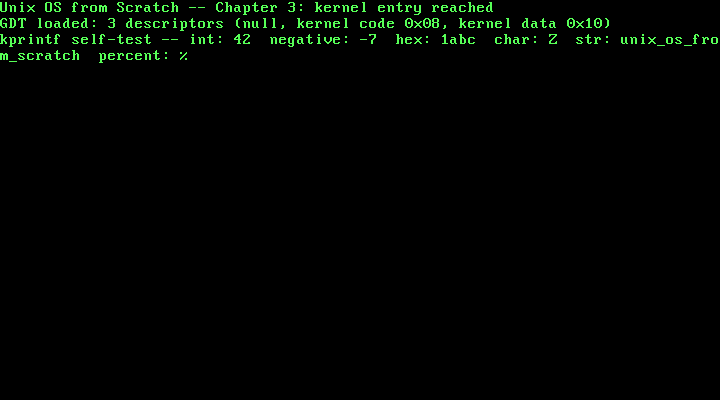

# 3. A Real GDT and a Kernel printf

**What you will understand:** why a kernel needs to own its Global Descriptor Table rather than keep running on the transient one GRUB left behind, the exact byte layout of a segment descriptor and why this book's own flat-memory-model descriptors decode to the specific bytes `0x9A` and `0x92`, why reloading `CS` needs a far jump instead of an ordinary `mov`, and how this book's first genuinely reusable utility -- a real, variadic `kprintf` -- gets built on freestanding C's own `<stdarg.h>` with no C library underneath it.

**What you need to know first:** Chapters 1 and 2 (the boot chain, the serial driver, the VGA driver). No new hardware is introduced for its own sake this chapter -- the GDT and `kprintf` are both infrastructure later chapters will lean on.

## Why this is a new Part

Chapter 2 was about talking to a piece of *hardware* -- the VGA framebuffer -- directly. This chapter is not about hardware in that sense: the GDT is a CPU data structure, not a device, and `kprintf` is a pure software utility built on top of drivers that already exist. Both are still infrastructure the rest of this book leans on rather than device-facing work in their own right, which is different enough from Part 2's own focus to earn a new Part: kernel infrastructure -- the descriptor tables and small utilities later chapters will assume already exist.

## Why this kernel needs its own GDT

Every chapter so far has run on a GDT this book never installed. That is not an oversight: it is one of the real machine-state guarantees GRUB and the Multiboot2 spec make on this kernel's behalf, alongside 32-bit protected mode and disabled interrupts. But "some GDT is loaded and it happens to work" is not the same claim as "this kernel's own code defines every segment it runs under" -- GRUB's GDT belongs to GRUB, its exact contents are not part of any specification this book can cite, and nothing guarantees it stays that way across a different GRUB version or boot path. This chapter replaces it with three descriptors this kernel owns outright: the mandatory null descriptor, one flat 4 GiB kernel code segment, and one flat 4 GiB kernel data segment -- a **flat memory model**, where x86 protected mode's segmentation hardware is technically still active (it cannot be fully turned off) but does no real work, because every segment covers the entire 4 GiB address space identically. Real memory protection, later in this book, comes from paging instead.

## A segment descriptor, byte by byte

Each GDT entry is 8 bytes, and the exact placement of every field inside those 8 bytes is real, fixed hardware layout -- quoted here from the OSDev Wiki's own worked encoding function rather than re-derived from guesswork:

```text
+-------------------------------------------------------------+
|  One 8-byte GDT entry (OSDev Wiki, "GDT Tutorial")             |
|                                                                 |
|  byte 0-1   limit bits 0-15                                    |
|  byte 2-4   base bits 0-23 (split across three bytes)          |
|  byte 5     access byte                                        |
|  byte 6     upper nibble: flags (G, DB, L, AVL)                |
|             lower nibble: limit bits 16-19                     |
|  byte 7     base bits 24-31                                    |
+-------------------------------------------------------------+
```

Splitting a 32-bit base address and a 20-bit limit across non-contiguous bytes like this looks arbitrary, and it is -- this is 1980s hardware design, constrained by what the original 80286's descriptor cache could load efficiently, carried forward unchanged for backward compatibility ever since. `003_gdt.c`'s own `struct gdt_entry` below packs exactly this layout, field for field.

## `003_gdt.h`: one function, deliberately small

```c
#ifndef UNIX_OS_003_GDT_H
#define UNIX_OS_003_GDT_H

/* Installs this book's own Global Descriptor Table, replacing whatever
 * transient GDT GRUB left behind. See 003_gdt.c for why that matters. */
void gdt_init(void);

#endif
```

## `003_gdt.c`: three descriptors, derived rather than copied

```c
/* Chapter 3: this book's own Global Descriptor Table (GDT). GRUB already
 * left the CPU in 32-bit protected mode with *some* valid GDT loaded --
 * that is one of the real machine-state guarantees the Multiboot2 spec
 * makes, and it is why every chapter so far has been able to run at all.
 * But that GDT belongs to GRUB, not to this kernel: its exact contents
 * are not part of any spec this book can rely on, and nothing stops a
 * later chapter (or GRUB itself, on a different build) from shaping it
 * differently. This chapter installs a GDT this kernel owns and fully
 * understands, with exactly three descriptors: the mandatory null
 * descriptor, one flat 4 GiB kernel code segment, and one flat 4 GiB
 * kernel data segment -- a "flat memory model," where segmentation is
 * present (x86 protected mode cannot fully turn it off) but does no real
 * work, because every segment covers the entire address space. */

#include <stdint.h>

#include "003_gdt.h"

/* One 8-byte GDT entry, packed field-by-field exactly as the hardware
 * reads it (OSDev Wiki, "GDT Tutorial", encodeGdtEntry): limit bits
 * 0-15, base bits 0-23 split across three bytes, one access byte, one
 * byte whose upper nibble is flags (G/DB/L/AVL) and whose lower nibble
 * is limit bits 16-19, then base bits 24-31. */
struct gdt_entry {
    uint16_t limit_low;
    uint16_t base_low;
    uint8_t  base_middle;
    uint8_t  access;
    uint8_t  granularity;
    uint8_t  base_high;
} __attribute__((packed));

/* The structure LGDT actually loads: a 16-bit limit (the GDT's size in
 * bytes, minus one) followed by a 32-bit linear base address -- 48 bits
 * total (OSDev Wiki, "GDT Tutorial": "gdtr DW 0 ; For limit storage /
 * DD 0 ; For base storage"). */
struct gdt_ptr {
    uint16_t limit;
    uint32_t base;
} __attribute__((packed));

#define GDT_ENTRY_COUNT 3
static struct gdt_entry gdt_entries[GDT_ENTRY_COUNT];
static struct gdt_ptr   gdt_pointer;

/* Implemented in 003_gdt_flush.asm: loads gdt_pointer with LGDT, then
 * reloads every segment register -- CS included, via a far jump, since
 * "changing the CS register requires code resembling a jump or call to
 * elsewhere, as this is the only way its value is meant to be changed"
 * (OSDev Wiki, "GDT Tutorial"). */
extern void gdt_flush(uint32_t gdt_ptr_addr);

static void gdt_set_entry(int index, uint32_t base, uint32_t limit,
                           uint8_t access, uint8_t flags) {
    gdt_entries[index].base_low    = (uint16_t) (base & 0xFFFF);
    gdt_entries[index].base_middle = (uint8_t)  ((base >> 16) & 0xFF);
    gdt_entries[index].base_high   = (uint8_t)  ((base >> 24) & 0xFF);

    gdt_entries[index].limit_low   = (uint16_t) (limit & 0xFFFF);
    /* Upper nibble = flags (G, DB, L, AVL); lower nibble = limit bits
     * 16-19, per the byte layout cited above. */
    gdt_entries[index].granularity = (uint8_t) (((limit >> 16) & 0x0F) | (flags & 0xF0));

    gdt_entries[index].access = access;
}

void gdt_init(void) {
    /* Entry 0: the mandatory null descriptor. The CPU requires selector
     * 0 to be invalid, so segment registers can be zeroed to mean "no
     * segment" -- this entry's contents are never read as a real
     * segment. */
    gdt_set_entry(0, 0, 0, 0, 0);

    /* Entry 1: kernel code, ring 0, flat 4 GiB. The access byte's bits,
     * cited from the OSDev Wiki's own access-byte table ("Global
     * Descriptor Table"):
     *   P  (bit 7) = 1  -- "Must be set (1) for any valid segment."
     *   DPL(6-5)   = 00 -- "0 = highest privilege (kernel)"
     *   S  (bit 4) = 1  -- "it defines a code or data segment"
     *   E  (bit 3) = 1  -- "it defines a code segment which can be
     *                       executed from"
     *   DC (bit 2) = 0  -- non-conforming: only ring 0 may execute it
     *   RW (bit 1) = 1  -- "read access is allowed" (code needs this to
     *                       let the CPU fetch literals stored in .text)
     *   A  (bit 0) = 0  -- accessed bit, cleared until the CPU sets it
     * packed high-to-low: 1 0 0 1 1 0 1 0 = 0x9A. */
    gdt_set_entry(1, 0, 0xFFFFF, 0x9A, 0xC0);

    /* Entry 2: kernel data, ring 0, flat 4 GiB. Same P/DPL/S bits as
     * entry 1, but E (bit 3) = 0 -- "it defines a data segment" -- and
     * bit 1 becomes the writable bit (data needs write access for a
     * stack and globals to work at all): 1 0 0 1 0 0 1 0 = 0x92. */
    gdt_set_entry(2, 0, 0xFFFFF, 0x92, 0xC0);

    /* Flags nibble (upper nibble of the granularity byte), cited from
     * the same access/flags reference:
     *   G  = 1 -- "the Limit is in 4 KiB blocks" (0xFFFFF limit units
     *              of 4 KiB covers the full 4 GiB address space)
     *   DB = 1 -- "it defines a 32-bit protected mode segment"
     *   L  = 0 -- not a 64-bit long-mode code segment
     *   AVL= 0 -- unused by this kernel
     * packed as the upper nibble: 1100 = 0xC, shifted up 4 bits -> 0xC0,
     * matching the 0xC0 passed to gdt_set_entry above. */

    gdt_pointer.limit = (uint16_t) (sizeof(gdt_entries) - 1);
    gdt_pointer.base  = (uint32_t) &gdt_entries;

    gdt_flush((uint32_t) &gdt_pointer);
}
```

Three things worth slowing down on:

**The access byte is derived, not looked up.** `0x9A` for code and `0x92` for data are real, standard values -- but this chapter builds them from the OSDev Wiki's own bit-by-bit access-byte reference rather than asserting them as memorized constants:

> "**P (Present):** Allows an entry to refer to a valid segment. Must be set (1) for any valid segment."
> "**DPL (Descriptor Privilege Level):** Contains the CPU Privilege level of the segment. 0 = highest privilege (kernel), 3 = lowest privilege (user applications)."
> "**S (Descriptor Type):** If clear (0) the descriptor defines a system segment. If set (1) it defines a code or data segment."
> "**E (Executable):** If clear (0) the descriptor defines a data segment. If set (1) it defines a code segment which can be executed from."
> "**RW (Readable/Writable):** ... Readable bit. If clear (0), read access for this segment is not allowed. If set (1) read access is allowed."

(OSDev Wiki, "Global Descriptor Table": https://wiki.osdev.org/Global_Descriptor_Table)

For the kernel code segment: `P=1, DPL=00, S=1, E=1, DC=0` (non-conforming), `RW=1` (readable, so the CPU can fetch literals out of `.text`), `A=0` -- packed high bit to low bit, `1 0 0 1 1 0 1 0`, which is exactly `0x9A`. For the kernel data segment, only `E` changes (data, not code) and bit 1 becomes the writable bit instead of readable -- `1 0 0 1 0 0 1 0`, exactly `0x92`. Two real hardware values, both reconstructed from a real bit-level citation rather than pasted from memory.

**The flags nibble makes the limit mean 4 GiB, not 1 MiB.** The `G` (granularity) bit, also cited from the OSDev Wiki: "If set (1), the Limit is in 4 KiB blocks." A raw 20-bit limit field can only count up to `0xFFFFF` -- about 1 MiB by itself -- but with `G=1`, each unit means 4 KiB instead of 1 byte, so `0xFFFFF * 4 KiB` covers the full 4 GiB a 32-bit address space can reach. `DB=1` -- "it defines a 32-bit protected mode segment" -- is the other bit this chapter sets; `L` (64-bit long mode) and `AVL` stay 0. Packed as the flags nibble: `1100`, shifted into the top nibble of the granularity byte: `0xC0`.

**`gdt_flush` is real assembly, not a C intrinsic.** Setting up the three `struct gdt_entry` values in C is ordinary work, but *activating* them is not something C's language ever exposes: it means executing the real `LGDT` instruction and then reloading every segment register the CPU has, `CS` included -- and the OSDev Wiki is explicit about why that last part cannot be plain C or even a plain `mov`:

> "Whatever you do with the GDT has no effect on the CPU until you load new Segment Selectors into Segment Registers... changing the CS register requires code resembling a jump or call to elsewhere, as this is the only way its value is meant to be changed."

(OSDev Wiki, "GDT Tutorial": https://wiki.osdev.org/GDT_Tutorial)

## `003_gdt_flush.asm`: the far jump, for real

```nasm
; Chapter 3: loading a new GDT is two real steps, not one. LGDT alone only
; tells the CPU where the table lives -- it does not, by itself, change
; anything the CPU is currently using. Every segment register still holds
; whatever selector it held before, and those old selectors keep working
; only by coincidence, if the new table happens to define compatible
; descriptors at the same indices. This routine makes the switch real:
; load the table, then explicitly reload every segment register,
; including CS, which cannot be reloaded with a plain MOV (OSDev Wiki,
; "GDT Tutorial": "changing the CS register requires code resembling a
; jump or call to elsewhere, as this is the only way its value is meant
; to be changed").
BITS 32

section .text
global gdt_flush
gdt_flush:
    mov eax, [esp + 4]     ; cdecl: the one argument (a gdt_ptr*) is on
                            ; the stack, 4 bytes above the return address
    lgdt [eax]              ; load GDTR from the gdt_ptr struct this
                            ; points at (2-byte limit, 4-byte base)

    mov ax, 0x10            ; kernel data selector: GDT index 2, and
                            ; 2 * 8 bytes-per-entry = 0x10
    mov ds, ax
    mov es, ax
    mov fs, ax
    mov gs, ax
    mov ss, ax

    jmp 0x08:.reload_cs     ; far jump to kernel code selector (index 1,
                            ; 1 * 8 = 0x08) -- the only way to reload CS
.reload_cs:
    ret
```

`lgdt [eax]` loads the CPU's GDTR register from the 6-byte `gdt_ptr` structure `003_gdt.c` built. The five ordinary `mov ... , ax` lines reload every data-family segment register with selector `0x10` (GDT index 2, the kernel data descriptor -- each entry is 8 bytes, so index x8 gives the selector). `CS` is the one register those `mov`s cannot touch, and `jmp 0x08:.reload_cs` is the "code resembling a jump" the citation above calls for: a far jump, encoding both a new selector (`0x08`, index 1 x8, the kernel code descriptor) and a target address in the same instruction, which is the one CPU-sanctioned way to change what `CS` holds.

**[COMMON TRAP]** Getting the selector arithmetic wrong here does not raise a compiler warning, a linker error, or even necessarily an immediate crash -- it can boot into a machine now running instructions from the wrong privilege level or the wrong descriptor entirely, or triple-fault instantly with no diagnostic at all. This chapter's own build output below includes a real halt-and-inspect step for exactly that reason: reaching `kmain`'s first `kprintf` line at all, after `gdt_init()` has already run, is itself the evidence that the far jump landed correctly.

## `003_serial.h`/`003_serial.c`: a promise from Chapter 2, kept

Chapters 1 and 2 each carried their own private copy of the COM1 UART driver, because nothing yet needed it from more than one file at once. Chapter 2 said outright that refactor was "left for whenever this book actually needs `serial_puts` from more than one place at once, rather than done speculatively now." This chapter's own `kprintf` is that moment: it needs to reach the serial port from `003_printf.c` without a third copy-paste. The driver itself is unchanged from Chapters 1 and 2 -- only its home changed.

## `003_printf.h`/`003_printf.c`: this kernel's own printf

```c
#ifndef UNIX_OS_003_PRINTF_H
#define UNIX_OS_003_PRINTF_H

/* A small, real printf-family function this kernel owns outright -- no
 * libc, no hosted <stdio.h>, just this book's own formatting logic on
 * top of the serial and VGA drivers already built. Supports %d, %u, %x,
 * %c, %s, and a literal %%; nothing else (no width/precision/padding
 * specifiers) -- enough for this book's own debug output going forward,
 * grown further only when a later chapter genuinely needs more. */
void kprintf(const char *fmt, ...);

#endif
```
```c
/* Chapter 3: this kernel's own printf, built on top of two drivers this
 * book already has -- COM1 serial (Chapter 1) and the VGA framebuffer
 * (Chapter 2) -- rather than on any C library. Freestanding C still
 * gives this file <stdarg.h> for real (it is a compiler-support header,
 * not part of the hosted standard library this kernel deliberately does
 * without), which is what makes a variadic function like this possible
 * at all. */

#include <stdarg.h>

#include "003_printf.h"
#include "003_serial.h"
#include "003_vga.h"

/* Every character this file ever emits goes through here, to both real
 * output devices this book has built so far -- so a single kprintf call
 * shows up identically in the exact, capturable serial log and on the
 * real (emulated) screen. */
static void kputc(char c) {
    serial_putc(c);
    vga_putc(c);
}

static void kprint_uint(unsigned int value, unsigned int base, int uppercase) {
    char buf[32];
    const char *digits = uppercase ? "0123456789ABCDEF" : "0123456789abcdef";
    int i = 0;

    if (value == 0) {
        buf[i++] = '0';
    } else {
        while (value > 0) {
            buf[i++] = digits[value % base];
            value /= base;
        }
    }
    /* Digits were produced least-significant-first; emit them in
     * reverse so they read correctly. */
    while (i > 0) {
        kputc(buf[--i]);
    }
}

static void kprint_int(int value) {
    if (value < 0) {
        kputc('-');
        /* Negate into an unsigned value before printing, so the most
         * negative int (whose magnitude has no positive int
         * representation) still prints correctly. */
        kprint_uint((unsigned int) (-(long long) value), 10, 0);
    } else {
        kprint_uint((unsigned int) value, 10, 0);
    }
}

void kprintf(const char *fmt, ...) {
    va_list args;
    va_start(args, fmt);

    for (const char *p = fmt; *p; p++) {
        if (*p != '%') {
            kputc(*p);
            continue;
        }
        p++;
        switch (*p) {
            case 'd':
                kprint_int(va_arg(args, int));
                break;
            case 'u':
                kprint_uint(va_arg(args, unsigned int), 10, 0);
                break;
            case 'x':
                kprint_uint(va_arg(args, unsigned int), 16, 0);
                break;
            case 'c':
                kputc((char) va_arg(args, int));
                break;
            case 's': {
                const char *s = va_arg(args, const char *);
                for (; *s; s++) kputc(*s);
                break;
            }
            case '%':
                kputc('%');
                break;
            case '\0':
                /* A lone trailing '%' with nothing after it: step back
                 * so the for-loop's own p++ lands exactly on the
                 * string's real terminator, instead of reading past it. */
                p--;
                break;
            default:
                kputc('%');
                kputc(*p);
                break;
        }
    }

    va_end(args);
}
```

`<stdarg.h>` is worth pausing on: this kernel has no libc, no `<stdio.h>`, none of the hosted standard library -- but `<stdarg.h>` is different. It is a small, compiler-support header (`va_list`/`va_start`/`va_arg`/`va_end` are really compiler builtins wearing a header's clothes), not part of the hosted runtime this book deliberately excludes, so a freestanding build can use it exactly like any hosted C program would.

Every character `kprintf` ever emits funnels through one static `kputc`, which writes to both real output devices this book has built -- COM1 serial and the VGA framebuffer -- so a single call produces identical text in this chapter's exact, capturable serial log and on the real (emulated) screen at the same time. `kprint_uint`/`kprint_int` build decimal and hexadecimal output digit by digit, least-significant-digit first into a small stack buffer, then emit that buffer in reverse -- the standard shape for converting a binary integer to text without a library. The format loop itself supports five real conversions (`%d`, `%u`, `%x`, `%c`, `%s`) plus a literal `%%`, and one deliberate piece of defensive handling: a format string ending in a lone `%` steps the loop pointer back rather than reading one byte past the string's own null terminator.

## `003_kmain.c`: installing the GDT, then printing through it

```c
/* Chapter 3: kmain now installs this book's own GDT before doing
 * anything else, then proves it survived by continuing to run at all --
 * a bad GDT install does not print an error, it triple-faults the
 * machine immediately. Everything after that uses kprintf instead of
 * raw serial_puts/vga_puts calls, this chapter's own real formatted
 * output running with no libc underneath it. Like Chapter 2, this
 * kmain deliberately never exits: it falls through to 003_boot.asm's
 * own halt loop so a QEMU monitor session, connected from outside,
 * still has a live machine to screendump. */

#include "003_gdt.h"
#include "003_printf.h"
#include "003_serial.h"
#include "003_vga.h"

void kmain(void) {
    serial_init();
    vga_init();
    vga_set_color(VGA_COLOR_LIGHT_GREEN, VGA_COLOR_BLACK);

    gdt_init();

    kprintf("Unix OS from Scratch -- Chapter 3: kernel entry reached\n");
    kprintf("GDT loaded: 3 descriptors (null, kernel code 0x08, kernel data 0x10)\n");
    kprintf("kprintf self-test -- int: %d  negative: %d  hex: %x  char: %c  str: %s  percent: %%\n",
            42, -7, 0x1abc, 'Z', "unix_os_from_scratch");
}
```

`gdt_init()` runs before any `kprintf` call -- deliberately: everything printed afterward is running under this kernel's own code and data descriptors, not GRUB's, so reaching the first `kprintf` line at all is this chapter's own proof that the GDT install and the far jump both worked. Like Chapter 2's `kmain`, this one never calls `qemu_exit`: it falls through to `003_boot.asm`'s halt loop, keeping the machine alive so an external QEMU monitor session has time to take a real screenshot, the same technique Chapter 2 introduced.

## Building it, for real

```bash
nasm -f elf32 003_boot.asm -o boot.o
nasm -f elf32 003_gdt_flush.asm -o gdt_flush.o
gcc -m32 -ffreestanding -fno-stack-protector -fno-pic -Wall -Wextra -c 003_vga.c -o vga.o
gcc -m32 -ffreestanding -fno-stack-protector -fno-pic -Wall -Wextra -c 003_serial.c -o serial.o
gcc -m32 -ffreestanding -fno-stack-protector -fno-pic -Wall -Wextra -c 003_gdt.c -o gdt.o
gcc -m32 -ffreestanding -fno-stack-protector -fno-pic -Wall -Wextra -c 003_printf.c -o printf.o
gcc -m32 -ffreestanding -fno-stack-protector -fno-pic -Wall -Wextra -c 003_kmain.c -o kmain.o
ld -m elf_i386 -T 003_linker.ld -o kernel.bin boot.o gdt_flush.o vga.o serial.o gdt.o printf.o kmain.o
grub-file --is-x86-multiboot2 kernel.bin
```

**Output (cloud sandbox -- real, live-executed build output):**

```text
=== nasm -f elf32 003_boot.asm -o boot.o ===

=== nasm -f elf32 003_gdt_flush.asm -o gdt_flush.o ===

=== gcc -m32 -ffreestanding -fno-stack-protector -fno-pic -Wall -Wextra -c 003_vga.c -o vga.o ===

=== gcc -m32 -ffreestanding -fno-stack-protector -fno-pic -Wall -Wextra -c 003_serial.c -o serial.o ===

=== gcc -m32 -ffreestanding -fno-stack-protector -fno-pic -Wall -Wextra -c 003_gdt.c -o gdt.o ===

=== gcc -m32 -ffreestanding -fno-stack-protector -fno-pic -Wall -Wextra -c 003_printf.c -o printf.o ===

=== gcc -m32 -ffreestanding -fno-stack-protector -fno-pic -Wall -Wextra -c 003_kmain.c -o kmain.o ===

=== ld -m elf_i386 -T 003_linker.ld -o kernel.bin boot.o gdt_flush.o vga.o serial.o gdt.o printf.o kmain.o ===
ld: warning: gdt_flush.o: missing .note.GNU-stack section implies executable stack
ld: NOTE: This behaviour is deprecated and will be removed in a future version of the linker
ld: warning: kernel.bin has a LOAD segment with RWX permissions

=== grub-file --is-x86-multiboot2 kernel.bin ===
kernel.bin: VALID Multiboot2 image
```

Six real source files this time -- two assembled, five compiled -- and every one of the five C files built with zero warnings under `-Wall -Wextra`, GDT bit-twiddling included. The same two `ld` warnings from Chapters 1 and 2 (`missing .note.GNU-stack section`, `LOAD segment with RWX permissions`) appear again, for the same already-explained reason: no paging yet, so no MMU-enforced permission system for those ELF-level flags to actually mean anything.

## Booting it and reading real formatted output back

```bash
mkdir -p isodir/boot/grub
cp kernel.bin isodir/boot/kernel.bin
cp grub.cfg isodir/boot/grub/grub.cfg
grub-mkrescue -o kernel.iso isodir
qemu-system-x86_64 -cdrom kernel.iso -serial file:serial_out.log -display none -no-reboot \
    -monitor unix:/tmp/qemu_monitor.sock,server,nowait &
```

As in Chapter 2, this run never calls `qemu_exit` -- the machine halts and stays halted, and a second process connects to the monitor socket to `screendump` the real VGA output before sending `quit`. The serial log, though, needs no monitor session at all: `-serial file:serial_out.log` writes it to disk in real time, so it is already complete and readable the moment the kernel finishes its three `kprintf` calls, whether or not anything ever inspects the machine from outside.

**Output (cloud sandbox -- real, live-executed serial capture, QEMU 8.2.2):**

```text
Unix OS from Scratch -- Chapter 3: kernel entry reached
GDT loaded: 3 descriptors (null, kernel code 0x08, kernel data 0x10)
kprintf self-test -- int: 42  negative: -7  hex: 1abc  char: Z  str: unix_os_from_scratch  percent: %
```

`42`, `-7`, `1abc`, `Z`, `unix_os_from_scratch`, and a literal `%` -- every value passed to the single `kprintf` call in `003_kmain.c`, decoded back out correctly by this chapter's own hand-written formatting code, with no C library underneath it and running entirely under this chapter's own GDT rather than GRUB's.

The same call also drew onto the real VGA screen, captured with the QEMU monitor's own `screendump` command:



The third `kprintf` line is long enough to reach VGA text mode's 80-column width and wrap onto a fourth screen row mid-word (`unix_os_fro` / `m_scratch`) -- real behavior from Chapter 2's own `vga_putc` column-wrap logic, now being exercised for the first time by output this chapter's `kprintf` produced rather than a hand-written `vga_puts` call, and it lines up exactly with the unwrapped text in the serial log above.

## Chapter summary

A kernel that keeps running on the bootloader's own leftover GDT is not owning a piece of its own machine state -- this chapter replaces it with three descriptors this kernel defines and fully understands: a null descriptor, and a flat 4 GiB code and data segment, whose access bytes (`0x9A`, `0x92`) and flags nibble (`0xC`) were derived bit by bit from the OSDev Wiki's own access-byte reference rather than pasted from memory. Activating a new GDT is two real steps, not one -- `LGDT` to point the CPU at the table, then an explicit reload of every segment register, with `CS` needing a real far jump rather than a `mov`, since no other instruction is allowed to change it. On top of that now-owned GDT, this chapter built this book's first genuinely reusable utility: a real `kprintf`, using freestanding C's own `<stdarg.h>` and no C library, writing identical output to both real devices this book has built so far -- and this chapter also finally paid off a refactor Chapter 2 explicitly deferred, moving the COM1 driver into its own shared header now that more than one file needs it.

## Self-check questions

1. Chapters 1 and 2 both ran correctly without this book ever installing its own GDT. What was actually providing a valid GDT during those chapters, and why does this chapter replace it anyway?
2. Derive the kernel code segment's access byte from the bit meanings this chapter cites (P, DPL, S, E, DC, RW, A) and confirm it equals `0x9A`.
3. Why can every segment register except `CS` be reloaded with a plain `mov`, while `CS` specifically needs a far jump?
4. Why does `003_printf.c` include `<stdarg.h>` at all, given that this kernel has no C library and no hosted `<stdio.h>`?
5. This chapter's `kmain` calls `gdt_init()` before its first `kprintf` call, rather than after. Why does that ordering itself count as real evidence that the GDT install worked?

**Worked answers**

1. GRUB itself set up a valid, working GDT before jumping into this kernel's own code -- one of the real machine-state guarantees the Multiboot2 spec makes, alongside 32-bit protected mode and disabled interrupts. Chapters 1 and 2 ran correctly on top of it by inheriting that guarantee, not because this book had installed anything. This chapter replaces it anyway because that GDT belongs to GRUB: its exact contents are not part of any spec this book can cite, and this kernel does not fully understand or control what it contains.
2. `P=1` (bit 7, "must be set for any valid segment"), `DPL=00` (bits 6-5, kernel privilege), `S=1` (bit 4, code/data segment rather than a system segment), `E=1` (bit 3, "defines a code segment which can be executed from"), `DC=0` (bit 2, non-conforming), `RW=1` (bit 1, "read access is allowed," needed so the CPU can fetch literals out of `.text`), `A=0` (bit 0, accessed bit, cleared initially). Packed high bit to low bit: `1 0 0 1 1 0 1 0` = `0x9A`.
3. Every other segment register (`DS`, `ES`, `FS`, `GS`, `SS`) is a plain data value the CPU lets ordinary instructions overwrite directly. `CS` is different because it is tied to the instruction pointer's own execution context -- the CPU only re-evaluates `CS` (and enforces the privilege/executability rules attached to whatever descriptor it now names) at the moment control transfers somewhere, which is exactly what a jump or call instruction does and a `mov` does not.
4. `<stdarg.h>` is a compiler-support header, not part of the hosted C standard library this kernel deliberately excludes -- `va_list`/`va_start`/`va_arg`/`va_end` are effectively compiler builtins with a header's syntax around them, available to a freestanding build exactly as they would be to a hosted one. Nothing about supporting a variadic function requires libc.
5. A bad GDT install does not produce a diagnostic message or a graceful failure -- an invalid or wrongly-encoded descriptor, or a far jump to the wrong selector, typically triple-faults the machine immediately, with no serial output and no screen output at all. Because `gdt_init()` runs first, the fact that `kmain` goes on to execute three real `kprintf` calls afterward -- calls that themselves only work correctly if the CPU is still executing sane code under a sane `CS` -- is itself the chapter's evidence that the descriptors were encoded correctly and the far jump landed where it was supposed to.
