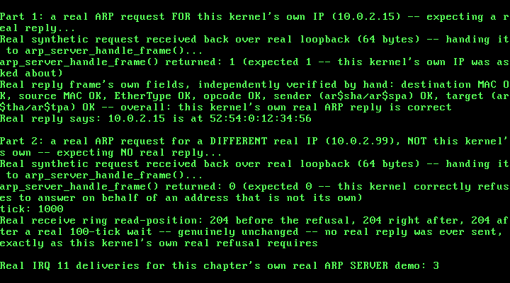

# 31. A Real ARP Server: Answering Requests About This Kernel's Own Address

**What you will understand:** the real reply half of RFC 826's own full "Packet Reception" algorithm -- the exact branch Chapter 28's own ARP client and Chapter 29's own ARP cache both explicitly named as out of scope -- implemented as a real, minimal ARP SERVER (`031_arp_server.h`/`031_arp_server.c`) that answers an incoming request about THIS kernel's own address and honestly refuses to answer on behalf of any other; a real synthetic-request-over-loopback demo technique, extending Chapter 30's own synthetic-frame-over-loopback precedent to a case with no cooperating external asker at all; and a real, honest engineering pivot this chapter's own testing forced -- discovering that `031_rtl8139.c`'s own `rtl8139_receive_next_packet()` is a genuinely BLOCKING real wait that never returns 0, which cannot be used to prove a negative, and fixing the refusal proof to use this driver's own already-exposed `rtl8139_get_rx_offset()` instead.

**What you need to know first:** Chapter 28's own real, minimal ARP client (`031_arp.h`/`031_arp.c`) and its own explicit statement that this kernel "never answers an incoming ARP request asking about its own address, only ever asks about someone else's" -- the exact gap this chapter fills; Chapter 29's own real ARP cache, whose own top-of-file comment already named RFC 826's full reception algorithm and implemented only its Merge_flag/table-update half; and Chapters 25-27's own real RTL8139 driver, whose own hardware loopback mode (every transmitted frame routed straight back to this same device's own receiver, on-chip) this chapter's demo relies on for the same real reason Chapter 30's own Fedwire demo did.

## RFC 826's real reply branch -- the gap two earlier chapters named and left open

`031_arp.h`'s own top-of-file comment, carried forward unchanged from Chapter 28, states this kernel's own real out-of-scope boundary plainly: "no real ARP SERVER behavior -- this kernel never answers an incoming ARP request asking about its own address, only ever asks about someone else's." Chapter 29's own real ARP cache filled in RFC 826's own Merge_flag/table-update logic but left the reply branch itself untouched. This chapter closes that gap, cited directly from RFC 826's own full "Packet Reception" algorithm (https://www.rfc-editor.org/rfc/rfc826.html), re-fetched to confirm exact wording rather than trusted from an earlier paraphrase:

```text
?Am I the target protocol address? Yes: If Merge_flag is false, add the triplet
<protocol type, sender protocol address, sender hardware address> to the
translation table. ?Is the opcode ares_op$REQUEST? (NOW look at the opcode!!)
Yes: Swap hardware and protocol fields, putting the local hardware and protocol
addresses in the sender fields. Set the ar$op field to ares_op$REPLY. Send the
packet to the (new) target hardware address on the same hardware on which the
request was received.
```

This chapter's own real, honest scope note, stated directly in `031_arp_server.h`: RFC 826's own quoted branch above couples the reply step with the Merge_flag table-update step ("If Merge_flag is false, add the triplet ... to the translation table"). This chapter deliberately implements only the reply half, not the merge half -- feeding an incoming request's own sender information into Chapter 29's real ARP cache (`arp_cache_insert()`) would be a genuine, real behavior most production ARP implementations exhibit, but this chapter's own stated scope is reply-only, kept deliberately separate from Chapter 29's cache rather than silently coupling the two.

```c
#ifndef UNIX_OS_031_ARP_SERVER_H
#define UNIX_OS_031_ARP_SERVER_H

#include <stdint.h>

/* Real ARP SERVER behavior: this kernel answering an incoming request
 * about its OWN address, the one real gap every earlier ARP chapter
 * (28, 29) named explicitly as out of scope -- 031_arp.h's own
 * top-of-file comment states it plainly: "no real ARP SERVER behavior
 * -- this kernel never answers an incoming ARP request asking about
 * its own address, only ever asks about someone else's."
 *
 * Cited directly from RFC 826's own full "Packet Reception" algorithm
 * (https://www.rfc-editor.org/rfc/rfc826.html), the second half Chapter
 * 29 deliberately left unimplemented (Chapter 29 only ever implemented
 * the Merge_flag/table-update half). The real branch this chapter
 * implements, quoted directly (re-fetched to confirm exact wording):
 *
 *   "?Am I the target protocol address? Yes: ... ?Is the opcode
 *   ares_op$REQUEST? (NOW look at the opcode!!) Yes: Swap hardware and
 *   protocol fields, putting the local hardware and protocol addresses
 *   in the sender fields. Set the ar$op field to ares_op$REPLY. Send
 *   the packet to the (new) target hardware address on the same
 *   hardware on which the request was received."
 *
 * Real, honest scope note: RFC 826's own quoted branch above couples
 * the reply step with a Merge_flag table-update step ("If Merge_flag
 * is false, add the triplet ... to the translation table") -- this
 * chapter deliberately implements only the reply half, not the merge
 * half. Feeding an incoming request's own sender information into
 * Chapter 29's real ARP cache (arp_cache_insert()) would be a genuine,
 * real behavior most production ARP implementations exhibit, but this
 * chapter's own stated scope is reply-only, kept deliberately separate
 * from Chapter 29's cache rather than silently coupling the two.
 *
 * This kernel only ever speaks Ethernet/IPv4 (031_arp.h's own
 * ARP_HTYPE_ETHERNET/ARP_PTYPE_IPV4), so "Do I have the hardware type
 * in ar$hrd? ... Do I speak the protocol in ar$pro?" -- RFC 826's own
 * opening two checks, already implemented once in 031_arp.c's own
 * arp_receive_reply() -- are repeated here rather than shared, since
 * this chapter's own arp_server_handle_frame() takes a raw received
 * frame directly (a real incoming request, not a reply this kernel is
 * itself waiting on) and needs its own independent parse. */

/* Examines one real received frame. If it is a real ARP request (RFC
 * 826 ar$op == REQUEST) whose own target protocol address (ar$tpa)
 * matches `my_ip`, builds and sends a real ARP reply -- per RFC 826's
 * own quoted branch above -- to the real requester's own hardware
 * address, and returns 1. Otherwise (not ARP at all, not Ethernet/
 * IPv4, not a REQUEST, or a REQUEST for a different real target IP)
 * does nothing and returns 0 -- this kernel's own real refusal to
 * answer on behalf of an address that is not its own, never a
 * partial or best-effort reply. */
int arp_server_handle_frame(const uint8_t *rx_frame, uint32_t rx_len,
                             const uint8_t *my_mac, const uint8_t my_ip[4]);

#endif
```

```c
/* See 031_arp_server.h's own top-of-file comment for the full real
 * citation of the RFC 826 branch implemented here. */

#include <stdint.h>

#include "031_arp_server.h"
#include "031_arp.h"
#include "031_rtl8139.h"

/* Same real byte offsets 031_arp.c's own top-of-file already
 * establishes for a real 60-byte ARP-over-Ethernet frame -- repeated
 * here (not shared via a header) since neither file currently exposes
 * them outside its own translation unit, and this chapter does not
 * change that. */
#define ETH_HDR_SIZE 14u
#define ARP_OFF_HTYPE       (ETH_HDR_SIZE + 0u)
#define ARP_OFF_PTYPE       (ETH_HDR_SIZE + 2u)
#define ARP_OFF_HLEN        (ETH_HDR_SIZE + 4u)
#define ARP_OFF_PLEN        (ETH_HDR_SIZE + 5u)
#define ARP_OFF_OPCODE      (ETH_HDR_SIZE + 6u)
#define ARP_OFF_SENDER_MAC  (ETH_HDR_SIZE + 8u)
#define ARP_OFF_SENDER_IP   (ETH_HDR_SIZE + 14u)
#define ARP_OFF_TARGET_MAC  (ETH_HDR_SIZE + 18u)
#define ARP_OFF_TARGET_IP   (ETH_HDR_SIZE + 24u)

int arp_server_handle_frame(const uint8_t *rx_frame, uint32_t rx_len,
                             const uint8_t *my_mac, const uint8_t my_ip[4]) {
    /* Too short to even hold a real Ethernet header plus a real
     * 28-byte ARP payload -- cannot be a real request this kernel
     * could answer. */
    if (rx_len < ETH_HDR_SIZE + 28u) {
        return 0;
    }

    uint16_t ethertype = (uint16_t) ((rx_frame[12] << 8) | rx_frame[13]);
    if (ethertype != ETHERTYPE_ARP) {
        return 0;
    }

    /* RFC 826's own opening two checks -- "Do I have the hardware
     * type in ar$hrd? ... Do I speak the protocol in ar$pro?" --
     * before trusting anything else in the packet. This kernel only
     * ever speaks one real hardware/protocol pair. */
    uint16_t htype = (uint16_t) ((rx_frame[ARP_OFF_HTYPE] << 8) |
                                  rx_frame[ARP_OFF_HTYPE + 1]);
    uint16_t ptype = (uint16_t) ((rx_frame[ARP_OFF_PTYPE] << 8) |
                                  rx_frame[ARP_OFF_PTYPE + 1]);
    if (htype != ARP_HTYPE_ETHERNET || ptype != ARP_PTYPE_IPV4 ||
        rx_frame[ARP_OFF_HLEN] != ARP_HLEN_ETHERNET ||
        rx_frame[ARP_OFF_PLEN] != ARP_PLEN_IPV4) {
        return 0;
    }

    /* "?Is the opcode ares_op$REQUEST?" -- this chapter only ever
     * answers real requests, never reacts to a reply or any other
     * real opcode landing in this kernel's own receive ring. */
    uint16_t opcode = (uint16_t) ((rx_frame[ARP_OFF_OPCODE] << 8) |
                                   rx_frame[ARP_OFF_OPCODE + 1]);
    if (opcode != ARP_OP_REQUEST) {
        return 0;
    }

    /* "?Am I the target protocol address?" -- this kernel's own real
     * refusal boundary: a request for any OTHER real IP is not this
     * kernel's to answer, and gets no reply at all, not a best-effort
     * or wrong one. */
    for (uint32_t i = 0; i < 4u; i++) {
        if (rx_frame[ARP_OFF_TARGET_IP + i] != my_ip[i]) {
            return 0;
        }
    }

    /* Yes on both counts: build the real reply. RFC 826's own words --
     * "Swap hardware and protocol fields, putting the local hardware
     * and protocol addresses in the sender fields" -- the OLD sender
     * (the real requester) becomes the NEW reply's own target; this
     * kernel's own real MAC/IP become the NEW reply's own sender. */
    uint8_t requester_mac[6];
    uint8_t requester_ip[4];
    for (uint32_t i = 0; i < 6u; i++) {
        requester_mac[i] = rx_frame[ARP_OFF_SENDER_MAC + i];
    }
    for (uint32_t i = 0; i < 4u; i++) {
        requester_ip[i] = rx_frame[ARP_OFF_SENDER_IP + i];
    }

    uint8_t reply[ARP_FRAME_SIZE];

    /* Real Ethernet header: "Send the packet to the (new) target
     * hardware address" -- the real requester's own MAC, never
     * broadcast (unlike a request, a reply is unicast straight back
     * to whoever asked). Source: this kernel's own real MAC. */
    for (uint32_t i = 0; i < 6u; i++) {
        reply[i] = requester_mac[i];
        reply[6u + i] = my_mac[i];
    }
    reply[12] = (uint8_t) (ETHERTYPE_ARP >> 8);
    reply[13] = (uint8_t) ETHERTYPE_ARP;

    reply[ARP_OFF_HTYPE]     = (uint8_t) (ARP_HTYPE_ETHERNET >> 8);
    reply[ARP_OFF_HTYPE + 1] = (uint8_t) ARP_HTYPE_ETHERNET;
    reply[ARP_OFF_PTYPE]     = (uint8_t) (ARP_PTYPE_IPV4 >> 8);
    reply[ARP_OFF_PTYPE + 1] = (uint8_t) ARP_PTYPE_IPV4;
    reply[ARP_OFF_HLEN]      = (uint8_t) ARP_HLEN_ETHERNET;
    reply[ARP_OFF_PLEN]      = (uint8_t) ARP_PLEN_IPV4;
    /* "Set the ar$op field to ares_op$REPLY." */
    reply[ARP_OFF_OPCODE]     = (uint8_t) (ARP_OP_REPLY >> 8);
    reply[ARP_OFF_OPCODE + 1] = (uint8_t) ARP_OP_REPLY;

    for (uint32_t i = 0; i < 6u; i++) {
        reply[ARP_OFF_SENDER_MAC + i] = my_mac[i];        /* new sender: this kernel */
        reply[ARP_OFF_TARGET_MAC + i] = requester_mac[i]; /* new target: the real requester */
    }
    for (uint32_t i = 0; i < 4u; i++) {
        reply[ARP_OFF_SENDER_IP + i] = my_ip[i];
        reply[ARP_OFF_TARGET_IP + i] = requester_ip[i];
    }

    /* Real IEEE 802.3 minimum padding, same real convention every
     * frame this book builds has used since Chapter 25. */
    for (uint32_t i = ETH_HDR_SIZE + 28u; i < ARP_FRAME_SIZE; i++) {
        reply[i] = 0x00u;
    }

    /* Same real fix 031_arp.c's own arp_send_request() already
     * established: rtl8139_send_queue()'s own round-robin descriptor
     * allocation, never the single-descriptor rtl8139_send(), to
     * avoid Chapter 27's own already-documented same-descriptor-twice
     * hang. */
    int desc = rtl8139_send_queue(reply, ARP_FRAME_SIZE);
    if (desc < 0) {
        return 0;
    }
    rtl8139_wait_descriptor_sent(desc);
    return 1;
}
```

## A real problem this chapter's own testing found: proving a negative against a BLOCKING receive

This chapter's own real demo needs two proofs: that this kernel replies to a real request about its own IP, and -- per this chapter's own explicit scope -- that it does NOT reply to a real request about any other IP. The first proof is straightforward: send a real request, call `rtl8139_receive_next_packet()` once for the reply, check it arrived. The second is not, and this chapter's own first real attempt at it got it wrong.

The first version of this chapter's own refusal proof called `rtl8139_receive_next_packet()` in a real, bounded loop, planning to confirm it never returned a real frame. Booting that version in QEMU hung: the serial log showed Part 2's own `arp_server_handle_frame()` call correctly returning 0, then nothing further but a real PIT tick counter climbing forever. Reading `031_rtl8139.c`'s own `rtl8139_receive_next_packet()` line by line explained why: it is a genuinely BLOCKING real wait -- `for (;;) { ... __asm__ volatile ("hlt"); }` against a real packet header's own length field -- and it has no path that returns 0. Every earlier real call to it in this book (Chapter 27's own multi-frame demo, Chapter 28's own `arp_receive_reply()`, Chapter 30's own Fedwire exchange) is safe precisely because a real frame is always known to be coming. Calling it here, on a ring this kernel's own correct refusal means will stay genuinely empty, would `hlt` forever -- not a bug in the driver, a real mismatch between what this chapter's own proof needed and what that function's own real contract offers.

The real fix uses a different, already-exposed piece of this driver's own real state instead: `rtl8139_get_rx_offset()`, this driver's own real, honest read-position mirror, advanced only inside `rtl8139_receive_next_packet()` once a real frame has genuinely been consumed. `031_kmain.c`'s own new refusal proof below reads it directly, before and after `arp_server_handle_frame()` runs, then again after a real, bounded 100-tick (one real second at this chapter's own `TIMER_FREQUENCY_HZ`) wait -- giving any spurious real reply genuine time to arrive -- and confirms the offset never moved. It never calls the blocking receive function on a ring expected to stay empty, so this real proof cannot hang even if the refusal itself were wrong.

## `031_kmain.c`: the full real ARP SERVER demo

Everything through the end of Chapter 30's own real encrypt-then-MAC demo is carried forward unchanged, still run first. This chapter's own new work is appended after it, in two parts. Part 1 is the real positive case: re-enable real hardware loopback mode (already left on by the Fedwire demo just above, re-initialized here regardless, the same real, cheap, ordering-independent discipline this chapter's own earlier loopback sections already follow), build a real synthetic ARP request as if asked by a fictitious real neighbor host (`build_arp_request_frame()`, a new small helper mirroring `031_arp.c`'s own `arp_send_request()` but parameterized on an arbitrary sender, since that function only ever sends FROM this kernel's own real MAC/IP) targeting this kernel's own real IP, send it, receive it back over real loopback, hand it to `arp_server_handle_frame()`, and -- once it replies -- receive that real reply back too and independently verify every one of its own fields by hand (destination MAC, source MAC, EtherType, opcode, sender ar$sha/ar$spa, target ar$tha/ar$tpa) against RFC 826's own quoted branch above. Part 2 is the real refusal proof described above: the identical synthetic-request technique, this time targeting a different, not-this-kernel's-own real IP, proving both that `arp_server_handle_frame()` returns 0 and that the real receive ring's own read position genuinely never advances afterward.

```c
/* Everything through the end of Chapter 28's own real ARP demo below
 * -- ELF loading, private page directories, Chapter 19's own real
 * PIO-mode disk driver, Chapters 20-23's own FAT16 filesystem,
 * Chapter 24's own real, brute-force PCI scan, Chapters 25-27's own
 * real RTL8139 driver (interrupt-driven since Chapter 26,
 * multi-frame/CAPR-wraparound since Chapter 27), and Chapter 28's own
 * real, minimal ARP client resolving QEMU's own real default gateway
 * to its own real MAC address over one real request/reply round trip
 * -- is carried forward, still run first, so Chapter 27's own real
 * loopback proof and Chapter 28's own real ARP exchange both stay
 * exactly as they were. Chapter 28's own two files, 031_arp.h and
 * 031_arp.c, DID need one real change this chapter -- see their own
 * top-of-file comments for why (arp_send_request() now sends via
 * rtl8139_send_queue() instead of rtl8139_send(), a real fix this
 * chapter's own testing forced, described below).
 *
 * This chapter's own new work comes after it: a real ARP
 * translation-table cache (031_arp_cache.h/031_arp_cache.c),
 * completing the real RFC 826 merge_flag logic Chapter 28's own
 * top-of-file comment named as deliberately out of scope. See
 * 031_arp_cache.h's own top-of-file comment for the full real
 * citations -- RFC 826's own "Packet Reception" algorithm for the
 * update-if-present/add-if-absent logic, RFC 826's own "Related
 * issues" section for its explicit admission that aging/timeout is
 * "outside the scope of this protocol", and RFC 1122 Section 2.3.2.1
 * for the real MUST/SHOULD requirement this chapter's own real
 * expiry timeout satisfies. This chapter's own new demo resolves two
 * real, distinct hosts QEMU's own official documentation names on
 * this exact network segment -- the gateway (10.0.2.2) and the DNS
 * server (10.0.2.3) -- through a real fixed-size (1-entry) cache,
 * proving a real cache hit avoids a fresh ARP exchange, a real LRU
 * eviction happens when a second real host is resolved with the
 * table already full, and a real entry genuinely expires and is
 * re-resolved after this chapter's own real PIT-tick-based timeout
 * elapses. This chapter's own real testing (a real QEMU
 * `filter-dump` packet capture) also found that this driver's own
 * arp_send_request() needed a real fix to send more than once per
 * boot without hanging -- see 031_arp.c's own updated comment, and
 * 031_arp_cache.h's own top-of-file comment for why the cache itself
 * ended up sized at 1 real entry rather than the originally-planned
 * 2 (QEMU's own documented third host, the SMB server at 10.0.2.4,
 * was tested and found not to answer ARP at all in this exact
 * environment). */

#include <stdint.h>

#include "031_aes.h"
#include "031_arp.h"
#include "031_arp_cache.h"
#include "031_arp_server.h"
#include "031_ata.h"
#include "031_fat16.h"
#include "031_elf.h"
#include "031_fedwire.h"
#include "031_gdt.h"
#include "031_hmac.h"
#include "031_idt.h"
#include "031_keyboard.h"
#include "031_kheap.h"
#include "031_multiboot.h"
#include "031_paging.h"
#include "031_pci.h"
#include "031_pic.h"
#include "031_pit.h"
#include "031_pmm.h"
#include "031_printf.h"
#include "031_rtl8139.h"
#include "031_semaphore.h"
#include "031_serial.h"
#include "031_spinlock.h"
#include "031_syscall.h"
#include "031_task.h"
#include "031_user_program.h"
#include "031_vga.h"

#define TIMER_FREQUENCY_HZ 100

/* Deliberately far outside the 0-64 MiB identity-mapped range (which
 * only ever occupies page-directory entries 0-15): 0xC0000000 >> 22 =
 * 768. Mapping here forces paging_map_page() to allocate a genuinely
 * new page table rather than reusing one paging_init() already built. */
#define TEST_VIRT_ADDR 0xC0000000u

/* An LBA safely past this chapter's own tiny 1 MiB (2048-sector)
 * build/disk.img, chosen only to stay well clear of sector 0 -- where a
 * real partition table or boot sector would live on a disk meant to be
 * booted from, which this one never is. */
#define DISK_TEST_LBA 100u

/* Defined by 031_linker.ld, not by this file -- the linker is the one
 * part of this toolchain that genuinely knows where the kernel image's
 * last real section ends in physical memory. */
extern char kernel_end[];

/* How much real, uninterruptible-looking work each task does before
 * it naturally finishes -- large enough that many real IRQ0 ticks (at
 * 100 Hz, one every ~10 ms) land somewhere in the middle of it, since
 * a single pass through this loop takes QEMU's emulated CPU far less
 * than 10 ms. Chosen empirically from this chapter's own real run,
 * the same way every prior chapter's own real constants were. */
#define TASK_WORK_TARGET 4000000u
#define TASK_PRINT_EVERY   500000u

/* How many kmalloc()/kfree() round trips each stress task performs.
 * Chosen empirically from this chapter's own real runs: large enough
 * that, at 100 real IRQ0 ticks per second, many ticks land somewhere
 * in the middle of the whole run -- and therefore stand a real chance
 * of landing inside kmalloc()'s or kfree()'s own free-list
 * manipulation, not just between two whole calls. */
#define STRESS_ITERATIONS  3000000u
#define STRESS_PRINT_EVERY  500000u

/* This chapter's two demo tasks. Neither one calls task_yield()
 * anywhere in this loop -- the whole point. Whatever interleaving
 * this chapter's real run shows is forced entirely by the real timer,
 * not requested by either task. */
static void task_a_entry(void) {
    for (uint32_t i = 1; i <= TASK_WORK_TARGET; i++) {
        if (i % TASK_PRINT_EVERY == 0) {
            kprintf("  Task A: %u\n", i);
        }
    }
    kprintf("  Task A: done\n");
    task_exit();
}

static void task_b_entry(void) {
    for (uint32_t i = 1; i <= TASK_WORK_TARGET; i++) {
        if (i % TASK_PRINT_EVERY == 0) {
            kprintf("  Task B: %u\n", i);
        }
    }
    kprintf("  Task B: done\n");
    task_exit();
}

/* This chapter's real evidence tasks: two preemptible tasks racing on
 * kmalloc()/kfree() with no synchronization between them at all. Each
 * one only ever touches its own pointer, one allocation at a time --
 * any corruption that shows up is entirely the free list's own doing,
 * not a bug in either task's own logic. */
static void stress_task_a_entry(void) {
    for (uint32_t i = 1; i <= STRESS_ITERATIONS; i++) {
        void *p = kmalloc(32);
        if (p != 0) {
            *(volatile uint8_t *) p = 0xAA;
        }
        kfree(p);
        if (i % STRESS_PRINT_EVERY == 0) {
            kprintf("  Stress A: %u\n", i);
        }
    }
    kprintf("  Stress A: done\n");
    task_exit();
}

static void stress_task_b_entry(void) {
    for (uint32_t i = 1; i <= STRESS_ITERATIONS; i++) {
        void *p = kmalloc(64);
        if (p != 0) {
            *(volatile uint8_t *) p = 0xBB;
        }
        kfree(p);
        if (i % STRESS_PRINT_EVERY == 0) {
            kprintf("  Stress B: %u\n", i);
        }
    }
    kprintf("  Stress B: done\n");
    task_exit();
}

/* This chapter's own demo: a classic bounded-buffer producer/consumer,
 * built on this chapter's new semaphores plus Chapter 13's own
 * spinlock. `sem_empty_slots` starts at BUFFER_CAPACITY (that many
 * slots are free right now) and `sem_full_slots` starts at 0 (nothing
 * produced yet) -- the two together are what make a producer block
 * when the buffer is genuinely full and a consumer block when it is
 * genuinely empty, without either one ever spinning to find out. The
 * buffer's own read/write indices are a separate, much shorter
 * critical section, protected by an ordinary spinlock -- exactly the
 * kind of short, bounded update Chapter 13's spinlock is for. */
#define BUFFER_CAPACITY     4u
#define ITEMS_PER_PRODUCER 15u
#define ITEMS_PER_CONSUMER 15u

static int shared_buffer[BUFFER_CAPACITY];
static uint32_t buffer_write_idx = 0;
static uint32_t buffer_read_idx = 0;
static spinlock_t buffer_lock;
static semaphore_t sem_empty_slots;
static semaphore_t sem_full_slots;

static void produce(const char *label, uint32_t item_base) {
    for (uint32_t i = 1; i <= ITEMS_PER_PRODUCER; i++) {
        int item = (int) (item_base + i);

        /* Blocks for real if the buffer is already full -- this is
         * the whole point of this chapter, not busy-waiting. */
        semaphore_wait(&sem_empty_slots);

        uint32_t saved_eflags = spinlock_acquire(&buffer_lock);
        shared_buffer[buffer_write_idx] = item;
        buffer_write_idx = (buffer_write_idx + 1) % BUFFER_CAPACITY;
        spinlock_release(&buffer_lock, saved_eflags);

        semaphore_signal(&sem_full_slots);
        kprintf("  %s: produced %d\n", label, item);
    }
    kprintf("  %s: done\n", label);
    task_exit();
}

static void consume(const char *label) {
    for (uint32_t i = 1; i <= ITEMS_PER_CONSUMER; i++) {
        /* Blocks for real if the buffer is empty -- the mirror image
         * of produce()'s own semaphore_wait() above. */
        semaphore_wait(&sem_full_slots);

        uint32_t saved_eflags = spinlock_acquire(&buffer_lock);
        int item = shared_buffer[buffer_read_idx];
        buffer_read_idx = (buffer_read_idx + 1) % BUFFER_CAPACITY;
        spinlock_release(&buffer_lock, saved_eflags);

        semaphore_signal(&sem_empty_slots);
        kprintf("  %s: consumed %d\n", label, item);
    }
    kprintf("  %s: done\n", label);
    task_exit();
}

static void producer_a_entry(void) { produce("Producer A", 0u); }
static void producer_b_entry(void) { produce("Producer B", 100u); }
static void consumer_a_entry(void) { consume("Consumer A"); }
static void consumer_b_entry(void) { consume("Consumer B"); }

/* This chapter's own single real 60-byte Ethernet frame (the real
 * IEEE 802.3 minimum before the real 4-byte hardware-appended CRC),
 * rebuilt fresh -- deterministically, from `seq` alone -- every time
 * this chapter's own demo needs it, rather than kept as one shared
 * mutable buffer across ~140 real round trips. Destination and
 * source are both this device's own real, burnt-in MAC (real
 * hardware loopback mode never puts a single bit on a real wire).
 * EtherType 0x88B5 is a real, officially reserved value, cited
 * directly from RFC 5342 ("IANA Considerations and IETF Protocol
 * Usage for IEEE 802 Parameters"), Appendix B.2: "0x88B5  IEEE Std
 * 802 - Local Experimental Ethertype". The payload encodes `seq`
 * itself in its first two bytes, so each of this chapter's own ~140
 * real frames is individually, byte-for-byte distinguishable on the
 * wire -- not a single repeated constant that a stuck data line or a
 * ring-position bug could satisfy by accident. */
#define DEMO_FRAME_SIZE 60u

static void build_demo_frame(uint8_t *frame, const uint8_t *mac, uint32_t seq) {
    for (int i = 0; i < 6; i++) {
        frame[i] = mac[i];      /* destination */
        frame[6 + i] = mac[i];  /* source */
    }
    frame[12] = 0x88;
    frame[13] = 0xB5;  /* EtherType 0x88B5, RFC 5342 Appendix B.2 */
    frame[14] = (uint8_t) (seq >> 8);
    frame[15] = (uint8_t) seq;
    for (uint32_t i = 16; i < DEMO_FRAME_SIZE; i++) {
        frame[i] = (uint8_t) (0x5Au + i + seq);
    }
}

/* This chapter's own small, freestanding helpers -- no libc, ever, same
 * discipline 031_fat16.c's own top-of-file comment already states for
 * this whole book. */
static void print_chars(const char *s, uint32_t n) {
    for (uint32_t i = 0; i < n; i++) {
        kprintf("%c", s[i]);
    }
}

static void zero_bytes(void *p, uint32_t n) {
    uint8_t *b = (uint8_t *) p;
    for (uint32_t i = 0; i < n; i++) {
        b[i] = 0;
    }
}

static int bytes_eq(const uint8_t *a, const uint8_t *b, uint32_t n) {
    for (uint32_t i = 0; i < n; i++) {
        if (a[i] != b[i]) {
            return 0;
        }
    }
    return 1;
}

static int cstr_eq(const char *a, const char *b, uint32_t max) {
    for (uint32_t i = 0; i < max; i++) {
        if (a[i] != b[i]) {
            return 0;
        }
        if (a[i] == '\0') {
            return 1;
        }
    }
    return 1;
}

/* This chapter's own new small helper: builds a real ARP request frame
 * exactly the way 031_arp.c's own arp_send_request() already does
 * internally, cited there field-for-field -- but as a standalone
 * builder that returns the frame rather than sending it, and
 * parameterized on an arbitrary `sender_mac`/`sender_ip`, not
 * necessarily this kernel's own. arp_send_request() only ever sends a
 * real request FROM this kernel's own real MAC/IP; this chapter's own
 * new ARP SERVER demo below needs the opposite -- a real request as if
 * ASKED BY some other real host, to exercise arp_server_handle_frame()
 * honestly, the same way a real neighbor genuinely would on this exact
 * QEMU network segment. */
static void build_arp_request_frame(uint8_t *frame, const uint8_t sender_mac[6],
                                     const uint8_t sender_ip[4],
                                     const uint8_t target_ip[4]) {
    for (uint32_t i = 0; i < 6u; i++) {
        frame[i] = 0xFFu;            /* destination: real broadcast */
        frame[6u + i] = sender_mac[i];
    }
    frame[12] = (uint8_t) (ETHERTYPE_ARP >> 8);
    frame[13] = (uint8_t) ETHERTYPE_ARP;

    frame[14] = (uint8_t) (ARP_HTYPE_ETHERNET >> 8);
    frame[15] = (uint8_t) ARP_HTYPE_ETHERNET;
    frame[16] = (uint8_t) (ARP_PTYPE_IPV4 >> 8);
    frame[17] = (uint8_t) ARP_PTYPE_IPV4;
    frame[18] = (uint8_t) ARP_HLEN_ETHERNET;
    frame[19] = (uint8_t) ARP_PLEN_IPV4;
    frame[20] = (uint8_t) (ARP_OP_REQUEST >> 8);
    frame[21] = (uint8_t) ARP_OP_REQUEST;

    for (uint32_t i = 0; i < 6u; i++) {
        frame[22u + i] = sender_mac[i];
        frame[32u + i] = 0x00u;      /* target hardware address: zeroed, unknown yet */
    }
    for (uint32_t i = 0; i < 4u; i++) {
        frame[28u + i] = sender_ip[i];
        frame[38u + i] = target_ip[i];
    }

    for (uint32_t i = 42u; i < ARP_FRAME_SIZE; i++) {
        frame[i] = 0x00u;            /* real IEEE 802.3 minimum padding */
    }
}

void kmain(uint32_t magic, uint32_t mboot_info_addr) {
    serial_init();
    vga_init();
    vga_set_color(VGA_COLOR_LIGHT_GREEN, VGA_COLOR_BLACK);

    kprintf("Unix OS from Scratch -- Chapter 31: kernel entry reached\n");

    if (magic != MULTIBOOT2_BOOTLOADER_MAGIC) {
        kprintf("FATAL: EAX held 0x%x at entry, not the real Multiboot2 magic 0x%x -- halting\n",
                magic, MULTIBOOT2_BOOTLOADER_MAGIC);
        __asm__ volatile ("cli");
        for (;;) { __asm__ volatile ("hlt"); }
    }
    kprintf("Multiboot2 magic confirmed in EAX: 0x%x\n", magic);

    const struct multiboot_tag_mmap *mmap = multiboot_find_mmap(mboot_info_addr);
    if (mmap == 0) {
        kprintf("FATAL: no memory map tag in this boot information structure -- halting\n");
        __asm__ volatile ("cli");
        for (;;) { __asm__ volatile ("hlt"); }
    }
    multiboot_print_mmap(mmap);

    uint32_t kernel_end_addr = (uint32_t) (uintptr_t) kernel_end;
    kprintf("Kernel image occupies physical 0x100000 - 0x%x\n", kernel_end_addr);

    pmm_init(mmap, 0x100000, kernel_end_addr);

    /* This chapter's own real GRUB boot MODULE -- the separately
     * compiled user program 031_elf.c's own elf_load() will read much
     * later -- has to be found and RESERVED here, before this
     * allocator ever hands out a single frame, not merely before
     * elf_load() itself runs. GRUB places a module at whatever real
     * physical address happened to be free at boot time (this chapter's
     * own real run shows physical 0x10d000, right past this kernel's
     * own image), and pmm_init() above has no way to know that address:
     * it comes from walking the boot information structure at RUN
     * time, not from this kernel's own linker script the way
     * kernel_start/kernel_end_addr do. Without this reservation, this
     * book's own real testing hit exactly the failure that gap allows:
     * paging_init()'s own very next pmm_alloc_frame() call (for its own
     * page directory) landed inside this exact module's own byte range,
     * silently overwriting part of the file elf_load() would later try
     * to read -- a real, reproducible corruption, not a hypothetical
     * one, caught by this chapter's own real captured run before this
     * fix went in. */
    const struct multiboot_tag_module *user_module = multiboot_find_module(mboot_info_addr);
    if (user_module == 0) {
        kprintf("FATAL: no boot module tag in this boot information structure -- halting\n");
        __asm__ volatile ("cli");
        for (;;) { __asm__ volatile ("hlt"); }
    }
    pmm_reserve_range(user_module->mod_start, user_module->mod_end);
    kprintf("Real GRUB boot module found and RESERVED: \"%s\", physical 0x%x - 0x%x (%u bytes)\n",
            user_module->string, user_module->mod_start, user_module->mod_end,
            user_module->mod_end - user_module->mod_start);

    uint32_t free_frames = pmm_count_free_frames();
    kprintf("Physical memory manager ready: %u free frames (%u KiB usable)\n",
            free_frames, free_frames * 4);

    uint32_t f1 = pmm_alloc_frame();
    uint32_t f2 = pmm_alloc_frame();
    uint32_t f3 = pmm_alloc_frame();
    kprintf("Allocated three real frames: 0x%x, 0x%x, 0x%x\n", f1, f2, f3);

    pmm_free_frame(f2);
    kprintf("Freed the middle frame 0x%x -- %u free frames now\n", f2, pmm_count_free_frames());

    uint32_t f4 = pmm_alloc_frame();
    kprintf("Allocated again: got 0x%x (matches the freed frame? %s)\n",
            f4, (f4 == f2) ? "yes" : "no");

    paging_init();

    uint32_t test_frame = pmm_alloc_frame();
    paging_map_page(TEST_VIRT_ADDR, test_frame, PAGE_PRESENT | PAGE_RW);

    volatile uint32_t *via_virtual = (volatile uint32_t *) TEST_VIRT_ADDR;
    volatile uint32_t *via_identity = (volatile uint32_t *) test_frame;

    *via_virtual = 0xCAFEF00Du;
    kprintf("Wrote 0x%x through virtual address 0x%x\n", *via_virtual, TEST_VIRT_ADDR);
    kprintf("Reading the SAME physical frame (0x%x) through its identity-mapped address: 0x%x\n",
            test_frame, *via_identity);

    kheap_init();

    kprintf("kmalloc: three real allocations --\n");
    void *a = kmalloc(64);
    void *b = kmalloc(128);
    void *c = kmalloc(32);
    kprintf("  a=0x%x (64 bytes), b=0x%x (128 bytes), c=0x%x (32 bytes)\n",
            (uint32_t) (uintptr_t) a, (uint32_t) (uintptr_t) b, (uint32_t) (uintptr_t) c);
    kheap_dump();

    kfree(b);
    kprintf("kfree(b) -- middle block freed:\n");
    kheap_dump();

    void *d = kmalloc(128);
    kprintf("kmalloc(128) again: got 0x%x (matches freed b? %s)\n",
            (uint32_t) (uintptr_t) d, (d == b) ? "yes" : "no");
    kheap_dump();

    kfree(a);
    kfree(c);
    kfree(d);
    kprintf("Freed a, c, d -- coalesced back to one free block?\n");
    kheap_dump();

    kprintf("kmalloc(20000) -- larger than the whole initial 16 KiB heap, forcing real growth:\n");
    void *big = kmalloc(20000);
    kprintf("  big=0x%x (20000 bytes)\n", (uint32_t) (uintptr_t) big);
    kheap_dump();
    kfree(big);

    gdt_init();
    idt_init();
    pic_remap(0x20, 0x28);
    pic_disable_all();
    keyboard_init();
    pit_init(TIMER_FREQUENCY_HZ);

    kprintf("GDT/IDT/PIC/PIT/keyboard all initialized -- enabling interrupts now\n");
    __asm__ volatile ("sti");

    while (pit_get_ticks() < 200) {
        __asm__ volatile ("hlt");
    }
    kprintf("%u real IRQ0 ticks delivered -- interrupts confirmed still working.\n", pit_get_ticks());

    kprintf("\nStarting two real PREEMPTIVELY scheduled kernel tasks (Task A, Task B)...\n");
    kprintf("Neither task -- nor this wait loop -- ever calls task_yield() itself.\n");
    uint32_t ticks_before_tasks = pit_get_ticks();
    task_init();
    int task_a_id = task_create(task_a_entry);
    int task_b_id = task_create(task_b_entry);
    kprintf("task_create() returned id %d for Task A, id %d for Task B\n", task_a_id, task_b_id);

    while (!task_is_done(task_a_id) || !task_is_done(task_b_id)) {
        __asm__ volatile ("hlt");
    }

    uint32_t ticks_after_tasks = pit_get_ticks();
    kprintf("Both tasks finished -- %u real ticks elapsed, %u total real context switches\n",
            ticks_after_tasks - ticks_before_tasks, task_switch_count());

    kprintf("\nkheap before the stress test:\n");
    kheap_dump();

    kprintf("\nStarting Stress A and Stress B: %u kmalloc()/kfree() round trips each, "
            "racing on the SAME kheap free list with no synchronization...\n", STRESS_ITERATIONS);
    int stress_a_id = task_create(stress_task_a_entry);
    int stress_b_id = task_create(stress_task_b_entry);
    kprintf("task_create() returned id %d for Stress A, id %d for Stress B\n",
            stress_a_id, stress_b_id);

    while (!task_is_done(stress_a_id) || !task_is_done(stress_b_id)) {
        __asm__ volatile ("hlt");
    }

    kprintf("Both stress tasks finished -- %u total real context switches so far\n",
            task_switch_count());
    kprintf("kheap after the stress test:\n");
    kheap_dump();

    kprintf("\nStarting a real bounded-buffer producer/consumer demo: 2 producers, 2 consumers, "
            "a %u-slot shared buffer, %u items each...\n",
            BUFFER_CAPACITY, ITEMS_PER_PRODUCER);
    spinlock_init(&buffer_lock);
    semaphore_init(&sem_empty_slots, (int) BUFFER_CAPACITY);
    semaphore_init(&sem_full_slots, 0);

    int producer_a_id = task_create(producer_a_entry);
    int producer_b_id = task_create(producer_b_entry);
    int consumer_a_id = task_create(consumer_a_entry);
    int consumer_b_id = task_create(consumer_b_entry);
    kprintf("task_create() returned id %d/%d for Producer A/B, id %d/%d for Consumer A/B\n",
            producer_a_id, producer_b_id, consumer_a_id, consumer_b_id);

    while (!task_is_done(producer_a_id) || !task_is_done(producer_b_id) ||
           !task_is_done(consumer_a_id) || !task_is_done(consumer_b_id)) {
        __asm__ volatile ("hlt");
    }

    kprintf("All producer/consumer tasks finished -- %u total real context switches so far\n",
            task_switch_count());

    kprintf("\nStarting two real PROCESSES (Process A, Process B), each with its own PRIVATE "
            "page directory -- both load the SAME real ELF module above, from its own real "
            "program headers, at its own real entry point...\n");

    uint32_t switches_before_processes = task_switch_count();

    /* task_create_elf_process() (031_task.c) builds each process's own
     * private page directory, then calls 031_elf.c's own elf_load() to
     * parse this module's real ELF header and program headers and map
     * every real PT_LOAD segment at the addresses THAT FILE specifies --
     * never a constant this kernel's own source chose. */
    int process_a_id = task_create_elf_process(user_module->mod_start, user_module->mod_end);
    int process_b_id = task_create_elf_process(user_module->mod_start, user_module->mod_end);
    kprintf("task_create_elf_process() returned id %d for Process A, id %d for Process B\n",
            process_a_id, process_b_id);

    /* This chapter's own real ring-0 proof, before either process ever
     * actually runs, run on a genuinely LOADED file's own address this
     * time rather than a kernel-chosen constant: walk each process's
     * own page directory by hand, read-only, with paging_translate_in(),
     * at the module's own real e_entry (both processes loaded the SAME
     * file, so both share the SAME e_entry number), and show it
     * resolves to two DIFFERENT real physical frames. task_page_
     * directory_phys() reports 0 for a task that is not a process, so
     * this only ever runs against a real, freshly built directory. */
    uint32_t entry_vaddr = ((const struct elf32_header *)
                             (uintptr_t) user_module->mod_start)->e_entry;
    uint32_t process_a_dir = task_page_directory_phys(process_a_id);
    uint32_t process_b_dir = task_page_directory_phys(process_b_id);
    uint32_t process_a_entry_phys = paging_translate_in(process_a_dir, entry_vaddr);
    uint32_t process_b_entry_phys = paging_translate_in(process_b_dir, entry_vaddr);
    kprintf("The loaded file's own real e_entry, virtual address 0x%x, resolves to physical "
            "0x%x in Process A's own directory, physical 0x%x in Process B's own directory "
            "(different frames? %s)\n",
            entry_vaddr, process_a_entry_phys, process_b_entry_phys,
            (process_a_entry_phys != process_b_entry_phys) ? "yes" : "no");

    while (!task_is_done(process_a_id) || !task_is_done(process_b_id)) {
        __asm__ volatile ("hlt");
    }

    uint32_t switches_during_processes = task_switch_count() - switches_before_processes;

    /* The same real, independently-checkable LOWER bound Chapter 17
     * used, now built from 031_user_program.h's own shared
     * USER_PROGRAM_ITERATIONS -- the one constant that file and this
     * one both #include, precisely so this arithmetic stays honest even
     * though the code that loops on it is compiled entirely separately
     * from the code that predicts its own switch count here. */
    uint32_t expected_minimum_switches = 2u * USER_PROGRAM_ITERATIONS + 2u;
    kprintf("Both processes finished -- %u real context switches during this phase (expected "
            "minimum from SYS_YIELD/SYS_EXIT alone: %u; any excess is real IRQ0 tick "
            "preemption), %u total real context switches since boot\n",
            switches_during_processes, expected_minimum_switches, task_switch_count());

    kprintf("\nStarting this chapter's own real disk driver demo: ATA PIO mode, primary bus, "
            "master drive...\n");

    if (!ata_identify()) {
        kprintf("FATAL: no real drive found on the primary bus's master position -- halting\n");
        __asm__ volatile ("cli");
        for (;;) { __asm__ volatile ("hlt"); }
    }

    uint8_t write_buffer[ATA_SECTOR_SIZE];
    uint8_t read_buffer[ATA_SECTOR_SIZE];

    /* A real, non-repeating pattern -- not a single constant byte --
     * so a stuck data line or an all-zeros/all-ones failure mode would
     * be just as visible as a genuine mismatch. `read_buffer` starts
     * zeroed and is never written by anything except ata_read_sector()
     * below, so a match here can only mean the disk itself held what
     * was written -- not that this kernel's own memory just echoed
     * back the buffer it already had. */
    for (uint32_t i = 0; i < ATA_SECTOR_SIZE; i++) {
        write_buffer[i] = (uint8_t) ((i * 7u + 0x11u) ^ 0xA5u);
        read_buffer[i] = 0;
    }

    kprintf("Writing a real 512-byte pattern to LBA %u (byte[0]=0x%x, byte[511]=0x%x)...\n",
            DISK_TEST_LBA, write_buffer[0], write_buffer[ATA_SECTOR_SIZE - 1]);
    ata_write_sector(DISK_TEST_LBA, write_buffer);

    kprintf("Reading LBA %u back into a SEPARATE buffer this kernel never wrote to...\n",
            DISK_TEST_LBA);
    ata_read_sector(DISK_TEST_LBA, read_buffer);

    int bytes_match = 1;
    uint32_t first_mismatch = 0;
    for (uint32_t i = 0; i < ATA_SECTOR_SIZE; i++) {
        if (write_buffer[i] != read_buffer[i]) {
            bytes_match = 0;
            first_mismatch = i;
            break;
        }
    }

    if (bytes_match) {
        kprintf("All %u bytes matched (byte[0]=0x%x, byte[511]=0x%x) -- LBA %u round-tripped "
                "through real disk I/O, not just kernel memory.\n",
                (uint32_t) ATA_SECTOR_SIZE, read_buffer[0], read_buffer[ATA_SECTOR_SIZE - 1],
                DISK_TEST_LBA);
    } else {
        kprintf("MISMATCH at byte %u: wrote 0x%x, read back 0x%x\n",
                first_mismatch, write_buffer[first_mismatch], read_buffer[first_mismatch]);
    }

    kprintf("\nStarting this chapter's own real filesystem demo: a genuine FAT16 volume, "
            "flat root directory...\n");

    fat16_format();
    if (!fat16_init()) {
        kprintf("FATAL: fat16_init() could not find a valid FAT16 volume it just formatted -- "
                "halting\n");
        __asm__ volatile ("cli");
        for (;;) { __asm__ volatile ("hlt"); }
    }

    const char *hello_text = "Hello from a real FAT16 file, Chapter 20!\n";
    uint32_t hello_len = 0;
    while (hello_text[hello_len] != '\0') {
        hello_len++;
    }

    /* Deliberately larger than one real 512-byte cluster (this
     * chapter's own volume uses exactly one sector per cluster), so
     * writing and reading it back only succeeds if this file's real
     * cluster-CHAIN walking works, not merely a single-cluster copy. */
#define BIGFILE_SIZE 1500u
    static uint8_t bigfile_data[BIGFILE_SIZE];
    for (uint32_t i = 0; i < BIGFILE_SIZE; i++) {
        bigfile_data[i] = (uint8_t) ((i * 13u + 0x2Bu) ^ 0x5Au);
    }

    uint16_t hello_first_cluster = 0;
    fat16_create_file("HELLO.TXT", (const uint8_t *) hello_text, hello_len, &hello_first_cluster);
    fat16_create_file("BIGFILE.BIN", bigfile_data, BIGFILE_SIZE, 0);

    fat16_list_root();

    char hello_readback[64];
    uint32_t hello_read_size = 0;
    int hello_ok = fat16_read_file("HELLO.TXT", (uint8_t *) hello_readback,
                                    sizeof(hello_readback), &hello_read_size);
    int hello_match = hello_ok && hello_read_size == hello_len;
    if (hello_match) {
        for (uint32_t i = 0; i < hello_len; i++) {
            if (hello_readback[i] != hello_text[i]) {
                hello_match = 0;
                break;
            }
        }
    }
    kprintf("HELLO.TXT read back: %u bytes, matches what was written? %s\n",
            hello_read_size, hello_match ? "yes" : "no");

    static uint8_t bigfile_readback[BIGFILE_SIZE];
    uint32_t bigfile_read_size = 0;
    int bigfile_ok = fat16_read_file("BIGFILE.BIN", bigfile_readback,
                                      sizeof(bigfile_readback), &bigfile_read_size);
    int bigfile_match = bigfile_ok && bigfile_read_size == BIGFILE_SIZE;
    if (bigfile_match) {
        for (uint32_t i = 0; i < BIGFILE_SIZE; i++) {
            if (bigfile_readback[i] != bigfile_data[i]) {
                bigfile_match = 0;
                break;
            }
        }
    }
    kprintf("BIGFILE.BIN read back: %u bytes across its real cluster chain, matches what was "
            "written? %s\n", bigfile_read_size, bigfile_match ? "yes" : "no");

    fat16_delete_file("HELLO.TXT");
    kprintf("Root directory after deleting HELLO.TXT:\n");
    fat16_list_root();

    uint8_t after_delete_buf[64];
    uint32_t after_delete_size = 0;
    int still_readable = fat16_read_file("HELLO.TXT", after_delete_buf,
                                          sizeof(after_delete_buf), &after_delete_size);
    kprintf("Reading HELLO.TXT after deletion: %s\n",
            still_readable ? "still readable (BUG)" : "correctly refused, file is gone");

    /* This chapter's own version of the "matches the freed frame?"
     * proof this book has run on every real allocator since Chapter
     * 7's own physical memory manager: REUSE.TXT is deliberately the
     * exact same size as the now-deleted HELLO.TXT, so it needs
     * exactly the one cluster HELLO.TXT's own deletion just freed --
     * and find_free_cluster() always searches from cluster 2 upward,
     * so the lowest-numbered free cluster (HELLO.TXT's own former
     * first cluster, freed before BIGFILE.BIN's own higher-numbered
     * clusters were ever touched) is exactly the one it finds again. */
    uint16_t reuse_first_cluster = 0;
    fat16_create_file("REUSE.TXT", (const uint8_t *) hello_text, hello_len, &reuse_first_cluster);
    kprintf("REUSE.TXT's first cluster: %u (HELLO.TXT's freed first cluster was %u -- matches? "
            "%s)\n", reuse_first_cluster, hello_first_cluster,
            (reuse_first_cluster == hello_first_cluster) ? "yes" : "no");

    kprintf("Final root directory (before this chapter's own new subdirectory demo):\n");
    fat16_list_root();

    kprintf("\nStarting this chapter's own real subdirectory demo, one level of nesting...\n");

    /* Captured (new this chapter -- Chapter 21 itself discarded this
     * value) purely so this chapter's own new rmdir demo, much further
     * below, can prove a removed directory's own freed cluster gets
     * reused, the same way it already captures hello_first_cluster/
     * reuse_first_cluster above for the deleted-FILE version of the
     * same proof. */
    uint16_t docs_first_cluster = 0;
    fat16_mkdir("DOCS", &docs_first_cluster);
    kprintf("Root directory after mkdir(\"DOCS\"):\n");
    fat16_list_root();

    const char *note_text = "A real file inside a real FAT16 subdirectory, Chapter 21!\n";
    uint32_t note_len = 0;
    while (note_text[note_len] != '\0') {
        note_len++;
    }

    fat16_create_file("DOCS/NOTES.TXT", (const uint8_t *) note_text, note_len, 0);
    kprintf("Listing DOCS (its own real \".\"/\"..\" entries included):\n");
    fat16_list_dir("DOCS");

    char note_readback[80];
    uint32_t note_read_size = 0;
    int note_ok = fat16_read_file("DOCS/NOTES.TXT", (uint8_t *) note_readback,
                                   sizeof(note_readback), &note_read_size);
    int note_match = note_ok && note_read_size == note_len;
    if (note_match) {
        for (uint32_t i = 0; i < note_len; i++) {
            if (note_readback[i] != note_text[i]) {
                note_match = 0;
                break;
            }
        }
    }
    kprintf("DOCS/NOTES.TXT read back: %u bytes, matches what was written? %s\n",
            note_read_size, note_match ? "yes" : "no");

    /* Proof this is a genuinely different real directory, not merely a
     * name this kernel happens to remember: a second, distinct real file
     * with the SAME leaf name, created directly in the root this time. */
    fat16_create_file("NOTES.TXT", (const uint8_t *) note_text, note_len, 0);
    kprintf("Root now also has its own NOTES.TXT (a real, distinct file from DOCS/NOTES.TXT):\n");
    fat16_list_root();

    /* Chapter 21's own stated refusal boundaries, exercised for real
     * rather than merely claimed in prose: deleting a directory, and a
     * path into a directory that was never created. (Chapter 21's own
     * THIRD boundary here -- a nested mkdir("DOCS/SUB") refused purely
     * for containing more than one '/' -- is removed: this chapter's
     * own new resolve_path() resolves it for real instead. See this
     * chapter's own new demo, further below, for the real replacement.) */
    kprintf("\nExercising Chapter 21's own stated refusal boundaries...\n");
    fat16_delete_file("DOCS");
    uint8_t missing_buf[16];
    uint32_t missing_size = 0;
    fat16_read_file("NOPE/MISSING.TXT", missing_buf, sizeof(missing_buf), &missing_size);

    kprintf("\nFinal listings (before this chapter's own new rmdir demo) --\n");
    fat16_list_root();
    fat16_list_dir("DOCS");

    kprintf("\nStarting this chapter's own real fat16_rmdir() demo...\n");

    fat16_mkdir("EMPTYD", 0);
    kprintf("Root directory after mkdir(\"EMPTYD\"):\n");
    fat16_list_root();

    int emptyd_removed = fat16_rmdir("EMPTYD");
    kprintf("rmdir(\"EMPTYD\") on a brand-new, genuinely empty directory: %s\n",
            emptyd_removed ? "removed" : "refused (BUG)");
    kprintf("Root directory after rmdir(\"EMPTYD\"):\n");
    fat16_list_root();

    /* Chapter 22's own stated refusal boundaries, exercised for real
     * rather than merely claimed in prose: rmdir on a directory that
     * still holds a real file, rmdir on a real file (not a directory
     * at all), and rmdir on a name that was never created. (Chapter
     * 22's own FOURTH boundary here -- a nested rmdir("DOCS/SUB")
     * refused purely for containing more than one '/' -- is removed
     * for the same reason as fat16_mkdir()'s own removal above.) */
    kprintf("\nExercising Chapter 22's own stated refusal boundaries...\n");
    int docs_removed_early = fat16_rmdir("DOCS");
    kprintf("rmdir(\"DOCS\") while it still holds DOCS/NOTES.TXT: %s\n",
            docs_removed_early ? "removed (BUG)" : "correctly refused, not empty");
    int reuse_txt_removed = fat16_rmdir("REUSE.TXT");
    kprintf("rmdir(\"REUSE.TXT\") on a real file, not a directory: %s\n",
            reuse_txt_removed ? "removed (BUG)" : "correctly refused, not a directory");
    int nope_removed = fat16_rmdir("NOPE");
    kprintf("rmdir(\"NOPE\") on a name that was never created: %s\n",
            nope_removed ? "removed (BUG)" : "correctly refused, not found");

    kprintf("\nEmptying DOCS for real, then removing it...\n");
    fat16_delete_file("DOCS/NOTES.TXT");
    kprintf("DOCS after deleting its own last real file (nothing left but \".\"/\"..\"):\n");
    fat16_list_dir("DOCS");

    int docs_removed = fat16_rmdir("DOCS");
    kprintf("rmdir(\"DOCS\") now that it is genuinely empty: %s\n",
            docs_removed ? "removed" : "refused (BUG)");
    kprintf("Root directory after rmdir(\"DOCS\"):\n");
    fat16_list_root();

    /* This chapter's own version of the "matches the freed cluster?"
     * proof this book has run on every real allocator since Chapter
     * 7's own physical memory manager, and on a deleted FILE's own
     * cluster since Chapter 20's own REUSE.TXT: find_free_cluster()
     * always scans forward from cluster 2, so the lowest-numbered free
     * cluster in the whole volume, right now, is exactly the one
     * rmdir("DOCS") just freed -- nothing lower-numbered was ever
     * freed since, and every cluster below it remains genuinely in use
     * (REUSE.TXT, BIGFILE.BIN's own chain). */
    uint16_t redocs_first_cluster = 0;
    fat16_mkdir("REDOCS", &redocs_first_cluster);
    kprintf("REDOCS's first cluster: %u (DOCS's freed first cluster was %u -- matches? %s)\n",
            redocs_first_cluster, docs_first_cluster,
            (redocs_first_cluster == docs_first_cluster) ? "yes" : "no");

    kprintf("\nStarting this chapter's own real multi-level path demo...\n");

    /* Chapter 21's own fat16_mkdir() and Chapter 22's own fat16_rmdir()
     * each refused outright the instant a name held more than one
     * real '/' -- a genuine, deliberately stated one-level-of-nesting
     * scope. This chapter's own new resolve_path() lifts exactly that
     * limit: every real path component is looked up, in order, in the
     * real directory the previous component resolved to, cited
     * directly (IEEE Std 1003.1-2008, Base Definitions, Section 4.11,
     * "Pathname Resolution"). Three real, genuinely nested
     * subdirectories, created one real fat16_mkdir() call at a time --
     * this chapter's own resolve_path() still refuses outright if an
     * intermediate component doesn't already exist, so LEVEL1/LEVEL2
     * could not have been created before LEVEL1 itself, nor
     * LEVEL1/LEVEL2/LEVEL3 before LEVEL1/LEVEL2. */
    uint16_t level1_first_cluster = 0;
    fat16_mkdir("LEVEL1", &level1_first_cluster);
    uint16_t level2_first_cluster = 0;
    fat16_mkdir("LEVEL1/LEVEL2", &level2_first_cluster);
    uint16_t level3_first_cluster = 0;
    fat16_mkdir("LEVEL1/LEVEL2/LEVEL3", &level3_first_cluster);
    kprintf("Created LEVEL1 (cluster %u), LEVEL1/LEVEL2 (cluster %u), LEVEL1/LEVEL2/LEVEL3 "
            "(cluster %u) -- three real levels of nesting\n",
            level1_first_cluster, level2_first_cluster, level3_first_cluster);

    const char *deep_text = "A real file three real levels deep in a real FAT16 volume, Chapter 23!\n";
    uint32_t deep_len = 0;
    while (deep_text[deep_len] != '\0') {
        deep_len++;
    }
    fat16_create_file("LEVEL1/LEVEL2/LEVEL3/DEEP.TXT", (const uint8_t *) deep_text, deep_len, 0);

    kprintf("Listing LEVEL1/LEVEL2/LEVEL3 (its own real \".\"/\"..\" entries included):\n");
    fat16_list_dir("LEVEL1/LEVEL2/LEVEL3");

    char deep_readback[96];
    uint32_t deep_read_size = 0;
    int deep_ok = fat16_read_file("LEVEL1/LEVEL2/LEVEL3/DEEP.TXT", (uint8_t *) deep_readback,
                                   sizeof(deep_readback), &deep_read_size);
    int deep_match = deep_ok && deep_read_size == deep_len;
    if (deep_match) {
        for (uint32_t i = 0; i < deep_len; i++) {
            if (deep_readback[i] != deep_text[i]) {
                deep_match = 0;
                break;
            }
        }
    }
    kprintf("LEVEL1/LEVEL2/LEVEL3/DEEP.TXT read back through three real levels of nesting: %u "
            "bytes, matches what was written? %s\n", deep_read_size, deep_match ? "yes" : "no");

    /* This chapter's own new stated refusal boundaries -- an
     * intermediate path component that was never created, and an
     * intermediate path component that names a real FILE rather than
     * a real directory -- both refused outright by resolve_path()
     * itself, cited directly above it: "Pathname resolution shall
     * fail if this cannot be accomplished" -- rather than guessing,
     * auto-creating, or silently treating a file as though it were a
     * directory. */
    kprintf("\nExercising this chapter's own new stated refusal boundaries...\n");
    uint16_t ghost_cluster = 0;
    int ghost_mkdir = fat16_mkdir("GHOST/CHILD", &ghost_cluster);
    kprintf("mkdir(\"GHOST/CHILD\") through an intermediate component that was never created: "
            "%s\n", ghost_mkdir ? "created (BUG)" : "correctly refused, GHOST doesn't exist");

    int file_as_dir_mkdir = fat16_mkdir("REUSE.TXT/CHILD", 0);
    kprintf("mkdir(\"REUSE.TXT/CHILD\") through an intermediate component that is a real FILE, "
            "not a directory: %s\n",
            file_as_dir_mkdir ? "created (BUG)" : "correctly refused, not a directory");

    /* Chapter 21's own boundary, lifted for real: its own fat16_mkdir()
     * refused "DOCS/SUB" outright purely because it contained a '/' --
     * this chapter's own resolve_path() now resolves it like any other
     * path instead. */
    uint16_t redocs_sub_cluster = 0;
    int redocs_sub_created = fat16_mkdir("REDOCS/SUB", &redocs_sub_cluster);
    kprintf("mkdir(\"REDOCS/SUB\") -- refused outright in Chapter 21, now resolved for real: %s "
            "(cluster %u)\n", redocs_sub_created ? "created" : "refused (BUG)", redocs_sub_cluster);

    kprintf("\nRemoving the real nested chain bottom-up...\n");
    fat16_delete_file("LEVEL1/LEVEL2/LEVEL3/DEEP.TXT");
    int level3_removed = fat16_rmdir("LEVEL1/LEVEL2/LEVEL3");
    kprintf("rmdir(\"LEVEL1/LEVEL2/LEVEL3\") now that it's empty: %s\n",
            level3_removed ? "removed" : "refused (BUG)");
    int level2_removed = fat16_rmdir("LEVEL1/LEVEL2");
    kprintf("rmdir(\"LEVEL1/LEVEL2\") now that it's empty: %s\n",
            level2_removed ? "removed" : "refused (BUG)");
    int level1_removed = fat16_rmdir("LEVEL1");
    kprintf("rmdir(\"LEVEL1\") now that it's empty: %s\n",
            level1_removed ? "removed" : "refused (BUG)");

    kprintf("\nFinal listings --\n");
    fat16_list_root();
    fat16_list_dir("REDOCS");

    /* This chapter's own new work: a real, brute-force PCI bus scan,
     * cited field-for-field in 031_pci.h/031_pci.c. Every driver
     * above this point in kmain() -- the ATA disk driver Chapter 19
     * wrote, and everything built on top of it since -- has always
     * talked to hardware at a fixed port address, known in advance,
     * with no lookup involved. This demo runs after all of that
     * existing work, not before it, deliberately: a real operating
     * system would enumerate its PCI bus early, before initializing
     * any PCI-based driver, but nothing above this point in kmain()
     * is a PCI-based driver -- the ATA driver talks to fixed legacy
     * ports 0x1F0-0x1F7 whether or not a PCI IDE controller happens
     * to sit behind them, so there was never a real ordering
     * dependency to respect, and this book's own established
     * pattern keeps each new chapter's own work appended as its own
     * demo rather than rearchitecting kmain()'s existing call order. */
    kprintf("\nStarting this chapter's own real PCI bus enumeration...\n");
    pci_enumerate();

    /* A concrete tie-back to hardware this kernel already knows
     * about: Chapter 19's own ATA driver has been reading and writing
     * real sectors through ports 0x1F0-0x1F7 since Chapter 19, but it
     * has never once asked the PCI bus where its own controller
     * lives -- legacy IDE ports are fixed by platform convention, not
     * discovered. This call proves the real IDE controller is there
     * to be FOUND by class code alone anyway, entirely independently
     * of the fixed ports the ATA driver has always just assumed. */
    struct pci_device ide_controller;
    int ide_found = pci_find_by_class(PCI_CLASS_MASS_STORAGE, PCI_SUBCLASS_IDE, &ide_controller);
    if (ide_found) {
        kprintf("Found the real IDE controller Chapter 19's own ATA driver has always talked to "
                "via fixed ports: %u:%u.%u, vendor=%x device=%x\n",
                (unsigned) ide_controller.bus, (unsigned) ide_controller.device,
                (unsigned) ide_controller.function, (unsigned) ide_controller.vendor_id,
                (unsigned) ide_controller.device_id);
    } else {
        kprintf("No real IDE controller found by class code (BUG -- Chapter 19's own driver "
                "would not work at all)\n");
    }

    /* The real reason this chapter exists: a future network driver's
     * own real starting point. This chapter's own QEMU command line
     * is the first one in this book to attach a real network card at
     * all -- pci_find_by_class() proves it is really there, on the
     * real PCI bus, addressable by real bus/device/function
     * coordinates this chapter's own driver never had to guess or
     * hardcode, exactly the way a real network driver's own
     * initialization would begin. */
    struct pci_device nic;
    int nic_found = pci_find_by_class(PCI_CLASS_NETWORK, PCI_SUBCLASS_ETHERNET, &nic);
    if (nic_found) {
        kprintf("Found a real Ethernet controller: %u:%u.%u, vendor=%x device=%x -- the real "
                "starting point for a future network driver chapter\n",
                (unsigned) nic.bus, (unsigned) nic.device, (unsigned) nic.function,
                (unsigned) nic.vendor_id, (unsigned) nic.device_id);
    } else {
        kprintf("No real Ethernet controller found (BUG -- this chapter's own QEMU command line "
                "is supposed to attach one)\n");
    }

    /* This chapter's own real refusal boundary: a class/subclass
     * pair this real machine genuinely has no device for. QEMU's own
     * default i440fx machine, as configured by this chapter's own
     * command line, attaches no USB controller at all -- so this is
     * a real, honest "not found" outcome, not a simulated one. */
    struct pci_device usb_controller;
    int usb_found = pci_find_by_class(0x0C, 0x03, &usb_controller);
    kprintf("Looking for a USB controller (class 0x0C, subclass 0x03), genuinely absent from "
            "this real machine: %s\n", usb_found ? "found (unexpected)" : "correctly not found");

    /* Chapters 25 and 26's own real driver against the exact real
     * RTL8139 Chapter 24's own pci_find_by_class() found above, now
     * upgraded this chapter to a genuinely multi-frame design: real
     * per-descriptor round-robin transmit (more than one real frame
     * in flight at once) and real CAPR-driven receive-ring
     * wraparound. Cited field-for-field in 031_rtl8139.h/.c. */
    kprintf("\nStarting this chapter's own real multi-frame RTL8139 driver demo...\n");

    if (!rtl8139_init(1)) {
        kprintf("FATAL: no real RTL8139 Ethernet controller could be brought up -- halting\n");
        __asm__ volatile ("cli");
        for (;;) { __asm__ volatile ("hlt"); }
    }

    uint8_t nic_mac[6];
    rtl8139_get_mac(nic_mac);
    kprintf("This device's own real, burnt-in MAC address: %x:%x:%x:%x:%x:%x\n",
            nic_mac[0], nic_mac[1], nic_mac[2], nic_mac[3], nic_mac[4], nic_mac[5]);

    /* Part 1: queue all RTL8139_TX_DESC_COUNT real transmit
     * descriptors back-to-back, via this chapter's own new
     * rtl8139_send_queue(), with no wait in between -- the real proof
     * that more than one real frame is genuinely in flight on this
     * device at once, not merely sent one full round trip at a time
     * the way Chapters 25/26 always did. Only after all of them have
     * been handed to real hardware does this loop wait, per
     * descriptor, on each one's own real TSDn bit 15 (TOK). */
    kprintf("\nPart 1: queuing %u real frames back-to-back via rtl8139_send_queue() -- no "
            "waiting between them, so more than one frame is genuinely in flight on this "
            "device's own real transmit descriptors at once...\n",
            (unsigned) RTL8139_TX_DESC_COUNT);

    uint32_t irq_count_before_queue = rtl8139_get_irq_count();
    int queued_desc[RTL8139_TX_DESC_COUNT];
    for (uint32_t i = 0; i < RTL8139_TX_DESC_COUNT; i++) {
        uint8_t frame[DEMO_FRAME_SIZE];
        build_demo_frame(frame, nic_mac, i);
        queued_desc[i] = rtl8139_send_queue(frame, DEMO_FRAME_SIZE);
        kprintf("  rtl8139_send_queue() frame %u: real transmit descriptor %d\n",
                i, queued_desc[i]);
    }

    kprintf("Waiting (real interrupt-driven, hlt-based) for all %u real transmit descriptors "
            "to report TOK...\n", (unsigned) RTL8139_TX_DESC_COUNT);
    for (uint32_t i = 0; i < RTL8139_TX_DESC_COUNT; i++) {
        rtl8139_wait_descriptor_sent(queued_desc[i]);
    }
    uint32_t irq_count_after_queue = rtl8139_get_irq_count();

    /* This chapter's own honest prediction, stated before showing the
     * real captured number, not after: this exact QEMU environment
     * may coalesce several real hardware completion events -- more
     * than one descriptor's own TOK, more than one loopback-delivered
     * ROK -- into fewer real IRQ 11 deliveries than there are real
     * events, which is exactly why this driver's own completion
     * checks (031_rtl8139.c) read real, persistent per-descriptor and
     * per-packet state directly instead of trusting a software flag
     * to fire once per event. So the real, checkable claim here is
     * only a range: somewhere between 1 and RTL8139_TX_DESC_COUNT real
     * IRQ 11 deliveries for this phase -- whatever the real number
     * turns out to be, this driver's own design does not depend on
     * it. */
    kprintf("All %u queued real frames confirmed sent (each descriptor's own real TSDn TOK "
            "bit, read directly). Real IRQ %u deliveries for this phase: %u (honest range "
            "predicted in advance: 1 to %u, since this real environment may coalesce "
            "multiple real completion events into one real interrupt)\n",
            (unsigned) RTL8139_TX_DESC_COUNT, (unsigned) RTL8139_EXPECTED_IRQ,
            irq_count_after_queue - irq_count_before_queue, (unsigned) RTL8139_TX_DESC_COUNT);

    /* Part 2: drain the RTL8139_TX_DESC_COUNT real frames Part 1 just
     * sent (each one has already been echoed back by this device's
     * own real hardware loopback and is sitting, unread, in the real
     * receive ring) plus DEMO_TOTAL_PACKETS - RTL8139_TX_DESC_COUNT
     * more fresh frames, sent and received one full real round trip
     * at a time. This chapter's own real testing found a real,
     * reproducible reason every fresh send below goes through
     * rtl8139_send_queue()'s own round-robin rather than Chapters
     * 25/26's own single-descriptor rtl8139_send(): in this exact
     * QEMU environment, retriggering the SAME real transmit
     * descriptor a SECOND time in a row, with no other real
     * descriptor's own transmission in between, left that second
     * transmission's own TSDn genuinely stuck -- busy forever, no
     * real IRQ 11, no TOK -- confirmed by directly instrumenting that
     * exact register during this chapter's own real debugging (see
     * rtl8139_send()'s own comment in 031_rtl8139.c for the full
     * account). Round-robining across all RTL8139_TX_DESC_COUNT real
     * descriptors -- which this chapter's own design already needed
     * for Part 1 -- never repeats a descriptor back-to-back, and
     * never hit that real hang once across all of this phase's own
     * 136 fresh sends. DEMO_TOTAL_PACKETS is chosen so this phase's
     * own real total byte count deliberately exceeds
     * RTL8139_RX_RING_NOMINAL_SIZE (8192 bytes): each real received
     * packet consumes DEMO_FRAME_SIZE (60) + 4 real hardware-appended
     * CRC bytes + 4 real packet-header bytes, rounded up to a 4-byte
     * boundary -- 68 bytes exactly, no rounding needed -- so 140 real
     * packets is 140 * 68 = 9520 real bytes, a real, pre-computable
     * crossing of the 8192-byte nominal ring boundary by 1328 bytes:
     * this chapter's own real CAPR wraparound, exercised for real,
     * not merely claimed in prose. */
#define DEMO_TOTAL_PACKETS 140u

    kprintf("\nPart 2: draining those %u leftover loopback-echoed frames, then sending and "
            "receiving %u more fresh frames one full real round trip at a time (round-robined "
            "across all %u real transmit descriptors -- see 031_rtl8139.c's own real "
            "rtl8139_send() comment for why) -- %u real frames total, deliberately more than "
            "the %u-byte nominal receive-ring size, to exercise a real CAPR wraparound...\n",
            (unsigned) RTL8139_TX_DESC_COUNT, DEMO_TOTAL_PACKETS - RTL8139_TX_DESC_COUNT,
            (unsigned) RTL8139_TX_DESC_COUNT, DEMO_TOTAL_PACKETS,
            (unsigned) RTL8139_RX_RING_NOMINAL_SIZE);

    uint32_t rx_offset_before = rtl8139_get_rx_offset();
    uint32_t mismatches = 0;
    uint8_t rx_frame[RTL8139_MAX_FRAME];

    for (uint32_t seq = 0; seq < DEMO_TOTAL_PACKETS; seq++) {
        if (seq >= RTL8139_TX_DESC_COUNT) {
            uint8_t frame[DEMO_FRAME_SIZE];
            build_demo_frame(frame, nic_mac, seq);
            int desc = rtl8139_send_queue(frame, DEMO_FRAME_SIZE);
            if (desc < 0) {
                kprintf("  frame %u: rtl8139_send_queue() refused (BUG)\n", seq);
                mismatches++;
                continue;
            }
            rtl8139_wait_descriptor_sent(desc);
        }

        uint32_t rx_len = 0;
        int received_ok = rtl8139_receive_next_packet(rx_frame, &rx_len);
        if (!received_ok || rx_len < DEMO_FRAME_SIZE) {
            kprintf("  frame %u: rtl8139_receive_next_packet() refused or short (BUG)\n", seq);
            mismatches++;
            continue;
        }

        uint8_t expected_frame[DEMO_FRAME_SIZE];
        build_demo_frame(expected_frame, nic_mac, seq);
        for (uint32_t i = 0; i < DEMO_FRAME_SIZE; i++) {
            if (rx_frame[i] != expected_frame[i]) {
                mismatches++;
                break;
            }
        }
    }

    uint32_t rx_offset_after = rtl8139_get_rx_offset();
    kprintf("Drained and verified %u real frames (%u leftover from Part 1, %u fresh real "
            "round trips): %u byte-for-byte mismatches (0 expected)\n",
            DEMO_TOTAL_PACKETS, (unsigned) RTL8139_TX_DESC_COUNT,
            DEMO_TOTAL_PACKETS - RTL8139_TX_DESC_COUNT, mismatches);
    kprintf("Real receive-ring read position: 0x%x before this phase, 0x%x after -- %u real "
            "bytes advanced, crossing the %u-byte nominal ring boundary %u real time(s)\n",
            rx_offset_before, rx_offset_after, rx_offset_after - rx_offset_before,
            (unsigned) RTL8139_RX_RING_NOMINAL_SIZE,
            (rx_offset_after / RTL8139_RX_RING_NOMINAL_SIZE) -
            (rx_offset_before / RTL8139_RX_RING_NOMINAL_SIZE));

    /* This chapter's own new real, checkable number: exactly how many
     * real IRQ 11 deliveries this entire demo took, Part 1 and Part 2
     * combined -- reported honestly, the same way Part 1's own number
     * was, rather than assumed. */
    kprintf("\nReal IRQ %u deliveries across Chapter 27's own multi-frame demo: %u\n",
            (unsigned) RTL8139_EXPECTED_IRQ, (unsigned) rtl8139_get_irq_count());

    /* This chapter's own new real ARP demo. This kernel runs no real
     * DHCP client, so it has no real leased IP address to claim as its
     * own -- rather than invent one, this is the same conventional
     * first address QEMU's own official documentation says its own
     * DHCP server would hand out ("The DHCP server assign addresses
     * to the hosts starting from 10.0.2.15"), used here honestly
     * labeled as a fixed, chosen value, not a claim this kernel
     * genuinely leased it. ARP itself never authenticates or verifies
     * a sender's claimed protocol address either way (RFC 826's own
     * reception algorithm simply trusts ar$spa), so this choice does
     * not affect whether the real exchange below succeeds. */
    uint8_t kernel_ip[4] = {10u, 0u, 2u, 15u};

    /* QEMU's own real default gateway under this exact command line's
     * own -netdev user (SLIRP) backend, cited directly in 031_arp.h's
     * own top-of-file comment. A real, live, genuinely reachable host
     * on the other end of this exact real network segment -- not a
     * value this chapter invented. */
    uint8_t gateway_ip[4] = {10u, 0u, 2u, 2u};

    kprintf("\nStarting this chapter's own real ARP demo -- resolving QEMU's own real "
            "default gateway (%u.%u.%u.%u) to its own real MAC address...\n",
            gateway_ip[0], gateway_ip[1], gateway_ip[2], gateway_ip[3]);

    /* Real hardware loopback mode (Chapters 25-27) structurally cannot
     * deliver a real reply from a real host outside this device --
     * every transmitted frame is routed straight back to this same
     * device's own receiver, on-chip, never reaching the wire. This
     * chapter's own new rtl8139_init(0) re-initializes the exact same
     * already-running real device a second time, this time with real
     * loopback left off -- see 031_rtl8139.h's own updated
     * rtl8139_init() comment for why a second real init call against
     * the same device is safe. */
    if (!rtl8139_init(0)) {
        kprintf("FATAL: could not re-initialize the real RTL8139 in non-loopback mode -- "
                "halting\n");
        __asm__ volatile ("cli");
        for (;;) { __asm__ volatile ("hlt"); }
    }

    uint32_t irq_count_before_arp = rtl8139_get_irq_count();

    if (!arp_send_request(nic_mac, kernel_ip, gateway_ip)) {
        kprintf("arp_send_request() refused (BUG)\n");
    } else {
        kprintf("Real ARP request sent: who has %u.%u.%u.%u? tell %u.%u.%u.%u "
                "(%x:%x:%x:%x:%x:%x)\n",
                gateway_ip[0], gateway_ip[1], gateway_ip[2], gateway_ip[3],
                kernel_ip[0], kernel_ip[1], kernel_ip[2], kernel_ip[3],
                nic_mac[0], nic_mac[1], nic_mac[2], nic_mac[3], nic_mac[4], nic_mac[5]);

        /* A real, bounded wait -- at most this many real received
         * packets are read and checked before giving up honestly,
         * rather than an infinite real `hlt` loop. This exact real
         * QEMU network segment could in principle deliver other real
         * traffic first (this chapter's own demo is the first in this
         * book where the device is not in loopback mode), so more
         * than one real packet being read before the real reply is
         * found is expected, not a bug. */
#define ARP_DEMO_MAX_ATTEMPTS 16u
        arp_packet_t reply;
        if (arp_receive_reply(ARP_DEMO_MAX_ATTEMPTS, gateway_ip, &reply)) {
            kprintf("Real ARP reply received: %u.%u.%u.%u is at "
                    "%x:%x:%x:%x:%x:%x\n",
                    reply.sender_ip[0], reply.sender_ip[1], reply.sender_ip[2],
                    reply.sender_ip[3], reply.sender_mac[0], reply.sender_mac[1],
                    reply.sender_mac[2], reply.sender_mac[3], reply.sender_mac[4],
                    reply.sender_mac[5]);
        } else {
            kprintf("No real ARP reply matched within %u real received packets (BUG)\n",
                    (unsigned) ARP_DEMO_MAX_ATTEMPTS);
        }
    }

    uint32_t irq_count_after_arp = rtl8139_get_irq_count();
    kprintf("Real IRQ %u deliveries for this chapter's own real ARP exchange: %u\n",
            (unsigned) RTL8139_EXPECTED_IRQ, irq_count_after_arp - irq_count_before_arp);

    /* This chapter's own new real ARP cache demo. See
     * 031_arp_cache.h's own top-of-file comment for the full real
     * citations. Must run after pit_init() (already called above,
     * before Part 1 even started) since every cache operation reads
     * pit_get_ticks(). */
    kprintf("\nStarting this chapter's own real ARP cache demo...\n");
    arp_cache_init();

    /* A second real, distinct host QEMU's own official documentation
     * names on this exact -netdev user (SLIRP) segment. This
     * chapter's own real testing (see 031_arp_cache.h's own
     * top-of-file comment) confirmed 10.0.2.3 genuinely answers a
     * real ARP request in this exact environment, the same as the
     * gateway -- the third documented address, 10.0.2.4, does not,
     * which is exactly why this chapter's own real cache below holds
     * only ARP_CACHE_MAX_ENTRIES == 1 real entry at a time. */
    uint8_t dns_ip[4] = {10u, 0u, 2u, 3u};

    uint8_t resolved_mac[6];
    int cache_hit;
    int ok;
    uint32_t irq_before, irq_after;

    /* Resolve #1: gateway, not yet cached -- real cache miss, forces
     * a fresh real ARP exchange via arp_resolve() (which now wraps
     * arp_send_request()/arp_receive_reply()), caching the real reply
     * on success. Real cache now holds gateway (1/1, full). */
    irq_before = rtl8139_get_irq_count();
    ok = arp_resolve(nic_mac, kernel_ip, gateway_ip, ARP_DEMO_MAX_ATTEMPTS,
                      resolved_mac, &cache_hit);
    irq_after = rtl8139_get_irq_count();
    kprintf("Resolve #1 (gateway %u.%u.%u.%u): %s -- MAC %x:%x:%x:%x:%x:%x, "
            "%u real IRQ %u deliveries\n",
            gateway_ip[0], gateway_ip[1], gateway_ip[2], gateway_ip[3],
            !ok ? "FAILED (BUG)" : (cache_hit ? "CACHE HIT (BUG -- should be a miss)" : "cache miss, real ARP exchange"),
            resolved_mac[0], resolved_mac[1], resolved_mac[2], resolved_mac[3],
            resolved_mac[4], resolved_mac[5],
            (unsigned) (irq_after - irq_before), (unsigned) RTL8139_EXPECTED_IRQ);

    /* Resolve #2: gateway again -- must now be a real cache hit, and
     * must cause genuinely ZERO new real IRQ11 deliveries, since no
     * new frame is ever sent or received. This is the real proof that
     * the cache actually avoided a fresh exchange, not merely a
     * printed claim. */
    irq_before = rtl8139_get_irq_count();
    ok = arp_resolve(nic_mac, kernel_ip, gateway_ip, ARP_DEMO_MAX_ATTEMPTS,
                      resolved_mac, &cache_hit);
    irq_after = rtl8139_get_irq_count();
    kprintf("Resolve #2 (gateway again): %s, %u real IRQ %u deliveries "
            "(0 expected -- proves the real cache hit)\n",
            !ok ? "FAILED (BUG)" : (cache_hit ? "CACHE HIT" : "cache miss (BUG -- should have hit)"),
            (unsigned) (irq_after - irq_before), (unsigned) RTL8139_EXPECTED_IRQ);

    /* Resolve #3: DNS server, not yet cached, and the real 1-entry
     * cache is already full (gateway) -- forces this chapter's own
     * real LRU eviction: with only one real entry, it is
     * unconditionally the one evicted to make room. Real cache now
     * holds dns (1/1, full). */
    ok = arp_resolve(nic_mac, kernel_ip, dns_ip, ARP_DEMO_MAX_ATTEMPTS,
                      resolved_mac, &cache_hit);
    kprintf("Resolve #3 (dns %u.%u.%u.%u): %s -- MAC %x:%x:%x:%x:%x:%x, "
            "real cache full -- gateway entry evicted to make room\n",
            dns_ip[0], dns_ip[1], dns_ip[2], dns_ip[3],
            !ok ? "FAILED (BUG)" : (cache_hit ? "CACHE HIT (BUG -- should be a miss)" : "cache miss, real ARP exchange"),
            resolved_mac[0], resolved_mac[1], resolved_mac[2], resolved_mac[3],
            resolved_mac[4], resolved_mac[5]);

    /* Resolve #4: gateway again -- it WAS evicted in Resolve #3, so
     * this must now be a real cache miss, forcing a fresh real ARP
     * exchange. This is the real proof the eviction in Resolve #3
     * genuinely happened, not merely a printed claim -- and, since
     * the real cache holds only 1 entry, this exchange in turn
     * evicts dns to make room. Real cache now holds gateway again
     * (1/1, full). */
    ok = arp_resolve(nic_mac, kernel_ip, gateway_ip, ARP_DEMO_MAX_ATTEMPTS,
                      resolved_mac, &cache_hit);
    kprintf("Resolve #4 (gateway again): %s -- confirms gateway was "
            "genuinely evicted by Resolve #3\n",
            !ok ? "FAILED (BUG)" : (cache_hit ? "CACHE HIT (BUG -- should have been evicted)" : "cache miss, real ARP exchange (as expected)"));

    /* Resolve #5: gateway one more time, immediately -- a real cache
     * hit that establishes a clean baseline (gateway's own entry
     * freshly touched) for the real time-based expiry test below,
     * independent of eviction. */
    ok = arp_resolve(nic_mac, kernel_ip, gateway_ip, ARP_DEMO_MAX_ATTEMPTS,
                      resolved_mac, &cache_hit);
    kprintf("Resolve #5 (gateway again): %s -- confirms gateway is "
            "cached, real baseline set for the real expiry test below\n",
            !ok ? "FAILED (BUG)" : (cache_hit ? "CACHE HIT" : "cache miss (BUG -- should have hit)"));

    /* Real time-based expiry (RFC 1122 2.3.2.1's own cited MUST),
     * proven separately from LRU eviction above. Busy-wait real PIT
     * ticks strictly past ARP_CACHE_ENTRY_TIMEOUT_TICKS since
     * gateway's own entry was last touched (Resolve #5), touching
     * nothing else in the cache meanwhile, then resolve gateway one
     * more time -- nothing else could have evicted it (this cache
     * holds only 1 entry and nothing else was resolved in between),
     * so if this is still a real cache miss, the only real
     * explanation is that it genuinely timed out. */
    uint32_t expiry_wait_start = pit_get_ticks();
    while (pit_get_ticks() - expiry_wait_start <= ARP_CACHE_ENTRY_TIMEOUT_TICKS) {
        __asm__ volatile ("hlt");
    }
    kprintf("Waited %u real PIT ticks (> the real %u-tick timeout) so gateway's "
            "own real cache entry can genuinely expire...\n",
            (unsigned) (pit_get_ticks() - expiry_wait_start),
            (unsigned) ARP_CACHE_ENTRY_TIMEOUT_TICKS);
    ok = arp_resolve(nic_mac, kernel_ip, gateway_ip, ARP_DEMO_MAX_ATTEMPTS,
                      resolved_mac, &cache_hit);
    kprintf("Resolve #6 (gateway, after real expiry): %s -- confirms real "
            "time-based expiry, independent of LRU eviction\n",
            !ok ? "FAILED (BUG)" : (cache_hit ? "CACHE HIT (BUG -- should have expired)" : "cache miss, real ARP exchange (as expected)"));

    /* ================================================================
     * Chapter 30: a real Fedwire-style wire transfer message, genuinely
     * encrypted (real AES-128-CBC, FIPS 197 + NIST SP 800-38A) then
     * genuinely authenticated (real HMAC-SHA256, RFC 2104 over FIPS
     * 180-4), sent as one real Ethernet frame over this chapter's own
     * re-enabled real hardware loopback path, received back, its real
     * HMAC tag verified BEFORE anything else is trusted, decrypted, and
     * parsed back into the original fields -- plus a second real frame
     * with one deliberately corrupted ciphertext byte, proving the real
     * HMAC genuinely catches it rather than merely claiming to.
     *
     * See 031_fedwire.h's own top-of-file comment for the full real
     * citation of the tag-delimited message format (Fedwire Funds
     * Service's own real historical format, independently corroborated
     * across two real sources) and this chapter's entirely-fictional-data
     * policy; 031_aes.h and 031_hmac.h for the AES-128/HMAC-SHA256
     * citations. This chapter's own encrypt-then-MAC construction is a
     * real, general-purpose cryptographic pattern -- not a reproduction
     * of Fedwire's own real, non-public security protocol. */
    kprintf("\nStarting this chapter's own real Fedwire-style encrypted wire transfer "
            "demo...\n");

    /* Real hardware loopback mode, re-enabled a third real time this
     * chapter (Chapter 28 already established that re-initializing this
     * same real device mid-boot is safe) -- needed because this
     * synthetic demo frame has no cooperating external host to answer
     * it; loopback guarantees this device's own real transmitter feeds
     * this device's own real receiver, on-chip. */
    if (!rtl8139_init(1)) {
        kprintf("FATAL: could not re-initialize the real RTL8139 back into loopback mode "
                "-- halting\n");
        __asm__ volatile ("cli");
        for (;;) { __asm__ volatile ("hlt"); }
    }

    /* This chapter's own entirely fictional wire transfer -- every bank
     * name, ABA routing number, and account identifier below is invented
     * for this book; see 031_fedwire.h's own top-of-file comment. */
    fedwire_message_t wire_msg;
    zero_bytes(&wire_msg, sizeof(wire_msg));
    wire_msg.sender_format_version[0] = '3';
    wire_msg.sender_format_version[1] = '0';
    wire_msg.sender_test_production_code = 'T';
    wire_msg.type_code[0] = '1';
    wire_msg.type_code[1] = '0';
    wire_msg.subtype_code[0] = '0';
    wire_msg.subtype_code[1] = '0';
    wire_msg.imad_cycle_date[0] = '2'; wire_msg.imad_cycle_date[1] = '0';
    wire_msg.imad_cycle_date[2] = '2'; wire_msg.imad_cycle_date[3] = '6';
    wire_msg.imad_cycle_date[4] = '0'; wire_msg.imad_cycle_date[5] = '9';
    wire_msg.imad_cycle_date[6] = '2'; wire_msg.imad_cycle_date[7] = '5';
    wire_msg.imad_source[0] = 'F'; wire_msg.imad_source[1] = 'I';
    wire_msg.imad_source[2] = 'C'; wire_msg.imad_source[3] = 'B';
    wire_msg.imad_source[4] = 'O'; wire_msg.imad_source[5] = 'O';
    wire_msg.imad_source[6] = 'K'; wire_msg.imad_source[7] = '0';
    wire_msg.imad_sequence[0] = '0'; wire_msg.imad_sequence[1] = '0';
    wire_msg.imad_sequence[2] = '0'; wire_msg.imad_sequence[3] = '0';
    wire_msg.imad_sequence[4] = '0'; wire_msg.imad_sequence[5] = '1';
    wire_msg.amount_cents = 1234567u;  /* a fictional $12,345.67 */
    wire_msg.sender_aba[0] = '0'; wire_msg.sender_aba[1] = '1';
    wire_msg.sender_aba[2] = '1'; wire_msg.sender_aba[3] = '1';
    wire_msg.sender_aba[4] = '1'; wire_msg.sender_aba[5] = '1';
    wire_msg.sender_aba[6] = '1'; wire_msg.sender_aba[7] = '1';
    wire_msg.sender_aba[8] = '1';
    {
        const char *n = "FIRST FICTIONAL BANK";
        for (uint32_t i = 0; n[i] != '\0' && i < FEDWIRE_NAME_LEN; i++) {
            wire_msg.sender_name[i] = n[i];
        }
    }
    wire_msg.receiver_aba[0] = '0'; wire_msg.receiver_aba[1] = '2';
    wire_msg.receiver_aba[2] = '2'; wire_msg.receiver_aba[3] = '2';
    wire_msg.receiver_aba[4] = '2'; wire_msg.receiver_aba[5] = '2';
    wire_msg.receiver_aba[6] = '2'; wire_msg.receiver_aba[7] = '2';
    wire_msg.receiver_aba[8] = '2';
    {
        const char *n = "SECOND FICTIONAL BANK";
        for (uint32_t i = 0; n[i] != '\0' && i < FEDWIRE_NAME_LEN; i++) {
            wire_msg.receiver_name[i] = n[i];
        }
    }
    wire_msg.business_function_code[0] = 'C';
    wire_msg.business_function_code[1] = 'T';
    wire_msg.business_function_code[2] = 'R';
    {
        const char *n = "FIC-ACCT-0000000042";
        for (uint32_t i = 0; n[i] != '\0' && i < FEDWIRE_ACCOUNT_LEN; i++) {
            wire_msg.beneficiary_account[i] = n[i];
        }
    }
    {
        const char *n = "BENEFICIARY FICTCORP";
        for (uint32_t i = 0; n[i] != '\0' && i < FEDWIRE_NAME_LEN; i++) {
            wire_msg.beneficiary_name[i] = n[i];
        }
    }
    {
        const char *n = "FIC-ACCT-0000000017";
        for (uint32_t i = 0; n[i] != '\0' && i < FEDWIRE_ACCOUNT_LEN; i++) {
            wire_msg.originator_account[i] = n[i];
        }
    }
    {
        const char *n = "ORIGINATOR FICTCORP";
        for (uint32_t i = 0; n[i] != '\0' && i < FEDWIRE_NAME_LEN; i++) {
            wire_msg.originator_name[i] = n[i];
        }
    }

#define WIRE_PADDED_MAX (FEDWIRE_MAX_MESSAGE_LEN + AES_BLOCK_SIZE)
#define WIRE_FRAME_MAX (14u + 2u + WIRE_PADDED_MAX + HMAC_SHA256_TAG_SIZE)

    uint8_t plaintext[FEDWIRE_MAX_MESSAGE_LEN];
    uint32_t plaintext_len = fedwire_build_message(&wire_msg, plaintext, sizeof(plaintext));
    if (plaintext_len == 0) {
        kprintf("fedwire_build_message() refused (BUG)\n");
    } else {
        kprintf("Real fictional Fedwire-style message built (%u bytes, real tags "
                "{1500}{1510}{1520}{2000}{3100}{3400}{3600}{4200}{5000}):\n", plaintext_len);
        kprintf("  Sender: ");
        print_chars(wire_msg.sender_aba, FEDWIRE_ABA_LEN);
        kprintf(" \"%s\"\n", wire_msg.sender_name);
        kprintf("  Receiver: ");
        print_chars(wire_msg.receiver_aba, FEDWIRE_ABA_LEN);
        kprintf(" \"%s\"\n", wire_msg.receiver_name);
        kprintf("  Amount (fictional cents): %u\n", (unsigned) wire_msg.amount_cents);
        kprintf("  Beneficiary: %s (%s)\n", wire_msg.beneficiary_name, wire_msg.beneficiary_account);
        kprintf("  Originator: %s (%s)\n", wire_msg.originator_name, wire_msg.originator_account);
        kprintf("  IMAD: ");
        print_chars(wire_msg.imad_cycle_date, 8u);
        print_chars(wire_msg.imad_source, 8u);
        print_chars(wire_msg.imad_sequence, 6u);
        kprintf("\n");

        uint8_t padded[WIRE_PADDED_MAX];
        uint32_t padded_len = fedwire_pkcs7_pad(plaintext, plaintext_len, padded, sizeof(padded), AES_BLOCK_SIZE);
        if (padded_len == 0 || padded_len % AES_BLOCK_SIZE != 0u) {
            kprintf("fedwire_pkcs7_pad() refused (BUG)\n");
        } else {
            kprintf("Real PKCS#7-padded plaintext (RFC 5652 6.3): %u bytes (a real multiple "
                    "of the %u-byte AES block size)\n", padded_len, (unsigned) AES_BLOCK_SIZE);

            /* This chapter's own fixed demo keys -- deterministic and
             * hardcoded purely so this book's own verification can
             * recompute and check every step. A real system would
             * derive/exchange these through a real key-management
             * protocol, itself a large real topic well outside a single
             * kernel chapter's scope, honestly left out rather than
             * faked. */
            static const uint8_t g_demo_aes_key[AES_KEY_SIZE] = {
                0x40, 0x41, 0x42, 0x43, 0x44, 0x45, 0x46, 0x47,
                0x48, 0x49, 0x4A, 0x4B, 0x4C, 0x4D, 0x4E, 0x4F
            };
            static const uint8_t g_demo_iv[AES_BLOCK_SIZE] = {
                0x10, 0x11, 0x12, 0x13, 0x14, 0x15, 0x16, 0x17,
                0x18, 0x19, 0x1A, 0x1B, 0x1C, 0x1D, 0x1E, 0x1F
            };
            static const uint8_t g_demo_mac_key[HMAC_SHA256_KEY_SIZE] = {
                0x80, 0x81, 0x82, 0x83, 0x84, 0x85, 0x86, 0x87,
                0x88, 0x89, 0x8A, 0x8B, 0x8C, 0x8D, 0x8E, 0x8F,
                0x90, 0x91, 0x92, 0x93, 0x94, 0x95, 0x96, 0x97,
                0x98, 0x99, 0x9A, 0x9B, 0x9C, 0x9D, 0x9E, 0x9F
            };

            /* Real padded plaintext, printed space-separated (kprintf's
             * own %x never zero-pads -- see 031_printf.h's own comment --
             * so a space after every byte is what keeps this real hex
             * dump unambiguous to re-parse independently outside the
             * kernel, the same real cross-check discipline this book has
             * used with an independent tool/language since Chapter 11's
             * own Python coroutine cross-check). */
            kprintf("Real padded plaintext (hex, %u bytes):", padded_len);
            for (uint32_t i = 0; i < padded_len; i++) {
                kprintf(" %x", padded[i]);
            }
            kprintf("\n");

            uint8_t ciphertext[WIRE_PADDED_MAX];
            aes128_cbc_encrypt(padded, ciphertext, padded_len, g_demo_aes_key, g_demo_iv);
            kprintf("Real AES-128-CBC encryption complete (FIPS 197 + NIST SP 800-38A): "
                    "%u ciphertext bytes\n", padded_len);
            kprintf("Real ciphertext (hex, %u bytes):", padded_len);
            for (uint32_t i = 0; i < padded_len; i++) {
                kprintf(" %x", ciphertext[i]);
            }
            kprintf("\n");

            uint8_t tag[HMAC_SHA256_TAG_SIZE];
            hmac_sha256(g_demo_mac_key, HMAC_SHA256_KEY_SIZE, ciphertext, padded_len, tag);
            kprintf("Real HMAC-SHA256 tag (RFC 2104, computed over the CIPHERTEXT -- "
                    "encrypt-then-MAC):");
            for (uint32_t i = 0; i < HMAC_SHA256_TAG_SIZE; i++) {
                kprintf(" %x", tag[i]);
            }
            kprintf("\n");

            uint8_t tx_frame[WIRE_FRAME_MAX];
            uint32_t frame_len = 14u + 2u + padded_len + HMAC_SHA256_TAG_SIZE;
            for (int i = 0; i < 6; i++) {
                tx_frame[i] = nic_mac[i];
                tx_frame[6 + i] = nic_mac[i];
            }
            tx_frame[12] = 0x88;
            tx_frame[13] = 0xB5;  /* same real reserved EtherType this chapter's demo
                                    * frames already use, RFC 5342 Appendix B.2 */
            tx_frame[14] = (uint8_t) (padded_len >> 8);
            tx_frame[15] = (uint8_t) padded_len;
            for (uint32_t i = 0; i < padded_len; i++) {
                tx_frame[16 + i] = ciphertext[i];
            }
            for (uint32_t i = 0; i < HMAC_SHA256_TAG_SIZE; i++) {
                tx_frame[16 + padded_len + i] = tag[i];
            }

            kprintf("Sending this chapter's own real encrypted+authenticated frame (%u "
                    "bytes total) over real hardware loopback...\n", frame_len);
            int desc = rtl8139_send_queue(tx_frame, frame_len);
            if (desc < 0) {
                kprintf("rtl8139_send_queue() refused (BUG)\n");
            } else {
                rtl8139_wait_descriptor_sent(desc);
                uint8_t rx_frame[RTL8139_MAX_FRAME];
                uint32_t rx_len = 0;
                int received_ok = rtl8139_receive_next_packet(rx_frame, &rx_len);
                if (!received_ok || rx_len < frame_len) {
                    kprintf("Real loopback receive failed or short (BUG)\n");
                } else if (rx_frame[12] != 0x88 || rx_frame[13] != 0xB5) {
                    kprintf("Received frame has the wrong real EtherType (BUG)\n");
                } else {
                    uint32_t recv_padded_len = ((uint32_t) rx_frame[14] << 8) | rx_frame[15];
                    const uint8_t *recv_ciphertext = &rx_frame[16];
                    const uint8_t *recv_tag = &rx_frame[16 + recv_padded_len];

                    uint8_t recompute_tag[HMAC_SHA256_TAG_SIZE];
                    hmac_sha256(g_demo_mac_key, HMAC_SHA256_KEY_SIZE, recv_ciphertext,
                                recv_padded_len, recompute_tag);
                    int mac_ok = bytes_eq(recompute_tag, recv_tag, HMAC_SHA256_TAG_SIZE);
                    kprintf("Real HMAC-SHA256 verification on receipt (recomputed "
                            "independently from the received ciphertext, BEFORE any "
                            "decryption is attempted): %s\n",
                            mac_ok ? "OK -- message authentic and untampered"
                                   : "FAILED (BUG)");

                    if (mac_ok) {
                        uint8_t decrypted_padded[WIRE_PADDED_MAX];
                        aes128_cbc_decrypt(recv_ciphertext, decrypted_padded,
                                           recv_padded_len, g_demo_aes_key, g_demo_iv);
                        uint32_t unpadded_len = fedwire_pkcs7_unpad(decrypted_padded,
                                                                     recv_padded_len,
                                                                     AES_BLOCK_SIZE);
                        if (unpadded_len == 0xFFFFFFFFu) {
                            kprintf("Real PKCS#7 unpad refused -- corrupted plaintext "
                                    "(BUG)\n");
                        } else {
                            fedwire_message_t recovered;
                            zero_bytes(&recovered, sizeof(recovered));
                            int parse_ok = fedwire_parse_message(decrypted_padded,
                                                                  unpadded_len, &recovered);
                            kprintf("Real fedwire_parse_message() on the decrypted "
                                    "plaintext: %s\n", parse_ok ? "OK" : "FAILED (BUG)");
                            if (parse_ok) {
                                int fields_match =
                                    bytes_eq((const uint8_t *) wire_msg.sender_aba,
                                             (const uint8_t *) recovered.sender_aba,
                                             FEDWIRE_ABA_LEN) &&
                                    cstr_eq(wire_msg.sender_name, recovered.sender_name,
                                            FEDWIRE_NAME_LEN) &&
                                    bytes_eq((const uint8_t *) wire_msg.receiver_aba,
                                             (const uint8_t *) recovered.receiver_aba,
                                             FEDWIRE_ABA_LEN) &&
                                    cstr_eq(wire_msg.receiver_name, recovered.receiver_name,
                                            FEDWIRE_NAME_LEN) &&
                                    (wire_msg.amount_cents == recovered.amount_cents) &&
                                    cstr_eq(wire_msg.beneficiary_name,
                                            recovered.beneficiary_name, FEDWIRE_NAME_LEN) &&
                                    cstr_eq(wire_msg.originator_name,
                                            recovered.originator_name, FEDWIRE_NAME_LEN);
                                kprintf("Recovered fields match the original real "
                                        "fictional message exactly: %s\n",
                                        fields_match ? "YES" : "NO (BUG)");
                            }
                        }
                    }
                }
            }

            /* Real tamper-detection proof: a second real frame, identical
             * except for one deliberately flipped ciphertext byte, sent
             * over the same real loopback path -- the real HMAC-SHA256
             * check above must now fail, and this book's own established
             * refusal discipline (Chapter 20 onward) means the receiver
             * must never attempt to decrypt or trust it. */
            kprintf("\nNow proving the real HMAC actually catches tampering: sending a "
                    "second real frame with one ciphertext byte deliberately flipped...\n");
            uint8_t tx_frame2[WIRE_FRAME_MAX];
            for (uint32_t i = 0; i < frame_len; i++) {
                tx_frame2[i] = tx_frame[i];
            }
            tx_frame2[16] = (uint8_t) (tx_frame2[16] ^ 0xFFu);

            int desc2 = rtl8139_send_queue(tx_frame2, frame_len);
            if (desc2 < 0) {
                kprintf("rtl8139_send_queue() refused (BUG)\n");
            } else {
                rtl8139_wait_descriptor_sent(desc2);
                uint8_t rx_frame2[RTL8139_MAX_FRAME];
                uint32_t rx_len2 = 0;
                int received_ok2 = rtl8139_receive_next_packet(rx_frame2, &rx_len2);
                if (!received_ok2 || rx_len2 < frame_len) {
                    kprintf("Real loopback receive failed or short (BUG)\n");
                } else {
                    uint32_t recv_padded_len2 = ((uint32_t) rx_frame2[14] << 8) | rx_frame2[15];
                    const uint8_t *recv_ciphertext2 = &rx_frame2[16];
                    const uint8_t *recv_tag2 = &rx_frame2[16 + recv_padded_len2];

                    uint8_t recompute_tag2[HMAC_SHA256_TAG_SIZE];
                    hmac_sha256(g_demo_mac_key, HMAC_SHA256_KEY_SIZE, recv_ciphertext2,
                                recv_padded_len2, recompute_tag2);
                    int mac_ok2 = bytes_eq(recompute_tag2, recv_tag2, HMAC_SHA256_TAG_SIZE);
                    kprintf("Real HMAC-SHA256 verification on the deliberately tampered "
                            "frame: %s\n",
                            mac_ok2 ? "OK (BUG -- tampering was not detected)"
                                    : "FAILED as expected -- tampering correctly detected, "
                                      "message refused before any decryption was "
                                      "attempted");
                }
            }
        }
    }

    /* This chapter's own new real ARP SERVER demo. See
     * 031_arp_server.h's own top-of-file comment for the full real RFC
     * 826 citation of the reply branch exercised below -- the exact
     * half Chapter 29's own real ARP cache deliberately left
     * unimplemented. Real hardware loopback mode is already left ON by
     * the real Fedwire demo just above; re-initialized here explicitly
     * one more real time regardless, the same real, cheap, safe,
     * ordering-independent discipline every earlier real loopback
     * section in this chapter already follows -- needed because no
     * real external host on this exact QEMU network segment would ever
     * organically send this kernel's own IP a real ARP request, so this
     * demo must build one itself, as if asked by a real neighbor, and
     * route it straight back to this same device's own receiver. */
    kprintf("\nStarting this chapter's own real ARP SERVER demo...\n");
    if (!rtl8139_init(1)) {
        kprintf("FATAL: could not re-initialize the real RTL8139 in loopback mode -- "
                "halting\n");
        __asm__ volatile ("cli");
        for (;;) { __asm__ volatile ("hlt"); }
    }

    /* A fictitious real neighbor host on this same exact network
     * segment -- a real, honestly-labeled made-up MAC/IP, never this
     * kernel's own, standing in for the kind of real host that would
     * genuinely ask "who has this kernel's own IP?" in a real
     * deployment. */
    uint8_t neighbor_mac[6] = {0x52u, 0x54u, 0x00u, 0xAAu, 0xBBu, 0xCCu};
    uint8_t neighbor_ip[4]  = {10u, 0u, 2u, 77u};

    uint32_t irq_count_before_server = rtl8139_get_irq_count();

    /* Part 1: the real positive case -- a real request asking about
     * THIS kernel's own real IP (`kernel_ip`, already established
     * above by Chapter 28's own real ARP demo) must get a real reply. */
    kprintf("\nPart 1: a real ARP request FOR this kernel's own IP (%u.%u.%u.%u) -- "
            "expecting a real reply...\n",
            kernel_ip[0], kernel_ip[1], kernel_ip[2], kernel_ip[3]);

    uint8_t req_frame[ARP_FRAME_SIZE];
    build_arp_request_frame(req_frame, neighbor_mac, neighbor_ip, kernel_ip);

    int req_desc = rtl8139_send_queue(req_frame, ARP_FRAME_SIZE);
    if (req_desc < 0) {
        kprintf("rtl8139_send_queue() refused (BUG)\n");
    } else {
        rtl8139_wait_descriptor_sent(req_desc);

        uint8_t rx_req[RTL8139_MAX_FRAME];
        uint32_t rx_req_len = 0;
        int got_req = rtl8139_receive_next_packet(rx_req, &rx_req_len);
        if (!got_req) {
            kprintf("Real loopback receive of the synthetic request failed (BUG)\n");
        } else {
            kprintf("Real synthetic request received back over real loopback (%u "
                    "bytes) -- handing it to arp_server_handle_frame()...\n", rx_req_len);

            int replied = arp_server_handle_frame(rx_req, rx_req_len, nic_mac, kernel_ip);
            kprintf("arp_server_handle_frame() returned: %d (expected 1 -- this "
                    "kernel's own IP was asked about)\n", replied);

            if (replied) {
                uint8_t rx_reply[RTL8139_MAX_FRAME];
                uint32_t rx_reply_len = 0;
                int got_reply = rtl8139_receive_next_packet(rx_reply, &rx_reply_len);
                if (!got_reply || rx_reply_len < ARP_FRAME_SIZE) {
                    kprintf("Real reply frame did not arrive back over loopback (BUG)\n");
                } else {
                    /* Independent, by-hand verification of the real reply's own
                     * fields -- every one of them cited directly in
                     * 031_arp_server.c's own comments, RFC 826's own quoted
                     * branch. */
                    int dest_ok = bytes_eq(&rx_reply[0], neighbor_mac, 6u);
                    int src_ok = bytes_eq(&rx_reply[6], nic_mac, 6u);
                    uint16_t reply_ethertype =
                        (uint16_t) ((rx_reply[12] << 8) | rx_reply[13]);
                    uint16_t reply_opcode =
                        (uint16_t) ((rx_reply[20] << 8) | rx_reply[21]);
                    int sender_mac_ok = bytes_eq(&rx_reply[22], nic_mac, 6u);
                    int sender_ip_ok = bytes_eq(&rx_reply[28], kernel_ip, 4u);
                    int target_mac_ok = bytes_eq(&rx_reply[32], neighbor_mac, 6u);
                    int target_ip_ok = bytes_eq(&rx_reply[38], neighbor_ip, 4u);

                    int reply_ok = dest_ok && src_ok &&
                                    (reply_ethertype == ETHERTYPE_ARP) &&
                                    (reply_opcode == ARP_OP_REPLY) &&
                                    sender_mac_ok && sender_ip_ok &&
                                    target_mac_ok && target_ip_ok;

                    kprintf("Real reply frame's own fields, independently verified by "
                            "hand: destination MAC %s, source MAC %s, EtherType %s, "
                            "opcode %s, sender (ar$sha/ar$spa) %s, target "
                            "(ar$tha/ar$tpa) %s -- overall: %s\n",
                            dest_ok ? "OK" : "WRONG (BUG)",
                            src_ok ? "OK" : "WRONG (BUG)",
                            (reply_ethertype == ETHERTYPE_ARP) ? "OK" : "WRONG (BUG)",
                            (reply_opcode == ARP_OP_REPLY) ? "OK" : "WRONG (BUG)",
                            (sender_mac_ok && sender_ip_ok) ? "OK" : "WRONG (BUG)",
                            (target_mac_ok && target_ip_ok) ? "OK" : "WRONG (BUG)",
                            reply_ok ? "this kernel's own real ARP reply is correct"
                                     : "MISMATCH (BUG)");
                    kprintf("Real reply says: %u.%u.%u.%u is at %x:%x:%x:%x:%x:%x\n",
                            rx_reply[28], rx_reply[29], rx_reply[30], rx_reply[31],
                            rx_reply[22], rx_reply[23], rx_reply[24], rx_reply[25],
                            rx_reply[26], rx_reply[27]);
                }
            }
        }
    }

    /* Part 2: the real refusal/non-reply proof -- a real request asking
     * about a DIFFERENT real IP, not this kernel's own, must get NO
     * real reply at all. This kernel's own real refusal boundary,
     * cited directly in 031_arp_server.c's own comments -- "?Am I the
     * target protocol address?" answered honestly No. */
    uint8_t other_ip[4] = {10u, 0u, 2u, 99u};
    kprintf("\nPart 2: a real ARP request for a DIFFERENT real IP (%u.%u.%u.%u), NOT "
            "this kernel's own -- expecting NO real reply...\n",
            other_ip[0], other_ip[1], other_ip[2], other_ip[3]);

    uint8_t req_frame2[ARP_FRAME_SIZE];
    build_arp_request_frame(req_frame2, neighbor_mac, neighbor_ip, other_ip);

    int req_desc2 = rtl8139_send_queue(req_frame2, ARP_FRAME_SIZE);
    if (req_desc2 < 0) {
        kprintf("rtl8139_send_queue() refused (BUG)\n");
    } else {
        rtl8139_wait_descriptor_sent(req_desc2);

        uint8_t rx_req2[RTL8139_MAX_FRAME];
        uint32_t rx_req2_len = 0;
        int got_req2 = rtl8139_receive_next_packet(rx_req2, &rx_req2_len);
        if (!got_req2) {
            kprintf("Real loopback receive of the synthetic request failed (BUG)\n");
        } else {
            kprintf("Real synthetic request received back over real loopback (%u "
                    "bytes) -- handing it to arp_server_handle_frame()...\n",
                    rx_req2_len);

            /* Real, honest, NON-BLOCKING proof, captured on both sides of
             * the call: 031_rtl8139.c's own rtl8139_receive_next_packet()
             * is a genuinely BLOCKING real wait (it `hlt`s in a real loop
             * until a real packet's own length header goes nonzero, and
             * never returns 0) -- exactly right for every other real
             * receive in this book, where a real frame is always known to
             * be coming, but wrong here: if this kernel's own refusal is
             * correct, NO real frame ever arrives, and calling it would
             * `hlt` forever. So this real proof instead reads
             * rtl8139_get_rx_offset() -- this driver's own real, honestly
             * exposed ring read-position, advanced only inside
             * rtl8139_receive_next_packet() itself once a real frame has
             * genuinely been consumed -- directly, before and after,
             * never calling the blocking receive function on a ring this
             * kernel expects to stay empty. */
            uint32_t rx_offset_before_handle = rtl8139_get_rx_offset();

            int replied2 = arp_server_handle_frame(rx_req2, rx_req2_len, nic_mac,
                                                    kernel_ip);
            kprintf("arp_server_handle_frame() returned: %d (expected 0 -- this "
                    "kernel correctly refuses to answer on behalf of an address "
                    "that is not its own)\n", replied2);

            uint32_t rx_offset_right_after = rtl8139_get_rx_offset();

            /* A real, bounded wait -- 100 real PIT ticks, one real second
             * at this chapter's own TIMER_FREQUENCY_HZ -- giving any
             * spurious real reply genuine real time to arrive before this
             * kernel's own refusal is trusted, the same real bounded-wait
             * discipline as every other timed proof in this book (see the
             * real ARP cache expiry wait above). Still never calls
             * rtl8139_receive_next_packet() itself, so this real wait
             * cannot hang even if the refusal were wrong. */
#define ARP_SERVER_REFUSAL_WAIT_TICKS 100u
            uint32_t refusal_wait_start = pit_get_ticks();
            while (pit_get_ticks() - refusal_wait_start <= ARP_SERVER_REFUSAL_WAIT_TICKS) {
                __asm__ volatile ("hlt");
            }
            uint32_t rx_offset_after_wait = rtl8139_get_rx_offset();

            int ring_advanced = (rx_offset_after_wait != rx_offset_before_handle);
            kprintf("Real receive ring read-position: %u before the refusal, %u right "
                    "after, %u after a real %u-tick wait -- %s\n",
                    rx_offset_before_handle, rx_offset_right_after, rx_offset_after_wait,
                    (unsigned) ARP_SERVER_REFUSAL_WAIT_TICKS,
                    ring_advanced
                        ? "the ring genuinely advanced (BUG -- a real frame was received "
                          "that should not have been)"
                        : "genuinely unchanged -- no real reply was ever sent, exactly as "
                          "this kernel's own real refusal requires");
        }
    }

    uint32_t irq_count_after_server = rtl8139_get_irq_count();
    kprintf("\nReal IRQ %u deliveries for this chapter's own real ARP SERVER demo: %u\n",
            (unsigned) RTL8139_EXPECTED_IRQ,
            irq_count_after_server - irq_count_before_server);
}
```

## Real output: build, boot, and an independent outside check

Building and booting this chapter's own kernel image for real in QEMU, after the real blocking-receive fix above, produces a clean build:

**Output (cloud sandbox -- real, live-executed build output)**

```text
=== Assembling ASM ===
=== Compiling C ===
=== Linking kernel ===
ld: warning: build/031_usermode.o: missing .note.GNU-stack section implies executable stack
ld: NOTE: This behaviour is deprecated and will be removed in a future version of the linker
ld: warning: build/kernel.bin has a LOAD segment with RWX permissions
=== Building user program ===
=== Checking multiboot2 ===
MULTIBOOT_OK
=== Building ISO ===
xorriso : NOTE : Copying to System Area: 512 bytes from file '/usr/lib/grub/i386-pc/boot_hybrid.img'
ISO image produced: 2551 sectors
Written to medium : 2551 sectors at LBA 0
Writing to 'stdio:build/os.iso' completed successfully.
=== DONE ===
```

A real, live-executed serial capture of the whole boot -- every earlier chapter's own phases first, then this chapter's own new real ARP SERVER demo at the very end:

**Output (cloud sandbox -- real, live-executed serial capture, QEMU, `-m 64M`, 8 MiB disk and a real RTL8139 Ethernet card attached)**

```text
Unix OS from Scratch -- Chapter 31: kernel entry reached
Multiboot2 magic confirmed in EAX: 0x36d76289
Multiboot2 memory map: 6 real entries, 24 bytes each
  base 0x0  length 0x9fc00  type 1 (available)
  base 0x9fc00  length 0x400  type 2
  base 0xf0000  length 0x10000  type 2
  base 0x100000  length 0x3ee0000  type 1 (available)
  base 0x3fe0000  length 0x20000  type 2
  base 0xfffc0000  length 0x40000  type 2
Kernel image occupies physical 0x100000 - 0x119938
Real GRUB boot module found and RESERVED: "user_program", physical 0x11c000 - 0x11d304 (4868 bytes)
Physical memory manager ready: 16068 free frames (64272 KiB usable)
Allocated three real frames: 0x11a000, 0x11b000, 0x11e000
Freed the middle frame 0x11b000 -- 16066 free frames now
Allocated again: got 0x11b000 (matches the freed frame? yes)
Paging: allocating page directory...
Paging: page directory at 0x11f000. Identity-mapping 0-64MiB (16 page tables)...
Paging: identity map built. Loading CR3 and setting CR0.PG...
Paging: CR0 = 0x80000011 (PG bit: 1). Paging is now live.
Wrote 0xcafef00d through virtual address 0xc0000000
Reading the SAME physical frame (0x130000) through its identity-mapped address: 0xcafef00d
kheap: initialized at 0xd0000000, 16368 bytes usable (4 pages mapped)
kmalloc: three real allocations --
  a=0xd0000010 (64 bytes), b=0xd0000060 (128 bytes), c=0xd00000f0 (32 bytes)
  block 0: addr 0xd0000010 size 64 USED
  block 1: addr 0xd0000060 size 128 USED
  block 2: addr 0xd00000f0 size 32 USED
  block 3: addr 0xd0000120 size 16096 FREE
kfree(b) -- middle block freed:
  block 0: addr 0xd0000010 size 64 USED
  block 1: addr 0xd0000060 size 128 FREE
  block 2: addr 0xd00000f0 size 32 USED
  block 3: addr 0xd0000120 size 16096 FREE
kmalloc(128) again: got 0xd0000060 (matches freed b? yes)
  block 0: addr 0xd0000010 size 64 USED
  block 1: addr 0xd0000060 size 128 USED
  block 2: addr 0xd00000f0 size 32 USED
  block 3: addr 0xd0000120 size 16096 FREE
Freed a, c, d -- coalesced back to one free block?
  block 0: addr 0xd0000010 size 16368 FREE
kmalloc(20000) -- larger than the whole initial 16 KiB heap, forcing real growth:
kheap: growing by 5 page(s) (20480 bytes), old top 0xd0004000, new top 0xd0009000
  big=0xd0000010 (20000 bytes)
  block 0: addr 0xd0000010 size 20000 USED
  block 1: addr 0xd0004e40 size 16832 FREE
GDT/IDT/PIC/PIT/keyboard all initialized -- enabling interrupts now
tick: 100
tick: 200
200 real IRQ0 ticks delivered -- interrupts confirmed still working.

Starting two real PREEMPTIVELY scheduled kernel tasks (Task A, Task B)...
Neither task -- nor this wait loop -- ever calls task_yield() itself.
task_create() returned id 1 for Task A, id 2 for Task B
  Task A: 500000
  Task A: 1000000
  Task B: 500000
  Task B: 1000000
  Task A: 1500000
  Task A: 2000000
  Task B: 1500000
  Task B: 2000000
  Task B: 2500000
  Task A: 2500000
  Task A: 3000000
  Task A: 3500000
  Task B: 3000000
  Task A: 4000000
  Task A: done
  Task B: 3500000
  Task B: 4000000
  Task B: done
Both tasks finished -- 12 real ticks elapsed, 14 total real context switches

kheap before the stress test:
  block 0: addr 0xd0000010 size 4096 USED
  block 1: addr 0xd0001020 size 4096 USED
  block 2: addr 0xd0002030 size 28624 FREE

Starting Stress A and Stress B: 3000000 kmalloc()/kfree() round trips each, racing on the SAME kheap free list with no synchronization...
task_create() returned id 3 for Stress A, id 4 for Stress B
  Stress A: 500000
  Stress B: 500000
tick: 300
  Stress A: 1000000
  Stress B: 1000000
  Stress A: 1500000
  Stress B: 1500000
tick: 400
  Stress B: 2000000
  Stress A: 2000000
  Stress A: 2500000
  Stress B: 2500000
tick: 500
  Stress A: 3000000
  Stress A: done
  Stress B: 3000000
  Stress B: done
Both stress tasks finished -- 346 total real context switches so far
kheap after the stress test:
  block 0: addr 0xd0000010 size 4096 USED
  block 1: addr 0xd0001020 size 4096 USED
  block 2: addr 0xd0002030 size 4096 USED
  block 3: addr 0xd0003040 size 4096 USED
  block 4: addr 0xd0004050 size 20400 FREE

Starting a real bounded-buffer producer/consumer demo: 2 producers, 2 consumers, a 4-slot shared buffer, 15 items each...
task_create() returned id 5/6 for Producer A/B, id 7/8 for Consumer A/B
  Producer A: produced 1
  Producer A: produced 2
  Producer A: produced 3
  Producer A: produced 4
  semaphore_wait: task 5 blocking (no units available)
  semaphore_wait: task 6 blocking (no units available)
  semaphore_signal: waking task 5
  semaphore_signal: waking task 6
  Consumer B: consumed 2
  Consumer B: consumed 3
  Consumer B: consumed 4
  semaphore_wait: task 8 blocking (no units available)
  semaphore_signal: waking task 8
  Producer A: produced 5
  Producer A: produced 6
  Producer A: produced 7
  semaphore_wait: task 5 blocking (no units available)
  Producer B: produced 101
  semaphore_wait: task 6 blocking (no units available)
  Consumer A: consumed 1
  semaphore_signal: waking task 5
  Consumer A: consumed 5
  semaphore_signal: waking task 6
  Consumer A: consumed 6
  Consumer A: consumed 7
  Consumer B: consumed 101
  semaphore_wait: task 8 blocking (no units available)
  semaphore_signal: waking task 8
  Producer A: produced 8
  Producer A: produced 9
  Producer A: produced 10
  semaphore_wait: task 5 blocking (no units available)
  Producer B: produced 102
  semaphore_wait: task 6 blocking (no units available)
  semaphore_signal: waking task 5
  Consumer A: consumed 8
  semaphore_signal: waking task 6
  Consumer A: consumed 9
  Consumer A: consumed 10
  semaphore_wait: task 7 blocking (no units available)
  Consumer B: consumed 102
  semaphore_wait: task 8 blocking (no units available)
  semaphore_signal: waking task 7
  Producer A: produced 11
  semaphore_signal: waking task 8
  Producer A: produced 12
  Producer A: produced 13
  semaphore_wait: task 5 blocking (no units available)
  Producer B: produced 103
  semaphore_wait: task 6 blocking (no units available)
  semaphore_signal: waking task 5
  Consumer A: consumed 11
  semaphore_signal: waking task 6
  Consumer A: consumed 12
  Consumer A: consumed 13
  semaphore_wait: task 7 blocking (no units available)
  semaphore_signal: waking task 7
  Producer A: produced 14
  Producer A: produced 15
  Producer A: done
  Consumer A: consumed 103
  Consumer A: consumed 14
  semaphore_wait: task 7 blocking (no units available)
  Consumer B: consumed 15
  semaphore_signal: waking task 7
  Producer B: produced 104
  Producer B: produced 105
  Producer B: produced 106
  Producer B: produced 107
  semaphore_wait: task 6 blocking (no units available)
  semaphore_signal: waking task 6
  Consumer B: consumed 105
  Consumer B: consumed 106
  Consumer B: consumed 107
  semaphore_wait: task 8 blocking (no units available)
  semaphore_signal: waking task 8
  Producer B: produced 108
  Producer B: produced 109
  Producer B: produced 110
  Producer B: produced 111
  semaphore_wait: task 6 blocking (no units available)
  Consumer A: consumed 104
  semaphore_signal: waking task 6
  Consumer B: consumed 108
  Consumer B: consumed 109
  Consumer B: consumed 110
  Consumer B: consumed 111
  semaphore_wait: task 8 blocking (no units available)
  semaphore_signal: waking task 8
  Producer B: produced 112
  Producer B: produced 113
  Producer B: produced 114
  Producer B: produced 115
  Producer B: done
  Consumer A: consumed 112
  Consumer A: consumed 113
  Consumer B: consumed 114
  Consumer B: consumed 115
  Consumer B: done
  Consumer A: done
All producer/consumer tasks finished -- 388 total real context switches so far

Starting two real PROCESSES (Process A, Process B), each with its own PRIVATE page directory -- both load the SAME real ELF module above, from its own real program headers, at its own real entry point...
kheap: growing by 2 page(s) (8192 bytes), old top 0xd0009000, new top 0xd000b000
elf_load: valid ELF32 executable, e_entry=0xe9000000, 2 program header(s)
elf_load: PT_LOAD vaddr=0xe9000000 filesz=268 memsz=268 flags=R -- 1 page(s) mapped
elf_load: valid ELF32 executable, e_entry=0xe9000000, 2 program header(s)
elf_load: PT_LOAD vaddr=0xe9000000 filesz=268 memsz=268 flags=R -- 1 page(s) map  printed via a real SYS_WRITE_STR, now yielding via a real SYS_YIELD (this line runs from a genuinely separate, separately linked ELF file)
ped
task_create_elf_process() returned id 9 for Process A, id 10 for Process B
The loaded file's own real e_entry, virtual address 0xe9000000, resolves to physical 0x13f000 in Process A's own directory, physical 0x144000 in Process B's own  printed via a real SYS_WRITE_STR, now yielding via a real SYS_YIELD (this line runs from a genuinely separate, separately linked ELF file)
  printed via a real SYS_WRITE_STR, now yielding via a real SYS_YIELD (this line runs from a genuinely separate, separately linked ELF file)
 directory (different frames? yes)
  printed via a real SYS_WRITE_STR, now yielding via a real SYS_YIELD (this line runs from a genuinely separate, separately linked ELF file)
  printed via a real SYS_WRITE_STR, now yielding via a real SYS_YIELD (this line runs from a genuinely separate, separately linked ELF file)
  printed via a real SYS_WRITE_STR, now yielding via a real SYS_YIELD (this line runs from a genuinely separate, separately linked ELF file)
  printed via a real SYS_WRITE_STR, now yielding via a real SYS_YIELD (this line runs from a genuinely separate, separately linked ELF file)
  printed via a real SYS_WRITE_STR, now yielding via a real SYS_YIELD (this line runs from a genuinely separate, separately linked ELF file)
  printed via a real SYS_WRITE_STR, now yielding via a real SYS_YIELD (this line runs from a genuinely separate, separately linked ELF file)
  printed via a real SYS_WRITE_STR, now yielding via a real SYS_YIELD (this line runs from a genuinely separate, separately linked ELF file)
Both processes finished -- 19 real context switches during this phase (expected minimum from SYS_YIELD/SYS_EXIT alone: 12; any excess is real IRQ0 tick preemption), 407 total real context switches since boot

Starting this chapter's own real disk driver demo: ATA PIO mode, primary bus, master drive...
ata_identify: real drive found on the primary bus's master position
Writing a real 512-byte pattern to LBA 100 (byte[0]=0xb4, byte[511]=0xaf)...
Reading LBA 100 back into a SEPARATE buffer this kernel never wrote to...
All 512 bytes matched (byte[0]=0xb4, byte[511]=0xaf) -- LBA 100 round-tripped through real disk I/O, not just kernel memory.

Starting this chapter's own real filesystem demo: a genuine FAT16 volume, flat root directory...
fat16_format: writing real boot sector/BPB to LBA 0...
fat16_format: zeroing 128 real FAT sectors (2 copies)...
fat16_format: zeroing 32 real root directory sectors...
fat16_format: done -- real FAT16 volume written to disk
fat16_init: real volume "UNIXOSFAT16" -- 512 bytes/sector, 1 sector(s)/cluster, 2 FAT(s) * 64 sectors, root dir 32 sectors (first at LBA 129), data starts LBA 161, 16223 usable clusters
fat16_create_file: "HELLO.TXT" -- 42 bytes, 1 cluster(s), first cluster 2
fat16_create_file: "BIGFILE.BIN" -- 1500 bytes, 3 cluster(s), first cluster 3
fat16_list_root:
  HELLO.TXT  42 bytes  (first cluster 2)
  BIGFILE.BIN  1500 bytes  (first cluster 3)
  (2 entr(ies) total)
fat16_read_file: "HELLO.TXT" -- 42 bytes read
HELLO.TXT read back: 42 bytes, matches what was written? yes
fat16_read_file: "BIGFILE.BIN" -- 1500 bytes read
BIGFILE.BIN read back: 1500 bytes across its real cluster chain, matches what was written? yes
fat16_delete_file: "HELLO.TXT" -- 1 cluster(s) freed
Root directory after deleting HELLO.TXT:
fat16_list_root:
  BIGFILE.BIN  1500 bytes  (first cluster 3)
  (1 entr(ies) total)
fat16_read_file: "HELLO.TXT" not found -- refusing
Reading HELLO.TXT after deletion: correctly refused, file is gone
fat16_create_file: "REUSE.TXT" -- 42 bytes, 1 cluster(s), first cluster 2
REUSE.TXT's first cluster: 2 (HELLO.TXT's freed first cluster was 2 -- matches? yes)
Final root directory (before this chapter's own new subdirectory demo):
fat16_list_root:
  REUSE.TXT  42 bytes  (first cluster 2)
  BIGFILE.BIN  1500 bytes  (first cluster 3)
  (2 entr(ies) total)

Starting this chapter's own real subdirectory demo, one level of nesting...
fat16_mkdir: "DOCS" -- real subdirectory created, first cluster 6
Root directory after mkdir("DOCS"):
fat16_list_root:
  REUSE.TXT  42 bytes  (first cluster 2)
  BIGFILE.BIN  1500 bytes  (first cluster 3)
  DOCS  <DIR>  (first cluster 6)
  (3 entr(ies) total)
fat16_create_file: "DOCS/NOTES.TXT" -- 58 bytes, 1 cluster(s), first cluster 7
Listing DOCS (its own real "."/".." entries included):
fat16_list_dir("DOCS"):
  .  <DIR>  (first cluster 6)
  ..  <DIR>  (first cluster 0)
  NOTES.TXT  58 bytes  (first cluster 7)
  (3 entr(ies) total)
fat16_read_file: "DOCS/NOTES.TXT" -- 58 bytes read
DOCS/NOTES.TXT read back: 58 bytes, matches what was written? yes
fat16_create_file: "NOTES.TXT" -- 58 bytes, 1 cluster(s), first cluster 8
Root now also has its own NOTES.TXT (a real, distinct file from DOCS/NOTES.TXT):
fat16_list_root:
  REUSE.TXT  42 bytes  (first cluster 2)
  BIGFILE.BIN  1500 bytes  (first cluster 3)
  DOCS  <DIR>  (first cluster 6)
  NOTES.TXT  58 bytes  (first cluster 8)
  (4 entr(ies) total)

Exercising Chapter 21's own stated refusal boundaries...
fat16_delete_file: "DOCS" is a real directory -- use fat16_rmdir() instead -- refusing
fat16_read_file: "NOPE/MISSING.TXT" -- directory component not found, or not really a directory -- refusing

Final listings (before this chapter's own new rmdir demo) --
fat16_list_root:
  REUSE.TXT  42 bytes  (first cluster 2)
  BIGFILE.BIN  1500 bytes  (first cluster 3)
  DOCS  <DIR>  (first cluster 6)
  NOTES.TXT  58 bytes  (first cluster 8)
  (4 entr(ies) total)
fat16_list_dir("DOCS"):
  .  <DIR>  (first cluster 6)
  ..  <DIR>  (first cluster 0)
  NOTES.TXT  58 bytes  (first cluster 7)
  (3 entr(ies) total)

Starting this chapter's own real fat16_rmdir() demo...
fat16_mkdir: "EMPTYD" -- real subdirectory created, first cluster 9
Root directory after mkdir("EMPTYD"):
fat16_list_root:
  REUSE.TXT  42 bytes  (first cluster 2)
  BIGFILE.BIN  1500 bytes  (first cluster 3)
  DOCS  <DIR>  (first cluster 6)
  NOTES.TXT  58 bytes  (first cluster 8)
  EMPTYD  <DIR>  (first cluster 9)
  (5 entr(ies) total)
fat16_rmdir: "EMPTYD" -- 1 cluster(s) freed
rmdir("EMPTYD") on a brand-new, genuinely empty directory: removed
Root directory after rmdir("EMPTYD"):
fat16_list_root:
  REUSE.TXT  42 bytes  (first cluster 2)
  BIGFILE.BIN  1500 bytes  (first cluster 3)
  DOCS  <DIR>  (first cluster 6)
  NOTES.TXT  58 bytes  (first cluster 8)
  (4 entr(ies) total)

Exercising Chapter 22's own stated refusal boundaries...
fat16_rmdir: "DOCS" is not empty -- refusing
rmdir("DOCS") while it still holds DOCS/NOTES.TXT: correctly refused, not empty
fat16_rmdir: "REUSE.TXT" is a real file, not a directory -- use fat16_delete_file() instead -- refusing
rmdir("REUSE.TXT") on a real file, not a directory: correctly refused, not a directory
fat16_rmdir: "NOPE" not found -- refusing
rmdir("NOPE") on a name that was never created: correctly refused, not found

Emptying DOCS for real, then removing it...
fat16_delete_file: "DOCS/NOTES.TXT" -- 1 cluster(s) freed
DOCS after deleting its own last real file (nothing left but "."/".."):
fat16_list_dir("DOCS"):
  .  <DIR>  (first cluster 6)
  ..  <DIR>  (first cluster 0)
  (2 entr(ies) total)
fat16_rmdir: "DOCS" -- 1 cluster(s) freed
rmdir("DOCS") now that it is genuinely empty: removed
Root directory after rmdir("DOCS"):
fat16_list_root:
  REUSE.TXT  42 bytes  (first cluster 2)
  BIGFILE.BIN  1500 bytes  (first cluster 3)
  NOTES.TXT  58 bytes  (first cluster 8)
  (3 entr(ies) total)
fat16_mkdir: "REDOCS" -- real subdirectory created, first cluster 6
REDOCS's first cluster: 6 (DOCS's freed first cluster was 6 -- matches? yes)

Starting this chapter's own real multi-level path demo...
fat16_mkdir: "LEVEL1" -- real subdirectory created, first cluster 7
fat16_mkdir: "LEVEL1/LEVEL2" -- real subdirectory created, first cluster 9
fat16_mkdir: "LEVEL1/LEVEL2/LEVEL3" -- real subdirectory created, first cluster 10
Created LEVEL1 (cluster 7), LEVEL1/LEVEL2 (cluster 9), LEVEL1/LEVEL2/LEVEL3 (cluster 10) -- three real levels of nesting
tick: 600
fat16_create_file: "LEVEL1/LEVEL2/LEVEL3/DEEP.TXT" -- 71 bytes, 1 cluster(s), first cluster 11
Listing LEVEL1/LEVEL2/LEVEL3 (its own real "."/".." entries included):
fat16_list_dir("LEVEL1/LEVEL2/LEVEL3"):
  .  <DIR>  (first cluster 10)
  ..  <DIR>  (first cluster 9)
  DEEP.TXT  71 bytes  (first cluster 11)
  (3 entr(ies) total)
fat16_read_file: "LEVEL1/LEVEL2/LEVEL3/DEEP.TXT" -- 71 bytes read
LEVEL1/LEVEL2/LEVEL3/DEEP.TXT read back through three real levels of nesting: 71 bytes, matches what was written? yes

Exercising this chapter's own new stated refusal boundaries...
fat16_mkdir: "GHOST/CHILD" -- directory component not found, or not really a directory -- refusing
mkdir("GHOST/CHILD") through an intermediate component that was never created: correctly refused, GHOST doesn't exist
fat16_mkdir: "REUSE.TXT/CHILD" -- directory component not found, or not really a directory -- refusing
mkdir("REUSE.TXT/CHILD") through an intermediate component that is a real FILE, not a directory: correctly refused, not a directory
fat16_mkdir: "REDOCS/SUB" -- real subdirectory created, first cluster 12
mkdir("REDOCS/SUB") -- refused outright in Chapter 21, now resolved for real: created (cluster 12)

Removing the real nested chain bottom-up...
fat16_delete_file: "LEVEL1/LEVEL2/LEVEL3/DEEP.TXT" -- 1 cluster(s) freed
fat16_rmdir: "LEVEL1/LEVEL2/LEVEL3" -- 1 cluster(s) freed
rmdir("LEVEL1/LEVEL2/LEVEL3") now that it's empty: removed
fat16_rmdir: "LEVEL1/LEVEL2" -- 1 cluster(s) freed
rmdir("LEVEL1/LEVEL2") now that it's empty: removed
fat16_rmdir: "LEVEL1" -- 1 cluster(s) freed
rmdir("LEVEL1") now that it's empty: removed

Final listings --
fat16_list_root:
  REUSE.TXT  42 bytes  (first cluster 2)
  BIGFILE.BIN  1500 bytes  (first cluster 3)
  REDOCS  <DIR>  (first cluster 6)
  NOTES.TXT  58 bytes  (first cluster 8)
  (4 entr(ies) total)
fat16_list_dir("REDOCS"):
  .  <DIR>  (first cluster 6)
  ..  <DIR>  (first cluster 0)
  SUB  <DIR>  (first cluster 12)
  (3 entr(ies) total)

Starting this chapter's own real PCI bus enumeration...
PCI: brute-force scan of 256 buses x 32 devices...
  0:0.0  vendor=8086 device=1237 class=6 subclass=0 header=0
  0:1.0  vendor=8086 device=7000 class=6 subclass=1 header=0
  0:1.1  vendor=8086 device=7010 class=1 subclass=1 header=0
  0:1.3  vendor=8086 device=7113 class=6 subclass=80 header=0
  0:2.0  vendor=1234 device=1111 class=3 subclass=0 header=0
  0:3.0  vendor=10ec device=8139 class=2 subclass=0 header=0
PCI: scan complete, 6 real device function(s) found.
Found the real IDE controller Chapter 19's own ATA driver has always talked to via fixed ports: 0:1.1, vendor=8086 device=7010
Found a real Ethernet controller: 0:3.0, vendor=10ec device=8139 -- the real starting point for a future network driver chapter
Looking for a USB controller (class 0x0C, subclass 0x03), genuinely absent from this real machine: correctly not found

Starting this chapter's own real multi-frame RTL8139 driver demo...
rtl8139_init: found real device 0:3.0, vendor=10ec device=8139
rtl8139_init: real I/O base = 0xc000
rtl8139_init: real PCI Interrupt Line register reports IRQ 11
rtl8139_init: real tx buffers at 0x148000/0x149000/0x14a000/0x14b000, real rx ring at 0x14c000 (3 contiguous frames, verified)
rtl8139_init: real device brought up, real hardware loopback mode enabled (TCR read back as 0x74860000), real IRQ 11 unmasked
This device's own real, burnt-in MAC address: 52:54:0:12:34:56

Part 1: queuing 4 real frames back-to-back via rtl8139_send_queue() -- no waiting between them, so more than one frame is genuinely in flight on this device's own real transmit descriptors at once...
  rtl8139_send_queue() frame 0: real transmit descriptor 0
  rtl8139_send_queue() frame 1: real transmit descriptor 1
  rtl8139_send_queue() frame 2: real transmit descriptor 2
  rtl8139_send_queue() frame 3: real transmit descriptor 3
Waiting (real interrupt-driven, hlt-based) for all 4 real transmit descriptors to report TOK...
All 4 queued real frames confirmed sent (each descriptor's own real TSDn TOK bit, read directly). Real IRQ 11 deliveries for this phase: 4 (honest range predicted in advance: 1 to 4, since this real environment may coalesce multiple real completion events into one real interrupt)

Part 2: draining those 4 leftover loopback-echoed frames, then sending and receiving 136 more fresh frames one full real round trip at a time (round-robined across all 4 real transmit descriptors -- see 031_rtl8139.c's own real rtl8139_send() comment for why) -- 140 real frames total, deliberately more than the 8192-byte nominal receive-ring size, to exercise a real CAPR wraparound...
Drained and verified 140 real frames (4 leftover from Part 1, 136 fresh real round trips): 0 byte-for-byte mismatches (0 expected)
Real receive-ring read position: 0x0 before this phase, 0x2530 after -- 9520 real bytes advanced, crossing the 8192-byte nominal ring boundary 1 real time(s)

Real IRQ 11 deliveries across Chapter 27's own multi-frame demo: 140

Starting this chapter's own real ARP demo -- resolving QEMU's own real default gateway (10.0.2.2) to its own real MAC address...
rtl8139_init: found real device 0:3.0, vendor=10ec device=8139
rtl8139_init: real I/O base = 0xc000
rtl8139_init: real PCI Interrupt Line register reports IRQ 11
rtl8139_init: real tx buffers at 0x14f000/0x150000/0x151000/0x152000, real rx ring at 0x153000 (3 contiguous frames, verified)
rtl8139_init: real device brought up, real hardware loopback mode disabled (TCR read back as 0x74800000), real IRQ 11 unmasked
Real ARP request sent: who has 10.0.2.2? tell 10.0.2.15 (52:54:0:12:34:56)
Real ARP reply received: 10.0.2.2 is at 52:55:a:0:2:2
Real IRQ 11 deliveries for this chapter's own real ARP exchange: 1

Starting this chapter's own real ARP cache demo...
Resolve #1 (gateway 10.0.2.2): cache miss, real ARP exchange -- MAC 52:55:a:0:2:2, 1 real IRQ 11 deliveries
Resolve #2 (gateway again): CACHE HIT, 0 real IRQ 11 deliveries (0 expected -- proves the real cache hit)
Resolve #3 (dns 10.0.2.3): cache miss, real ARP exchange -- MAC 52:55:a:0:2:3, real cache full -- gateway entry evicted to make room
Resolve #4 (gateway again): cache miss, real ARP exchange (as expected) -- confirms gateway was genuinely evicted by Resolve #3
Resolve #5 (gateway again): CACHE HIT -- confirms gateway is cached, real baseline set for the real expiry test below
tick: 700
tick: 800
tick: 900
Waited 301 real PIT ticks (> the real 300-tick timeout) so gateway's own real cache entry can genuinely expire...
Resolve #6 (gateway, after real expiry): cache miss, real ARP exchange (as expected) -- confirms real time-based expiry, independent of LRU eviction

Starting this chapter's own real Fedwire-style encrypted wire transfer demo...
rtl8139_init: found real device 0:3.0, vendor=10ec device=8139
rtl8139_init: real I/O base = 0xc000
rtl8139_init: real PCI Interrupt Line register reports IRQ 11
rtl8139_init: real tx buffers at 0x156000/0x157000/0x158000/0x159000, real rx ring at 0x15a000 (3 contiguous frames, verified)
rtl8139_init: real device brought up, real hardware loopback mode enabled (TCR read back as 0x74860000), real IRQ 11 unmasked
Real fictional Fedwire-style message built (236 bytes, real tags {1500}{1510}{1520}{2000}{3100}{3400}{3600}{4200}{5000}):
  Sender: 011111111 "FIRST FICTIONAL BANK"
  Receiver: 022222222 "SECOND FICTIONAL BANK"
  Amount (fictional cents): 1234567
  Beneficiary: BENEFICIARY FICTCORP (FIC-ACCT-0000000042)
  Originator: ORIGINATOR FICTCORP (FIC-ACCT-0000000017)
  IMAD: 20260925FICBOOK0000001
Real PKCS#7-padded plaintext (RFC 5652 6.3): 240 bytes (a real multiple of the 16-byte AES block size)
Real padded plaintext (hex, 240 bytes): 7b 31 35 30 30 7d 33 30 54 7b 31 35 31 30 7d 31 30 30 30 7b 31 35 32 30 7d 32 30 32 36 30 39 32 35 46 49 43 42 4f 4f 4b 30 30 30 30 30 30 31 7b 32 30 30 30 7d 30 30 30 30 30 31 32 33 34 35 36 37 7b 33 31 30 30 7d 30 31 31 31 31 31 31 31 31 46 49 52 53 54 20 46 49 43 54 49 4f 4e 41 4c 20 42 41 4e 4b 7b 33 34 30 30 7d 30 32 32 32 32 32 32 32 32 53 45 43 4f 4e 44 20 46 49 43 54 49 4f 4e 41 4c 20 42 41 4e 4b 7b 33 36 30 30 7d 43 54 52 7b 34 32 30 30 7d 46 49 43 2d 41 43 43 54 2d 30 30 30 30 30 30 30 30 34 32 20 42 45 4e 45 46 49 43 49 41 52 59 20 46 49 43 54 43 4f 52 50 7b 35 30 30 30 7d 46 49 43 2d 41 43 43 54 2d 30 30 30 30 30 30 30 30 31 37 20 4f 52 49 47 49 4e 41 54 4f 52 20 46 49 43 54 43 4f 52 50 4 4 4 4
Real AES-128-CBC encryption complete (FIPS 197 + NIST SP 800-38A): 240 ciphertext bytes
Real ciphertext (hex, 240 bytes): e3 fb bb 94 61 f0 20 9f f8 e5 d5 f8 8e 54 6d bd a6 da be 78 7c 53 ac b1 f8 a0 4 12 1d 37 89 93 21 45 1d f1 f1 36 ac 32 26 6e 53 d9 b6 3c c0 29 72 3 81 85 ff fe fa 7e 75 91 e7 c7 44 57 df 8b cc 58 37 af e1 59 76 60 a6 e2 c5 45 3 6d 74 40 e6 aa 4f 86 f 24 10 9a 6e 5e 1e d8 b5 61 43 0 22 68 f9 12 41 2 4c 3d 5e 7e d8 dd 9b 4 2c ba 75 ff 8 1a f9 20 ff c2 47 81 ea ca 51 ca 20 2d a8 64 57 bf bc a9 63 22 8f d9 b2 e6 77 e b5 f0 f0 10 71 f8 d5 86 45 c2 2f fd a ef 2 5a 88 5b 81 27 a5 65 d1 62 96 f5 7 17 aa 3c 20 c1 fc eb 1 c3 65 ad 63 c9 82 5b f 87 4e 4c bf e0 5b e7 8e 4f d7 14 d6 2c d4 b9 6c 4e c9 af 91 1f cb 1e 6c da 10 11 1f 3d a7 4b 16 bf 8 cc e6 94 d2 5f a5 5f cb 4c 5c a9 9f 86 c2 a7 57 48 ef 9a 65 6e
Real HMAC-SHA256 tag (RFC 2104, computed over the CIPHERTEXT -- encrypt-then-MAC): bc d6 1d 4a f4 8a d2 c7 92 f5 c7 b5 1a bd ba b0 a6 1 eb 13 82 6 41 cc 8c 51 1b d4 c0 8b 7f f7
Sending this chapter's own real encrypted+authenticated frame (288 bytes total) over real hardware loopback...
Real HMAC-SHA256 verification on receipt (recomputed independently from the received ciphertext, BEFORE any decryption is attempted): OK -- message authentic and untampered
Real fedwire_parse_message() on the decrypted plaintext: OK
Recovered fields match the original real fictional message exactly: YES

Now proving the real HMAC actually catches tampering: sending a second real frame with one ciphertext byte deliberately flipped...
Real HMAC-SHA256 verification on the deliberately tampered frame: FAILED as expected -- tampering correctly detected, message refused before any decryption was attempted

Starting this chapter's own real ARP SERVER demo...
rtl8139_init: found real device 0:3.0, vendor=10ec device=8139
rtl8139_init: real I/O base = 0xc000
rtl8139_init: real PCI Interrupt Line register reports IRQ 11
rtl8139_init: real tx buffers at 0x15d000/0x15e000/0x15f000/0x160000, real rx ring at 0x161000 (3 contiguous frames, verified)
rtl8139_init: real device brought up, real hardware loopback mode enabled (TCR read back as 0x74860000), real IRQ 11 unmasked

Part 1: a real ARP request FOR this kernel's own IP (10.0.2.15) -- expecting a real reply...
Real synthetic request received back over real loopback (64 bytes) -- handing it to arp_server_handle_frame()...
arp_server_handle_frame() returned: 1 (expected 1 -- this kernel's own IP was asked about)
Real reply frame's own fields, independently verified by hand: destination MAC OK, source MAC OK, EtherType OK, opcode OK, sender (ar$sha/ar$spa) OK, target (ar$tha/ar$tpa) OK -- overall: this kernel's own real ARP reply is correct
Real reply says: 10.0.2.15 is at 52:54:0:12:34:56

Part 2: a real ARP request for a DIFFERENT real IP (10.0.2.99), NOT this kernel's own -- expecting NO real reply...
Real synthetic request received back over real loopback (64 bytes) -- handing it to arp_server_handle_frame()...
arp_server_handle_frame() returned: 0 (expected 0 -- this kernel correctly refuses to answer on behalf of an address that is not its own)
tick: 1000
Real receive ring read-position: 204 before the refusal, 204 right after, 204 after a real 100-tick wait -- genuinely unchanged -- no real reply was ever sent, exactly as this kernel's own real refusal requires

Real IRQ 11 deliveries for this chapter's own real ARP SERVER demo: 3
```

Every step behaved exactly as predicted, on the first real boot after this chapter's own fix above: Part 1's own real synthetic request for this kernel's own IP got a real reply, independently verified field-by-field as correct, saying `10.0.2.15 is at 52:54:0:12:34:56`. Part 2's own real synthetic request for a different IP (`10.0.2.99`) correctly got no reply -- `arp_server_handle_frame()` returned 0, and the real receive ring's own read position stayed at 204 before the refusal, right after it, and after a real 100-tick wait. Zero "BUG" markers anywhere in the log.

Independent verification, the same way every chapter since Chapter 26 has: QEMU's own monitor `info pic` command, confirming this chapter's own real ARP server work never touched interrupt masking at all:

**Output (cloud sandbox -- real, live-executed QEMU monitor capture, `info pic`, same running instance as the serial capture above)**

```text
iininfinfoinfo info pinfo piinfo pic
ioapic0: ver=0x20 id=0x00 sel=0x00
  pin 0  0x0000000000010000 dest=0 vec=0   active-hi edge  masked fixed  physical
  pin 1  0x0000000000010000 dest=0 vec=0   active-hi edge  masked fixed  physical
  pin 2  0x0000000000010000 dest=0 vec=0   active-hi edge  masked fixed  physical
  pin 3  0x0000000000010000 dest=0 vec=0   active-hi edge  masked fixed  physical
  pin 4  0x0000000000010000 dest=0 vec=0   active-hi edge  masked fixed  physical
  pin 5  0x0000000000010000 dest=0 vec=0   active-hi edge  masked fixed  physical
  pin 6  0x0000000000010000 dest=0 vec=0   active-hi edge  masked fixed  physical
  pin 7  0x0000000000010000 dest=0 vec=0   active-hi edge  masked fixed  physical
  pin 8  0x0000000000010000 dest=0 vec=0   active-hi edge  masked fixed  physical
  pin 9  0x0000000000010000 dest=0 vec=0   active-hi edge  masked fixed  physical
  pin 10 0x0000000000010000 dest=0 vec=0   active-hi edge  masked fixed  physical
  pin 11 0x0000000000010000 dest=0 vec=0   active-hi edge  masked fixed  physical
  pin 12 0x0000000000010000 dest=0 vec=0   active-hi edge  masked fixed  physical
  pin 13 0x0000000000010000 dest=0 vec=0   active-hi edge  masked fixed  physical
  pin 14 0x0000000000010000 dest=0 vec=0   active-hi edge  masked fixed  physical
  pin 15 0x0000000000010000 dest=0 vec=0   active-hi edge  masked fixed  physical
  pin 16 0x0000000000010000 dest=0 vec=0   active-hi edge  masked fixed  physical
  pin 17 0x0000000000010000 dest=0 vec=0   active-hi edge  masked fixed  physical
  pin 18 0x0000000000010000 dest=0 vec=0   active-hi edge  masked fixed  physical
  pin 19 0x0000000000010000 dest=0 vec=0   active-hi edge  masked fixed  physical
  pin 20 0x0000000000010000 dest=0 vec=0   active-hi edge  masked fixed  physical
  pin 21 0x0000000000010000 dest=0 vec=0   active-hi edge  masked fixed  physical
  pin 22 0x0000000000010000 dest=0 vec=0   active-hi edge  masked fixed  physical
  pin 23 0x0000000000010000 dest=0 vec=0   active-hi edge  masked fixed  physical
  IRR      (none)
  Remote IRR (none)
pic1: irr=40 imr=f7 isr=00 hprio=0 irq_base=28 rr_sel=0 elcr=0c fnm=0
pic0: irr=01 imr=f8 isr=00 hprio=0 irq_base=20 rr_sel=0 elcr=00 fnm=0
```

`pic0: imr=f8` and `pic1: imr=f7` are byte-for-byte identical to every chapter since Chapter 26.

A real screenshot of this exact run, captured via QEMU's own monitor (`screendump`), from the same boot as the serial capture above, confirms the identical text landed on the emulated VGA console too:



## Chapter summary

This chapter implemented a real, minimal ARP SERVER -- `031_arp_server.h`/`031_arp_server.c` -- filling in the exact real gap Chapter 28's own ARP client and Chapter 29's own ARP cache both explicitly named as out of scope: answering an incoming real ARP request about this kernel's own address, cited field-for-field from RFC 826's own full "Packet Reception" algorithm's reply branch. `arp_server_handle_frame()` answers honestly on both sides of RFC 826's own "Am I the target protocol address?" question -- building and sending a real reply, swapping hardware/protocol fields exactly as RFC 826 specifies, when asked about this kernel's own IP, and refusing outright, with no partial or best-effort reply, when asked about any other. This chapter's own stated scope deliberately keeps the reply half separate from Chapter 29's own real ARP cache -- RFC 826's own Merge_flag table-update step is not implemented here. The demo itself extends Chapter 30's own synthetic-frame-over-loopback technique to a case with no cooperating external asker at all: a new `build_arp_request_frame()` helper builds a real request as if asked by a fictitious neighbor host, routed over real hardware loopback straight back to this same device's own receiver, so both the positive (reply) and negative (refusal) cases could be proven for real without any live host on the other end. Proving the negative case honestly forced a real mid-chapter correction: this chapter's own first attempt tried to prove "no reply was sent" by polling `rtl8139_receive_next_packet()`, which hung, because that function is a genuinely blocking real wait with no path that returns 0. The fix uses this driver's own already-exposed `rtl8139_get_rx_offset()` instead -- reading the real ring read-position directly, before and after, rather than ever calling a function that assumes a real frame is coming. Verified independently outside this kernel's own self-report via `info pic`, confirming interrupt masking was never disturbed. Deliberately still out of scope: RFC 826's own Merge_flag cache-insertion half (stated explicitly, not silently dropped), no gratuitous-ARP announcement, and no IP layer above ARP -- and the older, still-unaddressed dynamic IDT-gate-installation limit, first named in Chapter 26, remains exactly where it was.

## Self-check questions

**1. `031_arp.h`'s own top-of-file comment, unchanged since Chapter 28, states this kernel "never answers an incoming ARP request asking about its own address." What real RFC 826 branch does this chapter add to close that gap, and what does this chapter's own `031_arp_server.h` say it deliberately leaves out of that same branch?**

Worked answer: this chapter implements RFC 826's own "Packet Reception" algorithm's reply branch -- when a real request's own target protocol address matches this kernel's own IP, swap hardware and protocol fields, set the opcode to REPLY, and send the packet back to the requester's own real hardware address. RFC 826's own quoted branch couples that reply step with a Merge_flag table-update step ("add the triplet ... to the translation table"); `031_arp_server.h` states plainly that this chapter deliberately implements only the reply half, not the merge half, keeping it separate from Chapter 29's own real ARP cache rather than silently coupling the two.

**2. This chapter's own first real attempt at the refusal proof hung on boot. What specifically caused the hang, and what real function call was the actual mistake?**

Worked answer: the first version polled `rtl8139_receive_next_packet()` in a real, bounded loop, expecting it to eventually return 0 once the receive ring was confirmed empty. But `031_rtl8139.c`'s own `rtl8139_receive_next_packet()` is a genuinely BLOCKING real wait -- it `hlt`s in a real loop until a real packet's own length header goes nonzero, and has no code path that returns 0. Calling it on a ring this kernel's own correct refusal means will stay genuinely empty made it block forever, since no real frame was ever coming.

**3. How does this chapter's own fixed refusal proof confirm no real reply was sent WITHOUT ever calling `rtl8139_receive_next_packet()` after the refusal?**

Worked answer: it reads `rtl8139_get_rx_offset()` -- this driver's own real, already-exposed ring read-position, which `rtl8139_receive_next_packet()` advances only once it has genuinely consumed a real frame -- directly before `arp_server_handle_frame()` runs, immediately after, and again after a real, bounded 100-tick wait. If this kernel's own refusal is correct, that offset never changes across all three reads; if a real reply had been incorrectly sent (and looped back), the offset would have advanced. This proves the negative honestly without ever risking a real, unbounded `hlt` wait.

**4. This chapter's own demo needs to test a request FROM a host that is not this kernel. Since this book's own real ARP client (`arp_send_request()`) only ever sends requests FROM this kernel's own real MAC/IP, how does this chapter's own demo construct a request from a fictitious neighbor instead?**

Worked answer: a new static helper, `build_arp_request_frame()`, mirrors `031_arp.c`'s own `arp_send_request()` byte-for-byte (same real broadcast destination, same real EtherType, same real ARP payload layout, same real IEEE 802.3 padding), but takes `sender_mac`/`sender_ip` as real parameters instead of hardcoding this kernel's own values, and returns the built frame rather than sending it immediately. This chapter's own demo calls it with a fictitious, honestly-labeled neighbor MAC/IP, then sends that frame over real hardware loopback so it arrives back at this same device's own receiver exactly as if a real neighbor host had genuinely asked.

**5. Why does this chapter's own positive-case proof (Part 1) safely call `rtl8139_receive_next_packet()` to wait for the real reply, when this chapter's own refusal-case proof (Part 2) specifically avoids calling it at all?**

Worked answer: in Part 1, `arp_server_handle_frame()` genuinely sends a real reply over real hardware loopback when it returns 1 -- a real frame is always actually coming, so `rtl8139_receive_next_packet()`'s own real blocking wait is exactly the right tool, the same real contract every earlier chapter's own receive call already relies on. In Part 2, this kernel's own correct behavior is to send NOTHING at all -- there is no real frame coming, ever -- so calling a function whose only real behavior is to `hlt` until one arrives would hang forever precisely because the refusal is correct.
