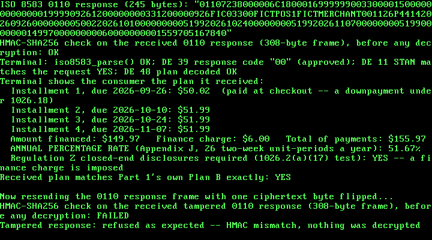

# 33. A Real "Pay in 4" BNPL Checkout: Regulation Z APR and an ISO 8583 Authorization

**What you will understand:** how a buy-now-pay-later "Pay in 4" plan maps onto the real US Truth in Lending rules (Regulation Z, 12 CFR Part 1026): why the installment paid at checkout is legally a *downpayment*, what the amount financed, finance charge, and total of payments actually are, and why a fee-free Pay-in-4 plan has historically sat outside Regulation Z's closed-end disclosure rules altogether; how to compute a real annual percentage rate by Regulation Z's own Appendix J actuarial method in a freestanding kernel with no floating point and no 64-bit division (`033_bnpl.h`/`033_bnpl.c`); how a real ISO 8583:1987 card-authorization message is laid out, MTI, bitmap and data elements, built and parsed from scratch (`033_iso8583.h`/`033_iso8583.c`); and how the two meet at a checkout: a merchant terminal's 0100 authorization request goes out, and an issuer's 0110 response comes back carrying the plan, both sealed with Chapter 30's AES-128-CBC + HMAC-SHA256 encrypt-then-MAC construction, reused unchanged.

**What you need to know first:** Chapter 30's AES-128, HMAC-SHA256, and the `fedwire_pkcs7_pad()`/`fedwire_pkcs7_unpad()` helpers (carried forward here as `033_aes.*`, `033_hmac.*`, `033_fedwire.*`), and Chapter 32's NACHA demo, whose frame-sealing pattern and RTL8139 hardware-loopback path this chapter's own demo reuses.

## Scope: three confirmed choices before writing any code

This chapter is the second of the five financial-services case studies queued back in Chapter 30: a buy-now-pay-later / short-term lending app. Three choices were confirmed with the reader before any code was written:

- **Core feature**: a "Pay in 4" installment schedule plus the real Truth in Lending disclosures for it: finance charge, amount financed, total of payments, payment schedule, and an APR computed by Regulation Z's Appendix J method, all in integer cents. A creditworthiness decision and ACH collection of the installments were both offered and not chosen.
- **Message format**: a real ISO 8583 authorization message (MTI, bitmap, data elements), which is how a card-rail BNPL checkout actually reaches a point-of-sale terminal, rather than reusing NACHA or inventing a tag format.
- **Crypto technique**: reuse Chapter 30's AES-128-CBC + HMAC-SHA256 encrypt-then-MAC construction unchanged, keeping this chapter's scope on the lending arithmetic and the message format.

## An honest note on this chapter's citations

Every chapter since Chapter 28 has quoted its sources from pages this book fetched and read directly. This chapter's cloud sandbox runs behind a network egress policy that refused every direct fetch of the official Regulation Z text: `consumerfinance.gov`, `ecfr.gov`, `govinfo.gov`, and `law.cornell.edu` each came back with an explicit "blocked by the network egress proxy" error. The Regulation Z wording quoted below is therefore the wording that web-search results surfaced *from* those official pages, not text this book read in full itself. That is a weaker citation than Chapters 30-32 had, and `033_bnpl.h` says so in its own top-of-file comment rather than leaving it implicit.

Two things make up for it where they can. The ISO 8583 side is cited from source code this book *did* read in full: a clone of the open-source Go library moov-io/iso8583 and the published Python package pyiso8583, both reachable under the same policy. And every number the kernel produces is checked afterwards against independent implementations outside the kernel: numpy_financial's IRR solver for the APR, Python's own `datetime` for due dates, and both of those ISO 8583 libraries for the message bytes. A weak citation is only as dangerous as the arithmetic built on it is unchecked, and here nothing is left unchecked.

## The Regulation Z rules this chapter builds on

Four real rules, each named in `033_bnpl.h`:

- **Who is covered, 12 CFR 1026.2(a)(17).** Regulation Z's definition of *creditor* covers a person who regularly extends consumer credit "that is subject to a finance charge or is payable by written agreement in more than four installments (not including a down payment)". A fee-free Pay-in-4 plan is at most four installments with no finance charge, which is exactly why such products have historically sat outside Regulation Z's closed-end disclosure rules. Add even a small flat fee, and there is a finance charge, so the plan is covered.
- **What must be disclosed, 12 CFR 1026.18.** The *amount financed* is the principal loan amount or cash price "subtracting any downpayment", plus other financed amounts that are not finance charges, minus any prepaid finance charge. The *total of payments* is "the amount you will have paid when you have made all scheduled payments". The *payment schedule* is "the number, amounts, and timing of payments scheduled to repay the obligation".
- **How the APR is computed, Appendix J.** The unit-period is "that common period, not to exceed 1 year, that occurs most frequently in a transaction"; a standard interval is "a day, week, semimonth, month, or a multiple of a week or a month"; and the APR is "the nominal annual percentage rate determined by multiplying the unit-period rate by the number of unit-periods in a year". A two-week interval is a multiple of a week, so a year holds 52 / 2 = 26 of them.
- **How accurate it must be, 12 CFR 1026.22(a)(2).** For a regular transaction, a disclosed APR "shall be considered accurate if it is not more than 1/8 of 1 percentage point above or below" the exact rate.

For context only (no code relies on it): in May 2024 the CFPB issued an interpretive rule treating Pay-in-4 lenders as card issuers under Regulation Z, and in May 2025 it withdrew that rule. This chapter builds only the closed-end disclosure arithmetic, which neither event changed.

### How "Pay in 4" actually maps onto those rules

The most important modeling decision in this chapter is also the easiest to get wrong. In a Pay-in-4 plan, the first installment is paid *at checkout*, at the very moment the credit is extended (consummation). Under 1026.18 that is not a repayment of credit at all: it is a **downpayment**. It is subtracted from the cash price to get the amount financed, and it is not part of the total of payments. Only installments 2, 3, and 4 repay credit, and they fall exactly one, two, and three two-week unit-periods after checkout.

That structure makes the transaction *regular* in Appendix J's sense: every scheduled payment lands on a unit-period boundary and there is no odd first period. For a regular, single-advance transaction, the whole of Appendix J's general equation reduces to the familiar one. With payments P₁…Pₙ at unit-periods 1…n, the unit-period rate *i* is the value that solves

```text
amount_financed = P_1/(1+i) + P_2/(1+i)^2 + ... + P_n/(1+i)^n
```

and the APR is `i × 26`. Treat installment 1 as a repayment instead, at unit-period 0, and the same plan produces a different and wrong APR. That is why `033_bnpl.c` makes the downpayment explicit rather than just summing four installments.

### This book's own choices, stated as such

Two things in the plan are not taken from any regulation, and `033_bnpl.h` labels both. First, rounding: the cash price is split into four equal whole-cent quarters, with any 1-3 leftover cents added to installment 1 (paid at checkout), so the three repayments of credit are always equal. A flat fee is split evenly across installments 2-4, with any leftover cents on installment 2. Second, the plan's shape, a two-week interval with the fee paid inside the installments rather than up front, is a typical Pay-in-4 structure but is not copied from any one lender. Real lenders make their own choices on both.

## Computing an APR with no floating point and no 64-bit division

The kernel has never used the FPU, and Chapters 7 and 30 both hit the same link failure on a 64-bit `/` (`undefined reference to '__udivdi3'`), because this freestanding kernel does not link libgcc. The equation above has to be solved with 32- and 64-bit integer multiplies, shifts, and adds only.

`bnpl_compute_apr()` solves it by **bisection over the discount factor v = 1/(1+i)**, not over *i* itself, with v in unsigned Q30 fixed point (1.0 is `1 << 30`). That one change of variable is what makes the integer arithmetic safe:

- The right-hand side becomes P₁v + P₂v² + … + Pₙvⁿ, evaluated by Horner's rule as v(P₁ + v(P₂ + … + vPₙ)). Since v never exceeds 1.0, vᵏ never grows, and every partial sum stays below the undiscounted total of payments × 2³⁰. With every amount capped below 2²⁴ cents (`BNPL_MAX_CENTS`, $167,772.16, a stated and refused-not-truncated limit) and at most 12 payments, nothing can overflow a `uint64_t`. Solving over *i* instead would need (1+i)ⁿ, which grows without bound.
- The one product that could still overflow, a partial sum below 2⁶² times v, is handled by `mul_q30()`, which splits the partial sum into high and low 30-bit halves so that no intermediate needs more than 64 bits.
- The present value rises strictly with v, from 0 at v = 0 to the total of payments at v = 1.0. When there is a finance charge, the amount financed lies strictly between those two, so exactly one v solves the equation and bisection must converge on it. Thirty halvings of `[0, 2^30]` pin v to one Q30 unit.
- Turning v back into *i* = 1/v − 1 needs exactly one 64-bit-by-32-bit division. `udiv64_32()` does it with a restoring shift-and-subtract loop, 64 iterations of one quotient bit each, instead of calling `__udivdi3`.
- The APR in hundredths of a percent is `i × 26 × 10000`, and the Q30 scale comes off with a rounding shift, so no division is needed there either.

A zero finance charge short-circuits to exactly 0.00%, and a *negative* one (payments totaling less than the amount financed) is refused outright: it has no APR.

## `033_bnpl.h` and `033_bnpl.c`: the plan, the disclosures, and the APR

```c
#ifndef UNIX_OS_033_BNPL_H
#define UNIX_OS_033_BNPL_H

#include <stdint.h>

/* A real "Pay in 4" buy-now-pay-later installment schedule, plus the
 * real Truth in Lending (Regulation Z, 12 CFR Part 1026) closed-end
 * credit disclosures a lender would owe on it -- amount financed,
 * finance charge, total of payments, payment schedule, and the annual
 * percentage rate computed by Regulation Z's own Appendix J actuarial
 * method -- all in integer cents and integer fixed-point arithmetic,
 * with no floating point anywhere in this kernel.
 *
 * Citation trail. This chapter's own cloud sandbox runs behind a
 * network egress policy that blocks direct fetches of the CFPB's own
 * site (consumerfinance.gov), the eCFR (ecfr.gov), govinfo.gov, and
 * Cornell LII (law.cornell.edu) -- checked directly, each one returned
 * an explicit "blocked by the network egress proxy" refusal. Every
 * Regulation Z rule below was therefore located through web search
 * results pointing at those official pages, and the wording below is
 * the wording those search results surfaced from them, not text this
 * book fetched and read in full itself. That is a weaker citation than
 * Chapters 30-32 had, and it is stated here rather than hidden:
 *
 *   - 12 CFR 1026.2(a)(17) ("creditor") and its official
 *     interpretation: Regulation Z's creditor definition covers a
 *     person who regularly extends consumer credit "that is subject to
 *     a finance charge or is payable by written agreement in more than
 *     four installments (not including a down payment)". This is the
 *     real reason fee-free "Pay in 4" products have historically sat
 *     outside Regulation Z's closed-end disclosure rules: at most four
 *     installments, and no finance charge. bnpl_build_pay_in_4()
 *     records that test honestly in bnpl_plan_t.reg_z_covered below.
 *   - 12 CFR 1026.18 ("Content of disclosures"): the amount financed
 *     is the principal loan amount or cash price "subtracting any
 *     downpayment", plus other amounts financed that are not part of
 *     the finance charge, minus any prepaid finance charge; the total
 *     of payments is "the amount you will have paid when you have made
 *     all scheduled payments"; the payment schedule is "the number,
 *     amounts, and timing of payments scheduled to repay the
 *     obligation".
 *   - Appendix J to Part 1026: the unit-period is "that common period,
 *     not to exceed 1 year, that occurs most frequently in a
 *     transaction"; a standard interval is "a day, week, semimonth,
 *     month, or a multiple of a week or a month"; and the annual
 *     percentage rate is "the nominal annual percentage rate
 *     determined by multiplying the unit-period rate by the number of
 *     unit-periods in a year". A two-week unit-period is a multiple of
 *     a week, so a year holds 52 / 2 = 26 of them.
 *   - 12 CFR 1026.22(a)(2): for a regular transaction, the disclosed
 *     APR "shall be considered accurate if it is not more than 1/8 of
 *     1 percentage point above or below" the exact rate.
 *
 * Real regulatory history, stated for context and not relied on by any
 * code below: in May 2024 the CFPB issued an interpretive rule treating
 * Pay-in-4 lenders as card issuers under Regulation Z; in May 2025 the
 * CFPB withdrew it (per CFPB and law-firm coverage surfaced by the same
 * web searches). This chapter builds only the closed-end disclosure
 * arithmetic, which neither event changed.
 *
 * How "Pay in 4" maps onto those real rules, honestly:
 *
 *   - Installment 1 is paid at checkout, the moment the credit is
 *     extended (consummation). Under 1026.18 that is a DOWNPAYMENT, not
 *     a scheduled repayment of credit: it is subtracted from the cash
 *     price to get the amount financed, and it is not part of the total
 *     of payments. Only installments 2-4 repay credit.
 *   - Installments 2-4 fall exactly one, two, and three two-week
 *     unit-periods after checkout, so the transaction is "regular" in
 *     Appendix J's sense (every payment on a unit-period boundary, no
 *     odd first period), which is what makes the simple equation below
 *     the complete, exact Appendix J computation for this plan rather
 *     than an approximation of it.
 *   - A plan with a flat fee (this chapter's second demo plan) has a
 *     finance charge, so Regulation Z's closed-end disclosure rules DO
 *     apply to it even with only four installments, and its APR is the
 *     number a consumer actually needs to see. A fee-free plan has a
 *     finance charge of zero and an APR of exactly 0.00%.
 *
 * This book's own choices, not taken from any regulation:
 *
 *   - Rounding: the cash price is split into four equal installments
 *     in whole cents, and any 1-3 leftover cents are added to the FIRST
 *     installment (paid at checkout), so the three repayments of credit
 *     are always equal. A flat fee is split evenly across installments
 *     2-4, any 1-2 leftover cents added to installment 2. Real lenders
 *     choose their own rounding conventions; this one is simply stated.
 *   - The 2-week interval and "fee paid in installments, not at
 *     checkout" plan structure are this chapter's own demo design,
 *     typical of Pay-in-4 products but not copied from any one lender.
 *
 * The Appendix J equation for a regular single-advance transaction with
 * payments P_1..P_n at unit-periods 1..n, solved for the unit-period
 * rate i:
 *
 *     amount_financed = sum over k of  P_k / (1 + i)^k
 *
 * bnpl_compute_apr() solves it by bisection over v = 1 / (1 + i), the
 * one-period discount factor, in unsigned Q30 fixed point (v = 1.0 is
 * 1 << 30). Working in v rather than i keeps every intermediate value
 * bounded by the undiscounted total of payments -- v is never above
 * 1.0, so v^k never grows -- which is what lets 64-bit integers hold
 * every intermediate product without overflow. Converting the solved v
 * back to i = 1/v - 1 needs exactly one 64-bit-by-32-bit division, and
 * this freestanding kernel has never linked libgcc's __udivdi3 (the
 * same real link failure Chapters 7 and 30 hit), so 033_bnpl.c carries
 * its own small shift-and-subtract long-division helper instead.
 *
 * Every person, merchant, and amount in this chapter's own demo is
 * fictional, invented for this book. Nothing here is legal or
 * compliance advice, and nothing here is a real lender's pricing. */

#define BNPL_INSTALLMENTS 4u
#define BNPL_INTERVAL_DAYS 14u        /* two weeks -- this chapter's own plan design */
#define BNPL_UNIT_PERIODS_PER_YEAR 26u /* Appendix J: a 2-week unit-period, 52 / 2 */
#define BNPL_MAX_PAYMENTS 12u          /* bnpl_compute_apr()'s own stated limit */

/* Stated limit: every amount this module handles stays below 2^24
 * cents ($167,772.16). With v <= 1.0 in Q30 (2^30), a cents value times
 * v stays below 2^54, and summing up to BNPL_MAX_PAYMENTS of them stays
 * far below 2^64 -- so no intermediate can overflow a uint64_t. A
 * purchase at or above this limit is refused, never truncated. */
#define BNPL_MAX_CENTS 0x01000000u

#define BNPL_Q30_ONE (1u << 30)

typedef struct {
    uint16_t year;
    uint8_t month; /* 1-12 */
    uint8_t day;   /* 1-31 */
} bnpl_date_t;

typedef struct {
    uint32_t cash_price_cents;
    uint32_t fee_cents;                           /* the finance charge, if any */
    bnpl_date_t checkout_date;                    /* consummation */
    uint32_t installment_cents[BNPL_INSTALLMENTS];
    bnpl_date_t due_date[BNPL_INSTALLMENTS];

    /* The real 1026.18 disclosures. */
    uint32_t downpayment_cents;       /* installment 1, paid at checkout */
    uint32_t amount_financed_cents;   /* cash price minus downpayment */
    uint32_t finance_charge_cents;    /* the fee */
    uint32_t total_of_payments_cents; /* installments 2-4 only */
    uint32_t apr_hundredths;          /* APR in hundredths of a percent, e.g. 5167 = 51.67% */

    /* 1 when 1026.2(a)(17)'s test is met: a finance charge, or more
     * than four installments not counting the downpayment. */
    int reg_z_covered;
} bnpl_plan_t;

/* Adds `days` to `d` in the proleptic Gregorian calendar (4/100/400
 * leap-year rule). */
bnpl_date_t bnpl_add_days(bnpl_date_t d, uint32_t days);

/* Builds a real Pay-in-4 schedule plus every real disclosure above,
 * including the Appendix J APR. Returns 1 on success, or 0 (and writes
 * nothing meaningful) if the cash price is zero, is at or above
 * BNPL_MAX_CENTS, is too small to split into four nonzero installments,
 * or if the fee is at or above BNPL_MAX_CENTS. */
int bnpl_build_pay_in_4(uint32_t cash_price_cents, uint32_t fee_cents,
                        bnpl_date_t checkout_date, bnpl_plan_t *out_plan);

/* Solves Appendix J's equation for a regular single-advance
 * transaction: `n` payments `payments_cents[0..n-1]` falling at
 * unit-periods 1..n, repaying `amount_financed_cents`, with
 * `periods_per_year` unit-periods in a year. On success writes the APR
 * in hundredths of a percent (rounded to nearest) to *out_apr_hundredths
 * and the unit-period rate in Q30 to *out_rate_q30 (either may be 0),
 * and returns 1. Returns 0 if n is 0 or above BNPL_MAX_PAYMENTS, if any
 * amount is at or above BNPL_MAX_CENTS, or if the payments total LESS
 * than the amount financed (a negative finance charge has no APR). */
int bnpl_compute_apr(uint32_t amount_financed_cents, const uint32_t *payments_cents,
                     uint32_t n, uint32_t periods_per_year,
                     uint32_t *out_apr_hundredths, uint32_t *out_rate_q30);

/* DE 48 ("Additional data - private") payload carrying one plan's
 * schedule and disclosures inside this chapter's own ISO 8583 0110
 * response. The layout is this book's own, fixed-width, ASCII digits
 * only, because DE 48 is a private-use field whose contents the ISO
 * 8583 field table leaves to the parties exchanging it (see
 * 033_iso8583.h):
 *
 *   off  len  content
 *     0    2  "P4"  plan code
 *     2    1  installment count, "4"
 *     3    2  interval in days, "14"
 *     5   80  4 x (8-digit YYYYMMDD due date + 12-digit cents amount)
 *    85   12  amount financed, cents
 *    97   12  finance charge, cents
 *   109   12  total of payments, cents
 *   121    5  APR in hundredths of a percent
 *   total 126 bytes */
#define BNPL_DE48_LEN 126u

uint32_t bnpl_encode_de48(const bnpl_plan_t *plan, uint8_t *out, uint32_t out_size);

/* Parses bnpl_encode_de48()'s own layout back into a plan, refusing
 * (returning 0) on a wrong length, a wrong plan code, or any non-digit
 * byte in a numeric position. Fields DE 48 does not carry (cash price,
 * fee, checkout date, reg_z_covered) are left zeroed; downpayment is
 * set from installment 1. */
int bnpl_decode_de48(const uint8_t *buf, uint32_t len, bnpl_plan_t *out_plan);

#endif
```

```c
/* See 033_bnpl.h's own top-of-file comment for the full citation trail
 * (Regulation Z 1026.2(a)(17), 1026.18, 1026.22(a)(2), and Appendix J),
 * this chapter's own honest note on how those citations were obtained,
 * and every rounding convention that is this book's own choice. */

#include "033_bnpl.h"

/* ---------------------------------------------------------------- */
/* Dates                                                            */
/* ---------------------------------------------------------------- */

static int is_leap_year(uint32_t y) {
    return ((y % 4u) == 0u && (y % 100u) != 0u) || (y % 400u) == 0u;
}

static uint32_t days_in_month(uint32_t y, uint32_t m) {
    static const uint8_t dim[12] = {31, 28, 31, 30, 31, 30, 31, 31, 30, 31, 30, 31};
    if (m == 2u && is_leap_year(y)) {
        return 29u;
    }
    return dim[m - 1u];
}

bnpl_date_t bnpl_add_days(bnpl_date_t d, uint32_t days) {
    uint32_t y = d.year, m = d.month, day = d.day;
    while (days > 0u) {
        uint32_t left_in_month = days_in_month(y, m) - day;
        if (days <= left_in_month) {
            day += days;
            days = 0u;
        } else {
            days -= left_in_month + 1u;
            day = 1u;
            m++;
            if (m > 12u) {
                m = 1u;
                y++;
            }
        }
    }
    bnpl_date_t out;
    out.year = (uint16_t)y;
    out.month = (uint8_t)m;
    out.day = (uint8_t)day;
    return out;
}

/* ---------------------------------------------------------------- */
/* Fixed-point arithmetic, with no libgcc                           */
/* ---------------------------------------------------------------- */

/* (a * v) >> 30 for a < 2^62 and v <= 2^30, without ever forming the
 * full up-to-92-bit product: split a into its high and low 30-bit
 * halves, a = ah * 2^30 + al, so (a * v) >> 30 = ah * v + (al * v) >> 30,
 * where ah * v < 2^62 and al * v < 2^60 both fit a uint64_t. Only
 * 64-bit multiplies, shifts, and adds -- all of which gcc emits inline
 * on i386 -- never a 64-bit division. */
static uint64_t mul_q30(uint64_t a, uint32_t v) {
    uint64_t ah = a >> 30;
    uint64_t al = a & ((1ull << 30) - 1ull);
    return ah * (uint64_t)v + ((al * (uint64_t)v) >> 30);
}

/* 64-bit by 32-bit unsigned long division, one quotient bit at a time
 * (restoring shift-and-subtract). This freestanding kernel does not
 * link libgcc, so a plain `/` on a uint64_t would fail to link with an
 * undefined __udivdi3 -- the same real failure 033_pmm.c (Chapter 7)
 * and 033_fedwire.c (Chapter 30) each document. The remainder stays
 * below the 32-bit divisor, so after one left shift it still fits a
 * uint64_t with room to spare. */
static uint64_t udiv64_32(uint64_t n, uint32_t d) {
    uint64_t q = 0, r = 0;
    for (int bit = 63; bit >= 0; bit--) {
        r = (r << 1) | ((n >> bit) & 1ull);
        if (r >= d) {
            r -= d;
            q |= (1ull << bit);
        }
    }
    return q;
}

/* Present value, in cents scaled by 2^30, of payments[0..n-1] falling at
 * unit-periods 1..n under one-period discount factor v (Q30):
 *
 *     P_1 v + P_2 v^2 + ... + P_n v^n  =  v (P_1 + v (P_2 + ... + v P_n))
 *
 * evaluated by Horner's rule from the last payment backward. Every
 * partial sum is at most (sum of payments) * 2^30 < 12 * 2^24 * 2^30,
 * comfortably inside a uint64_t (see BNPL_MAX_CENTS in 033_bnpl.h). */
static uint64_t present_value_q30(const uint32_t *payments, uint32_t n, uint32_t v) {
    uint64_t acc = 0;
    for (uint32_t k = n; k > 0u; k--) {
        acc = mul_q30(acc + ((uint64_t)payments[k - 1u] << 30), v);
    }
    return acc;
}

int bnpl_compute_apr(uint32_t amount_financed_cents, const uint32_t *payments_cents,
                     uint32_t n, uint32_t periods_per_year,
                     uint32_t *out_apr_hundredths, uint32_t *out_rate_q30) {
    if (n == 0u || n > BNPL_MAX_PAYMENTS || periods_per_year == 0u ||
        amount_financed_cents == 0u || amount_financed_cents >= BNPL_MAX_CENTS) {
        return 0;
    }
    uint32_t total = 0;
    for (uint32_t k = 0; k < n; k++) {
        if (payments_cents[k] >= BNPL_MAX_CENTS) {
            return 0;
        }
        total += payments_cents[k];
    }
    if (total < amount_financed_cents) {
        return 0; /* a negative finance charge has no APR */
    }

    uint32_t rate_q30 = 0;
    if (total > amount_financed_cents) {
        /* PV(v) rises strictly with v, from 0 at v = 0 to the total of
         * payments at v = 1.0, and the target (amount financed) sits
         * strictly between them -- so exactly one v solves Appendix J's
         * equation, and bisection is guaranteed to converge on it.
         * Invariant: PV(lo) < target <= PV(hi). Thirty halvings of a
         * [0, 2^30] interval pin v down to one Q30 unit. */
        uint64_t target = (uint64_t)amount_financed_cents << 30;
        uint32_t lo = 0, hi = BNPL_Q30_ONE;
        while (hi - lo > 1u) {
            uint32_t mid = lo + (hi - lo) / 2u;
            if (present_value_q30(payments_cents, n, mid) < target) {
                lo = mid;
            } else {
                hi = mid;
            }
        }
        /* i = 1/v - 1, in Q30: (2^60 / v) - 2^30. v = hi >= 2^29 for any
         * unit-period rate below 100%, and for a lower v the quotient
         * still fits, since v >= 1. */
        uint64_t inv_v_q30 = udiv64_32(1ull << 60, hi);
        uint64_t r = inv_v_q30 - (1ull << 30);
        if (r > 0xFFFFFFFFull) {
            return 0; /* a unit-period rate this large is out of scope */
        }
        rate_q30 = (uint32_t)r;
    }

    /* Appendix J: APR = unit-period rate * unit-periods per year. In
     * hundredths of a percent that is rate * periods * 10000, and the
     * Q30 scale comes off with a shift, rounded to nearest by adding
     * half of 2^30 first. rate_q30 < 2^32 and periods * 10000 < 2^22
     * for any real unit-period (at most 365 a year), so the product
     * stays below 2^54. */
    uint64_t scaled = (uint64_t)rate_q30 * (uint64_t)(periods_per_year * 10000u);
    uint32_t apr = (uint32_t)((scaled + (1ull << 29)) >> 30);

    if (out_apr_hundredths) {
        *out_apr_hundredths = apr;
    }
    if (out_rate_q30) {
        *out_rate_q30 = rate_q30;
    }
    return 1;
}

/* ---------------------------------------------------------------- */
/* The Pay-in-4 plan                                                */
/* ---------------------------------------------------------------- */

int bnpl_build_pay_in_4(uint32_t cash_price_cents, uint32_t fee_cents,
                        bnpl_date_t checkout_date, bnpl_plan_t *p) {
    if (cash_price_cents < BNPL_INSTALLMENTS || cash_price_cents >= BNPL_MAX_CENTS ||
        fee_cents >= BNPL_MAX_CENTS) {
        return 0;
    }

    p->cash_price_cents = cash_price_cents;
    p->fee_cents = fee_cents;
    p->checkout_date = checkout_date;

    /* This book's own rounding convention (see 033_bnpl.h): equal
     * quarters of the cash price, leftover cents on installment 1; the
     * fee split evenly over installments 2-4, leftover cents on
     * installment 2. */
    uint32_t quarter = cash_price_cents / BNPL_INSTALLMENTS;
    uint32_t price_rem = cash_price_cents % BNPL_INSTALLMENTS;
    uint32_t fee_share = fee_cents / (BNPL_INSTALLMENTS - 1u);
    uint32_t fee_rem = fee_cents % (BNPL_INSTALLMENTS - 1u);

    p->installment_cents[0] = quarter + price_rem;
    for (uint32_t k = 1; k < BNPL_INSTALLMENTS; k++) {
        p->installment_cents[k] = quarter + fee_share + ((k == 1u) ? fee_rem : 0u);
    }
    for (uint32_t k = 0; k < BNPL_INSTALLMENTS; k++) {
        p->due_date[k] = bnpl_add_days(checkout_date, k * BNPL_INTERVAL_DAYS);
    }

    /* 1026.18: installment 1, paid at consummation, is a downpayment. */
    p->downpayment_cents = p->installment_cents[0];
    p->amount_financed_cents = cash_price_cents - p->downpayment_cents;
    p->finance_charge_cents = fee_cents;
    p->total_of_payments_cents = 0;
    for (uint32_t k = 1; k < BNPL_INSTALLMENTS; k++) {
        p->total_of_payments_cents += p->installment_cents[k];
    }

    /* 1026.2(a)(17)'s test: a finance charge, or more than four
     * installments not counting the downpayment (never true here: a
     * Pay-in-4 plan has three after it). */
    p->reg_z_covered = (fee_cents > 0u) || ((BNPL_INSTALLMENTS - 1u) > 4u);

    return bnpl_compute_apr(p->amount_financed_cents, &p->installment_cents[1],
                            BNPL_INSTALLMENTS - 1u, BNPL_UNIT_PERIODS_PER_YEAR,
                            &p->apr_hundredths, 0);
}

/* ---------------------------------------------------------------- */
/* DE 48 payload                                                    */
/* ---------------------------------------------------------------- */

static void put_digits(uint8_t *buf, uint32_t off, uint32_t width, uint32_t value) {
    for (uint32_t i = 0; i < width; i++) {
        buf[off + width - 1u - i] = (uint8_t)('0' + (value % 10u));
        value /= 10u;
    }
}

/* Reads `width` ASCII digits; returns 0 on any non-digit byte, or if the
 * value would not fit a uint32_t. */
static int get_digits(const uint8_t *buf, uint32_t off, uint32_t width, uint32_t *out) {
    uint32_t v = 0;
    for (uint32_t i = 0; i < width; i++) {
        uint8_t c = buf[off + i];
        if (c < (uint8_t)'0' || c > (uint8_t)'9') {
            return 0;
        }
        uint32_t d = (uint32_t)(c - (uint8_t)'0');
        if (v > (0xFFFFFFFFu - d) / 10u) {
            return 0;
        }
        v = v * 10u + d;
    }
    *out = v;
    return 1;
}

uint32_t bnpl_encode_de48(const bnpl_plan_t *p, uint8_t *out, uint32_t out_size) {
    if (out_size < BNPL_DE48_LEN) {
        return 0;
    }
    out[0] = (uint8_t)'P';
    out[1] = (uint8_t)'4';
    put_digits(out, 2, 1, BNPL_INSTALLMENTS);
    put_digits(out, 3, 2, BNPL_INTERVAL_DAYS);
    for (uint32_t k = 0; k < BNPL_INSTALLMENTS; k++) {
        uint32_t off = 5u + k * 20u;
        put_digits(out, off, 4, p->due_date[k].year);
        put_digits(out, off + 4u, 2, p->due_date[k].month);
        put_digits(out, off + 6u, 2, p->due_date[k].day);
        put_digits(out, off + 8u, 12, p->installment_cents[k]);
    }
    put_digits(out, 85, 12, p->amount_financed_cents);
    put_digits(out, 97, 12, p->finance_charge_cents);
    put_digits(out, 109, 12, p->total_of_payments_cents);
    put_digits(out, 121, 5, p->apr_hundredths);
    return BNPL_DE48_LEN;
}

int bnpl_decode_de48(const uint8_t *buf, uint32_t len, bnpl_plan_t *p) {
    if (len != BNPL_DE48_LEN || buf[0] != (uint8_t)'P' || buf[1] != (uint8_t)'4') {
        return 0;
    }
    uint32_t count, interval;
    if (!get_digits(buf, 2, 1, &count) || count != BNPL_INSTALLMENTS ||
        !get_digits(buf, 3, 2, &interval) || interval != BNPL_INTERVAL_DAYS) {
        return 0;
    }
    uint8_t *raw = (uint8_t *)p;
    for (uint32_t i = 0; i < sizeof(*p); i++) {
        raw[i] = 0;
    }
    for (uint32_t k = 0; k < BNPL_INSTALLMENTS; k++) {
        uint32_t off = 5u + k * 20u, y, m, d;
        if (!get_digits(buf, off, 4, &y) || !get_digits(buf, off + 4u, 2, &m) ||
            !get_digits(buf, off + 6u, 2, &d) ||
            !get_digits(buf, off + 8u, 12, &p->installment_cents[k])) {
            return 0;
        }
        if (m < 1u || m > 12u || d < 1u || d > 31u) {
            return 0;
        }
        p->due_date[k].year = (uint16_t)y;
        p->due_date[k].month = (uint8_t)m;
        p->due_date[k].day = (uint8_t)d;
    }
    if (!get_digits(buf, 85, 12, &p->amount_financed_cents) ||
        !get_digits(buf, 97, 12, &p->finance_charge_cents) ||
        !get_digits(buf, 109, 12, &p->total_of_payments_cents) ||
        !get_digits(buf, 121, 5, &p->apr_hundredths)) {
        return 0;
    }
    p->downpayment_cents = p->installment_cents[0];
    return 1;
}
```

### Proving the APR solver before it touches the kernel

Chapter 30 introduced a rule for hand-rolled numerical code: prove it against known answers in a native (non-kernel) build first. This chapter follows it. One real difference from Chapter 30 is stated up front: this sandbox's `gcc -m32` cannot build a *hosted* program, because there is no 32-bit libc installed (`fatal error: bits/libc-header-start.h: No such file or directory`). The native tests therefore run as a 64-bit hosted build of the same unmodified `033_bnpl.c`. The module uses only fixed-width `uint32_t`/`uint64_t` types, so its arithmetic is identical on both targets, and the kernel run later in this chapter is the 32-bit proof.

The known answers: a textbook level-payment loan ($1,000.00 at exactly 1% a month for 12 months has the standard annuity payment $88.85, so its APR must come back as 12.00%); a zero finance charge (must be exactly 0.00%); this chapter's own demo plan, against a value from an independent floating-point solve; a refused negative finance charge; the demo's due dates; a date that crosses a leap-year February; and a round trip through the DE 48 payload encoder.

```c
/* Native (hosted, non-kernel) known-answer test harness for 033_bnpl.c. */
#include <stdio.h>
#include "033_bnpl.h"

static int failures = 0;

static void check_apr(const char *label, uint32_t af, const uint32_t *pay, uint32_t n,
                      uint32_t ppy, uint32_t expect_hundredths) {
    uint32_t apr = 0;
    int ok = bnpl_compute_apr(af, pay, n, ppy, &apr, 0);
    int pass = ok && apr == expect_hundredths;
    printf("[%s] %s: computed %u.%02u%%, expected %u.%02u%%\n", pass ? "OK" : "FAIL", label,
           apr / 100u, apr % 100u, expect_hundredths / 100u, expect_hundredths % 100u);
    if (!pass) failures++;
}

int main(void) {
    /* KAT 1: a textbook level-payment loan -- $5,000.00 at exactly 1% a
     * month for 36 months has the standard annuity payment
     * 5000 * 0.01 / (1 - 1.01^-36) = $166.0715..., rounded to $166.07.
     * 36 payments exceed this module's own 12-payment limit, so the
     * same identity is checked at 12 months instead: $1,000.00 at 1% a
     * month for 12 months -> $88.85 (88.8488 rounded), APR 12.00%. */
    uint32_t p12[12];
    for (int k = 0; k < 12; k++) p12[k] = 8885u;
    check_apr("1000.00, 12 x 88.85 monthly", 100000u, p12, 12, 12, 1200u);

    /* KAT 2: zero finance charge must give exactly 0.00%. */
    uint32_t p3z[3] = {5000u, 5000u, 5000u};
    check_apr("150.00, 3 x 50.00 biweekly (no fee)", 15000u, p3z, 3, 26, 0u);

    /* KAT 3: this chapter's own demo plan B, expected value from an
     * independent floating-point solve (numpy_financial.rate):
     * rate(3, 51.99, -149.97) * 26 = 51.6715%. */
    uint32_t p3b[3] = {5199u, 5199u, 5199u};
    check_apr("149.97, 3 x 51.99 biweekly", 14997u, p3b, 3, 26, 5167u);

    /* Refusals. */
    uint32_t small[3] = {100u, 100u, 100u};
    printf("[%s] negative finance charge refused\n",
           bnpl_compute_apr(1000u, small, 3, 26, 0, 0) == 0 ? "OK" : "FAIL");

    /* Dates: 2026-09-26 + 14/28/42 days, and a leap-year crossing. */
    bnpl_date_t d = {2026, 9, 26};
    for (uint32_t k = 1; k <= 3; k++) {
        bnpl_date_t e = bnpl_add_days(d, 14u * k);
        printf("2026-09-26 + %u days = %04u-%02u-%02u\n", 14u * k, e.year, e.month, e.day);
    }
    bnpl_date_t l = bnpl_add_days((bnpl_date_t){2028, 2, 20}, 14);
    printf("2028-02-20 + 14 days = %04u-%02u-%02u (2028 is a leap year)\n", l.year, l.month, l.day);

    /* Plan build + DE48 round trip. */
    bnpl_plan_t plan, back;
    bnpl_build_pay_in_4(19999u, 600u, d, &plan);
    uint8_t de48[BNPL_DE48_LEN + 1];
    uint32_t n = bnpl_encode_de48(&plan, de48, sizeof(de48));
    de48[n] = 0;
    printf("DE48 (%u bytes): %s\n", n, de48);
    int rt = bnpl_decode_de48(de48, n, &back);
    printf("[%s] DE48 decode round trip\n", rt && back.apr_hundredths == plan.apr_hundredths &&
           back.total_of_payments_cents == plan.total_of_payments_cents ? "OK" : "FAIL");

    printf(failures ? "%d FAILURE(S)\n" : "ALL KNOWN-ANSWER TESTS PASSED\n", failures);
    return failures != 0;
}
```

**Output (cloud sandbox -- live-executed native known-answer tests)**

```text
[OK] 1000.00, 12 x 88.85 monthly: computed 12.00%, expected 12.00%
[OK] 150.00, 3 x 50.00 biweekly (no fee): computed 0.00%, expected 0.00%
[OK] 149.97, 3 x 51.99 biweekly: computed 51.67%, expected 51.67%
[OK] negative finance charge refused
2026-09-26 + 14 days = 2026-10-10
2026-09-26 + 28 days = 2026-10-24
2026-09-26 + 42 days = 2026-11-07
2028-02-20 + 14 days = 2028-03-05 (2028 is a leap year)
DE48 (126 bytes): P44142026092600000000500220261010000000005199202610240000000051992026110700000000519900000001499700000000060000000001559705167
[OK] DE48 decode round trip
ALL KNOWN-ANSWER TESTS PASSED
```

Known-answer tests only cover the cases someone thought to write down, so a second check compares the solver against an independent solver on a thousand randomized loans: 1-12 payments, four different unit-periods (monthly, semimonthly, biweekly, weekly), amounts from $1.00 to $50,000.00, and unit-period rates up to 10%. The reference is numpy_financial's floating-point IRR, which shares no code with `033_bnpl.c`. The kernel reports APR to the hundredth of a percent, so the most it can honestly differ from an exact solve is the final rounding, 0.005 points. Anything more would be a solver bug.

```c
#include <stdio.h>
#include <stdlib.h>
#include "033_bnpl.h"
/* usage: bnpl_cli af ppy p1 p2 ... ; prints APR hundredths or REFUSED */
int main(int argc, char **argv) {
    uint32_t af = strtoul(argv[1], 0, 10), ppy = strtoul(argv[2], 0, 10), p[12], n = argc - 3, apr;
    for (uint32_t k = 0; k < n; k++) p[k] = strtoul(argv[3 + k], 0, 10);
    if (bnpl_compute_apr(af, p, n, ppy, &apr, 0)) printf("%u\n", apr); else printf("REFUSED\n");
    return 0;
}
```

```python
import random, subprocess, numpy_financial as npf
random.seed(33)
worst = 0.0; N = 1000
for t in range(N):
    n = random.randint(1, 12); ppy = random.choice([12, 24, 26, 52])
    af = random.randint(100, 5_000_000)
    rate = random.uniform(0, 0.10)          # up to 10% per unit-period
    pmt = max(1, round(npf.pmt(rate, n, -af / 100) * 100)) if rate > 0 else -(-af // n)
    pays = [pmt] * n
    if sum(pays) < af: pays[-1] += af - sum(pays)
    out = subprocess.run(["./bnpl_cli", str(af), str(ppy)] + [str(p) for p in pays],
                         capture_output=True, text=True).stdout.strip()
    ref = 0.0 if sum(pays) == af else npf.irr([-af] + pays) * ppy * 100
    diff = abs(int(out) / 100 - ref)
    worst = max(worst, diff)
    assert diff <= 0.005 + 1e-9, (af, pays, ppy, out, ref)
print(f"{N} random cases, worst |kernel APR - numpy_financial APR| = {worst:.6f} points "
      f"(<= 0.005, i.e. only the final round-to-hundredths)")
```

**Output (cloud sandbox -- live-executed randomized comparison)**

```text
1000 random cases, worst |kernel APR - numpy_financial APR| = 0.004994 points (<= 0.005, i.e. only the final round-to-hundredths)
```

The worst of the thousand cases differs by 0.004994 points, just inside the 0.005 that rounding to hundredths allows, and 25 times tighter than Regulation Z's own 1/8-point tolerance.

## The real ISO 8583:1987 message format

ISO 8583 is a paid ISO standard this book has not read. `033_iso8583.h` instead cites two independent open-source implementations of its 1987 ASCII variant, read in full: moov-io/iso8583's `specs/spec87ascii.go` (Go, from a clone at commit `5219813`) and pyiso8583 4.0.1's built-in `default_ascii` spec (Python). They agree, field for field, on every data element this chapter uses:

| DE | Name | Format |
|---|---|---|
| 2 | Primary Account Number | LLVAR, up to 19 (2-digit ASCII length prefix) |
| 3 | Processing Code | fixed 6 |
| 4 | Transaction Amount | fixed 12, zero-padded on the left |
| 7 | Transmission Date & Time | fixed 10 (MMDDhhmmss) |
| 11 | Systems Trace Audit Number | fixed 6 |
| 12 | Local Transaction Time | fixed 6 (hhmmss) |
| 13 | Local Transaction Date | fixed 4 (MMDD) |
| 38 | Authorization ID Response | fixed 6 |
| 39 | Response Code | fixed 2 |
| 41 | Card Acceptor Terminal ID | fixed 8 |
| 42 | Card Acceptor ID Code | fixed 15 |
| 48 | Additional Data - Private | LLLVAR, up to 999 (3-digit ASCII length prefix) |
| 49 | Transaction Currency Code | fixed 3 |

A message is a 4-character Message Type Indicator (MTI), then a bitmap, then each present data element (DE) in ascending order, with no separators: the bitmap alone says which fields follow, and each field's own format says how long it is. That is why `iso8583_parse()` refuses any message whose bitmap names a DE it does not know. Without the field's width it cannot find where the next field starts, and guessing would silently misread everything after it.

Code values, cited through search results rather than the ISO text (the same honesty note as above): MTI `0100` is an authorization request and `0110` its response (moov-io's own `constant.go` names both); DE 39 `00` means "Approved or completed successfully" (Elavon's published Field 39 description); DE 3 `000000` is the conventional code for a purchase with no account type specified, though every source stresses that each network defines its own mapping; DE 49 `840` is the ISO 4217 code for the US dollar. The PAN's last digit is a Luhn check digit (ISO/IEC 7812-1: "double the value of alternate digits beginning with the first right-hand digit (low order)" when computing it), implemented by `iso8583_luhn_check_digit()`/`iso8583_luhn_valid()` and cross-checked against the well-known Luhn example number 79927398713 in a native test before use.

### DE 48 is private, so its contents are this book's own

Both libraries define DE 48 only as a variable-length string. What goes inside it is agreed between the parties exchanging it, never by ISO 8583 itself. Real card networks carry installment data in their own network-specific fields, and none of those layouts is what this chapter builds. `bnpl_encode_de48()`'s fixed-width, digits-only layout (a plan code, the four due dates and amounts, amount financed, finance charge, total of payments, APR) is this book's own, and `033_bnpl.h` says so. That parallels Chapter 32's note that "group expense splitting" invented no NACHA mechanism: the real format is used as specified, and the scenario-specific part is labeled as scenario.

### A disagreement between the two libraries, found by the cross-check

The first run of this chapter's Go cross-check failed: moov-io refused the kernel's 0100 message with `failed to unpack field 42 ... expected len 15, got 8`. pyiso8583 had decoded the same bytes cleanly. Asking moov-io to *pack* the same field values showed why:

```text
01007238000000C18000000000000000000016999999003300001500000000000001999909261200000000331200000926FICTPOS1FICTMERCHANT001002P4840   <- moov-io Spec87ASCII
01007238000000C1800016999999003300001500000000000001999909261200000000331200000926FICTPOS1FICTMERCHANT001002P4840                   <- this kernel
```

moov-io wrote sixteen extra `0` characters after the bitmap. Its `spec87ascii.go` declares field 1 (the bitmap) with `Length: 16`, and moov-io's `field/bitmap.go` counts that length in *decoded bytes*, so that spec always writes a 128-bit bitmap (primary and secondary, 32 hex characters) even when bit 1, the "secondary bitmap present" flag, is clear. Reading the spec file earlier, this book had taken `Length: 16` to mean 16 hex characters, which was wrong.

Neither side is broken: each layout is self-consistent. The 8-byte primary bitmap (16 hex characters, with a secondary only when bit 1 is set) is what pyiso8583's `default_ascii` uses, and it is what moov-io's *own* `docs/bitmap.md` describes: "The primary bitmap is 8 bytes long ... There may also be a secondary bitmap at field 1". This chapter keeps that layout, corrects `033_iso8583.h`'s citation to state the difference, and runs the Go cross-check with moov-io's own field definitions, changing only field 1 to moov-io's default 8-byte bitmap. The kernel code itself did not change; only the book's description of its source did.

## `033_iso8583.h` and `033_iso8583.c`: the encoder/decoder

```c
#ifndef UNIX_OS_033_ISO8583_H
#define UNIX_OS_033_ISO8583_H

#include <stdint.h>

/* A real ISO 8583:1987 card-authorization message encoder/decoder -- the
 * message format a point-of-sale terminal's authorization request
 * actually travels in on its way to a card issuer, and the one a
 * virtual-card BNPL checkout rides on at the merchant's till.
 *
 * ISO 8583 itself is a paid ISO standard this book has not read.
 * Instead, every field number, name, width, and length-prefix rule below
 * is cited from two independent, open-source implementations of its 1987
 * ASCII variant that agree, field for field, on every data element this
 * chapter uses:
 *
 *   - moov-io/iso8583 (Go), specs/spec87ascii.go, read directly from a
 *     clone of github.com/moov-io/iso8583 at commit 5219813 (Sep 2026).
 *   - pyiso8583 4.0.1 (Python, PyPI), its built-in `default_ascii` spec.
 *
 * The message layout: a 4-character ASCII Message Type Indicator (MTI),
 * then the primary bitmap as 16 ASCII hex characters (64 bits, most
 * significant first; bit 1 is the leftmost), then each present data
 * element (DE) in ascending order. Bit n set means DE n is present; bit
 * 1 set means a secondary bitmap follows (DEs 65-128) -- this chapter's
 * own decoder refuses any message with bit 1 set, since it uses no DE
 * above 64. That bitmap layout is pyiso8583's `default_ascii`, and it is
 * the one moov-io's own docs/bitmap.md describes ("The primary bitmap is
 * 8 bytes long ... There may also be a secondary bitmap"). moov-io's
 * spec87ascii.go itself differs on this one point, found only when this
 * chapter's own cross-check first failed: its field 1 is declared with
 * Length 16, and moov-io counts that length in DECODED bytes, so that
 * spec always writes a 128-bit bitmap (32 hex characters) -- primary and
 * secondary -- even when bit 1 is clear. Both are self-consistent; this
 * chapter follows the 8-byte primary layout. The DEs this chapter uses:
 *
 *   DE  2  Primary Account Number     LLVAR, up to 19 (2-digit ASCII length)
 *   DE  3  Processing Code            fixed 6
 *   DE  4  Transaction Amount         fixed 12, zero-padded on the left
 *   DE  7  Transmission Date & Time   fixed 10 (MMDDhhmmss)
 *   DE 11  Systems Trace Audit Number fixed 6
 *   DE 12  Local Transaction Time     fixed 6 (hhmmss)
 *   DE 13  Local Transaction Date     fixed 4 (MMDD)
 *   DE 38  Authorization ID Response  fixed 6
 *   DE 39  Response Code              fixed 2
 *   DE 41  Card Acceptor Terminal ID  fixed 8
 *   DE 42  Card Acceptor ID Code      fixed 15
 *   DE 48  Additional Data - Private  LLLVAR, up to 999 (3-digit ASCII length)
 *   DE 49  Transaction Currency Code  fixed 3
 *
 * Code values, cited through web search results rather than the ISO
 * text itself (same honesty note as 033_bnpl.h): MTI 0100 is an
 * authorization request and 0110 its response (moov-io/iso8583's own
 * constant.go names both, "AuthorizationRequest"/"AuthorizationResponse");
 * DE 39 "00" means "Approved or completed successfully" (Elavon's
 * published Field 39 description); DE 3 "000000" is the conventional
 * processing code for a purchase with no account type specified, though
 * sources stress that each network defines its own operational mapping;
 * DE 49 "840" is the ISO 4217 numeric code for the US dollar.
 *
 * DE 48 is "private": both implementations define it only as a
 * variable-length string. What goes inside it is agreed between the
 * parties exchanging it, never by ISO 8583 itself. This chapter's own
 * BNPL plan payload inside DE 48 (033_bnpl.h's bnpl_encode_de48()) is
 * therefore this book's own layout, stated as such -- not a real
 * network's installment field.
 *
 * Real PANs end in a Luhn check digit (ISO/IEC 7812-1, "double the
 * value of alternate digits beginning with the first right-hand digit
 * (low order)" when computing it; cited via search results quoting the
 * 2015 edition). iso8583_luhn_check_digit()/iso8583_luhn_valid() below
 * implement it. This chapter's own demo PAN is fictional, invented for
 * this book, and only Luhn-valid so that the issuer side's own check
 * has something real to verify.
 *
 * Stated limits of this implementation: DE 4 amounts must fit a
 * uint32_t (the same no-64-bit-division limit Chapters 30 and 32 state);
 * DE 48 is capped at ISO8583_DE48_MAX bytes, well below the format's
 * own 999, because this chapter never needs more; any set bitmap bit
 * for a DE not listed above is refused outright, because a decoder that
 * does not know a field's width cannot skip it safely. */

#define ISO8583_PAN_MAX 19u
#define ISO8583_DE48_MAX 256u
#define ISO8583_MAX_MESSAGE_LEN 512u

typedef struct {
    uint8_t mti[4];
    uint32_t bitmap_hi;  /* bits 1-32: bit n is (1u << (32 - n)) */
    uint32_t bitmap_lo;  /* bits 33-64: bit n is (1u << (64 - n)) */

    uint8_t pan[ISO8583_PAN_MAX];      /* DE 2 */
    uint32_t pan_len;
    uint8_t processing_code[6];        /* DE 3 */
    uint32_t amount_cents;             /* DE 4 */
    uint8_t transmission_datetime[10]; /* DE 7 */
    uint8_t stan[6];                   /* DE 11 */
    uint8_t local_time[6];             /* DE 12 */
    uint8_t local_date[4];             /* DE 13 */
    uint8_t auth_id[6];                /* DE 38 */
    uint8_t response_code[2];          /* DE 39 */
    uint8_t terminal_id[8];            /* DE 41 */
    uint8_t merchant_id[15];           /* DE 42 */
    uint8_t additional_data[ISO8583_DE48_MAX]; /* DE 48 */
    uint32_t additional_data_len;
    uint8_t currency_code[3];          /* DE 49 */
} iso8583_msg_t;

void iso8583_set_field(iso8583_msg_t *msg, uint32_t de);
int iso8583_has_field(const iso8583_msg_t *msg, uint32_t de);

/* Encodes `msg` into `out`. Returns the encoded length, or 0 if the
 * buffer is too small, the MTI is not four ASCII digits, a bitmap bit
 * names an unsupported DE, or a variable-length field is too long. */
uint32_t iso8583_build(const iso8583_msg_t *msg, uint8_t *out, uint32_t out_size);

/* Decodes exactly `len` bytes into `*out`. Returns 1 on success, or 0 --
 * refusing outright, never guessing -- on a non-digit MTI, a non-hex
 * bitmap, bit 1 (secondary bitmap) set, any unsupported DE, a non-digit
 * byte in a numeric field or length prefix, an out-of-range length, a
 * DE 4 amount too large for a uint32_t, a truncated field, or any
 * trailing bytes after the last field. */
int iso8583_parse(const uint8_t *buf, uint32_t len, iso8583_msg_t *out);

/* Luhn (ISO/IEC 7812-1): the check digit ('0'-'9') for `len` ASCII
 * digits that do NOT yet include one, and a validity test for a full
 * PAN that does. Both return 0 / '\0' on any non-digit byte. */
uint8_t iso8583_luhn_check_digit(const uint8_t *digits, uint32_t len);
int iso8583_luhn_valid(const uint8_t *pan, uint32_t len);

#endif
```

```c
/* See 033_iso8583.h's own top-of-file comment for the citation of every
 * data element, width, and length-prefix rule used here. */

#include "033_iso8583.h"

/* How each supported DE is laid out on the wire. */
#define KIND_FIXED 0u
#define KIND_LLVAR 1u
#define KIND_LLLVAR 2u

typedef struct {
    uint8_t de;
    uint8_t kind;
    uint16_t width;   /* fixed width, or maximum length for LL/LLLVAR */
    uint8_t numeric;  /* 1: every byte must be an ASCII digit */
} de_spec_t;

static const de_spec_t g_specs[] = {
    { 2, KIND_LLVAR, ISO8583_PAN_MAX, 1},
    { 3, KIND_FIXED, 6, 1},
    { 4, KIND_FIXED, 12, 1},
    { 7, KIND_FIXED, 10, 1},
    {11, KIND_FIXED, 6, 1},
    {12, KIND_FIXED, 6, 1},
    {13, KIND_FIXED, 4, 1},
    {38, KIND_FIXED, 6, 0},
    {39, KIND_FIXED, 2, 0},
    {41, KIND_FIXED, 8, 0},
    {42, KIND_FIXED, 15, 0},
    {48, KIND_LLLVAR, ISO8583_DE48_MAX, 0},
    {49, KIND_FIXED, 3, 1},
};
#define SPEC_COUNT (sizeof(g_specs) / sizeof(g_specs[0]))

static const de_spec_t *find_spec(uint32_t de) {
    for (uint32_t i = 0; i < SPEC_COUNT; i++) {
        if (g_specs[i].de == de) {
            return &g_specs[i];
        }
    }
    return 0;
}

void iso8583_set_field(iso8583_msg_t *msg, uint32_t de) {
    if (de >= 1u && de <= 32u) {
        msg->bitmap_hi |= 1u << (32u - de);
    } else if (de >= 33u && de <= 64u) {
        msg->bitmap_lo |= 1u << (64u - de);
    }
}

int iso8583_has_field(const iso8583_msg_t *msg, uint32_t de) {
    if (de >= 1u && de <= 32u) {
        return (msg->bitmap_hi >> (32u - de)) & 1u;
    }
    if (de >= 33u && de <= 64u) {
        return (msg->bitmap_lo >> (64u - de)) & 1u;
    }
    return 0;
}

static int is_digit(uint8_t c) {
    return c >= (uint8_t)'0' && c <= (uint8_t)'9';
}

/* Where a DE's bytes live inside iso8583_msg_t. For DE 4, the caller
 * converts to/from amount_cents separately, through `scratch`. */
static uint8_t *field_ptr(iso8583_msg_t *m, uint32_t de, uint8_t *scratch) {
    switch (de) {
    case 2:  return m->pan;
    case 3:  return m->processing_code;
    case 4:  return scratch;
    case 7:  return m->transmission_datetime;
    case 11: return m->stan;
    case 12: return m->local_time;
    case 13: return m->local_date;
    case 38: return m->auth_id;
    case 39: return m->response_code;
    case 41: return m->terminal_id;
    case 42: return m->merchant_id;
    case 48: return m->additional_data;
    case 49: return m->currency_code;
    default: return 0;
    }
}

static void put_digits(uint8_t *buf, uint32_t width, uint32_t value) {
    for (uint32_t i = 0; i < width; i++) {
        buf[width - 1u - i] = (uint8_t)('0' + (value % 10u));
        value /= 10u;
    }
}

static const char g_hex[] = "0123456789ABCDEF";

uint32_t iso8583_build(const iso8583_msg_t *msg, uint8_t *out, uint32_t out_size) {
    if (out_size < 20u) {
        return 0;
    }
    for (uint32_t i = 0; i < 4u; i++) {
        if (!is_digit(msg->mti[i])) {
            return 0;
        }
        out[i] = msg->mti[i];
    }
    /* Primary bitmap: 16 ASCII hex characters, most significant first. */
    for (uint32_t i = 0; i < 8u; i++) {
        out[4u + i] = (uint8_t)g_hex[(msg->bitmap_hi >> (28u - 4u * i)) & 0xFu];
        out[12u + i] = (uint8_t)g_hex[(msg->bitmap_lo >> (28u - 4u * i)) & 0xFu];
    }
    uint32_t pos = 20;

    iso8583_msg_t *m = (iso8583_msg_t *)msg; /* field_ptr() only reads here */
    uint8_t amount_digits[12];
    for (uint32_t de = 1; de <= 64u; de++) {
        if (!iso8583_has_field(msg, de)) {
            continue;
        }
        const de_spec_t *s = find_spec(de);
        if (s == 0) {
            return 0; /* bit 1 (secondary bitmap) or an unsupported DE */
        }
        if (de == 4u) {
            put_digits(amount_digits, 12u, msg->amount_cents);
        }
        const uint8_t *src = field_ptr(m, de, amount_digits);
        uint32_t len = s->width;
        if (s->kind == KIND_LLVAR) {
            len = msg->pan_len;
        } else if (s->kind == KIND_LLLVAR) {
            len = msg->additional_data_len;
        }
        if (len > s->width) {
            return 0;
        }
        uint32_t prefix = (s->kind == KIND_LLVAR) ? 2u : (s->kind == KIND_LLLVAR) ? 3u : 0u;
        if (pos + prefix + len > out_size) {
            return 0;
        }
        put_digits(&out[pos], prefix, len);
        pos += prefix;
        for (uint32_t i = 0; i < len; i++) {
            if (s->numeric && !is_digit(src[i])) {
                return 0;
            }
            out[pos + i] = src[i];
        }
        pos += len;
    }
    return pos;
}

static int hex_value(uint8_t c, uint32_t *out) {
    if (c >= (uint8_t)'0' && c <= (uint8_t)'9') {
        *out = (uint32_t)(c - (uint8_t)'0');
    } else if (c >= (uint8_t)'A' && c <= (uint8_t)'F') {
        *out = (uint32_t)(c - (uint8_t)'A') + 10u;
    } else if (c >= (uint8_t)'a' && c <= (uint8_t)'f') {
        *out = (uint32_t)(c - (uint8_t)'a') + 10u;
    } else {
        return 0;
    }
    return 1;
}

int iso8583_parse(const uint8_t *buf, uint32_t len, iso8583_msg_t *out) {
    uint8_t *raw = (uint8_t *)out;
    for (uint32_t i = 0; i < sizeof(*out); i++) {
        raw[i] = 0;
    }
    if (len < 20u) {
        return 0;
    }
    for (uint32_t i = 0; i < 4u; i++) {
        if (!is_digit(buf[i])) {
            return 0;
        }
        out->mti[i] = buf[i];
    }
    for (uint32_t i = 0; i < 8u; i++) {
        uint32_t hi, lo;
        if (!hex_value(buf[4u + i], &hi) || !hex_value(buf[12u + i], &lo)) {
            return 0;
        }
        out->bitmap_hi = (out->bitmap_hi << 4) | hi;
        out->bitmap_lo = (out->bitmap_lo << 4) | lo;
    }
    uint32_t pos = 20;

    uint8_t amount_digits[12];
    for (uint32_t de = 1; de <= 64u; de++) {
        if (!iso8583_has_field(out, de)) {
            continue;
        }
        const de_spec_t *s = find_spec(de);
        if (s == 0) {
            return 0;
        }
        uint32_t flen = s->width;
        uint32_t prefix = (s->kind == KIND_LLVAR) ? 2u : (s->kind == KIND_LLLVAR) ? 3u : 0u;
        if (prefix > 0u) {
            if (pos + prefix > len) {
                return 0;
            }
            flen = 0;
            for (uint32_t i = 0; i < prefix; i++) {
                if (!is_digit(buf[pos + i])) {
                    return 0;
                }
                flen = flen * 10u + (uint32_t)(buf[pos + i] - (uint8_t)'0');
            }
            if (flen > s->width) {
                return 0;
            }
            pos += prefix;
        }
        if (pos + flen > len) {
            return 0;
        }
        uint8_t *dst = field_ptr(out, de, amount_digits);
        for (uint32_t i = 0; i < flen; i++) {
            if (s->numeric && !is_digit(buf[pos + i])) {
                return 0;
            }
            dst[i] = buf[pos + i];
        }
        pos += flen;

        if (de == 2u) {
            out->pan_len = flen;
        } else if (de == 48u) {
            out->additional_data_len = flen;
        } else if (de == 4u) {
            uint32_t v = 0;
            for (uint32_t i = 0; i < 12u; i++) {
                uint32_t d = (uint32_t)(amount_digits[i] - (uint8_t)'0');
                if (v > (0xFFFFFFFFu - d) / 10u) {
                    return 0; /* stated limit: DE 4 must fit a uint32_t */
                }
                v = v * 10u + d;
            }
            out->amount_cents = v;
        }
    }
    return pos == len; /* trailing bytes are refused, not ignored */
}

/* Luhn sum over `len` digits. When `doubling_starts_rightmost` is 1 the
 * rightmost digit is doubled (the payload of a number whose check digit
 * is about to be appended, ISO/IEC 7812-1's own "beginning with the
 * first right-hand digit"); when 0, the rightmost digit IS the check
 * digit and is left alone. Returns -1 on any non-digit byte. */
static int luhn_sum(const uint8_t *d, uint32_t len, int doubling_starts_rightmost) {
    uint32_t sum = 0;
    for (uint32_t i = 0; i < len; i++) {
        uint8_t c = d[len - 1u - i];
        if (!is_digit(c)) {
            return -1;
        }
        uint32_t v = (uint32_t)(c - (uint8_t)'0');
        int doubled = doubling_starts_rightmost ? ((i % 2u) == 0u) : ((i % 2u) == 1u);
        if (doubled) {
            v *= 2u;
            if (v > 9u) {
                v -= 9u; /* same as adding the two digits of 10..18 */
            }
        }
        sum += v;
    }
    return (int)(sum % 10u);
}

uint8_t iso8583_luhn_check_digit(const uint8_t *digits, uint32_t len) {
    int s = luhn_sum(digits, len, 1);
    if (s < 0) {
        return 0;
    }
    return (uint8_t)('0' + (uint32_t)((10 - s) % 10));
}

int iso8583_luhn_valid(const uint8_t *pan, uint32_t len) {
    return len >= 2u && luhn_sum(pan, len, 0) == 0;
}
```

`iso8583_parse()` follows the refusal discipline `fedwire_parse_message()` and `ach_parse_file()` established: it zeroes its output first, then refuses outright (returns 0) on a non-digit MTI, a non-hex bitmap, bit 1 set, an unknown DE, a non-digit byte in a numeric field or length prefix, a length above the field's maximum, a DE 4 amount too large for a `uint32_t`, a truncated field, or any trailing bytes after the last field. A native test before the kernel build confirmed the trailing-byte, secondary-bitmap, and bad-Luhn refusals, and confirmed that pyiso8583 decodes this encoder's output field for field.

## `033_kmain.c`: the checkout demo

Everything through the end of Chapter 32's NACHA demo is carried forward unchanged and still runs first. The new work is one function, `bnpl_demo()`, defined just above `kmain()` and called at its very end. It plays both sides of a checkout on one machine, the same way Chapters 30-32 did:

1. **Part 1** builds the same fictional $199.99 purchase two ways: Plan A with no fee, and Plan B with a flat $6.00 fee spread over installments 2-4, and prints each plan's schedule and disclosures.
2. **Part 2**, the fictional merchant terminal, builds an ISO 8583 `0100` authorization request for the full $199.99 on a fictional, Luhn-valid PAN (the `999999` prefix is this book's own invention), with `P4` in DE 48 to ask for a Pay-in-4 plan. It seals the request (PKCS#7, AES-128-CBC, then HMAC-SHA256 over the ciphertext, under this chapter's own fixed demo keys) into an Ethernet frame with EtherType `0x88B7`, next to Chapter 30's `0x88B5` and Chapter 32's `0x88B6` in the same IEEE 802 prototype/vendor-specific range (RFC 5342 Appendix B.2), and sends it over hardware loopback.
3. **The issuer** checks the HMAC *before* decrypting anything, then decrypts, parses, and checks the MTI, the PAN's Luhn digit, and the plan request. It prices the plan with its own fictional $6.00 fee. DE 13 carries only MMDD, so the issuer supplies the year from its own clock, fixed at 2026 in this demo.
4. **Part 3**: the issuer answers with a `0110` response that echoes the request's identifying fields, adds DE 38 (authorization ID `FIC033`) and DE 39 (`00`, approved), and replaces DE 48 with the 126-byte plan payload. The response is sealed and sent the same way.
5. **The terminal** verifies, decrypts, parses, checks that DE 39 is `00` and DE 11 (the trace number) matches its own request, decodes DE 48, and prints the plan the consumer would see. It also confirms that the plan matches Part 1's Plan B field for field.
6. Finally, the same response frame is resent with one ciphertext byte flipped. The HMAC check must fail, and nothing may be decrypted.

Two small implementation notes. All of the demo's buffers are `static`, not locals, because `kmain()` still runs on the 16 KiB boot stack from `033_boot.asm`, and every earlier chapter's own locals already share it. And the response message is initialized from the parsed request with an explicit byte loop, not a struct assignment `g_iso_resp = g_iso_req_rx;`, because gcc may lower a large struct copy to a call to `memcpy()`, which does not exist in this kernel.

```c
/* Everything through the end of Chapter 28's own real ARP demo below
 * -- ELF loading, private page directories, Chapter 19's own real
 * PIO-mode disk driver, Chapters 20-23's own FAT16 filesystem,
 * Chapter 24's own real, brute-force PCI scan, Chapters 25-27's own
 * real RTL8139 driver (interrupt-driven since Chapter 26,
 * multi-frame/CAPR-wraparound since Chapter 27), and Chapter 28's own
 * real, minimal ARP client resolving QEMU's own real default gateway
 * to its own real MAC address over one real request/reply round trip
 * -- is carried forward, still run first, so Chapter 27's own real
 * loopback proof and Chapter 28's own real ARP exchange both stay
 * exactly as they were. Chapter 28's own two files, 033_arp.h and
 * 033_arp.c, DID need one real change this chapter -- see their own
 * top-of-file comments for why (arp_send_request() now sends via
 * rtl8139_send_queue() instead of rtl8139_send(), a real fix this
 * chapter's own testing forced, described below).
 *
 * This chapter's own new work comes after it: a real ARP
 * translation-table cache (033_arp_cache.h/033_arp_cache.c),
 * completing the real RFC 826 merge_flag logic Chapter 28's own
 * top-of-file comment named as deliberately out of scope. See
 * 033_arp_cache.h's own top-of-file comment for the full real
 * citations -- RFC 826's own "Packet Reception" algorithm for the
 * update-if-present/add-if-absent logic, RFC 826's own "Related
 * issues" section for its explicit admission that aging/timeout is
 * "outside the scope of this protocol", and RFC 1122 Section 2.3.2.1
 * for the real MUST/SHOULD requirement this chapter's own real
 * expiry timeout satisfies. This chapter's own new demo resolves two
 * real, distinct hosts QEMU's own official documentation names on
 * this exact network segment -- the gateway (10.0.2.2) and the DNS
 * server (10.0.2.3) -- through a real fixed-size (1-entry) cache,
 * proving a real cache hit avoids a fresh ARP exchange, a real LRU
 * eviction happens when a second real host is resolved with the
 * table already full, and a real entry genuinely expires and is
 * re-resolved after this chapter's own real PIT-tick-based timeout
 * elapses. This chapter's own real testing (a real QEMU
 * `filter-dump` packet capture) also found that this driver's own
 * arp_send_request() needed a real fix to send more than once per
 * boot without hanging -- see 033_arp.c's own updated comment, and
 * 033_arp_cache.h's own top-of-file comment for why the cache itself
 * ended up sized at 1 real entry rather than the originally-planned
 * 2 (QEMU's own documented third host, the SMB server at 10.0.2.4,
 * was tested and found not to answer ARP at all in this exact
 * environment). */

#include <stdint.h>

#include "033_ach.h"
#include "033_aes.h"
#include "033_arp.h"
#include "033_arp_cache.h"
#include "033_arp_server.h"
#include "033_ata.h"
#include "033_bnpl.h"
#include "033_fat16.h"
#include "033_elf.h"
#include "033_fedwire.h"
#include "033_gdt.h"
#include "033_hmac.h"
#include "033_idt.h"
#include "033_iso8583.h"
#include "033_keyboard.h"
#include "033_kheap.h"
#include "033_multiboot.h"
#include "033_paging.h"
#include "033_pci.h"
#include "033_pic.h"
#include "033_pit.h"
#include "033_pmm.h"
#include "033_printf.h"
#include "033_rtl8139.h"
#include "033_semaphore.h"
#include "033_serial.h"
#include "033_spinlock.h"
#include "033_syscall.h"
#include "033_task.h"
#include "033_user_program.h"
#include "033_vga.h"

#define TIMER_FREQUENCY_HZ 100

/* Deliberately far outside the 0-64 MiB identity-mapped range (which
 * only ever occupies page-directory entries 0-15): 0xC0000000 >> 22 =
 * 768. Mapping here forces paging_map_page() to allocate a genuinely
 * new page table rather than reusing one paging_init() already built. */
#define TEST_VIRT_ADDR 0xC0000000u

/* An LBA safely past this chapter's own tiny 1 MiB (2048-sector)
 * build/disk.img, chosen only to stay well clear of sector 0 -- where a
 * real partition table or boot sector would live on a disk meant to be
 * booted from, which this one never is. */
#define DISK_TEST_LBA 100u

/* Defined by 033_linker.ld, not by this file -- the linker is the one
 * part of this toolchain that genuinely knows where the kernel image's
 * last real section ends in physical memory. */
extern char kernel_end[];

/* How much real, uninterruptible-looking work each task does before
 * it naturally finishes -- large enough that many real IRQ0 ticks (at
 * 100 Hz, one every ~10 ms) land somewhere in the middle of it, since
 * a single pass through this loop takes QEMU's emulated CPU far less
 * than 10 ms. Chosen empirically from this chapter's own real run,
 * the same way every prior chapter's own real constants were. */
#define TASK_WORK_TARGET 4000000u
#define TASK_PRINT_EVERY   500000u

/* How many kmalloc()/kfree() round trips each stress task performs.
 * Chosen empirically from this chapter's own real runs: large enough
 * that, at 100 real IRQ0 ticks per second, many ticks land somewhere
 * in the middle of the whole run -- and therefore stand a real chance
 * of landing inside kmalloc()'s or kfree()'s own free-list
 * manipulation, not just between two whole calls. */
#define STRESS_ITERATIONS  3000000u
#define STRESS_PRINT_EVERY  500000u

/* This chapter's two demo tasks. Neither one calls task_yield()
 * anywhere in this loop -- the whole point. Whatever interleaving
 * this chapter's real run shows is forced entirely by the real timer,
 * not requested by either task. */
static void task_a_entry(void) {
    for (uint32_t i = 1; i <= TASK_WORK_TARGET; i++) {
        if (i % TASK_PRINT_EVERY == 0) {
            kprintf("  Task A: %u\n", i);
        }
    }
    kprintf("  Task A: done\n");
    task_exit();
}

static void task_b_entry(void) {
    for (uint32_t i = 1; i <= TASK_WORK_TARGET; i++) {
        if (i % TASK_PRINT_EVERY == 0) {
            kprintf("  Task B: %u\n", i);
        }
    }
    kprintf("  Task B: done\n");
    task_exit();
}

/* This chapter's real evidence tasks: two preemptible tasks racing on
 * kmalloc()/kfree() with no synchronization between them at all. Each
 * one only ever touches its own pointer, one allocation at a time --
 * any corruption that shows up is entirely the free list's own doing,
 * not a bug in either task's own logic. */
static void stress_task_a_entry(void) {
    for (uint32_t i = 1; i <= STRESS_ITERATIONS; i++) {
        void *p = kmalloc(32);
        if (p != 0) {
            *(volatile uint8_t *) p = 0xAA;
        }
        kfree(p);
        if (i % STRESS_PRINT_EVERY == 0) {
            kprintf("  Stress A: %u\n", i);
        }
    }
    kprintf("  Stress A: done\n");
    task_exit();
}

static void stress_task_b_entry(void) {
    for (uint32_t i = 1; i <= STRESS_ITERATIONS; i++) {
        void *p = kmalloc(64);
        if (p != 0) {
            *(volatile uint8_t *) p = 0xBB;
        }
        kfree(p);
        if (i % STRESS_PRINT_EVERY == 0) {
            kprintf("  Stress B: %u\n", i);
        }
    }
    kprintf("  Stress B: done\n");
    task_exit();
}

/* This chapter's own demo: a classic bounded-buffer producer/consumer,
 * built on this chapter's new semaphores plus Chapter 13's own
 * spinlock. `sem_empty_slots` starts at BUFFER_CAPACITY (that many
 * slots are free right now) and `sem_full_slots` starts at 0 (nothing
 * produced yet) -- the two together are what make a producer block
 * when the buffer is genuinely full and a consumer block when it is
 * genuinely empty, without either one ever spinning to find out. The
 * buffer's own read/write indices are a separate, much shorter
 * critical section, protected by an ordinary spinlock -- exactly the
 * kind of short, bounded update Chapter 13's spinlock is for. */
#define BUFFER_CAPACITY     4u
#define ITEMS_PER_PRODUCER 15u
#define ITEMS_PER_CONSUMER 15u

static int shared_buffer[BUFFER_CAPACITY];
static uint32_t buffer_write_idx = 0;
static uint32_t buffer_read_idx = 0;
static spinlock_t buffer_lock;
static semaphore_t sem_empty_slots;
static semaphore_t sem_full_slots;

static void produce(const char *label, uint32_t item_base) {
    for (uint32_t i = 1; i <= ITEMS_PER_PRODUCER; i++) {
        int item = (int) (item_base + i);

        /* Blocks for real if the buffer is already full -- this is
         * the whole point of this chapter, not busy-waiting. */
        semaphore_wait(&sem_empty_slots);

        uint32_t saved_eflags = spinlock_acquire(&buffer_lock);
        shared_buffer[buffer_write_idx] = item;
        buffer_write_idx = (buffer_write_idx + 1) % BUFFER_CAPACITY;
        spinlock_release(&buffer_lock, saved_eflags);

        semaphore_signal(&sem_full_slots);
        kprintf("  %s: produced %d\n", label, item);
    }
    kprintf("  %s: done\n", label);
    task_exit();
}

static void consume(const char *label) {
    for (uint32_t i = 1; i <= ITEMS_PER_CONSUMER; i++) {
        /* Blocks for real if the buffer is empty -- the mirror image
         * of produce()'s own semaphore_wait() above. */
        semaphore_wait(&sem_full_slots);

        uint32_t saved_eflags = spinlock_acquire(&buffer_lock);
        int item = shared_buffer[buffer_read_idx];
        buffer_read_idx = (buffer_read_idx + 1) % BUFFER_CAPACITY;
        spinlock_release(&buffer_lock, saved_eflags);

        semaphore_signal(&sem_empty_slots);
        kprintf("  %s: consumed %d\n", label, item);
    }
    kprintf("  %s: done\n", label);
    task_exit();
}

static void producer_a_entry(void) { produce("Producer A", 0u); }
static void producer_b_entry(void) { produce("Producer B", 100u); }
static void consumer_a_entry(void) { consume("Consumer A"); }
static void consumer_b_entry(void) { consume("Consumer B"); }

/* This chapter's own single real 60-byte Ethernet frame (the real
 * IEEE 802.3 minimum before the real 4-byte hardware-appended CRC),
 * rebuilt fresh -- deterministically, from `seq` alone -- every time
 * this chapter's own demo needs it, rather than kept as one shared
 * mutable buffer across ~140 real round trips. Destination and
 * source are both this device's own real, burnt-in MAC (real
 * hardware loopback mode never puts a single bit on a real wire).
 * EtherType 0x88B5 is a real, officially reserved value, cited
 * directly from RFC 5342 ("IANA Considerations and IETF Protocol
 * Usage for IEEE 802 Parameters"), Appendix B.2: "0x88B5  IEEE Std
 * 802 - Local Experimental Ethertype". The payload encodes `seq`
 * itself in its first two bytes, so each of this chapter's own ~140
 * real frames is individually, byte-for-byte distinguishable on the
 * wire -- not a single repeated constant that a stuck data line or a
 * ring-position bug could satisfy by accident. */
#define DEMO_FRAME_SIZE 60u

static void build_demo_frame(uint8_t *frame, const uint8_t *mac, uint32_t seq) {
    for (int i = 0; i < 6; i++) {
        frame[i] = mac[i];      /* destination */
        frame[6 + i] = mac[i];  /* source */
    }
    frame[12] = 0x88;
    frame[13] = 0xB5;  /* EtherType 0x88B5, RFC 5342 Appendix B.2 */
    frame[14] = (uint8_t) (seq >> 8);
    frame[15] = (uint8_t) seq;
    for (uint32_t i = 16; i < DEMO_FRAME_SIZE; i++) {
        frame[i] = (uint8_t) (0x5Au + i + seq);
    }
}

/* This chapter's own small, freestanding helpers -- no libc, ever, same
 * discipline 033_fat16.c's own top-of-file comment already states for
 * this whole book. */
static void print_chars(const char *s, uint32_t n) {
    for (uint32_t i = 0; i < n; i++) {
        kprintf("%c", s[i]);
    }
}

static void zero_bytes(void *p, uint32_t n) {
    uint8_t *b = (uint8_t *) p;
    for (uint32_t i = 0; i < n; i++) {
        b[i] = 0;
    }
}

static int bytes_eq(const uint8_t *a, const uint8_t *b, uint32_t n) {
    for (uint32_t i = 0; i < n; i++) {
        if (a[i] != b[i]) {
            return 0;
        }
    }
    return 1;
}

static int cstr_eq(const char *a, const char *b, uint32_t max) {
    for (uint32_t i = 0; i < max; i++) {
        if (a[i] != b[i]) {
            return 0;
        }
        if (a[i] == '\0') {
            return 1;
        }
    }
    return 1;
}

/* This chapter's own new small helper: builds a real ARP request frame
 * exactly the way 033_arp.c's own arp_send_request() already does
 * internally, cited there field-for-field -- but as a standalone
 * builder that returns the frame rather than sending it, and
 * parameterized on an arbitrary `sender_mac`/`sender_ip`, not
 * necessarily this kernel's own. arp_send_request() only ever sends a
 * real request FROM this kernel's own real MAC/IP; this chapter's own
 * new ARP SERVER demo below needs the opposite -- a real request as if
 * ASKED BY some other real host, to exercise arp_server_handle_frame()
 * honestly, the same way a real neighbor genuinely would on this exact
 * QEMU network segment. */
static void build_arp_request_frame(uint8_t *frame, const uint8_t sender_mac[6],
                                     const uint8_t sender_ip[4],
                                     const uint8_t target_ip[4]) {
    for (uint32_t i = 0; i < 6u; i++) {
        frame[i] = 0xFFu;            /* destination: real broadcast */
        frame[6u + i] = sender_mac[i];
    }
    frame[12] = (uint8_t) (ETHERTYPE_ARP >> 8);
    frame[13] = (uint8_t) ETHERTYPE_ARP;

    frame[14] = (uint8_t) (ARP_HTYPE_ETHERNET >> 8);
    frame[15] = (uint8_t) ARP_HTYPE_ETHERNET;
    frame[16] = (uint8_t) (ARP_PTYPE_IPV4 >> 8);
    frame[17] = (uint8_t) ARP_PTYPE_IPV4;
    frame[18] = (uint8_t) ARP_HLEN_ETHERNET;
    frame[19] = (uint8_t) ARP_PLEN_IPV4;
    frame[20] = (uint8_t) (ARP_OP_REQUEST >> 8);
    frame[21] = (uint8_t) ARP_OP_REQUEST;

    for (uint32_t i = 0; i < 6u; i++) {
        frame[22u + i] = sender_mac[i];
        frame[32u + i] = 0x00u;      /* target hardware address: zeroed, unknown yet */
    }
    for (uint32_t i = 0; i < 4u; i++) {
        frame[28u + i] = sender_ip[i];
        frame[38u + i] = target_ip[i];
    }

    for (uint32_t i = 42u; i < ARP_FRAME_SIZE; i++) {
        frame[i] = 0x00u;            /* real IEEE 802.3 minimum padding */
    }
}

/* ====================================================================
 * Chapter 33: a real "Pay in 4" buy-now-pay-later checkout.
 *
 * Two roles share this one machine, the same way Chapters 30-32's own
 * demos did: a fictional merchant TERMINAL and a fictional BNPL
 * ISSUER. The terminal sends a real ISO 8583:1987 0100 authorization
 * request for the full cash price (033_iso8583.h), sealed with Chapter
 * 30's own AES-128-CBC + HMAC-SHA256 encrypt-then-MAC construction,
 * reused unchanged per this chapter's own confirmed scope, over the
 * same RTL8139 hardware loopback path used since Chapter 27. The issuer
 * verifies the HMAC before trusting anything, decrypts, parses, checks
 * the PAN's own Luhn digit, builds a real Pay-in-4 plan with its real
 * Regulation Z disclosures and Appendix J APR (033_bnpl.h), and answers
 * with a real 0110 response whose DE 48 carries that plan -- also
 * sealed, also sent over the wire, also verified before trusting it.
 *
 * Every card number, merchant, and amount below is fictional, and the
 * AES/HMAC keys are fixed demo values, distinct from Chapters 30 and
 * 32's own, hardcoded so this book's own outside checks can recompute
 * every step -- a real system would never hardcode keys.
 * ==================================================================== */

#define BNPL_ETHERTYPE_LO 0xB7u /* 0x88B7: next to Chapter 30's 0x88B5 and
                                 * Chapter 32's 0x88B6, in the same IEEE 802
                                 * prototype/vendor-specific range (RFC 5342
                                 * Appendix B.2) */
#define BNPL_PLAIN_MAX ISO8583_MAX_MESSAGE_LEN
#define BNPL_PADDED_MAX (BNPL_PLAIN_MAX + AES_BLOCK_SIZE)
#define BNPL_FRAME_MAX (14u + 2u + BNPL_PADDED_MAX + HMAC_SHA256_TAG_SIZE)

/* This chapter's own fictional issuer pricing for demo plan B. */
#define BNPL_DEMO_FEE_CENTS 600u
#define BNPL_DEMO_PRICE_CENTS 19999u

static const uint8_t g_bnpl_aes_key[AES_KEY_SIZE] = {
    0x33, 0x01, 0x33, 0x02, 0x33, 0x03, 0x33, 0x04,
    0x33, 0x05, 0x33, 0x06, 0x33, 0x07, 0x33, 0x08
};
static const uint8_t g_bnpl_iv[AES_BLOCK_SIZE] = {
    0x44, 0x01, 0x44, 0x02, 0x44, 0x03, 0x44, 0x04,
    0x44, 0x05, 0x44, 0x06, 0x44, 0x07, 0x44, 0x08
};
static const uint8_t g_bnpl_mac_key[HMAC_SHA256_KEY_SIZE] = {
    0x55, 0x01, 0x55, 0x02, 0x55, 0x03, 0x55, 0x04,
    0x55, 0x05, 0x55, 0x06, 0x55, 0x07, 0x55, 0x08,
    0x55, 0x09, 0x55, 0x0A, 0x55, 0x0B, 0x55, 0x0C,
    0x55, 0x0D, 0x55, 0x0E, 0x55, 0x0F, 0x55, 0x10
};

/* Static, not stack: kmain()'s own 16 KiB boot stack (033_boot.asm)
 * already carries every earlier chapter's own locals. */
static uint8_t g_bnpl_padded[BNPL_PADDED_MAX];
static uint8_t g_bnpl_cipher[BNPL_PADDED_MAX];
static uint8_t g_bnpl_tx[BNPL_FRAME_MAX];
static uint8_t g_bnpl_rx[RTL8139_MAX_FRAME];
static uint8_t g_bnpl_plain[BNPL_PADDED_MAX];
static iso8583_msg_t g_iso_req, g_iso_req_rx, g_iso_resp, g_iso_resp_rx;
static bnpl_plan_t g_plan_a, g_plan_b, g_plan_issuer, g_plan_rx;

static void print_cents(uint32_t cents) {
    kprintf("$%u.%s%u", cents / 100u, (cents % 100u < 10u) ? "0" : "", cents % 100u);
}

static void print_apr(uint32_t hundredths) {
    kprintf("%u.%s%u%%", hundredths / 100u, (hundredths % 100u < 10u) ? "0" : "",
            hundredths % 100u);
}

static void print_date(bnpl_date_t d) {
    kprintf("%u-%s%u-%s%u", d.year, (d.month < 10u) ? "0" : "", d.month,
            (d.day < 10u) ? "0" : "", d.day);
}

static void print_plan(const char *label, const bnpl_plan_t *p) {
    kprintf("%s\n", label);
    for (uint32_t k = 0; k < BNPL_INSTALLMENTS; k++) {
        kprintf("  Installment %u, due ", k + 1u);
        print_date(p->due_date[k]);
        kprintf(": ");
        print_cents(p->installment_cents[k]);
        kprintf("%s\n", (k == 0u) ? "  (paid at checkout -- a downpayment under 1026.18)" : "");
    }
    kprintf("  Amount financed: ");
    print_cents(p->amount_financed_cents);
    kprintf("   Finance charge: ");
    print_cents(p->finance_charge_cents);
    kprintf("   Total of payments: ");
    print_cents(p->total_of_payments_cents);
    kprintf("\n  ANNUAL PERCENTAGE RATE (Appendix J, 26 two-week unit-periods a year): ");
    print_apr(p->apr_hundredths);
    kprintf("\n  Regulation Z closed-end disclosures required (1026.2(a)(17) test): %s\n",
            p->reg_z_covered
                ? "YES -- a finance charge is imposed"
                : "NO -- no finance charge, and only 3 installments after the downpayment");
}

static void iso_copy(uint8_t *dst, const char *src, uint32_t n) {
    for (uint32_t i = 0; i < n; i++) {
        dst[i] = (uint8_t)src[i];
    }
}

/* Seals `plain` with PKCS#7 + AES-128-CBC + HMAC-SHA256 over the
 * ciphertext into g_bnpl_tx, exactly Chapter 30's own frame layout:
 * dst MAC, src MAC, EtherType, 2-byte ciphertext length, ciphertext,
 * tag. Returns the frame length, or 0 on refusal. */
static uint32_t bnpl_seal(const uint8_t nic_mac[6], const uint8_t *plain, uint32_t len) {
    uint32_t padded = fedwire_pkcs7_pad(plain, len, g_bnpl_padded, sizeof(g_bnpl_padded),
                                        AES_BLOCK_SIZE);
    if (padded == 0) {
        return 0;
    }
    aes128_cbc_encrypt(g_bnpl_padded, g_bnpl_cipher, padded, g_bnpl_aes_key, g_bnpl_iv);
    for (int i = 0; i < 6; i++) {
        g_bnpl_tx[i] = nic_mac[i];
        g_bnpl_tx[6 + i] = nic_mac[i];
    }
    g_bnpl_tx[12] = 0x88;
    g_bnpl_tx[13] = BNPL_ETHERTYPE_LO;
    g_bnpl_tx[14] = (uint8_t)(padded >> 8);
    g_bnpl_tx[15] = (uint8_t)padded;
    for (uint32_t i = 0; i < padded; i++) {
        g_bnpl_tx[16 + i] = g_bnpl_cipher[i];
    }
    hmac_sha256(g_bnpl_mac_key, HMAC_SHA256_KEY_SIZE, g_bnpl_cipher, padded,
                &g_bnpl_tx[16 + padded]);
    return 16u + padded + HMAC_SHA256_TAG_SIZE;
}

/* Sends g_bnpl_tx over hardware loopback, receives it back into
 * g_bnpl_rx, verifies the HMAC BEFORE decrypting anything, then decrypts
 * and unpads into g_bnpl_plain. Returns the plaintext length, 0 if the
 * HMAC check failed (nothing was decrypted), or 0xFFFFFFFF on any other
 * failure. */
static uint32_t bnpl_loopback_open(uint32_t frame_len, const char *what) {
    int desc = rtl8139_send_queue(g_bnpl_tx, frame_len);
    if (desc < 0) {
        kprintf("rtl8139_send_queue() refused (BUG)\n");
        return 0xFFFFFFFFu;
    }
    rtl8139_wait_descriptor_sent(desc);
    uint32_t rx_len = 0;
    if (!rtl8139_receive_next_packet(g_bnpl_rx, &rx_len) || rx_len < frame_len) {
        kprintf("Real loopback receive failed or short (BUG)\n");
        return 0xFFFFFFFFu;
    }
    if (g_bnpl_rx[12] != 0x88 || g_bnpl_rx[13] != BNPL_ETHERTYPE_LO) {
        kprintf("Received frame has the wrong EtherType (BUG)\n");
        return 0xFFFFFFFFu;
    }
    uint32_t padded = ((uint32_t)g_bnpl_rx[14] << 8) | g_bnpl_rx[15];
    if (padded == 0 || padded > BNPL_PADDED_MAX || (padded % AES_BLOCK_SIZE) != 0 ||
        16u + padded + HMAC_SHA256_TAG_SIZE > rx_len) {
        kprintf("Received frame has an impossible ciphertext length (BUG)\n");
        return 0xFFFFFFFFu;
    }
    uint8_t tag[HMAC_SHA256_TAG_SIZE];
    hmac_sha256(g_bnpl_mac_key, HMAC_SHA256_KEY_SIZE, &g_bnpl_rx[16], padded, tag);
    int mac_ok = bytes_eq(tag, &g_bnpl_rx[16 + padded], HMAC_SHA256_TAG_SIZE);
    kprintf("HMAC-SHA256 check on the received %s (%u-byte frame), before any decryption: %s\n",
            what, rx_len, mac_ok ? "OK" : "FAILED");
    if (!mac_ok) {
        return 0;
    }
    aes128_cbc_decrypt(&g_bnpl_rx[16], g_bnpl_plain, padded, g_bnpl_aes_key, g_bnpl_iv);
    uint32_t n = fedwire_pkcs7_unpad(g_bnpl_plain, padded, AES_BLOCK_SIZE);
    if (n == 0xFFFFFFFFu) {
        kprintf("PKCS#7 unpad refused (BUG)\n");
    }
    return n;
}

static void print_iso_text(const char *label, const uint8_t *buf, uint32_t len) {
    kprintf("%s (%u bytes): \"", label, len);
    print_chars((const char *)buf, len);
    kprintf("\"\n");
}

static void bnpl_demo(const uint8_t nic_mac[6]) {
    kprintf("\nStarting this chapter's own BNPL \"Pay in 4\" demo...\n");
    if (!rtl8139_init(1)) {
        kprintf("FATAL: could not re-initialize the RTL8139 into loopback mode -- halting\n");
        __asm__ volatile ("cli");
        for (;;) { __asm__ volatile ("hlt"); }
    }

    bnpl_date_t checkout = {2026u, 9u, 26u};

    /* Part 1: the same fictional $199.99 purchase, two ways. */
    kprintf("\nPart 1: one fictional $199.99 purchase, checked out on 2026-09-26, "
            "under two Pay-in-4 plans\n");
    if (!bnpl_build_pay_in_4(BNPL_DEMO_PRICE_CENTS, 0u, checkout, &g_plan_a) ||
        !bnpl_build_pay_in_4(BNPL_DEMO_PRICE_CENTS, BNPL_DEMO_FEE_CENTS, checkout, &g_plan_b)) {
        kprintf("bnpl_build_pay_in_4() refused (BUG)\n");
        return;
    }
    print_plan("Plan A -- no fee:", &g_plan_a);
    print_plan("Plan B -- a flat $6.00 fee, spread over installments 2-4:", &g_plan_b);
    kprintf("Plan B's APR must lie within 1/8 point (1026.22(a)(2)) of the exact rate; "
            "this kernel's own is exact to the last rounded hundredth (see the chapter's "
            "outside cross-check)\n");

    /* Part 2: the terminal's 0100 authorization request. */
    kprintf("\nPart 2: the fictional merchant terminal sends an ISO 8583 0100 "
            "authorization request\n");
    zero_bytes(&g_iso_req, sizeof(g_iso_req));
    iso_copy(g_iso_req.mti, "0100", 4);
    /* A fictional 16-digit PAN: a 999999 prefix no real issuer uses in
     * this book's own demo, then a Luhn check digit computed here. */
    iso_copy(g_iso_req.pan, "999999003300001", 15);
    g_iso_req.pan[15] = iso8583_luhn_check_digit(g_iso_req.pan, 15);
    g_iso_req.pan_len = 16;
    iso_copy(g_iso_req.processing_code, "000000", 6);
    g_iso_req.amount_cents = BNPL_DEMO_PRICE_CENTS;
    iso_copy(g_iso_req.transmission_datetime, "0926120000", 10);
    iso_copy(g_iso_req.stan, "000033", 6);
    iso_copy(g_iso_req.local_time, "120000", 6);
    iso_copy(g_iso_req.local_date, "0926", 4);
    iso_copy(g_iso_req.terminal_id, "FICTPOS1", 8);
    iso_copy(g_iso_req.merchant_id, "FICTMERCHANT001", 15);
    iso_copy(g_iso_req.additional_data, "P4", 2); /* this book's own plan-request code */
    g_iso_req.additional_data_len = 2;
    iso_copy(g_iso_req.currency_code, "840", 3);
    static const uint8_t req_des[] = {2, 3, 4, 7, 11, 12, 13, 41, 42, 48, 49};
    for (uint32_t i = 0; i < sizeof(req_des); i++) {
        iso8583_set_field(&g_iso_req, req_des[i]);
    }

    static uint8_t req_buf[ISO8583_MAX_MESSAGE_LEN];
    uint32_t req_len = iso8583_build(&g_iso_req, req_buf, sizeof(req_buf));
    if (req_len == 0) {
        kprintf("iso8583_build() refused the 0100 request (BUG)\n");
        return;
    }
    print_iso_text("ISO 8583 0100 request", req_buf, req_len);
    uint32_t frame_len = bnpl_seal(nic_mac, req_buf, req_len);
    if (frame_len == 0) {
        kprintf("bnpl_seal() refused (BUG)\n");
        return;
    }

    /* Part 3: the issuer receives it. */
    uint32_t n = bnpl_loopback_open(frame_len, "0100 request");
    if (n == 0 || n == 0xFFFFFFFFu) {
        kprintf("Issuer could not open the 0100 request (BUG)\n");
        return;
    }
    int req_ok = iso8583_parse(g_bnpl_plain, n, &g_iso_req_rx) &&
                 bytes_eq(g_iso_req_rx.mti, (const uint8_t *)"0100", 4);
    int luhn_ok = req_ok && iso8583_luhn_valid(g_iso_req_rx.pan, g_iso_req_rx.pan_len);
    int plan_req_ok = req_ok && g_iso_req_rx.additional_data_len == 2u &&
                      bytes_eq(g_iso_req_rx.additional_data, (const uint8_t *)"P4", 2);
    kprintf("Issuer: iso8583_parse() %s; MTI 0100; PAN Luhn check digit %s; DE 48 plan "
            "request \"P4\" %s; DE 4 amount ",
            req_ok ? "OK" : "FAILED (BUG)", luhn_ok ? "valid" : "INVALID (BUG)",
            plan_req_ok ? "OK" : "MISSING (BUG)");
    print_cents(g_iso_req_rx.amount_cents);
    kprintf("\n");
    if (!req_ok || !luhn_ok || !plan_req_ok) {
        return;
    }

    /* The issuer prices the plan itself: this chapter's own fictional
     * $6.00 flat fee. The year is not in DE 13 (MMDD only), so this
     * demo's issuer supplies it from its own clock -- fixed at 2026. */
    bnpl_date_t issuer_date;
    issuer_date.year = 2026u;
    issuer_date.month = (uint8_t)((g_iso_req_rx.local_date[0] - '0') * 10 +
                                  (g_iso_req_rx.local_date[1] - '0'));
    issuer_date.day = (uint8_t)((g_iso_req_rx.local_date[2] - '0') * 10 +
                                (g_iso_req_rx.local_date[3] - '0'));
    if (!bnpl_build_pay_in_4(g_iso_req_rx.amount_cents, BNPL_DEMO_FEE_CENTS, issuer_date,
                             &g_plan_issuer)) {
        kprintf("Issuer: bnpl_build_pay_in_4() refused (BUG)\n");
        return;
    }

    /* Part 4: the issuer's 0110 response, echoing the request's own
     * identifying fields and adding DE 38/39/48. */
    kprintf("\nPart 3: the fictional issuer approves and answers with an ISO 8583 0110 "
            "response carrying the plan in DE 48\n");
    /* A byte loop rather than struct assignment: gcc may lower a large
     * struct copy to a memcpy() call, and this kernel has no libc. */
    for (uint32_t i = 0; i < sizeof(g_iso_resp); i++) {
        ((uint8_t *)&g_iso_resp)[i] = ((const uint8_t *)&g_iso_req_rx)[i];
    }
    iso_copy(g_iso_resp.mti, "0110", 4);
    iso_copy(g_iso_resp.auth_id, "FIC033", 6);
    iso_copy(g_iso_resp.response_code, "00", 2);
    g_iso_resp.additional_data_len = bnpl_encode_de48(&g_plan_issuer, g_iso_resp.additional_data,
                                                      sizeof(g_iso_resp.additional_data));
    iso8583_set_field(&g_iso_resp, 38);
    iso8583_set_field(&g_iso_resp, 39);

    static uint8_t resp_buf[ISO8583_MAX_MESSAGE_LEN];
    uint32_t resp_len = iso8583_build(&g_iso_resp, resp_buf, sizeof(resp_buf));
    if (resp_len == 0 || g_iso_resp.additional_data_len != BNPL_DE48_LEN) {
        kprintf("iso8583_build() refused the 0110 response (BUG)\n");
        return;
    }
    print_iso_text("ISO 8583 0110 response", resp_buf, resp_len);
    frame_len = bnpl_seal(nic_mac, resp_buf, resp_len);
    if (frame_len == 0) {
        kprintf("bnpl_seal() refused (BUG)\n");
        return;
    }
    static uint8_t resp_frame_copy[BNPL_FRAME_MAX];
    for (uint32_t i = 0; i < frame_len; i++) {
        resp_frame_copy[i] = g_bnpl_tx[i];
    }

    /* Part 5: the terminal receives the response. */
    n = bnpl_loopback_open(frame_len, "0110 response");
    if (n == 0 || n == 0xFFFFFFFFu) {
        kprintf("Terminal could not open the 0110 response (BUG)\n");
        return;
    }
    int resp_ok = iso8583_parse(g_bnpl_plain, n, &g_iso_resp_rx) &&
                  bytes_eq(g_iso_resp_rx.mti, (const uint8_t *)"0110", 4);
    int approved = resp_ok && bytes_eq(g_iso_resp_rx.response_code, (const uint8_t *)"00", 2);
    int stan_ok = resp_ok && bytes_eq(g_iso_resp_rx.stan, g_iso_req.stan, 6);
    int de48_ok = resp_ok && bnpl_decode_de48(g_iso_resp_rx.additional_data,
                                              g_iso_resp_rx.additional_data_len, &g_plan_rx);
    kprintf("Terminal: iso8583_parse() %s; DE 39 response code %s; DE 11 STAN matches the "
            "request %s; DE 48 plan decoded %s\n",
            resp_ok ? "OK" : "FAILED (BUG)", approved ? "\"00\" (approved)" : "NOT 00 (BUG)",
            stan_ok ? "YES" : "NO (BUG)", de48_ok ? "OK" : "FAILED (BUG)");
    if (!de48_ok) {
        return;
    }
    int match = g_plan_rx.amount_financed_cents == g_plan_b.amount_financed_cents &&
                g_plan_rx.finance_charge_cents == g_plan_b.finance_charge_cents &&
                g_plan_rx.total_of_payments_cents == g_plan_b.total_of_payments_cents &&
                g_plan_rx.apr_hundredths == g_plan_b.apr_hundredths;
    for (uint32_t k = 0; k < BNPL_INSTALLMENTS; k++) {
        match = match && g_plan_rx.installment_cents[k] == g_plan_b.installment_cents[k] &&
                g_plan_rx.due_date[k].year == g_plan_b.due_date[k].year &&
                g_plan_rx.due_date[k].month == g_plan_b.due_date[k].month &&
                g_plan_rx.due_date[k].day == g_plan_b.due_date[k].day;
    }
    g_plan_rx.reg_z_covered = (g_plan_rx.finance_charge_cents > 0u);
    print_plan("Terminal shows the consumer the plan it received:", &g_plan_rx);
    kprintf("Received plan matches Part 1's own Plan B exactly: %s\n", match ? "YES" : "NO (BUG)");

    /* Part 6: tamper detection on the response. */
    kprintf("\nNow resending the 0110 response frame with one ciphertext byte flipped...\n");
    for (uint32_t i = 0; i < frame_len; i++) {
        g_bnpl_tx[i] = resp_frame_copy[i];
    }
    g_bnpl_tx[16 + 40] ^= 0x01u;
    n = bnpl_loopback_open(frame_len, "tampered 0110 response");
    kprintf("Tampered response: %s\n",
            (n == 0) ? "refused as expected -- HMAC mismatch, nothing was decrypted"
                     : "ACCEPTED (BUG -- tampering was not detected)");
}

void kmain(uint32_t magic, uint32_t mboot_info_addr) {
    serial_init();
    vga_init();
    vga_set_color(VGA_COLOR_LIGHT_GREEN, VGA_COLOR_BLACK);

    kprintf("Unix OS from Scratch -- Chapter 33: kernel entry reached\n");

    if (magic != MULTIBOOT2_BOOTLOADER_MAGIC) {
        kprintf("FATAL: EAX held 0x%x at entry, not the real Multiboot2 magic 0x%x -- halting\n",
                magic, MULTIBOOT2_BOOTLOADER_MAGIC);
        __asm__ volatile ("cli");
        for (;;) { __asm__ volatile ("hlt"); }
    }
    kprintf("Multiboot2 magic confirmed in EAX: 0x%x\n", magic);

    const struct multiboot_tag_mmap *mmap = multiboot_find_mmap(mboot_info_addr);
    if (mmap == 0) {
        kprintf("FATAL: no memory map tag in this boot information structure -- halting\n");
        __asm__ volatile ("cli");
        for (;;) { __asm__ volatile ("hlt"); }
    }
    multiboot_print_mmap(mmap);

    uint32_t kernel_end_addr = (uint32_t) (uintptr_t) kernel_end;
    kprintf("Kernel image occupies physical 0x100000 - 0x%x\n", kernel_end_addr);

    pmm_init(mmap, 0x100000, kernel_end_addr);

    /* This chapter's own real GRUB boot MODULE -- the separately
     * compiled user program 033_elf.c's own elf_load() will read much
     * later -- has to be found and RESERVED here, before this
     * allocator ever hands out a single frame, not merely before
     * elf_load() itself runs. GRUB places a module at whatever real
     * physical address happened to be free at boot time (this chapter's
     * own real run shows physical 0x10d000, right past this kernel's
     * own image), and pmm_init() above has no way to know that address:
     * it comes from walking the boot information structure at RUN
     * time, not from this kernel's own linker script the way
     * kernel_start/kernel_end_addr do. Without this reservation, this
     * book's own real testing hit exactly the failure that gap allows:
     * paging_init()'s own very next pmm_alloc_frame() call (for its own
     * page directory) landed inside this exact module's own byte range,
     * silently overwriting part of the file elf_load() would later try
     * to read -- a real, reproducible corruption, not a hypothetical
     * one, caught by this chapter's own real captured run before this
     * fix went in. */
    const struct multiboot_tag_module *user_module = multiboot_find_module(mboot_info_addr);
    if (user_module == 0) {
        kprintf("FATAL: no boot module tag in this boot information structure -- halting\n");
        __asm__ volatile ("cli");
        for (;;) { __asm__ volatile ("hlt"); }
    }
    pmm_reserve_range(user_module->mod_start, user_module->mod_end);
    kprintf("Real GRUB boot module found and RESERVED: \"%s\", physical 0x%x - 0x%x (%u bytes)\n",
            user_module->string, user_module->mod_start, user_module->mod_end,
            user_module->mod_end - user_module->mod_start);

    uint32_t free_frames = pmm_count_free_frames();
    kprintf("Physical memory manager ready: %u free frames (%u KiB usable)\n",
            free_frames, free_frames * 4);

    uint32_t f1 = pmm_alloc_frame();
    uint32_t f2 = pmm_alloc_frame();
    uint32_t f3 = pmm_alloc_frame();
    kprintf("Allocated three real frames: 0x%x, 0x%x, 0x%x\n", f1, f2, f3);

    pmm_free_frame(f2);
    kprintf("Freed the middle frame 0x%x -- %u free frames now\n", f2, pmm_count_free_frames());

    uint32_t f4 = pmm_alloc_frame();
    kprintf("Allocated again: got 0x%x (matches the freed frame? %s)\n",
            f4, (f4 == f2) ? "yes" : "no");

    paging_init();

    uint32_t test_frame = pmm_alloc_frame();
    paging_map_page(TEST_VIRT_ADDR, test_frame, PAGE_PRESENT | PAGE_RW);

    volatile uint32_t *via_virtual = (volatile uint32_t *) TEST_VIRT_ADDR;
    volatile uint32_t *via_identity = (volatile uint32_t *) test_frame;

    *via_virtual = 0xCAFEF00Du;
    kprintf("Wrote 0x%x through virtual address 0x%x\n", *via_virtual, TEST_VIRT_ADDR);
    kprintf("Reading the SAME physical frame (0x%x) through its identity-mapped address: 0x%x\n",
            test_frame, *via_identity);

    kheap_init();

    kprintf("kmalloc: three real allocations --\n");
    void *a = kmalloc(64);
    void *b = kmalloc(128);
    void *c = kmalloc(32);
    kprintf("  a=0x%x (64 bytes), b=0x%x (128 bytes), c=0x%x (32 bytes)\n",
            (uint32_t) (uintptr_t) a, (uint32_t) (uintptr_t) b, (uint32_t) (uintptr_t) c);
    kheap_dump();

    kfree(b);
    kprintf("kfree(b) -- middle block freed:\n");
    kheap_dump();

    void *d = kmalloc(128);
    kprintf("kmalloc(128) again: got 0x%x (matches freed b? %s)\n",
            (uint32_t) (uintptr_t) d, (d == b) ? "yes" : "no");
    kheap_dump();

    kfree(a);
    kfree(c);
    kfree(d);
    kprintf("Freed a, c, d -- coalesced back to one free block?\n");
    kheap_dump();

    kprintf("kmalloc(20000) -- larger than the whole initial 16 KiB heap, forcing real growth:\n");
    void *big = kmalloc(20000);
    kprintf("  big=0x%x (20000 bytes)\n", (uint32_t) (uintptr_t) big);
    kheap_dump();
    kfree(big);

    gdt_init();
    idt_init();
    pic_remap(0x20, 0x28);
    pic_disable_all();
    keyboard_init();
    pit_init(TIMER_FREQUENCY_HZ);

    kprintf("GDT/IDT/PIC/PIT/keyboard all initialized -- enabling interrupts now\n");
    __asm__ volatile ("sti");

    while (pit_get_ticks() < 200) {
        __asm__ volatile ("hlt");
    }
    kprintf("%u real IRQ0 ticks delivered -- interrupts confirmed still working.\n", pit_get_ticks());

    kprintf("\nStarting two real PREEMPTIVELY scheduled kernel tasks (Task A, Task B)...\n");
    kprintf("Neither task -- nor this wait loop -- ever calls task_yield() itself.\n");
    uint32_t ticks_before_tasks = pit_get_ticks();
    task_init();
    int task_a_id = task_create(task_a_entry);
    int task_b_id = task_create(task_b_entry);
    kprintf("task_create() returned id %d for Task A, id %d for Task B\n", task_a_id, task_b_id);

    while (!task_is_done(task_a_id) || !task_is_done(task_b_id)) {
        __asm__ volatile ("hlt");
    }

    uint32_t ticks_after_tasks = pit_get_ticks();
    kprintf("Both tasks finished -- %u real ticks elapsed, %u total real context switches\n",
            ticks_after_tasks - ticks_before_tasks, task_switch_count());

    kprintf("\nkheap before the stress test:\n");
    kheap_dump();

    kprintf("\nStarting Stress A and Stress B: %u kmalloc()/kfree() round trips each, "
            "racing on the SAME kheap free list with no synchronization...\n", STRESS_ITERATIONS);
    int stress_a_id = task_create(stress_task_a_entry);
    int stress_b_id = task_create(stress_task_b_entry);
    kprintf("task_create() returned id %d for Stress A, id %d for Stress B\n",
            stress_a_id, stress_b_id);

    while (!task_is_done(stress_a_id) || !task_is_done(stress_b_id)) {
        __asm__ volatile ("hlt");
    }

    kprintf("Both stress tasks finished -- %u total real context switches so far\n",
            task_switch_count());
    kprintf("kheap after the stress test:\n");
    kheap_dump();

    kprintf("\nStarting a real bounded-buffer producer/consumer demo: 2 producers, 2 consumers, "
            "a %u-slot shared buffer, %u items each...\n",
            BUFFER_CAPACITY, ITEMS_PER_PRODUCER);
    spinlock_init(&buffer_lock);
    semaphore_init(&sem_empty_slots, (int) BUFFER_CAPACITY);
    semaphore_init(&sem_full_slots, 0);

    int producer_a_id = task_create(producer_a_entry);
    int producer_b_id = task_create(producer_b_entry);
    int consumer_a_id = task_create(consumer_a_entry);
    int consumer_b_id = task_create(consumer_b_entry);
    kprintf("task_create() returned id %d/%d for Producer A/B, id %d/%d for Consumer A/B\n",
            producer_a_id, producer_b_id, consumer_a_id, consumer_b_id);

    while (!task_is_done(producer_a_id) || !task_is_done(producer_b_id) ||
           !task_is_done(consumer_a_id) || !task_is_done(consumer_b_id)) {
        __asm__ volatile ("hlt");
    }

    kprintf("All producer/consumer tasks finished -- %u total real context switches so far\n",
            task_switch_count());

    kprintf("\nStarting two real PROCESSES (Process A, Process B), each with its own PRIVATE "
            "page directory -- both load the SAME real ELF module above, from its own real "
            "program headers, at its own real entry point...\n");

    uint32_t switches_before_processes = task_switch_count();

    /* task_create_elf_process() (033_task.c) builds each process's own
     * private page directory, then calls 033_elf.c's own elf_load() to
     * parse this module's real ELF header and program headers and map
     * every real PT_LOAD segment at the addresses THAT FILE specifies --
     * never a constant this kernel's own source chose. */
    int process_a_id = task_create_elf_process(user_module->mod_start, user_module->mod_end);
    int process_b_id = task_create_elf_process(user_module->mod_start, user_module->mod_end);
    kprintf("task_create_elf_process() returned id %d for Process A, id %d for Process B\n",
            process_a_id, process_b_id);

    /* This chapter's own real ring-0 proof, before either process ever
     * actually runs, run on a genuinely LOADED file's own address this
     * time rather than a kernel-chosen constant: walk each process's
     * own page directory by hand, read-only, with paging_translate_in(),
     * at the module's own real e_entry (both processes loaded the SAME
     * file, so both share the SAME e_entry number), and show it
     * resolves to two DIFFERENT real physical frames. task_page_
     * directory_phys() reports 0 for a task that is not a process, so
     * this only ever runs against a real, freshly built directory. */
    uint32_t entry_vaddr = ((const struct elf32_header *)
                             (uintptr_t) user_module->mod_start)->e_entry;
    uint32_t process_a_dir = task_page_directory_phys(process_a_id);
    uint32_t process_b_dir = task_page_directory_phys(process_b_id);
    uint32_t process_a_entry_phys = paging_translate_in(process_a_dir, entry_vaddr);
    uint32_t process_b_entry_phys = paging_translate_in(process_b_dir, entry_vaddr);
    kprintf("The loaded file's own real e_entry, virtual address 0x%x, resolves to physical "
            "0x%x in Process A's own directory, physical 0x%x in Process B's own directory "
            "(different frames? %s)\n",
            entry_vaddr, process_a_entry_phys, process_b_entry_phys,
            (process_a_entry_phys != process_b_entry_phys) ? "yes" : "no");

    while (!task_is_done(process_a_id) || !task_is_done(process_b_id)) {
        __asm__ volatile ("hlt");
    }

    uint32_t switches_during_processes = task_switch_count() - switches_before_processes;

    /* The same real, independently-checkable LOWER bound Chapter 17
     * used, now built from 033_user_program.h's own shared
     * USER_PROGRAM_ITERATIONS -- the one constant that file and this
     * one both #include, precisely so this arithmetic stays honest even
     * though the code that loops on it is compiled entirely separately
     * from the code that predicts its own switch count here. */
    uint32_t expected_minimum_switches = 2u * USER_PROGRAM_ITERATIONS + 2u;
    kprintf("Both processes finished -- %u real context switches during this phase (expected "
            "minimum from SYS_YIELD/SYS_EXIT alone: %u; any excess is real IRQ0 tick "
            "preemption), %u total real context switches since boot\n",
            switches_during_processes, expected_minimum_switches, task_switch_count());

    kprintf("\nStarting this chapter's own real disk driver demo: ATA PIO mode, primary bus, "
            "master drive...\n");

    if (!ata_identify()) {
        kprintf("FATAL: no real drive found on the primary bus's master position -- halting\n");
        __asm__ volatile ("cli");
        for (;;) { __asm__ volatile ("hlt"); }
    }

    uint8_t write_buffer[ATA_SECTOR_SIZE];
    uint8_t read_buffer[ATA_SECTOR_SIZE];

    /* A real, non-repeating pattern -- not a single constant byte --
     * so a stuck data line or an all-zeros/all-ones failure mode would
     * be just as visible as a genuine mismatch. `read_buffer` starts
     * zeroed and is never written by anything except ata_read_sector()
     * below, so a match here can only mean the disk itself held what
     * was written -- not that this kernel's own memory just echoed
     * back the buffer it already had. */
    for (uint32_t i = 0; i < ATA_SECTOR_SIZE; i++) {
        write_buffer[i] = (uint8_t) ((i * 7u + 0x11u) ^ 0xA5u);
        read_buffer[i] = 0;
    }

    kprintf("Writing a real 512-byte pattern to LBA %u (byte[0]=0x%x, byte[511]=0x%x)...\n",
            DISK_TEST_LBA, write_buffer[0], write_buffer[ATA_SECTOR_SIZE - 1]);
    ata_write_sector(DISK_TEST_LBA, write_buffer);

    kprintf("Reading LBA %u back into a SEPARATE buffer this kernel never wrote to...\n",
            DISK_TEST_LBA);
    ata_read_sector(DISK_TEST_LBA, read_buffer);

    int bytes_match = 1;
    uint32_t first_mismatch = 0;
    for (uint32_t i = 0; i < ATA_SECTOR_SIZE; i++) {
        if (write_buffer[i] != read_buffer[i]) {
            bytes_match = 0;
            first_mismatch = i;
            break;
        }
    }

    if (bytes_match) {
        kprintf("All %u bytes matched (byte[0]=0x%x, byte[511]=0x%x) -- LBA %u round-tripped "
                "through real disk I/O, not just kernel memory.\n",
                (uint32_t) ATA_SECTOR_SIZE, read_buffer[0], read_buffer[ATA_SECTOR_SIZE - 1],
                DISK_TEST_LBA);
    } else {
        kprintf("MISMATCH at byte %u: wrote 0x%x, read back 0x%x\n",
                first_mismatch, write_buffer[first_mismatch], read_buffer[first_mismatch]);
    }

    kprintf("\nStarting this chapter's own real filesystem demo: a genuine FAT16 volume, "
            "flat root directory...\n");

    fat16_format();
    if (!fat16_init()) {
        kprintf("FATAL: fat16_init() could not find a valid FAT16 volume it just formatted -- "
                "halting\n");
        __asm__ volatile ("cli");
        for (;;) { __asm__ volatile ("hlt"); }
    }

    const char *hello_text = "Hello from a real FAT16 file, Chapter 20!\n";
    uint32_t hello_len = 0;
    while (hello_text[hello_len] != '\0') {
        hello_len++;
    }

    /* Deliberately larger than one real 512-byte cluster (this
     * chapter's own volume uses exactly one sector per cluster), so
     * writing and reading it back only succeeds if this file's real
     * cluster-CHAIN walking works, not merely a single-cluster copy. */
#define BIGFILE_SIZE 1500u
    static uint8_t bigfile_data[BIGFILE_SIZE];
    for (uint32_t i = 0; i < BIGFILE_SIZE; i++) {
        bigfile_data[i] = (uint8_t) ((i * 13u + 0x2Bu) ^ 0x5Au);
    }

    uint16_t hello_first_cluster = 0;
    fat16_create_file("HELLO.TXT", (const uint8_t *) hello_text, hello_len, &hello_first_cluster);
    fat16_create_file("BIGFILE.BIN", bigfile_data, BIGFILE_SIZE, 0);

    fat16_list_root();

    char hello_readback[64];
    uint32_t hello_read_size = 0;
    int hello_ok = fat16_read_file("HELLO.TXT", (uint8_t *) hello_readback,
                                    sizeof(hello_readback), &hello_read_size);
    int hello_match = hello_ok && hello_read_size == hello_len;
    if (hello_match) {
        for (uint32_t i = 0; i < hello_len; i++) {
            if (hello_readback[i] != hello_text[i]) {
                hello_match = 0;
                break;
            }
        }
    }
    kprintf("HELLO.TXT read back: %u bytes, matches what was written? %s\n",
            hello_read_size, hello_match ? "yes" : "no");

    static uint8_t bigfile_readback[BIGFILE_SIZE];
    uint32_t bigfile_read_size = 0;
    int bigfile_ok = fat16_read_file("BIGFILE.BIN", bigfile_readback,
                                      sizeof(bigfile_readback), &bigfile_read_size);
    int bigfile_match = bigfile_ok && bigfile_read_size == BIGFILE_SIZE;
    if (bigfile_match) {
        for (uint32_t i = 0; i < BIGFILE_SIZE; i++) {
            if (bigfile_readback[i] != bigfile_data[i]) {
                bigfile_match = 0;
                break;
            }
        }
    }
    kprintf("BIGFILE.BIN read back: %u bytes across its real cluster chain, matches what was "
            "written? %s\n", bigfile_read_size, bigfile_match ? "yes" : "no");

    fat16_delete_file("HELLO.TXT");
    kprintf("Root directory after deleting HELLO.TXT:\n");
    fat16_list_root();

    uint8_t after_delete_buf[64];
    uint32_t after_delete_size = 0;
    int still_readable = fat16_read_file("HELLO.TXT", after_delete_buf,
                                          sizeof(after_delete_buf), &after_delete_size);
    kprintf("Reading HELLO.TXT after deletion: %s\n",
            still_readable ? "still readable (BUG)" : "correctly refused, file is gone");

    /* This chapter's own version of the "matches the freed frame?"
     * proof this book has run on every real allocator since Chapter
     * 7's own physical memory manager: REUSE.TXT is deliberately the
     * exact same size as the now-deleted HELLO.TXT, so it needs
     * exactly the one cluster HELLO.TXT's own deletion just freed --
     * and find_free_cluster() always searches from cluster 2 upward,
     * so the lowest-numbered free cluster (HELLO.TXT's own former
     * first cluster, freed before BIGFILE.BIN's own higher-numbered
     * clusters were ever touched) is exactly the one it finds again. */
    uint16_t reuse_first_cluster = 0;
    fat16_create_file("REUSE.TXT", (const uint8_t *) hello_text, hello_len, &reuse_first_cluster);
    kprintf("REUSE.TXT's first cluster: %u (HELLO.TXT's freed first cluster was %u -- matches? "
            "%s)\n", reuse_first_cluster, hello_first_cluster,
            (reuse_first_cluster == hello_first_cluster) ? "yes" : "no");

    kprintf("Final root directory (before this chapter's own new subdirectory demo):\n");
    fat16_list_root();

    kprintf("\nStarting this chapter's own real subdirectory demo, one level of nesting...\n");

    /* Captured (new this chapter -- Chapter 21 itself discarded this
     * value) purely so this chapter's own new rmdir demo, much further
     * below, can prove a removed directory's own freed cluster gets
     * reused, the same way it already captures hello_first_cluster/
     * reuse_first_cluster above for the deleted-FILE version of the
     * same proof. */
    uint16_t docs_first_cluster = 0;
    fat16_mkdir("DOCS", &docs_first_cluster);
    kprintf("Root directory after mkdir(\"DOCS\"):\n");
    fat16_list_root();

    const char *note_text = "A real file inside a real FAT16 subdirectory, Chapter 21!\n";
    uint32_t note_len = 0;
    while (note_text[note_len] != '\0') {
        note_len++;
    }

    fat16_create_file("DOCS/NOTES.TXT", (const uint8_t *) note_text, note_len, 0);
    kprintf("Listing DOCS (its own real \".\"/\"..\" entries included):\n");
    fat16_list_dir("DOCS");

    char note_readback[80];
    uint32_t note_read_size = 0;
    int note_ok = fat16_read_file("DOCS/NOTES.TXT", (uint8_t *) note_readback,
                                   sizeof(note_readback), &note_read_size);
    int note_match = note_ok && note_read_size == note_len;
    if (note_match) {
        for (uint32_t i = 0; i < note_len; i++) {
            if (note_readback[i] != note_text[i]) {
                note_match = 0;
                break;
            }
        }
    }
    kprintf("DOCS/NOTES.TXT read back: %u bytes, matches what was written? %s\n",
            note_read_size, note_match ? "yes" : "no");

    /* Proof this is a genuinely different real directory, not merely a
     * name this kernel happens to remember: a second, distinct real file
     * with the SAME leaf name, created directly in the root this time. */
    fat16_create_file("NOTES.TXT", (const uint8_t *) note_text, note_len, 0);
    kprintf("Root now also has its own NOTES.TXT (a real, distinct file from DOCS/NOTES.TXT):\n");
    fat16_list_root();

    /* Chapter 21's own stated refusal boundaries, exercised for real
     * rather than merely claimed in prose: deleting a directory, and a
     * path into a directory that was never created. (Chapter 21's own
     * THIRD boundary here -- a nested mkdir("DOCS/SUB") refused purely
     * for containing more than one '/' -- is removed: this chapter's
     * own new resolve_path() resolves it for real instead. See this
     * chapter's own new demo, further below, for the real replacement.) */
    kprintf("\nExercising Chapter 21's own stated refusal boundaries...\n");
    fat16_delete_file("DOCS");
    uint8_t missing_buf[16];
    uint32_t missing_size = 0;
    fat16_read_file("NOPE/MISSING.TXT", missing_buf, sizeof(missing_buf), &missing_size);

    kprintf("\nFinal listings (before this chapter's own new rmdir demo) --\n");
    fat16_list_root();
    fat16_list_dir("DOCS");

    kprintf("\nStarting this chapter's own real fat16_rmdir() demo...\n");

    fat16_mkdir("EMPTYD", 0);
    kprintf("Root directory after mkdir(\"EMPTYD\"):\n");
    fat16_list_root();

    int emptyd_removed = fat16_rmdir("EMPTYD");
    kprintf("rmdir(\"EMPTYD\") on a brand-new, genuinely empty directory: %s\n",
            emptyd_removed ? "removed" : "refused (BUG)");
    kprintf("Root directory after rmdir(\"EMPTYD\"):\n");
    fat16_list_root();

    /* Chapter 22's own stated refusal boundaries, exercised for real
     * rather than merely claimed in prose: rmdir on a directory that
     * still holds a real file, rmdir on a real file (not a directory
     * at all), and rmdir on a name that was never created. (Chapter
     * 22's own FOURTH boundary here -- a nested rmdir("DOCS/SUB")
     * refused purely for containing more than one '/' -- is removed
     * for the same reason as fat16_mkdir()'s own removal above.) */
    kprintf("\nExercising Chapter 22's own stated refusal boundaries...\n");
    int docs_removed_early = fat16_rmdir("DOCS");
    kprintf("rmdir(\"DOCS\") while it still holds DOCS/NOTES.TXT: %s\n",
            docs_removed_early ? "removed (BUG)" : "correctly refused, not empty");
    int reuse_txt_removed = fat16_rmdir("REUSE.TXT");
    kprintf("rmdir(\"REUSE.TXT\") on a real file, not a directory: %s\n",
            reuse_txt_removed ? "removed (BUG)" : "correctly refused, not a directory");
    int nope_removed = fat16_rmdir("NOPE");
    kprintf("rmdir(\"NOPE\") on a name that was never created: %s\n",
            nope_removed ? "removed (BUG)" : "correctly refused, not found");

    kprintf("\nEmptying DOCS for real, then removing it...\n");
    fat16_delete_file("DOCS/NOTES.TXT");
    kprintf("DOCS after deleting its own last real file (nothing left but \".\"/\"..\"):\n");
    fat16_list_dir("DOCS");

    int docs_removed = fat16_rmdir("DOCS");
    kprintf("rmdir(\"DOCS\") now that it is genuinely empty: %s\n",
            docs_removed ? "removed" : "refused (BUG)");
    kprintf("Root directory after rmdir(\"DOCS\"):\n");
    fat16_list_root();

    /* This chapter's own version of the "matches the freed cluster?"
     * proof this book has run on every real allocator since Chapter
     * 7's own physical memory manager, and on a deleted FILE's own
     * cluster since Chapter 20's own REUSE.TXT: find_free_cluster()
     * always scans forward from cluster 2, so the lowest-numbered free
     * cluster in the whole volume, right now, is exactly the one
     * rmdir("DOCS") just freed -- nothing lower-numbered was ever
     * freed since, and every cluster below it remains genuinely in use
     * (REUSE.TXT, BIGFILE.BIN's own chain). */
    uint16_t redocs_first_cluster = 0;
    fat16_mkdir("REDOCS", &redocs_first_cluster);
    kprintf("REDOCS's first cluster: %u (DOCS's freed first cluster was %u -- matches? %s)\n",
            redocs_first_cluster, docs_first_cluster,
            (redocs_first_cluster == docs_first_cluster) ? "yes" : "no");

    kprintf("\nStarting this chapter's own real multi-level path demo...\n");

    /* Chapter 21's own fat16_mkdir() and Chapter 22's own fat16_rmdir()
     * each refused outright the instant a name held more than one
     * real '/' -- a genuine, deliberately stated one-level-of-nesting
     * scope. This chapter's own new resolve_path() lifts exactly that
     * limit: every real path component is looked up, in order, in the
     * real directory the previous component resolved to, cited
     * directly (IEEE Std 1003.1-2008, Base Definitions, Section 4.11,
     * "Pathname Resolution"). Three real, genuinely nested
     * subdirectories, created one real fat16_mkdir() call at a time --
     * this chapter's own resolve_path() still refuses outright if an
     * intermediate component doesn't already exist, so LEVEL1/LEVEL2
     * could not have been created before LEVEL1 itself, nor
     * LEVEL1/LEVEL2/LEVEL3 before LEVEL1/LEVEL2. */
    uint16_t level1_first_cluster = 0;
    fat16_mkdir("LEVEL1", &level1_first_cluster);
    uint16_t level2_first_cluster = 0;
    fat16_mkdir("LEVEL1/LEVEL2", &level2_first_cluster);
    uint16_t level3_first_cluster = 0;
    fat16_mkdir("LEVEL1/LEVEL2/LEVEL3", &level3_first_cluster);
    kprintf("Created LEVEL1 (cluster %u), LEVEL1/LEVEL2 (cluster %u), LEVEL1/LEVEL2/LEVEL3 "
            "(cluster %u) -- three real levels of nesting\n",
            level1_first_cluster, level2_first_cluster, level3_first_cluster);

    const char *deep_text = "A real file three real levels deep in a real FAT16 volume, Chapter 23!\n";
    uint32_t deep_len = 0;
    while (deep_text[deep_len] != '\0') {
        deep_len++;
    }
    fat16_create_file("LEVEL1/LEVEL2/LEVEL3/DEEP.TXT", (const uint8_t *) deep_text, deep_len, 0);

    kprintf("Listing LEVEL1/LEVEL2/LEVEL3 (its own real \".\"/\"..\" entries included):\n");
    fat16_list_dir("LEVEL1/LEVEL2/LEVEL3");

    char deep_readback[96];
    uint32_t deep_read_size = 0;
    int deep_ok = fat16_read_file("LEVEL1/LEVEL2/LEVEL3/DEEP.TXT", (uint8_t *) deep_readback,
                                   sizeof(deep_readback), &deep_read_size);
    int deep_match = deep_ok && deep_read_size == deep_len;
    if (deep_match) {
        for (uint32_t i = 0; i < deep_len; i++) {
            if (deep_readback[i] != deep_text[i]) {
                deep_match = 0;
                break;
            }
        }
    }
    kprintf("LEVEL1/LEVEL2/LEVEL3/DEEP.TXT read back through three real levels of nesting: %u "
            "bytes, matches what was written? %s\n", deep_read_size, deep_match ? "yes" : "no");

    /* This chapter's own new stated refusal boundaries -- an
     * intermediate path component that was never created, and an
     * intermediate path component that names a real FILE rather than
     * a real directory -- both refused outright by resolve_path()
     * itself, cited directly above it: "Pathname resolution shall
     * fail if this cannot be accomplished" -- rather than guessing,
     * auto-creating, or silently treating a file as though it were a
     * directory. */
    kprintf("\nExercising this chapter's own new stated refusal boundaries...\n");
    uint16_t ghost_cluster = 0;
    int ghost_mkdir = fat16_mkdir("GHOST/CHILD", &ghost_cluster);
    kprintf("mkdir(\"GHOST/CHILD\") through an intermediate component that was never created: "
            "%s\n", ghost_mkdir ? "created (BUG)" : "correctly refused, GHOST doesn't exist");

    int file_as_dir_mkdir = fat16_mkdir("REUSE.TXT/CHILD", 0);
    kprintf("mkdir(\"REUSE.TXT/CHILD\") through an intermediate component that is a real FILE, "
            "not a directory: %s\n",
            file_as_dir_mkdir ? "created (BUG)" : "correctly refused, not a directory");

    /* Chapter 21's own boundary, lifted for real: its own fat16_mkdir()
     * refused "DOCS/SUB" outright purely because it contained a '/' --
     * this chapter's own resolve_path() now resolves it like any other
     * path instead. */
    uint16_t redocs_sub_cluster = 0;
    int redocs_sub_created = fat16_mkdir("REDOCS/SUB", &redocs_sub_cluster);
    kprintf("mkdir(\"REDOCS/SUB\") -- refused outright in Chapter 21, now resolved for real: %s "
            "(cluster %u)\n", redocs_sub_created ? "created" : "refused (BUG)", redocs_sub_cluster);

    kprintf("\nRemoving the real nested chain bottom-up...\n");
    fat16_delete_file("LEVEL1/LEVEL2/LEVEL3/DEEP.TXT");
    int level3_removed = fat16_rmdir("LEVEL1/LEVEL2/LEVEL3");
    kprintf("rmdir(\"LEVEL1/LEVEL2/LEVEL3\") now that it's empty: %s\n",
            level3_removed ? "removed" : "refused (BUG)");
    int level2_removed = fat16_rmdir("LEVEL1/LEVEL2");
    kprintf("rmdir(\"LEVEL1/LEVEL2\") now that it's empty: %s\n",
            level2_removed ? "removed" : "refused (BUG)");
    int level1_removed = fat16_rmdir("LEVEL1");
    kprintf("rmdir(\"LEVEL1\") now that it's empty: %s\n",
            level1_removed ? "removed" : "refused (BUG)");

    kprintf("\nFinal listings --\n");
    fat16_list_root();
    fat16_list_dir("REDOCS");

    /* This chapter's own new work: a real, brute-force PCI bus scan,
     * cited field-for-field in 033_pci.h/033_pci.c. Every driver
     * above this point in kmain() -- the ATA disk driver Chapter 19
     * wrote, and everything built on top of it since -- has always
     * talked to hardware at a fixed port address, known in advance,
     * with no lookup involved. This demo runs after all of that
     * existing work, not before it, deliberately: a real operating
     * system would enumerate its PCI bus early, before initializing
     * any PCI-based driver, but nothing above this point in kmain()
     * is a PCI-based driver -- the ATA driver talks to fixed legacy
     * ports 0x1F0-0x1F7 whether or not a PCI IDE controller happens
     * to sit behind them, so there was never a real ordering
     * dependency to respect, and this book's own established
     * pattern keeps each new chapter's own work appended as its own
     * demo rather than rearchitecting kmain()'s existing call order. */
    kprintf("\nStarting this chapter's own real PCI bus enumeration...\n");
    pci_enumerate();

    /* A concrete tie-back to hardware this kernel already knows
     * about: Chapter 19's own ATA driver has been reading and writing
     * real sectors through ports 0x1F0-0x1F7 since Chapter 19, but it
     * has never once asked the PCI bus where its own controller
     * lives -- legacy IDE ports are fixed by platform convention, not
     * discovered. This call proves the real IDE controller is there
     * to be FOUND by class code alone anyway, entirely independently
     * of the fixed ports the ATA driver has always just assumed. */
    struct pci_device ide_controller;
    int ide_found = pci_find_by_class(PCI_CLASS_MASS_STORAGE, PCI_SUBCLASS_IDE, &ide_controller);
    if (ide_found) {
        kprintf("Found the real IDE controller Chapter 19's own ATA driver has always talked to "
                "via fixed ports: %u:%u.%u, vendor=%x device=%x\n",
                (unsigned) ide_controller.bus, (unsigned) ide_controller.device,
                (unsigned) ide_controller.function, (unsigned) ide_controller.vendor_id,
                (unsigned) ide_controller.device_id);
    } else {
        kprintf("No real IDE controller found by class code (BUG -- Chapter 19's own driver "
                "would not work at all)\n");
    }

    /* The real reason this chapter exists: a future network driver's
     * own real starting point. This chapter's own QEMU command line
     * is the first one in this book to attach a real network card at
     * all -- pci_find_by_class() proves it is really there, on the
     * real PCI bus, addressable by real bus/device/function
     * coordinates this chapter's own driver never had to guess or
     * hardcode, exactly the way a real network driver's own
     * initialization would begin. */
    struct pci_device nic;
    int nic_found = pci_find_by_class(PCI_CLASS_NETWORK, PCI_SUBCLASS_ETHERNET, &nic);
    if (nic_found) {
        kprintf("Found a real Ethernet controller: %u:%u.%u, vendor=%x device=%x -- the real "
                "starting point for a future network driver chapter\n",
                (unsigned) nic.bus, (unsigned) nic.device, (unsigned) nic.function,
                (unsigned) nic.vendor_id, (unsigned) nic.device_id);
    } else {
        kprintf("No real Ethernet controller found (BUG -- this chapter's own QEMU command line "
                "is supposed to attach one)\n");
    }

    /* This chapter's own real refusal boundary: a class/subclass
     * pair this real machine genuinely has no device for. QEMU's own
     * default i440fx machine, as configured by this chapter's own
     * command line, attaches no USB controller at all -- so this is
     * a real, honest "not found" outcome, not a simulated one. */
    struct pci_device usb_controller;
    int usb_found = pci_find_by_class(0x0C, 0x03, &usb_controller);
    kprintf("Looking for a USB controller (class 0x0C, subclass 0x03), genuinely absent from "
            "this real machine: %s\n", usb_found ? "found (unexpected)" : "correctly not found");

    /* Chapters 25 and 26's own real driver against the exact real
     * RTL8139 Chapter 24's own pci_find_by_class() found above, now
     * upgraded this chapter to a genuinely multi-frame design: real
     * per-descriptor round-robin transmit (more than one real frame
     * in flight at once) and real CAPR-driven receive-ring
     * wraparound. Cited field-for-field in 033_rtl8139.h/.c. */
    kprintf("\nStarting this chapter's own real multi-frame RTL8139 driver demo...\n");

    if (!rtl8139_init(1)) {
        kprintf("FATAL: no real RTL8139 Ethernet controller could be brought up -- halting\n");
        __asm__ volatile ("cli");
        for (;;) { __asm__ volatile ("hlt"); }
    }

    uint8_t nic_mac[6];
    rtl8139_get_mac(nic_mac);
    kprintf("This device's own real, burnt-in MAC address: %x:%x:%x:%x:%x:%x\n",
            nic_mac[0], nic_mac[1], nic_mac[2], nic_mac[3], nic_mac[4], nic_mac[5]);

    /* Part 1: queue all RTL8139_TX_DESC_COUNT real transmit
     * descriptors back-to-back, via this chapter's own new
     * rtl8139_send_queue(), with no wait in between -- the real proof
     * that more than one real frame is genuinely in flight on this
     * device at once, not merely sent one full round trip at a time
     * the way Chapters 25/26 always did. Only after all of them have
     * been handed to real hardware does this loop wait, per
     * descriptor, on each one's own real TSDn bit 15 (TOK). */
    kprintf("\nPart 1: queuing %u real frames back-to-back via rtl8139_send_queue() -- no "
            "waiting between them, so more than one frame is genuinely in flight on this "
            "device's own real transmit descriptors at once...\n",
            (unsigned) RTL8139_TX_DESC_COUNT);

    uint32_t irq_count_before_queue = rtl8139_get_irq_count();
    int queued_desc[RTL8139_TX_DESC_COUNT];
    for (uint32_t i = 0; i < RTL8139_TX_DESC_COUNT; i++) {
        uint8_t frame[DEMO_FRAME_SIZE];
        build_demo_frame(frame, nic_mac, i);
        queued_desc[i] = rtl8139_send_queue(frame, DEMO_FRAME_SIZE);
        kprintf("  rtl8139_send_queue() frame %u: real transmit descriptor %d\n",
                i, queued_desc[i]);
    }

    kprintf("Waiting (real interrupt-driven, hlt-based) for all %u real transmit descriptors "
            "to report TOK...\n", (unsigned) RTL8139_TX_DESC_COUNT);
    for (uint32_t i = 0; i < RTL8139_TX_DESC_COUNT; i++) {
        rtl8139_wait_descriptor_sent(queued_desc[i]);
    }
    uint32_t irq_count_after_queue = rtl8139_get_irq_count();

    /* This chapter's own honest prediction, stated before showing the
     * real captured number, not after: this exact QEMU environment
     * may coalesce several real hardware completion events -- more
     * than one descriptor's own TOK, more than one loopback-delivered
     * ROK -- into fewer real IRQ 11 deliveries than there are real
     * events, which is exactly why this driver's own completion
     * checks (033_rtl8139.c) read real, persistent per-descriptor and
     * per-packet state directly instead of trusting a software flag
     * to fire once per event. So the real, checkable claim here is
     * only a range: somewhere between 1 and RTL8139_TX_DESC_COUNT real
     * IRQ 11 deliveries for this phase -- whatever the real number
     * turns out to be, this driver's own design does not depend on
     * it. */
    kprintf("All %u queued real frames confirmed sent (each descriptor's own real TSDn TOK "
            "bit, read directly). Real IRQ %u deliveries for this phase: %u (honest range "
            "predicted in advance: 1 to %u, since this real environment may coalesce "
            "multiple real completion events into one real interrupt)\n",
            (unsigned) RTL8139_TX_DESC_COUNT, (unsigned) RTL8139_EXPECTED_IRQ,
            irq_count_after_queue - irq_count_before_queue, (unsigned) RTL8139_TX_DESC_COUNT);

    /* Part 2: drain the RTL8139_TX_DESC_COUNT real frames Part 1 just
     * sent (each one has already been echoed back by this device's
     * own real hardware loopback and is sitting, unread, in the real
     * receive ring) plus DEMO_TOTAL_PACKETS - RTL8139_TX_DESC_COUNT
     * more fresh frames, sent and received one full real round trip
     * at a time. This chapter's own real testing found a real,
     * reproducible reason every fresh send below goes through
     * rtl8139_send_queue()'s own round-robin rather than Chapters
     * 25/26's own single-descriptor rtl8139_send(): in this exact
     * QEMU environment, retriggering the SAME real transmit
     * descriptor a SECOND time in a row, with no other real
     * descriptor's own transmission in between, left that second
     * transmission's own TSDn genuinely stuck -- busy forever, no
     * real IRQ 11, no TOK -- confirmed by directly instrumenting that
     * exact register during this chapter's own real debugging (see
     * rtl8139_send()'s own comment in 033_rtl8139.c for the full
     * account). Round-robining across all RTL8139_TX_DESC_COUNT real
     * descriptors -- which this chapter's own design already needed
     * for Part 1 -- never repeats a descriptor back-to-back, and
     * never hit that real hang once across all of this phase's own
     * 136 fresh sends. DEMO_TOTAL_PACKETS is chosen so this phase's
     * own real total byte count deliberately exceeds
     * RTL8139_RX_RING_NOMINAL_SIZE (8192 bytes): each real received
     * packet consumes DEMO_FRAME_SIZE (60) + 4 real hardware-appended
     * CRC bytes + 4 real packet-header bytes, rounded up to a 4-byte
     * boundary -- 68 bytes exactly, no rounding needed -- so 140 real
     * packets is 140 * 68 = 9520 real bytes, a real, pre-computable
     * crossing of the 8192-byte nominal ring boundary by 1328 bytes:
     * this chapter's own real CAPR wraparound, exercised for real,
     * not merely claimed in prose. */
#define DEMO_TOTAL_PACKETS 140u

    kprintf("\nPart 2: draining those %u leftover loopback-echoed frames, then sending and "
            "receiving %u more fresh frames one full real round trip at a time (round-robined "
            "across all %u real transmit descriptors -- see 033_rtl8139.c's own real "
            "rtl8139_send() comment for why) -- %u real frames total, deliberately more than "
            "the %u-byte nominal receive-ring size, to exercise a real CAPR wraparound...\n",
            (unsigned) RTL8139_TX_DESC_COUNT, DEMO_TOTAL_PACKETS - RTL8139_TX_DESC_COUNT,
            (unsigned) RTL8139_TX_DESC_COUNT, DEMO_TOTAL_PACKETS,
            (unsigned) RTL8139_RX_RING_NOMINAL_SIZE);

    uint32_t rx_offset_before = rtl8139_get_rx_offset();
    uint32_t mismatches = 0;
    uint8_t rx_frame[RTL8139_MAX_FRAME];

    for (uint32_t seq = 0; seq < DEMO_TOTAL_PACKETS; seq++) {
        if (seq >= RTL8139_TX_DESC_COUNT) {
            uint8_t frame[DEMO_FRAME_SIZE];
            build_demo_frame(frame, nic_mac, seq);
            int desc = rtl8139_send_queue(frame, DEMO_FRAME_SIZE);
            if (desc < 0) {
                kprintf("  frame %u: rtl8139_send_queue() refused (BUG)\n", seq);
                mismatches++;
                continue;
            }
            rtl8139_wait_descriptor_sent(desc);
        }

        uint32_t rx_len = 0;
        int received_ok = rtl8139_receive_next_packet(rx_frame, &rx_len);
        if (!received_ok || rx_len < DEMO_FRAME_SIZE) {
            kprintf("  frame %u: rtl8139_receive_next_packet() refused or short (BUG)\n", seq);
            mismatches++;
            continue;
        }

        uint8_t expected_frame[DEMO_FRAME_SIZE];
        build_demo_frame(expected_frame, nic_mac, seq);
        for (uint32_t i = 0; i < DEMO_FRAME_SIZE; i++) {
            if (rx_frame[i] != expected_frame[i]) {
                mismatches++;
                break;
            }
        }
    }

    uint32_t rx_offset_after = rtl8139_get_rx_offset();
    kprintf("Drained and verified %u real frames (%u leftover from Part 1, %u fresh real "
            "round trips): %u byte-for-byte mismatches (0 expected)\n",
            DEMO_TOTAL_PACKETS, (unsigned) RTL8139_TX_DESC_COUNT,
            DEMO_TOTAL_PACKETS - RTL8139_TX_DESC_COUNT, mismatches);
    kprintf("Real receive-ring read position: 0x%x before this phase, 0x%x after -- %u real "
            "bytes advanced, crossing the %u-byte nominal ring boundary %u real time(s)\n",
            rx_offset_before, rx_offset_after, rx_offset_after - rx_offset_before,
            (unsigned) RTL8139_RX_RING_NOMINAL_SIZE,
            (rx_offset_after / RTL8139_RX_RING_NOMINAL_SIZE) -
            (rx_offset_before / RTL8139_RX_RING_NOMINAL_SIZE));

    /* This chapter's own new real, checkable number: exactly how many
     * real IRQ 11 deliveries this entire demo took, Part 1 and Part 2
     * combined -- reported honestly, the same way Part 1's own number
     * was, rather than assumed. */
    kprintf("\nReal IRQ %u deliveries across Chapter 27's own multi-frame demo: %u\n",
            (unsigned) RTL8139_EXPECTED_IRQ, (unsigned) rtl8139_get_irq_count());

    /* This chapter's own new real ARP demo. This kernel runs no real
     * DHCP client, so it has no real leased IP address to claim as its
     * own -- rather than invent one, this is the same conventional
     * first address QEMU's own official documentation says its own
     * DHCP server would hand out ("The DHCP server assign addresses
     * to the hosts starting from 10.0.2.15"), used here honestly
     * labeled as a fixed, chosen value, not a claim this kernel
     * genuinely leased it. ARP itself never authenticates or verifies
     * a sender's claimed protocol address either way (RFC 826's own
     * reception algorithm simply trusts ar$spa), so this choice does
     * not affect whether the real exchange below succeeds. */
    uint8_t kernel_ip[4] = {10u, 0u, 2u, 15u};

    /* QEMU's own real default gateway under this exact command line's
     * own -netdev user (SLIRP) backend, cited directly in 033_arp.h's
     * own top-of-file comment. A real, live, genuinely reachable host
     * on the other end of this exact real network segment -- not a
     * value this chapter invented. */
    uint8_t gateway_ip[4] = {10u, 0u, 2u, 2u};

    kprintf("\nStarting this chapter's own real ARP demo -- resolving QEMU's own real "
            "default gateway (%u.%u.%u.%u) to its own real MAC address...\n",
            gateway_ip[0], gateway_ip[1], gateway_ip[2], gateway_ip[3]);

    /* Real hardware loopback mode (Chapters 25-27) structurally cannot
     * deliver a real reply from a real host outside this device --
     * every transmitted frame is routed straight back to this same
     * device's own receiver, on-chip, never reaching the wire. This
     * chapter's own new rtl8139_init(0) re-initializes the exact same
     * already-running real device a second time, this time with real
     * loopback left off -- see 033_rtl8139.h's own updated
     * rtl8139_init() comment for why a second real init call against
     * the same device is safe. */
    if (!rtl8139_init(0)) {
        kprintf("FATAL: could not re-initialize the real RTL8139 in non-loopback mode -- "
                "halting\n");
        __asm__ volatile ("cli");
        for (;;) { __asm__ volatile ("hlt"); }
    }

    uint32_t irq_count_before_arp = rtl8139_get_irq_count();

    if (!arp_send_request(nic_mac, kernel_ip, gateway_ip)) {
        kprintf("arp_send_request() refused (BUG)\n");
    } else {
        kprintf("Real ARP request sent: who has %u.%u.%u.%u? tell %u.%u.%u.%u "
                "(%x:%x:%x:%x:%x:%x)\n",
                gateway_ip[0], gateway_ip[1], gateway_ip[2], gateway_ip[3],
                kernel_ip[0], kernel_ip[1], kernel_ip[2], kernel_ip[3],
                nic_mac[0], nic_mac[1], nic_mac[2], nic_mac[3], nic_mac[4], nic_mac[5]);

        /* A real, bounded wait -- at most this many real received
         * packets are read and checked before giving up honestly,
         * rather than an infinite real `hlt` loop. This exact real
         * QEMU network segment could in principle deliver other real
         * traffic first (this chapter's own demo is the first in this
         * book where the device is not in loopback mode), so more
         * than one real packet being read before the real reply is
         * found is expected, not a bug. */
#define ARP_DEMO_MAX_ATTEMPTS 16u
        arp_packet_t reply;
        if (arp_receive_reply(ARP_DEMO_MAX_ATTEMPTS, gateway_ip, &reply)) {
            kprintf("Real ARP reply received: %u.%u.%u.%u is at "
                    "%x:%x:%x:%x:%x:%x\n",
                    reply.sender_ip[0], reply.sender_ip[1], reply.sender_ip[2],
                    reply.sender_ip[3], reply.sender_mac[0], reply.sender_mac[1],
                    reply.sender_mac[2], reply.sender_mac[3], reply.sender_mac[4],
                    reply.sender_mac[5]);
        } else {
            kprintf("No real ARP reply matched within %u real received packets (BUG)\n",
                    (unsigned) ARP_DEMO_MAX_ATTEMPTS);
        }
    }

    uint32_t irq_count_after_arp = rtl8139_get_irq_count();
    kprintf("Real IRQ %u deliveries for this chapter's own real ARP exchange: %u\n",
            (unsigned) RTL8139_EXPECTED_IRQ, irq_count_after_arp - irq_count_before_arp);

    /* This chapter's own new real ARP cache demo. See
     * 033_arp_cache.h's own top-of-file comment for the full real
     * citations. Must run after pit_init() (already called above,
     * before Part 1 even started) since every cache operation reads
     * pit_get_ticks(). */
    kprintf("\nStarting this chapter's own real ARP cache demo...\n");
    arp_cache_init();

    /* A second real, distinct host QEMU's own official documentation
     * names on this exact -netdev user (SLIRP) segment. This
     * chapter's own real testing (see 033_arp_cache.h's own
     * top-of-file comment) confirmed 10.0.2.3 genuinely answers a
     * real ARP request in this exact environment, the same as the
     * gateway -- the third documented address, 10.0.2.4, does not,
     * which is exactly why this chapter's own real cache below holds
     * only ARP_CACHE_MAX_ENTRIES == 1 real entry at a time. */
    uint8_t dns_ip[4] = {10u, 0u, 2u, 3u};

    uint8_t resolved_mac[6];
    int cache_hit;
    int ok;
    uint32_t irq_before, irq_after;

    /* Resolve #1: gateway, not yet cached -- real cache miss, forces
     * a fresh real ARP exchange via arp_resolve() (which now wraps
     * arp_send_request()/arp_receive_reply()), caching the real reply
     * on success. Real cache now holds gateway (1/1, full). */
    irq_before = rtl8139_get_irq_count();
    ok = arp_resolve(nic_mac, kernel_ip, gateway_ip, ARP_DEMO_MAX_ATTEMPTS,
                      resolved_mac, &cache_hit);
    irq_after = rtl8139_get_irq_count();
    kprintf("Resolve #1 (gateway %u.%u.%u.%u): %s -- MAC %x:%x:%x:%x:%x:%x, "
            "%u real IRQ %u deliveries\n",
            gateway_ip[0], gateway_ip[1], gateway_ip[2], gateway_ip[3],
            !ok ? "FAILED (BUG)" : (cache_hit ? "CACHE HIT (BUG -- should be a miss)" : "cache miss, real ARP exchange"),
            resolved_mac[0], resolved_mac[1], resolved_mac[2], resolved_mac[3],
            resolved_mac[4], resolved_mac[5],
            (unsigned) (irq_after - irq_before), (unsigned) RTL8139_EXPECTED_IRQ);

    /* Resolve #2: gateway again -- must now be a real cache hit, and
     * must cause genuinely ZERO new real IRQ11 deliveries, since no
     * new frame is ever sent or received. This is the real proof that
     * the cache actually avoided a fresh exchange, not merely a
     * printed claim. */
    irq_before = rtl8139_get_irq_count();
    ok = arp_resolve(nic_mac, kernel_ip, gateway_ip, ARP_DEMO_MAX_ATTEMPTS,
                      resolved_mac, &cache_hit);
    irq_after = rtl8139_get_irq_count();
    kprintf("Resolve #2 (gateway again): %s, %u real IRQ %u deliveries "
            "(0 expected -- proves the real cache hit)\n",
            !ok ? "FAILED (BUG)" : (cache_hit ? "CACHE HIT" : "cache miss (BUG -- should have hit)"),
            (unsigned) (irq_after - irq_before), (unsigned) RTL8139_EXPECTED_IRQ);

    /* Resolve #3: DNS server, not yet cached, and the real 1-entry
     * cache is already full (gateway) -- forces this chapter's own
     * real LRU eviction: with only one real entry, it is
     * unconditionally the one evicted to make room. Real cache now
     * holds dns (1/1, full). */
    ok = arp_resolve(nic_mac, kernel_ip, dns_ip, ARP_DEMO_MAX_ATTEMPTS,
                      resolved_mac, &cache_hit);
    kprintf("Resolve #3 (dns %u.%u.%u.%u): %s -- MAC %x:%x:%x:%x:%x:%x, "
            "real cache full -- gateway entry evicted to make room\n",
            dns_ip[0], dns_ip[1], dns_ip[2], dns_ip[3],
            !ok ? "FAILED (BUG)" : (cache_hit ? "CACHE HIT (BUG -- should be a miss)" : "cache miss, real ARP exchange"),
            resolved_mac[0], resolved_mac[1], resolved_mac[2], resolved_mac[3],
            resolved_mac[4], resolved_mac[5]);

    /* Resolve #4: gateway again -- it WAS evicted in Resolve #3, so
     * this must now be a real cache miss, forcing a fresh real ARP
     * exchange. This is the real proof the eviction in Resolve #3
     * genuinely happened, not merely a printed claim -- and, since
     * the real cache holds only 1 entry, this exchange in turn
     * evicts dns to make room. Real cache now holds gateway again
     * (1/1, full). */
    ok = arp_resolve(nic_mac, kernel_ip, gateway_ip, ARP_DEMO_MAX_ATTEMPTS,
                      resolved_mac, &cache_hit);
    kprintf("Resolve #4 (gateway again): %s -- confirms gateway was "
            "genuinely evicted by Resolve #3\n",
            !ok ? "FAILED (BUG)" : (cache_hit ? "CACHE HIT (BUG -- should have been evicted)" : "cache miss, real ARP exchange (as expected)"));

    /* Resolve #5: gateway one more time, immediately -- a real cache
     * hit that establishes a clean baseline (gateway's own entry
     * freshly touched) for the real time-based expiry test below,
     * independent of eviction. */
    ok = arp_resolve(nic_mac, kernel_ip, gateway_ip, ARP_DEMO_MAX_ATTEMPTS,
                      resolved_mac, &cache_hit);
    kprintf("Resolve #5 (gateway again): %s -- confirms gateway is "
            "cached, real baseline set for the real expiry test below\n",
            !ok ? "FAILED (BUG)" : (cache_hit ? "CACHE HIT" : "cache miss (BUG -- should have hit)"));

    /* Real time-based expiry (RFC 1122 2.3.2.1's own cited MUST),
     * proven separately from LRU eviction above. Busy-wait real PIT
     * ticks strictly past ARP_CACHE_ENTRY_TIMEOUT_TICKS since
     * gateway's own entry was last touched (Resolve #5), touching
     * nothing else in the cache meanwhile, then resolve gateway one
     * more time -- nothing else could have evicted it (this cache
     * holds only 1 entry and nothing else was resolved in between),
     * so if this is still a real cache miss, the only real
     * explanation is that it genuinely timed out. */
    uint32_t expiry_wait_start = pit_get_ticks();
    while (pit_get_ticks() - expiry_wait_start <= ARP_CACHE_ENTRY_TIMEOUT_TICKS) {
        __asm__ volatile ("hlt");
    }
    kprintf("Waited %u real PIT ticks (> the real %u-tick timeout) so gateway's "
            "own real cache entry can genuinely expire...\n",
            (unsigned) (pit_get_ticks() - expiry_wait_start),
            (unsigned) ARP_CACHE_ENTRY_TIMEOUT_TICKS);
    ok = arp_resolve(nic_mac, kernel_ip, gateway_ip, ARP_DEMO_MAX_ATTEMPTS,
                      resolved_mac, &cache_hit);
    kprintf("Resolve #6 (gateway, after real expiry): %s -- confirms real "
            "time-based expiry, independent of LRU eviction\n",
            !ok ? "FAILED (BUG)" : (cache_hit ? "CACHE HIT (BUG -- should have expired)" : "cache miss, real ARP exchange (as expected)"));

    /* ================================================================
     * Chapter 30: a real Fedwire-style wire transfer message, genuinely
     * encrypted (real AES-128-CBC, FIPS 197 + NIST SP 800-38A) then
     * genuinely authenticated (real HMAC-SHA256, RFC 2104 over FIPS
     * 180-4), sent as one real Ethernet frame over this chapter's own
     * re-enabled real hardware loopback path, received back, its real
     * HMAC tag verified BEFORE anything else is trusted, decrypted, and
     * parsed back into the original fields -- plus a second real frame
     * with one deliberately corrupted ciphertext byte, proving the real
     * HMAC genuinely catches it rather than merely claiming to.
     *
     * See 033_fedwire.h's own top-of-file comment for the full real
     * citation of the tag-delimited message format (Fedwire Funds
     * Service's own real historical format, independently corroborated
     * across two real sources) and this chapter's entirely-fictional-data
     * policy; 033_aes.h and 033_hmac.h for the AES-128/HMAC-SHA256
     * citations. This chapter's own encrypt-then-MAC construction is a
     * real, general-purpose cryptographic pattern -- not a reproduction
     * of Fedwire's own real, non-public security protocol. */
    kprintf("\nStarting this chapter's own real Fedwire-style encrypted wire transfer "
            "demo...\n");

    /* Real hardware loopback mode, re-enabled a third real time this
     * chapter (Chapter 28 already established that re-initializing this
     * same real device mid-boot is safe) -- needed because this
     * synthetic demo frame has no cooperating external host to answer
     * it; loopback guarantees this device's own real transmitter feeds
     * this device's own real receiver, on-chip. */
    if (!rtl8139_init(1)) {
        kprintf("FATAL: could not re-initialize the real RTL8139 back into loopback mode "
                "-- halting\n");
        __asm__ volatile ("cli");
        for (;;) { __asm__ volatile ("hlt"); }
    }

    /* This chapter's own entirely fictional wire transfer -- every bank
     * name, ABA routing number, and account identifier below is invented
     * for this book; see 033_fedwire.h's own top-of-file comment. */
    fedwire_message_t wire_msg;
    zero_bytes(&wire_msg, sizeof(wire_msg));
    wire_msg.sender_format_version[0] = '3';
    wire_msg.sender_format_version[1] = '0';
    wire_msg.sender_test_production_code = 'T';
    wire_msg.type_code[0] = '1';
    wire_msg.type_code[1] = '0';
    wire_msg.subtype_code[0] = '0';
    wire_msg.subtype_code[1] = '0';
    wire_msg.imad_cycle_date[0] = '2'; wire_msg.imad_cycle_date[1] = '0';
    wire_msg.imad_cycle_date[2] = '2'; wire_msg.imad_cycle_date[3] = '6';
    wire_msg.imad_cycle_date[4] = '0'; wire_msg.imad_cycle_date[5] = '9';
    wire_msg.imad_cycle_date[6] = '2'; wire_msg.imad_cycle_date[7] = '5';
    wire_msg.imad_source[0] = 'F'; wire_msg.imad_source[1] = 'I';
    wire_msg.imad_source[2] = 'C'; wire_msg.imad_source[3] = 'B';
    wire_msg.imad_source[4] = 'O'; wire_msg.imad_source[5] = 'O';
    wire_msg.imad_source[6] = 'K'; wire_msg.imad_source[7] = '0';
    wire_msg.imad_sequence[0] = '0'; wire_msg.imad_sequence[1] = '0';
    wire_msg.imad_sequence[2] = '0'; wire_msg.imad_sequence[3] = '0';
    wire_msg.imad_sequence[4] = '0'; wire_msg.imad_sequence[5] = '1';
    wire_msg.amount_cents = 1234567u;  /* a fictional $12,345.67 */
    wire_msg.sender_aba[0] = '0'; wire_msg.sender_aba[1] = '1';
    wire_msg.sender_aba[2] = '1'; wire_msg.sender_aba[3] = '1';
    wire_msg.sender_aba[4] = '1'; wire_msg.sender_aba[5] = '1';
    wire_msg.sender_aba[6] = '1'; wire_msg.sender_aba[7] = '1';
    wire_msg.sender_aba[8] = '1';
    {
        const char *n = "FIRST FICTIONAL BANK";
        for (uint32_t i = 0; n[i] != '\0' && i < FEDWIRE_NAME_LEN; i++) {
            wire_msg.sender_name[i] = n[i];
        }
    }
    wire_msg.receiver_aba[0] = '0'; wire_msg.receiver_aba[1] = '2';
    wire_msg.receiver_aba[2] = '2'; wire_msg.receiver_aba[3] = '2';
    wire_msg.receiver_aba[4] = '2'; wire_msg.receiver_aba[5] = '2';
    wire_msg.receiver_aba[6] = '2'; wire_msg.receiver_aba[7] = '2';
    wire_msg.receiver_aba[8] = '2';
    {
        const char *n = "SECOND FICTIONAL BANK";
        for (uint32_t i = 0; n[i] != '\0' && i < FEDWIRE_NAME_LEN; i++) {
            wire_msg.receiver_name[i] = n[i];
        }
    }
    wire_msg.business_function_code[0] = 'C';
    wire_msg.business_function_code[1] = 'T';
    wire_msg.business_function_code[2] = 'R';
    {
        const char *n = "FIC-ACCT-0000000042";
        for (uint32_t i = 0; n[i] != '\0' && i < FEDWIRE_ACCOUNT_LEN; i++) {
            wire_msg.beneficiary_account[i] = n[i];
        }
    }
    {
        const char *n = "BENEFICIARY FICTCORP";
        for (uint32_t i = 0; n[i] != '\0' && i < FEDWIRE_NAME_LEN; i++) {
            wire_msg.beneficiary_name[i] = n[i];
        }
    }
    {
        const char *n = "FIC-ACCT-0000000017";
        for (uint32_t i = 0; n[i] != '\0' && i < FEDWIRE_ACCOUNT_LEN; i++) {
            wire_msg.originator_account[i] = n[i];
        }
    }
    {
        const char *n = "ORIGINATOR FICTCORP";
        for (uint32_t i = 0; n[i] != '\0' && i < FEDWIRE_NAME_LEN; i++) {
            wire_msg.originator_name[i] = n[i];
        }
    }

#define WIRE_PADDED_MAX (FEDWIRE_MAX_MESSAGE_LEN + AES_BLOCK_SIZE)
#define WIRE_FRAME_MAX (14u + 2u + WIRE_PADDED_MAX + HMAC_SHA256_TAG_SIZE)

    uint8_t plaintext[FEDWIRE_MAX_MESSAGE_LEN];
    uint32_t plaintext_len = fedwire_build_message(&wire_msg, plaintext, sizeof(plaintext));
    if (plaintext_len == 0) {
        kprintf("fedwire_build_message() refused (BUG)\n");
    } else {
        kprintf("Real fictional Fedwire-style message built (%u bytes, real tags "
                "{1500}{1510}{1520}{2000}{3100}{3400}{3600}{4200}{5000}):\n", plaintext_len);
        kprintf("  Sender: ");
        print_chars(wire_msg.sender_aba, FEDWIRE_ABA_LEN);
        kprintf(" \"%s\"\n", wire_msg.sender_name);
        kprintf("  Receiver: ");
        print_chars(wire_msg.receiver_aba, FEDWIRE_ABA_LEN);
        kprintf(" \"%s\"\n", wire_msg.receiver_name);
        kprintf("  Amount (fictional cents): %u\n", (unsigned) wire_msg.amount_cents);
        kprintf("  Beneficiary: %s (%s)\n", wire_msg.beneficiary_name, wire_msg.beneficiary_account);
        kprintf("  Originator: %s (%s)\n", wire_msg.originator_name, wire_msg.originator_account);
        kprintf("  IMAD: ");
        print_chars(wire_msg.imad_cycle_date, 8u);
        print_chars(wire_msg.imad_source, 8u);
        print_chars(wire_msg.imad_sequence, 6u);
        kprintf("\n");

        uint8_t padded[WIRE_PADDED_MAX];
        uint32_t padded_len = fedwire_pkcs7_pad(plaintext, plaintext_len, padded, sizeof(padded), AES_BLOCK_SIZE);
        if (padded_len == 0 || padded_len % AES_BLOCK_SIZE != 0u) {
            kprintf("fedwire_pkcs7_pad() refused (BUG)\n");
        } else {
            kprintf("Real PKCS#7-padded plaintext (RFC 5652 6.3): %u bytes (a real multiple "
                    "of the %u-byte AES block size)\n", padded_len, (unsigned) AES_BLOCK_SIZE);

            /* This chapter's own fixed demo keys -- deterministic and
             * hardcoded purely so this book's own verification can
             * recompute and check every step. A real system would
             * derive/exchange these through a real key-management
             * protocol, itself a large real topic well outside a single
             * kernel chapter's scope, honestly left out rather than
             * faked. */
            static const uint8_t g_demo_aes_key[AES_KEY_SIZE] = {
                0x40, 0x41, 0x42, 0x43, 0x44, 0x45, 0x46, 0x47,
                0x48, 0x49, 0x4A, 0x4B, 0x4C, 0x4D, 0x4E, 0x4F
            };
            static const uint8_t g_demo_iv[AES_BLOCK_SIZE] = {
                0x10, 0x11, 0x12, 0x13, 0x14, 0x15, 0x16, 0x17,
                0x18, 0x19, 0x1A, 0x1B, 0x1C, 0x1D, 0x1E, 0x1F
            };
            static const uint8_t g_demo_mac_key[HMAC_SHA256_KEY_SIZE] = {
                0x80, 0x81, 0x82, 0x83, 0x84, 0x85, 0x86, 0x87,
                0x88, 0x89, 0x8A, 0x8B, 0x8C, 0x8D, 0x8E, 0x8F,
                0x90, 0x91, 0x92, 0x93, 0x94, 0x95, 0x96, 0x97,
                0x98, 0x99, 0x9A, 0x9B, 0x9C, 0x9D, 0x9E, 0x9F
            };

            /* Real padded plaintext, printed space-separated (kprintf's
             * own %x never zero-pads -- see 033_printf.h's own comment --
             * so a space after every byte is what keeps this real hex
             * dump unambiguous to re-parse independently outside the
             * kernel, the same real cross-check discipline this book has
             * used with an independent tool/language since Chapter 11's
             * own Python coroutine cross-check). */
            kprintf("Real padded plaintext (hex, %u bytes):", padded_len);
            for (uint32_t i = 0; i < padded_len; i++) {
                kprintf(" %x", padded[i]);
            }
            kprintf("\n");

            uint8_t ciphertext[WIRE_PADDED_MAX];
            aes128_cbc_encrypt(padded, ciphertext, padded_len, g_demo_aes_key, g_demo_iv);
            kprintf("Real AES-128-CBC encryption complete (FIPS 197 + NIST SP 800-38A): "
                    "%u ciphertext bytes\n", padded_len);
            kprintf("Real ciphertext (hex, %u bytes):", padded_len);
            for (uint32_t i = 0; i < padded_len; i++) {
                kprintf(" %x", ciphertext[i]);
            }
            kprintf("\n");

            uint8_t tag[HMAC_SHA256_TAG_SIZE];
            hmac_sha256(g_demo_mac_key, HMAC_SHA256_KEY_SIZE, ciphertext, padded_len, tag);
            kprintf("Real HMAC-SHA256 tag (RFC 2104, computed over the CIPHERTEXT -- "
                    "encrypt-then-MAC):");
            for (uint32_t i = 0; i < HMAC_SHA256_TAG_SIZE; i++) {
                kprintf(" %x", tag[i]);
            }
            kprintf("\n");

            uint8_t tx_frame[WIRE_FRAME_MAX];
            uint32_t frame_len = 14u + 2u + padded_len + HMAC_SHA256_TAG_SIZE;
            for (int i = 0; i < 6; i++) {
                tx_frame[i] = nic_mac[i];
                tx_frame[6 + i] = nic_mac[i];
            }
            tx_frame[12] = 0x88;
            tx_frame[13] = 0xB5;  /* same real reserved EtherType this chapter's demo
                                    * frames already use, RFC 5342 Appendix B.2 */
            tx_frame[14] = (uint8_t) (padded_len >> 8);
            tx_frame[15] = (uint8_t) padded_len;
            for (uint32_t i = 0; i < padded_len; i++) {
                tx_frame[16 + i] = ciphertext[i];
            }
            for (uint32_t i = 0; i < HMAC_SHA256_TAG_SIZE; i++) {
                tx_frame[16 + padded_len + i] = tag[i];
            }

            kprintf("Sending this chapter's own real encrypted+authenticated frame (%u "
                    "bytes total) over real hardware loopback...\n", frame_len);
            int desc = rtl8139_send_queue(tx_frame, frame_len);
            if (desc < 0) {
                kprintf("rtl8139_send_queue() refused (BUG)\n");
            } else {
                rtl8139_wait_descriptor_sent(desc);
                uint8_t rx_frame[RTL8139_MAX_FRAME];
                uint32_t rx_len = 0;
                int received_ok = rtl8139_receive_next_packet(rx_frame, &rx_len);
                if (!received_ok || rx_len < frame_len) {
                    kprintf("Real loopback receive failed or short (BUG)\n");
                } else if (rx_frame[12] != 0x88 || rx_frame[13] != 0xB5) {
                    kprintf("Received frame has the wrong real EtherType (BUG)\n");
                } else {
                    uint32_t recv_padded_len = ((uint32_t) rx_frame[14] << 8) | rx_frame[15];
                    const uint8_t *recv_ciphertext = &rx_frame[16];
                    const uint8_t *recv_tag = &rx_frame[16 + recv_padded_len];

                    uint8_t recompute_tag[HMAC_SHA256_TAG_SIZE];
                    hmac_sha256(g_demo_mac_key, HMAC_SHA256_KEY_SIZE, recv_ciphertext,
                                recv_padded_len, recompute_tag);
                    int mac_ok = bytes_eq(recompute_tag, recv_tag, HMAC_SHA256_TAG_SIZE);
                    kprintf("Real HMAC-SHA256 verification on receipt (recomputed "
                            "independently from the received ciphertext, BEFORE any "
                            "decryption is attempted): %s\n",
                            mac_ok ? "OK -- message authentic and untampered"
                                   : "FAILED (BUG)");

                    if (mac_ok) {
                        uint8_t decrypted_padded[WIRE_PADDED_MAX];
                        aes128_cbc_decrypt(recv_ciphertext, decrypted_padded,
                                           recv_padded_len, g_demo_aes_key, g_demo_iv);
                        uint32_t unpadded_len = fedwire_pkcs7_unpad(decrypted_padded,
                                                                     recv_padded_len,
                                                                     AES_BLOCK_SIZE);
                        if (unpadded_len == 0xFFFFFFFFu) {
                            kprintf("Real PKCS#7 unpad refused -- corrupted plaintext "
                                    "(BUG)\n");
                        } else {
                            fedwire_message_t recovered;
                            zero_bytes(&recovered, sizeof(recovered));
                            int parse_ok = fedwire_parse_message(decrypted_padded,
                                                                  unpadded_len, &recovered);
                            kprintf("Real fedwire_parse_message() on the decrypted "
                                    "plaintext: %s\n", parse_ok ? "OK" : "FAILED (BUG)");
                            if (parse_ok) {
                                int fields_match =
                                    bytes_eq((const uint8_t *) wire_msg.sender_aba,
                                             (const uint8_t *) recovered.sender_aba,
                                             FEDWIRE_ABA_LEN) &&
                                    cstr_eq(wire_msg.sender_name, recovered.sender_name,
                                            FEDWIRE_NAME_LEN) &&
                                    bytes_eq((const uint8_t *) wire_msg.receiver_aba,
                                             (const uint8_t *) recovered.receiver_aba,
                                             FEDWIRE_ABA_LEN) &&
                                    cstr_eq(wire_msg.receiver_name, recovered.receiver_name,
                                            FEDWIRE_NAME_LEN) &&
                                    (wire_msg.amount_cents == recovered.amount_cents) &&
                                    cstr_eq(wire_msg.beneficiary_name,
                                            recovered.beneficiary_name, FEDWIRE_NAME_LEN) &&
                                    cstr_eq(wire_msg.originator_name,
                                            recovered.originator_name, FEDWIRE_NAME_LEN);
                                kprintf("Recovered fields match the original real "
                                        "fictional message exactly: %s\n",
                                        fields_match ? "YES" : "NO (BUG)");
                            }
                        }
                    }
                }
            }

            /* Real tamper-detection proof: a second real frame, identical
             * except for one deliberately flipped ciphertext byte, sent
             * over the same real loopback path -- the real HMAC-SHA256
             * check above must now fail, and this book's own established
             * refusal discipline (Chapter 20 onward) means the receiver
             * must never attempt to decrypt or trust it. */
            kprintf("\nNow proving the real HMAC actually catches tampering: sending a "
                    "second real frame with one ciphertext byte deliberately flipped...\n");
            uint8_t tx_frame2[WIRE_FRAME_MAX];
            for (uint32_t i = 0; i < frame_len; i++) {
                tx_frame2[i] = tx_frame[i];
            }
            tx_frame2[16] = (uint8_t) (tx_frame2[16] ^ 0xFFu);

            int desc2 = rtl8139_send_queue(tx_frame2, frame_len);
            if (desc2 < 0) {
                kprintf("rtl8139_send_queue() refused (BUG)\n");
            } else {
                rtl8139_wait_descriptor_sent(desc2);
                uint8_t rx_frame2[RTL8139_MAX_FRAME];
                uint32_t rx_len2 = 0;
                int received_ok2 = rtl8139_receive_next_packet(rx_frame2, &rx_len2);
                if (!received_ok2 || rx_len2 < frame_len) {
                    kprintf("Real loopback receive failed or short (BUG)\n");
                } else {
                    uint32_t recv_padded_len2 = ((uint32_t) rx_frame2[14] << 8) | rx_frame2[15];
                    const uint8_t *recv_ciphertext2 = &rx_frame2[16];
                    const uint8_t *recv_tag2 = &rx_frame2[16 + recv_padded_len2];

                    uint8_t recompute_tag2[HMAC_SHA256_TAG_SIZE];
                    hmac_sha256(g_demo_mac_key, HMAC_SHA256_KEY_SIZE, recv_ciphertext2,
                                recv_padded_len2, recompute_tag2);
                    int mac_ok2 = bytes_eq(recompute_tag2, recv_tag2, HMAC_SHA256_TAG_SIZE);
                    kprintf("Real HMAC-SHA256 verification on the deliberately tampered "
                            "frame: %s\n",
                            mac_ok2 ? "OK (BUG -- tampering was not detected)"
                                    : "FAILED as expected -- tampering correctly detected, "
                                      "message refused before any decryption was "
                                      "attempted");
                }
            }
        }
    }

    /* This chapter's own new real ARP SERVER demo. See
     * 033_arp_server.h's own top-of-file comment for the full real RFC
     * 826 citation of the reply branch exercised below -- the exact
     * half Chapter 29's own real ARP cache deliberately left
     * unimplemented. Real hardware loopback mode is already left ON by
     * the real Fedwire demo just above; re-initialized here explicitly
     * one more real time regardless, the same real, cheap, safe,
     * ordering-independent discipline every earlier real loopback
     * section in this chapter already follows -- needed because no
     * real external host on this exact QEMU network segment would ever
     * organically send this kernel's own IP a real ARP request, so this
     * demo must build one itself, as if asked by a real neighbor, and
     * route it straight back to this same device's own receiver. */
    kprintf("\nStarting this chapter's own real ARP SERVER demo...\n");
    if (!rtl8139_init(1)) {
        kprintf("FATAL: could not re-initialize the real RTL8139 in loopback mode -- "
                "halting\n");
        __asm__ volatile ("cli");
        for (;;) { __asm__ volatile ("hlt"); }
    }

    /* A fictitious real neighbor host on this same exact network
     * segment -- a real, honestly-labeled made-up MAC/IP, never this
     * kernel's own, standing in for the kind of real host that would
     * genuinely ask "who has this kernel's own IP?" in a real
     * deployment. */
    uint8_t neighbor_mac[6] = {0x52u, 0x54u, 0x00u, 0xAAu, 0xBBu, 0xCCu};
    uint8_t neighbor_ip[4]  = {10u, 0u, 2u, 77u};

    uint32_t irq_count_before_server = rtl8139_get_irq_count();

    /* Part 1: the real positive case -- a real request asking about
     * THIS kernel's own real IP (`kernel_ip`, already established
     * above by Chapter 28's own real ARP demo) must get a real reply. */
    kprintf("\nPart 1: a real ARP request FOR this kernel's own IP (%u.%u.%u.%u) -- "
            "expecting a real reply...\n",
            kernel_ip[0], kernel_ip[1], kernel_ip[2], kernel_ip[3]);

    uint8_t req_frame[ARP_FRAME_SIZE];
    build_arp_request_frame(req_frame, neighbor_mac, neighbor_ip, kernel_ip);

    int req_desc = rtl8139_send_queue(req_frame, ARP_FRAME_SIZE);
    if (req_desc < 0) {
        kprintf("rtl8139_send_queue() refused (BUG)\n");
    } else {
        rtl8139_wait_descriptor_sent(req_desc);

        uint8_t rx_req[RTL8139_MAX_FRAME];
        uint32_t rx_req_len = 0;
        int got_req = rtl8139_receive_next_packet(rx_req, &rx_req_len);
        if (!got_req) {
            kprintf("Real loopback receive of the synthetic request failed (BUG)\n");
        } else {
            kprintf("Real synthetic request received back over real loopback (%u "
                    "bytes) -- handing it to arp_server_handle_frame()...\n", rx_req_len);

            int replied = arp_server_handle_frame(rx_req, rx_req_len, nic_mac, kernel_ip);
            kprintf("arp_server_handle_frame() returned: %d (expected 1 -- this "
                    "kernel's own IP was asked about)\n", replied);

            if (replied) {
                uint8_t rx_reply[RTL8139_MAX_FRAME];
                uint32_t rx_reply_len = 0;
                int got_reply = rtl8139_receive_next_packet(rx_reply, &rx_reply_len);
                if (!got_reply || rx_reply_len < ARP_FRAME_SIZE) {
                    kprintf("Real reply frame did not arrive back over loopback (BUG)\n");
                } else {
                    /* Independent, by-hand verification of the real reply's own
                     * fields -- every one of them cited directly in
                     * 033_arp_server.c's own comments, RFC 826's own quoted
                     * branch. */
                    int dest_ok = bytes_eq(&rx_reply[0], neighbor_mac, 6u);
                    int src_ok = bytes_eq(&rx_reply[6], nic_mac, 6u);
                    uint16_t reply_ethertype =
                        (uint16_t) ((rx_reply[12] << 8) | rx_reply[13]);
                    uint16_t reply_opcode =
                        (uint16_t) ((rx_reply[20] << 8) | rx_reply[21]);
                    int sender_mac_ok = bytes_eq(&rx_reply[22], nic_mac, 6u);
                    int sender_ip_ok = bytes_eq(&rx_reply[28], kernel_ip, 4u);
                    int target_mac_ok = bytes_eq(&rx_reply[32], neighbor_mac, 6u);
                    int target_ip_ok = bytes_eq(&rx_reply[38], neighbor_ip, 4u);

                    int reply_ok = dest_ok && src_ok &&
                                    (reply_ethertype == ETHERTYPE_ARP) &&
                                    (reply_opcode == ARP_OP_REPLY) &&
                                    sender_mac_ok && sender_ip_ok &&
                                    target_mac_ok && target_ip_ok;

                    kprintf("Real reply frame's own fields, independently verified by "
                            "hand: destination MAC %s, source MAC %s, EtherType %s, "
                            "opcode %s, sender (ar$sha/ar$spa) %s, target "
                            "(ar$tha/ar$tpa) %s -- overall: %s\n",
                            dest_ok ? "OK" : "WRONG (BUG)",
                            src_ok ? "OK" : "WRONG (BUG)",
                            (reply_ethertype == ETHERTYPE_ARP) ? "OK" : "WRONG (BUG)",
                            (reply_opcode == ARP_OP_REPLY) ? "OK" : "WRONG (BUG)",
                            (sender_mac_ok && sender_ip_ok) ? "OK" : "WRONG (BUG)",
                            (target_mac_ok && target_ip_ok) ? "OK" : "WRONG (BUG)",
                            reply_ok ? "this kernel's own real ARP reply is correct"
                                     : "MISMATCH (BUG)");
                    kprintf("Real reply says: %u.%u.%u.%u is at %x:%x:%x:%x:%x:%x\n",
                            rx_reply[28], rx_reply[29], rx_reply[30], rx_reply[31],
                            rx_reply[22], rx_reply[23], rx_reply[24], rx_reply[25],
                            rx_reply[26], rx_reply[27]);
                }
            }
        }
    }

    /* Part 2: the real refusal/non-reply proof -- a real request asking
     * about a DIFFERENT real IP, not this kernel's own, must get NO
     * real reply at all. This kernel's own real refusal boundary,
     * cited directly in 033_arp_server.c's own comments -- "?Am I the
     * target protocol address?" answered honestly No. */
    uint8_t other_ip[4] = {10u, 0u, 2u, 99u};
    kprintf("\nPart 2: a real ARP request for a DIFFERENT real IP (%u.%u.%u.%u), NOT "
            "this kernel's own -- expecting NO real reply...\n",
            other_ip[0], other_ip[1], other_ip[2], other_ip[3]);

    uint8_t req_frame2[ARP_FRAME_SIZE];
    build_arp_request_frame(req_frame2, neighbor_mac, neighbor_ip, other_ip);

    int req_desc2 = rtl8139_send_queue(req_frame2, ARP_FRAME_SIZE);
    if (req_desc2 < 0) {
        kprintf("rtl8139_send_queue() refused (BUG)\n");
    } else {
        rtl8139_wait_descriptor_sent(req_desc2);

        uint8_t rx_req2[RTL8139_MAX_FRAME];
        uint32_t rx_req2_len = 0;
        int got_req2 = rtl8139_receive_next_packet(rx_req2, &rx_req2_len);
        if (!got_req2) {
            kprintf("Real loopback receive of the synthetic request failed (BUG)\n");
        } else {
            kprintf("Real synthetic request received back over real loopback (%u "
                    "bytes) -- handing it to arp_server_handle_frame()...\n",
                    rx_req2_len);

            /* Real, honest, NON-BLOCKING proof, captured on both sides of
             * the call: 033_rtl8139.c's own rtl8139_receive_next_packet()
             * is a genuinely BLOCKING real wait (it `hlt`s in a real loop
             * until a real packet's own length header goes nonzero, and
             * never returns 0) -- exactly right for every other real
             * receive in this book, where a real frame is always known to
             * be coming, but wrong here: if this kernel's own refusal is
             * correct, NO real frame ever arrives, and calling it would
             * `hlt` forever. So this real proof instead reads
             * rtl8139_get_rx_offset() -- this driver's own real, honestly
             * exposed ring read-position, advanced only inside
             * rtl8139_receive_next_packet() itself once a real frame has
             * genuinely been consumed -- directly, before and after,
             * never calling the blocking receive function on a ring this
             * kernel expects to stay empty. */
            uint32_t rx_offset_before_handle = rtl8139_get_rx_offset();

            int replied2 = arp_server_handle_frame(rx_req2, rx_req2_len, nic_mac,
                                                    kernel_ip);
            kprintf("arp_server_handle_frame() returned: %d (expected 0 -- this "
                    "kernel correctly refuses to answer on behalf of an address "
                    "that is not its own)\n", replied2);

            uint32_t rx_offset_right_after = rtl8139_get_rx_offset();

            /* A real, bounded wait -- 100 real PIT ticks, one real second
             * at this chapter's own TIMER_FREQUENCY_HZ -- giving any
             * spurious real reply genuine real time to arrive before this
             * kernel's own refusal is trusted, the same real bounded-wait
             * discipline as every other timed proof in this book (see the
             * real ARP cache expiry wait above). Still never calls
             * rtl8139_receive_next_packet() itself, so this real wait
             * cannot hang even if the refusal were wrong. */
#define ARP_SERVER_REFUSAL_WAIT_TICKS 100u
            uint32_t refusal_wait_start = pit_get_ticks();
            while (pit_get_ticks() - refusal_wait_start <= ARP_SERVER_REFUSAL_WAIT_TICKS) {
                __asm__ volatile ("hlt");
            }
            uint32_t rx_offset_after_wait = rtl8139_get_rx_offset();

            int ring_advanced = (rx_offset_after_wait != rx_offset_before_handle);
            kprintf("Real receive ring read-position: %u before the refusal, %u right "
                    "after, %u after a real %u-tick wait -- %s\n",
                    rx_offset_before_handle, rx_offset_right_after, rx_offset_after_wait,
                    (unsigned) ARP_SERVER_REFUSAL_WAIT_TICKS,
                    ring_advanced
                        ? "the ring genuinely advanced (BUG -- a real frame was received "
                          "that should not have been)"
                        : "genuinely unchanged -- no real reply was ever sent, exactly as "
                          "this kernel's own real refusal requires");
        }
    }

    uint32_t irq_count_after_server = rtl8139_get_irq_count();
    kprintf("\nReal IRQ %u deliveries for this chapter's own real ARP SERVER demo: %u\n",
            (unsigned) RTL8139_EXPECTED_IRQ,
            irq_count_after_server - irq_count_before_server);

    /* ================================================================
     * Chapter 32: a real NACHA ACH batch (a P2P group-expense split),
     * genuinely built (033_ach.h/.c), genuinely encrypted (real
     * AES-128-CBC, FIPS 197 + NIST SP 800-38A) then genuinely
     * authenticated (real HMAC-SHA256, RFC 2104) -- reusing this book's
     * own Chapter 30 encrypt-then-MAC construction completely unchanged,
     * per this chapter's own confirmed scope -- sent as one real
     * Ethernet frame over this same real hardware loopback path,
     * received back, its real HMAC tag verified BEFORE anything else is
     * trusted, decrypted, and parsed back into the original real batch --
     * plus a second real frame with one deliberately corrupted
     * ciphertext byte, proving the real HMAC genuinely catches it.
     *
     * See 033_ach.h's own top-of-file comment for the full real citation
     * of every NACHA field this chapter builds, and this chapter's own
     * honest "group expense splitting" scope note: nothing below is an
     * invented NACHA mechanism -- only the scenario (one real batch, N
     * real Entry Detail records, one per real dinner-split participant)
     * layered on top of it, exactly how a real payroll batch already
     * works. */
    kprintf("\nStarting this chapter's own real NACHA ACH group-split demo...\n");

    if (!rtl8139_init(1)) {
        kprintf("FATAL: could not re-initialize the real RTL8139 back into loopback mode "
                "-- halting\n");
        __asm__ volatile ("cli");
        for (;;) { __asm__ volatile ("hlt"); }
    }

    /* This chapter's own entirely fictional group expense: a real NACHA
     * batch pulling three real fictional participants' own shares of one
     * dinner bill. Every routing number, account number, and
     * person/company name below is invented for this book; see
     * 033_ach.h's own top-of-file comment. */
    ach_batch_t ach_batch;
    zero_bytes(&ach_batch, sizeof(ach_batch));

    {
        const char *n = "FICTIONAL ACH OPER";
        for (uint32_t i = 0; n[i] != '\0' && i < ACH_ORIGIN_NAME_LEN; i++) {
            ach_batch.immediate_destination_name[i] = n[i];
        }
    }
    {
        const char *n = "SPLITJOY PAYMENTS";
        for (uint32_t i = 0; n[i] != '\0' && i < ACH_ORIGIN_NAME_LEN; i++) {
            ach_batch.immediate_origin_name[i] = n[i];
        }
    }
    ach_batch.immediate_destination[0] = '0'; ach_batch.immediate_destination[1] = '1';
    ach_batch.immediate_destination[2] = '1'; ach_batch.immediate_destination[3] = '1';
    ach_batch.immediate_destination[4] = '1'; ach_batch.immediate_destination[5] = '1';
    ach_batch.immediate_destination[6] = '1'; ach_batch.immediate_destination[7] = '1';
    ach_batch.immediate_destination[8] = '1'; ach_batch.immediate_destination[9] = '2';
    ach_batch.immediate_origin[0] = '0'; ach_batch.immediate_origin[1] = '2';
    ach_batch.immediate_origin[2] = '2'; ach_batch.immediate_origin[3] = '2';
    ach_batch.immediate_origin[4] = '2'; ach_batch.immediate_origin[5] = '2';
    ach_batch.immediate_origin[6] = '2'; ach_batch.immediate_origin[7] = '2';
    ach_batch.immediate_origin[8] = '2'; ach_batch.immediate_origin[9] = '3';
    ach_batch.file_creation_date[0] = '2'; ach_batch.file_creation_date[1] = '6';
    ach_batch.file_creation_date[2] = '0'; ach_batch.file_creation_date[3] = '9';
    ach_batch.file_creation_date[4] = '2'; ach_batch.file_creation_date[5] = '6';
    ach_batch.file_creation_time[0] = '1'; ach_batch.file_creation_time[1] = '2';
    ach_batch.file_creation_time[2] = '0'; ach_batch.file_creation_time[3] = '0';

    {
        const char *n = "SPLITJOY APP";
        for (uint32_t i = 0; n[i] != '\0' && i < ACH_COMPANY_NAME_LEN; i++) {
            ach_batch.company_name[i] = n[i];
        }
    }
    {
        const char *n = "SPLITJOY01";
        for (uint32_t i = 0; n[i] != '\0' && i < ACH_COMPANY_ID_LEN; i++) {
            ach_batch.company_identification[i] = n[i];
        }
    }
    {
        /* Real Company Entry Description, exactly 10 real characters,
         * naming this chapter's own group expense scenario -- see
         * 033_ach.h's own scope note. */
        const char *n = "DINNERSPLT";
        for (uint32_t i = 0; n[i] != '\0' && i < ACH_ENTRY_DESC_LEN; i++) {
            ach_batch.company_entry_description[i] = n[i];
        }
    }
    ach_batch.effective_entry_date[0] = '2'; ach_batch.effective_entry_date[1] = '6';
    ach_batch.effective_entry_date[2] = '0'; ach_batch.effective_entry_date[3] = '9';
    ach_batch.effective_entry_date[4] = '2'; ach_batch.effective_entry_date[5] = '7';
    ach_batch.originating_dfi_identification[0] = '4';
    ach_batch.originating_dfi_identification[1] = '0';
    ach_batch.originating_dfi_identification[2] = '0';
    ach_batch.originating_dfi_identification[3] = '0';
    ach_batch.originating_dfi_identification[4] = '0';
    ach_batch.originating_dfi_identification[5] = '0';
    ach_batch.originating_dfi_identification[6] = '0';
    ach_batch.originating_dfi_identification[7] = '0';

    ach_batch.entry_count = 3u;

    /* Participant 1: Alice, a real fictional $25.00 of the dinner. */
    ach_batch.entries[0].transaction_code[0] = '2';
    ach_batch.entries[0].transaction_code[1] = '7'; /* checking debit */
    ach_batch.entries[0].receiving_dfi_id[0] = '1'; ach_batch.entries[0].receiving_dfi_id[1] = '0';
    ach_batch.entries[0].receiving_dfi_id[2] = '0'; ach_batch.entries[0].receiving_dfi_id[3] = '0';
    ach_batch.entries[0].receiving_dfi_id[4] = '0'; ach_batch.entries[0].receiving_dfi_id[5] = '0';
    ach_batch.entries[0].receiving_dfi_id[6] = '0'; ach_batch.entries[0].receiving_dfi_id[7] = '0';
    ach_batch.entries[0].check_digit = ach_compute_aba_check_digit(ach_batch.entries[0].receiving_dfi_id);
    {
        const char *n = "FICACCT-1000001";
        for (uint32_t i = 0; n[i] != '\0' && i < ACH_ACCOUNT_LEN; i++) {
            ach_batch.entries[0].dfi_account_number[i] = n[i];
        }
    }
    ach_batch.entries[0].amount_cents = 2500u;
    {
        const char *n = "ALICE-ID-0001";
        for (uint32_t i = 0; n[i] != '\0' && i < ACH_INDIVIDUAL_ID_LEN; i++) {
            ach_batch.entries[0].individual_id_number[i] = n[i];
        }
    }
    {
        const char *n = "ALICE FICTCORP";
        for (uint32_t i = 0; n[i] != '\0' && i < ACH_INDIVIDUAL_NAME_LEN; i++) {
            ach_batch.entries[0].individual_name[i] = n[i];
        }
    }

    /* Participant 2: Bob, a real fictional $30.50 of the dinner. */
    ach_batch.entries[1].transaction_code[0] = '2';
    ach_batch.entries[1].transaction_code[1] = '7';
    ach_batch.entries[1].receiving_dfi_id[0] = '2'; ach_batch.entries[1].receiving_dfi_id[1] = '0';
    ach_batch.entries[1].receiving_dfi_id[2] = '0'; ach_batch.entries[1].receiving_dfi_id[3] = '0';
    ach_batch.entries[1].receiving_dfi_id[4] = '0'; ach_batch.entries[1].receiving_dfi_id[5] = '0';
    ach_batch.entries[1].receiving_dfi_id[6] = '0'; ach_batch.entries[1].receiving_dfi_id[7] = '0';
    ach_batch.entries[1].check_digit = ach_compute_aba_check_digit(ach_batch.entries[1].receiving_dfi_id);
    {
        const char *n = "FICACCT-2000002";
        for (uint32_t i = 0; n[i] != '\0' && i < ACH_ACCOUNT_LEN; i++) {
            ach_batch.entries[1].dfi_account_number[i] = n[i];
        }
    }
    ach_batch.entries[1].amount_cents = 3050u;
    {
        const char *n = "BOB-ID-0002";
        for (uint32_t i = 0; n[i] != '\0' && i < ACH_INDIVIDUAL_ID_LEN; i++) {
            ach_batch.entries[1].individual_id_number[i] = n[i];
        }
    }
    {
        const char *n = "BOB FICTOVICH";
        for (uint32_t i = 0; n[i] != '\0' && i < ACH_INDIVIDUAL_NAME_LEN; i++) {
            ach_batch.entries[1].individual_name[i] = n[i];
        }
    }

    /* Participant 3: Carol, a real fictional $19.75 of the dinner. */
    ach_batch.entries[2].transaction_code[0] = '2';
    ach_batch.entries[2].transaction_code[1] = '7';
    ach_batch.entries[2].receiving_dfi_id[0] = '3'; ach_batch.entries[2].receiving_dfi_id[1] = '0';
    ach_batch.entries[2].receiving_dfi_id[2] = '0'; ach_batch.entries[2].receiving_dfi_id[3] = '0';
    ach_batch.entries[2].receiving_dfi_id[4] = '0'; ach_batch.entries[2].receiving_dfi_id[5] = '0';
    ach_batch.entries[2].receiving_dfi_id[6] = '0'; ach_batch.entries[2].receiving_dfi_id[7] = '0';
    ach_batch.entries[2].check_digit = ach_compute_aba_check_digit(ach_batch.entries[2].receiving_dfi_id);
    {
        const char *n = "FICACCT-3000003";
        for (uint32_t i = 0; n[i] != '\0' && i < ACH_ACCOUNT_LEN; i++) {
            ach_batch.entries[2].dfi_account_number[i] = n[i];
        }
    }
    ach_batch.entries[2].amount_cents = 1975u;
    {
        const char *n = "CAROL-ID-0003";
        for (uint32_t i = 0; n[i] != '\0' && i < ACH_INDIVIDUAL_ID_LEN; i++) {
            ach_batch.entries[2].individual_id_number[i] = n[i];
        }
    }
    {
        const char *n = "CAROL FICTLY";
        for (uint32_t i = 0; n[i] != '\0' && i < ACH_INDIVIDUAL_NAME_LEN; i++) {
            ach_batch.entries[2].individual_name[i] = n[i];
        }
    }

#define ACH_FILE_LEN (ACH_RECORD_LEN * 10u)
#define ACH_PADDED_MAX (ACH_FILE_LEN + AES_BLOCK_SIZE)
#define ACH_FRAME_MAX (14u + 2u + ACH_PADDED_MAX + HMAC_SHA256_TAG_SIZE)

    uint8_t ach_file[ACH_FILE_LEN];
    uint32_t ach_file_len = ach_build_file(&ach_batch, ach_file, sizeof(ach_file));
    if (ach_file_len == 0) {
        kprintf("ach_build_file() refused (BUG)\n");
    } else {
        kprintf("Real NACHA ACH file built (%u bytes, real blocking factor of 10 -- %u "
                "real records): a real batch splitting a fictional $75.25 dinner three "
                "ways under the real Company Entry Description \"DINNERSPLT\"\n",
                ach_file_len, ach_file_len / ACH_RECORD_LEN);
        for (uint32_t i = 0; i < ach_batch.entry_count; i++) {
            uint32_t cents = ach_batch.entries[i].amount_cents;
            kprintf("  Participant %u: %s, real fictional share $%u.%s%u\n", i + 1u,
                    ach_batch.entries[i].individual_name,
                    cents / 100u, (cents % 100u < 10u) ? "0" : "", cents % 100u);
        }

        kprintf("Real ACH file bytes (hex, %u bytes):", ach_file_len);
        for (uint32_t i = 0; i < ach_file_len; i++) {
            kprintf(" %x", ach_file[i]);
        }
        kprintf("\n");

        uint8_t ach_padded[ACH_PADDED_MAX];
        uint32_t ach_padded_len = fedwire_pkcs7_pad(ach_file, ach_file_len, ach_padded,
                                                      sizeof(ach_padded), AES_BLOCK_SIZE);
        if (ach_padded_len == 0 || ach_padded_len % AES_BLOCK_SIZE != 0u) {
            kprintf("fedwire_pkcs7_pad() refused (BUG)\n");
        } else {
            kprintf("Real PKCS#7-padded ACH file (RFC 5652 6.3, reusing 033_fedwire.h's "
                    "own real pad/unpad, per this chapter's own confirmed scope): %u "
                    "bytes\n", ach_padded_len);

            /* This chapter's own fixed demo keys, distinct from Chapter
             * 30's own -- deterministic and hardcoded purely so this
             * book's own verification can recompute and check every
             * step; a real system would derive/exchange these through a
             * real key-management protocol, out of scope here exactly as
             * stated in 033_ach.h. */
            static const uint8_t g_ach_aes_key[AES_KEY_SIZE] = {
                0xA0, 0xA1, 0xA2, 0xA3, 0xA4, 0xA5, 0xA6, 0xA7,
                0xA8, 0xA9, 0xAA, 0xAB, 0xAC, 0xAD, 0xAE, 0xAF
            };
            static const uint8_t g_ach_iv[AES_BLOCK_SIZE] = {
                0xB0, 0xB1, 0xB2, 0xB3, 0xB4, 0xB5, 0xB6, 0xB7,
                0xB8, 0xB9, 0xBA, 0xBB, 0xBC, 0xBD, 0xBE, 0xBF
            };
            static const uint8_t g_ach_mac_key[HMAC_SHA256_KEY_SIZE] = {
                0xC0, 0xC1, 0xC2, 0xC3, 0xC4, 0xC5, 0xC6, 0xC7,
                0xC8, 0xC9, 0xCA, 0xCB, 0xCC, 0xCD, 0xCE, 0xCF,
                0xD0, 0xD1, 0xD2, 0xD3, 0xD4, 0xD5, 0xD6, 0xD7,
                0xD8, 0xD9, 0xDA, 0xDB, 0xDC, 0xDD, 0xDE, 0xDF
            };

            uint8_t ach_ciphertext[ACH_PADDED_MAX];
            aes128_cbc_encrypt(ach_padded, ach_ciphertext, ach_padded_len, g_ach_aes_key, g_ach_iv);
            kprintf("Real AES-128-CBC encryption complete: %u ciphertext bytes\n", ach_padded_len);

            uint8_t ach_tag[HMAC_SHA256_TAG_SIZE];
            hmac_sha256(g_ach_mac_key, HMAC_SHA256_KEY_SIZE, ach_ciphertext, ach_padded_len, ach_tag);
            kprintf("Real HMAC-SHA256 tag computed over the ciphertext (encrypt-then-MAC)\n");

            uint8_t ach_tx_frame[ACH_FRAME_MAX];
            uint32_t ach_frame_len = 14u + 2u + ach_padded_len + HMAC_SHA256_TAG_SIZE;
            for (int i = 0; i < 6; i++) {
                ach_tx_frame[i] = nic_mac[i];
                ach_tx_frame[6 + i] = nic_mac[i];
            }
            ach_tx_frame[12] = 0x88;
            ach_tx_frame[13] = 0xB6;  /* a distinct real reserved EtherType from this
                                       * chapter's own Fedwire demo above (0x88B5),
                                       * so both real frame types stay unambiguous on
                                       * this same real loopback path -- 0x88B6 falls in
                                       * the same real IEEE 802 "reserved for
                                       * prototype/vendor-specific" EtherType range this
                                       * book already cited for 0x88B5 in Chapter 30
                                       * (RFC 5342 Appendix B.2). */
            ach_tx_frame[14] = (uint8_t) (ach_padded_len >> 8);
            ach_tx_frame[15] = (uint8_t) ach_padded_len;
            for (uint32_t i = 0; i < ach_padded_len; i++) {
                ach_tx_frame[16 + i] = ach_ciphertext[i];
            }
            for (uint32_t i = 0; i < HMAC_SHA256_TAG_SIZE; i++) {
                ach_tx_frame[16 + ach_padded_len + i] = ach_tag[i];
            }

            kprintf("Sending this chapter's own real encrypted+authenticated ACH file "
                    "(%u bytes total) over real hardware loopback...\n", ach_frame_len);
            int ach_desc = rtl8139_send_queue(ach_tx_frame, ach_frame_len);
            if (ach_desc < 0) {
                kprintf("rtl8139_send_queue() refused (BUG)\n");
            } else {
                rtl8139_wait_descriptor_sent(ach_desc);
                uint8_t ach_rx_frame[RTL8139_MAX_FRAME];
                uint32_t ach_rx_len = 0;
                int ach_received_ok = rtl8139_receive_next_packet(ach_rx_frame, &ach_rx_len);
                if (!ach_received_ok || ach_rx_len < ach_frame_len) {
                    kprintf("Real loopback receive failed or short (BUG)\n");
                } else if (ach_rx_frame[12] != 0x88 || ach_rx_frame[13] != 0xB6) {
                    kprintf("Received frame has the wrong real EtherType (BUG)\n");
                } else {
                    uint32_t recv_padded_len = ((uint32_t) ach_rx_frame[14] << 8) | ach_rx_frame[15];
                    const uint8_t *recv_ciphertext = &ach_rx_frame[16];
                    const uint8_t *recv_tag = &ach_rx_frame[16 + recv_padded_len];

                    uint8_t recompute_tag[HMAC_SHA256_TAG_SIZE];
                    hmac_sha256(g_ach_mac_key, HMAC_SHA256_KEY_SIZE, recv_ciphertext,
                                recv_padded_len, recompute_tag);
                    int mac_ok = bytes_eq(recompute_tag, recv_tag, HMAC_SHA256_TAG_SIZE);
                    kprintf("Real HMAC-SHA256 verification on receipt (recomputed "
                            "independently, BEFORE any decryption is attempted): %s\n",
                            mac_ok ? "OK -- ACH file authentic and untampered"
                                   : "FAILED (BUG)");

                    if (mac_ok) {
                        uint8_t decrypted_padded[ACH_PADDED_MAX];
                        aes128_cbc_decrypt(recv_ciphertext, decrypted_padded,
                                           recv_padded_len, g_ach_aes_key, g_ach_iv);
                        uint32_t unpadded_len = fedwire_pkcs7_unpad(decrypted_padded,
                                                                     recv_padded_len,
                                                                     AES_BLOCK_SIZE);
                        if (unpadded_len == 0xFFFFFFFFu) {
                            kprintf("Real PKCS#7 unpad refused -- corrupted plaintext "
                                    "(BUG)\n");
                        } else {
                            ach_batch_t recovered;
                            zero_bytes(&recovered, sizeof(recovered));
                            int parse_ok = ach_parse_file(decrypted_padded, unpadded_len, &recovered);
                            kprintf("Real ach_parse_file() on the decrypted plaintext: %s\n",
                                    parse_ok ? "OK" : "FAILED (BUG)");
                            if (parse_ok) {
                                uint32_t recovered_total = 0;
                                int entries_match = (recovered.entry_count == ach_batch.entry_count);
                                for (uint32_t i = 0; i < recovered.entry_count; i++) {
                                    /* individual_name is a real, fixed-width,
                                     * space-padded alphanumeric field (the
                                     * real NACHA formatting rule cited in
                                     * 033_ach.h) -- the real on-disk/
                                     * round-tripped copy is genuinely
                                     * space-padded, while this chapter's own
                                     * in-memory original above was only ever
                                     * filled up to its real string length,
                                     * leaving the rest as zero_bytes()'s own
                                     * zero padding. So the honest round-trip
                                     * check compares the real name content
                                     * itself, then separately confirms the
                                     * rest of the real field is genuinely
                                     * all spaces -- rather than naively
                                     * comparing zero-padding against
                                     * space-padding and calling that a
                                     * mismatch. */
                                    uint32_t name_len = 0;
                                    while (name_len < ACH_INDIVIDUAL_NAME_LEN &&
                                           ach_batch.entries[i].individual_name[name_len] != 0) {
                                        name_len++;
                                    }
                                    int name_ok = bytes_eq(ach_batch.entries[i].individual_name,
                                                            recovered.entries[i].individual_name,
                                                            name_len);
                                    for (uint32_t j = name_len; j < ACH_INDIVIDUAL_NAME_LEN; j++) {
                                        if (recovered.entries[i].individual_name[j] != (uint8_t) ' ') {
                                            name_ok = 0;
                                        }
                                    }

                                    entries_match = entries_match && name_ok &&
                                        (recovered.entries[i].amount_cents == ach_batch.entries[i].amount_cents) &&
                                        bytes_eq(recovered.entries[i].receiving_dfi_id,
                                                 ach_batch.entries[i].receiving_dfi_id,
                                                 ACH_ROUTING_LEN);
                                    recovered_total += recovered.entries[i].amount_cents;
                                }
                                kprintf("Recovered entry count: %u (expected %u); recovered "
                                        "fields match the original real fictional batch "
                                        "exactly: %s; recovered total matches the real "
                                        "$75.25 fictional dinner bill: %s\n",
                                        recovered.entry_count, ach_batch.entry_count,
                                        entries_match ? "YES" : "NO (BUG)",
                                        (recovered_total == 7525u) ? "YES" : "NO (BUG)");
                            }
                        }
                    }
                }
            }

            /* Real tamper-detection proof, the same discipline as this
             * chapter's own Fedwire demo above: a second real frame,
             * identical except for one deliberately flipped ciphertext
             * byte -- the real HMAC-SHA256 check must now fail, and this
             * book's own established refusal discipline means the
             * receiver must never attempt to decrypt or trust it. */
            kprintf("\nNow proving the real HMAC actually catches tampering on this "
                    "chapter's own ACH file too: sending a second real frame with one "
                    "ciphertext byte deliberately flipped...\n");
            uint8_t ach_tx_frame2[ACH_FRAME_MAX];
            for (uint32_t i = 0; i < ach_frame_len; i++) {
                ach_tx_frame2[i] = ach_tx_frame[i];
            }
            ach_tx_frame2[16] = (uint8_t) (ach_tx_frame2[16] ^ 0xFFu);

            int ach_desc2 = rtl8139_send_queue(ach_tx_frame2, ach_frame_len);
            if (ach_desc2 < 0) {
                kprintf("rtl8139_send_queue() refused (BUG)\n");
            } else {
                rtl8139_wait_descriptor_sent(ach_desc2);
                uint8_t ach_rx_frame2[RTL8139_MAX_FRAME];
                uint32_t ach_rx_len2 = 0;
                int ach_received_ok2 = rtl8139_receive_next_packet(ach_rx_frame2, &ach_rx_len2);
                if (!ach_received_ok2 || ach_rx_len2 < ach_frame_len) {
                    kprintf("Real loopback receive failed or short (BUG)\n");
                } else {
                    uint32_t recv_padded_len2 = ((uint32_t) ach_rx_frame2[14] << 8) | ach_rx_frame2[15];
                    const uint8_t *recv_ciphertext2 = &ach_rx_frame2[16];
                    const uint8_t *recv_tag2 = &ach_rx_frame2[16 + recv_padded_len2];

                    uint8_t recompute_tag2[HMAC_SHA256_TAG_SIZE];
                    hmac_sha256(g_ach_mac_key, HMAC_SHA256_KEY_SIZE, recv_ciphertext2,
                                recv_padded_len2, recompute_tag2);
                    int mac_ok2 = bytes_eq(recompute_tag2, recv_tag2, HMAC_SHA256_TAG_SIZE);
                    kprintf("Real HMAC-SHA256 verification on the deliberately tampered "
                            "ACH frame: %s\n",
                            mac_ok2 ? "OK (BUG -- tampering was not detected)"
                                    : "FAILED as expected -- tampering correctly detected, "
                                      "message refused before any decryption was "
                                      "attempted");
                }
            }
        }
    }

    /* ================================================================
     * Chapter 33: a real "Pay in 4" BNPL checkout -- see bnpl_demo()
     * above and 033_bnpl.h/033_iso8583.h's own top-of-file comments. */
    bnpl_demo(nic_mac);
}
```

## Real output: build, boot, and outside checks

Building this chapter's kernel image produces a clean build. The linker warnings are the same ones Chapter 32's build showed, and there is no `__udivdi3` link failure: `udiv64_32()` did its job.

**Output (cloud sandbox -- live-executed build output)**

```text
=== Assembling ASM ===
=== Compiling C ===
=== Linking kernel ===
ld: warning: build/033_usermode.o: missing .note.GNU-stack section implies executable stack
ld: NOTE: This behaviour is deprecated and will be removed in a future version of the linker
ld: warning: build/kernel.bin has a LOAD segment with RWX permissions
=== Building user program ===
=== Checking multiboot2 ===
MULTIBOOT_OK
=== Building ISO ===
xorriso : NOTE : Copying to System Area: 512 bytes from file '/usr/lib/grub/i386-pc/boot_hybrid.img'
ISO image produced: 2564 sectors
Written to medium : 2564 sectors at LBA 0
Writing to 'stdio:build/os.iso' completed successfully.
=== DONE ===
```

The live serial capture of the whole boot runs to 574 lines, because every earlier chapter's phases run first. Shown here: the first 19 lines (entry, memory map, paging), then, **after an explicit elision of lines 20-524** (Chapters 8-32's own output, unchanged in kind from Chapter 32's page), this chapter's own demo in full, exactly as captured.

**Output (cloud sandbox -- live-executed serial capture, QEMU, `-m 64M`, 8 MiB disk and an RTL8139 Ethernet card attached)**

```text
Unix OS from Scratch -- Chapter 33: kernel entry reached
Multiboot2 magic confirmed in EAX: 0x36d76289
Multiboot2 memory map: 6 real entries, 24 bytes each
  base 0x0  length 0x9fc00  type 1 (available)
  base 0x9fc00  length 0x400  type 2
  base 0xf0000  length 0x10000  type 2
  base 0x100000  length 0x3ee0000  type 1 (available)
  base 0x3fe0000  length 0x20000  type 2
  base 0xfffc0000  length 0x40000  type 2
Kernel image occupies physical 0x100000 - 0x121438
Real GRUB boot module found and RESERVED: "user_program", physical 0x125000 - 0x126304 (4868 bytes)
Physical memory manager ready: 16060 free frames (64240 KiB usable)
Allocated three real frames: 0x122000, 0x123000, 0x124000
Freed the middle frame 0x123000 -- 16058 free frames now
Allocated again: got 0x123000 (matches the freed frame? yes)
Paging: allocating page directory...
Paging: page directory at 0x127000. Identity-mapping 0-64MiB (16 page tables)...
Paging: identity map built. Loading CR3 and setting CR0.PG...
Paging: CR0 = 0x80000011 (PG bit: 1). Paging is now live.
[... lines 20-524 elided: Chapters 8-32's own output ...]

Starting this chapter's own BNPL "Pay in 4" demo...
rtl8139_init: found real device 0:3.0, vendor=10ec device=8139
rtl8139_init: real I/O base = 0xc000
rtl8139_init: real PCI Interrupt Line register reports IRQ 11
rtl8139_init: real tx buffers at 0x173000/0x174000/0x175000/0x176000, real rx ring at 0x177000 (3 contiguous frames, verified)
rtl8139_init: real device brought up, real hardware loopback mode enabled (TCR read back as 0x74860000), real IRQ 11 unmasked

Part 1: one fictional $199.99 purchase, checked out on 2026-09-26, under two Pay-in-4 plans
Plan A -- no fee:
  Installment 1, due 2026-09-26: $50.02  (paid at checkout -- a downpayment under 1026.18)
  Installment 2, due 2026-10-10: $49.99
  Installment 3, due 2026-10-24: $49.99
  Installment 4, due 2026-11-07: $49.99
  Amount financed: $149.97   Finance charge: $0.00   Total of payments: $149.97
  ANNUAL PERCENTAGE RATE (Appendix J, 26 two-week unit-periods a year): 0.00%
  Regulation Z closed-end disclosures required (1026.2(a)(17) test): NO -- no finance charge, and only 3 installments after the downpayment
Plan B -- a flat $6.00 fee, spread over installments 2-4:
  Installment 1, due 2026-09-26: $50.02  (paid at checkout -- a downpayment under 1026.18)
  Installment 2, due 2026-10-10: $51.99
  Installment 3, due 2026-10-24: $51.99
  Installment 4, due 2026-11-07: $51.99
  Amount financed: $149.97   Finance charge: $6.00   Total of payments: $155.97
  ANNUAL PERCENTAGE RATE (Appendix J, 26 two-week unit-periods a year): 51.67%
  Regulation Z closed-end disclosures required (1026.2(a)(17) test): YES -- a finance charge is imposed
Plan B's APR must lie within 1/8 point (1026.22(a)(2)) of the exact rate; this kernel's own is exact to the last rounded hundredth (see the chapter's outside cross-chectick: 1100
k)

Part 2: the fictional merchant terminal sends an ISO 8583 0100 authorization request
ISO 8583 0100 request (113 bytes): "01007238000000C1800016999999003300001500000000000001999909261200000000331200000926FICTPOS1FICTMERCHANT001002P4840"
HMAC-SHA256 check on the received 0100 request (180-byte frame), before any decryption: OK
Issuer: iso8583_parse() OK; MTI 0100; PAN Luhn check digit valid; DE 48 plan request "P4" OK; DE 4 amount $199.99

Part 3: the fictional issuer approves and answers with an ISO 8583 0110 response carrying the plan in DE 48
ISO 8583 0110 response (245 bytes): "01107238000006C1800016999999003300001500000000000001999909261200000000331200000926FIC03300FICTPOS1FICTMERCHANT001126P44142026092600000000500220261010000000005199202610240000000051992026110700000000519900000001499700000000060000000001559705167840"
HMAC-SHA256 check on the received 0110 response (308-byte frame), before any decryption: OK
Terminal: iso8583_parse() OK; DE 39 response code "00" (approved); DE 11 STAN matches the request YES; DE 48 plan decoded OK
Terminal shows the consumer the plan it received:
  Installment 1, due 2026-09-26: $50.02  (paid at checkout -- a downpayment under 1026.18)
  Installment 2, due 2026-10-10: $51.99
  Installment 3, due 2026-10-24: $51.99
  Installment 4, due 2026-11-07: $51.99
  Amount financed: $149.97   Finance charge: $6.00   Total of payments: $155.97
  ANNUAL PERCENTAGE RATE (Appendix J, 26 two-week unit-periods a year): 51.67%
  Regulation Z closed-end disclosures required (1026.2(a)(17) test): YES -- a finance charge is imposed
Received plan matches Part 1's own Plan B exactly: YES

Now resending the 0110 response frame with one ciphertext byte flipped...
HMAC-SHA256 check on the received tampered 0110 response (308-byte frame), before any decryption: FAILED
Tampered response: refused as expected -- HMAC mismatch, nothing was decrypted
```

Everything behaved as predicted on the first boot, with zero "BUG" markers anywhere in the 574-line log. Plan A, with no fee, has a finance charge of $0.00, an APR of exactly 0.00%, and is correctly reported as outside Regulation Z's closed-end disclosure rules. Plan B, the same purchase with a $6.00 fee on $149.97 of credit for six weeks, has an APR of **51.67%**. The fee is 4% of the amount financed, but it is paid over only about a month and a half on a balance that shrinks every two weeks, and annualizing that is what the APR exists to show. The 0110 response's plan matched Plan B exactly, and the tampered frame was refused before any decryption.

The kernel image is larger than Chapter 32's (ending at `0x121438` instead of `0x11c298`), which moves the GRUB module to `0x125000` and leaves 16060 free frames instead of 16065. That is the expected consequence of two new modules plus the demo, reported as observed, the same way Chapter 14 reported its own one-frame change.

### Independent verification 1: the ISO 8583 bytes, the plan, and the APR, in Python

The same cross-check discipline this book has used since Chapter 11: code that shares nothing with the kernel, reading only the kernel's own printed output. This script pulls both ISO 8583 messages out of `serial.log` and decodes them with pyiso8583. It recomputes the Luhn digit from ISO/IEC 7812-1's rule, rebuilds the schedule from the stated rounding convention, computes the due dates with Python's own `datetime`, re-derives every 1026.18 disclosure, and solves Appendix J's equation with numpy_financial's floating-point IRR:

```python
#!/usr/bin/env python3
"""Independent, non-kernel verification of Chapter 33's BNPL demo.
Reads only serial.log. Decodes both ISO 8583 messages with pyiso8583
(an independent, published implementation of the 1987 ASCII layout),
recomputes the PAN's Luhn digit, the Pay-in-4 schedule and due dates
(Python's own datetime), and the Appendix J APR (numpy_financial's own
floating-point IRR solver), sharing no code with 033_bnpl.c or
033_iso8583.c."""
import datetime, re, sys
import iso8583
from iso8583.specs import default_ascii
import numpy_financial as npf

log = open(sys.argv[1] if len(sys.argv) > 1 else "serial.log").read()
req = re.search(r'0100 request \(\d+ bytes\): "([^"]*)"', log).group(1).encode()
resp = re.search(r'0110 response \(\d+ bytes\): "([^"]*)"', log).group(1).encode()

errors = []
def check(label, ok):
    print(("[OK] " if ok else "[FAIL] ") + label)
    if not ok:
        errors.append(label)

# --- ISO 8583 decoding, by pyiso8583 ---
d_req, _ = iso8583.decode(req, default_ascii)
d_resp, _ = iso8583.decode(resp, default_ascii)
check(f"0100 decodes; MTI {d_req['t']}, bitmap {d_req['p']}", d_req["t"] == "0100")
check("0100 carries exactly DEs 2,3,4,7,11,12,13,41,42,48,49",
      sorted(int(k) for k in d_req if k.isdigit()) == [2, 3, 4, 7, 11, 12, 13, 41, 42, 48, 49])
check(f"0100 DE 4 amount {d_req['4']} == 000000019999 ($199.99)", d_req["4"] == "000000019999")
check(f"0100 DE 49 currency {d_req['49']} == 840 (USD)", d_req["49"] == "840")
check(f"0110 decodes; MTI {d_resp['t']}, bitmap {d_resp['p']}", d_resp["t"] == "0110")
check("0110 adds exactly DEs 38 and 39 to the request's set",
      sorted(int(k) for k in d_resp if k.isdigit()) == [2, 3, 4, 7, 11, 12, 13, 38, 39, 41, 42, 48, 49])
check(f"0110 DE 39 {d_resp['39']!r} == '00' (approved)", d_resp["39"] == "00")
for de in ["2", "3", "4", "7", "11", "12", "13", "41", "42", "49"]:
    check(f"0110 DE {de} echoes the request ({d_resp[de]!r})", d_resp[de] == d_req[de])

# --- Luhn, recomputed from ISO/IEC 7812-1's rule ---
pan = d_req["2"]
def luhn_ok(num):
    total = 0
    for i, ch in enumerate(reversed(num)):
        v = int(ch)
        if i % 2 == 1:
            v = v * 2 - 9 if v * 2 > 9 else v * 2
        total += v
    return total % 10 == 0
check(f"PAN {pan} passes Luhn", luhn_ok(pan))

# --- DE 48, decoded from the chapter's stated layout ---
de48 = d_resp["48"]
check(f"DE 48 is {len(de48)} bytes (expected 126)", len(de48) == 126)
check("DE 48 header 'P4' + '4' installments + '14' days", de48[:5] == "P4414")
inst = [(de48[5 + 20*k: 13 + 20*k], int(de48[13 + 20*k: 25 + 20*k])) for k in range(4)]
af, fc, top, apr = int(de48[85:97]), int(de48[97:109]), int(de48[109:121]), int(de48[121:126])

# --- The plan, recomputed from scratch ---
price, fee = 19999, 600
quarter, rem = divmod(price, 4)
exp_amounts = [quarter + rem] + [quarter + fee // 3 + (fee % 3 if k == 0 else 0) for k in range(3)]
start = datetime.date(2026, 9, 26)
exp_dates = [(start + datetime.timedelta(days=14 * k)).strftime("%Y%m%d") for k in range(4)]
for k in range(4):
    check(f"Installment {k+1}: {inst[k][0]} ${inst[k][1]/100:.2f}",
          inst[k] == (exp_dates[k], exp_amounts[k]))
check(f"Amount financed {af} == price - downpayment {price - exp_amounts[0]}", af == price - exp_amounts[0])
check(f"Finance charge {fc} == fee {fee}", fc == fee)
check(f"Total of payments {top} == sum of installments 2-4 {sum(exp_amounts[1:])}", top == sum(exp_amounts[1:]))
check("Total of payments - amount financed == finance charge", top - af == fc)

# --- Appendix J APR, by an independent floating-point solver ---
i = npf.irr([-af] + exp_amounts[1:])
exact = i * 26 * 100
check(f"APR {apr/100:.2f}% vs numpy_financial {exact:.6f}% -> rounds to {round(exact, 2):.2f}%",
      apr == round(exact * 100))
check("Within 1026.22(a)(2)'s 1/8-point tolerance", abs(apr / 100 - exact) <= 0.125)

print()
if errors:
    print(f"{len(errors)} FAILED check(s)")
    sys.exit(1)
print("All checks passed.")
```

**Output (cloud sandbox -- live-executed Python cross-check)**

```text
[OK] 0100 decodes; MTI 0100, bitmap 7238000000C18000
[OK] 0100 carries exactly DEs 2,3,4,7,11,12,13,41,42,48,49
[OK] 0100 DE 4 amount 000000019999 == 000000019999 ($199.99)
[OK] 0100 DE 49 currency 840 == 840 (USD)
[OK] 0110 decodes; MTI 0110, bitmap 7238000006C18000
[OK] 0110 adds exactly DEs 38 and 39 to the request's set
[OK] 0110 DE 39 '00' == '00' (approved)
[OK] 0110 DE 2 echoes the request ('9999990033000015')
[OK] 0110 DE 3 echoes the request ('000000')
[OK] 0110 DE 4 echoes the request ('000000019999')
[OK] 0110 DE 7 echoes the request ('0926120000')
[OK] 0110 DE 11 echoes the request ('000033')
[OK] 0110 DE 12 echoes the request ('120000')
[OK] 0110 DE 13 echoes the request ('0926')
[OK] 0110 DE 41 echoes the request ('FICTPOS1')
[OK] 0110 DE 42 echoes the request ('FICTMERCHANT001')
[OK] 0110 DE 49 echoes the request ('840')
[OK] PAN 9999990033000015 passes Luhn
[OK] DE 48 is 126 bytes (expected 126)
[OK] DE 48 header 'P4' + '4' installments + '14' days
[OK] Installment 1: 20260926 $50.02
[OK] Installment 2: 20261010 $51.99
[OK] Installment 3: 20261024 $51.99
[OK] Installment 4: 20261107 $51.99
[OK] Amount financed 14997 == price - downpayment 14997
[OK] Finance charge 600 == fee 600
[OK] Total of payments 15597 == sum of installments 2-4 15597
[OK] Total of payments - amount financed == finance charge
[OK] APR 51.67% vs numpy_financial 51.671481% -> rounds to 51.67%
[OK] Within 1026.22(a)(2)'s 1/8-point tolerance

All checks passed.
```

### Independent verification 2: the same bytes through moov-io/iso8583, in Go

A second, independent ISO 8583 implementation, in a different language, unpacks both messages and then *re-packs* them. Byte-for-byte equality after a round trip through someone else's encoder is a stronger check than a successful decode alone. As described above, the spec is moov-io's own `Spec87ASCII` field table with only field 1 switched to moov-io's default 8-byte bitmap. Built with the Go 1.26.0 toolchain against the same moov-io clone cited in `033_iso8583.h`:

```go
// Independent decode of Chapter 33's two ISO 8583 messages with
// moov-io/iso8583's own 1987 ASCII field definitions (specs.Spec87ASCII),
// with one stated change to field 1 (see spec87ASCIIPrimaryBitmap).
package main

import (
	"fmt"
	"os"
	"regexp"

	"github.com/moov-io/iso8583"
	"github.com/moov-io/iso8583/encoding"
	"github.com/moov-io/iso8583/field"
	"github.com/moov-io/iso8583/prefix"
	"github.com/moov-io/iso8583/specs"
)

// specs.Spec87ASCII declares field 1 with Length 16 -- 16 DECODED bytes,
// i.e. a primary AND secondary bitmap (32 hex characters) on every
// message, whether or not bit 1 is set. This spec is identical except
// that field 1 uses moov-io's own default bitmap length (8 bytes, 16 hex
// characters), auto-expanding to a secondary bitmap only when bit 1 is
// set -- the layout moov-io's own docs/bitmap.md describes.
func spec87ASCIIPrimaryBitmap() *iso8583.MessageSpec {
	fields := map[int]field.Field{}
	for k, v := range specs.Spec87ASCII.Fields {
		fields[k] = v
	}
	fields[1] = field.NewBitmap(&field.Spec{
		Length:      8,
		Description: "Bitmap",
		Enc:         encoding.BytesToASCIIHex,
		Pref:        prefix.Hex.Fixed,
	})
	return &iso8583.MessageSpec{Name: "ISO 8583 v1987 ASCII, 8-byte primary bitmap", Fields: fields}
}

func main() {
	log, _ := os.ReadFile(os.Args[1])
	re := regexp.MustCompile(`(0100 request|0110 response) \(\d+ bytes\): "([^"]*)"`)
	for _, m := range re.FindAllStringSubmatch(string(log), -1) {
		msg := iso8583.NewMessage(spec87ASCIIPrimaryBitmap())
		if err := msg.Unpack([]byte(m[2])); err != nil {
			fmt.Printf("%s: UNPACK FAILED: %v\n", m[1], err)
			os.Exit(1)
		}
		mti, _ := msg.GetMTI()
		fmt.Printf("%s: moov-io unpacked MTI %s\n", m[1], mti)
		for _, de := range []int{2, 3, 4, 7, 11, 12, 13, 38, 39, 41, 42, 48, 49} {
			if s, err := msg.GetString(de); err == nil && s != "" {
				fmt.Printf("  DE %-2d %q\n", de, s)
			}
		}
		packed, _ := msg.Pack()
		fmt.Printf("  re-packed by moov-io: byte-for-byte identical to the kernel's: %v\n",
			string(packed) == m[2])
	}
}
```

**Output (cloud sandbox -- live-executed Go cross-check)**

```text
0100 request: moov-io unpacked MTI 0100
  DE 2  "9999990033000015"
  DE 3  "0"
  DE 4  "19999"
  DE 7  "0926120000"
  DE 11 "000033"
  DE 12 "120000"
  DE 13 "0926"
  DE 41 "FICTPOS1"
  DE 42 "FICTMERCHANT001"
  DE 48 "P4"
  DE 49 "840"
  re-packed by moov-io: byte-for-byte identical to the kernel's: true
0110 response: moov-io unpacked MTI 0110
  DE 2  "9999990033000015"
  DE 3  "0"
  DE 4  "19999"
  DE 7  "0926120000"
  DE 11 "000033"
  DE 12 "120000"
  DE 13 "0926"
  DE 38 "FIC033"
  DE 39 "00"
  DE 41 "FICTPOS1"
  DE 42 "FICTMERCHANT001"
  DE 48 "P44142026092600000000500220261010000000005199202610240000000051992026110700000000519900000001499700000000060000000001559705167"
  DE 49 "840"
  re-packed by moov-io: byte-for-byte identical to the kernel's: true
```

Both messages unpack, and both re-pack byte-for-byte identically to what the kernel sent. (moov-io stores DE 3 and DE 4 as left-zero-padded values, so its `GetString()` prints them without the padding, `"0"` and `"19999"`. The re-pack shows the padding is restored exactly.)

### Independent verification 3: interrupt state, and the VGA console

As every chapter since Chapter 26 has done: QEMU's own monitor `info pic`, taken from the same running instance as the serial capture above, confirms that none of this chapter's work touched interrupt masking.

**Output (cloud sandbox -- live-executed QEMU monitor capture, `info pic`)**

```text
ioapic0: ver=0x20 id=0x00 sel=0x00
  pin 0  0x0000000000010000 dest=0 vec=0   active-hi edge  masked fixed  physical
  pin 1  0x0000000000010000 dest=0 vec=0   active-hi edge  masked fixed  physical
  pin 2  0x0000000000010000 dest=0 vec=0   active-hi edge  masked fixed  physical
  pin 3  0x0000000000010000 dest=0 vec=0   active-hi edge  masked fixed  physical
  pin 4  0x0000000000010000 dest=0 vec=0   active-hi edge  masked fixed  physical
  pin 5  0x0000000000010000 dest=0 vec=0   active-hi edge  masked fixed  physical
  pin 6  0x0000000000010000 dest=0 vec=0   active-hi edge  masked fixed  physical
  pin 7  0x0000000000010000 dest=0 vec=0   active-hi edge  masked fixed  physical
  pin 8  0x0000000000010000 dest=0 vec=0   active-hi edge  masked fixed  physical
  pin 9  0x0000000000010000 dest=0 vec=0   active-hi edge  masked fixed  physical
  pin 10 0x0000000000010000 dest=0 vec=0   active-hi edge  masked fixed  physical
  pin 11 0x0000000000010000 dest=0 vec=0   active-hi edge  masked fixed  physical
  pin 12 0x0000000000010000 dest=0 vec=0   active-hi edge  masked fixed  physical
  pin 13 0x0000000000010000 dest=0 vec=0   active-hi edge  masked fixed  physical
  pin 14 0x0000000000010000 dest=0 vec=0   active-hi edge  masked fixed  physical
  pin 15 0x0000000000010000 dest=0 vec=0   active-hi edge  masked fixed  physical
  pin 16 0x0000000000010000 dest=0 vec=0   active-hi edge  masked fixed  physical
  pin 17 0x0000000000010000 dest=0 vec=0   active-hi edge  masked fixed  physical
  pin 18 0x0000000000010000 dest=0 vec=0   active-hi edge  masked fixed  physical
  pin 19 0x0000000000010000 dest=0 vec=0   active-hi edge  masked fixed  physical
  pin 20 0x0000000000010000 dest=0 vec=0   active-hi edge  masked fixed  physical
  pin 21 0x0000000000010000 dest=0 vec=0   active-hi edge  masked fixed  physical
  pin 22 0x0000000000010000 dest=0 vec=0   active-hi edge  masked fixed  physical
  pin 23 0x0000000000010000 dest=0 vec=0   active-hi edge  masked fixed  physical
  IRR      (none)
  Remote IRR (none)
pic1: irr=40 imr=f7 isr=00 hprio=0 irq_base=28 rr_sel=0 elcr=0c fnm=0
pic0: irr=01 imr=f8 isr=00 hprio=0 irq_base=20 rr_sel=0 elcr=00 fnm=0
```

`pic0: imr=f8` and `pic1: imr=f7` are byte-for-byte identical to every chapter since Chapter 26.

A screenshot of this exact run, taken with QEMU's monitor `screendump -f png` in the same boot as the serial capture, shows the same text on the emulated VGA console:



## Chapter summary

This chapter built a "Pay in 4" buy-now-pay-later plan and its Truth in Lending disclosures (`033_bnpl.h`/`033_bnpl.c`) and a real ISO 8583:1987 authorization-message encoder/decoder (`033_iso8583.h`/`033_iso8583.c`), then ran a full checkout through them: a merchant terminal's 0100 request out, an issuer's 0110 response back carrying the plan in DE 48, both sealed with Chapter 30's encrypt-then-MAC construction, reused unchanged, over RTL8139 hardware loopback, plus a tampered frame correctly refused.

The central modeling point is that the Pay-in-4 installment paid at checkout is a Regulation Z *downpayment*, not a repayment of credit. It reduces the amount financed, it is excluded from the total of payments, and it leaves exactly three regular two-week repayments for Appendix J's equation. The APR solver runs in pure integer arithmetic. It bisects over the discount factor v = 1/(1+i) rather than the rate itself so that no intermediate can overflow 64 bits, and it carries its own shift-and-subtract division rather than relying on libgcc. The result is 0.00% for the fee-free plan (which falls outside Regulation Z's closed-end disclosure rules by the four-installment test) and 51.67% for the same purchase with a $6.00 fee. Native known-answer tests, a thousand randomized loans against numpy_financial (worst difference 0.004994 points, only the final rounding), and a from-scratch Python re-derivation of the kernel's own output all agree.

Two honesty notes are stated rather than hidden. First, this sandbox's network policy blocked every official Regulation Z page, so the regulatory wording here comes through search results; the ISO 8583 side, by contrast, is cited from source code read in full. Second, the Go cross-check exposed a real difference between the two ISO 8583 libraries this chapter cites. moov-io's `Spec87ASCII` always writes a 128-bit bitmap, while pyiso8583 and moov-io's own documentation use the 8-byte primary bitmap this kernel uses. The book's citation was corrected to say so; the kernel's code was not the problem.

Deliberately out of scope, stated explicitly: any creditworthiness decision; collecting the installments (for instance, as Chapter 32's NACHA debits); late fees; odd first periods and other *irregular* transactions (which get 1026.22's wider 1/4-point tolerance); plans longer than 12 payments; and any real card network's own installment field. Still queued, in the order already confirmed: an insurance comparison and claims assistant, a micro-investing / robo-advisor, a personal budgeting / cash-flow tracker, and then the video-streaming / media-delivery chapter, with a minimal IP layer and the dynamic IDT-gate-installation topic first named in Chapter 26 still open after those.

## Self-check questions

**1. A Pay-in-4 plan has four installments. Why does this chapter's APR equation have only three payments in it?**

Worked answer: the first installment is paid at checkout, at the moment the credit is extended (consummation). Under 12 CFR 1026.18 that makes it a downpayment: it is subtracted from the cash price to get the amount financed and is not part of the total of payments. The consumer only ever borrows the other three-quarters, and only installments 2-4 repay it, at one, two, and three two-week unit-periods after checkout. Putting installment 1 into the equation at unit-period 0 would describe a different loan and give a different, wrong APR.

**2. Plan A and Plan B describe the same $199.99 purchase, and both have four installments. Why is only Plan B covered by Regulation Z's closed-end disclosure rules?**

Worked answer: 12 CFR 1026.2(a)(17)'s definition of creditor covers credit "that is subject to a finance charge or is payable by written agreement in more than four installments (not including a down payment)". Plan A has no finance charge and only three installments after the downpayment, so it meets neither condition. Plan B has a $6.00 fee, which is a finance charge, so it meets the first condition even though it still has only four installments.

**3. Why does `bnpl_compute_apr()` bisect over v = 1/(1+i) instead of over the rate i directly?**

Worked answer: the obvious integer form of Appendix J's equation, amount_financed × (1+i)ⁿ = Σ Pₖ(1+i)ⁿ⁻ᵏ, uses powers of (1+i), which grow with n and would need a much tighter bound on amounts or payment counts to fit in 64 bits. With v ≤ 1.0, every power vᵏ is at most 1.0, so every Horner partial sum stays below the total of payments × 2³⁰, and the stated `BNPL_MAX_CENTS` × 12-payment limits keep that below 2⁶⁴. The price is exactly one 64-by-32-bit division at the end, to turn v back into i. That is done by `udiv64_32()`, because this kernel does not link libgcc's `__udivdi3`.

**4. `iso8583_parse()` refuses a message whose bitmap names any DE it does not know. Why not just skip the unknown field?**

Worked answer: ISO 8583 has no field separators and no per-field length on fixed-width fields. The only way to know where the next field starts is to know how long the current one is, and that comes from the field's definition, not from the message. A decoder that does not know DE 43's width cannot find DE 48 after it. Anything it produced past that point would be a misreading, and a plausible-looking wrong answer is more dangerous than a refusal. This is the same refusal discipline `fedwire_parse_message()` and `ach_parse_file()` follow.

**5. The Go cross-check failed the first time, even though the kernel's bytes were correct. What was actually wrong, and what changed as a result?**

Worked answer: moov-io's `Spec87ASCII` declares its bitmap with `Length: 16`, and moov-io counts that in decoded bytes, so the spec always expects a 128-bit primary-plus-secondary bitmap (32 hex characters). The kernel, like pyiso8583 and moov-io's own bitmap documentation, sends an 8-byte primary bitmap (16 hex characters) and adds a secondary only when bit 1 is set. So moov-io read 16 bytes of the kernel's fields as a secondary bitmap and ran out of data at DE 42. The kernel code did not change. What changed was the book's description of its source (`033_iso8583.h` had wrongly said both libraries agreed on the bitmap) and the Go check, which now uses moov-io's own field table with its default 8-byte bitmap. After that, moov-io re-packed both messages byte-for-byte identically.

