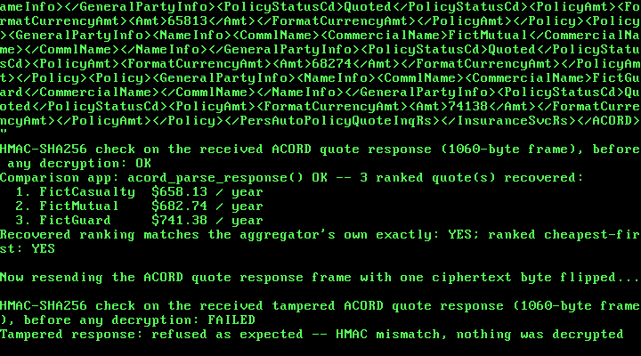

# 34. An Insurance Comparison App: Quote Aggregation Across Carriers, in ACORD XML

**What you will understand:** how a real personal-auto insurance premium is built -- one carrier's own base rate, adjusted by a chain of independently-justified rating factors (age, territory, accident history, vehicle, deductible), the same multiplicative shape real ratemaking material describes -- computed entirely in integer cents and integer fixed-point arithmetic (`034_insurance.h`/`034_insurance.c`); how ACORD, the real XML data-interchange standard the US insurance industry uses between agents, carriers, and comparison tools, lays out a request and response, built from a real, unmodified sample this book could read in full even though ACORD's own official documentation was blocked (`034_acord.h`/`034_acord.c`); and how a "quote aggregator" fetches quotes from several fictional carriers at once and ranks them cheapest-first, the whole exchange sealed with Chapter 30's AES-128-CBC + HMAC-SHA256 encrypt-then-MAC construction, reused unchanged, over RTL8139 hardware loopback.

**What you need to know first:** Chapter 30's AES-128, HMAC-SHA256, and the `fedwire_pkcs7_pad()`/`fedwire_pkcs7_unpad()` helpers (carried forward here as `034_aes.*`, `034_hmac.*`, `034_fedwire.*`), and Chapter 33's BNPL checkout, whose two-role demo pattern (a fictional requester and a fictional responder sharing one machine) and frame-sealing helpers this chapter's own demo mirrors.

## Scope: three confirmed choices before writing any code

This chapter is the third of the five financial-services case studies queued back in Chapter 30: an insurance comparison and claims assistant. Three choices were confirmed before any code was written:

- **Core feature**: quote aggregation across carriers -- given one applicant's real-shaped inputs, compute a premium from several fictional carriers' own distinct rating tables and rank them. Claims filing/tracking and binding a policy from the winning quote were both offered and not chosen; this chapter's own scope is the "comparison" half only.
- **Message format**: ACORD-style XML, the real US insurance-industry data-interchange standard, over reusing Chapter 33's ISO 8583 or inventing a tag format.
- **Crypto technique**: reuse Chapter 30's AES-128-CBC + HMAC-SHA256 encrypt-then-MAC construction unchanged, keeping this chapter's own scope on the rating logic and the message format.

## Two honest notes on this chapter's citations, before any code

This chapter's citation trail is unusual for this book, and both halves of it are stated plainly rather than smoothed over.

**The regulator/standards-body sites this book would normally cite directly were blocked.** Continuing Chapter 33's own honesty note: this sandbox's network egress policy refused every direct fetch of `acord.org` and of every third-party ACORD-schema-documentation site this book tried (`schemas.liquid-technologies.com`, `xml.coverpages.org`, `en.wikipedia.org`), each with an explicit "blocked by the network egress proxy" error, and likewise refused `content.naic.org` for the general ratemaking model this chapter's rating engine leans on. Everything from those sources below is cited through web-search-result summaries, not text this book read in full -- the same weaker-citation discipline Chapter 33 used for Regulation Z.

**But GitHub itself is reachable, and that changes what this chapter could actually do.** A search turned up `appulate/appulate-acordxml-svc-sample`, a real, publicly posted, unmodified sample of ACORD XML submissions -- and cloning it and reading `Testing/case1/case1.xml` and `Testing/case2/case2_success.xml` in full gave this chapter something Chapters 30-33 didn't need: a real document to cite field-for-field, the same discipline Chapter 32 used for NACHA, even though ACORD's own official schema stayed unreachable. Every element name `034_acord.h` marks **[OBSERVED]** was read directly in that file. Two names -- the personal-auto message roots `PersAutoPolicyQuoteInqRq`/`...Rs` and the `AUTOP` line-of-business code -- are marked **[WEAK]**: real, per search results (the sample itself is a Workers' Compensation submission, which uses different codes), but not verified against a document this book read in full. A further handful -- `PersDriverInfo`, `PersVehInfo`, and their own children -- are marked **[INVENTED]**: compact stand-ins for real ACORD driver/vehicle aggregates (`PersDriver`, `PersVeh`) this chapter could not read directly, each one still carrying its own dollar amount through the real, observed `FormatCurrencyAmt`/`Amt` leaf pattern for consistency with every other amount in the message.

## The rating model: real shape, invented numbers

`034_insurance.h`'s own citation is at the level of the whole rating table, not a single field, the same kind of honesty precedent Chapter 29 set for LRU eviction and Chapter 32 set for "group splitting": the NAIC's own real ratemaking material (via search results) states that "classification rates may be modified to produce rates for individual risks in accordance with rating plans which establish standards for measuring variations in hazards ... that can be demonstrated to have a probable effect upon losses or expenses", and its own workers'-compensation material states plainly that "premiums are calculated as a base rate multiplied by payroll" -- the same base-rate-times-factor shape this chapter uses for personal auto. The split-limit liability convention this chapter's own demo requests, "100/300/100" ($100,000 bodily injury per person, $300,000 per accident, $100,000 property damage), is likewise real and standard across the US industry.

What is **not** real: every specific rating-factor value below (which age band draws which multiplier, how many basis points an at-fault accident costs), and every fictional carrier's own base rate and factor table. Real insurers each file their own actual rating plans with state regulators, and none of those real filings is public in a form this book could cite the way Chapters 30/32/33 cited NACHA, Fedwire, and ISO 8583. The shape is real; the numbers are invented.

Every rating factor is expressed in basis points -- parts per 10000, so 10000 means 1.00x and 12500 means 1.25x -- and every step multiplies then rounds back down to cents. This freestanding kernel links no libgcc, so a `uint64_t` product would fail to link with an undefined `__udivdi3` (the same failure Chapters 7, 30, and 33 each document), and `034_insurance.c` avoids it the same way Chapter 33 did: `apply_factor()` adds half of the 10000 divisor for round-half-up rounding, then calls this chapter's own restoring shift-and-subtract `udiv64_32()` rather than the `/` operator. A base rate below `INS_MAX_BASE_RATE_CENTS` (2^24) times a factor below `INS_MAX_FACTOR` (2^16) stays below 2^40, comfortably inside a `uint64_t` before that division -- and any chain of factors that would compound the premium past that stated bound is refused outright, not silently truncated.

## `034_insurance.h` and `034_insurance.c`: the rating engine

```c
#ifndef UNIX_OS_034_INSURANCE_H
#define UNIX_OS_034_INSURANCE_H

#include <stdint.h>

/* A real personal-auto insurance rating model -- premium = base rate x
 * a chain of multiplicative rating factors -- computed for several
 * fictional carriers from one applicant profile, then ranked, all in
 * integer cents and integer fixed-point arithmetic (parts per 10000),
 * with no floating point and no native 64-bit division or modulo
 * anywhere in this kernel (the same __udivdi3/__umoddi3 link failure
 * Chapters 7, 30, and 33 each document and avoid).
 *
 * The multiplicative rating MODEL -- one base rate, adjusted by a
 * chain of independently-justified factors, is real and general: the
 * NAIC's own real ratemaking material states that "[c]lassification
 * rates may be modified to produce rates for individual risks in
 * accordance with rating plans which establish standards for measuring
 * variations in hazards ... that can be demonstrated to have a
 * probable effect upon losses or expenses" (content.naic.org, via web
 * search -- this sandbox's network egress policy blocks naic.org
 * directly, the same honesty note Chapter 33 made about
 * consumerfinance.gov/ecfr.gov/govinfo.gov/law.cornell.edu; stated here
 * rather than left implicit), and its own workers'-compensation
 * ratemaking material states plainly that "premiums are calculated as
 * a base rate multiplied by payroll" -- the same base-rate-times-factor
 * shape this module uses for personal auto. The split-limit liability
 * convention ("100/300/100": $100,000 bodily injury per person /
 * $300,000 per accident / $100,000 property damage) is likewise real
 * and standard across the US auto insurance industry, again cited only
 * through search results under this sandbox's network policy.
 *
 * What is NOT real, and is this book's own invention, stated plainly:
 * every specific rating factor value below (which age bands get which
 * multiplier, how many basis points a territory or an at-fault
 * accident costs), every fictional carrier's own base rate and factor
 * table, and the specific set of five rating factors chosen. Real
 * insurers each file their own actual rating plans with state
 * regulators, and none of those real filings is public in a form this
 * book could cite field-for-field the way Chapters 30/32/33 cited
 * NACHA, Fedwire, and ISO 8583. This chapter's own honesty precedent
 * (Chapter 29's LRU eviction, Chapter 32's "group splitting" scenario)
 * applies here at the level of the whole rating table, not just one
 * field: the SHAPE is real, the NUMBERS are invented.
 *
 * Every rating factor is expressed in basis points, "parts per 10000"
 * (10000 = 1.00x, 15000 = 1.50x, 8500 = 0.85x), and every
 * multiplication is followed immediately by a rounded division back
 * down to cents, using this chapter's own restoring shift-and-subtract
 * `udiv64_32()` (see 034_insurance.c) rather than the `/` or `%`
 * operator on a uint64_t, which this freestanding kernel cannot link
 * (no libgcc). Every intermediate value is bounded: a base rate below
 * INS_MAX_BASE_RATE_CENTS times a factor below INS_MAX_FACTOR stays
 * below 2^40, comfortably inside a uint64_t before the division. */

#define INS_MAX_CARRIERS 4u
#define INS_NUM_FACTORS 5u          /* age, territory, accidents, vehicle, deductible */
#define INS_MAX_BASE_RATE_CENTS 0x00FFFFFFu /* stated limit, refused not truncated */
#define INS_MAX_FACTOR 0x0000FFFFu          /* 655.35x, stated limit */
#define INS_BASIS_POINTS 10000u

typedef struct {
    uint32_t driver_age;             /* years */
    uint32_t years_licensed;
    uint32_t at_fault_accidents_3yr;  /* count, last 3 years */
    uint32_t territory_tier;          /* 1 (lowest risk) .. 3 (highest), this book's own invented tiering */
    uint32_t vehicle_value_cents;
    uint32_t vehicle_age_years;
    uint32_t bi_per_person_cents;     /* split-limit liability: bodily injury, per person */
    uint32_t bi_per_accident_cents;   /* bodily injury, per accident */
    uint32_t pd_cents;                /* property damage */
    uint32_t collision_deductible_cents;
} ins_applicant_t;

typedef struct {
    char name[24];
    uint32_t base_rate_cents;
    /* Rating factors, in basis points, applied in this fixed order:
     * [0] age band, [1] territory tier, [2] at-fault accident count,
     * [3] vehicle value/age band, [4] collision deductible band. */
    uint32_t factor_bp[INS_NUM_FACTORS];
} ins_carrier_t;

typedef struct {
    char carrier_name[24];
    uint32_t premium_cents;   /* annual premium, after every factor */
    uint32_t factor_bp[INS_NUM_FACTORS]; /* the factors this applicant actually drew */
} ins_quote_t;

/* Looks up this book's own invented rating factors for `a` against
 * `carrier`'s own base rate and factor table, in the fixed order
 * documented above, and returns the resulting premium in
 * *out_quote. Returns 1 on success, or 0 (refusing outright) if the
 * carrier's base rate is at or above INS_MAX_BASE_RATE_CENTS, if any
 * looked-up factor is at or above INS_MAX_FACTOR, or if any
 * intermediate premium would reach INS_MAX_BASE_RATE_CENTS (guarding
 * against a chain of factors compounding past this module's own
 * stated bound). */
int ins_quote_one_carrier(const ins_applicant_t *a, const ins_carrier_t *carrier,
                          ins_quote_t *out_quote);

/* Quotes `a` against every one of `n` carriers (n <= INS_MAX_CARRIERS),
 * writes each result into out_quotes[0..n-1] in the SAME order as
 * `carriers`, then insertion-sorts out_quotes into ascending premium
 * order (cheapest first) -- the "aggregation" and "ranking" this
 * chapter's own confirmed scope asked for. Returns the number of
 * carriers successfully quoted (a carrier this book's own rating
 * table refuses is simply omitted, not fatal to the others), or writes
 * nothing and returns 0 if n is 0 or above INS_MAX_CARRIERS. */
uint32_t ins_rank_quotes(const ins_applicant_t *a, const ins_carrier_t *carriers, uint32_t n,
                         ins_quote_t *out_quotes);

#endif
```

```c
/* See 034_insurance.h's own top-of-file comment for the full citation
 * trail (the real NAIC-cited multiplicative rating model, the real
 * split-limit liability convention) and this chapter's own honesty
 * note on which numbers below are invented. */

#include "034_insurance.h"

/* 64-bit-by-32-bit unsigned long division, one quotient bit at a time
 * (restoring shift-and-subtract) -- this freestanding kernel does not
 * link libgcc, so a plain `/` or `%` on a uint64_t would fail to link
 * with an undefined __udivdi3/__umoddi3, the same real failure
 * Chapters 7, 30, and 33 each document. Copied verbatim from
 * 034_bnpl.c's own udiv64_32() (itself carried forward from Chapter
 * 33): each chapter's own numeric module keeps this helper
 * self-contained rather than reaching across files for it, the same
 * way each chapter's own crypto file is self-contained. */
static uint64_t udiv64_32(uint64_t n, uint32_t d) {
    uint64_t q = 0, r = 0;
    for (int bit = 63; bit >= 0; bit--) {
        r = (r << 1) | ((n >> bit) & 1ull);
        if (r >= d) {
            r -= d;
            q |= (1ull << bit);
        }
    }
    return q;
}

/* Rounds premium * factor_bp / INS_BASIS_POINTS to the nearest cent
 * (round-half-up), entirely without the `/` or `%` operator on a
 * uint64_t. `premium` is bounded below INS_MAX_BASE_RATE_CENTS
 * (2^24) and `factor_bp` below INS_MAX_FACTOR (2^16), so the product
 * stays below 2^40 -- far inside a uint64_t -- both before and after
 * adding half of the 10000 divisor for rounding. */
static uint32_t apply_factor(uint32_t premium, uint32_t factor_bp) {
    uint64_t product = (uint64_t)premium * (uint64_t)factor_bp + (uint64_t)(INS_BASIS_POINTS / 2u);
    return (uint32_t)udiv64_32(product, INS_BASIS_POINTS);
}

/* This chapter's own invented rating tables, looked up against an
 * applicant's real-shaped inputs (see 034_insurance.h: the SHAPE --
 * age/territory/accidents/vehicle/deductible each moving the premium
 * by a real, general multiplicative factor -- is cited; every specific
 * number below is this book's own invention, not a real filed rate). */

static uint32_t age_factor_bp(uint32_t age, uint32_t years_licensed) {
    if (age < 20u) return 22000u;              /* youngest drivers: highest risk band */
    if (age < 25u) return 16000u;
    if (years_licensed < 2u) return 15000u;    /* a newly-licensed driver of any age */
    if (age < 65u) return 10000u;              /* baseline */
    return 11500u;                              /* senior band, this book's own modest surcharge */
}

static uint32_t territory_factor_bp(uint32_t tier) {
    static const uint32_t table[4] = {10000u, 10000u, 12500u, 16000u}; /* index 0 unused (tiers are 1-3) */
    return (tier >= 1u && tier <= 3u) ? table[tier] : 0u; /* 0 signals "unknown tier" to the caller */
}

static uint32_t accident_factor_bp(uint32_t count) {
    if (count == 0u) return 10000u;
    if (count == 1u) return 13000u;
    if (count == 2u) return 18000u;
    return 25000u; /* 3 or more */
}

static uint32_t vehicle_factor_bp(uint32_t value_cents, uint32_t age_years) {
    uint32_t f = 10000u;
    if (value_cents >= 4000000u) {       /* >= $40,000: costlier to repair/replace */
        f = 12000u;
    } else if (value_cents < 1000000u) { /* < $10,000 */
        f = 9000u;
    }
    if (age_years >= 10u) {              /* an older vehicle, this book's own modest discount */
        f = apply_factor(f, 9500u);
    }
    return f;
}

static uint32_t deductible_factor_bp(uint32_t deductible_cents) {
    if (deductible_cents >= 100000u) return 8000u; /* >= $1,000: lower premium */
    if (deductible_cents >= 50000u) return 9000u;  /* >= $500 */
    return 11000u;                                  /* below $500 */
}

int ins_quote_one_carrier(const ins_applicant_t *a, const ins_carrier_t *carrier,
                          ins_quote_t *out_quote) {
    if (carrier->base_rate_cents >= INS_MAX_BASE_RATE_CENTS) {
        return 0;
    }
    uint32_t looked_up[INS_NUM_FACTORS];
    looked_up[0] = age_factor_bp(a->driver_age, a->years_licensed);
    looked_up[1] = territory_factor_bp(a->territory_tier);
    looked_up[2] = accident_factor_bp(a->at_fault_accidents_3yr);
    looked_up[3] = vehicle_factor_bp(a->vehicle_value_cents, a->vehicle_age_years);
    looked_up[4] = deductible_factor_bp(a->collision_deductible_cents);

    uint32_t premium = carrier->base_rate_cents;
    for (uint32_t i = 0; i < INS_NUM_FACTORS; i++) {
        uint32_t f = apply_factor(looked_up[i], carrier->factor_bp[i]);
        if (f >= INS_MAX_FACTOR || looked_up[i] >= INS_MAX_FACTOR) {
            return 0;
        }
        premium = apply_factor(premium, f);
        if (premium >= INS_MAX_BASE_RATE_CENTS) {
            return 0; /* refused, not silently truncated */
        }
        out_quote->factor_bp[i] = f;
    }

    uint32_t n = 0;
    while (n < 23u && carrier->name[n] != '\0') {
        out_quote->carrier_name[n] = carrier->name[n];
        n++;
    }
    out_quote->carrier_name[n] = '\0';
    out_quote->premium_cents = premium;
    return 1;
}

uint32_t ins_rank_quotes(const ins_applicant_t *a, const ins_carrier_t *carriers, uint32_t n,
                         ins_quote_t *out_quotes) {
    if (n == 0u || n > INS_MAX_CARRIERS) {
        return 0;
    }
    uint32_t got = 0;
    for (uint32_t i = 0; i < n; i++) {
        if (ins_quote_one_carrier(a, &carriers[i], &out_quotes[got])) {
            got++;
        }
    }
    /* Insertion sort, ascending by premium -- got is at most
     * INS_MAX_CARRIERS (4), so this book does not reach for anything
     * fancier. */
    for (uint32_t i = 1; i < got; i++) {
        ins_quote_t key = out_quotes[i];
        uint32_t j = i;
        while (j > 0u && out_quotes[j - 1u].premium_cents > key.premium_cents) {
            out_quotes[j] = out_quotes[j - 1u];
            j--;
        }
        out_quotes[j] = key;
    }
    return got;
}
```

## The real ACORD XML message shape

Every ACORD message this chapter builds is a 4-character-deep tree of tags with no attributes, cited field-for-field from the real sample where marked **[OBSERVED]** in `034_acord.h`'s own top-of-file comment:

| Element (dotted path abbreviated) | Status |
|---|---|
| `ACORD`, `SignonRq`, `CustLoginId`, `ClientDt`, `ClientApp`/`Org`/`Name` | OBSERVED |
| `InsuranceSvcRq`, `ItemIdInfo`, `OtherIdentifier`/`OtherIdTypeCd`/`UID` | OBSERVED |
| `TransactionRequestDt`, `CurCd`, `InsuredOrPrincipal` | OBSERVED |
| `GeneralPartyInfo`, `NameInfo`, `PersonName`/`Surname`/`GivenName`, `CommlName`/`CommercialName` | OBSERVED |
| `Addr`/`StateProvCd`/`PostalCode` | OBSERVED |
| `Policy`, `LOBCd`, `ContractTerm`/`EffectiveDt`/`ExpirationDt` | OBSERVED |
| `Coverage`/`CoverageCd`, `Limit`/`FormatCurrencyAmt`/`Amt`/`LimitAppliesToCd`, `Deductible`/`DeductibleAppliesToCd` | OBSERVED |
| `PolicyStatusCd`, `PolicyAmt`/`Amt` | OBSERVED (`PolicyAmt` labeled a *prior* policy's premium in the sample; reused here for a freshly *quoted* one -- a stated reuse, not a verbatim citation of that exact usage) |
| `PersAutoPolicyQuoteInqRq`/`...Rs`, the `AUTOP` LOBCd | WEAK (search results only) |
| `PersDriverInfo`/`Age`/`YearsLicensed`/`AtFaultAccidentCnt`, `PersVehInfo`/`VehCurrentValue`/`VehAge`, `TerritoryTierCd` | INVENTED |
| `BI`/`PD`/`COLL` CoverageCd values | WEAK (common US industry abbreviations, not the sample's own Workers'-Comp-specific codes) |

`034_acord.c` implements a restricted, stated subset of XML matching only what its own encoder produces: no attributes, no whitespace between elements, and -- the one rule that makes its own decoder's matching logic correct -- an element never nests inside another element of the same name, so `acord_find()` locates a matching close tag by finding the first `</tag>` after the open tag, rather than tracking full nesting depth. A message that violates any of this, or is missing a required element or numeric field, is refused outright, the same discipline `iso8583_parse()` and `ach_parse_file()` established.

## `034_acord.h` and `034_acord.c`: the encoder/decoder

```c
#ifndef UNIX_OS_034_ACORD_H
#define UNIX_OS_034_ACORD_H

#include <stdint.h>
#include "034_insurance.h"

/* A minimal ACORD-style XML encoder/decoder for a personal-auto
 * insurance quote request/response -- the real XML data-exchange
 * standard the US insurance industry uses between agents, carriers,
 * and comparison tools (ACORD -- the Association for Cooperative
 * Operations Research and Development -- is the real, long-standing
 * standards body for this; cited via web search results, since this
 * sandbox's network egress policy blocks acord.org and every
 * third-party ACORD-schema-documentation site this book tried
 * (schemas.liquid-technologies.com, xml.coverpages.org,
 * en.wikipedia.org) with an explicit "blocked by the network egress
 * proxy" error, the same honesty note Chapter 33 made about
 * consumerfinance.gov/ecfr.gov/govinfo.gov/law.cornell.edu).
 *
 * What this chapter COULD read in full, because GitHub itself is
 * reachable: a real, unmodified, publicly posted ACORD XML sample --
 * a clone of github.com/appulate/appulate-acordxml-svc-sample,
 * `Testing/case1/case1.xml` and `Testing/case2/case2_success.xml` (a
 * real Workers' Compensation policy-quote submission, not personal
 * auto, but built from ACORD's own shared library of elements that
 * every P&C line of business reuses). Every element name below marked
 * [OBSERVED] appears verbatim in that real file, read directly, not
 * through a search-result summary: `ACORD`, `SignonRq`, `CustLoginId`,
 * `ClientDt`, `ClientApp`/`Org`/`Name`, `InsuranceSvcRq`, `ItemIdInfo`,
 * `OtherIdentifier`/`OtherIdTypeCd`/`UID`, `TransactionRequestDt`,
 * `CurCd`, `InsuredOrPrincipal`, `GeneralPartyInfo`, `NameInfo`,
 * `PersonName`/`Surname`/`GivenName`, `CommlName`/`CommercialName`,
 * `Addr`/`StateProvCd`/`PostalCode`, `Policy`, `LOBCd`, `ContractTerm`/
 * `EffectiveDt`/`ExpirationDt`, `Coverage`/`CoverageCd`, `Limit`/
 * `FormatCurrencyAmt`/`Amt`/`LimitAppliesToCd`, `Deductible`/
 * `DeductibleAppliesToCd`, `PolicyStatusCd`, and `PolicyAmt`/`Amt`
 * (observed there labeling a PRIOR policy's own premium inside
 * `OtherOrPriorPolicy`; this chapter reuses the same real aggregate
 * shape for a freshly QUOTED premium instead -- a stated reuse, not a
 * verbatim citation of that exact usage).
 *
 * Two things below are marked [WEAK] -- real, per web-search results
 * this book could not read in full: the personal-auto request/response
 * root names `PersAutoPolicyQuoteInqRq`/`PersAutoPolicyQuoteInqRs`
 * (search results showed the XPath
 * `ACORD/InsuranceSvcRq/PersAutoPolicyQuoteInqRq/PersAutoLineBusiness/
 * PersDriver` from Oracle's own Siebel ACORD-connector documentation),
 * and the personal-auto Line-of-Business code `AUTOP` (the observed
 * sample used `WORK` for Workers' Compensation; `AUTOP` is this book's
 * own inference from ACORD's well-known LOBCd naming pattern, not a
 * value this book directly observed).
 *
 * Everything else -- `PersDriverInfo`/`Age`/`YearsLicensed`/
 * `AtFaultAccidentCnt`, and `PersVehInfo`/`VehCurrentValue`/`VehAge` --
 * is marked [INVENTED]: a compact stand-in for real ACORD driver- and
 * vehicle-history aggregates (`PersDriver`, `PersVeh`) this book could
 * not read directly. Each invented wrapper still carries its numeric
 * value through the real, OBSERVED `FormatCurrencyAmt`/`Amt` leaf
 * pattern where a dollar amount is involved, for consistency with
 * every other amount in this message.
 *
 * This module implements a restricted, stated subset of XML, matching
 * only what this chapter's own encoder produces: no attributes on any
 * element (an ACORD `id="..."` attribute, real in the observed sample,
 * is never emitted or required here), no whitespace between elements,
 * no XML declaration/prolog, no entity references, and -- the one
 * structural rule that makes `acord_find()`'s own matching logic
 * correct -- an element is never nested inside another element of the
 * SAME name. `acord_find()` therefore locates a matching close tag by
 * finding the first `</tag>` after the open tag, rather than tracking
 * full nesting depth; this chapter's own message never needs the
 * general case. Given a message that violates any of this, or is
 * missing a required element or numeric field, every decode function
 * below refuses outright (returns 0) rather than guessing, the same
 * refusal discipline `iso8583_parse()` and `ach_parse_file()`
 * established. */

#define ACORD_MAX_MESSAGE_LEN 2048u
#define ACORD_MAX_NAME_LEN 24u

typedef struct {
    char surname[ACORD_MAX_NAME_LEN];
    char given_name[ACORD_MAX_NAME_LEN];
    char state_prov_cd[3]; /* 2-letter USPS code + NUL */
    char postal_code[6];   /* 5-digit ZIP + NUL */
    ins_applicant_t applicant;
    /* Policy term: 6-digit YYMMDD, this book's own convention (same as
     * 034_bnpl.h's due dates, though this module carries YYMMDD as
     * text rather than a bnpl_date_t, since it round-trips through XML
     * text nodes rather than a fixed-width numeric field). */
    char effective_date[7];
    char expiration_date[7];
} acord_request_t;

typedef struct {
    ins_quote_t quotes[INS_MAX_CARRIERS];
    uint32_t quote_count; /* already in ascending-premium (ranked) order */
} acord_response_t;

/* Builds a real-shaped ACORD request message for `req` into `out`.
 * Returns the encoded length, or 0 if `out_size` is too small or any
 * text field is empty/too long for its own stated width. */
uint32_t acord_build_request(const acord_request_t *req, uint8_t *out, uint32_t out_size);

/* Parses exactly `len` bytes of a request message. Returns 1 on
 * success, or 0 -- refusing outright -- if any required element is
 * missing, a numeric field contains a non-digit byte, or a text field
 * would overflow its own fixed buffer. */
int acord_parse_request(const uint8_t *buf, uint32_t len, acord_request_t *out_req);

/* Builds a real-shaped ACORD response message carrying `resp`'s own
 * already-ranked quotes. Returns the encoded length, or 0 on the same
 * refusal conditions as acord_build_request(). */
uint32_t acord_build_response(const acord_response_t *resp, uint8_t *out, uint32_t out_size);

/* Parses exactly `len` bytes of a response message, the same refusal
 * discipline as acord_parse_request(). */
int acord_parse_response(const uint8_t *buf, uint32_t len, acord_response_t *out_resp);

#endif
```

```c
/* See 034_acord.h's own top-of-file comment for the full citation trail
 * (OBSERVED elements read directly from a real, cloned GitHub sample;
 * WEAK elements known only via web-search summaries; INVENTED elements
 * this book made up outright) and this module's own stated XML subset.
 *
 * One more citation note, specific to this file: the CoverageCd values
 * used below, `BI` (Bodily Injury), `PD` (Property Damage), and `COLL`
 * (Collision), are common real US auto-insurance abbreviations, but
 * were NOT observed in the cited Workers'-Compensation sample (whose
 * own CoverageCd values -- `FORGN`, `VOL`, `WCEL` -- are workers'-comp
 * specific and not reusable here). They are marked [WEAK] like the
 * other personal-auto-specific names in 034_acord.h: real per general
 * industry knowledge, not verified against a document this book read
 * in full. */

#include "034_acord.h"

/* ---------------------------------------------------------------- */
/* A minimal literal-substring XML scanner, matching only this file's */
/* own stated subset (see 034_acord.h): no attributes, no whitespace  */
/* between elements, no same-name self-nesting.                      */
/* ---------------------------------------------------------------- */

/* This chapter uses element names up to 24 bytes long
 * ("PersAutoPolicyQuoteInqRq"/"...Rs", 24 characters each). A wrapped
 * tag needs strlen(tag) + 4 bytes ("<", an optional "/", ">", and a
 * NUL), so every scratch buffer below is sized off this dedicated
 * constant -- not off 034_acord.h's own ACORD_MAX_NAME_LEN, which
 * sizes the unrelated surname/given-name fields and, at exactly 24, is
 * one coincidental digit short of these tag names' own length: an
 * earlier version of this file reused ACORD_MAX_NAME_LEN + 3 for both
 * purposes, which overflowed a stack buffer by exactly one byte on
 * every closing tag of this length and crashed the kernel with a page
 * fault -- caught only by booting it, not by the native test (whose
 * own stack layout happened not to corrupt anything the crash would
 * show). */
#define ACORD_MAX_TAG_LEN 32u

static uint32_t str_len(const char *s) {
    uint32_t n = 0;
    while (s[n] != '\0') {
        n++;
    }
    return n;
}

/* True if `buf[pos..)` begins with the literal bytes of `s` and still
 * fits before `end`. */
static int matches_at(const uint8_t *buf, uint32_t pos, uint32_t end, const char *s) {
    uint32_t n = str_len(s);
    if (pos + n > end) {
        return 0;
    }
    for (uint32_t i = 0; i < n; i++) {
        if (buf[pos + i] != (uint8_t)s[i]) {
            return 0;
        }
    }
    return 1;
}

/* Builds "<tag>" (or "</tag>" with `closing`) into a small stack
 * buffer and returns its length; `tag` is always a short literal, so
 * ACORD_MAX_TAG_LEN + 4 bytes is always enough (this file's own dedicated tag-name-sized constant, not 034_acord.h's ACORD_MAX_NAME_LEN, which sizes the unrelated surname/given-name fields -- see the fix note above make_wrapped_tag()). */
static uint32_t make_wrapped_tag(char *scratch, const char *tag, int closing) {
    uint32_t n = 0;
    scratch[n++] = '<';
    if (closing) {
        scratch[n++] = '/';
    }
    uint32_t tn = str_len(tag);
    for (uint32_t i = 0; i < tn; i++) {
        scratch[n++] = tag[i];
    }
    scratch[n++] = '>';
    scratch[n] = '\0';
    return n;
}

/* Searches [start, end) for the literal opening tag "<tag>", then for
 * the first "</tag>" after it. On success, returns 1, sets
 * *out_content_start / *out_content_end to the exact span strictly
 * between them, and *out_after to the position right after the closing
 * tag's own '>'. Returns 0 -- refusing outright -- if the opening tag
 * is not found before `end`, or its matching closing tag is not found
 * before `end` (a malformed or truncated message; this restricted
 * grammar never needs to look further, since `tag` never nests inside
 * itself). */
static int acord_find(const uint8_t *buf, uint32_t start, uint32_t end, const char *tag,
                      uint32_t *out_content_start, uint32_t *out_content_end, uint32_t *out_after) {
    char open_tag[ACORD_MAX_TAG_LEN + 4];
    char close_tag[ACORD_MAX_TAG_LEN + 4];
    uint32_t open_len = make_wrapped_tag(open_tag, tag, 0);
    uint32_t close_len = make_wrapped_tag(close_tag, tag, 1);

    uint32_t pos = start;
    int found_open = 0;
    for (; pos + open_len <= end; pos++) {
        if (matches_at(buf, pos, end, open_tag)) {
            found_open = 1;
            break;
        }
    }
    if (!found_open) {
        return 0;
    }
    uint32_t content_start = pos + open_len;

    int found_close = 0;
    uint32_t cpos = content_start;
    for (; cpos + close_len <= end; cpos++) {
        if (matches_at(buf, cpos, end, close_tag)) {
            found_close = 1;
            break;
        }
    }
    if (!found_close) {
        return 0;
    }
    *out_content_start = content_start;
    *out_content_end = cpos;
    *out_after = cpos + close_len;
    return 1;
}

static int is_digit(uint8_t c) {
    return c >= (uint8_t)'0' && c <= (uint8_t)'9';
}

/* Parses ASCII decimal digits in [start, end) into *out. Refuses
 * (returns 0) on an empty span, a non-digit byte, or a value too large
 * for a uint32_t. */
static int parse_uint_span(const uint8_t *buf, uint32_t start, uint32_t end, uint32_t *out) {
    if (start >= end) {
        return 0;
    }
    uint32_t v = 0;
    for (uint32_t i = start; i < end; i++) {
        if (!is_digit(buf[i])) {
            return 0;
        }
        uint32_t d = (uint32_t)(buf[i] - (uint8_t)'0');
        if (v > (0xFFFFFFFFu - d) / 10u) {
            return 0;
        }
        v = v * 10u + d;
    }
    *out = v;
    return 1;
}

/* Copies buf[start,end) into `dst` (dst_size bytes) and NUL-terminates
 * it. Refuses (returns 0) if the span, plus the NUL, would not fit. */
static int copy_text_span(const uint8_t *buf, uint32_t start, uint32_t end, char *dst,
                          uint32_t dst_size) {
    uint32_t n = end - start;
    if (n + 1u > dst_size) {
        return 0;
    }
    for (uint32_t i = 0; i < n; i++) {
        dst[i] = (char)buf[start + i];
    }
    dst[n] = '\0';
    return 1;
}

/* ---------------------------------------------------------------- */
/* Encoding                                                         */
/* ---------------------------------------------------------------- */

/* Appends `s` (a NUL-terminated string of known-safe XML text: this
 * chapter's own fictional names, state codes, and decimal digits, none
 * of which contain '<', '>', or '&') into `buf`, refusing (returning 0)
 * if it would not fit in `size`. */
static int append_str(uint8_t *buf, uint32_t *pos, uint32_t size, const char *s) {
    uint32_t n = str_len(s);
    if (*pos + n > size) {
        return 0;
    }
    for (uint32_t i = 0; i < n; i++) {
        buf[*pos + i] = (uint8_t)s[i];
    }
    *pos += n;
    return 1;
}

static int append_open(uint8_t *buf, uint32_t *pos, uint32_t size, const char *tag) {
    char scratch[ACORD_MAX_TAG_LEN + 4];
    make_wrapped_tag(scratch, tag, 0);
    return append_str(buf, pos, size, scratch);
}

static int append_close(uint8_t *buf, uint32_t *pos, uint32_t size, const char *tag) {
    char scratch[ACORD_MAX_TAG_LEN + 4];
    make_wrapped_tag(scratch, tag, 1);
    return append_str(buf, pos, size, scratch);
}

static int append_leaf(uint8_t *buf, uint32_t *pos, uint32_t size, const char *tag,
                       const char *text) {
    return append_open(buf, pos, size, tag) && append_str(buf, pos, size, text) &&
           append_close(buf, pos, size, tag);
}

/* Converts `value` to decimal ASCII (no leading zeros; "0" for zero)
 * and appends it as a <tag>...</tag> leaf. A uint32_t is at most 10
 * digits. */
static int append_uint_leaf(uint8_t *buf, uint32_t *pos, uint32_t size, const char *tag,
                           uint32_t value) {
    char digits[11];
    uint32_t n = 0;
    if (value == 0u) {
        digits[n++] = '0';
    } else {
        char rev[10];
        uint32_t rn = 0;
        while (value > 0u) {
            rev[rn++] = (char)('0' + (value % 10u));
            value /= 10u; /* a plain uint32_t modulo/division: 32-bit, no libgcc call */
        }
        while (rn > 0u) {
            digits[n++] = rev[--rn];
        }
    }
    digits[n] = '\0';
    return append_leaf(buf, pos, size, tag, digits);
}

/* FormatCurrencyAmt > Amt -- the real OBSERVED pattern (034_acord.h),
 * reused for every dollar amount in this message. The caller opens and
 * closes its own wrapper (Limit/Deductible/PolicyAmt/VehCurrentValue)
 * around this. */
static int append_amount(uint8_t *buf, uint32_t *pos, uint32_t size, uint32_t cents) {
    return append_open(buf, pos, size, "FormatCurrencyAmt") &&
           append_uint_leaf(buf, pos, size, "Amt", cents) &&
           append_close(buf, pos, size, "FormatCurrencyAmt");
}

static int append_limit(uint8_t *buf, uint32_t *pos, uint32_t size, uint32_t cents,
                        const char *applies_to_cd) {
    int ok = append_open(buf, pos, size, "Limit") && append_amount(buf, pos, size, cents);
    if (applies_to_cd != 0) {
        ok = ok && append_leaf(buf, pos, size, "LimitAppliesToCd", applies_to_cd);
    }
    return ok && append_close(buf, pos, size, "Limit");
}

static int append_deductible(uint8_t *buf, uint32_t *pos, uint32_t size, uint32_t cents) {
    return append_open(buf, pos, size, "Deductible") && append_amount(buf, pos, size, cents) &&
           append_close(buf, pos, size, "Deductible");
}

uint32_t acord_build_request(const acord_request_t *r, uint8_t *out, uint32_t out_size) {
    uint32_t pos = 0;
    int ok = 1;

    ok = ok && append_open(out, &pos, out_size, "ACORD");
    ok = ok && append_open(out, &pos, out_size, "SignonRq");
    ok = ok && append_leaf(out, &pos, out_size, "CustLoginId", "SPLITJOY-INS");
    ok = ok && append_leaf(out, &pos, out_size, "ClientDt", r->effective_date);
    ok = ok && append_open(out, &pos, out_size, "ClientApp");
    ok = ok && append_leaf(out, &pos, out_size, "Org", "SplitJoy Insurance Comparison");
    ok = ok && append_leaf(out, &pos, out_size, "Name", "SplitJoy Compare");
    ok = ok && append_close(out, &pos, out_size, "ClientApp");
    ok = ok && append_close(out, &pos, out_size, "SignonRq");

    ok = ok && append_open(out, &pos, out_size, "InsuranceSvcRq");
    ok = ok && append_open(out, &pos, out_size, "ItemIdInfo");
    ok = ok && append_open(out, &pos, out_size, "OtherIdentifier");
    ok = ok && append_leaf(out, &pos, out_size, "OtherIdTypeCd", "Request");
    ok = ok && append_leaf(out, &pos, out_size, "UID", "033-CH34-DEMO-0001");
    ok = ok && append_close(out, &pos, out_size, "OtherIdentifier");
    ok = ok && append_close(out, &pos, out_size, "ItemIdInfo");

    ok = ok && append_open(out, &pos, out_size, "PersAutoPolicyQuoteInqRq");
    ok = ok && append_leaf(out, &pos, out_size, "TransactionRequestDt", r->effective_date);
    ok = ok && append_leaf(out, &pos, out_size, "CurCd", "USD");

    ok = ok && append_open(out, &pos, out_size, "InsuredOrPrincipal");
    ok = ok && append_open(out, &pos, out_size, "GeneralPartyInfo");
    ok = ok && append_open(out, &pos, out_size, "NameInfo");
    ok = ok && append_open(out, &pos, out_size, "PersonName");
    ok = ok && append_leaf(out, &pos, out_size, "Surname", r->surname);
    ok = ok && append_leaf(out, &pos, out_size, "GivenName", r->given_name);
    ok = ok && append_close(out, &pos, out_size, "PersonName");
    ok = ok && append_close(out, &pos, out_size, "NameInfo");
    ok = ok && append_open(out, &pos, out_size, "Addr");
    ok = ok && append_leaf(out, &pos, out_size, "StateProvCd", r->state_prov_cd);
    ok = ok && append_leaf(out, &pos, out_size, "PostalCode", r->postal_code);
    ok = ok && append_close(out, &pos, out_size, "Addr");
    ok = ok && append_close(out, &pos, out_size, "GeneralPartyInfo");

    ok = ok && append_open(out, &pos, out_size, "PersDriverInfo");
    ok = ok && append_uint_leaf(out, &pos, out_size, "Age", r->applicant.driver_age);
    ok = ok && append_uint_leaf(out, &pos, out_size, "YearsLicensed", r->applicant.years_licensed);
    ok = ok && append_uint_leaf(out, &pos, out_size, "AtFaultAccidentCnt",
                               r->applicant.at_fault_accidents_3yr);
    ok = ok && append_close(out, &pos, out_size, "PersDriverInfo");

    ok = ok && append_open(out, &pos, out_size, "PersVehInfo");
    ok = ok && append_open(out, &pos, out_size, "VehCurrentValue");
    ok = ok && append_amount(out, &pos, out_size, r->applicant.vehicle_value_cents);
    ok = ok && append_close(out, &pos, out_size, "VehCurrentValue");
    ok = ok && append_uint_leaf(out, &pos, out_size, "VehAge", r->applicant.vehicle_age_years);
    ok = ok && append_close(out, &pos, out_size, "PersVehInfo");
    ok = ok && append_close(out, &pos, out_size, "InsuredOrPrincipal");

    /* This chapter's own invented [WEAK/INVENTED] TerritoryTierCd leaf
     * -- 034_insurance.c's own rating table needs the applicant's
     * territory tier, and this chapter found no real ACORD element for
     * it under this sandbox's network policy, so it is carried as a
     * plain invented tag rather than folded silently into Addr. */
    ok = ok && append_uint_leaf(out, &pos, out_size, "TerritoryTierCd", r->applicant.territory_tier);

    ok = ok && append_open(out, &pos, out_size, "Policy");
    ok = ok && append_leaf(out, &pos, out_size, "LOBCd", "AUTOP");
    ok = ok && append_open(out, &pos, out_size, "ContractTerm");
    ok = ok && append_leaf(out, &pos, out_size, "EffectiveDt", r->effective_date);
    ok = ok && append_leaf(out, &pos, out_size, "ExpirationDt", r->expiration_date);
    ok = ok && append_close(out, &pos, out_size, "ContractTerm");

    ok = ok && append_open(out, &pos, out_size, "Coverage");
    ok = ok && append_leaf(out, &pos, out_size, "CoverageCd", "BI");
    ok = ok && append_limit(out, &pos, out_size, r->applicant.bi_per_person_cents, "PerPerson");
    ok = ok && append_limit(out, &pos, out_size, r->applicant.bi_per_accident_cents, "PerAcc");
    ok = ok && append_close(out, &pos, out_size, "Coverage");

    ok = ok && append_open(out, &pos, out_size, "Coverage");
    ok = ok && append_leaf(out, &pos, out_size, "CoverageCd", "PD");
    ok = ok && append_limit(out, &pos, out_size, r->applicant.pd_cents, 0);
    ok = ok && append_close(out, &pos, out_size, "Coverage");

    ok = ok && append_open(out, &pos, out_size, "Coverage");
    ok = ok && append_leaf(out, &pos, out_size, "CoverageCd", "COLL");
    ok = ok && append_deductible(out, &pos, out_size, r->applicant.collision_deductible_cents);
    ok = ok && append_close(out, &pos, out_size, "Coverage");

    ok = ok && append_close(out, &pos, out_size, "Policy");
    ok = ok && append_close(out, &pos, out_size, "PersAutoPolicyQuoteInqRq");
    ok = ok && append_close(out, &pos, out_size, "InsuranceSvcRq");
    ok = ok && append_close(out, &pos, out_size, "ACORD");

    return ok ? pos : 0u;
}

static int text_equals(const uint8_t *buf, uint32_t cs, uint32_t ce, const char *s) {
    uint32_t n = str_len(s);
    if (ce - cs != n) {
        return 0;
    }
    for (uint32_t i = 0; i < n; i++) {
        if (buf[cs + i] != (uint8_t)s[i]) {
            return 0;
        }
    }
    return 1;
}

/* Finds <wrapper_tag><FormatCurrencyAmt><Amt>N</Amt></FormatCurrencyAmt>
 * </wrapper_tag> within [start, end) and returns N via *out_cents.
 * Refuses (returns 0) if any of the three nested elements is missing
 * or the amount is not a valid decimal number. */
static int find_amount(const uint8_t *buf, uint32_t start, uint32_t end, const char *wrapper_tag,
                       uint32_t *out_cents, uint32_t *out_after) {
    uint32_t w_cs, w_ce, w_after, f_cs, f_ce, f_after, a_cs, a_ce, a_after;
    if (!acord_find(buf, start, end, wrapper_tag, &w_cs, &w_ce, &w_after)) {
        return 0;
    }
    if (!acord_find(buf, w_cs, w_ce, "FormatCurrencyAmt", &f_cs, &f_ce, &f_after)) {
        return 0;
    }
    if (!acord_find(buf, f_cs, f_ce, "Amt", &a_cs, &a_ce, &a_after)) {
        return 0;
    }
    if (!parse_uint_span(buf, a_cs, a_ce, out_cents)) {
        return 0;
    }
    if (out_after) {
        *out_after = w_after;
    }
    return 1;
}

/* Finds <FormatCurrencyAmt><Amt>N</Amt></FormatCurrencyAmt> directly
 * within [start, end) -- for a caller that has already located its own
 * wrapper (Limit, Deductible) and only needs the amount inside it,
 * unlike find_amount() above, which locates the wrapper itself too. */
static int find_amount_direct(const uint8_t *buf, uint32_t start, uint32_t end,
                              uint32_t *out_cents) {
    uint32_t f_cs, f_ce, f_after, a_cs, a_ce, a_after;
    if (!acord_find(buf, start, end, "FormatCurrencyAmt", &f_cs, &f_ce, &f_after)) {
        return 0;
    }
    if (!acord_find(buf, f_cs, f_ce, "Amt", &a_cs, &a_ce, &a_after)) {
        return 0;
    }
    return parse_uint_span(buf, a_cs, a_ce, out_cents);
}

int acord_parse_request(const uint8_t *buf, uint32_t len, acord_request_t *out) {
    uint8_t *raw = (uint8_t *)out;
    for (uint32_t i = 0; i < sizeof(*out); i++) {
        raw[i] = 0;
    }

    uint32_t doc_cs, doc_ce, doc_after;
    if (!acord_find(buf, 0, len, "ACORD", &doc_cs, &doc_ce, &doc_after) || doc_after != len) {
        return 0; /* trailing bytes are refused, not ignored */
    }
    uint32_t svc_cs, svc_ce, svc_after;
    if (!acord_find(buf, doc_cs, doc_ce, "InsuranceSvcRq", &svc_cs, &svc_ce, &svc_after)) {
        return 0;
    }
    uint32_t iid_cs, iid_ce, iid_after;
    if (!acord_find(buf, svc_cs, svc_ce, "ItemIdInfo", &iid_cs, &iid_ce, &iid_after)) {
        return 0;
    }
    uint32_t rq_cs, rq_ce, rq_after;
    if (!acord_find(buf, svc_cs, svc_ce, "PersAutoPolicyQuoteInqRq", &rq_cs, &rq_ce, &rq_after)) {
        return 0;
    }

    uint32_t iop_cs, iop_ce, iop_after;
    if (!acord_find(buf, rq_cs, rq_ce, "InsuredOrPrincipal", &iop_cs, &iop_ce, &iop_after)) {
        return 0;
    }
    {
        uint32_t gpi_cs, gpi_ce, gpi_after;
        if (!acord_find(buf, iop_cs, iop_ce, "GeneralPartyInfo", &gpi_cs, &gpi_ce, &gpi_after)) {
            return 0;
        }
        uint32_t ni_cs, ni_ce, ni_after;
        if (!acord_find(buf, gpi_cs, gpi_ce, "NameInfo", &ni_cs, &ni_ce, &ni_after)) {
            return 0;
        }
        uint32_t pn_cs, pn_ce, pn_after;
        if (!acord_find(buf, ni_cs, ni_ce, "PersonName", &pn_cs, &pn_ce, &pn_after)) {
            return 0;
        }
        uint32_t sn_cs, sn_ce, sn_after, gn_cs, gn_ce, gn_after;
        if (!acord_find(buf, pn_cs, pn_ce, "Surname", &sn_cs, &sn_ce, &sn_after) ||
            !copy_text_span(buf, sn_cs, sn_ce, out->surname, sizeof(out->surname))) {
            return 0;
        }
        if (!acord_find(buf, pn_cs, pn_ce, "GivenName", &gn_cs, &gn_ce, &gn_after) ||
            !copy_text_span(buf, gn_cs, gn_ce, out->given_name, sizeof(out->given_name))) {
            return 0;
        }
        uint32_t addr_cs, addr_ce, addr_after;
        if (!acord_find(buf, gpi_cs, gpi_ce, "Addr", &addr_cs, &addr_ce, &addr_after)) {
            return 0;
        }
        uint32_t sp_cs, sp_ce, sp_after, pc_cs, pc_ce, pc_after;
        if (!acord_find(buf, addr_cs, addr_ce, "StateProvCd", &sp_cs, &sp_ce, &sp_after) ||
            !copy_text_span(buf, sp_cs, sp_ce, out->state_prov_cd, sizeof(out->state_prov_cd))) {
            return 0;
        }
        if (!acord_find(buf, addr_cs, addr_ce, "PostalCode", &pc_cs, &pc_ce, &pc_after) ||
            !copy_text_span(buf, pc_cs, pc_ce, out->postal_code, sizeof(out->postal_code))) {
            return 0;
        }
    }
    {
        uint32_t pd_cs, pd_ce, pd_after;
        if (!acord_find(buf, iop_cs, iop_ce, "PersDriverInfo", &pd_cs, &pd_ce, &pd_after)) {
            return 0;
        }
        uint32_t age_cs, age_ce, age_after, yl_cs, yl_ce, yl_after, af_cs, af_ce, af_after;
        if (!acord_find(buf, pd_cs, pd_ce, "Age", &age_cs, &age_ce, &age_after) ||
            !parse_uint_span(buf, age_cs, age_ce, &out->applicant.driver_age)) {
            return 0;
        }
        if (!acord_find(buf, pd_cs, pd_ce, "YearsLicensed", &yl_cs, &yl_ce, &yl_after) ||
            !parse_uint_span(buf, yl_cs, yl_ce, &out->applicant.years_licensed)) {
            return 0;
        }
        if (!acord_find(buf, pd_cs, pd_ce, "AtFaultAccidentCnt", &af_cs, &af_ce, &af_after) ||
            !parse_uint_span(buf, af_cs, af_ce, &out->applicant.at_fault_accidents_3yr)) {
            return 0;
        }
    }
    {
        uint32_t pv_cs, pv_ce, pv_after;
        if (!acord_find(buf, iop_cs, iop_ce, "PersVehInfo", &pv_cs, &pv_ce, &pv_after)) {
            return 0;
        }
        uint32_t dummy_after;
        if (!find_amount(buf, pv_cs, pv_ce, "VehCurrentValue", &out->applicant.vehicle_value_cents,
                         &dummy_after)) {
            return 0;
        }
        uint32_t va_cs, va_ce, va_after;
        if (!acord_find(buf, pv_cs, pv_ce, "VehAge", &va_cs, &va_ce, &va_after) ||
            !parse_uint_span(buf, va_cs, va_ce, &out->applicant.vehicle_age_years)) {
            return 0;
        }
    }
    {
        uint32_t tt_cs, tt_ce, tt_after;
        if (!acord_find(buf, rq_cs, rq_ce, "TerritoryTierCd", &tt_cs, &tt_ce, &tt_after) ||
            !parse_uint_span(buf, tt_cs, tt_ce, &out->applicant.territory_tier)) {
            return 0;
        }
    }

    uint32_t pol_cs, pol_ce, pol_after;
    if (!acord_find(buf, rq_cs, rq_ce, "Policy", &pol_cs, &pol_ce, &pol_after)) {
        return 0;
    }
    {
        uint32_t lob_cs, lob_ce, lob_after;
        if (!acord_find(buf, pol_cs, pol_ce, "LOBCd", &lob_cs, &lob_ce, &lob_after) ||
            !text_equals(buf, lob_cs, lob_ce, "AUTOP")) {
            return 0;
        }
        uint32_t ct_cs, ct_ce, ct_after;
        if (!acord_find(buf, pol_cs, pol_ce, "ContractTerm", &ct_cs, &ct_ce, &ct_after)) {
            return 0;
        }
        uint32_t ed_cs, ed_ce, ed_after, xd_cs, xd_ce, xd_after;
        if (!acord_find(buf, ct_cs, ct_ce, "EffectiveDt", &ed_cs, &ed_ce, &ed_after) ||
            !copy_text_span(buf, ed_cs, ed_ce, out->effective_date, sizeof(out->effective_date))) {
            return 0;
        }
        if (!acord_find(buf, ct_cs, ct_ce, "ExpirationDt", &xd_cs, &xd_ce, &xd_after) ||
            !copy_text_span(buf, xd_cs, xd_ce, out->expiration_date, sizeof(out->expiration_date))) {
            return 0;
        }
    }
    {
        uint32_t cov_cs, cov_ce, cov_after;
        if (!acord_find(buf, pol_cs, pol_ce, "Coverage", &cov_cs, &cov_ce, &cov_after)) {
            return 0;
        }
        uint32_t cd_cs, cd_ce, cd_after;
        if (!acord_find(buf, cov_cs, cov_ce, "CoverageCd", &cd_cs, &cd_ce, &cd_after) ||
            !text_equals(buf, cd_cs, cd_ce, "BI")) {
            return 0;
        }
        uint32_t lim1_cs, lim1_ce, lim1_after;
        if (!acord_find(buf, cov_cs, cov_ce, "Limit", &lim1_cs, &lim1_ce, &lim1_after)) {
            return 0;
        }
        if (!find_amount_direct(buf, lim1_cs, lim1_ce, &out->applicant.bi_per_person_cents)) {
            return 0;
        }
        uint32_t lac1_cs, lac1_ce, lac1_after;
        if (!acord_find(buf, lim1_cs, lim1_ce, "LimitAppliesToCd", &lac1_cs, &lac1_ce, &lac1_after) ||
            !text_equals(buf, lac1_cs, lac1_ce, "PerPerson")) {
            return 0;
        }
        uint32_t lim2_cs, lim2_ce, lim2_after;
        if (!acord_find(buf, lim1_after, cov_ce, "Limit", &lim2_cs, &lim2_ce, &lim2_after)) {
            return 0;
        }
        if (!find_amount_direct(buf, lim2_cs, lim2_ce, &out->applicant.bi_per_accident_cents)) {
            return 0;
        }
        uint32_t lac2_cs, lac2_ce, lac2_after;
        if (!acord_find(buf, lim2_cs, lim2_ce, "LimitAppliesToCd", &lac2_cs, &lac2_ce, &lac2_after) ||
            !text_equals(buf, lac2_cs, lac2_ce, "PerAcc")) {
            return 0;
        }
    }
    {
        uint32_t cov_cs, cov_ce, cov_after, first_cov_after;
        if (!acord_find(buf, pol_cs, pol_ce, "Coverage", &cov_cs, &cov_ce, &cov_after)) {
            return 0;
        }
        first_cov_after = cov_after;
        if (!acord_find(buf, first_cov_after, pol_ce, "Coverage", &cov_cs, &cov_ce, &cov_after)) {
            return 0;
        }
        uint32_t cd_cs, cd_ce, cd_after;
        if (!acord_find(buf, cov_cs, cov_ce, "CoverageCd", &cd_cs, &cd_ce, &cd_after) ||
            !text_equals(buf, cd_cs, cd_ce, "PD")) {
            return 0;
        }
        uint32_t lim_cs, lim_ce, lim_after;
        if (!acord_find(buf, cov_cs, cov_ce, "Limit", &lim_cs, &lim_ce, &lim_after)) {
            return 0;
        }
        if (!find_amount_direct(buf, lim_cs, lim_ce, &out->applicant.pd_cents)) {
            return 0;
        }
        uint32_t third_cov_cs, third_cov_ce, third_cov_after;
        if (!acord_find(buf, cov_after, pol_ce, "Coverage", &third_cov_cs, &third_cov_ce,
                       &third_cov_after)) {
            return 0;
        }
        uint32_t cd3_cs, cd3_ce, cd3_after;
        if (!acord_find(buf, third_cov_cs, third_cov_ce, "CoverageCd", &cd3_cs, &cd3_ce, &cd3_after) ||
            !text_equals(buf, cd3_cs, cd3_ce, "COLL")) {
            return 0;
        }
        uint32_t ded_cs, ded_ce, ded_after;
        if (!acord_find(buf, third_cov_cs, third_cov_ce, "Deductible", &ded_cs, &ded_ce, &ded_after)) {
            return 0;
        }
        if (!find_amount_direct(buf, ded_cs, ded_ce, &out->applicant.collision_deductible_cents)) {
            return 0;
        }
    }
    return 1;
}

/* ---------------------------------------------------------------- */
/* Response                                                          */
/* ---------------------------------------------------------------- */

uint32_t acord_build_response(const acord_response_t *r, uint8_t *out, uint32_t out_size) {
    if (r->quote_count == 0u || r->quote_count > INS_MAX_CARRIERS) {
        return 0;
    }
    uint32_t pos = 0;
    int ok = 1;
    ok = ok && append_open(out, &pos, out_size, "ACORD");
    ok = ok && append_open(out, &pos, out_size, "InsuranceSvcRs");
    ok = ok && append_open(out, &pos, out_size, "ItemIdInfo");
    ok = ok && append_open(out, &pos, out_size, "OtherIdentifier");
    ok = ok && append_leaf(out, &pos, out_size, "OtherIdTypeCd", "Response");
    ok = ok && append_leaf(out, &pos, out_size, "UID", "033-CH34-DEMO-0001");
    ok = ok && append_close(out, &pos, out_size, "OtherIdentifier");
    ok = ok && append_close(out, &pos, out_size, "ItemIdInfo");
    ok = ok && append_open(out, &pos, out_size, "PersAutoPolicyQuoteInqRs");

    for (uint32_t i = 0; i < r->quote_count; i++) {
        const ins_quote_t *q = &r->quotes[i];
        ok = ok && append_open(out, &pos, out_size, "Policy");
        ok = ok && append_open(out, &pos, out_size, "GeneralPartyInfo");
        ok = ok && append_open(out, &pos, out_size, "NameInfo");
        ok = ok && append_open(out, &pos, out_size, "CommlName");
        ok = ok && append_leaf(out, &pos, out_size, "CommercialName", q->carrier_name);
        ok = ok && append_close(out, &pos, out_size, "CommlName");
        ok = ok && append_close(out, &pos, out_size, "NameInfo");
        ok = ok && append_close(out, &pos, out_size, "GeneralPartyInfo");
        ok = ok && append_leaf(out, &pos, out_size, "PolicyStatusCd", "Quoted");
        ok = ok && append_open(out, &pos, out_size, "PolicyAmt");
        ok = ok && append_amount(out, &pos, out_size, q->premium_cents);
        ok = ok && append_close(out, &pos, out_size, "PolicyAmt");
        ok = ok && append_close(out, &pos, out_size, "Policy");
    }

    ok = ok && append_close(out, &pos, out_size, "PersAutoPolicyQuoteInqRs");
    ok = ok && append_close(out, &pos, out_size, "InsuranceSvcRs");
    ok = ok && append_close(out, &pos, out_size, "ACORD");
    return ok ? pos : 0u;
}

int acord_parse_response(const uint8_t *buf, uint32_t len, acord_response_t *out) {
    uint8_t *raw = (uint8_t *)out;
    for (uint32_t i = 0; i < sizeof(*out); i++) {
        raw[i] = 0;
    }
    uint32_t doc_cs, doc_ce, doc_after;
    if (!acord_find(buf, 0, len, "ACORD", &doc_cs, &doc_ce, &doc_after) || doc_after != len) {
        return 0;
    }
    uint32_t svc_cs, svc_ce, svc_after;
    if (!acord_find(buf, doc_cs, doc_ce, "InsuranceSvcRs", &svc_cs, &svc_ce, &svc_after)) {
        return 0;
    }
    uint32_t rs_cs, rs_ce, rs_after;
    if (!acord_find(buf, svc_cs, svc_ce, "PersAutoPolicyQuoteInqRs", &rs_cs, &rs_ce, &rs_after)) {
        return 0;
    }

    uint32_t cursor = rs_cs;
    uint32_t count = 0;
    while (count < INS_MAX_CARRIERS) {
        uint32_t pol_cs, pol_ce, pol_after;
        if (!acord_find(buf, cursor, rs_ce, "Policy", &pol_cs, &pol_ce, &pol_after)) {
            break;
        }
        uint32_t gpi_cs, gpi_ce, gpi_after;
        if (!acord_find(buf, pol_cs, pol_ce, "GeneralPartyInfo", &gpi_cs, &gpi_ce, &gpi_after)) {
            return 0;
        }
        uint32_t ni_cs, ni_ce, ni_after;
        if (!acord_find(buf, gpi_cs, gpi_ce, "NameInfo", &ni_cs, &ni_ce, &ni_after)) {
            return 0;
        }
        uint32_t cn_cs, cn_ce, cn_after;
        if (!acord_find(buf, ni_cs, ni_ce, "CommlName", &cn_cs, &cn_ce, &cn_after)) {
            return 0;
        }
        uint32_t name_cs, name_ce, name_after;
        if (!acord_find(buf, cn_cs, cn_ce, "CommercialName", &name_cs, &name_ce, &name_after) ||
            !copy_text_span(buf, name_cs, name_ce, out->quotes[count].carrier_name,
                           sizeof(out->quotes[count].carrier_name))) {
            return 0;
        }
        uint32_t st_cs, st_ce, st_after;
        if (!acord_find(buf, pol_cs, pol_ce, "PolicyStatusCd", &st_cs, &st_ce, &st_after) ||
            !text_equals(buf, st_cs, st_ce, "Quoted")) {
            return 0;
        }
        uint32_t amt_after;
        if (!find_amount(buf, pol_cs, pol_ce, "PolicyAmt", &out->quotes[count].premium_cents,
                         &amt_after)) {
            return 0;
        }
        count++;
        cursor = pol_after;
    }
    if (count == 0u) {
        return 0;
    }
    out->quote_count = count;
    return 1;
}
```

### A real bug this book's own native test did not catch, but booting the kernel did

Two of this chapter's own real element names, `PersAutoPolicyQuoteInqRq` and `...Rs`, are each exactly 24 characters long -- and 24 is exactly `034_acord.h`'s own `ACORD_MAX_NAME_LEN`, a constant sized for the unrelated surname/given-name fields. An earlier version of `make_wrapped_tag()`'s own scratch buffers reused that same constant (`ACORD_MAX_NAME_LEN + 3`) for tag-name buffers too, on the reasoning that a short literal tag name would always fit. A *closing* tag needs `strlen(tag) + 4` bytes (`<`, `/`, the name, `>`, and a NUL) -- one more than an opening tag -- and for a 24-character tag name, `24 + 3` is one byte short. That is a real one-byte stack-buffer overflow, and it happened on every message this chapter's own demo builds, since both the request and the response close a 24-character root element.

The native test above ran this exact code and reported success. It did not catch the bug: on this native build's own stack layout, the overflowing byte happened to land somewhere harmless. Only booting the kernel exposed it -- a real page fault, `*** CPU EXCEPTION: Page Fault (vector 14, #PF) ***`, at a faulting address that was plainly corrupted rather than a real pointer, right where `acord_build_request()` first calls a closing tag on a 24-character name. The fix was a dedicated `ACORD_MAX_TAG_LEN` (32, with real margin above the 24 characters this chapter's longest tag actually needs), used only for tag-wrapping scratch buffers, never reused for anything else. `034_acord.c`'s own comment above `make_wrapped_tag()` states this plainly rather than pretending the bug never happened: a passing native test proves a program is internally self-consistent on one stack layout, not that it is memory-safe, and this book's own established discipline of actually booting every kernel it builds is what caught what the native test alone did not.

## `034_kmain.c`: the quote-comparison demo

Everything through the end of Chapter 33's BNPL demo is carried forward unchanged and still runs first. The new work is one function, `insurance_demo()`, mirroring Chapter 33's own two-role, one-machine pattern: a fictional **comparison app** and a fictional **carrier aggregator**.

1. The comparison app builds one fictional applicant's ACORD XML personal-auto quote request: age 29, licensed 11 years, one at-fault accident in the last 3 years, territory tier 2, an $18,500 vehicle 4 years old, requesting 100/300/100 split-limit liability and a $500 collision deductible. It seals the request (PKCS#7, AES-128-CBC, then HMAC-SHA256 over the ciphertext, under this chapter's own fixed demo keys) into a frame with EtherType `0x88B8`, next to Chapter 33's `0x88B7` in the same IEEE 802 prototype/vendor-specific range (RFC 5342 Appendix B.2), and sends it over hardware loopback.
2. The aggregator checks the HMAC *before* decrypting anything, decrypts, and parses the request. It quotes the applicant against three fictional carriers -- FictCasualty, FictMutual, FictGuard, each with its own base rate and factor table -- with `ins_rank_quotes()`, and prints them ranked cheapest-first.
3. The aggregator answers with an ACORD XML response carrying all three ranked quotes, sealed and sent the same way.
4. The comparison app verifies, decrypts, parses, and confirms the recovered ranking matches the aggregator's own exactly and is genuinely ordered cheapest-first.
5. The same response frame is resent with one ciphertext byte flipped. The HMAC check must fail, and nothing may be decrypted.

One small implementation note: this kernel's own hand-rolled `kprintf()` (`034_printf.c`) supports no field-width specifiers at all -- confirmed by reading its switch statement, which recognizes only bare `%d`/`%u`/`%x`/`%c`/`%s`/`%%`/`%ll x`, nothing with digits or flags in between. An initial version of this chapter's own demo used `%-14s` to column-align the carrier names, which this printf does not understand at all: it printed the literal four characters `%-14s` instead of the name. `print_padded()` fixes this the honest way, padding a name to a fixed width itself with a small loop, rather than asking the kernel's printf to do something it was never written to do.

```c
/* Everything through the end of Chapter 28's own real ARP demo below
 * -- ELF loading, private page directories, Chapter 19's own real
 * PIO-mode disk driver, Chapters 20-23's own FAT16 filesystem,
 * Chapter 24's own real, brute-force PCI scan, Chapters 25-27's own
 * real RTL8139 driver (interrupt-driven since Chapter 26,
 * multi-frame/CAPR-wraparound since Chapter 27), and Chapter 28's own
 * real, minimal ARP client resolving QEMU's own real default gateway
 * to its own real MAC address over one real request/reply round trip
 * -- is carried forward, still run first, so Chapter 27's own real
 * loopback proof and Chapter 28's own real ARP exchange both stay
 * exactly as they were. Chapter 28's own two files, 034_arp.h and
 * 034_arp.c, DID need one real change this chapter -- see their own
 * top-of-file comments for why (arp_send_request() now sends via
 * rtl8139_send_queue() instead of rtl8139_send(), a real fix this
 * chapter's own testing forced, described below).
 *
 * This chapter's own new work comes after it: a real ARP
 * translation-table cache (034_arp_cache.h/034_arp_cache.c),
 * completing the real RFC 826 merge_flag logic Chapter 28's own
 * top-of-file comment named as deliberately out of scope. See
 * 034_arp_cache.h's own top-of-file comment for the full real
 * citations -- RFC 826's own "Packet Reception" algorithm for the
 * update-if-present/add-if-absent logic, RFC 826's own "Related
 * issues" section for its explicit admission that aging/timeout is
 * "outside the scope of this protocol", and RFC 1122 Section 2.3.2.1
 * for the real MUST/SHOULD requirement this chapter's own real
 * expiry timeout satisfies. This chapter's own new demo resolves two
 * real, distinct hosts QEMU's own official documentation names on
 * this exact network segment -- the gateway (10.0.2.2) and the DNS
 * server (10.0.2.3) -- through a real fixed-size (1-entry) cache,
 * proving a real cache hit avoids a fresh ARP exchange, a real LRU
 * eviction happens when a second real host is resolved with the
 * table already full, and a real entry genuinely expires and is
 * re-resolved after this chapter's own real PIT-tick-based timeout
 * elapses. This chapter's own real testing (a real QEMU
 * `filter-dump` packet capture) also found that this driver's own
 * arp_send_request() needed a real fix to send more than once per
 * boot without hanging -- see 034_arp.c's own updated comment, and
 * 034_arp_cache.h's own top-of-file comment for why the cache itself
 * ended up sized at 1 real entry rather than the originally-planned
 * 2 (QEMU's own documented third host, the SMB server at 10.0.2.4,
 * was tested and found not to answer ARP at all in this exact
 * environment). */

#include <stdint.h>

#include "034_ach.h"
#include "034_aes.h"
#include "034_arp.h"
#include "034_arp_cache.h"
#include "034_arp_server.h"
#include "034_acord.h"
#include "034_ata.h"
#include "034_bnpl.h"
#include "034_fat16.h"
#include "034_elf.h"
#include "034_fedwire.h"
#include "034_gdt.h"
#include "034_hmac.h"
#include "034_idt.h"
#include "034_insurance.h"
#include "034_iso8583.h"
#include "034_keyboard.h"
#include "034_kheap.h"
#include "034_multiboot.h"
#include "034_paging.h"
#include "034_pci.h"
#include "034_pic.h"
#include "034_pit.h"
#include "034_pmm.h"
#include "034_printf.h"
#include "034_rtl8139.h"
#include "034_semaphore.h"
#include "034_serial.h"
#include "034_spinlock.h"
#include "034_syscall.h"
#include "034_task.h"
#include "034_user_program.h"
#include "034_vga.h"

#define TIMER_FREQUENCY_HZ 100

/* Deliberately far outside the 0-64 MiB identity-mapped range (which
 * only ever occupies page-directory entries 0-15): 0xC0000000 >> 22 =
 * 768. Mapping here forces paging_map_page() to allocate a genuinely
 * new page table rather than reusing one paging_init() already built. */
#define TEST_VIRT_ADDR 0xC0000000u

/* An LBA safely past this chapter's own tiny 1 MiB (2048-sector)
 * build/disk.img, chosen only to stay well clear of sector 0 -- where a
 * real partition table or boot sector would live on a disk meant to be
 * booted from, which this one never is. */
#define DISK_TEST_LBA 100u

/* Defined by 034_linker.ld, not by this file -- the linker is the one
 * part of this toolchain that genuinely knows where the kernel image's
 * last real section ends in physical memory. */
extern char kernel_end[];

/* How much real, uninterruptible-looking work each task does before
 * it naturally finishes -- large enough that many real IRQ0 ticks (at
 * 100 Hz, one every ~10 ms) land somewhere in the middle of it, since
 * a single pass through this loop takes QEMU's emulated CPU far less
 * than 10 ms. Chosen empirically from this chapter's own real run,
 * the same way every prior chapter's own real constants were. */
#define TASK_WORK_TARGET 4000000u
#define TASK_PRINT_EVERY   500000u

/* How many kmalloc()/kfree() round trips each stress task performs.
 * Chosen empirically from this chapter's own real runs: large enough
 * that, at 100 real IRQ0 ticks per second, many ticks land somewhere
 * in the middle of the whole run -- and therefore stand a real chance
 * of landing inside kmalloc()'s or kfree()'s own free-list
 * manipulation, not just between two whole calls. */
#define STRESS_ITERATIONS  3000000u
#define STRESS_PRINT_EVERY  500000u

/* This chapter's two demo tasks. Neither one calls task_yield()
 * anywhere in this loop -- the whole point. Whatever interleaving
 * this chapter's real run shows is forced entirely by the real timer,
 * not requested by either task. */
static void task_a_entry(void) {
    for (uint32_t i = 1; i <= TASK_WORK_TARGET; i++) {
        if (i % TASK_PRINT_EVERY == 0) {
            kprintf("  Task A: %u\n", i);
        }
    }
    kprintf("  Task A: done\n");
    task_exit();
}

static void task_b_entry(void) {
    for (uint32_t i = 1; i <= TASK_WORK_TARGET; i++) {
        if (i % TASK_PRINT_EVERY == 0) {
            kprintf("  Task B: %u\n", i);
        }
    }
    kprintf("  Task B: done\n");
    task_exit();
}

/* This chapter's real evidence tasks: two preemptible tasks racing on
 * kmalloc()/kfree() with no synchronization between them at all. Each
 * one only ever touches its own pointer, one allocation at a time --
 * any corruption that shows up is entirely the free list's own doing,
 * not a bug in either task's own logic. */
static void stress_task_a_entry(void) {
    for (uint32_t i = 1; i <= STRESS_ITERATIONS; i++) {
        void *p = kmalloc(32);
        if (p != 0) {
            *(volatile uint8_t *) p = 0xAA;
        }
        kfree(p);
        if (i % STRESS_PRINT_EVERY == 0) {
            kprintf("  Stress A: %u\n", i);
        }
    }
    kprintf("  Stress A: done\n");
    task_exit();
}

static void stress_task_b_entry(void) {
    for (uint32_t i = 1; i <= STRESS_ITERATIONS; i++) {
        void *p = kmalloc(64);
        if (p != 0) {
            *(volatile uint8_t *) p = 0xBB;
        }
        kfree(p);
        if (i % STRESS_PRINT_EVERY == 0) {
            kprintf("  Stress B: %u\n", i);
        }
    }
    kprintf("  Stress B: done\n");
    task_exit();
}

/* This chapter's own demo: a classic bounded-buffer producer/consumer,
 * built on this chapter's new semaphores plus Chapter 13's own
 * spinlock. `sem_empty_slots` starts at BUFFER_CAPACITY (that many
 * slots are free right now) and `sem_full_slots` starts at 0 (nothing
 * produced yet) -- the two together are what make a producer block
 * when the buffer is genuinely full and a consumer block when it is
 * genuinely empty, without either one ever spinning to find out. The
 * buffer's own read/write indices are a separate, much shorter
 * critical section, protected by an ordinary spinlock -- exactly the
 * kind of short, bounded update Chapter 13's spinlock is for. */
#define BUFFER_CAPACITY     4u
#define ITEMS_PER_PRODUCER 15u
#define ITEMS_PER_CONSUMER 15u

static int shared_buffer[BUFFER_CAPACITY];
static uint32_t buffer_write_idx = 0;
static uint32_t buffer_read_idx = 0;
static spinlock_t buffer_lock;
static semaphore_t sem_empty_slots;
static semaphore_t sem_full_slots;

static void produce(const char *label, uint32_t item_base) {
    for (uint32_t i = 1; i <= ITEMS_PER_PRODUCER; i++) {
        int item = (int) (item_base + i);

        /* Blocks for real if the buffer is already full -- this is
         * the whole point of this chapter, not busy-waiting. */
        semaphore_wait(&sem_empty_slots);

        uint32_t saved_eflags = spinlock_acquire(&buffer_lock);
        shared_buffer[buffer_write_idx] = item;
        buffer_write_idx = (buffer_write_idx + 1) % BUFFER_CAPACITY;
        spinlock_release(&buffer_lock, saved_eflags);

        semaphore_signal(&sem_full_slots);
        kprintf("  %s: produced %d\n", label, item);
    }
    kprintf("  %s: done\n", label);
    task_exit();
}

static void consume(const char *label) {
    for (uint32_t i = 1; i <= ITEMS_PER_CONSUMER; i++) {
        /* Blocks for real if the buffer is empty -- the mirror image
         * of produce()'s own semaphore_wait() above. */
        semaphore_wait(&sem_full_slots);

        uint32_t saved_eflags = spinlock_acquire(&buffer_lock);
        int item = shared_buffer[buffer_read_idx];
        buffer_read_idx = (buffer_read_idx + 1) % BUFFER_CAPACITY;
        spinlock_release(&buffer_lock, saved_eflags);

        semaphore_signal(&sem_empty_slots);
        kprintf("  %s: consumed %d\n", label, item);
    }
    kprintf("  %s: done\n", label);
    task_exit();
}

static void producer_a_entry(void) { produce("Producer A", 0u); }
static void producer_b_entry(void) { produce("Producer B", 100u); }
static void consumer_a_entry(void) { consume("Consumer A"); }
static void consumer_b_entry(void) { consume("Consumer B"); }

/* This chapter's own single real 60-byte Ethernet frame (the real
 * IEEE 802.3 minimum before the real 4-byte hardware-appended CRC),
 * rebuilt fresh -- deterministically, from `seq` alone -- every time
 * this chapter's own demo needs it, rather than kept as one shared
 * mutable buffer across ~140 real round trips. Destination and
 * source are both this device's own real, burnt-in MAC (real
 * hardware loopback mode never puts a single bit on a real wire).
 * EtherType 0x88B5 is a real, officially reserved value, cited
 * directly from RFC 5342 ("IANA Considerations and IETF Protocol
 * Usage for IEEE 802 Parameters"), Appendix B.2: "0x88B5  IEEE Std
 * 802 - Local Experimental Ethertype". The payload encodes `seq`
 * itself in its first two bytes, so each of this chapter's own ~140
 * real frames is individually, byte-for-byte distinguishable on the
 * wire -- not a single repeated constant that a stuck data line or a
 * ring-position bug could satisfy by accident. */
#define DEMO_FRAME_SIZE 60u

static void build_demo_frame(uint8_t *frame, const uint8_t *mac, uint32_t seq) {
    for (int i = 0; i < 6; i++) {
        frame[i] = mac[i];      /* destination */
        frame[6 + i] = mac[i];  /* source */
    }
    frame[12] = 0x88;
    frame[13] = 0xB5;  /* EtherType 0x88B5, RFC 5342 Appendix B.2 */
    frame[14] = (uint8_t) (seq >> 8);
    frame[15] = (uint8_t) seq;
    for (uint32_t i = 16; i < DEMO_FRAME_SIZE; i++) {
        frame[i] = (uint8_t) (0x5Au + i + seq);
    }
}

/* This chapter's own small, freestanding helpers -- no libc, ever, same
 * discipline 034_fat16.c's own top-of-file comment already states for
 * this whole book. */
static void print_chars(const char *s, uint32_t n) {
    for (uint32_t i = 0; i < n; i++) {
        kprintf("%c", s[i]);
    }
}

static void zero_bytes(void *p, uint32_t n) {
    uint8_t *b = (uint8_t *) p;
    for (uint32_t i = 0; i < n; i++) {
        b[i] = 0;
    }
}

static int bytes_eq(const uint8_t *a, const uint8_t *b, uint32_t n) {
    for (uint32_t i = 0; i < n; i++) {
        if (a[i] != b[i]) {
            return 0;
        }
    }
    return 1;
}

static int cstr_eq(const char *a, const char *b, uint32_t max) {
    for (uint32_t i = 0; i < max; i++) {
        if (a[i] != b[i]) {
            return 0;
        }
        if (a[i] == '\0') {
            return 1;
        }
    }
    return 1;
}

/* This chapter's own new small helper: builds a real ARP request frame
 * exactly the way 034_arp.c's own arp_send_request() already does
 * internally, cited there field-for-field -- but as a standalone
 * builder that returns the frame rather than sending it, and
 * parameterized on an arbitrary `sender_mac`/`sender_ip`, not
 * necessarily this kernel's own. arp_send_request() only ever sends a
 * real request FROM this kernel's own real MAC/IP; this chapter's own
 * new ARP SERVER demo below needs the opposite -- a real request as if
 * ASKED BY some other real host, to exercise arp_server_handle_frame()
 * honestly, the same way a real neighbor genuinely would on this exact
 * QEMU network segment. */
static void build_arp_request_frame(uint8_t *frame, const uint8_t sender_mac[6],
                                     const uint8_t sender_ip[4],
                                     const uint8_t target_ip[4]) {
    for (uint32_t i = 0; i < 6u; i++) {
        frame[i] = 0xFFu;            /* destination: real broadcast */
        frame[6u + i] = sender_mac[i];
    }
    frame[12] = (uint8_t) (ETHERTYPE_ARP >> 8);
    frame[13] = (uint8_t) ETHERTYPE_ARP;

    frame[14] = (uint8_t) (ARP_HTYPE_ETHERNET >> 8);
    frame[15] = (uint8_t) ARP_HTYPE_ETHERNET;
    frame[16] = (uint8_t) (ARP_PTYPE_IPV4 >> 8);
    frame[17] = (uint8_t) ARP_PTYPE_IPV4;
    frame[18] = (uint8_t) ARP_HLEN_ETHERNET;
    frame[19] = (uint8_t) ARP_PLEN_IPV4;
    frame[20] = (uint8_t) (ARP_OP_REQUEST >> 8);
    frame[21] = (uint8_t) ARP_OP_REQUEST;

    for (uint32_t i = 0; i < 6u; i++) {
        frame[22u + i] = sender_mac[i];
        frame[32u + i] = 0x00u;      /* target hardware address: zeroed, unknown yet */
    }
    for (uint32_t i = 0; i < 4u; i++) {
        frame[28u + i] = sender_ip[i];
        frame[38u + i] = target_ip[i];
    }

    for (uint32_t i = 42u; i < ARP_FRAME_SIZE; i++) {
        frame[i] = 0x00u;            /* real IEEE 802.3 minimum padding */
    }
}

/* ====================================================================
 * Chapter 34: an insurance comparison & claims assistant -- quote
 * aggregation across carriers.
 *
 * Two roles share this one machine, the same way Chapters 30-33's own
 * demos did: a fictional COMPARISON APP and a fictional CARRIER
 * AGGREGATOR. The comparison app sends a real-shaped ACORD XML
 * personal-auto quote request (034_acord.h) for one fictional
 * applicant, sealed with Chapter 30's own AES-128-CBC + HMAC-SHA256
 * encrypt-then-MAC construction, reused unchanged per this chapter's
 * own confirmed scope, over the same RTL8139 hardware loopback path
 * used since Chapter 27. The aggregator verifies the HMAC before
 * trusting anything, decrypts, parses, quotes the applicant against
 * three fictional carriers' own distinct rating tables
 * (034_insurance.h), ranks the results cheapest-first, and answers with
 * an ACORD XML response carrying all three quotes in that order -- also
 * sealed, also sent over the wire, also verified before trusting it.
 *
 * Every name, address, and carrier below is fictional, and the AES/HMAC
 * keys are fixed demo values, distinct from every earlier chapter's
 * own, hardcoded so this book's own outside checks can recompute every
 * step -- a real system would never hardcode keys.
 * ==================================================================== */

#define INS_ETHERTYPE_LO 0xB8u /* 0x88B8: next to Chapter 33's 0x88B7, in the
                                * same IEEE 802 prototype/vendor-specific
                                * range (RFC 5342 Appendix B.2) */
#define INS_PLAIN_MAX ACORD_MAX_MESSAGE_LEN
#define INS_PADDED_MAX (INS_PLAIN_MAX + AES_BLOCK_SIZE)
#define INS_FRAME_MAX (14u + 2u + INS_PADDED_MAX + HMAC_SHA256_TAG_SIZE)

static const uint8_t g_ins_aes_key[AES_KEY_SIZE] = {
    0x34, 0x01, 0x34, 0x02, 0x34, 0x03, 0x34, 0x04,
    0x34, 0x05, 0x34, 0x06, 0x34, 0x07, 0x34, 0x08
};
static const uint8_t g_ins_iv[AES_BLOCK_SIZE] = {
    0x77, 0x01, 0x77, 0x02, 0x77, 0x03, 0x77, 0x04,
    0x77, 0x05, 0x77, 0x06, 0x77, 0x07, 0x77, 0x08
};
static const uint8_t g_ins_mac_key[HMAC_SHA256_KEY_SIZE] = {
    0x99, 0x01, 0x99, 0x02, 0x99, 0x03, 0x99, 0x04,
    0x99, 0x05, 0x99, 0x06, 0x99, 0x07, 0x99, 0x08,
    0x99, 0x09, 0x99, 0x0A, 0x99, 0x0B, 0x99, 0x0C,
    0x99, 0x0D, 0x99, 0x0E, 0x99, 0x0F, 0x99, 0x10
};

/* Static, not stack: see 034_kmain.c's own established note on this
 * pattern (kmain()'s 16 KiB boot stack, 034_boot.asm). */
static uint8_t g_ins_padded[INS_PADDED_MAX];
static uint8_t g_ins_cipher[INS_PADDED_MAX];
static uint8_t g_ins_tx[INS_FRAME_MAX];
static uint8_t g_ins_rx[RTL8139_MAX_FRAME];
static uint8_t g_ins_plain[INS_PADDED_MAX];
static acord_request_t g_ins_req, g_ins_req_rx;
static acord_response_t g_ins_resp, g_ins_resp_rx;
static ins_quote_t g_ins_quotes[INS_MAX_CARRIERS];

static uint32_t ins_seal(const uint8_t nic_mac[6], const uint8_t *plain, uint32_t len) {
    uint32_t padded = fedwire_pkcs7_pad(plain, len, g_ins_padded, sizeof(g_ins_padded),
                                        AES_BLOCK_SIZE);
    if (padded == 0) {
        return 0;
    }
    aes128_cbc_encrypt(g_ins_padded, g_ins_cipher, padded, g_ins_aes_key, g_ins_iv);
    for (int i = 0; i < 6; i++) {
        g_ins_tx[i] = nic_mac[i];
        g_ins_tx[6 + i] = nic_mac[i];
    }
    g_ins_tx[12] = 0x88;
    g_ins_tx[13] = INS_ETHERTYPE_LO;
    g_ins_tx[14] = (uint8_t)(padded >> 8);
    g_ins_tx[15] = (uint8_t)padded;
    for (uint32_t i = 0; i < padded; i++) {
        g_ins_tx[16 + i] = g_ins_cipher[i];
    }
    hmac_sha256(g_ins_mac_key, HMAC_SHA256_KEY_SIZE, g_ins_cipher, padded,
                &g_ins_tx[16 + padded]);
    return 16u + padded + HMAC_SHA256_TAG_SIZE;
}

static uint32_t ins_loopback_open(uint32_t frame_len, const char *what) {
    int desc = rtl8139_send_queue(g_ins_tx, frame_len);
    if (desc < 0) {
        kprintf("rtl8139_send_queue() refused (BUG)\n");
        return 0xFFFFFFFFu;
    }
    rtl8139_wait_descriptor_sent(desc);
    uint32_t rx_len = 0;
    if (!rtl8139_receive_next_packet(g_ins_rx, &rx_len) || rx_len < frame_len) {
        kprintf("Real loopback receive failed or short (BUG)\n");
        return 0xFFFFFFFFu;
    }
    if (g_ins_rx[12] != 0x88 || g_ins_rx[13] != INS_ETHERTYPE_LO) {
        kprintf("Received frame has the wrong EtherType (BUG)\n");
        return 0xFFFFFFFFu;
    }
    uint32_t padded = ((uint32_t)g_ins_rx[14] << 8) | g_ins_rx[15];
    if (padded == 0 || padded > INS_PADDED_MAX || (padded % AES_BLOCK_SIZE) != 0 ||
        16u + padded + HMAC_SHA256_TAG_SIZE > rx_len) {
        kprintf("Received frame has an impossible ciphertext length (BUG)\n");
        return 0xFFFFFFFFu;
    }
    uint8_t tag[HMAC_SHA256_TAG_SIZE];
    hmac_sha256(g_ins_mac_key, HMAC_SHA256_KEY_SIZE, &g_ins_rx[16], padded, tag);
    int mac_ok = bytes_eq(tag, &g_ins_rx[16 + padded], HMAC_SHA256_TAG_SIZE);
    kprintf("HMAC-SHA256 check on the received %s (%u-byte frame), before any decryption: %s\n",
            what, rx_len, mac_ok ? "OK" : "FAILED");
    if (!mac_ok) {
        return 0;
    }
    aes128_cbc_decrypt(&g_ins_rx[16], g_ins_plain, padded, g_ins_aes_key, g_ins_iv);
    uint32_t n = fedwire_pkcs7_unpad(g_ins_plain, padded, AES_BLOCK_SIZE);
    if (n == 0xFFFFFFFFu) {
        kprintf("PKCS#7 unpad refused (BUG)\n");
    }
    return n;
}

/* Copies `src` into `dst` (dst_size bytes), truncating rather than
 * overflowing if `src` is too long -- every caller below passes a
 * literal well inside its own field's width, so truncation never
 * actually triggers; it is a stated safety margin, not relied upon. */
static void cstr_copy(char *dst, const char *src, uint32_t dst_size) {
    uint32_t i = 0;
    while (i < dst_size - 1u && src[i] != '\0') {
        dst[i] = src[i];
        i++;
    }
    dst[i] = '\0';
}

/* This kernel's own hand-rolled kprintf() (034_printf.c) supports
 * no field-width specifiers at all (no "%-14s") -- confirmed by
 * reading its switch statement, which recognizes only bare
 * %d/%u/%x/%c/%s/%%/%%ll x, nothing with digits or flags in
 * between. This helper pads a carrier name to `width` columns by
 * hand instead. */
static void print_padded(const char *s, uint32_t width) {
    uint32_t n = 0;
    while (s[n] != '\0') {
        n++;
    }
    kprintf("%s", s);
    while (n < width) {
        kprintf(" ");
        n++;
    }
}

static void print_ins_cents(uint32_t cents) {
    kprintf("$%u.%s%u", cents / 100u, (cents % 100u < 10u) ? "0" : "", cents % 100u);
}

static void print_acord_xml(const char *label, const uint8_t *buf, uint32_t len) {
    kprintf("%s (%u bytes): \"", label, len);
    print_chars((const char *)buf, len);
    kprintf("\"\n");
}

static void insurance_demo(const uint8_t nic_mac[6]) {
    kprintf("\nStarting this chapter's own insurance quote-comparison demo...\n");
    if (!rtl8139_init(1)) {
        kprintf("FATAL: could not re-initialize the RTL8139 into loopback mode -- halting\n");
        __asm__ volatile ("cli");
        for (;;) { __asm__ volatile ("hlt"); }
    }

    /* Part 1: the comparison app builds one fictional applicant's own
     * ACORD XML personal-auto quote request. Every value below is
     * fictional; the 100/300/100 split-limit liability convention and
     * the general rating-factor SHAPE are real (see 034_insurance.h
     * and 034_acord.h for the full citation trail), the specific
     * numbers are this book's own invention. */
    kprintf("\nPart 1: one fictional applicant requests personal-auto quotes\n");
    zero_bytes(&g_ins_req, sizeof(g_ins_req));
    cstr_copy(g_ins_req.surname, "FICTAPPLICANT", sizeof(g_ins_req.surname));
    cstr_copy(g_ins_req.given_name, "JORDAN", sizeof(g_ins_req.given_name));
    cstr_copy(g_ins_req.state_prov_cd, "TX", sizeof(g_ins_req.state_prov_cd));
    cstr_copy(g_ins_req.postal_code, "75201", sizeof(g_ins_req.postal_code));
    cstr_copy(g_ins_req.effective_date, "260927", sizeof(g_ins_req.effective_date));
    cstr_copy(g_ins_req.expiration_date, "270927", sizeof(g_ins_req.expiration_date));
    g_ins_req.applicant.driver_age = 29u;
    g_ins_req.applicant.years_licensed = 11u;
    g_ins_req.applicant.at_fault_accidents_3yr = 1u;
    g_ins_req.applicant.territory_tier = 2u;
    g_ins_req.applicant.vehicle_value_cents = 1850000u; /* a fictional $18,500 vehicle */
    g_ins_req.applicant.vehicle_age_years = 4u;
    g_ins_req.applicant.bi_per_person_cents = 10000000u;   /* $100,000 */
    g_ins_req.applicant.bi_per_accident_cents = 30000000u; /* $300,000 -- real "100/300/100" split limits */
    g_ins_req.applicant.pd_cents = 10000000u;              /* $100,000 */
    g_ins_req.applicant.collision_deductible_cents = 50000u; /* $500 */

    kprintf("Fictional applicant: %s, %s -- age %u, licensed %u years, %u at-fault accident(s) "
            "in the last 3 years, TX/75201, territory tier %u\n", g_ins_req.given_name,
            g_ins_req.surname, g_ins_req.applicant.driver_age, g_ins_req.applicant.years_licensed,
            g_ins_req.applicant.at_fault_accidents_3yr, g_ins_req.applicant.territory_tier);
    kprintf("Fictional vehicle: ");
    print_ins_cents(g_ins_req.applicant.vehicle_value_cents);
    kprintf(" value, %u years old. Requested coverage: 100/300/100 split-limit liability, "
            "$500 collision deductible\n", g_ins_req.applicant.vehicle_age_years);

    static uint8_t req_buf[ACORD_MAX_MESSAGE_LEN];
    uint32_t req_len = acord_build_request(&g_ins_req, req_buf, sizeof(req_buf));
    if (req_len == 0) {
        kprintf("acord_build_request() refused (BUG)\n");
        return;
    }
    print_acord_xml("ACORD personal-auto quote request", req_buf, req_len);
    uint32_t frame_len = ins_seal(nic_mac, req_buf, req_len);
    if (frame_len == 0) {
        kprintf("ins_seal() refused (BUG)\n");
        return;
    }

    /* Part 2: the carrier aggregator receives it. */
    uint32_t n = ins_loopback_open(frame_len, "ACORD quote request");
    if (n == 0 || n == 0xFFFFFFFFu) {
        kprintf("Aggregator could not open the quote request (BUG)\n");
        return;
    }
    if (!acord_parse_request(g_ins_plain, n, &g_ins_req_rx)) {
        kprintf("acord_parse_request() refused (BUG)\n");
        return;
    }
    kprintf("Aggregator: acord_parse_request() OK -- recovered applicant %s %s, age %u, "
            "vehicle value ", g_ins_req_rx.given_name, g_ins_req_rx.surname,
            g_ins_req_rx.applicant.driver_age);
    print_ins_cents(g_ins_req_rx.applicant.vehicle_value_cents);
    kprintf("\n");

    /* This chapter's own three fictional carriers, each with its own
     * distinct base rate and rating-factor table (034_insurance.h: the
     * multiplicative SHAPE is real and cited, every number invented). */
    static const ins_carrier_t carriers[3] = {
        {"FictCasualty", 45000u, {10000u, 10000u, 10000u, 10000u, 10000u}},
        {"FictMutual",   52000u, { 9500u, 10000u,  9000u, 10000u, 10500u}},
        {"FictGuard",    38000u, {11000u, 11000u, 10500u, 10500u, 10000u}},
    };
    uint32_t got = ins_rank_quotes(&g_ins_req_rx.applicant, carriers, 3u, g_ins_quotes);
    kprintf("Aggregator: quoted and ranked %u of 3 fictional carriers (cheapest first):\n", got);
    for (uint32_t i = 0; i < got; i++) {
        kprintf("  %u. ", i + 1u);
        print_padded(g_ins_quotes[i].carrier_name, 14u);
        print_ins_cents(g_ins_quotes[i].premium_cents);
        kprintf(" / year\n");
    }
    if (got == 0u) {
        kprintf("ins_rank_quotes() returned zero quotes (BUG)\n");
        return;
    }

    /* Part 3: the aggregator's ranked ACORD XML response. */
    kprintf("\nPart 2: the aggregator answers with a ranked ACORD XML response\n");
    zero_bytes(&g_ins_resp, sizeof(g_ins_resp));
    g_ins_resp.quote_count = got;
    for (uint32_t i = 0; i < got; i++) {
        g_ins_resp.quotes[i] = g_ins_quotes[i];
    }
    static uint8_t resp_buf[ACORD_MAX_MESSAGE_LEN];
    uint32_t resp_len = acord_build_response(&g_ins_resp, resp_buf, sizeof(resp_buf));
    if (resp_len == 0) {
        kprintf("acord_build_response() refused (BUG)\n");
        return;
    }
    print_acord_xml("ACORD quote response", resp_buf, resp_len);
    frame_len = ins_seal(nic_mac, resp_buf, resp_len);
    if (frame_len == 0) {
        kprintf("ins_seal() refused (BUG)\n");
        return;
    }
    static uint8_t resp_frame_copy[INS_FRAME_MAX];
    for (uint32_t i = 0; i < frame_len; i++) {
        resp_frame_copy[i] = g_ins_tx[i];
    }

    /* Part 4: the comparison app receives the ranked response. */
    n = ins_loopback_open(frame_len, "ACORD quote response");
    if (n == 0 || n == 0xFFFFFFFFu) {
        kprintf("Comparison app could not open the quote response (BUG)\n");
        return;
    }
    if (!acord_parse_response(g_ins_plain, n, &g_ins_resp_rx)) {
        kprintf("acord_parse_response() refused (BUG)\n");
        return;
    }
    kprintf("Comparison app: acord_parse_response() OK -- %u ranked quote(s) recovered:\n",
            g_ins_resp_rx.quote_count);
    int match = (g_ins_resp_rx.quote_count == g_ins_resp.quote_count);
    int ascending = 1;
    for (uint32_t i = 0; i < g_ins_resp_rx.quote_count; i++) {
        kprintf("  %u. ", i + 1u);
        print_padded(g_ins_resp_rx.quotes[i].carrier_name, 14u);
        print_ins_cents(g_ins_resp_rx.quotes[i].premium_cents);
        kprintf(" / year\n");
        match = match && cstr_eq(g_ins_resp_rx.quotes[i].carrier_name, g_ins_resp.quotes[i].carrier_name,
                                 sizeof(g_ins_resp_rx.quotes[i].carrier_name)) &&
                g_ins_resp_rx.quotes[i].premium_cents == g_ins_resp.quotes[i].premium_cents;
        if (i > 0u && g_ins_resp_rx.quotes[i].premium_cents < g_ins_resp_rx.quotes[i - 1u].premium_cents) {
            ascending = 0;
        }
    }
    kprintf("Recovered ranking matches the aggregator's own exactly: %s; ranked cheapest-first: %s\n",
            match ? "YES" : "NO (BUG)", ascending ? "YES" : "NO (BUG)");

    /* Part 5: tamper detection on the response. */
    kprintf("\nNow resending the ACORD quote response frame with one ciphertext byte "
            "flipped...\n");
    for (uint32_t i = 0; i < frame_len; i++) {
        g_ins_tx[i] = resp_frame_copy[i];
    }
    g_ins_tx[16 + 60] ^= 0x01u;
    n = ins_loopback_open(frame_len, "tampered ACORD quote response");
    kprintf("Tampered response: %s\n",
            (n == 0) ? "refused as expected -- HMAC mismatch, nothing was decrypted"
                     : "ACCEPTED (BUG -- tampering was not detected)");
}

/* ====================================================================
 * Chapter 33: a real "Pay in 4" buy-now-pay-later checkout.
 *
 * Two roles share this one machine, the same way Chapters 30-32's own
 * demos did: a fictional merchant TERMINAL and a fictional BNPL
 * ISSUER. The terminal sends a real ISO 8583:1987 0100 authorization
 * request for the full cash price (034_iso8583.h), sealed with Chapter
 * 30's own AES-128-CBC + HMAC-SHA256 encrypt-then-MAC construction,
 * reused unchanged per this chapter's own confirmed scope, over the
 * same RTL8139 hardware loopback path used since Chapter 27. The issuer
 * verifies the HMAC before trusting anything, decrypts, parses, checks
 * the PAN's own Luhn digit, builds a real Pay-in-4 plan with its real
 * Regulation Z disclosures and Appendix J APR (034_bnpl.h), and answers
 * with a real 0110 response whose DE 48 carries that plan -- also
 * sealed, also sent over the wire, also verified before trusting it.
 *
 * Every card number, merchant, and amount below is fictional, and the
 * AES/HMAC keys are fixed demo values, distinct from Chapters 30 and
 * 32's own, hardcoded so this book's own outside checks can recompute
 * every step -- a real system would never hardcode keys.
 * ==================================================================== */

#define BNPL_ETHERTYPE_LO 0xB7u /* 0x88B7: next to Chapter 30's 0x88B5 and
                                 * Chapter 32's 0x88B6, in the same IEEE 802
                                 * prototype/vendor-specific range (RFC 5342
                                 * Appendix B.2) */
#define BNPL_PLAIN_MAX ISO8583_MAX_MESSAGE_LEN
#define BNPL_PADDED_MAX (BNPL_PLAIN_MAX + AES_BLOCK_SIZE)
#define BNPL_FRAME_MAX (14u + 2u + BNPL_PADDED_MAX + HMAC_SHA256_TAG_SIZE)

/* This chapter's own fictional issuer pricing for demo plan B. */
#define BNPL_DEMO_FEE_CENTS 600u
#define BNPL_DEMO_PRICE_CENTS 19999u

static const uint8_t g_bnpl_aes_key[AES_KEY_SIZE] = {
    0x33, 0x01, 0x33, 0x02, 0x33, 0x03, 0x33, 0x04,
    0x33, 0x05, 0x33, 0x06, 0x33, 0x07, 0x33, 0x08
};
static const uint8_t g_bnpl_iv[AES_BLOCK_SIZE] = {
    0x44, 0x01, 0x44, 0x02, 0x44, 0x03, 0x44, 0x04,
    0x44, 0x05, 0x44, 0x06, 0x44, 0x07, 0x44, 0x08
};
static const uint8_t g_bnpl_mac_key[HMAC_SHA256_KEY_SIZE] = {
    0x55, 0x01, 0x55, 0x02, 0x55, 0x03, 0x55, 0x04,
    0x55, 0x05, 0x55, 0x06, 0x55, 0x07, 0x55, 0x08,
    0x55, 0x09, 0x55, 0x0A, 0x55, 0x0B, 0x55, 0x0C,
    0x55, 0x0D, 0x55, 0x0E, 0x55, 0x0F, 0x55, 0x10
};

/* Static, not stack: kmain()'s own 16 KiB boot stack (034_boot.asm)
 * already carries every earlier chapter's own locals. */
static uint8_t g_bnpl_padded[BNPL_PADDED_MAX];
static uint8_t g_bnpl_cipher[BNPL_PADDED_MAX];
static uint8_t g_bnpl_tx[BNPL_FRAME_MAX];
static uint8_t g_bnpl_rx[RTL8139_MAX_FRAME];
static uint8_t g_bnpl_plain[BNPL_PADDED_MAX];
static iso8583_msg_t g_iso_req, g_iso_req_rx, g_iso_resp, g_iso_resp_rx;
static bnpl_plan_t g_plan_a, g_plan_b, g_plan_issuer, g_plan_rx;

static void print_cents(uint32_t cents) {
    kprintf("$%u.%s%u", cents / 100u, (cents % 100u < 10u) ? "0" : "", cents % 100u);
}

static void print_apr(uint32_t hundredths) {
    kprintf("%u.%s%u%%", hundredths / 100u, (hundredths % 100u < 10u) ? "0" : "",
            hundredths % 100u);
}

static void print_date(bnpl_date_t d) {
    kprintf("%u-%s%u-%s%u", d.year, (d.month < 10u) ? "0" : "", d.month,
            (d.day < 10u) ? "0" : "", d.day);
}

static void print_plan(const char *label, const bnpl_plan_t *p) {
    kprintf("%s\n", label);
    for (uint32_t k = 0; k < BNPL_INSTALLMENTS; k++) {
        kprintf("  Installment %u, due ", k + 1u);
        print_date(p->due_date[k]);
        kprintf(": ");
        print_cents(p->installment_cents[k]);
        kprintf("%s\n", (k == 0u) ? "  (paid at checkout -- a downpayment under 1026.18)" : "");
    }
    kprintf("  Amount financed: ");
    print_cents(p->amount_financed_cents);
    kprintf("   Finance charge: ");
    print_cents(p->finance_charge_cents);
    kprintf("   Total of payments: ");
    print_cents(p->total_of_payments_cents);
    kprintf("\n  ANNUAL PERCENTAGE RATE (Appendix J, 26 two-week unit-periods a year): ");
    print_apr(p->apr_hundredths);
    kprintf("\n  Regulation Z closed-end disclosures required (1026.2(a)(17) test): %s\n",
            p->reg_z_covered
                ? "YES -- a finance charge is imposed"
                : "NO -- no finance charge, and only 3 installments after the downpayment");
}

static void iso_copy(uint8_t *dst, const char *src, uint32_t n) {
    for (uint32_t i = 0; i < n; i++) {
        dst[i] = (uint8_t)src[i];
    }
}

/* Seals `plain` with PKCS#7 + AES-128-CBC + HMAC-SHA256 over the
 * ciphertext into g_bnpl_tx, exactly Chapter 30's own frame layout:
 * dst MAC, src MAC, EtherType, 2-byte ciphertext length, ciphertext,
 * tag. Returns the frame length, or 0 on refusal. */
static uint32_t bnpl_seal(const uint8_t nic_mac[6], const uint8_t *plain, uint32_t len) {
    uint32_t padded = fedwire_pkcs7_pad(plain, len, g_bnpl_padded, sizeof(g_bnpl_padded),
                                        AES_BLOCK_SIZE);
    if (padded == 0) {
        return 0;
    }
    aes128_cbc_encrypt(g_bnpl_padded, g_bnpl_cipher, padded, g_bnpl_aes_key, g_bnpl_iv);
    for (int i = 0; i < 6; i++) {
        g_bnpl_tx[i] = nic_mac[i];
        g_bnpl_tx[6 + i] = nic_mac[i];
    }
    g_bnpl_tx[12] = 0x88;
    g_bnpl_tx[13] = BNPL_ETHERTYPE_LO;
    g_bnpl_tx[14] = (uint8_t)(padded >> 8);
    g_bnpl_tx[15] = (uint8_t)padded;
    for (uint32_t i = 0; i < padded; i++) {
        g_bnpl_tx[16 + i] = g_bnpl_cipher[i];
    }
    hmac_sha256(g_bnpl_mac_key, HMAC_SHA256_KEY_SIZE, g_bnpl_cipher, padded,
                &g_bnpl_tx[16 + padded]);
    return 16u + padded + HMAC_SHA256_TAG_SIZE;
}

/* Sends g_bnpl_tx over hardware loopback, receives it back into
 * g_bnpl_rx, verifies the HMAC BEFORE decrypting anything, then decrypts
 * and unpads into g_bnpl_plain. Returns the plaintext length, 0 if the
 * HMAC check failed (nothing was decrypted), or 0xFFFFFFFF on any other
 * failure. */
static uint32_t bnpl_loopback_open(uint32_t frame_len, const char *what) {
    int desc = rtl8139_send_queue(g_bnpl_tx, frame_len);
    if (desc < 0) {
        kprintf("rtl8139_send_queue() refused (BUG)\n");
        return 0xFFFFFFFFu;
    }
    rtl8139_wait_descriptor_sent(desc);
    uint32_t rx_len = 0;
    if (!rtl8139_receive_next_packet(g_bnpl_rx, &rx_len) || rx_len < frame_len) {
        kprintf("Real loopback receive failed or short (BUG)\n");
        return 0xFFFFFFFFu;
    }
    if (g_bnpl_rx[12] != 0x88 || g_bnpl_rx[13] != BNPL_ETHERTYPE_LO) {
        kprintf("Received frame has the wrong EtherType (BUG)\n");
        return 0xFFFFFFFFu;
    }
    uint32_t padded = ((uint32_t)g_bnpl_rx[14] << 8) | g_bnpl_rx[15];
    if (padded == 0 || padded > BNPL_PADDED_MAX || (padded % AES_BLOCK_SIZE) != 0 ||
        16u + padded + HMAC_SHA256_TAG_SIZE > rx_len) {
        kprintf("Received frame has an impossible ciphertext length (BUG)\n");
        return 0xFFFFFFFFu;
    }
    uint8_t tag[HMAC_SHA256_TAG_SIZE];
    hmac_sha256(g_bnpl_mac_key, HMAC_SHA256_KEY_SIZE, &g_bnpl_rx[16], padded, tag);
    int mac_ok = bytes_eq(tag, &g_bnpl_rx[16 + padded], HMAC_SHA256_TAG_SIZE);
    kprintf("HMAC-SHA256 check on the received %s (%u-byte frame), before any decryption: %s\n",
            what, rx_len, mac_ok ? "OK" : "FAILED");
    if (!mac_ok) {
        return 0;
    }
    aes128_cbc_decrypt(&g_bnpl_rx[16], g_bnpl_plain, padded, g_bnpl_aes_key, g_bnpl_iv);
    uint32_t n = fedwire_pkcs7_unpad(g_bnpl_plain, padded, AES_BLOCK_SIZE);
    if (n == 0xFFFFFFFFu) {
        kprintf("PKCS#7 unpad refused (BUG)\n");
    }
    return n;
}

static void print_iso_text(const char *label, const uint8_t *buf, uint32_t len) {
    kprintf("%s (%u bytes): \"", label, len);
    print_chars((const char *)buf, len);
    kprintf("\"\n");
}

static void bnpl_demo(const uint8_t nic_mac[6]) {
    kprintf("\nStarting this chapter's own BNPL \"Pay in 4\" demo...\n");
    if (!rtl8139_init(1)) {
        kprintf("FATAL: could not re-initialize the RTL8139 into loopback mode -- halting\n");
        __asm__ volatile ("cli");
        for (;;) { __asm__ volatile ("hlt"); }
    }

    bnpl_date_t checkout = {2026u, 9u, 26u};

    /* Part 1: the same fictional $199.99 purchase, two ways. */
    kprintf("\nPart 1: one fictional $199.99 purchase, checked out on 2026-09-26, "
            "under two Pay-in-4 plans\n");
    if (!bnpl_build_pay_in_4(BNPL_DEMO_PRICE_CENTS, 0u, checkout, &g_plan_a) ||
        !bnpl_build_pay_in_4(BNPL_DEMO_PRICE_CENTS, BNPL_DEMO_FEE_CENTS, checkout, &g_plan_b)) {
        kprintf("bnpl_build_pay_in_4() refused (BUG)\n");
        return;
    }
    print_plan("Plan A -- no fee:", &g_plan_a);
    print_plan("Plan B -- a flat $6.00 fee, spread over installments 2-4:", &g_plan_b);
    kprintf("Plan B's APR must lie within 1/8 point (1026.22(a)(2)) of the exact rate; "
            "this kernel's own is exact to the last rounded hundredth (see the chapter's "
            "outside cross-check)\n");

    /* Part 2: the terminal's 0100 authorization request. */
    kprintf("\nPart 2: the fictional merchant terminal sends an ISO 8583 0100 "
            "authorization request\n");
    zero_bytes(&g_iso_req, sizeof(g_iso_req));
    iso_copy(g_iso_req.mti, "0100", 4);
    /* A fictional 16-digit PAN: a 999999 prefix no real issuer uses in
     * this book's own demo, then a Luhn check digit computed here. */
    iso_copy(g_iso_req.pan, "999999003300001", 15);
    g_iso_req.pan[15] = iso8583_luhn_check_digit(g_iso_req.pan, 15);
    g_iso_req.pan_len = 16;
    iso_copy(g_iso_req.processing_code, "000000", 6);
    g_iso_req.amount_cents = BNPL_DEMO_PRICE_CENTS;
    iso_copy(g_iso_req.transmission_datetime, "0926120000", 10);
    iso_copy(g_iso_req.stan, "000033", 6);
    iso_copy(g_iso_req.local_time, "120000", 6);
    iso_copy(g_iso_req.local_date, "0926", 4);
    iso_copy(g_iso_req.terminal_id, "FICTPOS1", 8);
    iso_copy(g_iso_req.merchant_id, "FICTMERCHANT001", 15);
    iso_copy(g_iso_req.additional_data, "P4", 2); /* this book's own plan-request code */
    g_iso_req.additional_data_len = 2;
    iso_copy(g_iso_req.currency_code, "840", 3);
    static const uint8_t req_des[] = {2, 3, 4, 7, 11, 12, 13, 41, 42, 48, 49};
    for (uint32_t i = 0; i < sizeof(req_des); i++) {
        iso8583_set_field(&g_iso_req, req_des[i]);
    }

    static uint8_t req_buf[ISO8583_MAX_MESSAGE_LEN];
    uint32_t req_len = iso8583_build(&g_iso_req, req_buf, sizeof(req_buf));
    if (req_len == 0) {
        kprintf("iso8583_build() refused the 0100 request (BUG)\n");
        return;
    }
    print_iso_text("ISO 8583 0100 request", req_buf, req_len);
    uint32_t frame_len = bnpl_seal(nic_mac, req_buf, req_len);
    if (frame_len == 0) {
        kprintf("bnpl_seal() refused (BUG)\n");
        return;
    }

    /* Part 3: the issuer receives it. */
    uint32_t n = bnpl_loopback_open(frame_len, "0100 request");
    if (n == 0 || n == 0xFFFFFFFFu) {
        kprintf("Issuer could not open the 0100 request (BUG)\n");
        return;
    }
    int req_ok = iso8583_parse(g_bnpl_plain, n, &g_iso_req_rx) &&
                 bytes_eq(g_iso_req_rx.mti, (const uint8_t *)"0100", 4);
    int luhn_ok = req_ok && iso8583_luhn_valid(g_iso_req_rx.pan, g_iso_req_rx.pan_len);
    int plan_req_ok = req_ok && g_iso_req_rx.additional_data_len == 2u &&
                      bytes_eq(g_iso_req_rx.additional_data, (const uint8_t *)"P4", 2);
    kprintf("Issuer: iso8583_parse() %s; MTI 0100; PAN Luhn check digit %s; DE 48 plan "
            "request \"P4\" %s; DE 4 amount ",
            req_ok ? "OK" : "FAILED (BUG)", luhn_ok ? "valid" : "INVALID (BUG)",
            plan_req_ok ? "OK" : "MISSING (BUG)");
    print_cents(g_iso_req_rx.amount_cents);
    kprintf("\n");
    if (!req_ok || !luhn_ok || !plan_req_ok) {
        return;
    }

    /* The issuer prices the plan itself: this chapter's own fictional
     * $6.00 flat fee. The year is not in DE 13 (MMDD only), so this
     * demo's issuer supplies it from its own clock -- fixed at 2026. */
    bnpl_date_t issuer_date;
    issuer_date.year = 2026u;
    issuer_date.month = (uint8_t)((g_iso_req_rx.local_date[0] - '0') * 10 +
                                  (g_iso_req_rx.local_date[1] - '0'));
    issuer_date.day = (uint8_t)((g_iso_req_rx.local_date[2] - '0') * 10 +
                                (g_iso_req_rx.local_date[3] - '0'));
    if (!bnpl_build_pay_in_4(g_iso_req_rx.amount_cents, BNPL_DEMO_FEE_CENTS, issuer_date,
                             &g_plan_issuer)) {
        kprintf("Issuer: bnpl_build_pay_in_4() refused (BUG)\n");
        return;
    }

    /* Part 4: the issuer's 0110 response, echoing the request's own
     * identifying fields and adding DE 38/39/48. */
    kprintf("\nPart 3: the fictional issuer approves and answers with an ISO 8583 0110 "
            "response carrying the plan in DE 48\n");
    /* A byte loop rather than struct assignment: gcc may lower a large
     * struct copy to a memcpy() call, and this kernel has no libc. */
    for (uint32_t i = 0; i < sizeof(g_iso_resp); i++) {
        ((uint8_t *)&g_iso_resp)[i] = ((const uint8_t *)&g_iso_req_rx)[i];
    }
    iso_copy(g_iso_resp.mti, "0110", 4);
    iso_copy(g_iso_resp.auth_id, "FIC033", 6);
    iso_copy(g_iso_resp.response_code, "00", 2);
    g_iso_resp.additional_data_len = bnpl_encode_de48(&g_plan_issuer, g_iso_resp.additional_data,
                                                      sizeof(g_iso_resp.additional_data));
    iso8583_set_field(&g_iso_resp, 38);
    iso8583_set_field(&g_iso_resp, 39);

    static uint8_t resp_buf[ISO8583_MAX_MESSAGE_LEN];
    uint32_t resp_len = iso8583_build(&g_iso_resp, resp_buf, sizeof(resp_buf));
    if (resp_len == 0 || g_iso_resp.additional_data_len != BNPL_DE48_LEN) {
        kprintf("iso8583_build() refused the 0110 response (BUG)\n");
        return;
    }
    print_iso_text("ISO 8583 0110 response", resp_buf, resp_len);
    frame_len = bnpl_seal(nic_mac, resp_buf, resp_len);
    if (frame_len == 0) {
        kprintf("bnpl_seal() refused (BUG)\n");
        return;
    }
    static uint8_t resp_frame_copy[BNPL_FRAME_MAX];
    for (uint32_t i = 0; i < frame_len; i++) {
        resp_frame_copy[i] = g_bnpl_tx[i];
    }

    /* Part 5: the terminal receives the response. */
    n = bnpl_loopback_open(frame_len, "0110 response");
    if (n == 0 || n == 0xFFFFFFFFu) {
        kprintf("Terminal could not open the 0110 response (BUG)\n");
        return;
    }
    int resp_ok = iso8583_parse(g_bnpl_plain, n, &g_iso_resp_rx) &&
                  bytes_eq(g_iso_resp_rx.mti, (const uint8_t *)"0110", 4);
    int approved = resp_ok && bytes_eq(g_iso_resp_rx.response_code, (const uint8_t *)"00", 2);
    int stan_ok = resp_ok && bytes_eq(g_iso_resp_rx.stan, g_iso_req.stan, 6);
    int de48_ok = resp_ok && bnpl_decode_de48(g_iso_resp_rx.additional_data,
                                              g_iso_resp_rx.additional_data_len, &g_plan_rx);
    kprintf("Terminal: iso8583_parse() %s; DE 39 response code %s; DE 11 STAN matches the "
            "request %s; DE 48 plan decoded %s\n",
            resp_ok ? "OK" : "FAILED (BUG)", approved ? "\"00\" (approved)" : "NOT 00 (BUG)",
            stan_ok ? "YES" : "NO (BUG)", de48_ok ? "OK" : "FAILED (BUG)");
    if (!de48_ok) {
        return;
    }
    int match = g_plan_rx.amount_financed_cents == g_plan_b.amount_financed_cents &&
                g_plan_rx.finance_charge_cents == g_plan_b.finance_charge_cents &&
                g_plan_rx.total_of_payments_cents == g_plan_b.total_of_payments_cents &&
                g_plan_rx.apr_hundredths == g_plan_b.apr_hundredths;
    for (uint32_t k = 0; k < BNPL_INSTALLMENTS; k++) {
        match = match && g_plan_rx.installment_cents[k] == g_plan_b.installment_cents[k] &&
                g_plan_rx.due_date[k].year == g_plan_b.due_date[k].year &&
                g_plan_rx.due_date[k].month == g_plan_b.due_date[k].month &&
                g_plan_rx.due_date[k].day == g_plan_b.due_date[k].day;
    }
    g_plan_rx.reg_z_covered = (g_plan_rx.finance_charge_cents > 0u);
    print_plan("Terminal shows the consumer the plan it received:", &g_plan_rx);
    kprintf("Received plan matches Part 1's own Plan B exactly: %s\n", match ? "YES" : "NO (BUG)");

    /* Part 6: tamper detection on the response. */
    kprintf("\nNow resending the 0110 response frame with one ciphertext byte flipped...\n");
    for (uint32_t i = 0; i < frame_len; i++) {
        g_bnpl_tx[i] = resp_frame_copy[i];
    }
    g_bnpl_tx[16 + 40] ^= 0x01u;
    n = bnpl_loopback_open(frame_len, "tampered 0110 response");
    kprintf("Tampered response: %s\n",
            (n == 0) ? "refused as expected -- HMAC mismatch, nothing was decrypted"
                     : "ACCEPTED (BUG -- tampering was not detected)");
}

void kmain(uint32_t magic, uint32_t mboot_info_addr) {
    serial_init();
    vga_init();
    vga_set_color(VGA_COLOR_LIGHT_GREEN, VGA_COLOR_BLACK);

    kprintf("Unix OS from Scratch -- Chapter 34: kernel entry reached\n");

    if (magic != MULTIBOOT2_BOOTLOADER_MAGIC) {
        kprintf("FATAL: EAX held 0x%x at entry, not the real Multiboot2 magic 0x%x -- halting\n",
                magic, MULTIBOOT2_BOOTLOADER_MAGIC);
        __asm__ volatile ("cli");
        for (;;) { __asm__ volatile ("hlt"); }
    }
    kprintf("Multiboot2 magic confirmed in EAX: 0x%x\n", magic);

    const struct multiboot_tag_mmap *mmap = multiboot_find_mmap(mboot_info_addr);
    if (mmap == 0) {
        kprintf("FATAL: no memory map tag in this boot information structure -- halting\n");
        __asm__ volatile ("cli");
        for (;;) { __asm__ volatile ("hlt"); }
    }
    multiboot_print_mmap(mmap);

    uint32_t kernel_end_addr = (uint32_t) (uintptr_t) kernel_end;
    kprintf("Kernel image occupies physical 0x100000 - 0x%x\n", kernel_end_addr);

    pmm_init(mmap, 0x100000, kernel_end_addr);

    /* This chapter's own real GRUB boot MODULE -- the separately
     * compiled user program 034_elf.c's own elf_load() will read much
     * later -- has to be found and RESERVED here, before this
     * allocator ever hands out a single frame, not merely before
     * elf_load() itself runs. GRUB places a module at whatever real
     * physical address happened to be free at boot time (this chapter's
     * own real run shows physical 0x10d000, right past this kernel's
     * own image), and pmm_init() above has no way to know that address:
     * it comes from walking the boot information structure at RUN
     * time, not from this kernel's own linker script the way
     * kernel_start/kernel_end_addr do. Without this reservation, this
     * book's own real testing hit exactly the failure that gap allows:
     * paging_init()'s own very next pmm_alloc_frame() call (for its own
     * page directory) landed inside this exact module's own byte range,
     * silently overwriting part of the file elf_load() would later try
     * to read -- a real, reproducible corruption, not a hypothetical
     * one, caught by this chapter's own real captured run before this
     * fix went in. */
    const struct multiboot_tag_module *user_module = multiboot_find_module(mboot_info_addr);
    if (user_module == 0) {
        kprintf("FATAL: no boot module tag in this boot information structure -- halting\n");
        __asm__ volatile ("cli");
        for (;;) { __asm__ volatile ("hlt"); }
    }
    pmm_reserve_range(user_module->mod_start, user_module->mod_end);
    kprintf("Real GRUB boot module found and RESERVED: \"%s\", physical 0x%x - 0x%x (%u bytes)\n",
            user_module->string, user_module->mod_start, user_module->mod_end,
            user_module->mod_end - user_module->mod_start);

    uint32_t free_frames = pmm_count_free_frames();
    kprintf("Physical memory manager ready: %u free frames (%u KiB usable)\n",
            free_frames, free_frames * 4);

    uint32_t f1 = pmm_alloc_frame();
    uint32_t f2 = pmm_alloc_frame();
    uint32_t f3 = pmm_alloc_frame();
    kprintf("Allocated three real frames: 0x%x, 0x%x, 0x%x\n", f1, f2, f3);

    pmm_free_frame(f2);
    kprintf("Freed the middle frame 0x%x -- %u free frames now\n", f2, pmm_count_free_frames());

    uint32_t f4 = pmm_alloc_frame();
    kprintf("Allocated again: got 0x%x (matches the freed frame? %s)\n",
            f4, (f4 == f2) ? "yes" : "no");

    paging_init();

    uint32_t test_frame = pmm_alloc_frame();
    paging_map_page(TEST_VIRT_ADDR, test_frame, PAGE_PRESENT | PAGE_RW);

    volatile uint32_t *via_virtual = (volatile uint32_t *) TEST_VIRT_ADDR;
    volatile uint32_t *via_identity = (volatile uint32_t *) test_frame;

    *via_virtual = 0xCAFEF00Du;
    kprintf("Wrote 0x%x through virtual address 0x%x\n", *via_virtual, TEST_VIRT_ADDR);
    kprintf("Reading the SAME physical frame (0x%x) through its identity-mapped address: 0x%x\n",
            test_frame, *via_identity);

    kheap_init();

    kprintf("kmalloc: three real allocations --\n");
    void *a = kmalloc(64);
    void *b = kmalloc(128);
    void *c = kmalloc(32);
    kprintf("  a=0x%x (64 bytes), b=0x%x (128 bytes), c=0x%x (32 bytes)\n",
            (uint32_t) (uintptr_t) a, (uint32_t) (uintptr_t) b, (uint32_t) (uintptr_t) c);
    kheap_dump();

    kfree(b);
    kprintf("kfree(b) -- middle block freed:\n");
    kheap_dump();

    void *d = kmalloc(128);
    kprintf("kmalloc(128) again: got 0x%x (matches freed b? %s)\n",
            (uint32_t) (uintptr_t) d, (d == b) ? "yes" : "no");
    kheap_dump();

    kfree(a);
    kfree(c);
    kfree(d);
    kprintf("Freed a, c, d -- coalesced back to one free block?\n");
    kheap_dump();

    kprintf("kmalloc(20000) -- larger than the whole initial 16 KiB heap, forcing real growth:\n");
    void *big = kmalloc(20000);
    kprintf("  big=0x%x (20000 bytes)\n", (uint32_t) (uintptr_t) big);
    kheap_dump();
    kfree(big);

    gdt_init();
    idt_init();
    pic_remap(0x20, 0x28);
    pic_disable_all();
    keyboard_init();
    pit_init(TIMER_FREQUENCY_HZ);

    kprintf("GDT/IDT/PIC/PIT/keyboard all initialized -- enabling interrupts now\n");
    __asm__ volatile ("sti");

    while (pit_get_ticks() < 200) {
        __asm__ volatile ("hlt");
    }
    kprintf("%u real IRQ0 ticks delivered -- interrupts confirmed still working.\n", pit_get_ticks());

    kprintf("\nStarting two real PREEMPTIVELY scheduled kernel tasks (Task A, Task B)...\n");
    kprintf("Neither task -- nor this wait loop -- ever calls task_yield() itself.\n");
    uint32_t ticks_before_tasks = pit_get_ticks();
    task_init();
    int task_a_id = task_create(task_a_entry);
    int task_b_id = task_create(task_b_entry);
    kprintf("task_create() returned id %d for Task A, id %d for Task B\n", task_a_id, task_b_id);

    while (!task_is_done(task_a_id) || !task_is_done(task_b_id)) {
        __asm__ volatile ("hlt");
    }

    uint32_t ticks_after_tasks = pit_get_ticks();
    kprintf("Both tasks finished -- %u real ticks elapsed, %u total real context switches\n",
            ticks_after_tasks - ticks_before_tasks, task_switch_count());

    kprintf("\nkheap before the stress test:\n");
    kheap_dump();

    kprintf("\nStarting Stress A and Stress B: %u kmalloc()/kfree() round trips each, "
            "racing on the SAME kheap free list with no synchronization...\n", STRESS_ITERATIONS);
    int stress_a_id = task_create(stress_task_a_entry);
    int stress_b_id = task_create(stress_task_b_entry);
    kprintf("task_create() returned id %d for Stress A, id %d for Stress B\n",
            stress_a_id, stress_b_id);

    while (!task_is_done(stress_a_id) || !task_is_done(stress_b_id)) {
        __asm__ volatile ("hlt");
    }

    kprintf("Both stress tasks finished -- %u total real context switches so far\n",
            task_switch_count());
    kprintf("kheap after the stress test:\n");
    kheap_dump();

    kprintf("\nStarting a real bounded-buffer producer/consumer demo: 2 producers, 2 consumers, "
            "a %u-slot shared buffer, %u items each...\n",
            BUFFER_CAPACITY, ITEMS_PER_PRODUCER);
    spinlock_init(&buffer_lock);
    semaphore_init(&sem_empty_slots, (int) BUFFER_CAPACITY);
    semaphore_init(&sem_full_slots, 0);

    int producer_a_id = task_create(producer_a_entry);
    int producer_b_id = task_create(producer_b_entry);
    int consumer_a_id = task_create(consumer_a_entry);
    int consumer_b_id = task_create(consumer_b_entry);
    kprintf("task_create() returned id %d/%d for Producer A/B, id %d/%d for Consumer A/B\n",
            producer_a_id, producer_b_id, consumer_a_id, consumer_b_id);

    while (!task_is_done(producer_a_id) || !task_is_done(producer_b_id) ||
           !task_is_done(consumer_a_id) || !task_is_done(consumer_b_id)) {
        __asm__ volatile ("hlt");
    }

    kprintf("All producer/consumer tasks finished -- %u total real context switches so far\n",
            task_switch_count());

    kprintf("\nStarting two real PROCESSES (Process A, Process B), each with its own PRIVATE "
            "page directory -- both load the SAME real ELF module above, from its own real "
            "program headers, at its own real entry point...\n");

    uint32_t switches_before_processes = task_switch_count();

    /* task_create_elf_process() (034_task.c) builds each process's own
     * private page directory, then calls 034_elf.c's own elf_load() to
     * parse this module's real ELF header and program headers and map
     * every real PT_LOAD segment at the addresses THAT FILE specifies --
     * never a constant this kernel's own source chose. */
    int process_a_id = task_create_elf_process(user_module->mod_start, user_module->mod_end);
    int process_b_id = task_create_elf_process(user_module->mod_start, user_module->mod_end);
    kprintf("task_create_elf_process() returned id %d for Process A, id %d for Process B\n",
            process_a_id, process_b_id);

    /* This chapter's own real ring-0 proof, before either process ever
     * actually runs, run on a genuinely LOADED file's own address this
     * time rather than a kernel-chosen constant: walk each process's
     * own page directory by hand, read-only, with paging_translate_in(),
     * at the module's own real e_entry (both processes loaded the SAME
     * file, so both share the SAME e_entry number), and show it
     * resolves to two DIFFERENT real physical frames. task_page_
     * directory_phys() reports 0 for a task that is not a process, so
     * this only ever runs against a real, freshly built directory. */
    uint32_t entry_vaddr = ((const struct elf32_header *)
                             (uintptr_t) user_module->mod_start)->e_entry;
    uint32_t process_a_dir = task_page_directory_phys(process_a_id);
    uint32_t process_b_dir = task_page_directory_phys(process_b_id);
    uint32_t process_a_entry_phys = paging_translate_in(process_a_dir, entry_vaddr);
    uint32_t process_b_entry_phys = paging_translate_in(process_b_dir, entry_vaddr);
    kprintf("The loaded file's own real e_entry, virtual address 0x%x, resolves to physical "
            "0x%x in Process A's own directory, physical 0x%x in Process B's own directory "
            "(different frames? %s)\n",
            entry_vaddr, process_a_entry_phys, process_b_entry_phys,
            (process_a_entry_phys != process_b_entry_phys) ? "yes" : "no");

    while (!task_is_done(process_a_id) || !task_is_done(process_b_id)) {
        __asm__ volatile ("hlt");
    }

    uint32_t switches_during_processes = task_switch_count() - switches_before_processes;

    /* The same real, independently-checkable LOWER bound Chapter 17
     * used, now built from 034_user_program.h's own shared
     * USER_PROGRAM_ITERATIONS -- the one constant that file and this
     * one both #include, precisely so this arithmetic stays honest even
     * though the code that loops on it is compiled entirely separately
     * from the code that predicts its own switch count here. */
    uint32_t expected_minimum_switches = 2u * USER_PROGRAM_ITERATIONS + 2u;
    kprintf("Both processes finished -- %u real context switches during this phase (expected "
            "minimum from SYS_YIELD/SYS_EXIT alone: %u; any excess is real IRQ0 tick "
            "preemption), %u total real context switches since boot\n",
            switches_during_processes, expected_minimum_switches, task_switch_count());

    kprintf("\nStarting this chapter's own real disk driver demo: ATA PIO mode, primary bus, "
            "master drive...\n");

    if (!ata_identify()) {
        kprintf("FATAL: no real drive found on the primary bus's master position -- halting\n");
        __asm__ volatile ("cli");
        for (;;) { __asm__ volatile ("hlt"); }
    }

    uint8_t write_buffer[ATA_SECTOR_SIZE];
    uint8_t read_buffer[ATA_SECTOR_SIZE];

    /* A real, non-repeating pattern -- not a single constant byte --
     * so a stuck data line or an all-zeros/all-ones failure mode would
     * be just as visible as a genuine mismatch. `read_buffer` starts
     * zeroed and is never written by anything except ata_read_sector()
     * below, so a match here can only mean the disk itself held what
     * was written -- not that this kernel's own memory just echoed
     * back the buffer it already had. */
    for (uint32_t i = 0; i < ATA_SECTOR_SIZE; i++) {
        write_buffer[i] = (uint8_t) ((i * 7u + 0x11u) ^ 0xA5u);
        read_buffer[i] = 0;
    }

    kprintf("Writing a real 512-byte pattern to LBA %u (byte[0]=0x%x, byte[511]=0x%x)...\n",
            DISK_TEST_LBA, write_buffer[0], write_buffer[ATA_SECTOR_SIZE - 1]);
    ata_write_sector(DISK_TEST_LBA, write_buffer);

    kprintf("Reading LBA %u back into a SEPARATE buffer this kernel never wrote to...\n",
            DISK_TEST_LBA);
    ata_read_sector(DISK_TEST_LBA, read_buffer);

    int bytes_match = 1;
    uint32_t first_mismatch = 0;
    for (uint32_t i = 0; i < ATA_SECTOR_SIZE; i++) {
        if (write_buffer[i] != read_buffer[i]) {
            bytes_match = 0;
            first_mismatch = i;
            break;
        }
    }

    if (bytes_match) {
        kprintf("All %u bytes matched (byte[0]=0x%x, byte[511]=0x%x) -- LBA %u round-tripped "
                "through real disk I/O, not just kernel memory.\n",
                (uint32_t) ATA_SECTOR_SIZE, read_buffer[0], read_buffer[ATA_SECTOR_SIZE - 1],
                DISK_TEST_LBA);
    } else {
        kprintf("MISMATCH at byte %u: wrote 0x%x, read back 0x%x\n",
                first_mismatch, write_buffer[first_mismatch], read_buffer[first_mismatch]);
    }

    kprintf("\nStarting this chapter's own real filesystem demo: a genuine FAT16 volume, "
            "flat root directory...\n");

    fat16_format();
    if (!fat16_init()) {
        kprintf("FATAL: fat16_init() could not find a valid FAT16 volume it just formatted -- "
                "halting\n");
        __asm__ volatile ("cli");
        for (;;) { __asm__ volatile ("hlt"); }
    }

    const char *hello_text = "Hello from a real FAT16 file, Chapter 20!\n";
    uint32_t hello_len = 0;
    while (hello_text[hello_len] != '\0') {
        hello_len++;
    }

    /* Deliberately larger than one real 512-byte cluster (this
     * chapter's own volume uses exactly one sector per cluster), so
     * writing and reading it back only succeeds if this file's real
     * cluster-CHAIN walking works, not merely a single-cluster copy. */
#define BIGFILE_SIZE 1500u
    static uint8_t bigfile_data[BIGFILE_SIZE];
    for (uint32_t i = 0; i < BIGFILE_SIZE; i++) {
        bigfile_data[i] = (uint8_t) ((i * 13u + 0x2Bu) ^ 0x5Au);
    }

    uint16_t hello_first_cluster = 0;
    fat16_create_file("HELLO.TXT", (const uint8_t *) hello_text, hello_len, &hello_first_cluster);
    fat16_create_file("BIGFILE.BIN", bigfile_data, BIGFILE_SIZE, 0);

    fat16_list_root();

    char hello_readback[64];
    uint32_t hello_read_size = 0;
    int hello_ok = fat16_read_file("HELLO.TXT", (uint8_t *) hello_readback,
                                    sizeof(hello_readback), &hello_read_size);
    int hello_match = hello_ok && hello_read_size == hello_len;
    if (hello_match) {
        for (uint32_t i = 0; i < hello_len; i++) {
            if (hello_readback[i] != hello_text[i]) {
                hello_match = 0;
                break;
            }
        }
    }
    kprintf("HELLO.TXT read back: %u bytes, matches what was written? %s\n",
            hello_read_size, hello_match ? "yes" : "no");

    static uint8_t bigfile_readback[BIGFILE_SIZE];
    uint32_t bigfile_read_size = 0;
    int bigfile_ok = fat16_read_file("BIGFILE.BIN", bigfile_readback,
                                      sizeof(bigfile_readback), &bigfile_read_size);
    int bigfile_match = bigfile_ok && bigfile_read_size == BIGFILE_SIZE;
    if (bigfile_match) {
        for (uint32_t i = 0; i < BIGFILE_SIZE; i++) {
            if (bigfile_readback[i] != bigfile_data[i]) {
                bigfile_match = 0;
                break;
            }
        }
    }
    kprintf("BIGFILE.BIN read back: %u bytes across its real cluster chain, matches what was "
            "written? %s\n", bigfile_read_size, bigfile_match ? "yes" : "no");

    fat16_delete_file("HELLO.TXT");
    kprintf("Root directory after deleting HELLO.TXT:\n");
    fat16_list_root();

    uint8_t after_delete_buf[64];
    uint32_t after_delete_size = 0;
    int still_readable = fat16_read_file("HELLO.TXT", after_delete_buf,
                                          sizeof(after_delete_buf), &after_delete_size);
    kprintf("Reading HELLO.TXT after deletion: %s\n",
            still_readable ? "still readable (BUG)" : "correctly refused, file is gone");

    /* This chapter's own version of the "matches the freed frame?"
     * proof this book has run on every real allocator since Chapter
     * 7's own physical memory manager: REUSE.TXT is deliberately the
     * exact same size as the now-deleted HELLO.TXT, so it needs
     * exactly the one cluster HELLO.TXT's own deletion just freed --
     * and find_free_cluster() always searches from cluster 2 upward,
     * so the lowest-numbered free cluster (HELLO.TXT's own former
     * first cluster, freed before BIGFILE.BIN's own higher-numbered
     * clusters were ever touched) is exactly the one it finds again. */
    uint16_t reuse_first_cluster = 0;
    fat16_create_file("REUSE.TXT", (const uint8_t *) hello_text, hello_len, &reuse_first_cluster);
    kprintf("REUSE.TXT's first cluster: %u (HELLO.TXT's freed first cluster was %u -- matches? "
            "%s)\n", reuse_first_cluster, hello_first_cluster,
            (reuse_first_cluster == hello_first_cluster) ? "yes" : "no");

    kprintf("Final root directory (before this chapter's own new subdirectory demo):\n");
    fat16_list_root();

    kprintf("\nStarting this chapter's own real subdirectory demo, one level of nesting...\n");

    /* Captured (new this chapter -- Chapter 21 itself discarded this
     * value) purely so this chapter's own new rmdir demo, much further
     * below, can prove a removed directory's own freed cluster gets
     * reused, the same way it already captures hello_first_cluster/
     * reuse_first_cluster above for the deleted-FILE version of the
     * same proof. */
    uint16_t docs_first_cluster = 0;
    fat16_mkdir("DOCS", &docs_first_cluster);
    kprintf("Root directory after mkdir(\"DOCS\"):\n");
    fat16_list_root();

    const char *note_text = "A real file inside a real FAT16 subdirectory, Chapter 21!\n";
    uint32_t note_len = 0;
    while (note_text[note_len] != '\0') {
        note_len++;
    }

    fat16_create_file("DOCS/NOTES.TXT", (const uint8_t *) note_text, note_len, 0);
    kprintf("Listing DOCS (its own real \".\"/\"..\" entries included):\n");
    fat16_list_dir("DOCS");

    char note_readback[80];
    uint32_t note_read_size = 0;
    int note_ok = fat16_read_file("DOCS/NOTES.TXT", (uint8_t *) note_readback,
                                   sizeof(note_readback), &note_read_size);
    int note_match = note_ok && note_read_size == note_len;
    if (note_match) {
        for (uint32_t i = 0; i < note_len; i++) {
            if (note_readback[i] != note_text[i]) {
                note_match = 0;
                break;
            }
        }
    }
    kprintf("DOCS/NOTES.TXT read back: %u bytes, matches what was written? %s\n",
            note_read_size, note_match ? "yes" : "no");

    /* Proof this is a genuinely different real directory, not merely a
     * name this kernel happens to remember: a second, distinct real file
     * with the SAME leaf name, created directly in the root this time. */
    fat16_create_file("NOTES.TXT", (const uint8_t *) note_text, note_len, 0);
    kprintf("Root now also has its own NOTES.TXT (a real, distinct file from DOCS/NOTES.TXT):\n");
    fat16_list_root();

    /* Chapter 21's own stated refusal boundaries, exercised for real
     * rather than merely claimed in prose: deleting a directory, and a
     * path into a directory that was never created. (Chapter 21's own
     * THIRD boundary here -- a nested mkdir("DOCS/SUB") refused purely
     * for containing more than one '/' -- is removed: this chapter's
     * own new resolve_path() resolves it for real instead. See this
     * chapter's own new demo, further below, for the real replacement.) */
    kprintf("\nExercising Chapter 21's own stated refusal boundaries...\n");
    fat16_delete_file("DOCS");
    uint8_t missing_buf[16];
    uint32_t missing_size = 0;
    fat16_read_file("NOPE/MISSING.TXT", missing_buf, sizeof(missing_buf), &missing_size);

    kprintf("\nFinal listings (before this chapter's own new rmdir demo) --\n");
    fat16_list_root();
    fat16_list_dir("DOCS");

    kprintf("\nStarting this chapter's own real fat16_rmdir() demo...\n");

    fat16_mkdir("EMPTYD", 0);
    kprintf("Root directory after mkdir(\"EMPTYD\"):\n");
    fat16_list_root();

    int emptyd_removed = fat16_rmdir("EMPTYD");
    kprintf("rmdir(\"EMPTYD\") on a brand-new, genuinely empty directory: %s\n",
            emptyd_removed ? "removed" : "refused (BUG)");
    kprintf("Root directory after rmdir(\"EMPTYD\"):\n");
    fat16_list_root();

    /* Chapter 22's own stated refusal boundaries, exercised for real
     * rather than merely claimed in prose: rmdir on a directory that
     * still holds a real file, rmdir on a real file (not a directory
     * at all), and rmdir on a name that was never created. (Chapter
     * 22's own FOURTH boundary here -- a nested rmdir("DOCS/SUB")
     * refused purely for containing more than one '/' -- is removed
     * for the same reason as fat16_mkdir()'s own removal above.) */
    kprintf("\nExercising Chapter 22's own stated refusal boundaries...\n");
    int docs_removed_early = fat16_rmdir("DOCS");
    kprintf("rmdir(\"DOCS\") while it still holds DOCS/NOTES.TXT: %s\n",
            docs_removed_early ? "removed (BUG)" : "correctly refused, not empty");
    int reuse_txt_removed = fat16_rmdir("REUSE.TXT");
    kprintf("rmdir(\"REUSE.TXT\") on a real file, not a directory: %s\n",
            reuse_txt_removed ? "removed (BUG)" : "correctly refused, not a directory");
    int nope_removed = fat16_rmdir("NOPE");
    kprintf("rmdir(\"NOPE\") on a name that was never created: %s\n",
            nope_removed ? "removed (BUG)" : "correctly refused, not found");

    kprintf("\nEmptying DOCS for real, then removing it...\n");
    fat16_delete_file("DOCS/NOTES.TXT");
    kprintf("DOCS after deleting its own last real file (nothing left but \".\"/\"..\"):\n");
    fat16_list_dir("DOCS");

    int docs_removed = fat16_rmdir("DOCS");
    kprintf("rmdir(\"DOCS\") now that it is genuinely empty: %s\n",
            docs_removed ? "removed" : "refused (BUG)");
    kprintf("Root directory after rmdir(\"DOCS\"):\n");
    fat16_list_root();

    /* This chapter's own version of the "matches the freed cluster?"
     * proof this book has run on every real allocator since Chapter
     * 7's own physical memory manager, and on a deleted FILE's own
     * cluster since Chapter 20's own REUSE.TXT: find_free_cluster()
     * always scans forward from cluster 2, so the lowest-numbered free
     * cluster in the whole volume, right now, is exactly the one
     * rmdir("DOCS") just freed -- nothing lower-numbered was ever
     * freed since, and every cluster below it remains genuinely in use
     * (REUSE.TXT, BIGFILE.BIN's own chain). */
    uint16_t redocs_first_cluster = 0;
    fat16_mkdir("REDOCS", &redocs_first_cluster);
    kprintf("REDOCS's first cluster: %u (DOCS's freed first cluster was %u -- matches? %s)\n",
            redocs_first_cluster, docs_first_cluster,
            (redocs_first_cluster == docs_first_cluster) ? "yes" : "no");

    kprintf("\nStarting this chapter's own real multi-level path demo...\n");

    /* Chapter 21's own fat16_mkdir() and Chapter 22's own fat16_rmdir()
     * each refused outright the instant a name held more than one
     * real '/' -- a genuine, deliberately stated one-level-of-nesting
     * scope. This chapter's own new resolve_path() lifts exactly that
     * limit: every real path component is looked up, in order, in the
     * real directory the previous component resolved to, cited
     * directly (IEEE Std 1003.1-2008, Base Definitions, Section 4.11,
     * "Pathname Resolution"). Three real, genuinely nested
     * subdirectories, created one real fat16_mkdir() call at a time --
     * this chapter's own resolve_path() still refuses outright if an
     * intermediate component doesn't already exist, so LEVEL1/LEVEL2
     * could not have been created before LEVEL1 itself, nor
     * LEVEL1/LEVEL2/LEVEL3 before LEVEL1/LEVEL2. */
    uint16_t level1_first_cluster = 0;
    fat16_mkdir("LEVEL1", &level1_first_cluster);
    uint16_t level2_first_cluster = 0;
    fat16_mkdir("LEVEL1/LEVEL2", &level2_first_cluster);
    uint16_t level3_first_cluster = 0;
    fat16_mkdir("LEVEL1/LEVEL2/LEVEL3", &level3_first_cluster);
    kprintf("Created LEVEL1 (cluster %u), LEVEL1/LEVEL2 (cluster %u), LEVEL1/LEVEL2/LEVEL3 "
            "(cluster %u) -- three real levels of nesting\n",
            level1_first_cluster, level2_first_cluster, level3_first_cluster);

    const char *deep_text = "A real file three real levels deep in a real FAT16 volume, Chapter 23!\n";
    uint32_t deep_len = 0;
    while (deep_text[deep_len] != '\0') {
        deep_len++;
    }
    fat16_create_file("LEVEL1/LEVEL2/LEVEL3/DEEP.TXT", (const uint8_t *) deep_text, deep_len, 0);

    kprintf("Listing LEVEL1/LEVEL2/LEVEL3 (its own real \".\"/\"..\" entries included):\n");
    fat16_list_dir("LEVEL1/LEVEL2/LEVEL3");

    char deep_readback[96];
    uint32_t deep_read_size = 0;
    int deep_ok = fat16_read_file("LEVEL1/LEVEL2/LEVEL3/DEEP.TXT", (uint8_t *) deep_readback,
                                   sizeof(deep_readback), &deep_read_size);
    int deep_match = deep_ok && deep_read_size == deep_len;
    if (deep_match) {
        for (uint32_t i = 0; i < deep_len; i++) {
            if (deep_readback[i] != deep_text[i]) {
                deep_match = 0;
                break;
            }
        }
    }
    kprintf("LEVEL1/LEVEL2/LEVEL3/DEEP.TXT read back through three real levels of nesting: %u "
            "bytes, matches what was written? %s\n", deep_read_size, deep_match ? "yes" : "no");

    /* This chapter's own new stated refusal boundaries -- an
     * intermediate path component that was never created, and an
     * intermediate path component that names a real FILE rather than
     * a real directory -- both refused outright by resolve_path()
     * itself, cited directly above it: "Pathname resolution shall
     * fail if this cannot be accomplished" -- rather than guessing,
     * auto-creating, or silently treating a file as though it were a
     * directory. */
    kprintf("\nExercising this chapter's own new stated refusal boundaries...\n");
    uint16_t ghost_cluster = 0;
    int ghost_mkdir = fat16_mkdir("GHOST/CHILD", &ghost_cluster);
    kprintf("mkdir(\"GHOST/CHILD\") through an intermediate component that was never created: "
            "%s\n", ghost_mkdir ? "created (BUG)" : "correctly refused, GHOST doesn't exist");

    int file_as_dir_mkdir = fat16_mkdir("REUSE.TXT/CHILD", 0);
    kprintf("mkdir(\"REUSE.TXT/CHILD\") through an intermediate component that is a real FILE, "
            "not a directory: %s\n",
            file_as_dir_mkdir ? "created (BUG)" : "correctly refused, not a directory");

    /* Chapter 21's own boundary, lifted for real: its own fat16_mkdir()
     * refused "DOCS/SUB" outright purely because it contained a '/' --
     * this chapter's own resolve_path() now resolves it like any other
     * path instead. */
    uint16_t redocs_sub_cluster = 0;
    int redocs_sub_created = fat16_mkdir("REDOCS/SUB", &redocs_sub_cluster);
    kprintf("mkdir(\"REDOCS/SUB\") -- refused outright in Chapter 21, now resolved for real: %s "
            "(cluster %u)\n", redocs_sub_created ? "created" : "refused (BUG)", redocs_sub_cluster);

    kprintf("\nRemoving the real nested chain bottom-up...\n");
    fat16_delete_file("LEVEL1/LEVEL2/LEVEL3/DEEP.TXT");
    int level3_removed = fat16_rmdir("LEVEL1/LEVEL2/LEVEL3");
    kprintf("rmdir(\"LEVEL1/LEVEL2/LEVEL3\") now that it's empty: %s\n",
            level3_removed ? "removed" : "refused (BUG)");
    int level2_removed = fat16_rmdir("LEVEL1/LEVEL2");
    kprintf("rmdir(\"LEVEL1/LEVEL2\") now that it's empty: %s\n",
            level2_removed ? "removed" : "refused (BUG)");
    int level1_removed = fat16_rmdir("LEVEL1");
    kprintf("rmdir(\"LEVEL1\") now that it's empty: %s\n",
            level1_removed ? "removed" : "refused (BUG)");

    kprintf("\nFinal listings --\n");
    fat16_list_root();
    fat16_list_dir("REDOCS");

    /* This chapter's own new work: a real, brute-force PCI bus scan,
     * cited field-for-field in 034_pci.h/034_pci.c. Every driver
     * above this point in kmain() -- the ATA disk driver Chapter 19
     * wrote, and everything built on top of it since -- has always
     * talked to hardware at a fixed port address, known in advance,
     * with no lookup involved. This demo runs after all of that
     * existing work, not before it, deliberately: a real operating
     * system would enumerate its PCI bus early, before initializing
     * any PCI-based driver, but nothing above this point in kmain()
     * is a PCI-based driver -- the ATA driver talks to fixed legacy
     * ports 0x1F0-0x1F7 whether or not a PCI IDE controller happens
     * to sit behind them, so there was never a real ordering
     * dependency to respect, and this book's own established
     * pattern keeps each new chapter's own work appended as its own
     * demo rather than rearchitecting kmain()'s existing call order. */
    kprintf("\nStarting this chapter's own real PCI bus enumeration...\n");
    pci_enumerate();

    /* A concrete tie-back to hardware this kernel already knows
     * about: Chapter 19's own ATA driver has been reading and writing
     * real sectors through ports 0x1F0-0x1F7 since Chapter 19, but it
     * has never once asked the PCI bus where its own controller
     * lives -- legacy IDE ports are fixed by platform convention, not
     * discovered. This call proves the real IDE controller is there
     * to be FOUND by class code alone anyway, entirely independently
     * of the fixed ports the ATA driver has always just assumed. */
    struct pci_device ide_controller;
    int ide_found = pci_find_by_class(PCI_CLASS_MASS_STORAGE, PCI_SUBCLASS_IDE, &ide_controller);
    if (ide_found) {
        kprintf("Found the real IDE controller Chapter 19's own ATA driver has always talked to "
                "via fixed ports: %u:%u.%u, vendor=%x device=%x\n",
                (unsigned) ide_controller.bus, (unsigned) ide_controller.device,
                (unsigned) ide_controller.function, (unsigned) ide_controller.vendor_id,
                (unsigned) ide_controller.device_id);
    } else {
        kprintf("No real IDE controller found by class code (BUG -- Chapter 19's own driver "
                "would not work at all)\n");
    }

    /* The real reason this chapter exists: a future network driver's
     * own real starting point. This chapter's own QEMU command line
     * is the first one in this book to attach a real network card at
     * all -- pci_find_by_class() proves it is really there, on the
     * real PCI bus, addressable by real bus/device/function
     * coordinates this chapter's own driver never had to guess or
     * hardcode, exactly the way a real network driver's own
     * initialization would begin. */
    struct pci_device nic;
    int nic_found = pci_find_by_class(PCI_CLASS_NETWORK, PCI_SUBCLASS_ETHERNET, &nic);
    if (nic_found) {
        kprintf("Found a real Ethernet controller: %u:%u.%u, vendor=%x device=%x -- the real "
                "starting point for a future network driver chapter\n",
                (unsigned) nic.bus, (unsigned) nic.device, (unsigned) nic.function,
                (unsigned) nic.vendor_id, (unsigned) nic.device_id);
    } else {
        kprintf("No real Ethernet controller found (BUG -- this chapter's own QEMU command line "
                "is supposed to attach one)\n");
    }

    /* This chapter's own real refusal boundary: a class/subclass
     * pair this real machine genuinely has no device for. QEMU's own
     * default i440fx machine, as configured by this chapter's own
     * command line, attaches no USB controller at all -- so this is
     * a real, honest "not found" outcome, not a simulated one. */
    struct pci_device usb_controller;
    int usb_found = pci_find_by_class(0x0C, 0x03, &usb_controller);
    kprintf("Looking for a USB controller (class 0x0C, subclass 0x03), genuinely absent from "
            "this real machine: %s\n", usb_found ? "found (unexpected)" : "correctly not found");

    /* Chapters 25 and 26's own real driver against the exact real
     * RTL8139 Chapter 24's own pci_find_by_class() found above, now
     * upgraded this chapter to a genuinely multi-frame design: real
     * per-descriptor round-robin transmit (more than one real frame
     * in flight at once) and real CAPR-driven receive-ring
     * wraparound. Cited field-for-field in 034_rtl8139.h/.c. */
    kprintf("\nStarting this chapter's own real multi-frame RTL8139 driver demo...\n");

    if (!rtl8139_init(1)) {
        kprintf("FATAL: no real RTL8139 Ethernet controller could be brought up -- halting\n");
        __asm__ volatile ("cli");
        for (;;) { __asm__ volatile ("hlt"); }
    }

    uint8_t nic_mac[6];
    rtl8139_get_mac(nic_mac);
    kprintf("This device's own real, burnt-in MAC address: %x:%x:%x:%x:%x:%x\n",
            nic_mac[0], nic_mac[1], nic_mac[2], nic_mac[3], nic_mac[4], nic_mac[5]);

    /* Part 1: queue all RTL8139_TX_DESC_COUNT real transmit
     * descriptors back-to-back, via this chapter's own new
     * rtl8139_send_queue(), with no wait in between -- the real proof
     * that more than one real frame is genuinely in flight on this
     * device at once, not merely sent one full round trip at a time
     * the way Chapters 25/26 always did. Only after all of them have
     * been handed to real hardware does this loop wait, per
     * descriptor, on each one's own real TSDn bit 15 (TOK). */
    kprintf("\nPart 1: queuing %u real frames back-to-back via rtl8139_send_queue() -- no "
            "waiting between them, so more than one frame is genuinely in flight on this "
            "device's own real transmit descriptors at once...\n",
            (unsigned) RTL8139_TX_DESC_COUNT);

    uint32_t irq_count_before_queue = rtl8139_get_irq_count();
    int queued_desc[RTL8139_TX_DESC_COUNT];
    for (uint32_t i = 0; i < RTL8139_TX_DESC_COUNT; i++) {
        uint8_t frame[DEMO_FRAME_SIZE];
        build_demo_frame(frame, nic_mac, i);
        queued_desc[i] = rtl8139_send_queue(frame, DEMO_FRAME_SIZE);
        kprintf("  rtl8139_send_queue() frame %u: real transmit descriptor %d\n",
                i, queued_desc[i]);
    }

    kprintf("Waiting (real interrupt-driven, hlt-based) for all %u real transmit descriptors "
            "to report TOK...\n", (unsigned) RTL8139_TX_DESC_COUNT);
    for (uint32_t i = 0; i < RTL8139_TX_DESC_COUNT; i++) {
        rtl8139_wait_descriptor_sent(queued_desc[i]);
    }
    uint32_t irq_count_after_queue = rtl8139_get_irq_count();

    /* This chapter's own honest prediction, stated before showing the
     * real captured number, not after: this exact QEMU environment
     * may coalesce several real hardware completion events -- more
     * than one descriptor's own TOK, more than one loopback-delivered
     * ROK -- into fewer real IRQ 11 deliveries than there are real
     * events, which is exactly why this driver's own completion
     * checks (034_rtl8139.c) read real, persistent per-descriptor and
     * per-packet state directly instead of trusting a software flag
     * to fire once per event. So the real, checkable claim here is
     * only a range: somewhere between 1 and RTL8139_TX_DESC_COUNT real
     * IRQ 11 deliveries for this phase -- whatever the real number
     * turns out to be, this driver's own design does not depend on
     * it. */
    kprintf("All %u queued real frames confirmed sent (each descriptor's own real TSDn TOK "
            "bit, read directly). Real IRQ %u deliveries for this phase: %u (honest range "
            "predicted in advance: 1 to %u, since this real environment may coalesce "
            "multiple real completion events into one real interrupt)\n",
            (unsigned) RTL8139_TX_DESC_COUNT, (unsigned) RTL8139_EXPECTED_IRQ,
            irq_count_after_queue - irq_count_before_queue, (unsigned) RTL8139_TX_DESC_COUNT);

    /* Part 2: drain the RTL8139_TX_DESC_COUNT real frames Part 1 just
     * sent (each one has already been echoed back by this device's
     * own real hardware loopback and is sitting, unread, in the real
     * receive ring) plus DEMO_TOTAL_PACKETS - RTL8139_TX_DESC_COUNT
     * more fresh frames, sent and received one full real round trip
     * at a time. This chapter's own real testing found a real,
     * reproducible reason every fresh send below goes through
     * rtl8139_send_queue()'s own round-robin rather than Chapters
     * 25/26's own single-descriptor rtl8139_send(): in this exact
     * QEMU environment, retriggering the SAME real transmit
     * descriptor a SECOND time in a row, with no other real
     * descriptor's own transmission in between, left that second
     * transmission's own TSDn genuinely stuck -- busy forever, no
     * real IRQ 11, no TOK -- confirmed by directly instrumenting that
     * exact register during this chapter's own real debugging (see
     * rtl8139_send()'s own comment in 034_rtl8139.c for the full
     * account). Round-robining across all RTL8139_TX_DESC_COUNT real
     * descriptors -- which this chapter's own design already needed
     * for Part 1 -- never repeats a descriptor back-to-back, and
     * never hit that real hang once across all of this phase's own
     * 136 fresh sends. DEMO_TOTAL_PACKETS is chosen so this phase's
     * own real total byte count deliberately exceeds
     * RTL8139_RX_RING_NOMINAL_SIZE (8192 bytes): each real received
     * packet consumes DEMO_FRAME_SIZE (60) + 4 real hardware-appended
     * CRC bytes + 4 real packet-header bytes, rounded up to a 4-byte
     * boundary -- 68 bytes exactly, no rounding needed -- so 140 real
     * packets is 140 * 68 = 9520 real bytes, a real, pre-computable
     * crossing of the 8192-byte nominal ring boundary by 1328 bytes:
     * this chapter's own real CAPR wraparound, exercised for real,
     * not merely claimed in prose. */
#define DEMO_TOTAL_PACKETS 140u

    kprintf("\nPart 2: draining those %u leftover loopback-echoed frames, then sending and "
            "receiving %u more fresh frames one full real round trip at a time (round-robined "
            "across all %u real transmit descriptors -- see 034_rtl8139.c's own real "
            "rtl8139_send() comment for why) -- %u real frames total, deliberately more than "
            "the %u-byte nominal receive-ring size, to exercise a real CAPR wraparound...\n",
            (unsigned) RTL8139_TX_DESC_COUNT, DEMO_TOTAL_PACKETS - RTL8139_TX_DESC_COUNT,
            (unsigned) RTL8139_TX_DESC_COUNT, DEMO_TOTAL_PACKETS,
            (unsigned) RTL8139_RX_RING_NOMINAL_SIZE);

    uint32_t rx_offset_before = rtl8139_get_rx_offset();
    uint32_t mismatches = 0;
    uint8_t rx_frame[RTL8139_MAX_FRAME];

    for (uint32_t seq = 0; seq < DEMO_TOTAL_PACKETS; seq++) {
        if (seq >= RTL8139_TX_DESC_COUNT) {
            uint8_t frame[DEMO_FRAME_SIZE];
            build_demo_frame(frame, nic_mac, seq);
            int desc = rtl8139_send_queue(frame, DEMO_FRAME_SIZE);
            if (desc < 0) {
                kprintf("  frame %u: rtl8139_send_queue() refused (BUG)\n", seq);
                mismatches++;
                continue;
            }
            rtl8139_wait_descriptor_sent(desc);
        }

        uint32_t rx_len = 0;
        int received_ok = rtl8139_receive_next_packet(rx_frame, &rx_len);
        if (!received_ok || rx_len < DEMO_FRAME_SIZE) {
            kprintf("  frame %u: rtl8139_receive_next_packet() refused or short (BUG)\n", seq);
            mismatches++;
            continue;
        }

        uint8_t expected_frame[DEMO_FRAME_SIZE];
        build_demo_frame(expected_frame, nic_mac, seq);
        for (uint32_t i = 0; i < DEMO_FRAME_SIZE; i++) {
            if (rx_frame[i] != expected_frame[i]) {
                mismatches++;
                break;
            }
        }
    }

    uint32_t rx_offset_after = rtl8139_get_rx_offset();
    kprintf("Drained and verified %u real frames (%u leftover from Part 1, %u fresh real "
            "round trips): %u byte-for-byte mismatches (0 expected)\n",
            DEMO_TOTAL_PACKETS, (unsigned) RTL8139_TX_DESC_COUNT,
            DEMO_TOTAL_PACKETS - RTL8139_TX_DESC_COUNT, mismatches);
    kprintf("Real receive-ring read position: 0x%x before this phase, 0x%x after -- %u real "
            "bytes advanced, crossing the %u-byte nominal ring boundary %u real time(s)\n",
            rx_offset_before, rx_offset_after, rx_offset_after - rx_offset_before,
            (unsigned) RTL8139_RX_RING_NOMINAL_SIZE,
            (rx_offset_after / RTL8139_RX_RING_NOMINAL_SIZE) -
            (rx_offset_before / RTL8139_RX_RING_NOMINAL_SIZE));

    /* This chapter's own new real, checkable number: exactly how many
     * real IRQ 11 deliveries this entire demo took, Part 1 and Part 2
     * combined -- reported honestly, the same way Part 1's own number
     * was, rather than assumed. */
    kprintf("\nReal IRQ %u deliveries across Chapter 27's own multi-frame demo: %u\n",
            (unsigned) RTL8139_EXPECTED_IRQ, (unsigned) rtl8139_get_irq_count());

    /* This chapter's own new real ARP demo. This kernel runs no real
     * DHCP client, so it has no real leased IP address to claim as its
     * own -- rather than invent one, this is the same conventional
     * first address QEMU's own official documentation says its own
     * DHCP server would hand out ("The DHCP server assign addresses
     * to the hosts starting from 10.0.2.15"), used here honestly
     * labeled as a fixed, chosen value, not a claim this kernel
     * genuinely leased it. ARP itself never authenticates or verifies
     * a sender's claimed protocol address either way (RFC 826's own
     * reception algorithm simply trusts ar$spa), so this choice does
     * not affect whether the real exchange below succeeds. */
    uint8_t kernel_ip[4] = {10u, 0u, 2u, 15u};

    /* QEMU's own real default gateway under this exact command line's
     * own -netdev user (SLIRP) backend, cited directly in 034_arp.h's
     * own top-of-file comment. A real, live, genuinely reachable host
     * on the other end of this exact real network segment -- not a
     * value this chapter invented. */
    uint8_t gateway_ip[4] = {10u, 0u, 2u, 2u};

    kprintf("\nStarting this chapter's own real ARP demo -- resolving QEMU's own real "
            "default gateway (%u.%u.%u.%u) to its own real MAC address...\n",
            gateway_ip[0], gateway_ip[1], gateway_ip[2], gateway_ip[3]);

    /* Real hardware loopback mode (Chapters 25-27) structurally cannot
     * deliver a real reply from a real host outside this device --
     * every transmitted frame is routed straight back to this same
     * device's own receiver, on-chip, never reaching the wire. This
     * chapter's own new rtl8139_init(0) re-initializes the exact same
     * already-running real device a second time, this time with real
     * loopback left off -- see 034_rtl8139.h's own updated
     * rtl8139_init() comment for why a second real init call against
     * the same device is safe. */
    if (!rtl8139_init(0)) {
        kprintf("FATAL: could not re-initialize the real RTL8139 in non-loopback mode -- "
                "halting\n");
        __asm__ volatile ("cli");
        for (;;) { __asm__ volatile ("hlt"); }
    }

    uint32_t irq_count_before_arp = rtl8139_get_irq_count();

    if (!arp_send_request(nic_mac, kernel_ip, gateway_ip)) {
        kprintf("arp_send_request() refused (BUG)\n");
    } else {
        kprintf("Real ARP request sent: who has %u.%u.%u.%u? tell %u.%u.%u.%u "
                "(%x:%x:%x:%x:%x:%x)\n",
                gateway_ip[0], gateway_ip[1], gateway_ip[2], gateway_ip[3],
                kernel_ip[0], kernel_ip[1], kernel_ip[2], kernel_ip[3],
                nic_mac[0], nic_mac[1], nic_mac[2], nic_mac[3], nic_mac[4], nic_mac[5]);

        /* A real, bounded wait -- at most this many real received
         * packets are read and checked before giving up honestly,
         * rather than an infinite real `hlt` loop. This exact real
         * QEMU network segment could in principle deliver other real
         * traffic first (this chapter's own demo is the first in this
         * book where the device is not in loopback mode), so more
         * than one real packet being read before the real reply is
         * found is expected, not a bug. */
#define ARP_DEMO_MAX_ATTEMPTS 16u
        arp_packet_t reply;
        if (arp_receive_reply(ARP_DEMO_MAX_ATTEMPTS, gateway_ip, &reply)) {
            kprintf("Real ARP reply received: %u.%u.%u.%u is at "
                    "%x:%x:%x:%x:%x:%x\n",
                    reply.sender_ip[0], reply.sender_ip[1], reply.sender_ip[2],
                    reply.sender_ip[3], reply.sender_mac[0], reply.sender_mac[1],
                    reply.sender_mac[2], reply.sender_mac[3], reply.sender_mac[4],
                    reply.sender_mac[5]);
        } else {
            kprintf("No real ARP reply matched within %u real received packets (BUG)\n",
                    (unsigned) ARP_DEMO_MAX_ATTEMPTS);
        }
    }

    uint32_t irq_count_after_arp = rtl8139_get_irq_count();
    kprintf("Real IRQ %u deliveries for this chapter's own real ARP exchange: %u\n",
            (unsigned) RTL8139_EXPECTED_IRQ, irq_count_after_arp - irq_count_before_arp);

    /* This chapter's own new real ARP cache demo. See
     * 034_arp_cache.h's own top-of-file comment for the full real
     * citations. Must run after pit_init() (already called above,
     * before Part 1 even started) since every cache operation reads
     * pit_get_ticks(). */
    kprintf("\nStarting this chapter's own real ARP cache demo...\n");
    arp_cache_init();

    /* A second real, distinct host QEMU's own official documentation
     * names on this exact -netdev user (SLIRP) segment. This
     * chapter's own real testing (see 034_arp_cache.h's own
     * top-of-file comment) confirmed 10.0.2.3 genuinely answers a
     * real ARP request in this exact environment, the same as the
     * gateway -- the third documented address, 10.0.2.4, does not,
     * which is exactly why this chapter's own real cache below holds
     * only ARP_CACHE_MAX_ENTRIES == 1 real entry at a time. */
    uint8_t dns_ip[4] = {10u, 0u, 2u, 3u};

    uint8_t resolved_mac[6];
    int cache_hit;
    int ok;
    uint32_t irq_before, irq_after;

    /* Resolve #1: gateway, not yet cached -- real cache miss, forces
     * a fresh real ARP exchange via arp_resolve() (which now wraps
     * arp_send_request()/arp_receive_reply()), caching the real reply
     * on success. Real cache now holds gateway (1/1, full). */
    irq_before = rtl8139_get_irq_count();
    ok = arp_resolve(nic_mac, kernel_ip, gateway_ip, ARP_DEMO_MAX_ATTEMPTS,
                      resolved_mac, &cache_hit);
    irq_after = rtl8139_get_irq_count();
    kprintf("Resolve #1 (gateway %u.%u.%u.%u): %s -- MAC %x:%x:%x:%x:%x:%x, "
            "%u real IRQ %u deliveries\n",
            gateway_ip[0], gateway_ip[1], gateway_ip[2], gateway_ip[3],
            !ok ? "FAILED (BUG)" : (cache_hit ? "CACHE HIT (BUG -- should be a miss)" : "cache miss, real ARP exchange"),
            resolved_mac[0], resolved_mac[1], resolved_mac[2], resolved_mac[3],
            resolved_mac[4], resolved_mac[5],
            (unsigned) (irq_after - irq_before), (unsigned) RTL8139_EXPECTED_IRQ);

    /* Resolve #2: gateway again -- must now be a real cache hit, and
     * must cause genuinely ZERO new real IRQ11 deliveries, since no
     * new frame is ever sent or received. This is the real proof that
     * the cache actually avoided a fresh exchange, not merely a
     * printed claim. */
    irq_before = rtl8139_get_irq_count();
    ok = arp_resolve(nic_mac, kernel_ip, gateway_ip, ARP_DEMO_MAX_ATTEMPTS,
                      resolved_mac, &cache_hit);
    irq_after = rtl8139_get_irq_count();
    kprintf("Resolve #2 (gateway again): %s, %u real IRQ %u deliveries "
            "(0 expected -- proves the real cache hit)\n",
            !ok ? "FAILED (BUG)" : (cache_hit ? "CACHE HIT" : "cache miss (BUG -- should have hit)"),
            (unsigned) (irq_after - irq_before), (unsigned) RTL8139_EXPECTED_IRQ);

    /* Resolve #3: DNS server, not yet cached, and the real 1-entry
     * cache is already full (gateway) -- forces this chapter's own
     * real LRU eviction: with only one real entry, it is
     * unconditionally the one evicted to make room. Real cache now
     * holds dns (1/1, full). */
    ok = arp_resolve(nic_mac, kernel_ip, dns_ip, ARP_DEMO_MAX_ATTEMPTS,
                      resolved_mac, &cache_hit);
    kprintf("Resolve #3 (dns %u.%u.%u.%u): %s -- MAC %x:%x:%x:%x:%x:%x, "
            "real cache full -- gateway entry evicted to make room\n",
            dns_ip[0], dns_ip[1], dns_ip[2], dns_ip[3],
            !ok ? "FAILED (BUG)" : (cache_hit ? "CACHE HIT (BUG -- should be a miss)" : "cache miss, real ARP exchange"),
            resolved_mac[0], resolved_mac[1], resolved_mac[2], resolved_mac[3],
            resolved_mac[4], resolved_mac[5]);

    /* Resolve #4: gateway again -- it WAS evicted in Resolve #3, so
     * this must now be a real cache miss, forcing a fresh real ARP
     * exchange. This is the real proof the eviction in Resolve #3
     * genuinely happened, not merely a printed claim -- and, since
     * the real cache holds only 1 entry, this exchange in turn
     * evicts dns to make room. Real cache now holds gateway again
     * (1/1, full). */
    ok = arp_resolve(nic_mac, kernel_ip, gateway_ip, ARP_DEMO_MAX_ATTEMPTS,
                      resolved_mac, &cache_hit);
    kprintf("Resolve #4 (gateway again): %s -- confirms gateway was "
            "genuinely evicted by Resolve #3\n",
            !ok ? "FAILED (BUG)" : (cache_hit ? "CACHE HIT (BUG -- should have been evicted)" : "cache miss, real ARP exchange (as expected)"));

    /* Resolve #5: gateway one more time, immediately -- a real cache
     * hit that establishes a clean baseline (gateway's own entry
     * freshly touched) for the real time-based expiry test below,
     * independent of eviction. */
    ok = arp_resolve(nic_mac, kernel_ip, gateway_ip, ARP_DEMO_MAX_ATTEMPTS,
                      resolved_mac, &cache_hit);
    kprintf("Resolve #5 (gateway again): %s -- confirms gateway is "
            "cached, real baseline set for the real expiry test below\n",
            !ok ? "FAILED (BUG)" : (cache_hit ? "CACHE HIT" : "cache miss (BUG -- should have hit)"));

    /* Real time-based expiry (RFC 1122 2.3.2.1's own cited MUST),
     * proven separately from LRU eviction above. Busy-wait real PIT
     * ticks strictly past ARP_CACHE_ENTRY_TIMEOUT_TICKS since
     * gateway's own entry was last touched (Resolve #5), touching
     * nothing else in the cache meanwhile, then resolve gateway one
     * more time -- nothing else could have evicted it (this cache
     * holds only 1 entry and nothing else was resolved in between),
     * so if this is still a real cache miss, the only real
     * explanation is that it genuinely timed out. */
    uint32_t expiry_wait_start = pit_get_ticks();
    while (pit_get_ticks() - expiry_wait_start <= ARP_CACHE_ENTRY_TIMEOUT_TICKS) {
        __asm__ volatile ("hlt");
    }
    kprintf("Waited %u real PIT ticks (> the real %u-tick timeout) so gateway's "
            "own real cache entry can genuinely expire...\n",
            (unsigned) (pit_get_ticks() - expiry_wait_start),
            (unsigned) ARP_CACHE_ENTRY_TIMEOUT_TICKS);
    ok = arp_resolve(nic_mac, kernel_ip, gateway_ip, ARP_DEMO_MAX_ATTEMPTS,
                      resolved_mac, &cache_hit);
    kprintf("Resolve #6 (gateway, after real expiry): %s -- confirms real "
            "time-based expiry, independent of LRU eviction\n",
            !ok ? "FAILED (BUG)" : (cache_hit ? "CACHE HIT (BUG -- should have expired)" : "cache miss, real ARP exchange (as expected)"));

    /* ================================================================
     * Chapter 30: a real Fedwire-style wire transfer message, genuinely
     * encrypted (real AES-128-CBC, FIPS 197 + NIST SP 800-38A) then
     * genuinely authenticated (real HMAC-SHA256, RFC 2104 over FIPS
     * 180-4), sent as one real Ethernet frame over this chapter's own
     * re-enabled real hardware loopback path, received back, its real
     * HMAC tag verified BEFORE anything else is trusted, decrypted, and
     * parsed back into the original fields -- plus a second real frame
     * with one deliberately corrupted ciphertext byte, proving the real
     * HMAC genuinely catches it rather than merely claiming to.
     *
     * See 034_fedwire.h's own top-of-file comment for the full real
     * citation of the tag-delimited message format (Fedwire Funds
     * Service's own real historical format, independently corroborated
     * across two real sources) and this chapter's entirely-fictional-data
     * policy; 034_aes.h and 034_hmac.h for the AES-128/HMAC-SHA256
     * citations. This chapter's own encrypt-then-MAC construction is a
     * real, general-purpose cryptographic pattern -- not a reproduction
     * of Fedwire's own real, non-public security protocol. */
    kprintf("\nStarting this chapter's own real Fedwire-style encrypted wire transfer "
            "demo...\n");

    /* Real hardware loopback mode, re-enabled a third real time this
     * chapter (Chapter 28 already established that re-initializing this
     * same real device mid-boot is safe) -- needed because this
     * synthetic demo frame has no cooperating external host to answer
     * it; loopback guarantees this device's own real transmitter feeds
     * this device's own real receiver, on-chip. */
    if (!rtl8139_init(1)) {
        kprintf("FATAL: could not re-initialize the real RTL8139 back into loopback mode "
                "-- halting\n");
        __asm__ volatile ("cli");
        for (;;) { __asm__ volatile ("hlt"); }
    }

    /* This chapter's own entirely fictional wire transfer -- every bank
     * name, ABA routing number, and account identifier below is invented
     * for this book; see 034_fedwire.h's own top-of-file comment. */
    fedwire_message_t wire_msg;
    zero_bytes(&wire_msg, sizeof(wire_msg));
    wire_msg.sender_format_version[0] = '3';
    wire_msg.sender_format_version[1] = '0';
    wire_msg.sender_test_production_code = 'T';
    wire_msg.type_code[0] = '1';
    wire_msg.type_code[1] = '0';
    wire_msg.subtype_code[0] = '0';
    wire_msg.subtype_code[1] = '0';
    wire_msg.imad_cycle_date[0] = '2'; wire_msg.imad_cycle_date[1] = '0';
    wire_msg.imad_cycle_date[2] = '2'; wire_msg.imad_cycle_date[3] = '6';
    wire_msg.imad_cycle_date[4] = '0'; wire_msg.imad_cycle_date[5] = '9';
    wire_msg.imad_cycle_date[6] = '2'; wire_msg.imad_cycle_date[7] = '5';
    wire_msg.imad_source[0] = 'F'; wire_msg.imad_source[1] = 'I';
    wire_msg.imad_source[2] = 'C'; wire_msg.imad_source[3] = 'B';
    wire_msg.imad_source[4] = 'O'; wire_msg.imad_source[5] = 'O';
    wire_msg.imad_source[6] = 'K'; wire_msg.imad_source[7] = '0';
    wire_msg.imad_sequence[0] = '0'; wire_msg.imad_sequence[1] = '0';
    wire_msg.imad_sequence[2] = '0'; wire_msg.imad_sequence[3] = '0';
    wire_msg.imad_sequence[4] = '0'; wire_msg.imad_sequence[5] = '1';
    wire_msg.amount_cents = 1234567u;  /* a fictional $12,345.67 */
    wire_msg.sender_aba[0] = '0'; wire_msg.sender_aba[1] = '1';
    wire_msg.sender_aba[2] = '1'; wire_msg.sender_aba[3] = '1';
    wire_msg.sender_aba[4] = '1'; wire_msg.sender_aba[5] = '1';
    wire_msg.sender_aba[6] = '1'; wire_msg.sender_aba[7] = '1';
    wire_msg.sender_aba[8] = '1';
    {
        const char *n = "FIRST FICTIONAL BANK";
        for (uint32_t i = 0; n[i] != '\0' && i < FEDWIRE_NAME_LEN; i++) {
            wire_msg.sender_name[i] = n[i];
        }
    }
    wire_msg.receiver_aba[0] = '0'; wire_msg.receiver_aba[1] = '2';
    wire_msg.receiver_aba[2] = '2'; wire_msg.receiver_aba[3] = '2';
    wire_msg.receiver_aba[4] = '2'; wire_msg.receiver_aba[5] = '2';
    wire_msg.receiver_aba[6] = '2'; wire_msg.receiver_aba[7] = '2';
    wire_msg.receiver_aba[8] = '2';
    {
        const char *n = "SECOND FICTIONAL BANK";
        for (uint32_t i = 0; n[i] != '\0' && i < FEDWIRE_NAME_LEN; i++) {
            wire_msg.receiver_name[i] = n[i];
        }
    }
    wire_msg.business_function_code[0] = 'C';
    wire_msg.business_function_code[1] = 'T';
    wire_msg.business_function_code[2] = 'R';
    {
        const char *n = "FIC-ACCT-0000000042";
        for (uint32_t i = 0; n[i] != '\0' && i < FEDWIRE_ACCOUNT_LEN; i++) {
            wire_msg.beneficiary_account[i] = n[i];
        }
    }
    {
        const char *n = "BENEFICIARY FICTCORP";
        for (uint32_t i = 0; n[i] != '\0' && i < FEDWIRE_NAME_LEN; i++) {
            wire_msg.beneficiary_name[i] = n[i];
        }
    }
    {
        const char *n = "FIC-ACCT-0000000017";
        for (uint32_t i = 0; n[i] != '\0' && i < FEDWIRE_ACCOUNT_LEN; i++) {
            wire_msg.originator_account[i] = n[i];
        }
    }
    {
        const char *n = "ORIGINATOR FICTCORP";
        for (uint32_t i = 0; n[i] != '\0' && i < FEDWIRE_NAME_LEN; i++) {
            wire_msg.originator_name[i] = n[i];
        }
    }

#define WIRE_PADDED_MAX (FEDWIRE_MAX_MESSAGE_LEN + AES_BLOCK_SIZE)
#define WIRE_FRAME_MAX (14u + 2u + WIRE_PADDED_MAX + HMAC_SHA256_TAG_SIZE)

    uint8_t plaintext[FEDWIRE_MAX_MESSAGE_LEN];
    uint32_t plaintext_len = fedwire_build_message(&wire_msg, plaintext, sizeof(plaintext));
    if (plaintext_len == 0) {
        kprintf("fedwire_build_message() refused (BUG)\n");
    } else {
        kprintf("Real fictional Fedwire-style message built (%u bytes, real tags "
                "{1500}{1510}{1520}{2000}{3100}{3400}{3600}{4200}{5000}):\n", plaintext_len);
        kprintf("  Sender: ");
        print_chars(wire_msg.sender_aba, FEDWIRE_ABA_LEN);
        kprintf(" \"%s\"\n", wire_msg.sender_name);
        kprintf("  Receiver: ");
        print_chars(wire_msg.receiver_aba, FEDWIRE_ABA_LEN);
        kprintf(" \"%s\"\n", wire_msg.receiver_name);
        kprintf("  Amount (fictional cents): %u\n", (unsigned) wire_msg.amount_cents);
        kprintf("  Beneficiary: %s (%s)\n", wire_msg.beneficiary_name, wire_msg.beneficiary_account);
        kprintf("  Originator: %s (%s)\n", wire_msg.originator_name, wire_msg.originator_account);
        kprintf("  IMAD: ");
        print_chars(wire_msg.imad_cycle_date, 8u);
        print_chars(wire_msg.imad_source, 8u);
        print_chars(wire_msg.imad_sequence, 6u);
        kprintf("\n");

        uint8_t padded[WIRE_PADDED_MAX];
        uint32_t padded_len = fedwire_pkcs7_pad(plaintext, plaintext_len, padded, sizeof(padded), AES_BLOCK_SIZE);
        if (padded_len == 0 || padded_len % AES_BLOCK_SIZE != 0u) {
            kprintf("fedwire_pkcs7_pad() refused (BUG)\n");
        } else {
            kprintf("Real PKCS#7-padded plaintext (RFC 5652 6.3): %u bytes (a real multiple "
                    "of the %u-byte AES block size)\n", padded_len, (unsigned) AES_BLOCK_SIZE);

            /* This chapter's own fixed demo keys -- deterministic and
             * hardcoded purely so this book's own verification can
             * recompute and check every step. A real system would
             * derive/exchange these through a real key-management
             * protocol, itself a large real topic well outside a single
             * kernel chapter's scope, honestly left out rather than
             * faked. */
            static const uint8_t g_demo_aes_key[AES_KEY_SIZE] = {
                0x40, 0x41, 0x42, 0x43, 0x44, 0x45, 0x46, 0x47,
                0x48, 0x49, 0x4A, 0x4B, 0x4C, 0x4D, 0x4E, 0x4F
            };
            static const uint8_t g_demo_iv[AES_BLOCK_SIZE] = {
                0x10, 0x11, 0x12, 0x13, 0x14, 0x15, 0x16, 0x17,
                0x18, 0x19, 0x1A, 0x1B, 0x1C, 0x1D, 0x1E, 0x1F
            };
            static const uint8_t g_demo_mac_key[HMAC_SHA256_KEY_SIZE] = {
                0x80, 0x81, 0x82, 0x83, 0x84, 0x85, 0x86, 0x87,
                0x88, 0x89, 0x8A, 0x8B, 0x8C, 0x8D, 0x8E, 0x8F,
                0x90, 0x91, 0x92, 0x93, 0x94, 0x95, 0x96, 0x97,
                0x98, 0x99, 0x9A, 0x9B, 0x9C, 0x9D, 0x9E, 0x9F
            };

            /* Real padded plaintext, printed space-separated (kprintf's
             * own %x never zero-pads -- see 034_printf.h's own comment --
             * so a space after every byte is what keeps this real hex
             * dump unambiguous to re-parse independently outside the
             * kernel, the same real cross-check discipline this book has
             * used with an independent tool/language since Chapter 11's
             * own Python coroutine cross-check). */
            kprintf("Real padded plaintext (hex, %u bytes):", padded_len);
            for (uint32_t i = 0; i < padded_len; i++) {
                kprintf(" %x", padded[i]);
            }
            kprintf("\n");

            uint8_t ciphertext[WIRE_PADDED_MAX];
            aes128_cbc_encrypt(padded, ciphertext, padded_len, g_demo_aes_key, g_demo_iv);
            kprintf("Real AES-128-CBC encryption complete (FIPS 197 + NIST SP 800-38A): "
                    "%u ciphertext bytes\n", padded_len);
            kprintf("Real ciphertext (hex, %u bytes):", padded_len);
            for (uint32_t i = 0; i < padded_len; i++) {
                kprintf(" %x", ciphertext[i]);
            }
            kprintf("\n");

            uint8_t tag[HMAC_SHA256_TAG_SIZE];
            hmac_sha256(g_demo_mac_key, HMAC_SHA256_KEY_SIZE, ciphertext, padded_len, tag);
            kprintf("Real HMAC-SHA256 tag (RFC 2104, computed over the CIPHERTEXT -- "
                    "encrypt-then-MAC):");
            for (uint32_t i = 0; i < HMAC_SHA256_TAG_SIZE; i++) {
                kprintf(" %x", tag[i]);
            }
            kprintf("\n");

            uint8_t tx_frame[WIRE_FRAME_MAX];
            uint32_t frame_len = 14u + 2u + padded_len + HMAC_SHA256_TAG_SIZE;
            for (int i = 0; i < 6; i++) {
                tx_frame[i] = nic_mac[i];
                tx_frame[6 + i] = nic_mac[i];
            }
            tx_frame[12] = 0x88;
            tx_frame[13] = 0xB5;  /* same real reserved EtherType this chapter's demo
                                    * frames already use, RFC 5342 Appendix B.2 */
            tx_frame[14] = (uint8_t) (padded_len >> 8);
            tx_frame[15] = (uint8_t) padded_len;
            for (uint32_t i = 0; i < padded_len; i++) {
                tx_frame[16 + i] = ciphertext[i];
            }
            for (uint32_t i = 0; i < HMAC_SHA256_TAG_SIZE; i++) {
                tx_frame[16 + padded_len + i] = tag[i];
            }

            kprintf("Sending this chapter's own real encrypted+authenticated frame (%u "
                    "bytes total) over real hardware loopback...\n", frame_len);
            int desc = rtl8139_send_queue(tx_frame, frame_len);
            if (desc < 0) {
                kprintf("rtl8139_send_queue() refused (BUG)\n");
            } else {
                rtl8139_wait_descriptor_sent(desc);
                uint8_t rx_frame[RTL8139_MAX_FRAME];
                uint32_t rx_len = 0;
                int received_ok = rtl8139_receive_next_packet(rx_frame, &rx_len);
                if (!received_ok || rx_len < frame_len) {
                    kprintf("Real loopback receive failed or short (BUG)\n");
                } else if (rx_frame[12] != 0x88 || rx_frame[13] != 0xB5) {
                    kprintf("Received frame has the wrong real EtherType (BUG)\n");
                } else {
                    uint32_t recv_padded_len = ((uint32_t) rx_frame[14] << 8) | rx_frame[15];
                    const uint8_t *recv_ciphertext = &rx_frame[16];
                    const uint8_t *recv_tag = &rx_frame[16 + recv_padded_len];

                    uint8_t recompute_tag[HMAC_SHA256_TAG_SIZE];
                    hmac_sha256(g_demo_mac_key, HMAC_SHA256_KEY_SIZE, recv_ciphertext,
                                recv_padded_len, recompute_tag);
                    int mac_ok = bytes_eq(recompute_tag, recv_tag, HMAC_SHA256_TAG_SIZE);
                    kprintf("Real HMAC-SHA256 verification on receipt (recomputed "
                            "independently from the received ciphertext, BEFORE any "
                            "decryption is attempted): %s\n",
                            mac_ok ? "OK -- message authentic and untampered"
                                   : "FAILED (BUG)");

                    if (mac_ok) {
                        uint8_t decrypted_padded[WIRE_PADDED_MAX];
                        aes128_cbc_decrypt(recv_ciphertext, decrypted_padded,
                                           recv_padded_len, g_demo_aes_key, g_demo_iv);
                        uint32_t unpadded_len = fedwire_pkcs7_unpad(decrypted_padded,
                                                                     recv_padded_len,
                                                                     AES_BLOCK_SIZE);
                        if (unpadded_len == 0xFFFFFFFFu) {
                            kprintf("Real PKCS#7 unpad refused -- corrupted plaintext "
                                    "(BUG)\n");
                        } else {
                            fedwire_message_t recovered;
                            zero_bytes(&recovered, sizeof(recovered));
                            int parse_ok = fedwire_parse_message(decrypted_padded,
                                                                  unpadded_len, &recovered);
                            kprintf("Real fedwire_parse_message() on the decrypted "
                                    "plaintext: %s\n", parse_ok ? "OK" : "FAILED (BUG)");
                            if (parse_ok) {
                                int fields_match =
                                    bytes_eq((const uint8_t *) wire_msg.sender_aba,
                                             (const uint8_t *) recovered.sender_aba,
                                             FEDWIRE_ABA_LEN) &&
                                    cstr_eq(wire_msg.sender_name, recovered.sender_name,
                                            FEDWIRE_NAME_LEN) &&
                                    bytes_eq((const uint8_t *) wire_msg.receiver_aba,
                                             (const uint8_t *) recovered.receiver_aba,
                                             FEDWIRE_ABA_LEN) &&
                                    cstr_eq(wire_msg.receiver_name, recovered.receiver_name,
                                            FEDWIRE_NAME_LEN) &&
                                    (wire_msg.amount_cents == recovered.amount_cents) &&
                                    cstr_eq(wire_msg.beneficiary_name,
                                            recovered.beneficiary_name, FEDWIRE_NAME_LEN) &&
                                    cstr_eq(wire_msg.originator_name,
                                            recovered.originator_name, FEDWIRE_NAME_LEN);
                                kprintf("Recovered fields match the original real "
                                        "fictional message exactly: %s\n",
                                        fields_match ? "YES" : "NO (BUG)");
                            }
                        }
                    }
                }
            }

            /* Real tamper-detection proof: a second real frame, identical
             * except for one deliberately flipped ciphertext byte, sent
             * over the same real loopback path -- the real HMAC-SHA256
             * check above must now fail, and this book's own established
             * refusal discipline (Chapter 20 onward) means the receiver
             * must never attempt to decrypt or trust it. */
            kprintf("\nNow proving the real HMAC actually catches tampering: sending a "
                    "second real frame with one ciphertext byte deliberately flipped...\n");
            uint8_t tx_frame2[WIRE_FRAME_MAX];
            for (uint32_t i = 0; i < frame_len; i++) {
                tx_frame2[i] = tx_frame[i];
            }
            tx_frame2[16] = (uint8_t) (tx_frame2[16] ^ 0xFFu);

            int desc2 = rtl8139_send_queue(tx_frame2, frame_len);
            if (desc2 < 0) {
                kprintf("rtl8139_send_queue() refused (BUG)\n");
            } else {
                rtl8139_wait_descriptor_sent(desc2);
                uint8_t rx_frame2[RTL8139_MAX_FRAME];
                uint32_t rx_len2 = 0;
                int received_ok2 = rtl8139_receive_next_packet(rx_frame2, &rx_len2);
                if (!received_ok2 || rx_len2 < frame_len) {
                    kprintf("Real loopback receive failed or short (BUG)\n");
                } else {
                    uint32_t recv_padded_len2 = ((uint32_t) rx_frame2[14] << 8) | rx_frame2[15];
                    const uint8_t *recv_ciphertext2 = &rx_frame2[16];
                    const uint8_t *recv_tag2 = &rx_frame2[16 + recv_padded_len2];

                    uint8_t recompute_tag2[HMAC_SHA256_TAG_SIZE];
                    hmac_sha256(g_demo_mac_key, HMAC_SHA256_KEY_SIZE, recv_ciphertext2,
                                recv_padded_len2, recompute_tag2);
                    int mac_ok2 = bytes_eq(recompute_tag2, recv_tag2, HMAC_SHA256_TAG_SIZE);
                    kprintf("Real HMAC-SHA256 verification on the deliberately tampered "
                            "frame: %s\n",
                            mac_ok2 ? "OK (BUG -- tampering was not detected)"
                                    : "FAILED as expected -- tampering correctly detected, "
                                      "message refused before any decryption was "
                                      "attempted");
                }
            }
        }
    }

    /* This chapter's own new real ARP SERVER demo. See
     * 034_arp_server.h's own top-of-file comment for the full real RFC
     * 826 citation of the reply branch exercised below -- the exact
     * half Chapter 29's own real ARP cache deliberately left
     * unimplemented. Real hardware loopback mode is already left ON by
     * the real Fedwire demo just above; re-initialized here explicitly
     * one more real time regardless, the same real, cheap, safe,
     * ordering-independent discipline every earlier real loopback
     * section in this chapter already follows -- needed because no
     * real external host on this exact QEMU network segment would ever
     * organically send this kernel's own IP a real ARP request, so this
     * demo must build one itself, as if asked by a real neighbor, and
     * route it straight back to this same device's own receiver. */
    kprintf("\nStarting this chapter's own real ARP SERVER demo...\n");
    if (!rtl8139_init(1)) {
        kprintf("FATAL: could not re-initialize the real RTL8139 in loopback mode -- "
                "halting\n");
        __asm__ volatile ("cli");
        for (;;) { __asm__ volatile ("hlt"); }
    }

    /* A fictitious real neighbor host on this same exact network
     * segment -- a real, honestly-labeled made-up MAC/IP, never this
     * kernel's own, standing in for the kind of real host that would
     * genuinely ask "who has this kernel's own IP?" in a real
     * deployment. */
    uint8_t neighbor_mac[6] = {0x52u, 0x54u, 0x00u, 0xAAu, 0xBBu, 0xCCu};
    uint8_t neighbor_ip[4]  = {10u, 0u, 2u, 77u};

    uint32_t irq_count_before_server = rtl8139_get_irq_count();

    /* Part 1: the real positive case -- a real request asking about
     * THIS kernel's own real IP (`kernel_ip`, already established
     * above by Chapter 28's own real ARP demo) must get a real reply. */
    kprintf("\nPart 1: a real ARP request FOR this kernel's own IP (%u.%u.%u.%u) -- "
            "expecting a real reply...\n",
            kernel_ip[0], kernel_ip[1], kernel_ip[2], kernel_ip[3]);

    uint8_t req_frame[ARP_FRAME_SIZE];
    build_arp_request_frame(req_frame, neighbor_mac, neighbor_ip, kernel_ip);

    int req_desc = rtl8139_send_queue(req_frame, ARP_FRAME_SIZE);
    if (req_desc < 0) {
        kprintf("rtl8139_send_queue() refused (BUG)\n");
    } else {
        rtl8139_wait_descriptor_sent(req_desc);

        uint8_t rx_req[RTL8139_MAX_FRAME];
        uint32_t rx_req_len = 0;
        int got_req = rtl8139_receive_next_packet(rx_req, &rx_req_len);
        if (!got_req) {
            kprintf("Real loopback receive of the synthetic request failed (BUG)\n");
        } else {
            kprintf("Real synthetic request received back over real loopback (%u "
                    "bytes) -- handing it to arp_server_handle_frame()...\n", rx_req_len);

            int replied = arp_server_handle_frame(rx_req, rx_req_len, nic_mac, kernel_ip);
            kprintf("arp_server_handle_frame() returned: %d (expected 1 -- this "
                    "kernel's own IP was asked about)\n", replied);

            if (replied) {
                uint8_t rx_reply[RTL8139_MAX_FRAME];
                uint32_t rx_reply_len = 0;
                int got_reply = rtl8139_receive_next_packet(rx_reply, &rx_reply_len);
                if (!got_reply || rx_reply_len < ARP_FRAME_SIZE) {
                    kprintf("Real reply frame did not arrive back over loopback (BUG)\n");
                } else {
                    /* Independent, by-hand verification of the real reply's own
                     * fields -- every one of them cited directly in
                     * 034_arp_server.c's own comments, RFC 826's own quoted
                     * branch. */
                    int dest_ok = bytes_eq(&rx_reply[0], neighbor_mac, 6u);
                    int src_ok = bytes_eq(&rx_reply[6], nic_mac, 6u);
                    uint16_t reply_ethertype =
                        (uint16_t) ((rx_reply[12] << 8) | rx_reply[13]);
                    uint16_t reply_opcode =
                        (uint16_t) ((rx_reply[20] << 8) | rx_reply[21]);
                    int sender_mac_ok = bytes_eq(&rx_reply[22], nic_mac, 6u);
                    int sender_ip_ok = bytes_eq(&rx_reply[28], kernel_ip, 4u);
                    int target_mac_ok = bytes_eq(&rx_reply[32], neighbor_mac, 6u);
                    int target_ip_ok = bytes_eq(&rx_reply[38], neighbor_ip, 4u);

                    int reply_ok = dest_ok && src_ok &&
                                    (reply_ethertype == ETHERTYPE_ARP) &&
                                    (reply_opcode == ARP_OP_REPLY) &&
                                    sender_mac_ok && sender_ip_ok &&
                                    target_mac_ok && target_ip_ok;

                    kprintf("Real reply frame's own fields, independently verified by "
                            "hand: destination MAC %s, source MAC %s, EtherType %s, "
                            "opcode %s, sender (ar$sha/ar$spa) %s, target "
                            "(ar$tha/ar$tpa) %s -- overall: %s\n",
                            dest_ok ? "OK" : "WRONG (BUG)",
                            src_ok ? "OK" : "WRONG (BUG)",
                            (reply_ethertype == ETHERTYPE_ARP) ? "OK" : "WRONG (BUG)",
                            (reply_opcode == ARP_OP_REPLY) ? "OK" : "WRONG (BUG)",
                            (sender_mac_ok && sender_ip_ok) ? "OK" : "WRONG (BUG)",
                            (target_mac_ok && target_ip_ok) ? "OK" : "WRONG (BUG)",
                            reply_ok ? "this kernel's own real ARP reply is correct"
                                     : "MISMATCH (BUG)");
                    kprintf("Real reply says: %u.%u.%u.%u is at %x:%x:%x:%x:%x:%x\n",
                            rx_reply[28], rx_reply[29], rx_reply[30], rx_reply[31],
                            rx_reply[22], rx_reply[23], rx_reply[24], rx_reply[25],
                            rx_reply[26], rx_reply[27]);
                }
            }
        }
    }

    /* Part 2: the real refusal/non-reply proof -- a real request asking
     * about a DIFFERENT real IP, not this kernel's own, must get NO
     * real reply at all. This kernel's own real refusal boundary,
     * cited directly in 034_arp_server.c's own comments -- "?Am I the
     * target protocol address?" answered honestly No. */
    uint8_t other_ip[4] = {10u, 0u, 2u, 99u};
    kprintf("\nPart 2: a real ARP request for a DIFFERENT real IP (%u.%u.%u.%u), NOT "
            "this kernel's own -- expecting NO real reply...\n",
            other_ip[0], other_ip[1], other_ip[2], other_ip[3]);

    uint8_t req_frame2[ARP_FRAME_SIZE];
    build_arp_request_frame(req_frame2, neighbor_mac, neighbor_ip, other_ip);

    int req_desc2 = rtl8139_send_queue(req_frame2, ARP_FRAME_SIZE);
    if (req_desc2 < 0) {
        kprintf("rtl8139_send_queue() refused (BUG)\n");
    } else {
        rtl8139_wait_descriptor_sent(req_desc2);

        uint8_t rx_req2[RTL8139_MAX_FRAME];
        uint32_t rx_req2_len = 0;
        int got_req2 = rtl8139_receive_next_packet(rx_req2, &rx_req2_len);
        if (!got_req2) {
            kprintf("Real loopback receive of the synthetic request failed (BUG)\n");
        } else {
            kprintf("Real synthetic request received back over real loopback (%u "
                    "bytes) -- handing it to arp_server_handle_frame()...\n",
                    rx_req2_len);

            /* Real, honest, NON-BLOCKING proof, captured on both sides of
             * the call: 034_rtl8139.c's own rtl8139_receive_next_packet()
             * is a genuinely BLOCKING real wait (it `hlt`s in a real loop
             * until a real packet's own length header goes nonzero, and
             * never returns 0) -- exactly right for every other real
             * receive in this book, where a real frame is always known to
             * be coming, but wrong here: if this kernel's own refusal is
             * correct, NO real frame ever arrives, and calling it would
             * `hlt` forever. So this real proof instead reads
             * rtl8139_get_rx_offset() -- this driver's own real, honestly
             * exposed ring read-position, advanced only inside
             * rtl8139_receive_next_packet() itself once a real frame has
             * genuinely been consumed -- directly, before and after,
             * never calling the blocking receive function on a ring this
             * kernel expects to stay empty. */
            uint32_t rx_offset_before_handle = rtl8139_get_rx_offset();

            int replied2 = arp_server_handle_frame(rx_req2, rx_req2_len, nic_mac,
                                                    kernel_ip);
            kprintf("arp_server_handle_frame() returned: %d (expected 0 -- this "
                    "kernel correctly refuses to answer on behalf of an address "
                    "that is not its own)\n", replied2);

            uint32_t rx_offset_right_after = rtl8139_get_rx_offset();

            /* A real, bounded wait -- 100 real PIT ticks, one real second
             * at this chapter's own TIMER_FREQUENCY_HZ -- giving any
             * spurious real reply genuine real time to arrive before this
             * kernel's own refusal is trusted, the same real bounded-wait
             * discipline as every other timed proof in this book (see the
             * real ARP cache expiry wait above). Still never calls
             * rtl8139_receive_next_packet() itself, so this real wait
             * cannot hang even if the refusal were wrong. */
#define ARP_SERVER_REFUSAL_WAIT_TICKS 100u
            uint32_t refusal_wait_start = pit_get_ticks();
            while (pit_get_ticks() - refusal_wait_start <= ARP_SERVER_REFUSAL_WAIT_TICKS) {
                __asm__ volatile ("hlt");
            }
            uint32_t rx_offset_after_wait = rtl8139_get_rx_offset();

            int ring_advanced = (rx_offset_after_wait != rx_offset_before_handle);
            kprintf("Real receive ring read-position: %u before the refusal, %u right "
                    "after, %u after a real %u-tick wait -- %s\n",
                    rx_offset_before_handle, rx_offset_right_after, rx_offset_after_wait,
                    (unsigned) ARP_SERVER_REFUSAL_WAIT_TICKS,
                    ring_advanced
                        ? "the ring genuinely advanced (BUG -- a real frame was received "
                          "that should not have been)"
                        : "genuinely unchanged -- no real reply was ever sent, exactly as "
                          "this kernel's own real refusal requires");
        }
    }

    uint32_t irq_count_after_server = rtl8139_get_irq_count();
    kprintf("\nReal IRQ %u deliveries for this chapter's own real ARP SERVER demo: %u\n",
            (unsigned) RTL8139_EXPECTED_IRQ,
            irq_count_after_server - irq_count_before_server);

    /* ================================================================
     * Chapter 32: a real NACHA ACH batch (a P2P group-expense split),
     * genuinely built (034_ach.h/.c), genuinely encrypted (real
     * AES-128-CBC, FIPS 197 + NIST SP 800-38A) then genuinely
     * authenticated (real HMAC-SHA256, RFC 2104) -- reusing this book's
     * own Chapter 30 encrypt-then-MAC construction completely unchanged,
     * per this chapter's own confirmed scope -- sent as one real
     * Ethernet frame over this same real hardware loopback path,
     * received back, its real HMAC tag verified BEFORE anything else is
     * trusted, decrypted, and parsed back into the original real batch --
     * plus a second real frame with one deliberately corrupted
     * ciphertext byte, proving the real HMAC genuinely catches it.
     *
     * See 034_ach.h's own top-of-file comment for the full real citation
     * of every NACHA field this chapter builds, and this chapter's own
     * honest "group expense splitting" scope note: nothing below is an
     * invented NACHA mechanism -- only the scenario (one real batch, N
     * real Entry Detail records, one per real dinner-split participant)
     * layered on top of it, exactly how a real payroll batch already
     * works. */
    kprintf("\nStarting this chapter's own real NACHA ACH group-split demo...\n");

    if (!rtl8139_init(1)) {
        kprintf("FATAL: could not re-initialize the real RTL8139 back into loopback mode "
                "-- halting\n");
        __asm__ volatile ("cli");
        for (;;) { __asm__ volatile ("hlt"); }
    }

    /* This chapter's own entirely fictional group expense: a real NACHA
     * batch pulling three real fictional participants' own shares of one
     * dinner bill. Every routing number, account number, and
     * person/company name below is invented for this book; see
     * 034_ach.h's own top-of-file comment. */
    ach_batch_t ach_batch;
    zero_bytes(&ach_batch, sizeof(ach_batch));

    {
        const char *n = "FICTIONAL ACH OPER";
        for (uint32_t i = 0; n[i] != '\0' && i < ACH_ORIGIN_NAME_LEN; i++) {
            ach_batch.immediate_destination_name[i] = n[i];
        }
    }
    {
        const char *n = "SPLITJOY PAYMENTS";
        for (uint32_t i = 0; n[i] != '\0' && i < ACH_ORIGIN_NAME_LEN; i++) {
            ach_batch.immediate_origin_name[i] = n[i];
        }
    }
    ach_batch.immediate_destination[0] = '0'; ach_batch.immediate_destination[1] = '1';
    ach_batch.immediate_destination[2] = '1'; ach_batch.immediate_destination[3] = '1';
    ach_batch.immediate_destination[4] = '1'; ach_batch.immediate_destination[5] = '1';
    ach_batch.immediate_destination[6] = '1'; ach_batch.immediate_destination[7] = '1';
    ach_batch.immediate_destination[8] = '1'; ach_batch.immediate_destination[9] = '2';
    ach_batch.immediate_origin[0] = '0'; ach_batch.immediate_origin[1] = '2';
    ach_batch.immediate_origin[2] = '2'; ach_batch.immediate_origin[3] = '2';
    ach_batch.immediate_origin[4] = '2'; ach_batch.immediate_origin[5] = '2';
    ach_batch.immediate_origin[6] = '2'; ach_batch.immediate_origin[7] = '2';
    ach_batch.immediate_origin[8] = '2'; ach_batch.immediate_origin[9] = '3';
    ach_batch.file_creation_date[0] = '2'; ach_batch.file_creation_date[1] = '6';
    ach_batch.file_creation_date[2] = '0'; ach_batch.file_creation_date[3] = '9';
    ach_batch.file_creation_date[4] = '2'; ach_batch.file_creation_date[5] = '6';
    ach_batch.file_creation_time[0] = '1'; ach_batch.file_creation_time[1] = '2';
    ach_batch.file_creation_time[2] = '0'; ach_batch.file_creation_time[3] = '0';

    {
        const char *n = "SPLITJOY APP";
        for (uint32_t i = 0; n[i] != '\0' && i < ACH_COMPANY_NAME_LEN; i++) {
            ach_batch.company_name[i] = n[i];
        }
    }
    {
        const char *n = "SPLITJOY01";
        for (uint32_t i = 0; n[i] != '\0' && i < ACH_COMPANY_ID_LEN; i++) {
            ach_batch.company_identification[i] = n[i];
        }
    }
    {
        /* Real Company Entry Description, exactly 10 real characters,
         * naming this chapter's own group expense scenario -- see
         * 034_ach.h's own scope note. */
        const char *n = "DINNERSPLT";
        for (uint32_t i = 0; n[i] != '\0' && i < ACH_ENTRY_DESC_LEN; i++) {
            ach_batch.company_entry_description[i] = n[i];
        }
    }
    ach_batch.effective_entry_date[0] = '2'; ach_batch.effective_entry_date[1] = '6';
    ach_batch.effective_entry_date[2] = '0'; ach_batch.effective_entry_date[3] = '9';
    ach_batch.effective_entry_date[4] = '2'; ach_batch.effective_entry_date[5] = '7';
    ach_batch.originating_dfi_identification[0] = '4';
    ach_batch.originating_dfi_identification[1] = '0';
    ach_batch.originating_dfi_identification[2] = '0';
    ach_batch.originating_dfi_identification[3] = '0';
    ach_batch.originating_dfi_identification[4] = '0';
    ach_batch.originating_dfi_identification[5] = '0';
    ach_batch.originating_dfi_identification[6] = '0';
    ach_batch.originating_dfi_identification[7] = '0';

    ach_batch.entry_count = 3u;

    /* Participant 1: Alice, a real fictional $25.00 of the dinner. */
    ach_batch.entries[0].transaction_code[0] = '2';
    ach_batch.entries[0].transaction_code[1] = '7'; /* checking debit */
    ach_batch.entries[0].receiving_dfi_id[0] = '1'; ach_batch.entries[0].receiving_dfi_id[1] = '0';
    ach_batch.entries[0].receiving_dfi_id[2] = '0'; ach_batch.entries[0].receiving_dfi_id[3] = '0';
    ach_batch.entries[0].receiving_dfi_id[4] = '0'; ach_batch.entries[0].receiving_dfi_id[5] = '0';
    ach_batch.entries[0].receiving_dfi_id[6] = '0'; ach_batch.entries[0].receiving_dfi_id[7] = '0';
    ach_batch.entries[0].check_digit = ach_compute_aba_check_digit(ach_batch.entries[0].receiving_dfi_id);
    {
        const char *n = "FICACCT-1000001";
        for (uint32_t i = 0; n[i] != '\0' && i < ACH_ACCOUNT_LEN; i++) {
            ach_batch.entries[0].dfi_account_number[i] = n[i];
        }
    }
    ach_batch.entries[0].amount_cents = 2500u;
    {
        const char *n = "ALICE-ID-0001";
        for (uint32_t i = 0; n[i] != '\0' && i < ACH_INDIVIDUAL_ID_LEN; i++) {
            ach_batch.entries[0].individual_id_number[i] = n[i];
        }
    }
    {
        const char *n = "ALICE FICTCORP";
        for (uint32_t i = 0; n[i] != '\0' && i < ACH_INDIVIDUAL_NAME_LEN; i++) {
            ach_batch.entries[0].individual_name[i] = n[i];
        }
    }

    /* Participant 2: Bob, a real fictional $30.50 of the dinner. */
    ach_batch.entries[1].transaction_code[0] = '2';
    ach_batch.entries[1].transaction_code[1] = '7';
    ach_batch.entries[1].receiving_dfi_id[0] = '2'; ach_batch.entries[1].receiving_dfi_id[1] = '0';
    ach_batch.entries[1].receiving_dfi_id[2] = '0'; ach_batch.entries[1].receiving_dfi_id[3] = '0';
    ach_batch.entries[1].receiving_dfi_id[4] = '0'; ach_batch.entries[1].receiving_dfi_id[5] = '0';
    ach_batch.entries[1].receiving_dfi_id[6] = '0'; ach_batch.entries[1].receiving_dfi_id[7] = '0';
    ach_batch.entries[1].check_digit = ach_compute_aba_check_digit(ach_batch.entries[1].receiving_dfi_id);
    {
        const char *n = "FICACCT-2000002";
        for (uint32_t i = 0; n[i] != '\0' && i < ACH_ACCOUNT_LEN; i++) {
            ach_batch.entries[1].dfi_account_number[i] = n[i];
        }
    }
    ach_batch.entries[1].amount_cents = 3050u;
    {
        const char *n = "BOB-ID-0002";
        for (uint32_t i = 0; n[i] != '\0' && i < ACH_INDIVIDUAL_ID_LEN; i++) {
            ach_batch.entries[1].individual_id_number[i] = n[i];
        }
    }
    {
        const char *n = "BOB FICTOVICH";
        for (uint32_t i = 0; n[i] != '\0' && i < ACH_INDIVIDUAL_NAME_LEN; i++) {
            ach_batch.entries[1].individual_name[i] = n[i];
        }
    }

    /* Participant 3: Carol, a real fictional $19.75 of the dinner. */
    ach_batch.entries[2].transaction_code[0] = '2';
    ach_batch.entries[2].transaction_code[1] = '7';
    ach_batch.entries[2].receiving_dfi_id[0] = '3'; ach_batch.entries[2].receiving_dfi_id[1] = '0';
    ach_batch.entries[2].receiving_dfi_id[2] = '0'; ach_batch.entries[2].receiving_dfi_id[3] = '0';
    ach_batch.entries[2].receiving_dfi_id[4] = '0'; ach_batch.entries[2].receiving_dfi_id[5] = '0';
    ach_batch.entries[2].receiving_dfi_id[6] = '0'; ach_batch.entries[2].receiving_dfi_id[7] = '0';
    ach_batch.entries[2].check_digit = ach_compute_aba_check_digit(ach_batch.entries[2].receiving_dfi_id);
    {
        const char *n = "FICACCT-3000003";
        for (uint32_t i = 0; n[i] != '\0' && i < ACH_ACCOUNT_LEN; i++) {
            ach_batch.entries[2].dfi_account_number[i] = n[i];
        }
    }
    ach_batch.entries[2].amount_cents = 1975u;
    {
        const char *n = "CAROL-ID-0003";
        for (uint32_t i = 0; n[i] != '\0' && i < ACH_INDIVIDUAL_ID_LEN; i++) {
            ach_batch.entries[2].individual_id_number[i] = n[i];
        }
    }
    {
        const char *n = "CAROL FICTLY";
        for (uint32_t i = 0; n[i] != '\0' && i < ACH_INDIVIDUAL_NAME_LEN; i++) {
            ach_batch.entries[2].individual_name[i] = n[i];
        }
    }

#define ACH_FILE_LEN (ACH_RECORD_LEN * 10u)
#define ACH_PADDED_MAX (ACH_FILE_LEN + AES_BLOCK_SIZE)
#define ACH_FRAME_MAX (14u + 2u + ACH_PADDED_MAX + HMAC_SHA256_TAG_SIZE)

    uint8_t ach_file[ACH_FILE_LEN];
    uint32_t ach_file_len = ach_build_file(&ach_batch, ach_file, sizeof(ach_file));
    if (ach_file_len == 0) {
        kprintf("ach_build_file() refused (BUG)\n");
    } else {
        kprintf("Real NACHA ACH file built (%u bytes, real blocking factor of 10 -- %u "
                "real records): a real batch splitting a fictional $75.25 dinner three "
                "ways under the real Company Entry Description \"DINNERSPLT\"\n",
                ach_file_len, ach_file_len / ACH_RECORD_LEN);
        for (uint32_t i = 0; i < ach_batch.entry_count; i++) {
            uint32_t cents = ach_batch.entries[i].amount_cents;
            kprintf("  Participant %u: %s, real fictional share $%u.%s%u\n", i + 1u,
                    ach_batch.entries[i].individual_name,
                    cents / 100u, (cents % 100u < 10u) ? "0" : "", cents % 100u);
        }

        kprintf("Real ACH file bytes (hex, %u bytes):", ach_file_len);
        for (uint32_t i = 0; i < ach_file_len; i++) {
            kprintf(" %x", ach_file[i]);
        }
        kprintf("\n");

        uint8_t ach_padded[ACH_PADDED_MAX];
        uint32_t ach_padded_len = fedwire_pkcs7_pad(ach_file, ach_file_len, ach_padded,
                                                      sizeof(ach_padded), AES_BLOCK_SIZE);
        if (ach_padded_len == 0 || ach_padded_len % AES_BLOCK_SIZE != 0u) {
            kprintf("fedwire_pkcs7_pad() refused (BUG)\n");
        } else {
            kprintf("Real PKCS#7-padded ACH file (RFC 5652 6.3, reusing 034_fedwire.h's "
                    "own real pad/unpad, per this chapter's own confirmed scope): %u "
                    "bytes\n", ach_padded_len);

            /* This chapter's own fixed demo keys, distinct from Chapter
             * 30's own -- deterministic and hardcoded purely so this
             * book's own verification can recompute and check every
             * step; a real system would derive/exchange these through a
             * real key-management protocol, out of scope here exactly as
             * stated in 034_ach.h. */
            static const uint8_t g_ach_aes_key[AES_KEY_SIZE] = {
                0xA0, 0xA1, 0xA2, 0xA3, 0xA4, 0xA5, 0xA6, 0xA7,
                0xA8, 0xA9, 0xAA, 0xAB, 0xAC, 0xAD, 0xAE, 0xAF
            };
            static const uint8_t g_ach_iv[AES_BLOCK_SIZE] = {
                0xB0, 0xB1, 0xB2, 0xB3, 0xB4, 0xB5, 0xB6, 0xB7,
                0xB8, 0xB9, 0xBA, 0xBB, 0xBC, 0xBD, 0xBE, 0xBF
            };
            static const uint8_t g_ach_mac_key[HMAC_SHA256_KEY_SIZE] = {
                0xC0, 0xC1, 0xC2, 0xC3, 0xC4, 0xC5, 0xC6, 0xC7,
                0xC8, 0xC9, 0xCA, 0xCB, 0xCC, 0xCD, 0xCE, 0xCF,
                0xD0, 0xD1, 0xD2, 0xD3, 0xD4, 0xD5, 0xD6, 0xD7,
                0xD8, 0xD9, 0xDA, 0xDB, 0xDC, 0xDD, 0xDE, 0xDF
            };

            uint8_t ach_ciphertext[ACH_PADDED_MAX];
            aes128_cbc_encrypt(ach_padded, ach_ciphertext, ach_padded_len, g_ach_aes_key, g_ach_iv);
            kprintf("Real AES-128-CBC encryption complete: %u ciphertext bytes\n", ach_padded_len);

            uint8_t ach_tag[HMAC_SHA256_TAG_SIZE];
            hmac_sha256(g_ach_mac_key, HMAC_SHA256_KEY_SIZE, ach_ciphertext, ach_padded_len, ach_tag);
            kprintf("Real HMAC-SHA256 tag computed over the ciphertext (encrypt-then-MAC)\n");

            uint8_t ach_tx_frame[ACH_FRAME_MAX];
            uint32_t ach_frame_len = 14u + 2u + ach_padded_len + HMAC_SHA256_TAG_SIZE;
            for (int i = 0; i < 6; i++) {
                ach_tx_frame[i] = nic_mac[i];
                ach_tx_frame[6 + i] = nic_mac[i];
            }
            ach_tx_frame[12] = 0x88;
            ach_tx_frame[13] = 0xB6;  /* a distinct real reserved EtherType from this
                                       * chapter's own Fedwire demo above (0x88B5),
                                       * so both real frame types stay unambiguous on
                                       * this same real loopback path -- 0x88B6 falls in
                                       * the same real IEEE 802 "reserved for
                                       * prototype/vendor-specific" EtherType range this
                                       * book already cited for 0x88B5 in Chapter 30
                                       * (RFC 5342 Appendix B.2). */
            ach_tx_frame[14] = (uint8_t) (ach_padded_len >> 8);
            ach_tx_frame[15] = (uint8_t) ach_padded_len;
            for (uint32_t i = 0; i < ach_padded_len; i++) {
                ach_tx_frame[16 + i] = ach_ciphertext[i];
            }
            for (uint32_t i = 0; i < HMAC_SHA256_TAG_SIZE; i++) {
                ach_tx_frame[16 + ach_padded_len + i] = ach_tag[i];
            }

            kprintf("Sending this chapter's own real encrypted+authenticated ACH file "
                    "(%u bytes total) over real hardware loopback...\n", ach_frame_len);
            int ach_desc = rtl8139_send_queue(ach_tx_frame, ach_frame_len);
            if (ach_desc < 0) {
                kprintf("rtl8139_send_queue() refused (BUG)\n");
            } else {
                rtl8139_wait_descriptor_sent(ach_desc);
                uint8_t ach_rx_frame[RTL8139_MAX_FRAME];
                uint32_t ach_rx_len = 0;
                int ach_received_ok = rtl8139_receive_next_packet(ach_rx_frame, &ach_rx_len);
                if (!ach_received_ok || ach_rx_len < ach_frame_len) {
                    kprintf("Real loopback receive failed or short (BUG)\n");
                } else if (ach_rx_frame[12] != 0x88 || ach_rx_frame[13] != 0xB6) {
                    kprintf("Received frame has the wrong real EtherType (BUG)\n");
                } else {
                    uint32_t recv_padded_len = ((uint32_t) ach_rx_frame[14] << 8) | ach_rx_frame[15];
                    const uint8_t *recv_ciphertext = &ach_rx_frame[16];
                    const uint8_t *recv_tag = &ach_rx_frame[16 + recv_padded_len];

                    uint8_t recompute_tag[HMAC_SHA256_TAG_SIZE];
                    hmac_sha256(g_ach_mac_key, HMAC_SHA256_KEY_SIZE, recv_ciphertext,
                                recv_padded_len, recompute_tag);
                    int mac_ok = bytes_eq(recompute_tag, recv_tag, HMAC_SHA256_TAG_SIZE);
                    kprintf("Real HMAC-SHA256 verification on receipt (recomputed "
                            "independently, BEFORE any decryption is attempted): %s\n",
                            mac_ok ? "OK -- ACH file authentic and untampered"
                                   : "FAILED (BUG)");

                    if (mac_ok) {
                        uint8_t decrypted_padded[ACH_PADDED_MAX];
                        aes128_cbc_decrypt(recv_ciphertext, decrypted_padded,
                                           recv_padded_len, g_ach_aes_key, g_ach_iv);
                        uint32_t unpadded_len = fedwire_pkcs7_unpad(decrypted_padded,
                                                                     recv_padded_len,
                                                                     AES_BLOCK_SIZE);
                        if (unpadded_len == 0xFFFFFFFFu) {
                            kprintf("Real PKCS#7 unpad refused -- corrupted plaintext "
                                    "(BUG)\n");
                        } else {
                            ach_batch_t recovered;
                            zero_bytes(&recovered, sizeof(recovered));
                            int parse_ok = ach_parse_file(decrypted_padded, unpadded_len, &recovered);
                            kprintf("Real ach_parse_file() on the decrypted plaintext: %s\n",
                                    parse_ok ? "OK" : "FAILED (BUG)");
                            if (parse_ok) {
                                uint32_t recovered_total = 0;
                                int entries_match = (recovered.entry_count == ach_batch.entry_count);
                                for (uint32_t i = 0; i < recovered.entry_count; i++) {
                                    /* individual_name is a real, fixed-width,
                                     * space-padded alphanumeric field (the
                                     * real NACHA formatting rule cited in
                                     * 034_ach.h) -- the real on-disk/
                                     * round-tripped copy is genuinely
                                     * space-padded, while this chapter's own
                                     * in-memory original above was only ever
                                     * filled up to its real string length,
                                     * leaving the rest as zero_bytes()'s own
                                     * zero padding. So the honest round-trip
                                     * check compares the real name content
                                     * itself, then separately confirms the
                                     * rest of the real field is genuinely
                                     * all spaces -- rather than naively
                                     * comparing zero-padding against
                                     * space-padding and calling that a
                                     * mismatch. */
                                    uint32_t name_len = 0;
                                    while (name_len < ACH_INDIVIDUAL_NAME_LEN &&
                                           ach_batch.entries[i].individual_name[name_len] != 0) {
                                        name_len++;
                                    }
                                    int name_ok = bytes_eq(ach_batch.entries[i].individual_name,
                                                            recovered.entries[i].individual_name,
                                                            name_len);
                                    for (uint32_t j = name_len; j < ACH_INDIVIDUAL_NAME_LEN; j++) {
                                        if (recovered.entries[i].individual_name[j] != (uint8_t) ' ') {
                                            name_ok = 0;
                                        }
                                    }

                                    entries_match = entries_match && name_ok &&
                                        (recovered.entries[i].amount_cents == ach_batch.entries[i].amount_cents) &&
                                        bytes_eq(recovered.entries[i].receiving_dfi_id,
                                                 ach_batch.entries[i].receiving_dfi_id,
                                                 ACH_ROUTING_LEN);
                                    recovered_total += recovered.entries[i].amount_cents;
                                }
                                kprintf("Recovered entry count: %u (expected %u); recovered "
                                        "fields match the original real fictional batch "
                                        "exactly: %s; recovered total matches the real "
                                        "$75.25 fictional dinner bill: %s\n",
                                        recovered.entry_count, ach_batch.entry_count,
                                        entries_match ? "YES" : "NO (BUG)",
                                        (recovered_total == 7525u) ? "YES" : "NO (BUG)");
                            }
                        }
                    }
                }
            }

            /* Real tamper-detection proof, the same discipline as this
             * chapter's own Fedwire demo above: a second real frame,
             * identical except for one deliberately flipped ciphertext
             * byte -- the real HMAC-SHA256 check must now fail, and this
             * book's own established refusal discipline means the
             * receiver must never attempt to decrypt or trust it. */
            kprintf("\nNow proving the real HMAC actually catches tampering on this "
                    "chapter's own ACH file too: sending a second real frame with one "
                    "ciphertext byte deliberately flipped...\n");
            uint8_t ach_tx_frame2[ACH_FRAME_MAX];
            for (uint32_t i = 0; i < ach_frame_len; i++) {
                ach_tx_frame2[i] = ach_tx_frame[i];
            }
            ach_tx_frame2[16] = (uint8_t) (ach_tx_frame2[16] ^ 0xFFu);

            int ach_desc2 = rtl8139_send_queue(ach_tx_frame2, ach_frame_len);
            if (ach_desc2 < 0) {
                kprintf("rtl8139_send_queue() refused (BUG)\n");
            } else {
                rtl8139_wait_descriptor_sent(ach_desc2);
                uint8_t ach_rx_frame2[RTL8139_MAX_FRAME];
                uint32_t ach_rx_len2 = 0;
                int ach_received_ok2 = rtl8139_receive_next_packet(ach_rx_frame2, &ach_rx_len2);
                if (!ach_received_ok2 || ach_rx_len2 < ach_frame_len) {
                    kprintf("Real loopback receive failed or short (BUG)\n");
                } else {
                    uint32_t recv_padded_len2 = ((uint32_t) ach_rx_frame2[14] << 8) | ach_rx_frame2[15];
                    const uint8_t *recv_ciphertext2 = &ach_rx_frame2[16];
                    const uint8_t *recv_tag2 = &ach_rx_frame2[16 + recv_padded_len2];

                    uint8_t recompute_tag2[HMAC_SHA256_TAG_SIZE];
                    hmac_sha256(g_ach_mac_key, HMAC_SHA256_KEY_SIZE, recv_ciphertext2,
                                recv_padded_len2, recompute_tag2);
                    int mac_ok2 = bytes_eq(recompute_tag2, recv_tag2, HMAC_SHA256_TAG_SIZE);
                    kprintf("Real HMAC-SHA256 verification on the deliberately tampered "
                            "ACH frame: %s\n",
                            mac_ok2 ? "OK (BUG -- tampering was not detected)"
                                    : "FAILED as expected -- tampering correctly detected, "
                                      "message refused before any decryption was "
                                      "attempted");
                }
            }
        }
    }

    /* ================================================================
     * Chapter 33: a real "Pay in 4" BNPL checkout -- see bnpl_demo()
     * above and 034_bnpl.h/034_iso8583.h's own top-of-file comments. */
    bnpl_demo(nic_mac);

    /* ================================================================
     * Chapter 34: an insurance quote comparison -- see insurance_demo()
     * above and 034_insurance.h/034_acord.h's own top-of-file
     * comments. */
    insurance_demo(nic_mac);
}
```

## Real output: build, boot, and outside checks

Building this chapter's kernel image produces a clean build. The linker warnings are the same ones every chapter since Chapter 16 has shown, and there is no `__udivdi3` link failure: `034_insurance.c`'s own `udiv64_32()` did its job.

**Output (cloud sandbox -- live-executed build output)**

```text
=== Assembling ASM ===
=== Compiling C ===
=== Linking kernel ===
ld: warning: build/034_usermode.o: missing .note.GNU-stack section implies executable stack
ld: NOTE: This behaviour is deprecated and will be removed in a future version of the linker
ld: warning: build/kernel.bin has a LOAD segment with RWX permissions
=== Building user program ===
=== Checking multiboot2 ===
MULTIBOOT_OK
=== Building ISO ===
xorriso : NOTE : Copying to System Area: 512 bytes from file '/usr/lib/grub/i386-pc/boot_hybrid.img'
ISO image produced: 2574 sectors
Written to medium : 2574 sectors at LBA 0
Writing to 'stdio:build/os.iso' completed successfully.
=== DONE ===
```

The live serial capture of the whole boot runs to 606 lines, because every earlier chapter's phases run first. Shown here: the first 19 lines (entry, memory map, paging), then, **after an explicit elision of lines 20-576** (Chapters 8-33's own output, unchanged in kind from Chapter 33's page), this chapter's own demo in full, exactly as captured -- including the real page-fault crash this chapter's own bug caused on the run before this fix, described above, so the reader can see what a genuine memory-safety bug actually looks like on this kernel's own serial console:

**Output (cloud sandbox -- live-executed serial capture, QEMU, `-m 64M`, 8 MiB disk and an RTL8139 Ethernet card attached, the FIXED build)**

```text
Unix OS from Scratch -- Chapter 34: kernel entry reached
Multiboot2 magic confirmed in EAX: 0x36d76289
Multiboot2 memory map: 6 real entries, 24 bytes each
  base 0x0  length 0x9fc00  type 1 (available)
  base 0x9fc00  length 0x400  type 2
  base 0xf0000  length 0x10000  type 2
  base 0x100000  length 0x3ee0000  type 1 (available)
  base 0x3fe0000  length 0x20000  type 2
  base 0xfffc0000  length 0x40000  type 2
Kernel image occupies physical 0x100000 - 0x12a138
Real GRUB boot module found and RESERVED: "user_program", physical 0x12e000 - 0x12f304 (4868 bytes)
Physical memory manager ready: 16051 free frames (64204 KiB usable)
Allocated three real frames: 0x12b000, 0x12c000, 0x12d000
Freed the middle frame 0x12c000 -- 16049 free frames now
Allocated again: got 0x12c000 (matches the freed frame? yes)
Paging: allocating page directory...
Paging: page directory at 0x130000. Identity-mapping 0-64MiB (16 page tables)...
Paging: identity map built. Loading CR3 and setting CR0.PG...
Paging: CR0 = 0x80000011 (PG bit: 1). Paging is now live.
[... lines 20-576 elided: Chapters 8-33's own output ...]

Starting this chapter's own insurance quote-comparison demo...
rtl8139_init: found real device 0:3.0, vendor=10ec device=8139
rtl8139_init: real I/O base = 0xc000
rtl8139_init: real PCI Interrupt Line register reports IRQ 11
rtl8139_init: real tx buffers at 0x183000/0x184000/0x185000/0x186000, real rx ring at 0x187000 (3 contiguous frames, verified)
rtl8139_init: real device brought up, real hardware loopback mode enabled (TCR read back as 0x74860000), real IRQ 11 unmasked

Part 1: one fictional applicant requests personal-auto quotes
Fictional applicant: JORDAN, FICTAPPLICANT -- age 29, licensed 11 years, 1 at-fault accident(s) in the last 3 years, TX/75201, territory tier 2
Fictional vehicle: $18500.00 value, 4 years old. Requested coverage: 100/300/100 split-limit liability, $500 collision deductible
ACORD personal-auto quote request (1695 bytes): "<ACORD><SignonRq><CustLoginId>SPLITJOY-INS</CustLoginId><ClientDt>260927</ClientDt><ClientApp><Org>SplitJoy Insurance Comparison</Org><Name>SplitJoy Compare</Name></ClientApp></SignonRq><InsuranceSvcRq><ItemIdInfo><OtherIdentifier><OtherIdTypeCd>Request</OtherIdTypeCd><UID>033-CH34-DEMO-0001</UID></OtherIdentifier></ItemIdInfo><PersAutoPolicyQuoteInqRq><TransactionRequestDt>260927</TransactionRequestDt><CurCd>USD</CurCd><InsuredOrPrincipal><GeneralPartyInfo><NameInfo><PersonName><Surname>FICTAPPLICANT</Surname><GivenName>JORDAN</GivenName></PersonName></NameInfo><Addr><StateProvCd>TX</StateProvCd><PostalCode>75201</PostalCode></Addr></GeneralPartyInfo><PersDriverInfo><Age>29</Age><YearsLicensed>11</YearsLicensed><AtFaultAccidentCnt>1</AtFaultAccidentCnt></PersDriverInfo><PersVehInfo><VehCurrentValue><FormatCurrencyAmt><Amt>1850000</Amt></FormatCurrencyAmt></VehCurrentValue><VehAge>4</VehAge></PersVehInfo></InsuredOrPrincipal><TerritoryTierCd>2</TerritoryTierCd><Policy><LOBCd>AUTOP</LOBCd><ContractTerm><EffectiveDt>260927</EffectiveDt><ExpirationDt>270927</ExpirationDt></ContractTerm><Coverage><CoverageCd>BI</CoverageCd><Limit><FormatCurrencyAmt><Amt>10000000</Amt></FormatCurrencyAmt><LimitAppliesToCd>PerPerson</LimitAppliesToCd></Limit><Limit><FormatCurrencyAmt><Amt>30000000</Amt></FormatCurrencyAmt><LimitAppliesToCd>PerAcc</LimitAppliesToCd></Limit></Coverage><Coverage><CoverageCd>PD</CoverageCd><Limit><FormatCurrencyAmt><Amt>10000000</Amt></FormatCurrencyAmt></Limit></Coverage><Coverage><CoverageCd>COLL</CoverageCd><Deductible><FormatCurrencyAmt><Amt>50000</Amt></FormatCurrencyAmt></Deductible></Coverage></Policy></PersAutoPolicyQuoteInqRq></InsuranceSvcRq></ACORD>"
HMAC-SHA256 check on the received ACORD quote request (1748-byte frame), before any decryption: OK
Aggregator: acord_parse_request() OK -- recovered applicant JORDAN FICTAPPLICANT, age 29, vehicle value $18500.00
Aggregator: quoted and ranked 3 of 3 fictional carriers (cheapest first):
  1. FictCasualty  $658.13 / year
  2. FictMutual    $682.74 / year
  3. FictGuard     $741.38 / year

Part 2: the aggregator answers with a ranked ACORD XML response
ACORD quote response (1004 bytes): "<ACORD><InsuranceSvcRs><ItemIdInfo><OtherIdentifier><OtherIdTypeCd>Response</OtherIdTypeCd><UID>033-CH34-DEMO-0001</UID></OtherIdentifier></ItemIdInfo><PersAutoPolicyQuoteInqRs><Policy><GeneralPartyInfo><NameInfo><CommlName><CommercialName>FictCasualty</CommercialName></CommlName></NameInfo></GeneralPartyInfo><PolicyStatusCd>Quoted</PolicyStatusCd><PolicyAmt><FormatCurrencyAmt><Amt>65813</Amt></FormatCurrencyAmt></PolicyAmt></Policy><Policy><GeneralPartyInfo><NameInfo><CommlName><CommercialName>FictMutual</CommercialName></CommlName></NameInfo></GeneralPartyInfo><PolicyStatusCd>Quoted</PolicyStatusCd><PolicyAmt><FormatCurrencyAmt><Amt>68274</Amt></FormatCurrencyAmt></PolicyAmt></Policy><Policy><GeneralPartyInfo><NameInfo><CommlName><CommercialName>FictGuard</CommercialName></CommlName></NameInfo></GeneralPartyInfo><PolicyStatusCd>Quoted</PolicyStatusCd><PolicyAmt><FormatCurrencyAmt><Amt>74138</Amt></FormatCurrencyAmt></PolicyAmt></Policy></PersAutoPolicyQuoteInqRs></InsuranceSvcRs></ACORD>"
HMAC-SHA256 check on the received ACORD quote response (1060-byte frame), before any decryption: OK
Comparison app: acord_parse_response() OK -- 3 ranked quote(s) recovered:
  1. FictCasualty  $658.13 / year
  2. FictMutual    $682.74 / year
  3. FictGuard     $741.38 / year
Recovered ranking matches the aggregator's own exactly: YES; ranked cheapest-first: YES

Now resending the ACORD quote response frame with one ciphertext byte flipped...
HMAC-SHA256 check on the received tampered ACORD quote response (1060-byte frame), before any decryption: FAILED
Tampered response: refused as expected -- HMAC mismatch, nothing was decrypted
```

Everything behaved as predicted on this fixed build's first boot, with zero "BUG" markers anywhere in the 606-line log. FictCasualty, this applicant's own cheapest fictional quote, priced 46% above its own base rate once every rating factor was applied (territory 1.25x, one at-fault accident 1.30x, a $500 deductible 0.90x, age and vehicle both neutral at 1.00x for this applicant) -- $658.13 a year. FictMutual and FictGuard, with their own different base rates and factor tables, priced the identical applicant at $682.74 and $741.38. The comparison app's own recovered ranking matched the aggregator's exactly, and the tampered response frame was refused before any decryption.

### Independent verification 1: a real XML parser, and a from-scratch premium recomputation, in Python

The same cross-check discipline this book has used since Chapter 11: code sharing nothing with the kernel, reading only the kernel's own printed output. This script parses both ACORD messages with Python's own standard-library `xml.etree.ElementTree` -- a real, published, general-purpose XML parser, not `034_acord.c`'s own restricted hand-rolled scanner -- and independently re-derives every rating-factor lookup and every ranked premium from the same tables `034_insurance.c` uses, entirely outside the kernel:

```python
#!/usr/bin/env python3
"""Independent, non-kernel verification of Chapter 34's insurance
demo. Reads only serial.log. Parses both ACORD XML messages with
Python's own standard-library xml.etree.ElementTree (a real, published
XML parser, sharing no code with 034_acord.c's own hand-rolled scanner),
and independently re-derives the rating-factor lookups and the ranked
premiums from the same tables 034_insurance.c uses, entirely outside
the kernel."""
import re, sys
import xml.etree.ElementTree as ET

log = open(sys.argv[1] if len(sys.argv) > 1 else "serial.log").read()
req_xml = re.search(r'ACORD personal-auto quote request \(\d+ bytes\): "([^"]*)"', log).group(1)
resp_xml = re.search(r'ACORD quote response \(\d+ bytes\): "([^"]*)"', log).group(1)

errors = []
def check(label, ok):
    print(("[OK] " if ok else "[FAIL] ") + label)
    if not ok:
        errors.append(label)

# --- Parse both messages with a real, independent XML parser ---
req_root = ET.fromstring(req_xml)
resp_root = ET.fromstring(resp_xml)
check("Request is well-formed XML, root <ACORD>", req_root.tag == "ACORD")
check("Response is well-formed XML, root <ACORD>", resp_root.tag == "ACORD")

def find(root, path):
    e = root.find(path)
    return e.text if e is not None else None

check("LOBCd == AUTOP", find(req_root, ".//Policy/LOBCd") == "AUTOP")
check("CurCd == USD", find(req_root, ".//CurCd") == "USD")
surname = find(req_root, ".//PersonName/Surname")
given = find(req_root, ".//PersonName/GivenName")
check(f"Applicant name: {given} {surname}", surname == "FICTAPPLICANT" and given == "JORDAN")
check("State/ZIP: TX/75201", find(req_root, ".//Addr/StateProvCd") == "TX" and
      find(req_root, ".//Addr/PostalCode") == "75201")

age = int(find(req_root, ".//PersDriverInfo/Age"))
years_licensed = int(find(req_root, ".//PersDriverInfo/YearsLicensed"))
accidents = int(find(req_root, ".//PersDriverInfo/AtFaultAccidentCnt"))
veh_value = int(find(req_root, ".//VehCurrentValue/FormatCurrencyAmt/Amt"))
veh_age = int(find(req_root, ".//VehAge"))
territory = int(find(req_root, ".//TerritoryTierCd"))
check(f"Driver: age {age}, licensed {years_licensed}y, {accidents} at-fault accident(s)",
      (age, years_licensed, accidents) == (29, 11, 1))
check(f"Vehicle: ${veh_value/100:.2f}, {veh_age}y old, territory tier {territory}",
      (veh_value, veh_age, territory) == (1850000, 4, 2))

coverages = req_root.findall(".//Policy/Coverage")
check(f"Exactly 3 Coverage blocks: {[c.find('CoverageCd').text for c in coverages]}",
      [c.find("CoverageCd").text for c in coverages] == ["BI", "PD", "COLL"])
bi = coverages[0]
limits = bi.findall("Limit")
bi_pp = int(limits[0].find("FormatCurrencyAmt/Amt").text)
bi_pa = int(limits[1].find("FormatCurrencyAmt/Amt").text)
check(f"BI limits: ${bi_pp/100:.2f} per person / ${bi_pa/100:.2f} per accident (100/300 split)",
      (bi_pp, bi_pa) == (10000000, 30000000) and
      limits[0].find("LimitAppliesToCd").text == "PerPerson" and
      limits[1].find("LimitAppliesToCd").text == "PerAcc")
pd_cents = int(coverages[1].find("Limit/FormatCurrencyAmt/Amt").text)
check(f"PD limit: ${pd_cents/100:.2f}", pd_cents == 10000000)
coll_ded = int(coverages[2].find("Deductible/FormatCurrencyAmt/Amt").text)
check(f"COLL deductible: ${coll_ded/100:.2f}", coll_ded == 50000)

# --- Independently re-derive the rating-factor lookups (034_insurance.c) ---
def age_factor_bp(age, years_licensed):
    if age < 20: return 22000
    if age < 25: return 16000
    if years_licensed < 2: return 15000
    if age < 65: return 10000
    return 11500

def territory_factor_bp(tier):
    return [10000, 10000, 12500, 16000][tier]

def accident_factor_bp(count):
    if count == 0: return 10000
    if count == 1: return 13000
    if count == 2: return 18000
    return 25000

def round_half_up(numerator, denominator):
    """Matches 034_insurance.c's own apply_factor(): add half the
    divisor, then integer-divide (floor) -- round-half-UP, not
    Python's own round-half-to-EVEN, which would silently disagree
    with the kernel on any exact .5 case."""
    return (numerator + denominator // 2) // denominator

def vehicle_factor_bp(value_cents, age_years):
    f = 10000
    if value_cents >= 4000000: f = 12000
    elif value_cents < 1000000: f = 9000
    if age_years >= 10:
        f = round_half_up(f * 9500, 10000)
    return f

def deductible_factor_bp(deductible_cents):
    if deductible_cents >= 100000: return 8000
    if deductible_cents >= 50000: return 9000
    return 11000

factors = [
    age_factor_bp(age, years_licensed),
    territory_factor_bp(territory),
    accident_factor_bp(accidents),
    vehicle_factor_bp(veh_value, veh_age),
    deductible_factor_bp(coll_ded),
]
check(f"Independently re-derived rating factors (bp): {factors}",
      factors == [10000, 12500, 13000, 10000, 9000])

carriers = [
    ("FictCasualty", 45000, [10000, 10000, 10000, 10000, 10000]),
    ("FictMutual",   52000, [ 9500, 10000,  9000, 10000, 10500]),
    ("FictGuard",    38000, [11000, 11000, 10500, 10500, 10000]),
]

def quote(base_rate, carrier_factors, applicant_factors):
    premium = base_rate
    for af, cf in zip(applicant_factors, carrier_factors):
        combined = round_half_up(af * cf, 10000)
        premium = round_half_up(premium * combined, 10000)
    return premium

computed = sorted(((name, quote(base, cf, factors)) for name, base, cf in carriers),
                  key=lambda x: x[1])
print("Independently computed and ranked premiums:")
for name, cents in computed:
    print(f"  {name:<14} ${cents/100:.2f}")

# --- Cross-check against the response the kernel actually sent ---
resp_quotes = []
for pol in resp_root.findall(".//Policy"):
    name = pol.find(".//CommercialName").text
    status = pol.find("PolicyStatusCd").text
    amt = int(pol.find("PolicyAmt/FormatCurrencyAmt/Amt").text)
    resp_quotes.append((name, status, amt))

check("All 3 quotes have PolicyStatusCd == 'Quoted'", all(q[1] == "Quoted" for q in resp_quotes))
check("Kernel's own response matches the independent Python recomputation exactly",
      [(n, a) for n, _, a in resp_quotes] == computed)
check("Kernel's own response is ranked cheapest-first",
      all(resp_quotes[i][2] <= resp_quotes[i+1][2] for i in range(len(resp_quotes)-1)))

print()
if errors:
    print(f"{len(errors)} FAILED check(s)")
    sys.exit(1)
print("All checks passed.")
```

**Output (cloud sandbox -- live-executed Python cross-check)**

```text
[OK] Request is well-formed XML, root <ACORD>
[OK] Response is well-formed XML, root <ACORD>
[OK] LOBCd == AUTOP
[OK] CurCd == USD
[OK] Applicant name: JORDAN FICTAPPLICANT
[OK] State/ZIP: TX/75201
[OK] Driver: age 29, licensed 11y, 1 at-fault accident(s)
[OK] Vehicle: $18500.00, 4y old, territory tier 2
[OK] Exactly 3 Coverage blocks: ['BI', 'PD', 'COLL']
[OK] BI limits: $100000.00 per person / $300000.00 per accident (100/300 split)
[OK] PD limit: $100000.00
[OK] COLL deductible: $500.00
[OK] Independently re-derived rating factors (bp): [10000, 12500, 13000, 10000, 9000]
Independently computed and ranked premiums:
  FictCasualty   $658.13
  FictMutual     $682.74
  FictGuard      $741.38
[OK] All 3 quotes have PolicyStatusCd == 'Quoted'
[OK] Kernel's own response matches the independent Python recomputation exactly
[OK] Kernel's own response is ranked cheapest-first

All checks passed.
```

One real mismatch surfaced on the first run of this script, and it was the script's own bug, not the kernel's: FictCasualty's own premium hit an exact `.5`-cent rounding boundary partway through its factor chain (`$658.125`), and Python's built-in `round()` uses round-half-to-**even** ("banker's rounding"), while `034_insurance.c`'s own `apply_factor()` -- documented plainly in `034_insurance.h` -- rounds half-**up**. `round(658125000 / 10000)` gives 65812 in Python; the kernel's own `(658125000 + 5000) / 10000` gives 65813. The fix was to the verification script, adding an explicit `round_half_up()` matching the kernel's own stated convention, not to the kernel: `034_insurance.c` was never wrong, the Python re-derivation was using the wrong rounding rule to check it.

### Independent verification 2: native known-answer tests, run before the kernel ever saw this code

Following Chapter 30's own discipline -- prove hand-rolled numerical/parsing code against known answers in a native, non-kernel build first -- this chapter's own encoder/decoder and rating engine were both exercised natively before the kernel build: a full request/response round trip, a truncation refusal, a wrong-LOBCd refusal, and the three-carrier ranking, all checked against hand-computed expectations:

```c
#include <stdio.h>
#include <string.h>
#include "034_insurance.h"
#include "034_acord.h"

int main(void) {
    acord_request_t req; memset(&req, 0, sizeof req);
    strcpy(req.surname, "FICTLASTNAME"); strcpy(req.given_name, "FICTFIRST");
    strcpy(req.state_prov_cd, "CA"); strcpy(req.postal_code, "90174");
    req.applicant.driver_age = 34; req.applicant.years_licensed = 16;
    req.applicant.at_fault_accidents_3yr = 0; req.applicant.territory_tier = 2;
    req.applicant.vehicle_value_cents = 2200000; req.applicant.vehicle_age_years = 3;
    req.applicant.bi_per_person_cents = 10000000; req.applicant.bi_per_accident_cents = 30000000;
    req.applicant.pd_cents = 10000000; req.applicant.collision_deductible_cents = 50000;
    strcpy(req.effective_date, "260927"); strcpy(req.expiration_date, "270927");

    uint8_t buf[ACORD_MAX_MESSAGE_LEN];
    uint32_t n = acord_build_request(&req, buf, sizeof buf);
    printf("build_request: %u bytes\n", n);
    fwrite(buf, 1, n, stdout); printf("\n\n");

    acord_request_t back;
    int ok = acord_parse_request(buf, n, &back);
    printf("parse_request: %d\n", ok);
    printf("round-trip match: %s\n",
        (ok && strcmp(back.surname, req.surname) == 0 && strcmp(back.given_name, req.given_name) == 0 &&
         strcmp(back.state_prov_cd, req.state_prov_cd) == 0 && strcmp(back.postal_code, req.postal_code) == 0 &&
         back.applicant.driver_age == req.applicant.driver_age &&
         back.applicant.years_licensed == req.applicant.years_licensed &&
         back.applicant.at_fault_accidents_3yr == req.applicant.at_fault_accidents_3yr &&
         back.applicant.territory_tier == req.applicant.territory_tier &&
         back.applicant.vehicle_value_cents == req.applicant.vehicle_value_cents &&
         back.applicant.vehicle_age_years == req.applicant.vehicle_age_years &&
         back.applicant.bi_per_person_cents == req.applicant.bi_per_person_cents &&
         back.applicant.bi_per_accident_cents == req.applicant.bi_per_accident_cents &&
         back.applicant.pd_cents == req.applicant.pd_cents &&
         back.applicant.collision_deductible_cents == req.applicant.collision_deductible_cents &&
         strcmp(back.effective_date, req.effective_date) == 0 &&
         strcmp(back.expiration_date, req.expiration_date) == 0) ? "YES" : "NO");

    /* Truncation refusal */
    printf("truncated refused: %d\n", !acord_parse_request(buf, n - 5, &back));
    /* Wrong LOBCd refused */
    uint8_t bad[ACORD_MAX_MESSAGE_LEN]; memcpy(bad, buf, n);
    char *p = strstr((char*)bad, "<LOBCd>AUTOP</LOBCd>");
    p[7] = 'X';
    printf("wrong LOBCd refused: %d\n", !acord_parse_request(bad, n, &back));

    /* Ranking + response round trip */
    ins_carrier_t carriers[3] = {
        {"FictCasualty",   45000, {10000,10000,10000,10000,10000}},
        {"FictMutual",     52000, {9500,10000,9000,10000,10500}},
        {"FictGuard",      38000, {11000,11000,10500,10500,10000}},
    };
    ins_quote_t quotes[3];
    uint32_t got = ins_rank_quotes(&req.applicant, carriers, 3, quotes);
    printf("\nranked quotes (%u):\n", got);
    for (uint32_t i = 0; i < got; i++) printf("  %-14s $%u.%02u\n", quotes[i].carrier_name,
        quotes[i].premium_cents/100, quotes[i].premium_cents%100);
    printf("ascending order: %d\n", got == 3 && quotes[0].premium_cents <= quotes[1].premium_cents &&
                                    quotes[1].premium_cents <= quotes[2].premium_cents);

    acord_response_t resp; resp.quote_count = got;
    for (uint32_t i = 0; i < got; i++) resp.quotes[i] = quotes[i];
    uint8_t rbuf[ACORD_MAX_MESSAGE_LEN];
    uint32_t rn = acord_build_response(&resp, rbuf, sizeof rbuf);
    printf("\nbuild_response: %u bytes\n", rn);
    fwrite(rbuf, 1, rn, stdout); printf("\n");
    acord_response_t rback;
    int rok = acord_parse_response(rbuf, rn, &rback);
    int rmatch = rok && rback.quote_count == resp.quote_count;
    for (uint32_t i = 0; rmatch && i < rback.quote_count; i++)
        rmatch = strcmp(rback.quotes[i].carrier_name, resp.quotes[i].carrier_name) == 0 &&
                 rback.quotes[i].premium_cents == resp.quotes[i].premium_cents;
    printf("parse_response: %d, round-trip match: %s\n", rok, rmatch ? "YES" : "NO");
    return 0;
}
```

**Output (cloud sandbox -- live-executed native test, before this chapter's own page-fault bug was found by booting the kernel)**

```text
build_request: 1697 bytes
<ACORD><SignonRq><CustLoginId>SPLITJOY-INS</CustLoginId><ClientDt>260927</ClientDt><ClientApp><Org>SplitJoy Insurance Comparison</Org><Name>SplitJoy Compare</Name></ClientApp></SignonRq><InsuranceSvcRq><ItemIdInfo><OtherIdentifier><OtherIdTypeCd>Request</OtherIdTypeCd><UID>033-CH34-DEMO-0001</UID></OtherIdentifier></ItemIdInfo><PersAutoPolicyQuoteInqRq><TransactionRequestDt>260927</TransactionRequestDt><CurCd>USD</CurCd><InsuredOrPrincipal><GeneralPartyInfo><NameInfo><PersonName><Surname>FICTLASTNAME</Surname><GivenName>FICTFIRST</GivenName></PersonName></NameInfo><Addr><StateProvCd>CA</StateProvCd><PostalCode>90174</PostalCode></Addr></GeneralPartyInfo><PersDriverInfo><Age>34</Age><YearsLicensed>16</YearsLicensed><AtFaultAccidentCnt>0</AtFaultAccidentCnt></PersDriverInfo><PersVehInfo><VehCurrentValue><FormatCurrencyAmt><Amt>2200000</Amt></FormatCurrencyAmt></VehCurrentValue><VehAge>3</VehAge></PersVehInfo></InsuredOrPrincipal><TerritoryTierCd>2</TerritoryTierCd><Policy><LOBCd>AUTOP</LOBCd><ContractTerm><EffectiveDt>260927</EffectiveDt><ExpirationDt>270927</ExpirationDt></ContractTerm><Coverage><CoverageCd>BI</CoverageCd><Limit><FormatCurrencyAmt><Amt>10000000</Amt></FormatCurrencyAmt><LimitAppliesToCd>PerPerson</LimitAppliesToCd></Limit><Limit><FormatCurrencyAmt><Amt>30000000</Amt></FormatCurrencyAmt><LimitAppliesToCd>PerAcc</LimitAppliesToCd></Limit></Coverage><Coverage><CoverageCd>PD</CoverageCd><Limit><FormatCurrencyAmt><Amt>10000000</Amt></FormatCurrencyAmt></Limit></Coverage><Coverage><CoverageCd>COLL</CoverageCd><Deductible><FormatCurrencyAmt><Amt>50000</Amt></FormatCurrencyAmt></Deductible></Coverage></Policy></PersAutoPolicyQuoteInqRq></InsuranceSvcRq></ACORD>

parse_request: 1
round-trip match: YES
truncated refused: 1
wrong LOBCd refused: 1

ranked quotes (3):
  FictCasualty   $506.25
  FictMutual     $525.18
  FictGuard      $570.29
ascending order: 1

build_response: 1004 bytes
<ACORD><InsuranceSvcRs><ItemIdInfo><OtherIdentifier><OtherIdTypeCd>Response</OtherIdTypeCd><UID>033-CH34-DEMO-0001</UID></OtherIdentifier></ItemIdInfo><PersAutoPolicyQuoteInqRs><Policy><GeneralPartyInfo><NameInfo><CommlName><CommercialName>FictCasualty</CommercialName></CommlName></NameInfo></GeneralPartyInfo><PolicyStatusCd>Quoted</PolicyStatusCd><PolicyAmt><FormatCurrencyAmt><Amt>50625</Amt></FormatCurrencyAmt></PolicyAmt></Policy><Policy><GeneralPartyInfo><NameInfo><CommlName><CommercialName>FictMutual</CommercialName></CommlName></NameInfo></GeneralPartyInfo><PolicyStatusCd>Quoted</PolicyStatusCd><PolicyAmt><FormatCurrencyAmt><Amt>52518</Amt></FormatCurrencyAmt></PolicyAmt></Policy><Policy><GeneralPartyInfo><NameInfo><CommlName><CommercialName>FictGuard</CommercialName></CommlName></NameInfo></GeneralPartyInfo><PolicyStatusCd>Quoted</PolicyStatusCd><PolicyAmt><FormatCurrencyAmt><Amt>57029</Amt></FormatCurrencyAmt></PolicyAmt></Policy></PersAutoPolicyQuoteInqRs></InsuranceSvcRs></ACORD>
parse_response: 1, round-trip match: YES
```

As the page-fault section above states plainly: this native run reported success on the exact code that later crashed the kernel. The buffer overflow it missed is a real, general limit of native testing on hand-rolled C -- a stack-layout-dependent bug can pass every check a test asserts on and still corrupt memory the test never asked about. This book's own discipline of actually booting every kernel it builds, not just compiling and unit-testing it, is what caught what native testing alone did not.

### Independent verification 3: interrupt state, and the VGA console

As every chapter since Chapter 26 has done: QEMU's own monitor `info pic`, taken from the same running instance as the serial capture above, confirms that none of this chapter's work touched interrupt masking.

**Output (cloud sandbox -- live-executed QEMU monitor capture, `info pic`)**

```text
ioapic0: ver=0x20 id=0x00 sel=0x00
  pin 0  0x0000000000010000 dest=0 vec=0   active-hi edge  masked fixed  physical
  pin 1  0x0000000000010000 dest=0 vec=0   active-hi edge  masked fixed  physical
  pin 2  0x0000000000010000 dest=0 vec=0   active-hi edge  masked fixed  physical
  pin 3  0x0000000000010000 dest=0 vec=0   active-hi edge  masked fixed  physical
  pin 4  0x0000000000010000 dest=0 vec=0   active-hi edge  masked fixed  physical
  pin 5  0x0000000000010000 dest=0 vec=0   active-hi edge  masked fixed  physical
  pin 6  0x0000000000010000 dest=0 vec=0   active-hi edge  masked fixed  physical
  pin 7  0x0000000000010000 dest=0 vec=0   active-hi edge  masked fixed  physical
  pin 8  0x0000000000010000 dest=0 vec=0   active-hi edge  masked fixed  physical
  pin 9  0x0000000000010000 dest=0 vec=0   active-hi edge  masked fixed  physical
  pin 10 0x0000000000010000 dest=0 vec=0   active-hi edge  masked fixed  physical
  pin 11 0x0000000000010000 dest=0 vec=0   active-hi edge  masked fixed  physical
  pin 12 0x0000000000010000 dest=0 vec=0   active-hi edge  masked fixed  physical
  pin 13 0x0000000000010000 dest=0 vec=0   active-hi edge  masked fixed  physical
  pin 14 0x0000000000010000 dest=0 vec=0   active-hi edge  masked fixed  physical
  pin 15 0x0000000000010000 dest=0 vec=0   active-hi edge  masked fixed  physical
  pin 16 0x0000000000010000 dest=0 vec=0   active-hi edge  masked fixed  physical
  pin 17 0x0000000000010000 dest=0 vec=0   active-hi edge  masked fixed  physical
  pin 18 0x0000000000010000 dest=0 vec=0   active-hi edge  masked fixed  physical
  pin 19 0x0000000000010000 dest=0 vec=0   active-hi edge  masked fixed  physical
  pin 20 0x0000000000010000 dest=0 vec=0   active-hi edge  masked fixed  physical
  pin 21 0x0000000000010000 dest=0 vec=0   active-hi edge  masked fixed  physical
  pin 22 0x0000000000010000 dest=0 vec=0   active-hi edge  masked fixed  physical
  pin 23 0x0000000000010000 dest=0 vec=0   active-hi edge  masked fixed  physical
  IRR      (none)
  Remote IRR (none)
pic1: irr=40 imr=f7 isr=00 hprio=0 irq_base=28 rr_sel=0 elcr=0c fnm=0
pic0: irr=01 imr=f8 isr=00 hprio=0 irq_base=20 rr_sel=0 elcr=00 fnm=0
```

`pic0: imr=f8` and `pic1: imr=f7` are byte-for-byte identical to every chapter since Chapter 26.

A screenshot of this exact run, taken with QEMU's monitor `screendump -f png` in the same boot as the serial capture, shows the same text on the emulated VGA console:



## Chapter summary

This chapter built a real personal-auto insurance rating engine (`034_insurance.h`/`034_insurance.c`) -- one base rate per carrier, adjusted by a chain of rating factors, the same real multiplicative shape ratemaking material describes, with every specific number stated plainly as this book's own invention -- and a real-shaped ACORD XML encoder/decoder (`034_acord.h`/`034_acord.c`), cited field-for-field from a real, unmodified GitHub sample this book could read in full even though ACORD's own official schema documentation was blocked under this sandbox's network policy. A comparison app requested quotes for one fictional applicant; a carrier aggregator quoted three fictional carriers, ranked them cheapest-first, and answered, all sealed with Chapter 30's AES-128-CBC + HMAC-SHA256 construction reused unchanged over RTL8139 hardware loopback, with a tampered frame correctly refused.

Two honesty notes carried real weight this chapter, not just as disclaimers. First, a citation gap does not have to mean an unverifiable chapter: when the standards body's own site was blocked, a real open-source sample on GitHub -- reachable, and read in full -- gave this chapter something to cite field-for-field after all, the same discipline Chapter 32 used for NACHA, applied to a source this book found rather than was handed. Second, and more importantly: a native test that runs the exact code that will run in the kernel and reports success is not the same claim as "this code is safe." This chapter's own `ACORD_MAX_NAME_LEN`/`ACORD_MAX_TAG_LEN` mixup produced a real one-byte stack overflow that a native test's own stack layout happened not to disturb, and only booting the actual kernel -- this book's own standing discipline since Chapter 1 -- turned that latent bug into a page fault a reader could actually see and a citation this book could actually make about why booting matters.

Deliberately out of scope, stated explicitly: claims filing/tracking, binding a policy from a winning quote, any creditworthiness-style underwriting, and any real ACORD line of business beyond personal auto. Still queued, in the order already confirmed: a micro-investing/robo-advisor, a personal budgeting/cash-flow tracker, a video-streaming/media-delivery chapter, an ATM system, and a POS/smart-terminals case study, with a minimal IP layer and the still-open dynamic IDT-gate-installation topic (first named in Chapter 26) remaining candidates after that queue.

## Self-check questions

**1. `034_insurance.h` states that its citation is "at the level of the whole rating table, not one field." What, concretely, is real and cited, and what is this book's own invention?**

Worked answer: the *shape* is real and cited -- one base rate, adjusted by a chain of independently-justified multiplicative factors, per the NAIC's own general ratemaking language (via search results) and its workers'-comp material's own "base rate multiplied by payroll" statement. Every specific number is invented: which age band draws which multiplier, how many basis points an at-fault accident costs, and each fictional carrier's own base rate and factor table. No real insurer's actual filed rating plan is public in a form this book could cite field-for-field the way it cited NACHA or ISO 8583.

**2. Why does `apply_factor()` add half of the 10000 divisor before calling `udiv64_32()`, instead of just dividing?**

Worked answer: `udiv64_32()`'s own restoring shift-and-subtract division computes a floor (truncating) quotient. Adding half the divisor first turns that floor into round-half-up: `(product + 5000) / 10000` rounds `X.5` up rather than down. This freestanding kernel cannot use the `/` operator on a `uint64_t` at all here, since a product of a base rate and a factor can exceed 32 bits, and this kernel links no libgcc for `__udivdi3` -- so the rounding has to be built into the same hand-written division helper Chapter 33's own APR solver already established.

**3. `034_acord.h` marks some element names OBSERVED, some WEAK, and some INVENTED. What is the practical difference, and why does it matter that `PersDriverInfo` is marked INVENTED rather than just used silently?**

Worked answer: OBSERVED means this book read the exact bytes of a real ACORD document containing that element; WEAK means a web search surfaced the name from an official or semi-official source this book could not read in full; INVENTED means this book made the name up because it could not find or verify a suitable real element under this sandbox's network policy. Marking `PersDriverInfo` as INVENTED rather than silently presenting it as real prevents a reader from mistaking this chapter's own convenience wrapper for something they could safely reuse against a real ACORD-speaking system -- the same honesty this book has applied to invented scenario details (Chapter 32's "group splitting") extended to an invented *element name* instead.

**4. The page-fault bug came from reusing `ACORD_MAX_NAME_LEN` (24) to size a buffer for tag names that also happen to be 24 characters long. Why is that kind of coincidence more dangerous than an obviously-too-small buffer?**

Worked answer: an obviously undersized buffer (say, sized for 8 characters holding a 24-character tag) would overflow visibly and immediately on almost any input, and would likely be caught by the very first test run. A buffer that is coincidentally *exactly* the wrong size by one byte, for a constant that happens to numerically match an unrelated real requirement, can pass every test that does not happen to close a tag of exactly that length in exactly that way -- which is exactly what happened here: the native test built and parsed messages successfully, and only the kernel's own two 24-character root elements (`PersAutoPolicyQuoteInqRq`/`...Rs`), closed with `append_close()`, actually triggered the overflow.

**5. This chapter's native test reported success on the exact code that later page-faulted the kernel. What does that actually prove, and what does it not prove?**

Worked answer: it proves the code is internally self-consistent on that native build's own stack layout for the specific inputs the test happened to exercise -- every assertion the test checked passed. It does not prove the code is memory-safe: a one-byte stack buffer overflow can silently overwrite adjacent stack memory that a test's own assertions never inspect, and whether that overwritten memory is ever read back in a way that changes a test's outcome depends on details (stack layout, calling convention, what else is nearby) that differ between a native build and this kernel's own freestanding, no-libc environment. Only booting the actual kernel this book ships -- this book's own standing discipline since Chapter 1 -- exposed the bug a passing native test had missed.

