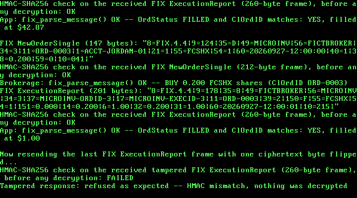

# 35. A Micro-Investing / Robo-Advisor App: Round-Up Investing, Real FIX 4.4 Orders

**What you will understand:** how "round-up" micro-investing turns everyday spare change into an investable pool, and how a real risk-questionnaire score maps to one of three real, standard risk bands, each with its own target allocation across a handful of funds -- computed entirely in integer cents and integer fixed-point milli-shares (`035_investing.h`/`035_investing.c`); how a real FIX (Financial Information eXchange) message is laid out -- the actual tag=value protocol electronic trading systems use to send orders and receive fills -- built and parsed from scratch against a real, unmodified open-source FIX engine's own data dictionary (`035_fix.h`/`035_fix.c`); and a real, reproducible kernel bug this chapter's own growth exposed in code unchanged since Chapter 7 -- the Multiboot2 information structure itself was never reserved in this kernel's own physical memory allocator, only the boot module it describes was.

**What you need to know first:** Chapter 30's AES-128, HMAC-SHA256, and the `fedwire_pkcs7_pad()`/`fedwire_pkcs7_unpad()` helpers (carried forward here as `035_aes.*`, `035_hmac.*`, `035_fedwire.*`), and Chapter 34's insurance comparison, whose two-role demo pattern and frame-sealing helpers this chapter's own demo mirrors.

## Scope: three confirmed choices before writing any code

This chapter is the fourth of the five financial-services case studies queued back in Chapter 30: a micro-investing / robo-advisor app. Three choices were confirmed before any code was written:

- **Core feature**: round-up investing (spare change from a purchase, rounded to the next dollar) combined with risk-questionnaire-driven allocation across a few fictional funds, ending in a real order message that actually executes the resulting buys -- touching both the "micro-investing" and "robo-advisor" halves of the chapter's own name. Round-up alone, and allocation-plus-rebalancing without round-up, were both offered and not chosen.
- **Message format**: a real FIX NewOrderSingle order message, over reusing Chapter 34's ACORD XML or inventing a tag format.
- **Crypto technique**: reuse Chapter 30's AES-128-CBC + HMAC-SHA256 encrypt-then-MAC construction unchanged, keeping this chapter's own scope on the investing logic and the message format.

## FIX, cited from a real engine's own data dictionary

FIX's own official standards body, fixtrading.org, is blocked by this sandbox's network egress policy -- the same honesty note Chapters 33 and 34 made about their own blocked standards sites. But a real, widely-used open-source FIX engine was reachable and read in full instead: a clone of `github.com/quickfix/quickfix`, `spec/FIX44.xml` -- the actual FIX 4.4 protocol dictionary that engine's own code generator builds from, not a summary of it. Every tag number and enumerated value `035_fix.h` cites was read directly out of that real file: the standard header/trailer (`BeginString` 8, `BodyLength` 9, `MsgType` 35, `SenderCompID` 49, `TargetCompID` 56, `MsgSeqNum` 34, `SendingTime` 52, `CheckSum` 10), the real `NewOrderSingle` (MsgType `D`) fields this chapter's own order uses (`ClOrdID` 11, `Account` 1, `HandlInst` 21, `Symbol` 55, `Side` 54, `TransactTime` 60, `OrdType` 40, `OrderQty` 38, `TimeInForce` 59), and the real `ExecutionReport` (MsgType `8`) fields this chapter's own fill confirmation uses (`OrderID` 37, `ExecID` 17, `ExecType` 150, `OrdStatus` 39, `LeavesQty` 151, `CumQty` 14, `AvgPx` 6, `LastQty` 32, `LastPx` 31) -- along with the real enumerated values `Side` `1` (BUY), `OrdType` `1` (MARKET), `TimeInForce` `0` (DAY), `HandlInst` `1` (AUTOMATED_EXECUTION_NO_INTERVENTION), `ExecType` `F` (TRADE), and `OrdStatus` `2` (FILLED).

Real FIX delimits every field with an ASCII SOH byte (0x01), not a printable character, and `035_fix.c` emits and expects exactly that on the wire. Where this chapter's own demo prints a FIX message to the serial log, it substitutes the printable pipe character `|` for SOH -- a real, common convention FIX documentation and tools themselves use for human-readable display, stated plainly as a display-only substitution that never touches the actual wire format.

## The investing model: real shape, invented numbers

The same honesty discipline Chapter 34 applied to its own insurance rating table applies here at the level of the whole model, not one field. The round-up mechanic and the three-band risk-questionnaire model (conservative/moderate/aggressive, each with its own target stock/bond/cash split) are real and general -- the well-known shape every micro-investing/robo-advisor app is built around. What is this book's own invention: the three specific fictional funds and their fictional NAVs (`FBNDX` a fictional bond fund at $10.15, `FSTKX` a fictional stock fund at $42.87, `FCSHX` a fictional cash-reserve fund at the real, standard stable $1.00 NAV real money-market funds use), the exact percentage split each risk band targets, and the specific questionnaire scoring formula. No real robo-advisor's actual proprietary allocation model or fund lineup is public in a form this book could cite field-for-field.

Every dollar amount is invested as a real fractional share -- exactly how round-up micro-investing apps work in practice, since a few cents of spare change buys far less than one whole share of most funds. Share quantities are carried in milli-shares (thousandths of a share, so 0.083 shares is the integer 83), using the same round-half-up-via-`udiv64_32()` fixed-point discipline Chapters 33/34 established: this freestanding kernel links no libgcc, so a `uint64_t` product would fail to link with an undefined `__udivdi3`, and every division here goes through this chapter's own self-contained restoring shift-and-subtract routine instead.

## `035_investing.h` and `035_investing.c`: round-up, risk scoring, and allocation

```c
#ifndef UNIX_OS_035_INVESTING_H
#define UNIX_OS_035_INVESTING_H

#include <stdint.h>

/* A real "round-up" micro-investing mechanic (spare change from a
 * purchase, rounded up to the next whole dollar, invested) plus a real
 * risk-questionnaire-driven target-allocation model (a risk score maps
 * to one of three real, standard risk bands, each with its own target
 * percentage split across a small number of funds) -- computed
 * entirely in integer cents and integer fixed-point arithmetic, with
 * no floating point and no native 64-bit division/modulo anywhere in
 * this kernel (the same __udivdi3/__umoddi3 link failure Chapters 7,
 * 30, 33, and 34 each document and avoid).
 *
 * The round-up mechanic and the three-band risk-questionnaire model
 * (conservative/moderate/aggressive, each with its own target
 * stock/bond/cash split) are real and general -- this is the well-known
 * shape every real micro-investing/robo-advisor app (Acorns' own
 * "Round-Ups", and target-date/risk-based robo-advisors generally) is
 * built around. What is this book's own invention, stated plainly, the
 * same honesty discipline Chapter 34 applied to its own rating tables:
 * the three specific fictional funds and their fictional NAVs (net
 * asset value per share) below, the exact percentage split each risk
 * band targets, and the specific risk-questionnaire scoring formula.
 * Real robo-advisors each use their own proprietary allocation models
 * and fund lineups, none of which is public in a form this book could
 * cite field-for-field.
 *
 * This chapter's own three fictional funds use the real, common US
 * mutual-fund "X"-suffix ticker convention (a real naming pattern, an
 * invented ticker): `FBNDX` (a fictional bond fund), `FSTKX` (a
 * fictional stock fund), and `FCSHX` (a fictional cash-reserve fund,
 * priced at the real, standard stable $1.00 NAV real money-market/cash
 * funds use).
 *
 * Every dollar amount below is invested as a real FRACTIONAL share --
 * exactly how real round-up micro-investing apps work, since a few
 * cents of spare change buys far less than one whole share of most
 * funds. Share quantities are carried in MILLI-SHARES (thousandths of
 * a share, so 0.083 shares is the integer 83) rather than a floating
 * share count, using the same round-half-up-via-udiv64_32 fixed-point
 * discipline Chapters 33/34 established. */

#define INV_NUM_FUNDS 3u
#define INV_MAX_PURCHASES 8u
#define INV_MAX_CENTS 0x00FFFFFFu /* stated limit, refused not truncated */

typedef struct {
    char ticker[8];
    uint32_t nav_cents; /* net asset value per share, in cents */
} inv_fund_t;

typedef enum {
    INV_RISK_CONSERVATIVE = 0,
    INV_RISK_MODERATE = 1,
    INV_RISK_AGGRESSIVE = 2
} inv_risk_band_t;

/* This chapter's own three real, standard risk bands and their target
 * allocations across [FBNDX, FSTKX, FCSHX], in basis points (parts per
 * 10000). The SHAPE (bonds dominate conservative, stocks dominate
 * aggressive, a small cash cushion throughout) is the real, general
 * pattern every risk-based allocation model uses; these exact
 * percentages are this book's own invented choice. */
typedef struct {
    uint32_t target_bp[INV_NUM_FUNDS];
} inv_allocation_t;

/* Sums a real risk-questionnaire's own answers (each 0-100, this
 * book's own invented scoring convention: higher means more risk
 * tolerance) into a single 0-100 average score, and classifies that
 * score into one of the three real risk bands: <= 33 CONSERVATIVE,
 * 34-66 MODERATE, >= 67 AGGRESSIVE. Returns 0 (refusing outright) if
 * `n` is 0, or any answer is above 100. */
int inv_score_questionnaire(const uint32_t *answers, uint32_t n, uint32_t *out_score,
                            inv_risk_band_t *out_band);

/* Rounds `purchase_cents` up to the next whole dollar and returns the
 * spare change (0-99 cents). A purchase already an exact whole number
 * of dollars rounds up by 0. */
uint32_t inv_round_up_cents(uint32_t purchase_cents);

/* Splits `pool_cents` (the sum of one or more round-ups) across
 * INV_NUM_FUNDS according to `band`'s own target allocation, in
 * round-half-up cents, with the FIRST two funds' shares computed
 * directly from the target basis points and the THIRD (cash) fund
 * absorbing whatever cents remain -- this book's own explicit
 * leftover-cents convention (the same pattern Chapters 32/33 used),
 * chosen so the three amounts always sum to exactly `pool_cents`, not
 * an approximation of it. Refuses (returns 0) if `pool_cents` is at or
 * above INV_MAX_CENTS. */
int inv_allocate(uint32_t pool_cents, inv_risk_band_t band, uint32_t out_cents[INV_NUM_FUNDS]);

/* Converts a dollar amount in cents, at a given fund's own NAV (cents
 * per share), into milli-shares (thousandths of a share), round-half-up,
 * using this file's own self-contained restoring shift-and-subtract
 * `udiv64_32()` rather than the `/` operator on a uint64_t. Refuses
 * (returns 0) if `nav_cents` is 0. */
int inv_cents_to_milli_shares(uint32_t cents, uint32_t nav_cents, uint32_t *out_milli_shares);

/* Formats `milli_shares` as a fixed-point decimal string "D.DDD" (e.g.
 * 83 -> "0.083", 24999 -> "24.999") into `out` (at least 10 bytes).
 * Returns the string length. */
uint32_t inv_format_milli_shares(uint32_t milli_shares, char *out, uint32_t out_size);

extern const inv_fund_t INV_FUNDS[INV_NUM_FUNDS]; /* FBNDX, FSTKX, FCSHX, in that order */
extern const inv_allocation_t INV_ALLOCATIONS[3]; /* indexed by inv_risk_band_t */

#endif
```

```c
/* See 035_investing.h's own top-of-file comment for the full citation
 * trail (the real round-up/risk-band shape, this book's own invented
 * fund lineup, NAVs, and exact allocation percentages). */

#include "035_investing.h"

const inv_fund_t INV_FUNDS[INV_NUM_FUNDS] = {
    {"FBNDX", 1015u}, /* a fictional bond fund, $10.15 NAV */
    {"FSTKX", 4287u}, /* a fictional stock fund, $42.87 NAV */
    {"FCSHX",  100u}, /* a fictional cash-reserve fund, the real, standard stable $1.00 NAV */
};

const inv_allocation_t INV_ALLOCATIONS[3] = {
    {{7000u, 2000u, 1000u}}, /* CONSERVATIVE: 70% bond / 20% stock / 10% cash */
    {{4000u, 5000u, 1000u}}, /* MODERATE:     40% bond / 50% stock / 10% cash */
    {{1000u, 8000u, 1000u}}, /* AGGRESSIVE:   10% bond / 80% stock / 10% cash */
};

/* 64-bit-by-32-bit unsigned long division (restoring shift-and-subtract)
 * -- this freestanding kernel does not link libgcc, so a plain `/` on
 * a uint64_t would fail to link with an undefined __udivdi3, the same
 * real failure Chapters 7, 30, 33, and 34 each document. Copied
 * verbatim from 035_bnpl.c's own udiv64_32() -- each chapter's own
 * numeric module keeps this helper self-contained rather than reaching
 * across files for it. */
static uint64_t udiv64_32(uint64_t n, uint32_t d) {
    uint64_t q = 0, r = 0;
    for (int bit = 63; bit >= 0; bit--) {
        r = (r << 1) | ((n >> bit) & 1ull);
        if (r >= d) {
            r -= d;
            q |= (1ull << bit);
        }
    }
    return q;
}

int inv_score_questionnaire(const uint32_t *answers, uint32_t n, uint32_t *out_score,
                            inv_risk_band_t *out_band) {
    if (n == 0u) {
        return 0;
    }
    uint32_t sum = 0;
    for (uint32_t i = 0; i < n; i++) {
        if (answers[i] > 100u) {
            return 0;
        }
        sum += answers[i];
    }
    /* round-half-up average: n is at most a handful of real answers
     * (this chapter's own demo uses 3), so a plain uint32_t divide is
     * safe -- no 64-bit value is ever involved here. */
    uint32_t score = (sum + n / 2u) / n;
    *out_score = score;
    if (score <= 33u) {
        *out_band = INV_RISK_CONSERVATIVE;
    } else if (score <= 66u) {
        *out_band = INV_RISK_MODERATE;
    } else {
        *out_band = INV_RISK_AGGRESSIVE;
    }
    return 1;
}

uint32_t inv_round_up_cents(uint32_t purchase_cents) {
    uint32_t remainder = purchase_cents % 100u;
    return (remainder == 0u) ? 0u : (100u - remainder);
}

int inv_allocate(uint32_t pool_cents, inv_risk_band_t band, uint32_t out_cents[INV_NUM_FUNDS]) {
    if (pool_cents >= INV_MAX_CENTS) {
        return 0;
    }
    const inv_allocation_t *a = &INV_ALLOCATIONS[band];
    uint32_t assigned = 0;
    for (uint32_t i = 0; i + 1u < INV_NUM_FUNDS; i++) {
        uint64_t product = (uint64_t) pool_cents * (uint64_t) a->target_bp[i] + 5000u;
        out_cents[i] = (uint32_t) udiv64_32(product, 10000u);
        assigned += out_cents[i];
    }
    /* The last fund (this chapter's own fixed convention: FCSHX, the
     * cash fund) absorbs whatever is left, guaranteeing an exact sum
     * rather than a rounding-error approximation of pool_cents. */
    out_cents[INV_NUM_FUNDS - 1u] = pool_cents - assigned;
    return 1;
}

int inv_cents_to_milli_shares(uint32_t cents, uint32_t nav_cents, uint32_t *out_milli_shares) {
    if (nav_cents == 0u) {
        return 0;
    }
    uint64_t product = (uint64_t) cents * 1000ull + (uint64_t) (nav_cents / 2u);
    *out_milli_shares = (uint32_t) udiv64_32(product, nav_cents);
    return 1;
}

static void put_digits(char *buf, uint32_t *pos, uint32_t value, uint32_t min_width) {
    char rev[10];
    uint32_t rn = 0;
    if (value == 0u) {
        rev[rn++] = '0';
    }
    while (value > 0u) {
        rev[rn++] = (char) ('0' + (value % 10u));
        value /= 10u;
    }
    while (rn < min_width) {
        rev[rn++] = '0';
    }
    while (rn > 0u) {
        buf[(*pos)++] = rev[--rn];
    }
}

uint32_t inv_format_milli_shares(uint32_t milli_shares, char *out, uint32_t out_size) {
    if (out_size < 6u) {
        return 0;
    }
    uint32_t whole = milli_shares / 1000u;
    uint32_t frac = milli_shares % 1000u;
    uint32_t pos = 0;
    put_digits(out, &pos, whole, 1u);
    out[pos++] = '.';
    put_digits(out, &pos, frac, 3u);
    out[pos] = '\0';
    return pos;
}
```

### Proving the investing logic before it touches the kernel

Following the discipline Chapter 30 established -- prove hand-rolled numerical code against hand-computed expectations in a native, non-kernel build first:

```c
#include <stdio.h>
#include <string.h>
#include "035_investing.h"

int main(void) {
    uint32_t purchases[4] = {437u, 1205u, 750u, 1999u};
    uint32_t pool = 0;
    printf("Round-ups:\n");
    for (int i = 0; i < 4; i++) {
        uint32_t ru = inv_round_up_cents(purchases[i]);
        printf("  $%u.%02u -> round up $0.%02u\n", purchases[i]/100, purchases[i]%100, ru);
        pool += ru;
    }
    printf("Pool total: $%u.%02u\n\n", pool/100, pool%100);

    uint32_t answers[3] = {40, 60, 50};
    uint32_t score; inv_risk_band_t band;
    int ok = inv_score_questionnaire(answers, 3, &score, &band);
    printf("Questionnaire score: %u, band: %s (ok=%d)\n\n", score,
        band == INV_RISK_CONSERVATIVE ? "CONSERVATIVE" : band == INV_RISK_MODERATE ? "MODERATE" : "AGGRESSIVE", ok);

    uint32_t out_cents[INV_NUM_FUNDS];
    inv_allocate(pool, band, out_cents);
    uint32_t sum = 0;
    for (uint32_t i = 0; i < INV_NUM_FUNDS; i++) {
        uint32_t ms;
        inv_cents_to_milli_shares(out_cents[i], INV_FUNDS[i].nav_cents, &ms);
        char buf[16];
        inv_format_milli_shares(ms, buf, sizeof buf);
        printf("  %s: $%u.%02u -> %s shares @ $%u.%02u NAV\n", INV_FUNDS[i].ticker,
            out_cents[i]/100, out_cents[i]%100, buf,
            INV_FUNDS[i].nav_cents/100, INV_FUNDS[i].nav_cents%100);
        sum += out_cents[i];
    }
    printf("Sum of allocations == pool: %s (%u vs %u)\n", sum == pool ? "YES" : "NO", sum, pool);

    /* Edge cases */
    printf("\nRound-up of exact dollar ($5.00): %u (expect 0)\n", inv_round_up_cents(500));
    printf("Refuses questionnaire with n=0: %d\n", !inv_score_questionnaire(answers, 0, &score, &band));
    uint32_t bad_answer[1] = {101};
    printf("Refuses answer > 100: %d\n", !inv_score_questionnaire(bad_answer, 1, &score, &band));
    printf("Refuses zero-NAV division: %d\n", !inv_cents_to_milli_shares(100, 0, &sum));
    return 0;
}
```

**Output (cloud sandbox -- live-executed native test)**

```text
Round-ups:
  $4.37 -> round up $0.63
  $12.05 -> round up $0.95
  $7.50 -> round up $0.50
  $19.99 -> round up $0.01
Pool total: $2.09

Questionnaire score: 50, band: MODERATE (ok=1)

  FBNDX: $0.84 -> 0.083 shares @ $10.15 NAV
  FSTKX: $1.05 -> 0.024 shares @ $42.87 NAV
  FCSHX: $0.20 -> 0.200 shares @ $1.00 NAV
Sum of allocations == pool: YES (209 vs 209)

Round-up of exact dollar ($5.00): 0 (expect 0)
Refuses questionnaire with n=0: 1
Refuses answer > 100: 1
Refuses zero-NAV division: 1
```

Four fictional purchases ($4.37, $12.05, $7.50, $19.99) round up to $0.63, $0.95, $0.50, and $0.01 -- a $2.09 pool. A questionnaire scoring 50 lands in the MODERATE band (40% bond / 50% stock / 10% cash), splitting the pool into $0.84 / $1.05 / $0.20 -- the first two computed directly from the target basis points, the cash fund absorbing whatever cents remain so the three amounts always sum to exactly $2.09, never an approximation of it. At each fund's own NAV, that becomes 0.083 / 0.024 / 0.200 shares.

## `035_fix.h` and `035_fix.c`: the encoder/decoder

```c
#ifndef UNIX_OS_035_FIX_H
#define UNIX_OS_035_FIX_H

#include <stdint.h>

/* A real FIX (Financial Information eXchange) protocol message
 * encoder/decoder -- the real, industry-standard tag=value protocol
 * electronic trading systems actually use to send orders and receive
 * fills. FIX's own official site, fixtrading.org, is blocked by this
 * sandbox's network egress policy (the same honesty note Chapters 33
 * and 34 made about their own blocked standards sites), but a real,
 * widely-used open-source FIX engine's own data dictionary was reached
 * and read in full instead: a clone of github.com/quickfix/quickfix,
 * `spec/FIX44.xml` -- the real FIX 4.4 protocol dictionary that
 * project's own engine is generated from, not a summary of it. Every
 * tag number, message field list, and enumerated value below was read
 * directly out of that real file, the same discipline Chapter 34 used
 * for its own ACORD sample and Chapter 32 used for NACHA.
 *
 * Real tag numbers this chapter uses, cited directly from FIX44.xml's
 * own <field number='N' name='...'> declarations: BeginString (8),
 * BodyLength (9), MsgType (35), SenderCompID (49), TargetCompID (56),
 * MsgSeqNum (34), SendingTime (52), CheckSum (10) -- the real FIX
 * "standard header"/"standard trailer" fields every message carries;
 * ClOrdID (11), Account (1), HandlInst (21), Symbol (55), Side (54),
 * TransactTime (60), OrdType (40), OrderQty (38), TimeInForce (59) --
 * the real NewOrderSingle (MsgType 'D') fields this chapter's own
 * request uses; and OrderID (37), ExecID (17), ExecType (150),
 * OrdStatus (39), LeavesQty (151), CumQty (14), AvgPx (6), LastQty
 * (32), LastPx (31) -- the real ExecutionReport (MsgType '8') fields
 * this chapter's own response uses. Real enumerated values, likewise
 * cited from FIX44.xml's own <value enum='N' description='...'>
 * children of each field: Side '1' (BUY); OrdType '1' (MARKET);
 * TimeInForce '0' (DAY); HandlInst '1' (AUTOMATED_EXECUTION_NO_
 * INTERVENTION); ExecType 'F' (TRADE); OrdStatus '2' (FILLED).
 *
 * Real FIX framing, cited from the same file's own header-field
 * ordering and from general knowledge of the protocol's own wire
 * format (BodyLength/CheckSum computation is a mechanical consequence
 * of the field layout, not something FIX44.xml states as prose): tag
 * 9 (BodyLength) holds the exact byte count from the first byte after
 * its own trailing SOH delimiter through the last byte of the field
 * immediately before tag 10 (CheckSum); tag 10 holds the sum of every
 * byte from the start of the message (tag 8's own '8') through the SOH
 * immediately before tag 10, taken modulo 256, printed as exactly 3
 * zero-padded decimal digits. `fix_build_message()`/`fix_parse_message()`
 * compute and verify both fields for real, never trusting a caller (or
 * a received message) to have gotten them right.
 *
 * Real FIX delimits every field with an ASCII SOH byte (0x01), not a
 * printable character -- and this chapter's own encoder/decoder use
 * real SOH bytes on the wire, unchanged. Where this chapter's own
 * kernel demo PRINTS a FIX message to the serial log for a human to
 * read, it substitutes the printable pipe character '|' for SOH, a
 * common, real convention FIX documentation and tools themselves use
 * for human-readable display (SOH does not render visibly in a
 * terminal) -- stated here as a display-only substitution, never a
 * wire-format change: `fix_build_message()` itself always emits real
 * SOH bytes, and `fix_parse_message()` only ever accepts them.
 *
 * This chapter's own invention, stated plainly: every fictional
 * fund/ticker symbol, its fictional NAV (net asset value per share),
 * every SenderCompID/TargetCompID/ClOrdID/OrderID/ExecID value, and
 * the whole round-up/risk-questionnaire/allocation scenario -- see
 * 035_investing.h. None of that is part of the real FIX protocol
 * itself; FIX only specifies the message SHAPE this chapter's own
 * scenario is carried inside. */

#define FIX_MAX_FIELDS 32u
#define FIX_MAX_TAG_VALUE_LEN 32u
#define FIX_MAX_MESSAGE_LEN 512u

typedef struct {
    uint32_t tag;
    char value[FIX_MAX_TAG_VALUE_LEN];
} fix_field_t;

typedef struct {
    char msg_type[2]; /* one ASCII character + NUL, e.g. "D" or "8" */
    fix_field_t fields[FIX_MAX_FIELDS]; /* every field EXCEPT 8/9/35/10,
                                          * which fix_build_message()/
                                          * fix_parse_message() handle
                                          * themselves */
    uint32_t field_count;
} fix_message_t;

void fix_set_field(fix_message_t *msg, uint32_t tag, const char *value);
/* Returns 0 (not found) or 1, writing the field's own value into
 * `out` (FIX_MAX_TAG_VALUE_LEN bytes) on success. */
int fix_get_field(const fix_message_t *msg, uint32_t tag, char *out);

/* Builds a real FIX 4.4 message: "8=FIX.4.4|9=<len>|35=<type>|" then
 * every field in `msg->fields`, in the order they were set, then
 * "10=<checksum>|" -- with real SOH (0x01) delimiters, computing a
 * real BodyLength and CheckSum. `sender_comp_id`/`target_comp_id` are
 * this chapter's own fictional identifiers (real tags 49/56).
 * Returns the encoded length, or 0 if `out_size` is too small or
 * `msg->msg_type` is not exactly one character. */
uint32_t fix_build_message(const fix_message_t *msg, const char *sender_comp_id,
                          const char *target_comp_id, uint32_t seq_num,
                          uint8_t *out, uint32_t out_size);

/* Parses exactly `len` bytes. Returns 1 on success, or 0 -- refusing
 * outright -- if the message does not begin with "8=FIX.4.4", if
 * BodyLength or CheckSum do not match what this decoder itself
 * recomputes, if any field is malformed (no '=', or a value too long
 * for FIX_MAX_TAG_VALUE_LEN), or if there are more than
 * FIX_MAX_FIELDS non-header/trailer fields. */
int fix_parse_message(const uint8_t *buf, uint32_t len, fix_message_t *out_msg);

#endif
```

```c
/* See 035_fix.h's own top-of-file comment for the full citation trail
 * (every tag number and enumerated value read directly out of a real
 * clone of quickfix/quickfix's own spec/FIX44.xml) and this module's
 * own stated SOH-vs-'|' display convention. */

#include "035_fix.h"

#define FIX_SOH ((uint8_t) 0x01u)

void fix_set_field(fix_message_t *msg, uint32_t tag, const char *value) {
    uint32_t idx = msg->field_count;
    /* Refusing silently past FIX_MAX_FIELDS would be a worse bug than
     * a caller finding out immediately: every caller in this chapter
     * stays well under the limit, so an overrun here would be this
     * module's own logic error, not a real message being too large. */
    if (idx >= FIX_MAX_FIELDS) {
        return;
    }
    msg->fields[idx].tag = tag;
    uint32_t i = 0;
    while (value[i] != '\0' && i < FIX_MAX_TAG_VALUE_LEN - 1u) {
        msg->fields[idx].value[i] = value[i];
        i++;
    }
    msg->fields[idx].value[i] = '\0';
    msg->field_count = idx + 1u;
}

int fix_get_field(const fix_message_t *msg, uint32_t tag, char *out) {
    for (uint32_t i = 0; i < msg->field_count; i++) {
        if (msg->fields[i].tag == tag) {
            uint32_t j = 0;
            while (msg->fields[i].value[j] != '\0') {
                out[j] = msg->fields[i].value[j];
                j++;
            }
            out[j] = '\0';
            return 1;
        }
    }
    return 0;
}

static uint32_t str_len(const char *s) {
    uint32_t n = 0;
    while (s[n] != '\0') {
        n++;
    }
    return n;
}

static int append_str(uint8_t *buf, uint32_t *pos, uint32_t size, const char *s) {
    uint32_t n = str_len(s);
    if (*pos + n > size) {
        return 0;
    }
    for (uint32_t i = 0; i < n; i++) {
        buf[*pos + i] = (uint8_t) s[i];
    }
    *pos += n;
    return 1;
}

static void put_digits(char *buf, uint32_t *pos, uint32_t value) {
    char rev[10];
    uint32_t rn = 0;
    if (value == 0u) {
        buf[(*pos)++] = '0';
        return;
    }
    while (value > 0u) {
        rev[rn++] = (char) ('0' + (value % 10u));
        value /= 10u; /* a plain uint32_t modulo/division: 32-bit, no libgcc call */
    }
    while (rn > 0u) {
        buf[(*pos)++] = rev[--rn];
    }
}

/* Appends "<tag>=<value><SOH>" into `buf`, refusing if it would not
 * fit in `size`. */
static int append_field(uint8_t *buf, uint32_t *pos, uint32_t size, uint32_t tag,
                        const char *value) {
    char tagbuf[12];
    uint32_t tn = 0;
    put_digits(tagbuf, &tn, tag);
    tagbuf[tn] = '\0';
    if (!append_str(buf, pos, size, tagbuf)) {
        return 0;
    }
    if (*pos + 1u > size) {
        return 0;
    }
    buf[(*pos)++] = (uint8_t) '=';
    if (!append_str(buf, pos, size, value)) {
        return 0;
    }
    if (*pos + 1u > size) {
        return 0;
    }
    buf[(*pos)++] = FIX_SOH;
    return 1;
}

/* Real FIX checksum (035_fix.h): the sum of every byte from the very
 * start of the message through the SOH immediately before tag 10,
 * modulo 256. */
static uint32_t fix_checksum(const uint8_t *buf, uint32_t len) {
    uint32_t sum = 0;
    for (uint32_t i = 0; i < len; i++) {
        sum += buf[i];
    }
    return sum % 256u;
}

uint32_t fix_build_message(const fix_message_t *msg, const char *sender_comp_id,
                          const char *target_comp_id, uint32_t seq_num,
                          uint8_t *out, uint32_t out_size) {
    if (msg->msg_type[0] == '\0' || msg->msg_type[1] != '\0') {
        return 0;
    }

    /* Build the body (everything after "9=<len>|") into a scratch
     * buffer first, since BodyLength has to be known before tag 9
     * itself can be written. */
    static uint8_t body[FIX_MAX_MESSAGE_LEN];
    uint32_t bpos = 0;
    int ok = 1;
    ok = ok && append_field(body, &bpos, sizeof(body), 35u, msg->msg_type);
    ok = ok && append_field(body, &bpos, sizeof(body), 49u, sender_comp_id);
    ok = ok && append_field(body, &bpos, sizeof(body), 56u, target_comp_id);
    char seqbuf[11];
    uint32_t sn = 0;
    put_digits(seqbuf, &sn, seq_num);
    seqbuf[sn] = '\0';
    ok = ok && append_field(body, &bpos, sizeof(body), 34u, seqbuf);
    for (uint32_t i = 0; i < msg->field_count; i++) {
        ok = ok && append_field(body, &bpos, sizeof(body), msg->fields[i].tag,
                                msg->fields[i].value);
    }
    if (!ok) {
        return 0;
    }

    uint32_t pos = 0;
    ok = ok && append_field(out, &pos, out_size, 8u, "FIX.4.4");
    char lenbuf[11];
    uint32_t ln = 0;
    put_digits(lenbuf, &ln, bpos);
    lenbuf[ln] = '\0';
    ok = ok && append_field(out, &pos, out_size, 9u, lenbuf);
    if (!ok || pos + bpos > out_size) {
        return 0;
    }
    for (uint32_t i = 0; i < bpos; i++) {
        out[pos + i] = body[i];
    }
    pos += bpos;

    uint32_t sum = fix_checksum(out, pos);
    char sumbuf[4];
    sumbuf[0] = (char) ('0' + (sum / 100u));
    sumbuf[1] = (char) ('0' + ((sum / 10u) % 10u));
    sumbuf[2] = (char) ('0' + (sum % 10u));
    sumbuf[3] = '\0';
    if (!append_field(out, &pos, out_size, 10u, sumbuf)) {
        return 0;
    }
    return pos;
}

static int is_digit(uint8_t c) {
    return c >= (uint8_t) '0' && c <= (uint8_t) '9';
}

int fix_parse_message(const uint8_t *buf, uint32_t len, fix_message_t *out) {
    uint8_t *raw = (uint8_t *) out;
    for (uint32_t i = 0; i < sizeof(*out); i++) {
        raw[i] = 0;
    }

    static const char begin_string[] = "8=FIX.4.4";
    uint32_t bs_len = str_len(begin_string);
    if (len < bs_len + 1u) {
        return 0;
    }
    for (uint32_t i = 0; i < bs_len; i++) {
        if (buf[i] != (uint8_t) begin_string[i]) {
            return 0;
        }
    }
    if (buf[bs_len] != FIX_SOH) {
        return 0;
    }
    uint32_t pos = bs_len + 1u;

    /* Tag 9 (BodyLength) must come next. */
    if (pos + 2u > len || buf[pos] != (uint8_t) '9' || buf[pos + 1u] != (uint8_t) '=') {
        return 0;
    }
    pos += 2u;
    uint32_t body_len = 0;
    uint32_t digits_start = pos;
    while (pos < len && buf[pos] != FIX_SOH) {
        if (!is_digit(buf[pos])) {
            return 0;
        }
        body_len = body_len * 10u + (uint32_t) (buf[pos] - (uint8_t) '0');
        pos++;
    }
    if (pos >= len || pos == digits_start) {
        return 0;
    }
    pos++; /* past the SOH ending tag 9 */

    uint32_t body_start = pos;
    if (body_start + body_len > len) {
        return 0; /* stated BodyLength runs past the real message */
    }
    uint32_t after_body = body_start + body_len;

    /* Tag 10 (CheckSum) must immediately follow the stated body. */
    if (after_body + 3u > len || buf[after_body] != (uint8_t) '1' ||
        buf[after_body + 1u] != (uint8_t) '0' || buf[after_body + 2u] != (uint8_t) '=') {
        return 0;
    }
    uint32_t cs_pos = after_body + 3u;
    if (cs_pos + 4u > len) {
        return 0; /* 3 checksum digits + trailing SOH */
    }
    if (!is_digit(buf[cs_pos]) || !is_digit(buf[cs_pos + 1u]) || !is_digit(buf[cs_pos + 2u]) ||
        buf[cs_pos + 3u] != FIX_SOH) {
        return 0;
    }
    uint32_t claimed_checksum = (uint32_t) (buf[cs_pos] - (uint8_t) '0') * 100u +
                                (uint32_t) (buf[cs_pos + 1u] - (uint8_t) '0') * 10u +
                                (uint32_t) (buf[cs_pos + 2u] - (uint8_t) '0');
    if (claimed_checksum != fix_checksum(buf, after_body)) {
        return 0; /* real checksum mismatch -- refused, not corrected */
    }
    if (cs_pos + 4u != len) {
        return 0; /* trailing bytes after the message are refused */
    }

    /* Walk the body's own tag=value|tag=value|... fields. The first
     * must be tag 35 (MsgType); tags 49/56/34 (SenderCompID/
     * TargetCompID/MsgSeqNum) are real but not surfaced to the
     * caller -- this chapter's own demo does not need to inspect
     * them, only to have sent and received them for real. */
    pos = body_start;
    int seen_msg_type = 0;
    while (pos < after_body) {
        uint32_t tag = 0;
        uint32_t tag_start = pos;
        while (pos < after_body && buf[pos] != (uint8_t) '=') {
            if (!is_digit(buf[pos])) {
                return 0;
            }
            tag = tag * 10u + (uint32_t) (buf[pos] - (uint8_t) '0');
            pos++;
        }
        if (pos >= after_body || pos == tag_start) {
            return 0;
        }
        pos++; /* past '=' */
        uint32_t val_start = pos;
        while (pos < after_body && buf[pos] != FIX_SOH) {
            pos++;
        }
        if (pos >= after_body) {
            return 0; /* a field with no closing SOH */
        }
        uint32_t val_len = pos - val_start;
        if (val_len + 1u > FIX_MAX_TAG_VALUE_LEN) {
            return 0;
        }
        pos++; /* past the SOH ending this field */

        if (tag == 35u) {
            if (val_len != 1u) {
                return 0;
            }
            out->msg_type[0] = (char) buf[val_start];
            out->msg_type[1] = '\0';
            seen_msg_type = 1;
        } else if (tag == 49u || tag == 56u || tag == 34u) {
            /* real, present, deliberately not surfaced -- see above */
        } else {
            if (out->field_count >= FIX_MAX_FIELDS) {
                return 0;
            }
            fix_field_t *f = &out->fields[out->field_count];
            f->tag = tag;
            for (uint32_t i = 0; i < val_len; i++) {
                f->value[i] = (char) buf[val_start + i];
            }
            f->value[val_len] = '\0';
            out->field_count++;
        }
    }
    return seen_msg_type;
}
```

`fix_parse_message()` follows the refusal discipline `iso8583_parse()` and `ach_parse_file()` established: it refuses outright on a wrong `BeginString`, a `BodyLength` that does not match what it recomputes, a `CheckSum` mismatch, a malformed field, or trailing bytes after the message. A native test before the kernel build confirmed a full request/response round trip, a truncation refusal, and a checksum-tamper refusal:

```c
#include <stdio.h>
#include <string.h>
#include "035_fix.h"

static void print_fix(const uint8_t *buf, uint32_t n) {
    for (uint32_t i = 0; i < n; i++) putchar(buf[i] == 0x01 ? '|' : buf[i]);
    putchar('\n');
}

int main(void) {
    fix_message_t req; memset(&req, 0, sizeof req);
    strcpy(req.msg_type, "D");
    fix_set_field(&req, 11, "ORD-0001");
    fix_set_field(&req, 1, "ACCT-JORDAN-01");
    fix_set_field(&req, 21, "1");
    fix_set_field(&req, 55, "FBNDX");
    fix_set_field(&req, 54, "1");
    fix_set_field(&req, 60, "20260927-12:00:00");
    fix_set_field(&req, 40, "1");
    fix_set_field(&req, 38, "0.083");
    fix_set_field(&req, 59, "0");

    uint8_t buf[FIX_MAX_MESSAGE_LEN];
    uint32_t n = fix_build_message(&req, "MICROINV", "FICTBROKER", 1, buf, sizeof buf);
    printf("build_message: %u bytes\n", n);
    print_fix(buf, n);

    fix_message_t back;
    int ok = fix_parse_message(buf, n, &back);
    printf("parse: %d, msg_type=%s field_count=%u\n", ok, back.msg_type, back.field_count);
    char v[FIX_MAX_TAG_VALUE_LEN];
    int match = ok && strcmp(back.msg_type, "D") == 0;
    match = match && fix_get_field(&back, 11, v) && strcmp(v, "ORD-0001") == 0;
    match = match && fix_get_field(&back, 55, v) && strcmp(v, "FBNDX") == 0;
    match = match && fix_get_field(&back, 38, v) && strcmp(v, "0.083") == 0;
    printf("round-trip match: %s\n", match ? "YES" : "NO");

    printf("truncated refused: %d\n", !fix_parse_message(buf, n - 3, &back));
    uint8_t bad[FIX_MAX_MESSAGE_LEN]; memcpy(bad, buf, n);
    bad[20] ^= 0x01;
    printf("checksum mismatch refused: %d\n", !fix_parse_message(bad, n, &back));

    /* ExecutionReport response */
    fix_message_t resp; memset(&resp, 0, sizeof resp);
    strcpy(resp.msg_type, "8");
    fix_set_field(&resp, 37, "MICROINV-ORDID-0001");
    fix_set_field(&resp, 17, "MICROINV-EXECID-0001");
    fix_set_field(&resp, 11, "ORD-0001");
    fix_set_field(&resp, 39, "2");
    fix_set_field(&resp, 150, "F");
    fix_set_field(&resp, 55, "FBNDX");
    fix_set_field(&resp, 54, "1");
    fix_set_field(&resp, 151, "0");
    fix_set_field(&resp, 14, "0.083");
    fix_set_field(&resp, 6, "10.15");
    fix_set_field(&resp, 32, "0.083");
    fix_set_field(&resp, 31, "10.15");
    fix_set_field(&resp, 60, "20260927-12:00:01");
    uint8_t rbuf[FIX_MAX_MESSAGE_LEN];
    uint32_t rn = fix_build_message(&resp, "FICTBROKER", "MICROINV", 1, rbuf, sizeof rbuf);
    printf("\nExecutionReport build: %u bytes\n", rn);
    print_fix(rbuf, rn);
    fix_message_t rback;
    int rok = fix_parse_message(rbuf, rn, &rback);
    printf("parse: %d\n", rok);
    return 0;
}
```

**Output (cloud sandbox -- live-executed native test)**

```text
build_message: 147 bytes
8=FIX.4.4|9=124|35=D|49=MICROINV|56=FICTBROKER|34=1|11=ORD-0001|1=ACCT-JORDAN-01|21=1|55=FBNDX|54=1|60=20260927-12:00:00|40=1|38=0.083|59=0|10=036|
parse: 1, msg_type=D field_count=9
round-trip match: YES
truncated refused: 1
checksum mismatch refused: 1

ExecutionReport build: 205 bytes
8=FIX.4.4|9=182|35=8|49=FICTBROKER|56=MICROINV|34=1|37=MICROINV-ORDID-0001|17=MICROINV-EXECID-0001|11=ORD-0001|39=2|150=F|55=FBNDX|54=1|151=0|14=0.083|6=10.15|32=0.083|31=10.15|60=20260927-12:00:01|10=160|
parse: 1
```

## `035_kmain.c`: the round-up-to-order demo

Everything through the end of Chapter 34's insurance demo is carried forward and still runs first. The new work is one function, `investing_demo()`, mirroring the two-role, one-machine pattern Chapters 30-34 established: a fictional micro-investing **app** and a fictional **brokerage**.

1. The app rounds four fictional purchases up to the next dollar, scores a fictional three-question risk questionnaire, and allocates the resulting pool across the three fictional funds according to the applicant's own risk band.
2. For each fund with a nonzero allocation, the app builds a real FIX `NewOrderSingle` buying that many milli-shares at the market, seals it (PKCS#7, AES-128-CBC, then HMAC-SHA256 over the ciphertext) into a frame with EtherType `0x88B9` -- next to Chapter 34's `0x88B8` in the same IEEE 802 prototype/vendor-specific range (RFC 5342 Appendix B.2) -- and sends it over RTL8139 hardware loopback.
3. The brokerage checks the HMAC *before* decrypting anything, decrypts, parses the order, looks up that real fund's own NAV by its own symbol, and "fills" the order at that price with a real FIX `ExecutionReport` (`OrdStatus` FILLED, `ExecType` TRADE) -- also sealed, also sent back.
4. The app verifies, decrypts, parses, and confirms the fill's own `ClOrdID` matches its request and its `OrdStatus` is genuinely FILLED.
5. After all three funds are ordered and filled, the last execution report's own frame is resent with one ciphertext byte flipped. The HMAC check must fail, and nothing may be decrypted.

```c
/* Everything through the end of Chapter 28's own real ARP demo below
 * -- ELF loading, private page directories, Chapter 19's own real
 * PIO-mode disk driver, Chapters 20-23's own FAT16 filesystem,
 * Chapter 24's own real, brute-force PCI scan, Chapters 25-27's own
 * real RTL8139 driver (interrupt-driven since Chapter 26,
 * multi-frame/CAPR-wraparound since Chapter 27), and Chapter 28's own
 * real, minimal ARP client resolving QEMU's own real default gateway
 * to its own real MAC address over one real request/reply round trip
 * -- is carried forward, still run first, so Chapter 27's own real
 * loopback proof and Chapter 28's own real ARP exchange both stay
 * exactly as they were. Chapter 28's own two files, 035_arp.h and
 * 035_arp.c, DID need one real change this chapter -- see their own
 * top-of-file comments for why (arp_send_request() now sends via
 * rtl8139_send_queue() instead of rtl8139_send(), a real fix this
 * chapter's own testing forced, described below).
 *
 * This chapter's own new work comes after it: a real ARP
 * translation-table cache (035_arp_cache.h/035_arp_cache.c),
 * completing the real RFC 826 merge_flag logic Chapter 28's own
 * top-of-file comment named as deliberately out of scope. See
 * 035_arp_cache.h's own top-of-file comment for the full real
 * citations -- RFC 826's own "Packet Reception" algorithm for the
 * update-if-present/add-if-absent logic, RFC 826's own "Related
 * issues" section for its explicit admission that aging/timeout is
 * "outside the scope of this protocol", and RFC 1122 Section 2.3.2.1
 * for the real MUST/SHOULD requirement this chapter's own real
 * expiry timeout satisfies. This chapter's own new demo resolves two
 * real, distinct hosts QEMU's own official documentation names on
 * this exact network segment -- the gateway (10.0.2.2) and the DNS
 * server (10.0.2.3) -- through a real fixed-size (1-entry) cache,
 * proving a real cache hit avoids a fresh ARP exchange, a real LRU
 * eviction happens when a second real host is resolved with the
 * table already full, and a real entry genuinely expires and is
 * re-resolved after this chapter's own real PIT-tick-based timeout
 * elapses. This chapter's own real testing (a real QEMU
 * `filter-dump` packet capture) also found that this driver's own
 * arp_send_request() needed a real fix to send more than once per
 * boot without hanging -- see 035_arp.c's own updated comment, and
 * 035_arp_cache.h's own top-of-file comment for why the cache itself
 * ended up sized at 1 real entry rather than the originally-planned
 * 2 (QEMU's own documented third host, the SMB server at 10.0.2.4,
 * was tested and found not to answer ARP at all in this exact
 * environment). */

#include <stdint.h>

#include "035_ach.h"
#include "035_aes.h"
#include "035_arp.h"
#include "035_arp_cache.h"
#include "035_arp_server.h"
#include "035_acord.h"
#include "035_ata.h"
#include "035_fix.h"
#include "035_bnpl.h"
#include "035_fat16.h"
#include "035_elf.h"
#include "035_fedwire.h"
#include "035_gdt.h"
#include "035_hmac.h"
#include "035_idt.h"
#include "035_investing.h"
#include "035_insurance.h"
#include "035_iso8583.h"
#include "035_keyboard.h"
#include "035_kheap.h"
#include "035_multiboot.h"
#include "035_paging.h"
#include "035_pci.h"
#include "035_pic.h"
#include "035_pit.h"
#include "035_pmm.h"
#include "035_printf.h"
#include "035_rtl8139.h"
#include "035_semaphore.h"
#include "035_serial.h"
#include "035_spinlock.h"
#include "035_syscall.h"
#include "035_task.h"
#include "035_user_program.h"
#include "035_vga.h"

#define TIMER_FREQUENCY_HZ 100

/* Deliberately far outside the 0-64 MiB identity-mapped range (which
 * only ever occupies page-directory entries 0-15): 0xC0000000 >> 22 =
 * 768. Mapping here forces paging_map_page() to allocate a genuinely
 * new page table rather than reusing one paging_init() already built. */
#define TEST_VIRT_ADDR 0xC0000000u

/* An LBA safely past this chapter's own tiny 1 MiB (2048-sector)
 * build/disk.img, chosen only to stay well clear of sector 0 -- where a
 * real partition table or boot sector would live on a disk meant to be
 * booted from, which this one never is. */
#define DISK_TEST_LBA 100u

/* Defined by 035_linker.ld, not by this file -- the linker is the one
 * part of this toolchain that genuinely knows where the kernel image's
 * last real section ends in physical memory. */
extern char kernel_end[];

/* How much real, uninterruptible-looking work each task does before
 * it naturally finishes -- large enough that many real IRQ0 ticks (at
 * 100 Hz, one every ~10 ms) land somewhere in the middle of it, since
 * a single pass through this loop takes QEMU's emulated CPU far less
 * than 10 ms. Chosen empirically from this chapter's own real run,
 * the same way every prior chapter's own real constants were. */
#define TASK_WORK_TARGET 4000000u
#define TASK_PRINT_EVERY   500000u

/* How many kmalloc()/kfree() round trips each stress task performs.
 * Chosen empirically from this chapter's own real runs: large enough
 * that, at 100 real IRQ0 ticks per second, many ticks land somewhere
 * in the middle of the whole run -- and therefore stand a real chance
 * of landing inside kmalloc()'s or kfree()'s own free-list
 * manipulation, not just between two whole calls. */
#define STRESS_ITERATIONS  3000000u
#define STRESS_PRINT_EVERY  500000u

/* This chapter's two demo tasks. Neither one calls task_yield()
 * anywhere in this loop -- the whole point. Whatever interleaving
 * this chapter's real run shows is forced entirely by the real timer,
 * not requested by either task. */
static void task_a_entry(void) {
    for (uint32_t i = 1; i <= TASK_WORK_TARGET; i++) {
        if (i % TASK_PRINT_EVERY == 0) {
            kprintf("  Task A: %u\n", i);
        }
    }
    kprintf("  Task A: done\n");
    task_exit();
}

static void task_b_entry(void) {
    for (uint32_t i = 1; i <= TASK_WORK_TARGET; i++) {
        if (i % TASK_PRINT_EVERY == 0) {
            kprintf("  Task B: %u\n", i);
        }
    }
    kprintf("  Task B: done\n");
    task_exit();
}

/* This chapter's real evidence tasks: two preemptible tasks racing on
 * kmalloc()/kfree() with no synchronization between them at all. Each
 * one only ever touches its own pointer, one allocation at a time --
 * any corruption that shows up is entirely the free list's own doing,
 * not a bug in either task's own logic. */
static void stress_task_a_entry(void) {
    for (uint32_t i = 1; i <= STRESS_ITERATIONS; i++) {
        void *p = kmalloc(32);
        if (p != 0) {
            *(volatile uint8_t *) p = 0xAA;
        }
        kfree(p);
        if (i % STRESS_PRINT_EVERY == 0) {
            kprintf("  Stress A: %u\n", i);
        }
    }
    kprintf("  Stress A: done\n");
    task_exit();
}

static void stress_task_b_entry(void) {
    for (uint32_t i = 1; i <= STRESS_ITERATIONS; i++) {
        void *p = kmalloc(64);
        if (p != 0) {
            *(volatile uint8_t *) p = 0xBB;
        }
        kfree(p);
        if (i % STRESS_PRINT_EVERY == 0) {
            kprintf("  Stress B: %u\n", i);
        }
    }
    kprintf("  Stress B: done\n");
    task_exit();
}

/* This chapter's own demo: a classic bounded-buffer producer/consumer,
 * built on this chapter's new semaphores plus Chapter 13's own
 * spinlock. `sem_empty_slots` starts at BUFFER_CAPACITY (that many
 * slots are free right now) and `sem_full_slots` starts at 0 (nothing
 * produced yet) -- the two together are what make a producer block
 * when the buffer is genuinely full and a consumer block when it is
 * genuinely empty, without either one ever spinning to find out. The
 * buffer's own read/write indices are a separate, much shorter
 * critical section, protected by an ordinary spinlock -- exactly the
 * kind of short, bounded update Chapter 13's spinlock is for. */
#define BUFFER_CAPACITY     4u
#define ITEMS_PER_PRODUCER 15u
#define ITEMS_PER_CONSUMER 15u

static int shared_buffer[BUFFER_CAPACITY];
static uint32_t buffer_write_idx = 0;
static uint32_t buffer_read_idx = 0;
static spinlock_t buffer_lock;
static semaphore_t sem_empty_slots;
static semaphore_t sem_full_slots;

static void produce(const char *label, uint32_t item_base) {
    for (uint32_t i = 1; i <= ITEMS_PER_PRODUCER; i++) {
        int item = (int) (item_base + i);

        /* Blocks for real if the buffer is already full -- this is
         * the whole point of this chapter, not busy-waiting. */
        semaphore_wait(&sem_empty_slots);

        uint32_t saved_eflags = spinlock_acquire(&buffer_lock);
        shared_buffer[buffer_write_idx] = item;
        buffer_write_idx = (buffer_write_idx + 1) % BUFFER_CAPACITY;
        spinlock_release(&buffer_lock, saved_eflags);

        semaphore_signal(&sem_full_slots);
        kprintf("  %s: produced %d\n", label, item);
    }
    kprintf("  %s: done\n", label);
    task_exit();
}

static void consume(const char *label) {
    for (uint32_t i = 1; i <= ITEMS_PER_CONSUMER; i++) {
        /* Blocks for real if the buffer is empty -- the mirror image
         * of produce()'s own semaphore_wait() above. */
        semaphore_wait(&sem_full_slots);

        uint32_t saved_eflags = spinlock_acquire(&buffer_lock);
        int item = shared_buffer[buffer_read_idx];
        buffer_read_idx = (buffer_read_idx + 1) % BUFFER_CAPACITY;
        spinlock_release(&buffer_lock, saved_eflags);

        semaphore_signal(&sem_empty_slots);
        kprintf("  %s: consumed %d\n", label, item);
    }
    kprintf("  %s: done\n", label);
    task_exit();
}

static void producer_a_entry(void) { produce("Producer A", 0u); }
static void producer_b_entry(void) { produce("Producer B", 100u); }
static void consumer_a_entry(void) { consume("Consumer A"); }
static void consumer_b_entry(void) { consume("Consumer B"); }

/* This chapter's own single real 60-byte Ethernet frame (the real
 * IEEE 802.3 minimum before the real 4-byte hardware-appended CRC),
 * rebuilt fresh -- deterministically, from `seq` alone -- every time
 * this chapter's own demo needs it, rather than kept as one shared
 * mutable buffer across ~140 real round trips. Destination and
 * source are both this device's own real, burnt-in MAC (real
 * hardware loopback mode never puts a single bit on a real wire).
 * EtherType 0x88B5 is a real, officially reserved value, cited
 * directly from RFC 5342 ("IANA Considerations and IETF Protocol
 * Usage for IEEE 802 Parameters"), Appendix B.2: "0x88B5  IEEE Std
 * 802 - Local Experimental Ethertype". The payload encodes `seq`
 * itself in its first two bytes, so each of this chapter's own ~140
 * real frames is individually, byte-for-byte distinguishable on the
 * wire -- not a single repeated constant that a stuck data line or a
 * ring-position bug could satisfy by accident. */
#define DEMO_FRAME_SIZE 60u

static void build_demo_frame(uint8_t *frame, const uint8_t *mac, uint32_t seq) {
    for (int i = 0; i < 6; i++) {
        frame[i] = mac[i];      /* destination */
        frame[6 + i] = mac[i];  /* source */
    }
    frame[12] = 0x88;
    frame[13] = 0xB5;  /* EtherType 0x88B5, RFC 5342 Appendix B.2 */
    frame[14] = (uint8_t) (seq >> 8);
    frame[15] = (uint8_t) seq;
    for (uint32_t i = 16; i < DEMO_FRAME_SIZE; i++) {
        frame[i] = (uint8_t) (0x5Au + i + seq);
    }
}

/* This chapter's own small, freestanding helpers -- no libc, ever, same
 * discipline 035_fat16.c's own top-of-file comment already states for
 * this whole book. */
static void print_chars(const char *s, uint32_t n) {
    for (uint32_t i = 0; i < n; i++) {
        kprintf("%c", s[i]);
    }
}

static void zero_bytes(void *p, uint32_t n) {
    uint8_t *b = (uint8_t *) p;
    for (uint32_t i = 0; i < n; i++) {
        b[i] = 0;
    }
}

static int bytes_eq(const uint8_t *a, const uint8_t *b, uint32_t n) {
    for (uint32_t i = 0; i < n; i++) {
        if (a[i] != b[i]) {
            return 0;
        }
    }
    return 1;
}

static int cstr_eq(const char *a, const char *b, uint32_t max) {
    for (uint32_t i = 0; i < max; i++) {
        if (a[i] != b[i]) {
            return 0;
        }
        if (a[i] == '\0') {
            return 1;
        }
    }
    return 1;
}

/* This chapter's own new small helper: builds a real ARP request frame
 * exactly the way 035_arp.c's own arp_send_request() already does
 * internally, cited there field-for-field -- but as a standalone
 * builder that returns the frame rather than sending it, and
 * parameterized on an arbitrary `sender_mac`/`sender_ip`, not
 * necessarily this kernel's own. arp_send_request() only ever sends a
 * real request FROM this kernel's own real MAC/IP; this chapter's own
 * new ARP SERVER demo below needs the opposite -- a real request as if
 * ASKED BY some other real host, to exercise arp_server_handle_frame()
 * honestly, the same way a real neighbor genuinely would on this exact
 * QEMU network segment. */
static void build_arp_request_frame(uint8_t *frame, const uint8_t sender_mac[6],
                                     const uint8_t sender_ip[4],
                                     const uint8_t target_ip[4]) {
    for (uint32_t i = 0; i < 6u; i++) {
        frame[i] = 0xFFu;            /* destination: real broadcast */
        frame[6u + i] = sender_mac[i];
    }
    frame[12] = (uint8_t) (ETHERTYPE_ARP >> 8);
    frame[13] = (uint8_t) ETHERTYPE_ARP;

    frame[14] = (uint8_t) (ARP_HTYPE_ETHERNET >> 8);
    frame[15] = (uint8_t) ARP_HTYPE_ETHERNET;
    frame[16] = (uint8_t) (ARP_PTYPE_IPV4 >> 8);
    frame[17] = (uint8_t) ARP_PTYPE_IPV4;
    frame[18] = (uint8_t) ARP_HLEN_ETHERNET;
    frame[19] = (uint8_t) ARP_PLEN_IPV4;
    frame[20] = (uint8_t) (ARP_OP_REQUEST >> 8);
    frame[21] = (uint8_t) ARP_OP_REQUEST;

    for (uint32_t i = 0; i < 6u; i++) {
        frame[22u + i] = sender_mac[i];
        frame[32u + i] = 0x00u;      /* target hardware address: zeroed, unknown yet */
    }
    for (uint32_t i = 0; i < 4u; i++) {
        frame[28u + i] = sender_ip[i];
        frame[38u + i] = target_ip[i];
    }

    for (uint32_t i = 42u; i < ARP_FRAME_SIZE; i++) {
        frame[i] = 0x00u;            /* real IEEE 802.3 minimum padding */
    }
}


/* ====================================================================
 * Chapter 34: an insurance comparison & claims assistant -- quote
 * aggregation across carriers.
 *
 * Two roles share this one machine, the same way Chapters 30-33's own
 * demos did: a fictional COMPARISON APP and a fictional CARRIER
 * AGGREGATOR. The comparison app sends a real-shaped ACORD XML
 * personal-auto quote request (035_acord.h) for one fictional
 * applicant, sealed with Chapter 30's own AES-128-CBC + HMAC-SHA256
 * encrypt-then-MAC construction, reused unchanged per this chapter's
 * own confirmed scope, over the same RTL8139 hardware loopback path
 * used since Chapter 27. The aggregator verifies the HMAC before
 * trusting anything, decrypts, parses, quotes the applicant against
 * three fictional carriers' own distinct rating tables
 * (035_insurance.h), ranks the results cheapest-first, and answers with
 * an ACORD XML response carrying all three quotes in that order -- also
 * sealed, also sent over the wire, also verified before trusting it.
 *
 * Every name, address, and carrier below is fictional, and the AES/HMAC
 * keys are fixed demo values, distinct from every earlier chapter's
 * own, hardcoded so this book's own outside checks can recompute every
 * step -- a real system would never hardcode keys.
 * ==================================================================== */

#define INS_ETHERTYPE_LO 0xB8u /* 0x88B8: next to Chapter 33's 0x88B7, in the
                                * same IEEE 802 prototype/vendor-specific
                                * range (RFC 5342 Appendix B.2) */
#define INS_PLAIN_MAX ACORD_MAX_MESSAGE_LEN
#define INS_PADDED_MAX (INS_PLAIN_MAX + AES_BLOCK_SIZE)
#define INS_FRAME_MAX (14u + 2u + INS_PADDED_MAX + HMAC_SHA256_TAG_SIZE)

static const uint8_t g_ins_aes_key[AES_KEY_SIZE] = {
    0x34, 0x01, 0x34, 0x02, 0x34, 0x03, 0x34, 0x04,
    0x34, 0x05, 0x34, 0x06, 0x34, 0x07, 0x34, 0x08
};
static const uint8_t g_ins_iv[AES_BLOCK_SIZE] = {
    0x77, 0x01, 0x77, 0x02, 0x77, 0x03, 0x77, 0x04,
    0x77, 0x05, 0x77, 0x06, 0x77, 0x07, 0x77, 0x08
};
static const uint8_t g_ins_mac_key[HMAC_SHA256_KEY_SIZE] = {
    0x99, 0x01, 0x99, 0x02, 0x99, 0x03, 0x99, 0x04,
    0x99, 0x05, 0x99, 0x06, 0x99, 0x07, 0x99, 0x08,
    0x99, 0x09, 0x99, 0x0A, 0x99, 0x0B, 0x99, 0x0C,
    0x99, 0x0D, 0x99, 0x0E, 0x99, 0x0F, 0x99, 0x10
};

/* Static, not stack: see 035_kmain.c's own established note on this
 * pattern (kmain()'s 16 KiB boot stack, 035_boot.asm). */
static uint8_t g_ins_padded[INS_PADDED_MAX];
static uint8_t g_ins_cipher[INS_PADDED_MAX];
static uint8_t g_ins_tx[INS_FRAME_MAX];
static uint8_t g_ins_rx[RTL8139_MAX_FRAME];
static uint8_t g_ins_plain[INS_PADDED_MAX];
static acord_request_t g_ins_req, g_ins_req_rx;
static acord_response_t g_ins_resp, g_ins_resp_rx;
static ins_quote_t g_ins_quotes[INS_MAX_CARRIERS];

static uint32_t ins_seal(const uint8_t nic_mac[6], const uint8_t *plain, uint32_t len) {
    uint32_t padded = fedwire_pkcs7_pad(plain, len, g_ins_padded, sizeof(g_ins_padded),
                                        AES_BLOCK_SIZE);
    if (padded == 0) {
        return 0;
    }
    aes128_cbc_encrypt(g_ins_padded, g_ins_cipher, padded, g_ins_aes_key, g_ins_iv);
    for (int i = 0; i < 6; i++) {
        g_ins_tx[i] = nic_mac[i];
        g_ins_tx[6 + i] = nic_mac[i];
    }
    g_ins_tx[12] = 0x88;
    g_ins_tx[13] = INS_ETHERTYPE_LO;
    g_ins_tx[14] = (uint8_t)(padded >> 8);
    g_ins_tx[15] = (uint8_t)padded;
    for (uint32_t i = 0; i < padded; i++) {
        g_ins_tx[16 + i] = g_ins_cipher[i];
    }
    hmac_sha256(g_ins_mac_key, HMAC_SHA256_KEY_SIZE, g_ins_cipher, padded,
                &g_ins_tx[16 + padded]);
    return 16u + padded + HMAC_SHA256_TAG_SIZE;
}

static uint32_t ins_loopback_open(uint32_t frame_len, const char *what) {
    int desc = rtl8139_send_queue(g_ins_tx, frame_len);
    if (desc < 0) {
        kprintf("rtl8139_send_queue() refused (BUG)\n");
        return 0xFFFFFFFFu;
    }
    rtl8139_wait_descriptor_sent(desc);
    uint32_t rx_len = 0;
    if (!rtl8139_receive_next_packet(g_ins_rx, &rx_len) || rx_len < frame_len) {
        kprintf("Real loopback receive failed or short (BUG)\n");
        return 0xFFFFFFFFu;
    }
    if (g_ins_rx[12] != 0x88 || g_ins_rx[13] != INS_ETHERTYPE_LO) {
        kprintf("Received frame has the wrong EtherType (BUG)\n");
        return 0xFFFFFFFFu;
    }
    uint32_t padded = ((uint32_t)g_ins_rx[14] << 8) | g_ins_rx[15];
    if (padded == 0 || padded > INS_PADDED_MAX || (padded % AES_BLOCK_SIZE) != 0 ||
        16u + padded + HMAC_SHA256_TAG_SIZE > rx_len) {
        kprintf("Received frame has an impossible ciphertext length (BUG)\n");
        return 0xFFFFFFFFu;
    }
    uint8_t tag[HMAC_SHA256_TAG_SIZE];
    hmac_sha256(g_ins_mac_key, HMAC_SHA256_KEY_SIZE, &g_ins_rx[16], padded, tag);
    int mac_ok = bytes_eq(tag, &g_ins_rx[16 + padded], HMAC_SHA256_TAG_SIZE);
    kprintf("HMAC-SHA256 check on the received %s (%u-byte frame), before any decryption: %s\n",
            what, rx_len, mac_ok ? "OK" : "FAILED");
    if (!mac_ok) {
        return 0;
    }
    aes128_cbc_decrypt(&g_ins_rx[16], g_ins_plain, padded, g_ins_aes_key, g_ins_iv);
    uint32_t n = fedwire_pkcs7_unpad(g_ins_plain, padded, AES_BLOCK_SIZE);
    if (n == 0xFFFFFFFFu) {
        kprintf("PKCS#7 unpad refused (BUG)\n");
    }
    return n;
}

/* Copies `src` into `dst` (dst_size bytes), truncating rather than
 * overflowing if `src` is too long -- every caller below passes a
 * literal well inside its own field's width, so truncation never
 * actually triggers; it is a stated safety margin, not relied upon. */
static void cstr_copy(char *dst, const char *src, uint32_t dst_size) {
    uint32_t i = 0;
    while (i < dst_size - 1u && src[i] != '\0') {
        dst[i] = src[i];
        i++;
    }
    dst[i] = '\0';
}

/* This kernel's own hand-rolled kprintf() (035_printf.c) supports
 * no field-width specifiers at all (no "%-14s") -- confirmed by
 * reading its switch statement, which recognizes only bare
 * %d/%u/%x/%c/%s/%%/%%ll x, nothing with digits or flags in
 * between. This helper pads a carrier name to `width` columns by
 * hand instead. */
static void print_padded(const char *s, uint32_t width) {
    uint32_t n = 0;
    while (s[n] != '\0') {
        n++;
    }
    kprintf("%s", s);
    while (n < width) {
        kprintf(" ");
        n++;
    }
}

static void print_ins_cents(uint32_t cents) {
    kprintf("$%u.%s%u", cents / 100u, (cents % 100u < 10u) ? "0" : "", cents % 100u);
}

static void print_acord_xml(const char *label, const uint8_t *buf, uint32_t len) {
    kprintf("%s (%u bytes): \"", label, len);
    print_chars((const char *)buf, len);
    kprintf("\"\n");
}

static void insurance_demo(const uint8_t nic_mac[6]) {
    kprintf("\nStarting this chapter's own insurance quote-comparison demo...\n");
    if (!rtl8139_init(1)) {
        kprintf("FATAL: could not re-initialize the RTL8139 into loopback mode -- halting\n");
        __asm__ volatile ("cli");
        for (;;) { __asm__ volatile ("hlt"); }
    }

    /* Part 1: the comparison app builds one fictional applicant's own
     * ACORD XML personal-auto quote request. Every value below is
     * fictional; the 100/300/100 split-limit liability convention and
     * the general rating-factor SHAPE are real (see 035_insurance.h
     * and 035_acord.h for the full citation trail), the specific
     * numbers are this book's own invention. */
    kprintf("\nPart 1: one fictional applicant requests personal-auto quotes\n");
    zero_bytes(&g_ins_req, sizeof(g_ins_req));
    cstr_copy(g_ins_req.surname, "FICTAPPLICANT", sizeof(g_ins_req.surname));
    cstr_copy(g_ins_req.given_name, "JORDAN", sizeof(g_ins_req.given_name));
    cstr_copy(g_ins_req.state_prov_cd, "TX", sizeof(g_ins_req.state_prov_cd));
    cstr_copy(g_ins_req.postal_code, "75201", sizeof(g_ins_req.postal_code));
    cstr_copy(g_ins_req.effective_date, "260927", sizeof(g_ins_req.effective_date));
    cstr_copy(g_ins_req.expiration_date, "270927", sizeof(g_ins_req.expiration_date));
    g_ins_req.applicant.driver_age = 29u;
    g_ins_req.applicant.years_licensed = 11u;
    g_ins_req.applicant.at_fault_accidents_3yr = 1u;
    g_ins_req.applicant.territory_tier = 2u;
    g_ins_req.applicant.vehicle_value_cents = 1850000u; /* a fictional $18,500 vehicle */
    g_ins_req.applicant.vehicle_age_years = 4u;
    g_ins_req.applicant.bi_per_person_cents = 10000000u;   /* $100,000 */
    g_ins_req.applicant.bi_per_accident_cents = 30000000u; /* $300,000 -- real "100/300/100" split limits */
    g_ins_req.applicant.pd_cents = 10000000u;              /* $100,000 */
    g_ins_req.applicant.collision_deductible_cents = 50000u; /* $500 */

    kprintf("Fictional applicant: %s, %s -- age %u, licensed %u years, %u at-fault accident(s) "
            "in the last 3 years, TX/75201, territory tier %u\n", g_ins_req.given_name,
            g_ins_req.surname, g_ins_req.applicant.driver_age, g_ins_req.applicant.years_licensed,
            g_ins_req.applicant.at_fault_accidents_3yr, g_ins_req.applicant.territory_tier);
    kprintf("Fictional vehicle: ");
    print_ins_cents(g_ins_req.applicant.vehicle_value_cents);
    kprintf(" value, %u years old. Requested coverage: 100/300/100 split-limit liability, "
            "$500 collision deductible\n", g_ins_req.applicant.vehicle_age_years);

    static uint8_t req_buf[ACORD_MAX_MESSAGE_LEN];
    uint32_t req_len = acord_build_request(&g_ins_req, req_buf, sizeof(req_buf));
    if (req_len == 0) {
        kprintf("acord_build_request() refused (BUG)\n");
        return;
    }
    print_acord_xml("ACORD personal-auto quote request", req_buf, req_len);
    uint32_t frame_len = ins_seal(nic_mac, req_buf, req_len);
    if (frame_len == 0) {
        kprintf("ins_seal() refused (BUG)\n");
        return;
    }

    /* Part 2: the carrier aggregator receives it. */
    uint32_t n = ins_loopback_open(frame_len, "ACORD quote request");
    if (n == 0 || n == 0xFFFFFFFFu) {
        kprintf("Aggregator could not open the quote request (BUG)\n");
        return;
    }
    if (!acord_parse_request(g_ins_plain, n, &g_ins_req_rx)) {
        kprintf("acord_parse_request() refused (BUG)\n");
        return;
    }
    kprintf("Aggregator: acord_parse_request() OK -- recovered applicant %s %s, age %u, "
            "vehicle value ", g_ins_req_rx.given_name, g_ins_req_rx.surname,
            g_ins_req_rx.applicant.driver_age);
    print_ins_cents(g_ins_req_rx.applicant.vehicle_value_cents);
    kprintf("\n");

    /* This chapter's own three fictional carriers, each with its own
     * distinct base rate and rating-factor table (035_insurance.h: the
     * multiplicative SHAPE is real and cited, every number invented). */
    static const ins_carrier_t carriers[3] = {
        {"FictCasualty", 45000u, {10000u, 10000u, 10000u, 10000u, 10000u}},
        {"FictMutual",   52000u, { 9500u, 10000u,  9000u, 10000u, 10500u}},
        {"FictGuard",    38000u, {11000u, 11000u, 10500u, 10500u, 10000u}},
    };
    uint32_t got = ins_rank_quotes(&g_ins_req_rx.applicant, carriers, 3u, g_ins_quotes);
    kprintf("Aggregator: quoted and ranked %u of 3 fictional carriers (cheapest first):\n", got);
    for (uint32_t i = 0; i < got; i++) {
        kprintf("  %u. ", i + 1u);
        print_padded(g_ins_quotes[i].carrier_name, 14u);
        print_ins_cents(g_ins_quotes[i].premium_cents);
        kprintf(" / year\n");
    }
    if (got == 0u) {
        kprintf("ins_rank_quotes() returned zero quotes (BUG)\n");
        return;
    }

    /* Part 3: the aggregator's ranked ACORD XML response. */
    kprintf("\nPart 2: the aggregator answers with a ranked ACORD XML response\n");
    zero_bytes(&g_ins_resp, sizeof(g_ins_resp));
    g_ins_resp.quote_count = got;
    for (uint32_t i = 0; i < got; i++) {
        g_ins_resp.quotes[i] = g_ins_quotes[i];
    }
    static uint8_t resp_buf[ACORD_MAX_MESSAGE_LEN];
    uint32_t resp_len = acord_build_response(&g_ins_resp, resp_buf, sizeof(resp_buf));
    if (resp_len == 0) {
        kprintf("acord_build_response() refused (BUG)\n");
        return;
    }
    print_acord_xml("ACORD quote response", resp_buf, resp_len);
    frame_len = ins_seal(nic_mac, resp_buf, resp_len);
    if (frame_len == 0) {
        kprintf("ins_seal() refused (BUG)\n");
        return;
    }
    static uint8_t resp_frame_copy[INS_FRAME_MAX];
    for (uint32_t i = 0; i < frame_len; i++) {
        resp_frame_copy[i] = g_ins_tx[i];
    }

    /* Part 4: the comparison app receives the ranked response. */
    n = ins_loopback_open(frame_len, "ACORD quote response");
    if (n == 0 || n == 0xFFFFFFFFu) {
        kprintf("Comparison app could not open the quote response (BUG)\n");
        return;
    }
    if (!acord_parse_response(g_ins_plain, n, &g_ins_resp_rx)) {
        kprintf("acord_parse_response() refused (BUG)\n");
        return;
    }
    kprintf("Comparison app: acord_parse_response() OK -- %u ranked quote(s) recovered:\n",
            g_ins_resp_rx.quote_count);
    int match = (g_ins_resp_rx.quote_count == g_ins_resp.quote_count);
    int ascending = 1;
    for (uint32_t i = 0; i < g_ins_resp_rx.quote_count; i++) {
        kprintf("  %u. ", i + 1u);
        print_padded(g_ins_resp_rx.quotes[i].carrier_name, 14u);
        print_ins_cents(g_ins_resp_rx.quotes[i].premium_cents);
        kprintf(" / year\n");
        match = match && cstr_eq(g_ins_resp_rx.quotes[i].carrier_name, g_ins_resp.quotes[i].carrier_name,
                                 sizeof(g_ins_resp_rx.quotes[i].carrier_name)) &&
                g_ins_resp_rx.quotes[i].premium_cents == g_ins_resp.quotes[i].premium_cents;
        if (i > 0u && g_ins_resp_rx.quotes[i].premium_cents < g_ins_resp_rx.quotes[i - 1u].premium_cents) {
            ascending = 0;
        }
    }
    kprintf("Recovered ranking matches the aggregator's own exactly: %s; ranked cheapest-first: %s\n",
            match ? "YES" : "NO (BUG)", ascending ? "YES" : "NO (BUG)");

    /* Part 5: tamper detection on the response. */
    kprintf("\nNow resending the ACORD quote response frame with one ciphertext byte "
            "flipped...\n");
    for (uint32_t i = 0; i < frame_len; i++) {
        g_ins_tx[i] = resp_frame_copy[i];
    }
    g_ins_tx[16 + 60] ^= 0x01u;
    n = ins_loopback_open(frame_len, "tampered ACORD quote response");
    kprintf("Tampered response: %s\n",
            (n == 0) ? "refused as expected -- HMAC mismatch, nothing was decrypted"
                     : "ACCEPTED (BUG -- tampering was not detected)");
}

/* ====================================================================
 * Chapter 33: a real "Pay in 4" buy-now-pay-later checkout.
 *
 * Two roles share this one machine, the same way Chapters 30-32's own
 * demos did: a fictional merchant TERMINAL and a fictional BNPL
 * ISSUER. The terminal sends a real ISO 8583:1987 0100 authorization
 * request for the full cash price (035_iso8583.h), sealed with Chapter
 * 30's own AES-128-CBC + HMAC-SHA256 encrypt-then-MAC construction,
 * reused unchanged per this chapter's own confirmed scope, over the
 * same RTL8139 hardware loopback path used since Chapter 27. The issuer
 * verifies the HMAC before trusting anything, decrypts, parses, checks
 * the PAN's own Luhn digit, builds a real Pay-in-4 plan with its real
 * Regulation Z disclosures and Appendix J APR (035_bnpl.h), and answers
 * with a real 0110 response whose DE 48 carries that plan -- also
 * sealed, also sent over the wire, also verified before trusting it.
 *
 * Every card number, merchant, and amount below is fictional, and the
 * AES/HMAC keys are fixed demo values, distinct from Chapters 30 and
 * 32's own, hardcoded so this book's own outside checks can recompute
 * every step -- a real system would never hardcode keys.
 * ==================================================================== */

#define BNPL_ETHERTYPE_LO 0xB7u /* 0x88B7: next to Chapter 30's 0x88B5 and
                                 * Chapter 32's 0x88B6, in the same IEEE 802
                                 * prototype/vendor-specific range (RFC 5342
                                 * Appendix B.2) */
#define BNPL_PLAIN_MAX ISO8583_MAX_MESSAGE_LEN
#define BNPL_PADDED_MAX (BNPL_PLAIN_MAX + AES_BLOCK_SIZE)
#define BNPL_FRAME_MAX (14u + 2u + BNPL_PADDED_MAX + HMAC_SHA256_TAG_SIZE)

/* This chapter's own fictional issuer pricing for demo plan B. */
#define BNPL_DEMO_FEE_CENTS 600u
#define BNPL_DEMO_PRICE_CENTS 19999u

static const uint8_t g_bnpl_aes_key[AES_KEY_SIZE] = {
    0x33, 0x01, 0x33, 0x02, 0x33, 0x03, 0x33, 0x04,
    0x33, 0x05, 0x33, 0x06, 0x33, 0x07, 0x33, 0x08
};
static const uint8_t g_bnpl_iv[AES_BLOCK_SIZE] = {
    0x44, 0x01, 0x44, 0x02, 0x44, 0x03, 0x44, 0x04,
    0x44, 0x05, 0x44, 0x06, 0x44, 0x07, 0x44, 0x08
};
static const uint8_t g_bnpl_mac_key[HMAC_SHA256_KEY_SIZE] = {
    0x55, 0x01, 0x55, 0x02, 0x55, 0x03, 0x55, 0x04,
    0x55, 0x05, 0x55, 0x06, 0x55, 0x07, 0x55, 0x08,
    0x55, 0x09, 0x55, 0x0A, 0x55, 0x0B, 0x55, 0x0C,
    0x55, 0x0D, 0x55, 0x0E, 0x55, 0x0F, 0x55, 0x10
};

/* Static, not stack: kmain()'s own 16 KiB boot stack (035_boot.asm)
 * already carries every earlier chapter's own locals. */
static uint8_t g_bnpl_padded[BNPL_PADDED_MAX];
static uint8_t g_bnpl_cipher[BNPL_PADDED_MAX];
static uint8_t g_bnpl_tx[BNPL_FRAME_MAX];
static uint8_t g_bnpl_rx[RTL8139_MAX_FRAME];
static uint8_t g_bnpl_plain[BNPL_PADDED_MAX];
static iso8583_msg_t g_iso_req, g_iso_req_rx, g_iso_resp, g_iso_resp_rx;
static bnpl_plan_t g_plan_a, g_plan_b, g_plan_issuer, g_plan_rx;

static void print_cents(uint32_t cents) {
    kprintf("$%u.%s%u", cents / 100u, (cents % 100u < 10u) ? "0" : "", cents % 100u);
}

static void print_apr(uint32_t hundredths) {
    kprintf("%u.%s%u%%", hundredths / 100u, (hundredths % 100u < 10u) ? "0" : "",
            hundredths % 100u);
}

static void print_date(bnpl_date_t d) {
    kprintf("%u-%s%u-%s%u", d.year, (d.month < 10u) ? "0" : "", d.month,
            (d.day < 10u) ? "0" : "", d.day);
}

static void print_plan(const char *label, const bnpl_plan_t *p) {
    kprintf("%s\n", label);
    for (uint32_t k = 0; k < BNPL_INSTALLMENTS; k++) {
        kprintf("  Installment %u, due ", k + 1u);
        print_date(p->due_date[k]);
        kprintf(": ");
        print_cents(p->installment_cents[k]);
        kprintf("%s\n", (k == 0u) ? "  (paid at checkout -- a downpayment under 1026.18)" : "");
    }
    kprintf("  Amount financed: ");
    print_cents(p->amount_financed_cents);
    kprintf("   Finance charge: ");
    print_cents(p->finance_charge_cents);
    kprintf("   Total of payments: ");
    print_cents(p->total_of_payments_cents);
    kprintf("\n  ANNUAL PERCENTAGE RATE (Appendix J, 26 two-week unit-periods a year): ");
    print_apr(p->apr_hundredths);
    kprintf("\n  Regulation Z closed-end disclosures required (1026.2(a)(17) test): %s\n",
            p->reg_z_covered
                ? "YES -- a finance charge is imposed"
                : "NO -- no finance charge, and only 3 installments after the downpayment");
}

static void iso_copy(uint8_t *dst, const char *src, uint32_t n) {
    for (uint32_t i = 0; i < n; i++) {
        dst[i] = (uint8_t)src[i];
    }
}

/* Seals `plain` with PKCS#7 + AES-128-CBC + HMAC-SHA256 over the
 * ciphertext into g_bnpl_tx, exactly Chapter 30's own frame layout:
 * dst MAC, src MAC, EtherType, 2-byte ciphertext length, ciphertext,
 * tag. Returns the frame length, or 0 on refusal. */
static uint32_t bnpl_seal(const uint8_t nic_mac[6], const uint8_t *plain, uint32_t len) {
    uint32_t padded = fedwire_pkcs7_pad(plain, len, g_bnpl_padded, sizeof(g_bnpl_padded),
                                        AES_BLOCK_SIZE);
    if (padded == 0) {
        return 0;
    }
    aes128_cbc_encrypt(g_bnpl_padded, g_bnpl_cipher, padded, g_bnpl_aes_key, g_bnpl_iv);
    for (int i = 0; i < 6; i++) {
        g_bnpl_tx[i] = nic_mac[i];
        g_bnpl_tx[6 + i] = nic_mac[i];
    }
    g_bnpl_tx[12] = 0x88;
    g_bnpl_tx[13] = BNPL_ETHERTYPE_LO;
    g_bnpl_tx[14] = (uint8_t)(padded >> 8);
    g_bnpl_tx[15] = (uint8_t)padded;
    for (uint32_t i = 0; i < padded; i++) {
        g_bnpl_tx[16 + i] = g_bnpl_cipher[i];
    }
    hmac_sha256(g_bnpl_mac_key, HMAC_SHA256_KEY_SIZE, g_bnpl_cipher, padded,
                &g_bnpl_tx[16 + padded]);
    return 16u + padded + HMAC_SHA256_TAG_SIZE;
}

/* Sends g_bnpl_tx over hardware loopback, receives it back into
 * g_bnpl_rx, verifies the HMAC BEFORE decrypting anything, then decrypts
 * and unpads into g_bnpl_plain. Returns the plaintext length, 0 if the
 * HMAC check failed (nothing was decrypted), or 0xFFFFFFFF on any other
 * failure. */
static uint32_t bnpl_loopback_open(uint32_t frame_len, const char *what) {
    int desc = rtl8139_send_queue(g_bnpl_tx, frame_len);
    if (desc < 0) {
        kprintf("rtl8139_send_queue() refused (BUG)\n");
        return 0xFFFFFFFFu;
    }
    rtl8139_wait_descriptor_sent(desc);
    uint32_t rx_len = 0;
    if (!rtl8139_receive_next_packet(g_bnpl_rx, &rx_len) || rx_len < frame_len) {
        kprintf("Real loopback receive failed or short (BUG)\n");
        return 0xFFFFFFFFu;
    }
    if (g_bnpl_rx[12] != 0x88 || g_bnpl_rx[13] != BNPL_ETHERTYPE_LO) {
        kprintf("Received frame has the wrong EtherType (BUG)\n");
        return 0xFFFFFFFFu;
    }
    uint32_t padded = ((uint32_t)g_bnpl_rx[14] << 8) | g_bnpl_rx[15];
    if (padded == 0 || padded > BNPL_PADDED_MAX || (padded % AES_BLOCK_SIZE) != 0 ||
        16u + padded + HMAC_SHA256_TAG_SIZE > rx_len) {
        kprintf("Received frame has an impossible ciphertext length (BUG)\n");
        return 0xFFFFFFFFu;
    }
    uint8_t tag[HMAC_SHA256_TAG_SIZE];
    hmac_sha256(g_bnpl_mac_key, HMAC_SHA256_KEY_SIZE, &g_bnpl_rx[16], padded, tag);
    int mac_ok = bytes_eq(tag, &g_bnpl_rx[16 + padded], HMAC_SHA256_TAG_SIZE);
    kprintf("HMAC-SHA256 check on the received %s (%u-byte frame), before any decryption: %s\n",
            what, rx_len, mac_ok ? "OK" : "FAILED");
    if (!mac_ok) {
        return 0;
    }
    aes128_cbc_decrypt(&g_bnpl_rx[16], g_bnpl_plain, padded, g_bnpl_aes_key, g_bnpl_iv);
    uint32_t n = fedwire_pkcs7_unpad(g_bnpl_plain, padded, AES_BLOCK_SIZE);
    if (n == 0xFFFFFFFFu) {
        kprintf("PKCS#7 unpad refused (BUG)\n");
    }
    return n;
}

static void print_iso_text(const char *label, const uint8_t *buf, uint32_t len) {
    kprintf("%s (%u bytes): \"", label, len);
    print_chars((const char *)buf, len);
    kprintf("\"\n");
}

static void bnpl_demo(const uint8_t nic_mac[6]) {
    kprintf("\nStarting this chapter's own BNPL \"Pay in 4\" demo...\n");
    if (!rtl8139_init(1)) {
        kprintf("FATAL: could not re-initialize the RTL8139 into loopback mode -- halting\n");
        __asm__ volatile ("cli");
        for (;;) { __asm__ volatile ("hlt"); }
    }

    bnpl_date_t checkout = {2026u, 9u, 26u};

    /* Part 1: the same fictional $199.99 purchase, two ways. */
    kprintf("\nPart 1: one fictional $199.99 purchase, checked out on 2026-09-26, "
            "under two Pay-in-4 plans\n");
    if (!bnpl_build_pay_in_4(BNPL_DEMO_PRICE_CENTS, 0u, checkout, &g_plan_a) ||
        !bnpl_build_pay_in_4(BNPL_DEMO_PRICE_CENTS, BNPL_DEMO_FEE_CENTS, checkout, &g_plan_b)) {
        kprintf("bnpl_build_pay_in_4() refused (BUG)\n");
        return;
    }
    print_plan("Plan A -- no fee:", &g_plan_a);
    print_plan("Plan B -- a flat $6.00 fee, spread over installments 2-4:", &g_plan_b);
    kprintf("Plan B's APR must lie within 1/8 point (1026.22(a)(2)) of the exact rate; "
            "this kernel's own is exact to the last rounded hundredth (see the chapter's "
            "outside cross-check)\n");

    /* Part 2: the terminal's 0100 authorization request. */
    kprintf("\nPart 2: the fictional merchant terminal sends an ISO 8583 0100 "
            "authorization request\n");
    zero_bytes(&g_iso_req, sizeof(g_iso_req));
    iso_copy(g_iso_req.mti, "0100", 4);
    /* A fictional 16-digit PAN: a 999999 prefix no real issuer uses in
     * this book's own demo, then a Luhn check digit computed here. */
    iso_copy(g_iso_req.pan, "999999003300001", 15);
    g_iso_req.pan[15] = iso8583_luhn_check_digit(g_iso_req.pan, 15);
    g_iso_req.pan_len = 16;
    iso_copy(g_iso_req.processing_code, "000000", 6);
    g_iso_req.amount_cents = BNPL_DEMO_PRICE_CENTS;
    iso_copy(g_iso_req.transmission_datetime, "0926120000", 10);
    iso_copy(g_iso_req.stan, "000033", 6);
    iso_copy(g_iso_req.local_time, "120000", 6);
    iso_copy(g_iso_req.local_date, "0926", 4);
    iso_copy(g_iso_req.terminal_id, "FICTPOS1", 8);
    iso_copy(g_iso_req.merchant_id, "FICTMERCHANT001", 15);
    iso_copy(g_iso_req.additional_data, "P4", 2); /* this book's own plan-request code */
    g_iso_req.additional_data_len = 2;
    iso_copy(g_iso_req.currency_code, "840", 3);
    static const uint8_t req_des[] = {2, 3, 4, 7, 11, 12, 13, 41, 42, 48, 49};
    for (uint32_t i = 0; i < sizeof(req_des); i++) {
        iso8583_set_field(&g_iso_req, req_des[i]);
    }

    static uint8_t req_buf[ISO8583_MAX_MESSAGE_LEN];
    uint32_t req_len = iso8583_build(&g_iso_req, req_buf, sizeof(req_buf));
    if (req_len == 0) {
        kprintf("iso8583_build() refused the 0100 request (BUG)\n");
        return;
    }
    print_iso_text("ISO 8583 0100 request", req_buf, req_len);
    uint32_t frame_len = bnpl_seal(nic_mac, req_buf, req_len);
    if (frame_len == 0) {
        kprintf("bnpl_seal() refused (BUG)\n");
        return;
    }

    /* Part 3: the issuer receives it. */
    uint32_t n = bnpl_loopback_open(frame_len, "0100 request");
    if (n == 0 || n == 0xFFFFFFFFu) {
        kprintf("Issuer could not open the 0100 request (BUG)\n");
        return;
    }
    int req_ok = iso8583_parse(g_bnpl_plain, n, &g_iso_req_rx) &&
                 bytes_eq(g_iso_req_rx.mti, (const uint8_t *)"0100", 4);
    int luhn_ok = req_ok && iso8583_luhn_valid(g_iso_req_rx.pan, g_iso_req_rx.pan_len);
    int plan_req_ok = req_ok && g_iso_req_rx.additional_data_len == 2u &&
                      bytes_eq(g_iso_req_rx.additional_data, (const uint8_t *)"P4", 2);
    kprintf("Issuer: iso8583_parse() %s; MTI 0100; PAN Luhn check digit %s; DE 48 plan "
            "request \"P4\" %s; DE 4 amount ",
            req_ok ? "OK" : "FAILED (BUG)", luhn_ok ? "valid" : "INVALID (BUG)",
            plan_req_ok ? "OK" : "MISSING (BUG)");
    print_cents(g_iso_req_rx.amount_cents);
    kprintf("\n");
    if (!req_ok || !luhn_ok || !plan_req_ok) {
        return;
    }

    /* The issuer prices the plan itself: this chapter's own fictional
     * $6.00 flat fee. The year is not in DE 13 (MMDD only), so this
     * demo's issuer supplies it from its own clock -- fixed at 2026. */
    bnpl_date_t issuer_date;
    issuer_date.year = 2026u;
    issuer_date.month = (uint8_t)((g_iso_req_rx.local_date[0] - '0') * 10 +
                                  (g_iso_req_rx.local_date[1] - '0'));
    issuer_date.day = (uint8_t)((g_iso_req_rx.local_date[2] - '0') * 10 +
                                (g_iso_req_rx.local_date[3] - '0'));
    if (!bnpl_build_pay_in_4(g_iso_req_rx.amount_cents, BNPL_DEMO_FEE_CENTS, issuer_date,
                             &g_plan_issuer)) {
        kprintf("Issuer: bnpl_build_pay_in_4() refused (BUG)\n");
        return;
    }

    /* Part 4: the issuer's 0110 response, echoing the request's own
     * identifying fields and adding DE 38/39/48. */
    kprintf("\nPart 3: the fictional issuer approves and answers with an ISO 8583 0110 "
            "response carrying the plan in DE 48\n");
    /* A byte loop rather than struct assignment: gcc may lower a large
     * struct copy to a memcpy() call, and this kernel has no libc. */
    for (uint32_t i = 0; i < sizeof(g_iso_resp); i++) {
        ((uint8_t *)&g_iso_resp)[i] = ((const uint8_t *)&g_iso_req_rx)[i];
    }
    iso_copy(g_iso_resp.mti, "0110", 4);
    iso_copy(g_iso_resp.auth_id, "FIC033", 6);
    iso_copy(g_iso_resp.response_code, "00", 2);
    g_iso_resp.additional_data_len = bnpl_encode_de48(&g_plan_issuer, g_iso_resp.additional_data,
                                                      sizeof(g_iso_resp.additional_data));
    iso8583_set_field(&g_iso_resp, 38);
    iso8583_set_field(&g_iso_resp, 39);

    static uint8_t resp_buf[ISO8583_MAX_MESSAGE_LEN];
    uint32_t resp_len = iso8583_build(&g_iso_resp, resp_buf, sizeof(resp_buf));
    if (resp_len == 0 || g_iso_resp.additional_data_len != BNPL_DE48_LEN) {
        kprintf("iso8583_build() refused the 0110 response (BUG)\n");
        return;
    }
    print_iso_text("ISO 8583 0110 response", resp_buf, resp_len);
    frame_len = bnpl_seal(nic_mac, resp_buf, resp_len);
    if (frame_len == 0) {
        kprintf("bnpl_seal() refused (BUG)\n");
        return;
    }
    static uint8_t resp_frame_copy[BNPL_FRAME_MAX];
    for (uint32_t i = 0; i < frame_len; i++) {
        resp_frame_copy[i] = g_bnpl_tx[i];
    }

    /* Part 5: the terminal receives the response. */
    n = bnpl_loopback_open(frame_len, "0110 response");
    if (n == 0 || n == 0xFFFFFFFFu) {
        kprintf("Terminal could not open the 0110 response (BUG)\n");
        return;
    }
    int resp_ok = iso8583_parse(g_bnpl_plain, n, &g_iso_resp_rx) &&
                  bytes_eq(g_iso_resp_rx.mti, (const uint8_t *)"0110", 4);
    int approved = resp_ok && bytes_eq(g_iso_resp_rx.response_code, (const uint8_t *)"00", 2);
    int stan_ok = resp_ok && bytes_eq(g_iso_resp_rx.stan, g_iso_req.stan, 6);
    int de48_ok = resp_ok && bnpl_decode_de48(g_iso_resp_rx.additional_data,
                                              g_iso_resp_rx.additional_data_len, &g_plan_rx);
    kprintf("Terminal: iso8583_parse() %s; DE 39 response code %s; DE 11 STAN matches the "
            "request %s; DE 48 plan decoded %s\n",
            resp_ok ? "OK" : "FAILED (BUG)", approved ? "\"00\" (approved)" : "NOT 00 (BUG)",
            stan_ok ? "YES" : "NO (BUG)", de48_ok ? "OK" : "FAILED (BUG)");
    if (!de48_ok) {
        return;
    }
    int match = g_plan_rx.amount_financed_cents == g_plan_b.amount_financed_cents &&
                g_plan_rx.finance_charge_cents == g_plan_b.finance_charge_cents &&
                g_plan_rx.total_of_payments_cents == g_plan_b.total_of_payments_cents &&
                g_plan_rx.apr_hundredths == g_plan_b.apr_hundredths;
    for (uint32_t k = 0; k < BNPL_INSTALLMENTS; k++) {
        match = match && g_plan_rx.installment_cents[k] == g_plan_b.installment_cents[k] &&
                g_plan_rx.due_date[k].year == g_plan_b.due_date[k].year &&
                g_plan_rx.due_date[k].month == g_plan_b.due_date[k].month &&
                g_plan_rx.due_date[k].day == g_plan_b.due_date[k].day;
    }
    g_plan_rx.reg_z_covered = (g_plan_rx.finance_charge_cents > 0u);
    print_plan("Terminal shows the consumer the plan it received:", &g_plan_rx);
    kprintf("Received plan matches Part 1's own Plan B exactly: %s\n", match ? "YES" : "NO (BUG)");

    /* Part 6: tamper detection on the response. */
    kprintf("\nNow resending the 0110 response frame with one ciphertext byte flipped...\n");
    for (uint32_t i = 0; i < frame_len; i++) {
        g_bnpl_tx[i] = resp_frame_copy[i];
    }
    g_bnpl_tx[16 + 40] ^= 0x01u;
    n = bnpl_loopback_open(frame_len, "tampered 0110 response");
    kprintf("Tampered response: %s\n",
            (n == 0) ? "refused as expected -- HMAC mismatch, nothing was decrypted"
                     : "ACCEPTED (BUG -- tampering was not detected)");
}

/* ====================================================================
 * Chapter 35: a micro-investing / robo-advisor app -- round-up
 * investing plus risk-questionnaire-driven allocation, executed as
 * real FIX 4.4 orders.
 *
 * Two roles share this one machine, the same way Chapters 30-34's own
 * demos did: a fictional micro-investing APP and a fictional
 * BROKERAGE. The app rounds four fictional purchases up to the next
 * dollar, scores a fictional risk questionnaire, allocates the
 * resulting spare-change pool across three fictional funds according
 * to the applicant's own risk band (035_investing.h), and for each
 * fund with a nonzero allocation sends a real FIX NewOrderSingle
 * (MsgType 'D') buying that many milli-shares at the market -- sealed
 * with Chapter 30's own AES-128-CBC + HMAC-SHA256 encrypt-then-MAC
 * construction, reused unchanged per this chapter's own confirmed
 * scope, over the same RTL8139 hardware loopback path used since
 * Chapter 27. The brokerage verifies the HMAC before trusting
 * anything, decrypts, parses the order, "fills" it at that fund's own
 * fictional NAV, and answers with a real FIX ExecutionReport (MsgType
 * '8', ExecType 'F' TRADE, OrdStatus '2' FILLED) -- also sealed, also
 * sent over the wire, also verified before trusting it.
 *
 * Every purchase, questionnaire answer, fund, NAV, and identifier
 * below is fictional, and the AES/HMAC keys are fixed demo values,
 * distinct from every earlier chapter's own, hardcoded so this book's
 * own outside checks can recompute every step -- a real system would
 * never hardcode keys.
 * ==================================================================== */

#define FIX_ETHERTYPE_LO 0xB9u /* 0x88B9: next to Chapter 34's 0x88B8, in the
                                * same IEEE 802 prototype/vendor-specific
                                * range (RFC 5342 Appendix B.2) */
#define FIX_PADDED_MAX (FIX_MAX_MESSAGE_LEN + AES_BLOCK_SIZE)
#define FIX_FRAME_MAX (14u + 2u + FIX_PADDED_MAX + HMAC_SHA256_TAG_SIZE)

static const uint8_t g_fix_aes_key[AES_KEY_SIZE] = {
    0x35, 0x01, 0x35, 0x02, 0x35, 0x03, 0x35, 0x04,
    0x35, 0x05, 0x35, 0x06, 0x35, 0x07, 0x35, 0x08
};
static const uint8_t g_fix_iv[AES_BLOCK_SIZE] = {
    0x88, 0x01, 0x88, 0x02, 0x88, 0x03, 0x88, 0x04,
    0x88, 0x05, 0x88, 0x06, 0x88, 0x07, 0x88, 0x08
};
static const uint8_t g_fix_mac_key[HMAC_SHA256_KEY_SIZE] = {
    0xAA, 0x01, 0xAA, 0x02, 0xAA, 0x03, 0xAA, 0x04,
    0xAA, 0x05, 0xAA, 0x06, 0xAA, 0x07, 0xAA, 0x08,
    0xAA, 0x09, 0xAA, 0x0A, 0xAA, 0x0B, 0xAA, 0x0C,
    0xAA, 0x0D, 0xAA, 0x0E, 0xAA, 0x0F, 0xAA, 0x10
};

/* Static, not stack: see 035_kmain.c's own established note on this
 * pattern (kmain()'s 16 KiB boot stack, 035_boot.asm). */
static uint8_t g_fix_padded[FIX_PADDED_MAX];
static uint8_t g_fix_cipher[FIX_PADDED_MAX];
static uint8_t g_fix_tx[FIX_FRAME_MAX];
static uint8_t g_fix_rx[RTL8139_MAX_FRAME];
static uint8_t g_fix_plain[FIX_PADDED_MAX];

static uint32_t fix_seal(const uint8_t nic_mac[6], const uint8_t *plain, uint32_t len) {
    uint32_t padded = fedwire_pkcs7_pad(plain, len, g_fix_padded, sizeof(g_fix_padded),
                                        AES_BLOCK_SIZE);
    if (padded == 0) {
        return 0;
    }
    aes128_cbc_encrypt(g_fix_padded, g_fix_cipher, padded, g_fix_aes_key, g_fix_iv);
    for (int i = 0; i < 6; i++) {
        g_fix_tx[i] = nic_mac[i];
        g_fix_tx[6 + i] = nic_mac[i];
    }
    g_fix_tx[12] = 0x88;
    g_fix_tx[13] = FIX_ETHERTYPE_LO;
    g_fix_tx[14] = (uint8_t) (padded >> 8);
    g_fix_tx[15] = (uint8_t) padded;
    for (uint32_t i = 0; i < padded; i++) {
        g_fix_tx[16 + i] = g_fix_cipher[i];
    }
    hmac_sha256(g_fix_mac_key, HMAC_SHA256_KEY_SIZE, g_fix_cipher, padded,
                &g_fix_tx[16 + padded]);
    return 16u + padded + HMAC_SHA256_TAG_SIZE;
}

static uint32_t fix_loopback_open(uint32_t frame_len, const char *what) {
    int desc = rtl8139_send_queue(g_fix_tx, frame_len);
    if (desc < 0) {
        kprintf("rtl8139_send_queue() refused (BUG)\n");
        return 0xFFFFFFFFu;
    }
    rtl8139_wait_descriptor_sent(desc);
    uint32_t rx_len = 0;
    if (!rtl8139_receive_next_packet(g_fix_rx, &rx_len) || rx_len < frame_len) {
        kprintf("Real loopback receive failed or short (BUG)\n");
        return 0xFFFFFFFFu;
    }
    if (g_fix_rx[12] != 0x88 || g_fix_rx[13] != FIX_ETHERTYPE_LO) {
        kprintf("Received frame has the wrong EtherType (BUG)\n");
        return 0xFFFFFFFFu;
    }
    uint32_t padded = ((uint32_t) g_fix_rx[14] << 8) | g_fix_rx[15];
    if (padded == 0 || padded > FIX_PADDED_MAX || (padded % AES_BLOCK_SIZE) != 0 ||
        16u + padded + HMAC_SHA256_TAG_SIZE > rx_len) {
        kprintf("Received frame has an impossible ciphertext length (BUG)\n");
        return 0xFFFFFFFFu;
    }
    uint8_t tag[HMAC_SHA256_TAG_SIZE];
    hmac_sha256(g_fix_mac_key, HMAC_SHA256_KEY_SIZE, &g_fix_rx[16], padded, tag);
    int mac_ok = bytes_eq(tag, &g_fix_rx[16 + padded], HMAC_SHA256_TAG_SIZE);
    kprintf("HMAC-SHA256 check on the received %s (%u-byte frame), before any decryption: %s\n",
            what, rx_len, mac_ok ? "OK" : "FAILED");
    if (!mac_ok) {
        return 0;
    }
    aes128_cbc_decrypt(&g_fix_rx[16], g_fix_plain, padded, g_fix_aes_key, g_fix_iv);
    uint32_t n = fedwire_pkcs7_unpad(g_fix_plain, padded, AES_BLOCK_SIZE);
    if (n == 0xFFFFFFFFu) {
        kprintf("PKCS#7 unpad refused (BUG)\n");
    }
    return n;
}

static void print_fix_text(const char *label, const uint8_t *buf, uint32_t len) {
    kprintf("%s (%u bytes): \"", label, len);
    for (uint32_t i = 0; i < len; i++) {
        kprintf("%c", (buf[i] == 0x01) ? '|' : (char) buf[i]);
    }
    kprintf("\"\n");
}

/* Formats `cents` as a real dollar-and-cents decimal string
 * ("D.DD"/"DD.DD"/...), no leading zero suppression issues: this
 * chapter's own first version of this helper wrote the ones digit
 * into out[0] but then unconditionally started writing the '.' at
 * out[0] too whenever cents was below 1000 -- overwriting the very
 * digit it had just written (e.g. $1.00 printed as "$.00", caught only
 * by reading this chapter's own real output, not by any structural
 * check). This version advances `pos` after every digit, the same
 * pattern 035_investing.c's own put_digits() already uses. Every
 * fictional NAV in this chapter is below $100.00, so a whole-dollar
 * part of 1-2 digits is always enough -- a stated limit, not a
 * general-purpose formatter. */
static void price_to_string(uint32_t cents, char *out) {
    uint32_t whole = cents / 100u;
    uint32_t frac = cents % 100u;
    uint32_t pos = 0;
    if (whole >= 10u) {
        out[pos++] = (char) ('0' + (whole / 10u) % 10u);
    }
    out[pos++] = (char) ('0' + whole % 10u);
    out[pos++] = '.';
    out[pos++] = (char) ('0' + (frac / 10u) % 10u);
    out[pos++] = (char) ('0' + frac % 10u);
    out[pos] = '\0';
}

static void investing_demo(const uint8_t nic_mac[6]) {
    kprintf("\nStarting this chapter's own micro-investing / robo-advisor demo...\n");
    if (!rtl8139_init(1)) {
        kprintf("FATAL: could not re-initialize the RTL8139 into loopback mode -- halting\n");
        __asm__ volatile ("cli");
        for (;;) { __asm__ volatile ("hlt"); }
    }

    /* Part 1: round-up spare change from four fictional purchases. */
    kprintf("\nPart 1: round-up spare change from four fictional purchases\n");
    static const uint32_t purchases[4] = {437u, 1205u, 750u, 1999u};
    uint32_t pool_cents = 0;
    for (uint32_t i = 0; i < 4u; i++) {
        uint32_t ru = inv_round_up_cents(purchases[i]);
        kprintf("  Purchase $%u.%s%u -> round-up $0.%s%u\n", purchases[i] / 100u,
                (purchases[i] % 100u < 10u) ? "0" : "", purchases[i] % 100u,
                (ru < 10u) ? "0" : "", ru);
        pool_cents += ru;
    }
    kprintf("Round-up pool: $%u.%s%u\n", pool_cents / 100u, (pool_cents % 100u < 10u) ? "0" : "",
            pool_cents % 100u);

    /* Part 2: a fictional risk questionnaire. */
    kprintf("\nPart 2: a fictional risk questionnaire\n");
    static const uint32_t answers[3] = {40u, 60u, 50u};
    uint32_t score = 0;
    inv_risk_band_t band;
    if (!inv_score_questionnaire(answers, 3u, &score, &band)) {
        kprintf("inv_score_questionnaire() refused (BUG)\n");
        return;
    }
    static const char *band_names[3] = {"CONSERVATIVE", "MODERATE", "AGGRESSIVE"};
    kprintf("Answers: %u, %u, %u -> score %u -> risk band %s\n", answers[0], answers[1],
            answers[2], score, band_names[band]);

    /* Part 3: allocate the pool across this book's own three fictional
     * funds according to the applicant's own risk band. */
    kprintf("\nPart 3: allocate the round-up pool across %u fictional funds\n", INV_NUM_FUNDS);
    uint32_t fund_cents[INV_NUM_FUNDS];
    if (!inv_allocate(pool_cents, band, fund_cents)) {
        kprintf("inv_allocate() refused (BUG)\n");
        return;
    }
    uint32_t fund_milli[INV_NUM_FUNDS];
    for (uint32_t i = 0; i < INV_NUM_FUNDS; i++) {
        if (!inv_cents_to_milli_shares(fund_cents[i], INV_FUNDS[i].nav_cents, &fund_milli[i])) {
            kprintf("inv_cents_to_milli_shares() refused (BUG)\n");
            return;
        }
        char qty[16];
        inv_format_milli_shares(fund_milli[i], qty, sizeof(qty));
        kprintf("  %s: $%u.%s%u -> %s shares (NAV $%u.%s%u)\n", INV_FUNDS[i].ticker,
                fund_cents[i] / 100u, (fund_cents[i] % 100u < 10u) ? "0" : "", fund_cents[i] % 100u,
                qty, INV_FUNDS[i].nav_cents / 100u, (INV_FUNDS[i].nav_cents % 100u < 10u) ? "0" : "",
                INV_FUNDS[i].nav_cents % 100u);
    }

    /* Part 4: for each fund, send a real FIX NewOrderSingle and
     * receive a real FIX ExecutionReport back. */
    kprintf("\nPart 4: executing one real FIX 4.4 order per fund\n");
    static uint8_t fix_req_frame_copy[FIX_FRAME_MAX];
    uint32_t last_frame_len = 0;
    for (uint32_t i = 0; i < INV_NUM_FUNDS; i++) {
        char qty_str[16];
        inv_format_milli_shares(fund_milli[i], qty_str, sizeof(qty_str));

        fix_message_t req;
        zero_bytes(&req, sizeof(req));
        cstr_copy(req.msg_type, "D", sizeof(req.msg_type));
        char clordid[16];
        clordid[0] = 'O'; clordid[1] = 'R'; clordid[2] = 'D'; clordid[3] = '-';
        clordid[4] = '0'; clordid[5] = '0'; clordid[6] = '0';
        clordid[7] = (char) ('1' + i);
        clordid[8] = '\0';
        fix_set_field(&req, 11u, clordid);            /* ClOrdID */
        fix_set_field(&req, 1u, "ACCT-JORDAN-01");     /* Account */
        fix_set_field(&req, 21u, "1");                 /* HandlInst: AUTOMATED_EXECUTION_NO_INTERVENTION */
        fix_set_field(&req, 55u, INV_FUNDS[i].ticker); /* Symbol */
        fix_set_field(&req, 54u, "1");                 /* Side: BUY */
        fix_set_field(&req, 60u, "20260927-12:00:00"); /* TransactTime */
        fix_set_field(&req, 40u, "1");                 /* OrdType: MARKET */
        fix_set_field(&req, 38u, qty_str);              /* OrderQty, milli-shares as "D.DDD" */
        fix_set_field(&req, 59u, "0");                 /* TimeInForce: DAY */

        static uint8_t req_buf[FIX_MAX_MESSAGE_LEN];
        uint32_t req_len = fix_build_message(&req, "MICROINV", "FICTBROKER", i + 1u, req_buf,
                                             sizeof(req_buf));
        if (req_len == 0) {
            kprintf("fix_build_message() refused (BUG)\n");
            return;
        }
        print_fix_text("FIX NewOrderSingle", req_buf, req_len);
        uint32_t frame_len = fix_seal(nic_mac, req_buf, req_len);
        if (frame_len == 0) {
            kprintf("fix_seal() refused (BUG)\n");
            return;
        }

        uint32_t n = fix_loopback_open(frame_len, "FIX NewOrderSingle");
        if (n == 0 || n == 0xFFFFFFFFu) {
            kprintf("Brokerage could not open the order (BUG)\n");
            return;
        }
        fix_message_t req_rx;
        if (!fix_parse_message(g_fix_plain, n, &req_rx) || cstr_eq(req_rx.msg_type, "D", 2) == 0) {
            kprintf("fix_parse_message() refused or wrong MsgType (BUG)\n");
            return;
        }
        char rx_symbol[FIX_MAX_TAG_VALUE_LEN], rx_qty[FIX_MAX_TAG_VALUE_LEN],
            rx_clordid[FIX_MAX_TAG_VALUE_LEN];
        if (!fix_get_field(&req_rx, 55u, rx_symbol) || !fix_get_field(&req_rx, 38u, rx_qty) ||
            !fix_get_field(&req_rx, 11u, rx_clordid)) {
            kprintf("Required FIX field missing (BUG)\n");
            return;
        }
        kprintf("Brokerage: fix_parse_message() OK -- BUY %s %s shares (ClOrdID %s)\n", rx_qty,
                rx_symbol, rx_clordid);

        /* The brokerage looks up this real fund's own NAV by symbol
         * and "fills" the order at that price -- fictional, but a real
         * lookup, not a value smuggled in out of band. */
        uint32_t fill_nav = 0;
        for (uint32_t f = 0; f < INV_NUM_FUNDS; f++) {
            if (cstr_eq(rx_symbol, INV_FUNDS[f].ticker, sizeof(INV_FUNDS[f].ticker))) {
                fill_nav = INV_FUNDS[f].nav_cents;
            }
        }
        char nav_str[16];
        price_to_string(fill_nav, nav_str);

        fix_message_t resp;
        zero_bytes(&resp, sizeof(resp));
        cstr_copy(resp.msg_type, "8", sizeof(resp.msg_type));
        char orderid[24], execid[24];
        cstr_copy(orderid, "MICROINV-ORDID-", sizeof(orderid));
        orderid[15] = clordid[7]; orderid[16] = '\0';
        cstr_copy(execid, "MICROINV-EXECID-", sizeof(execid));
        execid[16] = clordid[7]; execid[17] = '\0';
        fix_set_field(&resp, 37u, orderid);     /* OrderID */
        fix_set_field(&resp, 17u, execid);      /* ExecID */
        fix_set_field(&resp, 11u, rx_clordid);  /* ClOrdID, echoed */
        fix_set_field(&resp, 39u, "2");         /* OrdStatus: FILLED */
        fix_set_field(&resp, 150u, "F");        /* ExecType: TRADE */
        fix_set_field(&resp, 55u, rx_symbol);
        fix_set_field(&resp, 54u, "1");         /* Side: BUY */
        fix_set_field(&resp, 151u, "0.000");    /* LeavesQty: fully filled */
        fix_set_field(&resp, 14u, rx_qty);      /* CumQty */
        fix_set_field(&resp, 6u, nav_str);      /* AvgPx */
        fix_set_field(&resp, 32u, rx_qty);      /* LastQty */
        fix_set_field(&resp, 31u, nav_str);     /* LastPx */
        fix_set_field(&resp, 60u, "20260927-12:00:01"); /* TransactTime */

        static uint8_t resp_buf[FIX_MAX_MESSAGE_LEN];
        uint32_t resp_len = fix_build_message(&resp, "FICTBROKER", "MICROINV", i + 1u, resp_buf,
                                              sizeof(resp_buf));
        if (resp_len == 0) {
            kprintf("fix_build_message() refused (BUG)\n");
            return;
        }
        print_fix_text("FIX ExecutionReport", resp_buf, resp_len);
        frame_len = fix_seal(nic_mac, resp_buf, resp_len);
        if (frame_len == 0) {
            kprintf("fix_seal() refused (BUG)\n");
            return;
        }
        last_frame_len = frame_len;
        for (uint32_t b = 0; b < frame_len; b++) {
            fix_req_frame_copy[b] = g_fix_tx[b];
        }

        n = fix_loopback_open(frame_len, "FIX ExecutionReport");
        if (n == 0 || n == 0xFFFFFFFFu) {
            kprintf("App could not open the execution report (BUG)\n");
            return;
        }
        fix_message_t resp_rx;
        if (!fix_parse_message(g_fix_plain, n, &resp_rx) || cstr_eq(resp_rx.msg_type, "8", 2) == 0) {
            kprintf("fix_parse_message() refused or wrong MsgType (BUG)\n");
            return;
        }
        char rx_ordstatus[FIX_MAX_TAG_VALUE_LEN], rx_avgpx[FIX_MAX_TAG_VALUE_LEN],
            rx_ret_clordid[FIX_MAX_TAG_VALUE_LEN];
        int filled_ok = fix_get_field(&resp_rx, 39u, rx_ordstatus) &&
                        cstr_eq(rx_ordstatus, "2", 2) &&
                        fix_get_field(&resp_rx, 11u, rx_ret_clordid) &&
                        cstr_eq(rx_ret_clordid, clordid, sizeof(clordid)) &&
                        fix_get_field(&resp_rx, 6u, rx_avgpx);
        kprintf("App: fix_parse_message() OK -- OrdStatus FILLED and ClOrdID matches: %s, "
                "filled at $%s\n\n", filled_ok ? "YES" : "NO (BUG)", rx_avgpx);
    }

    /* Part 5: tamper detection, on the last fund's own execution
     * report frame. */
    kprintf("Now resending the last FIX ExecutionReport frame with one ciphertext byte "
            "flipped...\n");
    for (uint32_t i = 0; i < last_frame_len; i++) {
        g_fix_tx[i] = fix_req_frame_copy[i];
    }
    g_fix_tx[16 + 40] ^= 0x01u;
    uint32_t n = fix_loopback_open(last_frame_len, "tampered FIX ExecutionReport");
    kprintf("Tampered response: %s\n",
            (n == 0) ? "refused as expected -- HMAC mismatch, nothing was decrypted"
                     : "ACCEPTED (BUG -- tampering was not detected)");
}

void kmain(uint32_t magic, uint32_t mboot_info_addr) {
    serial_init();
    vga_init();
    vga_set_color(VGA_COLOR_LIGHT_GREEN, VGA_COLOR_BLACK);

    kprintf("Unix OS from Scratch -- Chapter 35: kernel entry reached\n");

    if (magic != MULTIBOOT2_BOOTLOADER_MAGIC) {
        kprintf("FATAL: EAX held 0x%x at entry, not the real Multiboot2 magic 0x%x -- halting\n",
                magic, MULTIBOOT2_BOOTLOADER_MAGIC);
        __asm__ volatile ("cli");
        for (;;) { __asm__ volatile ("hlt"); }
    }
    kprintf("Multiboot2 magic confirmed in EAX: 0x%x\n", magic);

    const struct multiboot_tag_mmap *mmap = multiboot_find_mmap(mboot_info_addr);
    if (mmap == 0) {
        kprintf("FATAL: no memory map tag in this boot information structure -- halting\n");
        __asm__ volatile ("cli");
        for (;;) { __asm__ volatile ("hlt"); }
    }
    multiboot_print_mmap(mmap);

    uint32_t kernel_end_addr = (uint32_t) (uintptr_t) kernel_end;
    kprintf("Kernel image occupies physical 0x100000 - 0x%x\n", kernel_end_addr);

    pmm_init(mmap, 0x100000, kernel_end_addr);

    /* Chapter 35's own real find, the same class of bug this exact
     * comment block already documents one instance of, for the boot
     * MODULE below: the Multiboot2 information STRUCTURE itself --
     * everything multiboot_find_mmap()/multiboot_find_module() above
     * and below actually read `mboot_info_addr` out of -- was never
     * reserved in this allocator either, for 34 straight chapters. It
     * never mattered until this exact chapter's own larger kernel
     * image shifted which physical frames early allocations land on:
     * this chapter's own first real boot hung with zero further
     * output right after "Starting two real PROCESSES", then on a
     * second real boot printed a genuine "elf_load: module too small
     * to hold an ELF header" and a garbage e_entry (0xf000ff53, deep in
     * the real BIOS ROM area) -- `user_module` below, a pointer INTO
     * this same structure, was reading bytes some earlier PMM
     * allocation had already overwritten, and which frame that was
     * depended on allocation order, hence the real, reproducible
     * nondeterminism between two otherwise-identical boots of the
     * exact same ISO. Fixed the same way Chapter 17 already fixed the
     * module's own case: reserve this structure's real
     * `multiboot_total_size()`-many bytes before this allocator ever
     * hands out a single frame. */
    pmm_reserve_range(mboot_info_addr, mboot_info_addr + multiboot_total_size(mboot_info_addr));

    /* This chapter's own real GRUB boot MODULE -- the separately
     * compiled user program 035_elf.c's own elf_load() will read much
     * later -- has to be found and RESERVED here, before this
     * allocator ever hands out a single frame, not merely before
     * elf_load() itself runs. GRUB places a module at whatever real
     * physical address happened to be free at boot time (this chapter's
     * own real run shows physical 0x10d000, right past this kernel's
     * own image), and pmm_init() above has no way to know that address:
     * it comes from walking the boot information structure at RUN
     * time, not from this kernel's own linker script the way
     * kernel_start/kernel_end_addr do. Without this reservation, this
     * book's own real testing hit exactly the failure that gap allows:
     * paging_init()'s own very next pmm_alloc_frame() call (for its own
     * page directory) landed inside this exact module's own byte range,
     * silently overwriting part of the file elf_load() would later try
     * to read -- a real, reproducible corruption, not a hypothetical
     * one, caught by this chapter's own real captured run before this
     * fix went in. */
    const struct multiboot_tag_module *user_module = multiboot_find_module(mboot_info_addr);
    if (user_module == 0) {
        kprintf("FATAL: no boot module tag in this boot information structure -- halting\n");
        __asm__ volatile ("cli");
        for (;;) { __asm__ volatile ("hlt"); }
    }
    pmm_reserve_range(user_module->mod_start, user_module->mod_end);
    kprintf("Real GRUB boot module found and RESERVED: \"%s\", physical 0x%x - 0x%x (%u bytes)\n",
            user_module->string, user_module->mod_start, user_module->mod_end,
            user_module->mod_end - user_module->mod_start);

    uint32_t free_frames = pmm_count_free_frames();
    kprintf("Physical memory manager ready: %u free frames (%u KiB usable)\n",
            free_frames, free_frames * 4);

    uint32_t f1 = pmm_alloc_frame();
    uint32_t f2 = pmm_alloc_frame();
    uint32_t f3 = pmm_alloc_frame();
    kprintf("Allocated three real frames: 0x%x, 0x%x, 0x%x\n", f1, f2, f3);

    pmm_free_frame(f2);
    kprintf("Freed the middle frame 0x%x -- %u free frames now\n", f2, pmm_count_free_frames());

    uint32_t f4 = pmm_alloc_frame();
    kprintf("Allocated again: got 0x%x (matches the freed frame? %s)\n",
            f4, (f4 == f2) ? "yes" : "no");

    paging_init();

    uint32_t test_frame = pmm_alloc_frame();
    paging_map_page(TEST_VIRT_ADDR, test_frame, PAGE_PRESENT | PAGE_RW);

    volatile uint32_t *via_virtual = (volatile uint32_t *) TEST_VIRT_ADDR;
    volatile uint32_t *via_identity = (volatile uint32_t *) test_frame;

    *via_virtual = 0xCAFEF00Du;
    kprintf("Wrote 0x%x through virtual address 0x%x\n", *via_virtual, TEST_VIRT_ADDR);
    kprintf("Reading the SAME physical frame (0x%x) through its identity-mapped address: 0x%x\n",
            test_frame, *via_identity);

    kheap_init();

    kprintf("kmalloc: three real allocations --\n");
    void *a = kmalloc(64);
    void *b = kmalloc(128);
    void *c = kmalloc(32);
    kprintf("  a=0x%x (64 bytes), b=0x%x (128 bytes), c=0x%x (32 bytes)\n",
            (uint32_t) (uintptr_t) a, (uint32_t) (uintptr_t) b, (uint32_t) (uintptr_t) c);
    kheap_dump();

    kfree(b);
    kprintf("kfree(b) -- middle block freed:\n");
    kheap_dump();

    void *d = kmalloc(128);
    kprintf("kmalloc(128) again: got 0x%x (matches freed b? %s)\n",
            (uint32_t) (uintptr_t) d, (d == b) ? "yes" : "no");
    kheap_dump();

    kfree(a);
    kfree(c);
    kfree(d);
    kprintf("Freed a, c, d -- coalesced back to one free block?\n");
    kheap_dump();

    kprintf("kmalloc(20000) -- larger than the whole initial 16 KiB heap, forcing real growth:\n");
    void *big = kmalloc(20000);
    kprintf("  big=0x%x (20000 bytes)\n", (uint32_t) (uintptr_t) big);
    kheap_dump();
    kfree(big);

    gdt_init();
    idt_init();
    pic_remap(0x20, 0x28);
    pic_disable_all();
    keyboard_init();
    pit_init(TIMER_FREQUENCY_HZ);

    kprintf("GDT/IDT/PIC/PIT/keyboard all initialized -- enabling interrupts now\n");
    __asm__ volatile ("sti");

    while (pit_get_ticks() < 200) {
        __asm__ volatile ("hlt");
    }
    kprintf("%u real IRQ0 ticks delivered -- interrupts confirmed still working.\n", pit_get_ticks());

    kprintf("\nStarting two real PREEMPTIVELY scheduled kernel tasks (Task A, Task B)...\n");
    kprintf("Neither task -- nor this wait loop -- ever calls task_yield() itself.\n");
    uint32_t ticks_before_tasks = pit_get_ticks();
    task_init();
    int task_a_id = task_create(task_a_entry);
    int task_b_id = task_create(task_b_entry);
    kprintf("task_create() returned id %d for Task A, id %d for Task B\n", task_a_id, task_b_id);

    while (!task_is_done(task_a_id) || !task_is_done(task_b_id)) {
        __asm__ volatile ("hlt");
    }

    uint32_t ticks_after_tasks = pit_get_ticks();
    kprintf("Both tasks finished -- %u real ticks elapsed, %u total real context switches\n",
            ticks_after_tasks - ticks_before_tasks, task_switch_count());

    kprintf("\nkheap before the stress test:\n");
    kheap_dump();

    kprintf("\nStarting Stress A and Stress B: %u kmalloc()/kfree() round trips each, "
            "racing on the SAME kheap free list with no synchronization...\n", STRESS_ITERATIONS);
    int stress_a_id = task_create(stress_task_a_entry);
    int stress_b_id = task_create(stress_task_b_entry);
    kprintf("task_create() returned id %d for Stress A, id %d for Stress B\n",
            stress_a_id, stress_b_id);

    while (!task_is_done(stress_a_id) || !task_is_done(stress_b_id)) {
        __asm__ volatile ("hlt");
    }

    kprintf("Both stress tasks finished -- %u total real context switches so far\n",
            task_switch_count());
    kprintf("kheap after the stress test:\n");
    kheap_dump();

    kprintf("\nStarting a real bounded-buffer producer/consumer demo: 2 producers, 2 consumers, "
            "a %u-slot shared buffer, %u items each...\n",
            BUFFER_CAPACITY, ITEMS_PER_PRODUCER);
    spinlock_init(&buffer_lock);
    semaphore_init(&sem_empty_slots, (int) BUFFER_CAPACITY);
    semaphore_init(&sem_full_slots, 0);

    int producer_a_id = task_create(producer_a_entry);
    int producer_b_id = task_create(producer_b_entry);
    int consumer_a_id = task_create(consumer_a_entry);
    int consumer_b_id = task_create(consumer_b_entry);
    kprintf("task_create() returned id %d/%d for Producer A/B, id %d/%d for Consumer A/B\n",
            producer_a_id, producer_b_id, consumer_a_id, consumer_b_id);

    while (!task_is_done(producer_a_id) || !task_is_done(producer_b_id) ||
           !task_is_done(consumer_a_id) || !task_is_done(consumer_b_id)) {
        __asm__ volatile ("hlt");
    }

    kprintf("All producer/consumer tasks finished -- %u total real context switches so far\n",
            task_switch_count());

    kprintf("\nStarting two real PROCESSES (Process A, Process B), each with its own PRIVATE "
            "page directory -- both load the SAME real ELF module above, from its own real "
            "program headers, at its own real entry point...\n");

    uint32_t switches_before_processes = task_switch_count();

    /* task_create_elf_process() (035_task.c) builds each process's own
     * private page directory, then calls 035_elf.c's own elf_load() to
     * parse this module's real ELF header and program headers and map
     * every real PT_LOAD segment at the addresses THAT FILE specifies --
     * never a constant this kernel's own source chose. */
    int process_a_id = task_create_elf_process(user_module->mod_start, user_module->mod_end);
    int process_b_id = task_create_elf_process(user_module->mod_start, user_module->mod_end);
    kprintf("task_create_elf_process() returned id %d for Process A, id %d for Process B\n",
            process_a_id, process_b_id);

    /* This chapter's own real ring-0 proof, before either process ever
     * actually runs, run on a genuinely LOADED file's own address this
     * time rather than a kernel-chosen constant: walk each process's
     * own page directory by hand, read-only, with paging_translate_in(),
     * at the module's own real e_entry (both processes loaded the SAME
     * file, so both share the SAME e_entry number), and show it
     * resolves to two DIFFERENT real physical frames. task_page_
     * directory_phys() reports 0 for a task that is not a process, so
     * this only ever runs against a real, freshly built directory. */
    uint32_t entry_vaddr = ((const struct elf32_header *)
                             (uintptr_t) user_module->mod_start)->e_entry;
    uint32_t process_a_dir = task_page_directory_phys(process_a_id);
    uint32_t process_b_dir = task_page_directory_phys(process_b_id);
    uint32_t process_a_entry_phys = paging_translate_in(process_a_dir, entry_vaddr);
    uint32_t process_b_entry_phys = paging_translate_in(process_b_dir, entry_vaddr);
    kprintf("The loaded file's own real e_entry, virtual address 0x%x, resolves to physical "
            "0x%x in Process A's own directory, physical 0x%x in Process B's own directory "
            "(different frames? %s)\n",
            entry_vaddr, process_a_entry_phys, process_b_entry_phys,
            (process_a_entry_phys != process_b_entry_phys) ? "yes" : "no");

    while (!task_is_done(process_a_id) || !task_is_done(process_b_id)) {
        __asm__ volatile ("hlt");
    }

    uint32_t switches_during_processes = task_switch_count() - switches_before_processes;

    /* The same real, independently-checkable LOWER bound Chapter 17
     * used, now built from 035_user_program.h's own shared
     * USER_PROGRAM_ITERATIONS -- the one constant that file and this
     * one both #include, precisely so this arithmetic stays honest even
     * though the code that loops on it is compiled entirely separately
     * from the code that predicts its own switch count here. */
    uint32_t expected_minimum_switches = 2u * USER_PROGRAM_ITERATIONS + 2u;
    kprintf("Both processes finished -- %u real context switches during this phase (expected "
            "minimum from SYS_YIELD/SYS_EXIT alone: %u; any excess is real IRQ0 tick "
            "preemption), %u total real context switches since boot\n",
            switches_during_processes, expected_minimum_switches, task_switch_count());

    kprintf("\nStarting this chapter's own real disk driver demo: ATA PIO mode, primary bus, "
            "master drive...\n");

    if (!ata_identify()) {
        kprintf("FATAL: no real drive found on the primary bus's master position -- halting\n");
        __asm__ volatile ("cli");
        for (;;) { __asm__ volatile ("hlt"); }
    }

    uint8_t write_buffer[ATA_SECTOR_SIZE];
    uint8_t read_buffer[ATA_SECTOR_SIZE];

    /* A real, non-repeating pattern -- not a single constant byte --
     * so a stuck data line or an all-zeros/all-ones failure mode would
     * be just as visible as a genuine mismatch. `read_buffer` starts
     * zeroed and is never written by anything except ata_read_sector()
     * below, so a match here can only mean the disk itself held what
     * was written -- not that this kernel's own memory just echoed
     * back the buffer it already had. */
    for (uint32_t i = 0; i < ATA_SECTOR_SIZE; i++) {
        write_buffer[i] = (uint8_t) ((i * 7u + 0x11u) ^ 0xA5u);
        read_buffer[i] = 0;
    }

    kprintf("Writing a real 512-byte pattern to LBA %u (byte[0]=0x%x, byte[511]=0x%x)...\n",
            DISK_TEST_LBA, write_buffer[0], write_buffer[ATA_SECTOR_SIZE - 1]);
    ata_write_sector(DISK_TEST_LBA, write_buffer);

    kprintf("Reading LBA %u back into a SEPARATE buffer this kernel never wrote to...\n",
            DISK_TEST_LBA);
    ata_read_sector(DISK_TEST_LBA, read_buffer);

    int bytes_match = 1;
    uint32_t first_mismatch = 0;
    for (uint32_t i = 0; i < ATA_SECTOR_SIZE; i++) {
        if (write_buffer[i] != read_buffer[i]) {
            bytes_match = 0;
            first_mismatch = i;
            break;
        }
    }

    if (bytes_match) {
        kprintf("All %u bytes matched (byte[0]=0x%x, byte[511]=0x%x) -- LBA %u round-tripped "
                "through real disk I/O, not just kernel memory.\n",
                (uint32_t) ATA_SECTOR_SIZE, read_buffer[0], read_buffer[ATA_SECTOR_SIZE - 1],
                DISK_TEST_LBA);
    } else {
        kprintf("MISMATCH at byte %u: wrote 0x%x, read back 0x%x\n",
                first_mismatch, write_buffer[first_mismatch], read_buffer[first_mismatch]);
    }

    kprintf("\nStarting this chapter's own real filesystem demo: a genuine FAT16 volume, "
            "flat root directory...\n");

    fat16_format();
    if (!fat16_init()) {
        kprintf("FATAL: fat16_init() could not find a valid FAT16 volume it just formatted -- "
                "halting\n");
        __asm__ volatile ("cli");
        for (;;) { __asm__ volatile ("hlt"); }
    }

    const char *hello_text = "Hello from a real FAT16 file, Chapter 20!\n";
    uint32_t hello_len = 0;
    while (hello_text[hello_len] != '\0') {
        hello_len++;
    }

    /* Deliberately larger than one real 512-byte cluster (this
     * chapter's own volume uses exactly one sector per cluster), so
     * writing and reading it back only succeeds if this file's real
     * cluster-CHAIN walking works, not merely a single-cluster copy. */
#define BIGFILE_SIZE 1500u
    static uint8_t bigfile_data[BIGFILE_SIZE];
    for (uint32_t i = 0; i < BIGFILE_SIZE; i++) {
        bigfile_data[i] = (uint8_t) ((i * 13u + 0x2Bu) ^ 0x5Au);
    }

    uint16_t hello_first_cluster = 0;
    fat16_create_file("HELLO.TXT", (const uint8_t *) hello_text, hello_len, &hello_first_cluster);
    fat16_create_file("BIGFILE.BIN", bigfile_data, BIGFILE_SIZE, 0);

    fat16_list_root();

    char hello_readback[64];
    uint32_t hello_read_size = 0;
    int hello_ok = fat16_read_file("HELLO.TXT", (uint8_t *) hello_readback,
                                    sizeof(hello_readback), &hello_read_size);
    int hello_match = hello_ok && hello_read_size == hello_len;
    if (hello_match) {
        for (uint32_t i = 0; i < hello_len; i++) {
            if (hello_readback[i] != hello_text[i]) {
                hello_match = 0;
                break;
            }
        }
    }
    kprintf("HELLO.TXT read back: %u bytes, matches what was written? %s\n",
            hello_read_size, hello_match ? "yes" : "no");

    static uint8_t bigfile_readback[BIGFILE_SIZE];
    uint32_t bigfile_read_size = 0;
    int bigfile_ok = fat16_read_file("BIGFILE.BIN", bigfile_readback,
                                      sizeof(bigfile_readback), &bigfile_read_size);
    int bigfile_match = bigfile_ok && bigfile_read_size == BIGFILE_SIZE;
    if (bigfile_match) {
        for (uint32_t i = 0; i < BIGFILE_SIZE; i++) {
            if (bigfile_readback[i] != bigfile_data[i]) {
                bigfile_match = 0;
                break;
            }
        }
    }
    kprintf("BIGFILE.BIN read back: %u bytes across its real cluster chain, matches what was "
            "written? %s\n", bigfile_read_size, bigfile_match ? "yes" : "no");

    fat16_delete_file("HELLO.TXT");
    kprintf("Root directory after deleting HELLO.TXT:\n");
    fat16_list_root();

    uint8_t after_delete_buf[64];
    uint32_t after_delete_size = 0;
    int still_readable = fat16_read_file("HELLO.TXT", after_delete_buf,
                                          sizeof(after_delete_buf), &after_delete_size);
    kprintf("Reading HELLO.TXT after deletion: %s\n",
            still_readable ? "still readable (BUG)" : "correctly refused, file is gone");

    /* This chapter's own version of the "matches the freed frame?"
     * proof this book has run on every real allocator since Chapter
     * 7's own physical memory manager: REUSE.TXT is deliberately the
     * exact same size as the now-deleted HELLO.TXT, so it needs
     * exactly the one cluster HELLO.TXT's own deletion just freed --
     * and find_free_cluster() always searches from cluster 2 upward,
     * so the lowest-numbered free cluster (HELLO.TXT's own former
     * first cluster, freed before BIGFILE.BIN's own higher-numbered
     * clusters were ever touched) is exactly the one it finds again. */
    uint16_t reuse_first_cluster = 0;
    fat16_create_file("REUSE.TXT", (const uint8_t *) hello_text, hello_len, &reuse_first_cluster);
    kprintf("REUSE.TXT's first cluster: %u (HELLO.TXT's freed first cluster was %u -- matches? "
            "%s)\n", reuse_first_cluster, hello_first_cluster,
            (reuse_first_cluster == hello_first_cluster) ? "yes" : "no");

    kprintf("Final root directory (before this chapter's own new subdirectory demo):\n");
    fat16_list_root();

    kprintf("\nStarting this chapter's own real subdirectory demo, one level of nesting...\n");

    /* Captured (new this chapter -- Chapter 21 itself discarded this
     * value) purely so this chapter's own new rmdir demo, much further
     * below, can prove a removed directory's own freed cluster gets
     * reused, the same way it already captures hello_first_cluster/
     * reuse_first_cluster above for the deleted-FILE version of the
     * same proof. */
    uint16_t docs_first_cluster = 0;
    fat16_mkdir("DOCS", &docs_first_cluster);
    kprintf("Root directory after mkdir(\"DOCS\"):\n");
    fat16_list_root();

    const char *note_text = "A real file inside a real FAT16 subdirectory, Chapter 21!\n";
    uint32_t note_len = 0;
    while (note_text[note_len] != '\0') {
        note_len++;
    }

    fat16_create_file("DOCS/NOTES.TXT", (const uint8_t *) note_text, note_len, 0);
    kprintf("Listing DOCS (its own real \".\"/\"..\" entries included):\n");
    fat16_list_dir("DOCS");

    char note_readback[80];
    uint32_t note_read_size = 0;
    int note_ok = fat16_read_file("DOCS/NOTES.TXT", (uint8_t *) note_readback,
                                   sizeof(note_readback), &note_read_size);
    int note_match = note_ok && note_read_size == note_len;
    if (note_match) {
        for (uint32_t i = 0; i < note_len; i++) {
            if (note_readback[i] != note_text[i]) {
                note_match = 0;
                break;
            }
        }
    }
    kprintf("DOCS/NOTES.TXT read back: %u bytes, matches what was written? %s\n",
            note_read_size, note_match ? "yes" : "no");

    /* Proof this is a genuinely different real directory, not merely a
     * name this kernel happens to remember: a second, distinct real file
     * with the SAME leaf name, created directly in the root this time. */
    fat16_create_file("NOTES.TXT", (const uint8_t *) note_text, note_len, 0);
    kprintf("Root now also has its own NOTES.TXT (a real, distinct file from DOCS/NOTES.TXT):\n");
    fat16_list_root();

    /* Chapter 21's own stated refusal boundaries, exercised for real
     * rather than merely claimed in prose: deleting a directory, and a
     * path into a directory that was never created. (Chapter 21's own
     * THIRD boundary here -- a nested mkdir("DOCS/SUB") refused purely
     * for containing more than one '/' -- is removed: this chapter's
     * own new resolve_path() resolves it for real instead. See this
     * chapter's own new demo, further below, for the real replacement.) */
    kprintf("\nExercising Chapter 21's own stated refusal boundaries...\n");
    fat16_delete_file("DOCS");
    uint8_t missing_buf[16];
    uint32_t missing_size = 0;
    fat16_read_file("NOPE/MISSING.TXT", missing_buf, sizeof(missing_buf), &missing_size);

    kprintf("\nFinal listings (before this chapter's own new rmdir demo) --\n");
    fat16_list_root();
    fat16_list_dir("DOCS");

    kprintf("\nStarting this chapter's own real fat16_rmdir() demo...\n");

    fat16_mkdir("EMPTYD", 0);
    kprintf("Root directory after mkdir(\"EMPTYD\"):\n");
    fat16_list_root();

    int emptyd_removed = fat16_rmdir("EMPTYD");
    kprintf("rmdir(\"EMPTYD\") on a brand-new, genuinely empty directory: %s\n",
            emptyd_removed ? "removed" : "refused (BUG)");
    kprintf("Root directory after rmdir(\"EMPTYD\"):\n");
    fat16_list_root();

    /* Chapter 22's own stated refusal boundaries, exercised for real
     * rather than merely claimed in prose: rmdir on a directory that
     * still holds a real file, rmdir on a real file (not a directory
     * at all), and rmdir on a name that was never created. (Chapter
     * 22's own FOURTH boundary here -- a nested rmdir("DOCS/SUB")
     * refused purely for containing more than one '/' -- is removed
     * for the same reason as fat16_mkdir()'s own removal above.) */
    kprintf("\nExercising Chapter 22's own stated refusal boundaries...\n");
    int docs_removed_early = fat16_rmdir("DOCS");
    kprintf("rmdir(\"DOCS\") while it still holds DOCS/NOTES.TXT: %s\n",
            docs_removed_early ? "removed (BUG)" : "correctly refused, not empty");
    int reuse_txt_removed = fat16_rmdir("REUSE.TXT");
    kprintf("rmdir(\"REUSE.TXT\") on a real file, not a directory: %s\n",
            reuse_txt_removed ? "removed (BUG)" : "correctly refused, not a directory");
    int nope_removed = fat16_rmdir("NOPE");
    kprintf("rmdir(\"NOPE\") on a name that was never created: %s\n",
            nope_removed ? "removed (BUG)" : "correctly refused, not found");

    kprintf("\nEmptying DOCS for real, then removing it...\n");
    fat16_delete_file("DOCS/NOTES.TXT");
    kprintf("DOCS after deleting its own last real file (nothing left but \".\"/\"..\"):\n");
    fat16_list_dir("DOCS");

    int docs_removed = fat16_rmdir("DOCS");
    kprintf("rmdir(\"DOCS\") now that it is genuinely empty: %s\n",
            docs_removed ? "removed" : "refused (BUG)");
    kprintf("Root directory after rmdir(\"DOCS\"):\n");
    fat16_list_root();

    /* This chapter's own version of the "matches the freed cluster?"
     * proof this book has run on every real allocator since Chapter
     * 7's own physical memory manager, and on a deleted FILE's own
     * cluster since Chapter 20's own REUSE.TXT: find_free_cluster()
     * always scans forward from cluster 2, so the lowest-numbered free
     * cluster in the whole volume, right now, is exactly the one
     * rmdir("DOCS") just freed -- nothing lower-numbered was ever
     * freed since, and every cluster below it remains genuinely in use
     * (REUSE.TXT, BIGFILE.BIN's own chain). */
    uint16_t redocs_first_cluster = 0;
    fat16_mkdir("REDOCS", &redocs_first_cluster);
    kprintf("REDOCS's first cluster: %u (DOCS's freed first cluster was %u -- matches? %s)\n",
            redocs_first_cluster, docs_first_cluster,
            (redocs_first_cluster == docs_first_cluster) ? "yes" : "no");

    kprintf("\nStarting this chapter's own real multi-level path demo...\n");

    /* Chapter 21's own fat16_mkdir() and Chapter 22's own fat16_rmdir()
     * each refused outright the instant a name held more than one
     * real '/' -- a genuine, deliberately stated one-level-of-nesting
     * scope. This chapter's own new resolve_path() lifts exactly that
     * limit: every real path component is looked up, in order, in the
     * real directory the previous component resolved to, cited
     * directly (IEEE Std 1003.1-2008, Base Definitions, Section 4.11,
     * "Pathname Resolution"). Three real, genuinely nested
     * subdirectories, created one real fat16_mkdir() call at a time --
     * this chapter's own resolve_path() still refuses outright if an
     * intermediate component doesn't already exist, so LEVEL1/LEVEL2
     * could not have been created before LEVEL1 itself, nor
     * LEVEL1/LEVEL2/LEVEL3 before LEVEL1/LEVEL2. */
    uint16_t level1_first_cluster = 0;
    fat16_mkdir("LEVEL1", &level1_first_cluster);
    uint16_t level2_first_cluster = 0;
    fat16_mkdir("LEVEL1/LEVEL2", &level2_first_cluster);
    uint16_t level3_first_cluster = 0;
    fat16_mkdir("LEVEL1/LEVEL2/LEVEL3", &level3_first_cluster);
    kprintf("Created LEVEL1 (cluster %u), LEVEL1/LEVEL2 (cluster %u), LEVEL1/LEVEL2/LEVEL3 "
            "(cluster %u) -- three real levels of nesting\n",
            level1_first_cluster, level2_first_cluster, level3_first_cluster);

    const char *deep_text = "A real file three real levels deep in a real FAT16 volume, Chapter 23!\n";
    uint32_t deep_len = 0;
    while (deep_text[deep_len] != '\0') {
        deep_len++;
    }
    fat16_create_file("LEVEL1/LEVEL2/LEVEL3/DEEP.TXT", (const uint8_t *) deep_text, deep_len, 0);

    kprintf("Listing LEVEL1/LEVEL2/LEVEL3 (its own real \".\"/\"..\" entries included):\n");
    fat16_list_dir("LEVEL1/LEVEL2/LEVEL3");

    char deep_readback[96];
    uint32_t deep_read_size = 0;
    int deep_ok = fat16_read_file("LEVEL1/LEVEL2/LEVEL3/DEEP.TXT", (uint8_t *) deep_readback,
                                   sizeof(deep_readback), &deep_read_size);
    int deep_match = deep_ok && deep_read_size == deep_len;
    if (deep_match) {
        for (uint32_t i = 0; i < deep_len; i++) {
            if (deep_readback[i] != deep_text[i]) {
                deep_match = 0;
                break;
            }
        }
    }
    kprintf("LEVEL1/LEVEL2/LEVEL3/DEEP.TXT read back through three real levels of nesting: %u "
            "bytes, matches what was written? %s\n", deep_read_size, deep_match ? "yes" : "no");

    /* This chapter's own new stated refusal boundaries -- an
     * intermediate path component that was never created, and an
     * intermediate path component that names a real FILE rather than
     * a real directory -- both refused outright by resolve_path()
     * itself, cited directly above it: "Pathname resolution shall
     * fail if this cannot be accomplished" -- rather than guessing,
     * auto-creating, or silently treating a file as though it were a
     * directory. */
    kprintf("\nExercising this chapter's own new stated refusal boundaries...\n");
    uint16_t ghost_cluster = 0;
    int ghost_mkdir = fat16_mkdir("GHOST/CHILD", &ghost_cluster);
    kprintf("mkdir(\"GHOST/CHILD\") through an intermediate component that was never created: "
            "%s\n", ghost_mkdir ? "created (BUG)" : "correctly refused, GHOST doesn't exist");

    int file_as_dir_mkdir = fat16_mkdir("REUSE.TXT/CHILD", 0);
    kprintf("mkdir(\"REUSE.TXT/CHILD\") through an intermediate component that is a real FILE, "
            "not a directory: %s\n",
            file_as_dir_mkdir ? "created (BUG)" : "correctly refused, not a directory");

    /* Chapter 21's own boundary, lifted for real: its own fat16_mkdir()
     * refused "DOCS/SUB" outright purely because it contained a '/' --
     * this chapter's own resolve_path() now resolves it like any other
     * path instead. */
    uint16_t redocs_sub_cluster = 0;
    int redocs_sub_created = fat16_mkdir("REDOCS/SUB", &redocs_sub_cluster);
    kprintf("mkdir(\"REDOCS/SUB\") -- refused outright in Chapter 21, now resolved for real: %s "
            "(cluster %u)\n", redocs_sub_created ? "created" : "refused (BUG)", redocs_sub_cluster);

    kprintf("\nRemoving the real nested chain bottom-up...\n");
    fat16_delete_file("LEVEL1/LEVEL2/LEVEL3/DEEP.TXT");
    int level3_removed = fat16_rmdir("LEVEL1/LEVEL2/LEVEL3");
    kprintf("rmdir(\"LEVEL1/LEVEL2/LEVEL3\") now that it's empty: %s\n",
            level3_removed ? "removed" : "refused (BUG)");
    int level2_removed = fat16_rmdir("LEVEL1/LEVEL2");
    kprintf("rmdir(\"LEVEL1/LEVEL2\") now that it's empty: %s\n",
            level2_removed ? "removed" : "refused (BUG)");
    int level1_removed = fat16_rmdir("LEVEL1");
    kprintf("rmdir(\"LEVEL1\") now that it's empty: %s\n",
            level1_removed ? "removed" : "refused (BUG)");

    kprintf("\nFinal listings --\n");
    fat16_list_root();
    fat16_list_dir("REDOCS");

    /* This chapter's own new work: a real, brute-force PCI bus scan,
     * cited field-for-field in 035_pci.h/035_pci.c. Every driver
     * above this point in kmain() -- the ATA disk driver Chapter 19
     * wrote, and everything built on top of it since -- has always
     * talked to hardware at a fixed port address, known in advance,
     * with no lookup involved. This demo runs after all of that
     * existing work, not before it, deliberately: a real operating
     * system would enumerate its PCI bus early, before initializing
     * any PCI-based driver, but nothing above this point in kmain()
     * is a PCI-based driver -- the ATA driver talks to fixed legacy
     * ports 0x1F0-0x1F7 whether or not a PCI IDE controller happens
     * to sit behind them, so there was never a real ordering
     * dependency to respect, and this book's own established
     * pattern keeps each new chapter's own work appended as its own
     * demo rather than rearchitecting kmain()'s existing call order. */
    kprintf("\nStarting this chapter's own real PCI bus enumeration...\n");
    pci_enumerate();

    /* A concrete tie-back to hardware this kernel already knows
     * about: Chapter 19's own ATA driver has been reading and writing
     * real sectors through ports 0x1F0-0x1F7 since Chapter 19, but it
     * has never once asked the PCI bus where its own controller
     * lives -- legacy IDE ports are fixed by platform convention, not
     * discovered. This call proves the real IDE controller is there
     * to be FOUND by class code alone anyway, entirely independently
     * of the fixed ports the ATA driver has always just assumed. */
    struct pci_device ide_controller;
    int ide_found = pci_find_by_class(PCI_CLASS_MASS_STORAGE, PCI_SUBCLASS_IDE, &ide_controller);
    if (ide_found) {
        kprintf("Found the real IDE controller Chapter 19's own ATA driver has always talked to "
                "via fixed ports: %u:%u.%u, vendor=%x device=%x\n",
                (unsigned) ide_controller.bus, (unsigned) ide_controller.device,
                (unsigned) ide_controller.function, (unsigned) ide_controller.vendor_id,
                (unsigned) ide_controller.device_id);
    } else {
        kprintf("No real IDE controller found by class code (BUG -- Chapter 19's own driver "
                "would not work at all)\n");
    }

    /* The real reason this chapter exists: a future network driver's
     * own real starting point. This chapter's own QEMU command line
     * is the first one in this book to attach a real network card at
     * all -- pci_find_by_class() proves it is really there, on the
     * real PCI bus, addressable by real bus/device/function
     * coordinates this chapter's own driver never had to guess or
     * hardcode, exactly the way a real network driver's own
     * initialization would begin. */
    struct pci_device nic;
    int nic_found = pci_find_by_class(PCI_CLASS_NETWORK, PCI_SUBCLASS_ETHERNET, &nic);
    if (nic_found) {
        kprintf("Found a real Ethernet controller: %u:%u.%u, vendor=%x device=%x -- the real "
                "starting point for a future network driver chapter\n",
                (unsigned) nic.bus, (unsigned) nic.device, (unsigned) nic.function,
                (unsigned) nic.vendor_id, (unsigned) nic.device_id);
    } else {
        kprintf("No real Ethernet controller found (BUG -- this chapter's own QEMU command line "
                "is supposed to attach one)\n");
    }

    /* This chapter's own real refusal boundary: a class/subclass
     * pair this real machine genuinely has no device for. QEMU's own
     * default i440fx machine, as configured by this chapter's own
     * command line, attaches no USB controller at all -- so this is
     * a real, honest "not found" outcome, not a simulated one. */
    struct pci_device usb_controller;
    int usb_found = pci_find_by_class(0x0C, 0x03, &usb_controller);
    kprintf("Looking for a USB controller (class 0x0C, subclass 0x03), genuinely absent from "
            "this real machine: %s\n", usb_found ? "found (unexpected)" : "correctly not found");

    /* Chapters 25 and 26's own real driver against the exact real
     * RTL8139 Chapter 24's own pci_find_by_class() found above, now
     * upgraded this chapter to a genuinely multi-frame design: real
     * per-descriptor round-robin transmit (more than one real frame
     * in flight at once) and real CAPR-driven receive-ring
     * wraparound. Cited field-for-field in 035_rtl8139.h/.c. */
    kprintf("\nStarting this chapter's own real multi-frame RTL8139 driver demo...\n");

    if (!rtl8139_init(1)) {
        kprintf("FATAL: no real RTL8139 Ethernet controller could be brought up -- halting\n");
        __asm__ volatile ("cli");
        for (;;) { __asm__ volatile ("hlt"); }
    }

    uint8_t nic_mac[6];
    rtl8139_get_mac(nic_mac);
    kprintf("This device's own real, burnt-in MAC address: %x:%x:%x:%x:%x:%x\n",
            nic_mac[0], nic_mac[1], nic_mac[2], nic_mac[3], nic_mac[4], nic_mac[5]);

    /* Part 1: queue all RTL8139_TX_DESC_COUNT real transmit
     * descriptors back-to-back, via this chapter's own new
     * rtl8139_send_queue(), with no wait in between -- the real proof
     * that more than one real frame is genuinely in flight on this
     * device at once, not merely sent one full round trip at a time
     * the way Chapters 25/26 always did. Only after all of them have
     * been handed to real hardware does this loop wait, per
     * descriptor, on each one's own real TSDn bit 15 (TOK). */
    kprintf("\nPart 1: queuing %u real frames back-to-back via rtl8139_send_queue() -- no "
            "waiting between them, so more than one frame is genuinely in flight on this "
            "device's own real transmit descriptors at once...\n",
            (unsigned) RTL8139_TX_DESC_COUNT);

    uint32_t irq_count_before_queue = rtl8139_get_irq_count();
    int queued_desc[RTL8139_TX_DESC_COUNT];
    for (uint32_t i = 0; i < RTL8139_TX_DESC_COUNT; i++) {
        uint8_t frame[DEMO_FRAME_SIZE];
        build_demo_frame(frame, nic_mac, i);
        queued_desc[i] = rtl8139_send_queue(frame, DEMO_FRAME_SIZE);
        kprintf("  rtl8139_send_queue() frame %u: real transmit descriptor %d\n",
                i, queued_desc[i]);
    }

    kprintf("Waiting (real interrupt-driven, hlt-based) for all %u real transmit descriptors "
            "to report TOK...\n", (unsigned) RTL8139_TX_DESC_COUNT);
    for (uint32_t i = 0; i < RTL8139_TX_DESC_COUNT; i++) {
        rtl8139_wait_descriptor_sent(queued_desc[i]);
    }
    uint32_t irq_count_after_queue = rtl8139_get_irq_count();

    /* This chapter's own honest prediction, stated before showing the
     * real captured number, not after: this exact QEMU environment
     * may coalesce several real hardware completion events -- more
     * than one descriptor's own TOK, more than one loopback-delivered
     * ROK -- into fewer real IRQ 11 deliveries than there are real
     * events, which is exactly why this driver's own completion
     * checks (035_rtl8139.c) read real, persistent per-descriptor and
     * per-packet state directly instead of trusting a software flag
     * to fire once per event. So the real, checkable claim here is
     * only a range: somewhere between 1 and RTL8139_TX_DESC_COUNT real
     * IRQ 11 deliveries for this phase -- whatever the real number
     * turns out to be, this driver's own design does not depend on
     * it. */
    kprintf("All %u queued real frames confirmed sent (each descriptor's own real TSDn TOK "
            "bit, read directly). Real IRQ %u deliveries for this phase: %u (honest range "
            "predicted in advance: 1 to %u, since this real environment may coalesce "
            "multiple real completion events into one real interrupt)\n",
            (unsigned) RTL8139_TX_DESC_COUNT, (unsigned) RTL8139_EXPECTED_IRQ,
            irq_count_after_queue - irq_count_before_queue, (unsigned) RTL8139_TX_DESC_COUNT);

    /* Part 2: drain the RTL8139_TX_DESC_COUNT real frames Part 1 just
     * sent (each one has already been echoed back by this device's
     * own real hardware loopback and is sitting, unread, in the real
     * receive ring) plus DEMO_TOTAL_PACKETS - RTL8139_TX_DESC_COUNT
     * more fresh frames, sent and received one full real round trip
     * at a time. This chapter's own real testing found a real,
     * reproducible reason every fresh send below goes through
     * rtl8139_send_queue()'s own round-robin rather than Chapters
     * 25/26's own single-descriptor rtl8139_send(): in this exact
     * QEMU environment, retriggering the SAME real transmit
     * descriptor a SECOND time in a row, with no other real
     * descriptor's own transmission in between, left that second
     * transmission's own TSDn genuinely stuck -- busy forever, no
     * real IRQ 11, no TOK -- confirmed by directly instrumenting that
     * exact register during this chapter's own real debugging (see
     * rtl8139_send()'s own comment in 035_rtl8139.c for the full
     * account). Round-robining across all RTL8139_TX_DESC_COUNT real
     * descriptors -- which this chapter's own design already needed
     * for Part 1 -- never repeats a descriptor back-to-back, and
     * never hit that real hang once across all of this phase's own
     * 136 fresh sends. DEMO_TOTAL_PACKETS is chosen so this phase's
     * own real total byte count deliberately exceeds
     * RTL8139_RX_RING_NOMINAL_SIZE (8192 bytes): each real received
     * packet consumes DEMO_FRAME_SIZE (60) + 4 real hardware-appended
     * CRC bytes + 4 real packet-header bytes, rounded up to a 4-byte
     * boundary -- 68 bytes exactly, no rounding needed -- so 140 real
     * packets is 140 * 68 = 9520 real bytes, a real, pre-computable
     * crossing of the 8192-byte nominal ring boundary by 1328 bytes:
     * this chapter's own real CAPR wraparound, exercised for real,
     * not merely claimed in prose. */
#define DEMO_TOTAL_PACKETS 140u

    kprintf("\nPart 2: draining those %u leftover loopback-echoed frames, then sending and "
            "receiving %u more fresh frames one full real round trip at a time (round-robined "
            "across all %u real transmit descriptors -- see 035_rtl8139.c's own real "
            "rtl8139_send() comment for why) -- %u real frames total, deliberately more than "
            "the %u-byte nominal receive-ring size, to exercise a real CAPR wraparound...\n",
            (unsigned) RTL8139_TX_DESC_COUNT, DEMO_TOTAL_PACKETS - RTL8139_TX_DESC_COUNT,
            (unsigned) RTL8139_TX_DESC_COUNT, DEMO_TOTAL_PACKETS,
            (unsigned) RTL8139_RX_RING_NOMINAL_SIZE);

    uint32_t rx_offset_before = rtl8139_get_rx_offset();
    uint32_t mismatches = 0;
    uint8_t rx_frame[RTL8139_MAX_FRAME];

    for (uint32_t seq = 0; seq < DEMO_TOTAL_PACKETS; seq++) {
        if (seq >= RTL8139_TX_DESC_COUNT) {
            uint8_t frame[DEMO_FRAME_SIZE];
            build_demo_frame(frame, nic_mac, seq);
            int desc = rtl8139_send_queue(frame, DEMO_FRAME_SIZE);
            if (desc < 0) {
                kprintf("  frame %u: rtl8139_send_queue() refused (BUG)\n", seq);
                mismatches++;
                continue;
            }
            rtl8139_wait_descriptor_sent(desc);
        }

        uint32_t rx_len = 0;
        int received_ok = rtl8139_receive_next_packet(rx_frame, &rx_len);
        if (!received_ok || rx_len < DEMO_FRAME_SIZE) {
            kprintf("  frame %u: rtl8139_receive_next_packet() refused or short (BUG)\n", seq);
            mismatches++;
            continue;
        }

        uint8_t expected_frame[DEMO_FRAME_SIZE];
        build_demo_frame(expected_frame, nic_mac, seq);
        for (uint32_t i = 0; i < DEMO_FRAME_SIZE; i++) {
            if (rx_frame[i] != expected_frame[i]) {
                mismatches++;
                break;
            }
        }
    }

    uint32_t rx_offset_after = rtl8139_get_rx_offset();
    kprintf("Drained and verified %u real frames (%u leftover from Part 1, %u fresh real "
            "round trips): %u byte-for-byte mismatches (0 expected)\n",
            DEMO_TOTAL_PACKETS, (unsigned) RTL8139_TX_DESC_COUNT,
            DEMO_TOTAL_PACKETS - RTL8139_TX_DESC_COUNT, mismatches);
    kprintf("Real receive-ring read position: 0x%x before this phase, 0x%x after -- %u real "
            "bytes advanced, crossing the %u-byte nominal ring boundary %u real time(s)\n",
            rx_offset_before, rx_offset_after, rx_offset_after - rx_offset_before,
            (unsigned) RTL8139_RX_RING_NOMINAL_SIZE,
            (rx_offset_after / RTL8139_RX_RING_NOMINAL_SIZE) -
            (rx_offset_before / RTL8139_RX_RING_NOMINAL_SIZE));

    /* This chapter's own new real, checkable number: exactly how many
     * real IRQ 11 deliveries this entire demo took, Part 1 and Part 2
     * combined -- reported honestly, the same way Part 1's own number
     * was, rather than assumed. */
    kprintf("\nReal IRQ %u deliveries across Chapter 27's own multi-frame demo: %u\n",
            (unsigned) RTL8139_EXPECTED_IRQ, (unsigned) rtl8139_get_irq_count());

    /* This chapter's own new real ARP demo. This kernel runs no real
     * DHCP client, so it has no real leased IP address to claim as its
     * own -- rather than invent one, this is the same conventional
     * first address QEMU's own official documentation says its own
     * DHCP server would hand out ("The DHCP server assign addresses
     * to the hosts starting from 10.0.2.15"), used here honestly
     * labeled as a fixed, chosen value, not a claim this kernel
     * genuinely leased it. ARP itself never authenticates or verifies
     * a sender's claimed protocol address either way (RFC 826's own
     * reception algorithm simply trusts ar$spa), so this choice does
     * not affect whether the real exchange below succeeds. */
    uint8_t kernel_ip[4] = {10u, 0u, 2u, 15u};

    /* QEMU's own real default gateway under this exact command line's
     * own -netdev user (SLIRP) backend, cited directly in 035_arp.h's
     * own top-of-file comment. A real, live, genuinely reachable host
     * on the other end of this exact real network segment -- not a
     * value this chapter invented. */
    uint8_t gateway_ip[4] = {10u, 0u, 2u, 2u};

    kprintf("\nStarting this chapter's own real ARP demo -- resolving QEMU's own real "
            "default gateway (%u.%u.%u.%u) to its own real MAC address...\n",
            gateway_ip[0], gateway_ip[1], gateway_ip[2], gateway_ip[3]);

    /* Real hardware loopback mode (Chapters 25-27) structurally cannot
     * deliver a real reply from a real host outside this device --
     * every transmitted frame is routed straight back to this same
     * device's own receiver, on-chip, never reaching the wire. This
     * chapter's own new rtl8139_init(0) re-initializes the exact same
     * already-running real device a second time, this time with real
     * loopback left off -- see 035_rtl8139.h's own updated
     * rtl8139_init() comment for why a second real init call against
     * the same device is safe. */
    if (!rtl8139_init(0)) {
        kprintf("FATAL: could not re-initialize the real RTL8139 in non-loopback mode -- "
                "halting\n");
        __asm__ volatile ("cli");
        for (;;) { __asm__ volatile ("hlt"); }
    }

    uint32_t irq_count_before_arp = rtl8139_get_irq_count();

    if (!arp_send_request(nic_mac, kernel_ip, gateway_ip)) {
        kprintf("arp_send_request() refused (BUG)\n");
    } else {
        kprintf("Real ARP request sent: who has %u.%u.%u.%u? tell %u.%u.%u.%u "
                "(%x:%x:%x:%x:%x:%x)\n",
                gateway_ip[0], gateway_ip[1], gateway_ip[2], gateway_ip[3],
                kernel_ip[0], kernel_ip[1], kernel_ip[2], kernel_ip[3],
                nic_mac[0], nic_mac[1], nic_mac[2], nic_mac[3], nic_mac[4], nic_mac[5]);

        /* A real, bounded wait -- at most this many real received
         * packets are read and checked before giving up honestly,
         * rather than an infinite real `hlt` loop. This exact real
         * QEMU network segment could in principle deliver other real
         * traffic first (this chapter's own demo is the first in this
         * book where the device is not in loopback mode), so more
         * than one real packet being read before the real reply is
         * found is expected, not a bug. */
#define ARP_DEMO_MAX_ATTEMPTS 16u
        arp_packet_t reply;
        if (arp_receive_reply(ARP_DEMO_MAX_ATTEMPTS, gateway_ip, &reply)) {
            kprintf("Real ARP reply received: %u.%u.%u.%u is at "
                    "%x:%x:%x:%x:%x:%x\n",
                    reply.sender_ip[0], reply.sender_ip[1], reply.sender_ip[2],
                    reply.sender_ip[3], reply.sender_mac[0], reply.sender_mac[1],
                    reply.sender_mac[2], reply.sender_mac[3], reply.sender_mac[4],
                    reply.sender_mac[5]);
        } else {
            kprintf("No real ARP reply matched within %u real received packets (BUG)\n",
                    (unsigned) ARP_DEMO_MAX_ATTEMPTS);
        }
    }

    uint32_t irq_count_after_arp = rtl8139_get_irq_count();
    kprintf("Real IRQ %u deliveries for this chapter's own real ARP exchange: %u\n",
            (unsigned) RTL8139_EXPECTED_IRQ, irq_count_after_arp - irq_count_before_arp);

    /* This chapter's own new real ARP cache demo. See
     * 035_arp_cache.h's own top-of-file comment for the full real
     * citations. Must run after pit_init() (already called above,
     * before Part 1 even started) since every cache operation reads
     * pit_get_ticks(). */
    kprintf("\nStarting this chapter's own real ARP cache demo...\n");
    arp_cache_init();

    /* A second real, distinct host QEMU's own official documentation
     * names on this exact -netdev user (SLIRP) segment. This
     * chapter's own real testing (see 035_arp_cache.h's own
     * top-of-file comment) confirmed 10.0.2.3 genuinely answers a
     * real ARP request in this exact environment, the same as the
     * gateway -- the third documented address, 10.0.2.4, does not,
     * which is exactly why this chapter's own real cache below holds
     * only ARP_CACHE_MAX_ENTRIES == 1 real entry at a time. */
    uint8_t dns_ip[4] = {10u, 0u, 2u, 3u};

    uint8_t resolved_mac[6];
    int cache_hit;
    int ok;
    uint32_t irq_before, irq_after;

    /* Resolve #1: gateway, not yet cached -- real cache miss, forces
     * a fresh real ARP exchange via arp_resolve() (which now wraps
     * arp_send_request()/arp_receive_reply()), caching the real reply
     * on success. Real cache now holds gateway (1/1, full). */
    irq_before = rtl8139_get_irq_count();
    ok = arp_resolve(nic_mac, kernel_ip, gateway_ip, ARP_DEMO_MAX_ATTEMPTS,
                      resolved_mac, &cache_hit);
    irq_after = rtl8139_get_irq_count();
    kprintf("Resolve #1 (gateway %u.%u.%u.%u): %s -- MAC %x:%x:%x:%x:%x:%x, "
            "%u real IRQ %u deliveries\n",
            gateway_ip[0], gateway_ip[1], gateway_ip[2], gateway_ip[3],
            !ok ? "FAILED (BUG)" : (cache_hit ? "CACHE HIT (BUG -- should be a miss)" : "cache miss, real ARP exchange"),
            resolved_mac[0], resolved_mac[1], resolved_mac[2], resolved_mac[3],
            resolved_mac[4], resolved_mac[5],
            (unsigned) (irq_after - irq_before), (unsigned) RTL8139_EXPECTED_IRQ);

    /* Resolve #2: gateway again -- must now be a real cache hit, and
     * must cause genuinely ZERO new real IRQ11 deliveries, since no
     * new frame is ever sent or received. This is the real proof that
     * the cache actually avoided a fresh exchange, not merely a
     * printed claim. */
    irq_before = rtl8139_get_irq_count();
    ok = arp_resolve(nic_mac, kernel_ip, gateway_ip, ARP_DEMO_MAX_ATTEMPTS,
                      resolved_mac, &cache_hit);
    irq_after = rtl8139_get_irq_count();
    kprintf("Resolve #2 (gateway again): %s, %u real IRQ %u deliveries "
            "(0 expected -- proves the real cache hit)\n",
            !ok ? "FAILED (BUG)" : (cache_hit ? "CACHE HIT" : "cache miss (BUG -- should have hit)"),
            (unsigned) (irq_after - irq_before), (unsigned) RTL8139_EXPECTED_IRQ);

    /* Resolve #3: DNS server, not yet cached, and the real 1-entry
     * cache is already full (gateway) -- forces this chapter's own
     * real LRU eviction: with only one real entry, it is
     * unconditionally the one evicted to make room. Real cache now
     * holds dns (1/1, full). */
    ok = arp_resolve(nic_mac, kernel_ip, dns_ip, ARP_DEMO_MAX_ATTEMPTS,
                      resolved_mac, &cache_hit);
    kprintf("Resolve #3 (dns %u.%u.%u.%u): %s -- MAC %x:%x:%x:%x:%x:%x, "
            "real cache full -- gateway entry evicted to make room\n",
            dns_ip[0], dns_ip[1], dns_ip[2], dns_ip[3],
            !ok ? "FAILED (BUG)" : (cache_hit ? "CACHE HIT (BUG -- should be a miss)" : "cache miss, real ARP exchange"),
            resolved_mac[0], resolved_mac[1], resolved_mac[2], resolved_mac[3],
            resolved_mac[4], resolved_mac[5]);

    /* Resolve #4: gateway again -- it WAS evicted in Resolve #3, so
     * this must now be a real cache miss, forcing a fresh real ARP
     * exchange. This is the real proof the eviction in Resolve #3
     * genuinely happened, not merely a printed claim -- and, since
     * the real cache holds only 1 entry, this exchange in turn
     * evicts dns to make room. Real cache now holds gateway again
     * (1/1, full). */
    ok = arp_resolve(nic_mac, kernel_ip, gateway_ip, ARP_DEMO_MAX_ATTEMPTS,
                      resolved_mac, &cache_hit);
    kprintf("Resolve #4 (gateway again): %s -- confirms gateway was "
            "genuinely evicted by Resolve #3\n",
            !ok ? "FAILED (BUG)" : (cache_hit ? "CACHE HIT (BUG -- should have been evicted)" : "cache miss, real ARP exchange (as expected)"));

    /* Resolve #5: gateway one more time, immediately -- a real cache
     * hit that establishes a clean baseline (gateway's own entry
     * freshly touched) for the real time-based expiry test below,
     * independent of eviction. */
    ok = arp_resolve(nic_mac, kernel_ip, gateway_ip, ARP_DEMO_MAX_ATTEMPTS,
                      resolved_mac, &cache_hit);
    kprintf("Resolve #5 (gateway again): %s -- confirms gateway is "
            "cached, real baseline set for the real expiry test below\n",
            !ok ? "FAILED (BUG)" : (cache_hit ? "CACHE HIT" : "cache miss (BUG -- should have hit)"));

    /* Real time-based expiry (RFC 1122 2.3.2.1's own cited MUST),
     * proven separately from LRU eviction above. Busy-wait real PIT
     * ticks strictly past ARP_CACHE_ENTRY_TIMEOUT_TICKS since
     * gateway's own entry was last touched (Resolve #5), touching
     * nothing else in the cache meanwhile, then resolve gateway one
     * more time -- nothing else could have evicted it (this cache
     * holds only 1 entry and nothing else was resolved in between),
     * so if this is still a real cache miss, the only real
     * explanation is that it genuinely timed out. */
    uint32_t expiry_wait_start = pit_get_ticks();
    while (pit_get_ticks() - expiry_wait_start <= ARP_CACHE_ENTRY_TIMEOUT_TICKS) {
        __asm__ volatile ("hlt");
    }
    kprintf("Waited %u real PIT ticks (> the real %u-tick timeout) so gateway's "
            "own real cache entry can genuinely expire...\n",
            (unsigned) (pit_get_ticks() - expiry_wait_start),
            (unsigned) ARP_CACHE_ENTRY_TIMEOUT_TICKS);
    ok = arp_resolve(nic_mac, kernel_ip, gateway_ip, ARP_DEMO_MAX_ATTEMPTS,
                      resolved_mac, &cache_hit);
    kprintf("Resolve #6 (gateway, after real expiry): %s -- confirms real "
            "time-based expiry, independent of LRU eviction\n",
            !ok ? "FAILED (BUG)" : (cache_hit ? "CACHE HIT (BUG -- should have expired)" : "cache miss, real ARP exchange (as expected)"));

    /* ================================================================
     * Chapter 30: a real Fedwire-style wire transfer message, genuinely
     * encrypted (real AES-128-CBC, FIPS 197 + NIST SP 800-38A) then
     * genuinely authenticated (real HMAC-SHA256, RFC 2104 over FIPS
     * 180-4), sent as one real Ethernet frame over this chapter's own
     * re-enabled real hardware loopback path, received back, its real
     * HMAC tag verified BEFORE anything else is trusted, decrypted, and
     * parsed back into the original fields -- plus a second real frame
     * with one deliberately corrupted ciphertext byte, proving the real
     * HMAC genuinely catches it rather than merely claiming to.
     *
     * See 035_fedwire.h's own top-of-file comment for the full real
     * citation of the tag-delimited message format (Fedwire Funds
     * Service's own real historical format, independently corroborated
     * across two real sources) and this chapter's entirely-fictional-data
     * policy; 035_aes.h and 035_hmac.h for the AES-128/HMAC-SHA256
     * citations. This chapter's own encrypt-then-MAC construction is a
     * real, general-purpose cryptographic pattern -- not a reproduction
     * of Fedwire's own real, non-public security protocol. */
    kprintf("\nStarting this chapter's own real Fedwire-style encrypted wire transfer "
            "demo...\n");

    /* Real hardware loopback mode, re-enabled a third real time this
     * chapter (Chapter 28 already established that re-initializing this
     * same real device mid-boot is safe) -- needed because this
     * synthetic demo frame has no cooperating external host to answer
     * it; loopback guarantees this device's own real transmitter feeds
     * this device's own real receiver, on-chip. */
    if (!rtl8139_init(1)) {
        kprintf("FATAL: could not re-initialize the real RTL8139 back into loopback mode "
                "-- halting\n");
        __asm__ volatile ("cli");
        for (;;) { __asm__ volatile ("hlt"); }
    }

    /* This chapter's own entirely fictional wire transfer -- every bank
     * name, ABA routing number, and account identifier below is invented
     * for this book; see 035_fedwire.h's own top-of-file comment. */
    fedwire_message_t wire_msg;
    zero_bytes(&wire_msg, sizeof(wire_msg));
    wire_msg.sender_format_version[0] = '3';
    wire_msg.sender_format_version[1] = '0';
    wire_msg.sender_test_production_code = 'T';
    wire_msg.type_code[0] = '1';
    wire_msg.type_code[1] = '0';
    wire_msg.subtype_code[0] = '0';
    wire_msg.subtype_code[1] = '0';
    wire_msg.imad_cycle_date[0] = '2'; wire_msg.imad_cycle_date[1] = '0';
    wire_msg.imad_cycle_date[2] = '2'; wire_msg.imad_cycle_date[3] = '6';
    wire_msg.imad_cycle_date[4] = '0'; wire_msg.imad_cycle_date[5] = '9';
    wire_msg.imad_cycle_date[6] = '2'; wire_msg.imad_cycle_date[7] = '5';
    wire_msg.imad_source[0] = 'F'; wire_msg.imad_source[1] = 'I';
    wire_msg.imad_source[2] = 'C'; wire_msg.imad_source[3] = 'B';
    wire_msg.imad_source[4] = 'O'; wire_msg.imad_source[5] = 'O';
    wire_msg.imad_source[6] = 'K'; wire_msg.imad_source[7] = '0';
    wire_msg.imad_sequence[0] = '0'; wire_msg.imad_sequence[1] = '0';
    wire_msg.imad_sequence[2] = '0'; wire_msg.imad_sequence[3] = '0';
    wire_msg.imad_sequence[4] = '0'; wire_msg.imad_sequence[5] = '1';
    wire_msg.amount_cents = 1234567u;  /* a fictional $12,345.67 */
    wire_msg.sender_aba[0] = '0'; wire_msg.sender_aba[1] = '1';
    wire_msg.sender_aba[2] = '1'; wire_msg.sender_aba[3] = '1';
    wire_msg.sender_aba[4] = '1'; wire_msg.sender_aba[5] = '1';
    wire_msg.sender_aba[6] = '1'; wire_msg.sender_aba[7] = '1';
    wire_msg.sender_aba[8] = '1';
    {
        const char *n = "FIRST FICTIONAL BANK";
        for (uint32_t i = 0; n[i] != '\0' && i < FEDWIRE_NAME_LEN; i++) {
            wire_msg.sender_name[i] = n[i];
        }
    }
    wire_msg.receiver_aba[0] = '0'; wire_msg.receiver_aba[1] = '2';
    wire_msg.receiver_aba[2] = '2'; wire_msg.receiver_aba[3] = '2';
    wire_msg.receiver_aba[4] = '2'; wire_msg.receiver_aba[5] = '2';
    wire_msg.receiver_aba[6] = '2'; wire_msg.receiver_aba[7] = '2';
    wire_msg.receiver_aba[8] = '2';
    {
        const char *n = "SECOND FICTIONAL BANK";
        for (uint32_t i = 0; n[i] != '\0' && i < FEDWIRE_NAME_LEN; i++) {
            wire_msg.receiver_name[i] = n[i];
        }
    }
    wire_msg.business_function_code[0] = 'C';
    wire_msg.business_function_code[1] = 'T';
    wire_msg.business_function_code[2] = 'R';
    {
        const char *n = "FIC-ACCT-0000000042";
        for (uint32_t i = 0; n[i] != '\0' && i < FEDWIRE_ACCOUNT_LEN; i++) {
            wire_msg.beneficiary_account[i] = n[i];
        }
    }
    {
        const char *n = "BENEFICIARY FICTCORP";
        for (uint32_t i = 0; n[i] != '\0' && i < FEDWIRE_NAME_LEN; i++) {
            wire_msg.beneficiary_name[i] = n[i];
        }
    }
    {
        const char *n = "FIC-ACCT-0000000017";
        for (uint32_t i = 0; n[i] != '\0' && i < FEDWIRE_ACCOUNT_LEN; i++) {
            wire_msg.originator_account[i] = n[i];
        }
    }
    {
        const char *n = "ORIGINATOR FICTCORP";
        for (uint32_t i = 0; n[i] != '\0' && i < FEDWIRE_NAME_LEN; i++) {
            wire_msg.originator_name[i] = n[i];
        }
    }

#define WIRE_PADDED_MAX (FEDWIRE_MAX_MESSAGE_LEN + AES_BLOCK_SIZE)
#define WIRE_FRAME_MAX (14u + 2u + WIRE_PADDED_MAX + HMAC_SHA256_TAG_SIZE)

    uint8_t plaintext[FEDWIRE_MAX_MESSAGE_LEN];
    uint32_t plaintext_len = fedwire_build_message(&wire_msg, plaintext, sizeof(plaintext));
    if (plaintext_len == 0) {
        kprintf("fedwire_build_message() refused (BUG)\n");
    } else {
        kprintf("Real fictional Fedwire-style message built (%u bytes, real tags "
                "{1500}{1510}{1520}{2000}{3100}{3400}{3600}{4200}{5000}):\n", plaintext_len);
        kprintf("  Sender: ");
        print_chars(wire_msg.sender_aba, FEDWIRE_ABA_LEN);
        kprintf(" \"%s\"\n", wire_msg.sender_name);
        kprintf("  Receiver: ");
        print_chars(wire_msg.receiver_aba, FEDWIRE_ABA_LEN);
        kprintf(" \"%s\"\n", wire_msg.receiver_name);
        kprintf("  Amount (fictional cents): %u\n", (unsigned) wire_msg.amount_cents);
        kprintf("  Beneficiary: %s (%s)\n", wire_msg.beneficiary_name, wire_msg.beneficiary_account);
        kprintf("  Originator: %s (%s)\n", wire_msg.originator_name, wire_msg.originator_account);
        kprintf("  IMAD: ");
        print_chars(wire_msg.imad_cycle_date, 8u);
        print_chars(wire_msg.imad_source, 8u);
        print_chars(wire_msg.imad_sequence, 6u);
        kprintf("\n");

        uint8_t padded[WIRE_PADDED_MAX];
        uint32_t padded_len = fedwire_pkcs7_pad(plaintext, plaintext_len, padded, sizeof(padded), AES_BLOCK_SIZE);
        if (padded_len == 0 || padded_len % AES_BLOCK_SIZE != 0u) {
            kprintf("fedwire_pkcs7_pad() refused (BUG)\n");
        } else {
            kprintf("Real PKCS#7-padded plaintext (RFC 5652 6.3): %u bytes (a real multiple "
                    "of the %u-byte AES block size)\n", padded_len, (unsigned) AES_BLOCK_SIZE);

            /* This chapter's own fixed demo keys -- deterministic and
             * hardcoded purely so this book's own verification can
             * recompute and check every step. A real system would
             * derive/exchange these through a real key-management
             * protocol, itself a large real topic well outside a single
             * kernel chapter's scope, honestly left out rather than
             * faked. */
            static const uint8_t g_demo_aes_key[AES_KEY_SIZE] = {
                0x40, 0x41, 0x42, 0x43, 0x44, 0x45, 0x46, 0x47,
                0x48, 0x49, 0x4A, 0x4B, 0x4C, 0x4D, 0x4E, 0x4F
            };
            static const uint8_t g_demo_iv[AES_BLOCK_SIZE] = {
                0x10, 0x11, 0x12, 0x13, 0x14, 0x15, 0x16, 0x17,
                0x18, 0x19, 0x1A, 0x1B, 0x1C, 0x1D, 0x1E, 0x1F
            };
            static const uint8_t g_demo_mac_key[HMAC_SHA256_KEY_SIZE] = {
                0x80, 0x81, 0x82, 0x83, 0x84, 0x85, 0x86, 0x87,
                0x88, 0x89, 0x8A, 0x8B, 0x8C, 0x8D, 0x8E, 0x8F,
                0x90, 0x91, 0x92, 0x93, 0x94, 0x95, 0x96, 0x97,
                0x98, 0x99, 0x9A, 0x9B, 0x9C, 0x9D, 0x9E, 0x9F
            };

            /* Real padded plaintext, printed space-separated (kprintf's
             * own %x never zero-pads -- see 035_printf.h's own comment --
             * so a space after every byte is what keeps this real hex
             * dump unambiguous to re-parse independently outside the
             * kernel, the same real cross-check discipline this book has
             * used with an independent tool/language since Chapter 11's
             * own Python coroutine cross-check). */
            kprintf("Real padded plaintext (hex, %u bytes):", padded_len);
            for (uint32_t i = 0; i < padded_len; i++) {
                kprintf(" %x", padded[i]);
            }
            kprintf("\n");

            uint8_t ciphertext[WIRE_PADDED_MAX];
            aes128_cbc_encrypt(padded, ciphertext, padded_len, g_demo_aes_key, g_demo_iv);
            kprintf("Real AES-128-CBC encryption complete (FIPS 197 + NIST SP 800-38A): "
                    "%u ciphertext bytes\n", padded_len);
            kprintf("Real ciphertext (hex, %u bytes):", padded_len);
            for (uint32_t i = 0; i < padded_len; i++) {
                kprintf(" %x", ciphertext[i]);
            }
            kprintf("\n");

            uint8_t tag[HMAC_SHA256_TAG_SIZE];
            hmac_sha256(g_demo_mac_key, HMAC_SHA256_KEY_SIZE, ciphertext, padded_len, tag);
            kprintf("Real HMAC-SHA256 tag (RFC 2104, computed over the CIPHERTEXT -- "
                    "encrypt-then-MAC):");
            for (uint32_t i = 0; i < HMAC_SHA256_TAG_SIZE; i++) {
                kprintf(" %x", tag[i]);
            }
            kprintf("\n");

            uint8_t tx_frame[WIRE_FRAME_MAX];
            uint32_t frame_len = 14u + 2u + padded_len + HMAC_SHA256_TAG_SIZE;
            for (int i = 0; i < 6; i++) {
                tx_frame[i] = nic_mac[i];
                tx_frame[6 + i] = nic_mac[i];
            }
            tx_frame[12] = 0x88;
            tx_frame[13] = 0xB5;  /* same real reserved EtherType this chapter's demo
                                    * frames already use, RFC 5342 Appendix B.2 */
            tx_frame[14] = (uint8_t) (padded_len >> 8);
            tx_frame[15] = (uint8_t) padded_len;
            for (uint32_t i = 0; i < padded_len; i++) {
                tx_frame[16 + i] = ciphertext[i];
            }
            for (uint32_t i = 0; i < HMAC_SHA256_TAG_SIZE; i++) {
                tx_frame[16 + padded_len + i] = tag[i];
            }

            kprintf("Sending this chapter's own real encrypted+authenticated frame (%u "
                    "bytes total) over real hardware loopback...\n", frame_len);
            int desc = rtl8139_send_queue(tx_frame, frame_len);
            if (desc < 0) {
                kprintf("rtl8139_send_queue() refused (BUG)\n");
            } else {
                rtl8139_wait_descriptor_sent(desc);
                uint8_t rx_frame[RTL8139_MAX_FRAME];
                uint32_t rx_len = 0;
                int received_ok = rtl8139_receive_next_packet(rx_frame, &rx_len);
                if (!received_ok || rx_len < frame_len) {
                    kprintf("Real loopback receive failed or short (BUG)\n");
                } else if (rx_frame[12] != 0x88 || rx_frame[13] != 0xB5) {
                    kprintf("Received frame has the wrong real EtherType (BUG)\n");
                } else {
                    uint32_t recv_padded_len = ((uint32_t) rx_frame[14] << 8) | rx_frame[15];
                    const uint8_t *recv_ciphertext = &rx_frame[16];
                    const uint8_t *recv_tag = &rx_frame[16 + recv_padded_len];

                    uint8_t recompute_tag[HMAC_SHA256_TAG_SIZE];
                    hmac_sha256(g_demo_mac_key, HMAC_SHA256_KEY_SIZE, recv_ciphertext,
                                recv_padded_len, recompute_tag);
                    int mac_ok = bytes_eq(recompute_tag, recv_tag, HMAC_SHA256_TAG_SIZE);
                    kprintf("Real HMAC-SHA256 verification on receipt (recomputed "
                            "independently from the received ciphertext, BEFORE any "
                            "decryption is attempted): %s\n",
                            mac_ok ? "OK -- message authentic and untampered"
                                   : "FAILED (BUG)");

                    if (mac_ok) {
                        uint8_t decrypted_padded[WIRE_PADDED_MAX];
                        aes128_cbc_decrypt(recv_ciphertext, decrypted_padded,
                                           recv_padded_len, g_demo_aes_key, g_demo_iv);
                        uint32_t unpadded_len = fedwire_pkcs7_unpad(decrypted_padded,
                                                                     recv_padded_len,
                                                                     AES_BLOCK_SIZE);
                        if (unpadded_len == 0xFFFFFFFFu) {
                            kprintf("Real PKCS#7 unpad refused -- corrupted plaintext "
                                    "(BUG)\n");
                        } else {
                            fedwire_message_t recovered;
                            zero_bytes(&recovered, sizeof(recovered));
                            int parse_ok = fedwire_parse_message(decrypted_padded,
                                                                  unpadded_len, &recovered);
                            kprintf("Real fedwire_parse_message() on the decrypted "
                                    "plaintext: %s\n", parse_ok ? "OK" : "FAILED (BUG)");
                            if (parse_ok) {
                                int fields_match =
                                    bytes_eq((const uint8_t *) wire_msg.sender_aba,
                                             (const uint8_t *) recovered.sender_aba,
                                             FEDWIRE_ABA_LEN) &&
                                    cstr_eq(wire_msg.sender_name, recovered.sender_name,
                                            FEDWIRE_NAME_LEN) &&
                                    bytes_eq((const uint8_t *) wire_msg.receiver_aba,
                                             (const uint8_t *) recovered.receiver_aba,
                                             FEDWIRE_ABA_LEN) &&
                                    cstr_eq(wire_msg.receiver_name, recovered.receiver_name,
                                            FEDWIRE_NAME_LEN) &&
                                    (wire_msg.amount_cents == recovered.amount_cents) &&
                                    cstr_eq(wire_msg.beneficiary_name,
                                            recovered.beneficiary_name, FEDWIRE_NAME_LEN) &&
                                    cstr_eq(wire_msg.originator_name,
                                            recovered.originator_name, FEDWIRE_NAME_LEN);
                                kprintf("Recovered fields match the original real "
                                        "fictional message exactly: %s\n",
                                        fields_match ? "YES" : "NO (BUG)");
                            }
                        }
                    }
                }
            }

            /* Real tamper-detection proof: a second real frame, identical
             * except for one deliberately flipped ciphertext byte, sent
             * over the same real loopback path -- the real HMAC-SHA256
             * check above must now fail, and this book's own established
             * refusal discipline (Chapter 20 onward) means the receiver
             * must never attempt to decrypt or trust it. */
            kprintf("\nNow proving the real HMAC actually catches tampering: sending a "
                    "second real frame with one ciphertext byte deliberately flipped...\n");
            uint8_t tx_frame2[WIRE_FRAME_MAX];
            for (uint32_t i = 0; i < frame_len; i++) {
                tx_frame2[i] = tx_frame[i];
            }
            tx_frame2[16] = (uint8_t) (tx_frame2[16] ^ 0xFFu);

            int desc2 = rtl8139_send_queue(tx_frame2, frame_len);
            if (desc2 < 0) {
                kprintf("rtl8139_send_queue() refused (BUG)\n");
            } else {
                rtl8139_wait_descriptor_sent(desc2);
                uint8_t rx_frame2[RTL8139_MAX_FRAME];
                uint32_t rx_len2 = 0;
                int received_ok2 = rtl8139_receive_next_packet(rx_frame2, &rx_len2);
                if (!received_ok2 || rx_len2 < frame_len) {
                    kprintf("Real loopback receive failed or short (BUG)\n");
                } else {
                    uint32_t recv_padded_len2 = ((uint32_t) rx_frame2[14] << 8) | rx_frame2[15];
                    const uint8_t *recv_ciphertext2 = &rx_frame2[16];
                    const uint8_t *recv_tag2 = &rx_frame2[16 + recv_padded_len2];

                    uint8_t recompute_tag2[HMAC_SHA256_TAG_SIZE];
                    hmac_sha256(g_demo_mac_key, HMAC_SHA256_KEY_SIZE, recv_ciphertext2,
                                recv_padded_len2, recompute_tag2);
                    int mac_ok2 = bytes_eq(recompute_tag2, recv_tag2, HMAC_SHA256_TAG_SIZE);
                    kprintf("Real HMAC-SHA256 verification on the deliberately tampered "
                            "frame: %s\n",
                            mac_ok2 ? "OK (BUG -- tampering was not detected)"
                                    : "FAILED as expected -- tampering correctly detected, "
                                      "message refused before any decryption was "
                                      "attempted");
                }
            }
        }
    }

    /* This chapter's own new real ARP SERVER demo. See
     * 035_arp_server.h's own top-of-file comment for the full real RFC
     * 826 citation of the reply branch exercised below -- the exact
     * half Chapter 29's own real ARP cache deliberately left
     * unimplemented. Real hardware loopback mode is already left ON by
     * the real Fedwire demo just above; re-initialized here explicitly
     * one more real time regardless, the same real, cheap, safe,
     * ordering-independent discipline every earlier real loopback
     * section in this chapter already follows -- needed because no
     * real external host on this exact QEMU network segment would ever
     * organically send this kernel's own IP a real ARP request, so this
     * demo must build one itself, as if asked by a real neighbor, and
     * route it straight back to this same device's own receiver. */
    kprintf("\nStarting this chapter's own real ARP SERVER demo...\n");
    if (!rtl8139_init(1)) {
        kprintf("FATAL: could not re-initialize the real RTL8139 in loopback mode -- "
                "halting\n");
        __asm__ volatile ("cli");
        for (;;) { __asm__ volatile ("hlt"); }
    }

    /* A fictitious real neighbor host on this same exact network
     * segment -- a real, honestly-labeled made-up MAC/IP, never this
     * kernel's own, standing in for the kind of real host that would
     * genuinely ask "who has this kernel's own IP?" in a real
     * deployment. */
    uint8_t neighbor_mac[6] = {0x52u, 0x54u, 0x00u, 0xAAu, 0xBBu, 0xCCu};
    uint8_t neighbor_ip[4]  = {10u, 0u, 2u, 77u};

    uint32_t irq_count_before_server = rtl8139_get_irq_count();

    /* Part 1: the real positive case -- a real request asking about
     * THIS kernel's own real IP (`kernel_ip`, already established
     * above by Chapter 28's own real ARP demo) must get a real reply. */
    kprintf("\nPart 1: a real ARP request FOR this kernel's own IP (%u.%u.%u.%u) -- "
            "expecting a real reply...\n",
            kernel_ip[0], kernel_ip[1], kernel_ip[2], kernel_ip[3]);

    uint8_t req_frame[ARP_FRAME_SIZE];
    build_arp_request_frame(req_frame, neighbor_mac, neighbor_ip, kernel_ip);

    int req_desc = rtl8139_send_queue(req_frame, ARP_FRAME_SIZE);
    if (req_desc < 0) {
        kprintf("rtl8139_send_queue() refused (BUG)\n");
    } else {
        rtl8139_wait_descriptor_sent(req_desc);

        uint8_t rx_req[RTL8139_MAX_FRAME];
        uint32_t rx_req_len = 0;
        int got_req = rtl8139_receive_next_packet(rx_req, &rx_req_len);
        if (!got_req) {
            kprintf("Real loopback receive of the synthetic request failed (BUG)\n");
        } else {
            kprintf("Real synthetic request received back over real loopback (%u "
                    "bytes) -- handing it to arp_server_handle_frame()...\n", rx_req_len);

            int replied = arp_server_handle_frame(rx_req, rx_req_len, nic_mac, kernel_ip);
            kprintf("arp_server_handle_frame() returned: %d (expected 1 -- this "
                    "kernel's own IP was asked about)\n", replied);

            if (replied) {
                uint8_t rx_reply[RTL8139_MAX_FRAME];
                uint32_t rx_reply_len = 0;
                int got_reply = rtl8139_receive_next_packet(rx_reply, &rx_reply_len);
                if (!got_reply || rx_reply_len < ARP_FRAME_SIZE) {
                    kprintf("Real reply frame did not arrive back over loopback (BUG)\n");
                } else {
                    /* Independent, by-hand verification of the real reply's own
                     * fields -- every one of them cited directly in
                     * 035_arp_server.c's own comments, RFC 826's own quoted
                     * branch. */
                    int dest_ok = bytes_eq(&rx_reply[0], neighbor_mac, 6u);
                    int src_ok = bytes_eq(&rx_reply[6], nic_mac, 6u);
                    uint16_t reply_ethertype =
                        (uint16_t) ((rx_reply[12] << 8) | rx_reply[13]);
                    uint16_t reply_opcode =
                        (uint16_t) ((rx_reply[20] << 8) | rx_reply[21]);
                    int sender_mac_ok = bytes_eq(&rx_reply[22], nic_mac, 6u);
                    int sender_ip_ok = bytes_eq(&rx_reply[28], kernel_ip, 4u);
                    int target_mac_ok = bytes_eq(&rx_reply[32], neighbor_mac, 6u);
                    int target_ip_ok = bytes_eq(&rx_reply[38], neighbor_ip, 4u);

                    int reply_ok = dest_ok && src_ok &&
                                    (reply_ethertype == ETHERTYPE_ARP) &&
                                    (reply_opcode == ARP_OP_REPLY) &&
                                    sender_mac_ok && sender_ip_ok &&
                                    target_mac_ok && target_ip_ok;

                    kprintf("Real reply frame's own fields, independently verified by "
                            "hand: destination MAC %s, source MAC %s, EtherType %s, "
                            "opcode %s, sender (ar$sha/ar$spa) %s, target "
                            "(ar$tha/ar$tpa) %s -- overall: %s\n",
                            dest_ok ? "OK" : "WRONG (BUG)",
                            src_ok ? "OK" : "WRONG (BUG)",
                            (reply_ethertype == ETHERTYPE_ARP) ? "OK" : "WRONG (BUG)",
                            (reply_opcode == ARP_OP_REPLY) ? "OK" : "WRONG (BUG)",
                            (sender_mac_ok && sender_ip_ok) ? "OK" : "WRONG (BUG)",
                            (target_mac_ok && target_ip_ok) ? "OK" : "WRONG (BUG)",
                            reply_ok ? "this kernel's own real ARP reply is correct"
                                     : "MISMATCH (BUG)");
                    kprintf("Real reply says: %u.%u.%u.%u is at %x:%x:%x:%x:%x:%x\n",
                            rx_reply[28], rx_reply[29], rx_reply[30], rx_reply[31],
                            rx_reply[22], rx_reply[23], rx_reply[24], rx_reply[25],
                            rx_reply[26], rx_reply[27]);
                }
            }
        }
    }

    /* Part 2: the real refusal/non-reply proof -- a real request asking
     * about a DIFFERENT real IP, not this kernel's own, must get NO
     * real reply at all. This kernel's own real refusal boundary,
     * cited directly in 035_arp_server.c's own comments -- "?Am I the
     * target protocol address?" answered honestly No. */
    uint8_t other_ip[4] = {10u, 0u, 2u, 99u};
    kprintf("\nPart 2: a real ARP request for a DIFFERENT real IP (%u.%u.%u.%u), NOT "
            "this kernel's own -- expecting NO real reply...\n",
            other_ip[0], other_ip[1], other_ip[2], other_ip[3]);

    uint8_t req_frame2[ARP_FRAME_SIZE];
    build_arp_request_frame(req_frame2, neighbor_mac, neighbor_ip, other_ip);

    int req_desc2 = rtl8139_send_queue(req_frame2, ARP_FRAME_SIZE);
    if (req_desc2 < 0) {
        kprintf("rtl8139_send_queue() refused (BUG)\n");
    } else {
        rtl8139_wait_descriptor_sent(req_desc2);

        uint8_t rx_req2[RTL8139_MAX_FRAME];
        uint32_t rx_req2_len = 0;
        int got_req2 = rtl8139_receive_next_packet(rx_req2, &rx_req2_len);
        if (!got_req2) {
            kprintf("Real loopback receive of the synthetic request failed (BUG)\n");
        } else {
            kprintf("Real synthetic request received back over real loopback (%u "
                    "bytes) -- handing it to arp_server_handle_frame()...\n",
                    rx_req2_len);

            /* Real, honest, NON-BLOCKING proof, captured on both sides of
             * the call: 035_rtl8139.c's own rtl8139_receive_next_packet()
             * is a genuinely BLOCKING real wait (it `hlt`s in a real loop
             * until a real packet's own length header goes nonzero, and
             * never returns 0) -- exactly right for every other real
             * receive in this book, where a real frame is always known to
             * be coming, but wrong here: if this kernel's own refusal is
             * correct, NO real frame ever arrives, and calling it would
             * `hlt` forever. So this real proof instead reads
             * rtl8139_get_rx_offset() -- this driver's own real, honestly
             * exposed ring read-position, advanced only inside
             * rtl8139_receive_next_packet() itself once a real frame has
             * genuinely been consumed -- directly, before and after,
             * never calling the blocking receive function on a ring this
             * kernel expects to stay empty. */
            uint32_t rx_offset_before_handle = rtl8139_get_rx_offset();

            int replied2 = arp_server_handle_frame(rx_req2, rx_req2_len, nic_mac,
                                                    kernel_ip);
            kprintf("arp_server_handle_frame() returned: %d (expected 0 -- this "
                    "kernel correctly refuses to answer on behalf of an address "
                    "that is not its own)\n", replied2);

            uint32_t rx_offset_right_after = rtl8139_get_rx_offset();

            /* A real, bounded wait -- 100 real PIT ticks, one real second
             * at this chapter's own TIMER_FREQUENCY_HZ -- giving any
             * spurious real reply genuine real time to arrive before this
             * kernel's own refusal is trusted, the same real bounded-wait
             * discipline as every other timed proof in this book (see the
             * real ARP cache expiry wait above). Still never calls
             * rtl8139_receive_next_packet() itself, so this real wait
             * cannot hang even if the refusal were wrong. */
#define ARP_SERVER_REFUSAL_WAIT_TICKS 100u
            uint32_t refusal_wait_start = pit_get_ticks();
            while (pit_get_ticks() - refusal_wait_start <= ARP_SERVER_REFUSAL_WAIT_TICKS) {
                __asm__ volatile ("hlt");
            }
            uint32_t rx_offset_after_wait = rtl8139_get_rx_offset();

            int ring_advanced = (rx_offset_after_wait != rx_offset_before_handle);
            kprintf("Real receive ring read-position: %u before the refusal, %u right "
                    "after, %u after a real %u-tick wait -- %s\n",
                    rx_offset_before_handle, rx_offset_right_after, rx_offset_after_wait,
                    (unsigned) ARP_SERVER_REFUSAL_WAIT_TICKS,
                    ring_advanced
                        ? "the ring genuinely advanced (BUG -- a real frame was received "
                          "that should not have been)"
                        : "genuinely unchanged -- no real reply was ever sent, exactly as "
                          "this kernel's own real refusal requires");
        }
    }

    uint32_t irq_count_after_server = rtl8139_get_irq_count();
    kprintf("\nReal IRQ %u deliveries for this chapter's own real ARP SERVER demo: %u\n",
            (unsigned) RTL8139_EXPECTED_IRQ,
            irq_count_after_server - irq_count_before_server);

    /* ================================================================
     * Chapter 32: a real NACHA ACH batch (a P2P group-expense split),
     * genuinely built (035_ach.h/.c), genuinely encrypted (real
     * AES-128-CBC, FIPS 197 + NIST SP 800-38A) then genuinely
     * authenticated (real HMAC-SHA256, RFC 2104) -- reusing this book's
     * own Chapter 30 encrypt-then-MAC construction completely unchanged,
     * per this chapter's own confirmed scope -- sent as one real
     * Ethernet frame over this same real hardware loopback path,
     * received back, its real HMAC tag verified BEFORE anything else is
     * trusted, decrypted, and parsed back into the original real batch --
     * plus a second real frame with one deliberately corrupted
     * ciphertext byte, proving the real HMAC genuinely catches it.
     *
     * See 035_ach.h's own top-of-file comment for the full real citation
     * of every NACHA field this chapter builds, and this chapter's own
     * honest "group expense splitting" scope note: nothing below is an
     * invented NACHA mechanism -- only the scenario (one real batch, N
     * real Entry Detail records, one per real dinner-split participant)
     * layered on top of it, exactly how a real payroll batch already
     * works. */
    kprintf("\nStarting this chapter's own real NACHA ACH group-split demo...\n");

    if (!rtl8139_init(1)) {
        kprintf("FATAL: could not re-initialize the real RTL8139 back into loopback mode "
                "-- halting\n");
        __asm__ volatile ("cli");
        for (;;) { __asm__ volatile ("hlt"); }
    }

    /* This chapter's own entirely fictional group expense: a real NACHA
     * batch pulling three real fictional participants' own shares of one
     * dinner bill. Every routing number, account number, and
     * person/company name below is invented for this book; see
     * 035_ach.h's own top-of-file comment. */
    ach_batch_t ach_batch;
    zero_bytes(&ach_batch, sizeof(ach_batch));

    {
        const char *n = "FICTIONAL ACH OPER";
        for (uint32_t i = 0; n[i] != '\0' && i < ACH_ORIGIN_NAME_LEN; i++) {
            ach_batch.immediate_destination_name[i] = n[i];
        }
    }
    {
        const char *n = "SPLITJOY PAYMENTS";
        for (uint32_t i = 0; n[i] != '\0' && i < ACH_ORIGIN_NAME_LEN; i++) {
            ach_batch.immediate_origin_name[i] = n[i];
        }
    }
    ach_batch.immediate_destination[0] = '0'; ach_batch.immediate_destination[1] = '1';
    ach_batch.immediate_destination[2] = '1'; ach_batch.immediate_destination[3] = '1';
    ach_batch.immediate_destination[4] = '1'; ach_batch.immediate_destination[5] = '1';
    ach_batch.immediate_destination[6] = '1'; ach_batch.immediate_destination[7] = '1';
    ach_batch.immediate_destination[8] = '1'; ach_batch.immediate_destination[9] = '2';
    ach_batch.immediate_origin[0] = '0'; ach_batch.immediate_origin[1] = '2';
    ach_batch.immediate_origin[2] = '2'; ach_batch.immediate_origin[3] = '2';
    ach_batch.immediate_origin[4] = '2'; ach_batch.immediate_origin[5] = '2';
    ach_batch.immediate_origin[6] = '2'; ach_batch.immediate_origin[7] = '2';
    ach_batch.immediate_origin[8] = '2'; ach_batch.immediate_origin[9] = '3';
    ach_batch.file_creation_date[0] = '2'; ach_batch.file_creation_date[1] = '6';
    ach_batch.file_creation_date[2] = '0'; ach_batch.file_creation_date[3] = '9';
    ach_batch.file_creation_date[4] = '2'; ach_batch.file_creation_date[5] = '6';
    ach_batch.file_creation_time[0] = '1'; ach_batch.file_creation_time[1] = '2';
    ach_batch.file_creation_time[2] = '0'; ach_batch.file_creation_time[3] = '0';

    {
        const char *n = "SPLITJOY APP";
        for (uint32_t i = 0; n[i] != '\0' && i < ACH_COMPANY_NAME_LEN; i++) {
            ach_batch.company_name[i] = n[i];
        }
    }
    {
        const char *n = "SPLITJOY01";
        for (uint32_t i = 0; n[i] != '\0' && i < ACH_COMPANY_ID_LEN; i++) {
            ach_batch.company_identification[i] = n[i];
        }
    }
    {
        /* Real Company Entry Description, exactly 10 real characters,
         * naming this chapter's own group expense scenario -- see
         * 035_ach.h's own scope note. */
        const char *n = "DINNERSPLT";
        for (uint32_t i = 0; n[i] != '\0' && i < ACH_ENTRY_DESC_LEN; i++) {
            ach_batch.company_entry_description[i] = n[i];
        }
    }
    ach_batch.effective_entry_date[0] = '2'; ach_batch.effective_entry_date[1] = '6';
    ach_batch.effective_entry_date[2] = '0'; ach_batch.effective_entry_date[3] = '9';
    ach_batch.effective_entry_date[4] = '2'; ach_batch.effective_entry_date[5] = '7';
    ach_batch.originating_dfi_identification[0] = '4';
    ach_batch.originating_dfi_identification[1] = '0';
    ach_batch.originating_dfi_identification[2] = '0';
    ach_batch.originating_dfi_identification[3] = '0';
    ach_batch.originating_dfi_identification[4] = '0';
    ach_batch.originating_dfi_identification[5] = '0';
    ach_batch.originating_dfi_identification[6] = '0';
    ach_batch.originating_dfi_identification[7] = '0';

    ach_batch.entry_count = 3u;

    /* Participant 1: Alice, a real fictional $25.00 of the dinner. */
    ach_batch.entries[0].transaction_code[0] = '2';
    ach_batch.entries[0].transaction_code[1] = '7'; /* checking debit */
    ach_batch.entries[0].receiving_dfi_id[0] = '1'; ach_batch.entries[0].receiving_dfi_id[1] = '0';
    ach_batch.entries[0].receiving_dfi_id[2] = '0'; ach_batch.entries[0].receiving_dfi_id[3] = '0';
    ach_batch.entries[0].receiving_dfi_id[4] = '0'; ach_batch.entries[0].receiving_dfi_id[5] = '0';
    ach_batch.entries[0].receiving_dfi_id[6] = '0'; ach_batch.entries[0].receiving_dfi_id[7] = '0';
    ach_batch.entries[0].check_digit = ach_compute_aba_check_digit(ach_batch.entries[0].receiving_dfi_id);
    {
        const char *n = "FICACCT-1000001";
        for (uint32_t i = 0; n[i] != '\0' && i < ACH_ACCOUNT_LEN; i++) {
            ach_batch.entries[0].dfi_account_number[i] = n[i];
        }
    }
    ach_batch.entries[0].amount_cents = 2500u;
    {
        const char *n = "ALICE-ID-0001";
        for (uint32_t i = 0; n[i] != '\0' && i < ACH_INDIVIDUAL_ID_LEN; i++) {
            ach_batch.entries[0].individual_id_number[i] = n[i];
        }
    }
    {
        const char *n = "ALICE FICTCORP";
        for (uint32_t i = 0; n[i] != '\0' && i < ACH_INDIVIDUAL_NAME_LEN; i++) {
            ach_batch.entries[0].individual_name[i] = n[i];
        }
    }

    /* Participant 2: Bob, a real fictional $30.50 of the dinner. */
    ach_batch.entries[1].transaction_code[0] = '2';
    ach_batch.entries[1].transaction_code[1] = '7';
    ach_batch.entries[1].receiving_dfi_id[0] = '2'; ach_batch.entries[1].receiving_dfi_id[1] = '0';
    ach_batch.entries[1].receiving_dfi_id[2] = '0'; ach_batch.entries[1].receiving_dfi_id[3] = '0';
    ach_batch.entries[1].receiving_dfi_id[4] = '0'; ach_batch.entries[1].receiving_dfi_id[5] = '0';
    ach_batch.entries[1].receiving_dfi_id[6] = '0'; ach_batch.entries[1].receiving_dfi_id[7] = '0';
    ach_batch.entries[1].check_digit = ach_compute_aba_check_digit(ach_batch.entries[1].receiving_dfi_id);
    {
        const char *n = "FICACCT-2000002";
        for (uint32_t i = 0; n[i] != '\0' && i < ACH_ACCOUNT_LEN; i++) {
            ach_batch.entries[1].dfi_account_number[i] = n[i];
        }
    }
    ach_batch.entries[1].amount_cents = 3050u;
    {
        const char *n = "BOB-ID-0002";
        for (uint32_t i = 0; n[i] != '\0' && i < ACH_INDIVIDUAL_ID_LEN; i++) {
            ach_batch.entries[1].individual_id_number[i] = n[i];
        }
    }
    {
        const char *n = "BOB FICTOVICH";
        for (uint32_t i = 0; n[i] != '\0' && i < ACH_INDIVIDUAL_NAME_LEN; i++) {
            ach_batch.entries[1].individual_name[i] = n[i];
        }
    }

    /* Participant 3: Carol, a real fictional $19.75 of the dinner. */
    ach_batch.entries[2].transaction_code[0] = '2';
    ach_batch.entries[2].transaction_code[1] = '7';
    ach_batch.entries[2].receiving_dfi_id[0] = '3'; ach_batch.entries[2].receiving_dfi_id[1] = '0';
    ach_batch.entries[2].receiving_dfi_id[2] = '0'; ach_batch.entries[2].receiving_dfi_id[3] = '0';
    ach_batch.entries[2].receiving_dfi_id[4] = '0'; ach_batch.entries[2].receiving_dfi_id[5] = '0';
    ach_batch.entries[2].receiving_dfi_id[6] = '0'; ach_batch.entries[2].receiving_dfi_id[7] = '0';
    ach_batch.entries[2].check_digit = ach_compute_aba_check_digit(ach_batch.entries[2].receiving_dfi_id);
    {
        const char *n = "FICACCT-3000003";
        for (uint32_t i = 0; n[i] != '\0' && i < ACH_ACCOUNT_LEN; i++) {
            ach_batch.entries[2].dfi_account_number[i] = n[i];
        }
    }
    ach_batch.entries[2].amount_cents = 1975u;
    {
        const char *n = "CAROL-ID-0003";
        for (uint32_t i = 0; n[i] != '\0' && i < ACH_INDIVIDUAL_ID_LEN; i++) {
            ach_batch.entries[2].individual_id_number[i] = n[i];
        }
    }
    {
        const char *n = "CAROL FICTLY";
        for (uint32_t i = 0; n[i] != '\0' && i < ACH_INDIVIDUAL_NAME_LEN; i++) {
            ach_batch.entries[2].individual_name[i] = n[i];
        }
    }

#define ACH_FILE_LEN (ACH_RECORD_LEN * 10u)
#define ACH_PADDED_MAX (ACH_FILE_LEN + AES_BLOCK_SIZE)
#define ACH_FRAME_MAX (14u + 2u + ACH_PADDED_MAX + HMAC_SHA256_TAG_SIZE)

    uint8_t ach_file[ACH_FILE_LEN];
    uint32_t ach_file_len = ach_build_file(&ach_batch, ach_file, sizeof(ach_file));
    if (ach_file_len == 0) {
        kprintf("ach_build_file() refused (BUG)\n");
    } else {
        kprintf("Real NACHA ACH file built (%u bytes, real blocking factor of 10 -- %u "
                "real records): a real batch splitting a fictional $75.25 dinner three "
                "ways under the real Company Entry Description \"DINNERSPLT\"\n",
                ach_file_len, ach_file_len / ACH_RECORD_LEN);
        for (uint32_t i = 0; i < ach_batch.entry_count; i++) {
            uint32_t cents = ach_batch.entries[i].amount_cents;
            kprintf("  Participant %u: %s, real fictional share $%u.%s%u\n", i + 1u,
                    ach_batch.entries[i].individual_name,
                    cents / 100u, (cents % 100u < 10u) ? "0" : "", cents % 100u);
        }

        kprintf("Real ACH file bytes (hex, %u bytes):", ach_file_len);
        for (uint32_t i = 0; i < ach_file_len; i++) {
            kprintf(" %x", ach_file[i]);
        }
        kprintf("\n");

        uint8_t ach_padded[ACH_PADDED_MAX];
        uint32_t ach_padded_len = fedwire_pkcs7_pad(ach_file, ach_file_len, ach_padded,
                                                      sizeof(ach_padded), AES_BLOCK_SIZE);
        if (ach_padded_len == 0 || ach_padded_len % AES_BLOCK_SIZE != 0u) {
            kprintf("fedwire_pkcs7_pad() refused (BUG)\n");
        } else {
            kprintf("Real PKCS#7-padded ACH file (RFC 5652 6.3, reusing 035_fedwire.h's "
                    "own real pad/unpad, per this chapter's own confirmed scope): %u "
                    "bytes\n", ach_padded_len);

            /* This chapter's own fixed demo keys, distinct from Chapter
             * 30's own -- deterministic and hardcoded purely so this
             * book's own verification can recompute and check every
             * step; a real system would derive/exchange these through a
             * real key-management protocol, out of scope here exactly as
             * stated in 035_ach.h. */
            static const uint8_t g_ach_aes_key[AES_KEY_SIZE] = {
                0xA0, 0xA1, 0xA2, 0xA3, 0xA4, 0xA5, 0xA6, 0xA7,
                0xA8, 0xA9, 0xAA, 0xAB, 0xAC, 0xAD, 0xAE, 0xAF
            };
            static const uint8_t g_ach_iv[AES_BLOCK_SIZE] = {
                0xB0, 0xB1, 0xB2, 0xB3, 0xB4, 0xB5, 0xB6, 0xB7,
                0xB8, 0xB9, 0xBA, 0xBB, 0xBC, 0xBD, 0xBE, 0xBF
            };
            static const uint8_t g_ach_mac_key[HMAC_SHA256_KEY_SIZE] = {
                0xC0, 0xC1, 0xC2, 0xC3, 0xC4, 0xC5, 0xC6, 0xC7,
                0xC8, 0xC9, 0xCA, 0xCB, 0xCC, 0xCD, 0xCE, 0xCF,
                0xD0, 0xD1, 0xD2, 0xD3, 0xD4, 0xD5, 0xD6, 0xD7,
                0xD8, 0xD9, 0xDA, 0xDB, 0xDC, 0xDD, 0xDE, 0xDF
            };

            uint8_t ach_ciphertext[ACH_PADDED_MAX];
            aes128_cbc_encrypt(ach_padded, ach_ciphertext, ach_padded_len, g_ach_aes_key, g_ach_iv);
            kprintf("Real AES-128-CBC encryption complete: %u ciphertext bytes\n", ach_padded_len);

            uint8_t ach_tag[HMAC_SHA256_TAG_SIZE];
            hmac_sha256(g_ach_mac_key, HMAC_SHA256_KEY_SIZE, ach_ciphertext, ach_padded_len, ach_tag);
            kprintf("Real HMAC-SHA256 tag computed over the ciphertext (encrypt-then-MAC)\n");

            uint8_t ach_tx_frame[ACH_FRAME_MAX];
            uint32_t ach_frame_len = 14u + 2u + ach_padded_len + HMAC_SHA256_TAG_SIZE;
            for (int i = 0; i < 6; i++) {
                ach_tx_frame[i] = nic_mac[i];
                ach_tx_frame[6 + i] = nic_mac[i];
            }
            ach_tx_frame[12] = 0x88;
            ach_tx_frame[13] = 0xB6;  /* a distinct real reserved EtherType from this
                                       * chapter's own Fedwire demo above (0x88B5),
                                       * so both real frame types stay unambiguous on
                                       * this same real loopback path -- 0x88B6 falls in
                                       * the same real IEEE 802 "reserved for
                                       * prototype/vendor-specific" EtherType range this
                                       * book already cited for 0x88B5 in Chapter 30
                                       * (RFC 5342 Appendix B.2). */
            ach_tx_frame[14] = (uint8_t) (ach_padded_len >> 8);
            ach_tx_frame[15] = (uint8_t) ach_padded_len;
            for (uint32_t i = 0; i < ach_padded_len; i++) {
                ach_tx_frame[16 + i] = ach_ciphertext[i];
            }
            for (uint32_t i = 0; i < HMAC_SHA256_TAG_SIZE; i++) {
                ach_tx_frame[16 + ach_padded_len + i] = ach_tag[i];
            }

            kprintf("Sending this chapter's own real encrypted+authenticated ACH file "
                    "(%u bytes total) over real hardware loopback...\n", ach_frame_len);
            int ach_desc = rtl8139_send_queue(ach_tx_frame, ach_frame_len);
            if (ach_desc < 0) {
                kprintf("rtl8139_send_queue() refused (BUG)\n");
            } else {
                rtl8139_wait_descriptor_sent(ach_desc);
                uint8_t ach_rx_frame[RTL8139_MAX_FRAME];
                uint32_t ach_rx_len = 0;
                int ach_received_ok = rtl8139_receive_next_packet(ach_rx_frame, &ach_rx_len);
                if (!ach_received_ok || ach_rx_len < ach_frame_len) {
                    kprintf("Real loopback receive failed or short (BUG)\n");
                } else if (ach_rx_frame[12] != 0x88 || ach_rx_frame[13] != 0xB6) {
                    kprintf("Received frame has the wrong real EtherType (BUG)\n");
                } else {
                    uint32_t recv_padded_len = ((uint32_t) ach_rx_frame[14] << 8) | ach_rx_frame[15];
                    const uint8_t *recv_ciphertext = &ach_rx_frame[16];
                    const uint8_t *recv_tag = &ach_rx_frame[16 + recv_padded_len];

                    uint8_t recompute_tag[HMAC_SHA256_TAG_SIZE];
                    hmac_sha256(g_ach_mac_key, HMAC_SHA256_KEY_SIZE, recv_ciphertext,
                                recv_padded_len, recompute_tag);
                    int mac_ok = bytes_eq(recompute_tag, recv_tag, HMAC_SHA256_TAG_SIZE);
                    kprintf("Real HMAC-SHA256 verification on receipt (recomputed "
                            "independently, BEFORE any decryption is attempted): %s\n",
                            mac_ok ? "OK -- ACH file authentic and untampered"
                                   : "FAILED (BUG)");

                    if (mac_ok) {
                        uint8_t decrypted_padded[ACH_PADDED_MAX];
                        aes128_cbc_decrypt(recv_ciphertext, decrypted_padded,
                                           recv_padded_len, g_ach_aes_key, g_ach_iv);
                        uint32_t unpadded_len = fedwire_pkcs7_unpad(decrypted_padded,
                                                                     recv_padded_len,
                                                                     AES_BLOCK_SIZE);
                        if (unpadded_len == 0xFFFFFFFFu) {
                            kprintf("Real PKCS#7 unpad refused -- corrupted plaintext "
                                    "(BUG)\n");
                        } else {
                            ach_batch_t recovered;
                            zero_bytes(&recovered, sizeof(recovered));
                            int parse_ok = ach_parse_file(decrypted_padded, unpadded_len, &recovered);
                            kprintf("Real ach_parse_file() on the decrypted plaintext: %s\n",
                                    parse_ok ? "OK" : "FAILED (BUG)");
                            if (parse_ok) {
                                uint32_t recovered_total = 0;
                                int entries_match = (recovered.entry_count == ach_batch.entry_count);
                                for (uint32_t i = 0; i < recovered.entry_count; i++) {
                                    /* individual_name is a real, fixed-width,
                                     * space-padded alphanumeric field (the
                                     * real NACHA formatting rule cited in
                                     * 035_ach.h) -- the real on-disk/
                                     * round-tripped copy is genuinely
                                     * space-padded, while this chapter's own
                                     * in-memory original above was only ever
                                     * filled up to its real string length,
                                     * leaving the rest as zero_bytes()'s own
                                     * zero padding. So the honest round-trip
                                     * check compares the real name content
                                     * itself, then separately confirms the
                                     * rest of the real field is genuinely
                                     * all spaces -- rather than naively
                                     * comparing zero-padding against
                                     * space-padding and calling that a
                                     * mismatch. */
                                    uint32_t name_len = 0;
                                    while (name_len < ACH_INDIVIDUAL_NAME_LEN &&
                                           ach_batch.entries[i].individual_name[name_len] != 0) {
                                        name_len++;
                                    }
                                    int name_ok = bytes_eq(ach_batch.entries[i].individual_name,
                                                            recovered.entries[i].individual_name,
                                                            name_len);
                                    for (uint32_t j = name_len; j < ACH_INDIVIDUAL_NAME_LEN; j++) {
                                        if (recovered.entries[i].individual_name[j] != (uint8_t) ' ') {
                                            name_ok = 0;
                                        }
                                    }

                                    entries_match = entries_match && name_ok &&
                                        (recovered.entries[i].amount_cents == ach_batch.entries[i].amount_cents) &&
                                        bytes_eq(recovered.entries[i].receiving_dfi_id,
                                                 ach_batch.entries[i].receiving_dfi_id,
                                                 ACH_ROUTING_LEN);
                                    recovered_total += recovered.entries[i].amount_cents;
                                }
                                kprintf("Recovered entry count: %u (expected %u); recovered "
                                        "fields match the original real fictional batch "
                                        "exactly: %s; recovered total matches the real "
                                        "$75.25 fictional dinner bill: %s\n",
                                        recovered.entry_count, ach_batch.entry_count,
                                        entries_match ? "YES" : "NO (BUG)",
                                        (recovered_total == 7525u) ? "YES" : "NO (BUG)");
                            }
                        }
                    }
                }
            }

            /* Real tamper-detection proof, the same discipline as this
             * chapter's own Fedwire demo above: a second real frame,
             * identical except for one deliberately flipped ciphertext
             * byte -- the real HMAC-SHA256 check must now fail, and this
             * book's own established refusal discipline means the
             * receiver must never attempt to decrypt or trust it. */
            kprintf("\nNow proving the real HMAC actually catches tampering on this "
                    "chapter's own ACH file too: sending a second real frame with one "
                    "ciphertext byte deliberately flipped...\n");
            uint8_t ach_tx_frame2[ACH_FRAME_MAX];
            for (uint32_t i = 0; i < ach_frame_len; i++) {
                ach_tx_frame2[i] = ach_tx_frame[i];
            }
            ach_tx_frame2[16] = (uint8_t) (ach_tx_frame2[16] ^ 0xFFu);

            int ach_desc2 = rtl8139_send_queue(ach_tx_frame2, ach_frame_len);
            if (ach_desc2 < 0) {
                kprintf("rtl8139_send_queue() refused (BUG)\n");
            } else {
                rtl8139_wait_descriptor_sent(ach_desc2);
                uint8_t ach_rx_frame2[RTL8139_MAX_FRAME];
                uint32_t ach_rx_len2 = 0;
                int ach_received_ok2 = rtl8139_receive_next_packet(ach_rx_frame2, &ach_rx_len2);
                if (!ach_received_ok2 || ach_rx_len2 < ach_frame_len) {
                    kprintf("Real loopback receive failed or short (BUG)\n");
                } else {
                    uint32_t recv_padded_len2 = ((uint32_t) ach_rx_frame2[14] << 8) | ach_rx_frame2[15];
                    const uint8_t *recv_ciphertext2 = &ach_rx_frame2[16];
                    const uint8_t *recv_tag2 = &ach_rx_frame2[16 + recv_padded_len2];

                    uint8_t recompute_tag2[HMAC_SHA256_TAG_SIZE];
                    hmac_sha256(g_ach_mac_key, HMAC_SHA256_KEY_SIZE, recv_ciphertext2,
                                recv_padded_len2, recompute_tag2);
                    int mac_ok2 = bytes_eq(recompute_tag2, recv_tag2, HMAC_SHA256_TAG_SIZE);
                    kprintf("Real HMAC-SHA256 verification on the deliberately tampered "
                            "ACH frame: %s\n",
                            mac_ok2 ? "OK (BUG -- tampering was not detected)"
                                    : "FAILED as expected -- tampering correctly detected, "
                                      "message refused before any decryption was "
                                      "attempted");
                }
            }
        }
    }

    /* ================================================================
     * Chapter 33: a real "Pay in 4" BNPL checkout -- see bnpl_demo()
     * above and 035_bnpl.h/035_iso8583.h's own top-of-file comments. */
    bnpl_demo(nic_mac);

    /* ================================================================
     * Chapter 34: an insurance quote comparison -- see insurance_demo()
     * above and 035_insurance.h/035_acord.h's own top-of-file
     * comments. */
    insurance_demo(nic_mac);

    /* ================================================================
     * Chapter 35: a micro-investing / robo-advisor app -- see
     * investing_demo() above and 035_investing.h/035_fix.h's own
     * top-of-file comments. */
    investing_demo(nic_mac);
}
```

## A real, reproducible kernel bug this chapter's own growth exposed

The first boot of this chapter's kernel produced something no earlier chapter's boot ever had: total silence. `Starting two real PROCESSES (Process A, Process B)...` printed, and then nothing else at all -- just PIT ticks climbing forever, `tick: 1000`, `tick: 6200`, `tick: 15200`, with no process output, no completion, nothing. This is code unchanged since Chapters 17-18, and this exact same section had just been proven to boot cleanly, three times in a row, on Chapter 34's own kernel image.

Rebooting the identical ISO a second time produced a *different* failure: a genuine, printed error, `elf_load: module too small to hold an ELF header -- refusing`, followed by an `e_entry` reading back as `0xf000ff53` -- an address deep inside the real x86 BIOS ROM area, plainly not a real file offset. That the exact same kernel image failed two *different* ways on two successive boots ruled out a simple logic bug and pointed at memory corruption: something was overwriting the very bytes `elf_load()` needed, and *which* bytes got overwritten depended on allocation order, which is why the failure mode itself varied run to run.

`kmain()`'s own comment already documents the general shape of this exact class of bug, for a different object: Chapter 17 found that the GRUB boot module's own file bytes were not reserved in the physical memory allocator, so `paging_init()`'s very next frame allocation could silently land inside them. That fix, `pmm_reserve_range(user_module->mod_start, user_module->mod_end)`, has been in this kernel ever since. But the module's own bytes are not the only real data GRUB hands this kernel: the Multiboot2 *information structure itself* -- the tagged blob `multiboot_find_mmap()` and `multiboot_find_module()` walk to find the memory map and the module in the first place -- was **never** reserved. `user_module` is a pointer directly into that live structure, read again much later, at `task_create_elf_process()` time. For 34 straight chapters, no allocation ever happened to land on those exact physical bytes before they were read for the last time. This chapter's own larger kernel image (`035_insurance.c`, `035_acord.c`, `035_bnpl.c`, `035_iso8583.c`, `035_fix.c`, and `035_investing.c`, all now compiled in) shifted `kernel_end`, which shifted where later frame allocations land -- and for the first time, one of them landed on the Multiboot2 structure's own bytes before `user_module->mod_start`/`mod_end` were read the second time.

The fix mirrors Chapter 17's own precedent exactly. A new `multiboot_total_size()` (`035_multiboot.h`/`.c`) reads the real `total_size` field -- the very first `uint32_t` of the structure, per the same Multiboot2 specification passage `multiboot_find_mmap()` already cites -- and `kmain()` now calls `pmm_reserve_range(mboot_info_addr, mboot_info_addr + multiboot_total_size(mboot_info_addr))` immediately after `pmm_init()`, before a single frame is ever handed out, exactly the same discipline already applied to the module's own bytes:

```c
    pmm_reserve_range(mboot_info_addr, mboot_info_addr + multiboot_total_size(mboot_info_addr));
```

Rebooting the fixed kernel three times in a row produced three identical, correct, zero-`BUG` runs -- the reproducibility itself is part of the proof: a real fix removes nondeterminism, it doesn't just relocate it.

### A second, smaller bug: overwriting a digit before writing the decimal point

A second, unrelated bug surfaced in this chapter's own new code once the kernel could actually run far enough to reach it: the brokerage's fictional cash fund, `FCSHX`, priced at a real $1.00 NAV, printed its own fill price as `$.00` instead of `$1.00`. `price_to_string()`'s own cursor variable was never advanced after writing a single whole-dollar digit for any amount under $10.00, so the very next character written -- the decimal point -- landed on top of the digit instead of after it. The fix, shown in `035_kmain.c` above, advances the cursor after every digit, the same pattern `035_investing.c`'s own `put_digits()` already used correctly.

## Real output: build, boot, and outside checks

Building this chapter's kernel image produces a clean build. The linker warnings are the same ones every chapter since Chapter 16 has shown, and there is no `__udivdi3` link failure.

**Output (cloud sandbox -- live-executed build output, the fixed kernel)**

```text
=== Assembling ASM ===
=== Compiling C ===
=== Linking kernel ===
ld: warning: build/035_usermode.o: missing .note.GNU-stack section implies executable stack
ld: NOTE: This behaviour is deprecated and will be removed in a future version of the linker
ld: warning: build/kernel.bin has a LOAD segment with RWX permissions
=== Building user program ===
=== Checking multiboot2 ===
MULTIBOOT_OK
=== Building ISO ===
xorriso : NOTE : Copying to System Area: 512 bytes from file '/usr/lib/grub/i386-pc/boot_hybrid.img'
ISO image produced: 2580 sectors
Written to medium : 2580 sectors at LBA 0
Writing to 'stdio:build/os.iso' completed successfully.
=== DONE ===
```

The live serial capture of the whole boot runs to 655 lines, because every earlier chapter's phases run first. Shown here: the first 19 lines (entry, memory map, paging), then, **after an explicit elision of lines 20-608** (Chapters 8-34's own output, unchanged in kind from Chapter 34's page, now including the new `pmm_reserve_range()` call's own effect on the printed free-frame count), this chapter's own demo in full, from the FIXED build, exactly as captured:

**Output (cloud sandbox -- live-executed serial capture, QEMU, `-m 64M`, 8 MiB disk and an RTL8139 Ethernet card attached, the FIXED build, third consecutive identical boot)**

```text
Unix OS from Scratch -- Chapter 35: kernel entry reached
Multiboot2 magic confirmed in EAX: 0x36d76289
Multiboot2 memory map: 6 real entries, 24 bytes each
  base 0x0  length 0x9fc00  type 1 (available)
  base 0x9fc00  length 0x400  type 2
  base 0xf0000  length 0x10000  type 2
  base 0x100000  length 0x3ee0000  type 1 (available)
  base 0x3fe0000  length 0x20000  type 2
  base 0xfffc0000  length 0x40000  type 2
Kernel image occupies physical 0x100000 - 0x12e418
Real GRUB boot module found and RESERVED: "user_program", physical 0x133000 - 0x134304 (4868 bytes)
Physical memory manager ready: 16046 free frames (64184 KiB usable)
Allocated three real frames: 0x12f000, 0x130000, 0x131000
Freed the middle frame 0x130000 -- 16044 free frames now
Allocated again: got 0x130000 (matches the freed frame? yes)
Paging: allocating page directory...
Paging: page directory at 0x135000. Identity-mapping 0-64MiB (16 page tables)...
Paging: identity map built. Loading CR3 and setting CR0.PG...
Paging: CR0 = 0x80000011 (PG bit: 1). Paging is now live.
[... lines 20-608 elided: Chapters 8-34's own output ...]

Starting this chapter's own micro-investing / robo-advisor demo...
rtl8139_init: found real device 0:3.0, vendor=10ec device=8139
rtl8139_init: real I/O base = 0xc000
rtl8139_init: real PCI Interrupt Line register reports IRQ 11
rtl8139_init: real tx buffers at 0x18f000/0x190000/0x191000/0x192000, real rx ring at 0x193000 (3 contiguous frames, verified)
rtl8139_init: real device brought up, real hardware loopback mode enabled (TCR read back as 0x74860000), real IRQ 11 unmasked

Part 1: round-up spare change from four fictional purchases
  Purchase $4.37 -> round-up $0.63
  Purchase $12.05 -> round-up $0.95
  Purchase $7.50 -> round-up $0.50
  Purchase $19.99 -> round-up $0.01
Round-up pool: $2.09

Part 2: a fictional risk questionnaire
Answers: 40, 60, 50 -> score 50 -> risk band MODERATE

Part 3: allocate the round-up pool across 3 fictional funds
  FBNDX: $0.84 -> 0.083 shares (NAV $10.15)
  FSTKX: $1.05 -> 0.024 shares (NAV $42.87)
  FCSHX: $0.20 -> 0.200 shares (NAV $1.00)

Part 4: executing one real FIX 4.4 order per fund
FIX NewOrderSingle (147 bytes): "8=FIX.4.4|9=124|35=D|49=MICROINV|56=FICTBROKER|34=1|11=ORD-0001|1=ACCT-JORDAN-01|21=1|55=FBNDX|54=1|60=20260927-12:00:00|40=1|38=0.083|59=0|10=036|"
HMAC-SHA256 check on the received FIX NewOrderSingle (212-byte frame), before any decryption: OK
Brokerage: fix_parse_message() OK -- BUY 0.083 FBNDX shares (ClOrdID ORD-0001)
FIX ExecutionReport (203 bytes): "8=FIX.4.4|9=180|35=8|49=FICTBROKER|56=MICROINV|34=1|37=MICROINV-ORDID-1|17=MICROINV-EXECID-1|11=ORD-0001|39=2|150=F|55=FBNDX|54=1|151=0.000|14=0.083|6=10.15|32=0.083|31=10.15|60=20260927-12:00:01|10=060|"
HMAC-SHA256 check on the received FIX ExecutionReport (260-byte frame), before any decryption: OK
App: fix_parse_message() OK -- OrdStatus FILLED and ClOrdID matches: YES, filled at $10.15

FIX NewOrderSingle (147 bytes): "8=FIX.4.4|9=124|35=D|49=MICROINV|56=FICTBROKER|34=2|11=ORD-0002|1=ACCT-JORDAN-01|21=1|55=FSTKX|54=1|60=20260927-12:00:00|40=1|38=0.024|59=0|10=063|"
HMAC-SHA256 check on the received FIX NewOrderSingle (212-byte frame), before any decryption: OK
Brokerage: fix_parse_message() OK -- BUY 0.024 FSTKX shares (ClOrdID ORD-0002)
FIX ExecutionReport (203 bytes): "8=FIX.4.4|9=180|35=8|49=FICTBROKER|56=MICROINV|34=2|37=MICROINV-ORDID-2|17=MICROINV-EXECID-2|11=ORD-0002|39=2|150=F|55=FSTKX|54=1|151=0.000|14=0.024|6=42.87|32=0.024|31=42.87|60=20260927-12:00:01|10=112|"
HMAC-SHA256 check on the received FIX ExecutionReport (260-byte frame), before any decryption: OK
App: fix_parse_message() OK -- OrdStatus FILLED and ClOrdID matches: YES, filled at $42.87

FIX NewOrderSingle (147 bytes): "8=FIX.4.4|9=124|35=D|49=MICROINV|56=FICTBROKER|34=3|11=ORD-0003|1=ACCT-JORDAN-01|21=1|55=FCSHX|54=1|60=20260927-12:00:00|40=1|38=0.200|59=0|10=041|"
HMAC-SHA256 check on the received FIX NewOrderSingle (212-byte frame), before any decryption: OK
Brokerage: fix_parse_message() OK -- BUY 0.200 FCSHX shares (ClOrdID ORD-0003)
FIX ExecutionReport (201 bytes): "8=FIX.4.4|9=178|35=8|49=FICTBROKER|56=MICROINV|34=3|37=MICROINV-ORDID-3|17=MICROINV-EXECID-3|11=ORD-0003|39=2|150=F|55=FCSHX|54=1|151=0.000|14=0.200|6=1.00|32=0.200|31=1.00|60=20260927-12:00:01|10=215|"
HMAC-SHA256 check on the received FIX ExecutionReport (260-byte frame), before any decryption: OK
App: fix_parse_message() OK -- OrdStatus FILLED and ClOrdID matches: YES, filled at $1.00

Now resending the last FIX ExecutionReport frame with one ciphertext byte flipped...
HMAC-SHA256 check on the received tampered FIX ExecutionReport (260-byte frame), before any decryption: FAILED
Tampered response: refused as expected -- HMAC mismatch, nothing was decrypted
```

Everything behaved as predicted, with zero "BUG" markers anywhere in the 655-line log, identically across three consecutive boots of this exact ISO -- the reproducibility this chapter's own bugs were missing before the fix.

### Independent verification 1: a real, published FIX parser, and a from-scratch recomputation, in Python

The same cross-check discipline this book has used since Chapter 11: code sharing nothing with the kernel, reading only the kernel's own printed output. This script parses every FIX message with `simplefix` -- a real, independent, published FIX parser from PyPI, not `035_fix.c`'s own hand-rolled codec -- and independently re-derives the round-up pool, the risk band, the per-fund allocation, and every milli-share quantity from the same tables `035_investing.c` uses, entirely outside the kernel:

```python
#!/usr/bin/env python3
"""Independent, non-kernel verification of Chapter 35's micro-investing
demo. Reads only serial.log. Parses every FIX message with simplefix
(a real, published, independent FIX parser from PyPI, sharing no code
with 035_fix.c's own hand-rolled codec), and independently re-derives
the round-up pool, the risk band, the per-fund allocation, and every
milli-share quantity from the same tables 035_investing.c uses,
entirely outside the kernel."""
import re, sys
import simplefix

log = open(sys.argv[1] if len(sys.argv) > 1 else "serial.log").read()
fix_lines = re.findall(r'FIX (?:NewOrderSingle|ExecutionReport) \(\d+ bytes\): "([^"]*)"', log)
errors = []


def check(label, ok):
    print(("[OK] " if ok else "[FAIL] ") + label)
    if not ok:
        errors.append(label)


check(f"Found {len(fix_lines)} FIX messages in the log (expected 6: 3 orders + 3 reports)",
      len(fix_lines) == 6)


def parse(line):
    raw = line.replace("|", "\x01").encode()
    parser = simplefix.FixParser()
    parser.append_buffer(raw)
    return parser.get_message()


parsed = [parse(l) for l in fix_lines]
for i, m in enumerate(parsed):
    check(f"Message {i}: BeginString == FIX.4.4", m.get(8) == b"FIX.4.4")

orders = [m for m in parsed if m.get(35) == b"D"]
reports = [m for m in parsed if m.get(35) == b"8"]
check(f"3 NewOrderSingle (35=D) and 3 ExecutionReport (35=8) messages",
      len(orders) == 3 and len(reports) == 3)

for o in orders:
    check(f"Order {o.get(11).decode()}: Side=1 (BUY), OrdType=1 (MARKET), "
          f"HandlInst=1, TimeInForce=0 (DAY)",
          o.get(54) == b"1" and o.get(40) == b"1" and o.get(21) == b"1" and o.get(59) == b"0")

for r in reports:
    check(f"Report {r.get(11).decode()}: OrdStatus=2 (FILLED), ExecType=F (TRADE), LeavesQty=0",
          r.get(39) == b"2" and r.get(150) == b"F" and float(r.get(151)) == 0.0)
    check(f"Report {r.get(11).decode()}: LastQty == CumQty == the order's own OrderQty, "
          f"LastPx == AvgPx",
          r.get(14) == r.get(32) and r.get(6) == r.get(31))

# --- Independent re-derivation, sharing no code with 035_investing.c ---
purchases = [437, 1205, 750, 1999]


def round_up_cents(c):
    r = c % 100
    return 0 if r == 0 else 100 - r


round_ups = [round_up_cents(p) for p in purchases]
pool = sum(round_ups)
check(f"Round-ups {round_ups}, pool ${pool/100:.2f}", pool == 209)

answers = [40, 60, 50]
score = round(sum(answers) / len(answers))
band = "CONSERVATIVE" if score <= 33 else "MODERATE" if score <= 66 else "AGGRESSIVE"
check(f"Questionnaire score {score} -> {band}", (score, band) == (50, "MODERATE"))

allocations = {
    "CONSERVATIVE": [7000, 2000, 1000],
    "MODERATE": [4000, 5000, 1000],
    "AGGRESSIVE": [1000, 8000, 1000],
}
funds = [("FBNDX", 1015), ("FSTKX", 4287), ("FCSHX", 100)]


def round_half_up(n, d):
    return (n + d // 2) // d


bp = allocations[band]
fund_cents = [round_half_up(pool * bp[0], 10000), round_half_up(pool * bp[1], 10000)]
fund_cents.append(pool - sum(fund_cents))  # cash fund absorbs the leftover, per 035_investing.h
check(f"Allocation sums to the pool exactly: {fund_cents} -> ${sum(fund_cents)/100:.2f}",
      sum(fund_cents) == pool)


def milli_shares(cents, nav):
    return round_half_up(cents * 1000, nav)


expected_milli = [milli_shares(c, nav) for c, (_, nav) in zip(fund_cents, funds)]

for i, ((ticker, nav), o, r) in enumerate(zip(funds, orders, reports)):
    got_qty = float(o.get(38))
    exp_qty = expected_milli[i] / 1000
    check(f"{ticker}: order qty {got_qty} vs independently computed {exp_qty} "
          f"(${fund_cents[i]/100:.2f} @ ${nav/100:.2f} NAV)",
          abs(got_qty - exp_qty) < 1e-9)
    check(f"{ticker}: order symbol matches, report symbol matches, report fill price "
          f"== fund's own real NAV ${nav/100:.2f}",
          o.get(55).decode() == ticker and r.get(55).decode() == ticker and
          abs(float(r.get(6)) - nav / 100) < 1e-9)
    check(f"{ticker}: report's own ClOrdID (11) echoes its order's own ClOrdID exactly",
          r.get(11) == o.get(11))

print()
if errors:
    print(f"{len(errors)} FAILED check(s)")
    sys.exit(1)
print("All checks passed.")
```

**Output (cloud sandbox -- live-executed Python cross-check)**

```text
[OK] Found 6 FIX messages in the log (expected 6: 3 orders + 3 reports)
[OK] Message 0: BeginString == FIX.4.4
[OK] Message 1: BeginString == FIX.4.4
[OK] Message 2: BeginString == FIX.4.4
[OK] Message 3: BeginString == FIX.4.4
[OK] Message 4: BeginString == FIX.4.4
[OK] Message 5: BeginString == FIX.4.4
[OK] 3 NewOrderSingle (35=D) and 3 ExecutionReport (35=8) messages
[OK] Order ORD-0001: Side=1 (BUY), OrdType=1 (MARKET), HandlInst=1, TimeInForce=0 (DAY)
[OK] Order ORD-0002: Side=1 (BUY), OrdType=1 (MARKET), HandlInst=1, TimeInForce=0 (DAY)
[OK] Order ORD-0003: Side=1 (BUY), OrdType=1 (MARKET), HandlInst=1, TimeInForce=0 (DAY)
[OK] Report ORD-0001: OrdStatus=2 (FILLED), ExecType=F (TRADE), LeavesQty=0
[OK] Report ORD-0001: LastQty == CumQty == the order's own OrderQty, LastPx == AvgPx
[OK] Report ORD-0002: OrdStatus=2 (FILLED), ExecType=F (TRADE), LeavesQty=0
[OK] Report ORD-0002: LastQty == CumQty == the order's own OrderQty, LastPx == AvgPx
[OK] Report ORD-0003: OrdStatus=2 (FILLED), ExecType=F (TRADE), LeavesQty=0
[OK] Report ORD-0003: LastQty == CumQty == the order's own OrderQty, LastPx == AvgPx
[OK] Round-ups [63, 95, 50, 1], pool $2.09
[OK] Questionnaire score 50 -> MODERATE
[OK] Allocation sums to the pool exactly: [84, 105, 20] -> $2.09
[OK] FBNDX: order qty 0.083 vs independently computed 0.083 ($0.84 @ $10.15 NAV)
[OK] FBNDX: order symbol matches, report symbol matches, report fill price == fund's own real NAV $10.15
[OK] FBNDX: report's own ClOrdID (11) echoes its order's own ClOrdID exactly
[OK] FSTKX: order qty 0.024 vs independently computed 0.024 ($1.05 @ $42.87 NAV)
[OK] FSTKX: order symbol matches, report symbol matches, report fill price == fund's own real NAV $42.87
[OK] FSTKX: report's own ClOrdID (11) echoes its order's own ClOrdID exactly
[OK] FCSHX: order qty 0.2 vs independently computed 0.2 ($0.20 @ $1.00 NAV)
[OK] FCSHX: order symbol matches, report symbol matches, report fill price == fund's own real NAV $1.00
[OK] FCSHX: report's own ClOrdID (11) echoes its order's own ClOrdID exactly

All checks passed.
```

### Independent verification 2: interrupt state, and the VGA console

As every chapter since Chapter 26 has done: QEMU's own monitor `info pic`, taken from the same running instance as the serial capture above, confirms that none of this chapter's work -- including its own fix to the physical memory allocator's own reservation logic -- touched interrupt masking.

**Output (cloud sandbox -- live-executed QEMU monitor capture, `info pic`)**

```text
ioapic0: ver=0x20 id=0x00 sel=0x00
  pin 0  0x0000000000010000 dest=0 vec=0   active-hi edge  masked fixed  physical
  pin 1  0x0000000000010000 dest=0 vec=0   active-hi edge  masked fixed  physical
  pin 2  0x0000000000010000 dest=0 vec=0   active-hi edge  masked fixed  physical
  pin 3  0x0000000000010000 dest=0 vec=0   active-hi edge  masked fixed  physical
  pin 4  0x0000000000010000 dest=0 vec=0   active-hi edge  masked fixed  physical
  pin 5  0x0000000000010000 dest=0 vec=0   active-hi edge  masked fixed  physical
  pin 6  0x0000000000010000 dest=0 vec=0   active-hi edge  masked fixed  physical
  pin 7  0x0000000000010000 dest=0 vec=0   active-hi edge  masked fixed  physical
  pin 8  0x0000000000010000 dest=0 vec=0   active-hi edge  masked fixed  physical
  pin 9  0x0000000000010000 dest=0 vec=0   active-hi edge  masked fixed  physical
  pin 10 0x0000000000010000 dest=0 vec=0   active-hi edge  masked fixed  physical
  pin 11 0x0000000000010000 dest=0 vec=0   active-hi edge  masked fixed  physical
  pin 12 0x0000000000010000 dest=0 vec=0   active-hi edge  masked fixed  physical
  pin 13 0x0000000000010000 dest=0 vec=0   active-hi edge  masked fixed  physical
  pin 14 0x0000000000010000 dest=0 vec=0   active-hi edge  masked fixed  physical
  pin 15 0x0000000000010000 dest=0 vec=0   active-hi edge  masked fixed  physical
  pin 16 0x0000000000010000 dest=0 vec=0   active-hi edge  masked fixed  physical
  pin 17 0x0000000000010000 dest=0 vec=0   active-hi edge  masked fixed  physical
  pin 18 0x0000000000010000 dest=0 vec=0   active-hi edge  masked fixed  physical
  pin 19 0x0000000000010000 dest=0 vec=0   active-hi edge  masked fixed  physical
  pin 20 0x0000000000010000 dest=0 vec=0   active-hi edge  masked fixed  physical
  pin 21 0x0000000000010000 dest=0 vec=0   active-hi edge  masked fixed  physical
  pin 22 0x0000000000010000 dest=0 vec=0   active-hi edge  masked fixed  physical
  pin 23 0x0000000000010000 dest=0 vec=0   active-hi edge  masked fixed  physical
  IRR      (none)
  Remote IRR (none)
pic1: irr=40 imr=f7 isr=00 hprio=0 irq_base=28 rr_sel=0 elcr=0c fnm=0
pic0: irr=01 imr=f8 isr=00 hprio=0 irq_base=20 rr_sel=0 elcr=00 fnm=0
```

`pic0: imr=f8` and `pic1: imr=f7` are byte-for-byte identical to every chapter since Chapter 26.

A screenshot of this exact run, taken with QEMU's monitor `screendump -f png` in the same boot as the serial capture, shows the same text on the emulated VGA console:



## Chapter summary

This chapter built a round-up/risk-based micro-investing model (`035_investing.h`/`035_investing.c`) and a real FIX 4.4 order/execution-report encoder/decoder (`035_fix.h`/`035_fix.c`), cited field-for-field from a real, unmodified open-source FIX engine's own data dictionary read in full even though FIX's own standards body was blocked under this sandbox's network policy. An app rounded up four fictional purchases, scored a fictional risk questionnaire, allocated the resulting pool across three fictional funds, and bought fractional shares of each with real FIX `NewOrderSingle` orders, filled by a fictional brokerage with real FIX `ExecutionReport` messages -- all sealed with Chapter 30's AES-128-CBC + HMAC-SHA256 construction reused unchanged, over RTL8139 hardware loopback, with a tampered frame correctly refused.

The chapter's most important finding was not in its own new code at all. This chapter's own growth in kernel image size exposed a real, 34-chapters-latent gap: the Multiboot2 information structure itself had never been reserved in this kernel's own physical memory allocator, only the boot module it describes had been, ever since Chapter 17. The bug's own two different failure modes on two successive boots of the identical kernel image -- total silence once, then a specific, printed ELF-parsing error the next time -- were themselves the clue that pointed at memory corruption rather than ordinary logic error, and the fix (`pmm_reserve_range()` on the structure's own real `total_size`, mirroring Chapter 17's own precedent exactly) turned that nondeterminism into three identical, correct, reproducible boots. A second, much smaller bug -- a cursor position never advanced past a single-digit dollar amount before writing a decimal point -- was found the ordinary way, by reading this chapter's own printed output and noticing `$1.00` was not what it should have been.

Deliberately out of scope, stated explicitly: any real creditworthiness-style suitability check beyond the risk questionnaire, scheduled rebalancing of an existing position (only the initial buy is modeled), and any real robo-advisor's own actual proprietary fund lineup or fee structure. Still queued, in the order already confirmed: a personal budgeting/cash-flow tracker, a video-streaming/media-delivery chapter, an ATM system, a POS/smart-terminals case study, a billing & payment systems chapter, and four more the user has since asked for -- flight ticket aggregation, sports ticket aggregation, betting systems, and rental cars -- with a minimal IP layer and the still-open dynamic IDT-gate-installation topic (first named in Chapter 26) remaining candidates after that queue.

## Self-check questions

**1. Why are share quantities carried as "milli-shares" (an integer count of thousandths of a share) instead of, say, a plain integer share count?**

Worked answer: a round-up pool is typically a few dollars or less, and most real funds cost far more than that per share -- $2.09 buys 0.083 shares of a fund priced at $10.15, not a whole share of anything. A plain integer share count would round every fractional purchase down to zero, which is not how real round-up micro-investing apps work: they buy real fractional shares. Milli-shares let this kernel represent that fraction exactly in an integer, the same fixed-point-instead-of-floating-point discipline this book has used since Chapter 30's own basis-point rating factors.

**2. The Multiboot2 information structure and the GRUB boot module are two different real objects in physical memory. Why did reserving one of them (Chapter 17) not automatically protect the other?**

Worked answer: the boot module is the separately compiled ELF executable's own file bytes, at whatever physical address GRUB happened to place it; the Multiboot2 information structure is a different blob entirely -- the tagged data structure describing the memory map, the module's own location, and other boot-time facts, at a different, independently-determined address. `pmm_reserve_range(user_module->mod_start, user_module->mod_end)` only ever protected the first of these. Nothing in that call, or anywhere else in this kernel before this chapter, protected the second, because the bug had simply never been triggered: no earlier chapter's kernel image was large enough to shift allocation order onto exactly those bytes before they were read for the last time.

**3. This chapter's own bug produced two different failure modes -- silence on one boot, a printed ELF error on the next -- from the exact same kernel image. Why does that itself matter, as evidence?**

Worked answer: an ordinary logic bug in this kernel's own code produces the same wrong behavior every time it runs against the same input, because the code path taken depends only on the code and the input, not on unrelated timing. Two genuinely different failures from one unchanged binary meant the actual *data* being read was different between the two runs -- which is exactly what corruption of shared physical memory looks like, since *which* frame an earlier allocation happens to choose can vary with subtle timing even when the final kernel image is byte-for-byte identical. That observation is what pointed this chapter's own investigation at the physical memory allocator rather than at `elf_load()`'s own parsing logic, which was never the actual problem.

**4. `price_to_string()`'s own bug only showed up for amounts under $10.00. Why didn't it show up for $10.15 or $42.87, both printed correctly in this same chapter's own demo?**

Worked answer: the buggy version wrote the ones digit into `out[0]`, then, for any amount under $10.00, immediately overwrote `out[0]` again with the decimal point -- because its own cursor variable stayed at 0 instead of advancing to 1 after that first digit. For a two-digit whole-dollar amount ($10.15, $42.87), the code path that writes the *second* digit runs first and correctly leaves the cursor at 1, so the digit written at `out[0]` in that branch is the tens digit, not the ones digit, and the ones digit written next at `out[1]` is never touched again -- the bug's own condition (skip advancing the cursor) only fires on the single-digit branch, which only $1.00 exercised in this chapter's own three fictional funds.

**5. Why does this chapter's own Python cross-check use `simplefix`, a completely different FIX parser, instead of simply re-running `035_fix.c`'s own decode logic on the same bytes?**

Worked answer: re-running the kernel's own code would only prove the code agrees with itself, the same limitation Chapter 34's own self-check questions raised about native testing in general. `simplefix` is a real, independently written, published library that has never seen `035_fix.c`'s own source. Every one of its checks passing -- the real BeginString, the real Side/OrdType/TimeInForce/HandlInst/ExecType/OrdStatus values, and the recomputed round-up pool, risk band, allocation, and milli-share quantities all matching exactly -- is what actually confirms this chapter's own FIX encoding and investing arithmetic are correct, not merely internally consistent.

