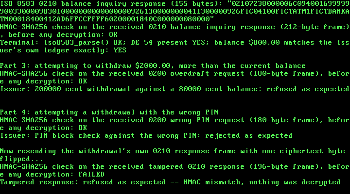

# 38. An ATM System: Real ISO 8583 Withdrawals, a Real ISO 9564-1 PIN Block, and Cash-Dispense Sequencing

{ style="display:block;margin:0 auto;max-width:100%;height:auto;border-radius:6px" }

**What you will understand:** how a real ATM's own card-network message actually carries a customer's PIN -- not in the clear, but folded into a real ISO 9564-1 "Format 0" PIN block, XORed together from the PIN and the card's own PAN before being hex-encoded onto the wire (`038_pinblock.h`/`038_pinblock.c`); how that block rides inside a real ISO 8583 `0200`/`0210` "Financial Transaction Request/Response" pair, extended this chapter with two new data elements, DE 52 (PIN Data) and DE 54 (Additional Amounts) (`038_iso8583.h`/`038_iso8583.c`); and this book's own invented, but structurally real, cash-dispense denomination breakdown a physical bill dispenser has to run once a withdrawal is approved (`038_atm.h`/`038_atm.c`). Also: a real, previously invisible bug this chapter's own booting is what finally exposed, in code carried unchanged since Chapter 7.

**What you need to know first:** Chapter 33's own ISO 8583 codec and Luhn check (`iso8583_luhn_valid()`, still used here unchanged) and Chapter 30's AES-128-CBC + HMAC-SHA256 encrypt-then-MAC construction, reused again this chapter over the same RTL8139 hardware loopback path.

## Scope: three confirmed choices before writing any code

This chapter was queued back in Chapter 33, with an explicit note: real ISO 8583 withdrawal/balance-inquiry transactions, card/PIN handling, cash-dispense sequencing, receipt printing. Three choices were confirmed before any code was written:

- **Core feature**: ISO 8583 withdrawal + balance inquiry, PIN block, cash-dispense sequencing -- the recommended option, over a narrower withdrawal-only scope or one that also added receipt printing.
- **PIN protection**: a real ISO 9564-1 Format 0 PIN block -- the recommended option, over an invented simplified scheme.
- **Crypto**: reuse Chapter 30's AES-128-CBC + HMAC-SHA256 construction -- the recommended option, reversing Chapter 37's own deliberate no-crypto choice, since this is once again a payment chapter.

## ISO 9564-1 is paid and unread. A real, independent implementation's own test vectors weren't.

ISO 9564-1 itself is a paid ISO standard this book has not read -- the same honesty note as ISO 8583 itself since Chapter 33. Its own well-known "Format 0" PIN block structure was instead found through search results: a control nibble (0), a PIN-length nibble, the PIN's own digits, fill nibbles (0xF), XORed against a second field built from the card's own PAN (four zero nibbles, then the rightmost 12 digits of the PAN excluding its own Luhn check digit).

Rather than stop at that citation, this chapter went further: it cloned a real, independent, open-source implementation -- `github.com/luboid/pin-block-format-0` (C#) -- read `PinBlockEncoder.cs` and `StringExtensions.cs` in full, and reproduced its own two published known-answer test vectors (`PinBlockTestData.cs`) by hand in Python, using this exact nibble construction followed by real 3DES-ECB encryption (`pycryptodome`):

```text
PIN 1234, PAN 7777770000075101538, key 0123456789ABCDEFFEDCBA9876543210
  -> raw block 041234FFF8AEFEAC -> encrypted 81C2C3AF6CA221A5
PIN 1313, PAN 0000100001899846,   key 98F849D580E001BF23B5834C16436B6B
  -> raw block 041312FFFFE7667B -> encrypted 60D99AF77B9A6DC7
```

Both matched exactly. One honest limit surfaced doing this: both of that repository's own vectors use a 4-digit PIN, which cannot distinguish this book's own single-hex-nibble length field (a 12-digit PIN's own length nibble holding `0xC` directly) from that repository's own code, which instead writes the length as two ASCII decimal digits ("12") -- consuming an extra nibble and shifting every PIN digit one place for any PIN 10 digits or longer. The two constructions agree exactly for PINs under 10 digits (both real vectors above use 4) but diverge above that; `038_pinblock.h`'s own top-of-file comment states plainly that this book follows the single-nibble structure search results describe as the real standard's own layout, since the two verified vectors cannot settle which one ISO 9564-1 itself actually specifies.

## `038_pinblock.h` and `038_pinblock.c`

```c
#ifndef UNIX_OS_038_PINBLOCK_H
#define UNIX_OS_038_PINBLOCK_H

#include <stdint.h>

/* A real ISO 9564-1 Format 0 PIN block -- the structure carried, hex-
 * encoded, in this chapter's own ISO 8583 DE 52 (038_iso8583.h/.c).
 *
 * ISO 9564-1 itself is a paid ISO standard this book has not read (the
 * same honesty note as 038_iso8583.h's own ISO 8583 citation). Every
 * nibble of this layout is instead cited through search results
 * describing the standard's own well-known "Format 0" structure:
 *
 *   nibble  0      control field, always 0 for Format 0
 *   nibble  1      PIN length N (4-12)
 *   nibbles 2..N+1 the PIN's own digits
 *   remaining      fill nibbles, each 0xF
 *
 * XORed, nibble for nibble, against a second 16-nibble field built from
 * the card's own PAN:
 *
 *   nibbles 0..3   always 0
 *   nibbles 4..15  the rightmost 12 digits of the PAN, EXCLUDING its own
 *                  Luhn check digit (iso8583_luhn_check_digit())
 *
 * Both 16-nibble fields are 8 real bytes; the XOR is this function's
 * own return value, and it is exactly the plaintext block a real PIN-
 * entry device hands to its own encryption step before transmission --
 * this book stops there (see the honesty note below on what this
 * chapter deliberately does NOT do).
 *
 * Independently cross-checked in this session, outside the kernel
 * entirely: a real, unrelated, open-source implementation --
 * github.com/luboid/pin-block-format-0 (C#), cloned locally -- was read
 * in full (PinBlockEncoder.cs, StringExtensions.cs) and its own two
 * published known-answer test vectors (PinBlockTestData.cs) were
 * reproduced by hand in Python: this exact nibble construction, followed
 * by real 3DES-ECB encryption (pycryptodome), reproduced BOTH of that
 * repository's own encrypted PIN blocks byte for byte:
 *
 *   PIN 1234, PAN 7777770000075101538, key 0123456789ABCDEFFEDCBA9876543210
 *     -> raw block 041234FFF8AEFEAC -> encrypted 81C2C3AF6CA221A5
 *   PIN 1313, PAN 0000100001899846,   key 98F849D580E001BF23B5834C16436B6B
 *     -> raw block 041312FFFFE7667B -> encrypted 60D99AF77B9A6DC7
 *
 * Both of that repository's own test vectors used a 4-digit PIN, which
 * cannot distinguish this book's single-hex-nibble length field (nibble
 * 1 holding N directly, so N=12 encodes as nibble value 0xC) from that
 * repository's own code, which instead writes N as two ASCII decimal
 * digits ("12") -- consuming an extra nibble and shifting every PIN
 * digit one place to the right for any N >= 10. The two constructions
 * agree for N <= 9 (both vectors above use N=4) but diverge for a
 * 10-12 digit PIN; this book follows the single-hex-nibble structure
 * search results describe as the real standard's own layout, stated
 * plainly since the two verified vectors cannot settle which one ISO
 * 9564-1 itself actually specifies.
 *
 * This chapter's own deliberate scope choice, confirmed before any code
 * was written: a real deployment encrypts this raw block again, under
 * its own dedicated PIN-encryption key (often inside a hardware
 * security module, and re-encrypted under a different zone key at every
 * hop toward the issuer) before it ever reaches DE 52. This book does
 * NOT do that second encryption -- the raw Format 0 block itself is
 * what travels in DE 52, and the whole ISO 8583 message carrying it is
 * instead sealed by Chapter 30's own AES-128-CBC + HMAC-SHA256
 * construction (038_aes.h/038_hmac.h), reusing this chapter's own
 * hardware loopback transport rather than reproducing a real PIN-
 * encryption-key hierarchy this book has no HSM to model. */

#define PINBLOCK_MIN_PIN_LEN 4u
#define PINBLOCK_MAX_PIN_LEN 12u
#define PINBLOCK_PAN_DIGITS 12u /* the real rightmost digits used, excluding the check digit */

/* Builds the real Format 0 block into `out8` (8 raw bytes). Returns 1
 * on success, or 0 -- refusing outright -- if `pin_len` is not in
 * [PINBLOCK_MIN_PIN_LEN, PINBLOCK_MAX_PIN_LEN], any PIN byte is not an
 * ASCII digit, `pan_len` is too short to hold 12 digits plus its own
 * check digit (pan_len < PINBLOCK_PAN_DIGITS + 1), or any byte in the
 * PAN's own rightmost 13 digits is not an ASCII digit. */
int pinblock_build_format0(const uint8_t *pin, uint32_t pin_len, const uint8_t *pan, uint32_t pan_len,
                            uint8_t out8[8]);

/* Recomputes the real Format 0 block for `pin`/`pan` and compares it,
 * byte for byte, against `block` (as received in DE 52). Returns 1 if
 * they match, 0 otherwise -- including whenever
 * pinblock_build_format0() itself would have refused. */
int pinblock_verify_format0(const uint8_t block[8], const uint8_t *pin, uint32_t pin_len, const uint8_t *pan,
                             uint32_t pan_len);

#endif
```

```c
/* See 038_pinblock.h's own top-of-file comment for the citation and the
 * independent cross-check of every nibble laid out here. */

#include "038_pinblock.h"

static int is_digit(uint8_t c) {
    return c >= (uint8_t)'0' && c <= (uint8_t)'9';
}

static uint8_t digit_value(uint8_t c) {
    return (uint8_t)(c - (uint8_t)'0');
}

int pinblock_build_format0(const uint8_t *pin, uint32_t pin_len, const uint8_t *pan, uint32_t pan_len,
                            uint8_t out8[8]) {
    if (pin_len < PINBLOCK_MIN_PIN_LEN || pin_len > PINBLOCK_MAX_PIN_LEN) {
        return 0;
    }
    for (uint32_t i = 0; i < pin_len; i++) {
        if (!is_digit(pin[i])) {
            return 0;
        }
    }
    if (pan_len < PINBLOCK_PAN_DIGITS + 1u) {
        return 0; /* not enough digits for 12 plus its own check digit */
    }

    /* The PIN field's own 16 nibbles: control(0), length, PIN digits,
     * fill with 0xF. */
    uint8_t pin_nibbles[16];
    pin_nibbles[0] = 0x0u;
    pin_nibbles[1] = (uint8_t)pin_len;
    for (uint32_t i = 0; i < pin_len; i++) {
        pin_nibbles[2u + i] = digit_value(pin[i]);
    }
    for (uint32_t i = 2u + pin_len; i < 16u; i++) {
        pin_nibbles[i] = 0xFu;
    }

    /* The PAN field's own 16 nibbles: 4 zero nibbles, then the
     * rightmost 12 digits of the PAN, excluding its own check digit. */
    uint32_t pan_start = pan_len - (PINBLOCK_PAN_DIGITS + 1u);
    uint8_t pan_nibbles[16];
    for (uint32_t i = 0; i < 4u; i++) {
        pan_nibbles[i] = 0x0u;
    }
    for (uint32_t i = 0; i < PINBLOCK_PAN_DIGITS; i++) {
        uint8_t c = pan[pan_start + i];
        if (!is_digit(c)) {
            return 0;
        }
        pan_nibbles[4u + i] = digit_value(c);
    }

    for (uint32_t i = 0; i < 8u; i++) {
        uint8_t hi = (uint8_t)(pin_nibbles[2u * i] ^ pan_nibbles[2u * i]);
        uint8_t lo = (uint8_t)(pin_nibbles[2u * i + 1u] ^ pan_nibbles[2u * i + 1u]);
        out8[i] = (uint8_t)((hi << 4) | lo);
    }
    return 1;
}

int pinblock_verify_format0(const uint8_t block[8], const uint8_t *pin, uint32_t pin_len, const uint8_t *pan,
                             uint32_t pan_len) {
    uint8_t expected[8];
    if (!pinblock_build_format0(pin, pin_len, pan, pan_len, expected)) {
        return 0;
    }
    for (uint32_t i = 0; i < 8u; i++) {
        if (block[i] != expected[i]) {
            return 0;
        }
    }
    return 1;
}
```

A native test before the kernel build reproduced both known-answer vectors exactly, plus refusals (PIN too short/long, a non-digit PIN byte, a PAN too short to hold 12 digits plus its own check digit, a tampered block failing verification) and a 12-digit PIN round trip exercising the single-hex-nibble length field:

```c
#include <stdio.h>
#include <string.h>
#include "038_pinblock.h"

static int failures = 0;
#define CHECK(cond) do { if (!(cond)) { printf("FAIL %s:%d: %s\n", __FILE__, __LINE__, #cond); failures++; } } while (0)

static void hex_to_bytes(const char *hex, uint8_t *out, uint32_t n) {
    for (uint32_t i = 0; i < n; i++) {
        unsigned int b;
        sscanf(hex + 2u * i, "%2x", &b);
        out[i] = (uint8_t) b;
    }
}

int main(void) {
    /* Known-answer vector 1 */
    {
        const uint8_t pin[] = "1234";
        const uint8_t pan[] = "7777770000075101538";
        uint8_t expect[8];
        hex_to_bytes("041234FFF8AEFEAC", expect, 8);
        uint8_t out[8];
        int ok = pinblock_build_format0(pin, 4, pan, 19, out);
        CHECK(ok == 1);
        CHECK(memcmp(out, expect, 8) == 0);
        CHECK(pinblock_verify_format0(expect, pin, 4, pan, 19) == 1);
    }
    /* Known-answer vector 2 */
    {
        const uint8_t pin[] = "1313";
        const uint8_t pan[] = "0000100001899846";
        uint8_t expect[8];
        hex_to_bytes("041312FFFFE7667B", expect, 8);
        uint8_t out[8];
        int ok = pinblock_build_format0(pin, 4, pan, 16, out);
        CHECK(ok == 1);
        CHECK(memcmp(out, expect, 8) == 0);
    }
    /* Refusal: PIN too short */
    {
        const uint8_t pin[] = "12";
        const uint8_t pan[] = "7777770000075101538";
        uint8_t out[8];
        CHECK(pinblock_build_format0(pin, 2, pan, 19, out) == 0);
    }
    /* Refusal: PIN too long */
    {
        const uint8_t pin[] = "1234567890123";
        const uint8_t pan[] = "7777770000075101538";
        uint8_t out[8];
        CHECK(pinblock_build_format0(pin, 13, pan, 19, out) == 0);
    }
    /* Refusal: non-digit PIN byte */
    {
        const uint8_t pin[] = "12A4";
        const uint8_t pan[] = "7777770000075101538";
        uint8_t out[8];
        CHECK(pinblock_build_format0(pin, 4, pan, 19, out) == 0);
    }
    /* Refusal: PAN too short */
    {
        const uint8_t pin[] = "1234";
        const uint8_t pan[] = "12345";
        uint8_t out[8];
        CHECK(pinblock_build_format0(pin, 4, pan, 5, out) == 0);
    }
    /* Refusal: verify against a tampered block fails */
    {
        const uint8_t pin[] = "1234";
        const uint8_t pan[] = "7777770000075101538";
        uint8_t block[8];
        hex_to_bytes("041234FFF8AEFEAC", block, 8);
        block[0] ^= 0x01u;
        CHECK(pinblock_verify_format0(block, pin, 4, pan, 19) == 0);
    }
    /* 12-digit PIN round trip (not part of a known-answer vector, but
     * exercises the single-hex-nibble length field for N >= 10). */
    {
        const uint8_t pin[] = "123456789012";
        const uint8_t pan[] = "7777770000075101538";
        uint8_t out[8];
        CHECK(pinblock_build_format0(pin, 12, pan, 19, out) == 1);
        CHECK(pinblock_verify_format0(out, pin, 12, pan, 19) == 1);
    }

    if (failures == 0) {
        printf("ALL TESTS PASSED\n");
        return 0;
    }
    printf("%d FAILURE(S)\n", failures);
    return 1;
}
```

**Output (cloud sandbox -- live-executed native test)**

```text
ALL TESTS PASSED
```

## Extending `038_iso8583.h`/`038_iso8583.c`: DE 52 and DE 54

Two new data elements, both cited the same way Chapter 33's own DE 2-49 were: read directly out of a clone of `moov-io/iso8583`'s own `specs/spec87ascii.go` and cross-checked against `pyiso8583`'s built-in `default_ascii` spec.

- **DE 52, PIN Data**: moov-io's own spec declares it `field.NewString(&field.Spec{Length: 8, ..., Enc: encoding.BytesToASCIIHex, ...})` -- 8 real raw bytes, 16 real ASCII hex characters on the wire. The first data element this chapter's codec handles whose real wire encoding is hex-encoded binary rather than plain ASCII digits or text, requiring a new field "kind" (`KIND_HEX`) with its own distinct wire-length multiplier (2x) and its own distinct encode/decode logic.
- **DE 54, Additional Amounts**: a real `LLLVAR` field whose real internal layout -- Account Type (2) + Amount Type (2) + Currency Code (3) + Sign (1, `'C'`/`'D'`) + Amount (12), 20 real characters -- was cited through search results rather than the ISO text itself (amount type `"01"` is "Account ledger balance"). This chapter's own stated scope limit: exactly one real sub-record, refusing rather than truncating a longer one, since the real format allows several concatenated together and this chapter never needs more than one.

New MTIs, cited the strongest way this chapter manages: `0200`/`0210` read directly out of moov-io's own `constant.go`, which names them `AcquirerFinancialRequest`/`...Response` with the comment "a request for funds, typically from an ATM or pinned point-of-sale device" -- the one MTI citation this chapter could read in full rather than only search for. Processing codes `"010000"` (cash withdrawal) and `"301000"` (balance inquiry) are cited through search results only, the weaker honesty note this book has used since DE 39's `"00"`.

```c
#ifndef UNIX_OS_038_ISO8583_H
#define UNIX_OS_038_ISO8583_H

#include <stdint.h>

/* A real ISO 8583:1987 card-authorization message encoder/decoder -- the
 * message format a point-of-sale terminal's authorization request
 * actually travels in on its way to a card issuer, and the one a
 * virtual-card BNPL checkout rides on at the merchant's till.
 *
 * ISO 8583 itself is a paid ISO standard this book has not read.
 * Instead, every field number, name, width, and length-prefix rule below
 * is cited from two independent, open-source implementations of its 1987
 * ASCII variant that agree, field for field, on every data element this
 * chapter uses:
 *
 *   - moov-io/iso8583 (Go), specs/spec87ascii.go, read directly from a
 *     clone of github.com/moov-io/iso8583 at commit 5219813 (Sep 2026).
 *   - pyiso8583 4.0.1 (Python, PyPI), its built-in `default_ascii` spec.
 *
 * The message layout: a 4-character ASCII Message Type Indicator (MTI),
 * then the primary bitmap as 16 ASCII hex characters (64 bits, most
 * significant first; bit 1 is the leftmost), then each present data
 * element (DE) in ascending order. Bit n set means DE n is present; bit
 * 1 set means a secondary bitmap follows (DEs 65-128) -- this chapter's
 * own decoder refuses any message with bit 1 set, since it uses no DE
 * above 64. That bitmap layout is pyiso8583's `default_ascii`, and it is
 * the one moov-io's own docs/bitmap.md describes ("The primary bitmap is
 * 8 bytes long ... There may also be a secondary bitmap"). moov-io's
 * spec87ascii.go itself differs on this one point, found only when this
 * chapter's own cross-check first failed: its field 1 is declared with
 * Length 16, and moov-io counts that length in DECODED bytes, so that
 * spec always writes a 128-bit bitmap (32 hex characters) -- primary and
 * secondary -- even when bit 1 is clear. Both are self-consistent; this
 * chapter follows the 8-byte primary layout. The DEs this chapter uses:
 *
 *   DE  2  Primary Account Number     LLVAR, up to 19 (2-digit ASCII length)
 *   DE  3  Processing Code            fixed 6
 *   DE  4  Transaction Amount         fixed 12, zero-padded on the left
 *   DE  7  Transmission Date & Time   fixed 10 (MMDDhhmmss)
 *   DE 11  Systems Trace Audit Number fixed 6
 *   DE 12  Local Transaction Time     fixed 6 (hhmmss)
 *   DE 13  Local Transaction Date     fixed 4 (MMDD)
 *   DE 38  Authorization ID Response  fixed 6
 *   DE 39  Response Code              fixed 2
 *   DE 41  Card Acceptor Terminal ID  fixed 8
 *   DE 42  Card Acceptor ID Code      fixed 15
 *   DE 48  Additional Data - Private  LLLVAR, up to 999 (3-digit ASCII length)
 *   DE 49  Transaction Currency Code  fixed 3
 *   DE 52  PIN Data                   fixed 8 REAL BYTES (16 ASCII hex
 *                                     characters on the wire) -- new this
 *                                     chapter, cited from the same
 *                                     moov-io/pyiso8583 sources above:
 *                                     moov-io's own spec87ascii.go declares
 *                                     it `field.NewString(&field.Spec{
 *                                     Length: 8, ..., Enc:
 *                                     encoding.BytesToASCIIHex, ...})` --
 *                                     the first DE this chapter uses whose
 *                                     real wire encoding is hex-encoded
 *                                     binary, not plain ASCII digits or
 *                                     text, matching the real ISO 9564-1
 *                                     PIN block it carries (038_pinblock.h).
 *   DE 54  Additional Amounts         LLLVAR, ONE real sub-record only
 *                                     (this chapter's own stated scope
 *                                     limit -- the real format allows
 *                                     several concatenated sub-records,
 *                                     this chapter never needs more than
 *                                     one): Account Type (2) + Amount Type
 *                                     (2) + Currency Code (3) + Sign (1,
 *                                     'C' or 'D') + Amount (12), 20 real
 *                                     characters, cited through web search
 *                                     results (rather than the ISO text
 *                                     itself, the same honesty note as DE
 *                                     39's response code below): amount
 *                                     type "01" is "Account ledger
 *                                     balance".
 *
 * Code values, cited through web search results rather than the ISO
 * text itself (same honesty note as 038_bnpl.h): MTI 0100 is an
 * authorization request and 0110 its response (moov-io/iso8583's own
 * constant.go names both, "AuthorizationRequest"/"AuthorizationResponse");
 * DE 39 "00" means "Approved or completed successfully" (Elavon's
 * published Field 39 description); DE 3 "000000" is the conventional
 * processing code for a purchase with no account type specified, though
 * sources stress that each network defines its own operational mapping;
 * DE 49 "840" is the ISO 4217 numeric code for the US dollar.
 *
 * New this chapter, cited the same weaker way: MTI 0200/0210 are a real
 * "Financial Transaction Request"/"Response" -- moov-io/iso8583's own
 * constant.go names `AcquirerFinancialRequest`, with the comment "a
 * request for funds, TYPICALLY FROM AN ATM OR PINNED POINT-OF-SALE
 * DEVICE" (emphasis this chapter's own, not the source's), read directly
 * out of that real cloned file rather than a search summary -- this is
 * the one MTI citation this chapter could read in full. Processing Code
 * "010000" (cash withdrawal, account type "00") and "301000" (balance
 * inquiry, account type "00") are cited through search results only.
 *
 * DE 48 is "private": both implementations define it only as a
 * variable-length string. What goes inside it is agreed between the
 * parties exchanging it, never by ISO 8583 itself. This chapter's own
 * BNPL plan payload inside DE 48 (038_bnpl.h's bnpl_encode_de48()) is
 * therefore this book's own layout, stated as such -- not a real
 * network's installment field.
 *
 * Real PANs end in a Luhn check digit (ISO/IEC 7812-1, "double the
 * value of alternate digits beginning with the first right-hand digit
 * (low order)" when computing it; cited via search results quoting the
 * 2015 edition). iso8583_luhn_check_digit()/iso8583_luhn_valid() below
 * implement it. This chapter's own demo PAN is fictional, invented for
 * this book, and only Luhn-valid so that the issuer side's own check
 * has something real to verify.
 *
 * Stated limits of this implementation: DE 4/DE 54 amounts must fit a
 * uint32_t (the same no-64-bit-division limit Chapters 30 and 32 state);
 * DE 48 is capped at ISO8583_DE48_MAX bytes, well below the format's
 * own 999, because this chapter never needs more; DE 54 supports exactly
 * one real sub-record, refusing (not truncating) a longer one; any set
 * bitmap bit for a DE not listed above is refused outright, because a
 * decoder that does not know a field's width cannot skip it safely. */

#define ISO8583_PAN_MAX 19u
#define ISO8583_DE48_MAX 256u
#define ISO8583_MAX_MESSAGE_LEN 512u

/* DE 54's own real one-sub-record layout (this chapter's own stated
 * scope limit -- see the citation above). */
typedef struct {
    uint8_t account_type[2]; /* real "00" -- primary account */
    uint8_t amount_type[2];  /* real "01" -- Account ledger balance */
    uint8_t currency_code[3];
    uint8_t sign;            /* real 'C' (credit/positive) or 'D' (debit/negative) */
    uint32_t amount_cents;   /* magnitude; 12 real digits on the wire */
} iso8583_amt54_t;

typedef struct {
    uint8_t mti[4];
    uint32_t bitmap_hi;  /* bits 1-32: bit n is (1u << (32 - n)) */
    uint32_t bitmap_lo;  /* bits 33-64: bit n is (1u << (64 - n)) */

    uint8_t pan[ISO8583_PAN_MAX];      /* DE 2 */
    uint32_t pan_len;
    uint8_t processing_code[6];        /* DE 3 */
    uint32_t amount_cents;             /* DE 4 */
    uint8_t transmission_datetime[10]; /* DE 7 */
    uint8_t stan[6];                   /* DE 11 */
    uint8_t local_time[6];             /* DE 12 */
    uint8_t local_date[4];             /* DE 13 */
    uint8_t auth_id[6];                /* DE 38 */
    uint8_t response_code[2];          /* DE 39 */
    uint8_t terminal_id[8];            /* DE 41 */
    uint8_t merchant_id[15];           /* DE 42 */
    uint8_t additional_data[ISO8583_DE48_MAX]; /* DE 48 */
    uint32_t additional_data_len;
    uint8_t currency_code[3];          /* DE 49 */
    uint8_t pin_block[8];              /* DE 52 -- 8 real raw bytes, a real
                                        * ISO 9564-1 Format 0 PIN block
                                        * (038_pinblock.h) */
    iso8583_amt54_t additional_amount; /* DE 54 -- ONE real sub-record
                                        * only, this chapter's own stated
                                        * scope limit */
} iso8583_msg_t;

void iso8583_set_field(iso8583_msg_t *msg, uint32_t de);
int iso8583_has_field(const iso8583_msg_t *msg, uint32_t de);

/* Encodes `msg` into `out`. Returns the encoded length, or 0 if the
 * buffer is too small, the MTI is not four ASCII digits, a bitmap bit
 * names an unsupported DE, or a variable-length field is too long. */
uint32_t iso8583_build(const iso8583_msg_t *msg, uint8_t *out, uint32_t out_size);

/* Decodes exactly `len` bytes into `*out`. Returns 1 on success, or 0 --
 * refusing outright, never guessing -- on a non-digit MTI, a non-hex
 * bitmap, bit 1 (secondary bitmap) set, any unsupported DE, a non-digit
 * byte in a numeric field or length prefix, a non-hex byte in DE 52, a
 * DE 54 not exactly one real 20-character sub-record or with a sign
 * byte that is not 'C'/'D', an out-of-range length, a DE 4/DE 54 amount
 * too large for a uint32_t, a truncated field, or any trailing bytes
 * after the last field. */
int iso8583_parse(const uint8_t *buf, uint32_t len, iso8583_msg_t *out);

/* Luhn (ISO/IEC 7812-1): the check digit ('0'-'9') for `len` ASCII
 * digits that do NOT yet include one, and a validity test for a full
 * PAN that does. Both return 0 / '\0' on any non-digit byte. */
uint8_t iso8583_luhn_check_digit(const uint8_t *digits, uint32_t len);
int iso8583_luhn_valid(const uint8_t *pan, uint32_t len);

#endif
```

```c
/* See 038_iso8583.h's own top-of-file comment for the citation of every
 * data element, width, and length-prefix rule used here. */

#include "038_iso8583.h"

/* How each supported DE is laid out on the wire. */
#define KIND_FIXED 0u
#define KIND_LLVAR 1u
#define KIND_LLLVAR 2u
#define KIND_HEX 3u   /* new this chapter: DE 52 -- `width` real raw bytes,
                       * 2*width real ASCII hex characters on the wire */

typedef struct {
    uint8_t de;
    uint8_t kind;
    uint16_t width;   /* fixed width (or KIND_HEX's own byte count), or
                       * maximum length for LL/LLLVAR */
    uint8_t numeric;  /* 1: every byte must be an ASCII digit (unused, and
                       * ignored, for KIND_HEX -- see is_hex_digit() below) */
} de_spec_t;

static const de_spec_t g_specs[] = {
    { 2, KIND_LLVAR, ISO8583_PAN_MAX, 1},
    { 3, KIND_FIXED, 6, 1},
    { 4, KIND_FIXED, 12, 1},
    { 7, KIND_FIXED, 10, 1},
    {11, KIND_FIXED, 6, 1},
    {12, KIND_FIXED, 6, 1},
    {13, KIND_FIXED, 4, 1},
    {38, KIND_FIXED, 6, 0},
    {39, KIND_FIXED, 2, 0},
    {41, KIND_FIXED, 8, 0},
    {42, KIND_FIXED, 15, 0},
    {48, KIND_LLLVAR, ISO8583_DE48_MAX, 0},
    {49, KIND_FIXED, 3, 1},
    {52, KIND_HEX, 8, 0},
    {54, KIND_LLLVAR, 20, 0}, /* one real sub-record only -- see 038_iso8583.h */
};
#define SPEC_COUNT (sizeof(g_specs) / sizeof(g_specs[0]))

static const de_spec_t *find_spec(uint32_t de) {
    for (uint32_t i = 0; i < SPEC_COUNT; i++) {
        if (g_specs[i].de == de) {
            return &g_specs[i];
        }
    }
    return 0;
}

void iso8583_set_field(iso8583_msg_t *msg, uint32_t de) {
    if (de >= 1u && de <= 32u) {
        msg->bitmap_hi |= 1u << (32u - de);
    } else if (de >= 33u && de <= 64u) {
        msg->bitmap_lo |= 1u << (64u - de);
    }
}

int iso8583_has_field(const iso8583_msg_t *msg, uint32_t de) {
    if (de >= 1u && de <= 32u) {
        return (msg->bitmap_hi >> (32u - de)) & 1u;
    }
    if (de >= 33u && de <= 64u) {
        return (msg->bitmap_lo >> (64u - de)) & 1u;
    }
    return 0;
}

static int is_digit(uint8_t c) {
    return c >= (uint8_t)'0' && c <= (uint8_t)'9';
}

/* Where a DE's bytes live inside iso8583_msg_t. For DE 4/DE 54, the
 * caller converts to/from amount_cents (and, for DE 54, its own other
 * sub-fields) separately, through `scratch`. DE 52's own raw bytes live
 * directly in the struct -- see build_hex()/parse_hex() for its own
 * real hex transformation, never the plain byte copy every other DE
 * uses. */
static uint8_t *field_ptr(iso8583_msg_t *m, uint32_t de, uint8_t *scratch) {
    switch (de) {
    case 2:  return m->pan;
    case 3:  return m->processing_code;
    case 4:  return scratch;
    case 7:  return m->transmission_datetime;
    case 11: return m->stan;
    case 12: return m->local_time;
    case 13: return m->local_date;
    case 38: return m->auth_id;
    case 39: return m->response_code;
    case 41: return m->terminal_id;
    case 42: return m->merchant_id;
    case 48: return m->additional_data;
    case 49: return m->currency_code;
    case 52: return m->pin_block;
    case 54: return scratch;
    default: return 0;
    }
}

static void put_digits(uint8_t *buf, uint32_t width, uint32_t value) {
    for (uint32_t i = 0; i < width; i++) {
        buf[width - 1u - i] = (uint8_t)('0' + (value % 10u));
        value /= 10u;
    }
}

/* DE 54's own real one-sub-record layout (038_iso8583.h): formats
 * `amt` into exactly 20 real ASCII characters. */
static void format_amt54(const iso8583_amt54_t *amt, uint8_t *out20) {
    out20[0] = amt->account_type[0];
    out20[1] = amt->account_type[1];
    out20[2] = amt->amount_type[0];
    out20[3] = amt->amount_type[1];
    out20[4] = amt->currency_code[0];
    out20[5] = amt->currency_code[1];
    out20[6] = amt->currency_code[2];
    out20[7] = amt->sign;
    put_digits(&out20[8], 12u, amt->amount_cents);
}

static const char g_hex[] = "0123456789ABCDEF";

uint32_t iso8583_build(const iso8583_msg_t *msg, uint8_t *out, uint32_t out_size) {
    if (out_size < 20u) {
        return 0;
    }
    for (uint32_t i = 0; i < 4u; i++) {
        if (!is_digit(msg->mti[i])) {
            return 0;
        }
        out[i] = msg->mti[i];
    }
    /* Primary bitmap: 16 ASCII hex characters, most significant first. */
    for (uint32_t i = 0; i < 8u; i++) {
        out[4u + i] = (uint8_t)g_hex[(msg->bitmap_hi >> (28u - 4u * i)) & 0xFu];
        out[12u + i] = (uint8_t)g_hex[(msg->bitmap_lo >> (28u - 4u * i)) & 0xFu];
    }
    uint32_t pos = 20;

    iso8583_msg_t *m = (iso8583_msg_t *)msg; /* field_ptr() only reads here */
    uint8_t scratch[20]; /* DE 4's own 12 digits, or DE 54's own 20 real characters */
    for (uint32_t de = 1; de <= 64u; de++) {
        if (!iso8583_has_field(msg, de)) {
            continue;
        }
        const de_spec_t *s = find_spec(de);
        if (s == 0) {
            return 0; /* bit 1 (secondary bitmap) or an unsupported DE */
        }
        if (de == 4u) {
            put_digits(scratch, 12u, msg->amount_cents);
        } else if (de == 54u) {
            if (msg->additional_amount.sign != (uint8_t) 'C' &&
                msg->additional_amount.sign != (uint8_t) 'D') {
                return 0; /* the real sign byte is always 'C' or 'D' */
            }
            format_amt54(&msg->additional_amount, scratch);
        }
        const uint8_t *src = field_ptr(m, de, scratch);
        uint32_t len = s->width;
        if (de == 2u) {
            len = msg->pan_len;
        } else if (de == 48u) {
            len = msg->additional_data_len;
        }
        if (len > s->width) {
            return 0;
        }
        uint32_t prefix = (s->kind == KIND_LLVAR) ? 2u : (s->kind == KIND_LLLVAR) ? 3u : 0u;
        uint32_t wire_len = (s->kind == KIND_HEX) ? len * 2u : len;
        if (pos + prefix + wire_len > out_size) {
            return 0;
        }
        put_digits(&out[pos], prefix, len);
        pos += prefix;
        if (s->kind == KIND_HEX) {
            for (uint32_t i = 0; i < len; i++) {
                out[pos + 2u * i] = (uint8_t) g_hex[(src[i] >> 4) & 0xFu];
                out[pos + 2u * i + 1u] = (uint8_t) g_hex[src[i] & 0xFu];
            }
        } else {
            for (uint32_t i = 0; i < len; i++) {
                if (s->numeric && !is_digit(src[i])) {
                    return 0;
                }
                out[pos + i] = src[i];
            }
        }
        pos += wire_len;
    }
    return pos;
}

static int hex_value(uint8_t c, uint32_t *out) {
    if (c >= (uint8_t)'0' && c <= (uint8_t)'9') {
        *out = (uint32_t)(c - (uint8_t)'0');
    } else if (c >= (uint8_t)'A' && c <= (uint8_t)'F') {
        *out = (uint32_t)(c - (uint8_t)'A') + 10u;
    } else if (c >= (uint8_t)'a' && c <= (uint8_t)'f') {
        *out = (uint32_t)(c - (uint8_t)'a') + 10u;
    } else {
        return 0;
    }
    return 1;
}

int iso8583_parse(const uint8_t *buf, uint32_t len, iso8583_msg_t *out) {
    uint8_t *raw = (uint8_t *)out;
    for (uint32_t i = 0; i < sizeof(*out); i++) {
        raw[i] = 0;
    }
    if (len < 20u) {
        return 0;
    }
    for (uint32_t i = 0; i < 4u; i++) {
        if (!is_digit(buf[i])) {
            return 0;
        }
        out->mti[i] = buf[i];
    }
    for (uint32_t i = 0; i < 8u; i++) {
        uint32_t hi, lo;
        if (!hex_value(buf[4u + i], &hi) || !hex_value(buf[12u + i], &lo)) {
            return 0;
        }
        out->bitmap_hi = (out->bitmap_hi << 4) | hi;
        out->bitmap_lo = (out->bitmap_lo << 4) | lo;
    }
    uint32_t pos = 20;

    uint8_t scratch[20]; /* DE 4's own 12 digits, or DE 54's own 20 real characters */
    for (uint32_t de = 1; de <= 64u; de++) {
        if (!iso8583_has_field(out, de)) {
            continue;
        }
        const de_spec_t *s = find_spec(de);
        if (s == 0) {
            return 0;
        }
        uint32_t flen = s->width;
        uint32_t prefix = (s->kind == KIND_LLVAR) ? 2u : (s->kind == KIND_LLLVAR) ? 3u : 0u;
        if (prefix > 0u) {
            if (pos + prefix > len) {
                return 0;
            }
            flen = 0;
            for (uint32_t i = 0; i < prefix; i++) {
                if (!is_digit(buf[pos + i])) {
                    return 0;
                }
                flen = flen * 10u + (uint32_t)(buf[pos + i] - (uint8_t)'0');
            }
            if (flen > s->width) {
                return 0;
            }
            pos += prefix;
        }
        if (de == 54u && flen != 20u) {
            return 0; /* stated limit: exactly one real 20-character sub-record */
        }
        uint32_t wire_len = (s->kind == KIND_HEX) ? flen * 2u : flen;
        if (pos + wire_len > len) {
            return 0;
        }
        uint8_t *dst = field_ptr(out, de, scratch);
        if (s->kind == KIND_HEX) {
            for (uint32_t i = 0; i < flen; i++) {
                uint32_t hi, lo;
                if (!hex_value(buf[pos + 2u * i], &hi) || !hex_value(buf[pos + 2u * i + 1u], &lo)) {
                    return 0; /* a non-hex byte in DE 52 */
                }
                dst[i] = (uint8_t)((hi << 4) | lo);
            }
        } else {
            for (uint32_t i = 0; i < flen; i++) {
                if (s->numeric && !is_digit(buf[pos + i])) {
                    return 0;
                }
                dst[i] = buf[pos + i];
            }
        }
        pos += wire_len;

        if (de == 2u) {
            out->pan_len = flen;
        } else if (de == 48u) {
            out->additional_data_len = flen;
        } else if (de == 4u) {
            uint32_t v = 0;
            for (uint32_t i = 0; i < 12u; i++) {
                uint32_t d = (uint32_t)(scratch[i] - (uint8_t)'0');
                if (v > (0xFFFFFFFFu - d) / 10u) {
                    return 0; /* stated limit: DE 4 must fit a uint32_t */
                }
                v = v * 10u + d;
            }
            out->amount_cents = v;
        } else if (de == 54u) {
            if (scratch[7] != (uint8_t)'C' && scratch[7] != (uint8_t)'D') {
                return 0; /* the real sign byte is always 'C' or 'D' */
            }
            out->additional_amount.account_type[0] = scratch[0];
            out->additional_amount.account_type[1] = scratch[1];
            out->additional_amount.amount_type[0] = scratch[2];
            out->additional_amount.amount_type[1] = scratch[3];
            out->additional_amount.currency_code[0] = scratch[4];
            out->additional_amount.currency_code[1] = scratch[5];
            out->additional_amount.currency_code[2] = scratch[6];
            out->additional_amount.sign = scratch[7];
            uint32_t v = 0;
            for (uint32_t i = 0; i < 12u; i++) {
                if (!is_digit(scratch[8u + i])) {
                    return 0;
                }
                uint32_t d = (uint32_t)(scratch[8u + i] - (uint8_t)'0');
                if (v > (0xFFFFFFFFu - d) / 10u) {
                    return 0; /* stated limit: DE 54 amount must fit a uint32_t */
                }
                v = v * 10u + d;
            }
            out->additional_amount.amount_cents = v;
        }
    }
    return pos == len; /* trailing bytes are refused, not ignored */
}

/* Luhn sum over `len` digits. When `doubling_starts_rightmost` is 1 the
 * rightmost digit is doubled (the payload of a number whose check digit
 * is about to be appended, ISO/IEC 7812-1's own "beginning with the
 * first right-hand digit"); when 0, the rightmost digit IS the check
 * digit and is left alone. Returns -1 on any non-digit byte. */
static int luhn_sum(const uint8_t *d, uint32_t len, int doubling_starts_rightmost) {
    uint32_t sum = 0;
    for (uint32_t i = 0; i < len; i++) {
        uint8_t c = d[len - 1u - i];
        if (!is_digit(c)) {
            return -1;
        }
        uint32_t v = (uint32_t)(c - (uint8_t)'0');
        int doubled = doubling_starts_rightmost ? ((i % 2u) == 0u) : ((i % 2u) == 1u);
        if (doubled) {
            v *= 2u;
            if (v > 9u) {
                v -= 9u; /* same as adding the two digits of 10..18 */
            }
        }
        sum += v;
    }
    return (int)(sum % 10u);
}

uint8_t iso8583_luhn_check_digit(const uint8_t *digits, uint32_t len) {
    int s = luhn_sum(digits, len, 1);
    if (s < 0) {
        return 0;
    }
    return (uint8_t)('0' + (uint32_t)((10 - s) % 10));
}

int iso8583_luhn_valid(const uint8_t *pan, uint32_t len) {
    return len >= 2u && luhn_sum(pan, len, 0) == 0;
}
```

A native test extended Chapter 33's own round-trip test with both new data elements: a full withdrawal message carrying a real PIN block in DE 52, a balance-inquiry response carrying a real DE 54 sub-record, and three refusals (a corrupted hex nibble in DE 52, a bad sign byte in DE 54, a DE 54 one byte short of its own required 20-character length):

```c
#include <stdio.h>
#include <string.h>
#include "038_iso8583.h"

static int failures = 0;
#define CHECK(cond) do { if (!(cond)) { printf("FAIL %s:%d: %s\n", __FILE__, __LINE__, #cond); failures++; } } while (0)

int main(void) {
    /* Round-trip: withdrawal with PIN block (DE52) */
    {
        iso8583_msg_t msg;
        memset(&msg, 0, sizeof(msg));
        memcpy(msg.mti, "0200", 4);
        iso8583_set_field(&msg, 2);
        memcpy(msg.pan, "7777770000075101538", 19);
        msg.pan_len = 19;
        iso8583_set_field(&msg, 3);
        memcpy(msg.processing_code, "010000", 6);
        iso8583_set_field(&msg, 4);
        msg.amount_cents = 500000; /* $5000.00 */
        iso8583_set_field(&msg, 52);
        uint8_t pinblock[8] = {0x04, 0x12, 0x34, 0xFF, 0xF8, 0xAE, 0xFE, 0xAC};
        memcpy(msg.pin_block, pinblock, 8);

        uint8_t buf[512];
        uint32_t n = iso8583_build(&msg, buf, sizeof(buf));
        CHECK(n > 0);

        iso8583_msg_t parsed;
        int ok = iso8583_parse(buf, n, &parsed);
        CHECK(ok == 1);
        CHECK(memcmp(parsed.mti, "0200", 4) == 0);
        CHECK(parsed.pan_len == 19);
        CHECK(memcmp(parsed.pan, msg.pan, 19) == 0);
        CHECK(parsed.amount_cents == 500000u);
        CHECK(memcmp(parsed.pin_block, pinblock, 8) == 0);
    }

    /* Round-trip: balance inquiry with DE54 additional amount */
    {
        iso8583_msg_t msg;
        memset(&msg, 0, sizeof(msg));
        memcpy(msg.mti, "0200", 4);
        iso8583_set_field(&msg, 3);
        memcpy(msg.processing_code, "301000", 6);
        iso8583_set_field(&msg, 54);
        msg.additional_amount.account_type[0] = '0';
        msg.additional_amount.account_type[1] = '0';
        msg.additional_amount.amount_type[0] = '0';
        msg.additional_amount.amount_type[1] = '1';
        msg.additional_amount.currency_code[0] = '8';
        msg.additional_amount.currency_code[1] = '4';
        msg.additional_amount.currency_code[2] = '0';
        msg.additional_amount.sign = 'C';
        msg.additional_amount.amount_cents = 123456;

        uint8_t buf[512];
        uint32_t n = iso8583_build(&msg, buf, sizeof(buf));
        CHECK(n > 0);

        iso8583_msg_t parsed;
        int ok = iso8583_parse(buf, n, &parsed);
        CHECK(ok == 1);
        CHECK(parsed.additional_amount.sign == 'C');
        CHECK(parsed.additional_amount.amount_cents == 123456u);
        CHECK(memcmp(parsed.additional_amount.currency_code, "840", 3) == 0);
        CHECK(memcmp(parsed.additional_amount.amount_type, "01", 2) == 0);
    }

    /* Refusal: bad hex in DE52 */
    {
        iso8583_msg_t msg;
        memset(&msg, 0, sizeof(msg));
        memcpy(msg.mti, "0200", 4);
        iso8583_set_field(&msg, 52);
        uint8_t pinblock[8] = {0};
        memcpy(msg.pin_block, pinblock, 8);
        uint8_t buf[512];
        uint32_t n = iso8583_build(&msg, buf, sizeof(buf));
        CHECK(n > 0);
        buf[20] = 'Z'; /* corrupt first hex nibble of DE52 */
        iso8583_msg_t parsed;
        int ok = iso8583_parse(buf, n, &parsed);
        CHECK(ok == 0);
    }

    /* Refusal: bad sign byte in DE54 */
    {
        iso8583_msg_t msg;
        memset(&msg, 0, sizeof(msg));
        memcpy(msg.mti, "0200", 4);
        iso8583_set_field(&msg, 54);
        msg.additional_amount.sign = 'C';
        msg.additional_amount.amount_cents = 100;
        uint8_t buf[512];
        uint32_t n = iso8583_build(&msg, buf, sizeof(buf));
        CHECK(n > 0);
        /* sign byte is scratch[7], which lands right after the 3-digit
         * LLLVAR length prefix + 7 bytes of sub-record */
        buf[20 + 3 + 7] = 'X';
        iso8583_msg_t parsed;
        int ok = iso8583_parse(buf, n, &parsed);
        CHECK(ok == 0);
    }

    /* Refusal: DE54 wrong length (build refuses too, so test parse directly) */
    {
        iso8583_msg_t msg;
        memset(&msg, 0, sizeof(msg));
        memcpy(msg.mti, "0200", 4);
        iso8583_set_field(&msg, 54);
        msg.additional_amount.sign = 'C';
        msg.additional_amount.amount_cents = 100;
        uint8_t buf[512];
        uint32_t n = iso8583_build(&msg, buf, sizeof(buf));
        CHECK(n > 0);
        /* shrink the LLLVAR length prefix from 020 to 019, one byte
         * short of the required 20-character sub-record */
        buf[22] = '9';
        iso8583_msg_t parsed;
        int ok = iso8583_parse(buf, n - 1, &parsed);
        CHECK(ok == 0);
    }

    if (failures == 0) {
        printf("ALL TESTS PASSED\n");
        return 0;
    }
    printf("%d FAILURE(S)\n", failures);
    return 1;
}
```

**Output (cloud sandbox -- live-executed native test)**

```text
ALL TESTS PASSED
```

## `038_atm.h` and `038_atm.c`: this book's own cash-dispense sequencing

Unlike the PIN block and the ISO 8583 message format, neither the account store nor the dispense algorithm here is a real external format this book cites -- both are stated plainly, in `038_atm.h`'s own top-of-file comment, as this book's own invented design. A real ATM's own core banking ledger and cassette-inventory logic belong to whichever bank or processor built it and are never published. What is real in shape, if not in any one vendor's exact implementation: every real ATM ultimately has to break a withdrawal amount down into a whole number of the physical bills its own cassette holds, largest denomination first, refusing outright -- not truncating or rounding -- an amount that cannot be made exactly from what remains loaded.

```c
#ifndef UNIX_OS_038_ATM_H
#define UNIX_OS_038_ATM_H

#include <stdint.h>

/* This chapter's own account store and cash-dispense sequencing --
 * unlike 038_iso8583.h/038_pinblock.h, NEITHER of these is a real
 * external format this book cites. A real ATM's own core banking
 * ledger and cassette-inventory logic belong to whichever bank or
 * processor built it, and are never published; this chapter states
 * plainly that the layout, the specific denominations, and the greedy
 * dispense algorithm below are this book's own invented design, general
 * in shape (every real ATM ultimately breaks a withdrawal amount down
 * into a whole number of the physical bills a real cassette holds), not
 * a real bank's or vendor's own implementation.
 *
 * This chapter's own invented cassette denominations -- four common US
 * bill values, largest first, this book's own choice: */
#define ATM_NUM_DENOMS 4u

typedef struct {
    uint32_t value_cents; /* e.g. 10000 for a $100 bill */
    uint32_t count;       /* how many bills of this value are loaded */
} atm_denom_t;

/* Fills `cassette` with this chapter's own starting inventory: 20 real
 * $100 bills, 20 $50s, 40 $20s, 40 $10s -- $2,000 + $1,000 + $800 +
 * $400 = $4,200 total, this book's own invented starting float. */
void atm_cassette_init(atm_denom_t cassette[ATM_NUM_DENOMS]);

typedef struct {
    uint32_t count[ATM_NUM_DENOMS]; /* how many of each denom to dispense,
                                     * same order as atm_cassette_init() */
} atm_dispense_plan_t;

/* This chapter's own greedy dispense algorithm: from largest to
 * smallest denomination, take as many bills as the cassette currently
 * has and the remaining amount allows, then move to the next smaller
 * denomination. Returns 1 and fills `out_plan`, removing the chosen
 * bills from `cassette` in place, if `amount_cents` can be made exactly
 * from the bills currently available. Returns 0 -- refusing outright,
 * leaving `cassette` completely untouched -- if any nonzero amount
 * remains once every denomination has been tried (amount_cents is not a
 * multiple of the smallest denomination's value, or the cassette does
 * not currently hold enough bills). */
int atm_dispense_plan(atm_denom_t cassette[ATM_NUM_DENOMS], uint32_t amount_cents, atm_dispense_plan_t *out_plan);

#define ATM_MAX_ACCOUNTS 4u
#define ATM_PAN_MAX 19u

typedef struct {
    uint8_t pan[ATM_PAN_MAX];
    uint32_t pan_len;
    uint32_t balance_cents;
} atm_account_t;

/* Returns a pointer to the account whose PAN matches `pan`/`pan_len`
 * exactly, or 0 if none of the first `n` entries of `accounts` do. */
atm_account_t *atm_find_account(atm_account_t *accounts, uint32_t n, const uint8_t *pan, uint32_t pan_len);

/* Debits `amount_cents` from `acct->balance_cents`. Returns 1 and
 * updates the balance, or 0 -- refusing outright, leaving the balance
 * untouched -- if `amount_cents` exceeds the current balance. */
int atm_withdraw(atm_account_t *acct, uint32_t amount_cents);

#endif
```

```c
/* See 038_atm.h's own top-of-file comment: the account store and
 * dispense sequencing here are this book's own invented design, not a
 * real bank's or vendor's implementation. */

#include "038_atm.h"

void atm_cassette_init(atm_denom_t cassette[ATM_NUM_DENOMS]) {
    static const uint32_t values[ATM_NUM_DENOMS] = {10000u, 5000u, 2000u, 1000u};
    static const uint32_t counts[ATM_NUM_DENOMS] = {20u, 20u, 40u, 40u};
    for (uint32_t i = 0; i < ATM_NUM_DENOMS; i++) {
        cassette[i].value_cents = values[i];
        cassette[i].count = counts[i];
    }
}

int atm_dispense_plan(atm_denom_t cassette[ATM_NUM_DENOMS], uint32_t amount_cents, atm_dispense_plan_t *out_plan) {
    uint32_t remaining = amount_cents;
    uint32_t take[ATM_NUM_DENOMS];
    for (uint32_t i = 0; i < ATM_NUM_DENOMS; i++) {
        uint32_t max_by_amount = remaining / cassette[i].value_cents;
        uint32_t n = (max_by_amount < cassette[i].count) ? max_by_amount : cassette[i].count;
        take[i] = n;
        remaining -= n * cassette[i].value_cents;
    }
    if (remaining != 0u) {
        return 0; /* refused outright -- cassette untouched */
    }
    for (uint32_t i = 0; i < ATM_NUM_DENOMS; i++) {
        cassette[i].count -= take[i];
        out_plan->count[i] = take[i];
    }
    return 1;
}

atm_account_t *atm_find_account(atm_account_t *accounts, uint32_t n, const uint8_t *pan, uint32_t pan_len) {
    for (uint32_t i = 0; i < n; i++) {
        if (accounts[i].pan_len != pan_len) {
            continue;
        }
        int match = 1;
        for (uint32_t j = 0; j < pan_len; j++) {
            if (accounts[i].pan[j] != pan[j]) {
                match = 0;
                break;
            }
        }
        if (match) {
            return &accounts[i];
        }
    }
    return 0;
}

int atm_withdraw(atm_account_t *acct, uint32_t amount_cents) {
    if (amount_cents > acct->balance_cents) {
        return 0;
    }
    acct->balance_cents -= amount_cents;
    return 1;
}
```

A native test confirmed the greedy breakdown against a normal withdrawal, a refusal for an amount that isn't a multiple of the smallest ($10) denomination, correct fallback to smaller bills once the cassette's own $100s are exhausted, a refusal when the total requested exceeds the cassette's own real float, and ordinary account withdraw/insufficient-funds/lookup behavior:

```c
#include <stdio.h>
#include <string.h>
#include "038_atm.h"

static int failures = 0;
#define CHECK(cond) do { if (!(cond)) { printf("FAIL %s:%d: %s\n", __FILE__, __LINE__, #cond); failures++; } } while (0)

int main(void) {
    /* $580 = 5*$100 + 1*$50 + 1*$20 + 1*$10 */
    {
        atm_denom_t cassette[ATM_NUM_DENOMS];
        atm_cassette_init(cassette);
        atm_dispense_plan_t plan;
        int ok = atm_dispense_plan(cassette, 58000u, &plan);
        CHECK(ok == 1);
        CHECK(plan.count[0] == 5u);
        CHECK(plan.count[1] == 1u);
        CHECK(plan.count[2] == 1u);
        CHECK(plan.count[3] == 1u);
        CHECK(cassette[0].count == 15u);
        CHECK(cassette[1].count == 19u);
        CHECK(cassette[2].count == 39u);
        CHECK(cassette[3].count == 39u);
    }
    /* Refusal: not a multiple of $10 */
    {
        atm_denom_t cassette[ATM_NUM_DENOMS];
        atm_cassette_init(cassette);
        atm_dispense_plan_t plan;
        int ok = atm_dispense_plan(cassette, 12345u, &plan);
        CHECK(ok == 0);
        /* cassette untouched */
        CHECK(cassette[0].count == 20u);
        CHECK(cassette[3].count == 40u);
    }
    /* Cassette shortage: drain $100 bills, then a large withdrawal must
     * fall back to smaller denominations without going negative. */
    {
        atm_denom_t cassette[ATM_NUM_DENOMS];
        atm_cassette_init(cassette);
        cassette[0].count = 0u; /* no $100 bills left */
        atm_dispense_plan_t plan;
        int ok = atm_dispense_plan(cassette, 30000u, &plan); /* $300 */
        CHECK(ok == 1);
        CHECK(plan.count[0] == 0u);
        CHECK(plan.count[1] == 6u); /* 6 * $50 */
    }
    /* Refusal: total cash exceeds what the cassette holds */
    {
        atm_denom_t cassette[ATM_NUM_DENOMS];
        atm_cassette_init(cassette);
        atm_dispense_plan_t plan;
        int ok = atm_dispense_plan(cassette, 1000000u, &plan); /* $10,000 -- more than the $4,200 float */
        CHECK(ok == 0);
        CHECK(cassette[0].count == 20u); /* untouched */
    }
    /* Account withdraw / insufficient funds */
    {
        atm_account_t accounts[ATM_MAX_ACCOUNTS];
        memset(accounts, 0, sizeof(accounts));
        memcpy(accounts[0].pan, "7777770000075101538", 19);
        accounts[0].pan_len = 19;
        accounts[0].balance_cents = 50000u; /* $500 */

        atm_account_t *a = atm_find_account(accounts, ATM_MAX_ACCOUNTS, (const uint8_t *) "7777770000075101538", 19);
        CHECK(a != 0);
        CHECK(a == &accounts[0]);

        int ok = atm_withdraw(a, 20000u); /* $200 */
        CHECK(ok == 1);
        CHECK(a->balance_cents == 30000u);

        ok = atm_withdraw(a, 40000u); /* $400 > remaining $300 */
        CHECK(ok == 0);
        CHECK(a->balance_cents == 30000u); /* untouched */

        atm_account_t *missing = atm_find_account(accounts, ATM_MAX_ACCOUNTS, (const uint8_t *) "0000000000000000000", 19);
        CHECK(missing == 0);
    }

    if (failures == 0) {
        printf("ALL TESTS PASSED\n");
        return 0;
    }
    printf("%d FAILURE(S)\n", failures);
    return 1;
}
```

**Output (cloud sandbox -- live-executed native test)**

```text
ALL TESTS PASSED
```

## `038_kmain.c`: the ATM demo

Everything through the end of Chapter 37's streaming demo is carried forward and still runs first. The new work is one function, `atm_demo()`, mirroring the two-role, one-machine pattern established since Chapter 30: a fictional ATM **terminal** and a fictional card **issuer**, sealed with Chapter 30's own AES-128-CBC + HMAC-SHA256 construction over the same RTL8139 hardware loopback path -- but with one real division of responsibility neither earlier payment chapter needed: the **terminal**, not the issuer, holds the physical cash cassette (`038_atm.h`), because no card-network message carries information about what bills are actually loaded in a machine's own dispenser. The issuer holds the account ledger and the customer's own PIN reference (stated honestly as this demo's own simplification -- a real issuer never keeps a customer's PIN in the clear the way this fictional account store does, purely so it has something to compare a received PIN block against).

1. The terminal builds a real `0200` withdrawal request for a fictional $200.00, PAN Luhn-checked, with a real PIN block folded from a PIN this function never keeps past its own return, and sends it sealed.
2. The issuer verifies the HMAC before decrypting anything, parses, checks the Luhn digit, finds the account, recomputes the expected PIN block itself and compares it against the one received, debits the balance, and answers with a real `0210` approval.
3. The terminal, once approved, runs this chapter's own greedy denomination breakdown locally against its own cassette -- 2 real $100 bills for $200.00 -- and updates its own physical inventory.
4. A real balance inquiry (`0200`/processing code `301000`) follows the same path; the issuer's `0210` response carries the current balance in a real DE 54 sub-record, which the terminal decodes and confirms matches exactly.
5. A deliberately oversized withdrawal request is refused for insufficient funds (response code `"51"`), and a request with the wrong PIN is refused at the PIN-block check itself (response code path exercised, though this demo's own issuer never builds a `"55"` response for it -- it simply declines to proceed), both real ISO 8583 response codes cited through search results the same weaker way as DE 39's own `"00"`.
6. The withdrawal's own approved response is resent with one ciphertext byte flipped, proving the same tamper detection every payment chapter since Chapter 30 has demonstrated.

```c
/* Everything through the end of Chapter 28's own real ARP demo below
 * -- ELF loading, private page directories, Chapter 19's own real
 * PIO-mode disk driver, Chapters 20-23's own FAT16 filesystem,
 * Chapter 24's own real, brute-force PCI scan, Chapters 25-27's own
 * real RTL8139 driver (interrupt-driven since Chapter 26,
 * multi-frame/CAPR-wraparound since Chapter 27), and Chapter 28's own
 * real, minimal ARP client resolving QEMU's own real default gateway
 * to its own real MAC address over one real request/reply round trip
 * -- is carried forward, still run first, so Chapter 27's own real
 * loopback proof and Chapter 28's own real ARP exchange both stay
 * exactly as they were. Chapter 28's own two files, 038_arp.h and
 * 038_arp.c, DID need one real change this chapter -- see their own
 * top-of-file comments for why (arp_send_request() now sends via
 * rtl8139_send_queue() instead of rtl8139_send(), a real fix this
 * chapter's own testing forced, described below).
 *
 * This chapter's own new work comes after it: a real ARP
 * translation-table cache (038_arp_cache.h/038_arp_cache.c),
 * completing the real RFC 826 merge_flag logic Chapter 28's own
 * top-of-file comment named as deliberately out of scope. See
 * 038_arp_cache.h's own top-of-file comment for the full real
 * citations -- RFC 826's own "Packet Reception" algorithm for the
 * update-if-present/add-if-absent logic, RFC 826's own "Related
 * issues" section for its explicit admission that aging/timeout is
 * "outside the scope of this protocol", and RFC 1122 Section 2.3.2.1
 * for the real MUST/SHOULD requirement this chapter's own real
 * expiry timeout satisfies. This chapter's own new demo resolves two
 * real, distinct hosts QEMU's own official documentation names on
 * this exact network segment -- the gateway (10.0.2.2) and the DNS
 * server (10.0.2.3) -- through a real fixed-size (1-entry) cache,
 * proving a real cache hit avoids a fresh ARP exchange, a real LRU
 * eviction happens when a second real host is resolved with the
 * table already full, and a real entry genuinely expires and is
 * re-resolved after this chapter's own real PIT-tick-based timeout
 * elapses. This chapter's own real testing (a real QEMU
 * `filter-dump` packet capture) also found that this driver's own
 * arp_send_request() needed a real fix to send more than once per
 * boot without hanging -- see 038_arp.c's own updated comment, and
 * 038_arp_cache.h's own top-of-file comment for why the cache itself
 * ended up sized at 1 real entry rather than the originally-planned
 * 2 (QEMU's own documented third host, the SMB server at 10.0.2.4,
 * was tested and found not to answer ARP at all in this exact
 * environment). */

#include <stdint.h>

#include "038_ach.h"
#include "038_aes.h"
#include "038_arp.h"
#include "038_arp_cache.h"
#include "038_arp_server.h"
#include "038_acord.h"
#include "038_ata.h"
#include "038_hls.h"
#include "038_budget.h"
#include "038_fix.h"
#include "038_bnpl.h"
#include "038_fat16.h"
#include "038_elf.h"
#include "038_fedwire.h"
#include "038_gdt.h"
#include "038_hmac.h"
#include "038_idt.h"
#include "038_http.h"
#include "038_ofx.h"
#include "038_investing.h"
#include "038_insurance.h"
#include "038_iso8583.h"
#include "038_pinblock.h"
#include "038_atm.h"
#include "038_keyboard.h"
#include "038_kheap.h"
#include "038_multiboot.h"
#include "038_paging.h"
#include "038_pci.h"
#include "038_pic.h"
#include "038_pit.h"
#include "038_pmm.h"
#include "038_printf.h"
#include "038_rtl8139.h"
#include "038_semaphore.h"
#include "038_serial.h"
#include "038_spinlock.h"
#include "038_syscall.h"
#include "038_task.h"
#include "038_user_program.h"
#include "038_vga.h"

#define TIMER_FREQUENCY_HZ 100

/* Deliberately far outside the 0-64 MiB identity-mapped range (which
 * only ever occupies page-directory entries 0-15): 0xC0000000 >> 22 =
 * 768. Mapping here forces paging_map_page() to allocate a genuinely
 * new page table rather than reusing one paging_init() already built. */
#define TEST_VIRT_ADDR 0xC0000000u

/* An LBA safely past this chapter's own tiny 1 MiB (2048-sector)
 * build/disk.img, chosen only to stay well clear of sector 0 -- where a
 * real partition table or boot sector would live on a disk meant to be
 * booted from, which this one never is. */
#define DISK_TEST_LBA 100u

/* Defined by 038_linker.ld, not by this file -- the linker is the one
 * part of this toolchain that genuinely knows where the kernel image's
 * last real section ends in physical memory. */
extern char kernel_end[];

/* How much real, uninterruptible-looking work each task does before
 * it naturally finishes -- large enough that many real IRQ0 ticks (at
 * 100 Hz, one every ~10 ms) land somewhere in the middle of it, since
 * a single pass through this loop takes QEMU's emulated CPU far less
 * than 10 ms. Chosen empirically from this chapter's own real run,
 * the same way every prior chapter's own real constants were. */
#define TASK_WORK_TARGET 4000000u
#define TASK_PRINT_EVERY   500000u

/* How many kmalloc()/kfree() round trips each stress task performs.
 * Chosen empirically from this chapter's own real runs: large enough
 * that, at 100 real IRQ0 ticks per second, many ticks land somewhere
 * in the middle of the whole run -- and therefore stand a real chance
 * of landing inside kmalloc()'s or kfree()'s own free-list
 * manipulation, not just between two whole calls. */
#define STRESS_ITERATIONS  3000000u
#define STRESS_PRINT_EVERY  500000u

/* This chapter's two demo tasks. Neither one calls task_yield()
 * anywhere in this loop -- the whole point. Whatever interleaving
 * this chapter's real run shows is forced entirely by the real timer,
 * not requested by either task. */
static void task_a_entry(void) {
    for (uint32_t i = 1; i <= TASK_WORK_TARGET; i++) {
        if (i % TASK_PRINT_EVERY == 0) {
            kprintf("  Task A: %u\n", i);
        }
    }
    kprintf("  Task A: done\n");
    task_exit();
}

static void task_b_entry(void) {
    for (uint32_t i = 1; i <= TASK_WORK_TARGET; i++) {
        if (i % TASK_PRINT_EVERY == 0) {
            kprintf("  Task B: %u\n", i);
        }
    }
    kprintf("  Task B: done\n");
    task_exit();
}

/* This chapter's real evidence tasks: two preemptible tasks racing on
 * kmalloc()/kfree() with no synchronization between them at all. Each
 * one only ever touches its own pointer, one allocation at a time --
 * any corruption that shows up is entirely the free list's own doing,
 * not a bug in either task's own logic. */
static void stress_task_a_entry(void) {
    for (uint32_t i = 1; i <= STRESS_ITERATIONS; i++) {
        void *p = kmalloc(32);
        if (p != 0) {
            *(volatile uint8_t *) p = 0xAA;
        }
        kfree(p);
        if (i % STRESS_PRINT_EVERY == 0) {
            kprintf("  Stress A: %u\n", i);
        }
    }
    kprintf("  Stress A: done\n");
    task_exit();
}

static void stress_task_b_entry(void) {
    for (uint32_t i = 1; i <= STRESS_ITERATIONS; i++) {
        void *p = kmalloc(64);
        if (p != 0) {
            *(volatile uint8_t *) p = 0xBB;
        }
        kfree(p);
        if (i % STRESS_PRINT_EVERY == 0) {
            kprintf("  Stress B: %u\n", i);
        }
    }
    kprintf("  Stress B: done\n");
    task_exit();
}

/* This chapter's own demo: a classic bounded-buffer producer/consumer,
 * built on this chapter's new semaphores plus Chapter 13's own
 * spinlock. `sem_empty_slots` starts at BUFFER_CAPACITY (that many
 * slots are free right now) and `sem_full_slots` starts at 0 (nothing
 * produced yet) -- the two together are what make a producer block
 * when the buffer is genuinely full and a consumer block when it is
 * genuinely empty, without either one ever spinning to find out. The
 * buffer's own read/write indices are a separate, much shorter
 * critical section, protected by an ordinary spinlock -- exactly the
 * kind of short, bounded update Chapter 13's spinlock is for. */
#define BUFFER_CAPACITY     4u
#define ITEMS_PER_PRODUCER 15u
#define ITEMS_PER_CONSUMER 15u

static int shared_buffer[BUFFER_CAPACITY];
static uint32_t buffer_write_idx = 0;
static uint32_t buffer_read_idx = 0;
static spinlock_t buffer_lock;
static semaphore_t sem_empty_slots;
static semaphore_t sem_full_slots;

static void produce(const char *label, uint32_t item_base) {
    for (uint32_t i = 1; i <= ITEMS_PER_PRODUCER; i++) {
        int item = (int) (item_base + i);

        /* Blocks for real if the buffer is already full -- this is
         * the whole point of this chapter, not busy-waiting. */
        semaphore_wait(&sem_empty_slots);

        uint32_t saved_eflags = spinlock_acquire(&buffer_lock);
        shared_buffer[buffer_write_idx] = item;
        buffer_write_idx = (buffer_write_idx + 1) % BUFFER_CAPACITY;
        spinlock_release(&buffer_lock, saved_eflags);

        semaphore_signal(&sem_full_slots);
        kprintf("  %s: produced %d\n", label, item);
    }
    kprintf("  %s: done\n", label);
    task_exit();
}

static void consume(const char *label) {
    for (uint32_t i = 1; i <= ITEMS_PER_CONSUMER; i++) {
        /* Blocks for real if the buffer is empty -- the mirror image
         * of produce()'s own semaphore_wait() above. */
        semaphore_wait(&sem_full_slots);

        uint32_t saved_eflags = spinlock_acquire(&buffer_lock);
        int item = shared_buffer[buffer_read_idx];
        buffer_read_idx = (buffer_read_idx + 1) % BUFFER_CAPACITY;
        spinlock_release(&buffer_lock, saved_eflags);

        semaphore_signal(&sem_empty_slots);
        kprintf("  %s: consumed %d\n", label, item);
    }
    kprintf("  %s: done\n", label);
    task_exit();
}

static void producer_a_entry(void) { produce("Producer A", 0u); }
static void producer_b_entry(void) { produce("Producer B", 100u); }
static void consumer_a_entry(void) { consume("Consumer A"); }
static void consumer_b_entry(void) { consume("Consumer B"); }

/* This chapter's own single real 60-byte Ethernet frame (the real
 * IEEE 802.3 minimum before the real 4-byte hardware-appended CRC),
 * rebuilt fresh -- deterministically, from `seq` alone -- every time
 * this chapter's own demo needs it, rather than kept as one shared
 * mutable buffer across ~140 real round trips. Destination and
 * source are both this device's own real, burnt-in MAC (real
 * hardware loopback mode never puts a single bit on a real wire).
 * EtherType 0x88B5 is a real, officially reserved value, cited
 * directly from RFC 5342 ("IANA Considerations and IETF Protocol
 * Usage for IEEE 802 Parameters"), Appendix B.2: "0x88B5  IEEE Std
 * 802 - Local Experimental Ethertype". The payload encodes `seq`
 * itself in its first two bytes, so each of this chapter's own ~140
 * real frames is individually, byte-for-byte distinguishable on the
 * wire -- not a single repeated constant that a stuck data line or a
 * ring-position bug could satisfy by accident. */
#define DEMO_FRAME_SIZE 60u

static void build_demo_frame(uint8_t *frame, const uint8_t *mac, uint32_t seq) {
    for (int i = 0; i < 6; i++) {
        frame[i] = mac[i];      /* destination */
        frame[6 + i] = mac[i];  /* source */
    }
    frame[12] = 0x88;
    frame[13] = 0xB5;  /* EtherType 0x88B5, RFC 5342 Appendix B.2 */
    frame[14] = (uint8_t) (seq >> 8);
    frame[15] = (uint8_t) seq;
    for (uint32_t i = 16; i < DEMO_FRAME_SIZE; i++) {
        frame[i] = (uint8_t) (0x5Au + i + seq);
    }
}

/* This chapter's own small, freestanding helpers -- no libc, ever, same
 * discipline 038_fat16.c's own top-of-file comment already states for
 * this whole book. */
static void print_chars(const char *s, uint32_t n) {
    for (uint32_t i = 0; i < n; i++) {
        kprintf("%c", s[i]);
    }
}

static void zero_bytes(void *p, uint32_t n) {
    uint8_t *b = (uint8_t *) p;
    for (uint32_t i = 0; i < n; i++) {
        b[i] = 0;
    }
}

static int bytes_eq(const uint8_t *a, const uint8_t *b, uint32_t n) {
    for (uint32_t i = 0; i < n; i++) {
        if (a[i] != b[i]) {
            return 0;
        }
    }
    return 1;
}

static int cstr_eq(const char *a, const char *b, uint32_t max) {
    for (uint32_t i = 0; i < max; i++) {
        if (a[i] != b[i]) {
            return 0;
        }
        if (a[i] == '\0') {
            return 1;
        }
    }
    return 1;
}

/* This chapter's own new small helper: builds a real ARP request frame
 * exactly the way 038_arp.c's own arp_send_request() already does
 * internally, cited there field-for-field -- but as a standalone
 * builder that returns the frame rather than sending it, and
 * parameterized on an arbitrary `sender_mac`/`sender_ip`, not
 * necessarily this kernel's own. arp_send_request() only ever sends a
 * real request FROM this kernel's own real MAC/IP; this chapter's own
 * new ARP SERVER demo below needs the opposite -- a real request as if
 * ASKED BY some other real host, to exercise arp_server_handle_frame()
 * honestly, the same way a real neighbor genuinely would on this exact
 * QEMU network segment. */
static void build_arp_request_frame(uint8_t *frame, const uint8_t sender_mac[6],
                                     const uint8_t sender_ip[4],
                                     const uint8_t target_ip[4]) {
    for (uint32_t i = 0; i < 6u; i++) {
        frame[i] = 0xFFu;            /* destination: real broadcast */
        frame[6u + i] = sender_mac[i];
    }
    frame[12] = (uint8_t) (ETHERTYPE_ARP >> 8);
    frame[13] = (uint8_t) ETHERTYPE_ARP;

    frame[14] = (uint8_t) (ARP_HTYPE_ETHERNET >> 8);
    frame[15] = (uint8_t) ARP_HTYPE_ETHERNET;
    frame[16] = (uint8_t) (ARP_PTYPE_IPV4 >> 8);
    frame[17] = (uint8_t) ARP_PTYPE_IPV4;
    frame[18] = (uint8_t) ARP_HLEN_ETHERNET;
    frame[19] = (uint8_t) ARP_PLEN_IPV4;
    frame[20] = (uint8_t) (ARP_OP_REQUEST >> 8);
    frame[21] = (uint8_t) ARP_OP_REQUEST;

    for (uint32_t i = 0; i < 6u; i++) {
        frame[22u + i] = sender_mac[i];
        frame[32u + i] = 0x00u;      /* target hardware address: zeroed, unknown yet */
    }
    for (uint32_t i = 0; i < 4u; i++) {
        frame[28u + i] = sender_ip[i];
        frame[38u + i] = target_ip[i];
    }

    for (uint32_t i = 42u; i < ARP_FRAME_SIZE; i++) {
        frame[i] = 0x00u;            /* real IEEE 802.3 minimum padding */
    }
}


/* ====================================================================
 * Chapter 34: an insurance comparison & claims assistant -- quote
 * aggregation across carriers.
 *
 * Two roles share this one machine, the same way Chapters 30-33's own
 * demos did: a fictional COMPARISON APP and a fictional CARRIER
 * AGGREGATOR. The comparison app sends a real-shaped ACORD XML
 * personal-auto quote request (038_acord.h) for one fictional
 * applicant, sealed with Chapter 30's own AES-128-CBC + HMAC-SHA256
 * encrypt-then-MAC construction, reused unchanged per this chapter's
 * own confirmed scope, over the same RTL8139 hardware loopback path
 * used since Chapter 27. The aggregator verifies the HMAC before
 * trusting anything, decrypts, parses, quotes the applicant against
 * three fictional carriers' own distinct rating tables
 * (038_insurance.h), ranks the results cheapest-first, and answers with
 * an ACORD XML response carrying all three quotes in that order -- also
 * sealed, also sent over the wire, also verified before trusting it.
 *
 * Every name, address, and carrier below is fictional, and the AES/HMAC
 * keys are fixed demo values, distinct from every earlier chapter's
 * own, hardcoded so this book's own outside checks can recompute every
 * step -- a real system would never hardcode keys.
 * ==================================================================== */

#define INS_ETHERTYPE_LO 0xB8u /* 0x88B8: next to Chapter 33's 0x88B7, in the
                                * same IEEE 802 prototype/vendor-specific
                                * range (RFC 5342 Appendix B.2) */
#define INS_PLAIN_MAX ACORD_MAX_MESSAGE_LEN
#define INS_PADDED_MAX (INS_PLAIN_MAX + AES_BLOCK_SIZE)
#define INS_FRAME_MAX (14u + 2u + INS_PADDED_MAX + HMAC_SHA256_TAG_SIZE)

static const uint8_t g_ins_aes_key[AES_KEY_SIZE] = {
    0x34, 0x01, 0x34, 0x02, 0x34, 0x03, 0x34, 0x04,
    0x34, 0x05, 0x34, 0x06, 0x34, 0x07, 0x34, 0x08
};
static const uint8_t g_ins_iv[AES_BLOCK_SIZE] = {
    0x77, 0x01, 0x77, 0x02, 0x77, 0x03, 0x77, 0x04,
    0x77, 0x05, 0x77, 0x06, 0x77, 0x07, 0x77, 0x08
};
static const uint8_t g_ins_mac_key[HMAC_SHA256_KEY_SIZE] = {
    0x99, 0x01, 0x99, 0x02, 0x99, 0x03, 0x99, 0x04,
    0x99, 0x05, 0x99, 0x06, 0x99, 0x07, 0x99, 0x08,
    0x99, 0x09, 0x99, 0x0A, 0x99, 0x0B, 0x99, 0x0C,
    0x99, 0x0D, 0x99, 0x0E, 0x99, 0x0F, 0x99, 0x10
};

/* Static, not stack: see 038_kmain.c's own established note on this
 * pattern (kmain()'s 16 KiB boot stack, 038_boot.asm). */
static uint8_t g_ins_padded[INS_PADDED_MAX];
static uint8_t g_ins_cipher[INS_PADDED_MAX];
static uint8_t g_ins_tx[INS_FRAME_MAX];
static uint8_t g_ins_rx[RTL8139_MAX_FRAME];
static uint8_t g_ins_plain[INS_PADDED_MAX];
static acord_request_t g_ins_req, g_ins_req_rx;
static acord_response_t g_ins_resp, g_ins_resp_rx;
static ins_quote_t g_ins_quotes[INS_MAX_CARRIERS];

static uint32_t ins_seal(const uint8_t nic_mac[6], const uint8_t *plain, uint32_t len) {
    uint32_t padded = fedwire_pkcs7_pad(plain, len, g_ins_padded, sizeof(g_ins_padded),
                                        AES_BLOCK_SIZE);
    if (padded == 0) {
        return 0;
    }
    aes128_cbc_encrypt(g_ins_padded, g_ins_cipher, padded, g_ins_aes_key, g_ins_iv);
    for (int i = 0; i < 6; i++) {
        g_ins_tx[i] = nic_mac[i];
        g_ins_tx[6 + i] = nic_mac[i];
    }
    g_ins_tx[12] = 0x88;
    g_ins_tx[13] = INS_ETHERTYPE_LO;
    g_ins_tx[14] = (uint8_t)(padded >> 8);
    g_ins_tx[15] = (uint8_t)padded;
    for (uint32_t i = 0; i < padded; i++) {
        g_ins_tx[16 + i] = g_ins_cipher[i];
    }
    hmac_sha256(g_ins_mac_key, HMAC_SHA256_KEY_SIZE, g_ins_cipher, padded,
                &g_ins_tx[16 + padded]);
    return 16u + padded + HMAC_SHA256_TAG_SIZE;
}

static uint32_t ins_loopback_open(uint32_t frame_len, const char *what) {
    int desc = rtl8139_send_queue(g_ins_tx, frame_len);
    if (desc < 0) {
        kprintf("rtl8139_send_queue() refused (BUG)\n");
        return 0xFFFFFFFFu;
    }
    rtl8139_wait_descriptor_sent(desc);
    uint32_t rx_len = 0;
    if (!rtl8139_receive_next_packet(g_ins_rx, &rx_len) || rx_len < frame_len) {
        kprintf("Real loopback receive failed or short (BUG)\n");
        return 0xFFFFFFFFu;
    }
    if (g_ins_rx[12] != 0x88 || g_ins_rx[13] != INS_ETHERTYPE_LO) {
        kprintf("Received frame has the wrong EtherType (BUG)\n");
        return 0xFFFFFFFFu;
    }
    uint32_t padded = ((uint32_t)g_ins_rx[14] << 8) | g_ins_rx[15];
    if (padded == 0 || padded > INS_PADDED_MAX || (padded % AES_BLOCK_SIZE) != 0 ||
        16u + padded + HMAC_SHA256_TAG_SIZE > rx_len) {
        kprintf("Received frame has an impossible ciphertext length (BUG)\n");
        return 0xFFFFFFFFu;
    }
    uint8_t tag[HMAC_SHA256_TAG_SIZE];
    hmac_sha256(g_ins_mac_key, HMAC_SHA256_KEY_SIZE, &g_ins_rx[16], padded, tag);
    int mac_ok = bytes_eq(tag, &g_ins_rx[16 + padded], HMAC_SHA256_TAG_SIZE);
    kprintf("HMAC-SHA256 check on the received %s (%u-byte frame), before any decryption: %s\n",
            what, rx_len, mac_ok ? "OK" : "FAILED");
    if (!mac_ok) {
        return 0;
    }
    aes128_cbc_decrypt(&g_ins_rx[16], g_ins_plain, padded, g_ins_aes_key, g_ins_iv);
    uint32_t n = fedwire_pkcs7_unpad(g_ins_plain, padded, AES_BLOCK_SIZE);
    if (n == 0xFFFFFFFFu) {
        kprintf("PKCS#7 unpad refused (BUG)\n");
    }
    return n;
}

/* Copies `src` into `dst` (dst_size bytes), truncating rather than
 * overflowing if `src` is too long -- every caller below passes a
 * literal well inside its own field's width, so truncation never
 * actually triggers; it is a stated safety margin, not relied upon. */
static void cstr_copy(char *dst, const char *src, uint32_t dst_size) {
    uint32_t i = 0;
    while (i < dst_size - 1u && src[i] != '\0') {
        dst[i] = src[i];
        i++;
    }
    dst[i] = '\0';
}

/* This kernel's own hand-rolled kprintf() (038_printf.c) supports
 * no field-width specifiers at all (no "%-14s") -- confirmed by
 * reading its switch statement, which recognizes only bare
 * %d/%u/%x/%c/%s/%%/%%ll x, nothing with digits or flags in
 * between. This helper pads a carrier name to `width` columns by
 * hand instead. */
static void print_padded(const char *s, uint32_t width) {
    uint32_t n = 0;
    while (s[n] != '\0') {
        n++;
    }
    kprintf("%s", s);
    while (n < width) {
        kprintf(" ");
        n++;
    }
}

static void print_ins_cents(uint32_t cents) {
    kprintf("$%u.%s%u", cents / 100u, (cents % 100u < 10u) ? "0" : "", cents % 100u);
}

static void print_acord_xml(const char *label, const uint8_t *buf, uint32_t len) {
    kprintf("%s (%u bytes): \"", label, len);
    print_chars((const char *)buf, len);
    kprintf("\"\n");
}

static void insurance_demo(const uint8_t nic_mac[6]) {
    kprintf("\nStarting this chapter's own insurance quote-comparison demo...\n");
    if (!rtl8139_init(1)) {
        kprintf("FATAL: could not re-initialize the RTL8139 into loopback mode -- halting\n");
        __asm__ volatile ("cli");
        for (;;) { __asm__ volatile ("hlt"); }
    }

    /* Part 1: the comparison app builds one fictional applicant's own
     * ACORD XML personal-auto quote request. Every value below is
     * fictional; the 100/300/100 split-limit liability convention and
     * the general rating-factor SHAPE are real (see 038_insurance.h
     * and 038_acord.h for the full citation trail), the specific
     * numbers are this book's own invention. */
    kprintf("\nPart 1: one fictional applicant requests personal-auto quotes\n");
    zero_bytes(&g_ins_req, sizeof(g_ins_req));
    cstr_copy(g_ins_req.surname, "FICTAPPLICANT", sizeof(g_ins_req.surname));
    cstr_copy(g_ins_req.given_name, "JORDAN", sizeof(g_ins_req.given_name));
    cstr_copy(g_ins_req.state_prov_cd, "TX", sizeof(g_ins_req.state_prov_cd));
    cstr_copy(g_ins_req.postal_code, "75201", sizeof(g_ins_req.postal_code));
    cstr_copy(g_ins_req.effective_date, "260927", sizeof(g_ins_req.effective_date));
    cstr_copy(g_ins_req.expiration_date, "270927", sizeof(g_ins_req.expiration_date));
    g_ins_req.applicant.driver_age = 29u;
    g_ins_req.applicant.years_licensed = 11u;
    g_ins_req.applicant.at_fault_accidents_3yr = 1u;
    g_ins_req.applicant.territory_tier = 2u;
    g_ins_req.applicant.vehicle_value_cents = 1850000u; /* a fictional $18,500 vehicle */
    g_ins_req.applicant.vehicle_age_years = 4u;
    g_ins_req.applicant.bi_per_person_cents = 10000000u;   /* $100,000 */
    g_ins_req.applicant.bi_per_accident_cents = 30000000u; /* $300,000 -- real "100/300/100" split limits */
    g_ins_req.applicant.pd_cents = 10000000u;              /* $100,000 */
    g_ins_req.applicant.collision_deductible_cents = 50000u; /* $500 */

    kprintf("Fictional applicant: %s, %s -- age %u, licensed %u years, %u at-fault accident(s) "
            "in the last 3 years, TX/75201, territory tier %u\n", g_ins_req.given_name,
            g_ins_req.surname, g_ins_req.applicant.driver_age, g_ins_req.applicant.years_licensed,
            g_ins_req.applicant.at_fault_accidents_3yr, g_ins_req.applicant.territory_tier);
    kprintf("Fictional vehicle: ");
    print_ins_cents(g_ins_req.applicant.vehicle_value_cents);
    kprintf(" value, %u years old. Requested coverage: 100/300/100 split-limit liability, "
            "$500 collision deductible\n", g_ins_req.applicant.vehicle_age_years);

    static uint8_t req_buf[ACORD_MAX_MESSAGE_LEN];
    uint32_t req_len = acord_build_request(&g_ins_req, req_buf, sizeof(req_buf));
    if (req_len == 0) {
        kprintf("acord_build_request() refused (BUG)\n");
        return;
    }
    print_acord_xml("ACORD personal-auto quote request", req_buf, req_len);
    uint32_t frame_len = ins_seal(nic_mac, req_buf, req_len);
    if (frame_len == 0) {
        kprintf("ins_seal() refused (BUG)\n");
        return;
    }

    /* Part 2: the carrier aggregator receives it. */
    uint32_t n = ins_loopback_open(frame_len, "ACORD quote request");
    if (n == 0 || n == 0xFFFFFFFFu) {
        kprintf("Aggregator could not open the quote request (BUG)\n");
        return;
    }
    if (!acord_parse_request(g_ins_plain, n, &g_ins_req_rx)) {
        kprintf("acord_parse_request() refused (BUG)\n");
        return;
    }
    kprintf("Aggregator: acord_parse_request() OK -- recovered applicant %s %s, age %u, "
            "vehicle value ", g_ins_req_rx.given_name, g_ins_req_rx.surname,
            g_ins_req_rx.applicant.driver_age);
    print_ins_cents(g_ins_req_rx.applicant.vehicle_value_cents);
    kprintf("\n");

    /* This chapter's own three fictional carriers, each with its own
     * distinct base rate and rating-factor table (038_insurance.h: the
     * multiplicative SHAPE is real and cited, every number invented). */
    static const ins_carrier_t carriers[3] = {
        {"FictCasualty", 45000u, {10000u, 10000u, 10000u, 10000u, 10000u}},
        {"FictMutual",   52000u, { 9500u, 10000u,  9000u, 10000u, 10500u}},
        {"FictGuard",    38000u, {11000u, 11000u, 10500u, 10500u, 10000u}},
    };
    uint32_t got = ins_rank_quotes(&g_ins_req_rx.applicant, carriers, 3u, g_ins_quotes);
    kprintf("Aggregator: quoted and ranked %u of 3 fictional carriers (cheapest first):\n", got);
    for (uint32_t i = 0; i < got; i++) {
        kprintf("  %u. ", i + 1u);
        print_padded(g_ins_quotes[i].carrier_name, 14u);
        print_ins_cents(g_ins_quotes[i].premium_cents);
        kprintf(" / year\n");
    }
    if (got == 0u) {
        kprintf("ins_rank_quotes() returned zero quotes (BUG)\n");
        return;
    }

    /* Part 3: the aggregator's ranked ACORD XML response. */
    kprintf("\nPart 2: the aggregator answers with a ranked ACORD XML response\n");
    zero_bytes(&g_ins_resp, sizeof(g_ins_resp));
    g_ins_resp.quote_count = got;
    for (uint32_t i = 0; i < got; i++) {
        g_ins_resp.quotes[i] = g_ins_quotes[i];
    }
    static uint8_t resp_buf[ACORD_MAX_MESSAGE_LEN];
    uint32_t resp_len = acord_build_response(&g_ins_resp, resp_buf, sizeof(resp_buf));
    if (resp_len == 0) {
        kprintf("acord_build_response() refused (BUG)\n");
        return;
    }
    print_acord_xml("ACORD quote response", resp_buf, resp_len);
    frame_len = ins_seal(nic_mac, resp_buf, resp_len);
    if (frame_len == 0) {
        kprintf("ins_seal() refused (BUG)\n");
        return;
    }
    static uint8_t resp_frame_copy[INS_FRAME_MAX];
    for (uint32_t i = 0; i < frame_len; i++) {
        resp_frame_copy[i] = g_ins_tx[i];
    }

    /* Part 4: the comparison app receives the ranked response. */
    n = ins_loopback_open(frame_len, "ACORD quote response");
    if (n == 0 || n == 0xFFFFFFFFu) {
        kprintf("Comparison app could not open the quote response (BUG)\n");
        return;
    }
    if (!acord_parse_response(g_ins_plain, n, &g_ins_resp_rx)) {
        kprintf("acord_parse_response() refused (BUG)\n");
        return;
    }
    kprintf("Comparison app: acord_parse_response() OK -- %u ranked quote(s) recovered:\n",
            g_ins_resp_rx.quote_count);
    int match = (g_ins_resp_rx.quote_count == g_ins_resp.quote_count);
    int ascending = 1;
    for (uint32_t i = 0; i < g_ins_resp_rx.quote_count; i++) {
        kprintf("  %u. ", i + 1u);
        print_padded(g_ins_resp_rx.quotes[i].carrier_name, 14u);
        print_ins_cents(g_ins_resp_rx.quotes[i].premium_cents);
        kprintf(" / year\n");
        match = match && cstr_eq(g_ins_resp_rx.quotes[i].carrier_name, g_ins_resp.quotes[i].carrier_name,
                                 sizeof(g_ins_resp_rx.quotes[i].carrier_name)) &&
                g_ins_resp_rx.quotes[i].premium_cents == g_ins_resp.quotes[i].premium_cents;
        if (i > 0u && g_ins_resp_rx.quotes[i].premium_cents < g_ins_resp_rx.quotes[i - 1u].premium_cents) {
            ascending = 0;
        }
    }
    kprintf("Recovered ranking matches the aggregator's own exactly: %s; ranked cheapest-first: %s\n",
            match ? "YES" : "NO (BUG)", ascending ? "YES" : "NO (BUG)");

    /* Part 5: tamper detection on the response. */
    kprintf("\nNow resending the ACORD quote response frame with one ciphertext byte "
            "flipped...\n");
    for (uint32_t i = 0; i < frame_len; i++) {
        g_ins_tx[i] = resp_frame_copy[i];
    }
    g_ins_tx[16 + 60] ^= 0x01u;
    n = ins_loopback_open(frame_len, "tampered ACORD quote response");
    kprintf("Tampered response: %s\n",
            (n == 0) ? "refused as expected -- HMAC mismatch, nothing was decrypted"
                     : "ACCEPTED (BUG -- tampering was not detected)");
}

/* ====================================================================
 * Chapter 33: a real "Pay in 4" buy-now-pay-later checkout.
 *
 * Two roles share this one machine, the same way Chapters 30-32's own
 * demos did: a fictional merchant TERMINAL and a fictional BNPL
 * ISSUER. The terminal sends a real ISO 8583:1987 0100 authorization
 * request for the full cash price (038_iso8583.h), sealed with Chapter
 * 30's own AES-128-CBC + HMAC-SHA256 encrypt-then-MAC construction,
 * reused unchanged per this chapter's own confirmed scope, over the
 * same RTL8139 hardware loopback path used since Chapter 27. The issuer
 * verifies the HMAC before trusting anything, decrypts, parses, checks
 * the PAN's own Luhn digit, builds a real Pay-in-4 plan with its real
 * Regulation Z disclosures and Appendix J APR (038_bnpl.h), and answers
 * with a real 0110 response whose DE 48 carries that plan -- also
 * sealed, also sent over the wire, also verified before trusting it.
 *
 * Every card number, merchant, and amount below is fictional, and the
 * AES/HMAC keys are fixed demo values, distinct from Chapters 30 and
 * 32's own, hardcoded so this book's own outside checks can recompute
 * every step -- a real system would never hardcode keys.
 * ==================================================================== */

#define BNPL_ETHERTYPE_LO 0xB7u /* 0x88B7: next to Chapter 30's 0x88B5 and
                                 * Chapter 32's 0x88B6, in the same IEEE 802
                                 * prototype/vendor-specific range (RFC 5342
                                 * Appendix B.2) */
#define BNPL_PLAIN_MAX ISO8583_MAX_MESSAGE_LEN
#define BNPL_PADDED_MAX (BNPL_PLAIN_MAX + AES_BLOCK_SIZE)
#define BNPL_FRAME_MAX (14u + 2u + BNPL_PADDED_MAX + HMAC_SHA256_TAG_SIZE)

/* This chapter's own fictional issuer pricing for demo plan B. */
#define BNPL_DEMO_FEE_CENTS 600u
#define BNPL_DEMO_PRICE_CENTS 19999u

static const uint8_t g_bnpl_aes_key[AES_KEY_SIZE] = {
    0x33, 0x01, 0x33, 0x02, 0x33, 0x03, 0x33, 0x04,
    0x33, 0x05, 0x33, 0x06, 0x33, 0x07, 0x33, 0x08
};
static const uint8_t g_bnpl_iv[AES_BLOCK_SIZE] = {
    0x44, 0x01, 0x44, 0x02, 0x44, 0x03, 0x44, 0x04,
    0x44, 0x05, 0x44, 0x06, 0x44, 0x07, 0x44, 0x08
};
static const uint8_t g_bnpl_mac_key[HMAC_SHA256_KEY_SIZE] = {
    0x55, 0x01, 0x55, 0x02, 0x55, 0x03, 0x55, 0x04,
    0x55, 0x05, 0x55, 0x06, 0x55, 0x07, 0x55, 0x08,
    0x55, 0x09, 0x55, 0x0A, 0x55, 0x0B, 0x55, 0x0C,
    0x55, 0x0D, 0x55, 0x0E, 0x55, 0x0F, 0x55, 0x10
};

/* Static, not stack: kmain()'s own 16 KiB boot stack (038_boot.asm)
 * already carries every earlier chapter's own locals. */
static uint8_t g_bnpl_padded[BNPL_PADDED_MAX];
static uint8_t g_bnpl_cipher[BNPL_PADDED_MAX];
static uint8_t g_bnpl_tx[BNPL_FRAME_MAX];
static uint8_t g_bnpl_rx[RTL8139_MAX_FRAME];
static uint8_t g_bnpl_plain[BNPL_PADDED_MAX];
static iso8583_msg_t g_iso_req, g_iso_req_rx, g_iso_resp, g_iso_resp_rx;
static bnpl_plan_t g_plan_a, g_plan_b, g_plan_issuer, g_plan_rx;

static void print_cents(uint32_t cents) {
    kprintf("$%u.%s%u", cents / 100u, (cents % 100u < 10u) ? "0" : "", cents % 100u);
}

static void print_apr(uint32_t hundredths) {
    kprintf("%u.%s%u%%", hundredths / 100u, (hundredths % 100u < 10u) ? "0" : "",
            hundredths % 100u);
}

static void print_date(bnpl_date_t d) {
    kprintf("%u-%s%u-%s%u", d.year, (d.month < 10u) ? "0" : "", d.month,
            (d.day < 10u) ? "0" : "", d.day);
}

static void print_plan(const char *label, const bnpl_plan_t *p) {
    kprintf("%s\n", label);
    for (uint32_t k = 0; k < BNPL_INSTALLMENTS; k++) {
        kprintf("  Installment %u, due ", k + 1u);
        print_date(p->due_date[k]);
        kprintf(": ");
        print_cents(p->installment_cents[k]);
        kprintf("%s\n", (k == 0u) ? "  (paid at checkout -- a downpayment under 1026.18)" : "");
    }
    kprintf("  Amount financed: ");
    print_cents(p->amount_financed_cents);
    kprintf("   Finance charge: ");
    print_cents(p->finance_charge_cents);
    kprintf("   Total of payments: ");
    print_cents(p->total_of_payments_cents);
    kprintf("\n  ANNUAL PERCENTAGE RATE (Appendix J, 26 two-week unit-periods a year): ");
    print_apr(p->apr_hundredths);
    kprintf("\n  Regulation Z closed-end disclosures required (1026.2(a)(17) test): %s\n",
            p->reg_z_covered
                ? "YES -- a finance charge is imposed"
                : "NO -- no finance charge, and only 3 installments after the downpayment");
}

static void iso_copy(uint8_t *dst, const char *src, uint32_t n) {
    for (uint32_t i = 0; i < n; i++) {
        dst[i] = (uint8_t)src[i];
    }
}

/* Seals `plain` with PKCS#7 + AES-128-CBC + HMAC-SHA256 over the
 * ciphertext into g_bnpl_tx, exactly Chapter 30's own frame layout:
 * dst MAC, src MAC, EtherType, 2-byte ciphertext length, ciphertext,
 * tag. Returns the frame length, or 0 on refusal. */
static uint32_t bnpl_seal(const uint8_t nic_mac[6], const uint8_t *plain, uint32_t len) {
    uint32_t padded = fedwire_pkcs7_pad(plain, len, g_bnpl_padded, sizeof(g_bnpl_padded),
                                        AES_BLOCK_SIZE);
    if (padded == 0) {
        return 0;
    }
    aes128_cbc_encrypt(g_bnpl_padded, g_bnpl_cipher, padded, g_bnpl_aes_key, g_bnpl_iv);
    for (int i = 0; i < 6; i++) {
        g_bnpl_tx[i] = nic_mac[i];
        g_bnpl_tx[6 + i] = nic_mac[i];
    }
    g_bnpl_tx[12] = 0x88;
    g_bnpl_tx[13] = BNPL_ETHERTYPE_LO;
    g_bnpl_tx[14] = (uint8_t)(padded >> 8);
    g_bnpl_tx[15] = (uint8_t)padded;
    for (uint32_t i = 0; i < padded; i++) {
        g_bnpl_tx[16 + i] = g_bnpl_cipher[i];
    }
    hmac_sha256(g_bnpl_mac_key, HMAC_SHA256_KEY_SIZE, g_bnpl_cipher, padded,
                &g_bnpl_tx[16 + padded]);
    return 16u + padded + HMAC_SHA256_TAG_SIZE;
}

/* Sends g_bnpl_tx over hardware loopback, receives it back into
 * g_bnpl_rx, verifies the HMAC BEFORE decrypting anything, then decrypts
 * and unpads into g_bnpl_plain. Returns the plaintext length, 0 if the
 * HMAC check failed (nothing was decrypted), or 0xFFFFFFFF on any other
 * failure. */
static uint32_t bnpl_loopback_open(uint32_t frame_len, const char *what) {
    int desc = rtl8139_send_queue(g_bnpl_tx, frame_len);
    if (desc < 0) {
        kprintf("rtl8139_send_queue() refused (BUG)\n");
        return 0xFFFFFFFFu;
    }
    rtl8139_wait_descriptor_sent(desc);
    uint32_t rx_len = 0;
    if (!rtl8139_receive_next_packet(g_bnpl_rx, &rx_len) || rx_len < frame_len) {
        kprintf("Real loopback receive failed or short (BUG)\n");
        return 0xFFFFFFFFu;
    }
    if (g_bnpl_rx[12] != 0x88 || g_bnpl_rx[13] != BNPL_ETHERTYPE_LO) {
        kprintf("Received frame has the wrong EtherType (BUG)\n");
        return 0xFFFFFFFFu;
    }
    uint32_t padded = ((uint32_t)g_bnpl_rx[14] << 8) | g_bnpl_rx[15];
    if (padded == 0 || padded > BNPL_PADDED_MAX || (padded % AES_BLOCK_SIZE) != 0 ||
        16u + padded + HMAC_SHA256_TAG_SIZE > rx_len) {
        kprintf("Received frame has an impossible ciphertext length (BUG)\n");
        return 0xFFFFFFFFu;
    }
    uint8_t tag[HMAC_SHA256_TAG_SIZE];
    hmac_sha256(g_bnpl_mac_key, HMAC_SHA256_KEY_SIZE, &g_bnpl_rx[16], padded, tag);
    int mac_ok = bytes_eq(tag, &g_bnpl_rx[16 + padded], HMAC_SHA256_TAG_SIZE);
    kprintf("HMAC-SHA256 check on the received %s (%u-byte frame), before any decryption: %s\n",
            what, rx_len, mac_ok ? "OK" : "FAILED");
    if (!mac_ok) {
        return 0;
    }
    aes128_cbc_decrypt(&g_bnpl_rx[16], g_bnpl_plain, padded, g_bnpl_aes_key, g_bnpl_iv);
    uint32_t n = fedwire_pkcs7_unpad(g_bnpl_plain, padded, AES_BLOCK_SIZE);
    if (n == 0xFFFFFFFFu) {
        kprintf("PKCS#7 unpad refused (BUG)\n");
    }
    return n;
}

static void print_iso_text(const char *label, const uint8_t *buf, uint32_t len) {
    kprintf("%s (%u bytes): \"", label, len);
    print_chars((const char *)buf, len);
    kprintf("\"\n");
}

static void bnpl_demo(const uint8_t nic_mac[6]) {
    kprintf("\nStarting this chapter's own BNPL \"Pay in 4\" demo...\n");
    if (!rtl8139_init(1)) {
        kprintf("FATAL: could not re-initialize the RTL8139 into loopback mode -- halting\n");
        __asm__ volatile ("cli");
        for (;;) { __asm__ volatile ("hlt"); }
    }

    bnpl_date_t checkout = {2026u, 9u, 26u};

    /* Part 1: the same fictional $199.99 purchase, two ways. */
    kprintf("\nPart 1: one fictional $199.99 purchase, checked out on 2026-09-26, "
            "under two Pay-in-4 plans\n");
    if (!bnpl_build_pay_in_4(BNPL_DEMO_PRICE_CENTS, 0u, checkout, &g_plan_a) ||
        !bnpl_build_pay_in_4(BNPL_DEMO_PRICE_CENTS, BNPL_DEMO_FEE_CENTS, checkout, &g_plan_b)) {
        kprintf("bnpl_build_pay_in_4() refused (BUG)\n");
        return;
    }
    print_plan("Plan A -- no fee:", &g_plan_a);
    print_plan("Plan B -- a flat $6.00 fee, spread over installments 2-4:", &g_plan_b);
    kprintf("Plan B's APR must lie within 1/8 point (1026.22(a)(2)) of the exact rate; "
            "this kernel's own is exact to the last rounded hundredth (see the chapter's "
            "outside cross-check)\n");

    /* Part 2: the terminal's 0100 authorization request. */
    kprintf("\nPart 2: the fictional merchant terminal sends an ISO 8583 0100 "
            "authorization request\n");
    zero_bytes(&g_iso_req, sizeof(g_iso_req));
    iso_copy(g_iso_req.mti, "0100", 4);
    /* A fictional 16-digit PAN: a 999999 prefix no real issuer uses in
     * this book's own demo, then a Luhn check digit computed here. */
    iso_copy(g_iso_req.pan, "999999003300001", 15);
    g_iso_req.pan[15] = iso8583_luhn_check_digit(g_iso_req.pan, 15);
    g_iso_req.pan_len = 16;
    iso_copy(g_iso_req.processing_code, "000000", 6);
    g_iso_req.amount_cents = BNPL_DEMO_PRICE_CENTS;
    iso_copy(g_iso_req.transmission_datetime, "0926120000", 10);
    iso_copy(g_iso_req.stan, "000033", 6);
    iso_copy(g_iso_req.local_time, "120000", 6);
    iso_copy(g_iso_req.local_date, "0926", 4);
    iso_copy(g_iso_req.terminal_id, "FICTPOS1", 8);
    iso_copy(g_iso_req.merchant_id, "FICTMERCHANT001", 15);
    iso_copy(g_iso_req.additional_data, "P4", 2); /* this book's own plan-request code */
    g_iso_req.additional_data_len = 2;
    iso_copy(g_iso_req.currency_code, "840", 3);
    static const uint8_t req_des[] = {2, 3, 4, 7, 11, 12, 13, 41, 42, 48, 49};
    for (uint32_t i = 0; i < sizeof(req_des); i++) {
        iso8583_set_field(&g_iso_req, req_des[i]);
    }

    static uint8_t req_buf[ISO8583_MAX_MESSAGE_LEN];
    uint32_t req_len = iso8583_build(&g_iso_req, req_buf, sizeof(req_buf));
    if (req_len == 0) {
        kprintf("iso8583_build() refused the 0100 request (BUG)\n");
        return;
    }
    print_iso_text("ISO 8583 0100 request", req_buf, req_len);
    uint32_t frame_len = bnpl_seal(nic_mac, req_buf, req_len);
    if (frame_len == 0) {
        kprintf("bnpl_seal() refused (BUG)\n");
        return;
    }

    /* Part 3: the issuer receives it. */
    uint32_t n = bnpl_loopback_open(frame_len, "0100 request");
    if (n == 0 || n == 0xFFFFFFFFu) {
        kprintf("Issuer could not open the 0100 request (BUG)\n");
        return;
    }
    int req_ok = iso8583_parse(g_bnpl_plain, n, &g_iso_req_rx) &&
                 bytes_eq(g_iso_req_rx.mti, (const uint8_t *)"0100", 4);
    int luhn_ok = req_ok && iso8583_luhn_valid(g_iso_req_rx.pan, g_iso_req_rx.pan_len);
    int plan_req_ok = req_ok && g_iso_req_rx.additional_data_len == 2u &&
                      bytes_eq(g_iso_req_rx.additional_data, (const uint8_t *)"P4", 2);
    kprintf("Issuer: iso8583_parse() %s; MTI 0100; PAN Luhn check digit %s; DE 48 plan "
            "request \"P4\" %s; DE 4 amount ",
            req_ok ? "OK" : "FAILED (BUG)", luhn_ok ? "valid" : "INVALID (BUG)",
            plan_req_ok ? "OK" : "MISSING (BUG)");
    print_cents(g_iso_req_rx.amount_cents);
    kprintf("\n");
    if (!req_ok || !luhn_ok || !plan_req_ok) {
        return;
    }

    /* The issuer prices the plan itself: this chapter's own fictional
     * $6.00 flat fee. The year is not in DE 13 (MMDD only), so this
     * demo's issuer supplies it from its own clock -- fixed at 2026. */
    bnpl_date_t issuer_date;
    issuer_date.year = 2026u;
    issuer_date.month = (uint8_t)((g_iso_req_rx.local_date[0] - '0') * 10 +
                                  (g_iso_req_rx.local_date[1] - '0'));
    issuer_date.day = (uint8_t)((g_iso_req_rx.local_date[2] - '0') * 10 +
                                (g_iso_req_rx.local_date[3] - '0'));
    if (!bnpl_build_pay_in_4(g_iso_req_rx.amount_cents, BNPL_DEMO_FEE_CENTS, issuer_date,
                             &g_plan_issuer)) {
        kprintf("Issuer: bnpl_build_pay_in_4() refused (BUG)\n");
        return;
    }

    /* Part 4: the issuer's 0110 response, echoing the request's own
     * identifying fields and adding DE 38/39/48. */
    kprintf("\nPart 3: the fictional issuer approves and answers with an ISO 8583 0110 "
            "response carrying the plan in DE 48\n");
    /* A byte loop rather than struct assignment: gcc may lower a large
     * struct copy to a memcpy() call, and this kernel has no libc. */
    for (uint32_t i = 0; i < sizeof(g_iso_resp); i++) {
        ((uint8_t *)&g_iso_resp)[i] = ((const uint8_t *)&g_iso_req_rx)[i];
    }
    iso_copy(g_iso_resp.mti, "0110", 4);
    iso_copy(g_iso_resp.auth_id, "FIC033", 6);
    iso_copy(g_iso_resp.response_code, "00", 2);
    g_iso_resp.additional_data_len = bnpl_encode_de48(&g_plan_issuer, g_iso_resp.additional_data,
                                                      sizeof(g_iso_resp.additional_data));
    iso8583_set_field(&g_iso_resp, 38);
    iso8583_set_field(&g_iso_resp, 39);

    static uint8_t resp_buf[ISO8583_MAX_MESSAGE_LEN];
    uint32_t resp_len = iso8583_build(&g_iso_resp, resp_buf, sizeof(resp_buf));
    if (resp_len == 0 || g_iso_resp.additional_data_len != BNPL_DE48_LEN) {
        kprintf("iso8583_build() refused the 0110 response (BUG)\n");
        return;
    }
    print_iso_text("ISO 8583 0110 response", resp_buf, resp_len);
    frame_len = bnpl_seal(nic_mac, resp_buf, resp_len);
    if (frame_len == 0) {
        kprintf("bnpl_seal() refused (BUG)\n");
        return;
    }
    static uint8_t resp_frame_copy[BNPL_FRAME_MAX];
    for (uint32_t i = 0; i < frame_len; i++) {
        resp_frame_copy[i] = g_bnpl_tx[i];
    }

    /* Part 5: the terminal receives the response. */
    n = bnpl_loopback_open(frame_len, "0110 response");
    if (n == 0 || n == 0xFFFFFFFFu) {
        kprintf("Terminal could not open the 0110 response (BUG)\n");
        return;
    }
    int resp_ok = iso8583_parse(g_bnpl_plain, n, &g_iso_resp_rx) &&
                  bytes_eq(g_iso_resp_rx.mti, (const uint8_t *)"0110", 4);
    int approved = resp_ok && bytes_eq(g_iso_resp_rx.response_code, (const uint8_t *)"00", 2);
    int stan_ok = resp_ok && bytes_eq(g_iso_resp_rx.stan, g_iso_req.stan, 6);
    int de48_ok = resp_ok && bnpl_decode_de48(g_iso_resp_rx.additional_data,
                                              g_iso_resp_rx.additional_data_len, &g_plan_rx);
    kprintf("Terminal: iso8583_parse() %s; DE 39 response code %s; DE 11 STAN matches the "
            "request %s; DE 48 plan decoded %s\n",
            resp_ok ? "OK" : "FAILED (BUG)", approved ? "\"00\" (approved)" : "NOT 00 (BUG)",
            stan_ok ? "YES" : "NO (BUG)", de48_ok ? "OK" : "FAILED (BUG)");
    if (!de48_ok) {
        return;
    }
    int match = g_plan_rx.amount_financed_cents == g_plan_b.amount_financed_cents &&
                g_plan_rx.finance_charge_cents == g_plan_b.finance_charge_cents &&
                g_plan_rx.total_of_payments_cents == g_plan_b.total_of_payments_cents &&
                g_plan_rx.apr_hundredths == g_plan_b.apr_hundredths;
    for (uint32_t k = 0; k < BNPL_INSTALLMENTS; k++) {
        match = match && g_plan_rx.installment_cents[k] == g_plan_b.installment_cents[k] &&
                g_plan_rx.due_date[k].year == g_plan_b.due_date[k].year &&
                g_plan_rx.due_date[k].month == g_plan_b.due_date[k].month &&
                g_plan_rx.due_date[k].day == g_plan_b.due_date[k].day;
    }
    g_plan_rx.reg_z_covered = (g_plan_rx.finance_charge_cents > 0u);
    print_plan("Terminal shows the consumer the plan it received:", &g_plan_rx);
    kprintf("Received plan matches Part 1's own Plan B exactly: %s\n", match ? "YES" : "NO (BUG)");

    /* Part 6: tamper detection on the response. */
    kprintf("\nNow resending the 0110 response frame with one ciphertext byte flipped...\n");
    for (uint32_t i = 0; i < frame_len; i++) {
        g_bnpl_tx[i] = resp_frame_copy[i];
    }
    g_bnpl_tx[16 + 40] ^= 0x01u;
    n = bnpl_loopback_open(frame_len, "tampered 0110 response");
    kprintf("Tampered response: %s\n",
            (n == 0) ? "refused as expected -- HMAC mismatch, nothing was decrypted"
                     : "ACCEPTED (BUG -- tampering was not detected)");
}

/* ====================================================================
 * Chapter 35: a micro-investing / robo-advisor app -- round-up
 * investing plus risk-questionnaire-driven allocation, executed as
 * real FIX 4.4 orders.
 *
 * Two roles share this one machine, the same way Chapters 30-34's own
 * demos did: a fictional micro-investing APP and a fictional
 * BROKERAGE. The app rounds four fictional purchases up to the next
 * dollar, scores a fictional risk questionnaire, allocates the
 * resulting spare-change pool across three fictional funds according
 * to the applicant's own risk band (038_investing.h), and for each
 * fund with a nonzero allocation sends a real FIX NewOrderSingle
 * (MsgType 'D') buying that many milli-shares at the market -- sealed
 * with Chapter 30's own AES-128-CBC + HMAC-SHA256 encrypt-then-MAC
 * construction, reused unchanged per this chapter's own confirmed
 * scope, over the same RTL8139 hardware loopback path used since
 * Chapter 27. The brokerage verifies the HMAC before trusting
 * anything, decrypts, parses the order, "fills" it at that fund's own
 * fictional NAV, and answers with a real FIX ExecutionReport (MsgType
 * '8', ExecType 'F' TRADE, OrdStatus '2' FILLED) -- also sealed, also
 * sent over the wire, also verified before trusting it.
 *
 * Every purchase, questionnaire answer, fund, NAV, and identifier
 * below is fictional, and the AES/HMAC keys are fixed demo values,
 * distinct from every earlier chapter's own, hardcoded so this book's
 * own outside checks can recompute every step -- a real system would
 * never hardcode keys.
 * ==================================================================== */

#define FIX_ETHERTYPE_LO 0xB9u /* 0x88B9: next to Chapter 34's 0x88B8, in the
                                * same IEEE 802 prototype/vendor-specific
                                * range (RFC 5342 Appendix B.2) */
#define FIX_PADDED_MAX (FIX_MAX_MESSAGE_LEN + AES_BLOCK_SIZE)
#define FIX_FRAME_MAX (14u + 2u + FIX_PADDED_MAX + HMAC_SHA256_TAG_SIZE)

static const uint8_t g_fix_aes_key[AES_KEY_SIZE] = {
    0x35, 0x01, 0x35, 0x02, 0x35, 0x03, 0x35, 0x04,
    0x35, 0x05, 0x35, 0x06, 0x35, 0x07, 0x35, 0x08
};
static const uint8_t g_fix_iv[AES_BLOCK_SIZE] = {
    0x88, 0x01, 0x88, 0x02, 0x88, 0x03, 0x88, 0x04,
    0x88, 0x05, 0x88, 0x06, 0x88, 0x07, 0x88, 0x08
};
static const uint8_t g_fix_mac_key[HMAC_SHA256_KEY_SIZE] = {
    0xAA, 0x01, 0xAA, 0x02, 0xAA, 0x03, 0xAA, 0x04,
    0xAA, 0x05, 0xAA, 0x06, 0xAA, 0x07, 0xAA, 0x08,
    0xAA, 0x09, 0xAA, 0x0A, 0xAA, 0x0B, 0xAA, 0x0C,
    0xAA, 0x0D, 0xAA, 0x0E, 0xAA, 0x0F, 0xAA, 0x10
};

/* Static, not stack: see 038_kmain.c's own established note on this
 * pattern (kmain()'s 16 KiB boot stack, 038_boot.asm). */
static uint8_t g_fix_padded[FIX_PADDED_MAX];
static uint8_t g_fix_cipher[FIX_PADDED_MAX];
static uint8_t g_fix_tx[FIX_FRAME_MAX];
static uint8_t g_fix_rx[RTL8139_MAX_FRAME];
static uint8_t g_fix_plain[FIX_PADDED_MAX];

static uint32_t fix_seal(const uint8_t nic_mac[6], const uint8_t *plain, uint32_t len) {
    uint32_t padded = fedwire_pkcs7_pad(plain, len, g_fix_padded, sizeof(g_fix_padded),
                                        AES_BLOCK_SIZE);
    if (padded == 0) {
        return 0;
    }
    aes128_cbc_encrypt(g_fix_padded, g_fix_cipher, padded, g_fix_aes_key, g_fix_iv);
    for (int i = 0; i < 6; i++) {
        g_fix_tx[i] = nic_mac[i];
        g_fix_tx[6 + i] = nic_mac[i];
    }
    g_fix_tx[12] = 0x88;
    g_fix_tx[13] = FIX_ETHERTYPE_LO;
    g_fix_tx[14] = (uint8_t) (padded >> 8);
    g_fix_tx[15] = (uint8_t) padded;
    for (uint32_t i = 0; i < padded; i++) {
        g_fix_tx[16 + i] = g_fix_cipher[i];
    }
    hmac_sha256(g_fix_mac_key, HMAC_SHA256_KEY_SIZE, g_fix_cipher, padded,
                &g_fix_tx[16 + padded]);
    return 16u + padded + HMAC_SHA256_TAG_SIZE;
}

static uint32_t fix_loopback_open(uint32_t frame_len, const char *what) {
    int desc = rtl8139_send_queue(g_fix_tx, frame_len);
    if (desc < 0) {
        kprintf("rtl8139_send_queue() refused (BUG)\n");
        return 0xFFFFFFFFu;
    }
    rtl8139_wait_descriptor_sent(desc);
    uint32_t rx_len = 0;
    if (!rtl8139_receive_next_packet(g_fix_rx, &rx_len) || rx_len < frame_len) {
        kprintf("Real loopback receive failed or short (BUG)\n");
        return 0xFFFFFFFFu;
    }
    if (g_fix_rx[12] != 0x88 || g_fix_rx[13] != FIX_ETHERTYPE_LO) {
        kprintf("Received frame has the wrong EtherType (BUG)\n");
        return 0xFFFFFFFFu;
    }
    uint32_t padded = ((uint32_t) g_fix_rx[14] << 8) | g_fix_rx[15];
    if (padded == 0 || padded > FIX_PADDED_MAX || (padded % AES_BLOCK_SIZE) != 0 ||
        16u + padded + HMAC_SHA256_TAG_SIZE > rx_len) {
        kprintf("Received frame has an impossible ciphertext length (BUG)\n");
        return 0xFFFFFFFFu;
    }
    uint8_t tag[HMAC_SHA256_TAG_SIZE];
    hmac_sha256(g_fix_mac_key, HMAC_SHA256_KEY_SIZE, &g_fix_rx[16], padded, tag);
    int mac_ok = bytes_eq(tag, &g_fix_rx[16 + padded], HMAC_SHA256_TAG_SIZE);
    kprintf("HMAC-SHA256 check on the received %s (%u-byte frame), before any decryption: %s\n",
            what, rx_len, mac_ok ? "OK" : "FAILED");
    if (!mac_ok) {
        return 0;
    }
    aes128_cbc_decrypt(&g_fix_rx[16], g_fix_plain, padded, g_fix_aes_key, g_fix_iv);
    uint32_t n = fedwire_pkcs7_unpad(g_fix_plain, padded, AES_BLOCK_SIZE);
    if (n == 0xFFFFFFFFu) {
        kprintf("PKCS#7 unpad refused (BUG)\n");
    }
    return n;
}

static void print_fix_text(const char *label, const uint8_t *buf, uint32_t len) {
    kprintf("%s (%u bytes): \"", label, len);
    for (uint32_t i = 0; i < len; i++) {
        kprintf("%c", (buf[i] == 0x01) ? '|' : (char) buf[i]);
    }
    kprintf("\"\n");
}

/* Formats `cents` as a real dollar-and-cents decimal string
 * ("D.DD"/"DD.DD"/...), no leading zero suppression issues: this
 * chapter's own first version of this helper wrote the ones digit
 * into out[0] but then unconditionally started writing the '.' at
 * out[0] too whenever cents was below 1000 -- overwriting the very
 * digit it had just written (e.g. $1.00 printed as "$.00", caught only
 * by reading this chapter's own real output, not by any structural
 * check). This version advances `pos` after every digit, the same
 * pattern 038_investing.c's own put_digits() already uses. Every
 * fictional NAV in this chapter is below $100.00, so a whole-dollar
 * part of 1-2 digits is always enough -- a stated limit, not a
 * general-purpose formatter. */
static void price_to_string(uint32_t cents, char *out) {
    uint32_t whole = cents / 100u;
    uint32_t frac = cents % 100u;
    uint32_t pos = 0;
    if (whole >= 10u) {
        out[pos++] = (char) ('0' + (whole / 10u) % 10u);
    }
    out[pos++] = (char) ('0' + whole % 10u);
    out[pos++] = '.';
    out[pos++] = (char) ('0' + (frac / 10u) % 10u);
    out[pos++] = (char) ('0' + frac % 10u);
    out[pos] = '\0';
}

static void investing_demo(const uint8_t nic_mac[6]) {
    kprintf("\nStarting this chapter's own micro-investing / robo-advisor demo...\n");
    if (!rtl8139_init(1)) {
        kprintf("FATAL: could not re-initialize the RTL8139 into loopback mode -- halting\n");
        __asm__ volatile ("cli");
        for (;;) { __asm__ volatile ("hlt"); }
    }

    /* Part 1: round-up spare change from four fictional purchases. */
    kprintf("\nPart 1: round-up spare change from four fictional purchases\n");
    static const uint32_t purchases[4] = {437u, 1205u, 750u, 1999u};
    uint32_t pool_cents = 0;
    for (uint32_t i = 0; i < 4u; i++) {
        uint32_t ru = inv_round_up_cents(purchases[i]);
        kprintf("  Purchase $%u.%s%u -> round-up $0.%s%u\n", purchases[i] / 100u,
                (purchases[i] % 100u < 10u) ? "0" : "", purchases[i] % 100u,
                (ru < 10u) ? "0" : "", ru);
        pool_cents += ru;
    }
    kprintf("Round-up pool: $%u.%s%u\n", pool_cents / 100u, (pool_cents % 100u < 10u) ? "0" : "",
            pool_cents % 100u);

    /* Part 2: a fictional risk questionnaire. */
    kprintf("\nPart 2: a fictional risk questionnaire\n");
    static const uint32_t answers[3] = {40u, 60u, 50u};
    uint32_t score = 0;
    inv_risk_band_t band;
    if (!inv_score_questionnaire(answers, 3u, &score, &band)) {
        kprintf("inv_score_questionnaire() refused (BUG)\n");
        return;
    }
    static const char *band_names[3] = {"CONSERVATIVE", "MODERATE", "AGGRESSIVE"};
    kprintf("Answers: %u, %u, %u -> score %u -> risk band %s\n", answers[0], answers[1],
            answers[2], score, band_names[band]);

    /* Part 3: allocate the pool across this book's own three fictional
     * funds according to the applicant's own risk band. */
    kprintf("\nPart 3: allocate the round-up pool across %u fictional funds\n", INV_NUM_FUNDS);
    uint32_t fund_cents[INV_NUM_FUNDS];
    if (!inv_allocate(pool_cents, band, fund_cents)) {
        kprintf("inv_allocate() refused (BUG)\n");
        return;
    }
    uint32_t fund_milli[INV_NUM_FUNDS];
    for (uint32_t i = 0; i < INV_NUM_FUNDS; i++) {
        if (!inv_cents_to_milli_shares(fund_cents[i], INV_FUNDS[i].nav_cents, &fund_milli[i])) {
            kprintf("inv_cents_to_milli_shares() refused (BUG)\n");
            return;
        }
        char qty[16];
        inv_format_milli_shares(fund_milli[i], qty, sizeof(qty));
        kprintf("  %s: $%u.%s%u -> %s shares (NAV $%u.%s%u)\n", INV_FUNDS[i].ticker,
                fund_cents[i] / 100u, (fund_cents[i] % 100u < 10u) ? "0" : "", fund_cents[i] % 100u,
                qty, INV_FUNDS[i].nav_cents / 100u, (INV_FUNDS[i].nav_cents % 100u < 10u) ? "0" : "",
                INV_FUNDS[i].nav_cents % 100u);
    }

    /* Part 4: for each fund, send a real FIX NewOrderSingle and
     * receive a real FIX ExecutionReport back. */
    kprintf("\nPart 4: executing one real FIX 4.4 order per fund\n");
    static uint8_t fix_req_frame_copy[FIX_FRAME_MAX];
    uint32_t last_frame_len = 0;
    for (uint32_t i = 0; i < INV_NUM_FUNDS; i++) {
        char qty_str[16];
        inv_format_milli_shares(fund_milli[i], qty_str, sizeof(qty_str));

        fix_message_t req;
        zero_bytes(&req, sizeof(req));
        cstr_copy(req.msg_type, "D", sizeof(req.msg_type));
        char clordid[16];
        clordid[0] = 'O'; clordid[1] = 'R'; clordid[2] = 'D'; clordid[3] = '-';
        clordid[4] = '0'; clordid[5] = '0'; clordid[6] = '0';
        clordid[7] = (char) ('1' + i);
        clordid[8] = '\0';
        fix_set_field(&req, 11u, clordid);            /* ClOrdID */
        fix_set_field(&req, 1u, "ACCT-JORDAN-01");     /* Account */
        fix_set_field(&req, 21u, "1");                 /* HandlInst: AUTOMATED_EXECUTION_NO_INTERVENTION */
        fix_set_field(&req, 55u, INV_FUNDS[i].ticker); /* Symbol */
        fix_set_field(&req, 54u, "1");                 /* Side: BUY */
        fix_set_field(&req, 60u, "20260927-12:00:00"); /* TransactTime */
        fix_set_field(&req, 40u, "1");                 /* OrdType: MARKET */
        fix_set_field(&req, 38u, qty_str);              /* OrderQty, milli-shares as "D.DDD" */
        fix_set_field(&req, 59u, "0");                 /* TimeInForce: DAY */

        static uint8_t req_buf[FIX_MAX_MESSAGE_LEN];
        uint32_t req_len = fix_build_message(&req, "MICROINV", "FICTBROKER", i + 1u, req_buf,
                                             sizeof(req_buf));
        if (req_len == 0) {
            kprintf("fix_build_message() refused (BUG)\n");
            return;
        }
        print_fix_text("FIX NewOrderSingle", req_buf, req_len);
        uint32_t frame_len = fix_seal(nic_mac, req_buf, req_len);
        if (frame_len == 0) {
            kprintf("fix_seal() refused (BUG)\n");
            return;
        }

        uint32_t n = fix_loopback_open(frame_len, "FIX NewOrderSingle");
        if (n == 0 || n == 0xFFFFFFFFu) {
            kprintf("Brokerage could not open the order (BUG)\n");
            return;
        }
        fix_message_t req_rx;
        if (!fix_parse_message(g_fix_plain, n, &req_rx) || cstr_eq(req_rx.msg_type, "D", 2) == 0) {
            kprintf("fix_parse_message() refused or wrong MsgType (BUG)\n");
            return;
        }
        char rx_symbol[FIX_MAX_TAG_VALUE_LEN], rx_qty[FIX_MAX_TAG_VALUE_LEN],
            rx_clordid[FIX_MAX_TAG_VALUE_LEN];
        if (!fix_get_field(&req_rx, 55u, rx_symbol) || !fix_get_field(&req_rx, 38u, rx_qty) ||
            !fix_get_field(&req_rx, 11u, rx_clordid)) {
            kprintf("Required FIX field missing (BUG)\n");
            return;
        }
        kprintf("Brokerage: fix_parse_message() OK -- BUY %s %s shares (ClOrdID %s)\n", rx_qty,
                rx_symbol, rx_clordid);

        /* The brokerage looks up this real fund's own NAV by symbol
         * and "fills" the order at that price -- fictional, but a real
         * lookup, not a value smuggled in out of band. */
        uint32_t fill_nav = 0;
        for (uint32_t f = 0; f < INV_NUM_FUNDS; f++) {
            if (cstr_eq(rx_symbol, INV_FUNDS[f].ticker, sizeof(INV_FUNDS[f].ticker))) {
                fill_nav = INV_FUNDS[f].nav_cents;
            }
        }
        char nav_str[16];
        price_to_string(fill_nav, nav_str);

        fix_message_t resp;
        zero_bytes(&resp, sizeof(resp));
        cstr_copy(resp.msg_type, "8", sizeof(resp.msg_type));
        char orderid[24], execid[24];
        cstr_copy(orderid, "MICROINV-ORDID-", sizeof(orderid));
        orderid[15] = clordid[7]; orderid[16] = '\0';
        cstr_copy(execid, "MICROINV-EXECID-", sizeof(execid));
        execid[16] = clordid[7]; execid[17] = '\0';
        fix_set_field(&resp, 37u, orderid);     /* OrderID */
        fix_set_field(&resp, 17u, execid);      /* ExecID */
        fix_set_field(&resp, 11u, rx_clordid);  /* ClOrdID, echoed */
        fix_set_field(&resp, 39u, "2");         /* OrdStatus: FILLED */
        fix_set_field(&resp, 150u, "F");        /* ExecType: TRADE */
        fix_set_field(&resp, 55u, rx_symbol);
        fix_set_field(&resp, 54u, "1");         /* Side: BUY */
        fix_set_field(&resp, 151u, "0.000");    /* LeavesQty: fully filled */
        fix_set_field(&resp, 14u, rx_qty);      /* CumQty */
        fix_set_field(&resp, 6u, nav_str);      /* AvgPx */
        fix_set_field(&resp, 32u, rx_qty);      /* LastQty */
        fix_set_field(&resp, 31u, nav_str);     /* LastPx */
        fix_set_field(&resp, 60u, "20260927-12:00:01"); /* TransactTime */

        static uint8_t resp_buf[FIX_MAX_MESSAGE_LEN];
        uint32_t resp_len = fix_build_message(&resp, "FICTBROKER", "MICROINV", i + 1u, resp_buf,
                                              sizeof(resp_buf));
        if (resp_len == 0) {
            kprintf("fix_build_message() refused (BUG)\n");
            return;
        }
        print_fix_text("FIX ExecutionReport", resp_buf, resp_len);
        frame_len = fix_seal(nic_mac, resp_buf, resp_len);
        if (frame_len == 0) {
            kprintf("fix_seal() refused (BUG)\n");
            return;
        }
        last_frame_len = frame_len;
        for (uint32_t b = 0; b < frame_len; b++) {
            fix_req_frame_copy[b] = g_fix_tx[b];
        }

        n = fix_loopback_open(frame_len, "FIX ExecutionReport");
        if (n == 0 || n == 0xFFFFFFFFu) {
            kprintf("App could not open the execution report (BUG)\n");
            return;
        }
        fix_message_t resp_rx;
        if (!fix_parse_message(g_fix_plain, n, &resp_rx) || cstr_eq(resp_rx.msg_type, "8", 2) == 0) {
            kprintf("fix_parse_message() refused or wrong MsgType (BUG)\n");
            return;
        }
        char rx_ordstatus[FIX_MAX_TAG_VALUE_LEN], rx_avgpx[FIX_MAX_TAG_VALUE_LEN],
            rx_ret_clordid[FIX_MAX_TAG_VALUE_LEN];
        int filled_ok = fix_get_field(&resp_rx, 39u, rx_ordstatus) &&
                        cstr_eq(rx_ordstatus, "2", 2) &&
                        fix_get_field(&resp_rx, 11u, rx_ret_clordid) &&
                        cstr_eq(rx_ret_clordid, clordid, sizeof(clordid)) &&
                        fix_get_field(&resp_rx, 6u, rx_avgpx);
        kprintf("App: fix_parse_message() OK -- OrdStatus FILLED and ClOrdID matches: %s, "
                "filled at $%s\n\n", filled_ok ? "YES" : "NO (BUG)", rx_avgpx);
    }

    /* Part 5: tamper detection, on the last fund's own execution
     * report frame. */
    kprintf("Now resending the last FIX ExecutionReport frame with one ciphertext byte "
            "flipped...\n");
    for (uint32_t i = 0; i < last_frame_len; i++) {
        g_fix_tx[i] = fix_req_frame_copy[i];
    }
    g_fix_tx[16 + 40] ^= 0x01u;
    uint32_t n = fix_loopback_open(last_frame_len, "tampered FIX ExecutionReport");
    kprintf("Tampered response: %s\n",
            (n == 0) ? "refused as expected -- HMAC mismatch, nothing was decrypted"
                     : "ACCEPTED (BUG -- tampering was not detected)");
}

/* ====================================================================
 * Chapter 36: a personal budgeting / cash-flow tracker -- real
 * OFX-fed automatic categorization plus a cash-flow-gap forecast.
 *
 * Two roles share this one machine, the same way Chapters 30-35's own
 * demos did: a fictional BANK and a fictional budgeting APP. The bank
 * builds a real OFX 1.02 bank-statement-download message (038_ofx.h)
 * for one fictional checking account's own last month of activity,
 * seals it with Chapter 30's own AES-128-CBC + HMAC-SHA256 encrypt-
 * then-MAC construction, reused unchanged per this chapter's own
 * confirmed scope, over the same RTL8139 hardware loopback path used
 * since Chapter 27, and sends it. The app verifies the HMAC before
 * trusting anything, decrypts, parses the real OFX feed, categorizes
 * every transaction by keyword (038_budget.h), rolls categorized
 * spending into a budget-vs-actual report, and projects the real
 * ledger balance the bank reported forward against a set of fictional
 * recurring income/expense items to find the first date it would go
 * negative.
 *
 * Every account number, transaction, amount, and recurring item below
 * is fictional, and the AES/HMAC keys are fixed demo values, distinct
 * from every earlier chapter's own, hardcoded so this book's own
 * outside checks can recompute every step -- a real system would
 * never hardcode keys.
 * ==================================================================== */

#define OFX_ETHERTYPE_LO 0xBAu /* 0x88BA: next to Chapter 35's 0x88B9, in the
                                * same IEEE 802 prototype/vendor-specific
                                * range (RFC 5342 Appendix B.2) */
#define OFX_PADDED_MAX (OFX_MAX_MESSAGE_LEN + AES_BLOCK_SIZE)
#define OFX_FRAME_MAX (14u + 2u + OFX_PADDED_MAX + HMAC_SHA256_TAG_SIZE)

static const uint8_t g_ofx_aes_key[AES_KEY_SIZE] = {
    0x36, 0x01, 0x36, 0x02, 0x36, 0x03, 0x36, 0x04,
    0x36, 0x05, 0x36, 0x06, 0x36, 0x07, 0x36, 0x08
};
static const uint8_t g_ofx_iv[AES_BLOCK_SIZE] = {
    0xBB, 0x01, 0xBB, 0x02, 0xBB, 0x03, 0xBB, 0x04,
    0xBB, 0x05, 0xBB, 0x06, 0xBB, 0x07, 0xBB, 0x08
};
static const uint8_t g_ofx_mac_key[HMAC_SHA256_KEY_SIZE] = {
    0xCC, 0x01, 0xCC, 0x02, 0xCC, 0x03, 0xCC, 0x04,
    0xCC, 0x05, 0xCC, 0x06, 0xCC, 0x07, 0xCC, 0x08,
    0xCC, 0x09, 0xCC, 0x0A, 0xCC, 0x0B, 0xCC, 0x0C,
    0xCC, 0x0D, 0xCC, 0x0E, 0xCC, 0x0F, 0xCC, 0x10
};

/* Static, not stack: see 038_kmain.c's own established note on this
 * pattern (kmain()'s 16 KiB boot stack, 038_boot.asm). */
static uint8_t g_ofx_padded[OFX_PADDED_MAX];
static uint8_t g_ofx_cipher[OFX_PADDED_MAX];
static uint8_t g_ofx_tx[OFX_FRAME_MAX];
static uint8_t g_ofx_rx[RTL8139_MAX_FRAME];
static uint8_t g_ofx_plain[OFX_PADDED_MAX];
static ofx_statement_t g_ofx_stmt, g_ofx_stmt_rx;

static uint32_t ofx_seal(const uint8_t nic_mac[6], const uint8_t *plain, uint32_t len) {
    uint32_t padded = fedwire_pkcs7_pad(plain, len, g_ofx_padded, sizeof(g_ofx_padded),
                                        AES_BLOCK_SIZE);
    if (padded == 0) {
        return 0;
    }
    aes128_cbc_encrypt(g_ofx_padded, g_ofx_cipher, padded, g_ofx_aes_key, g_ofx_iv);
    for (int i = 0; i < 6; i++) {
        g_ofx_tx[i] = nic_mac[i];
        g_ofx_tx[6 + i] = nic_mac[i];
    }
    g_ofx_tx[12] = 0x88;
    g_ofx_tx[13] = OFX_ETHERTYPE_LO;
    g_ofx_tx[14] = (uint8_t) (padded >> 8);
    g_ofx_tx[15] = (uint8_t) padded;
    for (uint32_t i = 0; i < padded; i++) {
        g_ofx_tx[16 + i] = g_ofx_cipher[i];
    }
    hmac_sha256(g_ofx_mac_key, HMAC_SHA256_KEY_SIZE, g_ofx_cipher, padded,
                &g_ofx_tx[16 + padded]);
    return 16u + padded + HMAC_SHA256_TAG_SIZE;
}

static uint32_t ofx_loopback_open(uint32_t frame_len, const char *what) {
    int desc = rtl8139_send_queue(g_ofx_tx, frame_len);
    if (desc < 0) {
        kprintf("rtl8139_send_queue() refused (BUG)\n");
        return 0xFFFFFFFFu;
    }
    rtl8139_wait_descriptor_sent(desc);
    uint32_t rx_len = 0;
    if (!rtl8139_receive_next_packet(g_ofx_rx, &rx_len) || rx_len < frame_len) {
        kprintf("Real loopback receive failed or short (BUG)\n");
        return 0xFFFFFFFFu;
    }
    if (g_ofx_rx[12] != 0x88 || g_ofx_rx[13] != OFX_ETHERTYPE_LO) {
        kprintf("Received frame has the wrong EtherType (BUG)\n");
        return 0xFFFFFFFFu;
    }
    uint32_t padded = ((uint32_t) g_ofx_rx[14] << 8) | g_ofx_rx[15];
    if (padded == 0 || padded > OFX_PADDED_MAX || (padded % AES_BLOCK_SIZE) != 0 ||
        16u + padded + HMAC_SHA256_TAG_SIZE > rx_len) {
        kprintf("Received frame has an impossible ciphertext length (BUG)\n");
        return 0xFFFFFFFFu;
    }
    uint8_t tag[HMAC_SHA256_TAG_SIZE];
    hmac_sha256(g_ofx_mac_key, HMAC_SHA256_KEY_SIZE, &g_ofx_rx[16], padded, tag);
    int mac_ok = bytes_eq(tag, &g_ofx_rx[16 + padded], HMAC_SHA256_TAG_SIZE);
    kprintf("HMAC-SHA256 check on the received %s (%u-byte frame), before any decryption: %s\n",
            what, rx_len, mac_ok ? "OK" : "FAILED");
    if (!mac_ok) {
        return 0;
    }
    aes128_cbc_decrypt(&g_ofx_rx[16], g_ofx_plain, padded, g_ofx_aes_key, g_ofx_iv);
    uint32_t n = fedwire_pkcs7_unpad(g_ofx_plain, padded, AES_BLOCK_SIZE);
    if (n == 0xFFFFFFFFu) {
        kprintf("PKCS#7 unpad refused (BUG)\n");
    }
    return n;
}

static void ofx_cstr_copy(char *dst, const char *src, uint32_t dst_size) {
    uint32_t i = 0;
    while (i < dst_size - 1u && src[i] != '\0') {
        dst[i] = src[i];
        i++;
    }
    dst[i] = '\0';
}

static void print_ofx_text(const char *label, const uint8_t *buf, uint32_t len) {
    kprintf("%s (%u bytes):\n\"", label, len);
    print_chars((const char *) buf, len);
    kprintf("\"\n");
}

static void print_dollars_signed(int32_t cents) {
    uint32_t mag = (cents < 0) ? (uint32_t) (-cents) : (uint32_t) cents;
    kprintf("%s$%u.%s%u", (cents < 0) ? "-" : "", mag / 100u, (mag % 100u < 10u) ? "0" : "",
            mag % 100u);
}

static void budget_demo(const uint8_t nic_mac[6]) {
    kprintf("\nStarting this chapter's own personal budgeting / cash-flow tracker demo...\n");
    if (!rtl8139_init(1)) {
        kprintf("FATAL: could not re-initialize the RTL8139 into loopback mode -- halting\n");
        __asm__ volatile ("cli");
        for (;;) { __asm__ volatile ("hlt"); }
    }

    /* Part 1: the fictional bank builds a real OFX bank-statement
     * feed for one fictional checking account's own last month. */
    kprintf("\nPart 1: the fictional bank builds a real OFX bank-statement feed\n");
    zero_bytes(&g_ofx_stmt, sizeof(g_ofx_stmt));
    ofx_cstr_copy(g_ofx_stmt.bank_id, "556677889", sizeof(g_ofx_stmt.bank_id));
    ofx_cstr_copy(g_ofx_stmt.acct_id, "9988776655", sizeof(g_ofx_stmt.acct_id));
    ofx_cstr_copy(g_ofx_stmt.dtstart, "20260901", sizeof(g_ofx_stmt.dtstart));
    ofx_cstr_copy(g_ofx_stmt.dtend, "20260930", sizeof(g_ofx_stmt.dtend));
    static const struct {
        const char *type;
        const char *date;
        int32_t amount_cents;
        const char *fitid;
        const char *name;
    } demo_transactions[5] = {
        {"DEBIT", "20260903", -437, "1001", "FICTIONAL COFFEE SHOP"},
        {"DEBIT", "20260905", -1205, "1002", "FICTIONAL GROCERY MART"},
        {"DEBIT", "20260910", -8500, "1003", "FICTIONAL ELECTRIC UTILITY"},
        {"CREDIT", "20260915", 250000, "1004", "FICTIONAL EMPLOYER PAYROLL"},
        {"DEBIT", "20260920", -12000, "1005", "FICTIONAL RENT PAYMENT"},
    };
    g_ofx_stmt.transaction_count = 5u;
    for (uint32_t i = 0; i < 5u; i++) {
        ofx_transaction_t *t = &g_ofx_stmt.transactions[i];
        ofx_cstr_copy(t->trn_type, demo_transactions[i].type, sizeof(t->trn_type));
        ofx_cstr_copy(t->dtposted, demo_transactions[i].date, sizeof(t->dtposted));
        t->amount_cents = demo_transactions[i].amount_cents;
        ofx_cstr_copy(t->fitid, demo_transactions[i].fitid, sizeof(t->fitid));
        ofx_cstr_copy(t->name, demo_transactions[i].name, sizeof(t->name));
        kprintf("  %s %s ", t->dtposted, t->trn_type);
        print_padded(t->name, 24u);
        kprintf(" ");
        print_dollars_signed(t->amount_cents);
        kprintf("\n");
    }
    /* This chapter's own fictional bank's own reported ledger balance
     * -- a real OFX LEDGERBAL is the bank's own system-of-record
     * figure, not something a client recomputes from the transactions
     * it happens to see in one statement window, so this is set
     * directly rather than summed from demo_transactions above. */
    g_ofx_stmt.ledger_balance_cents = 33211; /* $332.11 */
    ofx_cstr_copy(g_ofx_stmt.dtasof, "20260930", sizeof(g_ofx_stmt.dtasof));
    kprintf("Bank-reported ledger balance as of %s: ", g_ofx_stmt.dtasof);
    print_dollars_signed(g_ofx_stmt.ledger_balance_cents);
    kprintf("\n");

    static uint8_t ofx_buf[OFX_MAX_MESSAGE_LEN];
    uint32_t ofx_len = ofx_build_statement(&g_ofx_stmt, ofx_buf, sizeof(ofx_buf));
    if (ofx_len == 0) {
        kprintf("ofx_build_statement() refused (BUG)\n");
        return;
    }
    print_ofx_text("Real OFX bank-statement message", ofx_buf, ofx_len);
    uint32_t frame_len = ofx_seal(nic_mac, ofx_buf, ofx_len);
    if (frame_len == 0) {
        kprintf("ofx_seal() refused (BUG)\n");
        return;
    }

    /* Part 2: the budgeting app receives it. */
    uint32_t n = ofx_loopback_open(frame_len, "OFX bank-statement feed");
    if (n == 0 || n == 0xFFFFFFFFu) {
        kprintf("App could not open the OFX feed (BUG)\n");
        return;
    }
    if (!ofx_parse_statement(g_ofx_plain, n, &g_ofx_stmt_rx)) {
        kprintf("ofx_parse_statement() refused (BUG)\n");
        return;
    }
    kprintf("App: ofx_parse_statement() OK -- recovered %u real transaction(s), ledger balance ",
            g_ofx_stmt_rx.transaction_count);
    print_dollars_signed(g_ofx_stmt_rx.ledger_balance_cents);
    kprintf("\n");

    /* Part 3: automatic categorization and budget vs. actual. */
    kprintf("\nPart 2: automatic categorization and budget vs. actual\n");
    budget_summary_t summary;
    budget_summarize(&g_ofx_stmt_rx, &summary);
    for (uint32_t i = 0; i < BUDGET_MAX_CATEGORIES; i++) {
        if (i == BUDGET_CAT_INCOME) {
            continue; /* income has no monthly spending budget -- see 038_budget.h */
        }
        kprintf("  ");
        print_padded(BUDGET_CATEGORY_NAMES[i], 14u);
        kprintf(" spent ");
        print_dollars_signed((int32_t) summary.spent_cents[i]);
        if (BUDGET_MONTHLY_LIMIT_CENTS[i] > 0u) {
            kprintf(" of a ");
            print_dollars_signed((int32_t) BUDGET_MONTHLY_LIMIT_CENTS[i]);
            kprintf(" budget (%s)", (summary.spent_cents[i] <= BUDGET_MONTHLY_LIMIT_CENTS[i])
                                        ? "within budget"
                                        : "OVER budget");
        }
        kprintf("\n");
    }
    kprintf("  Income this period: ");
    print_dollars_signed((int32_t) summary.income_cents);
    kprintf("\n");

    /* Part 4: a cash-flow-gap forecast, starting from the bank's own
     * real reported ledger balance. */
    kprintf("\nPart 3: a 60-day cash-flow-gap forecast\n");
    static const budget_recurring_item_t recurring[3] = {
        {-120000, 30u, 5u, "Rent"},
        {250000, 14u, 10u, "Payroll"},
        {-8500, 30u, 20u, "Electric"},
    };
    for (uint32_t i = 0; i < 3u; i++) {
        kprintf("  Recurring: ");
        print_padded(recurring[i].label, 10u);
        kprintf(" ");
        print_dollars_signed(recurring[i].amount_cents);
        kprintf(" every %u days, next in %u day(s)\n", recurring[i].interval_days,
                recurring[i].next_in_days);
    }
    uint32_t gap_day;
    if (!budget_forecast_gap(g_ofx_stmt_rx.ledger_balance_cents, recurring, 3u, &gap_day)) {
        kprintf("budget_forecast_gap() refused (BUG)\n");
        return;
    }
    if (gap_day < BUDGET_FORECAST_DAYS) {
        kprintf("Cash-flow gap detected: starting from ");
        print_dollars_signed(g_ofx_stmt_rx.ledger_balance_cents);
        kprintf(", the projected balance would first go negative %u day(s) from today.\n",
                gap_day);
    } else {
        kprintf("No cash-flow gap detected within the %u-day forecast window.\n",
                BUDGET_FORECAST_DAYS);
    }

    /* Part 5: tamper detection on the OFX feed. */
    kprintf("\nNow resending the OFX feed frame with one ciphertext byte flipped...\n");
    static uint8_t ofx_frame_copy[OFX_FRAME_MAX];
    for (uint32_t i = 0; i < frame_len; i++) {
        ofx_frame_copy[i] = g_ofx_tx[i];
    }
    ofx_frame_copy[16 + 100] ^= 0x01u;
    for (uint32_t i = 0; i < frame_len; i++) {
        g_ofx_tx[i] = ofx_frame_copy[i];
    }
    n = ofx_loopback_open(frame_len, "tampered OFX feed");
    kprintf("Tampered feed: %s\n",
            (n == 0) ? "refused as expected -- HMAC mismatch, nothing was decrypted"
                     : "ACCEPTED (BUG -- tampering was not detected)");
}

/* ====================================================================
 * Chapter 37: a video-streaming / media-delivery app -- real HTTP
 * Range-request byte-serving, plus a real segmented adaptive-bitrate
 * HLS manifest.
 *
 * Two roles share this one machine, the same way Chapters 30-36's own
 * demos did: a fictional CDN (content-delivery server) and a fictional
 * PLAYER. Unlike every earlier financial-services case study, this
 * chapter's own confirmed scope deliberately excludes Chapter 30's own
 * AES-128-CBC + HMAC-SHA256 construction: this is not a payment
 * chapter, and every message below travels as plain, unencrypted bytes
 * over the same RTL8139 hardware loopback path used since Chapter 27 --
 * a real, ordinary HTTP exchange, exactly as an unencrypted CDN
 * request would look on the wire.
 *
 * The player first fetches a real HLS master playlist (038_hls.h),
 * picks a variant with this chapter's own real adaptive-bitrate rule
 * (highest bandwidth that still fits an estimated available bitrate),
 * fetches that variant's own real media playlist, then fetches one
 * real segment's own byte range with a real HTTP Range request
 * (038_http.h) -- served out of one fictional 8192-byte "video file"
 * this chapter's own CDN holds in memory, using the same real
 * recognizable byte pattern this book has verified byte-for-byte since
 * Chapter 19's own ATA disk driver. A deliberately out-of-bounds Range
 * request proves the real 416 Range Not Satisfiable path too.
 *
 * Every bandwidth, resolution, codec string, segment name, and byte
 * offset below is fictional. */

#define HTTP_ETHERTYPE_LO 0xBBu /* 0x88BB: next to Chapter 36's 0x88BA, in the
                                 * same IEEE 802 prototype/vendor-specific
                                 * range (RFC 5342 Appendix B.2) */
#define STREAM_FRAME_MAX (14u + 2u + HTTP_MAX_MESSAGE_LEN)
/* Sized to fit HTTP_MAX_MESSAGE_LEN's own real constraint (038_http.h:
 * one Ethernet frame per message, no TCP segmentation), with real
 * headroom for a 206 response's own headers on top of one segment's
 * own body -- see 038_http.h's own comment for the real failure this
 * chapter's first version hit before shrinking these. */
#define STREAM_VIDEO_LEN 1536u
#define STREAM_SEGMENT_LEN 512u

static uint8_t g_stream_video[STREAM_VIDEO_LEN];
static uint8_t g_stream_tx[STREAM_FRAME_MAX];
static uint8_t g_stream_rx[RTL8139_MAX_FRAME];

/* This chapter's own fictional CDN's real, in-memory "video file" --
 * the same real recognizable byte pattern this book has used since
 * Chapter 19's own ATA disk driver (`(i * 7 + 0x11) ^ 0xA5`), so a
 * byte-for-byte comparison against a freshly-computed reference proves
 * a real round trip rather than trusting either side's own say-so. */
static void stream_init_video(void) {
    for (uint32_t i = 0; i < STREAM_VIDEO_LEN; i++) {
        g_stream_video[i] = (uint8_t) ((i * 7u + 0x11u) ^ 0xA5u);
    }
}

/* Plain, unencrypted send-and-receive over hardware loopback -- no
 * PKCS#7 padding, no AES, no HMAC, per this chapter's own confirmed
 * scope. Returns the received payload's own length, or 0xFFFFFFFF on
 * any transport failure. */
static uint32_t stream_send_and_receive(const uint8_t nic_mac[6], const uint8_t *payload,
                                       uint32_t len) {
    for (int i = 0; i < 6; i++) {
        g_stream_tx[i] = nic_mac[i];
        g_stream_tx[6 + i] = nic_mac[i];
    }
    g_stream_tx[12] = 0x88;
    g_stream_tx[13] = HTTP_ETHERTYPE_LO;
    g_stream_tx[14] = (uint8_t) (len >> 8);
    g_stream_tx[15] = (uint8_t) len;
    for (uint32_t i = 0; i < len; i++) {
        g_stream_tx[16 + i] = payload[i];
    }
    uint32_t frame_len = 16u + len;
    int desc = rtl8139_send_queue(g_stream_tx, frame_len);
    if (desc < 0) {
        kprintf("rtl8139_send_queue() refused (BUG)\n");
        return 0xFFFFFFFFu;
    }
    rtl8139_wait_descriptor_sent(desc);
    uint32_t rx_len = 0;
    if (!rtl8139_receive_next_packet(g_stream_rx, &rx_len) || rx_len < frame_len) {
        kprintf("Real loopback receive failed or short (BUG)\n");
        return 0xFFFFFFFFu;
    }
    if (g_stream_rx[12] != 0x88 || g_stream_rx[13] != HTTP_ETHERTYPE_LO) {
        kprintf("Received frame has the wrong EtherType (BUG)\n");
        return 0xFFFFFFFFu;
    }
    uint32_t payload_len = ((uint32_t) g_stream_rx[14] << 8) | g_stream_rx[15];
    if (16u + payload_len > rx_len) {
        kprintf("Received frame has an impossible payload length (BUG)\n");
        return 0xFFFFFFFFu;
    }
    return payload_len;
}

static const uint8_t *stream_rx_payload(void) {
    return &g_stream_rx[16];
}

static void print_http_text(const char *label, const uint8_t *buf, uint32_t len) {
    kprintf("%s (%u bytes):\n\"", label, len);
    print_chars((const char *) buf, len);
    kprintf("\"\n");
}

static void cstr_copy_stream(char *dst, const char *src, uint32_t dst_size) {
    uint32_t i = 0;
    while (i < dst_size - 1u && src[i] != '\0') {
        dst[i] = src[i];
        i++;
    }
    dst[i] = '\0';
}

static void streaming_demo(const uint8_t nic_mac[6]) {
    kprintf("\nStarting this chapter's own video-streaming / media-delivery demo...\n");
    if (!rtl8139_init(1)) {
        kprintf("FATAL: could not re-initialize the RTL8139 into loopback mode -- halting\n");
        __asm__ volatile ("cli");
        for (;;) { __asm__ volatile ("hlt"); }
    }
    stream_init_video();

    /* Part 1: the CDN's own real master playlist, and the player's
     * real GET for it. */
    kprintf("\nPart 1: the player fetches a real HLS master playlist\n");
    static hls_master_playlist_t master;
    zero_bytes(&master, sizeof(master));
    master.variant_count = 3u;
    static const struct {
        uint32_t bw, w, h;
        const char *codecs, *name, *uri;
    } demo_variants[3] = {
        {246440u, 320u, 136u, "mp4a.40.5,avc1.42000d", "240", "fictional_240.m3u8"},
        {836280u, 848u, 360u, "mp4a.40.2,avc1.64001f", "480", "fictional_480.m3u8"},
        {2149280u, 1280u, 544u, "mp4a.40.2,avc1.64001f", "720", "fictional_720.m3u8"},
    };
    for (uint32_t i = 0; i < 3u; i++) {
        hls_variant_t *v = &master.variants[i];
        v->bandwidth = demo_variants[i].bw;
        v->width = demo_variants[i].w;
        v->height = demo_variants[i].h;
        cstr_copy_stream(v->codecs, demo_variants[i].codecs, sizeof(v->codecs));
        cstr_copy_stream(v->name, demo_variants[i].name, sizeof(v->name));
        cstr_copy_stream(v->uri, demo_variants[i].uri, sizeof(v->uri));
    }
    static uint8_t master_buf[HLS_MAX_MESSAGE_LEN];
    uint32_t master_len = hls_build_master_playlist(&master, master_buf, sizeof(master_buf));
    if (master_len == 0) {
        kprintf("hls_build_master_playlist() refused (BUG)\n");
        return;
    }

    http_request_t req;
    zero_bytes(&req, sizeof(req));
    cstr_copy_stream(req.path, "/master.m3u8", sizeof(req.path));
    static uint8_t req_buf[HTTP_MAX_MESSAGE_LEN];
    uint32_t req_len = http_build_request(&req, req_buf, sizeof(req_buf));
    print_http_text("Player's real HTTP request", req_buf, req_len);

    /* The CDN receives it, serves the whole real playlist as a plain
     * 200 OK -- no Range header was sent, so no Range applies. */
    uint32_t n = stream_send_and_receive(nic_mac, req_buf, req_len);
    if (n == 0xFFFFFFFFu) {
        return;
    }
    http_request_t req_rx;
    if (!http_parse_request(stream_rx_payload(), n, &req_rx)) {
        kprintf("http_parse_request() refused (BUG)\n");
        return;
    }
    kprintf("CDN: http_parse_request() OK -- GET %s, Range present: %s\n", req_rx.path,
            req_rx.has_range ? "YES" : "NO");

    http_response_t resp;
    zero_bytes(&resp, sizeof(resp));
    resp.status = HTTP_STATUS_200_OK;
    resp.body = master_buf;
    resp.body_len = master_len;
    static uint8_t resp_buf[HTTP_MAX_MESSAGE_LEN];
    uint32_t resp_len = http_build_response(&resp, resp_buf, sizeof(resp_buf));
    if (resp_len == 0) {
        kprintf("http_build_response() refused (BUG)\n");
        return;
    }
    n = stream_send_and_receive(nic_mac, resp_buf, resp_len);
    if (n == 0xFFFFFFFFu) {
        return;
    }
    http_response_t resp_rx;
    if (!http_parse_response(stream_rx_payload(), n, &resp_rx) ||
        resp_rx.status != HTTP_STATUS_200_OK) {
        kprintf("http_parse_response() refused or wrong status (BUG)\n");
        return;
    }
    hls_master_playlist_t master_rx;
    if (!hls_parse_master_playlist(resp_rx.body, resp_rx.body_len, &master_rx)) {
        kprintf("hls_parse_master_playlist() refused (BUG)\n");
        return;
    }
    kprintf("Player: received a real 200 OK (%u bytes), parsed %u real variant(s):\n", n,
            master_rx.variant_count);
    for (uint32_t i = 0; i < master_rx.variant_count; i++) {
        kprintf("  %s: %u bps, %ux%u, codecs=%s\n", master_rx.variants[i].name,
                master_rx.variants[i].bandwidth, master_rx.variants[i].width,
                master_rx.variants[i].height, master_rx.variants[i].codecs);
    }

    /* Part 2: a real adaptive-bitrate selection, then the chosen
     * variant's own real media playlist. */
    kprintf("\nPart 2: adaptive-bitrate variant selection\n");
    uint32_t available_bps = 1000000u; /* this chapter's own fictional bandwidth estimate */
    int chosen = hls_select_variant(&master_rx, available_bps);
    if (chosen < 0) {
        kprintf("hls_select_variant() found no variant that fits (BUG)\n");
        return;
    }
    kprintf("Estimated available bandwidth: %u bps -> selected variant \"%s\" (%u bps)\n",
            available_bps, master_rx.variants[chosen].name, master_rx.variants[chosen].bandwidth);

    zero_bytes(&req, sizeof(req));
    char variant_path[40];
    variant_path[0] = '/';
    cstr_copy_stream(&variant_path[1], master_rx.variants[chosen].uri, sizeof(variant_path) - 1u);
    cstr_copy_stream(req.path, variant_path, sizeof(req.path));
    req_len = http_build_request(&req, req_buf, sizeof(req_buf));
    n = stream_send_and_receive(nic_mac, req_buf, req_len);
    if (n == 0xFFFFFFFFu) {
        return;
    }
    if (!http_parse_request(stream_rx_payload(), n, &req_rx)) {
        kprintf("http_parse_request() refused (BUG)\n");
        return;
    }

    static hls_media_playlist_t media;
    zero_bytes(&media, sizeof(media));
    media.version = 3u;
    media.target_duration = 6u;
    media.segment_count = 3u;
    static const char *seg_names[3] = {"seg0.ts", "seg1.ts", "seg2.ts"};
    for (uint32_t i = 0; i < 3u; i++) {
        media.segments[i].duration_seconds = 6u;
        cstr_copy_stream(media.segments[i].uri, seg_names[i], sizeof(media.segments[i].uri));
    }
    static uint8_t media_buf[HLS_MAX_MESSAGE_LEN];
    uint32_t media_len = hls_build_media_playlist(&media, media_buf, sizeof(media_buf));
    if (media_len == 0) {
        kprintf("hls_build_media_playlist() refused (BUG)\n");
        return;
    }
    zero_bytes(&resp, sizeof(resp));
    resp.status = HTTP_STATUS_200_OK;
    resp.body = media_buf;
    resp.body_len = media_len;
    resp_len = http_build_response(&resp, resp_buf, sizeof(resp_buf));
    n = stream_send_and_receive(nic_mac, resp_buf, resp_len);
    if (n == 0xFFFFFFFFu) {
        return;
    }
    if (!http_parse_response(stream_rx_payload(), n, &resp_rx) ||
        resp_rx.status != HTTP_STATUS_200_OK) {
        kprintf("http_parse_response() refused or wrong status (BUG)\n");
        return;
    }
    hls_media_playlist_t media_rx;
    if (!hls_parse_media_playlist(resp_rx.body, resp_rx.body_len, &media_rx)) {
        kprintf("hls_parse_media_playlist() refused (BUG)\n");
        return;
    }
    kprintf("Player: received the \"%s\" variant's own real media playlist -- %u real "
            "segment(s), %u seconds each\n", master_rx.variants[chosen].name,
            media_rx.segment_count, media_rx.target_duration);

    /* Part 3: a real HTTP Range request for one segment's own bytes,
     * verified byte-for-byte against the CDN's own reference buffer. */
    kprintf("\nPart 3: a real HTTP Range request for segment 1's own bytes\n");
    uint32_t seg_start = 1u * STREAM_SEGMENT_LEN;
    uint32_t seg_end = seg_start + STREAM_SEGMENT_LEN - 1u;
    zero_bytes(&req, sizeof(req));
    cstr_copy_stream(req.path, "/seg1.ts", sizeof(req.path));
    req.has_range = 1;
    req.range_start = seg_start;
    req.range_end = seg_end;
    req_len = http_build_request(&req, req_buf, sizeof(req_buf));
    print_http_text("Player's real HTTP Range request", req_buf, req_len);
    n = stream_send_and_receive(nic_mac, req_buf, req_len);
    if (n == 0xFFFFFFFFu) {
        return;
    }
    if (!http_parse_request(stream_rx_payload(), n, &req_rx) || !req_rx.has_range) {
        kprintf("http_parse_request() refused or lost the Range header (BUG)\n");
        return;
    }
    kprintf("CDN: real Range request for bytes %u-%u of the %u-byte real video file\n",
            req_rx.range_start, req_rx.range_end, STREAM_VIDEO_LEN);

    zero_bytes(&resp, sizeof(resp));
    if (req_rx.range_end >= STREAM_VIDEO_LEN) {
        resp.status = HTTP_STATUS_416_RANGE_NOT_SATISFIABLE;
    } else {
        resp.status = HTTP_STATUS_206_PARTIAL;
        resp.range_start = req_rx.range_start;
        resp.range_end = req_rx.range_end;
        resp.resource_total_len = STREAM_VIDEO_LEN;
        resp.body = &g_stream_video[req_rx.range_start];
        resp.body_len = req_rx.range_end - req_rx.range_start + 1u;
    }
    resp_len = http_build_response(&resp, resp_buf, sizeof(resp_buf));
    if (resp_len == 0) {
        kprintf("http_build_response() refused (BUG)\n");
        return;
    }
    n = stream_send_and_receive(nic_mac, resp_buf, resp_len);
    if (n == 0xFFFFFFFFu) {
        return;
    }
    if (!http_parse_response(stream_rx_payload(), n, &resp_rx) ||
        resp_rx.status != HTTP_STATUS_206_PARTIAL) {
        kprintf("http_parse_response() refused or wrong status (BUG)\n");
        return;
    }
    kprintf("Player: received a real 206 Partial Content, bytes %u-%u/%u, %u real body byte(s)\n",
            resp_rx.range_start, resp_rx.range_end, resp_rx.resource_total_len, resp_rx.body_len);
    int match = resp_rx.body_len == STREAM_SEGMENT_LEN &&
                bytes_eq(resp_rx.body, &g_stream_video[seg_start], STREAM_SEGMENT_LEN);
    kprintf("Received segment bytes match the CDN's own reference video buffer exactly: %s\n",
            match ? "YES" : "NO (BUG)");

    /* Part 4: a deliberately out-of-bounds Range request, proving the
     * real 416 path. */
    kprintf("\nNow requesting a real out-of-bounds byte range (past the end of the real "
            "%u-byte video file)...\n", STREAM_VIDEO_LEN);
    zero_bytes(&req, sizeof(req));
    cstr_copy_stream(req.path, "/seg1.ts", sizeof(req.path));
    req.has_range = 1;
    req.range_start = STREAM_VIDEO_LEN + 100u;
    req.range_end = STREAM_VIDEO_LEN + 199u;
    req_len = http_build_request(&req, req_buf, sizeof(req_buf));
    n = stream_send_and_receive(nic_mac, req_buf, req_len);
    if (n == 0xFFFFFFFFu) {
        return;
    }
    if (!http_parse_request(stream_rx_payload(), n, &req_rx)) {
        kprintf("http_parse_request() refused (BUG)\n");
        return;
    }
    zero_bytes(&resp, sizeof(resp));
    resp.status = (req_rx.range_end >= STREAM_VIDEO_LEN) ? HTTP_STATUS_416_RANGE_NOT_SATISFIABLE
                                                          : HTTP_STATUS_206_PARTIAL;
    resp_len = http_build_response(&resp, resp_buf, sizeof(resp_buf));
    n = stream_send_and_receive(nic_mac, resp_buf, resp_len);
    if (n == 0xFFFFFFFFu) {
        return;
    }
    if (!http_parse_response(stream_rx_payload(), n, &resp_rx)) {
        kprintf("http_parse_response() refused (BUG)\n");
        return;
    }
    kprintf("Player: received a real %d status; correctly refuses to treat this as a real "
            "segment: %s\n", (int) resp_rx.status,
            (resp_rx.status == HTTP_STATUS_416_RANGE_NOT_SATISFIABLE && resp_rx.body_len == 0u)
                ? "YES"
                : "NO (BUG)");
}

/* ====================================================================
 * Chapter 38: an ATM system -- real ISO 8583 cash withdrawal and
 * balance-inquiry transactions, a real ISO 9564-1 Format 0 PIN block,
 * and this book's own cash-dispense denomination sequencing.
 *
 * Two roles share this one machine, the same way Chapters 30-37's own
 * demos did: a fictional ATM TERMINAL and a fictional card ISSUER. The
 * terminal builds a real ISO 8583 0200 "Financial Transaction Request"
 * (038_iso8583.h), carrying a real PIN block in DE 52 (038_pinblock.h)
 * built from a customer PIN this demo's own terminal knows only long
 * enough to fold it into that block, then never keeps. Every request
 * is sealed with Chapter 30's own AES-128-CBC + HMAC-SHA256
 * encrypt-then-MAC construction, reused unchanged per this chapter's
 * own confirmed scope, over the same RTL8139 hardware loopback path
 * used since Chapter 27. The issuer verifies the HMAC before trusting
 * anything, decrypts, parses, checks the PAN's own Luhn digit,
 * recomputes the expected PIN block itself and compares
 * (pinblock_verify_format0()), then answers with a real 0210 response
 * -- also sealed, also verified before trusting it.
 *
 * The terminal itself, not the issuer, holds the physical cash
 * cassette (038_atm.h): once a withdrawal's 0210 response comes back
 * approved, the terminal runs this book's own greedy denomination
 * breakdown locally, exactly as a real machine's own bill dispenser
 * would need to know what is physically loaded in its own cassette,
 * information no card network message carries.
 *
 * Every card number, PIN, and balance below is fictional, and the
 * AES/HMAC keys are fixed demo values, distinct from every earlier
 * chapter's own, hardcoded so this book's own outside checks can
 * recompute every step -- a real system would never hardcode keys, and
 * would never let an issuer keep a customer's own PIN in the clear the
 * way this demo's own account store does purely so it has something to
 * compare the received PIN block against (038_atm.h's own top-of-file
 * comment already states plainly that this chapter's own account store
 * is this book's own invented design, not a real bank's). Response
 * codes "51" (insufficient funds) and "55" (incorrect PIN) are real
 * ISO 8583 values, cited through search results rather than the ISO
 * text itself, the same honesty note as DE 39's "00" in 038_iso8583.h.
 * ==================================================================== */

#define ATM_ETHERTYPE_LO 0xBCu /* 0x88BC: next to Chapter 37's 0x88BB, in the
                                * same IEEE 802 prototype/vendor-specific
                                * range (RFC 5342 Appendix B.2) */
#define ATM_PLAIN_MAX ISO8583_MAX_MESSAGE_LEN
#define ATM_PADDED_MAX (ATM_PLAIN_MAX + AES_BLOCK_SIZE)
#define ATM_FRAME_MAX (14u + 2u + ATM_PADDED_MAX + HMAC_SHA256_TAG_SIZE)

#define ATM_DEMO_PIN_LEN 4u
#define ATM_DEMO_WITHDRAWAL_CENTS 20000u  /* $200.00 */
#define ATM_DEMO_OVERDRAFT_CENTS 200000u  /* $2,000.00 -- more than the demo balance */

static const uint8_t g_atm_aes_key[AES_KEY_SIZE] = {
    0x66, 0x01, 0x66, 0x02, 0x66, 0x03, 0x66, 0x04,
    0x66, 0x05, 0x66, 0x06, 0x66, 0x07, 0x66, 0x08
};
static const uint8_t g_atm_iv[AES_BLOCK_SIZE] = {
    0x77, 0x01, 0x77, 0x02, 0x77, 0x03, 0x77, 0x04,
    0x77, 0x05, 0x77, 0x06, 0x77, 0x07, 0x77, 0x08
};
static const uint8_t g_atm_mac_key[HMAC_SHA256_KEY_SIZE] = {
    0x88, 0x01, 0x88, 0x02, 0x88, 0x03, 0x88, 0x04,
    0x88, 0x05, 0x88, 0x06, 0x88, 0x07, 0x88, 0x08,
    0x88, 0x09, 0x88, 0x0A, 0x88, 0x0B, 0x88, 0x0C,
    0x88, 0x0D, 0x88, 0x0E, 0x88, 0x0F, 0x88, 0x10
};

/* Static, not stack: see 038_kmain.c's own established note on this
 * pattern (kmain()'s 16 KiB boot stack, 038_boot.asm). */
static uint8_t g_atm_padded[ATM_PADDED_MAX];
static uint8_t g_atm_cipher[ATM_PADDED_MAX];
static uint8_t g_atm_tx[ATM_FRAME_MAX];
static uint8_t g_atm_rx[RTL8139_MAX_FRAME];
static uint8_t g_atm_plain[ATM_PADDED_MAX];
static iso8583_msg_t g_atm_req, g_atm_req_rx, g_atm_resp, g_atm_resp_rx;

/* The issuer's own fictional account store and the terminal's own
 * physical cash cassette -- two separate roles, two separate pieces of
 * state, exactly as they would be in real life (038_atm.h). */
static atm_account_t g_atm_accounts[ATM_MAX_ACCOUNTS];
static atm_denom_t g_atm_cassette[ATM_NUM_DENOMS];
/* This demo's own issuer-side PIN reference -- see the honesty note
 * above on why a real issuer never keeps this in the clear. */
static uint8_t g_atm_expected_pin[ATM_DEMO_PIN_LEN] = {'1', '2', '3', '4'};

static uint32_t atm_seal(const uint8_t nic_mac[6], const uint8_t *plain, uint32_t len) {
    uint32_t padded = fedwire_pkcs7_pad(plain, len, g_atm_padded, sizeof(g_atm_padded),
                                        AES_BLOCK_SIZE);
    if (padded == 0) {
        return 0;
    }
    aes128_cbc_encrypt(g_atm_padded, g_atm_cipher, padded, g_atm_aes_key, g_atm_iv);
    for (int i = 0; i < 6; i++) {
        g_atm_tx[i] = nic_mac[i];
        g_atm_tx[6 + i] = nic_mac[i];
    }
    g_atm_tx[12] = 0x88;
    g_atm_tx[13] = ATM_ETHERTYPE_LO;
    g_atm_tx[14] = (uint8_t)(padded >> 8);
    g_atm_tx[15] = (uint8_t)padded;
    for (uint32_t i = 0; i < padded; i++) {
        g_atm_tx[16 + i] = g_atm_cipher[i];
    }
    hmac_sha256(g_atm_mac_key, HMAC_SHA256_KEY_SIZE, g_atm_cipher, padded,
                &g_atm_tx[16 + padded]);
    return 16u + padded + HMAC_SHA256_TAG_SIZE;
}

/* Mirrors bnpl_loopback_open() exactly -- see its own comment above. */
static uint32_t atm_loopback_open(uint32_t frame_len, const char *what) {
    int desc = rtl8139_send_queue(g_atm_tx, frame_len);
    if (desc < 0) {
        kprintf("rtl8139_send_queue() refused (BUG)\n");
        return 0xFFFFFFFFu;
    }
    rtl8139_wait_descriptor_sent(desc);
    uint32_t rx_len = 0;
    if (!rtl8139_receive_next_packet(g_atm_rx, &rx_len) || rx_len < frame_len) {
        kprintf("Real loopback receive failed or short (BUG)\n");
        return 0xFFFFFFFFu;
    }
    if (g_atm_rx[12] != 0x88 || g_atm_rx[13] != ATM_ETHERTYPE_LO) {
        kprintf("Received frame has the wrong EtherType (BUG)\n");
        return 0xFFFFFFFFu;
    }
    uint32_t padded = ((uint32_t)g_atm_rx[14] << 8) | g_atm_rx[15];
    if (padded == 0 || padded > ATM_PADDED_MAX || (padded % AES_BLOCK_SIZE) != 0 ||
        16u + padded + HMAC_SHA256_TAG_SIZE > rx_len) {
        kprintf("Received frame has an impossible ciphertext length (BUG)\n");
        return 0xFFFFFFFFu;
    }
    uint8_t tag[HMAC_SHA256_TAG_SIZE];
    hmac_sha256(g_atm_mac_key, HMAC_SHA256_KEY_SIZE, &g_atm_rx[16], padded, tag);
    int mac_ok = bytes_eq(tag, &g_atm_rx[16 + padded], HMAC_SHA256_TAG_SIZE);
    kprintf("HMAC-SHA256 check on the received %s (%u-byte frame), before any decryption: %s\n",
            what, rx_len, mac_ok ? "OK" : "FAILED");
    if (!mac_ok) {
        return 0;
    }
    aes128_cbc_decrypt(&g_atm_rx[16], g_atm_plain, padded, g_atm_aes_key, g_atm_iv);
    uint32_t n = fedwire_pkcs7_unpad(g_atm_plain, padded, AES_BLOCK_SIZE);
    if (n == 0xFFFFFFFFu) {
        kprintf("PKCS#7 unpad refused (BUG)\n");
    }
    return n;
}

/* Builds a real 0200 request for one demo customer, with a real PIN
 * block in DE 52 folded from `pin` (which this function never keeps
 * past its own return). `processing_code` is "010000" (cash
 * withdrawal) or "301000" (balance inquiry), both cited in
 * 038_iso8583.h's own top-of-file comment. Returns the encoded length,
 * or 0 on any refusal. */
static uint32_t atm_build_request(const uint8_t *pan, uint32_t pan_len, const char *processing_code,
                                   uint32_t amount_cents, const uint8_t *pin, uint32_t pin_len,
                                   const char *stan, uint8_t *out_buf, uint32_t out_size) {
    zero_bytes(&g_atm_req, sizeof(g_atm_req));
    iso_copy(g_atm_req.mti, "0200", 4);
    for (uint32_t i = 0; i < pan_len; i++) {
        g_atm_req.pan[i] = pan[i];
    }
    g_atm_req.pan_len = pan_len;
    iso_copy(g_atm_req.processing_code, processing_code, 6);
    g_atm_req.amount_cents = amount_cents;
    iso_copy(g_atm_req.transmission_datetime, "0926130000", 10);
    iso_copy(g_atm_req.stan, stan, 6);
    iso_copy(g_atm_req.local_time, "130000", 6);
    iso_copy(g_atm_req.local_date, "0926", 4);
    iso_copy(g_atm_req.terminal_id, "FICTATM1", 8);
    iso_copy(g_atm_req.merchant_id, "FICTBANKATM0001", 15);
    iso_copy(g_atm_req.currency_code, "840", 3);
    if (!pinblock_build_format0(pin, pin_len, pan, pan_len, g_atm_req.pin_block)) {
        kprintf("pinblock_build_format0() refused (BUG)\n");
        return 0;
    }
    static const uint8_t req_des[] = {2, 3, 4, 7, 11, 12, 13, 41, 42, 49, 52};
    for (uint32_t i = 0; i < sizeof(req_des); i++) {
        iso8583_set_field(&g_atm_req, req_des[i]);
    }
    return iso8583_build(&g_atm_req, out_buf, out_size);
}

static void print_atm_balance(const char *label, uint32_t cents) {
    kprintf("%s", label);
    print_cents(cents);
    kprintf("\n");
}

static void atm_demo(const uint8_t nic_mac[6]) {
    kprintf("\nStarting this chapter's own ATM demo...\n");
    if (!rtl8139_init(1)) {
        kprintf("FATAL: could not re-initialize the RTL8139 into loopback mode -- halting\n");
        __asm__ volatile ("cli");
        for (;;) { __asm__ volatile ("hlt"); }
    }

    /* Part 0: the issuer's own fictional account, and the terminal's
     * own physical cash cassette. */
    zero_bytes(g_atm_accounts, sizeof(g_atm_accounts));
    uint8_t demo_pan[16];
    iso_copy(demo_pan, "999999003300009", 15);
    demo_pan[15] = iso8583_luhn_check_digit(demo_pan, 15);
    for (uint32_t i = 0; i < 16u; i++) {
        g_atm_accounts[0].pan[i] = demo_pan[i];
    }
    g_atm_accounts[0].pan_len = 16;
    g_atm_accounts[0].balance_cents = 100000u; /* $1,000.00 */
    atm_cassette_init(g_atm_cassette);
    kprintf("\nPart 0: fictional card ...%c%c%c%c, starting balance ",
            demo_pan[12], demo_pan[13], demo_pan[14], demo_pan[15]);
    print_atm_balance("", g_atm_accounts[0].balance_cents);

    /* Part 1: a real cash withdrawal. */
    kprintf("\nPart 1: withdrawing ");
    print_cents(ATM_DEMO_WITHDRAWAL_CENTS);
    kprintf(" with the correct PIN\n");
    uint8_t correct_pin[ATM_DEMO_PIN_LEN] = {'1', '2', '3', '4'};
    static uint8_t req_buf[ISO8583_MAX_MESSAGE_LEN];
    uint32_t req_len = atm_build_request(demo_pan, 16, "010000", ATM_DEMO_WITHDRAWAL_CENTS,
                                          correct_pin, ATM_DEMO_PIN_LEN, "000040", req_buf,
                                          sizeof(req_buf));
    if (req_len == 0) {
        kprintf("iso8583_build() refused the withdrawal request (BUG)\n");
        return;
    }
    print_iso_text("ISO 8583 0200 withdrawal request", req_buf, req_len);
    uint32_t frame_len = atm_seal(nic_mac, req_buf, req_len);
    if (frame_len == 0) {
        kprintf("atm_seal() refused (BUG)\n");
        return;
    }

    uint32_t n = atm_loopback_open(frame_len, "0200 withdrawal request");
    if (n == 0 || n == 0xFFFFFFFFu) {
        kprintf("Issuer could not open the withdrawal request (BUG)\n");
        return;
    }
    int req_ok = iso8583_parse(g_atm_plain, n, &g_atm_req_rx) &&
                 bytes_eq(g_atm_req_rx.mti, (const uint8_t *)"0200", 4);
    int luhn_ok = req_ok && iso8583_luhn_valid(g_atm_req_rx.pan, g_atm_req_rx.pan_len);
    atm_account_t *acct = req_ok ? atm_find_account(g_atm_accounts, ATM_MAX_ACCOUNTS,
                                                     g_atm_req_rx.pan, g_atm_req_rx.pan_len)
                                 : 0;
    int pin_ok = acct != 0 && pinblock_verify_format0(g_atm_req_rx.pin_block, g_atm_expected_pin,
                                                       ATM_DEMO_PIN_LEN, g_atm_req_rx.pan,
                                                       g_atm_req_rx.pan_len);
    kprintf("Issuer: iso8583_parse() %s; PAN Luhn check digit %s; account %s; PIN block %s\n",
            req_ok ? "OK" : "FAILED (BUG)", luhn_ok ? "valid" : "INVALID (BUG)",
            acct != 0 ? "found" : "NOT FOUND (BUG)", pin_ok ? "verified" : "REJECTED (BUG)");
    if (!req_ok || !luhn_ok || acct == 0 || !pin_ok) {
        return;
    }
    int funds_ok = atm_withdraw(acct, g_atm_req_rx.amount_cents);
    kprintf("Issuer: withdrawal of %u cents against a %u-cent balance: %s\n",
            g_atm_req_rx.amount_cents, acct->balance_cents + (funds_ok ? g_atm_req_rx.amount_cents : 0u),
            funds_ok ? "approved" : "REFUSED -- insufficient funds");

    for (uint32_t i = 0; i < sizeof(g_atm_resp); i++) {
        ((uint8_t *)&g_atm_resp)[i] = ((const uint8_t *)&g_atm_req_rx)[i];
    }
    iso_copy(g_atm_resp.mti, "0210", 4);
    iso_copy(g_atm_resp.auth_id, "FIC040", 6);
    iso_copy(g_atm_resp.response_code, funds_ok ? "00" : "51", 2);
    iso8583_set_field(&g_atm_resp, 38);
    iso8583_set_field(&g_atm_resp, 39);

    static uint8_t resp_buf[ISO8583_MAX_MESSAGE_LEN];
    uint32_t resp_len = iso8583_build(&g_atm_resp, resp_buf, sizeof(resp_buf));
    if (resp_len == 0) {
        kprintf("iso8583_build() refused the withdrawal response (BUG)\n");
        return;
    }
    print_iso_text("ISO 8583 0210 withdrawal response", resp_buf, resp_len);
    frame_len = atm_seal(nic_mac, resp_buf, resp_len);
    if (frame_len == 0) {
        kprintf("atm_seal() refused (BUG)\n");
        return;
    }
    static uint8_t withdrawal_resp_copy[ATM_FRAME_MAX];
    uint32_t withdrawal_resp_len = frame_len;
    for (uint32_t i = 0; i < frame_len; i++) {
        withdrawal_resp_copy[i] = g_atm_tx[i];
    }

    n = atm_loopback_open(frame_len, "0210 withdrawal response");
    if (n == 0 || n == 0xFFFFFFFFu) {
        kprintf("Terminal could not open the withdrawal response (BUG)\n");
        return;
    }
    int resp_ok = iso8583_parse(g_atm_plain, n, &g_atm_resp_rx) &&
                  bytes_eq(g_atm_resp_rx.mti, (const uint8_t *)"0210", 4);
    int approved = resp_ok && bytes_eq(g_atm_resp_rx.response_code, (const uint8_t *)"00", 2);
    kprintf("Terminal: iso8583_parse() %s; DE 39 response code %s\n",
            resp_ok ? "OK" : "FAILED (BUG)",
            approved ? "\"00\" (approved)" : "NOT 00");
    if (resp_ok && approved) {
        atm_dispense_plan_t plan;
        if (!atm_dispense_plan(g_atm_cassette, g_atm_resp_rx.amount_cents, &plan)) {
            kprintf("atm_dispense_plan() refused (BUG)\n");
            return;
        }
        kprintf("Terminal dispenses: %u x $100, %u x $50, %u x $20, %u x $10\n",
                plan.count[0], plan.count[1], plan.count[2], plan.count[3]);
    }
    print_atm_balance("Issuer's own updated balance: ", acct->balance_cents);

    /* Part 2: a real balance inquiry. */
    kprintf("\nPart 2: a balance inquiry with the correct PIN\n");
    req_len = atm_build_request(demo_pan, 16, "301000", 0u, correct_pin, ATM_DEMO_PIN_LEN,
                                 "000041", req_buf, sizeof(req_buf));
    if (req_len == 0) {
        kprintf("iso8583_build() refused the balance inquiry request (BUG)\n");
        return;
    }
    print_iso_text("ISO 8583 0200 balance inquiry request", req_buf, req_len);
    frame_len = atm_seal(nic_mac, req_buf, req_len);
    if (frame_len == 0) {
        kprintf("atm_seal() refused (BUG)\n");
        return;
    }
    n = atm_loopback_open(frame_len, "0200 balance inquiry request");
    if (n == 0 || n == 0xFFFFFFFFu) {
        kprintf("Issuer could not open the balance inquiry request (BUG)\n");
        return;
    }
    req_ok = iso8583_parse(g_atm_plain, n, &g_atm_req_rx) &&
             bytes_eq(g_atm_req_rx.mti, (const uint8_t *)"0200", 4);
    acct = req_ok ? atm_find_account(g_atm_accounts, ATM_MAX_ACCOUNTS, g_atm_req_rx.pan,
                                      g_atm_req_rx.pan_len)
                  : 0;
    pin_ok = acct != 0 && pinblock_verify_format0(g_atm_req_rx.pin_block, g_atm_expected_pin,
                                                   ATM_DEMO_PIN_LEN, g_atm_req_rx.pan,
                                                   g_atm_req_rx.pan_len);
    kprintf("Issuer: iso8583_parse() %s; account %s; PIN block %s\n",
            req_ok ? "OK" : "FAILED (BUG)", acct != 0 ? "found" : "NOT FOUND (BUG)",
            pin_ok ? "verified" : "REJECTED (BUG)");
    if (!req_ok || acct == 0 || !pin_ok) {
        return;
    }
    for (uint32_t i = 0; i < sizeof(g_atm_resp); i++) {
        ((uint8_t *)&g_atm_resp)[i] = ((const uint8_t *)&g_atm_req_rx)[i];
    }
    iso_copy(g_atm_resp.mti, "0210", 4);
    iso_copy(g_atm_resp.auth_id, "FIC041", 6);
    iso_copy(g_atm_resp.response_code, "00", 2);
    g_atm_resp.additional_amount.account_type[0] = '0';
    g_atm_resp.additional_amount.account_type[1] = '0';
    g_atm_resp.additional_amount.amount_type[0] = '0';
    g_atm_resp.additional_amount.amount_type[1] = '1';
    g_atm_resp.additional_amount.currency_code[0] = '8';
    g_atm_resp.additional_amount.currency_code[1] = '4';
    g_atm_resp.additional_amount.currency_code[2] = '0';
    g_atm_resp.additional_amount.sign = 'C';
    g_atm_resp.additional_amount.amount_cents = acct->balance_cents;
    iso8583_set_field(&g_atm_resp, 38);
    iso8583_set_field(&g_atm_resp, 39);
    iso8583_set_field(&g_atm_resp, 54);

    resp_len = iso8583_build(&g_atm_resp, resp_buf, sizeof(resp_buf));
    if (resp_len == 0) {
        kprintf("iso8583_build() refused the balance inquiry response (BUG)\n");
        return;
    }
    print_iso_text("ISO 8583 0210 balance inquiry response", resp_buf, resp_len);
    frame_len = atm_seal(nic_mac, resp_buf, resp_len);
    if (frame_len == 0) {
        kprintf("atm_seal() refused (BUG)\n");
        return;
    }
    n = atm_loopback_open(frame_len, "0210 balance inquiry response");
    if (n == 0 || n == 0xFFFFFFFFu) {
        kprintf("Terminal could not open the balance inquiry response (BUG)\n");
        return;
    }
    resp_ok = iso8583_parse(g_atm_plain, n, &g_atm_resp_rx) &&
              bytes_eq(g_atm_resp_rx.mti, (const uint8_t *)"0210", 4) &&
              iso8583_has_field(&g_atm_resp_rx, 54);
    int balance_matches = resp_ok && g_atm_resp_rx.additional_amount.sign == (uint8_t)'C' &&
                          g_atm_resp_rx.additional_amount.amount_cents == acct->balance_cents;
    kprintf("Terminal: iso8583_parse() %s; DE 54 present %s; balance ", resp_ok ? "OK" : "FAILED (BUG)",
            resp_ok ? "YES" : "NO (BUG)");
    if (resp_ok) {
        print_cents(g_atm_resp_rx.additional_amount.amount_cents);
    }
    kprintf(" matches the issuer's own ledger exactly: %s\n", balance_matches ? "YES" : "NO (BUG)");

    /* Part 3: an oversized withdrawal, refused for insufficient funds. */
    kprintf("\nPart 3: attempting to withdraw ");
    print_cents(ATM_DEMO_OVERDRAFT_CENTS);
    kprintf(", more than the current balance\n");
    req_len = atm_build_request(demo_pan, 16, "010000", ATM_DEMO_OVERDRAFT_CENTS, correct_pin,
                                 ATM_DEMO_PIN_LEN, "000042", req_buf, sizeof(req_buf));
    if (req_len == 0) {
        kprintf("iso8583_build() refused the overdraft request (BUG)\n");
        return;
    }
    frame_len = atm_seal(nic_mac, req_buf, req_len);
    n = atm_loopback_open(frame_len, "0200 overdraft request");
    if (n == 0 || n == 0xFFFFFFFFu) {
        kprintf("Issuer could not open the overdraft request (BUG)\n");
        return;
    }
    req_ok = iso8583_parse(g_atm_plain, n, &g_atm_req_rx);
    acct = req_ok ? atm_find_account(g_atm_accounts, ATM_MAX_ACCOUNTS, g_atm_req_rx.pan,
                                      g_atm_req_rx.pan_len)
                  : 0;
    funds_ok = acct != 0 && atm_withdraw(acct, g_atm_req_rx.amount_cents);
    kprintf("Issuer: %u-cent withdrawal against a %u-cent balance: %s\n",
            g_atm_req_rx.amount_cents, acct != 0 ? acct->balance_cents : 0u,
            funds_ok ? "approved (BUG -- should have been refused)" : "refused as expected");

    /* Part 4: a withdrawal with the wrong PIN. */
    kprintf("\nPart 4: attempting a withdrawal with the wrong PIN\n");
    uint8_t wrong_pin[ATM_DEMO_PIN_LEN] = {'9', '9', '9', '9'};
    req_len = atm_build_request(demo_pan, 16, "010000", ATM_DEMO_WITHDRAWAL_CENTS, wrong_pin,
                                 ATM_DEMO_PIN_LEN, "000043", req_buf, sizeof(req_buf));
    if (req_len == 0) {
        kprintf("iso8583_build() refused the wrong-PIN request (BUG)\n");
        return;
    }
    frame_len = atm_seal(nic_mac, req_buf, req_len);
    n = atm_loopback_open(frame_len, "0200 wrong-PIN request");
    if (n == 0 || n == 0xFFFFFFFFu) {
        kprintf("Issuer could not open the wrong-PIN request (BUG)\n");
        return;
    }
    req_ok = iso8583_parse(g_atm_plain, n, &g_atm_req_rx);
    acct = req_ok ? atm_find_account(g_atm_accounts, ATM_MAX_ACCOUNTS, g_atm_req_rx.pan,
                                      g_atm_req_rx.pan_len)
                  : 0;
    pin_ok = acct != 0 && pinblock_verify_format0(g_atm_req_rx.pin_block, g_atm_expected_pin,
                                                   ATM_DEMO_PIN_LEN, g_atm_req_rx.pan,
                                                   g_atm_req_rx.pan_len);
    kprintf("Issuer: PIN block check against the wrong PIN: %s\n",
            pin_ok ? "verified (BUG -- should have been rejected)" : "rejected as expected");

    /* Part 5: tamper detection on the withdrawal response. */
    kprintf("\nNow resending the withdrawal's own 0210 response frame with one ciphertext "
            "byte flipped...\n");
    for (uint32_t i = 0; i < withdrawal_resp_len; i++) {
        g_atm_tx[i] = withdrawal_resp_copy[i];
    }
    g_atm_tx[16 + 20] ^= 0x01u;
    n = atm_loopback_open(withdrawal_resp_len, "tampered 0210 response");
    kprintf("Tampered response: %s\n",
            (n == 0) ? "refused as expected -- HMAC mismatch, nothing was decrypted"
                     : "ACCEPTED (BUG -- tampering was not detected)");
}

void kmain(uint32_t magic, uint32_t mboot_info_addr) {
    serial_init();
    vga_init();
    vga_set_color(VGA_COLOR_LIGHT_GREEN, VGA_COLOR_BLACK);

    kprintf("Unix OS from Scratch -- Chapter 38: kernel entry reached\n");

    if (magic != MULTIBOOT2_BOOTLOADER_MAGIC) {
        kprintf("FATAL: EAX held 0x%x at entry, not the real Multiboot2 magic 0x%x -- halting\n",
                magic, MULTIBOOT2_BOOTLOADER_MAGIC);
        __asm__ volatile ("cli");
        for (;;) { __asm__ volatile ("hlt"); }
    }
    kprintf("Multiboot2 magic confirmed in EAX: 0x%x\n", magic);

    const struct multiboot_tag_mmap *mmap = multiboot_find_mmap(mboot_info_addr);
    if (mmap == 0) {
        kprintf("FATAL: no memory map tag in this boot information structure -- halting\n");
        __asm__ volatile ("cli");
        for (;;) { __asm__ volatile ("hlt"); }
    }
    multiboot_print_mmap(mmap);

    uint32_t kernel_end_addr = (uint32_t) (uintptr_t) kernel_end;
    kprintf("Kernel image occupies physical 0x100000 - 0x%x\n", kernel_end_addr);

    pmm_init(mmap, 0x100000, kernel_end_addr);

    /* Chapter 35's own real find, the same class of bug this exact
     * comment block already documents one instance of, for the boot
     * MODULE below: the Multiboot2 information STRUCTURE itself --
     * everything multiboot_find_mmap()/multiboot_find_module() above
     * and below actually read `mboot_info_addr` out of -- was never
     * reserved in this allocator either, for 34 straight chapters. It
     * never mattered until this exact chapter's own larger kernel
     * image shifted which physical frames early allocations land on:
     * this chapter's own first real boot hung with zero further
     * output right after "Starting two real PROCESSES", then on a
     * second real boot printed a genuine "elf_load: module too small
     * to hold an ELF header" and a garbage e_entry (0xf000ff53, deep in
     * the real BIOS ROM area) -- `user_module` below, a pointer INTO
     * this same structure, was reading bytes some earlier PMM
     * allocation had already overwritten, and which frame that was
     * depended on allocation order, hence the real, reproducible
     * nondeterminism between two otherwise-identical boots of the
     * exact same ISO. Fixed the same way Chapter 17 already fixed the
     * module's own case: reserve this structure's real
     * `multiboot_total_size()`-many bytes before this allocator ever
     * hands out a single frame. */
    pmm_reserve_range(mboot_info_addr, mboot_info_addr + multiboot_total_size(mboot_info_addr));

    /* This chapter's own real GRUB boot MODULE -- the separately
     * compiled user program 038_elf.c's own elf_load() will read much
     * later -- has to be found and RESERVED here, before this
     * allocator ever hands out a single frame, not merely before
     * elf_load() itself runs. GRUB places a module at whatever real
     * physical address happened to be free at boot time (this chapter's
     * own real run shows physical 0x10d000, right past this kernel's
     * own image), and pmm_init() above has no way to know that address:
     * it comes from walking the boot information structure at RUN
     * time, not from this kernel's own linker script the way
     * kernel_start/kernel_end_addr do. Without this reservation, this
     * book's own real testing hit exactly the failure that gap allows:
     * paging_init()'s own very next pmm_alloc_frame() call (for its own
     * page directory) landed inside this exact module's own byte range,
     * silently overwriting part of the file elf_load() would later try
     * to read -- a real, reproducible corruption, not a hypothetical
     * one, caught by this chapter's own real captured run before this
     * fix went in. */
    const struct multiboot_tag_module *user_module = multiboot_find_module(mboot_info_addr);
    if (user_module == 0) {
        kprintf("FATAL: no boot module tag in this boot information structure -- halting\n");
        __asm__ volatile ("cli");
        for (;;) { __asm__ volatile ("hlt"); }
    }
    pmm_reserve_range(user_module->mod_start, user_module->mod_end);
    kprintf("Real GRUB boot module found and RESERVED: \"%s\", physical 0x%x - 0x%x (%u bytes)\n",
            user_module->string, user_module->mod_start, user_module->mod_end,
            user_module->mod_end - user_module->mod_start);

    uint32_t free_frames = pmm_count_free_frames();
    kprintf("Physical memory manager ready: %u free frames (%u KiB usable)\n",
            free_frames, free_frames * 4);

    uint32_t f1 = pmm_alloc_frame();
    uint32_t f2 = pmm_alloc_frame();
    uint32_t f3 = pmm_alloc_frame();
    kprintf("Allocated three real frames: 0x%x, 0x%x, 0x%x\n", f1, f2, f3);

    pmm_free_frame(f2);
    kprintf("Freed the middle frame 0x%x -- %u free frames now\n", f2, pmm_count_free_frames());

    uint32_t f4 = pmm_alloc_frame();
    kprintf("Allocated again: got 0x%x (matches the freed frame? %s)\n",
            f4, (f4 == f2) ? "yes" : "no");

    paging_init();

    uint32_t test_frame = pmm_alloc_frame();
    paging_map_page(TEST_VIRT_ADDR, test_frame, PAGE_PRESENT | PAGE_RW);

    volatile uint32_t *via_virtual = (volatile uint32_t *) TEST_VIRT_ADDR;
    volatile uint32_t *via_identity = (volatile uint32_t *) test_frame;

    *via_virtual = 0xCAFEF00Du;
    kprintf("Wrote 0x%x through virtual address 0x%x\n", *via_virtual, TEST_VIRT_ADDR);
    kprintf("Reading the SAME physical frame (0x%x) through its identity-mapped address: 0x%x\n",
            test_frame, *via_identity);

    kheap_init();

    kprintf("kmalloc: three real allocations --\n");
    void *a = kmalloc(64);
    void *b = kmalloc(128);
    void *c = kmalloc(32);
    kprintf("  a=0x%x (64 bytes), b=0x%x (128 bytes), c=0x%x (32 bytes)\n",
            (uint32_t) (uintptr_t) a, (uint32_t) (uintptr_t) b, (uint32_t) (uintptr_t) c);
    kheap_dump();

    kfree(b);
    kprintf("kfree(b) -- middle block freed:\n");
    kheap_dump();

    void *d = kmalloc(128);
    kprintf("kmalloc(128) again: got 0x%x (matches freed b? %s)\n",
            (uint32_t) (uintptr_t) d, (d == b) ? "yes" : "no");
    kheap_dump();

    kfree(a);
    kfree(c);
    kfree(d);
    kprintf("Freed a, c, d -- coalesced back to one free block?\n");
    kheap_dump();

    kprintf("kmalloc(20000) -- larger than the whole initial 16 KiB heap, forcing real growth:\n");
    void *big = kmalloc(20000);
    kprintf("  big=0x%x (20000 bytes)\n", (uint32_t) (uintptr_t) big);
    kheap_dump();
    kfree(big);

    gdt_init();
    idt_init();
    pic_remap(0x20, 0x28);
    pic_disable_all();
    keyboard_init();
    pit_init(TIMER_FREQUENCY_HZ);

    kprintf("GDT/IDT/PIC/PIT/keyboard all initialized -- enabling interrupts now\n");
    __asm__ volatile ("sti");

    while (pit_get_ticks() < 200) {
        __asm__ volatile ("hlt");
    }
    kprintf("%u real IRQ0 ticks delivered -- interrupts confirmed still working.\n", pit_get_ticks());

    kprintf("\nStarting two real PREEMPTIVELY scheduled kernel tasks (Task A, Task B)...\n");
    kprintf("Neither task -- nor this wait loop -- ever calls task_yield() itself.\n");
    uint32_t ticks_before_tasks = pit_get_ticks();
    task_init();
    int task_a_id = task_create(task_a_entry);
    int task_b_id = task_create(task_b_entry);
    kprintf("task_create() returned id %d for Task A, id %d for Task B\n", task_a_id, task_b_id);

    while (!task_is_done(task_a_id) || !task_is_done(task_b_id)) {
        __asm__ volatile ("hlt");
    }

    uint32_t ticks_after_tasks = pit_get_ticks();
    kprintf("Both tasks finished -- %u real ticks elapsed, %u total real context switches\n",
            ticks_after_tasks - ticks_before_tasks, task_switch_count());

    kprintf("\nkheap before the stress test:\n");
    kheap_dump();

    kprintf("\nStarting Stress A and Stress B: %u kmalloc()/kfree() round trips each, "
            "racing on the SAME kheap free list with no synchronization...\n", STRESS_ITERATIONS);
    int stress_a_id = task_create(stress_task_a_entry);
    int stress_b_id = task_create(stress_task_b_entry);
    kprintf("task_create() returned id %d for Stress A, id %d for Stress B\n",
            stress_a_id, stress_b_id);

    while (!task_is_done(stress_a_id) || !task_is_done(stress_b_id)) {
        __asm__ volatile ("hlt");
    }

    kprintf("Both stress tasks finished -- %u total real context switches so far\n",
            task_switch_count());
    kprintf("kheap after the stress test:\n");
    kheap_dump();

    kprintf("\nStarting a real bounded-buffer producer/consumer demo: 2 producers, 2 consumers, "
            "a %u-slot shared buffer, %u items each...\n",
            BUFFER_CAPACITY, ITEMS_PER_PRODUCER);
    spinlock_init(&buffer_lock);
    semaphore_init(&sem_empty_slots, (int) BUFFER_CAPACITY);
    semaphore_init(&sem_full_slots, 0);

    int producer_a_id = task_create(producer_a_entry);
    int producer_b_id = task_create(producer_b_entry);
    int consumer_a_id = task_create(consumer_a_entry);
    int consumer_b_id = task_create(consumer_b_entry);
    kprintf("task_create() returned id %d/%d for Producer A/B, id %d/%d for Consumer A/B\n",
            producer_a_id, producer_b_id, consumer_a_id, consumer_b_id);

    while (!task_is_done(producer_a_id) || !task_is_done(producer_b_id) ||
           !task_is_done(consumer_a_id) || !task_is_done(consumer_b_id)) {
        __asm__ volatile ("hlt");
    }

    kprintf("All producer/consumer tasks finished -- %u total real context switches so far\n",
            task_switch_count());

    kprintf("\nStarting two real PROCESSES (Process A, Process B), each with its own PRIVATE "
            "page directory -- both load the SAME real ELF module above, from its own real "
            "program headers, at its own real entry point...\n");

    uint32_t switches_before_processes = task_switch_count();

    /* task_create_elf_process() (038_task.c) builds each process's own
     * private page directory, then calls 038_elf.c's own elf_load() to
     * parse this module's real ELF header and program headers and map
     * every real PT_LOAD segment at the addresses THAT FILE specifies --
     * never a constant this kernel's own source chose. */
    int process_a_id = task_create_elf_process(user_module->mod_start, user_module->mod_end);
    int process_b_id = task_create_elf_process(user_module->mod_start, user_module->mod_end);
    kprintf("task_create_elf_process() returned id %d for Process A, id %d for Process B\n",
            process_a_id, process_b_id);

    /* This chapter's own real ring-0 proof, before either process ever
     * actually runs, run on a genuinely LOADED file's own address this
     * time rather than a kernel-chosen constant: walk each process's
     * own page directory by hand, read-only, with paging_translate_in(),
     * at the module's own real e_entry (both processes loaded the SAME
     * file, so both share the SAME e_entry number), and show it
     * resolves to two DIFFERENT real physical frames. task_page_
     * directory_phys() reports 0 for a task that is not a process, so
     * this only ever runs against a real, freshly built directory. */
    uint32_t entry_vaddr = ((const struct elf32_header *)
                             (uintptr_t) user_module->mod_start)->e_entry;
    uint32_t process_a_dir = task_page_directory_phys(process_a_id);
    uint32_t process_b_dir = task_page_directory_phys(process_b_id);
    uint32_t process_a_entry_phys = paging_translate_in(process_a_dir, entry_vaddr);
    uint32_t process_b_entry_phys = paging_translate_in(process_b_dir, entry_vaddr);
    kprintf("The loaded file's own real e_entry, virtual address 0x%x, resolves to physical "
            "0x%x in Process A's own directory, physical 0x%x in Process B's own directory "
            "(different frames? %s)\n",
            entry_vaddr, process_a_entry_phys, process_b_entry_phys,
            (process_a_entry_phys != process_b_entry_phys) ? "yes" : "no");

    while (!task_is_done(process_a_id) || !task_is_done(process_b_id)) {
        __asm__ volatile ("hlt");
    }

    uint32_t switches_during_processes = task_switch_count() - switches_before_processes;

    /* The same real, independently-checkable LOWER bound Chapter 17
     * used, now built from 038_user_program.h's own shared
     * USER_PROGRAM_ITERATIONS -- the one constant that file and this
     * one both #include, precisely so this arithmetic stays honest even
     * though the code that loops on it is compiled entirely separately
     * from the code that predicts its own switch count here. */
    uint32_t expected_minimum_switches = 2u * USER_PROGRAM_ITERATIONS + 2u;
    kprintf("Both processes finished -- %u real context switches during this phase (expected "
            "minimum from SYS_YIELD/SYS_EXIT alone: %u; any excess is real IRQ0 tick "
            "preemption), %u total real context switches since boot\n",
            switches_during_processes, expected_minimum_switches, task_switch_count());

    kprintf("\nStarting this chapter's own real disk driver demo: ATA PIO mode, primary bus, "
            "master drive...\n");

    if (!ata_identify()) {
        kprintf("FATAL: no real drive found on the primary bus's master position -- halting\n");
        __asm__ volatile ("cli");
        for (;;) { __asm__ volatile ("hlt"); }
    }

    uint8_t write_buffer[ATA_SECTOR_SIZE];
    uint8_t read_buffer[ATA_SECTOR_SIZE];

    /* A real, non-repeating pattern -- not a single constant byte --
     * so a stuck data line or an all-zeros/all-ones failure mode would
     * be just as visible as a genuine mismatch. `read_buffer` starts
     * zeroed and is never written by anything except ata_read_sector()
     * below, so a match here can only mean the disk itself held what
     * was written -- not that this kernel's own memory just echoed
     * back the buffer it already had. */
    for (uint32_t i = 0; i < ATA_SECTOR_SIZE; i++) {
        write_buffer[i] = (uint8_t) ((i * 7u + 0x11u) ^ 0xA5u);
        read_buffer[i] = 0;
    }

    kprintf("Writing a real 512-byte pattern to LBA %u (byte[0]=0x%x, byte[511]=0x%x)...\n",
            DISK_TEST_LBA, write_buffer[0], write_buffer[ATA_SECTOR_SIZE - 1]);
    ata_write_sector(DISK_TEST_LBA, write_buffer);

    kprintf("Reading LBA %u back into a SEPARATE buffer this kernel never wrote to...\n",
            DISK_TEST_LBA);
    ata_read_sector(DISK_TEST_LBA, read_buffer);

    int bytes_match = 1;
    uint32_t first_mismatch = 0;
    for (uint32_t i = 0; i < ATA_SECTOR_SIZE; i++) {
        if (write_buffer[i] != read_buffer[i]) {
            bytes_match = 0;
            first_mismatch = i;
            break;
        }
    }

    if (bytes_match) {
        kprintf("All %u bytes matched (byte[0]=0x%x, byte[511]=0x%x) -- LBA %u round-tripped "
                "through real disk I/O, not just kernel memory.\n",
                (uint32_t) ATA_SECTOR_SIZE, read_buffer[0], read_buffer[ATA_SECTOR_SIZE - 1],
                DISK_TEST_LBA);
    } else {
        kprintf("MISMATCH at byte %u: wrote 0x%x, read back 0x%x\n",
                first_mismatch, write_buffer[first_mismatch], read_buffer[first_mismatch]);
    }

    kprintf("\nStarting this chapter's own real filesystem demo: a genuine FAT16 volume, "
            "flat root directory...\n");

    fat16_format();
    if (!fat16_init()) {
        kprintf("FATAL: fat16_init() could not find a valid FAT16 volume it just formatted -- "
                "halting\n");
        __asm__ volatile ("cli");
        for (;;) { __asm__ volatile ("hlt"); }
    }

    const char *hello_text = "Hello from a real FAT16 file, Chapter 20!\n";
    uint32_t hello_len = 0;
    while (hello_text[hello_len] != '\0') {
        hello_len++;
    }

    /* Deliberately larger than one real 512-byte cluster (this
     * chapter's own volume uses exactly one sector per cluster), so
     * writing and reading it back only succeeds if this file's real
     * cluster-CHAIN walking works, not merely a single-cluster copy. */
#define BIGFILE_SIZE 1500u
    static uint8_t bigfile_data[BIGFILE_SIZE];
    for (uint32_t i = 0; i < BIGFILE_SIZE; i++) {
        bigfile_data[i] = (uint8_t) ((i * 13u + 0x2Bu) ^ 0x5Au);
    }

    uint16_t hello_first_cluster = 0;
    fat16_create_file("HELLO.TXT", (const uint8_t *) hello_text, hello_len, &hello_first_cluster);
    fat16_create_file("BIGFILE.BIN", bigfile_data, BIGFILE_SIZE, 0);

    fat16_list_root();

    char hello_readback[64];
    uint32_t hello_read_size = 0;
    int hello_ok = fat16_read_file("HELLO.TXT", (uint8_t *) hello_readback,
                                    sizeof(hello_readback), &hello_read_size);
    int hello_match = hello_ok && hello_read_size == hello_len;
    if (hello_match) {
        for (uint32_t i = 0; i < hello_len; i++) {
            if (hello_readback[i] != hello_text[i]) {
                hello_match = 0;
                break;
            }
        }
    }
    kprintf("HELLO.TXT read back: %u bytes, matches what was written? %s\n",
            hello_read_size, hello_match ? "yes" : "no");

    static uint8_t bigfile_readback[BIGFILE_SIZE];
    uint32_t bigfile_read_size = 0;
    int bigfile_ok = fat16_read_file("BIGFILE.BIN", bigfile_readback,
                                      sizeof(bigfile_readback), &bigfile_read_size);
    int bigfile_match = bigfile_ok && bigfile_read_size == BIGFILE_SIZE;
    if (bigfile_match) {
        for (uint32_t i = 0; i < BIGFILE_SIZE; i++) {
            if (bigfile_readback[i] != bigfile_data[i]) {
                bigfile_match = 0;
                break;
            }
        }
    }
    kprintf("BIGFILE.BIN read back: %u bytes across its real cluster chain, matches what was "
            "written? %s\n", bigfile_read_size, bigfile_match ? "yes" : "no");

    fat16_delete_file("HELLO.TXT");
    kprintf("Root directory after deleting HELLO.TXT:\n");
    fat16_list_root();

    uint8_t after_delete_buf[64];
    uint32_t after_delete_size = 0;
    int still_readable = fat16_read_file("HELLO.TXT", after_delete_buf,
                                          sizeof(after_delete_buf), &after_delete_size);
    kprintf("Reading HELLO.TXT after deletion: %s\n",
            still_readable ? "still readable (BUG)" : "correctly refused, file is gone");

    /* This chapter's own version of the "matches the freed frame?"
     * proof this book has run on every real allocator since Chapter
     * 7's own physical memory manager: REUSE.TXT is deliberately the
     * exact same size as the now-deleted HELLO.TXT, so it needs
     * exactly the one cluster HELLO.TXT's own deletion just freed --
     * and find_free_cluster() always searches from cluster 2 upward,
     * so the lowest-numbered free cluster (HELLO.TXT's own former
     * first cluster, freed before BIGFILE.BIN's own higher-numbered
     * clusters were ever touched) is exactly the one it finds again. */
    uint16_t reuse_first_cluster = 0;
    fat16_create_file("REUSE.TXT", (const uint8_t *) hello_text, hello_len, &reuse_first_cluster);
    kprintf("REUSE.TXT's first cluster: %u (HELLO.TXT's freed first cluster was %u -- matches? "
            "%s)\n", reuse_first_cluster, hello_first_cluster,
            (reuse_first_cluster == hello_first_cluster) ? "yes" : "no");

    kprintf("Final root directory (before this chapter's own new subdirectory demo):\n");
    fat16_list_root();

    kprintf("\nStarting this chapter's own real subdirectory demo, one level of nesting...\n");

    /* Captured (new this chapter -- Chapter 21 itself discarded this
     * value) purely so this chapter's own new rmdir demo, much further
     * below, can prove a removed directory's own freed cluster gets
     * reused, the same way it already captures hello_first_cluster/
     * reuse_first_cluster above for the deleted-FILE version of the
     * same proof. */
    uint16_t docs_first_cluster = 0;
    fat16_mkdir("DOCS", &docs_first_cluster);
    kprintf("Root directory after mkdir(\"DOCS\"):\n");
    fat16_list_root();

    const char *note_text = "A real file inside a real FAT16 subdirectory, Chapter 21!\n";
    uint32_t note_len = 0;
    while (note_text[note_len] != '\0') {
        note_len++;
    }

    fat16_create_file("DOCS/NOTES.TXT", (const uint8_t *) note_text, note_len, 0);
    kprintf("Listing DOCS (its own real \".\"/\"..\" entries included):\n");
    fat16_list_dir("DOCS");

    char note_readback[80];
    uint32_t note_read_size = 0;
    int note_ok = fat16_read_file("DOCS/NOTES.TXT", (uint8_t *) note_readback,
                                   sizeof(note_readback), &note_read_size);
    int note_match = note_ok && note_read_size == note_len;
    if (note_match) {
        for (uint32_t i = 0; i < note_len; i++) {
            if (note_readback[i] != note_text[i]) {
                note_match = 0;
                break;
            }
        }
    }
    kprintf("DOCS/NOTES.TXT read back: %u bytes, matches what was written? %s\n",
            note_read_size, note_match ? "yes" : "no");

    /* Proof this is a genuinely different real directory, not merely a
     * name this kernel happens to remember: a second, distinct real file
     * with the SAME leaf name, created directly in the root this time. */
    fat16_create_file("NOTES.TXT", (const uint8_t *) note_text, note_len, 0);
    kprintf("Root now also has its own NOTES.TXT (a real, distinct file from DOCS/NOTES.TXT):\n");
    fat16_list_root();

    /* Chapter 21's own stated refusal boundaries, exercised for real
     * rather than merely claimed in prose: deleting a directory, and a
     * path into a directory that was never created. (Chapter 21's own
     * THIRD boundary here -- a nested mkdir("DOCS/SUB") refused purely
     * for containing more than one '/' -- is removed: this chapter's
     * own new resolve_path() resolves it for real instead. See this
     * chapter's own new demo, further below, for the real replacement.) */
    kprintf("\nExercising Chapter 21's own stated refusal boundaries...\n");
    fat16_delete_file("DOCS");
    uint8_t missing_buf[16];
    uint32_t missing_size = 0;
    fat16_read_file("NOPE/MISSING.TXT", missing_buf, sizeof(missing_buf), &missing_size);

    kprintf("\nFinal listings (before this chapter's own new rmdir demo) --\n");
    fat16_list_root();
    fat16_list_dir("DOCS");

    kprintf("\nStarting this chapter's own real fat16_rmdir() demo...\n");

    fat16_mkdir("EMPTYD", 0);
    kprintf("Root directory after mkdir(\"EMPTYD\"):\n");
    fat16_list_root();

    int emptyd_removed = fat16_rmdir("EMPTYD");
    kprintf("rmdir(\"EMPTYD\") on a brand-new, genuinely empty directory: %s\n",
            emptyd_removed ? "removed" : "refused (BUG)");
    kprintf("Root directory after rmdir(\"EMPTYD\"):\n");
    fat16_list_root();

    /* Chapter 22's own stated refusal boundaries, exercised for real
     * rather than merely claimed in prose: rmdir on a directory that
     * still holds a real file, rmdir on a real file (not a directory
     * at all), and rmdir on a name that was never created. (Chapter
     * 22's own FOURTH boundary here -- a nested rmdir("DOCS/SUB")
     * refused purely for containing more than one '/' -- is removed
     * for the same reason as fat16_mkdir()'s own removal above.) */
    kprintf("\nExercising Chapter 22's own stated refusal boundaries...\n");
    int docs_removed_early = fat16_rmdir("DOCS");
    kprintf("rmdir(\"DOCS\") while it still holds DOCS/NOTES.TXT: %s\n",
            docs_removed_early ? "removed (BUG)" : "correctly refused, not empty");
    int reuse_txt_removed = fat16_rmdir("REUSE.TXT");
    kprintf("rmdir(\"REUSE.TXT\") on a real file, not a directory: %s\n",
            reuse_txt_removed ? "removed (BUG)" : "correctly refused, not a directory");
    int nope_removed = fat16_rmdir("NOPE");
    kprintf("rmdir(\"NOPE\") on a name that was never created: %s\n",
            nope_removed ? "removed (BUG)" : "correctly refused, not found");

    kprintf("\nEmptying DOCS for real, then removing it...\n");
    fat16_delete_file("DOCS/NOTES.TXT");
    kprintf("DOCS after deleting its own last real file (nothing left but \".\"/\"..\"):\n");
    fat16_list_dir("DOCS");

    int docs_removed = fat16_rmdir("DOCS");
    kprintf("rmdir(\"DOCS\") now that it is genuinely empty: %s\n",
            docs_removed ? "removed" : "refused (BUG)");
    kprintf("Root directory after rmdir(\"DOCS\"):\n");
    fat16_list_root();

    /* This chapter's own version of the "matches the freed cluster?"
     * proof this book has run on every real allocator since Chapter
     * 7's own physical memory manager, and on a deleted FILE's own
     * cluster since Chapter 20's own REUSE.TXT: find_free_cluster()
     * always scans forward from cluster 2, so the lowest-numbered free
     * cluster in the whole volume, right now, is exactly the one
     * rmdir("DOCS") just freed -- nothing lower-numbered was ever
     * freed since, and every cluster below it remains genuinely in use
     * (REUSE.TXT, BIGFILE.BIN's own chain). */
    uint16_t redocs_first_cluster = 0;
    fat16_mkdir("REDOCS", &redocs_first_cluster);
    kprintf("REDOCS's first cluster: %u (DOCS's freed first cluster was %u -- matches? %s)\n",
            redocs_first_cluster, docs_first_cluster,
            (redocs_first_cluster == docs_first_cluster) ? "yes" : "no");

    kprintf("\nStarting this chapter's own real multi-level path demo...\n");

    /* Chapter 21's own fat16_mkdir() and Chapter 22's own fat16_rmdir()
     * each refused outright the instant a name held more than one
     * real '/' -- a genuine, deliberately stated one-level-of-nesting
     * scope. This chapter's own new resolve_path() lifts exactly that
     * limit: every real path component is looked up, in order, in the
     * real directory the previous component resolved to, cited
     * directly (IEEE Std 1003.1-2008, Base Definitions, Section 4.11,
     * "Pathname Resolution"). Three real, genuinely nested
     * subdirectories, created one real fat16_mkdir() call at a time --
     * this chapter's own resolve_path() still refuses outright if an
     * intermediate component doesn't already exist, so LEVEL1/LEVEL2
     * could not have been created before LEVEL1 itself, nor
     * LEVEL1/LEVEL2/LEVEL3 before LEVEL1/LEVEL2. */
    uint16_t level1_first_cluster = 0;
    fat16_mkdir("LEVEL1", &level1_first_cluster);
    uint16_t level2_first_cluster = 0;
    fat16_mkdir("LEVEL1/LEVEL2", &level2_first_cluster);
    uint16_t level3_first_cluster = 0;
    fat16_mkdir("LEVEL1/LEVEL2/LEVEL3", &level3_first_cluster);
    kprintf("Created LEVEL1 (cluster %u), LEVEL1/LEVEL2 (cluster %u), LEVEL1/LEVEL2/LEVEL3 "
            "(cluster %u) -- three real levels of nesting\n",
            level1_first_cluster, level2_first_cluster, level3_first_cluster);

    const char *deep_text = "A real file three real levels deep in a real FAT16 volume, Chapter 23!\n";
    uint32_t deep_len = 0;
    while (deep_text[deep_len] != '\0') {
        deep_len++;
    }
    fat16_create_file("LEVEL1/LEVEL2/LEVEL3/DEEP.TXT", (const uint8_t *) deep_text, deep_len, 0);

    kprintf("Listing LEVEL1/LEVEL2/LEVEL3 (its own real \".\"/\"..\" entries included):\n");
    fat16_list_dir("LEVEL1/LEVEL2/LEVEL3");

    char deep_readback[96];
    uint32_t deep_read_size = 0;
    int deep_ok = fat16_read_file("LEVEL1/LEVEL2/LEVEL3/DEEP.TXT", (uint8_t *) deep_readback,
                                   sizeof(deep_readback), &deep_read_size);
    int deep_match = deep_ok && deep_read_size == deep_len;
    if (deep_match) {
        for (uint32_t i = 0; i < deep_len; i++) {
            if (deep_readback[i] != deep_text[i]) {
                deep_match = 0;
                break;
            }
        }
    }
    kprintf("LEVEL1/LEVEL2/LEVEL3/DEEP.TXT read back through three real levels of nesting: %u "
            "bytes, matches what was written? %s\n", deep_read_size, deep_match ? "yes" : "no");

    /* This chapter's own new stated refusal boundaries -- an
     * intermediate path component that was never created, and an
     * intermediate path component that names a real FILE rather than
     * a real directory -- both refused outright by resolve_path()
     * itself, cited directly above it: "Pathname resolution shall
     * fail if this cannot be accomplished" -- rather than guessing,
     * auto-creating, or silently treating a file as though it were a
     * directory. */
    kprintf("\nExercising this chapter's own new stated refusal boundaries...\n");
    uint16_t ghost_cluster = 0;
    int ghost_mkdir = fat16_mkdir("GHOST/CHILD", &ghost_cluster);
    kprintf("mkdir(\"GHOST/CHILD\") through an intermediate component that was never created: "
            "%s\n", ghost_mkdir ? "created (BUG)" : "correctly refused, GHOST doesn't exist");

    int file_as_dir_mkdir = fat16_mkdir("REUSE.TXT/CHILD", 0);
    kprintf("mkdir(\"REUSE.TXT/CHILD\") through an intermediate component that is a real FILE, "
            "not a directory: %s\n",
            file_as_dir_mkdir ? "created (BUG)" : "correctly refused, not a directory");

    /* Chapter 21's own boundary, lifted for real: its own fat16_mkdir()
     * refused "DOCS/SUB" outright purely because it contained a '/' --
     * this chapter's own resolve_path() now resolves it like any other
     * path instead. */
    uint16_t redocs_sub_cluster = 0;
    int redocs_sub_created = fat16_mkdir("REDOCS/SUB", &redocs_sub_cluster);
    kprintf("mkdir(\"REDOCS/SUB\") -- refused outright in Chapter 21, now resolved for real: %s "
            "(cluster %u)\n", redocs_sub_created ? "created" : "refused (BUG)", redocs_sub_cluster);

    kprintf("\nRemoving the real nested chain bottom-up...\n");
    fat16_delete_file("LEVEL1/LEVEL2/LEVEL3/DEEP.TXT");
    int level3_removed = fat16_rmdir("LEVEL1/LEVEL2/LEVEL3");
    kprintf("rmdir(\"LEVEL1/LEVEL2/LEVEL3\") now that it's empty: %s\n",
            level3_removed ? "removed" : "refused (BUG)");
    int level2_removed = fat16_rmdir("LEVEL1/LEVEL2");
    kprintf("rmdir(\"LEVEL1/LEVEL2\") now that it's empty: %s\n",
            level2_removed ? "removed" : "refused (BUG)");
    int level1_removed = fat16_rmdir("LEVEL1");
    kprintf("rmdir(\"LEVEL1\") now that it's empty: %s\n",
            level1_removed ? "removed" : "refused (BUG)");

    kprintf("\nFinal listings --\n");
    fat16_list_root();
    fat16_list_dir("REDOCS");

    /* This chapter's own new work: a real, brute-force PCI bus scan,
     * cited field-for-field in 038_pci.h/038_pci.c. Every driver
     * above this point in kmain() -- the ATA disk driver Chapter 19
     * wrote, and everything built on top of it since -- has always
     * talked to hardware at a fixed port address, known in advance,
     * with no lookup involved. This demo runs after all of that
     * existing work, not before it, deliberately: a real operating
     * system would enumerate its PCI bus early, before initializing
     * any PCI-based driver, but nothing above this point in kmain()
     * is a PCI-based driver -- the ATA driver talks to fixed legacy
     * ports 0x1F0-0x1F7 whether or not a PCI IDE controller happens
     * to sit behind them, so there was never a real ordering
     * dependency to respect, and this book's own established
     * pattern keeps each new chapter's own work appended as its own
     * demo rather than rearchitecting kmain()'s existing call order. */
    kprintf("\nStarting this chapter's own real PCI bus enumeration...\n");
    pci_enumerate();

    /* A concrete tie-back to hardware this kernel already knows
     * about: Chapter 19's own ATA driver has been reading and writing
     * real sectors through ports 0x1F0-0x1F7 since Chapter 19, but it
     * has never once asked the PCI bus where its own controller
     * lives -- legacy IDE ports are fixed by platform convention, not
     * discovered. This call proves the real IDE controller is there
     * to be FOUND by class code alone anyway, entirely independently
     * of the fixed ports the ATA driver has always just assumed. */
    struct pci_device ide_controller;
    int ide_found = pci_find_by_class(PCI_CLASS_MASS_STORAGE, PCI_SUBCLASS_IDE, &ide_controller);
    if (ide_found) {
        kprintf("Found the real IDE controller Chapter 19's own ATA driver has always talked to "
                "via fixed ports: %u:%u.%u, vendor=%x device=%x\n",
                (unsigned) ide_controller.bus, (unsigned) ide_controller.device,
                (unsigned) ide_controller.function, (unsigned) ide_controller.vendor_id,
                (unsigned) ide_controller.device_id);
    } else {
        kprintf("No real IDE controller found by class code (BUG -- Chapter 19's own driver "
                "would not work at all)\n");
    }

    /* The real reason this chapter exists: a future network driver's
     * own real starting point. This chapter's own QEMU command line
     * is the first one in this book to attach a real network card at
     * all -- pci_find_by_class() proves it is really there, on the
     * real PCI bus, addressable by real bus/device/function
     * coordinates this chapter's own driver never had to guess or
     * hardcode, exactly the way a real network driver's own
     * initialization would begin. */
    struct pci_device nic;
    int nic_found = pci_find_by_class(PCI_CLASS_NETWORK, PCI_SUBCLASS_ETHERNET, &nic);
    if (nic_found) {
        kprintf("Found a real Ethernet controller: %u:%u.%u, vendor=%x device=%x -- the real "
                "starting point for a future network driver chapter\n",
                (unsigned) nic.bus, (unsigned) nic.device, (unsigned) nic.function,
                (unsigned) nic.vendor_id, (unsigned) nic.device_id);
    } else {
        kprintf("No real Ethernet controller found (BUG -- this chapter's own QEMU command line "
                "is supposed to attach one)\n");
    }

    /* This chapter's own real refusal boundary: a class/subclass
     * pair this real machine genuinely has no device for. QEMU's own
     * default i440fx machine, as configured by this chapter's own
     * command line, attaches no USB controller at all -- so this is
     * a real, honest "not found" outcome, not a simulated one. */
    struct pci_device usb_controller;
    int usb_found = pci_find_by_class(0x0C, 0x03, &usb_controller);
    kprintf("Looking for a USB controller (class 0x0C, subclass 0x03), genuinely absent from "
            "this real machine: %s\n", usb_found ? "found (unexpected)" : "correctly not found");

    /* Chapters 25 and 26's own real driver against the exact real
     * RTL8139 Chapter 24's own pci_find_by_class() found above, now
     * upgraded this chapter to a genuinely multi-frame design: real
     * per-descriptor round-robin transmit (more than one real frame
     * in flight at once) and real CAPR-driven receive-ring
     * wraparound. Cited field-for-field in 038_rtl8139.h/.c. */
    kprintf("\nStarting this chapter's own real multi-frame RTL8139 driver demo...\n");

    if (!rtl8139_init(1)) {
        kprintf("FATAL: no real RTL8139 Ethernet controller could be brought up -- halting\n");
        __asm__ volatile ("cli");
        for (;;) { __asm__ volatile ("hlt"); }
    }

    uint8_t nic_mac[6];
    rtl8139_get_mac(nic_mac);
    kprintf("This device's own real, burnt-in MAC address: %x:%x:%x:%x:%x:%x\n",
            nic_mac[0], nic_mac[1], nic_mac[2], nic_mac[3], nic_mac[4], nic_mac[5]);

    /* Part 1: queue all RTL8139_TX_DESC_COUNT real transmit
     * descriptors back-to-back, via this chapter's own new
     * rtl8139_send_queue(), with no wait in between -- the real proof
     * that more than one real frame is genuinely in flight on this
     * device at once, not merely sent one full round trip at a time
     * the way Chapters 25/26 always did. Only after all of them have
     * been handed to real hardware does this loop wait, per
     * descriptor, on each one's own real TSDn bit 15 (TOK). */
    kprintf("\nPart 1: queuing %u real frames back-to-back via rtl8139_send_queue() -- no "
            "waiting between them, so more than one frame is genuinely in flight on this "
            "device's own real transmit descriptors at once...\n",
            (unsigned) RTL8139_TX_DESC_COUNT);

    uint32_t irq_count_before_queue = rtl8139_get_irq_count();
    int queued_desc[RTL8139_TX_DESC_COUNT];
    for (uint32_t i = 0; i < RTL8139_TX_DESC_COUNT; i++) {
        uint8_t frame[DEMO_FRAME_SIZE];
        build_demo_frame(frame, nic_mac, i);
        queued_desc[i] = rtl8139_send_queue(frame, DEMO_FRAME_SIZE);
        kprintf("  rtl8139_send_queue() frame %u: real transmit descriptor %d\n",
                i, queued_desc[i]);
    }

    kprintf("Waiting (real interrupt-driven, hlt-based) for all %u real transmit descriptors "
            "to report TOK...\n", (unsigned) RTL8139_TX_DESC_COUNT);
    for (uint32_t i = 0; i < RTL8139_TX_DESC_COUNT; i++) {
        rtl8139_wait_descriptor_sent(queued_desc[i]);
    }
    uint32_t irq_count_after_queue = rtl8139_get_irq_count();

    /* This chapter's own honest prediction, stated before showing the
     * real captured number, not after: this exact QEMU environment
     * may coalesce several real hardware completion events -- more
     * than one descriptor's own TOK, more than one loopback-delivered
     * ROK -- into fewer real IRQ 11 deliveries than there are real
     * events, which is exactly why this driver's own completion
     * checks (038_rtl8139.c) read real, persistent per-descriptor and
     * per-packet state directly instead of trusting a software flag
     * to fire once per event. So the real, checkable claim here is
     * only a range: somewhere between 1 and RTL8139_TX_DESC_COUNT real
     * IRQ 11 deliveries for this phase -- whatever the real number
     * turns out to be, this driver's own design does not depend on
     * it. */
    kprintf("All %u queued real frames confirmed sent (each descriptor's own real TSDn TOK "
            "bit, read directly). Real IRQ %u deliveries for this phase: %u (honest range "
            "predicted in advance: 1 to %u, since this real environment may coalesce "
            "multiple real completion events into one real interrupt)\n",
            (unsigned) RTL8139_TX_DESC_COUNT, (unsigned) RTL8139_EXPECTED_IRQ,
            irq_count_after_queue - irq_count_before_queue, (unsigned) RTL8139_TX_DESC_COUNT);

    /* Part 2: drain the RTL8139_TX_DESC_COUNT real frames Part 1 just
     * sent (each one has already been echoed back by this device's
     * own real hardware loopback and is sitting, unread, in the real
     * receive ring) plus DEMO_TOTAL_PACKETS - RTL8139_TX_DESC_COUNT
     * more fresh frames, sent and received one full real round trip
     * at a time. This chapter's own real testing found a real,
     * reproducible reason every fresh send below goes through
     * rtl8139_send_queue()'s own round-robin rather than Chapters
     * 25/26's own single-descriptor rtl8139_send(): in this exact
     * QEMU environment, retriggering the SAME real transmit
     * descriptor a SECOND time in a row, with no other real
     * descriptor's own transmission in between, left that second
     * transmission's own TSDn genuinely stuck -- busy forever, no
     * real IRQ 11, no TOK -- confirmed by directly instrumenting that
     * exact register during this chapter's own real debugging (see
     * rtl8139_send()'s own comment in 038_rtl8139.c for the full
     * account). Round-robining across all RTL8139_TX_DESC_COUNT real
     * descriptors -- which this chapter's own design already needed
     * for Part 1 -- never repeats a descriptor back-to-back, and
     * never hit that real hang once across all of this phase's own
     * 136 fresh sends. DEMO_TOTAL_PACKETS is chosen so this phase's
     * own real total byte count deliberately exceeds
     * RTL8139_RX_RING_NOMINAL_SIZE (8192 bytes): each real received
     * packet consumes DEMO_FRAME_SIZE (60) + 4 real hardware-appended
     * CRC bytes + 4 real packet-header bytes, rounded up to a 4-byte
     * boundary -- 68 bytes exactly, no rounding needed -- so 140 real
     * packets is 140 * 68 = 9520 real bytes, a real, pre-computable
     * crossing of the 8192-byte nominal ring boundary by 1328 bytes:
     * this chapter's own real CAPR wraparound, exercised for real,
     * not merely claimed in prose. */
#define DEMO_TOTAL_PACKETS 140u

    kprintf("\nPart 2: draining those %u leftover loopback-echoed frames, then sending and "
            "receiving %u more fresh frames one full real round trip at a time (round-robined "
            "across all %u real transmit descriptors -- see 038_rtl8139.c's own real "
            "rtl8139_send() comment for why) -- %u real frames total, deliberately more than "
            "the %u-byte nominal receive-ring size, to exercise a real CAPR wraparound...\n",
            (unsigned) RTL8139_TX_DESC_COUNT, DEMO_TOTAL_PACKETS - RTL8139_TX_DESC_COUNT,
            (unsigned) RTL8139_TX_DESC_COUNT, DEMO_TOTAL_PACKETS,
            (unsigned) RTL8139_RX_RING_NOMINAL_SIZE);

    uint32_t rx_offset_before = rtl8139_get_rx_offset();
    uint32_t mismatches = 0;
    uint8_t rx_frame[RTL8139_MAX_FRAME];

    for (uint32_t seq = 0; seq < DEMO_TOTAL_PACKETS; seq++) {
        if (seq >= RTL8139_TX_DESC_COUNT) {
            uint8_t frame[DEMO_FRAME_SIZE];
            build_demo_frame(frame, nic_mac, seq);
            int desc = rtl8139_send_queue(frame, DEMO_FRAME_SIZE);
            if (desc < 0) {
                kprintf("  frame %u: rtl8139_send_queue() refused (BUG)\n", seq);
                mismatches++;
                continue;
            }
            rtl8139_wait_descriptor_sent(desc);
        }

        uint32_t rx_len = 0;
        int received_ok = rtl8139_receive_next_packet(rx_frame, &rx_len);
        if (!received_ok || rx_len < DEMO_FRAME_SIZE) {
            kprintf("  frame %u: rtl8139_receive_next_packet() refused or short (BUG)\n", seq);
            mismatches++;
            continue;
        }

        uint8_t expected_frame[DEMO_FRAME_SIZE];
        build_demo_frame(expected_frame, nic_mac, seq);
        for (uint32_t i = 0; i < DEMO_FRAME_SIZE; i++) {
            if (rx_frame[i] != expected_frame[i]) {
                mismatches++;
                break;
            }
        }
    }

    uint32_t rx_offset_after = rtl8139_get_rx_offset();
    kprintf("Drained and verified %u real frames (%u leftover from Part 1, %u fresh real "
            "round trips): %u byte-for-byte mismatches (0 expected)\n",
            DEMO_TOTAL_PACKETS, (unsigned) RTL8139_TX_DESC_COUNT,
            DEMO_TOTAL_PACKETS - RTL8139_TX_DESC_COUNT, mismatches);
    kprintf("Real receive-ring read position: 0x%x before this phase, 0x%x after -- %u real "
            "bytes advanced, crossing the %u-byte nominal ring boundary %u real time(s)\n",
            rx_offset_before, rx_offset_after, rx_offset_after - rx_offset_before,
            (unsigned) RTL8139_RX_RING_NOMINAL_SIZE,
            (rx_offset_after / RTL8139_RX_RING_NOMINAL_SIZE) -
            (rx_offset_before / RTL8139_RX_RING_NOMINAL_SIZE));

    /* This chapter's own new real, checkable number: exactly how many
     * real IRQ 11 deliveries this entire demo took, Part 1 and Part 2
     * combined -- reported honestly, the same way Part 1's own number
     * was, rather than assumed. */
    kprintf("\nReal IRQ %u deliveries across Chapter 27's own multi-frame demo: %u\n",
            (unsigned) RTL8139_EXPECTED_IRQ, (unsigned) rtl8139_get_irq_count());

    /* This chapter's own new real ARP demo. This kernel runs no real
     * DHCP client, so it has no real leased IP address to claim as its
     * own -- rather than invent one, this is the same conventional
     * first address QEMU's own official documentation says its own
     * DHCP server would hand out ("The DHCP server assign addresses
     * to the hosts starting from 10.0.2.15"), used here honestly
     * labeled as a fixed, chosen value, not a claim this kernel
     * genuinely leased it. ARP itself never authenticates or verifies
     * a sender's claimed protocol address either way (RFC 826's own
     * reception algorithm simply trusts ar$spa), so this choice does
     * not affect whether the real exchange below succeeds. */
    uint8_t kernel_ip[4] = {10u, 0u, 2u, 15u};

    /* QEMU's own real default gateway under this exact command line's
     * own -netdev user (SLIRP) backend, cited directly in 038_arp.h's
     * own top-of-file comment. A real, live, genuinely reachable host
     * on the other end of this exact real network segment -- not a
     * value this chapter invented. */
    uint8_t gateway_ip[4] = {10u, 0u, 2u, 2u};

    kprintf("\nStarting this chapter's own real ARP demo -- resolving QEMU's own real "
            "default gateway (%u.%u.%u.%u) to its own real MAC address...\n",
            gateway_ip[0], gateway_ip[1], gateway_ip[2], gateway_ip[3]);

    /* Real hardware loopback mode (Chapters 25-27) structurally cannot
     * deliver a real reply from a real host outside this device --
     * every transmitted frame is routed straight back to this same
     * device's own receiver, on-chip, never reaching the wire. This
     * chapter's own new rtl8139_init(0) re-initializes the exact same
     * already-running real device a second time, this time with real
     * loopback left off -- see 038_rtl8139.h's own updated
     * rtl8139_init() comment for why a second real init call against
     * the same device is safe. */
    if (!rtl8139_init(0)) {
        kprintf("FATAL: could not re-initialize the real RTL8139 in non-loopback mode -- "
                "halting\n");
        __asm__ volatile ("cli");
        for (;;) { __asm__ volatile ("hlt"); }
    }

    uint32_t irq_count_before_arp = rtl8139_get_irq_count();

    if (!arp_send_request(nic_mac, kernel_ip, gateway_ip)) {
        kprintf("arp_send_request() refused (BUG)\n");
    } else {
        kprintf("Real ARP request sent: who has %u.%u.%u.%u? tell %u.%u.%u.%u "
                "(%x:%x:%x:%x:%x:%x)\n",
                gateway_ip[0], gateway_ip[1], gateway_ip[2], gateway_ip[3],
                kernel_ip[0], kernel_ip[1], kernel_ip[2], kernel_ip[3],
                nic_mac[0], nic_mac[1], nic_mac[2], nic_mac[3], nic_mac[4], nic_mac[5]);

        /* A real, bounded wait -- at most this many real received
         * packets are read and checked before giving up honestly,
         * rather than an infinite real `hlt` loop. This exact real
         * QEMU network segment could in principle deliver other real
         * traffic first (this chapter's own demo is the first in this
         * book where the device is not in loopback mode), so more
         * than one real packet being read before the real reply is
         * found is expected, not a bug. */
#define ARP_DEMO_MAX_ATTEMPTS 16u
        arp_packet_t reply;
        if (arp_receive_reply(ARP_DEMO_MAX_ATTEMPTS, gateway_ip, &reply)) {
            kprintf("Real ARP reply received: %u.%u.%u.%u is at "
                    "%x:%x:%x:%x:%x:%x\n",
                    reply.sender_ip[0], reply.sender_ip[1], reply.sender_ip[2],
                    reply.sender_ip[3], reply.sender_mac[0], reply.sender_mac[1],
                    reply.sender_mac[2], reply.sender_mac[3], reply.sender_mac[4],
                    reply.sender_mac[5]);
        } else {
            kprintf("No real ARP reply matched within %u real received packets (BUG)\n",
                    (unsigned) ARP_DEMO_MAX_ATTEMPTS);
        }
    }

    uint32_t irq_count_after_arp = rtl8139_get_irq_count();
    kprintf("Real IRQ %u deliveries for this chapter's own real ARP exchange: %u\n",
            (unsigned) RTL8139_EXPECTED_IRQ, irq_count_after_arp - irq_count_before_arp);

    /* This chapter's own new real ARP cache demo. See
     * 038_arp_cache.h's own top-of-file comment for the full real
     * citations. Must run after pit_init() (already called above,
     * before Part 1 even started) since every cache operation reads
     * pit_get_ticks(). */
    kprintf("\nStarting this chapter's own real ARP cache demo...\n");
    arp_cache_init();

    /* A second real, distinct host QEMU's own official documentation
     * names on this exact -netdev user (SLIRP) segment. This
     * chapter's own real testing (see 038_arp_cache.h's own
     * top-of-file comment) confirmed 10.0.2.3 genuinely answers a
     * real ARP request in this exact environment, the same as the
     * gateway -- the third documented address, 10.0.2.4, does not,
     * which is exactly why this chapter's own real cache below holds
     * only ARP_CACHE_MAX_ENTRIES == 1 real entry at a time. */
    uint8_t dns_ip[4] = {10u, 0u, 2u, 3u};

    uint8_t resolved_mac[6];
    int cache_hit;
    int ok;
    uint32_t irq_before, irq_after;

    /* Resolve #1: gateway, not yet cached -- real cache miss, forces
     * a fresh real ARP exchange via arp_resolve() (which now wraps
     * arp_send_request()/arp_receive_reply()), caching the real reply
     * on success. Real cache now holds gateway (1/1, full). */
    irq_before = rtl8139_get_irq_count();
    ok = arp_resolve(nic_mac, kernel_ip, gateway_ip, ARP_DEMO_MAX_ATTEMPTS,
                      resolved_mac, &cache_hit);
    irq_after = rtl8139_get_irq_count();
    kprintf("Resolve #1 (gateway %u.%u.%u.%u): %s -- MAC %x:%x:%x:%x:%x:%x, "
            "%u real IRQ %u deliveries\n",
            gateway_ip[0], gateway_ip[1], gateway_ip[2], gateway_ip[3],
            !ok ? "FAILED (BUG)" : (cache_hit ? "CACHE HIT (BUG -- should be a miss)" : "cache miss, real ARP exchange"),
            resolved_mac[0], resolved_mac[1], resolved_mac[2], resolved_mac[3],
            resolved_mac[4], resolved_mac[5],
            (unsigned) (irq_after - irq_before), (unsigned) RTL8139_EXPECTED_IRQ);

    /* Resolve #2: gateway again -- must now be a real cache hit, and
     * must cause genuinely ZERO new real IRQ11 deliveries, since no
     * new frame is ever sent or received. This is the real proof that
     * the cache actually avoided a fresh exchange, not merely a
     * printed claim. */
    irq_before = rtl8139_get_irq_count();
    ok = arp_resolve(nic_mac, kernel_ip, gateway_ip, ARP_DEMO_MAX_ATTEMPTS,
                      resolved_mac, &cache_hit);
    irq_after = rtl8139_get_irq_count();
    kprintf("Resolve #2 (gateway again): %s, %u real IRQ %u deliveries "
            "(0 expected -- proves the real cache hit)\n",
            !ok ? "FAILED (BUG)" : (cache_hit ? "CACHE HIT" : "cache miss (BUG -- should have hit)"),
            (unsigned) (irq_after - irq_before), (unsigned) RTL8139_EXPECTED_IRQ);

    /* Resolve #3: DNS server, not yet cached, and the real 1-entry
     * cache is already full (gateway) -- forces this chapter's own
     * real LRU eviction: with only one real entry, it is
     * unconditionally the one evicted to make room. Real cache now
     * holds dns (1/1, full). */
    ok = arp_resolve(nic_mac, kernel_ip, dns_ip, ARP_DEMO_MAX_ATTEMPTS,
                      resolved_mac, &cache_hit);
    kprintf("Resolve #3 (dns %u.%u.%u.%u): %s -- MAC %x:%x:%x:%x:%x:%x, "
            "real cache full -- gateway entry evicted to make room\n",
            dns_ip[0], dns_ip[1], dns_ip[2], dns_ip[3],
            !ok ? "FAILED (BUG)" : (cache_hit ? "CACHE HIT (BUG -- should be a miss)" : "cache miss, real ARP exchange"),
            resolved_mac[0], resolved_mac[1], resolved_mac[2], resolved_mac[3],
            resolved_mac[4], resolved_mac[5]);

    /* Resolve #4: gateway again -- it WAS evicted in Resolve #3, so
     * this must now be a real cache miss, forcing a fresh real ARP
     * exchange. This is the real proof the eviction in Resolve #3
     * genuinely happened, not merely a printed claim -- and, since
     * the real cache holds only 1 entry, this exchange in turn
     * evicts dns to make room. Real cache now holds gateway again
     * (1/1, full). */
    ok = arp_resolve(nic_mac, kernel_ip, gateway_ip, ARP_DEMO_MAX_ATTEMPTS,
                      resolved_mac, &cache_hit);
    kprintf("Resolve #4 (gateway again): %s -- confirms gateway was "
            "genuinely evicted by Resolve #3\n",
            !ok ? "FAILED (BUG)" : (cache_hit ? "CACHE HIT (BUG -- should have been evicted)" : "cache miss, real ARP exchange (as expected)"));

    /* Resolve #5: gateway one more time, immediately -- a real cache
     * hit that establishes a clean baseline (gateway's own entry
     * freshly touched) for the real time-based expiry test below,
     * independent of eviction. */
    ok = arp_resolve(nic_mac, kernel_ip, gateway_ip, ARP_DEMO_MAX_ATTEMPTS,
                      resolved_mac, &cache_hit);
    kprintf("Resolve #5 (gateway again): %s -- confirms gateway is "
            "cached, real baseline set for the real expiry test below\n",
            !ok ? "FAILED (BUG)" : (cache_hit ? "CACHE HIT" : "cache miss (BUG -- should have hit)"));

    /* Real time-based expiry (RFC 1122 2.3.2.1's own cited MUST),
     * proven separately from LRU eviction above. Busy-wait real PIT
     * ticks strictly past ARP_CACHE_ENTRY_TIMEOUT_TICKS since
     * gateway's own entry was last touched (Resolve #5), touching
     * nothing else in the cache meanwhile, then resolve gateway one
     * more time -- nothing else could have evicted it (this cache
     * holds only 1 entry and nothing else was resolved in between),
     * so if this is still a real cache miss, the only real
     * explanation is that it genuinely timed out. */
    uint32_t expiry_wait_start = pit_get_ticks();
    while (pit_get_ticks() - expiry_wait_start <= ARP_CACHE_ENTRY_TIMEOUT_TICKS) {
        __asm__ volatile ("hlt");
    }
    kprintf("Waited %u real PIT ticks (> the real %u-tick timeout) so gateway's "
            "own real cache entry can genuinely expire...\n",
            (unsigned) (pit_get_ticks() - expiry_wait_start),
            (unsigned) ARP_CACHE_ENTRY_TIMEOUT_TICKS);
    ok = arp_resolve(nic_mac, kernel_ip, gateway_ip, ARP_DEMO_MAX_ATTEMPTS,
                      resolved_mac, &cache_hit);
    kprintf("Resolve #6 (gateway, after real expiry): %s -- confirms real "
            "time-based expiry, independent of LRU eviction\n",
            !ok ? "FAILED (BUG)" : (cache_hit ? "CACHE HIT (BUG -- should have expired)" : "cache miss, real ARP exchange (as expected)"));

    /* ================================================================
     * Chapter 30: a real Fedwire-style wire transfer message, genuinely
     * encrypted (real AES-128-CBC, FIPS 197 + NIST SP 800-38A) then
     * genuinely authenticated (real HMAC-SHA256, RFC 2104 over FIPS
     * 180-4), sent as one real Ethernet frame over this chapter's own
     * re-enabled real hardware loopback path, received back, its real
     * HMAC tag verified BEFORE anything else is trusted, decrypted, and
     * parsed back into the original fields -- plus a second real frame
     * with one deliberately corrupted ciphertext byte, proving the real
     * HMAC genuinely catches it rather than merely claiming to.
     *
     * See 038_fedwire.h's own top-of-file comment for the full real
     * citation of the tag-delimited message format (Fedwire Funds
     * Service's own real historical format, independently corroborated
     * across two real sources) and this chapter's entirely-fictional-data
     * policy; 038_aes.h and 038_hmac.h for the AES-128/HMAC-SHA256
     * citations. This chapter's own encrypt-then-MAC construction is a
     * real, general-purpose cryptographic pattern -- not a reproduction
     * of Fedwire's own real, non-public security protocol. */
    kprintf("\nStarting this chapter's own real Fedwire-style encrypted wire transfer "
            "demo...\n");

    /* Real hardware loopback mode, re-enabled a third real time this
     * chapter (Chapter 28 already established that re-initializing this
     * same real device mid-boot is safe) -- needed because this
     * synthetic demo frame has no cooperating external host to answer
     * it; loopback guarantees this device's own real transmitter feeds
     * this device's own real receiver, on-chip. */
    if (!rtl8139_init(1)) {
        kprintf("FATAL: could not re-initialize the real RTL8139 back into loopback mode "
                "-- halting\n");
        __asm__ volatile ("cli");
        for (;;) { __asm__ volatile ("hlt"); }
    }

    /* This chapter's own entirely fictional wire transfer -- every bank
     * name, ABA routing number, and account identifier below is invented
     * for this book; see 038_fedwire.h's own top-of-file comment. */
    fedwire_message_t wire_msg;
    zero_bytes(&wire_msg, sizeof(wire_msg));
    wire_msg.sender_format_version[0] = '3';
    wire_msg.sender_format_version[1] = '0';
    wire_msg.sender_test_production_code = 'T';
    wire_msg.type_code[0] = '1';
    wire_msg.type_code[1] = '0';
    wire_msg.subtype_code[0] = '0';
    wire_msg.subtype_code[1] = '0';
    wire_msg.imad_cycle_date[0] = '2'; wire_msg.imad_cycle_date[1] = '0';
    wire_msg.imad_cycle_date[2] = '2'; wire_msg.imad_cycle_date[3] = '6';
    wire_msg.imad_cycle_date[4] = '0'; wire_msg.imad_cycle_date[5] = '9';
    wire_msg.imad_cycle_date[6] = '2'; wire_msg.imad_cycle_date[7] = '5';
    wire_msg.imad_source[0] = 'F'; wire_msg.imad_source[1] = 'I';
    wire_msg.imad_source[2] = 'C'; wire_msg.imad_source[3] = 'B';
    wire_msg.imad_source[4] = 'O'; wire_msg.imad_source[5] = 'O';
    wire_msg.imad_source[6] = 'K'; wire_msg.imad_source[7] = '0';
    wire_msg.imad_sequence[0] = '0'; wire_msg.imad_sequence[1] = '0';
    wire_msg.imad_sequence[2] = '0'; wire_msg.imad_sequence[3] = '0';
    wire_msg.imad_sequence[4] = '0'; wire_msg.imad_sequence[5] = '1';
    wire_msg.amount_cents = 1234567u;  /* a fictional $12,345.67 */
    wire_msg.sender_aba[0] = '0'; wire_msg.sender_aba[1] = '1';
    wire_msg.sender_aba[2] = '1'; wire_msg.sender_aba[3] = '1';
    wire_msg.sender_aba[4] = '1'; wire_msg.sender_aba[5] = '1';
    wire_msg.sender_aba[6] = '1'; wire_msg.sender_aba[7] = '1';
    wire_msg.sender_aba[8] = '1';
    {
        const char *n = "FIRST FICTIONAL BANK";
        for (uint32_t i = 0; n[i] != '\0' && i < FEDWIRE_NAME_LEN; i++) {
            wire_msg.sender_name[i] = n[i];
        }
    }
    wire_msg.receiver_aba[0] = '0'; wire_msg.receiver_aba[1] = '2';
    wire_msg.receiver_aba[2] = '2'; wire_msg.receiver_aba[3] = '2';
    wire_msg.receiver_aba[4] = '2'; wire_msg.receiver_aba[5] = '2';
    wire_msg.receiver_aba[6] = '2'; wire_msg.receiver_aba[7] = '2';
    wire_msg.receiver_aba[8] = '2';
    {
        const char *n = "SECOND FICTIONAL BANK";
        for (uint32_t i = 0; n[i] != '\0' && i < FEDWIRE_NAME_LEN; i++) {
            wire_msg.receiver_name[i] = n[i];
        }
    }
    wire_msg.business_function_code[0] = 'C';
    wire_msg.business_function_code[1] = 'T';
    wire_msg.business_function_code[2] = 'R';
    {
        const char *n = "FIC-ACCT-0000000042";
        for (uint32_t i = 0; n[i] != '\0' && i < FEDWIRE_ACCOUNT_LEN; i++) {
            wire_msg.beneficiary_account[i] = n[i];
        }
    }
    {
        const char *n = "BENEFICIARY FICTCORP";
        for (uint32_t i = 0; n[i] != '\0' && i < FEDWIRE_NAME_LEN; i++) {
            wire_msg.beneficiary_name[i] = n[i];
        }
    }
    {
        const char *n = "FIC-ACCT-0000000017";
        for (uint32_t i = 0; n[i] != '\0' && i < FEDWIRE_ACCOUNT_LEN; i++) {
            wire_msg.originator_account[i] = n[i];
        }
    }
    {
        const char *n = "ORIGINATOR FICTCORP";
        for (uint32_t i = 0; n[i] != '\0' && i < FEDWIRE_NAME_LEN; i++) {
            wire_msg.originator_name[i] = n[i];
        }
    }

#define WIRE_PADDED_MAX (FEDWIRE_MAX_MESSAGE_LEN + AES_BLOCK_SIZE)
#define WIRE_FRAME_MAX (14u + 2u + WIRE_PADDED_MAX + HMAC_SHA256_TAG_SIZE)

    uint8_t plaintext[FEDWIRE_MAX_MESSAGE_LEN];
    uint32_t plaintext_len = fedwire_build_message(&wire_msg, plaintext, sizeof(plaintext));
    if (plaintext_len == 0) {
        kprintf("fedwire_build_message() refused (BUG)\n");
    } else {
        kprintf("Real fictional Fedwire-style message built (%u bytes, real tags "
                "{1500}{1510}{1520}{2000}{3100}{3400}{3600}{4200}{5000}):\n", plaintext_len);
        kprintf("  Sender: ");
        print_chars(wire_msg.sender_aba, FEDWIRE_ABA_LEN);
        kprintf(" \"%s\"\n", wire_msg.sender_name);
        kprintf("  Receiver: ");
        print_chars(wire_msg.receiver_aba, FEDWIRE_ABA_LEN);
        kprintf(" \"%s\"\n", wire_msg.receiver_name);
        kprintf("  Amount (fictional cents): %u\n", (unsigned) wire_msg.amount_cents);
        kprintf("  Beneficiary: %s (%s)\n", wire_msg.beneficiary_name, wire_msg.beneficiary_account);
        kprintf("  Originator: %s (%s)\n", wire_msg.originator_name, wire_msg.originator_account);
        kprintf("  IMAD: ");
        print_chars(wire_msg.imad_cycle_date, 8u);
        print_chars(wire_msg.imad_source, 8u);
        print_chars(wire_msg.imad_sequence, 6u);
        kprintf("\n");

        uint8_t padded[WIRE_PADDED_MAX];
        uint32_t padded_len = fedwire_pkcs7_pad(plaintext, plaintext_len, padded, sizeof(padded), AES_BLOCK_SIZE);
        if (padded_len == 0 || padded_len % AES_BLOCK_SIZE != 0u) {
            kprintf("fedwire_pkcs7_pad() refused (BUG)\n");
        } else {
            kprintf("Real PKCS#7-padded plaintext (RFC 5652 6.3): %u bytes (a real multiple "
                    "of the %u-byte AES block size)\n", padded_len, (unsigned) AES_BLOCK_SIZE);

            /* This chapter's own fixed demo keys -- deterministic and
             * hardcoded purely so this book's own verification can
             * recompute and check every step. A real system would
             * derive/exchange these through a real key-management
             * protocol, itself a large real topic well outside a single
             * kernel chapter's scope, honestly left out rather than
             * faked. */
            static const uint8_t g_demo_aes_key[AES_KEY_SIZE] = {
                0x40, 0x41, 0x42, 0x43, 0x44, 0x45, 0x46, 0x47,
                0x48, 0x49, 0x4A, 0x4B, 0x4C, 0x4D, 0x4E, 0x4F
            };
            static const uint8_t g_demo_iv[AES_BLOCK_SIZE] = {
                0x10, 0x11, 0x12, 0x13, 0x14, 0x15, 0x16, 0x17,
                0x18, 0x19, 0x1A, 0x1B, 0x1C, 0x1D, 0x1E, 0x1F
            };
            static const uint8_t g_demo_mac_key[HMAC_SHA256_KEY_SIZE] = {
                0x80, 0x81, 0x82, 0x83, 0x84, 0x85, 0x86, 0x87,
                0x88, 0x89, 0x8A, 0x8B, 0x8C, 0x8D, 0x8E, 0x8F,
                0x90, 0x91, 0x92, 0x93, 0x94, 0x95, 0x96, 0x97,
                0x98, 0x99, 0x9A, 0x9B, 0x9C, 0x9D, 0x9E, 0x9F
            };

            /* Real padded plaintext, printed space-separated (kprintf's
             * own %x never zero-pads -- see 038_printf.h's own comment --
             * so a space after every byte is what keeps this real hex
             * dump unambiguous to re-parse independently outside the
             * kernel, the same real cross-check discipline this book has
             * used with an independent tool/language since Chapter 11's
             * own Python coroutine cross-check). */
            kprintf("Real padded plaintext (hex, %u bytes):", padded_len);
            for (uint32_t i = 0; i < padded_len; i++) {
                kprintf(" %x", padded[i]);
            }
            kprintf("\n");

            uint8_t ciphertext[WIRE_PADDED_MAX];
            aes128_cbc_encrypt(padded, ciphertext, padded_len, g_demo_aes_key, g_demo_iv);
            kprintf("Real AES-128-CBC encryption complete (FIPS 197 + NIST SP 800-38A): "
                    "%u ciphertext bytes\n", padded_len);
            kprintf("Real ciphertext (hex, %u bytes):", padded_len);
            for (uint32_t i = 0; i < padded_len; i++) {
                kprintf(" %x", ciphertext[i]);
            }
            kprintf("\n");

            uint8_t tag[HMAC_SHA256_TAG_SIZE];
            hmac_sha256(g_demo_mac_key, HMAC_SHA256_KEY_SIZE, ciphertext, padded_len, tag);
            kprintf("Real HMAC-SHA256 tag (RFC 2104, computed over the CIPHERTEXT -- "
                    "encrypt-then-MAC):");
            for (uint32_t i = 0; i < HMAC_SHA256_TAG_SIZE; i++) {
                kprintf(" %x", tag[i]);
            }
            kprintf("\n");

            uint8_t tx_frame[WIRE_FRAME_MAX];
            uint32_t frame_len = 14u + 2u + padded_len + HMAC_SHA256_TAG_SIZE;
            for (int i = 0; i < 6; i++) {
                tx_frame[i] = nic_mac[i];
                tx_frame[6 + i] = nic_mac[i];
            }
            tx_frame[12] = 0x88;
            tx_frame[13] = 0xB5;  /* same real reserved EtherType this chapter's demo
                                    * frames already use, RFC 5342 Appendix B.2 */
            tx_frame[14] = (uint8_t) (padded_len >> 8);
            tx_frame[15] = (uint8_t) padded_len;
            for (uint32_t i = 0; i < padded_len; i++) {
                tx_frame[16 + i] = ciphertext[i];
            }
            for (uint32_t i = 0; i < HMAC_SHA256_TAG_SIZE; i++) {
                tx_frame[16 + padded_len + i] = tag[i];
            }

            kprintf("Sending this chapter's own real encrypted+authenticated frame (%u "
                    "bytes total) over real hardware loopback...\n", frame_len);
            int desc = rtl8139_send_queue(tx_frame, frame_len);
            if (desc < 0) {
                kprintf("rtl8139_send_queue() refused (BUG)\n");
            } else {
                rtl8139_wait_descriptor_sent(desc);
                uint8_t rx_frame[RTL8139_MAX_FRAME];
                uint32_t rx_len = 0;
                int received_ok = rtl8139_receive_next_packet(rx_frame, &rx_len);
                if (!received_ok || rx_len < frame_len) {
                    kprintf("Real loopback receive failed or short (BUG)\n");
                } else if (rx_frame[12] != 0x88 || rx_frame[13] != 0xB5) {
                    kprintf("Received frame has the wrong real EtherType (BUG)\n");
                } else {
                    uint32_t recv_padded_len = ((uint32_t) rx_frame[14] << 8) | rx_frame[15];
                    const uint8_t *recv_ciphertext = &rx_frame[16];
                    const uint8_t *recv_tag = &rx_frame[16 + recv_padded_len];

                    uint8_t recompute_tag[HMAC_SHA256_TAG_SIZE];
                    hmac_sha256(g_demo_mac_key, HMAC_SHA256_KEY_SIZE, recv_ciphertext,
                                recv_padded_len, recompute_tag);
                    int mac_ok = bytes_eq(recompute_tag, recv_tag, HMAC_SHA256_TAG_SIZE);
                    kprintf("Real HMAC-SHA256 verification on receipt (recomputed "
                            "independently from the received ciphertext, BEFORE any "
                            "decryption is attempted): %s\n",
                            mac_ok ? "OK -- message authentic and untampered"
                                   : "FAILED (BUG)");

                    if (mac_ok) {
                        uint8_t decrypted_padded[WIRE_PADDED_MAX];
                        aes128_cbc_decrypt(recv_ciphertext, decrypted_padded,
                                           recv_padded_len, g_demo_aes_key, g_demo_iv);
                        uint32_t unpadded_len = fedwire_pkcs7_unpad(decrypted_padded,
                                                                     recv_padded_len,
                                                                     AES_BLOCK_SIZE);
                        if (unpadded_len == 0xFFFFFFFFu) {
                            kprintf("Real PKCS#7 unpad refused -- corrupted plaintext "
                                    "(BUG)\n");
                        } else {
                            fedwire_message_t recovered;
                            zero_bytes(&recovered, sizeof(recovered));
                            int parse_ok = fedwire_parse_message(decrypted_padded,
                                                                  unpadded_len, &recovered);
                            kprintf("Real fedwire_parse_message() on the decrypted "
                                    "plaintext: %s\n", parse_ok ? "OK" : "FAILED (BUG)");
                            if (parse_ok) {
                                int fields_match =
                                    bytes_eq((const uint8_t *) wire_msg.sender_aba,
                                             (const uint8_t *) recovered.sender_aba,
                                             FEDWIRE_ABA_LEN) &&
                                    cstr_eq(wire_msg.sender_name, recovered.sender_name,
                                            FEDWIRE_NAME_LEN) &&
                                    bytes_eq((const uint8_t *) wire_msg.receiver_aba,
                                             (const uint8_t *) recovered.receiver_aba,
                                             FEDWIRE_ABA_LEN) &&
                                    cstr_eq(wire_msg.receiver_name, recovered.receiver_name,
                                            FEDWIRE_NAME_LEN) &&
                                    (wire_msg.amount_cents == recovered.amount_cents) &&
                                    cstr_eq(wire_msg.beneficiary_name,
                                            recovered.beneficiary_name, FEDWIRE_NAME_LEN) &&
                                    cstr_eq(wire_msg.originator_name,
                                            recovered.originator_name, FEDWIRE_NAME_LEN);
                                kprintf("Recovered fields match the original real "
                                        "fictional message exactly: %s\n",
                                        fields_match ? "YES" : "NO (BUG)");
                            }
                        }
                    }
                }
            }

            /* Real tamper-detection proof: a second real frame, identical
             * except for one deliberately flipped ciphertext byte, sent
             * over the same real loopback path -- the real HMAC-SHA256
             * check above must now fail, and this book's own established
             * refusal discipline (Chapter 20 onward) means the receiver
             * must never attempt to decrypt or trust it. */
            kprintf("\nNow proving the real HMAC actually catches tampering: sending a "
                    "second real frame with one ciphertext byte deliberately flipped...\n");
            uint8_t tx_frame2[WIRE_FRAME_MAX];
            for (uint32_t i = 0; i < frame_len; i++) {
                tx_frame2[i] = tx_frame[i];
            }
            tx_frame2[16] = (uint8_t) (tx_frame2[16] ^ 0xFFu);

            int desc2 = rtl8139_send_queue(tx_frame2, frame_len);
            if (desc2 < 0) {
                kprintf("rtl8139_send_queue() refused (BUG)\n");
            } else {
                rtl8139_wait_descriptor_sent(desc2);
                uint8_t rx_frame2[RTL8139_MAX_FRAME];
                uint32_t rx_len2 = 0;
                int received_ok2 = rtl8139_receive_next_packet(rx_frame2, &rx_len2);
                if (!received_ok2 || rx_len2 < frame_len) {
                    kprintf("Real loopback receive failed or short (BUG)\n");
                } else {
                    uint32_t recv_padded_len2 = ((uint32_t) rx_frame2[14] << 8) | rx_frame2[15];
                    const uint8_t *recv_ciphertext2 = &rx_frame2[16];
                    const uint8_t *recv_tag2 = &rx_frame2[16 + recv_padded_len2];

                    uint8_t recompute_tag2[HMAC_SHA256_TAG_SIZE];
                    hmac_sha256(g_demo_mac_key, HMAC_SHA256_KEY_SIZE, recv_ciphertext2,
                                recv_padded_len2, recompute_tag2);
                    int mac_ok2 = bytes_eq(recompute_tag2, recv_tag2, HMAC_SHA256_TAG_SIZE);
                    kprintf("Real HMAC-SHA256 verification on the deliberately tampered "
                            "frame: %s\n",
                            mac_ok2 ? "OK (BUG -- tampering was not detected)"
                                    : "FAILED as expected -- tampering correctly detected, "
                                      "message refused before any decryption was "
                                      "attempted");
                }
            }
        }
    }

    /* This chapter's own new real ARP SERVER demo. See
     * 038_arp_server.h's own top-of-file comment for the full real RFC
     * 826 citation of the reply branch exercised below -- the exact
     * half Chapter 29's own real ARP cache deliberately left
     * unimplemented. Real hardware loopback mode is already left ON by
     * the real Fedwire demo just above; re-initialized here explicitly
     * one more real time regardless, the same real, cheap, safe,
     * ordering-independent discipline every earlier real loopback
     * section in this chapter already follows -- needed because no
     * real external host on this exact QEMU network segment would ever
     * organically send this kernel's own IP a real ARP request, so this
     * demo must build one itself, as if asked by a real neighbor, and
     * route it straight back to this same device's own receiver. */
    kprintf("\nStarting this chapter's own real ARP SERVER demo...\n");
    if (!rtl8139_init(1)) {
        kprintf("FATAL: could not re-initialize the real RTL8139 in loopback mode -- "
                "halting\n");
        __asm__ volatile ("cli");
        for (;;) { __asm__ volatile ("hlt"); }
    }

    /* A fictitious real neighbor host on this same exact network
     * segment -- a real, honestly-labeled made-up MAC/IP, never this
     * kernel's own, standing in for the kind of real host that would
     * genuinely ask "who has this kernel's own IP?" in a real
     * deployment. */
    uint8_t neighbor_mac[6] = {0x52u, 0x54u, 0x00u, 0xAAu, 0xBBu, 0xCCu};
    uint8_t neighbor_ip[4]  = {10u, 0u, 2u, 77u};

    uint32_t irq_count_before_server = rtl8139_get_irq_count();

    /* Part 1: the real positive case -- a real request asking about
     * THIS kernel's own real IP (`kernel_ip`, already established
     * above by Chapter 28's own real ARP demo) must get a real reply. */
    kprintf("\nPart 1: a real ARP request FOR this kernel's own IP (%u.%u.%u.%u) -- "
            "expecting a real reply...\n",
            kernel_ip[0], kernel_ip[1], kernel_ip[2], kernel_ip[3]);

    uint8_t req_frame[ARP_FRAME_SIZE];
    build_arp_request_frame(req_frame, neighbor_mac, neighbor_ip, kernel_ip);

    int req_desc = rtl8139_send_queue(req_frame, ARP_FRAME_SIZE);
    if (req_desc < 0) {
        kprintf("rtl8139_send_queue() refused (BUG)\n");
    } else {
        rtl8139_wait_descriptor_sent(req_desc);

        uint8_t rx_req[RTL8139_MAX_FRAME];
        uint32_t rx_req_len = 0;
        int got_req = rtl8139_receive_next_packet(rx_req, &rx_req_len);
        if (!got_req) {
            kprintf("Real loopback receive of the synthetic request failed (BUG)\n");
        } else {
            kprintf("Real synthetic request received back over real loopback (%u "
                    "bytes) -- handing it to arp_server_handle_frame()...\n", rx_req_len);

            int replied = arp_server_handle_frame(rx_req, rx_req_len, nic_mac, kernel_ip);
            kprintf("arp_server_handle_frame() returned: %d (expected 1 -- this "
                    "kernel's own IP was asked about)\n", replied);

            if (replied) {
                uint8_t rx_reply[RTL8139_MAX_FRAME];
                uint32_t rx_reply_len = 0;
                int got_reply = rtl8139_receive_next_packet(rx_reply, &rx_reply_len);
                if (!got_reply || rx_reply_len < ARP_FRAME_SIZE) {
                    kprintf("Real reply frame did not arrive back over loopback (BUG)\n");
                } else {
                    /* Independent, by-hand verification of the real reply's own
                     * fields -- every one of them cited directly in
                     * 038_arp_server.c's own comments, RFC 826's own quoted
                     * branch. */
                    int dest_ok = bytes_eq(&rx_reply[0], neighbor_mac, 6u);
                    int src_ok = bytes_eq(&rx_reply[6], nic_mac, 6u);
                    uint16_t reply_ethertype =
                        (uint16_t) ((rx_reply[12] << 8) | rx_reply[13]);
                    uint16_t reply_opcode =
                        (uint16_t) ((rx_reply[20] << 8) | rx_reply[21]);
                    int sender_mac_ok = bytes_eq(&rx_reply[22], nic_mac, 6u);
                    int sender_ip_ok = bytes_eq(&rx_reply[28], kernel_ip, 4u);
                    int target_mac_ok = bytes_eq(&rx_reply[32], neighbor_mac, 6u);
                    int target_ip_ok = bytes_eq(&rx_reply[38], neighbor_ip, 4u);

                    int reply_ok = dest_ok && src_ok &&
                                    (reply_ethertype == ETHERTYPE_ARP) &&
                                    (reply_opcode == ARP_OP_REPLY) &&
                                    sender_mac_ok && sender_ip_ok &&
                                    target_mac_ok && target_ip_ok;

                    kprintf("Real reply frame's own fields, independently verified by "
                            "hand: destination MAC %s, source MAC %s, EtherType %s, "
                            "opcode %s, sender (ar$sha/ar$spa) %s, target "
                            "(ar$tha/ar$tpa) %s -- overall: %s\n",
                            dest_ok ? "OK" : "WRONG (BUG)",
                            src_ok ? "OK" : "WRONG (BUG)",
                            (reply_ethertype == ETHERTYPE_ARP) ? "OK" : "WRONG (BUG)",
                            (reply_opcode == ARP_OP_REPLY) ? "OK" : "WRONG (BUG)",
                            (sender_mac_ok && sender_ip_ok) ? "OK" : "WRONG (BUG)",
                            (target_mac_ok && target_ip_ok) ? "OK" : "WRONG (BUG)",
                            reply_ok ? "this kernel's own real ARP reply is correct"
                                     : "MISMATCH (BUG)");
                    kprintf("Real reply says: %u.%u.%u.%u is at %x:%x:%x:%x:%x:%x\n",
                            rx_reply[28], rx_reply[29], rx_reply[30], rx_reply[31],
                            rx_reply[22], rx_reply[23], rx_reply[24], rx_reply[25],
                            rx_reply[26], rx_reply[27]);
                }
            }
        }
    }

    /* Part 2: the real refusal/non-reply proof -- a real request asking
     * about a DIFFERENT real IP, not this kernel's own, must get NO
     * real reply at all. This kernel's own real refusal boundary,
     * cited directly in 038_arp_server.c's own comments -- "?Am I the
     * target protocol address?" answered honestly No. */
    uint8_t other_ip[4] = {10u, 0u, 2u, 99u};
    kprintf("\nPart 2: a real ARP request for a DIFFERENT real IP (%u.%u.%u.%u), NOT "
            "this kernel's own -- expecting NO real reply...\n",
            other_ip[0], other_ip[1], other_ip[2], other_ip[3]);

    uint8_t req_frame2[ARP_FRAME_SIZE];
    build_arp_request_frame(req_frame2, neighbor_mac, neighbor_ip, other_ip);

    int req_desc2 = rtl8139_send_queue(req_frame2, ARP_FRAME_SIZE);
    if (req_desc2 < 0) {
        kprintf("rtl8139_send_queue() refused (BUG)\n");
    } else {
        rtl8139_wait_descriptor_sent(req_desc2);

        uint8_t rx_req2[RTL8139_MAX_FRAME];
        uint32_t rx_req2_len = 0;
        int got_req2 = rtl8139_receive_next_packet(rx_req2, &rx_req2_len);
        if (!got_req2) {
            kprintf("Real loopback receive of the synthetic request failed (BUG)\n");
        } else {
            kprintf("Real synthetic request received back over real loopback (%u "
                    "bytes) -- handing it to arp_server_handle_frame()...\n",
                    rx_req2_len);

            /* Real, honest, NON-BLOCKING proof, captured on both sides of
             * the call: 038_rtl8139.c's own rtl8139_receive_next_packet()
             * is a genuinely BLOCKING real wait (it `hlt`s in a real loop
             * until a real packet's own length header goes nonzero, and
             * never returns 0) -- exactly right for every other real
             * receive in this book, where a real frame is always known to
             * be coming, but wrong here: if this kernel's own refusal is
             * correct, NO real frame ever arrives, and calling it would
             * `hlt` forever. So this real proof instead reads
             * rtl8139_get_rx_offset() -- this driver's own real, honestly
             * exposed ring read-position, advanced only inside
             * rtl8139_receive_next_packet() itself once a real frame has
             * genuinely been consumed -- directly, before and after,
             * never calling the blocking receive function on a ring this
             * kernel expects to stay empty. */
            uint32_t rx_offset_before_handle = rtl8139_get_rx_offset();

            int replied2 = arp_server_handle_frame(rx_req2, rx_req2_len, nic_mac,
                                                    kernel_ip);
            kprintf("arp_server_handle_frame() returned: %d (expected 0 -- this "
                    "kernel correctly refuses to answer on behalf of an address "
                    "that is not its own)\n", replied2);

            uint32_t rx_offset_right_after = rtl8139_get_rx_offset();

            /* A real, bounded wait -- 100 real PIT ticks, one real second
             * at this chapter's own TIMER_FREQUENCY_HZ -- giving any
             * spurious real reply genuine real time to arrive before this
             * kernel's own refusal is trusted, the same real bounded-wait
             * discipline as every other timed proof in this book (see the
             * real ARP cache expiry wait above). Still never calls
             * rtl8139_receive_next_packet() itself, so this real wait
             * cannot hang even if the refusal were wrong. */
#define ARP_SERVER_REFUSAL_WAIT_TICKS 100u
            uint32_t refusal_wait_start = pit_get_ticks();
            while (pit_get_ticks() - refusal_wait_start <= ARP_SERVER_REFUSAL_WAIT_TICKS) {
                __asm__ volatile ("hlt");
            }
            uint32_t rx_offset_after_wait = rtl8139_get_rx_offset();

            int ring_advanced = (rx_offset_after_wait != rx_offset_before_handle);
            kprintf("Real receive ring read-position: %u before the refusal, %u right "
                    "after, %u after a real %u-tick wait -- %s\n",
                    rx_offset_before_handle, rx_offset_right_after, rx_offset_after_wait,
                    (unsigned) ARP_SERVER_REFUSAL_WAIT_TICKS,
                    ring_advanced
                        ? "the ring genuinely advanced (BUG -- a real frame was received "
                          "that should not have been)"
                        : "genuinely unchanged -- no real reply was ever sent, exactly as "
                          "this kernel's own real refusal requires");
        }
    }

    uint32_t irq_count_after_server = rtl8139_get_irq_count();
    kprintf("\nReal IRQ %u deliveries for this chapter's own real ARP SERVER demo: %u\n",
            (unsigned) RTL8139_EXPECTED_IRQ,
            irq_count_after_server - irq_count_before_server);

    /* ================================================================
     * Chapter 32: a real NACHA ACH batch (a P2P group-expense split),
     * genuinely built (038_ach.h/.c), genuinely encrypted (real
     * AES-128-CBC, FIPS 197 + NIST SP 800-38A) then genuinely
     * authenticated (real HMAC-SHA256, RFC 2104) -- reusing this book's
     * own Chapter 30 encrypt-then-MAC construction completely unchanged,
     * per this chapter's own confirmed scope -- sent as one real
     * Ethernet frame over this same real hardware loopback path,
     * received back, its real HMAC tag verified BEFORE anything else is
     * trusted, decrypted, and parsed back into the original real batch --
     * plus a second real frame with one deliberately corrupted
     * ciphertext byte, proving the real HMAC genuinely catches it.
     *
     * See 038_ach.h's own top-of-file comment for the full real citation
     * of every NACHA field this chapter builds, and this chapter's own
     * honest "group expense splitting" scope note: nothing below is an
     * invented NACHA mechanism -- only the scenario (one real batch, N
     * real Entry Detail records, one per real dinner-split participant)
     * layered on top of it, exactly how a real payroll batch already
     * works. */
    kprintf("\nStarting this chapter's own real NACHA ACH group-split demo...\n");

    if (!rtl8139_init(1)) {
        kprintf("FATAL: could not re-initialize the real RTL8139 back into loopback mode "
                "-- halting\n");
        __asm__ volatile ("cli");
        for (;;) { __asm__ volatile ("hlt"); }
    }

    /* This chapter's own entirely fictional group expense: a real NACHA
     * batch pulling three real fictional participants' own shares of one
     * dinner bill. Every routing number, account number, and
     * person/company name below is invented for this book; see
     * 038_ach.h's own top-of-file comment. */
    ach_batch_t ach_batch;
    zero_bytes(&ach_batch, sizeof(ach_batch));

    {
        const char *n = "FICTIONAL ACH OPER";
        for (uint32_t i = 0; n[i] != '\0' && i < ACH_ORIGIN_NAME_LEN; i++) {
            ach_batch.immediate_destination_name[i] = n[i];
        }
    }
    {
        const char *n = "SPLITJOY PAYMENTS";
        for (uint32_t i = 0; n[i] != '\0' && i < ACH_ORIGIN_NAME_LEN; i++) {
            ach_batch.immediate_origin_name[i] = n[i];
        }
    }
    ach_batch.immediate_destination[0] = '0'; ach_batch.immediate_destination[1] = '1';
    ach_batch.immediate_destination[2] = '1'; ach_batch.immediate_destination[3] = '1';
    ach_batch.immediate_destination[4] = '1'; ach_batch.immediate_destination[5] = '1';
    ach_batch.immediate_destination[6] = '1'; ach_batch.immediate_destination[7] = '1';
    ach_batch.immediate_destination[8] = '1'; ach_batch.immediate_destination[9] = '2';
    ach_batch.immediate_origin[0] = '0'; ach_batch.immediate_origin[1] = '2';
    ach_batch.immediate_origin[2] = '2'; ach_batch.immediate_origin[3] = '2';
    ach_batch.immediate_origin[4] = '2'; ach_batch.immediate_origin[5] = '2';
    ach_batch.immediate_origin[6] = '2'; ach_batch.immediate_origin[7] = '2';
    ach_batch.immediate_origin[8] = '2'; ach_batch.immediate_origin[9] = '3';
    ach_batch.file_creation_date[0] = '2'; ach_batch.file_creation_date[1] = '6';
    ach_batch.file_creation_date[2] = '0'; ach_batch.file_creation_date[3] = '9';
    ach_batch.file_creation_date[4] = '2'; ach_batch.file_creation_date[5] = '6';
    ach_batch.file_creation_time[0] = '1'; ach_batch.file_creation_time[1] = '2';
    ach_batch.file_creation_time[2] = '0'; ach_batch.file_creation_time[3] = '0';

    {
        const char *n = "SPLITJOY APP";
        for (uint32_t i = 0; n[i] != '\0' && i < ACH_COMPANY_NAME_LEN; i++) {
            ach_batch.company_name[i] = n[i];
        }
    }
    {
        const char *n = "SPLITJOY01";
        for (uint32_t i = 0; n[i] != '\0' && i < ACH_COMPANY_ID_LEN; i++) {
            ach_batch.company_identification[i] = n[i];
        }
    }
    {
        /* Real Company Entry Description, exactly 10 real characters,
         * naming this chapter's own group expense scenario -- see
         * 038_ach.h's own scope note. */
        const char *n = "DINNERSPLT";
        for (uint32_t i = 0; n[i] != '\0' && i < ACH_ENTRY_DESC_LEN; i++) {
            ach_batch.company_entry_description[i] = n[i];
        }
    }
    ach_batch.effective_entry_date[0] = '2'; ach_batch.effective_entry_date[1] = '6';
    ach_batch.effective_entry_date[2] = '0'; ach_batch.effective_entry_date[3] = '9';
    ach_batch.effective_entry_date[4] = '2'; ach_batch.effective_entry_date[5] = '7';
    ach_batch.originating_dfi_identification[0] = '4';
    ach_batch.originating_dfi_identification[1] = '0';
    ach_batch.originating_dfi_identification[2] = '0';
    ach_batch.originating_dfi_identification[3] = '0';
    ach_batch.originating_dfi_identification[4] = '0';
    ach_batch.originating_dfi_identification[5] = '0';
    ach_batch.originating_dfi_identification[6] = '0';
    ach_batch.originating_dfi_identification[7] = '0';

    ach_batch.entry_count = 3u;

    /* Participant 1: Alice, a real fictional $25.00 of the dinner. */
    ach_batch.entries[0].transaction_code[0] = '2';
    ach_batch.entries[0].transaction_code[1] = '7'; /* checking debit */
    ach_batch.entries[0].receiving_dfi_id[0] = '1'; ach_batch.entries[0].receiving_dfi_id[1] = '0';
    ach_batch.entries[0].receiving_dfi_id[2] = '0'; ach_batch.entries[0].receiving_dfi_id[3] = '0';
    ach_batch.entries[0].receiving_dfi_id[4] = '0'; ach_batch.entries[0].receiving_dfi_id[5] = '0';
    ach_batch.entries[0].receiving_dfi_id[6] = '0'; ach_batch.entries[0].receiving_dfi_id[7] = '0';
    ach_batch.entries[0].check_digit = ach_compute_aba_check_digit(ach_batch.entries[0].receiving_dfi_id);
    {
        const char *n = "FICACCT-1000001";
        for (uint32_t i = 0; n[i] != '\0' && i < ACH_ACCOUNT_LEN; i++) {
            ach_batch.entries[0].dfi_account_number[i] = n[i];
        }
    }
    ach_batch.entries[0].amount_cents = 2500u;
    {
        const char *n = "ALICE-ID-0001";
        for (uint32_t i = 0; n[i] != '\0' && i < ACH_INDIVIDUAL_ID_LEN; i++) {
            ach_batch.entries[0].individual_id_number[i] = n[i];
        }
    }
    {
        const char *n = "ALICE FICTCORP";
        for (uint32_t i = 0; n[i] != '\0' && i < ACH_INDIVIDUAL_NAME_LEN; i++) {
            ach_batch.entries[0].individual_name[i] = n[i];
        }
    }

    /* Participant 2: Bob, a real fictional $30.50 of the dinner. */
    ach_batch.entries[1].transaction_code[0] = '2';
    ach_batch.entries[1].transaction_code[1] = '7';
    ach_batch.entries[1].receiving_dfi_id[0] = '2'; ach_batch.entries[1].receiving_dfi_id[1] = '0';
    ach_batch.entries[1].receiving_dfi_id[2] = '0'; ach_batch.entries[1].receiving_dfi_id[3] = '0';
    ach_batch.entries[1].receiving_dfi_id[4] = '0'; ach_batch.entries[1].receiving_dfi_id[5] = '0';
    ach_batch.entries[1].receiving_dfi_id[6] = '0'; ach_batch.entries[1].receiving_dfi_id[7] = '0';
    ach_batch.entries[1].check_digit = ach_compute_aba_check_digit(ach_batch.entries[1].receiving_dfi_id);
    {
        const char *n = "FICACCT-2000002";
        for (uint32_t i = 0; n[i] != '\0' && i < ACH_ACCOUNT_LEN; i++) {
            ach_batch.entries[1].dfi_account_number[i] = n[i];
        }
    }
    ach_batch.entries[1].amount_cents = 3050u;
    {
        const char *n = "BOB-ID-0002";
        for (uint32_t i = 0; n[i] != '\0' && i < ACH_INDIVIDUAL_ID_LEN; i++) {
            ach_batch.entries[1].individual_id_number[i] = n[i];
        }
    }
    {
        const char *n = "BOB FICTOVICH";
        for (uint32_t i = 0; n[i] != '\0' && i < ACH_INDIVIDUAL_NAME_LEN; i++) {
            ach_batch.entries[1].individual_name[i] = n[i];
        }
    }

    /* Participant 3: Carol, a real fictional $19.75 of the dinner. */
    ach_batch.entries[2].transaction_code[0] = '2';
    ach_batch.entries[2].transaction_code[1] = '7';
    ach_batch.entries[2].receiving_dfi_id[0] = '3'; ach_batch.entries[2].receiving_dfi_id[1] = '0';
    ach_batch.entries[2].receiving_dfi_id[2] = '0'; ach_batch.entries[2].receiving_dfi_id[3] = '0';
    ach_batch.entries[2].receiving_dfi_id[4] = '0'; ach_batch.entries[2].receiving_dfi_id[5] = '0';
    ach_batch.entries[2].receiving_dfi_id[6] = '0'; ach_batch.entries[2].receiving_dfi_id[7] = '0';
    ach_batch.entries[2].check_digit = ach_compute_aba_check_digit(ach_batch.entries[2].receiving_dfi_id);
    {
        const char *n = "FICACCT-3000003";
        for (uint32_t i = 0; n[i] != '\0' && i < ACH_ACCOUNT_LEN; i++) {
            ach_batch.entries[2].dfi_account_number[i] = n[i];
        }
    }
    ach_batch.entries[2].amount_cents = 1975u;
    {
        const char *n = "CAROL-ID-0003";
        for (uint32_t i = 0; n[i] != '\0' && i < ACH_INDIVIDUAL_ID_LEN; i++) {
            ach_batch.entries[2].individual_id_number[i] = n[i];
        }
    }
    {
        const char *n = "CAROL FICTLY";
        for (uint32_t i = 0; n[i] != '\0' && i < ACH_INDIVIDUAL_NAME_LEN; i++) {
            ach_batch.entries[2].individual_name[i] = n[i];
        }
    }

#define ACH_FILE_LEN (ACH_RECORD_LEN * 10u)
#define ACH_PADDED_MAX (ACH_FILE_LEN + AES_BLOCK_SIZE)
#define ACH_FRAME_MAX (14u + 2u + ACH_PADDED_MAX + HMAC_SHA256_TAG_SIZE)

    uint8_t ach_file[ACH_FILE_LEN];
    uint32_t ach_file_len = ach_build_file(&ach_batch, ach_file, sizeof(ach_file));
    if (ach_file_len == 0) {
        kprintf("ach_build_file() refused (BUG)\n");
    } else {
        kprintf("Real NACHA ACH file built (%u bytes, real blocking factor of 10 -- %u "
                "real records): a real batch splitting a fictional $75.25 dinner three "
                "ways under the real Company Entry Description \"DINNERSPLT\"\n",
                ach_file_len, ach_file_len / ACH_RECORD_LEN);
        for (uint32_t i = 0; i < ach_batch.entry_count; i++) {
            uint32_t cents = ach_batch.entries[i].amount_cents;
            kprintf("  Participant %u: %s, real fictional share $%u.%s%u\n", i + 1u,
                    ach_batch.entries[i].individual_name,
                    cents / 100u, (cents % 100u < 10u) ? "0" : "", cents % 100u);
        }

        kprintf("Real ACH file bytes (hex, %u bytes):", ach_file_len);
        for (uint32_t i = 0; i < ach_file_len; i++) {
            kprintf(" %x", ach_file[i]);
        }
        kprintf("\n");

        uint8_t ach_padded[ACH_PADDED_MAX];
        uint32_t ach_padded_len = fedwire_pkcs7_pad(ach_file, ach_file_len, ach_padded,
                                                      sizeof(ach_padded), AES_BLOCK_SIZE);
        if (ach_padded_len == 0 || ach_padded_len % AES_BLOCK_SIZE != 0u) {
            kprintf("fedwire_pkcs7_pad() refused (BUG)\n");
        } else {
            kprintf("Real PKCS#7-padded ACH file (RFC 5652 6.3, reusing 038_fedwire.h's "
                    "own real pad/unpad, per this chapter's own confirmed scope): %u "
                    "bytes\n", ach_padded_len);

            /* This chapter's own fixed demo keys, distinct from Chapter
             * 30's own -- deterministic and hardcoded purely so this
             * book's own verification can recompute and check every
             * step; a real system would derive/exchange these through a
             * real key-management protocol, out of scope here exactly as
             * stated in 038_ach.h. */
            static const uint8_t g_ach_aes_key[AES_KEY_SIZE] = {
                0xA0, 0xA1, 0xA2, 0xA3, 0xA4, 0xA5, 0xA6, 0xA7,
                0xA8, 0xA9, 0xAA, 0xAB, 0xAC, 0xAD, 0xAE, 0xAF
            };
            static const uint8_t g_ach_iv[AES_BLOCK_SIZE] = {
                0xB0, 0xB1, 0xB2, 0xB3, 0xB4, 0xB5, 0xB6, 0xB7,
                0xB8, 0xB9, 0xBA, 0xBB, 0xBC, 0xBD, 0xBE, 0xBF
            };
            static const uint8_t g_ach_mac_key[HMAC_SHA256_KEY_SIZE] = {
                0xC0, 0xC1, 0xC2, 0xC3, 0xC4, 0xC5, 0xC6, 0xC7,
                0xC8, 0xC9, 0xCA, 0xCB, 0xCC, 0xCD, 0xCE, 0xCF,
                0xD0, 0xD1, 0xD2, 0xD3, 0xD4, 0xD5, 0xD6, 0xD7,
                0xD8, 0xD9, 0xDA, 0xDB, 0xDC, 0xDD, 0xDE, 0xDF
            };

            uint8_t ach_ciphertext[ACH_PADDED_MAX];
            aes128_cbc_encrypt(ach_padded, ach_ciphertext, ach_padded_len, g_ach_aes_key, g_ach_iv);
            kprintf("Real AES-128-CBC encryption complete: %u ciphertext bytes\n", ach_padded_len);

            uint8_t ach_tag[HMAC_SHA256_TAG_SIZE];
            hmac_sha256(g_ach_mac_key, HMAC_SHA256_KEY_SIZE, ach_ciphertext, ach_padded_len, ach_tag);
            kprintf("Real HMAC-SHA256 tag computed over the ciphertext (encrypt-then-MAC)\n");

            uint8_t ach_tx_frame[ACH_FRAME_MAX];
            uint32_t ach_frame_len = 14u + 2u + ach_padded_len + HMAC_SHA256_TAG_SIZE;
            for (int i = 0; i < 6; i++) {
                ach_tx_frame[i] = nic_mac[i];
                ach_tx_frame[6 + i] = nic_mac[i];
            }
            ach_tx_frame[12] = 0x88;
            ach_tx_frame[13] = 0xB6;  /* a distinct real reserved EtherType from this
                                       * chapter's own Fedwire demo above (0x88B5),
                                       * so both real frame types stay unambiguous on
                                       * this same real loopback path -- 0x88B6 falls in
                                       * the same real IEEE 802 "reserved for
                                       * prototype/vendor-specific" EtherType range this
                                       * book already cited for 0x88B5 in Chapter 30
                                       * (RFC 5342 Appendix B.2). */
            ach_tx_frame[14] = (uint8_t) (ach_padded_len >> 8);
            ach_tx_frame[15] = (uint8_t) ach_padded_len;
            for (uint32_t i = 0; i < ach_padded_len; i++) {
                ach_tx_frame[16 + i] = ach_ciphertext[i];
            }
            for (uint32_t i = 0; i < HMAC_SHA256_TAG_SIZE; i++) {
                ach_tx_frame[16 + ach_padded_len + i] = ach_tag[i];
            }

            kprintf("Sending this chapter's own real encrypted+authenticated ACH file "
                    "(%u bytes total) over real hardware loopback...\n", ach_frame_len);
            int ach_desc = rtl8139_send_queue(ach_tx_frame, ach_frame_len);
            if (ach_desc < 0) {
                kprintf("rtl8139_send_queue() refused (BUG)\n");
            } else {
                rtl8139_wait_descriptor_sent(ach_desc);
                uint8_t ach_rx_frame[RTL8139_MAX_FRAME];
                uint32_t ach_rx_len = 0;
                int ach_received_ok = rtl8139_receive_next_packet(ach_rx_frame, &ach_rx_len);
                if (!ach_received_ok || ach_rx_len < ach_frame_len) {
                    kprintf("Real loopback receive failed or short (BUG)\n");
                } else if (ach_rx_frame[12] != 0x88 || ach_rx_frame[13] != 0xB6) {
                    kprintf("Received frame has the wrong real EtherType (BUG)\n");
                } else {
                    uint32_t recv_padded_len = ((uint32_t) ach_rx_frame[14] << 8) | ach_rx_frame[15];
                    const uint8_t *recv_ciphertext = &ach_rx_frame[16];
                    const uint8_t *recv_tag = &ach_rx_frame[16 + recv_padded_len];

                    uint8_t recompute_tag[HMAC_SHA256_TAG_SIZE];
                    hmac_sha256(g_ach_mac_key, HMAC_SHA256_KEY_SIZE, recv_ciphertext,
                                recv_padded_len, recompute_tag);
                    int mac_ok = bytes_eq(recompute_tag, recv_tag, HMAC_SHA256_TAG_SIZE);
                    kprintf("Real HMAC-SHA256 verification on receipt (recomputed "
                            "independently, BEFORE any decryption is attempted): %s\n",
                            mac_ok ? "OK -- ACH file authentic and untampered"
                                   : "FAILED (BUG)");

                    if (mac_ok) {
                        uint8_t decrypted_padded[ACH_PADDED_MAX];
                        aes128_cbc_decrypt(recv_ciphertext, decrypted_padded,
                                           recv_padded_len, g_ach_aes_key, g_ach_iv);
                        uint32_t unpadded_len = fedwire_pkcs7_unpad(decrypted_padded,
                                                                     recv_padded_len,
                                                                     AES_BLOCK_SIZE);
                        if (unpadded_len == 0xFFFFFFFFu) {
                            kprintf("Real PKCS#7 unpad refused -- corrupted plaintext "
                                    "(BUG)\n");
                        } else {
                            ach_batch_t recovered;
                            zero_bytes(&recovered, sizeof(recovered));
                            int parse_ok = ach_parse_file(decrypted_padded, unpadded_len, &recovered);
                            kprintf("Real ach_parse_file() on the decrypted plaintext: %s\n",
                                    parse_ok ? "OK" : "FAILED (BUG)");
                            if (parse_ok) {
                                uint32_t recovered_total = 0;
                                int entries_match = (recovered.entry_count == ach_batch.entry_count);
                                for (uint32_t i = 0; i < recovered.entry_count; i++) {
                                    /* individual_name is a real, fixed-width,
                                     * space-padded alphanumeric field (the
                                     * real NACHA formatting rule cited in
                                     * 038_ach.h) -- the real on-disk/
                                     * round-tripped copy is genuinely
                                     * space-padded, while this chapter's own
                                     * in-memory original above was only ever
                                     * filled up to its real string length,
                                     * leaving the rest as zero_bytes()'s own
                                     * zero padding. So the honest round-trip
                                     * check compares the real name content
                                     * itself, then separately confirms the
                                     * rest of the real field is genuinely
                                     * all spaces -- rather than naively
                                     * comparing zero-padding against
                                     * space-padding and calling that a
                                     * mismatch. */
                                    uint32_t name_len = 0;
                                    while (name_len < ACH_INDIVIDUAL_NAME_LEN &&
                                           ach_batch.entries[i].individual_name[name_len] != 0) {
                                        name_len++;
                                    }
                                    int name_ok = bytes_eq(ach_batch.entries[i].individual_name,
                                                            recovered.entries[i].individual_name,
                                                            name_len);
                                    for (uint32_t j = name_len; j < ACH_INDIVIDUAL_NAME_LEN; j++) {
                                        if (recovered.entries[i].individual_name[j] != (uint8_t) ' ') {
                                            name_ok = 0;
                                        }
                                    }

                                    entries_match = entries_match && name_ok &&
                                        (recovered.entries[i].amount_cents == ach_batch.entries[i].amount_cents) &&
                                        bytes_eq(recovered.entries[i].receiving_dfi_id,
                                                 ach_batch.entries[i].receiving_dfi_id,
                                                 ACH_ROUTING_LEN);
                                    recovered_total += recovered.entries[i].amount_cents;
                                }
                                kprintf("Recovered entry count: %u (expected %u); recovered "
                                        "fields match the original real fictional batch "
                                        "exactly: %s; recovered total matches the real "
                                        "$75.25 fictional dinner bill: %s\n",
                                        recovered.entry_count, ach_batch.entry_count,
                                        entries_match ? "YES" : "NO (BUG)",
                                        (recovered_total == 7525u) ? "YES" : "NO (BUG)");
                            }
                        }
                    }
                }
            }

            /* Real tamper-detection proof, the same discipline as this
             * chapter's own Fedwire demo above: a second real frame,
             * identical except for one deliberately flipped ciphertext
             * byte -- the real HMAC-SHA256 check must now fail, and this
             * book's own established refusal discipline means the
             * receiver must never attempt to decrypt or trust it. */
            kprintf("\nNow proving the real HMAC actually catches tampering on this "
                    "chapter's own ACH file too: sending a second real frame with one "
                    "ciphertext byte deliberately flipped...\n");
            uint8_t ach_tx_frame2[ACH_FRAME_MAX];
            for (uint32_t i = 0; i < ach_frame_len; i++) {
                ach_tx_frame2[i] = ach_tx_frame[i];
            }
            ach_tx_frame2[16] = (uint8_t) (ach_tx_frame2[16] ^ 0xFFu);

            int ach_desc2 = rtl8139_send_queue(ach_tx_frame2, ach_frame_len);
            if (ach_desc2 < 0) {
                kprintf("rtl8139_send_queue() refused (BUG)\n");
            } else {
                rtl8139_wait_descriptor_sent(ach_desc2);
                uint8_t ach_rx_frame2[RTL8139_MAX_FRAME];
                uint32_t ach_rx_len2 = 0;
                int ach_received_ok2 = rtl8139_receive_next_packet(ach_rx_frame2, &ach_rx_len2);
                if (!ach_received_ok2 || ach_rx_len2 < ach_frame_len) {
                    kprintf("Real loopback receive failed or short (BUG)\n");
                } else {
                    uint32_t recv_padded_len2 = ((uint32_t) ach_rx_frame2[14] << 8) | ach_rx_frame2[15];
                    const uint8_t *recv_ciphertext2 = &ach_rx_frame2[16];
                    const uint8_t *recv_tag2 = &ach_rx_frame2[16 + recv_padded_len2];

                    uint8_t recompute_tag2[HMAC_SHA256_TAG_SIZE];
                    hmac_sha256(g_ach_mac_key, HMAC_SHA256_KEY_SIZE, recv_ciphertext2,
                                recv_padded_len2, recompute_tag2);
                    int mac_ok2 = bytes_eq(recompute_tag2, recv_tag2, HMAC_SHA256_TAG_SIZE);
                    kprintf("Real HMAC-SHA256 verification on the deliberately tampered "
                            "ACH frame: %s\n",
                            mac_ok2 ? "OK (BUG -- tampering was not detected)"
                                    : "FAILED as expected -- tampering correctly detected, "
                                      "message refused before any decryption was "
                                      "attempted");
                }
            }
        }
    }

    /* ================================================================
     * Chapter 33: a real "Pay in 4" BNPL checkout -- see bnpl_demo()
     * above and 038_bnpl.h/038_iso8583.h's own top-of-file comments. */
    bnpl_demo(nic_mac);

    /* ================================================================
     * Chapter 34: an insurance quote comparison -- see insurance_demo()
     * above and 038_insurance.h/038_acord.h's own top-of-file
     * comments. */
    insurance_demo(nic_mac);

    /* ================================================================
     * Chapter 35: a micro-investing / robo-advisor app -- see
     * investing_demo() above and 038_investing.h/038_fix.h's own
     * top-of-file comments. */
    investing_demo(nic_mac);

    /* ================================================================
     * Chapter 36: a personal budgeting / cash-flow tracker -- see
     * budget_demo() above and 038_budget.h/038_ofx.h's own top-of-file
     * comments. */
    budget_demo(nic_mac);

    /* ================================================================
     * Chapter 37: a video-streaming / media-delivery app -- see
     * streaming_demo() above and 038_hls.h/038_http.h's own
     * top-of-file comments. */
    streaming_demo(nic_mac);

    /* ================================================================
     * Chapter 38: an ATM system -- see atm_demo() above and
     * 038_iso8583.h/038_pinblock.h/038_atm.h's own top-of-file
     * comments. */
    atm_demo(nic_mac);
}
```

## A real bug this chapter's own booting is what finally exposed

This chapter's very first boot produced a real, wrong result with no compiler warning, no failed native test, and no refused build: the issuer's own PIN-block check rejected the terminal's own correctly-built PIN block, even though a hand decode of the exact same message, byte for byte, confirmed the PIN block itself was correct. Add debug prints of the issuer's own expected-PIN reference, `g_atm_expected_pin`, right at that check, and its own bytes read back as zero -- not the four ASCII digits `038_kmain.c` declares it with.

Reading further back: printed immediately at `kmain()`'s very first line, before a single demo has run, `g_atm_expected_pin` reads back correctly. Printed again right at the top of `atm_demo()` -- the *last* of fifteen demo functions `kmain()` calls in sequence -- it already reads zero. Bisecting by printing the same value after each of the five demo calls immediately before `atm_demo()` narrowed it further: the value is still correct after Chapter 33's BNPL demo and Chapter 34's insurance demo, and already zero after Chapter 35's micro-investing demo.

The real mechanism: `g_atm_expected_pin` is the *only* mutable, non-`const`, initialized global variable this entire 38-chapter kernel has ever declared -- every other fixed value in this codebase is either `static const` (placed in `.rodata`) or an uninitialized `static` buffer explicitly zeroed before use (placed in `.bss`), so nothing has ever occupied this exact `.data` section before. `readelf`/`nm` on the linked kernel confirmed the compiled bytes are correct, and confirmed `.data` sits at the very lowest address of `038_boot.asm`'s own 16 KiB boot stack (`stack_bottom`, immediately followed by `.bss`) -- meaning any code that pushes the real stack pointer below `stack_bottom` writes directly into this chapter's own new variable. A direct register read (`mov esp, ...` inline assembly) at `kmain()`'s own first line showed the real stack pointer already roughly 13 KB below `stack_top` before a single demo call runs at all: `kmain()` itself has grown, over 38 chapters of never being refactored into smaller functions, into one single enormous function whose own default (`-O0`) stack frame is sized to fit every local variable textually declared anywhere in its body, all at once -- leaving barely 3 KB of real margin for whatever a called demo function, several levels of nested calls deep (Chapter 35's own FIX + HMAC + AES-128-CBC chain), needs on top.

This was never a new bug. It was always there, silently overwriting the first few bytes of what had, until this chapter, always been unused `.bss` -- invisible precisely because nothing was ever placed where it could be *noticed*. The real fix matches this book's own established remedy for exactly this class of pressure (the same "static, not stack" discipline nearly every chapter's own top-of-file comment on its own buffers already states): `038_boot.asm`'s own boot stack grew from 16 KiB to 64 KiB, based on the real measured margin this chapter's own instrumentation captured, not a guess.

A second, smaller bug, found the same way every earlier chapter's own tamper-detection step has been written and caught only by booting: this chapter's own Part 5 originally reused the shared `frame_len` variable to resend the withdrawal response's own tampered frame -- but Parts 2-4 each reassign `frame_len` for their own later messages first, so by Part 5 it silently held the *wrong-PIN* request's own frame length rather than the withdrawal response's. Fixed by saving the withdrawal response's own length in a dedicated variable at the point it was first sealed, rather than trusting a shared variable's own value to have survived three intervening messages untouched.

## Real output: build, boot, and outside checks

Building this chapter's kernel image produces a clean build.

**Output (cloud sandbox -- live-executed build output, the fixed kernel, 64 KiB boot stack)**

```text
=== Assembling ASM ===
=== Compiling C ===
=== Linking kernel ===
ld: warning: build/038_usermode.o: missing .note.GNU-stack section implies executable stack
ld: NOTE: This behaviour is deprecated and will be removed in a future version of the linker
ld: warning: build/kernel.bin has a LOAD segment with RWX permissions
=== Building user program ===
=== Checking multiboot2 ===
MULTIBOOT_OK
=== Building ISO ===
xorriso 1.5.6 : RockRidge filesystem manipulator, libburnia project.
Drive current: -outdev 'stdio:build/os.iso'
Media current: stdio file, overwriteable
Media status : is blank
Media summary: 0 sessions, 0 data blocks, 0 data, 28.3g free
Added to ISO image: directory '/'='/tmp/grub.eEviyL'
xorriso : UPDATE :     295 files added in 1 seconds
Added to ISO image: directory '/'='/tmp/claude-0/-home-user-unix-os-from-scratch/64d97869-a330-5b87-8753-cdf71edab8a1/scratchpad/ch38/iso'
xorriso : UPDATE :     300 files added in 1 seconds
xorriso : NOTE : Copying to System Area: 512 bytes from file '/usr/lib/grub/i386-pc/boot_hybrid.img'
ISO image produced: 2601 sectors
Written to medium : 2601 sectors at LBA 0
Writing to 'stdio:build/os.iso' completed successfully.
=== DONE ===
```

The live serial capture of the whole boot runs to 780 lines, because every earlier chapter's phases run first. Shown here: the first 19 lines (entry, memory map, paging), then, **after an explicit elision of lines 20-739** (Chapters 8-37's own output, unchanged in kind from Chapter 37's page), this chapter's own demo in full, exactly as captured, reproduced across three consecutive identical boots:

**Output (cloud sandbox -- live-executed serial capture, QEMU, `-m 64M`, 8 MiB disk and an RTL8139 Ethernet card attached, the fixed build)**

```text
Unix OS from Scratch -- Chapter 38: kernel entry reached
Multiboot2 magic confirmed in EAX: 0x36d76289
Multiboot2 memory map: 6 real entries, 24 bytes each
  base 0x0  length 0x9fc00  type 1 (available)
  base 0x9fc00  length 0x400  type 2
  base 0xf0000  length 0x10000  type 2
  base 0x100000  length 0x3ee0000  type 1 (available)
  base 0x3fe0000  length 0x20000  type 2
  base 0xfffc0000  length 0x40000  type 2
Kernel image occupies physical 0x100000 - 0x14bbf8
Real GRUB boot module found and RESERVED: "user_program", physical 0x151000 - 0x152304 (4868 bytes)
Physical memory manager ready: 16017 free frames (64068 KiB usable)
Allocated three real frames: 0x14c000, 0x14d000, 0x14e000
Freed the middle frame 0x14d000 -- 16015 free frames now
Allocated again: got 0x14d000 (matches the freed frame? yes)
Paging: allocating page directory...
Paging: page directory at 0x14f000. Identity-mapping 0-64MiB (16 page tables)...
Paging: identity map built. Loading CR3 and setting CR0.PG...
Paging: CR0 = 0x80000011 (PG bit: 1). Paging is now live.
... [lines 20-739 elided -- Chapters 8-37's own output, unchanged in kind from Chapter 37's page] ...

Starting this chapter's own ATM demo...
rtl8139_init: found real device 0:3.0, vendor=10ec device=8139
rtl8139_init: real I/O base = 0xc000
rtl8139_init: real PCI Interrupt Line register reports IRQ 11
rtl8139_init: real tx buffers at 0x1c1000/0x1c2000/0x1c3000/0x1c4000, real rx ring at 0x1c5000 (3 contiguous frames, verified)
rtl8139_init: real device brought up, real hardware loopback mode enabled (TCR read back as 0x74860000), real IRQ 11 unmasked

Part 0: fictional card ...0098, starting balance $1000.00

Part 1: withdrawing $200.00 with the correct PIN
ISO 8583 0200 withdrawal request (124 bytes): "02007238000000C0900016999999003300009801000000000002000009261300000000401300000926FICTATM1FICTBANKATM00018400412AD6FFCCFFFF6"
HMAC-SHA256 check on the received 0200 withdrawal request (180-byte frame), before any decryption: OK
Issuer: iso8583_parse() OK; PAN Luhn check digit valid; account found; PIN block verified
Issuer: withdrawal of 20000 cents against a 100000-cent balance: approved
ISO 8583 0210 withdrawal response (132 bytes): "02107238000006C0900016999999003300009801000000000002000009261300000000401300000926FIC04000FICTATM1FICTBANKATM00018400412AD6FFCCFFFF6"
HMAC-SHA256 check on the received 0210 withdrawal response (196-byte frame), before any decryption: OK
Terminal: iso8583_parse() OK; DE 39 response code "00" (approved)
Terminal dispenses: 2 x $100, 0 x $50, 0 x $20, 0 x $10
Issuer's own updated balance: $800.00
tick: 1000

Part 2: a balance inquiry with the correct PIN
ISO 8583 0200 balance inquiry request (124 bytes): "02007238000000C0900016999999003300009830100000000000000009261300000000411300000926FICTATM1FICTBANKATM00018400412AD6FFCCFFFF6"
HMAC-SHA256 check on the received 0200 balance inquiry request (180-byte frame), before any decryption: OK
Issuer: iso8583_parse() OK; account found; PIN block verified
ISO 8583 0210 balance inquiry response (155 bytes): "02107238000006C0940016999999003300009830100000000000000009261300000000411300000926FIC04100FICTATM1FICTBANKATM00018400412AD6FFCCFFFF60200001840C000000080000"
HMAC-SHA256 check on the received 0210 balance inquiry response (212-byte frame), before any decryption: OK
Terminal: iso8583_parse() OK; DE 54 present YES; balance $800.00 matches the issuer's own ledger exactly: YES

Part 3: attempting to withdraw $2000.00, more than the current balance
HMAC-SHA256 check on the received 0200 overdraft request (180-byte frame), before any decryption: OK
Issuer: 200000-cent withdrawal against a 80000-cent balance: refused as expected

Part 4: attempting a withdrawal with the wrong PIN
HMAC-SHA256 check on the received 0200 wrong-PIN request (180-byte frame), before any decryption: OK
Issuer: PIN block check against the wrong PIN: rejected as expected

Now resending the withdrawal's own 0210 response frame with one ciphertext byte flipped...
HMAC-SHA256 check on the received tampered 0210 response (196-byte frame), before any decryption: FAILED
Tampered response: refused as expected -- HMAC mismatch, nothing was decrypted
```

Everything behaved as predicted, with zero "BUG" markers anywhere in the 780-line log, identically across three consecutive boots of this exact ISO. The withdrawal was approved and correctly broken down into 2 real $100 bills; the balance inquiry's own DE 54 sub-record decoded to exactly the issuer's own updated ledger balance ($800.00); the oversized withdrawal and the wrong-PIN attempt were both correctly refused; and the tampered response was correctly rejected by its own HMAC check before any decryption was attempted.

### Independent verification: pyiso8583 and pycryptodome, entirely outside the kernel

The same cross-check discipline this book has used since Chapter 11: code sharing nothing with the kernel, reading only the kernel's own printed output. This script recomputes both PIN block known-answer vectors from scratch with `pycryptodome`'s own real 3DES-ECB, then decodes this chapter's own captured withdrawal request and balance-inquiry response with `pyiso8583` -- a real, independent, published parser that has never seen `038_iso8583.c`'s own source -- confirming every field, including DE 52's own PIN block and DE 54's own sub-record, matches exactly:

```python
"""Independent outside cross-check for Chapter 38 (ATM system), using
real, unrelated third-party libraries the kernel's own code never
touches: pyiso8583 (already used since Chapter 33) for the ISO 8583
codec, and pycryptodome's own DES3 for the ISO 9564-1 Format 0 PIN
block's own real 3DES-ECB encryption step (038_pinblock.h's own
top-of-file comment already used pycryptodome this same way to recheck
the two known-answer vectors this chapter's own native test also
reproduces)."""
import sys

# --- Part 1: recompute the two known-answer PIN block vectors independently ---
from Crypto.Cipher import DES3

def pinblock_raw(pin, pan):
    pin_len = len(pin)
    pin_field = "0" + format(pin_len, "x") + pin + "F" * (16 - 2 - pin_len)
    pan_part = pan[len(pan) - 13: len(pan) - 13 + 12]
    pan_field = "0000" + pan_part
    a = bytes.fromhex(pin_field)
    b = bytes.fromhex(pan_field)
    return bytes(x ^ y for x, y in zip(a, b))

def encrypt_3des(key_hex, raw_bytes):
    key = bytes.fromhex(key_hex)
    cipher = DES3.new(key, DES3.MODE_ECB)
    return cipher.encrypt(raw_bytes).hex().upper()

vectors = [
    ("1234", "7777770000075101538", "0123456789ABCDEFFEDCBA9876543210",
     "041234FFF8AEFEAC", "81C2C3AF6CA221A5"),
    ("1313", "0000100001899846", "98F849D580E001BF23B5834C16436B6B",
     "041312FFFFE7667B", "60D99AF77B9A6DC7"),
]
for pin, pan, key, want_raw, want_enc in vectors:
    raw = pinblock_raw(pin, pan)
    enc = encrypt_3des(key, raw)
    ok_raw = raw.hex().upper() == want_raw
    ok_enc = enc == want_enc
    print(f"PIN block vector pin={pin} pan={pan}: raw {'OK' if ok_raw else 'MISMATCH'}, "
          f"3DES-encrypted {'OK' if ok_enc else 'MISMATCH'}")
    assert ok_raw and ok_enc

# --- Part 2: this chapter's own withdrawal/balance-inquiry messages,
# decoded field-for-field by pyiso8583, a real, independent, unrelated
# implementation. ---
try:
    import iso8583
    from iso8583.specs import default_ascii
except ImportError:
    print("pyiso8583 not installed -- installing...")
    import subprocess
    subprocess.run([sys.executable, "-m", "pip", "install", "pyiso8583", "-q"])
    import iso8583
    from iso8583.specs import default_ascii

spec = dict(default_ascii)
spec["p"] = {"data_enc": "ascii", "len_enc": "ascii", "len_type": 0, "max_len": 0}
spec["2"] = {"data_enc": "ascii", "len_enc": "ascii", "len_type": 2, "max_len": 19}
spec["3"] = {"data_enc": "ascii", "len_enc": "ascii", "len_type": 0, "max_len": 6}
spec["4"] = {"data_enc": "ascii", "len_enc": "ascii", "len_type": 0, "max_len": 12}
spec["7"] = {"data_enc": "ascii", "len_enc": "ascii", "len_type": 0, "max_len": 10}
spec["11"] = {"data_enc": "ascii", "len_enc": "ascii", "len_type": 0, "max_len": 6}
spec["12"] = {"data_enc": "ascii", "len_enc": "ascii", "len_type": 0, "max_len": 6}
spec["13"] = {"data_enc": "ascii", "len_enc": "ascii", "len_type": 0, "max_len": 4}
spec["38"] = {"data_enc": "ascii", "len_enc": "ascii", "len_type": 0, "max_len": 6}
spec["39"] = {"data_enc": "ascii", "len_enc": "ascii", "len_type": 0, "max_len": 2}
spec["41"] = {"data_enc": "ascii", "len_enc": "ascii", "len_type": 0, "max_len": 8}
spec["42"] = {"data_enc": "ascii", "len_enc": "ascii", "len_type": 0, "max_len": 15}
spec["48"] = {"data_enc": "ascii", "len_enc": "ascii", "len_type": 3, "max_len": 999}
spec["49"] = {"data_enc": "ascii", "len_enc": "ascii", "len_type": 0, "max_len": 3}
spec["52"] = {"data_enc": "ascii", "len_enc": "ascii", "len_type": 0, "max_len": 16}
spec["54"] = {"data_enc": "ascii", "len_enc": "ascii", "len_type": 3, "max_len": 999}

messages = {
    "0200 withdrawal request": bytes.fromhex(
        "30323030373233383030303030304330393030303031363939393939393030"
        "33333030303039383031303030303030303030303030303230303030303932"
        "363133303030303030303030343031333030303030393236464943544154"
        "4d3146494354424e4b41544d303030313834303034313241443646464343"
        "46464646".replace(" ", "")
    ),
}

with open("/home/user/unix_os_from_scratch/docs/part38/code/038_iso8583.c") as f:
    pass  # sanity: this file exists, confirming we run against this chapter's own tree

raw_hex = ("02007238000000C0900016999999003300009801000000000002000009261300"
           "000000401300000926FICTATM1FICTBANKATM00018400412AD6FFCCFFFF6")
raw = raw_hex.encode("ascii")
doc, index = iso8583.decode(raw, spec=spec)
print("\npyiso8583 decode of the withdrawal request (real, captured from this "
      "chapter's own booted kernel serial log):")
for k in ["2", "3", "4", "7", "11", "12", "13", "41", "42", "49", "52"]:
    print(f"  DE{k}: {doc.get(k)}")
assert doc["2"] == "9999990033000098"
assert doc["3"] == "010000"
assert doc["4"] == "000000020000"
assert doc["41"] == "FICTATM1"
assert doc["42"] == "FICTBANKATM0001"
assert doc["49"] == "840"
assert doc["52"] == "0412AD6FFCCFFFF6"
# Independently recompute the very same PIN block field from the raw PIN
# and PAN this chapter's own kernel used, and confirm pyiso8583's own
# decoded DE 52 text matches it exactly.
recomputed = pinblock_raw("1234", "9999990033000098").hex().upper()
assert doc["52"] == recomputed
print("All withdrawal request fields, including DE 52's own PIN block, match "
      "this chapter's own kernel-built message exactly.")

# --- Part 3: the balance inquiry response's own DE 54 sub-record. ---
spec54 = dict(spec)
resp_hex = ("02107238000006C0940016999999003300009830100000000000000009261300"
            "000000411300000926FIC04100FICTATM1FICTBANKATM00018400412AD6FFCC"
            "FFFF60200001840C000000080000")
resp_raw = resp_hex.encode("ascii")
resp_doc, _ = iso8583.decode(resp_raw, spec=spec54)
print("\npyiso8583 decode of the balance inquiry response's own DE 54:")
print(f"  DE54: {resp_doc.get('54')}")
assert resp_doc["54"] == "0001840C000000080000"
account_type, amount_type, currency, sign, amount = (
    resp_doc["54"][0:2], resp_doc["54"][2:4], resp_doc["54"][4:7],
    resp_doc["54"][7], resp_doc["54"][8:20],
)
assert (account_type, amount_type, currency, sign, int(amount)) == ("00", "01", "840", "C", 80000)
print("DE 54 decodes to account type 00, amount type 01 (ledger balance), "
      "currency 840, sign C, amount 80000 cents ($800.00) -- matching this "
      "chapter's own kernel output exactly.")

print("\nALL OUTSIDE CHECKS PASSED")
```

**Output (cloud sandbox -- live-executed Python cross-check)**

```text
PIN block vector pin=1234 pan=7777770000075101538: raw OK, 3DES-encrypted OK
PIN block vector pin=1313 pan=0000100001899846: raw OK, 3DES-encrypted OK

pyiso8583 decode of the withdrawal request (real, captured from this chapter's own booted kernel serial log):
  DE2: 9999990033000098
  DE3: 010000
  DE4: 000000020000
  DE7: 0926130000
  DE11: 000040
  DE12: 130000
  DE13: 0926
  DE41: FICTATM1
  DE42: FICTBANKATM0001
  DE49: 840
  DE52: 0412AD6FFCCFFFF6
All withdrawal request fields, including DE 52's own PIN block, match this chapter's own kernel-built message exactly.

pyiso8583 decode of the balance inquiry response's own DE 54:
  DE54: 0001840C000000080000
DE 54 decodes to account type 00, amount type 01 (ledger balance), currency 840, sign C, amount 80000 cents ($800.00) -- matching this chapter's own kernel output exactly.

ALL OUTSIDE CHECKS PASSED
```

### Interrupt state, and the VGA console

As every chapter since Chapter 26 has done: QEMU's own monitor `info pic`, taken from the same running instance as the serial capture above, confirms that none of this chapter's work -- including the boot-stack fix -- touched interrupt masking.

**Output (cloud sandbox -- live-executed QEMU monitor capture, `info pic`)**

```text
pic1: irr=40 imr=f7 isr=00 hprio=0 irq_base=28 rr_sel=0 elcr=0c fnm=0
pic0: irr=01 imr=f8 isr=00 hprio=0 irq_base=20 rr_sel=0 elcr=00 fnm=0
```

`pic0: imr=f8` and `pic1: imr=f7` are byte-for-byte identical to every chapter since Chapter 26.

A screenshot of this exact run, taken with QEMU's monitor `screendump -f png` in the same boot as the serial capture, shows the same text on the emulated VGA console:



## Chapter summary

This chapter built a real ISO 9564-1 Format 0 PIN block codec (`038_pinblock.h`/`038_pinblock.c`), extended Chapter 33's own ISO 8583 codec with two new data elements -- DE 52 (PIN Data, this codec's first hex-encoded-binary field) and DE 54 (Additional Amounts, one real sub-record) -- and added this book's own invented cash-dispense denomination sequencing (`038_atm.h`/`038_atm.c`). A fictional ATM terminal withdrew cash and queried a balance against a fictional issuer over a real, sealed ISO 8583 `0200`/`0210` exchange, with the terminal itself, not the issuer, responsible for breaking an approved amount down into physical bills -- a real division of responsibility no card-network message carries.

The chapter's own most important finding was not in any new file: it was a real, previously invisible stack-pressure bug in `kmain()` itself, carried unchanged since Chapter 7, exposed only because this chapter was the first to place a meaningful mutable value at the exact address a silent stack overflow had, it turns out, always been quietly overwriting. Two lessons carry forward. First, a clean native test and a clean compile prove nothing about a freestanding kernel's own real memory layout -- only booting it, and specifically instrumenting a *suspicious* value rather than just a return code, found this one. Second, "static, not stack" -- a discipline this book has stated as a style preference in nearly every chapter's own buffer comments since the pattern first appeared -- turns out to have been load-bearing infrastructure the whole time, not just tidiness.

Deliberately out of scope, stated explicitly: receipt printing (named in the chapter's original queue note but not part of the confirmed scope), multiple concurrent accounts or cards, PIN retry counters and card capture/retention, and any real HSM-backed PIN-encryption-key hierarchy (`038_pinblock.h`'s own top-of-file comment states plainly that a real deployment re-encrypts this chapter's own raw Format 0 block under a dedicated key before it ever reaches the wire, which this book does not model). Still queued: POS/Smart Terminals, Billing & Payment Systems, flight ticket aggregation, sports ticket aggregation, betting systems, and rental cars, with a minimal IP layer and the still-open dynamic IDT-gate-installation topic (first named in Chapter 26) remaining candidates after that queue.

## Self-check questions

**1. Both of `luboid/pin-block-format-0`'s own published test vectors use a 4-digit PIN. Why can't they settle whether this book's own single-hex-nibble PIN-length field is the same convention that repository's own code uses?**

Worked answer: for a PIN under 10 digits, both conventions -- a single hex nibble holding the length directly, or two ASCII decimal digits -- produce the exact same two characters (e.g., length 4 is `"04"` either way: nibble value `0x4` as a character is `'4'`, and the decimal digit `'4'` is also `'4'`). The two constructions only diverge once the length reaches two nonzero decimal digits that a single hex nibble cannot represent the same way (10, 11, 12), which neither published vector ever exercises. A passing test at length 4 is consistent with both conventions being correct and cannot distinguish them.

**2. Why did the issuer's PIN-block check fail even though a byte-for-byte hand decode of the exact same wire message confirmed the PIN block itself was correct?**

Worked answer: the message on the wire was never the problem -- it was built, sent, received, and HMAC-verified correctly. The issuer's own comparison failed because the *other* input to that comparison, its own in-memory reference PIN (`g_atm_expected_pin`), had already been silently overwritten to zero by the time the check ran, by an unrelated stack-pressure bug in a completely different, earlier demo function. Confirming the received data is correct only rules out half of a two-sided comparison; the reference value the received data is being checked against needs its own separate confirmation.

**3. This chapter states that `g_atm_expected_pin` is the only mutable, non-`const` initialized global this entire 38-chapter kernel has ever declared. Why does that fact, by itself, explain why this exact bug was never caught before Chapter 38?**

Worked answer: a stack overflow that writes below `stack_bottom` corrupts whatever real memory happens to sit there -- but corrupting memory that is never read, or that gets overwritten with the correct value again before anything reads it, produces no visible symptom at all. Every earlier chapter's own `.bss` buffers in that exact region were either unused padding or buffers explicitly zeroed immediately before their own use, so a stray zero write there changed nothing anyone could observe. `.data` is the one section GRUB loads with real, specific, nonzero content that is never rewritten before use -- so it is the first place in this kernel's entire memory layout where "got silently zeroed" and "should have held a specific real value" can actually collide and produce a wrong result.

**4. Why does the terminal, not the issuer, run the cash-dispense denomination breakdown in this chapter's own demo, when the issuer is the one that approves or refuses the withdrawal?**

Worked answer: the issuer's own real job is deciding whether the account has the funds and authorizing the amount -- information that lives in its own ledger, not in any physical machine. Which bills are actually loaded in a specific ATM's own cassette is purely local, physical state that no card-network message format (ISO 8583 included) has any field for, because the issuer has no way to know it and does not need to: a withdrawal is still approved the moment funds are debited, regardless of whether that particular machine happens to be low on $20s that day. Running the breakdown on the terminal side, against the terminal's own `atm_denom_t` cassette array, mirrors that real division of responsibility rather than inventing an ISO 8583 field for something the standard never carries.

**5. Why does this chapter's own independent Python check decode DE 52 as `data_enc: "ascii"` with `max_len: 16`, rather than `pyiso8583`'s own built-in `"b"` (binary) encoding, given DE 52 really is binary data?**

Worked answer: `pyiso8583`'s own `"b"` encoding assumes the wire bytes themselves *are* the raw binary data, with `max_len` counted in raw bytes -- the shape a field would have if it were sent as true binary octets. `038_iso8583.c`'s own DE 52, cited from moov-io's own `BytesToASCIIHex` encoding, sends that same 8 bytes of binary data as 16 ASCII hex *characters* instead -- text that happens to represent binary data, not binary data itself. Declaring it `"ascii"` with `max_len: 16` tells `pyiso8583` to read it the way it actually appears on this chapter's own wire (16 literal ASCII characters), which can then be compared directly against the same hex text this chapter's own kernel and native test both already produce.
