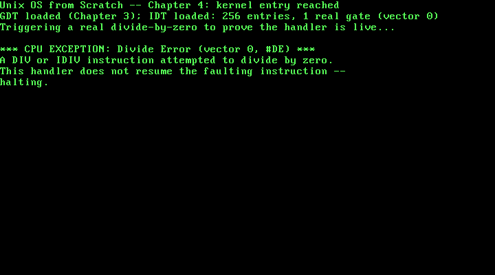

# 4. Interrupts: The IDT and a First Real ISR

**What you will understand:** why every chapter up to this one has been quietly running with interrupts disabled and no way to survive a CPU exception at all; the exact byte layout of an IDT gate and how it differs from Chapter 3's GDT entries; why an interrupt handler cannot be an ordinary C function and has to be entered and exited through real, hand-written assembly; and how this chapter proves its own handler actually works by deliberately causing the exact fault it is meant to catch.

**What you need to know first:** Chapter 3's GDT (an interrupt gate's selector field names one of its descriptors directly) and `kprintf`. No new hardware devices this chapter -- like Chapter 3, this is kernel infrastructure, not a driver.

## What has been true, silently, since Chapter 1

Every chapter of this book so far has run with interrupts disabled -- one of the real machine-state guarantees Chapter 1 already named, back when it first listed what GRUB hands off: "a valid GDT, paging disabled, interrupts disabled." That has cost nothing yet, because nothing before this chapter needed an interrupt or could have survived one. A `DIV` instruction dividing by zero, an invalid opcode, a page fault two chapters from now, a hardware timer or keyboard interrupt in a chapter after that -- every one of those is the CPU looking up an entry in a table it expects to already exist, and jumping to whatever address that entry names. With no such table installed, or an entry the CPU finds not-present, its response is a triple fault: an immediate, silent hardware reset, with no error message, no register dump, nothing this book's own drivers could ever capture. This chapter installs that table for real, and wires up exactly one working entry: vector 0, the Divide Error exception.

## An IDT gate, byte by byte

Like Chapter 3's GDT entries, an Interrupt Descriptor Table gate is a fixed 8-byte hardware structure -- but a different one, quoted here from the OSDev Wiki's own struct definition rather than assumed to match the GDT's shape:

```text
+-------------------------------------------------------------+
|  One 8-byte IDT entry (OSDev Wiki, "Interrupt Descriptor       |
|  Table")                                                      |
|                                                                 |
|  offset_1          uint16_t   handler address, bits 0-15       |
|  selector          uint16_t   a GDT (or LDT) code selector     |
|  zero               uint8_t   unused, set to 0                 |
|  type_attributes    uint8_t   gate type, DPL, and present bit   |
|  offset_2          uint16_t   handler address, bits 16-31       |
+-------------------------------------------------------------+
```

Two real differences from Chapter 3's GDT entry jump out immediately. First, an IDT gate's `selector` field does not describe the gate's *own* memory -- it names one of the GDT's own descriptors (this chapter uses `0x08`, Chapter 3's kernel code segment), telling the CPU which segment to run the handler under. Second, there is no base/limit pair at all -- an interrupt gate is not a region of memory the CPU can read and write freely, it is a single fixed entry point, so the only address information the hardware needs is that one handler address, split across `offset_1`/`offset_2` for the same historical reason Chapter 3's GDT base address was split into three separate pieces.

## `004_idt.h`: one function, one job

```c
#ifndef UNIX_OS_004_IDT_H
#define UNIX_OS_004_IDT_H

/* Installs this book's own Interrupt Descriptor Table and wires up a
 * real handler for CPU exception vector 0, #DE (Divide Error). See
 * 004_idt.c for why an IDT is needed at all, and 004_isr0.asm for why
 * the handler cannot be written as an ordinary C function. */
void idt_init(void);

#endif
```

## `004_idt.c`: 256 entries, one of them real

```c
/* Chapter 4: this book's own Interrupt Descriptor Table (IDT). Chapter 1
 * already made one thing about this kernel's machine state explicit:
 * GRUB hands off with interrupts disabled. That has been quietly true
 * every chapter since -- nothing before this one could possibly survive
 * an interrupt or a CPU exception, because there was no table telling
 * the CPU what to do about one. A divide-by-zero, an invalid opcode, a
 * page fault later in this book: every one of those is the CPU looking
 * up an entry in this exact table and jumping to whatever address it
 * finds there. With no IDT installed, or an entry marked not-present,
 * the CPU's response to a fault it cannot dispatch is a triple fault --
 * an immediate, silent reset, with no diagnostic of any kind. This
 * chapter gives the CPU somewhere real to go instead, for exactly one
 * vector: #DE, the Divide Error exception. */

#include <stdint.h>

#include "004_idt.h"

/* One 8-byte IDT entry, packed exactly as the hardware reads it (OSDev
 * Wiki, "Interrupt Descriptor Table"): the 32-bit handler address split
 * into a low and high half, a GDT segment selector, one reserved byte,
 * and one type-attributes byte. */
struct idt_entry {
    uint16_t offset_low;
    uint16_t selector;
    uint8_t  zero;
    uint8_t  type_attributes;
    uint16_t offset_high;
} __attribute__((packed));

/* The structure LIDT loads -- the same 48-bit (16-bit limit, 32-bit
 * base) shape as Chapter 3's own gdt_ptr, for the same reason: it is
 * how every one of this CPU's descriptor-table registers is loaded. */
struct idt_ptr {
    uint16_t limit;
    uint32_t base;
} __attribute__((packed));

#define IDT_ENTRY_COUNT 256
static struct idt_entry idt_entries[IDT_ENTRY_COUNT];
static struct idt_ptr   idt_pointer;

/* Implemented in 004_isr0.asm: the real machine code the CPU jumps to
 * on a #DE fault. See that file for why this cannot be an ordinary C
 * function. */
extern void isr0(void);

/* Implemented in 004_idt_flush.asm: LIDT, and nothing else -- unlike
 * Chapter 3's gdt_flush, no segment registers need reloading here, and
 * no far jump either. CS is never affected by which IDT is loaded; it
 * is only consulted later, at the moment a real interrupt or exception
 * actually fires, to decide whether the CPU is allowed to take it. */
extern void idt_flush(uint32_t idt_ptr_addr);

static void idt_set_gate(int vector, uint32_t handler, uint16_t selector, uint8_t type_attributes) {
    idt_entries[vector].offset_low      = (uint16_t) (handler & 0xFFFF);
    idt_entries[vector].offset_high     = (uint16_t) ((handler >> 16) & 0xFFFF);
    idt_entries[vector].selector        = selector;
    idt_entries[vector].zero            = 0;
    idt_entries[vector].type_attributes = type_attributes;
}

void idt_init(void) {
    /* Zero every one of the 256 possible vectors first. A zeroed entry
     * has its Present bit clear, which is exactly what this kernel
     * wants for every vector it has not written a real handler for:
     * an honest "not present" rather than a stale or garbage address
     * the CPU might otherwise jump to. */
    for (int i = 0; i < IDT_ENTRY_COUNT; i++) {
        idt_set_gate(i, 0, 0, 0);
    }

    /* Vector 0: #DE, Divide Error -- "DIV and IDIV instructions," no
     * error code pushed (OSDev Wiki, "Interrupt Descriptor Table",
     * exception table). Selector 0x08 is this kernel's own kernel-code
     * descriptor from Chapter 3's GDT (index 1, 1 * 8 = 0x08) -- the
     * segment the CPU switches to while running this handler. The
     * type-attributes byte is cited directly:
     *   "p=1, dpl=0b00, type=0b1110 => type_attributes=0b1000_1110=0x8E"
     * for a 32-bit interrupt gate at ring 0.
     * (OSDev Wiki, "Interrupt Descriptor Table":
     *  https://wiki.osdev.org/Interrupt_Descriptor_Table) */
    idt_set_gate(0, (uint32_t) isr0, 0x08, 0x8E);

    idt_pointer.limit = (uint16_t) (sizeof(idt_entries) - 1);
    idt_pointer.base  = (uint32_t) &idt_entries;

    idt_flush((uint32_t) &idt_pointer);
}
```

A few things worth slowing down on:

**Every unused vector is deliberately zeroed, not left uninitialized.** `idt_entries` is a 256-entry array -- one slot for every possible interrupt vector x86 defines -- but this chapter only ever gives vector 0 a real handler. The loop at the top of `idt_init` writes a zeroed gate (`idt_set_gate(i, 0, 0, 0)`) into all 256 slots first, specifically so that every vector this chapter has not written a real handler for has its Present bit clear (bit 7 of a zero byte is 0), which tells the CPU honestly that nothing is installed there. A stale or garbage entry with the Present bit accidentally set would be far worse than a triple fault: the CPU would treat garbage as a real handler address and jump into it.

**The type-attributes byte is cited, not memorized.** The OSDev Wiki gives this exact worked example for a 32-bit interrupt gate:

> "p=1, dpl=0b00, type=0b1110 => type_attributes=0b1000_1110=0x8E"

(OSDev Wiki, "Interrupt Descriptor Table": https://wiki.osdev.org/Interrupt_Descriptor_Table)

`P=1` marks the gate present (the same meaning as the GDT's own Present bit from Chapter 3); `DPL=00` restricts it to ring 0, this kernel's only privilege level so far; `type=0b1110` (`0xE`) is the 32-bit interrupt-gate type specifically, one of a handful of gate types x86 defines (a *trap* gate, type `0xF`, behaves almost identically but does not automatically clear the interrupt flag on entry -- not needed here, since this kernel does not yet enable interrupts globally at all). `vector 0` itself, and the fact that it pushes no error code, are equally cited rather than assumed:

> "0x00 | 0 | #DE | Fault | No | Divide Error | DIV and IDIV instructions."

(OSDev Wiki, "Interrupt Descriptor Table", exception table)

That "No" matters directly to `004_isr0.asm` below: some exceptions push an extra 32-bit error code onto the stack before the handler runs, and some do not, and getting that wrong desynchronizes the stack in a way that corrupts the eventual `IRET`. #DE is one of the simple ones.

## `004_idt_flush.asm`: one instruction, no far jump

```nasm
; Chapter 4: loading the IDT is a single real instruction, unlike
; Chapter 3's GDT install -- LIDT takes effect immediately for the next
; interrupt or exception the CPU takes, with no segment registers to
; reload and no far jump required. CS is not involved in which IDT is
; loaded; it only matters later, at dispatch time, when the CPU checks
; whether the code that is about to run is allowed to take the
; interrupt at all.
BITS 32

section .text
global idt_flush
idt_flush:
    mov eax, [esp + 4]     ; cdecl: the one argument (an idt_ptr*) is on
                            ; the stack, 4 bytes above the return address
    lidt [eax]              ; load IDTR from the idt_ptr struct this
                            ; points at (2-byte limit, 4-byte base)
    ret
```

Loading a new IDT is real, immediate, and simple in a way Chapter 3's GDT install was not: `LIDT` alone is enough. There is no segment-register reloading step, because an IDT gate's `selector` field only takes effect at the moment a real interrupt fires and the CPU consults that specific entry -- unlike the GDT, which every currently-running instruction is already using right now, which is exactly why Chapter 3 needed a far jump to make the switch take effect immediately.

## `004_isr0.asm`: why this cannot be a C function

```nasm
; Chapter 4: the real machine code the CPU jumps to on a #DE (Divide
; Error) fault -- this cannot be an ordinary C function, for two real
; reasons. First, the CPU does not call it with the normal cdecl
; convention this book's C functions all assume (arguments on the
; stack, a plain `ret` to return); it pushes its own fixed set of
; values (EFLAGS, CS, EIP, and -- for some vectors, not this one --
; an error code) and expects the handler to leave via IRET, a real
; instruction with no C equivalent. Second, an ordinary C function is
; free to clobber any general-purpose register it wants, because the
; normal calling convention guarantees the caller already saved
; whatever it still needed -- but the "caller" here is the CPU itself,
; interrupting whatever this kernel was doing at an arbitrary
; instruction, so every register genuinely has to be saved and
; restored by hand.
BITS 32

section .text
extern isr0_handler
global isr0
isr0:
    pusha                   ; save eax, ecx, edx, ebx, esp, ebp, esi, edi
    call isr0_handler        ; ordinary cdecl call into real C
    popa                     ; restore every register pusha just saved
    iret                     ; #DE pushes no error code (OSDev Wiki,
                              ; "Interrupt Descriptor Table": vector 0
                              ; lists "No" under Error Code), so no
                              ; extra stack cleanup is needed before
                              ; this -- IRET pops EIP, CS, and EFLAGS
                              ; itself, exactly what the CPU pushed
```

An ordinary C function assumes its caller already saved whatever registers it still needs -- that is the entire premise of a calling convention. That premise breaks down completely here: the "caller" is the CPU itself, interrupting whatever instruction this kernel happened to be executing at the exact moment the fault occurred, with no cooperation from that code at all. `pusha` saves every general-purpose register (`eax`, `ecx`, `edx`, `ebx`, `esp`, `ebp`, `esi`, `edi`) onto the stack before this chapter's handler is allowed to touch any of them, and `popa` restores them afterward -- and `iret`, not an ordinary `ret`, is what actually returns from an interrupt: it pops `EIP`, `CS`, and `EFLAGS` back off the stack in the exact arrangement the CPU itself pushed them in when the fault occurred, an arrangement a plain `ret` knows nothing about.

## `004_isr_handlers.h`/`004_isr_handlers.c`: the real handler, and why it never returns

```c
#ifndef UNIX_OS_004_ISR_HANDLERS_H
#define UNIX_OS_004_ISR_HANDLERS_H

/* The real C handler 004_isr0.asm's stub calls on a #DE fault. Nothing
 * in C calls it directly -- only the assembly stub does -- so this
 * declaration exists purely so 004_isr_handlers.c has a header to
 * define against, the same one-module-one-header shape every other
 * file in this book already follows. */
void isr0_handler(void);

#endif
```
```c
/* Chapter 4: this book's first real exception handler. It does not try
 * to resume the instruction that faulted -- for a divide-by-zero, there
 * is nothing to fix and no sane value to hand back to the IDIV
 * instruction that trapped, so returning via IRET would just fault
 * again on the same instruction, forever. Reporting the fault and
 * halting is the honest thing to do until a later chapter gives this
 * kernel a real reason and a real mechanism to recover instead. */

#include "004_isr_handlers.h"
#include "004_printf.h"

void isr0_handler(void) {
    kprintf("\n*** CPU EXCEPTION: Divide Error (vector 0, #DE) ***\n");
    kprintf("A DIV or IDIV instruction attempted to divide by zero.\n");
    kprintf("This handler does not resume the faulting instruction --\n");
    kprintf("halting.\n");

    __asm__ volatile ("cli");
    for (;;) {
        __asm__ volatile ("hlt");
    }
}
```

`004_isr0.asm`'s own `popa`/`iret` sequence is written correctly and would genuinely resume the faulting code, if this handler ever reached them -- but it never does, on purpose. A divide-by-zero has no sane value to hand back to the `IDIV` instruction that trapped; returning via `IRET` would simply re-execute that same instruction and fault again, immediately, forever. Reporting the fault through `kprintf` and halting with `cli`/`hlt` is the honest response until a later chapter gives this kernel an actual reason -- and an actual mechanism -- to recover from a fault instead of stopping.

## `004_kmain.c`: proving the handler works by causing the fault

```c
/* Chapter 4: kmain installs the GDT (Chapter 3, unchanged) and now this
 * chapter's own IDT, then deliberately triggers a real #DE exception --
 * a runtime division by a volatile zero, not a compile-time constant
 * the compiler could fold away or warn about, so the fault genuinely
 * comes from the CPU executing an IDIV instruction at runtime. If the
 * IDT and its one real gate are wired correctly, control lands in
 * 004_isr0.asm's stub and then 004_isr_handlers.c's real handler,
 * which prints and halts -- so the line right after the division is
 * this chapter's own proof that it should *never* print. */

#include "004_gdt.h"
#include "004_idt.h"
#include "004_printf.h"
#include "004_serial.h"
#include "004_vga.h"

void kmain(void) {
    serial_init();
    vga_init();
    vga_set_color(VGA_COLOR_LIGHT_GREEN, VGA_COLOR_BLACK);

    gdt_init();
    idt_init();

    kprintf("Unix OS from Scratch -- Chapter 4: kernel entry reached\n");
    kprintf("GDT loaded (Chapter 3); IDT loaded: 256 entries, 1 real gate (vector 0)\n");
    kprintf("Triggering a real divide-by-zero to prove the handler is live...\n");

    volatile int numerator = 42;
    volatile int denominator = 0;
    volatile int result = numerator / denominator;

    kprintf("THIS LINE SHOULD NEVER PRINT -- result was %d\n", result);
}
```

Both `numerator` and `denominator` are declared `volatile` for a specific, deliberate reason: without it, an optimizing compiler would be entitled to notice that `42 / 0` is undefined behavior at compile time and do essentially anything, including silently deleting the division and the line after it. `volatile` forces the compiler to treat both as genuinely unknown until runtime, so the resulting `IDIV` instruction is real, and dividing by a real, runtime zero is what actually raises `#DE` on real (emulated) hardware -- not a simulated fault, not a hand-called handler, the CPU's own fault-dispatch mechanism running for real. The comment on the last line is this chapter's own thesis statement: if the IDT, the gate, and the handler are all wired correctly, that `kprintf` call never executes at all.

## Building it, for real

```bash
nasm -f elf32 004_boot.asm -o boot.o
nasm -f elf32 004_gdt_flush.asm -o gdt_flush.o
nasm -f elf32 004_idt_flush.asm -o idt_flush.o
nasm -f elf32 004_isr0.asm -o isr0.o
gcc -m32 -ffreestanding -fno-stack-protector -fno-pic -Wall -Wextra -c 004_vga.c -o vga.o
gcc -m32 -ffreestanding -fno-stack-protector -fno-pic -Wall -Wextra -c 004_serial.c -o serial.o
gcc -m32 -ffreestanding -fno-stack-protector -fno-pic -Wall -Wextra -c 004_gdt.c -o gdt.o
gcc -m32 -ffreestanding -fno-stack-protector -fno-pic -Wall -Wextra -c 004_idt.c -o idt.o
gcc -m32 -ffreestanding -fno-stack-protector -fno-pic -Wall -Wextra -c 004_printf.c -o printf.o
gcc -m32 -ffreestanding -fno-stack-protector -fno-pic -Wall -Wextra -c 004_isr_handlers.c -o isr_handlers.o
gcc -m32 -ffreestanding -fno-stack-protector -fno-pic -Wall -Wextra -c 004_kmain.c -o kmain.o
ld -m elf_i386 -T 004_linker.ld -o kernel.bin boot.o gdt_flush.o idt_flush.o isr0.o vga.o serial.o gdt.o idt.o printf.o isr_handlers.o kmain.o
grub-file --is-x86-multiboot2 kernel.bin
```

**Output (cloud sandbox -- real, live-executed build output):**

```text
=== nasm -f elf32 004_boot.asm -o boot.o ===

=== nasm -f elf32 004_gdt_flush.asm -o gdt_flush.o ===

=== nasm -f elf32 004_idt_flush.asm -o idt_flush.o ===

=== nasm -f elf32 004_isr0.asm -o isr0.o ===

=== gcc -m32 -ffreestanding -fno-stack-protector -fno-pic -Wall -Wextra -c 004_vga.c -o vga.o ===

=== gcc -m32 -ffreestanding -fno-stack-protector -fno-pic -Wall -Wextra -c 004_serial.c -o serial.o ===

=== gcc -m32 -ffreestanding -fno-stack-protector -fno-pic -Wall -Wextra -c 004_gdt.c -o gdt.o ===

=== gcc -m32 -ffreestanding -fno-stack-protector -fno-pic -Wall -Wextra -c 004_idt.c -o idt.o ===

=== gcc -m32 -ffreestanding -fno-stack-protector -fno-pic -Wall -Wextra -c 004_printf.c -o printf.o ===

=== gcc -m32 -ffreestanding -fno-stack-protector -fno-pic -Wall -Wextra -c 004_isr_handlers.c -o isr_handlers.o ===

=== gcc -m32 -ffreestanding -fno-stack-protector -fno-pic -Wall -Wextra -c 004_kmain.c -o kmain.o ===

=== ld -m elf_i386 -T 004_linker.ld -o kernel.bin boot.o gdt_flush.o idt_flush.o isr0.o vga.o serial.o gdt.o idt.o printf.o isr_handlers.o kmain.o ===
ld: warning: isr0.o: missing .note.GNU-stack section implies executable stack
ld: NOTE: This behaviour is deprecated and will be removed in a future version of the linker
ld: warning: kernel.bin has a LOAD segment with RWX permissions

=== grub-file --is-x86-multiboot2 kernel.bin ===
kernel.bin: VALID Multiboot2 image
```

Ten real source files this time -- four assembled, six compiled -- every C file clean under `-Wall -Wextra`, packed IDT-entry bit-twiddling included. The same two familiar `ld` warnings (`missing .note.GNU-stack section`, `LOAD segment with RWX permissions`) appear again, this time attributed to `isr0.o` specifically rather than `boot.o`, but the underlying reason is unchanged: no paging yet, so nothing yet enforces what those ELF-level flags claim.

## Booting it and watching the fault actually happen

```bash
mkdir -p isodir/boot/grub
cp kernel.bin isodir/boot/kernel.bin
cp grub.cfg isodir/boot/grub/grub.cfg
grub-mkrescue -o kernel.iso isodir
qemu-system-x86_64 -cdrom kernel.iso -serial file:serial_out.log -display none -no-reboot \
    -monitor unix:/tmp/qemu_monitor.sock,server,nowait &
```

**Output (cloud sandbox -- real, live-executed serial capture, QEMU 8.2.2):**

```text
Unix OS from Scratch -- Chapter 4: kernel entry reached
GDT loaded (Chapter 3); IDT loaded: 256 entries, 1 real gate (vector 0)
Triggering a real divide-by-zero to prove the handler is live...

*** CPU EXCEPTION: Divide Error (vector 0, #DE) ***
A DIV or IDIV instruction attempted to divide by zero.
This handler does not resume the faulting instruction --
halting.
```

That is this chapter's own thesis, verified: `kmain`'s own three status lines print normally, the division by a real runtime zero executes, and then `004_isr0.asm`'s stub and `004_isr_handlers.c`'s real handler take over -- `kmain`'s final `kprintf` call, the one printing `THIS LINE SHOULD NEVER PRINT`, never runs. The exact same output appears on the real VGA screen, captured the same way Chapters 2 and 3 captured theirs -- a QEMU monitor session connected from outside the still-running (halted, not shut down) machine:



The machine is genuinely still running when this screenshot was taken -- QEMU's own process had not exited, confirmed directly rather than assumed, since `004_isr_handlers.c`'s handler halts with `hlt` in an infinite loop rather than shutting the machine down. `-no-reboot` was passed specifically so that a *wrong* IDT gate -- one that triple-faulted instead of dispatching cleanly to this handler -- would have shown up as an immediate QEMU exit instead of a silent, misleading reboot loop; the machine staying alive and halted is itself further confirmation that the fault was dispatched correctly rather than crashing the whole CPU.

## Chapter summary

Every chapter before this one has quietly relied on never encountering a CPU exception, because no IDT was installed and no chapter needed one. This chapter installs a real 256-entry Interrupt Descriptor Table, zeroing every vector this kernel has not written a handler for (so the CPU sees an honest "not present" rather than garbage) and wiring up exactly one real gate: vector 0, Divide Error, with its type-attributes byte (`0x8E`) derived directly from the OSDev Wiki's own cited bit meanings, the same way Chapter 3 derived its GDT access bytes. Reaching that handler at all requires real, hand-written assembly on both ends -- a stub that saves every register by hand before calling into C, and returns with `IRET` rather than an ordinary `ret` -- because the CPU interrupting arbitrary code mid-instruction is nothing like an ordinary function call. This chapter's own evidence is a deliberately caused fault: a runtime division by a `volatile` zero that a compiler cannot optimize away, verified two ways to produce identical output -- an exact serial-log capture and a real QEMU screenshot -- and confirmed, not merely assumed, by the fact that the machine stays alive and halted afterward rather than triple-faulting.

## Self-check questions

1. Chapters 1 through 3 never installed an IDT at all, and never crashed. What made that safe, and what changes starting with this chapter?
2. An IDT gate's `selector` field holds a GDT selector, not a base address the way a GDT entry's own base field does. What does that selector actually tell the CPU to do?
3. Why does `004_isr0.asm` use `pusha`/`popa` and `iret` instead of an ordinary C function prologue/epilogue and `ret`?
4. Why are `numerator` and `denominator` declared `volatile` in `004_kmain.c`, and what would an optimizing compiler be entitled to do if they weren't?
5. This chapter's `isr0_handler` never reaches the `popa`/`iret` at the end of `004_isr0.asm`'s stub. Why is that the correct behavior for a divide-by-zero specifically, rather than a bug?

**Worked answers**

1. GRUB hands off with interrupts disabled -- one of the real machine-state guarantees the Multiboot2 spec makes -- and nothing in Chapters 1 through 3 executed an instruction capable of raising a CPU exception (no invalid opcode, no faulting memory access, no division). Safety came from never needing the table, not from the table being unnecessary in general. This chapter is the first to deliberately execute a faulting instruction, so it is the first that actually needs a real IDT installed.
2. It tells the CPU which GDT descriptor to run the interrupt handler under -- in this chapter, selector `0x08`, Chapter 3's own flat kernel code segment. It is not a memory address at all; the *handler's* address comes from the gate's own `offset_1`/`offset_2` fields, and the selector only chooses which segment (and therefore which privilege level and permissions) that handler code executes with.
3. An ordinary C function's calling convention assumes the caller already preserved whatever state it still needs, and returns with a plain `ret` that only undoes a normal call's own stack frame. Here, the "caller" is the CPU itself, interrupting arbitrary code at an arbitrary instruction with no cooperation from it at all -- so every general-purpose register genuinely has to be saved and restored by hand (`pusha`/`popa`), and returning has to use `IRET`, the one instruction that correctly pops `EIP`, `CS`, and `EFLAGS` back off the stack in the exact arrangement the CPU itself pushed them in in the first place.
4. Without `volatile`, an optimizing compiler is entitled to treat `42 / 0` as undefined behavior it is allowed to reason about at compile time -- which could mean deleting the division and everything that depends on its result, including the "this should never print" `kprintf` call, with no guarantee a real `IDIV` instruction (and therefore a real `#DE` fault) ever appears in the compiled binary at all. Marking both operands `volatile` forces the compiler to treat them as genuinely unknown until runtime, guaranteeing a real division instruction survives into the compiled kernel.
5. `popa`/`iret` would resume execution back at the `IDIV` instruction that faulted -- but that instruction is still dividing by zero, with no way for a handler to supply a meaningful quotient. Returning to it would just re-fault immediately, in an infinite loop of the exact same exception. Reporting the fault and halting, rather than pretending to recover from an error there is no sane way to recover from, is the correct behavior here; a later chapter's exception handlers (for faults that genuinely can be fixed and resumed, like a page fault this kernel knows how to satisfy) will use that same `popa`/`iret` path for real.
