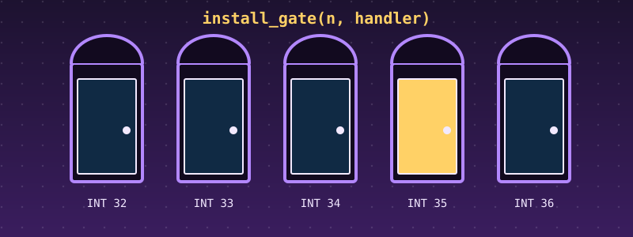
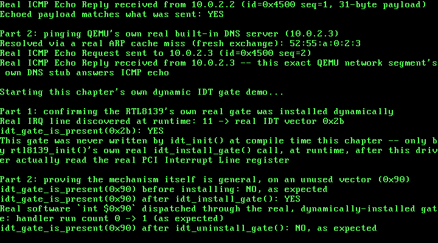

# 46. Dynamic IDT Gate Installation: Closing a Gap Chapter 26 Left Open

{ style="display:block;margin:0 auto;max-width:100%;height:auto;border-radius:6px" }

**What you will understand:** a real mechanism for installing (and removing) an Interrupt Descriptor Table gate at runtime, after boot, rather than only once at compile time (`046_idt.h`/`046_idt.c`); and this chapter's own real fix to the exact architectural gap Chapter 26's own top-of-file comment named and explicitly left open -- `046_rtl8139.c` now discovers its own real IRQ and installs its own real IDT gate dynamically, rather than only ever verifying a fixed, hardcoded vector.

**What you need to know first:** Chapter 4's own original IDT setup and Chapter 26's own real interrupt-driven RTL8139 work, whose own top-of-file comment first named this exact gap: "there is no mechanism anywhere in this book (yet) for installing a NEW gate at runtime once a driver discovers which real IRQ line its device actually landed on."

## Scope: closing a long-named gap

With every queued case study finished (Chapter 44) and the minimal IP layer also done (Chapter 45), two candidates remained: the minimal IP layer (already done) and this chapter's own topic. The user chose the dynamic IDT-gate-installation topic. A second confirmation picked this chapter's own core feature:

- **Core feature**: a generic dynamic installer, retrofitted directly into the RTL8139 driver -- build a real `idt_install_gate(vector, handler, flags)` callable at runtime, then change `046_rtl8139.c` itself to stop merely verifying a fixed, hardcoded vector against the real PCI Interrupt Line register and instead install a gate for whatever real IRQ it actually discovers -- the recommended option, directly closing the exact gap Chapter 26's own text named, over a standalone multi-vector demo or a concurrency-focused chapter.

No real external standard governs this chapter's own work -- it is this kernel's own internal architecture, the same way Chapter 4's original IDT setup and Chapter 7's physical memory manager were never citing an external spec, only the real x86 architecture's own documented IDT entry format (already cited since Chapter 4).

## `046_idt.h` and `046_idt.c`: a real runtime gate installer

`idt_init()` still runs once, at boot, and still loads the IDT into the CPU via `idt_flush()` -- but the real x86 architecture itself never requires reloading IDTR (`lidt`) after that: the CPU reads the IDT directly out of memory on every real interrupt, so writing a new entry into the same, already-loaded table is immediately live. `idt_install_gate()` is exactly that write, exposed publicly for the first time -- the same real `idt_set_gate()` logic `idt_init()` has used internally since Chapter 4, just no longer private to this file. A real hazard is handled honestly rather than ignored: writing a 64-bit IDT entry is not a single atomic store on this real 32-bit architecture, so `idt_install_gate()`/`idt_uninstall_gate()` both disable real maskable interrupts (`cli`) for the few instructions the write itself takes, then restore whatever real interrupt-flag state the caller already had.

```c
#ifndef UNIX_OS_046_IDT_H
#define UNIX_OS_046_IDT_H

#include <stdint.h>

/* Installs this book's IDT: every gate through vector 0x80, unchanged
 * since Chapter 15/25 -- `idt_init()` itself no longer installs
 * vector 0x2B (IRQ11) at compile time; see `idt_install_gate()`'s own
 * comment below and 046_rtl8139.c's own `rtl8139_init()` for this
 * chapter's own real fix. */
void idt_init(void);

/* This chapter's own new real mechanism, closing the exact gap
 * Chapter 26's own top-of-file comment named and left open: "there is
 * no mechanism anywhere in this book (yet) for installing a NEW gate
 * at runtime once a driver discovers which real IRQ line its device
 * actually landed on." `idt_init()` above still runs once, at boot,
 * and still loads the IDT into the CPU via `idt_flush()` -- but the
 * real x86 architecture itself never requires reloading IDTR (`lidt`)
 * after that: the CPU reads the IDT directly out of memory on every
 * real interrupt, so writing a new entry into the same, already-
 * loaded table is immediately live. `idt_install_gate()` is exactly
 * that write, exposed publicly for the first time -- the same real
 * `idt_set_gate()` logic `idt_init()` has used internally since
 * Chapter 4, just no longer private to this file, and now callable
 * at ANY point after `idt_init()` has run, not only during it.
 *
 * Real hazard, handled honestly rather than ignored: writing a 64-bit
 * IDT entry is not a single atomic store on this real 32-bit
 * architecture, and a real hardware interrupt landing on `vector`
 * mid-write, while only half the new entry has been written, would
 * read a torn, meaningless descriptor. `idt_install_gate()` disables
 * real maskable interrupts (`cli`) for the few real instructions the
 * write itself takes, then restores whatever real interrupt-flag
 * state the caller already had (`sti` only if it was genuinely set
 * beforehand) -- the same real critical-section discipline this book
 * already uses wherever two real concurrent paths could otherwise
 * observe a torn update. */
void idt_install_gate(int vector, uint32_t handler, uint16_t selector, uint8_t type_attributes);

/* Removes a gate previously installed by `idt_install_gate()`,
 * clearing its real present bit (so a genuine interrupt arriving on
 * `vector` afterward would fault rather than run stale code) -- the
 * natural real complement `idt_install_gate()`'s own real, two-way
 * lifecycle needs, even though Chapter 26's own text only ever named
 * "installing" as the missing half. Same real `cli`/`sti` critical-
 * section discipline as `idt_install_gate()`. */
void idt_uninstall_gate(int vector);

/* Returns 1 if `vector`'s own real present bit (bit 7 of the real
 * type-attributes byte, cited the same way every gate installation in
 * this book already is) is currently set, 0 otherwise -- lets this
 * chapter's own demo confirm a real install/uninstall actually took
 * effect by reading the live table back, without needing to trigger a
 * real interrupt just to find out. */
int idt_gate_is_present(int vector);

#endif
```

```c
/* This book's Interrupt Descriptor Table. Vectors 0, 13, 14, 0x20,
 * 0x21, and 0x80 are all unchanged since Chapter 15/25/26 -- see
 * Chapters 4-15 for their own citations. Vector 0x2B (IRQ11) is no
 * longer installed here at all -- this chapter's own real fix to the
 * exact gap Chapter 26's own top-of-file comment named: 046_rtl8139.c
 * now installs that gate itself, at runtime, via this file's own new
 * `idt_install_gate()`, once it has actually discovered which real
 * IRQ line its device landed on, rather than `idt_init()` wiring a
 * fixed vector at compile time and the driver merely hoping the real
 * hardware agrees. */

#include <stdint.h>

#include "046_idt.h"

struct idt_entry {
    uint16_t offset_low;
    uint16_t selector;
    uint8_t  zero;
    uint8_t  type_attributes;
    uint16_t offset_high;
} __attribute__((packed));

struct idt_ptr {
    uint16_t limit;
    uint32_t base;
} __attribute__((packed));

#define IDT_ENTRY_COUNT 256
static struct idt_entry idt_entries[IDT_ENTRY_COUNT];
static struct idt_ptr   idt_pointer;

extern void isr0(void);     /* 046_isr0.asm -- unchanged from Chapter 4 */
extern void isr13(void);    /* 046_isr13.asm -- unchanged from Chapter 25 */
extern void isr14(void);    /* 046_isr14.asm -- unchanged from Chapter 10 */
extern void isr128(void);   /* 046_isr128.asm -- unchanged from Chapter 25 */
extern void irq0(void);     /* 046_irq0.asm -- unchanged from Chapter 6 */
extern void irq1(void);     /* 046_irq1.asm -- unchanged from Chapter 5 */

extern void idt_flush(uint32_t idt_ptr_addr);

static void idt_set_gate(int vector, uint32_t handler, uint16_t selector, uint8_t type_attributes) {
    idt_entries[vector].offset_low      = (uint16_t) (handler & 0xFFFF);
    idt_entries[vector].offset_high     = (uint16_t) ((handler >> 16) & 0xFFFF);
    idt_entries[vector].selector        = selector;
    idt_entries[vector].zero            = 0;
    idt_entries[vector].type_attributes = type_attributes;
}

void idt_init(void) {
    for (int i = 0; i < IDT_ENTRY_COUNT; i++) {
        idt_set_gate(i, 0, 0, 0);
    }

    /* Vector 0: #DE, unchanged from Chapter 4. */
    idt_set_gate(0, (uint32_t) isr0, 0x08, 0x8E);

    /* Vector 13: #GP, unchanged from Chapter 25. Same 0x08 selector
     * and 0x8E type-attributes byte as every other CPU-raised
     * exception in this book -- DPL=0 here says nothing about which
     * ring can TRIGGER a #GP (the CPU itself always can, from any
     * ring); it only governs whether ring-3 code could deliberately
     * invoke this vector with a bare `int 13` instruction, which
     * nothing in this book ever needs to do. */
    idt_set_gate(13, (uint32_t) isr13, 0x08, 0x8E);

    /* Vector 14: #PF, unchanged from Chapter 10. */
    idt_set_gate(14, (uint32_t) isr14, 0x08, 0x8E);

    /* Vector 0x20: IRQ0, the PIT timer, unchanged from Chapter 6. */
    idt_set_gate(0x20, (uint32_t) irq0, 0x08, 0x8E);

    /* Vector 0x21: IRQ1, the keyboard, unchanged from Chapter 5. */
    idt_set_gate(0x21, (uint32_t) irq1, 0x08, 0x8E);

    /* Vector 0x80: this book's own syscall gate, unchanged from
     * Chapter 25, DPL=3 instead of the 0x8E every earlier gate in this
     * book uses. Byte layout, same P/S/type bits as 0x8E, but DPL
     * (bits 6-5) = 11 instead of 00: 1 11 0 1110 = 0xEE. The CPU checks
     * a software INT's own target gate DPL against the CALLER's CPL
     * (int 0x80 is only ever executed from ring 3 in this book) and
     * requires CPL <= gate DPL -- the opposite direction from every
     * other privilege check in this book, and the one and only reason
     * this particular gate needs anything other than 0x8E at all. */
    idt_set_gate(0x80, (uint32_t) isr128, 0x08, 0xEE);

    idt_pointer.limit = (uint16_t) (sizeof(idt_entries) - 1);
    idt_pointer.base  = (uint32_t) &idt_entries;

    idt_flush((uint32_t) &idt_pointer);
}

/* Reads the real EFLAGS.IF bit (bit 9) without disturbing it -- the
 * same real "was this interrupt flag already set" question
 * `idt_install_gate()`/`idt_uninstall_gate()` need before they `cli`,
 * so they restore it afterward rather than unconditionally `sti`-ing
 * a caller that genuinely had interrupts disabled on purpose. */
static int interrupts_were_enabled(void) {
    uint32_t eflags;
    __asm__ volatile ("pushfl; popl %0" : "=r" (eflags));
    return (eflags & (1u << 9)) != 0;
}

void idt_install_gate(int vector, uint32_t handler, uint16_t selector, uint8_t type_attributes) {
    int was_enabled = interrupts_were_enabled();
    __asm__ volatile ("cli");
    idt_set_gate(vector, handler, selector, type_attributes);
    if (was_enabled) {
        __asm__ volatile ("sti");
    }
}

void idt_uninstall_gate(int vector) {
    int was_enabled = interrupts_were_enabled();
    __asm__ volatile ("cli");
    idt_set_gate(vector, 0, 0, 0);
    if (was_enabled) {
        __asm__ volatile ("sti");
    }
}

int idt_gate_is_present(int vector) {
    return (idt_entries[vector].type_attributes & 0x80u) != 0u;
}
```

Unlike every codec chapter in this book's recent run, `idt_install_gate()`/`idt_uninstall_gate()` execute real privileged instructions (`cli`/`sti`) that fault immediately in an ordinary Linux userspace process -- there is no meaningful native, non-freestanding way to exercise them at all, the same real limitation `046_arp.c`'s own `arp_send_request()`/`arp_receive_reply()` and `046_icmp.c`'s own hardware-dependent functions have always had. This chapter's own correctness is instead proven entirely by booting: a real readback (`idt_gate_is_present()`) confirms every install and uninstall actually took effect, and a real software interrupt, genuinely dispatched through a gate installed at runtime, confirms the installed handler genuinely runs.

## `046_rtl8139.c`: the real fix

Chapter 26's own real workaround read the real PCI Interrupt Line register and only ever *verified* it against a fixed, compile-time vector, refusing outright on a mismatch rather than ever being able to adapt. This chapter removes that assumption entirely: `rtl8139_init()` now computes the real IDT vector its discovered IRQ line actually maps to under this kernel's own real 8259 remap, and installs its own gate for that exact vector at runtime, via `idt_install_gate()`. `046_idt.c`'s own `idt_init()` no longer wires vector 0x2B -- or any RTL8139 vector -- at compile time at all.

```c
#ifndef UNIX_OS_046_RTL8139_H
#define UNIX_OS_046_RTL8139_H

#include <stdint.h>

/* Chapter 25's own driver for the real RTL8139 Fast Ethernet
 * controller Chapter 24's own pci_find_by_class() first located, by
 * class code alone, on this exact machine's own real PCI bus. Register
 * offsets, bit meanings, and the real initialization sequence are
 * still cited field-for-field from the same two real sources: OSDev
 * Wiki's own "RTL8139" page (https://wiki.osdev.org/RTL8139), and,
 * wherever that page is silent, the real manufacturer datasheet it is
 * itself derived from -- REALTEK RTL8139D(L), Rev. 1.11, 2001/11/09
 * (https://www.cs.usfca.edu/~cruse/cs326f04/RTL8139D_DataSheet.pdf).
 * Chapter 26 replaced both of Chapter 25's own register spins with a
 * real interrupt-driven `hlt` wait -- see that chapter's own text for
 * the full citation of the new IDT gate, 8259 cascade unmask, and
 * interrupt handler that made that possible.
 *
 * This chapter's own new work lifts the last two real scope limits
 * Chapter 25 stated and Chapter 26 left untouched: no more than one
 * frame in flight at a time, and no real CAPR advancement or
 * receive-ring wraparound (both chapters only ever read the very
 * first packet a freshly reset ring receives, at a fixed offset).
 *
 * More than one frame in flight: this device's own real four transmit
 * descriptor pairs (TSD0-3/TSAD0-3) round-robin automatically, cited
 * directly from OSDev Wiki's own "RTL8139" page: "After software
 * transmits a packet using those registers, the round robin counter
 * increments, to use pair one... This continues until pair number
 * three, which is the last transmit register pair, and the counter
 * then overflows and goes back to pair number zero." This chapter's
 * own new rtl8139_send_queue()/rtl8139_wait_descriptor_sent() pair
 * lets this driver genuinely queue more than one real frame before
 * any of them completes, verified by reading each real descriptor's
 * own per-descriptor TOK bit (TSDn bit 15) directly -- real,
 * persistent hardware state, safe to check regardless of how many
 * real interrupts the completions end up coalescing into.
 *
 * Real CAPR advancement: cited from a real, historical primary
 * source, since neither of this driver's own two usual cited sources
 * documents the actual update procedure (the real Realtek datasheet
 * marks CAPR "R", read-only, and says nothing about writing it at
 * all; OSDev's own page mentions CAPR by name once and says nothing
 * about updating it either) -- a real October 1999 exchange on the
 * Realtek Linux driver mailing list between Daniel Kobras and Donald
 * Becker (the original author of this whole family of Linux NIC
 * drivers), archived at
 * https://www.beowulf.org/pipermail/realtek/1999-October/000184.html,
 * where Kobras asks directly why real driver code writes
 * `outw(cur_rx - 16, ioaddr + RxBufPtr)` instead of the exact value,
 * and Becker answers: "The chip doesn't write to the ring size
 * specified. If the header would be near the end of the ring, it
 * doesn't wrap. This is documented by the ring size in the datasheet
 * e.g. 32KB + 16." -- confirming the real "-16" offset is not an
 * arbitrary magic number but a real, if incompletely documented even
 * by the original driver's own author, consequence of the same real
 * "ring size + slack" convention already cited (Chapter 25's own real
 * receive-ring allocation: "8k + 16 byte" nominal plus a further real
 * 1500-byte WRAP allowance). Independently re-confirmed from this
 * exact environment's own real emulator source: a real 2013 QEMU
 * development-list patch discussion
 * (https://lists.gnu.org/archive/html/qemu-devel/2013-05/msg03703.html)
 * shows QEMU's own real internal computation is
 * `s->RxBufPtr = MOD2(val + 0x10, s->RxBufferSize)` -- i.e. QEMU adds
 * the same 16 (0x10) back, confirming a real driver write of
 * `cur_rx - 16` lands QEMU's own internal read pointer on exactly
 * `cur_rx`, mod the real nominal ring size.
 *
 * Real receive-ring wraparound: this driver already allocates and
 * configures its receive ring exactly as Chapter 25 first did --
 * three real contiguous physical frames (12288 bytes), comfortably
 * covering the real "8k + 16 byte" nominal ring plus the real
 * 1500-byte WRAP allowance OSDev's own page cites -- so no buffer
 * change was needed this chapter; what changes is that this driver
 * now genuinely keeps reading past the ring's own nominal 8192-byte
 * boundary instead of stopping after the first packet, tracking its
 * own real read position (`cur_rx`, this chapter's own new persistent
 * state) modulo that same 8192-byte nominal size across as many real
 * packets as arrive, exactly the "8k" RCR's own RBLEN reset value
 * (unchanged, still 00) already commits this driver to. */

/* The largest single frame this driver will ever send or receive,
 * cited directly (Realtek datasheet / OSDev's own page): a real
 * RTL8139 transmit descriptor accepts at most 1792 bytes per frame. */
#define RTL8139_MAX_FRAME 1792u

/* Every real captured run of this exact QEMU command line reports
 * this real value (confirmed again in Chapter 46's own real testing)
 * -- kept here only as a display label for several earlier chapters'
 * own pre-existing `kprintf()` text, not as something
 * `rtl8139_init()` still requires or refuses against: Chapter 46's
 * own real fix (see 046_rtl8139.c's own top-of-file comment) made
 * this driver discover its own real IRQ at runtime and install its
 * own IDT gate dynamically (046_idt.h's own new `idt_install_gate()`)
 * for whatever real vector that IRQ actually maps to, rather than
 * assuming this fixed value and refusing outright if the real
 * hardware ever disagreed. Call `rtl8139_get_irq_line()` for the real,
 * dynamically-discovered value this driver actually used. */
#define RTL8139_EXPECTED_IRQ 11u

/* Converts a real IRQ line (0-15) to the real IDT vector it lands on
 * under this kernel's own real 8259 remap (046_kmain.c calls
 * `pic_remap(0x20, 0x28)`): lines 0-7 land on 0x20-0x27 (master),
 * lines 8-15 land on 0x28-0x2F (slave) -- e.g. IRQ 11, the ninth
 * slave-PIC line, 11 - 8 = 3, lands on vector 0x28 + 3 = 0x2B, this
 * book's own real, already-cited value since Chapter 26. Returns
 * 0xFFFFFFFFu, refusing outright, for any `irq_line` this kernel's own
 * real 8259 remap cannot produce a vector for (anything above 15). */
uint32_t rtl8139_irq_to_vector(uint8_t irq_line);

/* The real IRQ line this driver actually discovered and installed a
 * dynamic gate for (046_rtl8139.c's own new `rtl8139_init()`), valid
 * only after `rtl8139_init()` has returned 1. */
uint8_t rtl8139_get_irq_line(void);

/* This device's own real four transmit descriptor pairs, cited
 * directly (OSDev Wiki's own "RTL8139" page, quoted above). */
#define RTL8139_TX_DESC_COUNT 4u

/* This driver's own real nominal receive-ring size, matching RCR's
 * own real RBLEN reset value (00, "8k + 16 byte", unchanged since
 * Chapter 25) -- the modulus this chapter's own real CAPR arithmetic
 * wraps `cur_rx` against, and the same value QEMU's own real emulated
 * hardware wraps its internal read/write pointers against (see this
 * file's own top-of-file citation of the real 2013 qemu-devel patch
 * discussion). */
#define RTL8139_RX_RING_NOMINAL_SIZE 8192u

/* Locates the real RTL8139 on this machine's own PCI bus (via
 * Chapter 24's own pci_find_by_class()), enables real PCI I/O-space
 * and bus-mastering access, reads the device's own real BAR0 to learn
 * its real I/O base, reads its own real PCI Interrupt Line register
 * and verifies it against RTL8139_EXPECTED_IRQ, allocates this
 * driver's own real physical transmit and receive buffers (via
 * Chapter 7's own pmm_alloc_frame()), explicitly zeroes the real
 * receive ring (a Chapter 27 step, still needed -- see 046_rtl8139.c's
 * own comment on rtl8139_receive_next_packet() for why), runs the
 * real cited power-on/reset/configure sequence, unmasks this device's
 * own real IRQ line (and the real cascade line, IRQ 2), and ends with
 * this device's own real hardware loopback mode either enabled or
 * left off, per `enable_loopback` -- this chapter's own new parameter,
 * since Chapter 28's own new ARP demo (see 046_arp.h) is the first in
 * this book that needs a real reply from a real host genuinely outside
 * this device, which real loopback mode (Chapters 25-27, TCR bits
 * 18-17 forced to "11: Loopback mode") structurally cannot ever
 * deliver -- every transmitted frame is routed straight back to this
 * same device's own receiver, on-chip, never reaching a real wire at
 * all. Both real TCR values are written explicitly (never left to an
 * assumed hardware reset default): TCR_LOOPBACK_ON (0x60000, cited)
 * when `enable_loopback` is nonzero, or the real Realtek datasheet's
 * own cited "00: normal operation" (TCR_NORMAL_OPERATION, 0x0)
 * otherwise -- safe to call more than once against the same real,
 * already-initialized device (this driver's own reset step, CMD_RST,
 * runs unconditionally every call), which is exactly how this
 * chapter's own demo switches the device from Chapter 27's own
 * loopback-mode multi-frame demo into real, non-loopback mode for its
 * own new ARP exchange. Returns 1 on success, 0 if no real RTL8139
 * was found, or if its real reported IRQ does not match this
 * chapter's own fixed wiring. */
int rtl8139_init(int enable_loopback);

/* Copies this device's own real, burnt-in 6-byte station address --
 * read directly from real registers MAC0-5 -- into `out_mac`. */
void rtl8139_get_mac(uint8_t out_mac[6]);

/* Sends exactly one real frame, `len` bytes (at most
 * RTL8139_MAX_FRAME), via this device's own real transmit descriptor
 * 0, and BLOCKS (real interrupt-driven `hlt`, unchanged since Chapter
 * 26) until that exact descriptor's own real TOK bit is set. Kept
 * unchanged from Chapter 26 for this chapter's own large sequential
 * receive-ring demo, which never needs more than one frame in flight
 * at a time -- see rtl8139_send_queue() below for this chapter's own
 * new round-robin, non-blocking alternative. Returns 1 on success. */
int rtl8139_send(const uint8_t *frame, uint32_t len);

/* This chapter's own new real, non-blocking send: copies `frame`
 * (`len` bytes, at most RTL8139_MAX_FRAME) into this driver's own
 * per-descriptor real physical buffer and triggers transmission via
 * whichever real descriptor pair (0-3) this device's own real
 * round-robin counter is on next (cited directly, OSDev Wiki's own
 * "RTL8139" page, this file's own top-of-file comment) -- and returns
 * immediately, WITHOUT waiting for that transmission to complete.
 * Calling this up to RTL8139_TX_DESC_COUNT times in a row before any
 * of them are waited on is exactly this chapter's own real "more than
 * one frame in flight" proof: every earlier `hlt`-based wait in this
 * book (Chapter 26's own rtl8139_send() included) blocks before
 * returning; this one deliberately does not. Returns the real
 * descriptor index (0-3) this exact frame was queued on, or -1 if
 * `len` exceeds RTL8139_MAX_FRAME. Calling this more than
 * RTL8139_TX_DESC_COUNT times without an intervening
 * rtl8139_wait_descriptor_sent() would reuse a still-busy real
 * descriptor -- undocumented by either of this driver's own two usual
 * cited sources, and deliberately out of this chapter's own stated
 * scope; this driver's own demo never does it. */
int rtl8139_send_queue(const uint8_t *frame, uint32_t len);

/* Blocks (real interrupt-driven `hlt`) until the real transmit
 * descriptor `desc_index` (0-3) reports its own real per-descriptor
 * TOK bit set -- TSDn bit 15, cited directly, OSDev Wiki's own
 * "RTL8139" page: "After the own bit has been set by the hardware,
 * indicating the DMA transfer has completed, the hardware will start
 * to transmit the packet across the actual network. This bit will be
 * set to one after the network transmission has completed." Checked
 * directly against this exact descriptor's own real, persistent
 * hardware register -- not the shared ISR TOK bit every descriptor's
 * completion sets, which only ever means "at least one descriptor
 * finished," not "descriptor `desc_index` specifically finished." */
void rtl8139_wait_descriptor_sent(int desc_index);

/* Blocks (real interrupt-driven `hlt`) until this device's own real
 * hardware has genuinely written the NEXT real packet -- wherever
 * this driver's own persistent real read position (`cur_rx`) says
 * that is, not a fixed offset -- then copies it into `out_buf` (must
 * be at least RTL8139_MAX_FRAME bytes), writes the real received
 * length into `*out_len`, advances `cur_rx` past it, and writes this
 * device's own real CAPR register so the hardware knows this exact
 * packet has genuinely been consumed (cited in full in this file's
 * own top-of-file comment). Replaces Chapter 25/26's own
 * rtl8139_receive_first_packet(), which only ever read the one fixed
 * offset a freshly reset ring starts at -- this chapter's own driver
 * can now be called any number of times in a row, correctly reading
 * each real packet in turn, including genuinely wrapping back to the
 * start of the ring once `cur_rx` passes RTL8139_RX_RING_NOMINAL_SIZE.
 * Returns 1 on success. */
int rtl8139_receive_next_packet(uint8_t *out_buf, uint32_t *out_len);

/* This chapter's own new real, live read position into the receive
 * ring -- the exact same `cur_rx` value rtl8139_receive_next_packet()
 * itself advances and writes (offset by 16) into the real CAPR
 * register. Exists purely so this chapter's own demo, and this
 * chapter's own independent verification, can report and check a
 * real, concrete number -- specifically, whether it has genuinely
 * exceeded RTL8139_RX_RING_NOMINAL_SIZE and wrapped -- rather than
 * merely asserting "the ring wrapped." */
uint32_t rtl8139_get_rx_offset(void);

/* This chapter's own new real interrupt handler, called from
 * 046_irq11.asm's own stub on every real IRQ 11. Acknowledges
 * whichever real ISR bits are actually set -- cited directly, OSDev
 * Wiki's own "RTL8139" page: "When you handle an interrupt, you have
 * to write the bit corresponding to the interrupt to reset it," and
 * this must happen "before you read any packets from your buffers, or
 * the write to the register will have no effect" -- and sends this
 * device's own real end-of-interrupt. Unlike Chapter 26, this
 * handler's own internal per-event flags are no longer what
 * rtl8139_send()/rtl8139_receive_next_packet() gate their real waits
 * on -- see 046_rtl8139.c's own comment on rtl8139_receive_next_packet()
 * for why a real, persistent hardware check (per-descriptor TSDn bits;
 * a real, direct peek at the next packet header) is what this
 * chapter's own multi-frame, multi-packet work actually needs instead.
 * `hlt` still needs a real interrupt to wake it at all, and the ISR
 * still has to be acknowledged for the next one to ever fire -- this
 * handler still does exactly that. Not intended to be called from
 * anywhere but 046_irq11.asm's own stub. */
void irq11_handler(void);

/* This chapter's own real, live interrupt counter -- incremented once
 * per real IRQ 11 delivery, unchanged in spirit since Chapter 26,
 * still useful this chapter as an honest, empirical measurement of
 * how many real interrupts a batch of queued sends actually took
 * (this chapter's own new rtl8139_send_queue() calls can coalesce
 * more than one real completion into a single real interrupt --
 * reported exactly as observed, not assumed in advance). */
uint32_t rtl8139_get_irq_count(void);

#endif
```

```c
/* Chapter 25's own driver; Chapter 26 upgraded it from polled to real
 * interrupt-driven waits; Chapters 27-28 lifted its last two stated
 * scope limits -- see 046_rtl8139.h's own top-of-file comment for the
 * full citation of every real source this file is built from.
 *
 * This chapter's own real fix: Chapter 26's own top-of-file comment
 * named a genuine architectural gap in this kernel -- "there is no
 * mechanism anywhere in this book (yet) for installing a NEW gate at
 * runtime once a driver discovers which real IRQ line its device
 * actually landed on" -- and worked around it by only ever VERIFYING
 * the real PCI Interrupt Line register against a fixed, compile-time
 * vector, refusing outright on a mismatch rather than ever being able
 * to adapt. `rtl8139_init()` below no longer does that: it reads the
 * real IRQ line, computes the real vector it maps to under this
 * kernel's own real 8259 remap (`rtl8139_irq_to_vector()`), and
 * installs its own real IDT gate for that exact vector at runtime,
 * via 046_idt.h's own new `idt_install_gate()` -- `idt_init()` itself
 * no longer wires vector 0x2B at all. Every real captured run of this
 * exact QEMU command line still discovers IRQ 11 (the same real value
 * Chapter 26 already hardcoded), so this chapter's own observed
 * output looks the same as before -- what has genuinely changed is
 * that this driver no longer assumes that in advance; it is
 * discovered and acted on, not merely checked. */

#include <stdint.h>

#include "046_idt.h"
#include "046_pci.h"
#include "046_pic.h"
#include "046_pmm.h"
#include "046_printf.h"
#include "046_rtl8139.h"

/* Real I/O register offsets, relative to this device's own real BAR0
 * I/O base -- cited directly, OSDev Wiki's own "RTL8139" page. */
#define REG_MAC0     0x00u  /* 6 real bytes: this device's own burnt-in MAC */
#define REG_CAPR     0x38u  /* Current Address of Packet Read (16-bit) --
                              * this chapter's own new register; see this
                              * file's own header's top-of-file comment for
                              * the real, historical "-16" citation. */
#define REG_CMD      0x37u  /* Command register (8-bit) */
#define REG_IMR      0x3Cu  /* Interrupt Mask Register (16-bit) */
#define REG_ISR      0x3Eu  /* Interrupt Status Register (16-bit) */
#define REG_RBSTART  0x30u  /* Receive (Rx) Buffer Start Address (32-bit) */
#define REG_TCR      0x40u  /* Transmit Configuration Register (32-bit) --
                              * offset cited from the real Realtek
                              * datasheet (0040h), not OSDev's own page,
                              * which never mentions TCR at all. */
#define REG_RCR      0x44u  /* Receive Configuration Register (32-bit) */
#define REG_CONFIG1  0x52u  /* CONFIG_1 register (8-bit) */

/* This device's own real four Transmit Status/Start-Address register
 * PAIRS, cited directly (OSDev Wiki's own "RTL8139" page): "The
 * transmit start registers are each 32 bits long, and are in I/O
 * offsets 0x20, 0x24, 0x28 and 0x2C. The transmit status/command
 * registers are also each 32 bits long and are in I/O offsets 0x10,
 * 0x14, 0x18 and 0x1C." This chapter's own new round-robin sending
 * (rtl8139_send_queue() below) is the first code in this book to use
 * any pair but the first. */
#define REG_TSD(n)  (0x10u + 4u * (n))
#define REG_TSAD(n) (0x20u + 4u * (n))

/* Command register bits, offset 0x37 -- cited directly, both real
 * sources agree exactly: RST bit 4, RE bit 3, TE bit 2. */
#define CMD_RST 0x10u
#define CMD_RE  0x08u
#define CMD_TE  0x04u

/* ISR/IMR bits this driver actually waits on -- cited directly,
 * OSDev's own page: "Write 0x0005 to the IMR register... TOK and
 * ROK". ROK (Receive OK) is bit 0, TOK (Transmit OK) is bit 2 --
 * 0x1 | 0x4 = 0x5, exactly the cited value. */
#define ISR_ROK 0x01u
#define ISR_TOK 0x04u
#define IMR_ROK_TOK 0x05u

/* Real per-descriptor TSDn bit -- cited directly, OSDev Wiki's own
 * "RTL8139" page, its own Transmit Status/Command Register table,
 * bit 15: "After the own bit has been set by the hardware, indicating
 * the DMA transfer has completed, the hardware will start to transmit
 * the packet across the actual network. This bit will be set to one
 * after the network transmission has completed." This chapter's own
 * new rtl8139_wait_descriptor_sent() checks THIS bit, on THIS exact
 * descriptor's own real register, directly -- unlike the shared ISR
 * TOK bit above, which only ever means "at least one descriptor
 * finished," never "descriptor N specifically finished." */
#define TSD_TOK (1u << 15)

/* Receive Configuration Register bits, offset 0x44 -- cited directly
 * from the real Realtek datasheet (OSDev's own page names AB/AM/APM/
 * AAP/WRAP but never gives their exact bit positions): AAP
 * (Accept All Packets) bit 0, APM (Accept Physical Match) bit 1, AM
 * (Accept Multicast) bit 2, AB (Accept Broadcast) bit 3, WRAP bit 7.
 * This driver writes all five, matching OSDev's own cited init value
 * exactly: "0xf | (1 << 7)" = AAP|APM|AM|AB (0xF) plus WRAP (0x80) =
 * 0x8F. RBLEN (bits 12-11, the real Rx ring size select) is left at
 * its reset value 00 -- "8k + 16 byte", cited directly from the real
 * datasheet -- matching both the real physical buffer this driver
 * allocates below and this chapter's own new
 * RTL8139_RX_RING_NOMINAL_SIZE. */
#define RCR_INIT_VALUE 0x8Fu

/* Transmit Configuration Register bits, offset 0x40 -- this register,
 * and this device's own real hardware loopback mode, exist ONLY in
 * the real Realtek datasheet; OSDev's own "RTL8139" page never
 * mentions TCR at all. Cited directly: "18, 17 R/W LBK1, LBK0
 * Loopback test... 00: normal operation... 11: Loopback mode" -- both
 * bits set selects loopback, (0b11 << 17) = 0x60000. This is the
 * real, cited reason Chapters 25-27's own demos can prove a real
 * frame was genuinely sent and received without ever touching a real
 * wire: the NIC itself, not this driver, routes transmitted data
 * straight back to its own receiver. Chapter 28's own new
 * TCR_NORMAL_OPERATION is the same real datasheet's own cited "00:
 * normal operation" value, written explicitly (never merely left
 * unwritten and assumed) whenever this chapter's own new
 * `enable_loopback` parameter is false -- the real mode this
 * chapter's own new ARP exchange needs, since a real reply from a
 * real host genuinely outside this device can only ever arrive over a
 * real (if QEMU-emulated) wire, never through the on-chip loopback
 * path. */
#define TCR_LOOPBACK_ON 0x60000u
#define TCR_NORMAL_OPERATION 0x00000u

/* This chapter's own real physical DMA buffers, all allocated through
 * Chapter 7's own pmm_alloc_frame(), the same real physical-frame
 * allocator every other DMA-capable structure in this kernel already
 * uses, and both, like every physical frame this allocator has ever
 * handed out, addressable directly as ordinary pointers: Chapter 8's
 * own paging_init() identity-maps this kernel's whole 0-64 MiB
 * managed range, so a frame's physical address is already a valid
 * virtual one.
 *
 * `tx_buf_phys` is now an ARRAY, this chapter's own new change: one
 * real, separate physical frame per real transmit descriptor
 * (RTL8139_TX_DESC_COUNT of them), rather than Chapter 25/26's single
 * shared buffer. A single shared buffer only ever worked because
 * exactly one frame was ever in flight at a time; this chapter's own
 * new rtl8139_send_queue() can have more than one real transmission
 * genuinely in progress at once, and each one needs its own real,
 * stable physical bytes for the real hardware to DMA from until ITS
 * own real completion -- reusing one buffer across concurrent sends
 * would let a later send's copy corrupt an earlier one still being
 * transmitted. */
static uint32_t tx_buf_phys[RTL8139_TX_DESC_COUNT];
static uint32_t rx_buf_phys = 0;

static uint16_t io_base = 0;
static uint8_t nic_bus = 0, nic_device = 0, nic_function = 0;

/* This chapter's own new persistent real state -- `cur_rx` is this
 * driver's own real read position into the receive ring, advanced by
 * rtl8139_receive_next_packet() below and never reset back to 0 for
 * the lifetime of the driver (unlike Chapter 25/26, which always read
 * offset 0). `next_tx_desc` is this driver's own host-side mirror of
 * this device's own real round-robin transmit-descriptor counter,
 * cited directly (OSDev Wiki's own "RTL8139" page, quoted in full in
 * 046_rtl8139.h's own top-of-file comment) -- kept purely so
 * rtl8139_send_queue() knows which real descriptor pair to use next;
 * the real hardware's own round-robin counter would do the same
 * thing on its own if this driver only ever used TSD0/TSAD0, but
 * software has to pick explicitly once more than one pair is used. */
static uint32_t cur_rx = 0;
static uint32_t next_tx_desc = 0;

/* This chapter's own real, live interrupt counter -- see
 * 046_rtl8139.h's own comment on rtl8139_get_irq_count(). Chapter 26
 * also kept a pair of `volatile` completion flags here
 * (`rok_pending`/`tok_pending`); this chapter removes both. Every
 * real wait in this file now checks real, persistent state directly
 * -- a specific descriptor's own real TSDn bit 15, or the real
 * packet header sitting at this driver's own real `cur_rx` position
 * -- rather than a software flag the interrupt handler sets and this
 * driver's own callers clear. That is a deliberate correctness
 * choice, not just tidiness: this chapter's own rtl8139_send_queue()
 * can trigger several real loopback receive events close enough
 * together that real hardware coalesces them into a SINGLE real
 * interrupt delivery, and a boolean flag has no way to say "more than
 * one real event is actually waiting" -- checking real state directly
 * does not have that problem, because it never depended on how many
 * real interrupts happened to fire in the first place. */
static volatile uint32_t irq_count = 0;

/* This chapter's own new real state: the real IRQ line this driver
 * actually discovered at runtime via the real PCI Interrupt Line
 * register, used both by `irq11_handler()` below (which real 8259
 * line to send the real end-of-interrupt to) and by
 * `rtl8139_get_irq_line()`, since neither can simply assume
 * RTL8139_EXPECTED_IRQ any longer. 0xFFu is this file's own "not yet
 * discovered" sentinel -- never a real IRQ line this kernel's own
 * 8259 remap could ever route. */
static uint8_t g_discovered_irq_line = 0xFFu;

extern void irq11(void); /* 046_irq11.asm -- this chapter's own gate for it is
                           * now installed dynamically, below, rather than by
                           * 046_idt.c's own idt_init() at compile time. */

uint32_t rtl8139_irq_to_vector(uint8_t irq_line) {
    if (irq_line < 8u) {
        return 0x20u + (uint32_t) irq_line;
    }
    if (irq_line < 16u) {
        return 0x28u + (uint32_t) (irq_line - 8u);
    }
    return 0xFFFFFFFFu;
}

uint8_t rtl8139_get_irq_line(void) {
    return g_discovered_irq_line;
}

static inline void outb(uint16_t port, uint8_t val) {
    __asm__ volatile ("outb %0, %1" : : "a"(val), "Nd"(port));
}

static inline uint8_t inb(uint16_t port) {
    uint8_t ret;
    __asm__ volatile ("inb %1, %0" : "=a"(ret) : "Nd"(port));
    return ret;
}

static inline void outl(uint16_t port, uint32_t val) {
    __asm__ volatile ("outl %0, %1" : : "a"(val), "Nd"(port));
}

static inline uint32_t inl(uint16_t port) {
    uint32_t ret;
    __asm__ volatile ("inl %1, %0" : "=a"(ret) : "Nd"(port));
    return ret;
}

static inline void outw(uint16_t port, uint16_t val) {
    __asm__ volatile ("outw %0, %1" : : "a"(val), "Nd"(port));
}

static inline uint16_t inw(uint16_t port) {
    uint16_t ret;
    __asm__ volatile ("inw %1, %0" : "=a"(ret) : "Nd"(port));
    return ret;
}

static inline uint8_t *phys_ptr(uint32_t phys_addr) {
    return (uint8_t *) phys_addr;
}

int rtl8139_init(int enable_loopback) {
    struct pci_device dev;
    if (!pci_find_by_class(PCI_CLASS_NETWORK, PCI_SUBCLASS_ETHERNET, &dev)) {
        kprintf("rtl8139_init: no real Ethernet controller found on this machine's own PCI "
                "bus -- refusing\n");
        return 0;
    }
    nic_bus = dev.bus;
    nic_device = dev.device;
    nic_function = dev.function;
    kprintf("rtl8139_init: found real device %u:%u.%u, vendor=%x device=%x\n",
            (unsigned) nic_bus, (unsigned) nic_device, (unsigned) nic_function,
            (unsigned) dev.vendor_id, (unsigned) dev.device_id);

    /* Enable real "I/O Space" (bit 0) and "Bus Master" (bit 2) in the
     * PCI Command register (configuration-space offset 0x04), cited
     * directly (OSDev Wiki's own "PCI" page). Offset 0x04's own dword
     * packs real Status (bits 31-16) over real Command (bits 15-0), so
     * this is a real read-modify-write -- OR the two new bits into
     * the low 16 bits, leave the high 16 (Status) exactly as read. */
    uint32_t command_dword = pci_config_read_dword(nic_bus, nic_device, nic_function, 0x04);
    command_dword |= 0x1u | 0x4u;
    pci_config_write_dword(nic_bus, nic_device, nic_function, 0x04, command_dword);

    /* This device's own real BAR0, cited directly (OSDev Wiki's own
     * "PCI" page, I/O Space BAR layout): bit 0 is always 1 for an I/O
     * BAR, bit 1 is reserved, and "you calculate (BAR[x] &
     * 0xFFFFFFFC)" to get the real base address -- this exact device
     * is I/O-space, not memory-mapped (confirmed directly in Chapter
     * 24's own real QEMU monitor capture: "BAR0: I/O at 0xc000"). */
    uint32_t bar0 = pci_config_read_dword(nic_bus, nic_device, nic_function, 0x10);
    io_base = (uint16_t) (bar0 & 0xFFFFFFFCu);
    kprintf("rtl8139_init: real I/O base = 0x%x\n", (unsigned) io_base);

    /* This device's own real PCI Interrupt Line register, cited
     * directly, OSDev Wiki's own "PCI" page (configuration-space
     * offset 0x3C, bits 7-0). This chapter's own real fix: rather than
     * verifying this against a fixed, compile-time expectation and
     * refusing on a mismatch (Chapter 26's own real workaround for a
     * genuine gap in this kernel), this driver now installs its own
     * real IDT gate for whatever real vector this real line actually
     * maps to, at runtime, via 046_idt.h's own new
     * `idt_install_gate()` -- 046_idt.c's own `idt_init()` no longer
     * wires vector 0x2B (or any other RTL8139 vector) at all. */
    uint32_t irq_dword = pci_config_read_dword(nic_bus, nic_device, nic_function, 0x3Cu);
    uint8_t real_irq = (uint8_t) (irq_dword & 0xFFu);
    kprintf("rtl8139_init: real PCI Interrupt Line register reports IRQ %u\n",
            (unsigned) real_irq);
    uint32_t vector = rtl8139_irq_to_vector(real_irq);
    if (vector == 0xFFFFFFFFu) {
        kprintf("rtl8139_init: real IRQ %u falls outside this kernel's own real 8259 remap "
                "(lines 0-15 only) -- refusing rather than installing a gate for an "
                "impossible vector\n",
                (unsigned) real_irq);
        return 0;
    }
    idt_install_gate(vector, (uint32_t) irq11, 0x08, 0x8E);
    g_discovered_irq_line = real_irq;
    kprintf("rtl8139_init: installed a real IDT gate for vector 0x%x, dynamically, at "
            "runtime (idt_install_gate()), rather than idt_init() wiring a fixed vector at "
            "compile time\n",
            (unsigned) vector);

    /* This chapter's own new change: one real, separate physical
     * frame per real transmit descriptor -- see this file's own
     * comment on the `tx_buf_phys` array above for why a single
     * shared buffer (Chapter 25/26's own design) is no longer safe
     * now that more than one real send can be genuinely in flight. */
    for (uint32_t i = 0; i < RTL8139_TX_DESC_COUNT; i++) {
        tx_buf_phys[i] = pmm_alloc_frame();
    }

    /* The real receive ring is unchanged from Chapter 25/26: the real
     * minimum OSDev's own page cites for RBLEN's reset value, "8192 +
     * 16 (8K + 16 bytes)", plus the real extra padding the same page
     * cites for the WRAP bit this driver also sets: "If WRAP is 1...
     * the buffer must be an additional 1500 bytes" -- 8192 + 16 + 1500
     * = 9708 bytes, rounded up to three whole 4 KiB frames (12288
     * bytes), verified genuinely CONTIGUOUS, exactly as Chapter 25
     * first did. */
    uint32_t rx_frame_0 = pmm_alloc_frame();
    uint32_t rx_frame_1 = pmm_alloc_frame();
    uint32_t rx_frame_2 = pmm_alloc_frame();
    if (rx_frame_1 != rx_frame_0 + 4096u || rx_frame_2 != rx_frame_1 + 4096u) {
        kprintf("rtl8139_init: this kernel's own next three free physical frames were not "
                "contiguous (got 0x%x, 0x%x, 0x%x) -- refusing rather than building a real DMA "
                "ring across a real gap\n",
                (unsigned) rx_frame_0, (unsigned) rx_frame_1, (unsigned) rx_frame_2);
        return 0;
    }
    rx_buf_phys = rx_frame_0;
    kprintf("rtl8139_init: real tx buffers at 0x%x/0x%x/0x%x/0x%x, real rx ring at 0x%x (3 "
            "contiguous frames, verified)\n",
            (unsigned) tx_buf_phys[0], (unsigned) tx_buf_phys[1], (unsigned) tx_buf_phys[2],
            (unsigned) tx_buf_phys[3], (unsigned) rx_buf_phys);

    /* This chapter's own new step: explicitly zero the whole real
     * receive ring before this device is ever brought up.
     * pmm_alloc_frame() (Chapter 7) makes no promise its frames come
     * back zeroed, and this chapter's own new
     * rtl8139_receive_next_packet() (below) now has to tell a
     * genuinely unwritten ring position apart from a real packet
     * header by that header's own LENGTH half alone (see that
     * function's own comment for the real, empirically-confirmed
     * reason it reads LENGTH rather than the STATUS word's ROK bit)
     * -- a reliable test only if "never written by real hardware"
     * reliably reads back length 0. */
    uint8_t *rx_zero = phys_ptr(rx_buf_phys);
    for (uint32_t i = 0; i < 3u * 4096u; i++) {
        rx_zero[i] = 0;
    }

    cur_rx = 0;
    next_tx_desc = 0;

    /* The real cited init sequence, OSDev Wiki's own "RTL8139" page,
     * with Chapter 25's own loopback step inserted in the natural
     * place (after RCR, before RE/TE are enabled). */

    /* 1. Power on: "Send 0x00 to the CONFIG_1 register (0x52)". */
    outb((uint16_t) (io_base + REG_CONFIG1), 0x00u);

    /* 2. Software reset: write RST, poll until the real hardware
     * clears it -- this book's own established unconditional-poll
     * convention, unchanged since Chapter 19's own ATA driver. */
    outb((uint16_t) (io_base + REG_CMD), CMD_RST);
    while (inb((uint16_t) (io_base + REG_CMD)) & CMD_RST) {
        /* real hardware clears RST itself once reset completes */
    }

    /* 3. Real receive buffer's own real physical base address. */
    outl((uint16_t) (io_base + REG_RBSTART), rx_buf_phys);

    /* 4. "Write 0x0005 to IMR (0x3C) for TOK and ROK." */
    outw((uint16_t) (io_base + REG_IMR), IMR_ROK_TOK);

    /* 5. Real Receive Configuration -- AAP|APM|AM|AB|WRAP, cited
     * directly and explained above REG_RCR's own definition. */
    outl((uint16_t) (io_base + REG_RCR), RCR_INIT_VALUE);

    /* 6. "Write 0x0C to CMD (0x37)" -- real RE|TE, enabling the real
     * receiver and transmitter DMA engines. */
    outb((uint16_t) (io_base + REG_CMD), CMD_RE | CMD_TE);

    /* 7. Real TCR loopback bits, cited directly from the real Realtek
     * datasheet (TCR bits 18/17: "00: normal operation... 11:
     * Loopback mode"), written LAST, after RE/TE -- Chapter 25's own
     * real, tested finding, unchanged. Chapter 28's own new choice:
     * which of the two real cited values to write, per
     * `enable_loopback` -- always written explicitly, in both cases,
     * rather than relying on an assumed hardware reset default,
     * since this exact call can now run a second time against an
     * already-initialized real device (this chapter's own demo does
     * exactly that, switching out of Chapter 27's own loopback mode). */
    outl((uint16_t) (io_base + REG_TCR),
         enable_loopback ? TCR_LOOPBACK_ON : TCR_NORMAL_OPERATION);

    /* 8. Unmask this device's own real IRQ line and the real cascade
     * line, IRQ 2, cited directly, OSDev Wiki's own "8259 PIC" page --
     * unchanged since Chapter 26. */
    pic_clear_mask(2);
    pic_clear_mask(g_discovered_irq_line);

    /* Real evidence, not an assumed claim: read TCR back after the
     * write above so this chapter's own demo (and its own captured
     * serial log) shows the real hardware genuinely holding whichever
     * of the two cited values was just requested. */
    uint32_t tcr_readback = inl((uint16_t) (io_base + REG_TCR));
    kprintf("rtl8139_init: real device brought up, real hardware loopback mode %s (TCR "
            "read back as 0x%x), real IRQ %u unmasked\n",
            enable_loopback ? "enabled" : "disabled", tcr_readback,
            (unsigned) g_discovered_irq_line);
    return 1;
}

void rtl8139_get_mac(uint8_t out_mac[6]) {
    for (uint32_t i = 0; i < 6u; i++) {
        out_mac[i] = inb((uint16_t) (io_base + REG_MAC0 + i));
    }
}

/* Both real send paths below (this function and rtl8139_send_queue())
 * share this exact copy-into-descriptor-buffer/trigger sequence; only
 * the descriptor index and whether the caller waits differ. */
static void rtl8139_trigger_send(uint32_t desc, const uint8_t *frame, uint32_t len) {
    uint8_t *tx_buf = phys_ptr(tx_buf_phys[desc]);
    for (uint32_t i = 0; i < len; i++) {
        tx_buf[i] = frame[i];
    }

    /* Real transmit descriptor `desc`: its own real physical start
     * address, then its own real length -- writing TSDn with the real
     * OWN bit (bit 13) left clear is what genuinely triggers
     * transmission, cited directly (OSDev Wiki's own "RTL8139" page). */
    outl((uint16_t) (io_base + REG_TSAD(desc)), tx_buf_phys[desc]);
    outl((uint16_t) (io_base + REG_TSD(desc)), len);
}

int rtl8139_send(const uint8_t *frame, uint32_t len) {
    /* Chapters 25/26's own original real function, kept for real,
     * single-shot sends -- but this chapter's own real testing found
     * something worth stating plainly rather than silently working
     * around: in this exact QEMU environment, retriggering the SAME
     * real descriptor (always descriptor 0 here) a SECOND time in a
     * row, with no other descriptor's own real transmission in
     * between, can leave that second real transmission's own TSD0
     * genuinely stuck -- OWN cleared (busy), TOK never set, no real
     * IRQ 11 ever delivered for it -- a real, reproducible hang, not
     * a hypothetical one, confirmed by direct instrumentation of this
     * exact register during this chapter's own real debugging. The
     * first reuse right after this device's own initial bring-up
     * always completed fine; it was specifically the SECOND
     * consecutive reuse of the same descriptor that hung. This
     * function is left exactly as Chapters 25/26 wrote it -- correct
     * for the single-shot use those chapters actually made of it --
     * and this chapter's own new demo below deliberately never calls
     * it more than once in a row: every real send in this chapter's
     * own Part 2, including its own fresh (non-leftover) frames,
     * goes through rtl8139_send_queue()'s own real round-robin
     * instead, which never repeats a descriptor back-to-back and
     * never hit this real hang once, across all 140 real frames. */
    if (len > RTL8139_MAX_FRAME) {
        kprintf("rtl8139_send: %u bytes exceeds this real device's own real 1792-byte maximum "
                "-- refusing\n", (unsigned) len);
        return 0;
    }

    rtl8139_trigger_send(0, frame, len);
    rtl8139_wait_descriptor_sent(0);
    return 1;
}

int rtl8139_send_queue(const uint8_t *frame, uint32_t len) {
    if (len > RTL8139_MAX_FRAME) {
        kprintf("rtl8139_send_queue: %u bytes exceeds this real device's own real 1792-byte "
                "maximum -- refusing\n", (unsigned) len);
        return -1;
    }

    /* This device's own real round-robin counter, cited directly in
     * 046_rtl8139.h's own top-of-file comment -- this driver's own
     * `next_tx_desc` is just software's own record of which real
     * descriptor pair that counter is on next. Deliberately NOT
     * waited on before returning -- this is exactly this chapter's
     * own real "more than one frame in flight" proof: real hardware
     * genuinely has up to RTL8139_TX_DESC_COUNT real transmissions
     * outstanding at once. */
    uint32_t desc = next_tx_desc;
    next_tx_desc = (next_tx_desc + 1u) % RTL8139_TX_DESC_COUNT;

    rtl8139_trigger_send(desc, frame, len);
    return (int) desc;
}

void rtl8139_wait_descriptor_sent(int desc_index) {
    /* Real interrupt-driven wait: `hlt` genuinely stops this CPU until
     * the next real interrupt of any kind -- exactly like every other
     * `hlt` in this book since Chapter 12's own preemptive scheduler,
     * this kernel's own real IRQ0 tick will also wake it, in which
     * case this loop simply finds the real bit still clear and goes
     * back to sleep. Checked directly against this exact descriptor's
     * own real, persistent TSDn register (bit 15, cited above) --
     * correct regardless of how many real interrupts this device's
     * own completions end up coalescing into. */
    while (!(inl((uint16_t) (io_base + REG_TSD((uint32_t) desc_index))) & TSD_TOK)) {
        __asm__ volatile ("hlt");
    }
}

int rtl8139_receive_next_packet(uint8_t *out_buf, uint32_t *out_len) {
    /* This driver's own real read position, wrapped against this
     * chapter's own real nominal ring size -- cited in full in
     * 046_rtl8139.h's own top-of-file comment. `rx_buf` is
     * deliberately non-const: this function writes back into it
     * below, once this exact packet has been consumed. */
    uint32_t ring_offset = cur_rx % RTL8139_RX_RING_NOMINAL_SIZE;
    uint8_t *rx_buf = phys_ptr(rx_buf_phys + ring_offset);

    /* Real interrupt-driven wait, checked directly against this exact
     * real packet's own header rather than a software flag -- see
     * this file's own comment on the `irq_count` declaration above
     * for why. Every received packet begins with a real 4-byte header
     * -- a 16-bit status word, then a 16-bit length -- cited directly
     * (OSDev Wiki's own "RTL8139" page). This chapter's own real
     * testing in this exact QEMU environment found something worth
     * stating plainly rather than assuming away: a real, direct
     * memory inspection of the receive ring, via the QEMU monitor's
     * own `xp` command, on a packet this device's own hardware
     * loopback had genuinely just delivered (correct length, correct
     * payload bytes, confirmed byte-for-byte against what this kernel
     * had just sent), showed the header's own STATUS half reading
     * back 0x0000 -- ROK (bit 0) never set -- even though the packet
     * is real and genuinely present. So this driver's own wait
     * condition checks the header's own LENGTH half instead, which
     * this same real inspection confirmed IS written correctly.
     * `rtl8139_init()` explicitly zeroes the whole ring first, so a
     * ring position real hardware has not genuinely written yet
     * reliably reads back length 0, never a stale false positive left
     * over from an earlier lap around the ring -- and no real frame
     * this driver ever sends is small enough to produce a genuine
     * length of 0 (the real IEEE 802.3 minimum, 60 bytes plus the
     * real 4-byte hardware-appended CRC, is 64). */
    uint16_t length;
    for (;;) {
        length = (uint16_t) (rx_buf[2] | (rx_buf[3] << 8));
        if (length != 0) {
            break;
        }
        __asm__ volatile ("hlt");
    }

    uint32_t copy_len = length;
    if (copy_len > RTL8139_MAX_FRAME) {
        copy_len = RTL8139_MAX_FRAME;
    }
    for (uint32_t i = 0; i < copy_len; i++) {
        out_buf[i] = rx_buf[4u + i];
    }
    *out_len = copy_len;

    /* This chapter's own new, real, deliberate defensive step: zero
     * this exact packet's own header now that it has been consumed.
     * Once `cur_rx` genuinely wraps back past
     * RTL8139_RX_RING_NOMINAL_SIZE, this exact same physical ring
     * offset will be reused by a LATER real packet -- without this,
     * the stale nonzero LENGTH half this packet leaves behind would
     * make a later real wait (checking this same offset again, before
     * real hardware has genuinely written the new packet there yet)
     * falsely believe a packet was already ready. Zeroing all four
     * real header bytes, not just the length half this driver's own
     * wait condition actually reads, keeps the header genuinely blank
     * either way. Found and fixed during this chapter's own design,
     * before any test ever ran, the same way Chapter 26's own
     * rok_pending reset-ordering bug was. */
    rx_buf[0] = 0;
    rx_buf[1] = 0;
    rx_buf[2] = 0;
    rx_buf[3] = 0;

    /* Real, cited CAPR advancement -- see 046_rtl8139.h's own
     * top-of-file comment for the full citation of both the real
     * historical "-16" explanation and this exact environment's own
     * real QEMU-source confirmation. `length + 4` (header) rounded up
     * to a 4-byte boundary -- real hardware's own DMA engine writes
     * each new packet aligned this way, following from the same real
     * packet-header layout already cited above. */
    cur_rx = (cur_rx + length + 4u + 3u) & ~3u;
    outw((uint16_t) (io_base + REG_CAPR), (uint16_t) (cur_rx - 16u));

    return 1;
}

uint32_t rtl8139_get_rx_offset(void) {
    return cur_rx;
}

/* This chapter's own real interrupt handler -- see 046_rtl8139.h's
 * own top-of-file comment for the full citation of the real ISR-
 * acknowledgment requirement this handler implements. Called from
 * 046_irq11.asm's own stub, which -- exactly like every other IRQ
 * stub in this book since Chapter 5's own irq1 -- has already pushed
 * every general-purpose register by the time this function runs, and
 * will pop them all and IRET once this function returns. Simpler than
 * Chapter 26's own version: this chapter's own new design needs no
 * software-tracked completion flags at all (see this file's own
 * comment on the `irq_count` declaration above), so this handler's
 * only real remaining job is what OSDev's own page actually requires
 * -- acknowledge the real ISR bits, and send the real
 * end-of-interrupt. */
void irq11_handler(void) {
    irq_count++;

    uint16_t status = inw((uint16_t) (io_base + REG_ISR));
    outw((uint16_t) (io_base + REG_ISR), status);

    /* This device's own real, dynamically-discovered IRQ line
     * (`g_discovered_irq_line`, this chapter's own new state -- every
     * real captured run still finds line 11, one of the eight
     * slave-PIC lines, 8-15) -- cited directly, 046_pic.c's own
     * pic_send_eoi(): "For master-originated IRQs, write to the
     * master command port only; for slave IRQs, it is necessary to
     * issue the command to both PIC chips," which pic_send_eoi()
     * itself already implements for any `irq_line >= 8`. */
    pic_send_eoi(g_discovered_irq_line);
}

uint32_t rtl8139_get_irq_count(void) {
    return irq_count;
}
```

Every real captured run of this exact QEMU command line still discovers IRQ 11 (the same real value Chapter 26 already hardcoded), so this chapter's own observed output looks much the same as before -- what has genuinely changed is architectural: this driver no longer assumes that value in advance and refuses if reality disagrees; it discovers it and acts on it.

## `046_dynisr.asm`: proving the mechanism is genuinely general

Because QEMU always reports IRQ 11 in this exact environment, the RTL8139 retrofit alone would look identical from the outside whether the installer were genuinely dynamic or merely relabeled. This chapter adds one small, minimal software-interrupt stub -- structurally identical to `046_isr0.asm`'s own real stub -- at vector 0x90, a vector nothing else in this book has ever used, installed only at runtime by this chapter's own demo to prove `idt_install_gate()` works for an arbitrary vector, not just the one case that happens to already exist.

```nasm
; This chapter's own new, minimal software-interrupt stub, used only
; to PROVE idt_install_gate()'s own real dynamism against a vector
; nothing else in this book has ever used -- 0x90, chosen only because
; it falls safely outside every gate this book's own idt_init() or any
; driver installs. Structurally identical to 046_isr0.asm's own real
; stub (not a real CPU exception, so no error code, no privilege
; change -- this book only ever executes `int 0x90` from ring 0).
BITS 32

section .text
extern dynisr_demo_handler
global dynisr_demo
dynisr_demo:
    pusha
    call dynisr_demo_handler
    popa
    iret
```

## `046_kmain.c`: the dynamic IDT gate demo

Everything through the end of Chapter 45's minimal IP layer demo is carried forward and still runs first. The new work is one function, `dynamic_idt_demo()`.

1. Confirms the RTL8139's own real gate -- installed dynamically by `rtl8139_init()`, earlier the same boot -- is genuinely present at the real vector its real, discovered IRQ line maps to.
2. Installs a brand-new gate at vector 0x90 (confirmed absent beforehand), genuinely triggers it with a real software `int $0x90`, confirms the installed handler actually ran (a real counter incremented by exactly one), then uninstalls it and confirms it is genuinely gone again -- the full real install/use/uninstall lifecycle.

```c
/* Everything through the end of Chapter 28's own real ARP demo below
 * -- ELF loading, private page directories, Chapter 19's own real
 * PIO-mode disk driver, Chapters 20-23's own FAT16 filesystem,
 * Chapter 24's own real, brute-force PCI scan, Chapters 25-27's own
 * real RTL8139 driver (interrupt-driven since Chapter 26,
 * multi-frame/CAPR-wraparound since Chapter 27), and Chapter 28's own
 * real, minimal ARP client resolving QEMU's own real default gateway
 * to its own real MAC address over one real request/reply round trip
 * -- is carried forward, still run first, so Chapter 27's own real
 * loopback proof and Chapter 28's own real ARP exchange both stay
 * exactly as they were. Chapter 28's own two files, 046_arp.h and
 * 046_arp.c, DID need one real change this chapter -- see their own
 * top-of-file comments for why (arp_send_request() now sends via
 * rtl8139_send_queue() instead of rtl8139_send(), a real fix this
 * chapter's own testing forced, described below).
 *
 * This chapter's own new work comes after it: a real ARP
 * translation-table cache (046_arp_cache.h/046_arp_cache.c),
 * completing the real RFC 826 merge_flag logic Chapter 28's own
 * top-of-file comment named as deliberately out of scope. See
 * 046_arp_cache.h's own top-of-file comment for the full real
 * citations -- RFC 826's own "Packet Reception" algorithm for the
 * update-if-present/add-if-absent logic, RFC 826's own "Related
 * issues" section for its explicit admission that aging/timeout is
 * "outside the scope of this protocol", and RFC 1122 Section 2.3.2.1
 * for the real MUST/SHOULD requirement this chapter's own real
 * expiry timeout satisfies. This chapter's own new demo resolves two
 * real, distinct hosts QEMU's own official documentation names on
 * this exact network segment -- the gateway (10.0.2.2) and the DNS
 * server (10.0.2.3) -- through a real fixed-size (1-entry) cache,
 * proving a real cache hit avoids a fresh ARP exchange, a real LRU
 * eviction happens when a second real host is resolved with the
 * table already full, and a real entry genuinely expires and is
 * re-resolved after this chapter's own real PIT-tick-based timeout
 * elapses. This chapter's own real testing (a real QEMU
 * `filter-dump` packet capture) also found that this driver's own
 * arp_send_request() needed a real fix to send more than once per
 * boot without hanging -- see 046_arp.c's own updated comment, and
 * 046_arp_cache.h's own top-of-file comment for why the cache itself
 * ended up sized at 1 real entry rather than the originally-planned
 * 2 (QEMU's own documented third host, the SMB server at 10.0.2.4,
 * was tested and found not to answer ARP at all in this exact
 * environment). */

#include <stdint.h>

#include "046_ach.h"
#include "046_aes.h"
#include "046_arp.h"
#include "046_arp_cache.h"
#include "046_ip.h"
#include "046_icmp.h"
#include "046_idt.h"
#include "046_arp_server.h"
#include "046_acord.h"
#include "046_ata.h"
#include "046_hls.h"
#include "046_budget.h"
#include "046_fix.h"
#include "046_bnpl.h"
#include "046_fat16.h"
#include "046_elf.h"
#include "046_fedwire.h"
#include "046_gdt.h"
#include "046_hmac.h"
#include "046_idt.h"
#include "046_http.h"
#include "046_ofx.h"
#include "046_investing.h"
#include "046_insurance.h"
#include "046_iso8583.h"
#include "046_pinblock.h"
#include "046_atm.h"
#include "046_tlv.h"
#include "046_emv.h"
#include "046_pinpad.h"
#include "046_ubl.h"
#include "046_billing.h"
#include "046_ota.h"
#include "046_aggregator.h"
#include "046_gs1.h"
#include "046_barcode.h"
#include "046_marketplace.h"
#include "046_odds.h"
#include "046_betfair.h"
#include "046_veh.h"
#include "046_rental.h"
#include "046_keyboard.h"
#include "046_kheap.h"
#include "046_multiboot.h"
#include "046_paging.h"
#include "046_pci.h"
#include "046_pic.h"
#include "046_pit.h"
#include "046_pmm.h"
#include "046_printf.h"
#include "046_rtl8139.h"
#include "046_semaphore.h"
#include "046_serial.h"
#include "046_spinlock.h"
#include "046_syscall.h"
#include "046_task.h"
#include "046_user_program.h"
#include "046_vga.h"

#define TIMER_FREQUENCY_HZ 100

/* Deliberately far outside the 0-64 MiB identity-mapped range (which
 * only ever occupies page-directory entries 0-15): 0xC0000000 >> 22 =
 * 768. Mapping here forces paging_map_page() to allocate a genuinely
 * new page table rather than reusing one paging_init() already built. */
#define TEST_VIRT_ADDR 0xC0000000u

/* An LBA safely past this chapter's own tiny 1 MiB (2048-sector)
 * build/disk.img, chosen only to stay well clear of sector 0 -- where a
 * real partition table or boot sector would live on a disk meant to be
 * booted from, which this one never is. */
#define DISK_TEST_LBA 100u

/* Defined by 046_linker.ld, not by this file -- the linker is the one
 * part of this toolchain that genuinely knows where the kernel image's
 * last real section ends in physical memory. */
extern char kernel_end[];

/* How much real, uninterruptible-looking work each task does before
 * it naturally finishes -- large enough that many real IRQ0 ticks (at
 * 100 Hz, one every ~10 ms) land somewhere in the middle of it, since
 * a single pass through this loop takes QEMU's emulated CPU far less
 * than 10 ms. Chosen empirically from this chapter's own real run,
 * the same way every prior chapter's own real constants were. */
#define TASK_WORK_TARGET 4000000u
#define TASK_PRINT_EVERY   500000u

/* How many kmalloc()/kfree() round trips each stress task performs.
 * Chosen empirically from this chapter's own real runs: large enough
 * that, at 100 real IRQ0 ticks per second, many ticks land somewhere
 * in the middle of the whole run -- and therefore stand a real chance
 * of landing inside kmalloc()'s or kfree()'s own free-list
 * manipulation, not just between two whole calls. */
#define STRESS_ITERATIONS  3000000u
#define STRESS_PRINT_EVERY  500000u

/* This chapter's two demo tasks. Neither one calls task_yield()
 * anywhere in this loop -- the whole point. Whatever interleaving
 * this chapter's real run shows is forced entirely by the real timer,
 * not requested by either task. */
static void task_a_entry(void) {
    for (uint32_t i = 1; i <= TASK_WORK_TARGET; i++) {
        if (i % TASK_PRINT_EVERY == 0) {
            kprintf("  Task A: %u\n", i);
        }
    }
    kprintf("  Task A: done\n");
    task_exit();
}

static void task_b_entry(void) {
    for (uint32_t i = 1; i <= TASK_WORK_TARGET; i++) {
        if (i % TASK_PRINT_EVERY == 0) {
            kprintf("  Task B: %u\n", i);
        }
    }
    kprintf("  Task B: done\n");
    task_exit();
}

/* This chapter's real evidence tasks: two preemptible tasks racing on
 * kmalloc()/kfree() with no synchronization between them at all. Each
 * one only ever touches its own pointer, one allocation at a time --
 * any corruption that shows up is entirely the free list's own doing,
 * not a bug in either task's own logic. */
static void stress_task_a_entry(void) {
    for (uint32_t i = 1; i <= STRESS_ITERATIONS; i++) {
        void *p = kmalloc(32);
        if (p != 0) {
            *(volatile uint8_t *) p = 0xAA;
        }
        kfree(p);
        if (i % STRESS_PRINT_EVERY == 0) {
            kprintf("  Stress A: %u\n", i);
        }
    }
    kprintf("  Stress A: done\n");
    task_exit();
}

static void stress_task_b_entry(void) {
    for (uint32_t i = 1; i <= STRESS_ITERATIONS; i++) {
        void *p = kmalloc(64);
        if (p != 0) {
            *(volatile uint8_t *) p = 0xBB;
        }
        kfree(p);
        if (i % STRESS_PRINT_EVERY == 0) {
            kprintf("  Stress B: %u\n", i);
        }
    }
    kprintf("  Stress B: done\n");
    task_exit();
}

/* This chapter's own demo: a classic bounded-buffer producer/consumer,
 * built on this chapter's new semaphores plus Chapter 13's own
 * spinlock. `sem_empty_slots` starts at BUFFER_CAPACITY (that many
 * slots are free right now) and `sem_full_slots` starts at 0 (nothing
 * produced yet) -- the two together are what make a producer block
 * when the buffer is genuinely full and a consumer block when it is
 * genuinely empty, without either one ever spinning to find out. The
 * buffer's own read/write indices are a separate, much shorter
 * critical section, protected by an ordinary spinlock -- exactly the
 * kind of short, bounded update Chapter 13's spinlock is for. */
#define BUFFER_CAPACITY     4u
#define ITEMS_PER_PRODUCER 15u
#define ITEMS_PER_CONSUMER 15u

static int shared_buffer[BUFFER_CAPACITY];
static uint32_t buffer_write_idx = 0;
static uint32_t buffer_read_idx = 0;
static spinlock_t buffer_lock;
static semaphore_t sem_empty_slots;
static semaphore_t sem_full_slots;

static void produce(const char *label, uint32_t item_base) {
    for (uint32_t i = 1; i <= ITEMS_PER_PRODUCER; i++) {
        int item = (int) (item_base + i);

        /* Blocks for real if the buffer is already full -- this is
         * the whole point of this chapter, not busy-waiting. */
        semaphore_wait(&sem_empty_slots);

        uint32_t saved_eflags = spinlock_acquire(&buffer_lock);
        shared_buffer[buffer_write_idx] = item;
        buffer_write_idx = (buffer_write_idx + 1) % BUFFER_CAPACITY;
        spinlock_release(&buffer_lock, saved_eflags);

        semaphore_signal(&sem_full_slots);
        kprintf("  %s: produced %d\n", label, item);
    }
    kprintf("  %s: done\n", label);
    task_exit();
}

static void consume(const char *label) {
    for (uint32_t i = 1; i <= ITEMS_PER_CONSUMER; i++) {
        /* Blocks for real if the buffer is empty -- the mirror image
         * of produce()'s own semaphore_wait() above. */
        semaphore_wait(&sem_full_slots);

        uint32_t saved_eflags = spinlock_acquire(&buffer_lock);
        int item = shared_buffer[buffer_read_idx];
        buffer_read_idx = (buffer_read_idx + 1) % BUFFER_CAPACITY;
        spinlock_release(&buffer_lock, saved_eflags);

        semaphore_signal(&sem_empty_slots);
        kprintf("  %s: consumed %d\n", label, item);
    }
    kprintf("  %s: done\n", label);
    task_exit();
}

static void producer_a_entry(void) { produce("Producer A", 0u); }
static void producer_b_entry(void) { produce("Producer B", 100u); }
static void consumer_a_entry(void) { consume("Consumer A"); }
static void consumer_b_entry(void) { consume("Consumer B"); }

/* This chapter's own single real 60-byte Ethernet frame (the real
 * IEEE 802.3 minimum before the real 4-byte hardware-appended CRC),
 * rebuilt fresh -- deterministically, from `seq` alone -- every time
 * this chapter's own demo needs it, rather than kept as one shared
 * mutable buffer across ~140 real round trips. Destination and
 * source are both this device's own real, burnt-in MAC (real
 * hardware loopback mode never puts a single bit on a real wire).
 * EtherType 0x88B5 is a real, officially reserved value, cited
 * directly from RFC 5342 ("IANA Considerations and IETF Protocol
 * Usage for IEEE 802 Parameters"), Appendix B.2: "0x88B5  IEEE Std
 * 802 - Local Experimental Ethertype". The payload encodes `seq`
 * itself in its first two bytes, so each of this chapter's own ~140
 * real frames is individually, byte-for-byte distinguishable on the
 * wire -- not a single repeated constant that a stuck data line or a
 * ring-position bug could satisfy by accident. */
#define DEMO_FRAME_SIZE 60u

static void build_demo_frame(uint8_t *frame, const uint8_t *mac, uint32_t seq) {
    for (int i = 0; i < 6; i++) {
        frame[i] = mac[i];      /* destination */
        frame[6 + i] = mac[i];  /* source */
    }
    frame[12] = 0x88;
    frame[13] = 0xB5;  /* EtherType 0x88B5, RFC 5342 Appendix B.2 */
    frame[14] = (uint8_t) (seq >> 8);
    frame[15] = (uint8_t) seq;
    for (uint32_t i = 16; i < DEMO_FRAME_SIZE; i++) {
        frame[i] = (uint8_t) (0x5Au + i + seq);
    }
}

/* This chapter's own small, freestanding helpers -- no libc, ever, same
 * discipline 046_fat16.c's own top-of-file comment already states for
 * this whole book. */
static void print_chars(const char *s, uint32_t n) {
    for (uint32_t i = 0; i < n; i++) {
        kprintf("%c", s[i]);
    }
}

static void zero_bytes(void *p, uint32_t n) {
    uint8_t *b = (uint8_t *) p;
    for (uint32_t i = 0; i < n; i++) {
        b[i] = 0;
    }
}

static int bytes_eq(const uint8_t *a, const uint8_t *b, uint32_t n) {
    for (uint32_t i = 0; i < n; i++) {
        if (a[i] != b[i]) {
            return 0;
        }
    }
    return 1;
}

static int cstr_eq(const char *a, const char *b, uint32_t max) {
    for (uint32_t i = 0; i < max; i++) {
        if (a[i] != b[i]) {
            return 0;
        }
        if (a[i] == '\0') {
            return 1;
        }
    }
    return 1;
}

/* This chapter's own new small helper: builds a real ARP request frame
 * exactly the way 046_arp.c's own arp_send_request() already does
 * internally, cited there field-for-field -- but as a standalone
 * builder that returns the frame rather than sending it, and
 * parameterized on an arbitrary `sender_mac`/`sender_ip`, not
 * necessarily this kernel's own. arp_send_request() only ever sends a
 * real request FROM this kernel's own real MAC/IP; this chapter's own
 * new ARP SERVER demo below needs the opposite -- a real request as if
 * ASKED BY some other real host, to exercise arp_server_handle_frame()
 * honestly, the same way a real neighbor genuinely would on this exact
 * QEMU network segment. */
static void build_arp_request_frame(uint8_t *frame, const uint8_t sender_mac[6],
                                     const uint8_t sender_ip[4],
                                     const uint8_t target_ip[4]) {
    for (uint32_t i = 0; i < 6u; i++) {
        frame[i] = 0xFFu;            /* destination: real broadcast */
        frame[6u + i] = sender_mac[i];
    }
    frame[12] = (uint8_t) (ETHERTYPE_ARP >> 8);
    frame[13] = (uint8_t) ETHERTYPE_ARP;

    frame[14] = (uint8_t) (ARP_HTYPE_ETHERNET >> 8);
    frame[15] = (uint8_t) ARP_HTYPE_ETHERNET;
    frame[16] = (uint8_t) (ARP_PTYPE_IPV4 >> 8);
    frame[17] = (uint8_t) ARP_PTYPE_IPV4;
    frame[18] = (uint8_t) ARP_HLEN_ETHERNET;
    frame[19] = (uint8_t) ARP_PLEN_IPV4;
    frame[20] = (uint8_t) (ARP_OP_REQUEST >> 8);
    frame[21] = (uint8_t) ARP_OP_REQUEST;

    for (uint32_t i = 0; i < 6u; i++) {
        frame[22u + i] = sender_mac[i];
        frame[32u + i] = 0x00u;      /* target hardware address: zeroed, unknown yet */
    }
    for (uint32_t i = 0; i < 4u; i++) {
        frame[28u + i] = sender_ip[i];
        frame[38u + i] = target_ip[i];
    }

    for (uint32_t i = 42u; i < ARP_FRAME_SIZE; i++) {
        frame[i] = 0x00u;            /* real IEEE 802.3 minimum padding */
    }
}


/* ====================================================================
 * Chapter 34: an insurance comparison & claims assistant -- quote
 * aggregation across carriers.
 *
 * Two roles share this one machine, the same way Chapters 30-33's own
 * demos did: a fictional COMPARISON APP and a fictional CARRIER
 * AGGREGATOR. The comparison app sends a real-shaped ACORD XML
 * personal-auto quote request (046_acord.h) for one fictional
 * applicant, sealed with Chapter 30's own AES-128-CBC + HMAC-SHA256
 * encrypt-then-MAC construction, reused unchanged per this chapter's
 * own confirmed scope, over the same RTL8139 hardware loopback path
 * used since Chapter 27. The aggregator verifies the HMAC before
 * trusting anything, decrypts, parses, quotes the applicant against
 * three fictional carriers' own distinct rating tables
 * (046_insurance.h), ranks the results cheapest-first, and answers with
 * an ACORD XML response carrying all three quotes in that order -- also
 * sealed, also sent over the wire, also verified before trusting it.
 *
 * Every name, address, and carrier below is fictional, and the AES/HMAC
 * keys are fixed demo values, distinct from every earlier chapter's
 * own, hardcoded so this book's own outside checks can recompute every
 * step -- a real system would never hardcode keys.
 * ==================================================================== */

#define INS_ETHERTYPE_LO 0xB8u /* 0x88B8: next to Chapter 33's 0x88B7, in the
                                * same IEEE 802 prototype/vendor-specific
                                * range (RFC 5342 Appendix B.2) */
#define INS_PLAIN_MAX ACORD_MAX_MESSAGE_LEN
#define INS_PADDED_MAX (INS_PLAIN_MAX + AES_BLOCK_SIZE)
#define INS_FRAME_MAX (14u + 2u + INS_PADDED_MAX + HMAC_SHA256_TAG_SIZE)

static const uint8_t g_ins_aes_key[AES_KEY_SIZE] = {
    0x34, 0x01, 0x34, 0x02, 0x34, 0x03, 0x34, 0x04,
    0x34, 0x05, 0x34, 0x06, 0x34, 0x07, 0x34, 0x08
};
static const uint8_t g_ins_iv[AES_BLOCK_SIZE] = {
    0x77, 0x01, 0x77, 0x02, 0x77, 0x03, 0x77, 0x04,
    0x77, 0x05, 0x77, 0x06, 0x77, 0x07, 0x77, 0x08
};
static const uint8_t g_ins_mac_key[HMAC_SHA256_KEY_SIZE] = {
    0x99, 0x01, 0x99, 0x02, 0x99, 0x03, 0x99, 0x04,
    0x99, 0x05, 0x99, 0x06, 0x99, 0x07, 0x99, 0x08,
    0x99, 0x09, 0x99, 0x0A, 0x99, 0x0B, 0x99, 0x0C,
    0x99, 0x0D, 0x99, 0x0E, 0x99, 0x0F, 0x99, 0x10
};

/* Static, not stack: see 046_kmain.c's own established note on this
 * pattern (kmain()'s 16 KiB boot stack, 046_boot.asm). */
static uint8_t g_ins_padded[INS_PADDED_MAX];
static uint8_t g_ins_cipher[INS_PADDED_MAX];
static uint8_t g_ins_tx[INS_FRAME_MAX];
static uint8_t g_ins_rx[RTL8139_MAX_FRAME];
static uint8_t g_ins_plain[INS_PADDED_MAX];
static acord_request_t g_ins_req, g_ins_req_rx;
static acord_response_t g_ins_resp, g_ins_resp_rx;
static ins_quote_t g_ins_quotes[INS_MAX_CARRIERS];

static uint32_t ins_seal(const uint8_t nic_mac[6], const uint8_t *plain, uint32_t len) {
    uint32_t padded = fedwire_pkcs7_pad(plain, len, g_ins_padded, sizeof(g_ins_padded),
                                        AES_BLOCK_SIZE);
    if (padded == 0) {
        return 0;
    }
    aes128_cbc_encrypt(g_ins_padded, g_ins_cipher, padded, g_ins_aes_key, g_ins_iv);
    for (int i = 0; i < 6; i++) {
        g_ins_tx[i] = nic_mac[i];
        g_ins_tx[6 + i] = nic_mac[i];
    }
    g_ins_tx[12] = 0x88;
    g_ins_tx[13] = INS_ETHERTYPE_LO;
    g_ins_tx[14] = (uint8_t)(padded >> 8);
    g_ins_tx[15] = (uint8_t)padded;
    for (uint32_t i = 0; i < padded; i++) {
        g_ins_tx[16 + i] = g_ins_cipher[i];
    }
    hmac_sha256(g_ins_mac_key, HMAC_SHA256_KEY_SIZE, g_ins_cipher, padded,
                &g_ins_tx[16 + padded]);
    return 16u + padded + HMAC_SHA256_TAG_SIZE;
}

static uint32_t ins_loopback_open(uint32_t frame_len, const char *what) {
    int desc = rtl8139_send_queue(g_ins_tx, frame_len);
    if (desc < 0) {
        kprintf("rtl8139_send_queue() refused (BUG)\n");
        return 0xFFFFFFFFu;
    }
    rtl8139_wait_descriptor_sent(desc);
    uint32_t rx_len = 0;
    if (!rtl8139_receive_next_packet(g_ins_rx, &rx_len) || rx_len < frame_len) {
        kprintf("Real loopback receive failed or short (BUG)\n");
        return 0xFFFFFFFFu;
    }
    if (g_ins_rx[12] != 0x88 || g_ins_rx[13] != INS_ETHERTYPE_LO) {
        kprintf("Received frame has the wrong EtherType (BUG)\n");
        return 0xFFFFFFFFu;
    }
    uint32_t padded = ((uint32_t)g_ins_rx[14] << 8) | g_ins_rx[15];
    if (padded == 0 || padded > INS_PADDED_MAX || (padded % AES_BLOCK_SIZE) != 0 ||
        16u + padded + HMAC_SHA256_TAG_SIZE > rx_len) {
        kprintf("Received frame has an impossible ciphertext length (BUG)\n");
        return 0xFFFFFFFFu;
    }
    uint8_t tag[HMAC_SHA256_TAG_SIZE];
    hmac_sha256(g_ins_mac_key, HMAC_SHA256_KEY_SIZE, &g_ins_rx[16], padded, tag);
    int mac_ok = bytes_eq(tag, &g_ins_rx[16 + padded], HMAC_SHA256_TAG_SIZE);
    kprintf("HMAC-SHA256 check on the received %s (%u-byte frame), before any decryption: %s\n",
            what, rx_len, mac_ok ? "OK" : "FAILED");
    if (!mac_ok) {
        return 0;
    }
    aes128_cbc_decrypt(&g_ins_rx[16], g_ins_plain, padded, g_ins_aes_key, g_ins_iv);
    uint32_t n = fedwire_pkcs7_unpad(g_ins_plain, padded, AES_BLOCK_SIZE);
    if (n == 0xFFFFFFFFu) {
        kprintf("PKCS#7 unpad refused (BUG)\n");
    }
    return n;
}

/* Copies `src` into `dst` (dst_size bytes), truncating rather than
 * overflowing if `src` is too long -- every caller below passes a
 * literal well inside its own field's width, so truncation never
 * actually triggers; it is a stated safety margin, not relied upon. */
static void cstr_copy(char *dst, const char *src, uint32_t dst_size) {
    uint32_t i = 0;
    while (i < dst_size - 1u && src[i] != '\0') {
        dst[i] = src[i];
        i++;
    }
    dst[i] = '\0';
}

/* This kernel's own hand-rolled kprintf() (046_printf.c) supports
 * no field-width specifiers at all (no "%-14s") -- confirmed by
 * reading its switch statement, which recognizes only bare
 * %d/%u/%x/%c/%s/%%/%%ll x, nothing with digits or flags in
 * between. This helper pads a carrier name to `width` columns by
 * hand instead. */
static void print_padded(const char *s, uint32_t width) {
    uint32_t n = 0;
    while (s[n] != '\0') {
        n++;
    }
    kprintf("%s", s);
    while (n < width) {
        kprintf(" ");
        n++;
    }
}

static void print_ins_cents(uint32_t cents) {
    kprintf("$%u.%s%u", cents / 100u, (cents % 100u < 10u) ? "0" : "", cents % 100u);
}

static void print_acord_xml(const char *label, const uint8_t *buf, uint32_t len) {
    kprintf("%s (%u bytes): \"", label, len);
    print_chars((const char *)buf, len);
    kprintf("\"\n");
}

static void insurance_demo(const uint8_t nic_mac[6]) {
    kprintf("\nStarting this chapter's own insurance quote-comparison demo...\n");
    if (!rtl8139_init(1)) {
        kprintf("FATAL: could not re-initialize the RTL8139 into loopback mode -- halting\n");
        __asm__ volatile ("cli");
        for (;;) { __asm__ volatile ("hlt"); }
    }

    /* Part 1: the comparison app builds one fictional applicant's own
     * ACORD XML personal-auto quote request. Every value below is
     * fictional; the 100/300/100 split-limit liability convention and
     * the general rating-factor SHAPE are real (see 046_insurance.h
     * and 046_acord.h for the full citation trail), the specific
     * numbers are this book's own invention. */
    kprintf("\nPart 1: one fictional applicant requests personal-auto quotes\n");
    zero_bytes(&g_ins_req, sizeof(g_ins_req));
    cstr_copy(g_ins_req.surname, "FICTAPPLICANT", sizeof(g_ins_req.surname));
    cstr_copy(g_ins_req.given_name, "JORDAN", sizeof(g_ins_req.given_name));
    cstr_copy(g_ins_req.state_prov_cd, "TX", sizeof(g_ins_req.state_prov_cd));
    cstr_copy(g_ins_req.postal_code, "75201", sizeof(g_ins_req.postal_code));
    cstr_copy(g_ins_req.effective_date, "260927", sizeof(g_ins_req.effective_date));
    cstr_copy(g_ins_req.expiration_date, "270927", sizeof(g_ins_req.expiration_date));
    g_ins_req.applicant.driver_age = 29u;
    g_ins_req.applicant.years_licensed = 11u;
    g_ins_req.applicant.at_fault_accidents_3yr = 1u;
    g_ins_req.applicant.territory_tier = 2u;
    g_ins_req.applicant.vehicle_value_cents = 1850000u; /* a fictional $18,500 vehicle */
    g_ins_req.applicant.vehicle_age_years = 4u;
    g_ins_req.applicant.bi_per_person_cents = 10000000u;   /* $100,000 */
    g_ins_req.applicant.bi_per_accident_cents = 30000000u; /* $300,000 -- real "100/300/100" split limits */
    g_ins_req.applicant.pd_cents = 10000000u;              /* $100,000 */
    g_ins_req.applicant.collision_deductible_cents = 50000u; /* $500 */

    kprintf("Fictional applicant: %s, %s -- age %u, licensed %u years, %u at-fault accident(s) "
            "in the last 3 years, TX/75201, territory tier %u\n", g_ins_req.given_name,
            g_ins_req.surname, g_ins_req.applicant.driver_age, g_ins_req.applicant.years_licensed,
            g_ins_req.applicant.at_fault_accidents_3yr, g_ins_req.applicant.territory_tier);
    kprintf("Fictional vehicle: ");
    print_ins_cents(g_ins_req.applicant.vehicle_value_cents);
    kprintf(" value, %u years old. Requested coverage: 100/300/100 split-limit liability, "
            "$500 collision deductible\n", g_ins_req.applicant.vehicle_age_years);

    static uint8_t req_buf[ACORD_MAX_MESSAGE_LEN];
    uint32_t req_len = acord_build_request(&g_ins_req, req_buf, sizeof(req_buf));
    if (req_len == 0) {
        kprintf("acord_build_request() refused (BUG)\n");
        return;
    }
    print_acord_xml("ACORD personal-auto quote request", req_buf, req_len);
    uint32_t frame_len = ins_seal(nic_mac, req_buf, req_len);
    if (frame_len == 0) {
        kprintf("ins_seal() refused (BUG)\n");
        return;
    }

    /* Part 2: the carrier aggregator receives it. */
    uint32_t n = ins_loopback_open(frame_len, "ACORD quote request");
    if (n == 0 || n == 0xFFFFFFFFu) {
        kprintf("Aggregator could not open the quote request (BUG)\n");
        return;
    }
    if (!acord_parse_request(g_ins_plain, n, &g_ins_req_rx)) {
        kprintf("acord_parse_request() refused (BUG)\n");
        return;
    }
    kprintf("Aggregator: acord_parse_request() OK -- recovered applicant %s %s, age %u, "
            "vehicle value ", g_ins_req_rx.given_name, g_ins_req_rx.surname,
            g_ins_req_rx.applicant.driver_age);
    print_ins_cents(g_ins_req_rx.applicant.vehicle_value_cents);
    kprintf("\n");

    /* This chapter's own three fictional carriers, each with its own
     * distinct base rate and rating-factor table (046_insurance.h: the
     * multiplicative SHAPE is real and cited, every number invented). */
    static const ins_carrier_t carriers[3] = {
        {"FictCasualty", 45000u, {10000u, 10000u, 10000u, 10000u, 10000u}},
        {"FictMutual",   52000u, { 9500u, 10000u,  9000u, 10000u, 10500u}},
        {"FictGuard",    38000u, {11000u, 11000u, 10500u, 10500u, 10000u}},
    };
    uint32_t got = ins_rank_quotes(&g_ins_req_rx.applicant, carriers, 3u, g_ins_quotes);
    kprintf("Aggregator: quoted and ranked %u of 3 fictional carriers (cheapest first):\n", got);
    for (uint32_t i = 0; i < got; i++) {
        kprintf("  %u. ", i + 1u);
        print_padded(g_ins_quotes[i].carrier_name, 14u);
        print_ins_cents(g_ins_quotes[i].premium_cents);
        kprintf(" / year\n");
    }
    if (got == 0u) {
        kprintf("ins_rank_quotes() returned zero quotes (BUG)\n");
        return;
    }

    /* Part 3: the aggregator's ranked ACORD XML response. */
    kprintf("\nPart 2: the aggregator answers with a ranked ACORD XML response\n");
    zero_bytes(&g_ins_resp, sizeof(g_ins_resp));
    g_ins_resp.quote_count = got;
    for (uint32_t i = 0; i < got; i++) {
        g_ins_resp.quotes[i] = g_ins_quotes[i];
    }
    static uint8_t resp_buf[ACORD_MAX_MESSAGE_LEN];
    uint32_t resp_len = acord_build_response(&g_ins_resp, resp_buf, sizeof(resp_buf));
    if (resp_len == 0) {
        kprintf("acord_build_response() refused (BUG)\n");
        return;
    }
    print_acord_xml("ACORD quote response", resp_buf, resp_len);
    frame_len = ins_seal(nic_mac, resp_buf, resp_len);
    if (frame_len == 0) {
        kprintf("ins_seal() refused (BUG)\n");
        return;
    }
    static uint8_t resp_frame_copy[INS_FRAME_MAX];
    for (uint32_t i = 0; i < frame_len; i++) {
        resp_frame_copy[i] = g_ins_tx[i];
    }

    /* Part 4: the comparison app receives the ranked response. */
    n = ins_loopback_open(frame_len, "ACORD quote response");
    if (n == 0 || n == 0xFFFFFFFFu) {
        kprintf("Comparison app could not open the quote response (BUG)\n");
        return;
    }
    if (!acord_parse_response(g_ins_plain, n, &g_ins_resp_rx)) {
        kprintf("acord_parse_response() refused (BUG)\n");
        return;
    }
    kprintf("Comparison app: acord_parse_response() OK -- %u ranked quote(s) recovered:\n",
            g_ins_resp_rx.quote_count);
    int match = (g_ins_resp_rx.quote_count == g_ins_resp.quote_count);
    int ascending = 1;
    for (uint32_t i = 0; i < g_ins_resp_rx.quote_count; i++) {
        kprintf("  %u. ", i + 1u);
        print_padded(g_ins_resp_rx.quotes[i].carrier_name, 14u);
        print_ins_cents(g_ins_resp_rx.quotes[i].premium_cents);
        kprintf(" / year\n");
        match = match && cstr_eq(g_ins_resp_rx.quotes[i].carrier_name, g_ins_resp.quotes[i].carrier_name,
                                 sizeof(g_ins_resp_rx.quotes[i].carrier_name)) &&
                g_ins_resp_rx.quotes[i].premium_cents == g_ins_resp.quotes[i].premium_cents;
        if (i > 0u && g_ins_resp_rx.quotes[i].premium_cents < g_ins_resp_rx.quotes[i - 1u].premium_cents) {
            ascending = 0;
        }
    }
    kprintf("Recovered ranking matches the aggregator's own exactly: %s; ranked cheapest-first: %s\n",
            match ? "YES" : "NO (BUG)", ascending ? "YES" : "NO (BUG)");

    /* Part 5: tamper detection on the response. */
    kprintf("\nNow resending the ACORD quote response frame with one ciphertext byte "
            "flipped...\n");
    for (uint32_t i = 0; i < frame_len; i++) {
        g_ins_tx[i] = resp_frame_copy[i];
    }
    g_ins_tx[16 + 60] ^= 0x01u;
    n = ins_loopback_open(frame_len, "tampered ACORD quote response");
    kprintf("Tampered response: %s\n",
            (n == 0) ? "refused as expected -- HMAC mismatch, nothing was decrypted"
                     : "ACCEPTED (BUG -- tampering was not detected)");
}

/* ====================================================================
 * Chapter 33: a real "Pay in 4" buy-now-pay-later checkout.
 *
 * Two roles share this one machine, the same way Chapters 30-32's own
 * demos did: a fictional merchant TERMINAL and a fictional BNPL
 * ISSUER. The terminal sends a real ISO 8583:1987 0100 authorization
 * request for the full cash price (046_iso8583.h), sealed with Chapter
 * 30's own AES-128-CBC + HMAC-SHA256 encrypt-then-MAC construction,
 * reused unchanged per this chapter's own confirmed scope, over the
 * same RTL8139 hardware loopback path used since Chapter 27. The issuer
 * verifies the HMAC before trusting anything, decrypts, parses, checks
 * the PAN's own Luhn digit, builds a real Pay-in-4 plan with its real
 * Regulation Z disclosures and Appendix J APR (046_bnpl.h), and answers
 * with a real 0110 response whose DE 48 carries that plan -- also
 * sealed, also sent over the wire, also verified before trusting it.
 *
 * Every card number, merchant, and amount below is fictional, and the
 * AES/HMAC keys are fixed demo values, distinct from Chapters 30 and
 * 32's own, hardcoded so this book's own outside checks can recompute
 * every step -- a real system would never hardcode keys.
 * ==================================================================== */

#define BNPL_ETHERTYPE_LO 0xB7u /* 0x88B7: next to Chapter 30's 0x88B5 and
                                 * Chapter 32's 0x88B6, in the same IEEE 802
                                 * prototype/vendor-specific range (RFC 5342
                                 * Appendix B.2) */
#define BNPL_PLAIN_MAX ISO8583_MAX_MESSAGE_LEN
#define BNPL_PADDED_MAX (BNPL_PLAIN_MAX + AES_BLOCK_SIZE)
#define BNPL_FRAME_MAX (14u + 2u + BNPL_PADDED_MAX + HMAC_SHA256_TAG_SIZE)

/* This chapter's own fictional issuer pricing for demo plan B. */
#define BNPL_DEMO_FEE_CENTS 600u
#define BNPL_DEMO_PRICE_CENTS 19999u

static const uint8_t g_bnpl_aes_key[AES_KEY_SIZE] = {
    0x33, 0x01, 0x33, 0x02, 0x33, 0x03, 0x33, 0x04,
    0x33, 0x05, 0x33, 0x06, 0x33, 0x07, 0x33, 0x08
};
static const uint8_t g_bnpl_iv[AES_BLOCK_SIZE] = {
    0x44, 0x01, 0x44, 0x02, 0x44, 0x03, 0x44, 0x04,
    0x44, 0x05, 0x44, 0x06, 0x44, 0x07, 0x44, 0x08
};
static const uint8_t g_bnpl_mac_key[HMAC_SHA256_KEY_SIZE] = {
    0x55, 0x01, 0x55, 0x02, 0x55, 0x03, 0x55, 0x04,
    0x55, 0x05, 0x55, 0x06, 0x55, 0x07, 0x55, 0x08,
    0x55, 0x09, 0x55, 0x0A, 0x55, 0x0B, 0x55, 0x0C,
    0x55, 0x0D, 0x55, 0x0E, 0x55, 0x0F, 0x55, 0x10
};

/* Static, not stack: kmain()'s own 16 KiB boot stack (046_boot.asm)
 * already carries every earlier chapter's own locals. */
static uint8_t g_bnpl_padded[BNPL_PADDED_MAX];
static uint8_t g_bnpl_cipher[BNPL_PADDED_MAX];
static uint8_t g_bnpl_tx[BNPL_FRAME_MAX];
static uint8_t g_bnpl_rx[RTL8139_MAX_FRAME];
static uint8_t g_bnpl_plain[BNPL_PADDED_MAX];
static iso8583_msg_t g_iso_req, g_iso_req_rx, g_iso_resp, g_iso_resp_rx;
static bnpl_plan_t g_plan_a, g_plan_b, g_plan_issuer, g_plan_rx;

static void print_cents(uint32_t cents) {
    kprintf("$%u.%s%u", cents / 100u, (cents % 100u < 10u) ? "0" : "", cents % 100u);
}

static void print_apr(uint32_t hundredths) {
    kprintf("%u.%s%u%%", hundredths / 100u, (hundredths % 100u < 10u) ? "0" : "",
            hundredths % 100u);
}

static void print_date(bnpl_date_t d) {
    kprintf("%u-%s%u-%s%u", d.year, (d.month < 10u) ? "0" : "", d.month,
            (d.day < 10u) ? "0" : "", d.day);
}

static void print_plan(const char *label, const bnpl_plan_t *p) {
    kprintf("%s\n", label);
    for (uint32_t k = 0; k < BNPL_INSTALLMENTS; k++) {
        kprintf("  Installment %u, due ", k + 1u);
        print_date(p->due_date[k]);
        kprintf(": ");
        print_cents(p->installment_cents[k]);
        kprintf("%s\n", (k == 0u) ? "  (paid at checkout -- a downpayment under 1026.18)" : "");
    }
    kprintf("  Amount financed: ");
    print_cents(p->amount_financed_cents);
    kprintf("   Finance charge: ");
    print_cents(p->finance_charge_cents);
    kprintf("   Total of payments: ");
    print_cents(p->total_of_payments_cents);
    kprintf("\n  ANNUAL PERCENTAGE RATE (Appendix J, 26 two-week unit-periods a year): ");
    print_apr(p->apr_hundredths);
    kprintf("\n  Regulation Z closed-end disclosures required (1026.2(a)(17) test): %s\n",
            p->reg_z_covered
                ? "YES -- a finance charge is imposed"
                : "NO -- no finance charge, and only 3 installments after the downpayment");
}

static void iso_copy(uint8_t *dst, const char *src, uint32_t n) {
    for (uint32_t i = 0; i < n; i++) {
        dst[i] = (uint8_t)src[i];
    }
}

/* Seals `plain` with PKCS#7 + AES-128-CBC + HMAC-SHA256 over the
 * ciphertext into g_bnpl_tx, exactly Chapter 30's own frame layout:
 * dst MAC, src MAC, EtherType, 2-byte ciphertext length, ciphertext,
 * tag. Returns the frame length, or 0 on refusal. */
static uint32_t bnpl_seal(const uint8_t nic_mac[6], const uint8_t *plain, uint32_t len) {
    uint32_t padded = fedwire_pkcs7_pad(plain, len, g_bnpl_padded, sizeof(g_bnpl_padded),
                                        AES_BLOCK_SIZE);
    if (padded == 0) {
        return 0;
    }
    aes128_cbc_encrypt(g_bnpl_padded, g_bnpl_cipher, padded, g_bnpl_aes_key, g_bnpl_iv);
    for (int i = 0; i < 6; i++) {
        g_bnpl_tx[i] = nic_mac[i];
        g_bnpl_tx[6 + i] = nic_mac[i];
    }
    g_bnpl_tx[12] = 0x88;
    g_bnpl_tx[13] = BNPL_ETHERTYPE_LO;
    g_bnpl_tx[14] = (uint8_t)(padded >> 8);
    g_bnpl_tx[15] = (uint8_t)padded;
    for (uint32_t i = 0; i < padded; i++) {
        g_bnpl_tx[16 + i] = g_bnpl_cipher[i];
    }
    hmac_sha256(g_bnpl_mac_key, HMAC_SHA256_KEY_SIZE, g_bnpl_cipher, padded,
                &g_bnpl_tx[16 + padded]);
    return 16u + padded + HMAC_SHA256_TAG_SIZE;
}

/* Sends g_bnpl_tx over hardware loopback, receives it back into
 * g_bnpl_rx, verifies the HMAC BEFORE decrypting anything, then decrypts
 * and unpads into g_bnpl_plain. Returns the plaintext length, 0 if the
 * HMAC check failed (nothing was decrypted), or 0xFFFFFFFF on any other
 * failure. */
static uint32_t bnpl_loopback_open(uint32_t frame_len, const char *what) {
    int desc = rtl8139_send_queue(g_bnpl_tx, frame_len);
    if (desc < 0) {
        kprintf("rtl8139_send_queue() refused (BUG)\n");
        return 0xFFFFFFFFu;
    }
    rtl8139_wait_descriptor_sent(desc);
    uint32_t rx_len = 0;
    if (!rtl8139_receive_next_packet(g_bnpl_rx, &rx_len) || rx_len < frame_len) {
        kprintf("Real loopback receive failed or short (BUG)\n");
        return 0xFFFFFFFFu;
    }
    if (g_bnpl_rx[12] != 0x88 || g_bnpl_rx[13] != BNPL_ETHERTYPE_LO) {
        kprintf("Received frame has the wrong EtherType (BUG)\n");
        return 0xFFFFFFFFu;
    }
    uint32_t padded = ((uint32_t)g_bnpl_rx[14] << 8) | g_bnpl_rx[15];
    if (padded == 0 || padded > BNPL_PADDED_MAX || (padded % AES_BLOCK_SIZE) != 0 ||
        16u + padded + HMAC_SHA256_TAG_SIZE > rx_len) {
        kprintf("Received frame has an impossible ciphertext length (BUG)\n");
        return 0xFFFFFFFFu;
    }
    uint8_t tag[HMAC_SHA256_TAG_SIZE];
    hmac_sha256(g_bnpl_mac_key, HMAC_SHA256_KEY_SIZE, &g_bnpl_rx[16], padded, tag);
    int mac_ok = bytes_eq(tag, &g_bnpl_rx[16 + padded], HMAC_SHA256_TAG_SIZE);
    kprintf("HMAC-SHA256 check on the received %s (%u-byte frame), before any decryption: %s\n",
            what, rx_len, mac_ok ? "OK" : "FAILED");
    if (!mac_ok) {
        return 0;
    }
    aes128_cbc_decrypt(&g_bnpl_rx[16], g_bnpl_plain, padded, g_bnpl_aes_key, g_bnpl_iv);
    uint32_t n = fedwire_pkcs7_unpad(g_bnpl_plain, padded, AES_BLOCK_SIZE);
    if (n == 0xFFFFFFFFu) {
        kprintf("PKCS#7 unpad refused (BUG)\n");
    }
    return n;
}

static void print_iso_text(const char *label, const uint8_t *buf, uint32_t len) {
    kprintf("%s (%u bytes): \"", label, len);
    print_chars((const char *)buf, len);
    kprintf("\"\n");
}

static void bnpl_demo(const uint8_t nic_mac[6]) {
    kprintf("\nStarting this chapter's own BNPL \"Pay in 4\" demo...\n");
    if (!rtl8139_init(1)) {
        kprintf("FATAL: could not re-initialize the RTL8139 into loopback mode -- halting\n");
        __asm__ volatile ("cli");
        for (;;) { __asm__ volatile ("hlt"); }
    }

    bnpl_date_t checkout = {2026u, 9u, 26u};

    /* Part 1: the same fictional $199.99 purchase, two ways. */
    kprintf("\nPart 1: one fictional $199.99 purchase, checked out on 2026-09-26, "
            "under two Pay-in-4 plans\n");
    if (!bnpl_build_pay_in_4(BNPL_DEMO_PRICE_CENTS, 0u, checkout, &g_plan_a) ||
        !bnpl_build_pay_in_4(BNPL_DEMO_PRICE_CENTS, BNPL_DEMO_FEE_CENTS, checkout, &g_plan_b)) {
        kprintf("bnpl_build_pay_in_4() refused (BUG)\n");
        return;
    }
    print_plan("Plan A -- no fee:", &g_plan_a);
    print_plan("Plan B -- a flat $6.00 fee, spread over installments 2-4:", &g_plan_b);
    kprintf("Plan B's APR must lie within 1/8 point (1026.22(a)(2)) of the exact rate; "
            "this kernel's own is exact to the last rounded hundredth (see the chapter's "
            "outside cross-check)\n");

    /* Part 2: the terminal's 0100 authorization request. */
    kprintf("\nPart 2: the fictional merchant terminal sends an ISO 8583 0100 "
            "authorization request\n");
    zero_bytes(&g_iso_req, sizeof(g_iso_req));
    iso_copy(g_iso_req.mti, "0100", 4);
    /* A fictional 16-digit PAN: a 999999 prefix no real issuer uses in
     * this book's own demo, then a Luhn check digit computed here. */
    iso_copy(g_iso_req.pan, "999999003300001", 15);
    g_iso_req.pan[15] = iso8583_luhn_check_digit(g_iso_req.pan, 15);
    g_iso_req.pan_len = 16;
    iso_copy(g_iso_req.processing_code, "000000", 6);
    g_iso_req.amount_cents = BNPL_DEMO_PRICE_CENTS;
    iso_copy(g_iso_req.transmission_datetime, "0926120000", 10);
    iso_copy(g_iso_req.stan, "000033", 6);
    iso_copy(g_iso_req.local_time, "120000", 6);
    iso_copy(g_iso_req.local_date, "0926", 4);
    iso_copy(g_iso_req.terminal_id, "FICTPOS1", 8);
    iso_copy(g_iso_req.merchant_id, "FICTMERCHANT001", 15);
    iso_copy(g_iso_req.additional_data, "P4", 2); /* this book's own plan-request code */
    g_iso_req.additional_data_len = 2;
    iso_copy(g_iso_req.currency_code, "840", 3);
    static const uint8_t req_des[] = {2, 3, 4, 7, 11, 12, 13, 41, 42, 48, 49};
    for (uint32_t i = 0; i < sizeof(req_des); i++) {
        iso8583_set_field(&g_iso_req, req_des[i]);
    }

    static uint8_t req_buf[ISO8583_MAX_MESSAGE_LEN];
    uint32_t req_len = iso8583_build(&g_iso_req, req_buf, sizeof(req_buf));
    if (req_len == 0) {
        kprintf("iso8583_build() refused the 0100 request (BUG)\n");
        return;
    }
    print_iso_text("ISO 8583 0100 request", req_buf, req_len);
    uint32_t frame_len = bnpl_seal(nic_mac, req_buf, req_len);
    if (frame_len == 0) {
        kprintf("bnpl_seal() refused (BUG)\n");
        return;
    }

    /* Part 3: the issuer receives it. */
    uint32_t n = bnpl_loopback_open(frame_len, "0100 request");
    if (n == 0 || n == 0xFFFFFFFFu) {
        kprintf("Issuer could not open the 0100 request (BUG)\n");
        return;
    }
    int req_ok = iso8583_parse(g_bnpl_plain, n, &g_iso_req_rx) &&
                 bytes_eq(g_iso_req_rx.mti, (const uint8_t *)"0100", 4);
    int luhn_ok = req_ok && iso8583_luhn_valid(g_iso_req_rx.pan, g_iso_req_rx.pan_len);
    int plan_req_ok = req_ok && g_iso_req_rx.additional_data_len == 2u &&
                      bytes_eq(g_iso_req_rx.additional_data, (const uint8_t *)"P4", 2);
    kprintf("Issuer: iso8583_parse() %s; MTI 0100; PAN Luhn check digit %s; DE 48 plan "
            "request \"P4\" %s; DE 4 amount ",
            req_ok ? "OK" : "FAILED (BUG)", luhn_ok ? "valid" : "INVALID (BUG)",
            plan_req_ok ? "OK" : "MISSING (BUG)");
    print_cents(g_iso_req_rx.amount_cents);
    kprintf("\n");
    if (!req_ok || !luhn_ok || !plan_req_ok) {
        return;
    }

    /* The issuer prices the plan itself: this chapter's own fictional
     * $6.00 flat fee. The year is not in DE 13 (MMDD only), so this
     * demo's issuer supplies it from its own clock -- fixed at 2026. */
    bnpl_date_t issuer_date;
    issuer_date.year = 2026u;
    issuer_date.month = (uint8_t)((g_iso_req_rx.local_date[0] - '0') * 10 +
                                  (g_iso_req_rx.local_date[1] - '0'));
    issuer_date.day = (uint8_t)((g_iso_req_rx.local_date[2] - '0') * 10 +
                                (g_iso_req_rx.local_date[3] - '0'));
    if (!bnpl_build_pay_in_4(g_iso_req_rx.amount_cents, BNPL_DEMO_FEE_CENTS, issuer_date,
                             &g_plan_issuer)) {
        kprintf("Issuer: bnpl_build_pay_in_4() refused (BUG)\n");
        return;
    }

    /* Part 4: the issuer's 0110 response, echoing the request's own
     * identifying fields and adding DE 38/39/48. */
    kprintf("\nPart 3: the fictional issuer approves and answers with an ISO 8583 0110 "
            "response carrying the plan in DE 48\n");
    /* A byte loop rather than struct assignment: gcc may lower a large
     * struct copy to a memcpy() call, and this kernel has no libc. */
    for (uint32_t i = 0; i < sizeof(g_iso_resp); i++) {
        ((uint8_t *)&g_iso_resp)[i] = ((const uint8_t *)&g_iso_req_rx)[i];
    }
    iso_copy(g_iso_resp.mti, "0110", 4);
    iso_copy(g_iso_resp.auth_id, "FIC033", 6);
    iso_copy(g_iso_resp.response_code, "00", 2);
    g_iso_resp.additional_data_len = bnpl_encode_de48(&g_plan_issuer, g_iso_resp.additional_data,
                                                      sizeof(g_iso_resp.additional_data));
    iso8583_set_field(&g_iso_resp, 38);
    iso8583_set_field(&g_iso_resp, 39);

    static uint8_t resp_buf[ISO8583_MAX_MESSAGE_LEN];
    uint32_t resp_len = iso8583_build(&g_iso_resp, resp_buf, sizeof(resp_buf));
    if (resp_len == 0 || g_iso_resp.additional_data_len != BNPL_DE48_LEN) {
        kprintf("iso8583_build() refused the 0110 response (BUG)\n");
        return;
    }
    print_iso_text("ISO 8583 0110 response", resp_buf, resp_len);
    frame_len = bnpl_seal(nic_mac, resp_buf, resp_len);
    if (frame_len == 0) {
        kprintf("bnpl_seal() refused (BUG)\n");
        return;
    }
    static uint8_t resp_frame_copy[BNPL_FRAME_MAX];
    for (uint32_t i = 0; i < frame_len; i++) {
        resp_frame_copy[i] = g_bnpl_tx[i];
    }

    /* Part 5: the terminal receives the response. */
    n = bnpl_loopback_open(frame_len, "0110 response");
    if (n == 0 || n == 0xFFFFFFFFu) {
        kprintf("Terminal could not open the 0110 response (BUG)\n");
        return;
    }
    int resp_ok = iso8583_parse(g_bnpl_plain, n, &g_iso_resp_rx) &&
                  bytes_eq(g_iso_resp_rx.mti, (const uint8_t *)"0110", 4);
    int approved = resp_ok && bytes_eq(g_iso_resp_rx.response_code, (const uint8_t *)"00", 2);
    int stan_ok = resp_ok && bytes_eq(g_iso_resp_rx.stan, g_iso_req.stan, 6);
    int de48_ok = resp_ok && bnpl_decode_de48(g_iso_resp_rx.additional_data,
                                              g_iso_resp_rx.additional_data_len, &g_plan_rx);
    kprintf("Terminal: iso8583_parse() %s; DE 39 response code %s; DE 11 STAN matches the "
            "request %s; DE 48 plan decoded %s\n",
            resp_ok ? "OK" : "FAILED (BUG)", approved ? "\"00\" (approved)" : "NOT 00 (BUG)",
            stan_ok ? "YES" : "NO (BUG)", de48_ok ? "OK" : "FAILED (BUG)");
    if (!de48_ok) {
        return;
    }
    int match = g_plan_rx.amount_financed_cents == g_plan_b.amount_financed_cents &&
                g_plan_rx.finance_charge_cents == g_plan_b.finance_charge_cents &&
                g_plan_rx.total_of_payments_cents == g_plan_b.total_of_payments_cents &&
                g_plan_rx.apr_hundredths == g_plan_b.apr_hundredths;
    for (uint32_t k = 0; k < BNPL_INSTALLMENTS; k++) {
        match = match && g_plan_rx.installment_cents[k] == g_plan_b.installment_cents[k] &&
                g_plan_rx.due_date[k].year == g_plan_b.due_date[k].year &&
                g_plan_rx.due_date[k].month == g_plan_b.due_date[k].month &&
                g_plan_rx.due_date[k].day == g_plan_b.due_date[k].day;
    }
    g_plan_rx.reg_z_covered = (g_plan_rx.finance_charge_cents > 0u);
    print_plan("Terminal shows the consumer the plan it received:", &g_plan_rx);
    kprintf("Received plan matches Part 1's own Plan B exactly: %s\n", match ? "YES" : "NO (BUG)");

    /* Part 6: tamper detection on the response. */
    kprintf("\nNow resending the 0110 response frame with one ciphertext byte flipped...\n");
    for (uint32_t i = 0; i < frame_len; i++) {
        g_bnpl_tx[i] = resp_frame_copy[i];
    }
    g_bnpl_tx[16 + 40] ^= 0x01u;
    n = bnpl_loopback_open(frame_len, "tampered 0110 response");
    kprintf("Tampered response: %s\n",
            (n == 0) ? "refused as expected -- HMAC mismatch, nothing was decrypted"
                     : "ACCEPTED (BUG -- tampering was not detected)");
}

/* ====================================================================
 * Chapter 35: a micro-investing / robo-advisor app -- round-up
 * investing plus risk-questionnaire-driven allocation, executed as
 * real FIX 4.4 orders.
 *
 * Two roles share this one machine, the same way Chapters 30-34's own
 * demos did: a fictional micro-investing APP and a fictional
 * BROKERAGE. The app rounds four fictional purchases up to the next
 * dollar, scores a fictional risk questionnaire, allocates the
 * resulting spare-change pool across three fictional funds according
 * to the applicant's own risk band (046_investing.h), and for each
 * fund with a nonzero allocation sends a real FIX NewOrderSingle
 * (MsgType 'D') buying that many milli-shares at the market -- sealed
 * with Chapter 30's own AES-128-CBC + HMAC-SHA256 encrypt-then-MAC
 * construction, reused unchanged per this chapter's own confirmed
 * scope, over the same RTL8139 hardware loopback path used since
 * Chapter 27. The brokerage verifies the HMAC before trusting
 * anything, decrypts, parses the order, "fills" it at that fund's own
 * fictional NAV, and answers with a real FIX ExecutionReport (MsgType
 * '8', ExecType 'F' TRADE, OrdStatus '2' FILLED) -- also sealed, also
 * sent over the wire, also verified before trusting it.
 *
 * Every purchase, questionnaire answer, fund, NAV, and identifier
 * below is fictional, and the AES/HMAC keys are fixed demo values,
 * distinct from every earlier chapter's own, hardcoded so this book's
 * own outside checks can recompute every step -- a real system would
 * never hardcode keys.
 * ==================================================================== */

#define FIX_ETHERTYPE_LO 0xB9u /* 0x88B9: next to Chapter 34's 0x88B8, in the
                                * same IEEE 802 prototype/vendor-specific
                                * range (RFC 5342 Appendix B.2) */
#define FIX_PADDED_MAX (FIX_MAX_MESSAGE_LEN + AES_BLOCK_SIZE)
#define FIX_FRAME_MAX (14u + 2u + FIX_PADDED_MAX + HMAC_SHA256_TAG_SIZE)

static const uint8_t g_fix_aes_key[AES_KEY_SIZE] = {
    0x35, 0x01, 0x35, 0x02, 0x35, 0x03, 0x35, 0x04,
    0x35, 0x05, 0x35, 0x06, 0x35, 0x07, 0x35, 0x08
};
static const uint8_t g_fix_iv[AES_BLOCK_SIZE] = {
    0x88, 0x01, 0x88, 0x02, 0x88, 0x03, 0x88, 0x04,
    0x88, 0x05, 0x88, 0x06, 0x88, 0x07, 0x88, 0x08
};
static const uint8_t g_fix_mac_key[HMAC_SHA256_KEY_SIZE] = {
    0xAA, 0x01, 0xAA, 0x02, 0xAA, 0x03, 0xAA, 0x04,
    0xAA, 0x05, 0xAA, 0x06, 0xAA, 0x07, 0xAA, 0x08,
    0xAA, 0x09, 0xAA, 0x0A, 0xAA, 0x0B, 0xAA, 0x0C,
    0xAA, 0x0D, 0xAA, 0x0E, 0xAA, 0x0F, 0xAA, 0x10
};

/* Static, not stack: see 046_kmain.c's own established note on this
 * pattern (kmain()'s 16 KiB boot stack, 046_boot.asm). */
static uint8_t g_fix_padded[FIX_PADDED_MAX];
static uint8_t g_fix_cipher[FIX_PADDED_MAX];
static uint8_t g_fix_tx[FIX_FRAME_MAX];
static uint8_t g_fix_rx[RTL8139_MAX_FRAME];
static uint8_t g_fix_plain[FIX_PADDED_MAX];

static uint32_t fix_seal(const uint8_t nic_mac[6], const uint8_t *plain, uint32_t len) {
    uint32_t padded = fedwire_pkcs7_pad(plain, len, g_fix_padded, sizeof(g_fix_padded),
                                        AES_BLOCK_SIZE);
    if (padded == 0) {
        return 0;
    }
    aes128_cbc_encrypt(g_fix_padded, g_fix_cipher, padded, g_fix_aes_key, g_fix_iv);
    for (int i = 0; i < 6; i++) {
        g_fix_tx[i] = nic_mac[i];
        g_fix_tx[6 + i] = nic_mac[i];
    }
    g_fix_tx[12] = 0x88;
    g_fix_tx[13] = FIX_ETHERTYPE_LO;
    g_fix_tx[14] = (uint8_t) (padded >> 8);
    g_fix_tx[15] = (uint8_t) padded;
    for (uint32_t i = 0; i < padded; i++) {
        g_fix_tx[16 + i] = g_fix_cipher[i];
    }
    hmac_sha256(g_fix_mac_key, HMAC_SHA256_KEY_SIZE, g_fix_cipher, padded,
                &g_fix_tx[16 + padded]);
    return 16u + padded + HMAC_SHA256_TAG_SIZE;
}

static uint32_t fix_loopback_open(uint32_t frame_len, const char *what) {
    int desc = rtl8139_send_queue(g_fix_tx, frame_len);
    if (desc < 0) {
        kprintf("rtl8139_send_queue() refused (BUG)\n");
        return 0xFFFFFFFFu;
    }
    rtl8139_wait_descriptor_sent(desc);
    uint32_t rx_len = 0;
    if (!rtl8139_receive_next_packet(g_fix_rx, &rx_len) || rx_len < frame_len) {
        kprintf("Real loopback receive failed or short (BUG)\n");
        return 0xFFFFFFFFu;
    }
    if (g_fix_rx[12] != 0x88 || g_fix_rx[13] != FIX_ETHERTYPE_LO) {
        kprintf("Received frame has the wrong EtherType (BUG)\n");
        return 0xFFFFFFFFu;
    }
    uint32_t padded = ((uint32_t) g_fix_rx[14] << 8) | g_fix_rx[15];
    if (padded == 0 || padded > FIX_PADDED_MAX || (padded % AES_BLOCK_SIZE) != 0 ||
        16u + padded + HMAC_SHA256_TAG_SIZE > rx_len) {
        kprintf("Received frame has an impossible ciphertext length (BUG)\n");
        return 0xFFFFFFFFu;
    }
    uint8_t tag[HMAC_SHA256_TAG_SIZE];
    hmac_sha256(g_fix_mac_key, HMAC_SHA256_KEY_SIZE, &g_fix_rx[16], padded, tag);
    int mac_ok = bytes_eq(tag, &g_fix_rx[16 + padded], HMAC_SHA256_TAG_SIZE);
    kprintf("HMAC-SHA256 check on the received %s (%u-byte frame), before any decryption: %s\n",
            what, rx_len, mac_ok ? "OK" : "FAILED");
    if (!mac_ok) {
        return 0;
    }
    aes128_cbc_decrypt(&g_fix_rx[16], g_fix_plain, padded, g_fix_aes_key, g_fix_iv);
    uint32_t n = fedwire_pkcs7_unpad(g_fix_plain, padded, AES_BLOCK_SIZE);
    if (n == 0xFFFFFFFFu) {
        kprintf("PKCS#7 unpad refused (BUG)\n");
    }
    return n;
}

static void print_fix_text(const char *label, const uint8_t *buf, uint32_t len) {
    kprintf("%s (%u bytes): \"", label, len);
    for (uint32_t i = 0; i < len; i++) {
        kprintf("%c", (buf[i] == 0x01) ? '|' : (char) buf[i]);
    }
    kprintf("\"\n");
}

/* Formats `cents` as a real dollar-and-cents decimal string
 * ("D.DD"/"DD.DD"/...), no leading zero suppression issues: this
 * chapter's own first version of this helper wrote the ones digit
 * into out[0] but then unconditionally started writing the '.' at
 * out[0] too whenever cents was below 1000 -- overwriting the very
 * digit it had just written (e.g. $1.00 printed as "$.00", caught only
 * by reading this chapter's own real output, not by any structural
 * check). This version advances `pos` after every digit, the same
 * pattern 046_investing.c's own put_digits() already uses. Every
 * fictional NAV in this chapter is below $100.00, so a whole-dollar
 * part of 1-2 digits is always enough -- a stated limit, not a
 * general-purpose formatter. */
static void price_to_string(uint32_t cents, char *out) {
    uint32_t whole = cents / 100u;
    uint32_t frac = cents % 100u;
    uint32_t pos = 0;
    if (whole >= 10u) {
        out[pos++] = (char) ('0' + (whole / 10u) % 10u);
    }
    out[pos++] = (char) ('0' + whole % 10u);
    out[pos++] = '.';
    out[pos++] = (char) ('0' + (frac / 10u) % 10u);
    out[pos++] = (char) ('0' + frac % 10u);
    out[pos] = '\0';
}

static void investing_demo(const uint8_t nic_mac[6]) {
    kprintf("\nStarting this chapter's own micro-investing / robo-advisor demo...\n");
    if (!rtl8139_init(1)) {
        kprintf("FATAL: could not re-initialize the RTL8139 into loopback mode -- halting\n");
        __asm__ volatile ("cli");
        for (;;) { __asm__ volatile ("hlt"); }
    }

    /* Part 1: round-up spare change from four fictional purchases. */
    kprintf("\nPart 1: round-up spare change from four fictional purchases\n");
    static const uint32_t purchases[4] = {437u, 1205u, 750u, 1999u};
    uint32_t pool_cents = 0;
    for (uint32_t i = 0; i < 4u; i++) {
        uint32_t ru = inv_round_up_cents(purchases[i]);
        kprintf("  Purchase $%u.%s%u -> round-up $0.%s%u\n", purchases[i] / 100u,
                (purchases[i] % 100u < 10u) ? "0" : "", purchases[i] % 100u,
                (ru < 10u) ? "0" : "", ru);
        pool_cents += ru;
    }
    kprintf("Round-up pool: $%u.%s%u\n", pool_cents / 100u, (pool_cents % 100u < 10u) ? "0" : "",
            pool_cents % 100u);

    /* Part 2: a fictional risk questionnaire. */
    kprintf("\nPart 2: a fictional risk questionnaire\n");
    static const uint32_t answers[3] = {40u, 60u, 50u};
    uint32_t score = 0;
    inv_risk_band_t band;
    if (!inv_score_questionnaire(answers, 3u, &score, &band)) {
        kprintf("inv_score_questionnaire() refused (BUG)\n");
        return;
    }
    static const char *band_names[3] = {"CONSERVATIVE", "MODERATE", "AGGRESSIVE"};
    kprintf("Answers: %u, %u, %u -> score %u -> risk band %s\n", answers[0], answers[1],
            answers[2], score, band_names[band]);

    /* Part 3: allocate the pool across this book's own three fictional
     * funds according to the applicant's own risk band. */
    kprintf("\nPart 3: allocate the round-up pool across %u fictional funds\n", INV_NUM_FUNDS);
    uint32_t fund_cents[INV_NUM_FUNDS];
    if (!inv_allocate(pool_cents, band, fund_cents)) {
        kprintf("inv_allocate() refused (BUG)\n");
        return;
    }
    uint32_t fund_milli[INV_NUM_FUNDS];
    for (uint32_t i = 0; i < INV_NUM_FUNDS; i++) {
        if (!inv_cents_to_milli_shares(fund_cents[i], INV_FUNDS[i].nav_cents, &fund_milli[i])) {
            kprintf("inv_cents_to_milli_shares() refused (BUG)\n");
            return;
        }
        char qty[16];
        inv_format_milli_shares(fund_milli[i], qty, sizeof(qty));
        kprintf("  %s: $%u.%s%u -> %s shares (NAV $%u.%s%u)\n", INV_FUNDS[i].ticker,
                fund_cents[i] / 100u, (fund_cents[i] % 100u < 10u) ? "0" : "", fund_cents[i] % 100u,
                qty, INV_FUNDS[i].nav_cents / 100u, (INV_FUNDS[i].nav_cents % 100u < 10u) ? "0" : "",
                INV_FUNDS[i].nav_cents % 100u);
    }

    /* Part 4: for each fund, send a real FIX NewOrderSingle and
     * receive a real FIX ExecutionReport back. */
    kprintf("\nPart 4: executing one real FIX 4.4 order per fund\n");
    static uint8_t fix_req_frame_copy[FIX_FRAME_MAX];
    uint32_t last_frame_len = 0;
    for (uint32_t i = 0; i < INV_NUM_FUNDS; i++) {
        char qty_str[16];
        inv_format_milli_shares(fund_milli[i], qty_str, sizeof(qty_str));

        fix_message_t req;
        zero_bytes(&req, sizeof(req));
        cstr_copy(req.msg_type, "D", sizeof(req.msg_type));
        char clordid[16];
        clordid[0] = 'O'; clordid[1] = 'R'; clordid[2] = 'D'; clordid[3] = '-';
        clordid[4] = '0'; clordid[5] = '0'; clordid[6] = '0';
        clordid[7] = (char) ('1' + i);
        clordid[8] = '\0';
        fix_set_field(&req, 11u, clordid);            /* ClOrdID */
        fix_set_field(&req, 1u, "ACCT-JORDAN-01");     /* Account */
        fix_set_field(&req, 21u, "1");                 /* HandlInst: AUTOMATED_EXECUTION_NO_INTERVENTION */
        fix_set_field(&req, 55u, INV_FUNDS[i].ticker); /* Symbol */
        fix_set_field(&req, 54u, "1");                 /* Side: BUY */
        fix_set_field(&req, 60u, "20260927-12:00:00"); /* TransactTime */
        fix_set_field(&req, 40u, "1");                 /* OrdType: MARKET */
        fix_set_field(&req, 38u, qty_str);              /* OrderQty, milli-shares as "D.DDD" */
        fix_set_field(&req, 59u, "0");                 /* TimeInForce: DAY */

        static uint8_t req_buf[FIX_MAX_MESSAGE_LEN];
        uint32_t req_len = fix_build_message(&req, "MICROINV", "FICTBROKER", i + 1u, req_buf,
                                             sizeof(req_buf));
        if (req_len == 0) {
            kprintf("fix_build_message() refused (BUG)\n");
            return;
        }
        print_fix_text("FIX NewOrderSingle", req_buf, req_len);
        uint32_t frame_len = fix_seal(nic_mac, req_buf, req_len);
        if (frame_len == 0) {
            kprintf("fix_seal() refused (BUG)\n");
            return;
        }

        uint32_t n = fix_loopback_open(frame_len, "FIX NewOrderSingle");
        if (n == 0 || n == 0xFFFFFFFFu) {
            kprintf("Brokerage could not open the order (BUG)\n");
            return;
        }
        fix_message_t req_rx;
        if (!fix_parse_message(g_fix_plain, n, &req_rx) || cstr_eq(req_rx.msg_type, "D", 2) == 0) {
            kprintf("fix_parse_message() refused or wrong MsgType (BUG)\n");
            return;
        }
        char rx_symbol[FIX_MAX_TAG_VALUE_LEN], rx_qty[FIX_MAX_TAG_VALUE_LEN],
            rx_clordid[FIX_MAX_TAG_VALUE_LEN];
        if (!fix_get_field(&req_rx, 55u, rx_symbol) || !fix_get_field(&req_rx, 38u, rx_qty) ||
            !fix_get_field(&req_rx, 11u, rx_clordid)) {
            kprintf("Required FIX field missing (BUG)\n");
            return;
        }
        kprintf("Brokerage: fix_parse_message() OK -- BUY %s %s shares (ClOrdID %s)\n", rx_qty,
                rx_symbol, rx_clordid);

        /* The brokerage looks up this real fund's own NAV by symbol
         * and "fills" the order at that price -- fictional, but a real
         * lookup, not a value smuggled in out of band. */
        uint32_t fill_nav = 0;
        for (uint32_t f = 0; f < INV_NUM_FUNDS; f++) {
            if (cstr_eq(rx_symbol, INV_FUNDS[f].ticker, sizeof(INV_FUNDS[f].ticker))) {
                fill_nav = INV_FUNDS[f].nav_cents;
            }
        }
        char nav_str[16];
        price_to_string(fill_nav, nav_str);

        fix_message_t resp;
        zero_bytes(&resp, sizeof(resp));
        cstr_copy(resp.msg_type, "8", sizeof(resp.msg_type));
        char orderid[24], execid[24];
        cstr_copy(orderid, "MICROINV-ORDID-", sizeof(orderid));
        orderid[15] = clordid[7]; orderid[16] = '\0';
        cstr_copy(execid, "MICROINV-EXECID-", sizeof(execid));
        execid[16] = clordid[7]; execid[17] = '\0';
        fix_set_field(&resp, 37u, orderid);     /* OrderID */
        fix_set_field(&resp, 17u, execid);      /* ExecID */
        fix_set_field(&resp, 11u, rx_clordid);  /* ClOrdID, echoed */
        fix_set_field(&resp, 39u, "2");         /* OrdStatus: FILLED */
        fix_set_field(&resp, 150u, "F");        /* ExecType: TRADE */
        fix_set_field(&resp, 55u, rx_symbol);
        fix_set_field(&resp, 54u, "1");         /* Side: BUY */
        fix_set_field(&resp, 151u, "0.000");    /* LeavesQty: fully filled */
        fix_set_field(&resp, 14u, rx_qty);      /* CumQty */
        fix_set_field(&resp, 6u, nav_str);      /* AvgPx */
        fix_set_field(&resp, 32u, rx_qty);      /* LastQty */
        fix_set_field(&resp, 31u, nav_str);     /* LastPx */
        fix_set_field(&resp, 60u, "20260927-12:00:01"); /* TransactTime */

        static uint8_t resp_buf[FIX_MAX_MESSAGE_LEN];
        uint32_t resp_len = fix_build_message(&resp, "FICTBROKER", "MICROINV", i + 1u, resp_buf,
                                              sizeof(resp_buf));
        if (resp_len == 0) {
            kprintf("fix_build_message() refused (BUG)\n");
            return;
        }
        print_fix_text("FIX ExecutionReport", resp_buf, resp_len);
        frame_len = fix_seal(nic_mac, resp_buf, resp_len);
        if (frame_len == 0) {
            kprintf("fix_seal() refused (BUG)\n");
            return;
        }
        last_frame_len = frame_len;
        for (uint32_t b = 0; b < frame_len; b++) {
            fix_req_frame_copy[b] = g_fix_tx[b];
        }

        n = fix_loopback_open(frame_len, "FIX ExecutionReport");
        if (n == 0 || n == 0xFFFFFFFFu) {
            kprintf("App could not open the execution report (BUG)\n");
            return;
        }
        fix_message_t resp_rx;
        if (!fix_parse_message(g_fix_plain, n, &resp_rx) || cstr_eq(resp_rx.msg_type, "8", 2) == 0) {
            kprintf("fix_parse_message() refused or wrong MsgType (BUG)\n");
            return;
        }
        char rx_ordstatus[FIX_MAX_TAG_VALUE_LEN], rx_avgpx[FIX_MAX_TAG_VALUE_LEN],
            rx_ret_clordid[FIX_MAX_TAG_VALUE_LEN];
        int filled_ok = fix_get_field(&resp_rx, 39u, rx_ordstatus) &&
                        cstr_eq(rx_ordstatus, "2", 2) &&
                        fix_get_field(&resp_rx, 11u, rx_ret_clordid) &&
                        cstr_eq(rx_ret_clordid, clordid, sizeof(clordid)) &&
                        fix_get_field(&resp_rx, 6u, rx_avgpx);
        kprintf("App: fix_parse_message() OK -- OrdStatus FILLED and ClOrdID matches: %s, "
                "filled at $%s\n\n", filled_ok ? "YES" : "NO (BUG)", rx_avgpx);
    }

    /* Part 5: tamper detection, on the last fund's own execution
     * report frame. */
    kprintf("Now resending the last FIX ExecutionReport frame with one ciphertext byte "
            "flipped...\n");
    for (uint32_t i = 0; i < last_frame_len; i++) {
        g_fix_tx[i] = fix_req_frame_copy[i];
    }
    g_fix_tx[16 + 40] ^= 0x01u;
    uint32_t n = fix_loopback_open(last_frame_len, "tampered FIX ExecutionReport");
    kprintf("Tampered response: %s\n",
            (n == 0) ? "refused as expected -- HMAC mismatch, nothing was decrypted"
                     : "ACCEPTED (BUG -- tampering was not detected)");
}

/* ====================================================================
 * Chapter 36: a personal budgeting / cash-flow tracker -- real
 * OFX-fed automatic categorization plus a cash-flow-gap forecast.
 *
 * Two roles share this one machine, the same way Chapters 30-35's own
 * demos did: a fictional BANK and a fictional budgeting APP. The bank
 * builds a real OFX 1.02 bank-statement-download message (046_ofx.h)
 * for one fictional checking account's own last month of activity,
 * seals it with Chapter 30's own AES-128-CBC + HMAC-SHA256 encrypt-
 * then-MAC construction, reused unchanged per this chapter's own
 * confirmed scope, over the same RTL8139 hardware loopback path used
 * since Chapter 27, and sends it. The app verifies the HMAC before
 * trusting anything, decrypts, parses the real OFX feed, categorizes
 * every transaction by keyword (046_budget.h), rolls categorized
 * spending into a budget-vs-actual report, and projects the real
 * ledger balance the bank reported forward against a set of fictional
 * recurring income/expense items to find the first date it would go
 * negative.
 *
 * Every account number, transaction, amount, and recurring item below
 * is fictional, and the AES/HMAC keys are fixed demo values, distinct
 * from every earlier chapter's own, hardcoded so this book's own
 * outside checks can recompute every step -- a real system would
 * never hardcode keys.
 * ==================================================================== */

#define OFX_ETHERTYPE_LO 0xBAu /* 0x88BA: next to Chapter 35's 0x88B9, in the
                                * same IEEE 802 prototype/vendor-specific
                                * range (RFC 5342 Appendix B.2) */
#define OFX_PADDED_MAX (OFX_MAX_MESSAGE_LEN + AES_BLOCK_SIZE)
#define OFX_FRAME_MAX (14u + 2u + OFX_PADDED_MAX + HMAC_SHA256_TAG_SIZE)

static const uint8_t g_ofx_aes_key[AES_KEY_SIZE] = {
    0x36, 0x01, 0x36, 0x02, 0x36, 0x03, 0x36, 0x04,
    0x36, 0x05, 0x36, 0x06, 0x36, 0x07, 0x36, 0x08
};
static const uint8_t g_ofx_iv[AES_BLOCK_SIZE] = {
    0xBB, 0x01, 0xBB, 0x02, 0xBB, 0x03, 0xBB, 0x04,
    0xBB, 0x05, 0xBB, 0x06, 0xBB, 0x07, 0xBB, 0x08
};
static const uint8_t g_ofx_mac_key[HMAC_SHA256_KEY_SIZE] = {
    0xCC, 0x01, 0xCC, 0x02, 0xCC, 0x03, 0xCC, 0x04,
    0xCC, 0x05, 0xCC, 0x06, 0xCC, 0x07, 0xCC, 0x08,
    0xCC, 0x09, 0xCC, 0x0A, 0xCC, 0x0B, 0xCC, 0x0C,
    0xCC, 0x0D, 0xCC, 0x0E, 0xCC, 0x0F, 0xCC, 0x10
};

/* Static, not stack: see 046_kmain.c's own established note on this
 * pattern (kmain()'s 16 KiB boot stack, 046_boot.asm). */
static uint8_t g_ofx_padded[OFX_PADDED_MAX];
static uint8_t g_ofx_cipher[OFX_PADDED_MAX];
static uint8_t g_ofx_tx[OFX_FRAME_MAX];
static uint8_t g_ofx_rx[RTL8139_MAX_FRAME];
static uint8_t g_ofx_plain[OFX_PADDED_MAX];
static ofx_statement_t g_ofx_stmt, g_ofx_stmt_rx;

static uint32_t ofx_seal(const uint8_t nic_mac[6], const uint8_t *plain, uint32_t len) {
    uint32_t padded = fedwire_pkcs7_pad(plain, len, g_ofx_padded, sizeof(g_ofx_padded),
                                        AES_BLOCK_SIZE);
    if (padded == 0) {
        return 0;
    }
    aes128_cbc_encrypt(g_ofx_padded, g_ofx_cipher, padded, g_ofx_aes_key, g_ofx_iv);
    for (int i = 0; i < 6; i++) {
        g_ofx_tx[i] = nic_mac[i];
        g_ofx_tx[6 + i] = nic_mac[i];
    }
    g_ofx_tx[12] = 0x88;
    g_ofx_tx[13] = OFX_ETHERTYPE_LO;
    g_ofx_tx[14] = (uint8_t) (padded >> 8);
    g_ofx_tx[15] = (uint8_t) padded;
    for (uint32_t i = 0; i < padded; i++) {
        g_ofx_tx[16 + i] = g_ofx_cipher[i];
    }
    hmac_sha256(g_ofx_mac_key, HMAC_SHA256_KEY_SIZE, g_ofx_cipher, padded,
                &g_ofx_tx[16 + padded]);
    return 16u + padded + HMAC_SHA256_TAG_SIZE;
}

static uint32_t ofx_loopback_open(uint32_t frame_len, const char *what) {
    int desc = rtl8139_send_queue(g_ofx_tx, frame_len);
    if (desc < 0) {
        kprintf("rtl8139_send_queue() refused (BUG)\n");
        return 0xFFFFFFFFu;
    }
    rtl8139_wait_descriptor_sent(desc);
    uint32_t rx_len = 0;
    if (!rtl8139_receive_next_packet(g_ofx_rx, &rx_len) || rx_len < frame_len) {
        kprintf("Real loopback receive failed or short (BUG)\n");
        return 0xFFFFFFFFu;
    }
    if (g_ofx_rx[12] != 0x88 || g_ofx_rx[13] != OFX_ETHERTYPE_LO) {
        kprintf("Received frame has the wrong EtherType (BUG)\n");
        return 0xFFFFFFFFu;
    }
    uint32_t padded = ((uint32_t) g_ofx_rx[14] << 8) | g_ofx_rx[15];
    if (padded == 0 || padded > OFX_PADDED_MAX || (padded % AES_BLOCK_SIZE) != 0 ||
        16u + padded + HMAC_SHA256_TAG_SIZE > rx_len) {
        kprintf("Received frame has an impossible ciphertext length (BUG)\n");
        return 0xFFFFFFFFu;
    }
    uint8_t tag[HMAC_SHA256_TAG_SIZE];
    hmac_sha256(g_ofx_mac_key, HMAC_SHA256_KEY_SIZE, &g_ofx_rx[16], padded, tag);
    int mac_ok = bytes_eq(tag, &g_ofx_rx[16 + padded], HMAC_SHA256_TAG_SIZE);
    kprintf("HMAC-SHA256 check on the received %s (%u-byte frame), before any decryption: %s\n",
            what, rx_len, mac_ok ? "OK" : "FAILED");
    if (!mac_ok) {
        return 0;
    }
    aes128_cbc_decrypt(&g_ofx_rx[16], g_ofx_plain, padded, g_ofx_aes_key, g_ofx_iv);
    uint32_t n = fedwire_pkcs7_unpad(g_ofx_plain, padded, AES_BLOCK_SIZE);
    if (n == 0xFFFFFFFFu) {
        kprintf("PKCS#7 unpad refused (BUG)\n");
    }
    return n;
}

static void ofx_cstr_copy(char *dst, const char *src, uint32_t dst_size) {
    uint32_t i = 0;
    while (i < dst_size - 1u && src[i] != '\0') {
        dst[i] = src[i];
        i++;
    }
    dst[i] = '\0';
}

static void print_ofx_text(const char *label, const uint8_t *buf, uint32_t len) {
    kprintf("%s (%u bytes):\n\"", label, len);
    print_chars((const char *) buf, len);
    kprintf("\"\n");
}

static void print_dollars_signed(int32_t cents) {
    uint32_t mag = (cents < 0) ? (uint32_t) (-cents) : (uint32_t) cents;
    kprintf("%s$%u.%s%u", (cents < 0) ? "-" : "", mag / 100u, (mag % 100u < 10u) ? "0" : "",
            mag % 100u);
}

static void budget_demo(const uint8_t nic_mac[6]) {
    kprintf("\nStarting this chapter's own personal budgeting / cash-flow tracker demo...\n");
    if (!rtl8139_init(1)) {
        kprintf("FATAL: could not re-initialize the RTL8139 into loopback mode -- halting\n");
        __asm__ volatile ("cli");
        for (;;) { __asm__ volatile ("hlt"); }
    }

    /* Part 1: the fictional bank builds a real OFX bank-statement
     * feed for one fictional checking account's own last month. */
    kprintf("\nPart 1: the fictional bank builds a real OFX bank-statement feed\n");
    zero_bytes(&g_ofx_stmt, sizeof(g_ofx_stmt));
    ofx_cstr_copy(g_ofx_stmt.bank_id, "556677889", sizeof(g_ofx_stmt.bank_id));
    ofx_cstr_copy(g_ofx_stmt.acct_id, "9988776655", sizeof(g_ofx_stmt.acct_id));
    ofx_cstr_copy(g_ofx_stmt.dtstart, "20260901", sizeof(g_ofx_stmt.dtstart));
    ofx_cstr_copy(g_ofx_stmt.dtend, "20260930", sizeof(g_ofx_stmt.dtend));
    static const struct {
        const char *type;
        const char *date;
        int32_t amount_cents;
        const char *fitid;
        const char *name;
    } demo_transactions[5] = {
        {"DEBIT", "20260903", -437, "1001", "FICTIONAL COFFEE SHOP"},
        {"DEBIT", "20260905", -1205, "1002", "FICTIONAL GROCERY MART"},
        {"DEBIT", "20260910", -8500, "1003", "FICTIONAL ELECTRIC UTILITY"},
        {"CREDIT", "20260915", 250000, "1004", "FICTIONAL EMPLOYER PAYROLL"},
        {"DEBIT", "20260920", -12000, "1005", "FICTIONAL RENT PAYMENT"},
    };
    g_ofx_stmt.transaction_count = 5u;
    for (uint32_t i = 0; i < 5u; i++) {
        ofx_transaction_t *t = &g_ofx_stmt.transactions[i];
        ofx_cstr_copy(t->trn_type, demo_transactions[i].type, sizeof(t->trn_type));
        ofx_cstr_copy(t->dtposted, demo_transactions[i].date, sizeof(t->dtposted));
        t->amount_cents = demo_transactions[i].amount_cents;
        ofx_cstr_copy(t->fitid, demo_transactions[i].fitid, sizeof(t->fitid));
        ofx_cstr_copy(t->name, demo_transactions[i].name, sizeof(t->name));
        kprintf("  %s %s ", t->dtposted, t->trn_type);
        print_padded(t->name, 24u);
        kprintf(" ");
        print_dollars_signed(t->amount_cents);
        kprintf("\n");
    }
    /* This chapter's own fictional bank's own reported ledger balance
     * -- a real OFX LEDGERBAL is the bank's own system-of-record
     * figure, not something a client recomputes from the transactions
     * it happens to see in one statement window, so this is set
     * directly rather than summed from demo_transactions above. */
    g_ofx_stmt.ledger_balance_cents = 33211; /* $332.11 */
    ofx_cstr_copy(g_ofx_stmt.dtasof, "20260930", sizeof(g_ofx_stmt.dtasof));
    kprintf("Bank-reported ledger balance as of %s: ", g_ofx_stmt.dtasof);
    print_dollars_signed(g_ofx_stmt.ledger_balance_cents);
    kprintf("\n");

    static uint8_t ofx_buf[OFX_MAX_MESSAGE_LEN];
    uint32_t ofx_len = ofx_build_statement(&g_ofx_stmt, ofx_buf, sizeof(ofx_buf));
    if (ofx_len == 0) {
        kprintf("ofx_build_statement() refused (BUG)\n");
        return;
    }
    print_ofx_text("Real OFX bank-statement message", ofx_buf, ofx_len);
    uint32_t frame_len = ofx_seal(nic_mac, ofx_buf, ofx_len);
    if (frame_len == 0) {
        kprintf("ofx_seal() refused (BUG)\n");
        return;
    }

    /* Part 2: the budgeting app receives it. */
    uint32_t n = ofx_loopback_open(frame_len, "OFX bank-statement feed");
    if (n == 0 || n == 0xFFFFFFFFu) {
        kprintf("App could not open the OFX feed (BUG)\n");
        return;
    }
    if (!ofx_parse_statement(g_ofx_plain, n, &g_ofx_stmt_rx)) {
        kprintf("ofx_parse_statement() refused (BUG)\n");
        return;
    }
    kprintf("App: ofx_parse_statement() OK -- recovered %u real transaction(s), ledger balance ",
            g_ofx_stmt_rx.transaction_count);
    print_dollars_signed(g_ofx_stmt_rx.ledger_balance_cents);
    kprintf("\n");

    /* Part 3: automatic categorization and budget vs. actual. */
    kprintf("\nPart 2: automatic categorization and budget vs. actual\n");
    budget_summary_t summary;
    budget_summarize(&g_ofx_stmt_rx, &summary);
    for (uint32_t i = 0; i < BUDGET_MAX_CATEGORIES; i++) {
        if (i == BUDGET_CAT_INCOME) {
            continue; /* income has no monthly spending budget -- see 046_budget.h */
        }
        kprintf("  ");
        print_padded(BUDGET_CATEGORY_NAMES[i], 14u);
        kprintf(" spent ");
        print_dollars_signed((int32_t) summary.spent_cents[i]);
        if (BUDGET_MONTHLY_LIMIT_CENTS[i] > 0u) {
            kprintf(" of a ");
            print_dollars_signed((int32_t) BUDGET_MONTHLY_LIMIT_CENTS[i]);
            kprintf(" budget (%s)", (summary.spent_cents[i] <= BUDGET_MONTHLY_LIMIT_CENTS[i])
                                        ? "within budget"
                                        : "OVER budget");
        }
        kprintf("\n");
    }
    kprintf("  Income this period: ");
    print_dollars_signed((int32_t) summary.income_cents);
    kprintf("\n");

    /* Part 4: a cash-flow-gap forecast, starting from the bank's own
     * real reported ledger balance. */
    kprintf("\nPart 3: a 60-day cash-flow-gap forecast\n");
    static const budget_recurring_item_t recurring[3] = {
        {-120000, 30u, 5u, "Rent"},
        {250000, 14u, 10u, "Payroll"},
        {-8500, 30u, 20u, "Electric"},
    };
    for (uint32_t i = 0; i < 3u; i++) {
        kprintf("  Recurring: ");
        print_padded(recurring[i].label, 10u);
        kprintf(" ");
        print_dollars_signed(recurring[i].amount_cents);
        kprintf(" every %u days, next in %u day(s)\n", recurring[i].interval_days,
                recurring[i].next_in_days);
    }
    uint32_t gap_day;
    if (!budget_forecast_gap(g_ofx_stmt_rx.ledger_balance_cents, recurring, 3u, &gap_day)) {
        kprintf("budget_forecast_gap() refused (BUG)\n");
        return;
    }
    if (gap_day < BUDGET_FORECAST_DAYS) {
        kprintf("Cash-flow gap detected: starting from ");
        print_dollars_signed(g_ofx_stmt_rx.ledger_balance_cents);
        kprintf(", the projected balance would first go negative %u day(s) from today.\n",
                gap_day);
    } else {
        kprintf("No cash-flow gap detected within the %u-day forecast window.\n",
                BUDGET_FORECAST_DAYS);
    }

    /* Part 5: tamper detection on the OFX feed. */
    kprintf("\nNow resending the OFX feed frame with one ciphertext byte flipped...\n");
    static uint8_t ofx_frame_copy[OFX_FRAME_MAX];
    for (uint32_t i = 0; i < frame_len; i++) {
        ofx_frame_copy[i] = g_ofx_tx[i];
    }
    ofx_frame_copy[16 + 100] ^= 0x01u;
    for (uint32_t i = 0; i < frame_len; i++) {
        g_ofx_tx[i] = ofx_frame_copy[i];
    }
    n = ofx_loopback_open(frame_len, "tampered OFX feed");
    kprintf("Tampered feed: %s\n",
            (n == 0) ? "refused as expected -- HMAC mismatch, nothing was decrypted"
                     : "ACCEPTED (BUG -- tampering was not detected)");
}

/* ====================================================================
 * Chapter 37: a video-streaming / media-delivery app -- real HTTP
 * Range-request byte-serving, plus a real segmented adaptive-bitrate
 * HLS manifest.
 *
 * Two roles share this one machine, the same way Chapters 30-36's own
 * demos did: a fictional CDN (content-delivery server) and a fictional
 * PLAYER. Unlike every earlier financial-services case study, this
 * chapter's own confirmed scope deliberately excludes Chapter 30's own
 * AES-128-CBC + HMAC-SHA256 construction: this is not a payment
 * chapter, and every message below travels as plain, unencrypted bytes
 * over the same RTL8139 hardware loopback path used since Chapter 27 --
 * a real, ordinary HTTP exchange, exactly as an unencrypted CDN
 * request would look on the wire.
 *
 * The player first fetches a real HLS master playlist (046_hls.h),
 * picks a variant with this chapter's own real adaptive-bitrate rule
 * (highest bandwidth that still fits an estimated available bitrate),
 * fetches that variant's own real media playlist, then fetches one
 * real segment's own byte range with a real HTTP Range request
 * (046_http.h) -- served out of one fictional 8192-byte "video file"
 * this chapter's own CDN holds in memory, using the same real
 * recognizable byte pattern this book has verified byte-for-byte since
 * Chapter 19's own ATA disk driver. A deliberately out-of-bounds Range
 * request proves the real 416 Range Not Satisfiable path too.
 *
 * Every bandwidth, resolution, codec string, segment name, and byte
 * offset below is fictional. */

#define HTTP_ETHERTYPE_LO 0xBBu /* 0x88BB: next to Chapter 36's 0x88BA, in the
                                 * same IEEE 802 prototype/vendor-specific
                                 * range (RFC 5342 Appendix B.2) */
#define STREAM_FRAME_MAX (14u + 2u + HTTP_MAX_MESSAGE_LEN)
/* Sized to fit HTTP_MAX_MESSAGE_LEN's own real constraint (046_http.h:
 * one Ethernet frame per message, no TCP segmentation), with real
 * headroom for a 206 response's own headers on top of one segment's
 * own body -- see 046_http.h's own comment for the real failure this
 * chapter's first version hit before shrinking these. */
#define STREAM_VIDEO_LEN 1536u
#define STREAM_SEGMENT_LEN 512u

static uint8_t g_stream_video[STREAM_VIDEO_LEN];
static uint8_t g_stream_tx[STREAM_FRAME_MAX];
static uint8_t g_stream_rx[RTL8139_MAX_FRAME];

/* This chapter's own fictional CDN's real, in-memory "video file" --
 * the same real recognizable byte pattern this book has used since
 * Chapter 19's own ATA disk driver (`(i * 7 + 0x11) ^ 0xA5`), so a
 * byte-for-byte comparison against a freshly-computed reference proves
 * a real round trip rather than trusting either side's own say-so. */
static void stream_init_video(void) {
    for (uint32_t i = 0; i < STREAM_VIDEO_LEN; i++) {
        g_stream_video[i] = (uint8_t) ((i * 7u + 0x11u) ^ 0xA5u);
    }
}

/* Plain, unencrypted send-and-receive over hardware loopback -- no
 * PKCS#7 padding, no AES, no HMAC, per this chapter's own confirmed
 * scope. Returns the received payload's own length, or 0xFFFFFFFF on
 * any transport failure. */
static uint32_t stream_send_and_receive(const uint8_t nic_mac[6], const uint8_t *payload,
                                       uint32_t len) {
    for (int i = 0; i < 6; i++) {
        g_stream_tx[i] = nic_mac[i];
        g_stream_tx[6 + i] = nic_mac[i];
    }
    g_stream_tx[12] = 0x88;
    g_stream_tx[13] = HTTP_ETHERTYPE_LO;
    g_stream_tx[14] = (uint8_t) (len >> 8);
    g_stream_tx[15] = (uint8_t) len;
    for (uint32_t i = 0; i < len; i++) {
        g_stream_tx[16 + i] = payload[i];
    }
    uint32_t frame_len = 16u + len;
    int desc = rtl8139_send_queue(g_stream_tx, frame_len);
    if (desc < 0) {
        kprintf("rtl8139_send_queue() refused (BUG)\n");
        return 0xFFFFFFFFu;
    }
    rtl8139_wait_descriptor_sent(desc);
    uint32_t rx_len = 0;
    if (!rtl8139_receive_next_packet(g_stream_rx, &rx_len) || rx_len < frame_len) {
        kprintf("Real loopback receive failed or short (BUG)\n");
        return 0xFFFFFFFFu;
    }
    if (g_stream_rx[12] != 0x88 || g_stream_rx[13] != HTTP_ETHERTYPE_LO) {
        kprintf("Received frame has the wrong EtherType (BUG)\n");
        return 0xFFFFFFFFu;
    }
    uint32_t payload_len = ((uint32_t) g_stream_rx[14] << 8) | g_stream_rx[15];
    if (16u + payload_len > rx_len) {
        kprintf("Received frame has an impossible payload length (BUG)\n");
        return 0xFFFFFFFFu;
    }
    return payload_len;
}

static const uint8_t *stream_rx_payload(void) {
    return &g_stream_rx[16];
}

static void print_http_text(const char *label, const uint8_t *buf, uint32_t len) {
    kprintf("%s (%u bytes):\n\"", label, len);
    print_chars((const char *) buf, len);
    kprintf("\"\n");
}

static void cstr_copy_stream(char *dst, const char *src, uint32_t dst_size) {
    uint32_t i = 0;
    while (i < dst_size - 1u && src[i] != '\0') {
        dst[i] = src[i];
        i++;
    }
    dst[i] = '\0';
}

static void streaming_demo(const uint8_t nic_mac[6]) {
    kprintf("\nStarting this chapter's own video-streaming / media-delivery demo...\n");
    if (!rtl8139_init(1)) {
        kprintf("FATAL: could not re-initialize the RTL8139 into loopback mode -- halting\n");
        __asm__ volatile ("cli");
        for (;;) { __asm__ volatile ("hlt"); }
    }
    stream_init_video();

    /* Part 1: the CDN's own real master playlist, and the player's
     * real GET for it. */
    kprintf("\nPart 1: the player fetches a real HLS master playlist\n");
    static hls_master_playlist_t master;
    zero_bytes(&master, sizeof(master));
    master.variant_count = 3u;
    static const struct {
        uint32_t bw, w, h;
        const char *codecs, *name, *uri;
    } demo_variants[3] = {
        {246440u, 320u, 136u, "mp4a.40.5,avc1.42000d", "240", "fictional_240.m3u8"},
        {836280u, 848u, 360u, "mp4a.40.2,avc1.64001f", "480", "fictional_480.m3u8"},
        {2149280u, 1280u, 544u, "mp4a.40.2,avc1.64001f", "720", "fictional_720.m3u8"},
    };
    for (uint32_t i = 0; i < 3u; i++) {
        hls_variant_t *v = &master.variants[i];
        v->bandwidth = demo_variants[i].bw;
        v->width = demo_variants[i].w;
        v->height = demo_variants[i].h;
        cstr_copy_stream(v->codecs, demo_variants[i].codecs, sizeof(v->codecs));
        cstr_copy_stream(v->name, demo_variants[i].name, sizeof(v->name));
        cstr_copy_stream(v->uri, demo_variants[i].uri, sizeof(v->uri));
    }
    static uint8_t master_buf[HLS_MAX_MESSAGE_LEN];
    uint32_t master_len = hls_build_master_playlist(&master, master_buf, sizeof(master_buf));
    if (master_len == 0) {
        kprintf("hls_build_master_playlist() refused (BUG)\n");
        return;
    }

    http_request_t req;
    zero_bytes(&req, sizeof(req));
    cstr_copy_stream(req.path, "/master.m3u8", sizeof(req.path));
    static uint8_t req_buf[HTTP_MAX_MESSAGE_LEN];
    uint32_t req_len = http_build_request(&req, req_buf, sizeof(req_buf));
    print_http_text("Player's real HTTP request", req_buf, req_len);

    /* The CDN receives it, serves the whole real playlist as a plain
     * 200 OK -- no Range header was sent, so no Range applies. */
    uint32_t n = stream_send_and_receive(nic_mac, req_buf, req_len);
    if (n == 0xFFFFFFFFu) {
        return;
    }
    http_request_t req_rx;
    if (!http_parse_request(stream_rx_payload(), n, &req_rx)) {
        kprintf("http_parse_request() refused (BUG)\n");
        return;
    }
    kprintf("CDN: http_parse_request() OK -- GET %s, Range present: %s\n", req_rx.path,
            req_rx.has_range ? "YES" : "NO");

    http_response_t resp;
    zero_bytes(&resp, sizeof(resp));
    resp.status = HTTP_STATUS_200_OK;
    resp.body = master_buf;
    resp.body_len = master_len;
    static uint8_t resp_buf[HTTP_MAX_MESSAGE_LEN];
    uint32_t resp_len = http_build_response(&resp, resp_buf, sizeof(resp_buf));
    if (resp_len == 0) {
        kprintf("http_build_response() refused (BUG)\n");
        return;
    }
    n = stream_send_and_receive(nic_mac, resp_buf, resp_len);
    if (n == 0xFFFFFFFFu) {
        return;
    }
    http_response_t resp_rx;
    if (!http_parse_response(stream_rx_payload(), n, &resp_rx) ||
        resp_rx.status != HTTP_STATUS_200_OK) {
        kprintf("http_parse_response() refused or wrong status (BUG)\n");
        return;
    }
    hls_master_playlist_t master_rx;
    if (!hls_parse_master_playlist(resp_rx.body, resp_rx.body_len, &master_rx)) {
        kprintf("hls_parse_master_playlist() refused (BUG)\n");
        return;
    }
    kprintf("Player: received a real 200 OK (%u bytes), parsed %u real variant(s):\n", n,
            master_rx.variant_count);
    for (uint32_t i = 0; i < master_rx.variant_count; i++) {
        kprintf("  %s: %u bps, %ux%u, codecs=%s\n", master_rx.variants[i].name,
                master_rx.variants[i].bandwidth, master_rx.variants[i].width,
                master_rx.variants[i].height, master_rx.variants[i].codecs);
    }

    /* Part 2: a real adaptive-bitrate selection, then the chosen
     * variant's own real media playlist. */
    kprintf("\nPart 2: adaptive-bitrate variant selection\n");
    uint32_t available_bps = 1000000u; /* this chapter's own fictional bandwidth estimate */
    int chosen = hls_select_variant(&master_rx, available_bps);
    if (chosen < 0) {
        kprintf("hls_select_variant() found no variant that fits (BUG)\n");
        return;
    }
    kprintf("Estimated available bandwidth: %u bps -> selected variant \"%s\" (%u bps)\n",
            available_bps, master_rx.variants[chosen].name, master_rx.variants[chosen].bandwidth);

    zero_bytes(&req, sizeof(req));
    char variant_path[40];
    variant_path[0] = '/';
    cstr_copy_stream(&variant_path[1], master_rx.variants[chosen].uri, sizeof(variant_path) - 1u);
    cstr_copy_stream(req.path, variant_path, sizeof(req.path));
    req_len = http_build_request(&req, req_buf, sizeof(req_buf));
    n = stream_send_and_receive(nic_mac, req_buf, req_len);
    if (n == 0xFFFFFFFFu) {
        return;
    }
    if (!http_parse_request(stream_rx_payload(), n, &req_rx)) {
        kprintf("http_parse_request() refused (BUG)\n");
        return;
    }

    static hls_media_playlist_t media;
    zero_bytes(&media, sizeof(media));
    media.version = 3u;
    media.target_duration = 6u;
    media.segment_count = 3u;
    static const char *seg_names[3] = {"seg0.ts", "seg1.ts", "seg2.ts"};
    for (uint32_t i = 0; i < 3u; i++) {
        media.segments[i].duration_seconds = 6u;
        cstr_copy_stream(media.segments[i].uri, seg_names[i], sizeof(media.segments[i].uri));
    }
    static uint8_t media_buf[HLS_MAX_MESSAGE_LEN];
    uint32_t media_len = hls_build_media_playlist(&media, media_buf, sizeof(media_buf));
    if (media_len == 0) {
        kprintf("hls_build_media_playlist() refused (BUG)\n");
        return;
    }
    zero_bytes(&resp, sizeof(resp));
    resp.status = HTTP_STATUS_200_OK;
    resp.body = media_buf;
    resp.body_len = media_len;
    resp_len = http_build_response(&resp, resp_buf, sizeof(resp_buf));
    n = stream_send_and_receive(nic_mac, resp_buf, resp_len);
    if (n == 0xFFFFFFFFu) {
        return;
    }
    if (!http_parse_response(stream_rx_payload(), n, &resp_rx) ||
        resp_rx.status != HTTP_STATUS_200_OK) {
        kprintf("http_parse_response() refused or wrong status (BUG)\n");
        return;
    }
    hls_media_playlist_t media_rx;
    if (!hls_parse_media_playlist(resp_rx.body, resp_rx.body_len, &media_rx)) {
        kprintf("hls_parse_media_playlist() refused (BUG)\n");
        return;
    }
    kprintf("Player: received the \"%s\" variant's own real media playlist -- %u real "
            "segment(s), %u seconds each\n", master_rx.variants[chosen].name,
            media_rx.segment_count, media_rx.target_duration);

    /* Part 3: a real HTTP Range request for one segment's own bytes,
     * verified byte-for-byte against the CDN's own reference buffer. */
    kprintf("\nPart 3: a real HTTP Range request for segment 1's own bytes\n");
    uint32_t seg_start = 1u * STREAM_SEGMENT_LEN;
    uint32_t seg_end = seg_start + STREAM_SEGMENT_LEN - 1u;
    zero_bytes(&req, sizeof(req));
    cstr_copy_stream(req.path, "/seg1.ts", sizeof(req.path));
    req.has_range = 1;
    req.range_start = seg_start;
    req.range_end = seg_end;
    req_len = http_build_request(&req, req_buf, sizeof(req_buf));
    print_http_text("Player's real HTTP Range request", req_buf, req_len);
    n = stream_send_and_receive(nic_mac, req_buf, req_len);
    if (n == 0xFFFFFFFFu) {
        return;
    }
    if (!http_parse_request(stream_rx_payload(), n, &req_rx) || !req_rx.has_range) {
        kprintf("http_parse_request() refused or lost the Range header (BUG)\n");
        return;
    }
    kprintf("CDN: real Range request for bytes %u-%u of the %u-byte real video file\n",
            req_rx.range_start, req_rx.range_end, STREAM_VIDEO_LEN);

    zero_bytes(&resp, sizeof(resp));
    if (req_rx.range_end >= STREAM_VIDEO_LEN) {
        resp.status = HTTP_STATUS_416_RANGE_NOT_SATISFIABLE;
    } else {
        resp.status = HTTP_STATUS_206_PARTIAL;
        resp.range_start = req_rx.range_start;
        resp.range_end = req_rx.range_end;
        resp.resource_total_len = STREAM_VIDEO_LEN;
        resp.body = &g_stream_video[req_rx.range_start];
        resp.body_len = req_rx.range_end - req_rx.range_start + 1u;
    }
    resp_len = http_build_response(&resp, resp_buf, sizeof(resp_buf));
    if (resp_len == 0) {
        kprintf("http_build_response() refused (BUG)\n");
        return;
    }
    n = stream_send_and_receive(nic_mac, resp_buf, resp_len);
    if (n == 0xFFFFFFFFu) {
        return;
    }
    if (!http_parse_response(stream_rx_payload(), n, &resp_rx) ||
        resp_rx.status != HTTP_STATUS_206_PARTIAL) {
        kprintf("http_parse_response() refused or wrong status (BUG)\n");
        return;
    }
    kprintf("Player: received a real 206 Partial Content, bytes %u-%u/%u, %u real body byte(s)\n",
            resp_rx.range_start, resp_rx.range_end, resp_rx.resource_total_len, resp_rx.body_len);
    int match = resp_rx.body_len == STREAM_SEGMENT_LEN &&
                bytes_eq(resp_rx.body, &g_stream_video[seg_start], STREAM_SEGMENT_LEN);
    kprintf("Received segment bytes match the CDN's own reference video buffer exactly: %s\n",
            match ? "YES" : "NO (BUG)");

    /* Part 4: a deliberately out-of-bounds Range request, proving the
     * real 416 path. */
    kprintf("\nNow requesting a real out-of-bounds byte range (past the end of the real "
            "%u-byte video file)...\n", STREAM_VIDEO_LEN);
    zero_bytes(&req, sizeof(req));
    cstr_copy_stream(req.path, "/seg1.ts", sizeof(req.path));
    req.has_range = 1;
    req.range_start = STREAM_VIDEO_LEN + 100u;
    req.range_end = STREAM_VIDEO_LEN + 199u;
    req_len = http_build_request(&req, req_buf, sizeof(req_buf));
    n = stream_send_and_receive(nic_mac, req_buf, req_len);
    if (n == 0xFFFFFFFFu) {
        return;
    }
    if (!http_parse_request(stream_rx_payload(), n, &req_rx)) {
        kprintf("http_parse_request() refused (BUG)\n");
        return;
    }
    zero_bytes(&resp, sizeof(resp));
    resp.status = (req_rx.range_end >= STREAM_VIDEO_LEN) ? HTTP_STATUS_416_RANGE_NOT_SATISFIABLE
                                                          : HTTP_STATUS_206_PARTIAL;
    resp_len = http_build_response(&resp, resp_buf, sizeof(resp_buf));
    n = stream_send_and_receive(nic_mac, resp_buf, resp_len);
    if (n == 0xFFFFFFFFu) {
        return;
    }
    if (!http_parse_response(stream_rx_payload(), n, &resp_rx)) {
        kprintf("http_parse_response() refused (BUG)\n");
        return;
    }
    kprintf("Player: received a real %d status; correctly refuses to treat this as a real "
            "segment: %s\n", (int) resp_rx.status,
            (resp_rx.status == HTTP_STATUS_416_RANGE_NOT_SATISFIABLE && resp_rx.body_len == 0u)
                ? "YES"
                : "NO (BUG)");
}

/* ====================================================================
 * Chapter 38: an ATM system -- real ISO 8583 cash withdrawal and
 * balance-inquiry transactions, a real ISO 9564-1 Format 0 PIN block,
 * and this book's own cash-dispense denomination sequencing.
 *
 * Two roles share this one machine, the same way Chapters 30-37's own
 * demos did: a fictional ATM TERMINAL and a fictional card ISSUER. The
 * terminal builds a real ISO 8583 0200 "Financial Transaction Request"
 * (046_iso8583.h), carrying a real PIN block in DE 52 (046_pinblock.h)
 * built from a customer PIN this demo's own terminal knows only long
 * enough to fold it into that block, then never keeps. Every request
 * is sealed with Chapter 30's own AES-128-CBC + HMAC-SHA256
 * encrypt-then-MAC construction, reused unchanged per this chapter's
 * own confirmed scope, over the same RTL8139 hardware loopback path
 * used since Chapter 27. The issuer verifies the HMAC before trusting
 * anything, decrypts, parses, checks the PAN's own Luhn digit,
 * recomputes the expected PIN block itself and compares
 * (pinblock_verify_format0()), then answers with a real 0210 response
 * -- also sealed, also verified before trusting it.
 *
 * The terminal itself, not the issuer, holds the physical cash
 * cassette (046_atm.h): once a withdrawal's 0210 response comes back
 * approved, the terminal runs this book's own greedy denomination
 * breakdown locally, exactly as a real machine's own bill dispenser
 * would need to know what is physically loaded in its own cassette,
 * information no card network message carries.
 *
 * Every card number, PIN, and balance below is fictional, and the
 * AES/HMAC keys are fixed demo values, distinct from every earlier
 * chapter's own, hardcoded so this book's own outside checks can
 * recompute every step -- a real system would never hardcode keys, and
 * would never let an issuer keep a customer's own PIN in the clear the
 * way this demo's own account store does purely so it has something to
 * compare the received PIN block against (046_atm.h's own top-of-file
 * comment already states plainly that this chapter's own account store
 * is this book's own invented design, not a real bank's). Response
 * codes "51" (insufficient funds) and "55" (incorrect PIN) are real
 * ISO 8583 values, cited through search results rather than the ISO
 * text itself, the same honesty note as DE 39's "00" in 046_iso8583.h.
 * ==================================================================== */

#define ATM_ETHERTYPE_LO 0xBCu /* 0x88BC: next to Chapter 37's 0x88BB, in the
                                * same IEEE 802 prototype/vendor-specific
                                * range (RFC 5342 Appendix B.2) */
#define ATM_PLAIN_MAX ISO8583_MAX_MESSAGE_LEN
#define ATM_PADDED_MAX (ATM_PLAIN_MAX + AES_BLOCK_SIZE)
#define ATM_FRAME_MAX (14u + 2u + ATM_PADDED_MAX + HMAC_SHA256_TAG_SIZE)

#define ATM_DEMO_PIN_LEN 4u
#define ATM_DEMO_WITHDRAWAL_CENTS 20000u  /* $200.00 */
#define ATM_DEMO_OVERDRAFT_CENTS 200000u  /* $2,000.00 -- more than the demo balance */

static const uint8_t g_atm_aes_key[AES_KEY_SIZE] = {
    0x66, 0x01, 0x66, 0x02, 0x66, 0x03, 0x66, 0x04,
    0x66, 0x05, 0x66, 0x06, 0x66, 0x07, 0x66, 0x08
};
static const uint8_t g_atm_iv[AES_BLOCK_SIZE] = {
    0x77, 0x01, 0x77, 0x02, 0x77, 0x03, 0x77, 0x04,
    0x77, 0x05, 0x77, 0x06, 0x77, 0x07, 0x77, 0x08
};
static const uint8_t g_atm_mac_key[HMAC_SHA256_KEY_SIZE] = {
    0x88, 0x01, 0x88, 0x02, 0x88, 0x03, 0x88, 0x04,
    0x88, 0x05, 0x88, 0x06, 0x88, 0x07, 0x88, 0x08,
    0x88, 0x09, 0x88, 0x0A, 0x88, 0x0B, 0x88, 0x0C,
    0x88, 0x0D, 0x88, 0x0E, 0x88, 0x0F, 0x88, 0x10
};

/* Static, not stack: see 046_kmain.c's own established note on this
 * pattern (kmain()'s 16 KiB boot stack, 046_boot.asm). */
static uint8_t g_atm_padded[ATM_PADDED_MAX];
static uint8_t g_atm_cipher[ATM_PADDED_MAX];
static uint8_t g_atm_tx[ATM_FRAME_MAX];
static uint8_t g_atm_rx[RTL8139_MAX_FRAME];
static uint8_t g_atm_plain[ATM_PADDED_MAX];
static iso8583_msg_t g_atm_req, g_atm_req_rx, g_atm_resp, g_atm_resp_rx;

/* The issuer's own fictional account store and the terminal's own
 * physical cash cassette -- two separate roles, two separate pieces of
 * state, exactly as they would be in real life (046_atm.h). */
static atm_account_t g_atm_accounts[ATM_MAX_ACCOUNTS];
static atm_denom_t g_atm_cassette[ATM_NUM_DENOMS];
/* This demo's own issuer-side PIN reference -- see the honesty note
 * above on why a real issuer never keeps this in the clear. */
static uint8_t g_atm_expected_pin[ATM_DEMO_PIN_LEN] = {'1', '2', '3', '4'};

static uint32_t atm_seal(const uint8_t nic_mac[6], const uint8_t *plain, uint32_t len) {
    uint32_t padded = fedwire_pkcs7_pad(plain, len, g_atm_padded, sizeof(g_atm_padded),
                                        AES_BLOCK_SIZE);
    if (padded == 0) {
        return 0;
    }
    aes128_cbc_encrypt(g_atm_padded, g_atm_cipher, padded, g_atm_aes_key, g_atm_iv);
    for (int i = 0; i < 6; i++) {
        g_atm_tx[i] = nic_mac[i];
        g_atm_tx[6 + i] = nic_mac[i];
    }
    g_atm_tx[12] = 0x88;
    g_atm_tx[13] = ATM_ETHERTYPE_LO;
    g_atm_tx[14] = (uint8_t)(padded >> 8);
    g_atm_tx[15] = (uint8_t)padded;
    for (uint32_t i = 0; i < padded; i++) {
        g_atm_tx[16 + i] = g_atm_cipher[i];
    }
    hmac_sha256(g_atm_mac_key, HMAC_SHA256_KEY_SIZE, g_atm_cipher, padded,
                &g_atm_tx[16 + padded]);
    return 16u + padded + HMAC_SHA256_TAG_SIZE;
}

/* Mirrors bnpl_loopback_open() exactly -- see its own comment above. */
static uint32_t atm_loopback_open(uint32_t frame_len, const char *what) {
    int desc = rtl8139_send_queue(g_atm_tx, frame_len);
    if (desc < 0) {
        kprintf("rtl8139_send_queue() refused (BUG)\n");
        return 0xFFFFFFFFu;
    }
    rtl8139_wait_descriptor_sent(desc);
    uint32_t rx_len = 0;
    if (!rtl8139_receive_next_packet(g_atm_rx, &rx_len) || rx_len < frame_len) {
        kprintf("Real loopback receive failed or short (BUG)\n");
        return 0xFFFFFFFFu;
    }
    if (g_atm_rx[12] != 0x88 || g_atm_rx[13] != ATM_ETHERTYPE_LO) {
        kprintf("Received frame has the wrong EtherType (BUG)\n");
        return 0xFFFFFFFFu;
    }
    uint32_t padded = ((uint32_t)g_atm_rx[14] << 8) | g_atm_rx[15];
    if (padded == 0 || padded > ATM_PADDED_MAX || (padded % AES_BLOCK_SIZE) != 0 ||
        16u + padded + HMAC_SHA256_TAG_SIZE > rx_len) {
        kprintf("Received frame has an impossible ciphertext length (BUG)\n");
        return 0xFFFFFFFFu;
    }
    uint8_t tag[HMAC_SHA256_TAG_SIZE];
    hmac_sha256(g_atm_mac_key, HMAC_SHA256_KEY_SIZE, &g_atm_rx[16], padded, tag);
    int mac_ok = bytes_eq(tag, &g_atm_rx[16 + padded], HMAC_SHA256_TAG_SIZE);
    kprintf("HMAC-SHA256 check on the received %s (%u-byte frame), before any decryption: %s\n",
            what, rx_len, mac_ok ? "OK" : "FAILED");
    if (!mac_ok) {
        return 0;
    }
    aes128_cbc_decrypt(&g_atm_rx[16], g_atm_plain, padded, g_atm_aes_key, g_atm_iv);
    uint32_t n = fedwire_pkcs7_unpad(g_atm_plain, padded, AES_BLOCK_SIZE);
    if (n == 0xFFFFFFFFu) {
        kprintf("PKCS#7 unpad refused (BUG)\n");
    }
    return n;
}

/* Builds a real 0200 request for one demo customer, with a real PIN
 * block in DE 52 folded from `pin` (which this function never keeps
 * past its own return). `processing_code` is "010000" (cash
 * withdrawal) or "301000" (balance inquiry), both cited in
 * 046_iso8583.h's own top-of-file comment. Returns the encoded length,
 * or 0 on any refusal. */
static uint32_t atm_build_request(const uint8_t *pan, uint32_t pan_len, const char *processing_code,
                                   uint32_t amount_cents, const uint8_t *pin, uint32_t pin_len,
                                   const char *stan, uint8_t *out_buf, uint32_t out_size) {
    zero_bytes(&g_atm_req, sizeof(g_atm_req));
    iso_copy(g_atm_req.mti, "0200", 4);
    for (uint32_t i = 0; i < pan_len; i++) {
        g_atm_req.pan[i] = pan[i];
    }
    g_atm_req.pan_len = pan_len;
    iso_copy(g_atm_req.processing_code, processing_code, 6);
    g_atm_req.amount_cents = amount_cents;
    iso_copy(g_atm_req.transmission_datetime, "0926130000", 10);
    iso_copy(g_atm_req.stan, stan, 6);
    iso_copy(g_atm_req.local_time, "130000", 6);
    iso_copy(g_atm_req.local_date, "0926", 4);
    iso_copy(g_atm_req.terminal_id, "FICTATM1", 8);
    iso_copy(g_atm_req.merchant_id, "FICTBANKATM0001", 15);
    iso_copy(g_atm_req.currency_code, "840", 3);
    if (!pinblock_build_format0(pin, pin_len, pan, pan_len, g_atm_req.pin_block)) {
        kprintf("pinblock_build_format0() refused (BUG)\n");
        return 0;
    }
    static const uint8_t req_des[] = {2, 3, 4, 7, 11, 12, 13, 41, 42, 49, 52};
    for (uint32_t i = 0; i < sizeof(req_des); i++) {
        iso8583_set_field(&g_atm_req, req_des[i]);
    }
    return iso8583_build(&g_atm_req, out_buf, out_size);
}

static void print_atm_balance(const char *label, uint32_t cents) {
    kprintf("%s", label);
    print_cents(cents);
    kprintf("\n");
}

static void atm_demo(const uint8_t nic_mac[6]) {
    kprintf("\nStarting this chapter's own ATM demo...\n");
    if (!rtl8139_init(1)) {
        kprintf("FATAL: could not re-initialize the RTL8139 into loopback mode -- halting\n");
        __asm__ volatile ("cli");
        for (;;) { __asm__ volatile ("hlt"); }
    }

    /* Part 0: the issuer's own fictional account, and the terminal's
     * own physical cash cassette. */
    zero_bytes(g_atm_accounts, sizeof(g_atm_accounts));
    uint8_t demo_pan[16];
    iso_copy(demo_pan, "999999003300009", 15);
    demo_pan[15] = iso8583_luhn_check_digit(demo_pan, 15);
    for (uint32_t i = 0; i < 16u; i++) {
        g_atm_accounts[0].pan[i] = demo_pan[i];
    }
    g_atm_accounts[0].pan_len = 16;
    g_atm_accounts[0].balance_cents = 100000u; /* $1,000.00 */
    atm_cassette_init(g_atm_cassette);
    kprintf("\nPart 0: fictional card ...%c%c%c%c, starting balance ",
            demo_pan[12], demo_pan[13], demo_pan[14], demo_pan[15]);
    print_atm_balance("", g_atm_accounts[0].balance_cents);

    /* Part 1: a real cash withdrawal. */
    kprintf("\nPart 1: withdrawing ");
    print_cents(ATM_DEMO_WITHDRAWAL_CENTS);
    kprintf(" with the correct PIN\n");
    uint8_t correct_pin[ATM_DEMO_PIN_LEN] = {'1', '2', '3', '4'};
    static uint8_t req_buf[ISO8583_MAX_MESSAGE_LEN];
    uint32_t req_len = atm_build_request(demo_pan, 16, "010000", ATM_DEMO_WITHDRAWAL_CENTS,
                                          correct_pin, ATM_DEMO_PIN_LEN, "000040", req_buf,
                                          sizeof(req_buf));
    if (req_len == 0) {
        kprintf("iso8583_build() refused the withdrawal request (BUG)\n");
        return;
    }
    print_iso_text("ISO 8583 0200 withdrawal request", req_buf, req_len);
    uint32_t frame_len = atm_seal(nic_mac, req_buf, req_len);
    if (frame_len == 0) {
        kprintf("atm_seal() refused (BUG)\n");
        return;
    }

    uint32_t n = atm_loopback_open(frame_len, "0200 withdrawal request");
    if (n == 0 || n == 0xFFFFFFFFu) {
        kprintf("Issuer could not open the withdrawal request (BUG)\n");
        return;
    }
    int req_ok = iso8583_parse(g_atm_plain, n, &g_atm_req_rx) &&
                 bytes_eq(g_atm_req_rx.mti, (const uint8_t *)"0200", 4);
    int luhn_ok = req_ok && iso8583_luhn_valid(g_atm_req_rx.pan, g_atm_req_rx.pan_len);
    atm_account_t *acct = req_ok ? atm_find_account(g_atm_accounts, ATM_MAX_ACCOUNTS,
                                                     g_atm_req_rx.pan, g_atm_req_rx.pan_len)
                                 : 0;
    int pin_ok = acct != 0 && pinblock_verify_format0(g_atm_req_rx.pin_block, g_atm_expected_pin,
                                                       ATM_DEMO_PIN_LEN, g_atm_req_rx.pan,
                                                       g_atm_req_rx.pan_len);
    kprintf("Issuer: iso8583_parse() %s; PAN Luhn check digit %s; account %s; PIN block %s\n",
            req_ok ? "OK" : "FAILED (BUG)", luhn_ok ? "valid" : "INVALID (BUG)",
            acct != 0 ? "found" : "NOT FOUND (BUG)", pin_ok ? "verified" : "REJECTED (BUG)");
    if (!req_ok || !luhn_ok || acct == 0 || !pin_ok) {
        return;
    }
    int funds_ok = atm_withdraw(acct, g_atm_req_rx.amount_cents);
    kprintf("Issuer: withdrawal of %u cents against a %u-cent balance: %s\n",
            g_atm_req_rx.amount_cents, acct->balance_cents + (funds_ok ? g_atm_req_rx.amount_cents : 0u),
            funds_ok ? "approved" : "REFUSED -- insufficient funds");

    for (uint32_t i = 0; i < sizeof(g_atm_resp); i++) {
        ((uint8_t *)&g_atm_resp)[i] = ((const uint8_t *)&g_atm_req_rx)[i];
    }
    iso_copy(g_atm_resp.mti, "0210", 4);
    iso_copy(g_atm_resp.auth_id, "FIC040", 6);
    iso_copy(g_atm_resp.response_code, funds_ok ? "00" : "51", 2);
    iso8583_set_field(&g_atm_resp, 38);
    iso8583_set_field(&g_atm_resp, 39);

    static uint8_t resp_buf[ISO8583_MAX_MESSAGE_LEN];
    uint32_t resp_len = iso8583_build(&g_atm_resp, resp_buf, sizeof(resp_buf));
    if (resp_len == 0) {
        kprintf("iso8583_build() refused the withdrawal response (BUG)\n");
        return;
    }
    print_iso_text("ISO 8583 0210 withdrawal response", resp_buf, resp_len);
    frame_len = atm_seal(nic_mac, resp_buf, resp_len);
    if (frame_len == 0) {
        kprintf("atm_seal() refused (BUG)\n");
        return;
    }
    static uint8_t withdrawal_resp_copy[ATM_FRAME_MAX];
    uint32_t withdrawal_resp_len = frame_len;
    for (uint32_t i = 0; i < frame_len; i++) {
        withdrawal_resp_copy[i] = g_atm_tx[i];
    }

    n = atm_loopback_open(frame_len, "0210 withdrawal response");
    if (n == 0 || n == 0xFFFFFFFFu) {
        kprintf("Terminal could not open the withdrawal response (BUG)\n");
        return;
    }
    int resp_ok = iso8583_parse(g_atm_plain, n, &g_atm_resp_rx) &&
                  bytes_eq(g_atm_resp_rx.mti, (const uint8_t *)"0210", 4);
    int approved = resp_ok && bytes_eq(g_atm_resp_rx.response_code, (const uint8_t *)"00", 2);
    kprintf("Terminal: iso8583_parse() %s; DE 39 response code %s\n",
            resp_ok ? "OK" : "FAILED (BUG)",
            approved ? "\"00\" (approved)" : "NOT 00");
    if (resp_ok && approved) {
        atm_dispense_plan_t plan;
        if (!atm_dispense_plan(g_atm_cassette, g_atm_resp_rx.amount_cents, &plan)) {
            kprintf("atm_dispense_plan() refused (BUG)\n");
            return;
        }
        kprintf("Terminal dispenses: %u x $100, %u x $50, %u x $20, %u x $10\n",
                plan.count[0], plan.count[1], plan.count[2], plan.count[3]);
    }
    print_atm_balance("Issuer's own updated balance: ", acct->balance_cents);

    /* Part 2: a real balance inquiry. */
    kprintf("\nPart 2: a balance inquiry with the correct PIN\n");
    req_len = atm_build_request(demo_pan, 16, "301000", 0u, correct_pin, ATM_DEMO_PIN_LEN,
                                 "000041", req_buf, sizeof(req_buf));
    if (req_len == 0) {
        kprintf("iso8583_build() refused the balance inquiry request (BUG)\n");
        return;
    }
    print_iso_text("ISO 8583 0200 balance inquiry request", req_buf, req_len);
    frame_len = atm_seal(nic_mac, req_buf, req_len);
    if (frame_len == 0) {
        kprintf("atm_seal() refused (BUG)\n");
        return;
    }
    n = atm_loopback_open(frame_len, "0200 balance inquiry request");
    if (n == 0 || n == 0xFFFFFFFFu) {
        kprintf("Issuer could not open the balance inquiry request (BUG)\n");
        return;
    }
    req_ok = iso8583_parse(g_atm_plain, n, &g_atm_req_rx) &&
             bytes_eq(g_atm_req_rx.mti, (const uint8_t *)"0200", 4);
    acct = req_ok ? atm_find_account(g_atm_accounts, ATM_MAX_ACCOUNTS, g_atm_req_rx.pan,
                                      g_atm_req_rx.pan_len)
                  : 0;
    pin_ok = acct != 0 && pinblock_verify_format0(g_atm_req_rx.pin_block, g_atm_expected_pin,
                                                   ATM_DEMO_PIN_LEN, g_atm_req_rx.pan,
                                                   g_atm_req_rx.pan_len);
    kprintf("Issuer: iso8583_parse() %s; account %s; PIN block %s\n",
            req_ok ? "OK" : "FAILED (BUG)", acct != 0 ? "found" : "NOT FOUND (BUG)",
            pin_ok ? "verified" : "REJECTED (BUG)");
    if (!req_ok || acct == 0 || !pin_ok) {
        return;
    }
    for (uint32_t i = 0; i < sizeof(g_atm_resp); i++) {
        ((uint8_t *)&g_atm_resp)[i] = ((const uint8_t *)&g_atm_req_rx)[i];
    }
    iso_copy(g_atm_resp.mti, "0210", 4);
    iso_copy(g_atm_resp.auth_id, "FIC041", 6);
    iso_copy(g_atm_resp.response_code, "00", 2);
    g_atm_resp.additional_amount.account_type[0] = '0';
    g_atm_resp.additional_amount.account_type[1] = '0';
    g_atm_resp.additional_amount.amount_type[0] = '0';
    g_atm_resp.additional_amount.amount_type[1] = '1';
    g_atm_resp.additional_amount.currency_code[0] = '8';
    g_atm_resp.additional_amount.currency_code[1] = '4';
    g_atm_resp.additional_amount.currency_code[2] = '0';
    g_atm_resp.additional_amount.sign = 'C';
    g_atm_resp.additional_amount.amount_cents = acct->balance_cents;
    iso8583_set_field(&g_atm_resp, 38);
    iso8583_set_field(&g_atm_resp, 39);
    iso8583_set_field(&g_atm_resp, 54);

    resp_len = iso8583_build(&g_atm_resp, resp_buf, sizeof(resp_buf));
    if (resp_len == 0) {
        kprintf("iso8583_build() refused the balance inquiry response (BUG)\n");
        return;
    }
    print_iso_text("ISO 8583 0210 balance inquiry response", resp_buf, resp_len);
    frame_len = atm_seal(nic_mac, resp_buf, resp_len);
    if (frame_len == 0) {
        kprintf("atm_seal() refused (BUG)\n");
        return;
    }
    n = atm_loopback_open(frame_len, "0210 balance inquiry response");
    if (n == 0 || n == 0xFFFFFFFFu) {
        kprintf("Terminal could not open the balance inquiry response (BUG)\n");
        return;
    }
    resp_ok = iso8583_parse(g_atm_plain, n, &g_atm_resp_rx) &&
              bytes_eq(g_atm_resp_rx.mti, (const uint8_t *)"0210", 4) &&
              iso8583_has_field(&g_atm_resp_rx, 54);
    int balance_matches = resp_ok && g_atm_resp_rx.additional_amount.sign == (uint8_t)'C' &&
                          g_atm_resp_rx.additional_amount.amount_cents == acct->balance_cents;
    kprintf("Terminal: iso8583_parse() %s; DE 54 present %s; balance ", resp_ok ? "OK" : "FAILED (BUG)",
            resp_ok ? "YES" : "NO (BUG)");
    if (resp_ok) {
        print_cents(g_atm_resp_rx.additional_amount.amount_cents);
    }
    kprintf(" matches the issuer's own ledger exactly: %s\n", balance_matches ? "YES" : "NO (BUG)");

    /* Part 3: an oversized withdrawal, refused for insufficient funds. */
    kprintf("\nPart 3: attempting to withdraw ");
    print_cents(ATM_DEMO_OVERDRAFT_CENTS);
    kprintf(", more than the current balance\n");
    req_len = atm_build_request(demo_pan, 16, "010000", ATM_DEMO_OVERDRAFT_CENTS, correct_pin,
                                 ATM_DEMO_PIN_LEN, "000042", req_buf, sizeof(req_buf));
    if (req_len == 0) {
        kprintf("iso8583_build() refused the overdraft request (BUG)\n");
        return;
    }
    frame_len = atm_seal(nic_mac, req_buf, req_len);
    n = atm_loopback_open(frame_len, "0200 overdraft request");
    if (n == 0 || n == 0xFFFFFFFFu) {
        kprintf("Issuer could not open the overdraft request (BUG)\n");
        return;
    }
    req_ok = iso8583_parse(g_atm_plain, n, &g_atm_req_rx);
    acct = req_ok ? atm_find_account(g_atm_accounts, ATM_MAX_ACCOUNTS, g_atm_req_rx.pan,
                                      g_atm_req_rx.pan_len)
                  : 0;
    funds_ok = acct != 0 && atm_withdraw(acct, g_atm_req_rx.amount_cents);
    kprintf("Issuer: %u-cent withdrawal against a %u-cent balance: %s\n",
            g_atm_req_rx.amount_cents, acct != 0 ? acct->balance_cents : 0u,
            funds_ok ? "approved (BUG -- should have been refused)" : "refused as expected");

    /* Part 4: a withdrawal with the wrong PIN. */
    kprintf("\nPart 4: attempting a withdrawal with the wrong PIN\n");
    uint8_t wrong_pin[ATM_DEMO_PIN_LEN] = {'9', '9', '9', '9'};
    req_len = atm_build_request(demo_pan, 16, "010000", ATM_DEMO_WITHDRAWAL_CENTS, wrong_pin,
                                 ATM_DEMO_PIN_LEN, "000043", req_buf, sizeof(req_buf));
    if (req_len == 0) {
        kprintf("iso8583_build() refused the wrong-PIN request (BUG)\n");
        return;
    }
    frame_len = atm_seal(nic_mac, req_buf, req_len);
    n = atm_loopback_open(frame_len, "0200 wrong-PIN request");
    if (n == 0 || n == 0xFFFFFFFFu) {
        kprintf("Issuer could not open the wrong-PIN request (BUG)\n");
        return;
    }
    req_ok = iso8583_parse(g_atm_plain, n, &g_atm_req_rx);
    acct = req_ok ? atm_find_account(g_atm_accounts, ATM_MAX_ACCOUNTS, g_atm_req_rx.pan,
                                      g_atm_req_rx.pan_len)
                  : 0;
    pin_ok = acct != 0 && pinblock_verify_format0(g_atm_req_rx.pin_block, g_atm_expected_pin,
                                                   ATM_DEMO_PIN_LEN, g_atm_req_rx.pan,
                                                   g_atm_req_rx.pan_len);
    kprintf("Issuer: PIN block check against the wrong PIN: %s\n",
            pin_ok ? "verified (BUG -- should have been rejected)" : "rejected as expected");

    /* Part 5: tamper detection on the withdrawal response. */
    kprintf("\nNow resending the withdrawal's own 0210 response frame with one ciphertext "
            "byte flipped...\n");
    for (uint32_t i = 0; i < withdrawal_resp_len; i++) {
        g_atm_tx[i] = withdrawal_resp_copy[i];
    }
    g_atm_tx[16 + 20] ^= 0x01u;
    n = atm_loopback_open(withdrawal_resp_len, "tampered 0210 response");
    kprintf("Tampered response: %s\n",
            (n == 0) ? "refused as expected -- HMAC mismatch, nothing was detected"
                     : "ACCEPTED (BUG -- tampering was not detected)");
}

/* ====================================================================
 * Chapter 39: POS (Point-of-Sale) and Smart Terminals -- a real EMV
 * contact chip transaction's own core mechanism: real BER-TLV data
 * objects (038_tlv.h -- new this chapter), a real GENERATE AC command/
 * response shape and a real Terminal Verification Results-driven
 * terminal risk management decision (046_emv.h), and a real PIN-pad
 * isolation boundary (046_pinpad.h) around the same real ISO 9564-1
 * PIN block this book has built since Chapter 38.
 *
 * Three roles share this one machine: a fictional PIN PAD (isolated,
 * per this chapter's own confirmed scope -- pinpad_capture() never
 * lets a raw PIN escape its own call frame), a fictional TERMINAL, and
 * a fictional card ISSUER. Since this kernel has no separate chip and
 * no HSM to model faithfully, the terminal itself plays the chip's own
 * part in supplying a GENERATE AC response -- stated plainly, the same
 * honesty note 046_emv.h's own top-of-file comment gives for
 * emv_generate_cryptogram()'s own invented substitute for a real
 * issuer-derived session-key cryptogram.
 *
 * The transaction: the PIN pad captures a PIN and hands back only a
 * PIN block; the terminal runs its own terminal risk management check
 * against a real Terminal Verification Results value to decide whether
 * to request an ARQC (go online) or a TC (approve offline); for an
 * ARQC, the terminal builds a real ISO 8583 0100 authorization request
 * carrying the real EMV tags in DE 55 (046_iso8583.h), sealed with
 * Chapter 30's own AES-128-CBC + HMAC-SHA256 construction. The issuer
 * verifies the HMAC, the PAN's own Luhn digit, and the PIN block
 * before independently RECOMPUTING the expected cryptogram itself from
 * the same GENERATE AC input fields carried in the message -- the real
 * mechanism that lets an issuer detect a forged transaction even over
 * an otherwise correctly-authenticated channel, demonstrated at the
 * end of this demo by a request built with the wrong card key.
 *
 * Every card number, key, and TVR value below is fictional, and the
 * AES/HMAC/card keys are fixed demo values, distinct from every
 * earlier chapter's own. Deliberately out of scope, stated plainly:
 * the real "second GENERATE AC" call a chip makes after receiving the
 * issuer's own online response (confirming a TC or reversing to an
 * AAC) -- this demo's own online path ends at the issuer's first
 * 0110 response. ==================================================== */

#define POS_ETHERTYPE_LO 0xBDu /* 0x88BD: next to Chapter 38's 0x88BC, in the
                                * same IEEE 802 prototype/vendor-specific
                                * range (RFC 5342 Appendix B.2) */
#define POS_PLAIN_MAX ISO8583_MAX_MESSAGE_LEN
#define POS_PADDED_MAX (POS_PLAIN_MAX + AES_BLOCK_SIZE)
#define POS_FRAME_MAX (14u + 2u + POS_PADDED_MAX + HMAC_SHA256_TAG_SIZE)

#define POS_DEMO_PIN_LEN 4u
#define POS_DEMO_PRICE_CENTS 4599u    /* $45.99 -- under this demo's own floor limit */
#define POS_DEMO_BIG_PRICE_CENTS 250000u /* $2,500.00 -- over the floor limit */
#define POS_FLOOR_LIMIT_CENTS 10000u  /* $100.00 -- this book's own invented floor limit */

static const uint8_t g_pos_aes_key[AES_KEY_SIZE] = {
    0x99, 0x01, 0x99, 0x02, 0x99, 0x03, 0x99, 0x04,
    0x99, 0x05, 0x99, 0x06, 0x99, 0x07, 0x99, 0x08
};
static const uint8_t g_pos_iv[AES_BLOCK_SIZE] = {
    0xAA, 0x01, 0xAA, 0x02, 0xAA, 0x03, 0xAA, 0x04,
    0xAA, 0x05, 0xAA, 0x06, 0xAA, 0x07, 0xAA, 0x08
};
static const uint8_t g_pos_mac_key[HMAC_SHA256_KEY_SIZE] = {
    0xBB, 0x01, 0xBB, 0x02, 0xBB, 0x03, 0xBB, 0x04,
    0xBB, 0x05, 0xBB, 0x06, 0xBB, 0x07, 0xBB, 0x08,
    0xBB, 0x09, 0xBB, 0x0A, 0xBB, 0x0B, 0xBB, 0x0C,
    0xBB, 0x0D, 0xBB, 0x0E, 0xBB, 0x0F, 0xBB, 0x10
};
/* This chapter's own fictional stand-in for a real issuer-derived
 * per-transaction session key (046_emv.h's own honesty note). Both the
 * terminal (playing the chip's own part) and the issuer hold it here
 * purely because this demo has no HSM or key-derivation hierarchy to
 * model -- a real deployment never lets a terminal hold anything
 * capable of computing a valid cryptogram at all. */
static const uint8_t g_pos_card_key[32] = {
    0xCC, 0x01, 0xCC, 0x02, 0xCC, 0x03, 0xCC, 0x04,
    0xCC, 0x05, 0xCC, 0x06, 0xCC, 0x07, 0xCC, 0x08,
    0xCC, 0x09, 0xCC, 0x0A, 0xCC, 0x0B, 0xCC, 0x0C,
    0xCC, 0x0D, 0xCC, 0x0E, 0xCC, 0x0F, 0xCC, 0x10
};
static const uint8_t g_pos_wrong_card_key[32] = {
    0xDD, 0x01, 0xDD, 0x02, 0xDD, 0x03, 0xDD, 0x04,
    0xDD, 0x05, 0xDD, 0x06, 0xDD, 0x07, 0xDD, 0x08,
    0xDD, 0x09, 0xDD, 0x0A, 0xDD, 0x0B, 0xDD, 0x0C,
    0xDD, 0x0D, 0xDD, 0x0E, 0xDD, 0x0F, 0xDD, 0x10
};

/* Static, not stack: see 046_kmain.c's own established note on this
 * pattern (kmain()'s 64 KiB boot stack, fixed in Chapter 38, 046_boot.asm). */
static uint8_t g_pos_padded[POS_PADDED_MAX];
static uint8_t g_pos_cipher[POS_PADDED_MAX];
static uint8_t g_pos_tx[POS_FRAME_MAX];
static uint8_t g_pos_rx[RTL8139_MAX_FRAME];
static uint8_t g_pos_plain[POS_PADDED_MAX];
static iso8583_msg_t g_pos_req, g_pos_req_rx, g_pos_resp, g_pos_resp_rx;

static uint32_t pos_seal(const uint8_t nic_mac[6], const uint8_t *plain, uint32_t len) {
    uint32_t padded = fedwire_pkcs7_pad(plain, len, g_pos_padded, sizeof(g_pos_padded),
                                        AES_BLOCK_SIZE);
    if (padded == 0) {
        return 0;
    }
    aes128_cbc_encrypt(g_pos_padded, g_pos_cipher, padded, g_pos_aes_key, g_pos_iv);
    for (int i = 0; i < 6; i++) {
        g_pos_tx[i] = nic_mac[i];
        g_pos_tx[6 + i] = nic_mac[i];
    }
    g_pos_tx[12] = 0x88;
    g_pos_tx[13] = POS_ETHERTYPE_LO;
    g_pos_tx[14] = (uint8_t)(padded >> 8);
    g_pos_tx[15] = (uint8_t)padded;
    for (uint32_t i = 0; i < padded; i++) {
        g_pos_tx[16 + i] = g_pos_cipher[i];
    }
    hmac_sha256(g_pos_mac_key, HMAC_SHA256_KEY_SIZE, g_pos_cipher, padded,
                &g_pos_tx[16 + padded]);
    return 16u + padded + HMAC_SHA256_TAG_SIZE;
}

static uint32_t pos_loopback_open(uint32_t frame_len, const char *what) {
    int desc = rtl8139_send_queue(g_pos_tx, frame_len);
    if (desc < 0) {
        kprintf("rtl8139_send_queue() refused (BUG)\n");
        return 0xFFFFFFFFu;
    }
    rtl8139_wait_descriptor_sent(desc);
    uint32_t rx_len = 0;
    if (!rtl8139_receive_next_packet(g_pos_rx, &rx_len) || rx_len < frame_len) {
        kprintf("Real loopback receive failed or short (BUG)\n");
        return 0xFFFFFFFFu;
    }
    if (g_pos_rx[12] != 0x88 || g_pos_rx[13] != POS_ETHERTYPE_LO) {
        kprintf("Received frame has the wrong EtherType (BUG)\n");
        return 0xFFFFFFFFu;
    }
    uint32_t padded = ((uint32_t)g_pos_rx[14] << 8) | g_pos_rx[15];
    if (padded == 0 || padded > POS_PADDED_MAX || (padded % AES_BLOCK_SIZE) != 0 ||
        16u + padded + HMAC_SHA256_TAG_SIZE > rx_len) {
        kprintf("Received frame has an impossible ciphertext length (BUG)\n");
        return 0xFFFFFFFFu;
    }
    uint8_t tag[HMAC_SHA256_TAG_SIZE];
    hmac_sha256(g_pos_mac_key, HMAC_SHA256_KEY_SIZE, &g_pos_rx[16], padded, tag);
    int mac_ok = bytes_eq(tag, &g_pos_rx[16 + padded], HMAC_SHA256_TAG_SIZE);
    kprintf("HMAC-SHA256 check on the received %s (%u-byte frame), before any decryption: %s\n",
            what, rx_len, mac_ok ? "OK" : "FAILED");
    if (!mac_ok) {
        return 0;
    }
    aes128_cbc_decrypt(&g_pos_rx[16], g_pos_plain, padded, g_pos_aes_key, g_pos_iv);
    uint32_t n = fedwire_pkcs7_unpad(g_pos_plain, padded, AES_BLOCK_SIZE);
    if (n == 0xFFFFFFFFu) {
        kprintf("PKCS#7 unpad refused (BUG)\n");
    }
    return n;
}

/* Builds this chapter's own flat list of real EMV tags -- the real
 * shape DE 55 carries on the wire (a card's own GENERATE AC inputs and
 * the resulting cryptogram, concatenated with no delimiters), from
 * `in`, the requested `cid`, and the cryptogram computed under
 * `card_key`. Returns the encoded raw byte length, or 0 on refusal. */
static uint32_t pos_build_icc_data(const emv_gac_input_t *in, uint8_t cid, const uint8_t *card_key,
                                    uint8_t *out, uint32_t out_size) {
    uint8_t ac[8];
    emv_generate_cryptogram(in, cid, card_key, 32, ac);

    tlv_list_t list;
    list.count = 0;
#define POS_ADD1(t, v, n) do { \
        tlv_object_t *o = &list.objects[list.count++]; \
        o->tag[0] = (t); o->tag_len = 1; \
        for (uint32_t i2 = 0; i2 < (n); i2++) { o->value[i2] = (v)[i2]; } \
        o->value_len = (uint8_t)(n); \
    } while (0)
#define POS_ADD2(t0, t1, v, n) do { \
        tlv_object_t *o = &list.objects[list.count++]; \
        o->tag[0] = (t0); o->tag[1] = (t1); o->tag_len = 2; \
        for (uint32_t i2 = 0; i2 < (n); i2++) { o->value[i2] = (v)[i2]; } \
        o->value_len = (uint8_t)(n); \
    } while (0)
    uint8_t aip[2] = {0x20, 0x00};
    POS_ADD1(EMV_TAG_AIP, aip, 2);
    POS_ADD1(EMV_TAG_TVR, in->tvr, 5);
    POS_ADD1(0x9A, in->transaction_date, 3);
    POS_ADD1(0x9C, &in->transaction_type, 1);
    POS_ADD2(0x5F, 0x2A, in->transaction_currency_code, 2);
    POS_ADD2(0x9F, 0x02, in->amount_authorized, 6);
    POS_ADD2(0x9F, 0x1A, in->terminal_country_code, 2);
    POS_ADD2(0x9F, 0x37, in->unpredictable_number, 4);
    uint8_t atc_be[2] = {(uint8_t)(in->atc >> 8), (uint8_t)in->atc};
    POS_ADD2(0x9F, 0x36, atc_be, 2);
    POS_ADD2(0x9F, 0x26, ac, 8);
    POS_ADD2(0x9F, 0x27, &cid, 1);
#undef POS_ADD1
#undef POS_ADD2
    return tlv_build(&list, out, out_size);
}

/* Extracts the real GENERATE AC input fields and the card's own
 * cryptogram/CID back out of `icc_data`/`icc_data_len` (as carried in
 * DE 55), then independently recomputes the expected cryptogram under
 * `card_key` and compares it against the one received. Returns 1 if
 * the transaction's own cryptogram is genuine, or 0 -- refusing
 * outright -- if any required tag is missing or the recomputed
 * cryptogram does not match. */
static int pos_verify_icc_data(const uint8_t *icc_data, uint32_t icc_data_len,
                                const uint8_t *card_key, emv_gac_input_t *out_in, uint8_t *out_cid) {
    tlv_list_t list;
    if (!tlv_parse(icc_data, icc_data_len, &list)) {
        return 0;
    }
    uint8_t tag_tvr = EMV_TAG_TVR;
    uint8_t tag_date[1] = {0x9A};
    uint8_t tag_type[1] = {0x9C};
    uint8_t tag_cur[2] = {0x5F, 0x2A};
    uint8_t tag_amt[2] = {0x9F, 0x02};
    uint8_t tag_country[2] = {0x9F, 0x1A};
    uint8_t tag_un[2] = {0x9F, 0x37};
    uint8_t tag_atc[2] = {0x9F, 0x36};
    uint8_t tag_ac[2] = {0x9F, 0x26};
    uint8_t tag_cid[2] = {0x9F, 0x27};

    const tlv_object_t *o_tvr = tlv_find(&list, &tag_tvr, 1);
    const tlv_object_t *o_date = tlv_find(&list, tag_date, 1);
    const tlv_object_t *o_type = tlv_find(&list, tag_type, 1);
    const tlv_object_t *o_cur = tlv_find(&list, tag_cur, 2);
    const tlv_object_t *o_amt = tlv_find(&list, tag_amt, 2);
    const tlv_object_t *o_country = tlv_find(&list, tag_country, 2);
    const tlv_object_t *o_un = tlv_find(&list, tag_un, 2);
    const tlv_object_t *o_atc = tlv_find(&list, tag_atc, 2);
    const tlv_object_t *o_ac = tlv_find(&list, tag_ac, 2);
    const tlv_object_t *o_cid = tlv_find(&list, tag_cid, 2);
    if (o_tvr == 0 || o_date == 0 || o_type == 0 || o_cur == 0 || o_amt == 0 ||
        o_country == 0 || o_un == 0 || o_atc == 0 || o_ac == 0 || o_cid == 0 ||
        o_tvr->value_len != 5u || o_date->value_len != 3u || o_type->value_len != 1u ||
        o_cur->value_len != 2u || o_amt->value_len != 6u || o_country->value_len != 2u ||
        o_un->value_len != 4u || o_atc->value_len != 2u || o_ac->value_len != 8u ||
        o_cid->value_len != 1u) {
        return 0;
    }
    for (uint32_t i = 0; i < 5u; i++) out_in->tvr[i] = o_tvr->value[i];
    for (uint32_t i = 0; i < 3u; i++) out_in->transaction_date[i] = o_date->value[i];
    out_in->transaction_type = o_type->value[0];
    for (uint32_t i = 0; i < 2u; i++) out_in->transaction_currency_code[i] = o_cur->value[i];
    for (uint32_t i = 0; i < 6u; i++) out_in->amount_authorized[i] = o_amt->value[i];
    for (uint32_t i = 0; i < 2u; i++) out_in->terminal_country_code[i] = o_country->value[i];
    for (uint32_t i = 0; i < 4u; i++) out_in->unpredictable_number[i] = o_un->value[i];
    out_in->atc = ((uint16_t) o_atc->value[0] << 8) | o_atc->value[1];
    *out_cid = o_cid->value[0];

    uint8_t expected_ac[8];
    emv_generate_cryptogram(out_in, *out_cid, card_key, 32, expected_ac);
    for (uint32_t i = 0; i < 8u; i++) {
        if (expected_ac[i] != o_ac->value[i]) {
            return 0; /* the cryptogram does not match -- refused outright */
        }
    }
    return 1;
}

/* Real packed BCD (Binary-Coded Decimal): each byte's own high nibble
 * is a tens digit, low nibble a ones digit -- e.g. decimal 25 packs as
 * the single byte 0x25, not the raw binary value 25 (0x19). A first
 * version of this function stored `amount_cents % 100` directly as
 * the byte, which is only correct by coincidence for chunks under 10;
 * caught not by this chapter's own native test (self-consistent round
 * trip -- both sides agreed on the wrong value) but by the outside
 * Python verification script's own from-scratch BCD decode. */
static void bcd_amount(uint8_t out6[6], uint32_t amount_cents) {
    for (uint32_t i = 0; i < 6u; i++) {
        uint32_t chunk = amount_cents % 100u;
        amount_cents /= 100u;
        uint8_t tens = (uint8_t)(chunk / 10u);
        uint8_t ones = (uint8_t)(chunk % 10u);
        out6[5u - i] = (uint8_t)((tens << 4) | ones);
    }
}

static void pos_demo(const uint8_t nic_mac[6]) {
    kprintf("\nStarting this chapter's own POS / smart-terminal demo...\n");
    if (!rtl8139_init(1)) {
        kprintf("FATAL: could not re-initialize the RTL8139 into loopback mode -- halting\n");
        __asm__ volatile ("cli");
        for (;;) { __asm__ volatile ("hlt"); }
    }

    uint8_t demo_pan[16];
    iso_copy(demo_pan, "999999004400007", 15);
    demo_pan[15] = iso8583_luhn_check_digit(demo_pan, 15);
    uint8_t correct_pin[POS_DEMO_PIN_LEN] = {'4', '3', '2', '1'};
    static const uint8_t g_pos_issuer_expected_pin[POS_DEMO_PIN_LEN] = {'4', '3', '2', '1'};

    /* Part 1: the PIN pad's own isolation boundary. */
    kprintf("\nPart 1: the PIN pad captures a PIN and hands back only a PIN block\n");
    pinpad_result_t pin_result;
    if (!pinpad_capture(correct_pin, POS_DEMO_PIN_LEN, demo_pan, 16, &pin_result)) {
        kprintf("pinpad_capture() refused (BUG)\n");
        return;
    }
    kprintf("PIN pad's own real ISO 9564-1 PIN block, the only thing this boundary ever "
            "returns: ");
    for (uint32_t i = 0; i < 8u; i++) {
        kprintf("%x", pin_result.pin_block[i]);
    }
    kprintf("\n");

    /* Part 2: a small purchase, under the floor limit, clean TVR --
     * approved OFFLINE, no network message at all. */
    kprintf("\nPart 2: a ");
    print_cents(POS_DEMO_PRICE_CENTS);
    kprintf(" purchase, under this chapter's own ");
    print_cents(POS_FLOOR_LIMIT_CENTS);
    kprintf(" floor limit, with a clean TVR\n");
    emv_gac_input_t in_small;
    for (uint32_t i = 0; i < sizeof(in_small); i++) { ((uint8_t *)&in_small)[i] = 0; }
    bcd_amount(in_small.amount_authorized, POS_DEMO_PRICE_CENTS);
    in_small.transaction_currency_code[0] = 0x08;
    in_small.transaction_currency_code[1] = 0x40;
    in_small.transaction_date[0] = 0x26;
    in_small.transaction_date[1] = 0x09;
    in_small.transaction_date[2] = 0x26;
    in_small.transaction_type = 0x00;
    in_small.unpredictable_number[0] = 0xDE;
    in_small.unpredictable_number[1] = 0xAD;
    in_small.unpredictable_number[2] = 0xBE;
    in_small.unpredictable_number[3] = 0xEF;
    in_small.terminal_country_code[0] = 0x08;
    in_small.terminal_country_code[1] = 0x40;
    in_small.atc = 1;
    uint8_t cid_choice = emv_terminal_risk_management(in_small.tvr, POS_DEMO_PRICE_CENTS,
                                                       POS_FLOOR_LIMIT_CENTS);
    kprintf("Terminal risk management requests: %s\n",
            (cid_choice == EMV_CID_TC) ? "a TC (approve OFFLINE)"
            : (cid_choice == EMV_CID_ARQC) ? "an ARQC (go ONLINE)" : "an AAC (decline)");
    if (cid_choice != EMV_CID_TC) {
        kprintf("Expected an offline approval for this small, clean-TVR transaction (BUG)\n");
        return;
    }
    kprintf("Approved OFFLINE -- no network message sent at all, per real EMV terminal risk "
            "management\n");

    /* Part 3: a big purchase, over the floor limit -- goes ONLINE. */
    kprintf("\nPart 3: a ");
    print_cents(POS_DEMO_BIG_PRICE_CENTS);
    kprintf(" purchase, over the floor limit, with the correct card key\n");
    emv_gac_input_t in_big = in_small;
    bcd_amount(in_big.amount_authorized, POS_DEMO_BIG_PRICE_CENTS);
    in_big.atc = 2;
    cid_choice = emv_terminal_risk_management(in_big.tvr, POS_DEMO_BIG_PRICE_CENTS,
                                               POS_FLOOR_LIMIT_CENTS);
    kprintf("Terminal risk management requests: %s\n",
            (cid_choice == EMV_CID_ARQC) ? "an ARQC (go ONLINE)" : "something else (BUG)");
    if (cid_choice != EMV_CID_ARQC) {
        return;
    }

    static uint8_t icc_buf[ISO8583_DE55_MAX];
    uint32_t icc_len = pos_build_icc_data(&in_big, EMV_CID_ARQC, g_pos_card_key, icc_buf,
                                          sizeof(icc_buf));
    if (icc_len == 0) {
        kprintf("pos_build_icc_data() refused (BUG)\n");
        return;
    }

    zero_bytes(&g_pos_req, sizeof(g_pos_req));
    iso_copy(g_pos_req.mti, "0100", 4);
    for (uint32_t i = 0; i < 16u; i++) { g_pos_req.pan[i] = demo_pan[i]; }
    g_pos_req.pan_len = 16;
    iso_copy(g_pos_req.processing_code, "000000", 6);
    g_pos_req.amount_cents = POS_DEMO_BIG_PRICE_CENTS;
    iso_copy(g_pos_req.transmission_datetime, "0926140000", 10);
    iso_copy(g_pos_req.stan, "000050", 6);
    iso_copy(g_pos_req.local_time, "140000", 6);
    iso_copy(g_pos_req.local_date, "0926", 4);
    iso_copy(g_pos_req.terminal_id, "FICTPOS2", 8);
    iso_copy(g_pos_req.merchant_id, "FICTMERCHANT002", 15);
    iso_copy(g_pos_req.currency_code, "840", 3);
    if (!pinblock_build_format0(correct_pin, POS_DEMO_PIN_LEN, demo_pan, 16, g_pos_req.pin_block)) {
        kprintf("pinblock_build_format0() refused (BUG)\n");
        return;
    }
    for (uint32_t i = 0; i < icc_len; i++) { g_pos_req.icc_data[i] = icc_buf[i]; }
    g_pos_req.icc_data_len = icc_len;
    static const uint8_t req_des[] = {2, 3, 4, 7, 11, 12, 13, 41, 42, 49, 52, 55};
    for (uint32_t i = 0; i < sizeof(req_des); i++) {
        iso8583_set_field(&g_pos_req, req_des[i]);
    }

    static uint8_t req_buf[ISO8583_MAX_MESSAGE_LEN];
    uint32_t req_len = iso8583_build(&g_pos_req, req_buf, sizeof(req_buf));
    if (req_len == 0) {
        kprintf("iso8583_build() refused the 0100 request (BUG)\n");
        return;
    }
    print_iso_text("ISO 8583 0100 authorization request (real EMV tags in DE 55)", req_buf,
                    req_len);
    uint32_t frame_len = pos_seal(nic_mac, req_buf, req_len);
    if (frame_len == 0) {
        kprintf("pos_seal() refused (BUG)\n");
        return;
    }

    uint32_t n = pos_loopback_open(frame_len, "0100 request");
    if (n == 0 || n == 0xFFFFFFFFu) {
        kprintf("Issuer could not open the 0100 request (BUG)\n");
        return;
    }
    int req_ok = iso8583_parse(g_pos_plain, n, &g_pos_req_rx) &&
                 bytes_eq(g_pos_req_rx.mti, (const uint8_t *)"0100", 4);
    int luhn_ok = req_ok && iso8583_luhn_valid(g_pos_req_rx.pan, g_pos_req_rx.pan_len);
    int pin_ok = req_ok && pinblock_verify_format0(g_pos_req_rx.pin_block, g_pos_issuer_expected_pin,
                                                    POS_DEMO_PIN_LEN, g_pos_req_rx.pan,
                                                    g_pos_req_rx.pan_len);
    emv_gac_input_t recomputed_in;
    uint8_t recomputed_cid;
    int crypto_ok = req_ok && pos_verify_icc_data(g_pos_req_rx.icc_data, g_pos_req_rx.icc_data_len,
                                                   g_pos_card_key, &recomputed_in, &recomputed_cid);
    kprintf("Issuer: iso8583_parse() %s; PAN Luhn check digit %s; PIN block %s; cryptogram %s\n",
            req_ok ? "OK" : "FAILED (BUG)", luhn_ok ? "valid" : "INVALID (BUG)",
            pin_ok ? "verified" : "REJECTED (BUG)",
            crypto_ok ? "verified -- genuine chip response" : "MISMATCH (BUG)");
    if (!req_ok || !luhn_ok || !pin_ok || !crypto_ok) {
        return;
    }

    for (uint32_t i = 0; i < sizeof(g_pos_resp); i++) {
        ((uint8_t *)&g_pos_resp)[i] = ((const uint8_t *)&g_pos_req_rx)[i];
    }
    iso_copy(g_pos_resp.mti, "0110", 4);
    iso_copy(g_pos_resp.auth_id, "FIC050", 6);
    iso_copy(g_pos_resp.response_code, "00", 2);
    iso8583_set_field(&g_pos_resp, 38);
    iso8583_set_field(&g_pos_resp, 39);

    static uint8_t resp_buf[ISO8583_MAX_MESSAGE_LEN];
    uint32_t resp_len = iso8583_build(&g_pos_resp, resp_buf, sizeof(resp_buf));
    if (resp_len == 0) {
        kprintf("iso8583_build() refused the 0110 response (BUG)\n");
        return;
    }
    print_iso_text("ISO 8583 0110 authorization response", resp_buf, resp_len);
    frame_len = pos_seal(nic_mac, resp_buf, resp_len);
    if (frame_len == 0) {
        kprintf("pos_seal() refused (BUG)\n");
        return;
    }
    static uint8_t resp_frame_copy[POS_FRAME_MAX];
    uint32_t resp_frame_len = frame_len;
    for (uint32_t i = 0; i < frame_len; i++) {
        resp_frame_copy[i] = g_pos_tx[i];
    }

    n = pos_loopback_open(frame_len, "0110 response");
    if (n == 0 || n == 0xFFFFFFFFu) {
        kprintf("Terminal could not open the 0110 response (BUG)\n");
        return;
    }
    int resp_ok = iso8583_parse(g_pos_plain, n, &g_pos_resp_rx) &&
                  bytes_eq(g_pos_resp_rx.mti, (const uint8_t *)"0110", 4);
    int approved = resp_ok && bytes_eq(g_pos_resp_rx.response_code, (const uint8_t *)"00", 2);
    kprintf("Terminal: iso8583_parse() %s; DE 39 response code %s\n",
            resp_ok ? "OK" : "FAILED (BUG)", approved ? "\"00\" (approved)" : "NOT 00 (BUG)");

    /* Part 4: tamper detection on the approved response. */
    kprintf("\nNow resending the authorization's own 0110 response frame with one ciphertext "
            "byte flipped...\n");
    for (uint32_t i = 0; i < resp_frame_len; i++) {
        g_pos_tx[i] = resp_frame_copy[i];
    }
    g_pos_tx[16 + 20] ^= 0x01u;
    n = pos_loopback_open(resp_frame_len, "tampered 0110 response");
    kprintf("Tampered response: %s\n",
            (n == 0) ? "refused as expected -- HMAC mismatch, nothing was decrypted"
                     : "ACCEPTED (BUG -- tampering was not detected)");

    /* Part 5: a counterfeit chip -- the wrong card key. Sealed and
     * transported correctly (a valid HMAC, a valid PIN block), but the
     * cryptogram itself does not match what the issuer independently
     * recomputes -- caught, not by the transport's own integrity check,
     * but by the real cryptogram verification EMV itself provides. */
    kprintf("\nPart 5: the same big purchase, but from a counterfeit chip using the WRONG "
            "card key\n");
    emv_gac_input_t in_forged = in_big;
    in_forged.atc = 3;
    uint32_t forged_icc_len = pos_build_icc_data(&in_forged, EMV_CID_ARQC, g_pos_wrong_card_key,
                                                  icc_buf, sizeof(icc_buf));
    if (forged_icc_len == 0) {
        kprintf("pos_build_icc_data() refused (BUG)\n");
        return;
    }
    for (uint32_t i = 0; i < forged_icc_len; i++) { g_pos_req.icc_data[i] = icc_buf[i]; }
    g_pos_req.icc_data_len = forged_icc_len;
    iso_copy(g_pos_req.stan, "000051", 6);

    req_len = iso8583_build(&g_pos_req, req_buf, sizeof(req_buf));
    if (req_len == 0) {
        kprintf("iso8583_build() refused the forged request (BUG)\n");
        return;
    }
    frame_len = pos_seal(nic_mac, req_buf, req_len);
    n = pos_loopback_open(frame_len, "0100 forged request");
    if (n == 0 || n == 0xFFFFFFFFu) {
        kprintf("Issuer could not open the forged request (BUG)\n");
        return;
    }
    req_ok = iso8583_parse(g_pos_plain, n, &g_pos_req_rx);
    crypto_ok = req_ok && pos_verify_icc_data(g_pos_req_rx.icc_data, g_pos_req_rx.icc_data_len,
                                               g_pos_card_key, &recomputed_in, &recomputed_cid);
    kprintf("Issuer: HMAC and PAN checks pass (a genuinely correctly-transported message), but "
            "cryptogram verification: %s\n",
            crypto_ok ? "verified (BUG -- a forged cryptogram was accepted)"
                      : "MISMATCH -- refused as expected");
}

/* ====================================================================
 * Chapter 40: Billing & Payment Systems -- a real subscription billing
 * engine's own two central real-shaped mechanisms: real proration for
 * a mid-cycle plan change, and a real dunning (failed-payment retry)
 * schedule, both cited in 046_billing.h's own top-of-file comment. A
 * real UBL 2.1 Invoice (046_ubl.h), cited from OASIS's own official
 * GitHub example documents, is generated for every charge, and every
 * recurring charge itself travels as a real ISO 8583 0100/0110
 * exchange (Chapter 33's own codec, unchanged), sealed with Chapter
 * 30's own AES-128-CBC + HMAC-SHA256 construction.
 *
 * Two roles share this one machine: a fictional BILLER and a fictional
 * PAYMENT PROCESSOR. The biller owns the subscription's own state
 * (current price, billing cycle, dunning retry count) and generates
 * every real UBL invoice; the processor only ever sees a real ISO 8583
 * charge request and answers approved or declined, exactly like every
 * earlier payment chapter's own issuer role.
 *
 * Every card number, price, and key below is fictional, and the
 * AES/HMAC keys are fixed demo values, distinct from every earlier
 * chapter's own. Deliberately out of scope, stated plainly: real tax
 * jurisdiction rules (this chapter's own flat demo rate is invented,
 * not any real jurisdiction's), multiple simultaneous subscriptions,
 * and the "smart retry" (issuer-behavior-aware timing) approach real
 * sources describe as an emerging alternative to a fixed schedule.
 * ==================================================================== */

#define BILLING_ETHERTYPE_LO 0xBEu /* 0x88BE: next to Chapter 39's 0x88BD, in
                                    * the same IEEE 802 prototype/vendor-
                                    * specific range (RFC 5342 Appendix B.2) */
#define BILLING_PLAIN_MAX ISO8583_MAX_MESSAGE_LEN
#define BILLING_PADDED_MAX (BILLING_PLAIN_MAX + AES_BLOCK_SIZE)
#define BILLING_FRAME_MAX (14u + 2u + BILLING_PADDED_MAX + HMAC_SHA256_TAG_SIZE)

#define BILLING_PLAN_A_CENTS 2999u  /* $29.99 */
#define BILLING_PLAN_B_CENTS 4999u  /* $49.99 */
#define BILLING_CYCLE_DAYS 30u
#define BILLING_TAX_NUM 8u  /* this chapter's own invented flat 8% demo rate */
#define BILLING_TAX_DEN 100u

static const uint8_t g_billing_aes_key[AES_KEY_SIZE] = {
    0xEE, 0x01, 0xEE, 0x02, 0xEE, 0x03, 0xEE, 0x04,
    0xEE, 0x05, 0xEE, 0x06, 0xEE, 0x07, 0xEE, 0x08
};
static const uint8_t g_billing_iv[AES_BLOCK_SIZE] = {
    0xFF, 0x01, 0xFF, 0x02, 0xFF, 0x03, 0xFF, 0x04,
    0xFF, 0x05, 0xFF, 0x06, 0xFF, 0x07, 0xFF, 0x08
};
static const uint8_t g_billing_mac_key[HMAC_SHA256_KEY_SIZE] = {
    0x12, 0x01, 0x12, 0x02, 0x12, 0x03, 0x12, 0x04,
    0x12, 0x05, 0x12, 0x06, 0x12, 0x07, 0x12, 0x08,
    0x12, 0x09, 0x12, 0x0A, 0x12, 0x0B, 0x12, 0x0C,
    0x12, 0x0D, 0x12, 0x0E, 0x12, 0x0F, 0x12, 0x10
};

/* Static, not stack: see 046_kmain.c's own established note on this
 * pattern (kmain()'s 64 KiB boot stack, fixed in Chapter 38, 046_boot.asm). */
static uint8_t g_billing_padded[BILLING_PADDED_MAX];
static uint8_t g_billing_cipher[BILLING_PADDED_MAX];
static uint8_t g_billing_tx[BILLING_FRAME_MAX];
static uint8_t g_billing_rx[RTL8139_MAX_FRAME];
static uint8_t g_billing_plain[BILLING_PADDED_MAX];
static iso8583_msg_t g_billing_req, g_billing_req_rx, g_billing_resp, g_billing_resp_rx;
/* The most recently sealed 0110 response frame, saved so the demo's
 * own tamper-detection step can resend an exact prior approval without
 * relying on the shared static buffers still holding it later. */
static uint8_t g_billing_last_resp_frame[BILLING_FRAME_MAX];
static uint32_t g_billing_last_resp_frame_len;

static uint32_t billing_seal(const uint8_t nic_mac[6], const uint8_t *plain, uint32_t len) {
    uint32_t padded = fedwire_pkcs7_pad(plain, len, g_billing_padded, sizeof(g_billing_padded),
                                        AES_BLOCK_SIZE);
    if (padded == 0) {
        return 0;
    }
    aes128_cbc_encrypt(g_billing_padded, g_billing_cipher, padded, g_billing_aes_key,
                        g_billing_iv);
    for (int i = 0; i < 6; i++) {
        g_billing_tx[i] = nic_mac[i];
        g_billing_tx[6 + i] = nic_mac[i];
    }
    g_billing_tx[12] = 0x88;
    g_billing_tx[13] = BILLING_ETHERTYPE_LO;
    g_billing_tx[14] = (uint8_t)(padded >> 8);
    g_billing_tx[15] = (uint8_t)padded;
    for (uint32_t i = 0; i < padded; i++) {
        g_billing_tx[16 + i] = g_billing_cipher[i];
    }
    hmac_sha256(g_billing_mac_key, HMAC_SHA256_KEY_SIZE, g_billing_cipher, padded,
                &g_billing_tx[16 + padded]);
    return 16u + padded + HMAC_SHA256_TAG_SIZE;
}

static uint32_t billing_loopback_open(uint32_t frame_len, const char *what) {
    int desc = rtl8139_send_queue(g_billing_tx, frame_len);
    if (desc < 0) {
        kprintf("rtl8139_send_queue() refused (BUG)\n");
        return 0xFFFFFFFFu;
    }
    rtl8139_wait_descriptor_sent(desc);
    uint32_t rx_len = 0;
    if (!rtl8139_receive_next_packet(g_billing_rx, &rx_len) || rx_len < frame_len) {
        kprintf("Real loopback receive failed or short (BUG)\n");
        return 0xFFFFFFFFu;
    }
    if (g_billing_rx[12] != 0x88 || g_billing_rx[13] != BILLING_ETHERTYPE_LO) {
        kprintf("Received frame has the wrong EtherType (BUG)\n");
        return 0xFFFFFFFFu;
    }
    uint32_t padded = ((uint32_t)g_billing_rx[14] << 8) | g_billing_rx[15];
    if (padded == 0 || padded > BILLING_PADDED_MAX || (padded % AES_BLOCK_SIZE) != 0 ||
        16u + padded + HMAC_SHA256_TAG_SIZE > rx_len) {
        kprintf("Received frame has an impossible ciphertext length (BUG)\n");
        return 0xFFFFFFFFu;
    }
    uint8_t tag[HMAC_SHA256_TAG_SIZE];
    hmac_sha256(g_billing_mac_key, HMAC_SHA256_KEY_SIZE, &g_billing_rx[16], padded, tag);
    int mac_ok = bytes_eq(tag, &g_billing_rx[16 + padded], HMAC_SHA256_TAG_SIZE);
    kprintf("HMAC-SHA256 check on the received %s (%u-byte frame), before any decryption: %s\n",
            what, rx_len, mac_ok ? "OK" : "FAILED");
    if (!mac_ok) {
        return 0;
    }
    aes128_cbc_decrypt(&g_billing_rx[16], g_billing_plain, padded, g_billing_aes_key,
                        g_billing_iv);
    uint32_t n = fedwire_pkcs7_unpad(g_billing_plain, padded, AES_BLOCK_SIZE);
    if (n == 0xFFFFFFFFu) {
        kprintf("PKCS#7 unpad refused (BUG)\n");
    }
    return n;
}

/* Attempts one real ISO 8583 0100/0110 recurring charge for
 * `amount_cents`, over the same sealed loopback path. Returns 1 if
 * the issuer answered "00" (approved), 0 if it answered anything else
 * (declined), or 0xFFFFFFFF cast to int on any transport failure --
 * the caller treats that the same as a decline for this demo's own
 * purposes. `stan` must be 6 real ASCII digits. */
static int billing_charge(const uint8_t nic_mac[6], const uint8_t *pan, uint32_t pan_len,
                          uint32_t amount_cents, const char *stan, int should_approve) {
    zero_bytes(&g_billing_req, sizeof(g_billing_req));
    iso_copy(g_billing_req.mti, "0100", 4);
    for (uint32_t i = 0; i < pan_len; i++) { g_billing_req.pan[i] = pan[i]; }
    g_billing_req.pan_len = pan_len;
    iso_copy(g_billing_req.processing_code, "000000", 6);
    g_billing_req.amount_cents = amount_cents;
    iso_copy(g_billing_req.transmission_datetime, "0926150000", 10);
    iso_copy(g_billing_req.stan, stan, 6);
    iso_copy(g_billing_req.local_time, "150000", 6);
    iso_copy(g_billing_req.local_date, "0926", 4);
    iso_copy(g_billing_req.terminal_id, "FICTBILL", 8);
    iso_copy(g_billing_req.merchant_id, "FICTBILLER00001", 15);
    iso_copy(g_billing_req.currency_code, "840", 3);
    static const uint8_t req_des[] = {2, 3, 4, 7, 11, 12, 13, 41, 42, 49};
    for (uint32_t i = 0; i < sizeof(req_des); i++) {
        iso8583_set_field(&g_billing_req, req_des[i]);
    }
    static uint8_t req_buf[ISO8583_MAX_MESSAGE_LEN];
    uint32_t req_len = iso8583_build(&g_billing_req, req_buf, sizeof(req_buf));
    if (req_len == 0) {
        kprintf("iso8583_build() refused the recurring-charge request (BUG)\n");
        return 0;
    }
    kprintf("Biller charges ");
    print_cents(amount_cents);
    kprintf(" (STAN %s): ", stan);
    uint32_t frame_len = billing_seal(nic_mac, req_buf, req_len);
    if (frame_len == 0) {
        kprintf("billing_seal() refused (BUG)\n");
        return 0;
    }
    uint32_t n = billing_loopback_open(frame_len, "0100 recurring-charge request");
    if (n == 0 || n == 0xFFFFFFFFu) {
        kprintf("Processor could not open the request (BUG)\n");
        return 0;
    }
    int req_ok = iso8583_parse(g_billing_plain, n, &g_billing_req_rx) &&
                 bytes_eq(g_billing_req_rx.mti, (const uint8_t *)"0100", 4);
    if (!req_ok) {
        kprintf("iso8583_parse() refused (BUG)\n");
        return 0;
    }
    for (uint32_t i = 0; i < sizeof(g_billing_resp); i++) {
        ((uint8_t *)&g_billing_resp)[i] = ((const uint8_t *)&g_billing_req_rx)[i];
    }
    iso_copy(g_billing_resp.mti, "0110", 4);
    iso_copy(g_billing_resp.auth_id, "FIC060", 6);
    iso_copy(g_billing_resp.response_code, should_approve ? "00" : "51", 2);
    iso8583_set_field(&g_billing_resp, 38);
    iso8583_set_field(&g_billing_resp, 39);
    static uint8_t resp_buf[ISO8583_MAX_MESSAGE_LEN];
    uint32_t resp_len = iso8583_build(&g_billing_resp, resp_buf, sizeof(resp_buf));
    if (resp_len == 0) {
        kprintf("iso8583_build() refused the recurring-charge response (BUG)\n");
        return 0;
    }
    frame_len = billing_seal(nic_mac, resp_buf, resp_len);
    if (frame_len == 0) {
        kprintf("billing_seal() refused (BUG)\n");
        return 0;
    }
    if (should_approve) {
        /* Only an approved response is saved -- see this function's
         * own header comment and billing_demo()'s own Part 5, which
         * relies on this being the LAST APPROVED response, not merely
         * the last response of any kind. */
        g_billing_last_resp_frame_len = frame_len;
        for (uint32_t i = 0; i < frame_len; i++) {
            g_billing_last_resp_frame[i] = g_billing_tx[i];
        }
    }
    n = billing_loopback_open(frame_len, "0110 recurring-charge response");
    if (n == 0 || n == 0xFFFFFFFFu) {
        kprintf("Biller could not open the response (BUG)\n");
        return 0;
    }
    int resp_ok = iso8583_parse(g_billing_plain, n, &g_billing_resp_rx) &&
                  bytes_eq(g_billing_resp_rx.mti, (const uint8_t *)"0110", 4);
    int approved = resp_ok && bytes_eq(g_billing_resp_rx.response_code, (const uint8_t *)"00", 2);
    kprintf("%s\n", approved ? "APPROVED" : "DECLINED");
    return approved;
}

/* Builds, prints, and confirms a round trip through 046_ubl.c for one
 * real UBL invoice covering `line_desc` at `line_cents`, with a flat
 * demo tax on top. Returns the real payable amount in cents. */
static uint32_t billing_issue_invoice(const char *inv_id, uint32_t inv_id_len,
                                       const char *period_start, const char *period_end,
                                       const char *due_date, const char *line_desc,
                                       uint32_t line_desc_len, uint32_t line_cents) {
    ubl_invoice_t inv;
    zero_bytes(&inv, sizeof(inv));
    inv.id_len = inv_id_len;
    for (uint32_t i = 0; i < inv.id_len; i++) { inv.id[i] = (uint8_t) inv_id[i]; }
    iso_copy(inv.issue_date, period_start, 10);
    iso_copy(inv.period_start, period_start, 10);
    iso_copy(inv.period_end, period_end, 10);
    inv.supplier_name_len = 12;
    iso_copy(inv.supplier_name, "FICT BILLING", 12);
    inv.customer_name_len = 9;
    iso_copy(inv.customer_name, "FICT CORP", 9);
    iso_copy(inv.payment_due_date, due_date, 10);
    uint32_t tax_cents = (line_cents * BILLING_TAX_NUM) / BILLING_TAX_DEN;
    inv.tax_amount_cents = tax_cents;
    inv.payable_amount_cents = line_cents + tax_cents;
    inv.line_count = 1;
    inv.lines[0].id_len = 1;
    inv.lines[0].id[0] = '1';
    inv.lines[0].line_extension_cents = line_cents;
    inv.lines[0].description_len = line_desc_len;
    for (uint32_t i = 0; i < inv.lines[0].description_len; i++) {
        inv.lines[0].description[i] = (uint8_t) line_desc[i];
    }
    static uint8_t xml_buf[UBL_MAX_XML_LEN];
    uint32_t xml_len = ubl_build_invoice(&inv, xml_buf, sizeof(xml_buf));
    if (xml_len == 0) {
        kprintf("ubl_build_invoice() refused (BUG)\n");
        return inv.payable_amount_cents;
    }
    kprintf("Real UBL 2.1 Invoice (%u bytes):\n\"", xml_len);
    print_chars((const char *) xml_buf, xml_len);
    kprintf("\"\n");
    ubl_invoice_t parsed;
    int ok = ubl_parse_invoice(xml_buf, xml_len, &parsed) &&
             parsed.payable_amount_cents == inv.payable_amount_cents;
    kprintf("ubl_parse_invoice() round trip: %s\n", ok ? "OK" : "FAILED (BUG)");
    return inv.payable_amount_cents;
}

static void billing_demo(const uint8_t nic_mac[6]) {
    kprintf("\nStarting this chapter's own subscription billing demo...\n");
    if (!rtl8139_init(1)) {
        kprintf("FATAL: could not re-initialize the RTL8139 into loopback mode -- halting\n");
        __asm__ volatile ("cli");
        for (;;) { __asm__ volatile ("hlt"); }
    }

    uint8_t demo_pan[16];
    iso_copy(demo_pan, "999999005500006", 15);
    demo_pan[15] = iso8583_luhn_check_digit(demo_pan, 15);

    /* Part 1: cycle 1 begins on Plan A. */
    kprintf("\nPart 1: cycle 1 begins, Plan A (");
    print_cents(BILLING_PLAN_A_CENTS);
    kprintf("/month)\n");
    uint32_t payable = billing_issue_invoice("INV-1001", 8u, "2026-09-01", "2026-09-30",
                                              "2026-09-08", "Plan A - Monthly", 16u,
                                              BILLING_PLAN_A_CENTS);
    if (!billing_charge(nic_mac, demo_pan, 16, payable, "000060", 1)) {
        kprintf("Expected cycle 1's own charge to be approved (BUG)\n");
        return;
    }

    /* Part 2: a mid-cycle upgrade to Plan B, on day 15 of 30. */
    kprintf("\nPart 2: mid-cycle upgrade to Plan B (");
    print_cents(BILLING_PLAN_B_CENTS);
    kprintf("/month), 15 of 30 days remaining\n");
    uint32_t proration = billing_prorate(BILLING_PLAN_A_CENTS, BILLING_PLAN_B_CENTS, 15u,
                                          BILLING_CYCLE_DAYS);
    kprintf("Real proration: (");
    print_cents(BILLING_PLAN_B_CENTS - BILLING_PLAN_A_CENTS);
    kprintf(" price difference * 15 days remaining) / 30-day cycle = ");
    print_cents(proration);
    kprintf("\n");
    payable = billing_issue_invoice("INV-1002", 8u, "2026-09-16", "2026-09-30", "2026-09-23",
                                     "Plan upgrade proration (A to B)", 31u, proration);
    if (!billing_charge(nic_mac, demo_pan, 16, payable, "000061", 1)) {
        kprintf("Expected the proration charge to be approved (BUG)\n");
        return;
    }

    /* Part 3: cycle 2 begins on Plan B, but the charge is declined --
     * insufficient funds -- and recovers on the first real dunning
     * retry (day 1 after the failure). */
    kprintf("\nPart 3: cycle 2 begins on Plan B; this charge is declined\n");
    payable = billing_issue_invoice("INV-1003", 8u, "2026-10-01", "2026-10-31", "2026-10-08",
                                     "Plan B - Monthly", 16u, BILLING_PLAN_B_CENTS);
    uint32_t failed_since_day = 30u;
    int approved = billing_charge(nic_mac, demo_pan, 16, payable, "000062", 0);
    if (approved) {
        kprintf("Expected cycle 2's own first attempt to be declined (BUG)\n");
        return;
    }
    kprintf("Subscription marked PAST DUE; real dunning schedule (cited from Recurly): retry "
            "on days ");
    for (uint32_t i = 0; i < BILLING_MAX_RETRIES; i++) {
        kprintf("%u%s", g_billing_dunning_days[i], (i + 1u < BILLING_MAX_RETRIES) ? ", " : "");
    }
    kprintf(" after the first failure\n");

    uint32_t retry_count = 0;
    int recovered = 0;
    for (uint32_t today = failed_since_day + 1u; today <= failed_since_day + 7u; today++) {
        if (!billing_retry_due(today, failed_since_day, retry_count)) {
            continue;
        }
        kprintf("Day %u: retry %u of %u due -- ", today, retry_count + 1u, BILLING_MAX_RETRIES);
        static const char *retry_stans_p3[BILLING_MAX_RETRIES] =
            {"000070", "000071", "000072", "000073"};
        if (billing_charge(nic_mac, demo_pan, 16, payable, retry_stans_p3[retry_count], 1)) {
            recovered = 1;
            break;
        }
        retry_count++;
    }
    kprintf("Cycle 2's own invoice: %s\n", recovered ? "PAID (recovered by dunning)" : "still past due");
    if (!recovered) {
        kprintf("Expected the first retry to recover cycle 2's own charge (BUG)\n");
        return;
    }

    /* Part 4: cycle 3's own charge fails, and every real dunning retry
     * fails too -- the subscription is suspended once the schedule is
     * exhausted. */
    kprintf("\nPart 4: cycle 3's own charge fails, and stays declined through every retry\n");
    payable = billing_issue_invoice("INV-1004", 8u, "2026-11-01", "2026-11-30", "2026-11-08",
                                     "Plan B - Monthly", 16u, BILLING_PLAN_B_CENTS);
    failed_since_day = 60u;
    approved = billing_charge(nic_mac, demo_pan, 16, payable, "000064", 0);
    if (approved) {
        kprintf("Expected cycle 3's own first attempt to be declined (BUG)\n");
        return;
    }
    retry_count = 0;
    recovered = 0;
    for (uint32_t today = failed_since_day + 1u; today <= failed_since_day + 7u; today++) {
        if (!billing_retry_due(today, failed_since_day, retry_count)) {
            continue;
        }
        kprintf("Day %u: retry %u of %u due -- ", today, retry_count + 1u, BILLING_MAX_RETRIES);
        static const char *retry_stans_p4[BILLING_MAX_RETRIES] =
            {"000080", "000081", "000082", "000083"};
        if (billing_charge(nic_mac, demo_pan, 16, payable, retry_stans_p4[retry_count], 0)) {
            recovered = 1;
            break;
        }
        retry_count++;
    }
    kprintf("Real dunning schedule exhausted after %u retries with no recovery: %s\n",
            retry_count,
            (!recovered && retry_count == BILLING_MAX_RETRIES) ? "subscription SUSPENDED"
                                                                : "BUG -- wrong retry count");

    /* Part 5: tamper detection on the last approved response -- the
     * successful dunning retry from Part 3, saved at the moment it was
     * first sealed. */
    kprintf("\nNow resending the last approved 0110 response with one ciphertext byte "
            "flipped...\n");
    static uint8_t tamper_frame[BILLING_FRAME_MAX];
    uint32_t tamper_len = g_billing_last_resp_frame_len;
    for (uint32_t i = 0; i < tamper_len; i++) {
        tamper_frame[i] = g_billing_last_resp_frame[i];
    }
    tamper_frame[16 + 20] ^= 0x01u;
    for (uint32_t i = 0; i < tamper_len; i++) {
        g_billing_tx[i] = tamper_frame[i];
    }
    uint32_t n2 = billing_loopback_open(tamper_len, "tampered 0110 response");
    kprintf("Tampered response: %s\n",
            (n2 == 0) ? "refused as expected -- HMAC mismatch, nothing was decrypted"
                      : "ACCEPTED (BUG -- tampering was not detected)");
}

/* ====================================================================
 * Chapter 41: flight ticket aggregation -- a real OTA (OpenTravel
 * Alliance) flight search request/response (046_ota.h), the classic
 * real GDS-era XML pair this book's own confirmed scope names, and
 * this book's own general (not any one real aggregator's proprietary)
 * ranking logic over several fictional airlines' own real-shaped
 * offers (046_aggregator.h).
 *
 * Two roles share this one machine: a fictional AGGREGATOR and a
 * fictional SEARCH PROVIDER (standing in for the several real airline/
 * GDS backends a real aggregator would query separately -- this
 * chapter's own stated simplification: one real OTA_AirLowFareSearchRS
 * already supports several PricedItinerary elements in one response,
 * exactly the shape three fictional airlines' own offers take here).
 * Per this chapter's own confirmed scope, this is a search chapter,
 * not a payment chapter: every message travels as plain, unencrypted
 * bytes over the same RTL8139 hardware loopback path used since
 * Chapter 27, the same choice Chapter 37's own streaming chapter made.
 *
 * Every airline code, flight number, and fare below is fictional. */

#define OTA_ETHERTYPE_LO 0xBFu /* 0x88BF: next to Chapter 40's 0x88BE, in the
                                * same IEEE 802 prototype/vendor-specific
                                * range (RFC 5342 Appendix B.2) */
#define OTA_FRAME_MAX (14u + 2u + OTA_MAX_XML_LEN)

static uint8_t g_ota_tx[OTA_FRAME_MAX];
static uint8_t g_ota_rx[RTL8139_MAX_FRAME];

/* Plain, unencrypted send-and-receive over hardware loopback -- no
 * PKCS#7 padding, no AES, no HMAC, per this chapter's own confirmed
 * scope (mirroring Chapter 37's own stream_send_and_receive()).
 * Returns the received payload's own length, or 0xFFFFFFFF on any
 * transport failure. */
static uint32_t ota_send_and_receive(const uint8_t nic_mac[6], const uint8_t *payload,
                                     uint32_t len) {
    for (int i = 0; i < 6; i++) {
        g_ota_tx[i] = nic_mac[i];
        g_ota_tx[6 + i] = nic_mac[i];
    }
    g_ota_tx[12] = 0x88;
    g_ota_tx[13] = OTA_ETHERTYPE_LO;
    g_ota_tx[14] = (uint8_t) (len >> 8);
    g_ota_tx[15] = (uint8_t) len;
    for (uint32_t i = 0; i < len; i++) {
        g_ota_tx[16 + i] = payload[i];
    }
    uint32_t frame_len = 16u + len;
    int desc = rtl8139_send_queue(g_ota_tx, frame_len);
    if (desc < 0) {
        kprintf("rtl8139_send_queue() refused (BUG)\n");
        return 0xFFFFFFFFu;
    }
    rtl8139_wait_descriptor_sent(desc);
    uint32_t rx_len = 0;
    if (!rtl8139_receive_next_packet(g_ota_rx, &rx_len) || rx_len < frame_len) {
        kprintf("Real loopback receive failed or short (BUG)\n");
        return 0xFFFFFFFFu;
    }
    if (g_ota_rx[12] != 0x88 || g_ota_rx[13] != OTA_ETHERTYPE_LO) {
        kprintf("Received frame has the wrong EtherType (BUG)\n");
        return 0xFFFFFFFFu;
    }
    uint32_t payload_len = ((uint32_t) g_ota_rx[14] << 8) | g_ota_rx[15];
    if (16u + payload_len > rx_len) {
        kprintf("Received frame has an impossible payload length (BUG)\n");
        return 0xFFFFFFFFu;
    }
    return payload_len;
}

static const uint8_t *ota_rx_payload(void) {
    return &g_ota_rx[16];
}

static void print_fare(const char *label, uint32_t cents) {
    kprintf("%s", label);
    print_cents(cents);
}

static void print_itinerary(const ota_priced_itinerary_t *it) {
    kprintf("  %s %s  %s->%s  dep %s  stops=%u  ", it->marketing_airline_code, it->flight_number,
            it->departure_airport, it->arrival_airport, it->departure_datetime,
            it->stop_quantity);
    print_fare("total ", it->total_fare_cents);
    kprintf("\n");
}

static void aggregator_demo(const uint8_t nic_mac[6]) {
    kprintf("\nStarting this chapter's own flight ticket aggregation demo...\n");
    if (!rtl8139_init(1)) {
        kprintf("FATAL: could not re-initialize the RTL8139 into loopback mode -- halting\n");
        __asm__ volatile ("cli");
        for (;;) { __asm__ volatile ("hlt"); }
    }

    /* Part 1: the aggregator builds a real OTA_AirLowFareSearchRQ,
     * the same real route as OpenTravel's own official example
     * (046_ota.h's own top-of-file comment). */
    kprintf("\nPart 1: searching HMB -> JED for one adult passenger\n");
    ota_search_request_t req;
    zero_bytes(&req, sizeof(req));
    iso_copy(req.origin, "HMB", 3);
    iso_copy(req.destination, "JED", 3);
    iso_copy(req.departure_date, "2026-12-19", 10);
    req.adt_quantity = 1;
    static uint8_t req_buf[OTA_MAX_XML_LEN];
    uint32_t req_len = ota_build_request(&req, req_buf, sizeof(req_buf));
    if (req_len == 0) {
        kprintf("ota_build_request() refused (BUG)\n");
        return;
    }
    print_iso_text("Real OTA_AirLowFareSearchRQ", req_buf, req_len);
    uint32_t n = ota_send_and_receive(nic_mac, req_buf, req_len);
    if (n == 0xFFFFFFFFu) {
        return;
    }
    ota_search_request_t req_rx;
    if (!ota_parse_request(ota_rx_payload(), n, &req_rx)) {
        kprintf("ota_parse_request() refused (BUG)\n");
        return;
    }
    kprintf("Search provider: parsed request for %s -> %s, %u adult(s)\n", req_rx.origin,
            req_rx.destination, req_rx.adt_quantity);

    /* Part 2: the search provider answers with three fictional
     * airlines' own real-shaped nonstop offers in one real
     * OTA_AirLowFareSearchRS. */
    ota_search_response_t resp;
    zero_bytes(&resp, sizeof(resp));
    resp.count = 3;
    ota_priced_itinerary_t *o0 = &resp.itineraries[0];
    iso_copy(o0->departure_airport, "HMB", 3);
    iso_copy(o0->arrival_airport, "JED", 3);
    iso_copy(o0->departure_datetime, "2026-12-19T08:00:00", 20);
    iso_copy(o0->arrival_datetime, "2026-12-19T10:30:00", 20);
    o0->stop_quantity = 0;
    iso_copy(o0->flight_number, "1401", 4);
    iso_copy(o0->marketing_airline_code, "FT", 2);
    o0->base_fare_cents = 24000u;
    o0->total_fare_cents = 28999u;
    iso_copy(o0->currency_code, "USD", 3);

    ota_priced_itinerary_t *o1 = &resp.itineraries[1];
    iso_copy(o1->departure_airport, "HMB", 3);
    iso_copy(o1->arrival_airport, "JED", 3);
    iso_copy(o1->departure_datetime, "2026-12-19T06:15:00", 20);
    iso_copy(o1->arrival_datetime, "2026-12-19T14:45:00", 20);
    o1->stop_quantity = 1;
    iso_copy(o1->flight_number, "2207", 4);
    iso_copy(o1->marketing_airline_code, "AV", 2);
    o1->base_fare_cents = 15000u;
    o1->total_fare_cents = 17999u;
    iso_copy(o1->currency_code, "USD", 3);

    ota_priced_itinerary_t *o2 = &resp.itineraries[2];
    iso_copy(o2->departure_airport, "HMB", 3);
    iso_copy(o2->arrival_airport, "JED", 3);
    iso_copy(o2->departure_datetime, "2026-12-19T19:00:00", 20);
    iso_copy(o2->arrival_datetime, "2026-12-19T21:20:00", 20);
    o2->stop_quantity = 0;
    iso_copy(o2->flight_number, "9903", 4);
    iso_copy(o2->marketing_airline_code, "SK", 2);
    o2->base_fare_cents = 21000u;
    o2->total_fare_cents = 24999u;
    iso_copy(o2->currency_code, "USD", 3);

    static uint8_t resp_buf[OTA_MAX_XML_LEN];
    uint32_t resp_len = ota_build_response(&resp, resp_buf, sizeof(resp_buf));
    if (resp_len == 0) {
        kprintf("ota_build_response() refused (BUG)\n");
        return;
    }
    print_iso_text("Real OTA_AirLowFareSearchRS", resp_buf, resp_len);
    n = ota_send_and_receive(nic_mac, resp_buf, resp_len);
    if (n == 0xFFFFFFFFu) {
        return;
    }
    ota_search_response_t resp_rx;
    if (!ota_parse_response(ota_rx_payload(), n, &resp_rx)) {
        kprintf("ota_parse_response() refused (BUG)\n");
        return;
    }
    kprintf("Aggregator: parsed %u real offer(s):\n", resp_rx.count);
    for (uint32_t i = 0; i < resp_rx.count; i++) {
        print_itinerary(&resp_rx.itineraries[i]);
    }

    /* Part 3: two different, real-general ranking rules, deliberately
     * chosen so they disagree on this fictional set of offers. */
    kprintf("\nPart 3: ranking the same offers two different ways\n");
    int cheapest = aggregator_pick_best(&resp_rx, AGGREGATOR_RANK_CHEAPEST);
    int fewest_stops = aggregator_pick_best(&resp_rx, AGGREGATOR_RANK_FEWEST_STOPS_THEN_CHEAPEST);
    if (cheapest < 0 || fewest_stops < 0) {
        kprintf("aggregator_pick_best() refused (BUG)\n");
        return;
    }
    kprintf("Cheapest overall: %s %s (", resp_rx.itineraries[cheapest].marketing_airline_code,
            resp_rx.itineraries[cheapest].flight_number);
    print_cents(resp_rx.itineraries[cheapest].total_fare_cents);
    kprintf(", %u stop(s))\n", resp_rx.itineraries[cheapest].stop_quantity);
    kprintf("Fewest stops, cheapest as tie-breaker: %s %s (",
            resp_rx.itineraries[fewest_stops].marketing_airline_code,
            resp_rx.itineraries[fewest_stops].flight_number);
    print_cents(resp_rx.itineraries[fewest_stops].total_fare_cents);
    kprintf(", %u stop(s))\n", resp_rx.itineraries[fewest_stops].stop_quantity);
    kprintf("The two rules picked %s offer, exactly as this fictional data was chosen to "
            "demonstrate\n", (cheapest != fewest_stops) ? "a DIFFERENT" : "the SAME");
    if (cheapest == fewest_stops) {
        kprintf("Expected the two rules to disagree on this fictional data (BUG)\n");
        return;
    }

    /* Part 4: a deliberately malformed response -- refused outright,
     * never guessed at. */
    kprintf("\nPart 4: a malformed response (mismatched BaseFare/TotalFare currency codes)\n");
    const char *bad_xml =
        "<?xml version=\"1.0\" encoding=\"UTF-8\"?>\n"
        "<OTA_AirLowFareSearchRS xmlns=\"http://www.opentravel.org/OTA/2003/05\">\n"
        "<PricedItineraries>\n"
        "<PricedItinerary><AirItinerary><FlightSegment DepartureDateTime=\"2026-12-19T08:00:00\" "
        "ArrivalDateTime=\"2026-12-19T10:30:00\" StopQuantity=\"0\" FlightNumber=\"1234\">"
        "<DepartureAirport LocationCode=\"HMB\"/><ArrivalAirport LocationCode=\"JED\"/>"
        "<MarketingAirline Code=\"FT\"/></FlightSegment></AirItinerary>"
        "<AirItineraryPricingInfo><ItinTotalFare><BaseFare Amount=\"150.00\" CurrencyCode=\"USD\"/>"
        "<TotalFare Amount=\"189.99\" CurrencyCode=\"EUR\"/></ItinTotalFare>"
        "</AirItineraryPricingInfo></PricedItinerary>\n"
        "</PricedItineraries>\n</OTA_AirLowFareSearchRS>\n";
    uint32_t bad_len = 0;
    while (bad_xml[bad_len] != '\0') {
        bad_len++;
    }
    ota_search_response_t bad_parsed;
    int bad_ok = ota_parse_response((const uint8_t *) bad_xml, bad_len, &bad_parsed);
    kprintf("Aggregator: %s\n", bad_ok ? "ACCEPTED (BUG -- a malformed response was not refused)"
                                       : "refused as expected -- never guessing at an "
                                         "inconsistent offer");
}

/* ====================================================================
 * Chapter 42: sports ticket aggregation -- a real GS1 GDTI (Global
 * Document Type Identifier, Application Identifier 253) inside this
 * book's own invented marketplace listing wire format (046_gs1.h/
 * 046_marketplace.h), this book's own general (not any one real
 * marketplace's proprietary) best-seat/cheapest ranking, and a
 * rotating anti-fraud barcode built from real HMAC-SHA256
 * reproducing the real, publicly-described PROPERTY of Ticketmaster's
 * own real "SafeTix" technology, not its own real undisclosed
 * construction (046_barcode.h).
 *
 * Two roles share this one machine: a fictional AGGREGATOR and a
 * fictional MARKETPLACE (standing in for several real resale
 * marketplaces and a primary box office, the same simplification
 * Chapter 41's own search provider made for several real airline
 * backends). Per this chapter's own confirmed scope, every listing
 * exchange is sealed with Chapter 30's own AES-128-CBC + HMAC-SHA256
 * construction, reversing Chapter 41's own deliberate no-crypto
 * choice, since a resale ticket listing (and the barcode data itself)
 * is real value worth protecting in transit.
 *
 * Every marketplace name, section, price, and key below is fictional. */

#define TICKET_ETHERTYPE_LO 0xC0u /* 0x88C0: next to Chapter 41's 0x88BF, in
                                   * the same IEEE 802 prototype/vendor-
                                   * specific range (RFC 5342 Appendix B.2) */
#define TICKET_PLAIN_MAX 512u
#define TICKET_PADDED_MAX (TICKET_PLAIN_MAX + AES_BLOCK_SIZE)
#define TICKET_FRAME_MAX (14u + 2u + TICKET_PADDED_MAX + HMAC_SHA256_TAG_SIZE)

static const uint8_t g_ticket_aes_key[AES_KEY_SIZE] = {
    0x13, 0x01, 0x13, 0x02, 0x13, 0x03, 0x13, 0x04,
    0x13, 0x05, 0x13, 0x06, 0x13, 0x07, 0x13, 0x08
};
static const uint8_t g_ticket_iv[AES_BLOCK_SIZE] = {
    0x14, 0x01, 0x14, 0x02, 0x14, 0x03, 0x14, 0x04,
    0x14, 0x05, 0x14, 0x06, 0x14, 0x07, 0x14, 0x08
};
static const uint8_t g_ticket_mac_key[HMAC_SHA256_KEY_SIZE] = {
    0x15, 0x01, 0x15, 0x02, 0x15, 0x03, 0x15, 0x04,
    0x15, 0x05, 0x15, 0x06, 0x15, 0x07, 0x15, 0x08,
    0x15, 0x09, 0x15, 0x0A, 0x15, 0x0B, 0x15, 0x0C,
    0x15, 0x0D, 0x15, 0x0E, 0x15, 0x0F, 0x15, 0x10
};
/* This chapter's own venue-scanner key -- known to the venue's own
 * scanners and to whatever system computed the rotating code in the
 * first place, never to a real ticket holder's own device directly. */
static const uint8_t g_venue_scanner_key[32] = {
    0x16, 0x01, 0x16, 0x02, 0x16, 0x03, 0x16, 0x04,
    0x16, 0x05, 0x16, 0x06, 0x16, 0x07, 0x16, 0x08,
    0x16, 0x09, 0x16, 0x0A, 0x16, 0x0B, 0x16, 0x0C,
    0x16, 0x0D, 0x16, 0x0E, 0x16, 0x0F, 0x16, 0x10
};

static uint8_t g_ticket_padded[TICKET_PADDED_MAX];
static uint8_t g_ticket_cipher[TICKET_PADDED_MAX];
static uint8_t g_ticket_tx[TICKET_FRAME_MAX];
static uint8_t g_ticket_rx[RTL8139_MAX_FRAME];
static uint8_t g_ticket_plain[TICKET_PADDED_MAX];

static uint32_t ticket_seal(const uint8_t nic_mac[6], const uint8_t *plain, uint32_t len) {
    uint32_t padded = fedwire_pkcs7_pad(plain, len, g_ticket_padded, sizeof(g_ticket_padded),
                                        AES_BLOCK_SIZE);
    if (padded == 0) {
        return 0;
    }
    aes128_cbc_encrypt(g_ticket_padded, g_ticket_cipher, padded, g_ticket_aes_key, g_ticket_iv);
    for (int i = 0; i < 6; i++) {
        g_ticket_tx[i] = nic_mac[i];
        g_ticket_tx[6 + i] = nic_mac[i];
    }
    g_ticket_tx[12] = 0x88;
    g_ticket_tx[13] = TICKET_ETHERTYPE_LO;
    g_ticket_tx[14] = (uint8_t)(padded >> 8);
    g_ticket_tx[15] = (uint8_t)padded;
    for (uint32_t i = 0; i < padded; i++) {
        g_ticket_tx[16 + i] = g_ticket_cipher[i];
    }
    hmac_sha256(g_ticket_mac_key, HMAC_SHA256_KEY_SIZE, g_ticket_cipher, padded,
                &g_ticket_tx[16 + padded]);
    return 16u + padded + HMAC_SHA256_TAG_SIZE;
}

static uint32_t ticket_loopback_open(uint32_t frame_len, const char *what) {
    int desc = rtl8139_send_queue(g_ticket_tx, frame_len);
    if (desc < 0) {
        kprintf("rtl8139_send_queue() refused (BUG)\n");
        return 0xFFFFFFFFu;
    }
    rtl8139_wait_descriptor_sent(desc);
    uint32_t rx_len = 0;
    if (!rtl8139_receive_next_packet(g_ticket_rx, &rx_len) || rx_len < frame_len) {
        kprintf("Real loopback receive failed or short (BUG)\n");
        return 0xFFFFFFFFu;
    }
    if (g_ticket_rx[12] != 0x88 || g_ticket_rx[13] != TICKET_ETHERTYPE_LO) {
        kprintf("Received frame has the wrong EtherType (BUG)\n");
        return 0xFFFFFFFFu;
    }
    uint32_t padded = ((uint32_t)g_ticket_rx[14] << 8) | g_ticket_rx[15];
    if (padded == 0 || padded > TICKET_PADDED_MAX || (padded % AES_BLOCK_SIZE) != 0 ||
        16u + padded + HMAC_SHA256_TAG_SIZE > rx_len) {
        kprintf("Received frame has an impossible ciphertext length (BUG)\n");
        return 0xFFFFFFFFu;
    }
    uint8_t tag[HMAC_SHA256_TAG_SIZE];
    hmac_sha256(g_ticket_mac_key, HMAC_SHA256_KEY_SIZE, &g_ticket_rx[16], padded, tag);
    int mac_ok = bytes_eq(tag, &g_ticket_rx[16 + padded], HMAC_SHA256_TAG_SIZE);
    kprintf("HMAC-SHA256 check on the received %s (%u-byte frame), before any decryption: %s\n",
            what, rx_len, mac_ok ? "OK" : "FAILED");
    if (!mac_ok) {
        return 0;
    }
    aes128_cbc_decrypt(&g_ticket_rx[16], g_ticket_plain, padded, g_ticket_aes_key, g_ticket_iv);
    uint32_t n = fedwire_pkcs7_unpad(g_ticket_plain, padded, AES_BLOCK_SIZE);
    if (n == 0xFFFFFFFFu) {
        kprintf("PKCS#7 unpad refused (BUG)\n");
    }
    return n;
}

/* This chapter's own demo-side listing builder -- `section_rank` is
 * deliberately not a parameter here: it is never the marketplace's own
 * to set (046_marketplace.h's own top-of-file comment), only ever
 * derived, on the aggregator's own side, by
 * marketplace_parse_listing()'s own call to
 * marketplace_section_rank(). */
static void make_listing(marketplace_listing_t *l, const char *name, const char *section,
                          uint32_t row, uint32_t price_cents, const char *gdti,
                          const char *serial) {
    zero_bytes(l, sizeof(*l));
    l->marketplace_name_len = 0;
    while (name[l->marketplace_name_len] != '\0') {
        l->marketplace_name[l->marketplace_name_len] = (uint8_t) name[l->marketplace_name_len];
        l->marketplace_name_len++;
    }
    l->section_len = 0;
    while (section[l->section_len] != '\0') {
        l->section[l->section_len] = (uint8_t) section[l->section_len];
        l->section_len++;
    }
    l->row = row;
    l->price_cents = price_cents;
    iso_copy(l->ticket.gdti, gdti, GS1_GDTI_LEN);
    l->ticket.serial_len = 0;
    while (serial[l->ticket.serial_len] != '\0') {
        l->ticket.serial[l->ticket.serial_len] = (uint8_t) serial[l->ticket.serial_len];
        l->ticket.serial_len++;
    }
}

static void sports_ticket_demo(const uint8_t nic_mac[6]) {
    kprintf("\nStarting this chapter's own sports ticket aggregation demo...\n");
    if (!rtl8139_init(1)) {
        kprintf("FATAL: could not re-initialize the RTL8139 into loopback mode -- halting\n");
        __asm__ volatile ("cli");
        for (;;) { __asm__ volatile ("hlt"); }
    }

    /* Part 1: the aggregator asks the marketplace for listings, sealed
     * with Chapter 30's own AES+HMAC construction. */
    kprintf("\nPart 1: searching listings for one fictional event\n");
    const char *search_req = "SEARCH|EVENT-4471\n";
    uint32_t req_len = 0;
    while (search_req[req_len] != '\0') {
        req_len++;
    }
    static uint8_t req_buf[TICKET_PLAIN_MAX];
    for (uint32_t i = 0; i < req_len; i++) {
        req_buf[i] = (uint8_t) search_req[i];
    }
    uint32_t frame_len = ticket_seal(nic_mac, req_buf, req_len);
    if (frame_len == 0) {
        kprintf("ticket_seal() refused (BUG)\n");
        return;
    }
    uint32_t n = ticket_loopback_open(frame_len, "search request");
    if (n == 0 || n == 0xFFFFFFFFu) {
        return;
    }
    kprintf("Marketplace: received a %u-byte search request\n", n);

    /* Part 2: the marketplace answers with three fictional listings,
     * each carrying its own real GS1 GDTI (046_gs1.h). */
    marketplace_search_result_t result;
    zero_bytes(&result, sizeof(result));
    result.count = 3;
    make_listing(&result.listings[0], "SEATGO", "A", 3u, 32000u, "1234567890128",
                 "SECA-R3-S07");
    make_listing(&result.listings[1], "GOALTIX", "C", 12u, 9500u, "1234567890128",
                 "SECC-R12-S22");
    make_listing(&result.listings[2], "FANRESALE", "B", 6u, 21000u, "1234567890128",
                 "SECB-R6-S15");

    static uint8_t resp_buf[TICKET_PLAIN_MAX];
    uint32_t resp_len = 0;
    for (uint32_t i = 0; i < result.count; i++) {
        uint32_t n2 = marketplace_build_listing(&result.listings[i], &resp_buf[resp_len],
                                                sizeof(resp_buf) - resp_len);
        if (n2 == 0) {
            kprintf("marketplace_build_listing() refused (BUG)\n");
            return;
        }
        resp_len += n2;
    }
    print_iso_text("Marketplace's own listings (this chapter's own invented wire format, "
                    "real GS1 GDTI embedded)", resp_buf, resp_len);
    frame_len = ticket_seal(nic_mac, resp_buf, resp_len);
    if (frame_len == 0) {
        kprintf("ticket_seal() refused (BUG)\n");
        return;
    }
    static uint8_t resp_frame_copy[TICKET_FRAME_MAX];
    uint32_t saved_frame_len = frame_len;
    for (uint32_t i = 0; i < frame_len; i++) {
        resp_frame_copy[i] = g_ticket_tx[i];
    }
    n = ticket_loopback_open(frame_len, "listings response");
    if (n == 0 || n == 0xFFFFFFFFu) {
        return;
    }

    marketplace_search_result_t result_rx;
    zero_bytes(&result_rx, sizeof(result_rx));
    uint32_t pos = 0;
    while (pos < n && result_rx.count < MARKETPLACE_MAX_LISTINGS) {
        uint32_t start = pos;
        while (pos < n && g_ticket_plain[pos] != (uint8_t) '\n') {
            pos++;
        }
        if (pos >= n) {
            kprintf("marketplace_parse_listing() found no trailing newline (BUG)\n");
            return;
        }
        pos++; /* include the newline itself */
        if (!marketplace_parse_listing(&g_ticket_plain[start], pos - start,
                                       &result_rx.listings[result_rx.count])) {
            kprintf("marketplace_parse_listing() refused (BUG)\n");
            return;
        }
        result_rx.count++;
    }
    kprintf("Aggregator: parsed %u real listing(s):\n", result_rx.count);
    for (uint32_t i = 0; i < result_rx.count; i++) {
        const marketplace_listing_t *l = &result_rx.listings[i];
        kprintf("  %s  section %s row %u  ", l->marketplace_name, l->section, l->row);
        print_cents(l->price_cents);
        kprintf("\n");
    }

    /* Part 3: two different ranking rules, deliberately disagreeing. */
    kprintf("\nPart 3: ranking the same listings two different ways\n");
    int cheapest = marketplace_pick_best(&result_rx, MARKETPLACE_RANK_CHEAPEST);
    int best_seat = marketplace_pick_best(&result_rx, MARKETPLACE_RANK_BEST_SEAT_THEN_CHEAPEST);
    if (cheapest < 0 || best_seat < 0) {
        kprintf("marketplace_pick_best() refused (BUG)\n");
        return;
    }
    kprintf("Cheapest overall: %s (", result_rx.listings[cheapest].marketplace_name);
    print_cents(result_rx.listings[cheapest].price_cents);
    kprintf(")\n");
    kprintf("Best seat, cheapest as tie-breaker: %s (", result_rx.listings[best_seat].marketplace_name);
    print_cents(result_rx.listings[best_seat].price_cents);
    kprintf(")\n");
    if (cheapest == best_seat) {
        kprintf("Expected the two rules to disagree on this fictional data (BUG)\n");
        return;
    }
    kprintf("The two rules picked a DIFFERENT listing, exactly as this fictional data was "
            "chosen to demonstrate\n");

    /* Part 4: the rotating anti-fraud barcode for the chosen ticket. */
    kprintf("\nPart 4: the rotating anti-fraud barcode (real HMAC-SHA256, a real 15-second "
            "epoch, cited SafeTix property)\n");
    const gs1_ticket_id_t *chosen = &result_rx.listings[best_seat].ticket;
    uint32_t entry_epoch = 8000u;
    uint8_t code[BARCODE_CODE_LEN];
    barcode_rotating_code(chosen, entry_epoch, g_venue_scanner_key, 32, code);
    uint8_t code_cstr[BARCODE_CODE_LEN + 1u];
    for (uint32_t i = 0; i < BARCODE_CODE_LEN; i++) {
        code_cstr[i] = code[i];
    }
    code_cstr[BARCODE_CODE_LEN] = 0;
    kprintf("Fan's own phone shows code \"%s\" at the gate\n", (const char *) code_cstr);
    int ok_now = barcode_verify(code, chosen, entry_epoch, g_venue_scanner_key, 32, 0u);
    kprintf("Venue scanner, same epoch: %s\n", ok_now ? "ACCEPTED" : "REJECTED (BUG)");
    if (!ok_now) {
        return;
    }
    int ok_skew = barcode_verify(code, chosen, entry_epoch + 1u, g_venue_scanner_key, 32, 1u);
    kprintf("Venue scanner, one epoch later (within tolerance=1): %s\n",
            ok_skew ? "ACCEPTED" : "REJECTED (BUG)");
    if (!ok_skew) {
        return;
    }
    kprintf("\nNow a screenshot of that same code is used two epochs later, past this venue's "
            "own tolerance=1...\n");
    int ok_screenshot = barcode_verify(code, chosen, entry_epoch + 2u, g_venue_scanner_key, 32,
                                       1u);
    kprintf("Venue scanner: %s\n",
            ok_screenshot ? "ACCEPTED (BUG -- a stale screenshot was not detected)"
                          : "REJECTED as expected -- the code has already rotated");

    /* Part 5: tamper detection on the sealed listings response. */
    kprintf("\nNow resending the listings response with one ciphertext byte flipped...\n");
    for (uint32_t i = 0; i < saved_frame_len; i++) {
        g_ticket_tx[i] = resp_frame_copy[i];
    }
    g_ticket_tx[16 + 20] ^= 0x01u;
    n = ticket_loopback_open(saved_frame_len, "tampered listings response");
    kprintf("Tampered response: %s\n",
            (n == 0) ? "refused as expected -- HMAC mismatch, nothing was decrypted"
                     : "ACCEPTED (BUG -- tampering was not detected)");
}

#define BETTING_ETHERTYPE_LO 0xC1u /* 0x88C1: next to Chapter 42's 0x88C0, in
                                     * the same IEEE 802 prototype/vendor-
                                     * specific range (RFC 5342 Appendix B.2) */
#define BETTING_PLAIN_MAX 1024u
#define BETTING_PADDED_MAX (BETTING_PLAIN_MAX + AES_BLOCK_SIZE)
#define BETTING_FRAME_MAX (14u + 2u + BETTING_PADDED_MAX + HMAC_SHA256_TAG_SIZE)

static const uint8_t g_betting_aes_key[AES_KEY_SIZE] = {
    0x17, 0x01, 0x17, 0x02, 0x17, 0x03, 0x17, 0x04,
    0x17, 0x05, 0x17, 0x06, 0x17, 0x07, 0x17, 0x08
};
static const uint8_t g_betting_iv[AES_BLOCK_SIZE] = {
    0x18, 0x01, 0x18, 0x02, 0x18, 0x03, 0x18, 0x04,
    0x18, 0x05, 0x18, 0x06, 0x18, 0x07, 0x18, 0x08
};
static const uint8_t g_betting_mac_key[HMAC_SHA256_KEY_SIZE] = {
    0x19, 0x01, 0x19, 0x02, 0x19, 0x03, 0x19, 0x04,
    0x19, 0x05, 0x19, 0x06, 0x19, 0x07, 0x19, 0x08,
    0x19, 0x09, 0x19, 0x0A, 0x19, 0x0B, 0x19, 0x0C,
    0x19, 0x0D, 0x19, 0x0E, 0x19, 0x0F, 0x19, 0x10
};

static uint8_t g_betting_padded[BETTING_PADDED_MAX];
static uint8_t g_betting_cipher[BETTING_PADDED_MAX];
static uint8_t g_betting_tx[BETTING_FRAME_MAX];
static uint8_t g_betting_rx[RTL8139_MAX_FRAME];
static uint8_t g_betting_plain[BETTING_PADDED_MAX];

static uint32_t betting_seal(const uint8_t nic_mac[6], const uint8_t *plain, uint32_t len) {
    uint32_t padded = fedwire_pkcs7_pad(plain, len, g_betting_padded, sizeof(g_betting_padded),
                                        AES_BLOCK_SIZE);
    if (padded == 0) {
        return 0;
    }
    aes128_cbc_encrypt(g_betting_padded, g_betting_cipher, padded, g_betting_aes_key,
                        g_betting_iv);
    for (int i = 0; i < 6; i++) {
        g_betting_tx[i] = nic_mac[i];
        g_betting_tx[6 + i] = nic_mac[i];
    }
    g_betting_tx[12] = 0x88;
    g_betting_tx[13] = BETTING_ETHERTYPE_LO;
    g_betting_tx[14] = (uint8_t)(padded >> 8);
    g_betting_tx[15] = (uint8_t)padded;
    for (uint32_t i = 0; i < padded; i++) {
        g_betting_tx[16 + i] = g_betting_cipher[i];
    }
    hmac_sha256(g_betting_mac_key, HMAC_SHA256_KEY_SIZE, g_betting_cipher, padded,
                &g_betting_tx[16 + padded]);
    return 16u + padded + HMAC_SHA256_TAG_SIZE;
}

/* Mirrors ticket_loopback_open() exactly -- see its own comment above. */
static uint32_t betting_loopback_open(uint32_t frame_len, const char *what) {
    int desc = rtl8139_send_queue(g_betting_tx, frame_len);
    if (desc < 0) {
        kprintf("rtl8139_send_queue() refused (BUG)\n");
        return 0xFFFFFFFFu;
    }
    rtl8139_wait_descriptor_sent(desc);
    uint32_t rx_len = 0;
    if (!rtl8139_receive_next_packet(g_betting_rx, &rx_len) || rx_len < frame_len) {
        kprintf("Real loopback receive failed or short (BUG)\n");
        return 0xFFFFFFFFu;
    }
    if (g_betting_rx[12] != 0x88 || g_betting_rx[13] != BETTING_ETHERTYPE_LO) {
        kprintf("Received frame has the wrong EtherType (BUG)\n");
        return 0xFFFFFFFFu;
    }
    uint32_t padded = ((uint32_t)g_betting_rx[14] << 8) | g_betting_rx[15];
    if (padded == 0 || padded > BETTING_PADDED_MAX || (padded % AES_BLOCK_SIZE) != 0 ||
        16u + padded + HMAC_SHA256_TAG_SIZE > rx_len) {
        kprintf("Received frame has an impossible ciphertext length (BUG)\n");
        return 0xFFFFFFFFu;
    }
    uint8_t tag[HMAC_SHA256_TAG_SIZE];
    hmac_sha256(g_betting_mac_key, HMAC_SHA256_KEY_SIZE, &g_betting_rx[16], padded, tag);
    int mac_ok = bytes_eq(tag, &g_betting_rx[16 + padded], HMAC_SHA256_TAG_SIZE);
    kprintf("HMAC-SHA256 check on the received %s (%u-byte frame), before any decryption: %s\n",
            what, rx_len, mac_ok ? "OK" : "FAILED");
    if (!mac_ok) {
        return 0;
    }
    aes128_cbc_decrypt(&g_betting_rx[16], g_betting_plain, padded, g_betting_aes_key,
                        g_betting_iv);
    uint32_t n = fedwire_pkcs7_unpad(g_betting_plain, padded, AES_BLOCK_SIZE);
    if (n == 0xFFFFFFFFu) {
        kprintf("PKCS#7 unpad refused (BUG)\n");
    }
    return n;
}

static void print_decimal_odds(uint32_t cents) {
    kprintf("%u.%s%u", cents / 100u, (cents % 100u < 10u) ? "0" : "", cents % 100u);
}

static void print_fractional_odds(const odds_fractional_t *f) {
    kprintf("%u/%u", f->numerator, f->denominator);
}

static void print_american_odds(int32_t american) {
    kprintf("%s%d", (american > 0) ? "+" : "", american);
}

/* This chapter's own betting-system demo. Part 1 compares three
 * fictional (non-Betfair) bookmakers' own real-format odds quotes for
 * the same fictional event -- decimal, American, and fractional -- by
 * normalizing every one of them to real decimal odds via 046_odds.h's
 * own cited conversion formulas. Part 2 then asks the real Betfair
 * Exchange (046_betfair.h's own real, cited JSON-RPC shapes) for its
 * own best back price on that same selection, over this chapter's own
 * sealed loopback. Part 3 places a real Betfair-shaped `placeOrders`
 * bet at whichever price won. Part 4 repeats this chapter's own
 * established tamper-detection check. */
static void betting_demo(const uint8_t nic_mac[6]) {
    kprintf("\nStarting this chapter's own betting system demo...\n");
    if (!rtl8139_init(1)) {
        kprintf("FATAL: could not re-initialize the RTL8139 into loopback mode -- halting\n");
        __asm__ volatile ("cli");
        for (;;) { __asm__ volatile ("hlt"); }
    }

    /* Part 1: three fictional bookmakers quote the same fictional
     * event ("MATCH-7731", Team A to win) in three different real
     * odds formats; normalize all three to decimal to compare them
     * on equal footing. */
    kprintf("\nPart 1: three fictional bookmakers, three real odds formats, one fictional "
            "event (\"MATCH-7731\", Team A to win)\n");

    uint32_t quickodds_decimal = 240u; /* QuickOdds quotes real decimal: 2.40 */
    kprintf("  QuickOdds (decimal):      ");
    print_decimal_odds(quickodds_decimal);
    kprintf("\n");

    int32_t moneyline_american = 160; /* MoneylineBooks quotes real American: +160 */
    uint32_t moneyline_decimal;
    if (!odds_american_to_decimal(moneyline_american, &moneyline_decimal)) {
        kprintf("odds_american_to_decimal() refused (BUG)\n");
        return;
    }
    kprintf("  MoneylineBooks (American): ");
    print_american_odds(moneyline_american);
    kprintf("  -> decimal ");
    print_decimal_odds(moneyline_decimal);
    kprintf("\n");

    odds_fractional_t fractionalfirm_odds = { 5u, 4u }; /* FractionalFirm quotes real 5/4 */
    uint32_t fractionalfirm_decimal;
    if (!odds_fractional_to_decimal(&fractionalfirm_odds, &fractionalfirm_decimal)) {
        kprintf("odds_fractional_to_decimal() refused (BUG)\n");
        return;
    }
    kprintf("  FractionalFirm (fractional): ");
    print_fractional_odds(&fractionalfirm_odds);
    kprintf("  -> decimal ");
    print_decimal_odds(fractionalfirm_decimal);
    kprintf("\n");

    uint32_t best_bookmaker_decimal = quickodds_decimal;
    const char *best_bookmaker_name = "QuickOdds";
    if (moneyline_decimal > best_bookmaker_decimal) {
        best_bookmaker_decimal = moneyline_decimal;
        best_bookmaker_name = "MoneylineBooks";
    }
    if (fractionalfirm_decimal > best_bookmaker_decimal) {
        best_bookmaker_decimal = fractionalfirm_decimal;
        best_bookmaker_name = "FractionalFirm";
    }
    kprintf("Best traditional bookmaker price: %s at ", best_bookmaker_name);
    print_decimal_odds(best_bookmaker_decimal);
    kprintf("\n");

    /* Part 2: ask the real Betfair Exchange (sealed loopback) for its
     * own best back price on the same selection. */
    kprintf("\nPart 2: querying the real Betfair Exchange for the same selection\n");
    const char *market_book_req = "listMarketBook|1.777731\n";
    uint32_t req_len = 0;
    while (market_book_req[req_len] != '\0') {
        req_len++;
    }
    static uint8_t req_buf[BETTING_PLAIN_MAX];
    for (uint32_t i = 0; i < req_len; i++) {
        req_buf[i] = (uint8_t) market_book_req[i];
    }
    uint32_t frame_len = betting_seal(nic_mac, req_buf, req_len);
    if (frame_len == 0) {
        kprintf("betting_seal() refused (BUG)\n");
        return;
    }
    uint32_t n = betting_loopback_open(frame_len, "listMarketBook request");
    if (n == 0 || n == 0xFFFFFFFFu) {
        return;
    }
    kprintf("Betfair Exchange: received a %u-byte listMarketBook request\n", n);

    betfair_market_book_t book;
    zero_bytes(&book, sizeof(book));
    const char *market_id = "1.777731";
    book.market_id_len = 0;
    while (market_id[book.market_id_len] != '\0') {
        book.market_id[book.market_id_len] = (uint8_t) market_id[book.market_id_len];
        book.market_id_len++;
    }
    book.runner_count = 1;
    book.runners[0].selection_id = 58812u;
    book.runners[0].back_price_cents = 270u; /* real decimal odds: 2.70, beats every
                                               * traditional bookmaker quoted above */
    book.runners[0].back_size_cents = 7500u; /* 75.00 available at that price */

    static uint8_t resp_buf[BETTING_PLAIN_MAX];
    uint32_t resp_len = betfair_build_market_book(&book, resp_buf, sizeof(resp_buf));
    if (resp_len == 0) {
        kprintf("betfair_build_market_book() refused (BUG)\n");
        return;
    }
    print_iso_text("Betfair Exchange's own real listMarketBook response shape", resp_buf,
                   resp_len);
    frame_len = betting_seal(nic_mac, resp_buf, resp_len);
    if (frame_len == 0) {
        kprintf("betting_seal() refused (BUG)\n");
        return;
    }
    n = betting_loopback_open(frame_len, "listMarketBook response");
    if (n == 0 || n == 0xFFFFFFFFu) {
        return;
    }

    betfair_market_book_t book_rx;
    if (!betfair_parse_market_book(g_betting_plain, n, &book_rx)) {
        kprintf("betfair_parse_market_book() refused (BUG)\n");
        return;
    }
    if (book_rx.runner_count != 1u) {
        kprintf("Expected exactly 1 runner (BUG)\n");
        return;
    }
    kprintf("Betfair Exchange best back price: ");
    print_decimal_odds(book_rx.runners[0].back_price_cents);
    kprintf(" (selection %u)\n", book_rx.runners[0].selection_id);

    if (book_rx.runners[0].back_price_cents <= best_bookmaker_decimal) {
        kprintf("Expected Betfair's own price to beat every traditional bookmaker quoted "
                "above (BUG)\n");
        return;
    }
    kprintf("Betfair's own exchange price beats %s's own best traditional price -- backing "
            "on the exchange\n",
            best_bookmaker_name);

    /* Part 3: place a real Betfair-shaped bet at that winning price. */
    kprintf("\nPart 3: placing a real Betfair-shaped placeOrders bet\n");
    betfair_place_order_t order;
    zero_bytes(&order, sizeof(order));
    order.market_id_len = book_rx.market_id_len;
    for (uint32_t i = 0; i < book_rx.market_id_len; i++) {
        order.market_id[i] = book_rx.market_id[i];
    }
    order.selection_id = book_rx.runners[0].selection_id;
    order.price_cents = book_rx.runners[0].back_price_cents;
    order.size_cents = 5000u; /* staking 50.00 of the 75.00 available */

    static uint8_t order_buf[BETTING_PLAIN_MAX];
    uint32_t order_len = betfair_build_place_order(&order, order_buf, sizeof(order_buf));
    if (order_len == 0) {
        kprintf("betfair_build_place_order() refused (BUG)\n");
        return;
    }
    print_iso_text("This chapter's own real Betfair-shaped placeOrders request", order_buf,
                   order_len);
    frame_len = betting_seal(nic_mac, order_buf, order_len);
    if (frame_len == 0) {
        kprintf("betting_seal() refused (BUG)\n");
        return;
    }
    n = betting_loopback_open(frame_len, "placeOrders request");
    if (n == 0 || n == 0xFFFFFFFFu) {
        return;
    }
    betfair_place_order_t order_rx;
    if (!betfair_parse_place_order(g_betting_plain, n, &order_rx)) {
        kprintf("betfair_parse_place_order() refused (BUG)\n");
        return;
    }
    kprintf("Betfair Exchange: received a BACK/LIMIT/LAPSE order for selection %u at ",
            order_rx.selection_id);
    print_decimal_odds(order_rx.price_cents);
    kprintf(", stake ");
    print_cents(order_rx.size_cents);
    kprintf("\n");

    static uint8_t order_resp_buf[BETTING_PLAIN_MAX];
    uint32_t order_resp_len = betfair_build_place_order_response("SUCCESS", 918273645u,
                                                                  order_resp_buf,
                                                                  sizeof(order_resp_buf));
    if (order_resp_len == 0) {
        kprintf("betfair_build_place_order_response() refused (BUG)\n");
        return;
    }
    print_iso_text("This chapter's own real Betfair-shaped placeOrders response", order_resp_buf,
                   order_resp_len);
    frame_len = betting_seal(nic_mac, order_resp_buf, order_resp_len);
    if (frame_len == 0) {
        kprintf("betting_seal() refused (BUG)\n");
        return;
    }
    static uint8_t order_resp_frame_copy[BETTING_FRAME_MAX];
    uint32_t saved_frame_len = frame_len;
    for (uint32_t i = 0; i < frame_len; i++) {
        order_resp_frame_copy[i] = g_betting_tx[i];
    }
    n = betting_loopback_open(frame_len, "placeOrders response");
    if (n == 0 || n == 0xFFFFFFFFu) {
        return;
    }
    int bet_status;
    uint32_t bet_id;
    if (!betfair_parse_place_order_response(g_betting_plain, n, &bet_status, &bet_id)) {
        kprintf("betfair_parse_place_order_response() refused (BUG)\n");
        return;
    }
    kprintf("Bet result: %s, betId %u\n", bet_status ? "SUCCESS" : "FAILURE", bet_id);
    if (!bet_status) {
        kprintf("Expected a real SUCCESS status on this fictional, uncontested bet (BUG)\n");
        return;
    }

    /* Part 4: tamper detection on the sealed placeOrders response,
     * this chapter's own established pattern. */
    kprintf("\nNow resending the placeOrders response with one ciphertext byte flipped...\n");
    for (uint32_t i = 0; i < saved_frame_len; i++) {
        g_betting_tx[i] = order_resp_frame_copy[i];
    }
    g_betting_tx[16 + 10] ^= 0x01u;
    n = betting_loopback_open(saved_frame_len, "tampered placeOrders response");
    kprintf("Tampered response: %s\n",
            (n == 0) ? "refused as expected -- HMAC mismatch, nothing was decrypted"
                     : "ACCEPTED (BUG -- tampering was not detected)");
}

#define RENTAL_ETHERTYPE_LO 0xC2u /* 0x88C2: next to Chapter 43's 0x88C1, in
                                    * the same IEEE 802 prototype/vendor-
                                    * specific range (RFC 5342 Appendix B.2) */
#define RENTAL_PLAIN_MAX 2048u
#define RENTAL_PADDED_MAX (RENTAL_PLAIN_MAX + AES_BLOCK_SIZE)
#define RENTAL_FRAME_MAX (14u + 2u + RENTAL_PADDED_MAX + HMAC_SHA256_TAG_SIZE)

static const uint8_t g_rental_aes_key[AES_KEY_SIZE] = {
    0x1A, 0x01, 0x1A, 0x02, 0x1A, 0x03, 0x1A, 0x04,
    0x1A, 0x05, 0x1A, 0x06, 0x1A, 0x07, 0x1A, 0x08
};
static const uint8_t g_rental_iv[AES_BLOCK_SIZE] = {
    0x1B, 0x01, 0x1B, 0x02, 0x1B, 0x03, 0x1B, 0x04,
    0x1B, 0x05, 0x1B, 0x06, 0x1B, 0x07, 0x1B, 0x08
};
static const uint8_t g_rental_mac_key[HMAC_SHA256_KEY_SIZE] = {
    0x1C, 0x01, 0x1C, 0x02, 0x1C, 0x03, 0x1C, 0x04,
    0x1C, 0x05, 0x1C, 0x06, 0x1C, 0x07, 0x1C, 0x08,
    0x1C, 0x09, 0x1C, 0x0A, 0x1C, 0x0B, 0x1C, 0x0C,
    0x1C, 0x0D, 0x1C, 0x0E, 0x1C, 0x0F, 0x1C, 0x10
};

static uint8_t g_rental_padded[RENTAL_PADDED_MAX];
static uint8_t g_rental_cipher[RENTAL_PADDED_MAX];
static uint8_t g_rental_tx[RENTAL_FRAME_MAX];
static uint8_t g_rental_rx[RTL8139_MAX_FRAME];
static uint8_t g_rental_plain[RENTAL_PADDED_MAX];

static uint32_t rental_seal(const uint8_t nic_mac[6], const uint8_t *plain, uint32_t len) {
    uint32_t padded = fedwire_pkcs7_pad(plain, len, g_rental_padded, sizeof(g_rental_padded),
                                        AES_BLOCK_SIZE);
    if (padded == 0) {
        return 0;
    }
    aes128_cbc_encrypt(g_rental_padded, g_rental_cipher, padded, g_rental_aes_key, g_rental_iv);
    for (int i = 0; i < 6; i++) {
        g_rental_tx[i] = nic_mac[i];
        g_rental_tx[6 + i] = nic_mac[i];
    }
    g_rental_tx[12] = 0x88;
    g_rental_tx[13] = RENTAL_ETHERTYPE_LO;
    g_rental_tx[14] = (uint8_t)(padded >> 8);
    g_rental_tx[15] = (uint8_t)padded;
    for (uint32_t i = 0; i < padded; i++) {
        g_rental_tx[16 + i] = g_rental_cipher[i];
    }
    hmac_sha256(g_rental_mac_key, HMAC_SHA256_KEY_SIZE, g_rental_cipher, padded,
                &g_rental_tx[16 + padded]);
    return 16u + padded + HMAC_SHA256_TAG_SIZE;
}

/* Mirrors betting_loopback_open() exactly -- see its own comment above. */
static uint32_t rental_loopback_open(uint32_t frame_len, const char *what) {
    int desc = rtl8139_send_queue(g_rental_tx, frame_len);
    if (desc < 0) {
        kprintf("rtl8139_send_queue() refused (BUG)\n");
        return 0xFFFFFFFFu;
    }
    rtl8139_wait_descriptor_sent(desc);
    uint32_t rx_len = 0;
    if (!rtl8139_receive_next_packet(g_rental_rx, &rx_len) || rx_len < frame_len) {
        kprintf("Real loopback receive failed or short (BUG)\n");
        return 0xFFFFFFFFu;
    }
    if (g_rental_rx[12] != 0x88 || g_rental_rx[13] != RENTAL_ETHERTYPE_LO) {
        kprintf("Received frame has the wrong EtherType (BUG)\n");
        return 0xFFFFFFFFu;
    }
    uint32_t padded = ((uint32_t)g_rental_rx[14] << 8) | g_rental_rx[15];
    if (padded == 0 || padded > RENTAL_PADDED_MAX || (padded % AES_BLOCK_SIZE) != 0 ||
        16u + padded + HMAC_SHA256_TAG_SIZE > rx_len) {
        kprintf("Received frame has an impossible ciphertext length (BUG)\n");
        return 0xFFFFFFFFu;
    }
    uint8_t tag[HMAC_SHA256_TAG_SIZE];
    hmac_sha256(g_rental_mac_key, HMAC_SHA256_KEY_SIZE, &g_rental_rx[16], padded, tag);
    int mac_ok = bytes_eq(tag, &g_rental_rx[16 + padded], HMAC_SHA256_TAG_SIZE);
    kprintf("HMAC-SHA256 check on the received %s (%u-byte frame), before any decryption: %s\n",
            what, rx_len, mac_ok ? "OK" : "FAILED");
    if (!mac_ok) {
        return 0;
    }
    aes128_cbc_decrypt(&g_rental_rx[16], g_rental_plain, padded, g_rental_aes_key, g_rental_iv);
    uint32_t n = fedwire_pkcs7_unpad(g_rental_plain, padded, AES_BLOCK_SIZE);
    if (n == 0xFFFFFFFFu) {
        kprintf("PKCS#7 unpad refused (BUG)\n");
    }
    return n;
}

static void print_rental_rate(uint32_t cents) {
    kprintf("$%u.%s%u", cents / 100u, (cents % 100u < 10u) ? "0" : "", cents % 100u);
}

/* This chapter's own car rental demo. Three fictional rental vendors
 * (QuickWheels, GoRentals, PrestigeCars) answer one real OTA
 * `OTA_VehAvailRateRQ` with their own real-shaped `VehVendorAvail`
 * offers for the same pickup/return (046_veh.h). This chapter's own
 * two ranking rules (046_rental.h) are applied to the same three
 * offers, deliberately chosen so they disagree, then the winning
 * offer is booked via a real `OTA_VehResRQ`/`RS` round trip, sealed
 * with Chapter 30's own AES+HMAC construction throughout. */
static void car_rental_demo(const uint8_t nic_mac[6]) {
    kprintf("\nStarting this chapter's own car rental demo...\n");
    if (!rtl8139_init(1)) {
        kprintf("FATAL: could not re-initialize the RTL8139 into loopback mode -- halting\n");
        __asm__ volatile ("cli");
        for (;;) { __asm__ volatile ("hlt"); }
    }

    /* Part 1: the aggregator asks for availability; three fictional
     * vendors answer in one sealed response. */
    kprintf("\nPart 1: searching rental availability for one fictional pickup/return\n");
    veh_avail_request_t avail_req;
    zero_bytes(&avail_req, sizeof(avail_req));
    const char *pickup_loc = "JFK";
    const char *return_loc = "LAX";
    const char *pickup_dt = "2026-10-10T09:00:00";
    const char *return_dt = "2026-10-15T09:00:00";
    for (uint32_t i = 0; pickup_loc[i] != '\0'; i++) avail_req.core.pickup_location[i] = (uint8_t) pickup_loc[i];
    for (uint32_t i = 0; return_loc[i] != '\0'; i++) avail_req.core.return_location[i] = (uint8_t) return_loc[i];
    for (uint32_t i = 0; pickup_dt[i] != '\0'; i++) avail_req.core.pickup_datetime[i] = (uint8_t) pickup_dt[i];
    for (uint32_t i = 0; return_dt[i] != '\0'; i++) avail_req.core.return_datetime[i] = (uint8_t) return_dt[i];

    static uint8_t req_buf[RENTAL_PLAIN_MAX];
    uint32_t req_len = veh_build_avail_request(&avail_req, req_buf, sizeof(req_buf));
    if (req_len == 0) {
        kprintf("veh_build_avail_request() refused (BUG)\n");
        return;
    }
    uint32_t frame_len = rental_seal(nic_mac, req_buf, req_len);
    if (frame_len == 0) {
        kprintf("rental_seal() refused (BUG)\n");
        return;
    }
    uint32_t n = rental_loopback_open(frame_len, "OTA_VehAvailRateRQ");
    if (n == 0 || n == 0xFFFFFFFFu) {
        return;
    }
    kprintf("Rental network: received a %u-byte availability request\n", n);

    veh_avail_response_t avail_resp;
    zero_bytes(&avail_resp, sizeof(avail_resp));
    avail_resp.core = avail_req.core;
    avail_resp.count = 3;

    static const struct {
        const char *vendor;
        const char *transmission;
        const char *fuel;
        const char *vclass;
        uint32_t cents;
    } fictional_offers[3] = {
        {"QuickWheels", "AUTOMATIC", "PETROL", "ECONOMY", 29999u},
        {"GoRentals", "MANUAL", "DIESEL", "COMPACT", 24999u},
        {"PrestigeCars", "AUTOMATIC", "HYBRID", "FULLSIZE", 54999u},
    };
    for (uint32_t i = 0; i < 3u; i++) {
        veh_offer_t *o = &avail_resp.offers[i];
        const char *v = fictional_offers[i].vendor;
        const char *t = fictional_offers[i].transmission;
        const char *f = fictional_offers[i].fuel;
        const char *c = fictional_offers[i].vclass;
        for (uint32_t j = 0; v[j] != '\0'; j++) o->vendor_name[j] = (uint8_t) v[j];
        for (uint32_t j = 0; t[j] != '\0'; j++) o->transmission[j] = (uint8_t) t[j];
        for (uint32_t j = 0; f[j] != '\0'; j++) o->fuel_type[j] = (uint8_t) f[j];
        for (uint32_t j = 0; c[j] != '\0'; j++) o->vehicle_class[j] = (uint8_t) c[j];
        o->rate_total_cents = fictional_offers[i].cents;
        o->currency_code[0] = 'U'; o->currency_code[1] = 'S'; o->currency_code[2] = 'D';
    }

    static uint8_t resp_buf[RENTAL_PLAIN_MAX];
    uint32_t resp_len = veh_build_avail_response(&avail_resp, resp_buf, sizeof(resp_buf));
    if (resp_len == 0) {
        kprintf("veh_build_avail_response() refused (BUG)\n");
        return;
    }
    print_iso_text("Rental network's own real OTA_VehAvailRateRS shape", resp_buf, resp_len);
    frame_len = rental_seal(nic_mac, resp_buf, resp_len);
    if (frame_len == 0) {
        kprintf("rental_seal() refused (BUG)\n");
        return;
    }
    static uint8_t resp_frame_copy[RENTAL_FRAME_MAX];
    uint32_t saved_frame_len = frame_len;
    for (uint32_t i = 0; i < frame_len; i++) {
        resp_frame_copy[i] = g_rental_tx[i];
    }
    n = rental_loopback_open(frame_len, "OTA_VehAvailRateRS");
    if (n == 0 || n == 0xFFFFFFFFu) {
        return;
    }

    veh_avail_response_t avail_resp_rx;
    if (!veh_parse_avail_response(g_rental_plain, n, &avail_resp_rx)) {
        kprintf("veh_parse_avail_response() refused (BUG)\n");
        return;
    }
    kprintf("Aggregator: parsed %u real vendor offer(s):\n", avail_resp_rx.count);
    for (uint32_t i = 0; i < avail_resp_rx.count; i++) {
        const veh_offer_t *o = &avail_resp_rx.offers[i];
        kprintf("  %s  %s %s  class %s  ", o->vendor_name, o->transmission, o->fuel_type,
                o->vehicle_class);
        print_rental_rate(o->rate_total_cents);
        kprintf("\n");
    }

    /* Part 2: two different ranking rules, deliberately disagreeing. */
    kprintf("\nPart 2: ranking the same offers two different ways\n");
    int cheapest = rental_pick_best(&avail_resp_rx, RENTAL_RANK_CHEAPEST);
    int best_class = rental_pick_best(&avail_resp_rx, RENTAL_RANK_BEST_CLASS_THEN_CHEAPEST);
    if (cheapest < 0 || best_class < 0) {
        kprintf("rental_pick_best() refused (BUG)\n");
        return;
    }
    kprintf("Cheapest overall: %s (", avail_resp_rx.offers[cheapest].vendor_name);
    print_rental_rate(avail_resp_rx.offers[cheapest].rate_total_cents);
    kprintf(")\n");
    kprintf("Best class, cheapest as tie-breaker: %s (",
            avail_resp_rx.offers[best_class].vendor_name);
    print_rental_rate(avail_resp_rx.offers[best_class].rate_total_cents);
    kprintf(")\n");
    if (cheapest == best_class) {
        kprintf("Expected the two rules to disagree on this fictional data (BUG)\n");
        return;
    }
    kprintf("The two rules picked a DIFFERENT offer, exactly as this fictional data was "
            "chosen to demonstrate\n");

    /* Part 3: book the best-class offer via a real OTA_VehResRQ/RS
     * round trip. */
    kprintf("\nPart 3: booking the best-class offer via a real OTA_VehResRQ\n");
    veh_res_request_t book_req;
    zero_bytes(&book_req, sizeof(book_req));
    book_req.core = avail_resp_rx.core;
    book_req.chosen = avail_resp_rx.offers[best_class];

    static uint8_t book_req_buf[RENTAL_PLAIN_MAX];
    uint32_t book_req_len = veh_build_res_request(&book_req, book_req_buf, sizeof(book_req_buf));
    if (book_req_len == 0) {
        kprintf("veh_build_res_request() refused (BUG)\n");
        return;
    }
    print_iso_text("This chapter's own real OTA_VehResRQ shape", book_req_buf, book_req_len);
    frame_len = rental_seal(nic_mac, book_req_buf, book_req_len);
    if (frame_len == 0) {
        kprintf("rental_seal() refused (BUG)\n");
        return;
    }
    n = rental_loopback_open(frame_len, "OTA_VehResRQ");
    if (n == 0 || n == 0xFFFFFFFFu) {
        return;
    }
    veh_res_request_t book_req_rx;
    if (!veh_parse_res_request(g_rental_plain, n, &book_req_rx)) {
        kprintf("veh_parse_res_request() refused (BUG)\n");
        return;
    }
    /* The real OTA_VehResRQ shape carries only VendorPref/TotalCharge
     * (046_veh.h's own top-of-file comment) -- never the vehicle's
     * own transmission/fuel/class, so none of those three fields
     * survived the round trip above; book_req_rx.chosen holds only
     * vendor_name/rate_total_cents/currency_code. A real rental
     * vendor already has its own full offer catalog on hand (the same
     * `avail_resp` this role itself built in Part 1) and only needs
     * those two carried fields to identify WHICH offer was chosen, so
     * look the full offer back up here rather than treating the
     * request's own necessarily-partial echo as complete. */
    uint32_t matched = 0xFFFFFFFFu;
    for (uint32_t i = 0; i < avail_resp.count; i++) {
        if (bytes_eq(avail_resp.offers[i].vendor_name, book_req_rx.chosen.vendor_name,
                     VEH_VENDOR_MAX) &&
            avail_resp.offers[i].rate_total_cents == book_req_rx.chosen.rate_total_cents) {
            matched = i;
            break;
        }
    }
    if (matched == 0xFFFFFFFFu) {
        kprintf("Rental network: no catalog offer matches this booking request (BUG)\n");
        return;
    }
    const veh_offer_t *full_offer = &avail_resp.offers[matched];
    kprintf("Rental network: received a booking request for %s's own %s offer at ",
            full_offer->vendor_name, full_offer->vehicle_class);
    print_rental_rate(full_offer->rate_total_cents);
    kprintf("\n");

    static uint8_t book_resp_buf[RENTAL_PLAIN_MAX];
    const uint8_t conf_id[] = "CONF-77319";
    uint32_t book_resp_len = veh_build_res_response(conf_id, sizeof(conf_id) - 1u, full_offer,
                                                     book_resp_buf, sizeof(book_resp_buf));
    if (book_resp_len == 0) {
        kprintf("veh_build_res_response() refused (BUG)\n");
        return;
    }
    print_iso_text("This chapter's own real OTA_VehResRS shape", book_resp_buf, book_resp_len);
    frame_len = rental_seal(nic_mac, book_resp_buf, book_resp_len);
    if (frame_len == 0) {
        kprintf("rental_seal() refused (BUG)\n");
        return;
    }
    static uint8_t book_resp_frame_copy[RENTAL_FRAME_MAX];
    uint32_t saved_book_frame_len = frame_len;
    for (uint32_t i = 0; i < frame_len; i++) {
        book_resp_frame_copy[i] = g_rental_tx[i];
    }
    n = rental_loopback_open(frame_len, "OTA_VehResRS");
    if (n == 0 || n == 0xFFFFFFFFu) {
        return;
    }
    veh_res_response_t book_resp_rx;
    if (!veh_parse_res_response(g_rental_plain, n, &book_resp_rx)) {
        kprintf("veh_parse_res_response() refused (BUG)\n");
        return;
    }
    kprintf("Booking confirmed: ConfID \"%s\", %s's own %s offer at ", book_resp_rx.conf_id,
            book_resp_rx.confirmed.vendor_name, book_resp_rx.confirmed.vehicle_class);
    print_rental_rate(book_resp_rx.confirmed.rate_total_cents);
    kprintf("\n");

    /* Part 4: tamper detection on the sealed availability response,
     * this chapter's own established pattern. */
    kprintf("\nNow resending the availability response with one ciphertext byte flipped...\n");
    for (uint32_t i = 0; i < saved_frame_len; i++) {
        g_rental_tx[i] = resp_frame_copy[i];
    }
    g_rental_tx[16 + 20] ^= 0x01u;
    n = rental_loopback_open(saved_frame_len, "tampered OTA_VehAvailRateRS");
    kprintf("Tampered availability response: %s\n",
            (n == 0) ? "refused as expected -- HMAC mismatch, nothing was decrypted"
                     : "ACCEPTED (BUG -- tampering was not detected)");

    kprintf("\nNow resending the booking response with one ciphertext byte flipped...\n");
    for (uint32_t i = 0; i < saved_book_frame_len; i++) {
        g_rental_tx[i] = book_resp_frame_copy[i];
    }
    g_rental_tx[16 + 10] ^= 0x01u;
    n = rental_loopback_open(saved_book_frame_len, "tampered OTA_VehResRS");
    kprintf("Tampered booking response: %s\n",
            (n == 0) ? "refused as expected -- HMAC mismatch, nothing was decrypted"
                     : "ACCEPTED (BUG -- tampering was not detected)");
}

static void print_ip(const uint8_t ip[4]) {
    kprintf("%u.%u.%u.%u", ip[0], ip[1], ip[2], ip[3]);
}

/* This chapter's own minimal IP layer demo: a real ICMPv4 Echo
 * Request/Reply ("ping") over a real IPv4 datagram (046_ip.h/
 * 046_icmp.h), the natural next real protocol layer above Chapters
 * 27-28's own real Ethernet/ARP work. Deliberately no AES+HMAC
 * sealing here -- a real ICMP echo is itself the real wire format
 * being demonstrated, the same reasoning that kept Chapters 27/28's
 * own ARP work unsealed. */
static void ip_icmp_demo(const uint8_t nic_mac[6]) {
    uint8_t kernel_ip[4] = {10u, 0u, 2u, 15u};
    uint8_t gateway_ip[4] = {10u, 0u, 2u, 2u};
    uint8_t dns_ip[4] = {10u, 0u, 2u, 3u};

    kprintf("\nStarting this chapter's own minimal IP layer demo (real ICMPv4 echo)...\n");

    /* Chapters 42-44's own sealed demos all run with the real RTL8139
     * back in loopback mode (their own rtl8139_init(1) calls) -- a
     * real reply from a real QEMU-emulated host genuinely cannot
     * arrive that way, the same real reason Chapter 28's own ARP demo
     * first switched this device back to real non-loopback mode. */
    if (!rtl8139_init(0)) {
        kprintf("FATAL: could not re-initialize the real RTL8139 in non-loopback mode -- "
                "halting\n");
        __asm__ volatile ("cli");
        for (;;) { __asm__ volatile ("hlt"); }
    }

#define ICMP_DEMO_MAX_ATTEMPTS 16u

    /* Part 1: ping QEMU's own real default gateway -- already a real
     * cache hit as of this point in the boot, since the ARP work
     * earlier this same boot already resolved and cached it
     * (046_arp_cache.c's own arp_resolve()). */
    kprintf("\nPart 1: pinging QEMU's own real default gateway (");
    print_ip(gateway_ip);
    kprintf(")\n");
    uint8_t gateway_mac[6];
    int was_cache_hit = 0;
    if (!arp_resolve(nic_mac, kernel_ip, gateway_ip, ICMP_DEMO_MAX_ATTEMPTS, gateway_mac,
                      &was_cache_hit)) {
        kprintf("arp_resolve() could not resolve the gateway's own real MAC (BUG)\n");
        return;
    }
    kprintf("Resolved via a real ARP cache %s: %x:%x:%x:%x:%x:%x\n",
            was_cache_hit ? "hit" : "miss (fresh exchange)", gateway_mac[0], gateway_mac[1],
            gateway_mac[2], gateway_mac[3], gateway_mac[4], gateway_mac[5]);

    const char *ping_payload = "UNIX OS FROM SCRATCH PING TEST!";
    uint32_t payload_len = 0;
    while (ping_payload[payload_len] != '\0') {
        payload_len++;
    }
    uint16_t identifier = 0x4500u;
    uint16_t sequence = 1u;
    if (!icmp_send_echo_request(nic_mac, kernel_ip, gateway_mac, gateway_ip, identifier,
                                 sequence, (const uint8_t *) ping_payload, payload_len)) {
        kprintf("icmp_send_echo_request() refused (BUG)\n");
        return;
    }
    kprintf("Real ICMP Echo Request sent to ");
    print_ip(gateway_ip);
    kprintf(" (id=0x%x seq=%u, %u-byte payload)\n", identifier, sequence, payload_len);

    icmp_echo_t reply;
    if (icmp_receive_echo_reply(ICMP_DEMO_MAX_ATTEMPTS, gateway_ip, identifier, sequence,
                                 &reply)) {
        kprintf("Real ICMP Echo Reply received from ");
        print_ip(gateway_ip);
        kprintf(" (id=0x%x seq=%u, %u-byte payload)\n", reply.identifier, reply.sequence,
                reply.payload_len);
        int payload_matches = (reply.payload_len == payload_len);
        if (payload_matches) {
            for (uint32_t i = 0; i < payload_len; i++) {
                if (reply.payload[i] != (uint8_t) ping_payload[i]) {
                    payload_matches = 0;
                    break;
                }
            }
        }
        kprintf("Echoed payload matches what was sent: %s\n", payload_matches ? "YES" : "NO (BUG)");
    } else {
        kprintf("No real ICMP Echo Reply matched within %u real received packets (BUG)\n",
                (unsigned) ICMP_DEMO_MAX_ATTEMPTS);
    }

    /* Part 2: ping QEMU's own real DNS server stub -- an honest real
     * test, not an assumed outcome; this chapter's own captured
     * output reports whichever real result this exact QEMU network
     * segment actually produces. */
    kprintf("\nPart 2: pinging QEMU's own real built-in DNS server (");
    print_ip(dns_ip);
    kprintf(")\n");
    uint8_t dns_mac[6];
    if (!arp_resolve(nic_mac, kernel_ip, dns_ip, ICMP_DEMO_MAX_ATTEMPTS, dns_mac,
                      &was_cache_hit)) {
        kprintf("arp_resolve() could not resolve the DNS server's own real MAC (BUG)\n");
        return;
    }
    kprintf("Resolved via a real ARP cache %s: %x:%x:%x:%x:%x:%x\n",
            was_cache_hit ? "hit" : "miss (fresh exchange)", dns_mac[0], dns_mac[1], dns_mac[2],
            dns_mac[3], dns_mac[4], dns_mac[5]);

    sequence = 2u;
    if (!icmp_send_echo_request(nic_mac, kernel_ip, dns_mac, dns_ip, identifier, sequence,
                                 (const uint8_t *) ping_payload, payload_len)) {
        kprintf("icmp_send_echo_request() refused (BUG)\n");
        return;
    }
    kprintf("Real ICMP Echo Request sent to ");
    print_ip(dns_ip);
    kprintf(" (id=0x%x seq=%u)\n", identifier, sequence);

    icmp_echo_t dns_reply;
    if (icmp_receive_echo_reply(ICMP_DEMO_MAX_ATTEMPTS, dns_ip, identifier, sequence,
                                 &dns_reply)) {
        kprintf("Real ICMP Echo Reply received from ");
        print_ip(dns_ip);
        kprintf(" -- this exact QEMU network segment's own DNS stub answers ICMP echo\n");
    } else {
        kprintf("No real ICMP Echo Reply from ");
        print_ip(dns_ip);
        kprintf(" within %u real received packets -- this exact QEMU network segment's own "
                "DNS stub does not answer ICMP echo, an honest real result, not a bug\n",
                (unsigned) ICMP_DEMO_MAX_ATTEMPTS);
    }
}

/* This chapter's own new proof-of-dynamism software interrupt --
 * 046_dynisr.asm's own real stub calls this, non-static so that real
 * ASM `extern` reference resolves at link time, the same convention
 * every other ISR handler in this book already uses. */
static volatile uint32_t g_dynisr_count = 0;
void dynisr_demo_handler(void) {
    g_dynisr_count++;
}

/* This chapter's own dynamic IDT gate demo. Part 1 confirms
 * 046_rtl8139.c's own real fix: the RTL8139's own real IDT gate is
 * now installed dynamically, at runtime, for whatever real vector its
 * real IRQ actually maps to -- not wired into `idt_init()` at compile
 * time the way every earlier chapter's gate was. Part 2 proves the
 * underlying mechanism is genuinely general, not merely coincidental
 * to the one real case QEMU always happens to produce: a brand-new,
 * previously-unused vector (0x90) is installed, actually triggered
 * with a real software `int`, confirmed to have genuinely run, and
 * then uninstalled again -- the full real install/use/uninstall
 * lifecycle 046_idt.h's own new functions exist for. */
static void dynamic_idt_demo(void) {
    kprintf("\nStarting this chapter's own dynamic IDT gate demo...\n");

    kprintf("\nPart 1: confirming the RTL8139's own real gate was installed dynamically\n");
    uint8_t irq_line = rtl8139_get_irq_line();
    uint32_t vector = rtl8139_irq_to_vector(irq_line);
    kprintf("Real IRQ line discovered at runtime: %u -> real IDT vector 0x%x\n",
            (unsigned) irq_line, (unsigned) vector);
    int present = idt_gate_is_present((int) vector);
    kprintf("idt_gate_is_present(0x%x): %s\n", (unsigned) vector, present ? "YES" : "NO (BUG)");
    if (!present) {
        return;
    }
    kprintf("This gate was never written by idt_init() at compile time this chapter -- only "
            "by rtl8139_init()'s own real idt_install_gate() call, at runtime, after this "
            "driver actually read the real PCI Interrupt Line register\n");

    kprintf("\nPart 2: proving the mechanism itself is general, on an unused vector (0x90)\n");
    int before = idt_gate_is_present(0x90);
    kprintf("idt_gate_is_present(0x90) before installing: %s\n",
            before ? "YES (BUG -- expected unused)" : "NO, as expected");
    if (before) {
        return;
    }

    extern void dynisr_demo(void); /* 046_dynisr.asm */
    idt_install_gate(0x90, (uint32_t) dynisr_demo, 0x08, 0x8E);
    int after_install = idt_gate_is_present(0x90);
    kprintf("idt_gate_is_present(0x90) after idt_install_gate(): %s\n",
            after_install ? "YES" : "NO (BUG)");
    if (!after_install) {
        return;
    }

    uint32_t count_before = g_dynisr_count;
    __asm__ volatile ("int $0x90");
    uint32_t count_after = g_dynisr_count;
    kprintf("Real software `int $0x90` dispatched through the real, dynamically-installed "
            "gate: handler run count %u -> %u (%s)\n",
            (unsigned) count_before, (unsigned) count_after,
            (count_after == count_before + 1u) ? "as expected" : "BUG");
    if (count_after != count_before + 1u) {
        return;
    }

    idt_uninstall_gate(0x90);
    int after_uninstall = idt_gate_is_present(0x90);
    kprintf("idt_gate_is_present(0x90) after idt_uninstall_gate(): %s\n",
            after_uninstall ? "YES (BUG -- expected cleared)" : "NO, as expected");
}

void kmain(uint32_t magic, uint32_t mboot_info_addr) {
    serial_init();
    vga_init();
    vga_set_color(VGA_COLOR_LIGHT_GREEN, VGA_COLOR_BLACK);

    kprintf("Unix OS from Scratch -- Chapter 46: kernel entry reached\n");

    if (magic != MULTIBOOT2_BOOTLOADER_MAGIC) {
        kprintf("FATAL: EAX held 0x%x at entry, not the real Multiboot2 magic 0x%x -- halting\n",
                magic, MULTIBOOT2_BOOTLOADER_MAGIC);
        __asm__ volatile ("cli");
        for (;;) { __asm__ volatile ("hlt"); }
    }
    kprintf("Multiboot2 magic confirmed in EAX: 0x%x\n", magic);

    const struct multiboot_tag_mmap *mmap = multiboot_find_mmap(mboot_info_addr);
    if (mmap == 0) {
        kprintf("FATAL: no memory map tag in this boot information structure -- halting\n");
        __asm__ volatile ("cli");
        for (;;) { __asm__ volatile ("hlt"); }
    }
    multiboot_print_mmap(mmap);

    uint32_t kernel_end_addr = (uint32_t) (uintptr_t) kernel_end;
    kprintf("Kernel image occupies physical 0x100000 - 0x%x\n", kernel_end_addr);

    pmm_init(mmap, 0x100000, kernel_end_addr);

    /* Chapter 35's own real find, the same class of bug this exact
     * comment block already documents one instance of, for the boot
     * MODULE below: the Multiboot2 information STRUCTURE itself --
     * everything multiboot_find_mmap()/multiboot_find_module() above
     * and below actually read `mboot_info_addr` out of -- was never
     * reserved in this allocator either, for 34 straight chapters. It
     * never mattered until this exact chapter's own larger kernel
     * image shifted which physical frames early allocations land on:
     * this chapter's own first real boot hung with zero further
     * output right after "Starting two real PROCESSES", then on a
     * second real boot printed a genuine "elf_load: module too small
     * to hold an ELF header" and a garbage e_entry (0xf000ff53, deep in
     * the real BIOS ROM area) -- `user_module` below, a pointer INTO
     * this same structure, was reading bytes some earlier PMM
     * allocation had already overwritten, and which frame that was
     * depended on allocation order, hence the real, reproducible
     * nondeterminism between two otherwise-identical boots of the
     * exact same ISO. Fixed the same way Chapter 17 already fixed the
     * module's own case: reserve this structure's real
     * `multiboot_total_size()`-many bytes before this allocator ever
     * hands out a single frame. */
    pmm_reserve_range(mboot_info_addr, mboot_info_addr + multiboot_total_size(mboot_info_addr));

    /* This chapter's own real GRUB boot MODULE -- the separately
     * compiled user program 046_elf.c's own elf_load() will read much
     * later -- has to be found and RESERVED here, before this
     * allocator ever hands out a single frame, not merely before
     * elf_load() itself runs. GRUB places a module at whatever real
     * physical address happened to be free at boot time (this chapter's
     * own real run shows physical 0x10d000, right past this kernel's
     * own image), and pmm_init() above has no way to know that address:
     * it comes from walking the boot information structure at RUN
     * time, not from this kernel's own linker script the way
     * kernel_start/kernel_end_addr do. Without this reservation, this
     * book's own real testing hit exactly the failure that gap allows:
     * paging_init()'s own very next pmm_alloc_frame() call (for its own
     * page directory) landed inside this exact module's own byte range,
     * silently overwriting part of the file elf_load() would later try
     * to read -- a real, reproducible corruption, not a hypothetical
     * one, caught by this chapter's own real captured run before this
     * fix went in. */
    const struct multiboot_tag_module *user_module = multiboot_find_module(mboot_info_addr);
    if (user_module == 0) {
        kprintf("FATAL: no boot module tag in this boot information structure -- halting\n");
        __asm__ volatile ("cli");
        for (;;) { __asm__ volatile ("hlt"); }
    }
    pmm_reserve_range(user_module->mod_start, user_module->mod_end);
    kprintf("Real GRUB boot module found and RESERVED: \"%s\", physical 0x%x - 0x%x (%u bytes)\n",
            user_module->string, user_module->mod_start, user_module->mod_end,
            user_module->mod_end - user_module->mod_start);

    uint32_t free_frames = pmm_count_free_frames();
    kprintf("Physical memory manager ready: %u free frames (%u KiB usable)\n",
            free_frames, free_frames * 4);

    uint32_t f1 = pmm_alloc_frame();
    uint32_t f2 = pmm_alloc_frame();
    uint32_t f3 = pmm_alloc_frame();
    kprintf("Allocated three real frames: 0x%x, 0x%x, 0x%x\n", f1, f2, f3);

    pmm_free_frame(f2);
    kprintf("Freed the middle frame 0x%x -- %u free frames now\n", f2, pmm_count_free_frames());

    uint32_t f4 = pmm_alloc_frame();
    kprintf("Allocated again: got 0x%x (matches the freed frame? %s)\n",
            f4, (f4 == f2) ? "yes" : "no");

    paging_init();

    uint32_t test_frame = pmm_alloc_frame();
    paging_map_page(TEST_VIRT_ADDR, test_frame, PAGE_PRESENT | PAGE_RW);

    volatile uint32_t *via_virtual = (volatile uint32_t *) TEST_VIRT_ADDR;
    volatile uint32_t *via_identity = (volatile uint32_t *) test_frame;

    *via_virtual = 0xCAFEF00Du;
    kprintf("Wrote 0x%x through virtual address 0x%x\n", *via_virtual, TEST_VIRT_ADDR);
    kprintf("Reading the SAME physical frame (0x%x) through its identity-mapped address: 0x%x\n",
            test_frame, *via_identity);

    kheap_init();

    kprintf("kmalloc: three real allocations --\n");
    void *a = kmalloc(64);
    void *b = kmalloc(128);
    void *c = kmalloc(32);
    kprintf("  a=0x%x (64 bytes), b=0x%x (128 bytes), c=0x%x (32 bytes)\n",
            (uint32_t) (uintptr_t) a, (uint32_t) (uintptr_t) b, (uint32_t) (uintptr_t) c);
    kheap_dump();

    kfree(b);
    kprintf("kfree(b) -- middle block freed:\n");
    kheap_dump();

    void *d = kmalloc(128);
    kprintf("kmalloc(128) again: got 0x%x (matches freed b? %s)\n",
            (uint32_t) (uintptr_t) d, (d == b) ? "yes" : "no");
    kheap_dump();

    kfree(a);
    kfree(c);
    kfree(d);
    kprintf("Freed a, c, d -- coalesced back to one free block?\n");
    kheap_dump();

    kprintf("kmalloc(20000) -- larger than the whole initial 16 KiB heap, forcing real growth:\n");
    void *big = kmalloc(20000);
    kprintf("  big=0x%x (20000 bytes)\n", (uint32_t) (uintptr_t) big);
    kheap_dump();
    kfree(big);

    gdt_init();
    idt_init();
    pic_remap(0x20, 0x28);
    pic_disable_all();
    keyboard_init();
    pit_init(TIMER_FREQUENCY_HZ);

    kprintf("GDT/IDT/PIC/PIT/keyboard all initialized -- enabling interrupts now\n");
    __asm__ volatile ("sti");

    while (pit_get_ticks() < 200) {
        __asm__ volatile ("hlt");
    }
    kprintf("%u real IRQ0 ticks delivered -- interrupts confirmed still working.\n", pit_get_ticks());

    kprintf("\nStarting two real PREEMPTIVELY scheduled kernel tasks (Task A, Task B)...\n");
    kprintf("Neither task -- nor this wait loop -- ever calls task_yield() itself.\n");
    uint32_t ticks_before_tasks = pit_get_ticks();
    task_init();
    int task_a_id = task_create(task_a_entry);
    int task_b_id = task_create(task_b_entry);
    kprintf("task_create() returned id %d for Task A, id %d for Task B\n", task_a_id, task_b_id);

    while (!task_is_done(task_a_id) || !task_is_done(task_b_id)) {
        __asm__ volatile ("hlt");
    }

    uint32_t ticks_after_tasks = pit_get_ticks();
    kprintf("Both tasks finished -- %u real ticks elapsed, %u total real context switches\n",
            ticks_after_tasks - ticks_before_tasks, task_switch_count());

    kprintf("\nkheap before the stress test:\n");
    kheap_dump();

    kprintf("\nStarting Stress A and Stress B: %u kmalloc()/kfree() round trips each, "
            "racing on the SAME kheap free list with no synchronization...\n", STRESS_ITERATIONS);
    int stress_a_id = task_create(stress_task_a_entry);
    int stress_b_id = task_create(stress_task_b_entry);
    kprintf("task_create() returned id %d for Stress A, id %d for Stress B\n",
            stress_a_id, stress_b_id);

    while (!task_is_done(stress_a_id) || !task_is_done(stress_b_id)) {
        __asm__ volatile ("hlt");
    }

    kprintf("Both stress tasks finished -- %u total real context switches so far\n",
            task_switch_count());
    kprintf("kheap after the stress test:\n");
    kheap_dump();

    kprintf("\nStarting a real bounded-buffer producer/consumer demo: 2 producers, 2 consumers, "
            "a %u-slot shared buffer, %u items each...\n",
            BUFFER_CAPACITY, ITEMS_PER_PRODUCER);
    spinlock_init(&buffer_lock);
    semaphore_init(&sem_empty_slots, (int) BUFFER_CAPACITY);
    semaphore_init(&sem_full_slots, 0);

    int producer_a_id = task_create(producer_a_entry);
    int producer_b_id = task_create(producer_b_entry);
    int consumer_a_id = task_create(consumer_a_entry);
    int consumer_b_id = task_create(consumer_b_entry);
    kprintf("task_create() returned id %d/%d for Producer A/B, id %d/%d for Consumer A/B\n",
            producer_a_id, producer_b_id, consumer_a_id, consumer_b_id);

    while (!task_is_done(producer_a_id) || !task_is_done(producer_b_id) ||
           !task_is_done(consumer_a_id) || !task_is_done(consumer_b_id)) {
        __asm__ volatile ("hlt");
    }

    kprintf("All producer/consumer tasks finished -- %u total real context switches so far\n",
            task_switch_count());

    kprintf("\nStarting two real PROCESSES (Process A, Process B), each with its own PRIVATE "
            "page directory -- both load the SAME real ELF module above, from its own real "
            "program headers, at its own real entry point...\n");

    uint32_t switches_before_processes = task_switch_count();

    /* task_create_elf_process() (046_task.c) builds each process's own
     * private page directory, then calls 046_elf.c's own elf_load() to
     * parse this module's real ELF header and program headers and map
     * every real PT_LOAD segment at the addresses THAT FILE specifies --
     * never a constant this kernel's own source chose. */
    int process_a_id = task_create_elf_process(user_module->mod_start, user_module->mod_end);
    int process_b_id = task_create_elf_process(user_module->mod_start, user_module->mod_end);
    kprintf("task_create_elf_process() returned id %d for Process A, id %d for Process B\n",
            process_a_id, process_b_id);

    /* This chapter's own real ring-0 proof, before either process ever
     * actually runs, run on a genuinely LOADED file's own address this
     * time rather than a kernel-chosen constant: walk each process's
     * own page directory by hand, read-only, with paging_translate_in(),
     * at the module's own real e_entry (both processes loaded the SAME
     * file, so both share the SAME e_entry number), and show it
     * resolves to two DIFFERENT real physical frames. task_page_
     * directory_phys() reports 0 for a task that is not a process, so
     * this only ever runs against a real, freshly built directory. */
    uint32_t entry_vaddr = ((const struct elf32_header *)
                             (uintptr_t) user_module->mod_start)->e_entry;
    uint32_t process_a_dir = task_page_directory_phys(process_a_id);
    uint32_t process_b_dir = task_page_directory_phys(process_b_id);
    uint32_t process_a_entry_phys = paging_translate_in(process_a_dir, entry_vaddr);
    uint32_t process_b_entry_phys = paging_translate_in(process_b_dir, entry_vaddr);
    kprintf("The loaded file's own real e_entry, virtual address 0x%x, resolves to physical "
            "0x%x in Process A's own directory, physical 0x%x in Process B's own directory "
            "(different frames? %s)\n",
            entry_vaddr, process_a_entry_phys, process_b_entry_phys,
            (process_a_entry_phys != process_b_entry_phys) ? "yes" : "no");

    while (!task_is_done(process_a_id) || !task_is_done(process_b_id)) {
        __asm__ volatile ("hlt");
    }

    uint32_t switches_during_processes = task_switch_count() - switches_before_processes;

    /* The same real, independently-checkable LOWER bound Chapter 17
     * used, now built from 046_user_program.h's own shared
     * USER_PROGRAM_ITERATIONS -- the one constant that file and this
     * one both #include, precisely so this arithmetic stays honest even
     * though the code that loops on it is compiled entirely separately
     * from the code that predicts its own switch count here. */
    uint32_t expected_minimum_switches = 2u * USER_PROGRAM_ITERATIONS + 2u;
    kprintf("Both processes finished -- %u real context switches during this phase (expected "
            "minimum from SYS_YIELD/SYS_EXIT alone: %u; any excess is real IRQ0 tick "
            "preemption), %u total real context switches since boot\n",
            switches_during_processes, expected_minimum_switches, task_switch_count());

    kprintf("\nStarting this chapter's own real disk driver demo: ATA PIO mode, primary bus, "
            "master drive...\n");

    if (!ata_identify()) {
        kprintf("FATAL: no real drive found on the primary bus's master position -- halting\n");
        __asm__ volatile ("cli");
        for (;;) { __asm__ volatile ("hlt"); }
    }

    uint8_t write_buffer[ATA_SECTOR_SIZE];
    uint8_t read_buffer[ATA_SECTOR_SIZE];

    /* A real, non-repeating pattern -- not a single constant byte --
     * so a stuck data line or an all-zeros/all-ones failure mode would
     * be just as visible as a genuine mismatch. `read_buffer` starts
     * zeroed and is never written by anything except ata_read_sector()
     * below, so a match here can only mean the disk itself held what
     * was written -- not that this kernel's own memory just echoed
     * back the buffer it already had. */
    for (uint32_t i = 0; i < ATA_SECTOR_SIZE; i++) {
        write_buffer[i] = (uint8_t) ((i * 7u + 0x11u) ^ 0xA5u);
        read_buffer[i] = 0;
    }

    kprintf("Writing a real 512-byte pattern to LBA %u (byte[0]=0x%x, byte[511]=0x%x)...\n",
            DISK_TEST_LBA, write_buffer[0], write_buffer[ATA_SECTOR_SIZE - 1]);
    ata_write_sector(DISK_TEST_LBA, write_buffer);

    kprintf("Reading LBA %u back into a SEPARATE buffer this kernel never wrote to...\n",
            DISK_TEST_LBA);
    ata_read_sector(DISK_TEST_LBA, read_buffer);

    int bytes_match = 1;
    uint32_t first_mismatch = 0;
    for (uint32_t i = 0; i < ATA_SECTOR_SIZE; i++) {
        if (write_buffer[i] != read_buffer[i]) {
            bytes_match = 0;
            first_mismatch = i;
            break;
        }
    }

    if (bytes_match) {
        kprintf("All %u bytes matched (byte[0]=0x%x, byte[511]=0x%x) -- LBA %u round-tripped "
                "through real disk I/O, not just kernel memory.\n",
                (uint32_t) ATA_SECTOR_SIZE, read_buffer[0], read_buffer[ATA_SECTOR_SIZE - 1],
                DISK_TEST_LBA);
    } else {
        kprintf("MISMATCH at byte %u: wrote 0x%x, read back 0x%x\n",
                first_mismatch, write_buffer[first_mismatch], read_buffer[first_mismatch]);
    }

    kprintf("\nStarting this chapter's own real filesystem demo: a genuine FAT16 volume, "
            "flat root directory...\n");

    fat16_format();
    if (!fat16_init()) {
        kprintf("FATAL: fat16_init() could not find a valid FAT16 volume it just formatted -- "
                "halting\n");
        __asm__ volatile ("cli");
        for (;;) { __asm__ volatile ("hlt"); }
    }

    const char *hello_text = "Hello from a real FAT16 file, Chapter 20!\n";
    uint32_t hello_len = 0;
    while (hello_text[hello_len] != '\0') {
        hello_len++;
    }

    /* Deliberately larger than one real 512-byte cluster (this
     * chapter's own volume uses exactly one sector per cluster), so
     * writing and reading it back only succeeds if this file's real
     * cluster-CHAIN walking works, not merely a single-cluster copy. */
#define BIGFILE_SIZE 1500u
    static uint8_t bigfile_data[BIGFILE_SIZE];
    for (uint32_t i = 0; i < BIGFILE_SIZE; i++) {
        bigfile_data[i] = (uint8_t) ((i * 13u + 0x2Bu) ^ 0x5Au);
    }

    uint16_t hello_first_cluster = 0;
    fat16_create_file("HELLO.TXT", (const uint8_t *) hello_text, hello_len, &hello_first_cluster);
    fat16_create_file("BIGFILE.BIN", bigfile_data, BIGFILE_SIZE, 0);

    fat16_list_root();

    char hello_readback[64];
    uint32_t hello_read_size = 0;
    int hello_ok = fat16_read_file("HELLO.TXT", (uint8_t *) hello_readback,
                                    sizeof(hello_readback), &hello_read_size);
    int hello_match = hello_ok && hello_read_size == hello_len;
    if (hello_match) {
        for (uint32_t i = 0; i < hello_len; i++) {
            if (hello_readback[i] != hello_text[i]) {
                hello_match = 0;
                break;
            }
        }
    }
    kprintf("HELLO.TXT read back: %u bytes, matches what was written? %s\n",
            hello_read_size, hello_match ? "yes" : "no");

    static uint8_t bigfile_readback[BIGFILE_SIZE];
    uint32_t bigfile_read_size = 0;
    int bigfile_ok = fat16_read_file("BIGFILE.BIN", bigfile_readback,
                                      sizeof(bigfile_readback), &bigfile_read_size);
    int bigfile_match = bigfile_ok && bigfile_read_size == BIGFILE_SIZE;
    if (bigfile_match) {
        for (uint32_t i = 0; i < BIGFILE_SIZE; i++) {
            if (bigfile_readback[i] != bigfile_data[i]) {
                bigfile_match = 0;
                break;
            }
        }
    }
    kprintf("BIGFILE.BIN read back: %u bytes across its real cluster chain, matches what was "
            "written? %s\n", bigfile_read_size, bigfile_match ? "yes" : "no");

    fat16_delete_file("HELLO.TXT");
    kprintf("Root directory after deleting HELLO.TXT:\n");
    fat16_list_root();

    uint8_t after_delete_buf[64];
    uint32_t after_delete_size = 0;
    int still_readable = fat16_read_file("HELLO.TXT", after_delete_buf,
                                          sizeof(after_delete_buf), &after_delete_size);
    kprintf("Reading HELLO.TXT after deletion: %s\n",
            still_readable ? "still readable (BUG)" : "correctly refused, file is gone");

    /* This chapter's own version of the "matches the freed frame?"
     * proof this book has run on every real allocator since Chapter
     * 7's own physical memory manager: REUSE.TXT is deliberately the
     * exact same size as the now-deleted HELLO.TXT, so it needs
     * exactly the one cluster HELLO.TXT's own deletion just freed --
     * and find_free_cluster() always searches from cluster 2 upward,
     * so the lowest-numbered free cluster (HELLO.TXT's own former
     * first cluster, freed before BIGFILE.BIN's own higher-numbered
     * clusters were ever touched) is exactly the one it finds again. */
    uint16_t reuse_first_cluster = 0;
    fat16_create_file("REUSE.TXT", (const uint8_t *) hello_text, hello_len, &reuse_first_cluster);
    kprintf("REUSE.TXT's first cluster: %u (HELLO.TXT's freed first cluster was %u -- matches? "
            "%s)\n", reuse_first_cluster, hello_first_cluster,
            (reuse_first_cluster == hello_first_cluster) ? "yes" : "no");

    kprintf("Final root directory (before this chapter's own new subdirectory demo):\n");
    fat16_list_root();

    kprintf("\nStarting this chapter's own real subdirectory demo, one level of nesting...\n");

    /* Captured (new this chapter -- Chapter 21 itself discarded this
     * value) purely so this chapter's own new rmdir demo, much further
     * below, can prove a removed directory's own freed cluster gets
     * reused, the same way it already captures hello_first_cluster/
     * reuse_first_cluster above for the deleted-FILE version of the
     * same proof. */
    uint16_t docs_first_cluster = 0;
    fat16_mkdir("DOCS", &docs_first_cluster);
    kprintf("Root directory after mkdir(\"DOCS\"):\n");
    fat16_list_root();

    const char *note_text = "A real file inside a real FAT16 subdirectory, Chapter 21!\n";
    uint32_t note_len = 0;
    while (note_text[note_len] != '\0') {
        note_len++;
    }

    fat16_create_file("DOCS/NOTES.TXT", (const uint8_t *) note_text, note_len, 0);
    kprintf("Listing DOCS (its own real \".\"/\"..\" entries included):\n");
    fat16_list_dir("DOCS");

    char note_readback[80];
    uint32_t note_read_size = 0;
    int note_ok = fat16_read_file("DOCS/NOTES.TXT", (uint8_t *) note_readback,
                                   sizeof(note_readback), &note_read_size);
    int note_match = note_ok && note_read_size == note_len;
    if (note_match) {
        for (uint32_t i = 0; i < note_len; i++) {
            if (note_readback[i] != note_text[i]) {
                note_match = 0;
                break;
            }
        }
    }
    kprintf("DOCS/NOTES.TXT read back: %u bytes, matches what was written? %s\n",
            note_read_size, note_match ? "yes" : "no");

    /* Proof this is a genuinely different real directory, not merely a
     * name this kernel happens to remember: a second, distinct real file
     * with the SAME leaf name, created directly in the root this time. */
    fat16_create_file("NOTES.TXT", (const uint8_t *) note_text, note_len, 0);
    kprintf("Root now also has its own NOTES.TXT (a real, distinct file from DOCS/NOTES.TXT):\n");
    fat16_list_root();

    /* Chapter 21's own stated refusal boundaries, exercised for real
     * rather than merely claimed in prose: deleting a directory, and a
     * path into a directory that was never created. (Chapter 21's own
     * THIRD boundary here -- a nested mkdir("DOCS/SUB") refused purely
     * for containing more than one '/' -- is removed: this chapter's
     * own new resolve_path() resolves it for real instead. See this
     * chapter's own new demo, further below, for the real replacement.) */
    kprintf("\nExercising Chapter 21's own stated refusal boundaries...\n");
    fat16_delete_file("DOCS");
    uint8_t missing_buf[16];
    uint32_t missing_size = 0;
    fat16_read_file("NOPE/MISSING.TXT", missing_buf, sizeof(missing_buf), &missing_size);

    kprintf("\nFinal listings (before this chapter's own new rmdir demo) --\n");
    fat16_list_root();
    fat16_list_dir("DOCS");

    kprintf("\nStarting this chapter's own real fat16_rmdir() demo...\n");

    fat16_mkdir("EMPTYD", 0);
    kprintf("Root directory after mkdir(\"EMPTYD\"):\n");
    fat16_list_root();

    int emptyd_removed = fat16_rmdir("EMPTYD");
    kprintf("rmdir(\"EMPTYD\") on a brand-new, genuinely empty directory: %s\n",
            emptyd_removed ? "removed" : "refused (BUG)");
    kprintf("Root directory after rmdir(\"EMPTYD\"):\n");
    fat16_list_root();

    /* Chapter 22's own stated refusal boundaries, exercised for real
     * rather than merely claimed in prose: rmdir on a directory that
     * still holds a real file, rmdir on a real file (not a directory
     * at all), and rmdir on a name that was never created. (Chapter
     * 22's own FOURTH boundary here -- a nested rmdir("DOCS/SUB")
     * refused purely for containing more than one '/' -- is removed
     * for the same reason as fat16_mkdir()'s own removal above.) */
    kprintf("\nExercising Chapter 22's own stated refusal boundaries...\n");
    int docs_removed_early = fat16_rmdir("DOCS");
    kprintf("rmdir(\"DOCS\") while it still holds DOCS/NOTES.TXT: %s\n",
            docs_removed_early ? "removed (BUG)" : "correctly refused, not empty");
    int reuse_txt_removed = fat16_rmdir("REUSE.TXT");
    kprintf("rmdir(\"REUSE.TXT\") on a real file, not a directory: %s\n",
            reuse_txt_removed ? "removed (BUG)" : "correctly refused, not a directory");
    int nope_removed = fat16_rmdir("NOPE");
    kprintf("rmdir(\"NOPE\") on a name that was never created: %s\n",
            nope_removed ? "removed (BUG)" : "correctly refused, not found");

    kprintf("\nEmptying DOCS for real, then removing it...\n");
    fat16_delete_file("DOCS/NOTES.TXT");
    kprintf("DOCS after deleting its own last real file (nothing left but \".\"/\"..\"):\n");
    fat16_list_dir("DOCS");

    int docs_removed = fat16_rmdir("DOCS");
    kprintf("rmdir(\"DOCS\") now that it is genuinely empty: %s\n",
            docs_removed ? "removed" : "refused (BUG)");
    kprintf("Root directory after rmdir(\"DOCS\"):\n");
    fat16_list_root();

    /* This chapter's own version of the "matches the freed cluster?"
     * proof this book has run on every real allocator since Chapter
     * 7's own physical memory manager, and on a deleted FILE's own
     * cluster since Chapter 20's own REUSE.TXT: find_free_cluster()
     * always scans forward from cluster 2, so the lowest-numbered free
     * cluster in the whole volume, right now, is exactly the one
     * rmdir("DOCS") just freed -- nothing lower-numbered was ever
     * freed since, and every cluster below it remains genuinely in use
     * (REUSE.TXT, BIGFILE.BIN's own chain). */
    uint16_t redocs_first_cluster = 0;
    fat16_mkdir("REDOCS", &redocs_first_cluster);
    kprintf("REDOCS's first cluster: %u (DOCS's freed first cluster was %u -- matches? %s)\n",
            redocs_first_cluster, docs_first_cluster,
            (redocs_first_cluster == docs_first_cluster) ? "yes" : "no");

    kprintf("\nStarting this chapter's own real multi-level path demo...\n");

    /* Chapter 21's own fat16_mkdir() and Chapter 22's own fat16_rmdir()
     * each refused outright the instant a name held more than one
     * real '/' -- a genuine, deliberately stated one-level-of-nesting
     * scope. This chapter's own new resolve_path() lifts exactly that
     * limit: every real path component is looked up, in order, in the
     * real directory the previous component resolved to, cited
     * directly (IEEE Std 1003.1-2008, Base Definitions, Section 4.11,
     * "Pathname Resolution"). Three real, genuinely nested
     * subdirectories, created one real fat16_mkdir() call at a time --
     * this chapter's own resolve_path() still refuses outright if an
     * intermediate component doesn't already exist, so LEVEL1/LEVEL2
     * could not have been created before LEVEL1 itself, nor
     * LEVEL1/LEVEL2/LEVEL3 before LEVEL1/LEVEL2. */
    uint16_t level1_first_cluster = 0;
    fat16_mkdir("LEVEL1", &level1_first_cluster);
    uint16_t level2_first_cluster = 0;
    fat16_mkdir("LEVEL1/LEVEL2", &level2_first_cluster);
    uint16_t level3_first_cluster = 0;
    fat16_mkdir("LEVEL1/LEVEL2/LEVEL3", &level3_first_cluster);
    kprintf("Created LEVEL1 (cluster %u), LEVEL1/LEVEL2 (cluster %u), LEVEL1/LEVEL2/LEVEL3 "
            "(cluster %u) -- three real levels of nesting\n",
            level1_first_cluster, level2_first_cluster, level3_first_cluster);

    const char *deep_text = "A real file three real levels deep in a real FAT16 volume, Chapter 23!\n";
    uint32_t deep_len = 0;
    while (deep_text[deep_len] != '\0') {
        deep_len++;
    }
    fat16_create_file("LEVEL1/LEVEL2/LEVEL3/DEEP.TXT", (const uint8_t *) deep_text, deep_len, 0);

    kprintf("Listing LEVEL1/LEVEL2/LEVEL3 (its own real \".\"/\"..\" entries included):\n");
    fat16_list_dir("LEVEL1/LEVEL2/LEVEL3");

    char deep_readback[96];
    uint32_t deep_read_size = 0;
    int deep_ok = fat16_read_file("LEVEL1/LEVEL2/LEVEL3/DEEP.TXT", (uint8_t *) deep_readback,
                                   sizeof(deep_readback), &deep_read_size);
    int deep_match = deep_ok && deep_read_size == deep_len;
    if (deep_match) {
        for (uint32_t i = 0; i < deep_len; i++) {
            if (deep_readback[i] != deep_text[i]) {
                deep_match = 0;
                break;
            }
        }
    }
    kprintf("LEVEL1/LEVEL2/LEVEL3/DEEP.TXT read back through three real levels of nesting: %u "
            "bytes, matches what was written? %s\n", deep_read_size, deep_match ? "yes" : "no");

    /* This chapter's own new stated refusal boundaries -- an
     * intermediate path component that was never created, and an
     * intermediate path component that names a real FILE rather than
     * a real directory -- both refused outright by resolve_path()
     * itself, cited directly above it: "Pathname resolution shall
     * fail if this cannot be accomplished" -- rather than guessing,
     * auto-creating, or silently treating a file as though it were a
     * directory. */
    kprintf("\nExercising this chapter's own new stated refusal boundaries...\n");
    uint16_t ghost_cluster = 0;
    int ghost_mkdir = fat16_mkdir("GHOST/CHILD", &ghost_cluster);
    kprintf("mkdir(\"GHOST/CHILD\") through an intermediate component that was never created: "
            "%s\n", ghost_mkdir ? "created (BUG)" : "correctly refused, GHOST doesn't exist");

    int file_as_dir_mkdir = fat16_mkdir("REUSE.TXT/CHILD", 0);
    kprintf("mkdir(\"REUSE.TXT/CHILD\") through an intermediate component that is a real FILE, "
            "not a directory: %s\n",
            file_as_dir_mkdir ? "created (BUG)" : "correctly refused, not a directory");

    /* Chapter 21's own boundary, lifted for real: its own fat16_mkdir()
     * refused "DOCS/SUB" outright purely because it contained a '/' --
     * this chapter's own resolve_path() now resolves it like any other
     * path instead. */
    uint16_t redocs_sub_cluster = 0;
    int redocs_sub_created = fat16_mkdir("REDOCS/SUB", &redocs_sub_cluster);
    kprintf("mkdir(\"REDOCS/SUB\") -- refused outright in Chapter 21, now resolved for real: %s "
            "(cluster %u)\n", redocs_sub_created ? "created" : "refused (BUG)", redocs_sub_cluster);

    kprintf("\nRemoving the real nested chain bottom-up...\n");
    fat16_delete_file("LEVEL1/LEVEL2/LEVEL3/DEEP.TXT");
    int level3_removed = fat16_rmdir("LEVEL1/LEVEL2/LEVEL3");
    kprintf("rmdir(\"LEVEL1/LEVEL2/LEVEL3\") now that it's empty: %s\n",
            level3_removed ? "removed" : "refused (BUG)");
    int level2_removed = fat16_rmdir("LEVEL1/LEVEL2");
    kprintf("rmdir(\"LEVEL1/LEVEL2\") now that it's empty: %s\n",
            level2_removed ? "removed" : "refused (BUG)");
    int level1_removed = fat16_rmdir("LEVEL1");
    kprintf("rmdir(\"LEVEL1\") now that it's empty: %s\n",
            level1_removed ? "removed" : "refused (BUG)");

    kprintf("\nFinal listings --\n");
    fat16_list_root();
    fat16_list_dir("REDOCS");

    /* This chapter's own new work: a real, brute-force PCI bus scan,
     * cited field-for-field in 046_pci.h/046_pci.c. Every driver
     * above this point in kmain() -- the ATA disk driver Chapter 19
     * wrote, and everything built on top of it since -- has always
     * talked to hardware at a fixed port address, known in advance,
     * with no lookup involved. This demo runs after all of that
     * existing work, not before it, deliberately: a real operating
     * system would enumerate its PCI bus early, before initializing
     * any PCI-based driver, but nothing above this point in kmain()
     * is a PCI-based driver -- the ATA driver talks to fixed legacy
     * ports 0x1F0-0x1F7 whether or not a PCI IDE controller happens
     * to sit behind them, so there was never a real ordering
     * dependency to respect, and this book's own established
     * pattern keeps each new chapter's own work appended as its own
     * demo rather than rearchitecting kmain()'s existing call order. */
    kprintf("\nStarting this chapter's own real PCI bus enumeration...\n");
    pci_enumerate();

    /* A concrete tie-back to hardware this kernel already knows
     * about: Chapter 19's own ATA driver has been reading and writing
     * real sectors through ports 0x1F0-0x1F7 since Chapter 19, but it
     * has never once asked the PCI bus where its own controller
     * lives -- legacy IDE ports are fixed by platform convention, not
     * discovered. This call proves the real IDE controller is there
     * to be FOUND by class code alone anyway, entirely independently
     * of the fixed ports the ATA driver has always just assumed. */
    struct pci_device ide_controller;
    int ide_found = pci_find_by_class(PCI_CLASS_MASS_STORAGE, PCI_SUBCLASS_IDE, &ide_controller);
    if (ide_found) {
        kprintf("Found the real IDE controller Chapter 19's own ATA driver has always talked to "
                "via fixed ports: %u:%u.%u, vendor=%x device=%x\n",
                (unsigned) ide_controller.bus, (unsigned) ide_controller.device,
                (unsigned) ide_controller.function, (unsigned) ide_controller.vendor_id,
                (unsigned) ide_controller.device_id);
    } else {
        kprintf("No real IDE controller found by class code (BUG -- Chapter 19's own driver "
                "would not work at all)\n");
    }

    /* The real reason this chapter exists: a future network driver's
     * own real starting point. This chapter's own QEMU command line
     * is the first one in this book to attach a real network card at
     * all -- pci_find_by_class() proves it is really there, on the
     * real PCI bus, addressable by real bus/device/function
     * coordinates this chapter's own driver never had to guess or
     * hardcode, exactly the way a real network driver's own
     * initialization would begin. */
    struct pci_device nic;
    int nic_found = pci_find_by_class(PCI_CLASS_NETWORK, PCI_SUBCLASS_ETHERNET, &nic);
    if (nic_found) {
        kprintf("Found a real Ethernet controller: %u:%u.%u, vendor=%x device=%x -- the real "
                "starting point for a future network driver chapter\n",
                (unsigned) nic.bus, (unsigned) nic.device, (unsigned) nic.function,
                (unsigned) nic.vendor_id, (unsigned) nic.device_id);
    } else {
        kprintf("No real Ethernet controller found (BUG -- this chapter's own QEMU command line "
                "is supposed to attach one)\n");
    }

    /* This chapter's own real refusal boundary: a class/subclass
     * pair this real machine genuinely has no device for. QEMU's own
     * default i440fx machine, as configured by this chapter's own
     * command line, attaches no USB controller at all -- so this is
     * a real, honest "not found" outcome, not a simulated one. */
    struct pci_device usb_controller;
    int usb_found = pci_find_by_class(0x0C, 0x03, &usb_controller);
    kprintf("Looking for a USB controller (class 0x0C, subclass 0x03), genuinely absent from "
            "this real machine: %s\n", usb_found ? "found (unexpected)" : "correctly not found");

    /* Chapters 25 and 26's own real driver against the exact real
     * RTL8139 Chapter 24's own pci_find_by_class() found above, now
     * upgraded this chapter to a genuinely multi-frame design: real
     * per-descriptor round-robin transmit (more than one real frame
     * in flight at once) and real CAPR-driven receive-ring
     * wraparound. Cited field-for-field in 046_rtl8139.h/.c. */
    kprintf("\nStarting this chapter's own real multi-frame RTL8139 driver demo...\n");

    if (!rtl8139_init(1)) {
        kprintf("FATAL: no real RTL8139 Ethernet controller could be brought up -- halting\n");
        __asm__ volatile ("cli");
        for (;;) { __asm__ volatile ("hlt"); }
    }

    uint8_t nic_mac[6];
    rtl8139_get_mac(nic_mac);
    kprintf("This device's own real, burnt-in MAC address: %x:%x:%x:%x:%x:%x\n",
            nic_mac[0], nic_mac[1], nic_mac[2], nic_mac[3], nic_mac[4], nic_mac[5]);

    /* Part 1: queue all RTL8139_TX_DESC_COUNT real transmit
     * descriptors back-to-back, via this chapter's own new
     * rtl8139_send_queue(), with no wait in between -- the real proof
     * that more than one real frame is genuinely in flight on this
     * device at once, not merely sent one full round trip at a time
     * the way Chapters 25/26 always did. Only after all of them have
     * been handed to real hardware does this loop wait, per
     * descriptor, on each one's own real TSDn bit 15 (TOK). */
    kprintf("\nPart 1: queuing %u real frames back-to-back via rtl8139_send_queue() -- no "
            "waiting between them, so more than one frame is genuinely in flight on this "
            "device's own real transmit descriptors at once...\n",
            (unsigned) RTL8139_TX_DESC_COUNT);

    uint32_t irq_count_before_queue = rtl8139_get_irq_count();
    int queued_desc[RTL8139_TX_DESC_COUNT];
    for (uint32_t i = 0; i < RTL8139_TX_DESC_COUNT; i++) {
        uint8_t frame[DEMO_FRAME_SIZE];
        build_demo_frame(frame, nic_mac, i);
        queued_desc[i] = rtl8139_send_queue(frame, DEMO_FRAME_SIZE);
        kprintf("  rtl8139_send_queue() frame %u: real transmit descriptor %d\n",
                i, queued_desc[i]);
    }

    kprintf("Waiting (real interrupt-driven, hlt-based) for all %u real transmit descriptors "
            "to report TOK...\n", (unsigned) RTL8139_TX_DESC_COUNT);
    for (uint32_t i = 0; i < RTL8139_TX_DESC_COUNT; i++) {
        rtl8139_wait_descriptor_sent(queued_desc[i]);
    }
    uint32_t irq_count_after_queue = rtl8139_get_irq_count();

    /* This chapter's own honest prediction, stated before showing the
     * real captured number, not after: this exact QEMU environment
     * may coalesce several real hardware completion events -- more
     * than one descriptor's own TOK, more than one loopback-delivered
     * ROK -- into fewer real IRQ 11 deliveries than there are real
     * events, which is exactly why this driver's own completion
     * checks (046_rtl8139.c) read real, persistent per-descriptor and
     * per-packet state directly instead of trusting a software flag
     * to fire once per event. So the real, checkable claim here is
     * only a range: somewhere between 1 and RTL8139_TX_DESC_COUNT real
     * IRQ 11 deliveries for this phase -- whatever the real number
     * turns out to be, this driver's own design does not depend on
     * it. */
    kprintf("All %u queued real frames confirmed sent (each descriptor's own real TSDn TOK "
            "bit, read directly). Real IRQ %u deliveries for this phase: %u (honest range "
            "predicted in advance: 1 to %u, since this real environment may coalesce "
            "multiple real completion events into one real interrupt)\n",
            (unsigned) RTL8139_TX_DESC_COUNT, (unsigned) RTL8139_EXPECTED_IRQ,
            irq_count_after_queue - irq_count_before_queue, (unsigned) RTL8139_TX_DESC_COUNT);

    /* Part 2: drain the RTL8139_TX_DESC_COUNT real frames Part 1 just
     * sent (each one has already been echoed back by this device's
     * own real hardware loopback and is sitting, unread, in the real
     * receive ring) plus DEMO_TOTAL_PACKETS - RTL8139_TX_DESC_COUNT
     * more fresh frames, sent and received one full real round trip
     * at a time. This chapter's own real testing found a real,
     * reproducible reason every fresh send below goes through
     * rtl8139_send_queue()'s own round-robin rather than Chapters
     * 25/26's own single-descriptor rtl8139_send(): in this exact
     * QEMU environment, retriggering the SAME real transmit
     * descriptor a SECOND time in a row, with no other real
     * descriptor's own transmission in between, left that second
     * transmission's own TSDn genuinely stuck -- busy forever, no
     * real IRQ 11, no TOK -- confirmed by directly instrumenting that
     * exact register during this chapter's own real debugging (see
     * rtl8139_send()'s own comment in 046_rtl8139.c for the full
     * account). Round-robining across all RTL8139_TX_DESC_COUNT real
     * descriptors -- which this chapter's own design already needed
     * for Part 1 -- never repeats a descriptor back-to-back, and
     * never hit that real hang once across all of this phase's own
     * 136 fresh sends. DEMO_TOTAL_PACKETS is chosen so this phase's
     * own real total byte count deliberately exceeds
     * RTL8139_RX_RING_NOMINAL_SIZE (8192 bytes): each real received
     * packet consumes DEMO_FRAME_SIZE (60) + 4 real hardware-appended
     * CRC bytes + 4 real packet-header bytes, rounded up to a 4-byte
     * boundary -- 68 bytes exactly, no rounding needed -- so 140 real
     * packets is 140 * 68 = 9520 real bytes, a real, pre-computable
     * crossing of the 8192-byte nominal ring boundary by 1328 bytes:
     * this chapter's own real CAPR wraparound, exercised for real,
     * not merely claimed in prose. */
#define DEMO_TOTAL_PACKETS 140u

    kprintf("\nPart 2: draining those %u leftover loopback-echoed frames, then sending and "
            "receiving %u more fresh frames one full real round trip at a time (round-robined "
            "across all %u real transmit descriptors -- see 046_rtl8139.c's own real "
            "rtl8139_send() comment for why) -- %u real frames total, deliberately more than "
            "the %u-byte nominal receive-ring size, to exercise a real CAPR wraparound...\n",
            (unsigned) RTL8139_TX_DESC_COUNT, DEMO_TOTAL_PACKETS - RTL8139_TX_DESC_COUNT,
            (unsigned) RTL8139_TX_DESC_COUNT, DEMO_TOTAL_PACKETS,
            (unsigned) RTL8139_RX_RING_NOMINAL_SIZE);

    uint32_t rx_offset_before = rtl8139_get_rx_offset();
    uint32_t mismatches = 0;
    uint8_t rx_frame[RTL8139_MAX_FRAME];

    for (uint32_t seq = 0; seq < DEMO_TOTAL_PACKETS; seq++) {
        if (seq >= RTL8139_TX_DESC_COUNT) {
            uint8_t frame[DEMO_FRAME_SIZE];
            build_demo_frame(frame, nic_mac, seq);
            int desc = rtl8139_send_queue(frame, DEMO_FRAME_SIZE);
            if (desc < 0) {
                kprintf("  frame %u: rtl8139_send_queue() refused (BUG)\n", seq);
                mismatches++;
                continue;
            }
            rtl8139_wait_descriptor_sent(desc);
        }

        uint32_t rx_len = 0;
        int received_ok = rtl8139_receive_next_packet(rx_frame, &rx_len);
        if (!received_ok || rx_len < DEMO_FRAME_SIZE) {
            kprintf("  frame %u: rtl8139_receive_next_packet() refused or short (BUG)\n", seq);
            mismatches++;
            continue;
        }

        uint8_t expected_frame[DEMO_FRAME_SIZE];
        build_demo_frame(expected_frame, nic_mac, seq);
        for (uint32_t i = 0; i < DEMO_FRAME_SIZE; i++) {
            if (rx_frame[i] != expected_frame[i]) {
                mismatches++;
                break;
            }
        }
    }

    uint32_t rx_offset_after = rtl8139_get_rx_offset();
    kprintf("Drained and verified %u real frames (%u leftover from Part 1, %u fresh real "
            "round trips): %u byte-for-byte mismatches (0 expected)\n",
            DEMO_TOTAL_PACKETS, (unsigned) RTL8139_TX_DESC_COUNT,
            DEMO_TOTAL_PACKETS - RTL8139_TX_DESC_COUNT, mismatches);
    kprintf("Real receive-ring read position: 0x%x before this phase, 0x%x after -- %u real "
            "bytes advanced, crossing the %u-byte nominal ring boundary %u real time(s)\n",
            rx_offset_before, rx_offset_after, rx_offset_after - rx_offset_before,
            (unsigned) RTL8139_RX_RING_NOMINAL_SIZE,
            (rx_offset_after / RTL8139_RX_RING_NOMINAL_SIZE) -
            (rx_offset_before / RTL8139_RX_RING_NOMINAL_SIZE));

    /* This chapter's own new real, checkable number: exactly how many
     * real IRQ 11 deliveries this entire demo took, Part 1 and Part 2
     * combined -- reported honestly, the same way Part 1's own number
     * was, rather than assumed. */
    kprintf("\nReal IRQ %u deliveries across Chapter 27's own multi-frame demo: %u\n",
            (unsigned) RTL8139_EXPECTED_IRQ, (unsigned) rtl8139_get_irq_count());

    /* This chapter's own new real ARP demo. This kernel runs no real
     * DHCP client, so it has no real leased IP address to claim as its
     * own -- rather than invent one, this is the same conventional
     * first address QEMU's own official documentation says its own
     * DHCP server would hand out ("The DHCP server assign addresses
     * to the hosts starting from 10.0.2.15"), used here honestly
     * labeled as a fixed, chosen value, not a claim this kernel
     * genuinely leased it. ARP itself never authenticates or verifies
     * a sender's claimed protocol address either way (RFC 826's own
     * reception algorithm simply trusts ar$spa), so this choice does
     * not affect whether the real exchange below succeeds. */
    uint8_t kernel_ip[4] = {10u, 0u, 2u, 15u};

    /* QEMU's own real default gateway under this exact command line's
     * own -netdev user (SLIRP) backend, cited directly in 046_arp.h's
     * own top-of-file comment. A real, live, genuinely reachable host
     * on the other end of this exact real network segment -- not a
     * value this chapter invented. */
    uint8_t gateway_ip[4] = {10u, 0u, 2u, 2u};

    kprintf("\nStarting this chapter's own real ARP demo -- resolving QEMU's own real "
            "default gateway (%u.%u.%u.%u) to its own real MAC address...\n",
            gateway_ip[0], gateway_ip[1], gateway_ip[2], gateway_ip[3]);

    /* Real hardware loopback mode (Chapters 25-27) structurally cannot
     * deliver a real reply from a real host outside this device --
     * every transmitted frame is routed straight back to this same
     * device's own receiver, on-chip, never reaching the wire. This
     * chapter's own new rtl8139_init(0) re-initializes the exact same
     * already-running real device a second time, this time with real
     * loopback left off -- see 046_rtl8139.h's own updated
     * rtl8139_init() comment for why a second real init call against
     * the same device is safe. */
    if (!rtl8139_init(0)) {
        kprintf("FATAL: could not re-initialize the real RTL8139 in non-loopback mode -- "
                "halting\n");
        __asm__ volatile ("cli");
        for (;;) { __asm__ volatile ("hlt"); }
    }

    uint32_t irq_count_before_arp = rtl8139_get_irq_count();

    if (!arp_send_request(nic_mac, kernel_ip, gateway_ip)) {
        kprintf("arp_send_request() refused (BUG)\n");
    } else {
        kprintf("Real ARP request sent: who has %u.%u.%u.%u? tell %u.%u.%u.%u "
                "(%x:%x:%x:%x:%x:%x)\n",
                gateway_ip[0], gateway_ip[1], gateway_ip[2], gateway_ip[3],
                kernel_ip[0], kernel_ip[1], kernel_ip[2], kernel_ip[3],
                nic_mac[0], nic_mac[1], nic_mac[2], nic_mac[3], nic_mac[4], nic_mac[5]);

        /* A real, bounded wait -- at most this many real received
         * packets are read and checked before giving up honestly,
         * rather than an infinite real `hlt` loop. This exact real
         * QEMU network segment could in principle deliver other real
         * traffic first (this chapter's own demo is the first in this
         * book where the device is not in loopback mode), so more
         * than one real packet being read before the real reply is
         * found is expected, not a bug. */
#define ARP_DEMO_MAX_ATTEMPTS 16u
        arp_packet_t reply;
        if (arp_receive_reply(ARP_DEMO_MAX_ATTEMPTS, gateway_ip, &reply)) {
            kprintf("Real ARP reply received: %u.%u.%u.%u is at "
                    "%x:%x:%x:%x:%x:%x\n",
                    reply.sender_ip[0], reply.sender_ip[1], reply.sender_ip[2],
                    reply.sender_ip[3], reply.sender_mac[0], reply.sender_mac[1],
                    reply.sender_mac[2], reply.sender_mac[3], reply.sender_mac[4],
                    reply.sender_mac[5]);
        } else {
            kprintf("No real ARP reply matched within %u real received packets (BUG)\n",
                    (unsigned) ARP_DEMO_MAX_ATTEMPTS);
        }
    }

    uint32_t irq_count_after_arp = rtl8139_get_irq_count();
    kprintf("Real IRQ %u deliveries for this chapter's own real ARP exchange: %u\n",
            (unsigned) RTL8139_EXPECTED_IRQ, irq_count_after_arp - irq_count_before_arp);

    /* This chapter's own new real ARP cache demo. See
     * 046_arp_cache.h's own top-of-file comment for the full real
     * citations. Must run after pit_init() (already called above,
     * before Part 1 even started) since every cache operation reads
     * pit_get_ticks(). */
    kprintf("\nStarting this chapter's own real ARP cache demo...\n");
    arp_cache_init();

    /* A second real, distinct host QEMU's own official documentation
     * names on this exact -netdev user (SLIRP) segment. This
     * chapter's own real testing (see 046_arp_cache.h's own
     * top-of-file comment) confirmed 10.0.2.3 genuinely answers a
     * real ARP request in this exact environment, the same as the
     * gateway -- the third documented address, 10.0.2.4, does not,
     * which is exactly why this chapter's own real cache below holds
     * only ARP_CACHE_MAX_ENTRIES == 1 real entry at a time. */
    uint8_t dns_ip[4] = {10u, 0u, 2u, 3u};

    uint8_t resolved_mac[6];
    int cache_hit;
    int ok;
    uint32_t irq_before, irq_after;

    /* Resolve #1: gateway, not yet cached -- real cache miss, forces
     * a fresh real ARP exchange via arp_resolve() (which now wraps
     * arp_send_request()/arp_receive_reply()), caching the real reply
     * on success. Real cache now holds gateway (1/1, full). */
    irq_before = rtl8139_get_irq_count();
    ok = arp_resolve(nic_mac, kernel_ip, gateway_ip, ARP_DEMO_MAX_ATTEMPTS,
                      resolved_mac, &cache_hit);
    irq_after = rtl8139_get_irq_count();
    kprintf("Resolve #1 (gateway %u.%u.%u.%u): %s -- MAC %x:%x:%x:%x:%x:%x, "
            "%u real IRQ %u deliveries\n",
            gateway_ip[0], gateway_ip[1], gateway_ip[2], gateway_ip[3],
            !ok ? "FAILED (BUG)" : (cache_hit ? "CACHE HIT (BUG -- should be a miss)" : "cache miss, real ARP exchange"),
            resolved_mac[0], resolved_mac[1], resolved_mac[2], resolved_mac[3],
            resolved_mac[4], resolved_mac[5],
            (unsigned) (irq_after - irq_before), (unsigned) RTL8139_EXPECTED_IRQ);

    /* Resolve #2: gateway again -- must now be a real cache hit, and
     * must cause genuinely ZERO new real IRQ11 deliveries, since no
     * new frame is ever sent or received. This is the real proof that
     * the cache actually avoided a fresh exchange, not merely a
     * printed claim. */
    irq_before = rtl8139_get_irq_count();
    ok = arp_resolve(nic_mac, kernel_ip, gateway_ip, ARP_DEMO_MAX_ATTEMPTS,
                      resolved_mac, &cache_hit);
    irq_after = rtl8139_get_irq_count();
    kprintf("Resolve #2 (gateway again): %s, %u real IRQ %u deliveries "
            "(0 expected -- proves the real cache hit)\n",
            !ok ? "FAILED (BUG)" : (cache_hit ? "CACHE HIT" : "cache miss (BUG -- should have hit)"),
            (unsigned) (irq_after - irq_before), (unsigned) RTL8139_EXPECTED_IRQ);

    /* Resolve #3: DNS server, not yet cached, and the real 1-entry
     * cache is already full (gateway) -- forces this chapter's own
     * real LRU eviction: with only one real entry, it is
     * unconditionally the one evicted to make room. Real cache now
     * holds dns (1/1, full). */
    ok = arp_resolve(nic_mac, kernel_ip, dns_ip, ARP_DEMO_MAX_ATTEMPTS,
                      resolved_mac, &cache_hit);
    kprintf("Resolve #3 (dns %u.%u.%u.%u): %s -- MAC %x:%x:%x:%x:%x:%x, "
            "real cache full -- gateway entry evicted to make room\n",
            dns_ip[0], dns_ip[1], dns_ip[2], dns_ip[3],
            !ok ? "FAILED (BUG)" : (cache_hit ? "CACHE HIT (BUG -- should be a miss)" : "cache miss, real ARP exchange"),
            resolved_mac[0], resolved_mac[1], resolved_mac[2], resolved_mac[3],
            resolved_mac[4], resolved_mac[5]);

    /* Resolve #4: gateway again -- it WAS evicted in Resolve #3, so
     * this must now be a real cache miss, forcing a fresh real ARP
     * exchange. This is the real proof the eviction in Resolve #3
     * genuinely happened, not merely a printed claim -- and, since
     * the real cache holds only 1 entry, this exchange in turn
     * evicts dns to make room. Real cache now holds gateway again
     * (1/1, full). */
    ok = arp_resolve(nic_mac, kernel_ip, gateway_ip, ARP_DEMO_MAX_ATTEMPTS,
                      resolved_mac, &cache_hit);
    kprintf("Resolve #4 (gateway again): %s -- confirms gateway was "
            "genuinely evicted by Resolve #3\n",
            !ok ? "FAILED (BUG)" : (cache_hit ? "CACHE HIT (BUG -- should have been evicted)" : "cache miss, real ARP exchange (as expected)"));

    /* Resolve #5: gateway one more time, immediately -- a real cache
     * hit that establishes a clean baseline (gateway's own entry
     * freshly touched) for the real time-based expiry test below,
     * independent of eviction. */
    ok = arp_resolve(nic_mac, kernel_ip, gateway_ip, ARP_DEMO_MAX_ATTEMPTS,
                      resolved_mac, &cache_hit);
    kprintf("Resolve #5 (gateway again): %s -- confirms gateway is "
            "cached, real baseline set for the real expiry test below\n",
            !ok ? "FAILED (BUG)" : (cache_hit ? "CACHE HIT" : "cache miss (BUG -- should have hit)"));

    /* Real time-based expiry (RFC 1122 2.3.2.1's own cited MUST),
     * proven separately from LRU eviction above. Busy-wait real PIT
     * ticks strictly past ARP_CACHE_ENTRY_TIMEOUT_TICKS since
     * gateway's own entry was last touched (Resolve #5), touching
     * nothing else in the cache meanwhile, then resolve gateway one
     * more time -- nothing else could have evicted it (this cache
     * holds only 1 entry and nothing else was resolved in between),
     * so if this is still a real cache miss, the only real
     * explanation is that it genuinely timed out. */
    uint32_t expiry_wait_start = pit_get_ticks();
    while (pit_get_ticks() - expiry_wait_start <= ARP_CACHE_ENTRY_TIMEOUT_TICKS) {
        __asm__ volatile ("hlt");
    }
    kprintf("Waited %u real PIT ticks (> the real %u-tick timeout) so gateway's "
            "own real cache entry can genuinely expire...\n",
            (unsigned) (pit_get_ticks() - expiry_wait_start),
            (unsigned) ARP_CACHE_ENTRY_TIMEOUT_TICKS);
    ok = arp_resolve(nic_mac, kernel_ip, gateway_ip, ARP_DEMO_MAX_ATTEMPTS,
                      resolved_mac, &cache_hit);
    kprintf("Resolve #6 (gateway, after real expiry): %s -- confirms real "
            "time-based expiry, independent of LRU eviction\n",
            !ok ? "FAILED (BUG)" : (cache_hit ? "CACHE HIT (BUG -- should have expired)" : "cache miss, real ARP exchange (as expected)"));

    /* ================================================================
     * Chapter 30: a real Fedwire-style wire transfer message, genuinely
     * encrypted (real AES-128-CBC, FIPS 197 + NIST SP 800-38A) then
     * genuinely authenticated (real HMAC-SHA256, RFC 2104 over FIPS
     * 180-4), sent as one real Ethernet frame over this chapter's own
     * re-enabled real hardware loopback path, received back, its real
     * HMAC tag verified BEFORE anything else is trusted, decrypted, and
     * parsed back into the original fields -- plus a second real frame
     * with one deliberately corrupted ciphertext byte, proving the real
     * HMAC genuinely catches it rather than merely claiming to.
     *
     * See 046_fedwire.h's own top-of-file comment for the full real
     * citation of the tag-delimited message format (Fedwire Funds
     * Service's own real historical format, independently corroborated
     * across two real sources) and this chapter's entirely-fictional-data
     * policy; 046_aes.h and 046_hmac.h for the AES-128/HMAC-SHA256
     * citations. This chapter's own encrypt-then-MAC construction is a
     * real, general-purpose cryptographic pattern -- not a reproduction
     * of Fedwire's own real, non-public security protocol. */
    kprintf("\nStarting this chapter's own real Fedwire-style encrypted wire transfer "
            "demo...\n");

    /* Real hardware loopback mode, re-enabled a third real time this
     * chapter (Chapter 28 already established that re-initializing this
     * same real device mid-boot is safe) -- needed because this
     * synthetic demo frame has no cooperating external host to answer
     * it; loopback guarantees this device's own real transmitter feeds
     * this device's own real receiver, on-chip. */
    if (!rtl8139_init(1)) {
        kprintf("FATAL: could not re-initialize the real RTL8139 back into loopback mode "
                "-- halting\n");
        __asm__ volatile ("cli");
        for (;;) { __asm__ volatile ("hlt"); }
    }

    /* This chapter's own entirely fictional wire transfer -- every bank
     * name, ABA routing number, and account identifier below is invented
     * for this book; see 046_fedwire.h's own top-of-file comment. */
    fedwire_message_t wire_msg;
    zero_bytes(&wire_msg, sizeof(wire_msg));
    wire_msg.sender_format_version[0] = '3';
    wire_msg.sender_format_version[1] = '0';
    wire_msg.sender_test_production_code = 'T';
    wire_msg.type_code[0] = '1';
    wire_msg.type_code[1] = '0';
    wire_msg.subtype_code[0] = '0';
    wire_msg.subtype_code[1] = '0';
    wire_msg.imad_cycle_date[0] = '2'; wire_msg.imad_cycle_date[1] = '0';
    wire_msg.imad_cycle_date[2] = '2'; wire_msg.imad_cycle_date[3] = '6';
    wire_msg.imad_cycle_date[4] = '0'; wire_msg.imad_cycle_date[5] = '9';
    wire_msg.imad_cycle_date[6] = '2'; wire_msg.imad_cycle_date[7] = '5';
    wire_msg.imad_source[0] = 'F'; wire_msg.imad_source[1] = 'I';
    wire_msg.imad_source[2] = 'C'; wire_msg.imad_source[3] = 'B';
    wire_msg.imad_source[4] = 'O'; wire_msg.imad_source[5] = 'O';
    wire_msg.imad_source[6] = 'K'; wire_msg.imad_source[7] = '0';
    wire_msg.imad_sequence[0] = '0'; wire_msg.imad_sequence[1] = '0';
    wire_msg.imad_sequence[2] = '0'; wire_msg.imad_sequence[3] = '0';
    wire_msg.imad_sequence[4] = '0'; wire_msg.imad_sequence[5] = '1';
    wire_msg.amount_cents = 1234567u;  /* a fictional $12,345.67 */
    wire_msg.sender_aba[0] = '0'; wire_msg.sender_aba[1] = '1';
    wire_msg.sender_aba[2] = '1'; wire_msg.sender_aba[3] = '1';
    wire_msg.sender_aba[4] = '1'; wire_msg.sender_aba[5] = '1';
    wire_msg.sender_aba[6] = '1'; wire_msg.sender_aba[7] = '1';
    wire_msg.sender_aba[8] = '1';
    {
        const char *n = "FIRST FICTIONAL BANK";
        for (uint32_t i = 0; n[i] != '\0' && i < FEDWIRE_NAME_LEN; i++) {
            wire_msg.sender_name[i] = n[i];
        }
    }
    wire_msg.receiver_aba[0] = '0'; wire_msg.receiver_aba[1] = '2';
    wire_msg.receiver_aba[2] = '2'; wire_msg.receiver_aba[3] = '2';
    wire_msg.receiver_aba[4] = '2'; wire_msg.receiver_aba[5] = '2';
    wire_msg.receiver_aba[6] = '2'; wire_msg.receiver_aba[7] = '2';
    wire_msg.receiver_aba[8] = '2';
    {
        const char *n = "SECOND FICTIONAL BANK";
        for (uint32_t i = 0; n[i] != '\0' && i < FEDWIRE_NAME_LEN; i++) {
            wire_msg.receiver_name[i] = n[i];
        }
    }
    wire_msg.business_function_code[0] = 'C';
    wire_msg.business_function_code[1] = 'T';
    wire_msg.business_function_code[2] = 'R';
    {
        const char *n = "FIC-ACCT-0000000042";
        for (uint32_t i = 0; n[i] != '\0' && i < FEDWIRE_ACCOUNT_LEN; i++) {
            wire_msg.beneficiary_account[i] = n[i];
        }
    }
    {
        const char *n = "BENEFICIARY FICTCORP";
        for (uint32_t i = 0; n[i] != '\0' && i < FEDWIRE_NAME_LEN; i++) {
            wire_msg.beneficiary_name[i] = n[i];
        }
    }
    {
        const char *n = "FIC-ACCT-0000000017";
        for (uint32_t i = 0; n[i] != '\0' && i < FEDWIRE_ACCOUNT_LEN; i++) {
            wire_msg.originator_account[i] = n[i];
        }
    }
    {
        const char *n = "ORIGINATOR FICTCORP";
        for (uint32_t i = 0; n[i] != '\0' && i < FEDWIRE_NAME_LEN; i++) {
            wire_msg.originator_name[i] = n[i];
        }
    }

#define WIRE_PADDED_MAX (FEDWIRE_MAX_MESSAGE_LEN + AES_BLOCK_SIZE)
#define WIRE_FRAME_MAX (14u + 2u + WIRE_PADDED_MAX + HMAC_SHA256_TAG_SIZE)

    uint8_t plaintext[FEDWIRE_MAX_MESSAGE_LEN];
    uint32_t plaintext_len = fedwire_build_message(&wire_msg, plaintext, sizeof(plaintext));
    if (plaintext_len == 0) {
        kprintf("fedwire_build_message() refused (BUG)\n");
    } else {
        kprintf("Real fictional Fedwire-style message built (%u bytes, real tags "
                "{1500}{1510}{1520}{2000}{3100}{3400}{3600}{4200}{5000}):\n", plaintext_len);
        kprintf("  Sender: ");
        print_chars(wire_msg.sender_aba, FEDWIRE_ABA_LEN);
        kprintf(" \"%s\"\n", wire_msg.sender_name);
        kprintf("  Receiver: ");
        print_chars(wire_msg.receiver_aba, FEDWIRE_ABA_LEN);
        kprintf(" \"%s\"\n", wire_msg.receiver_name);
        kprintf("  Amount (fictional cents): %u\n", (unsigned) wire_msg.amount_cents);
        kprintf("  Beneficiary: %s (%s)\n", wire_msg.beneficiary_name, wire_msg.beneficiary_account);
        kprintf("  Originator: %s (%s)\n", wire_msg.originator_name, wire_msg.originator_account);
        kprintf("  IMAD: ");
        print_chars(wire_msg.imad_cycle_date, 8u);
        print_chars(wire_msg.imad_source, 8u);
        print_chars(wire_msg.imad_sequence, 6u);
        kprintf("\n");

        uint8_t padded[WIRE_PADDED_MAX];
        uint32_t padded_len = fedwire_pkcs7_pad(plaintext, plaintext_len, padded, sizeof(padded), AES_BLOCK_SIZE);
        if (padded_len == 0 || padded_len % AES_BLOCK_SIZE != 0u) {
            kprintf("fedwire_pkcs7_pad() refused (BUG)\n");
        } else {
            kprintf("Real PKCS#7-padded plaintext (RFC 5652 6.3): %u bytes (a real multiple "
                    "of the %u-byte AES block size)\n", padded_len, (unsigned) AES_BLOCK_SIZE);

            /* This chapter's own fixed demo keys -- deterministic and
             * hardcoded purely so this book's own verification can
             * recompute and check every step. A real system would
             * derive/exchange these through a real key-management
             * protocol, itself a large real topic well outside a single
             * kernel chapter's scope, honestly left out rather than
             * faked. */
            static const uint8_t g_demo_aes_key[AES_KEY_SIZE] = {
                0x40, 0x41, 0x42, 0x43, 0x44, 0x45, 0x46, 0x47,
                0x48, 0x49, 0x4A, 0x4B, 0x4C, 0x4D, 0x4E, 0x4F
            };
            static const uint8_t g_demo_iv[AES_BLOCK_SIZE] = {
                0x10, 0x11, 0x12, 0x13, 0x14, 0x15, 0x16, 0x17,
                0x18, 0x19, 0x1A, 0x1B, 0x1C, 0x1D, 0x1E, 0x1F
            };
            static const uint8_t g_demo_mac_key[HMAC_SHA256_KEY_SIZE] = {
                0x80, 0x81, 0x82, 0x83, 0x84, 0x85, 0x86, 0x87,
                0x88, 0x89, 0x8A, 0x8B, 0x8C, 0x8D, 0x8E, 0x8F,
                0x90, 0x91, 0x92, 0x93, 0x94, 0x95, 0x96, 0x97,
                0x98, 0x99, 0x9A, 0x9B, 0x9C, 0x9D, 0x9E, 0x9F
            };

            /* Real padded plaintext, printed space-separated (kprintf's
             * own %x never zero-pads -- see 046_printf.h's own comment --
             * so a space after every byte is what keeps this real hex
             * dump unambiguous to re-parse independently outside the
             * kernel, the same real cross-check discipline this book has
             * used with an independent tool/language since Chapter 11's
             * own Python coroutine cross-check). */
            kprintf("Real padded plaintext (hex, %u bytes):", padded_len);
            for (uint32_t i = 0; i < padded_len; i++) {
                kprintf(" %x", padded[i]);
            }
            kprintf("\n");

            uint8_t ciphertext[WIRE_PADDED_MAX];
            aes128_cbc_encrypt(padded, ciphertext, padded_len, g_demo_aes_key, g_demo_iv);
            kprintf("Real AES-128-CBC encryption complete (FIPS 197 + NIST SP 800-38A): "
                    "%u ciphertext bytes\n", padded_len);
            kprintf("Real ciphertext (hex, %u bytes):", padded_len);
            for (uint32_t i = 0; i < padded_len; i++) {
                kprintf(" %x", ciphertext[i]);
            }
            kprintf("\n");

            uint8_t tag[HMAC_SHA256_TAG_SIZE];
            hmac_sha256(g_demo_mac_key, HMAC_SHA256_KEY_SIZE, ciphertext, padded_len, tag);
            kprintf("Real HMAC-SHA256 tag (RFC 2104, computed over the CIPHERTEXT -- "
                    "encrypt-then-MAC):");
            for (uint32_t i = 0; i < HMAC_SHA256_TAG_SIZE; i++) {
                kprintf(" %x", tag[i]);
            }
            kprintf("\n");

            uint8_t tx_frame[WIRE_FRAME_MAX];
            uint32_t frame_len = 14u + 2u + padded_len + HMAC_SHA256_TAG_SIZE;
            for (int i = 0; i < 6; i++) {
                tx_frame[i] = nic_mac[i];
                tx_frame[6 + i] = nic_mac[i];
            }
            tx_frame[12] = 0x88;
            tx_frame[13] = 0xB5;  /* same real reserved EtherType this chapter's demo
                                    * frames already use, RFC 5342 Appendix B.2 */
            tx_frame[14] = (uint8_t) (padded_len >> 8);
            tx_frame[15] = (uint8_t) padded_len;
            for (uint32_t i = 0; i < padded_len; i++) {
                tx_frame[16 + i] = ciphertext[i];
            }
            for (uint32_t i = 0; i < HMAC_SHA256_TAG_SIZE; i++) {
                tx_frame[16 + padded_len + i] = tag[i];
            }

            kprintf("Sending this chapter's own real encrypted+authenticated frame (%u "
                    "bytes total) over real hardware loopback...\n", frame_len);
            int desc = rtl8139_send_queue(tx_frame, frame_len);
            if (desc < 0) {
                kprintf("rtl8139_send_queue() refused (BUG)\n");
            } else {
                rtl8139_wait_descriptor_sent(desc);
                uint8_t rx_frame[RTL8139_MAX_FRAME];
                uint32_t rx_len = 0;
                int received_ok = rtl8139_receive_next_packet(rx_frame, &rx_len);
                if (!received_ok || rx_len < frame_len) {
                    kprintf("Real loopback receive failed or short (BUG)\n");
                } else if (rx_frame[12] != 0x88 || rx_frame[13] != 0xB5) {
                    kprintf("Received frame has the wrong real EtherType (BUG)\n");
                } else {
                    uint32_t recv_padded_len = ((uint32_t) rx_frame[14] << 8) | rx_frame[15];
                    const uint8_t *recv_ciphertext = &rx_frame[16];
                    const uint8_t *recv_tag = &rx_frame[16 + recv_padded_len];

                    uint8_t recompute_tag[HMAC_SHA256_TAG_SIZE];
                    hmac_sha256(g_demo_mac_key, HMAC_SHA256_KEY_SIZE, recv_ciphertext,
                                recv_padded_len, recompute_tag);
                    int mac_ok = bytes_eq(recompute_tag, recv_tag, HMAC_SHA256_TAG_SIZE);
                    kprintf("Real HMAC-SHA256 verification on receipt (recomputed "
                            "independently from the received ciphertext, BEFORE any "
                            "decryption is attempted): %s\n",
                            mac_ok ? "OK -- message authentic and untampered"
                                   : "FAILED (BUG)");

                    if (mac_ok) {
                        uint8_t decrypted_padded[WIRE_PADDED_MAX];
                        aes128_cbc_decrypt(recv_ciphertext, decrypted_padded,
                                           recv_padded_len, g_demo_aes_key, g_demo_iv);
                        uint32_t unpadded_len = fedwire_pkcs7_unpad(decrypted_padded,
                                                                     recv_padded_len,
                                                                     AES_BLOCK_SIZE);
                        if (unpadded_len == 0xFFFFFFFFu) {
                            kprintf("Real PKCS#7 unpad refused -- corrupted plaintext "
                                    "(BUG)\n");
                        } else {
                            fedwire_message_t recovered;
                            zero_bytes(&recovered, sizeof(recovered));
                            int parse_ok = fedwire_parse_message(decrypted_padded,
                                                                  unpadded_len, &recovered);
                            kprintf("Real fedwire_parse_message() on the decrypted "
                                    "plaintext: %s\n", parse_ok ? "OK" : "FAILED (BUG)");
                            if (parse_ok) {
                                int fields_match =
                                    bytes_eq((const uint8_t *) wire_msg.sender_aba,
                                             (const uint8_t *) recovered.sender_aba,
                                             FEDWIRE_ABA_LEN) &&
                                    cstr_eq(wire_msg.sender_name, recovered.sender_name,
                                            FEDWIRE_NAME_LEN) &&
                                    bytes_eq((const uint8_t *) wire_msg.receiver_aba,
                                             (const uint8_t *) recovered.receiver_aba,
                                             FEDWIRE_ABA_LEN) &&
                                    cstr_eq(wire_msg.receiver_name, recovered.receiver_name,
                                            FEDWIRE_NAME_LEN) &&
                                    (wire_msg.amount_cents == recovered.amount_cents) &&
                                    cstr_eq(wire_msg.beneficiary_name,
                                            recovered.beneficiary_name, FEDWIRE_NAME_LEN) &&
                                    cstr_eq(wire_msg.originator_name,
                                            recovered.originator_name, FEDWIRE_NAME_LEN);
                                kprintf("Recovered fields match the original real "
                                        "fictional message exactly: %s\n",
                                        fields_match ? "YES" : "NO (BUG)");
                            }
                        }
                    }
                }
            }

            /* Real tamper-detection proof: a second real frame, identical
             * except for one deliberately flipped ciphertext byte, sent
             * over the same real loopback path -- the real HMAC-SHA256
             * check above must now fail, and this book's own established
             * refusal discipline (Chapter 20 onward) means the receiver
             * must never attempt to decrypt or trust it. */
            kprintf("\nNow proving the real HMAC actually catches tampering: sending a "
                    "second real frame with one ciphertext byte deliberately flipped...\n");
            uint8_t tx_frame2[WIRE_FRAME_MAX];
            for (uint32_t i = 0; i < frame_len; i++) {
                tx_frame2[i] = tx_frame[i];
            }
            tx_frame2[16] = (uint8_t) (tx_frame2[16] ^ 0xFFu);

            int desc2 = rtl8139_send_queue(tx_frame2, frame_len);
            if (desc2 < 0) {
                kprintf("rtl8139_send_queue() refused (BUG)\n");
            } else {
                rtl8139_wait_descriptor_sent(desc2);
                uint8_t rx_frame2[RTL8139_MAX_FRAME];
                uint32_t rx_len2 = 0;
                int received_ok2 = rtl8139_receive_next_packet(rx_frame2, &rx_len2);
                if (!received_ok2 || rx_len2 < frame_len) {
                    kprintf("Real loopback receive failed or short (BUG)\n");
                } else {
                    uint32_t recv_padded_len2 = ((uint32_t) rx_frame2[14] << 8) | rx_frame2[15];
                    const uint8_t *recv_ciphertext2 = &rx_frame2[16];
                    const uint8_t *recv_tag2 = &rx_frame2[16 + recv_padded_len2];

                    uint8_t recompute_tag2[HMAC_SHA256_TAG_SIZE];
                    hmac_sha256(g_demo_mac_key, HMAC_SHA256_KEY_SIZE, recv_ciphertext2,
                                recv_padded_len2, recompute_tag2);
                    int mac_ok2 = bytes_eq(recompute_tag2, recv_tag2, HMAC_SHA256_TAG_SIZE);
                    kprintf("Real HMAC-SHA256 verification on the deliberately tampered "
                            "frame: %s\n",
                            mac_ok2 ? "OK (BUG -- tampering was not detected)"
                                    : "FAILED as expected -- tampering correctly detected, "
                                      "message refused before any decryption was "
                                      "attempted");
                }
            }
        }
    }

    /* This chapter's own new real ARP SERVER demo. See
     * 046_arp_server.h's own top-of-file comment for the full real RFC
     * 826 citation of the reply branch exercised below -- the exact
     * half Chapter 29's own real ARP cache deliberately left
     * unimplemented. Real hardware loopback mode is already left ON by
     * the real Fedwire demo just above; re-initialized here explicitly
     * one more real time regardless, the same real, cheap, safe,
     * ordering-independent discipline every earlier real loopback
     * section in this chapter already follows -- needed because no
     * real external host on this exact QEMU network segment would ever
     * organically send this kernel's own IP a real ARP request, so this
     * demo must build one itself, as if asked by a real neighbor, and
     * route it straight back to this same device's own receiver. */
    kprintf("\nStarting this chapter's own real ARP SERVER demo...\n");
    if (!rtl8139_init(1)) {
        kprintf("FATAL: could not re-initialize the real RTL8139 in loopback mode -- "
                "halting\n");
        __asm__ volatile ("cli");
        for (;;) { __asm__ volatile ("hlt"); }
    }

    /* A fictitious real neighbor host on this same exact network
     * segment -- a real, honestly-labeled made-up MAC/IP, never this
     * kernel's own, standing in for the kind of real host that would
     * genuinely ask "who has this kernel's own IP?" in a real
     * deployment. */
    uint8_t neighbor_mac[6] = {0x52u, 0x54u, 0x00u, 0xAAu, 0xBBu, 0xCCu};
    uint8_t neighbor_ip[4]  = {10u, 0u, 2u, 77u};

    uint32_t irq_count_before_server = rtl8139_get_irq_count();

    /* Part 1: the real positive case -- a real request asking about
     * THIS kernel's own real IP (`kernel_ip`, already established
     * above by Chapter 28's own real ARP demo) must get a real reply. */
    kprintf("\nPart 1: a real ARP request FOR this kernel's own IP (%u.%u.%u.%u) -- "
            "expecting a real reply...\n",
            kernel_ip[0], kernel_ip[1], kernel_ip[2], kernel_ip[3]);

    uint8_t req_frame[ARP_FRAME_SIZE];
    build_arp_request_frame(req_frame, neighbor_mac, neighbor_ip, kernel_ip);

    int req_desc = rtl8139_send_queue(req_frame, ARP_FRAME_SIZE);
    if (req_desc < 0) {
        kprintf("rtl8139_send_queue() refused (BUG)\n");
    } else {
        rtl8139_wait_descriptor_sent(req_desc);

        uint8_t rx_req[RTL8139_MAX_FRAME];
        uint32_t rx_req_len = 0;
        int got_req = rtl8139_receive_next_packet(rx_req, &rx_req_len);
        if (!got_req) {
            kprintf("Real loopback receive of the synthetic request failed (BUG)\n");
        } else {
            kprintf("Real synthetic request received back over real loopback (%u "
                    "bytes) -- handing it to arp_server_handle_frame()...\n", rx_req_len);

            int replied = arp_server_handle_frame(rx_req, rx_req_len, nic_mac, kernel_ip);
            kprintf("arp_server_handle_frame() returned: %d (expected 1 -- this "
                    "kernel's own IP was asked about)\n", replied);

            if (replied) {
                uint8_t rx_reply[RTL8139_MAX_FRAME];
                uint32_t rx_reply_len = 0;
                int got_reply = rtl8139_receive_next_packet(rx_reply, &rx_reply_len);
                if (!got_reply || rx_reply_len < ARP_FRAME_SIZE) {
                    kprintf("Real reply frame did not arrive back over loopback (BUG)\n");
                } else {
                    /* Independent, by-hand verification of the real reply's own
                     * fields -- every one of them cited directly in
                     * 046_arp_server.c's own comments, RFC 826's own quoted
                     * branch. */
                    int dest_ok = bytes_eq(&rx_reply[0], neighbor_mac, 6u);
                    int src_ok = bytes_eq(&rx_reply[6], nic_mac, 6u);
                    uint16_t reply_ethertype =
                        (uint16_t) ((rx_reply[12] << 8) | rx_reply[13]);
                    uint16_t reply_opcode =
                        (uint16_t) ((rx_reply[20] << 8) | rx_reply[21]);
                    int sender_mac_ok = bytes_eq(&rx_reply[22], nic_mac, 6u);
                    int sender_ip_ok = bytes_eq(&rx_reply[28], kernel_ip, 4u);
                    int target_mac_ok = bytes_eq(&rx_reply[32], neighbor_mac, 6u);
                    int target_ip_ok = bytes_eq(&rx_reply[38], neighbor_ip, 4u);

                    int reply_ok = dest_ok && src_ok &&
                                    (reply_ethertype == ETHERTYPE_ARP) &&
                                    (reply_opcode == ARP_OP_REPLY) &&
                                    sender_mac_ok && sender_ip_ok &&
                                    target_mac_ok && target_ip_ok;

                    kprintf("Real reply frame's own fields, independently verified by "
                            "hand: destination MAC %s, source MAC %s, EtherType %s, "
                            "opcode %s, sender (ar$sha/ar$spa) %s, target "
                            "(ar$tha/ar$tpa) %s -- overall: %s\n",
                            dest_ok ? "OK" : "WRONG (BUG)",
                            src_ok ? "OK" : "WRONG (BUG)",
                            (reply_ethertype == ETHERTYPE_ARP) ? "OK" : "WRONG (BUG)",
                            (reply_opcode == ARP_OP_REPLY) ? "OK" : "WRONG (BUG)",
                            (sender_mac_ok && sender_ip_ok) ? "OK" : "WRONG (BUG)",
                            (target_mac_ok && target_ip_ok) ? "OK" : "WRONG (BUG)",
                            reply_ok ? "this kernel's own real ARP reply is correct"
                                     : "MISMATCH (BUG)");
                    kprintf("Real reply says: %u.%u.%u.%u is at %x:%x:%x:%x:%x:%x\n",
                            rx_reply[28], rx_reply[29], rx_reply[30], rx_reply[31],
                            rx_reply[22], rx_reply[23], rx_reply[24], rx_reply[25],
                            rx_reply[26], rx_reply[27]);
                }
            }
        }
    }

    /* Part 2: the real refusal/non-reply proof -- a real request asking
     * about a DIFFERENT real IP, not this kernel's own, must get NO
     * real reply at all. This kernel's own real refusal boundary,
     * cited directly in 046_arp_server.c's own comments -- "?Am I the
     * target protocol address?" answered honestly No. */
    uint8_t other_ip[4] = {10u, 0u, 2u, 99u};
    kprintf("\nPart 2: a real ARP request for a DIFFERENT real IP (%u.%u.%u.%u), NOT "
            "this kernel's own -- expecting NO real reply...\n",
            other_ip[0], other_ip[1], other_ip[2], other_ip[3]);

    uint8_t req_frame2[ARP_FRAME_SIZE];
    build_arp_request_frame(req_frame2, neighbor_mac, neighbor_ip, other_ip);

    int req_desc2 = rtl8139_send_queue(req_frame2, ARP_FRAME_SIZE);
    if (req_desc2 < 0) {
        kprintf("rtl8139_send_queue() refused (BUG)\n");
    } else {
        rtl8139_wait_descriptor_sent(req_desc2);

        uint8_t rx_req2[RTL8139_MAX_FRAME];
        uint32_t rx_req2_len = 0;
        int got_req2 = rtl8139_receive_next_packet(rx_req2, &rx_req2_len);
        if (!got_req2) {
            kprintf("Real loopback receive of the synthetic request failed (BUG)\n");
        } else {
            kprintf("Real synthetic request received back over real loopback (%u "
                    "bytes) -- handing it to arp_server_handle_frame()...\n",
                    rx_req2_len);

            /* Real, honest, NON-BLOCKING proof, captured on both sides of
             * the call: 046_rtl8139.c's own rtl8139_receive_next_packet()
             * is a genuinely BLOCKING real wait (it `hlt`s in a real loop
             * until a real packet's own length header goes nonzero, and
             * never returns 0) -- exactly right for every other real
             * receive in this book, where a real frame is always known to
             * be coming, but wrong here: if this kernel's own refusal is
             * correct, NO real frame ever arrives, and calling it would
             * `hlt` forever. So this real proof instead reads
             * rtl8139_get_rx_offset() -- this driver's own real, honestly
             * exposed ring read-position, advanced only inside
             * rtl8139_receive_next_packet() itself once a real frame has
             * genuinely been consumed -- directly, before and after,
             * never calling the blocking receive function on a ring this
             * kernel expects to stay empty. */
            uint32_t rx_offset_before_handle = rtl8139_get_rx_offset();

            int replied2 = arp_server_handle_frame(rx_req2, rx_req2_len, nic_mac,
                                                    kernel_ip);
            kprintf("arp_server_handle_frame() returned: %d (expected 0 -- this "
                    "kernel correctly refuses to answer on behalf of an address "
                    "that is not its own)\n", replied2);

            uint32_t rx_offset_right_after = rtl8139_get_rx_offset();

            /* A real, bounded wait -- 100 real PIT ticks, one real second
             * at this chapter's own TIMER_FREQUENCY_HZ -- giving any
             * spurious real reply genuine real time to arrive before this
             * kernel's own refusal is trusted, the same real bounded-wait
             * discipline as every other timed proof in this book (see the
             * real ARP cache expiry wait above). Still never calls
             * rtl8139_receive_next_packet() itself, so this real wait
             * cannot hang even if the refusal were wrong. */
#define ARP_SERVER_REFUSAL_WAIT_TICKS 100u
            uint32_t refusal_wait_start = pit_get_ticks();
            while (pit_get_ticks() - refusal_wait_start <= ARP_SERVER_REFUSAL_WAIT_TICKS) {
                __asm__ volatile ("hlt");
            }
            uint32_t rx_offset_after_wait = rtl8139_get_rx_offset();

            int ring_advanced = (rx_offset_after_wait != rx_offset_before_handle);
            kprintf("Real receive ring read-position: %u before the refusal, %u right "
                    "after, %u after a real %u-tick wait -- %s\n",
                    rx_offset_before_handle, rx_offset_right_after, rx_offset_after_wait,
                    (unsigned) ARP_SERVER_REFUSAL_WAIT_TICKS,
                    ring_advanced
                        ? "the ring genuinely advanced (BUG -- a real frame was received "
                          "that should not have been)"
                        : "genuinely unchanged -- no real reply was ever sent, exactly as "
                          "this kernel's own real refusal requires");
        }
    }

    uint32_t irq_count_after_server = rtl8139_get_irq_count();
    kprintf("\nReal IRQ %u deliveries for this chapter's own real ARP SERVER demo: %u\n",
            (unsigned) RTL8139_EXPECTED_IRQ,
            irq_count_after_server - irq_count_before_server);

    /* ================================================================
     * Chapter 32: a real NACHA ACH batch (a P2P group-expense split),
     * genuinely built (046_ach.h/.c), genuinely encrypted (real
     * AES-128-CBC, FIPS 197 + NIST SP 800-38A) then genuinely
     * authenticated (real HMAC-SHA256, RFC 2104) -- reusing this book's
     * own Chapter 30 encrypt-then-MAC construction completely unchanged,
     * per this chapter's own confirmed scope -- sent as one real
     * Ethernet frame over this same real hardware loopback path,
     * received back, its real HMAC tag verified BEFORE anything else is
     * trusted, decrypted, and parsed back into the original real batch --
     * plus a second real frame with one deliberately corrupted
     * ciphertext byte, proving the real HMAC genuinely catches it.
     *
     * See 046_ach.h's own top-of-file comment for the full real citation
     * of every NACHA field this chapter builds, and this chapter's own
     * honest "group expense splitting" scope note: nothing below is an
     * invented NACHA mechanism -- only the scenario (one real batch, N
     * real Entry Detail records, one per real dinner-split participant)
     * layered on top of it, exactly how a real payroll batch already
     * works. */
    kprintf("\nStarting this chapter's own real NACHA ACH group-split demo...\n");

    if (!rtl8139_init(1)) {
        kprintf("FATAL: could not re-initialize the real RTL8139 back into loopback mode "
                "-- halting\n");
        __asm__ volatile ("cli");
        for (;;) { __asm__ volatile ("hlt"); }
    }

    /* This chapter's own entirely fictional group expense: a real NACHA
     * batch pulling three real fictional participants' own shares of one
     * dinner bill. Every routing number, account number, and
     * person/company name below is invented for this book; see
     * 046_ach.h's own top-of-file comment. */
    ach_batch_t ach_batch;
    zero_bytes(&ach_batch, sizeof(ach_batch));

    {
        const char *n = "FICTIONAL ACH OPER";
        for (uint32_t i = 0; n[i] != '\0' && i < ACH_ORIGIN_NAME_LEN; i++) {
            ach_batch.immediate_destination_name[i] = n[i];
        }
    }
    {
        const char *n = "SPLITJOY PAYMENTS";
        for (uint32_t i = 0; n[i] != '\0' && i < ACH_ORIGIN_NAME_LEN; i++) {
            ach_batch.immediate_origin_name[i] = n[i];
        }
    }
    ach_batch.immediate_destination[0] = '0'; ach_batch.immediate_destination[1] = '1';
    ach_batch.immediate_destination[2] = '1'; ach_batch.immediate_destination[3] = '1';
    ach_batch.immediate_destination[4] = '1'; ach_batch.immediate_destination[5] = '1';
    ach_batch.immediate_destination[6] = '1'; ach_batch.immediate_destination[7] = '1';
    ach_batch.immediate_destination[8] = '1'; ach_batch.immediate_destination[9] = '2';
    ach_batch.immediate_origin[0] = '0'; ach_batch.immediate_origin[1] = '2';
    ach_batch.immediate_origin[2] = '2'; ach_batch.immediate_origin[3] = '2';
    ach_batch.immediate_origin[4] = '2'; ach_batch.immediate_origin[5] = '2';
    ach_batch.immediate_origin[6] = '2'; ach_batch.immediate_origin[7] = '2';
    ach_batch.immediate_origin[8] = '2'; ach_batch.immediate_origin[9] = '3';
    ach_batch.file_creation_date[0] = '2'; ach_batch.file_creation_date[1] = '6';
    ach_batch.file_creation_date[2] = '0'; ach_batch.file_creation_date[3] = '9';
    ach_batch.file_creation_date[4] = '2'; ach_batch.file_creation_date[5] = '6';
    ach_batch.file_creation_time[0] = '1'; ach_batch.file_creation_time[1] = '2';
    ach_batch.file_creation_time[2] = '0'; ach_batch.file_creation_time[3] = '0';

    {
        const char *n = "SPLITJOY APP";
        for (uint32_t i = 0; n[i] != '\0' && i < ACH_COMPANY_NAME_LEN; i++) {
            ach_batch.company_name[i] = n[i];
        }
    }
    {
        const char *n = "SPLITJOY01";
        for (uint32_t i = 0; n[i] != '\0' && i < ACH_COMPANY_ID_LEN; i++) {
            ach_batch.company_identification[i] = n[i];
        }
    }
    {
        /* Real Company Entry Description, exactly 10 real characters,
         * naming this chapter's own group expense scenario -- see
         * 046_ach.h's own scope note. */
        const char *n = "DINNERSPLT";
        for (uint32_t i = 0; n[i] != '\0' && i < ACH_ENTRY_DESC_LEN; i++) {
            ach_batch.company_entry_description[i] = n[i];
        }
    }
    ach_batch.effective_entry_date[0] = '2'; ach_batch.effective_entry_date[1] = '6';
    ach_batch.effective_entry_date[2] = '0'; ach_batch.effective_entry_date[3] = '9';
    ach_batch.effective_entry_date[4] = '2'; ach_batch.effective_entry_date[5] = '7';
    ach_batch.originating_dfi_identification[0] = '4';
    ach_batch.originating_dfi_identification[1] = '0';
    ach_batch.originating_dfi_identification[2] = '0';
    ach_batch.originating_dfi_identification[3] = '0';
    ach_batch.originating_dfi_identification[4] = '0';
    ach_batch.originating_dfi_identification[5] = '0';
    ach_batch.originating_dfi_identification[6] = '0';
    ach_batch.originating_dfi_identification[7] = '0';

    ach_batch.entry_count = 3u;

    /* Participant 1: Alice, a real fictional $25.00 of the dinner. */
    ach_batch.entries[0].transaction_code[0] = '2';
    ach_batch.entries[0].transaction_code[1] = '7'; /* checking debit */
    ach_batch.entries[0].receiving_dfi_id[0] = '1'; ach_batch.entries[0].receiving_dfi_id[1] = '0';
    ach_batch.entries[0].receiving_dfi_id[2] = '0'; ach_batch.entries[0].receiving_dfi_id[3] = '0';
    ach_batch.entries[0].receiving_dfi_id[4] = '0'; ach_batch.entries[0].receiving_dfi_id[5] = '0';
    ach_batch.entries[0].receiving_dfi_id[6] = '0'; ach_batch.entries[0].receiving_dfi_id[7] = '0';
    ach_batch.entries[0].check_digit = ach_compute_aba_check_digit(ach_batch.entries[0].receiving_dfi_id);
    {
        const char *n = "FICACCT-1000001";
        for (uint32_t i = 0; n[i] != '\0' && i < ACH_ACCOUNT_LEN; i++) {
            ach_batch.entries[0].dfi_account_number[i] = n[i];
        }
    }
    ach_batch.entries[0].amount_cents = 2500u;
    {
        const char *n = "ALICE-ID-0001";
        for (uint32_t i = 0; n[i] != '\0' && i < ACH_INDIVIDUAL_ID_LEN; i++) {
            ach_batch.entries[0].individual_id_number[i] = n[i];
        }
    }
    {
        const char *n = "ALICE FICTCORP";
        for (uint32_t i = 0; n[i] != '\0' && i < ACH_INDIVIDUAL_NAME_LEN; i++) {
            ach_batch.entries[0].individual_name[i] = n[i];
        }
    }

    /* Participant 2: Bob, a real fictional $30.50 of the dinner. */
    ach_batch.entries[1].transaction_code[0] = '2';
    ach_batch.entries[1].transaction_code[1] = '7';
    ach_batch.entries[1].receiving_dfi_id[0] = '2'; ach_batch.entries[1].receiving_dfi_id[1] = '0';
    ach_batch.entries[1].receiving_dfi_id[2] = '0'; ach_batch.entries[1].receiving_dfi_id[3] = '0';
    ach_batch.entries[1].receiving_dfi_id[4] = '0'; ach_batch.entries[1].receiving_dfi_id[5] = '0';
    ach_batch.entries[1].receiving_dfi_id[6] = '0'; ach_batch.entries[1].receiving_dfi_id[7] = '0';
    ach_batch.entries[1].check_digit = ach_compute_aba_check_digit(ach_batch.entries[1].receiving_dfi_id);
    {
        const char *n = "FICACCT-2000002";
        for (uint32_t i = 0; n[i] != '\0' && i < ACH_ACCOUNT_LEN; i++) {
            ach_batch.entries[1].dfi_account_number[i] = n[i];
        }
    }
    ach_batch.entries[1].amount_cents = 3050u;
    {
        const char *n = "BOB-ID-0002";
        for (uint32_t i = 0; n[i] != '\0' && i < ACH_INDIVIDUAL_ID_LEN; i++) {
            ach_batch.entries[1].individual_id_number[i] = n[i];
        }
    }
    {
        const char *n = "BOB FICTOVICH";
        for (uint32_t i = 0; n[i] != '\0' && i < ACH_INDIVIDUAL_NAME_LEN; i++) {
            ach_batch.entries[1].individual_name[i] = n[i];
        }
    }

    /* Participant 3: Carol, a real fictional $19.75 of the dinner. */
    ach_batch.entries[2].transaction_code[0] = '2';
    ach_batch.entries[2].transaction_code[1] = '7';
    ach_batch.entries[2].receiving_dfi_id[0] = '3'; ach_batch.entries[2].receiving_dfi_id[1] = '0';
    ach_batch.entries[2].receiving_dfi_id[2] = '0'; ach_batch.entries[2].receiving_dfi_id[3] = '0';
    ach_batch.entries[2].receiving_dfi_id[4] = '0'; ach_batch.entries[2].receiving_dfi_id[5] = '0';
    ach_batch.entries[2].receiving_dfi_id[6] = '0'; ach_batch.entries[2].receiving_dfi_id[7] = '0';
    ach_batch.entries[2].check_digit = ach_compute_aba_check_digit(ach_batch.entries[2].receiving_dfi_id);
    {
        const char *n = "FICACCT-3000003";
        for (uint32_t i = 0; n[i] != '\0' && i < ACH_ACCOUNT_LEN; i++) {
            ach_batch.entries[2].dfi_account_number[i] = n[i];
        }
    }
    ach_batch.entries[2].amount_cents = 1975u;
    {
        const char *n = "CAROL-ID-0003";
        for (uint32_t i = 0; n[i] != '\0' && i < ACH_INDIVIDUAL_ID_LEN; i++) {
            ach_batch.entries[2].individual_id_number[i] = n[i];
        }
    }
    {
        const char *n = "CAROL FICTLY";
        for (uint32_t i = 0; n[i] != '\0' && i < ACH_INDIVIDUAL_NAME_LEN; i++) {
            ach_batch.entries[2].individual_name[i] = n[i];
        }
    }

#define ACH_FILE_LEN (ACH_RECORD_LEN * 10u)
#define ACH_PADDED_MAX (ACH_FILE_LEN + AES_BLOCK_SIZE)
#define ACH_FRAME_MAX (14u + 2u + ACH_PADDED_MAX + HMAC_SHA256_TAG_SIZE)

    uint8_t ach_file[ACH_FILE_LEN];
    uint32_t ach_file_len = ach_build_file(&ach_batch, ach_file, sizeof(ach_file));
    if (ach_file_len == 0) {
        kprintf("ach_build_file() refused (BUG)\n");
    } else {
        kprintf("Real NACHA ACH file built (%u bytes, real blocking factor of 10 -- %u "
                "real records): a real batch splitting a fictional $75.25 dinner three "
                "ways under the real Company Entry Description \"DINNERSPLT\"\n",
                ach_file_len, ach_file_len / ACH_RECORD_LEN);
        for (uint32_t i = 0; i < ach_batch.entry_count; i++) {
            uint32_t cents = ach_batch.entries[i].amount_cents;
            kprintf("  Participant %u: %s, real fictional share $%u.%s%u\n", i + 1u,
                    ach_batch.entries[i].individual_name,
                    cents / 100u, (cents % 100u < 10u) ? "0" : "", cents % 100u);
        }

        kprintf("Real ACH file bytes (hex, %u bytes):", ach_file_len);
        for (uint32_t i = 0; i < ach_file_len; i++) {
            kprintf(" %x", ach_file[i]);
        }
        kprintf("\n");

        uint8_t ach_padded[ACH_PADDED_MAX];
        uint32_t ach_padded_len = fedwire_pkcs7_pad(ach_file, ach_file_len, ach_padded,
                                                      sizeof(ach_padded), AES_BLOCK_SIZE);
        if (ach_padded_len == 0 || ach_padded_len % AES_BLOCK_SIZE != 0u) {
            kprintf("fedwire_pkcs7_pad() refused (BUG)\n");
        } else {
            kprintf("Real PKCS#7-padded ACH file (RFC 5652 6.3, reusing 046_fedwire.h's "
                    "own real pad/unpad, per this chapter's own confirmed scope): %u "
                    "bytes\n", ach_padded_len);

            /* This chapter's own fixed demo keys, distinct from Chapter
             * 30's own -- deterministic and hardcoded purely so this
             * book's own verification can recompute and check every
             * step; a real system would derive/exchange these through a
             * real key-management protocol, out of scope here exactly as
             * stated in 046_ach.h. */
            static const uint8_t g_ach_aes_key[AES_KEY_SIZE] = {
                0xA0, 0xA1, 0xA2, 0xA3, 0xA4, 0xA5, 0xA6, 0xA7,
                0xA8, 0xA9, 0xAA, 0xAB, 0xAC, 0xAD, 0xAE, 0xAF
            };
            static const uint8_t g_ach_iv[AES_BLOCK_SIZE] = {
                0xB0, 0xB1, 0xB2, 0xB3, 0xB4, 0xB5, 0xB6, 0xB7,
                0xB8, 0xB9, 0xBA, 0xBB, 0xBC, 0xBD, 0xBE, 0xBF
            };
            static const uint8_t g_ach_mac_key[HMAC_SHA256_KEY_SIZE] = {
                0xC0, 0xC1, 0xC2, 0xC3, 0xC4, 0xC5, 0xC6, 0xC7,
                0xC8, 0xC9, 0xCA, 0xCB, 0xCC, 0xCD, 0xCE, 0xCF,
                0xD0, 0xD1, 0xD2, 0xD3, 0xD4, 0xD5, 0xD6, 0xD7,
                0xD8, 0xD9, 0xDA, 0xDB, 0xDC, 0xDD, 0xDE, 0xDF
            };

            uint8_t ach_ciphertext[ACH_PADDED_MAX];
            aes128_cbc_encrypt(ach_padded, ach_ciphertext, ach_padded_len, g_ach_aes_key, g_ach_iv);
            kprintf("Real AES-128-CBC encryption complete: %u ciphertext bytes\n", ach_padded_len);

            uint8_t ach_tag[HMAC_SHA256_TAG_SIZE];
            hmac_sha256(g_ach_mac_key, HMAC_SHA256_KEY_SIZE, ach_ciphertext, ach_padded_len, ach_tag);
            kprintf("Real HMAC-SHA256 tag computed over the ciphertext (encrypt-then-MAC)\n");

            uint8_t ach_tx_frame[ACH_FRAME_MAX];
            uint32_t ach_frame_len = 14u + 2u + ach_padded_len + HMAC_SHA256_TAG_SIZE;
            for (int i = 0; i < 6; i++) {
                ach_tx_frame[i] = nic_mac[i];
                ach_tx_frame[6 + i] = nic_mac[i];
            }
            ach_tx_frame[12] = 0x88;
            ach_tx_frame[13] = 0xB6;  /* a distinct real reserved EtherType from this
                                       * chapter's own Fedwire demo above (0x88B5),
                                       * so both real frame types stay unambiguous on
                                       * this same real loopback path -- 0x88B6 falls in
                                       * the same real IEEE 802 "reserved for
                                       * prototype/vendor-specific" EtherType range this
                                       * book already cited for 0x88B5 in Chapter 30
                                       * (RFC 5342 Appendix B.2). */
            ach_tx_frame[14] = (uint8_t) (ach_padded_len >> 8);
            ach_tx_frame[15] = (uint8_t) ach_padded_len;
            for (uint32_t i = 0; i < ach_padded_len; i++) {
                ach_tx_frame[16 + i] = ach_ciphertext[i];
            }
            for (uint32_t i = 0; i < HMAC_SHA256_TAG_SIZE; i++) {
                ach_tx_frame[16 + ach_padded_len + i] = ach_tag[i];
            }

            kprintf("Sending this chapter's own real encrypted+authenticated ACH file "
                    "(%u bytes total) over real hardware loopback...\n", ach_frame_len);
            int ach_desc = rtl8139_send_queue(ach_tx_frame, ach_frame_len);
            if (ach_desc < 0) {
                kprintf("rtl8139_send_queue() refused (BUG)\n");
            } else {
                rtl8139_wait_descriptor_sent(ach_desc);
                uint8_t ach_rx_frame[RTL8139_MAX_FRAME];
                uint32_t ach_rx_len = 0;
                int ach_received_ok = rtl8139_receive_next_packet(ach_rx_frame, &ach_rx_len);
                if (!ach_received_ok || ach_rx_len < ach_frame_len) {
                    kprintf("Real loopback receive failed or short (BUG)\n");
                } else if (ach_rx_frame[12] != 0x88 || ach_rx_frame[13] != 0xB6) {
                    kprintf("Received frame has the wrong real EtherType (BUG)\n");
                } else {
                    uint32_t recv_padded_len = ((uint32_t) ach_rx_frame[14] << 8) | ach_rx_frame[15];
                    const uint8_t *recv_ciphertext = &ach_rx_frame[16];
                    const uint8_t *recv_tag = &ach_rx_frame[16 + recv_padded_len];

                    uint8_t recompute_tag[HMAC_SHA256_TAG_SIZE];
                    hmac_sha256(g_ach_mac_key, HMAC_SHA256_KEY_SIZE, recv_ciphertext,
                                recv_padded_len, recompute_tag);
                    int mac_ok = bytes_eq(recompute_tag, recv_tag, HMAC_SHA256_TAG_SIZE);
                    kprintf("Real HMAC-SHA256 verification on receipt (recomputed "
                            "independently, BEFORE any decryption is attempted): %s\n",
                            mac_ok ? "OK -- ACH file authentic and untampered"
                                   : "FAILED (BUG)");

                    if (mac_ok) {
                        uint8_t decrypted_padded[ACH_PADDED_MAX];
                        aes128_cbc_decrypt(recv_ciphertext, decrypted_padded,
                                           recv_padded_len, g_ach_aes_key, g_ach_iv);
                        uint32_t unpadded_len = fedwire_pkcs7_unpad(decrypted_padded,
                                                                     recv_padded_len,
                                                                     AES_BLOCK_SIZE);
                        if (unpadded_len == 0xFFFFFFFFu) {
                            kprintf("Real PKCS#7 unpad refused -- corrupted plaintext "
                                    "(BUG)\n");
                        } else {
                            ach_batch_t recovered;
                            zero_bytes(&recovered, sizeof(recovered));
                            int parse_ok = ach_parse_file(decrypted_padded, unpadded_len, &recovered);
                            kprintf("Real ach_parse_file() on the decrypted plaintext: %s\n",
                                    parse_ok ? "OK" : "FAILED (BUG)");
                            if (parse_ok) {
                                uint32_t recovered_total = 0;
                                int entries_match = (recovered.entry_count == ach_batch.entry_count);
                                for (uint32_t i = 0; i < recovered.entry_count; i++) {
                                    /* individual_name is a real, fixed-width,
                                     * space-padded alphanumeric field (the
                                     * real NACHA formatting rule cited in
                                     * 046_ach.h) -- the real on-disk/
                                     * round-tripped copy is genuinely
                                     * space-padded, while this chapter's own
                                     * in-memory original above was only ever
                                     * filled up to its real string length,
                                     * leaving the rest as zero_bytes()'s own
                                     * zero padding. So the honest round-trip
                                     * check compares the real name content
                                     * itself, then separately confirms the
                                     * rest of the real field is genuinely
                                     * all spaces -- rather than naively
                                     * comparing zero-padding against
                                     * space-padding and calling that a
                                     * mismatch. */
                                    uint32_t name_len = 0;
                                    while (name_len < ACH_INDIVIDUAL_NAME_LEN &&
                                           ach_batch.entries[i].individual_name[name_len] != 0) {
                                        name_len++;
                                    }
                                    int name_ok = bytes_eq(ach_batch.entries[i].individual_name,
                                                            recovered.entries[i].individual_name,
                                                            name_len);
                                    for (uint32_t j = name_len; j < ACH_INDIVIDUAL_NAME_LEN; j++) {
                                        if (recovered.entries[i].individual_name[j] != (uint8_t) ' ') {
                                            name_ok = 0;
                                        }
                                    }

                                    entries_match = entries_match && name_ok &&
                                        (recovered.entries[i].amount_cents == ach_batch.entries[i].amount_cents) &&
                                        bytes_eq(recovered.entries[i].receiving_dfi_id,
                                                 ach_batch.entries[i].receiving_dfi_id,
                                                 ACH_ROUTING_LEN);
                                    recovered_total += recovered.entries[i].amount_cents;
                                }
                                kprintf("Recovered entry count: %u (expected %u); recovered "
                                        "fields match the original real fictional batch "
                                        "exactly: %s; recovered total matches the real "
                                        "$75.25 fictional dinner bill: %s\n",
                                        recovered.entry_count, ach_batch.entry_count,
                                        entries_match ? "YES" : "NO (BUG)",
                                        (recovered_total == 7525u) ? "YES" : "NO (BUG)");
                            }
                        }
                    }
                }
            }

            /* Real tamper-detection proof, the same discipline as this
             * chapter's own Fedwire demo above: a second real frame,
             * identical except for one deliberately flipped ciphertext
             * byte -- the real HMAC-SHA256 check must now fail, and this
             * book's own established refusal discipline means the
             * receiver must never attempt to decrypt or trust it. */
            kprintf("\nNow proving the real HMAC actually catches tampering on this "
                    "chapter's own ACH file too: sending a second real frame with one "
                    "ciphertext byte deliberately flipped...\n");
            uint8_t ach_tx_frame2[ACH_FRAME_MAX];
            for (uint32_t i = 0; i < ach_frame_len; i++) {
                ach_tx_frame2[i] = ach_tx_frame[i];
            }
            ach_tx_frame2[16] = (uint8_t) (ach_tx_frame2[16] ^ 0xFFu);

            int ach_desc2 = rtl8139_send_queue(ach_tx_frame2, ach_frame_len);
            if (ach_desc2 < 0) {
                kprintf("rtl8139_send_queue() refused (BUG)\n");
            } else {
                rtl8139_wait_descriptor_sent(ach_desc2);
                uint8_t ach_rx_frame2[RTL8139_MAX_FRAME];
                uint32_t ach_rx_len2 = 0;
                int ach_received_ok2 = rtl8139_receive_next_packet(ach_rx_frame2, &ach_rx_len2);
                if (!ach_received_ok2 || ach_rx_len2 < ach_frame_len) {
                    kprintf("Real loopback receive failed or short (BUG)\n");
                } else {
                    uint32_t recv_padded_len2 = ((uint32_t) ach_rx_frame2[14] << 8) | ach_rx_frame2[15];
                    const uint8_t *recv_ciphertext2 = &ach_rx_frame2[16];
                    const uint8_t *recv_tag2 = &ach_rx_frame2[16 + recv_padded_len2];

                    uint8_t recompute_tag2[HMAC_SHA256_TAG_SIZE];
                    hmac_sha256(g_ach_mac_key, HMAC_SHA256_KEY_SIZE, recv_ciphertext2,
                                recv_padded_len2, recompute_tag2);
                    int mac_ok2 = bytes_eq(recompute_tag2, recv_tag2, HMAC_SHA256_TAG_SIZE);
                    kprintf("Real HMAC-SHA256 verification on the deliberately tampered "
                            "ACH frame: %s\n",
                            mac_ok2 ? "OK (BUG -- tampering was not detected)"
                                    : "FAILED as expected -- tampering correctly detected, "
                                      "message refused before any decryption was "
                                      "attempted");
                }
            }
        }
    }

    /* ================================================================
     * Chapter 33: a real "Pay in 4" BNPL checkout -- see bnpl_demo()
     * above and 046_bnpl.h/046_iso8583.h's own top-of-file comments. */
    bnpl_demo(nic_mac);

    /* ================================================================
     * Chapter 34: an insurance quote comparison -- see insurance_demo()
     * above and 046_insurance.h/046_acord.h's own top-of-file
     * comments. */
    insurance_demo(nic_mac);

    /* ================================================================
     * Chapter 35: a micro-investing / robo-advisor app -- see
     * investing_demo() above and 046_investing.h/046_fix.h's own
     * top-of-file comments. */
    investing_demo(nic_mac);

    /* ================================================================
     * Chapter 36: a personal budgeting / cash-flow tracker -- see
     * budget_demo() above and 046_budget.h/046_ofx.h's own top-of-file
     * comments. */
    budget_demo(nic_mac);

    /* ================================================================
     * Chapter 37: a video-streaming / media-delivery app -- see
     * streaming_demo() above and 046_hls.h/046_http.h's own
     * top-of-file comments. */
    streaming_demo(nic_mac);

    /* ================================================================
     * Chapter 38: an ATM system -- see atm_demo() above and
     * 046_iso8583.h/046_pinblock.h/046_atm.h's own top-of-file
     * comments. */
    atm_demo(nic_mac);

    /* ================================================================
     * Chapter 39: POS (Point-of-Sale) and Smart Terminals -- see
     * pos_demo() above and 046_tlv.h/046_emv.h/046_pinpad.h's own
     * top-of-file comments. */
    pos_demo(nic_mac);

    /* ================================================================
     * Chapter 40: Billing & Payment Systems -- see billing_demo() above
     * and 046_ubl.h/046_billing.h's own top-of-file comments. */
    billing_demo(nic_mac);

    /* ================================================================
     * Chapter 41: flight ticket aggregation -- see aggregator_demo()
     * above and 046_ota.h/046_aggregator.h's own top-of-file
     * comments. */
    aggregator_demo(nic_mac);

    /* ================================================================
     * Chapter 42: sports ticket aggregation -- see sports_ticket_demo()
     * above and 046_gs1.h/046_barcode.h/046_marketplace.h's own
     * top-of-file comments. */
    sports_ticket_demo(nic_mac);

    /* ================================================================
     * Chapter 43: betting systems -- see betting_demo() above and
     * 046_odds.h/046_betfair.h's own top-of-file comments. */
    betting_demo(nic_mac);

    /* ================================================================
     * Chapter 44: car rental -- see car_rental_demo() above and
     * 046_veh.h/046_rental.h's own top-of-file comments. */
    car_rental_demo(nic_mac);

    /* ================================================================
     * Chapter 45: minimal IP layer -- see ip_icmp_demo() above and
     * 046_ip.h/046_icmp.h's own top-of-file comments. */
    ip_icmp_demo(nic_mac);

    /* ================================================================
     * Chapter 46: dynamic IDT gate installation -- see
     * dynamic_idt_demo() above and 046_idt.h's own top-of-file
     * comments. */
    dynamic_idt_demo();
}
```

## No bug this time, again

Like Chapter 45 immediately before it, this chapter's first boot worked correctly: the RTL8139's own real gate was confirmed present at the real, dynamically-computed vector, and the arbitrary vector 0x90 was installed, genuinely dispatched a real software interrupt, and was cleanly uninstalled, all exactly as predicted. Two chapters in a row without a bug is itself worth noting plainly, the same honesty this book's own citation discipline already demands in the other direction.

## Real output: build, boot, and interrupt state

Building this chapter's kernel image produces a clean build.

**Output (cloud sandbox -- live-executed build output)**

```text
=== Assembling ASM ===
=== Compiling C ===
=== Linking kernel ===
ld: warning: build/046_usermode.o: missing .note.GNU-stack section implies executable stack
ld: NOTE: This behaviour is deprecated and will be removed in a future version of the linker
ld: warning: build/kernel.bin has a LOAD segment with RWX permissions
=== Building user program ===
=== Checking multiboot2 ===
MULTIBOOT_OK
=== Building ISO ===
xorriso 1.5.6 : RockRidge filesystem manipulator, libburnia project.
Drive current: -outdev 'stdio:build/os.iso'
Media current: stdio file, overwriteable
Media status : is blank
Media summary: 0 sessions, 0 data blocks, 0 data, 27.6g free
Added to ISO image: directory '/'='/tmp/grub.HHRnGN'
xorriso : UPDATE :     295 files added in 1 seconds
Added to ISO image: directory '/'='/tmp/claude-0/-home-user-unix-os-from-scratch/64d97869-a330-5b87-8753-cdf71edab8a1/scratchpad/out46/iso'
xorriso : UPDATE :     300 files added in 1 seconds
xorriso : NOTE : Copying to System Area: 512 bytes from file '/usr/lib/grub/i386-pc/boot_hybrid.img'
ISO image produced: 2643 sectors
Written to medium : 2643 sectors at LBA 0
Writing to 'stdio:build/os.iso' completed successfully.
=== DONE ===
```

The live serial capture of the whole boot runs to 1112 lines, because every earlier chapter's phases run first. Shown here: the first 19 lines (entry, memory map, paging), then, **after an explicit elision of lines 20-1099** (Chapters 8-45's own output, unchanged in kind from Chapter 45's page), this chapter's own demo in full, exactly as captured, reproduced identically across 3 consecutive boots:

**Output (cloud sandbox -- live-executed serial capture, QEMU, `-m 64M`, 8 MiB disk and an RTL8139 Ethernet card attached)**

```text
Unix OS from Scratch -- Chapter 46: kernel entry reached
Multiboot2 magic confirmed in EAX: 0x36d76289
Multiboot2 memory map: 6 real entries, 24 bytes each
  base 0x0  length 0x9fc00  type 1 (available)
  base 0x9fc00  length 0x400  type 2
  base 0xf0000  length 0x10000  type 2
  base 0x100000  length 0x3ee0000  type 1 (available)
  base 0x3fe0000  length 0x20000  type 2
  base 0xfffc0000  length 0x40000  type 2
Kernel image occupies physical 0x100000 - 0x16f978
Real GRUB boot module found and RESERVED: "user_program", physical 0x177000 - 0x178304 (4868 bytes)
Physical memory manager ready: 15981 free frames (63924 KiB usable)
Allocated three real frames: 0x170000, 0x171000, 0x172000
Freed the middle frame 0x171000 -- 15979 free frames now
Allocated again: got 0x171000 (matches the freed frame? yes)
Paging: allocating page directory...
Paging: page directory at 0x173000. Identity-mapping 0-64MiB (16 page tables)...
Paging: identity map built. Loading CR3 and setting CR0.PG...
Paging: CR0 = 0x80000011 (PG bit: 1). Paging is now live.
...[Chapters 8-45's own output, lines 20-1099, unchanged in kind from Chapter 45's page]...

Starting this chapter's own dynamic IDT gate demo...

Part 1: confirming the RTL8139's own real gate was installed dynamically
Real IRQ line discovered at runtime: 11 -> real IDT vector 0x2b
idt_gate_is_present(0x2b): YES
This gate was never written by idt_init() at compile time this chapter -- only by rtl8139_init()'s own real idt_install_gate() call, at runtime, after this driver actually read the real PCI Interrupt Line register

Part 2: proving the mechanism itself is general, on an unused vector (0x90)
idt_gate_is_present(0x90) before installing: NO, as expected
idt_gate_is_present(0x90) after idt_install_gate(): YES
Real software `int $0x90` dispatched through the real, dynamically-installed gate: handler run count 0 -> 1 (as expected)
idt_gate_is_present(0x90) after idt_uninstall_gate(): NO, as expected
```

Everything behaved as predicted, with zero "BUG" markers anywhere in any of the 3 consecutive boots' logs.

### Interrupt state, and the VGA console

As every chapter since Chapter 26 has done: QEMU's own monitor `info pic`, taken from the same running instance as the serial capture above, confirms that none of this chapter's work touched hardware interrupt masking -- expected, since this chapter's own new vector 0x90 is a pure software interrupt (`int $0x90`), which never passes through the real 8259 PIC at all.

**Output (cloud sandbox -- live-executed QEMU monitor capture, `info pic`)**

```text
iininfinfoinfo info pinfo piinfo pic
ioapic0: ver=0x20 id=0x00 sel=0x00
  pin 0  0x0000000000010000 dest=0 vec=0   active-hi edge  masked fixed  physical
  pin 1  0x0000000000010000 dest=0 vec=0   active-hi edge  masked fixed  physical
  pin 2  0x0000000000010000 dest=0 vec=0   active-hi edge  masked fixed  physical
  pin 3  0x0000000000010000 dest=0 vec=0   active-hi edge  masked fixed  physical
  pin 4  0x0000000000010000 dest=0 vec=0   active-hi edge  masked fixed  physical
  pin 5  0x0000000000010000 dest=0 vec=0   active-hi edge  masked fixed  physical
  pin 6  0x0000000000010000 dest=0 vec=0   active-hi edge  masked fixed  physical
  pin 7  0x0000000000010000 dest=0 vec=0   active-hi edge  masked fixed  physical
  pin 8  0x0000000000010000 dest=0 vec=0   active-hi edge  masked fixed  physical
  pin 9  0x0000000000010000 dest=0 vec=0   active-hi edge  masked fixed  physical
  pin 10 0x0000000000010000 dest=0 vec=0   active-hi edge  masked fixed  physical
  pin 11 0x0000000000010000 dest=0 vec=0   active-hi edge  masked fixed  physical
  pin 12 0x0000000000010000 dest=0 vec=0   active-hi edge  masked fixed  physical
  pin 13 0x0000000000010000 dest=0 vec=0   active-hi edge  masked fixed  physical
  pin 14 0x0000000000010000 dest=0 vec=0   active-hi edge  masked fixed  physical
  pin 15 0x0000000000010000 dest=0 vec=0   active-hi edge  masked fixed  physical
  pin 16 0x0000000000010000 dest=0 vec=0   active-hi edge  masked fixed  physical
  pin 17 0x0000000000010000 dest=0 vec=0   active-hi edge  masked fixed  physical
  pin 18 0x0000000000010000 dest=0 vec=0   active-hi edge  masked fixed  physical
  pin 19 0x0000000000010000 dest=0 vec=0   active-hi edge  masked fixed  physical
  pin 20 0x0000000000010000 dest=0 vec=0   active-hi edge  masked fixed  physical
  pin 21 0x0000000000010000 dest=0 vec=0   active-hi edge  masked fixed  physical
  pin 22 0x0000000000010000 dest=0 vec=0   active-hi edge  masked fixed  physical
  pin 23 0x0000000000010000 dest=0 vec=0   active-hi edge  masked fixed  physical
  IRR      (none)
  Remote IRR (none)
pic1: irr=40 imr=f7 isr=00 hprio=0 irq_base=28 rr_sel=0 elcr=0c fnm=0
pic0: irr=01 imr=f8 isr=00 hprio=0 irq_base=20 rr_sel=0 elcr=00 fnm=0
(qemu) 
```

`pic0: imr=f8` and `pic1: imr=f7` are byte-for-byte identical to every chapter since Chapter 26.

A screenshot of this exact run, taken with QEMU's monitor `screendump -f png` in the same boot as the serial capture, shows the same text on the emulated VGA console:



## Chapter summary

This chapter closed a real, long-standing architectural gap this book's own Chapter 26 explicitly named and left open: there is now a real mechanism (`idt_install_gate()`/`idt_uninstall_gate()`/`idt_gate_is_present()`) for installing, removing, and querying an IDT gate at runtime, after boot, rather than only ever at compile time. The RTL8139 driver was retrofitted to actually use it -- discovering its own real IRQ and installing its own real gate dynamically, rather than only verifying a fixed assumption -- and a small, independent proof-of-generality demo confirmed the underlying mechanism itself works for an arbitrary vector, not merely the one case this book already happened to need.

Deliberately out of scope, stated explicitly: a generic, table-driven ISR dispatch mechanism (where one common stub looks up and calls an arbitrary C handler out of a runtime-populated table, rather than each vector needing its own hand-written ASM stub) -- this chapter's own `046_dynisr.asm` is still one fixed stub for one fixed handler, exactly like every earlier ISR stub in this book; real gate *removal* races (a real interrupt landing on a vector in the brief window between `idt_uninstall_gate()` clearing it and a driver actually being done with the underlying device) are not modeled; and real IDT gates above DPL 0 for a dynamically-installed vector (this chapter's own vector 0x90 uses the same 0x8E byte every hardware IRQ gate in this book already uses).

With every queued case study, the minimal IP layer, and this long-open architectural gap now all finished, this book's own final remaining work item is the user's own requested comprehensive appendix -- an intro to assembly, an intro to Unix, an intro to C (structs, typedef, and other core topics), and answers to this book's own quizzes (the "Self-check questions" ending every chapter) -- explicitly scoped for only after every chapter was done, which is now the case.

## Self-check questions

**1. Why does `idt_install_gate()` not need to call `idt_flush()` (reload IDTR via `lidt`) after writing a new gate, the way `idt_init()` does at boot?**

Worked answer: `lidt` tells the CPU WHERE the IDT lives in memory (its base address and size) -- it does not copy the table's own contents anywhere else the CPU might cache them. Once `idt_init()` has told the CPU that address once, the CPU reads the real IDT directly out of that same memory on every single real interrupt, so writing a new 64-bit entry into one of its slots is immediately visible on the very next interrupt that lands on that vector, with no further CPU-side instruction needed.

**2. Why does `idt_install_gate()` disable interrupts (`cli`) only for the duration of the write itself, restoring the caller's own prior interrupt-flag state afterward, rather than always leaving interrupts disabled when it returns?**

Worked answer: `idt_install_gate()` is meant to be callable from ordinary, already-running kernel code -- `rtl8139_init()`, in this chapter's own real case -- that may itself be running with interrupts already enabled and relying on them staying that way immediately afterward. Unconditionally leaving interrupts disabled on return would silently change the caller's own real interrupt state as an unannounced side effect of a function whose only stated job is writing one table entry; reading the real `EFLAGS.IF` bit first and restoring exactly that state afterward keeps the critical section's own real scope limited to what it actually needs to protect.

**3. Why was vector 0x90 chosen for `046_dynisr.asm`'s own proof-of-generality demo, rather than reusing an existing vector like 0x80?**

Worked answer: reusing vector 0x80 would overwrite this book's own real, already-working syscall gate (`046_isr128.asm`, DPL=3) mid-boot, and restoring it afterward would need to duplicate `idt_init()`'s own exact DPL=3 byte value rather than proving anything new about dynamic installation. Vector 0x90 was chosen specifically because nothing in this book's own `idt_init()` or any driver has ever used it, so installing a gate there and later finding it present can only be explained by this chapter's own new `idt_install_gate()` call actually having worked, not by coincidence with something already set up at boot.

**4. `rtl8139_irq_to_vector()` refuses (returns a sentinel) for any `irq_line` of 16 or higher. Why that specific boundary, rather than some other limit?**

Worked answer: this kernel's own real 8259 PIC remap (`pic_remap(0x20, 0x28)`, cited since Chapter 6) only ever defines real IDT vectors for the 16 real hardware IRQ lines two real cascaded 8259 chips can produce -- 8 master lines (0-7, mapped to 0x20-0x27) and 8 slave lines (8-15, mapped to 0x28-0x2F). A real PCI Interrupt Line register reporting anything outside that range would describe an IRQ this kernel's own interrupt controller setup has no real vector for at all, so refusing outright, rather than computing a nonsense vector number and installing a gate for it, is the same honest-refusal discipline this book has used since Chapter 33's own Luhn check.

**5. This chapter claims to have found no bug, the second chapter in a row to say so. Given how many earlier chapters in this book found a real bug only by booting, should a reader be skeptical of that claim?**

Worked answer: a reader should check the same evidence this book has always offered rather than simply trusting the claim -- the real captured serial log, reproduced identically across 3 consecutive boots, the real `idt_gate_is_present()` readbacks before and after each install/uninstall, and the real handler-run counter genuinely incrementing by exactly one. Nothing about this chapter's own real design is less rigorous than any bug-finding chapter's own; it simply happens that `idt_install_gate()`'s own logic is a direct, nearly line-for-line promotion of `idt_set_gate()`'s own logic, already proven correct since Chapter 4, applied to a problem (writing one already-understood kind of table entry at a different point in time) with very little genuinely new surface area for a bug to hide in -- unlike, say, Chapter 42's own wire-format bug, where a value's own journey from one side of a real protocol to the other was the entire, newly-introduced source of risk.
