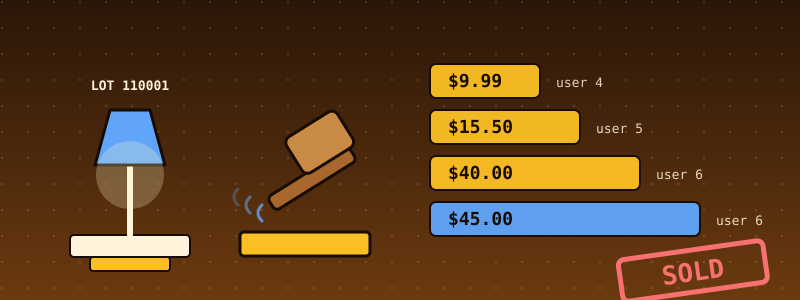
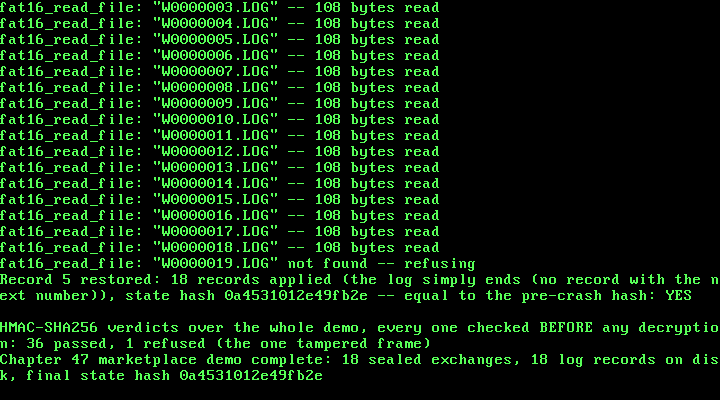

# 47. An eBay-Style Marketplace: Proxy Bidding, Escrow Checkout, and a Write-Ahead Log That Survives a Crash

{ style="display:block;margin:0 auto;max-width:100%;height:auto;border-radius:6px" }

**What you will understand:** how an auction marketplace is built so that it stays correct when requests are retried, networks drop frames, disks tear writes and the machine dies mid-operation. A real eBay-style **proxy-bidding auction engine** (`047_auction.h`/`047_auction.c`) -- maximum bids, bid increments, a hidden reserve price, ties, and a hard close -- over eBay's own request and response shapes (`047_ebay.h`/`047_ebay.c`, read from eBay's real OpenAPI schemas); a **double-entry money ledger** in integer cents with escrow and fees (`047_ledger.h`/`047_ledger.c`); **idempotency keys** so a retried request never applies twice; and a **write-ahead log** on this book's own FAT16 disk (`047_wal.h`/`047_wal.c`, `047_walfs.h`/`047_walfs.c`) from which the whole marketplace is rebuilt bit for bit after a crash (`047_market.h`/`047_market.c`). The point of the chapter is less the auction than the *evidence*: the engine is checked against an independent re-implementation on 20,000 random auctions, the whole marketplace is re-derived from the disk by a separate Python program, the kernel is hard-killed 30 times while it writes its log, and 28 deliberately broken copies of the code are all caught by the tests.

**What you need to know first:** Chapter 30's AES-128-CBC + HMAC-SHA256 encrypt-then-MAC construction (reused here for every message); Chapters 19-23's FAT16 filesystem (the log lives on it); Chapters 25-27's RTL8139 driver in loopback mode (every request and response crosses it, sealed); and Chapters 41-44's case-study pattern (a fictional market, a real standard's message shapes, a demo that boots in QEMU and prints everything).

## Scope: four confirmed choices before writing any code

This chapter was requested as "an eBay-style buying and selling system, industrial grade". Scope was confirmed through one `AskUserQuestion` round of four questions:

- **Core feature**: the user chose "Auction engine + checkout" (the recommended option) -- listings, real proxy bidding with bid increments, a reserve price, tie-breaking, the auction close, then order, payment and payout for the winner -- over a fixed-price-plus-auction catalogue or an auction-only chapter without checkout.
- **Data format**: the user chose "eBay-style REST JSON shapes" (the recommended option) -- item, bid and order JSON modelled on eBay's own Sell Inventory, Buy Browse, Buy Offer and Sell Fulfillment APIs -- over eBay's older Trading API XML or an invented format.
- **Crypto**: the user chose "Reuse Chapter 30 AES+HMAC" (the recommended option) -- a bid and a payment are real value, so every message is sealed and every frame is authenticated before it is decrypted, with tamper tests.
- **Hardening**: asked which "industrial-grade" properties to build and test, the user left the choice to the author ("choose"). All four on offer were built, because each one covers a different way real marketplaces lose money: **idempotency keys and replay safety**; **money as integer cents with checked invariants**; a **durable write-ahead log on the FAT16 disk** replayed after a simulated crash; and **fairness tests** (deterministic tie-breaking, an optional anti-sniping extension, and an independent Python re-implementation cross-checking every result).

## What "industrial grade" means in this chapter

"Industrial grade" is easy to say and hard to check, so this chapter turns it into eight properties, each with a place in the code and a test that can fail:

| # | property | where it lives | how it is checked |
|---|---|---|---|
| 1 | **Determinism**: one function, `mkt_apply()`, applies every change; it reads no clock, no random source, no outside state | `047_market.c` | replaying a log gives the same SHA-256 state hash: 56,188 log prefixes on the host, the whole log in the kernel, and the whole log again in an independent Python program |
| 2 | **Money is integer cents and is conserved**: no floating point; every transfer moves money, never creates it; the ledger always sums to zero | `047_ledger.c` | 2,000,000 random transfers; every invariant re-checked after every command of every test |
| 3 | **Idempotency**: a retried value-moving request is answered from a stored result and changes nothing; the same key with a different request is refused | `mkt_apply()` | 8,465 retries and 8,465 conflicting retries on the host; both shown in the kernel; a full table refuses without applying |
| 4 | **Write-ahead discipline**: a change is logged, then applied; recovery is replay | `mkt_submit()`, `047_walfs.c` | torn tails (3,600 cases), every log prefix, the kernel's injected torn write and bit rot, 30 real hard kills |
| 5 | **Message integrity**: every frame is authenticated before it is decrypted; a tampered frame is refused before anything is parsed, logged or applied | `mk_seal()`/`mk_open()` in `047_kmain.c` | the kernel flips one ciphertext byte and shows the log did not grow |
| 6 | **Input hardening**: strict parsers, bounded builders | `047_ebay.c` | 2,000,000 randomly damaged inputs through every parser under AddressSanitizer and UndefinedBehaviorSanitizer; every builder with every too-small buffer |
| 7 | **Rule correctness and fairness**: proxy bidding, increments, reserve, ties, close, optional anti-sniping | `047_auction.c` | an independent Python implementation, using a different *method*, agrees on 20,000 random auctions |
| 8 | **The tests themselves can fail** | `native/mutation.py` | 28 deliberately broken copies of the code; all 28 caught (after six escaped the first version of the tests, and the tests were fixed: see below) |

## eBay's own OpenAPI schemas, read: what is real and what is this chapter's own

eBay's developer site (`developer.ebay.com`) and `ebay.com` are blocked by this sandbox's network egress policy, the same pattern every blocked-standards-site chapter since Chapter 33 has hit. Two things were tried before settling on a source: eBay's own GitHub organisation (`github.com/eBay`) is reachable, but the one repository found there (`ebay-oauth-nodejs-client`) is only an OAuth helper with no API schemas. What *was* readable is the open-source (MIT-licensed) SDK `github.com/hendt/ebay-api`, which carries **eBay's real OpenAPI schemas as generated TypeScript types** under `src/types/restful/specs/`. This chapter cloned it (commit `e20388b`, dated 2026-08-11) and read four of them in full: `buy_offer_v1_beta_oas3.ts`, `buy_browse_v1_oas3.ts`, `sell_inventory_v1_oas3.ts` and `sell_fulfillment_v1_oas3.ts`. Every field name this chapter puts on the wire comes from those files:

| eBay API (file) | shape this chapter uses | fields read from the file |
|---|---|---|
| **Buy Offer** `POST /bidding/{item_id}/place_proxy_bid` | request `PlaceProxyBidRequest`; response `PlaceProxyBidResponse` | `maxAmount` (an `Amount`), `userConsent`; `proxyBidId` |
| **Buy Offer** `GET /bidding/{item_id}` | `Bidding` | `auctionEndDate`, `auctionStatus`, `bidCount`, `currentPrice`, `currentProxyBid` (`maxAmount`, `proxyBidId`), `highBidder`, `itemId`, `reservePriceMet`, `suggestedBidAmounts` |
| **Buy Browse** `getItem` | `Item` (subset) | `bidCount`, `buyingOptions`, `currentBidPrice`, `itemEndDate`, `itemId`, `minimumPriceToBid`, `reservePriceMet`, `uniqueBidderCount` |
| **Sell Inventory** offers | `Offer`, `PricingSummary` | `sku`, `marketplaceId`, `format`, `listingDuration`, `pricingSummary.auctionStartPrice`, `pricingSummary.auctionReservePrice`; the publish response has `listingId` and `offerId` |
| **Sell Fulfillment** orders | `Order` (subset) | `orderId`, `orderPaymentStatus`, `lineItems`, `pricingSummary.total`, `paymentSummary.totalDueSeller`, `paymentSummary.payments[].paymentStatus` and `.amount` |
| every API | `Amount` | `currency`, `value` -- and `value` is a **string** of decimal digits, so `"45.00"`, never the number `45` |

The documentation text in those files also gives the two sentences this chapter's engine is built from. On proxy bids: "By placing a proxy bid, the buyer is agreeing to purchase the item if they win the auction. After this bid is placed, if someone else outbids the buyer a bid, eBay automatically bids again for the buyer up to the amount of their maximum bid. When the bid exceeds the buyer's maximum bid, eBay will notify them that they have been outbid." And on reserve prices: "A reserve price is set by the seller and is the minimum amount the seller is willing to sell the item for. If the highest bid is not equal to or higher than the reserve price when the auction ends, the listing ends and the item is not sold."

What is **not** from those files, said plainly (the same list is at the top of `047_ebay.h`):

- **The bid-increment table** (`g_inc_table` in `047_auction.c`): eBay's published US table is not in the OpenAPI files, so it is reproduced from eBay's public help pages as the author knows them, and **could not be re-verified here**. It is data, one array to correct.
- **Enumeration values** such as `ACTIVE`/`ENDED`, `AUCTION`, `PAID`/`FULLY_REFUNDED`: the files name these enumerations and describe them in prose but do not list the values; they are as eBay documents them, to the author's knowledge.
- **The `{"errors":[...]}` wrapper** around eBay's `Error` object: the `Error` fields (`errorId`, `domain`, `category`, `message`, `longMessage`) are in the files; the wrapper is eBay's documented convention and was not.
- **Authentication**: eBay uses OAuth user tokens, which this book does not implement. The bidder is a fictional bearer token `demo-user-<n>`.
- **The `Idempotency-Key` header** is this chapter's addition (it is the convention of widely used payment APIs); eBay's Buy Offer API has no such header.
- **The HTTP framing, the checkout and release paths, the combined listing body** (the offer fields plus `product.title` from the inventory-item shape), the item id spelling `v1|<number>|0`, and the **fictional epoch** for times (`2026-10-10T00:00:00Z`, formatted as ISO-8601 like eBay's dates) are this chapter's own.
- **The platform fee** (10% of the sale total, rounded half up, plus 30 cents) is **fictional**; eBay's real final-value fees vary by category and are not modelled.

## The auction engine: `047_auction.h` and `047_auction.c`

Proxy bidding is a small idea with sharp edges. Every bidder has one standing **maximum**. The leader is the bidder with the highest maximum; when two maxima are *equal*, the bidder who reached that maximum *earlier* leads. The **price** is the least the leader must pay to stay ahead: one bid increment above the runner-up's maximum, but never more than the leader's own maximum. With one bidder the price is the starting price, and when the leader's maximum reaches the reserve, the price rises to the reserve. The next bid must be at least the price plus the increment; a standing maximum can only be raised. A worked example from the demo below: Ann's maximum is $20.00, Bob bids $15.00, and the price becomes $15.50 -- Bob's $15.00 plus the $0.50 increment that applies at that price -- while Ann still leads.

The engine never prints, never reads a clock (the caller passes `now` in whole seconds), and never copies a structure with `=` or calls `memset`/`memcpy`: this kernel has no libc, and the compiler may emit such calls for structure copies. Money is unsigned 32-bit cents, because this kernel has also never linked libgcc since Chapter 7, which rules out 64-bit division.

```c
--8<-- "docs/part47/code/047_auction.h"
```

```c
--8<-- "docs/part47/code/047_auction.c"
```

## The ledger: `047_ledger.h` and `047_ledger.c`

```c
--8<-- "docs/part47/code/047_ledger.h"
```

```c
--8<-- "docs/part47/code/047_ledger.c"
```

## The write-ahead log record: `047_wal.h` and `047_wal.c`

A log record is a magic number, a sequence number, a length, a fixed payload and a CRC-32 over everything before it. The CRC is the standard one (polynomial `0xEDB88320`, reflected, check value `0xCBF43926` for the string `123456789`, which the host test verifies). A record with a wrong magic, length, sequence number or CRC is rejected, and replay stops at the last good record.

```c
--8<-- "docs/part47/code/047_wal.h"
```

```c
--8<-- "docs/part47/code/047_wal.c"
```

## The marketplace: `047_market.h` and `047_market.c`

This is the layer that makes the rest trustworthy. Every change is a `mkt_cmd_t`; `mkt_apply()` is the only function that applies one; `mkt_submit()` writes the command to the log *first* and applies it only if the write succeeded; `mkt_replay()` reads the commands back and applies each through the same `mkt_apply()`. After every command `mkt_check()` verifies the invariants: the ledger sums to zero, escrow holds exactly the PAID orders' totals, no user account is negative, every price lies between the starting price and the leader's maximum, and a sold listing has bids. `mkt_hash()` is a SHA-256 over every field of the state in a fixed order, which is what turns "the recovered state looks right" into "the recovered state is identical".

```c
--8<-- "docs/part47/code/047_market.h"
```

```c
--8<-- "docs/part47/code/047_market.c"
```

## The eBay-shaped messages: `047_ebay.h` and `047_ebay.c`

The JSON scanner is deliberately small: it finds `"key":` occurrences in order along a dotted path, accepts strings without backslash escapes, and parses amounts strictly (digits, an optional point, at most two decimals, at most $1,000,000.00 -- the ledger's own limit, enforced at the door too). It is not a general JSON parser and says so in its header; what makes it safe to use is that it is fuzzed.

```c
--8<-- "docs/part47/code/047_ebay.h"
```

```c
--8<-- "docs/part47/code/047_ebay.c"
```

## The log on the disk: `047_walfs.h` and `047_walfs.c`

This book's FAT16 driver can create a file with its whole contents in one call and read one back, but has no append. So the log is **one file per record**, named by sequence number (`W0000001.LOG`, `W0000002.LOG`, ...). A record then either exists completely or is short or absent, which the CRC and length checks reject. A production system would append to one file and force it to disk; the record format and the replay logic above this layer would not change. The module also has small fault-injection helpers (tear a record, flip a bit, restore it) used by the demo's recovery part.

```c
--8<-- "docs/part47/code/047_walfs.h"
```

```c
--8<-- "docs/part47/code/047_walfs.c"
```

## `047_kmain.c`: the marketplace demo

The kernel is carried forward unchanged from Chapter 46 (every earlier chapter's demo still runs first) with three small edits: the banner now says Chapter 47, three `#include`s, and one call, `marketplace_demo(nic_mac)`, at the end. The demo seals every request and every response with Chapter 30's construction, sends it through the real RTL8139 loopback (brought up with `rtl8139_init(1)`, as every case-study demo does), checks the HMAC before decrypting, and has the server parse the eBay-shaped request, log the command, apply it and answer. The listing below is the demo only (lines 4876-5541 of `047_kmain.c`); the rest of the file is Chapter 46's, unchanged except for the three edits.

```c
--8<-- "docs/part47/code/047_kmain.c:4876:5541"
```

## Building and booting it, for real

This chapter's directory is the first in the book to ship its own build script. Earlier chapters printed the build's output but left the script in the author's scratch directory; `build.sh` reconstructs it from Chapter 1's recipe and was proved by rebuilding Chapter 46 first (same two linker warnings, an ISO within one sector of the page's). Packages needed on Ubuntu: `qemu-system-x86 nasm grub-pc-bin grub-common xorriso mtools gcc-multilib`.

```bash
cd docs/part47/code
./build.sh 047                 # assemble, compile, link, build the user program, check Multiboot2, pack the GRUB ISO into build/
./capture.sh                   # boot it in QEMU on a fresh 8 MiB disk with an RTL8139 card; stop at the completion marker; keep the disk image
```

```sh
--8<-- "docs/part47/code/build.sh"
```

```sh
--8<-- "docs/part47/code/capture.sh"
```

**Output (cloud sandbox -- live-executed build output)**

```text
--8<-- "docs/part47/code/build_out.txt"
```

The two linker warnings are the same two real warnings explained in Chapter 1, still true and still left alone.

## Real output: the marketplace boots

The full serial capture is 1,313 lines, because every earlier chapter's demo runs first. Shown here: the first 19 lines, then, after an explicit elision of Chapters 8-46's own output, this chapter's own demo from its first line to its last. Two kinds of noise are folded away by `make_excerpt.py` and counted rather than silently dropped: the periodic `tick:` lines the timer interrupt prints, and runs of consecutive `fat16_*` lines (the filesystem driver narrates every file it creates, reads or deletes).

**Output (cloud sandbox -- live-executed serial capture, QEMU 8.2.2, `-m 64M`, an 8 MiB disk and an RTL8139 card attached)**

```text
--8<-- "docs/part47/code/serial_excerpt_out.txt"
```

Read it as the auction it is. Ann leads at $9.99 with a $20.00 maximum; Bob's $15.00 makes the price $15.50 and does not take the lead; his attempt to lower his own maximum is refused; Cy's $15.00 is refused as below the $16.00 minimum bid. Cy's $45.00 takes the lead and, because it passes the $40.00 **reserve**, the price jumps straight to the reserve: `price now $40.00 ... reserve met: yes`. Ann's $42.00 comes up short and the price becomes $43.00. Ann's phone retries the same request with the same `Idempotency-Key`: the answer is `Idempotency-Replayed: true`, the same `proxyBidId`, and the bid count does not move. A buggy client reuses the key for a different amount: **422**. Bob bids exactly Cy's $45.00: a tie, Cy was first and keeps the lead, at $45.00. One frame is flipped on the wire and refused before decryption, and the log shows *13 records before, 13 after*. The auction then closes at its hard end time: Ann's late bid is refused, the scheduler closes the listing (SOLD to user 6 at $45.00), Bob -- who lost -- cannot check out, Cy can, and the money moves into **escrow** ($50.00: the $45.00 item plus $5.00 shipping) and, on delivery, is released: the fee is 10% of $50.00 plus $0.30 = **$5.30**, the seller receives **$44.70**, and `ledger total 0 (must be 0)` at every step.

Part 5 then does what a marketplace must survive. The in-memory marketplace is destroyed and the FAT16 volume re-mounted; **replay rebuilds a state whose SHA-256 hash equals the hash before the "crash"** (`0a4531012e49fb2e` in the first eight bytes, on both sides). A **torn write** of the last record (the delivery release, cut off after 50 of 108 bytes) makes replay stop at record 17 with the reason "SHORT", and the recovered state is exactly the state before that command (order still PAID, escrow still $50.00); the client's retry of the release then arrives, is applied, and the hash equals the pre-crash hash again. **Bit rot** in record 5 stops replay at record 4 on a CRC mismatch -- the 13 records after it are not applied, because a record after a gap cannot be trusted -- and restoring the record brings back all 18 and the same hash.

## Independent verification: a second implementation, reading only what the kernel left behind

The discipline this book has used since Chapter 11 is a check that shares no code with the kernel. Here that check is large, because the claim is large: `verify_047.py` reads only the serial capture and the **disk image** the kernel wrote, parses the FAT16 volume with its own reader, checks every log record's magic, length, sequence number and CRC-32 (with Python's own `zlib.crc32`), replays the whole log through an independent Python marketplace -- the auction by *literal step-by-step simulation* of "eBay bids again for the buyer", not the engine's closed-form rule -- asserts the marketplace invariants after every command, recomputes the SHA-256 state hash and compares it with the kernel's, compares the kernel's narrated prices with its own, and parses every JSON body the kernel printed with Python's `json` module, checking every field name against the names in eBay's real OpenAPI files.

```python
--8<-- "docs/part47/code/mkt_model.py"
```

```python
--8<-- "docs/part47/code/verify_047.py"
```

**Output (cloud sandbox -- `python3 verify_047.py serial.txt disk.img --oas <clone of hendt/ebay-api>`)**

```text
--8<-- "docs/part47/code/verify_out.txt"
```

Two results deserve a second look. The SHA-256 hash of the independently replayed marketplace equals the kernel's, so two implementations written in different languages agree on every field of the state: listings, proxy maximums and their arrival order, balances, orders, and the whole idempotency table. And every field name in the 19 JSON bodies the kernel printed is a field name from eBay's real schemas (the two wrapper names `status` and `errors` also occur in the schemas, as fields of other types; using them as the error wrapper is this chapter's own, which a name check cannot confirm, and the script says so).

## Host-side tests: the same code, hammered under sanitizers

The kernel demo is one scenario. The same C files also compile on the host (they use only `stdint.h`), where they can be driven 20,000 times with AddressSanitizer and UndefinedBehaviorSanitizer watching every memory access. `native/run_host_tests.sh` runs everything below.

```c
--8<-- "docs/part47/code/native/auction_fuzz.c"
```

```python
--8<-- "docs/part47/code/native/auction_ref.py"
```

The auction test is a **differential test**: the C engine and the Python reference print one line per event in the same format, and the two outputs must be identical. The Python reference deliberately uses a different method (it simulates the process step by step instead of computing the price from the sorted maximums), so agreement means something. The random generator also steers events onto the boundaries where off-by-one mistakes hide: exactly the existing maximum (ties), exactly the minimum bid, exactly the reserve, exactly the edge of the anti-sniping window, and the last second before the end.

```c
--8<-- "docs/part47/code/native/market_test.c"
```

```c
--8<-- "docs/part47/code/native/ledger_test.c"
```

```python
--8<-- "docs/part47/code/native/ledger_ref.py"
```

```c
--8<-- "docs/part47/code/native/ebay_test.c"
```

```python
--8<-- "docs/part47/code/native/ebay_iso_check.py"
```

```python
--8<-- "docs/part47/code/native/fuzz_stats.py"
```

**Output (cloud sandbox -- `native/run_host_tests.sh`)**

```text
--8<-- "docs/part47/code/native/host_tests_out.txt"
```

## Are the tests good enough? Twenty-eight broken copies

A test suite that has never failed has not been shown to work. `native/mutation.py` copies the sources, breaks one line at a time (a reversed tie-break, a wrong increment, an off-by-one at the end time, a transfer that destroys money, a CRC that is never checked, ...), and runs the host tests against each broken copy. "Caught" is the wanted result.

```python
--8<-- "docs/part47/code/native/mutation.py"
```

**Output (cloud sandbox -- `native/mutation.py`)**

```text
--8<-- "docs/part47/code/native/mutation_out.txt"
```

The first version of this table was **not** 28 of 28. Six broken copies escaped, and each escape was a missing test, not a broken test:

- *The anti-sniping window off by one* and *the reserve counted as met only when strictly exceeded* both live exactly on a boundary the random generator almost never hit. The generator now steers events onto the reserve, the window edge and the last second.
- *An account may be overdrawn*: the market test deposited far more money than any checkout needed, so no one was ever short. A directed test now has a winner with $5.00 against a $10.00 price, and the ledger test attacks overdrafts directly.
- *The fee is not rounded half up*: the fee formula was only compared with itself. `ledger_ref.py` now checks every sale total from 0 to 100,000 cents against Python's `decimal` module, a different way of computing the same thing.
- *Release pays the seller the full total and no fee*: the conservation invariants still held (the money merely went to the wrong place), so no invariant could notice. The market test now checks that every release moves *exactly* the fee and the seller's share, to the cent.
- *The state hash leaves out the ledger balances*: nothing tested that the hash is sensitive to each kind of state. The test now flips one field of each kind in a copy of the state (a balance, a transaction count, a listing's price, status and end time, a proxy maximum, an order's status and fee, an idempotency result) and requires the hash to change every time (5,984 probes). Two further mutants, hashes that omit the orders and the idempotency table, were first written too weakly (they removed only a redundant "slot used" marker, so they were nearly equivalent to the original) and were replaced with mutants that drop the whole block.

## Real hard kills

The kernel's own recovery demonstration is injected by the kernel itself (it tears and corrupts its own records). A reader should ask what a *real* death does. `crash_test.py` boots the kernel in QEMU on a fresh disk and, at a pseudo-random moment while the demo is writing its log, kills QEMU with `SIGKILL`: the process dies at once and the guest flushes nothing, which is as close to pulling the plug as an emulator allows. The disk image is then read by the independent Python reader, the valid prefix of the log is replayed through the independent marketplace, and the invariants are asserted.

```python
--8<-- "docs/part47/code/crash_test.py"
```

**Output (cloud sandbox -- `MAXDELAY=0.62 python3 crash_test.py build 30`)**

```text
--8<-- "docs/part47/code/crash_out.txt"
```

Every kill left a log that replayed to a consistent marketplace. **What this does and does not show:** none of the kills produced a *torn record* -- every kill landed between disk operations -- so these kills do not themselves exercise the torn-tail path; that path is exercised by the host tests (3,600 cases) and by the kernel's own injected tear. And `SIGKILL` of an emulator is not a power cut on real hardware with a volatile write cache.

The harness found a bug in itself on its first run: its "Part 1" marker also appears in earlier chapters' output, so the first kills landed in Chapter 29's demo and the reader reported 0 log files. The markers are now specific to this chapter (`Part 1: funding three buyers`).

## The VGA console

The kernel also prints to the VGA text screen. This screenshot was taken from QEMU's own monitor (`screendump`) at the end of the demo by `screendump.py`, with the standard 80 x 25 text mode wrapping long lines:



```python
--8<-- "docs/part47/code/screendump.py"
```

## What the first runs found

This chapter did not work first time, and the record of what went wrong is part of the evidence:

1. **The reference was wrong, not the engine.** The first differential run disagreed on 626 of 76,443 output lines (3,000 auctions). Looking at the first difference: bidder 8 had tied the leader at $586.81, so the price sat at $586.81; the leader then raised their maximum to $596.81, and the engine moved the price to $596.81 (the runner-up's $586.81 plus a $10.00 increment). The Python simulation had assumed that a leader raising their own maximum changes nothing. eBay's process bids again against the runner-up, so the engine was right and the reference was wrong; the reference's leader-raise branch was fixed by reasoning from the rule, not by copying the engine's answer, and the two then agreed on every one of 20,000 auctions.
2. **The idempotency table could apply a command and then discover it had no room to remember it.** Found by re-reading the first draft of `mkt_apply()` before any test ran: the capacity check came after `do_apply()`. A full table must refuse a request *without applying it*; the check now comes first, and a directed test (`Directed test 1`) proves it.
3. **A timestamp lost its last character.** The first run of the eBay message test printed `2026-10-10T00:00:00.000` without the `Z`: the string is 24 characters and needs 25 bytes with its terminator, and the buffer was 24. The bounded writer refused to overflow and the test noticed; AddressSanitizer then flagged the test's own too-small buffer. Both are now 28.
4. **The parser and the ledger disagreed about the largest amount.** The test table expected amounts above $1,000,000.00 to be refused (the ledger's own per-transfer limit) and the parser accepted up to $9,999,999.99. The parser now enforces the same limit as the ledger.
5. **The first boot hung at its first exchange.** The demo had not brought the RTL8139 up in loopback mode (`rtl8139_init(1)`), which every earlier case-study demo does at its start; the timer interrupt kept printing `tick:` while the receive wait never finished.
6. **Two bookkeeping mistakes in the tests**, one in each tool: the prefix test had not stored state hashes for the first six commands, and the crash harness's marker matched earlier chapters' output.
7. **The six mutants that escaped**, described above.

## Limits and what is not established

- **The eBay shapes are as faithful as eBay's OpenAPI files allow, no more.** The bid-increment table, the enumeration values and the error wrapper are from the author's knowledge of eBay's documentation, not from files read; there is no OAuth; the fee schedule is fictional. A real integration would be tested against eBay's own sandbox, which this environment cannot reach.
- **One request at a time.** Every command goes through one `mkt_apply()`, which is exactly how event-sourced systems get a single total order; but nothing here handles *concurrent* submission. Chapter 13's spinlocks and Chapter 14's semaphores are not used, because the demo has a single submitting task.
- **Fixed tables.** At most 8 listings, 8 bidders per listing, 8 orders and 24 idempotency keys. Idempotency keys are never expired, so a long-running system would have to age them out (and decide how long a retry may be honoured).
- **Money is unsigned 32-bit cents**, with a $1,000,000.00 limit per transfer and per amount; one currency (USD); no taxes, shipping rules or disputes beyond a full refund of an order that has not been released.
- **The log is one FAT16 file per record**, with no append, no checkpoint and no snapshot: recovery time grows with the log. A damaged record in the *middle* of the log loses everything after it; a real system would repair it from a replica, which this chapter does not have. Whether a written record is physically on the platter when the write call returns depends on the emulator's and real disks' caching, which this chapter does not control.
- **The hard-kill experiment is 30 kills of an emulator.** It produced no torn record (see above) and is not a power-cut test.
- **Frame replay.** HMAC authenticates a frame but does not stop an attacker from re-sending a *captured* one. For bids, deposits and checkouts the idempotency key makes a re-sent frame harmless (tested for bids on the host); for create, close and release the commands are state-guarded (a second create of the same id, or a second release, is refused), which is a property of the rules above rather than something tested separately for re-sent frames.
- **Keys are compiled into the kernel**, as in every earlier case-study chapter; there is no key management.
- **The auction clock is logical** (whole seconds passed in by the caller) and closing is an explicit command; there is no scheduler that closes auctions by itself.
- **The anti-sniping extension is off in the demo.** It is tested on the host (4,046 end-time extensions observed in the differential run) but not shown in the kernel output.

## Chapter summary

This chapter built the part of a marketplace that has to be right even when everything around it goes wrong. A proxy-bidding auction engine, an eBay-shaped message layer (every field name checked against eBay's real OpenAPI files), a double-entry money ledger in integer cents, an idempotency table and a write-ahead log on the FAT16 disk were combined around one deterministic function, `mkt_apply()`, so that replaying the log reproduces the marketplace exactly: the kernel's recovery, an independent Python program reading only the disk image, and 30 real hard kills all agree. The evidence is what is different about the chapter: an independent re-implementation that disagreed with the engine on the first run and turned out to be the one in error, 20,000 random auctions, 2,000,000 damaged inputs under sanitizers, 28 broken copies of the code all caught -- after six first escaped, which is how the missing tests were found.

Deliberately out of scope, stated explicitly: concurrency, replication and checkpoints, key management and OAuth, real taxes and fee schedules, a close scheduler, and eBay's own sandbox. The next case studies (Chapter 48 onward) can build on a marketplace that now has money, messages and durability.

## Self-check questions

**1. Why does `mkt_submit()` write the log record *before* applying the command, and what could go wrong if the order were reversed?**

Worked answer: if the command were applied first and logged second, a crash between the two steps would leave a marketplace whose in-memory state had moved (a bid accepted, money in escrow) with no record of why; after recovery that change would be silently gone, while the client -- who may already have been told "accepted" -- believes it happened. Logging first means a crash can only leave a record that was never applied, and replay then applies it, giving the state the client was promised. This is also why `mkt_apply()` must be a deterministic function of the command alone: replay has to reach the same state from the same record.

**2. `mkt_apply()` reads no clock, yet auctions end at a time. How, and why is this design necessary for recovery?**

Worked answer: the time is part of the command: every `mkt_cmd_t` carries `now`, supplied by the caller (the server stamps it when the request arrives) and written to the log with the rest of the command. During replay the logged time is used, not the current one. If `mkt_apply()` read a clock itself, replaying a bid a day later would find the auction already over and give a different state from the original run, and the recovered hash would not match.

**3. Why is a retry with the same `Idempotency-Key` but a *different* request refused (422) rather than answered with the stored result?**

Worked answer: answering a different request with the stored result of an earlier one would tell the client its new request succeeded when nothing about it was done -- a bid of $44.00 acknowledged with the proxy bid id of the $42.00 request. The stored fingerprint (an FNV-1a hash of the command's type and fields) distinguishes "the same request sent again" (answer from the table, change nothing) from "a different request under a reused key" (a client bug, which must be loud). The table is part of the replayed state, so this still holds for a retry that arrives after a crash and a recovery.

**4. Work out by hand: bidder A has maximum $100.00 and bidder B has bid exactly $100.00 later. What is the price, who leads, and what is the price after A raises their maximum to $120.00?**

Worked answer: the maxima are equal, so the earlier bidder, A, leads, and the price is capped at the leader's own maximum: $100.00. When A raises to $120.00, eBay bids again for A against the runner-up: B's maximum plus the increment that applies at $100.00 ($2.50, from the table for prices $100.00-$249.99) gives $102.50, which is below A's new maximum, so the price becomes **$102.50**. This is exactly the case that exposed the wrong first version of the Python reference (see "What the first runs found"), which had left the price at $100.00.

**5. Six deliberately broken copies of the code survived the first version of the tests. Why is that more useful than if they had all been caught, and what did "release pays the full total and no fee" teach in particular?**

Worked answer: each survivor pointed at a specific property no test had checked, so each led to a new test that now guards against a whole class of mistakes, not just the one mutant. "Release pays the full total and no fee" is the instructive case: every conservation invariant still held -- the money merely went to the seller instead of being split between seller and platform -- so an invariant checker that only asks "does the ledger sum to zero, is escrow right, is anything negative" could never see it. Conservation is necessary, not sufficient; the test that catches it checks that each release moves *exactly* the fee and the seller's share, to the cent.
