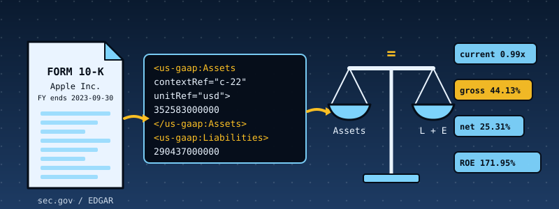

# 48. SEC EDGAR Filings and Financial Ratios: Reading XBRL Inside a Kernel, and Refusing Filings That Do Not Add Up

{ style="display:block;margin:0 auto;max-width:100%;height:auto;border-radius:6px" }

**What you will understand:** how the numbers in a company's annual report (a Form 10-K filed with the U.S. Securities and Exchange Commission) are published as machine-readable **XBRL**, and how a kernel with no operating system under it can read them and compute financial ratios correctly. An XBRL reader (`048_xbrl.h`/`048_xbrl.c`) that is strict about structure and tolerant about formatting; a ratio engine (`048_ratios.h`/`048_ratios.c`) that picks the right fiscal year by written rules, checks that the balance sheet balances **before** trusting any number, uses only 64-bit integers, and says "n/a" with a reason instead of inventing a value; six real filings (Apple, Microsoft, NVIDIA, Coca-Cola, Exxon Mobil, JPMorgan Chase) baked into the kernel image; a host-side EDGAR fetcher that follows the SEC's published rules for automated access; and independent verification that recomputes every report from the original SEC documents with a second implementation.

**What you need to know first:** Chapters 19-23's FAT16 filesystem (each report is written to it and read back); Chapter 47's testing discipline (a differential test against an independent implementation, sanitizer fuzzing, and mutation testing) and its cumulative kernel, which this chapter carries forward. No accounting background is assumed: every ratio is defined below the first time it is used.

## Scope: three confirmed choices before writing any code

This chapter was requested as "pull SEC EDGAR reports and calculate different financial ratios". Scope was confirmed through one `AskUserQuestion` round of three questions:

- **Data source**: the sandbox that builds this book **cannot reach sec.gov** (see the next section). The user chose "Real filings + recorded fetcher" (the recommended option): real SEC documents as the data, plus a host-side EDGAR fetcher tested against recorded response shapes, over invented filings or a chapter with no fetch code at all.
- **Ratio families**: asked which to cover, the user left the choice to the author ("choose"). All four on offer were built: **liquidity and leverage**, **profitability and efficiency**, **valuation and cash flow**, and a **bank edge case**, because a bank is where textbook ratios stop applying and a correct engine must say so.
- **Hardening**: the user chose "Full discipline" (the recommended option): integer fixed-point arithmetic, a differential test against an independent Python implementation, fuzzing, mutation tests, and checks that the accounting identities hold.

## Where the data comes from, said plainly

**What was tried.** From the sandbox, `sec.gov`, `www.sec.gov`, `data.sec.gov` and `efts.sec.gov` are all unreachable: the network egress policy blocks them. GitHub and PyPI are reachable. So nothing in this chapter was downloaded from EDGAR by this book's author, and the chapter does not pretend otherwise.

**What the data is.** The six filings are **real SEC documents**. They are the XBRL instance documents (the `*_htm.xml` file EDGAR extracts from every inline-XBRL filing) that the open-source `edgartools` project keeps as test fixtures, github.com/dgunning/edgartools at commit `237e866a80ab3013cf5aa25a2557cf73c4eb61e4`, together with each filing's metadata. Every accession number below comes from that metadata, and the kernel prints the EDGAR URL of each filing so you can open the original yourself:

| ticker | company | form | filed | accession number | fiscal year ends |
|---|---|---|---|---|---|
| AAPL | Apple Inc. | 10-K | 2023-11-03 | 0000320193-23-000106 | 2023-09-30 |
| MSFT | Microsoft Corp | 10-K | 2024-07-30 | 0000950170-24-087843 | 2024-06-30 |
| NVDA | NVIDIA Corp | 10-K | 2026-02-25 | 0001045810-26-000021 | 2026-01-25 |
| KO | Coca-Cola Co | 10-K | 2024-02-20 | 0000021344-24-000009 | 2023-12-31 |
| XOM | Exxon Mobil Corp | 10-K | 2023-02-22 | 0000034088-23-000020 | 2022-12-31 |
| JPM | JPMorgan Chase & Co | 10-K | 2024-02-16 | 0000019617-24-000225 | 2023-12-31 |

**What was done to them.** A full document is large (JPMorgan's is 14.7 MB). `edgar_slim.py` keeps only the facts the engine reads, plus the `<context>` and `<unit>` blocks those facts use, and copies them **byte for byte** (no re-serialising), so the kernel sees real EDGAR formatting. The six slimmed files total 650 KB and are embedded in the kernel image by one assembler directive (`incbin`). The independent verifier below does **not** use the slimmed files: it recomputes from the original full documents, which also checks the slimmer.

**What was not established.** The fetcher (`edgar_fetch.py`) has never talked to the real sec.gov. It was tested against a local HTTP server that answers in the shapes the SEC documents for its JSON endpoints, serving one of the real documents. That proves the client's own logic (headers, rate limit, retries, validation). It cannot prove that sec.gov still answers in exactly these shapes today. If you run it with your own contact address and it fails, the shapes are the first place to look.

## What a filing looks like: XBRL in one page

A 10-K's numbers are published as XBRL: a flat XML document whose children are **contexts**, **units** and **facts**. Here is Apple's own total assets, from the document in the kernel:

```xml
<context id="c-22">
    <entity>
        <identifier scheme="http://www.sec.gov/CIK">0000320193</identifier>
    </entity>
    <period>
        <instant>2023-09-30</instant>
    </period>
</context>
<unit id="usd">
    <measure>iso4217:USD</measure>
</unit>
<us-gaap:Assets contextRef="c-22" decimals="-6" id="f-172" unitRef="usd">352583000000</us-gaap:Assets>
```

A **fact** says "the concept `us-gaap:Assets` had the value 352,583,000,000". The **context** says *when*: here a single day, the balance-sheet date (an *instant*), while an income-statement figure carries a *duration*, a start and end date. The **unit** says *what*: US dollars. A context may also carry a `<segment>` with **dimensions**, which says "this value is for one slice of the company only" (one product line, one region). Those facts must never be mixed up with the whole-company figure, and a large share of the facts in a real filing are dimensional.

The six real files showed several things a textbook description of XBRL leaves out, all handled by the code and all found by running it:

- **Formatting varies.** Most of Apple's, NVIDIA's and Coca-Cola's facts sit on one line; Microsoft and Exxon put every attribute on its own line, in a different order, with ids like `F_e003865e-55bd-4371-a155-c6d1153f17ed` (Apple does the same for a few facts, such as its earnings per share). A reader that finds facts with a regular expression for `<tag contextRef=` silently finds **none** of the balance sheet in Microsoft's and Exxon's filings; the author's first quick scan of the six files did exactly that and reported them empty.
- **Unit ids are the filer's own choice.** Apple calls the dollar unit `usd` and dollars-per-share `usdPerShare`; Microsoft calls them `U_USD` and `U_UnitedStatesOfAmericaDollarsShare`. The id means nothing: the engine reads the unit's `<measure>` (`iso4217:USD`, or a `divide` of `iso4217:USD` by shares). Apple writes the shares measure as bare `shares`, others as `xbrli:shares`; both are accepted.
- **Real filings contain inconsistent duplicates.** Apple's own filing states `us-gaap:UnrecognizedTaxBenefits` twice for the same date with different values (19,454,000,000 and 19,500,000,000). XBRL calls this an inconsistent duplicate. The engine's rule applies it only to the concepts it reads, otherwise it would reject Apple's genuine filing over a number it never uses.
- **Not every company reports every concept.** Exxon reports no operating income, JPMorgan has no current assets (banks do not classify them), NVIDIA tags capital spending as `PaymentsToAcquireProductiveAssets` instead of the usual `PaymentsToAcquirePropertyPlantAndEquipment`. The engine has an ordered list of fallback concepts for each quantity and prints "n/a" when none exist.

## The rules

The rules are written down once and implemented **twice**, independently: in C (the kernel) and in Python (`ratios_ref.py`). Where the two disagree, one of them is wrong, and the differential tests find out which.

**Reading.** Only facts in the `us-gaap` taxonomy namespace (whatever prefix the filing binds to it) and four `dei` cover-page facts are read. A fact is kept when its unit resolves to US dollars (or dollars per share), its text is a plain number with no more than four decimals, and (for dollar facts) it has no cents. It is ignored when it is `xsi:nil`. Facts in a context with a `<segment>` (dimensional contexts) are ignored by every calculation.

**The period.** `dei:DocumentPeriodEndDate` in a dimension-free context is the fiscal year end *E*. The **fiscal-year contexts** are the dimension-free durations that end on *E* and last 350 to 380 days inclusive (52- and 53-week years included). The **balance-sheet contexts** are the dimension-free instants equal to *E*. The **prior balance-sheet date** is the latest dimension-free instant 350 to 380 days before *E*. For a quantity, the first concept of its fallback list that has a value in a matching context wins; contexts are tried in document order.

**The checks, before any ratio.**

1. `assets = liabilities and equity` (current balance-sheet date). A **FAIL rejects the filing**: no ratios are computed from a balance sheet that does not balance.
2. `liabilities + equity = liabilities and equity`. Reported as PASS/FAIL but **never rejects**: redeemable non-controlling interests legitimately sit outside both. Skipped when liabilities were derived.
3. `gross profit = revenue - cost of revenue` when all three are reported. Reported, never rejects.
4. No **conflicting duplicates** (the same concept, the same dimension-free context, two different values) among the concepts the engine reads. A FAIL **rejects the filing**.

**The arithmetic.** Dollars are 64-bit integers; per-share values are in 1/10,000 dollar. Every ratio is one integer division with one rounding rule: **round half away from zero on the exact fraction**. Ratios in "times" are stored in hundredths (`99` means 0.99x), percentages in basis points (`2531` means 25.31%). A product that would exceed 2^62 gives "n/a (overflow)", never a wrong number. A ratio whose denominator is zero or negative gives "n/a (denominator not positive)".

**Fallbacks.**

| quantity | tried in this order |
|---|---|
| revenue | `RevenueFromContractWithCustomerExcludingAssessedTax`, `Revenues`, `SalesRevenueNet` |
| cost of revenue | `CostOfRevenue`, `CostOfGoodsAndServicesSold` |
| interest expense | `InterestExpense`, `InterestExpenseNonoperating` |
| short-term investments | `MarketableSecuritiesCurrent`, `ShortTermInvestments` (absent counts as 0 in the quick and cash ratios) |
| capital spending | `PaymentsToAcquirePropertyPlantAndEquipment`, `PaymentsToAcquireProductiveAssets` |
| gross profit | the reported `GrossProfit`; if absent, revenue minus cost of revenue |
| liabilities | the reported `Liabilities`; if absent, assets minus equity including non-controlling interest |

## The ratios, in plain words

| ratio | formula | what it tells you | careful |
|---|---|---|---|
| `current_ratio` | current assets / current liabilities | can the company pay what it owes within a year from what it will convert to cash within a year | below 1.0 is not a crisis for a company that collects cash faster than it pays suppliers |
| `quick_ratio` | (cash + short-term investments + receivables) / current liabilities | the same, without inventory | counts only the investment concepts the engine reads |
| `cash_ratio` | (cash + short-term investments) / current liabilities | the harshest of the three | |
| `liabilities_to_equity` | total liabilities / shareholders' equity | how much of the business is financed by creditors rather than owners | meaningless when equity is zero or negative: n/a |
| `liabilities_to_assets` | total liabilities / total assets | the same as a share of everything owned | |
| `equity_multiplier` | total assets / shareholders' equity | leverage as a multiplier | |
| `interest_coverage` | operating income / interest expense | how many times operating profit covers the interest bill | n/a when there is no interest expense |
| `gross_margin` | gross profit / revenue | what is left after the direct cost of the product | does not exist for companies that report no gross profit |
| `operating_margin` | operating income / revenue | what is left after running the business | |
| `net_margin` | net income / revenue | what is left for the owners | |
| `return_on_assets` | net income / average total assets | profit per dollar of assets | uses the average of this and last year's balance sheet |
| `return_on_equity` | net income / average shareholders' equity | profit per dollar of the owners' money | shrinks equity-buybacks into huge numbers (see Apple) |
| `asset_turnover` | revenue / average total assets | how hard the assets work | |
| `free_cash_flow` | operating cash flow - capital spending | cash left after keeping the business running | companies define it differently |
| `fcf_margin` | free cash flow / revenue | | |
| `eps_diluted_reported` | as reported | profit per share, reported by the company | |
| `price_to_earnings` | price / diluted EPS | what the market pays per dollar of profit | **needs a share price, which no filing contains** |

Every P/E in this chapter uses an **illustrative price of $100.00 for every company**. It shows the mechanism and nothing else: Coca-Cola's 40.49x is the arithmetic of $100.00 / $2.47, not a statement about Coca-Cola's stock.

## The XBRL reader: `048_xbrl.h` and `048_xbrl.c`

The reader makes one pass over the text with an explicit stack of open element names, and keeps its results in fixed tables: 256 contexts, 512 facts, 16 units. A table that would overflow is an **error**, not a silent truncation. Two details are specific to a kernel with no libc: there is no `memset` or `memcpy` (so structures are filled field by field), and no `libgcc` (so a 64-bit `/` or `%` fails to link with an undefined `__udivdi3`; `xb_udivmod()` divides by shift-and-subtract, 64 iterations, and the unit tests compare it with native division on 300,000 random pairs).

```c
--8<-- "docs/part48/code/048_xbrl.h"
```

```c
--8<-- "docs/part48/code/048_xbrl.c"
```

## The ratio engine: `048_ratios.h` and `048_ratios.c`

```c
--8<-- "docs/part48/code/048_ratios.h"
```

```c
--8<-- "docs/part48/code/048_ratios.c"
```

## The filings and the printout: `048_filings_data.asm`, `048_filings.h` and `048_filings.c`

NASM's `incbin` copies each file's bytes into `.rodata` at assembly time: no generated C source, no byte-array listing of 650 KB.

```nasm
--8<-- "docs/part48/code/048_filings_data.asm"
```

```c
--8<-- "docs/part48/code/048_filings.h"
```

```c
--8<-- "docs/part48/code/048_filings.c"
```

## The host-side half: `edgar_slim.py` and `edgar_fetch.py`

The kernel has no TLS (HTTPS needs certificate validation and elliptic-curve cryptography this book has not built), so the download runs on the host and hands the kernel a slimmed file. The SEC's fair-access rules are built into the fetcher, not bolted on: a descriptive `User-Agent` **with a contact address** on every request (required, no default, because requests without one are blocked), at most **10 requests per second** (a limiter with an injectable clock so a test can prove it without waiting), `429` and `5xx` answers retried with exponential backoff and **at most four attempts** (never an endless loop, never a silently empty result), and every download validated before use.

```python
--8<-- "docs/part48/code/edgar_slim.py"
```

```python
--8<-- "docs/part48/code/edgar_fetch.py"
```

The commands, with your own contact address in place of the example:

```bash
cd docs/part48/code
python3 edgar_fetch.py --user-agent "Your Name you@example.com" AAPL --out data   # ticker -> CIK -> latest 10-K -> instance document -> slimmed file
```

## `048_kmain.c`: the EDGAR demo

For each filing the demo parses, analyses, prints the checks and the ratios, writes the canonical report to the FAT16 disk as `<TICKER>.RPT` and reads it back, and prints the canonical text between `@@CANON` markers for the verifier. Then four attacks on the Apple filing show the engine refusing.

```c
--8<-- "docs/part48/code/048_kmain.c:5546:5652"
```

## Building and booting it, for real

```bash
cd docs/part48/code
./build.sh 048                 # assemble (including the six embedded filings), compile, link, check Multiboot2, pack the GRUB ISO into build/
./capture.sh                   # boot it in QEMU on a fresh 8 MiB disk; stop at the completion marker; keep the disk image
```

```sh
--8<-- "docs/part48/code/build.sh"
```

```sh
--8<-- "docs/part48/code/capture.sh"
```

**Output (cloud sandbox -- live-executed build output)**

```text
--8<-- "docs/part48/code/build_out.txt"
```

The kernel image is 1.0 MB, of which about 650 KB are the six filings. The two linker warnings are the same two real warnings explained in Chapter 1.

## Real output: six filings, four attacks

The full serial capture is 1,682 lines because every earlier chapter's demo runs first. Shown here: the first three lines, an explicit elision of Chapters 8-47's own output, then this chapter's demo from its first line to its last.

**Output (cloud sandbox -- live-executed serial capture, QEMU 8.2.2, `-m 64M`, an 8 MiB disk)**

```text
--8<-- "docs/part48/code/serial_excerpt_out.txt"
```

### The six companies side by side

The same numbers, collected from that output (P/E at the illustrative $100.00; `$B` is billions of dollars):

| ratio | AAPL | MSFT | NVDA | KO | XOM | JPM |
|---|---|---|---|---|---|---|
| `current_ratio` | 0.99x | 1.27x | 3.91x | 1.13x | 1.41x | n/a |
| `quick_ratio` | 0.63x | 1.06x | 1.53x | 0.54x | 0.90x | n/a |
| `cash_ratio` | 0.42x | 0.60x | 0.33x | 0.40x | 0.43x | n/a |
| `liabilities_to_equity` | 4.67x | 0.91x | 0.31x | 2.71x | 0.85x | 10.82x |
| `liabilities_to_assets` | 82.37% | 47.58% | 23.94% | 71.87% | 45.14% | 91.54% |
| `equity_multiplier` | 5.67x | 1.91x | 1.31x | 3.77x | 1.89x | 11.82x |
| `interest_coverage` | 29.06x | 37.29x | 503.42x | 7.41x | n/a | n/a |
| `gross_margin` | 44.13% | 69.76% | 71.07% | 59.52% | n/a | n/a |
| `operating_margin` | 29.82% | 44.64% | 60.38% | 24.72% | n/a | n/a |
| `net_margin` | 25.31% | 35.96% | 55.60% | 23.42% | 13.47% | 31.34% |
| `return_on_assets` | 27.50% | 19.07% | 75.42% | 11.25% | 15.75% | 1.31% |
| `return_on_equity` | 171.95% | 37.13% | 101.49% | 42.82% | 30.66% | 15.98% |
| `asset_turnover` | 1.09x | 0.53x | 1.36x | 0.48x | 1.17x | 0.04x |
| `free_cash_flow` | $99.58B | $74.07B | $96.68B | $9.75B | $58.39B | n/a |
| `fcf_margin` | 25.98% | 30.22% | 44.77% | 21.30% | 14.11% | n/a |
| `eps_diluted_reported` | $6.13 | $11.80 | $4.90 | $2.47 | $13.26 | $16.23 |
| `price_to_earnings` | 16.31x | 8.47x | 20.41x | 40.49x | 7.54x | 6.16x |

### Reading the table, and what it does not say

- **Apple's return on equity of 171.95%** is not a sign of a miracle. Apple has spent heavily on buying back its own shares, which shrinks shareholders' equity (the denominator) while profit stays high. The same table shows the other side: liabilities are 4.67 times equity. Return on *assets* (27.50%) and the margins describe the business without that effect.
- **JPMorgan is the bank case.** No current ratio, no quick or cash ratio, no gross or operating margin, no interest coverage, no free cash flow: a bank does not classify assets as current, has no cost of goods, and its interest is its raw material, not a financing cost. The engine prints "n/a (missing input)" for each, instead of forcing a number out of the wrong concept. What *does* apply tells the story of a bank: liabilities are 10.82 times equity (an equity multiplier of 11.82x), and the return on assets is 1.31% where Apple's is 27.50%.
- **Exxon reports no operating income and no gross profit**, so three ratios are n/a while its net margin (13.47%) is still computed. **NVIDIA's free cash flow** exists only because of the `PaymentsToAcquireProductiveAssets` fallback; without it that cell would be n/a.
- **Coca-Cola's quick and cash ratios are lower bounds.** Its filing has no `us-gaap:MarketableSecuritiesCurrent` or `us-gaap:ShortTermInvestments` fact (it reports `us-gaap:OtherShortTermInvestments` and a combined `CashCashEquivalentsAndShortTermInvestments` instead), so the engine counts those investments as zero. Adding a fallback is one line per concept, but each addition needs a decision about double counting with the combined total. This is a real limitation, left visible rather than hidden.
- **The P/E column is an illustration**, as said above.

### The four attacks

The last part of the demo changes the Apple filing four ways, and each must be refused with a reason:

1. **One digit of total assets changed** (352,583,000,000 to 352,583,000,001). Assets no longer equal liabilities plus equity: the first check fails and the filing is **REJECTED**, with no ratio printed.
2. **A second, different `Assets` fact appended** for the same balance-sheet date. Flagged as a conflicting duplicate, **REJECTED**.
3. **The download cut off** after 40,000 of 76,789 bytes. Refused while reading: "document ends inside an element".
4. **An HTML error page** where the document should be (what a blocked or rate-limited request often returns). Refused while reading: "root element is not `<xbrl>`".

## Independent verification: a second implementation, reading the original documents

`verify_048.py` shares no code with the kernel and does not use the slimmed files. It reads the serial capture, the FAT16 disk image and the **original full SEC documents**, and:

1. reads the FAT16 volume with its own reader and takes the six `.RPT` files the kernel wrote;
2. recomputes every report from the full original document with `ratios_ref.py` (Python's `xml.etree`, exact integer arithmetic, the same published rules) and compares it line by line with the report the kernel printed **and** the file on the disk;
3. re-renders every number the kernel printed in human form (`25.31%`, `0.99x`, `$99,584,000,000`) from the canonical integers and compares the text;
4. checks the accession numbers the kernel printed against the filing metadata shipped with the documents;
5. checks that all four attacks were refused for the reasons stated.

```python
--8<-- "docs/part48/code/ratios_ref.py"
```

```python
--8<-- "docs/part48/code/verify_048.py"
```

**Output (cloud sandbox -- `verify_048.py` on the capture above)**

```text
--8<-- "docs/part48/code/verify_out.txt"
```

## Host-side tests: the same code, hammered under sanitizers

The C files the kernel links (`048_xbrl.c`, `048_ratios.c`, `048_filings.c`) are compiled for the host with AddressSanitizer and UndefinedBehaviorSanitizer and tested five ways:

1. **`xbrl_test.c`**: 64-bit arithmetic against 128-bit reference arithmetic (300,000 random cases each for division and for the rounding rule); date and number parsers on good and bad inputs; hand-computed answers on small documents, one rule at a time (a company whose every ratio was worked out on paper, rounding at exactly half, a segment value that must be ignored, both edges of the 350 to 380 day window, conflicting and equal duplicates, derived liabilities, every fallback, negative equity, an overflow); the formatting helpers; and 25 kinds of malformed or oversized document, every one of which must produce its specific error code.
2. **The six real filings**, C against Python.
3. **3,000 random valid filings** from `gen_docs.py` (random sizes, fiscal-year lengths including 349 and 381 days, balance sheets that do and do not balance, concepts present and absent, dimensional noise, inconsistent and equal duplicates, filer-chosen unit ids, euro facts, fractional dollars, nil facts, a different prefix for `us-gaap`, extension concepts with the same name, facts placed *before* their contexts, attributes split over lines, single quotes, comments), C against Python, every line.
4. **The fetcher**, against a real local HTTP server speaking the SEC's JSON shapes.
5. **Damaged filings**: random truncations, flipped bytes, deleted and duplicated ranges, swapped chunks and NUL runs applied to the six real filings, every mutant parsed and analysed under the sanitizers. A truncation before the closing tag must never be accepted as a complete document.

```c
--8<-- "docs/part48/code/native/xbrl_test.c"
```

```python
--8<-- "docs/part48/code/native/gen_docs.py"
```

```python
--8<-- "docs/part48/code/native/diff_test.py"
```

```c
--8<-- "docs/part48/code/native/xbrl_fuzz.c"
```

```python
--8<-- "docs/part48/code/native/test_fetch.py"
```

```sh
--8<-- "docs/part48/code/native/run_host_tests.sh"
```

**Output (cloud sandbox -- `native/run_host_tests.sh`)**

```text
--8<-- "docs/part48/code/native/host_tests_out.txt"
```

The shipped run uses 5,000 mutations per filing (30,000 in all). A one-off longer run, 30,000 per filing, damaged **180,000** filings: 149,640 refused with a specific error, 30,360 still parsed (a flipped digit inside a number is still a valid number), of which 253 were REJECTED by the checks and 71 refused for a missing or invalid period; **zero** crashes, zero sanitizer reports, zero truncations accepted as complete, zero non-deterministic parses. A mutant that still parses and is ACCEPTED is not a bug: flipping a digit of net income yields a different, still-consistent filing, because only the balance sheet is cross-checked. That limit is stated below.

## Are the tests good enough? Broken copies

A test suite that has never failed has not been shown to work. `native/mutation.py` copies the sources, breaks one line at a time (a leap-year rule, a window edge, a dropped sign, a wrong fallback order, a rejection rule removed, a retry code removed, a rate limit raised by one, ...), and runs the host tests against each broken copy. It expects the tests to fail. Read the output as a list of mistakes the tests can detect: "caught" is the wanted result and **"NOT CAUGHT" would be a gap**. Ten of the targets are the *tools* around the engine (three in the slimmer, seven in the fetcher) and two are the Python reference itself: if the oracle is broken, the differential tests must notice.

```python
--8<-- "docs/part48/code/native/mutation.py"
```

**Output (cloud sandbox -- `native/mutation.py`)**

```text
--8<-- "docs/part48/code/native/mutation_out.txt"
```

**51 of 51 broken copies were caught**, from a baseline in which every test passes. Which test caught which: the unit-and-hand-computed suite (`xbrl_test`) caught 39, the random-filing differential test 27, the six real filings 10, the fetcher tests 10, and the check that the slimmer reproduces the embedded filings byte for byte 3 (many mistakes are caught by several at once). The three formatting mutants are caught only by `xbrl_test`, which is why it tests the printout helpers directly: the kernel's printed text is otherwise checked only by `verify_048.py`, outside this suite.

The first run of this table was **not** 51 of 51. One broken copy escaped: *"`xsi:nil` is ignored"*. The only test of nil facts used a self-closing `<us-gaap:Assets ... xsi:nil="true"/>`, which carries no text and so is dropped by an unrelated rule. A nil fact that **carries a number** (`xsi:nil="true">999<`) would have become a conflicting duplicate of the real value and rejected a genuine filing. A test now has exactly that case. Those are the same lessons as Chapter 47's table: a surviving mutant is a missing test, not a broken test.

## What the first runs found

Every item here is something the work itself turned up, not something planned:

- **Facts invisible to a regular expression.** The first quick scan of the six files used a regular expression for `<tag contextRef=`. It worked on Apple and reported zero balance-sheet facts in Microsoft and Exxon, whose facts put every attribute on its own line. The slimmer matches an element with any attribute layout, the reference uses a real XML parser, and the tests include documents with split lines, single quotes, comments and CDATA.
- **Unit ids are not units.** Microsoft's dollars are `U_USD`, not `usd`. The first reference recognised units by id and found no Microsoft numbers. Units are now resolved through their `<measure>`, and Apple's unprefixed `shares` measure was found the same way (its EPS vanished).
- **A real inconsistent duplicate in a real filing.** The first duplicate rule rejected Apple's genuine 10-K because of `UnrecognizedTaxBenefits`, a concept the engine does not read. The rule now applies to the concepts the engine reads.
- **Duplicate context ids, from the author's own test generator.** In 3,000 random filings, two disagreed. The generator had produced two contexts with the same id, which XBRL forbids, and the two implementations resolved the clash differently (first wins against last wins). Both now **refuse** a document with a duplicated context or unit id (`XB_ERR_DUP_ID`), because silently redirecting facts is worse than refusing, and the generator makes ids unique except in 2% of documents where the duplicate is deliberate and both must refuse.
- **A buffer overflow in a formatting helper.** A new test that converts 98,000 day numbers to dates and back found that `edgar_date()` overflowed its 11-byte buffer for a day number outside the years 1 to 9999. It now writes a placeholder date, and the test checks both the range and the placeholder.
- **An attack that attacked the wrong year.** The first "one digit changed" attack changed 352,755,000,000, which turned out to be Apple's **prior-year** total assets, so the filing was (correctly) still accepted. The current-year figure is 352,583,000,000. The attack was retargeted and the limitation it exposed is stated below.
- **A name collision in the build.** The embedded-data assembly file and the C file were both called `048_filings`, so `build.sh` produced the same object name twice and the linker reported 12 undefined symbols. The assembly file is now `048_filings_data.asm`.
- **Surviving mutants led to new tests.** The mutation run found a missing test (an `xsi:nil` fact that carries text must not become a conflicting duplicate), and the tests written beforehand for the dimension-handling rules (a dei fact in a segment context; a conflict inside a segment) exist because those mutants were predicted to survive.

## Limits and what is not established

- **The fetcher has never run against the real sec.gov**; see "Where the data comes from". Nothing was downloaded from EDGAR by this book's author.
- **Only the current balance sheet is cross-checked.** A wrong prior-year figure is not detected and feeds return on assets, return on equity and asset turnover. A damaged income-statement figure that stays plausible is not detected either: the engine checks accounting identities, not truth.
- **Six companies are not a sample.** The ratios describe six filings. Nothing here says anything general about companies, sectors or valuations.
- **`us-gaap` only.** Foreign private issuers (Form 20-F) report in IFRS, with a different taxonomy; this reader ignores it. Amendments (10-K/A) and 10-Q quarterly reports use the same machinery but were not exercised; a 10-Q's durations are about 90 days and would match no fiscal-year context by the 350 to 380 day rule.
- **The engine reads about 25 concepts.** A different company may report the same thing under a concept it does not know (Coca-Cola's short-term investments). The result is an n/a or a lower bound, never a made-up number, but it is not the full story.
- **Table sizes.** A document with more than 512 facts, 256 contexts or 16 units is refused. The full documents exceed that; they must be slimmed first, as the host-side tools do.
- **Prefix and namespace handling is partial.** The reader finds the us-gaap and dei prefixes from the root element's `xmlns:` declarations, but treats the structural elements (`context`, `unit`, ...) by their local name only.
- **No share prices.** The price-to-earnings ratio takes its price as an input; the chapter's $100.00 is an illustration.
- **Rounding.** One rounding rule, half away from zero, is applied to the exact fraction. Other sources round differently (half to even, or truncate), so a figure may differ in the last digit from a website.

## Chapter summary

A 10-K's numbers arrive as XBRL facts, each pointing at a context (which period, whole company or one slice) and a unit. A reader that matches tags by text pattern, trusts unit ids, ignores dimensions or lets duplicate ids pass will produce plausible-looking wrong numbers; this chapter's reader is strict about structure and refuses what it cannot be sure of. The ratio engine selects periods by written rules, **refuses a filing whose balance sheet does not balance or that contradicts itself**, and uses integers with one rounding rule so that an independent implementation can match it digit for digit, which it does on six real filings, 3,000 random ones, and the original full SEC documents. A bank is where the textbook ratios stop applying, and the engine says so with "n/a" and a reason instead of forcing a figure.

## Self-check questions

1. Why does the engine read a unit's `<measure>` instead of trusting the unit's id, and what went wrong in the first attempt?
2. A filing's balance sheet does not balance by one dollar. What does the engine print, and why not compute the ratios anyway and flag them?
3. Why is JPMorgan's current ratio "n/a" rather than 0.00x or an estimate, and which of its ratios *do* apply?
4. Work out by hand: net income $1, revenue $20,000. What is the net margin in basis points, and what is it for net income $-1?
5. Name two things the engine cannot detect, and say what would have to be added to detect each.
