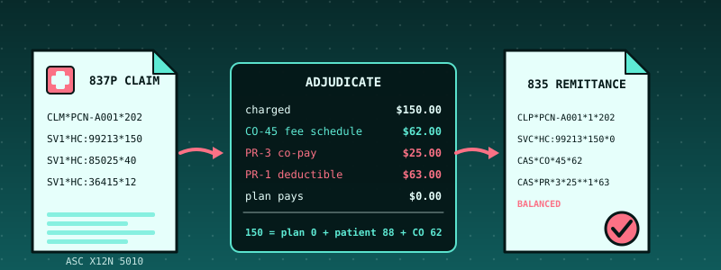

# 49. Healthcare Claims: X12 837 In, Adjudication, X12 835 Out, and a Remittance That Must Balance to the Cent

{ style="display:block;margin:0 auto;max-width:100%;height:auto;border-radius:6px" }

**What you will understand:** how a doctor's bill reaches an insurer and how the insurer's answer comes back, in the electronic formats the United States uses for it: **ASC X12N 837 Professional** (the claim) and **835** (the remittance advice). A strict X12 reader (`049_x12.h`/`049_x12.c`) that checks an interchange's envelope the way a clearinghouse does; a claim reader (`049_claim.h`/`049_claim.c`) that refuses claims whose provider ID has a bad **check digit**, whose total does not equal the sum of its lines, or whose hierarchy is broken; an **adjudication engine** (`049_adjud.h`/`049_adjud.c`) that turns each service line into what the plan allows, what it pays, what the patient owes and **why every other dollar was not paid**, in integer cents, with the guarantee `charge = paid + contractual write-offs + patient responsibility` on every line; an **835 builder and reconciler** (`049_remit.h`/`049_remit.c`) that writes the remittance and re-checks it the way a provider's billing office must before posting a payment; and independent verification that rebuilds every remittance from scratch in Python and compares it to the file on the disk, byte for byte.

**What you need to know first:** Chapters 19-23's FAT16 filesystem (each remittance is written to it and read back); Chapter 34's insurance case study (ACORD) for the general idea of a carrier answering a request in a standard's own message format; Chapter 47's and 48's testing discipline (a differential test against an independent implementation, sanitizer fuzzing, mutation testing) and the cumulative kernel this chapter carries forward. No healthcare knowledge is assumed: every term is defined where it first appears.

## Scope: three confirmed choices before writing any code

This chapter was one of four case studies requested together ("do all 4 starting with healthcare"). Scope was confirmed through one `AskUserQuestion` round of three questions:

- **Core feature**: the user chose "837P in, adjudicate, 835 out" (the recommended option) over an 835 reader alone or an 837 validator alone: parse a professional claim, apply a fee schedule, deductible, co-pay, coinsurance and out-of-pocket maximum in integer cents, emit a standards-shaped 835 with adjustment reason codes, and re-read it.
- **Data**: the user chose "Real sample files + invented claims" (the recommended option). Open-source test files in the real X12 formats are reachable and are used for the reader; the adjudication demo uses invented patients and claims, labelled as invented, because real claims are protected health information and real fee schedules and plan documents are proprietary.
- **Hardening**: the user chose "Full discipline" (the recommended option): integer cents, a differential test against an independent Python adjudicator, the balance invariant on every line, parser fuzzing under sanitizers, mutation tests, and independent verification from the disk image.

## Where the data comes from, said plainly

**The real-format files.** Ten files come from two open-source X12 projects, copied unchanged into `docs/part49/code/data/real/` with their licences (BSD 3-clause) and a `PROVENANCE.txt`:

| files | project | commit |
|---|---|---|
| nine 837 and 999 files (`x12_*.txt`) | github.com/imsweb/x12-parser, `src/test/resources/837_5010/` | `083c4e2a34805b1b92f2850d96c6d3e42cc6b755` |
| one 835 (`835_mult_loops.txt`) | github.com/azoner/pyx12, `pyx12/tests/` | `d6517b92d9e09330e7cdc204401b5e86b4f74bb1` |

**What they are not.** They are test inputs written to exercise those projects' parsers. They are in the real formats, but they are **not real claims and not real remittances**, and this chapter's strict reader shows that several are not even internally consistent (all six 837 samples that reach the claim checks have a wrong `SE01` segment count and an invalid provider NPI; the one examined further also has a claim total that does not match its line and a repeated HL numbering). That is a finding, not a complaint: the projects did not need them to be.

**The invented claims.** Everything in the adjudication demo is made up: the patient, the practice, the charges, the plan and its fee schedule. The procedure codes (CPT/HCPCS) are real code numbers, used as labels; the allowed amounts attached to them are this chapter's own, not anyone's contract. The provider NPI `1234567893` is the check-digit-valid example NPI used in public CMS documentation. All interchanges carry the **test indicator** `T`.

## What X12 looks like

X12 is a stream of **segments**. A segment is a short identifier followed by **elements**, separated by a character the **sender chooses and announces** in the very first segment. Here is the beginning of this chapter's claim A:

```text
ISA*00*          *00*          *ZZ*RIVERSIDEFM    *ZZ*ACMEHEALTH     *240115*0900*^*00501*000000101*0*T*:~
GS*HC*RIVERSIDEFM*ACMEHEALTH*20240115*0900*101*X*005010X222A1~
ST*837*0001*005010X222A1~
BHT*0019*00*CLAIM101*20240115*0900*CH~
```

- The first segment, **ISA**, is **fixed width**: exactly 106 characters. Its fourth character (`*`) is the element separator, its 105th (`:`) the component separator (the separator *inside* a composite element such as `HC:99213`), its 106th (`~`) the segment terminator. A reader learns all three from there; it must never assume them (one of the real sample files uses `~` as the element separator and `_` as the terminator).
- A transmission nests: `ISA` interchange, `GS` functional group, `ST` transaction set (the claim, the remittance), closed by `SE`, `GE`, `IEA`. **Every closing segment repeats a control number and a count of what it closed**: `SE01` is the number of segments from `ST` to `SE` inclusive, `GE01` the number of transaction sets, `IEA01` the number of groups. That is how a receiver learns that part of a file was lost: a count that does not match is an interchange that cannot be trusted.
- The `GS` and `ST` carry the **version**: `005010X222A1` is "837 Professional, 5010", `005010X221A1` is "835, 5010".

## The 837 Professional claim: the parts that matter

A professional claim is a doctor's or other clinician's bill. Its structure is a **hierarchy** of loops, each introduced by an `HL` segment (`HL*id*parent*level*child`): level `20` is the **billing provider**, level `22` the **subscriber** (the person who holds the insurance), level `23` a **dependent patient**. Below the subscriber sit the **claim** (`CLM`, with the patient control number, the total charge and the place of service), its diagnoses (`HI`, ICD-10 codes), and its **service lines** (`LX` numbering, `SV1` with the procedure code, the line charge and the units, `DTP*472` with the date of service). This reader extracts exactly those and checks these rules, each of which is a real payer rule and each of which has a test:

- **The NPI check digit.** A National Provider Identifier is ten digits whose last digit is a **Luhn checksum** computed over the nine digits with the prefix `80840`. A mistyped NPI is caught before any money moves. `1234567893` passes; `1234567890` and `1234567894` do not.
- **HL numbers** are 1, 2, 3, ... in order and every child names the right parent.
- **Service lines** are numbered 1, 2, 3, ... and every date is a real calendar date.
- **The claim balances**: `CLM02` (the total charge) must equal the sum of the `SV102` line charges. Every payer applies this first.
- **Amounts** are plain decimals with at most two places; **units** are whole numbers from 1 to 999.

It is an **extracting** reader, not a full implementation-guide validator: segments it does not need (`N3`, `N4`, `PER`, `PRV`, `REF`, `DMG`, ...) are accepted without inspection, and only the shapes this chapter supports are accepted (the patient is the subscriber; professional claims). Anything else is refused with a reason, never half-read.

## Adjudication: the rules

Adjudication is the payer's decision on each service line: what was billed, what the plan **allows** for that service, what the **plan pays**, what the **patient owes**, and, for every dollar that is neither, **why**, as a standard **Claim Adjustment Reason Code (CARC)** in one of two groups:

| group | meaning | codes used here |
|---|---|---|
| **CO**, contractual obligation | the provider must write it off; the patient cannot be billed | `45` charge exceeds the fee schedule, `18` exact duplicate, `96` non-covered charge |
| **PR**, patient responsibility | the patient owes it | `3` co-payment, `1` deductible, `2` coinsurance |

The plan is **invented**: a $500.00 deductible, a $25.00 co-pay for office visits, 20.00% coinsurance (the patient's share), a $2,000.00 out-of-pocket maximum. For each service line, in this order:

1. **Duplicate.** The same patient control number, procedure code, date of service and charge as a line already adjudicated: nothing is paid, **CO-18** for the whole charge.
2. **Non-covered.** A procedure code that is not in the fee schedule: nothing is paid, **CO-96** for the whole charge.
3. **Allowed amount** = the smaller of the charge and (the fee for one unit x the units). The rest of the charge is **CO-45**.
4. **Co-pay** (office-visit codes only): once per date of service in a claim, on the first such line: **PR-3**, never more than the allowed amount.
5. **Deductible**: what remains of the year's deductible, taken from what is left of the allowed amount: **PR-1**.
6. **Coinsurance**: the patient's share of what is still left, **rounded half up to the cent**: **PR-2**.
7. **Out-of-pocket maximum**: if co-pay + deductible + coinsurance would pass the year's maximum, the excess is taken off coinsurance first, then deductible, then co-pay.
8. **The plan pays** the allowed amount less the patient's share.

Every amount is an integer number of cents, and **for every line the engine guarantees `charge = paid + (all CO) + (all PR)`, exactly**. It checks that itself before returning (a violation is an error code, never a quiet wrong answer); the differential test and the fuzzer check it again from outside.

## The 835 remittance, and why it must balance

The 835 is the payer's answer. Each claim appears as a `CLP` segment (patient control number, status, **charged `CLP03`**, **paid `CLP04`**, **patient responsibility `CLP05`**), each service line as an `SVC` (charge, paid), and every dollar not paid is explained by `CAS` segments: a group (`CO` or `PR`) followed by **triplets** of reason code, amount and quantity (the quantity is usually empty, so a second adjustment follows `**`). A provider's billing office reconciles every remittance before posting the payment, and so does this chapter's reader:

- **each service line**: `SVC02` (charge) - `SVC03` (paid) = the sum of that line's `CAS` amounts;
- **each claim**: `CLP03` - `CLP04` = the sum of the claim-level `CAS` amounts if there are any, else the sum over its lines;
- **the whole 835**: `BPR02` (the payment) = the sum of the `CLP04` amounts less the provider-level adjustments (`PLB`);
- **information only**: `CLP05` equals the sum of the `PR` amounts.

Amounts can be **negative** (a reversal); adjustments are signed.

## The X12 reader: `049_x12.h` and `049_x12.c`

The reader splits the text into segments **by pointer into the caller's buffer** (no copy, no allocation), validates the ISA layout, learns the separators, and checks the envelope: nesting, counts and control numbers. A **lenient** flag, set by the caller, records count and control-number mismatches as warnings instead of refusing them (the open-source samples need it); it never forgives bad nesting or a damaged ISA. There is no `libgcc` in this kernel, so the amount formatter divides by shift-and-subtract (a 64-bit `/` would fail to link with an undefined `__udivdi3`, the failure Chapter 48 explains).

```c
--8<-- "docs/part49/code/049_x12.h"
```

```c
--8<-- "docs/part49/code/049_x12.c"
```

## The claim reader: `049_claim.h` and `049_claim.c`

```c
--8<-- "docs/part49/code/049_claim.h"
```

```c
--8<-- "docs/part49/code/049_claim.c"
```

## The adjudication engine: `049_adjud.h` and `049_adjud.c`

```c
--8<-- "docs/part49/code/049_adjud.h"
```

```c
--8<-- "docs/part49/code/049_adjud.c"
```

## The 835 builder and reconciler: `049_remit.h` and `049_remit.c`

```c
--8<-- "docs/part49/code/049_remit.h"
```

```c
--8<-- "docs/part49/code/049_remit.c"
```

## The embedded files: `049_samples_data.asm`, `049_samples.h` and `049_samples.c`

NASM's `incbin` copies each file into the kernel image at assembly time.

```nasm
--8<-- "docs/part49/code/049_samples_data.asm"
```

```c
--8<-- "docs/part49/code/049_samples.h"
```

```c
--8<-- "docs/part49/code/049_samples.c"
```

## `make_claims.py`: the invented claims

```python
--8<-- "docs/part49/code/make_claims.py"
```

## `049_kmain.c`: the claims demo

The demo has four parts. **Part 1** reads the ten real-format files strictly and again with the counts forgiven. **Part 2** takes one of them and applies three edits, each fixing what the previous refusal named, so four rules fire in turn. **Part 3** adjudicates the invented patient's six claims in order, builds the 835 for each, writes it to the FAT16 disk, reads it back, parses it again strictly and reconciles it. **Part 4** attacks claim A and its remittance five ways. Interrupts are masked for the whole demo: an earlier chapter's timer tick prints from its interrupt handler, and one landed in the middle of a canonical block while this chapter was being verified (see "What the first runs found").

```c
--8<-- "docs/part49/code/049_kmain.c:5659:5837"
```

## Building and booting it, for real

```bash
cd docs/part49/code
./build.sh 049                 # assemble (including the embedded claim files), compile, link, check Multiboot2, pack the GRUB ISO into build/
./capture.sh                   # boot it in QEMU on a fresh 8 MiB disk; stop at the completion marker; keep the disk image
```

```sh
--8<-- "docs/part49/code/build.sh"
```

```sh
--8<-- "docs/part49/code/capture.sh"
```

**Output (cloud sandbox -- live-executed build output)**

```text
--8<-- "docs/part49/code/build_out.txt"
```

The two linker warnings are the same two real warnings explained in Chapter 1.

## Real output: ten real-format files, an invented patient's year, five attacks

The full serial capture is 1,907 lines because every earlier chapter's demo runs first. Shown here: the first three lines, an explicit elision of Chapters 8-48's own output, then this chapter's demo from its first line to its last.

**Output (cloud sandbox -- live-executed serial capture, QEMU 8.2.2, `-m 64M`, an 8 MiB disk)**

```text
--8<-- "docs/part49/code/serial_excerpt_out.txt"
```

### Reading it

- **Part 1.** In strict mode **none** of the six 837 samples that reach the envelope check passes: `SE01` claims 25 segments and the transaction has 34 (and similarly for the others); the 999 sample's `IEA02` is not its `ISA13`. With the counts forgiven they reach the claim reader, and **every one stops at the same place: the billing provider's NPI is `1234567890`, which fails the check digit.** The two deliberately damaged files (`bad_segment_identifier`, `bad_first_line`) are refused as such in both modes. The one real **835** passes the strict envelope check and **reconciles exactly**: three denied lines, $915.39 charged, nothing paid, every dollar explained by a `CAS`.
- **Part 2.** One of the real files, fixed one rule at a time: NPI repaired, then the next refusal is that the diagnosis is not a composite (`BK:8901`); then the claim total (500) does not equal its line (12.25); then the next thing wrong is that a second billing-provider loop restarts the HL numbering at 1. The file is a structure test for another project's parser, not a claim, and the chapter stops there.
- **Part 3, claim A** (an office visit, a blood count, a blood draw). Line 1: charged $150.00; the fee schedule allows $88.00 (**CO-45 $62.00**); the **co-pay** takes $25.00 (PR-3); the **deductible** takes the other $63.00 (PR-1); the plan pays $0.00. Lines 2 and 3 are absorbed by the deductible too. Total: $202.00 charged = $0.00 paid + $106.00 patient + $96.00 written off.
- **Claim B** continues from the accumulators (deductible met $81.00 becomes $216.00). **Claim C is claim A sent again**: all three lines are **CO-18** for the full charge, the status is 4 (denied), the accumulators do not move. **Claim D** is where the plan finally pays: the deductible is completed ($284.00 more), the colonoscopy's remaining $96.00 is split 20/80 (patient $19.20, plan $76.80), and a supply that is not in the fee schedule is **CO-96**.
- **Claim E**, a knee replacement charged at $42,000.00, allowed at $15,000.00: coinsurance would be 20% of the $15,000.00, but only $1,430.80 of the year's $2,000.00 out-of-pocket maximum is left, so the patient owes exactly $1,430.80 and the plan pays $13,569.20. **Claim F** comes after the maximum is reached: the patient owes **nothing**, the plan pays the whole $88.00 allowed.
- **The 835s.** Claim A's and claim E's remittances are printed one segment per line, then every one is written to the FAT16 disk (`R101.835` ... `R106.835`), read back identical, **parsed again with the strict envelope check** and reconciled.
- **Part 4.** The five attacks are each refused or reported with their reason (next section's verification checks each).

## Independent verification: a second implementation, reading only what the kernel left behind

`verify_049.py` shares no code with the kernel. `claims_ref.py` is a second implementation of everything: its own X12 splitter, its own claim extraction, its own adjudicator (the coinsurance rounding is done with Python's `decimal` module, `ROUND_HALF_UP`), its own 835 builder and its own 835 reconciler. The fee schedule is data, typed in again rather than imported; it is the one thing both sides share. The verifier reads the serial capture and the FAT16 disk image and:

1. reads the FAT16 volume with its own reader and takes the six remittance files;
2. adjudicates the six invented claims again, **in order, carrying the accumulators**, and compares with the adjudication the kernel printed for each claim, and compares the **835 file on the disk, byte for byte, with the 835 the Python builder produces from scratch**;
3. reconciles every 835 on the disk with Python's own reconciler;
4. re-renders the human-readable lines the kernel printed (`claim PCN-A001: status 1, charged $202.00 = ...`) from Python's numbers;
5. re-derives, with its own code, every statement the kernel made about the real-format files (the `SE01` counts, the NPI check digit, the 835's reconciliation);
6. checks the five attacks.

```python
--8<-- "docs/part49/code/claims_ref.py"
```

```python
--8<-- "docs/part49/code/verify_049.py"
```

**Output (cloud sandbox -- `verify_049.py` on the capture above)**

```text
--8<-- "docs/part49/code/verify_out.txt"
```

## Host-side tests: the same code, hammered under sanitizers

The C files the kernel links are compiled for the host with AddressSanitizer and UndefinedBehaviorSanitizer and tested four ways:

1. **`claims_test.c`**: amounts, dates and the NPI check digit; the X12 envelope (every kind of count, control-number and nesting error, lenient mode); 34 ways a claim can be unfit to adjudicate, each with its own error code; adjudication **worked by hand** (the comments in the file show the arithmetic): claim A and B and the resubmission, coinsurance at exactly half a cent, units, charge below the fee, uncovered codes, the out-of-pocket maximum cutting coinsurance, then deductible, then co-pay, a deductible or co-pay larger than the allowed amount, zero and 100% coinsurance; the 835: build, strict re-read, reconcile, and each way of tampering (a changed paid amount, a changed adjustment, a zeroed patient responsibility, a provider-level adjustment, a negative adjustment, a segment outside a claim).
2. **The ten real-format files**, read by the same C files.
3. **400 random valid claim sets** from `diff_claims.py` (random plans and accumulators, charges from a cent to $60,000, units, covered and uncovered codes, duplicate lines, several office visits on one date), C against Python: the adjudication text, the 835 each builds (compared as text), the reconciliation of that 835, and the reconciliation of **randomly tampered 835s**.
4. **Damaged claims and remittances**: random truncations, flipped bytes, deleted, inserted, duplicated and swapped ranges, NUL runs, and changed digits, applied to invented claims, real-format samples and built remittances, strict and lenient, under the sanitizers. **The property checked**: whenever a mutant is accepted as a claim, adjudicating it satisfies every invariant, the 835 built from the result **passes the strict envelope check and reconciles**. A flipped digit in a charge is still a charge, so many mutants survive parsing; whatever survives must be consistent.

```c
--8<-- "docs/part49/code/native/claims_cli.c"
```

```c
--8<-- "docs/part49/code/native/claims_test.c"
```

```python
--8<-- "docs/part49/code/native/diff_claims.py"
```

```c
--8<-- "docs/part49/code/native/claims_fuzz.c"
```

```sh
--8<-- "docs/part49/code/native/run_host_tests.sh"
```

**Output (cloud sandbox -- `native/run_host_tests.sh`)**

```text
--8<-- "docs/part49/code/native/host_tests_out.txt"
```

## Are the tests good enough? Broken copies

A test suite that has never failed has not been shown to work. `native/mutation.py` copies the sources, breaks one line at a time (a Luhn digit position, a count off by one, a window edge, a rounding rule, an out-of-pocket cut removed, a reconciliation sign flipped, ...), and runs the tests against each broken copy, expecting them to fail. "Caught" is the wanted result and **"NOT CAUGHT" would be a gap.** Two of the targets are the Python reference itself: if the oracle is broken, the differential tests must notice.

```python
--8<-- "docs/part49/code/native/mutation.py"
```

**Output (cloud sandbox -- `native/mutation.py`)**

```text
--8<-- "docs/part49/code/native/mutation_out.txt"
```

**55 of 55 broken copies were caught**, from a baseline in which every test passes. Which test caught which: the hand-worked suite (`claims_test`) caught 49, the differential test against the Python reference 28, the invented claims against the reference 7, the fuzzer's property check 7 (many mistakes are caught by several at once). Two of the 55 are mistakes made in the Python reference itself (rounding down; a missing office-visit code), and the differential tests caught both: the oracle is checked too.

The first complete run was **52 of 55**. Three broken copies escaped, and each escape was a missing test:

- *The member-id buffer declared larger than it is.* The only test of a too-long member id used a 30-character id, which the broken copy also refused (it happened to match the broken buffer size). An id of **26 characters**, one over the limit, slips through and overflows. The test now uses exactly one character over.
- *The out-of-pocket cap leaving one cent too much.* The random differential test almost never lands the patient's share exactly one cent above the remaining room. A directed test now sets the room to $8.99 against a $9.00 coinsurance and requires the cut of one cent.
- *Only every third provider-level adjustment (`PLB`) element read as an amount.* The only `PLB` test had a single adjustment, which both versions read. A test now has two (-50 and -20) and requires both.

The lesson is Chapter 47's again: a surviving mutant is a missing test, not a broken test, and the missing tests are always on a boundary (one over a limit, one cent, the second of two).

## What the first runs found

Every item here is something the work itself turned up, not something planned:

- **The open-source "valid" files are not valid.** All six 837 samples that get as far as the claim checks have an `SE01` count that does not match their own segment count and an invalid NPI; the one examined further (`x12_valid.txt`) also has, once those two are dealt with, diagnoses that are not composites, a claim total that does not match its line, and a repeated HL numbering. The 999 sample's `IEA02` does not equal its `ISA13`. They are fine for the parsers they were written for. This is why the reader has a lenient mode that forgives counts and nothing else, and why the real 835, which *is* consistent, passes the strict check.
- **A wrong remittance, found by reading the output.** The first 835 builder wrote a second adjustment as `CAS*PR*3*25*1*63`. A CAS adjustment is a **triplet** (reason, amount, quantity): the empty quantity element was missing, so the second adjustment sat in the first one's quantity slot. The correct text is `CAS*PR*3*25**1*63`. The mutation suite now has a mutant that reintroduces exactly this mistake.
- **The test generator's own ISA was wrong.** The first invented claims had fields one character too long in `ISA06` (the sender id is exactly 15 characters, padded). The strict ISA check refused all six, which is how the generator's mistake was found. The ISA's fixed layout is not pedantry: it is the only way to find the separators.
- **A segment outside a claim crashed one side.** Tampering tests inserted a `CAS` before any `CLP`. The Python reference raised an exception and the C reader quietly ignored the segment. A remittance with an adjustment that belongs to no claim is malformed, so the C reader now refuses it (`RM_ERR_STRUCTURE`) and the differential test treats "both sides refuse" as agreement.
- **An interrupt printed in the middle of the canonical text.** While verifying, one canonical adjudication block contained `PR-2=14tick: 2000` then `3080`: an earlier chapter's timer interrupt handler printed a line in the middle of the demo's output. The text the verifier compares was corrupted, not the engine. Interrupts are now masked for the whole demo.
- **An attack that read past its own file.** Attack 4 was written as "cut off after 1,200 bytes" but claim A is 931 bytes: the check read into the next embedded file. It is now "700 of 931 bytes".
- **A control-number buffer one character too generous.** The patient control number is at most 38 characters in the standard; the buffer held 39, so a 39-character number was accepted. Found by a test written from the standard, not from the code.
- **My own arithmetic was wrong, twice, and the independent reference was right.** In the hand-worked test of claim B, the expected "deductible met" was typed as $181.00 instead of $216.00 (81 + 100 + 35); and the test's tampered-file helpers broke `SE01` because adding or removing a segment changes the count (the tests that edit segments now use the lenient flag and leave the count check to its own tests).
- **Tests added because a mutant would have survived.** Writing the mutation list showed that "a zero claim total is accepted" and "`SV103` need not be `UN`" had no test that asserted them: a zero total is caught by the balance rule anyway, and nothing checked `SV103` at all. The two tests were added before the mutation run, so that run did not have to find them.

## Limits and what is not established

- **No real claim or remittance was used.** The real-format files are other projects' test files; the claims are invented; the plan, the fee schedule and every allowed amount are invented. Nothing here is a statement about what any insurer pays.
- **CPT codes are the American Medical Association's.** Only the code numbers appear, as labels; no AMA descriptions or fee data are reproduced.
- **An extracting reader, not an implementation-guide validator.** It does not check every required segment or every code set (place-of-service values, taxonomy codes, diagnosis validity against a code list). Only professional claims whose patient is the subscriber are accepted; dependent patients, institutional claims (837I), dental claims (837D), secondary payers and coordination of benefits are refused or out of scope.
- **Six adjustment reasons.** Real remittances use hundreds of CARCs and **RARCs** (remark codes); the engine produces six. It generates no provider-level adjustments (`PLB`), no reversals, and no 999 or 277CA acknowledgements.
- **Tables.** One interchange per file; at most 4,096 segments (the 330 KB `x12_many_claims.txt` sample has more and is refused), 8 claims per file, 16 lines per claim, 128 adjudicated lines of history.
- **The NPI check digit proves a typo-free number, not a real provider.** Whether the number belongs to a licensed provider is a database lookup this chapter does not do.
- **Not a compliance statement.** Nothing here claims HIPAA compliance, certification by any clearinghouse, or conformance to every rule of the 005010X222A1 and 005010X221A1 implementation guides.
- **The PLB sign convention** (positive amounts reduce the payment) is the author's reading of the guide, exercised only on synthetic remittances.
- **Test indicator `T`.** Every interchange the engine builds says it is a test.

## Chapter summary

A claim and its remittance are the same money seen from two ends, and both are plain text with a checksum-like discipline: counts and control numbers on the envelope, a check digit on the provider id, a total that must equal its lines. A reader that skips those checks hands bad money to the engine, so this chapter's reader refuses what does not add up, and its adjudicator guarantees `charge = paid + write-offs + patient responsibility` on every line, in integer cents, with every non-paid dollar explained by a standard reason code. The remittance it builds passes the same strict envelope check and the same reconciliation a billing office runs on a real one; and an independent Python implementation rebuilds every remittance from scratch and matches the file on the disk byte for byte.

## Self-check questions

1. What is the NPI check digit, why does the claim reader test it before anything else, and what does passing it prove and not prove?
2. The open-source "valid" 837 sample fails the strict reader. Name the three things wrong with it, and say what the lenient flag forgives and what it does not.
3. Work out by hand: a plan with a $500.00 deductible (nothing met), a $25.00 co-pay and 20% coinsurance; an office visit (CPT 99213) is charged $150.00 and the fee schedule allows $88.00. What are the CO and PR amounts, and what does the plan pay?
4. What is the difference between a CO and a PR adjustment, and why does the 835 keep them in separate `CAS` segments?
5. Why must `charge = paid + CO + PR` hold exactly on every line, how does the engine enforce it, and how do the reconciler's three balance checks catch a tampered remittance?
