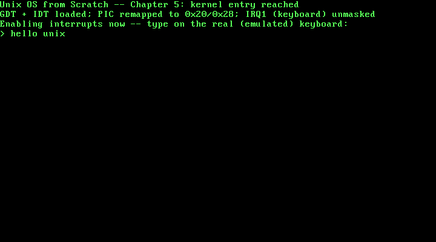

# 5. PS/2 Keyboard Input, via a Real Hardware IRQ

**What you will understand:** why the two 8259 PICs have to be reconfigured before this kernel can safely accept a single hardware interrupt, why the default PIC wiring is actively hostile to a protected-mode kernel rather than just inconvenient, how a real keyboard interrupt turns a physical keypress into a byte this kernel can read, and how this chapter proves all of that by injecting real keystrokes into a running (emulated) machine from outside it and reading real typed text back out.

**What you need to know first:** Chapter 4's IDT and ISR stub pattern (this chapter's own keyboard handler follows the identical shape) and Chapter 3's `kprintf`. This is the first chapter in this book to enable interrupts globally.

## Why the PIC has to be reconfigured before anything else

Chapter 4 gave the CPU somewhere to go for a fault it causes itself. This chapter is about a fault -- or rather, an event -- an external device causes: a real key, on a real (emulated) keyboard, pressed at a time this kernel cannot predict. That event does not reach the CPU directly. It routes through the 8259 Programmable Interrupt Controller (PIC) first, and the PIC's default configuration is not merely old-fashioned, it is a real, direct conflict with this kernel's own IDT:

> "In real mode" the master PIC uses "vector offset 0x08" with "interrupt numbers 0x08 to 0x0F" and the slave uses "0x70" mapping to "0x70 to 0x77." ... "the IRQs 0 to 7 conflict with the CPU exception which are reserved by Intel up until 0x1F."

(OSDev Wiki, "8259 PIC": https://wiki.osdev.org/8259_PIC)

Concretely: with no remap, IRQ1 -- the keyboard -- fires on vector `0x09`, which Intel reserves for the Coprocessor Segment Overrun exception. Enabling interrupts on an unremapped PIC does not risk a keyboard press being misread; it risks the CPU treating a keypress as a totally unrelated CPU fault, dispatching to whatever this kernel's IDT (if anything) has installed at that vector. This chapter moves both PICs off that collision course first, to the conventional `0x20`/`0x28` offsets, before enabling a single interrupt.

## `005_pic.h`/`005_pic.c`: remapping, masking, and acknowledging

```c
#ifndef UNIX_OS_005_PIC_H
#define UNIX_OS_005_PIC_H

#include <stdint.h>

/* Moves the two 8259 PICs' interrupt vectors off their legacy, BIOS-era
 * default (which collides with the CPU's own reserved exception
 * vectors) and onto offset1/offset2 instead -- see 005_pic.c for why
 * this has to happen before any hardware interrupt can be enabled at
 * all. */
void pic_remap(int offset1, int offset2);

/* Masks every one of the 15 usable IRQ lines. Called right after
 * pic_remap(), before any line this kernel actually has a handler for
 * is deliberately unmasked -- see 005_pic.c for why the remap step
 * alone does not leave the mask register in a safe, known state. */
void pic_disable_all(void);

/* Masks (disables) or unmasks (enables) one IRQ line, 0-15, on
 * whichever PIC actually owns it. */
void pic_set_mask(uint8_t irq_line);
void pic_clear_mask(uint8_t irq_line);

/* Tells the PIC that this kernel is done handling the interrupt it
 * just delivered -- required after every IRQ, or the PIC will never
 * deliver that line (or, for IRQ lines 0-7, any line at or below it)
 * again. */
void pic_send_eoi(uint8_t irq_line);

#endif
```
```c
/* Chapter 5: this book's first real hardware interrupt setup. Every
 * chapter so far has run with interrupts disabled -- Chapter 4 gave the
 * CPU somewhere to go for a *self-inflicted* exception (#DE), but
 * nothing yet lets an actual external device, like a keyboard, ever
 * interrupt this kernel. That requires two more real pieces of
 * hardware to be configured correctly: the two 8259 Programmable
 * Interrupt Controllers (PICs) that every IRQ line physically routes
 * through before it ever reaches the CPU, and the CPU's own interrupt
 * flag (IF), which this chapter is the first to ever set.
 *
 * The PICs need attention before anything else, because their
 * out-of-the-box configuration is actively hostile to a protected-mode
 * kernel. By default, "the master PIC uses vector offset 0x08" and the
 * slave uses "0x70" -- real-mode-era defaults from when x86 had no
 * reserved exception range to collide with. In protected mode, that is
 * a real, direct conflict: "the IRQs 0 to 7 conflict with the CPU
 * exception which are reserved by Intel up until 0x1F" (OSDev Wiki,
 * "8259 PIC": https://wiki.osdev.org/8259_PIC). Concretely: with no
 * remap, IRQ1 (the keyboard) would fire on vector 0x09 -- which Intel
 * reserves for the Coprocessor Segment Overrun exception. This chapter
 * moves both PICs off that collision course before enabling anything. */

#include <stdint.h>

#include "005_pic.h"

static inline void outb(uint16_t port, uint8_t val) {
    __asm__ volatile ("outb %0, %1" : : "a"(val), "Nd"(port));
}

static inline uint8_t inb(uint16_t port) {
    uint8_t ret;
    __asm__ volatile ("inb %1, %0" : "=a"(ret) : "Nd"(port));
    return ret;
}

/* Master/slave PIC command and data ports (OSDev Wiki, "8259 PIC"). */
#define PIC1_COMMAND 0x20
#define PIC1_DATA    0x21
#define PIC2_COMMAND 0xA0
#define PIC2_DATA    0xA1

#define ICW1_ICW4  0x01 /* "Indicates that ICW4 will be present" */
#define ICW1_INIT  0x10 /* "Initialization - required!" */
#define ICW4_8086  0x01 /* "8086/88 (MCS-80/85) mode" */
#define CASCADE_IRQ 2

#define PIC_EOI 0x20

/* "Wait a very small amount of time (1 to 4 microseconds, generally)
 * ... You can do an IO operation on any unused port: the Linux kernel
 * by default uses port 0x80" -- real hardware delay for PICs old
 * enough to need one between successive initialization writes.
 * (OSDev Wiki, "Inline Assembly/Examples") */
static inline void io_wait(void) {
    outb(0x80, 0);
}

/* Quoted directly, structurally, from the OSDev Wiki's own PIC_remap
 * reference implementation (OSDev Wiki, "8259 PIC"): four real
 * Initialization Command Words (ICW1-ICW4) sent to each PIC in turn,
 * moving their vector offsets to offset1 (master) and offset2 (slave)
 * instead of the colliding real-mode defaults. */
void pic_remap(int offset1, int offset2) {
    outb(PIC1_COMMAND, ICW1_INIT | ICW1_ICW4);
    io_wait();
    outb(PIC2_COMMAND, ICW1_INIT | ICW1_ICW4);
    io_wait();
    outb(PIC1_DATA, (uint8_t) offset1);
    io_wait();
    outb(PIC2_DATA, (uint8_t) offset2);
    io_wait();
    outb(PIC1_DATA, 1 << CASCADE_IRQ);
    io_wait();
    outb(PIC2_DATA, CASCADE_IRQ);
    io_wait();
    outb(PIC1_DATA, ICW4_8086);
    io_wait();
    outb(PIC2_DATA, ICW4_8086);
    io_wait();

    /* The cited reference function ends here by writing 0 to both data
     * ports, which sets every IRQ line's mask bit to 0 -- unmasked,
     * meaning every one of the 15 usable IRQ lines is immediately
     * enabled. This kernel does not do that: it has a real handler for
     * exactly one line, IRQ1, and nothing installed for the other 14
     * -- including IRQ0, the timer, which fires on its own roughly 18
     * times a second whether or not anything is listening. Leaving
     * every line unmasked here would let IRQ0 fire into IDT vector
     * 0x20, an entry idt_init() never set the Present bit on, which
     * means an immediate triple fault the moment interrupts are
     * enabled. So this function stops short of that unmask step;
     * pic_disable_all() below puts the mask register into a known,
     * fully-masked state instead, and pic_clear_mask() is used
     * explicitly afterward, one line at a time, only for a line that
     * actually has a handler ready. */
}

void pic_disable_all(void) {
    /* The two data-port writes ICW4_8086 above just made are not, on
     * their own, a deliberate mask configuration -- they are leftover
     * values from the initialization sequence itself. Writing 0xFF to
     * both data ports here is what actually puts every one of the 15
     * usable IRQ lines into a known, fully-masked state before this
     * kernel selectively re-enables the one line it has a real
     * handler for. */
    outb(PIC1_DATA, 0xFF);
    outb(PIC2_DATA, 0xFF);
}

static uint16_t pic_get_mask(void) {
    return (uint16_t) (inb(PIC1_DATA) | ((uint16_t) inb(PIC2_DATA) << 8));
}

static void pic_write_mask(uint16_t mask) {
    outb(PIC1_DATA, (uint8_t) (mask & 0xFF));
    outb(PIC2_DATA, (uint8_t) ((mask >> 8) & 0xFF));
}

void pic_set_mask(uint8_t irq_line) {
    pic_write_mask((uint16_t) (pic_get_mask() | (1 << irq_line)));
}

void pic_clear_mask(uint8_t irq_line) {
    pic_write_mask((uint16_t) (pic_get_mask() & ~(1 << irq_line)));
}

void pic_send_eoi(uint8_t irq_line) {
    /* "For master-originated IRQs, write to the master command port
     * only; for slave IRQs, it is necessary to issue the command to
     * both PIC chips." (OSDev Wiki, "8259 PIC") IRQ1 is a master-only
     * line, so this chapter's own code path never takes the second
     * branch -- kept here so this function is correct for any future
     * chapter that enables an IRQ line 8-15. */
    if (irq_line >= 8) {
        outb(PIC2_COMMAND, PIC_EOI);
    }
    outb(PIC1_COMMAND, PIC_EOI);
}
```

Three real, separate pieces of hardware protocol are packed into this one file:

**`pic_remap` is quoted, structurally, from a real reference implementation.** The sequence of eight `outb` calls -- ICW1 (with the "ICW4 will be present" bit set) to both command ports, ICW2 (the new vector offsets) to both data ports, ICW3 (cascade wiring) to both, ICW4 (8086 mode) to both -- follows the OSDev Wiki's own cited `PIC_remap` function exactly, including its use of `io_wait()` between writes: "Wait a very small amount of time (1 to 4 microseconds, generally) ... the Linux kernel by default uses port 0x80" (OSDev Wiki, "Inline Assembly/Examples"), a port "almost always unused after boot" -- a deliberately wasted I/O operation, not a functional write, purely to give slower, older PIC hardware time to catch up between commands.

**This chapter deliberately does not finish the cited function's own last step.** The real reference implementation ends by writing `0` to both PICs' data ports, unmasking every one of the 15 usable IRQ lines at once. This kernel does not do that, on purpose: it has a real handler for exactly one line, and unmasking IRQ0 -- the timer, which fires on its own roughly 18 times a second with nothing programmed -- into an IDT vector (`0x20`) with no Present bit set would triple-fault the instant interrupts are enabled. `pic_disable_all()` puts the mask register into a known, fully-masked state instead, and `005_kmain.c` unmasks IRQ1 specifically, only after its real handler is already installed.

**`pic_send_eoi` is not optional.** Every real IRQ this kernel ever handles has to end with an End-Of-Interrupt command back to the PIC -- "the end of interrupt (EOI) command (code 0x20)" (OSDev Wiki, "8259 PIC") -- or the controller will never deliver that line, or any line at or below it, again. `005_keyboard.c`'s own handler calls this at the very end of every keypress it processes.

## `005_idt.c`: one more real gate

Chapter 4's IDT gains exactly one new entry this chapter -- vector `0x21`, IRQ1 after the remap:

```c
#ifndef UNIX_OS_005_IDT_H
#define UNIX_OS_005_IDT_H

/* Installs this book's IDT: Chapter 4's own #DE handler at vector 0,
 * unchanged, plus this chapter's new real gate at vector 0x21 -- IRQ1,
 * the keyboard, after 005_pic.c has remapped the PIC so that vector
 * number is not still colliding with a CPU exception. */
void idt_init(void);

#endif
```
```c
/* This book's Interrupt Descriptor Table, extended from Chapter 4. The
 * struct layout, the type-attributes byte derivation, and vector 0's
 * own #DE gate are all unchanged -- see Chapter 4 for the full citation
 * and derivation of those. This chapter adds exactly one more real
 * gate: vector 0x21, IRQ1, the keyboard -- the first hardware interrupt
 * this kernel has ever handled, as opposed to a CPU-generated
 * exception. */

#include <stdint.h>

#include "005_idt.h"

struct idt_entry {
    uint16_t offset_low;
    uint16_t selector;
    uint8_t  zero;
    uint8_t  type_attributes;
    uint16_t offset_high;
} __attribute__((packed));

struct idt_ptr {
    uint16_t limit;
    uint32_t base;
} __attribute__((packed));

#define IDT_ENTRY_COUNT 256
static struct idt_entry idt_entries[IDT_ENTRY_COUNT];
static struct idt_ptr   idt_pointer;

extern void isr0(void);   /* 005_isr0.asm -- unchanged from Chapter 4 */
extern void irq1(void);   /* 005_irq1.asm -- this chapter's own stub */

extern void idt_flush(uint32_t idt_ptr_addr);

static void idt_set_gate(int vector, uint32_t handler, uint16_t selector, uint8_t type_attributes) {
    idt_entries[vector].offset_low      = (uint16_t) (handler & 0xFFFF);
    idt_entries[vector].offset_high     = (uint16_t) ((handler >> 16) & 0xFFFF);
    idt_entries[vector].selector        = selector;
    idt_entries[vector].zero            = 0;
    idt_entries[vector].type_attributes = type_attributes;
}

void idt_init(void) {
    for (int i = 0; i < IDT_ENTRY_COUNT; i++) {
        idt_set_gate(i, 0, 0, 0);
    }

    /* Vector 0: #DE, unchanged from Chapter 4. */
    idt_set_gate(0, (uint32_t) isr0, 0x08, 0x8E);

    /* Vector 0x21: IRQ1, the keyboard, after 005_pic.c's own PIC_remap
     * moves the master PIC's vector offset to 0x20 -- IRQ0 becomes
     * vector 0x20, IRQ1 becomes 0x21, and so on. Same selector (0x08,
     * this kernel's flat code segment) and the same 0x8E type-
     * attributes byte as vector 0: a hardware interrupt gate is
     * structurally identical to an exception gate in the IDT: the CPU
     * does not distinguish "this vector is a CPU exception" from
     * "this vector is a hardware IRQ" at the descriptor level, only
     * by which vector number ends up being invoked. */
    idt_set_gate(0x21, (uint32_t) irq1, 0x08, 0x8E);

    idt_pointer.limit = (uint16_t) (sizeof(idt_entries) - 1);
    idt_pointer.base  = (uint32_t) &idt_entries;

    idt_flush((uint32_t) &idt_pointer);
}
```

Structurally, this gate is identical to vector 0's #DE gate from Chapter 4 -- same selector, same `0x8E` type-attributes byte. The IDT itself does not distinguish "this is a CPU exception" from "this is a hardware interrupt"; both are just an address the CPU jumps to when a given vector number comes due, whether that vector was triggered by a faulting instruction or by an external device.

## `005_irq1.asm`: the same shape as Chapter 4's stub, for the same reason

```nasm
; Chapter 5: the real machine code the CPU jumps to on IRQ1 -- structurally
; identical to Chapter 4's isr0 stub, and for the same reasons: the CPU
; is the "caller" here, with no cooperation from whatever code it
; interrupted, so every register is saved and restored by hand, and
; IRET (not a plain RET) is what correctly unwinds the frame the CPU
; itself pushed. Hardware IRQs push no error code, exactly like #DE did
; in Chapter 4, so this stub needs no extra stack cleanup either.
BITS 32

section .text
extern irq1_handler
global irq1
irq1:
    pusha
    call irq1_handler
    popa
    iret
```

Nothing here is new relative to Chapter 4's `isr0.asm` -- `pusha`, a `cdecl` call into real C, `popa`, `iret` -- because the underlying problem is identical: the CPU is interrupting arbitrary code with no cooperation from it, whether the cause was a divide instruction or a keyboard controller.

## `005_keyboard.h`/`005_keyboard.c`: scancodes into real text

```c
#ifndef UNIX_OS_005_KEYBOARD_H
#define UNIX_OS_005_KEYBOARD_H

/* Unmasks IRQ1 on the PIC (005_pic.c) so real keyboard interrupts can
 * start arriving. Call only after pic_remap() and pic_disable_all()
 * have already run, and before this kernel enables interrupts globally
 * with STI. */
void keyboard_init(void);

/* The real C handler 005_irq1.asm's stub calls on every IRQ1. Declared
 * here for the same reason Chapter 4's isr_handlers.h declares
 * isr0_handler: nothing in C calls it directly, but every module in
 * this book still defines against its own header. */
void irq1_handler(void);

#endif
```
```c
/* Chapter 5: this book's first real input device. Every prior chapter
 * only ever produced output; this one reads real scancodes off the
 * PS/2 keyboard controller's data port and turns them into characters
 * this kernel can print right back out through kprintf. */

#include <stdint.h>

#include "005_keyboard.h"
#include "005_pic.h"
#include "005_printf.h"

static inline uint8_t inb(uint16_t port) {
    uint8_t ret;
    __asm__ volatile ("inb %1, %0" : "=a"(ret) : "Nd"(port));
    return ret;
}

/* "The Data Port (typically IO Port 0x60) is used for reading data
 * that was received from a PS/2 device" (OSDev Wiki, "'8042' PS/2
 * Controller": https://wiki.osdev.org/%228042%22_PS/2_Controller).
 * "The interrupt used by keyboard is typically ISA interrupt 1" --
 * IRQ1, this chapter's own gate at IDT vector 0x21 after the PIC
 * remap. */
#define KBD_DATA_PORT 0x60

/* A real, cited subset of Scan Code Set 1's make codes (OSDev Wiki,
 * "PS/2 Keyboard": https://wiki.osdev.org/PS/2_Keyboard) -- every
 * letter key, space, and Enter, enough to type real words back out
 * through kprintf. Anything this table leaves at 0 (Shift, Ctrl, the
 * arrow keys, digits, punctuation, and so on) is a deliberate scope
 * limit, not an oversight: this chapter has no shift-state tracking
 * and no keymap beyond lowercase letters, which is enough to prove a
 * real hardware interrupt genuinely delivered real keystrokes. A later
 * chapter can grow this table without touching anything else in this
 * file. */
static const char scancode_to_ascii[128] = {
    [0x10] = 'q', [0x11] = 'w', [0x12] = 'e', [0x13] = 'r', [0x14] = 't', [0x15] = 'y',
    [0x16] = 'u', [0x17] = 'i', [0x18] = 'o', [0x19] = 'p',
    [0x1E] = 'a', [0x1F] = 's', [0x20] = 'd', [0x21] = 'f', [0x22] = 'g', [0x23] = 'h',
    [0x24] = 'j', [0x25] = 'k', [0x26] = 'l',
    [0x2C] = 'z', [0x2D] = 'x', [0x2E] = 'c', [0x2F] = 'v', [0x30] = 'b', [0x31] = 'n', [0x32] = 'm',
    [0x39] = ' ',
    [0x1C] = '\n',
};

/* Called from 005_irq1.asm's own stub on every real IRQ1. The
 * controller reports both a key-down ("make code") and a key-up
 * ("break code") for every physical keypress -- OSDev's own scan-code
 * table lists, for example, 0x1E for "A pressed" and 0x9E for "A
 * released", and 0x9E - 0x1E = 0x80 exactly, for every letter key the
 * same page lists: the break code is always the make code with the
 * high bit set. This handler only reacts to make codes (bit 7 clear);
 * break codes are read (the port must always be read, or the
 * controller will not deliver its next byte) and then silently
 * discarded, since this chapter never needs to know when a key was
 * released. */
void irq1_handler(void) {
    uint8_t scancode = inb(KBD_DATA_PORT);

    if (!(scancode & 0x80)) {
        char c = scancode_to_ascii[scancode];
        if (c != 0) {
            kprintf("%c", c);
        }
    }

    pic_send_eoi(1);
}

void keyboard_init(void) {
    pic_clear_mask(1);
}
```

A few things worth slowing down on:

**Every scancode value in the lookup table is real and cited, not invented.** `0x10` for `Q`, `0x1E` for `A`, `0x2C` for `Z`, `0x39` for Space, `0x1C` for Enter, and every letter key in between, come directly from the OSDev Wiki's own Scan Code Set 1 table (https://wiki.osdev.org/PS/2_Keyboard). This chapter's table deliberately covers only the alphabet, space, and Enter -- no Shift, no digits, no punctuation -- a real scope limit stated outright in the code's own comment, not a gap discovered later.

**The make/break relationship is derived, not assumed.** The OSDev Wiki's own table lists `0x1E` for "A pressed" and `0x9E` for "A released" -- and `0x9E - 0x1E = 0x80` exactly, which holds for every letter key the same table lists. That is why checking bit 7 of the scancode (`scancode & 0x80`) is enough to tell a key-down from a key-up, without this chapter needing a second table.

**The data port must always be read, even for a byte this driver discards.** `irq1_handler` reads `KBD_DATA_PORT` unconditionally, before checking whether it was a make or break code. Skipping that read on a break code would leave the byte sitting in the controller's own output buffer, and the 8042 controller will not report a new byte -- will not raise IRQ1 again -- until the old one has actually been read out.

## `005_kmain.c`: enabling interrupts, in the only safe order

```c
/* Chapter 5: kmain installs the GDT and IDT (Chapters 3 and 4,
 * unchanged), then for the first time in this book's history, actually
 * enables interrupts. Getting there safely takes a specific order:
 * remap the PIC before anything else can fire through it; mask every
 * IRQ line so none of the 14 this kernel still has no handler for can
 * surprise it; unmask exactly the one line (IRQ1) this chapter has a
 * real handler for; install that handler in the IDT; and only then
 * execute STI. After that, kmain has nothing left to do itself -- real
 * work now happens entirely inside irq1_handler, driven by real
 * hardware events, so kmain's own final loop just halts the CPU
 * between interrupts rather than spinning. */

#include "005_gdt.h"
#include "005_idt.h"
#include "005_keyboard.h"
#include "005_pic.h"
#include "005_printf.h"
#include "005_serial.h"
#include "005_vga.h"

void kmain(void) {
    serial_init();
    vga_init();
    vga_set_color(VGA_COLOR_LIGHT_GREEN, VGA_COLOR_BLACK);

    gdt_init();
    idt_init();

    pic_remap(0x20, 0x28);
    pic_disable_all();
    keyboard_init();

    kprintf("Unix OS from Scratch -- Chapter 5: kernel entry reached\n");
    kprintf("GDT + IDT loaded; PIC remapped to 0x20/0x28; IRQ1 (keyboard) unmasked\n");
    kprintf("Enabling interrupts now -- type on the real (emulated) keyboard:\n");
    kprintf("> ");

    __asm__ volatile ("sti");

    for (;;) {
        __asm__ volatile ("hlt");
    }
}
```

The ordering here is not stylistic -- reversing almost any two of these steps reintroduces a real crash risk. `pic_remap` has to run before `pic_disable_all` (there is no mask register in a known state to write to before the PIC is initialized); `pic_disable_all` has to run before `keyboard_init` (unmasking IRQ1 into a PIC still holding its post-remap leftover mask bits is not a deliberately safe state); `idt_init` has to install the IRQ1 gate before `keyboard_init` unmasks the line it serves (an unmasked IRQ arriving at a not-present gate is exactly Chapter 4's triple-fault scenario, just from hardware instead of a self-inflicted divide); and every one of those has to happen before `sti`, the literal instruction that starts allowing any of this to fire at all. Once `sti` executes, `kmain` has no more work of its own -- `hlt` inside an infinite loop is the standard idle pattern: it stops the CPU until the next interrupt arrives, rather than spinning and burning cycles waiting for one.

## Building it, for real

```bash
nasm -f elf32 005_boot.asm -o boot.o
nasm -f elf32 005_gdt_flush.asm -o gdt_flush.o
nasm -f elf32 005_idt_flush.asm -o idt_flush.o
nasm -f elf32 005_isr0.asm -o isr0.o
nasm -f elf32 005_irq1.asm -o irq1.o
gcc -m32 -ffreestanding -fno-stack-protector -fno-pic -Wall -Wextra -c 005_vga.c -o vga.o
gcc -m32 -ffreestanding -fno-stack-protector -fno-pic -Wall -Wextra -c 005_serial.c -o serial.o
gcc -m32 -ffreestanding -fno-stack-protector -fno-pic -Wall -Wextra -c 005_gdt.c -o gdt.o
gcc -m32 -ffreestanding -fno-stack-protector -fno-pic -Wall -Wextra -c 005_idt.c -o idt.o
gcc -m32 -ffreestanding -fno-stack-protector -fno-pic -Wall -Wextra -c 005_pic.c -o pic.o
gcc -m32 -ffreestanding -fno-stack-protector -fno-pic -Wall -Wextra -c 005_printf.c -o printf.o
gcc -m32 -ffreestanding -fno-stack-protector -fno-pic -Wall -Wextra -c 005_isr_handlers.c -o isr_handlers.o
gcc -m32 -ffreestanding -fno-stack-protector -fno-pic -Wall -Wextra -c 005_keyboard.c -o keyboard.o
gcc -m32 -ffreestanding -fno-stack-protector -fno-pic -Wall -Wextra -c 005_kmain.c -o kmain.o
ld -m elf_i386 -T 005_linker.ld -o kernel.bin boot.o gdt_flush.o idt_flush.o isr0.o irq1.o vga.o serial.o gdt.o idt.o pic.o printf.o isr_handlers.o keyboard.o kmain.o
grub-file --is-x86-multiboot2 kernel.bin
```

**Output (cloud sandbox -- real, live-executed build output):**

```text
=== nasm -f elf32 005_boot.asm -o boot.o ===

=== nasm -f elf32 005_gdt_flush.asm -o gdt_flush.o ===

=== nasm -f elf32 005_idt_flush.asm -o idt_flush.o ===

=== nasm -f elf32 005_isr0.asm -o isr0.o ===

=== nasm -f elf32 005_irq1.asm -o irq1.o ===

=== gcc -m32 -ffreestanding -fno-stack-protector -fno-pic -Wall -Wextra -c 005_vga.c -o vga.o ===

=== gcc -m32 -ffreestanding -fno-stack-protector -fno-pic -Wall -Wextra -c 005_serial.c -o serial.o ===

=== gcc -m32 -ffreestanding -fno-stack-protector -fno-pic -Wall -Wextra -c 005_gdt.c -o gdt.o ===

=== gcc -m32 -ffreestanding -fno-stack-protector -fno-pic -Wall -Wextra -c 005_idt.c -o idt.o ===

=== gcc -m32 -ffreestanding -fno-stack-protector -fno-pic -Wall -Wextra -c 005_pic.c -o pic.o ===

=== gcc -m32 -ffreestanding -fno-stack-protector -fno-pic -Wall -Wextra -c 005_printf.c -o printf.o ===

=== gcc -m32 -ffreestanding -fno-stack-protector -fno-pic -Wall -Wextra -c 005_isr_handlers.c -o isr_handlers.o ===

=== gcc -m32 -ffreestanding -fno-stack-protector -fno-pic -Wall -Wextra -c 005_keyboard.c -o keyboard.o ===

=== gcc -m32 -ffreestanding -fno-stack-protector -fno-pic -Wall -Wextra -c 005_kmain.c -o kmain.o ===

=== ld -m elf_i386 -T 005_linker.ld -o kernel.bin boot.o gdt_flush.o idt_flush.o isr0.o irq1.o vga.o serial.o gdt.o idt.o pic.o printf.o isr_handlers.o keyboard.o kmain.o ===
ld: warning: irq1.o: missing .note.GNU-stack section implies executable stack
ld: NOTE: This behaviour is deprecated and will be removed in a future version of the linker
ld: warning: kernel.bin has a LOAD segment with RWX permissions

=== grub-file --is-x86-multiboot2 kernel.bin ===
kernel.bin: VALID Multiboot2 image
```

Fourteen real source files this time -- five assembled, nine compiled -- every C file still clean under `-Wall -Wextra`. The same two familiar `ld` warnings appear again, this time attributed to `irq1.o`, for the same unchanged reason (no paging yet).

## Booting it and typing on a real (emulated) keyboard

```bash
mkdir -p isodir/boot/grub
cp kernel.bin isodir/boot/kernel.bin
cp grub.cfg isodir/boot/grub/grub.cfg
grub-mkrescue -o kernel.iso isodir
qemu-system-x86_64 -cdrom kernel.iso -serial file:serial_out.log -display none -no-reboot \
    -monitor unix:/tmp/qemu_monitor.sock,server,nowait &
```

This chapter's own verification needed one genuinely new technique: something has to actually press keys. QEMU's monitor interface -- the same Unix-socket control connection Chapters 2 through 4 already used for `screendump` -- has a real command for exactly this, `sendkey`, which injects a real scancode sequence into the emulated machine's PS/2 controller, indistinguishable to the guest from a physical keystroke. A second process connected to the monitor socket sent the keys `h e l l o <space> u n i x <enter>`, one `sendkey` command per key, then captured a screenshot before quitting:

**Output (cloud sandbox -- real, live-executed serial capture, QEMU 8.2.2):**

```text
Unix OS from Scratch -- Chapter 5: kernel entry reached
GDT + IDT loaded; PIC remapped to 0x20/0x28; IRQ1 (keyboard) unmasked
Enabling interrupts now -- type on the real (emulated) keyboard:
> hello unix
```

`hello unix` -- typed nowhere by a human, injected as ten real, individual scancode events through QEMU's monitor interface, each one triggering a genuine IRQ1, routed through the newly-remapped PIC, dispatched through this chapter's own IDT gate, decoded through the cited Scan Code Set 1 table, and printed back out via `kprintf` -- the same text appears identically on the real VGA screen, captured the same way every prior chapter's screenshot was:



## Chapter summary

This chapter enabled interrupts globally for the first time in this book, and did it in the only order that is actually safe: remap the PICs off their real-mode-era default vectors (a real, direct collision with the CPU's own reserved exception range, not merely an inconvenience), mask every IRQ line into a known state, install a real IDT gate for IRQ1, unmask exactly that one line, and only then execute `STI`. The keyboard driver itself turns real scancodes -- cited directly from the OSDev Wiki's Scan Code Set 1 table -- into real characters, using the derived (not assumed) relationship that a break code is always its make code with the high bit set. This chapter's own evidence went further than reading output: it injected real input, through QEMU's monitor `sendkey` command, into a running machine's real (emulated) hardware, and read the exact typed text back out through both an exact serial capture and a real VGA screenshot -- proof that a real hardware device, not a simulated one, drove this kernel's very first interrupt-driven code path.

## Self-check questions

1. What real, concrete conflict does the default (unremapped) PIC configuration create for a protected-mode kernel, and which specific IDT vector would IRQ1 collide with if this chapter skipped the remap?
2. This chapter's own `pic_remap` function deliberately stops short of the cited reference implementation's final two lines. What do those two lines do, and why does this kernel skip them?
3. Why does `irq1_handler` read the keyboard's data port even when the byte it reads turns out to be a break code it is about to discard?
4. What does `pic_send_eoi` actually do, and what happens to future IRQ1 events if a handler forgets to call it?
5. Chapters 1 through 4 all ran with interrupts disabled. Why was it safe to enable them only now, and what four things had to be true before `005_kmain.c` was allowed to execute `STI`?

**Worked answers**

1. The unremapped PICs route IRQ0-7 to interrupt vectors `0x08`-`0x0F` -- vectors Intel reserves for real CPU exceptions in protected mode. Specifically, IRQ1 (the keyboard) would fire on vector `0x09`, which Intel defines as the Coprocessor Segment Overrun exception; an unremapped keyboard interrupt would be dispatched as if it were that CPU fault instead.
2. Those two lines write `0` to both PICs' data ports, which unmasks (enables) every one of the 15 usable IRQ lines at once. This kernel skips them because it only has a real handler installed for one line, IRQ1; unmasking the others -- IRQ0, the timer, especially -- would let an interrupt arrive at an IDT vector with no Present bit set, triple-faulting the machine the moment interrupts are enabled.
3. The 8042 PS/2 controller will not report (or raise IRQ1 for) its next byte until the current one has been read out of the data port. Skipping the read on a break code, even though this driver has no use for the byte's value, would stall every keypress after it.
4. It sends the real End-Of-Interrupt command (code `0x20`) back to the PIC, telling it this kernel has finished handling the interrupt it just delivered. Forgetting it does not merely delay the next event -- per the OSDev Wiki, the PIC will never deliver that IRQ line (or any line at or below it, for a line on the master PIC) again, since the controller believes it is still waiting for the current interrupt to be acknowledged.
5. It was safe earlier because nothing in Chapters 1 through 4 needed to survive an event arriving asynchronously, from outside the code that was currently running -- Chapter 4's own #DE handler is CPU-generated and synchronous with the faulting instruction, not a device interrupting at an arbitrary moment. Before `STI` could run safely: the PICs had to be remapped off their colliding default vectors; every IRQ line had to be put into a known, fully-masked state; a real IDT gate had to exist for the one line this kernel intended to handle; and that specific line had to be unmasked only after its handler was already installed and ready.
