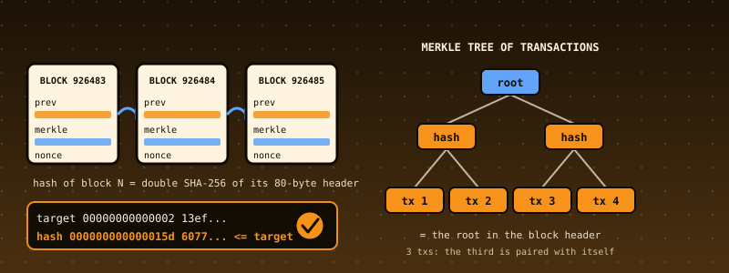

# 50. A Bitcoin Block Validator: Double SHA-256, Merkle Roots, Proof of Work, and What a Block Must Satisfy Before Anyone Looks at the Chain

{ style="display:block;margin:0 auto;max-width:100%;height:auto;border-radius:6px" }

**What you will understand:** what a Bitcoin block is at the byte level and which of its rules can be checked from the block alone. A validator (`050_btc.h`/`050_btc.c`) that parses a raw block and its transactions (legacy and SegWit serialisation), computes the block hash and transaction ids with **double SHA-256**, expands the compact **difficulty target** into a 256-bit number and checks **proof of work**, builds the **Merkle root** (and refuses the duplicated-transaction trick of CVE-2012-2459), checks the coinbase, every transaction's own rules, the **BIP 34** height and the **SegWit witness commitment**; eleven real blocks validated inside the kernel against the hashes published in Bitcoin Core's own test data; Core's 214 transaction test vectors; and independent verification in Python with `hashlib` and unbounded integers.

**What you need to know first:** Chapter 30's SHA-256 (reused here), Chapter 47-49's testing discipline and the cumulative kernel carried forward, and Chapters 19-23's FAT16 (a report per block is written and read back).

## Scope: three confirmed choices before writing any code

This is the second of the four case studies requested together. One `AskUserQuestion` round of three questions:

- **Core feature**: "Blocks + transactions + Merkle + PoW" (recommended). Signature verification (secp256k1) and script execution were offered and **not** chosen.
- **Data**: "Real blocks from public repos + Core vectors" (recommended).
- **Hardening**: "Full discipline" (recommended).

## What this chapter does not do

**It never runs a script, never checks a signature, never checks whether an input was already spent, never checks the block reward or the difficulty adjustment against the chain, and never looks at the clock.** A block this code calls VALID satisfies the *context-free* rules. It is not thereby a block the Bitcoin network would accept: that needs the chain, the coin database and the script interpreter. Bitcoin Core's `tx_invalid.json` makes this concrete: 84 of its 93 invalid transactions are invalid only at the script level, and this validator correctly passes them (see Part 3 of the output).

## Where the data comes from, said plainly

- **Ten real testnet3 blocks** (heights 0, 2, 3, 15007, 49291, 180480, 926485, 987876, 1263442, 1414221) are copied from Bitcoin Core's `src/test/data/blockfilters.json` (github.com/bitcoin/bitcoin, commit `66776840beb558f7e84451c2c55457f0e06242f0`, MIT licence), together with each block's **published hash**. Two of them (926485, 1263442) carry SegWit witness data.
- **The mainnet genesis block** is rebuilt byte by byte from its published fields (the coinbase text "The Times 03/Jan/2009 Chancellor on brink of second bailout for banks", the 50-coin output, time 1231006505, nonce 2083236893) and **proved** by its well-known hash `000000000019d6689c085ae165831e934ff763ae46a2a6c172b3f1b60a8ce26f`; `make_btc_data.py` asserts it.
- **Core's transaction vectors**: `tx_valid.json` (121) and `tx_invalid.json` (93), the nine "Tests for CheckTransaction()" entries labelled with the reason Core gives.
- **A synthetic chain**: twelve blocks **mined by `make_btc_data.py` at easy difficulty** (bits `1f00ffff`), plus one block with a duplicated transaction. They are labelled synthetic everywhere. They exist to exercise linkage, BIP 34 heights and a SegWit commitment that the sparse real data does not cover.

The sandbox cannot reach block explorers; nothing was downloaded from the Bitcoin network. Eleven real blocks is a small sample, and the chapter claims nothing beyond it.

## The rules

1. A block is an **80-byte header** (version, previous hash, Merkle root, time, bits, nonce) then a count and that many transactions. Its **hash** is SHA-256 of SHA-256 of the header, shown in reverse byte order.
2. **Proof of work.** `bits` is a compact number (exponent byte, three mantissa bytes) that expands to a 256-bit **target**. It is refused if negative (sign bit), overflowing, zero or above the network limit. The hash, read as a 256-bit little-endian number, must not exceed the target.
3. **Merkle root.** Leaves are transaction ids; an odd level duplicates its last hash. The root must equal the header's. If two equal hashes sit side by side the tree is **mutated**: `[a, b, c, c]` has the same root as `[a, b, c]`, so a block could be altered without changing its root. Bitcoin refuses such blocks and so does this code.
4. The first transaction, and only the first, is the **coinbase**: one input with a null hash and index `0xffffffff`, script 2 to 100 bytes.
5. Each transaction: has inputs and outputs, no output negative or above 21,000,000 coins (2,100,000,000,000,000 satoshi), outputs not summing above it, no duplicate input, no null input outside the coinbase, weight at most 4,000,000.
6. A block's **weight** (3 x its non-witness size + its size) is at most 4,000,000.
7. **BIP 34**: from version 2 the coinbase script begins with the block height.
8. **SegWit**: the **txid** hashes the transaction *without* witness data, the **wtxid** with it. A block with witness data must carry in its coinbase an output beginning `6a24aa21a9ed` whose 32 following bytes equal double-SHA-256(witness Merkle root || the coinbase's 32-byte witness reserved value), the witness tree using zeros for the coinbase's own leaf.

## The validator: `050_btc.h` and `050_btc.c`

No `libgcc` in this kernel, so the reporter divides by shift-and-subtract; 256-bit numbers are compared as byte arrays, never divided.

```c
--8<-- "docs/part50/code/050_btc.h"
```

```c
--8<-- "docs/part50/code/050_btc.c"
```

## Building the data: `make_btc_data.py`, `btc_build.py`

```python
--8<-- "docs/part50/code/make_btc_data.py"
```

```python
--8<-- "docs/part50/code/btc_build.py"
```

```nasm
--8<-- "docs/part50/code/050_btcdata_data.asm"
```

```c
--8<-- "docs/part50/code/050_btcdata.h"
```

```c
--8<-- "docs/part50/code/050_btcdata.c"
```

## `050_kmain.c`: the Bitcoin demo

Five parts: eleven real blocks; the synthetic chain; Core's transaction vectors; seven attacks; a canonical report of all 24 blocks written to the FAT16 disk (`V01.RPT` ... `V24.RPT`). Interrupts are masked, as in Chapter 49.

```c
--8<-- "docs/part50/code/050_kmain.c:5841:5982"
```

## Building and booting it, for real

```bash
cd docs/part50/code
./build.sh 050
./capture.sh
```

```sh
--8<-- "docs/part50/code/build.sh"
```

```sh
--8<-- "docs/part50/code/capture.sh"
```

**Output (cloud sandbox -- live-executed build output)**

```text
--8<-- "docs/part50/code/build_out.txt"
```

## Real output

The serial capture is long because every earlier chapter's demo runs first. Shown: the first three lines, an elision, then this chapter's demo in full.

**Output (cloud sandbox -- live-executed serial capture, QEMU 8.2.2)**

```text
--8<-- "docs/part50/code/serial_excerpt_out.txt"
```

### Reading it

- All **eleven real blocks**: the hash the kernel computes equals the published hash, proof of work passes (from 32 to 58 leading zero bits), the Merkle root matches, BIP 34 heights equal the real heights, and the two SegWit blocks' witness commitments pass. The genesis block's Merkle root equals the txid of its single coinbase, as it must with one transaction.
- The synthetic chain: twelve blocks, each linked to the previous one's hash.
- Core's vectors: all 121 valid ones pass; of the 93 invalid ones, nine fail exactly the rule Core's label names and 84 are script-level only.
- **The attacks.** One nonce bit flipped: `high-hash`. One bit in a coinbase: `bad-txnmrklroot`. A missing block: block 4 is not block 2's child. The duplicated transaction: the Merkle root **matches** yet the block is refused. One bit in the SegWit reserved value: the transaction Merkle root still matches (witness data is not in a txid) but the witness commitment fails. A truncation. A harder difficulty limit than the block was mined under.

## Independent verification

`btc_ref.py` shares no code with the kernel: Python's `hashlib`, unbounded integers for the target, its own parser, Merkle builder and checks. `verify_050.py` reads the serial capture, the FAT16 disk image and the original files and checks: all 24 reports on the disk equal the reference's, byte for byte; the eleven real hashes equal those in Bitcoin Core's `blockfilters.json`; the genesis hash is the known one; Core's vector counts and the nine refusals; each of the seven attacks reproduced in Python; the printed targets, zero-bit counts and heights.

```python
--8<-- "docs/part50/code/btc_ref.py"
```

```python
--8<-- "docs/part50/code/verify_050.py"
```

**Output (cloud sandbox -- `verify_050.py`)**

```text
--8<-- "docs/part50/code/verify_out.txt"
```

## Host-side tests

The C files the kernel links are built with AddressSanitizer and UBSan and tested three ways: `btc_test.c` (double SHA-256 vectors; 16 compact-target cases; the real blocks against published hashes, heights and linkage; Core's vectors; every rule with blocks built and mined in the test; limits; damage), a differential test of **400 random blocks** (valid, SegWit and 17 kinds of defect) plus every block file and every Core vector against the Python reference, and a fuzzer whose **property** is that a block changed in any way is never valid.

```c
--8<-- "docs/part50/code/native/btc_cli.c"
```

```c
--8<-- "docs/part50/code/native/btc_test.c"
```

```python
--8<-- "docs/part50/code/native/gen_blocks.py"
```

```python
--8<-- "docs/part50/code/native/diff_btc.py"
```

```c
--8<-- "docs/part50/code/native/btc_fuzz.c"
```

```sh
--8<-- "docs/part50/code/native/run_host_tests.sh"
```

**Output (cloud sandbox -- `native/run_host_tests.sh`)**

```text
--8<-- "docs/part50/code/native/host_tests_out.txt"
```

## Are the tests good enough? Broken copies

`native/mutation.py` breaks one line at a time (a reversed proof-of-work comparison, a Merkle level not padded, a dropped lock time in the txid, a coinbase length limit, a witness marker byte, ...) and expects the tests to fail. "NOT CAUGHT" would be a gap.

```python
--8<-- "docs/part50/code/native/mutation.py"
```

**Output (cloud sandbox -- `native/mutation.py`)**

```text
--8<-- "docs/part50/code/native/mutation_out.txt"
```

**All 41 broken copies were caught** (38 by `btc_test`, 28 by the random blocks, 28 by the block files and Core vectors against Python, 4 by the fuzz property; many by several). Two are mistakes in the Python reference itself, caught by the differential tests. The **first run was 37 of 41**; four escaped, each a missing boundary test: a `0xfd` count with only one of its two bytes present (needs a heap buffer of exactly that size to trip the sanitizer), a mantissa above `0xff` or above `0xffff` one exponent too high (two new compact-target cases), and a block over the weight limit whose transactions are each under it (a new 3-transaction test).

## What the first runs found

- **Equal does not mean unchanged.** The first fuzz property ("any changed block is never valid") failed on a synthetic block: at the easy limit a changed nonce is simply a different valid block, with probability one half. The property now exempts header-only changes of the synthetic blocks, and says so in its output. For real blocks at real difficulty the property holds without exemption.
- **My own wrong constant.** The genesis block has 43 leading zero bits, not 35; the independent reference said so and the test was corrected.
- **An invalid target can never be met,** so blocks with a negative, overflowing or zero target are not mined by the generator; their verdict is `high-hash`, with the reason printed on the target line.
- **A refactor that must change nothing.** Moving the builders into `btc_build.py` was checked by regenerating all data and requiring it byte-identical.
- **A format string that corrupted the output.** The first synthetic-chain printout used `%2d`, which this book's `kprintf` does not support (it printed it literally and misaligned every argument). Fixed to `%d`.

## Limits and what is not established

- **Context-free rules only**: see "What this chapter does not do". No scripts, signatures, UTXO set, reward, difficulty retargeting, median-time-past or timestamp rules.
- **Eleven real blocks** from testnet3 and one from mainnet; small, and mostly small blocks. Nothing is claimed about performance on mainnet-sized blocks (this reader holds 512 transactions per block).
- **Taproot and later witness versions** are not interpreted; only the witness commitment is checked.
- **The synthetic chain is not Bitcoin**; it is mined here at a trivial target.
- **Not a node, a wallet or financial software.**

## Chapter summary

A block carries its own evidence: the header's hash against its target, the Merkle root over its transactions, the witness commitment over what the transaction ids leave out, the length fields over everything else. This chapter's validator checks all of it from the bytes, matches eleven real blocks to their published hashes, and an independent Python implementation reproduces every report. What it proves is context-free validity only.

## Self-check questions

1. Why is a block's hash computed twice, and why is it displayed reversed?
2. `[a, b, c]` and `[a, b, c, c]` have the same Merkle root. Why does that matter, and how does the validator handle it?
3. Expand the compact target `0x1d00ffff` by hand, and say why `0x1d80ffff` is refused.
4. Why is the witness reserved value covered by the commitment but not by the Merkle root of txids?
5. Name three rules Bitcoin applies to a block that this validator does not, and what each would need.
