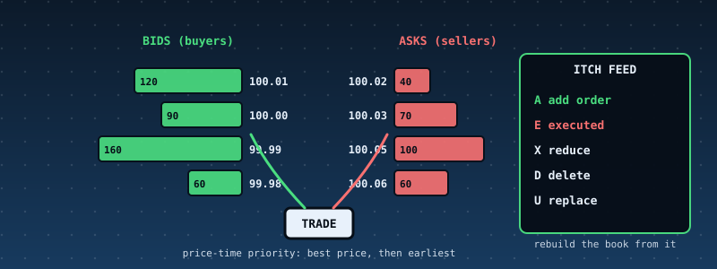

# 51. A Limit-Order-Book Matching Engine: Price-Time Priority, and a Feed in NASDAQ ITCH Format That Rebuilds the Book

{ style="display:block;margin:0 auto;max-width:100%;height:auto;border-radius:6px" }

**What you will understand:** how an exchange matches orders and tells the world what happened. A matching engine (`051_book.h`/`051_book.c`) with **price-time priority**: an incoming order trades against the best-priced resting orders first, the earliest first, at the **resting** order's price; the remainder of a limit order rests, the remainder of a market order vanishes. Cancel, reduce and replace. Every change is published as a binary message in the layout of **NASDAQ TotalView-ITCH 5.0** (Add `A`, Executed `E`, Reduce `X`, Delete `D`, Replace `U`). A **subscriber** rebuilds the whole book from that feed alone, and the chapter's central test is that the rebuilt book has the same SHA-256 hash as the engine's own book. An independent Python engine, encoder, decoder and rebuilder reproduce everything.

**What you need to know first:** Chapter 30's SHA-256, Chapter 47's replay-hash idea (one deterministic function, state compared by hash), Chapters 19-23's FAT16 (the feed files are written and read back), and the cumulative kernel.

## Scope: three confirmed choices before writing any code

Third of the four case studies requested together. One `AskUserQuestion` round: **core** "Matching engine + ITCH feed" (recommended; self-trade prevention, IOC/FOK and book-reconstruction-only were offered and not chosen); **data** "Real ITCH samples if found + generated streams"; **hardening** "Full discipline".

## Where the data comes from, said plainly

**No real ITCH data was found.** NASDAQ's sample files are large and are not reachable from the sandbox; the one open-source ITCH reader found on GitHub (`charles-cooper/itch-order-book`, commit `095ac97ef46c72411a62dd9148d96d2e3ace3305`, BSD 3-clause) carries only message *layouts*, no sample data. It was used for one thing: **cross-checking the byte offsets and lengths of the message layouts** (Add Order 36 bytes with the order id at offset 11, side at 19, shares at 20, price at 32; Executed 31; Reduce 23; Delete 19; Replace 35). So **every byte of feed in this chapter was produced by this chapter's engine, and every order is synthetic**: a hand-written 21-command scenario and 1,200 commands of random order flow (`native/gen_flow.py 51 1200`). The feed's *format* follows the published ITCH 5.0 layouts as read from that header and the author's knowledge of the specification; it was not validated against a real NASDAQ file.

## What the engine does and does not do

One symbol (`ACME`), integer prices in 1/10,000 dollar, integer quantities (at most 1,000,000), a book of at most 1,024 resting orders, 48-bit nanosecond time stamps supplied by the caller that must not go backwards.

- **Match.** A buy trades against the lowest asks at or below its limit (any ask for a market order); a sell against the highest bids at or above its limit. Within a price, the earliest arrival first. The trade price is the **resting** order's price, so an aggressive order gets price improvement.
- **Rest.** The unfilled remainder of a limit order joins the queue at its price (an `A` message). A market order's remainder is discarded.
- **Cancel** (`D`), **reduce** (`X`, partial cancel that keeps queue position; reducing to zero is refused, use cancel), **replace** (cancel-and-new: queue position is lost even at the same price; a replace whose new price would cross trades like a new order, published as `D`, `E`..., `A` with no `U`; otherwise `U`).
- **Refusals** (each leaves the book and the feed untouched): `qty`, `price`, `dup-id`, `unknown-id`, `time`, `reduce`, `full`.
- **Not covered:** several symbols, IOC/FOK/stop/iceberg orders, self-trade prevention, auctions and crosses, order-entry protocols, fees. Real exchanges differ in many details (for example in how a replace affects priority).

**ITCH is an output feed.** It describes what happened to *resting* orders: there is no message for an aggressive order and no price on an execution (the price is the resting order's). That is exactly why a subscriber can rebuild the book but not the incoming order flow.

## The engine and subscriber: `051_book.h` and `051_book.c`

Best price is found by scanning the order table (O(n) for n at most 1,024): simple enough to read in one sitting and to compare line by line with the Python version. No `libgcc` in this kernel, so statistics are printed with shift-and-subtract division.

```c
--8<-- "docs/part51/code/051_book.h"
```

```c
--8<-- "docs/part51/code/051_book.c"
```

## The data: `gen_flow.py`, `051_bookdata_data.asm`

```python
--8<-- "docs/part51/code/native/gen_flow.py"
```

```nasm
--8<-- "docs/part51/code/051_bookdata_data.asm"
```

The hand-written scenario (`data/book/demo.txt`; `N id side price qty time`, `C id time`, `R old new price qty time`, `X id qty time`; price 0 = market):

```text
--8<-- "docs/part51/code/data/book/demo.txt"
```

## `051_kmain.c`: the order-book demo

```c
--8<-- "docs/part51/code/051_kmain.c:5985:6076"
```

## Building and booting it, for real

```bash
cd docs/part51/code
./build.sh 051
./capture.sh
```

```sh
--8<-- "docs/part51/code/build.sh"
```

```sh
--8<-- "docs/part51/code/capture.sh"
```

**Output (cloud sandbox -- live-executed build output)**

```text
--8<-- "docs/part51/code/build_out.txt"
```

## Real output

**Output (cloud sandbox -- live-executed serial capture, QEMU 8.2.2; Chapters 8-50's output elided)**

```text
--8<-- "docs/part51/code/serial_excerpt_out.txt"
```

### Reading it

- **The scenario.** Commands 1-3 post three asks; 4-5 two bids; command 6 is a buy of 120 at $100.01 that takes 100 from order 1 and 20 from order 2, both at $100.01 (the earliest first), leaving 30 on the ask side. Command 8 replaces bid 5 with order 15 at a better price (a `U` message, queue position lost). Command 9, a market sell of 90, takes 60 from order 15 at $100.00 and 30 from order 4 at $99.99 and then disappears. Command 12, a buy of 100 at $100.02, takes 50 at $99.99 (order 13, the replaced ask) and 30 at $100.01. Four commands are refused (three cancels or reduces of orders that no longer exist, and a zero quantity) and change nothing. A replace that *crosses* the book (published as `D`, `E`, `A` with no `U`) is not in this scenario; it is covered by the hand-worked unit tests and the random flows.
- **The rebuild.** Both books end with one ask of 10 at $100.05 and the same hash `ea5c82d6...`: the subscriber, which never saw a command, reconstructed exactly the engine's book from 22 messages, 759 bytes.
- **The flow.** 1,200 commands, 508 of them refused (the generator deliberately sends invalid and stale commands), 589 trades, 1,026 messages, 35,508 bytes; replayed from scratch it gives the same hash, and so does the book rebuilt from the file read back from the FAT16 disk.
- **The six damaged feeds** are each refused with the message number and the reason, including a bid priced above the best ask: a real exchange feed never shows a crossed book, so the subscriber treats one as corruption.

## Independent verification

`book_ref.py` is a second implementation of everything, written differently on purpose: price levels as dictionaries of queues (the C code scans a table), its own ITCH encoder and decoder, its own rebuilder and hash. `verify_051.py` reads the serial capture and the FAT16 disk image and checks that the kernel's whole canonical text for the scenario (every verdict, trade and feed message in hex) equals the Python engine's line for line; that the final book, hash and statistics of the 1,200-command flow equal Python's; that `DEMO.ITC` and `FLOW.ITC` on the disk equal the Python-built feeds **byte for byte**; that the Python subscriber rebuilds from the **disk copies** a book with the kernel's hash; and that the six attacks produce the same reason at the same message number in Python.

```python
--8<-- "docs/part51/code/book_ref.py"
```

```python
--8<-- "docs/part51/code/verify_051.py"
```

**Output (cloud sandbox -- `verify_051.py`)**

```text
--8<-- "docs/part51/code/verify_out.txt"
```

## Host-side tests

Built with AddressSanitizer and UBSan: `book_test.c` (the exact bytes of an Add message; price-time priority worked by hand with the arithmetic in the comments; market and limit behaviour; reduce, replace and cancel; every refusal; capacity; the subscriber's refusals); a **differential test** of 60 random order flows plus three damaged feeds of each, C against Python (verdicts, trades, every feed byte, book, hash, subscriber verdicts and reasons); and a **fuzzer** of random API calls (ordinary and extreme values) that checks after **every call** that the book is sane, that a refused call changes nothing, and at the end that the book rebuilt from the whole feed and from sampled prefixes of it is sane and, for the whole feed, identical.

```c
--8<-- "docs/part51/code/native/book_cli.c"
```

```c
--8<-- "docs/part51/code/native/book_test.c"
```

```python
--8<-- "docs/part51/code/native/diff_book.py"
```

```c
--8<-- "docs/part51/code/native/book_fuzz.c"
```

```sh
--8<-- "docs/part51/code/native/run_host_tests.sh"
```

**Output (cloud sandbox -- `native/run_host_tests.sh`)**

```text
--8<-- "docs/part51/code/native/host_tests_out.txt"
```

## Are the tests good enough? Broken copies

```python
--8<-- "docs/part51/code/native/mutation.py"
```

**Output (cloud sandbox -- `native/mutation.py`)**

```text
--8<-- "docs/part51/code/native/mutation_out.txt"
```

**All 37 broken copies were caught** (28 by `book_test`, 31 by the differential test, 17 by the fuzzer; many by several). Two are mistakes in the Python reference itself. The first run was **36 of 37**: the mutant that wrote time stamps in 5 bytes instead of 6 survived, because every time stamp in the tests was below 2^40, so the top byte was always zero. The layout test now uses a full 6-byte time stamp (`0x010203040506`).

## What the first runs found

- **The two engines agreed the first time** on six flows of 400 commands: the Python engine was written independently, so this is evidence, not a tautology, but it is also why the chapter has a second line of defence (the hand-worked tests, whose numbers were computed on paper).
- **Hand-written tests needed four corrections, all in the tests:** a time stamp one byte short in the layout array, a replace message located 2 bytes off, a check run after a test had moved the book's clock to the 48-bit maximum, and a "remainder with nowhere to rest" test whose order was in fact fully fillable. Each fix made the test sharper.
- **A statistic counted twice.** The first demo summary reported 1,178 trades for a flow that has 589: the counter had also been accumulated during the determinism replay. The independent verifier counts trades itself and would have caught it.
- **`kprintf` has no width specifiers.** `%2u` printed literally. Fixed to `%u`.
- **Writing the mutation list showed missing tests** before the run: a feed cut by 1-3 bytes, and a bid exactly equal to the best ask, were added first; the run still found the time-stamp one.

## Limits and what is not established

- **No real exchange data.** All orders are synthetic; the feed format follows ITCH 5.0 but was not validated against a NASDAQ file.
- **Not a trading system.** One symbol, 1,024 orders, no order types beyond limit and market, no self-trade prevention, no auctions, no fees, no order-entry protocol, no recovery or sequence-number protocol (MoldUDP64) around the feed.
- **O(n) per operation** by design; a production book keeps price levels in sorted structures.
- **Replace semantics** (cancel-and-new, priority always lost) are this chapter's choice and differ between venues.
- **The subscriber's strictness** (single symbol, locate 1, execution match numbers sequential from 1, no crossed book) is stricter than a real consumer needs to be.

## Chapter summary

A matching engine is a small deterministic function whose output is a stream; the stream is complete enough that anyone who reads it can rebuild the book. This chapter's engine and subscriber are tested against each other, against hand arithmetic, against an independently written engine and against damaged feeds, and the book hash is the single number that says all of them agree.

## Self-check questions

1. A buy of 200 at $100.01 meets asks of 100 and 50 at $100.00 (in that order of arrival) and 80 at $100.01. What trades, at what prices, and what rests?
2. Why does the trade price come from the resting order, and why can an ITCH Executed message omit the price?
3. Why does replacing an order to the *same* price lose its queue position, and what does the feed show if the new price would cross the book?
4. The subscriber refuses a feed in which a bid is priced at or above the best ask. Why is that safe to treat as corruption?
5. What would you add to this engine for IOC and fill-or-kill orders, and what new invariant would the fuzzer check?
