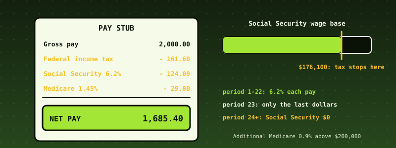

# 52. US Payroll Withholding: Federal Income Tax by the IRS Percentage Method, Social Security, Medicare, and a Whole Year of Pay Runs

{ style="display:block;margin:0 auto;max-width:100%;height:auto;border-radius:6px" }

**What you will understand:** how one pay check is computed in the United States, and why the hard part is not the arithmetic of one period but the *memory* between periods. An engine (`052_payroll.h`/`052_payroll.c`) takes an employee's W-4 choices and one period's gross pay and returns federal income tax (the percentage method), Social Security with its **annual wage base**, Medicare, **Additional Medicare** above $200,000, the employer's matching shares and net pay, in **integer cents**, each percentage rounded **once, half up**. Year-to-date accumulators make the Social Security cap and the Additional Medicare threshold arrive in the right pay period of a whole year. The kernel pays an invented company's year (six employees, 166 pay periods), writes the register to the FAT16 disk, audits it, and refuses bad input; an independent Python implementation using exact fractions reproduces every cent.

**What you need to know first:** Chapter 47's integer-cents discipline and invariants, Chapters 19-23's FAT16, and the cumulative kernel. No tax knowledge is assumed; the rules are stated below.

## Scope: three confirmed choices before writing any code

Last of the four case studies requested together. One `AskUserQuestion` round: **core** "Federal income tax + FICA for one pay run" (recommended); **data** "IRS tables if reachable, otherwise clearly labelled"; **hardening** "Full discipline".

## Where the numbers come from, said plainly

**This chapter's tax tables were NOT checked against the IRS's own publication.** irs.gov is not reachable from the sandbox that built this book. The 2025 bracket limits, standard deductions, rates and wage bases come from the author's reading of the 2025 rules (Publication 15-T's percentage method for automated payroll systems, Form W-4 of 2020 or later, SSA's 2025 wage base of $176,100) and from the bracket values in the open-source Tax-Calculator project, which supplied the *brackets only*, not payroll tables or sample pay stubs. The Step 2 checkbox treatment (halve the standard deduction and every bracket limit) is the author's reading of the checkbox tables. **Nothing here is tax advice, and nothing here should run a real payroll**: tables change every January, and a real system also needs state and local tax, garnishments and filings.

## What the engine does and does not do

- **Wages.** Wages for income tax = gross - pre-tax 401(k) - Section 125 (cafeteria plan). Wages for FICA = gross - Section 125 (a 401(k) deferral is still FICA wages).
- **Income tax.** Annual wages A = wages x periods + W-4 4(a) other income - 4(b) deductions. Taxable = max(0, A - standard deduction: single $15,000, married filing jointly $30,000, head of household $22,500). Tax by the seven brackets (10, 12, 22, 24, 32, 35, 37 percent), less the Step 3 credits (not below zero), divided by the periods, rounded half up, plus 4(c) extra withholding.
- **Social Security.** 6.2 percent of FICA wages, only up to the **wage base of $176,100**; the year's tax can never exceed $10,918.20. The employer pays the same.
- **Medicare.** 1.45 percent of all FICA wages; the employer pays the same. **Additional Medicare** is 0.9 percent, **employee only**, on the part of the year's Medicare wages above $200,000, withheld from the period in which the threshold is crossed.
- **Net pay** = gross - income tax - Social Security - Medicare - Additional Medicare - 401(k) - Section 125. The engine guarantees this identity and that nothing is negative.
- **Refusals** (each changes nothing, including the year-to-date): filing status, pay periods other than 52/26/24/12, a negative or above-$1,000,000,000 amount, deductions above gross, impossible year-to-date figures, and withholding that would exceed the pay.
- **Not covered:** state and local tax, other pre-tax deductions, bonus (supplemental-wage) withholding, the pre-2020 W-4, tips, fringe benefits, garnishments, quarterly deposits, Forms 941 and W-2.

**Why integer cents and one rounding.** Every percentage is applied to an exact integer (cents x basis points) and rounded once to the cent. Rounding a bracket at a time, or rounding wages first, produces pennies that do not add up. The Social Security *tax* is also capped by the year's maximum so that rounding in 26 periods can never exceed $10,918.20.

## The engine: `052_payroll.h` and `052_payroll.c`

The header states the rules once more as comments; the code is 54 lines. There is no libgcc, so rounding division is shift-and-subtract (`udm`).

```c
--8<-- "docs/part52/code/052_payroll.h"
```

```c
--8<-- "docs/part52/code/052_payroll.c"
```

## The data: `make_payroll.py`, `052_paydata_data.asm`

The company is **invented**: six employees with different filing statuses, pay frequencies and W-4 choices. Employee 5 earns $9,500 biweekly with $570 401(k) and $150 Section 125, enough to cross both the wage base and the $200,000 threshold.

```python
--8<-- "docs/part52/code/make_payroll.py"
```

The assembler embeds the file with `incbin` (named `_data.asm` so its object does not collide with a `.c` file):

```nasm
--8<-- "docs/part52/code/052_paydata_data.asm"
```

## `052_kmain.c`: the payroll demo

```c
--8<-- "docs/part52/code/052_kmain.c:6079:6147"
```

## Building and booting it, for real

```bash
cd docs/part52/code
./build.sh 052
WAIT=400 ./capture.sh build
```

```sh
--8<-- "docs/part52/code/build.sh"
```

```sh
--8<-- "docs/part52/code/capture.sh"
```

**Output (cloud sandbox -- live-executed build output)**

```text
--8<-- "docs/part52/code/build_out.txt"
```

## Real output

**Output (cloud sandbox -- live-executed serial capture, QEMU 8.2.2; Chapters 8-51's output elided)**

```text
--8<-- "docs/part52/code/serial_excerpt_out.txt"
```

### Reading it

- **Period 1 of employee 1** is the example worked by hand in `pay_test.c`: single, biweekly $2,000, annual wages $52,000, taxable $37,000, tax $4,201.50, divided by 26 = $161.5962 -> **$161.60**; Social Security $124.00; Medicare $29.00; net $1,685.40.
- **Employee 2** (married jointly, monthly $8,000, $400 to a 401(k), $250 Section 125): FICA wages are $7,750 (the 401(k) is still FICA wages, the Section 125 is not), so the year-to-date Social Security wages after one period are **$7,750.00**, not $8,000.
- **Employee 5, the whole point.** In period 19 only the last $7,800.00 of FICA wages is under the wage base, so Social Security is **$483.60** instead of $579.70, and the year-to-date reaches exactly $176,100.00. From period 20 it is **$0.00**, so net pay *rises* by $483.60 in the paycheck after the cap (period 19 to period 20). In period 22 the Medicare wages cross $200,000: only the $5,700.00 above it bears the extra 0.9 percent (**$51.30**); from period 23 the whole $9,350.00 does (**$84.15**).
- **Employee 5's Social Security total is exactly $10,918.20**, the maximum, over 26 periods of rounded amounts.
- **The register**: 166 lines, 14,803 bytes, written as `PAYROLL.REG`, read back identical, and audited from the file read back (no negative amounts, the employer's shares equal the employee's, Social Security under the cap, FICA wages not below income-tax wages).
- **The five refusals** and the tampered line: the first register line with its net pay changed by one cent is detected because gross minus every withholding no longer equals it.

## Independent verification

`pay_ref.py` is a second implementation written separately. It uses `fractions.Fraction`, and computes the bracket tax by the **table-row method** (base amount + rate x excess over the row's floor) instead of the engine's bracket-by-bracket sum. `verify_052.py` runs it on `data/pay/year.txt` and compares its entire output with the register block the kernel printed **and** with `PAYROLL.REG` read from the disk image by its own FAT16 reader, byte for byte; it also re-adds every employee's year totals from the register, re-checks the Social Security cap and the five refusals and the tamper detection.

```python
--8<-- "docs/part52/code/pay_ref.py"
```

```python
--8<-- "docs/part52/code/verify_052.py"
```

**Output (cloud sandbox -- live-executed)**

```text
--8<-- "docs/part52/code/verify_out.txt"
```

## Host-side tests

All C is built with AddressSanitizer and UBSan from the same `052_payroll.c` the kernel links. `pay_test.c` has 42 checks whose expected numbers were worked out on paper first (the comments show the arithmetic); `diff_pay.py` runs random companies (`gen_pay.py`) through the C engine and `pay_ref.py` and requires identical output; `pay_fuzz.c` makes random calls, ordinary and extreme, and checks the invariants after **every** call.

```c
--8<-- "docs/part52/code/native/pay_cli.c"
```

```c
--8<-- "docs/part52/code/native/pay_test.c"
```

```python
--8<-- "docs/part52/code/native/gen_pay.py"
```

```python
--8<-- "docs/part52/code/native/diff_pay.py"
```

```c
--8<-- "docs/part52/code/native/pay_fuzz.c"
```

```bash
--8<-- "docs/part52/code/native/run_host_tests.sh"
```

**Output (cloud sandbox -- live-executed)**

```text
--8<-- "docs/part52/code/native/host_tests_out.txt"
```

## Are the tests good enough? Broken copies

`mutation.py` deliberately **breaks** a copy of the sources, one line at a time (a bracket limit off by one, a rate wrong, the wage base cap removed, the Step 2 halving removed, 401(k) taken out of FICA wages, the Additional Medicare threshold ignoring earlier wages, and so on), and runs the test suite against each. "caught" is the expected, wanted result.

```python
--8<-- "docs/part52/code/native/mutation.py"
```

**Output (cloud sandbox -- live-executed)**

```text
--8<-- "docs/part52/code/native/mutation_out.txt"
```

**All 55 broken copies were caught** (50 by `pay_test`, 52 by the differential test, 13 by the fuzzer). One is a mistake in the Python reference itself. The first run was **53 of 58**; five survived:

- Two tests were genuinely missing and were added: a Section 125 amount above the maximum must be an *amount* error, not a *deduction* error (the amount loop skipped that field), and a negative year-to-date Social Security *tax* must be refused.
- **Three were equivalent mutants and were removed from the list**, which is a conclusion, not a convenience: a taxable amount exactly on a bracket top falling into the next bracket gives the same tax (the next bracket's slice has zero width); accepting deductions above gross is still refused later because net pay would be negative; and deleting the identity check in `pay_check` changes nothing because the identity holds by construction (the fuzzer's other checks cover the rest). Defence in depth is not the same as a missing test.

## What the first runs found

- **The two implementations agreed on 40 random seeds the first time**, so the independent method is evidence, not a tautology.
- **Two hand-worked expectations were wrong**: a "one cent past a bracket limit" test (12 percent of one cent is a twelfth of a cent, which rounds away: the test now uses one dollar), and a 401(k)+Section 125 case that was meant to be valid but left net pay negative.
- **`kprintf` has no 64-bit division or `%lld`.** The first link failed on `__udivdi3`; the demo's money formatter uses shift-and-subtract like the engine.
- **The first demo audit could not check the full identity**, because the register has no gross column. It checks what is decidable from each line, and the tamper test uses employee 1, who has no pre-tax deductions, so gross equals FICA wages.

## Limits and what is not established

- **The tables were not checked against the IRS.** Treat every bracket limit, deduction and the Step 2 treatment as the author's reading. A single wrong figure would still pass every test here, because the independent implementation shares the same table values. The tests prove the *arithmetic* and the *year-long behaviour*, not the *tax law*.
- **2025 only**, and only the percentage method for automated payroll systems; not the wage-bracket method, not annualized supplemental pay, not state tax.
- **No W-2/941 reporting**, no employer-side deposit schedule, no FUTA/SUTA.
- **Employees are invented**; no real wages, names or SSNs.

## Chapter summary

Withholding is a pure function of a W-4, one period and the year so far. The year-to-date state is what makes the paycheck after the Social Security cap *larger* and the paycheck that crosses $200,000 pay Additional Medicare on only part of its wages. The engine is tested against hand arithmetic, an independently written implementation, random calls with invariants, and 55 deliberately broken copies; what it cannot test is whether the tables are the law.

## Self-check questions

1. Why is a 401(k) deferral subject to Social Security tax but not to income tax withholding, while a Section 125 deduction is exempt from both?
2. Employee 5 earns $9,350 in FICA wages per period. In which period does Social Security stop, how much is withheld in that period, and why does net pay go up in the next one?
3. Why does the engine cap the Social Security *tax* at $10,918.20 as well as the wages at $176,100?
4. Additional Medicare is withheld by the employer from $200,000 but the employer pays no matching share. Which year-to-date figure does the engine need to get the crossing period right?
5. All 55 mutants were caught, yet the tables could still be wrong. Why can no test in this chapter detect a wrong bracket limit that both implementations share, and what outside evidence would?
