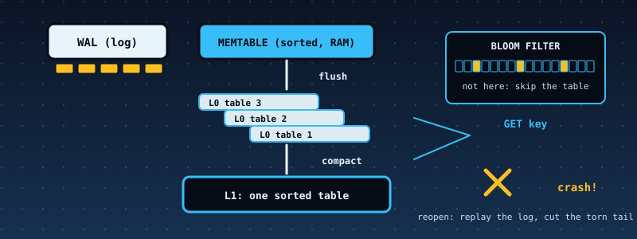

# 53. A Log-Structured Merge-Tree Key-Value Store: Write-Ahead Log, Sorted Tables, Bloom Filters, Compaction, and a Crash at Every Byte

{ style="display:block;margin:0 auto;max-width:100%;height:auto;border-radius:6px" }

**What you will understand:** how the storage engines inside LevelDB, RocksDB and Cassandra are built, and, more importantly, how anyone *knows* such an engine survives a power cut. A store (`053_lsm.h`/`053_lsm.c`) takes `put`, `delete` and `get`. A write is appended to a **write-ahead log** (a CRC-protected record per operation) *before* it is acknowledged, then placed in an in-memory sorted **memtable**. A full memtable is **flushed** to an immutable sorted **table file**, listed in a **manifest**. Too many tables are **compacted** into one, dropping overwritten values and **tombstones** (delete markers). A read asks the memtable, then the tables newest first, and a per-table **Bloom filter** and key range skip tables that cannot hold the key. On the kernel it runs on the FAT16 disk; the same code runs on a RAM file system that **tears a write at any byte**. The chapter's central test crashes a 120-operation workload at **every one of 13,639 byte positions**, and then crashes recovery itself at every byte, and requires the recovered store to equal the acknowledged state each time.

**What you need to know first:** Chapter 47's write-ahead log and idempotency ideas, Chapter 30's SHA-256, Chapters 19-23's FAT16 (the store's files live there), and the cumulative kernel.

## Scope: three confirmed choices before writing any code

First of two further case studies. One `AskUserQuestion` round: **core** "WAL + memtable + SSTable + Bloom + compaction" (recommended; MVCC snapshots and a leaner no-Bloom version were offered and not chosen); **hardening** "Full discipline" (independent Python store, differential tests, fuzzing, mutation tests, disk-image verification). The TLS chapter that follows was scoped in the same round.

## Where the design comes from, said plainly

**There is no real data here, and no claim of compatibility.** Keys and values are invented (a warehouse's stock list). The design follows the log-structured merge-tree idea (O'Neil, Cheng, Gawlick and O'Neil, 1996) and the shape of LevelDB and RocksDB as the author understands them; **none of those documents was reachable from the sandbox that built this book, so nothing was checked against them**. The table and log formats are this chapter's own, LevelDB-*inspired* and **not byte-compatible with LevelDB**. What *is* checked, hard, is the store against its own contract.

## The contract, and what the engine does and does not do

**The crash-safety contract.** After a crash at *any* instant, `lsm_open` recovers a state equal to the state after the *k* operations that were acknowledged (`put`/`delete` returned `LSM_OK`), **or** after *k+1* (the operation in flight may or may not have reached the log), and never anything else. The file system must make `delete` atomic; `write` and `append` may be **torn**, which leaves a *prefix* of the new bytes. The engine relies on nothing else about disk ordering.

- **Write path.** If the new entry would overflow the memtable (64 entries or 1,024 bytes) or the log (4,096 bytes), **flush first**, then append the log record, *then* insert in the memtable. Flushing *before* logging keeps a failed flush from ever leaving a half-acknowledged write.
- **Log record.** `CRC-32 | length | sequence | tombstone | key length | value length | key | value`; the CRC covers everything after itself. Recovery replays the **valid prefix** and stops at the first bad record: a record after damage is never trusted.
- **Flush.** Write the table file, then the manifest, *then* empty the log. Each step is safe to crash after: an unlisted table is an orphan; a listed table with a still-full log is skipped by the manifest's `flushed_seq`.
- **Manifest.** Two alternating slots, `MANI0` and `MANI1`, each `"MNFT" | generation | next_id | flushed_seq | n | (id, level)... | CRC-32`; the **highest valid generation wins**, and a write only ever overwrites the *older* slot, so a torn manifest write can never destroy the live one. (No rename call is needed.)
- **Table file.** Entries sorted by key (`klen | flags | vlen | seq | key | value`), a sparse index (every 8th entry), the Bloom filter (10 bits per key, 4 probes), and a 44-byte footer ending in a CRC-32 of the whole file. `lsm_table_parse` validates *all* of it, so a damaged table is refused, never half-read.
- **Compaction.** When four level-0 tables exist, a k-way merge of every table (newest wins on equal keys) writes one level-1 table, drops tombstones (nothing older remains to hide), writes the manifest, and only then deletes the old tables.
- **Recovery.** Pick the newest valid manifest; load and validate every listed table; delete **orphan** tables (unlisted ids up to `next_id`); replay the log's valid prefix; if the log had a **torn tail**, flush what was replayed (which empties the log). *Not* cutting the log in place is deliberate: cutting means rewriting the valid prefix, and a crash in the middle of *that* rewrite would lose records already acknowledged.
- **Limits** (so everything stays bounded): keys 1 to 24 bytes, values 0 to 100, 400 keys per table, 12 tables, a 4,096-byte log; single-threaded; a table file is read whole at open and one block (at most 8 entries) per lookup; **no MVCC or snapshots**, no leveled compaction (one bottom run), no compression, no block cache.

## The store: `053_lsm.h` and `053_lsm.c`

```c
--8<-- "docs/part53/code/053_lsm.h"
```

```c
--8<-- "docs/part53/code/053_lsm.c"
```

## The data: `make_kv.py`, `053_kvdata_data.asm`

```python
--8<-- "docs/part53/code/make_kv.py"
```

```nasm
--8<-- "docs/part53/code/053_kvdata_data.asm"
```

## `053_kmain.c`: the LSM demo

The kernel talks to FAT16 through five small functions (a file's whole contents are read per call: this is a teaching volume; an empty write deletes; an append is read, extend, write). The crash sweep needs a file system that can tear a write, so the kernel carries its own 70-line RAM file system with the crash injector.

```c
--8<-- "docs/part53/code/053_kmain.c:6079:6184"
```

## Building and booting it, for real

```bash
cd docs/part53/code
./build.sh 053
WAIT=500 ./capture.sh build
```

```sh
--8<-- "docs/part53/code/build.sh"
```

```sh
--8<-- "docs/part53/code/capture.sh"
```

**Output (cloud sandbox -- live-executed build output)**

```text
--8<-- "docs/part53/code/build_out.txt"
```

## Real output

**Output (cloud sandbox -- live-executed serial capture, QEMU 8.2.2; Chapters 8-52's output and the FAT16 driver's per-file-operation log lines elided)**

```text
--8<-- "docs/part53/code/serial_excerpt_out.txt"
```

### Reading it

- **The script** builds a stock list of 70 SKUs (the memtable fills and flushes several times; four level-0 tables trigger a compaction), reads some of them back, restocks and sells (overwrites), discontinues eight (deletes), and loads 25 more. Its final line reports **105 puts, 8 deletes, 4 flushes, 1 compaction, 11 reads, 1 Bloom skip, 6 range skips, 3 block reads**: of 11 reads only 3 needed a block from a table.
- **The files on the disk** afterwards are the two manifest slots, the tables and the log: this is the whole store.
- **The real-disk recovery.** Two puts are logged (52 bytes), then the log is cut in the middle of the second record, and an orphan table file is planted at the id the next flush would use. A fresh store replays **1** record, cuts **21** torn bytes (the whole second record plus nothing else), deletes **1** orphan, and holds everything acknowledged plus `crash:a`; `crash:b`, whose record was torn, is absent.
- **The sweep** crashes a 40-operation workload at every 7th unit of cost (354 points) *inside the kernel*; every point recovers; **142** of them cut a torn log tail; **203** delete orphan files; exactly **one** lands on the state *including* the operation in flight, the single unit between "record fully written" and "acknowledged".

## Independent verification

`lsm_ref.py` is a second store written from the file formats (not from the C code), with its own file-system model that tears operations by the same cost rule. `verify_053.py` checks, from outside the kernel: the canonical result text of the script equals the Python store's line for line; the kernel's real-disk recovery steps are replayed in Python and **every file on the FAT16 disk image equals the Python store's file byte for byte**; the Python store opened straight from the disk image has the digest the kernel printed; and the kernel's crash sweep is re-run in Python and **every figure matches** (workload cost, flushes, 354 crash points, 353 + 1 split, torn tails, orphans).

```python
--8<-- "docs/part53/code/lsm_ref.py"
```

```python
--8<-- "docs/part53/code/verify_053.py"
```

**Output (cloud sandbox -- live-executed)**

```text
--8<-- "docs/part53/code/verify_out.txt"
```

## Host-side tests

All C is built with AddressSanitizer and UBSan from the same `053_lsm.c` the kernel links. Five tools:

- `lsm_test.c`: 72 checks whose expected values were worked out on paper first (exact WAL record bytes, the exact 88 bytes of a small table, flush triggers at the boundary, Bloom behaviour, refusals, recovery from damaged logs, manifests and tables, **crafted files with valid checksums** that only the structural checks can catch).
- `diff_lsm.py` with `gen_script.py` and `lsm_cli.c`: random scripts, crashes injected at random bytes, recoveries, run through the C store and `lsm_ref.py`; the **whole output, including every byte of every file**, must be identical.
- `lsm_crash.c`: the crash test described above.
- `lsm_fuzz.c`: random operations against a model with invariants after every call, reopen checks, and **single-byte corruption**: a damaged table must be refused (`LSM_ERR_CORRUPT`), a damaged log must recover to a state the model really had at some earlier time.
- `ramfs.h`: the RAM file system with the crash injector.

```c
--8<-- "docs/part53/code/native/ramfs.h"
```

```c
--8<-- "docs/part53/code/native/lsm_cli.c"
```

```c
--8<-- "docs/part53/code/native/lsm_test.c"
```

```python
--8<-- "docs/part53/code/native/gen_script.py"
```

```python
--8<-- "docs/part53/code/native/diff_lsm.py"
```

```c
--8<-- "docs/part53/code/native/lsm_crash.c"
```

```c
--8<-- "docs/part53/code/native/lsm_fuzz.c"
```

```bash
--8<-- "docs/part53/code/native/run_host_tests.sh"
```

**Output (cloud sandbox -- live-executed)**

```text
--8<-- "docs/part53/code/native/host_tests_out.txt"
```

## Are the tests good enough? Broken copies

`mutation.py` deliberately **breaks** a copy of the sources, one line at a time (a wrong CRC polynomial, a Bloom filter with the wrong number of probes, the older value winning a merge, the old tables deleted *before* the manifest is written, the log emptied *before* the table exists, a torn log cut in place instead of flushed, and so on), and runs the whole suite against each. "caught" is the expected, wanted result.

```python
--8<-- "docs/part53/code/native/mutation.py"
```

**Output (cloud sandbox -- live-executed)**

```text
--8<-- "docs/part53/code/native/mutation_out.txt"
```

**All 76 broken copies were caught** (63 by `lsm_test`, 47 by the differential test, 20 by the crash test, 29 by the fuzzer; many by several; one of the 76 is a mistake planted in the Python store itself, to show the differential test also catches a wrong oracle). The first run was **74 of 76**, and the two survivors were real gaps in the tests, not equivalent mutants:

- **An empty table was accepted** when its entry-count check was removed. The crafted-file test built an empty table, but that file was *also* rejected by the footer's sequence-number range check (an empty table has no minimum), so the test could not tell the two checks apart. The crafted file now carries a consistent range, so only the entry count can reject it.
- **The 12-table limit was untested.** The test that piles up tables stopped at the first refusal after the twelfth table, so it never tried a thirteenth. It now keeps writing for 2,500 more puts and requires that no thirteenth table ever appears. (With the check removed, the thirteenth flush writes past the end of the table array, which the sanitizer reports.)

One mutant was removed from the list before the first run as **equivalent**: appending to the memtable *before* logging instead of after, which changes nothing observable because the two statements are not separated by any crash point inside the engine (the file system is only reached by the log append that precedes both).

## Limits and what is not established

- **No real data and no compatibility claim.** The formats are this chapter's own; the design sources were not reachable from the sandbox.
- **The crash model is a model.** It tears `write`, `append` and nothing else: it does not reorder writes between files, lose a completed `write` that was never synced, or flip bits. Real disks and real file systems do all three; production engines rely on `fsync` ordering this chapter does not model. The FAT16 driver here has no cache, so the kernel run is consistent with the model, but that is a property of this kernel, not a proof about real hardware.
- **Silent corruption of the newest manifest slot after its write completed is not detected**: the store falls back to the older generation, whose tables may still exist and whose log is empty, and so silently loses the newest flush. A torn write (the case the design handles) is indistinguishable from this at open time. Real engines add a checksummed, appended manifest log or a directory sync; this one does not.
- **Table and log damage is detected, not repaired.** A table with a flipped bit makes `lsm_open` fail with `LSM_ERR_CORRUPT`; there is no salvage.
- **Small by design:** 24-byte keys, 100-byte values, 400 keys per table, one bottom run, a whole table read at open, single-threaded, no MVCC. Write amplification and read amplification at industrial scale are not measured.
- **The independent Python store shares the author's understanding of the formats.** It catches implementation slips (it found none the first time, which is itself a reason to also rely on the hand-worked byte layouts, which come from arithmetic done on paper).

## Chapter summary

A key-value store is a small set of rules about *order*: log before acknowledge, table before manifest, manifest before delete, valid prefix only. Each rule is cheap to state and easy to violate in one line, which is why the evidence here is a crash at every byte, a crash during recovery, a second implementation that must agree on every byte of every file, and 76 deliberately broken copies that must all be caught.

## Self-check questions

1. Why does `put` flush *before* it appends the log record rather than after inserting in the memtable?
2. The manifest has two slots and the writer always overwrites the older one. What would go wrong with a single `MANIFEST` file written in place, and what would go wrong with write-to-temp-then-rename on a file system that cannot rename?
3. Why does recovery flush a torn log's replayed records instead of rewriting the log with just its valid prefix?
4. A compaction drops tombstones. Why is that safe at the bottom level but would not be if an older table still existed?
5. The crash test shows only 1 of 354 crash points in the kernel sweep landing on "the acknowledged state plus the operation in flight". Why so few, and why is it still correct that the contract allows both?
