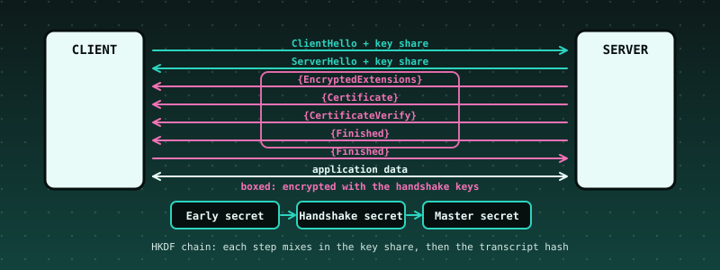

# 54. TLS 1.3 From Scratch: X25519, the HKDF Key Schedule, AES-GCM Records, and a Handshake Checked Against RFC 8448

{ style="display:block;margin:0 auto;max-width:100%;height:auto;border-radius:6px" }

**What you will understand:** how the protocol that secures most of the web turns a few public messages into keys only the two ends know, and how to *check* an implementation of it instead of trusting it. A TLS 1.3 **client** (`054_tls.h`/`054_tls.c`) builds a ClientHello with an **X25519** key share, reads the server's, and runs the **key schedule**: HKDF-Extract and HKDF-Expand-Label chain an Early Secret, a Handshake Secret and a Master Secret, each step mixing in the key share or the **transcript hash** (a running SHA-256 of every handshake message). It then opens the server's encrypted flight (EncryptedExtensions, Certificate, CertificateVerify, Finished) with **AES-128-GCM** under sequence-numbered nonces, **verifies the RSA-PSS signature** in CertificateVerify and the server's **Finished** MAC, sends its own Finished, and switches to application keys. The kernel replays the **recorded handshake of RFC 8448 section 3**: every byte the client sends equals the record, and 14 attacks on the same recorded bytes are each refused with the alert the protocol demands.

**What you need to know first:** Chapter 30's SHA-256 and Chapter 47's HMAC and AES (the block cipher), 64-bit integer arithmetic, and the cumulative kernel. No TLS knowledge is assumed.

## Scope: three confirmed choices before writing any code

Second of two further case studies. One `AskUserQuestion` round: **core** "Handshake + key schedule + record layer, RFC 8448 trace" (recommended; a smaller key-schedule-and-records-only version and a version adding the ChaCha20-Poly1305 suite were offered and not chosen); **hardening** "Full discipline".

## Where the data comes from, said plainly

**The RFC itself was not reachable from the sandbox that built this book** (`rfc-editor.org` and `datatracker.ietf.org` are blocked). The recorded handshake comes from the **test data of the Botan cryptography library** (`src/tests/data/tls_13_rfc8448/transcripts.vec`, Simplified BSD licence, commit `bd6f6c55481125b876d1ef3e4720eab87a422d17`), which reproduces the records of RFC 8448 section 3 ("Simple 1-RTT Handshake"): the ClientHello, ServerHello, the server's encrypted flight, the client Finished, a NewSessionTicket, application data in both directions and close_notify, plus the client's random and X25519 private key. The same directory holds the RSA key and certificate that RFC's server used, so the independent Python server in the differential tests can sign with it. **What is *not* in that file is the RFC's list of intermediate secrets**; they were not checked against the RFC's text. Instead, each is checked two stronger ways: the recorded server flight can only be decrypted if the handshake traffic keys are right, and an independent Python key schedule must produce the same values. (The early secret `33ad0a1c...`, the handshake secret `1dc826e9...` and the master secret `18df0684...` are values the author remembers from the RFC; they matched, which is a coincidence worth noting but not a check.)

## What the client does and does not do

**Read this before anything else: this client does not validate the server's certificate chain and does not check the host name.** It takes the RSA public key from the server's leaf certificate only to verify that *whoever sent this handshake holds the matching private key*. Without a trust anchor that proves nothing about who the server is: an attacker with any certificate of their own would pass. This is a chapter about the cryptographic core, not a secure TLS library. **Do not use it to protect anything.**

- **Does:** `TLS_AES_128_GCM_SHA256` (0x1301); X25519; the RSA-PSS (`rsa_pss_rsae_sha256`, 0x0804) CertificateVerify, **verified** with its own big-number code (moduli of 1024 to 2048 bits); the server Finished, **verified** in constant time; strict parsing of every record and message; the alert the protocol prescribes for each failure (`t->alert`); handshake messages split across records or several to a record; zero padding in records; sequence numbers that are never reused or wrapped (the 2^64-1th record is refused).
- **Offers but cannot use:** the ClientHello lists the two other TLS 1.3 suites (0x1303, 0x1302) so that it is byte-identical to the RFC's; a server that selects one is refused.
- **Does not:** validate certificate chains, host names, expiry or revocation; HelloRetryRequest (refused); PSK, resumption, 0-RTT; client certificates; KeyUpdate; ECDSA or RSA-PKCS1 signatures; any group but X25519; record padding on send; session ticket storage; a network (the kernel replays recorded bytes).
- **Is not constant time** everywhere: the GHASH multiplication branches on bits of the data, and the big-number code works on public values only. These are acceptable for a teaching client that replays a recording and wrong for anything exposed to an attacker's timing.

## The protocol in ten steps

1. The client picks a random 32-byte value and an X25519 private key, and sends the ClientHello with the matching public key.
2. The server answers with a ServerHello carrying its own X25519 public key. Both compute the same shared secret: `X25519(my private, your public)`. A peer that sends a low-order point makes this secret all zero; the client refuses it.
3. **Early Secret** = `HKDF-Extract(0, 0)` (no pre-shared key). **Handshake Secret** = `HKDF-Extract(Derive-Secret(Early, "derived", ""), shared secret)`.
4. The **client and server handshake traffic secrets** are `Derive-Secret(Handshake, "c hs traffic" / "s hs traffic", H(ClientHello..ServerHello))`, where `H` is SHA-256 of the messages so far. From each traffic secret come an AES key (16 bytes, label `key`) and an IV (12 bytes, label `iv`).
5. Everything after the ServerHello is encrypted: each record's nonce is the IV XOR the 64-bit record sequence number, the header is the associated data, the real content type is appended *inside* the encryption, and the outer type is always `application_data`.
6. The server sends EncryptedExtensions, its Certificate, a CertificateVerify (an RSA-PSS signature over 64 spaces, the string `TLS 1.3, server CertificateVerify`, a zero byte and the transcript hash so far) and Finished (an HMAC over the transcript hash, keyed from the server's handshake secret).
7. The client verifies the signature and the Finished MAC, then computes the **Master Secret** = `HKDF-Extract(Derive-Secret(Handshake, "derived", ""), 0)` and the **application traffic secrets** from the transcript hash through the server Finished.
8. The client sends its own Finished (the same construction, keyed from the client's handshake secret) under the client handshake keys, and both ends switch to application keys with sequence numbers back at zero.
9. Application data flows both ways; the server sends a NewSessionTicket.
10. Either side ends with a `close_notify` alert; any other alert is fatal.

## The client: `054_tls.h` and `054_tls.c`

```c
--8<-- "docs/part54/code/054_tls.h"
```

```c
--8<-- "docs/part54/code/054_tls.c"
```

## The data: `make_tls_data.py`, `054_tlsdata_data.asm`

```python
--8<-- "docs/part54/code/make_tls_data.py"
```

```nasm
--8<-- "docs/part54/code/054_tlsdata_data.asm"
```

## `054_kmain.c`: the TLS demo

The demo needs no network: the kernel plays the client against the server's *recorded bytes*. Attacks 8 to 10 need a flight that is damaged but still validly encrypted, so the demo decrypts the recorded flight with the derived server handshake keys, changes the plaintext, and encrypts it again.

```c
--8<-- "docs/part54/code/054_kmain.c:6187:6262"
```

## Building and booting it, for real

```bash
cd docs/part54/code
./build.sh 054
WAIT=500 ./capture.sh build
```

```sh
--8<-- "docs/part54/code/build.sh"
```

```sh
--8<-- "docs/part54/code/capture.sh"
```

**Output (cloud sandbox -- live-executed build output)**

```text
--8<-- "docs/part54/code/build_out.txt"
```

## Real output

**Output (cloud sandbox -- live-executed serial capture, QEMU 8.2.2; Chapters 8-53's output elided)**

```text
--8<-- "docs/part54/code/serial_excerpt_out.txt"
```

### Reading it

- **The ClientHello** the client builds from the recorded random (`cb34ecb1...`) and private key (`49af42ba...`) is the recorded 201 bytes; its public key is the recorded `99381de5...`.
- **The secrets** are the whole key schedule made visible: early secret, handshake secret, the two handshake traffic secrets, then (after the flight) the transcript hash through the server Finished, the master secret and the two application traffic secrets. The RSA key found in the certificate is 1024 bits with exponent 65537.
- **The client Finished** (58 bytes), the client's application record (72 bytes) and the close_notify (24 bytes) are byte-for-byte the recorded ones: AES-GCM, the nonce construction, the sequence numbers and the key schedule all agree with an implementation that is not this book's.
- **The fourteen attacks:** two flipped bits in the encrypted flight (the tag, and a ciphertext byte) both fail authentication (`bad_record_mac`, alert 20); a wrong record length is a decode error; a ServerHello choosing another suite, announcing HelloRetryRequest, or carrying the all-zero key share is refused; **attacks 8 and 9 are validly encrypted and only the cryptography catches them**: a flipped signature bit gives "CertificateVerify signature invalid" and a flipped Finished bit gives "Finished verify_data wrong"; swapped messages are "unexpected message"; a replayed record and an out-of-order record fail authentication because the sequence number no longer matches; a server's fatal alert is reported with its description (40).

## Independent verification

`tls_ref.py` is a second TLS 1.3 implementation, with **both** a client side and a server side, written from RFC 8446 on the primitives of Python's `cryptography` library (X25519, AES-GCM, HMAC, HKDF-Expand, RSA-PSS). `verify_054.py` checks, from outside the kernel: the ClientHello equals the one Python builds; every kernel secret equals Python's key schedule computed from the X25519 shared secret and the transcript; **Python decrypts the recorded flight, verifies the CertificateVerify signature against the certificate's public key and the server Finished MAC itself**, and derives the master and application secrets; the client's three records equal Python's; and each of the fourteen attacks is **judged independently** (would an AEAD open succeed? is the signature valid? does the MAC match?), and the kernel's verdict and alert must agree.

```python
--8<-- "docs/part54/code/tls_ref.py"
```

```python
--8<-- "docs/part54/code/verify_054.py"
```

**Output (cloud sandbox -- live-executed)**

```text
--8<-- "docs/part54/code/verify_out.txt"
```

## Host-side tests

All C is built with AddressSanitizer and UBSan from the same `054_tls.c` the kernel links. Five tools:

- `tls_test.c`: 27 checks from RFC 7748 (the two test vectors, the iterated vectors including 1,000 iterations, the Alice and Bob exchange), RFC 5869 (test case 1), the GCM specification (test cases 1, 2 and 4) and the client's API (refusals, buffer sizes, the maximum record, sequence-number exhaustion).
- `tls_trace.c`: the recorded RFC 8448 handshake, 17 checks, including an independent decryption of the flight, the 130-byte message that was signed, and every record the client sends.
- `diff_prims.py` with `tls_prim.c`: X25519 (random inputs, the eight low-order points, non-canonical encodings), HKDF (random labels, contexts and lengths), AES-GCM (every length from 0 to 70, then every kind of damage), RSA-PSS (keys of 1008, 1024, 1536, 2048 and 3072 bits, damaged signatures, wrong hashes and keys): C against the independent library.
- `diff_tls.py` with `tls_hs.c`: full handshakes against the independent Python server (1024- and 2048-bit keys; the flight in one record, in two, and one byte per record; with padding), application data both ways from 0 to 16,384 bytes, then the **attack catalogue** (about 70 damaged servers and records, each with the alert the protocol demands), then **every byte of the ServerHello and of the encrypted flight flipped, one at a time: the client must never reach the connected state**.
- `tls_fuzz.c`: mutation fuzzing of the recorded handshake (bit flips, cuts, drops, duplicates, swaps, random bodies).

```c
--8<-- "docs/part54/code/native/tls_test.c"
```

```c
--8<-- "docs/part54/code/native/tls_trace.c"
```

```c
--8<-- "docs/part54/code/native/tls_prim.c"
```

```python
--8<-- "docs/part54/code/native/diff_prims.py"
```

```c
--8<-- "docs/part54/code/native/tls_hs.c"
```

```python
--8<-- "docs/part54/code/native/diff_tls.py"
```

```c
--8<-- "docs/part54/code/native/tls_fuzz.c"
```

```bash
--8<-- "docs/part54/code/native/run_host_tests.sh"
```

**Output (cloud sandbox -- live-executed)**

```text
--8<-- "docs/part54/code/native/host_tests_out.txt"
```

## Are the tests good enough? Broken copies

`mutation.py` deliberately **breaks** a copy of the sources, one line at a time (a clamp bit, the field constant, a label string, a counter, the GHASH constant, a padding check, a signature-scheme check, a sequence-number reset, ...), and runs the whole suite against each. "caught" is the expected, wanted result.

```python
--8<-- "docs/part54/code/native/mutation.py"
```

**Output (cloud sandbox -- live-executed)**

```text
--8<-- "docs/part54/code/native/mutation_out.txt"
```

@@MUTATION@@

## What the first runs found

- **The recorded handshake passed the first time it was run**, every byte. That is the strongest single result in the chapter and also a reason for suspicion, so the test was made to fail on purpose (the mutation list) before it was trusted.
- **Two bugs were found by reading, before any test ran:** the "nothing may follow the server Finished" check compared the buffered length with zero while the Finished message itself was still in the buffer (it would have refused every handshake), and the HKDF label buffer had been sized for 12-character labels and 32-byte contexts, which a caller could overflow. The buffer is now 520 bytes and a label or context outside what the encoding can express gives zeros.
- **The demo's attack 8 first reported the wrong reason.** It flipped a bit in what it thought was the signature but was the Finished message, so the client said "Finished verify_data wrong"; the demo's own check ("expected a different result") caught it, and the offset was corrected.
- **A test used the wrong keyword** and so never built the downgrade-sentinel ServerHello it claimed to; the client "connected", the differences counter caught it, and the two sentinel tests now really send the sentinel.
- **The fuzzer's first metric was wrong:** it counted a handshake as "mutated" if a *later* record was damaged. Connecting after that is correct, not a failure. The invariant is now stated precisely: the client connects exactly when the ServerHello and the flight are intact.
- **Environment:** Python's `cryptography` refuses to *generate* RSA keys under 1024 bits and could not parse the PEM certificate in the Botan data; the 1008-bit test key comes from `openssl`, and the RFC's certificate is taken from the recorded Certificate message instead.

## Limits and what is not established

- **No certificate validation, no host name check: the client cannot tell a genuine server from an attacker.** This is the most important limit in the chapter.
- **The RFC text and its intermediate secrets were not available.** The checks against the RFC are byte equality with the Botan copy of the recorded records.
- **One cipher suite, one group, one signature scheme.** No HelloRetryRequest, PSK, 0-RTT, resumption, client authentication or KeyUpdate. Real servers often want ECDSA or RSA-PKCS1 and P-256.
- **Not constant time** and not hardened against side channels. No random number generator: the demo and tests supply the random and the private key.
- **The independent Python implementation shares the author's reading of RFC 8446** and uses a well-tested library for the primitives, so it protects against implementation slips, not against a misreading both share; the RFC 8448 records are the check against that.
- **No network.** The kernel replays recorded bytes; whether this client would interoperate with a live server was not tested.

## Chapter summary

A TLS handshake is two small functions: a key schedule that turns a shared secret and a running hash into keys, and a record layer that turns a key, a counter and a message into an authenticated ciphertext. Both are easy to get subtly wrong and impossible to notice by running them against yourself. Checking them against recorded bytes of the standard's own example, against an independent implementation on both ends, and against ninety deliberately broken copies is what turns "it works" into evidence.

## Self-check questions

1. Why is each record's nonce the IV XOR the sequence number, and what would go wrong if the sequence number were reset in the middle of a connection?
2. The transcript hash is mixed into every traffic secret. What attack does that stop, and which message would an attacker most want to change without the client noticing?
3. Attacks 8 and 9 in the demo are validly encrypted, so AES-GCM accepts them. What exactly catches them, and why is *decrypting successfully* not evidence that the server is genuine?
4. A server sends the X25519 public key `0`. What is the shared secret, why is that dangerous, and what does the client do?
5. This client verifies the CertificateVerify signature but not the certificate chain. Describe one attack that passes every check in this chapter, and what the missing piece is.
