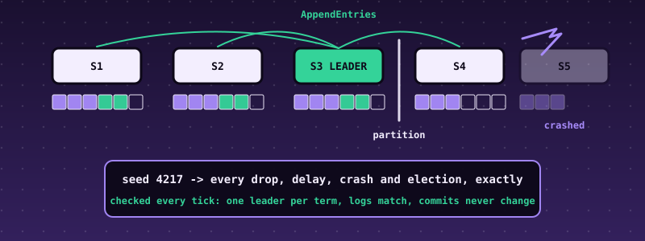

# 55. Raft Consensus, Tested by Deterministic Simulation: Elections, a Replicated Log, and a Seed That Replays Every Failure

{ style="display:block;margin:0 auto;max-width:100%;height:auto;border-radius:6px" }

**What you will understand:** how a group of servers keeps *one* log in the *same order* everywhere while servers crash and the network loses, delays, duplicates, reorders and splits messages, and how to find out whether an implementation of that is correct. A Raft node (`055_raft.h`/`055_raft.c`) is a pure state machine: leader election with randomized timeouts and one vote per term, log replication with a consistency check, and a commit rule that never counts replicas of an earlier term's entry (the paper's Figure 8). A **deterministic simulator** (`055_sim.h`/`055_sim.c`) plays the network, the disks and the clients from one seeded random generator, so a seed fully determines a run and a failure found on seed 10,059 is replayed exactly by running seed 10,059 again. After every tick the simulator checks Raft's safety properties against a global view no real node has. The kernel runs clusters of 3, 5 and 7 nodes, sweeps seeds with no violation, then switches two **deliberate bugs** on and shows the simulator finding each, with the seed, the tick and the property broken.

**What you need to know first:** Chapter 53's write-ahead log (the idea that state must be saved *before* a reply leaves), Chapter 54's habit of an independent implementation, and the cumulative kernel. No distributed-systems background is assumed.

## Scope: two confirmed choices before writing any code

Third of the further case studies. One `AskUserQuestion` round: **core** "Election + replication + persistence + simulator" (recommended; adding log compaction and a smaller election-and-replication-only version were offered and not chosen); **hardening** "Full discipline".

## Where the design comes from, said plainly

**There is no real data here.** The algorithm is Raft as described by Ongaro and Ousterhout, "In Search of an Understandable Consensus Algorithm" (USENIX ATC 2014): the rules, the property names (election safety, leader completeness, log matching, state machine safety) and the two example scenarios used as tests (Figure 7, Figure 8) are the author's reading of that paper. **The paper was not reachable from the sandbox that built this book**, so nothing was checked against its text; the Figure 7 and Figure 8 logs in the tests are written from the author's memory of the figures. The independent Python implementation shares that reading. What *is* checked, hard, is that the two implementations agree on every message of every run, that the safety properties hold over more than twenty thousand runs, and that the simulator catches deliberate mistakes.

## What the node does and does not do

A node keeps **persistent state** (current term, who it voted for in that term, the log) that must be saved before any reply leaves it, and **volatile state** (its role, commit index, timers; for a leader, how much of each follower's log it believes matches). Five rules do all the work:

1. **Terms.** A term number only grows. A message from a higher term turns any node into a follower of that term and clears its vote.
2. **Votes.** A node grants at most one vote per term, and only to a candidate whose log is *at least as up to date* as its own: a higher last term wins; with equal last terms the longer log wins. This is what stops a stale server from becoming leader and erasing committed entries.
3. **Leaders.** A candidate that gets votes from a majority becomes leader and appends a no-op (command 0) so that it can commit at once.
4. **Replication.** A leader sends each follower the entries after `nextIndex` together with the index and term of the entry just *before* them. A follower that does not hold that entry refuses and the leader backs up one entry and retries. A follower that finds a *conflicting* entry deletes it and everything after it, but never deletes a matching one (a delayed duplicate must not truncate a longer log).
5. **Commit.** A leader advances `commitIndex` only to an index whose entry is **of its own term** and held by a majority; entries of earlier terms then become committed indirectly. Counting replicas of an old-term entry is unsafe: Figure 8 of the paper shows how a majority-held old entry can still be overwritten.

- **Not covered:** cluster membership changes, log compaction and snapshots, read-only queries (so no linearizable reads), a real network or disk. A log holds at most 64 entries; a cluster 3 to 7 nodes.
- **Persistence is modelled, not implemented:** the simulator saves a node's persistent state atomically after every step and before any message of that step is delivered. Chapter 53's store could back the same hook; this chapter does not claim crash-safe *storage*, only that the node's use of it is correct.

## The node and the simulator

```c
--8<-- "docs/part55/code/055_raft.h"
```

```c
--8<-- "docs/part55/code/055_raft.c"
```

```c
--8<-- "docs/part55/code/055_sim.h"
```

```c
--8<-- "docs/part55/code/055_sim.c"
```

**Why a simulator.** A distributed protocol is wrong in ways that appear one run in a million, depend on the order of events, and cannot be repeated. Here every source of nondeterminism is one pseudo-random stream: each tick the simulator may cut or heal a partition, crash a node (a profile prefers the current leader: an adversary), restart one from its saved state, let a client speak to a node, deliver the messages due this tick (each was dropped with some probability, duplicated with some, and delayed by 1 to 9 ticks, which reorders them), and tick every live node. Seed 0 and seed 1 are different worlds; the same seed is the same world, to the message. The **trace hash** at the end of a run, a hash of every delivered message and every node's state after every tick, is the fingerprint of the whole run.

**The six properties** the simulator checks after every tick (from the paper's Figure 3):

| # | property | what a violation means |
|---|---|---|
| 1 | election safety | two different leaders in one term |
| 2 | log matching | two logs hold an entry with the same index and term but differ in it or before it |
| 3 | state machine safety | two nodes (or one node at two times) hold different entries at one committed index |
| 4 | leader completeness | a leader of a later term lacks an entry committed in an earlier term |
| 5 | durability | a client command that was acknowledged is not in the committed log |
| 6 | monotonicity | a term, or the commit index of a node that has not restarted, went backwards |

## Data and scenarios

There is no input data: a run is a seed. The fault profile of a seed is `seed % 4` (0 calm network; 1 loss, duplication and reordering; 2 partitions; 3 everything at once with crashes aimed at the leader) and its size is 3, 5 or 7 nodes (`(seed / 4) % 3`). Test scenarios are the paper's Figure 7 (a leader with a ten-entry log brings six followers with logs that are too short, too long, or from other terms into line) and Figure 8 (an entry from term 2 replicated on a majority must not be committed by a term-4 leader).

## `055_kmain.c`: the Raft demo

```c
--8<-- "docs/part55/code/055_kmain.c:6266:6301"
```

## Building and booting it, for real

```bash
cd docs/part55/code
./build.sh 055
WAIT=500 ./capture.sh build
```

```sh
--8<-- "docs/part55/code/build.sh"
```

```sh
--8<-- "docs/part55/code/capture.sh"
```

**Output (cloud sandbox -- live-executed build output)**

```text
--8<-- "docs/part55/code/build_out.txt"
```

## Real output

**Output (cloud sandbox -- live-executed serial capture, QEMU 8.2.2; Chapters 8-54's output elided)**

```text
--8<-- "docs/part55/code/serial_excerpt_out.txt"
```

### Reading it

- **Each seed line** is a whole run: its size, the first violation (none), how many messages were sent, delivered, dropped and duplicated, how many elections, crashes and restarts, how many client commands were proposed and **acknowledged**, and the trace hash. Seed 0 (calm, 3 nodes) elects one leader at tick 14 and commits all 7 commands; seed 1 loses 66 messages and duplicates 23, elects four leaders over the run, and still commits everything it acknowledged.
- **The final states** show what agreement means: in the calm run all five nodes have the same log length, the same commit index and the same state-machine hash (`2804678d`: a hash chain over the eight commands, the same on every node). In the faulty run (seed 43: four nodes up, nine crashes, eight restarts) nodes sit in different terms and at different log lengths, because they have been cut off or restarted, but every entry any of them considers committed is the same entry.
- **The sweep** runs 120 seeds, 30 of each profile, in the kernel itself; no violation. Profile 3 (leader-killing crashes) elects the most leaders per acknowledged command and commits the fewest: 228 crashes cost 19 of 53 proposed commands. That is the price of availability under attack, and not a safety failure.
- **The two deliberate bugs.** *Bug 1* (a vote granted without comparing logs) is found on the third seed (seed 2): a leader of a later term is missing an entry that was already committed (property 4). *Bug 3* (a vote that a restart forgets) needs a particular ordering (a node votes, its leader is killed, the node restarts having forgotten, and votes again for a different candidate in the same term, so two leaders appear in one term) and showed up in about one run in 2,500; the search from seed 10,000 finds it at seed 10,059. For each, the demo **replays the seed and gets the identical violation, tick, node and trace hash**: that is what a deterministic simulator buys.

## Independent verification

`raft_ref.py` is a second implementation of the node *and of the simulator*, written from the paper and from the simulator's specification in `055_sim.h`, not from the C code. The order in which random numbers are drawn is part of that specification, so given a seed the two must make the same decisions throughout, and the trace hash makes any divergence visible. `verify_055.py` checks, from outside the kernel: the twelve seed lines the kernel printed are character for character the Python simulator's (all statistics and the trace hash); the final state of every node of two runs equals the Python nodes'; the 120-seed sweep, re-run in Python, gives the same per-profile totals; and the Python search for each deliberate bug finds the same seed, violation, tick, node and trace hash.

```python
--8<-- "docs/part55/code/raft_ref.py"
```

```python
--8<-- "docs/part55/code/verify_055.py"
```

**Output (cloud sandbox -- live-executed)**

```text
--8<-- "docs/part55/code/verify_out.txt"
```

## Host-side tests

All C is built with AddressSanitizer and UBSan from the same `055_raft.c` and `055_sim.c` the kernel links. Three tools:

- `raft_test.c`: 44 checks that drive the node by hand: elections, the vote rules and the up-to-date comparison case by case, terms, the consistency check, conflicts and duplicates, `commitIndex` rules, the leader's `matchIndex` and backing up, **Figure 8** (not committed by counting until an entry of the leader's term is replicated) and **Figure 7** (six followers with six different logs converge on the leader's), persistence, proposals and the state machine.
- `diff_raft.py` with `raft_cli.c`: the same seeds through the C and Python simulators, with the correct node and with each of **six deliberate bugs**, comparing all statistics and the trace hash.
- `raft_sweep.c`: 20,000 seeds of the simulator against the correct node, every property checked after every tick.

```c
--8<-- "docs/part55/code/native/raft_cli.c"
```

```c
--8<-- "docs/part55/code/native/raft_test.c"
```

```python
--8<-- "docs/part55/code/native/diff_raft.py"
```

```c
--8<-- "docs/part55/code/native/raft_sweep.c"
```

```bash
--8<-- "docs/part55/code/native/run_host_tests.sh"
```

**Output (cloud sandbox -- live-executed)**

```text
--8<-- "docs/part55/code/native/host_tests_out.txt"
```

## Are the tests good enough? Broken copies

`mutation.py` deliberately **breaks** a copy of the node or the simulator, one line at a time (a vote rule, the commit rule, the term check, a persistence flag, a timer, a safety check), and runs the suite against each. "caught" is the expected, wanted result.

```python
--8<-- "docs/part55/code/native/mutation.py"
```

**Output (cloud sandbox -- live-executed)**

```text
--8<-- "docs/part55/code/native/mutation_out.txt"
```

@@MUTATION@@

## What the first runs found

- **The simulator found a bug in this chapter's first node within minutes.** On the first sweep, 73 of 2,000 seeds reported a *monotonicity* violation: a follower's `commitIndex` had gone backwards. The rule as written in the paper ("set commitIndex to min(leaderCommit, index of last new entry)") moves the index *down* when a delayed, reordered message carries a large `leaderCommit` but few entries. The node now only ever moves it forward, and `raft_test.c` has a test for exactly that message. It is not a safety violation in itself, which is why careful reading of the paper does not reveal it; only a simulator with reordering does.
- **Two of the deliberate bugs are hard to find, and one cannot be found by the simulator at all.** Bug 1 shows on the third seed. Bug 3 needs a leader killed at the wrong moment and appears in about one run in 2,500 (the crash profile was changed to prefer leaders precisely because the first version found nothing in 20,000 seeds). **Bug 2** (committing an old-term entry by counting replicas) was *not* found by the simulator in 20,000 seeds of 600 ticks: the new leader's no-op is replicated together with the old entry and masks it. It is caught by the Figure 8 test, which builds the scenario by hand. The lesson is the useful one: a simulator finds what the random schedule reaches, and a hand-built scenario is still needed for the rare interleaving.
- **The durability check (property 5) can never fire first.** Whenever an acknowledged command is missing, the committed-entry comparison (property 3) has already noticed, so a checker mutant that removes property 5 is equivalent on every run and is not in the mutation list.
- **Environment:** a test that put a leader on a node with `nextIndex` 0 made the node read before the start of its log; `nextIndex` is now clamped to 1, which the paper's invariant (it is never below 1) guarantees anyway.

## Limits and what is not established

- **The paper was not available**, and the Figure 7 and Figure 8 scenarios are the author's recollection. The independent Python implementation shares the author's reading, so it catches implementation slips, not a shared misreading.
- **No membership changes, no snapshots or log compaction, no read-only queries.** Logs hold 64 entries; clusters 3 to 7 nodes.
- **Storage is a model:** an atomic save after each step. Torn writes, lost writes and fsync ordering are Chapter 53's subject and are not combined with this chapter.
- **The network is a lossy queue,** not TCP: no connections, no byte-level corruption, no clock skew (every node's tick is the same tick).
- **Safety is checked, liveness is not proved:** with leader-killing crashes and partitions some runs never commit anything beyond the first no-op. Raft guarantees safety always and progress only when a majority can talk for long enough.
- **Simulation is evidence, not proof.** Twenty thousand correct runs and a hundred and fifty deliberately broken copies caught are strong evidence; a proof would need a formal model (the Raft authors published a TLA+ specification) and was not attempted.

## Chapter summary

Consensus protocols are small sets of rules about *who may speak in which term* and *what a majority has seen*, and each rule is easy to violate in one line. A deterministic simulator turns the nightmare of testing a distributed system into an ordinary test: pick a seed, run it, replay it, and keep a second implementation honest by demanding that it makes the same decisions to the last message. The simulator found a real bug in this chapter's own first draft and proved it could find two planted ones; the third planted bug needed a hand-built scenario, which is the honest shape of the evidence.

## Self-check questions

1. Why must a node save its vote to disk before it replies to a RequestVote, and what exactly goes wrong (and in which property) if a restart forgets it?
2. A candidate has a longer log than a voter but its last entry is from an older term. Does the voter grant its vote, and why does Raft compare the last *term* before the length?
3. Figure 8: why is it unsafe for a leader to commit an entry from an earlier term as soon as a majority holds it, and what does the leader do instead?
4. A delayed AppendEntries carries `leaderCommit` 7 but only entries up to index 5, and arrives after the follower already has commit index 6. What should the follower's commit index be, and why did the paper's wording hide this?
5. The simulator found bug 1 on the third seed but never found bug 2 in 20,000. What does that say about what a random simulator can and cannot replace?
