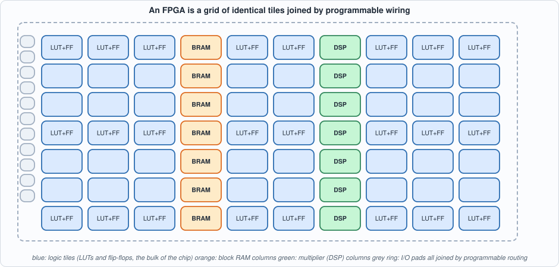
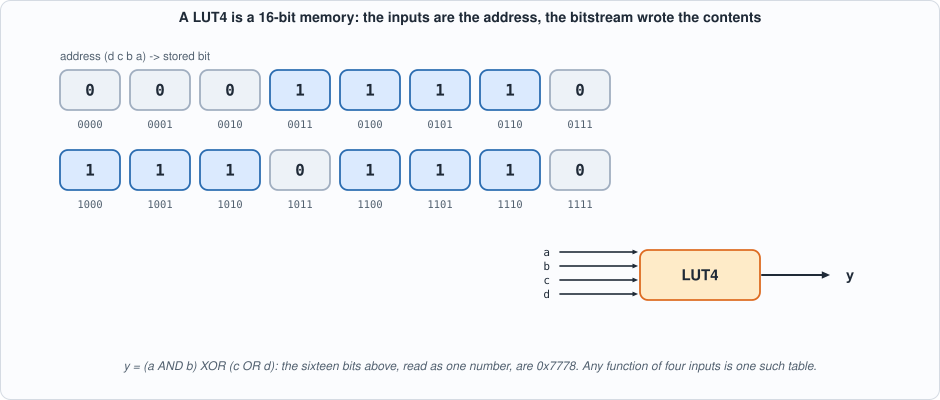
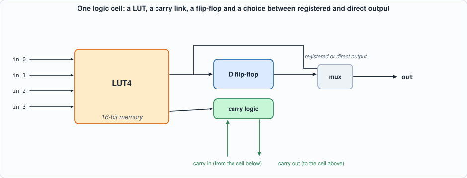
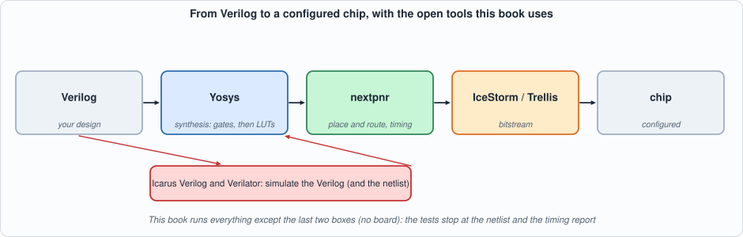
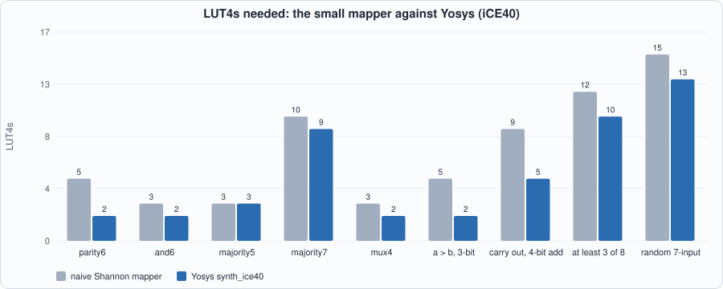
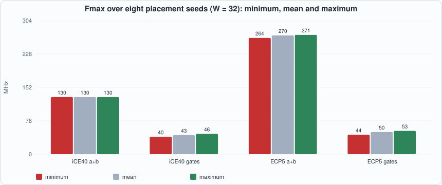

# 1. What an FPGA Is: Lookup Tables, the Carry Chain, and the Open Flow


--8<-- "docs/assets/art/ch-01.md"


**What you will see:** the inside of an FPGA, built up from one idea: a *lookup table* is a tiny memory whose contents *are* the logic. A model of that fabric in Python maps functions onto lookup tables and is compared with Yosys; then one circuit, a registered adder, goes through the whole open flow (golden model, two simulators, synthesis, place and route) for two real devices, a Lattice iCE40 and a Lattice ECP5, and the result teaches the first rule of FPGA design: **the same arithmetic runs two to eight times faster when you write it so that the tool can use the fabric's carry chain.** Every test is then tested by mutation.

**What you need to know first:** nothing about FPGAs. You should be able to read a short piece of Verilog and Python; the Capra book's Appendices A (digital logic) and B (Verilog) cover the background.

**What this chapter builds:** `tools/flow.py` (the book's wrapper around Yosys and nextpnr), `model/lut_fabric.py` (a LUT model and a small technology mapper), `model/radd_gold.py` (golden model and vectors), `rtl/radd.v`, `tb/radd_tb.v`, `tools/ch01_run.py`, `tools/mut_ch01.py` and the running examples `tools/ch01_example_a.py` and `tools/ch01_example_b.py`.

## Why an FPGA, and what it is not

A **field-programmable gate array** is a chip whose logic is *configured after manufacture*. Its configuration (the **bitstream**) is loaded at power-up and says what every logic element computes and how they are wired together. Three other ways of computing sit around it:

| | what you write | how it runs | strength | weakness |
|---|---|---|---|---|
| **CPU** | software | instructions, one thread after another | flexible, easy | each step takes many cycles; latency varies with caches and the operating system |
| **GPU** | software (kernels) | thousands of lanes in lockstep | throughput on regular data parallelism | fixed architecture; batching adds latency |
| **FPGA** | a hardware description | a circuit that exists all the time; every stage works in parallel | **deterministic latency in clock cycles**; custom datapaths; direct access to network and I/O pins | harder to design; slower clocks (hundreds of MHz); larger and costlier per operation than an ASIC |
| **ASIC** | a hardware description plus a factory | a fixed circuit | the fastest and cheapest per unit at volume | years and millions to build; cannot be changed |

The property that matters for this book's main case study is the third row: an FPGA design that reads packets off a wire, parses them and answers is a *pipeline of circuits*, so the answer arrives a **fixed number of clock cycles** after the last input bit, every time. That is what "deterministic low latency" means, and it is what the trading chapters (Parts 2 to 7) are about. Other chapters use the same fabric for signal processing, security and machine learning.

## The fabric

An FPGA is a grid of **logic tiles** with columns of other resources, surrounded by **I/O**, and joined by a mesh of **programmable wiring** (the *routing*) that takes most of the chip's area and most of the delay of a typical path.


*Figure 1.1: the fabric, schematically. Real devices have the same elements in other proportions.*

What the two devices of this book contain is not a matter of memory: nextpnr lists their resources. The recorded output of `tools/ch01_run.py` (section 4 below) shows, for the **iCE40 HX8K**: 7,680 logic cells, 32 block RAMs of 4 Kbit, 2 PLLs, 256 I/O. For the **ECP5 LFE5U-25F**: about 24,000 logic cells, 56 block RAMs of 18 Kbit, **28 multipliers of 18 x 18 bits**, 2 PLLs, and a multi-gigabit serial transceiver block (`DCUA`), the part real Ethernet needs and that Part 2 models at its interface instead of implementing.

## The lookup table

The unit of logic is the **LUT4**: a 16-entry memory with four address inputs. The inputs are the address, the stored bit at that address is the output. *Any* function of four inputs is one LUT4, because a function is nothing but a truth table and the LUT is a truth table stored in memory. The 16 bits come from the bitstream.


*Figure 1.2: a LUT4 holding y = (a AND b) XOR (c OR d). The sixteen bits, read as a number, are 0x7778: this number is the logic. There is no AND gate and no XOR gate in the fabric.*

Larger functions need several LUTs. A five-input function does not fit in one; a six-input one needs at least two and often more, depending on its structure. So **depth in LUTs is the first thing that costs time** in an FPGA: each LUT adds a delay, and each hop between them adds more (the routing).

## The logic cell: LUT, flip-flop and carry

A LUT alone is combinational. Next to each LUT sits a **flip-flop** that can capture its output on a clock edge, and a **multiplexer** that chooses between the LUT's direct output and the registered one. Together they form a **logic cell**.


*Figure 1.3: one logic cell, simplified. The carry link is the third element and the one that matters for arithmetic.*

Adders need a signal that ripples from the least significant bit upwards. Through ordinary routing that signal would pay a LUT delay and a routing delay at every bit. So every FPGA family adds a **dedicated carry chain**: a hard-wired path from each logic cell to the next one, much faster than general routing. The tool uses it automatically when you write `a + b`; it cannot use it for a carry you build out of gates. Example B measures the difference.

## The other resources

- **Block RAM** (BRAM): columns of dense memory, 4 Kbit (iCE40) or 18 Kbit (ECP5) per block, with one or two ports. Much cheaper than building memory from LUTs and flip-flops (which you can: a LUT is itself a 16-bit memory, called *distributed RAM*). Order books, FIFOs and packet buffers live here (Parts 2 to 4).
- **DSP blocks**: hard multipliers (18 x 18 on the ECP5), often with an accumulator. A multiplier built from LUTs is large and slow; the hard one is neither.
- **Clocking**: PLLs generate and align clocks; dedicated global clock networks distribute them with little skew. Chapter 3.
- **I/O**: pads with programmable standards; the transceivers (ECP5 `DCUA`) sit here.

## The open flow, and how to install it

From a design to a configured chip there are four stages. This book uses open tools for the first three:


*Figure 1.4: the flow. Simulation (red) checks the design at the Verilog level and can be repeated on the netlist; synthesis (Yosys) turns Verilog into LUTs and flip-flops; place and route (nextpnr) decides where each goes and how they are wired, and reports the timing.*

1. **Synthesis** (Yosys `synth_ice40` or `synth_ecp5`): reads Verilog, optimizes, and maps it to the family's cells (LUTs, flip-flops, carry cells, RAM and DSP blocks). Output: a netlist (JSON).
2. **Place and route** (nextpnr): chooses a location for every cell and a path for every wire, minimizing delay against the clock you ask for, and reports the **maximum frequency** (Fmax) the placed design can reach.
3. **Bitstream** (IceStorm for iCE40, Project Trellis for ECP5): writes the configuration file. *This book stops before this stage* (no board).
4. **Simulation** (Icarus Verilog and Verilator): every test of this book runs in both, as in the Capra book.

**Installing** on a Debian or Ubuntu system (the book was built on Ubuntu 24.04):

```
sudo apt-get install yosys iverilog verilator nextpnr-ice40 nextpnr-ecp5 fpga-icestorm python3-pip
pip install mkdocs mkdocs-material       # only to build this site
```

**Checking the install** (these commands print the versions the book's numbers come from: Yosys 0.33, nextpnr 0.6, Icarus 12, Verilator 5.020):

```
yosys -V ; nextpnr-ice40 --version ; nextpnr-ecp5 --version ; iverilog -V | head -1 ; verilator --version
```

Placement is a **randomized search**: nextpnr takes a seed. Every number in this book is produced with a stated seed (1 unless said otherwise), and Example B measures how much the result moves with the seed.

## The golden model, the circuit and the tests

The circuit is a registered adder: two input registers, an adder, an output register. Its golden model is one line of Python (`(a + b) mod 2^(W+1)`), which is exactly why it is a good first circuit: the *flow*, not the arithmetic, is the subject. The vectors are **directed** to stress the carry chain: all ones plus one (a carry through every bit), a carry that ripples through exactly *k* bits for every *k*, a carry generated at every bit position, alternating 0101 and 1010 patterns, and then 200 random pairs.

```verilog
--8<-- "rtl/radd.v"
```

`radd` is written with `+`. `radd_lut` builds the carry with gates: the same function, but the tool cannot recognise it as arithmetic.

```verilog
--8<-- "tb/radd_tb.v"
```

```python
--8<-- "model/radd_gold.py"
```

```python
--8<-- "tools/flow.py"
```

```python
--8<-- "tools/ch01_run.py"
```

To compile and run: `python3 tools/ch01_run.py` (a few minutes; needs the tools above). Recorded output:

```text
--8<-- "out/ch01_run_out.txt"
```

**Reading the output.** Sections 1 and 2: both adders match the golden sums on every vector, at four widths, in both simulators. Section 3 is the result of the chapter, at 16 bits and a 100 MHz target. On iCE40 the `+` adder uses **16 LUT4s and 16 carry cells** and reaches 188.7 MHz; the gate adder uses **35 LUT4s and no carry cell** and reaches 86.4 MHz. On ECP5 the numbers are 342.0 and 97.3 MHz. (On ECP5 a carry cell, `CCU2C`, contains two LUT4s of its own, so the `+` adder reports 0 plain LUT4s.) Section 4 lists what the devices contain.

## Running example A: the lookup table, and mapping logic onto it

```python
--8<-- "model/lut_fabric.py"
```

```python
--8<-- "tools/ch01_example_a.py"
```

To compile and run: `python3 tools/ch01_example_a.py` (about 30 seconds).

```text
--8<-- "out/ch01_example_a_out.txt"
```

**Part 1** builds a LUT4 by hand for `y = (a AND b) XOR (c OR d)`: the table, the 16 bits (`0x7778`) and a lookup. **Part 2** maps the six-input parity by Shannon expansion: the function is split on one variable (`f = x ? f1 : f0`), each half mapped recursively, the halves joined by a LUT that is a multiplexer. The mapper's network is exhaustively checked against the truth table, and uses 5 LUTs where 2 would do. **Part 3** compares this mapper with Yosys on nine functions:


*Figure 1.5: the naive mapper is always correct, and uses between the same number of LUTs as Yosys and two and a half times as many. Technology mapping is an optimization problem; ABC, inside Yosys, solves it much better than a recursive split.*

The ECP5 column of the table is a reminder that "LUT count" is family-specific: ECP5 builds 5- and 6-input functions from LUT4s joined by multiplexers inside the slice, so Yosys reports LUT4s plus muxes (parity6: 4 LUT4s and 3 muxes on ECP5 against 2 LUTs on iCE40), and a number quoted without its family is not a number.

## Running example B: what the fabric does to a design

```python
--8<-- "tools/ch01_example_b.py"
```

To compile and run: `python3 tools/ch01_example_b.py` (several minutes: 24 place-and-route runs for the sweep, 16 for the seeds, three more for the constraint).

```text
--8<-- "out/ch01_example_b_out.txt"
```

### The carry chain


*Figure 1.6: Fmax of the registered adder, nextpnr seed 1. Both families: the `+` adder falls slowly with width (the carry chain is fast), the gate adder falls quickly (every bit adds a LUT and a routing hop).*

At 64 bits the `+` adder runs at 79.8 MHz on iCE40 and 209.7 MHz on ECP5; the gate adder at 21.8 and 24.8 MHz. The ratio grows with width: **1.4 times at 8 bits, 3.7 times at 64 on iCE40; 1.9 and 8.5 times on ECP5**. A short ripple through gates is not much slower than the chain; a long one is hopeless.


*Figure 1.7: area. On iCE40 the `+` adder uses one LUT and one carry cell per bit; the gate adder 2.3 LUTs per bit.*

The generalization is the first rule of FPGA design, and it recurs in every part of this book: **write what the fabric implements.** Use `+` for addition (the carry chain), a `case` or a table for small functions (LUTs), arrays for memory (BRAM), `*` for multiplication (DSP). The tool does not discover a hard resource from a structure you wrote with gates.

### A single run is one sample


*Figure 1.8: eight seeds of the same design, W = 32. The `+` adder is stable on iCE40 (the carry chain fixes its structure: 129.8 MHz every time) and varies 2.6% on ECP5; the gate adders vary by 15 to 18%.*

Place and route is a randomized search. Eight placements of the same 32-bit gate adder on iCE40 gave Fmax between 39.5 and 46.1 MHz; a number quoted without its seed, or without its spread, is not a result. The book states its seed every time; Chapter 3 shows how to use seeds in earnest (a regression with several seeds, and what a timing margin means).

### A constraint the design cannot meet

Asking nextpnr for 100, 150 and 250 MHz on the 32-bit gate adder on iCE40 gave the same 44.19 MHz each time, with an `ERROR` and `FAIL` message because the target was missed. The limit is the ripple of 32 LUT levels, which no placement can shorten. A tighter constraint did not buy a faster result: the fix lies in the design (use the carry chain, or pipeline), which is where Chapters 3 to 5 begin.

## Testing the tests

Each mutant changes one line of `rtl/radd.v`: subtract instead of add, OR instead of add, the carry out dropped, one register stage too few, the second operand register loaded with the wrong input, and for the gate adder the carry-in ignored by the sum bit, the propagate term missing from the carry, a carry-in of 1, the carry out left unconnected, and the second operand register wrong again.

```python
--8<-- "tools/mut_ch01.py"
```

To run: `python3 tools/mut_ch01.py` (about a minute). Recorded output:

```text
--8<-- "out/ch01_mutation_out.txt"
```

All ten are caught. One more change is listed apart: the carry written with OR instead of XOR as its propagate signal **is equivalent** (a carry is generated if both bits are 1, or propagated if either is: the XOR form and the OR form differ only on the case both bits are 1, which the generate term already covers), so no test can ever tell them apart. That is why it is reported as *not caught and not a gap*, and is not counted among the ten.

## What this chapter established, and what it did not

**Established, with the tests that show it:** the two registered adders match the golden sums bit for bit on directed and random vectors at four widths in two simulators; the small mapper's LUT networks are exhaustively correct; and the **measured** effect of the carry chain: 188.7 against 86.4 MHz at 16 bits on iCE40, 342.0 against 97.3 on ECP5, growing to 3.7 and 8.5 times at 64 bits; 10 of 10 mutants caught.

**Not established:** anything on a physical board (no bitstream is loaded); the numbers of other FPGA families (Xilinx and Intel devices have different cells and are outside the open flow); timing after a full vendor flow (nextpnr's estimates are good but are not a signoff); the effect of temperature, voltage and speed grade, which the reported Fmax does not model.

## Self-check questions

1. What is stored in the LUT4 that implements `y = a AND b AND c AND d`? How many of its 16 bits are 1?
2. A function of 5 inputs cannot be one LUT4. Give a decomposition of the 5-input AND into LUT4s and count them.
3. Why does the `+` adder use fewer LUTs than the gate adder at the same width?
4. At 64 bits the gate adder reaches 21.8 MHz on iCE40. What clock period is that, and what does it say about the number of LUT levels on its critical path?
5. Eight seeds gave Fmax between 39.5 and 46.1 MHz for one design. Which would you quote, and what else would you say?
6. Why is the `+` adder's Fmax identical across seeds on iCE40 but not on ECP5?
7. Why is the OR-propagate mutant not counted as a gap in the tests?
8. In what sense is an FPGA design's latency deterministic, and what does that rule out about how the design is built?

## Exercises

1. **A different function.** In `ch01_example_a.py` add the 7-input XOR and the 8-input AND to the list. Compare the naive mapper with Yosys and say which is further from optimal.
2. **A better mapper.** Change `map_function` to prefer splitting on the variable that makes a cofactor a constant, and measure the LUT counts again.
3. **Subtract.** Write `rsub` (a - b registered) in the same way, with a golden model, and measure whether Yosys uses the carry chain for subtraction.
4. **Three operands.** Write a registered `a + b + c` and compare it with two chained adders, in LUTs and Fmax. What does the tool do with the three-operand form?
5. **A mutant that survives.** Add a mutant of your own to `mut_ch01.py` that survives. Is it equivalent, or is the test too weak? Close the gap if it is one.
