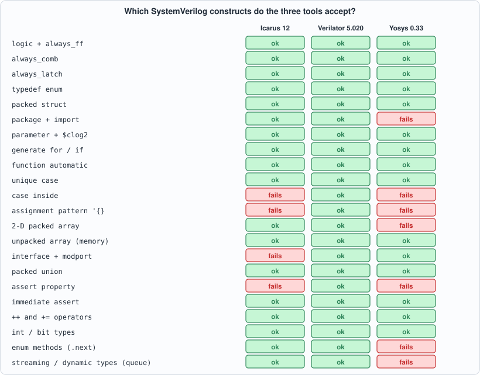
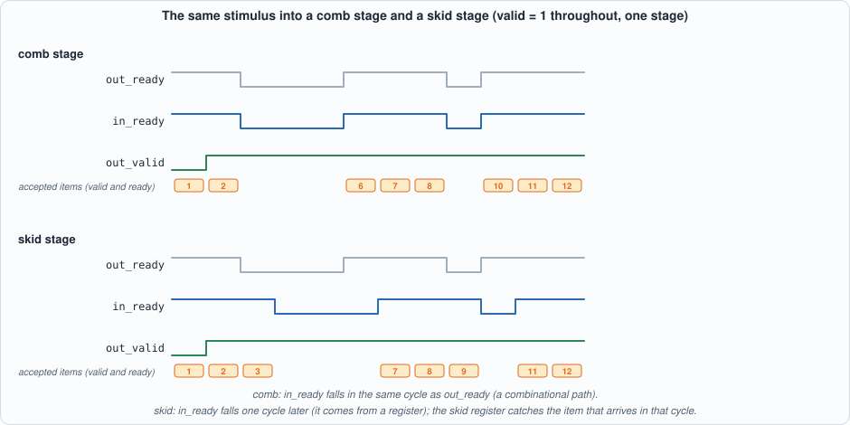
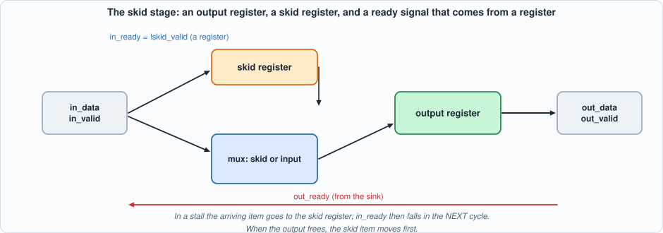
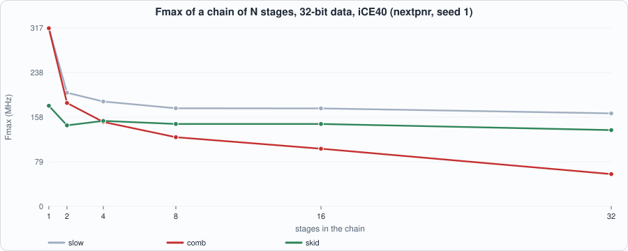
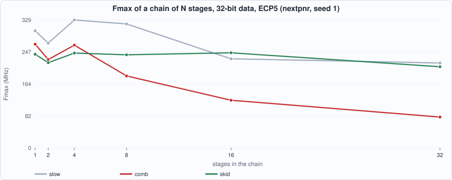
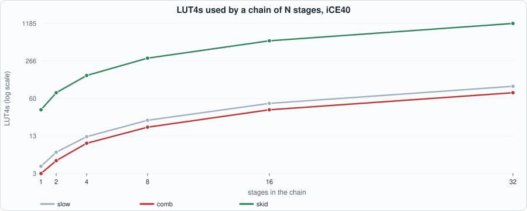
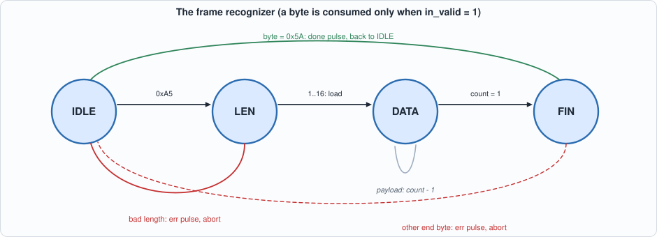

# 2. Hardware Design in SystemVerilog: A Portable Subset, Valid/Ready Stages, State Machines, and Lint


--8<-- "docs/assets/art/ch-02.md"


**What you will see:** the part of SystemVerilog that three real tools all accept, *measured* rather than recalled; a lint gate that every design file must pass before it is simulated; and two running designs that every later chapter will lean on. The first is a **valid/ready pipeline stage** written three ways (a slow one, a fast one with a combinational ready path, and a *skid buffer*), which turns out to decide the speed of every long pipeline in the book; the second is a **frame recognizer** (a state machine) written three ways and proved equivalent with a SAT solver.

**What you need to know first:** Chapter 1, and the Capra book's Appendix B (Verilog) if the syntax below is new. No other SystemVerilog is assumed.

**What this chapter builds:** `rtl/vr.sv` (the three stages and a chain), `rtl/frame_fsm.sv` (the three recognizers), `rtl/lint_bad.sv` and `rtl/lint_good.sv`, the golden models `model/vr_gold.py` and `model/frame_gold.py`, the testbenches `tb/vr_tb.sv` and `tb/frame_tb.sv`, `tools/ch02_run.py`, `tools/mut_ch02.py`, and the running examples `tools/ch02_example_a.py` and `tools/ch02_example_b.py`.

## What SystemVerilog adds, and what this book uses

SystemVerilog is Verilog plus the features that make hardware descriptions *checkable*:

- **`logic`** replaces the `reg`/`wire` distinction: one type for a signal, whatever drives it.
- **`always_ff`, `always_comb`, `always_latch`** say what a block is *meant* to be, so the tool can complain when the body does something else (a latch in `always_comb`, a blocking assignment in `always_ff`).
- **`typedef enum`, packed `struct`, `package`**: names for states and for the fields of a bus.
- **`generate` with `for` and `if`**, `function automatic`, `$clog2`, `unique case`.
- **assertions** and **interfaces** (bundles of signals with directions): useful, and *not* universally supported by the open tools, as the next section shows.

The language is large and the tools implement different parts of it. The book's own tests run every design in Icarus Verilog and Verilator, and synthesize it with Yosys, so the practical subset is the **intersection** of the three. That intersection is easy to measure, and measuring it is better than trusting a table from memory.

## The portable subset, measured

Example A feeds 22 tiny modules, one per construct, to the three tools and records which ones accept them.


*Figure 2.1: accepted (green) and rejected (red) constructs. 14 of 22 are accepted by all three tools.*

What stands out:

- **Everything everyday works everywhere**: `logic`, `always_ff`, `always_comb`, `always_latch`, `typedef enum`, packed `struct` and `union`, `parameter` with `$clog2`, `generate`, `function automatic`, `unique case`, unpacked arrays (memories), `+=` and `++`, `int`, immediate assertions.
- **Verilator accepts all 22**; it is the most complete of the three, which is why its lint is the book's gate.
- **Icarus 12** lacks `case ... inside`, assignment patterns (`'{a: 1, b: 2}`), interfaces and concurrent assertions (`assert property`).
- **Yosys 0.33** lacks assertion properties, `case inside`, assignment patterns, **2-D packed arrays** (`logic [3:0][7:0]`), enum methods, queues, and one more that deserves a closer look.

**Packages.** Yosys reads packages, but not every way of using them. Example A tries five ways: a *qualified constant* (`pk::W`) works in all three tools; a *wildcard import* with a type (`import pk::*;` then `w_t`) fails in Yosys; a struct type used after an `import` inside the module fails in Yosys; the *qualified type* (`pk::bus_t b;`) works in all three; and a `typedef` in an included header file works in all three. The house rule that follows: **always qualify names from a package (`pk::W`, `pk::bus_t`) and never use a wildcard import.** Chapter 1 gave the first of many rules of the form "the tool will not find it unless you write it so that it can"; this is a language-level instance.

The rest of the subset is a discipline:

1. **One style per block**: `always_ff @(posedge clk)` with non-blocking `<=`; `always_comb` with blocking `=` and a default value for every output on every path.
2. **Synchronous reset**, tested first in the block; a reset value for every register that has one.
3. **No latches**: if a combinational output is not assigned on some path, the tool builds a memory element you did not ask for.
4. **Named generate blocks** (`begin : g_name`), and flattened data for anything a tool might choke on (this chapter's chain uses `logic [(N+1)*W-1:0] d` with `d[k*W +: W]` instead of a 2-D packed array, because Yosys rejects the latter).
5. **Every `case` covers every value** (a `default` or a `unique case` over an enum that lists all of them).

## Lint is a gate

Verilator's `--lint-only -Wall` reads a design without simulating it and reports the mistakes that compile but are almost always wrong. `rtl/lint_bad.sv` holds five of them:

```systemverilog
--8<-- "rtl/lint_bad.sv"
```

Verilator's output (recorded under *Running example A* below) names each one: `WIDTHTRUNC` (8 bits assigned to 4: the top bits are lost silently), `LATCH` (the output `y` is unassigned when `en` is 0), `CASEINCOMPLETE` (values 2 and 3 are not covered), `BLKSEQ` (a blocking assignment in a clocked block), and `MULTIDRIVEN` (a signal driven from two places; Yosys's `check` also reports it). `rtl/lint_good.sv` repairs each, and Verilator says nothing:

```systemverilog
--8<-- "rtl/lint_good.sv"
```

The discipline is simple and strict: **a design file must lint clean under `-Wall` before its testbench is run.** `tools/ch02_run.py` checks it first for both running designs (zero Verilator warnings and zero Yosys `check` problems), and the later chapters' run scripts will do the same. Lint is the cheapest test there is: it finds a latch that a simulation would show only as a rare wrong answer.

## Running design 1: the valid/ready stage

Almost every internal interface in the trading data path (Parts 2 to 6) is a **valid/ready stream**: a sender offers an item with `valid = 1`, a receiver says it can take one with `ready = 1`, and **a transfer happens in every cycle in which both are 1**. One rule keeps it correct: **an offered item is held until it is accepted** (a sender may not withdraw `valid` or change the data while `valid && !ready`; the receiver's output equally holds). The questions a *stage* of such a pipeline must answer are: how fast can it go (items per cycle), how many cycles does an item take (latency), how fast can it be clocked (Fmax), and how much does it cost?

Three stages, same interface:

```systemverilog
--8<-- "rtl/vr.sv"
```

- **`vr_slow`**: `ready = !valid_out`. It accepts an item only when it is empty. Registered and tiny, but an item enters, sits for a cycle, leaves, and only *then* can the next enter: **half a transfer per cycle**.
- **`vr_comb`**: `ready = ready_out || !valid_out`. A full stage may accept a new item in the same cycle in which it hands its item on. **One transfer per cycle**, but `ready_in` is now a combinational function of `ready_out`: *in a chain, ready ripples backwards through every stage in one clock cycle.*
- **`vr_skid`**: a **skid buffer**. A second register catches the item that arrives in the cycle in which the output stalls, so `ready_in` can be a *registered* signal (`!skid_valid`). One transfer per cycle, *no* combinational path from output to input.


*Figure 2.2: the same stimulus into one comb stage and one skid stage, from the golden model. The comb stage's in_ready falls in the same cycle as out_ready. The skid stage's falls a cycle later, and the item that arrived in that cycle (item 3) sits in the skid register.*


*Figure 2.3: the skid stage. While the output is stalled, an arriving item is parked in the skid register and `in_ready` falls one cycle later; when the output frees, the parked item moves first.*

### The golden model and the testbench

The golden model is a state machine for each style, written from the specification, not from the Verilog, and a chain evaluated from the output back to the input (so that the combinational ready of the comb style is computed in the right order). Three traffic generators (valid and ready each random with their own probabilities, bursts of ready and not-ready, and a mix of five profiles) feed it:

```python
--8<-- "model/vr_gold.py"
```

The testbench has three phases: (1) **cycle-accurate** comparison of `in_ready`, `out_valid` and `out_data` with the golden model on every cycle of arbitrary traffic; (2) a **protocol test** with a *compliant* source (it holds its item until it is accepted) and a random sink: every item must come out once, in order, unchanged, and a stalled output must hold its data; (3) **throughput and latency** with valid and ready both 1. A xorshift generator inside the testbench keeps phases 2 and 3 identical in every simulator.

```systemverilog
--8<-- "tb/vr_tb.sv"
```

```python
--8<-- "tools/ch02_run.py"
```

To compile and run: `python3 tools/ch02_run.py` (about ten minutes: most of it is Verilator compiling). Recorded output:

```text
--8<-- "out/ch02_run_out.txt"
```

**Reading the output.** Section 1: both design files are lint-clean (0 warnings, 0 problems). Section 2: all three styles pass at one and four stages on five traffic profiles in Icarus, and on the random and bursty profiles also in Verilator. The **measured** throughput with valid and ready always 1: `slow` moves 0.50 items per cycle (1,000 items in 1,999 to 2,002 cycles), `comb` and `skid` move 1.00 (1,000 in 1,000 to 1,003). **Latency** is one cycle per stage for all three (the first item leaves a four-stage chain four cycles after it is offered). Section 3: the recognizers match the golden model on 3,000 cycles in both simulators. Section 4: the proofs (below).

### What the style does to a long pipeline

Same function, three descriptions: so what do they cost? Example B puts chains of 1 to 32 stages of 32-bit data through Yosys and nextpnr for iCE40 and ECP5.


*Figure 2.4: Fmax against the number of stages, iCE40 HX8K, seed 1. The comb chain's ready path gets one LUT and one routing hop longer with every stage.*


*Figure 2.5: the same chains on ECP5.*

```python
--8<-- "tools/ch02_example_b.py"
```

To compile and run: `python3 tools/ch02_example_b.py` (about ten minutes: 36 place-and-route runs and six more for the recognizers).

```text
--8<-- "out/ch02_example_b_out.txt"
```

Three things to read from it. **(1)** The comb chain's Fmax falls steadily with N: on iCE40 from 316 MHz at one stage to 57 MHz at 32; on ECP5 from 267 to 80. **(2)** The skid chain is nearly flat (iCE40 152 to 136 MHz from 4 to 32 stages; ECP5 244 to 209), because every `ready` comes from a register: at 32 stages it is 2.4 times faster than comb on iCE40 and 2.6 times on ECP5. **(3)** The price is area:


*Figure 2.6: LUT4s used by a 32-bit chain, iCE40, log scale. At 32 stages, skid uses 1,185 against comb's 75.*

A skid stage has a 2:1 multiplexer on every data bit, about 37 LUTs per stage against 2 to 3 for a comb stage (a 16-fold difference at 32 stages), and twice the flip-flops (66 against 33 per stage). At **one** stage the comb version is faster (316 against 179 MHz on iCE40) and far smaller. So the rule that follows is not "always use skid buffers": it is **put a skid buffer where a ready path would otherwise be long**. A common compromise, left as an exercise, is a comb stage between occasional skid stages, so the ready path never crosses more than a few of them. The slow style is small and fast but halves the throughput; it is useful only where the stream is slow anyway.

## Running design 2: a frame recognizer, three ways

A state machine is the other pattern that runs through every part of this book (protocol parsers, TCP, order-entry sessions). The specification: a frame is a start byte `0xA5`, a length byte (1 to 16), that many payload bytes, and an end byte `0x5A`; a bad length or a bad end byte aborts the frame. The outputs `pay_v`, `done` and `err` are one-cycle pulses reporting the byte consumed in the previous cycle, and `busy` says a frame is in progress.


*Figure 2.7: the recognizer. DATA loops while payload bytes arrive; LEN and FIN can abort to IDLE.*

Three styles of the *same* machine: **`frame_a`**, one `always_ff` block holding state, counter and outputs (compact; easy to forget a default); **`frame_b`**, two processes, a combinational next-state function in `always_comb` over an `enum` with `unique case` and a registered update (the textbook style, and the one the tools can check best); **`frame_c`**, one-hot, one flip-flop per state (fast to decode, a favourite in FPGAs).

```systemverilog
--8<-- "rtl/frame_fsm.sv"
```

The golden model is a function of the byte stream, written from the specification (a position within the current frame), *not* a state machine copied from the RTL:

```python
--8<-- "model/frame_gold.py"
```

```systemverilog
--8<-- "tb/frame_tb.sv"
```

The vector set has 3,000 cycles: well-formed frames of every length, bad lengths (0, 17, 18, 255), bad end bytes, noise outside frames (which may contain start bytes), a start byte where a length belongs, idle cycles with garbage on the bus, and random resets. 129 frames complete, 88 abort, 1,458 payload bytes are reported, and all three styles match the model on every cycle in both simulators.

**Proof, not just testing.** The three recognizers can be compared for *every* input sequence, not only the 3,000 cycles of the vectors: build a **miter** (both circuits fed the same inputs, outputs compared) and ask a SAT solver for an input sequence that makes them differ. The run script does it with Yosys for all three pairs, 30 cycles from reset, longer than the 19 bytes of a longest frame. **No counterexample exists for any pair.** (A first attempt reported a counterexample at the very first cycle; the cause was instructive: before the first reset edge the two machines' *registers hold arbitrary values* and their outputs may legitimately differ, so the proof must start after a reset and skip the first step: `-set-at 1 in_rst 1 -prove-skip 1`.) The proof is **bounded**: it says nothing about sequences longer than 30 cycles. Chapter 6 adds induction and invariants, which turn such a bound into an unbounded proof.

The cost of the three styles (Example B, part 2): LUTs, flip-flops and Fmax are very close: on iCE40 the one-hot version uses one more LUT and one more flip-flop and reaches 226.6 MHz against about 190 for the other two; on ECP5 there is no difference worth noting. The choice among the styles is mostly about readability and about the discipline each enforces.

## Running example A: the feature matrix, packages and lint

```python
--8<-- "tools/ch02_example_a.py"
```

To compile and run: `python3 tools/ch02_example_a.py` (about 15 seconds). Recorded output:

```text
--8<-- "out/ch02_example_a_out.txt"
```

## Testing the tests

Each mutant changes one line of `rtl/vr.sv` (testbench: golden vectors in a mix of five profiles, the protocol test, the throughput run; four-stage chains) or of `rtl/frame_fsm.sv` (3,000 golden cycles, all three recognizers): for the stages, inverted or wrong ready logic, a data register capturing zero, a reset that does not clear valid, an item never freed, a skid register that parks without marking valid, one that overwrites a parked item, a skid release from the wrong source, an output that loads only when the sink is ready; for the recognizers, a wrong start byte, length limits off by one, a count one byte early or late, payload bytes not reported, a bad end not reported, an end byte of 0x5B, idle cycles treated as data, a wrong `busy`, a reset into the wrong state.

```python
--8<-- "tools/mut_ch02.py"
```

To run: `python3 tools/mut_ch02.py` (about six minutes). Recorded output:

```text
--8<-- "out/ch02_mutation_out.txt"
```

All **30** are caught. One more change is listed apart and **is equivalent**: resetting `frame_a`'s counter to 7 instead of 0. The counter is loaded from the length byte before it is first used and is not an output, so no test of the recognizer's behaviour can see it. (Whether it matters for *synthesis* is a different question: the constant differs, so the netlist differs by a few LUT inputs; a mutant that cannot change behaviour still changes area.)

## What this chapter established, and what it did not

**Established, with the tests that show it:** the subset of SystemVerilog accepted by Icarus, Verilator and Yosys, measured (14 of 22 constructs by all three); three valid/ready stage styles and three frame recognizers that match independent golden models cycle by cycle, in two simulators, with the protocol property (no loss, order, stability) and the **measured** throughputs (0.5 and 1.0 items per cycle); the three recognizers equivalent for all input sequences of 30 cycles after reset (a SAT proof, bounded); the Fmax and LUT cost of the three stage styles on two families (comb falls from 316 to 57 MHz over 32 iCE40 stages; skid stays near 140 at 16 times the LUTs); lint-clean design files; 30 of 30 mutants caught, one equivalent change identified.

**Not established:** the stages' behaviour under clock-domain crossing or asynchronous reset (Chapter 3); any claim about a vendor tool's acceptance of these constructs (Vivado and Quartus accept more of the language than Yosys does); unbounded proofs (Chapter 6).

## Self-check questions

1. Why does `always_comb` with an `if` and no `else` produce a latch, and what does `always_comb` do that a plain `always @*` does not?
2. A source offers an item with `valid = 1` while `ready = 0`. Which of these breaks the stream rule: lowering `valid` next cycle, changing the data next cycle, raising `valid` for a different item next cycle after a transfer?
3. Why does `vr_slow` move only half an item per cycle?
4. What is the combinational path of `vr_comb`, and how long does it become in a chain of N stages?
5. Explain what the skid register does in the cycle in which the output stalls.
6. In Example B a one-stage skid is slower and bigger than a one-stage comb. Why is it still the right choice for a 32-stage chain?
7. Why must the SAT proof of equivalence skip the first step and start with a reset?
8. Why is the bounded proof of 30 cycles enough to be meaningful here, and what would make it insufficient?

## Exercises

1. **A hybrid chain.** Build a 16-stage chain with a comb stage everywhere except a skid stage every fourth stage, extend `vr_chain` with a `STYLE` that does this, test it and measure Fmax and LUTs against pure comb and pure skid.
2. **Narrow the skid.** The skid stage holds a full `W` bits in two registers. Make a version that keeps the data path narrow by stalling `in_ready` only for items that need the skid (for example by registering only a pointer); is it worth it?
3. **A fourth recognizer.** Write `frame_d` with a `case` over an enum and `always_ff` only (no `always_comb`). Add it to the testbench and the miter, and say what it costs.
4. **Strengthen the vectors.** Remove the "start byte where a length belongs" case from `frame_gold.py` and run the mutation script: which mutants now survive? What does that say about the vectors?
5. **A mutant that survives.** Add a mutant to `mut_ch02.py` that the tests do not catch. Is it equivalent, or is a test missing?
