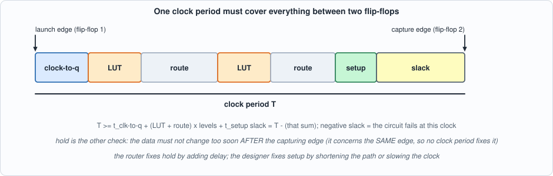
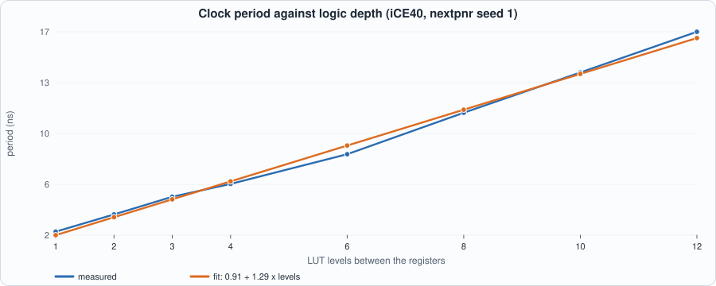
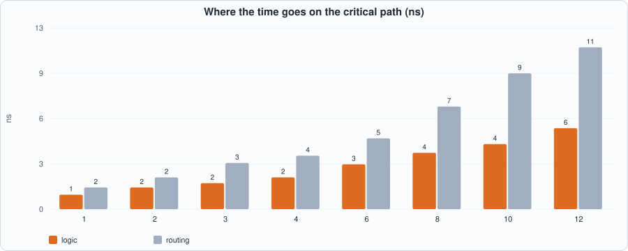
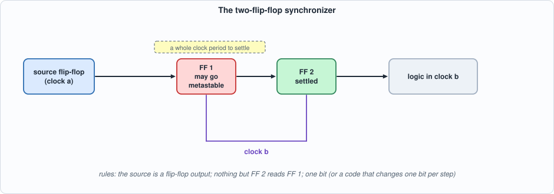
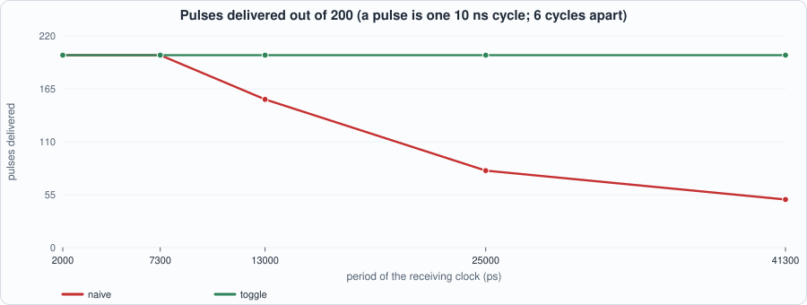
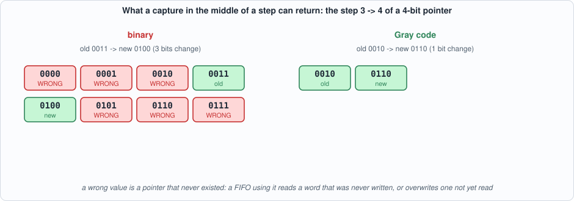
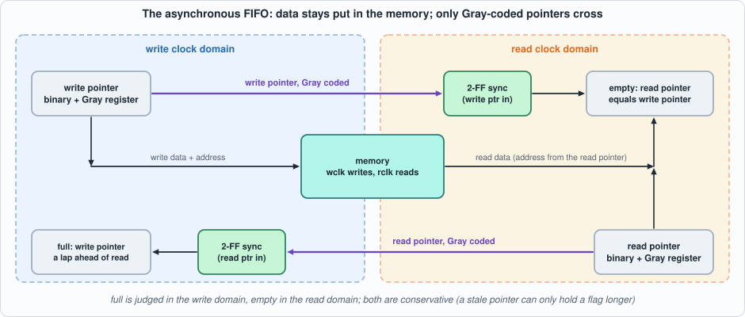

# 3. Timing and Clock Domains: Setup and Hold, Reading a Timing Report, Reset, Synchronizers, and the Asynchronous FIFO


--8<-- "docs/assets/art/ch-03.md"


**What you will see:** how a clock period is spent (and how to read the report that says so), a *measured* straight-line law relating logic depth to clock speed, how much a clock speed moves with nothing but the placer's random start, a reset that asserts at once and releases cleanly, a synchronizer that gives a signal time to settle, two ways to carry a one-cycle pulse across a clock boundary (one of them loses most of them), a counter code (Gray) that is **proved** safe to carry across, and an asynchronous FIFO that is tested against a model of metastability, including the two ways it failed while I was writing it.

**What you need to know first:** Chapters 1 and 2. A flip-flop captures its input at a clock edge; that is all the hardware this chapter assumes.

**What this chapter builds:** `rtl/tchain.sv` (a register, *D* LUT levels, a register), `rtl/cdc_sync.sv` (the two-flip-flop synchronizer), `rtl/cdc.sv` (pulse crossings, reset synchronizer, Gray converter, asynchronous FIFO), `rtl/gray_prop.sv` (the Gray property as an assertion), `tb/cdc_sync_meta.sv` (a synchronizer with random metastability, same name and ports as the real one), the testbenches `tb/cdc_fifo_tb.sv`, `tb/cdc_pulse_tb.sv`, `tb/rst_sync_tb.sv`, the independent model `model/cdc_model.py`, and the scripts `tools/ch03_example_a.py`, `tools/ch03_example_b.py`, `tools/ch03_run.py`, `tools/mut_ch03.py`.

## Setup, hold, and the period equation

A flip-flop does two things at a clock edge: it **samples** its input and, a little later, **drives** its output. Between two flip-flops sits logic, and the logic and its wires take time. For the second flip-flop to capture what the first one launched, the signal must have arrived and settled **before** the next edge:


*Figure 3.1: one clock period, from the launching edge to the capturing edge. Whatever is left over is slack.*

- **setup time** (*t_setup*): how long before the capturing edge the data must be stable;
- **clock-to-q** (*t_cq*): how long after the launching edge the first flip-flop's output is valid;
- **period equation**: `T >= t_cq + (LUT + route) x levels + t_setup`; **slack** is `T` minus that sum. Negative slack means the circuit does not work at that clock.
- **hold time** (*t_hold*): how long the data must stay stable *after* the capturing edge. It involves the **same** edge on both flip-flops, so no clock period fixes it; a path that is too *fast* violates it, and the tools repair it by adding delay.

This chapter measures **setup** (the period equation) with the open tools. It does not measure hold: nextpnr takes care of it and the book has nothing of its own to show about it, so none of the numbers below say anything about hold.

## Reading a timing report

nextpnr prints, for each clock, the longest register-to-register path it found and the maximum frequency that implies. Here is the report for the design built in Example A with six LUT levels (nextpnr, iCE40 HX8K, seed 1, asked for 200 MHz so that it works as hard as it can; the lines that name the source file are removed):

```text
--8<-- "out/ch03_timing_report.txt"
```

**How to read it.** Each pair of lines is one step: a `Source` line is a cell (the flip-flop, then six LUTs) with the time it adds; the `Net` line under it is the wire to the next cell, with the time the wire adds, the two grid coordinates (the wire's start and end tiles) and a **budget**, the delay nextpnr is trying not to exceed. The left numbers are the step time and the running total. The last `Setup` line is the setup time of the capturing flip-flop. The summary line, **3.1 ns logic, 4.9 ns routing**, is the split: here about **61% of the path is wire**. (The cross-domain paths nextpnr lists after this one are the design's input and output pins; they are not part of the register-to-register path.)

Three things to take from it:

1. The wire after the first LUT costs **1.3 ns**, more than three LUTs (0.4 ns each). Routing is not a rounding error; on this device it is the larger part. A wire between tiles far apart costs more than a wire between neighbours, and the placer decides how far apart they are.
2. The maximum frequency is the *reciprocal of the longest path only*. One slow path sets the clock of the whole domain, however fast the rest is.
3. `FAIL at 200.00 MHz` is the report saying the design does not meet the requested clock; that is how a frequency is *found*: ask for more than is possible, read what comes back. Asking for exactly what you need hides the margin.

## Running example A: depth, speed and seeds

`rtl/tchain.sv` is a register, *D* levels of logic, and a register; every level computes `x ^ (a & b) ^ c` on four bits of the previous level, so each level is **one LUT4** and the depth is exactly *D*:

```systemverilog
--8<-- "rtl/tchain.sv"
```

The script synthesizes eight depths with Yosys, asks Yosys's `ltp` command for the longest path (a count of cells), runs nextpnr, parses the logic/routing split, fits a straight line by least squares, and then reruns the six-level design with twelve placer seeds:

```python
--8<-- "tools/ch03_example_a.py"
```

To compile and run: `python3 tools/ch03_example_a.py` (about twenty seconds). Recorded output:

```text
--8<-- "out/ch03_example_a_out.txt"
```


*Figure 3.2: the clock period grows by a constant amount per LUT level.*


*Figure 3.3: the split of the critical path. Routing is 59% to 68% of it at every depth.*

**Reading the output (measured, except where marked).**

- **The depth is what the design says it is.** `ltp` reports a path of D + 2 cells in every row (the two flip-flops and the D LUTs; I looked at the path listing for D = 2), and Yosys used exactly 16 x D LUT4s.
- **Period is a straight line in depth**: `period = 0.91 ns + 1.29 ns x levels`, R^2 = 0.996 over eight points. The slope, 1.29 ns, is one LUT plus the wire after it on this device and this placement; the intercept is clock-to-q, setup and the first wire. That is a *fit* to eight measurements on one device, one seed: a rule of thumb for deciding how many levels you can afford at a target clock, not a law of the device.
- **Routing share is about 60% to 68%**, rising with depth (longer chains spread over more of the chip).
- **Seeds.** The same netlist, with only the placer's random start changed, runs between **111.3 and 124.5 MHz**: a spread of **11.2%** of the mean. At a target of 100 MHz all twelve seeds meet timing; at 125 MHz none does (the best seed misses by a few tenths of a MHz). **A clock to promise is below the worst seed you ran**, and ten per cent below that is a sensible margin: 100 MHz here. This is the same lesson as Chapter 1's seed spread, now stated as a rule.

!!! warning "These are nextpnr's numbers, not signoff"
    nextpnr's delay model is approximate and one seed is one sample. A vendor's signoff tool reports different numbers for the same design, and a board has its own clock, its own temperature and its own supply. Quote a frequency as "nextpnr on iCE40 HX8K, seed 1" and nothing more general.

## Reset: assert at once, release in step

A reset has two jobs: bring the flip-flops to a known state, and let go of them **in the same clock cycle**. Releasing is the dangerous half: if the reset input is released *just* before a clock edge, one flip-flop may see the release and another not, and the circuit leaves reset half-way. The standard remedy is a **reset synchronizer**: the reset **asserts asynchronously** (the output falls the instant the input does, with no clock needed) and **releases synchronously** (the release is retimed through two flip-flops, so it happens on a clock edge, two edges after the input is released):

```systemverilog
module cdc_rst_sync (input logic clk, input logic arst_n, output logic rst_n);
    logic q1;
    always_ff @(posedge clk or negedge arst_n) begin
        if (!arst_n) begin q1 <= 1'b0; rst_n <= 1'b0; end
        else begin q1 <= 1'b1; rst_n <= q1; end
    end
endmodule
```

(The full file is under *The files* below.) The testbench `tb/rst_sync_tb.sv` runs 40 trials: it asserts the reset in the *middle* of a clock period and checks that `rst_n` is low within 1 ps (no clock edge in between), checks that it stays low through three clock edges, then releases the reset at 40 different offsets after an edge and counts the edges until `rst_n` is high. Recorded in `out/ch03_run_out.txt` (Section 4), in both Icarus and Verilator: **all 40 trials take exactly two edges**, `rst_n` fell at once every time, and it was held low every time. The model (`reset_release_edges`) says two, and that is what the hardware does.

!!! note "What this test cannot show"
    In a zero-delay simulation a release is either before an edge or after it. The real hazard is a release **within the flip-flop's recovery/removal window** around the edge, where the first flip-flop of the synchronizer may go metastable. That is the same event as the one in the next section, and the synchronizer's second flip-flop is what absorbs it. The simulation shows the *logic* of the synchronizer (asynchronous assert, two-edge release), not the analog event it protects against.

## Metastability and the synchronizer

A flip-flop whose input changes inside its **setup/hold window** around the capturing edge may go **metastable**: its output hovers between 0 and 1 for a while and then falls to one of them, not necessarily the one the input was heading to. The time it takes is random, and long times are exponentially unlikely. A signal that comes from **another clock** can change at any moment relative to this clock, so sooner or later it changes inside the window.


*Figure 3.4: the two-flip-flop synchronizer. FF 1 may go metastable; FF 2 samples it a full period later, by when it has almost certainly settled.*

```systemverilog
--8<-- "rtl/cdc_sync.sv"
```

The rules are in the file's header and matter more than the code: a **single** bit (or a code in which at most one bit changes per step), the source must be a **flip-flop output** (no logic between it and the synchronizer, which could glitch), and the first flip-flop feeds **only** the second. Both flip-flops have initial values: an FPGA loads them at configuration, so a synchronizer never starts with an unknown.

**How often does it fail?** The standard estimate is `MTBF = exp(t_r / tau) / (T0 x f_clk x f_data)`, where `t_r` is the time allowed for resolution, and `tau` and `T0` are properties of the device (and of its voltage and temperature). The constants below are **assumed** values for illustration, not measurements of any device; the numbers are **derived** from the formula, in `tools/ch03_example_b.py`:

```text
   fclk MHz |       1 flip-flop  |       2 flip-flops |       3 flip-flops
         50 |      1.5e+27 years |      4.2e+70 years |     1.1e+114 years
        100 |      7.5e+04 years |      3.9e+26 years |      2.0e+48 years
        150 |          6.0e+04 s |      5.7e+11 years |      1.7e+26 years
        200 |          8.2e+00 s |      1.9e+04 years |      1.3e+15 years
        250 |         3.5e+01 ms |          1.7e+07 s |      2.6e+08 years
```

(`tau` = 200 ps, `T0` = 100 ps, 2 ns lost to clock-to-q, setup and routing, data changing at a tenth of the clock.) The exponent is the lesson: with these constants, going from 100 to 200 MHz turns a two-flip-flop synchronizer from 10^26 years to 10^4 years, and a third flip-flop buys eleven orders of magnitude back. Take `tau` and `T0` from the vendor's documentation for the device you use.

### A synchronizer you can simulate

You cannot see metastability in an ordinary simulation: every flip-flop captures a clean 0 or 1. `tb/cdc_sync_meta.sv` is a replacement for `cdc_sync` with the **same module name and ports**, so a testbench compiled with it instead of `rtl/cdc_sync.sv` sees a synchronizer whose first flip-flop **resolves randomly when its input changed within a window before the edge**: each bit that changed takes its old value or its new value, at random (a fixed xorshift sequence, so every run is identical in every simulator):

```systemverilog
--8<-- "tb/cdc_sync_meta.sv"
```

The window in the model is **1,800 ps**, chosen to make events frequent enough to test with: real windows are far smaller, so this model fails *more* often than a real device, which is the right direction for a test. It is also **only a model**: it does not hold a value in limbo for longer than a cycle, and it does not model the *shape* of the settling. What it does cover is the case that matters for a bus: **each bit resolves independently.**

## Carrying a pulse across

Suppose one clock domain must send the other a **one-cycle pulse** ("a frame arrived"). The obvious thing is to put the pulse through a synchronizer and detect its rising edge on the far side (`cdc_naive_pulse`). If the pulse is shorter than a period of the receiving clock, the receiving clock may never see it. The remedy is to turn the pulse into a **toggle**: each pulse flips a flip-flop in the sending domain; the (now long-lived) level goes through the synchronizer; and an XOR of the synchronized level with its own previous value turns each *change* back into one pulse (`cdc_toggle_pulse`). The price is a rule: **successive pulses must be far enough apart that the toggle has settled** (at least three receiving-clock periods in practice).

`tb/cdc_pulse_tb.sv` sends 200 one-cycle pulses and counts what arrives. `model/cdc_model.py` predicts the count from the clock edges alone (an ideal sampler: a pulse crosses when a receiving edge falls inside the time its register is high; a toggle crosses when the sampled level has changed since the previous receiving edge). It agrees with the simulation on **every** case in the table below, and on 120 of 120 randomly chosen cases I ran while building it (random periods, phases and gaps; 60 draws, each run on both circuits; checking them exposed three bugs of mine, described under *The files*):

```text
--8<-- "out/ch03_run_out.txt"
```

(That file is the output of the whole chapter's run script; Section 3 is this table.)


*Figure 3.5: the naive circuit (red) delivers fewer pulses as the receiving clock gets slower than the pulses; the toggle circuit (green) delivers all 200.*

**Reading Section 3.** With the receiving clock faster than the pulse (periods 2,000 and 7,300 ps against a 10,000 ps pulse) both circuits deliver all 200. As the receiving clock slows to 13,000, 25,000 and 41,300 ps the naive circuit delivers **154, 80 and 50** (it loses what falls between two receiving edges), while the toggle circuit still delivers 200. Two corner cases are worth reading: with **gap 1** (back-to-back pulses) the naive circuit delivers **1**, because a train of pulses is one long high level, not 200 rising edges; and at **41,300 ps with gap 4** the toggle circuit delivers **188**: pulses 40,000 ps apart are *closer* than one receiving period, two toggles fall between two receiving edges and cancel. That is the spacing rule, measured, and the model predicts every one of these numbers.

## Carrying a bus: Gray code

A synchronizer carries one bit. A multi-bit value crossing bit by bit is wrong whenever **more than one bit changes at once**: each bit takes its old or new value independently, and the result can be a value that **never existed**.


*Figure 3.6: the same pointer step, binary (left) and Gray (right). Binary can return six values that were never the pointer; Gray can return only the old or the new one.*

A **Gray code** is a counting order in which **exactly one bit changes at each step** (including the wrap): `gray = binary ^ (binary >> 1)`. A capture in the middle of a Gray step can return only the old or the new value, both real. Two checks, in different ways:

- **Exhaustive enumeration** (`model/cdc_model.py`, `pointer_capture`; Example B, Section 1, derived): for every step of an *n*-bit counter, every way each changing bit may independently take its old or new value. Binary: **half of all steps** can return a wrong value (e.g. 8 of 16 steps for 4 bits, with 48 wrong values in all); every step that changes *k* bits has 2^k - 2 wrong captures. Gray: **none**, at every width from 2 to 8 bits.
- **A proof by SAT** (`rtl/gray_prop.sv`, run in `ch03_run.py` Section 5): Yosys proves that for **all 16 values** of a 4-bit counter, stepping by one changes exactly one bit of the Gray code (*no model found: SUCCESS*), and for binary returns a counterexample (the step 1 to 2).

```systemverilog
--8<-- "rtl/gray_prop.sv"
```

```text
== 5. the property that makes Gray safe, proved by SAT for EVERY counter value (4-bit counter, all 16 steps including the wrap)
  Gray   : exactly one bit changes at every step -- PROVED for all 16 values
  binary : NOT true -- counterexample: the step 1 -> 2 changes more than one bit
```

## The asynchronous FIFO

The standard way to move *data* between two clock domains is a FIFO whose two sides run on different clocks. The data **does not move** between domains: it is written into a memory by the write clock and read out by the read clock. What crosses is the *information about the pointers*: the write side needs to know how far the reader has got (to know when the FIFO is **full**) and the read side how far the writer has got (to know when it is **empty**). Those two pointers cross as **Gray codes through the two-flip-flop synchronizer**.


*Figure 3.7: the asynchronous FIFO. Pointers cross; data does not.*

The pointers have one more bit than the memory address needs (the extra bit counts laps, so *full* and *empty*, which both have equal low bits, can be told apart). *Empty* is "the read pointer equals the synchronized write pointer"; *full* is "the write pointer is a lap ahead of the synchronized read pointer", which in Gray code means the top two bits are inverted and the rest equal. Both flags are **conservative**: the pointer a side sees is a little *old*, so *full* and *empty* can be held a little longer than strictly necessary, but never too short.

Two design points came from failures, not from the textbook (see *Two things the first version got wrong*, below). The full file:

```systemverilog
--8<-- "rtl/cdc.sv"
```

`tb/cdc_fifo_tb.sv` drives two **unrelated clocks** (periods set by defines, the read clock starting at a different phase), a producer that offers a word with a given probability and holds it until accepted, and a consumer that asks for a word with a given probability. A **scoreboard** (a plain array, written without looking at the design) records every accepted write and checks every accepted read against it. On top of that it checks five properties:

1. every word read is the word written, in order;
2. no write is accepted when the FIFO truly holds a full memory's worth (overflow);
3. no read is accepted when it holds nothing (underflow);
4. all words get through;
5. **the occupancy each side believes** (`rlevel`, `wlevel`: computed from the synchronized far pointer) **is never wrong in the dangerous direction**: the reader's count must never *exceed* what is truly inside, and the writer's must never fall *below* it. A side that over-counts will read what is not there; a side that under-counts will overwrite what has not been read;
6. after the data is through, a **reset in the middle of operation** leaves the FIFO empty, not full, with both counts at zero, while the reset is held and after it is released.

```systemverilog
--8<-- "tb/cdc_fifo_tb.sv"
```

(The recorded run script is further down; its Section 2 is the table that follows.) It runs the FIFO at four clock pairs (10,000/7,300, 7,300/10,000, 10,000/10,000 with a different phase, 4,100/10,000 ps) and four traffic mixes (70/60, 100/100, 30/90, 100/30 per cent offer/ask), 16 runs per row, three designs, with the ideal synchronizer and with the metastability model:

| pointers | encoder | ideal synchronizer | metastability model |
|---|---|---|---|
| Gray | registered (the design) | 16 of 16 pass | **16 of 16 pass** |
| binary | registered | 16 of 16 pass | **0 of 16 pass** |
| Gray | combinational | 16 of 16 pass | **0 of 16 pass** |

The main configuration (10,000/7,300 ps, 70% offer, 60% ask), 3,000 words, in **both** simulators: the Gray design passes with both synchronizers, **and the binary one fails with the metastability model with exactly the same count in both simulators** (reader over-counted 172 times, writer under-counted 31 times), as the recorded output shows. (The two simulators differ in one statistic: `empty seen` is a few cycles different because the testbench samples a flag that changes at the edge it is read at, a harmless race in a statistic, not in a check.)

### Two things the first version got wrong

**1. I expected binary pointers to corrupt data, and they did not.** In the 16 runs with the metastability model, *no word was ever wrong, no write overflowed and no read underflowed*; only the **occupancy-belief checks** failed (property 5). The reason, which I argue and do not prove: this FIFO's flags are *equality* comparisons, and a pointer changes by at most one per cycle, so a bad capture is a **single bad cycle**, and in that cycle the read pointer is still one behind the entry that is really there (the data is written at the same edge as the pointer moves). A bad capture can make a flag wrong for one cycle, but that cannot yet take the FIFO beyond what it holds. What a binary pointer *does* break is the **number**: any logic that uses `wptr - rptr` (a burst read that starts when "at least 4 words are in", an almost-full flag, a threshold for back-pressure) reads a count that can be too high by up to the whole pointer range. Property 5 tests that, it is what Gray code guarantees, and it is what fails. **Binary pointers across a clock boundary are wrong even though this particular FIFO survives them.**

**2. The Gray encoder must come from flip-flops.** My first version computed the Gray code from the binary pointer with gates in front of the synchronizer. It failed the metastability runs with 151 over-counts, and the cause was visible in the model's change log: at the instant a write moved the pointer from `0010` to `0110`, the encoder's output went `0010` -> `0101` -> `0110` within the same time-step, *a glitch that changed three bits, not one*. Gates can do exactly that in hardware too. The fix is the structure in `cdc.sv`: the pointer that crosses is a **register** (`wptr_r`) loaded with the Gray code of the *next* binary pointer. The old structure is kept behind a parameter (`REG = 0`) so the failure can be reproduced: it is the third row of the table.

**Cost in a real device** (Example B, Section 3, measured with Yosys and nextpnr, iCE40 HX8K, seed 1, asked for 100 MHz on each clock):

```text
--8<-- "out/ch03_example_b_out.txt"
```

The binary FIFO is smaller (81 against 90 LUTs for 8 x 8) and clocks faster; that is what the Gray conversion costs, and it is cheap. The memory is read **combinationally** (first-word fall-through), which an FPGA builds from LUTs and flip-flops, not block RAM: that is why the 32-bit, 64-word FIFO takes 1,882 LUTs and 2,102 flip-flops. A block-RAM FIFO has a registered read and needs a prefetch stage; Chapter 8 builds it.

## The files

**Pulses, reset, the converter and the FIFO's testbenches** (the rest of the design files are shown above):

```systemverilog
--8<-- "tb/cdc_pulse_tb.sv"
```

```systemverilog
--8<-- "tb/rst_sync_tb.sv"
```

```python
--8<-- "model/cdc_model.py"
```

Three bugs of mine turned up while checking the pulse testbench against the model, worth stating because each would have produced a wrong "finding". (1) The model disagreed at one case because a receiving edge coincided exactly with a sending edge: the register updates *after* the edge, so the receiving edge sees the *old* value, and the model needed `s < t <= s + period`, not `s <= t < s + period`. (2) The testbench stopped counting before the last pulse had finished crossing; the drain must wait for several receiving-clock edges, not a fixed time. (3) The synchronizer had no initial values, so the first pulse of a run met an unknown (`x`) in the second flip-flop and was lost: a *design* bug that a zero-delay simulator exposes and a real FPGA would not (it loads zeros), fixed by giving every flip-flop of a synchronizer an initial value.

## Running example B and the run script

Example B holds the three derived and measured tables above (exhaustive Gray against binary; MTBF with assumed constants; the FIFO's cost):

```python
--8<-- "tools/ch03_example_b.py"
```

To compile and run: `python3 tools/ch03_example_b.py` (about half a minute). The recorded output is the one shown above, with Section 1 (the exhaustive enumeration):

```text
== 1. every pointer step, every way a mid-change capture can come out (each changing bit independently takes its old or its new value)
  bits  steps |   binary: steps with a wrong value  wrong values |  Gray: steps with a wrong value
     2      4 |                         2 of 4                4 |                    0 of 4    
     3      8 |                         4 of 8               16 |                    0 of 8    
     4     16 |                         8 of 16              48 |                    0 of 16   
     5     32 |                        16 of 32             128 |                    0 of 32   
     6     64 |                        32 of 64             320 |                    0 of 64   
     7    128 |                        64 of 128            768 |                    0 of 128  
     8    256 |                       128 of 256           1792 |                    0 of 256  
```

The run script, which runs the lint gate, the FIFO matrix, the pulse table, the reset trials and the SAT proof:

```python
--8<-- "tools/ch03_run.py"
```

To run: `python3 tools/ch03_run.py` (about a minute). Its recorded output is the file shown under *Carrying a pulse across* above (Section 1: all four circuits lint-clean in Verilator and Yosys; Section 2: the FIFO matrix; Section 3: pulses; Section 4: reset; Section 5: the SAT proof).

## Testing the tests

Each mutant breaks one line of `rtl/cdc_sync.sv`, `rtl/cdc.sv` or `rtl/gray_prop.sv`. The **battery** that tries to catch it is: six FIFO runs (four traffic/clock mixes with the ideal synchronizer, two with the metastability model), the pulse circuits against the event model at three settings each, the reset synchronizer trials, a **structural check** that a synchronizer has exactly two flip-flops (counted by Yosys; simulation cannot see a missing stage), and the SAT proof of the Gray property. A mutant is caught if any of them fails.

```python
--8<-- "tools/mut_ch03.py"
```

To run: `python3 tools/mut_ch03.py` (about ten seconds on four cores). Recorded output:

```text
--8<-- "out/ch03_mut_out.txt"
```

All **19** are caught. One change is listed apart as **equivalent**: taking the reader's count after the current edge's read instead of before it (`rbin_n` for `rbin` in `rlevel`). The change only affects whether the count includes a read that is happening in the same cycle; it can only make the count *smaller*, and the safety property in the testbench (the reader's count never *exceeds* the truth) cannot tell the two apart. A stricter property ("the count is not more than a fixed amount below the truth") would, and I did not write one: this is a property the testbench does not check, not a proof the two are the same.

Two things the mutation run showed, one on the design and one on the tests:

- **A missing synchronizer stage is invisible to simulation.** The mutant that connects `q` straight to `d` passes every FIFO and pulse test with the ideal synchronizer (the stage only adds a cycle of latency), and the model of metastability does not apply because the testbench *replaces* the file that was mutated. Only the structural check (Yosys counts one flip-flop, expects two) catches it. A real flow adds a CDC lint tool for this reason.
- **The mid-run reset test was added after a survivor.** The first run of the battery left one mutant alive: `wptr_r` not cleared by the write-side reset. Nothing noticed, because after reset the register is reloaded from the cleared binary pointer a cycle later. The test that closed it is property 6 in the testbench: a second reset of both sides in the middle of operation must leave the FIFO empty. (The mutant also fails in hardware only if the power-up value is not zero; this chapter's flip-flops all have initial values, so the mid-run reset is the only way to see it.)

## What this chapter established, and what it did not

**Established, with the tests that show it:** the period equation and the way nextpnr reports it (the logic/routing split), a straight-line fit `period = 0.91 ns + 1.29 ns x levels` over eight depths on one device and seed (R^2 = 0.996); a placer-seed spread of 11.2% on one design; a reset synchronizer with asynchronous assert and a two-edge synchronous release in two simulators; a synchronizer with the pulse crossings predicted exactly by an independent model (120 of 120 random cases, and every row of the table); a **proof by SAT** that a Gray code changes exactly one bit per step for all 16 values of a 4-bit counter, and the exhaustive enumeration for widths 2 to 8; an asynchronous FIFO that passes every check with the metastability model at four clock pairs and four traffic mixes, in two simulators; the two ways the FIFO fails when built wrongly; 19 of 19 mutants caught.

**Not established:** hold time (not measured); any claim about a vendor tool's numbers; the real metastability window and `tau` of any device (the model's window is deliberately large, and the MTBF constants are assumed); metastability that lasts longer than one clock (the model resolves in one cycle); *why* binary pointers did not corrupt data in this FIFO is an argument, not a proof; timing of the paths **between** the two domains (a real flow constrains them; this chapter's nextpnr runs do not); the reset synchronizer's behaviour at the recovery/removal edge (a zero-delay simulation cannot show it); and a block-RAM FIFO (Chapter 8).

## Self-check questions

1. Write the period equation and say what changes if the clock is 20% faster.
2. In the timing report, the logic/routing split of the critical path was 3.1 / 4.9 ns. What would you try first to speed the design up, and why is "use a faster LUT" not on the list?
3. Why does hold time not depend on the clock period?
4. Why is the clock you can *promise* lower than the best seed's Fmax, and how did Example A choose it?
5. Why does a reset synchronizer assert asynchronously but release synchronously?
6. What does the second flip-flop of a synchronizer buy, and what does a third buy?
7. A pulse is one 10 ns cycle long and the receiving clock has a period of 25 ns. What does the naive circuit deliver, and what does the toggle circuit need in return for delivering them all?
8. Why can a multi-bit binary counter not be sent through a bank of synchronizers, and what property of Gray code fixes it?
9. In the FIFO, why is `full` computed in the write domain and `empty` in the read domain, and why can each be wrong only in the safe direction?
10. The binary-pointer FIFO passed the data checks but failed the occupancy checks. Give an example of a circuit that would have corrupted data.
11. Why does the first version of the FIFO (Gray encoder from gates) fail?
12. Why can no simulation of the ideal synchronizer show that a synchronizer stage is missing?

## Exercises

1. **Three flip-flops.** Add a `STAGES` parameter to `cdc_sync` and to the metastability model (a longer pipeline after the first flip-flop). With a *longer* window in the model, find the window at which two stages fail the FIFO test and three do not. What does that say about the MTBF table?
2. **A burst reader.** Add a consumer to `cdc_fifo_tb.sv` that, when `rlevel >= 4`, reads four words in four consecutive cycles without checking `empty`. Show that the binary-pointer FIFO then corrupts data under the metastability model and the Gray one does not.
3. **Depth and Fmax on ECP5.** Run Example A's sweep on the ECP5 target (`flow.run(..., "ecp5", ...)`). How do the intercept and the slope compare, and does the routing share change?
4. **A pulse with a bounded rate.** Compute from the model the smallest gap (in sending cycles) at which the toggle circuit delivers all 200 pulses for a receiving period of 41,300 ps, and check it in simulation.
5. **A stricter test.** Add the property "the reader's count is not more than N below the truth after the pointer has had time to cross" and decide the smallest N for which the equivalent mutant becomes a caught one.
