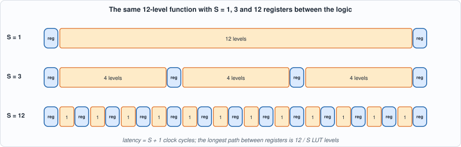
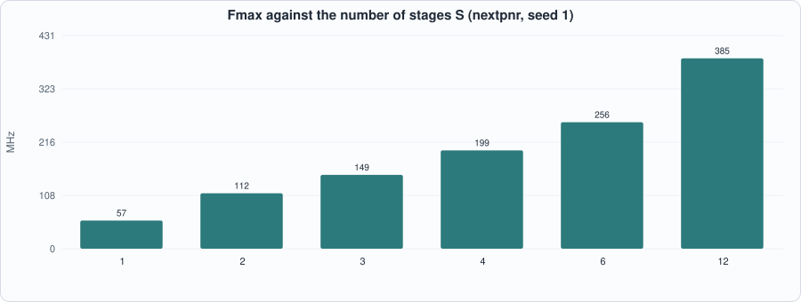
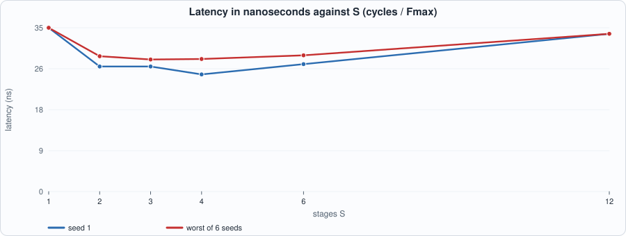
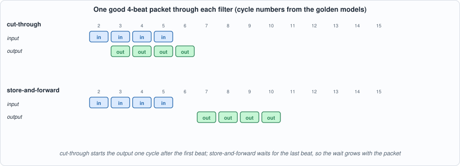
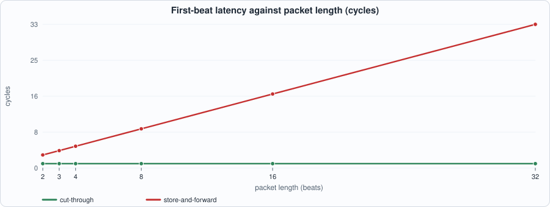
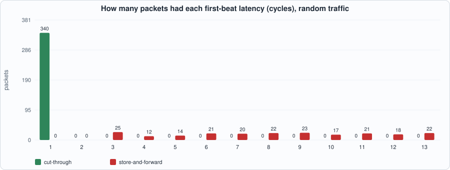

# 4. Latency as a Budget: Pipelines, Cut-Through Against Store-and-Forward, and Determinism


--8<-- "docs/assets/art/ch-04.md"


**What you will see:** what *latency* means in this book (a count of clock cycles at a stated clock, never a wire-to-wire time), how cutting one function into more pipeline stages raises the clock but adds cycles, so the latency in nanoseconds falls, goes flat and rises again (measured), and two packet filters with the same specification and opposite latency: a **cut-through** filter whose latency is one cycle for every packet, and a **store-and-forward** filter whose latency grows with the packet. Both are checked cycle for cycle against golden models, and both models are checked against the specification.

**What you need to know first:** Chapters 1 to 3 (the LUT and flip-flop, valid/ready, the period equation). Nothing about networking is assumed beyond "a packet is a sequence of beats".

**What this chapter builds:** `rtl/pipe.sv` (a function in S stages), `rtl/pktfilt.sv` (`ct_filter` and `sf_filter`), `model/lat_gold.py` (the golden models, the specification and the stimulus), the testbenches `tb/pipe_tb.sv` and `tb/pkt_tb.sv`, and `tools/ch04_example_a.py`, `tools/ch04_example_b.py`, `tools/ch04_run.py`, `tools/mut_ch04.py`.

## What latency is, here

**Latency** is the number of clock cycles between an input and the output that depends on it. **Throughput** is how many inputs are accepted per cycle. **Jitter** is variation of the latency from one input to the next. A design built as a pipeline of registered circuits has a latency that is an *integer*, fixed by its structure; its time is that integer times the clock period.

This book states latency in **cycles at a stated clock**. It never quotes a "wire-to-wire" nanosecond figure for a design: that would include the board, the physical interface and the exchange's gateway, none of which a simulation or the open tools can measure. What the book can measure is the part inside the FPGA, in cycles, and the clock the open tools say the design can reach (Chapter 3's *"nextpnr's numbers, not signoff"* applies to every nanosecond figure below).

A **latency budget** is the sum over the stages of a path of *cycles x period*. Writing one down before building (a table of stages, each with its cycles) is the discipline: it shows which stage to attack and, above all, which stages can be given *more* cycles without hurting.

## Pipelining, and the point at which it stops helping

Chapter 3 showed that the clock period of a register-to-register path grows linearly with its logic depth: `period = 0.91 ns + 1.29 ns x levels` on this device. If the logic between two registers is halved by inserting a register in the middle, the period falls, but the output arrives one cycle later. The question is what that does to the *time*.

`rtl/pipe.sv` is the experiment. It computes a function of 12 rounds, each one LUT4 level (the mixing function of Chapter 3's `tchain`), and places a register after every `12 / S` rounds, for `S` = 1, 2, 3, 4, 6 or 12. The input is registered first, so that every logic path starts and ends at a flip-flop (this is what a timing tool measures; a path from a pin to a register is not a clock path, and with no input register nextpnr found no path at all for `S` = 1). The latency is exactly **S + 1** cycles.

```systemverilog
--8<-- "rtl/pipe.sv"
```

Two notes on the code, both about the tools rather than the idea: Yosys 0.33 does not accept `return` in a function (the result is assigned to the function's name), and Icarus does not allow one array to be driven partly by `assign` and partly by `always_ff`, which is why the input register is a separate pair of signals and not element 0 of the array.

### The golden model and the testbench

The model (`pipe_f`, `pipe_cycles` in `model/lat_gold.py`) computes the function from its definition on integers and delays each valid input by `S + 1` cycles; the testbench compares `out_valid` and `out_data` with it **every cycle** of a random stream. A second property is built in: valid is high in no cycle other than the delayed copies of valid inputs, so a stale or phantom output fails. The valid bit is held **high during reset** (reset must discard it; an earlier version of the testbench held it low, and one mutant survived because of that).

```systemverilog
--8<-- "tb/pipe_tb.sv"
```

### Running example A: how many stages?

```python
--8<-- "tools/ch04_example_a.py"
```

To compile and run: `python3 tools/ch04_example_a.py` (about a minute). Recorded output:

```text
--8<-- "out/ch04_example_a_out.txt"
```


*Figure 4.1: the same function cut into 1, 3 and 12 stages. More stages, shorter paths, more registers, more cycles.*


*Figure 4.2: Fmax rises with the number of stages (57 to 385 MHz, seed 1).*


*Figure 4.3: latency in nanoseconds against stages. It falls steeply from one stage, is flat over the middle, and rises again.*

**Reading the output (measured).**

- **Area barely changes**: 192 LUTs in every row (12 levels x 16 bits); only the flip-flops grow, from 34 to 221, because each stage registers the whole 16-bit word and its valid bit.
- **Fmax grows with `S`** from 57 MHz (12 levels between registers) to 385 MHz (one level), but **not in proportion**: twelve times the stages gives under seven times the clock, because each stage still pays clock-to-q, setup and a route.
- **Latency in nanoseconds falls, flattens and rises**: 35.1 ns at `S` = 1 (seed 1), about 25 to 27 ns for `S` = 2 to 6, and 33.8 ns at `S` = 12. With the worst of six seeds, `S` = 2 to 6 lie between **28.3 and 29.2 ns**: **a difference smaller than the seed-to-seed spread of Fmax (up to 20%) in the table that follows.** The data support "use a middle number of stages" and do not support choosing between 2 and 6.
- **Throughput** is one item per cycle in every row, so it equals the clock: it *rises* with `S`, while the latency in ns does not fall further. Pipelining always buys throughput; it buys latency only while the logic delay dominates.

!!! warning "What this does and does not say"
    One device, one function, nextpnr's estimate. The shape (a steep fall, a flat floor, a rise) is the general result; the position of the floor depends on the ratio of the logic delay to the per-stage overhead, which is device-specific. Chapter 5 returns to the cost side: what each extra register costs in area.

## Cut-through and store-and-forward

A packet arrives as a sequence of **beats**. A stage that must *decide* something about the packet has two ways to work.

- **Store-and-forward** waits for the whole packet, decides, and then emits it (or discards it). It can look at everything before deciding, and it never emits a bad packet; its latency is at least the packet's length.
- **Cut-through** starts emitting after the first beat. Its latency is a constant, but it must decide *early*: what is known only at the end (a checksum) is raised **after** the packet has already left, as a flag on the last beat, which the receiver must obey.

Both are specified by one rule set, so that one specification can judge both:

> A packet of 32-bit beats is **dropped** unless the low byte of its first beat is `0xA5`. A kept packet is **bad** if the sum of the low 16 bits of all its beats is not 0 modulo 65,536, and **good** otherwise.

(The header test needs only the first beat, so cut-through can apply it immediately; the checksum needs the last, so cut-through can only flag it.) The designs:

```systemverilog
--8<-- "rtl/pktfilt.sv"
```

`ct_filter` has no backpressure (a cut-through stage cannot hold a stream it is already emitting; its downstream must keep up). `sf_filter` has one buffer, so it refuses input (`in_ready` low) while a packet drains.

### Three layers of checking

The **specification** is a function (`classify` in `model/lat_gold.py`) with no timing. The **golden models** (`CT`, `SF`) are cycle-exact state machines written from the descriptions above, not from the Verilog. The **testbench** reads a per-cycle vector file made from the model (inputs, and the expected `in_ready`, `out_valid`, `out_last`, `out_bad`, `out_data`) and compares every cycle. Checking the models against the specification is a separate step done in Python (Section 3 of the run), over 40 random streams of 100 packets: the cut-through model must output *exactly* the kept packets with the bad ones flagged, and the store-and-forward model *exactly* the good ones. That way a wrong model cannot make a wrong design look right.

```python
--8<-- "model/lat_gold.py"
```

```systemverilog
--8<-- "tb/pkt_tb.sv"
```

### The run script

```python
--8<-- "tools/ch04_run.py"
```

To compile and run: `python3 tools/ch04_run.py` (a few minutes: most of it is Verilator compiling). Recorded output:

```text
--8<-- "out/ch04_run_out.txt"
```

**Reading the output.** Section 1: all three design files are lint-clean. Section 2: the pipelined function passes at all six stage counts and three valid densities in Icarus, and at 70% in Verilator. Section 3: the two models agree with the specification on **40 of 40** random streams. Section 4: both filters match their golden models on **18 of 18** runs each (six seeds, three mixes of good, bad and dropped packets) in Icarus, and on the first run of each in Verilator.

### Running example B: what the choice costs

```python
--8<-- "tools/ch04_example_b.py"
```

To compile and run: `python3 tools/ch04_example_b.py` (about a minute). Recorded output:

```text
--8<-- "out/ch04_example_b_out.txt"
```


*Figure 4.4: one good 4-beat packet. Cut-through starts one cycle after the first beat; store-and-forward starts after the last beat has arrived.*


*Figure 4.5: first-beat latency against packet length. Cut-through is flat at 1; store-and-forward is `n + 1`.*

**Reading the output (derived from the golden models, which the RTL matches cycle for cycle, except Section 5 which is measured).**

- **Latency.** Cut-through: **1 cycle** for the first beat and for the last beat of every kept packet, from 2 to 32 beats. Store-and-forward: **n + 1** for both: the first beat leaves two cycles after the last has arrived, and the packet is then streamed out at one beat per cycle.
- **Determinism.** Over 400 random packets of 1 to 12 beats, cut-through had **one** distinct first-beat latency (1 cycle, 340 packets). Store-and-forward had **eleven** (3 to 13 cycles). The first number is a *guarantee of the structure*; the second is a *distribution* that depends on the traffic. A latency budget can be written for the first and not for the second.
- **Rate.** Cut-through keeps the link rate with back-to-back packets (40 packets of 8 beats in 320 cycles, one beat per cycle). The single-buffer store-and-forward refuses half of what a source offers back-to-back (160 of 320 beats); a source that obeys `in_ready` is limited, by derivation, to one 8-beat packet per about 16 cycles (8 to fill, 8 to drain), half the link rate. (A double buffer removes this limit at the price of a second buffer.)
- **What cut-through lets through.** Of 120 random packets (52 good, 39 bad, 29 dropped), cut-through emitted **91** (the good and the bad), with **39 flagged bad on the last beat**; store-and-forward emitted the **52** good ones and no bad one. A bad packet has *already left, beat by beat*, before the filter could know. That is the cost of the constant latency: the receiver of a cut-through stream must be able to discard a packet whose last beat is flagged (and everything it did with the earlier beats must be undoable).
- **Area and clock** (measured, iCE40 HX8K, seed 1): cut-through 43 LUTs, 53 flip-flops, no block RAM, 129 MHz; store-and-forward 124 LUTs, 46 flip-flops, **2 block RAMs** (the 32-beat buffer), 95 MHz. The buffer is the price of waiting.


*Figure 4.6: the first-beat latency under random traffic: one value for cut-through, eleven for store-and-forward.*

## Writing a budget

With cycles and a clock, a budget is a sum. As an illustration only: the *assumed* clock of 100 MHz (10 ns period), a 4-stage pipeline of Example A (5 cycles) and the cut-through filter (1 cycle) in series are `(5 + 1) x 10 ns = 60 ns`, by derivation; the same path with the store-and-forward filter for an 8-beat packet is `(5 + 9) x 10 = 140 ns`. The point is not the figures but the *form*: a column of stages, a column of cycles (exact, from the structure), and one clock; a stage whose cycles depend on the data (store-and-forward) must be written as a range, and the budget of the path is then a range too. Later chapters fill the table with the real stages of the trading path, each measured in cycles in simulation.

## Testing the tests

Each mutant breaks one line of `rtl/pipe.sv` or `rtl/pktfilt.sv`. The battery: the pipelined function with `S` = 1, 3 and 12, and both filters on three packet mixes, each against the golden model.

```python
--8<-- "tools/mut_ch04.py"
```

To run: `python3 tools/mut_ch04.py` (a few minutes). Recorded output:

```text
--8<-- "out/ch04_mut_out.txt"
```

All **27** are caught. Two changes are listed apart as **equivalent**: (1) loading a pipeline stage's data register only when its valid bit is set (the data is checked only when valid, so no test can see it; it can *save power*, which is a property the testbench does not look at); (2) not advancing the write count on the last beat of a good packet in `sf_filter` (the count is reset when the drain ends and is not used in between).

**One survivor in the first run** is worth recording: the mutant that does not clear the *input valid register* on reset lived because the first version of the testbench held `in_valid` low during reset, so the register was cleared by the idle input anyway. The testbench now holds `in_valid` high during reset (a valid input must be discarded by reset), and the mutant is caught.

## What this chapter established, and what it did not

**Established, with the tests that show it:** a pipeline of S stages has a latency of exactly S + 1 cycles and matches its model on every cycle at six stage counts; the clock grows with S but the latency in nanoseconds falls, flattens and rises (measured with nextpnr on one device); a cut-through filter has one first-beat latency (1 cycle) for packets of 2 to 32 beats and over random traffic, a store-and-forward filter has `n + 1` (eleven distinct values over the random mix); both filters match cycle-exact golden models, and the models match the specification on 40 of 40 streams; 27 of 27 mutants caught.

**Not established:** any wire-to-wire or board-level latency; the position of the latency floor on any device other than the iCE40 HX8K model, or on any function other than this one; that the S = 2 to 6 differences are real (they are inside the seed spread); the behaviour of the filters under backpressure from the downstream (cut-through has none; store-and-forward's `in_ready` is checked only on traffic that respects it); a double-buffered store-and-forward filter; the real clock of either filter on a board.

## Self-check questions

1. Define latency, throughput and jitter, and say which of the three a pipeline's structure fixes.
2. Why does the book never quote a wire-to-wire time for a design?
3. In Example A the area is 192 LUTs in every row but the flip-flops grow. Why?
4. Fmax rises from 57 to 385 MHz as the stages go from 1 to 12. Why is the rise less than twelvefold?
5. Why does the latency in nanoseconds have a minimum rather than falling forever?
6. Why can the data not tell you whether to use 2 or 6 stages?
7. Why did the pipeline get an input register, and what did nextpnr report without it?
8. What can cut-through decide at the first beat, and what only at the last? How does it handle the second?
9. Why must the receiver of a cut-through stream be able to undo work?
10. Why is "40 of 40 streams agree with the specification" a separate check from the testbench passing?
11. Why does a budget for a store-and-forward stage have to be a range?
12. One mutant survived the first run of the battery. Which, why, and what closed it?

## Exercises

1. **A double buffer.** Give `sf_filter` two buffers so that a packet can fill while another drains. Extend the model, show the sustained rate reaches the link rate for packets of equal length, and measure the extra cost.
2. **A better budget.** Extend Example A with a column for throughput in items per microsecond and decide, for a function that must complete in under 30 ns at 1 item per cycle, which stage counts are acceptable at the worst-of-six clock.
3. **Backpressure.** Add `in_ready`/`out_ready` to `ct_filter`. What does it cost in latency and in area, and what happens to the "one latency" property?
4. **Where is the floor?** Run Example A on the ECP5 target and report where the latency floor sits and whether it is as flat.
5. **A mutant that survives.** Add a mutant to `mut_ch04.py` that the battery does not catch. Is it equivalent, or is a test missing?
