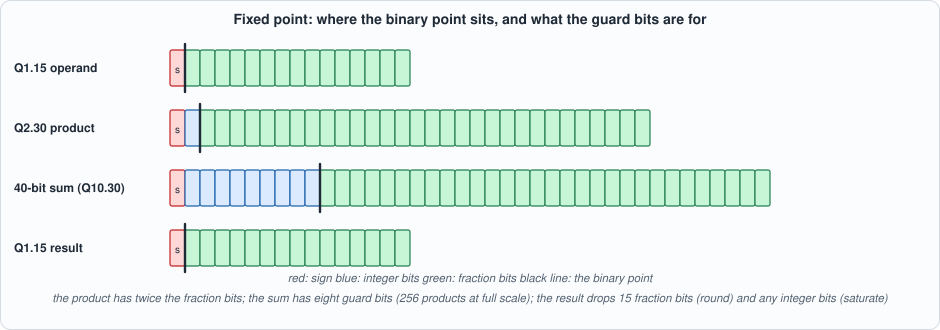
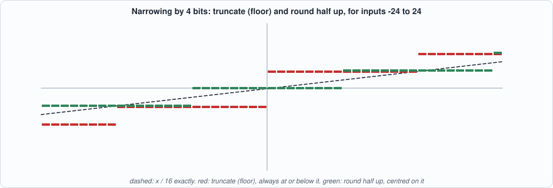
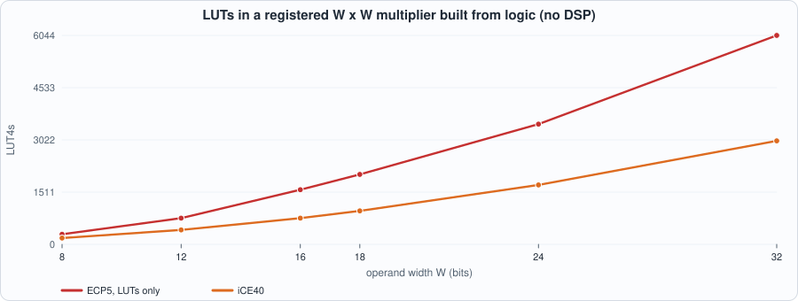
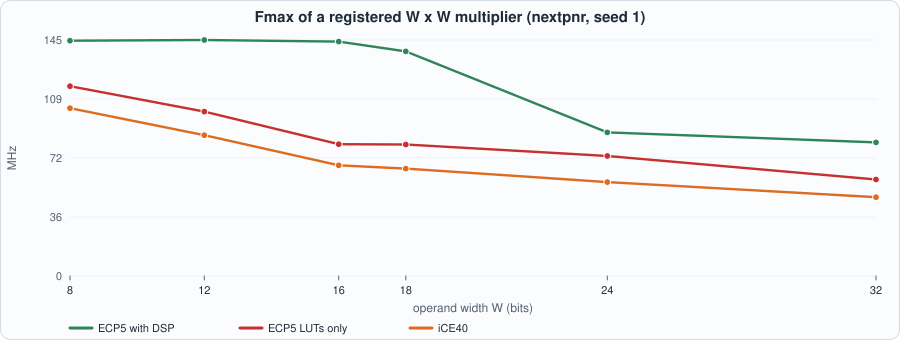
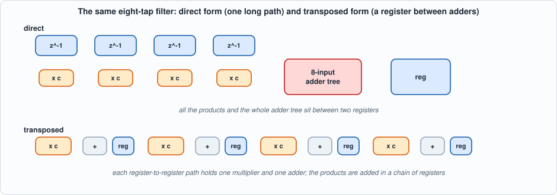
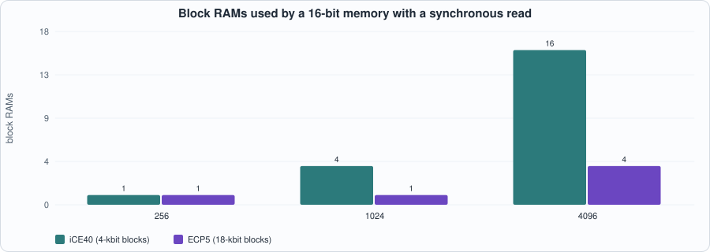

# 5. Resources: Fixed-Point Arithmetic, DSP Blocks, Block RAM, and Moving Registers


--8<-- "docs/assets/art/ch-05.md"


**What you will see:** how a number is written in fixed point and what a multiply, an accumulate, a round and a saturate each do to it, with **every input value** of the narrowing circuit tested; what a multiplier costs in logic against in a DSP block, measured on two device families; how the same memory lands in LUTs, distributed RAM or block RAM depending on one line of how it is read; and an 8-tap filter written two ways with **identical outputs** whose area and clock speed differ by a factor of two.

**What you need to know first:** Chapters 1 to 4. A signed binary number in two's complement is assumed.

**What this chapter builds:** `rtl/fxp.sv` (`fx_round_sat`, `fx_mac`), `rtl/fir.sv` (`fir_direct`, `fir_transposed`), `rtl/ram_style.sv`, `rtl/mulreg.sv`, the integer-arithmetic models in `model/fx_gold.py`, the testbenches `tb/rs_tb.sv`, `tb/mac_tb.sv`, `tb/fir_tb.sv`, `tb/ram_tb.sv`, and `tools/ch05_example_a.py`, `tools/ch05_example_b.py`, `tools/ch05_run.py`, `tools/mut_ch05.py`.

## Fixed-point numbers

A **fixed-point** number is an integer with an agreed position of the binary point. **Q1.15** is a signed 16-bit value `x` that means `x / 2^15`: a sign bit and 15 fraction bits, the range [-1, 1) in steps of 2^-15. In general **Qm.n** has *m* integer bits (counting the sign) and *n* fraction bits. The hardware does only integer arithmetic; the point is in the designer's head and in the shifts.


*Figure 5.1: the formats along a multiply-accumulate. The product of two Q1.15 numbers is Q2.30; adding products needs guard bits; the result is brought back to Q1.15 by dropping 15 fraction bits.*

- A **product** of two Q1.15 numbers is an exact **Q2.30** number (32 bits). Nothing is lost.
- A **sum** of products grows: 256 products at full scale need 8 more integer bits, so the accumulator here is **40 bits**. These are **guard bits**: they make overflow of the *sum* impossible for up to 256 terms, and leave the single place where the result can go out of range (the narrowing at the end) under control.
- **Narrowing** back to Q1.15 drops 15 fraction bits (an error, controlled by the **rounding** rule) and possibly some integer bits (an overflow, controlled by the **saturation** rule).

### Rounding and saturation

**Truncation** keeps the high bits and drops the low ones; for two's complement that is a **floor** (round toward minus infinity), so it is biased: always at or below the exact value. **Round half up** adds half an output step before dropping: unbiased on average, at the price of one adder. **Saturation** replaces an out-of-range value by the largest or smallest representable one; **wrap** keeps the low bits, which is free and which turns an overflow into a value of the wrong sign.


*Figure 5.2: narrowing by 4 bits. Truncation is a staircase that lies below the line; rounding is centred on it.*

```systemverilog
--8<-- "rtl/fxp.sv"
```

`fx_round_sat` is combinational. One extra bit is carried so that adding the rounding constant cannot itself overflow: rounding a value just under the maximum can *produce* an out-of-range result (2,047 rounded to 6 bits with a shift of 4 is 128, which saturates to 31 and, with wrap, becomes 0). `fx_mac` has three stages: operands registered, product registered, accumulator registered; `clr` starts a new sum, `en` adds the product.

### The models and the tests

`model/fx_gold.py` is integer arithmetic only: `round_sat` (Python's `>>` on negative integers is a floor, like the hardware's arithmetic shift), a cycle-by-cycle `MAC` class, a `fir_run` that states the filter as its definition `y[k] = sum C[i] x[k-2-i]`, and `ram_run`.

```python
--8<-- "model/fx_gold.py"
```

- **`fx_round_sat` is tested on every input.** The testbench `tb/rs_tb.sv` reads one line per possible input from the model and checks all of them: 4,096 inputs for a 12-to-6-bit narrowing, 1,024 for 10 to 10 bits (shift 0), 16,384 for 14 to 8 bits (shift 5), each in four modes (truncate or round, wrap or saturate). Exhaustive testing is possible only because the widths are small; the 40-to-16-bit instance used in the MAC is the same code with different constants, and is exercised by the MAC and FIR tests below.
- **`fx_mac` is tested cycle by cycle**: random operands, and an *overflow-heavy* mix of full-scale values, in all four modes, compared on the 40-bit accumulator *and* the rounded output.

```systemverilog
--8<-- "tb/rs_tb.sv"
```

```systemverilog
--8<-- "tb/mac_tb.sv"
```

## Running example A: what arithmetic costs

```systemverilog
--8<-- "rtl/mulreg.sv"
```

```python
--8<-- "tools/ch05_example_a.py"
```

To compile and run: `python3 tools/ch05_example_a.py` (about two minutes). Recorded output:

```text
--8<-- "out/ch05_example_a_out.txt"
```


*Figure 5.3: a multiplier built from logic grows roughly with the square of its width.*


*Figure 5.4: the DSP block is both smaller and faster, until the multiplier no longer fits in one.*

**Reading the output (measured; nextpnr seed 1, one placement per row).**

- **A DSP block is a hard multiplier.** On the ECP5 target Yosys maps a registered multiplier of up to **18 x 18 bits to one `MULT18X18D` and zero LUTs**; at 24 and 32 bits it needs **four** blocks (a wider product is assembled from 18-bit pieces). Its Fmax is 144 MHz at 16 bits, and 88 MHz at 24 bits where the pieces must be added.
- **The same multiplier in logic** costs **1,581 LUTs and 16 carry cells at 16 bits** and 6,044 LUTs at 32 bits on ECP5, and 758 and 2,995 on iCE40 (which has no DSP block in this device). The cost grows about with the *square* of the width (each added bit adds a whole row of partial products). **Do not compare the ECP5 LUT counts with the iCE40 ones**: different mapping rules and different carry cells (the same caveat as Chapter 1).
- **The multiply-accumulate**: with the DSP, **1 DSP, 59 LUTs, 53 carry cells, 144 MHz**; without it, **1,640 LUTs, 86 MHz** (ECP5) or **899 LUTs, 68 MHz** (iCE40). The 40-bit accumulator is in the fabric in every case (Yosys 0.33 does not use the DSP block's own accumulator here), which is where the 59 LUTs and 53 carry cells go.
- **Rounding and saturation are not free**: narrowing 40 to 16 bits costs **0 LUTs** to truncate and wrap (just wires), **16** to round, **43** to saturate and **60** for both. It is a small cost against a multiplier, and it is the difference between a filter that clips and one that wraps.

## Running example B: storage, and moving registers

`rtl/ram_style.sv` is one memory read three ways: **style 0** with an asynchronous read (the address goes through the array to the output in the same cycle), **style 1** with a synchronous read (the data appears one cycle after the address), **style 2** with a synchronous read and an output register (two cycles). A synchronous read of the address being written in the same cycle returns the **old** contents (read-first), which is what a block RAM does.

```systemverilog
--8<-- "rtl/ram_style.sv"
```

```systemverilog
--8<-- "tb/ram_tb.sv"
```

The FIR filter is written two ways. **Direct form** shifts the input through a delay line and forms all eight products and the whole sum in one clock period. **Transposed form** multiplies the input by every coefficient and adds the products in a *chain of registers*, so each clock period holds one multiplier and one adder. The two have the same behaviour, cycle for cycle (latency 2); only the position of the registers differs: that is **retiming**, moving registers across logic without changing what the circuit computes.


*Figure 5.5: the two forms of the same filter.*

```systemverilog
--8<-- "rtl/fir.sv"
```

```systemverilog
--8<-- "tb/fir_tb.sv"
```

```python
--8<-- "tools/ch05_example_b.py"
```

To compile and run: `python3 tools/ch05_example_b.py` (about ten minutes, almost all of it the place-and-route of the larger memories). Recorded output:

```text
--8<-- "out/ch05_example_b_out.txt"
```


*Figure 5.6: a synchronous-read memory lands in block RAM; the block count follows the number of bits.*

**Reading Section 1 (measured).**

- **An asynchronous read is a bank of flip-flops and multiplexers.** At 16 words x 16 bits on iCE40 it is **256 flip-flops and 197 LUTs**, at 64 words **1,024 flip-flops and 938 LUTs**, with **no block RAM**: the block RAM has a synchronous read port, so it cannot implement an asynchronous read. I did **not** build the deeper asynchronous memories: a 256 x 16 array is 4,096 flip-flops of the device's 7,680 logic cells, and the first attempt was still being placed after more than two minutes when I stopped it. The recorded output marks those rows as not built.
- **A synchronous read costs about 22 LUTs and one block RAM per 4,096 bits** on iCE40: 1 block RAM at 256 words x 16 bits, 4 at 1,024, 16 at 4,096. On ECP5 it is one 18-kbit block RAM at 256 and 1,024 words and 4 at 4,096; at **16 and 64 words ECP5 chooses distributed RAM** (`TRELLIS_DPR16X4`, 4 and 16 cells) and no block RAM at all: the tool picks the smaller resource.
- **An output register changes the clock.** On iCE40 the block RAM's Fmax is 387 to 395 MHz (style 1, small), 287 MHz at 256 and 1,024 words and 206 MHz at 4,096 words, and **253 MHz in style 2 at every size up to 1,024** (a constant, which I take to be the path out of the block RAM; I did not look at the path report). On ECP5, style 2 reads 135 to 137 MHz from 256 words up.
- **`n/a` means there is nothing to measure**, not that the design is fast: an asynchronous read, or a memory whose output is read straight from a block RAM with no register after it, has no register-to-register path for the timing tool to report (the same effect as Chapter 4's one-stage pipeline). The ECP5 distributed-RAM rows with an output register show 677 and 976 MHz: the path is nearly empty, and **no real design would run at that clock**; a placed design is limited by the clock network and by whatever the rest of the circuit does. These numbers measure the memory in isolation.

**Reading Section 2 (measured; the two forms match the model, see below).**

| form | target | DSP | LUT | FF | Fmax |
|---|---|---|---|---|---|
| direct | ECP5 | 8 | 646 | 150 | 67.7 MHz |
| transposed | ECP5 | 4 | 18 | 300 | 100.5 MHz |
| direct | iCE40 | 0 | 2,350 | 150 | 35.2 MHz |
| transposed | iCE40 | 0 | 1,076 | 300 | 64.3 MHz |

Same function, same outputs: the transposed form has **twice the flip-flops** (300 against 150), **far fewer LUTs** (18 against 646 on ECP5, 1,076 against 2,350 on iCE40) and a **1.5 to 1.8 times higher clock**. Registers are cheap in an FPGA (every logic cell has one), logic is the scarce thing, and a long combinational path is the expensive thing: the transposed form spends the cheap resource to save the expensive ones. On ECP5 Yosys reports **4 DSP blocks for the transposed form against 8 for the direct form** for the same eight products; I did not investigate why (a plausible reason is that it merges pairs of multipliers and the adder that follows, but I have not checked that).

## The run script

```python
--8<-- "tools/ch05_run.py"
```

To compile and run: `python3 tools/ch05_run.py` (about five minutes, mostly Verilator compiling). Recorded output:

```text
--8<-- "out/ch05_run_out.txt"
```

**Reading the output.** Section 1: all six design files are lint-clean. Section 2: `fx_round_sat` matches the model on **every input** in three width configurations and four modes. Section 3: `fx_mac` matches the model on every cycle at random and overflow-heavy traffic in all four modes, in Icarus, and in Verilator for the overflow traffic and the round-and-saturate mode. Section 4: both FIR forms match the model on 3,000 cycles in three modes in Icarus and in Verilator for the default mode; of the 3,000 outputs, 53 hit the saturation limits, and **with wrap instead of saturation the same 53 outputs are wrong**. Section 5: the three read styles match the model at three depths.

**Section 6 is Python, on the model's arithmetic, not a hardware measurement**, and it is the part of the chapter about *accuracy*:

- **One product narrowed from Q2.30 to Q1.15** (100,000 random pairs): truncation has a mean error of **-0.499** least-significant bits and a maximum of 1.000; round half up has a mean of **+0.000** and a maximum of **0.500**. Truncation is biased by half a bit on *every* operation.
- **A sum of 256 products**: rounding each product and then adding gives a standard deviation of error of **4.609** bits and a worst case of **14.7**; adding at full width and rounding **once** gives a standard deviation of **0.289** and a worst case of **0.5**. That is the reason for the 40-bit accumulator: the error of the sum is 16 times smaller than the error of rounding every term.
- **Saturation against wrap**: 0.75 + 0.5 (24,576 + 16,384 = 40,960 in Q1.15 steps) gives **32,767** (the largest value) with saturation and **-24,576** with wrap, which reports 1.25 as -0.75.

## Testing the tests

Each mutant breaks one line of `rtl/fxp.sv`, `rtl/fir.sv` or `rtl/ram_style.sv`. The battery: rounding/saturation exhaustively (12 to 6 bits in all four modes, 14 to 8 bits rounded and saturated), the multiply-accumulate in six traffic/mode combinations, both FIR forms in two modes, and the memory in four style/depth combinations.

```python
--8<-- "tools/mut_ch05.py"
```

To run: `python3 tools/mut_ch05.py` (a few minutes). Recorded output:

```text
--8<-- "out/ch05_mut_out.txt"
```

All **23** are caught, with no survivor on the first run (unlike Chapters 3 and 4: the exhaustive tests leave little room). Two changes are listed apart as **equivalent**: saturating when the value *equals* the maximum, or the minimum, instead of only when it exceeds it. At the limit the result is the same value either way, so no test of the output can tell them apart.

Two things happened while building the tests that are worth recording. The first direct-form FIR had a latency of **3** cycles instead of 2 (an extra input register): the testbench's comparison with the model caught it on the first cycle. And the FIR testbench holds the input at full scale during reset and sets it to zero at the release: with the input left at full scale the *first* sample after reset is wrong, in both designs, because the register captures it; that is a property of the stimulus, not of the filter.

## What this chapter established, and what it did not

**Established, with the tests that show it:** `fx_round_sat` is correct for every input in three width configurations and four modes; the MAC and both FIR forms match integer-arithmetic models on every cycle, including overflow-heavy traffic, in two simulators; a registered multiplier costs one DSP block up to 18 bits and four at 24 and 32 on ECP5 (measured), against 758 to 6,044 LUTs in logic; the transposed FIR is the same function in 1.5 to 1.8 times the clock and a fraction of the LUTs; a synchronous-read memory is placed in block RAM (or distributed RAM when small) and an asynchronous one in flip-flops; rounding once at full width is 16 times more accurate than rounding every product (model arithmetic); 23 of 23 mutants caught.

**Not established:** area and clock of the larger asynchronous-read memories (not built); *why* Yosys uses 4 DSP blocks for the transposed filter and 8 for the direct one; any DSP block feature beyond a plain multiplier (Yosys 0.33 did not use the accumulator or the pre-adder here); that these multiplier and memory costs hold on another device family or tool version; error analysis beyond random uniform inputs (a real signal has a different distribution); the memory Fmax figures as design clocks (they measure the memory alone).

## Self-check questions

1. What does the Q1.15 value `0x4000` mean? What is the product of `0x4000` and `0x4000` in Q2.30 and in Q1.15?
2. Why is the accumulator 40 bits for 16 x 16 products? How many products can it hold at full scale?
3. Why is truncation biased in two's complement, and by how much on average?
4. Rounding 2,047 to 6 bits with a shift of 4 gives 128. Why does the circuit carry an extra bit, and what does saturation do with it?
5. Why can `fx_round_sat` be tested on every input and a 16 x 16 multiplier not?
6. Why does a 16 x 16 multiplier in logic cost four to five times an 8 x 8 (measured: 4.2 and 5.4), and what happens beyond 18 bits in a DSP block?
7. Why are the ECP5 and iCE40 LUT counts for the same multiplier not comparable?
8. Why can a block RAM not implement an asynchronous read? What did that cost in the 16-word memory?
9. What does `n/a` mean in the Fmax column, and why must the 976 MHz entry not be read as a design clock?
10. The two FIR forms have the same outputs. Why is the transposed one faster, and what does it spend to be so?
11. Why is rounding once at full width 16 times more accurate than rounding each product?
12. The first direct-form FIR had latency 3. Which test caught it, and why would a test of the filter's frequency response alone not have?

## Exercises

1. **Round to nearest even.** Add a mode that rounds ties to even, extend the model, and test it exhaustively. Measure its bias in Section 6 and its cost in LUTs.
2. **A pre-adder.** For a symmetric FIR (`C[i] = C[7-i]`) add the symmetric pairs of inputs before multiplying. How many multipliers does the filter need now, and does Yosys use fewer DSP blocks?
3. **The asynchronous memories.** Build the 256-word asynchronous-read memory, record the place time and the result, and say whether it fits.
4. **Where does 253 MHz come from?** Print the nextpnr critical path for iCE40 style 2 at 256 words and explain why the clock does not change with the depth.
5. **A mutant that survives.** Add a mutant to `mut_ch05.py` that the battery does not catch. Is it equivalent, or is a test missing?
