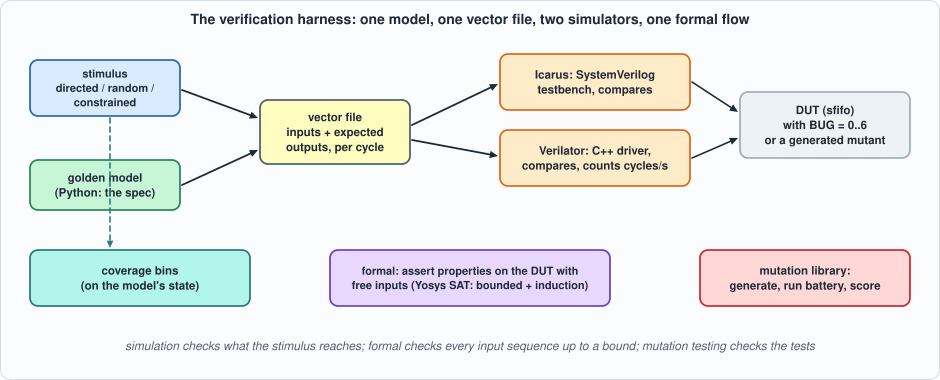
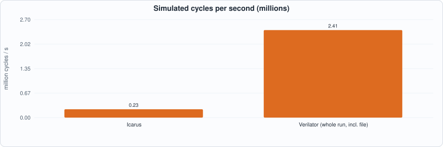
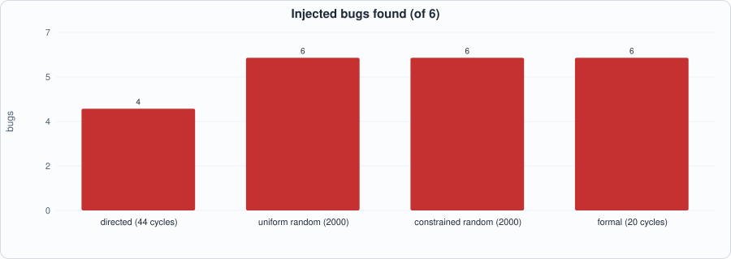
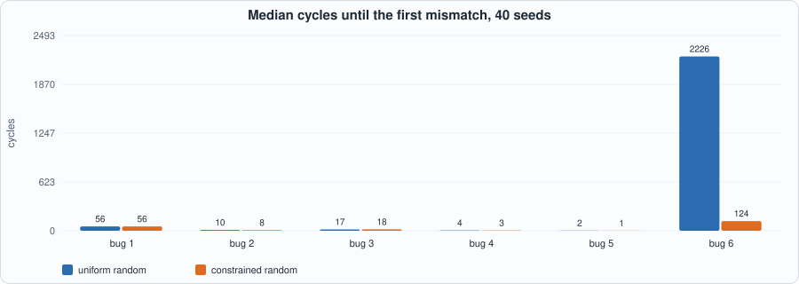
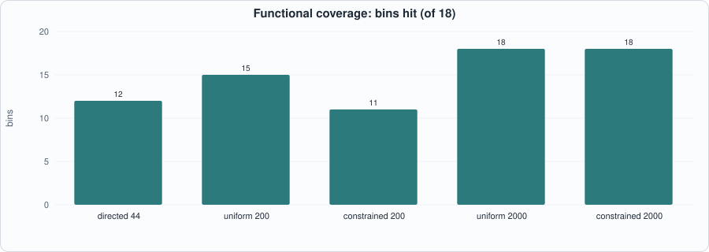

# 6. A Verification Harness: Vector Replay, Random and Constrained Stimulus, Coverage, Formal Properties, and Mutation Testing


--8<-- "docs/assets/art/ch-06.md"


**What you will see:** the harness every later chapter uses, built once and then compared with itself: a Python **golden model** that is the specification; **vector files** replayed by an Icarus testbench *and* by a Verilator C++ driver (with the speed of each measured); **directed**, **uniform random** and **constrained random** stimulus with **functional coverage** counted on the model; **formal properties** checked by Yosys's SAT solver (a bounded search and an unbounded proof by induction); and a **mutation-testing library** that generates its own mutants. All of it is run on one small design with six injected bugs, so that each technique can be asked the same question: *what do you find, how fast, and what do you miss?*

**What you need to know first:** Chapters 1 to 5. A FIFO (first in, first out queue) is the design used; nothing else is assumed.

**What this chapter builds:** `rtl/sfifo.sv` (a synchronous FIFO with a library of six injected bugs), `model/fifo_gold.py` (model, stimulus and coverage), `tb/sfifo_tb.sv` (vector replay in SystemVerilog), `tb/sfifo_drv.cpp` (the same in C++ for Verilator), `formal/sfifo_props.sv` (assertions for Yosys), `tools/mutlib.py` (the mutation library), `tools/ch06_run.py` and `tools/mut_ch06.py`.

## The design under test, and six bugs

`sfifo` holds up to `DEPTH` = 6 words of 8 bits (a depth that is not a power of two, so wrap-around is not free). Its specification is a queue: a write is accepted when it is not full, a read when it is not empty, `rd_data` is the oldest word whenever `empty` is 0, `count` is the number held. The parameter `BUG` selects the correct design (0) or one of six realistic mistakes:

| BUG | the mistake |
|---|---|
| 1 | a write when full is accepted and overwrites the oldest word |
| 2 | a read and a write in the same cycle with one word held: the count goes to 0 instead of staying at 1 |
| 3 | the write pointer wraps one word late, so after the first lap words are written outside the array |
| 4 | a read and a write in the same cycle when empty: the read is accepted too and the word just written is lost |
| 5 | a read when empty is accepted: the count underflows |
| 6 | a write of the data value `0xA5` when five words are held is lost (a data-dependent corner) |

```systemverilog
--8<-- "rtl/sfifo.sv"
```

## The harness


*Figure 6.1: one model, one vector file, two simulators, one formal flow, and a mutation library that tests the tests.*

**The model is the specification**, a deque (`model/fifo_gold.py`). It also generates the three kinds of stimulus and counts functional coverage, both independently of the RTL:

- **directed**: what an engineer writes by hand: a few words in and out, fill to full and drain to empty, a write when full, a read when empty, alternate writes and reads (44 cycles);
- **uniform random**: write and read each with probability 1/2, random data;
- **constrained random**: phases of 20 to 80 cycles with biased write/read probabilities (so the FIFO is driven to full and to empty and held near both), and data drawn half the time from a list of special values (`0x00`, `0xFF`, `0xA5`, `0x5A`, `0x01`, `0x80`).

**Coverage** is a list of 18 bins evaluated on the model's state: each occupancy from 0 to 6; a write when full; a read when empty; a read and write at empty, at full, with one word and with three; two laps of the write pointer; a write of `0xA5` and of `0x00` when five words are held; full and empty for three cycles running.

```python
--8<-- "model/fifo_gold.py"
```

A **vector file** has one line per cycle: the inputs (`wr`, `rd`, `data`) and the model's outputs *before* the clock edge (`rd_data`, `full`, `empty`, `count`; `rd_data` is compared only when the FIFO is not empty). The same file feeds two drivers:

```systemverilog
--8<-- "tb/sfifo_tb.sv"
```

```cpp
--8<-- "tb/sfifo_drv.cpp"
```

The C++ driver is what a project uses when simulation speed matters: Verilator turns the design into a C++ class, and the driver sets inputs, calls `eval()`, compares and counts.


*Figure 6.2: the same million-cycle vector file in the two simulators.*

## Formal properties

Simulation checks the inputs the stimulus reaches. **Formal verification** gives a solver the design and a property and asks for *any* input sequence that breaks it. Yosys's `sat` command does two kinds of search: **bounded model checking** (is there a violation within *N* cycles of reset?) and **induction** (if the property holds for *k* cycles in a row from *any* state, does it hold in the next? If so, it holds forever). The wrapper instantiates the FIFO, leaves the inputs free, and asserts what the specification says:

```systemverilog
--8<-- "formal/sfifo_props.sv"
```

The properties: the count never exceeds `DEPTH`; `full` and `empty` agree with the count; the count equals the wrapper's own occupancy model (so any update of the count that differs from the specification fails); and a **tagged word** (an unconstrained index `k`: *the k-th word written must be the k-th word read*), which covers data order and integrity without a copy of the whole queue.

## Running the comparison

```python
--8<-- "tools/ch06_run.py"
```

To compile and run: `python3 tools/ch06_run.py` (several minutes; most of it the 40-seed study of Section 3 and the 20-cycle proof at the end of Section 5). Recorded output:

```text
--8<-- "out/ch06_run_out.txt"
```

**Reading the output (measured).**

- **Simulator speed (Section 2).** On the same million-cycle vector file Icarus runs at **0.23 million cycles per second**. The Verilator C++ driver reports **15.7 million cycles per second** in its own timing (the file already read), about **68 times** faster; timed as a whole process including reading a million lines of text it is **2.4 million cycles per second, 11 times** faster. Both numbers are real; the first is what the simulator does, the second is what a user waits for when the stimulus is a file. A driver that generates its stimulus itself would be closer to the first.
- **Which technique finds which bug (Section 3, Figure 6.3).** The **directed** test (44 cycles) finds **4 of the 6** bugs and misses bug 4 (read and write at empty) and bug 6 (the `0xA5` corner): it never does a read and a write together at empty, and never writes `0xA5` at five words. **Uniform random** (2,000 cycles) finds all six, bug 6 at cycle 955. **Constrained random** finds all six, bug 6 at cycle 323. **Formal** finds all six in **0.4 to 0.5 seconds each**, with a counterexample.
- **How long random testing takes (Section 3, 40 seeds, Figure 6.4).** The medians are short for five bugs (1 to 56 cycles for either kind of random stimulus), but **bug 6 takes a median of 2,226 cycles with uniform random stimulus and a worst case of 9,765, against a median of 124 and a worst case of 1,332 with constrained random**. The special data values are what helps. For bugs 1 to 5 the constrained stimulus is *not* better, and for bug 1 its worst case (342 cycles) is about as bad as uniform's (420). Biasing helps only where the bug has a data-dependent condition and the list of special values contains the trigger.
- **Coverage (Section 4, Figure 6.5).** The directed test hits **12 of 18** bins; **uniform 200 cycles hits 15**; **constrained 200 cycles hits only 11**, because a phase that holds the FIFO near empty for 80 cycles spends the budget there; with 2,000 cycles both reach **18 of 18**. Constrained random is not a better coverage generator at every length: its bias pays off on corners that uniform random rarely combines, and it costs on a design this small.
- **Formal (Section 5).** The shortest counterexample for each bug is **3 to 9 cycles** (bug 4 and 5: 3; bug 2: 4; bug 6: 8; bugs 1 and 3: 9). The three counting properties are **proved for every cycle by induction in 0.04 seconds** for the correct design (no bound). The same induction **fails for bugs 1, 2, 4, 5 and 6 and proves bug 3**: bug 3 corrupts *where data is stored*, which the counting properties do not mention. **A proof is only as good as its properties**; the tagged-word property is what covers bug 3, and it is checked by bounded search only: **20 cycles from reset, proved in 77.6 seconds** for the correct design. I also tried to prove the tagged-word property by induction and stopped it after more than three minutes without a result; an unbounded proof of data integrity needs strengthening invariants (Chapter 14), which this chapter does not build.


*Figure 6.3: the injected bugs found by each technique within its budget.*


*Figure 6.4: cycles until the first mismatch, median of 40 seeds. Bug 6 (a data-dependent corner) is where constrained random pays.*


*Figure 6.5: functional coverage by stimulus and length.*

!!! note "What this comparison does not claim"
    One design of about 20 lines, six bugs chosen by me, one seed set. The *ranking* is not a result about FIFOs in general; the *method* is: inject known bugs, run every technique on the same ones, and report what each missed. A bug a technique has never been shown to find is not a bug it can be trusted to find.

## Mutation testing, with generated mutants

Chapters 1 to 5 used hand-written mutants. `tools/mutlib.py` **generates** them: it applies operator-replacement rules to every occurrence in the code of a bug-free copy of the design (`==` and `!=` swapped, `&&` and `||` swapped, `+ 1` and `- 1`, `1'b0` and `1'b1`, `'0` and `'1`, a negation removed, a boundary limit swapped for its neighbour, a guard term removed), skipping comments and declarations. A mutant is one source with one change, and the library scores a battery of checks against all of them:

```python
--8<-- "tools/mutlib.py"
```

`tools/mut_ch06.py` scores five cumulative levels (the directed test, 500 uniform, 500 constrained, 5,000 of each, formal bounded model checking for 12 cycles; 12 is above the longest counterexample found for the injected bugs, 9). A survivor of all five is checked for **equivalence** with the original by a SAT miter: a circuit that compares the outputs of the two designs and asks the solver for any input sequence that makes them differ.

```python
--8<-- "tools/mut_ch06.py"
```

To run: `python3 tools/mut_ch06.py` (about half a minute). Recorded output (the list is shown only for the mutants that did not die at the first level):

```text
--8<-- "out/ch06_mut_out.txt"
```

**Reading it.** **30 mutants** were generated. The **directed test alone kills 29** of them, and nothing is left for the random levels or the formal run to add. The one survivor (removing the guard `count != DEP` from the count update) is **proved equivalent for 14 cycles from reset** by the miter: the write is already blocked by `!full` in `do_wr`, so the guard is redundant. The equivalence is **bounded**: "no difference within 14 cycles" is a proof only up to that bound.

**This is a result about mutation scores.** A 100% score over generated mutants says the tests are good *at killing the mutants the operators produce*. Those mutants are easy (each breaks one line in an obvious way), and the same directed test that kills 29 of 30 of them **misses two of the six injected bugs**, the two a person would call subtle. Bug 4 is a missing *combination*; bug 6 depends on the *data*; no operator that swaps `&&` for `||` makes either. The score should be read together with the injected-bug comparison above, not instead of it.

## How the harness was checked

The harness had its own bugs, and each was caught by a sanity check built for the purpose:

- **The first testbench read the vector file with the wrong bit positions**, and every variant failed, *including the correct design*. That is why the first line of the mutation run asserts that the unmutated design passes every level.
- **The equivalence miter first reported "not equivalent" for a design compared with itself.** The cause was a Yosys detail (`hierarchy -top` removed the second design before the miter was built; the miter's reset input is named `in_rst`). It was found by running the checker on two things whose answer is known: the same design twice (must be equivalent) and a deliberately different design (must not be). Any checker that cannot say "equal" and "different" correctly is not a checker.
- **A formal run of 25 cycles** with the tagged-word property took more than four minutes; the cost grows steeply with the bound (3 s at 10 cycles, 28 s at 14, 39 s at 18, 78 s at 20, in the runs recorded for this chapter). The chapter uses 20 for the one long proof and 12 inside the mutation loop.

## What this chapter established, and what it did not

**Established, with the tests that show it:** a harness in which one Python model drives a SystemVerilog testbench and a Verilator C++ driver from the same vector file (the C++ driver 11 to 68 times faster than Icarus, depending on how it is timed); a directed test finds 4 of 6 injected bugs, uniform and constrained random find all 6 (bug 6 in a median of 2,226 and 124 cycles), formal bounded model checking finds all 6 in 3 to 9 cycles; the counting properties proved for every cycle by induction in 0.04 s (and, as a property of the *properties*, not covering bug 3); the tagged-word property proved for 20 cycles from reset; 30 generated mutants, 29 killed by the directed test, one proved equivalent for 14 cycles.

**Not established:** an unbounded proof of data integrity (Chapter 14); that the technique ranking holds for any design other than this FIFO; that the generated mutant set is representative of real bugs (the comparison above suggests it is not); equivalence beyond 14 cycles; any measurement of the Verilator driver on a larger design; SymbiYosys (not installed here; Yosys's `sat` command is used directly).

## Self-check questions

1. Why is the golden model written independently of the RTL, and what would be lost if the testbench computed its own expected values from the RTL's signals?
2. What does `rd_data` get compared against when the FIFO is empty, and why?
3. Why does a vector file make the Icarus and Verilator runs comparable?
4. The driver reports 15.7 million cycles per second and the whole process 2.4 million. What accounts for the difference, and which number would you quote?
5. Which two injected bugs did the directed test miss, and what would you add to it to catch them?
6. Constrained random found bug 6 about eighteen times faster than uniform random but was no better on bugs 1 to 5. Why?
7. Constrained random with 200 cycles covered fewer bins than uniform random with 200. Why?
8. What does bounded model checking prove, and what does it say about cycle 21 when run to depth 20?
9. The counting properties were proved by induction yet bug 3 passes them. Why, and what property catches it?
10. What is a SAT miter, and why must it be tested on a design compared with itself and on a deliberately different design?
11. 29 of 30 generated mutants died to the 44-cycle directed test. Does that mean the directed test is good? What does the injected-bug table say?
12. Why was a survivor "proved equivalent for 14 cycles" and not simply "equivalent"?

## Exercises

1. **A seventh bug.** Add a bug to `sfifo` that only occurs after the write pointer has wrapped twice *and* a read and write coincide at three words. Which techniques find it and how fast? Add the coverage bin that would have flagged the gap.
2. **A self-checking driver.** Make the C++ driver generate the constrained-random stimulus itself (a port of the Python generator) and compare against a C++ model; measure the speed.
3. **Strengthen the induction.** Add an invariant to the formal wrapper that makes the tagged-word property inductive, or explain what state would be needed.
4. **A better mutation operator.** Write an operator that produces bug 4 or bug 6 from the correct code (for example, "make a guard also true in the simultaneous case"). How many generated mutants does it add, and how many survive the directed test?
5. **Directed test, improved.** Add the two missing cases to `directed()` and rerun Section 3; what does the directed test now find, and what does that do to the coverage?
