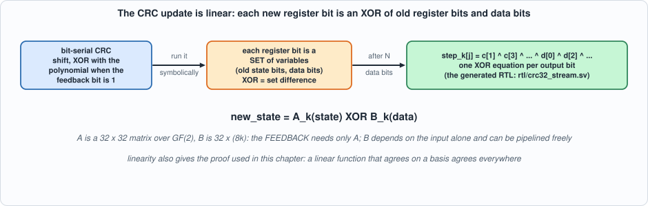
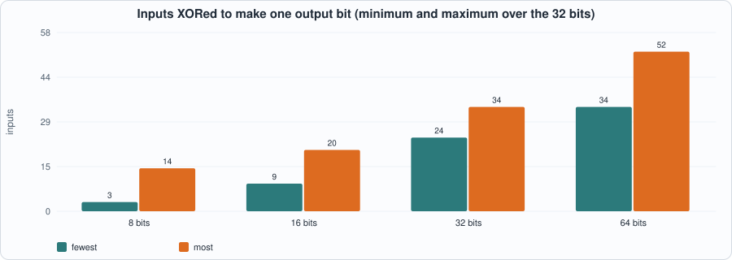
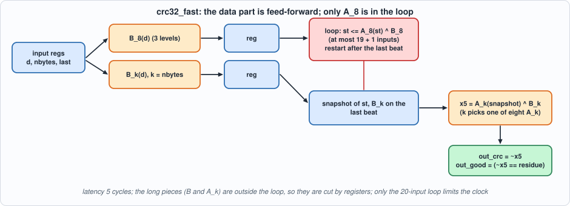
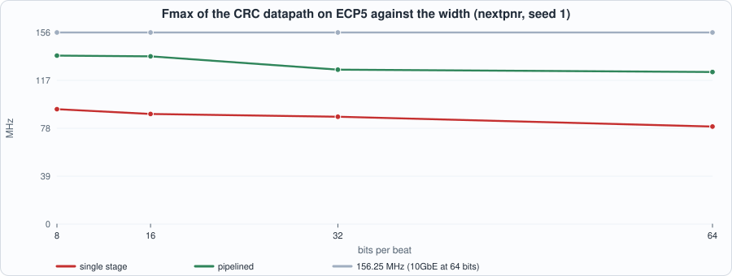

# 7. Frames and the CRC: Ethernet Frame Check, Parallel CRC-32 at 64 Bits per Beat


--8<-- "docs/assets/art/ch-07.md"


**What you will see:** the Ethernet frame and the checksum that ends it; the CRC-32 computed three independent ways in software; a **generator** that derives the parallel XOR equations from the bit-serial definition by running it symbolically, and writes the RTL; two hardware designs (one stage, and a five-stage pipelined one) at 8, 16, 32 and 64 bits per beat, checked against `zlib.crc32` on frames of **every length**; a proof that the 64-bit update equals eight 1-byte updates for all 2^96 inputs, by linearity; what the code does and does not detect, by experiment; and the measured speed, which shows why **how an XOR is written changes the clock by a factor of two**.

**What you need to know first:** Chapters 1 to 6. No networking beyond "a frame is a sequence of bytes" is assumed.

**What this chapter builds:** `tools/crc_gen.py` (the generator) and its output `rtl/crc32_stream.sv` (`crc32_comb`, `crc32_stream`, `crc32_fast`), `model/crc_gold.py` (bit-serial, table-driven and zlib CRCs; frame and stimulus generators), `tb/crc_tb.sv`, `tb/crc_linear_tb.sv`, `formal/crc_lin_chk.sv`, and `tools/ch07_example_a.py`, `tools/ch07_example_b.py`, `tools/ch07_run.py`, `tools/mut_ch07.py`.

## The Ethernet frame


*Figure 7.1: a frame on the wire.*

A frame is a **preamble** (seven bytes of `0x55`) and a start-of-frame delimiter (`0xD5`) that let the receiver find the bit boundaries; a **destination** and a **source** address of six bytes each; a two-byte **type** (or length); a **payload** of 46 to 1,500 bytes; and a four-byte **frame check sequence (FCS)**. The FCS is the **CRC-32** of the bytes from the destination address to the end of the payload. This chapter is about the FCS: computing it, checking it, and doing so at the rate a link delivers bytes. (The preamble and SFD belong to the physical interface and are not covered by the CRC; the MAC datapath of Chapter 8 handles them.)

## The CRC-32

A CRC treats the message as a polynomial over the two-element field (bits, with addition = XOR) and takes the remainder of dividing it by a fixed **generator polynomial**. Ethernet uses

`x^32 + x^26 + x^23 + x^22 + x^16 + x^12 + x^11 + x^10 + x^8 + x^7 + x^5 + x^4 + x^2 + x + 1`  (`0x04C11DB7`).

The version used on the wire has four conventions that every implementation must get right: bits are sent **least significant first**, so the working form is the **reflected** polynomial `0xEDB88320`; the register starts at **all ones**; the result is **inverted**; and it is sent **least-significant byte first**. The bit-serial algorithm is five lines:

```python
def crc_bitwise(data, init=0xFFFFFFFF, final=True):
    c = init
    for byte in data:
        for i in range(8):
            fb = (c ^ (byte >> i)) & 1; c >>= 1
            if fb: c ^= 0xEDB88320
    return c ^ 0xFFFFFFFF if final else c
```

One property makes receiving easy: a frame followed by its own FCS (low byte first) always leaves the **same value**, the **residue**: `zlib.crc32(frame + fcs) == 0x2144DF1C`. A receiver does not compare the CRC with the FCS field; it runs the CRC over everything, FCS included, and checks for the residue.

`model/crc_gold.py` holds three implementations of the same function: the bit-serial one above (written from the definition), a table-driven one, and `zlib.crc32`, a library written by nobody involved here. They agree on **20,000 of 20,000** random messages of 0 to 2,000 bytes, and `zlib.crc32(b"123456789")` is `0xCBF43926`, the standard check value for this CRC.

```python
--8<-- "model/crc_gold.py"
```

## From one bit per step to 64: the XOR equations

Hardware that handles one bit per clock (a shift register with a few XORs) would be far too slow: a 10 Gbit/s link delivers 64 bits per beat at 156.25 MHz. The way to take *N* bits at once is that the register update is **linear over GF(2)**: after *N* data bits, every bit of the new register is the XOR of some bits of the old register and some bits of the data. Which ones can be found by running the bit-serial algorithm **symbolically**: hold each register bit as a *set of variables*, and apply the shift and the conditional XOR to the sets (XOR of two bits is the symmetric difference of their sets).


*Figure 7.2: the same algorithm, run on sets of variables, writes the parallel equations.*

`tools/crc_gen.py` does this and **writes the RTL**: `new_state = A_k(state) XOR B_k(data)` for k = 1..8 bytes per beat (`A` is a 32 x 32 matrix over GF(2), `B` is 32 x 8k). The result for one 64-bit beat has between 34 and 52 inputs per output bit:


*Figure 7.3: the equations grow with the width (derived by the generator).*

```python
--8<-- "tools/crc_gen.py"
```

A beat may carry fewer than `W/8` bytes only on the **last** beat of a frame (the interface rule), so the generator makes one function per byte count and the design selects by the `in_nbytes` input. The generated file is in the repository (`rtl/crc32_stream.sv`, about 330 lines); here is its structure rather than all of it, with the first lines of the 8-byte function:

```systemverilog
module crc32_comb (input logic [31:0] c, input logic [63:0] d, input logic [3:0] k, output logic [31:0] n);
    function logic [31:0] step8(input logic [31:0] cc, input logic [63:0] dd);
        begin
            step8[0] = ((cc[1] ^ cc[3] ^ cc[4] ^ cc[6]) ^ (cc[9] ^ cc[10] ^ cc[11] ^ cc[14]) ^ ...
            ...
    always_comb begin case (k) 4'd1: n = step1(c, d); ... 4'd8: n = step8(c, d); default: n = c; endcase end
endmodule
```

### Two designs

**`crc32_stream`** is the direct one: a 32-bit register `st` that starts at all ones, updated every valid beat by `crc32_comb`; on the last beat of a frame the inverted result is registered (`out_crc`, equal to `zlib.crc32` of all the bytes) with `out_good` = (result == residue), and `st` restarts. Latency: one cycle.

**`crc32_fast`** uses linearity to take the long XORs out of the feedback loop: `A_k(state)` and `B_k(data)` can be computed separately. The data part `B` depends on the input alone and can be pipelined freely; the loop through `st` is only `A_8` XOR one precomputed word; and the **partial last beat** (which needs `A_k` for a smaller `k`) is taken *out of the loop*: the state is captured and the last step done in a final stage, after which the state restarts. Five stages, latency 5.


*Figure 7.4: the pipelined design. Only the 20-input loop limits the clock; everything long is cut by registers.*

## The tests

**Stimulus and oracle.** `model/crc_gold.py` builds frames (random bytes plus a correct FCS, 30% with one bit of the frame flipped so that the check must fail), splits them into beats of `W/8` bytes, and schedules them with **random idle cycles between beats and frames; idle cycles carry random junk on `in_data`, `in_nbytes` and `in_last`** (the interface says they are don't-cares). The **expected** output is `zlib.crc32` over the frame's bytes and `crc == 0x2144DF1C` for the good flag, placed at the right cycle for the design's latency: nothing in the oracle comes from the RTL.

```systemverilog
--8<-- "tb/crc_tb.sv"
```

The testbench holds a valid input during reset (reset must discard it) and compares every cycle. Two kinds of frame set are used: **random** frames (three seeds of 60), and **every body length from 1 to 80 bytes, one good and one bad frame each**: at 64 bits per beat that exercises every possible partial last beat (1 to 8 bytes) many times, at every width.

**The proof of the wide step.** A formal check that the 8-byte update equals eight 1-byte updates for *all* register values and *all* data words has 96 free input bits. I wrote it as a SAT miter for Yosys; it did **not finish within 100 seconds even for the two-byte case**: SAT solvers are poor at long XOR chains. The proof is by **linearity** instead. If a function over GF(2) is built only from XOR and NOT gates it is *affine*; if also `f(0) = 0` it is *linear*, and a linear function that agrees with another on the 96 unit inputs agrees on every input, because `f(x ^ y) = f(x) ^ f(y)`. `tb/crc_linear_tb.sv` checks the 97 basis inputs; `ch07_run.py` checks the gate types after Yosys maps the circuits (only XOR and NOT):

```systemverilog
--8<-- "tb/crc_linear_tb.sv"
```

```python
--8<-- "tools/ch07_run.py"
```

To compile and run: `python3 tools/ch07_run.py` (a few minutes, mostly Verilator). Recorded output:

```text
--8<-- "out/ch07_run_out.txt"
```

**Reading the output.** Section 1: the three software CRCs agree. Section 2: all three modules are lint-clean. Section 3: both designs match `zlib` at every width (8, 16, 32, 64) on random frames in both simulators and on frames of every length from 1 to 80 bytes in Icarus. Section 4: the 8-byte update equals eight 1-byte updates on all 97 basis inputs, and the XOR networks contain only XOR and NOT gates, which makes the equality hold for all 2^96 inputs; the SAT attempt is recorded as not finishing.

## Running example A: what the width costs, and how an XOR is written

```python
--8<-- "tools/ch07_example_a.py"
```

To compile and run: `python3 tools/ch07_example_a.py` (several minutes: 16 builds on two targets). Recorded output:

```text
--8<-- "out/ch07_example_a_out.txt"
```


*Figure 7.5: the clock of each design against the width, with the 10GbE requirement.*

**Reading the output (derived for Section 1; measured by Yosys and nextpnr, seed 1, for Sections 2 and 3).**

- **The equations grow with the width**: at most 14 XOR inputs per bit at 8 bits per beat, 20 at 16, 34 at 32 and **52 at 64**. With 4-input LUTs an *n*-input XOR needs `ceil(log4 n)` levels: 2 levels at 8 bits, 3 at 16, 32 and 64 (derived).
- **The single-stage design reaches 77.6 MHz on iCE40 and 79.5 MHz on ECP5 at 64 bits, i.e. 5.0 and 5.1 Gbit/s** (W x Fmax); the pipelined one reaches **110.3 and 124.0 MHz, 7.1 and 7.9 Gbit/s**. **Neither reaches the 156.25 MHz that 10 Gigabit Ethernet needs at 64 bits.** On ECP5 the pipelined design carries 7.9 Gbit/s, about 80% of 10 Gbit/s; closing the gap needs one more cut (the critical path is now the eight-way choice of `A_k` in the last stage, Exercise 1).
- **Pipelining helps, but less than the depth suggests**: 1.4 to 1.6 times the clock at 64 bits (110.3 against 77.6 MHz on iCE40; 124.0 against 79.5 MHz on ECP5), at the cost of about 240 flip-flops and 4 more cycles of latency.
- **Area**: 2,261 LUTs (single stage, 64 bits, iCE40) and 2,466 (pipelined); the register count of the single stage is 34, of the pipelined 276.

**An observation about the tool, with numbers.** My first version of the generator wrote each output bit as a flat chain `a ^ b ^ c ^ ...`. The tools did **not** rebalance it: Yosys/ABC mapped the 34-input XOR of the data part as a chain, and the critical path of the pipelined 64-bit design was **11 LUT levels** in a path that only needs 3 (`B_8`'s 34 inputs). The measured clocks of that first version were **39.3 MHz (single stage) and 67.9 MHz (pipelined) on iCE40, and 44.4 and 77.3 MHz on ECP5**. Writing each XOR as an explicit tree of 4-input groups in the generator (`xor_tree`) took the same designs to **77.6 and 110.3 MHz on iCE40, 79.5 and 124.0 MHz on ECP5**: about **twice the clock for the single stage and 1.6 times for the pipelined one, from changing parentheses.** (Those first-version figures were measured while building this chapter, on the same designs before the change; the table above is the final version.)

## Running example B: what the CRC detects

```python
--8<-- "tools/ch07_example_b.py"
```

To run: `python3 tools/ch07_example_b.py` (about half a minute). Recorded output:

```text
--8<-- "out/ch07_example_b_out.txt"
```

**Reading the output (measured, on real frames with a correct FCS; a frame counts as detected when its CRC no longer equals the residue).**

- **Few-bit errors.** Every single-bit error (512, 4,096 and 12,144 patterns in frames of 60, 508 and 1,514 bytes), **every two-bit error** in a 60-byte frame (130,816 pairs), 300,000 random two-bit errors in a 1,514-byte frame, **every three-bit error** in a 12-byte frame (341,376 patterns) and 1,000,000 random four-bit errors: **zero undetected**. The sampled cases are samples, not proofs.
- **Bursts.** A burst of length *L* is a run of *L* bits whose first and last bits are flipped and whose middle bits are anything. Bursts of every length up to 12 were tried **exhaustively** (every position, every pattern), and lengths 16, 24, 31, 32, 33 and 40 with 200,000 random bursts each: **none undetected**. A CRC with a 32-bit generator detects every burst of up to 32 bits *by construction*; for 33 or more the miss probability is about 2^-32, which no experiment here can see.
- **Random corruption.** Of 4,000,000 random 4-byte corruptions, **0 were missed by the 32-bit check**. To see the miss rate at all, the same corruptions were checked with only the **low 16 bits** of the CRC: **54 were missed, against about 61 expected (4,000,000 / 65,536)**. That is the 2^-n rule, measured at n = 16; at n = 32 the expectation is under 0.001 in this experiment.

## Testing the tests

Mutants of the **generated** RTL: 12 hand-written changes to the wrappers (the initial value, the restart after a frame, the final inversion, the residue constant, `out_valid` timing, the pipeline registers, reset) and **26 "term deletions"**: one XOR term removed from one output equation of `step8`, `step3` or `step1`. The battery runs both designs at W = 64, 32 and 8 against `zlib` on random frames and on frames of every length.

```python
--8<-- "tools/mut_ch07.py"
```

To run: `python3 tools/mut_ch07.py` (several minutes). Recorded output:

```text
--8<-- "out/ch07_mut_out.txt"
```

All **38** mutants are caught, including all 26 deleted XOR terms: a single missing input in one of 1,400 terms is enough to make a random frame's CRC wrong. Two changes are listed apart as **equivalent under the interface rule**: treating a byte count of 0 as 1 (the interface never offers a valid beat with zero bytes), and using `B` for the beat's own byte count in the pipelined loop (every beat except the last is full by the interface rule).

**The first run of the battery left three survivors** and the result is worth recording. One was the mutant that lets the register update when `in_valid` is low; it survived because the first stimulus drove `in_nbytes = 0` in idle cycles, which makes the design hold its state anyway. The stimulus now puts random junk on `in_data`, `in_nbytes` and `in_last` in every idle cycle, and the mutant dies. The other two were the equivalent changes above.

## What this chapter established, and what it did not

**Established, with the tests that show it:** three software CRC-32 implementations agree on 20,000 messages and reproduce the standard check value and the residue; generated RTL at 8, 16, 32 and 64 bits per beat, in a one-stage and a five-stage form, matches `zlib.crc32` and the good/bad flag on random frames and on frames of every length from 1 to 80 bytes, in two simulators; the 64-bit step equals eight 1-byte steps for all 2^96 inputs by linearity (a SAT attempt did not finish); the pipelined design reaches 124.0 MHz on ECP5 and 110.3 on iCE40 (7.9 and 7.1 Gbit/s), the single-stage one 79.5 and 77.6 MHz; rewriting XOR chains as trees roughly doubled the single-stage clock; every one-, two- and three-bit error tried and every burst up to 32 bits is detected; 38 of 38 mutants caught.

**Not established:** 10 Gbit/s at 156.25 MHz (not reached; 124 MHz on ECP5); behaviour under backpressure (the CRC stage accepts a beat every cycle); the preamble, SFD and padding rules (Chapter 8); any proof of detection capability beyond the experiments (the burst property is a property of the code, the experiments only confirm it); the 4-bit and wider error properties of this CRC beyond the sampled cases; Fmax on a board.

## Self-check questions

1. Which four conventions define the Ethernet CRC-32 on the wire, and what happens to the result if any one is wrong?
2. What is the residue, and why does a receiver not compare the CRC with the FCS field?
3. Why is the CRC register update linear over GF(2), and what does that make possible?
4. How does the generator find the XOR equations without doing any algebra by hand?
5. Why can only the last beat of a frame be partial, and what does the design do for it?
6. What do `A_k` and `B_k` stand for, and why does separating them allow pipelining?
7. Why was the SAT proof of the 64-bit update abandoned, and what replaced it? What does the proof need to assume?
8. XOR and NOT gates only: why is that "affine", and why does the all-zero test make it linear?
9. Why do idle cycles carry random junk in the stimulus? Which mutant needed it?
10. Writing the same XOR as a tree instead of a chain doubled the clock. Why did the tool not do it?
11. 54 corruptions were missed with a 16-bit check and none with 32 bits. What does the ratio say, and what would you need to see a 32-bit miss?
12. The pipelined design reaches 7.9 Gbit/s on ECP5. What limits it now and what would you do about it?

## Exercises

1. **Reach 156.25 MHz.** Split the last stage (the eight-way choice of `A_k` and the XOR with `B_k`) into two stages, so that no path is more than about 3 LUT levels. Measure the new Fmax on ECP5 and say whether 10GbE is reachable.
2. **Insert the FCS.** Write a transmit-side wrapper that takes a frame (without FCS) and appends the four FCS bytes after the last beat, including the case where the last data beat is full and the FCS needs a new beat. Test against `with_fcs`.
3. **A 128-bit datapath.** Extend the generator to `W = 128` (16 bytes per beat). What do the row weights become, and what clock does the pipelined design reach?
4. **Count the errors you cannot see.** Write a search for the smallest number of flipped bits that gives an undetected error in a 12-byte frame (try four, five, six bits with sampling) and compare with what you expect from the code's Hamming distance.
5. **A mutant that survives.** Add a mutant to `mut_ch07.py` that the battery does not catch. Is it equivalent under the interface rule, or is a test missing?
