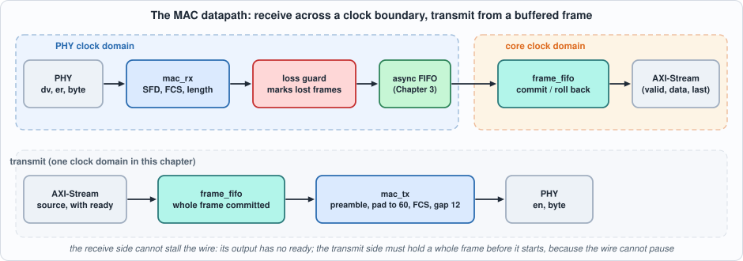
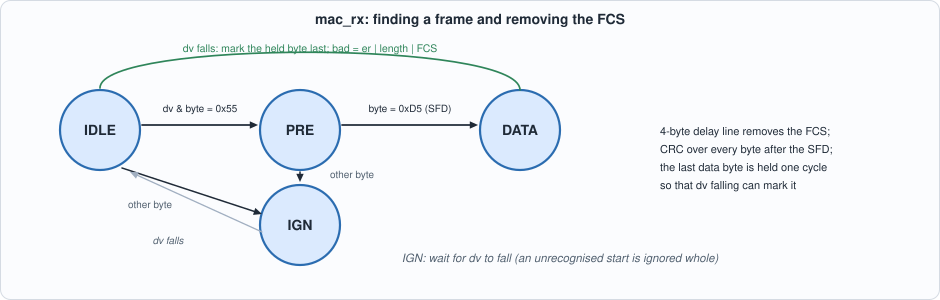
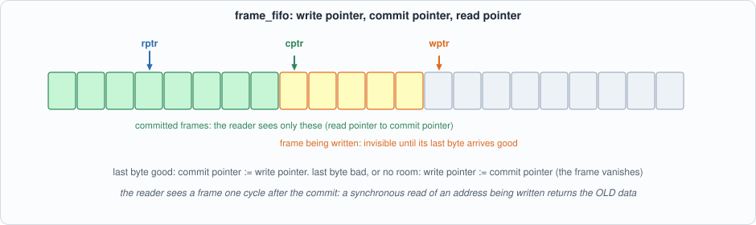
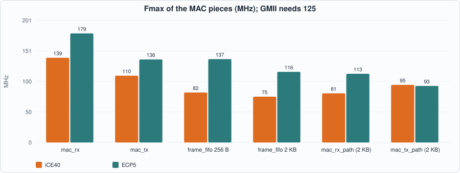
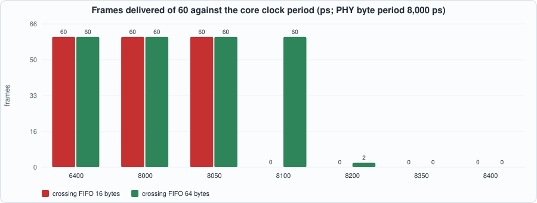

# 8. The MAC Datapath: Receive and Transmit at the Byte Interface, a Block-RAM Frame Buffer, and the Clock Boundary


--8<-- "docs/assets/art/ch-08.md"


**What you will see:** the Ethernet MAC at the byte interface of the PHY (GMII style: one byte per clock, a data-valid and an error signal): a receiver that finds the start of a frame, strips the FCS, checks it with Chapter 7's CRC and reports good and bad frames; a transmitter that builds the preamble, pads short frames, appends the FCS and keeps the inter-frame gap; a **frame buffer** in block RAM that commits a frame only when it has arrived whole and good, and rolls it back otherwise; and the **clock boundary** between the PHY clock and the core clock, with the question the chapter answers by measurement: *how slow may the core clock be before frames are lost, and does a loss ever corrupt a frame?*

**What you need to know first:** Chapters 3 (the asynchronous FIFO), 5 (block-RAM read styles) and 7 (the CRC). A frame is a sequence of bytes ended by a four-byte FCS.

**What this chapter builds:** `rtl/mac.sv` (`mac_rx`, `mac_tx`, `frame_fifo`, `mac_rx_path`, `mac_tx_path`), `model/mac_gold.py` (the specification, the PHY model and the stimulus), the testbenches `tb/mac_rx_tb.sv`, `tb/mac_path_tb.sv`, `tb/mac_tx_tb.sv`, `tb/ff_tb.sv`, and `tools/ch08_example_a.py`, `tools/ch08_example_b.py`, `tools/ch08_run.py`, `tools/mut_ch08.py`.

!!! note "Width and scope"
    The datapath here is **8 bits wide**, the byte interface of 1 Gigabit Ethernet. Chapter 7 built the CRC at 64 bits per beat; a 64-bit MAC (XGMII) adds the problem of a frame starting in any of eight byte lanes, which is a different chapter's worth of cases. The transmit path stays in **one clock domain**; its clock crossing would reuse the same asynchronous FIFO as the receive path.

## The PHY at its interface

A PHY delivers bytes to the MAC with two control signals: `rx_dv` (data valid, high for the whole frame, preamble and FCS included) and `rx_er` (the PHY saw an error). Between frames there are at least 12 byte times of idle (the **inter-frame gap**). A frame starts with at least one preamble byte `0x55` and the start-of-frame delimiter `0xD5`; the receiver finds the start by that pattern.

Real PHYs produce faults, so the model (`model/mac_gold.py`) makes them on purpose: a **bad FCS** (one flipped bit), a **runt** (shorter than 64 bytes including the FCS), a **giant** (longer than 1,522), an `rx_er` in the middle, a **short preamble** (one `0x55` and the SFD), a preamble with **no SFD**, and an SFD **not preceded by a preamble byte**, with gaps from the minimum 12 byte times up to 40.

The model is also the **specification**, written from the standard and not from the RTL:

- a frame starts at an `0xD5` preceded, in the same `rx_dv` run, only by `0x55` bytes (at least one); anything else makes the whole run ignored;
- it is **bad** if `rx_er` was seen, if its length including the FCS is outside 64 to 1,522, or if the CRC over everything after the SFD does not equal the residue;
- the MAC reports the frame **without the FCS**, and marks the last byte with the bad flag;
- a frame of four bytes or fewer after the SFD leaves no data byte to carry the mark, and is not reported.

```python
--8<-- "model/mac_gold.py"
```

## The receiver


*Figure 8.1: the datapath. The receive side cannot stall the wire, so its output has no ready signal; the transmit side must hold a whole frame before it starts, because the wire cannot pause.*

`mac_rx` is a four-state machine. It looks for `0x55`, waits for `0xD5`, then in the DATA state runs every byte through Chapter 7's `crc32_comb` (one byte at a time) and through a **four-byte delay line**: the byte that leaves the delay line is a data byte, and the four bytes still in it when the frame ends are the FCS. The data byte is **held for one cycle** so that the end of the frame (`rx_dv` falling) can mark it as the last. The CRC register is compared with the *un-inverted* residue, `~0x2144DF1C = 0xDEBB20E3`.


*Figure 8.2: IDLE, PRE, DATA and IGN (ignore the rest of an unrecognised run).*

```systemverilog
--8<-- "rtl/mac.sv"
```

(That file holds all five modules; the sections below take them in turn.)

## The frame buffer

A block-RAM FIFO has a **registered read** (Chapter 5), so the first-word fall-through output has to be built on top of it: the output register is loaded from `mem[ra]` every clock, with `ra = rptr` or `rptr + 1` when the current byte is being taken. `frame_fifo` adds the frame logic.


*Figure 8.3: bytes are written at the write pointer; the reader sees only what lies between the read pointer and the commit pointer.*

- **Commit.** When a frame's last byte arrives and the frame is good, the commit pointer jumps to the write pointer: the frame becomes visible to the reader all at once.
- **Roll back.** If the frame is bad (the `bad` flag with the last byte), or did not fit (the buffer filled up), the write pointer returns to the commit pointer: *the frame never existed*. A byte offered while the buffer is full starts a drop of the whole frame, and the counters record it (`n_ok`, `n_bad`, `n_ovf`).
- **One cycle of delay on the commit pointer for the reader** (`cptr_r`). A synchronous read of an address that is being written in the same cycle returns the **old** data. For a one-byte frame the byte read in the commit cycle would be stale, so the reader is shown the commit pointer a cycle late. (The MAC never produces frames shorter than 60 bytes, so this case is unreachable from the MAC; it is tested directly on the buffer, below.)

## The clock boundary

`mac_rx` runs in the PHY clock and **cannot be stalled**: the wire does not wait. Its bytes go into the asynchronous FIFO of Chapter 3 (`{bad, last, data}`, 16 bytes deep here) and are drained, one byte per core clock, into `frame_fifo`. If the core clock is slower than the byte rate, the asynchronous FIFO fills up, and **a byte is lost**. A lost byte inside a CRC-checked frame would corrupt it *after* the CRC was checked, silently. The **loss guard** in `mac_rx_path` prevents that: it remembers that a byte was lost and forces `bad` on the frame's last byte; and if the last byte itself was lost, it writes a terminating `{bad, last}` byte as soon as there is room. The result is the property the tests check: **a frame that is delivered is always byte-exact; a loss costs whole frames, never a damaged one.**

## The transmitter

`mac_tx` reads a committed frame from a `frame_fifo` (so the whole frame is there, one byte per cycle, and cannot run dry), and sends 7 x `0x55`, `0xD5`, the frame, **zero padding up to 60 bytes** if it is shorter, the FCS (the inverted CRC register, **low byte first**), and then 12 idle cycles. The AXI-Stream source on the other side sees `s_ready` low when the buffer is full. A frame larger than the buffer would **deadlock** (the source waits for space that only a committed frame can free), so the buffer must hold the largest frame: 2 KB for 1,522 bytes.

## The tests

Every test compares the RTL with the specification by frames, from a stimulus file the model wrote; the testbenches print what the design reports and the Python scripts compare lists of frames.

```systemverilog
--8<-- "tb/mac_rx_tb.sv"
```

```systemverilog
--8<-- "tb/mac_path_tb.sv"
```

```systemverilog
--8<-- "tb/mac_tx_tb.sv"
```

```systemverilog
--8<-- "tb/ff_tb.sv"
```

```python
--8<-- "tools/ch08_run.py"
```

To compile and run: `python3 tools/ch08_run.py` (about ten minutes). Recorded output:

```text
--8<-- "out/ch08_run_out.txt"
```

**Reading the output.**

- **Section 1:** all five modules are lint-clean.
- **Section 2, the receiver against the specification:** on 16 random streams of 100 frames each (default faults, and a fault-heavy mix with only 30% good frames) every frame the RTL reports equals the specification's, bytes and bad flag, in order; one stream of each mix also in Verilator.
- **Section 3, across the clock boundary:** with a core clock faster than the PHY's (6,400 ps against 8,000), **every good frame is delivered, byte-exact and in order**. With a consumer taking only 60% of the cycles, or a smaller frame buffer (256 or 512 bytes), whole frames are dropped at the buffer (`ovf` counts them) and **none is damaged**. With a *slower* core clock (8,200 and 9,000 ps) the asynchronous FIFO overflows (hundreds to thousands of lost bytes) and frames are lost, and *still none is corrupt*: the column "exact+ordered" is YES in every row. The **recovery** line shows that after the big frames are lost, the small good ones that follow are all delivered.
- **Section 3b, the frame buffer on its own:** with the source spaced so that the buffer is empty at each frame (buffers of 16 and 32 bytes, so 15 and 31 can be held), the delivered frames are **exactly** the good frames that fit and the three counters equal the numbers computed from the offered frames; with the source back to back and a slow reader (50% and 30%) the delivered frames are byte-exact and in order, and `ok + bad + ovf` equals the number of frames offered.
- **Section 4, the transmitter:** the bytes on the wire for 24 frames of 14 to 1,518 bytes (including the 59, 60 and 61 around the padding boundary) are **exactly** the specification's byte sequence at three source speeds; the **minimum gap is 12 cycles**; no underrun.
- **Section 5, loopback:** the transmitter's output fed into the receive path returns the 24 frames, padded where they were short, in order.

## Running example A: what the MAC costs

```python
--8<-- "tools/ch08_example_a.py"
```

To compile and run: `python3 tools/ch08_example_a.py` (several minutes). Recorded output:

```text
--8<-- "out/ch08_example_a_out.txt"
```


*Figure 8.4: the clock of each piece, against the 125 MHz that GMII needs.*

**Reading the output (measured; nextpnr seed 1; Fmax is that of the slowest clock domain in the module).**

- **Block RAM:** the 2 KB frame buffer uses **1 block RAM on ECP5 (an 18 kbit block) and 5 on iCE40 (4 kbit blocks)** with a few dozen LUTs: it is a memory, not logic (Chapter 5's lesson, now with a use for it).
- **The pieces are small:** `mac_rx` is 152 LUTs on iCE40 and 141 on ECP5; `mac_tx` 211 and 264; the whole receive path with the asynchronous FIFO about 500 LUTs.
- **The clock is the problem, not the area.** 125 MHz is what a byte per clock at 1 Gbit/s needs. `mac_rx` reaches **139 MHz on iCE40 and 179 on ECP5**, but `mac_tx` reaches 110 and 137, the `frame_fifo` **75 MHz on iCE40 and 116 on ECP5**, and the whole receive path's **core clock domain 81 MHz on iCE40 and 113 on ECP5**, with the PHY-clock domain at 107 and 125 MHz. **On iCE40 the buffer does not meet 125 MHz; on ECP5 the core domain misses it by about 10%.** The limit is the pointer arithmetic around the block RAM (the full test and the pointer increment in front of the memory address), which Exercise 1 asks you to pipeline.

## Running example B: how slow may the core clock be?

```python
--8<-- "tools/ch08_example_b.py"
```

To run: `python3 tools/ch08_example_b.py` (a few minutes). Recorded output:

```text
--8<-- "out/ch08_example_b_out.txt"
```


*Figure 8.5: with the PHY byte period at 8,000 ps, delivery collapses once the core period passes the limit; a deeper crossing FIFO moves the limit a little.*

**Reading the output (measured, with the derived limits).** Two conditions must hold for no loss with back-to-back maximum frames:

- **(a) within one frame:** the bytes that pile up in the crossing FIFO, `n x (1 - 8000 / core period)`, must be below its depth. For a 1,514-byte frame and a 16-byte FIFO that gives a core period below **8,085 ps**; for 64 bytes, **8,353 ps** (derived);
- **(b) over many frames:** the core must drain, on average, as fast as the PHY delivers, counting the preamble, SFD, FCS and 12-byte gap during which nothing arrives: a core period of at most **8,127 ps** whatever the depth (derived).

The sweep agrees: at **8,050 ps all 60 frames are delivered with either depth**; at **8,100 ps the 16-byte FIFO loses everything** (452 bytes lost, limit (a)) while the 64-byte one still delivers all 60; at **8,200 ps the 64-byte FIFO delivers 2 of 60** (limit (b): each frame leaves a net deficit that accumulates over frames), and beyond that nothing. In **no** row is a delivered frame corrupt. Two observations: a core clock only **1.5% slower** than the PHY's byte rate loses a 16-byte-deep link entirely; and the limits are *necessary*, not sufficient, conditions. A separate run (a 117-byte frame lost at a core period of 9,000 ps in the recovery experiment, where the derived pile-up is only 13 bytes of 16) shows that the usable depth of the crossing FIFO is **less than its nominal depth**; I attribute this to the lag of the pointers through the synchronizers (the `full` flag is judged on a pointer that is a few cycles old), but I did not measure that lag.

## Testing the tests

```python
--8<-- "tools/mut_ch08.py"
```

To run: `python3 tools/mut_ch08.py` (about ten minutes). Recorded output:

```text
--8<-- "out/ch08_mut_out.txt"
```

All **32** mutants are caught: 14 in the receiver (the SFD value, the preamble rule, the delay-line length, the length limits, `rx_er`, the residue constant, the CRC restart, the last and bad marks), 6 in the frame buffer, 9 in the transmitter (preamble length, padding threshold, FCS inversion and byte order, the gap, padding in the CRC, the CRC restart) and 3 in the loss guard.

**The first run caught 24 of 32, and the eight survivors each named a missing test.** Closing them is the real result of this section:

| survivor | what was missing | the test that closed it |
|---|---|---|
| start accepted with no preamble byte | no stream had a byte other than `0x55` before the SFD | a frame kind whose SFD follows junk (`nopre`); the first try (a bare SFD) did **not** kill the mutant, because the mutant consumed it in IDLE: the junk byte had to come *before* it |
| minimum length 63; maximum length 1,523 | no frame of exactly 63 or 1,523 bytes | boundary lengths in the stimulus (body 58 and 59; 1,519) |
| frame buffer shows a committed frame at once; full detected a byte late; an overflowing frame not rolled back | frames reaching the buffer were always 60 bytes or more and never exactly its capacity | a unit test of `frame_fifo` alone with frames of 1 byte to twice the buffer (including exactly capacity and capacity + 1), spaced and back to back |
| a lost last byte gets no terminator; the loss flag is never cleared | the lost bytes in the first test never included the last byte, and a leftover flag only made later frames *also* disappear, which looks like another loss | 40 pairs of (a maximum frame, a small good frame) at a core period where the big ones overflow and the small ones fit: **every** small frame must be delivered |

## What this chapter established, and what it did not

**Established, with the tests that show it:** the receiver reports exactly the frames the specification says, with the right bad flag, on 16 random streams and two simulators; the frame buffer commits only whole good frames and rolls back the rest, exactly, on its own (counters included) and in the receive path; the transmitter's bytes on the wire equal the specification's byte for byte, with a 12-cycle gap, including padding at the boundary; transmit-to-receive loopback returns every frame; across a clock boundary a loss costs whole frames and never corrupts one; the core clock must be no more than 1.5% slower than the PHY's byte rate for a 16-byte crossing FIFO to survive maximum frames back to back, matching the derived limits; 32 of 32 mutants caught.

**Not established:** 125 MHz on iCE40 (the frame buffer reaches 75 MHz) or in the ECP5 core domain (113 MHz); a 64-bit (XGMII) MAC; the transmit-side clock crossing; the preamble and the 12-byte gap as seen by a real PHY at the analog level; flow control (PAUSE frames); VLAN handling beyond the length limit; the cause of the reduced usable depth of the crossing FIFO (not measured); formal proofs (the equivalence of buffer and queue is tested, not proved).

## Self-check questions

1. What is the inter-frame gap and why does the transmitter count 12 cycles of idle?
2. How does `mac_rx` find the start of a frame, and what does it do with a run that does not fit the pattern?
3. Why does the receiver hold each data byte for one cycle?
4. Why compare the CRC register with `0xDEBB20E3` and not with `0x2144DF1C`?
5. Why does a receive MAC output have no `ready`, and what is the consequence for the buffer behind it?
6. What does the frame buffer do with a bad frame, and why is it better than dropping the bad frame at the output?
7. Why is the commit pointer shown to the reader one cycle late, and why can the MAC never trigger the problem?
8. What does the loss guard add, and what property does it give?
9. Derive the condition (a) for a core clock too slow for a crossing FIFO of depth D.
10. Why is condition (b) independent of the depth, and why does it matter in the 64-byte case?
11. Why must the transmit buffer hold the largest frame? What happens if it does not?
12. Name two survivors of the first mutation run and the test that closed each.

## Exercises

1. **Reach 125 MHz.** Pipeline the pointer arithmetic of `frame_fifo` (register the full flag and the incremented pointer) and measure the new Fmax on both targets. What does it cost in latency and area?
2. **A deeper guard.** Measure the usable depth of the crossing FIFO: find the core period at which a 60-byte frame starts losing bytes for depths 16, 32 and 64, and compare it with the nominal depth. How many synchronizer cycles does the difference correspond to?
3. **Transmit across a clock.** Put an asynchronous FIFO between the transmit buffer and `mac_tx` so that the transmitter runs in the PHY clock. What new failure appears when the PHY clock is faster than the core clock?
4. **PAUSE.** Add recognition of the 802.3x PAUSE frame in the receiver (destination `01-80-C2-00-00-01`, type `0x8808`) and make the transmitter stop for the requested time. Specify it first in the model.
5. **A mutant that survives.** Add a mutant to `mut_ch08.py` that the battery does not catch. Is it equivalent, or is a test missing?
