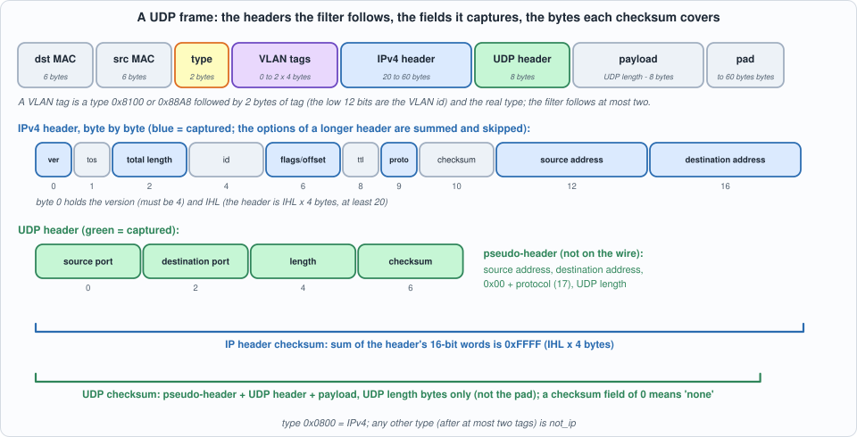
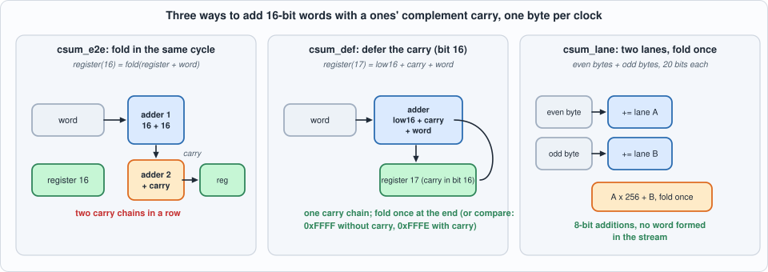
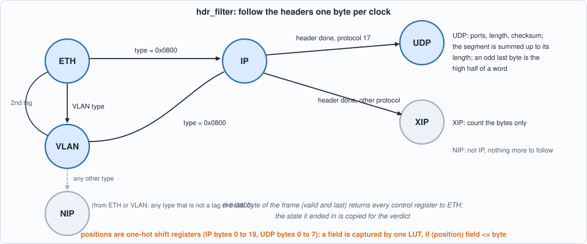
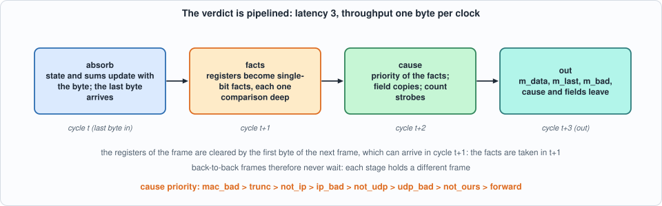
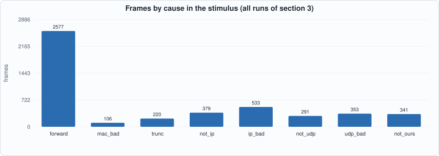
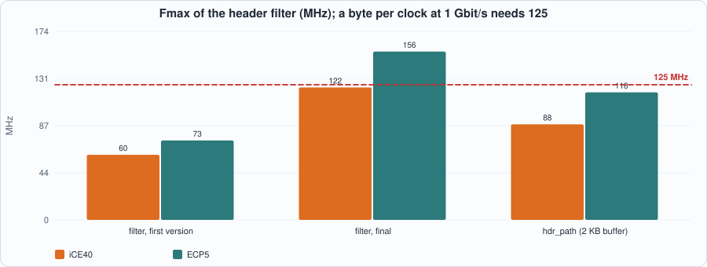
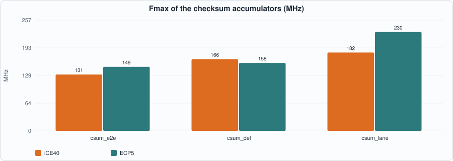

# 9. Headers at Line Rate: A Byte-Serial VLAN, IPv4 and UDP Filter, the Internet Checksum, and Why the First Version Ran at Half the Clock


--8<-- "docs/assets/art/ch-09.md"


**What you will see:** a hardware filter that reads a stream of Ethernet frame bytes (the output of Chapter 8's `mac_rx`, FCS already removed), follows the **VLAN tags, the IPv4 header and the UDP header** one byte per clock, checks the **IPv4 header checksum and the UDP checksum**, and decides for every frame whether it is a valid UDP datagram for this node, giving the *reason* when it is not. The chapter is also a worked example of a design that **missed its clock the first time**: the first version ran at 60 MHz on iCE40 and 73 MHz on ECP5, a byte per clock at 1 Gbit/s needs 125; the measurement named the paths, and five changes brought it to 122 and 156 MHz without changing a single result.

**What you need to know first:** Chapter 8 (the byte interface, `frame_fifo`) and Chapter 6 (golden models, mutation testing). You do not need to know the protocols: the chapter states the parts of RFC 791 (IPv4), RFC 768 (UDP), RFC 1071 (the checksum) and IEEE 802.1Q (VLAN) that it uses.

**What this chapter builds:** `rtl/hdr.sv` (`hdr_filter`, `hdr_path`, and two pin wrappers for the place-and-route runs), `rtl/hdr_v1.sv` (the first version, kept), `rtl/csum.sv` (three checksum accumulators), `model/ip_gold.py` (the specification, the frame builder and the stimulus), the testbenches `tb/hdr_tb.sv`, `tb/hdr_path_tb.sv`, `tb/csum_tb.sv`, and `tools/ch09_run.py`, `tools/ch09_example_a.py`, `tools/ch09_example_b.py`, `tools/mut_ch09.py`.

!!! note "Width and scope"
    The datapath is **8 bits wide**, as in Chapter 8: one byte per clock, so a field is always at a known byte position and never straddles two beats. On a 64-bit datapath a header starts in any of eight byte lanes (a VLAN tag shifts every later field by four bytes) and a 32-bit address can be split across two beats; that is a different problem, left to Exercise 2. The **filter rule** here is deliberately small (one destination address, one range of destination ports, one optional VLAN id); the hash filters, CAMs and multicast groups of a real filter are the next chapter's subject. Fragments are **not reassembled**: they are reported as `not_udp`.

## What the filter must decide

A frame body arrives as bytes: 14 bytes of Ethernet header (destination and source MAC address, a 16-bit **type**), then, if the type is `0x8100` or `0x88A8`, a **VLAN tag** (2 bytes of tag, whose low 12 bits are the VLAN id, then the real type; a second tag may follow), then, if the type is `0x0800`, an **IPv4 header** of 20 to 60 bytes, then, if its protocol is 17, an **8-byte UDP header** and the payload. Ethernet pads short frames with zeros to 60 bytes, so the end of the frame is *not* the end of the datagram: the IPv4 **total length** and the UDP **length** say where the data stops.


*Figure 9.1: what the filter follows and captures (blue and green boxes), and what the two checksums cover.*

For every frame the filter reports one **cause**, by this priority (the first that applies):

| cause | meaning |
|---|---|
| 0 forward | a valid UDP datagram for this node |
| 1 mac_bad | the MAC marked the frame bad (FCS, length, `rx_er`) |
| 2 trunc | the frame ends inside the Ethernet, VLAN or IPv4 header |
| 3 not_ip | the type, after at most two tags, is not `0x0800` |
| 4 ip_bad | version is not 4, IHL below 5, header checksum wrong, total length shorter than the header or longer than the frame |
| 5 not_udp | protocol is not 17, or the packet is a fragment (more-fragments flag or a fragment offset; the don't-fragment flag does not count) |
| 6 udp_bad | UDP length below 8 or beyond the IP payload, or a checksum that is present and wrong |
| 7 not_ours | VLAN id, destination address or destination port does not match the configuration |

It also reports the fields it saw: the number of tags, the VLAN id, both addresses, both ports and the UDP length. A field whose bytes were never seen reads zero. The frame leaves with its last byte marked bad unless the cause is 0, so `frame_fifo` (Chapter 8) drops everything the node should not see, and a counter per cause says why.

## The model

`model/ip_gold.py` is the specification, written from the RFCs and not from the RTL: `spec()` parses a frame body and returns the cause and the fields; `build()` makes a valid frame and breaks one thing (a flipped bit in either checksum, a wrong version, an IHL of 4, a total length too big or too small, a UDP length too small or too big, a fragment, another protocol, ARP, three tags, a cut at an interesting offset, a trailer after the datagram, a checksum field of zero meaning "none", a datagram whose checksum is zero and is sent as `0xFFFF`, and others); `frames()` mixes them. It is checked against two known answers (RFC 1071's example sum, and a textbook IPv4 header) before anything else is trusted.

```python
--8<-- "model/ip_gold.py"
```

## The Internet checksum

RFC 1071 defines the checksum used by IPv4, UDP and TCP: add the data as 16-bit big-endian words in **ones' complement** (a carry out of bit 15 is added back at bit 0), pad an odd last byte with a zero byte, and send the complement of the result. Three facts make it cheap in hardware and are used below.

- **A received message is correct when its words, checksum field included, sum to `0xFFFF`.** There is no need to compute the complement.
- **The order does not matter.** The sum is commutative and associative, so words may be added in any order, and the two bytes of a word can be added separately (the byte-lane variant below).
- **The end-around carry may be deferred.** Keep the carry as bit 16 of the register and add it at the *next* addition: the register holds `low + 65536 x carry`, which is the same value modulo `0xFFFF`. A sum is then correct exactly when `low = 0xFFFF` with no carry, or `low = 0xFFFE` with a carry (their fold is `0xFFFF`): **two 16-bit comparisons, no adder**.

UDP's checksum covers more than the UDP segment: also a **pseudo-header** that is not on the wire, the source address, the destination address, a zero byte and the protocol (17), and the UDP length. That ties the datagram to the addresses it was sent between. A checksum field of **0** means "no checksum" (a sender whose sum comes out as zero sends `0xFFFF`).


*Figure 9.2: three ways to accumulate, compared in Example B.*

## The first version, and what its measurement found

The first `hdr_filter` (`rtl/hdr_v1.sv`) was written the obvious way: a state machine with a byte counter per header, a `case` on the counter to capture each field, a 12-bit counter and a comparison with the UDP length to find the end of the segment, a multiplexer in front of every register that substitutes the initial value at the start of a frame, and the whole verdict as one expression of the registers in the cycle after the last byte. It passed **every test** (section 3 of the recorded run runs it against the same specification). Its clock did not:

Example A below measures it (the first row of its table). iCE40 reaches **60.2 MHz and ECP5 73.4**, against 125 needed for a byte per clock at 1 Gbit/s, and the critical path starts at `fresh` (the flag that substitutes initial values) and ends at `uacc` (the UDP accumulator): **7.8 ns of logic and 8.8 ns of routing** on iCE40. The logic on that path is the multiplexer in front of the register, the position decode, the end-of-segment comparison with the length, the selection of what to add, and the 17-bit adder. Each step is reasonable; their sum is half the clock.

Five changes, none of which alters a result. (I measured after each one while developing; only the first and the last version are kept and recorded, so the contribution of each change is not reported.)

1. **One-hot position registers.** The position inside the IPv4 header (bytes 0 to 19) and the UDP header (bytes 0 to 7) is a shift register with one bit set. A field is captured by `if (position bit) field <= byte`: one LUT, with no decoder and no counter in front.
2. **Flags computed a byte ahead.** The end of the IP header (`hlast`), the low byte of an EtherType (`tpos`), the address-word and UDP select signals, and the end of the UDP segment (`uend`) are registers, set in the cycle *before* they are needed. The end of the segment comes from a down counter loaded when the length is known (`left`), not from comparing a counter with the length every byte.
3. **Clear by the flip-flop, not by a multiplexer.** FPGA flip-flops have a synchronous reset that costs no LUT. The control registers (state, positions, flags) are reset by the **last** byte of the frame; the data fields and accumulators by the **first** byte of the next one (which is an Ethernet byte and captures none of them). A copy of the final state (`st_v`, `ntags_v`) is kept for the verdict. This removes the `fresh` multiplexer from every path.
4. **Pipeline the verdict.** The cycle after the last byte only turns the registers into single-bit **facts**, each at most one 16-bit comparison deep (`tot <= ipc`, `ulen > trem`, a checksum compare, ...); the next cycle combines the facts into the cause by priority, and the count strobes are registered one-hot so the counters see no decoder. `trem = total length - header length` is computed as the total-length byte arrives, and the header length is worked out once, at byte 0. The price is **one more cycle of latency (3, measured)**, and the throughput is unchanged: the registers of one frame are cleared by the first byte of the next, which may arrive in the very next cycle, so the facts are taken in exactly that cycle.
5. **The addend is a pre-selected AND-OR.** The UDP accumulator takes one of four words (an address word of the IP header, the UDP length, a pair of segment bytes, an odd last byte alone). The selects are flip-flop outputs computed a byte earlier, and the initial value of the accumulator is the pseudo-header's `0x0011`, so no add is spent on it.


*Figure 9.3: ETH, VLAN, IP, UDP, XIP (the payload of another protocol) and NIP (not IP).*


*Figure 9.4: absorb the byte, take the facts, choose the cause, deliver: latency 3, a byte per clock.*

## The final filter

```systemverilog
--8<-- "rtl/hdr.sv"
```

(The file also holds `hdr_path`, `mac_rx` feeding `hdr_filter` feeding Chapter 8's `frame_fifo`, and the two wrappers `hdr_filter_syn` and `hdr_path_syn`, which exist only so that the designs fit a chip's pins for the place-and-route runs: they shift the 78 configuration bits in serially and multiplex the 258 bits of fields and counters out through 16 registered pins.)

The first version, kept so that you can read what the measurement was about:

```systemverilog
--8<-- "rtl/hdr_v1.sv"
```

The three accumulators of Example B:

```systemverilog
--8<-- "rtl/csum.sv"
```

## The tests

Every test compares the RTL with the specification frame by frame: the model writes the stimulus (one line per cycle: valid, last, bad, byte), the testbench prints what the design reports, and the Python script compares the lists, **including every captured field**.

```systemverilog
--8<-- "tb/hdr_tb.sv"
```

```systemverilog
--8<-- "tb/hdr_path_tb.sv"
```

```systemverilog
--8<-- "tb/csum_tb.sv"
```

```python
--8<-- "tools/ch09_run.py"
```

To compile and run: `python3 tools/ch09_run.py` (a few minutes). Recorded output:

```text
--8<-- "out/ch09_run_out.txt"
```

**Reading the output.**

- **Section 1:** all five modules are lint-clean (Verilator `-Wall` and Yosys `check`).
- **Section 2:** the model reproduces RFC 1071's example (`0xDDF2`) and the textbook IPv4 header's checksum (`0xB861`).
- **Section 3, the filter against the specification:** four configurations (any address and port; one address and a port range; an address ending in `255.255` with one port and VLAN `0xABC`; VLAN `0` only), eight seeds of 150 frames each, in two stimulus styles: **frames back to back with no idle cycle**, and with **random gaps between frames and idle cycles inside them** (idle cycles carry random junk on the data, last and bad signals, as in Chapter 7). Every frame's bytes, bad flag, cause and fields equal the model's in **all 64 Icarus runs**, and in the four Verilator runs. Over the 32 model runs the stimulus holds 2,577 forwarded frames and, by cause, 106 `mac_bad`, 220 `trunc`, 379 `not_ip`, 533 `ip_bad`, 291 `not_udp`, 353 `udp_bad` and 341 `not_ours`: every cause is common.
- **The first version passes the same tests** (8 of 8): it was wrong about the clock, not about the answers.
- **Section 4, one byte per clock:** 200 frames, **16,014 bytes offered in 16,014 cycles**, no idle cycle between bytes or frames; every frame exact, and the latency from the first byte in to the first byte out is **3 cycles** (measured).
- **Section 5, from the PHY wires:** `mac_rx` → `hdr_filter` → `frame_fifo` (2 KB), consumer at 100% and 50%, four configurations: the frames delivered are **exactly** the model's forwarded frames, in order, and the counters equal the model's per-cause counts. (No `trunc` appears in this section: the MAC already marks a frame shorter than 64 bytes bad, and `mac_bad` has priority. `trunc` is exercised in section 3.)
- **Section 6, the checksum accumulators:** 300 messages (the edge cases, then random messages heavy in `0xFF` so that nearly every word carries; 1 to 1,600 bytes; idle cycles with junk), all three equal the model, in both simulators.


*Figure 9.5: the stimulus contains every cause in quantity (section 3).*

## Running example A: what the filter costs and how fast it runs

```python
--8<-- "tools/ch09_example_a.py"
```

To compile and run: `python3 tools/ch09_example_a.py` (several minutes). Recorded output, repeated in full:

```text
--8<-- "out/ch09_example_a_out.txt"
```


*Figure 9.6: the clock of each version on iCE40 and ECP5, against the 125 MHz of a byte per clock at 1 Gbit/s.*

**Reading the output (measured; nextpnr seed 1; every design sits behind the pin wrapper, which adds 78 flip-flops and a 16-bit multiplexer).**

- **First version against final:** iCE40 **60.2 → 122.4 MHz**, ECP5 **73.4 → 155.6 MHz**, while the LUTs fall from 1,195 to 838 on iCE40 and from 1,359 to 586 (plus 159 carry cells, against 142 before) on ECP5. The final filter reaches **0.98 Gbit/s on iCE40 and 1.25 on ECP5** (derived: 8 bits x Fmax). **On ECP5 the filter meets the 125 MHz of a byte per clock at 1 Gbit/s with 24% to spare; on iCE40 it misses it by 2%.**
- **The critical path of the final filter** is, on iCE40, from `ipw` (the registered "this byte completes an address word" select) through the addend multiplexer into the 17-bit UDP accumulator (4.2 ns of logic, 4.0 of routing); on ECP5, from the type flags `h88` into the position register `ipo` (2.1 and 4.3). The first is the one the last change did not remove: the accumulator's adder sits behind a two-level selection. Exercise 1 asks you to split it.
- **`hdr_path` is limited by Chapter 8's `frame_fifo`, not by the filter:** 88.4 MHz on iCE40 and 117.9 on ECP5, with the critical paths in the frame buffer's pointer arithmetic and the block RAM output (`hp.ff.wptr -> n_bad`, `hp.ff.rptr -> mem`): the open problem Chapter 8's Exercise 1 poses, and not solved here. 2 KB of buffer is 5 block RAMs on iCE40 and 1 on ECP5, as before.
- **Where the logic goes** (the last table, from Yosys alone, without the wrapper; each row removes one function and counts the cells saved): the **UDP checksum costs 131 cells on iCE40 and 133 on ECP5** (the 17-bit adder, its four-way input selection and the segment counter), the **per-cause counters 154 and 141** (eight 16-bit counters), the destination filter 52 and 70, the VLAN handling 39 and 25, and the **IP header checksum only 24** (one more 17-bit adder and a comparison). On ECP5 a cell is a LUT4 or half of a carry cell.

## Running example B: three ways to accumulate

```python
--8<-- "tools/ch09_example_b.py"
```

To run: `python3 tools/ch09_example_b.py` (a few minutes). Recorded output:

```text
--8<-- "out/ch09_example_b_out.txt"
```


*Figure 9.7: the same function, three structures, two chips.*

**Reading the output (measured; all three are shown equal to the model in section 6 of the run).**

- **On iCE40 the carry structure decides the clock:** folding the carry in the same cycle (two adders in a row) reaches **130.8 MHz**, deferring it into bit 16 **166.5**, and the byte-lane version, whose additions are only 8 bits wide into a 20-bit register, **182.0**. The price is area: 68, 70 and 96 LUTs.
- **On ECP5 the picture is different:** 148.8, 157.7 and **229.7 MHz**. ECP5's dedicated carry chains make a second adder cheap, so the deferral buys 6%, while the lane version, which has no 16-bit word to form at all, gains 54% over the first.
- **The choice in `hdr_filter`** is the deferred carry: it is almost as small as the first (70 LUTs against 68), **27% faster on iCE40**, and the verdict's two comparisons need no adder. The lane version is the faster structure and the one to take when the accumulator, not the control, is the critical path; here it was the selection in front of the adder.
- Fmax in this table is register to register: the combinational `sum` output of each module is a pin path and is not timed.

## Testing the tests

```python
--8<-- "tools/mut_ch09.py"
```

To run: `python3 tools/mut_ch09.py` (about ten minutes). Recorded output:

```text
--8<-- "out/ch09_mut_out.txt"
```

All **65** mutants are caught: 57 in `hdr.sv` (7 in the type recognition, 5 in the VLAN handling, 15 in the IPv4 checks, 16 in the UDP checks, 6 in the destination filter, 3 in the verdict, 2 in the captured fields, 2 in the state clearing, 1 in the counters) and 8 in the three accumulators. The battery is the filter against the specification on four configurations x 2 seeds x 2 stimulus styles, `hdr_path` from the wires on three configurations (frames and counters), and the three accumulators against the model.

**The first run caught 54 of 63, and the nine others each said something.** Three were anchors that matched two places (my mistake, fixed). The six survivors:

| survivor | what it meant | what closed it |
|---|---|---|
| IP version 4 **or 5** accepted | no test used version 5, the near miss | the wrong-version frames now draw from 5, 3, 6, 7, 0, 12, 15 |
| a header sum with a **pending carry** is not accepted | with random addresses a valid IPv4 header almost never ends with a carry (the last word would have to be `0xFFFF`) | a configuration whose address ends in `255.255` (a broadcast address): every valid header of that configuration ends in a carry |
| UDP length **7** accepted | a wrong length was always caught *by the checksum* too, which hid it | the too-short length frames now carry a zero checksum half of the time |
| the end of the segment at length 7 | **code that cannot matter**: a length of 7 or less is refused by the length check, so a segment never ends before byte 7 | the load was removed from the RTL |
| the second fold in `csum_def`'s final sum | **code that cannot matter**: the first fold's value is at most `0x1FF00`, so the second fold never carries | removed |
| the last fold in `csum_lane` | **code that cannot matter**: the combined value is at most `0x11FFE` for messages of up to about 4 KB | removed |

A surviving mutant is **either a missing test or code that cannot matter**, and the second kind is not an excuse: it is a simplification to make.

## What this chapter established, and what it did not

**Established, with the tests that show it:** the filter reports, for 32 runs of random frames in four configurations and two stimulus styles, exactly the model's cause and fields for every frame, at one byte per clock with a latency of 3 cycles and no idle cycle needed between frames; from the PHY wires it delivers exactly the valid UDP frames for the node and counts the rest by cause; the first and the final version agree with the specification, and differ in clock by a factor of two; three checksum accumulators agree with the model; 65 of 65 mutants caught.

**Not established:** the **125 MHz on iCE40** (122.4 MHz measured, a 2% miss, from the accumulator's input selection) and the `frame_fifo` at that clock (88 MHz on iCE40, 118 on ECP5, inherited from Chapter 8); parsing on a **wide datapath**, where fields straddle beats; **IPv6**, IP options beyond skipping them, **fragment reassembly**, TCP; **formal proofs** (the filter is tested against a model, not proved equal to it); behaviour for frames longer than about 4 KB (the 12-bit byte counter saturates at 2,048 and the lane accumulators have 20 bits).

## Self-check questions

1. Why does the Internet checksum add with an end-around carry, and why is the byte order of the words irrelevant to the check?
2. How does a receiver check an IPv4 header without computing the complement of the sum?
3. What is the UDP pseudo-header, and what does it protect against?
4. What does a UDP checksum field of zero mean, and what does a sender send when the sum comes out as zero?
5. Why does the filter need the IPv4 total length and the UDP length, when the frame already ends?
6. What value does the pair (`low`, `carry`) represent in the deferred-carry accumulator, and when is the sum correct?
7. Why are the positions in the headers one-hot shift registers, and what do they cost?
8. Why are the control registers cleared by the last byte of a frame and the data fields by the first byte of the next?
9. Why is the verdict in two stages, what does it cost and what does it not cost?
10. Name two survivors of the first mutation run, one that was a missing test and one that was code that cannot matter.
11. Why do the three accumulators rank differently on iCE40 and ECP5?
12. Why does `hdr_path` run slower than `hdr_filter`, and where is its critical path?

## Exercises

1. **Reach 125 MHz on iCE40.** The critical path ends in the UDP accumulator behind a two-level selection. Move the address words and the UDP length into a second accumulator (they are only added at fixed positions), and check the sums with the ones' complement property that two sums `A` and `B` fold to `0xFFFF` exactly when `B = ~A` (take care of the case `A = B = 0xFFFF`). Measure the new Fmax and the cost in LUTs.
2. **A wide datapath.** Sketch the capture of the IPv4 source address on a 64-bit datapath, where the IP header starts at byte 14, 18 or 22 of the frame (no tag, one tag, two tags) and the address may be split across two beats. Specify it in the model first: which beat and which lane holds each byte of each field?
3. **A new cause.** Add `ip_opts`: a packet with the IP options "loose source route" (`0x83`) or "strict source route" (`0x89`) is refused. Where in the byte stream is the option type, what must the state machine remember, and which stimulus would the battery need before a mutant of the new check dies?
4. **An incremental update.** A router decrements the TTL and must fix the header checksum without summing the header again (RFC 1624). Write the update in the model, prove it exhaustively for all 16-bit old checksums and all TTL values, and check whether the formula of RFC 1141 and the full recomputation ever differ, and where (RFC 1624 discusses the boundary between `0x0000` and `0xFFFF`).
5. **A mutant that survives.** Add a mutant to `tools/mut_ch09.py` that the battery does not catch. Is it equivalent, or is a test missing? If it is equivalent, simplify the RTL as this chapter did three times.
