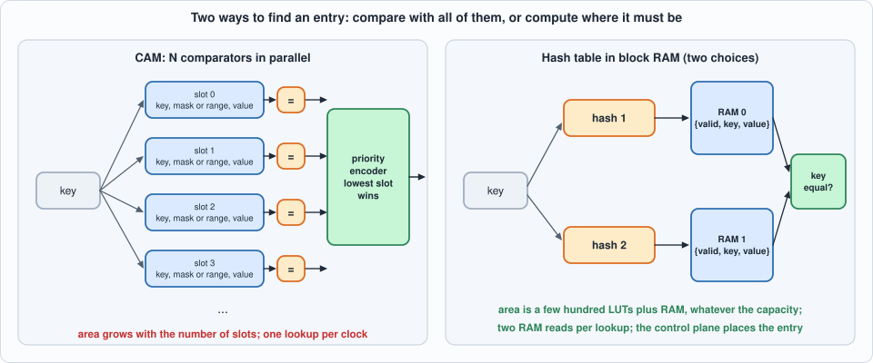
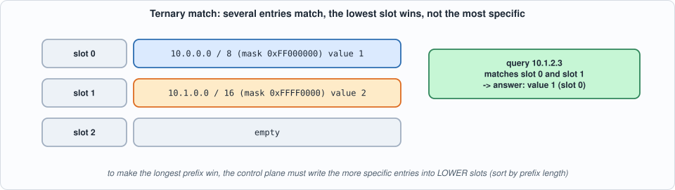
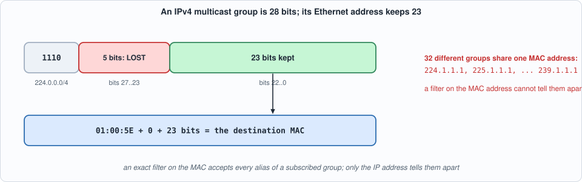
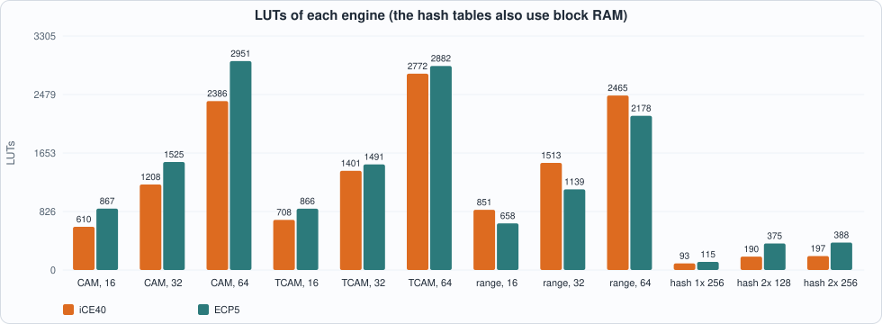
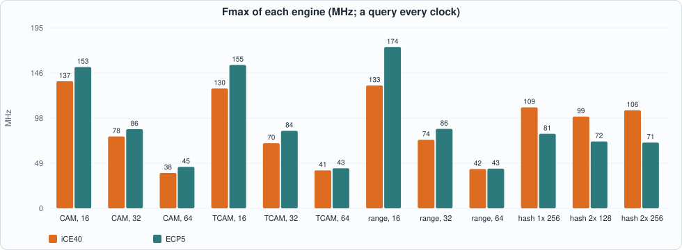
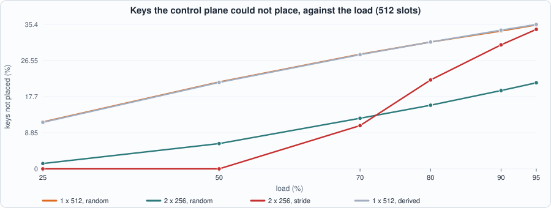
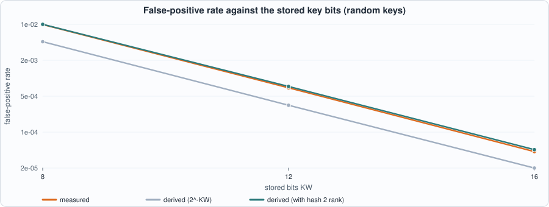

# 10. Match Engines: CAM, Ternary CAM, Range Matcher and Hash Tables, What Each Costs, and Where a Cheap Hash Fails


--8<-- "docs/assets/art/ch-10.md"


**What you will see:** four ways to answer "which entry, if any, matches this key?" behind **one interface and one latency**: an exact **CAM** (content-addressable memory: every entry compared with the key in one clock), a **ternary CAM** (each entry has a mask: prefixes and wildcards), a **range matcher** (for port ranges), and a **hash table** in block RAM with one or two choices of slot and an optional key **fingerprint**. One model and one testbench serve all four; the chapter then measures what each costs, how a table of the cheap hash behaves as it fills, and why a filter on a multicast MAC address cannot tell 32 groups apart.

**What you need to know first:** Chapter 5 (block-RAM read styles) and Chapter 9 (the header filter whose destination address and port rule this chapter generalises). No knowledge of CAMs is assumed.

**What this chapter builds:** `rtl/match.sv` (`match_cam` with three modes, `hash_tab`), `model/match_gold.py` (the specification, the hash control plane and the stimulus), `tb/match_tb.sv`, and `tools/ch10_run.py`, `tools/ch10_example_a.py`, `tools/ch10_example_b.py`, `tools/mut_ch10.py`.

!!! note "Scope"
    Keys are **32 bits** and values 8 bits (a port number or a bitmap of subscribers). Tables are small: up to 64 CAM slots and 512 hash slots, the sizes at which the open flow places the designs in minutes. Wider keys (a 48-bit MAC address, an IPv6 address) change the cost, not the structure. **Update safety** (changing a table while traffic flows without a wrong answer in between) is addressed only to the extent that a query sees exactly the writes of earlier cycles; a shadow-table swap is Exercise 4. Hash entries are never **moved** after insertion (cuckoo hashing, Exercise 2).

## The interface

All engines have the same pins, so that anything built on one can use another.

- **Query:** `q_valid`, `q_key`. The result comes **two cycles later**: `r_valid`, `r_hit`, `r_val`. One query per cycle, no stall.
- **Write:** `w_en`, `w_sel` (which table, hash engines), `w_addr` (the slot), `w_key`, `w_aux`, `w_val`, `w_vld` (0 deletes). The engine only *stores*: **software decides where an entry goes** (for a CAM the slot number is the priority; for a hash table the control plane knows the hash and places the key).
- **Ordering:** a query sees every write issued in an **earlier cycle** and none issued later, whatever stage of its two-cycle pipeline it is in. One operation per cycle.
- **Don't-cares:** the data inputs are ignored when `q_valid` or `w_en` is low; `r_hit` and `r_val` are ignored when `r_valid` is low.

## The CAM family

`match_cam` keeps `N` slots in registers and compares the key with **all of them in one cycle**.

- **Mode 0, exact:** the slot's key equals the query.
- **Mode 1, ternary (TCAM):** `w_aux` is a mask: a 1 bit means "this bit of the key must match", a 0 bit means "don't care". `10.0.0.0/8` is the key `0x0A000000` with mask `0xFF000000`. The bits of the stored key outside the mask are not required to be zero.
- **Mode 2, range:** the low 16 bits of the key must lie in `[lo, hi]` (`w_aux[15:0]` and `w_aux[31:16]`). A slot with `lo > hi` never matches.

Several slots may match; the **lowest slot number wins**. That is the whole priority rule, and it is *not* "longest prefix first": the control plane must write the more specific entries into lower slots.


*Figure 10.1: compare with every entry, or compute where the entry must be.*


*Figure 10.2: the lowest slot wins, whatever the prefix length.*

Stage 1 registers the `N` match bits. Stage 2 finds the lowest set bit and reads that slot's value, in the cycle *after* the compare. A write in that cycle takes effect at its end, so the older query still sees the old value, which is the ordering rule above. (Yosys maps the value array to one block RAM: it sees an array read with a registered output.)

## The hash table

`hash_tab` stores `{valid, key, value}` in block RAM. With **one table** a key lives at slot `hash1(key)`. With **two tables** (two-choice hashing) it may live at `hash1(key)` in table 0 *or* `hash2(key)` in table 1, and both are read in the same cycle. A lookup compares the stored key with the query. The hash is deliberately cheap: `fold` is the XOR of the key's `AW`-bit chunks; the second hash is `fold` of the key rotated left by 13 and XORed with the key shifted right by 5.

With **`KW` below 32** the slot stores only the **low `KW` bits** of the key, a *fingerprint*. The table then answers "hit" for some keys that were never inserted (**false positives**) but never "miss" for one that was; that is a filter, in the sense of a Bloom filter, with a smaller slot.

```systemverilog
--8<-- "rtl/match.sv"
```

## The model and the control plane

`model/match_gold.py` holds the specification of each engine and the **control plane** of the hash engines (`HashPlane`): it knows both hashes, places each key in the first free slot it has (table 0, then table 1), remembers where each key is, and deletes by clearing the slot. A key it cannot place is simply absent from the set, and the hardware must say **miss** for it: so `insert` can *fail*, and the failure rate is a property of the hash and the load, measured in Example B. For `KW = 32` the model asserts that the structure's answer equals plain set membership.

```python
--8<-- "model/match_gold.py"
```

## The tests

The stimulus is one operation per cycle: idle (carrying random junk on every field), write, or query. For the CAMs the stream mixes writes, deletes and queries; a query's expected result is taken from the slots *as they are at that point of the sequence*. Queries are chosen to be hard: keys of live entries, **keys of entries that were deleted** (the old key stays in the slot half the time, as when software only clears a flag), near misses that differ in one bit the mask cares about (the lowest, the highest, a random one), the edges of a range (`lo`, `hi`, `lo - 1`, `hi + 1`), and, for the hash tables, **bucket collisions** (a key that hashes to a member's bucket and is not the member). Half of the CAM runs skip the clearing writes and begin with queries straight after reset, with the testbench having **powered every register up with garbage** (every slot valid), so that only the reset can empty the CAM.

```systemverilog
--8<-- "tb/match_tb.sv"
```

```python
--8<-- "tools/ch10_run.py"
```

To compile and run: `python3 tools/ch10_run.py` (a few minutes). Recorded output:

```text
--8<-- "out/ch10_run_out.txt"
```

**Reading the output.**

- **Section 3, the CAMs against the specification:** exact, ternary and range engines at 8, 16 and 32 slots, six seeds each, all equal to the model in Icarus and the first seed also in Verilator. The *multi-match* column counts queries for which more than one slot matched, which is what tests the priority: it is large for ternary and range entries (random masks and ranges overlap) and not zero for exact ones (a small pool of keys is reused).
- **Section 4, the hash tables against the structure:** one table of 128 slots, two tables of 64, and fingerprints of 16 and 12 bits, four key types (`random`, `seq` = consecutive addresses, `mcast` = group addresses in 224.0.0.0/4, `stride` = multiples of 4,096), 80% full, four seeds each. All equal. The `placed` and `failed` columns already show the next point: in **one table of 128 slots, 49 of the 136 insertions of random keys failed (a slot already taken), and 9 of consecutive ones**; two tables of 64 fail 31 for random keys, which is better, and **62 for stride keys, much worse**.
- **Section 5:** a query in every cycle: 300 results for 300 queries, all equal to the model, **latency 2 cycles for every engine** (measured).
- **Section 6, multicast.** An IPv4 multicast group has 28 variable bits, but its Ethernet address `01:00:5E` + 23 bits keeps only 23. With a 28-bit key the node accepts exactly its subscribed groups; with the 23-bit key a frame to **any alias of a subscribed group is accepted: 300 of 300** alias frames (the five lost bits differ), though no random other group is. Both tables agree with the model in the RTL. (With the 28-bit key 39 of the 40 subscriptions were stored: one hit a collision in both tables, and its 9 frames of the 300 member frames were therefore refused. That is the failure of Example B appearing in an application.) The filter on the MAC address is a first filter only; the IP address must be checked again.


*Figure 10.3: 28 bits of group, 23 bits on the wire.*

## Running example A: what each engine costs

```python
--8<-- "tools/ch10_example_a.py"
```

To compile and run: `python3 tools/ch10_example_a.py` (several minutes). Recorded output:

```text
--8<-- "out/ch10_example_a_out.txt"
```


*Figure 10.4: LUTs of each engine on the two chips.*


*Figure 10.5: the clock falls as the CAM grows.*

**Reading the output (measured; nextpnr seed 1).**

- **A CAM costs about 34 to 54 LUTs per slot**, and about 35 flip-flops per slot (the key, the value and the valid bit are all registers): 64 slots take **2,386 LUTs on iCE40 and 2,951 on ECP5** (exact), 2,772 and 2,882 (ternary, whose mask doubles the flip-flops to 4,252 and 4,235) and 2,465 and 2,178 (range). A 64-slot ternary CAM needs over a third of the 7,680 LUTs of an iCE40 HX8K, and more logic cells than that, because its 4,252 flip-flops share cells with the LUTs only where a LUT feeds a flip-flop. On ECP5 the range matcher is cheaper per slot than the exact CAM (34 against 46 LUTs at 64 slots) and uses 1,040 carry cells at 64 slots; the carry cells are the likely reason, but I did not isolate it.
- **The clock falls with the size:** exact CAM **137 MHz at 16 slots, 78 at 32, 38 at 64** on iCE40, and 153, 86 and 45 on ECP5. Every comparator reads the same 32 key bits (a fan-out of N), and the priority encoder is a chain over N bits. Both grow with N; nothing in the structure is pipelined beyond the two stages.
- **A hash table is an order of magnitude cheaper:** **93 LUTs and 3 block RAMs** for 256 slots in one table on iCE40, 190 LUTs and 6 RAMs for two tables of 128, 197 and 6 for two of 256; on ECP5, 115, 375 and 388 LUTs with 2 to 4 RAMs. The area barely grows with capacity, and the clock stays at 99 to 109 MHz on iCE40 and 71 to 81 on ECP5. The cost moved: from LUTs to the **control plane** (placement), to the **block RAM**, and to **correctness at load** (Example B).
- **Speed is not the issue:** a minimum frame is 84 byte times (preamble, SFD, 64 bytes, gap), so a lookup per frame needs **1.5 million lookups per second at 1 Gbit/s** (derived); every engine here manages 38 million or more. What the table costs is area, not time.
- **The two-table hash is slower on ECP5** (72 MHz, against 81 for one table): two RAM reads and a wider compare. The clock numbers are those of nextpnr's estimate for each design alone.

## Running example B: how a cheap hash behaves

```python
--8<-- "tools/ch10_example_b.py"
```

To run: `python3 tools/ch10_example_b.py` (a few minutes). Recorded output:

```text
--8<-- "out/ch10_example_b_out.txt"
```


*Figure 10.6: the share of keys the control plane could not place, same 512 slots.*


*Figure 10.7: false positives of a fingerprint table, measured and derived.*

**Reading the output (all from the control-plane model, whose answers section 4 of the run shows equal to the RTL's).**

- **A single table loses a third of its keys when full.** With 512 slots and random keys, the share of keys that find their slot taken is **11.5% at 25% load and 35.3% at 95%**, and the **derived** value `n - m(1 - (1 - 1/m)^n)` agrees to within 0.2 points (11.4% and 35.4%).
- **Two choices help a great deal on random keys:** the same 512 slots as two tables of 256 lose **1.3% at 25% and 21.1% at 95%**: at 50% load, 6.2% against 21.3%.
- **The hash decides, not the table:** **consecutive keys** (`seq`) and **multiples of 4,096** (`stride`) are placed perfectly by one table (0.0% at every load), because the fold maps consecutive or regularly spaced keys to *different* buckets: better than random. In two tables of 256, `seq` is also perfect, but **`stride` fails 10.6% at 70% load and 34.2% at 95%, worse than random keys in the same tables (12.4% and 21.1%)**: the keys that overflow table 0 go to table 1, where the second hash does not spread them. Multicast group addresses behave like random keys.
- **The second hash is weaker than it looks.** The hashes are linear (XORs of key bits), so the question "how many output bits do the high key bits control?" is a **rank**. For keys that agree in their low `KW` bits, hash 1 still has full rank 8, but **hash 2 has rank 6** for every `KW` from 8 to 20 (the last table's last column). Two keys with the same low bits therefore collide in table 1 with probability 2^-6, not 2^-8.
- **That shows in the false-positive rate.** A table that stores the low `KW` bits of the key should answer "hit" for a non-member with probability about `(occupancy of table 0 + occupancy of table 1) x 2^-KW` (derived). Measured over 400,000 non-member keys: **1.15e-2 at KW = 8 against 5.4e-3 derived: a factor of 2.1 too many**. Multiplying the table-1 term by `2^(8 - rank)` = 4 gives **1.16e-2**; at KW = 12 the measured rate is 7.1e-4 against 7.5e-4 corrected (3.3e-4 uncorrected); at KW = 16, 4.3e-5 against 4.6e-5 (2.1e-5). At 20 bits no false hit occurred in 400,000 (2.8e-6 expected: under one). A 32-bit key stored in full has none.
- **The lesson:** a fingerprint must be *independent of the hash that places the key*; here the fingerprint is the low bits, which both hashes use, and the weakness of the second hash costs a factor of 2 in a filter's false-positive rate. Exercise 3 asks you to fix the hash.

## Testing the tests

```python
--8<-- "tools/mut_ch10.py"
```

To run: `python3 tools/mut_ch10.py` (about ten minutes). Recorded output:

```text
--8<-- "out/ch10_mut_out.txt"
```

All **35** mutants are caught: 21 in the CAMs (the exact compare, the ternary and range comparisons, the priority, the value read, the valid bits, the reset) and 14 in the hash table (both hashes, the table select, the valid bit, the key compare, the value choice, the address of a write). The battery is the three CAM modes at 8 and 16 slots (3 seeds each) and the hash engines with one and two tables, 32- and 12-bit keys, on `random`, `stride` and `mcast` keys (2 seeds each).

**The first run caught 32 of 36 and the second 32 of 35, and every survivor named a missing test or code that could not matter:**

| survivor | what it meant | what closed it |
|---|---|---|
| a deleted slot still matches (exact CAM) | the deleting write put a random key into the slot, so the stale key was never the one queried | the delete keeps the old key half the time and queries use keys of deleted entries |
| ternary: bit 0 never compared | near misses flipped a random bit, which was a bit the mask cares about rarely | near misses flip the lowest, the highest or a random *care* bit |
| reset does not clear the valid bits | **a simulation blind spot:** in Icarus the registers start as `x`, and `if (x)` is false, so a CAM with no reset behaves as if it were empty; Verilator starts them at 0 | the testbench powers every register up with garbage (all slots valid), the stimulus begins with queries straight after reset |
| hash: the top stored key bit is not compared | two keys that agree in all bits but one rarely land in the same bucket, because every bit is in the hash | queries that hash to a member's bucket and differ from it in two bits that fold onto each other |
| the hit flag ignores `q_valid` | **code that cannot matter:** the flag is a don't-care when `r_valid` is low, and the testbench reads it only then | the gating was removed from the RTL |

## What this chapter established, and what it did not

**Established, with the tests that show it:** three CAM engines and a two-mode hash table equal their specification on every query of every run, in two simulators, with a latency of 2 cycles and a query in every cycle; a query sees exactly the writes of earlier cycles; the CAM empties itself on reset from any power-up state; a CAM costs about 34 to 54 LUTs and 35 flip-flops per slot and its clock falls from 137 to 38 MHz between 16 and 64 slots on iCE40, while a hash table of 256 to 512 slots costs 93 to 197 LUTs and block RAM; the loss of keys at load is derived for one table and measured for two; the false-positive rate of a fingerprint table is derived and measured to within 10% (the last point on only 17 events), once the rank of the second hash is accounted for; a MAC-level multicast filter accepts every alias of a subscribed group; 35 of 35 mutants caught.

**Not established:** keys wider than 32 bits; tables above 64 CAM slots or 512 hash slots; **cuckoo relocation**, so every number for the hash is for insertion without moving entries; **safe updates under traffic** (only the one-cycle ordering is tested); a pipelined CAM that holds its clock as it grows; a fingerprint independent of the hash that places the key; **formal proofs**.

## Self-check questions

1. What is the difference between a CAM and a RAM, and what does a CAM cost per entry in an FPGA?
2. What does a 1 bit and a 0 bit in a TCAM mask mean, and does the stored key have to be zero where the mask is zero?
3. Two ternary entries match a key. Which one wins, and what must the control plane do to get longest-prefix matching?
4. Why is a range needing two comparators per entry cheaper on ECP5 than on iCE40?
5. Why does the clock of a CAM fall as the number of entries grows?
6. How does a query see exactly the writes of earlier cycles in the CAM, whose value is read a cycle after the compare?
7. What does two-choice hashing do to the share of keys that cannot be placed, and why does it cost a second RAM read?
8. Derive the share of keys that cannot be placed in a table of `m` slots with `n` random keys.
9. Why were consecutive keys placed perfectly by one table, and `stride` keys badly by two?
10. What is a rank, and why does the rank of the second hash change the false-positive rate of a fingerprint?
11. Why does a filter on a multicast MAC address accept frames to groups the node has not joined, and what must be done about it?
12. Name two survivors of the mutation runs and the test that closed each, and say which one was a simulator blind spot.

## Exercises

1. **Longest prefix.** Write a control-plane function that places prefixes into a TCAM so that the longest matching prefix always wins (sort by prefix length), and check it against a dictionary-based longest-prefix model on random prefixes and addresses, including the default route `0.0.0.0/0`.
2. **Cuckoo insertion.** When both slots of a key are taken, move one of the occupants to its *other* slot, and repeat up to a limit. Add it to `HashPlane`, measure the share of keys not placed against the load for two tables of 256, and compare with Example B. How many writes does one insertion take at 90% load?
3. **A better second hash.** Replace the second hash by one of full rank for every `KW` (a rotation by a different amount, or a multiplication by a constant, or a different XOR pattern), keep it linear, and repeat Example B. Does the false-positive rate reach `(occ0 + occ1) x 2^-KW`? What does the multiplier version cost in LUTs on iCE40, which has no multipliers?
4. **A safe update.** Change many entries of the table without a query ever seeing a half-updated table: two tables, write the idle one, then swap with one bit. Specify in the model what a query sees in the cycle of the swap, and add the swap to the engine.
5. **A mutant that survives.** Add a mutant to `tools/mut_ch10.py` that the battery does not catch. Is it equivalent, or is a test missing? If it is equivalent, simplify the RTL as this chapter did once.
