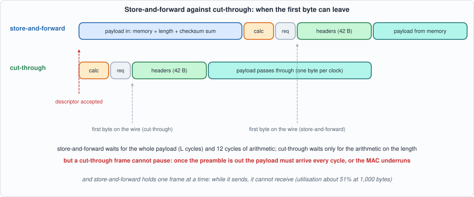
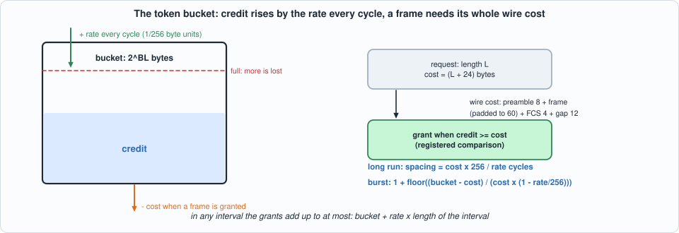
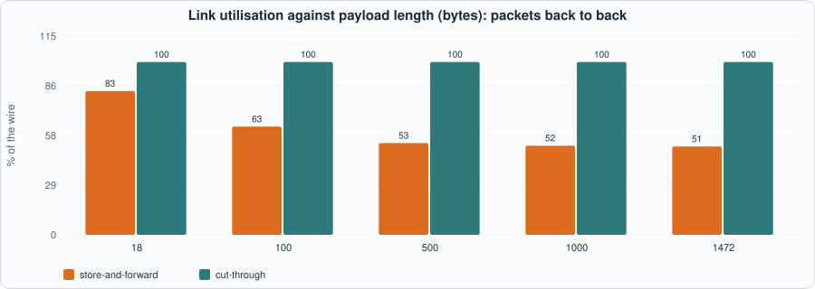
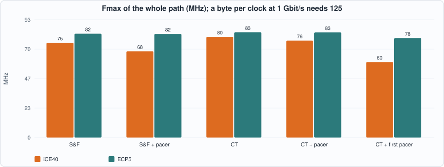
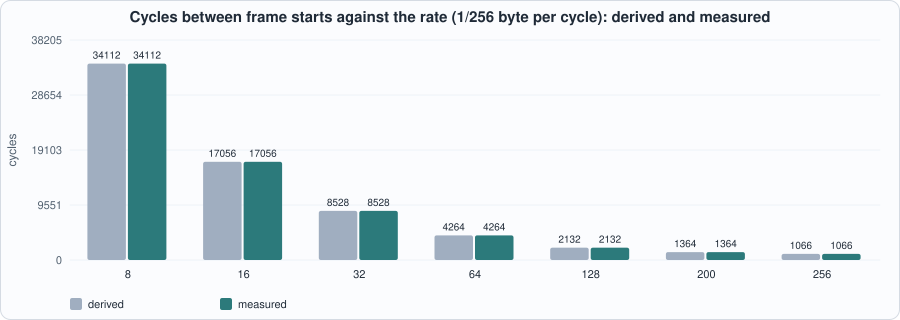

# 11. Egress: Building UDP Frames, Store-and-Forward Against Cut-Through, and a Token-Bucket Pacer


--8<-- "docs/assets/art/ch-11.md"


**What you will see:** the transmit side of a UDP node. Two **frame builders** that turn a payload into an Ethernet/IPv4/UDP frame with correct lengths and checksums and hand it to Chapter 8's `mac_tx` (which pads, appends the FCS and keeps the gap): a **store-and-forward** builder that holds the payload in a memory until it knows its length and checksum, and a **cut-through** builder that is told the length first and sends the headers before the payload arrives. And a **pacer**, a token bucket that decides *when* a frame may start so that traffic leaves at a configured rate. The chapter measures what each design costs in time, in link utilisation and in clock, and it contains one design that **failed its clock and was rebuilt**.

**What you need to know first:** Chapter 8 (`mac_tx`), Chapter 9 (the Internet checksum, the deferred-carry accumulator, and the header model that this chapter's frames are checked against).

**What this chapter builds:** `rtl/udp.sv` (`udp_hdr`, `pacer`, `pacer_comb`, `udp_sf`, `udp_ct`, `udp_tx_path`, and the pin wrapper `udp_tx_syn`), `model/udp_gold.py`, `tb/udp_tb.sv`, `tb/pacer_tb.sv`, and `tools/ch11_run.py`, `tools/ch11_example_a.py`, `tools/ch11_example_b.py`, `tools/mut_ch11.py`.

!!! note "Scope"
    One frame format (no VLAN tag, no IP options, no fragmentation: the don't-fragment flag is set), **8-bit datapath**, one destination port and address per packet, source addresses and ports static. Payloads up to **1,472 bytes** (a 1,500-byte MTU). The IP identification field counts the frames sent. Everything the builders send is checked against the model, which Chapter 9's header filter model accepts as a valid UDP frame; the wire bytes after the builder (preamble, padding, FCS) are Chapter 8's and are checked here only as part of the whole frame.

## The frame the builder must send

For a payload of `L` bytes, the frame is 42 header bytes then the payload: the Ethernet header (destination and source MAC address, type `0x0800`), a 20-byte IPv4 header (version and IHL `0x45`, total length `L + 28`, an identification, don't-fragment, TTL 64, protocol 17, the **header checksum**, the addresses) and an 8-byte UDP header (the ports, the length `L + 8` and the **UDP checksum**). `mac_tx` pads a frame shorter than 60 bytes with zeros (the padding is not part of the IP datagram: the lengths do not count it) and adds the FCS.

The **checksums are the problem**. Both sit *before* the payload in the frame, and the UDP one depends on every payload byte. A transmitter that sends bytes in order therefore has two choices:

1. **Buffer the payload** (store-and-forward): sum it while it goes into memory, then send headers and payload. Latency is at least `L` cycles and the buffer holds one frame.
2. **Do not checksum the payload.** For IPv4, UDP allows a checksum field of **0**, meaning "none". With the length known in advance (a descriptor before the payload), the IP header can be computed and sent immediately and the payload passes through: **cut-through**. The price is the loss of the end-to-end payload check (the Ethernet FCS still covers the link).


*Figure 11.1: where the first byte can leave.*

## The model

`model/udp_gold.py` builds the frame for a payload, a destination port and address and a frame id, using the checksum functions of Chapter 9's model (`inet_csum`), and adds the preamble, padding and FCS with Chapter 8's `spec_tx`. It builds payloads of every kind that matters: random, all `0xFF` (every word carries), all zeros, odd lengths, lengths 1 to 4, **payloads constructed so that the UDP checksum comes out as zero** (it must then be sent as `0xFFFF`), and, for the store-and-forward builder, payloads of exactly 1,472 (taken), 1,473 and more (dropped). The pacer has two cycle-exact models. Every frame the model builds is accepted by Chapter 9's header-filter model with the intended fields (section 2 of the run).

```python
--8<-- "model/udp_gold.py"
```

## The builders

**Interface (both).** A **descriptor** (`d_valid`, `d_len`, `d_dport`, `d_dip`) then `d_len` payload bytes (`s_valid`, `s_data`, `s_last`). The frame leaves on `o_valid/o_data/o_last/o_ready` into `mac_tx`; a request/grant pair (`p_req`, `p_len`, `p_go`) lets a pacer hold the frame back.

**`udp_sf`, store-and-forward.** The payload goes into a block RAM (a memory with a registered read, as in Chapter 5) while its length is counted and its checksum accumulated in the deferred-carry form of Chapter 9 (an odd last byte is the high half of a word). At the last byte a small sequencer adds, one word per cycle, the nine words of the IP header and the nine of the UDP pseudo-header and header to two accumulators (the second starting from the payload's), folds once, and complements: 11 cycles. A frame longer than `MAXP` is **dropped whole** and counted. Then it asks the pacer, and sends: the header bytes come from `udp_hdr`, the payload from the memory, whose registered output is the data register, so a `ready` that stalls the output simply holds the read address. It handles **one frame at a time**: it takes no payload while it sends.

**`udp_ct`, cut-through.** Stage A takes a descriptor and computes the IP header checksum (the same sequencer, IP words only, 11 cycles); stage B sends. A second descriptor can wait in stage A while the first frame is on its way. The headers go out first, then `s_ready = o_ready` passes the payload through combinationally. Its UDP checksum is zero. **It cannot wait for a slow source**: `mac_tx` sends a payload byte every cycle once the frame has started, and if `s_valid` is low in the middle of a payload `mac_tx` flags an **underrun** (section 4 below). The interface says the source must supply the payload without a gap.

```systemverilog
--8<-- "rtl/udp.sv"
```

## The pacer

A **token bucket**: a credit that rises by `rate` every cycle (in 1/256 of a byte, so `rate = 256` is one byte per cycle, line rate) up to the size of the bucket, and a frame may start only when the credit covers its whole **wire cost**: preamble 8 + frame (padded to 60) + FCS 4 + gap 12 bytes, which are cycles at line rate. A grant takes the cost from the credit. Two numbers follow, both **derived** from this definition:

- **the long-run spacing** of frames of cost `c` is `c x 256 / rate` cycles;
- **the burst**: from a full bucket of `B` bytes, the `k`-th frame leaves back to back if the credit still covers it; the credit falls by `c - c x rate/256` per frame, so `k <= 1 + (B - c) / (c - c x rate/256)`.

And the *property* that makes it a shaper: **in any interval, the grants add up to at most the bucket plus the rate times the length of the interval.** The test checks exactly that.


*Figure 11.2: credit in, cost out.*

**The first pacer** (`pacer_comb`) grants combinationally: `go = req && credit >= cost`, and the credit becomes `min(bucket, credit - (go ? cost : 0) + rate)`: a 24-bit comparison, a subtraction, an addition and a saturation in one cycle, with the grant feeding the builder's state machine. Its clock, measured on the system, was **59.6 MHz on iCE40 and 78.5 on ECP5** (Example A), against 76 to 80 for the system without any pacer.

**The final pacer** (`pacer`) is pipelined: the cost, the credit change a grant makes (`rate - cost`), the comparison "credit covers the cost" and the request (delayed twice) are registers; the grant is `req && req_delayed2 && comparison`: three flip-flops and a gate; and the next credit is chosen *between two sums computed in parallel*, with and without the grant. The bucket is a **power of two** (`2^BL` bytes), so the saturation is a test of **one bit**. A grant clears the comparison for a cycle (it would be stale), so two grants are at least two cycles apart, and the requester must hold `req` and `len` steady for three cycles, which both builders do. Cost: three cycles of latency per frame. Gain: **76.5 MHz on iCE40 and 83.0 on ECP5** with the pacer, within 4% of the system without it (79.5 and 83.1), and **28% and 6% above the first pacer** on the same system.

## The tests

The testbench drives descriptors and payload with two independent processes (so that the cut-through builder can take the next descriptor while it streams a payload), the payload source offering a byte with probability `SRC` per cycle, and prints every wire frame with the cycle of its first and last byte. A watchdog ends a simulation that deadlocks (a mutant that hangs the design must be *caught*, not hang the test).

```systemverilog
--8<-- "tb/udp_tb.sv"
```

```systemverilog
--8<-- "tb/pacer_tb.sv"
```

```python
--8<-- "tools/ch11_run.py"
```

To compile and run: `python3 tools/ch11_run.py` (several minutes). Recorded output:

```text
--8<-- "out/ch11_run_out.txt"
```

**Reading the output.**

- **Section 2:** all 200 frames of the model are forwarded by Chapter 9's header filter model with the ports, addresses and lengths intended, and 38 of them carry a UDP checksum of `0xFFFF`: the builder must reproduce that rule.
- **Section 3, the builders against the specification:** the whole wire frame (preamble, headers, payload, padding, FCS) of every packet, for 8 seeds of 30 packets: store-and-forward at 100% and at 60% source speed (**218 frames sent and 46 oversize payloads dropped**, counted, in each), cut-through at 100% (**240 of 240**), all in Icarus and the first seed in Verilator. Payload lengths include 1, 2, 3, 4, the padding boundary (17, 18, 19), 1,471 and 1,472, and exactly the largest payload and the smallest oversize one.
- **Section 4, the price of cut-through:** with a source that offers a byte in 90% or 60% of the cycles **the cut-through builder's frames are wrong in all 8 of 8 runs and the MAC's underrun flag is raised in all 8**; the store-and-forward builder is exact and raises nothing. The wire cannot wait: a cut-through design moves the burden of "no gaps" onto the source.
- **Section 5, the pacers alone:** every grant cycle and length of 20,000 cycles of random requests equal their cycle-exact models for both pacers, at five rates, three seeds each.
- **Section 6, the pacer in the system:** every frame exact, and **the token-bucket bound holds for every pair of frames** (frames `i` to `j` cost no more than the bucket plus the rate times their spacing), for both builders and both pacers. The "tightest slack" of 0.1 to 0.8 bytes shows the bound is not loose: the pacer grants a frame in the first cycle the credit allows it; with rate 160 and the store-and-forward builder the builder, not the pacer, sets the pace (slack 3,029 bytes).

## Running example A: store-and-forward against cut-through

```python
--8<-- "tools/ch11_example_a.py"
```

To compile and run: `python3 tools/ch11_example_a.py` (several minutes). Recorded output:

```text
--8<-- "out/ch11_example_a_out.txt"
```


*Figure 11.3: store-and-forward cannot keep the wire busy.*


*Figure 11.4: builder, pacer and `mac_tx`, on both chips, against 125 MHz.*

**Reading the output (measured; nextpnr seed 1; everything sits behind the pin wrapper, 212 flip-flops and an output register).**

- **Latency, first byte on the wire: `L + 16` cycles for store-and-forward, 16 for cut-through, whatever `L`** (descriptor accepted to first preamble byte, 1 to 1,472 bytes). The 16 are the checksum arithmetic (11 cycles), the request and grant, and `mac_tx`'s start. The last byte of the frame follows `L + 54` cycles after the first (the wire time of preamble, headers, payload and FCS; `L >= 18`) in both.
- **Throughput is where store-and-forward loses.** It takes in a payload (`L` cycles), computes, and *then* sends (`L + 42`): the wire is idle during the first half. Measured with 20 packets back to back, it keeps the wire **51.1% busy at 1,472 bytes, 51.6% at 1,000, 53.1% at 500, 62.6% at 100 and 83.2% at 18 bytes**; the cut-through builder keeps it **100% busy at every length**, the descriptor of the next frame having been taken and its checksum computed while the previous frame was on its way. The measured cycles per packet fit **`2 L + 65` exactly** (265, 1,065, 2,065 and 3,009 at 100, 500, 1,000 and 1,472 bytes), that is the wire cost `L + 66` plus `L - 1` idle cycles: the payload must be taken in before the frame can start, and only the last cycles of the previous frame's tail overlap with it. (This is a fit to four points, not a derivation from the state machine.) The utilisation is `(L + 66) / (2 L + 65)`: 51.6% at 1,000 bytes.
- **Area:** store-and-forward is **1,194 LUTs, 525 flip-flops and 4 block RAMs on iCE40** (1,820 LUTs, 159 carry cells and 1 block RAM on ECP5); cut-through **779 LUTs and no RAM** (1,699 and 88 carry cells). (ECP5 reports more LUTs than iCE40 for the same design, as in Chapter 8; I did not investigate why.) The final pacer adds about **160 LUTs and 55 to 65 flip-flops** (iCE40).
- **Clock:** none of the four systems reaches 125 MHz: **74.8 and 82.0 MHz** (store-and-forward), **79.5 and 83.1** (cut-through) on iCE40 and ECP5. The critical paths, from nextpnr: for cut-through the byte counter `k` through the header/payload selection into `mac_tx`'s CRC register on both chips (3.7 ns of logic and 8.9 of routing on iCE40); for store-and-forward the memory's output into the CRC on ECP5 and the payload-length register into the accumulator's enable on iCE40. **The builder's output feeds Chapter 7's CRC combinationally in the same cycle**: registering the output byte (Exercise 1) is the first thing to try. The final pacer costs 9% of the clock on iCE40 for store-and-forward (74.8 to 68.1 MHz), 4% for cut-through and nothing measurable on ECP5; I did not examine its paths.

## Running example B: the pacer's accuracy

```python
--8<-- "tools/ch11_example_b.py"
```

To run: `python3 tools/ch11_example_b.py` (a few minutes). Recorded output:

```text
--8<-- "out/ch11_example_b_out.txt"
```


*Figure 11.5: derived and measured spacing, 60 packets of 1,000 bytes.*

**Reading the output (measured, with the derived values).**

- **The spacing equals the derivation to the cycle.** At rates from 8/256 to 256/256 the median spacing of frame starts is exactly `cost x 256 / rate`: 34,112 cycles at 8/256, 4,264 at 64/256, 1,066 at line rate. At 200/256 the derived value is 1,364.5 and the spacing alternates between 1,364 and 1,365. The achieved rate over the last 40 frames: **0.0312, 0.0625, 0.1250, 0.2500, 0.5000, 0.7813 and 1.0000 bytes per cycle** against 8, 16, 32, 64, 128, 200 and 256 over 256.
- **The burst equals the derivation.** At rate 32/256 and frames of cost 1,066, the number of frames that leave back to back from a full bucket is **2, 4, 8 and 17 for buckets of 2, 4, 8 and 16 KB**, exactly the derived `1 + floor((B - c) / (c - c x rate/256))`.
- **What it means:** the pacer's accuracy is the credit's resolution (1/256 byte per cycle). A rate that is not a multiple of 1/256 cannot be set, and the bucket must be at least the largest frame's cost (1,538 bytes), or that frame is never granted.

## Testing the tests

```python
--8<-- "tools/mut_ch11.py"
```

To run: `python3 tools/mut_ch11.py` (about fifteen minutes). Recorded output:

```text
--8<-- "out/ch11_mut_out.txt"
```

All **58** mutants are caught: 10 in the header bytes, 35 in the two builders (the length fields, every word of both checksums, the odd last byte, the zero-checksum rule, the drop limits, the id, the output hold, the descriptor handling) and 13 in the pacers (saturation, the initial credit, the comparison, the request delays, the credit change, the rate). The battery is both builders against the model on four seeds (store-and-forward with oversize payloads and a slow source), both pacers alone against their models at three rates, and the pacer in the system with the token-bucket bound at two rates.

**The runs before this one found nine things, and none of them was a surprise of the design but of the test:**

| survivor or failure | what it meant | what closed it |
|---|---|---|
| the first run **hung** | a mutant that deadlocked made the testbench wait forever | a watchdog in the testbench and a timeout in the battery: a hang is a catch |
| a single fold (instead of two) of the checksum | **code that cannot matter**: after any addition the sum is at most `0x1FFFE`, so folding `low + carry` never carries again (the same fact as in Chapter 9) | the second fold was removed from the RTL |
| the maximum payload 1,473 instead of 1,472 | no payload of exactly the limit existed in the random sizes | the stimulus now inserts payloads of exactly 1,472, 1,473 and 1,472 |
| a separate overflow flag in the store-and-forward builder | **code that cannot matter**: the test at the last byte (`cnt >= MAXP`) already drops every oversize payload | the flag was removed |
| saturation of the credit *when a grant is taken* | **code that cannot matter**: a grant takes at least one byte of credit and the rate adds at most one, so the credit cannot rise | the saturation was removed from that path |
| the cut-through builder taking its last-byte marker from the source's flag | **outside the interface's contract**: the interface says `s_last` matches the descriptor's length; with a source that does, the two are indistinguishable | removed from the list; the design ignores `s_last` |
| the cut-through builder accepting payload without waiting for `o_ready` | **depends on the consumer**: `mac_tx` does not stall inside a frame, so it cannot show | removed from the list |
| the IP checksum not complemented | an anchor in the mutation script that matched in both builders | the anchors were made distinct and a mutant added for each builder |

The last two rows are the honest ones: a mutant that cannot be caught *by this system* is either a contract of the interface (the design may rely on it) or a property of the neighbour, and the page says so instead of hiding it.

## What this chapter established, and what it did not

**Established, with the tests that show it:** both builders send, for every payload of 1 to 1,472 bytes, exactly the frame the model specifies, including checksums that come out as zero, odd lengths and padding; the store-and-forward builder drops every oversize payload, whole, and counts it; the cut-through builder needs a source without gaps and reports an underrun when it does not; the pacers equal their cycle-exact models, and in the system **no interval of any run exceeds the bucket plus the rate times its length**; the achieved spacing and the burst equal their derivations; store-and-forward keeps the wire 51% busy at 1,000 bytes and cut-through 100%; 58 of 58 mutants caught.

**Not established:** a clock of 125 MHz (the whole path runs at 75 to 83 MHz, held back by the builder's output feeding the CRC); a **double-buffered** store-and-forward builder, which would overlap ingest and send (Exercise 2); VLAN tags, IP options and fragmentation; IPv6 (whose UDP checksum is mandatory); the verification of the frames by a *second* implementation beyond Chapter 9's model and the model's own checksum functions (an independent library such as `scapy` was not available, so the checksum and length rules rest on this book's reading of RFC 768, 791 and 1071); the interplay of the pacer with a flow-control signal; formal proofs.

## Self-check questions

1. Why can a transmitter not simply send a UDP frame's bytes in order as the payload arrives?
2. What does a UDP checksum of zero mean in IPv4, and what must a sender do when its sum comes out as zero?
3. What fields go into the UDP checksum that are not in the UDP header?
4. What does cut-through give up, and what does it demand from the source?
5. Derive the cycles per packet and the link utilisation of the store-and-forward builder for a payload of `L` bytes.
6. Why does the cut-through builder keep the wire 100% busy although its checksum takes 12 cycles?
7. What is a token bucket, and what is guaranteed about the traffic it grants?
8. Derive the spacing of frames and the number of frames in a burst for a pacer with rate `r` (in 1/256 byte per cycle) and bucket `B`.
9. Why did the first pacer limit the clock, and which three changes made the second faster?
10. Why must the bucket be at least the largest frame's cost?
11. Name one mutant that was code that cannot matter and one that was outside the interface's contract.
12. What is the critical path of the whole transmit system, and why is it not the pacer?

## Exercises

1. **Reach 125 MHz.** Register the output byte, the valid and the last flag of each builder (the `mac_tx` input then arrives from flip-flops). Handle the `ready` that stalls only before the first byte. Measure the new Fmax of the four systems, and the latency it adds.
2. **Double buffering.** Give the store-and-forward builder two payload banks, so that it takes the next payload while it sends the previous one. Predict the link utilisation at 1,000 bytes (derive it), then measure it. What new case must the tests cover (both banks full; a drop in the middle)?
3. **A checksum with no store.** Show why the cut-through builder cannot send a correct UDP checksum, and describe what a transmitter does that must send checksummed UDP at cut-through latency (a checksum offload on the payload's producer, or a per-flow template that needs only an incremental update, RFC 1624).
4. **A policer.** Turn the pacer into a policer: a request that finds too little credit is dropped instead of waiting. Specify the model, add a drop counter, and write the test that shows no traffic above the contracted rate gets through.
5. **A mutant that survives.** Add a mutant to `tools/mut_ch11.py` that the battery does not catch. Is it equivalent, outside a contract, or is a test missing?
