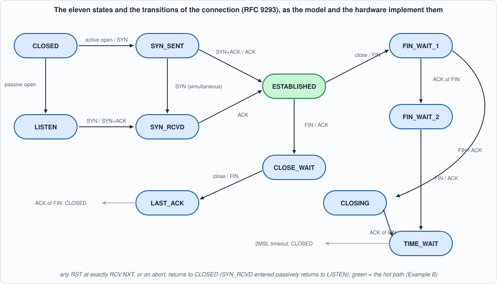
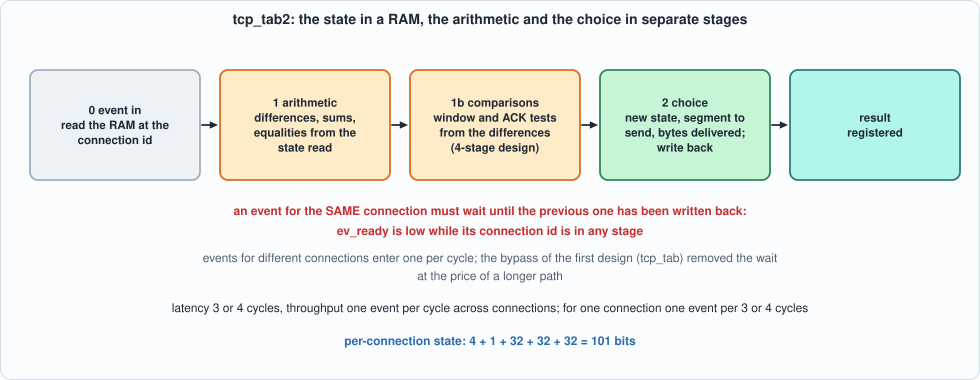
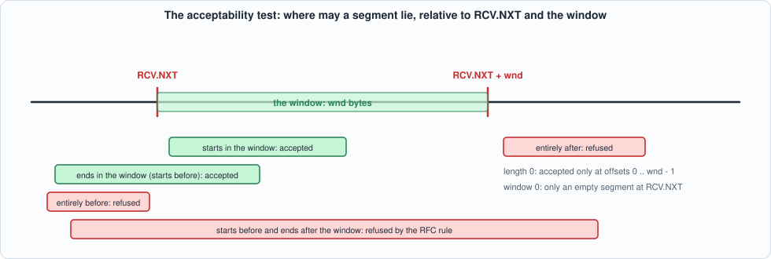
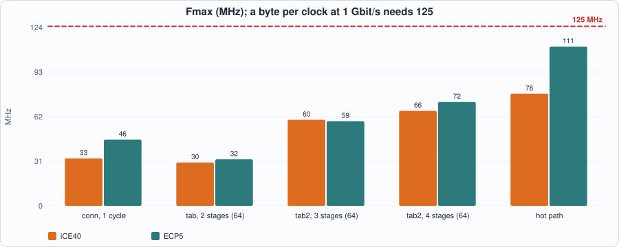
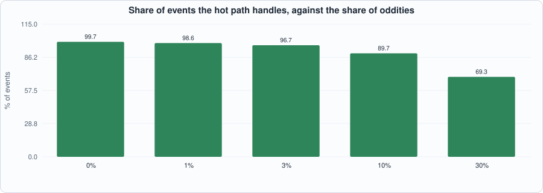

# 12. The TCP State Machine: Segment Acceptance in Hardware, a Table of Connections, and What Must Be on the Hot Path


--8<-- "docs/assets/art/ch-12.md"


**What you will see:** the receive side of TCP as a **state machine plus a set of sequence-number checks**, first as a Python specification written from RFC 9293 (with the blind-attack rules of RFC 5961), then as hardware: one connection in registers, and then a **table of connections** in block RAM, one event per cycle for any connection. The chapter finds where the clock goes (the first design runs at 30 MHz), cuts the machine into an arithmetic stage and a choosing stage to double it, measures the price of the missing bypass, and then asks the question of the whole Part: **which events must be in hardware at all?** The answer, measured on realistic traffic, is a segment-acceptance test that is a tenth of the size of the machine and handles 94% of the events.

**What you need to know first:** Chapter 6 (golden models, mutation testing) and Chapter 9 (an 8-bit datapath is not the point here: this chapter works on whole segments, as the header filter delivers them). TCP itself is explained as it is needed.

**What this chapter builds:** `rtl/tcp.sv` (`tcp_next`, `tcp_conn`, `tcp_tab`, `tcp_pre_a`, `tcp_pre_b`, `tcp_sel`, `tcp_tab2`, `tcp_fast` and their pin wrappers), `model/tcp_gold.py`, `tb/tcp_tb.sv`, `tb/tcp_fast_tb.sv`, and `tools/ch12_run.py`, `tools/ch12_example_a.py`, `tools/ch12_example_b.py`, `tools/mut_ch12.py`.

!!! note "Scope: what this chapter leaves out, on purpose"
    **No options, no urgent data, no retransmission timer** (Chapter 13), no congestion control, no application data to send (only control segments are produced), the peer's window is ignored, the payload of a SYN is ignored, and **data is accepted only in order**: a segment that does not start at `RCV.NXT` is acknowledged and its data dropped (no reassembly). The receive window is a constant given with each event. What remains is the **state machine** (11 states) and the **segment checks**: the window test, the ACK tests and the reset rules. The segments arrive as fields (flags, sequence number, acknowledgement number, length), as Chapter 9's filter would deliver them; the TCP checksum is Chapter 9's accumulator and is not repeated.

## What the machine must decide

A TCP connection is described by a few numbers: `SND.UNA` (the oldest byte we sent that is not yet acknowledged), `SND.NXT` (the next byte we will send) and `RCV.NXT` (the next byte we expect), all **32-bit and modular**, and one of **eleven states**. Every event is either an application call (open passively, open actively with an initial sequence number, close, abort), the 2MSL timer expiring, or a **segment arriving** with its flags (SYN, ACK, FIN, RST), sequence number, acknowledgement number and length. The result of an event is a new state, new values of the three numbers, possibly a segment to send, and a number of bytes delivered to the application.


*Figure 12.1: the state machine. Green is the state in which nearly all traffic arrives.*

The hard part is not the diagram. It is the rule applied **before** the diagram, to every segment of a synchronised connection:

1. **Is the segment acceptable?** Its bytes must overlap the receive window `[RCV.NXT, RCV.NXT + wnd)`: its first byte or its last byte lies in it (an empty segment must lie at an offset 0 to `wnd - 1`; with a window of 0 only an empty segment at `RCV.NXT` is acceptable). An unacceptable segment is answered with an ACK (unless it carries a RST) and dropped.
2. **A RST** closes the connection only if its sequence number is **exactly** `RCV.NXT`; one elsewhere in the window draws a *challenge ACK* (RFC 5961: it stops an attacker who can guess a number in the window from killing the connection). A **SYN** in the window also draws a challenge ACK.
3. **The ACK** must lie in `(SND.UNA, SND.NXT]` to be new; one for data we have not sent is answered with an ACK and dropped; an old one is ignored.
4. Only then are **data** (in order only) and **FIN** processed, and the state moves.

All the comparisons are **modular**: `x` is in `[lo, lo + w)` when `(x - lo) mod 2^32 < w`, and `a < b` when the top bit of `a - b` is set, so the machine works across the wrap of the sequence space.

## The model

`model/tcp_gold.py` is the specification: `TCB.event(...)` takes one event and returns the segment to send and the bytes delivered, updating the state in place. It carries its scenarios, asserted when run: an active open with sequence numbers across the wrap, a duplicate segment (acknowledged, not delivered twice), our close, FIN_WAIT_2, TIME_WAIT and the 2MSL timeout; a passive open and a blind RST in the window (challenge ACK) followed by the exact RST. It also builds the stimulus: **directed lives** of a connection (every close path, simultaneous open and close, a reset in each kind of state, the wrap), and **state-aware random events**: the generator runs the model alongside, so that the segments it makes land on the edges that matter for the state the connection is in (a sequence number at `RCV.NXT`, one before, the last byte of the window, one past it; an ACK at `SND.UNA`, `SND.NXT` and one either side).

```python
--8<-- "model/tcp_gold.py"
```

## The first design: the whole machine in one cycle

`tcp_next` is the machine as a **combinational function**: the state variables and the event in, the new variables, the segment to send and the bytes delivered out. `tcp_conn` wraps it with registers: one connection, one event per cycle, the result in the next. `tcp_tab` keeps 2^`CIDW` connections in a RAM (101 bits each): in cycle 0 the event arrives and the RAM is read, in cycle 1 `tcp_next` runs on what was read and the result is written back; an event that arrives while the previous event's result is being written to the **same connection** would read the old state, so the new state is also kept in a **bypass** register and used instead. After a reset the RAM is cleared, one word per cycle.

## The second design: arithmetic and choice in separate stages

The first design **runs at 33 MHz on iCE40 and 46 on ECP5** (one connection) and 30 and 32 with the table (Example A); a byte per clock at 1 Gbit/s needs 125. The critical path (nextpnr) runs from the RAM output through 32-bit subtractions, a comparison, the priority of the rules and the segment mux. The cure is the one of Chapter 9: **separate the arithmetic from the choice.**

- `tcp_pre_a` does **all** the 32-bit arithmetic in parallel from registered values: the differences (`seq - RCV.NXT`, the last byte's difference, `ack - SND.UNA`, `SND.NXT - SND.UNA`), the sums that the answers will need (`seq + 1`, `seq` plus the segment length, `RCV.NXT + 1`, plus the length, plus the length and 1, plus the window, `SND.NXT + 1`, `ISS + 1`), and the equalities.
- `tcp_pre_b` turns the differences into **one-bit predicates**: acceptable, ACK new, ACK old, ACK for the future, and so on.
- `tcp_sel` only **chooses**: it is the same priority of rules, but over flags and one-bit predicates, with every value it can need already computed.

`tcp_tab2` puts a register between these: three stages (arithmetic and comparisons together, then the choice) or four (the arithmetic, the comparisons, the choice). The price: there is **no bypass**, so an event for a connection must wait until the previous event for the same connection has been written back (`ev_ready` low while its connection id is in any stage): **events for one connection are accepted 3 or 4 cycles apart**, events for different connections one per cycle.


*Figure 12.2: stages of `tcp_tab2`.*

```systemverilog
--8<-- "rtl/tcp.sv"
```

## The tests

The testbench replays a stimulus file (one operation per cycle, idle cycles carrying random junk on every field; a valid event during reset must be discarded) and prints, after every event, the connection id, the state, the three sequence variables, the segment sent and the bytes delivered. The Python script compares **every one of these, after every event**, with the model. Events are held until the design says `ev_ready`.

```systemverilog
--8<-- "tb/tcp_tb.sv"
```

```systemverilog
--8<-- "tb/tcp_fast_tb.sv"
```

```python
--8<-- "tools/ch12_run.py"
```

To compile and run: `python3 tools/ch12_run.py` (several minutes). Recorded output:

```text
--8<-- "out/ch12_run_out.txt"
```

**Reading the output.**

- **Section 3, what the stimulus covers:** 24,480 events over 8 seeds, with every state visited (from 173 events in CLOSING to 11,387 in CLOSED, the state in which random segments land most often), and **271 distinct (state, event class, next state, segment sent, data delivered) combinations**, 203 distinct (state, event class, next state) triples. The directed lives guarantee the paths random events rarely find: the handshake, the closes, simultaneous open.
- **Section 4, the single connection:** 8 seeds, 20,480 events, **every state variable, segment and delivery equal the model's after every event**; also in Verilator.
- **Section 5, the tables:** the first design, and the second in 3 and 4 stages, with 4, 16 and 64 connections, events for the same connection **back to back** (with 4 connections one event in four follows an event for the same connection) and with idle cycles, 4 seeds each: **all equal** (10,240 events per row).
- **Section 6, the window test.** For window sizes 0, 1, 5 and 100, segment lengths 0, 1 and 5 and three bases of the sequence space (0, `0xFFFFFFF0` near the wrap, `0x7FFFFFF0`), a probe is sent at every offset from -8 to `wnd` + 8 and counted as accepted if it moves the connection from FIN_WAIT_1 to FIN_WAIT_2. The measured set of accepted offsets **equals the derivation exactly**, for both designs. **And the derivation corrected my first one**: I had written the accepted offsets as one range, `-(ln-1) .. wnd-1`; the test showed that for a segment longer than the window plus one byte (`wnd = 1`, `ln = 5`) only the offsets where the first byte (0) or the last byte (-4) lies in the window are accepted, *not* those between. The rule as the RFC states it refuses a segment that straddles the whole window (a real stack trims the segment to the window first, which this chapter does not model).
- **Section 7, latency and the bypass:** latencies of **1, 2, 3 and 4 cycles**. With events for one connection back to back, `tcp_tab` takes **1.00 cycles per event** (the bypass), `tcp_tab2` **3.00 and 4.00**; spread over 64 connections the second design takes 1.04 and 1.08 cycles per event (occasional collisions of the random connection ids).
- **Section 8, the hot path alone:** 18,855 cases (states and segments taken from realistic traffic, from random events and from uniformly random states with data outstanding half the time): the hit decision equals the model's in **all 18,855** and the results (state, `SND.UNA`, `RCV.NXT`, the ACK, the bytes delivered) equal the model's in **all 4,927 hits**.


*Figure 12.3: where a segment may lie relative to the window.*

## Running example A: what the machine costs and how fast it runs

```python
--8<-- "tools/ch12_example_a.py"
```

To compile and run: `python3 tools/ch12_example_a.py` (several minutes). Recorded output:

```text
--8<-- "out/ch12_example_a_out.txt"
```


*Figure 12.4: the staircase from one cycle to four stages, and the hot path alone.*

**Reading the output (measured; nextpnr seed 1; behind a pin wrapper that shifts the event in serially).**

- **The staircase.** The whole machine in one cycle: **33.0 MHz on iCE40 and 46.1 on ECP5**, 2,733 and 3,945 LUTs. With the table in RAM and the bypass: 30.2 and 32.4 MHz. Cut into arithmetic and choice (3 stages): **59.9 and 58.9 MHz**; with the comparisons in their own stage (4 stages): **66.1 and 72.3 MHz**: twice the first design's clock, for **three more cycles of latency and the loss of the bypass**. The LUTs hardly change (2,753 to 2,778): the machine is **mostly arithmetic**, 32-bit subtractions and additions that exist whatever the pipeline.
- **Nothing reaches 125 MHz.** The critical paths after the cut: from the RAM output through the arithmetic stage (8.7 ns of logic and 5.1 of routing on ECP5), or from the registered predicates through the choice to the segment's acknowledgement number (4.8 ns and 10.4 on iCE40). Registering the RAM output, and splitting the choice, are the next steps (Exercise 1).
- **The size of the table does not matter, the kind of memory does.** 16, 64, 256 and 1,024 connections cost the same **2,760 to 2,782 LUTs** on iCE40 and run at 65.7 to 66.6 MHz; the RAM grows from 7 to 26 block RAMs (1,024 connections of 101 bits are 103,424 bits). On ECP5 16 connections fit in **distributed (LUT) RAM and reach 92.5 MHz with no block RAM**; with block RAM (64 to 1,024 connections) the clock is 67.9 to 72.3 MHz: the block RAM's clock-to-output delay is the price of capacity.
- **The hot path alone is a tenth of the size.** `tcp_fast`: **278 LUTs on iCE40 and 119 on ECP5**, against 2,733 and 3,945 for the whole machine, at 78.0 and 110.9 MHz (including the shift register and registers of the wrapper). Example B shows what it covers.
- **Throughput.** At one event per cycle across connections, 66 MHz is 66 million events per second (derived); a connection receiving a segment every 10 microseconds (100,000 per second) is 660 times below it.

## Running example B: what must be in hardware

```python
--8<-- "tools/ch12_example_b.py"
```

To run: `python3 tools/ch12_example_b.py`. Recorded output:

```text
--8<-- "out/ch12_example_b_out.txt"
```


*Figure 12.5: the hot path's share against the rate of oddities.*

**Reading the output (from the model, whose answers the RTL matches in section 8).**

- **Two classes carry the traffic.** In 1,656 events of realistic traffic (8 connections: a handshake, in-order data and pure ACKs, 3% oddities, a close), **93.5% are ACK segments, with or without data, in ESTABLISHED, at `RCV.NXT`, in the window, with a valid ACK**; the remaining 6.5% are the handshake and close (about 10 events per connection) and the oddities.
- **What the hot path needs:** one state test, one flags test (exactly ACK), three comparisons (`seq == RCV.NXT`, `len <= wnd`, the ACK in `[SND.UNA, SND.NXT]`), one addition. **No state machine.** Everything else is "punt": a rare event, handled by the full machine (or by software), which can be slow.
- **The share depends on the oddities.** With 0% oddities the hot path handles **99.7%** of events; **98.6%** at 1%, **96.7%** at 3%, **89.7%** at 10% and **69.3%** at 30%, when there is 0.44 cold event for each hot one. The fixed cost is the handshake and the close.
- **What it means for Part 3.** The cold path is rare, so it can be **shared and slow**; the hot path must run at the line's event rate. Chapter 15 builds the split; this chapter shows that it is a *small* amount of hardware.

## Testing the tests

```python
--8<-- "tools/mut_ch12.py"
```

To run: `python3 tools/mut_ch12.py` (about fifteen minutes). Recorded output:

```text
--8<-- "out/ch12_mut_out.txt"
```

All **131** mutants are caught: 114 in the machine itself (6 in CLOSED, 7 in LISTEN, 14 in SYN_SENT, 35 in the rules of the synchronised states, 11 in data handling, 9 in FIN handling, 20 in the application events, 12 in the arithmetic stage), 9 in the tables (the bypass, the write address, the clearing of the RAM, the waits of `tcp_tab2`) and 8 in the hot path. Most anchors occur twice in the source, once in `tcp_next` and once in `tcp_sel`, and **each occurrence is a separate mutant**: the same mistake must be found in both designs. The battery is the single engine and the three tables against the model on the directed lives and random events (two seeds), the window probes on the engine and the 4-stage table, and the hot path against the model on 6,000 cases.

**Two things went wrong on the way, and both are about the test, not the design:**

| what happened | what it meant | what closed it |
|---|---|---|
| the battery **crashed** on the first mutant that made the design print `x` | a script that parses the output must treat an `x` as a failure, not as an error | the parser returns a sentinel that equals no result: an `x` is a catch |
| the "bypass not used when idle" mutant survived | **equivalent by construction**: `take` is already `ev_valid && ev_ready`, so adding `ev_valid` to it changes nothing | removed from the list |
| "the hot path does not advance `SND.UNA`" survived | no test had data **outstanding** in ESTABLISHED (`SND.NXT` beyond `SND.UNA`): the model sends no data, so in every state the tests reached the two are equal and the ACK equals `SND.UNA` | the hot-path cases now include uniformly random states with data outstanding half the time |

The second row shows a limit of state-aware generation: it only reaches states the model can reach, and this model cannot have data outstanding. The uniform random states are the cure, and Chapter 13, which sends data, removes the limit.


## What this chapter established, and what it did not

**Established, with the tests that show it:** the machine (11 states, segment acceptance, RST and SYN challenge, ACK rules, in-order data, FIN) equals the specification after every one of 20,480 events in one connection and 10,240 events in each of nine table configurations, in two simulators; the accepted offsets of the window test equal the derivation exactly, across the wrap, for windows 0 to 100 and lengths 0 to 5; the table gives one event per cycle across connections, one per 3 or 4 cycles for one, and the first design's bypass gives one per cycle for one; the staircase 33, 60, 66 MHz (iCE40) and 46, 59, 72 MHz (ECP5); a hot path of one tenth of the size handles 93.5% of realistic events and agrees with the model on 18,855 cases.

**Not established:** a clock of 125 MHz (the best is 66 MHz on iCE40, 72 on ECP5, 111 for the hot path alone on ECP5); **retransmission**, timers and congestion control (Chapter 13); **data to send**, options (window scaling, timestamps, selective acknowledgements), urgent data, reassembly of out-of-order data; the checksum of the segment (taken from Chapter 9); behaviour against a **second TCP implementation** (the model is this book's reading of RFC 9293 and RFC 5961; Chapter 14 tests against a deterministic reference stack); formal proofs; `TIME_WAIT` assassination: the model accepts a RST in TIME_WAIT at `RCV.NXT` as RFC 9293 says, which RFC 1337 discusses as a hazard.

## Self-check questions

1. Why are sequence-number comparisons modular, and how does `a < b` work in hardware on 32 bits?
2. State the acceptability test for a segment and say what an unacceptable segment draws.
3. Why does a RST in the window but not at `RCV.NXT` draw a challenge ACK, and what attack does the rule stop?
4. What are `SND.UNA`, `SND.NXT` and `RCV.NXT`, and how does each change on a SYN, a FIN, data and an ACK?
5. Why did the window test find that a segment longer than the window is refused at the offsets between its first and last byte?
6. Why does the first design run at 33 MHz, and what are the two parts into which the second cuts it?
7. What does the bypass of `tcp_tab` do, and what happens to the throughput of one connection without it?
8. How many cycles apart can events for the same connection be accepted in `tcp_tab2`, and why?
9. Why does the table's size barely change the LUTs, and what does it change?
10. List what the hot path tests, and say what is "punted".
11. Derive the share of events the hot path cannot handle from the rate of oddities and the fixed cost of a connection.
12. Name two mutants of the mutation run that were missing tests, and the test that closed each.

## Exercises

1. **Reach 125 MHz.** Register the RAM output before the arithmetic and split the choice stage in two (the state decision, then the segment fields). What is the new Fmax of `tcp_tab2` and the latency? Does the one-connection throughput change?
2. **A bypass for the second design.** Add a bypass from the choice stage to the arithmetic stage so that events for one connection can follow each other one per cycle. Where does the longer path appear, and what Fmax does it cost?
3. **Trim to the window.** Implement the RFC's trimming: a segment that straddles the window has its data cut to the window (and its FIN ignored if the data was cut). Specify it in the model first; show that the test of section 6 now accepts the offsets between the first and last byte, and say what the new acceptability set is.
4. **The rule of RFC 1337.** Make the model ignore a RST in TIME_WAIT. Which test changes, which mutants die or survive, and what does this protect against?
5. **A mutant that survives.** Add a mutant to `tools/mut_ch12.py` that the battery does not catch. Is it equivalent, outside the contract of the model, or is a test missing?
