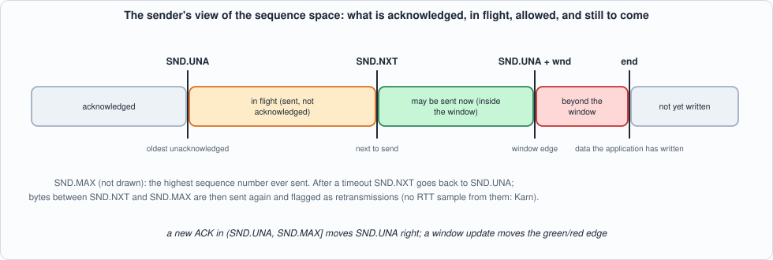
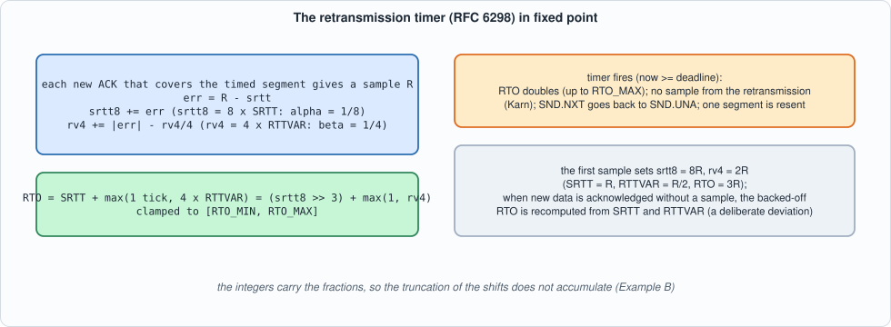
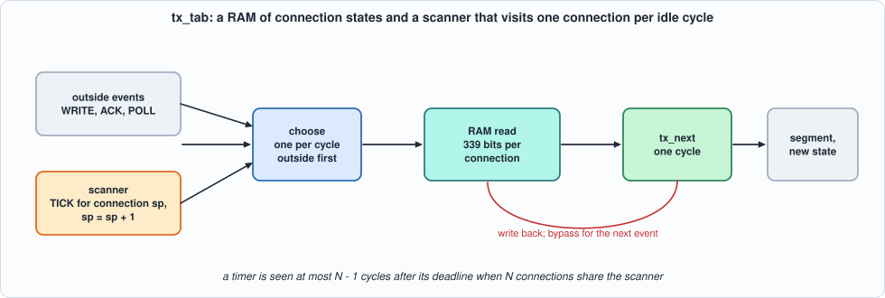
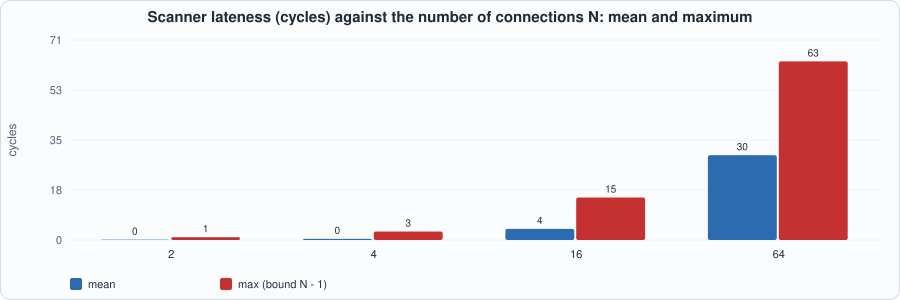
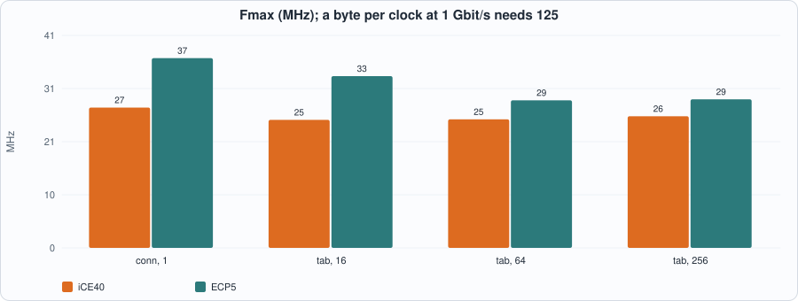
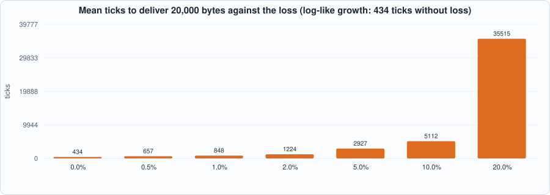

# 13. The TCP Send Side: Window, Cumulative ACK, the RFC 6298 Retransmission Timer, and a Scanner for Many Timers


--8<-- "docs/assets/art/ch-13.md"


**What you will see:** the other half of TCP: the **sender**. Data the application has written is cut into segments and sent within the peer's window; a cumulative ACK moves the window along; and a **retransmission timer**, whose length is learned from the round-trip times the connection sees (RFC 6298, in fixed point), fires when an ACK does not come, backs off, and sends the data again. The chapter builds the model, a closed loop around it (a lossy channel and an in-order receiver) that delivers every byte, the hardware for one connection and for **many connections in a RAM with a scanner that checks their timers**, and measures how late the scanner is, how accurate the fixed-point estimator is, and what go-back-N costs under loss.

**What you need to know first:** Chapter 12 (the receive side: sequence variables, modular comparisons, the table of connections with a bypass) and Chapter 6 (golden models, mutation testing).

**What this chapter builds:** `rtl/tx.sv` (`tx_next`, `tx_conn`, `tx_tab` and the pin wrappers), `model/tx_gold.py` (the sender, the lossy channel and the closed loop, the open-loop fuzz and the stimulus files), `tb/tx_tb.sv`, and `tools/ch13_run.py`, `tools/ch13_example_a.py`, `tools/ch13_example_b.py`, `tools/mut_ch13.py`.

!!! note "Scope: what this chapter leaves out, on purpose"
    **One established connection** per state, **no congestion control** (the peer's window is the only limit), **no fast retransmit** (no duplicate-ACK counting) and **no selective acknowledgement**, so recovery is **go-back-N** after a timeout; **no persist timer** (a zero window stalls the sender), no options. The data itself is not stored: the sender tracks sequence numbers only (what is in the send buffer is `end - SND.UNA` bytes). A retransmission after a timeout is one segment of at most one MSS that ignores the window (RFC 5681 allows it). One **deliberate deviation** from RFC 6298: when new data is acknowledged but no RTT sample can be taken (Karn's rule), the backed-off RTO is **recomputed from SRTT and RTTVAR** as soon as that ACK arrives; the RFC lets the backed-off value persist until the next sample, and a first version of the model that did so waited the maximum RTO for every segment after a lost flight (the closed loop below ran out of time).

## The sender

The sender keeps, per connection: `SND.UNA` (the oldest byte not acknowledged), `SND.NXT` (the next to send), `SND.MAX` (the highest ever sent), the window the peer last offered, `end` (how much the application has written), and the timer state: SRTT and RTTVAR (as integers: `srtt8 = 8 x SRTT`, `rv4 = 4 x RTTVAR`), the RTO, the deadline, whether the timer is running, whether a round-trip sample is in progress (which sequence number it waits for and when it started), and whether a first sample has been taken. Everything is 32 bits except the window (16). Time is a 32-bit tick counter `now` given with every event, and comparisons of times and sequence numbers are modular, as in Chapter 12.


*Figure 13.1: acknowledged, in flight, allowed, beyond the window, not yet written.*

Four events:

- **WRITE(n):** the application adds `n` bytes.
- **POLL:** try to send one segment: its length is the smallest of the MSS, the data not yet sent (`end - SND.NXT`) and the window not yet used (`SND.UNA + wnd - SND.NXT`, zero if negative). The segment is a *retransmission* if `SND.NXT < SND.MAX`. A new (not retransmitted) segment starts a round-trip sample if none is in progress, timing the ACK of its last byte; and the timer is started if it is not running.
- **ACK(a, w):** if `SND.UNA < a <= SND.MAX` it is new: `SND.UNA = a`, `SND.NXT` is pulled forward if it was behind (go-back-N), the window becomes `w`, and if a sample is in progress and `a` covers it, **a sample `R = now - start` is taken**; the timer stops if everything is acknowledged and otherwise restarts for a full RTO. An ACK equal to `SND.UNA` only updates the window; any other is ignored.
- **TICK:** if the timer is running and `now >= deadline`: **timeout**. The RTO doubles (up to RTO_MAX), the sample in progress is cancelled (**Karn's rule**: a sample from retransmitted data is ambiguous), `SND.NXT` goes back to `SND.UNA`, one segment is retransmitted (up to one MSS, but never more than what is **outstanding**, `SND.MAX - SND.UNA`), and the timer restarts with the new RTO.

!!! warning "Corrected in Chapter 14"
    The first version of this chapter retransmitted `min(MSS, end - SND.UNA)`: up to one MSS of what the application had *written*. When the window had cut a segment short (say 40 bytes in flight) the retransmission sent 100, the last 60 of them bytes never sent before, and left `SND.NXT` above `SND.MAX`; an ACK for them was then refused as "beyond SND.MAX" and the transfer crawled at one timeout per segment. Every test of this chapter passed, because none had less than a segment in flight at a timeout. Chapter 14's interoperability run found it (with the invariant `SND.UNA <= SND.NXT <= SND.MAX`); the model, the RTL, a directed test (section 3b, last row) and a mutant now cover it, and the figures below were measured again after the fix.

## The estimator


*Figure 13.2: RFC 6298 as integers.*

RFC 6298: the first sample `R` sets `SRTT = R`, `RTTVAR = R/2`; later samples update `RTTVAR = 3/4 RTTVAR + 1/4 |SRTT - R|` and `SRTT = 7/8 SRTT + 1/8 R`; `RTO = SRTT + max(G, 4 RTTVAR)`, clamped to a minimum and a maximum. Kept as `srtt8 = 8 SRTT` and `rv4 = 4 RTTVAR`, every update is an integer add and a shift: `err = R - (srtt8 >> 3)`, `srtt8 += err`, `rv4 += |err| - (rv4 >> 2)`, and `RTO = (srtt8 >> 3) + max(1, rv4)`. The integers carry the fractions, so the truncation of the shifts does not accumulate.

## The model and the closed loop

`model/tx_gold.py` is the specification. Beyond the sender it carries a **lossy channel**: segments and ACKs are lost with a given probability, delays vary around half the round trip but the channel keeps its order (a reordering channel against an in-order receiver is a different experiment); the **receiver** accepts data only in order and acknowledges cumulatively; and `transfer()` runs the loop one tick at a time, one event per tick (an ACK that has arrived, else a POLL if something can be sent, else a TICK), until every byte has been delivered. Its events (with their times) are recorded: they are the stimulus for the hardware. It also builds **open-loop fuzz**: ACKs at `SND.UNA`, at the edges of the data in flight, beyond it and before it, with windows of 0, 50, 100, 300, 65,535 and random; WRITEs, POLLs, and TICKs at random times, some far apart so that timers expire.

```python
--8<-- "model/tx_gold.py"
```

## The hardware

`tx_next` is the machine as a combinational function; `tx_conn` registers one connection (one event per cycle, the result in the next); `tx_tab` keeps 2^`CIDW` connections in a RAM of 339 bits per connection with the bypass of Chapter 12. **A timer table needs somebody to look at the timers.** `tx_tab` has a **scanner**: in every cycle in which no outside event arrives it injects a TICK, with the current time, for the next connection, round robin. Every connection is therefore checked once every N cycles when the scanner has the cycles to itself: a timer fires **between 0 and N - 1 cycles after its deadline**, plus the cycles the outside events take. (A timer wheel, Exercise 2, bounds the lateness by its resolution instead and visits only the timers that are due.)


*Figure 13.3: outside events first, the scanner in the idle cycles.*

```systemverilog
--8<-- "rtl/tx.sv"
```

## The tests

The testbench presents line `k` of the stimulus in cycle `k` and gives the design `now = k`; so a trace made in ticks is a stimulus whose time is the line number. After every event it prints the connection, the event type and time, **every state variable**, and the segment sent. For the table the scanner's TICKs are not in the stimulus; the Python script **replays the events in the order the RTL processed them** (taking the times of the scanner's ticks from the RTL's own output) against one model per connection, and compares every field of every result.

```systemverilog
--8<-- "tb/tx_tb.sv"
```

```python
--8<-- "tools/ch13_run.py"
```

To compile and run: `python3 tools/ch13_run.py` (several minutes). Recorded output:

```text
--8<-- "out/ch13_run_out.txt"
```

**Reading the output.**

- **Section 2, the closed loop:** with the sender, a channel that loses segments and ACKs and an in-order receiver, **every one of the 20,000 bytes is delivered, in order, at every loss rate** tried (0%, 1%, 5%, 20% one way): 429 ticks without loss (200 segments), 746 at 1%, 1,608 at 5% and 11,436 at 20%, with 0, 146, 442 and 4,623 retransmitted segments.
- **Section 3, `tx_conn` against the model:** the events of the closed-loop transfers (632 to 115,915 events per loss rate over 4 seeds): **equal in every field after every event**, in Icarus, and for the first seed in Verilator.
- **Section 3b, traces the closed loop cannot make:** a window of 400 bytes that changes with every ACK, and open-loop fuzz (6 runs each, 9,379 and 18,000 events, 426 and 3,261 segments), and a directed trace (the window cut to 40 to 90 bytes, four timeouts with less than a segment outstanding, 66 events, 36 segments, added after Chapter 14 found the bug above): all equal. The fuzz is what reaches an ACK beyond `SND.MAX`, one before `SND.UNA`, a window of 0, a timer that expires with nothing left to send.
- **Section 4, the table with the scanner:** 2, 4, 13 and 50 connections (RAM of 2, 4, 16 and 64 words, so some words are never used), events interleaved so that connection `c` acts in cycles `t K + c`, with 644 to 109,518 scanner ticks and 3 to 224 timeouts: **the model, replaying the RTL's own order of events, agrees on every field of every result**; and four fuzz streams interleaved (4,779 outside events, 403,462 scanner ticks, 241 timeouts).
- **Section 5, the scanner's lateness:** N connections each send a window of data and then fall silent; their timers fire when the scanner reaches them. The lateness (the cycle of the firing TICK minus the deadline) is **0 at the least and N - 1 at the most**, exactly the derived bound: 1 for 2 connections, 3 for 4, 15 for 16 and 63 for 64, with means of 0.1, 0.4, 3.9 and 29.9 (about N/2 for large N).


*Figure 13.4: the scanner is late by up to N - 1 cycles.*

## Running example A: what the send side costs

```python
--8<-- "tools/ch13_example_a.py"
```

To compile and run: `python3 tools/ch13_example_a.py` (several minutes). Recorded output:

```text
--8<-- "out/ch13_example_a_out.txt"
```


*Figure 13.5: one connection and 16 to 1,024 in a RAM, against the 125 MHz of a byte per clock.*

**Reading the output (measured; nextpnr seed 1; behind a pin wrapper).**

- **The whole sender is ten 32-bit additions, subtractions and comparisons in one cycle, and it is slow: 27.3 MHz on iCE40 and 36.9 on ECP5 for one connection**, 25 to 26 and 29 to 33 MHz with the table, **nowhere near 125**. The critical paths named by nextpnr run from the sample's start time through the whole estimator and the deadline computation (`R = now - start`, the error and its magnitude, the new `rv4`, the sum and the clamp, `now + RTO`): **18.1 ns of logic and 18.5 of routing on iCE40**. Chapter 12 showed the cure (separate the arithmetic from the choice, register in between); here it is Exercise 1.
- **Area:** 2,441 LUTs on iCE40 and 1,703 on ECP5 for one connection; the table adds a RAM of 339 bits per connection: **22 block RAMs on iCE40 for any number of connections up to 256** (the word is 339 bits wide, 16 bits per block), 10 to 19 on ECP5 for 64 to 1,024; 16 connections fit in LUT RAM on ECP5 (no block RAM). **1,024 connections (347,136 bits) do not fit the iCE40 HX8K** (131,072 bits of block RAM).
- **Throughput.** At 25 MHz one event per cycle across connections is 25 million events per second (derived): a connection sending a segment per 10 microseconds (100,000 per second) is 250 times below it; the speed that matters is the scanner's: with 256 connections each timer is checked every 256 cycles, 10 microseconds at 25 MHz.

## Running example B: the estimator and what loss costs

```python
--8<-- "tools/ch13_example_b.py"
```

To run: `python3 tools/ch13_example_b.py`. Recorded output:

```text
--8<-- "out/ch13_example_b_out.txt"
```


*Figure 13.6: go-back-N and the backed-off timer make loss expensive.*

**Reading the output (from the model, whose RTL equivalence is sections 3 and 4 above).**

- **The fixed-point RTO is within 4 ticks of RFC 6298 in floating point** over 50 series of 200 random round-trip times each: a maximum difference of **3.47 ticks for round trips of 20 to 60 ticks, 3.75 for 50 to 400 and 3.78 for 300 to 3,000**, and a mean of 0.08 to 1.45. As a share of the RTO it is 3.35% for the shortest round trips (where the RTO is only 100 ticks, the minimum, most of the time) and 0.13% for the longest. For round trips of 1 to 20 ticks the RTO is clamped at the minimum of 100 in both and the difference is zero.
- **Loss is expensive, and go-back-N is why.** To deliver 20,000 bytes (200 segments) the mean time is **434 ticks without loss, 657 at 0.5%, 848 at 1%, 1,224 at 2%, 2,927 at 5%, 5,112 at 10% and 35,515 at 20%** (the worst of ten runs at 20% took 251,121 ticks). The retransmissions are **100 segments at 0.5% loss, 200 at 1%, 1,148 at 5%** (5.7 times the 200 segments of the file): with the whole file in flight a lost segment makes the in-order receiver drop everything behind it, and the timeout resends all of it. The tail at high loss is the backed-off timer: a lost retransmission doubles the RTO.
- **The RTO the estimator settles on** for a round trip of 100 ticks is 103 with no jitter and **113, 131, 179 and 314 for jitter of 5, 20, 50 and 90 ticks**: 1.03 to 3.14 times the round trip. A steady path gets a tight timer; a noisy one a loose timer. RTTVAR is what widens it.

## Testing the tests

```python
--8<-- "tools/mut_ch13.py"
```

To run: `python3 tools/mut_ch13.py` (about fifteen minutes). Recorded output:

```text
--8<-- "out/ch13_mut_out.txt"
```

The first run caught 51 of 56 mutants (before Chapter 14's correction added a 57th and removed the five below). The five survivors were not missing tests:

| Survivor | Why it survived | What was done |
|---|---|---|
| clock granularity 0 (four occurrences: sample and no-sample paths, each in two places) | the RFC's `max(G, 4 RTTVAR)` only matters when `4 RTTVAR` is 0. The first sample gives `rv4 = 2R` with `R >= 1` (events are a cycle apart, so a round trip is at least one tick), and `rv4 - (rv4 >> 2) + |err|` never falls below 2. The term is **code that cannot matter** | removed from the RTL; the model keeps `max(1, rv4)` as the specification, and the tests show the two agree |
| the event's time stamp is the next cycle's (`now1 <= now` for `now1 <= now0`) | `now0` is `now`; the mutant is **equivalent** | dropped |

After the change the whole battery (`tools/ch13_run.py`, two simulators) was run again and the mutation run gave **51 of 51**. Chapter 14 then corrected the timeout retransmission (see the warning in the section on the sender) and added one mutant, "a timeout retransmits what was written, not what was outstanding", with a directed trace that catches it: **52 of 52**.

## What this chapter established, and what it did not

**Established, with the tests that show it:** the sender (window, cumulative ACK, the RFC 6298 estimator in fixed point, Karn's rule, exponential backoff, go-back-N) equals its specification after every event of every trace, for one connection and for tables of up to 64 connections with a timer scanner, in two simulators; a closed loop around the model delivers every byte under 20% loss; the scanner's lateness is between 0 and N - 1 cycles, as derived; the fixed-point RTO is within 4 ticks of the floating-point RFC; all 52 mutants of the run are caught, after five survivors of the first run were explained and removed (see the table above).

**Not established:** a clock near 125 MHz (the sender runs at 25 to 37 MHz; the arithmetic is one long cycle); **congestion control** (slow start, congestion avoidance, fast retransmit and recovery), **selective acknowledgements**, the **persist timer**, TCP options (timestamps give a sample from every ACK and remove Karn's ambiguity), the **receive side joined to the send side** in one connection record (Chapter 14 tests a whole stack); a **timer wheel**; behaviour against a **second implementation** (the model is this book's reading of RFC 6298 and RFC 9293; Chapter 14 tests against a deterministic reference stack with loss, reordering and duplication injected); formal proofs.

## Self-check questions

1. What do `SND.UNA`, `SND.NXT` and `SND.MAX` mean, and why does the sender need all three?
2. How is the length of a segment chosen, and what makes it a retransmission?
3. State Karn's rule and say why a sample from a retransmitted segment is ambiguous.
4. Derive `RTO` for a first sample of 100 ticks, and for the second sample of 140 ticks (alpha = 1/8, beta = 1/4).
5. Why are `srtt8` and `rv4` kept as eight and four times the real values, and why does the truncation not accumulate?
6. What happens at a timeout, and what is different about the retransmission that follows?
7. What does the deviation from RFC 6298 (recomputing the RTO when new data is acknowledged without a sample) change, and what did the first version of the model do without it?
8. Why does a table of timers need a scanner, and what is the lateness of a timer in terms of the number of connections?
9. Why is the sender's arithmetic in one cycle so slow, and what would you cut?
10. Why does go-back-N send so many segments under loss, and what do fast retransmit and SACK change?
11. Why does the closed loop use a channel that keeps its order, and what would a reordering channel do to an in-order receiver?
12. Five mutants survived the first mutation run. Why was none of them a missing test, and what did the chapter do about each?

## Exercises

1. **Pipeline the estimator.** Split the sample update from the deadline computation (compute `R`, `err` and `|err|` in one stage, `srtt8`, `rv4`, the RTO and the clamp in the next, the deadline in a third). What Fmax does `tx_conn` reach? What do the extra cycles cost, and what happens to an event for the same connection in those cycles?
2. **A timer wheel.** Replace the scanner by a wheel of 256 slots of 8 ticks each: a connection whose timer starts is entered into the slot of its deadline; each cycle the wheel advances one slot per 8 ticks and delivers the connections in the slot as TICKs. Compare the lateness with the scanner's and say what the wheel costs in RAM.
3. **Fast retransmit.** Count duplicate ACKs; at the third, retransmit the segment at `SND.UNA` without waiting for the timer. Specify it in the model, extend the closed loop, and measure the retransmissions and the ticks to deliver 20,000 bytes at 1%, 5% and 10% loss. Which mutants of the new logic does the existing battery fail to catch?
4. **A persist timer.** When the peer's window is 0 and there is data to send, probe with one byte at an exponentially backed-off interval. Which test finds the deadlock of the present design?
5. **A mutant that survives.** Add a mutant to `tools/mut_ch13.py` that the battery does not catch. Is it equivalent, outside the model's contract, or is a test missing?
