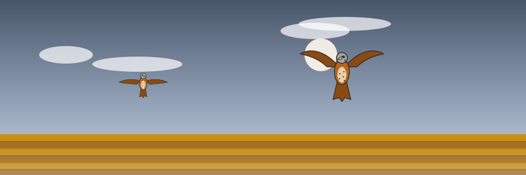
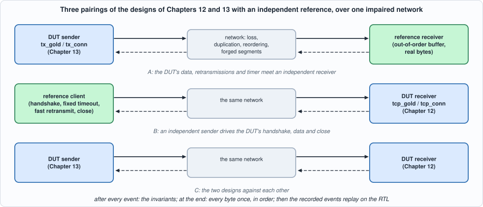
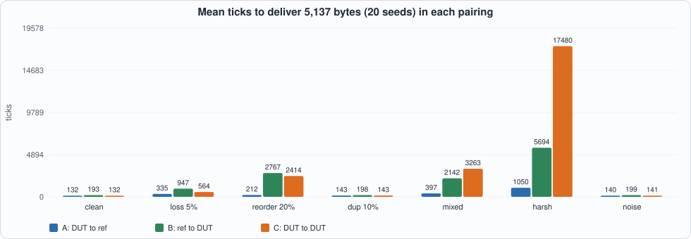
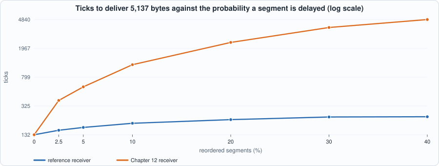
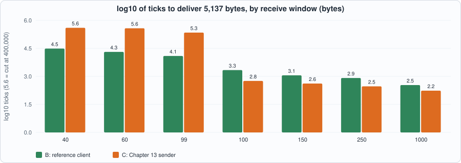
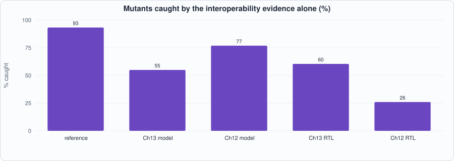

# 14. Testing the Stack Against an Independent Reference: Loss, Reordering, Duplication, Forged Segments, and the Bug It Found



--8<-- "docs/assets/art/ch-14.md"


**What you will see:** the receive side of Chapter 12 and the send side of Chapter 13 meet **a TCP written separately** and a **network that misbehaves**. The reference is a small, deliberately different implementation (a receiver that keeps early segments and holds real bytes, a client that does the handshake, uses a fixed timeout and fast retransmit, and closes); the network loses, duplicates and delays segments and injects forged ones. Three pairings are run under seven impairment profiles, **every byte is checked and every invariant is checked after every event**, and the events the designs saw are then **replayed on the RTL**. The run found **a real bug in Chapter 13's sender**, which is fixed in this chapter (Chapter 13's page, model, RTL, tests and mutation run are corrected), and it measured three limits of the designs that the unit tests could not show.

**What you need to know first:** Chapters 12 and 13 (the two designs under test) and Chapter 6 (mutation testing).

**What this chapter builds:** `model/ref_stack.py` (the reference and the channel), `model/interop.py` (the three pairings, the invariants and the one-function battery), `tools/ch14_run.py`, `tools/ch14_example_a.py`, `tools/ch14_example_b.py`, `tools/mut_ch14.py`, `tools/make_figs_ch14.py`. It changes `rtl/tx.sv`, `model/tx_gold.py` (the timeout retransmission, and added hand-checked scenarios), `model/tcp_gold.py` and `tools/ch13_run.py`, `tools/mut_ch13.py` (added scenarios and a mutant).

!!! note "Scope: what this chapter leaves out, on purpose"
    **No formal proof.** The safety invariants are checked at run time, after every event of every run (1.87 million checks in section 2); they are not proved for all states (Exercise 4). **The designs under test are the Python models and the RTL replayed against them**, not the RTL in the closed loop: Chapters 12 and 13 showed that the RTL equals the model after every event of every trace, and section 4 shows it again on the traces made here; a closed loop with the RTL in it would add a co-simulation harness and no new information while that holds. **One data direction**, one connection, no options, and the DUT has no timer for control segments (section 3 measures what that costs). The impairments are a model of a network, not a measurement of one.

## The reference, and why it is written the other way round

A test is only as independent as its oracle. If the test used `tx_gold.py` to check `tx_gold.py` it could only find places where the RTL disagrees with its own model (Chapters 12 and 13 did that). `model/ref_stack.py` shares no code with the models and **differs in design on purpose**, so that where the two agree it is about what the user sees (the bytes arrive once, in order) and not about how:

| | Design under test | Reference |
|---|---|---|
| receiver, data | accepts only the segment at `RCV.NXT`, drops the rest (Chapter 12 states this on its first lines) | keeps early segments in a map, delivers them when the hole fills, holds the **real bytes** |
| sender, timeout | RFC 6298 estimator in fixed point, Karn's rule, backoff | a **fixed** timeout that doubles up to a maximum; no estimator |
| sender, recovery | go-back-N after a timeout | go-back-N after a timeout **and fast retransmit** after three duplicate ACKs |
| connection | handshake and close in the state machine; no timer for SYN-ACK or FIN | a client that retransmits its SYN and FIN and closes |

The payload of the byte at stream offset `i` is `stream_byte(i)`, a fixed function, so a segment's content is known from its sequence number and nothing has to be stored to check what arrived.

```python
--8<-- "model/ref_stack.py"
```

The `Channel` is one direction of the network. A segment is **lost** with probability `loss`, **duplicated** with probability `dup`, and with probability `reorder` **delayed** by 1 to 60 ticks so that later segments overtake it. The counters of what the channel did are **observed at the receiving end** (copies actually queued, segments that actually arrived after a later one), not counted where the decision is made: a channel that silently stopped reordering would otherwise still report that it had.


*Figure 14.1: the DUT sender against the reference receiver (A), the reference client against the DUT receiver (B), and the two designs against each other (C).*

## The pairings, the profiles and the invariants

`model/interop.py` runs one tick at a time and gives the DUT **one event per tick**, as the hardware takes one: an arriving segment, or the application's `POLL` or `TICK`. Seven profiles:

| profile | what the network does |
|---|---|
| clean | nothing: a wire of 20 ticks |
| loss 5% | each segment lost with probability 0.05 (both directions) |
| reorder 20% | one segment in five delayed by 1 to 60 ticks |
| duplicate 10% | one segment in ten delivered twice |
| mixed | loss 5%, reorder 10%, duplicate 5% |
| harsh | loss 15%, reorder 30%, duplicate 15% |
| off-path noise | a forged segment injected with probability 0.1 per tick: for the sender an ACK outside `(SND.UNA, SND.MAX]`; for the receiver an ACK, an ACK with data, a SYN, a SYN-ACK or an inexact RST at offsets inside and outside the window (never an exact RST, never data at `RCV.NXT`, which would be indistinguishable from the real thing) |

and an eighth, used only by Example B, that gives the receiver a window below one segment. Pairing B runs the DUT's **handshake as passive opener** (`LISTEN`, `SYN_RCVD`, `ESTABLISHED`), the data, the peer's FIN (`CLOSE_WAIT`), the application's close (`LAST_ACK`) and `CLOSED`. Pairing C starts its receiver in `ESTABLISHED` after a lossless handshake.

**What is checked.** After every sender event (`Monitor.sender`): `SND.UNA <= SND.NXT <= SND.MAX <= end`; `SND.UNA` never moves backwards; a segment has a length in 1..MSS, starts at `SND.NXT` (or at `SND.UNA` after a timeout) and ends within the data written; its retransmission flag is set exactly when it starts below the old `SND.MAX`; new data stays inside the window; an ACK beyond `SND.MAX` is never accepted; **the retransmission timer runs exactly while data is outstanding**. After every receiver event (`Monitor.receiver`): data is delivered only from a segment at `RCV.NXT`, never more than the segment carries, never more than the window offered, and never more than was sent. After every forged segment: the state of the sender or receiver is unchanged. At the end: the user has every byte, once, in order, and both ends are where they should be.

```python
--8<-- "model/interop.py"
```

## The tests

```python
--8<-- "tools/ch14_run.py"
```

To run: `python3 tools/ch14_run.py` (several minutes). Recorded output:

```text
--8<-- "out/ch14_run_out.txt"
```


*Figure 14.2: the mean time to deliver 5,137 bytes in each pairing and profile (20 seeds each).*

**Reading the output.**

- **Section 2: every one of the 420 runs is correct** (7 profiles, 3 pairings, 20 seeds): every byte arrived once and in order, the invariants held at every event (1,869,217 checks, 61,383 segments sent), and the profiles really did what they say (the `lost`, `duplicated`, `delayed` and `forged` columns are counts of what the receiver could observe). With the sequence numbers about to wrap (2b) the results are the same, as they must be.
- **What the network costs differs sharply by pairing.** Under reordering the reference receiver (A) barely notices (212 ticks against 132 clean) while the DUT receiver, which drops what arrives early, **takes 2,414 ticks (11 times the reference's 212, 18 times a clean transfer)** and the DUT sender sends 248 segments flagged as retransmissions for a transfer of 52 segments. This is the price of the receiver's first line, measured in Example A.
- **The worst runs are long.** In the harsh profile the mean for C is 17,480 ticks and the slowest run **124,741**: after repeated timeouts the RTO sits at its 6,000-tick maximum, and the DUT receiver wants each lost segment again, in order.
- **Off-path noise changes nothing it should not.** The forged segments (14, 19 and 28 per run on average in A, B and C) cost no time and changed no state: ACKs outside the window were ignored by the sender, and in the receiver forged ACKs, SYNs and inexact RSTs got a challenge ACK or nothing (the responses are dropped by the harness, as they would go to the spoofed address).
- **Section 3: the DUT has no timer for control segments, and it shows.** Without help, a lost SYN-ACK leaves the DUT in `SYN_RCVD` forever (the client's SYN comes again; the DUT answers with a plain ACK, which a client in `SYN_SENT` ignores), and a lost final FIN or ACK leaves it in `LAST_ACK`: **in the harsh profile only 35 of 60 runs finish** (16 stall in `LAST_ACK`, 9 in `SYN_RCVD`). With a shim in the harness that re-sends the DUT's last control segment after 300 silent ticks, all 60 finish. A real design needs that timer in hardware: Chapter 13's scanner is the place to put it (Exercise 2).
- **Section 4: the RTL equals the model on all of these traces**, in Icarus and in Verilator: the sender's events (late, duplicated, lost and forged acknowledgements; every tick an event) in `tx_conn`; the receiver's segments in `tcp_conn` and in the 4-stage table with four runs interleaved.
- **Section 5: the pairings reach a small part of the receiver.** Together they exercise **16 of the 203 (state, event class, next state) combinations** that Chapter 12's directed lives and random events reach, and only 6 of the 11 states. Interop evidence is real but narrow: it shows the common path under stress, not the corners. The mutation run below quantifies this.

## Finding 1: a bug in Chapter 13's sender

The first interop runs used a receive window of 4,096 bytes and passed. Example B then gave the receiver a **60-byte window**, below one segment, and the pair ran for 400,000 ticks without finishing; with the invariant monitor on, the run stopped at `SND.UNA <= SND.NXT <= SND.MAX <= end` instead. The cause was in Chapter 13: **after a timeout the sender retransmitted `min(MSS, end - SND.UNA)`, up to one MSS of what the application had written, not of what had been sent.** When the window had cut a segment short (40 bytes in flight, say) it sent 100: the extra 60 were new bytes sent as a "retransmission", `SND.NXT` ended above `SND.MAX`, and the peer's ACK for them was refused as an ACK beyond `SND.MAX`. From then on every segment took a timeout. Every test of Chapter 13 passed, because none had less than a segment in flight at a timeout; the RTL had the same bug, and equalled the model.

The fix is one expression, in both: a timeout retransmits `min(MSS, SND.MAX - SND.UNA)`. The rest of the repair is the part that matters:

- a **directed test** in Chapter 13 (`partial_trace`: the window cut to 40 to 90 bytes, four timeouts, then the ACK): the old RTL fails it, the new one passes;
- a **hand-checked scenario** in `tx_gold.py` (a window of 400, a timeout, the retransmission must be 400 bytes);
- a **mutant** in Chapter 13's run ("a timeout retransmits what was written, not what was outstanding", caught by the new trace): Chapter 13 now reads **52 of 52**;
- Chapter 13's page, answers and numbers, measured again (the clock figures moved by a few percent because the RTL changed and the place-and-route was run again).

## Running example A: what the missing out-of-order buffer costs

Same DUT sender, same network, same 5,137 bytes, 30 seeds; only the receiver differs.

```python
--8<-- "tools/ch14_example_a.py"
```

To run: `python3 tools/ch14_example_a.py`. Recorded output:

```text
--8<-- "out/ch14_example_a_out.txt"
```


*Figure 14.3: with the reference receiver the cost of reordering is a few dozen ticks; with Chapter 12's it grows to twenty times the clean transfer.*

- **Measured:** with the reference receiver, reordering of 40% of the segments adds 100 ticks (132 to 232) and **no retransmission at all**; with the Chapter 12 receiver the same network costs **4,840 ticks, 21 times as much, and 473 retransmitted segments** for a transfer of 52.
- **Derived, and what it says:** a segment that arrives early is dropped, so it must be sent again, and the sender learns this only from a timeout (the Chapter 13 sender has no fast retransmit): each reordered segment costs about one RTO (100 ticks at the minimum) plus the go-back-N resend of everything after it. At 2.5% reordering the DUT receiver is already 2.5 times slower than the reference.
- **What to do about it** is a design decision, not a bug: an out-of-order buffer for a few segments (Exercise 3) or fast retransmit, or both. Which one is worth its area depends on whether the network can reorder at all: inside a data centre or on a point-to-point line, it cannot.

## Running example B: a window below one segment

The Chapter 12 receiver accepts the part of a segment that fits the window and acknowledges that part. The Chapter 13 sender, after a timeout, sends a whole segment.

```python
--8<-- "tools/ch14_example_b.py"
```

To run: `python3 tools/ch14_example_b.py`. Recorded output:

```text
--8<-- "out/ch14_example_b_out.txt"
```


*Figure 14.4: below one segment of window the Chapter 13 sender falls off a cliff (log10 of the ticks, so 5.6 is the cut at 400,000).*

- **Measured:** at a window of 100 bytes and above, the pair delivers 5,137 bytes in 172 to 572 ticks with **no retransmission** at all. At **99 bytes it takes 221,392 ticks and at 60 bytes 378,760**; at 40 bytes it does not finish in 400,000 ticks. The reference client, which counts its window per segment in flight, slows down far less (12,382 ticks at 99 bytes).
- **Derived:** after the first timeout the sender resends `MSS = 100` bytes from `SND.UNA`; the receiver keeps 99 and acknowledges them; `SND.NXT` is 100 beyond the old `SND.UNA`, so the next segment starts **one byte past** the receiver's `RCV.NXT`, arrives out of order, is dropped, and only the next timeout repairs it. One timeout per 99 bytes, with the RTO doubled in between: the counts of "retx segs" and "timeouts" are equal in the table.
- **Not fixed here, on purpose:** a window below one MSS is what silly-window-syndrome avoidance is for (the receiver should not advertise it; the sender should not send into it). The designs have neither. Exercise 1 trims retransmissions to the window and measures the difference.

## Testing the tests

The tests of this chapter are the pairings, the invariants and the time budget (**no run may take more than 1.5 times the ticks of the unmutated design**: a transfer that completes but crawls is a failure of a different kind), run as one function, `interop.battery()`. Mutants of three families, each with the battery it is entitled to:

1. **The oracle** (`ref_stack.py`, 15 mutants): a wrong reference must make the comparison fail, or the comparison proves nothing.
2. **The models** (`tx_gold.py`, 20; `tcp_gold.py`, 13): bugs in the designs, found by interop alone.
3. **The RTL, with the recorded interop traces and nothing else** (Chapter 13's 43 mutants of `tx.sv`, Chapter 12's 127 of `tcp.sv`; the table mutants need a table): how much of what the earlier chapters' batteries caught can end-to-end evidence reach?

```python
--8<-- "tools/mut_ch14.py"
```

To run: `python3 tools/mut_ch14.py` (about ten minutes). Recorded output:

```text
--8<-- "out/ch14_mut_out.txt"
```


*Figure 14.5: the share of mutants that the interoperability evidence alone catches.*

**Families 1 and 2: 35 of 48 caught by interop; the other 13 are the finding.**

| survivor of the interop battery | why the network never provokes it | closed by |
|---|---|---|
| ref receiver stores only segments starting at `RCV.NXT` | the outcome is the same; only an overlapping segment shows it | hand-check: an overlapping segment adds only its new bytes (`ref_stack.py`) |
| sender: timing starts on a retransmission; a sample from any ACK; no lower clamp on the RTO; one tick late; a timeout does not back off; first SRTT x 4; the RTO leaves out the variance | the data arrives whatever the timeout is; **only speed depends on the estimator**, and the 1.5x budget is too coarse to see a shift of a few ticks | hand-checked scenarios in `tx_gold.py`: Karn's rule (a retransmission starts no sample, a partial ACK takes none), the deadline to the tick, the clamp, a duplicate ACK's window |
| sender: a duplicate ACK does not update the window | the reference receiver's window never changes | the same scenarios |
| **sender: a timeout retransmits what was written, not what was outstanding** | needs a segment cut short by the window, in flight, at a timeout: the profiles with a 4,096-byte window do not make one | a hand-checked scenario; the directed test and the mutant added to Chapter 13 |
| receiver: the acceptability test accepts everything; an unacceptable segment is not acknowledged; a retransmitted FIN is not acknowledged again | the forged segments are answered into nowhere and change nothing either way; a second FIN at `RCV.NXT` never occurs | hand-checked scenarios in `tcp_gold.py` (added) and Chapter 12's window-derivation test |

Of the thirteen, **nine passed every hand-checked scenario that existed before this chapter** (the reference's, Chapter 13's and Chapter 12's): they are tests that were missing, now added (`# ---- added in Chapter 14` in the two models; the run reports "before this chapter" and "after" for each). The other four were already caught there. With the additions, **all 48 are caught by the battery or by a hand-checked scenario**.

**Family 3: interop alone reaches 60% of Chapter 13's RTL mutants (26 of 43) and 26% of Chapter 12's (33 of 127).** The survivors are the same kind: the estimator arithmetic (the traces have few round-trip samples with a variance), the receiver's `CLOSED`, `LISTEN` and `SYN_SENT` corners and its reset rules (the pairings never send a RST to a closed port or open actively), and the fast path's decision. This is why those chapters carry fuzz and directed lives: **end-to-end tests are the right oracle for "does it work" and the wrong instrument for "is every rule right"**. They found the one bug that mattered here because they put the sender in a situation, a window below a segment, that its authors had not thought of.

## What this chapter established, and what it did not

**Established, with the tests that show it:** the designs of Chapters 12 and 13 deliver every byte once and in order against an independent reference under loss, reordering, duplication and forged segments, in three pairings and seven profiles (420 runs); the safety invariants held at every one of 1.87 million checks; the RTL equals the model on the traces so made, in two simulators; **a real bug in Chapter 13's retransmission was found, fixed in the model and the RTL, and covered by a directed test, a hand-checked scenario and a mutant**; nine tests the earlier chapters were missing were added; all 48 mutants of the models and the reference are caught.

**Not established:** a **proof** of the invariants for all states (they are checked, not proved); the RTL **in** the closed loop (replay of recorded traces instead); any behaviour a real network or a real TCP has and this model does not (path MTU, options, timestamps, delayed ACKs, congestion windows); the DUT's behaviour with **a window below one segment**, which is a measured weakness; the **control-segment timer**, which the DUT lacks; and the cost in area of an out-of-order buffer (Exercise 3). The reference is independent of the models, not independent of its author: where both are wrong in the same way, no test here would see it, and the way to reduce that risk is a second reference (the host's TCP stack, which this sandbox does not offer a way to drive deterministically).

## Self-check questions

1. Why is a reference that shares code with the model under test not an oracle? What does it test instead?
2. List three ways in which the reference differs in design from the DUT, and say why each difference helps.
3. Why are the channel's counters of what it did taken at the receiving end?
4. Name four invariants of the sender and say which bug each would catch.
5. Why are the forged segments never an exact RST and never data at `RCV.NXT`?
6. What happens to the DUT receiver when its SYN-ACK is lost, and why does the client not repair it?
7. Why does the DUT receiver take 11 times as long as the reference under 20% reordering, while the DUT sender with the reference receiver does not suffer at all?
8. Explain the bug of section "Finding 1" in terms of `SND.UNA`, `SND.NXT` and `SND.MAX`, and say why no earlier test saw it.
9. Why does a receive window of 99 bytes make the pair almost 400 times slower than one of 100 (221,392 ticks against 572)?
10. Why is a time budget part of the battery? Which mutants did it catch that the byte comparison did not?
11. Why are nine of the thirteen survivors "missing tests" and not "equivalent mutants"?
12. Why does the interop evidence alone reach only 26% of Chapter 12's RTL mutants, and what does that say about how to combine kinds of test?

## Exercises

1. **Respect the window on a retransmission.** Trim the timeout retransmission to `min(MSS, SND.MAX - SND.UNA, window)` in the model and the RTL; rerun Example B. What are the ticks at 99 and 60 bytes? Does anything else change (section 2, Chapter 13's tests)?
2. **A timer for control segments.** Retransmit the SYN-ACK and the FIN with Chapter 13's timer (one scanner entry per connection). Remove the harness shim and show that all 60 runs finish in every profile of section 3. What does it cost in LUTs?
3. **An out-of-order buffer.** Give the Chapter 12 receiver room for the next four segments beyond `RCV.NXT` (a bitmap and a small RAM). Measure ticks and retransmissions at 20% reordering against the reference (Example A), and the LUTs and RAM it costs.
4. **Prove the invariants.** State `SND.UNA <= SND.NXT <= SND.MAX <= end` and "the timer runs exactly while data is outstanding" as properties of `tx_next` and prove them with SymbiYosys (if installed) or by bounded induction in Python over the model. Does the proof find the bug of Finding 1 on the old code?
5. **A mutant that survives.** Add a mutant to `tools/mut_ch14.py` that neither the battery nor the hand-checked scenarios catch. Is it equivalent, outside the contract, or is a test missing? Write the test.
