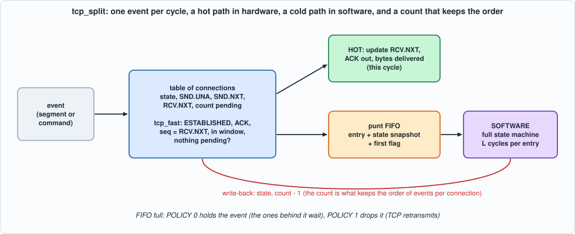
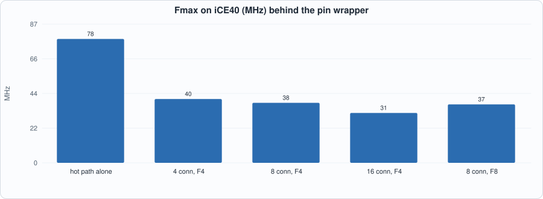
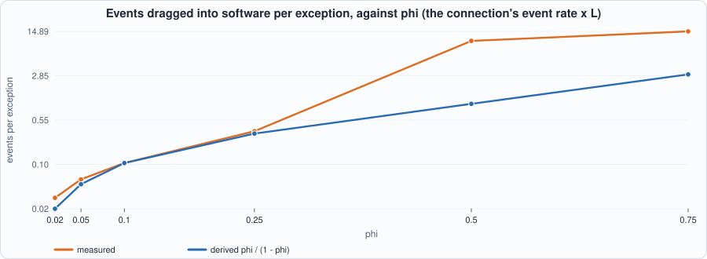
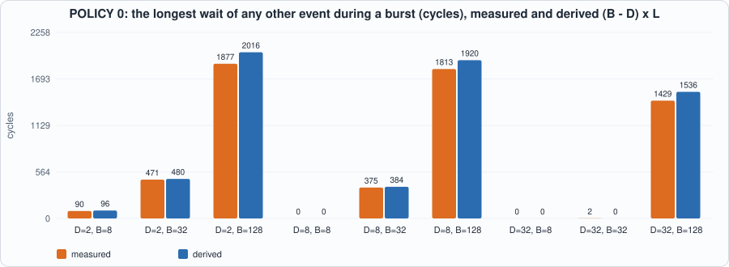

# 15. Hot Path and Cold Path: Splitting TCP Between Hardware and Software, Keeping the Order, Head-of-Line Blocking, and Reconnects


--8<-- "docs/assets/art/ch-15.md"


**What you will see:** the hot-path test of Chapter 12 (`tcp_fast`) turned into a working **dispatcher**. Almost every segment of an established connection is an in-order data segment or a pure ACK; the dispatcher handles those in one cycle and sends everything else, together with a snapshot of the connection, to **software**, which runs the full state machine and writes the new state back. The difficulty is not the fast path; it is **keeping the order of events per connection** while software is slow, and the chapter measures what that costs: how many perfectly ordinary segments end up in software only because an earlier one is pending, how long other connections wait when the queue to software is full (head-of-line blocking), and how long a reconnect takes when software is busy. The central claim, **transparency** (the split behaves exactly like the single state machine, whatever the timing of the software), is tested over many streams and timings, and the RTL is compared with the cycle model after every clock edge.

**What you need to know first:** Chapter 12 (the state machine and `tcp_fast`) and Chapter 14 (why an end-to-end property is a good test, and why it is not enough alone).

**What this chapter builds:** `rtl/split.sv` (`tcp_split` and the pin wrapper `tcp_split_syn`), `model/split_gold.py` (the cycle model of the dispatcher, a software model, the transparency check, the stimulus files), `tb/split_tb.sv`, and `tools/ch15_run.py`, `tools/ch15_example_a.py`, `tools/ch15_example_b.py`, `tools/mut_ch15.py`, `tools/make_figs_ch15.py`.

!!! note "Scope: what this chapter leaves out, on purpose"
    **Software is a model**, not a processor: it takes one punted entry at a time, spends a fixed or random number of cycles on it (`L`), and writes the result back; there is no bus, no interrupt, no driver. **One data direction**: the machine of Chapter 12 sends no data, so Chapter 13's sender is not joined to it (Exercise 1). **No timers**: the 2MSL timeout and the retransmission timer reach the machine as ordinary events from the application side. **The table is registers**, one event per cycle, for up to 64 connections; a RAM with a bypass (Chapter 12's table) is Exercise 2. The segments software sends are recorded and compared, not put on a wire. The loads of Example B are generated, not captured.

## The split


*Figure 15.1: one event per cycle; the hot path in hardware, the cold path in software, a count that keeps the order.*

For each of `2^CIDW` connections the dispatcher keeps the state variables of Chapter 12 and a **count of events that software still owes the connection**. One event arrives per cycle (a segment or an application command), and the rule is:

- a **segment** for a connection whose count is **zero** that `tcp_fast` accepts (ESTABLISHED, plain ACK, `seq = RCV.NXT`, length within the window, ACK number within `[SND.UNA, SND.NXT]`) is **hot**: `RCV.NXT` advances, the ACK is produced, the bytes are delivered, in this cycle;
- **anything else is punted**: it is pushed into a FIFO with a **snapshot** of the connection (state, passive flag, `SND.UNA`, `SND.NXT`, `RCV.NXT`) and a flag `first` (the count was zero), and the connection's count goes up. That includes every application command, every segment the hot path does not take, and **every event, however ordinary, of a connection whose count is not zero**: if the hot path took it, the connection's events would be processed out of order;
- **software** pops the FIFO, loads the snapshot if `first` is set (the hardware's state is current only when nothing was pending), runs the full state machine, and **writes the new state back**; the write-back is what decrements the count;
- if the FIFO is **full** and the event must be punted: **POLICY 0** holds it, so that the events behind it wait, whatever their connection (head-of-line blocking); **POLICY 1** drops it and TCP's retransmission has to supply it again.

The behaviour is `model/split_gold.py`, cycle for cycle: `Dispatcher.step` is what one clock edge does, given the event offered, the pop and the write-back (inputs sampled before the edge; the result is registered).

```python
--8<-- "model/split_gold.py"
```

## The hardware

```systemverilog
--8<-- "rtl/split.sv"
```

Four details carry the design:

- **The hot decision is `tcp_fast` of Chapter 12, plus two conditions the table adds**: the event is a segment, and the count is zero. Application commands carry the fields of a segment the hot path would take (`with_decoys`), so that a design that does not look at the event type takes them for segments.
- **The write-back and a push in the same cycle** for the same connection: the count goes down by one and up by one (the event sees the old count, so it is punted). A write-back for one connection and an event for another touch different entries.
- **Only `RCV.NXT` moves on the hot path.** The first version also stored the ACK number into `SND.UNA`; the mutation run showed that no test could tell (below), because in ESTABLISHED the machine of Chapter 12 sends no data, so `SND.UNA = SND.NXT` and the ACK number is the value already there. The store was removed. A design that sends data (Exercise 1) needs it back, and a test with data in flight.
- **The FIFO and the table are registers**, so a read-modify-write is one cycle, at the price of the clock (Example A).

## The tests

```python
--8<-- "tools/ch15_run.py"
```

To run: `python3 tools/ch15_run.py` (several minutes). Recorded output:

```text
--8<-- "out/ch15_run_out.txt"
```

The testbench presents line `k` of a stimulus file in cycle `k` (the event offered, the pop of the FIFO, the write-back from software: all produced by the model's closed loop) and prints, before every edge, the event's `ev_ready`, the registered result of the previous edge, and **the entry at the head of the punt FIFO**. The model predicts every one of these numbers.

```systemverilog
--8<-- "tb/split_tb.sv"
```

**Reading the output.**

- **Section 2 is the claim: every one of the 180 runs is transparent** (3 kinds of stream, 2 policies, 5 software timings including one with random latencies of 1 to 90 cycles, 6 seeds each): the segments sent, the bytes delivered and the **final state** of every connection equal those of the single state machine fed the same events in the same order. With POLICY 1 the events that were dropped are left out of the reference, as they are out of the connection's life.
- **How much goes to software depends on how slow software is, not only on how odd the traffic is.** In the dense realistic stream (about one event every 1.5 cycles for 4 connections) with `L = 1`, 874 of 1,128 events (77%) are hot; with `L = 8` only 533 (47%); with `L = 40`, 322 (29%). **Of the punted events, 63% (`L = 8`) to 73% (`L = 40`) are *collateral*: ordinary segments that the single state machine would have taken on the fast path, punted only because an earlier event of the same connection was pending.** Example B explains and derives this.
- **POLICY 1 with a slow software drops most of the traffic** (854 of 1,128 events at `L = 8`, FIFO of 4): a design with a drop policy needs software fast enough, or a protocol that tolerates it.
- **Section 3: the RTL equals the model after every edge** in 15 configurations (4 and 8 connections; FIFO of 2, 3, 4 and 8 entries, including one that is not a power of two; both policies; software latencies of 1 to 24; three kinds of stream), in Icarus and in Verilator. In the configurations with a FIFO of 2 or 3 entries, software also pops an **empty** FIFO in one cycle in five; the pop must be ignored.

## Running example A: what the split costs

```python
--8<-- "tools/ch15_example_a.py"
```

To run: `python3 tools/ch15_example_a.py`. Recorded output:

```text
--8<-- "out/ch15_example_a_out.txt"
```


*Figure 15.2: the hot path alone and the split, on iCE40.*

- **Measured:** the hot path alone is 278 LUTs and **78 MHz** on iCE40 (111 on ECP5). The split with 4 connections and a FIFO of 4 is **1,407 LUTs and 1,734 flip-flops at 40.2 MHz** (60.7 on ECP5); with 16 connections, 2,819 LUTs, 3,012 flip-flops and 31.4 MHz (42.7). With a FIFO of 8 entries the tools infer block RAM (15 blocks on iCE40) and the logic shrinks.
- **Where the area is:** the registers. A table entry is 105 bits and a FIFO entry `CIDW + 237` bits, so 16 connections and 4 entries are 1,680 + 964 flip-flops before anything else; a table in RAM (Chapter 12's) is the way to hundreds of connections, at a cost in cycles.
- **Where the clock goes:** the critical path runs from the event through the table read, the `tcp_fast` comparison and the decision to the FIFO write (9.2 ns of logic and 17.3 of routing on iCE40). **No design here reaches 125 MHz**; the hot decision alone does (78 MHz is the pin-wrapped number; the comparison is not the problem), the single-cycle read-decide-write loop is. Pipelining it needs the bypass of Chapter 12.

## Running example B: the split under load

Eight connections are established through software and then carry in-order data and pure ACKs; a fraction of the events are **exceptions** the hot path cannot take (an old duplicate, a gap, an ACK for data never sent). Software takes `L` cycles per entry. The load is described by **phi**, the connection's own event rate times `L`: the fraction of the time a connection would be pending if every one of its events were punted.

```python
--8<-- "tools/ch15_example_b.py"
```

To run: `python3 tools/ch15_example_b.py`. Recorded output:

```text
--8<-- "out/ch15_example_b_out.txt"
```

**1. One exception drags others into software.** While an event of a connection is pending, every later event of that connection is punted, and each of those keeps the connection pending for `L` more cycles.


*Figure 15.3: events dragged into software per exception, against phi (log scale): the measured values follow the derivation up to phi = 0.25 and leave it when software saturates.*

- **Derived:** an exception keeps its connection pending for `L` cycles, in which `phi` further events of the connection are expected; each does the same: `phi + phi^2 + ... = phi / (1 - phi)`, as long as software has time to spare.
- **Measured:** 0.03, 0.06, 0.11 and 0.36 events per exception at phi = 0.02, 0.05, 0.1 and 0.25, against 0.02, 0.05, 0.11 and 0.33. At **phi = 0.5 the measurement is 10.5 against 1.0**: the extra events saturate software (22.9% of the traffic is punted, the mean wait is 1,503 cycles), and the derivation, which assumed software was idle, no longer holds. **The rule that keeps the order is the same rule that makes a slow software expensive.**

**2. Head-of-line blocking.** A burst of `B` exceptional events (one per cycle) arrives in the middle of light traffic (phi = 0.05); the figure is the longest wait of any *other* event.


*Figure 15.4: with POLICY 0 the wait is about (B - D) x L cycles, measured and derived.*

- **POLICY 0:** the event at the head of the input waits for room in the FIFO, which appears once per `L` cycles, so the last burst event is consumed about `(B - D) x L` cycles after it arrived and every event behind it waits at least that long. **Measured, for FIFO depth 8: 0 cycles for a burst of 8, 375 for 32 (derived 384), 1,813 for 128 (derived 1,920).** A FIFO as deep as the burst removes the blocking (depth 32, burst 32: 2 cycles) and costs its area (Example A).
- **POLICY 1:** nobody waits (the longest wait is 5 cycles), and the burst events beyond the FIFO's room are dropped: 22 of 32 (depth 8), 112 of 128 (depth 8), 89 of 128 (depth 32).

**3. Reconnect.** Four connections open actively, are answered 300 cycles later, and are aborted, 12 times each, among 12 others that carry traffic (phi = 0.05). The figure is the time from the SYN-ACK's **arrival** to the write-back that leaves the connection ESTABLISHED in the table.

- **Measured:** the mean is **5.2 cycles for `L = 4`, 18.8 for `L = 16` and 84.2 for `L = 64`** (the ideal is `L`: one pop and one write-back), and exceptions in the background traffic add little (93.4 at `L = 64` with 20% exceptions). At `L = 64` the four reconnecting connections queue behind one another (p99 120). A reconnect costs software time, not hardware time; when it matters, the lever is a shorter `L` or a separate queue for connection setup (Exercise 4).

## Testing the tests

Two families of mutants, each with its own battery:

1. **The RTL** (47 mutants): the battery is `tcp_split` against the cycle model, every output after every edge, on five configurations over three kinds of stream.
2. **The model** (10 mutants): the battery is `split_gold.battery()`: **transparency** over streams, timings, depths and both policies, plus "POLICY 0 never drops" and a directed passive-reset scenario.

```python
--8<-- "tools/mut_ch15.py"
```

To run: `python3 tools/mut_ch15.py` (several minutes). Recorded output:

```text
--8<-- "out/ch15_mut_out.txt"
```

**Result: 47 of 47 RTL mutants and 10 of 10 model mutants are caught**, after the first run left five survivors. None was a missing test of the dispatcher's rules:

| survivor of the first run | why | what was done |
|---|---|---|
| the hot path does not store the ACK number into `SND.UNA`; the table update does not wait for `consumed` | **code that cannot matter**: in ESTABLISHED `SND.UNA = SND.NXT` (the machine sends no data), so the stored value is the one already there; and a hot event is always consumed (`ev_ready` is true when nothing is punted) | **removed from the RTL** (`if (hot) t_rcv <= ...`); the page says what a data-sending design must restore |
| the hot ACK's sequence number is `SND.UNA` instead of `SND.NXT` | the same equality | dropped as equivalent |
| software pops an empty FIFO and the RTL honours it | **a missing test**: the stimulus never popped an empty FIFO | the closed loop now has `spurious` pops; two configurations use them |
| (model) the snapshot's passive flag is not loaded | software keeps its own state between entries and its passive flag always agrees with the table's, so the snapshot's copy is redundant for transparency (the RTL's snapshot is still checked bit for bit through the FIFO head) | dropped as equivalent |

The decoy fields on application commands were in the stimulus from the start; they are what catches "the event type is not looked at".

## What this chapter established, and what it did not

**Established, with the tests that show it:** the dispatcher and the software together are **transparent**: for any software timing the segments sent, the bytes delivered and the final state equal those of the single state machine (180 runs); `tcp_split` equals its cycle model after every edge in 15 configurations in two simulators; the **measured cost of keeping the order** (collateral punts follow `phi / (1 - phi)` until software saturates), **of a full queue** (`(B - D) x L` cycles of head-of-line blocking with POLICY 0, drops with POLICY 1) and **of a reconnect** (about `L` cycles); 47 of 47 RTL and 10 of 10 model mutants caught.

**Not established:** a clock near 125 MHz (31 to 40 MHz on iCE40, 43 to 61 on ECP5); a RAM table; a real software (a processor, a bus, an interrupt, a driver, the cost of copying an entry); the sender joined to the receiver (Exercise 1); any traffic but generated traffic. The **hot-path fraction of a real network** depends on the real distribution of exceptions and on `L`, which this chapter cannot know; what it provides is the formula, `phi / (1 - phi)`, and the harness to measure it.

## Self-check questions

1. Which events does the dispatcher handle in hardware, and which does it punt?
2. Why must an ordinary in-order segment be punted if an earlier event of its connection is pending?
3. What does the `first` flag do, and what would go wrong if it were always 0? Always 1?
4. What does the write-back do besides storing the state?
5. What is transparency, and why does it make a good test of a hardware/software split?
6. Derive the expected number of events dragged into software by one exception.
7. Why does the derivation stop working at phi = 0.5, and what do the measured numbers show there?
8. What is head-of-line blocking here, and how long does it last under POLICY 0?
9. When is POLICY 1 acceptable, and what does it cost?
10. Why was the store of the ACK number into `SND.UNA` removed, and what must be put back before the sender is joined?
11. How long does a reconnect take in hardware, and what dominates it?
12. Name two survivors of the first mutation run and say, for each, whether it was a missing test or code that cannot matter.

## Exercises

1. **Join the sender.** Let the table hold `SND.NXT`/`SND.MAX` that advance when the sender sends, restore the store of the ACK number on the hot path, and extend the model and the stimulus with data in flight. Which test fails first if you forget the store?
2. **A RAM table.** Replace the register table with a RAM and the bypass of Chapter 12; keep the count in registers. What is the Fmax, and what is the new hazard between the write-back and a hot update?
3. **A cheaper rule.** Some punted events provably change no state (a duplicate segment that is only acknowledged). Let such an event be punted *without* raising the count, and say when that is safe. Measure collateral punts at phi = 0.25 and 0.5.
4. **A queue for connection setup.** Give SYN and SYN-ACK events their own FIFO that software serves first. Measure the reconnect time of Example B (section 3) at `L = 64`, and the cost to the other events.
5. **A mutant that survives.** Add a mutant to `tools/mut_ch15.py` that neither battery catches. Is it equivalent, outside the contract, or is a test missing?
