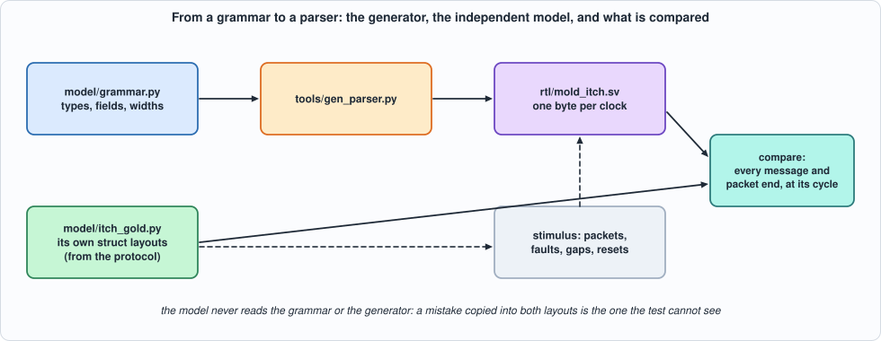
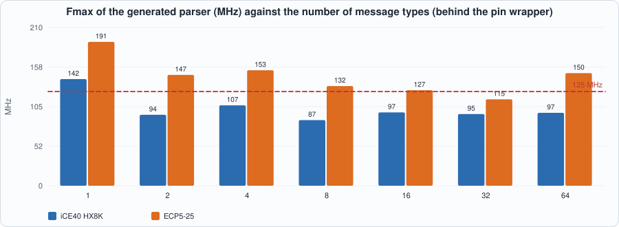
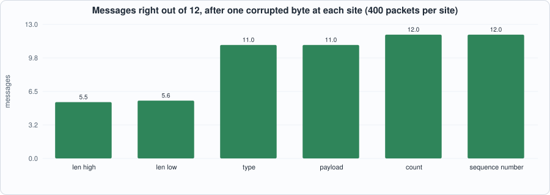

# 16. Exchange Protocols: MoldUDP64 and ITCH, and a Generator That Turns a Message Grammar into a Parser


--8<-- "docs/assets/art/ch-16.md"


**What you will see:** Part 4 begins with the market-data side. An exchange feed is **MoldUDP64** packets (a 20-byte header, then blocks of a 2-byte length and a message) carrying **ITCH** messages (a type byte and fixed-size big-endian fields). The chapter writes the parser **once, as a generator**: a Python **grammar** (message types, field names and widths) goes in, a SystemVerilog parser that consumes **one byte per clock** comes out. The generated parser is checked against a model written separately from the protocol, in two simulators, at the cycle each message appears, on streams full of faults (unknown types, wrong lengths, zero-length blocks, truncated packets, wrong counts, abandoned packets, resets, stray bytes). The first runs found **two bugs in the first generated parser**, and the mutation run found holes in the tests (no zero-length or one-byte blocks, no block over 255 bytes, no reset in the middle of a packet). Two examples measure what a message type costs and what one corrupted byte does.

**What you need to know first:** Chapter 9 (a byte-serial parser, the UDP checksum) and Chapter 6 (golden models and mutation testing).

**What this chapter builds:** `model/grammar.py` (the grammar), `tools/gen_parser.py` (the generator), `rtl/mold_itch.sv` (its output, checked in), `model/itch_gold.py` (the independent specification and the stimulus), `tb/mold_tb.sv`, `tools/ch16_run.py`, `tools/ch16_example_a.py`, `tools/ch16_example_b.py`, `tools/mut_ch16.py`, `tools/make_figs_ch16.py`.

!!! note "Scope: what this chapter leaves out, on purpose"
    **One byte per clock, one message at a time** (Chapter 17 parses several messages per beat). **Fixed-layout messages only**: no variable-length fields, no optional fields, no repeating groups. **No sequencing**: the parser reports the packet's sequence number and the index of each message in it; detecting gaps and asking for retransmission is a separate block. **SoupBinTCP and OUCH** (the order-entry protocols named in the book's plan) are not built here: the generator's structure (a header, then length-prefixed messages) fits SoupBinTCP's framing and an OUCH encoder is the grammar read backwards (Exercises 3 and 4). **The ITCH layouts are from memory**: they are NASDAQ TotalView-ITCH 5.0 as the author remembers it, not checked against the specification, which this sandbox cannot fetch; the machinery does not depend on them, the numbers in the layouts do. The model has its own copy of the layouts, so a typo in one copy is caught; the same misreading in both is not.

## The protocol, as the parser sees it

A UDP payload is a **MoldUDP64 packet**: `session` (10 bytes), `sequence number` of the first message (8), `count` of blocks (2), then `count` **blocks**, each a 2-byte length `L` and `L` bytes of message. Count 0 is a heartbeat; count `0xFFFF` marks the end of the session. An **ITCH message** is a type byte and fixed fields (the first fields of most messages are `locate` 2, `tracking` 2, `timestamp` 6):

| type | message | length (bytes, type included) |
|---|---|---|
| `S` | system event | 12 |
| `A` | add order | 36 |
| `F` | add order with participant id | 40 |
| `E` | order executed | 31 |
| `X` | order cancel | 23 |
| `D` | order delete | 19 |
| `U` | order replace | 35 |
| `P` | trade | 44 |

The parser's contract, written in the generator's header and in `model/itch_gold.py`: bytes arrive as `valid, sop, eop, data` (sop marks the first header byte, eop the last byte of the packet); a **message** comes out registered **the cycle after its last byte** with its type, an **error code** (0 ok, 1 unknown type, 2 length differs from the type's, or is zero), its **index** in the packet, the packet's sequence number and the fields; the **packet end** comes out the cycle after the eop byte, with `trunc` (the packet ended inside the header or inside a block) and `cntbad` (the number of blocks differs from the count, except 0xFFFF). **A new sop abandons a packet in progress silently. Bytes outside a packet are ignored.** A block cut off by the end of the packet produces no message. Fields are valid only for error 0 and only the fields the type has.

## The grammar and the generator

```python
--8<-- "model/grammar.py"
```


*Figure 16.1: the generator, the independent model, and what is compared.*

The generator is about eighty lines of Python that print SystemVerilog. What it emits: a small state machine (`IDLE`, `HDR`, `LENH`, `LENL`, `BODY`), a table of expected lengths by type byte, and **one shift register per field name**, selected by `(type, offset)` terms OR-ed together (a name used by several types, such as `ref` or `shares`, gets one term per type). A multi-byte field is shifted in, big-endian, one byte per clock. Because the type byte is known only at body offset 0, field selects use the *registered* type, and fields start at offset 1 or later; the message is reported on the last body byte, and the next block's length bytes take two cycles, so the field registers are stable while the message is read.

```python
--8<-- "tools/gen_parser.py"
```

The generated parser for ITCH (124 lines, regenerated and compared with the checked-in copy by the test run):

```systemverilog
--8<-- "rtl/mold_itch.sv"
```

## The model

`model/itch_gold.py` is the specification: `decode(packets)` returns the messages and packet ends that must appear, **with their cycles**, from the bytes and the cycle of each byte. It is written from the protocol with `struct` format strings of its own, **not from the grammar or the generator**, and the stimulus generators (`random_packets`, `schedule`) live beside it.

```python
--8<-- "model/itch_gold.py"
```

## The tests

```systemverilog
--8<-- "tb/mold_tb.sv"
```

```python
--8<-- "tools/ch16_run.py"
```

To run: `python3 tools/ch16_run.py` (about a minute). Recorded output:

```text
--8<-- "out/ch16_run_out.txt"
```

**Reading the output.**

- **Section 1:** the generator is deterministic and the checked-in RTL is exactly its output; the parser lints clean in Verilator and Yosys.
- **Section 2 shows what the stimulus contains**: 480 packets, of which 445 are clean, 7 have a wrong count, 12 are truncated and 16 are left open (no eop); messages of every type and 33 with an error (unknown type 20, bad length 13), plus zero-length blocks, one-byte blocks and blocks longer than 255 bytes, resets in the middle of a packet and stray bytes (some with an eop) between packets.
- **Section 3: all 24 runs equal the model in Icarus (and the first of each kind in Verilator)**, on four kinds of stream (mixed, faults only, well formed, long packets of up to 40 messages), with idle cycles of three densities. Every message is checked for type, error, index, sequence number and the fields its type has, and **every one at its cycle**.
- **Section 4 runs the same generator on a different grammar** (two message types, a 3-byte, a 1-byte and a 10-byte field) and compares it with expectations computed from the bytes directly: all 88 messages equal. The generator is not tied to ITCH.

**What the tests found in the first generated parser.** Two bugs were shown by the first run, and two I fixed on re-reading the generated text before the first simulation:

1. the **message index** printed one too many (the register was incremented in the same clock that reported the message): the index is now the block counter's value *before* the block is counted;
2. the **packet-end check read the count before its last byte had arrived** for a header-only packet (a heartbeat): the count is now taken from the byte on the wire in that cycle;
3. (before the first run) a **stray eop outside a packet** would have produced a packet end: the packet-end rule now requires a packet in progress (the mutation run later showed that the stimulus had no stray eop to test it);
4. (before the first run) the **field select was not gated by the state**, so stale type and error registers would have selected fields during a header: it is gated by `st == BODY`.

## Running example A: what a message type costs

```python
--8<-- "tools/ch16_example_a.py"
```

To run: `python3 tools/ch16_example_a.py`. Recorded output:

```text
--8<-- "out/ch16_example_a_out.txt"
```


*Figure 16.2: the Fmax of the generated parser, behind a wrapper, for 1 to 64 message types.*

- **Measured:** the 8-type ITCH parser is **287 LUTs and 87.1 MHz on iCE40, 315 LUTs and 132.3 MHz on ECP5**, behind the pin wrapper; at one byte per clock that is 697 and 1,058 Mbit/s. **On ECP5 this is above 125 MHz, by 6%, as Chapter 9's filter was (155.6 MHz); on iCE40 it is not** (the wrapper that registers and folds the outputs and is itself part of the path; the critical path is from the offset counter to a field register on iCE40 and from the input shift register to the error register on ECP5).
- **The cost of a type is small and the numbers are not smooth**: from 8 to 64 types (the same twelve field names, so only the type table and the field selects grow) the iCE40 LUT count goes from 287 to 289 and ECP5 from 315 to 396; below 8 types the count falls as types are added (228, 270, 287 LUTs for 2, 4, 8) because the subsets have different field sets and the optimiser merges differently. **Read the 8-to-64 rows as the cost of the type table (about 0 to 1.5 LUT per type); read the others as noise of the order of 20%.** The Fmax moves by 10 to 20 MHz for no reason the grammar explains, which is placement.
- **Derived, not measured:** the parser spends `length + 2` cycles per message (the two length bytes), so a 36-byte Add Order is 38 cycles: 2.3 million messages per second on iCE40 and 3.5 on ECP5 at those clocks. A feed's rate is set by the exchange; whether this is enough depends on it, and Chapter 17 is about not being limited to one byte per clock.

## Running example B: what one corrupted byte does

```python
--8<-- "tools/ch16_example_b.py"
```

To run: `python3 tools/ch16_example_b.py`. Recorded output:

```text
--8<-- "out/ch16_example_b_out.txt"
```


*Figure 16.3: after one corrupted byte, how many of 12 messages come out right.*

- **Measured, derived, and what it means:** a corrupted **type byte** is flagged every time (unknown type, or the wrong length for the type) and costs one message (11 of 12 right); a corrupted **payload byte** is **never flagged** and the corrupted message is accepted with error 0: no check at this layer can see it, and the UDP checksum (Chapter 9) is what guards payloads. A corrupted **count** is flagged every time and costs nothing; a corrupted **sequence number** is not flagged (only a sequencer that compares it with the last one can).
- **A corrupted length byte is the dangerous one**: it moves every later block boundary. The parser flagged **all 800** such packets (a truncation, a wrong count or an error), but it delivered only the messages before the damage: **5.46 right of 12 for the high byte and 5.61 for the low**, against a derived 5.5 (the damage position is uniform over the 12 messages), and **it accepted no garbage message as valid in 800 packets**: to frame as a valid message a block needs a type byte of the grammar *and* the exact length of that type, which random bytes rarely have. The packet is lost from the damage on and the next packet is clean, because a sop restarts the parse: **a parser that resynchronises at every packet boundary loses at most one packet to a corrupted length.**
- The RTL equals the model on 100 corrupted packets (all sites mixed).

## Testing the tests

Three families of mutants, one battery (the parser against the independent model on four kinds of stream, every message and packet end at its cycle, Icarus):

1. **the generated RTL**, mutated as text (40 mutants);
2. **the generator**, mutated, the RTL regenerated from the unmutated grammar (5): a bug in the generator is a bug in every parser it will ever make;
3. **the grammar**, mutated, the RTL regenerated (6): a wrong layout must disagree with the model, which has its own copy.

```python
--8<-- "tools/mut_ch16.py"
```

To run: `python3 tools/mut_ch16.py` (about ten minutes). Recorded output:

```text
--8<-- "out/ch16_mut_out.txt"
```

**Result: 51 of 51 caught.** The first run caught 38 of 53, and the 15 survivors tell what the first stimulus lacked:

| survivors of the first run | what the stimulus lacked | what was done |
|---|---|---|
| a zero-length block not reported, not counted, reported as the wrong error; the error and the type of a **one-byte block**; the message index of a zero-length block | **no block of length 0 or 1 was ever generated** | the fault generator makes them (and the hand-checked scenario in the model has one) |
| the offset counter does not saturate | **no block longer than 255 bytes** | blocks of 250 to 520 bytes of random data |
| a stray eop outside a packet reports a packet end; a packet end does not return to idle; bytes outside a packet start a packet | stray bytes never carried an eop | stray bytes sometimes do |
| a one-byte packet is not reported | one-byte packets were too rare | made common |
| reset does not stop a packet | **the testbench pulled reset only at the start** | a `rst` bit in the stimulus and a reset in the middle of a packet; the rest of the packet arrives as stray bytes |
| fields captured whatever the error; fields captured outside the body | **outside the contract**: the fields are valid only for error 0 and for the fields the type has, and every message overwrites all of them | dropped, and the contract stated |
| (generator) the length of a type leaves out the type byte | BAD ANCHOR: the function is in the grammar file | moved to the grammar family |

One more finding of the same kind: stray bytes **after a packet that was left open** (no eop) are, by the parser's rule, a continuation of that packet, and the first stimulus put them there and the model expected them to be ignored: the first full run failed with **101 events against 99**. The spec now says so, and so does the stimulus (no stray bytes after an open packet).

## What this chapter established, and what it did not

**Established, with the tests that show it:** a grammar-driven generator produces a parser that equals an independent model, message by message and **cycle by cycle**, on streams full of faults, in two simulators, for ITCH and for a second grammar; one byte per clock; 87 MHz on iCE40 and **132 MHz on ECP5** for the 8-type parser (behind a wrapper); a corrupted length costs the rest of one packet and nothing more; and **51 of 51 mutants of the RTL, the generator and the grammar are caught**.

**Not established:** the **layouts themselves** against the exchange's specification (they are from memory); anything above one byte per clock (Chapter 17); gap detection, retransmission and the **sequencer**; SoupBinTCP and OUCH; **variable-length** fields; throughput on a real feed (the book has no capture); and the ECP5 clock without the wrapper's registers. The generator's **independence from the model** is by construction, not by author: the same person wrote both.

## Self-check questions

1. What is in a MoldUDP64 packet, and what does the count mean at 0 and at 0xFFFF?
2. Why does the parser report a message on its last byte, and not on its first?
3. What does the generator emit for a field name used by three message types?
4. Why must the field selects use the registered type and start at offset 1?
5. Why is the model written without reading the grammar? What mistake can the test still not see?
6. What happens to a packet that ends inside a block? To one with a new sop in the middle?
7. Why is the message index the block counter's value *before* counting?
8. What was wrong with the count check on a heartbeat packet in the first version?
9. Which corruption sites does the parser flag, and which can it not? What guards the others?
10. Why does one corrupted length byte cost at most one packet?
11. Why can the parser accept almost no garbage as a valid message after losing its framing?
12. Name three survivors of the first mutation run and say what each shows about the stimulus.

## Exercises

1. **Gap detection.** Add a sequencer that remembers the next expected sequence number, flags a gap, and ignores a packet whose numbers it has already seen. Extend the model and the faults.
2. **A variable-length field.** Add a message type with a length-prefixed string; extend the grammar language, the generator and the model. What changes in the field select?
3. **SoupBinTCP.** The framing is a 2-byte length, a packet type byte and a payload: write its grammar for login, heartbeat and sequenced data, and generate its parser from the same generator.
4. **An OUCH encoder.** Read the grammar backwards: generate a module that takes field values and emits the bytes of an Enter Order message, one byte per clock. Test it with the model's decoder.
5. **A mutant that survives.** Add a mutant to `tools/mut_ch16.py` that the battery does not catch. Is it equivalent, outside the contract, or is a test missing?
